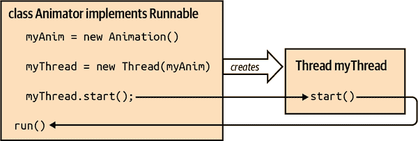
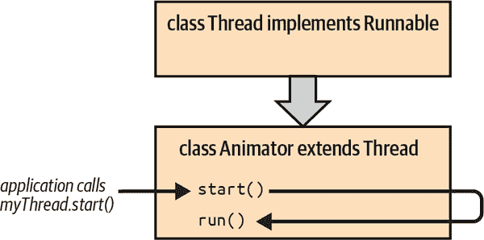
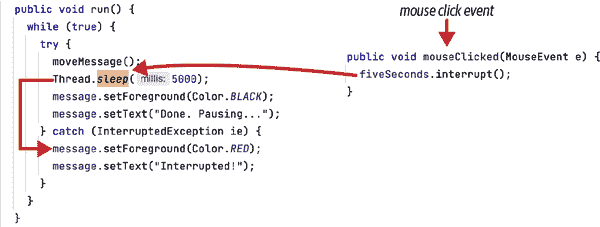
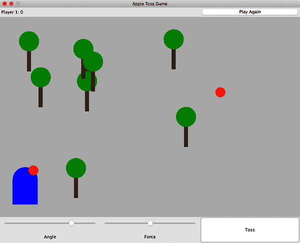
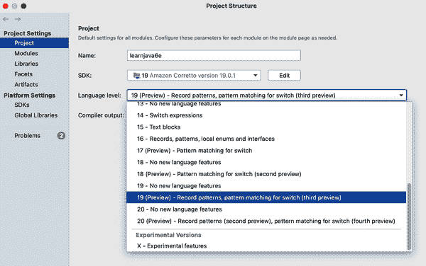
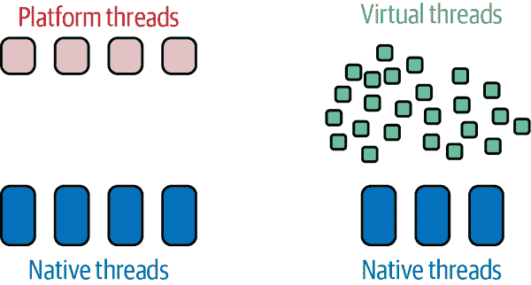
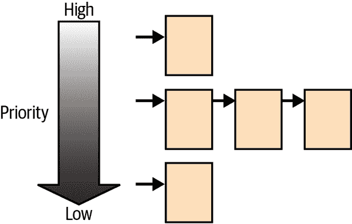
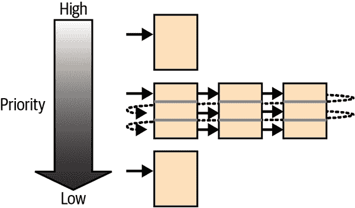

# 第九章 线程

我们理所当然地认为现代计算机系统可以同时管理许多应用程序和操作系统（OS）任务，并使所有软件看起来同时运行。今天大多数系统都配备了多个处理器或多个核心，有了这些，它们可以实现令人印象深刻的并发度。操作系统仍然在更高层次上调度应用程序，但是它的注意力转向下一个应用程序的速度如此之快，以至于它们也看起来在同时运行。

###### 注意

在编程中，*并发*操作表示多个通常不相关的任务同时运行。想象一下，一个快餐厨师在烤架上同时准备多份订单。*并行*操作通常涉及将一个大任务分解为相关的子任务，这些子任务可以并行运行以更快地产生最终结果。我们的厨师可以通过同时在烤架上放置两个肉饼和一些培根来“并行”准备一份双层芝士汉堡。无论哪种情况，程序员通常更广泛地讨论这些任务和子任务同时发生的情况。这并不意味着一切都在完全相同的瞬间开始和停止，但确实意味着这些任务的执行时间是重叠的。

在旧时，操作系统的并发单位是应用程序或*进程*。对于操作系统来说，一个进程或多或少是一个自行决定要做什么的黑盒子。如果一个应用程序需要更高的并发性，它只能通过运行多个进程并在它们之间进行通信来实现，但这是一种笨重的方法，不太优雅。

后来，操作系统引入了线程的概念。从概念上讲，*线程*是程序内的控制流。（例如，你可能听说过“执行线程”）线程在应用程序自己的控制下提供了细粒度的并发性。线程已经存在很长时间，但历来使用起来比较棘手。Java 并发工具集解决了多线程应用程序中的常见模式和实践，并将它们提升到了可操作的方法和类的级别。总体来说，这意味着 Java 在更高和更低的层次上都支持线程。

这种广泛的支持使得程序员更容易编写多线程代码，并且使编译器和运行时可以对该代码进行优化。这也意味着 Java 的 API 充分利用了线程，因此在探索 Java 的早期阶段，熟悉这些概念至关重要。并非所有开发人员都需要编写明确使用线程或并发性的应用程序，但大多数人会使用涉及它们的某些功能。

线程在许多 Java API 的设计中起着重要作用，特别是那些涉及客户端应用程序、图形和声音的部分。例如，在我们看 GUI 编程时的第十二章，你会看到组件的`paint()`方法不是直接由应用程序调用，而是由 Java 运行时系统内的一个单独的绘图线程调用。在任何给定时间，许多这样的后台线程可能会在你的应用程序旁边执行活动，但你仍然会及时更新屏幕。在服务器端，Java 线程同样存在，为每个请求提供服务并运行你的应用程序。了解你的代码如何适应这种环境至关重要。

在本章中，我们将讨论编写显式创建和使用自己线程的应用程序。我们将首先讨论集成到 Java 语言中的低级线程支持，然后讨论`java.util.concurrent`线程实用工具包。我们还将讨论在 Java 19 中预览的新虚拟线程，项目称为 Project Loom。

# 引入线程

线程类似于*进程*或正在运行的程序的概念，不同的是，同一应用程序中的不同线程比同一台机器上运行的不同程序更密切相关，并且共享大部分相同的状态。这有点像许多高尔夫球手同时使用的高尔夫球场。线程协作以共享工作区域。它们轮流等待其他线程。它们可以访问相同的对象，包括其应用程序内的静态和实例变量。但是，线程拥有其自己的局部变量副本，就像球员共享高尔夫球场或高尔夫球车但不共享球棒或球一样。

应用程序中的多个线程面临与球场上高尔夫球手相同的问题，简言之，*同步*。就像不能同时有两组球员在同一绿地上打球一样，不能有多个线程尝试在没有某种协调的情况下访问相同的变量。否则，某些人可能会受伤。线程可以保留使用对象的权利，直到完成其任务，就像高尔夫聚会在每个球员完成比赛之前独占绿地。更重要的线程可以提高其优先级，断言其“优先通过”的权利。

当然，细节决定成败，长久以来，线程细节使其难以使用。幸运的是，Java 通过直接将一些这些概念集成到语言中，使创建、控制和协调线程变得更简单。

当你第一次使用线程时，很容易会遇到困难。创建一个线程将同时练习你的新 Java 技能。只要记住在运行线程时始终涉及两个主要角色：一个 Java `Thread`对象代表线程本身，以及一个包含线程将执行的方法的任意目标对象。稍后，我们将看到如何结合这两个角色，但这些方法只是改变了封装，而不是改变了它们的关系。

## 线程类和可运行接口

在 Java 中，所有的执行都与一个`Thread`对象相关联，从 JVM 启动的“主”线程开始，用于启动你的应用程序。当你创建`java.lang.Thread`类的一个实例时，就会诞生一个新的线程。`Thread`对象表示 Java 解释器中的一个真实线程，并作为控制和协调其执行的句柄。通过它，你可以启动线程，等待它完成，使其休眠一段时间，或者中断其活动。

`Thread`类的构造函数接受关于线程应该从哪里开始执行的信息。我们想告诉它要运行哪个方法。有很多方法可以做到这一点。经典的方法使用`java.lang.Runnable`接口来标记包含“可运行”方法的对象。

`Runnable`定义了一个单一的通用`run()`方法：

```java
  public interface Runnable {
    abstract public void run();
  }
```

每个线程都通过执行`run()`方法来启动其生命周期，该方法位于一个`Runnable`对象中，这个对象是传递给线程构造函数的“目标对象”。`run()`方法可以包含任何代码，但必须是公共的，不接受任何参数，没有返回值，并且不会抛出已检查异常。

任何包含适当`run()`方法的类都可以声明实现`Runnable`接口。该类的一个实例成为一个可运行对象，可以作为新线程的目标。如果你不想直接将`run()`方法放在你的对象中（很多时候确实不想这样做），你总是可以创建一个作为你的`Runnable`的适配器类。适配器的`run()`方法可以在线程启动后调用任何它想要的方法。稍后我们会展示这些选项的示例。

### 创建和启动线程

一个新生的线程保持空闲，直到我们通过调用其`start()`方法来唤醒它。线程随后醒来并继续执行其目标对象的`run()`方法。`start()`方法在线程的生命周期中只能调用一次。一旦线程启动，它会继续运行，直到目标对象的`run()`方法返回或抛出未检查异常。

下面的类`Animator`实现了一个`run()`方法来驱动绘图循环。我们可以在游戏中类似地使用它来更新游戏场地：

```java
class Animator implements Runnable {
  boolean animating = true;

  public void run() {
    while (animating) {
      // move active apples one "frame"
      // repaint the field
      // pause
      // ...
    }
  }
}
```

要使用它，创建一个`Thread`对象，将一个`Animator`的实例作为其目标对象传递给它，并调用其`start()`方法：

```java
    Animator myAnimator = new Animator();
    Thread myThread = new Thread(myAnimator);
    myThread.start();
```

我们创建了 `Animator` 类的一个实例，并将其作为参数传递给 `myThread` 的构造函数。正如在 Figure 9-1 中所示，当我们调用 `start()` 方法时，`myThread` 开始执行 `Animator` 的 `run()` 方法。



###### 图 9-1\. 作为 `Runnable` 实现的动画师

让表演开始！

### 天生的线程

`Runnable` 接口允许你将任意对象作为线程的目标，就像前面的例子一样。这是 `Thread` 类最重要的通用用法。在大多数需要使用线程的情况下，你会创建一个类（可能是一个简单的适配器类），该类实现了 `Runnable` 接口。

另一种创建线程的设计选项是使我们的目标类成为已经可运行的类型的子类。事实证明，`Thread` 类本身方便地实现了 `Runnable` 接口；它有自己的 `run()` 方法，我们可以直接重写它来完成我们的任务：

```java
class Animator extends Thread {
  boolean animating = true;

  public void run() {
    while (animating) {
      // draw Frames
      // do other stuff ...
    }
  }
}
```

我们的 `Animator` 类的骨架看起来与之前大致相同，只是现在我们的类是 `Thread` 的子类。为了配合这个方案，`Thread` 类的默认构造函数使自己成为默认目标——也就是说，默认情况下，当我们调用 `start()` 方法时，`Thread` 执行它自己的 `run()` 方法，正如 Figure 9-2 中所示。现在我们的子类可以简单地重写 `Thread` 类中的 `run()` 方法。（`Thread` 本身定义了一个空的 `run()` 方法。）



###### 图 9-2\. 作为 `Thread` 子类的动画师

接下来，我们创建了 `Animator` 的一个实例，并调用了它的 `start()` 方法（它也继承自 `Thread`）：

```java
    Animator bouncy = new Animator();
    bouncy.start();
```

扩展 `Thread` 看起来可能是打包线程及其目标 `run()` 方法的便利方式。然而，这种方法通常不是最佳设计。如果你扩展 `Thread` 来实现一个线程，那么你是在说你需要一个新类型的对象，它是 `Thread` 的一种，公开 `Thread` 类的所有公共方法。虽然将一个主要关注执行任务的对象变成 `Thread` 有一种满足感，但实际情况下，你需要创建 `Thread` 子类的情况应该并不常见。在大多数情况下，更自然的做法是让程序的需求决定类结构，并使用 `Runnable` 来连接程序的执行和逻辑。

## 控制线程

现在你已经看到了使用 `start()` 方法来开始执行一个新线程，让我们来看看在运行时显式控制线程行为的实例方法：

`Thread.sleep()` 方法

使当前正在执行的线程等待指定的一段时间（多多少少），而不消耗太多（或可能根本没有）CPU 时间。

`wait()` 和 `join()` 方法

协调两个或多个线程的执行。在本章后面讨论线程同步时，我们将详细讨论它们。

`interrupt()`方法

唤醒正在执行`sleep()`或`wait()`操作中的线程，或者正在长时间 I/O 操作中被阻塞的线程。^(1)

### 弃用的方法

我们还应该提到三个已弃用的线程控制方法：`stop()`、`suspend()`和`resume()`。`stop()`方法与`start()`方法相辅相成；它销毁线程。`start()`方法和已弃用的`stop()`方法只能在线程生命周期中调用一次。相比之下，已弃用的`suspend()`和`resume()`方法会任意暂停然后重新启动线程的执行。

尽管这些弃用的方法仍然存在于最新版本的 Java 中（而且可能会永远存在），但不应在新代码开发中使用。`stop()`和`suspend()`方法的问题在于它们以不协调和粗暴的方式控制线程的执行。

您可以创建并监视一些变量作为影响线程执行的更好方式（如果这些变量是`boolean`类型，您可能会看到它们被称为“标志”）。本书中早期的线程示例在某种程度上使用了这种技术。后续示例将介绍并发类可用的其他一些控制特性。

### `sleep()`方法

程序员通常需要告诉一个线程在一段时间内保持空闲或“睡眠”。例如，您可能需要等待某些外部资源变为可用。即使是我们简单的动画线程在帧之间也会有小的暂停。当一个线程在睡眠或其他方式被某种形式的输入阻塞时，它不会消耗 CPU 时间或与其他线程竞争处理。对于这样的暂停，我们可以调用静态方法`Thread.sleep()`，它会影响当前执行的线程。调用使得线程空闲指定的毫秒数：

```java
    try {
      // The current thread
      Thread.sleep(1000);
    } catch (InterruptedException e) {
      // someone woke us up prematurely
    }
```

如果`sleep()`方法被`interrupt()`方法中断，可能会抛出`InterruptedException`异常（详见下文）。正如您在前面的代码中看到的那样，线程可以捕获此异常并利用这个机会执行某些操作——比如检查一个变量来确定线程是否应该退出——然后继续睡眠。

### `join()`、`wait()`和`notify()`方法

如果需要通过等待另一个线程完成其任务来协调线程的活动，可以使用`join()`方法。调用线程的`join()`方法会导致该线程阻塞，直到目标线程完成为止。或者，可以将`join()`方法与等待的毫秒数作为参数一起调用。在这种形式下，调用线程会等待直到目标线程完成或指定的时间段过去。这是一种非常粗糙的线程同步方式。

如果您需要将线程的活动与其他资源协调起来，例如检查文件或网络连接的状态，则可以使用`wait()`和`notify()`方法。在线程上调用`wait()`将暂停它，类似于使用`join()`，但它会保持暂停状态，直到另一个线程通过`interrupt()`中断它，或者您自己在线程上调用`notify()`。

Java 支持更一般和更强大的机制来协调线程活动，位于`java.util.concurrent`包中。我们将在本章后面向您展示此包的更多内容。

### `interrupt()` 方法

`interrupt()` 方法基本上做了它说的事情。它中断了线程的正常执行流程。如果该线程在`sleep()`、`wait()`或耗时的 I/O 操作中空闲，则会唤醒。当中断线程时，其*中断状态*标志将被设置。您可以使用`isInterrupted()`方法测试此标志。您还可以使用一个替代形式`isInterrupted(boolean)`来指示您是否希望线程在检索当前值后清除其中断状态。

尽管您可能不经常使用`interrupt()`，但它绝对会派上用场。如果您曾经因桌面应用程序试图连接到服务器或数据库而变得不耐烦，但却失败了，那么您就经历过其中一个可能需要中断的时刻。

让我们通过一个小型图形应用程序模拟这种情况。我们将在屏幕上显示一个标签，并将其移动到每五秒钟的新位置。在那五秒的暂停期间，屏幕上的任何位置的点击都会中断暂停。我们将更改消息，然后再次启动随机移动周期。您可以从*ch09/examples/Interruption.java*运行完整的示例，但图 9-3 突出了调用`interrupt()`的流程和效果。



###### 图 9-3\. 中断线程

## 重温线程动画

管理动画是图形界面中的常见任务。有时动画是微妙的过渡；其他时候，它们是应用程序的焦点，就像我们的苹果投掷游戏一样。我们将介绍处理动画的两种方式：在`sleep()`函数旁边使用简单的线程，以及使用计时器。将其中一种选项与某种类型的步进或“下一帧”函数配对是一种流行且易于理解的方法。

你可以使用类似于“创建和启动线程”的线程来生成真实的动画。基本思想是绘制或定位所有动画对象，暂停，将它们移动到它们的下一个位置，然后重复。让我们首先看看如何在没有动画的情况下绘制游戏场地的一些部分。除了现有的树木和篱笆列表外，我们还将为任何活跃的苹果添加一个新的`List`。您可以从*ch09/examples/game*文件夹中的编辑器中检索此代码：

```java
// From the Field class...
  protected void paintComponent(Graphics g) {
    g.setColor(fieldColor);
    g.fillRect(0,0, getWidth(), getHeight());
    physicist.draw(g);
    for (Tree t : trees) { t.draw(g); }
    for (Hedge h : hedges) { h.draw(g); }
    physicist.draw(g);
    for (Apple a : apples) { a.draw(g); }
  }

// And from the Apple class...
  public void draw(Graphics g) {
    // Make sure our apple will be red, then paint it!
    g.setColor(Color.RED);
    g.fillOval(x, y, scaledLength, scaledLength);
  }
```

我们首先绘制背景场地，然后是树木和篱笆，然后是我们的物理学家，最后是任何苹果。最后绘制苹果可以确保它们显示在其他元素的上方。

当您玩游戏时屏幕上发生了什么变化？真正可以移动的只有两个“可移动”物品：我们的物理学家瞄准的苹果，以及被投掷后正在飞行的任何苹果。物理学家响应用户输入（通过移动鼠标或单击按钮）来瞄准，这不需要单独的动画，所以我们将在第十二章中添加这个功能。现在，我们可以专注于处理飞行的苹果。

我们游戏的动画步骤应该根据重力规则移动每个处于活跃状态的苹果。首先，在我们的`Apple`类中添加一个`toss()`方法，我们可以使用来自我们物理学家的信息设置苹果的初始条件（因为物理学家目前还没有交互，我们将伪造一些数据）。然后，在`step()`方法中为给定的苹果进行一次移动：

```java
// File: ch09/examples/game/Apple.java

  // Parameters provided by the physicist
  public void toss(float angle, float velocity) {
    lastStep = System.currentTimeMillis();
    double radians = angle / 180 * Math.PI;
    velocityX = (float)(velocity * Math.cos(radians) / mass);
    // Start negative since "up" means smaller values of y
    velocityY = (float)(-velocity * Math.sin(radians) / mass);
  }

  public void step() {
    // Make sure the apple is still moving
    // using our lastStep tracker as a sentinel
    if (lastStep > 0) {
      // Apply the law of gravity to the apple's vertical position
      long now = System.currentTimeMillis();
      float slice = (now - lastStep) / 1000.0f;
      velocityY = velocityY + (slice * Field.GRAVITY);
      int newX = (int)(centerX + velocityX);
      int newY = (int)(centerY + velocityY);
      setPosition(newX, newY);
    }
  }
```

我们首先在`toss()`方法中计算苹果将移动的速度（`velocityX`和`velocityY`变量）。在我们的`step()`方法中，根据这两个速度更新苹果的位置，然后根据重力强度调整垂直速度。这不是很花哨，但它将为苹果产生一个不错的弧线。然后我们将该代码放入一个循环中，该循环将执行更新计算、重绘场地和苹果、暂停并重复：

```java
// File: ch09/examples/game/Field.java

// duration of an animation frame in milliseconds
public static final int STEP = 40;

// ...
// A simple inner class with our run() method
class Animator implements Runnable {
  public void run() {
    // "animating" is a global variable that allows us
    // to stop animating and conserve resources
    // if there are no active apples to move
    while (animating) {
      System.out.println("Stepping " + apples.size() +
          " apples");
      for (Apple a : apples) {
        a.step();
      }
      // Reach back to our outer class instance to repaint
      Field.this.repaint();
      // And get rid of any apples on the ground
      cullFallenApples();
      try {
        Thread.sleep(STEP);
      } catch (InterruptedException ie) {
        System.err.println("Animation interrupted");
        animating = false;
      }
    }
  }
}
```

我们将在一个简单的线程中使用这个`Runnable`的实现。我们的`Field`类将保留一个线程的实例，并包含以下简单的`start`方法：

```java
// File: ch09/examples/game/Field.java
  Thread animationThread;

  // other state and methods ...

  void startAnimation() {
    animationThread = new Thread(new Animator());
    animationThread.start();
  }
```

我们将在“事件”中讨论事件；您将使用这些事件来命令启动一个苹果。现在，我们将自动启动一个苹果，如图 9-4 所示。



###### 图 9-4：动作中的可抛苹果

它作为静止截图看起来并不起眼，但实际上却令人惊叹。 ;^)

# 线程的终结

一切美好的事情都有结束的时候。一个线程会一直执行，直到发生以下三种情况之一：

+   它明确地从其目标`run()`方法返回。

+   它遇到了一个未捕获的运行时异常。

+   讨厌的、已弃用的`stop()`方法被调用。

如果这些情况都不发生，线程的`run()`方法永远不会终止会发生什么？即使创建它的代码已经完成，线程仍然可以继续存在。您必须了解线程如何最终终止，否则您的应用程序可能会继续运行未必要地消耗资源，甚至在本应退出时仍保持应用程序的生存。

在许多情况下，你需要在应用程序中执行简单周期任务的后台线程。你可以使用 `setDaemon()` 方法创建其中一个后台工作者，并将线程标记为*守护*线程。守护线程可以像其他线程一样终止，但如果启动它们的应用程序正在退出，当没有其他非守护应用程序线程存在时，它们应该被终止和丢弃。^(2) 通常，Java 解释器会继续运行直到所有线程完成。但是当只有守护线程仍然存活时，解释器将退出。

这是一个使用守护线程的“恶魔式”大纲：

```java
class Devil extends Thread {
  Devil() {
    setDaemon(true);
    start();
  }
  public void run() {
    // perform some tasks
  }
}
```

在这个例子中，`Devil` 线程在创建时设置了它的守护进程状态。如果我们的应用程序在其他方面完成后仍有任何 `Devil` 线程存在，运行时系统会为我们终止它们。我们不需要担心清理它们。

关于优雅终止线程的最后一点说明。新的开发人员在第一次使用图形 Swing 组件创建应用程序时经常遇到一个常见问题：他们的应用程序永远不会退出。在一切都完成并且应用程序窗口关闭之后，Java VM 似乎会无限期地挂起。Java 创建一个 UI 线程来处理输入和绘画事件。这个 UI 线程不是守护线程，因此当其他应用程序线程完成时，它不会自动退出。开发人员必须显式调用 `System.exit()`。如果你想想的话，这是有道理的。因为大多数 GUI 应用程序是事件驱动的并且等待用户输入，否则它们会在启动代码完成后退出。

# 虚拟线程

在 Java 19 中预览，并在 Java 21 中最终确定，Project Loom^(3) 为 Java 带来了轻量级虚拟线程。Project Loom 的主要目标之一是改进 Java 中的线程生态系统，使开发人员可以花更少的精力来保持多线程应用程序的稳定性，更多地解决高层次的问题。

## 预览特性插曲

“在 Java 19 中预览”的意思是什么？从 Java 12 开始，Oracle 开始引入一些语言特性作为*预览*。这些预览特性有明确的规范并且完全实现，但并不完全成熟。Oracle 可能在未来的版本中做出重大修改。最终，这些特性要么成为 JDK 的永久部分，要么被移除。Oracle 为每个新的 Java 发布版本制作语言更新页面，其中包含对语言最近更改的良好历史以及[预览特性概述](https://oreil.ly/5MuMw)。

因为任何给定的预览特性最终可能被从 Java 中删除，Oracle 要求你在编译或运行使用它的应用程序时包含特殊标志。这个要求是一个小的防护栏，以确保你不会意外使用可能在将来的 Java 版本中不起作用的代码。

### 配置 IDE 以使用预览特性

如果您使用 IDE 进行演示和练习，可能需要配置它以支持预览功能。例如，IntelliJ IDEA 默认情况下不支持预览功能。您需要在“File → Project Structure”对话框中更改设置，如图 9-5 所示。



###### 图 9-5\. 在 IntelliJ IDEA 中启用 Java 的预览功能

在 SDK 下拉菜单中选择您想要的 Java 版本后，您可以通过在“Language level”下拉菜单中选择适当选项来启用预览功能支持。（IDEA 列出的特性与版本号旁边的特性不是详尽列表。）设置语言级别后，单击“OK”，IDEA 应该已准备好编译和运行任何具有预览功能的代码。

### 重命名预览源文件

`VirtualDemo` 类（*ch09/examples/VirtualDemo.java.preview*）使用虚拟线程在发出我们最喜欢的“Hello Java”问候之前暂停片刻。在您可以编译或运行它之前，您需要将其重命名。我们在包含代码中的任何预览功能的文件上添加了 *.preview* 后缀。该后缀阻止像 IntelliJ IDEA 这样的 IDE 在您配置预览支持之前积极地编译它们，就像我们在前一节中提到的那样。

您可以在 IntelliJ IDEA 中使用上下文（右键单击）菜单，在“重构”菜单项下重命名文件。您还可以在 Linux 或 macOS 终端中使用 *mv* 命令快速重命名文件：

```java
% cd ch09/examples
% mv VirtualDemo.java.preview VirtualDemo.java
% cd ../..
```

在 Windows 终端或命令提示符中，您可以使用 *rename* 命令：

```java
C:\> cd ch09\examples
C:\> rename VirtualDemo.java.preview VirtualDemo.java
C:\> cd ..\..
```

### 编译具有预览功能的类

Oracle 为使用预览功能编译代码添加了一对命令行选项。例如，如果您尝试使用 Java 19 编译我们的 `VirtualDemo` 源文件，您可能会看到类似于这样的错误：

```java
% javac --version
javac 19.0.1

% javac VirtualDemo.java
VirtualDemo.java:4: error: startVirtualThread(Runnable)
 is a preview API and is disabled by default.
    Thread thread = Thread.startVirtualThread(runnable);
                          ^
  (use --enable-preview to enable preview APIs)
```

错误为我们提供了一个关于我们应该如何继续的提示。让我们尝试添加建议的标志并再次编译：

```java
% javac --enable-preview VirtualDemo.java
error: --enable-preview must be used with either -source or --release
```

糟糕！又是另一个不同的错误。至少它也包含了一些提示。要编译，您需要提供*两个*标志：`--enable-preview`，然后是 `-source` 或 `--release`。^(4) 编译器使用 `-source` 来指定适用于正在编译的源代码的语言规则。（编译后的字节码仍针对与您的 JDK 相同版本的 Java。）您可以使用 `--release` 选项来同时指定源版本和字节码版本。

虽然有许多场景可能需要为旧系统编译，但预览功能是用于当前 JDK 版本的。因此，当我们在书中使用任何预览功能时，我们将使用 `--enable-preview` 与 `--release` 并简单地给出与我们的 Java 版本相同的发布版本号。例如，返回到我们的虚拟线程预览功能，我们可以使用 Java 19 来尝试它。我们最终的正确 *javac* 调用如下所示：

```java
% javac --version
javac 19.0.1

% javac --enable-preview --release 19 VirtualDemo.java
Note: VirtualDemo.java uses preview features of Java SE 19.
Note: Recompile with -Xlint:preview for details.
```

"notes"这个名词在编译完成后出现，纯粹是提供信息。它们提醒您的代码依赖于未来可能不再可用的不稳定功能。这些注释并非意在劝阻您使用这些功能，但如果您计划与其他用户或开发者共享代码，则需要记住一些额外的兼容性约束。

如果您好奇，您还可以使用注释中提到的`-Xlint:preview`选项来查看到底是哪些预览代码引起了警告：

```java
src$ javac --enable-preview --release 19 -Xlint:preview VirtualDemo.java
VirtualDemo.java:4: warning: [preview] startVirtualThread(Runnable)
 is a preview API and may be removed in a future release.
    Thread thread = Thread.startVirtualThread(runnable);
                          ^
1 warning
```

没有什么意外的，但话说回来，这只是一个微小的演示程序。对于更大的程序或团队开发的代码来说，那额外的`-Xlint:preview`标志就非常方便了。

### 运行预览类文件

运行包含预览功能的 Java 类也需要`--enable-preview`标志。如果您尝试像运行任何其他类一样使用 Java 19 运行`VirtualDemo`，您将收到如下错误：

```java
% java VirtualDemo
Error: LinkageError occurred while loading main class VirtualDemo
        java.lang.UnsupportedClassVersionError: Preview features are not
        enabled for VirtualDemo (class file version 63.65535).
        Try running with '--enable-preview'
```

再次，您可以使用错误中提到的`--enable-preview`标志，然后您可以开始：

```java
% java --enable-preview VirtualDemo
Hello virtual thread! ID: 20
```

如果您想在*jshell*中尝试预览功能，也可以提供相同的`--enable-preview`标志：

```java
% jshell --enable-preview
```

包含该标志将允许 Java 19 的*jshell*会话使用虚拟线程，就像它允许我们运行上面的演示程序一样。

## 快速比较

Loom 团队设计了它的虚拟线程，以便在您已经具有一些 Java 线程技能的情况下易于使用。让我们重新设计我们用来测试`--enable-preview`标志的微不足道的线程示例，以展示两种类型的线程：

```java
public class VirtualDemo2 {
  public static void main(String args[]) throws Exception {
    Runnable runnable = new Runnable() {
      public void run() {
        Thread t = Thread.currentThread();
        System.out.println("Hello thread! " +
            (t.isVirtual() ? "virtual " : "platform ") +
            "ID: " + t.threadId());
      }
    };
    Thread thread1 = new Thread(runnable);
    thread1.start();
    Thread thread2 = Thread.startVirtualThread(runnable);
    thread1.join();
    thread2.join();
  }
}
```

在这次重新编排中，我们扩展了我们的匿名`Runnable`内部类，对当前线程进行了一些侦查。我们打印出线程的标识号以及它是否是虚拟线程。但请看启动这两个线程的行代码多么相似（以及简单）：它们都接受我们的`runnable`对象并“适合”在`Thread`类中。对于已有代码的开发者来说，切换到使用这些虚拟线程应该很简单。编译并运行后的输出如下（当然要使用适当的预览标志）：

```java
$ javac --enable-preview --source 19 VirtualDemo2.java
Note: VirtualDemo.java uses preview features of Java SE 19.
Note: Recompile with -Xlint:preview for details.

$ java --enable-preview VirtualDemo2
Hello thread! virtual ID: 21
Hello thread! platform ID: 20
```

两个线程都如预期地运行。一个线程确实报告自己是虚拟线程。我们使用术语*平台*来描述另一个线程，因为这是 Oracle 文档称呼它们的方式。平台线程表示与操作系统（平台）提供的本机线程之间的直接一对一关系。另一方面，虚拟线程与来自操作系统的本机线程之间有间接的多对一关系，如图 9-6 所示。



###### 图 9-6。平台线程和虚拟线程在映射到本地线程时存在差异

这种分离是虚拟线程的关键设计特征之一。它允许 Java 同时运行许多（许多！）线程，而无需创建和管理相应的本机线程的性能成本。虚拟线程被设计为创建廉价且一旦运行起来非常高效。

# 同步

每个线程都有自己的思路。通常，线程在不考虑应用程序中其他线程的情况下进行操作。线程可以被*时间片*，这意味着它们可以按照操作系统的指示以任意的突发方式运行。在多处理器或多核系统上，许多不同的线程甚至可以同时在不同的 CPU 上运行。本节讨论协调两个或多个线程的活动，以便它们可以共同使用相同的变量和方法（而不会发生冲突，就像高尔夫球场上的球员一样）。

Java 提供了一些简单的结构来同步线程的活动。它们都基于监视器的概念，这是一种广泛使用的同步方案。您不必了解监视器的工作细节即可使用它们，但牢记图 9-7 可能会对您有所帮助。


###### 图 9-7\. 使用监视器同步访问

*监视器*本质上是一把锁。这把锁附加在一个资源上，许多线程可能需要访问该资源，但只能一次由一个线程访问。这很像带锁的卫生间门；如果门没锁，你可以进去，使用时把门锁上。如果资源未被使用，线程可以获取锁并访问资源。当线程完成时，它释放锁，就像你打开卫生间门留给下一个人（或线程）一样。

然而，如果另一个线程已经获取了资源的锁，则所有其他线程必须等待，直到当前线程完成并释放锁。这就像当你到达时卫生间已被占用一样：你必须等到当前用户完成并解锁门。

Java 让资源访问同步变得相当容易。语言处理设置和获取锁；你只需指定需要同步的资源即可。

## 方法访问序列化

在 Java 中，同步线程的最常见原因是将它们对资源（如对象或变量）的访问序列化，换句话说，确保一次只有一个线程可以操作该对象。^(5) 在 Java 中，每个类和类的每个实例都有自己的锁。`synchronized`关键字标记了线程必须在继续之前获取锁的地方。

比如，假设我们实现了一个包含`say()`方法的`SpeechSynthesizer`类。我们不希望多个线程同时调用`say()`，因为我们将无法理解合成器说的内容。因此，我们将`say()`方法标记为`synchronized`，这意味着线程必须在发声之前获取`SpeechSynthesizer`对象上的锁：

```java
class SpeechSynthesizer {
  synchronized void say(String words) {
    // speak the supplied words
  }
}
```

当`say()`完成后，调用线程释放锁，这允许下一个等待的线程获取锁并运行方法。无论线程是属于`SpeechSynthesizer`本身还是其他对象，都必须从`SpeechSynthesizer`实例获取相同的锁。如果`say()`是类（静态）方法而不是实例方法，我们仍然可以将其标记为`synchronized`。在这种情况下，因为没有涉及实例对象，所以锁在`SpeechSynthesizer`类对象本身上。

经常情况下，您希望同步同一类的多个方法，以便一次只有一个方法修改或检查类中的数据。类中的所有静态同步方法都使用相同的类对象锁。同样，类中的所有实例方法都使用相同的实例对象锁。这保证了一次只有一组同步方法在运行。例如，一个`SpreadSheet`类可能包含表示单元格值的多个实例变量，以及一些操作整行单元格的方法：

```java
class SpreadSheet {
  int cellA1, cellA2, cellA3;

  synchronized int sumRow() {
    return cellA1 + cellA2 + cellA3;
  }

  synchronized void setRow(int a1, int a2, int a3) {
    cellA1 = a1;
    cellA2 = a2;
    cellA3 = a3;
  }
  // other spreadsheet stuff ...
}
```

方法`setRow()`和`sumRow()`都访问单元格值。您可以看到，如果一个线程在`setRow()`中更改变量的值的同时，另一个线程在`sumRow()`中读取值，可能会出现问题。为了防止这种情况发生，我们将这两个方法都标记为`synchronized`。当线程遇到同步资源时，只有一个线程运行。如果一个线程在执行`setRow()`时，另一个线程试图调用`sumRow()`，那么第二个线程必须等到第一个线程完成`setRow()`的执行，然后才能运行`sumRow()`。这种同步允许我们保持`SpreadSheet`的一致性。最好的部分是，所有这些锁定和等待都由 Java 处理；对程序员来说是不可见的。

除了同步整个方法外，`synchronized`关键字还可以用在特殊结构中，以保护方法内部的较小代码块。在这种形式下，它还需要一个明确的参数，指定要获取哪个对象的锁：

```java
    synchronized (myObject) {
      // Functionality that needs exclusive access to resources
    }
```

这个同步块可以出现在任何方法中。当一个线程到达它时，线程必须在继续之前获取`myObject`上的锁。通过这种方式，我们可以像同一类中的方法那样同步不同类中的方法（或方法的部分）。

这意味着同步实例方法等效于在当前对象上同步其语句的方法：

```java
  synchronized void myMethod () {
    // method body
  }
```

等价于：

```java
  void myMethod () {
    synchronized (this) {
      // method body
    }
  }
```

我们可以用经典的“生产者/消费者”场景来演示同步的基本原理。假设我们有一些生产者创建新的资源，而消费者获取并使用这些相同的资源：例如一系列网络爬虫收集在线图片。这里的“生产者”可以是一个或多个线程，实际上加载和解析网页以查找图像及其 URL。我们可以让它将这些 URL 放入一个共享的队列中。“消费者”线程会从队列中获取下一个 URL，并将图像下载到文件系统或数据库中。我们不会在这里尝试进行所有的实际 I/O 操作（有关 URL 和网络的更多信息请参见第十三章），但让我们设置一些生产和消费线程来展示同步如何工作。

### 同步队列中的 URL

让我们先看看用于存储 URL 的队列。它只是一个列表，我们可以将 URL（作为字符串）追加到末尾并从前面取出。我们将使用`LinkedList`，类似于我们在第七章中看到的`ArrayList`。我们需要一个设计用于高效访问和操作的结构：

```java
package ch09.examples;

import java.util.LinkedList;

public class URLQueue {
  LinkedList<String> urlQueue = new LinkedList<>();

  public synchronized void addURL(String url) {
    urlQueue.add(url);
  }

  public synchronized String getURL() {
    if (!urlQueue.isEmpty()) {
      return urlQueue.removeFirst();
    }
    return null;
  }

  public boolean isEmpty() {
    return urlQueue.isEmpty();
  }
}
```

请注意，并非每个方法都是同步的！任何线程都可以询问队列是否为空，而不会阻塞可能正在添加或删除项目的其他线程。这意味着`isEmpty()`可能会报告错误的答案 —— 如果不同线程的时间恰好不对。幸运的是，我们的系统有一定的容错性，所以在不锁定队列的情况下检查其大小的效率胜过更完美的知识。^(6)

现在我们知道如何存储和检索 URL，我们可以创建生产者和消费者类。生产者将通过循环来模拟网络爬虫，制造假的 URL，并在 URL 前面加上生产者 ID，然后将它们存储在我们的队列中。这是`URLProducer`的`run()`方法：

```java
  public void run() {
    for (int i = 1; i <= urlCount; i++) {
      String url = "https://some.url/at/path/" + i;
      queue.addURL(producerID + " " + url);
      System.out.println(producerID + " produced " + url);
      try {
        Thread.sleep(delay.nextInt(500));
      } catch (InterruptedException ie) {
        System.err.println("Producer " + producerID + " interrupted. Quitting.");
        break;
      }
    }
  }
```

消费者类类似，唯一的区别是从队列中取出 URL。它将取出一个 URL，加上消费者 ID，并在生产者完成生成并且队列为空时重新开始：

```java
  public void run() {
    while (keepWorking || !queue.isEmpty()) {
      String url = queue.getURL();
      if (url != null) {
        System.out.println(consumerID + " consumed " + url);
      } else {
        System.out.println(consumerID + " skipped empty queue");
      }
      try {
        Thread.sleep(delay.nextInt(1000));
      } catch (InterruptedException ie) {
        System.err.println("Consumer " + consumerID +
            " interrupted. Quitting.");
        break;
      }
    }
  }
```

我们可以从很小的数字开始运行我们的模拟：两个生产者和两个消费者。每个生产者只会创建三个 URL：

```java
public class URLDemo {
  public static void main(String args[]) {
    URLQueue queue = new URLQueue();
    URLProducer p1 = new URLProducer("P1", 3, queue);
    URLProducer p2 = new URLProducer("P2", 3, queue);
    URLConsumer c1 = new URLConsumer("C1", queue);
    URLConsumer c2 = new URLConsumer("C2", queue);
    System.out.println("Starting...");
    Thread tp1 = new Thread(p1);
    tp1.start();
    Thread tp2 = new Thread(p2);
    tp2.start();
    Thread tc1 = new Thread(c1);
    tc1.start();
    Thread tc2 = new Thread(c2);
    tc2.start();
    try {
      // Wait for the producers to finish creating urls
      tp1.join();
      tp2.join();
    } catch (InterruptedException ie) {
      System.err.println("Interrupted waiting for producers to finish");
    }
    c1.setKeepWorking(false);
    c2.setKeepWorking(false);
    try {
      // Now wait for the workers to clean out the queue
      tc1.join();
      tc2.join();
    } catch (InterruptedException ie) {
      System.err.println("Interrupted waiting for consumers to finish");
    }
    System.out.println("Done");
  }
}
```

即使涉及到这些小数字，您仍然可以看到使用多个线程来完成工作的影响：

```java
Starting...
C1 skipped empty queue
C2 skipped empty queue
P2 produced https://some.url/at/path/1
P1 produced https://some.url/at/path/1
P1 produced https://some.url/at/path/2
P2 produced https://some.url/at/path/2
C2 consumed P2 https://some.url/at/path/1
P2 produced https://some.url/at/path/3
P1 produced https://some.url/at/path/3
C1 consumed P1 https://some.url/at/path/1
C1 consumed P1 https://some.url/at/path/2
C2 consumed P2 https://some.url/at/path/2
C1 consumed P2 https://some.url/at/path/3
C1 consumed P1 https://some.url/at/path/3
Done
```

线程不会完美地轮流执行，但每个线程都至少会有一些工作时间。消费者不会锁定到特定的生产者。我们的想法是有效利用有限的资源。生产者可以继续添加任务，而不必担心每个任务需要多长时间或分配给谁。消费者反过来可以获取任务，而不必担心其他消费者。如果一个消费者得到一个简单的任务并在其他消费者之前完成，它可以立即返回并获取一个新任务。

尝试自己运行这个示例，并增加一些这些数字。当有数百个 URL 时会发生什么？当有数百个生产者或消费者时会发生什么？在规模上，这种类型的多任务处理几乎是必需的。你不会找到一个不使用线程来管理其后台工作的大型程序。即使你的应用程序很小，Java 自己的图形包 Swing 也需要一个单独的线程来保持 UI 的响应和正确性。

### 同步虚拟线程

那虚拟线程呢？它们有相同的并发问题吗？大多数是的。虽然轻量级，虚拟线程仍代表标准的“执行线程”概念。它们仍然可以以混乱的方式相互中断，并且仍必须协调对共享资源的访问。但幸运的是，Project Loom 的设计目标拯救了我们。我们可以使用虚拟线程重用所有同步技巧。事实上，要使我们的 URL 生产和消费演示变为虚拟线程，我们只需要替换 `main()` 方法中启动线程的代码块：

```java
// file: URLDemo2.java
    System.out.println("Starting virtual threads...");
    // Convert these two-step lines:
    //Thread tp1 = new Thread(p1);
    //tp1.start();

    // To these simpler, create-and-start lines:
    Thread vp1 = Thread.startVirtualThread(p1);
    Thread vp2 = Thread.startVirtualThread(p2);
    Thread vc1 = Thread.startVirtualThread(c1);
    Thread vc2 = Thread.startVirtualThread(c2);
```

虚拟线程遵守我们 `URLQueue` 方法中的 `synchronized` 关键字，并理解 `join()` 调用，就像平台线程一样。如果你编译并运行 `URLDemo2.java`（不要忘记可能需要启用预览功能），你将看到与之前相同的输出，当然，会有一些来自随机暂停的小变化。

我们说虚拟线程 *大多数情况* 下与平台线程具有相同的并发问题。我们之所以这样说是因为创建和运行虚拟线程比管理一组平台线程要便宜得多，因此你不会压垮操作系统。 （请记住，每个平台线程都映射到一个本地线程。）你不需要对虚拟线程进行池化——你只需要创建更多。

## 从多个线程访问类和实例变量

在 `SpreadSheet` 示例中，我们通过一个同步方法保护对一组实例变量的访问，以避免一个线程在另一个线程读取其他变量时改变其中一个变量，以保持它们协调。

但是对于个别变量类型呢？它们需要同步吗？通常不需要。在 Java 中，几乎所有对基本类型和对象引用类型的操作都是 *原子的*：即 JVM 在一步中处理它们，没有两个线程会碰撞。这可以防止线程在其他线程访问它们时查看引用。

###### 警告

注意——JVM 规范不保证会原子地处理 `double` 和 `long` 原始类型。这两种类型都表示 64 位值。问题在于 JVM 的堆栈工作方式。你应该通过访问器方法同步访问你的 `double` 和 `long` 实例变量，或者使用原子包装类，我们将在“并发工具”中描述。

# 调度和优先级

Java 对线程如何调度几乎没有任何保证。几乎所有的线程调度都留给了 Java 实现和在一定程度上的应用程序。Java 的设计者可以规定一个调度算法，但单一的算法并不适合 Java 可以扮演的所有角色。相反，Java 的设计者让您编写能够在任何调度算法下都能正常工作的健壮代码，并且让实现调整算法以达到最佳适配。

Java 语言规范中的优先级规则被精心措辞为线程调度的一般指南。你应该能够在统计意义上依赖这种行为，但编写依赖调度器非常具体特性的代码并不是一个好主意。相反，请使用本章描述的控制和同步工具来协调您的线程。^(7)

每个线程都有一个优先级。一般来说，只要高于当前线程优先级的线程变为可运行状态（启动、停止休眠或被通知），它将抢占低优先级线程并开始执行。在某些系统上，具有相同优先级的线程按*轮转法*调度，这意味着一旦线程开始运行，它将一直运行，直到执行以下操作之一：

+   通过调用`Thread.sleep()`或`wait()`来休眠

+   等待锁以运行`同步`方法

+   阻塞 I/O 操作，例如在`read()`或`accept()`调用中

+   通过调用`yield()`显式地让出控制权

+   通过完成其目标方法来终止^(8)

此情况类似于 Figure 9-8。



###### 图 9-8\. 优先级抢占式轮转调度

您可以使用`setPriority()`方法在平台线程上设置优先级，并且可以使用配套的`getPriority()`调用查看线程的当前优先级。优先级必须落在`Thread`类常量`MIN_PRIORITY`和`MAX_PRIORITY`定义的范围内。默认优先级存储在常量`NORM_PRIORITY`中。

###### 注意

虚拟线程都以`NORM_PRIORITY`运行。如果在虚拟线程上调用`setPriority()`，则传递的新优先级将被简单忽略。

## 线程状态

在其生命周期的任何时刻，线程处于五种一般状态之一。您可以使用`Thread`类的`getState()`方法来查询它们：

`NEW`

线程已创建但尚未启动。

`RUNNABLE`

线程处于其正常的活动状态，即使它在执行 I/O 操作中被阻塞，例如读取或写入文件或网络连接。

`BLOCKED`

线程被阻塞，等待进入同步方法或代码块。这包括在调用`notify()`后被唤醒并试图在`wait()`后重新获取其锁的时候。

`WAITING, TIMED_WAITING`

线程正在等待另一个线程通过调用`wait()`或`join()`。在`TIMED_WAITING`情况下，调用具有超时。

`TERMINATED`

线程由于返回、异常或停止而完成。

您可以使用以下代码片段显示当前线程组中所有平台线程的状态：

```java
    Thread [] threads = new Thread [ 64 ]; // max threads to show
    int num = Thread.enumerate(threads);
    for(int i = 0; i < num; i++)
       System.out.println(threads[i] +":"+ threads[i].getState());
```

`Thread.enumerate()`调用将填充我们的`threads`数组，直到其长度。你可能不会在一般编程中使用这个方法，但它对于实验和学习 Java 线程非常有趣和有用。

## 时间分片

除了优先级排序外，所有现代系统（除了一些嵌入式和“微”Java 环境）都实现了线程*时间分片*。在时间分片系统中，线程处理被切割，以便每个线程在上下文切换到下一个线程之前运行一小段时间，如图 9-9 所示。



###### 图 9-9\. 优先级抢占时间分片调度

在此方案中，高优先级线程仍然可以抢占低优先级线程。添加时间分片会混合处理相同优先级的线程；在多处理器机器上，线程甚至可以同时运行。这可能会改变不正确使用线程和同步的应用程序的行为。

严格来说，因为 Java 不保证时间分片，你不应该编写依赖这种调度类型的代码；你编写的任何软件都应该在轮转调度下正常运行。如果你想知道你的 Java 版本的行为，可以尝试以下实验：

```java
public class Thready {
  public static void main(String args []) {
    new Thread(new ShowThread("Foo")).start();
    new Thread(new ShowThread("Bar")).start();
  }

  static class ShowThread implements Runnable {
    String message;

    ShowThread(String message) {
      this.message = message;
    }
    public void run() {
      while (true)
        System.out.println(message);
    }
  }
}
```

运行此示例时，您将看到您的 Java 实现如何进行调度。`Thready`类启动两个`ShowThread`对象。`ShowThread`是一个进入无限循环^(9)（通常不好的形式，但对于此演示很有用）并打印其消息的线程。因为我们没有为任何线程指定优先级，它们都继承了它们创建者的优先级，所以它们具有相同的优先级。在轮转方案下，只应该打印`Foo`；`Bar`不应该出现。在时间分片实现中，您偶尔会看到`Foo`和`Bar`消息交替出现。

*ch09/examples*文件夹还包含一个`VirtualThready`示例，如果您想看看虚拟线程的行为。它们使用“工作窃取”调度程序运行。（请随意深入研究[官方 Oracle 文档](https://oreil.ly/qzfe0)，了解该算法在分支/合并框架中的实现。）我们必须向虚拟线程版本添加一些`join()`调用。与平台线程不同，虚拟线程在没有这些显式的等待请求时不会使 JVM“保持唤醒”状态。

## 优先级

线程优先级是 JVM 在竞争线程之间分配时间的一般指导原则。不幸的是，Java 平台线程以复杂的方式映射到本机线程，以至于你不能依赖优先级的确切含义。相反，把它们视为 JVM 的一个提示。

让我们来调整我们线程的优先级：

```java
class Thready2 {
  public static void main(String args []) {
    Thread foo = new ShowThread("Foo");
    foo.setPriority(Thread.MIN_PRIORITY);
    Thread bar = new ShowThread("Bar");
    bar.setPriority(Thread.MAX_PRIORITY);

    foo.start();
    bar.start();
  }
}
```

您可能期望通过这对我们的`Thready2`类的更改，`Bar`线程将完全接管。如果您在旧版 Solaris 实现的 Java 5.0 上运行此代码，确实会发生这种情况。但对于大多数现代版本的 Java 并非如此。同样地，如果将优先级更改为除最小和最大之外的值，则可能根本看不到任何区别。优先级和性能的微妙之处与 Java 线程和优先级如何映射到操作系统中的实际线程有关。因此，通常应保留调整线程优先级的权利供系统和框架开发使用。

# 线程性能

线程的使用决定了几个 Java 包的形式和功能。

## 同步的成本

获取锁来同步线程需要时间，即使没有竞争。在旧版 Java 实现中，这段时间可能是显著的。使用较新的 JVM，这几乎可以忽略不计。然而，不必要的低级别同步仍然可能通过阻塞线程来减慢应用程序。为了避免这种惩罚，两个重要的 API，Java 集合框架和 Swing API，特别设计为让开发人员控制同步。

`java.util` 集合框架用更全面功能的未同步类型（`List` 和 `Map`）替代了早期简单的 Java 聚合类型，即`Vector` 和 `Hashtable`。集合框架反而让应用程序代码来同步访问集合时必要的部分，并提供特殊的“快速失败”功能以帮助检测并发访问并抛出异常。它还提供同步“包装器”，可以以旧式风格提供安全访问。作为 `java.util.concurrent` 包的一部分，特殊的支持并发访问的 `Map` 和 `Queue` 集合的实现进一步允许高度并发的访问，而无需用户同步。

Java Swing API 采用了一种不同的方法来提供速度和安全性。Swing 使用单个线程来修改其组件，有一个例外：*事件分发线程*，也称为事件队列。Swing 通过强制一个超级线程控制 GUI 来解决性能问题和任何事件顺序问题。应用程序通过简单的接口间接地访问事件分发线程，通过将命令推送到队列中来实现。我们将在第十二章中详细了解如何做到这一点。

## 线程资源消耗

Java 中的一个基本模式是启动多个线程来处理异步外部资源，比如套接字连接。为了最大效率，Web 开发人员可能会诱惑创建每个客户端连接的线程。当每个客户端有自己的线程时，I/O 操作可以根据需要阻塞和恢复。但尽管对于给定客户端的吞吐量而言这可能是高效的，但这是一种非常低效的服务器资源利用方式。

线程会消耗内存；每个线程都有自己的“栈”用于本地变量，并在运行线程之间切换时（称为*上下文切换*）会增加 CPU 开销。线程相对较轻量级。在大型服务器上可以运行数百或数千个线程是可能的。但在某一点之后，管理现有线程的成本开始超过启动更多线程的好处。为每个客户端创建一个线程并不总是可扩展的选择。

另一种方法是创建“线程池”，在这里固定数量的线程从队列中拉取任务，并在完成后返回以继续工作。这种线程的重复使用使得系统具有良好的可伸缩性，但在 Java 服务器上高效实现这一点通常较为困难。Java 的基本 I/O（如套接字）并不完全支持非阻塞操作。`java.nio` 包，即 New I/O（或简称 NIO），具有异步 I/O 通道。通道可以执行非阻塞读写操作。它们还具有测试流准备好传输数据的能力。线程可以异步关闭通道，使交互更加优雅。我们将在接下来讨论与文件和网络连接工作的章节中讨论 NIO。

Java 提供了线程池和作业“执行器”服务作为 `java.util.concurrent` 包的一部分。这意味着你不必自己编写这些功能。在讨论 Java 的并发工具时，我们将对它们进行总结。

## 虚拟线程性能

Project Loom 的目标是提高线程性能——尤其是当涉及数千甚至数百万个线程时。在平台线程与虚拟线程上运行 `run()` 方法的速度没有任何差异。然而，创建和管理这些线程的速度更快。

让我们再次看看我们的`URLDemo`类。而不是总共四个线程，我们将这个数字提升到数千个。我们将取消生产者，并预先填充队列以便我们可以专注于我们的新消费者。我们将创建只需消耗一个 URL 的消费者——在获取另一个 URL 之前没有随机的、人为的延迟。这种行为模仿了虚拟线程的一个真实用例：一个单一的服务器在短时间内处理数百万个小请求。我们还将修改我们的打印语句，以便在里程碑出现而不是在每个 URL 被消耗后出现。我们的新`URLDemo3`将接受两个可选的命令行参数：要创建的 URL 数量（默认为 100,000）以及是否使用平台线程还是虚拟线程（默认为平台），这样我们可以比较性能的差异。

查看`ch09/examples`文件夹中`URLConsumer3`的源代码，以查看我们为这个新变体所做的调整。然后让我们仔细看看`main()`方法中的处理循环，看看它如何处理新的消费者。这里是相关部分：

```java
    // Create and populate our shared queue object
    URLQueue queue = new URLQueue();
    for (int u = 1; u <= count; u++) {
      queue.addURL("http://some.url/path/" + u);
    }

    // Now the fun begins! Make one consumer for every URL
    for (int c = 0; c < count; c++) {
      URLConsumer3 consumer = new URLConsumer3("C" + c, queue);
      if (useVirtual) {
        Thread.startVirtualThread(consumer);
      } else {
        new Thread(consumer).start();
      }
    }
```

这段代码并不尝试重用消费者。顺便说一句，在现实世界中不重用线程有一些有效的原因。例如，你必须在使用之间手动清理一些共享数据。忘记了这一点的“行政琐事”，你可能会泄露敏感信息。（如果你在处理银行交易，你不会想意外使用之前的账号。）你可以通过假设一个单一线程会完成所有工作然后终止来简化你的代码。无论你是否使用虚拟线程，这一点都是正确的。

我们在中等的 Linux 桌面系统上使用 1,000,000 个 URL 测试了这个版本。平台线程在近一分钟内清除了队列（根据粗略的`time`实用程序为 58.661 秒）。效果不错！另一方面，虚拟线程在不到*2 秒*（1.867 秒）的时间内清除了队列。测试一个里程碑 URL 以打印是微不足道的。拖慢速度的不是每个消费者所做的任务。平台线程的真正瓶颈是数千次请求操作系统获取新的、昂贵的资源。Project Loom 消除了许多这种开销。使用虚拟线程并不保证更好的性能，但在这种情况下，它肯定会有所好处！

# 并发工具

到目前为止，在这一章中，我们演示了如何使用 Java 语言基元创建和同步线程。`java.util.concurrent`包和子包在此基础上构建，添加了重要的线程实用程序，并通过提供标准实现来编码一些常见的设计模式。这些领域的通用性大致按照以下顺序排列：

*线程感知的集合实现*

`java.util.concurrent`包在第七章中通过几种特定线程模型的实现增强了 Java 集合 API。这些包括`Queue`接口的定时等待和阻塞实现，以及非阻塞、并发访问优化的`Queue`和`Map`接口实现。该包还为极其高效的“几乎总是读取”情况添加了“写时复制”`List`和`Set`实现。这些听起来可能很复杂，但它们很好地涵盖了一些常见情况。

`Executors`

`Executor`们运行任务，包括`Runnable`们，并将线程创建和池化的概念从用户抽象出来（这意味着你不需要自己编写）。`Executors`旨在作为一个高级别的替代品，用于创建新线程以处理一系列作业。与`Executor`一起，`Callable`和`Future`接口允许管理、返回值和异常处理。

*低级别同步构造*

`java.util.concurrent.locks`包包含一组类，包括`Lock`和`Condition`，这些类与 Java 语言级别的同步原语类似，并将它们提升到具体 API 的级别。例如，`LockSupport`辅助类包括两种方法，`park()`和`unpark()`，它们替代了`Thread`类中已弃用的`suspend()`和`resume()`方法。锁包还添加了非排他读/写锁的概念，允许在同步数据访问中实现更大的并发性。

*高级别同步构造*

这包括`CyclicBarrier`、`CountDownLatch`、`Semaphore`和`Exchanger`类。这些类实现了从其他语言和系统中借鉴的常见同步模式，并可以作为新高级工具的基础。

*原子操作（听起来非常像詹姆斯·邦德，是吧？）*

`java.util.concurrent.atomic`包提供了对原始类型和引用执行原子“全有或全无”操作的包装器和实用程序。这包括简单组合原子操作，如在设置值之前测试值，并在一个操作中获取和增加数字。

除了 Java VM 对`atomic`操作包的优化外，所有这些实用程序都是用纯 Java 实现的，基于标准的 Java 语言同步构造。这意味着它们从某种意义上说只是便利工具，并没有真正为语言添加新的功能。它们的主要作用是在 Java 线程编程中提供标准模式和习惯用法，使其更安全和高效。一个很好的例子是`Executor`实用程序，它允许用户在预定义的线程模型中管理一组任务，而无需深入创建线程。这样的高级 API 不仅简化了编码，还允许更大程度的优化常见情况。

## 升级我们的队列演示

许多内建到 Java 中的并发特性在大型、更复杂的项目中会更加有用。但我们可以通过使用`java.util.concurrent`包中的线程安全的`ConcurrentLinkedQueue`类来升级我们那个简陋的 URL 处理演示。我们可以对其类型进行参数化，并完全摒弃我们自定义的`URLQueue`类：

```java
// Directory: ch09/examples
// in URLDemo4.java
    ConcurrentLinkedQueue<String> queue =
        new ConcurrentLinkedQueue<>();

// in URLProducer4.java, just "add" instead of "addURL"
    queue.add(producerID + " " + url);

// in URLConsumer4.java, "poll" rather than "getURL"
    String url = queue.poll();
    // ...
```

我们需要稍微调整消费者和生产者的代码，但只是一点点，并且主要是为了使用普通队列操作的名称`add`和`poll`，而不是我们自定义的、以 URL 为中心的方法名称。但我们根本不需要担心`URLQueue`类。有时候你会需要自定义数据结构，因为现实世界是混乱的。但如果你能使用其中一个内置的同步存储选项，你就知道你得到了可以安全在多线程应用中使用的健壮存储和访问。

另一个考虑的升级是原子便利类。您可能还记得我们的消费者类有一个布尔标志，可以设置为 false 以结束消费者的处理循环。由于我们可以合理地假设多个线程可能访问我们的消费者，我们可以将该标志重新制作为`AtomicBoolean`类的实例，以确保战斗中的线程不能摧毁我们可怜的标志。（当然，我们可以使我们的访问方法`synchronized`，但我们想要突出显示 JDK 中已经存在的一些选项。）以下是`URLConsumer4`的有趣部分的简要概述：

```java
  AtomicBoolean keepWorking;
  //...

  public void run() {
    while (keepWorking.get() || !queue.isEmpty()) {
      String url = queue.poll();
      //...
    }
  }

  public void setKeepWorking(boolean newState) {
    keepWorking.set(newState);
  }
```

使用`AtomicBoolean`需要更多的打字工作——调用设置/获取方法而不是简单的赋值或比较——但您可以得到所有您希望的安全处理。当您在各处具有复杂的多线程逻辑时，您可能会进行自己的状态管理。然而，在没有太多其他需要同步的代码的情况下，这些便利类确实非常方便。

## 结构化并发

除了虚拟线程为高并发应用带来的令人印象深刻的改进之外，Project Loom 还为 Java 引入了结构化并发。您可能听说过在线程世界中的“并行编程”。当您可以将一个较大的问题分解为可以分别解决且同时解决的更小问题（并行处理）时，您可以选择追求并行编程解决方案（明白了吧？）。

将大任务分解成子任务的这个概念与我们使用生产者和消费者的演示有许多相似之处，但这两种类型的问题并不完全相同。一个重大的区别在于如何处理错误。例如，如果我们在`URLDemo`类中创建消费者失败，我们可以简单地创建另一个并继续进行。但如果并行计算中的一个子任务失败，如何恢复就不那么明显了。应该取消所有其他子任务吗？如果其中一些已经完成了怎么办？如果我们想取消更大的“父”任务怎么办？

Java 19 引入了一个孵化器特性，`StructuredTaskScope`类，用于更好地封装子任务的工作。 （如果您把像虚拟线程这样的预览功能称为“β”增强功能，那么孵化器特性将是“α”增强功能。）您可以在[JEP 428](https://oreil.ly/HBbfE)中了解其设计目标和实现细节。虽然本书不会介绍结构化并发性或执行器，但重要的是要知道 Java 为开发人员在处理并行和并发应用程序时提供了许多工具。事实上，Java 在这个领域为开发人员提供的支持正是为什么它仍然是生产后端的流行工具。

# 那么多要处理的线程

虽然本章我们不会深入研究并发包，但如果并发对您有趣或在您遇到的问题类型中证明有用，我们希望您知道接下来可以深入了解的地方。正如我们在“同步 URL 队列”中所注明的，*《Java 并发编程实践》（https://jcip.net）* by Brian Goetz 是实现真实世界多线程项目所必需的阅读材料。我们也要向 Doug Lea 致敬，他是*《Java 并发编程》（Addison-Wesley）*的作者，领导了添加这些包到 Java 中的团队，并且在创建它们方面负有重大责任。

除了线程之外，Java 对基本文件输入和输出（I/O）的本机支持在生产应用程序中占据了重要位置。在下一章中，我们将查看典型 I/O 的主要类。

## 复习问题

1.  什么是线程？

1.  如果要求线程“轮流”调用方法（意味着不能同时执行该方法的两个线程以避免损坏共享数据），可以向方法添加什么关键字？

1.  哪些标志允许您编译包含预览功能代码的 Java 程序？

1.  哪些标志允许您运行包含预览功能代码的 Java 程序？

1.  一个本机线程支持多少平台线程？

1.  一个本机线程支持多少虚拟线程？

1.  语句`x = x + 1;`对变量`x`来说是原子操作吗？

1.  哪个包包含流行集合类（如`Queue`和`Map`）的线程安全版本？

## 代码练习

1.  让我们建立一个时钟！使用一个`JLabel`和一个`Thread`（或者可以理解为一个指针和一个线程），制作一个小型图形时钟应用程序。*Clock.java*文件在*ch09/exercises*文件夹中包含一个骨架应用程序，它会在窗口中显示一个简单的`JLabel`对象。我们增加了标签字体的大小以提高可读性。您的时钟应该至少显示小时、分钟和秒。创建一个线程，让它睡眠一秒钟，然后增加时钟的显示。可以回顾一下“格式化日期和时间”中的日期和时间格式化示例。

1.  *ch09/exercises/game* 文件夹中的苹果投掷游戏目前使用平台线程，按照“重访线程动画”中的讨论，启动游戏时苹果会被抛出。苹果不会撞到任何东西，但会像被投掷一样弧线移动。我们将在第十二章中使这个动画更有趣和更具互动性。

    一旦你掌握了预期动画的感觉，将平台线程转换为虚拟线程。编译你的新版本并验证它仍然按预期工作。（请记住，根据你的 Java 版本，你可能需要使用额外的预览标志进行编译和运行。）

^(1) 从历史上看，`interrupt()` 在所有 Java 实现中并不一致。

^(2) “守护进程”一词（在 Unix 圈子里通常读作 day-mun）灵感来自[Maxwell's demon](https://oreil.ly/YGQMt)，指的是希腊词汇中对较低神灵的称呼，而非恶意精灵。

^(3) 许多 Java 增强功能最初都是带有“Loom”之类时髦名称的工作进展。

^(4) 不幸的是，这些选项上的单破折号和双破折号前缀并非打字错误。命令行参数有着相当悠久的历史，Java 及其工具足够古老，以至于继承了一些遗留模式，同时仍需适应现代方法。大多数选项支持任意前缀，但偶尔需要遵循看似未写下的规则。犹豫不决时，像*javac*这样的工具支持另一选项：`-help`（或 `--help`）。提供该参数将打印出简明的选项列表和相关细节。

^(5) 不要混淆此上下文中的“序列化”术语与 Java 中的“对象序列化”，后者是一种使对象持久化的机制。然而，基础含义（依次放置一件事物）是相同的。在对象序列化的情况下，对象的数据按照一定顺序逐字节布局。对于线程而言，每个线程依次访问同步资源。

^(6) 即使能够容忍对象状态的轻微差异，现代多核系统在没有完美应用知识的情况下可能会造成严重破坏。而实现完美是困难的！如果你打算在现实世界中使用线程，[*Java 并发编程实战*](https://jcip.net)（由 Brian Goetz 等人编著，Addison-Wesley 出版社）是*必读*之作。

^(7) 《Java Threads》（由 Scott Oaks 和 Henry Wong 编著，O'Reilly 出版社）详细讨论了同步、调度和其他与线程相关的问题。

^(8) 从技术上讲，线程也可以通过[已废弃的 `stop()` 调用](https://oreil.ly/AbbQk)来终止，但正如我们在本章开头提到的那样，这种做法有很多问题。

^(9) 当你看腻了飞来飞去的`Foos`时，可以按 Control-C 退出演示。
