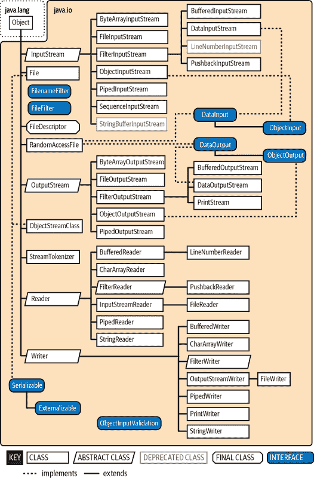
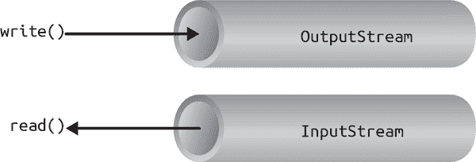
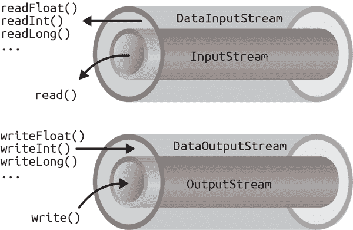
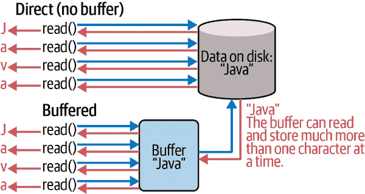

# 第十章：文件输入和输出

将数据存储在文件中并在以后检索是桌面和企业应用程序至关重要的功能。在本章中，我们将介绍`java.io`和`java.nio`包中一些最受欢迎的类。这些包为基本输入和输出（I/O）提供了丰富的工具集，并为 Java 中所有文件和网络通信的框架提供支持。图 10-1 展示了`java.io`包的广度。

我们首先来看看`java.io`中的流类，这些类是基本`InputStream`、`OutputStream`、`Reader`和`Writer`类的子类。然后我们将检查`File`类，并讨论如何使用`java.io`中的类来读取和写入文件。我们还快速浏览一下数据压缩和序列化。在此过程中，我们介绍了`java.nio`包。这个“新”I/O 包（或 NIO）增加了专门用于构建高性能服务的重要功能。NIO 主要关注使用*缓冲区*（你可以在其中存储数据以更有效地利用其他资源）和*通道*（你可以高效地将数据放入其中，其他程序同样高效地从中读取数据）。在某些情况下，NIO 还提供了更好的 API，可以替代一些`java.io`功能。¹



###### 图 10-1\. `java.io`类层次结构

# 流

Java 中大多数 I/O 操作都是基于流的。在概念上，*流*表示一种数据的流动，其中一个*写入器*位于一端，一个*读取器*位于另一端。当你使用`java.io`包执行终端输入和输出、读取或写入文件或通过 Java 网络套接字进行通信时（更多关于网络的内容请参阅第十三章），你将使用各种类型的流。当我们研究 NIO 包时，我们将发现一个类似的概念叫做*通道*。两者的主要区别在于流是围绕字节或字符而设计的，而通道则是围绕包含这些数据类型的“缓冲区”而设计的。*缓冲区*通常是用于数据的快速临时存储，从而更容易优化吞吐量。它们都大致完成相同的工作。让我们从流开始。以下是最受欢迎的流类的快速概述：

`InputStream`、`OutputStream`

抽象类定义了读取或写入无结构字节序列的基本功能。Java 中的所有其他字节流都建立在基本`InputStream`和`OutputStream`之上。

`Reader`、`Writer`

抽象类定义了读取或写入字符数据序列的基本功能，支持 Unicode。Java 中的所有其他字符流都建立在`Reader`和`Writer`之上。

`InputStreamReader`、`OutputStreamWriter`

通过按照特定字符编码方案（如 ASCII 或 Unicode）进行转换，将字节流和字符流进行桥接的类。请记住：在 Unicode 中，一个字符不一定是一个字节！

`DataInputStream`、`DataOutputStream`

专门的流过滤器增加了读写多字节数据类型（如数值原始数据和`String`对象）的能力，以标准化格式进行。

`ObjectInputStream`、`ObjectOutputStream`

专门的流过滤器，能够写入整组序列化的 Java 对象并重新构造它们。

`BufferedInputStream`、`BufferedOutputStream`、`BufferedReader`、`BufferedWriter`

专门的流过滤器增加了缓冲以提高效率。在真实的 I/O 操作中，几乎总是会使用缓冲。

`PrintStream`、`PrintWriter`

简化文本打印的专门流。

`PipedInputStream`、`PipedOutputStream`、`PipedReader`、`PipedWriter`

在应用程序内移动数据的配对类。写入`PipedOutputStream`或`PipedWriter`的数据将从其对应的`PipedInputStream`或`PipedReader`中读取。

`FileInputStream`、`FileOutputStream`、`FileReader`、`FileWriter`

实现了从本地文件系统读取和写入文件的`InputStream`、`OutputStream`、`Reader`和`Writer`。

Java 中的流是单向的。`java.io`输入和输出类只代表简单流的两端。对于双向对话，您将使用每种类型的一个流。

`InputStream`和`OutputStream`，如图 10-2 所示，是定义所有字节流的最底层接口的抽象类。它们包含用于读取或写入无结构的字节级数据的方法。由于这些类是抽象的，你不能创建通用的输入或输出流。



###### 图 10-2\. 基本输入和输出流功能

Java 为诸如从文件读取和写入或与网络连接通信等活动实现了这些类的子类。由于所有字节流都继承自`InputStream`或`OutputStream`的结构，因此可以互换使用各种类型的字节流。还可以在基本流周围堆叠或包装特定类型的专门流，以添加缓冲、过滤、压缩或处理更高级别数据类型等功能。

`Reader`和`Writer`与`InputStream`和`OutputStream`非常相似，不同之处在于它们处理的是字符而不是字节。作为真正的字符流，这些类可以正确处理 Unicode 字符，而字节流则并非总是如此。通常需要在这些字符流和物理设备（如磁盘和网络）的字节流之间进行桥接。`InputStreamReader`和`OutputStreamWriter`是特殊的类，它们使用像 ASCII 或 UTF-8 这样的字符编码方案来在字符流和字节流之间进行转换。

本节描述了几种流类型，但不包括`FileInputStream`、`FileOutputStream`、`FileReader`和`FileWriter`。我们将在下一节中讨论文件流，在那里我们将涵盖如何在 Java 中访问文件系统。

## 基本输入/输出

`InputStream`对象的典型示例是 Java 应用程序的*标准输入*。与 C 语言中的`stdin`或 C++中的`cin`类似，这是命令行（非 GUI）程序的输入来源。它是来自环境的输入流，通常是一个终端窗口或可能是另一个命令的输出。`java.lang.System`类是系统相关资源的通用存储库，在静态变量`System.in`中提供了对标准输入流的引用。它还在`out`和`err`变量中分别提供了*标准输出流*和*标准错误流*。²以下示例显示了它们之间的对应关系：

```java
    InputStream stdin = System.in;
    OutputStream stdout = System.out;
    OutputStream stderr = System.err;
```

这段代码隐藏了`System.out`和`System.err`不仅仅是`OutputStream`对象，而是更专门和有用的`PrintStream`对象的事实。我们稍后会在“PrintWriter and PrintStream”中解释这些内容，但目前我们可以将`out`和`err`引用为`OutputStream`对象，因为它们都是从`OutputStream`派生出来的。

您可以使用`InputStream`的`read()`方法从标准输入一次读取一个字节。如果您仔细查看[在线文档](https://oreil.ly/GSEj0)，您会发现基础`InputStream`类的`read()`方法是一个抽象方法。`System.in`背后是`InputStream`的特定实现，它提供了`read()`方法的实际实现：

```java
    try {
      int val = System.in.read();
    } catch (IOException e) {
      // ...
    }
```

尽管我们说`read()`方法读取字节值，但示例中的返回类型是`int`而不是`byte`。这是因为 Java 中基本输入流的`read()`方法使用了从 C 语言继承过来的约定，用特殊值指示流的结束。字节值在 0 到 255 之间返回，并且特殊值`-1`用于指示已到达流的结尾。在使用简单的`read()`方法时，您可以测试这种条件。然后，如果需要，可以将值转换为字节。以下示例从输入流中读取每个字节并打印其值：

```java
    try {
      int val;
      while((val=System.in.read()) != -1) {
        System.out.println((byte)val);
      }
    } catch (IOException e) {
      // Oops. Handle the error or print an error message
    }
```

如我们在示例中所示，`read()` 方法也可能抛出 `IOException`，如果在底层流源中读取时出现错误。`IOException` 的各种子类可能表示源（如文件或网络连接）发生了错误。此外，读取比单个字节更复杂数据类型的高级流可能会抛出 `EOFException`（“文件结尾”），这表明流的意外或过早结束。

`read()` 的重载形式会将字节数组填充为可能的最大数据，并返回读取的字节数：

```java
    byte [] buff = new byte [1024];
    int got = System.in.read(buff);
```

理论上，我们还可以使用 `available()` 方法在给定时间内检查 `InputStream` 上可用于读取的字节数。有了这些信息，我们可以创建一个恰好大小的数组：

```java
    int waiting = System.in.available();
    if (waiting > 0) {
      byte [] data = new byte [ waiting ];
      System.in.read(data);
      // ...
    }
```

但是，这种技术的可靠性取决于底层流实现是否能够检测到可以检索多少数据。它通常适用于文件，但不应该依赖于所有类型的流。

这些 `read()` 方法会阻塞，直到读取到至少一些数据（至少一个字节）。一般来说，您必须检查返回的值，以确定您读取了多少数据，并且是否需要继续读取。 （我们在本章后面将介绍非阻塞 I/O。）`InputStream` 的 `skip()` 方法提供了一种跳过一定数量字节的方法。根据流的实现方式，跳过字节可能比读取它们更有效率。

`close()` 方法关闭流并释放任何关联的系统资源。在使用完流后记得关闭大多数类型的流对性能很重要。在某些情况下，当对象被垃圾回收时，流可能会自动关闭，但依赖这种行为并不是一个好主意。`try`*-with-resources* 功能在 “try with Resources” 中讨论，可以更容易地自动关闭流和其他可关闭实体。我们将在 “File Streams” 中看到一些示例。接口 `java.io.Closeable` 标识了所有可以关闭的流、通道和相关实用类。

## 字符流

在早期的 Java 版本中，一些 `InputStream` 和 `OutputStream` 类型包含了用于读取和写入字符串的方法，但大多数情况下它们是通过天真地假设 16 位 Unicode 字符等同于流中的 8 位字节来操作的。这对于拉丁-1（ISO 8859-1）字符有效，但对于与不同语言一起使用的其他编码的世界则不适用。

`java.io Reader`和`Writer`字符流类被引入为仅处理字符数据的流。当您使用这些类时，您仅考虑字符和字符串数据。您允许底层实现处理字节到特定字符编码的转换。正如您将看到的，有一些`Reader`和`Writer`的直接实现，例如用于读取和写入文件的实现。

更一般地说，两个特殊类`InputStreamReader`和`OutputStreamWriter`弥合了字符流和字节流之间的差距。它们分别是`Reader`和`Writer`，可以包装在任何底层字节流周围，使其成为字符流。编码方案在字节（可能以表示多字节字符的组形式出现）和 Java 的双字节字符之间进行转换。编码方案可以在`InputStreamReader`或`OutputStreamWriter`的构造函数中通过名称指定。为方便起见，默认构造函数使用系统的默认编码方案。

让我们看看如何使用读取器和`java.text.NumberFormat`类从命令行中的用户检索数字输入。我们假设来自`System.in`的字节使用系统的默认编码方案：

```java
// file: ch10/examples/ParseKeyboard.java

    try {
      InputStream in = System.in;
      InputStreamReader charsIn = new InputStreamReader(in);
      BufferedReader bufferedCharsIn = new BufferedReader(charsIn);

      String line = bufferedCharsIn.readLine();
      int i = NumberFormat.getInstance().parse(line).intValue();
      // ...
    } catch (IOException e) {
      // ...
    } catch (ParseException pe) {
      // ...
    }
```

首先，我们在`System.in`周围包装一个`InputStreamReader`。该读取器使用默认编码方案将`System.in`的传入字节转换为字符。然后，我们在`InputStreamReader`周围包装一个`BufferedReader`。`BufferedReader`添加了`readLine()`方法，我们可以使用该方法将一整行文本（最多到达平台特定的行终止符字符组合）读入`String`中。然后，使用第八章中描述的技术将字符串解析为整数。自己试试看。提示时，尝试提供不同的输入。如果输入“0”会发生什么？如果只输入您的名字会发生什么？

我们刚刚采取了面向字节的输入流`System.in`，并安全地将其转换为`Reader`以读取字符。如果我们希望使用与系统默认值不同的编码，则可以在`InputStreamReader`的构造函数中指定它，如下所示：

```java
    InputStreamReader reader = new InputStreamReader(System.in, "UTF-8");
```

对于从读取器读取的每个字符，`InputStreamReader`读取一个或多个字节，并执行必要的 Unicode 转换。

当我们讨论`java.nio.charset`包时，我们将回到字符编码的主题“新 I/O 文件 API”，该包允许您查找和使用编码器和解码器。`InputStreamReader`和`OutputStreamWriter`都可以接受`Charset`编解码器对象以及字符编码名称。

## 流包装器

如果您想要做的不仅仅是读取和写入字节或字符序列怎么办？我们可以使用 *过滤流*，它是 `InputStream`、`OutputStream`、`Reader` 或 `Writer` 的一种类型，它包装另一个流并添加新功能。过滤流将目标流作为其构造函数的参数，并进行一些额外的处理，然后将调用委托给目标。例如，我们可以构造一个 `BufferedInputStream` 来包装系统标准输入：

```java
    InputStream bufferedIn = new BufferedInputStream(System.in);
```

`BufferedInputStream` 预先读取并缓冲一定量的数据。它在底层流周围包装了一个额外的功能层。Figure 10-3 显示了 `DataInputStream` 的这种排列方式，它可以读取更高级别的数据类型，如 Java 的基本类型和字符串。



###### 图 10-3\. 层叠流

正如您从前面的代码片段中看到的那样，`BufferedInputStream` 过滤器是 `InputStream` 的一种类型。因为过滤流本身是基本流类型的子类，所以它们可以作为其他过滤流的构造参数。这使得可以将过滤流层叠在一起，以提供不同的功能组合。例如，我们可以首先用 `BufferedInputStream` 包装我们的 `System.in` 来获得输入缓冲，然后再用 `DataInputStream` 包装 `BufferedInputStream` 来读取带缓冲区的特殊数据类型。

Java 提供了用于创建新类型过滤流的基类：`FilterInputStream`、`FilterOutputStream`、`FilterReader` 和 `FilterWriter`。这些超类通过将它们所有的方法调用委托给它们的底层流来提供过滤的基本机制。要创建自己的过滤流，可以扩展这些类并重写各种方法以添加所需的额外处理。

### 数据流

`DataInputStream` 和 `DataOutputStream` 是过滤流，允许您读取或写入字符串（而不是单个字符）和由多个字节组成的原始数据类型。`DataInputStream` 和 `DataOutputStream` 分别实现了 `DataInput` 和 `DataOutput` 接口。这些接口定义了用于读取或写入字符串以及所有 Java 原始类型的方法，包括数字和布尔值。`DataOutputStream` 对这些值进行编码，以便在任何机器上正确读取，然后将它们写入其底层的字节流。`DataInputStream` 从其底层字节流中获取编码的数据并将其解码为原始类型和值。

您可以从 `InputStream` 构造一个 `DataInputStream`，然后使用诸如 `readDouble()` 这样的方法来读取原始数据类型：

```java
    DataInputStream dis = new DataInputStream(System.in);
    double d = dis.readDouble();
```

此片段将标准输入流包装在 `DataInputStream` 中，并使用它来读取一个 `double` 值。`readDouble()` 方法从流中读取字节，并从中构造一个 `double` 值。`DataInputStream` 方法期望数字数据类型的字节采用*网络字节顺序*，这是一种标准，指定多字节值的高阶字节先发送（也称为*大端序*；参见“字节顺序”）。

`DataOutputStream` 类提供了与 `DataInputStream` 的读取方法对应的写入方法。我们输入片段的补充如下：

```java
    double d = 3.1415926;
    DataOutputStream dos = new DataOutputStream(System.out);
    dos.writeDouble(d);
```

###### 警告

`DataOutputStream` 和 `DataInputStream` 处理二进制数据，而不是人类可读的文本。通常，您会使用 `DataInputStream` 来读取由 `DataOutputStream` 生成的内容。这些过滤流非常适合直接处理像图像文件之类的内容。

`DataInputStream` 和 `DataOutputStream` 的 `readUTF()` 和 `writeUTF()` 方法使用 UTF-8 字符编码读取和写入 Java `String`，该编码使用 Unicode 字符。正如在第八章中讨论的那样，UTF-8 是一种广泛使用的 ASCII 兼容的 Unicode 字符编码。并非所有编码都保证能够保存所有 Unicode 字符，但 UTF-8 可以。您还可以通过将 UTF-8 指定为编码名称，将其与 `Reader` 和 `Writer` 流一起使用。

### 缓冲流

`BufferedInputStream`、`BufferedOutputStream`、`BufferedReader` 和 `BufferedWriter` 类在流路径中添加了一个指定大小的数据缓冲区。缓冲区可以通过减少与 `read()` 或 `write()` 方法调用相对应的物理读取或写入操作次数来提高效率，如图 10-4 所示。



###### 图 10-4\. 使用缓冲区和不使用缓冲区读取数据

您可以通过适当的输入或输出流和缓冲区大小创建一个缓冲流。（您也可以将另一个流包装在缓冲流中，以便它从缓冲中获益。）以下是一个简单的缓冲输入流示例：

```java
    BufferedInputStream bis = new BufferedInputStream(myInputStream, 32768);
    // bis will store up to 32K of data from myInputStream at a time
    // we can then read from bis at any time
    byte b = bis.read();
```

在这个例子中，我们指定了一个 32 KB 的缓冲区大小。如果在构造函数中没有指定缓冲区的大小，Java 会为我们创建一个合理大小的缓冲区（当前默认为 8 KB）。在我们第一次调用 `read()` 方法时，`bis` 会尝试用数据填充整个 32 KB 的缓冲区（如果数据可用）。之后，对 `read()` 的调用会从缓冲区中检索数据，并在必要时重新填充缓冲区。

`BufferedOutputStream` 的工作方式类似。调用 `write()` 方法将数据存储在缓冲区中；只有当缓冲区填满时，数据才实际写入到底层流中。你也可以使用 `flush()` 方法随时将 `BufferedOutputStream` 的内容写出。`flush()` 方法实际上是 `OutputStream` 类本身的方法。它允许你确保所有底层流中的数据已保存或发送。

`BufferedReader`和`BufferedWriter`类的工作方式与它们的基于字节的对应类相同，不同之处在于它们操作的是字符而不是字节。

### PrintWriter 和 PrintStream

另一个有用的包装类是`java.io.PrintWriter`。这个类提供了一系列重载的`print()`方法，将它们的参数转换为字符串并将它们推送到流中。一组补充的`println()`便捷方法在字符串末尾添加了一个新行。对于格式化文本输出，`printf()`和完全相同的`format()`方法允许您向流中写入 C `printf`风格的格式化文本。

`PrintWriter`是一个不同寻常的字符流，因为它可以包装`OutputStream`或另一个`Writer`。`PrintWriter`是传统的`PrintStream`字节流的更强大的大哥。`System.out`和`System.err`流都是`PrintStream`对象，这一点在本书中已经多次见识过：

```java
    System.out.print("Hello, world...\n");
    System.out.println("Hello, world...");
    System.out.printf("The answer is %d\n", 17);
    System.out.println(3.14);
```

创建`PrintWriter`对象时，可以在构造函数中传递一个额外的布尔值，指定是否“自动刷新”。如果这个值为`true`，`PrintWriter`在每次发送换行符时会自动执行`flush()`操作，刷新底层的`OutputStream`或`Writer`：

```java
    // Stream automatically flushes after a newline.
    PrintWriter pw = new PrintWriter(myOutputStream, true);
    pw.println("Hello!");
```

当您将此技术与缓冲输出流一起使用时，它就像一个终端，逐行输出数据。

`PrintStream`和`PrintWriter`相比常规字符流的另一个重大优势在于，它们可以屏蔽底层流抛出的异常。与其他流类的方法不同，`PrintWriter`和`PrintStream`的方法不会抛出`IOException`。相反，它们提供了一个方法来显式检查错误（如果需要的话）。这使得打印文本的常见操作变得更加容易。您可以使用`checkError()`方法来检查错误：

```java
    System.out.println(reallyLongString);
    if (System.out.checkError()) {
      // uh oh
    }
```

`PrintStream`和`PrintWriter`的这个特性意味着您通常可以将文本输出到各种目标，而无需将每个打印语句都包装在`try`块中。但如果您正在写入重要信息并希望确保没有任何错误发生，它仍然会让您访问到发生的任何错误。

## java.io.File 类

打印输出的一个流行目标是文件。`java.io.File`类封装了关于文件或目录的信息访问。您可以使用`File`获取文件的属性信息，列出目录中的条目，并执行基本的文件系统操作，比如删除文件或创建新目录。虽然`File`对象处理这些“元”操作，但它不提供读写文件数据的 API；您需要使用文件流来完成这些操作。

### 文件构造函数

您可以从`String`路径名创建`File`的实例：

```java
    File fooFile = new File("/tmp/foo.txt");
    File barDir = new File("/tmp/bar");
```

您还可以使用以 JVM 当前工作目录为起点的相对路径来创建文件：

```java
    File f = new File("foo");
```

您可以通过读取`System`属性列表中的`user.dir`属性来确定当前工作目录：

```java
    System.getProperty("user.dir"); // e.g.,"/Users/pat"
```

`File` 构造函数的重载版本允许你将目录路径和文件名指定为单独的 `String` 对象：

```java
    File fooFile = new File("/tmp", "foo.txt");
```

还有另一种变化，你可以使用 `File` 对象指定目录，用 `String` 指定文件名：

```java
    File tmpDir = new File("/tmp"); // File for directory /tmp
    File fooFile = new File (tmpDir, "foo.txt");
```

这些 `File` 构造函数实际上都不创建文件或目录，并且为不存在的文件创建 `File` 对象不会报错。`File` 对象只是文件或目录的句柄，你可能希望读取、写入或测试其属性。例如，你可以使用 `exists()` 实例方法来了解文件或目录是否存在。许多应用程序在保存文件之前执行此测试。如果所选文件不存在，太好了！应用程序可以安全地保存其数据。如果文件已经存在，则通常会收到一个覆盖警告，以确保你确实要替换旧文件。

### 路径本地化

在 Java 中，路径名应遵循本地文件系统的约定。Windows 文件系统使用具有驱动器号的不同*根*（顶级目录）（例如，“C:”）和反斜线 (\)，而不是 Linux 和 macOS 系统中使用的单个根和正斜线 (/) 路径分隔符。

Java 尝试弥补这种差异。例如，在 Windows 平台上，它接受斜线或反斜线的路径。然而，在 macOS 和 Linux 上，它只接受斜线。

你最好确保你遵循主机文件系统的文件名约定。如果你的应用程序有一个 GUI，它可以根据用户的请求打开和保存文件，那么你应该能够使用 Swing 的 `JFileChooser` 类来处理这个功能。这个类封装了一个图形文件选择对话框。`JFileChooser` 的方法会为你处理系统相关的文件名特性。

如果你的应用程序需要代表自己处理文件，那么事情就会变得有点复杂。`File` 类包含一些 `static` 变量，以使这项任务更加简单。`File.separator` 定义了一个 `String`，指定了本地主机上的文件分隔符（例如，在 Unix 和 macOS 系统上是 `/`，在 Windows 系统上是 `\`）；`File.separatorChar` 提供了相同的信息，但以一个 `char` 的形式提供。

你可以以几种方式使用这些与系统相关的信息。可能最简单的本地化路径名的方法是选择一个你在内部使用的约定，比如正斜线 (/)，然后使用 `String` 的替换方法来替换本地化的分隔符字符：

```java
    // we'll use forward slash as our standard
    String path = "mail/2023/june";
    path = path.replace('/', File.separatorChar);
    File mailbox = new File(path);
```

或者，你可以使用路径名的组件并在需要时构建本地路径名：

```java
    String [] path = { "mail", "2004", "june", "merle" };

    StringBuffer sb = new StringBuffer(path[0]);
    for (int i=1; i< path.length; i++) {
      sb.append(File.separator + path[i]);
    }
    File mailbox = new File(sb.toString());
```

###### 注意

请记住，在 Java 中，当反斜杠字符 (`\`) 在源代码中用作 `String` 时，Java 会将其解释为转义字符。要获得一个字面上的反斜杠，你必须使用双反斜杠：`\\`。

为了解决具有多个“根目录”（例如，在 Windows 上是`C:\`）的文件系统的问题，`File`类提供了静态方法`listRoots()`，它返回一个`File`对象数组，对应于文件系统根目录。你可以在*jshell*中尝试这个：

```java
jshell> import java.io.File;

// On a Linux box:
jshell> File.listRoots()
$2 ==> File[1] { / }

// On Windows:
jshell> File.listRoots()
$3 ==> File[2] { C:\, D:\ }
```

同样，在 GUI 应用程序中，图形文件选择对话框通常会屏蔽您免受这个问题的影响。

### 文件操作

一旦我们有了一个`File`对象，我们就可以使用它对其表示的文件或目录执行许多标准操作。几个方法让我们向`File`询问问题。例如，如果`File`表示一个普通文件，则`isFile()`返回`true`，而如果它是一个目录，则`isDirectory()`返回`true`。`isAbsolute()`指示`File`是否封装了绝对或相对路径规范。*相对路径*是相对于应用程序的工作目录的。*绝对路径*是一个系统相关的概念，表示该路径不与工作目录或当前驱动器绑定。在 Unix 和 macOS 中，绝对路径以斜杠开头：*/Users/pat/foo.txt*。在 Windows 中，它是包括驱动器号的完整路径：*C:\Users\pat\foo.txt*（而且，再次强调，如果系统中有多个驱动器，则它可以位于与工作目录不同的驱动器上）。

通过`getName()`、`getPath()`、`getAbsolutePath()`和`getParent()`方法可以获得路径名的各个组成部分。`getName()`方法返回一个没有任何目录信息的文件名的`String`。如果`File`具有绝对路径规范，则`getAbsolutePath()`返回该路径。否则，它会返回相对路径附加到当前工作目录（尝试将其转换为绝对路径）。`getParent()`方法返回文件或目录的父目录。

`getPath()`或`getAbsolutePath()`返回的字符串可能不遵循与底层文件系统相同的大小写约定。你可以通过使用`getCanonicalPath()`方法来检索文件系统自己的（或“规范的”）版本的文件路径。例如，在 Windows 中，你可以创建一个`File`对象，它的`getAbsolutePath()`是*C:\Autoexec.bat*，但它的`getCanonicalPath()`是*C:\AUTOEXEC.BAT*；两者实际上指向同一个文件。这对于比较文件名或向用户显示文件名很有用。

你可以使用`lastModified()`和`setLastModified()`方法获取或设置文件或目录的修改时间。该值是一个`long`，表示自 Unix 纪元（Unix 中的“第一个”日期的名称：1970 年 1 月 1 日 00:00:00 GMT）以来的毫秒数。我们还可以使用`length()`方法获取文件的大小，以字节为单位。

这里有一段打印文件信息的代码片段：

```java
    File fooFile = new File("/tmp/foo.txt");

    String type = fooFile.isFile() ? "File " : "Directory ";
    String name = fooFile.getName();
    long len = fooFile.length();
    System.out.println(type + name + ", " + len + " bytes ");
```

如果`File`对象对应的是一个目录，我们可以使用`list()`方法或`listFiles()`方法列出目录中的文件：

```java
    File tmpDir = new File("/tmp");
    String [] fileNames = tmpDir.list();
    File [] files = tmpDir.listFiles();
```

`list()`返回一个`String`对象数组，其中包含文件名。`listFiles()`返回一个`File`对象数组。请注意，在任何情况下文件都不保证以任何形式（例如按字母顺序）排序。您可以使用集合 API 按字母顺序对字符串进行排序，如下所示：

```java
    List list = Arrays.asList(fileNames);
    Collections.sort(list);
```

如果`File`引用不存在的目录，我们可以使用`mkdir()`或`mkdirs()`创建目录。`mkdir()`方法最多创建单个目录级别，因此路径中的任何中间目录都必须已经存在。`mkdirs()`创建必要的所有目录级别以创建`File`规范的完整路径。在任何情况下，如果无法创建目录，则该方法返回`false`。使用`renameTo()`重命名文件或目录，使用`delete()`删除文件或目录。

虽然可以使用`File`对象创建目录，但通常不使用`File`来创建文件；这通常是在使用`FileOutputStream`或`FileWriter`写入数据时隐含完成的，稍后我们会讨论。例外是`createNewFile()`方法，您可以使用它在`File`位置创建一个新的零长度文件。

从文件系统的所有其他文件创建操作方面来看，`createNewFile()`操作是原子的³。Java 从`createNewFile()`返回一个布尔值，告诉您文件是否已创建。以这种方式创建新文件在您还使用`deleteOnExit()`的情况下特别有用，后者标记文件在 Java 虚拟机退出时自动删除。此组合允许您保护资源或创建一次只能在单个实例中运行的应用程序。

与`File`类本身相关的另一种文件创建方法是静态方法`createTempFile()`，它使用自动生成的唯一名称在指定位置创建文件。通常与`deleteOnExit()`结合使用`createTempFile()`。网络应用程序经常使用这种组合来创建临时文件，用于存储请求或构建响应。

`toURL()`方法将文件路径转换为`file:` URL 对象。URL 是一种抽象，允许您指向网络上任何类型的对象。将`File`引用转换为 URL 可能对与处理 URL 的更一般实用程序保持一致性有用。例如，Java 的 NIO 使用 URL 引用直接在 Java 代码中实现的新类型的文件系统。

表 10-1 总结了`File`类提供的方法。

表 10-1\. 文件方法

| 方法 | 返回类型 | 描述 |
| --- | --- | --- |
| `canExecute()` | `boolean` | 文件是否可执行？ |
| `canRead()` | `boolean` | 文件（或目录）是否可读？ |
| `canWrite()` | `boolean` | 文件（或目录）是否可写？ |
| `createNewFile()` | `boolean` | 创建一个新文件。 |
| `createTempFile (String` *`pfx`*, `String`*`sfx`*`)` | `File` | 静态方法，在默认临时文件目录中创建一个带有指定前缀和后缀的新文件。 |
| `delete()` | `boolean` | 删除文件（或目录）。 |
| `deleteOnExit()` | `Void` | Java 运行时系统在退出时删除文件。 |
| `exists()` | `boolean` | 文件（或目录）是否存在？ |
| `getAbsolutePath()` | `String` | 返回文件（或目录）的绝对路径。 |
| `getCanonicalPath()` | `String` | 返回文件（或目录）的绝对路径，大小写正确，并且解析了相对元素。 |
| `getFreeSpace()` | `long` | 获取包含此路径的分区上未分配空间的字节数，如果路径无效则返回 0。 |
| `getName()` | `String` | 返回文件（或目录）的名称。 |
| `getParent()` | `String` | 返回文件（或目录）的父目录名称。 |
| `getPath()` | `String` | 返回文件（或目录）的路径。（不要与`toPath()`混淆。） |
| `getTotalSpace()` | `long` | 获取包含文件路径的分区的大小（以字节为单位），如果路径无效则返回 0。 |
| `getUseableSpace()` | `long` | 获取包含此路径的分区上用户可访问的未分配空间的字节数，如果路径无效则返回 0。此方法试图考虑用户的写权限。 |
| `isAbsolute()` | `boolean` | 文件名（或目录名）是否是绝对的？ |
| `isDirectory()` | `boolean` | 该项是否为目录？ |
| `isFile()` | `boolean` | 该项是否为文件？ |
| `isHidden()` | `boolean` | 该项是否隐藏？（依赖于系统。） |
| `lastModified()` | `long` | 返回文件（或目录）的最后修改时间。 |
| `length()` | `long` | 返回文件的长度。 |
| `list()` | `String []` | 返回目录中文件的列表。 |
| `listFiles()` | `File[]` | 返回目录内容作为`File`对象数组。 |
| `listRoots()` | `File[]` | 返回根文件系统的数组，如果有的话（例如，C:/，D:/）。 |
| `mkdir()` | `boolean` | 创建目录。 |
| `mkdirs()` | `boolean` | 创建路径中的所有目录。 |
| `renameTo(File` *`dest`* `)` | `boolean` | 重命名文件（或目录）。 |
| `setExecutable()` | `boolean` | 设置文件的执行权限。 |
| `setLastModified()` | `boolean` | 设置文件（或目录）的最后修改时间。 |
| `setReadable()` | `boolean` | 设置文件的读权限。 |
| `setReadOnly()` | `boolean` | 设置文件为只读状态。 |
| `setWriteable()` | `boolean` | 设置文件的写权限。 |
| `toPath()` | `java.nio.file.Path` | 将文件转换为 NIO 文件路径。（不要与`getPath()`混淆。） |
| `toURL()` | `java.net.URL` | 生成文件（或目录）的 URL 对象。 |

## File Streams

你可能已经对文件听得耳朵生茧了，但我们甚至还没有写一个字节呢！现在，让我们开始享受乐趣吧。Java 提供了两种基本流用于从文件中读取和写入：`FileInputStream` 和 `FileOutputStream`。这些流提供了基本的字节导向 `InputStream` 和 `OutputStream` 功能，用于读取和写入文件。它们可以与前面描述的过滤流结合使用，以与其他流通信方式相同的方式处理文件。

可以从 `String` 路径名或 `File` 对象创建 `FileInputStream`：

```java
    FileInputStream in = new FileInputStream("/etc/motd");
```

创建 `FileInputStream` 时，Java 运行时系统尝试打开指定的文件。因此，如果指定的文件不存在，`FileInputStream` 构造函数可能会抛出 `FileNotFoundException`，或者在发生其他 I/O 错误时抛出 `IOException`。你必须在代码中捕获这些异常。在可能的情况下，习惯上使用 `try`-with-resources 结构来自动关闭文件是一个好习惯：

```java
  try (FileInputStream fin = new FileInputStream("/etc/motd") ) {
    // ....
    // fin will be closed automatically if needed
    // upon exiting the try clause.
  }
```

当你首次创建流时，它的 `available()` 方法和 `File` 对象的 `length()` 方法应该返回相同的值。

要将文件中的字符作为 `Reader` 读取，可以将 `InputStreamReader` 包装在 `FileInputStream` 周围。你也可以使用提供的便利类 `FileReader`。`FileReader` 实际上只是一个带有一些默认值的 `InputStreamReader` 包装在 `FileInputStream` 中。

下面的类 `ListIt` 是一个小型实用程序，将文件或目录的内容打印到标准输出：

```java
//file: ch10/examples/ListIt.java
import java.io.*;

class ListIt {
  public static void main (String args[]) throws Exception {
    File file =  new File(args[0]);

    if (!file.exists() || !file.canRead()) {
      System.out.println("Can't read " + file);
      return;
    }

    if (file.isDirectory()) {
      String [] files = file.list();
      for (String file : files)
        System.out.println(file);
    } else {
      try {
        Reader ir = new InputStreamReader(
            new FileInputStream(file) );

        BufferedReader in = new BufferedReader(ir);
        String line;
        while ((line = in.readLine()) != null)
          System.out.println(line);
      }
      catch (FileNotFoundException e) {
          System.out.println("File Disappeared");
      }
    }
  }
}
```

`ListIt` 从其第一个命令行参数构造一个 `File` 对象，并测试该 `File` 是否存在且可读。如果 `File` 是一个目录，`ListIt` 输出目录中文件的名称。否则，`ListIt` 按行读取并输出文件内容。试试看！你能在 *ListIt.java* 上使用 `ListIt` 吗？

对于写入文件，可以从 `String` 路径名或 `File` 对象创建 `FileOutputStream`。然而，与 `FileInputStream` 不同的是，`FileOutputStream` 构造函数不会抛出 `FileNotFoundException`。如果指定的文件不存在，`FileOutputStream` 将创建文件。`FileOutputStream` 构造函数可能会在发生其他 I/O 错误时抛出 `IOException`，因此仍然需要处理此异常。

如果指定的文件存在，`FileOutputStream` 将打开它进行写入。随后调用 `write()` 方法时，新数据将覆盖文件的当前内容。如果需要向现有文件追加数据，可以使用一个接受布尔型 `append` 标志的构造函数形式：

```java
    FileOutputStream fooOut =
        new FileOutputStream(fooFile); // overwrite fooFile
    FileOutputStream pwdOut =
        new FileOutputStream("/etc/passwd", true); // append
```

另一种向文件追加数据的方式是使用 `RandomAccessFile`，我们将稍后讨论。

与读取一样，如果要向文件写入字符（而不是字节），可以在 `FileOutputStream` 周围包装一个 `OutputStreamWriter`。如果要使用默认的字符编码方案，可以使用 `FileWriter` 类，这是一个方便的选择。

下面的代码从标准输入读取一行数据，并将其写入文件 */tmp/foo.txt*：

```java
    String s = new BufferedReader(
        new InputStreamReader(System.in) ).readLine();
    File out = new File("/tmp/foo.txt");
    FileWriter fw = new FileWriter (out);
    PrintWriter pw = new PrintWriter(fw);
    pw.println(s);
    pw.close();
```

注意我们如何将 `FileWriter` 包装在 `PrintWriter` 中以便写入数据。此外，作为一个良好的文件系统使用者，在完成操作后调用 `close()` 方法。在这里，关闭 `PrintWriter` 也会关闭底层的 `Writer`。

## RandomAccessFile

`java.io.RandomAccessFile` 类提供了在文件中任意位置读取和写入数据的能力。`RandomAccessFile` 实现了 `DataInput` 和 `DataOutput` 接口，因此你可以像使用 `DataInputStream` 和 `DataOutputStream` 一样在文件中任意位置读取和写入字符串和基本类型数据。但是，因为这个类提供对文件数据的随机访问而不是顺序访问，所以它不是 `InputStream` 或 `OutputStream` 的子类。

可以根据 `String` 路径名或 `File` 对象创建 `RandomAccessFile`。构造函数还接受第二个 `String` 参数，指定文件的模式。使用字符串 `"r"` 表示只读文件，使用 `"rw"` 表示读/写文件：

```java
    try {
      RandomAccessFile users = new RandomAccessFile("Users", "rw")
    } catch (IOException e) { ... }
```

当以只读模式创建 `RandomAccessFile` 时，Java 尝试打开指定的文件。如果文件不存在，`RandomAccessFile` 会抛出 `IOException`。然而，如果以读/写模式创建 `RandomAccessFile`，如果文件不存在，对象会创建该文件。构造函数仍然可能因为其他 I/O 错误而抛出 `IOException`，因此你仍然需要处理这个异常。

创建了 `RandomAccessFile` 后，你可以调用任何常规的读取和写入方法，就像使用 `DataInputStream` 或 `DataOutputStream` 一样。如果尝试向只读文件写入数据，写入方法会抛出 `IOException`。

`RandomAccessFile` 的特殊之处在于 `seek()` 方法。这个方法接受一个 `long` 值，并将其用于设置文件中的读写位置。你可以使用 `getFilePointer()` 方法来获取当前位置。如果需要向文件末尾追加数据，可以使用 `length()` 确定位置，然后 `seek()` 到该位置。你可以写入或定位到文件末尾以外的位置，但不能从文件末尾以外读取。如果尝试这样做，`read()` 方法会抛出 `EOFException` 异常。

下面是一个简单数据库写入数据的示例：

```java
    users.seek(userNum * RECORDSIZE);
    users.writeUTF(userName);
    users.writeInt(userID);
```

在这段代码中，我们假设 `userName` 的 `String` 长度以及其后的任何数据都适合指定的记录大小内。

# 新 I/O 文件 API

现在我们将注意力从原始的“经典”Java 文件 API 转向 NIO 文件 API。正如我们前面提到的，NIO 文件 API 可以被视为经典 API 的替代或补充。新 API 将 Java 移向更高性能和更灵活的 I/O 风格，支持可选择的和异步可中断的*通道*（后面将详细讨论选择和使用通道）。在处理文件时，新 API 的优势在于在 Java 中提供了更完整的文件系统抽象。

除了更好地支持现有的、真实世界中的文件系统类型——包括新的和受欢迎的复制和移动文件、管理链接以及获取详细文件属性如所有者和权限的能力——NIO 允许您直接在 Java 中实现全新类型的文件系统。最好的例子是 ZIP 文件系统提供者。您可以将 ZIP 归档文件“挂载”为文件系统。您可以使用标准 API 直接在归档文件中处理文件，就像处理任何其他文件系统一样。

NIO 文件包还提供了一些工具，这些工具多年来可以节省 Java 开发人员大量重复的代码，包括目录树变更监视、文件系统遍历、文件名“匹配”（使用通配符匹配文件名的行话）以及直接将整个文件读取到内存的便利方法。

我们将在本节介绍基本的 NIO 文件 API，并在章节末回到缓冲区和通道的主题。特别是，我们将讨论`ByteChannel`和`FileChannel`，您可以将其视为用于读取和写入文件和其他类型数据的备选、基于缓冲区的流。

## FileSystem 和 Path

`java.nio.file` 包中有三个主要角色：

`FileSystem`

`Path` 是底层存储机制并且作为`Path`对象的工厂。

`FileSystems`

`FileSystem` 对象的工厂。

`Path`

文件系统中文件或目录的位置。

`Files`

一个实用类，包含一组丰富的静态方法，用于操作 `Path` 对象以执行与经典 API 类似的所有基本文件操作。

`FileSystems`（复数形式）类是我们的起点。让我们创建几个文件系统：

```java
    // The default host computer filesystem
    FileSystem fs = FileSystems.getDefault();

    // A custom filesystem for ZIP files, no special properties
    Map<String,String> props = new HashMap<>();
    URI zipURI = URI.create("jar:file:/Users/pat/tmp/MyArchive.zip");
    FileSystem zipfs = FileSystems.newFileSystem(zipURI, props);
```

正如本代码片段所示，我们请求默认的文件系统来在主机环境中操作文件。我们还使用`FileSystems`类来构建另一个`FileSystem`，通过一个*统一资源标识符*（或 URI，类似于 URL 的特殊标识符），该标识符引用自定义文件系统类型。我们使用`jar:file`作为我们的 URI 协议，以指示我们正在处理 JAR 或 ZIP 文件。

`FileSystem` 实现了 `Closeable`，当关闭一个 `FileSystem` 时，所有与其关联的打开文件通道和其他流对象也将被关闭。在那时尝试读取或写入这些通道将抛出异常。请注意，默认文件系统（与主机计算机关联）无法关闭。

一旦有了`FileSystem`，就可以将其用作代表文件或目录的`Path`对象的工厂。您可以使用字符串表示法获取`Path`，就像经典的`File`类一样。随后，您可以使用`Files`实用程序的方法创建、读取、写入或删除该项：

```java
    Path fooPath = fs.getPath("/tmp/foo.txt");
    OutputStream out = Files.newOutputStream(fooPath);
```

此示例打开一个`OutputStream`以写入文件*foo.txt*。默认情况下，如果文件不存在，它将被创建；如果文件已存在，则在写入新数据之前将其截断（设置为零长度）—但您可以使用选项更改这些结果。我们将在下一节中详细讨论`Files`方法。

`Path`类实现了`java.lang.Iterable`接口，可用于迭代其字面路径组件，例如前面片段中的斜杠分隔的`tmp`和`foo.txt`。（如果要遍历路径以查找其他文件或目录，则可能更感兴趣的是我们稍后将讨论的`DirectoryStream`和`FileVisitor`。）`Path`还实现了`java.nio.file.Watchable`接口，允许对其进行监视以进行更改。

`Path`具有方便的方法来解析相对于文件或目录的路径：

```java
    Path patPath =  fs.getPath("/User/pat/");

    Path patTmp = patPath.resolve("tmp"); // "/User/pat/tmp"

    // Same as above, using a Path
    Path tmpPath = fs.getPath("tmp");
    Path patTmp = patPath.resolve(tmpPath); // "/User/pat/tmp"

    // Resolving a given absolute path against any path just yields given path
    Path absPath = patPath.resolve("/tmp"); // "/tmp"

    // Resolve sibling to Pat (same parent)
    Path danPath = patPath.resolveSibling("dan"); // "/Users/dan"
```

在此片段中，我们展示了`Path`方法`resolve()`和`resolveSibling()`用于查找相对于给定`Path`对象的文件或目录。`resolve()`方法通常用于将相对路径附加到表示目录的现有`Path`。如果提供给`resolve()`方法的参数是绝对路径，则仅会生成绝对路径（它的工作方式类似于 Unix 或 DOS 的`cd`命令）。`resolveSibling()`方法的工作方式相同，但是它相对于目标`Path`的父级；此方法对于描述`move()`操作的目标非常有用。

### 经典文件路径和返回

为了连接经典和新 API，分别在`java.io.File`和`java.nio.file.Path`中提供了相应的`toPath()`和`toFile()`方法，以将其转换为另一种形式。当然，从`File`生成的`Path`类型只能是默认主机文件系统中表示文件和目录的路径：

```java
    Path tmpPath = fs.getPath("/tmp");
    File file = tmpPath.toFile();
    File tmpFile = new File("/tmp");
    Path path = tmpFile.toPath();
```

## NIO 文件操作

一旦有了`Path`，我们可以使用`Files`实用程序的静态方法对其进行操作，以将路径创建为文件或目录，读取和写入它，并查询和设置其属性。我们将列出大部分方法，然后在进一步讨论一些更重要的方法。

表 10-2 总结了`java.nio.file.Files`类的这些方法。由于`Files`类处理所有类型的文件操作，因此它包含大量方法。为了使表格更易读，我们省略了相同方法的重载形式（接受不同类型参数的方法），并将对应及相关类型的方法组合在一起。

表 10-2\. NIO Files 方法

| 方法 | 返回类型 | 描述 |
| --- | --- | --- |
| `copy()` | long 或 `Path` | 将流复制到文件路径、文件路径到流，或路径到路径。返回复制的字节数或目标 `Path`。如果目标文件存在，可以选择替换（默认为存在时操作失败）。复制目录将在目标处生成空目录（不复制内容）。复制符号链接会复制链接文件的数据（产生常规文件复制）。 |
| `createDirectory()`, `createDirectories()` | `Path` | 创建单个目录或指定路径中的所有目录。如果目录已存在，`createDirectory()` 会抛出异常。`createDirectories()` 则会忽略已存在的目录，仅在需要时创建。 |
| `createFile()` | `Path` | 创建一个空文件。此操作是原子性的，只有在文件不存在时才会成功。（此属性可用于创建标志文件以保护资源等。） |
| `createLink()`, `createSymbolicLink()`, `isSymbolicLink()`, `readSymbolicLink()`, `createLink()` | boolean 或 `Path` | 创建硬链接或符号链接，检测文件是否为符号链接，或读取符号链接指向的目标文件。符号链接是指引用其他文件的文件。普通（“硬”）链接是文件的低级镜像，其中两个文件名指向相同的底层数据。如果不确定使用哪种，建议使用符号链接。 |
| `createTempDirectory()`, `createTempFile()` | `Path` | 创建一个带有指定前缀的临时目录或文件，确保名称唯一。可选择将其放置在系统默认的临时目录中。 |
| `delete()`, `deleteIfExists()` | void | 删除文件或空目录。`deleteIfExists()` 如果文件不存在则不会抛出异常。 |
| `exists()`, `notExists()` | boolean | 判断文件是否存在（`notExists()` 返回其相反值）。可选择是否跟踪链接（默认是跟踪）。 |
| `getAttribute()`, `set​Attri⁠bute()`, `getFile​Attri⁠buteView()`, `readAttributes()` | `Object`, `Map` 或 `FileAttributeView` | 获取或设置特定于文件系统的文件属性，如访问和更新时间、详细权限和所有者信息，使用实现特定的名称。 |
| `getFileStore()` | `FileStore` | 获取表示路径所在文件系统上的设备、卷或其他类型分区的 `FileStore` 对象。 |
| `getLastModifiedTime()`, `setLastModifiedTime()` | `FileTime` 或 `Path` | 获取或设置文件或目录的最后修改时间。 |
| `getOwner()`, `setOwner()` | `UserPrincipal` | 获取或设置代表文件所有者的 `UserPrincipal` 对象。使用 `toString()` 或 `getName()` 获取用户名的字符串表示形式。 |
| `getPosixFile​Permis⁠sions()`, `setPosixFilePermissions()` | `Set` 或 `Path` | 获取或设置路径的完整 POSIX 用户-组-其他样式读写权限，作为 `PosixFile​Per⁠mission` 枚举值的集合。 |
| `isDirectory()`, `isExecutable()`, `isHidden()`, `isReadable()`, `isRegularFile()`, `isWritable()` | boolean | 测试文件特性，如路径是否为目录和其他基本属性。 |
| `isSameFile()` | boolean | 检查两个路径是否引用同一个文件（即使路径不完全相同也可能为真）。 |
| `move()` | `Path` | 通过重命名或复制移动文件或目录，可选择是否替换现有目标。通常使用重命名，但如果需要在文件存储或文件系统之间复制文件以移动文件，则必须进行复制。仅当简单重命名可能或目录为空时，才能使用此方法移动目录。如果目录移动需要跨文件存储或文件系统复制文件，则方法会抛出 `IOException`。（在这种情况下，您必须自行复制文件。参见 `walkFileTree()`。） |
| `newBufferedReader()`, `newBufferedWriter()` | `BufferedReader` 或 `BufferedWriter` | 通过 `BufferedReader` 打开文件进行读取，或通过 `BufferedWriter` 创建并打开文件进行写入。在两种情况下都要指定字符编码。 |
| `newByteChannel()` | `SeekableByteChannel` | 创建一个新文件或打开一个现有文件作为可寻址的字节通道。（请参见本章后面有关 NIO 的完整讨论。）考虑使用 `FileChannel.open()` 作为替代方案。 |
| `newDirectoryStream()` | `DirectoryStream` | 返回用于遍历目录层次结构的 `DirectoryStream`。可选择提供 glob 模式或过滤器对象以匹配文件。 |
| `newInputStream()`, `newOutputStream()` | `InputStream` 或 `OutputStream` | 通过 `InputStream` 打开文件进行读取，或通过 `OutputStream` 创建并打开文件进行写入。可选择指定输出流的文件截断；如果要覆盖写入，则默认为截断现有文件。 |
| `probeContentType()` | `String` | 如果能够通过安装的 `FileTypeDetector` 服务确定文件的 MIME 类型，则返回该类型；否则返回 `null`。 |
| `readAllBytes()`, `readAllLines()` | byte[] 或 `List<String>` | 使用指定的字符编码从文件中读取所有数据为字节数组或所有字符作为字符串列表。 |
| `size()` | long | 获取指定路径文件的字节大小。 |
| `walkFileTree()` | `Path` | 将 `FileVisitor` 应用于指定的目录树，可选择是否跟随链接以及遍历的最大深度。 |
| `write()` | `Path` | 将字节数组或字符串集合（使用指定的字符编码）写入到指定路径的文件中，并关闭文件，可选择追加和截断行为。默认情况下是截断并写入数据。 |

使用这些方法，我们可以获取给定文件的输入或输出流，或者使用缓冲读写器和写入器。我们还可以将路径创建为文件和目录，并遍历文件层次结构。我们将在下一节讨论目录操作。

作为提醒，`Path`的`resolve()`和`resolveSibling()`方法对于构建`copy()`和`move()`操作的目标非常有用：

```java
    // Move the file /tmp/foo.txt to /tmp/bar.txt
    Path foo = fs.getPath("/tmp/foo.txt");
    Files.move(foo, foo.resolveSibling("bar.txt"));
```

为了快速读取和写入文件内容而不使用流，我们可以使用各种`readAll…​`和`write`方法，在单个操作中移动字节数组或字符串进出文件：

```java
    // Read and write collection of String (e.g., lines of text)
    Charset asciiCharset = Charset.forName("US-ASCII");
    List<String> csvData = Files.readAllLines(csvPath, asciiCharset);
    Files.write(newCSVPath, csvData, asciiCharset);

    // Read and write bytes
    byte [] data = Files.readAllBytes(dataPath);
    Files.write(newDataPath, data);
```

这些对于容易适应内存的文件非常方便。

# NIO 包

让我们回到`java.nio`包，完善我们关于核心 Java I/O 的讨论。NIO 的一个方面就是简单地更新和增强经典的`java.io`包的功能。实际上，许多通用的 NIO 功能确实与现有的 API 重叠。然而，NIO 首先引入是为了解决大系统的可伸缩性问题，特别是在网络应用中。接下来的几节概述了 NIO 的基本要素。

## 异步 I/O

大多数对 NIO 包的需求驱动力来自于希望在 Java 中添加*非阻塞*和*可选择*的 I/O。在 NIO 出现之前，Java 中的大多数读写操作都绑定到线程，并被迫阻塞不确定的时间。尽管某些 API（如套接字，我们将在“套接字”中看到）提供了特定的方法来限制 I/O 调用的持续时间，但这只是一种弥补缺乏更一般机制的权宜之计。在许多语言中，即使没有线程，也可以通过将 I/O 流设置为非阻塞模式并测试它们是否准备好发送或接收数据来高效地进行 I/O。在非阻塞模式下，读取或写入只完成可以立即执行的工作——填充或清空缓冲区然后返回。结合测试准备就绪的能力，这使得单线程应用程序可以高效地连续服务许多通道。主线程“选择”一个准备好的通道，与之协作直到它阻塞，然后转移到另一个通道。在单处理器系统上，这与使用多线程基本上是等效的。

除了非阻塞和可选择的 I/O 外，NIO 包还能够异步关闭和中断 I/O 操作。正如在第九章讨论的那样，在 NIO 出现之前，没有可靠的方法来停止或唤醒在 I/O 操作中阻塞的线程。使用 NIO 后，被阻塞在 I/O 操作中的线程总是在被中断或另一个线程关闭通道时唤醒。此外，如果在线程阻塞在 NIO 操作时中断该线程，其通道将自动关闭。（因为线程中断而关闭通道可能看起来过于严格，但通常这样做是正确的。保持通道打开可能导致意外行为或使通道受到不必要的操纵。）

## 性能

I/O 通道设计围绕缓冲区的概念，这是一种专门用于通信任务的复杂数组形式。NIO 包支持*直接缓冲区*的概念 —— 这些缓冲区在主机操作系统中维护它们的内存而不是在 Java 虚拟机内部。因为所有真实的 I/O 操作最终都必须通过在主机操作系统中维护缓冲区空间来工作，使用直接缓冲区可以使许多操作更有效率。在两个外部端点之间传输的数据可以在不先复制到 Java 中再返回的情况下进行转移。

## 映射和锁定文件

NIO 提供了两个在`java.io`中找不到的通用文件相关功能：内存映射文件和文件锁定。*内存映射*文件表现得好像它的所有内容都在内存中的数组中而不是在磁盘上。内存映射文件超出了本章的范围，但如果你处理大量数据并且偶尔需要非常快的读/写访问，请在线查阅[`MappedByteBuffer`文档](https://oreil.ly/yNLMn)。

文件锁支持文件区域上的共享和排他锁 —— 对于多个应用程序的并发访问非常有用。我们将在“文件锁定”中讨论文件锁定。

## 通道

虽然`java.io`处理流，`java.nio`处理通道。*通道*是通信的端点。虽然实际上通道与流类似，但通道的基本概念同时更抽象和更原始。`java.io`中的流根据读取或写入字节的方法定义，而基本通道接口并不涉及通信的方式。它只是具有打开或关闭的概念，通过`isOpen()`和`close()`方法支持。然后为文件、网络套接字或任意设备的通道实现添加自己的操作方法，如读取、写入或传输数据。NIO 提供以下通道：

+   `FileChannel`

+   `Pipe.SinkChannel`, `Pipe.SourceChannel`

+   `SocketChannel`, `ServerSocketChannel`, `DatagramChannel`

我们将在“文件通道”中涵盖`FileChannel`及其异步姊妹`AsynchronousFileChannel`。（异步版本通过线程池缓冲其所有操作，并通过异步 API 报告结果。）`Pipe`通道只是`java.io Pipe`工具的通道等价物。套接字和数据报通道参与 Java 的网络世界，我们将在第十三章中进行讨论。与网络相关的通道也有异步版本：`AsynchronousSocketChannel`, `AsynchronousServerSocketChannel` 和 `AsynchronousDatagramChannel`。

所有这些基本通道都实现了`ByteChannel`接口，该接口设计用于具有读取和写入方法（如 I/O 流）的通道。然而，`ByteChannel`读取和写入`ByteBuffer`，而不是简单的字节数组。

除了这些通道实现外，您还可以使用`java.io` I/O 流和读写器与通道进行桥接，以实现互操作性。然而，如果混合使用这些功能，您可能无法获得 NIO 提供的全部好处和性能。

## 缓冲区

大多数`java.io`和`java.net`包的实用程序操作的是字节数组。NIO 包的对应工具是围绕`ByteBuffer`（对于文本，还有一个基于字符的缓冲区`CharBuffer`）构建的。字节数组很简单，为什么需要缓冲区？它们具有几个目的：

+   它们规范了缓冲数据的使用模式，提供了诸如只读缓冲区之类的功能，并跟踪大缓冲区空间内的读/写位置和限制。它们还提供了类似于`java.io​.BufferedInputStream`的标记/重置功能。

+   它们提供了用于处理表示原始类型的原始数据的附加 API。您可以创建“查看”您的字节数据为一系列较大原始类型（如`short`，`int`或`float`）的缓冲区。最通用的数据缓冲区类型`ByteBuffer`包括让您像`DataInputStream`和`DataOutputStream`对流所做的那样读取和写入所有原始类型的方法。

+   它们抽象了数据的底层存储，允许 Java 优化吞吐量。具体而言，缓冲区可以分配为直接缓冲区，这些直接缓冲区使用主机操作系统的本机缓冲区，而不是 Java 内存中的数组。与缓冲区一起工作的 NIO`Channel`工具可以自动识别直接缓冲区，并尝试优化与它们的交互。例如，从文件通道读取到 Java 字节数组通常需要 Java 将数据复制为从主机操作系统到 Java 内存的读取。使用直接缓冲区，数据可以保留在主机操作系统中，超出 Java 正常内存空间，直到需要为止。

### 缓冲区操作

基本`java.nio.Buffer`类有点像具有状态的数组。它不指定它保存的元素类型（由子类型决定），但它确实定义了所有数据缓冲区通用的功能。缓冲区具有固定大小，称为*容量*。尽管所有标准缓冲区都提供对其内容的“随机访问”，但缓冲区通常期望按顺序读取和写入，因此缓冲区维护下一个元素被读取或写入的*位置*的概念。除了位置，缓冲区还可以维护另外两个状态信息：*限制*，在读模式下通常表示可用数据，在写模式下表示文件的容量；以及一个*标记*，可用于记住未来回忆的早期位置。

`Buffer`的实现添加了特定的类型化获取和放置方法，用于读取和写入缓冲区内容。例如，`ByteBuffer`是字节的缓冲区，它有`get()`和`put()`方法用于读取和写入字节及字节数组（以及许多其他有用的方法，稍后我们将讨论）。从`Buffer`获取或放置数据会改变位置标记，因此`Buffer`类似于流一样跟踪其内容。试图读取或写入超出限制标记的数据会生成`BufferUnderflowException`或`BufferOverflowException`异常。

标记、位置、限制和容量的值始终遵守以下公式：

```java
    mark <= position <= limit <= capacity
```

`Buffer`的读写位置始终在标记（mark）和限制（limit）之间，其中标记作为下界，限制作为上界。容量表示缓冲区空间的物理范围。

您可以使用`position()`和`limit()`方法显式设置位置和限制标记。提供了几个便利方法用于常见的使用模式。`reset()`方法将位置重置为标记。如果未设置标记，则会抛出`InvalidMarkException`异常。`clear()`方法将位置重置为`0`，并将限制设置为容量，准备好接收新数据（标记被丢弃）。请注意，`clear()`方法实际上并不对缓冲区中的数据执行任何操作；它只是改变位置标记。

`flip()`方法用于常见模式，将数据写入缓冲区，然后再读取出来。`flip`方法将当前位置设置为限制，并将当前位置重置为`0`（任何标记都被丢弃），这样就不需要跟踪读取了多少数据。另一个方法`rewind()`简单地将位置重置为`0`，但保持限制不变。您可以使用它再次写入相同大小的数据。以下是使用这些方法从一个通道读取数据并写入两个通道的代码片段：

```java
    ByteBuffer buff = ...
    while (inChannel.read(buff) > 0) { // position = ?
      buff.flip();    // limit = position; position = 0;
      outChannel.write(buff);
      buff.rewind();  // position = 0
      outChannel2.write(buff);
      buff.clear();   // position = 0; limit = capacity
    }
```

第一次看可能会让人困惑，因为在这里，从`Channel`读取实际上是向`Buffer`写入，反之亦然。因为此示例将所有可用数据写入限制，所以在这种情况下，`flip()`或`rewind()`具有相同的效果。

### 缓冲区类型

各种缓冲区实现添加了用于读写特定数据类型的获取和放置方法。每个 Java 原始类型都有一个关联的缓冲区类型：`ByteBuffer`、`CharBuffer`、`ShortBuffer`、`IntBuffer`、`LongBuffer`、`FloatBuffer`和`DoubleBuffer`。每个类型都提供了用于读取和写入其类型及其类型数组的获取和放置方法。其中，`ByteBuffer`是最灵活的，因为它具有所有缓冲区中最细粒度的"get"和"put"方法，用于读写除`byte`外的所有其他数据类型。以下是一些`ByteBuffer`的方法：

```java
    byte get()
    char getChar()
    short getShort()
    int getInt()
    long getLong()
    float getFloat()
    double getDouble()

    void put(byte b)
    void put(ByteBuffer src)
    void put(byte[] src, int offset, int length)
    void put(byte[] src)
    void putChar(char value)
    void putShort(short value)
    void putInt(int value)
    void putLong(long value)
    void putFloat(float value)
    void putDouble(double value)
```

所有标准缓冲区也支持随机访问。对于`ByteBuffer`的上述每种方法，还有一个带索引的额外形式，例如：

```java
    getLong(int index)
    putLong(int index, long value)
```

但这还不是全部！`ByteBuffer`还可以提供它自己的“视图”，作为任何粗粒度类型。例如，你可以用`asShortBuffer()`方法从`ByteBuffer`获取一个`ShortBuffer`视图。`ShortBuffer`视图是由`ByteBuffer`支持的，这意味着它们在相同的数据上工作，对其中一个的更改会影响另一个。视图缓冲区的范围从`ByteBuffer`的当前位置开始，其容量是剩余字节数除以新类型的大小。 （例如，每个`short`占两个字节，每个`float`占四个字节，每个`long`和`double`占八个字节。）视图缓冲区对于在`ByteBuffer`内读取和写入大块连续类型数据非常方便。

`CharBuffer`也很有趣，主要是因为它们与`String`的集成。`CharBuffer`和`String`都实现了`java.lang.CharSequence`接口。这个接口提供了标准的`charAt()`和`length()`方法。Java 的许多其他部分（比如`java.util.regex`包）允许你可以互换地使用`CharBuffer`或`String`。在这种情况下，`CharBuffer`就像一个可修改的`String`，具有用户可配置的逻辑起始和结束位置。

### 字节顺序

因为我们正在讨论大于一个字节的类型的读写，所以问题就来了：多字节值（比如`short`和`int`）的字节写入顺序是什么？在这个世界上有两个派别：*大端序*和*小端序*。[⁵] 大端序意味着最重要的字节首先出现；小端序则相反。如果你要写入某些本地应用程序消费的二进制数据，这一点非常重要。兼容 Intel 的计算机使用小端序，许多运行 Unix 的工作站使用大端序。`ByteOrder`类封装了这个选择。你可以通过`ByteBuffer order()`方法指定要使用的字节顺序，使用标识符`ByteOrder.BIG_ENDIAN`和`ByteOrder.LITTLE_ENDIAN`，例如：

```java
    byteArray.order(ByteOrder.BIG_ENDIAN);
```

你可以使用静态方法`ByteOrder.nativeOrder()`获取你的平台的本地字节顺序。我们知道你很好奇：

```java
jshell> import java.nio.ByteOrder;

jshell> ByteOrder.nativeOrder()
$4 ==> LITTLE_ENDIAN
```

我们在一台装有英特尔芯片的 Linux 桌面上运行了这个程序。你也可以在自己的系统上试试看！

### 分配缓冲区

你可以通过显式分配使用`allocate()`或者通过包装现有的普通 Java 数组类型来创建缓冲区。每种缓冲区类型都有一个静态的`allocate()`方法，接受一个容量（大小），以及一个`wrap()`方法，接受一个现有的数组：

```java
    CharBuffer cbuf = CharBuffer.allocate(64*1024);
    ByteBuffer bbuf = ByteBuffer.wrap(someExistingArray);
```

直接缓冲区的分配方式与`allocateDirect()`方法相同：

```java
    ByteBuffer bbuf2 = ByteBuffer.allocateDirect(64*1024);
```

正如我们之前描述的那样，直接缓冲区可以使用操作系统的内存结构，这些结构针对某些类型的 I/O 操作进行了优化。这样做的权衡是，分配直接缓冲区比普通缓冲区的操作稍慢且更重量级，因此您应该尽量将它们用于长期缓冲区。

## 字符编码器和解码器

字符编码器和解码器将字符转换为原始字节，反之亦然，将 Unicode 标准映射到特定的编码方案。在 Java 中，编码器和解码器早已存在，供 `Reader` 和 `Writer` 流使用，并在 `String` 类的处理字节数组的方法中使用。然而，早期并没有用于显式处理编码的 API；您只需按名称将编码器和解码器引用到需要的地方作为 `String`。`java.nio.charset` 包使用 `Charset` 类正式化了 Unicode 字符集编码的概念。

`Charset` 类是一个 `Charset` 实例的工厂，它们知道如何将字符缓冲区编码为字节缓冲区，并解码字节缓冲区为字符缓冲区。您可以使用静态 `Charset.forName()` 方法按名称查找字符集并在转换中使用它：

```java
    Charset charset = Charset.forName("US-ASCII");
    CharBuffer charBuff = charset.decode(byteBuff);  // to ascii
    ByteBuffer byteBuff = charset.encode(charBuff);  // and back
```

您还可以使用静态 `Charset.isSupported()` 方法测试编码是否可用。

以下字符集是保证提供的：

+   US-ASCII

+   ISO-8859-1

+   UTF-8

+   UTF-16BE（大端序）

+   UTF-16LE（小端序）

+   UTF-16

您可以使用静态 `availableCharsets()` 方法列出平台上提供的所有编码器：

```java
    Map map = Charset.availableCharsets();
    Iterator it = map.keySet().iterator();
    while (it.hasNext())
      System.out.println(it.next());
```

`availableCharsets()` 的结果是一个映射，因为字符集可能具有“别名”并且可能出现在多个名称下。

除了 `java.nio` 包的面向缓冲区的类之外，`java.io` 包的 `InputStreamReader` 和 `OutputStreamWriter` 桥接类也与 `Charset` 一起工作。您可以指定编码作为 `Charset` 对象或名称。

### CharsetEncoder 和 CharsetDecoder

通过使用 `Charset newEncoder()` 和 `newDecoder()` 方法创建 `CharsetEncoder` 或 `CharsetDecoder`（一个编解码器），您可以更加控制编码和解码过程。在前面的片段中，我们假设所有数据都在单个缓冲区中可用。然而，更常见的情况是我们可能需要按块处理数据。编码器/解码器 API 通过提供更一般的 `encode()` 和 `decode()` 方法来允许这样做，这些方法接受一个标志，指定是否期望更多数据。编解码器需要知道这一点，因为在数据耗尽时可能会中断多字节字符转换。如果它知道还有更多数据要到来，它不会因为这种不完整的转换而抛出错误。

在以下片段中，我们使用解码器从 `ByteBuffer bbuff` 中读取并将字符数据累积到 `CharBuffer cbuff` 中：

```java
    CharsetDecoder decoder = Charset.forName("US-ASCII").newDecoder();

    boolean done = false;
    while (!done) {
      bbuff.clear();
      done = (in.read(bbuff) == -1);
      bbuff.flip();
      decoder.decode(bbuff, cbuff, done);
    }
    cbuff.flip();
    // use cbuff. . .
```

在这里，我们在`in`通道上寻找输入结束条件来设置`done`标志。注意，我们利用`ByteBuffer`的`flip()`方法来设置数据读取的限制并重置位置，以便一步完成解码操作。在遇到问题时，`encode()`和`decode()`方法都会返回一个结果对象`CoderResult`，它可以确定编码的进度。`CoderResult`的`isError()`、`isUnderflow()`和`isOverflow()`方法分别指定编码停止的原因：错误、输入缓冲区中字节不足或输出缓冲区已满。

## FileChannel

现在我们已经介绍了通道和缓冲区的基础知识，是时候看一看真正的通道类型了。`FileChannel`是 NIO 中`java.io.RandomAccessFile`的等效物，但它除了性能优化外，还提供了几个增强功能。特别是，如果需要使用文件锁定、内存映射文件访问或高度优化的文件和网络通道之间的数据传输，可以使用`FileChannel`代替简单的`java.io`文件流。这些都是相当高级的用例，但如果你从事后端工作或处理大量数据，它们肯定会派上用场。

使用静态的`FileChannel.open()`方法可以为`Path`创建一个`FileChannel`：

```java
    FileSystem fs = FileSystems.getDefault();
    Path p = fs.getPath("/tmp/foo.txt");

    // Open default for reading
    try (FileChannel channel = FileChannel.open(p)) {
      // read from the channel ...
    }

    // Open with options for writing
    import static java.nio.file.StandardOpenOption.*;

    try (FileChannel channel =
        FileChannel.open(p, WRITE, APPEND, ...) ) {
      // append to foo.txt if it already exists,
      // otherwise, create it and start writing ...
    }
```

默认情况下，`open()`创建一个文件的只读通道。我们可以通过传递额外的选项来打开写入或追加通道，并控制其他更高级的特性，如前面示例的第二部分所示。表格 10-3 总结了这些选项。

表格 10-3\. `java.nio.file.StandardOpenOption`

| Option | Description |
| --- | --- |
| `APPEND` | 打开文件以进行写入；所有写操作定位于文件末尾。 |
| `CREATE` | 与`WRITE`一起使用，打开文件并在需要时创建它。 |
| `CREATE_NEW` | 与`WRITE`一起使用，原子性地创建文件；如果文件已存在，则操作失败。 |
| `DELETE_ON_CLOSE` | 尝试在关闭文件时或在虚拟机退出时删除文件（如果文件已打开）。 |
| `READ`, `WRITE` | 以只读或只写（默认为只读）模式打开文件。使用两者可进行读写操作。 |
| `SPARSE` | 在创建新文件时使用；请求文件是稀疏的。在支持的文件系统上，稀疏文件可以处理非常大且大部分为空的文件，而不会为空部分分配太多实际存储空间。 |
| `SYNC`, `DSYNC` | 在可能的情况下，保证写操作阻塞，直到所有数据写入存储介质。`SYNC`会对所有文件更改（包括数据和元数据（属性））执行此操作，而`DSYNC`仅对文件的数据内容添加此要求。 |
| `TRUNCATE_EXISTING` | 对现有文件使用`WRITE`；在打开文件时将文件长度设为零。 |

`FileChannel`也可以通过经典的`FileInputStream`、`FileOutputStream`或`RandomAccessFile`构造：

```java
    FileChannel readOnlyFc = new FileInputStream("file.txt")
        .getChannel();
    FileChannel readWriteFc = new RandomAccessFile("file.txt", "rw")
        .getChannel();
```

从这些文件输入流和输出流创建的`FileChannel`分别是只读或只写的。要获取读/写`FileChannel`，必须像前面的示例一样使用读/写选项构造`RandomAccessFile`。

使用`FileChannel`就像使用`RandomAccessFile`一样，但它使用`ByteBuffer`而不是字节数组：

```java
    ByteBuffer bbuf = ByteBuffer.allocate(...);
    bbuf.clear();
    readOnlyFc.position(index);
    readOnlyFc.read(bbuf);
    bbuf.flip();
    readWriteFc.write(bbuf);
```

您可以通过设置缓冲区的位置和限制标记或使用另一种接受缓冲区起始位置和长度的读/写形式来控制读取和写入的数据量。您还可以通过提供索引与读写方法来随机读写到某个位置：

```java
    readWriteFc.read(bbuf, index)
    readWriteFc.write(bbuf, index2);
```

在每种情况下，实际读取或写入的字节数取决于几个因素。该操作试图读取或写入缓冲区的限制，绝大多数情况下，这就是本地文件访问的情况。该操作仅保证阻塞，直到至少处理了一个字节。无论发生什么，返回处理的字节数并相应更新缓冲区位置，准备重复操作直到完成（如果需要）。这是使用缓冲区的便利之一；它们可以为您管理计数。与标准流一样，通道的`read()`方法在达到输入结束时返回`-1`。

使用`size()`方法始终可以获取文件的大小。如果您写入超出文件末尾，文件大小可能会更改。反之，您可以使用`truncate()`方法将文件截断为指定的长度。

### 并发访问

`FileChannel`可安全地供多个线程使用，并保证在同一虚拟机中的通道之间对数据的一致视图。但是，除非指定了`SYNC`或`DSYNC`选项，否则通道不保证写入的传播速度。如果您只偶尔需要确保数据在继续之前是安全的，可以使用`force()`方法将更改刷新到磁盘。此方法接受一个布尔参数，指示是否必须包括文件元数据，包括时间戳和权限。某些系统跟踪文件的读取以及写入，因此，如果将标志设置为`false`，表示您不关心立即同步该元数据，则可以节省大量更新。

与所有`Channel`一样，任何线程都可以关闭`FileChannel`。一旦关闭，所有通道的读/写和位置相关方法都会抛出`ClosedChannelException`。

### 文件锁定

通过`lock()`方法，`FileChannel`支持对文件区域进行独占锁定和共享锁定。

```java
    FileLock bigLock = fileChannel.lock();

    int start = 0, len = fileChannel2.size();
    FileLock readLock = fileChannel2.lock(start, len, true);
```

锁可以是共享的或独占的。*独占* 锁可阻止其他人在指定文件或文件区域上获取任何类型的锁。*共享* 锁允许其他人获取重叠的共享锁，但不允许获取独占锁。这些分别用作写锁和读锁。在写入时，您不希望其他人能够写入直到您完成，但在读取时，您只需要阻止其他人写入，而不是阻止其他人读取。

在前面的例子中，`lock()` 方法没有参数尝试获取整个文件的独占锁。第二种形式接受起始和长度参数，以及指示锁定是共享（`true`）还是独占（`false`）的标志。`lock()` 方法返回的 `FileLock` 对象可用于释放锁定：

```java
    bigLock.release();
```

###### 警告

文件锁仅能保证是*协作*的。它们仅在所有线程都遵守它们时起作用；它们不一定能阻止非协作线程读取或写入已锁定的文件。一般而言，保证锁被遵守的唯一方法是双方尝试获取锁，并仅在尝试成功后继续。

此外，某些系统上未实现共享锁定，此时所有请求的锁都将是独占的。您可以使用 `isShared()` 方法测试锁是否为共享的。

`FileChannel` 锁定持有直到通道关闭或中断，因此在 `try`-with-resources 语句中执行锁定将有助于更可靠地释放锁定：

```java
  try (FileChannel channel = FileChannel.open(p, WRITE) ) {
    channel.lock();
    // ...
  }
```

## FileChannel 示例

让我们看一些通道和缓冲区的具体用法。我们将创建一个小型文本文件，其中包含我们的程序访问该文件的次数计数。然后，我们将打开文件，读取当前计数，增加该计数，然后将计数重新写入（实际上是覆盖）文件。您可以在 *ch10/examples* 文件夹中的 *AccessNIO.java* 文件中尝试下面片段的完整版本。

###### 注意

您完全可以使用 `java.io` 中的标准 I/O 类来处理此项目。NIO 套件并非旨在完全替换旧类，而是在不破坏依赖这些类的代码的情况下添加缺失的功能。如果您觉得 NIO 有点复杂或密集，可以在需要使用文件锁定或操作元数据等缺失功能时再考虑使用。

我们的第一个任务是查看我们的计数文件是否存在（本例中为 *access.txt*，但名称是任意的）。如果不存在，我们需要创建它（并将内部访问计数器设置为 1）。我们可以使用 `Path` 对象和 `Files` 静态帮助方法来开始：

```java
public class AccessNIO {
  String accessFileName = "access.txt";
  Path   accessFilePath = Path.of(accessFileName);
  int    accessCount = 0;
  FileChannel accessChannel;

  public AccessNIO() {
    // ...
    boolean initial = !Files.exists(accessFilePath);
    accessChannel = FileChannel.open(accessFilePath, CREATE, READ, WRITE);
    // ...
  }
}
```

如果文件尚不存在，我们可以写入一个初始消息（“此文件已访问 0 次。”），然后倒回到新文件的开头。这样我们就有了从一开始文件就存在的基准：

```java
    if (initial) {
      String msg = buildMessage(); // helper for consistency
      accessChannel.write(ByteBuffer.wrap(msg.getBytes()));
      accessChannel.position(0);
    }
```

如果文件已经存在，我们需要确保能够从中读取并向其中写入。我们可以通过构造函数中创建的 `accessChannel` 对象收集这些信息。当然，我们可以添加其他测试和更详细的错误消息，但这些最小的检查非常有用：

```java
  public boolean isReady() {
    return (accessChannel != null && accessChannel.isOpen());
  }
```

现在我们来到我们的主要用例。文件已经存在并且具有一些内容。我们拥有我们想做的一切适当的权限。我们将以读/写模式打开文件，并将其内容读入字符串中：

```java
    int fsize = (int)accessChannel.size();
    // Give ourselves extra room in case the count
    // goes over a digit boundary (9 -> 10, 99 -> 100, etc.)
    ByteBuffer in = ByteBuffer.allocate(fsize + 2);
    accessChannel.read(in);
    String current = new String(in.array());
```

我们希望文件本身是人类可读的，因此我们不会利用 `FileChannel` 读写二进制数据的能力。我们可以利用我们对单行文本结构的了解来解析我们的访问计数：

```java
    int countStart = 28;
    // We know where the count number starts, so get
    // everything from that position to the next space
    String rawCount = current.substring(countStart,
        current.indexOf(" ", countStart));
    accessCount = Integer.parseInt(rawCount) + 1;
```

最后，我们可以重置位置并用新的更新行覆盖前一行。请注意，我们还截断文件以保存消息的末尾。我们留出了额外的空间以容纳更大的数字，但我们不希望实际文件中存在多余的空间：

```java
    String msg = buildMessage();
    accessChannel.position(0);
    accessChannel.write(ByteBuffer.wrap(msg.getBytes()));
    accessChannel.truncate(accessChannel.position());
    accessChannel.close();
```

尝试多次编译和运行此示例。计数是否按预期增加？如果您在另一个程序（如文本编辑器）中打开文件会发生什么？不幸的是，Java NIO 只是 *感觉* 像魔术。使用任何其他程序访问文件不一定会按照我们小例子的规则更改其内容。

# wrap() 完成

几乎任何准备发布的应用程序都需要处理文件 I/O。Java 在高效处理本地文件方面提供了强大的支持，包括对文件和目录的元数据访问。Java 在处理文本文件时提供了多种字符编码选项，显示了其广泛兼容性的承诺。Java 在处理非本地文件方面也是众所周知的。我们将在第十三章中探讨网络 I/O 和 web 资源。

## 复习问题

1.  如何检查给定文件是否已经存在？

1.  如果必须使用旧的编码方案（例如 ISO 8859）处理遗留文本文件，您如何设置读取器以正确将其内容转换为类似 UTF-8 的内容？

1.  哪个包中的类最适合非阻塞文件 I/O？

1.  当你需要解析诸如 JPEG 压缩图像之类的二进制文件时，你可能会使用哪种类型的输入流？

1.  `System` 类中有哪三个标准文本流？

1.  绝对路径从根目录开始（例如 */* 或 *C:\*）。相对路径从哪里开始？更具体地说，相对路径相对于什么？

1.  如何从现有的 `FileInputStream` 获取 NIO 通道？

## 代码练习

对于这些练习，一个骨架`Count.java`文件位于*ch10/exercises*文件夹中，但可以随意从自己的类开始。我们在一个项目上进行迭代，因此您可以将第一个练习的解决方案作为第二个的起点，依此类推。因为测试程序需要在命令行上提供不同的文件，所以您可能会发现从终端或命令窗口运行此程序更容易。您当然也可以使用 IDE 中的终端选项卡：

1.  使用`java.io`包的类，创建一个小程序，将打印出命令行中指定的文件的大小。例如：

    ```java
    C:\> java Count ../examples/ListIt.java
    Analyzing ListIt.java
      Size: 1011 bytes
    ```

    如果没有给出文件参数，则向`System.err`打印错误消息。

1.  扩展上一个练习，打开给定的文件并计算行数。（对于这些简单的练习，可以假设正在分析的文件是文本文件。）如果您想要练习一些来自第八章的工具，可以根据空白拆分每一行，并在输出中包含单词计数。（您可以使用正则表达式在更复杂的模式上拆分单词，如标点符号，但这不是必需的。）

    ```java
    C:\> java Count ../examples/ListIt.java
    Analyzing ListIt.java
      Size: 1011 bytes
      Lines: 36
      Words: 178
    ```

    与之前一样，如果没有给出文件参数，则向`System.err`打印错误消息。

1.  将您之前的解决方案转换为使用 NIO 类，如`Path`和`Files`，而不是读取器。您可以使用`java.nio`和`java.nio.file`包中的任何部分。当然，你几乎肯定还需要“旧”I/O 中的`java.io.IOException`类。

## 高级练习

1.  接受第二个命令行，其中包含统计日志文件的名称。而不是将各种计数打印回终端，而是追加一行，其中包含当前时间戳、文件名和其三个计数。该行的确切格式并不重要，但应该看起来像这样：

    ```java
    2023-02-02 08:14:25 Count1.java  36  147  1002
    ```

    您可以使用 NIO 或旧的 I/O（OIO？）解决方案中的任何一个作为起点。如果选择 NIO 版本，请尝试使用`ByteBuffer`和`FileChannel`进行写入。

    如果只提供一个命令行参数，则恢复以前将统计信息打印到屏幕上的方式。如果没有提供参数，或者第二个参数不可写，则向`System.err`打印错误信息。

    运行此版本几次，对几个文件进行测试。检查您的日志，确保每个新结果都正确追加到日志文件的末尾，而不是覆盖它。

¹ 虽然 NIO 是在 Java 1.4 中引入的——因此不再很新了——但它比原始的基本包要新，而且这个名称已经固定下来了。

² 标准错误（`stderr`）通常是保留给与命令行应用程序的用户显示有关的错误相关文本消息的流。它与标准输出（`stdout`）不同，后者通常被重定向到日志文件或另一个应用程序，并且不被用户看到。

³ 这个术语来源于线程的世界，意味着同样的事情：原子文件创建不会被其他线程中断。

⁴ 在面向对象编程中，*工厂*这个术语通常指静态帮助器，可以构造和定制某些对象。工厂（或工厂方法）类似于构造函数，但额外的定制可以为新对象添加细节，这些细节可能在构造函数中很难（或不可能）指定。

⁵ *大端序*和*小端序*这两个术语源自乔纳森·斯威夫特的小说*格列佛游记*，在小说中它们分别指代利利普特人的两个阵营：一个从大头吃蛋，一个从小头吃蛋。
