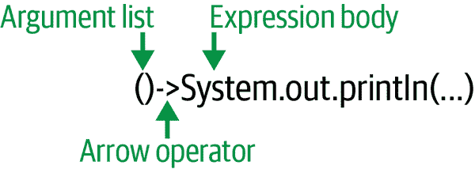

# 第十一章。Java 中的函数式方法

Java 是一个始终如一的面向对象语言。我们在第五章中看到的所有设计模式和类型仍然是大多数开发人员编写 Java 代码的核心。Java 也是灵活的，个人和公司的贡献者提出并进行改进。随着*函数式编程*（FP）再次引起关注，Java 正在跟上。FP 代表了一种编程的替代方式：函数而不是对象是重点。

从 Java 8 开始，Java 支持了合理的函数式特性集合，包括`java.util.function`包。该包包括几个类和接口，允许开发人员使用流行的函数式方法解决问题。我们将在本章中探讨其中一些方法，但我们想强调的是，这个动词*允许*。如果你不喜欢函数式编程，你可以安全地忽略本章。不过，我们希望你尝试一些示例。有些很好的功能可以使你的代码更加简洁，同时保持其可读性。

# 函数基础

函数式编程的根源可以追溯到 20 世纪 30 年代，美国数学家阿隆佐·邱奇和他的λ演算。邱奇并没有在任何硬件上运行他的演算，但λ演算形式化了一种解决问题的方式，这种方式后来导致了为真实操作的计算机编写的早期编程语言^(1)。Lisp 语言在 20 世纪 50 年代在 MIT 开发，并在像 IBM 700 系列这样的现代计算机的早期版本上运行。如果你能想象一张旧的黑白照片，上面有书架大小的闪烁灯光墙，你就能理解 FP 思想和模式在计算机历史中有多久。

但是 FP 并不是编程计算机的唯一方式。其他范式，如过程式编程和面向对象编程（OOP），经常争相流行。幸运的是，你可以在任何这些范式中实现相同的目标。你选择的范式通常取决于问题域和一些个人偏好。

考虑将两个数字相加并将结果分配给变量的简单任务。我们可以在像 Java 这样的面向对象语言中，也可以在像 Clojure 这样的函数式语言中^(2)，或者像 C 这样的过程化语言中完成这个任务：

```java
// Java objects
BigInteger five = new BigInteger(5);
BigInteger twelve = new BigInteger(12);
BigInteger sum = five.add(twelve);

// Clojure
(def five 5)
(def twelve 12)
(def sum (+ five twelve))

// C
int five = 5;
int twelve = 12;
int sum = five + twelve;
```

Java 在面向对象编程（OOP）再次兴起时进入了数字场景，并且反映了这些根源。然而，函数式编程（FP）始终有其狂热的拥护者。Java 8 在语言中提供了一些重要的增强，并为喜欢函数式编程的人们打开了大门。让我们看看其中一些新增功能，并看看它们如何与 Java 的更大世界融合。

# Lambda 表达式

受λ演算的启发，*lambda 表达式*（或简称为 lambdas）构成了 Java 中函数式编程的核心单元。在函数式语言中，函数是“一等公民”，可以像 Java 中的对象一样被创建、存储、引用、使用和传递。为了模仿这种功能，Java 8 引入了一些新的语法以及几个特殊的接口。这些新增功能允许你快速定义一个可以替代整个内部类的函数。当然，这种定义的结果在内部实现上仍然是一个对象，但其“对象性”大多数情况下是隐藏的。

在接下来的本节中，我们将更详细地介绍 lambda 表达式和那些特殊的接口。然后我们将看一个流行的具体例子，演示如何使用这些表达式来进行实际工作。

## Lambda 表达式

Lambda 表达式是一小段代码，可以接受参数并返回值，就像方法一样。不过，与方法不同的是，你可以轻松地将 lambda 作为参数传递给其他方法，或者像操作对象引用一样将其存储在变量中。函数式编程支持者看重这种能力，因为它允许你像处理数据一样编写有趣且动态的代码，而不需要创建内部或匿名内部类。

###### 注意

Lambda 表达式并不意味着提供性能提升。尽管精心使用 lambda 通常会导致更紧凑、更简洁的源代码，但这种压缩并未减少任何复杂性。Lambda 可能需要更少的打字，但它们并不做更少的工作。

回想一下线程中经常见到的`run()`方法，我们在第九章中看到过它。我们创建了多个实现了`Runnable`接口的小类，用来为我们的线程提供“主体”。那些不包含任何状态作为实例变量的小类是使用 lambda 的最佳候选对象：你有一个明确定义的任务，在一个明确定义的情境中使用它。

让我们重新审视我们的一个线程演示，然后看看如何使用 lambda 表达式作为使用`Runnable`的明确替代方案。我们将简化来自“线程的结束”的`VirtualDemo`类，并专注于匿名内部类：

```java
public class VirtualDemo2 {
  public static void main(String args[]) throws Exception {
    Runnable runnable = new Runnable() {
      public void run() {
        System.out.println("Hello thread! ID: " +
            Thread.currentThread().threadId());
      }
    };
    Thread t = Thread.startVirtualThread(runnable);
    t.join();
  }
}
```

我们创建一个新的`Runnable`实例，其中包含一个简单的`run()`方法，用于打印问候语和线程的 ID 号：

```java
% java --enable-preview VirtualDemo2
Hello thread! ID: 20
```

很好。一切都如预期那样工作。现在让我们用 lambda 表达式替换那个`runnable`变量：

```java
public class VirtualDemo3 {
  public static void main(String args[]) throws Exception {
    Thread t = Thread.startVirtualThread(() ->
      System.out.println("Hello thread! ID: " +
          Thread.currentThread().threadId())
    );
    t.join();
  }
}
```

我们仍然启动一个新的虚拟线程，并将该线程存储在一个变量中（在两个示例中都是`t`），但是没有`Runnable`接口的迹象。我们传递了一个有点奇怪的参数给`startVirtualThread()`方法，而不是一个指向某个对象的引用。那个“奇怪的参数”就是我们的 lambda 表达式，详见图 11-1。



###### 图 11-1\. lambda 表达式的基本结构

这个特定的 lambda 非常简单。我们不传递任何参数给它，它也不返回任何值。通常这就是你需要的全部。但是 lambda 可以做得更多。Lambda 表达式还支持参数，可以返回值，并且可以有更有趣的主体。

### 传递参数

如果我们将 lambda 视为代码片段，将它们与常规方法进行比较是合理的。常规方法确实封装了逻辑，就像 lambda 一样。但是在前几章中看到的许多方法还接受参数。我们可以给 lambda 提供参数吗？

考虑一个遍历 Java 集合元素的迭代器。我们在第七章中看到了几个示例。在这些示例中，我们在循环中使用迭代器，循环的主体在每次通过时对集合的给定元素执行某些操作。回想一下我们从“应用程序：树在田野上”中的树绘制循环：

```java
// File: Field.java
  protected void paintComponent(Graphics g) {
    g.setColor(fieldColor);
    g.fillRect(0,0, getWidth(), getHeight());
    for (Tree t : trees) {
      t.draw(g);
    }
    // ...
  }
```

替代的`for`循环使用了来自`trees`的迭代器来获取每棵独立的树，然后告诉该树在我们的领域上绘制自己。我们可以用一个 lambda 和`Iterable`接口的`forEach()`方法替换那个循环：

```java
// File: Field.java
  protected void paintComponent(Graphics g) {
    g.setColor(fieldColor);
    g.fillRect(0,0, getWidth(), getHeight());
    trees.forEach(t -> t.draw(g));
    // ...
  }
```

你可以看到相同的箭头操作符，但是左边没有一对空括号，而是一个变量`t`。该变量从`trees`集合中一次接收一棵树，就像第一个片段中的替代`for`循环一样。就像那个`for`循环的主体一样，你可以在表达式的右边使用当前树。通过这种安排，我们得到了一个稍微简洁的循环版本，但它保留了其可读性。你可以在任何实现了`Iterable`接口的集合中使用这个方便的技巧。

###### 注意

像*简洁*和*可读性*这样的术语是主观判断。函数式编程的支持者确实发现 lambda 更紧凑的语法更易读，但这些人已经对这种符号感到满意。我们希望你能尝试本章中的例子和练习，以获得一点熟悉感。我们确实喜欢 lambda，并在许多情况下使用它们，但它们从来不是必需的。如果你尝试过后发现 lambda 对你没有用处或不易读，则不需要在自己的代码中使用它们。

你可能已经注意到，我们第一个简单线程主体的 lambda 表达式没有接受任何参数，所以我们在左边用了一个空括号。但在这个最近的例子中，我们有一个参数却没有括号。单个参数形式是如此常见，以至于编译器允许这种简写，即没有括号。如果你没有参数，或者有多个参数，则需要括号。

### 表达式主体

Lambda 表达式在你原本需要使用匿名内部类的情况下表现出色。你不能将 lambda 替换为所有需要匿名内部类的情况，但是在 Java 中有许多意外的情况可以使用 lambda。随着这种应用的多样化，需要更复杂的计算超出了打印语句。例如，如果你需要执行几个语句或使用临时变量，你可以将表达式体放在花括号中，就像一个方法一样。

想象一下我们游戏中的树木是季节性的。你可以在绘制之前指定它们叶子的颜色。你仍然可以使用 lambda：

```java
    trees.forEach(t -> {
      t.setLeafColor(getSeasonalColor());
      t.draw(g);
    });
```

假设我们虚构的`getSeasonalColor()`方法执行一些基于日期的漂亮计算，并返回一个合适的颜色。注意，在我们的 lambda 表达式中，你可以使用来自类其余部分的方法（和大多数变量）。Lambda 非常强大。但是它们的一部分力量来自于明智的使用——一个 20 行的表达式体可能会影响你代码的可读性。但是如果你有几个只有几行的 lambda，那你就很好了。

除了保持你的 lambda 表达式易读之外，我们想指出一些可能会出现的特殊情况。如果你确实想要使用来自封闭作用域的局部变量，则必须“有效地是最终的”，如文档所述。记住，`final`变量是不能被修改的。*有效最终*变量是那些*虽然可能没有官方的`final`关键字在它们的声明中，但实际上并没有被修改*的变量。如果你试图使用一个非最终的局部变量，编译器会报错。幸运的是，这个限制只适用于局部变量。你可以自由地使用（甚至修改）声明为封闭类成员的变量。

关于关键字`this`的另一个特殊之处是。如果你还记得“this 引用”，`this`给你一个对当前对象的引用。当方法或构造函数的参数名与成员变量重叠时，这非常方便：

```java
public class Position {
  int x, y;

  public Position(int x, int y) {
    this.x = x;
    this.y = y;
  }
  // ...
}
```

尽管你可能合理地认为 lambda 体内的`this`会引用 lambda 本身，实际上它仍然引用封闭类。这种特殊情况确保你可以像前面的构造函数一样在 lambda 内部使用`this`。它确保你的 lambda 可以访问类中的内容，即使一个局部变量本来会掩盖某些内容。

### 返回值

无论你的 lambda 是一个简短的一行还是包含了十几行的代码，你也可以返回一个值。一个（看似）简单的例子是一个递增函数，它接受一个整数参数并返回比输入多一的整数。表达式本身看起来会像这样：

```java
x -> x + 1
```

在这种形式下，Java 将计算`x + 1`的答案并返回它。如果我们有一个多行体应该返回一个值，我们可以使用`return`关键字：

```java
x -> {
  System.out.println("Input: " + x);
  return x + 1;
}
```

当你的表达式中包含`if`语句时，显式返回可能会很方便。但如果你的表达式适合简单形式，则简单形式更可取。

## 功能接口

也许你想知道 Java 如何对我们简单的 lambda 表达式进行分类。它是像输入一样的`int`，还是结果？它是像 Java 的很多对象一样的对象？还是我们尚未见过的东西？让我们看看*jshell*是否能为此提供任何线索：

```java
jshell> x -> x + 1
|  Error:
|  incompatible types: java.lang.Object is not a functional interface
|  x -> x + 1
|  ^--------^
```

嗯，这并不是我们所希望的，但短语*功能接口*是一个线索。让我们尝试在“推断类型”中看到的`var`关键字，看看我们的 lambda 表达式是否可以推断出来：

```java
jshell> var inc = x -> x + 1
|  Error:
|  cannot infer type for local variable inc
|    (lambda expression needs an explicit target-type)
|  var inc = x -> x + 1;
|  ^-------------------^
```

糟糕。*jshell* 确实识别了我们的 lambda 表达式，但这种识别并不足以确定类型。

那么 lambda 表达式的类型是什么？对于我们简单的递增 lambda 来说，它的类型是`IntFunction`，一个接受一个`int`作为参数并返回一个`int`的函数。`IntFunction`接口位于`java.util.function`包中，与该包中的其他几个功能接口并列。让我们试试看：

```java
jshell> import java.util.function.*

jshell> IntFunction inc = x -> x + 1
inc ==> $Lambda$24/0x0000000840087840@23ab930d
```

万岁！我们没有得到错误！（尽管结果看起来相当令人生畏。）幸运的是，只要我们可以将其应用于一些数据，我们就不需要担心 lambda 的内部细节。但是我们该如何应用它呢？

查看[在线文档](https://oreil.ly/pgX7J)以了解界面，你会发现它有一个方法，`apply()`，相当恰当：

```java
jshell> inc.apply(7)
$16 ==> 8
```

另一个万岁！我们的增量器增加了！其他接口有类似定义的方法。

我们提到的形状涵盖了 lambda 表达式参数和结果的不同排列方式。例如，如果我们想使用`double`值而不是`int`，我们可以使用`DoubleFunction`接口。如果我们想要提供一个对象作为参数但不需要返回值，我们可以使用`Consumer<T>`接口。（由于`Consumer`适用于引用类型，它是参数化的。如果我们确实想存储接受字符串的 lambda 表达式，我们将使用类型`Consumer<String>`。）或者也许我们有一个不接受参数但生成`long`值的 lambda：`LongSupplier`接口将解决问题。我们不会在此重现所有功能接口的完整列表，但值得查看[包摘要](https://oreil.ly/ksK1Z)在线查看。

当您发现更多可以使用 lambda 的情况时，您会看到所有这些不同的形状如何被使用。但重要的是要指出，“功能接口”这个术语可以应用于具有单个抽象方法的任何接口（文档中通常缩写为 SAM）。例如，在第十二章中，我们将使用 lambda 来处理用户界面事件，比如单击按钮。按钮事件被报告给`ActionListener`。`ActionListener`接口有一个抽象方法，`actionPerformed()`，因此它符合功能接口的条件，即使在添加这些功能特性之前，它早已是 Java 的一部分。

## 方法引用

与 Java 的功能性方法相关的另一个特性是*方法引用*。有时，您的 lambda 表达式实际上只是其他方法的包装器。考虑到一个非常流行的任务，即打印集合的内容。我们可以使用刚学到的`forEach()`方法，并使用 lambda 打印列表的元素：

```java
jshell> List<String> names = new ArrayList<>()
names ==> []
jshell> names.add("Kermit");
$3 ==> true
jshell> names.add("Fozzie");
$4 ==> true
jshell> names.add("Gonzo");
$5 ==> true
jshell> names.add("Piggy");
$6 ==> true

jshell> names.forEach(n -> System.out.println(n))
Kermit
Fozzie
Gonzo
Piggy
```

您可以看到我们的 lambda 表达式只是将每个字符串传递到`System.out.println()`方法。这正是方法引用的合适候选者。

我们用一个双冒号运算符来指定这样的引用，将方法与其对象（或其类，对于`static`方法而言）分开：

```java
jshell> names.forEach(System.out::println)
Kermit
Fozzie
Gonzo
Piggy
```

非常紧凑但仍然易读。方法引用只在一组狭窄的情况下起作用，但它们是受欢迎的选择，只要允许的地方都可以使用。与一般的 lambda 表达式一样，使用方法引用并没有真正的性能优势。事实上，Java 编译器在幕后将我们的方法引用创建为 lambda 表达式：

```java
jshell> Consumer<String> printer = System.out::println
printer ==> $Lambda$27/0x0000000840087440@63c12fb0
```

如果您发现阅读起来更容易，可以随意使用方法引用来适应它们，但如果您觉得更容易阅读，则使用明确的 lambda 表达式也是可以的。

## 实用的 Lambda 表达式：排序

天哪，那是很多的理论！现在是时候在一些您在真实应用程序中经常找到的代码中使用这些 lambda 表达式了：对数据进行排序。排序是一个常见的任务；我们在讨论集合时已经谈过它了“更近距离观察：sort()方法”。lambda 在哪里适合？

要对任何列表进行排序，您需要一种比较列表中两个元素的方法，以便知道哪个应该排在前面。有些列表——比如员工薪水列表或给定目录中文件和子文件夹名称列表——有一个相当自然的排序，在大多数情况下足够。但有时您需要更复杂的排序，比如将子文件夹在文件之前排序。您可以像以前一样实现`Comparable`接口，或者创建一个实现紧密相关的`Comparator`接口的自定义类，但也可以提供 lambda。

对于 lambda 表达式来帮助排序，它需要像`Comparator`的`compare()`方法那样运行。我们需要一个接受两个参数，比如`a`和`b`，并返回三个`int`值之一的表达式：

+   如果 `a < b` 则为负数

+   如果 `a > b` 则为正数

+   如果 `a == b` 则为零

lambda 的魔力使我们能够动态地决定如何组织列表。`java.util.Collections` 辅助类包含一个 `sort()` 方法，该方法接受要排序的集合，以及提供排序顺序的比较器。我们可以使用 lambda 来进行比较。例如，我们可以创建一个简单的 lambda 来按字母顺序排序我们的 `names` 列表：

```java
jshell> Collections.sort(names, (a, b) -> a.compareTo(b))

jshell> names
names ==> [Fozzie, Gonzo, Kermit, Piggy]
```

排序如预期一样，虽然我们可以使用 Java 的任何排序技巧来获得这种默认排序。让我们反转排序：

```java
jshell> Collections.sort(names, (a, b) -> b.compareTo(a))

jshell> names
names ==> [Piggy, Kermit, Gonzo, Fozzie]
```

不错！我们只需使用 `compareTo()` 方法交换参数的顺序。

当然，lambda 可以做更多的事情，特别是当您需要对一些比名字列表更复杂的东西进行排序时。想象一下，将我们苹果投掷游戏中的树按照它们距离原点 `(0,0)` 的距离进行排序，使用一个稍微有趣的 lambda：

```java
Collections.sort(trees, (t1, t2) -> {
  var t1x = t1.getPositionX();
  var t1y = t1.getPositionY();
  var t2x = t2.getPositionX();
  var t2y = t2.getPositionY();
  var dist1 = Math.sqrt(t1x * t1x + t1y * t1Y);
  var dist2 = Math.sqrt(t2x * t2x + t2y * t2y);
  return dist1 - dist2;
});
```

我们将这个表达式体写得比必要的更冗长，以强调 lambda 可以有多行代码。这个 lambda 可能会使可读性下降，但它也突显了这种表达式的一个方便的副作用：您可以在排序时直接看到用于排序的代码。这个自我记录的特性是 FP 有这么多支持者的另一个原因。

# 流

正如我们之前所指出的，lambda 表达式并没有做任何其他 Java 功能无法完成的事情，但它们提供了一种不同的解决问题的方式。在同样的思路下，Java Streams API（不要与所有各种“Stream”类混淆，比如 `java.io` 包中的 `PrintStream`）提供了一种不同的处理数据的方式。

您可以从 `java.util.stream` 包中的某个类中获取流，或者使用集合的 `stream()` 方法。流提供了对象的稳定流动，您在遇到对象时对每个对象执行 *操作*。操作可以过滤掉不需要的对象，计数它们，甚至在将它们传递之前对它们进行修改。在有大量数据的情况下，流提供了一种简洁的方式来处理所有这些数据。作为程序员，您可以专注于如何处理单个对象，并让流完成为您准备这些单个对象的工作。

## 来源和操作

要尝试流，我们需要数据源。一个简单的开始是在任何实现 `Collection` 接口或其后代之一的类上使用 `stream()` 方法。（数组没有内置的流选项，但您可以使用 `Stream.of()` 静态方法轻松创建一个。）

一旦我们有了流，就可以对其进行操作。我们将在接下来看到更多操作，但是一个受欢迎且简单的起点是 `count()` 操作。毫不奇怪，此操作在流中的每个元素经过时计数并生成单一结果。例如，我们可以在 *jshell* 中使用我们的 `names` 列表并找出列表中有多少个朋友：

```java
jshell> names
names ==> [Fozzie, Gonzo, Kermit, Piggy]

jshell> names.stream().count()
$24 ==> 4
```

诚然，这个示例并没有做什么惊人的事情，但我们将逐步进行到更复杂的操作。重要的是注意我们如何将操作附加到我们的流上。`stream()` 返回一个流对象，我们立即使用点操作符 (`.`) 来获取我们的计数。

我们可以使用另一个操作来打印出我们的名称：

```java
jshell> names.stream().forEach(System.out::println)
Fozzie
Gonzo
Kermit
Piggy
```

我们为 `forEach()` 操作提供了一个方法引用，但您也可以提供一个接受一个参数（流中的当前名称）且不返回值的 lambda。

### 流的重用

您可能已经注意到，在我们的 `count()` 示例和类似的 `forEach()` 示例之间，我们没有将流存储在可重用的变量中。流是单向且一次性的。实际上可以将流存储在变量中，但是如果在处理完流后尝试重复使用它，将会出错：

```java
jshell> Stream<String> nameStream = names.stream()
nameStream ==> java.util.stream.ReferencePipeline$Head@621be5d1

jshell> nameStream.count()
$27 ==> 4

jshell> nameStream.forEach(System.out::println)
|  Exception java.lang.IllegalStateException: stream has
|     already been operated upon or closed
|        at AbstractPipeline.sourceStageSpliterator
|           (AbstractPipeline.java:279)
|        at ReferencePipeline$Head.forEach
|           (ReferencePipeline.java:658)
|        at (#28:1)
```

我们为我们的 `String` 对象流创建了一个参数化的 `Stream` 对象。我们成功启动了流并使用了 `count()` 操作，但是未能在 `forEach()` 操作中使用相同的流。处理流不会改变原始来源，因此您可以安全地根据需要频繁地启动新的流。但是一旦流结束，就无法重新启动它。

### 流生成器

流的另一个数据来源是*生成器*。生成器根据某些规则创建数据。一些生成器重复生成固定值，而其他生成器生成随机内容。您可以生成简单的东西，如数字，也可以生成复杂的对象。如果获取真实数据是昂贵的操作，您可以使用生成器更轻松地测试流逻辑。同样，您可以使用生成器创建良好（或古怪、错误填充）的数据来测试应用程序的其他部分。

`Stream.generate()` 方法接受一个 `Supplier` 接口的实例。供应商的工作是提供无限流的元素。它只有一个方法：`get()`，它返回适当类型的元素。元素的类型实际上是 Java 对生成器施加的唯一限制。让我们尝试生成一些简单的东西：一个稳定的数字 42 的流：

```java
jshell> Stream.generate(() -> 42).limit(3).forEach(System.out::println)
42
42
42
```

在这种情况下，我们的`Supplier`是一个非常简单的 lambda，`() → 42`。它没有参数，每次使用或评估 lambda 表达式时，结果都是 42。注意，在我们的`generate()`方法后面跟着一个新方法`limit()`，它位于生成器和我们的`println()`步骤之间。单独使用生成器会无限生成。我们将在下一节讨论`limit()`和其他相关方法，但我们需要在短期内找到一些方法来限制我们的生成器。如果你不相信我们，试试删除那一部分。只需准备好快速（并且重复地）按下 Ctrl-C 来停止无限的 42！

当我们需要更有趣的生成数据集时，我们可以在类中实现`Supplier`接口（或者像`IntSupplier`这样的基类型表亲）。考虑一个随机日期名称流。我们需要一个随机数生成器和一个有效日期的列表。这些要求可能会导致一个混乱的内联 lambda，但在一个小类中却很简单：

```java
import java.util.Random;
import java.util.stream.Stream;
import java.util.function.Supplier;

public class WeekDayGenerator implements Supplier<String> {
  private static String[] days =
    { "Sun", "Mon", "Tue", "Wed", "Thu", "Fri", "Sat" };
  private Random randSrc = new Random();

  public String get() {
    return days[randSrc.nextInt(days.length)];
  }

  public static void main(String args[]) {
    Stream.generate(new WeekDayGenerator())
          .limit(5)
          .forEach(System.out::println);
  }
}
```

这里的`main()`方法并不是必需的，但它使得测试变得更加容易。只需编译并从*ch11/examples*文件夹运行该类。你将看到一周中的五个随机日期：

```java
% cd ch11/examples
% javac WeekDayGenerator.java
% java WeekDayGenerator
Sun
Thu
Fri
Sun
Mon
```

尝试运行几次以确认随机特性是否正常工作。你的生成类可以尽可能丰富。你只需确保`get()`返回一个合适的对象或值：注意我们实现了接口的参数化版本：`Supplier<String>`，我们的`get()`方法返回`String`。现在你可以开始了！

### 流迭代器

除了生成器外，流还可以从迭代器构建。这些迭代器与用于遍历集合的迭代器不完全相同，但思想是相似的。*流迭代器*具有与集合迭代器相同的“下一个”值的概念，但对于流来说，下一个值来自于对前一个值执行计算。例如，如果你需要一系列顺序数字，迭代器就是理想的选择：

```java
jshell> IntStream.iterate(1, i -> i + 1).limit(5).forEach(System.out::println)
1
2
3
4
5
```

`iterate()`源方法接受两个参数：起始值和一个 lambda 表达式。Lambda 接受一个参数，并用它创建下一个元素。第二个元素将通过相同的 lambda 表达式放回，以创建第三个元素，依此类推。我们当然可以用自定义的`Supplier`来完成这个操作，但对于许多序列来说，迭代器提供了一个更简单的入口点。而且你不仅仅限于迭代数字，你可以迭代任何符合你需求的对象类型。只要你有一种方法来计算流的下一个对象，你就可以使用迭代器作为源。让我们尝试创建一个`LocalDate`对象的序列作为示例：

```java
jshell> import java.time.LocalDate

jshell> import java.time.temporal.ChronoUnit

jshell> Stream.iterate(LocalDate.now(),
   ...>   d -> d.plus(1, ChronoUnit.DAYS)).limit(5).forEach(System.out::println)
2023-02-10
2023-02-11
2023-02-12
2023-02-13
2023-02-14
```

我们使用`LocalDate.now()`静态方法来获取当前日期作为我们的起始值。迭代表达式接受一个`LocalDate`对象作为输入，使用`plus()`方法添加一天，并返回新的`LocalDate`。（然后我们以这样一个可爱的日期结束。）

## 过滤流

前面片段中的`count()`和`forEach()`操作都是*终端*操作的示例。终端操作“终止”了流。在处理流时，只能有一个最终的终端操作。相比之下，`limit()`操作是*中间*操作的示例。中间操作可能会修改或删除流中的某些数据，但流仍然存在。过滤是一种流行的中间操作类型，限制继续流下去的元素数量是一种过滤形式。但你可以基于各种原因进行过滤。你可以过滤以选择理想的数据，或者排除不想要的数据。你可以过滤掉重复的数据。你可以将一系列对象输入到过滤器中，并使其输出一个基本上新的流供下一个操作使用。

幸运的是，通用的过滤器只是返回`boolean`值的 lambda 表达式。这是来自`java.util.function`包中大列表功能接口中的`Predicate`形式。你将一个参数传入，然后会得到`true`或者`false`。例如，我们可以使用一个过滤器来计算包含字母“o”的名字的数量，像这样：

```java
jshell> names.stream().filter(n -> n.indexOf("o") > -1).count()
$30 ==> 2
```

我们的过滤 lambda 接收一个名字，并使用`indexOf()`操作来查看名字是否包含“o”。由于`indexOf()`返回一个`int`值，我们将其与一个不可能的索引-1 进行比较，以生成所需的`boolean`结果。如果谓词返回`true`，该名字将被传递下去。如果谓词返回`false`，则该名字将从流中被简单地丢弃。

再次重要的细节是过滤器的“中间”特性。我们可以持续对流进行操作。例如，堆叠多个过滤器是很常见的。每个过滤器选择不同的所需元素（或者从另一个角度看，移除不需要的元素）。另一个流行的内置过滤器是`distinct()`操作，它可以除去重复项。让我们在列表中添加一些重复的名字，然后尝试使用两个中间操作：

```java
jshell> names.add("Gonzo")
$32 ==> true

jshell> names
names ==> [Fozzie, Gonzo, Kermit, Piggy, Gonzo]

jshell> names.stream().
   ...> filter(n -> n.indexOf("o") > -1).count()
$34 ==> 3

jshell> names.stream().
   ...> filter(n -> n.indexOf("o") > -1).
   ...> distinct().count()
$35 ==> 2
```

你可以堆叠任意多个过滤器，尽管保持代码可读性仍然很重要（如果你有一连串的 20 个过滤器，可能需要重新考虑如何处理流的源）。但是你可以做的不仅仅是过滤流中的元素：你可以将它们转换成其他形式！

## 映射流

在流中，*映射* 是在传递元素之前修改流中元素的过程。与过滤类似，您使用 lambda 表达式执行修改。您可以映射简单的更改，如向价格流中添加销售税，或者创建将一种对象类型转换为完全不同类型的复杂映射。或者两者兼而有之！映射也是一个中间操作，因此您可以像使用过滤器一样堆叠映射操作。事实上，您会在许多在线示例中看到程序员将映射和过滤器混合使用以达到最终结果。

让我们从尝试添加销售税的任务开始。我们将从一个包含`double`值和 5%税率的简短列表开始。我们可以这样将税应用到价格上：

```java
jshell> double[] prices = { 5.99, 9.99, 20.0, 8.5};
prices ==> double[4] { 5.99, 9.99, 20.0, 8.5 }

jshell> DoubleStream.of(prices).forEach(System.out::println)
5.99
9.99
20.0
8.5

jshell> DoubleStream.of(prices).map(p -> p*1.05).
   ...>   forEach(System.out::println)
6.2895
10.489500000000001
21.0
8.925
```

我们的价格格式并不是很精致，但税已经正确应用。虽然它们很方便，但我们可以尝试另一个有用的终端操作，`sum()`，将所有价格相加：

```java
jshell> DoubleStream.of(prices).map(p -> p*1.05).sum()
$7 ==> 46.70400000000001
```

再次说明，输出并不是很好地格式化，但我们在一行中总结了整个数组的数字！

### 映射对象属性

您还可以使用映射来查看对象的内部。让我们创建一个简化版本的`Employee`类，它增加了一个额外的`salary`属性，这个版本我们称为`PaidEmployee`：

```java
public class PaidEmployee {
  private int id;
  private String name;
  private int salary; // annual, in whole dollars

  public PaidEmployee(String fullname, int id, int salary) {
    this.name = fullname;
    this.id = id;
    this.salary = salary;
  }

  public String getName() { return name; }
  public int getID() { return id; }
  public int getSalary() { return salary; }
}
```

在一个员工流中，我们现在可以使用`map()`来提取特定的属性，比如他们的名字。让我们编写一个测试类，创建几个示例员工对象，然后使用流来处理这些员工：

```java
import java.util.*;

public class Report {
  List<PaidEmployee> employees = new ArrayList<>();

  void buildEmployeeList() {
    employees.add(new PaidEmployee("Fozzie", 4, 30_000));
    employees.add(new PaidEmployee("Gonzo", 2, 50_000));
    employees.add(new PaidEmployee("Kermit", 1, 60_000));
    employees.add(new PaidEmployee("Piggy", 3, 80_000));
  }

  public void publishNames() {
    employees.stream().map(e -> e.getName()).forEach(System.out::println);
  }

  public static void main(String args[]) {
    Report r = new Report();
    r.buildEmployeeList();
    r.publishNames();
  }
}
```

`publishNames()`方法使用`map()`来获取我们的`PaidEmployee`对象并获取员工的名字。这个名字（一个简单的`String`对象）继续在流中传递。有了这些名字，我们可以添加过滤器，比如我们之前示例中的“带有 o 的名字”过滤器，或者注意避免重复的员工记录。每当您需要处理数据时，`map()`方法就是要使用的方法。

### 映射转换

在上一个示例中，我们悄悄地将我们的流从一个具有`PaidEmployee`对象的流转换为一个具有`String`对象的流。因为这两种类型都是引用类型，我们实际上不必担心我们在之前和之后的类型不同的问题。如果您需要从引用类型移动到基本类型，或者反之，则必须更加明确地进行转换。这绝对是一个常见的任务，所以 Java 提供了一些很方便的`map()`的变体来完成这个目的。让我们对所有员工的年薪进行汇总，以了解我们的工资预算应该是多少：

```java
  public void publishBudget() {
    int b = employees.stream().mapToInt(e -> e.getSalary()).sum();
    System.out.println("Annual budget is " + b);
  }
```

图 11-2 说明了通过这个预算计算流的数据移动。


###### 图 11-2\. 在流中在对象和 int 之间转换

还存在将转移到另外两种基本类型的相似类：`mapToDouble()`和`mapToLong()`。如果您已经有一个数字流并想转移到一个对象，比如`IntStream`这样的基本类型流，都包含`mapToObj()`操作。

## Flatmaps

我们想介绍另一种与流常用的映射操作：*flatmap*。flatmap 操作将块状输入平滑地转换为单一（你甚至可以说是平坦的！）元素流。什么是块状输入？这主要是一种说多维数据的可爱方式。考虑我们在“多维数组”中讨论的数组数组棋盘。我们可以在*jshell*中使用简单的`int`值进行类似设置。“棋盘”是一组行，其中每行是一组数字。如果我们尝试从我们的二维数组开始一个流会发生什么？让我们试试一个减少为 4 × 4 矩阵的示例：

```java
jshell> int[][] board = {
   ...>   { 2, 0, 4, 2 },
   ...>   { 0, 3, 0, 1 },
   ...>   { 5, 0, 1, 0 },
   ...>   { 2, 3, 0, 2 } }
board ==> int[4][] { int[4] ... , int[4] { 2, 3, 4, 2 } }

jshell> Arrays.stream(board).forEach(System.out::println)
[I@5a10411
[I@2ef1e4fa
[I@306a30c7
[I@b81eda8
```

嗯，那似乎是一个`int[]`对象流，而不是单个整数流。（那些丑陋的斑点是 Java 默认的打印没有漂亮`toString()`方法的对象的方式。“对象类型 @ 内存地址”的格式。）如果我们尝试从第一行开始一个流会发生什么？

```java
jshell> Arrays.stream(board[0]).forEach(System.out::println)
2
3
4
2
```

那个输出看起来更好——这是我们虚构的棋子价值清单，但只有一行。我们可以将流放在`for`循环的中间，并处理每一行的独立流，但这看起来很麻烦，而且会使任何计数或求和步骤变得更加困难。

为了一个友好的、适合流的方式将所有棋子放入一个流中，我们将使用`flatMap()`，或者在我们的情况下，从一个对象（每行是一个数组对象）到一个基本类型（每个棋子是一个`int`），我们将使用`flatMapToInt()`：

```java
jshell> Arrays.stream(board).
   ...>   flatMapToInt(r -> Arrays.stream(r)).
   ...>   forEach(System.out::println)
2
3
4
2
0
0
0
0
0
0
0
0
2
3
4
2
```

万岁，成功了！我们从一组密集对象开始，将这些密集对象拆分为更小部分的单一流。您可以使用`flatMap()`及其基本类型的衍生物将任何表格化、立方体化或通用的多维数据转换为一流的个体元素。

让我们看看另一个示例，结合我们到目前为止已经讨论过的几个流主题。系统和网络管理员的常见任务是解析日志文件。例如，Web 服务器记录每个访问者的 Internet Protocol（IP）地址和他们请求的资源。这里是一个小例子，为了可读性，长行被截断了：

```java
54.152.182.118 - - [20/Sep/2020:08:28:46 -0400] "GET / ...
107.150.59.82 - - [20/Sep/2020:09:33:02 -0400] "GET / ...
66.249.65.234 - - [20/Sep/2020:09:33:54 -0400] "GET /robots.txt ...
66.249.65.243 - - [20/Sep/2020:09:33:54 -0400] "GET /robots.txt ...
```

每行包含大量信息：IP 地址、请求的日期和时间、请求的内容、请求的方式，以及（如果您查看*ch11/examples*文件夹中的真实日志文件）有关哪个浏览器或用户代理发出请求的信息。真实世界的日志文件可能非常庞大，管理员通常将它们压缩存储在磁盘上。

让我们运用所有的流处理技能。我们将从一个 GZIP 文件开始，并使用一些 I/O 流加载其内容，然后将未压缩的数据分解成行。我们可以使用`flatMap()`将行的函数流转换为以空格分隔的令牌流。有了这些令牌，我们最终可以得到我们真正想要的信息：独特访客 IP 地址的计数。

```java
import java.util.regex.Pattern;
import java.util.stream.Stream;
import java.util.zip.GZIPInputStream;
import java.io.*;

public class UniqueIPs {
  public static void main(String args[]) {
    Pattern separator = Pattern.compile("\\s+");
    Pattern ipAddress = Pattern.compile("\\d+\\.\\d+\\.\\d+\\.\\d+");
    try {
      // Open the file...
      FileInputStream fis = new FileInputStream("sample-access.log.gz");
      // Then decompress the file with a wrapper...
      GZIPInputStream gis = new GZIPInputStream(fis);
      // Then wrap the decompressed input in a reader
      InputStreamReader ir = new InputStreamReader(gis);
      // Then layer on a buffered reader...
      BufferedReader br = new BufferedReader(ir);

      // That finally gives us our stream!
      // Now let's process that stream to get some interesting information
      long result = br.lines()
          .flatMap(ls -> separator.splitAsStream(ls))
          .filter(word -> ipAddress.matcher(word).matches())
          .distinct()
          .count();
      System.out.println("Found " + result + " unique IPs.");

    } catch (IOException ioe) {
      System.err.println("Oh no! Something went wrong: " + ioe);
    }
  }
}
```

非常好。一旦我们从解压后的文件中获得了行流，我们就可以使用函数式处理数据的方式来获取计数，这种方式紧凑、高效且可读的步骤列表。再次强调，你并不*必须*使用函数式流和 lambda 表达式来解决问题，但越来越多的程序员正在研究这种解决问题的方式——即使是在像 Java 这样的面向对象语言中。

## 减少和收集

在本章中，我们已经看过几个使用流的示例。每个示例都以三种终端操作中的一种结束：使用`forEach()`来打印元素，使用`count()`来知道有多少元素，或者使用`sum()`来将所有数值元素相加。计数和求和都是对流进行*减少*的示例。你将所有流中的元素“减少”为一个单一的答案。

Java 中的流有几个内置的减少器，如表 11-1 所示。

表 11-1\. 终端减少操作

| 操作 | 描述 |
| --- | --- |
| `count()` | 返回流中元素的数量 |
| `findAny()` | 返回流中的任意一个元素（如果存在） |
| `findFirst()` | 返回流中的第一个元素（如果存在） |
| `matchAll()` | 如果流中所有元素都符合给定条件，则返回`true` |
| `matchAny()` | 如果流中至少有一个元素符合给定条件，则返回`true` |
| `max()` | 使用提供的比较器，返回“最大”的元素（如果有的话） |
| `min()` | 使用提供的比较器，返回“最小”的元素（如果有的话） |

或许你会想知道我们几次使用的`sum()`操作为什么没有列出来。它确实是一个减少器，但内置版本仅适用于基本类型流：`IntStream`、`LongStream`和`DoubleStream`。

### 可选值

在深入研究减少器（包括如何创建自定义减少器）之前，我们需要准备好可能出现的一种严峻结果：空流。

每当过滤流时，可能会在过滤器的另一端没有任何剩余内容。举个快速的例子，如果我们的`names`示例中的过滤器寻找的是字母“a”而不是“o”呢？我们的名字列表中没有一个名字包含字母“a”，所以过滤器最终会将列表中的所有名字都删除掉。`count()`操作可以很好地处理这种情况：它简单地返回零作为答案。但是如果我们使用了`min()`或者`findFirst()`呢？这些减少器期望从流中给出一个匹配的元素。如果没有剩余元素，减少器应该返回什么？在某些情况下，返回`null`值可能是可以接受的，但是如果你的流以基本类型元素结束，比如`int`值，你就不能使用`null`了。

Java 流支持*可选*答案的概念，而不是强迫你构建一些奇怪的规则或抛出异常。这些答案被包装在一个称为`Optional`的类中，它来自`java.util`包。`Optional`对象有两个关键方法，我们在本节中将使用它们：`isPresent()`告诉我们值是否存在，`get()`返回该值。（如果在没有值的情况下调用`get()`，你将会得到一个`NoSuchElementException`。）

我们可以通过重新访问我们的名称过滤示例来测试这个可选的想法。不过，与其计算结果的数量，我们将使用`findFirst()`来返回第一个匹配的名称。因为可能根本没有匹配项，所以我们会得到一个包装在`Optional`中的结果。如果你的*jshell*中仍然有`names`集合，可以自由地重用它，但这里是一个快速回顾：

```java
jshell> List<String> names = new ArrayList<>()
names ==> []

jshell> names.add("Kermit")
jshell> names.add("Fozzie")
jshell> names.add("Gonzo")
jshell> names.add("Piggy")

jshell> names
names ==> [Kermit, Fozzie, Gonzo, Piggy]
```

现在让我们将这些名称通过过滤器进行过滤，并查找第一个匹配项。我们将使用一个“o”来尝试我们的过滤器（应该有一个答案），然后用一个“a”来尝试（应该没有答案）。注意我们如何使用`Optional`的结果：

```java
jshell> Optional matched = names.stream().
   ...>   filter(n -> n.indexOf("o") > -1).findFirst()
matched ==> Optional[Fozzie]

jshell> System.out.println(matched.isPresent() ?
   ...>   matched.get() : "N/A")
Fozzie

jshell> Optional matched = names.stream().
   ...>   filter(n -> n.indexOf("a") > -1).findFirst()
matched ==> Optional.empty

jshell> System.out.println(matched.isPresent() ?
   ...>   matched.get() : "N/A")
N/A
```

尽管将你的值`isPresent()`进行测试使得你的代码稍微冗长，但`Optional`提供了一个清晰的接口来处理流处理的良好和“坏”结果。与这个函数领域中的许多其他类和方法一样，你可以使用`OptionalInt`、`OptionalLong`和`Optional` `Double`类来捕获可能缺失的基本类型结果。

### 创建一个自定义的 Reducer

如果内置的 Reducers 不能满足你的需求怎么办？你可能不会感到惊讶，你可以提供一个 lambda 来创建一个自定义的 Reducer。`Stream`类包括一个`reduce()`操作，它接受一个 lambda，lambda 的形式是我们在[“函数接口”](https://example.org/learnjava6-CHP-11-SECT-2.2)讨论过的`java.util.function`包中的`BinaryOperator`。`BinaryOperator`接受两个相同类型的参数并返回一个相同类型的值。根据你的需求，你可以只使用带有二元操作 lambda 的`reduce()`，或者你可以使用第二种形式，该形式还接受与二元操作符相同类型的初始值。让我们尝试使用第二种形式来创建一个自定义的阶乘 Reducer。

*阶乘*是一个很大的数字——或者可以是的。如果这个术语听起来不熟悉，它类似于一个求和操作，但是不是将序列中的每个数字相加，而是相乘。你通常使用感叹号来表示这个操作：`5!`（读作“五的阶乘”）将 5 和 4 相乘得到 20，然后 20 × 3 得到 60，然后 60 × 2 得到 120，最后 120 × 1 得到 120。看起来可能很简单，但是阶乘数很快就变得非常大：

```java
jshell> 5 * 4 * 3 * 2 * 1
$17 ==> 120

// we already know what 5! is, so reuse that value
jshell> 10 * 9 * 8 * 7 * 6 * 120
$18 ==> 3628800

jshell> 12 * 11 * 3628800
$19 ==> 479001600
```

如果你仔细观察`12!`的结果，你会注意到它只略低于 50 亿，因此仍然适合`int`类型的（正）值范围。但是`13!`将大约为 65 亿，因此我们无法用`int`存储该答案。我们可以用`long`计算它，但即使是这种类型也无法在`20!`之后保存任何内容。幸运的是，Java 准备了一些有趣的类来自`java.math`：`BigInteger`和`BigDecimal`。这些类可以容纳任意大的值，非常适合在我们的阶乘工作中消除基本类型的限制。

我们可以使用简单的迭代器作为我们的源，因为乘法不要求特定的操作顺序。我们的阶乘减少器将始终产生类似于`count()`或`sum()`的答案，^(3) 因此我们将使用第二种形式，起始值为 1。我们可以在*jshell*中尝试这个：

```java
// First make a quick alias for our "1" value
jshell> one = BigInteger.ONE
one ==> 1

// Test with 12!
jshell> Stream.iterate(one, count -> count.add(one)).
   ...>   limit(12).reduce(one, (a, b) -> a.multiply(b))
$32 ==> 479001600

// It matches. Yay! Can we get 13!?
jshell> Stream.iterate(one, count -> count.add(one)).
   ...>   limit(13).reduce(one, (a, b) -> a.multiply(b))
$33 ==> 6227020800

// Hooray. Big test next, can we get 21!?
jshell> Stream.iterate(one, count -> count.add(one)).
   ...>   limit(21).reduce(one, (a, b) -> a.multiply(b))
$36 ==> 51090942171709440000

// Sure did! Now, just to be silly, try 99!
jshell> Stream.iterate(one, count -> count.add(one)).
   ...>   limit(99).reduce(one, (a, b) -> a.multiply(b))
$37 ==> 933262154439441526816992388562667004907159682643
        816214685929638952175999932299156089414639761565
        182862536979208272237582511852109168640000000000
        000000000000
```

计算`99!`的结果非常大，我们不得不任意截取部分内容以适应这本书的印刷版。^(4) 但是我们自定义的减少器有效！

###### 提示

如果你的减少逻辑对于简单的内联 Lambda 来说太复杂，你可以在一个类中实现`BinaryOperator`接口。然后，您可以将该类的实例提供给`reduce()`，而不是我们在示例中使用的 Lambda。

### 收集器

减少器产生的答案通常非常有用。你处理了多少行？你看到了特定单词多少次？在表格数据中某一列的平均值是多少？但是如果你想要的不只是一个答案呢？例如，在过滤时，您可能希望保留与流匹配的所有项目，而不是计数或总和它们。

如果你想要一个新的只包含字母“o”的名字列表，我们可以使用一个收集器。

`java.util.stream.Collector`接口允许在处理流时以令人印象深刻的灵活性收集和组织结果。在本书中我们不会涉及自定义收集器，但幸运的是，相关的`Collectors`类包含几种常见的收集器作为静态方法。例如，我们可以使用其中一个静态方法来获取我们感兴趣的包含字母`o`的名字列表：

```java
jshell> List<String> onames = names.stream().
   ...>   filter(n -> n.indexOf("o") > -1).
   ...>   collect(Collectors.toList())
onames ==> [Fozzie, Gonzo]
```

太好了。现在`onames`是一个常规的`List<String>`对象，我们可以在任何需要的地方使用它。在[收集器的在线文档](https://oreil.ly/R3vmF)中还有许多其他收集方法，我们鼓励您去看一看。本章末尾的代码练习让您有机会尝试另一个流行的收集器`groupingBy()`，但我们没有时间覆盖所有其他精彩的选项。

# 直接使用 Lambda

我们想要强调 Java 中 lambda 的另一个特性：你可以在自己的代码中使用它们。虽然你可能首先在一些任务中使用 lambda，比如对集合进行排序或过滤长数据流，但最终你可能希望编写接受 lambda 作为参数的方法，在该方法的主体中使用它们。由于 lambda 表达式只是某个功能接口的实例，Java 使得接受 lambda 相当简单。

考虑一个数字传感器：也许是连接到 USB 端口的某种小装置。许多这些传感器是稳定且一致的，但它们一直存在某种因素的偏差。也许一个温度计认为你的家庭办公室永远比实际温度高三度，或者一个光传感器低估了 10%的环境光。你可以编写单独的调整方法来“加 3”到一个读数或“减少 10%”每个值，但你也可以使用 lambda 创建一个通用调整方法，并让调用者提供调整逻辑。

让我们看看你可能如何编写这样一个方法。要使你的方法接受一个 lambda，你需要决定它应该具有什么形状。当然，你总是可以创建自己的形状，但通常你可以简单地使用`java.util.function`包中的接口之一。对于我们的传感器读数调整，我们将使用`DoubleUnaryOperator`形状。（*一元运算符*操作一个值，就像二元运算符操作两个值一样。）我们将接受一个`double`参数，并返回一个调整后的`double`作为结果。我们可以将我们这个非常灵活的调整器放入一个简单的测试框架中来试验：

```java
import java.util.function.DoubleUnaryOperator;

public class Adjuster {
  public static double adjust(double val,
                              DoubleUnaryOperator adjustment)
  {
    return adjustment.applyAsDouble(val);
  }

  public static void main(String args[]) {
    double sample = 70.2;
    System.out.println("Initial reading: " + sample);
    System.out.print("Adding 3: ");
    System.out.println(adjust(sample, s -> s + 3));
    System.out.print("Reducing by 10%: ");
    System.out.println(adjust(sample, s -> s * 0.9));
  }
}
```

你可以看到我们的`adjust()`方法接受两个参数：我们想要调整的值，以及将执行调整的 lambda。（是的，你可以在一个类中实现`DoubleUnaryOperator`并提供该实现的实例作为另一种选择。）当我们调用`adjust()`时，我们可以使用与 JDK 官方其他部分相同的紧凑语法。它感觉有点像使用禁忌的魔法，但完全是受鼓励的！

如果你编译并运行这个演示，你应该看到类似于以下的输出：

```java
$ java Adjuster
Initial reading: 70.2
Adding 3: 73.2
Reducing by 10%: 63.18000000000001
```

恰如我们所预期的。而且我们可以写其他调整，而不必重写我们实际的`adjust()`方法。你可能不会在每个解决的 Java 问题中都需要这种动态逻辑，但将这个技巧放入你的工具箱中是值得的，这样你在需要时可以拿出来使用。

# 下一步操作

就像 Java 的许多特性一样，我们可以单独撰写一本关于 lambda 表达式或流的书。[其他人已经做到了！](https://oreil.ly/4Eb4c) 我们希望这篇介绍能激发您对更多函数式编程主题学习的兴趣。如果您希望通过这些主题进行更多交互式练习，我们强烈推荐您使用 O’Reilly 的 [在线平台](https://oreil.ly/gRFDW) 上提供的实验室。我们的 Marc Loy 创建了两个系列，一个是关于 [Java lambda](https://oreil.ly/QNmjK)，另一个是关于 [Java streams](https://oreil.ly/XquFS)，两者都有本章节涉及的实际示例。这些实验室利用了 O’Reilly 的交互式学习环境，您可以在浏览器中编辑、编译和执行 Java 代码。

## 复习问题

1.  Java 8 中引入的大多数函数接口位于哪个包中？

1.  在编译或运行使用 lambda 等函数特性的 Java 应用程序时，您需要使用任何特殊标志吗？

1.  如何创建包含多条语句的 lambda 表达式的？

1.  lambda 表达式可以是 void 吗？它们可以返回值吗？

1.  在处理完流之后，您可以重复使用它吗？

1.  如何将对象流转换为整数流？

1.  如果您有一个从文件中过滤掉空行的流，您可能会使用什么操作告诉您有多少行具有一些内容？

## 代码练习

1.  我们的 `Adjuster` 演示允许我们传递任何接受并返回 `double` 值的 lambda。我们并不局限于像添加固定量这样的简单更改。再添加一行输出，将数字从华氏度转换为摄氏度。（作为一个快速复习，C = (F – 32) * 5 / 9。我们的读数 70.2 应该大约是 21.2。）

1.  使用 “映射对象属性” 中的 `PaidEmployee` 和 `Report` 类，添加一个简单的报告，类似于 `publishBudget()`，显示所有员工的平均工资。

## 高级练习

1.  让我们进一步探讨我们在章节末尾提到的收集器。在 `PaidEmployee` 类中添加一个 `role` 属性（类型为 `String`）。确保在 `Report` 类的 `buildEmployeeList()` 方法中也更新角色分配。随意选择您喜欢的角色，但确保至少有两个员工共享相同的角色（用于测试目的）。

    现在查看 [`groupingBy()` 收集器的文档](https://oreil.ly/miu1t)。它返回一个分组和其成员的映射。在我们的示例中，该映射的键将是您创建的角色。相关值将是共享该角色的所有员工的列表。您可以在 `Report` 类中添加一个创建此映射并打印角色及其相关员工的“报告”。

^(1) 实际上，丘奇的学生和计算机先驱艾伦·图灵证明，λ演算与图灵自己的系统（基础图灵机）在执行计算方面是等效的。

^(2) 我们提到 Clojure 而不是其他许多现代函数式语言，因为它可以在 JVM 上运行，并且可以与 Java 类和方法集成。真不错！

^(3) 阶乘过程的一个怪癖是 `0!` 被定义为“在空集合中排列项目的方法数”—这正好是一个。即使我们的流没有元素，我们仍然可以正确返回起始值。

^(4) 如果科学记数法对您在这种大小下更容易解析，那就是 9.3e+155。流行的宇宙中已知原子数量估计约为 10e+82，以防您想知道 `99!` 究竟有多大。
