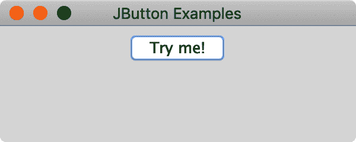
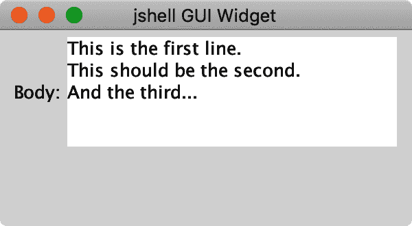

# 第十二章：桌面应用程序

Java 凭借 applet 的力量一跃成名——这些在网页上的惊人的 *交互式* 元素。现在听起来很普通，但在当时，这简直是一个奇迹。Java 还具有跨平台支持，并且可以在 Windows、Unix 和 macOS 系统上运行相同的代码。早期的 JDK 具有一组基本的图形组件，统称为抽象窗口工具包（AWT）。AWT 中的“抽象”来自于使用通用类（`Button`、`Window` 等）与本地实现。你使用抽象的、跨平台的代码编写 AWT 应用程序；你的计算机运行你的应用程序并提供具体的、本地的组件。

不幸的是，这种抽象和本地结合的巧妙组合带来了一些相当严重的限制。在抽象领域，你会遇到“最低公共分母”设计，这些设计只能让你访问 JDK 支持的每个平台上可用的功能。在本地实现中，即使某些功能在各平台上大致可用，但在实际渲染屏幕时，它们也有显著的差异。许多早期使用 Java 的桌面开发人员开玩笑说，“一次编写，到处运行”的标语实际上是“一次编写，到处调试”。Java Swing 套件旨在改善这种令人遗憾的状态。虽然 Swing 没有解决跨平台应用程序交付的所有问题，但它确实使得在 Java 中进行严肃的桌面应用程序开发成为可能。你可以找到许多优质的开源项目，甚至一些商业应用程序是用 Swing 编写的。确实，在附录 A 中详细介绍的集成开发环境 IntelliJ IDEA 就是一个 Swing 应用程序！它在性能和可用性上显然可以与本地集成开发环境媲美。¹

如果你查看 `javax.swing`² 包的文档，你会发现它包含大量的类。你仍然需要一些原始的 `java.awt` 领域的内容。有关 AWT 的整本书籍（[*Java AWT Reference*](https://oreil.ly/ppyCu)，Zukowski，O’Reilly）以及关于 Swing 的书籍（[*Java Swing*](https://oreil.ly/bO7g6)，Loy 等人，O’Reilly），甚至关于 AWT 子包，如 2D 图形的书籍（[*Java 2D Graphics*](https://oreil.ly/o3YxN)，Knudsen，O’Reilly）。在本章中，我们将专注于介绍一些流行的组件，如按钮和文本字段。我们将讨论如何在应用程序窗口中布局它们以及如何与它们交互。通过这些简单的起步主题，你可能会惊讶于你的应用程序可以变得多么复杂。如果你在阅读本书后继续进行桌面开发，你可能也会对 Java 中有多少更多的图形用户界面（GUI）内容感到惊讶。我们希望在激起你的兴趣的同时，也承认有许多 *很多* 更多的 UI 讨论是我们必须留给你以后发现的。话虽如此，让旋风之旅开始吧！

# 按钮、滑块和文本字段，哦！

那么从哪里开始呢？我们有点“先有鸡还是先有蛋”的问题：我们需要讨论要放在屏幕上的“东西”，比如我们在“HelloJava”中使用的`JLabel`对象。但我们还需要讨论你把那些东西放在哪里。而且你把那些东西放在哪里也值得讨论，因为这是一个非平凡的过程。实际上，我们似乎有一个先有鸡、再有蛋，然后是早午餐的问题。拿杯咖啡或者一杯香槟，我们就开始吧。我们将首先介绍一些流行的组件（“东西”），然后介绍它们的容器，最后讨论如何在这些容器中布置组件的话题。一旦你能在屏幕上放置一个漂亮的小部件集，我们将讨论如何与它们进行交互以及如何在多线程世界中处理用户界面。

## 组件层次结构

正如我们在前几章中讨论的那样，Java 类是以分层方式设计和扩展的。`JComponent` 和 `JContainer` 位于 Swing 类层次结构的顶部，如图 12-1 所示。我们不会详细介绍这两个类，但请记住它们的名称。当你阅读 Swing 文档时，你会在这些类中找到几个常见的属性和方法。随着你在编程方面的进步，你可能会想要构建自己的组件。`JComponent` 是一个很好的起点。我们在第二章中构建图形 `Hello` `Component` 时使用了 `JComponent`。


###### 图 12-1\. 部分（非常部分）Swing 类层次结构

我们将涵盖上述简化层次结构中提到的大多数其他类，但你肯定会想访问[在线文档](https://oreil.ly/H7KhT)来查看我们不得不遗漏的许多组件。

## 模型视图控制器架构

Swing 对“东西”的基础是一种被称为模型视图控制器（MVC）的设计模式。Swing 包的作者们努力确保一致地应用这种模式，以便当你遇到新的组件时，它们的行为和使用应该感觉熟悉。MVC 架构旨在将你所看到的（视图）与幕后状态（模型）以及改变这些部分的交互集合（控制器）分离开来。这种关注点的分离使你能够专注于每个部分的正确性。网络流量可以在幕后更新模型。视图可以在感觉顺畅并且对用户响应迅速的正常间隔同步。MVC 为构建任何桌面应用程序提供了一个强大而易于管理的框架。

当我们查看我们的一小部分组件时，我们将突出显示模型和视图元素。然后我们将更详细地讨论“事件”中的控制器。如果您对编程模式的概念感兴趣，[*可重用面向对象软件的设计模式*](https://oreil.ly/gt4Pt)（Addison-Wesley）由 Gamma、Helm、Johnson 和 Vlissides（著名的四人帮）是经典之作。关于在 Swing 中特别使用 MVC 模式的更多细节，请参阅 Loy 等人的[*Java Swing*](https://oreil.ly/ADKQq)的介绍章节。

## 标签和按钮

最简单的 UI 组件不出所料地也是最受欢迎的之一。标签(label)被广泛用于指示功能、显示状态和聚焦。我们在第二章中的第一个图形应用程序中使用了一个标签。在构建更有趣的程序时，我们将会使用更多的标签。

`JLabel` 组件是一个多功能工具。让我们看看如何使用 `JLabel` 并自定义其许多属性的一些示例。我们将从对我们的“Hello, Java”程序进行一些准备性调整开始：

```java
import javax.swing.*;
import java.awt.*;

public class Labels {

  public static void main(String[] args) {
    JFrame frame = new JFrame("JLabel Examples");
    frame.setLayout(new FlowLayout()); 
    frame.setDefaultCloseOperation(JFrame.EXIT_ON_CLOSE); 
    frame.setSize(300, 150);

    JLabel basic = new JLabel("Default Label"); 
    frame.add(basic);
    frame.setVisible(true);
  }
}
```

简言之，有趣的部分包括：


设置框架使用的布局管理器。


设置在使用操作系统的“关闭”按钮时采取的操作（在本例中，是窗口左上角的红点）。我们在这里选择的操作是退出应用程序。


创建我们的简单标签并将其添加到框架中。

您声明和初始化标签，然后将其添加到框架中。这应该是很熟悉的操作。可能新的是我们使用了`FlowLayout`实例，它帮助我们生成了图 12-2 中显示的屏幕截图。


###### 图 12-2\. 一个简单的 `JLabel`

我们将在“容器和布局”中更详细地讨论布局管理器，但我们需要一些东西来让我们起步，同时还允许将多个组件添加到单个容器中。`FlowLayout`类通过水平居中组件顶部来填充容器，从左到右添加，直到该“行”用完空间，然后继续在下一行上添加。这种排列方式在较大的应用程序中可能不太实用，但对于快速在屏幕上显示几件事物而言是理想的。

让我们通过向框架添加几个更多的标签来证明这一点。查看图 12-3 中显示的结果：

```java
public class Labels {

  public static void main(String[] args) {
    JFrame frame = new JFrame("JLabel Examples");
    frame.setLayout(new FlowLayout());
    frame.setDefaultCloseOperation(JFrame.EXIT_ON_CLOSE);
    frame.setSize(300, 150);

    JLabel basic = new JLabel("Default Label");
    JLabel another = new JLabel("Another Label");
    JLabel simple = new JLabel("A Simple Label");
    JLabel standard = new JLabel("A Standard Label");

    frame.add(basic);
    frame.add(another);
    frame.add(simple);
    frame.add(standard);

    frame.setVisible(true);
  }
}
```


###### 图 12-3\. 几个基本的 `JLabel` 对象

不错，对吧？再次强调，这种简单的布局并不适用于大多数生产应用程序中的内容，但对于您开始时肯定是有用的。关于布局，我们还想提一点，因为您以后会遇到这个想法：`FlowLayout`也处理标签的大小。在这个示例中很难注意到这一点，因为标签默认具有透明背景。如果我们导入`java.awt.Color`类，我们可以使用该类来帮助使它们不透明并赋予它们特定的背景颜色：

```java
    JLabel basic = new JLabel("Default Label");
    basic.setOpaque(true);
    basic.setBackground(Color.YELLOW);
    JLabel another = new JLabel("Another Label");
    another.setOpaque(true);
    another.setBackground(Color.GREEN);

    frame.add(basic);
    frame.add(another);
    // other frame setup
```

如果我们对我们所有的标签都做同样的操作，我们现在可以看到它们的真实大小和它们之间的间隙在图 12-4 中。但是如果我们可以控制标签的背景颜色，我们还能做什么呢？我们可以改变前景色吗？（可以。）我们可以改变字体吗？（可以。）我们可以改变对齐方式吗？（可以。）我们可以添加图标吗？（可以。）我们可以创建最终构建 Skynet 并导致人类灭绝的自我意识标签吗？（也许，但可能不太容易。也好。）图 12-5 展示了其中一些可能的调整。


###### 图 12-4\. 不透明，彩色标签


###### 图 12-5\. 更多带有花哨选项的标签

这里是构建这种多样性的相关源代码：

```java
    // a white label with a forced size and text centered inside
    JLabel centered = new JLabel("Centered Text", JLabel.CENTER);
    centered.setPreferredSize(new Dimension(150, 24));
    centered.setOpaque(true);
    centered.setBackground(Color.WHITE);

    // a white label with an alternate, larger font
    JLabel times = new JLabel("Times Roman");
    times.setOpaque(true);
    times.setBackground(Color.WHITE);
    times.setFont(new Font("TimesRoman", Font.BOLD, 18));

    // a white label using inline HTML for styling
    JLabel styled = new JLabel("<html>Some <b><i>styling</i></b>"
        + " is also allowed</html>");
    styled.setOpaque(true);
    styled.setBackground(Color.WHITE);

    // a label with both an icon and text
    JLabel icon = new JLabel("Verified",
        new ImageIcon("ch10/examples/check.png"), JLabel.LEFT);
    icon.setOpaque(true);
    icon.setBackground(Color.WHITE);

    // finally, add all our new labels to the frame
    frame.add(centered);
    frame.add(times);
    frame.add(styled);
    frame.add(icon);
```

我们使用了一些其他类来帮助，例如`java.awt.Font`和`javax.swing.ImageIcon`。我们可以回顾更多选项，但我们需要查看一些其他组件。如果您想玩转这些标签，并尝试更多您在 Java 文档中看到的选项，请尝试导入我们为*jshell*构建的助手并玩耍。我们的几行代码的结果显示在图 12-6 中：

```java
$ javac ch12/examples/Widget.java
$ jshell
|  Welcome to JShell -- Version 21-ea
|  For an introduction type: /help intro

jshell> import javax.swing.*
jshell> import java.awt.*
jshell> import ch12.examples.Widget

jshell> Widget w = new Widget()
w ==> ch10.Widget[frame0,0,23,300x150,layout=java.awt.B ... abled=true]

jshell> JLabel label1 = new JLabel("Green")
label1 ==> javax.swing.JLabel[,0,0,0x0,invalid,alignmentX=0\. ... ion=CENTER]

jshell> label1.setOpaque(true)
jshell> label1.setBackground(Color.GREEN)

jshell> w.add(label1)
$8 ==> javax.swing.JLabel[,0,0,0x0,...]

jshell> w.add(new JLabel("Quick test"))
$9 ==> javax.swing.JLabel[,0,0,0x0,...]
```


###### 图 12-6\. 在*jshell*中使用我们的`Widget`类

我们希望您现在能够看到创建标签（或其他组件，例如我们将要探索的按钮）并交互式地调整其参数是多么容易。这是熟悉用于创建 Java 桌面应用程序的可用构建块的绝佳方式。如果您经常使用我们的`Widget`，您可能会发现其`reset()`方法很方便。此方法会移除所有当前组件并刷新窗口，以便您可以快速重新开始。

### 按钮

图形应用程序中您将需要的另一个几乎通用组件是按钮。`JButton`类是 Swing 中您的首选按钮。（您还会在文档中找到其他流行的按钮类型，例如`JCheckbox`和`JToggleButton`。）创建按钮与创建标签非常相似，如图 12-7 所示。

```java
import javax.swing.*;
import java.awt.*;

public class Buttons {
  public static void main(String[] args) {
    JFrame frame = new JFrame("JButton Examples");
    frame.setLayout(new FlowLayout());
    frame.setDefaultCloseOperation(JFrame.EXIT_ON_CLOSE);
    frame.setSize(300, 150);

    JButton basic = new JButton("Try me!");
    frame.add(basic);

    frame.setVisible(true);
  }
}
```



###### 图 12-7\. 一个简单的`JButton`

您可以像处理标签一样控制按钮的颜色、文本和图像对齐、字体等。当然，不同之处在于您可以单击按钮并在程序中做出反应，而标签大多是静态显示。尝试运行此示例并单击按钮。即使在我们的程序中它不执行任何其他功能，它应该会改变颜色并感觉“按下”。在我们讨论“对按钮点击做出反应”的概念之前（在 Swing 中称为“事件”），我们希望再介绍几个组件，但如果您等不及了，可以跳到 “Events”！

## 文本组件

在今天的桌面或 Web 应用程序中，几乎无法想象没有文本输入字段。这些输入元素允许自由输入信息，并且在在线表单中几乎无处不在。您可以输入姓名、电子邮件地址、电话号码和信用卡号码。您可以在组成其字符的语言中执行所有这些操作，也可以在从右到左读取的其他语言中执行这些操作。Swing 有三个主要的文本组件：`JTextField`、`JTextArea` 和 `JTextPane`；它们都是从共同的父类 `JTextComponent` 扩展而来。`JTextField` 是一个经典的文本字段，用于简短的单词或单行输入。`JTextArea` 允许跨多行输入更多内容。`JTextPane` 是一个专门用于编辑富文本的组件。

### 文本字段

让我们在我们简单流动的应用程序中运行一个文本输入的例子。我们将简化到两个标签和相应的文本字段：

```java
import javax.swing.*;
import java.awt.*;

public class TextInputs {
  public static void main(String[] args) {
    JFrame frame = new JFrame("JTextField Examples");
    frame.setLayout(new FlowLayout());
    frame.setDefaultCloseOperation(JFrame.EXIT_ON_CLOSE);
    frame.setSize(400, 200);

    JLabel nameLabel = new JLabel("Name:");
    JTextField nameField = new JTextField(10);
    JLabel emailLabel = new JLabel("Email:");
    JTextField emailField = new JTextField(24);

    frame.add(nameLabel);
    frame.add(nameField);
    frame.add(emailLabel);
    frame.add(emailField);

    frame.setVisible(true);
  }
}
```

注意在 Figure 12-8 中，文本字段的大小由我们在其构造函数中指定的列数决定。这不是初始化文本字段的唯一方式，但在没有其他布局机制决定字段宽度时是很有用的。（在这里，`FlowLayout` 在一定程度上让我们失望了——“电子邮件：”标签没有与电子邮件文本字段保持在同一行上。随着我们了解更多有关布局的信息，我们将很快修复它。）继续输入一些内容吧！您可以输入和删除文本；用鼠标在字段内部突出显示内容；以及按预期的方式剪切、复制和粘贴。


###### 图 12-8\. 简单标签和 `JTextField`

如果您向我们的演示应用程序添加一个文本字段，就像在 *jshell* 中显示的 Figure 12-9 那样，您可以调用它的 `getText()` 方法来查看内容确实可用。


###### 图 12-9\. 检索 `JTextField` 的内容

```java
jshell> w.reset()

jshell> JTextField emailField = new JTextField(15)
emailField ==> javax.swing.JTextField[,0,0,0x0, ... lignment=LEADING]

jshell> w.add(new JLabel("Email:"))
$12 ==> javax.swing.JLabel[,0,0,0x0, ... sition=CENTER]

jshell> w.add(emailField)
$13 ==> javax.swing.JTextField[,0,0,0x0, ... lignment=LEADING]

// Enter an sample address, we typed in "me@some.company"

jshell> emailField.getText()
$14 ==> "me@some.company"
```

请注意，`text` 属性是可读写的。您可以在文本字段上调用 `setText()` 来程序化地更改其内容。这对于设置默认值、自动格式化诸如电话号码或从网络收集信息填充表单非常有用。在 *jshell* 中试试吧。

### 文本区域

当您需要的空间不仅限于简单的单词甚至长的 URL 输入时，您可能会转向 `JTextArea`，以便为用户提供多行输入空间。您可以使用类似 `JTextField` 的构造函数创建一个空文本区域。对于 `JTextArea`，您除了指定列数外，还要指定行数。看一下我们添加文本区域到我们的文本输入演示应用的代码：

```java
    JLabel bodyLabel = new JLabel("Body:");
    JTextArea bodyArea = new JTextArea(10,30);

    frame.add(bodyLabel);
    frame.add(bodyArea);
```

结果显示在 图 12-10 中。您可以看到我们有多行文本的空间。请运行这个新版本并自己尝试一下。当您超过一行的末尾时会发生什么？按下 Return 键时会发生什么？您会得到您熟悉的行为吗？您仍然可以像使用文本字段一样访问其内容。


###### 图 12-10\. 添加 `JTextArea`

让我们在 *jshell* 中将一个文本区域添加到我们的小部件中，这样我们就可以玩转它的属性：

```java
jshell> w.reset()

jshell> w.add(new JLabel("Body:"))
$16 ==> javax.swing.JLabel[,0,0,0x0, ... ition=CENTER]

jshell> JTextArea bodyArea = new JTextArea(5,20)
bodyArea ==> javax.swing.JTextArea[,0,0,0x0, ... word=false,wrap=false]

jshell> w.add(bodyArea)
$18 ==> javax.swing.JTextArea[,0,0,0x0, ... lse,wrap=false]

jshell> bodyArea.getText()
$19 ==> "This is the first line.\nThis should be the second.\nAnd the third..."
```

太棒了！我们可以看到我们在 图 12-11 中键入的 Return 键被编码为我们检索到的字符串中的 `\n` 字符。



###### 图 12-11\. 检索 `JTextArea` 的内容

但是，如果您尝试输入一个长的、无法停止的句子，使其超过行末会发生什么？您可能会得到一个奇怪的文本区域，它会扩展到您的窗口大小甚至更大，如 图 12-12 所示。


###### 图 12-12\. 简单 `JTextArea` 中的过长行

我们可以通过查看 `JText``Area` 的一对属性来修复不正确的大小行为，如 表 12-1 所示。

表 12-1\. `JTextArea` 的换行属性

| 属性 | 默认值 | 描述 |
| --- | --- | --- |
| `lineWrap` | `false` | 表中的行是否应该完全换行 |
| `wrapStyleWord` | `false` | 如果行有换行，是否应该在单词或字符边界上换行 |

那么，让我们重新开始并启用单词换行。我们可以使用 `setLineWrap(true)` 来确保文本换行。但这可能还不够。我们将添加一个调用 `setWrapStyleWord(true)` 来确保文本区域不仅仅在单词中断。这应该看起来类似于 图 12-13。


###### 图 12-13\. 在简单 `JTextArea` 中的包装行

您可以在 *jshell* 中或您自己的应用中尝试。当您从 `bodyArea` 对象中检索文本时，您不应该在第三行中看到一个换行符（`\n`）在第二个“on”和“but”之间。

### 文本滚动

如果我们有太多行会发生什么？独立使用 `JTextArea` 时，它会采用一个奇怪的“增长直到无法”技巧，如 图 12-14 所示。


###### 图 12-14\. 在简单的 `JTextArea` 中有太多行

要解决这个问题，我们需要调用标准的 Swing 辅助组件： `JScrollPane`。这是一个通用的容器，可以轻松地在有限的空间中展示大组件。为了向您展示这有多简单，让我们来修复我们的文本区域：⁴。

```java
jshell> w.remove(bodyArea); // So we can start with a fresh text area

jshell> bodyArea = new JTextArea(5,20)
bodyArea ==> javax.swing.JTextArea[,0,0,0x0,inval... word=false,wrap=false]

jshell> w.add(new JScrollPane(bodyArea))
$17 ==> javax.swing.JScrollPane[,47,5,244x84, ... ortBorder=]
```

您可以在 图 12-15 中看到，文本区域不再超出帧的边界。您还可以看到侧面和底部的标准滚动条。如果您只需要简单的滚动，您已经完成了！但是，与 Swing 中的大多数其他组件一样，`JScrollPane` 有许多细节可以根据需要进行调整。我们不会在这里覆盖大部分内容，但我们确实想向您展示如何处理一个常见的设置：文本区域的换行（按单词换行）与垂直滚动，即不水平滚动。


###### 图 12-15\. 在 `JScrollPane` 中嵌入 `JTextArea` 的行数过多

```java
    JLabel bodyLabel = new JLabel("Body:");
    JTextArea bodyArea = new JTextArea(10,30);
    bodyArea.setLineWrap(true);
    bodyArea.setWrapStyleWord(true);
    JScrollPane bodyScroller = new JScrollPane(bodyArea);
    bodyScroller.setHorizontalScrollBarPolicy(
        JScrollPane.HORIZONTAL_SCROLLBAR_NEVER);
    bodyScroller.setVerticalScrollBarPolicy(
        JScrollPane.VERTICAL_SCROLLBAR_ALWAYS);

    frame.add(bodyLabel);
    // note we don't add bodyArea, it's already in bodyScroller
    frame.add(bodyScroller);
```

您应该会得到一个类似于 图 12-16 中所示的文本区域。


###### 图 12-16\. 在 `JScrollPane` 中的良好形式的 `JTextArea`

太棒了！您现在已经体验到了最常见的 Swing 组件，包括标签、按钮和文本字段。但是，我们实际上只是浅尝辄止了这些组件的功能。请查阅 Java 文档，并在 *jshell* 或您自己的小型应用程序中玩耍，以更深入地了解每个组件。

习惯于 UI 设计需要实践。如果您将要构建桌面应用程序，我们建议您查阅其他书籍和在线资源，但是在键盘上的实践时间是无可替代的。

## 其他组件

如果您已经查看了 `javax.swing` 包的文档，您会知道还有几十种其他组件可供使用。在这个大列表中，有几个我们想要强调的⁵。

### JSlider

当您希望用户从一系列值中进行选择时，滑块是一个巧妙且高效的输入组件：例如，字体大小选择器、颜色选择器和缩放选择器等。对于我们苹果投掷游戏中所需的角度和力量值，滑块非常合适。我们的角度范围从 0 到 180，力量值范围从 0 到 20（一个任意的最大值）。图 12-17 展示了这些滑块的位置（暂时忽略我们如何实现布局）。


###### 图 12-17\. 在我们的苹果投掷游戏中使用 `JSlider`

要创建一个新的滑块，您需要提供三个值：最小值（我们的角度滑块为 `0`），最大值（`180`）和初始值（游戏中为 `90` 中间位置）。您可以像这样将这样的滑块添加到我们的 *jshell* 游乐场：

```java
// reset the widget
jshell> w.reset()

jshell> JSlider slider = new JSlider(0, 180, 90);
slider ==> javax.swing.JSlider[,0,0,0x0, ... ks=false,snapToValue=true]

jshell> w.add(slider)
$20 ==> javax.swing.JSlider[,0,0,0x0, ... alue=true]
```

将滑块移动到像图 12-18 中所示的位置，然后使用 `getValue()` 方法查看其当前值：

```java
jshell> slider.getValue()
$21 ==> 112
```


###### 图 12-18\. *jshell* 中简单的 `JSlider`

在“事件”中，我们将看到如何在用户更改这些值时实时接收它们。

`JSlider`构造函数使用整数作为最小和最大值，并且`getValue()`返回一个整数。 如果您需要分数值，则需要自行处理。 例如，在我们的游戏中的力量滑块将受益于支持超过 21 个离散级别。 我们可以通过使用较大范围的整数构建滑块，然后将当前值除以适当的比例因子来解决这个问题：

```java
jshell> JSlider force = new JSlider(0, 200, 100)
force ==> javax.swing.JSlider[,0,0,0x0, ... ks=false,snapToValue=true]

jshell> w.add(force)
$23 ==> javax.swing.JSlider[,0,0,0x0,invalid ... alue=true]

jshell> force.getValue()
$24 ==> 68

jshell> float myForce = force.getValue() / 10.0f;
myForce ==> 6.8
```

### JList

如果您有一组离散的值，但这些值不是简单的连续数字范围，则“列表”UI 元素是一个很好的选择。 `JList`是此输入类型的 Swing 实现。 您可以设置它以允许单个或多个选择，并且如果您深入研究 Swing 的功能，您可以生成自定义视图，显示列表中的项目及其额外信息或详细信息。（例如，您可以制作图标列表，或图标和文本，或多行文本等）。

与我们迄今看到的其他组件不同，`JList`需要更多信息才能启动。 要创建一个有用的列表组件，您需要使用接受您打算显示的数据的构造函数之一。 最简单的这种构造函数接受一个`Object`数组。 虽然您可以传递任何类型的对象数组，但`JList`的默认行为是显示列表中对象的`toString()`方法的输出。 使用`String`对象数组非常常见且产生预期结果。 图 12-19 显示了一个简单的城市列表。


###### 图 12-19\. *jshell*中四个城市的简单`JList`

```java
jshell> w.reset()

jshell> String[] cities = new String[] { "Atlanta", "Boston",
   ...>   "Chicago", "Denver" };
cities ==> String[4] { "Atlanta", ..., "Denver" }

jshell> JList cityList = new JList<String>(cities);
cityList ==> javax.swing.JList[,0,0,0x0, ...entation=0]

jshell> w.add(cityList)
$29 ==> javax.swing.JList[,0,0,0x0,invalid ... ation=0]
```

我们在构造函数中使用与创建参数化集合对象（例如`ArrayList`，请参见“类型限制”）时相同的`<String>`类型信息。 由于 Swing 是在泛型之前添加的，因此您可能会在在线或书籍示例中找到未添加类型信息的示例。 省略它不会阻止代码编译或运行，但是您会在编译时收到与集合类相同的`unchecked`警告消息。

与获取滑块当前值类似，您可以随时使用四种方法之一检索列表中选择的项目或项目：

`getSelectedIndex()`

对于单选列表，返回一个`int`

`getSelectedIndices()`

对于多选列表，返回一个`int`数组

`getSelectedValue()`

对于单选列表，返回一个对象

`getSelectedValues()`

对于多选列表，返回一个对象数组

主要区别在于选择项目的索引还是实际值对您更有用。 在*jshell*中操作我们的城市列表时，我们可以这样提取出所选城市：

```java
jshell> cityList.getSelectedIndex()
$31 ==> 2

jshell> cityList.getSelectedIndices()
$32 ==> int[1] { 2 }

jshell> cityList.getSelectedValue()
$33 ==> "Chicago"

jshell> cities[cityList.getSelectedIndex()]
$34 ==> "Chicago"
```

对于大列表，您可能希望有一个滚动条。 Swing 在其代码中促进了可重用性，因此您可以像对文本区域一样使用`JScrollPane`与`JList`。

# 容器和布局

那些组件的庞大列表只是可用部件的子集。在本节中，您将把我们讨论过的组件布局到有用的排列中。这些排列发生在一个*容器*内，这是 Java 中用于可以包含其他组件的组件的术语。让我们从查看最常见的容器开始。

## 框架和窗口

每个桌面应用程序至少需要一个窗口。这个术语早于 Swing 并且被大多数三大操作系统的图形界面使用，包括 Windows（无关）。如果您需要，Swing 确实提供了一个低级别的 `JWindow` 类，但最有可能您会在 `JFrame` 中构建您的应用程序。图 12-20 展示了 `JFrame` 的类层次结构。我们将坚持其基本特性，但随着您的应用程序变得更加丰富，您可能希望使用层次结构中更高级的元素创建定制窗口。


###### 图 12-20\. `JFrame` 类的层次结构

让我们重新审视来自第 2 章中的第一个图形应用程序的创建，并更加关注 `JFrame` 对象：

```java
import javax.swing.*;

public class HelloJavaAgain {
  public static void main(String[] args) {
    JFrame frame = new JFrame("Hello, Java!");
    frame.setDefaultCloseOperation(JFrame.EXIT_ON_CLOSE);
    frame.setSize(300, 150);

    JLabel label = new JLabel("Hello, Java!", JLabel.CENTER);
    frame.add(label);

    frame.setVisible(true);
  }
}
```

我们传递给 `JFrame` 构造函数的字符串将成为窗口的标题。然后我们在对象上设置一些特定的属性。确保当用户关闭窗口时，我们退出程序。（这似乎是显而易见的，但是复杂的应用可能会有多个窗口，例如工具面板或支持多文档。在这些应用中关闭一个窗口可能并不意味着“退出”。）

然后我们选择窗口的起始大小，并将实际的标签组件添加到框架中（这将标签放置在其*内容面板*中，稍后会详细介绍）。一旦组件被添加，我们会使窗口可见，结果是图 12-21。


###### 图 12-21\. 一个简单的 `JFrame`，带有一个添加的标签

这个基本过程是每个 Swing 应用程序的基础。您的应用程序的有趣部分来自于您如何处理那个内容面板。

那么*内容面板*是什么？框架使用其自己的一组容器来持有典型应用程序的各种部分。您可以将自己的内容面板设置为任何继承自 `java.awt.Container` 的对象，但是我们暂时将坚持使用默认的内容面板。

我们还使用了一个快捷方式来添加我们的标签。`JFrame` 版本的 `add()` 将委托给内容面板的 `add()`。以下片段显示了如何在没有快捷方式的情况下添加标签：

```java
    JLabel label = new JLabel("Hello, Java!", JLabel.CENTER);
    frame.getContentPane().add(label);
```

`JFrame` 类并不是所有功能都有快捷方式。阅读文档并使用存在的快捷方式。如果没有，不要犹豫，通过 `getContentPane()` 获取引用，然后根据需要配置或调整该容器。

## JPanel

默认内容面板是一个 `JPanel`，在 Swing 中通常用作容器。它像 `JButton` 或 `JLabel` 一样是一个组件，因此您的面板可以包含其他面板。这种嵌套在应用程序布局中通常起着重要作用。例如，您可以创建一个 `JPanel` 来容纳文本编辑器中的格式化按钮，然后将该工具栏添加到内容面板。这种安排使用户可以轻松显示、隐藏或移动它。

`JPanel` 允许您向屏幕添加和移除组件。（这些方法从 `Container` 类继承，但我们通过 `JPanel` 对象访问它们。）如果有什么变化并且您想更新您的 UI，还可以使用 `repaint()` 方法重绘面板。

我们可以使用 *jshell* 中的 playground 小部件来看到 `add()` 和 `remove()` 方法的效果，如 图 12-22 所示：

```java
jshell> Widget w = new Widget()
w ==> ch10.Widget[frame0,0,23,300x300, ... kingEnabled=true]

jshell> JLabel emailLabel = new JLabel("Email:")
emailLabel ==> javax.swing.JLabel[,0,0,0x0 ... ition=CENTER]

jshell> JTextField emailField = new JTextField(12)
emailField ==> javax.swing.JTextField[,0,0,0x0, ... LEADING]

jshell> JButton submitButton = new JButton("Submit")
submitButton ==> javax.swing.JButton[,0,0,0x0, ... ble=true]

jshell> w.add(emailLabel);
$8 ==> javax.swing.JLabel[,0,0,0x0, ... ition=CENTER]
// Left screenshot in image above

jshell> w.add(emailField)
$9 ==> javax.swing.JTextField[,0,0,0x0, ... nment=LEADING]

jshell> w.add(submitButton)
$10 ==> javax.swing.JButton[,0,0,0x0, ... pable=true]
// Now we have the middle screenshot

jshell> w.remove(emailLabel)
// And finally the right screenshot
```

请尝试自己操作！大多数应用程序不会随意添加和移除组件。通常，您会通过添加所需的内容来构建界面，然后让它保持不变。沿途可能会启用或禁用一些按钮，但请尽量避免让用户感到意外，出现部分组件消失或新元素弹出的情况。


###### 图 12-22\. 在 `JPanel` 中添加和移除组件

## 布局管理器

类似 `JPanel` 的容器负责布置您添加的组件。Java 提供了多个 *布局管理器* 来帮助您实现所需的结果。

### BorderLayout

您已经看到 `FlowLayout` 的效果。在不知不觉中，您使用了另一个布局管理器：`JFrame` 的内容面板默认使用 `BorderLayout`。图 12-23 展示了 `BorderLayout` 控制的五个区域及其区域。请注意，`NORTH` 和 `SOUTH` 区域与应用程序窗口一样宽，但只有足够容纳标签的高度。同样，`EAST` 和 `WEST` 区域填充了 `NORTH` 和 `SOUTH` 区域之间的垂直间隙，但仅宽到足够容纳，留下剩余空间由 `CENTER` 区域横向和纵向填充：

```java
import java.awt.*;
import javax.swing.*;

public class BorderLayoutDemo {
  public static void main(String[] args) {
    JFrame frame = new JFrame("BorderLayout Demo");
    frame.setDefaultCloseOperation(JFrame.EXIT_ON_CLOSE);
    frame.setSize(400, 200);

    JLabel northLabel = new JLabel("Top - North", JLabel.CENTER);
    JLabel southLabel = new JLabel("Bottom - South", JLabel.CENTER);
    JLabel eastLabel = new JLabel("Right - East", JLabel.CENTER);
    JLabel westLabel = new JLabel("Left - West", JLabel.CENTER);
    JLabel centerLabel = new JLabel("Center (everything else)",
        JLabel.CENTER);

    // Color the labels so we can see their boundaries better
    northLabel.setOpaque(true);
    northLabel.setBackground(Color.GREEN);
    southLabel.setOpaque(true);
    southLabel.setBackground(Color.GREEN);
    eastLabel.setOpaque(true);
    eastLabel.setBackground(Color.RED);
    westLabel.setOpaque(true);
    westLabel.setBackground(Color.RED);
    centerLabel.setOpaque(true);
    centerLabel.setBackground(Color.YELLOW);

    frame.add(northLabel, BorderLayout.NORTH);
    frame.add(southLabel, BorderLayout.SOUTH);
    frame.add(eastLabel, BorderLayout.EAST);
    frame.add(westLabel, BorderLayout.WEST);
    frame.add(centerLabel, BorderLayout.CENTER);

    frame.setVisible(true);
  }
}
```


###### 图 12-23\. 使用 `BorderLayout` 可用的区域

在这种情况下，`add()` 方法需要额外的参数，并将其传递给布局管理器。（并非所有的管理器都需要此参数，就像您在 `FlowLayout` 中看到的那样。）

图 12-24 展示了在应用程序中嵌套 `JPanel` 对象的示例。我们在中心使用文本区域显示了一个大消息，然后在底部的面板上添加了一些操作按钮。同样，在接下来的部分中我们会涵盖的事件中，这些按钮目前并不起作用，但我们想向您展示如何使用多个容器。如果需要，您可以继续嵌套 `JPanel` 对象。

有时，更好的顶层布局选择可以使您的应用程序更易维护，性能更佳：

```java
public class NestedPanelDemo {
  public static void main(String[] args) {
    JFrame frame = new JFrame("Nested Panel Demo");
    frame.setDefaultCloseOperation(JFrame.EXIT_ON_CLOSE);
    frame.setSize(400, 200);

    // Create the text area and add it to the center
    JTextArea messageArea = new JTextArea();
    frame.add(messageArea, BorderLayout.CENTER);

    // Create the button container
    JPanel buttonPanel = new JPanel(new FlowLayout());

    // Create the buttons
    JButton sendButton = new JButton("Send");
    JButton saveButton = new JButton("Save");
    JButton resetButton = new JButton("Reset");
    JButton cancelButton = new JButton("Cancel");

    // Add the buttons to their container
    buttonPanel.add(sendButton);
    buttonPanel.add(saveButton);
    buttonPanel.add(resetButton);
    buttonPanel.add(cancelButton);

    // And finally, add that container to the bottom of the app
    frame.add(buttonPanel, BorderLayout.SOUTH);

    frame.setVisible(true);
  }
}
```


###### 图 12-24\. 一个简单的嵌套容器示例

在这个例子中有两点需要注意。首先，当我们创建 `JTextArea` 对象时没有指定行数或列数，与 `FlowLayout` 不同，`BorderLayout` 会在可能的情况下设置组件的大小。对于顶部和底部，这意味着使用组件自身的高度，类似于 `FlowLayout` 的工作方式，然后设置组件的宽度以填充框架。侧边使用它们的组件宽度，但布局管理器设置高度。`BorderLayout` 在中心设置组件的宽度和高度。

其次，在将 `messageArea` 和 `buttonPanel` 对象添加到 `frame` 时，我们在 `frame` 的 `add()` 方法中指定了额外的“where”参数。然而，当我们将按钮本身添加到 `buttonPanel` 时，我们使用了更简单的 `add()` 版本，只有组件参数。容器的布局管理器决定我们需要使用 `add()` 的哪个变体。因此，尽管 `buttonPanel` 在使用 `BorderLayout` 的 `SOUTH` 区域，`saveButton` 及其同伴位于它们自己的封闭容器中，不知道也不关心容器外部发生的事情。

### GridLayout

许多时候，你需要（或希望）你的组件或标签占据对称的空间。想想确认对话框底部的“是”，“否”和“取消”按钮。（Swing 也可以制作这些对话框；详见 “模态和弹出窗口”。）`GridLayout` 类可以帮助实现这样均匀的间距。让我们尝试在前面的例子中使用 `GridLayout` 来排列这些按钮。我们只需要改变一行代码：

```java
    // Create the button container. Old version:
    // JPanel buttonPanel = new JPanel(new FlowLayout());
    JPanel buttonPanel = new JPanel(new GridLayout(1,0));
```

对 `add()` 的调用保持完全相同；不需要单独的约束参数。

正如你在 图 12-25 中所看到的，`GridLayout` 的按钮尺寸相同，尽管“取消”按钮的文本比其他按钮稍长。


###### 图 12-25\. 使用 `GridLayout` 布局一行按钮

在创建布局管理器时，我们告诉它我们只想要一行，没有列数的限制 `(1, 0)`。网格也可以是二维的，具有多行和多列。图 12-26 以手机键盘布局为例。

```java
public class PhoneGridDemo {
  public static void main(String[] args) {
    JFrame frame = new JFrame("Nested Panel Demo");
    frame.setDefaultCloseOperation(JFrame.EXIT_ON_CLOSE);
    frame.setSize(200, 300);

    // Create the phone pad container
    JPanel phonePad = new JPanel(new GridLayout(4,3));

    // Create and add the 12 buttons, top-left to bottom-right
    phonePad.add(new JButton("1"));
    phonePad.add(new JButton("2"));
    phonePad.add(new JButton("3"));

    phonePad.add(new JButton("4"));
    phonePad.add(new JButton("5"));
    phonePad.add(new JButton("6"));

    phonePad.add(new JButton("7"));
    phonePad.add(new JButton("8"));
    phonePad.add(new JButton("9"));

    phonePad.add(new JButton("*"));
    phonePad.add(new JButton("0"));
    phonePad.add(new JButton("#"));

    // And finally, add the pad to the center of the app
    frame.add(phonePad, BorderLayout.CENTER);

    frame.setVisible(true);
  }
}
```

从左到右，从上到下依次添加按钮，应该能看到 图 12-26 中的应用程序。


###### 图 12-26\. 手机键盘的二维网格布局

如果你需要完全对称的元素，这非常方便且非常简单。但如果你想要一个*大部分*对称的布局呢？想象一下流行的网页表单，左侧是标签列，右侧是文本字段列。`GridLayout` 可以处理类似这样的基本两列表单，但很多时候你的标签简短简单，而文本字段却较宽，给用户更多输入空间。Java 如何适应这些布局？

### GridBagLayout

如果您需要更有趣的布局，但又不想嵌套大量面板，考虑使用`GridBagLayout`。它设置更复杂，但允许创建复杂的布局，仍然可以使元素在视觉上对齐和大小合适。与`BorderLayout`类似，您需要使用额外的参数添加组件。然而，`GridBagLayout`的参数是丰富的`GridBagConstraints`对象，而不是简单的字符串。

`GridBagLayout`中的“grid”确实是这样，一个被分成各种行和列的矩形容器。“bag”的部分来自于如何使用这些行和列创建的单元格的“抓袋”概念。行和列可以有自己的高度或宽度，并且组件可以占据任何矩形的一系列单元格。我们可以利用这种灵活性，通过单个`JPanel`构建出我们的游戏界面，而不是使用几个嵌套的面板。图 12-27 展示了将屏幕分为四行三列的一种方式，并放置组件。


###### 图 12-27\. `GridBagLayout`使用的示例网格

您可以看到不同的行高和列宽。有些组件占用多个单元格。这种类型的布局不适用于每个应用程序，但对于需要更复杂布局的许多用户界面来说是强大且有效的。

要使用`GridBagLayout`构建应用程序，您需要在添加组件时保留几个引用。让我们首先设置网格：

```java
    public static final int SCORE_HEIGHT = 30;
    public static final int CONTROL_WIDTH = 300;
    public static final int CONTROL_HEIGHT = 40;
    public static final int FIELD_WIDTH = 3 * CONTROL_WIDTH;
    public static final int FIELD_HEIGHT = 2 * CONTROL_WIDTH;
    public static final float FORCE_SCALE = 0.7f;

    GridBagLayout gameLayout = new GridBagLayout();

    gameLayout.columnWidths = new int[]
        { CONTROL_WIDTH, CONTROL_WIDTH, CONTROL_WIDTH };
    gameLayout.rowHeights = new int[]
        { SCORE_HEIGHT, FIELD_HEIGHT, CONTROL_HEIGHT, CONTROL_HEIGHT };

    JPanel gamePane = new JPanel(gameLayout);
```

这一步需要您进行一些计划，但一旦您在屏幕上放置了几个组件，就很容易调整。要添加这些组件，您需要创建和配置`GridBagConstraints`对象。幸运的是，您可以重用相同的对象来配置所有组件——您只需要在添加每个元素之前重复配置部分。这里是如何添加主游戏场组件的示例：

```java
    GridBagConstraints gameConstraints = new GridBagConstraints();

    gameConstraints.fill = GridBagConstraints.BOTH;
    gameConstraints.gridy = 1;
    gameConstraints.gridx = 0;
    gameConstraints.gridheight = 1;
    gameConstraints.gridwidth = 3;

    Field field = new Field();
    gamePane.add(field, gameConstraints);
```

注意我们如何设置字段将占用的单元格。我们通过指定左上角的矩形来指定一个矩形，即给出行（`gridy`）和列（`gridx`）。然后我们指定我们的字段将占用的行数（`gridheight`）和列数（`gridwidth`）。这是配置网格包约束的核心。

您还可以调整诸如组件如何填充其占用的单元格（`fill`）以及每个组件获得多少边距等内容。我们已经决定简单地填充一组单元格中的所有可用空间（水平和垂直填充），但您可以在[`GridBagConstraints`的文档](https://oreil.ly/XwdXt)中了解更多选项。

让我们在顶部添加一个记分标签：

```java
    gameConstraints.fill = GridBagConstraints.BOTH;
    gameConstraints.gridy = 0;
    gameConstraints.gridx = 0;
    gameConstraints.gridheight = 1;
    gameConstraints.gridwidth = 1;

    JLabel scoreLabel = new JLabel(" Player 1: 0");
    gamePane.add(scoreLabel, gameConstraints);
```

对于第二个组件，您是否看到约束设置如何与处理游戏场类似？每当看到这种类似性时，考虑将这些相似的步骤提取到一个可以重用的函数中：

```java
    private GridBagConstraints buildConstraints(int row, int col,
        int rowspan, int colspan)
    {
      // Use our global reference to the gameConstraints object
      gameConstraints.fill = GridBagConstraints.BOTH;
      gameConstraints.gridy = row;
      gameConstraints.gridx = col;
      gameConstraints.gridheight = rowspan;
      gameConstraints.gridwidth = colspan;
      return gameConstraints;
    }
```

然后，您可以像这样重写先前的记分标签和游戏字段代码块：

```java
    GridBagConstraints gameConstraints = new GridBagConstraints();

    JLabel scoreLabel = new JLabel(" Player 1: 0");
    Field field = new Field();
    gamePane.add(scoreLabel, buildConstraints(0,0,1,1));
    gamePane.add(field, buildConstraints(1,0,1,3));
```

有了这个功能，您可以快速添加各种其他组件和标签，以完成游戏界面。例如，右下角的图 12-27 中的投掷按钮可以设置如下：

```java
    JLabel tossButton = new JButton("Toss");
    gamePane.add(tossButton, buildConstraints(2,2,2,1));
```

更干净！我们只需继续创建我们的组件并将它们放置在正确的行和列上，具有适当的跨度。最后，我们在单个容器中拥有一组相当有趣的组件。

与本章的其他部分一样，我们没有时间涵盖每个布局管理器，甚至不涵盖我们讨论的每个布局管理器的每个功能。请务必查阅 Java 文档，并尝试创建一些虚拟应用程序来测试不同的布局。作为起点，`BoxLayout`是对网格概念的良好升级，而`GroupLayout`可以生成数据输入表单。不过，现在我们要继续前进。现在是将所有这些组件“连接”起来，并响应所有键入、点击和按钮推送的时间了——这些在 Java 中被编码为事件。

# 事件

如在“模型-视图-控制器架构”中讨论的那样，MVC 设计中的模型和视图元素是直接的。但是控制器方面呢？在 Swing（以及更广泛的 Java 应用中），用户与组件之间的交互通过事件进行通信。*事件*包含一般信息，例如交互发生的时间，以及事件类型特有的信息，例如您点击鼠标的屏幕上的点，或者您在键盘上输入的键。*监听器*（或*处理程序*）接收消息并可以以某种有用的方式响应。将组件连接到监听器就允许用户控制您的应用程序。

## 鼠标事件

最简单的开始方法就是生成和处理事件。让我们跟随我们第一个快速应用程序的脚步，使用`HelloMouse`应用程序并专注于处理鼠标事件。当我们点击鼠标时，我们将使用该点击事件确定我们的`JLabel`的位置。（顺便说一句，这将需要移除布局管理器。我们希望手动设置标签的坐标。）

当您查看此示例的源代码时，请注意一些特定项，如下所示：

```java
// filename: ch12/examples/HelloMouse.java
package ch10.examples;

import java.awt.*;
import javax.swing.*;
import java.awt.event.MouseEvent;
import java.awt.event.MouseListener;

public class HelloMouse extends JFrame implements MouseListener {
  JLabel label;

  public HelloMouse() {
    super("MouseEvent Demo");
    setDefaultCloseOperation(JFrame.EXIT_ON_CLOSE);
    // remove the layout manager
    setLayout(null);
    setSize(300, 100);

    label = new JLabel("Hello, Mouse!", JLabel.CENTER);
    label.setOpaque(true);
    label.setBackground(Color.YELLOW);
    label.setSize(100,20);
    label.setLocation(100,100);
    add(label);

    getContentPane().addMouseListener(this); 
  }

  public void mouseClicked(MouseEvent e) { 
    label.setLocation(e.getX(), e.getY());
  }

  public void mousePressed(MouseEvent e) { } 
  public void mouseReleased(MouseEvent e) { }
  public void mouseEntered(MouseEvent e) { }
  public void mouseExited(MouseEvent e) { }

  public static void main(String[] args) {
    HelloMouse frame = new HelloMouse();
    frame.setVisible(true);
  }
}
```


当您点击时，Java 会从硬件（计算机、鼠标、键盘）捕获低级事件并将其交给适当的监听器。监听器是接口。您可以创建特殊的类来实现接口，或者您可以将监听器作为主应用程序类的一部分实现，就像我们在这里所做的那样。您选择处理事件的位置确实取决于您需要对其响应的操作。在本书的其余部分中，您将看到许多这两种方法的示例。


除了扩展`JFrame`，我们还实现了`MouseListener`接口。我们必须为`MouseListener`中列出的每个方法提供一个方法体，但我们在`mouseClicked()`中完成了真正的工作。此方法从`event`对象中获取点击的坐标，并使用它们来更改标签的位置。`MouseEvent`类包含关于事件的丰富信息：发生时间，发生在哪个组件上，涉及哪个鼠标按钮，事件发生的(x,y)坐标等等。尝试在某些未实现的方法中打印一些信息，如`mouseDown()`。


我们添加了许多其他类型的鼠标事件方法，但我们没有使用。这在低级事件（如鼠标和键盘事件）中很常见。监听器接口旨在为相关事件提供一个集中的收集点。您必须实现接口中的每个方法，但可以响应您关心的特定事件，并将其他方法留空。


新代码的另一个关键部分是为我们的内容窗格调用`addMouseListener()`。语法可能看起来有点奇怪，但这是一种标准方法。使用`getContentPane()`表示“这是生成事件的组件”，并将`this`作为参数表示“这是接收（处理）事件的类”。在这个例子中，来自框架内容窗格的事件将返回给相同的类，这是我们放置所有鼠标处理代码的地方。

现在运行应用程序。你将得到一个变体的熟悉的“Hello, World”图形应用程序，如图 12-28 所示。友好的消息应该会随着你点击而跟随鼠标移动。


###### 图 12-28\. 使用`MouseEvent`定位标签

### 鼠标适配器

如果您想尝试辅助类方法，可以向文件添加一个单独的类并在该类中实现`MouseListener`。如果是这样，您可以利用 Swing 为许多侦听器提供的一种快捷方式。`MouseAdapter`类是`MouseListener`接口的简单实现，其中为每个事件编写了空方法。当您`extend`此类时，您只需要覆盖您关心的方法。这样可以使处理程序变得干净而简洁：

```java
// filename: ch12/examples/HelloMouseHelper.java
package ch12.examples;

import java.awt.*;
import java.awt.event.MouseEvent;
import java.awt.event.MouseAdapter;
import javax.swing.*;

public class HelloMouseHelper {
  public static void main(String[] args) {
    JFrame frame = new JFrame("MouseEvent Demo");
    frame.setDefaultCloseOperation(JFrame.EXIT_ON_CLOSE);
    frame.setLayout(null);
    frame.setSize(300, 300);

    JLabel label = new JLabel("Hello, Mouse!", JLabel.CENTER);
    label.setOpaque(true);
    label.setBackground(Color.YELLOW);
    label.setSize(100,20);
    label.setLocation(100,100);
    frame.add(label);

    LabelMover mover = new LabelMover(label);
    frame.getContentPane().addMouseListener(mover);
    frame.setVisible(true);
  }
}

/**
 * Helper class to move a label to the position of a mouse click.
 * Recall from Chapter 5 that secondary classes included in the same
 * public class must not be public themselves. They can be protected,
 * file as private, or package private (with no qualifier).
 */
class LabelMover extends MouseAdapter {
  JLabel labelToMove;

  public LabelMover(JLabel label) {
    labelToMove = label;
  }

  public void mouseClicked(MouseEvent e) {
    labelToMove.setLocation(e.getX(), e.getY());
  }
}
```

请记住，辅助类需要引用它们所接触的每个对象。我们将标签传递给了我们适配器的构造函数。这是建立必要连接的一种流行方式，但只要处理程序在开始接收事件之前具有对其所需每个对象的引用即可随时添加所需的访问。

## 动作事件

虽然几乎每个 Swing 组件上都可以获得低级别的鼠标和键盘事件，但这可能有点乏味。大多数 UI 库都提供更简单思考的高级事件，Swing 也不例外。例如，`JButton`类支持一个`ActionEvent`，让你知道按钮已被点击。大多数情况下，这正是你想要的。但如果需要特殊行为，比如响应来自不同鼠标按钮的点击或在触摸屏上区分长按和短按，仍然可以使用鼠标事件。

用于演示按钮点击事件的一种流行方式是构建一个简单的计数器，就像你在图 12-29 中看到的那样。每次点击按钮时，程序会更新标签。这个简单的概念验证显示了你可以接收和响应 UI 事件。让我们看看这个演示所需的连接：

```java
package ch12.examples;

import javax.swing.*;
import java.awt.*;
import java.awt.event.ActionEvent;
import java.awt.event.ActionListener;

public class ActionDemo1 extends JFrame implements ActionListener {
  int counterValue = 0;
  JLabel counterLabel;

  public ActionDemo1() {
    super("ActionEvent Counter Demo");
    setDefaultCloseOperation(JFrame.EXIT_ON_CLOSE);
    setLayout(new FlowLayout());
    setSize(300, 180);

    counterLabel = new JLabel("Count: 0", JLabel.CENTER);
    add(counterLabel);

    JButton incrementer = new JButton("Increment");
    incrementer.addActionListener(this);
    add(incrementer);
  }

  public void actionPerformed(ActionEvent e) {
    counterValue++;
    counterLabel.setText("Count: " + counterValue);
  }

  public static void main(String[] args) {
    ActionDemo1 demo = new ActionDemo1();
    demo.setVisible(true);
  }
}
```


###### 图 12-29\. 使用`ActionEvent`来增加一个计数器

我们在`actionPerformed()`方法内更新一个简单的计数器变量，并在其中显示结果，这是`ActionListener`对象接收其事件的地方。我们使用了直接的监听器实现方法，但我们也可以像在“鼠标事件”中的`LabelMover`示例中所做的那样创建一个帮助类。

动作事件很直接；它们没有像鼠标事件那样多的细节可用，但它们确实携带一个“命令”属性。所涉及的命令只是一个任意字符串。对于 Java 而言，这并不意味着什么，但你可以根据自己的需求自定义此属性。对于按钮而言，Java 默认使用按钮标签的文本。如果在`JTextField`类中按下回车键输入文本，则也会生成一个动作事件。但在这种情况下，字段中当前的文本用作命令。图 12-30 展示了如何将按钮和文本字段连接到标签上。


###### 图 12-30\. 来自不同来源的`ActionEvent`的使用

```java
public class ActionDemo2 {
  public static void main(String[] args) {
    JFrame frame = new JFrame("ActionListener Demo");
    frame.setDefaultCloseOperation(JFrame.EXIT_ON_CLOSE);
    frame.setLayout(new FlowLayout());
    frame.setSize(300, 180);

    JLabel label = new JLabel("Results go here", JLabel.CENTER);
    ActionCommandHelper helper = new ActionCommandHelper(label);

    JButton simpleButton = new JButton("Button");
    simpleButton.addActionListener(helper);

    JTextField simpleField = new JTextField(10);
    simpleField.addActionListener(helper);

    frame.add(simpleButton);
    frame.add(simpleField);
    frame.add(label);

    frame.setVisible(true);
  }
}

/**
 * Helper class to show the command property of any ActionEvent in a given label.
 */
class ActionCommandHelper implements ActionListener {
  JLabel resultLabel;

  public ActionCommandHelper(JLabel label) {
    resultLabel = label;
  }

  public void actionPerformed(ActionEvent ae) {
    resultLabel.setText(ae.getActionCommand());
  }
}
```

请注意，我们使用一个`ActionListener`对象来处理*按钮和文本字段*的事件。这是 Swing 处理事件的监听器方法的一个很好的特性：生成给定类型事件的任何组件都可以向接收该类型事件的任何监听器报告。有时你的事件处理程序是唯一的，你会为每个组件构建一个单独的处理程序。但许多应用程序提供多种完成相同任务的方式。你通常可以用单个监听器处理这些不同的输入来源。而且你的代码越少，出错的可能性就越小！

## 变更事件

出现在几个 Swing 组件中的另一种事件类型是`ChangeEvent`。这是一个简单的事件，用于通知您某些事情已经发生了变化。`JSlider`类使用此机制报告滑块位置的更改。`ChangeEvent`类引用了发生变化的组件（事件的*源*），但没有关于可能在该组件内部发生的具体变化的详细信息。您需要询问组件以获取这些详细信息。这种监听-查询的过程可能看起来很繁琐，但它确实允许高效地通知需要更新，而无需创建成百上千的方法来覆盖可能出现的所有事件变化。

我们不会在这里复制整个应用程序，但让我们看看`AppleToss`类如何使用`ChangeListener`将瞄准滑块映射到我们的物理学家：

```java
// file: ch12/examples/game/AppleToss.java
    gamePane.add(buildAngleControl(), buildConstraints(2, 0, 1, 1));

    // other setup stuff ...

    private JSlider buildAngleControl() {
      // Our aim can range from 0 to 180 degrees
      JSlider slider = new JSlider(0,180);

      // but trigonometric 0 is on the right side, not the left
      slider.setInverted(true);

      // Any time the slider value changes, update the player
      slider.addChangeListener(new ChangeListener() {
        public void stateChanged(ChangeEvent e) {
          player1.setAimingAngle((float)slider.getValue());
          field.repaint();
        }
      });
      return slider;
    }
```

在这个片段中，我们使用工厂模式创建我们的滑块，并将其返回供`gamePane`容器的`add()`方法使用。我们创建了一个简单的匿名内部类。更改我们的瞄准滑块会产生一定的影响，而且只有一种方法可以瞄准苹果。由于无法重用类，我们选择了一个匿名内部类。创建一个完整的辅助类，并将`player1`和`field`元素作为参数传递给构造函数或初始化方法并没有错，但您会经常发现上述方法在实践中经常使用。

我们想指出处理简单事件如`ChangeEvent`和`ActionEvent`的另一种选项。这些事件的监听器具有单个抽象方法。这个短语听起来熟悉吗？这是 Oracle 描述其函数式接口的方式。所以我们可以使用 lambda！

```java
    // And now, any time the slider value changes, we should update
    slider.addChangeListener(e -> {
      player1.setAimingAngle((float)slider.getValue());
      field.repaint();
    });
```

不幸的是，许多侦听器处理一系列相关事件。对于具有多个方法的任何侦听器接口，都无法使用 lambda。但是，如果您喜欢它们，lambda 可以与按钮和菜单项一起使用，因此在您的图形应用程序中仍然可以发挥重要作用。

在*jshell*中，我们的`Widget`并不适合尝试与事件相关的代码。虽然您可以在命令行上编写匿名内部类或多行 lambda 表达式，但这可能很繁琐，并且很难从同一命令行修复错误。通常情况下，编写小而专注的演示应用程序会更简单，就像本章的许多示例一样。虽然我们鼓励您启动苹果投掷游戏，以玩耍并调整上述代码中显示的滑块，但您也应该尝试几个原创应用程序。

## 其他事件

在`java.awt.event`和`javax.swing.event`包中分布着数十种其他事件和监听器。浏览文档只是为了了解您可能会遇到的其他类型的事件是值得的。表 12-2 展示了到目前为止在本章中讨论过的组件相关的事件和监听器，以及一些在更多使用 Swing 时值得查看的内容。

表格 12-2\. Swing 和 AWT 事件及其关联的监听器

| S/A | 事件类 | 监听器接口 | 生成组件 |
| --- | --- | --- | --- |
| A | `ActionEvent` | `ActionListener` | `JButton`, `JMenuItem`, `JTextField` |
| S | `ChangeEvent` | `ChangeListener` | `JSlider` |
| A | `ItemEvent` | `ItemListener` | `JCheckBox`, `JRadioButton` |
| A | `KeyEvent` | `KeyListener` | 组件的后代 |
| S | `ListSelectionEvent` | `ListSelectionListener` | `JList` |
| A | `MouseEvent` | `MouseListener` | 组件的后代 |
| A | `MouseMotionEvent` | `MouseMotionListener` | 组件的后代 |
| AWT 事件（A）来自 `java.awt.event`，Swing 事件（S）来自 `javax.swing.event` |

如果您不确定特定组件支持哪些事件，请查看其文档以查找类似 `addXYZListener()` 的方法。`XYZ` 代表需要查看文档其他位置的提示。回想一下，我们的滑块使用了 `addChangeListener()`。因此，`XYZ` 在这种情况下是 `Change`。您可以推断事件名称（`ChangeEvent`）和监听器接口（`ChangeListener`）从这个提示。一旦您有了监听器的文档，请尝试实现每个方法并简单打印报告的事件。通过这种方式，您可以了解各种 Swing 组件如何响应键盘和鼠标事件。

# 线程注意事项

如果您在阅读本章节时阅读了任何关于 Swing 的 JDK 文档，可能会注意到一个警告：Swing 组件不是线程安全的。正如您在第九章中学到的，Java 支持多线程执行以利用现代计算机的处理能力。多线程应用程序可能允许两个线程竞争相同的资源或同时更新相同变量但具有不同的值。不知道数据是否正确可能会严重降低调试程序或甚至只是信任其输出的能力。对于 Swing 组件，此警告提醒程序员其 UI 元素可能受到此类破坏的影响。

为了帮助保持一致的 UI，Swing 鼓励您在 AWT *事件分发线程* 上更新组件。这是自然处理按钮点击等事物的线程。如果您响应事件（例如我们在“动作事件”中的计数按钮和标签）更新组件，那么您就已经设置好了。这个想法是，如果应用程序中的每个其他线程将 UI 更新发送到唯一的事件分发线程，则没有组件可以受到同时可能发生冲突的更改的不利影响。

图形应用程序中线程的一个常见例子是动画旋转器，它在你等待大文件下载时显示在屏幕上。但是如果你变得不耐烦呢？如果看起来下载失败了，但旋转器仍在运行呢？如果你的长时间运行的任务使用事件分发线程，你的用户将无法点击取消按钮或采取任何行动。长时间运行的任务应由可以在后台运行的单独线程处理，使你的应用程序响应和可用。但是当后台线程完成时，我们如何更新 UI 呢？Swing 为你准备了一个辅助类。

## SwingUtilities 和组件更新

你可以从任何线程使用`SwingUtilities`类以安全、稳定的方式更新你的 UI 组件。有两个静态方法可用于与你的 UI 通信：

+   `invokeAndWait()`

+   `invokeLater()`

如它们的名称所示，第一个方法运行一些 UI 更新代码，并使当前线程在继续之前等待该更新完成。第二个方法将一些 UI 更新代码交给事件分发线程，然后立即在当前线程上继续执行。（事件分发线程有时称为*事件分发队列*。你可以附加事件或更新，事件分发线程将按照它们被添加的顺序大致处理它们，就像在队列中一样。）你使用哪一个方法取决于你的后台线程是否需要在继续之前知道 UI 的状态。例如，如果你要向接口添加一个新按钮，你可能希望使用`invokeAndWait()`，这样在后台线程继续执行之前，它可以确保未来的更新实际上有一个按钮来更新。

如果你不太关心何时更新某些内容，但仍希望它被事件分发线程安全处理，`invokeLater()` 是完美的选择。想象一下在下载大文件时更新进度条。你的代码可能会在下载完成的过程中触发多次更新。在恢复下载之前，你不需要等待这些图形更新完成。如果进度更新被延迟或非常接近第二次更新，没有真正的危害。但你不希望忙碌的图形界面打断你的下载，特别是如果服务器对暂停敏感的情况下。

我们将在第十三章看到几个此类网络/UI 交互的示例，但让我们假装一些网络流量并更新一个小标签来展示`SwingUtilities`。我们可以设置一个开始按钮，它将用一个简单的百分比显示更新一个状态标签，并启动一个后台线程，该线程每秒休眠一次，然后增加进度。每次线程唤醒时，它将使用`invokeLater()`正确设置标签的文本。首先，让我们设置我们的演示：

```java
package ch12.examples;

public class ProgressDemo {
  public static void main(String[] args) {
    JFrame frame = new JFrame("SwingUtilities 'invoke' Demo");
    frame.setDefaultCloseOperation(JFrame.EXIT_ON_CLOSE);
    frame.setLayout(new FlowLayout());
    frame.setSize(300, 180);

    JLabel label = new JLabel("Download Progress Goes Here!",
        JLabel.CENTER);
    Thread pretender = new Thread(new ProgressPretender(label));

    JButton simpleButton = new JButton("Start");
    simpleButton.addActionListener(e -> {
      simpleButton.setEnabled(false);
      pretender.start();
    });

    JLabel checkLabel = new JLabel("Can you still type?");
    JTextField checkField = new JTextField(10);

    frame.add(label);
    frame.add(simpleButton);
    frame.add(checkLabel);
    frame.add(checkField);
    frame.setVisible(true);
  }
}
```

大部分内容应该看起来很熟悉，但请看我们如何创建我们的线程。我们将 `new ProgressPretender()` 作为参数传递给我们的 `Thread` 构造函数。我们本可以将该调用分解为单独的部分，但由于我们不再直接引用我们的 `ProgressPretender` 对象，我们可以坚持使用这种更整洁、更密集的方法。然而，我们确实引用了线程本身，因此我们为它创建了一个适当的变量。然后，我们可以在按钮的 `ActionListener` 中启动我们的线程运行。此时，我们还禁用了我们的“开始”按钮。我们不希望用户尝试（重新）启动已经运行的线程！

我们为您添加了一个文本字段供您输入。在更新进度的同时，您的应用程序应继续响应用户输入，如键入。试试看！虽然文本字段与任何内容都没有连接，但您应该能够在观看进度计数器缓慢上升的同时输入和删除文本，如 图 12-31 所示。


###### 图 12-31\. 线程安全更新进度标签

那么我们是如何在不锁定应用程序的情况下更新标签的呢？让我们看看 `ProgressPretender` 类并检查 `run()` 方法：

```java
package ch12.examples;

class ProgressPretender implements Runnable {
  JLabel label;
  int progress;

  public ProgressPretender(JLabel label) {
    this.label = label;
    progress = 0;
  }

  public void run() {
    while (progress <= 100) {
      SwingUtilities.invokeLater(
        () -> label.setText(progress + "%");
      );
      try {
        Thread.sleep(1000);
      } catch (InterruptedException ie) {
        System.err.println("Someone interrupted us. Skipping download.");
        break;
      }
      progress++;
    }
  }
}
```

在这个类中，我们存储了传递给构造函数的标签，这样我们就知道在哪里显示我们更新后的进度。`run()` 方法有三个基本步骤：1）更新标签，2）睡眠 1,000 毫秒，3）增加我们的进度。

在第 1 步中，我们传递给 `invokeLater()` 的 lambda 参数是基于 第九章 中的 `Runnable` 接口。我们可以使用内部类或匿名内部类，但对于这样一个简单的任务，lambda 是完美的选择。lambda 主体更新标签与当前进度值。事件分派线程将执行 lambda。这就是使文本字段保持响应性的神奇之处，尽管我们的“进度”线程大部分时间都在睡眠。

第 2 步是标准的线程睡眠。`sleep()` 方法知道它可以被中断，所以编译器会确保你像我们上面做的那样提供一个 `try/catch` 块。处理中断的方法有很多种，但在这种情况下，我们选择简单地`break`出循环。

最后，我们增加我们的进度计数器并重新启动整个过程。一旦达到 100，循环就结束了，我们的进度标签应该停止变化。如果您耐心等待，您将看到最终值。应用程序本身应该保持活动状态。您仍然可以在文本字段中输入内容。我们的下载完成了，世界万事大吉！

## 定时器

Swing 库包括一个设计用于 UI 空间的计时器。`javax.swing.Timer`类非常直观。它等待指定的时间段，然后触发一个动作事件（与点击按钮相同类型的事件）。它可以一次性或重复性地触发该动作。您将发现许多理由在图形应用程序中使用计时器。除了提供另一种驱动动画循环的方式外，您可能希望自动取消某些操作，例如加载网络资源如果时间太长。反之，您可能希望显示一个小的“请稍候”旋转器或对话框，让用户知道操作正在进行中。您可能希望在用户在指定时间内没有响应时关闭对话框提示。Swing 的`Timer`可以处理所有这些场景。

### 使用计时器进行动画

让我们修改来自“使用线程重新访问动画”的飞行苹果，并尝试使用`Timer`实现动画。`Timer`类会为我们处理这些细节。我们仍然可以使用我们第一次尝试动画时`Apple`类中的`step()`方法。我们只需修改启动方法，并保持一个适当的变量用于计时器：

```java
  public static final int STEP = 40;  // frame duration in milliseconds
  Timer animationTimer;

  // other member declarations ...

  void startAnimation() {
    if (animationTimer == null) {
      animationTimer = new Timer(STEP, this);
      animationTimer.setActionCommand("repaint");
      animationTimer.setRepeats(true);
      animationTimer.start();
    } else if (!animationTimer.isRunning()) {
      animationTimer.restart();
    }
  }

  // other methods ...

  public void actionPerformed(ActionEvent event) {
    if (animating && event.getActionCommand().equals("repaint")) {
      System.out.println("Timer stepping " + apples.size() + " apples");
      for (Apple a : apples) {
        a.step();
        detectCollisions(a);
      }
      repaint();
      cullFallenApples();
    }
  }
```

这种方法有两个好处。它确实更易读，因为我们不需要负责动作之间的暂停。我们通过将事件之间的时间间隔和接收事件的`ActionListener`（在这种情况下是我们的`Field`类）传递给构造函数来创建`Timer`。我们为计时器提供一个简单但唯一的动作命令，使其成为重复计时器，并启动它！

另一个好处特定于 Swing 和图形应用程序：`javax.swing.Timer`在*事件调度线程*上触发其动作事件。您无需将任何响应包装在`invokeAndWait()`或`invokeLater()`中。只需将基于计时器的代码放在附加监听器的`actionPerformed()`方法中，一切都搞定！

因为有几个组件会生成`ActionEvent`对象，所以我们通过为我们的计时器设置`actionCommand`属性来预防碰撞。在我们的情况下，这一步并非必须，但这样做可以让`Field`类在不破坏我们的动画的情况下处理其他事件。

### 其他计时器用途

成熟、精练的应用程序在许多小细节上都会受益于一次性计时器。与大多数商业应用或游戏相比，我们的苹果游戏显得比较简单，但即使在这里，我们也可以通过计时器增加一些“真实感”：在扔苹果后，我们可以暂停一下，然后让物理学家再扔一个苹果。也许物理学家需要弯下腰从桶里拿另一个苹果再瞄准或扔。这种延迟正是另一个`Timer`的完美应用场景。

我们可以在`Field`类中扔苹果的代码中加入这个暂停：

```java
  public void startTossFromPlayer(Physicist physicist) {
    if (!animating) {
      System.out.println("Starting animation!");
      animating = true;
      startAnimation();
    }
    if (animating) {
      // Check to make sure we have an apple to toss
      if (physicist.aimingApple != null) {
        Apple apple = physicist.takeApple();
        apple.toss(physicist.aimingAngle, physicist.aimingForce);
        apples.add(apple);
        Timer appleLoader = new Timer(800, physicist);
        appleLoader.setActionCommand("New Apple");
        appleLoader.setRepeats(false);
        appleLoader.start();
      }
    }
  }
```

注意，这次我们通过调用 `setRepeats(false)` 将定时器设置为仅运行一次。这意味着不到一秒钟后，将向我们的物理学家发送一个事件。物理学家类反过来需要在类定义中添加 `implements Action` `Listener` 部分，并包括适当的 `actionPerformed()` 函数，如下所示：

```java
// other imports ...
import java.awt.event.ActionEvent;
import java.awt.event.ActionListener;

public class Physicist implements ActionListener {

  // Current Physicist stuff ...

  // New event handler for getting a new apple
  public void actionPerformed(ActionEvent e) {
    if (e.getActionCommand().equals("New Apple")) {
      getNewApple();
      if (field != null) {
        field.repaint();
      }
    }
  }
}
```

在 Swing 中，使用 `Timer` 并不是完成此类任务的唯一方式，但是高效定时事件的结合和自动使用事件分发线程使其值得考虑。至少，它使原型设计变得容易。如果需要，您随时可以返回并重构应用程序以使用自定义线程代码。

# 但等等，还有更多

正如我们在本章开头提到的那样，Java 图形应用程序的世界中有更多更多的讨论、主题和探索可供参考。例如，Java 有一个专门用于存储[用户偏好设置](https://oreil.ly/Vrbfz)的整个包。而且，O’Reilly 出版了一本由 Jonathan Knudsen 撰写的[*Java 2D 图形*](https://oreil.ly/4xYdN)的整本书。我们将让你自行探索，但是如果你计划开发桌面应用程序，我们想首先讨论一些值得关注的关键主题。

## 菜单

虽然在技术上不是必需的，但大多数桌面应用程序都有一个应用程序范围的菜单，用于常见任务，例如保存更改后的文件或设置首选项。具有特定功能的应用程序（例如电子表格）可能具有用于对列或选择数据进行排序的菜单。`JMenu`、`JMenuBar` 和 `JMenuItem` 类帮助您向 Swing 应用程序添加此功能。菜单位于菜单栏内部，菜单项位于菜单内部。Swing 有三个预构建的菜单项类：`JMenuItem` 用于基本菜单条目，`JCheckBoxMenuItem` 用于选项条目，`JRadioButtonMenuItem` 用于像当前选定的字体或颜色主题之类的分组菜单项。`JMenu` 类本身是一个有效的菜单项，因此您可以构建嵌套菜单。`JMenuItem` 的行为类似按钮（其单选框和复选框伙伴也是如此），您可以使用相同的侦听器捕获菜单事件。

图 12-32 显示了一个简单菜单栏的示例，其中包含一些菜单和菜单项。


###### 图 12-32\. `JMenu` 和 `JMenuItem` 在 macOS 和 Linux 上

这里是此演示的源代码：

```java
package ch12.examples;

import javax.swing.*;
import java.awt.*;
import java.awt.event.ActionEvent;
import java.awt.event.ActionListener;

public class MenuDemo extends JFrame implements ActionListener {
  JLabel resultsLabel;

  public MenuDemo() {
    super("JMenu Demo");
    setDefaultCloseOperation(JFrame.EXIT_ON_CLOSE);
    setLayout(new FlowLayout());
    setSize(300, 180);

    resultsLabel = new JLabel("Click a menu item!");
    add(resultsLabel);

    // Now let's create a couple menus and populate them
    JMenu fileMenu = new JMenu("File");
    JMenuItem saveItem = new JMenuItem("Save");
    saveItem.addActionListener(this);
    fileMenu.add(saveItem);
    JMenuItem quitItem = new JMenuItem("Quit");
    quitItem.addActionListener(this);
    fileMenu.add(quitItem);

    JMenu editMenu = new JMenu("Edit");
    JMenuItem cutItem = new JMenuItem("Cut");
    cutItem.addActionListener(this);
    editMenu.add(cutItem);
    JMenuItem copyItem = new JMenuItem("Copy");
    copyItem.addActionListener(this);
    editMenu.add(copyItem);
    JMenuItem pasteItem = new JMenuItem("Paste");
    pasteItem.addActionListener(this);
    editMenu.add(pasteItem);

    // And finally build a JMenuBar for the application
    JMenuBar mainBar = new JMenuBar();
    mainBar.add(fileMenu);
    mainBar.add(editMenu);
    setJMenuBar(mainBar);
  }

  public void actionPerformed(ActionEvent event) {
    resultsLabel.setText("Menu selected: " + event.getActionCommand());
  }

  public static void main(String args[]) {
    MenuDemo demo = new MenuDemo();
    demo.setVisible(true);
  }
}
```

显然，在这里我们没有涉及菜单项动作，但它们说明了您如何开始构建专业应用程序的预期部分。

## 弹出窗口和弹出式窗口

事件让用户吸引到你的注意，或者至少是你应用程序中的某个方法的注意。但如果你需要引起用户的注意呢？这项任务的流行 UI 机制是弹出窗口。你经常会听到这样的窗口被称为*模态*或*对话框*甚至*模态对话框*。术语*对话框*来自于这样一个事实，即这些弹出窗口向用户展示一些信息，并期望或者要求用户做出回应。也许这种快速问答过程并不像苏格拉底的座谈会那样高深，但仍然。*模态*的名称指的是一些需要回应的对话框实际上会禁用应用程序的其余部分——将其置于受限模式中——直到你提供回应为止。也许你在其他桌面应用程序中已经体验过这样的对话框。例如，如果你的软件要求你保持最新版本，它可能会“灰掉”应用程序，表示你无法使用它，然后显示一个模态对话框，其中包含一个按钮以启动更新过程。

术语*弹出*更加通用。尽管你当然可以有模态弹出，但你也可以有不阻止你使用应用程序其他部分的普通（“非模态”）弹出。想象一下在文字处理应用程序中的搜索对话框，你可以将其保持可用，并且只需将其移至主窗口的一侧。

Swing 提供了一个基本的`JDialog`类，你可以用它来创建自定义对话框窗口。对于与用户的典型弹出交互，包括警报、确认和输入对话框，`JOptionPane`类具有一些非常方便的快捷方式。对于简单的警报和错误消息，可以使用`showMessageDialog()`调用。这种类型的对话框包括可定制的标题、一些文本和一个确认（和关闭）弹出的按钮。如果你需要用户做出是或否选择，`showConfirmDialog()`非常适合。如果你需要从用户那里得到简短的基于文本的答案，你将想要使用`showInputDialog()`。图 12-33 展示了这三个对话框的示例。


###### 图 12-33\. JOptionPane 弹出窗口的主要变体

要创建一个消息对话框，你必须提供四个参数。第一个参数是指“拥有”弹出窗口的框架或窗口。当显示时，`JOptionPane`会尝试将对话框居中于其拥有者上。你也可以为此参数指定`null`，这告诉`JOptionPane`没有主要窗口，因此在用户屏幕上居中弹出。第二个和第三个参数是对话框消息和标题的`String`。最后一个参数指示弹出窗口的“类型”，这主要影响你看到的图标。你可以指定几种类型：

+   `ERROR_MESSAGE`，红色停止图标

+   `INFORMATION_MESSAGE`，杜克⁶ 图标

+   `WARNING_MESSAGE`，黄色三角形图标

+   `QUESTION_MESSAGE`，杜克图标

+   `PLAIN_MESSAGE`，无图标

返回*jshell*，尝试创建一个消息弹出窗口。您可以使用方便的`null`选项作为所有者：

```java
jshell> import javax.swing.*

jshell> JOptionPane.showMessageDialog(null, "Hi there", "jshell Alert",
   ...>   JOptionPane.ERROR_MESSAGE)
```

弹出窗口的另一个常见任务是验证用户的意图。许多应用程序会询问您是否确定要退出或删除某些内容。`JOptionPane`已经为您考虑到了这一点。您可以在*jshell*中尝试这个确认对话框：

```java
jshell> JOptionPane.showConfirmDialog(null, "Are you sure?")
$18 ==> 0
```

`showConfirmDialog()`方法的两个参数版本会生成一个带有“是”、“否”和“取消”按钮的弹出窗口。您可以通过保留返回值（一个`int`）来确定用户选择的答案。我们点击了“是”按钮，它返回`0`，但您不必记住返回值。`JOptionPane`提供了涵盖各种响应的常量：

+   `YES_OPTION`

+   `NO_OPTION`

+   `CANCEL_OPTION`

+   `OK_OPTION`

+   `CLOSED_OPTION`

如果用户使用窗口控件关闭对话框而不是单击对话框中的任何可用按钮，则`JOptionPane`返回`CLOSED_OPTION`值。此外，您对这些按钮有一些控制权。您可以使用带有标题和按钮选择之一的四个参数版本：

+   `YES_NO_OPTION`

+   `OK_CANCEL_OPTION`

+   `YES_NO_CANCEL_OPTION`

在大多数情况下，同一个对话框中同时包含“否”和“取消”选项会让用户感到困惑。我们建议使用前两个选项中的一个。如果用户不想做出选择，他们可以使用标准窗口控件关闭对话框。让我们尝试创建一个 Yes/No 对话框：

```java
jshell> int answer = JOptionPane.showConfirmDialog(null,
   ...>   "Are you sure?", "Confirm", JOptionPane.YES_NO_OPTION)
answer ==> 1

jshell> if (answer == JOptionPane.NO_OPTION)
   ...>   System.out.println("They declined")
They declined
```

一些弹出窗口要求快速输入。您可以使用`showInputDialog()`方法提问并允许用户输入答案。这个答案（一个`String`）可以像保存确认选项一样保存。让我们在*jshell*中再试一个弹出窗口：

```java
jshell> String pin = JOptionPane.showInputDialog(null, "Please enter your PIN:")
pin ==> "1234"
```

对话框适用于一次性请求，但如果您需要向用户询问一系列问题，则不建议使用它们。您应该将模态对话框限制在快速且不频繁的任务中。它们通过设计中断用户。有时候这种中断正是您所需要的。然而，如果您滥用用户的注意力，很可能会惹恼用户，他们会学会简单地忽略您应用程序的每一个弹出窗口。

文件*ch12/examples/ModalDemo.java*包含一个可以创建各种模态对话框的小应用程序。随意玩弄它，并尝试不同的消息类型或确认按钮选项。并且不要害怕修改这些示例应用程序！有时修改简单的应用程序并重新编译比尝试在*jshell*中输入多行示例更容易。

# 用户界面和用户体验

这是对桌面应用程序中一些更常见的 UI 元素（如`JButton`、`JLabel`和`JTextField`）的快速介绍。我们讨论了如何使用布局管理器在容器中排列这些组件，并介绍了几个其他组件。

当然，桌面应用程序只是一个方面。第十三章介绍了网络基础知识，包括从网络获取内容和简单的客户端/服务器应用程序。

## 复习问题

1.  您会使用哪个组件向用户显示一些文本？

1.  您会使用哪个组件（或组件）允许用户输入文本？

1.  点击按钮会生成什么事件？

1.  如果您想知道用户何时更改所选项，应该附加哪个侦听器到`JList`？

1.  `JPanel`的默认布局管理器是什么？

1.  Java 中负责处理事件的线程是哪一个？

1.  在后台任务完成后，您将使用什么方法来更新像`JLabel`这样的组件？

1.  什么容器包含`JMenuItem`对象？

## 代码练习

1.  创建一个带有按钮和文本显示的计算器界面。您可以使用*ch12/exercises*文件夹中的起始`Calculator`类。它扩展了`JFrame`并实现了`ActionListener`接口。显示元素应位于计算器的顶部，并显示右对齐文本。按钮应包括数字 0-9，小数点，加法，减法，乘法，除法以及用于显示结果的“等于”按钮。您可以在图 12-34 中看到它的样子。

    

    ###### 图 12-34\. 一个示例计算器界面

    暂时不要担心连接按钮使计算器工作——暂时。我们将在高级练习中解决这个问题。

1.  *ch12/exercises/game* 文件夹中的苹果投掷游戏具有滑块和按钮，用于瞄准和投掷苹果。目前这些苹果只是以弧线飞行，最终超出窗口的边界。添加必要的代码来捕捉苹果与障碍物（如树或篱笆）之间的碰撞。您的解决方案应该移除苹果和障碍物，然后刷新屏幕。

## 高级练习

1.  将您在第一个代码练习中为计算器创建的视觉外壳连接起来，使其功能化。点击数字按钮应将相应的数字显示在显示器上。点击操作按钮（如加法或除法）应存储要执行的操作，并允许用户输入第二个数字。点击“=”按钮应显示操作的结果。

此练习整合了前几章的几次讨论。进行渐进式更改，不要害怕查看“高级练习”以获取进一步操作的提示。

¹ 如果您对这个主题感兴趣，并希望了解商业桌面 Java 应用程序的幕后情况，JetBrains 发布了[社区版](https://oreil.ly/YleE5)的源代码。

² `javax`包前缀早期由 Sun 引入，以适应 Java 中分发但不属于“核心”的包。这一决定引起了一定的争议，但`javax`已经成为惯例，并且还与其他包一起使用。

³ 你需要从包含编译示例的顶级目录开始启动*jshell*。如果你使用的是 IntelliJ IDEA，可以启动它的终端并使用**`cd out/production/LearningJava6e`**切换目录，然后启动*jshell*。

⁴ 在这些*jshell*示例中，我们创建 Swing 组件时，为了节省空间，我们将省略大部分输出。*jshell*会打印有关每个组件的大量信息，但在情况过于极端时也会使用省略号。在你进行实验时，如果看到有关元素属性的额外细节，不必惊慌。

⁵ 我们还应该注意，有许多开源项目具有更复杂的组件，用于处理文本中的语法高亮显示，各种选择辅助工具，图表，复合输入（如日期或时间选择器）等功能。

⁶ “杜克”是官方的 Java 吉祥物。你可以在[OpenJDK wiki](https://oreil.ly/jahxA)上了解更多信息。
