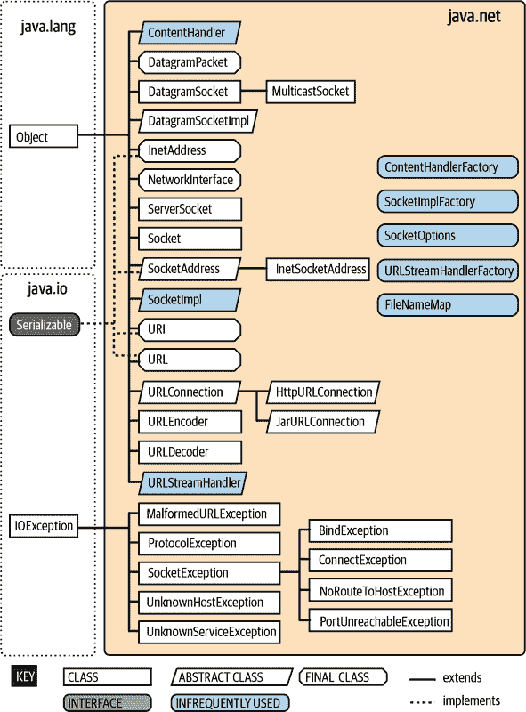
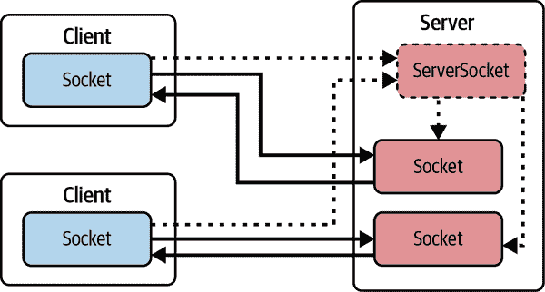
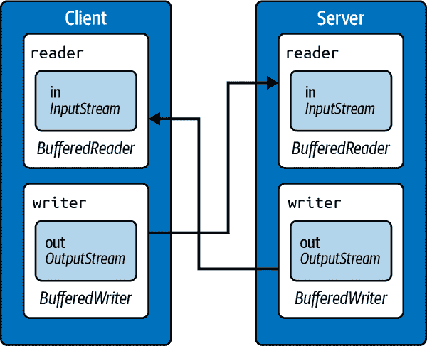

# 第十三章：Java 网络编程

当你想到网络时，你可能会想到基于网络的应用和服务。如果你被要求深入探讨，你可能会考虑支持这些应用程序并在网络中传输数据的工具，例如网络浏览器和网络服务器。在本章中，我们将看一下 Java 如何与网络服务交互。我们还会稍微窥探一下底层的网络类，例如 *java.net* 包中的一些低级网络类。

# 统一资源定位符

*统一资源定位符*（URL）指向互联网上的一个对象。它是一个文本字符串，用于标识一个项目，告诉你在哪里找到它，并指定与之通信或从其源获取它的方法。URL 可以指向任何类型的信息源：静态数据，例如本地文件系统上的文件、Web 服务器或 FTP 站点。它可以指向更动态的对象，例如 RSS 新闻订阅或数据库中的记录。URL 还可以引用其他资源，例如电子邮件地址。

因为在互联网上定位项目有许多不同的方法，不同的介质和传输需要不同类型的信息，URL 可以具有多种形式。最常见的形式包含如 图 13-1 所示的四个组件：网络主机或服务器、项目名称、其在主机上的位置以及主机应该使用的协议。


###### 图 13-1\. URL 的常见元素

*`protocol`*（也称为“方案”）是诸如 `http`、`https` 或 `ftp` 的标识符；*`hostname`* 通常是互联网主机和域名；*`path`* 和 *`resource`* 组件形成了一个唯一的路径，用于标识该主机上的对象。

这种形式的变体在 URL 中包含额外的信息。例如，你可以指定片段标识符（以“#”字符开头的后缀），用来引用文档内的各个部分。还有其他更专门的 URL 类型，比如用于电子邮件地址的“mailto” URL，或者用于定位诸如数据库组件之类的 URL。这些定位符可能不严格遵循此格式，但通常包含协议、主机和路径。一些更适当地称为 *统一资源标识符*（URI）的内容，可以指定有关资源名称或位置的更多信息。URL 是 URI 的子集。

因为大多数 URL 具有层次结构或路径的概念，所以我们有时会说一个 URL 相对于另一个 URL，称为 *基本 URL*。在这种情况下，我们使用基本 URL 作为起点，并提供额外的信息来相对于该 URL 定位一个对象。例如，基本 URL 可能指向 Web 服务器上的一个目录，而相对 URL 可能命名该目录中的特定文件或子目录中的文件。

# URL 类

Java 的`java.net.URL`类表示 URL 地址，并为访问服务器上的文档和应用程序等网络资源提供了一个简单的 API。它可以使用可扩展的协议和内容处理程序来执行必要的通信，理论上甚至可以进行数据转换。使用`URL`类，应用程序只需几行代码就可以连接到服务器并检索内容。

`URL`类的一个实例管理 URL 字符串中的所有组件信息，并提供了用于检索其标识的对象的方法。我们可以从完整字符串或组件部分构造一个`URL`对象：

```java
try {
  URL aDoc =
    new URL("http://foo.bar.com/documents/homepage.html");
  URL sameDoc =
    new URL("http","foo.bar.com","/documents/homepage.html");
} catch (MalformedURLException e) {
  // Something wrong with our URL
}
```

这两个`URL`对象指向同一个网络资源，即服务器*foo.bar.com*上的*homepage.html*文档。我们无法知道资源是否实际存在并且可用，直到我们尝试访问它。新的`URL`对象仅包含有关对象位置及其访问方式的数据。创建`URL`对象不会建立任何网络连接。

###### 注意

Oracle 在 Java 20 中已经废弃了`URL`构造函数。废弃并不会移除方法或类，但意味着您应该考虑其他实现您目标的方法。废弃的项目的 Javadoc 通常包含建议的替代方法。在这种情况下，`URI`类具有更好的验证代码，因此 Oracle 建议使用`new URI("http://your.url/").toURL()`作为替代方案。

如果您正在使用 Java 20 或更高版本，可以随意更新代码示例以使用`URI`，以摆脱编译器的过时警告。尽管如此，由于这是最近的废弃，您仍然会在在线示例中广泛看到`URL`构造函数的使用。

我们可以使用`getProtocol()`、`getHost()`和`getFile()`方法来检查`URL`的各个部分。我们还可以使用`sameFile()`方法（一个可能不指向文件的不幸命名的方法）将其与另一个`URL`进行比较，该方法确定两个 URL 是否指向相同的资源。虽然`sameFile()`并不是绝对可靠的，但它比仅比较 URL 字符串是否相等的方法更加智能；它考虑了一个服务器可能有多个名称以及其他因素。

当你创建一个`URL`时，Java 会解析 URL 的规范以识别协议组件。然后，它会尝试将它从你的 URL 解析出来的内容与*协议处理程序*进行匹配。协议处理程序本质上是一个可以使用给定协议并根据协议规则检索资源的助手。如果 URL 的协议不合理，或者 Java 找不到兼容的协议处理程序，`URL`构造函数会抛出一个`MalformedURLException`。

Java 为`http`、`https`（安全 HTTP）和`ftp`提供了 URL 协议处理程序，以及本地`file` URL 和引用 JAR 存档内文件的`jar` URL。Java 还为第三方库提供了必要的低级结构，以添加对其他类型 URL 的支持。

## 流数据

从 `URL` 获取数据的最低级和最通用的方式是通过调用 `openStream()` 方法来获取 `URL` 的 `InputStream`。如果您想要从动态信息源接收持续更新，作为流获取数据可能也是有用的。不幸的是，您必须自己解析这个流的内容。并非所有类型的 URL 都支持 `openStream()` 方法，因为并非所有类型的 URL 都指向具体的数据；如果 URL 不支持，您将会得到一个 `UnknownServiceException`。

以下代码（对 *ch13/examples/Read.java* 文件的简化）会打印出来自虚构 Web 服务器的 HTML 文件的内容：

```java
  try {
    URL url = new URL("http://some.server/index.html");

    BufferedReader bin = new BufferedReader(
        new InputStreamReader(url.openStream()));

    String line;
    while ((line = bin.readLine()) != null) {
      System.out.println(line);
    }
    bin.close();
  } catch (Exception e) {
    e.printStackTrace();
  }
```

在这个片段中，我们使用 `openStream()` 从我们的 `url` 获取一个 `InputStream`，并将其包装在 `BufferedReader` 中以读取文本行。因为我们在 URL 中指定了 `http` 协议，所以我们利用了 HTTP 协议处理程序的服务。我们还没有讨论内容处理程序。因为我们直接从输入流中读取，所以不需要内容处理程序来转换内容。

## 获取作为对象的内容

正如我们之前所说，`openStream()` 是访问 Web 内容的最通用方法，但它将数据解析留给程序员。`URL` 类支持更复杂的、可插拔的内容处理机制，但是 Java 社区从未真正标准化实际的处理程序，因此它的实用性有限。

许多开发者对通过网络加载对象感兴趣，因为他们需要从 URL 加载图像。Java 提供了几种替代方法来完成这个任务。最简单的方法是使用 `javax.swing.ImageIcon` 类，它有一个接受 URL 参数的构造方法：

```java
//file: ch13/examples/IconLabel.java
    URL fav = new URL("https://www.oracle.com/.../favicon-192.png");
    ImageIcon image1 = new ImageIcon(fav);
    JLabel iconLabel = new JLabel(image1);
    // iconLabel can be placed in any panel, just as other labels
```

如果您需要将网络流转换为其他类型的对象，可以查看 `URL` 类的 `getContent()` 方法。不过，您可能需要自己编写处理程序。关于这个高级主题，我们推荐阅读 [*Java 网络编程*](https://oreil.ly/1GwXT) 一书，作者是 Elliotte Rusty-Harold（O’Reilly）。

## 管理连接

在 `URL` 上调用 `openStream()` 方法时，Java 会查阅协议处理程序，并建立到远程服务器或位置的连接。连接由 `URLConnection` 对象表示，它的子类管理不同的协议特定通信，并提供有关源的额外元数据。例如，`HttpURLConnection` 类处理基本的网络请求，还添加了一些 HTTP 特定功能，比如解释 “404 Not Found” 消息和其他 Web 服务器错误。我们稍后会详细讨论 `HttpURLConnection`。

我们可以通过 `openConnection()` 方法直接从我们的 `URL` 获取一个 `URLConnection`。我们可以在读取数据之前询问 `URLConnection` 的对象内容类型。例如：

```java
URLConnection connection = myURL.openConnection();
String mimeType = connection.getContentType();
InputStream in = connection.getInputStream();
```

尽管其名称如此，`URLConnection`对象最初处于原始未连接状态。在本例中，直到我们调用`getContentType()`方法之前，网络连接实际上并未初始化。`URLConnection`在数据请求或显式调用其`connect()`方法之前不会与源通信。在连接之前，我们可以设置网络参数并提供协议特定的详细信息。例如，我们可以设置连接到服务器的初始连接和读取尝试的超时时间：

```java
URLConnection connection = myURL.openConnection();
connection.setConnectTimeout(10000); // milliseconds
connection.setReadTimeout(10000); // milliseconds
InputStream in = connection.getInputStream();
```

正如我们将在[“使用 POST 方法”](https://learnjava6-CHP-13-SECT-3.2)中看到的那样，通过将`URLConnection`转换为其特定子类型，我们可以获得协议特定的信息。

# 与 Web 应用程序通信

Web 浏览器是 Web 应用程序的通用客户端。它们检索文档以进行显示，并通过 HTML、JavaScript 和诸如图像之类的链接文档作为用户界面。在本节中，我们将编写客户端 Java 代码，使用`URL`类通过 HTTP 处理 Web 应用程序。这种组合允许我们直接使用`GET`和`POST`操作与 Web 应用程序交互。

我们在这里讨论的主要任务是将数据发送到服务器，特别是 HTML 表单编码数据。浏览器以特殊格式对 HTML 表单字段的名称/值对进行编码，并使用两种方法之一将其发送到服务器（通常）。第一种方法使用 HTTP `GET`命令，将用户输入编码到 URL 本身并请求相应文档。服务器识别 URL 的第一部分引用一个程序，并调用它，将 URL 的另一部分编码的信息作为参数传递给它。第二种方法使用 HTTP `POST`命令要求服务器接受编码数据，并将其作为流传递给 Web 应用程序。

## 使用`GET`方法

使用`GET`方法可以快速利用网络资源。只需创建指向服务器程序的 URL，并使用简单的约定附加构成数据的编码名称/值对即可。例如，以下代码片段打开了一个指向服务器*myhost*上名为*login.cgi*的老式 CGI 程序的 URL，并传递了两个名称/值对。然后，它打印出 CGI 发送回来的任何文本：

```java
  URL url = new URL(
    // this string should be URL-encoded
    "http://myhost/cgi-bin/login.cgi?Name=Pat&Password=foobar");

  BufferedReader bin = new BufferedReader(
    new InputStreamReader(url.openStream()));

  String line;
  while ((line = bin.readLine()) != null) {
    System.out.println(line);
  }
```

为了使用带参数的 URL，我们从*login.cgi*的基本 URL 开始。我们添加一个问号（`?`），标志着参数数据的开始，后面跟着第一个“name=value”对。我们可以添加任意多个名称/值对，用和号（`&`）字符分隔。我们的其余代码只是简单地打开流并从服务器读回响应。请记住，创建 URL 并不实际打开连接。在这种情况下，当我们调用`openStream()`时，URL 连接是隐式建立的。尽管我们在这里假设服务器返回文本，但它可以发送任何东西，包括图像、音频或 PDF 文件。

我们在这里跳过了一步。这个示例之所以有效，是因为我们的名称/值对恰好是简单的文本。如果任何“非可打印”或特殊字符（包括`?`或`&`）在这些对中，它们必须首先进行编码。`java.net.URLEncoder`类提供了一个编码数据的实用工具。我们将在“使用 POST 方法”中的下一个示例中展示如何使用它。

虽然这个小示例发送了一个密码字段，但你不应该使用这种简单的方法发送敏感数据。这个示例中的数据以明文形式通过网络发送（未加密）。即使使用 HTTPS（HTTP 安全）也不会模糊 URL。而且在这种情况下，密码字段也会出现在 URL 打印的任何地方，包括服务器日志、浏览器历史记录和书签中。

## 使用 POST 方法

对于更大量的输入数据或敏感内容，你可能会使用`POST`选项。这是一个小应用程序，它的行为类似于 HTML 表单。它从两个文本字段——`name`和`password`——收集数据，并使用 HTTP `POST`方法将数据发送到 Postman Echo 服务¹的 URL。这个基于 Swing 的客户端应用程序就像一个 Web 浏览器一样工作，并与 Web 应用程序连接。

这是执行请求并处理响应的关键网络方法：

```java
//file: ch13/examples/Post.java

  protected void postData() {
    StringBuilder sb = new StringBuilder();
    String pw = new String(passwordField.getPassword());
    try {
      sb.append(URLEncoder.encode("Name", "UTF-8") + "=");
      sb.append(URLEncoder.encode(nameField.getText(), "UTF-8"));
      sb.append("&" + URLEncoder.encode("Password", "UTF-8") + "=");
      sb.append(URLEncoder.encode(pw, "UTF-8"));
    } catch (UnsupportedEncodingException uee) {
      System.out.println(uee);
    }
    String formData = sb.toString();

    try {
      URL url = new URL(postURL);
      HttpURLConnection urlcon =
          (HttpURLConnection) url.openConnection();
      urlcon.setRequestMethod("POST");
      urlcon.setRequestProperty("Content-type",
          "application/x-www-form-urlencoded");
      urlcon.setDoOutput(true);
      urlcon.setDoInput(true);
      PrintWriter pout = new PrintWriter(new OutputStreamWriter(
          urlcon.getOutputStream(), "8859_1"), true);
      pout.print(formData);
      pout.flush();

      // Did the post succeed?
      if (urlcon.getResponseCode() == HttpURLConnection.HTTP_OK)
        System.out.println("Posted ok!");
      else {
        System.out.println("Bad post...");
        return;
      }

      // Hooray! Go ahead and read the results
      InputStream is = urlcon.getInputStream();
      InputStreamReader isr = new InputStreamReader(is);
      BufferedReader br = new BufferedReader(isr);
      String line;
      while ((line = br.readLine()) != null) {
        System.out.println(line);
      }
      br.close();

    } catch (MalformedURLException e) {
      System.out.println(e);     // bad postURL
    } catch (IOException e2) {
      System.out.println(e2);    // I/O error
    }
  }
```

应用程序的开头使用 Swing 元素创建表单，就像我们在第十二章中所做的那样。所有的魔法都在受保护的`postData()`方法中发生。首先，我们创建一个`StringBuilder`并用用`&`分隔的名称/值对加载它。（当我们使用`POST`方法时，我们不需要初始问号，因为我们不是在 URL 上追加。）每对都首先使用静态的`URLEncoder.encode()`方法进行编码。即使在这个示例中，名称字段不包含任何特殊字符，我们也会通过编码器运行名称字段。这个额外的步骤是最佳实践，只是一个好习惯。字段名称可能并不总是如此简单。

接下来，我们设置与服务器的连接。在我们之前的例子中，我们不需要执行任何特殊操作来发送数据，因为请求是通过在服务器上打开 URL 简单完成的。在这里，我们必须承担与远程 Web 服务器通信的一些工作。幸运的是，`HttpURLConnection`对象为我们完成了大部分工作；我们只需告诉它我们要发送的数据类型及如何发送。我们通过`openConnection()`方法获取一个`URLConnection`对象。由于我们使用的是 HTTP 协议，所以可以安全地将其强制转换为`HttpURLConnection`类型，它具有我们需要的支持。因为 HTTP 是一种有保证的协议之一，我们可以安全地做出这个假设。（说到安全性，我们在这里仅仅出于演示目的使用 HTTP。如今许多数据被视为敏感数据。行业指南已经默认使用 HTTPS；稍后在“SSL 和安全 Web 通信”中详细讨论。）

我们使用`setRequestMethod()`告知连接我们要进行`POST`操作。还使用`setRequestProperty()`设置我们的 HTTP 请求的`Content-Type`字段为适当的类型——在这种情况下，编码表单数据的正确媒体类型²（这是必要的，告诉服务器我们发送的数据类型，我们的情况下是`"application/x-www-form-urlencoded"`）。

对于最后的配置步骤，我们使用`setDoOutput()`和`setDoInput()`方法告知连接我们要发送和接收流数据。URL 连接从这个组合推断我们将进行`POST`操作，并期望得到一个响应。

要发送数据，我们从连接中获取一个输出流使用`getOutputStream()`，并创建一个`PrintWriter`以便轻松编写我们的编码表单内容。发送数据后，我们的应用程序调用`getResponseCode()`来查看服务器的 HTTP 响应代码是否指示`POST`成功。其他响应代码（在`HttpURLConnection`中定义为常量）表示各种失败情况。

尽管表单编码数据（如我们为`Content-Type`字段指定的媒体类型所示）很常见，但也有其他类型的通信方式。我们可以使用输入和输出流与服务器程序交换任意数据类型。`POST`操作可以发送任何类型的数据；服务器应用程序只需知道如何处理即可。最后注意：如果你正在编写一个需要解码表单数据的应用程序，可以使用`java.net.URLDecoder`来撤消`URLEncoder`的操作。调用`decode()`时务必指定 UTF-8。

## HttpURLConnection

从 `HttpURLConnection` 中还可以获取请求的其他信息。我们可以使用 `getContentType()` 和 `getContentEncoding()` 来确定响应的 MIME 类型和编码。我们还可以通过使用 `getHeaderField()` 来查询 HTTP 响应头（HTTP 响应头是随响应一起传输的元数据名称/值对）。便捷方法可以获取整数和日期格式的头字段，`getHeaderFieldInt()` 和 `getHeaderFieldDate()`，它们分别返回 `int` 和 `long` 类型。内容长度和上次修改日期可以通过 `getContentLength()` 和 `getLastModified()` 获得。

## SSL 和安全的 Web 通信

之前的一些示例发送了敏感数据到服务器。标准的 HTTP 不提供加密来隐藏我们的数据。幸运的是，像这样为 `GET` 和 `POST` 操作添加安全性对于客户端开发者来说是很容易的（实际上是微不足道的）。在可用的情况下，你只需要使用 HTTP 协议的安全形式 — HTTPS。考虑 `Post` 示例中的测试 URL：

```java
https://postman-echo.com/post
```

HTTPS 是标准 HTTP 协议运行在安全套接字层（SSL）之上的一个版本，它使用公钥加密技术来加密浏览器与服务器之间的通信。大多数 Web 浏览器和服务器目前都内置支持 HTTPS（或原始的 SSL 套接字）。因此，如果你的 Web 服务器支持并配置了 HTTPS，你可以通过在 URL 中指定 `https` 协议来简单地发送和接收安全数据。关于 SSL 和安全相关方面还有很多内容需要学习，比如验证你实际在与谁通信，但是就基本数据加密而言，这就是你需要做的一切。这不是你的代码直接处理的事情。Java 提供了 SSL 和 HTTPS 的支持。

# 网络编程

Web 主导了开发者对网络的讨论，但在这其中不仅仅是 HTML 页面！随着 Java 的网络 API 的成熟，Java 也成为了实现传统客户端/服务器应用程序和服务的首选语言。在本节中，我们将看看 `java.net` 包，其中包含了用于通信和处理网络资源的基本类。

`java.net` 包的类分为两类：Sockets API，用于处理低级网络协议，以及与 URL 一起工作的高级、面向 Web 的 API，正如我们在前一节中看到的。图 13-2 展示了 `java.net` 包的大部分层次结构。



###### 图 13-2\. `java.net` 包的主要类和接口

Java 的套接字 API 提供了对主机间通信所使用的标准协议的访问。*套接字* 是所有其他种类便携式网络通信的基础机制。套接字是通用网络工具箱中的最低级工具——你可以使用套接字进行客户端和服务器或对等应用程序之间的任何类型的通信，但你必须实现自己的应用程序级协议来处理和解释数据。更高级别的网络工具，如远程方法调用、HTTP 和 web 服务，都是在套接字之上实现的。

# 套接字

套接字是用于网络通信的低级编程接口。它们在可能或可能不在同一主机上的应用程序之间发送数据流。

套接字起源于 BSD Unix，在某些编程语言中，它们是一些混乱、复杂的东西，有很多小部分可能会断开并引起混乱。这是因为大多数套接字 API 可以与几乎任何类型的底层网络协议一起使用。由于传输数据的协议可能具有根本不同的特性，套接字接口可能会非常复杂。

`java.net` 包支持一个简化的、面向对象的套接字接口，使网络通信变得更加容易。如果你以前使用其他语言的套接字进行过网络编程，你会惊讶地发现当对象封装了繁琐的细节时，事情可以变得多么简单。如果这是你第一次接触套接字，你会发现与另一个应用程序在网络上通信就像读取文件或获取用户输入一样简单。Java 中的大多数 I/O 形式，包括大多数网络 I/O，都使用了 “Streams” 中描述的流类。流提供了统一的 I/O 接口，使得在互联网上进行读取或写入类似于在本地系统上进行读取或写入。除了面向流的接口之外，Java 网络 API 还可以与用于高度可扩展应用程序的 Java NIO 缓冲区 API 一起使用。

Java 提供套接字支持三种不同的底层协议类：`Socket`、`DatagramSocket` 和 `MulticastSocket`。在本节中，我们将介绍 Java 的基本 `Socket` 类，它使用了 *面向连接* 和 *可靠* 的协议。面向连接的协议提供了类似于电话对话的功能。建立连接后，两个应用程序可以来回发送数据流，即使没有人在说话，连接也会保持在那里。由于协议是可靠的，它还确保没有数据丢失（必要时重新发送数据），并且你发送的任何内容都会按照你发送的顺序到达。

我们将留下另外两个使用 *无连接*、*不可靠* 协议的类，让您自行探索。（再次参见 [*Java 网络编程*](https://oreil.ly/RzACA)，由 Elliotte Rusty-Harold 详细讨论。）无连接协议类似于邮政服务。应用程序可以向彼此发送短消息，但事先不建立端到端连接，并且不尝试保持消息的顺序。甚至不能保证消息会到达。`MulticastSocket` 是 `DatagramSocket` 的变体，执行*多播* —— 同时向多个接收者发送数据。类似于使用数据报套接字，使用多播套接字工作时只是有更多的接收者。

理论上，套接字层下面几乎可以使用任何协议。实际上，互联网上只有一个重要的协议族，并且只有一个 Java 支持的协议族：互联网协议（IP）。`Socket` 类通过 IP（通常被称为 TCP/IP）使用 *TCP*，传输控制协议；而无连接的 `DatagramSocket` 类通过 IP 使用 *UDP*，用户数据报协议。

## 客户端和服务器

在编写网络应用程序时，通常会谈论客户端和服务器。这两者之间的区别越来越模糊，但*客户端*通常启动对话，而*服务器*通常接受传入请求。这些角色有许多微妙之处，⁴ 但为简单起见，我们将使用这个定义。

客户端和服务器之间的一个重要区别在于，客户端可以随时创建套接字以启动与服务器应用程序的对话，而服务器必须事先准备好以侦听传入的对话请求。`java.net.Socket` 类代表客户端和服务器上单个套接字连接的一侧。此外，服务器使用 `java.net.ServerSocket` 类来侦听来自客户端的新连接。在大多数情况下，作为服务器的应用程序会创建一个 `ServerSocket` 对象并等待，通过调用其 `accept()` 方法被阻塞，直到请求到达。当客户端尝试连接时，`accept()` 方法会创建一个新的 `Socket` 对象，服务器用该对象与客户端进行通信。`ServerSocket` 实例会将有关客户端的详细信息传递给新的 `Socket`，如 图 13-3 所示。



###### 图 13-3\. 使用 `Socket` 和 `ServerSocket` 的客户端和服务器

该套接字继续与客户端进行对话，使得`ServerSocket`能够恢复其监听任务。这样，服务器就可以同时与多个客户端进行对话。仍然只有一个`ServerSocket`，但服务器拥有多个`Socket`对象——每个客户端一个。

### 客户端

在套接字级别，客户端需要两个信息来定位和连接到互联网中的服务器：一个*主机名*（用于查找主机计算机的网络地址）和一个*端口号*。端口号是一个标识符，用于区分同一主机上的多个网络服务或连接。

服务器应用程序在预先安排的端口上监听，同时等待连接。客户端向那个预先安排的端口号发送请求。如果你把主机计算机想象成一个酒店，而各种可用的服务作为客人，那么端口就像客人的房间号码。要连接到一个服务，你必须知道酒店名称和正确的房间号码。

客户端应用程序通过构造一个指定这两个信息的`Socket`，来打开与服务器的连接。

```java
    try {
      Socket sock = new Socket("wupost.wustl.edu", 25);
    } catch (UnknownHostException e) {
      System.out.println("Can't find host.");
    } catch (IOException e) {
      System.out.println("Error connecting to host.");
    }
```

这段客户端代码试图将一个`Socket`连接到主机的 25 号端口（SMTP 邮件服务），该主机为*wupost.wustl.edu*。客户端必须处理主机名无法解析（`UnknownHostException`）和服务器可能不接受新连接（`IOException`）的情况。Java 使用 DNS，即标准的*域名服务*（DNS），来将主机名解析为一个*IP 地址*。

IP 地址（来自互联网协议）是互联网的电话号码，DNS 是全球电话簿。连接到互联网的每台计算机都有一个 IP 地址。如果你不知道那个地址，就通过 DNS 查询。但如果你知道服务器的地址，`Socket`构造函数也可以接受一个包含原始 IP 地址的字符串：

```java
    Socket sock = new Socket("22.66.89.167", 25);
```

无论你如何开始，一旦`sock`连接上，你就可以通过`getInputStream()`和`getOutputStream()`方法检索输入和输出流。以下（相当任意的）代码通过流发送和接收一些数据：

```java
    try {
      Socket server = new Socket("foo.bar.com", 1234);
      InputStream in = server.getInputStream();
      OutputStream out = server.getOutputStream();

      // write a byte
      out.write(42);

      // write a newline or carriage return delimited string
      PrintWriter pout = new PrintWriter(out, true);
      pout.println("Hello!");

      // read a byte
      byte back = (byte)in.read();

      // read a newline or carriage return delimited string
      BufferedReader bin =
        new BufferedReader(new InputStreamReader(in) );
      String response = bin.readLine();

      server.close();
    } catch (IOException e) {
      System.err.println(e);
    }
```

在这个交换过程中，客户端首先创建一个`Socket`，用于与服务器通信。`Socket`构造函数指定服务器的主机名（*foo.bar.com*）和一个预先安排的端口号（1234）。一旦客户端连接上，它就使用`OutputStream`的`write()`方法向服务器写入一个字节。为了更方便地发送一串文本，它随后将一个`PrintWriter`包装在`OutputStream`周围。接下来，它执行互补操作：使用`InputStream`的`read()`方法从服务器读取一个字节，然后创建一个`BufferedReader`，以便获取完整的文本字符串。客户端随后使用`close()`方法终止连接。所有这些操作都有可能生成`IOException`；我们的代码片段通过将整个对话包装在一个`try/catch`块中来处理这些检查异常。

### 服务器

在对话的另一端，在建立连接之后，服务器应用程序使用相同类型的`Socket`对象与客户端进行通信。然而，要接受来自客户端的连接，它必须首先创建绑定到正确端口的`ServerSocket`。让我们从服务器的角度重新创建以前的对话：

```java
    // Meanwhile, on foo.bar.com...
    try {
      ServerSocket listener = new ServerSocket(1234);

      while (!finished) {
        Socket client = listener.accept();  // wait for connection

        InputStream in = client.getInputStream();
        OutputStream out = client.getOutputStream();

        // read a byte
        byte someByte = (byte)in.read();

        // read a newline or carriage-return-delimited string
        BufferedReader bin =
          new BufferedReader(new InputStreamReader(in) );
        String someString = bin.readLine();

        // write a byte
        out.write(43);

        // say goodbye
        PrintWriter pout = new PrintWriter(out, true);
        pout.println("Goodbye!");

        client.close();
      }

      listener.close();
    } catch (IOException e) {
      System.err.println(e);
    }
```

首先，我们的服务器创建一个绑定到端口 1234 的`ServerSocket`。在大多数系统上，有关应用程序可以使用哪些端口的规则。端口号是无符号的 16 位整数，这意味着它们的范围可以从 0 到 65535。低于 1024 的端口号通常保留给系统进程和标准的“众所周知”服务，因此我们选择一个不在此保留范围内的端口号。⁵我们只需创建一次`ServerSocket`；之后，它可以接受到达的任意数量的连接。

接下来，我们进入一个循环，等待`ServerSocket`的`accept()`方法返回来自客户端的活动`Socket`连接。当建立连接后，我们执行对话的服务器端，然后关闭连接并返回循环顶部等待另一个连接。最后，当服务器应用程序想要完全停止监听连接时，它调用`ServerSocket`的`close()`方法。

此服务器是单线程的；它一次处理一个连接，在完成与一个客户端的完整对话后返回循环顶部，并调用`accept()`以侦听另一个连接。一个更现实的服务器将有一个循环，同时接受连接，并将它们传递到它们自己的线程进行处理。尽管我们不打算创建一个 MMORPG，⁶我们确实展示了如何使用线程每客户端方法进行对话，在“分布式游戏”中展示。如果您想进行一些独立阅读，您还可以查找非阻塞的 NIO 等效`ServerSocketChannel`。

## `DateAtHost`客户端

在过去，许多网络计算机运行了一个简单的时间服务，该服务在一个众所周知的端口上分发其时钟的本地时间。时间协议是 NTP 的前身，更一般的网络时间协议。我们将坚持使用时间协议因其简单性，但如果您想要同步网络系统的时钟，NTP 是一个更好的选择。⁷

下一个示例，`DateAtHost`，包括一个`java.util.Date`的子类，该子类从远程主机获取时间，而不是从本地时钟初始化自己。（参见第八章讨论`Date`类，虽然在某些用途上仍然有效，但已大部分被其更新、更灵活的衍生类`LocalDate`和`LocalTime`替代。）

`DateAtHost`连接到时间服务（端口 37），并读取表示远程主机时间的四个字节。这四个字节有一个特定的规范，我们解码以获取时间。以下是代码：

```java
//file: ch13.examples.DateAtHost.java
package ch13.examples;

import java.net.Socket;
import java.io.*;

public class DateAtHost extends java.util.Date {
  static int timePort = 37;
  // seconds from start of 20th century to Jan 1, 1970 00:00 GMT
  static final long offset = 2208988800L;

  public DateAtHost(String host) throws IOException {
    this(host, timePort);
  }

  public DateAtHost(String host, int port) throws IOException {
    Socket server = new Socket(host, port);
    DataInputStream din =
      new DataInputStream(server.getInputStream());
    int time = din.readInt();
    server.close();

    setTime((((1L << 32) + time) - offset) * 1000);
  }
}
```

就是这样。即使稍微有些花哨，它也不是很长。我们为`DateAtHost`提供了两个可能的构造函数。通常我们会使用第一个构造函数，它简单地将远程主机的名称作为参数。第二个构造函数指定了远程时间服务的主机名和端口号。（如果时间服务在非标准端口上运行，则使用第二个构造函数指定备用端口号。）第二个构造函数负责建立连接并设置时间。第一个构造函数只是调用第二个构造函数（使用`this()`构造）并使用默认端口作为参数。在 Java 中，提供简化的构造函数，这些构造函数调用带有默认参数的同级构造函数是一种常见且有用的模式；这也是我们在这里展示的主要原因。

第二个构造函数在远程主机上指定端口打开一个套接字。它创建一个`DataInputStream`来包装输入流，然后使用`readInt()`方法读取一个四字节整数。这些字节的顺序正确并非巧合。Java 的`DataInputStream`和`DataOutputStream`类使用*网络字节顺序*（从最高有效位到最低有效位）处理整数类型的字节。时间协议（以及处理二进制数据的其他标准网络协议）也使用网络字节顺序，因此我们不需要调用任何转换例程。如果我们使用非标准协议，特别是与非 Java 客户端或服务器通信时，可能需要进行显式数据转换。在这种情况下，我们必须逐字节读取并重新排列以获取我们的四字节值。读取数据后，我们完成套接字操作，因此关闭它以终止与服务器的连接。最后，构造函数通过使用计算出的时间值调用`Date`的`setTime()`方法来初始化对象的其余部分。

时间值的四个字节被解释为表示 20 世纪初以来的秒数的整数。`DateAtHost`将其转换为 Java 的绝对时间概念——自 1970 年 1 月 1 日起的毫秒计数（这是由 C 和 Unix 标准化的任意日期）。转换首先创建一个`long`值，它是整数`time`的无符号等效值。它减去一个偏移量以使时间相对于时代（1970 年 1 月 1 日）而不是世纪，并乘以 1,000 以转换为毫秒。转换后的时间用于初始化对象。

`DateAtHost`类几乎可以像`Date`与本地主机上的时间一样与从远程主机检索的时间一起工作。唯一的额外开销是处理`DateAtHost`构造函数可能抛出的可能的`IOException`异常：

```java
    try {
      Date d = new DateAtHost("time.nist.gov");
      System.out.println("The time over there is: " + d);
    }
    catch (IOException e) {
      System.err.println("Failed to get the time: " + e);
    }
```

这个示例获取来自主机*time.nist.gov*的时间并打印其值。

## 分布式游戏

我们可以利用我们新发现的网络技能来扩展我们的苹果投掷游戏，并进行双人游戏。我们必须将这次尝试保持简单，但您可能会对我们能够多快地创建一个概念验证感到惊讶。虽然有几种机制可以让两个玩家连接以共享体验，但我们的示例使用了我们在本章中讨论过的基本客户端/服务器模型。一个用户将启动服务器，第二个用户将作为客户端联系该服务器。一旦两个玩家连接，他们将竞赛看谁能最快地清理树木和篱笆！

### 设置用户界面

让我们从给我们的游戏添加一个菜单开始。回想一下“Menus”中所述的，菜单位于菜单栏中，并与`ActionEvent`对象一起工作，就像按钮一样。我们需要一个选项来启动服务器，另一个选项是加入已经启动的服务器的游戏。这些菜单项的核心代码很简单；我们可以在`AppleToss`类中使用另一个辅助方法：

```java
    private void setupNetworkMenu() {
      JMenu netMenu = new JMenu("Multiplayer");
      multiplayerHelper = new Multiplayer();

        JMenuItem startItem = new JMenuItem("Start Server");
        startItem.addActionListener(
            e -> multiplayerHelper.startServer());
        netMenu.add(startItem);

        JMenuItem joinItem = new JMenuItem("Join Game...");
        joinItem.addActionListener(e -> {
          String otherServer = JOptionPane.showInputDialog(
              AppleToss.this, "Enter server name or address:");
          multiplayerHelper.joinGame(otherServer);
        });
        netMenu.add(joinItem);

        JMenuItem quitItem = new JMenuItem("Disconnect");
        quitItem.addActionListener(
            e -> multiplayerHelper.disconnect());
        netMenu.add(quitItem);

      // build a JMenuBar for the application
      JMenuBar mainBar = new JMenuBar();
      mainBar.add(netMenu);
      setJMenuBar(mainBar);
    }
```

对于每个菜单的`ActionListener`使用 lambda 表达式应该很熟悉。我们还使用在“Modals and Pop-Ups”中讨论过的`JOptionPane`来询问第二个玩家第一个玩家正在等待的服务器的名称或 IP 地址。网络逻辑由一个单独的类处理。

我们将在接下来的章节中更详细地查看`Multiplayer`类，但您可以看到我们将要实现的方法。游戏的这个版本的代码（在*ch13/examples/game*文件夹中）包含了`setupNetworkMenu()`方法，但是 lambda 监听器只是弹出一个信息对话框，指示选择了哪个菜单项。您可以构建`Multiplayer`类并在章节末尾的练习中调用实际的多人游戏方法。但是，欢迎查看*ch13/solutions/game*文件夹中已完成的游戏，包括网络部分。

### 游戏服务器

正如我们在“Servers”中所做的那样，我们需要选择一个端口并设置一个监听传入连接的套接字。我们将使用端口 8677——在电话号码键盘上为“TOSS”。我们可以在我们的`Multiplayer`类中创建一个`Server`内部类来驱动一个准备好进行网络通信的线程。`reader`和`writer`变量将用于发送和接收实际的游戏数据。关于这一点在“The game protocol”中会详细讨论：

```java
class Server implements Runnable {
  ServerSocket listener;

  public void run() {
    Socket socket = null;
    try {
      listener = new ServerSocket(gamePort);
      while (keepListening) {
        socket = listener.accept();  // wait for connection

        InputStream in = socket.getInputStream();
        BufferedReader reader =
            new BufferedReader(new InputStreamReader(in));
        OutputStream out = socket.getOutputStream();
        PrintWriter writer = new PrintWriter(out, true);

        // ... game protocol logic starts here
      }
    } catch (IOException ioe) {
      System.err.println(ioe);
    }
  }
}
```

我们设置我们的`ServerSocket`，然后在循环内等待一个新的客户端。虽然我们计划一次只玩一个对手，但这使我们能够接受后续的客户端而不必重新进行所有的网络设置。

要实际启动服务器监听第一次，我们只需要一个使用我们的`Server`类的新线程：

```java
    // from Multiplayer
    Server server;

    // ...

    public void startServer() {
      keepListening = true;
      // ... other game state can go here
      server = new Server();
      serverThread = new Thread(server);
      serverThread.start();
    }
```

我们在我们的`Multiplayer`类中保持对`Server`实例的引用，这样我们就可以随时访问，以便在用户从菜单中选择“断开连接”选项时关闭连接，如下所示：

```java
// from Multiplayer
  public void disconnect() {
    disconnecting = true;
    keepListening = false;
    // Are we in the middle of a game and regularly checking these flags?
    // If not, just close the server socket to interrupt the blocking
    // accept() method.
    if (server != null && keepPlaying == false) {
      server.stopListening();
    }

    // ... clean up other game state here
  }
```

一旦我们进入游戏循环，我们主要使用`keepPlaying`标志，但是在上面也很方便。如果我们有一个有效的`server`引用，但当前没有玩游戏（`keepPlaying`为 false），则我们知道要关闭监听器套接字。

`Server`内部类中的`stopListening()`方法很简单：

```java
  public void stopListening() {
    if (listener != null && !listener.isClosed()) {
      try {
        listener.close();
      } catch (IOException ioe) {
        System.err.println("Error disconnecting listener: " +
            ioe.getMessage());
      }
    }
  }
```

我们快速检查我们的服务器，并仅在存在并且仍然打开时尝试关闭`listener`。

### 游戏客户端

客户端的设置和拆卸与之相似——当然没有监听`ServerSocket`。我们将使用一个`Client`内部类来镜像`Server`内部类，并构建一个智能的`run()`方法来实现我们的客户端逻辑：

```java
class Client implements Runnable {
  String gameHost;
  boolean startNewGame;

  public Client(String host) {
    gameHost = host;
    keepPlaying = false;
    startNewGame = false;
  }

  public void run() {
    try (Socket socket = new Socket(gameHost, gamePort)) {

      InputStream in = socket.getInputStream();
      BufferedReader reader =
          new BufferedReader(new InputStreamReader(in) );
      OutputStream out = socket.getOutputStream();
      PrintWriter writer = new PrintWriter(out, true);

      // ... game protocol logic starts here
    } catch (IOException ioe) {
      System.err.println(ioe);
    }
  }
}
```

我们将服务器的名称传递给`Client`构造函数，并依赖于`Server`使用的公共`gamePort`变量来设置套接字。我们使用了“try with Resources”中讨论的“try with resource”技术来创建套接字，并确保在完成后对其进行清理。在该资源`try`块内，我们创建了客户端对话半部分的`reader`和`writer`实例，如 Figure 13-4 所示。



###### 图 13-4。游戏客户端和服务器连接

为了使其运行，我们将在我们的`Multiplayer`辅助类中添加另一个帮助方法：

```java
// from Multiplayer

  public void joinGame(String otherServer) {
    clientThread = new Thread(new Client(otherServer));
    clientThread.start();
  }
```

我们不需要单独的`disconnect()`方法——我们可以使用服务器使用的相同状态变量。对于客户端，`server`引用将为`null`，因此我们不会尝试关闭不存在的监听器。

### 游戏协议

您可能注意到我们忽略了`Server`和`Client`类的`run()`方法的大部分内容。在我们构建和连接数据流之后，剩下的工作都涉及协作地发送和接收关于游戏状态的信息。这种结构化的通信就是游戏的*协议*。每个网络服务都有一个协议。想一想 HTTP 中的“P”。即使我们的`DateAtHost`示例也使用了（非常简单的）协议，以便客户端和服务器知道谁应该在任何给定时刻说话，谁必须听取。如果两边同时尝试交谈，信息很可能会丢失。如果两边最终都等待对方说些什么（例如，服务器和客户端都在`reader.readLine()`调用上阻塞），则连接将看起来会挂起。

管理这些通信期望是任何协议的核心，但是该说什么以及如何响应也很重要。协议的这一部分通常需要开发人员付出最多的努力。部分困难在于，您实际上需要两边都测试您的工作。没有客户端，无法测试服务器，反之亦然。随着工作的进行，构建两侧可能会感到乏味，但是额外的努力是值得的。与其他类型的调试一样，修复小的增量变化比弄清楚可能存在的大块代码中的问题要简单得多。

在我们的游戏中，我们将由服务器引导对话。这个选择是任意的——我们可以使用客户端，或者我们可以构建一个更复杂的基础，并允许客户端和服务器同时负责某些事情。然而，做出了“服务器负责”的决定后，我们可以在我们的协议中尝试一个非常简单的第一步。我们将让服务器发送一个`"NEW_GAME"`命令，然后等待客户端回应一个`"OK"`答案。服务器端的代码（与客户端建立连接后）如下所示：

```java
    // Create a new game with the client
    writer.println("NEW_GAME");

    // If the client agrees, send over the location of the trees
    String response = reader.readLine();
    if (response != null && response.equals("OK")) {
      System.out.println("Starting a new game!")
      // ... write game data here
    } else {
      System.err.println("Unexpected start response: " + response);
      System.err.println("Skipping game and waiting again.");
      keepPlaying = false;
    }
```

如果我们得到了预期的`"OK"`响应，我们可以继续设置一个新游戏，并与对手分享树木和树篱的位置——稍后再说。 (如果我们没有收到`"OK"`，我们会显示一个错误并重置等待其他尝试。) 这个第一步的相应客户端代码流程类似：

```java
    // We expect to see the NEW_GAME command first
    String response = reader.readLine();

    // If we don't see that command, disconnect and return
    if (response == null || !response.equals("NEW_GAME")) {
      System.err.println("Unexpected initial command: " + response);
      System.err.println("Disconnecting");
      writer.println("DISCONNECT");
      return;
    }
    // Yay! We're going to play a game. Send an acknowledgement
    writer.println("OK");
```

如果你想尝试当前的情况，你可以从一个系统启动你的服务器，然后从第二个系统加入该游戏。（你也可以只是从一个单独的终端窗口启动游戏的第二个副本。在这种情况下，“其他主机”的名称将是网络关键词`localhost`。）几乎在从第二个游戏实例加入后不久，你应该在第一个游戏的终端中看到“开始新游戏！”的确认打印。恭喜！你正在设计一个游戏协议。让我们继续。

我们需要确保公平竞技——字面上的意思。服务器会告诉游戏建立一个新场地，然后将所有新障碍的坐标发送给客户端。客户端则可以接受所有传入的树木和树篱，并将它们放置在一个干净的场地上。一旦服务器发送了所有树木，它就可以发送一个`"START"`命令，游戏就可以开始了。我们将继续使用字符串来传递我们的消息。以下是我们可以将树木细节传递给客户端的一种方式：

```java
    gameField.setupNewGame();
    for (Tree tree : gameField.trees) {
      writer.println("TREE " + tree.getPositionX() + " " +
          tree.getPositionY());
    }
    // do the same for hedges or any other shared elements ...

    // Attempt to start the game, but make sure the client is ready
    writer.println("START");
    response = reader.readLine();
    keepPlaying = response.equals("OK");
```

在客户端，我们可以调用`readLine()`在一个循环中用于`"TREE"`行，直到我们看到`“START”`行，就像这样（还加入了一些错误处理）：

```java
    // And now gather the trees and set up our field
    gameField.trees.clear();
    response = reader.readLine();
    while (response.startsWith("TREE")) {
      String[] parts = response.split(" ");
      int x = Integer.parseInt(parts[1]);
      int y = Integer.parseInt(parts[2]);
      Tree tree = new Tree();
      tree.setPosition(x, y);
      gameField.trees.add(tree);
      response = reader.readLine();
    }
    // Do the same for hedges or other shared elements

    // After all the obstacle lists have been sent, the server will issue
    // a START command. Make sure we get that before playing
    if (!response.equals("START")) {
      // Hmm, we should have ended the lists of obstacles with a START,
      // but didn't. Bail out.
      System.err.println("Unexpected start to the game: " + response);
      System.err.println("Disconnecting");
      writer.println("DISCONNECT");
      return;
    } else {
      // Yay again! We're starting a game. Acknowledge this command
      writer.println("OK");
      keepPlaying = true;
      gameField.repaint();
    }
```

此时，两个游戏应该具有相同的障碍，玩家可以开始清除它们。服务器将进入轮询循环，并每秒钟发送一次当前分数。客户端将回复其当前分数。请注意，肯定还有其他选项可以共享分数变化的方法。虽然轮询很简单，但更先进的游戏，或者需要更即时反馈关于远程玩家的游戏，可能会使用更直接的通信选项。目前，我们主要想专注于良好的网络来回，所以轮询会使我们的代码更简单。

服务器应该持续发送当前分数，直到本地玩家清除所有内容或我们从客户端看到游戏结束的响应为止。我们需要解析客户端的响应以更新另一位玩家的分数，并关注他们请求结束游戏的情况。我们还必须准备好客户端可能会简单断开连接。该循环看起来像这样：

```java
    while (keepPlaying) {
      try {
        if (gameField.trees.size() > 0) {
          writer.print("SCORE ");
        } else {
          writer.print("END ");
          keepPlaying = false;
        }
        writer.println(gameField.getScore(1));
        response = reader.readLine();
        if (response == null) {
          keepPlaying = false;
          disconnecting = true;
        } else {
          String parts[] = response.split(" ");
          switch (parts[0]) {
            case "END":
              keepPlaying = false;
            case "SCORE":
              gameField.setScore(2, parts[1]);
              break;
            case "DISCONNECT":
              disconnecting = true;
              keepPlaying = false;
              break;
            default:
              System.err.println("Warning. Unexpected command: " +
                  parts[0] + ". Ignoring.");
          }
        }
        Thread.sleep(500);
      } catch(InterruptedException e) {
        System.err.println("Interrupted while polling. Ignoring.");
      }
    }
```

客户端将复制这些操作。幸运的是对于客户端来说，它只是对来自服务器的命令做出反应。在这里我们不需要单独的轮询机制。我们阻塞等待读取一行，解析它，然后构建我们的响应：

```java
    while (keepPlaying) {
      response = reader.readLine();
      String[] parts = response.split(" ");
      switch (parts[0]) {
        case "END":
          keepPlaying = false;
        case "SCORE":
          gameField.setScore(2, parts[1]);
          break;
        case "DISCONNECT":
          disconnecting = true;
          keepPlaying = false;
          break;
        default:
          System.err.println("Unexpected game command: " +
          response + ". Ignoring.");
      }
      if (disconnecting) {
        // We're disconnecting or they are. Acknowledge and quit.
        writer.println("DISCONNECT");
        return;
      } else {
        // If we're not disconnecting, reply with our current score
        if (gameField.trees.size() > 0) {
          writer.print("SCORE ");
        } else {
          keepPlaying = false;
          writer.print("END ");
        }
        writer.println(gameField.getScore(1));
      }
    }
```

当玩家清除了所有的树木和篱笆时，他们发送（或回复）一个包含他们最终分数的`"END"`命令。此时，我们会询问是否同样的两位玩家想再玩一次。如果是，我们可以继续为服务器和客户端使用相同的“读取器”和“写入器”实例。如果不是，我们将让客户端断开连接，服务器将继续监听另一位玩家加入：

```java
    // If we're not disconnecting, ask about playing again
    if (!disconnecting) {
      String message = gameField.getWinner() +
          " Would you like to ask them to play again?";
      int myPlayAgain = JOptionPane.showConfirmDialog(gameField,
          message, "Play Again?", JOptionPane.YES_NO_OPTION);

      if (myPlayAgain == JOptionPane.YES_OPTION) {
        // If they haven't disconnected, ask to play again
        writer.println("PLAY_AGAIN");
        String playAgain = reader.readLine();
        if (playAgain != null) {
          switch (playAgain) {
            case "YES":
              startNewGame = true;
              break;
            case "DISCONNECT":
              keepPlaying = false;
              startNewGame = false;
              disconnecting = true;
              break;
            default:
              System.err.println("Warning. Unexpected response: "
                  + playAgain + ". Not playing again.");
          }
        }
      }
    }
```

最后客户端的一个互为对等的代码：

```java
    if (!disconnecting) {
      // Check to see if they want to play again
      response = reader.readLine();
      if (response != null && response.equals("PLAY_AGAIN")) {
        // Do we want to play again?
        String message = gameField.getWinner() +
            " Would you like to play again?";
        int myPlayAgain = JOptionPane.showConfirmDialog(gameField,
            message, "Play Again?", JOptionPane.YES_NO_OPTION);
        if (myPlayAgain == JOptionPane.YES_OPTION) {
          writer.println("YES");
          startNewGame = true;
        } else {
          // Not playing again so disconnect.
          disconnecting = true;
          writer.println("DISCONNECT");
        }
      }
    }
```

表格 13-1 总结了我们的简单协议。

表格 13-1\. 苹果投掷游戏协议

| 服务器命令 | 参数（可选） | 客户端响应 | 参数（可选） |
| --- | --- | --- | --- |
| NEW_GAME |  | OK |  |
| TREE | x y |  |  |
| START |  | OK |  |
| SCORE | 分数 |

分数

END

断开连接

|

分数

分数

|

| END | 分数 |
| --- | --- |

分数

断开连接

| 分数 |
| --- |
| PLAY_AGAIN |  |

YES

断开连接

|  |
| --- |
| DISCONNECT |  |  |  |

# 更多探索

我们可以花费更多的时间来开发我们的游戏。我们可以扩展协议以允许多个对手。我们可以将目标更改为清除障碍物并摧毁您的对手。我们可以使协议更双向，允许客户端启动一些更新。我们可以使用 Java 支持的备用低级协议，如 UDP 而不是 TCP。事实上，有整整一本书专门讨论游戏、网络编程和编程网络游戏！

但哇！你成功了！说我们涵盖了很多领域真是大大低估了。我们希望您对 Java 的语法和核心类有扎实的理解。您可以利用这种理解继续学习其他有趣的细节和高级技巧。选择一个你感兴趣的领域，深入研究一下。如果您对 Java 仍然感到好奇，可以尝试连接本书的各个部分。例如，您可以尝试使用正则表达式来解析我们的苹果投掷游戏协议。或者，您可以构建一个更复杂的协议，通过网络传输小块二进制数据而不是简单的字符串。为了练习编写更复杂的程序，您可以将游戏中的一些内部和匿名类重写为独立的、独立的类，甚至用 lambda 表达式替换它们。

如果您想继续探索其他 Java 库和包，同时又坚持一些已经使用过的示例，您可以深入了解 Java2D API，使苹果和树木看起来更漂亮。您可以尝试一些其他集合对象，如`TreeMap`或`Deque`。您可以研究流行的[JSON 格式](https://oreil.ly/oEa0E)，并尝试重新编写多人通信代码。使用 JSON 作为协议可能会让您有机会使用一个库。

当您准备好进一步探索时，您可以尝试一些 Android 开发，了解 Java 在桌面之外的工作方式。或者查看大型网络环境和 Eclipse 基金会的 Jakarta 企业版。也许大数据正引起您的注意？Apache 基金会有几个项目，如 Hadoop 或 Spark。Java 有它的批评者，但它仍然是专业开发者世界中充满活力和重要的一部分。

现在我们已经列出了一些未来研究的途径，我们准备结束本书的主要部分。术语表包含了我们涵盖的许多有用术语和主题的快速参考。附录 A 详细说明了如何将代码示例导入到 IntelliJ IDEA 中。附录 B 包括了所有复习问题的答案以及一些提示和指导，以及代码练习的指导。

希望您享受本书的第六版*学习 Java*。这实际上是该系列的第八版，始于二十多年前的*探索 Java*。在这段时间里，观察 Java 的发展真是一段漫长而惊人的旅程，我们感谢多年来与我们同行的您们。正如往常一样，我们期待您的反馈，以帮助我们在未来使这本书变得更好。准备好迎接 Java 的另一个十年了吗？我们准备好了！

## 复习问题

1.  `URL`类默认支持哪些网络协议？

1.  您能使用 Java 从在线源下载二进制数据吗？

1.  使用 Java 将表单数据发送到 Web 服务器的高级步骤是什么？涉及哪些类？

1.  您用于侦听传入网络连接的类是什么？

1.  创建类似于您为游戏创建的服务器时，是否有选择端口号的任何规则？

1.  用 Java 编写的服务器应用程序能支持多个同时客户端吗？

1.  给定的客户端`Socket`实例可以连接到多少个同时服务器？

## 代码练习

1.  创建您自己的人性化`DateAtHost`客户端（在我们的解决方案中是`FDClient`，友好日期客户端）和服务器（`FDServer`）。使用“日期和时间”中的类和格式化程序，生成一个发送包含当前日期和时间的一行格式良好文本的服务器。您的客户端应在连接后读取该行并将其打印出来。（您的客户端不需要扩展`Instant`甚至在打印之外存储响应。）

1.  我们的游戏协议尚不包括对树篱障碍物的支持。（树篱仍然存在于游戏中，但它们尚未包含在网络通信中。）请查看 Table 13-1，并添加类似于我们`TREE`行的`HEDGE`条目支持。可能首先更新客户端会更容易，尽管你需要更新两端，以使树篱对于两名玩家的功能类似于树木。

## 进阶练习

1.  升级你的`FDServer`类，以处理多个同时连接的客户端，可以使用线程或虚拟线程。你可以将客户端处理代码放入 lambda 表达式、匿名内部类或单独的辅助类中。你应该能够在不重新编译的情况下使用第一个练习中的`FDClient`类。如果使用虚拟线程，请记住它们可能仍然是 Java 版本中的预览功能。编译和运行时请使用适当的标志。（我们对这个练习的解决方案在`FDServer2`中。）

1.  这个练习更像是一个推动，去探索 Web 服务的世界，现在你已经看过使用 Java 与在线 API 交互的一些示例。在线搜索一个具有免费开发者账户选项的服务（可能仍需注册），并编写一个 Java 客户端来访问该服务。许多在线服务都需要某种形式的身份验证，比如*API 令牌*或*API 密钥*（通常是长字符串，类似于唯一的用户名）。像[random.org](https://oreil.ly/moEyN)或[openweathermap.org](https://oreil.ly/8B4rl)这样的网站可能是开始的有趣地方。（我们在解决方案中提供了一个完整的客户端`NetworkInt`，用于从*random.org*获取随机整数。为使客户端正常工作，你需要在源代码中提供自己的 API 密钥。）

¹ Postman 是 Web 开发人员的绝佳工具。你可以在[Postman 网站](https://oreil.ly/3LKc6)了解更多。它们托管的测试服务位于[postman-echo.com](https://oreil.ly/hzZpS)，接受 GET 和 POST 请求，并回显请求及任何表单或 URL 参数。

² 你可能之前听过“MIME 类型”的短语。MIME 起源于电子邮件，术语“媒体”意图更为通用。

³ 详细讨论这些低级套接字，请参阅*Unix 网络编程*，作者为 W. Richard Stevens 等人（Prentice-Hall）。

⁴ 例如，点对点环境具有同时执行两种角色的机器。

⁵ 欲了解更多著名服务及其标准端口号，请参阅由互联网编号分配机构（Internet Assigned Numbers Authority）托管的[官方列表](https://oreil.ly/4WCON)。

⁶ 大型多人在线角色扮演游戏，如果像作者一样，你也对这个缩写感到陌生。叹息。

⁷ 实际上，我们使用的来自 NIST 的公开网站强烈建议用户升级。有关 NIST 互联网时间服务器的详细信息，请参阅[介绍性说明](https://oreil.ly/hYBSO)。
