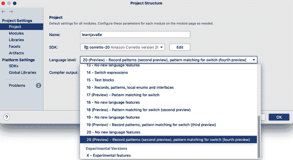
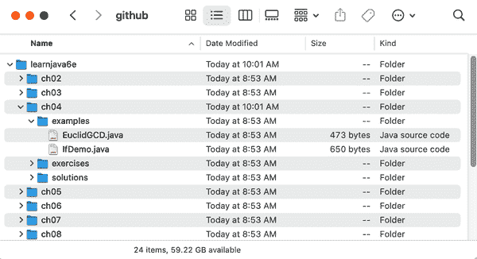
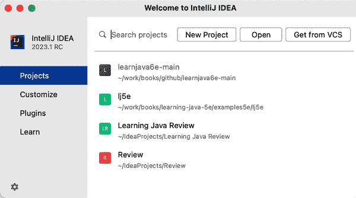
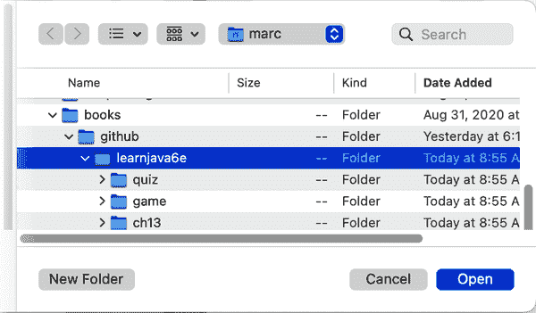
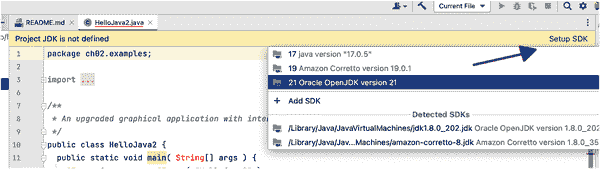
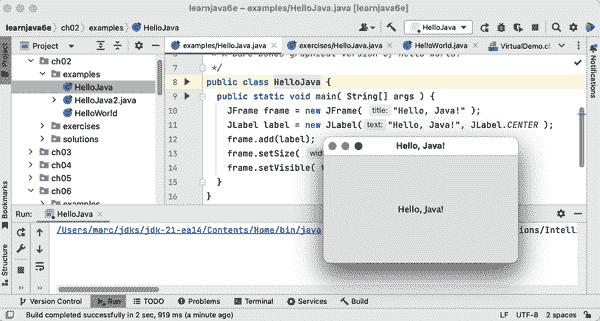

# 附录 A. 代码示例和 IntelliJ IDEA

本附录将帮助您通过整本书中找到的代码示例快速上手。这里的一些步骤已经在第二章中提到过，但我们希望在这里稍微详细地介绍一下如何在 JetBrains 的免费社区版 IntelliJ IDEA 中使用书中的示例。正如在“安装 IntelliJ IDEA 和创建项目”中所述，您可以从[jetbrains.com](https://oreil.ly/Lo9Xk)网站获取 IntelliJ。如果您需要更多帮助设置，请参阅他们的[安装指南](https://oreil.ly/Fh9fV)。

安装 IDEA 后，您需要确保选择了最新版本的 JDK。 （如果您仍需要安装 Java 本身，请参阅 “安装 JDK” ，详细介绍了各个主要平台的详情。）图 A-1 中显示的“文件 → 项目结构”对话框允许您从已安装的任何 JDK 中进行选择。为了本书的目的，您至少需要 Java 19。您还需要将所选 JDK 的“语言级别”选项设置为预览版本。

###### 图 A-1\. 在 IntelliJ IDEA 中启用 Java 的预览功能

在这个示例中，我们使用 Corretto 20 并选择了 20 (Preview) 的语言级别。如果您想获取有关在 IntelliJ IDEA 中启用 Java 的预览功能的更多信息，请在线查看他们的[预览功能教程](https://oreil.ly/jePVu)。

我们还想重申，IntelliJ IDEA 不是唯一一款友好的 Java 集成开发环境。它甚至不是唯一一款免费的！微软的[VS Code](https://oreil.ly/pv2JX) 可以快速配置以支持 Java。而由 IBM 维护的[Eclipse](https://oreil.ly/zxBL1) 仍然可用。初学者寻找一款旨在帮助他们进入 Java 编程和 Java IDE 世界的工具，可以看看由伦敦国王学院创建的[BlueJ](https://oreil.ly/QcZ_I)。

# 获取主要的代码示例

无论您使用哪种 IDE 或编辑器，您都会希望从 GitHub 获取本书的代码示例。虽然在讨论特定主题时我们经常包含完整的源代码列表，但出于简洁和可读性的考虑，我们经常选择省略诸如`import`或`package`语句，或者封闭的`class`结构。可下载的代码示例旨在完整，以帮助巩固书中的讨论内容。

您可以在浏览器中访问 GitHub，浏览单个示例，而无需下载任何内容。只需前往 [*learnjava6e* 存储库](https://github.com/l0y/learnjava6e)。（如果该链接无法正常工作，请转到 [github.com](https://github.com) 并搜索术语“learnjava6e”）。对 GitHub 进行一般的探索可能会值得，因为它已成为开源开发人员甚至企业团队的主要聚集地。您可以查看存储库的历史记录，并报告错误并讨论与代码相关的问题。

该网站的名称指的是 *git* 工具，这是一种源代码控制系统或源代码管理器，开发人员用于管理代码项目团队之间的修订。但请回忆一下 图 2-14，您不必使用 *git*。您可以通过将项目的主分支作为 [ZIP 存档](https://oreil.ly/HoZrA) 下载来获取所有示例的整个批次。下载完成后，只需将文件解压缩到您可以轻松找到示例的文件夹中。您应该看到类似于 图 A-2 的文件夹结构。

###### 图 A-2\. 代码示例的文件夹结构

如果您对 Git 感兴趣，但您的系统尚未具备 *git* 命令，您可以从 [Git 网站](https://oreil.ly/YfF4H) 下载它。GitHub 还有自己的网站，可帮助您了解 *git*，网址为 [try.github.io](http://try.github.io/)。安装 *git* 后，您可以将项目克隆到计算机上的一个文件夹中。您可以从克隆中工作，或者将其保留为代码示例的干净副本。作为一个小小的奖励，如果我们将来发布任何修复或更新，您也可以轻松同步您的克隆文件夹。

# 导入示例

在我们将任何东西导入 IntelliJ IDEA 之前，您可能想要重命名从 GitHub 下载代码示例的文件夹。克隆或解压后，您可能会得到一个名为 *learnjava6e-main* 的文件夹。这是一个完全可以接受的名称，但如果您想要一个更友好（或更短）的名称，请立即重命名文件夹。我们选择将文件夹重命名为 *learnjava6e*（不带 *-main* 后缀）。

启动 IntelliJ IDEA，并从 图 A-3 显示的欢迎界面中选择“打开”选项。如果您已经使用过 IntelliJ IDEA 并且没有看到欢迎界面，则还可以从菜单栏中选择 文件 → 打开。

###### 图 A-3\. IntelliJ IDEA 欢迎界面

转到您的代码示例文件夹，如 图 A-4 所示。确保您选择包含所有章节的顶层文件夹，而不是单个章节文件夹之一。

###### 图 A-4\. 导入代码示例文件夹

打开示例文件夹后，您可能会被要求“信任”包含示例的文件夹。IDEA 提出此问题是为了确认文件夹中的潜在可执行类是否可以安全运行。

你可能还需要指定要用于编译和运行示例的 Java 版本。使用左侧的项目层次结构，打开 *ch02/examples* 文件夹并点击 `HelloJava` 类。我们类的源文件应该出现在右侧。如果你看到类似于 图 A-5 中显示的淡黄色横幅，请点击右上角的 Setup SDK 链接文本。（*SDK* 意为软件开发工具包，在我们的情况下与 JDK 同义。）从弹出的对话框中选择要使用的 JDK。

###### 图 A-5\. 选择一个 JDK

对于本示例，我们选择了长期支持版本（21），但你可以选择安装的任何大于版本 19 的版本。（你始终可以使用文件 → 项目结构对话框更改选择或启用预览功能，如 图 A-1 所示。）

要检查一切是否正常工作，请在左侧树中右键单击 `HelloJava` 类，并从上下文菜单中选择运行 HelloJava.main() 项目项。

###### 图 A-6\. 在 IDEA 中直接运行应用程序

恭喜！IntelliJ IDEA 已经设置好了，现在可以开始探索令人惊奇和令人满足的 Java 编程世界。
