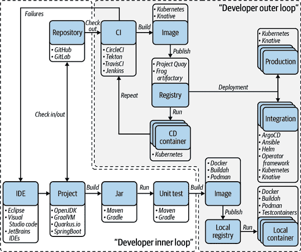
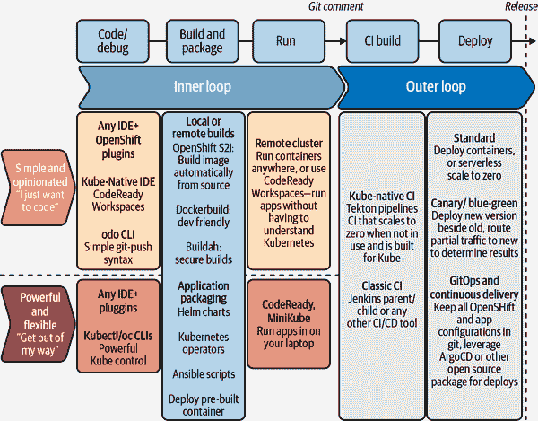

# 第一章：重温企业开发

企业开发一直是软件工程中最令人兴奋的领域之一，过去的十年是一个特别引人入胜的时期。2010 年代看到高度分布式的微服务逐渐取代了经典的三层架构，而基于云的基础设施几乎无限的资源推动了沉重的应用服务器走向过时。尽管开发人员面临将分布式世界的各个部分重新组合的挑战，但许多声音质疑这个复杂的微服务世界是否有必要。事实上，大多数应用程序仍然是精心制作的单体应用程序，遵循传统的软件开发流程。

然而，我们部署和运行软件的方式同样迅速改变。我们看到 DevOps 逐渐发展成为 GitOps，扩展了开发人员的责任范围，包括所需的基础设施。基于马库斯的书 [*现代 Java EE 设计模式*（O'Reilly）](https://oreil.ly/1cROz)，这本书对现代化提供了更多的视角，而不仅仅是模块化。我们希望帮助您了解导致现代 Kubernetes 本地开发平台的各种因素以及如何在其上构建和维护应用程序。

这本书旨在回顾并评估应用现代化和云原生架构的成功因素和驱动因素。我们专注于现代化基于 Java 的企业应用程序，包括适合现代化的应用程序的选择过程以及帮助您管理现代化工作的工具和方法论的概述。与其讨论模式，这本书提供了一套示例，帮助您应用所学的一切。

话虽如此，这本书并没有广泛讨论单体与分布式应用程序。相反，我们的目标是帮助您了解如何无缝地将您的应用程序迁移到云端。

你可以将这本书作为参考，并按任意顺序阅读章节。虽然我们已经组织好了材料，但从更高层次的概念到逐步实施的方式，我们开始了。首先，重要的是从不同的云定义以及我们如何为它们构建应用程序开始。

# 从公有云到私有云。为什么云？

公有云、私有云、混合云和多云之间的区别曾经可以通过位置和所有权轻松定义。今天，这两者已不再是云分类的唯一相关驱动因素。让我们从对不同目标环境的更全面定义以及它们为什么被使用的角度开始。

公共云环境通常由非最终用户拥有并可重新分配给其他租户的资源创建。私有云环境专门为最终用户提供资源，通常位于用户的防火墙、数据中心或有时在本地。带有某种程度的工作负载可移植性、编排和管理的多云环境称为混合云。解耦、独立且不连接的云通常被称为多云。混合云和多云方法是互斥的；因为云要么相互连接（混合云），要么不相互连接（多云）。

将应用程序部署到云中，无论是哪种类型的云，都越来越普遍，因为企业希望通过扩展环境组合来提高安全性和性能。但安全性和性能只是将工作负载转移到混合或多云环境的众多原因中的两个。对许多人来说，主要动机是按使用量付费的模式。与投资昂贵且难以扩展的本地硬件不同，云在您需要时提供资源。您无需投资设施、公用事业或建设自己的数据中心。您甚至不需要专门的 IT 团队来处理您的云数据中心运营，因为您可以享受云提供商员工的专业知识。

对开发人员而言，云是关于自助服务和灵活性。您无需等待环境的晋升，可以根据需要选择基础设施组件（例如数据库、消息代理等），从而摆脱不必要的等待时间，最终加快开发周期。除了这些主要优势外，您还可以在某些云环境中找到开发人员的定制功能。例如，OpenShift 具有集成开发控制台，为开发人员提供对其应用程序拓扑的所有详细信息的直接编辑访问。基于云的 IDE（例如[Eclipse Che](https://www.eclipse.org/che)）提供基于浏览器的开发工作区访问，并消除团队的本地环境配置需求。

此外，云基础设施鼓励您自动化部署过程。部署自动化使您能够通过点击按钮将软件部署到测试和生产环境中——这是敏捷开发和 DevOps 团队的强制要求。当您了解微服务架构时，您已经看到了对 100%自动化的需求。但自动化远不止应用部分，它延伸到基础设施和下游系统。[Ansible](https://www.ansible.com)，[Helm](https://helm.sh)和[Kubernetes Operators](https://oreil.ly/lhaPm)能够帮助您。我们将在第四章更详细地讨论自动化，并且您将在第七章中使用运算符。

# “云原生”是什么意思

你可能听说过开发应用程序和服务的*云原生*方法，尤其是自 2015 年以来，云原生计算基金会（CNCF）成立并发布 Kubernetes v1 以来更加频繁。Bill Wilder 首次在他的书籍[*Cloud Architecture Patterns* (O’Reilly)](https://oreil.ly/hmeAC)中使用了“云原生”这个术语。根据 Wilder 的说法，云原生应用程序通过使用云平台服务和自动扩展来充分利用云平台。Wilder 在书写这本书时正值开发和部署云原生应用程序兴趣增长的时期。开发者可以选择各种公共和私有平台，包括亚马逊 AWS、谷歌云、微软 Azure 和许多较小的云服务提供商。但是那时也开始普及混合云部署，这也带来了挑战。

[CNCF](https://oreil.ly/Sadph) 将“云原生”定义为：

> 云原生技术使组织能够在现代、动态环境（如公共、私有和混合云）中构建和运行可扩展的应用程序。容器、服务网格、微服务、不可变基础设施和声明式 API 是这种方法的典范。
> 
> 这些技术支持松耦合的系统，具有弹性、可管理性和可观察性。结合强大的自动化，它们允许工程师频繁且可预测地进行高影响变更，减少琐事。
> 
> CNCF 云原生定义 v1.0

类似于云原生技术的是[十二因素应用](https://12factor.net)。十二因素应用宣言定义了构建部署在云上的应用程序的模式。虽然这些模式与 Wilder 的云架构模式有重叠之处，但十二因素方法可以应用于任何编程语言编写的应用程序，并使用任何组合的后端服务（数据库、队列、内存缓存等）。

# Kubernetes 原生开发

对于部署应用程序到混合云的开发人员来说，将焦点从云原生转向 Kubernetes 原生是有道理的。最早提到“Kubernetes 原生”可以追溯到 2017 年。Medium 上的一篇博文描述了[Kubernetes 原生](https://oreil.ly/2quU8)与云原生的区别，将其定义为一组针对 Kubernetes 进行优化的技术。关键要点在于，Kubernetes 原生是云原生的一种专业化，不脱离云原生的定义。而云原生应用程序是为云服务而设计的，而 Kubernetes 原生应用程序则是专门为 Kubernetes 设计和构建的。

在云原生开发的早期阶段，编排差异阻碍了应用程序真正成为云原生。Kubernetes 解决了编排问题，但 Kubernetes 并不涵盖云提供商的服务（例如，角色和权限）或提供事件总线（例如，Kafka）。Kubernetes 原生专业化意味着它与云原生之间有许多相似之处。主要区别在于云提供商的可移植性。充分利用混合云并使用多个云提供商要求应用程序可以部署到任何云提供商。如果没有这样的功能，你将被限制在单一云提供商，并依赖于它们全天候的服务。要充分利用混合云的好处，应用程序必须以 Kubernetes 原生方式构建。Kubernetes 原生是解决云可移植性问题的方案。我们将在第二章中详细讨论 Kubernetes 原生。

# 容器与开发者编排

可移植性的一个关键因素是*容器*。容器代表着主机系统资源的一部分，与应用程序一起。容器的起源可以追溯到早期的 Linux 时代，当时引入了 chroots，它们随着 Google 的进程容器（后来成为 cgroups）变得流行起来。它们的使用在 2013 年大量增加，主要因为 Docker 使它们对许多开发者可访问。Docker 公司、Docker 容器、Docker 镜像以及我们都习惯使用的 Docker 开发工具有所不同。虽然一切始于 Docker 容器，但 Kubernetes 更倾向于通过任何支持其容器运行时接口（如[containerd](https://containerd.io)或[CRI-O](https://cri-o.io)）的容器运行时运行容器。许多人所说的 Docker 镜像实际上是打包在[开放容器倡议（OCI）格式](https://opencontainers.org)中的镜像。

## 容器原生运行时

容器提供了 Linux 操作系统用户空间的轻量级版本，剥离了基本要素。然而，它仍然是一个操作系统，容器的质量和主机操作系统一样重要。支持容器镜像需要大量的工程、安全分析和资源。这不仅需要测试基础镜像，还需要测试它们在特定容器主机上的行为。依赖于经过认证和 OCI 兼容的基础镜像在跨平台应用迁移时能减少障碍。理想情况下，这些基础镜像已经包含了你所需的语言运行时。对于基于 Java 的应用程序，[Red Hat 通用基础镜像](https://oreil.ly/KH9od)是一个很好的起点。我们将在第四章中更多地了解容器及其开发者的使用。

## Kubernetes 版本

到目前为止，我们已经讨论了 Kubernetes 作为一个通用概念。我们继续使用“Kubernetes”一词来谈论支持容器编排的技术。Kubernetes（有时仅称为 K8s）这个名词指的是被广泛认为是容器编排核心功能标准制定机构的[开源项目](https://kubernetes.io)。在本书中，如果我们提到 Kubernetes 内的标准功能，我们使用“普通”Kubernetes 这个术语。Kubernetes 社区创建了不同的发行版甚至不同的 Kubernetes 变体。CNCF 运行着[Certified Kubernetes Conformance Program](https://oreil.ly/n4XH9)，目前列出了来自 108 个供应商的 138 个产品。该列表包括完整的发行版（例如 MicroK8s、OpenShift、Rancher）、托管的服务（例如 Google Kubernetes Engine、Amazon Elastic Kubernetes Service、Azure AKS Engine）以及安装程序（例如 minikube、VanillaStack）。它们都共享共同的核心功能，但供应商根据需要或机会增加了额外的功能或集成。本书中我们不对使用哪种 Kubernetes 变体提出建议。您需要自行决定如何处理生产工作负载。为了帮助您在本书中运行示例，我们使用[minikube](https://oreil.ly/sCQUo)，不需要您在云端进行全面安装。

# 管理开发复杂性

Kubernetes 原生开发中最关键的一个领域是管理你的开发环境。成功部署或将其分阶段推向多个环境所需执行的任务数量呈指数级增长。一个原因是独立应用部件或微服务数量的增加。另一个原因是基础设施的应用特定配置。图 1-1 简要概述了一个示例开发环境及其必需的工具，用于完全自动化的开发。本书中我们将讨论其中的一部分，以帮助您在新环境中轻松入门。核心开发任务没有改变。您仍将使用适当的框架（如[Quarkus](http://quarkus.io)）编写应用或服务，就像本书中的操作一样。开发者工作流程的这一部分通常被称为“内部循环”开发。

我们将在本书中大部分时间都在讨论“外循环”的变化和机会。外循环通过各种机制将您构建和测试的应用程序投入生产是至关重要的。了解，在本书中，我们表达了一些非常强烈的观点。它们反映了我们通过使用我们推荐的工具和技术使 Java 开发者变得高效、快速，甚至可能是快乐的经验。正如图 1-1 所示，在某些地方您有一两个选择。在本书中，我们选择了更传统的 Java 开发方式。我们使用 Maven 而不是 Gradle 来构建应用程序，使用 podman 而不是 Docker 来构建容器映像。我们还使用 OpenJDK 而不是 GraalVM，并且在示例中坚持使用 JUnit 而不是[Testcontainers](https://oreil.ly/kbudT)。

但是，正如[CNCF 景观](https://oreil.ly/kqsG9)所绘制的那样，云原生生态系统拥有更多工具供您选择。把这本书看作是企业 Java 开发者的一份路线图。

###### 图 1-1\. 内外循环开发，以及作者推荐的工具

除了技术选择之外，您还必须决定如何使用这个新的生态系统。有了各种可用的工具，您可以选择在 Kubernetes 中参与的程度。我们根据图 1-2 中所述区分了武断和灵活。作为一个对细节着迷的开发者，您可能希望从一线的所有示例中学习，并在制作 YAML 文件时使用纯 Kubernetes。

###### 注意

最初，YAML 被说成是 Yet Another Markup Language 的缩写，这个名字是为了戏谑地指其作为一种标记语言的用途。但后来，它被重新定义为 YAML Ain’t Markup Language 的递归缩写，以区分其作为面向数据的用途。

您可能决定专注于源代码，并且不希望在实现业务逻辑时分心。这可以通过某些发行版提供的开发者工具来实现。根据您在开发过程中最重要的因素，有各种选择。您可以使用主要的 Kubernetes 命令行界面（CLI）`kubctl`，而不是像 OpenShift 的 CLI `oc`那样特定于产品。如果您想更接近一个完整的产品，我们建议您尝试[CodeReady Containers](https://oreil.ly/vhyZ7)。它是一个在您的笔记本电脑上的 OpenShift 集群，具有简单易上手的体验。但选择权在您手中。

我们推荐的另一个强大工具是[odo](https://oreil.ly/IyjTm)，这是一个基于 Kubernetes 项目的通用开发者 CLI。现有的工具如`kubectl`和`oc`更注重操作，并要求深入理解底层概念。Odo 为开发者抽象了复杂的 Kubernetes 概念。外部开发环路的两个示例选择是持续集成（CI）解决方案。我们在本书中使用[Tekton](https://tekton.dev)，您可以在第六章中使用它。还可以在 Kubernetes 上使用[Jenkins Operator](https://oreil.ly/0Z1Cv)或甚至 Jenkins X。无论您做出何种选择，最终您将成为您的基于 Kubernetes 的旅程的主人。

###### 图 1-2. 主观与灵活——内外开发环路中的技术选择

# DevOps 与敏捷性

当现代化你的企业 Java 应用程序时，下一个关键变化在于创建跨职能团队，这些团队从构思到运营分享责任。虽然有些人认为 DevOps 仅专注于操作方面，并与开发者的自助配对，但我们坚信，DevOps 是一种以长远影响为重点的团队文化。单词“DevOps”是“开发”和“运维”的混合词，但它代表了远比这两个术语之和更重要的一套思想和实践。DevOps 包括安全性、协作工作方式、数据分析以及许多其他内容。DevOps 描述了加速新业务需求从开发代码到在生产环境中部署的过程的方法。这些方法要求开发团队和运维团队频繁沟通，并对其团队成员充满同理心。可伸缩性和灵活的供应也是必要的。开发人员通常在熟悉的开发环境中编码，与 IT 运维密切合作，加快软件构建、测试和发布的速度，同时又不损害可靠性。所有这些加在一起会导致更频繁的代码变更和更动态的基础设施使用。将传统 IT 组织从传统方法转变为 DevOps 方法通常被描述为*转型*，超出了本书的范围。尽管如此，这是一个重要的因素，你将看到这种转型在书籍、文章和演示中被美丽地描述为“教大象跳舞”。

# 总结

在本章中，您了解了一些基本定义，并听说了本书将要使用的最重要的技术和概念。下一章将带您进入您的第一个应用现代化的源代码。
