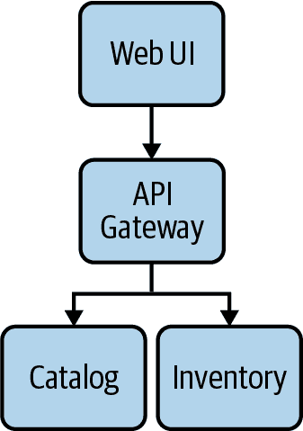
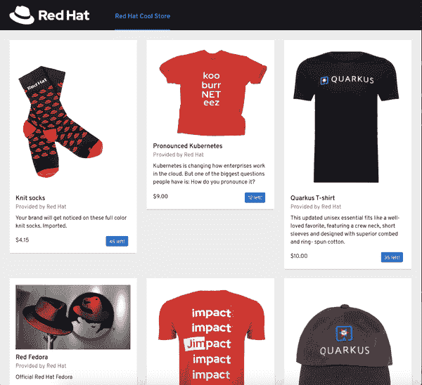
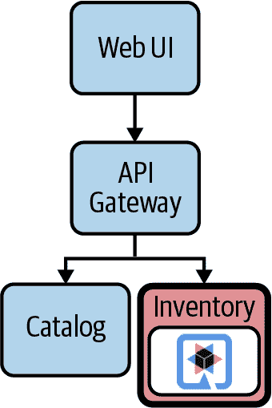
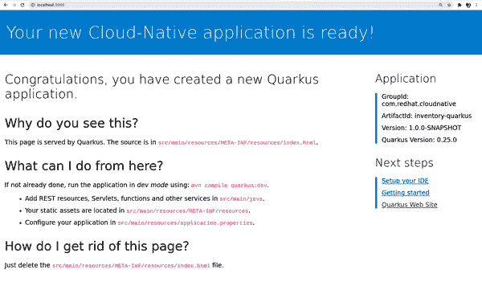
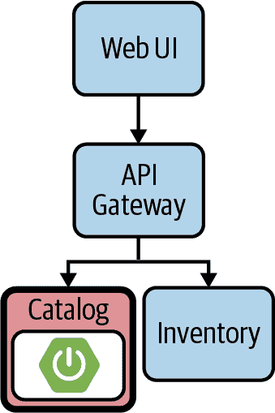
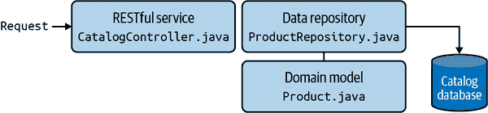
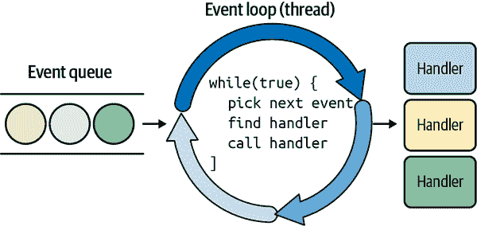
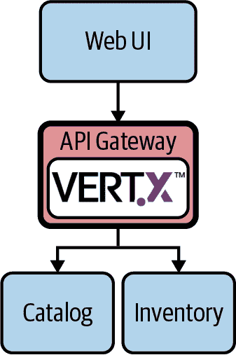
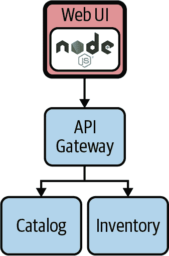
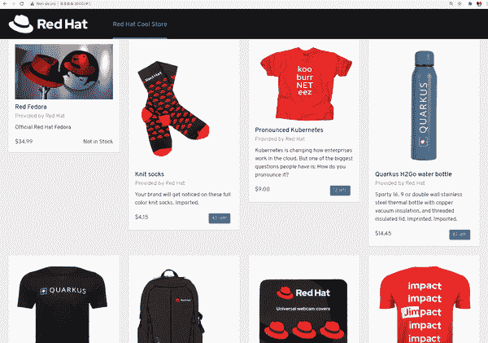

# 第二章 通向云原生 Java 之路

“Πάντα ῥεῖ”（一切都在流动）是哲学家赫拉克利特的一句著名格言，描述了我们存在的可变条件，一切都在流动，我们的呼唤是反应和适应。这完美地描述了我们在 IT 世界中以及具体到编程语言和框架中正在经历的演变的正确方法，其中异构、分布式、多云负载更加普遍且对业务目标至关重要。

Java 和 Jakarta EE（之前被称为 Java EE），也在这个方向上不断发展，平衡来自企业解决方案的成熟经验所带来的好处，以及快速变化的云感知场景的需求，在这一章节中，我们将概述迁移到云原生 Java 所需的组件，引导您完成一个名为 Coolstore 的电子商务商店 Java 实现。

# 云原生研讨会

微服务是一种被广泛认可和接受的实践。对于 JavaEE 开发者来说，这意味着一种范式的提升和转变，单个应用服务器不再包含所有业务逻辑。相反，它被拆分成运行在各自应用服务器上的不同微服务，如 Tomcat 或 Undertow，具有最小的足迹和优化，以保持在云原生世界中的功能和性能。

如今，单片式方法可以重构为异构甚至编程语言无关的模型，其中每个模块由在不同应用程序中运行的特定组件管理。除了像 API 驱动模型这样的最佳实践外，这里的挑战是如何维护这种多样性。然而，如今 Java 提供了一套工具和框架，帮助我们专注于我们喜爱的工具并轻松合作。在本章中，您将学习如何开发和部署基于微服务的应用程序，这些微服务跨越不同的 Java 框架。

# 架构

我们的电子商务应用 Coolstore 是一个典型的 Web 应用程序，包含三个组件：

展示层

一个前端用于显示可供获取的项目

模型层

一个后端提供业务逻辑来目录化和索引所有要出售的项目

数据层

存储所有交易和商品记录的数据库

这些组件的结果是一个在线商店，具有产品项目目录和我们可以使用图 2-1 中展示的架构进行组织的库存。



###### 图 2-1 酷店架构

我们将这三个先前提到的组件映射到多个微服务中，每个微服务负责其层：

+   *目录服务* 使用 REST API 公开存储在关系数据库中的目录内容。

+   *库存服务* 使用 REST API 公开存储在关系数据库中的商品库存。

+   *网关服务*以高效的方式调用*目录服务*和*库存服务*。

+   *WebUI 服务*调用*网关服务*以检索所有信息。

表示这些微服务的演示层和模型层，后者具有与某些数据库管理系统委托的数据层接口。我们的电子商店实现称为 Coolstore，并且看起来像图 2-2 中的图片。



###### 图 2-2\. Coolstore 仪表板

# 使用 Quarkus 创建库存微服务

[Quarkus](https://quarkus.io)是一个全栈、面向 Kubernetes 的 Java 框架，专为 Java 虚拟机（JVM）和本地编译而设计，优化 Java 特别适合容器，并使其成为服务器无服务、云和 Kubernetes 环境的有效平台。

它设计用于与流行的 Java 标准、框架和库（如 Eclipse MicroProfile 和 Spring，以及 Apache Kafka、RESTEasy（JAX-RS）、Hibernate ORM（JPA）、Infinispan、Camel 等）一起使用。它还为 GraalVM（用于运行多种语言编写的应用程序的通用虚拟机，包括 Java 和 JavaScript）提供了正确的信息，以便对应用程序进行本地编译。

Quarkus 是实施微服务架构的良好选择，并提供一套工具，帮助开发人员轻松调试和测试。对于我们的电子商店，我们将开始使用 Quarkus 来实现库存微服务（如图 2-3 所示）。



###### 图 2-3\. 库存 Quarkus 微服务

您可以在[书的 GitHub 仓库](https://oreil.ly/zqbWB)找到此示例的所有源代码。

## 创建 Quarkus Maven 项目

使用 Quarkus，您可以使用 Maven 或 Gradle 创建一个新项目。

###### 提示

Maven 和 Gradle 都是设置 Java 项目和管理所有依赖项的流行方式。它们在依赖管理策略和配置格式（XML 与 Kotlin DSL）上有所不同，但在功能上基本相当。在本书中，我们将使用 Maven，因为它通过 IDE 和工具具有更广泛的支持。

我们使用以下命令设置了一个新的 Maven 项目，使用`quarkus-maven-plugin`：

```java
mvn io.quarkus:quarkus-maven-plugin:2.1.4.Final:create \
  -DprojectGroupId=com.redhat.cloudnative \
  -DprojectArtifactId=inventory-quarkus \
  -DprojectVersion=1.0.0-SNAPSHOT \
  -DclassName="com.redhat.cloudnative.InventoryResource" \
  -Dextensions="quarkus-resteasy,quarkus-resteasy-jsonb,↳
 quarkus-hibernate-orm-panache,quarkus-jdbc-h2"
```

###### 提示

您还可以使用[*https://code.quarkus.io*](https://code.quarkus.io)提供的在线配置器来引导一个 Quarkus 应用程序。

这将创建一个带有`InventoryResource`类的骨架项目，我们将用它来实现我们的电子商务库存微服务。

让我们来看一下生成的*pom.xml*文件：

```java
<?xml version="1.0" encoding="UTF-8"?>
<project>
    <modelVersion>4.0.0</modelVersion>
    <groupId>com.redhat.cloudnative</groupId> 
    <artifactId>inventory-quarkus</artifactId>
    <version>1.0.0-SNAPSHOT</version>
    <properties>
        <quarkus-plugin.version>2.1.4.Final</quarkus-plugin.version>
        <quarkus.platform.artifact-id>quarkus-bom</quarkus.platform.artifact-id>
        <quarkus.platform.group-id>io.quarkus</quarkus.platform.group-id>
        <quarkus.platform.version>2.1.4.Final</quarkus.platform.version>
        <compiler-plugin.version>3.8.1</compiler-plugin.version>
        <surefire-plugin.version>3.0.0-M5</surefire-plugin.version>
        <project.build.sourceEncoding>UTF-8</project.build.sourceEncoding>
        <maven.compiler.source>11</maven.compiler.source>
        <maven.compiler.target>11</maven.compiler.target>
        <maven.compiler.parameters>true</maven.compiler.parameters>
    </properties>
    <dependencyManagement>
        <dependencies>
            <dependency>
                <groupId>io.quarkus</groupId>
                <artifactId>quarkus-bom</artifactId> 
                <version>${quarkus.platform.version}</version>
                <type>pom</type>
                <scope>import</scope>
            </dependency>
        </dependencies>
    </dependencyManagement>
    <dependencies> 
        <dependency>
          <groupId>io.quarkus</groupId>
          <artifactId>quarkus-resteasy</artifactId>
        </dependency>
        <dependency>
          <groupId>io.quarkus</groupId>
          <artifactId>quarkus-junit5</artifactId>
          <scope>test</scope>
        </dependency>
        <dependency>
          <groupId>io.rest-assured</groupId>
          <artifactId>rest-assured</artifactId>
          <scope>test</scope>
        </dependency>
        <dependency>
          <groupId>io.quarkus</groupId>
          <artifactId>quarkus-resteasy-jsonb</artifactId>
        </dependency>
        <dependency>
          <groupId>io.quarkus</groupId>
          <artifactId>quarkus-hibernate-orm-panache</artifactId>
        </dependency>
        <dependency>
          <groupId>io.quarkus</groupId>
          <artifactId>quarkus-jdbc-h2</artifactId>
        </dependency>
    </dependencies> ... <build>
                <plugins>
                    <plugin>
                        <groupId>io.quarkus</groupId>
                        <artifactId>quarkus-maven-plugin</artifactId>  
                        <version>${quarkus-plugin.version}</version>
                        <executions>
                            <execution>
                                <goals>
                                    <goal>native-image</goal>
                                </goals>
                                <configuration>
                                    <enableHttpUrlHandler>true↳ </enableHttpUrlHandler>
                                </configuration>
                            </execution>
                        </executions>
                    </plugin> ... </profiles>
</project>
```


在这里，我们设置了`groupId`、`artifactId`和`version`。有关可用选项的完整列表，请参见表 2-1。


在这里，您可以找到 Quarkus BOM 的导入，允许您省略不同 Quarkus 依赖项的版本。


这里你可以找到项目的所有依赖项，我们将其表示为要添加的扩展。

+   JSON REST 服务：这使您能够 [开发 REST 服务](https://oreil.ly/hsHvV) 来消费和生成 JSON 负载。

+   Hibernate ORM Panache：这个事实上的 JPA 实现为您提供了完整的对象关系映射功能。[Hibernate ORM with Panache](https://oreil.ly/zqJDh) 专注于简化基于 Hibernate 的持久化层，使您的实体更易编写和维护。

+   数据源（H2）：[数据源](https://oreil.ly/Q5nGV)是获取与数据库连接的主要方式；在这个例子中，我们将使用 H2，一个内存数据库，适用于 Java 应用程序。


`quarkus-maven-plugin` 负责应用程序的打包和提供开发模式。

表 2-1\. Quarkus Maven 项目选项

| 属性 | 默认值 | 描述 |
| --- | --- | --- |
| `projectGroupId` | `com.redhat.cloudnative` | 创建项目的 group id。 |
| `projectArtifactId` | *必填* | 创建项目的 artifact id。如果不传递，则触发交互模式。 |
| `projectVersion` | `1.0-SNAPSHOT` | 创建项目的版本。 |
| `platformGroupId` | `io.quarkus` | 目标平台的 group id。考虑到所有现有的平台都来自 io.quarkus，这个不会被显式使用。但仍然是一个选项。 |
| `platformArtifactId` | `quarkus-universe-bom` | 目标平台 BOM 的 artifact id。为了使用本地构建的 Quarkus，应该是 quarkus-bom。 |
| `platformVersion` | 如果未指定，将解析最新版本。 | 项目希望使用的平台版本。它还可以接受版本范围，此时将使用指定范围内的最新版本。 |
| `className` | *如果省略则不创建* | 生成的资源的完全限定名。 |
| `path` | `/hello` | 资源路径，只有在设置 className 时才相关。 |
| `extensions` | `[]` | 要添加到项目中的扩展列表（以逗号分隔）。 |

###### Tip

要查看所有可用的扩展，请使用以下命令从项目目录运行：`./mvnw quarkus:list-extensions`。

## 创建一个领域模型

现在是时候编写一些代码了，创建一个 *领域模型* 和一个 RESTful 端点来创建 Inventory 服务。领域模型是软件工程中的一种流行模式，它在云原生世界中也非常合适。这种模式提供的抽象级别使其作为面向对象建模微服务业务逻辑的有效方式。

您可以在这本书的 GitHub 仓库中的 `Inventory` 类中找到领域模型的定义：[book’s GitHub repository](https://oreil.ly/JE6CD)。

我们的领域模型实现包括一个映射到持久化层的 `Entity`，代表一个物品清单：

```java
package com.redhat.cloudnative;

import javax.persistence.Entity;
import javax.persistence.Table;

import io.quarkus.hibernate.orm.panache.PanacheEntity;

import javax.persistence.Column;

@Entity 
@Table(name = "INVENTORY") 
public class Inventory extends PanacheEntity{ 

    @Column
    public int quantity; 

    @Override
    public String toString() {
        return "Inventory [Id='" + id + '\'' + ", quantity=" + quantity + ']';
    }
}
```


`@Entity`标记类为 JPA 实体。


`@Table`通过定义表名和数据库约束来自定义表创建过程，在这种情况下是`INVENTORY`。


Quarkus 将在您使用公共属性并扩展`PanacheEntity`时为您生成`getter/setter`。此外，还会自动添加`id`属性。

一旦我们定义了模型，我们可以更新我们在*application.properties*文件中表示的属性，以便提供有关如何为我们的微服务填充数据的说明：

```java
quarkus.datasource.jdbc.url=jdbc:h2:mem:inventory;↳
DB_CLOSE_ON_EXIT=FALSE;DB_CLOSE_DELAY=-1  quarkus.datasource.db-kind=h2
quarkus.hibernate-orm.database.generation=drop-and-create
quarkus.hibernate-orm.log.sql=true
quarkus.hibernate-orm.sql-load-script=import.sql  %prod.quarkus.package.uber-jar=true 
```


用于内存 DB 的 JDBC 路径；这可以更改为其他类型的 DB，如任何 RDBMS。


以下是我们将使用的 SQL 脚本，用于向 Coolstore 填充一些数据：

`INSERT INTO INVENTORY(id, quantity) VALUES (100000, 0);`

`INSERT INTO INVENTORY(id, quantity) VALUES (329299, 35);`

`INSERT INTO INVENTORY(id, quantity) VALUES (329199, 12);`

`INSERT INTO INVENTORY(id, quantity) VALUES (165613, 45);`

`INSERT INTO INVENTORY(id, quantity) VALUES (165614, 87);`

`INSERT INTO INVENTORY(id, quantity) VALUES (165954, 43);`

`INSERT INTO INVENTORY(id, quantity) VALUES (444434, 32);`

`INSERT INTO INVENTORY(id, quantity) VALUES (444435, 53);`


`uber-jar`包含所有所需的依赖项，打包在 jar 中以便使用`java -jar`运行应用程序。在 Quarkus 中，默认情况下，`uber-jar`的生成已禁用。通过`%prod`前缀，此选项仅在构建供部署用的 jar 时激活。

## 创建 RESTful 服务

Quarkus 使用 JAX-RS 标准构建 REST 服务。当我们像之前看到的那样脚手架一个新项目时，将在我们定义的*className*路径中创建一个*hello*示例服务。现在我们想要公开 REST 服务以从库存中检索可用项目的数量，使用以下内容：

+   路径：*/api/inventory/{itemId}*;

+   HTTP 方法：`GET`

这将返回库存数据库中存在的给定项目 ID 的数量。

让我们将`InventoryResource`类定义更改为以下内容：

```java
package com.redhat.cloudnative;

import javax.enterprise.context.ApplicationScoped;
import javax.ws.rs.GET;
import javax.ws.rs.Path;
import javax.ws.rs.PathParam;
import javax.ws.rs.Produces;
import javax.ws.rs.core.MediaType;

@Path("/api/inventory")
@ApplicationScoped
public class InventoryResource {

    @GET
    @Path("/{itemId}")
    @Produces(MediaType.APPLICATION_JSON)
    public Inventory getAvailability(@PathParam("itemId") long itemId) {
        Inventory inventory = Inventory.findById(itemId); 
        return inventory;
    }
}
```


通过扩展`PanacheEntity`，我们使用活动记录持久性模式而不是数据访问对象（DAO）。这意味着所有持久化方法都与我们自己的`Entity`混合。

我们刚刚为我们的微服务实现了一个参数化的 REST 端点，服务于我们 Coolstore 中包含的项目的 JSON 表示。通过这种方式，我们提供了一个通过 HTTP `GET`请求查询我们在上一步中实现的`Inventory`数据模型的层。

###### 提示

使用 Quarkus，无需创建 `Application` 类。虽然支持，但不是必需的。此外，只创建一个资源实例，而不是每个请求创建一个。您可以使用不同的作用域注解（`ApplicationScoped`、`RequestScoped` 等）进行配置。

## 在开发模式下运行应用程序

在 Quarkus 中，开发模式是云原生 Java 开发中最酷的功能之一。它通过热部署和后台编译实现，这意味着当你修改 Java 文件或资源文件并刷新浏览器时，更改会自动生效。这对于配置属性文件等资源文件同样有效。此外，刷新浏览器会触发对工作区的扫描，如果检测到任何更改，将重新编译 Java 文件并重新部署应用程序；然后由重新部署的应用程序处理您的请求。如果编译或部署有任何问题，错误页面将告诉你。

你可以使用内置的 Maven 目标 `quarkus:dev` 在开发模式下启动应用程序。它启用了热部署和后台编译，这意味着当你修改 Java 文件或资源文件并刷新浏览器时，这些更改会自动生效。这对于配置属性文件等资源文件也同样有效：

```java
./mvnw compile quarkus:dev
```

在你启动应用程序的开发模式后，你应该会看到类似以下的输出：

```java
...
Hibernate:

    drop table if exists INVENTORY CASCADE
Hibernate:

    create table INVENTORY (
       id bigint not null,
        quantity integer,
        primary key (id)
    )

Hibernate:
    INSERT INTO INVENTORY(id, quantity) VALUES (100000, 0)
Hibernate:
    INSERT INTO INVENTORY(id, quantity) VALUES (329299, 35)
Hibernate:
    INSERT INTO INVENTORY(id, quantity) VALUES (329199, 12)
Hibernate:
    INSERT INTO INVENTORY(id, quantity) VALUES (165613, 45)
Hibernate:
    INSERT INTO INVENTORY(id, quantity) VALUES (165614, 87)
Hibernate:
    INSERT INTO INVENTORY(id, quantity) VALUES (165954, 43)
Hibernate:
    INSERT INTO INVENTORY(id, quantity) VALUES (444434, 32)
Hibernate:
    INSERT INTO INVENTORY(id, quantity) VALUES (444435, 53)
__  ____  __  _____   ___  __ ____  ______
 --/ __ \/ / / / _ | / _ \/ //_/ / / / __/
 -/ /_/ / /_/ / __ |/ , _/ ,< / /_/ /\ \
--\___\_\____/_/ |_/_/|_/_/|_|\____/___/
2020-12-02 13:11:16,565 INFO  [io.quarkus] (Quarkus Main Thread)↳
inventory-quarkus 1.0.0-SNAPSHOT on JVM (powered by Quarkus 1.7.2.Final)↳
started in 1.487s. Listening on: http://0.0.0.0:8080
2020-12-02 13:11:16,575 INFO  [io.quarkus] (Quarkus Main Thread)↳
Profile dev activated. Live Coding activated.
2020-12-02 13:11:16,575 INFO  [io.quarkus] (Quarkus Main Thread)↳
Installed features: [agroal, cdi, hibernate-orm, jdbc-h2, mutiny, narayana-jta,↳
resteasy, resteasy-jsonb, smallrye-context-propagation]
```

从输出中可以看到，`Hibernate` 创建了一个数据库，名称与我们的领域模型相同，并使用我们属性文件中定义的一些初始数据进行了填充。

###### 注意

当我们在本章开头搭建项目时，我们包含了一系列依赖项，如 Panache，并将其用作 `Entity` 映射到数据库中的数据模型。

我们还可以看到我们的应用程序正在运行，并且正在监听端口 8080。如果现在在浏览器中打开 [*http://localhost:8080*](http://localhost:8080)，你将看到一个 Quarkus 欢迎页面（如图 2-4 所示）。



###### 图 2-4\. Quarkus 欢迎页面

###### 提示

你可以通过在启动应用程序的同一终端上使用 Ctrl-C 来停止运行开发模式下的应用程序。当你在 Quarkus 2 的开发模式下运行时，默认启用了连续测试功能，即在保存代码更改后立即运行测试。

现在你可以尝试查询我们从 *import.sql* 文件中插入的项目之一，以测试我们的微服务是否正常运行。

只需导航到 [*http://localhost:8080/api/inventory/329299*](http://localhost:8080/api/inventory/329299)。

你应该看到以下输出：

```java
{
   "id":"329299",
   "quantity":35
}
```

REST API 返回了一个 JSON 对象，表示此产品的库存数量。恭喜你完成了第一个使用 Quarkus 的云原生微服务！

###### 注意

现在我们将开发其他将使用此微服务的微服务，因此请保持打开状态，以便在本章结束时使 Coolstore 运行起来。

# 使用 Spring Boot 创建目录微服务

[Spring Boot](https://spring.io/projects/spring-boot)是一种主张的框架，可以轻松创建独立的[基于 Spring 的](https://spring.io)应用程序，其中包括内嵌的 Web 容器，如 Tomcat（或 JBoss Web Server）、Jetty 和 Undertow，可以直接在 JVM 上使用`java -jar`运行。Spring Boot 还允许生成可以部署在独立 Web 容器上的 war 文件。

这种主张的方法意味着关于 Spring 平台和第三方库的许多选择已经由 Spring Boot 做出，因此您可以用最少的工作量和配置开始。

Spring Boot 非常适合云原生 Java 开发，因为它可以轻松创建独立的、[面向生产的基于 Spring 的应用程序](https://oreil.ly/KYWe5)，可以“一键运行”。我们将在我们的架构中包括 Spring Boot 作为目录微服务（如图 2-5 所示）。



###### 图 2-5\. Catalog Spring Boot 微服务

您可以在[书的 GitHub 存储库](https://oreil.ly/M8ya6)中找到创建 Spring Boot 微服务的所有源代码。

## 创建一个 Maven 项目

在这种情况下，您可以使用 Maven 或 Gradle 来启动 Spring Boot 项目的引导。最简单的方法是使用[Spring Initializr](https://start.spring.io)，这是一个在线配置器，帮助生成带有所有必要依赖项的项目结构。

在这种情况下，我们将使用来自[红帽 Maven 仓库](https://oreil.ly/mAJRs)支持的 Spring Boot 版本，使用在表 2-2 中定义的项目元数据。

表 2-2\. Spring Boot Maven 项目选项

| 键 | 值 | 描述 |
| --- | --- | --- |
| `modelVersion` | `4.0.0` | POM 模型版本（始终为 4.0.0）。 |
| `groupId` | `com.redhat.cloudnative` | 项目所属的组或组织。通常表示为反转的域名。 |
| `artifactId` | `catalog` | 项目库组件的名称（例如其 JAR 或 WAR 文件的名称）。 |
| `version` | `1.0-SNAPSHOT` | 正在构建的项目版本。 |
| `name` | `CoolStore Catalog Service` | 应用程序的名称。 |
| `description` | `CoolStore Catalog Service with Spring Boot` | 应用程序的描述。 |

让我们来看看我们的*pom.xml*文件：

```java
<?xml version="1.0" encoding="UTF-8"?>
<project
  xmlns="http://maven.apache.org/POM/4.0.0"
  xmlns:xsi="http://www.w3.org/2001/XMLSchema-instance"↳
  xsi:schemaLocation="http://maven.apache.org/POM/4.0.0↳
  http://maven.apache.org/xsd/maven-4.0.0.xsd">
  <modelVersion>4.0.0</modelVersion>
  <groupId>com.redhat.cloudnative</groupId> 
  <artifactId>catalog</artifactId>
  <version>1.0-SNAPSHOT</version>
  <name>CoolStore Catalog Service</name>
  <description>CoolStore Catalog Service with Spring Boot</description>
  <properties>
    <spring-boot.version>2.1.6.SP3-redhat-00001</spring-boot.version> 
    <spring-boot.maven.plugin.version>2.1.4.RELEASE-redhat-00001↳ </spring-boot.maven.plugin.version>
    <spring.k8s.bom.version>1.0.3.RELEASE</spring.k8s.bom.version>
    <fabric8.maven.plugin.version>4.3.0</fabric8.maven.plugin.version>
  </properties>
  <repositories>
    <repository>
      <id>redhat-ga</id>
      <url>https://maven.repository.redhat.com/ga/</url>
    </repository>
  </repositories>
  <pluginRepositories>
    <pluginRepository>
      <id>redhat-ga-plugins</id>
      <url>https://maven.repository.redhat.com/ga/</url>
    </pluginRepository>
  </pluginRepositories>
  <dependencyManagement>
    <dependencies>
      <dependency>
        <groupId>me.snowdrop</groupId>
        <artifactId>spring-boot-bom</artifactId>
        <version>${spring-boot.version}</version>
        <type>pom</type>
        <scope>import</scope>
      </dependency>
      <dependency>
        <groupId>org.springframework.cloud</groupId>
        <artifactId>spring-cloud-kubernetes-dependencies</artifactId>
        <version>${spring.k8s.bom.version}</version>
        <type>pom</type>
        <scope>import</scope>
      </dependency>
    </dependencies>
  </dependencyManagement>
  <dependencies> 
    <dependency>
      <groupId>org.springframework.boot</groupId>
      <artifactId>spring-boot-starter-web</artifactId>
    </dependency>
    <dependency>
      <groupId>org.springframework.boot</groupId>
      <artifactId>spring-boot-starter-data-jpa</artifactId>
    </dependency>
    <dependency>
      <groupId>org.springframework.boot</groupId>
      <artifactId>spring-boot-starter-actuator</artifactId>
    </dependency>
    <dependency>
      <groupId>org.springframework.cloud</groupId>
      <artifactId>spring-cloud-starter-kubernetes-config</artifactId>
    </dependency>
    <dependency>
      <groupId>com.h2database</groupId>
      <artifactId>h2</artifactId>
    </dependency>
  </dependencies> ... </project>
```


我们通过 Initializr 或手动生成的项目元数据


使用的 Spring Boot 版本


我们需要的依赖项：

+   JPA：Spring Data 与 JPA

+   [Spring Cloud](https://oreil.ly/n4oSG)：Spring 用于云原生 Java 应用程序的支持和工具

+   H2：我们将用于此目的的内存数据库

这是一个支持 RESTful 服务和使用 Spring Data 与 JPA 连接数据库的最小 Spring Boot 项目。任何新项目除了主类（在本例中为 `CatalogApplication` 类，用于引导 Spring Boot 应用程序）外都不包含代码。

你可以在这本书的 GitHub 仓库中找到它：[book’s GitHub repository](https://oreil.ly/FK15g)：

```java
package com.redhat.cloudnative.catalog;

import org.springframework.boot.SpringApplication;
import org.springframework.boot.autoconfigure.SpringBootApplication;

@SpringBootApplication 
public class CatalogApplication {

    public static void main(String[] args) {
        SpringApplication.run(CatalogApplication.class, args);
    }
}
```


一个方便的注解，它添加了自动配置和组件扫描，并且还可以定义额外的配置。它等同于使用 `@Configuration`、`@EnableAutoConfiguration` 和 `@ComponentScan` 以它们的默认属性。

## 创建一个领域模型

接下来，我们需要提供一些数据来消费我们电子商务网站 Coolstore 的目录微服务。同样在这里，我们定义了一个与持久化层高级交互的领域模型，以及一个接口，用于暴露服务的 REST 端点和数据模型之间的通信（如 Figure 2-6 所示）。



###### 图 2-6\. 数据模型流程

数据库是使用 Spring 应用程序配置文件进行配置的，该文件位于 `application.properties` 属性文件中。让我们查看此文件以查看数据库连接详细信息。

你可以在这本书的 GitHub 仓库中找到它：[book’s GitHub repository](https://oreil.ly/cRnE6)：

```java
spring.application.name=catalog
server.port=8080
spring.datasource.url=jdbc:h2:mem:catalog;DB_CLOSE_ON_EXIT=FALSE  spring.datasource.username=sa
spring.datasource.password=
spring.datasource.driver-class-name=org.h2.Driver 
```


H2 数据库的 JDBC URL


使用 H2 内存数据库

让我们创建我们的领域模型，这与我们之前为库存微服务创建的模型类似。

你可以在这本书的 GitHub 仓库中找到它：[book’s GitHub repository](https://oreil.ly/s971w)：

```java
package com.redhat.cloudnative.catalog;

import java.io.Serializable;

import javax.persistence.Entity;
import javax.persistence.Id;
import javax.persistence.Table;

@Entity 
@Table(name = "PRODUCT") 
public class Product implements Serializable {

  private static final long serialVersionUID = 1L;

  @Id 
  private String itemId;

  private String name;

  private String description;

  private double price;

  public Product() {
  }

  public String getItemId() {
    return itemId;
  }

  public void setItemId(String itemId) {
    this.itemId = itemId;
  }

  public String getName() {
    return name;
  }

  public void setName(String name) {
    this.name = name;
  }

  public String getDescription() {
    return description;
  }

  public void setDescription(String description) {
    this.description = description;
  }

  public double getPrice() {
    return price;
  }

  public void setPrice(double price) {
    this.price = price;
  }

  @Override
  public String toString() {
    return "Product [itemId=" + itemId + ", name=" + name
      + ", price=" + price + "]";
  }
}
```


`@Entity` 将类标记为 JPA 实体。


`@Table` 通过定义表名和数据库约束（在本例中为一个名为 *CATALOG* 的表）自定义了表创建过程。


`@Id` 标记表的主键。

## 创建一个数据仓库

Spring Data 仓库抽象简化了在 Spring 应用程序中处理数据模型的过程，通过减少实现各种持久性存储的数据访问层所需的样板代码量。[Repository 及其子接口](https://oreil.ly/wUh7w) 是 Spring Data 的核心概念，是为正在管理的实体类提供数据操作功能的标记接口。应用程序启动时，Spring 查找所有标记为仓库的接口，对于每个找到的接口，基础设施会配置所需的持久技术，并为仓库接口提供实现。

我们现在将在`com.redhat.cloudnative.catalog`包中创建一个名为 ProductRepository 的新的 Java 接口，并扩展[CrudRepository 接口](https://oreil.ly/gPUjj)以指示 Spring 想要公开一整套方法来操作实体。

你可以在这本[书的 GitHub 仓库](https://oreil.ly/CIGc5)中找到它：

```java
package com.redhat.cloudnative.catalog;

import org.springframework.data.repository.CrudRepository;

public interface ProductRepository extends CrudRepository<Product, String> { 
}
```


[CrudRepository](https://oreil.ly/eRvCG)：用于指示 Spring 我们想要公开一整套方法来操作实体的接口

现在我们有了一个领域模型和一个用于检索领域模型的存储库，让我们创建一个返回产品列表的 RESTful 服务。

## 创建一个 RESTful 服务

Spring Boot 在 Spring 应用程序中使用 Spring Web MVC 作为默认的 RESTful 栈。现在我们将在`com.redhat.cloudnative.catalog`包中创建一个名为`CatalogController`的新的 Java 类，用于公开一个 REST 端点。我们将使用以下内容：

+   路径：*/api/catalog/*

+   HTTP 方法：`GET`

这返回了商店中所有可用项目的目录，匹配来自 Inventory 服务的项目与来自 Catalog 服务的数据。

你可以在这本[书的 GitHub 仓库](https://oreil.ly/SjQ4h)中找到它：

```java
package com.redhat.cloudnative.catalog;

import java.util.List;
import java.util.Spliterator;
import java.util.stream.Collectors;
import java.util.stream.StreamSupport;

import org.springframework.beans.factory.annotation.Autowired;
import org.springframework.http.MediaType;
import org.springframework.web.bind.annotation.GetMapping;
import org.springframework.web.bind.annotation.RequestMapping;
import org.springframework.web.bind.annotation.ResponseBody;
import org.springframework.web.bind.annotation.RestController;

@RestController
@RequestMapping(value = "/api/catalog") 
public class CatalogController {

    @Autowired 
    private ProductRepository repository; 

    @ResponseBody
    @GetMapping(produces = MediaType.APPLICATION_JSON_VALUE)
    public List<Product> getAll() {
        Spliterator<Product> products = repository.findAll().spliterator();
        return
          StreamSupport.stream(products, false).collect(Collectors.toList());
    }
}
```


`@RequestMapping`表示上述 REST 服务定义了一个通过 HTTP `GET` 可访问的端点，位于*/api/catalog*。


Spring Boot 在运行时自动为`ProductRepository`提供实现，并使用[`@Autowired`注解](https://oreil.ly/nuvh0)将其注入到控制器中。


控制器类上的`repository`属性用于从数据库中检索产品列表。

现在一切准备就绪，可以启动我们的第二个微服务了，它将监听端口 9000 以避免与其他端口冲突：

```java
mvn spring-boot:run
```

您应该看到类似于这样的输出：

```java
[INFO] --- spring-boot-maven-plugin:2.1.4.RELEASE-redhat-00001:run (default-cli)
↳ @ catalog ---
[INFO] Attaching agents: []
2020-12-02 17:12:18.528  INFO 61053 --- [           main]↳
trationDelegate$BeanPostProcessorChecker : Bean 'org.springframework.cloud.auto
configure.ConfigurationPropertiesRebinderAutoConfiguration' of type [org.
springframework.cloud.autoconfigure.ConfigurationPropertiesRebinder
AutoConfiguration$$EnhancerBySpringCGLIB$$e898759c] is not eligible for getting
processed by all BeanPostProcessors (for example: not eligible for auto-proxying)
```

```java
  .   ____          _            __ _ _
 /\\ / ___'_ __ _ _(_)_ __  __ _ \ \ \ \
( ( )\___ | '_ | '_| | '_ \/ _` | \ \ \ \
 \\/  ___)| |_)| | | | | || (_| |  ) ) ) )
  '  |____| .__|_| |_|_| |_\__, | / / / /
 =========|_|==============|___/=/_/_/_/
 :: Spring Boot ::        (v2.1.6.RELEASE)
StandardService   : Starting service [Tomcat]
2020-12-02 17:12:20.064  INFO 61053 --- [           main]↳
org.apache.catalina.core.StandardEngine  : Starting Servlet Engine:
  Apache Tomcat/9.0.7.redhat-16
2020-12-02 17:12:20.220  INFO 61053 --- [           main]↳
o.a.c.c.C.[Tomcat].[localhost].[/]       : Initializing Spring embedded
  WebApplicationContext
2020-12-02 17:12:20.220  INFO 61053 --- [           main]↳
...
```

您的应用程序现在正在监听端口*9000*以及我们配置的端点；您可以通过导航至[*http://localhost:9000/api/catalog*](http://localhost:9000/api/catalog)来验证。

您应该看到来自 REST API 返回表示产品列表的 JSON 对象的输出：

```java
[
   {
      "itemId":"100000",
      "name":"Red Fedora",
      "description":"Official Red Hat Fedora",
      "price":34.99
   },
   {
      "itemId":"329299",
      "name":"Quarkus T-shirt",
      "description":"This updated unisex essential fits like a well-loved
 favorite,↳ featuring a crew neck, short sleeves and designed with superior
 combed and↳ ring- spun cotton.",
      "price":10.0
   },
   {
      "itemId":"329199",
      "name":"Pronounced Kubernetes",
      "description":"Kubernetes is changing how enterprises work in the cloud.↳
 But one of the biggest questions people have is: How do you pronounce it?",
      "price":9.0
   },
   {
      "itemId":"165613",
      "name":"Knit socks",
      "description":"Your brand will get noticed on these full color knit
 socks.↳ Imported.",
      "price":4.15
   },
   {
      "itemId":"165614",
      "name":"Quarkus H2Go water bottle",
      "description":"Sporty 16\. 9 oz double wall stainless steel thermal bottle↳
 with copper vacuum insulation, and threaded insulated lid. Imprinted.
 Imported.",
      "price":14.45
   },
   {
      "itemId":"165954",
      "name":"Patagonia Refugio pack 28L",
      "description":"Made from 630-denier 100% nylon (50% recycled / 50%
 high-tenacity)↳ plain weave; lined with 200-denier 100% recycled polyester.
 ...",
      "price":6.0
   },
   {
      "itemId":"444434",
      "name":"Red Hat Impact T-shirt",
      "description":"This 4\. 3 ounce, 60% combed ringspun cotton/40% polyester↳
 jersey t- shirt features a slightly heathered appearance. The fabric↳
 laundered for reduced shrinkage. Next Level brand apparel. Printed.",
      "price":9.0
   },
   {
      "itemId":"444435",
      "name":"Quarkus twill cap",
      "description":"100% cotton chino twill cap with an unstructured,
 low-profile,↳ six-panel design. The crown measures 3 1/8 and this
 features a Permacurv↳ visor and a buckle closure with a grommet.",
      "price":13.0
   },
   {
      "itemId":"444437",
      "name":"Nanobloc Universal Webcam Cover",
      "description":"NanoBloc Webcam Cover fits phone, laptop, desktop, PC,↳
 MacBook Pro, iMac, ...",
      "price":2.75
   }
]
```

###### 注意

书中代码清单中的输出已经以*pretty*模式进行了格式化。您将注意到我们从 Quarkus Inventory 微服务中获取的项目与 Spring Boot Catalog 微服务中的描述和价格的组合。如果您回想起先前对项目 329299 的测试信息，那就是一件 Quarkus T 恤。

祝贺您创建了第二个微服务；现在是时候将前端连接到我们的后端了。为了做到这一点，我们将在下一节中使用具有反应式 Java 的软件 API 网关。

# 使用 Vert.x 创建网关服务

[Eclipse Vert.x](https://vertx.io) 是一个在 Java 虚拟机（JVM）上构建反应式应用程序的事件驱动工具包。Vert.x 不强加特定的框架或打包模型；它可以在现有应用程序和框架中使用，只需将 Vert.x jar 文件添加到应用程序类路径中即可添加反应式功能。

Eclipse Vert.x 使构建符合 [反应式宣言](https://oreil.ly/jCg8t) 定义的反应式系统成为可能，并构建了以下服务：

+   Responsive: 处理请求的响应时间合理

+   Resilient: 面对故障仍能保持响应

+   Elastic: 在各种负载下保持响应，并能够进行纵向和横向扩展

+   Message-driven: 组件使用异步消息传递进行交互

它被设计为事件驱动和非阻塞的。事实上，事件被传递到一个绝不能被阻塞的事件循环中。与传统应用程序不同，Vert.x 仅使用非常少量的线程负责将事件分派给事件处理程序。如果事件循环被阻塞，事件将不再被传递，因此代码需要注意这种执行模型（如图 2-7 所示）。



###### 图 2-7\. Vert.x 事件循环

在我们的架构中，这个微服务将作为一个异步软件 API 网关，开发为一个反应式 Java 微服务，它能够高效地路由和分发流量到我们的云原生电子商务网站的库存和目录组件，如图 2-8 所示。



###### 图 2-8\. API 网关 Vert.x 微服务

你可以在这本书的 [GitHub 仓库](https://oreil.ly/6pe8n) 中找到这个微服务的源代码。

## 创建一个 Vert.x Maven 项目

Vert.x 支持 Maven 和 Gradle，而启动一个新的 Vert.x Maven 项目的最简单方法是通过 [Vert.x 社区提供的模板项目结构](https://oreil.ly/fuaVI)。在我们的案例中，我们使用了 Red Hat Maven 仓库，并添加了 表 2-3 中显示的设置。

表 2-3\. Vert.x Maven 项目选项

| Key | Value | 描述 |
| --- | --- | --- |
| `modelVersion` | `4.0.0` | POM 模型版本（始终为 4.0.0）。 |
| `groupId` | `com.redhat.cloudnative` | 项目所属的组织或机构。通常表示为倒置的域名。 |
| `artifactId` | `gateway` | 项目库 artifact（本例中为 JAR 文件）的名称。 |
| `version` | `1.0-SNAPSHOT` | 正在构建的项目版本。 |
| `name` | `CoolStore 网关服务` | 应用程序的名称。 |

让我们看看 *pom.xml* 的内容：

```java
<?xml version="1.0" encoding="UTF-8"?>
<project xmlns="http://maven.apache.org/POM/4.0.0"↳
xmlns:xsi="http://www.w3.org/2001/XMLSchema-instance"↳
xsi:schemaLocation="http://maven.apache.org/POM/4.0.0
  http://maven.apache.org/xsd/maven-4.0.0.xsd">
    <modelVersion>4.0.0</modelVersion> 
    <groupId>com.redhat.cloudnative</groupId>
    <artifactId>gateway</artifactId>
    <version>1.0-SNAPSHOT</version>
    <packaging>jar</packaging>
    <name>CoolStore Gateway Service</name>
    <description>CoolStore Gateway Service with Eclipse Vert.x</description>

    <properties>
        <vertx.version>3.6.3.redhat-00009</vertx.version> 
        <vertx-maven-plugin.version>1.0.15</vertx-maven-plugin.version>
        <vertx.verticle>com.redhat.cloudnative.gateway.GatewayVerticle↳ </vertx.verticle> 
        <fabric8.maven.plugin.version>4.3.0</fabric8.maven.plugin.version>
        <slf4j.version>1.7.21</slf4j.version>
    </properties> ... <dependencyManagement>
        <dependencies>
            <dependency>
                <groupId>io.vertx</groupId>
                <artifactId>vertx-dependencies</artifactId>
                <version>${vertx.version}</version>
                <type>pom</type>
                <scope>import</scope>
            </dependency>
        </dependencies>
    </dependencyManagement>

    <dependencies> 
        <dependency>
            <groupId>io.vertx</groupId>
            <artifactId>vertx-core</artifactId>
        </dependency>
        <dependency>
            <groupId>io.vertx</groupId>
            <artifactId>vertx-config</artifactId>
        </dependency>
        <dependency>
            <groupId>io.vertx</groupId>
            <artifactId>vertx-web</artifactId>
        </dependency>
        <dependency>
            <groupId>io.vertx</groupId>
            <artifactId>vertx-web-client</artifactId>
        </dependency>
        <dependency>
            <groupId>io.vertx</groupId>
            <artifactId>vertx-rx-java2</artifactId>
        </dependency>
        <dependency>
            <groupId>io.vertx</groupId>
            <artifactId>vertx-health-check</artifactId>
        </dependency>
        <dependency>
            <groupId>org.slf4j</groupId>
            <artifactId>slf4j-api</artifactId>
            <version>${slf4j.version}</version>
        </dependency>
        <dependency>
            <groupId>org.slf4j</groupId>
            <artifactId>slf4j-jdk14</artifactId>
            <version>${slf4j.version}</version>
        </dependency>
    </dependencies> ... </project>
```


项目元数据


使用的 Vert.x 版本


`GatewayVerticle`：主 verticle 的名称；它是我们应用程序的入口点


依赖列表：

+   Vert.x 库：*vertx-core*, *vertx-config*, *vertx-web*, *vertx-web-client*

+   [Rx 支持 Vert.x](https://oreil.ly/ynXXu)：vertx-rx-java2

## 创建一个 API 网关

接下来，我们希望创建一个 API 网关作为我们网站的 Web 前端的入口点，以从一个地方访问所有后端服务。这种模式可预见地称为[API 网关](https://oreil.ly/6oZaE)，在微服务架构中是一种常见做法。

在 Vert.x 中，部署单位称为*verticle*。 verticle 在事件循环上处理传入事件，事件可以是任何内容，例如接收网络缓冲区，计时事件或其他 verticle 发送的消息。

我们将主 verticle 定义为 GatewayVerticle，因为我们之前在*pom.xml*中声明过它，并公开 REST 端点，该端点将路由到 Catalog 的`/api/catalog`：

+   路径：*/api/catalog/*

+   HTTP 方法：`GET`

这将流量路由到 Catalog，并返回一个 JSON 对象，其中包含商店中所有可用的商品，将 Inventory 服务的匹配商品与 Catalog 服务的数据匹配。

您可以在这本[书的 GitHub 存储库](https://oreil.ly/vkevU)中找到它：

```java
package com.redhat.cloudnative.gateway;

import io.vertx.core.http.HttpMethod;
import io.vertx.core.json.JsonArray;
import io.vertx.core.json.JsonObject;
import io.vertx.ext.web.client.WebClientOptions;
import io.vertx.reactivex.config.ConfigRetriever;
import io.vertx.reactivex.core.AbstractVerticle;
import io.vertx.reactivex.ext.web.Router;
import io.vertx.reactivex.ext.web.RoutingContext;
import io.vertx.reactivex.ext.web.client.WebClient;
import io.vertx.reactivex.ext.web.client.predicate.ResponsePredicate;
import io.vertx.reactivex.ext.web.codec.BodyCodec;
import io.vertx.reactivex.ext.web.handler.CorsHandler;
import io.vertx.reactivex.ext.web.handler.StaticHandler;
import org.slf4j.Logger;
import org.slf4j.LoggerFactory;
import io.reactivex.Observable;
import io.reactivex.Single;

import java.util.ArrayList;
import java.util.List;

public class GatewayVerticle extends AbstractVerticle { 
    private static final Logger LOG = LoggerFactory.getLogger(
        GatewayVerticle.class);

    private WebClient catalog;
    private WebClient inventory;

    @Override
    public void start() { 
        Router router = Router.router(vertx); 
        router.route().handler(CorsHandler.create("*")↳
        .allowedMethod(HttpMethod.GET));
        router.get("/*").handler(StaticHandler.create("assets"));
        router.get("/health").handler(this::health);
        router.get("/api/products").handler(this::products); 

        ConfigRetriever retriever = ConfigRetriever.create(vertx);
        retriever.getConfig(ar -> {
            if (ar.failed()) {
                // Failed to retrieve the configuration
            } else {
                JsonObject config = ar.result();

                String catalogApiHost =↳
                config.getString("COMPONENT_CATALOG_HOST", "localhost");
                Integer catalogApiPort =↳
                config.getInteger("COMPONENT_CATALOG_PORT", 9000);

                catalog = WebClient.create(vertx,
                    new WebClientOptions()
                        .setDefaultHost(catalogApiHost)
                        .setDefaultPort(catalogApiPort)); 

                LOG.info("Catalog Service Endpoint: " + catalogApiHost↳
                + ":" + catalogApiPort.toString());

                String inventoryApiHost =↳
                config.getString("COMPONENT_INVENTORY_HOST", "localhost");
                Integer inventoryApiPort =↳
                config.getInteger("COMPONENT_INVENTORY_PORT", 8080;

                inventory = WebClient.create(vertx,
                    new WebClientOptions()
                        .setDefaultHost(inventoryApiHost)
                        .setDefaultPort(inventoryApiPort)); 

                LOG.info("Inventory Service Endpoint: "↳
                + inventoryApiHost + ":" + inventoryApiPort.toString());

                vertx.createHttpServer()
                    .requestHandler(router)
                    .listen(Integer.getInteger("http.port", 8090)); 

                LOG.info("Server is running on port "↳
                + Integer.getInteger("http.port", 8090));
            }
        });
    }

    private void products(RoutingContext rc) {
 ...
    }

    private Single<JsonObject> getAvailabilityFromInventory(JsonObject product) {
...
    }

    private void health(RoutingContext rc) {
...
    }
}
```


通过扩展`AbstractVerticle`类来创建一个`Verticle`。


`start()`方法创建一个 HTTP 服务器。


检索`Router`以映射 REST 端点。


创建一个 REST 端点，通过`product()`函数映射`/api/catalog` Catalog 端点以检索内容。


创建一个在端口 8090 上监听的 HTTP 服务器。


为`Inventory`微服务提供主机名和端口以连接。


该微服务支持通过 Properties 更改其主机名和端口的 ENV vars；这对我们的架构在云中的可移植性非常重要。

###### 注意

我们使用端口 8090 来避免在本地开发中发生冲突。端口号也可以通过属性文件更改，如[Vert.x 配置文档](https://oreil.ly/OgGIP)中所述。在使用微服务开发时，强烈建议使用环境变量来动态映射主机和端口；我们使用它们来动态映射 Inventory 和 Catalog 端点。

我们现在准备启动我们的 API 网关：

```java
mvn compile vertx:run
```

输出应类似于此：

```java
[INFO] Scanning for projects...
[INFO]
[INFO] -------------------< com.redhat.cloudnative:gateway >-------------------
[INFO] Building CoolStore Gateway Service 1.0-SNAPSHOT
[INFO] --------------------------------[ jar ]---------------------------------
[INFO]
[INFO] --- vertx-maven-plugin:1.0.15:initialize (vmp) @ gateway ---
[INFO]
[INFO] --- maven-resources-plugin:2.6:resources (default-resources) @ gateway ---
[WARNING] Using platform encoding (UTF-8 actually) to copy filtered resources,↳
i.e. build is platform dependent!
[INFO] Copying 3 resources
[INFO]
[INFO] --- maven-compiler-plugin:3.6.1:compile (default-compile) @ gateway ---
[INFO] Changes detected - recompiling the module!
[WARNING] File encoding has not been set, using platform encoding UTF-8,↳
i.e. build is platform dependent!
[INFO] Compiling 1 source file to↳
/home/bluesman/git/cloud-native-java2/↳
labs/gateway-vertx/target/classes
...
 com.redhat.cloudnative.gateway.GatewayVerticle↳
lambda$start$0
[INFO] INFO: Catalog Service Endpoint: localhost:9000
[INFO] dic 02, 2020 6:56:56 PM com.redhat.cloudnative.gateway.GatewayVerticle↳
lambda$start$0
[INFO] INFO: Inventory Service Endpoint: localhost:8080
[INFO] dic 02, 2020 6:56:56 PM com.redhat.cloudnative.gateway.GatewayVerticle↳
lambda$start$0
[INFO] INFO: Server is running on port 8090
[INFO] dic 02, 2020 6:56:56 PM
```

通过导航到[*http://localhost:8090/api/products*](http://localhost:8090/api/products)来验证它是否已启动并正确路由流量。

您应该从目录的端点获取 JSON 对象，格式为漂亮的格式：

```java
[ {
  "itemId" : "165613",
  "name" : "Knit socks",
  "description" : "Your brand will get noticed on these full color knit socks.↳
 Imported.",
  "price" : 4.15,
  "availability" : {
    "quantity" : 45
  }
}, {
  "itemId" : "165614",
  "name" : "Quarkus H2Go water bottle",
  "description" : "Sporty 16\. 9 oz double wall stainless steel thermal bottle↳
 with copper vacuum insulation, and threaded insulated lid. Imprinted.
 Imported.",
  "price" : 14.45,
  "availability" : {
    "quantity" : 87
  }
}, {
  "itemId" : "329199",
  "name" : "Pronounced Kubernetes",
  "description" : "Kubernetes is changing how enterprises work in the cloud.↳
 But one of the biggest questions people have is: How do you pronounce it?",
  "price" : 9.0,
  "availability" : {
    "quantity" : 12
  }
}, {
  "itemId" : "100000",
  "name" : "Red Fedora",
  "description" : "Official Red Hat Fedora",
  "price" : 34.99,
  "availability" : {
    "quantity" : 0
  }
}, {
  "itemId" : "329299",
  "name" : "Quarkus T-shirt",
  "description" : "This updated unisex essential fits like a well-loved favorite,
 ↳ featuring a crew neck, short sleeves and designed with superior combed
 and ring-↳ spun cotton.",
  "price" : 10.0,
  "availability" : {
    "quantity" : 35
  }
}, {
  "itemId" : "165954",
  "name" : "Patagonia Refugio pack 28L",
  "description" : "Made from 630-denier 100% nylon (50% recycled/50% ↳
 high-tenacity) plain weave; lined with 200-denier 100% recycled polyester...",
  "price" : 6.0,
  "availability" : {
    "quantity" : 43
  }
}, {
  "itemId" : "444434",
  "name" : "Red Hat Impact T-shirt",
  "description" : "This 4\. 3 ounce, 60% combed ringspun cotton/40% polyester↳
 jersey t- shirt features a slightly heathered appearance. The fabric laundered↳
 for reduced shrinkage. Next Level brand apparel. Printed.",
  "price" : 9.0,
  "availability" : {
    "quantity" : 32
  }
}, {
  "itemId" : "444437",
  "name" : "Nanobloc Universal Webcam Cover",
  "description" : "NanoBloc Webcam Cover fits phone, laptop, desktop, PC,↳
 MacBook Pro, iMac, ...",
  "price" : 2.75
}, {
  "itemId" : "444435",
  "name" : "Quarkus twill cap",
  "description" : "100% cotton chino twill cap with an unstructured,
 low-profile,↳ six-panel design. The crown measures 3 1/8 and this features a
 Permacurv↳ visor and a buckle closure with a grommet.",
  "price" : 13.0,
  "availability" : {
    "quantity" : 53
  }
} ]
```

我们的后端现在已经完成。我们准备好提供一些数据，以展示一个漂亮的前端。

# 使用 Node.js 和 AngularJS 创建前端

[Node.js](https://nodejs.org) 是一个流行的开源框架，用于异步事件驱动的 JavaScript 开发。即使这是一本关于现代 Java 开发的书籍，在微服务架构中，通常会涉及多种编程语言和框架的异构环境。这里的挑战在于如何让它们有效地进行通信。一种解决方案是通过 REST 调用或队列系统交换消息的 API 网关提供一个共同的接口。

AngularJS 是一个基于 JavaScript 的前端 Web 框架，其目标是通过提供客户端模型-视图-控制器（MVC）和模型-视图-视图模型（MVVM）架构的框架，简化这类应用程序的开发和测试，如 Figure 2-9 所示。与 Node.js 一起使用时，它提供了一个快速启动前端的方式。



###### 图 2-9\. Node.js + AngularJS 仪表板

您可以在这本 [书籍的 GitHub 仓库](https://oreil.ly/fv5aa) 中找到这个微服务的源代码。

## 运行前端

所有 HTML 和 JavaScript 代码已准备好，我们准备将此前端与我们的后端连接起来，显示我们的 Coolstore 应用程序已经运行。

### 获取 NPM

[NPM](https://oreil.ly/aN4J3) 是一个类似于 Maven 的 JavaScript 包管理器，将帮助我们下载所有依赖项并启动我们的前端。

### 安装依赖项

我们可以在 `web-nodejs` 目录中解析所有依赖项，并通过启动 `npm` 命令来完成。

```java
npm install
```

你应该得到这样的输出：

```java
...
added 1465 packages from 723 contributors and audited 1471 packages in 26.368s

52 packages are looking for funding
  run `npm fund` for details

found 228 vulnerabilities (222 low, 6 high)
  run `npm audit fix` to fix them, or `npm audit` for details
```

### 启动应用程序

现在我们已准备好验证我们的前端是否能正确地通过 API 网关消费后端服务，映射图像与接收到的数据。由于我们处于本地开发环境，我们将使用环境变量将 Node.js 的默认端口更改为避免冲突。我们还将使用一个环境变量来映射 API 网关的 REST 端点，如 Table 2-4 所示。

表 2-4\. 前端环境变量

| ENV | Value | Description |
| --- | --- | --- |
| `PORT` | 3000 | 全局环境变量，用于 Node.js 映射用于启动进程的端口；在这种情况下我们使用 3000。 |
| `COOLSTORE_GW_ENDPOINT` | `http://localhost:8090` | 在前端定义的环境变量，用于映射 API 网关服务的主机名。 |

使用以下命令启动应用程序：

```java
COOLSTORE_GW_ENDPOINT=http://localhost:8090 PORT=3000 npm start
```

转到我们公开的 Node.js 应用程序的地址 [*http://localhost:3000*](http://localhost:3000)。

恭喜！您的云原生 Coolstore 电子商务网站现在已经运行起来了；您可以在 Figure 2-10 中验证它。



###### 图 2-10\. Coolstore 演示完成

# 摘要

在本章中，我们走过了一个完整的基于微服务的架构实现，使用不同的 Java 框架来实现各个组件。我们概述了如何将典型的单片式方法拆分为更多样化和异构化的环境，轻量且能够在多种场景下运行，比如本地开发或生产系统。这是我们所称的云原生开发的一个示例。
