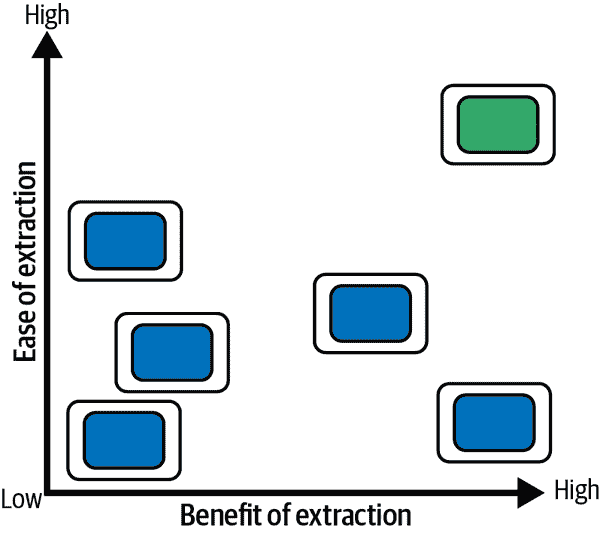
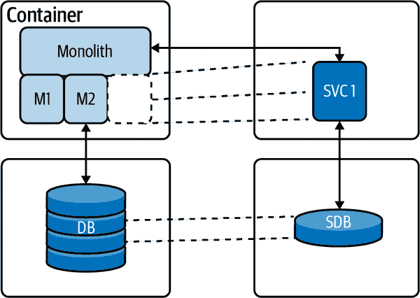
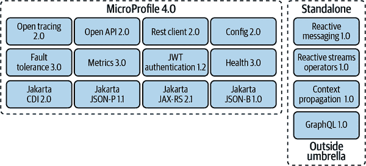

# 第五章：超越简单迁移：与遗留系统合作

> 遗留不是我为自己做的事。这是我为下一代正在做的事。
> 
> 维托尔·贝尔福特

许多组织面临着在保持现有业务运营的同时试图创新的挑战。通常期望更快地交付新功能并降低成本，看起来似乎是一项具有挑战性的任务，特别是在审视现有应用程序景观和遗留系统的普及时。

我们经常使用术语“遗留系统”来描述一种旧的方法、技术或应用程序，该方法、技术或应用程序不符合最新的方法或使用过时的技术堆栈。诚然，我们在职业生涯早期创建的许多系统都属于这一类别。我们知道其中大多数仍在使用。其中一些甚至为后来的新方法或标准铺平了道路。我们通常也意味着这些系统需要替换，这最终会导致负面含义的感知。幸运的是，这并不总是真的。遗留也是一个美丽的词汇，用来描述成就和遗产。称某物为“遗留”并不自动使其过时和无用。保留遗留系统的理由有很多，包括：

+   系统按设计工作，无需更改。

+   实施的业务流程已不再为人所知或记录，而替换它们是昂贵的。

+   替换系统的成本高于保持不变的好处。

由 Michael Feathers（O’Reilly）著作的[*与遗留代码有效工作*](https://oreil.ly/iogGC)为程序员提供了技术，以成本效益地处理常见的遗留代码问题，而无需重新编写所有现有代码的巨大费用。

Feathers 说：“对我而言，遗留代码就是没有测试的代码。”如果我们今天阅读术语“遗留”，它主要指的是单块应用程序。在现代企业景观中处理遗留应用程序有多种方法，选择正确的方法是现代化旅程的第一步，也是最关键的部分。

到目前为止，我们只谈论了个别系统。开发人员通常只关心这个特定的系统范围。现代化计划应遵循全面的公司目标，还应考虑公司整体的 IT 战略。云迁移的一种特别激动人心的方法在 Gregor Hohpe 的书[*云策略：成功云迁移的基于决策的方法*](https://oreil.ly/EuW9J)中提出。如果你想了解更多关于在个别迁移工作之上构建抽象的信息，这本书是必读之选。

# 管理遗留

每一次成功的旅程都始于第一步。应用程序迁移旅程的第一步是评估现有应用程序。我们假设您了解公司的整体目标和指令。现在我们可以将它们映射到评估类别中。评估类别的另一个来源是技术要求，例如现有的蓝图或推荐的主要解决方案或框架版本。构建和更新这个评估类别列表应该成为您管理流程的一部分。最终，您可以从这些评估标准中导出迁移标准，并将它们用作现代化旅程的决策基石。

## 评估迁移应用程序

在评估迁移或现代化工作时，重要的是考虑到激励或影响您的组织的特定挑战。组织可能面临的一些挑战的例子包括：

开发的有限预算

开发团队需要变得更加高效，并且他们的速度必须增加。他们的目标不是使用复杂的规范，而是转向轻量级框架和预构建功能。现代化通常应该作为正在进行的开发或维护项目的一部分来安排。

缺乏内部技能

内部现有技术的团队技能正在减少。这样的例子包括主机编程甚至是早期版本的企业 Java 规范，这些规范已经不再教授或不再是最先进的。更改使用较旧技术的现有系统可能意味着需要为开发项目添加特定技能。

感知风险

按照 1977 年左右广为流传的一句名言，“如果它没有坏，就不要修理”，我们确实看到了许多围绕更改已经建立并运行的软件的感知风险。导致这种情况的原因有很多，从对系统的知识问题到对工厂停产的恐惧。这些风险需要单独解决，并通过迁移计划中的适当行动来缓解。

没有可预测的过程

这本书将帮助您解决这个特定问题。探索未知可能是一个巨大的挑战。对于现代化工作，已经有一个经过验证且可重复的流程，并且所有参与方都尊重并遵循这个流程对于成功至关重要。

真正的工作量估计

估计迁移工作量不应该是魔术。不幸的是，许多公司对现代化企业 Java 应用程序的真实工作量几乎一无所知。遵循可预测和优化的方法将消除这种挑战。

将这些挑战转化为可操作项，供您的评估看起来可以像这样：

+   预测工作量和成本水平

+   安排应用程序迁移并处理冲突

+   识别代码、基础架构、流程或知识层面的所有潜在风险

+   预测投资回报以制定业务案例

+   识别和缓解对业务的风险

+   最小化对现有业务运营的干扰

如果只是查看单个应用程序，可以在电子表格或文档中完成这项工作就足够了。然而，每一个中大型工作都需要一个更好的解决方案。大规模工作需要自动化例行程序和规则来评估安装基础，并将应用程序链接到业务服务，以可靠地规划下一步操作。一个开放源码且直接的方法是来自于[Konveyor 项目](https://www.konveyor.io)。它结合了一系列工具，旨在帮助现代化和迁移到 Kubernetes。

Konveyor 子项目 Forklift 提供将虚拟机迁移到 KubeVirt 的能力，且最小化停机时间。子项目 Crane 则专注于在 Kubernetes 集群之间迁移应用程序。套件的一部分还包括 Move2Kube，以帮助加速将 Swarm 和基于 Cloud Foundry 的应用程序重新平台化到 Kubernetes。

特别是对于应用现代化，Konveyor 提供了[Tackle](https://oreil.ly/u99Gf) 项目。它评估和分析应用程序，以便重构为容器，并提供标准清单。

### Tackle 应用程序清单

用户可以通过这种方式维护其应用程序组合，将它们链接到它们支持的业务服务，并定义它们之间的相互依赖关系。应用程序清单使用可扩展的标记模型来添加元数据，这是一种链接迁移类别的好方法，正如前文所讨论的。应用程序清单用于通过 Pathfinder 进行评估选择应用程序。

### Tackle Pathfinder

这是一个基于问卷的交互式工具，评估应用程序是否适合现代化，以便在企业 Kubernetes 平台上部署容器。[Pathfinder](https://oreil.ly/K4V4u) 生成关于应用程序适合 Kubernetes 的报告，包括相关风险，并创建采纳计划。Pathfinder 根据应用程序清单和额外的评估问题进行操作。如果应用程序依赖于直接主机系统连接，这可能会使得此特定应用程序不适合迁移到 Kubernetes，因为它会过载主机部分。一些评估问题的例子包括：

+   第三方供应商组件在容器中是否受支持？

+   应用程序是否处于积极开发中？

+   应用程序是否有任何法律要求（例如 PCI、HIPAA）？

+   应用程序是否提供指标？

我们强烈建议查看 Pathfinder 来管理完整景观的大规模现代化项目。它将帮助您对今天的范围内的应用程序进行分类和优先级排序，并持续跟踪您的迁移评估以适应未来的变化。

### Tackle 控制

控制项是一组实体，它们为应用清单和路径评估添加不同的值。它们包括业务服务、利益相关者、利益相关者群体、工作职能、标签类型和标签。此外，您可以通过实施自己的实体来捕获公司或项目特定的属性。例如，这将过滤您的应用清单，识别所有由某个“工作职能”使用的应用程序，以识别人力资源部门使用的所有应用程序。

### 解决 DiVA

最后，[DiVA](https://oreil.ly/UGzn2)是一款以数据为中心的应用程序分析工具。作为项目[Windup](https://oreil.ly/sjiNq)的继任者，如果您想评估单个应用程序，它是最令人兴奋的项目。它专注于传统的单片应用程序，目前支持 Servlets 和 Spring Boot 应用程序。您可以导入一组应用程序源文件（Java/XML），然后 DiVA 会提供以下内容：

+   服务入口（导出的 API）清单

+   数据库清单

+   事务清单

+   代码到数据库的依赖关系（调用图）

+   数据库对数据库的依赖关系

+   事务对事务的依赖关系

+   事务重构建议

DiVA 目前正在积极开发中，原始 Windup 项目的整合尚未完成。但是，它仍然为您的现代化工作提供了坚实的基础。此外，它提供了一个绝佳的机会，让您贡献自己的发现，并成为致力于自动化迁移的更大社区的一部分。

### 应用程序迁移工具包

当我们等待 Windup 完全集成到 DiVA 时，您仍然可以使用[应用程序迁移工具包（MTA）](https://oreil.ly/SIOSR)对基于 Enterprise Java 的应用程序进行自动迁移评估。

MTA 组装了支持大规模企业 Java 应用现代化和迁移项目的工具，涵盖了许多转换和用例。您可以将您的应用程序二进制文件或存档导入其中，它会自动执行代码分析，包括应用程序组合、应用程序依赖关系、迁移挑战和以故事点形式的迁移工作量估算。最初它是设计用于支持 Java EE 服务器迁移（例如，从 WebSphere 或 WebLogic 到 JBoss EAP）。但是，它具有高度可扩展的规则集机制，允许开发人员创建自己的规则集，甚至是适应其需求的现有规则。今天它还涵盖了 Spring Boot 到 Quarkus 的迁移。

Java 示例规则摘录如下：

```java
//...
JavaClass.references("weblogic.servlet.annotation.WLServlet")
    .at(TypeReferenceLocation.ANNOTATION)
        )
        .perform(
            Classification.as("WebLogic @WLServlet")
               .with(Link.to("Java EE 6 @WebServlet",
                             "https://some.url/index.html"))
               .withEffort(0)
               .and(Hint.withText("Migrate to Java EE 6 @WebServlet.")
               .withEffort(8))
        );
//...
```

此规则扫描 Java 类以查找`@WLServlet`注释，并为此结果添加一项工作量（故事点）。您可以在[Windup 文档](https://oreil.ly/FbQKL)中了解更多关于规则以及如何开发它们的信息。

此外，它还可以作为构建过程的一部分支持非迁移用例（通过 [Maven 插件](https://oreil.ly/T8mom) 或 [命令行界面](https://oreil.ly/U7Dsk)），定期验证代码是否符合组织标准或确保应用程序的可移植性。

MTA 可以检测到的一些模式包括以下内容：

+   专有库

+   专有配置

+   服务定位器

+   Web 服务

+   EJB 描述符

+   废弃的 Java 代码

+   事务管理器

+   注入框架

+   线程池机制

+   定时器服务

+   WAR/EAR 描述符

+   静态 IP 地址

MTA 和 DiVA 是两个强大的工具，帮助我们识别总体技术债务，导致迁移需求和风险的分类。然而，它们不能帮助我们识别应首先迁移或现代化的功能。为此，我们需要深入研究应用程序设计和功能。

## 评估迁移功能

传统的单体应用有各种形状、形式和大小。当有人使用术语“单体”时，他们通常指的是部署工件本身。在企业 Java 中，这传统上是企业归档（EAR）或 Web 归档（WAR）。你也可以将它们视为单一进程应用程序。它们可以按照像 OSGi（开放服务网关倡议）这样的模块化建议进行设计，或者按照更技术化的方法，如三层设计，没有显著的业务模块。您的现代化努力的整体方向在很大程度上取决于您正在处理的单体类型。作为一个经验法则，现有应用程序越模块化，现代化的难度就越小。在理想的情况下，模块直接转化为服务边界。但这种情况很少发生。

如果单体看起来像一个巨大的盒子，我们必须对其应用逻辑模型。我们意识到在这个盒子内部有组织良好的业务和技术组件，例如订单管理、PDF 渲染、客户通知等。虽然代码可能并未围绕这些概念组织，但从业务领域模型的角度来看，它们存在于代码库中。这些业务领域边界，在领域驱动设计（DDD）中通常称为“有界上下文”，成为新的服务。

###### 注意

如果您有兴趣了解更多信息，许多人认为 Eric Evans 的书 [*《领域驱动设计：软件核心复杂性应对之道》（O’Reilly）*](https://oreil.ly/kgLPl) 是 DDD 的事实标准介绍。

一旦确定了模块和功能，您可以开始考虑现代化的顺序。但首先，请确保查看每个模块的成本与收益权衡，并从最佳候选模块开始。图 5-1 为一个包含六个模块的样本应用程序提供了一个非常高层次的概述。在本例中，我们假设讨论的是一个虚构的在线商店。例如，对于强烈相互依赖的模块，例如订单和客户，单独提取它们将会很复杂。如果还考虑到可扩展性的必要性以及从单体架构中移除它们的好处，其效益可能并不高。这两个模块位于图表的左下角。在相反的一侧，我们可能会找到目录服务。它列出可用的产品，并且是一个只读服务，几乎没有任何相互依赖。在网站需求高峰期间，这是最受欢迎的模块，并且从图 5-1 中显示的绿色模块位于图表的右上方，受益匪浅。对于应用程序中的所有模块进行类似的练习，以评估成本与收益。



###### 图 5-1\. 成本与收益

现在您已经达到验证先前战略应用评估的最后检查点。估计的现代化收益是否超过了估计的现代化成本？不幸的是，没有普适的建议，因为这严重依赖于应用本身、业务需求以及公司的总体目标和挑战。记录您的决策和结论，因为现在是决定您现代化努力未来方向的时候。还记得第三章中的 6R 吗？保留（无需更改）、退出（停用）、重新购买（新版本）、重新托管（放入容器）、重新平台化（进行轻微调整）或重构（构建新内容）。

我们现在已经评估了迁移的应用，并且评估了迁移的功能。我们知道应用的哪些方面我们准备现代化。您已经得出结论，不希望构建新应用，而是轻度现代化现有的遗留系统。在下一节中，我们将深入探讨一些迁移方法。

# 迁移方法

上述工具和评估将帮助您确定最适合的应用程序和服务。现在是深入了解单个应用程序的策略和挑战的时候了。

## 保护遗留系统（重新平台化）

只有一个或两个模块需要业务刷新或增加功能时，最简单的方法是专注于这两个模块，并尽可能保留现有应用程序，在现代基础设施上运行。除了相关模块的更改，还包括对运行时、库或目标基础设施的重新评估，同时尽量少触及代码。

这可以通过简单地将应用程序和数据库容器化，并修改良构单体的相关模块，或完全提取某些功能并重新集成到部分分布式系统中来实现，正如图 5-2 所示。



###### 图 5-2\. 把碎片重新组合起来

言之易，行之难。有许多非功能性需求需要从应用服务器平台重新分配到[外部架构](https://oreil.ly/rrcZG)。我们将在下一章节重点讨论更关键的部分。在本章中，我们希望专注于应用程序和数据库本身的迁移。

### 服务对应用的服务

一旦您提取了特定功能，最紧迫的问题是如何将剩余的单体与新提取的服务集成起来。假设您切换到容器运行时，应使用 API 网关基于 URL 进行负载均衡和流量切换。我们将在第六章中更详细地讨论此问题。

另一种方法是使用 HTTP 代理。在尝试从单体应用程序中提取部分之前，必须确保代理已经在生产环境中运行。确保它不会破坏现有的单体，并且花一些时间定期将新服务推送到生产环境中，即使尚未被最终用户使用。如果一切看起来良好，逐渐通过重定向流量进行切换。

对于更简单的服务与单体交互，甚至可以考虑实现简单的 JAX-RS 直接通信。然而，此方法仅适用于处理极少数量服务的情况。确保从单体的视角处理提取出的服务作为一个集成系统。

所有这三种方法（API、网关、HTTP 代理和 JAX-RS 接口）都是迈向首个成功微服务的途径。它们都实施了窒息模式（参见第三章），并帮助将单体应用程序重构为独立系统作为第一步。

拦截是一条潜在危险的路径：如果您开始构建一个自定义协议转换层，该层由多个服务共享，则可能会向共享代理添加过多的智能。这种设计方法使得独立微服务变得困难，并且变成了一个具有过多智能的路由层的面向服务的体系结构。一个更好的替代方案是所谓的边车模式，它基本上描述了 Pod 中的另一个附加容器。与将自定义代理逻辑放在共享层中不同，它成为新服务的一部分。作为 Kubernetes 边车，它成为运行时绑定，并可以为传统客户端和新客户端提供服务。

###### 注意

*边车*只是在与应用程序容器相同的 Pod 上运行的容器。它与应用程序容器共享相同的卷和网络，并且可以通过这种方式“帮助”或增强应用程序行为。典型的例子是日志记录，或更一般的代理功能。

### 数据库到数据库

一旦我们确定了功能边界和集成方法，我们就需要决定如何处理数据库分离问题。虽然单体应用通常依赖于单个大型数据库，但每个提取的服务应该操作自己的数据。再次解决这个难题的正确方式取决于现有数据布局和事务。

相对容易的第一步是将服务所需的表分离为只读视图和写入表，并调整单体应用程序的流程，以便同时使用读写操作的接口。这些接口可以更容易地在后续步骤中抽象为服务访问。此选项仅需要更改单体应用程序，并且对现有代码库的影响应该最小。我们可以将表移到一个单独的数据库中，并在下一步中调整相关查询。

所有这些都仅在旧的单体应用中作为准备工作而发生。将现有代码演变为更模块化的结构可能存在风险。特别是，随着数据模型复杂性的增加，风险也会增加。在最后一步中，我们可以将提取的表分离到一个新数据库，并调整单体应用程序以使用新创建的服务与业务对象进行交互。这在纸上和纸笔上相对容易，并且如果数据访问需要在表之间执行许多连接，则很快就会达到实用性的尽头。简单的候选对象是主数据对象，例如“用户”。更复杂的可能是组合对象，如“订单”。对于应用程序代码的模块化所说的事情，对于数据库而言更为真实。设计和模块化程度越好，将功能和数据提取到单独服务中就越容易。会有一些情况下，你找不到一个很好的解决方案来从数据模型中提取对象。或者您可能会看到不同的方法不再提供合适的性能。这是重新审视您选择的现代化路径的时候了。

在继续“快乐路径”的过程中，你现在有两个独立的数据库和两个非常不平等的“服务”组成的系统。现在是时候考虑你的服务之间的数据同步策略了。大多数数据库实现了某些功能来在数据变更时执行行为。简单情况下，支持在更改的行上触发功能以将副本添加到其他表中，甚至在更改时调用更高级别的功能（例如 WebServices）。这通常是专有功能，并且在很大程度上依赖于正在使用的数据库。如果你有全公司使用某些功能的指令或者对进一步改变原始遗留数据库有足够的信心，这可能是一个选择。

如果这不可能，那么有基于批处理作业的同步选项。更改的时间戳、版本或状态列表明需要复制。你可以依赖这种非常成熟和众所周知的数据同步版本，它存在于许多遗留系统中。主要缺点是无论实现方式如何，你最终都会在目标系统的数据准确性上出现差异。较高的复制间隔也可能导致交易成本增加或源系统负载增加。这种方法只适用于不频繁更新，理想情况下在两者之间有非时间敏感的过程步骤。它不适用于实时或接近实时的更新要求。

解决数据同步挑战的现代方法依赖于日志读取器。作为第三方库，它们通过扫描数据库事务日志文件来识别变更。这些日志文件用于备份和恢复操作，并提供一种可靠的捕获所有变更（包括删除）的方法。这个概念也称为变更数据捕获。这里最显著的项目之一是[Debezium](https://debezium.io)。使用日志读取器是在数据库之间同步更改的最不具破坏性的选项，因为它们不需要修改源数据库，也不会对源系统产生查询负载。变更数据事件通过 Outbox 模式为其他系统生成通知。

## 构建新东西（重构）

如果因为任何原因，你发现自己面临一个岔路口，决定重新实现和重构你的完整系统为一个新的分布式架构，那么你很可能在思考如何协同工作以保持工作量小而可预测。考虑到完整微服务堆栈的复杂性，这并不是一件容易的任务。这种方法的一个关键因素是团队知识。在企业 Java 应用服务器上经过多年的开发后，团队应该能从持续的 API 和标准知识中获益。有多种方式可以在 JVM 上实现服务，所有这些方式都有助于团队重用我们从企业 Java/Jakarta EE 标准中已知的最关键的功能。让我们讨论一些在 JVM 上实现服务的方法。

###### 注意

[Jakarta EE](https://jakarta.ee/about) 是一套规范，使 Java 开发人员能够开发 Java 企业应用程序。这些规范由知名行业领袖开发，为技术开发者和消费者带来信心。它是 Java 企业版的开源版本。

### MicroProfile

[MicroProfile](https://microprofile.io) 成立于 2016 年，并迅速加入 Eclipse 基金会。MicroProfile 的主要目的是以厂商中立的方式创建 Java 企业框架，用于实现可移植的微服务。MicroProfile 包括厂商中立的编程模型、配置以及追踪、容错、健康和指标等服务。MicroProfile API 组件建立在 Jakarta EE 模型之上，使 Java 开发人员更自然地过渡到微服务。您可以重复使用在职业生涯中已积累的 Jakarta EE 知识。MicroProfile 定义了 12 个规范，如 图 5-3 所示，并且组件模型在底层使用 Jakarta EE 标准的一个子集。与完整的 Jakarta EE 规范相比，更重的规范如企业 JavaBeans (EJB) 和 Jakarta XML Web Services 是缺失的。



###### 图 5-3\. MicroProfile 技术概览

有多种 MicroProfile 规范的实现可供选择：Open Liberty、Thorntail、Paraya Server、TomEE、SmallRye 等。由于 MicroProfile 基于与 Jakarta EE Web Profile 接近的原则和组件，因此现有应用程序的迁移相对容易。

### Quarkus

[Quarkus](http://quarkus.io) 是所谓的微服务框架中的一个相对较新的成员。它是一个为 JVM 和原生编译优化的 Kubernetes 本地 Java 框架。它专为容器和受限运行时环境进行了优化。其主要目的是成为无服务器、云和 Kubernetes 环境的理想运行时。

它与流行的 Java 标准、框架和库兼容，如 Eclipse MicroProfile、Spring Boot、Apache Kafka、RESTEasy (JAX-RS)、Hibernate ORM (JPA)、Infinispan、Camel 等等。

依赖注入解决方案基于来自 Jakarta EE 的 CDI（上下文和依赖注入），使其与已建立的组件模型兼容。一个有趣的部分是扩展框架，它帮助扩展功能以配置、引导和集成公司特定的库到您的应用程序中。它运行在 JVM 上，并支持 GraalVM（多语言通用虚拟机）。

### 组件模型到服务

开发人员中最常见的问题之一是如何将企业 Java 应用程序的现有组件模型迁移到微服务中。通常，此问题指的是企业 Java Beans 或 CDI Beans，特别是容器管理的持久性 Beans（在 EJB3 之前），需要基于 Java 持久性 API（JPA）重新创建。我们强烈建议检查底层的数据/对象映射是否仍然准确并适合新的要求，并完全重新创建它。这不是现代化过程中最耗时和费用的部分。通常，更具挑战性的部分是编码的业务需求。虽然 CDI Beans 在技术上是 MicroProfile 兼容实现的一部分，但是否适合进行简单的代码迁移的决定取决于新的业务需求。必须注意查找现有代码事务边界，以确保不需要涉及下游资源。一个普遍的建议是尽可能少地重用源代码。这里的原因主要是两种技术之间系统设计方法的不同。虽然我们在部分模块化的单体架构中得以脱身，但在微服务中却不可能。特别关注定义有界上下文将为最终解决方案的性能和设计付出回报。

### Spring 应用到服务

我们可以采用类似的方法来处理采用不同编程框架（如 Spring）的应用程序。虽然从技术上讲，更新和复制现有实现是容易的，但缺点依然存在。特别是，对于基于 Spring 的开发团队，可能会发现在不同框架（如 Quarkus）中使用兼容性 API 有所帮助。

Quarkus 的 Spring API 兼容性包括 Spring DI、Spring Web 和 Spring Data JPA。额外的 Spring API 部分支持，如 Spring Security、Spring Cache、Spring Scheduled 和 Spring Cloud Config。Quarkus 中的 Spring API 兼容性并不意味着要成为一个完整的 Spring 平台来重新托管现有的 Spring 应用程序。目的是提供足够的 Spring API 兼容性，以便使用 Quarkus 开发新的应用程序。

# 挑战

通过评估、规划和关怀，您可以分解和现代化现有的单体应用程序。这在大多数情况下都不是自动化过程，而需要大量的工作。需要注意一些特定的挑战。

## 避免双写

一旦您建立了几个微服务，您很快会意识到它们最具挑战性的部分是数据。作为它们业务逻辑的一部分，微服务经常需要更新它们的本地数据存储。同时，它们还需要通知其他服务发生的更改。这个挑战在单体应用程序的世界中并不那么明显，也不在操作单一数据模型的遗留分布式事务中。这种情况并不容易解决。随着分布式应用程序的转变，您很可能会失去一致性。这在 CAP 定理中有描述。

###### 注意

[CAP 定理](https://oreil.ly/TVwYw)，或“三选二”概念，说明我们只能同时提供以下三种保证中的两种：一致性、可用性和分区容错性。

现代分布式应用使用事件总线，比如 Apache Kafka，用于在服务之间传输数据。将你的事务从单体架构中的两阶段提交（2PC）迁移到分布式世界将显著改变你的应用行为并对故障做出反应。你需要一种控制长时间运行和分布式事务的方法。

## 长时间运行事务

Saga 模式提供了对双写和长时间运行事务的解决方案。虽然 Outbox 模式解决了更简单的服务间通信问题，但不足以解决更复杂的长时间运行的分布式业务事务用例。后者需要在多个服务之间执行多个操作，并具有一致的全部或无操作语义。每个多步骤业务流程都可能是一个例子，分布在多个服务之间。购物车应用需要生成确认电子邮件并在库存中打印运输标签。所有操作必须一起执行，否则就不执行。在传统世界或单片体系结构中，您可能不会意识到这个问题，因为模块之间的协调是在单个进程和单个事务上下文中完成的。分布式世界需要不同的方法。

Saga 模式通过将一个总体业务事务拆分为由参与服务执行的多个本地数据库事务，为这个问题提供了解决方案。一般来说，有两种实现分布式 saga 的方式：

+   协同作业：在这种方法中，参与的一个服务在执行完其本地事务后向下一个服务发送消息。

+   编排：在这种方法中，一个中心协调服务协调和调用参与的服务。参与服务之间的通信可以是同步的，通过 HTTP 或 gRPC，也可以是异步的，通过像 Apache Kafka 这样的消息传递。

## 移除旧代码太快

一旦我们提取一个服务，我们就希望摆脱旧的源代码、维护成本和重复的开发。但是要小心。你可以把旧代码视为参考，并针对两个代码库测试行为变化。偶尔检查新创建的服务的时间也可能会有帮助。建议在一个定义的时间段内并行运行它们并比较结果。之后，你可以删除旧的实现。这样做早了些会更好。

# 集成方面

传统的单体应用与复杂的集成逻辑有着紧密的关系。这主要是通过会话外观或与数据同步逻辑集成来进行代理。每个整合到全局业务流程中的单一系统都需要被视为一个独立的服务。你可以在从现有数据模型中提取数据部分并逐步进行此操作时应用相同的原则。另一种方法是从一开始就将你的集成逻辑视为一个服务。这种方法最初是为支持微服务而设计的，[Camel K](https://oreil.ly/JiOwc)是一种方法。它基于著名的 Apache Camel 集成库，并将集成路由包装成容器或更好的单独服务。通过这种方式，你可以将单体应用的完整集成逻辑与你的服务分离开来。

# 总结

现代企业 Java 系统就像家族的世代传承：它们在旧系统的基础上不断发展。使用成熟的模式、标准化工具和开源资源将有助于你创建能够随着需求增长和变化的持久系统。从根本上讲，你的迁移方法直接关系到你今天和明天试图解决的问题。你试图解决什么问题，你的当前架构无法扩展到？也许微服务是答案，或者也许有其他答案。你必须理解你试图实现的目标，因为如果没有这种理解，将很难确定如何迁移现有系统。理解你的最终目标将改变你如何分解一个系统以及如何优先处理这项工作。
