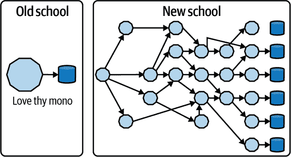

# 第六章\. 构建 Kubernetes 本地应用程序

在上一章中，我们概述了如何从传统的 Java 企业模式迁移到以容器为中心的方法。在本章中，我们将详细介绍迁移到基于微服务的架构所需的组件以及 Kubernetes 如何连接各个点。

我们还在前几章中学习了基于微服务的方法如何帮助我们使软件可靠、可移植，并且在需求增加时已做好扩展准备。现代架构从一开始就计划了可扩展性，这既提供了机会也带来了挑战。企业 Java 开发人员知道他们的代码通常是业务逻辑的一部分，依赖于框架使其稳健并符合公认的软件设计模式。如今，同一应用程序在公共云上可能服务数百万请求，甚至在地理上分布广泛。为了做到这一点，必须对其进行架构设计，使之符合这一模型，解耦功能，避免单点故障，并将负载分布到架构的多个部分，以避免服务中断。

# 在可扩展性和复杂性之间找到合适的平衡点

在理想的世界中，所有应用程序都是无状态的，它们可以独立扩展。它们不会崩溃，并且网络连接始终可靠。现实看起来不同。从单体应用迁移到基于微服务的架构使得云原生部署成为可能，我们已经介绍了这带来的一些好处。然而，这也带来了一些挑战：管理应用程序的多个入口点，保持多个微服务之间的关系一致性，以及管理分布式数据库和模式。

在 图 6-1 中，您可以看到从单体到基于微服务的应用程序的过渡带来了一种新的方法，有多个互连或甚至多个数据库可供使用。



###### 图 6-1\. 从单体架构到微服务架构

类似于 [CAP 定理](https://oreil.ly/nruM5)，同时提供可扩展性而不增加系统复杂性是非常困难的。这就是为什么 Kubernetes 如此有帮助，因为它是无处不在的，在任何云中运行，并且您可以将大部分复杂性委托给这个平台。这使您可以“只是”专注于应用程序开发。另一方面，在云原生世界中，我们也需要为*有状态*应用找到解决方案，我们将看到 Kubernetes 在这方面也提供了帮助。

# 现代架构的功能需求

Kubernetes 在定义分布式应用方面非常有帮助，如图 3-1 所示。任何 Java 开发者都应该对[《设计模式》](https://oreil.ly/V4aqC)有所了解，这是软件工程的杰作，作者在其中定义了最常用的软件设计模式。Kubernetes 扩展了这些模式集合，创建了一组新的云原生特定要求，使应用程序能够抵御各种负载，如图 6-2 所示。接下来让我们深入探讨其中的一些内容。


###### 图 6-2\. 现代架构的功能要求

## API 驱动

微服务的口号是“API 先行”。如果你再看一下图 6-1，你会注意到将单体应用程序拆分为一堆微服务的第一个挑战：如何让这些软件片段彼此通信？在单体应用中，你依赖于模块、包的应用范围。而微服务通常通过 REST 调用彼此通信，每个微服务可以是服务的生产者或消费者。连接微服务的方式不仅限于这种方法；使用队列、消息或缓存也是常见用例。但总体而言，每个微服务通过一组 API 暴露其原语或函数，并且这也可以通过我们在第二章讨论的 Coolstore 示例中的 API 网关来进行中介。

Kubernetes 本身是 API 驱动的软件。平台的所有核心组件，如 Pod、Service 和 Deployment，都通过 REST API 进行操作。所有组件之间的操作和与外部用户命令的通信都是通过 REST API 调用处理的，API 服务器处理这些调用。当我们通过`kubectl`或 JKube 与 Kubernetes 交互时，实际上是通过 HTTPS 调用 API 发送和接收 JSON 内容。这种 API 生态系统是 API 驱动架构的理想环境，比如使用微服务的架构。既然我们知道了我们的微服务如何通信，那么我们如何发现新的服务呢？

## 发现

让微服务之间通过 REST 调用相互通信非常直接。此外，让组件和函数调用变得轻松也是很好的，例如导入模块或包到我们的应用程序中。在现代架构中，需要调用和连接的微服务数量可能非常多，因此仅存储网络端点（如 IP 地址或主机名）可能不足够。正如我们在第四章讨论的那样，Kubernetes 通过`Service`对象简化了网络，允许两个或多个 Pods 在平台的内部网络中互相通信。Kubernetes 还通过其 API 提供了从应用程序内部列出集群中对象的能力。Java 开发人员可以使用像 JKube 这样的框架来实现 Java Kubernetes 客户端。

列出 Kubernetes 服务和 Pods，这些 Pods 表示一些微服务，是实时组件清单的第一步，这进一步有助于在运行时维护和扩展应用程序。此外，Kubernetes 还支持与外部工具或框架的集成，例如 Service Mesh，提供服务发现协议以检测服务的上线。

###### 提示

[服务网格](https://oreil.ly/jGh80) 是基于微服务架构越来越受欢迎的选择。它提供一个控制面板，还与 Kubernetes 交互以管理服务发现、双向认证、A/B 测试、路由和断路器模式。[更多详细信息可在线找到](https://oreil.ly/ECIF4)。

## 安全性与授权

现代应用程序开发人员需要考虑的另一个挑战是整个堆栈的安全性。从应用程序到平台，最佳实践同样适用于现代架构，当需要连接多个服务、查询多个数据库和服务多个端点时，复杂性和所需的工作量可能显著增加。再次提到，Kubernetes 可以提供帮助。

Kubernetes 为整个生态系统提供安全性。基于角色的访问控制（RBAC）和精细化的权限规则是可能的。此外，Pods 由一个名为*Service Account*的特殊用户运行，该用户可以访问 Kubernetes API Server，通常仅限于用户的命名空间。除此之外，Kubernetes 还提供了一个专用的 API 来管理密码和证书，称为*Secrets*。Secret 是一个在运行时由平台挂载到 Pod 中的卷，其值与 Kubernetes 的数据库 etcd 一起存储，以及集群状态和配置。

###### 注意

[etcd](https://etcd.io) 是 Kubernetes 使用的分布式键值数据库，用于存储集群状态。数据库内容也可以加密，只有集群管理员可以访问其内容。

正如我们所讨论的，微服务之间的通信通常是通过 HTTPS REST 调用完成的，其证书是通过 Secrets 管理的。容器和 Kubernetes 为确保应用程序安全提供了一个良好的起点，从中 Java 开发人员可以开始实施应用程序安全最佳实践。

## 监控

在现代架构中，测量资源消耗是至关重要的，在具有按使用量付费的消费模型的云环境中更是如此。估计在压力下您的应用程序将需要多少计算资源并不容易，而且过度估计可能会增加成本。Kubernetes 通过其 API 和工具生态系统使监视在操作系统级别到应用程序级别成为可能。

从平台和应用程序收集指标的热门云原生工具是[Prometheus](https://prometheus.io)，这是一个时间序列数据库，可以使用[一种称为 PromQL 的查询语言](https://oreil.ly/tYn9Q)从 Kubernetes 集群和应用程序导出指标。

指标也被用来帮助 Kubernetes 根据应用程序的监控负载决定何时扩展或缩减您的应用程序。您可以使用自定义指标（如 JVM 线程或队列大小）驱动此规模，并使监视成为赋予服务力量的积极工具。Prometheus 还提供了警报和报警功能，对于在应用程序需要更快地做出反应时调度自动操作非常有用。

Java 开发人员还可以使用[Micrometer](https://micrometer.io)与 Kubernetes 内部的 Prometheus 和指标进行交互，Micrometer 是一个提供指标注册机制和核心指标类型的开源工具。它适用于任何基于 JVM 的工作负载，并且是与 Prometheus 和 Kubernetes 进行交互的 Spring Boot 和 Quarkus 项目的热门选择。“就像 SLF4J，但用于指标。”

## 追踪

可观察性是现代架构的另一个关键方面，而测量 REST API 调用之间的延迟是管理基于微服务的应用程序的重要方面。确保通信始终清晰且延迟最小是至关重要的。当微服务的数量增加时，架构的某些部分出现小延迟可能会导致对用户来说可接受的服务中断。在这些情况下，Kubernetes 对于调试移动到分布式架构时出现的大多数操作问题非常有帮助。

[Jaeger](https://www.jaegertracing.io) 是一个流行的开源工具，连接到 Kubernetes 以提供可观察性。它使用分布式跟踪来跟踪请求通过不同微服务的路径。它通过仪表板提供了调用流程的视觉表示，通常也与服务网格集成。Jaeger 对于开发人员监视分布式事务、优化性能和延迟以及执行根本原因分析非常有帮助。

## 日志

正如我们讨论的，微服务应用程序中的单个调用，例如 Coolstore 示例，可能会调用与其他服务进行交互的不同服务。监视和观察应用程序非常重要，同时还要将相关信息存储在日志中。现代应用程序的日志记录方法与单体应用程序不同。在单体应用中，我们通常依赖于存储在磁盘上不同路径的多个日志文件，通常由应用服务器管理，而分布式应用程序则会 *流式传输* 日志。由于您的应用程序可能会快速扩展并移动到不同的节点甚至云中，因此访问单个实例以检索日志是没有意义的；因此，需要分布式日志系统。

Kubernetes 使日志记录变得简单。默认情况下，它提供访问 Pod 日志的能力，通过读取应用程序的标准流，例如 STDOUT（标准输出）和 STDERR（标准错误）。因此，应用程序不应该将日志写入特定路径，而是发送到标准流。

###### 注

仍然可以将日志存储在特定路径中，这些路径也可以在 Kubernetes 中保持持久化，但这被认为是一种反模式。

Kubernetes 还与分布式日志系统如 [Elasticsearch](https://elastic.co) 交互，这是一个基于 [Apache Lucene](https://lucene.apache.org) 的开源文档导向型 NoSQL 数据库，用于存储日志和事件。Elasticsearch 通常带有转发器，如 [Fluentd](https://fluentd.org)，以及用于可视化日志的仪表板，例如 [Kibana](https://elastic.co/kibana)。这些共同组成了 EFK 堆栈（Elasticsearch、Fluentd、Kibana）。借助这种日志堆栈，开发人员可以通过 Kibana 仪表板的聚合视图查看多个微服务的日志，并能够在称为 Kibana 查询语言（KQL）的查询语言中进行查询。

云原生应用的默认标准是分布式日志记录，Kubernetes 与许多服务如 EFK 连接并进行交互，为整个集群提供集中日志记录。

## CI/CD

连续集成（CI）是软件开发周期中的一个阶段，在这个阶段，来自不同团队成员或不同功能的代码被集成。通常涉及代码合并（集成）、应用程序构建（容器化）和在临时环境中执行基本测试。

连续交付（CD）是指自动化软件交付各个方面的一组实践。其中之一是交付管道，这是一个自动化过程，用于定义代码或配置更改必须经历的步骤，以达到更高的环境并最终到达生产环境。

它们经常被称为 CI/CD，并且是 DevOps 方法论的关键技术推动者之一。

现代服务需要快速响应变化或问题。正如我们可以监控、跟踪和记录分布式架构一样，我们还应该能够更快地更新基于微服务的应用程序。流水线是在生产环境中部署应用程序的最佳方式，遵循如 图 6-3 所示的阶段。


###### 图 6-3\. 持续集成和持续交付

*流水线* 是一系列步骤，顺序或并行执行，用于在所有预生产环境中构建和测试应用程序，最终发布到生产环境。它可以完全自动化，也可以与外部工具交互以进行手动步骤批准（例如 Service Now、JIRA 等）。Kubernetes 与许多外部 CI/CD 工具（如 [Jenkins](https://jenkins.io)）进行交互，并提供称为 [Tekton](https://tekton.dev) 的本地 CI/CD 子系统。

Tekton 是一个 Kubernetes 本地的 CI/CD 系统，这意味着它扩展了 Kubernetes API 并提供其自定义资源，您可以使用它们来创建流水线。它依赖于捆绑在 Tekton 中的任务目录来组成您的流水线，例如 Maven 或 Java 源到镜像任务。

###### 提示

Tekton 可以通过 [OperatorHub.io](https://operatorhub.io) 上的 Operator 在 Kubernetes 中安装。

要创建 Kubernetes 本机流水线，Tekton 提供了以下自定义资源：

Task

一个可重复使用、松耦合的步骤集，执行特定功能（例如构建容器镜像）。任务以 Kubernetes Pods 形式执行，而任务中的步骤映射到容器。

Pipeline

用于构建和/或部署您的应用所需的任务列表。

TaskRun

任务实例的执行和结果。

PipelineRun

流水线实例的执行和结果，其中包括多个任务运行。

在我们创建的库存 Quarkus 微服务的 Tekton 流水线示例见 第二章，您也可以在这本书的 GitHub 存储库中找到它：[book’s GitHub repository](https://oreil.ly/2UUCL)。

```java
apiVersion: tekton.dev/v1alpha1
kind: Pipeline
metadata:
  name: inventory-pipeline
spec:
  resources:
  - name: app-git
    type: git
  - name: app-image
    type: image
  tasks:
  - name: build
    taskRef:
      name: s2i-java-11
    params:
      - name: TLSVERIFY
        value: "false"
    resources:
      inputs:
      - name: source
        resource: app-git
      outputs:
      - name: image
        resource: app-image
  - name: deploy
    taskRef:
      name: kubectl
    runAfter:
      - build
    params:
    - name: ARGS
      value:
        - rollout
        - latest
        - inventory-pipeline
```

Java 开发者也可能会发现，使用 Fabric8 Tekton Java 客户端直接从代码创建和控制 Tekton 流水线和任务非常方便。这种选择能够从单一点实现完全控制，无需维护外部清单文件（如 YAML 文件）。

首先，在 POM 文件中导入 Maven 依赖：

```java
    <dependencies>
        <dependency>
            <groupId>io.fabric8</groupId>
            <artifactId>tekton-client</artifactId>
            <version>${tekton-client.version}</version>
        </dependency>
    </dependencies>
    <properties>
        <tekton-client.version>4.12.0</tekton-client.version>
    </properties>
```

然后，您可以使用 Tekton Java API 创建任务或流水线：

```java
package io.fabric8.tekton.api.examples;

import io.fabric8.tekton.client.*;
import io.fabric8.tekton.resource.v1alpha1.PipelineResource;
import io.fabric8.tekton.resource.v1alpha1.PipelineResourceBuilder;

public class PipelineResourceCreate {

  public static void main(String[] args) {
    try ( TektonClient client = ClientFactory.newClient(args)) {
      String namespace = "coolstore";
      PipelineResource resource = new PipelineResourceBuilder()
        .withNewMetadata()
        .withName("client-repo")
        .endMetadata()
        .withNewSpec()
        .withType("git")
        .addNewParam()
        .withName("revision")
        .withValue("v4.2.2")
        .endParam()
        .addNewParam()
        .withName("url")
        .withValue("https://github.com/modernizing-java-applications-book/
 inventory-quarkus.git")
        .endParam()
        .endSpec()
        .build();

      System.out.println("Created:" + client.v1alpha1().pipelineResources().
        inNamespace(namespace).create(resource).getMetadata().getName());
    }
  }
}
```

# 微服务调试

尽管分布式架构有很多好处，但也存在一些挑战。即使最终在 Kubernetes 集群中运行代码，您仍然通常在本地开发，拥有 IDE、编译器等。有几种方法可以解释开发周期。如图 6-4 所示，有两个循环。靠近开发者的一个称为内部循环，是您进行编码、测试和迭代调试的地方。另一个循环，远离开发者，称为外部循环，是您的代码运行在您必须构建、推送和部署的容器镜像内，这需要更长时间。


###### 图 6-4\. 内部循环和外部循环

外部循环是 CI/CD 世界的一部分，内部循环是您在启动 Tekton Pipeline 将应用程序部署到 Kubernetes 之前开始编码和测试软件的地方。调试微服务也是内部循环的一部分。

开发人员可以采用不同的方法来开始调试微服务：

+   使用[Docker Compose](https://oreil.ly/ULV5g)在本地部署所有服务

+   使用[minikube](https://oreil.ly/1ogSc)，或任何本地 Kubernetes 集群，并在那里部署所有服务

+   模拟您与之交互的所有服务

###### 注意

Docker Compose 帮助创建在任何 Docker 主机上运行的容器，而不需要 Kubernetes。它用于管理本地开发中的多个容器，但不映射到任何目标 Kubernetes 集群；因此，保持本地开发设置与目标设置分开可能会很困难。

这些都是有效的方法，但有时服务是外部的，并且只能从远程 Kubernetes 集群访问，或者模拟该部分代码很难或不可能。

[Microcks](https://microcks.io)是一个开源的 Kubernetes 本地调试工具，用于 API 模拟和测试。它有助于将 API 合同、集合或 SoapUI 项目转换为实时模拟。在 Kubernetes 上快速开发而无需依赖项时，它可以是一种方便的方式。

让我们看看一些用于 Kubernetes 中微服务调试的额外选项。

## 端口转发

Kubernetes 提供了远程 Shell 进入 Pod 的功能，用于快速调试任务，例如文件系统检查。此外，[您可以设置端口转发](https://oreil.ly/IAu5H)，将您的本地机器与运行在 Pod 中的应用程序连接到连接到 Kubernetes 集群。此选项在您希望连接运行在 Pod 中的数据库、附加您不希望暴露给公众的管理 Web 界面，或者像本例中一样附加 JVM 运行的应用程序服务器的调试器时非常有用。

通过将应用服务器的调试端口进行端口转发，您可以从 IDE 附加调试器，并实时步进 Pod 中运行的代码。请记住，如果您的应用程序不处于调试模式，则需要首先打开调试端口。

要开始调试，您需要公开调试端口。例如，要调试 Inventory 微服务，您需要访问调试端口 5005：

```java
kubectl port-forward service/inventory-quarkus 5005:5005
```

现在当我们在*localhost:5005*上连接时，它将被转发到运行在 Pod 中的 Inventory 实例。

###### 注意

端口转发仅在允许`kubectl port-forward`命令运行期间处于活动状态。由于我们在前台运行它，因此可以通过按下 Ctrl+C（或 Mac 上的 Cmd+C）停止端口转发。

要调试源代码，您可以使用您选择的 IDE，或者可以按照以下步骤从控制台调试：

```java
jdb -sourcepath $(pwd)/src/main/java -attach localhost:5005
```

## Quarkus 远程开发模式

Quarkus 提供了一个[远程开发模式](https://oreil.ly/rLflo)，允许您在诸如 Kubernetes 之类的容器环境中运行 Quarkus，并立即对本地文件所做的更改生效。

要启用它，请在您的`application.properties`中添加此部分：

```java
quarkus.package.type=mutable-jar  quarkus.live-reload.password=changeit  quarkus.live-reload.url=http://my.cluster.host.com:8080 
```


在开发模式下，可变应用程序用于在 Quarkus Java 应用程序中实时应用和测试更改，而不需要重新加载构件。


用于保护远程端和本地端通信的密码。


应用程序运行在开发模式下的 URL。

您可以使用 Maven 生成可变 JAR。如果您已连接到 Kubernetes 注册表，可以让 Quarkus 将应用程序部署到 Kubernetes，如下所示：

```java
eval $(minikube docker-env)
```

###### 注意

您可以使用以下命令添加 Quarkus Kubernetes 扩展：`./mvnw quarkus:add-extension -Dextensions="kubernetes"`

将应用程序部署到 Kubernetes：

```java
mvn clean install -DskipTests -Dquarkus.kubernetes.deploy=true
```

最后，您可以连接到应用的远程开发模式：

```java
mvn quarkus:remote-dev
```

这允许您使用 Quarkus 将您的本地机器上的现场编码功能连接到远程容器环境，例如 Kubernetes。

## Telepresence

[Telepresence](https://www.telepresence.io) 是一个开源工具，用于帮助调试 Kubernetes 中的微服务。它在本地运行单个服务，同时将该服务连接到远程 Kubernetes 集群。Telepresence 是编程语言无关的，为您提供了一个方便的方式将您的本地环境连接到在 Kubernetes 上运行的任何工作负载以进行调试。

使用 Telepresence 在 Kubernetes 上调试应用非常容易。首先，下载并安装[Telepresence CLI](https://oreil.ly/wkwOC)，并与您的集群保持活动会话，因为 Telepresence 将读取*~/.kube/config*文件以连接到 Kubernetes。

###### 注意

Telepresence 将修改 Kubernetes 中的网络，以便服务可以从您的笔记本电脑访问，反之亦然。

一旦在您的工作站上安装并配置了 CLI，您可以运行此命令来初始化并测试与 Telepresence 连接到您的集群的连接：

```java
$ telepresence connect
```

您应该会得到类似以下的输出：

```java
Connected to context minikube (https://192.168.39.69:8443)
```

我们可以开始调试您在前面步骤中部署的库存微服务。在此之前，让我们列出可用于调试的应用程序：

```java
$ telepresence list
```

您应该会得到类似以下的输出：

```java
inventory-quarkus-deploy: ready to intercept (traffic-agent not yet installed)
```

要开始调试此微服务，您需要让 Telepresence 拦截由服务表示的内部 Kubernetes 流量。

库存的 Kubernetes 服务使用端口 8080，如以下命令所示：

```java
$ kubectl get svc inventory-quarkus-service
```

您应该会得到类似以下的输出：

```java
NAME                      TYPE      CLUSTER-IP     EXTERNAL-IP PORT(S)  AGE
inventory-quarkus-service ClusterIP 172.30.117.178 <none>      8080/TCP 84m
```

现在您可以开始拦截连接到部署的流量，使用服务使用的端口。您还可以指定 Telepresence 应将环境变量写入的文件路径，该环境变量当前正在您的服务中运行：

```java
$ telepresence intercept inventory-quarkus-deploy --port 8080:http --env-file
  inventory.env
```

您应该会得到类似以下的输出：

```java
Using Deployment inventory-quarkus-deploy
intercepted
    Intercept name         : inventory-quarkus-deploy
    State                  : ACTIVE
    Workload kind          : Deployment
    Destination            : 127.0.0.1:8080
    Service Port Identifier: http
    Volume Mount Point     : /tmp/telfs-844792531
    Intercepting           : all TCP connections
```

查看刚刚创建的环境文件 `inventory.env` 的内容：

```java
INVENTORY_QUARKUS_SERVICE_PORT=tcp://172.30.117.178:8080
INVENTORY_QUARKUS_SERVICE_PORT_8080_TCP=tcp://172.30.117.178:8080
INVENTORY_QUARKUS_SERVICE_PORT_8080_TCP_ADDR=172.30.117.178
INVENTORY_QUARKUS_SERVICE_PORT_8080_TCP_PORT=8080
INVENTORY_QUARKUS_SERVICE_PORT_8080_TCP_PROTO=tcp
INVENTORY_QUARKUS_SERVICE_SERVICE_HOST=172.30.117.178
INVENTORY_QUARKUS_SERVICE_SERVICE_PORT=8080
INVENTORY_QUARKUS_SERVICE_SERVICE_PORT_HTTP=8080
KO_DATA_PATH=/var/run/ko
KUBERNETES_PORT=tcp://172.30.0.1:443
KUBERNETES_PORT_443_TCP=tcp://172.30.0.1:443
KUBERNETES_PORT_443_TCP_ADDR=172.30.0.1
KUBERNETES_PORT_443_TCP_PORT=443
KUBERNETES_PORT_443_TCP_PROTO=tcp
KUBERNETES_SERVICE_HOST=172.30.0.1
KUBERNETES_SERVICE_PORT=443
KUBERNETES_SERVICE_PORT_HTTPS=443
LOG_LEVEL=debug
NSS_SDB_USE_CACHE=no
TELEPRESENCE_CONTAINER=inventory-quarkus
TELEPRESENCE_MOUNTS=/var/run/secrets/kubernetes.io
TELEPRESENCE_ROOT=/tmp/telfs-777636888
TERM=xterm
```

现在您可以像连接到内部 Kubernetes 网络一样访问库存微服务，并使用刚刚检索到的环境变量进行操作：

```java
curl http://inventory-quarkus-service.coolstore:8080/api/inventory/329299
```

您应该会得到类似以下的输出：

```java
{"id":"329299","quantity":35}
```

# 摘要

在本章中，我们讨论了 Kubernetes 模式如何帮助 Java 开发人员现代化其应用程序，提供了一个平台，提供许多组件来扩展应用程序的功能。 Kubernetes 的 API 驱动，可插拔的架构轻松地使外部工具能够提供软件和实用程序的生态系统，这些工具提醒并扩展了 Java 企业应用服务器模型。诸如日志记录、监控或调试应用程序等基本任务以适合云原生模型的方式提供，其中应用程序普及并可以同时在多个地方和多个云中运行。

在下一章中，我们将讨论一种新的服务和交付企业应用程序的概念，节省资源且云就绪：无服务器方式。
