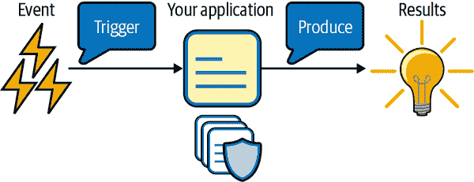
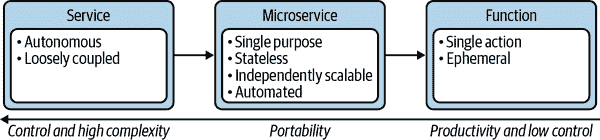
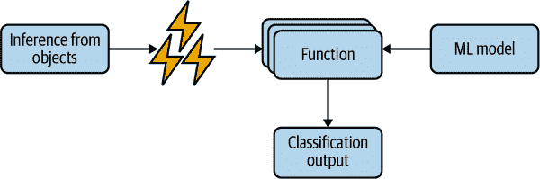
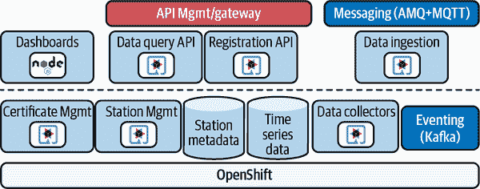
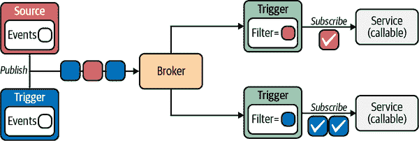
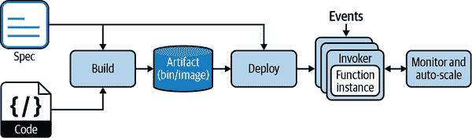

# 第七章。明日的解决方案：无服务器

> 第二次工业革命与第一次不同，没有给我们带来滚动的钢铁和熔化的金属的令人压抑的景象，而是“位”在信息流中传输，沿着电路以电子脉冲的形式。铁器仍然存在，但它们服从于无重量位的命令。
> 
> 伊塔洛·卡尔维诺

无服务器计算模型在公共云提供的强大推动下，最近也在开源社区内因许多项目的支持而受到关注。但究竟什么是无服务器？无服务器有哪些用例？它如何用于现代 Java 应用？

# 什么是无服务器？

无服务器的最佳定义来自[CNCF 无服务器白皮书](https://oreil.ly/yYbmP)：

> 无服务器计算是指构建和运行不需要服务器管理的应用程序的概念。它描述了一种更细粒度的部署模型，其中应用程序作为一个或多个函数捆绑上传到平台，然后根据实际需求在响应时执行、扩展和计费。

运行一个“不需要服务器管理”的应用程序是该定义中最相关的部分。在前几章中，我们探讨了 Kubernetes 如何帮助现代架构的功能要求，以及容器镜像如何代表一种方便的方式将应用程序打包并部署到任何云平台。在无服务器中仍然有服务器，但它们被抽象出来，与应用开发无关。虽然第三方负责维护和管理这些服务器的复杂性，开发人员只需将他们的代码打包到容器中进行部署。

我们讨论的部署模型在 Kubernetes 和无服务器模型之间的主要区别是所谓的*零扩展*方法。通过这种方法，应用程序在被调用时自动启动，并在不使用时处于空闲状态。这种执行模型也称为事件驱动，是无服务器的核心基础。我们稍后在本章讨论事件驱动的无服务器架构。

通常，一系列事件可以触发应用程序的启动，这将产生结果，正如您在图 7-1 中所见。这可以是单个操作，也可以是一系列操作，其中一个应用程序的输出是下一个应用程序的输入。事件可以是任何形式，例如 HTTP 请求、Kafka 消息或数据库事务。应用程序可以按需自动扩展到多个副本，以处理流量负载，当没有活动时则会缩减规模。



###### 图 7-1。无服务器执行模型

## 架构演进

无服务器模型并不适用于所有使用案例。一般来说，任何异步、并发、易于并行化为独立工作单元的应用程序都非常适合这种模型。如果您查看 图 7-2 中的图表，您可以看到基于微服务的架构演变始于使用面向服务的体系结构（SOA）模型的单片应用程序方法，现在正在演变为一个新的*函数*模型。



###### 图 7-2\. 架构演变

这些函数代表了完成特定范围或任务的最小计算单元。例如：

+   处理 Web 钩子

+   数据转换（图像、视频）

+   PDF 生成

+   移动设备的单页应用程序

+   聊天机器人

使用这种方法，您可以专注于方便性，因为它通常作为*尽力而为*提供。容忍失败，并优先短期操作。这就是为什么无服务器模型不适合实时应用程序、长时间运行的任务或可靠性和/或原子性关键的使用案例。开发者需要负责验证所有涉及的无服务器函数是否成功处理了输入和输出。这为整体架构的某些部分提供了极大的灵活性和高可扩展性。

# 使用案例：数据、人工智能和机器学习

无服务器模型有助于避免项目容量规划中的常见问题，因为它减少了过度配置和不足配置，从而降低了闲置资源的 IT 成本。通过无服务器，所有消耗的资源都是根据实际使用量定制的，因为应用程序仅在被调用时启动，无需预先分配或测量和更新硬件资源。

当您需要实时分析大量数据时，这一点非常重要，这也是为什么无服务器模型在数据科学家和机器学习专家中引起了极大关注，因为能够处理分析数据的函数灵活且占用资源极少。另一方面，无服务器与现有机器学习框架的所有设计原则并不完全匹配。需要一定的容忍度，特别是对于可能需要更长时间（例如模型训练）的过程。

如果您查看图 7-3，您将看到一个基于无服务器驱动的机器学习分类和预测架构的示例。该过程从触发器开始，以从经过训练的模型中获取一组对象的推断。这启动了一系列并行运行的异步函数，用于基于其特征预测对象的类别并返回分类作为输出。我们期望的容忍度是这些函数中的一个可能会失败或无法及时完成任务。但这些都是独立的工作负载。重要的是要有可以并行运行的工作负载，无需特定顺序，因此单个功能的任何失败不会影响整个系统。此外，无服务器架构的自动缩放组件将确保任何高数据负载将比传统方法更快地按需处理。



###### 图 7-3\. 使用无服务器进行机器学习

# 应用案例：边缘计算和 IoT

边缘和 IoT 设备无处不在。从语音助手到家庭自动化，如今我们家里几乎每件物品都可以连接到互联网，与某个控制应用程序进行通信。作为开发人员，您可能负责后端逻辑或设备应用程序逻辑的任何一部分。

Java 开发人员的一个示例情景来自于[用于 IoT 的 Quarkus](https://oreil.ly/0Lmiu)项目，该项目旨在使用 Quarkus 和容器在设备和服务器端后端上收集传感器的污染数据，后者正在运行一个无服务器应用程序，以提供对大量传感器数据的按需高可扩展性处理，可能以突发方式传入。

该项目还提供了如何在 Red Hat OpenShift 上实现 IoT 架构的很好参考，如图 7-4 所示。



###### 图 7-4\. 用于 IoT 项目的 Quarkus 架构

无服务器用于使用 MQTT 协议进行数据摄入的 Quarkus 微服务的扩展，使用 Kafka 流作为架构和数据收集器。这使得架构既完整又可靠，同时由于没有资源的分配直到需要时才会成本效益。

# Knative：Kubernetes 的无服务器

无服务器可以被认为是函数即服务（FaaS）的引擎，这是开发人员更方便地打包和部署应用程序的一种方式。通常情况下，特别是在公共云中，无服务器和 FaaS 是匹配的，因为将应用程序打包到容器中也是自动化的。然而，零级扩展的应用程序不一定是一个函数。正如我们讨论的，无服务器不仅仅是公共云的专利。例如，任何人也可以通过一个名为[Knative](https://knative.dev)的开源项目在任何 Kubernetes 集群上采用这种模型。

###### 注意

我们稍后将在本章中更详细地讨论 FaaS。

Knative 在 Kubernetes 上实现了无服务器，支持面向事件驱动的规模缩减至零的应用程序。它为常见应用用例提供了更高级别的抽象。

###### 提示

Knative 可通过来自 [OperatorHub.io](https://oreil.ly/ni1wkr) 的运算符轻松安装到 Kubernetes 上。

Knative 有两个主要组件：

Knative 服务

处理规模缩减至零，创建所有 Kubernetes 资源所需的操作（例如 Pod、Deployment、Service、Ingress）

Knative 事件

处理集群内外事件（例如 Kafka 消息、外部服务）的订阅、传递和管理组件

使用 Knative 在 Kubernetes 上轻松实现无服务器应用程序。以下是您在第 2 章中创建的 Inventory Quarkus 微服务的 Knative 服务示例。

您还可以在本[书籍的 GitHub 存储库](https://oreil.ly/kyQfu)中找到示例：

```java
apiVersion: serving.knative.dev/v1
kind: Service 
metadata:
 name: inventory-svc
spec:
 template:
   spec:
     containers:
       - image: docker.io/modernizingjavaappsbook/inventory-quarkus:latest 
         ports:
          - containerPort: 8080
```


这是 Knative 服务的定义，它是 Kubernetes 上表示无服务器工作负载的自定义资源。


它使用我们为 Deployment 对象使用的相同容器映像。使用 Knative 服务时，将为您自动创建一个 Deployment 和一个 Service。

要为 Inventory 微服务创建一个无服务器版本，您可以使用以下命令创建一个 Knative 服务对象：

```java
kubectl create -f kubernetes/ksvc.yaml
```

###### 提示

Knative 还提供了一个方便的 CLI，称为 `kn`，用于创建 Knative 服务和管理所有 Knative 无服务器组件。您可以在[官方文档](https://oreil.ly/vDtU2)中找到更多信息。

立即，您可以使用以下命令验证是否已创建新的 Knative 服务：

```java
kubectl get ksvc
```

您应该获得类似以下的输出：

```java
NAME           URL                                                  ↳
LATESTCREATED        LATESTREADY          READY  REASON
inventory-svc  http://inventory-svc.coolstore.192.168.39.69.nip.io↳
  inventory-svc-00001  inventory-svc-00001  True
```

正如您所见，所有 Kubernetes 清单（如 Pod、Deployment 和 Service）都已从 Knative 服务自动创建。在这种情况下，无需维护它们，因为您可以依赖一个控制部署和网络的单个对象：

```java
kubectl get deploy,pod,svc
```

```java
NAME                                            READY  UP-TO-DATE  AVAILABLE  AGE
deployment.apps/inventory-svc-00001-deployment  1/1    1           1          58m

NAME                                            READY  STATUS   RESTARTS  AGE
pod/inventory-svc-00001-deployment-58...8-8lh9b 2/2    Running  0         13s

NAME                                 TYPE          CLUSTER-IP     EXTERNAL-IP
service/inventory-svc                ExternalName  <none>         ↳
kourier-internal.kourier-system.svc.cluster.local  80/TCP         58m
service/inventory-svc-00001          ClusterIP     10.109.47.140  <none>
service/inventory-svc-00001-private  ClusterIP     10.101.59.10   <none>
```

在幕后，对 Knative 服务的流量通过 Knative 网络路由到集群中。调用 Inventory 微服务也将触发 Pod 创建，如果应用程序处于空闲状态：

```java
curl http://inventory-svc.coolstore.192.168.39.69.nip.io/api/inventory/329299
```

您应该获得类似以下的输出：

```java
{"id":"329299","quantity":35}
```

在一段时间没有新请求后，将应用规模缩减至零模型，并将 Pod 数量缩减至零：

```java
kubectl get deploy
NAME                            READY  UP-TO-DATE  AVAILABLE  AGE
inventory-svc-00001-deployment  0/0    0           0          75m
```

# 面向事件驱动的无服务器架构

事件无处不在。正如我们在上一节中讨论的那样，一个 HTTP 请求可以触发一个应用程序的启动，在不使用时可能处于空闲状态，这与图 7-1 中表示的无服务器执行模型一致。但是，有很多事件存在，比如 Kafka 消息、数据库流或来自 Kubernetes 的任何事件，一个应用程序可能希望订阅这些事件。

在这种情况下的一种流行模式是[发布-订阅消息传递模式](https://oreil.ly/ThcHL)，其中许多发送方可以向服务器上的一个实体发送消息，通常称为主题，接收者可以订阅该主题以获取消息。根据无服务器模型，你的应用程序可以注册并连接以处理传入事件。Kubernetes 的一个例子是[Knative Eventing](https://oreil.ly/NF2gB)组件，它实现了[CloudEvents](https://cloudevents.io)，这是一种描述多种协议和格式的事件数据 (如 Kafka、AMQP 和 MQTT) [的通用方式](https://oreil.ly/oGI1q)的规范。

使用 Knative Eventing，事件生产者和事件消费者是独立的。Knative 服务通过经纪人触发事件源，正如你可以在图 7-5 中看到的那样。事件框架的目标是解耦一切。发送方不直接调用订阅者，甚至不知道有多少个订阅者。而是经纪人和触发器处理通信。



###### 图 7-5\. Knative Eventing 架构

与依赖于入站请求级联通过所有微服务不同，你可以使用任意 HTTP 事件作为唤醒 Inventory 服务的示例事件。

首先，我们需要创建一个 Knative Broker。下面列出了我们在 第二章 中创建的 Inventory Quarkus 微服务的 Knative Broker 示例，你也可以在这本[书的 GitHub 仓库](https://oreil.ly/8Gwys)中找到它：

```java
apiVersion: eventing.knative.dev/v1
kind: Broker
metadata:
 name: default
 namespace: coolstore
```

创建 Broker：

```java
 kubectl create -f kubernetes/kbroker.yaml
```

你应该会得到类似以下的输出：

```java
NAME     URL   AGE  READY  REASON
default  http://broker-ingress.knative-eventing...coolstore/default ↳
 11s  True
```

###### 注意

对于此部分，我们正在使用内部 Kubernetes 网络，因此我们使用的任何端点都是 Kubernetes Service，格式为完全限定域名 (FQDN)，只能在集群内部访问。

现在让我们创建一个触发器来唤醒 Inventory 微服务。它可以是符合 CloudEvents 规范的任何事件。在这种情况下，你可以使用另一个 Pod 的 HTTP 请求。

在 第二章 中创建的 Inventory Quarkus 微服务的 Knative 触发器示例如下；你可以在这本[书的 GitHub 仓库](https://oreil.ly/GmG6r)中找到它：

```java
apiVersion: eventing.knative.dev/v1
kind: Trigger
metadata:
  name: inventory-trigger
spec:
  broker: default 
  filter:
    attributes:
      type: web-wakeup 
  subscriber:
    ref:
     apiVersion: serving.knative.dev/v1 
     kind: Service
     name: inventory
```

](#co_tomorrow_s_solutions__serverless_CO2-1)

Broker 的名称。

](#co_tomorrow_s_solutions__serverless_CO2-2)

属性类型。这可用于过滤要唤醒的事件。

](#co_tomorrow_s_solutions__serverless_CO2-3)

要连接到的 Knative 服务的名称，并在事件字段中唤醒它。

让我们创建 Knative 触发器如下：

```java
 kubectl create -f kubernetes/ktrigger.yaml
```

你应该会得到类似以下的输出：

```java
NAME               BROKER   SUBSCRIBER_URI  AGE  READY  REASON
inventory-trigger  default  http://inventory.coolstore...local/  10s  True
```

现在你可以模拟一个可以唤醒你的微服务的外部事件。在这种情况下，它是一个简单的 HTTP 调用，但也可以是像 Debezium 的数据库流或 Kafka 消息这样的东西。

###### 提示

[Debezium.io](https://debezium.io)是一个开源数据捕获平台，可以从流行的数据库（如 PostgreSQL、MySQL 等）进行流式处理。请查看[在线文档](https://oreil.ly/bFEJi)以了解更多信息。

运行此命令以下载包含`curl`命令的最小容器映像，直接在 Kubernetes 上作为 Pod 运行，并发送 HTTP `POST`到 Knative Broker 以触发微服务启动：

```java
kubectl run curl --image=radial/busyboxplus:curl -ti --↳
curl -v "http://broker-ingress.knative-eventing.svc.cluster.local/
  coolstore/default"
  -X POST \
  -H "Ce-Id: wakeup" \
  -H "Ce-Specversion: 1.0" \
  -H "Ce-Type: web-wakeup" \ 
  -H "Ce-Source: web-coolstore" \ 
  -H "Content-Type: application/json"
  -d ""
```


我们在 Knative Broker 中定义的属性。


事件的名称。

应该获得类似以下的输出：

```java
> POST /coolstore/default HTTP/1.1
> User-Agent: curl/7.35.0
> Host: broker-ingress.knative-eventing.svc.cluster.local
> Accept: */*
> Ce-Id: wakeup
> Ce-Specversion: 1.0
> Ce-Type: web-wakeup
> Ce-Source: web-coolstore
> Content-Type: application/json
>
< HTTP/1.1 202 Accepted
< Date: Wed, 16 Jun 2021 11:03:31 GMT
< Content-Length: 0
<
```

您现在应该看到已启动库存 Pod：

```java
NAME                                             READY  STATUS   RESTARTS  AGE
curl                                             1/1    Running  1         30m
inventory-svc-00001-deployment-58485ffb58-kpgdt  1/2    Running  0         7s
```

# 用于 Java 应用程序的函数即服务

我们先前讨论过，Knative Serving 如何帮助减少维护多个 Kubernetes 对象的复杂性，以及如何通过按需缩放来优化资源使用。但还有另一层抽象帮助根据无服务器模型自动构建和部署应用程序：我们早先介绍过的 FaaS 模型。

FaaS 是一种事件驱动的计算执行模型，开发人员编写的应用程序会自动部署在由平台完全管理的容器中，然后根据按需缩放模型在需要时执行。作为开发人员，您无需编写像 Kubernetes 清单这样的东西。您只需简单地编写应用程序逻辑，让平台将应用程序打包为容器，并将其作为按需缩放的无服务器应用程序部署到集群中。

诸如 AWS Lambda、Azure Functions 或 Google Cloud Run 等流行的公共云无服务器解决方案提供了便捷的 SDK，以开始开发用最流行的编程语言编写的函数，并在 FaaS 模型中打包和部署。还有一些开源解决方案可用，例如[Apache OpenWhisk](https://openwhisk.apache.org)或[Fn 项目](https://fnproject.io)，它们使用 Docker 实现了 FaaS。在接下来的章节中，我们将专注于 Knative 和 Kubernetes，因为我们已经在本书中讨论了 Kubernetes 如何为简化 Java 企业应用程序向云原生范式迁移提供完整的生态系统。

## 用于 Java 应用程序的函数部署

函数是根据无服务器模型交付的代码片段，可以在不同的基础设施配置之间移植。函数的生命周期在图 7-6 中描述，从编写代码、规范和元数据开始。构建阶段随后自动发生，并且部署将函数发布到平台上。这使得当需要进行新变更时，触发新的构建和新的发布的更新机制成为可能。



###### 图 7-6\. 函数部署模型

## Boson Function CLI（func）

[Boson Function CLI](https://oreil.ly/lKYKc) 是一个开源 CLI 和框架，连接到 Knative 以提供 Kubernetes 的 FaaS 能力。使用此工具，您可以避免手动编写 Kubernetes 清单和构建容器映像：

```java
$ func
...
Available Commands:
 build      Build a function project as a container image
 completion Generate completion scripts for bash, fish, and zsh
 create     Create a function project
 delete     Undeploy a function
 deploy     Deploy a function
 describe   Show details of a function
 emit       Emit a CloudEvent to a function endpoint
 help Help about any command
 list       List functions
 run        Run the function locally
 version    Show the version
 ...
```

###### 提示

您可以从[官方网站](https://oreil.ly/d6oXo)下载最新的`func` CLI，并将其配置到您的系统中。

函数可以部署到任何已配置以支持无服务器工作负载的 Kubernetes 集群，例如 Knative。

目前，`func` CLI 支持以下编程语言和框架：

+   Golang

+   Node.js

+   Python

+   Quarkus

+   Rust

让我们在您之前创建的 `coolstore` 命名空间内创建一个 Quarkus 函数。您还可以在此[书籍的 GitHub 存储库](https://oreil.ly/M3yPE)中找到此函数。

要创建新的 Quarkus 函数，请运行以下命令，并指定 `-l` 选项来选择语言：

```java
$ func create -l quarkus quarkus-faas
```

您应该获得类似的输出：

```java
Project path: /home/bluesman/git/quarkus-faas
Function name: quarkus-faas
Runtime: quarkus
Trigger: http
```

这创建了一个 Quarkus 的 Maven 项目骨架，其中包含所有需要的依赖项的 POM 文件：

```java
$ tree
.
├── func.yaml 
├── mvnw
├── mvnw.cmd
├── pom.xml 
├── README.md
└── src
   ├── main
   │   ├── java
   │   │   └── functions
   │   │       ├── Function.java 
   │   │       ├── Input.java
   │   │       └── Output.java
   │   └── resources
   │       └── application.properties
   └── test
       └── java
           └── functions
               ├── FunctionTest.java
               └── NativeFunctionIT.java
8 directories, 11 files
```


这是包含函数项目配置信息的文件。


这是 Quarkus 项目的 POM 文件。


包含注解和代码以运行函数的 Java 类。

让我们为`func.yaml`函数配置文件添加一些内容，以在 Kubernetes 上将您的函数转换为可运行的容器映像：

```java
name: quarkus-faas 
namespace: "coolstore" 
runtime: quarkus 
image: "docker.io/modernizingjavaappsbook/quarkus-faas:latest" 
imageDigest: ""
trigger: http 
builder: quay.io/boson/faas-quarkus-jvm-builder 
builderMap:
 default: quay.io/boson/faas-quarkus-jvm-builder
 jvm: quay.io/boson/faas-quarkus-jvm-builder
 native: quay.io/boson/faas-quarkus-native-builder
env: {} 
annotations: {} 
```


函数的名称。


将部署函数的 Kubernetes 命名空间。


在创建时声明函数的语言运行时。


这是函数构建后的映像名称。


触发函数的调用事件。例如，在这种情况下为`http`用于纯 HTTP 请求，或`event`用于云事件触发的函数。


指定构建函数时要使用的 Buildpack 构建器映像。


在运行时可用于函数的任何环境变量的引用。


用于标记项目中的功能的注释。

###### 提示

`func` 会使用 [Buildpack](https://buildpacks.io) 将函数构建并转换为容器映像，Buildpack 是一个流行的开源项目，用于将源代码构建为可运行的应用程序容器映像。

让我们来审查一下 POM 文件：

```java
<?xml version="1.0"?>
<project xsi:schemaLocation="http://maven.apache.org/POM/4.0.0↳
 https://maven.apache.org/xsd/maven-4.0.0.xsd" ↳
xmlns="http://maven.apache.org/POM/4.0.0"↳
   xmlns:xsi="http://www.w3.org/2001/XMLSchema-instance">
 <modelVersion>4.0.0</modelVersion>
 <groupId>org.acme</groupId>
 <artifactId>function</artifactId>
 <version>1.0.0-SNAPSHOT</version>
 <properties>
   <compiler-plugin.version>3.8.1</compiler-plugin.version>
   <maven.compiler.parameters>true</maven.compiler.parameters>
   <maven.compiler.source>1.8</maven.compiler.source>
   <maven.compiler.target>1.8</maven.compiler.target>
   <project.build.sourceEncoding>UTF-8</project.build.sourceEncoding>
   <project.reporting.outputEncoding>UTF-8</project.reporting.outputEncoding>
   <quarkus-plugin.version>1.13.0.Final</quarkus-plugin.version>
   <quarkus.platform.artifact-id>quarkus-universe-bom</quarkus.platform.
    artifact-id> <quarkus.platform.group-id>io.quarkus</quarkus.platform.group-id>
   <quarkus.platform.version>1.13.0.Final</quarkus.platform.version> 
   <surefire-plugin.version>3.0.0-M5</surefire-plugin.version>
 </properties>
 <dependencyManagement>
   <dependencies>
     <dependency>
       <groupId>${quarkus.platform.group-id}</groupId>
       <artifactId>${quarkus.platform.artifact-id}</artifactId>
       <version>${quarkus.platform.version}</version>
       <type>pom</type>
       <scope>import</scope>
     </dependency>
   </dependencies>
 </dependencyManagement>
 <dependencies>
   <dependency>
     <groupId>io.quarkus</groupId>
     <artifactId>quarkus-funqy-knative-events</artifactId> 
   </dependency> ... </dependencies> ... <profiles>
   <profile> 
     <id>native</id>
     <activation>
       <property>
         <name>native</name>
       </property>
     </activation>
     <build>
       <plugins>
         <plugin>
           <artifactId>maven-failsafe-plugin</artifactId>
           <version>${surefire-plugin.version}</version>
           <executions>
             <execution>
               <goals>
                 <goal>integration-test</goal>
                 <goal>verify</goal>
               </goals>
               <configuration>
                 <systemPropertyVariables>
                   <native.image.path>${project.build.directory}/${project.build.
                    finalName}↳
-runner</native.image.path>
                   <java.util.logging.manager>org.jboss.logmanager.LogManager↳ </java.util.logging.manager>
                   <maven.home>${maven.home}</maven.home>
                 </systemPropertyVariables>
               </configuration>
             </execution>
           </executions>
         </plugin>
       </plugins>
     </build>
     <properties>
       <quarkus.package.type>native</quarkus.package.type>
     </properties>
   </profile>
 </profiles>
</project>
```


Quarkus 的版本


Quarkus Funqy 依赖项，一个用于 FaaS 环境的 Java API


用于构建 Quarkus 本机应用程序的本机配置文件

[Quarkus Funqy](https://oreil.ly/1CNPK)是 Quarkus 对无服务器工作负载的支持的一部分，旨在提供一个便携的 Java API，用于编写可部署到各种 FaaS 环境（如 AWS Lambda、Azure Functions、Knative 和 Knative Events（Cloud Events））的函数。Funqy 是一个跨多个不同 FaaS 提供商和协议的抽象。它针对小型工作负载和更快的执行进行了优化，同时提供了一个简单的框架，没有额外的开销。

让我们来看一下在`src/main/java/functions/Function.java`路径下生成的 Java 函数的源代码：

```java
package functions;
import io.quarkus.funqy.Funq;
public class Function {
   @Funq 
   public Output function(Input input) {  
       return new Output(input.getMessage());
   }
}
```


要启用函数，您只需使用来自 Quarkus Funqy API 的`@Funq`注解标记您的方法。


Java 类也可以用作输入和输出。它们必须遵循 JavaBean 约定并具有默认构造函数。在这里，我们正在使用`Input`和`Output` Beans。

让我们来看一下在`src/main/java/functions/Input.java`路径下生成的`Input` JavaBean 的源代码，该 JavaBean 用于表示函数的输入消息：

```java
package functions;

public class Input {
   private String message;

   public Input() {}
   public Input(String message) {

       this.message = message;
   }
   public String getMessage() {
       return message;
   }

   public void setMessage(String message) {
       this.message = message;
   }
}
```

现在让我们来看一下在`src/main/java/functions/Output.java`路径下生成的`Output` JavaBean 的源代码：

```java
package functions;

public class Output {
   private String message;

   public Output() {}

   public Output(String message) {
       this.message = message;
   }

   public String getMessage() {
       return message;
   }

   public void setMessage(String message) {
       this.message = message;
   }
}
```

现在我们已经准备好构建该函数了。默认情况下，Boson CLI 将连接到本地 Docker 实例，使用构建包创建容器，然后推送到您在`func.yaml`配置文件中声明的容器注册表：

```java
$ func build
```

###### 提示

在未来的版本中，Boson CLI 还将通过 Tekton 将构建阶段委托给 Kubernetes。

几分钟后，您应该会得到类似于以下内容的输出：

```java
Function image built: docker.io/modernizingjavaappsbook/quarkus-faas:latest
```

函数构建完成后，您可以将其作为运行中的容器映像在本地测试，然后再部署到 Kubernetes：

```java
$ func run
```

您应该会得到类似于以下内容的输出：

```java
exec java -Dquarkus.http.host=0.0.0.0 -Djava.util.logging.manager=org.jboss.
logmanager.LogManager -XX:+ExitOnOutOfMemoryError -cp . -jar /layers/dev.
boson.quarkus-jvm/app/app.jar
```

```java
__ ____ __ _____  ___ __ ____ ______
 --/ __ \/ / / / _ | / _ \/ //_/ / / / __/
 -/ /_/ / /_/ / __ |/ , _/ ,< / /_/ /\ \
--\___\_\____/_/ |_/_/|_/_/|_|\____/___/
2021-06-25 16:51:24,023 INFO [io.quarkus] (main) function 1.0.0-SNAPSHOT on JVM
(powered by Quarkus 1.13.0.Final) started in 1.399s. Listening on:
http://0.0.0.0:8080
2021-06-25 16:51:24,027 INFO [io.quarkus] (main) Profile prod activated.
2021-06-25 16:51:24,028 INFO [io.quarkus] (main) Installed features: [cdi,
 funqy-knative-events]
```

在另一个终端中，验证进程是否正在运行：

```java
$ docker ps | grep modernizingjavaappsbook/quarkus-faas:latest
cd1dd0ccc9b2  modernizingjavaappsbook/quarkus-faas:latest  "/cnb/process/web"
 3 minutes ago  Up 3 minutes  5005/tcp, 127.0.0.1:8080->8080/tcp
  musing_carson
```

尝试访问它：

```java
$ curl \
 -X POST \
 -H "Content-Type: application/json" \
 -d '{"message":"Hello FaaS!"}' \
http://localhost:8080
```

您应该会得到类似于以下内容的输出：

```java
{"message":"Hello FaaS!"}
```

现在让我们将其部署到 Kubernetes，并让 Knative 将其用作零缩放应用程序。当我们通过 HTTP 调用该函数时，Knative 将自动启动它，并在不使用时将其缩减为零：

```java
$ func deploy
```

几秒钟后，您应该会看到类似于以下内容的输出：

```java
Deploying function to the cluster
  Function deployed at URL: http://quarkus-faas.coolstore.192.168.39.69.nip.io
```

最后，在 Kubernetes 上启动您的 Quarkus 函数！

```java
$ curl \
  -X POST \
  -H "Content-Type: application/json" \
  -d '{"message":"Hello FaaS on Kubernetes!"}' \
http://quarkus-faas.coolstore.192.168.39.69.nip.io
```

您应该会得到类似于以下内容的输出：

```java
{"message":"Hello FaaS on Kubernetes!"}
```

您可以验证在`coolstore`命名空间内的 Kubernetes 集群中已启动了一个新的 pod：

```java
kubectl get pods -n coolstore
NAME                                            READY  STATUS   RESTARTS  AGE
curl                                            1/1    Running  3         9d
quarkus-faas-00001-deployment-5b789c84b5-kc2jb  2/2    Running  0         80s
```

并且，您应该看到已创建了一个新的 Knative 服务：

```java
kubectl get ksvc quarkus-faas -n coolstore
NAME         URL                     LATESTCREATED      LATESTREADY        ...
quarkus-faas http://quarkus...nip.io quarkus-faas-00001 quarkus-faas-00001 ...
```

现在您可以通过以下命令查看新部署的函数的所有详细信息：

```java
kubectl describe ksvc quarkus-faas -n coolstore
```

你应该得到一个类似于这样的输出：

```java
Name:        quarkus-faas
Namespace:   coolstore
Labels:      boson.dev/function=true
             boson.dev/runtime=quarkus
Annotations: serving.knative.dev/creator: minikube-user
             serving.knative.dev/lastModifier: minikube-user
API Version: serving.knative.dev/v1
Kind:        Service
Metadata:
 Creation Timestamp: 2021-06-25T17:14:12Z
 Generation:         1
....
Spec:
 Template:
   Metadata:
     Creation Timestamp: <nil>
   Spec:
     Container Concurrency: 0
     Containers:
       Env:
         Name:  BUILT
         Value: 20210625T171412
       Image:   docker.io/modernizingjavaappsbook/quarkus-faas@↳
sha256:a8b9cfc3d8e8f2e48533fc885c2e59f6ddd5faa9638fdf65772133cfa7e1ac40
       Name:    user-container
       Readiness Probe:
         Success Threshold: 1
         Tcp Socket:
           Port: 0
       Resources:
     Enable Service Links: false
     Timeout Seconds:      300
 Traffic:
   Latest Revision: true
   Percent:         100
Status:
 Address:
   URL: http://quarkus-faas.coolstore.svc.cluster.local
 Conditions:
   Last Transition Time:       2021-06-25T17:14:22Z
   Status:                     True
   Type:                       ConfigurationsReady
   Last Transition Time:       2021-06-25T17:14:22Z
   Status:                     True
   Type:                       Ready
   Last Transition Time:       2021-06-25T17:14:22Z
   Status:                     True
   Type:                       RoutesReady
 Latest Created Revision Name: quarkus-faas-00001
 Latest Ready Revision Name:   quarkus-faas-00001
 Observed Generation:          1
 Traffic:
   Latest Revision: true
   Percent:         100
   Revision Name:   quarkus-faas-00001
 URL:               http://quarkus-faas.coolstore.192.168.39.69.nip.io
Events:
 Type   Reason  Age   From               Message
 ----   ------  ----  ----               -------
 Normal Created 4m15s service-controller Created Configuration "quarkus-faas"
 Normal Created 4m15s service-controller Created Route "quarkus-faas"
```

# 概要

在这一章中，我们分析了 Java 开发者如何在遵循无服务器执行模型的情况下创建现代应用程序。我们概述了 Java 开发者今天和明天可能会使用的一些最常见的用例和架构。边缘计算、物联网、数据摄入和机器学习都是事件驱动架构自然选择的情境，而无服务器和 Java 可以在其中发挥战略性和支持性角色。我们讨论了 FaaS，它代表了软件开发的最新演变，以及 Kubernetes 如何可以自动化应用程序的整个生命周期，将其部署为解耦的、异步的、易于并行化处理的函数。

通过这一章，我们完成了这本“开发者简明的云原生指南”。从微服务到函数，如今 Java 开发者拥有一整套的框架、工具和平台，例如 Kubernetes，可以帮助他们现代化他们的架构，创新他们的解决方案，并展望解决今天 IT 环境中的下一个挑战。这个环境变得越来越异构、普遍、大规模和云原生。

> 我给了你翅膀，让你可以在其中飞翔
> 
> 在无边的海洋和整个地球之上 […]
> 
> 对所有关心它们的人，甚至对尚未出生的人，你将会是
> 
> 就像一首歌的主题，只要地球和太阳存在。
> 
> 梅加拉的提奥尼斯
