## 第一部分\. 基础知识

本书的第一部分提供了基础知识，帮助你开始使用 Java 8 引入的新 Java 思想。到第一部分的结尾，你将全面了解 lambda 表达式是什么，你将能够编写既简洁又灵活的代码，以便轻松适应不断变化的需求。

在第一章中，我们总结了 Java 的主要变化（lambda 表达式、方法引用、流和默认方法）并为本书设定了场景。

在第二章中，你将了解行为参数化，这是一种 Java 8 高度依赖的软件开发模式，也是 lambda 表达式产生的动机。

第三章提供了完整的解释，包括代码示例和每一步的测验，解释了 lambda 表达式和方法引用的概念。

## 第一章\. Java 8、9、10 和 11：发生了什么？

*本章涵盖*

+   为什么 Java 一直在变化

+   计算背景的变化

+   Java 进化的压力

+   介绍 Java 8 和 9 的新核心特性

自从 1996 年 Java 开发工具包（JDK 1.0）发布以来，Java 赢得了大量学生、项目经理和程序员的关注，他们是活跃的用户。它是一种表达性语言，并且继续被用于大小项目。从 Java 1.1（1997）到 Java 7（2011）的演变得到了很好的管理。Java 8 于 2014 年 3 月发布，Java 9 于 2017 年 9 月发布，Java 10 于 2018 年 3 月发布，Java 11 计划于 2018 年 9 月发布。问题是：为什么你应该关心这些变化？

### 1.1\. 那么，重大新闻是什么呢？

我们认为 Java 8 的变化在很多方面比 Java 历史上的任何其他变化都更为深刻（Java 9 添加了重要但影响较小的生产力变化，你将在本章后面看到，而 Java 10 对类型推断进行了许多较小的调整）。好消息是这些变化使你更容易编写程序。例如，你不需要编写冗长的代码（根据重量对`inventory`中的苹果列表进行排序）如下：

```
Collections.sort(inventory, new Comparator<Apple>() {
    public int compare(Apple a1, Apple a2){
        return a1.getWeight().compareTo(a2.getWeight());
    }
});
```

在 Java 8 中，你可以编写更简洁的代码，这些代码更接近于问题陈述，如下所示：

```
inventory.sort(comparing(Apple::getWeight));           *1*
```

+   ***1* 本书的第一段 Java 8 代码！**

它读作“按苹果重量排序库存。”现在不用担心这段代码。本书将解释它做什么以及你如何编写类似的代码。

同时，硬件也有影响：通用 CPU 已经变成了多核——你笔记本电脑或台式机的处理器可能包含四个或更多的 CPU 核心。但绝大多数现有的 Java 程序只使用这些核心中的一个，而让其他三个闲置（或者只使用一小部分处理能力运行操作系统或病毒检查器）。

在 Java 8 之前，专家可能会告诉你必须使用线程来使用这些核心。问题是与线程一起工作既困难又容易出错。Java 一直遵循着一条不断尝试使并发更容易、更不易出错的进化道路。Java 1.0 有线程、锁甚至内存模型——当时最好的实践，但这些原语在非专业项目团队中证明太难可靠地使用。Java 5 添加了工业级的构建块，如线程池和并发集合。Java 7 添加了 fork/join 框架，使并行性更实用，但仍然困难。Java 8 给我们提供了一种新的、更简单的方式来思考并行性。但你还必须遵循一些规则，你将在本书中学到这些规则。

正如你将在本书后面看到的那样，Java 9 添加了另一种并发结构方法——响应式编程。尽管这有更专业的用途，但它标准化了利用越来越受欢迎的 RxJava 和 Akka 响应式流工具包的方法，这些工具包适用于高度并发的系统。

从前两个愿望（更简洁的代码和更简单的多核处理器使用）中产生了整个由 Java 8 捕获的统一结构。我们首先给你一个这些想法的快速尝鲜（希望足够吸引你，但足够简短以总结它们）：

+   Streams API

+   将代码传递给方法的技巧

+   接口中的默认方法

Java 8 提供了一个新的 API（称为 Streams），它支持许多并行操作来处理数据，类似于你可能认为的数据库查询语言的方式——你以更高级的方式表达你想要的内容，而实现（在这里是 Streams 库）选择最佳的底层执行机制。因此，它避免了你需要编写使用 `synchronized` 的代码的需求，这不仅高度易出错，而且在多核 CPU 上可能比你想象的更昂贵。1

> ¹
> 
> 多核 CPU 为每个处理器核心配备了独立的缓存（快速内存）。锁定需要这些缓存同步，这要求相对较慢的缓存一致性协议跨核心通信。

从稍微有些修正的观点来看，Java 8 中 Streams 的添加可以看作是 Java 8 中其他两个添加的直接原因：*将代码传递给方法的简洁技巧*（方法引用、lambda）和接口中的*默认方法*。

但将传递代码给方法仅仅视为 Streams 的后果，就低估了它在 Java 8 中的用途范围。它为你提供了一种新的简洁方式来表达*行为参数化*。假设你想编写两个只有几行代码不同的方法。现在你可以简单地传递不同部分的代码作为参数（这种编程技术比常见的复制粘贴方法更短、更清晰、更不容易出错）。专家们在这里会指出，在 Java 8 之前，行为参数化可以使用匿名类来编码——但我们让本章开头的例子自己说话，这个例子展示了 Java 8 如何提高代码的简洁性，从清晰度的角度来看。

Java 8 将代码传递给方法（并能返回它并将其纳入数据结构）的功能还提供了访问一系列通常被称为*函数式编程*的附加技术。简而言之，在函数式编程社区中被称为*函数*的这种代码，可以通过传递和组合的方式产生强大的编程习惯，你将在本书中看到这些习惯以 Java 的形式出现。

本章的核心内容从对语言演化的高层次讨论开始，接着讨论 Java 8 的核心特性，然后介绍了新特性简化了使用并受到新计算机架构青睐的函数式编程理念。本质上，第 1.2 节讨论了演化过程和 Java 之前所缺乏的概念，以简单的方式利用多核并行性。第 1.3 节解释了为什么在 Java 8 中将代码传递给方法是一种如此强大的新编程习惯，而第 1.4 节则对 Streams——Java 8 表示有序数据的新方式以及这些数据是否可以并行处理进行了同样的解释。第 1.5 节解释了新的 Java 8 特性默认方法如何使接口及其库能够以更少的麻烦和更少的重新编译来演化；它还解释了 Java 9 中添加的*模块*，这使得大型 Java 系统的组件比“只是一个包的 JAR 文件”更清晰地被指定。最后，第 1.6 节展望了 Java 和其他共享 JVM 的语言中函数式编程的理念。总之，本章介绍了在本书其余部分逐步阐述的理念。享受这次旅程吧！

### 1.2. 为什么 Java 还在不断变化？

20 世纪 60 年代，人们开始寻找完美的编程语言。Landin，这位时代的著名计算机科学家，在 1966 年的一篇里程碑式的文章中指出，已经有 700 种编程语言，并推测了接下来的 700 种编程语言会是什么样子——包括类似于 Java 8 中的函数式编程的论点。

> ²
> 
> P. J. Landin, “The Next 700 Programming Languages,” CACM 9(3):157–65, March 1966.

在数以千计的编程语言之后，学者们得出结论，编程语言的行为类似于生态系统：新的语言出现，而旧的语言除非它们进化，否则将被取代。我们都希望有一个完美的通用语言，但现实中某些语言更适合某些领域。例如，C 和 C++由于其小巧的运行时占用和尽管缺乏编程安全性而仍然受到欢迎，用于构建操作系统和各种其他嵌入式系统。这种缺乏安全性可能导致程序不可预测地崩溃，并暴露出病毒等的安全漏洞；确实，当额外的运行时占用可以接受时，类型安全的语言如 Java 和 C#已经取代了 C 和 C++在各个应用中的地位。

早期占据一个领域往往会使竞争对手望而却步。仅仅为了一个新特性而改变语言和工具链通常是痛苦的，但新来者最终会取代现有语言，除非它们足够快地进化以跟上。 （较老的读者通常能够引用他们之前编写过但后来流行度下降的一系列语言——Ada、Algol、COBOL、Pascal、Delphi 和 SNOBOL，仅举几个例子。）

你是一名 Java 程序员，Java 在占领（并取代竞争语言）编程任务的大生态系统领域方面取得了成功，近 20 年来一直如此。让我们来探讨一下其中的原因。

#### 1.2.1\. Java 在编程语言生态系统中的位置

Java 起步良好。从一开始，它就是一个设计精良的面向对象语言，拥有许多有用的库。它还从第一天起就支持小规模并发，这得益于其对线程和锁的集成支持（以及其早期对多核处理器上并发线程可能表现出意外行为的硬件中立内存模型的先见之明）。此外，将 Java 编译成 JVM 字节码（一种很快就被所有浏览器支持的虚拟机代码）意味着它成为了网络小程序（你还记得小程序吗？）的首选语言。确实，存在一种危险，即 Java 虚拟机（JVM）及其字节码将被视为比 Java 语言本身更重要，并且对于某些应用程序，Java 可能会被其竞争对手之一（如 Scala、Groovy 或 Kotlin）所取代，这些语言也运行在 JVM 上。JVM 的各种最近更新（例如，JDK7 中的新`invokedynamic`字节码）旨在帮助这些竞争语言在 JVM 上顺利运行，并且与 Java 进行互操作。Java 还在占领嵌入式计算的各种方面（从智能卡、烤面包机、机顶盒到汽车制动系统）方面取得了成功。

|  |
| --- |

**Java 是如何进入通用编程领域的？**

在 20 世纪 90 年代，面向对象编程因其封装纪律而变得流行，它比 C 语言产生的软件工程问题要少；并且作为一种心智模型，它很容易捕捉到 Windows 95 及以后的 WIMP 编程模型。这可以总结如下：一切都是对象；鼠标点击向处理器发送事件消息（在`Mouse`对象中调用`clicked`方法）。Java 的“一次编写，到处运行”模型以及早期浏览器的（安全地）执行 Java 代码小程序的能力，使它在大学中占有一席之地，而这些大学的毕业生后来填充了工业界。最初对 Java 相对于 C/C++的额外运行成本存在抵制，但随着机器速度的提高，程序员的时间变得越来越重要。微软的 C#进一步验证了 Java 风格的面向对象模型。

| |
| --- |

但编程语言生态系统的气候正在变化；程序员越来越多地处理所谓的*大数据*（数据集达到数太字节及以上）并希望有效地利用多核计算机或计算集群来处理它们。这意味着使用并行处理——这是 Java 之前并不友好的。你可能已经接触过来自其他编程领域的想法（例如，谷歌的 map-reduce 或使用 SQL 等数据库查询语言进行数据操作的相对容易性），这些想法有助于你处理大量数据和多核 CPU。图 1.1(Figure 1.1)以图示方式总结了语言生态系统：将景观视为编程问题的空间，将特定地面的主要植被视为该程序的首选语言。气候变化是指新的硬件或新的编程影响（例如，“为什么我不能用类似 SQL 的风格编程？”）意味着不同的语言成为新项目的首选语言，就像气温升高意味着葡萄现在在更高的纬度地区生长一样。但存在滞后性——许多老农民会继续种植传统作物。总之，新语言正在出现并变得越来越受欢迎，因为它们迅速适应了气候变化。

##### 图 1.1\. 编程语言生态系统与气候变化

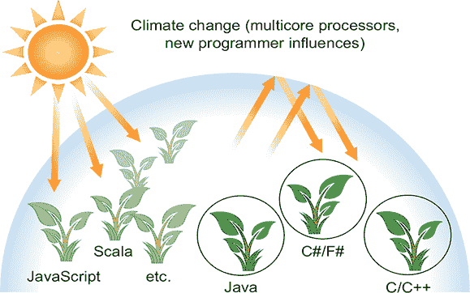

对于程序员来说，Java 8 增加的主要好处是它们提供了更多的编程工具和概念，以更快地解决新的或现有的编程问题，或者更重要的是，以更简洁、更易于维护的方式。尽管这些概念对 Java 来说是新的，但它们在类似的研究型语言中已被证明是强大的。在接下来的几节中，我们将突出和阐述三个推动 Java 8 功能开发以利用并行性和编写更简洁代码的编程概念背后的思想。我们将以与其他章节略有不同的顺序介绍它们，以便进行基于 Unix 的类比，并揭示 Java 8 新并行性中“需要*这个*因为*那个*”的依赖关系。

| |
| --- |

**Java 的另一个气候变化因素**

一个气候变化因素涉及如何设计大型系统。如今，一个大型系统通常包含来自其他地方的大型组件子系统，也许这些组件是基于其他供应商的组件构建的。更糟糕的是，这些组件及其接口也倾向于演变。Java 8 和 Java 9 通过提供默认方法和模块来解决这个问题，以促进这种设计风格。

| |
| --- |

下三个部分将探讨推动 Java 8 设计的三个编程概念。

#### 1.2.2\. 流处理

第一个编程概念是*流处理*。为了介绍的目的，一个*流*是一系列数据项的序列，这些数据项在概念上一次产生一个。一个程序可能一次从输入流中读取一个项目，并类似地写入输出流。一个程序输出流可能正好是另一个程序的输入流。

一个实际的例子是在 Unix 或 Linux 中，许多程序通过从标准输入（Unix 和 C 中的 *stdin*，Java 中的 `System.in`）读取数据，对其进行操作，然后将结果写入标准输出（Unix 和 C 中的 *stdout*，Java 中的 `System.out`）来运行。首先，有一点背景：Unix 的 `cat` 命令通过连接两个文件创建一个流，`tr` 将流中的字符进行转换，`sort` 对流中的行进行排序，而 `tail -3` 则给出流中的最后三行。Unix 命令行允许这些程序通过管道（`|`）链接在一起，例如

```
cat file1 file2  |  tr "[A-Z]"  "[a-z]"  |  sort  |  tail -3
```

`which`（假设`file1`和`file2`每行包含一个单词）打印出字典顺序中最后出现的三个单词，在将它们转换为小写之前。我们说`sort`以*流*形式的行作为输入，并产生另一个流形式的行作为输出（后者是排序后的），如图 1.2 所示（图 1.2）。请注意，在 Unix 中，这些命令（`cat`、`tr`、`sort`和`tail`）是并发执行的，这样`sort`就可以在`cat`或`tr`完成之前处理前几行。一个更机械的类比是一个汽车制造装配线，其中一串汽车在各个处理站之间排队，每个站都取一辆车，对其进行修改，并将其传递到下一个站进行进一步处理；尽管装配线在物理上是序列，但各个站点的处理通常是并发的。

> ³
> 
> 纯粹主义者会说“字符流”，但概念上更简单的是认为`sort`重新排序了*行*。

##### 图 1.2\. Unix 命令在流上操作

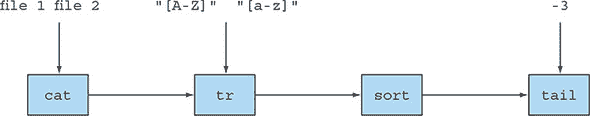

Java 8 在`java.util.stream`中基于这个想法添加了一个 Streams API（注意大写的 *S*）；`Stream<T>`是类型为 `T` 的项的序列。你现在可以将其视为一个花哨的迭代器。Streams API 有许多方法可以链接起来形成一个复杂的管道，就像在先前的例子中 Unix 命令被链接起来一样。

这个关键动机在于，你现在可以用 Java 8 在更高的抽象级别上进行编程，将这种流转换为那种流的思考方式（类似于你编写数据库查询时的思考方式），而不是逐个处理。另一个优点是 Java 8 可以透明地在输入的不同部分上并行运行你的`Stream`操作管道——这是几乎不费力的并行性，而不是使用`Thread`的艰苦工作。我们将在第四章（[kindle_split_015.xhtml#ch04]）到第七章（[kindle_split_018.xhtml#ch07]）中详细介绍 Java 8 Streams API。

#### 1.2.3\. 将代码传递给具有行为参数化的方法

Java 8 添加的第二个编程概念是能够将一段代码传递给一个 API。这听起来非常抽象。在 Unix 的例子中，你可能想告诉`sort`命令使用自定义排序。尽管`sort`命令支持命令行参数来执行各种预定义的排序类型，如逆序排序，但这些是有限的。

例如，假设你有一组发票 ID，其格式类似于 2013UK0001、2014US0002 等。前四位数字代表年份，接下来的两个字母代表国家代码，最后四位数字代表客户的 ID。你可能想按年份或客户 ID 或甚至国家代码对这些发票 ID 进行排序。你想要的是告诉`sort`命令接受一个用户定义的排序作为参数：传递给`sort`命令的一段单独的代码。

现在，作为一个直接的 Java 并行，你想要告诉`sort`方法使用自定义的顺序进行比较。你可以编写一个`compareUsingCustomerId`方法来比较两个发票 ID，但在 Java 8 之前，你不能将这个方法传递给另一个方法！你可以创建一个`Comparator`对象，就像我们在本章开头所展示的那样，将其传递给`sort`方法，但这很冗长，并且模糊了简单重用现有行为的概念。Java 8 增加了将方法（你的代码）作为参数传递给其他方法的能力。图 1.3，基于图 1.2，说明了这个概念。我们也将这个概念称为*行为参数化*。为什么这很重要？Streams API 建立在传递代码来参数化其操作行为的基础上，就像你传递`compareUsingCustomerId`来参数化`sort`的行为一样。

##### 图 1.3\. 将方法`compareUsingCustomerId`作为参数传递给`sort`

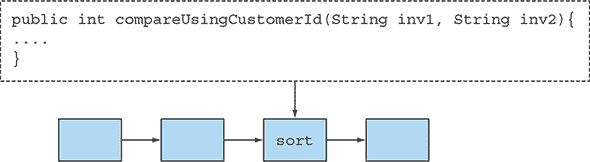

我们在本章的第 1.3 节中总结了这是如何工作的，但将全部细节留给第二章和第三章。第十八章和第十九章将探讨使用此功能可以执行的一些更高级的操作，以及来自*函数式编程*社区的技术。

#### 1.2.4\. 并行性和共享可变数据

第三个编程概念更为隐晦，它源于我们之前在流处理讨论中提到的“几乎免费的并行性”。你需要放弃什么？你可能需要在编写传递给流方法的行为的方式上做一些小的改变。一开始，这些改变可能会让你感到有些不舒服，但一旦习惯了，你会喜欢它们的。你必须提供在输入的不同部分上安全并发执行的行为。通常这意味着编写不访问共享可变数据来完成其工作的代码。有时这些被称为纯函数或无副作用函数或无状态函数，我们将在第十八章和第十九章中详细讨论这些。之前的并行性仅通过假设你的代码的多个副本可以独立工作而产生。如果有一个被写入的共享变量或对象，那么事情就不再有效了。如果两个进程同时想要修改共享变量怎么办？(第 1.4 节提供了一个带有图表的更详细解释。)你将在整本书中找到更多关于这种风格的内容。

Java 8 流比 Java 现有的线程 API 更容易利用并行性，所以尽管使用`synchronized`来打破没有共享可变数据规则是可能的，但它是在与系统作对，因为它是在围绕该规则优化的抽象中滥用。在多个处理核心上使用`synchronized`通常比你预期的要昂贵得多，因为同步迫使代码按顺序执行，这与并行化的目标相悖。

其中两点（没有共享可变数据和能够传递方法及函数—代码—到其他方法的能力）是通常所说的*函数式编程*范式的基石，你将在第十八章和第十九章中详细了解。相比之下，在*命令式编程*范式中，你通常用一系列改变状态的语句来描述程序。没有共享可变数据的要求意味着一个方法完全可以通过它如何将参数转换为结果来描述；换句话说，它表现得像一个数学函数，并且没有（可见的）副作用。

#### 1.2.5\. Java 需要进化

你之前已经看到了 Java 的进化。例如，泛型的引入和使用`List<String>`而不是仅仅`List`可能最初令人烦恼。但现在你已经熟悉了这种风格及其带来的好处（在编译时捕获更多错误，并使代码更容易阅读，因为你现在知道某个东西是一个列表）。

其他变化使得常见的事情更容易表达（例如，使用`for-each`循环而不是暴露`Iterator`的样板代码使用）。Java 8 的主要变化反映了一种从关注于改变现有值的经典面向对象，转向功能式编程谱系，其中*你想要做什么*（例如，*创建一个表示从 A 到 B 的所有运输路线且价格低于给定价格的值*）被视为首要的，并且与*你如何实现它*（例如，*扫描*一个数据结构*修改*某些组件）分离。请注意，经典面向对象编程和函数式编程作为极端，可能会显得相互冲突。但理念是从两种编程范式中获得最佳之处，这样你就有更大的机会拥有适合工作的正确工具。我们将在 1.3 节和 1.4 节中详细讨论这一点。

一个可以吸取的要点可能是这样的：语言需要进化以跟踪不断变化的硬件或程序员期望（如果您需要说服，请考虑 COBOL 曾经是商业上最重要的语言之一）。为了生存，Java 必须通过添加新功能来进化。如果没有使用新功能，这种进化将是徒劳的，因此在使用 Java 8 时，您正在保护作为 Java 程序员的生活方式。除此之外，我们有一种感觉，您会喜欢使用 Java 8 的新功能。问问任何使用过 Java 8 的人，他们是否愿意回去！此外，新的 Java 8 功能可能在生态系统类比中使 Java 能够征服其他语言目前占据的编程任务领域，因此 Java 8 程序员的需求将更加旺盛。

现在我们逐一介绍 Java 8 的新概念，并指出涵盖这些概念的章节，以更详细地介绍这些概念。

### 1.3\. Java 中的函数

在编程语言中，*函数*一词通常用作*方法*的同义词，尤其是静态方法；除此之外，它还用于*数学函数*，即没有副作用的一个。幸运的是，正如您将看到的，当 Java 8 提到函数时，这些用法几乎是一致的。

Java 8 将函数作为新的值形式添加。这促进了流的使用，如第 1.4 节所述，Java 8 提供了流来利用多核处理器上的并行编程。我们首先展示函数作为值本身是有用的。

考虑 Java 程序可能操作的可能值。首先，有原始值，如 42（类型为`int`）和 3.14（类型为`double`）。其次，值可以是对象（更严格地说，是对象的引用）。获取这些值的唯一方法是通过使用`new`，可能通过工厂方法或库函数；对象引用指向类的*实例*。例如，`"abc"`（类型为`String`），`new Integer(1111)`（类型为`Integer`），以及显式调用`HashMap`构造函数的结果`new HashMap<Integer, String>(100)`。甚至数组也是对象。问题是什么？

为了回答这个问题，我们将指出，编程语言的全部目的就是操纵值，根据历史编程语言的传统，这些值因此被称为一等值（或公民，借用自 20 世纪 60 年代美国民权运动中的术语）。我们编程语言中的其他结构，可能有助于我们表达值的结构，但在程序执行期间不能传递，因此被称为二等公民。之前列出的值是一等 Java 公民，但各种其他 Java 概念，如方法和类，是二等公民的例子。当使用方法来定义类时，方法是很好的，这些类反过来可以实例化以产生值，但它们本身并不是值。这有什么关系吗？是的，结果证明，在运行时传递方法，并使它们成为一等公民，在编程中非常有用，因此 Java 8 的设计者添加了在 Java 中直接表达这种能力。顺便说一句，你可能想知道将其他二等公民（如类）变成一等公民值是否也是一个好主意。像 Smalltalk 和 JavaScript 这样的各种语言已经探索了这条路线。

#### 1.3.1\. 方法和 lambda 作为一等公民

在其他语言（如 Scala 和 Groovy）中的实验已经确定，允许像方法这样的概念作为一等值使用，通过增加程序员可用的工具集，使得编程变得更加容易。一旦程序员熟悉了一个强大的特性，他们就不愿意使用没有这个特性的语言！Java 8 的设计者决定允许方法作为值存在——以便于你编程。此外，Java 8 中将方法作为值的功能是其他各种 Java 8 特性（如 Streams）的基础。

我们首先介绍的新 Java 8 特性是*方法引用*。假设你想要过滤目录中的所有隐藏文件。你需要编写一个方法，给定一个`File`对象，它会告诉你该文件是否隐藏。幸运的是，`File`类中有一个名为`isHidden`的方法可以实现这个功能。它可以看作是一个接受`File`对象并返回`boolean`值的函数。但为了用于过滤，你需要将其包装成一个`FileFilter`对象，然后将该对象传递给`File.listFiles`方法，如下所示：

```
File[] hiddenFiles = new File(".").listFiles(new FileFilter() {
    public boolean accept(File file) {
        return file.isHidden();                        *1*
    }
});
```

+   ***1* 过滤隐藏文件！**

哎呀！这太糟糕了。尽管这只有三行重要的代码，但它却是三行晦涩难懂的代码——我们都会记得第一次遇到时会说“我真的必须这样做吗？”你已经有了可以使用的`isHidden`方法。为什么你还要把它封装在一个冗长的`FileFilter`类中，然后实例化它呢？因为在 Java 8 之前你必须这样做。

现在，你可以将那段代码重写如下：

```
File[] hiddenFiles = new File(".").listFiles(File::isHidden);
```

哇！这不是很酷吗？你已经有`isHidden`函数可用，所以你可以使用 Java 8 的*方法引用* :: 语法（意味着“使用这个方法作为值”）将其传递给`listFiles`方法；注意我们也在使用“函数”这个词来指代方法。我们稍后会解释其工作机制。一个优点是，你的代码现在读起来更接近问题陈述。

这只是冰山一角：方法不再是二等公民。类似于传递对象时使用对象引用（对象引用是通过`new`创建的），在 Java 8 中，当你写下`File::isHidden`时，你创建了一个方法引用，它可以像对象引用一样被传递。这一概念在第三章中有详细讨论。鉴于方法包含代码（方法的可执行体），使用方法引用使得代码可以被传递，就像图 1.3 中所示。图 1.4 展示了这一概念。你还会在下一节看到一个具体示例（从库存中选择苹果）。

##### 图 1.4：将方法引用`File::isHidden`传递给`listFiles`方法

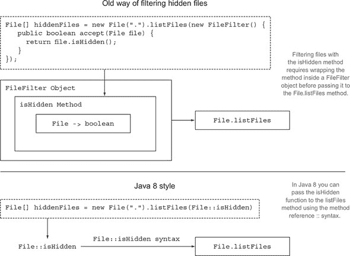

##### Lambda：匿名函数

除了允许（命名）方法成为一等公民外，Java 8 还允许更丰富的*函数作为值*的概念，包括*lambda*^([4])（或匿名函数）。例如，你现在可以写`(int x) -> x + 1`来表示“当用参数 x 调用时，返回值 x + 1 的函数。”你可能想知道为什么这有必要，因为你可以在`MyMathsUtils`类内部定义一个名为`add1`的方法，然后写`MyMaths-Utils::add1`！是的，你可以这样做，但新的 lambda 语法在没有方便的方法和类可用的情况下更为简洁。第三章详细探讨了 lambda。使用这些概念的程序被称为函数式编程风格的程序；这个短语意味着“编写将函数作为一等值传递的程序。”

> ⁴
> 
> 最初以希腊字母λ（lambda）命名。虽然这个符号在 Java 中未使用，但其名称仍然存在。

#### 1.3.2. 传递代码：一个示例

让我们看看这个如何帮助你编写程序（在第二章中有更详细的讨论）。所有示例代码都可在 GitHub 仓库和书籍网站上找到，两个链接都可以在[www.manning.com/books/modern-java-in-action](http://www.manning.com/books/modern-java-in-action)找到。假设你有一个名为`Apple`的类，它有一个`getColor`方法和一个包含`Apples`列表的变量`inventory`；那么你可能希望选择所有绿色的苹果（这里使用包含值`GREEN`和`RED`的`Color`枚举类型），并将它们作为一个列表返回。*filter*这个词通常用来表达这个概念。在 Java 8 之前，你可能写一个名为`filterGreenApples`的方法：

```
public static List<Apple> filterGreenApples(List<Apple> inventory) {
    List<Apple> result = new ArrayList<>();                           *1*
    for (Apple apple: inventory){
        if (GREEN.equals(apple.getColor())) {                         *2*
            result.add(apple);
        }
    }
    return result;
}
```

+   ***1* 结果列表累积结果；它最初是空的，然后逐个添加绿色苹果。**

+   ***2* 高亮显示的文本只选择绿色苹果。**

但接下来，有人可能想要重苹果的列表（比如超过 150 克），因此，带着沉重的心情，你会编写以下方法来实现这一点（可能甚至使用复制粘贴）：

```
public static List<Apple> filterHeavyApples(List<Apple> inventory) {
    List<Apple> result = new ArrayList<>();
    for (Apple apple: inventory){
        if (apple.getWeight() > 150) {                *1*
            result.add(apple);
        }
    }
    return result;
}
```

+   ***1* 这里高亮显示的文本只选择重苹果。**

我们都知道复制粘贴对软件工程的危险（对一个变体的更新和错误修复，但没有对另一个变体进行），嘿，这两个方法只在一条线上有所不同：高亮显示的 `if` 结构内的条件。如果高亮代码中两个方法调用之间的差异是可接受的重量范围，那么你可以将可接受的上下限重量作为参数传递给 `filter`——比如 (`150, 1000`) 来选择重苹果（超过 150 克）或 (`0, 80`) 来选择轻苹果（低于 80 克）。

但正如我们之前提到的，Java 8 使得将条件代码作为参数传递成为可能，避免了 `filter` 方法的代码重复。现在你可以这样写：

```
public static boolean isGreenApple(Apple apple) {
    return GREEN.equals(apple.getColor());
}
public static boolean isHeavyApple(Apple apple) {
    return apple.getWeight() > 150;
}
public interface Predicate<T>{                                 *1*
    boolean test(T t);
}
static List<Apple> filterApples(List<Apple> inventory,
                                Predicate<Apple> p) {          *2*
    List<Apple> result = new ArrayList<>();
    for (Apple apple: inventory){
        if (p.test(apple)) {                                   *3*
            result.add(apple);
        }
    }
    return result;
}
```

+   ***1* 为了清晰起见（通常从 java.util.function 导入）**

+   ***2* 方法作为名为 p 的谓词参数传递（参见侧边栏“什么是谓词？”）。**

+   ***3* 苹果是否匹配由 p 表示的条件？**

要使用这个，你可以调用以下任何一个：

```
filterApples(inventory, Apple::isGreenApple);
```

or

```
filterApples(inventory, Apple::isHeavyApple);
```

我们将在接下来的两个章节中详细解释它是如何工作的。现在要记住的关键思想是，你可以在 Java 8 中传递一个方法。

|  |
| --- |

**什么是谓词？**

之前的代码传递了一个方法 `Apple::isGreenApple`（它接受一个 `Apple` 参数并返回一个布尔值）到 `filterApples`，该方法期望一个 `Predicate <Apple>` 参数。在数学中，*谓词*一词常用来表示一种类似于函数的东西，它接受一个参数的值并返回 `true` 或 `false`。正如你稍后将会看到的，Java 8 也允许你编写 `Function<Apple, Boolean>`——对于在学校学习过函数但没有学习过谓词的读者来说可能更熟悉——但使用 `Predicate<Apple>` 更为标准（并且稍微高效一些，因为它避免了将 `boolean` 包装成 `Boolean`）。

|  |
| --- |

#### 1.3.3\. 从传递方法到 lambda 表达式

将方法作为值传递显然很有用，但当你可能只使用一次或两次时，不得不为短方法（如 `isHeavyApple` 和 `isGreenApple`）编写定义确实很烦人。但 Java 8 也解决了这个问题。它引入了一种新的表示法（匿名函数，或 lambda 表达式），它允许你只写

```
filterApples(inventory, (Apple a) -> GREEN.equals(a.getColor()) );
```

or

```
filterApples(inventory, (Apple a) -> a.getWeight() > 150 );
```

or

```
filterApples(inventory, (Apple a) -> a.getWeight() < 80 ||
                                     RED.equals(a.getColor()) );
```

你甚至不需要编写只使用一次的方法定义；代码更加清晰，因为你不需要搜索来找到你传递的代码。但是，如果这样的 lambda 表达式长度超过几行（以至于其行为不是立即清晰的），则应改用具有描述性名称的方法引用，而不是使用匿名 lambda。代码的清晰度应该是你的指南。

Java 8 的设计者几乎可以在这里停下来，也许在多核 CPU 之前他们会这样做。到目前为止所展示的函数式编程证明是强大的，你将会看到。Java 可能会通过添加 `filter` 和一些其他作为通用库方法的“朋友”来完善，例如

```
static <T> Collection<T> filter(Collection<T> c, Predicate<T> p);
```

你甚至不需要编写像 `filterApples` 这样的方法，因为例如，前面的调用

```
filterApples(inventory, (Apple a) -> a.getWeight() > 150 );
```

可以写成对库方法 `filter` 的调用：

```
filter(inventory, (Apple a) -> a.getWeight() > 150 );
```

但是，出于更好地利用并行性的原因，设计者没有这样做。Java 8 代替地包含了一个新的类似于集合的 API，称为 Stream，它包含了一组类似于 `filter` 操作的操作，这些操作可能是函数式程序员所熟悉的（例如，`map` 和 `reduce`），以及用于在 `Collection`s 和 `Stream`s 之间转换的方法，我们现在将研究这些方法。

### 1.4\. 流

几乎每个 Java 应用程序都会 *创建* 和 *处理* 集合。但是，与集合一起工作并不总是理想的。例如，假设你需要从列表中过滤出昂贵的交易，然后按货币分组。你需要编写大量的样板代码来实现这个数据处理查询，如下所示：

```
Map<Currency, List<Transaction>> transactionsByCurrencies =
    new HashMap<>();                                           *1*
for (Transaction transaction : transactions) {                 *2*
    if(transaction.getPrice() > 1000){                         *3*
        Currency currency = transaction.getCurrency();         *4*
        List<Transaction> transactionsForCurrency =
            transactionsByCurrencies.get(currency);
        if (transactionsForCurrency == null) {                 *5*
            transactionsForCurrency = new ArrayList<>();
            transactionsByCurrencies.put(currency,
                                         transactionsForCurrency);
        }
        transactionsForCurrency.add(transaction);              *6*
    }
}
```

+   ***1* 创建一个映射，其中将累积分组交易**

+   ***2* 遍历交易列表**

+   ***3* 过滤昂贵的交易**

+   ***4* 提取交易的货币**

+   ***5* 如果分组映射中没有该货币的条目，则创建它。**

+   ***6* 将当前遍历的交易添加到具有相同货币的交易列表中**

此外，由于存在多个嵌套的控制流语句，因此很难一眼看出代码的功能。

使用 Streams API，你可以这样解决这个问题：

```
import static java.util.stream.Collectors.groupingBy;
Map<Currency, List<Transaction>> transactionsByCurrencies =
    transactions.stream()
                .filter((Transaction t) -> t.getPrice() > 1000)     *1*
                .collect(groupingBy(Transaction::getCurrency));     *2*
```

+   ***1* 过滤昂贵的交易**

+   ***2* 按货币分组**

目前不必担心这段代码，因为它可能看起来有点像魔法。第四章到第七章（Chapters 4–7）专门解释了如何理解 Streams API。现在，值得注意的是，Streams API 提供了与 Collections API 不同的数据处理方式。使用集合，你需要自己管理迭代过程。你需要使用`for-each`循环逐个遍历元素，依次处理它们。我们称这种方式为数据的外部迭代。相比之下，使用 Streams API，你不需要考虑循环。数据处理在库内部发生。我们称这个想法为内部迭代。我们将在第四章（chapter 4）中回到这些想法。

作为与集合一起工作的第二个痛点，先想想如果你有大量交易列表，你会如何处理它；你该如何处理这个庞大的列表？单个 CPU 无法处理如此大量的数据，但你可能桌上有多核计算机。理想情况下，你希望将工作分配给你的机器上可用的不同 CPU 核心，以减少处理时间。从理论上讲，如果你有八个核心，它们应该能够以使用一个核心八倍的速度处理你的数据，因为它们是并行工作的.^([5])

> ⁵
> 
> 这种命名在某种程度上是不幸的。多核芯片中的每个核心都是一个完整的 CPU。但“多核 CPU”这个短语已经变得很常见，所以“核心”用来指代单个 CPU。

| |
| --- |

**多核计算机**

所有新的台式机和笔记本电脑都是多核计算机。它们不是单个 CPU，而是有四个、八个或更多的 CPU（通常称为核心 5）。问题是经典的 Java 程序只使用这些核心中的一个，其他核心的功率被浪费了。同样，许多公司使用*计算集群*（通过快速网络连接在一起的计算机）来有效地处理大量数据。Java 8 简化了新的编程风格，以更好地利用这类计算机。

谷歌的搜索引擎是一个例子，它太大，无法在单个计算机上运行。它读取互联网上的每一页，并创建一个索引，将任何互联网页面上出现的每个单词映射回包含该单词的每个 URL。然后，当你进行涉及多个单词的谷歌搜索时，软件可以快速使用这个索引给你提供包含这些单词的网页集合。试着想象你如何用 Java 编写这个算法（即使对于比谷歌的小的索引，你也需要利用你电脑上的所有核心）。

| |
| --- |

#### 1.4.1. 多线程是困难的

问题在于，通过编写**多线程**代码（使用 Java 先前版本中的 Threads API）来利用并行性是困难的。你必须以不同的方式思考：线程可以同时访问和更新共享变量。结果，如果没有适当协调^([6]), 数据可能会意外改变。这种模型比逐步顺序模型更难思考^([7]). 例如，图 1.5 展示了两个线程试图在不正确同步的情况下向共享变量`sum`添加数字时可能出现的潜在问题。

> ⁶
> 
> 传统上通过`synchronized`关键字实现，但许多微妙的错误都源于其位置不当。基于`Stream`的 Java 8 并行性鼓励一种函数式编程风格，其中`synchronized`很少使用；它侧重于数据分区而不是协调对数据的访问。
> 
> ⁷
> 
> 啊哈——这是推动语言进化的压力来源！

##### 图 1.5\. 两个线程试图向共享的`sum`变量添加时可能出现的潜在问题。结果是 105，而不是预期的 108。


Java 8 也通过 Streams API（`java.util.stream`）解决了这两个问题（与处理集合相关的样板代码和模糊性以及利用多核的困难）。第一个设计动机是存在许多数据处理的模式（类似于前一小节中的`filterApples`或来自数据库查询语言（如 SQL）的熟悉操作），这些模式反复出现，并且会从成为库的一部分中受益：基于标准（例如，重苹果）**过滤**数据，**提取**数据（例如，从列表中的每个苹果中提取重量字段），或**分组**数据（例如，将数字列表分组为偶数和奇数列表），等等。第二个动机是这些操作通常可以并行化。例如，如图 1.6 所示，在两个 CPU 上过滤列表可以通过要求一个 CPU 处理列表的前半部分，而另一个 CPU 处理列表的后半部分来实现。这被称为**分叉步骤**（1）。然后，CPU 过滤它们各自的半列表（2）。最后（3），一个 CPU 将合并两个结果。（这与 Google 搜索快速工作的方式密切相关，使用了两个以上的处理器。）

##### 图 1.6\. 将`filter`分叉到两个 CPU 上并合并结果

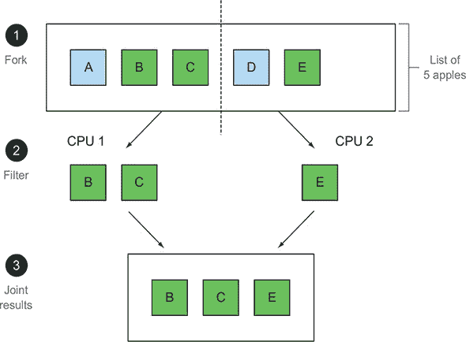

目前，我们只能说新的 Streams API 的行为与 Java 现有的 Collections API 类似：两者都提供了对数据项序列的访问。但记住这一点是有用的，即 Collections 主要是关于存储和访问数据，而 Streams 主要是关于对数据进行计算。这里的关键点是 Streams API 允许并鼓励流内的元素并行处理。虽然一开始可能看起来很奇怪，但过滤集合（例如，在上一个章节中对列表使用`filterApples`）最快的方法通常是将其转换为流，并行处理，然后再将其转换回列表。我们再次只是说“几乎免费获得并行处理”，并展示如何使用流和 lambda 表达式按顺序或并行地从列表中过滤出重苹果。

下面是一个顺序处理的例子：

```
import static java.util.stream.Collectors.toList;
List<Apple> heavyApples =
    inventory.stream().filter((Apple a) -> a.getWeight() > 150)
                      .collect(toList());
```

现在来看看并行处理的应用：

```
import static java.util.stream.Collectors.toList;
List<Apple> heavyApples =
    inventory.parallelStream().filter((Apple a) -> a.getWeight() > 150)
                              .collect(toList());
```

|  |
| --- |

**Java 中的并行处理和无共享可变状态**

人们常说 Java 中的并行处理很困难，所有关于`synchronized`的内容都容易出错。Java 8 中有什么神奇的子弹吗？

有两个神奇的子弹。首先，库处理分区——将大流分解成几个较小的流以供你并行处理。其次，这种从流中几乎免费获得的并行处理，仅在传递给库方法（如`filter`）的方法不交互（例如，通过具有可变共享对象）时才有效。但结果证明，这种限制对程序员来说感觉是自然的（例如，通过我们的`Apple::isGreenApple`示例）。尽管在**函数式编程**中，“函数式”的主要含义是“将函数作为一等值使用”，但它通常还有一个次要的含义，即“组件在执行期间不交互。”

|  |
| --- |

第七章详细探讨了 Java 8 中的并行数据处理及其性能。Java 8 开发者在将所有这些新特性引入 Java 的过程中发现的一个实际问题，是现有接口的演变。例如，`Collections.sort`方法属于`List`接口，但从未被包含在内。理想情况下，你希望执行`list.sort(comparator)`而不是`Collections.sort(list, comparator)`。这看起来可能微不足道，但在 Java 8 之前，只有当你更新实现它的所有类时，你才能更新一个接口——这是一个后勤噩梦！这个问题在 Java 8 中通过**默认方法**得到了解决。

### 1.5\. 默认方法和 Java 模块

如我们之前提到的，现代系统往往是由组件构建的——可能是从其他地方购买的。从历史上看，Java 在这方面支持很少，除了包含一组没有特定结构的 Java 包的 JAR 文件。此外，将这些接口演变到这样的包中也很困难——更改 Java 接口意味着更改实现它的每个类。Java 8 和 9 开始着手解决这个问题。

首先，Java 9 提供了一个模块系统，它提供了定义包含包集合的*模块*的语法，并更好地控制可见性和命名空间。模块通过结构丰富了一个简单的 JAR-like 组件，既作为用户文档，也用于机器检查；我们将在第十四章中详细解释它们。其次，Java 8 添加了默认方法来支持*可进化*的接口。我们将在第十三章中详细讨论这些内容。它们很重要，因为您将越来越多地在接口中遇到它们，但由于相对较少的程序员需要自己编写默认方法，并且它们有助于程序进化而不是帮助编写任何特定的程序，所以我们在这里简要介绍并基于示例进行说明。

在第 1.4 节中，我们给出了以下 Java 8 代码示例：

```
List<Apple> heavyApples1 =
    inventory.stream().filter((Apple a) -> a.getWeight() > 150)
                      .collect(toList());
List<Apple> heavyApples2 =
    inventory.parallelStream().filter((Apple a) -> a.getWeight() > 150)
                              .collect(toList());
```

但这里有一个问题：Java 8 之前的`List<T>`没有`stream`或`parallel-Stream`方法，并且它实现的`Collection<T>`接口也没有这些方法——因为这些方法还没有被构想出来。没有这些方法，这段代码将无法编译。对于您自己的接口，最简单的解决方案可能是 Java 8 设计者将`stream`方法添加到`Collection`接口中，并在`ArrayList`类中添加实现。

但这样做对用户来说将是一场噩梦。许多替代集合框架实现了 Collections API 的接口。向接口添加新方法意味着所有具体的类都必须为其提供实现。语言设计者无法控制`Collection`的现有实现，因此您面临一个困境：如何在不破坏现有实现的情况下进化已发布的接口？

Java 8 的解决方案是打破最后一个链接：接口现在可以包含实现类不提供实现的方法定义。那么谁来实现它们呢？缺失的方法体作为接口的一部分（因此是默认实现）而不是在实现类中给出。

这为接口设计者提供了一种方法，可以在不破坏现有代码的情况下扩展接口——超出最初计划的方法。Java 8 允许在接口规范中使用现有的`default`关键字来实现这一点。

例如，在 Java 8 中，您可以直接在列表上调用`sort`方法。这是通过 Java 8 `List`接口中的以下默认方法实现的，它调用静态方法`Collections.sort`：

```
default void sort(Comparator<? super E> c) {
    Collections.sort(this, c);
}
```

这意味着任何具体的`List`类都不需要显式实现`sort`方法，而在之前的 Java 版本中，这些具体的类如果没有提供`sort`方法的实现就无法重新编译。

但等等。一个类可以实现多个接口，对吧？如果你在几个接口中有多个默认实现，这意味着你在 Java 中有某种形式的多重继承吗？是的，在某种程度上。我们在第十三章 中展示了某些规则，这些规则防止了像 C++ 中臭名昭著的 *菱形继承问题* 这样的问题。

### 1.6\. 函数式编程中的其他好想法

前几节介绍了函数式编程的两个核心思想，现在已成为 Java 的一部分：使用方法和 lambda 表达式作为一等值，以及在没有可变共享状态的情况下，函数或方法调用可以高效且安全地并行执行的想法。这两个想法都被我们之前描述的新 Streams API 所利用。

常见的函数式语言（SML、OCaml、Haskell）还提供了其他构造来帮助程序员。其中之一是通过显式使用更具描述性的数据类型来避免 `null`。计算机科学巨匠之一托尼·霍尔在 2009 年伦敦 QCon 的一个演讲中说：

> *我称之为我的十亿美元的错误。这是 1965 年对空引用的发明……我无法抗拒加入空引用的诱惑，仅仅因为它如此容易实现。*

Java 8 引入了 `Optional<T>` 类，如果一致使用，可以帮助你避免空指针异常。它是一个可能包含或不包含值的容器对象。`Optional<T>` 包含处理值不存在情况的方法，因此你可以避免空指针异常。它使用类型系统来允许你指示一个变量预期可能缺少值。我们在第十一章 中详细讨论了 `Optional<T>`。

第二个想法是关于 *(结构化)模式匹配*。^([8]) 这在数学中有所应用。例如：

> ⁸
> 
> 这个短语有两个用途。在这里，我们指的是从数学和函数式编程中熟悉的用法，即函数通过情况定义，而不是使用 `if-then-else`。另一个含义涉及像“在给定目录中查找所有形式为‘IMG*.JPG’的文件”这样的短语，这与所谓的正则表达式相关。

```
    f(0) = 1
    f(n) = n*f(n-1) otherwise
```

在 Java 中，你会写一个`if-then-else`或`switch`语句。其他语言已经表明，对于更复杂的数据类型，与使用`if-then-else`相比，模式匹配可以更简洁地表达编程思想。对于此类数据类型，你也可能使用多态性和方法重写作为`if-then-else`的替代方案，但关于哪种更合适，语言设计讨论仍在进行中。9] 我们会说两者都是有用的工具，你应该两者都具备。不幸的是，Java 8 没有对模式匹配提供全面支持，尽管我们在第十九章中展示了如何表达它。还正在讨论一个 Java 增强提案，以支持 Java 未来版本中的模式匹配（见[`openjdk.java.net/jeps/305`](http://openjdk.java.net/jeps/305)）。同时，让我们用一个在 Scala 编程语言中表达（另一种使用 JVM 的类似 Java 的语言，它启发了 Java 的一些演变方面；见第二十章）的例子来说明。假设你想编写一个程序，对表示算术表达式的树进行基本简化。给定一个表示此类表达式的数据类型`Expr`，在 Scala 中，你可以编写以下代码来分解一个`Expr`并返回另一个`Expr`：

> ⁹
> 
> 关于“表达式问题”（由 Phil Wadler 提出的术语）的维基百科文章为讨论提供了入口。

```
def simplifyExpression(expr: Expr): Expr = expr match {
    case BinOp("+", e, Number(0)) => e                    *1*
    case BinOp("-", e, Number(0)) => e                    *2*
    case BinOp("*", e, Number(1)) => e                    *3*
    case BinOp("/", e, Number(1)) => e                    *4*
    case _ => expr                                        *5*
}
```

+   ***1* 加 0**

+   ***2* 减去 0**

+   ***3* 乘以 1**

+   ***4* 除以 1**

+   ***5* 这些情况无法简化，所以可以忽略**

这里 Scala 的语法`expr match`对应于 Java 的`switch (expr)`。现在不必担心这段代码——你将在第十九章中了解更多关于模式匹配的内容。现在，你可以将模式匹配视为`switch`的扩展形式，它可以在分解数据类型的同时将其分解为其组件。

为什么 Java 中的`switch`语句仅限于原始值和字符串？函数式语言通常允许`switch`在更多数据类型上使用，包括允许模式匹配（在 Scala 代码中，这是通过使用`match`操作实现的）。在面向对象设计中，访问者模式是一种常用的模式，用于遍历一组类（例如汽车的各个部件：轮胎、引擎、底盘等）并对每个访问的对象应用操作。模式匹配的一个优点是编译器可以报告常见的错误，例如，“类`Brakes`是用于表示`Car`类组件的类族的一部分。你忘记显式处理它了。”

第十八章 和 第十九章 提供了关于函数式编程的全面教程介绍以及如何在 Java 8 中编写函数式风格的程序——包括其库中提供的函数工具包。第二十章 接着讨论了 Java 8 的特性与 Scala 语言中的特性相比——Scala 语言与 Java 类似，也是基于 JVM 实现的，并且迅速进化以威胁到 Java 在编程语言生态系统中的某些领域。这些内容位于本书的末尾，以提供更多关于为什么添加了新的 Java 8 和 Java 9 特性的见解。

| |
| --- |

**Java 8、9、10 和 11 特性：从哪里开始？**

Java 8 和 Java 9 都对 Java 进行了重大更新。但作为一名 Java 程序员，你每天在小型编码基础上最可能受到影响的是 Java 8 的新增功能——传递方法或 lambda 的概念正迅速成为至关重要的 Java 知识。相比之下，Java 9 的增强功能丰富了定义和使用更大规模组件的能力，无论是使用模块来构建系统还是导入响应式编程工具包。最后，Java 10 相比之前的升级要小得多，它允许局部变量的类型推断，我们将在 第二十一章 中简要讨论这一点，在那里我们还将提到由于 Java 11 的引入而带来的 lambda 表达式参数的更丰富语法。在撰写本文时，Java 11 预计将于 2018 年 9 月发布。Java 11 还引入了一个新的异步 HTTP 客户端库 ([`openjdk.java.net/jeps/321`](http://openjdk.java.net/jeps/321))，该库利用了 Java 8 和 Java 9 的发展（详情见 第十五章、第十六章 和 第十七章）中的 `CompletableFuture` 和响应式编程。

| |
| --- |

### 摘要

+   记住语言生态系统的理念以及随之而来的语言进化或衰败的压力。尽管 Java 目前可能非常健康，但我们也可以回忆起其他健康的语言，如 COBOL，这些语言未能进化。

+   Java 8 的核心新增功能提供了令人兴奋的新概念和功能，以简化编写既有效又简洁的程序。

+   多核处理器并没有完全由 Java 8 之前的编程实践所充分利用。

+   函数是一等值；记住方法可以作为函数值传递，以及匿名函数（lambda）是如何编写的。

+   Java 8 的流概念概括了许多集合的方面，但前者通常使代码更易读，并允许流中的元素并行处理。

+   大规模基于组件的编程，以及系统接口的演变，在历史上并没有得到 Java 的良好服务。现在你可以在 Java 9 中指定模块来结构化系统，并使用默认方法来允许在不更改实现它的所有类的情况下增强接口。

+   函数式编程中的其他有趣想法包括处理 `null` 和使用模式匹配。

## 第二章：使用行为参数化传递代码

*本章涵盖*

+   应对变化的需求

+   行为参数化

+   匿名类

+   lambda 表达式的预览

+   现实世界的例子：`Comparator`、`Runnable` 和 GUI

软件工程中一个众所周知的问题是，无论你做什么，用户需求都会改变。例如，想象一个帮助农民了解其库存的应用程序。农民可能希望有一个功能来查找他库存中所有绿色的苹果。但第二天他可能会告诉你，“实际上，我还想找到所有重量超过 150 克的苹果。”两天后，农民回来并补充说，“如果我能找到所有既绿色又重量超过 150 克的苹果那就太好了。”你如何应对这些不断变化的需求？理想情况下，你希望最小化你的工程努力。此外，类似的新功能应该易于实现且长期可维护。

*行为参数化*是一种软件开发模式，它允许你处理频繁的需求变更。简而言之，这意味着取一段代码并使其可用而不执行它。这段代码可以在稍后由程序的其他部分调用，这意味着你可以延迟执行这段代码。例如，你可以将这段代码作为参数传递给另一个稍后执行它的方法。因此，方法的行为是根据这段代码参数化的。例如，如果你处理一个集合，你可能想编写一个方法，

+   可以对列表中的每个元素执行“某种”操作

+   在处理完列表后可以执行“另一件事”

+   如果遇到错误，可以执行“另一件事”

这就是*行为参数化*所指的内容。这里有一个类比：你的室友知道如何开车去超市并回家。你可以告诉他去买一些东西，比如面包、奶酪和酒。这相当于调用一个方法 `goAndBuy`，传递一个产品列表作为其参数。但有一天你在办公室，你需要他做他以前从未做过的事情——从邮局取包裹。你需要给他一个指令列表：去邮局，使用这个参考号，和经理交谈，取回包裹。你可以通过电子邮件给他这个指令列表，当他收到时，他可以按照指令行事。你现在做了一件稍微复杂一点的事情，这相当于一个方法 `goAndDo`，它可以执行各种新的行为作为参数。

我们将从这个章节开始，通过一个例子向您展示您如何使代码更具灵活性，以适应不断变化的需求。基于这个知识，我们展示了如何为几个现实世界的例子使用行为参数化。例如，您可能已经使用过行为参数化模式，使用 Java API 中的现有类和接口来排序`List`，过滤文件名，或者告诉`Thread`执行代码块，甚至执行 GUI 事件处理。您很快就会意识到这个模式在 Java 中历史性地很冗长。从 Java 8 开始的 Lambda 表达式解决了冗长的问题。我们将在第三章中展示如何构造 Lambda 表达式，在哪里使用它们，以及如何通过采用它们使您的代码更简洁。

### 2.1\. 应对变化需求

编写能够应对变化需求的代码是困难的。让我们通过一个我们将逐步改进的例子来探讨，展示一些使您的代码更具灵活性的最佳实践。在农场库存应用程序的背景下，您必须实现一个从列表中过滤*绿色*苹果的功能。听起来很简单，对吧？

#### 2.1.1\. 第一次尝试：过滤绿色苹果

假设，如第一章中所述，您有一个`Color`枚举可用，用于表示苹果的不同颜色：

```
enum Color { RED, GREEN }
```

一个可能的解决方案可能是以下这样：

```
public static List<Apple> filterGreenApples(List<Apple> inventory) {
    List<Apple> result = new ArrayList<>();                          *1*
    for(Apple apple: inventory){
        if( GREEN.equals(apple.getColor() ) {                        *2*
            result.add(apple);
        }
    }
    return result;
}
```

+   ***1* 苹果的累加列表**

+   ***2* 仅选择绿色苹果**

突出的行显示了选择绿色苹果所需的条件。您可以假设您有一个包含一组颜色，如`GREEN`的`Color`枚举。但现在农民改变了主意，想要过滤*红色*苹果。您能做什么？一个简单的方法是复制您的函数，将其重命名为`filterRedApples`，并将`if`条件更改为匹配红色苹果。然而，如果农民想要多种颜色，这种方法并不能很好地处理变化。一个好的原则是：当你发现自己正在编写几乎重复的代码时，尝试进行抽象。

#### 2.1.2\. 第二次尝试：参数化颜色

我们如何避免在`filterGreenApples`中复制大部分代码来创建`filter-RedApples`？为了参数化颜色并使代码更灵活以适应此类变化，您可以在方法中添加一个参数：

```
public static List<Apple> filterApplesByColor(List<Apple> inventory,
Color color) {
    List<Apple> result = new ArrayList<>();
    for (Apple apple: inventory) {
        if ( apple.getColor().equals(color) ) {
            result.add(apple);
        }
    }
    return result;
}
```

现在，您可以让农民满意，并按如下方式调用您的函数：

```
List<Apple> greenApples = filterApplesByColor(inventory, GREEN);
List<Apple> redApples = filterApplesByColor(inventory, RED);
...
```

太简单了，对吧？让我们稍微复杂化一下例子。农民回到你那里说：“区分轻苹果和重苹果真的很酷。重苹果的重量通常大于 150 克。”

穿上你的软件工程帽子，你事先意识到农民可能想要改变重量。因此，你创建以下方法来通过一个额外的参数处理各种重量：

```
public static List<Apple> filterApplesByWeight(List<Apple> inventory,
int weight) {
    List<Apple> result = new ArrayList<>();
    For (Apple apple: inventory){
        if ( apple.getWeight() > weight ) {
            result.add(apple);
        }
    }
    return result;
}
```

这是一个不错的解决方案，但请注意，你必须复制大部分遍历库存和将过滤标准应用于每个苹果的实现。这有点令人失望，因为它打破了软件工程的 DRY（不要重复自己）原则。如果你想要改变过滤遍历来提高性能，你现在必须修改所有方法的实现，而不仅仅是单个方法。从工程努力的角度来看，这是昂贵的。

你可以将颜色和重量合并到一个名为`filter`的方法中。但这样你仍然需要一个方法来区分你想要过滤的属性。你可以添加一个标志来区分颜色和重量查询。（但永远不要这样做！我们很快就会解释原因。）

#### 2.1.3\. 第三次尝试：使用你能想到的所有属性进行过滤

尝试将所有属性合并的丑陋方法可能如下所示：

```
public static List<Apple> filterApples(List<Apple> inventory, Color color,
                                       int weight, boolean flag) {
    List<Apple> result = new ArrayList<>();
    for (Apple apple: inventory) {
        if ( (flag && apple.getColor().equals(color)) ||
             (!flag && apple.getWeight() > weight) ){          *1*
            result.add(apple);
        }
    }
    return result;
}
```

+   ***1* 选择颜色或重量的丑陋方式**

你可以这样使用（但看起来很丑）：

```
List<Apple> greenApples = filterApples(inventory, GREEN, 0, true);
List<Apple> heavyApples = filterApples(inventory, null, 150, false);
...
```

这个解决方案非常糟糕。首先，客户端代码看起来很糟糕。`true`和`false`代表什么？此外，这个解决方案不太适应不断变化的需求。如果农民要求你根据苹果的不同属性进行过滤，例如大小、形状、产地等，怎么办？此外，如果农民要求你进行更复杂的查询，结合属性，例如既绿色又重的苹果，怎么办？你将要么有多个重复的`filter`方法，要么有一个极其复杂的方法。到目前为止，你已经用`String`、`Integer`、枚举类型或`boolean`等值对`filterApples`方法进行了参数化。这对于某些定义明确的问题来说可能很好。但在这个情况下，你需要一种更好的方式来告诉`filterApples`方法苹果的选择标准。在下一节中，我们将描述如何利用*行为参数化*来实现这种灵活性。

### 2.2\. 行为参数化

你在前一节中看到，你需要一种比添加大量参数更好的方法来应对不断变化的需求。让我们退一步，找到一个更好的抽象层次。一个可能的解决方案是模拟你的选择标准：你正在处理苹果，并根据`Apple`的一些属性返回一个`boolean`。例如，它是绿色的吗？它的重量是否超过 150 克？我们称这为*谓词*（返回`boolean`的函数）。因此，让我们定义一个接口*来模拟选择标准*：

```
public interface ApplePredicate{
    boolean test (Apple apple);
}
```

你现在可以声明多个`ApplePredicate`的实现，以表示不同的选择标准，如下所示（并在图 2.1 中说明）：

##### 图 2.1\. 选择`Apple`的不同策略

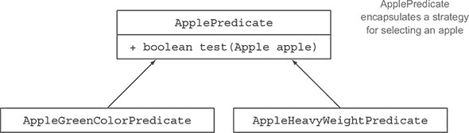

```
public class AppleHeavyWeightPredicate implements ApplePredicate {   *1*
    public boolean test(Apple apple) {
        return apple.getWeight() > 150;
    }
}
public class AppleGreenColorPredicate implements ApplePredicate {    *2*
    public boolean test(Apple apple) {
        return GREEN.equals(apple.getColor());
    }
}
```

+   ***1* 只选择重苹果**

+   ***2* 只选择绿色苹果**

你可以将这些标准视为 `filter` 方法的不同行为。你所做的与策略设计模式（见 [`en.wikipedia.org/wiki/Strategy_pattern`](http://en.wikipedia.org/wiki/Strategy_pattern)）相关，它允许你定义一组算法，封装每个算法（称为策略），并在运行时选择一个算法。在这种情况下，算法组是 `ApplePredicate`，不同的策略是 `AppleHeavyWeightPredicate` 和 `AppleGreenColorPredicate`。

但你如何利用 `ApplePredicate` 的不同实现呢？你需要让 `filterApples` 方法接受 `ApplePredicate` 对象来测试 `Apple` 上的条件。这就是**行为参数化**的含义：告诉方法**接受**多种行为（或策略）作为参数，并在内部使用它们来实现不同的行为。

要在运行示例中实现这一点，你需要在 `filterApples` 方法中添加一个参数来接受 `ApplePredicate` 对象。这带来了巨大的软件工程效益：你现在可以分离 `filter-Apples` 方法内部迭代的集合逻辑与应用于集合每个元素的**行为**（在这种情况下是一个谓词）。

#### 2.2.1\. 第四次尝试：通过抽象标准进行过滤

我们修改后的使用 `ApplePredicate` 的 `filter` 方法看起来是这样的：

```
public static List<Apple> filterApples(List<Apple> inventory,
                                       ApplePredicate p) {
    List<Apple> result = new ArrayList<>();
    for(Apple apple: inventory) {
        if(p.test(apple)) {                       *1*
            result.add(apple);
        }
    }
    return result;
}
```

+   ***1* 判定 `p` 封装了对苹果进行测试的条件。**

##### 传递代码/行为

值得停下来稍作庆祝。这段代码比我们的第一次尝试更加灵活，但同时也易于阅读和使用！你现在可以创建不同的 `ApplePredicate` 对象并将它们传递给 `filterApples` 方法。自由灵活性！例如，如果农民要求你找到所有重量超过 150 克的红苹果，你所需要做的就是创建一个实现了 `ApplePredicate` 的类。你的代码现在足够灵活，可以应对任何涉及 `Apple` 属性的要求变化：

```
public class AppleRedAndHeavyPredicate implements ApplePredicate {
        public boolean test(Apple apple){
                return RED.equals(apple.getColor())
                       && apple.getWeight() > 150;
        }
}
List<Apple> redAndHeavyApples =
    filterApples(inventory, new AppleRedAndHeavyPredicate());
```

你已经实现了一些酷炫的功能；`filterApples` 方法的**行为**取决于你通过 `ApplePredicate` 对象传递给它的**代码**。你已经参数化了 `filterApples` 方法的**行为**！

注意，在先前的例子中，唯一重要的代码是`test`方法的实现，如图 2.2 所示；这是定义`filterApples`方法新行为的地方。不幸的是，因为`filterApples`方法只能接受对象，你必须将这段代码包裹在一个`ApplePredicate`对象中。你所做的是类似于内联传递代码，因为你通过实现`test`方法的对象传递了一个`boolean`表达式。你将在第 2.3 节（以及在第三章中更详细地）看到，通过使用 lambda 表达式，你可以直接将表达式`RED.equals(apple.getColor()) && apple.getWeight() > 150`传递给`filterApples`方法，而无需定义多个`ApplePredicate`类。这减少了不必要的冗余。

##### 图 2.2\. 参数化`filterApples`的行为并传递不同的过滤策略

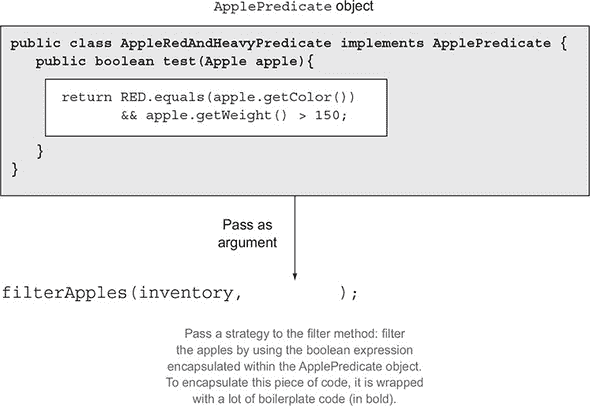

##### 多种行为，一个参数

如我们之前所解释的，行为参数化非常出色，因为它允许你将迭代集合以进行过滤的逻辑与应用于该集合每个元素的行为分开。因此，你可以重用相同的方法，并给它赋予不同的行为以实现不同的功能，如图 2.3 所示。这就是为什么*行为参数化*是一个你应该在你的工具集中拥有的有用概念，用于创建灵活的 API。

##### 图 2.3\. 参数化`filterApples`的行为并传递不同的过滤策略

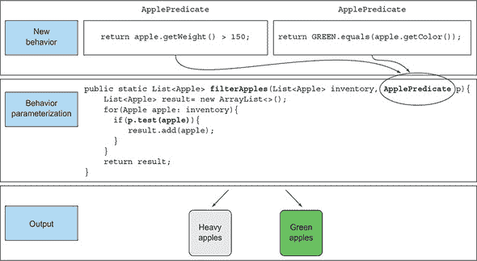

为了确保你对行为参数化的概念感到舒适，尝试做练习 2.1！

|  |
| --- |

**练习 2.1：编写一个灵活的`prettyPrintApple`方法**

编写一个`prettyPrintApple`方法，它接受一个`Apple`的`List`，并且可以通过多种方式参数化，从`apple`生成一个`String`输出（有点像多个定制的`toString`方法）。例如，你可以告诉你的`pretty-PrintApple`方法只打印每个苹果的重量。此外，你可以告诉你的`prettyPrintApple`方法逐个打印每个苹果，并说明它是重还是轻。解决方案与我们已经探索过的过滤示例类似。为了帮助你开始，我们提供了一个`pretty-PrintApple`方法的粗略框架：

```
public static void prettyPrintApple(List<Apple> inventory, ???) {
    for(Apple apple: inventory) {
        String output = ???.???(apple);
        System.out.println(output);
    }
}
```

**答案：**

首先，你需要一种方式来表示一个接受`Apple`并返回格式化`String`结果的行为。你在创建`Apple-Predicate`接口时做过类似的事情：

```
public interface AppleFormatter {
    String accept(Apple a);
}
```

你现在可以通过实现`Apple-Formatter`接口来表示多个格式化行为：

```
public class AppleFancyFormatter implements AppleFormatter {
    public String accept(Apple apple) {
        String characteristic = apple.getWeight() > 150 ? "heavy" : "light";
        return "A " + characteristic +
               " " + apple.getColor() +" apple";
    }
}
public class AppleSimpleFormatter implements AppleFormatter {
    public String accept(Apple apple) {
        return "An apple of " + apple.getWeight() + "g";
    }
}
```

最后，你需要告诉你的`prettyPrintApple`方法接受`AppleFormatter`对象并内部使用它们。你可以通过向`pretty-PrintApple`添加一个参数来实现这一点：

```
public static void prettyPrintApple(List<Apple> inventory,
                                    AppleFormatter formatter) {
  for(Apple apple: inventory) {
    String output = formatter.accept(apple);
    System.out.println(output);
  }
}
```

Bingo！你现在能够将多个行为传递给 `prettyPrintApple` 方法。你是通过实例化 `AppleFormatter` 的实现并将它们作为参数传递给 `prettyPrintApple` 来做到这一点的：

```
prettyPrintApple(inventory, new AppleFancyFormatter());
```

这将产生类似以下输出的结果

```
A light green apple
A heavy red apple
...
```

或者试试这个：

```
prettyPrintApple(inventory, new AppleSimpleFormatter());
```

这将产生类似以下输出的结果

```
An apple of 80g
An apple of 155g
...
```

|  |
| --- |

你已经看到你可以抽象行为并使你的代码适应需求变化，但这个过程很冗长，因为你需要声明多个你只实例化一次的类。让我们看看如何改进这一点。

### 2.3\. 解决冗余

我们都知道，使用起来不方便的功能或概念会被避免。目前，当你想要将新行为传递给 `filterApples` 方法时，你必须声明几个实现 `ApplePredicate` 接口的类，然后实例化几个你只分配一次的 `ApplePredicate` 对象，如下列所示，总结了到目前为止你所看到的。这涉及到很多冗余，并且是一个耗时过程！

##### 列表 2.1\. 行为参数化：使用谓词过滤苹果

```
public class AppleHeavyWeightPredicate implements ApplePredicate {      *1*
    public boolean test(Apple apple) {
        return apple.getWeight() > 150;
    }
}
public class AppleGreenColorPredicate implements ApplePredicate {       *2*
    public boolean test(Apple apple) {
        return GREEN.equals(apple.getColor());
    }
}
public class FilteringApples {
    public static void main(String...args) {
        List<Apple> inventory = Arrays.asList(new Apple(80, GREEN),
                                              new Apple(155, GREEN),
                                              new Apple(120, RED));
        List<Apple> heavyApples =
            filterApples(inventory, new AppleHeavyWeightPredicate());   *3*
        List<Apple> greenApples =
            filterApples(inventory, new AppleGreenColorPredicate());    *4*
    }
    public static List<Apple> filterApples(List<Apple> inventory,
                                           ApplePredicate p) {
        List<Apple> result = new ArrayList<>();
        for (Apple apple : inventory) {
            if (p.test(apple)){
                result.add(apple);
            }
        }
        return result;
    }
}
```

+   ***1* 选择重苹果**

+   ***2* 选择绿色苹果**

+   ***3* 结果是一个包含一个 155 克苹果的列表**

+   ***4* 结果是一个包含两个绿色苹果的列表**

这是不必要的开销。你能做得更好吗？Java 有称为 *匿名类* 的机制，它允许你同时声明和实例化一个类。它们使你能够通过使代码更加简洁来进一步提高你的代码。但它们并不完全令人满意。第 2.3.3 节 预览了下一章，简要介绍了 lambda 表达式如何使你的代码更易读。

#### 2.3.1\. 匿名类

*匿名类* 就像你在 Java 中已经熟悉的局部类（在代码块中定义的类）。但匿名类没有名字。它们允许你同时声明和实例化一个类。简而言之，它们允许你创建临时的实现。

#### 2.3.2\. 第五次尝试：使用匿名类

以下代码展示了如何通过创建一个实现 `ApplePredicate` 的对象来使用匿名类重写过滤示例：

```
List<Apple> redApples = filterApples(inventory, new ApplePredicate() {     *1*
    public boolean test(Apple apple){
        return RED.equals(apple.getColor());
    }
});
```

+   ***1* 使用匿名类参数化方法 filterApples 的行为。**

匿名类常用于 GUI 应用程序的上下文中，用于创建事件处理对象。我们不想唤起 Swing 的痛苦记忆，但以下是在实践中常见的模式（这里使用 JavaFX API，Java 的现代 UI 平台）：

```
button.setOnAction(new EventHandler<ActionEvent>() {
    public void handle(ActionEvent event) {
        System.out.println("Whoooo a click!!");
    }
});
```

但匿名类仍然不够好。首先，它们往往很庞大，因为它们占用了很多空间，正如这里使用加粗的代码所展示的，使用了之前相同的两个示例：

```
List<Apple> redApples = filterApples(inventory, new ApplePredicate() {   *1*
    public boolean test(Apple a){
        return RED.equals(a.getColor());
    }
});
button.setOnAction(new EventHandler<ActionEvent>() {                     *1*
    public void handle(ActionEvent event) {
        System.out.println("Whoooo a click!!");
    }
```

+   ***1* 大量样板代码**

第二，许多程序员发现它们难以使用。例如，练习 2.2 展示了一个经典的 Java 难题，它会让大多数程序员措手不及！试试你的手。

|  |
| --- |

**练习 2.2：匿名类难题**

当这段代码执行时，输出将会是 `4`、`5`、`6` 还是 `42`？

```
public class MeaningOfThis {
    public final int value = 4;
    public void doIt() {
        int value = 6;
        Runnable r = new Runnable() {
                public final int value = 5;
                public void run(){
                    int value = 10;
                    System.out.println(this.value);
                }
            };
            r.run();
        }
        public static void main(String...args) {
            MeaningOfThis m = new MeaningOfThis();
            m.doIt();                                *1*
        }
}
```

+   ***1* 这行代码的输出是什么？**

**答案：**

答案是 `5`，因为 `this` 指的是封装的 `Runnable`，而不是封装的类 `MeaningOfThis`。

|  |
| --- |

通常来说，冗长性是坏事；它因为编写和维护冗长的代码需要很长时间，而且阅读起来不愉快，所以会阻碍语言特性的使用！好的代码应该一眼就能理解。尽管匿名类在一定程度上解决了为接口声明多个具体类所关联的冗长性，但它们仍然不尽如人意。在传递简单代码片段（例如，表示选择标准的 `boolean` 表达式）的上下文中，你仍然需要创建一个对象并显式实现一个方法来定义新的行为（例如，`Predicate` 的 `test` 方法或 `EventHandler` 的 `handle` 方法）。

理想情况下，我们希望鼓励程序员使用行为参数化模式，因为正如你所看到的，它使你的代码更能适应需求变化。在第三章中，你将看到 Java 8 语言设计者通过引入 lambda 表达式，一种更简洁的传递代码的方式，解决了这个问题。悬念已经足够；以下是对 lambda 表达式如何帮助你追求干净代码的简要预览。

#### 2.3.3\. 第六次尝试：使用 lambda 表达式

之前的代码可以用以下方式在 Java 8 中使用 lambda 表达式重写：

```
List<Apple> result =
  filterApples(inventory, (Apple apple) -> RED.equals(apple.getColor()));
```

你必须承认，这段代码看起来比我们之前的尝试干净得多！它很棒，因为它开始看起来与问题陈述非常接近。我们现在已经解决了冗长性问题。图 2.4 总结了到目前为止的旅程。

##### 图 2.4\. 行为参数化与值参数化

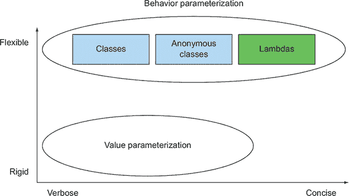

#### 2.3.4\. 第七次尝试：在 List 类型上抽象

在你向抽象化迈进的过程中，你还可以做一步。目前，`filterApples` 方法只适用于 `Apple`。但你也可以对 `List` 类型进行抽象，从而超越你思考的问题域，如下所示：

```
public interface Predicate<T> {
    boolean test(T t);
}
public static <T> List<T> filter(List<T> list, Predicate<T> p) {     *1*
    List<T> result = new ArrayList<>();
    for(T e: list) {
        if(p.test(e)) {
            result.add(e);
        }
    }
    return result;
}
```

+   ***1* 引入类型参数 T**

你现在可以使用 `filter` 方法与香蕉、橙子、`Integer` 或 `String` 的 `List`！以下是一个使用 lambda 表达式的示例：

```
List<Apple> redApples =
  filter(inventory, (Apple apple) -> RED.equals(apple.getColor()));
List<Integer> evenNumbers =
  filter(numbers, (Integer i) -> i % 2 == 0);
```

这不酷吗？你成功地找到了灵活性和简洁性之间的甜点，这在 Java 8 之前是不可能的！

### 2.4\. 现实世界示例

你现在已经看到，行为参数化是一种有用的模式，可以轻松适应不断变化的需求。此模式允许你封装一个行为（一段代码），并通过传递和使用你创建的行为（例如，为`Apple`的不同谓词）来参数化方法的行为。我们之前提到，这种方法类似于策略设计模式。你可能已经在实践中使用过这种模式。Java API 中的许多方法可以用不同的行为进行参数化。这些方法通常与匿名类一起使用。我们展示了四个示例，这些示例应该会巩固你传递代码的想法：使用`Comparator`进行排序、使用`Runnable`执行代码块、使用`Callable`从任务返回结果以及 GUI 事件处理。

#### 2.4.1\. 使用 Comparator 进行排序

对集合进行排序是一个常见的编程任务。例如，假设你的农民想要你根据苹果的重量对库存进行排序。或者，也许他改变了主意，想要你按颜色对苹果进行排序。听起来熟悉吗？是的，你需要一种方式来表示和使用不同的排序行为，以便轻松适应不断变化的需求。

从 Java 8 开始，`List`自带了一个`sort`方法（你也可以使用`Collections.sort`）。`sort`的行为可以使用`java.util.Comparator`对象进行参数化，该对象具有以下接口：

```
// java.util.Comparator
public interface Comparator<T> {
    int compare(T o1, T o2);
}
```

因此，你可以通过创建一个专门实现的`Comparator`来为`sort`方法创建不同的行为。例如，你可以使用它来按增加的重量对库存进行排序，使用匿名类：

```
inventory.sort(new Comparator<Apple>() {
public int compare(Apple a1, Apple a2) {
return a1.getWeight().compareTo(a2.getWeight());
}
});
```

如果农民改变了他对如何排序苹果的想法，你可以创建一个专门匹配新要求的`Comparator`并将其传递给`sort`方法。如何排序的内部细节被抽象掉了。使用 lambda 表达式，它将如下所示：

```
inventory.sort(
  (Apple a1, Apple a2) -> a1.getWeight().compareTo(a2.getWeight()));
```

再次，现在不必担心这个新的语法；下一章将详细介绍如何编写和使用 lambda 表达式。

#### 2.4.2\. 使用 Runnable 执行代码块

Java *线程*允许代码块与程序的其他部分并发执行。但你怎么告诉一个线程它应该运行哪个代码块？可能有几个线程各自运行不同的代码。你需要一种方式来表示稍后要执行的代码。在 Java 8 之前，只能将对象传递给`Thread`构造函数，因此典型的笨拙使用模式是将包含返回`void`（无结果）的`run`方法的匿名类传递给`Thread`构造函数。这样的匿名类实现了`Runnable`接口。

在 Java 中，你可以使用`Runnable`接口来表示要执行的代码块；请注意，代码返回`void`（无结果）：

```
// java.lang.Runnable
public interface Runnable {
    void run();
}
```

你可以使用此接口创建具有你选择的行为的线程，如下所示：

```
Thread t = new Thread(new Runnable() {
    public void run() {
        System.out.println("Hello world");
    }
});
```

但自从 Java 8 以来，你可以使用 lambda 表达式，因此对`Thread`的调用将如下所示：

```
Thread t = new Thread(() -> System.out.println("Hello world"));
```

#### 2.4.3\. 使用 Callable 返回结果

你可能熟悉 Java 5 中引入的`ExecutorService`抽象。与使用线程和`Runnable`相比，`ExecutorService`接口解耦了任务提交和执行的方式。与使用线程和`Runnable`相比，`ExecutorService`的好处是，通过使用`ExecutorService`，你可以将任务发送到线程池，并将结果存储在`Future`中。不用担心这对你来说不熟悉，我们将在后续章节中详细讨论并发时再次回到这个话题。现在，你需要知道的是，`Callable`接口用于模拟返回结果的任务。你可以将其视为升级版的`Runnable`：

```
// java.util.concurrent.Callable
public interface Callable<V> {
    V call();
}
```

你可以通过提交任务到执行服务来使用它。在这里，你返回负责执行任务的`Thread`的名称：

```
ExecutorService executorService = Executors.newCachedThreadPool();
Future<String> threadName = executorService.submit(new Callable<String>() {
    @Override
    public String call() throws Exception {
        return Thread.currentThread().getName();
    }
});
```

使用 lambda 表达式，这段代码可以简化为以下形式：

```
Future<String> threadName = executorService.submit(
                     () -> Thread.currentThread().getName());
```

#### 2.4.4. GUI 事件处理

在图形用户界面编程中，一个典型的模式是在响应某些事件时执行一个动作，例如点击或悬停在文本上。例如，如果用户点击发送按钮，你可能希望显示一个弹出窗口或者记录这个动作到一个文件中。再次强调，你需要一种应对变化的方法；你应该能够执行任何响应。在 JavaFX 中，你可以使用`EventHandler`通过将其传递给`setOnAction`来表示对事件的响应：

```
Button button = new Button("Send");
button.setOnAction(new EventHandler<ActionEvent>() {
    public void handle(ActionEvent event) {
        label.setText("Sent!!");
    }
});
```

在这里，`setOnAction`方法的行为通过`EventHandler`对象进行参数化。使用 lambda 表达式，它看起来如下：

```
button.setOnAction((ActionEvent event) -> label.setText("Sent!!"));
```

### 概述

+   行为参数化是方法能够*接受*多种不同的行为作为参数，并在内部使用它们来实现不同的行为的能力。

+   行为参数化使你的代码更能适应不断变化的需求，并在未来节省工程努力。

+   将代码作为参数传递是一种将新的行为作为参数传递给方法的方式。但在 Java 8 之前，这种方式比较冗长。匿名类在 Java 8 之前有所帮助，可以减少为仅需要一次的接口声明多个具体类时的冗长。

+   Java API 包含许多可以参数化不同行为的方法，包括排序、线程和 GUI 处理。

## 第三章。Lambda 表达式

*本章涵盖*

+   简而言之，lambda

+   lambda 的使用位置和方式

+   执行环绕模式

+   函数式接口，类型推断

+   方法引用

+   组合 lambda

在上一章中，你看到使用行为参数化传递代码对于应对代码中频繁的需求变化是有用的。它允许你定义一个表示行为的代码块，然后将其传递。你可以决定在某个事件发生时（例如，按钮点击）或在算法的某些点上（例如，过滤算法中的“只有重量超过 150 克的苹果”谓词或排序中的自定义比较操作）运行该代码块。一般来说，使用这个概念，你可以编写更灵活和可重用的代码。

但你看到使用匿名类来表示不同的行为是不令人满意的。它很冗长，这并不鼓励程序员在实际中采用行为参数化。在本章中，我们将向你介绍 Java 8 中的一个新特性，它解决了这个问题：lambda 表达式。它们允许你以简洁的方式表示行为或传递代码。目前你可以将 lambda 表达式视为匿名函数，即没有声明名称的方法，但也可以像匿名类一样将其作为方法参数传递。

我们将展示如何构建它们，在哪里使用它们，以及如何通过使用它们来使你的代码更简洁。我们还解释了一些新的特性，如类型推断和 Java 8 API 中可用的新的重要接口。最后，我们介绍了方法引用，这是一个与 lambda 表达式相辅相成的新特性。

本章的组织方式旨在逐步教你如何编写更简洁和灵活的代码。在本章结束时，我们将所有教授的概念结合到一个具体的例子中；我们采用第二章中展示的排序示例，并逐步使用 lambda 表达式和方法引用来改进它，使其更简洁、更易读。本章本身很重要，而且因为你将在整本书中广泛使用 lambda 表达式。

### 3.1. Lambda 简述

*Lambda 表达式*可以理解为一种匿名函数的简洁表示，它可以被传递。它没有名称，但它有一个参数列表、一个主体、一个返回类型，也可能有一个可以抛出的异常列表。这是一个很大的定义；让我们将其分解：

+   ***匿名***—**我们称之为“匿名”，因为它没有像方法那样具有显式的名称；写起来更少，思考起来也更少！

+   ***函数***—**我们称之为“函数”，因为 lambda 并不与特定的类相关联，就像方法一样。但像方法一样，lambda 有一个参数列表、一个主体、一个返回类型，以及可能抛出的异常列表。

+   ***传递***—**Lambda 表达式可以作为方法参数传递或存储在变量中。

+   ***简洁***—**你不需要像匿名类那样编写很多样板代码。

如果你想知道术语*lambda*的来源，它起源于一个在学术界开发的系统，称为*lambda calculus*，用于描述计算。

你为什么应该关注 lambda 表达式？你在上一章中看到，在 Java 中传递代码目前既繁琐又冗长。好消息是！Lambdas 解决了这个问题；它们让你以简洁的方式传递代码。从技术上讲，Lambdas 并没有让你做任何在 Java 8 之前做不到的事情。但你不再需要编写使用匿名类的笨拙代码来从行为参数化中受益！Lambda 表达式将鼓励你采用我们在上一章中描述的行为参数化风格。最终结果是，你的代码将更加清晰和灵活。例如，使用 lambda 表达式，你可以以更简洁的方式创建一个自定义的`Comparator`对象。

在使用之前：

```
Comparator<Apple> byWeight = new Comparator<Apple>() {
    public int compare(Apple a1, Apple a2){
        return a1.getWeight().compareTo(a2.getWeight());
    }
};
```

在使用 lambda 表达式之后：

```
Comparator<Apple> byWeight =
    (Apple a1, Apple a2) -> a1.getWeight().compareTo(a2.getWeight());
```

你必须承认代码看起来更清晰！如果你觉得 lambda 表达式的所有部分现在还不明白，不用担心；我们很快就会解释所有这些部分。现在，请注意，你实际上只传递了比较两个苹果重量的所需代码。这看起来像是传递了`compare`方法体的内容。你很快就会学到你可以进一步简化你的代码。我们将在下一节中解释你可以在哪里以及如何使用 lambda 表达式。

我们刚刚展示的 lambda 有三个部分，如图 3.1 所示：

##### 图 3.1\. lambda 表达式由参数、箭头和体组成。

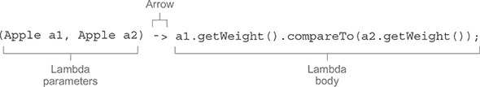

+   ***参数列表*——** 在这种情况下，它反映了`Comparator`的`compare`方法的参数——两个`Apple`。

+   ***箭头*——** 箭头`->`将参数列表与 lambda 体分开。

+   ***lambda 体的内容*——** 使用它们的重量比较两个`Apple`。表达式被认为是 lambda 的返回值。

为了进一步说明，以下列表显示了 Java 8 中五个有效的 lambda 表达式示例。

##### 列表 3.1\. Java 8 中的有效 lambda 表达式

```
(String s) -> s.length()                                             *1*
(Apple a) -> a.getWeight() > 150                                     *2*
(int x, int y) -> {
    System.out.println("Result:");
    System.out.println(x + y);
}                                                                    *3*
() -> 42                                                             *4*
(Apple a1, Apple a2) -> a1.getWeight().compareTo(a2.getWeight())     *5*
```

+   ***1* 接受一个类型为 String 的参数，并返回一个 int。它没有返回语句，因为返回是隐含的。**

+   ***2* 接受一个类型为 Apple 的参数，并返回一个布尔值（苹果是否重于 150 克）。**

+   ***3* 接受两个类型为 int 的参数，不返回任何值（void 返回）。它的体包含两个语句。**

+   ***4* 不接受任何参数，返回 int 42**

+   ***5* 接受两个类型为 Apple 的参数，并返回一个表示它们重量比较的 int**

这种语法是由 Java 语言设计者选择的，因为它在其他语言中得到了很好的反响，例如 C#和 Scala。JavaScript 有类似的语法。lambda 的基本语法是（称为*表达式式*lambda）

```
(parameters) -> expression
```

或（注意语句的括号，这种 lambda 通常被称为*块式*lambda）

```
(parameters) -> { statements; }
```

如你所见，lambda 表达式遵循简单的语法。通过练习 3.1 应该会让你知道你是否理解了这个模式。

|  |
| --- |

**练习 3.1：Lambda 语法**

根据刚刚展示的语法规则，以下哪些不是有效的 lambda 表达式？

1.  `() -> {}`

1.  `() -> "Raoul"`

1.  `() -> { return "Mario"; }`

1.  `(Integer i) -> return "Alan" + i;`

1.  `(String s) -> { "Iron Man"; }`

**答案：**

4 和 5 不是有效的 lambda 表达式；其余的都是有效的。详情：

1.  这个 lambda 没有参数，并返回`void`。它类似于一个空体的方法：`public void run() { }`。有趣的事实：这通常被称为汉堡 lambda。从侧面看看它，你会发现它有两个面包的形状，像汉堡。

1.  这个 lambda 没有参数，并返回一个`String`作为表达式。

1.  这个 lambda 没有参数，并返回一个`String`（使用显式的返回语句，在块中）。

1.  `return`是一个控制流语句。为了使这个 lambda 有效，需要花括号，如下所示：`(Integer i) -> { return "Alan" + i; }`。

1.  “钢铁侠”是一个表达式，不是一个语句。为了使这个 lambda 有效，你可以像下面这样移除花括号和分号：`(String s) -> "Iron Man"`。或者如果你更喜欢，你可以使用显式的返回语句，如下所示：`(String s) -> { return "Iron Man"; }`。

|  |
| --- |

表 3.1 这提供了一个带有用例示例的 lambda 表达式列表。

##### 表 3.1\. lambda 表达式示例

| 用例 | lambda 表达式示例 |
| --- | --- |
| 一个布尔表达式 | (List<String> list) -> list.isEmpty() |
| 创建对象 | () -> new Apple(10) |

| 从对象中消费 | (Apple a) -> { System.out.println(a.getWeight()); }

} |

| 从对象中选择/提取 | (String s) -> s.length() |
| --- | --- |
| 合并两个值 | (int a, int b) -> a * b |
| 比较两个对象 | (Apple a1, Apple a2) -> a1.getWeight().compareTo(a2.getWeight()) |

### 3.2\. 哪里以及如何使用 lambda 表达式

你可能现在想知道你可以在哪里使用 lambda 表达式。在之前的例子中，你将一个 lambda 赋值给了一个类型为`Comparator<Apple>`的变量。你也可以使用另一个 lambda，这是你在上一章中实现的`filter`方法：

```
List<Apple> greenApples =
        filter(inventory, (Apple a) -> GREEN.equals(a.getColor()));
```

你在哪里可以使用 lambda 表达式？你可以在函数式接口的上下文中使用 lambda 表达式。在下面的代码中，你可以将一个 lambda 作为`filter`方法的第二个参数传递，因为该方法期望一个类型为`Predicate<T>`的对象，这是一个函数式接口。不用担心这听起来很抽象；我们现在将详细解释这意味着什么以及什么是函数式接口。

#### 3.2.1\. 函数式接口

记得你在第二章中创建的`Predicate<T>`接口，以便你可以参数化`filter`方法的行为？它是一个函数式接口！为什么？因为`Predicate`只指定了一个抽象方法：

```
public interface Predicate<T> {
    boolean test (T t);
}
```

简而言之，*功能接口*是一个指定恰好一个抽象方法的接口。你已经在 Java API 中知道了几个其他功能接口，如`Comparator`和`Runnable`，我们在第二章中探讨了这些接口：

```
public interface Comparator<T> {                           *1*
    int compare(T o1, T o2);
}
public interface Runnable {                                *2*
    void run();
}
public interface ActionListener extends EventListener {    *3*
    void actionPerformed(ActionEvent e);
}
public interface Callable<V> {                             *4*
    V call() throws Exception;
}
public interface PrivilegedAction<T> {                     *5*
    T run();
}
```

+   ***1* java.util.Comparator**

+   ***2* java.lang.Runnable**

+   ***3* java.awt.event.ActionListener**

+   ***4* java.util.concurrent.Callable**

+   ***5* java.security.PrivilegedAction**

|  |
| --- |

##### 注意

你会在第十三章中看到，接口现在也可以有*默认方法*（一个具有主体并提供某些默认实现的方法，以防类没有实现该方法）。只要它指定*仅一个抽象方法*，接口仍然是功能接口。

|  |
| --- |

为了检验你的理解，练习 3.2 应该让你知道你是否掌握了功能接口的概念。

|  |
| --- |

**练习 3.2：功能接口**

以下哪些接口是功能接口？

```
public interface Adder {
    int add(int a, int b);
}
public interface SmartAdder extends Adder {
    int add(double a, double b);
}
public interface Nothing {
}
```

**答案：**

只有`Adder`是功能接口。

`SmartAdder`不是一个功能接口，因为它指定了两个名为`add`的抽象方法（其中一个是从`Adder`继承的）。

`Nothing`不是一个功能接口，因为它根本不声明任何抽象方法。

|  |
| --- |

你可以用功能接口做什么？Lambda 表达式让你可以直接内联提供功能接口的抽象方法实现，并将整个表达式*视为功能接口的一个实例*（更技术地说，是功能接口的一个*具体实现*的实例）。你也可以用匿名内部类实现相同的功能，尽管这样做比较笨拙：你提供实现并直接内联实例化。以下代码是有效的，因为`Runnable`是一个只定义了一个抽象方法`run`的功能接口：

```
Runnable r1 = () -> System.out.println("Hello World 1");         *1*
Runnable r2 = new Runnable() {                                   *2*
    public void run() {
        System.out.println("Hello World 2");
    }
};
public static void process(Runnable r) {
    r.run();
}
process(r1);                                                     *3*
process(r2);                                                     *4*
process(() -> System.out.println("Hello World 3"));              *5*
```

+   ***1* 使用 Lambda 表达式**

+   ***2* 使用匿名内部类**

+   ***3* 打印“Hello World 1”**

+   ***4* 打印“Hello World 2”**

+   ***5* 使用 Lambda 表达式直接传递打印“Hello World 3”**

#### 3.2.2\. 函数描述符

功能接口的抽象方法签名描述了 Lambda 表达式的签名。我们称这个抽象方法为*函数描述符*。例如，`Runnable`接口可以被视为一个接受无参数并返回无参数（`void`）的函数签名，因为它只有一个名为`run`的抽象方法，它接受无参数并返回无参数（`void`）。^([1])

> ¹
> 
> 一些语言，如 Scala，在其类型系统中提供显式的类型注解来描述函数的类型（称为函数类型）。Java 重用功能接口提供的现有命名类型，并在幕后将它们映射为函数类型的形式。

我们在本章中使用了特殊的符号来描述 lambda 表达式和函数式接口的签名。符号`() -> void`表示一个没有参数列表且返回`void`的函数。这正是`Runnable`接口所表示的。作为另一个例子，`(Apple, Apple) -> int`表示一个接受两个`Apple`作为参数并返回`int`的函数。我们将在本章后面的第 3.4 节和表 3.2 中提供更多关于函数描述符的信息。

你可能已经在想 lambda 表达式是如何进行类型检查的。我们将在第 3.5 节中详细说明编译器是如何检查一个 lambda 表达式在特定上下文中是否有效的。现在，只需理解一个 lambda 表达式可以被赋值给一个变量或者传递给期望一个函数式接口作为参数的方法，前提是这个 lambda 表达式的签名与函数式接口的抽象方法相同。例如，在我们之前的例子中，你可以直接将一个 lambda 表达式传递给`process`方法，如下所示：

```
public void process(Runnable r) {
    r.run();
}
process(() -> System.out.println("This is awesome!!"));
```

当这段代码执行时，将打印出“这是惊人的！！”这个 lambda 表达式`() -> System.out.println("This is awesome!!")`不接受任何参数并返回`void`。这正是`Runnable`接口中定义的`run`方法的签名。

|  |
| --- |

**Lambda 表达式和 void 方法调用**

虽然这可能会感觉有些奇怪，但以下 lambda 表达式是有效的：

```
process(() -> System.out.println("This is awesome"));
```

最后，`System.out.println`返回`void`，所以这显然不是一个表达式！为什么我们不需要像这样用大括号括起主体呢？

```
process(() -> { System.out.println("This is awesome"); });
```

事实上，Java 语言规范中定义了一个特殊的规则，用于 void 方法调用。你不需要将单个 void 方法调用用大括号括起来。

|  |
| --- |

你可能想知道，“为什么我们只能在期望函数式接口的地方传递 lambda 表达式？”语言设计者考虑了其他方法，例如添加函数类型（有点像我们用来描述 lambda 表达式签名的特殊符号——我们将在第二十章和第二十一章中重新讨论这个话题）到 Java 中。但他们选择了这种方式，因为它自然地适应了语言，而没有增加语言的复杂性。此外，大多数 Java 程序员已经熟悉只有一个抽象方法的接口的概念（例如，用于事件处理）。然而，最重要的原因是函数式接口在 Java 8 之前已经被广泛使用。这意味着它们为使用 lambda 表达式提供了一个很好的迁移路径。实际上，如果你一直在使用`Comparator`和`Runnable`这样的函数式接口，或者甚至是你自己的只定义了一个抽象方法的接口，你现在可以使用 lambda 表达式而不需要更改你的 API。尝试练习 3.3 来测试你对 lambda 表达式可用位置的了解。

|  |
| --- |

**练习 3.3：你可以在哪里使用 lambda 表达式？**

以下哪些是 lambda 表达式的有效用法？

1.  ```
    execute(() -> {});
    public void execute(Runnable r) {
      r.run();
    }
    ```

1.  ```
    public Callable<String> fetch() {
      return () -> "Tricky example ;-)";
    }
    ```

1.  ```
    Predicate<Apple> p = (Apple a) -> a.getWeight();
    ```

**答案：**

只有 1 和 2 是有效的。

第一个示例是有效的，因为 lambda 表达式 `() -> {}` 的签名是 `() -> void`，这与在 `Runnable` 中定义的抽象方法 `run` 的签名相匹配。请注意，运行此代码将不会做任何事情，因为 lambda 表达式的主体是空的！

第二个示例也是有效的。实际上，方法 `fetch` 的返回类型是 `Callable<String>`。当 `T` 被替换为 `String` 时，`Callable<String>` 定义了一个具有签名 `() -> String` 的方法。因为 lambda 表达式 `() -> "Tricky example ;-)"` 的签名是 `() -> String`，所以这个 lambda 表达式可以用于这个上下文中。

第三个示例是无效的，因为 lambda 表达式 `(Apple a) -> a.getWeight()` 的签名是 `(Apple) -> Integer`，这与在 `Predicate<Apple>` 中定义的方法 `test` 的签名不同：`(Apple) -> boolean`。

|  |
| --- |
|  |

**关于 @FunctionalInterface 呢？**

如果你探索新的 Java API，你会注意到功能接口通常都带有 `@FunctionalInterface.` 注解（我们在 第 3.4 节 中展示了详尽的列表，其中我们深入探讨了如何使用功能接口。）这个注解用于指示该接口旨在作为功能接口，因此对文档很有用。此外，如果你使用 `@FunctionalInterface` 注解定义了一个接口，但该接口不是功能接口，编译器将返回一个有意义的错误。例如，错误信息可能是“接口 Foo 中发现多个非覆盖的抽象方法”，这表明有多个抽象方法可用。请注意，`@FunctionalInterface` 注解不是强制的，但在设计接口用于此目的时使用它是良好的实践。你可以将其视为表示方法被重写的 `@Override` 注解。

|  |
| --- |

### 3.3. 将 lambda 表达式应用于实践：执行周围模式

让我们看看 lambda 表达式与行为参数化结合使用的一个示例，如何在实践中使用它们使代码更加灵活和简洁。在资源处理（例如，处理文件或数据库）中，一个常见的模式是打开资源，对其进行一些处理，然后关闭资源。设置和清理阶段总是相似的，并围绕着执行处理的重要代码。这被称为 *执行周围* 模式，如图 3.2 所示。例如，在下面的代码中，突出显示的行显示了从文件中读取一行所需的样板代码（注意，你还使用了 Java 7 的 try-with-resources 语句，这已经简化了代码，因为你不需要显式关闭资源）：

##### 图 3.2. 任务 A 和 B 被负责准备/清理的样板代码所包围。

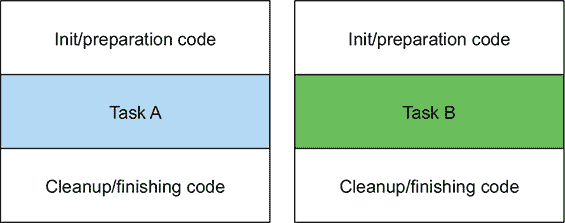

```
public String processFile() throws IOException {
try (BufferedReader br =
             new BufferedReader(new FileReader("data.txt"))) {
        return br.readLine();                                     *1*
    }
}
```

+   ***1* 这是执行有用工作的行。**

#### 3.3.1\. 第 1 步：记住行为参数化

这段当前代码有限。您只能读取文件的第一行。如果您想返回前两行，甚至是最常用的单词怎么办？理想情况下，您希望重用设置和清理的代码，并告诉 `processFile` 方法对文件执行不同的操作。这听起来熟悉吗？是的，您需要参数化 `processFile` 的行为。您需要一种方式将行为传递给 `processFile`，以便它可以使用 `BufferedReader` 执行不同的行为。

传递行为正是 lambda 表达式的用途。如果您想一次读取两行，新的 `processFile` 方法应该是什么样子？您需要一个接受 `BufferedReader` 并返回 `String` 的 lambda 表达式。例如，以下是如何打印 `BufferedReader` 的两行：

```
String result
    = processFile((BufferedReader br) -> br.readLine() + br.readLine());
```

#### 3.3.2\. 第 2 步：使用函数式接口传递行为

我们之前解释过，lambda 表达式只能在函数式接口的上下文中使用。您需要创建一个与签名 `BufferedReader -> String` 匹配的接口，并且可能抛出 `IOException`。让我们称这个接口为 `BufferedReaderProcessor`：

```
@FunctionalInterface
public interface BufferedReaderProcessor {
    String process(BufferedReader b) throws IOException;
}
```

您现在可以使用此接口作为您新 `processFile` 方法的参数：

```
public String processFile(BufferedReaderProcessor p) throws IOException {
   ...
}
```

#### 3.3.3\. 第 3 步：执行行为！

任何形式为 `BufferedReader -> String` 的 lambda 表达式都可以作为参数传递，因为它们与 `BufferedReaderProcessor` 接口中定义的 `process` 方法的签名相匹配。现在您只需要一种方式来执行 lambda 表达式在 `processFile` 方法体中代表的代码。记住，lambda 表达式允许您直接内联提供函数式接口抽象方法的实现，并且它们 *将整个表达式视为函数式接口的一个实例*。因此，您可以在 `processFile` 方法体内部调用 `process` 方法来执行处理：

```
public String processFile(BufferedReaderProcessor p) throws IOException {
    try (BufferedReader br =
                   new BufferedReader(new FileReader("data.txt"))) {
        return p.process(br);                                          *1*
    }
}
```

+   ***1* 处理 BufferedReader 对象**

#### 3.3.4\. 第 4 步：传递 lambda 表达式

你现在可以重用 `processFile` 方法，并通过传递不同的 lambda 表达式以不同的方式处理文件。

以下展示了处理单行的示例：

```
String oneLine =
    processFile((BufferedReader br) -> br.readLine());
```

以下展示了处理两行的示例：

```
String twoLines =
    processFile((BufferedReader br) -> br.readLine() + br.readLine());
```

图 3.3 总结了使 `processFile` 方法更灵活所采取的四个步骤。

##### 图 3.3\. 应用执行环绕模式的四步过程

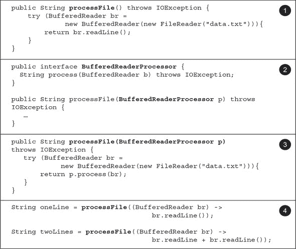

我们已经展示了如何使用函数式接口来传递 lambda 表达式。但您必须定义自己的接口。在下一节中，我们将探讨 Java 8 中添加的新接口，您可以使用这些接口重用来传递多个不同的 lambda 表达式。

### 3.4\. 使用函数式接口

如你在 3.2.1 节 中所学，函数式接口指定了恰好一个抽象方法。函数式接口很有用，因为抽象方法的签名可以描述 lambda 表达式的签名。函数式接口中抽象方法的签名被称为 *函数描述符*。为了使用不同的 lambda 表达式，你需要一组可以描述常见函数描述符的函数式接口。Java API 中已经存在几个函数式接口，如 `Comparable`、`Runnable` 和 `Callable`，这些你在 3.2 节 中已经看到。

Java 8 的库设计者通过在 `java.util.function` 包内引入了几个新的函数式接口来帮助你。接下来我们将描述 `Predicate`、`Consumer` 和 `Function` 接口。更完整的列表可以在本节末尾的 表 3.2 中找到。

#### 3.4.1\. 断言

`java.util.function.Predicate<T>` 接口定义了一个名为 `test` 的抽象方法，它接受一个泛型类型 `T` 的对象并返回一个 `boolean`。它与之前你创建的那个完全相同，但它直接可用！当你需要表示使用类型 `T` 的对象的布尔表达式时，你可能想使用这个接口。例如，你可以定义一个接受 `String` 对象的 lambda，如下所示。

##### 列表 3.2\. 使用 `Predicate`

```
@FunctionalInterface
public interface Predicate<T> {
    boolean test(T t);
}
public <T> List<T> filter(List<T> list, Predicate<T> p) {
    List<T> results = new ArrayList<>();
    for(T t: list) {
        if(p.test(t)) {
            results.add(t);
        }
    }
    return results;
}
Predicate<String> nonEmptyStringPredicate = (String s) -> !s.isEmpty();
List<String> nonEmpty = filter(listOfStrings, nonEmptyStringPredicate);
```

如果你查看 `Predicate` 接口的 Javadoc 规范，你可能会注意到额外的 `and` 和 `or` 方法。现在不必担心它们。我们将在 3.8 节 回到这些内容。

#### 3.4.2\. Consumer

`java.util.function.Consumer<T>` 接口定义了一个名为 `accept` 的抽象方法，它接受一个泛型类型 `T` 的对象并返回无结果（`void`）。当你需要访问类型 `T` 的对象并对它执行一些操作时，你可能使用这个接口。例如，你可以使用它来创建一个 `forEach` 方法，该方法接受一个 `Integer` 列表并对该列表的每个元素执行操作。在下面的列表中，你将使用这个 `forEach` 方法结合 lambda 来打印列表中的所有元素。

##### 列表 3.3\. 使用 `Consumer`

```
@FunctionalInterface
public interface Consumer<T> {
    void accept(T t);
}
public <T> void forEach(List<T> list, Consumer<T> c) {
    for(T t: list) {
        c.accept(t);
    }
}
forEach(
         Arrays.asList(1,2,3,4,5),
        (Integer i) -> System.out.println(i)         *1*
       );
```

+   ***1* Lambda 是 Consumer 接口中 accept 方法的实现。**

#### 3.4.3\. Function

`java.util.function.Function<T, R>` 接口定义了一个名为 `apply` 的抽象方法，它接受一个泛型类型 `T` 的对象作为输入并返回一个泛型类型 `R` 的对象。当你需要定义一个将信息从输入对象映射到输出（例如，提取苹果的重量或将字符串映射到其长度）的 lambda 时，你可能使用这个接口。在下面的列表中，我们展示了如何使用它来创建一个 `map` 方法，将 `String` 列表转换为包含每个 `String` 长度的 `Integer` 列表。

##### 列表 3.4\. 使用 `Function`

```
@FunctionalInterface
public interface Function<T, R> {
    R apply(T t);
}
public <T, R> List<R> map(List<T> list, Function<T, R> f) {
    List<R> result = new ArrayList<>();
    for(T t: list) {
        result.add(f.apply(t));
    }
    return result;
}
// [7, 2, 6]
List<Integer> l = map(
                       Arrays.asList("lambdas", "in", "action"),
                       (String s) -> s.length()                     *1*
               );
```

+   ***1* 实现 Function 的 apply 方法**

##### 原始特化

我们描述了三个泛型功能接口：`Predicate<T>`、`Consumer<T>`和`Function<T, R>`。还有一些针对特定类型进行了特化的功能接口。

为了稍微回顾一下：每个 Java 类型要么是引用类型（例如，`Byte`、`Integer`、`Object`、`List`），要么是原始类型（例如，`int`、`double`、`byte`、`char`）。但泛型参数（例如，`Consumer<T>`中的`T`）只能绑定到引用类型。这是由于泛型在内部实现的方式。因此，在 Java 中有一个机制将原始类型转换为相应的引用类型。这个机制称为*装箱*。相反的方法（将引用类型转换为相应的原始类型）称为*拆箱*。Java 还有一个*自动装箱*机制来简化程序员的任务：装箱和拆箱操作是自动完成的。例如，这就是为什么以下代码是有效的（一个`int`被装箱为一个`Integer`）：

> ²
> 
> 一些其他语言，如 C#，没有这种限制。其他语言，如 Scala，只有引用类型。我们将在第二十章中重新讨论这个问题。第二十章。

```
List<Integer> list = new ArrayList<>();
for (int i = 300; i < 400; i++){
    list.add(i);
}
```

但这会带来性能成本。装箱值是原始类型的包装，存储在堆上。因此，装箱值使用更多的内存，并且需要额外的内存查找来获取包装的原始值。

Java 8 还添加了我们之前描述的功能接口的特化版本，以避免在输入或输出为原始类型时进行自动装箱操作。例如，在以下代码中，使用`IntPredicate`避免了将值`1000`装箱的操作，而使用`Predicate<Integer>`则会将参数`1000`装箱为一个`Integer`对象：

```
public interface IntPredicate {
    boolean test(int t);
}
IntPredicate evenNumbers = (int i) -> i % 2 == 0;
evenNumbers.test(1000);                                        *1*
Predicate<Integer> oddNumbers = (Integer i) -> i % 2 != 0;
oddNumbers.test(1000);                                         *2*
```

+   ***1* 真的（没有装箱）**

+   ***2* 假的（装箱）**

通常情况下，对于具有针对输入类型参数的特化的功能接口，合适的原始类型会位于其名称之前（例如，`DoublePredicate`、`IntConsumer`、`LongBinaryOperator`、`IntFunction`等）。`Function`接口也有针对输出类型参数的变体：`ToIntFunction<T>`、`IntToDoubleFunction`等。

表 3.2 总结了 Java API 中最常用的功能接口及其函数描述符，以及它们的原始特殊化。请记住，这些只是一个入门套件，如果需要，你总是可以创建自己的（练习 3.7 为此创造了 `TriFunction`）。创建自己的接口还可以帮助当特定领域的名称有助于程序理解和维护时。记住，符号 `(T, U) -> R` 显示了如何考虑函数描述符。箭头的左侧是一个表示参数类型的列表，右侧表示结果的类型。在这种情况下，它表示一个具有两个参数的函数，分别具有泛型类型 `T` 和 `U`，并且返回类型为 `R`。

##### 表 3.2\. Java 8 中添加的常见功能接口

| 功能接口 | Predicate<T> | Consumer<T> |
| --- | --- | --- |
| Predicate<T> | T -> boolean | IntPredicate, LongPredicate, DoublePredicate |
| Consumer<T> | T -> void | IntConsumer, LongConsumer, DoubleConsumer |

| Function<T, R> | T -> R | IntFunction<R>, IntToDoubleFunction,

IntToLongFunction,

LongFunction<R>,

LongToDoubleFunction,

LongToIntFunction,

DoubleFunction<R>,

DoubleToIntFunction,

DoubleToLongFunction,

ToIntFunction<T>,

ToDoubleFunction<T>,

ToLongFunction<T> |

| Supplier<T> | () -> T | BooleanSupplier, IntSupplier, LongSupplier, DoubleSupplier |
| --- | --- | --- |

| UnaryOperator<T> | T -> T | IntUnaryOperator, LongUnaryOperator,

DoubleUnaryOperator |

| BinaryOperator<T> | (T, T) -> T | IntBinaryOperator, LongBinaryOperator,

DoubleBinaryOperator |

| BiPredicate<T, U> | (T, U) -> boolean |  |
| --- | --- | --- |

| BiConsumer<T, U> | (T, U) -> void | ObjIntConsumer<T>, ObjLongConsumer<T>,

ObjDoubleConsumer<T> |

| BiFunction<T, U, R> | (T, U) -> R | ToIntBiFunction<T, U>, ToLongBiFunction<T, U>,

ToDoubleBiFunction<T, U> |

你现在已经看到了许多可以用来描述各种 lambda 表达式签名的功能接口。为了检验你到目前为止的理解，尝试练习 3.4。

|  |
| --- |

**练习 3.4：功能接口**

你将使用哪些功能接口来描述以下函数描述符（lambda 表达式签名）？你将在 表 3.2 中找到大部分答案。作为进一步练习，提出可以与这些功能接口一起使用的有效 lambda 表达式。

1.  `T -> R`

1.  `(int, int) -> int`

1.  `T -> void`

1.  `() -> T`

1.  `(T, U) -> R`

**答案：**

1.  `Function<T, R>` 是一个好的候选者。它通常用于将类型为 `T` 的对象转换为类型为 `R` 的对象（例如，`Function<Apple, Integer>` 用于提取苹果的重量）。

1.  `IntBinaryOperator` 有一个名为 `applyAsInt` 的单个抽象方法，表示函数描述符 `(int, int) -> int`。

1.  `Consumer<T>` 有一个名为 `accept` 的单个抽象方法，表示函数描述符 `T -> void`。

1.  `Supplier<T>` 有一个名为 `get` 的单个抽象方法，表示函数描述符 `() -> T`。

1.  `BiFunction<T, U, R>` 有一个名为 `apply` 的单个抽象方法，表示函数描述符 `(T, U) -> R`。

|  |
| --- |

为了总结关于功能接口和 Lambda 表达式的讨论，表 3.3 提供了用例、Lambda 表达式示例和可用的功能接口的总结。

##### 表 3.3\. 使用功能接口的 Lambda 表达式示例

| 用例 | Lambda 示例 | 匹配功能接口 |
| --- | --- | --- |
| 一个布尔表达式 | (List<String> list) -> list.isEmpty() | Predicate<List<String>> |
| 创建对象 | () -> new Apple(10) | Supplier<Apple> |
| 从对象中消费 | (Apple a) -> System.out.println(a.getWeight()) | Consumer<Apple> |

| 从对象中选择/提取 | (String s) -> s.length() | Function<String, Integer> 或

ToIntFunction<String> |

| 合并两个值 | (int a, int b) -> a * b | IntBinaryOperator |
| --- | --- | --- |

| 比较两个对象 | (Apple a1, Apple a2) -> a1.getWeight().compareTo(a2.getWeight

()) | Comparator<Apple> 或 BiFunction<Apple, Apple,

Integer> 或

ToIntBiFunction<Apple,

Apple> |

|  |
| --- |

**关于异常、Lambda 表达式和功能接口，有什么看法？**

注意，没有任何功能接口允许抛出检查异常。如果您需要 Lambda 表达式的主体抛出异常，您有两个选择：定义自己的功能接口以声明检查异常，或者用 `try/catch` 块包装 Lambda 表达式的主体。

例如，在第 3.3 节中，我们介绍了一个新的功能接口 `Buffered-Reader-Processor`，该接口明确声明了 `IOException`：

```
@FunctionalInterface
public interface BufferedReaderProcessor {
    String process(BufferedReader b) throws IOException;
}
BufferedReaderProcessor p = (BufferedReader br) -> br.readLine();
```

但您可能正在使用一个期望功能接口（如 `Function<T, R>`）的 API，并且没有创建自己的选项。您将在下一章中看到，Streams API 严重依赖于表 3.2 中的功能接口。在这种情况下，您可以显式捕获检查异常：

```
Function<BufferedReader, String> f =
  (BufferedReader b) -> {
    try {
      return b.readLine();
    }
    catch(IOException e) {
      throw new RuntimeException(e);
    }
  };
```

|  |
| --- |

您现在已经看到了如何创建 Lambda 表达式以及在哪里如何使用它们。接下来，我们将解释一些更高级的细节：编译器如何检查 Lambda 表达式的类型以及您应该注意的规则，例如 Lambda 表达式在其主体内部引用局部变量以及与 void 兼容的 Lambda 表达式。您无需立即完全理解下一节，您可能希望稍后返回并继续阅读关于第 3.6 节的方法引用。

### 3.5\. 类型检查、类型推断和限制

当我们最初提到 Lambda 表达式时，我们说它们允许您生成功能接口的一个实例。尽管如此，Lambda 表达式本身并不包含它实现哪个功能接口的信息。为了对 Lambda 表达式有一个更正式的理解，您应该知道 Lambda 表达式的类型。

#### 3.5.1\. 类型检查

lambda 的类型是从 lambda 被使用的上下文中推断出来的。上下文中 lambda 表达式期望的类型（例如，它传递给的方法参数或它被分配到的局部变量）被称为 *目标类型*。让我们通过一个例子来看看使用 lambda 表达式时幕后发生了什么。图 3.4 总结了以下代码的类型检查过程：

##### 图 3.4\. 解构 lambda 表达式的类型检查过程

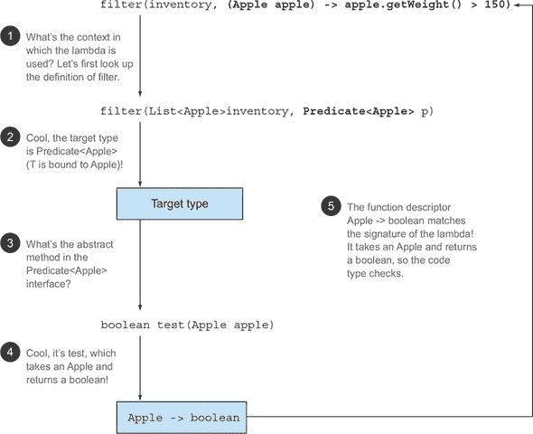

```
List<Apple> heavierThan150g =
        filter(inventory, (Apple apple) -> apple.getWeight() > 150);
```

类型检查过程如下分解：

+   首先，查找 `filter` 方法的声明。

+   第二，它期望第二个形式参数是一个 `Predicate<Apple>` 类型的对象（目标类型）。

+   第三，`Predicate<Apple>` 是一个定义了单个抽象方法 `test` 的函数式接口。

+   第四，`test` 方法描述了一个接受 `Apple` 并返回 `boolean` 类型的函数描述符。

+   最后，任何传递给 `filter` 方法的参数都需要满足这一要求。

代码是有效的，因为传递的 lambda 表达式也接受一个 `Apple` 参数并返回 `boolean`。注意，如果 lambda 表达式抛出异常，则抽象方法的声明 `throws` 子句也必须匹配。

#### 3.5.2\. 相同的 lambda，不同的函数式接口

由于 *目标类型* 的概念，如果不同的函数式接口具有兼容的抽象方法签名，相同的 lambda 表达式可以与不同的函数式接口相关联。例如，前面描述的接口 `Callable` 和 `PrivilegedAction` 都代表接受无参数并返回泛型类型 `T` 的函数。因此，以下两个赋值是有效的：

```
Callable<Integer> c = () -> 42;
PrivilegedAction<Integer> p = () -> 42;
```

在此情况下，第一个赋值的目标类型为 `Callable<Integer>`，第二个赋值的目标类型为 `PrivilegedAction<Integer>`。

在 表 3.3 中，我们展示了类似的例子；相同的 lambda 可以与多个不同的函数式接口一起使用：

```
Comparator<Apple> c1 =
  (Apple a1, Apple a2) -> a1.getWeight().compareTo(a2.getWeight());
ToIntBiFunction<Apple, Apple> c2 =
  (Apple a1, Apple a2) -> a1.getWeight().compareTo(a2.getWeight());
BiFunction<Apple, Apple, Integer> c3 =
  (Apple a1, Apple a2) -> a1.getWeight().compareTo(a2.getWeight());
```

|  |
| --- |

**菱形运算符**

对于熟悉 Java 发展历程的各位来说，会记得 Java 7 已经通过使用菱形运算符 (`<>`) 引入了从上下文中推断类型的概念（这个想法在泛型方法中也可以找到）。一个给定的类实例表达式可以出现在两个或更多不同的上下文中，适当类型参数将被推断，如下例所示：

```
List<String> listOfStrings = new ArrayList<>();
List<Integer> listOfIntegers = new ArrayList<>();
```

|  |
| --- |
|  |

**特殊的 void 兼容规则**

如果一个 lambda 表达式的主体是一个语句表达式，它与返回 `void` 的函数描述符兼容（前提是参数列表也兼容）。例如，以下两行都是合法的，尽管 `List` 的 `add` 方法返回的是 `boolean` 类型，而不是在 `Consumer` 上下文（`T -> void`）中期望的 `void` 类型：

```
// Predicate has a boolean return
Predicate<String> p = (String s) -> list.add(s);
// Consumer has a void return
Consumer<String> b = (String s) -> list.add(s);
```

|  |
| --- |

到现在为止，你应该已经很好地理解了何时何地可以使用 lambda 表达式。它们可以从赋值上下文、方法调用上下文（参数和返回值）以及类型转换上下文中获取目标类型。为了检验你的知识，尝试练习题 3.5。

|  |
| --- |

**练习题 3.5：类型检查——为什么以下代码无法编译？**

你该如何解决这个问题？

```
Object o = () -> { System.out.println("Tricky example"); };
```

**答案：**

lambda 表达式的上下文是 `Object`（目标类型）。但 `Object` 不是一个功能接口。为了解决这个问题，你可以将目标类型更改为 `Runnable`，它代表函数描述符 `() -> void`：

```
Runnable r = () -> { System.out.println("Tricky example"); };
```

你也可以通过将 lambda 表达式转换为 `Runnable` 来解决这个问题，这明确提供了目标类型。

```
Object o = (Runnable) () -> { System.out.println("Tricky example"); };
```

这种技术在处理具有相同函数描述符的两个不同功能接口的方法重载的上下文中非常有用。你可以将 lambda 表达式进行类型转换，以明确指定应该选择哪个方法签名。

例如，以下使用 `execute` 方法的 `execute(() -> {})` 调用将是模糊的，因为 `Runnable` 和 `Action` 都具有相同的函数描述符：

```
public void execute(Runnable runnable) {
    runnable.run();
}
public void execute(Action<T> action) {
    action.act();
}
@FunctionalInterface
interface Action {
    void act();
}
```

但是，你可以通过使用类型转换表达式来明确消除调用歧义：`execute ((Action) () -> {});`

|  |
| --- |

你已经看到了如何使用目标类型来检查 lambda 是否可以在特定上下文中使用。它还可以用来做稍微不同的事情：推断 lambda 参数的类型。

#### 3.5.3\. 类型推断

你可以进一步简化你的代码。Java 编译器根据 lambda 表达式周围的上下文（目标类型）推断出与 lambda 表达式关联的功能接口，这意味着它也可以根据目标类型推断出 lambda 的适当签名。好处是编译器可以访问 lambda 表达式参数的类型，并且可以在 lambda 语法中省略这些类型。Java 编译器推断 lambda 表达式参数的类型，如下所示：^([3])

> ³
> 
> 注意，当一个 lambda 表达式具有单个参数且其类型被推断时，参数名称周围的括号也可以省略。

```
List<Apple> greenApples =
        filter(inventory, apple -> GREEN.equals(apple.getColor()));     *1*
```

+   ***1* 参数 apple 没有显式类型**

当 lambda 表达式具有多个参数时，代码可读性的好处更为明显。例如，以下是如何创建一个 `Comparator` 对象的示例：

```
Comparator<Apple> c =
  (Apple a1, Apple a2) -> a1.getWeight().compareTo(a2.getWeight());      *1*
Comparator<Apple> c =
  (a1, a2) -> a1.getWeight().compareTo(a2.getWeight());                  *2*
```

+   ***1* 没有类型推断**

+   ***2* 带类型推断**

注意，有时明确包含类型可以使代码更易读，有时省略类型可以使代码更易读。没有规则说明哪种方式更好；开发者必须根据自己的判断来决定哪种方式能使他们的代码更易读。

#### 3.5.4\. 使用局部变量

我们之前展示的所有 lambda 表达式在其体内只使用了它们的参数。但是，lambda 表达式也可以像匿名类一样使用*自由变量*（不是参数，而是在外部作用域中定义的变量）。它们被称为*捕获 lambda*。例如，以下 lambda 捕获了变量`portNumber`：

```
int portNumber = 1337;
Runnable r = () -> System.out.println(portNumber);
```

尽管如此，还有一些小的变化。对这些变量可以做什么有一些限制。Lambda 允许无限制地捕获（在其体内引用）实例变量和静态变量。但是，当捕获本地变量时，它们必须显式声明为`final`或实际上是`final`。Lambda 表达式可以捕获只被分配一次的本地变量。（注意：捕获实例变量可以看作是捕获了最终的本地变量`this`。）例如，以下代码无法编译，因为变量`portNumber`被分配了两次：

```
int portNumber = 1337;
Runnable r = () -> System.out.println(portNumber);         *1*
portNumber = 31337;
```

+   ***1* 错误：本地变量 portNumber 不是 final 或实际上是 final。**

##### 本地变量的限制

你可能自己在想，为什么本地变量会有这些限制。首先，在幕后实现实例变量和本地变量之间存在一个关键的区别。实例变量存储在堆上，而本地变量则存在于栈上。如果 lambda 可以直接访问本地变量，并且 lambda 被用在线程中，那么使用 lambda 的线程可能会在分配变量的线程释放变量之后尝试访问该变量。因此，Java 通过访问其副本而不是原始变量来实现对空闲本地变量的访问。如果本地变量只被分配一次，这并不会造成任何区别——这就是限制的原因。

其次，这个限制也阻止了典型的命令式编程模式（正如我们在后面的章节中解释的，这些模式阻止了轻松的并行化），这些模式会修改外部变量。

|  |
| --- |

**闭包**

你可能已经听说过“闭包”这个术语，也许正在想 lambda 是否满足闭包的定义（不要与 Clojure 编程语言混淆）。从科学的角度来说，一个“闭包”是一个函数的实例，它可以无限制地引用该函数的非局部变量。例如，闭包可以作为另一个函数的参数传递。它还可以*访问和修改*其作用域之外定义的变量。现在，Java 8 的 lambda 和匿名类与闭包有类似的行为：它们可以作为方法的参数传递，并且可以访问其作用域之外的变量。但是，它们有一个限制：它们不能修改 lambda 定义的方法中局部变量的内容。这些变量必须是隐式 final 的。有助于思考的是，lambda 是封闭于*值*而不是*变量*。如前所述，这个限制存在是因为局部变量存在于栈上，并且隐式地限制在它们所在的线程中。允许捕获可变局部变量会打开新的线程不安全可能性，这是不希望的（实例变量是可以的，因为它们存在于堆上，堆是线程间共享的）。

|  |
| --- |

我们现在将描述 Java 8 代码中引入的另一个伟大特性：*方法引用*。把它们看作是某些 lambda 的简写版本。

### 3.6\. 方法引用

方法引用允许你重用现有的方法定义，并将它们像 lambda 一样传递。在某些情况下，它们比使用 lambda 表达式更易于阅读，感觉更自然。以下是我们使用方法引用和更新的 Java 8 API 的一点点帮助编写的排序示例（我们将在第 3.7 节中更详细地探讨这个示例）。

在此之前：

```
inventory.sort((Apple a1, Apple a2)
a1.getWeight().compareTo(a2.getWeight()));
```

之后（使用方法引用和`java.util.Comparator.comparing`）：

```
inventory.sort(comparing(Apple::getWeight));          *1*
```

+   ***1* 你的第一个方法引用**

不要担心新的语法和它们是如何工作的。你将在接下来的几节中了解到这些！

#### 3.6.1\. 简而言之

为什么你应该关注方法引用？方法引用可以看作是仅调用特定方法的 lambda 的简写。基本思想是，如果 lambda 代表“直接调用此方法”，那么最好通过方法名来引用它，而不是通过如何调用的描述。确实，方法引用允许你从一个现有的方法实现创建 lambda 表达式。但通过明确引用方法名，你的代码可以*提高可读性*。它是如何工作的？当你需要一个方法引用时，目标引用放在分隔符 `::` 前面，方法名在后面提供。例如，`Apple::getWeight` 是指向在 `Apple` 类中定义的 `getWeight` 方法的引用方法。（记住，在 `getWeight` 后面不需要括号，因为你现在不是在调用它，你只是在引用它的名字。）这个方法引用是 lambda 表达式 `(Apple apple) -> apple.getWeight()` 的简写。表 3.4 给出了 Java 8 中一些可能的方法引用的更多示例。

##### 表 3.4\. Lambda 和方法引用等价的示例

| Lambda | 方法引用等价 |
| --- | --- |
| (Apple apple) -> apple.getWeight() | Apple::getWeight |
| () -> Thread.currentThread().dumpStack() | Thread.currentThread()::dumpStack |
| (str, i) -> str.substring(i) | String::substring |
| (String s) -> System.out.println(s) (String s) -> this.isValidName(s) | System.out::println this::isValidName |

你可以将方法引用看作是 lambda 的语法糖，因为它只引用单个方法，因为你可以用更少的代码来表达相同的内容。

##### 构建方法引用的食谱

方法引用主要有三种类型：

1.  一个指向静态方法的引用方法（例如，`Integer` 的 `parseInt` 方法，写作 `Integer::parseInt`）

1.  一个指向任意类型实例方法的引用方法（例如，`String` 的 `length` 方法，写作 `String::length`）

1.  一个指向现有对象或表达式实例方法的引用方法（例如，假设你有一个局部变量 `expensiveTransaction`，它包含一个 `Transaction` 类型的对象，该对象支持实例方法 `getValue`；你可以写 `expensiveTransaction::getValue`）

第二种和第三种方法引用可能在最初显得有些令人不知所措。第二种方法引用的想法，例如 `String::length`，是指向一个对象的方法，该对象将被作为 lambda 的参数之一提供。例如，lambda 表达式 `(String s) -> s.toUpperCase()` 可以重写为 `String::toUpperCase`。但第三种方法引用指的是在 lambda 中调用外部已存在的对象的方法。例如，lambda 表达式 `() -> expensiveTransaction.getValue()` 可以重写为 `expensiveTransaction::getValue`。这种第三种方法引用在需要传递定义为私有辅助方法的函数时特别有用。例如，假设你定义了一个辅助方法 `isValidName`：

```
private boolean isValidName(String string) {
    return Character.isUpperCase(string.charAt(0));
}
```

你现在可以使用方法引用在 `Predicate<String>` 的上下文中传递这个方法：

```
filter(words, this::isValidName)
```

为了帮助你消化这些新知识，将 lambda 表达式重构为等效方法引用的简写规则遵循简单的食谱，如图 3.5 所示。

##### 图 3.5\. 构造三种不同类型 lambda 表达式的方法引用

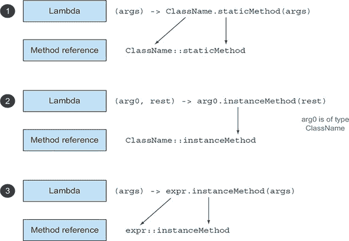

注意，还有针对构造函数、数组构造函数和超调用的特殊形式的方法引用。让我们通过一个具体的例子来应用方法引用。假设你想要对一个字符串的 `List` 进行排序，忽略大小写差异。`List` 上的 `sort` 方法期望一个 `Comparator` 作为参数。你之前看到 `Comparator` 描述了一个具有签名 `(T, T) -> int` 的函数描述符。你可以定义一个使用 `String` 类中的 `compareToIgnoreCase` 方法的 lambda 表达式，如下所示（注意，`compareToIgnoreCase` 在 `String` 类中是预定义的）：

```
List<String> str = Arrays.asList("a","b","A","B");
str.sort((s1, s2) -> s1.compareToIgnoreCase(s2));
```

lambda 表达式的签名与 `Comparator` 的函数描述符兼容。使用之前描述的食谱，示例也可以使用方法引用来编写；这导致代码更加简洁，如下所示：

```
List<String> str = Arrays.asList("a","b","A","B");
str.sort(String::compareToIgnoreCase);
```

注意，编译器会像对 lambda 表达式进行类型检查一样，来确定方法引用是否与给定的函数接口有效。方法引用的签名必须与上下文类型匹配。

为了检验你对方法引用的理解，请尝试练习题 3.6！

|  |
| --- |

**练习题 3.6：方法引用**

以下 lambda 表达式的等效方法引用是什么？

1.  ```
    ToIntFunction<String> stringToInt =
                   (String s) -> Integer.parseInt(s);
    ```

1.  ```
    BiPredicate<List<String>, String> contains =
                   (list, element) -> list.contains(element);
    ```

1.  ```
    Predicate<String> startsWithNumber =
                   (String string) -> this .starts-WithNumber(string);
    ```

**答案：**

1.  这个 lambda 表达式将其参数传递给 `Integer` 的静态方法 `parseInt`。这个方法接受一个要解析的 `String` 并返回一个 `int`。因此，可以使用图 3.5 中的食谱 ***1***（调用静态方法的 lambda 表达式）重写 lambda，如下所示：

    ```
    ToIntFunction<String> stringToInt = Integer::parseInt;
    ```

1.  这个 lambda 表达式使用它的第一个参数来调用其上的`contains`方法。因为第一个参数是`List`类型，你可以按照以下方式使用图 3.5 中的**2**号配方：

    ```
    BiPredicate<List<String>, String> contains = List::contains;
    ```

    这是因为目标类型描述了一个函数描述符`(List<String>, String) -> boolean`，而`List::contains`可以被解包到该函数描述符。

1.  这个表达式风格的 lambda 调用了一个私有辅助方法。你可以按照以下方式使用图 3.5 中的**3**号配方：

    ```
    Predicate<String> startsWithNumber = this::startsWithNumber
    ```

| |
| --- |

我们已经展示了如何重用现有的方法实现和创建方法引用。但你可以用类似的方法来处理类的构造函数。

#### 3.6.2\. 构造函数引用

你可以使用构造函数的名称和关键字`new`来创建现有构造函数的引用，如下所示：`ClassName::new`。它的工作方式与静态方法的引用类似。例如，假设有一个无参构造函数。这符合`Supplier`的签名`() -> Apple`，你可以这样做：

```
Supplier<Apple> c1 = Apple::new;          *1*
Apple a1 = c1.get();                      *2*
```

+   ***1* 默认 Apple()构造函数的构造函数引用**

+   ***2* 调用供应商的 get 方法会产生一个新的 Apple。**

这与以下等价

```
Supplier<Apple> c1 = () -> new Apple();         *1*
Apple a1 = c1.get();                            *2*
```

+   ***1* 使用默认构造函数创建 Apple 的 Lambda 表达式**

+   ***2* 调用供应商的 get 方法会产生一个新的 Apple。**

如果你有一个签名`Apple(Integer weight)`的构造函数，它符合`Function`接口的签名，所以你可以这样做

```
Function<Integer, Apple> c2 = Apple::new;        *1*
Apple a2 = c2.apply(110);                        *2*
```

+   ***1* Apple 类的构造函数引用（Integer weight）**

+   ***2* 使用给定的重量调用 Function 的 apply 方法会产生一个 Apple。**

这与以下等价

```
Function<Integer, Apple> c2 = (weight) -> new Apple(weight);     *1*
Apple a2 = c2.apply(110);                                        *2*
```

+   ***1* 使用给定重量的 Lambda 表达式创建 Apple**

+   ***2* 使用给定的重量调用 Function 的 apply 方法会产生一个新的 Apple 对象。**

在以下代码中，将`Integer`类型的`List`中的每个元素传递给`Apple`的构造函数，使用我们之前定义的类似`map`方法，结果得到一个具有各种重量的苹果`List`：

```
List<Integer> weights = Arrays.asList(7, 3, 4, 10);
List<Apple> apples = map(weights, Apple::new);                            *1*
public List<Apple> map(List<Integer> list, Function<Integer, Apple> f) {
    List<Apple> result = new ArrayList<>();
    for(Integer i: list) {
        result.add(f.apply(i));
    }
    return result;
}
```

+   ***1* 将构造函数引用传递给 map 方法**

如果你有一个带有两个参数的构造函数`Apple(Color color, Integer weight)`，它符合`BiFunction`接口的签名，所以你可以这样做：

```
BiFunction<Color, Integer, Apple> c3 = Apple::new;      *1*
Apple a3 = c3.apply(GREEN, 110);                        *2*
```

+   ***1* Apple 类的构造函数引用（Color color, Integer weight）**

+   ***2* 带有给定颜色和重量的 BiFunction 的 apply 方法会产生一个新的 Apple 对象。**

这与以下等价

```
BiFunction<String, Integer, Apple> c3 =
    (color, weight) -> new Apple(color, weight);        *1*
Apple a3 = c3.apply(GREEN, 110);                        *2*
```

+   ***1* 使用给定的颜色和重量创建 Apple 的 Lambda 表达式**

+   ***2* 带有给定颜色和重量的 BiFunction 的 apply 方法会产生一个新的 Apple 对象。**

指向构造函数而不实例化的能力使得一些有趣的应用成为可能。例如，你可以使用`Map`将构造函数与字符串值关联起来。然后你可以创建一个名为`giveMeFruit`的方法，给定一个`String`和一个`Integer`，可以创建不同重量不同类型的果实，如下所示：

```
static Map<String, Function<Integer, Fruit>> map = new HashMap<>();
static {
    map.put("apple", Apple::new);
    map.put("orange", Orange::new);
    // etc...
}
public static Fruit giveMeFruit(String fruit, Integer weight){
    return map.get(fruit.toLowerCase())                              *1*
              .apply(weight);                                        *2*
}
```

+   ***1* 从 map 中获取 Function<Integer, Fruit>**

+   ***2* Function 的 apply 方法带有 Integer weight 参数，创建所需的 Fruit。**

要检查你对方法和构造函数引用的理解，请尝试 3.7 的测验。

| |
| --- |

**测验 3.7：构造函数引用**

你看到了如何将零参数、一参数和二参数构造函数转换为构造函数引用。为了使用一个三参数构造函数，例如`RGB(int, int, int)`，你需要做什么？

**答案：**

你看到构造函数引用的语法是`ClassName::new`，所以在这种情况下是`RGB::new`。但是，你需要一个与该构造函数引用签名匹配的函数式接口。因为函数式接口起始集中没有，你可以创建自己的：

```
public interface TriFunction<T, U, V, R> {
    R apply(T t, U u, V v);
}
```

现在，你可以使用构造函数引用如下：

```
TriFunction<Integer, Integer, Integer, RGB> colorFactory = RGB::new;
```

| |
| --- |

我们已经学习了很多新的信息：lambda 表达式、函数式接口和方法引用。我们将在下一节中将所有这些内容付诸实践。

### 3.7. 将 lambda 表达式和方法引用付诸实践

为了总结本章以及我们对 lambda 表达式的讨论，我们将继续我们最初的问题，即使用不同的排序策略对`Apple`列表进行排序。我们将展示如何逐步将一个原始解决方案演变成一个简洁的解决方案，使用本书中解释的所有概念和功能：行为参数化、匿名类、lambda 表达式和方法引用。我们将努力实现的最终解决方案如下（注意，所有源代码都可在本书的网站上找到：[www.manning.com/books/modern-java-in-action](http://www.manning.com/books/modern-java-in-action)）：

```
inventory.sort(comparing(Apple::getWeight));
```

#### 3.7.1. 步骤 1：传递代码

你很幸运；Java 8 API 已经为`List`提供了可用的`sort`方法，因此你不需要自己实现它。困难的部分已经完成了！但是，你该如何将排序策略传递给`sort`方法呢？嗯，`sort`方法具有以下签名-:

```
void sort(Comparator<? super E> c)
```

它期望一个`Comparator`对象作为参数来比较两个`Apple`对象！这就是你如何在 Java 中传递不同策略的方式：它们必须被封装在对象中。我们说`sort`的*行为*是*参数化的*：它的行为将根据传递给它的不同排序策略而有所不同。

你的第一个解决方案看起来像这样：

```
public class AppleComparator implements Comparator<Apple> {
        public int compare(Apple a1, Apple a2){
                return a1.getWeight().compareTo(a2.getWeight());
        }
}
inventory.sort(new AppleComparator());
```

#### 3.7.2. 步骤 2：使用匿名类

而不是为了实例化一次而实现`Comparator`，你看到你可以使用一个*匿名类*来改进你的解决方案：

```
inventory.sort(new Comparator<Apple>() {
    public int compare(Apple a1, Apple a2){
        return a1.getWeight().compareTo(a2.getWeight());
    }
});
```

#### 3.7.3. 步骤 3：使用 lambda 表达式

但你当前解决方案仍然很冗长。Java 8 引入了 lambda 表达式，它提供了一种轻量级的语法来实现相同的目标：*传递代码*。你看到 lambda 表达式可以在期望 *函数式接口* 的地方使用。作为提醒，函数式接口是一个只定义一个抽象方法的接口。抽象方法的签名（称为 *函数描述符*）可以描述 lambda 表达式的签名。在这种情况下，`Comparator` 代表一个函数描述符 `(T, T) -> int`。因为你在使用 Apples，所以它更具体地代表 `(Apple, Apple) -> int`。因此，你的新改进的解决方案看起来如下：

```
inventory.sort((Apple a1, Apple a2)
                -> a1.getWeight().compareTo(a2.getWeight())
);
```

我们解释了 Java 编译器可以通过 lambda 出现的上下文来推断 lambda 表达式参数的类型。因此，你可以将你的解决方案重写如下：

```
inventory.sort((a1, a2) -> a1.getWeight().compareTo(a2.getWeight()));
```

你能让你的代码更加易读吗？`Comparator` 包含一个名为 `comparing` 的静态辅助方法，它接受一个提取 `Comparable` 键的 `Function`，并生成一个 `Comparator` 对象（我们将在第十三章中解释为什么接口可以有静态方法 chapter 13）。它可以如下使用（注意现在你传递一个只有一个参数的 lambda；lambda 指定了如何从一个 `Apple` 中提取用于比较的键）：

```
Comparator<Apple> c = Comparator.comparing((Apple a) -> a.getWeight());
```

你现在可以以稍微紧凑的形式重写你的解决方案：

```
import static java.util.Comparator.comparing;
inventory.sort(comparing(apple -> apple.getWeight()));
```

#### 3.7.4. 第 4 步：使用方法引用

我们解释了方法引用是 lambda 表达式的语法糖，它将它们的参数传递过去。你可以使用方法引用来使你的代码稍微不那么冗长（假设静态导入 `java.util.Comparator.comparing`）：

```
inventory.sort(comparing(Apple::getWeight));
```

恭喜，这是你的最终解决方案！为什么这比 Java 8 之前的代码更好？这不仅因为它更短；它还非常明确其含义。代码读起来就像问题陈述“按苹果的重量排序库存。”

### 3.8. 有用的方法来组合 lambda 表达式

Java 8 API 中的几个函数式接口包含便利方法。具体来说，许多函数式接口，如 `Comparator`、`Function` 和 `Predicate`，它们用于传递 lambda 表达式，提供了允许组合的方法。这是什么意思呢？在实践中，这意味着你可以组合几个简单的 lambda 表达式来构建更复杂的表达式。例如，你可以将两个谓词组合成一个更大的谓词，该谓词在两个谓词之间执行 `or` 操作。此外，你还可以组合函数，使得一个函数的结果成为另一个函数的输入。你可能想知道为什么函数式接口中会有额外的函数。（毕竟，这与函数式接口的定义相矛盾！）诀窍在于我们将要介绍的方法被称为 *默认方法*（它们不是抽象方法）。我们将在 第十三章 中详细解释它们。现在，请相信我们，当你想了解更多关于默认方法和你可以用它们做什么时，再阅读 第十三章。

#### 3.8.1\. 比较器组合

你已经看到你可以使用静态方法 `Comparator.comparing` 来返回一个基于 `Function` 提取比较键的 `Comparator`，如下所示：

```
Comparator<Apple> c = Comparator.comparing(Apple::getWeight);
```

##### 逆序

如果你想按重量降序对苹果进行排序，不需要创建不同的 `Comparator` 实例。该接口包括一个默认方法 `reversed`，它反转给定比较器的排序顺序。你可以通过重用初始 `Comparator` 来修改前面的示例，按重量降序对苹果进行排序：

```
inventory.sort(comparing(Apple::getWeight).reversed());         *1*
```

+   ***1* 按重量降序排序**

##### 链式连接比较器

这听起来很棒，但如果你发现两个苹果的重量相同怎么办？在排序列表中哪个苹果应该有优先级？你可能想提供一个第二个 `Comparator` 来进一步细化比较。例如，在根据重量比较两个苹果之后，你可能想按原产国对它们进行排序。`thenComparing` 方法允许你这样做。它接受一个函数作为参数（就像 `comparing` 方法一样）并在使用初始 `Comparator` 认定两个对象相等时提供一个第二个 `Comparator`。你可以再次优雅地解决这个问题，如下所示：

```
inventory.sort(comparing(Apple::getWeight)
         .reversed()                                  *1*
         .thenComparing(Apple::getCountry));          *2*
```

+   ***1* 按重量降序排序**

+   ***2* 当两个苹果重量相同时，按国家进一步排序**

#### 3.8.2\. 谓词组合

`Predicate` 接口包括三个方法，允许你重用现有的 `Predicate` 来创建更复杂的谓词：`negate`、`and` 和 `or`。例如，你可以使用 `negate` 方法来返回 `Predicate` 的否定，例如一个非红色的苹果：

```
Predicate<Apple> notRedApple = redApple.negate();           *1*
```

+   ***1* 生成现有谓词对象 redApple 的否定**

你可能想使用 `and` 方法将两个 lambda 表达式组合起来，以表明一个苹果既是红色的又是重的：

```
Predicate<Apple> redAndHeavyApple =
    redApple.and(apple -> apple.getWeight() > 150);           *1*
```

+   ***1* 将两个谓词链式连接以产生另一个谓词对象**

你可以将生成的谓词进一步组合，以表达红色且重的苹果（重量超过 150 克）或仅绿色的苹果：

```
Predicate<Apple> redAndHeavyAppleOrGreen =
    redApple.and(apple -> apple.getWeight() > 150)
            .or(apple -> GREEN.equals(a.getColor()));          *1*
```

+   ***1* 将三个谓词链起来构建一个更复杂的谓词对象**

为什么这很棒？从更简单的 lambda 表达式，你可以表示更复杂的 lambda 表达式，它们仍然像问题陈述一样易读！请注意，链中方法`and`和`or`的优先级是从左到右的——没有括号等价物。所以`a.or(b).and(c)`必须读作`(a || b) && c`。同样，`a.and(b).or(c)`必须读作`(a && b) || c`。

#### 3.8.3\. 组合函数

最后，你也可以组合由`Function`接口表示的 lambda 表达式。`Function`接口为此提供了两个默认方法，`andThen`和`compose`，这两个方法都返回一个`Function`实例。

方法`andThen`返回一个函数，它首先对一个输入应用一个给定的函数，然后将另一个函数应用于该应用的结果。例如，给定一个函数`f`，它增加一个数字`(x -> x + 1)`，以及另一个函数`g`，它将一个数字乘以 2，你可以将它们组合起来创建一个函数`h`，该函数首先增加一个数字，然后将结果乘以 2：

```
Function<Integer, Integer> f = x -> x + 1;
Function<Integer, Integer> g = x -> x * 2;
Function<Integer, Integer> h = f.andThen(g);     *1*
int result = h.apply(1);                         *2*
```

+   ***1* 在数学中，你会写成 g(f(x))或(g o f)(x)。**

+   ***2* 这返回 4。**

你也可以像使用`compose`一样使用方法`compose`，首先应用作为`compose`参数给出的函数，然后将函数应用于结果。例如，在之前的`compose`示例中，这意味着`f(g(x))`而不是使用`andThen`的`g(f(x))`：

```
Function<Integer, Integer> f = x -> x + 1;
Function<Integer, Integer> g = x -> x * 2;
Function<Integer, Integer> h = f.compose(g);     *1*
int result = h.apply(1);                         *2*
```

+   ***1* 在数学中，你会写成 f(g(x))或(f o g)(x)。**

+   ***2* 这返回 3。**

图 3.6 说明了`andThen`和`compose`之间的区别。

##### 图 3.6\. 使用`andThen`与`compose`的比较

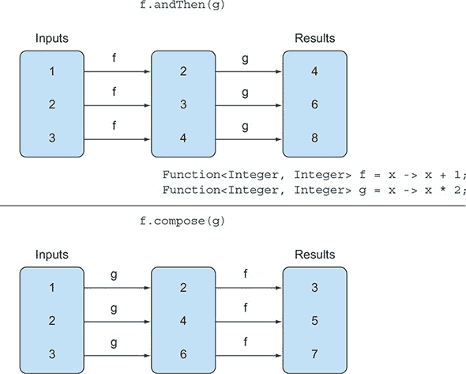

所有这些都听起来有点抽象。你如何在实践中使用它们？假设你有一些对表示为`String`的字母进行文本转换的实用方法：

```
public class Letter{
    public static String addHeader(String text) {
        return "From Raoul, Mario and Alan: " + text;
    }
    public static String addFooter(String text) {
        return text + " Kind regards";
    }
    public static String checkSpelling(String text) {
        return text.replaceAll("labda", "lambda");
    }
}
```

你现在可以通过组合实用方法创建各种转换管道。例如，创建一个管道，首先添加标题，然后检查拼写，最后添加页脚，如下所示（如图 3.7 所示）：

##### 图 3.7\. 使用`andThen`的转换管道


```
Function<String, String> addHeader = Letter::addHeader;
Function<String, String> transformationPipeline
  = addHeader.andThen(Letter::checkSpelling)
             .andThen(Letter::addFooter);
```

另一个管道可能只是添加标题和页脚，而不检查拼写：

```
Function<String, String> addHeader = Letter::addHeader;
Function<String, String> transformationPipeline
  = addHeader.andThen(Letter::addFooter);
```

### 3.9\. 来自数学的类似想法

如果你熟悉高中数学，本节提供了对 lambda 表达式和函数传递概念的另一种观点。请随意跳过；本书中的其他内容都不依赖于它。但你可能会喜欢看到另一个视角。

#### 3.9.1\. 集成

假设你有一个（数学的，不是 Java 的）函数`f`，可能定义为

*f*(*x*) = *x* + 10

然后，一个经常被问到的问题（在学校以及科学和工程学位中）是在纸上绘制函数时找到函数下方的面积（将 x 轴视为零线）。例如，你写下

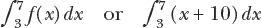

对于图 3.8 中显示的区域 figure 3.8。

##### 图 3.8\. 函数 `f(x) = x + 10` 在 `x` 从 3 到 7 下的面积

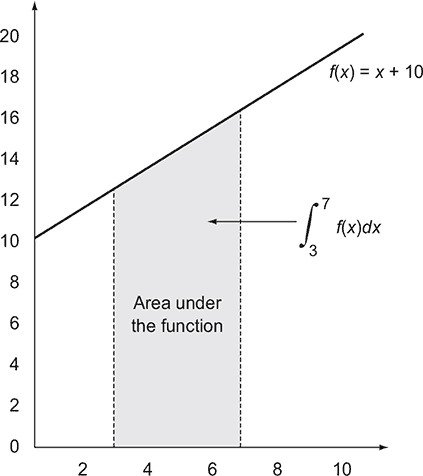

在这个例子中，函数 `f` 是一条直线，因此你可以通过梯形法（绘制三角形和矩形）轻松计算出这个面积，以找到解决方案：

1/2 × ((3 + 10) + (7 + 10)) × (7 – 3) = 60

现在，你如何在 Java 中表达这个想法？你的第一个问题是调和像积分符号或 `dy/dx` 这样的奇怪符号与熟悉的编程语言符号。

事实上，从第一性原理出发，你需要一个方法，可能叫做 `integrate`，它接受三个参数：一个是 `f`，其余的是极限（这里分别是 3.0 和 7.0）。因此，你希望在 Java 中编写类似以下内容，其中函数 `f` 作为参数传递：

```
integrate(f, 3, 7)
```

注意，你不能像在数学中那样编写如此简单的代码：

```
integrate(x + 10, 3, 7)
```

有两个原因。首先，`x` 的作用域不明确，其次，这将传递 `x+10` 的值进行积分，而不是传递函数 `f`。

事实上，数学中 `dx` 的秘密角色是表示“接受参数 `x` 并返回 `x + 10` 的函数。”

#### 3.9.2\. 连接到 Java 8 的 lambda 表达式

如我们之前提到的，Java 8 使用 `(double x) -> x + 10`（一个 lambda 表达式）的符号来精确地实现这个目的；因此你可以写出

```
integrate((double x) -> x + 10, 3, 7)
```

或者

```
integrate((double x) -> f(x), 3, 7)
```

或者，使用前面提到的方法引用，

```
integrate(C::f, 3, 7)
```

如果 `C` 是一个包含 `f` 作为静态方法的类。这个想法是你将 `f` 的代码传递给 `integrate` 方法。

你现在可能会想知道如何编写 `integrate` 方法本身。继续假设 `f` 是一个线性函数（直线）。你可能希望以类似于数学的形式编写：

```
public double integrate((double -> double) f, double a, double b) {     *1*
      return (f(a) + f(b)) * (b - a) / 2.0
}
```

+   ***1* 错误的 Java 代码！（你不能像在数学中那样编写函数。）**

但是因为 lambda 表达式只能在期望功能接口（在这种情况下，`DoubleFunction`^([4])) 的上下文中使用，所以你必须按照以下方式编写：

> ⁴
> 
> 使用 `DoubleFunction<Double>` 比使用 `Function<Double,Double>` 更高效，因为它避免了装箱结果。

```
public double integrate(DoubleFunction<Double> f, double a, double b) {
      return (f.apply(a) + f.apply(b)) * (b - a) / 2.0;
}
```

或者使用 `DoubleUnaryOperator`，这也避免了装箱结果：

```
public double integrate(DoubleUnaryOperator f, double a, double b) {
      return (f.applyAsDouble(a) + f.applyAsDouble(b)) * (b - a) / 2.0;
}
```

作为旁注，有点遗憾的是，你必须编写 `f.apply(a)` 而不是简单地像在数学中那样编写 `f(a)`，但 Java 只能摆脱一切都是对象的观点，而不是函数真正独立的概念！

### 摘要

+   *lambda 表达式* 可以理解为一种匿名函数：它没有名字，但它有一系列参数、一个主体、一个返回类型，以及可能抛出的异常列表。

+   Lambda 表达式让你可以简洁地传递代码。

+   *功能接口* 是一个声明恰好一个抽象方法的接口。

+   Lambda 表达式只能在期望功能接口的地方使用。

+   Lambda 表达式允许你直接内联提供功能接口的抽象方法实现，并将整个表达式 *视为功能接口的一个实例*。

+   Java 8 在 `java.util.function` 包中提供了一系列常见的功能接口，包括 `Predicate<T>`、`Function<T, R>`、`Supplier<T>`、`Consumer<T>` 和 `BinaryOperator<T>`，这些接口在表 3.2 中进行了描述。

+   对于 `Predicate<T>` 和 `Function<T, R>` 等常见泛型功能接口的原生特殊化，可以使用它们来避免装箱操作：`IntPredicate`、`IntToLongFunction` 等等。

+   当需要在方法中执行一些必要的中间行为（例如资源分配和清理）时，可以使用 lambda 表达式来获得额外的灵活性和可重用性。

+   lambda 表达式期望的类型称为 *目标* 类型。

+   方法引用允许你重用现有的方法实现，并直接传递它。

+   类似于 `Comparator`、`Predicate` 和 `Function` 的功能接口有几个默认方法，可以用来组合 lambda 表达式。
