## 第二部分。使用流的函数式数据处理

本书第二部分深入探讨了新的 Streams API，它允许你以声明式的方式编写处理数据集合的强大代码。到第二部分的结尾，你将全面理解流是什么以及你如何在代码库中使用它们来简洁高效地处理数据集合。

第四章介绍了流的定义，并解释了它与集合的比较。

第五章详细调查了可用于表达复杂数据处理查询的流操作。你将查看许多模式，如过滤、切片、查找、匹配、映射和归约。

第六章介绍了收集器——Streams API 的一个特性，它允许你表达更复杂的数据处理查询。

在第七章中，你将了解流如何自动并行运行并利用你的多核架构。此外，你还将了解在使用并行流时需要避免的各种陷阱。

## 第四章。流的介绍

*本章涵盖*

+   什么是流？

+   集合与流

+   内部迭代与外部迭代

+   中间操作与终端操作

没有集合的 Java 你会做什么？几乎每个 Java 应用程序都会*创建*和*处理*集合。集合对于许多编程任务来说是基本的：它们允许你分组和处理数据。为了说明集合的实际应用，假设你被要求创建一个代表菜单的菜肴集合以计算不同的查询。例如，你可能想计算出菜单的总卡路里。或者，你可能需要过滤菜单以选择仅包含低卡路里菜肴的特殊健康菜单。但尽管集合对于几乎任何 Java 应用程序都是必要的，但操作集合远非完美：

+   许多业务逻辑涉及类似数据库的操作，例如按类别（例如，所有素食菜肴）*分组*菜肴列表或*查找*最昂贵的菜肴。你发现自己多少次需要使用迭代器重新实现这些操作？大多数数据库都允许你声明式地指定此类操作。例如，以下 SQL 查询允许你选择（或“过滤”）卡路里低的菜肴名称：`SELECT name FROM dishes WHERE calorie < 400`。正如你所看到的，在 SQL 中，你不需要实现使用菜肴的`calorie`属性（例如，使用 Java 集合，例如使用迭代器和累加器）来过滤的方式。相反，你只需写出你想要的结果。这个基本想法意味着你不必过多担心如何显式地实现此类查询——它为你处理了！为什么你不能用类似的方法处理集合？

+   你会如何处理大量元素？为了提高性能，你需要并行处理它并使用多核架构。但是，与使用迭代器相比，编写并行代码更复杂。此外，调试起来也没有乐趣！

Java 语言设计者能做些什么来节省你宝贵的时间，并使你的编程生活更轻松？你可能已经猜到了：答案是 *流*。

### 4.1\. 什么是流？

*流* 是 Java API 的一个更新，它允许你以声明式的方式操作数据集合（你表达一个查询而不是为它编写特定的实现）。现在你可以把它们想象成数据集合上的高级迭代器。此外，流可以透明地并行处理，而不需要你编写任何多线程代码！我们将在 第七章 中详细解释流和并行化是如何工作的。要看到使用流的好处，比较以下代码返回低卡路里菜肴的名称，按卡路里数量排序——首先是 Java 7，然后是使用流的 Java 8。不必太担心 Java 8 的代码；我们将在下一节中详细解释它！

在 (Java 7) 之前：

```
List<Dish> lowCaloricDishes = new ArrayList<>();
for(Dish dish: menu) {
    if(dish.getCalories() < 400) {                                 *1*
        lowCaloricDishes.add(dish);
    }
}
Collections.sort(lowCaloricDishes, new Comparator<Dish>() {        *2*
    public int compare(Dish dish1, Dish dish2) {
        return Integer.compare(dish1.getCalories(), dish2.getCalories());
    }
});
List<String> lowCaloricDishesName = new ArrayList<>();
for(Dish dish: lowCaloricDishes) {
    lowCaloricDishesName.add(dish.getName());                      *3*
}
```

+   ***1* 使用累加器过滤元素**

+   ***2* 使用匿名类对菜肴进行排序**

+   ***3* 处理排序后的列表以选择菜肴的名称**

在此代码中，你使用了一个“垃圾变量”，`lowCaloricDishes`。它的唯一目的是作为一个中间的临时容器。在 Java 8 中，这个实现细节被推入库中，属于它应该去的地方。

在 (Java 8) 之后：

```
import static java.util.Comparator.comparing;
import static java.util.stream.Collectors.toList;
List<String> lowCaloricDishesName =
               menu.stream()
                   .filter(d -> d.getCalories() < 400)       *1*
                   .sorted(comparing(Dish::getCalories))     *2*
                   .map(Dish::getName)                       *3*
                   .collect(toList());                       *4*
```

+   ***1* 选择卡路里低于 400 的菜肴**

+   ***2* 按卡路里排序**

+   ***3* 提取这些菜肴的名称**

+   ***4* 将所有名称存储在列表中**

要利用多核架构并行执行此代码，你只需要将 `stream()` 改为 `parallelStream()`：

```
List<String> lowCaloricDishesName =
               menu.parallelStream()
                   .filter(d -> d.getCalories() < 400)
                   .sorted(comparing(Dishes::getCalories))
                   .map(Dish::getName)
                   .collect(toList());
```

你可能想知道当你调用 `parallelStream` 方法时会发生什么。使用了多少线程？性能有什么好处？你是否应该使用这个方法？第七章 详细介绍了这些问题。现在，你可以看到从软件工程的角度来看，这种方法提供了几个立即的好处：

+   代码以*声明式*方式编写：你指定*想要实现什么*（过滤*低卡路里*的菜品）而不是指定*如何实现操作*（使用控制流块，如循环和`if`条件）。正如你在上一章中看到的，这种方法，加上行为参数化，使你能够应对不断变化的需求：你可以轻松地创建代码的附加版本，使用 lambda 表达式过滤高卡路里菜品，而无需复制和粘贴代码。关于这种方法的好处，另一种思考方式是线程模型与查询本身解耦。因为你提供了一个查询的配方，它可以是顺序执行或并行执行。你将在第七章中了解更多关于这一点。

+   你将把几个构建块操作链接起来，以表达一个复杂的数据处理管道（通过链接`sorted`、`map`和`collect`操作来链接`filter`，如图 4.1 所示），同时保持代码的可读性和意图清晰。`filter`的结果传递给`sorted`方法，然后传递给`map`方法，最后传递给`collect`方法。

##### 图 4.1\. 连接流操作形成流管道

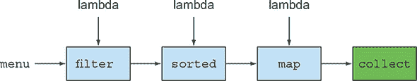

因为`filter`（或`sorted`、`map`和`collect`）等操作作为*高级构建块*可用，它们不依赖于特定的线程模型，它们的内部实现可以是单线程的，也可以潜在地透明地最大化你的多核架构！在实践中，这意味着你不再需要担心线程和锁来弄清楚如何并行化某些数据处理任务：Streams API 会为你完成这一切！

新的 Streams API 表达力强。例如，阅读完本章以及第五章和第六章后，你将能够编写如下代码：

```
Map<Dish.Type, List<Dish>> dishesByType =
    menu.stream().collect(groupingBy(Dish::getType));
```

这个特定的例子在第六章中有详细解释。它在一个`Map`内部按类型分组菜品。例如，`Map`可能包含以下结果：

```
{FISH=[prawns, salmon],
 OTHER=[french fries, rice, season fruit, pizza],
 MEAT=[pork, beef, chicken]}
```

现在考虑如何使用典型的命令式编程方法（使用循环）来实现这一点。但不要浪费太多时间。相反，拥抱本章和以下章节中流的强大功能！

|  |
| --- |

**其他库：Guava、Apache 和 lambdaj**

为了给 Java 程序员提供更好的库来操作集合，已经进行了许多尝试。例如，Guava 是由 Google 创建的一个流行的库。它提供了额外的容器类，如 multimaps 和 multisets。Apache Commons Collections 库提供了类似的功能。最后，由本书的合著者 Mario Fusco 编写的 lambdaj 提供了许多在声明式编程中操作集合的实用工具，灵感来源于函数式编程。

现在，Java 8 自带了一个官方库，用于以更声明性的方式操作集合。

| |
| --- |

总结来说，Java 8 的 Streams API 允许你编写代码，使其

+   ***声明性*—** 更简洁、更易读

+   ***可组合*—** 更大的灵活性

+   ***可并行化*—** 更好的性能

在本章的剩余部分和下一章中，我们将使用以下领域作为我们的示例：一个`menu`，它不过是一个菜肴列表

```
List<Dish> menu = Arrays.asList(
    new Dish("pork", false, 800, Dish.Type.MEAT),
    new Dish("beef", false, 700, Dish.Type.MEAT),
    new Dish("chicken", false, 400, Dish.Type.MEAT),
    new Dish("french fries", true, 530, Dish.Type.OTHER),
    new Dish("rice", true, 350, Dish.Type.OTHER),
    new Dish("season fruit", true, 120, Dish.Type.OTHER),
    new Dish("pizza", true, 550, Dish.Type.OTHER),
    new Dish("prawns", false, 300, Dish.Type.FISH),
    new Dish("salmon", false, 450, Dish.Type.FISH) );
```

在这里，一个`Dish`是一个不可变的类，定义为

```
public class Dish {
    private final String name;
    private final boolean vegetarian;
    private final int calories;
    private final Type type;
    public Dish(String name, boolean vegetarian, int calories, Type type) {
        this.name = name;
        this.vegetarian = vegetarian;
        this.calories = calories;
        this.type = type;
    }
    public String getName() {
        return name;
    }
    public boolean isVegetarian() {
        return vegetarian;
    }
    public int getCalories() {
        return calories;
    }
    public Type getType() {
        return type;
    }
    @Override
    public String toString() {
        return name;
    }
    public enum Type { MEAT, FISH, OTHER }
}
```

现在，我们将更详细地探索如何使用 Streams API。我们将比较流和集合，并提供一些背景信息。在下一章中，我们将详细研究可用于表达复杂数据处理查询的流操作。我们将查看许多模式，如过滤、切片、查找、匹配、映射和归约。将有许多测验和练习来帮助你巩固理解。

接下来，我们将讨论如何创建和操作数值流（例如，生成偶数流或毕达哥拉斯三元组流）。最后，我们将讨论如何从不同的源创建流，例如从文件中创建流。我们还将讨论如何生成具有无限元素数量的流——这是你绝对不能使用集合完成的！

### 4.2\. 开始使用流

我们从集合开始讨论流，因为这是开始使用流的最简单方式。Java 8 中的集合支持一个新的`stream`方法，该方法返回一个流（接口定义在`java.util.stream.Stream`中）。你稍后会发现，你还可以以各种其他方式获取流（例如，从数值范围或 I/O 资源生成流元素）。

首先，什么是*流*？一个简短的定义是“从支持数据处理操作的数据源中获取元素序列。”让我们一步一步地分解这个定义：

+   ***元素序列*—** 与集合一样，流提供了一个接口，用于访问特定元素类型的有序值集。因为集合是数据结构，所以它们主要关于存储和访问具有特定时间/空间复杂性的元素（例如，`ArrayList`与`LinkedList`）。但流是关于表达计算，如`filter`、`sorted`和`map`，这些你之前已经看到。集合关于数据；流关于计算。我们将在接下来的章节中更详细地解释这个概念。

+   ***源*—** 流从数据提供源（如集合、数组或 I/O 资源）中消费。请注意，从有序集合生成流会保留顺序。来自列表的流元素将具有与列表相同的顺序。

+   ***数据处理操作*—** 流支持类似数据库的操作和函数式编程语言中的常见操作来操作数据，例如`filter`、`map`、`reduce`、`find`、`match`、`sort`等。流操作可以顺序执行或并行执行。

此外，流操作有两个重要的特性：

+   ***管道化*—** 许多流操作返回一个流本身，允许操作被链式连接以形成一个更大的管道。这使我们能够进行某些优化，我们将在下一章中解释，例如*惰性*和*短路*。操作管道可以看作是对数据源的一个类似数据库的查询。

+   ***内部迭代*—** 与显式使用迭代器迭代集合不同，流操作在幕后为你进行迭代。我们曾在第一章中简要提到过这个概念，将在下一节中再次讨论。

让我们通过一个代码示例来解释所有这些概念：

```
import static java.util.stream.Collectors.toList;
List<String> threeHighCaloricDishNames =
  menu.stream()                                         *1*
      .filter(dish -> dish.getCalories() > 300)         *2*
      .map(Dish::getName)                               *3*
      .limit(3)                                         *4*
      .collect(toList());                               *5*
System.out.println(threeHighCaloricDishNames);          *6*
```

+   ***1* 从菜单（菜肴列表）获取流**

+   ***2* 创建一个操作管道：首先过滤高卡路里菜肴**

+   ***3* 获取菜肴的名称**

+   ***4* 仅选择前三个**

+   ***5* 将结果存储在另一个列表中**

+   ***6* 结果为[pork, beef, chicken]**

在这个例子中，你首先通过在`menu`上调用`stream`方法从菜肴列表中获取一个流。数据源是菜肴列表（菜单），它为流提供了一系列元素。接下来，你在流上应用一系列数据处理操作：`filter`、`map`、`limit`和`collect`。除了`collect`之外，所有这些操作都返回另一个流，因此可以将它们连接起来形成一个*管道*，这可以看作是对源的一个查询。最后，`collect`操作开始处理管道以返回一个结果（它与流不同，因为它返回了其他东西——这里是一个`List`）。在没有调用`collect`之前，不会产生任何结果，实际上甚至没有从`menu`中选择任何元素。你可以将其视为链中的方法调用在`collect`被调用之前排队。图 4.2 显示了流操作的顺序：`filter`、`map`、`limit`和`collect`，下面将简要描述每个操作：

+   **`filter`—** 接受一个 lambda 表达式来排除流中的某些元素。在这种情况下，你通过传递 lambda 表达式`d -> d.getCalories() > 300`选择卡路里超过 300 的菜肴。

+   **`map`—** 接受一个 lambda 表达式将一个元素转换成另一个元素或提取信息。在这种情况下，你通过传递方法引用`Dish::getName`（相当于 lambda 表达式`d -> d.getName()`）提取每个菜肴的名称。

+   **`limit`—** 截断流，使其包含不超过给定数量的元素。

+   **`collect`—** 将流转换为另一种形式。在这种情况下，您将流转换为列表。这看起来有点像魔法；我们将在第六章中更详细地描述 `collect` 的工作原理。目前，您可以将 `collect` 视为一个操作，它接受各种将流元素累积到汇总结果中的方法作为参数。在这里，`toList()` 描述了一个将流转换为列表的方法。

##### 图 4.2\. 使用流过滤菜单以找出三个高热量菜品的名称

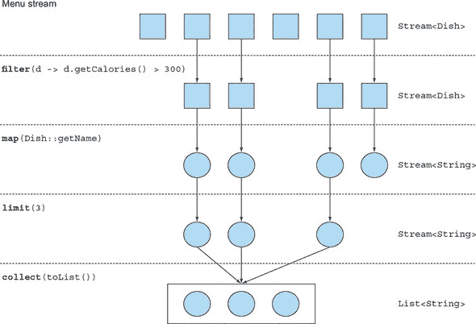

注意我们描述的代码与您逐个处理菜单项列表时的代码有何不同。首先，您使用一种更声明性的风格来处理菜单中的数据，您说的是“需要做什么”： “找出三个高热量菜品的名称。” 您没有实现过滤（`filter`）、提取（`map`）或截断（`limit`）功能；这些功能通过 Streams 库提供。因此，Streams API 具有更多的灵活性来决定如何优化这个管道。例如，过滤、提取和截断步骤可以合并为单次遍历，并在找到三个菜品后立即停止。我们将在下一章中展示一个示例来证明这一点。

在我们更详细地探讨如何使用流进行操作之前，让我们稍微退后一步，来检查 Collections API 和新的 Streams API 之间的概念差异。

### 4.3\. 流与集合的比较

现有的 Java 集合概念和新的流概念都提供了表示元素类型值的有序集合的数据结构的接口。通过 *有序*，我们是指我们通常按顺序遍历值，而不是以任何顺序随机访问它们。那么区别在哪里呢？

我们将从一种视觉隐喻开始。考虑一个存储在 DVD 上的电影。这是一个集合（可能是字节或帧——这里我们不在乎是哪一个），因为它包含了整个数据结构。现在考虑当它通过互联网 *流式传输* 时观看相同的视频。现在这是一个流（字节或帧）。流式视频播放器只需要下载用户正在观看之前的一小部分帧，这样您就可以在流中的大多数值甚至还没有被计算出来之前，从流的开始处显示值（考虑流式传输一场实时足球比赛）。请注意，视频播放器可能没有足够的内存来将整个流作为集合缓冲在内存中——如果您必须等待最后一帧出现才能开始显示视频，启动时间将会令人难以置信。出于视频播放器实现的考虑，您可能会选择 *缓冲* 流的一部分到集合中，但这与概念上的差异是不同的。

在最粗略的层面上，集合和流之间的区别在于**何时**进行计算。集合是一个内存中的数据结构，它持有数据结构当前拥有的**所有**值——集合中的每个元素在可以添加到集合之前都必须被计算。（你可以向集合中添加东西，也可以从中移除东西，但在这个时间点的每个时刻，集合中的每个元素都存储在内存中；元素在成为集合的一部分之前必须被计算。）

相比之下，流是一个概念上固定的数据结构（你不能从中添加或删除元素），其元素是**按需计算**的。这带来了显著的编程优势。在第六章中，我们将展示如何构建一个包含所有素数（2，3，5，7，11，……）的流是多么简单，尽管素数的数量是无限的。其理念是，用户将只从流中提取他们所需的价值，这些元素仅在**需要时**和**需要时**产生——对用户来说是隐形的。这是一种生产者-消费者关系的形式。另一种观点是，流就像是一个懒加载的集合：当消费者请求时，值才会被计算（用管理术语来说，这是需求驱动，甚至可以说是即时制造）。

相反，集合是积极构建的（供应商驱动：在你开始销售之前先填满你的仓库，就像一个有限寿命的圣诞新品），想象一下将其应用于素数示例。尝试构建一个包含所有素数的集合会导致一个程序循环，它永远在计算一个新的素数——将其添加到集合中——但永远不会完成构建集合，因此消费者永远不会看到它。

图 4.3 说明了流和集合之间的区别，应用于我们的 DVD 与互联网流媒体示例。

##### 图 4.3. 流与集合的比较

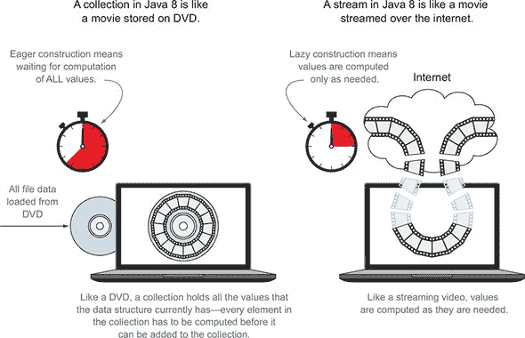

另一个例子是浏览器互联网搜索。假设你在谷歌或在线电商商店中搜索一个有很多匹配项的短语。你不需要等待整个结果集及其照片下载完成，而是会得到一个流，其元素是最佳的前 10 个或 20 个匹配项，还有一个按钮可以点击来获取下一个 10 个或 20 个。当你，作为消费者，点击获取下一个 10 个时，供应商会根据需求计算这些结果，然后再将它们返回到你的浏览器进行显示。

#### 4.3.1. 只能遍历一次

注意，与迭代器类似，流也只能遍历一次。之后，流就被认为是已经被消费了。你可以从初始数据源获取一个新的流来再次遍历，就像迭代器一样（假设它是一个可重复的源，如集合；如果它是一个 I/O 通道，你就无能为力了）。例如，以下代码会抛出一个异常，表明流已经被消费：

```
List<String> title = Arrays.asList("Modern", "Java", "In", "Action");
Stream<String> s = title.stream();
s.forEach(System.out::println);               *1*
s.forEach(System.out::println);               *2*
```

+   ***1* 打印标题中的每个单词**

+   ***2* java.lang.IllegalStateException: 流已被操作或关闭**

请记住，流只能消费一次！

|  |
| --- |

**流与集合的哲学**

对于喜欢哲学观点的读者，你可以将流视为在时间上分散的一组值。相比之下，集合是一组在空间（在此处为计算机内存）上分散的值，它们在时间上的一个点上存在——并且你可以使用迭代器通过 `for-each` 循环访问集合内部的成员。

|  |
| --- |

集合和流之间的另一个关键区别是它们如何管理数据迭代。

#### 4.3.2\. 外部迭代与内部迭代

使用 `Collection` 接口需要用户进行迭代（例如，使用 `for-each`）；这被称为*外部迭代*。相比之下，Streams 库使用*内部迭代*——它为你执行迭代并负责将结果流值存储在某个地方；你只需提供一个函数，说明要做什么。以下代码示例说明了这种区别。

##### 列表 4.1\. 集合：使用 `for-each` 循环的外部迭代

```
List<String> names = new ArrayList<>();
for(Dish dish: menu) {                    *1*
    names.add(dish.getName());            *2*
}
```

+   ***1* 显式顺序迭代菜单列表**

+   ***2* 提取名称并将其添加到累加器中**

注意，`for-each` 隐藏了一些迭代复杂性。`for-each` 结构是语法糖，它通过使用 `Iterator` 对象转换为更丑陋的代码。

##### 列表 4.2\. 集合：使用迭代器进行的外部迭代

```
List<String> names = new ArrayList<>();
Iterator<String> iterator = menu.iterator();
while(iterator.hasNext()) {                     *1*
    Dish dish = iterator.next();
    names.add(dish.getName());
}
```

+   ***1* 显式迭代列表**

##### 列表 4.3\. 流：内部迭代

```
List<String> names = menu.stream()
                         .map(Dish::getName)        *1*
                         .collect(toList());        *2*
```

+   ***1* 使用 `getName` 方法参数化地图以提取菜肴的名称**

+   ***2* 开始执行操作管道；没有迭代**

让我们用一个类比来理解内部迭代的差异和好处。假设你正在和你两岁的女儿索菲亚交谈，并希望她把玩具收起来：

+   你：“索菲亚，让我们把玩具收起来。地上有玩具吗？”

+   索菲亚：“是的，球。”

+   你：“好吧，把球放进盒子里。还有别的东西吗？”

+   索菲亚：“是的，我的娃娃在这里。”

+   你：“好吧，把娃娃放进盒子里。还有别的东西吗？”

+   索菲亚：“是的，我的书。”

+   你：“好吧，把书放进盒子里。还有别的东西吗？”

+   索菲亚：“没有，没有别的东西。”

+   你：“好的，我们完成了。”

这正是你每天在使用 Java 集合时所做的。你外部迭代一个集合，明确地逐个取出并处理项目。如果能够告诉索菲亚，“把地板上的所有玩具都放进盒子里。”那就好多了。还有两个其他原因说明为什么内部迭代更可取：首先，索菲亚可以选择用一只手拿娃娃，另一只手拿球，其次，她可以决定先拿离盒子最近的对象，然后再拿其他的。同样，使用内部迭代，项目的处理可以透明地并行进行或以不同的顺序进行，这可能会更优化。如果你像在 Java 中那样外部迭代集合，这些优化就变得很困难。这看起来可能是在吹毛求疵，但这是 Java 8 引入流的主要原因之一。Streams 库中的内部迭代可以自动选择数据表示和并行实现的实现，以匹配你的硬件。相比之下，一旦你通过编写 `for-each` 来选择外部迭代，那么你就承诺了自行管理任何并行性。（在实践中，“自行管理”意味着“某天我们会并行化这个”或“开始涉及任务和 `synchronized` 的漫长而艰巨的战斗。”）Java 8 需要一个像 `Collection` 这样的接口，但没有迭代器，因此有 `Stream`！图 4.4 展示了流（内部迭代）和集合（外部迭代）之间的差异。

##### 图 4.4\. 内部迭代与外部迭代

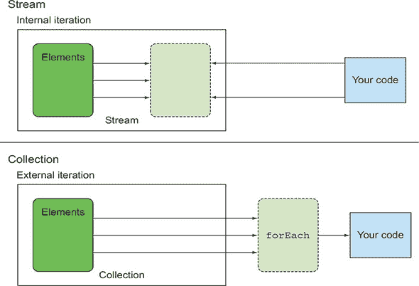

我们已经描述了集合和流之间的概念差异。具体来说，流使用内部迭代，其中库为你处理迭代。但这只有在你有预定义的操作列表（例如，`filter` 或 `map`）来处理时才有用，这些操作隐藏了迭代。这些操作中的大多数都接受 lambda 表达式作为参数，因此你可以像我们在上一章中展示的那样参数化它们的行为。Java 语言设计者提供了 Streams API，其中包含了一长串你可以用来表达复杂数据处理查询的操作。我们现在将简要地查看这个操作列表，并在下一章通过示例进行更详细的探索。为了检查你对外部迭代和内部迭代的理解，尝试下面的 4.1 测试题。

| |
| --- |

**测试题 4.1：外部迭代与内部迭代**

根据 列表 4.1 和 4.2 中关于外部迭代的学习，你会使用哪个流操作来重构以下代码？

```
List<String> highCaloricDishes = new ArrayList<>();
Iterator<String> iterator = menu.iterator();
while(iterator.hasNext()) {
    Dish dish = iterator.next();
    if(dish.getCalories() > 300) {
        highCaloricDishes.add(d.getName());
    }
}
```

**答案：**你需要使用 `filter` 模式

```
List<String> highCaloricDish =
    menu.stream()
        .filter(dish -> dish.getCalories() > 300)
        .collect(toList());
```

如果你对如何精确地编写流查询还不熟悉，不要担心，你将在下一章中详细了解这一点。

| |
| --- |

### 4.4\. 流操作

`java.util.stream.Stream` 中的流接口定义了许多操作。它们可以分为两类。让我们再次看看我们的上一个例子：

```
List<String> names = menu.stream()                                   *1*
                         .filter(dish -> dish.getCalories() > 300)   *2*
                         .map(Dish::getName)                         *2*
                         .limit(3)                                   *2*
                         .collect(toList());                         *3*
```

+   ***1* 从菜式列表中获取流**

+   ***2* 中间操作**

+   ***3* 将流转换为列表**

你可以看到两组操作：

+   `filter`、`map` 和 `limit` 可以连接起来形成一个管道。

+   `collect` 导致管道执行并关闭它。

可以连接的流操作称为 *中间操作*，而关闭流的操作称为 *终端操作*。图 4.5 突出了这两组操作。这种区分为什么很重要？

##### 图 4.5\. 中间操作与终端操作

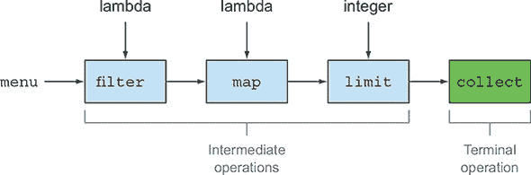

#### 4.4.1\. 中间操作

中间操作，如 `filter` 或 `sorted`，返回另一个流作为返回类型。这允许操作连接起来形成一个查询。重要的是，中间操作在流管道上调用终端操作之前不会执行任何处理——它们是惰性的。这是因为中间操作通常可以被合并并处理为终端操作的单个遍历。

要理解流管道中发生的事情，修改代码，使每个 lambda 也打印出它正在处理的当前菜式。（像许多演示和调试技术一样，这对于生产代码来说是一种糟糕的编程风格，但在学习时可以直接解释评估的顺序。）

```
List<String> names =
    menu.stream()

        .filter(dish -> {
                          System.out.println("filtering:" + dish.getName());
                          return dish.getCalories() > 300;
                     })                                                    *1*
        .map(dish -> {
                       System.out.println("mapping:" + dish.getName());
                       return dish.getName();
                  })                                                       *2*
        .limit(3)
        .collect(toList());
System.out.println(names);
```

+   ***1* 在过滤过程中打印菜式**

+   ***2* 按提取名称的顺序打印菜式**

当执行此代码时，将打印以下内容：

```
filtering:pork
mapping:pork
filtering:beef
mapping:beef
filtering:chicken
mapping:chicken
[pork, beef, chicken]
```

通过这样做，你可以注意到 Streams 库通过利用流的惰性特性执行了几个优化。首先，尽管许多菜式的卡路里超过 300，但只选择了前三个！这是因为 `limit` 操作和称为 *短路* 的技术，我们将在下一章中解释。其次，尽管 `filter` 和 `map` 是两个不同的操作，但它们被合并到了同一个遍历中（编译器专家称这种技术为 *循环融合*）。

#### 4.4.2\. 终端操作

终端操作从流管道生成一个结果。结果可以是任何非流值，例如 `List`、`Integer`，甚至是 `void`。例如，在下面的管道中，`forEach` 是一个终端操作，它返回 `void` 并对源中的每个菜式应用 lambda。将 `System.out.println` 传递给 `forEach` 是要求它打印从 `menu` 创建的流中的每个 `Dish`：

```
menu.stream().forEach(System.out::println);
```

为了检验你对中间操作与终端操作的理解，尝试练习 4.2。

|  |
| --- |

**练习 4.2：中间操作与终端操作**

在下面的流管道中，你能识别出中间操作和终端操作吗？

```
long count = menu.stream()
                 .filter(dish -> dish.getCalories() > 300)
                 .distinct()
                 .limit(3)
                 .count();
```

**答案：**

流管道中的最后一个操作 `count` 返回一个 `long`，这是一个非流值。因此，它是一个 *终端操作*。所有之前的操作，`filter`、`distinct`、`limit`，都是连接的，并返回一个流。因此，它们是 *中间操作*。

|  |
| --- |

#### 4.4.3\. 使用流

总结起来，使用流通常涉及三个项目：

+   *数据源*（如集合）用于执行查询

+   形成流管道的 *中间操作* 链

+   执行流管道并产生结果的 *终端操作*

流管道背后的思想与构建器模式类似（见 [`en.wikipedia.org/wiki/Builder_pattern`](http://en.wikipedia.org/wiki/Builder_pattern)）。在构建器模式中，有一系列设置配置的调用链（对于流来说，这是一系列中间操作），然后是一个调用 `build` 方法的调用（对于流来说，这是一个终端操作）。

为了方便起见，表 4.1 和 4.2 总结了您在迄今为止的代码示例中看到的中间和终端流操作。请注意，这是 Streams API 提供的操作的不完整列表；您将在下一章中看到更多操作！

##### 表 4.1\. 中间操作

| 操作 | 类型 | 返回类型 | 操作的参数 | 函数描述符 |
| --- | --- | --- | --- | --- |
| filter | 中间操作 | Stream<T> | Predicate<T> | T -> boolean |
| map | 中间操作 | Stream<R> | Function<T, R> | T -> R |
| limit | 中间操作 | Stream<T> |   |   |
| sorted | 中间操作 | Stream<T> | Comparator<T> | (T, T) -> int |
| distinct | 中间操作 | Stream<T> |   |   |

##### 表 4.2\. 终端操作

| 操作 | 类型 | 返回类型 | 目的 |
| --- | --- | --- | --- | --- |
| forEach | 终端操作 | void | 消费流中的每个元素，并对每个元素应用 lambda 函数。 |
| count | 终端操作 | long | 返回流中的元素数量。 |
| collect | 终端操作 | (泛型) | 将流缩减为一个集合，如 List、Map 或甚至 Integer。有关更多详细信息，请参阅 第六章。 |

### 4.5\. 路线图

在下一章中，我们将详细说明可用的流操作及其用例，以便您可以看到您可以使用它们表达哪些类型的查询。我们将探讨许多模式，如过滤、切片、查找、匹配、映射和归约，这些模式可以用来表达复杂的数据处理查询。

第六章 详细探讨了收集器。在本章中，我们只使用了流上的 `collect()` 终端操作（见 表 4.2），其形式为 `collect(toList())`，它创建了一个 `List`，其元素与应用于它的流的元素相同。

### 摘要

+   流是从支持数据处理操作的数据源中获取的一系列元素。

+   流使用内部迭代：迭代通过`filter`、`map`和`sorted`等操作被抽象化。

+   有两种类型的流操作：中间操作和终端操作。

+   中间操作，如`filter`和`map`，返回一个流并可以串联在一起。它们用于设置操作管道，但不会产生任何结果。

+   终端操作，如`forEach`和`count`，返回非流值并处理流管道以返回结果。

+   流的元素是按需计算的（“延迟”计算）。

## 第五章\. 使用流

*本章涵盖*

+   过滤、切片和映射

+   查找、匹配和归约

+   使用数值流（原始流特殊化）

+   从多个来源创建流

+   无限流

在上一章中，你看到流让你从*外部迭代*转移到*内部迭代*。你不需要编写代码，如下所示，其中你明确管理数据集合的迭代（外部迭代），

```
List<Dish> vegetarianDishes = new ArrayList<>();
for(Dish d: menu) {
    if(d.isVegetarian()){
        vegetarianDishes.add(d);
    }
}
```

你可以使用 Streams API（内部迭代），它支持`filter`和`collect`操作，来为你管理数据集合的迭代。你需要做的只是将过滤行为作为参数传递给`filter`方法：

```
import static java.util.stream.Collectors.toList;
List<Dish> vegetarianDishes =
    menu.stream()
        .filter(Dish::isVegetarian)
        .collect(toList());
```

这种不同的数据处理方式很有用，因为你可以让 Streams API 管理如何处理数据。因此，Streams API 可以在幕后进行优化。此外，使用内部迭代，Streams API 可以决定是否并行运行你的代码。使用外部迭代，这是不可能的，因为你承诺进行单线程的逐步顺序迭代。

在本章中，你将全面了解 Streams API 支持的各项操作。你将了解 Java 8 中可用的操作以及 Java 9 中的新增功能。这些操作将让你能够表达复杂的数据处理查询，如过滤、切片、映射、查找、匹配和归约。接下来，我们将探讨流的特殊情况：数值流、从多个来源（如文件和数组）构建的流，以及最终的无限流。

### 5.1\. 过滤

在本节中，我们将探讨选择流元素的方法：使用谓词进行过滤和过滤唯一元素。

#### 5.1.1\. 使用谓词进行过滤

`Stream`接口支持一个`filter`方法（你现在应该很熟悉了）。这个操作接受一个*谓词*（返回`boolean`值的函数）作为参数，并返回一个包含所有匹配谓词的元素的流。例如，你可以通过过滤所有素食菜肴来创建一个素食菜单，如图 5.1 所示及其后的代码：

##### 图 5.1\. 使用谓词过滤流

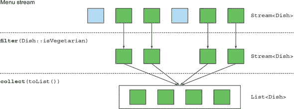

```
List<Dish> vegetarianMenu = menu.stream()
                                .filter(Dish::isVegetarian)      *1*
                                .collect(toList());
```

+   ***1* 使用方法引用来检查一道菜是否适合素食者食用。**

#### 5.1.2\. 过滤唯一元素

流还支持一个名为 `distinct` 的方法，该方法返回一个包含唯一元素的流（根据流生成的对象的 `hashcode` 和 `equals` 方法的实现）。例如，以下代码从列表中过滤出所有偶数，然后消除重复项（使用 `equals` 方法进行比较）。图 5.2 以可视化的方式展示了这一点。

```
List<Integer> numbers = Arrays.asList(1, 2, 1, 3, 3, 2, 4);
numbers.stream()
       .filter(i -> i % 2 == 0)
       .distinct()
       .forEach(System.out::println);
```

##### 图 5.2\. 在流中过滤唯一元素

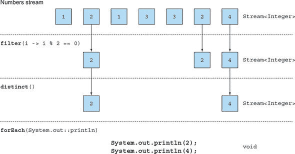

### 5.2\. 切片流


在本节中，我们将讨论如何以不同的方式在流中选择和跳过元素。有操作可以让你高效地使用谓词选择或丢弃元素，忽略流的前几个元素，或者截断流到给定的大小。

#### 5.2.1\. 使用谓词切片

Java 9 添加了两个对在流中高效选择元素有用的新方法：`takeWhile` 和 `dropWhile`。

##### 使用 takeWhile

假设你有一个以下特殊的菜肴列表：

```
List<Dish> specialMenu = Arrays.asList(
    new Dish("seasonal fruit", true, 120, Dish.Type.OTHER),
    new Dish("prawns", false, 300, Dish.Type.FISH),
    new Dish("rice", true, 350, Dish.Type.OTHER),
    new Dish("chicken", false, 400, Dish.Type.MEAT),
    new Dish("french fries", true, 530, Dish.Type.OTHER));
```

你会如何选择少于 320 卡路里的菜肴？从上一节中，你可能会本能地知道可以使用 `filter` 操作如下：

```
List<Dish> filteredMenu
    = specialMenu.stream()
                 .filter(dish -> dish.getCalories() < 320)
                 .collect(toList());                         *1*
```

+   ***1* 列出季节性水果，虾**

但是，你会注意到初始列表已经按卡路里数量排序了！在这里使用 `filter` 操作的缺点是，你需要遍历整个流，并且谓词应用于每个元素。相反，你可以在找到卡路里大于（或等于）320 的菜肴时停止。对于小型列表，这可能看起来不是什么大好处，但如果你处理的是可能非常大的元素流，它就会变得有用。但你怎么指定这个？`takeWhile` 操作就是为了解决这个问题而存在的！它允许你使用谓词切片任何流（甚至是一个无限流，你将在后面学到），但幸运的是，它会在找到不匹配的元素时停止。以下是如何使用它的示例：

```
List<Dish> slicedMenu1
    = specialMenu.stream()
                 .takeWhile(dish -> dish.getCalories() < 320)
                 .collect(toList());                           *1*
```

+   ***1* 列出季节性水果，虾**

##### 使用 dropWhile

那么其他元素怎么办？如何找到卡路里超过 320 的元素？你可以使用 `dropWhile` 操作来完成这个任务：

```
List<Dish> slicedMenu2
    = specialMenu.stream()
                 .dropWhile(dish -> dish.getCalories() < 320)
                 .collect(toList());                            *1*
```

+   ***1* 列出米饭，鸡肉，薯条**

`dropWhile` 操作是 `takeWhile` 的补充。它丢弃起始处为假值的元素。一旦谓词评估为真，它就会停止并返回所有剩余的元素，即使剩余元素是无限数量的也能工作！

#### 5.2.2\. 截断流

流支持 `limit(n)` 方法，该方法返回另一个长度不超过给定大小的流。请求的大小作为参数传递给 `limit`。如果流是有序的，则返回前 `n` 个元素，最多不超过 `n`。例如，你可以通过以下方式创建一个 `List`，选择前三个卡路里超过 300 的菜肴：

```
List<Dish> dishes = specialMenu
                        .stream()
                        .filter(dish -> dish.getCalories() > 300)
                        .limit(3)
                        .collect(toList());               *1*
```

+   ***1* 列出米饭，鸡肉，薯条**

图 5.3 展示了`filter`和`limit`的组合。你可以看到，只有符合谓词的前三个元素被选中，并且结果立即返回。

##### 图 5.3\. 截断流

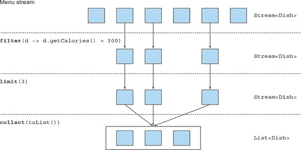

注意，`limit`也适用于无序流（例如，如果源是`Set`）。在这种情况下，你不应该假设`limit`产生的结果有任何顺序。

#### 5.2.3\. 跳过元素

流支持`skip(n)`方法，用于返回一个丢弃前`n`个元素的流。如果流中的元素少于`n`个，则返回一个空流。请注意，`limit(n)`和`skip(n)`是互补的！例如，以下代码跳过了前两个超过 300 卡路里的菜品，并返回了剩余的菜品。图 5.4 展示了这个查询。

```
List<Dish> dishes = menu.stream()
                        .filter(d -> d.getCalories() > 300)
                        .skip(2)
                        .collect(toList());
```

##### 图 5.4\. 跳过流中的元素

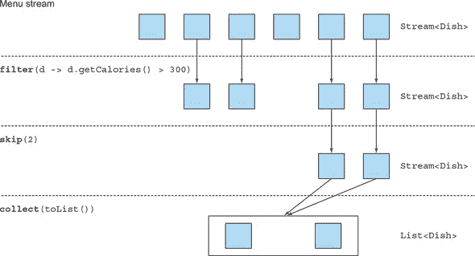

在我们转向映射操作之前，请将本节学到的内容通过练习 5.1 进行实践。

| |
| --- |

**练习 5.1：过滤**

你将如何使用流来过滤前两个肉菜？

**答案：**

你可以通过组合`filter`和`limit`方法并使用`collect(toList())`将流转换为列表来解决此问题：

```
List<Dish> dishes =
    menu.stream()
        .filter(dish -> dish.getType() == Dish.Type.MEAT)
        .limit(2)
        .collect(toList());
```

| |
| --- |

### 5.3\. 映射

从某些对象中选择信息是一种常见的数据处理惯用方法。例如，在 SQL 中，你可以从表中选择特定的列。Streams API 通过`map`和`flatMap`方法提供了类似的设施。

#### 5.3.1\. 将函数应用于流中的每个元素

流支持`map`方法，该方法接受一个函数作为参数。该函数应用于每个元素，将其映射到新元素（单词*mapping*用于表示，因为它有一个类似于*transforming*的含义，但带有“创建新版本”而不是“修改”的细微差别）。例如，在以下代码中，你将方法引用`Dish::getName`传递给`map`方法来*提取*流中的菜品名称：

```
List<String> dishNames = menu.stream()
                             .map(Dish::getName)
                             .collect(toList());
```

因为`getName`方法返回一个字符串，所以`map`方法输出的流类型为`Stream<String>`。

让我们用一个稍微不同的例子来巩固你对`map`的理解。给定一个单词列表，你想要返回每个单词的字符数列表。你将如何做？你需要对列表中的每个元素应用一个函数。这听起来像是`map`方法的用武之地！要应用的函数应该接受一个单词并返回其长度。你可以通过将方法引用`String::length`传递给`map`来解决此问题：

```
List<String> words = Arrays.asList("Modern", "Java", "In", "Action");
List<Integer> wordLengths = words.stream()
                                 .map(String::length)
                                 .collect(toList());
```

让我们回到提取每个菜品名称的例子。如果你想知道每个菜品名称的长度，你可以通过以下方式链式使用另一个`map`：

```
List<Integer> dishNameLengths = menu.stream()
                                   .map(Dish::getName)
                                   .map(String::length)
                                   .collect(toList());
```

#### 5.3.2\. 扁平化流

你已经看到了如何使用 `map` 方法返回列表中每个单词的长度。让我们进一步扩展这个想法：你如何返回一个单词列表的所有 *唯一字符* 的列表？例如，给定单词列表 `["Hello," "World"]`，你希望返回列表 `["H," "e," "l," "o," "W," "r," "d"]`。

你可能认为这很简单，你可以将每个单词映射到一个字符列表，然后调用 `distinct` 来过滤重复的字符。第一次尝试可能如下所示：

```
words.stream()
     .map(word -> word.split(""))
     .distinct()
     .collect(toList());
```

这种方法的问题在于传递给 `map` 方法的 lambda 返回每个单词的 `String[]`（字符串数组）。`map` 方法返回的流是 `Stream<String[]>` 类型。你想要的应该是 `Stream<String>` 来表示字符流。图 5.5 展示了这个问题。

##### 图 5.5\. 使用 `map` 错误地从单词列表中找到唯一字符

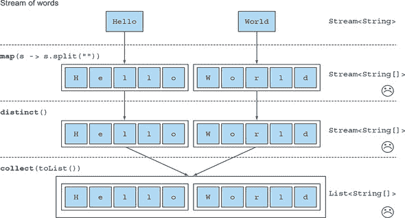

幸运的是，有一个使用 `flatMap` 方法的解决方案来解决这个问题！让我们一步一步地看看如何解决这个问题。

##### 尝试使用 map 和 Arrays.stream

首先，你需要一个字符流而不是数组流。有一个名为 `Arrays.stream()` 的方法，它接受一个数组并产生一个流：

```
String[] arrayOfWords = {"Goodbye", "World"};
Stream<String> streamOfwords = Arrays.stream(arrayOfWords);
```

在之前的管道中使用它，看看会发生什么：

```
words.stream()
     .map(word -> word.split(""))         *1*
     .map(Arrays::stream)                 *2*
     .distinct()
     .collect(toList());
```

+   ***1* 将每个单词转换为它各个字母的数组**

+   ***2* 将每个数组转换为单独的流**

当前的解决方案仍然不起作用！这是因为你现在得到了一个流列表（更准确地说，是 `List<Stream<String>>`）。确实，你首先将每个单词转换成它各个字母的数组，然后将每个数组转换成单独的流。

##### 使用 flatMap

你可以通过以下方式使用 `flatMap` 来解决这个问题：

```
List<String> uniqueCharacters =
  words.stream()
       .map(word -> word.split(""))        *1*
       .flatMap(Arrays::stream)            *2*
       .distinct()
       .collect(toList());
```

+   ***1* 将每个单词转换为它各个字母的数组**

+   ***2* 将生成的每个流扁平化为单个流**

使用 `flatMap` 方法的效果是将每个数组映射到一个流，而不是映射到流的内容。使用 `map(Arrays::stream)` 生成时产生的所有单独的流都被合并——扁平化为一个单一的流。图 5.6 展示了使用 `flatMap` 方法的效果。与图 5.5 中的 `map` 的效果进行比较。

##### 图 5.6\. 使用 `flatMap` 从单词列表中找到唯一字符

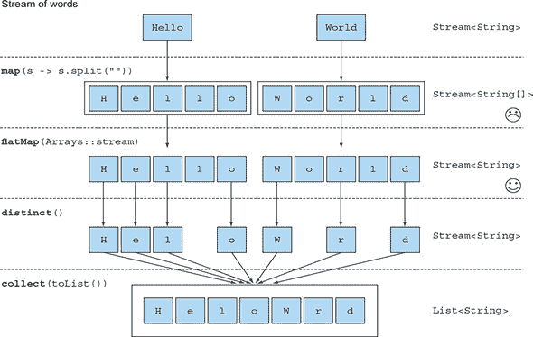

简而言之，`flatMap` 方法允许你用另一个流替换流中的每个值，然后将所有生成的流连接成一个单一的流。

当我们讨论更高级的 Java 8 模式，例如使用新的库类 `Optional` 进行 `null` 检查时，我们将在第十一章回到 `flatMap`。为了巩固你对 `map` 和 `flatMap` 的理解，尝试练习 5.2。

|  |
| --- |

**练习 5.2：映射**

1\. 给定一个数字列表，你如何返回每个数字的平方列表？例如，给定 [1, 2, 3, 4, 5]，你应该返回 [1, 4, 9, 16, 25]。

**答案：**

你可以通过使用带有 lambda 的`map`来解决此问题，该 lambda 接受一个数字并返回该数字的平方：

```
List<Integer> numbers = Arrays.asList(1, 2, 3, 4, 5);
List<Integer> squares =
    numbers.stream()
           .map(n -> n * n)
           .collect(toList());
```

2. 给定两个数字列表，你将如何返回所有数字对？例如，给定一个列表 [1, 2, 3] 和一个列表 [3, 4]，你应该返回 [(1, 3), (1, 4), (2, 3), (2, 4), (3, 3), (3, 4)]。为了简单起见，你可以将一对表示为包含两个元素的数组。

**答案：**

你可以使用两个`map`来遍历两个列表并生成对。但这将返回一个`Stream<Stream<Integer[]>>`。你需要做的是展平生成的流，以得到一个`Stream<Integer[]>`。这就是`flatMap`的作用：

```
List<Integer> numbers1 = Arrays.asList(1, 2, 3);
List<Integer> numbers2 = Arrays.asList(3, 4);
List<int[]> pairs =
    numbers1.stream()
            .flatMap(i -> numbers2.stream()
                                  .map(j -> new int[]{i, j})
                    )
            .collect(toList());
```

3. 你会如何扩展前面的例子以返回和为 3 的倍数的所有对？

**答案：**

你之前看到`filter`可以与谓词一起使用，从流中过滤元素。因为`flatMap`操作后，你有一个表示对的`int[]`流，你只需要一个谓词来检查和是否为 3 的倍数：

```
List<Integer> numbers1 = Arrays.asList(1, 2, 3);
List<Integer> numbers2 = Arrays.asList(3, 4);
List<int[]> pairs =
    numbers1.stream()
            .flatMap(i ->
                       numbers2.stream()
                               .filter(j -> (i + j) % 3 == 0)
                               .map(j -> new int[]{i, j})
                    )
            .collect(toList());
```

结果是 [(2, 4), (3, 3)]。

|  |
| --- |

### 5.4. 查找和匹配

另一个常见的数据处理惯用方法是检查数据集中的一些元素是否匹配给定的属性。Streams API 通过流的方法`allMatch`、`anyMatch`、`noneMatch`、`findFirst`和`findAny`提供了这样的功能。

#### 5.4.1. 检查谓词是否匹配至少一个元素

`anyMatch`方法可以用来回答“流中是否存在匹配给定谓词的元素？”例如，你可以用它来找出菜单中是否有素食选项：

```
if(menu.stream().anyMatch(Dish::isVegetarian)) {
    System.out.println("The menu is (somewhat) vegetarian friendly!!");
}
```

`anyMatch`方法返回一个`boolean`，因此是一个终端操作。

#### 5.4.2. 检查谓词是否匹配所有元素

`allMatch`方法与`anyMatch`类似，但会检查流中的所有元素是否匹配给定的谓词。例如，你可以用它来找出菜单是否健康（所有菜品的热量都低于 1000 卡路里）：

```
boolean isHealthy = menu.stream()
                        .allMatch(dish -> dish.getCalories() < 1000);
```

##### noneMatch

`allMatch`的相反操作是`noneMatch`。它确保流中没有任何元素匹配给定的谓词。例如，你可以使用`noneMatch`将前面的例子重写如下：

```
boolean isHealthy = menu.stream()
                        .noneMatch(d -> d.getCalories() >= 1000);
```

这三个操作——`anyMatch`、`allMatch`和`noneMatch`——利用了我们所说的*短路*，这是熟悉的 Java 短路`&&`和`||`运算符的流版本。

|  |
| --- |

**短路评估**

一些操作不需要处理整个流就能产生结果。例如，假设你需要评估一个由`and`运算符连接的大`boolean`表达式。你只需要找出其中一个表达式是`false`，就可以推断出整个表达式将返回`false`，无论表达式有多长；没有必要评估整个表达式。这就是*短路*的含义。

与流相关，某些操作如`allMatch`、`noneMatch`、`findFirst`和`findAny`不需要处理整个流来产生结果。一旦找到元素，就可以产生结果。同样，`limit`也是一个短路操作。该操作只需要创建一个给定大小的流，而不需要处理流中的所有元素。这样的操作很有用（例如，当你需要处理无限大小的流时，因为它们可以将无限流转换为有限大小的流）。我们将在第 5.7 节中展示无限流的示例。

|  |
| --- |

#### 5.4.3\. 查找元素

`findAny`方法返回当前流的任意元素。它可以与其他流操作结合使用。例如，你可能希望找到一个素食菜。你可以将`filter`方法和`findAny`结合起来表达这个查询：

```
Optional<Dish> dish =
  menu.stream()
      .filter(Dish::isVegetarian)
      .findAny();
```

在幕后，流管道将被优化以执行单次遍历，并在找到结果后立即完成，这是通过短路实现的。但是等等；代码中的这个`Optional`是什么东西？

##### Optional 概述

`Optional<T>`类（`java.util.Optional`）是一个容器类，用于表示值的存在或不存在。在之前的代码中，`findAny`可能找不到任何元素。而不是返回`null`，这众所周知是容易出错的，Java 8 库设计者引入了`Optional<T>`。我们不会在这里详细介绍`Optional`，因为我们将在第十一章中详细展示如何使用`Optional`来避免与`null`检查相关的错误。但到目前为止，了解`Optional`中有一些方法可以强制你显式检查值的存在或处理值不存在的情况是很好的：

+   `isPresent()`方法返回`true`如果`Optional`包含一个值，否则返回`false`。

+   `ifPresent(Consumer<T> block)`如果存在值，则执行给定的块。我们在第三章中介绍了`Consumer`函数式接口；它允许你传递一个接受类型为`T`的参数并返回`void`的 lambda 表达式。

+   `T get()`如果存在值，则返回该值；否则抛出`NoSuchElementException`。

+   `T orElse(T other)`如果存在值，则返回该值；否则返回默认值。

例如，在之前的代码中，你需要显式检查`Optional`对象中是否存在一个菜，才能访问其名称：

```
menu.stream()
    .filter(Dish::isVegetarian)
    .findAny()                                                  *1*
    .ifPresent(dish -> System.out.println(dish.getName());      *2*
```

+   ***1* 返回一个`Optional<Dish>`。**

+   ***2* 如果包含值，则打印；否则不发生任何操作。**

#### 5.4.4\. 查找第一个元素

一些流有一个 *encounter order*，它指定了项目在流中逻辑上出现的顺序（例如，从 `List` 或排序的数据序列生成的流）。对于这样的流，你可能希望找到第一个元素。有 `findFirst` 方法可以做到这一点，它的工作方式与 `findAny` 类似（例如，下面的代码给出了一个数字列表，找到第一个能被 3 整除的平方数）：

```
List<Integer> someNumbers = Arrays.asList(1, 2, 3, 4, 5);
Optional<Integer> firstSquareDivisibleByThree =
  someNumbers.stream()
             .map(n -> n * n)
             .filter(n -> n % 3 == 0)
             .findFirst(); // 9
```

| |
| --- |

**何时使用 findFirst 和 findAny**

你可能会想知道为什么我们既有 `findFirst` 又有 `findAny`。答案是并行处理。在并行处理中找到第一个元素有更多的限制。如果你不关心返回哪个元素，可以使用 `findAny`，因为它在并行流中使用时限制较少。

| |
| --- |

### 5.5. Reducing

你所看到的终端操作要么返回一个 `boolean`（`allMatch` 等），要么返回 `void`（`forEach`），或者返回一个 `Optional` 对象（`findAny` 等）。你还在使用 `collect` 将流中的所有元素组合成一个 `List`。

在本节中，你将了解如何使用 `reduce` 操作将流中的元素组合起来，以表达更复杂的查询，例如“计算菜单中所有卡路里的总和”，或者“菜单中最高卡路里的菜品是什么？”这样的查询会将流中的所有元素反复组合，以产生一个单一值，例如一个 `Integer`。这些查询可以归类为 *reduction operations*（流被缩减为一个值）。在函数式编程语言的术语中，这被称为 *fold*，因为你可以将这个操作视为反复折叠一张长纸（你的流）直到它形成一个小的正方形，这就是折叠操作的结果。

#### 5.5.1. 求和元素

在我们探讨如何使用 `reduce` 方法之前，先看看如何使用 `for-each` 循环来计算一个数字列表的元素总和是有帮助的：

```
int sum = 0;
for (int x : numbers) {
    sum += x;
}
```

`numbers` 的每个元素都会通过迭代使用加法运算符来组合成一个结果。你通过反复使用加法来 *reduce* 数字列表到一个数字。这段代码中有两个参数：

+   总和变量的初始值，在这种情况下是 `0`

+   将列表中的所有元素组合起来的操作，在这种情况下是 `+`

如果你可以不重复粘贴代码就能将所有数字相乘，那岂不是很好？这就是 `reduce` 操作发挥作用的地方，它抽象了这种重复应用的模式。你可以如下方式计算流中所有元素的总和：

```
int sum = numbers.stream().reduce(0, (a, b) -> a + b);
```

`reduce` 接受两个参数：

+   一个初始值，这里 `0`。

+   一个 `BinaryOperator<T>` 用于合并两个元素并产生一个新值；在这里你使用的是 lambda 表达式 `(a, b) -> a + b`。

你也可以通过传递不同的 lambda 表达式 `(a, b) -> a * b` 到 `reduce` 操作中，来轻松地将所有元素相乘：

```
int product = numbers.stream().reduce(1, (a, b) -> a * b);
```

图 5.7 展示了 `reduce` 操作在流上的工作方式：lambda 重复组合每个元素，直到包含整数 4、5、3、9 的流被缩减为一个单一值。

##### 图 5.7\. 使用 `reduce` 对流中的数字求和

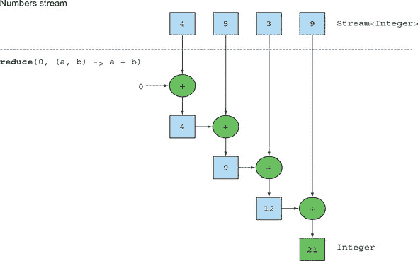

让我们深入探讨 `reduce` 操作是如何将数字流求和的。首先，`0` 被用作 lambda 的第一个参数（`a`），然后从流中消耗 `4` 并用作第二个参数（`b`）。`0 + 4` 产生 `4`，这成为新的累积值。然后 lambda 再次被调用，使用累积值和流的下一个元素 `5`，这产生了新的累积值 `9`。继续前进，lambda 再次被调用，使用累积值和下一个元素 `3`，这产生了 `12`。最后，lambda 被调用，使用 `12` 和流的最后一个元素 `9`，这产生了最终值 `21`。

你可以通过使用方法引用使这段代码更加简洁。从 Java 8 开始，`Integer` 类现在包含一个静态的 `sum` 方法来添加两个数字，这正是你想要的，而不是反复编写相同的 lambda 代码：

```
int sum = numbers.stream().reduce(0, Integer::sum);
```

##### 没有初始值

`reduce` 也有一个不带初始值的重载变体，它返回一个 `Optional` 对象：

```
Optional<Integer> sum = numbers.stream().reduce((a, b) -> (a + b));
```

为什么它返回 `Optional<Integer>`？考虑流中没有元素的情况。`reduce` 操作不能返回一个和，因为它没有初始值。这就是为什么结果被包裹在一个 `Optional` 对象中，以表明和可能不存在。现在看看你还能用 `reduce` 做些什么。

#### 5.5.2\. 最大值和最小值

结果表明，计算最大值和最小值只需要 `reduce` 操作！让我们看看如何将你刚刚学到的关于 `reduce` 的知识应用到计算流中的最大或最小元素。正如你所看到的，`reduce` 接受两个参数：

+   初始值

+   一个用于组合两个流元素并产生新值的 lambda

lambda 按步骤应用于流中的每个元素，使用加法运算符，如 图 5.7 所示。你需要一个 lambda，给定两个元素，返回它们的最大值。`reduce` 操作将使用新的值与流的下一个元素一起产生一个新的最大值，直到整个流被消耗！你可以如下使用 `reduce` 来计算流中的最大值；这在 图 5.8 中有说明。

```
Optional<Integer> max = numbers.stream().reduce(Integer::max);
```

要计算最小值，你需要将 `Integer.min` 传递给 `reduce` 操作，而不是 `Integer.max`：

```
Optional<Integer> min = numbers.stream().reduce(Integer::min);
```

你同样可以使用 lambda `(x, y) -> x < y ? x : y` 来代替 `Integer-::min`，但后者显然更容易阅读！

##### 图 5.8\. `reduce` 操作——计算最大值

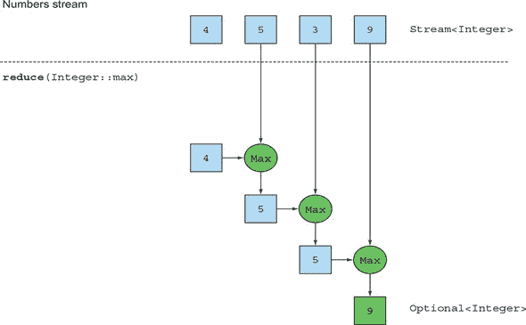

为了测试你对 `reduce` 操作的理解，尝试练习 5.3。

|  |
| --- |

**练习 5.3：reduce**

你将如何使用 `map` 和 `reduce` 方法来计算流中菜品的数量？

**答案：**

你可以通过将流中的每个元素映射到数字 1，然后使用 `reduce` 求和来解决此问题！这相当于按顺序计数流中的元素数量：

```
int count = menu.stream()
                .map(d -> 1)
                .reduce(0, (a, b) -> a + b);
```

`map` 和 `reduce` 的链通常被称为 map-reduce 模式，由于 Google 在网页搜索中使用它而闻名，因为它可以很容易地并行化。注意，在第四章（kindle_split_015.xhtml#ch04）中，你看到了内置方法 `count` 来计算流中的元素数量：

```
long count = menu.stream().count();
```

|  |
| --- |
|  |

**减少方法和并行性的好处**

使用 `reduce` 相比于你之前编写的逐步迭代求和的好处是，迭代被内部迭代抽象化，这使得内部实现可以选择并行执行 `reduce` 操作。迭代求和示例涉及到对 `sum` 变量的共享更新，这并不容易并行化。如果你添加所需的同步，你可能会发现线程竞争会剥夺你本应从并行性中获得的所有性能！并行化这个计算需要不同的方法：划分输入，求和分区，然后合并求和。但现在代码开始看起来非常不同。你将在第七章中看到使用 fork/join 框架的样子。但到目前为止，重要的是要意识到可变累加器模式对于并行化来说是一个死胡同。你需要一个新的模式，这正是 `reduce` 为你提供的。你还会在第七章中看到，为了并行求和流中的所有元素，几乎不需要修改你的代码：`stream()` 变为 `parallelStream()`：

```
int sum = numbers.parallelStream().reduce(0, Integer::sum);
```

但执行此代码并行化需要付出代价，我们将在后面解释：传递给 `reduce` 的 lambda 不能改变状态（例如，实例变量），并且操作需要是结合律和交换律，这样它就可以按任何顺序执行。

|  |
| --- |

你已经看到了产生 `Integer` 的归约示例：流的和、流的最大值或流的元素数量。你将在 5.6 节中看到，有额外的内置方法如 `sum` 和 `max` 可用于帮助你编写更简洁的代码，用于常见的归约模式。我们将在下一章中调查使用 `collect` 方法的更复杂形式的归约。例如，你不仅可以把流归约成一个 `Integer`，如果你想要按类型分组菜品，你也可以把它归约成一个 `Map`。

|  |
| --- |

**流操作：无状态与有状态**

你已经看到了很多流操作。一个初步的介绍可能会使它们看起来像万能药。一切都很顺利，当你使用 `parallelStream` 而不是 `stream` 从集合中获取流时，你会免费获得并行性。

当然，对于许多应用来说，情况确实如此，正如你在前面的例子中看到的。你可以将菜肴列表转换为流，使用`filter`选择特定类型的各种菜肴，然后`map`到结果流中添加卡路里数，最后`reduce`以生成菜单的总卡路里数。你甚至可以在并行中进行这样的流计算。但是，这些操作有不同的特性。它们在操作时需要什么样的内部状态存在一些问题。

`map`和`filter`这样的操作从输入流中取每个元素，并在输出流中产生零个或一个结果。这些操作通常是**无状态的**：它们没有内部状态（假设用户提供的 lambda 表达式或方法引用没有内部可变状态）。

但是像`reduce`、`sum`和`max`这样的操作需要内部状态来累积结果。在这种情况下，内部状态很小。在我们的例子中，它由一个`int`或`double`组成。无论正在处理的流中有多少元素，内部状态的大小都是有限的。

相比之下，一些操作如`sorted`或`distinct`最初看起来像`filter`或`map`——所有这些操作都接受一个流并产生另一个流（一个中间操作），但有一个关键的区别。排序和从流中删除重复项都需要知道之前的历史才能完成它们的工作。例如，排序需要在向输出流添加单个项目之前将所有元素缓冲；该操作的存储需求是**无界的**。如果数据流很大或无限，这可能会成为问题。（反转所有质数流应该做什么？它应该返回最大的质数，数学告诉我们这是不存在的。）我们称这些操作为**有状态的操作**。

|  |
| --- |

你现在已经看到了很多可以用来表达复杂数据处理查询的流操作！表 5.1 总结了迄今为止看到的操作。你将在下一节通过练习来练习它们。

##### 表 5.1\. 中间和终端操作

| 操作 | 类型 | 返回类型 | 类型/功能接口 | 函数描述符 |
| --- | --- | --- | --- | --- |
| filter | 中间操作 | Stream<T> | Predicate<T> | T -> boolean |
| distinct | 中间操作（有状态-无界） | Stream<T> |  |  |
| takeWhile | 中间操作 | Stream<T> | Predicate<T> | T -> boolean |
| dropWhile | 中间操作 | Stream<T> | Predicate<T> | T -> boolean |
| skip | 中间操作（有状态-有界） | Stream<T> | long |  |
| limit | 中间操作（有状态-有界） | Stream<T> | long |  |
| map | 中间操作 | Stream<R> | Function<T, R> | T -> R |
| flatMap | 中间操作 | Stream<R> | Function<T, Stream<R>> | T -> Stream<R> |
| sorted | 中间操作（有状态-无界） | Stream<T> | Comparator<T> | (T, T) -> int |
| anyMatch | 终端操作 | boolean | Predicate<T> | T -> boolean |
| noneMatch | 终端 | boolean | Predicate<T> | T -> boolean |
| allMatch | 终端 | boolean | Predicate<T> | T -> boolean |
| findAny | 终端 | Optional<T> |   |   |
| findFirst | 终端 | Optional<T> |   |   |
| forEach | 终端 | void | Consumer<T> | T -> void |
| collect | 终端 | R | Collector<T, A, R> |   |
| reduce | 终端（有状态有界） | Optional<T> | BinaryOperator<T> | (T, T) -> T |
| count | 终端 | long |   |   |

### 5.6\. 将所有内容付诸实践

在本节中，你可以练习到目前为止所学的关于流的知识。我们现在探索一个不同的域：执行交易的交易者。你的经理要求你找到对八个查询的答案。你能做到吗？我们在 5.6.2 节中给出了解决方案，但你应该先尝试一下，以获得一些练习：

1.  找到 2011 年所有的交易并按价值排序（从小到大）。

1.  交易者工作过的所有独特城市有哪些？

1.  找到所有来自剑桥的交易者并按名称排序。

1.  返回一个按字母顺序排序的所有交易者名称的字符串。

1.  有任何交易者基于米兰吗？

1.  打印居住在剑桥的交易者的所有交易的价值。

1.  所有交易中价值最高的是多少？

1.  找到价值最小的交易。

#### 5.6.1\. 域：交易者和交易

这里是你将工作的域，一个包含`Trader`s 和`Transaction`s 的列表：

```
Trader raoul = new Trader("Raoul", "Cambridge");
Trader mario = new Trader("Mario","Milan");
Trader alan = new Trader("Alan","Cambridge");
Trader brian = new Trader("Brian","Cambridge");
List<Transaction> transactions = Arrays.asList(
    new Transaction(brian, 2011, 300),
    new Transaction(raoul, 2012, 1000),
    new Transaction(raoul, 2011, 400),
    new Transaction(mario, 2012, 710),
    new Transaction(mario, 2012, 700),
    new Transaction(alan, 2012, 950)
);
```

`Trader`和`Transaction`是如下定义的类：

```
public class Trader{
    private final String name;
    private final String city;
    public Trader(String n, String c){
        this.name = n;
        this.city = c;
    }
    public String getName(){
        return this.name;
    }
    public String getCity(){
        return this.city;
    }
    public String toString(){
        return "Trader:"+this.name + " in " + this.city;
    }
}
public class Transaction{
    private final Trader trader;
    private final int year;
    private final int value;
    public Transaction(Trader trader, int year, int value){
        this.trader = trader;
        this.year = year;
        this.value = value;
    }
    public Trader getTrader(){
        return this.trader;
    }
    public int getYear(){
        return this.year;
    }
    public int getValue(){
        return this.value;
    }
    public String toString(){
        return "{" + this.trader + ", " +
               "year: "+this.year+", " +
               "value:" + this.value +"}";
    }
}
```

#### 5.6.2\. 解决方案

我们现在在以下代码列表中提供解决方案，以便你可以验证你对所学内容的理解。做得好！

##### 列表 5.1\. 找到 2011 年所有的交易并按价值排序（从小到大）

```
List<Transaction> tr2011 =
    transactions.stream()
                .filter(transaction -> transaction.getYear() == 2011)    *1*
                .sorted(comparing(Transaction::getValue))                *2*
                .collect(toList());                                      *3*
```

+   ***1* 传递一个谓词以过滤选择 2011 年的交易**

+   ***2* 使用交易的价值对它们进行排序**

+   ***3* 将结果流的全部元素收集到一个列表中**

##### 列表 5.2\. 交易者工作过的所有独特城市有哪些？

```
List<String> cities =
    transactions.stream()
                .map(transaction -> transaction.getTrader().getCity())    *1*
                .distinct()                                               *2*
                .collect(toList());
```

+   ***1* 从与交易关联的交易者中提取城市**

+   ***2* 仅选择独特的城市**

你还没有看到这个，但你也可以省略`distinct()`并使用`toSet()`代替，这将把流转换成集合。你将在第六章中了解更多关于它的内容。

```
Set<String> cities =
    transactions.stream()
                .map(transaction -> transaction.getTrader().getCity())
                .collect(toSet());
```

##### 列表 5.3\. 找到所有来自剑桥的交易者并按名称排序

```
List<Trader> traders =
    transactions.stream()
                .map(Transaction::getTrader)                              *1*
                .filter(trader -> trader.getCity().equals("Cambridge"))   *2*
                .distinct()                                               *3*
                .sorted(comparing(Trader::getName))                       *4*
                .collect(toList());
```

+   ***1* 从交易中提取所有交易者**

+   ***2* 仅选择来自剑桥的交易者**

+   ***3* 移除任何重复项**

+   ***4* 按交易者的名称对生成的流进行排序**

##### 列表 5.4\. 返回一个按字母顺序排序的所有交易者名称的字符串

```
String traderStr =
    transactions.stream()
                .map(transaction -> transaction.getTrader().getName())   *1*
                .distinct()                                              *2*
                .sorted()                                                *3*
                .reduce("", (n1, n2) -> n1 + n2);                        *4*
```

+   ***1* 提取所有交易者的名称作为字符串流**

+   ***2* 移除重复的名称**

+   ***3* 按字母顺序排序名称**

+   ***4* 逐个合并名称以形成一个包含所有名称的字符串**

注意，这个解决方案效率不高（所有字符串都会被反复连接，这会在每次迭代中创建一个新的 `String` 对象）。在下一章中，你将看到一种更高效的解决方案，它使用 `joining()` 如下（内部使用 `StringBuilder`）：

```
String traderStr =
    transactions.stream()
                .map(transaction -> transaction.getTrader().getName())
                .distinct()
                .sorted()
                .collect(joining());
```

##### 列表 5.5\. 是否有任何商人是基于米兰的？

```
boolean milanBased =
    transactions.stream()
                .anyMatch(transaction -> transaction.getTrader()
                                                    .getCity()
                                                    .equals("Milan"));    *1*
```

+   ***1* 将一个谓词传递给 anyMatch 以检查是否有来自米兰的商人。**

##### 列表 5.6\. 打印居住在剑桥的商人的所有交易值

```
transactions.stream()
            .filter(t -> "Cambridge".equals(t.getTrader().getCity()))     *1*
            .map(Transaction::getValue)                                   *2*
            .forEach(System.out::println);                                *3*
```

+   ***1* 选择居住在剑桥的交易**

+   ***2* 提取这些交易的值**

+   ***3* 打印每个值**

##### 列表 5.7\. 所有交易中最高值是多少？

```
Optional<Integer> highestValue =
    transactions.stream()
                .map(Transaction::getValue)         *1*
                .reduce(Integer::max);              *2*
```

+   ***1* 提取每笔交易的价值**

+   ***2* 计算结果流的最大值**

##### 列表 5.8\. 找到价值最小的交易

```
Optional<Transaction> smallestTransaction =
  transactions.stream()
              .reduce((t1, t2) ->
                        t1.getValue() < t2.getValue() ? t1 : t2);      *1*
```

+   ***1* 通过反复比较每笔交易的价值来找到最小的交易**

你可以做得更好。流支持 `min` 和 `max` 方法，这些方法接受一个 `Comparator` 作为参数，以指定在计算最小值或最大值时与哪个键进行比较：

```
Optional<Transaction> smallestTransaction =
  transactions.stream()
              .min(comparing(Transaction::getValue));
```

### 5.7\. 数值流

你之前已经看到可以使用 `reduce` 方法来计算流中元素的总和。例如，你可以这样计算菜单中的卡路里总数：

```
int calories = menu.stream()
                   .map(Dish::getCalories)
                   .reduce(0, Integer::sum);
```

这个代码的问题在于存在一个隐蔽的装箱成本。在幕后，每个 `Integer` 需要被解箱为原始类型，然后才能执行求和操作。此外，如果你可以直接像下面这样调用 `sum` 方法，不是更好吗？

```
int calories = menu.stream()
                   .map(Dish::getCalories)
                   .sum();
```

但这是不可能的。问题是 `map` 方法生成一个 `Stream<T>`。即使流中的元素类型为 `Integer`，`Streams` 接口也没有定义 `sum` 方法。为什么没有？假设你只有一个像 `menu` 这样的 `Stream<Dish>`；能够对菜肴求和是没有意义的。但不用担心；Streams API 还提供了 *原始流特殊化*，它们支持用于处理数字流的专业方法。

#### 5.7.1\. 原始流特殊化

Java 8 引入了三个原始特殊化流接口来解决这个问题，`IntStream`、`DoubleStream` 和 `LongStream`，它们分别将流中的元素特殊化为 `int`、`long` 和 `double`——从而避免了隐藏的装箱成本。这些接口中的每一个都带来了新的方法来执行常见的数值归约，例如 `sum` 用于计算数值流的总和，`max` 用于找到最大元素。此外，它们在必要时还有将它们转换回对象流的方法。需要记住的是，这些特殊化的额外复杂性并非固有的。它反映了装箱的复杂性——基于效率的 `int` 和 `Integer` 以及其他类型的差异。

##### 映射到数值流

你将最常使用的将流转换为特殊版本的方法是 `mapToInt`、`mapToDouble` 和 `mapToLong`。这些方法的工作方式与之前看到的 `map` 方法完全相同，但返回的是特殊流而不是 `Stream<T>`。例如，你可以使用 `mapToInt` 如下计算 `menu` 中的卡路里总和：

```
int calories = menu.stream()                            *1*
                   .mapToInt(Dish::getCalories)         *2*
                   .sum();
```

+   ***1* 返回一个 Stream<Dish>**

+   ***2* 返回一个 IntStream**

在这里，方法 `mapToInt` 从每个菜品（表示为 `Integer`）中提取所有卡路里，并返回一个 `IntStream` 作为结果（而不是 `Stream<Integer>`）。然后你可以调用定义在 `IntStream` 接口上的 `sum` 方法来计算卡路里的总和！注意，如果流为空，`sum` 将默认返回 `0`。`IntStream` 还支持其他便利方法，如 `max`、`min` 和 `average`。

##### 将对象流转换回

同样，一旦你有了数字流，你可能想将其转换回非特殊化流。例如，`IntStream` 的操作限制为产生原始整数：`IntStream` 的 `map` 操作接受一个接受 `int` 并产生 `int`（`IntUnaryOperator`）的 lambda。但你可能想产生不同的值，例如 `Dish`。为此，你需要访问定义在 `Streams` 接口上的更通用的操作。要从原始流转换为通用流（每个 `int` 将被装箱为 `Integer`），你可以使用 `boxed` 方法，如下所示：

```
IntStream intStream = menu.stream().mapToInt(Dish::getCalories);     *1*
Stream<Integer> stream = intStream.boxed();                          *2*
```

+   ***1* 将流转换为数字流**

+   ***2* 将数字流转换为 Stream**

你将在下一节中了解到 `boxed` 在处理需要装箱到通用流中的数字范围时特别有用。

##### 默认值：OptionalInt

总和示例很方便，因为它有一个默认值：`0`。但如果你想在 `IntStream` 中计算最大元素，你需要不同的方法，因为 `0` 是一个错误的结果。如何区分流没有元素和实际最大值是 `0` 呢？我们之前介绍了 `Optional` 类，它是一个表示值存在或不存在的内容容器。`Optional` 可以与 `Integer`、`String` 等引用类型参数化。还有 `Optional` 的原始特殊版本，用于三种原始流特殊化：`OptionalInt`、`OptionalDouble` 和 `OptionalLong`。

例如，你可以通过调用 `max` 方法来找到 `IntStream` 的最大元素，该方法返回一个 `OptionalInt`：

```
OptionalInt maxCalories = menu.stream()
                              .mapToInt(Dish::getCalories)
                              .max();
```

你现在可以显式处理 `OptionalInt` 来定义一个默认值，如果没有最大值：

```
int max = maxCalories.orElse(1);         *1*
```

+   ***1* 提供一个明确的默认最大值，如果没有值**

#### 5.7.2\. 数字范围

在处理数字时，一个常见的用例是处理数值范围。例如，假设你想生成 1 到 100 之间的所有数字。Java 8 在 `IntStream` 和 `LongStream` 上引入了两个静态方法来帮助生成这样的范围：`range` 和 `rangeClosed`。这两个方法都接受范围的起始值作为第一个参数，范围的结束值作为第二个参数。但是 `range` 是排他的，而 `rangeClosed` 是包含的。让我们看一个例子：

```
IntStream evenNumbers = IntStream.rangeClosed(1, 100)         *1*
                                 .filter(n -> n % 2 == 0);    *2*
System.out.println(evenNumbers.count());                      *3*
```

+   ***1* 代表范围 1 到 100**

+   ***2* 代表从 1 到 100 的偶数流**

+   ***3* 代表从 1 到 100 的 50 个偶数**

在这里，你使用 `rangeClosed` 方法生成从 1 到 100 的所有数字的范围。它产生一个流，你可以链式调用 `filter` 方法来选择仅包含偶数的数字。在这个阶段还没有进行任何计算。最后，你在结果流上调用 `count`。因为 `count` 是一个终端操作，它将处理流并返回结果 `50`，这是从 1 到 100（包括 100）的偶数数量。请注意，相比之下，如果你使用 `IntStream.range(1, 100)`，结果将是 `49` 个偶数，因为 `range` 是排他的。

#### 5.7.3\. 将数值流应用于实践：毕达哥拉斯三元组

现在，我们将看一个更复杂的例子，这样你可以巩固你关于数值流以及你迄今为止学到的所有流操作的知识。如果你的选择是接受这个任务，你的任务是创建一个毕达哥拉斯三元组的流。

##### 毕达哥拉斯三元组

什么是毕达哥拉斯三元组？我们需要回顾一下过去的几年。在你的数学课上，你了解到著名的古希腊数学家毕达哥拉斯发现，某些数字三元组 `(a, b, c)` 满足公式 `a * a + b * b = c * c`，其中 `a`、`b` 和 `c` 是整数。例如，(3, 4, 5) 是一个有效的毕达哥拉斯三元组，因为 3 * 3 + 4 * 4 = 5 * 5 或者 9 + 16 = 25。这样的三元组有无限多个。例如，(5, 12, 13)、(6, 8, 10) 和 (7, 24, 25) 都是有效的毕达哥拉斯三元组。这样的三元组很有用，因为它们描述了直角三角形的三个边长，如图 图 5.9 所示。

##### 图 5.9\. 毕达哥拉斯定理

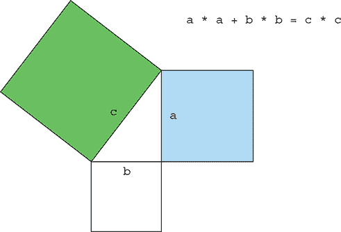

##### 表示三元组

你从哪里开始？第一步是定义一个三元组。而不是（更确切地）定义一个新的类来表示三元组，你可以使用一个包含三个元素的 `int` 数组。例如，`new int[]{3, 4, 5}` 来表示元组 (3, 4, 5)。现在你可以使用数组索引访问元组的每个单独的组件。

##### 过滤好的组合

假设有人提供了三元组的前两个数字：`a`和`b`。你怎么知道这将形成一个好的组合？你需要测试`a * a + b * b`的平方根是否是一个整数。在 Java 中，这表示为`Math.sqrt(a*a + b*b) % 1 == 0`。（给定一个浮点数 x，在 Java 中，它的分数部分是通过 x `% 1.0`获得的，而像 5.0 这样的整数有零分数部分。）我们的代码在`filter`操作中使用了这个想法（你稍后会看到如何使用它来形成有效的代码）：

```
filter(b -> Math.sqrt(a*a + b*b) % 1 == 0)
```

假设周围的代码已经为`a`提供了一个值，并且假设`stream`提供了`b`的可能值，`filter`将只选择那些可以与`a`形成勾股数的三元组的`b`值。

##### 生成元组

在`filter`之后，你知道`a`和`b`可以形成一个正确的组合。你现在需要创建一个三元组。你可以使用`map`操作将每个元素转换为一个勾股数三元组，如下所示：

```
stream.filter(b -> Math.sqrt(a*a + b*b) % 1 == 0)
      .map(b -> new int[]{a, b, (int) Math.sqrt(a * a + b * b)});
```

##### 生成 b 值

你越来越接近了！你现在需要为`b`生成值。你看到`Stream.rangeClosed`允许你生成一个给定区间的数字流。你可以用它来为`b`提供数值，这里是从 1 到 100：

```
IntStream.rangeClosed(1, 100)
         .filter(b -> Math.sqrt(a*a + b*b) % 1 == 0)
         .boxed()
         .map(b -> new int[]{a, b, (int) Math.sqrt(a * a + b * b)});
```

注意，你在`filter`之后调用`boxed`，以从`rangeClosed`返回的`IntStream`生成一个`Stream<Integer>`。这是因为`map`为流中的每个元素返回一个`int`数组。`IntStream`的`map`方法期望每个流元素只返回另一个`int`，这不是你想要的！你可以使用`IntStream`的`mapToObj`方法重写它，它返回一个对象值流：

```
IntStream.rangeClosed(1, 100)
         .filter(b -> Math.sqrt(a*a + b*b) % 1 == 0)
         .mapToObj(b -> new int[]{a, b, (int) Math.sqrt(a * a + b * b)});
```

##### 生成值

我们假设的一个关键组件是`a`的值。你现在有一个生成勾股数三元的流，只要知道`a`的值。你怎么解决这个问题？就像`b`一样，你需要为`a`生成数值！最终的解决方案如下：

```
Stream<int[]> pythagoreanTriples =
    IntStream.rangeClosed(1, 100).boxed()
             .flatMap(a ->
                IntStream.rangeClosed(a, 100)
                         .filter(b -> Math.sqrt(a*a + b*b) % 1 == 0)
                         .mapToObj(b ->
                            new int[]{a, b, (int)Math.sqrt(a * a + b * b)})
                     );
```

好的，`flatMap`是什么意思？首先，你从 1 到 100 创建一个数值范围来生成`a`的值。对于每个给定的`a`值，你创建一个三元组的流。将`a`的值映射到三元组的流会导致一个流中的流！`flatMap`方法执行映射并将所有生成的三元组流合并成一个单一的流。结果，你产生了一个三元组的流。注意，你还改变了`b`的范围为从`a`到 100。没有必要从值`1`开始，因为这会创建重复的三元组（例如，(3, 4, 5)和(4, 3, 5))。

##### 运行代码

你现在可以运行你的解决方案，并使用你之前看到的`limit`操作显式地选择从生成的流中返回多少个三元组：

```
pythagoreanTriples.limit(5)
                  .forEach(t ->
                     System.out.println(t[0] + ", " + t[1] + ", " + t[2]));
```

这将打印

```
3, 4, 5
5, 12, 13
6, 8, 10
7, 24, 25
8, 15, 17
```

##### 你能做得更好吗？

当前解决方案不是最优的，因为您计算了平方根两次。一种使代码更紧凑的可能方法是生成所有形式为 `(a*a, b*b, a*a+b*b)` 的三元组，然后过滤出符合您标准的三元组：

```
Stream<double[]> pythagoreanTriples2 =
  IntStream.rangeClosed(1, 100).boxed()
           .flatMap(a ->
              IntStream.rangeClosed(a, 100)
                       .mapToObj(
                          b -> new double[]{a, b, Math.sqrt(a*a + b*b)})   *1*
                       .filter(t -> t[2] % 1 == 0));                       *2*
```

+   ***1* 生成三元组**

+   ***2* 元组的第三个元素必须是整数。**

### 5.8\. 构建流

希望到现在您已经相信流是强大且非常有用的，可以用来表达数据处理查询。您能够使用 `stream` 方法从集合中获取流。此外，我们还向您展示了如何从一系列数字创建数值流。但您可以通过许多其他方式创建流！本节展示了您如何从一系列值、数组、文件以及甚至从生成函数创建无限流！

#### 5.8.1\. 从值流

您可以使用静态方法 `Stream.of` 通过显式值创建一个流，该方法可以接受任意数量的参数。例如，在以下代码中，您直接使用 `Stream.of` 创建一个字符串流。然后，在打印之前将字符串转换为大写：

```
Stream<String> stream = Stream.of("Modern ", "Java ", "In ", "Action");
stream.map(String::toUpperCase).forEach(System.out::println);
```

您可以使用 `empty` 方法获取一个空流，如下所示：

```
Stream<String> emptyStream = Stream.empty();
```

#### 5.8.2\. 从可空类型流

在 Java 9 中，添加了一个新方法，允许您从可空对象创建流。在玩转流之后，您可能遇到了一个从可能为 null 的对象中提取对象的情况，然后需要将其转换为流（或对于 null，为空流）。例如，`System.getProperty` 方法在没有给定键的属性时返回 `null`。要与其一起使用流，您需要显式检查 null，如下所示：

```
String homeValue = System.getProperty("home");
Stream<String> homeValueStream
    = homeValue == null ? Stream.empty() : Stream.of(value);
```

使用 `Stream.ofNullable` 您可以更简单地重写此代码：

```
Stream<String> homeValueStream
    = Stream.ofNullable(System.getProperty("home"));
```

这种模式与 `flatMap` 和可能包含可空对象的值流结合使用时特别有用：

```
Stream<String> values =
   Stream.of("config", "home", "user")
         .flatMap(key -> Stream.ofNullable(System.getProperty(key)));
```

#### 5.8.3\. 从数组流

您可以使用静态方法 `Arrays.stream` 从数组创建一个流，该方法接受一个数组作为参数。例如，您可以将原始 `int` 数组转换为 `IntStream`，然后对 `IntStream` 进行求和以生成一个 `int`，如下所示：

```
int[] numbers = {2, 3, 5, 7, 11, 13};
int sum = Arrays.stream(numbers).sum();           *1*
```

+   ***1* 总和为 41。**

#### 5.8.4\. 从文件流

Java 的 NIO API（非阻塞 I/O），用于处理文件等 I/O 操作，已更新以利用 Streams API。`java.nio.file.Files` 中的许多静态方法返回一个流。例如，一个有用的方法是 `Files.lines`，它从给定的文件返回字符串流。使用您到目前为止所学的内容，您可以使用此方法来找出文件中的唯一单词数量，如下所示：

```
long uniqueWords = 0;
try(Stream<String> lines =
          Files.lines(Paths.get("data.txt"), Charset.defaultCharset())){   *1*
uniqueWords = lines.flatMap(line -> Arrays.stream(line.split(" ")))        *2*
                   .distinct()                                             *3*
                   .count();                                               *4*
}
catch(IOException e){
                                                                           *5*
}
```

+   ***1* 流是 AutoCloseable，因此不需要 try-finally**

+   ***2* 生成单词流**

+   ***3* 移除重复项**

+   ***4* 计算唯一单词的数量**

+   ***5* 处理打开文件时发生的异常**

您可以使用 `Files.lines` 返回一个流，其中每个元素都是给定文件中的一行。由于流的来源是一个 I/O 资源，因此此调用被一个 `try/catch` 块包围。实际上，`Files.lines` 调用将打开一个 I/O 资源，需要关闭以避免泄漏。在过去，您需要一个显式的 `finally` 块来完成此操作。方便的是，`Stream` 接口实现了 `AutoCloseable` 接口。这意味着资源的管理是在 `try` 块中为您处理的。一旦您有了行流，您就可以通过在 `line` 上调用 `split` 方法来将每一行拆分成单词。注意您是如何使用 `flatMap` 来生成一个单词的扁平化流，而不是为每一行生成多个单词流。最后，您通过链式调用 `distinct` 和 `count` 方法来计算流中的每个不同单词。

#### 5.8.5\. 从函数中生成流：创建无限流！

Streams API 提供了两个静态方法来从函数生成流：`Stream.iterate` 和 `Stream.generate`。这两个操作允许您创建我们所说的 *无限流*，这种流没有固定的大小，就像您从固定集合创建流时那样。由 `iterate` 和 `generate` 生成的流根据函数按需创建值，因此可以无限计算值！通常，在这样流上使用 `limit(n)` 是合理的，以避免打印无限数量的值。

##### 迭代

在我们解释它之前，让我们看看如何使用 `iterate` 的一个简单示例：

```
Stream.iterate(0, n -> n + 2)
      .limit(10)
      .forEach(System.out::println);
```

`iterate` 方法接受一个初始值，这里 `0`，以及一个应用于每个新产生的值的 lambda（类型为 `Unary-Operator<T>`）。在这里，您使用 lambda `n -> n + 2` 返回前一个元素加上 `2`。因此，`iterate` 方法产生一个所有偶数的流：流中的第一个元素是初始值 `0`。然后它加上 `2` 产生新值 `2`；再次加上 `2` 产生新值 `4`，依此类推。这个 `iterate` 操作本质上是有序的，因为结果依赖于前一次应用。请注意，这个操作产生一个 *无限流*——流没有结束，因为值是按需计算的，可以无限计算。我们说流是 *无界的*。正如我们之前讨论的，这是流和集合之间的一个关键区别。您使用 `limit` 方法来显式限制流的大小。在这里，您只选择前 10 个偶数。然后您调用 `forEach` 最终操作来消费流并单独打印每个元素。

通常，当您需要生成一系列连续的值时（例如，一个日期后面跟着它的下一个日期：1 月 31 日，2 月 1 日，等等），您应该使用 `iterate`。要查看如何应用 `iterate` 的更复杂示例，请尝试练习题 5.4。

|  |
| --- |

**练习题 5.4：斐波那契元组序列**

斐波那契数列因其是经典的编程练习而闻名。以下序列中的数字是斐波那契数列的一部分：0, 1, 1, 2, 3, 5, 8, 13, 21, 34, 55... 数列的前两个数字是 0 和 1，每个后续数字都是前两个数字的和。

斐波那契元组的序列类似；你有一个数字及其在序列中的后续数字的序列：(0, 1), (1, 1), (1, 2), (2, 3), (3, 5), (5, 8), (8, 13), (13, 21)...。

你的任务是使用`iterate`方法生成斐波那契数列的前 20 个元素！

让我们帮你开始。第一个问题是`iterate`方法接受一个`UnaryOperator<T>`作为参数，你需要一个元组流，如(0, 1)。你可以再次相当草率地使用一个包含两个元素的数组来表示一个元组。例如，`new int[]{0, 1}`表示斐波那契数列的第一个元素(0, 1)。这将作为`iterate`方法的初始值：

```
Stream.iterate(new int[]{0, 1}, ???)
      .limit(20)
      .forEach(t -> System.out.println("(" + t[0] + "," + t[1] +")"));
```

在这个测验中，你需要找出代码中高亮的`???`。记住，`iterate`会连续应用给定的 lambda。

**答案：**

```
Stream.iterate(new int[]{0, 1},
               t -> new int[]{t[1], t[0]+t[1]})
      .limit(20)
      .forEach(t -> System.out.println("(" + t[0] + "," + t[1] +")"));
```

它是如何工作的？`iterate`需要一个 lambda 来指定后续元素。在(3, 5)这个元组的情况下，后续元素是(5, 3+5) = (5, 8)。下一个是(8, 5+8)。你能看到模式吗？给定一个元组，其后续元素是(t[1], t[0] + t[1])。这正是以下 lambda 所指定的：`t -> new int[]{t[1],t[0] + t[1]}`。运行此代码，你会得到序列(0, 1), (1, 1), (1, 2), (2, 3), (3, 5), (5, 8), (8, 13), (13, 21)...。注意，如果你想要打印正常的斐波那契数列，你可以使用`map`来提取每个元组的第一个元素：

```
Stream.iterate(new int[]{0, 1},
               t -> new int[]{t[1],t[0] + t[1]})
      .limit(10)
      .map(t -> t[0])
      .forEach(System.out::println);
```

这段代码将生成斐波那契数列：0, 1, 1, 2, 3, 5, 8, 13, 21, 34...。

| |
| --- |

在 Java 9 中，`iterate`方法增加了对谓词的支持。例如，你可以从 0 开始生成数字，一旦数字大于 100 就停止迭代：

```
IntStream.iterate(0, n -> n < 100, n -> n + 4)
         .forEach(System.out::println);
```

`iterate`方法接受一个谓词作为其第二个参数，它告诉你何时继续迭代直到。请注意，你可能认为你可以使用`filter`操作来实现相同的结果：

```
IntStream.iterate(0, n -> n + 4)
         .filter(n -> n < 100)
         .forEach(System.out::println);
```

但事实并非如此。实际上，这段代码不会终止！原因是过滤器中无法知道数字会无限增加，所以它会无限期地过滤它们！你可以通过使用`takeWhile`来解决这个问题，它会短路流：

```
IntStream.iterate(0, n -> n + 4)
         .takeWhile(n -> n < 100)
         .forEach(System.out::println);
```

但是，你必须承认，带有谓词的`iterate`要简洁得多！

##### 生成

类似于`iterate`方法，`generate`方法允许你按需生成一个无限值的流。但`generate`不会对每个新产生的值连续应用一个函数。它接受一个类型为`Supplier<T>`的 lambda 来提供新值。让我们看看如何使用它的一个例子：

```
Stream.generate(Math::random)
      .limit(5)
      .forEach(System.out::println);
```

这段代码将生成从 0 到 1 的五个随机双精度浮点数的流。例如，一次运行给出以下结果：

```
0.9410810294106129
0.6586270755634592
0.9592859117266873
0.13743396659487006
0.3942776037651241
```

静态方法 `Math.random` 被用作新值的生成器。再次使用 `limit` 方法显式限制流的大小；否则，流将是无界的！

你可能想知道是否还有其他有用的方法可以使用 `generate` 方法。我们使用的供应商（`Math.random` 的方法引用）是无状态的：它没有记录任何可以用于后续计算的值。但供应商不必是无状态的。你可以创建一个可以存储并修改状态以生成流中下一个值的供应商。作为一个例子，我们将展示如何使用 `generate` 创建 quiz 5.4 中的斐波那契数列，以便你可以将其与使用 `iterate` 方法的方案进行比较！但重要的是要注意，有状态的供应商在并行代码中是不安全的。为了完整性，本章末尾展示了斐波那契的 `IntSupplier`，但通常应避免使用！我们将在第七章中进一步讨论具有副作用的操作和并行流)。

在我们的例子中，我们将使用 `IntStream` 来说明旨在避免装箱操作的代码。`IntStream` 上的 `generate` 方法接受一个 `IntSupplier` 而不是 `Supplier<T>`。例如，以下是如何生成一个无限流中的 `1`：

```
IntStream ones = IntStream.generate(() -> 1);
```

你在 第三章 中看到，lambda 允许你通过直接提供方法的实现来创建函数式接口的实例。你也可以通过实现 `IntSupplier` 接口中定义的 `getAsInt` 方法来传递一个显式的对象，如下所示（尽管这看起来有些冗长，但请耐心等待我们）：

```
IntStream twos = IntStream.generate(new IntSupplier(){
            public int getAsInt(){
                return 2;
            }
        });
```

`generate` 方法将使用给定的供应商并反复调用 `getAsInt` 方法，该方法始终返回 `2`。但这里使用的匿名类与 lambda 的区别在于，匿名类可以通过字段定义状态，而 `getAsInt` 方法可以修改这种状态。这是一个副作用示例。迄今为止你看到的所有 lambda 都是无副作用的；它们没有改变任何状态。

回到我们的斐波那契任务，你现在需要做的是创建一个 `Int-Supplier`，它在状态中维护序列中的前一个值，这样 `getAsInt` 就可以使用它来计算下一个元素。此外，它还可以在下次调用时更新 `IntSupplier` 的状态。以下代码展示了如何创建一个在调用时将返回下一个斐波那契元素的 `IntSupplier`：

```
IntSupplier fib = new IntSupplier(){
    private int previous = 0;
    private int current = 1;
    public int getAsInt(){
        int oldPrevious = this.previous;
        int nextValue = this.previous + this.current;
        this.previous = this.current;
        this.current = nextValue;
        return oldPrevious;
    }
};
IntStream.generate(fib).limit(10).forEach(System.out::println);
```

代码创建了一个`IntSupplier`实例。此对象具有*可变*状态：它通过两个实例变量跟踪前一个斐波那契元素和当前斐波那契元素。`getAsInt`方法在调用时改变对象的状态，以便每次调用都产生新的值。相比之下，我们使用`iterate`的方法是纯*不可变*的；您没有修改现有状态，而是在每次迭代中创建新的元组。您将在第七章中了解到，为了并行处理流并期望得到正确的结果，您应该始终优先选择*不可变方法*。

注意，由于您正在处理无限大小的流，您必须使用操作`limit`显式地限制其大小；否则，终端操作（在这种情况下为`forEach`）将永远计算。同样，您不能对无限流进行排序或归约，因为所有元素都需要被处理，但这将永远无法完成，因为流包含无限数量的元素！

### 5.9. 概述

这是一个漫长但收获颇丰的章节！您现在可以更有效地处理集合。确实，流让您能够简洁地表达复杂的数据处理查询。此外，流可以透明地并行化。

### 摘要

+   Streams API 允许您表达复杂的数据处理查询。常见的流操作总结在表 5.1 中。

+   您可以使用`filter`、`distinct`、`takeWhile`（Java 9）、`dropWhile`（Java 9）、`skip`和`limit`方法过滤和切片流。

+   当您知道源已排序时，`takeWhile`和`dropWhile`方法比过滤器更高效。

+   您可以使用`map`和`flatMap`方法从流中提取或转换元素。

+   您可以使用`findFirst`和`findAny`方法在流中查找元素。您可以使用`allMatch`、`noneMatch`和`anyMatch`方法在流中匹配给定的谓词。

+   这些方法利用了短路：一旦找到结果，计算就会停止；无需处理整个流。

+   您可以使用`reduce`方法迭代地组合流的所有元素以产生一个结果，例如，计算流的和或找到流的最大值。

+   一些操作，如`filter`和`map`，是无状态的：它们不存储任何状态。一些操作，如`reduce`，存储状态以计算值。一些操作，如`sorted`和`distinct`，也存储状态，因为它们需要在返回新的流之前缓冲流的所有元素。这些操作被称为*有状态操作*。

+   流有三种原始特化：`IntStream`、`DoubleStream`和`LongStream`。它们的操作也相应地进行了特化。

+   流不仅可以从集合中创建，还可以从值、数组、文件以及特定的方法（如`iterate`和`generate`）中创建。

+   无限流具有无限数量的元素（例如所有可能的字符串）。这是可能的，因为流的元素仅在需要时才被生成。您可以使用 `limit` 等方法从无限流中获取有限流。

## 第六章\. 使用流收集数据

*本章涵盖*

+   使用 `Collectors` 类创建和使用收集器

+   将数据流减少到单个值

+   摘要作为减少的特殊情况

+   数据的分组和分区

+   开发您自己的自定义收集器

在上一章中，您了解到流可以帮助您使用类似数据库的操作处理集合。您可以将 Java 8 流视为数据集的高级懒迭代器。它们支持两种类型的操作：中间操作，如 `filter` 或 `map`，以及终端操作，如 `count`、`findFirst`、`forEach` 和 `reduce`。中间操作可以链接起来，将一个流转换为另一个流。这些操作不会从流中消耗资源；它们的目的只是设置一个流管道。相比之下，终端操作 *确实* 会从流中消耗资源，以产生最终结果（例如，返回流中的最大元素）。它们通常可以通过优化流管道来缩短计算。

我们已经在第 4 和 5 章节中使用了流上的 `collect` 终端操作，但我们在那里主要用它来将流的所有元素组合成一个 `List`。在本章中，您将发现 `collect` 是一个类似于 `reduce` 的减少操作，它接受将流元素累积到摘要结果的各种配方作为参数。这些配方由一个新的 `Collector` 接口定义，因此区分 `Collection`、`Collector` 和 `collect` 非常重要！

这里有一些使用 `collect` 和收集器的示例查询：

+   按货币将交易列表分组，以获得具有该货币的所有交易的价值总和（返回一个 `Map<Currency, Integer>`）

+   将交易列表划分为两组：昂贵和不昂贵（返回一个 `Map<Boolean, List<Transaction>>`）

+   创建多级分组，例如按城市分组交易，然后进一步根据它们是否昂贵进行分类（返回一个 `Map<String, Map<Boolean, List<Transaction>>>`）

激动吗？太好了。让我们从一个受益于收集器的示例开始探索。想象一个场景，您有一个 `Transaction` 的 `List`，并且您想根据它们的名义货币对它们进行分组。在 Java 8 之前，即使是这样一个简单的用例也难以实现，如下面的列表所示。

##### 列表 6.1\. 以命令式方式按货币分组交易

```
Map<Currency, List<Transaction>> transactionsByCurrencies =
                                                  new HashMap<>();        *1*
for (Transaction transaction : transactions) {                            *2*
    Currency currency = transaction.getCurrency();                        *3*
    List<Transaction> transactionsForCurrency =
                                    transactionsByCurrencies.get(currency);
    if (transactionsForCurrency == null) {                                *4*
        transactionsForCurrency = new ArrayList<>();
        transactionsByCurrencies
                            .put(currency, transactionsForCurrency);
    }
    transactionsForCurrency.add(transaction);                             *5*
}
```

+   ***1* 创建一个地图，其中将累积分组交易**

+   ***2* 遍历交易列表**

+   ***3* 提取交易的货币**

+   ***4* 如果分组映射中没有这个货币的条目，则创建它**

+   ***5* 将当前遍历的交易添加到具有相同货币的交易列表中**

如果你是一位经验丰富的 Java 开发者，你可能觉得写这样的代码很舒服，但你必须承认，对于这样一个简单的任务来说，这需要很多代码。更糟糕的是，这比写代码还难读！代码的目的在第一眼看来并不明显，尽管它可以用简单的英语直接表达：“按货币将交易列表分组。”正如你将在本章中学到的，你可以通过使用更通用的`Collector`参数来对流的`collect`方法进行操作，而不是使用前一章中使用的`toList`特殊情况，从而用单个语句达到完全相同的结果：

```
Map<Currency, List<Transaction>> transactionsByCurrencies =
        transactions.stream().collect(groupingBy(Transaction::getCurrency));
```

这种比较相当尴尬，不是吗？

### 6.1\. 简要介绍收集器

之前的例子清楚地展示了函数式编程相对于命令式方法的一个主要优势：你必须制定你想要获得的结果的“是什么”，而不是获得它的步骤，即“怎么做”。在前面的例子中，传递给`collect`方法的参数是实现`Collector`接口的实例，这是一个如何构建流中元素摘要的配方。在前一章中，`toList`配方说，“依次列出每个元素。”在这个例子中，`groupingBy`配方说，“创建一个`Map`，其键是（货币）桶，其值是这些桶中的元素列表。”

如果你进行多级分组，这个例子中命令式和函数式版本之间的差异就更加明显：在这种情况下，由于需要大量嵌套循环和条件，命令式代码很快就会变得难以阅读、维护和修改。相比之下，正如你将在第 6.3 节中发现的那样，函数式风格的版本可以很容易地通过添加额外的收集器来增强。

#### 6.1.1\. 收集器作为高级归约

这个最后的观察结果又提出了另一个典型的好处：一个精心设计的函数式 API 具有更高的可组合性和可重用性。收集器非常有用，因为它们提供了一种简洁而灵活的方式来定义`collect`用于生成结果集合的准则。更具体地说，在流上调用`collect`方法会触发一个（由`Collector`参数化的）对流本身的元素进行的归约操作（如图 6.1 所示）。它遍历流中的每个元素，并让`Collector`处理它们。

##### 图 6.1\. 按货币对交易进行分组的过程

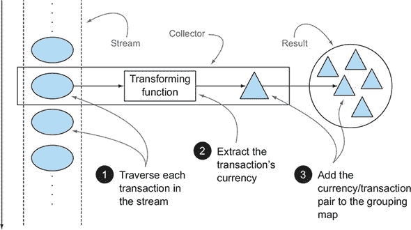

通常，`Collector`会对元素应用一个转换函数。这通常是无效果的恒等转换（例如，在`toList`中）。然后该函数将结果累积在构成此过程最终输出的数据结构中。例如，在我们之前展示的交易分组示例中，转换函数从每个交易中提取货币，然后交易本身使用货币作为键累积到结果`Map`中。

`Collector`接口方法的实现定义了如何在流上执行减少操作，例如我们货币示例中的那种。我们将在第 6.5 节和第 6.6 节中研究如何创建自定义收集器。但`Collectors`实用类提供了许多静态工厂方法，方便地创建最常用的收集器实例，这些收集器已准备好使用。最直接且最常用的收集器是`toList`静态方法，它将流的所有元素收集到一个`List`中：

```
List<Transaction> transactions =
    transactionStream.collect(Collectors.toList());
```

#### 6.1.2\. 预定义收集器

在本章的剩余部分，我们将主要探讨预定义收集器的功能，这些收集器可以通过`Collectors`类提供的工厂方法（例如`groupingBy`）创建。这些提供了三个主要功能：

+   将流元素减少并汇总为单个值

+   元素分组

+   元素分区

我们从允许您减少和汇总的收集器开始。这些在多种用例中都很方便，例如在先前的示例中找到交易列表中交易值的总额。

然后，您将了解如何对流的元素进行分组，将先前的示例推广到多级分组或结合不同的收集器以对每个结果子组应用进一步的减少操作。我们还将描述*分区*作为分组的一个特殊情况，使用谓词（一个返回布尔值的单参数函数）作为分组函数。

在第 6.4 节的末尾，您将找到一个总结本章中探索的所有预定义收集器的表格。最后，在第 6.5 节中，在您探索（在第 6.6 节）如何创建自己的自定义收集器以用于`Collectors`类的工厂方法未涵盖的情况之前，您将了解更多关于`Collector`接口的信息。

### 6.2\. 减少 和 汇总

为了说明可以从`Collectors`工厂类创建的可能收集器实例的范围，我们将重用我们在前一章中引入的领域：一份由美味佳肴组成的菜单！

正如你所学的，收集器（`stream` 方法的 `collect` 参数）通常用于需要将流的项目重新组织到集合中的情况。但更普遍的是，它们可以在你想将流中的所有项目组合成单个结果时使用。这个结果可以是任何类型，从表示树的复杂的多级映射到表示菜单中所有卡路里总和的单个整数。我们将查看这两种结果类型：第 6.2.2 节 中的单个整数和 第 6.3.1 节 中的多级分组。

作为第一个简单的例子，让我们使用由 `counting` 工厂方法返回的收集器来计算菜单中的菜品种数：

```
long howManyDishes = menu.stream().collect(Collectors.counting());
```

你可以更直接地写成这样

```
long howManyDishes = menu.stream().count();
```

但是，当与其他收集器结合使用时，`counting` 收集器可能很有用，我们将在后面演示。

在本章的其余部分，我们将假设你已经导入了 `Collectors` 类的所有静态工厂方法，如下所示：

```
import static java.util.stream.Collectors.*;
```

因此，你可以写 `counting()` 而不是 `Collectors.counting()` 等等。

让我们继续通过查看如何在流中找到最大值和最小值来探索简单的预定义收集器。

#### 6.2.1\. 在值流中查找最大值和最小值

假设你想要找到菜单中卡路里最高的菜。你可以使用两个收集器，`Collectors.maxBy` 和 `Collectors.minBy`，来计算流中的最大值或最小值。这两个收集器接受一个 `Comparator` 作为参数，用于比较流中的元素。在这里，你创建了一个基于卡路里含量的 `Comparator`，并将其传递给 `Collectors.maxBy`：

```
Comparator<Dish> dishCaloriesComparator =
    Comparator.comparingInt(Dish::getCalories);
Optional<Dish> mostCalorieDish =
    menu.stream()
        .collect(maxBy(dishCaloriesComparator));
```

你可能会想知道 `Optional<Dish>` 是什么意思。为了回答这个问题，我们必须问，“如果 `menu` 是空的怎么办？”没有菜可以返回！Java 8 引入了 `Optional`，它是一个可能包含或不包含值的容器。在这里，它完美地代表了可能返回或不返回菜的想法。我们简要地提到了它，在 第五章 中，当你遇到 `findAny` 方法时。现在不必担心它；我们将在 第十一章 中专门研究 `Optional<T>` 及其操作。

另一个常见的返回单个值的归约操作是将流中对象的数值字段的值相加。或者，你可能想要计算平均值。这样的操作称为 *汇总* 操作。让我们看看你如何使用收集器来表示它们。

#### 6.2.2\. 汇总

`Collectors` 类提供了一个特定的工厂方法用于求和：`Collectors.summingInt`。它接受一个函数，该函数将一个对象映射到要相加的 `int` 值，并返回一个收集器，当传递给常规的 `collect` 方法时，执行所需的汇总。例如，你可以使用以下方法找到菜单列表中的总卡路里数：

```
int totalCalories = menu.stream().collect(summingInt(Dish::getCalories));
```

在这里，收集过程如图 6.2 所示。在遍历流的过程中，每个菜品被映射为其卡路里数，然后从这个初始值（在这种情况下是`0`）开始将该数字添加到一个累加器中。

##### 图 6.2\. `summingInt`收集器的聚合过程

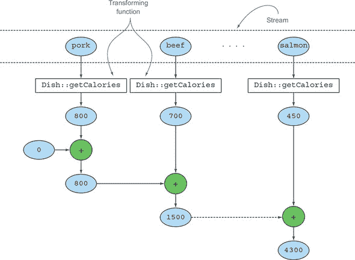

`Collectors.summingLong`和`Collectors.summingDouble`方法的行为完全相同，并且可以在需要分别求和的字段是`long`或`double`时使用。

但总结不仅仅是简单的求和。`Collectors.averaging-Int`及其对应的`averagingLong`和`averagingDouble`也可用于计算相同数值集合的平均值：

```
double avgCalories =
    menu.stream().collect(averagingInt(Dish::getCalories));
```

到目前为止，你已经看到了如何使用收集器来计算流中的元素数量，找到这些元素的数值属性的极大值和极小值，并计算它们的总和和平均值。尽管如此，你经常可能想要检索两个或多个这些结果，并且可能希望在一个操作中完成。在这种情况下，你可以使用由`summarizingInt`工厂方法返回的收集器。例如，你可以通过单个`summarizing`操作来计算菜单中的元素数量，并获取每个菜品中包含的卡路里的总和、平均值、最大值和最小值：

```
IntSummaryStatistics menuStatistics =
        menu.stream().collect(summarizingInt(Dish::getCalories));
```

这个收集器将所有信息收集到一个名为`IntSummaryStatistics`的类中，该类提供了方便的 getter 方法来访问结果。打印`menu-Statistic`对象将产生以下输出：

```
IntSummaryStatistics{count=9, sum=4300, min=120,
                     average=477.777778, max=800}
```

通常，还有相应的`summarizingLong`和`summarizingDouble`工厂方法，以及相关的类型`LongSummaryStatistics`和`DoubleSummary-Statistics`。这些在需要收集的属性是原始类型的`long`或`double`时使用。

#### 6.2.3\. 连接字符串

由`joining`工厂方法返回的收集器将所有从流中每个对象调用`toString`方法得到的字符串连接成一个单一的字符串。这意味着你可以按照以下方式连接菜单中所有菜品的名称：

```
String shortMenu = menu.stream().map(Dish::getName).collect(joining());
```

注意，`joining`内部使用`StringBuilder`来将生成的字符串追加到一个字符串中。另外，注意如果`Dish`类有一个返回菜品名称的`toString`方法，你将获得相同的结果，而无需使用函数从每个菜品中提取名称来映射原始流：

```
String shortMenu = menu.stream().collect(joining());
```

它们都产生相同的字符串

```
porkbeefchickenfrench friesriceseason fruitpizzaprawnssalmon
```

这很难阅读。幸运的是，`joining`工厂方法是重载的，其中一个重载变体接受一个用于分隔两个连续元素的字符串，因此你可以使用逗号分隔的菜品名称列表：

```
String shortMenu = menu.stream().map(Dish::getName).collect(joining(", "));
```

如预期，这将生成

```
pork, beef, chicken, french fries, rice, season fruit, pizza, prawns, salmon
```

迄今为止，我们探讨了各种将流归约到单个值的收集器。在下一节中，我们将演示所有这种形式的归约过程都是`Collectors.reducing`工厂方法提供的更一般归约收集器的特例。

#### 6.2.4\. 使用归约进行泛化总结

我们之前讨论的所有收集器实际上只是可以使用`reducing`工厂方法定义的归约过程的便利特例。`Collectors.reducing`工厂方法是对它们的泛化。前面讨论的特殊情况可能只是为了程序员的便利而提供的。（但请记住，程序员的便利性和可读性是最重要的！）例如，你可以使用从`reducing`方法创建的收集器来计算菜单中的总卡路里，如下所示：

```
int totalCalories = menu.stream().collect(reducing(
                                   0, Dish::getCalories, (i, j) -> i + j));
```

它需要三个参数：

+   第一个参数是归约操作的起始值，在没有元素的流的情况下，它也将是返回的值，因此显然在数值求和的情况下`0`是合适的值。

+   第二个参数是你在第 6.2.2 节中用来将菜品转换为一个表示其卡路里含量的`int`的同一个函数。

+   第三个参数是一个`BinaryOperator`，它将两个项目聚合为同一类型的单个值。在这里，它将两个`int`相加。

同样，你可以使用`reducing`的一个参数版本找到最高卡路里的菜品，如下所示：

```
Optional<Dish> mostCalorieDish =
    menu.stream().collect(reducing(
        (d1, d2) -> d1.getCalories() > d2.getCalories() ? d1 : d2));
```

你可以将使用一个参数的`reducing`工厂方法创建的收集器视为三个参数方法的特例，它使用流中的第一个项目作为起点，并使用一个*恒等函数*（一个返回其输入参数不变的功能）作为转换函数。这也意味着当将一个参数的`reducing`收集器传递给空流的`collect`方法时，它将没有起始点，正如我们在第 6.2.1 节中解释的那样，因此它返回一个`Optional<Dish>`对象。

| |
| --- |

**收集与归约**

我们在前一章和这一章中讨论了很多归约。你可能想知道流接口的`collect`和`reduce`方法之间的区别，因为通常你可以使用任一方法获得相同的结果。例如，你可以使用`reduce`方法实现`toList Collector`所做的工作，如下所示：

```
Stream<Integer> stream = Arrays.asList(1, 2, 3, 4, 5, 6).stream();
List<Integer> numbers = stream.reduce(
                               new ArrayList<Integer>(),
                               (List<Integer> l, Integer e) -> {
                                         l.add(e);
                                         return l; },
                               (List<Integer> l1, List<Integer> l2) -> {
                                         l1.addAll(l2);
                                         return l1; });
```

这种解决方案有两个问题：一个是语义问题，另一个是实际问题。语义问题在于`reduce`方法旨在合并两个值并产生一个新的值；它是一个不可变的归约。相比之下，`collect`方法旨在修改一个容器以累积它应该产生的结果。这意味着之前的代码片段错误地使用了`reduce`方法，因为它正在原地修改用作累加器的`List`。正如你将在下一章中更详细地看到的那样，使用具有错误语义的`reduce`方法也是实际问题的原因：这个归约过程不能并行工作，因为多个线程对相同数据结构的并发修改可能会损坏`List`本身。在这种情况下，如果你想保证线程安全，你将需要每次都分配一个新的`List`，这将通过对象分配来损害性能。这正是`collect`方法在表达对可变容器进行归约时非常有用，但关键是在并行友好方式下的原因，你将在本章后面学到。

| |
| --- |

##### 集合框架灵活性：以不同的方式执行相同的操作

你可以使用`reducing`收集器进一步简化之前的求和示例，通过使用`Integer`类的`sum`方法的引用来代替你用来编码相同操作的 lambda 表达式。这导致以下结果：

```
int totalCalories = menu.stream().collect(reducing(0,        *1*
                              Dish::getCalories,             *2*
                              Integer::sum));                *3*
```

+   ***1* 初始值**

+   ***2* 变换函数**

+   ***3* 聚合函数**

从逻辑上讲，这种归约操作按照图 6.3 所示进行，其中累加器使用起始值初始化，然后通过聚合函数迭代组合，每个流元素的变换函数应用的结果。

##### 图 6.3. 计算菜单中总卡路里数的归约过程

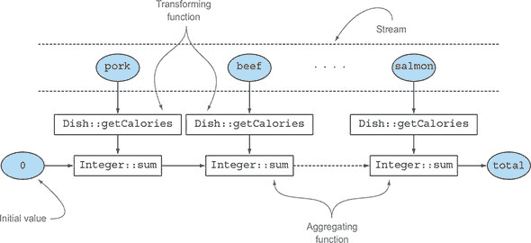

我们在第 6.2 节开头提到的`counting`收集器实际上是通过使用三个参数的`reducing`工厂方法类似实现的。它将流中的每个元素转换为一个类型为`Long`且值为`1`的对象，然后对所有这些`1`求和。它的实现如下：

```
public static <T> Collector<T, ?, Long> counting() {
    return reducing(0L, e -> 1L, Long::sum);
}
```

| |
| --- |

**泛型`?`通配符的使用**

在刚刚展示的代码片段中，你可能注意到了用作`counting`工厂方法返回的收集器签名的第二个泛型类型中的`?`通配符。你应该已经熟悉这种表示法，尤其是如果你经常使用 Java 集合框架的话。但在这里，它仅仅意味着收集器的累加器类型是未知的，或者等价地说，累加器本身可以是任何类型。我们在这里使用它是为了精确地报告方法在`Collectors`类中最初定义的签名，但在本章的其余部分，我们避免使用任何通配符表示法，以使讨论尽可能简单。

| |
| --- |

我们已经在第五章中观察到，还有另一种方法可以执行相同的操作而不使用收集器——通过将菜品流映射到每个菜品的卡路里数，然后使用与上一个版本中相同的方法引用来减少这个结果流：

```
int totalCalories =
    menu.stream().map(Dish::getCalories).reduce(Integer::sum).get();
```

注意，像任何在流上的单参数`reduce`操作一样，调用`reduce(Integer::sum)`返回的不是`int`，而是一个`Optional<Integer>`，以安全的方式处理空流上的归约操作。在这里，您使用其`get`方法提取`Optional`对象内的值。请注意，在这种情况下使用`get`方法是安全的，仅因为您确信菜品的流不为空。一般来说，正如您将在第十章中学习的，使用允许您提供默认值的方法（如`orElse`或`orElseGet`）来解包`Optional`中最终包含的值更安全。最后，并且更加简洁，您可以通过将流映射到`IntStream`并对其调用`sum`方法来实现相同的结果：

```
int totalCalories = menu.stream().mapToInt(Dish::getCalories).sum();
```

##### 选择最适合您情况的最佳解决方案

再次证明，一般而言（特别是在 Java 8 中添加到 Collections 框架中的基于函数式原则的新 API），函数式编程通常提供多种执行相同操作的方法。此示例还表明，收集器比直接在 Streams 接口上可用的方法稍微复杂一些，但作为交换，它们提供了更高层次的抽象和泛化，并且更可重用和可定制。

我们的建议是探索尽可能多的解决方案来解决问题，但始终选择最专业化的解决方案，它足够通用以解决问题。这通常是考虑可读性和性能的最佳决定。例如，为了计算我们菜单中的总卡路里，我们更喜欢最后一个解决方案（使用`IntStream`），因为它最简洁，也可能是最易读的。同时，它也是性能最好的，因为`IntStream`让我们避免了所有无用的*自动装箱*操作，或者从`Integer`到`int`的隐式转换，在这种情况下这些操作都是不必要的。

接下来，通过完成第 6.1 节的练习来测试您对如何将`reducing`用作其他收集器泛化的理解。

| |
| --- |

**练习 6.1：使用 reducing 连接字符串**

以下哪个使用`reducing`收集器的陈述是此`joining`收集器（如第 6.2.3 节中所述）的有效替代品？

```
String shortMenu = menu.stream().map(Dish::getName).collect(joining());
```

1.  ```
    String shortMenu = menu.stream().map(Dish::getName)
                         .collect( reducing( (s1, s2) -> s1 + s2 ) ).get();
    ```

1.  ```
    String shortMenu = menu.stream()
     .collect( reducing( (d1, d2) -> d1.getName() + d2.getName() )
           ).get();
    ```

1.  ```
    String shortMenu = menu.stream()
            .collect( reducing( "", Dish::getName, (s1, s2) -> s1 + s2 ) );
    ```

**答案：**

陈述 1 和 3 是有效的，而 2 无法编译。

1.  这将每个菜品的名称转换为，就像原始语句使用`joining`收集器所做的那样，然后使用`String`作为累加器，并逐个将菜品的名称追加到它上面。

1.  这不能编译，因为`reducing`接受的单一参数是一个`BinaryOperator<T>`，它是一个`BiFunction<T,T,T>`。这意味着它需要一个接受两个参数并返回相同类型值的函数，但那里使用的 lambda 表达式有两个菜肴作为参数，但返回一个字符串。

1.  这以空字符串作为累加器开始减少过程，并在遍历菜肴流时，将每个菜肴转换为它的名称并将其追加到累加器中。注意，正如我们提到的，`reducing`不需要三个参数来返回一个`Optional`，因为在空流的情况下，它可以返回一个更有意义的值，即用作初始累加器值的空字符串。

注意，尽管语句 1 和 3 是`joining`收集器的有效替代，但它们在这里被用来展示`reducing`至少在概念上可以被视为本章讨论的所有其他收集器的泛化。尽管如此，出于所有实际目的，我们始终建议出于可读性和性能原因使用`joining`收集器。

|  |
| --- |

### 6.3\. 分组

一个常见的数据库操作是根据一个或多个属性对集合中的项目进行分组。正如你在前面的交易货币分组示例中看到的，当以命令式风格实现时，这个操作可能会很繁琐、冗长且容易出错。但通过使用 Java 8 鼓励的更函数式风格的单一、可读的语句，它可以很容易地翻译成。作为此功能如何工作的第二个示例，假设你想要根据类型对菜单中的菜肴进行分类，将含肉的菜肴放在一个组中，含鱼的放在另一个组中，所有其他菜肴放在第三个组中。你可以很容易地使用由`Collectors.groupingBy`工厂方法返回的收集器执行此任务，如下所示：

```
Map<Dish.Type, List<Dish>> dishesByType =
                      menu.stream().collect(groupingBy(Dish::getType));
```

这将导致以下`Map`：

```
{FISH=[prawns, salmon], OTHER=[french fries, rice, season fruit, pizza],
 MEAT=[pork, beef, chicken]}
```

在这里，你将一个`Function`（以方法引用的形式表达）传递给`groupingBy`方法，该`Function`提取流中每个`Dish`对应的`Dish.Type`。我们称这个`Function`为*分类*函数，特别是因为它用于将流中的元素分类到不同的组中。这种分组操作的结果，如图 6.4 所示，是一个`Map`，其映射键是分类函数返回的值，相应的映射值是具有该分类值的流中所有项的列表。在菜单分类示例中，键是菜肴的类型，其值是包含该类型所有菜肴的列表。

##### 图 6.4\. 分组过程中流中项目的分类

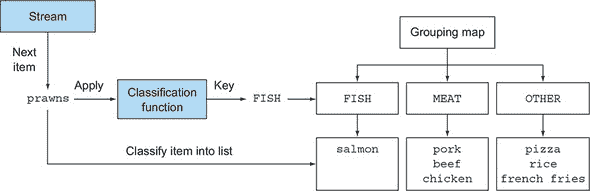

但并不是总是可以使用方法引用作为分类函数，因为你可能希望使用比简单的属性访问器更复杂的东西进行分类。例如，你可以决定将所有卡路里在 400 或以下的菜品分类为“减肥”，将 400 到 700 卡路里的菜品设置为“正常”，将超过 700 卡路里的菜品设置为“高脂肪”。因为 `Dish` 类的作者没有提供这样的操作作为方法，所以在这种情况下你不能使用方法引用，但你可以在 lambda 表达式中表达这个逻辑：

```
public enum CaloricLevel { DIET, NORMAL, FAT }
Map<CaloricLevel, List<Dish>> dishesByCaloricLevel = menu.stream().collect(
         groupingBy(dish -> {
                if (dish.getCalories() <= 400) return CaloricLevel.DIET;
                else if (dish.getCalories() <= 700) return CaloricLevel.NORMAL;
                else return CaloricLevel.FAT;
         } ));
```

现在你已经看到了如何根据菜品的类型和卡路里将菜单中的菜品分组，但也许你还需要进一步操作原始分组的成果，在下一节中我们将展示如何实现这一点。

#### 6.3.1\. 操作分组元素

经常在执行分组操作后，你可能需要操作每个结果组中的元素。例如，假设你只想过滤卡路里较高的菜品，比如说超过 500 卡路里的。你可能认为在这种情况下，你可以在分组之前应用这个过滤谓词，如下所示：

```
Map<Dish.Type, List<Dish>> caloricDishesByType =
                    menu.stream().filter(dish -> dish.getCalories() > 500)
                                 .collect(groupingBy(Dish::getType));
```

这个解决方案是可行的，但可能有一个相关的缺点。如果你尝试在我们的菜单中的菜品上使用它，你将获得如下所示的 `Map`：

```
{OTHER=[french fries, pizza], MEAT=[pork, beef]}
```

你看到了那里的问题吗？因为没有一种类型的鱼满足我们的过滤谓词，所以这个键在结果映射中完全消失了。为了解决这个问题，`Collectors` 类重载了 `groupingBy` 工厂方法，其中一个变体也接受一个类型为 `Collector` 的第二个参数，以及通常的分类函数。这样，就可以将过滤谓词移动到这个第二个 `Collector` 中，如下所示：

```
Map<Dish.Type, List<Dish>> caloricDishesByType =
      menu.stream()
          .collect(groupingBy(Dish::getType,
                   filtering(dish -> dish.getCalories() > 500, toList())));
```

`filtering` 方法是 `Collectors` 类的另一个静态工厂方法，它接受一个 `Predicate` 来过滤每个组中的元素，以及一个用于重新分组过滤元素的进一步 `Collector`。这样，结果 `Map` 也将保留鱼类型的条目，即使它映射了一个空列表：

```
{OTHER=[french fries, pizza], MEAT=[pork, beef], FISH=[]}
```

另一种可能非常有用的操作分组元素的方法是通过映射函数进行转换。为此，类似于你看到的 `filtering Collector`，`Collectors` 类通过 `mapping` 方法提供了另一个 `Collector`，它接受一个映射函数和另一个用于收集应用该函数到每个元素的结果的 `Collector`。通过使用它，你可以将组中的每个 `Dish` 转换为它们各自的名字，如下所示：

```
Map<Dish.Type, List<String>> dishNamesByType =
      menu.stream()
          .collect(groupingBy(Dish::getType,
                   mapping(Dish::getName, toList())));
```

注意，在这种情况下，结果 `Map` 中的每个组都是一个 `Strings` 的 `List`，而不是像前例中的 `Dishes`。你也可以使用第三个 `Collector` 与 `groupingBy` 结合来执行 `flatMap` 转换，而不是普通的 `map`。为了演示这是如何工作的，让我们假设我们有一个 `Map`，将每个 `Dish` 关联到一个标签列表，如下所示：

```
Map<String, List<String>> dishTags = new HashMap<>();
dishTags.put("pork", asList("greasy", "salty"));
dishTags.put("beef", asList("salty", "roasted"));
dishTags.put("chicken", asList("fried", "crisp"));
dishTags.put("french fries", asList("greasy", "fried"));
dishTags.put("rice", asList("light", "natural"));
dishTags.put("season fruit", asList("fresh", "natural"));
dishTags.put("pizza", asList("tasty", "salty"));
dishTags.put("prawns", asList("tasty", "roasted"));
dishTags.put("salmon", asList("delicious", "fresh"));
```

如果你需要提取每个菜肴类型的标签，你可以轻松地使用 `flatMapping Collector` 来实现这一点：

```
Map<Dish.Type, Set<String>> dishNamesByType =
   menu.stream()
      .collect(groupingBy(Dish::getType,
               flatMapping(dish -> dishTags.get( dish.getName() ).stream(),
                           toSet())));
```

在这里，对于每个 `Dish`，我们得到一个标签的 `List`。所以，类似于我们在前一章节中已经看到的，我们需要执行一个 `flatMap` 来将结果的两级列表展平成一个单一的列表。此外，请注意，这次我们将每个组中执行的 `flatMapping` 操作的结果收集到一个 `Set` 中，而不是像之前那样使用 `List`，以避免同一类型的多个 `Dish` 关联到相同的标签。这个操作的结果 `Map` 如下所示：

```
{MEAT=[salty, greasy, roasted, fried, crisp], FISH=[roasted, tasty, fresh,
     delicious], OTHER=[salty, greasy, natural, light, tasty, fresh, fried]}
```

到目前为止，我们只使用单一标准对菜单中的菜肴进行分组，例如按类型或卡路里，但如果你想同时使用多个标准怎么办？分组之所以强大，是因为它能够有效地组合。让我们看看如何做到这一点。

#### 6.3.2\. 多级分组

我们在前一节中使用过的两个参数 `Collectors.groupingBy` 工厂方法，用于操作分组操作产生的组中的元素，也可以用来执行两级分组。为了实现这一点，你可以向它传递一个第二级的内部 `groupingBy` 给外部的 `groupingBy`，定义一个第二级标准来分类流的项目，如下一列表所示。

##### 列表 6.2\. 多级分组

```
Map<Dish.Type, Map<CaloricLevel, List<Dish>>> dishesByTypeCaloricLevel =
menu.stream().collect(
      groupingBy(Dish::getType,                                              *1*
         groupingBy(dish -> {                                                *2*
                if (dish.getCalories() <= 400) return CaloricLevel.DIET;
                else if (dish.getCalories() <= 700) return CaloricLevel.NORMAL;
                else return CaloricLevel.FAT;
          } )
      )
);
```

+   ***1* 第一级分类函数**

+   ***2* 第二级分类函数**

这两级分组的结果是类似于以下的两级 `Map`：

```
{MEAT={DIET=[chicken], NORMAL=[beef], FAT=[pork]},
 FISH={DIET=[prawns], NORMAL=[salmon]},
 OTHER={DIET=[rice, seasonal fruit], NORMAL=[french fries, pizza]}}
```

这里，外部的 `Map` 的键是由第一级分类函数生成的值：鱼、肉、其他。这个 `Map` 的值又是其他 `Map`s，它们的键是由第二级分类函数生成的值：正常、减肥或脂肪。最后，第二级的 `Map`s 的值是流中元素的 `List`，当分别应用于第一和第二分类函数时，返回相应的一级和二级键值：三文鱼、披萨等等。这种多级分组操作可以扩展到任意数量的级别，一个 *n*- 级分组的结果是一个 *n*- 级 `Map`，模拟一个 *n*- 级树结构。

图 6.5 展示了这种结构也等同于一个 *n*- 维表，突出了分组操作的分类目的。

##### 图 6.5\. 多级嵌套映射与 *n*- 维分类表的等价性

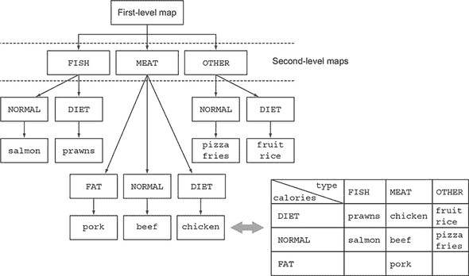

通常，将`groupingBy`视为“桶”是有帮助的。第一个`groupingBy`为每个键创建一个桶。然后你使用下游收集器收集每个桶中的元素，以此类推，以实现*n*-级分组！

#### 6.3.3\. 在子组中收集数据

在前面的章节中，你看到了可以通过传递第二个`groupingBy`收集器到外部的`groupingBy`来达到多级分组。但更一般地，传递给第一个`groupingBy`的第二个收集器可以是任何类型的收集器，而不仅仅是另一个`groupingBy`。例如，可以通过将`counting`收集器作为第二个参数传递给`groupingBy`收集器来计算菜单中每种类型的`Dish`数量：

```
Map<Dish.Type, Long> typesCount = menu.stream().collect(
                    groupingBy(Dish::getType, counting()));
```

结果是以下`Map`：

```
{MEAT=3, FISH=2, OTHER=4}
```

还要注意，实际上，只有一个参数的`groupingBy(f)`，其中`f`是分类函数，是`groupingBy(f, toList())`的简写。

再举一个例子，你可以重新设计你已经用过的收集器，以找到菜单中热量最高的菜品，以实现类似的结果，但现在按菜品的**类型**进行分类：

```
Map<Dish.Type, Optional<Dish>> mostCaloricByType =
    menu.stream()
        .collect(groupingBy(Dish::getType,
                            maxBy(comparingInt(Dish::getCalories))));
```

这个分组的最终结果显然是一个`Map`，其键是可用的`Dish`类型，值是`Optional<Dish>`，包装了对应类型中热量最高的`Dish`：

```
{FISH=Optional[salmon], OTHER=Optional[pizza], MEAT=Optional[pork]}
```

|  |
| --- |

##### 注意

这个`Map`中的值是`Optional`s，因为这是`maxBy`工厂方法生成的收集器的结果类型，但在现实中，如果菜单中没有给定类型的`Dish`，那么这个类型就不会有`Optional.empty()`作为值；它根本不会作为键出现在`Map`中。`groupingBy`收集器在第一次在流中找到元素时，会懒加载地在一个分组的`Map`中添加一个新的键，在应用分组标准时产生这个键。这意味着在这种情况下，`Optional`包装器是没有用的，因为它不是模拟一个可能缺失但意外存在的值，而只是因为这个类型是减少收集器返回的类型。

|  |
| --- |

##### 调整收集器结果到不同类型

由于在最后分组操作的结果中包装所有值的`Optional`s 在这种情况下没有用，你可能想去掉它们。为了实现这一点，或者更一般地，为了调整收集器返回的结果到不同类型，你可以使用`Collectors.collectingAndThen`工厂方法返回的收集器，如下所示。

##### 列表 6.3\. 在每个子组中找到热量最高的菜品

```
Map<Dish.Type, Dish> mostCaloricByType =
    menu.stream()
        .collect(groupingBy(Dish::getType,                      *1*
                 collectingAndThen(
                   maxBy(comparingInt(Dish::getCalories)),      *2*
                 Optional::get)));                              *3*
```

+   ***1* 分组函数**

+   ***2* 包装收集器**

+   ***3* 转换函数**

这个工厂方法接受两个参数——要适配的收集器和转换函数，并返回另一个收集器。这个额外的收集器作为旧收集器的包装器，并在`collect`操作的最后一步使用转换函数映射返回的值。在这种情况下，包装的收集器是使用`maxBy`创建的，转换函数`Optional::get`提取`Optional`返回的值。正如我们所说的，这里这是安全的，因为`reducing`收集器永远不会返回`Optional.empty()`。结果是以下`Map`：

```
{FISH=salmon, OTHER=pizza, MEAT=pork}
```

使用多个嵌套收集器相当常见，起初它们之间的交互方式可能并不总是明显。图 6.6 可以帮助你可视化它们是如何一起工作的。从最外层开始向内移动，注意以下内容：

+   收集器由虚线表示，因此`groupingBy`是最外层的，根据不同菜肴的类型将菜单流分组为三个子流。

+   `groupingBy`收集器包装了`collectingAndThen`收集器，因此每个分组操作产生的子流都进一步通过这个第二个收集器进行减少。

+   `collectingAndThen`收集器依次包装了一个第三个收集器，即`maxBy`。

+   子流的减少操作随后由`reducing`收集器执行，但包含它的`collectingAndThen`收集器对其结果应用了`Optional::get`转换函数。

+   对于给定的类型，三个转换后的值，即最高卡路里的`Dish`（通过在每个三个子流上执行此过程的结果），将是`groupingBy`收集器返回的`Map`中与相应分类键关联的值，即`Dish`的类型。

##### 图 6.6\. 通过嵌套一个收集器在另一个内部来组合多个收集器的影响

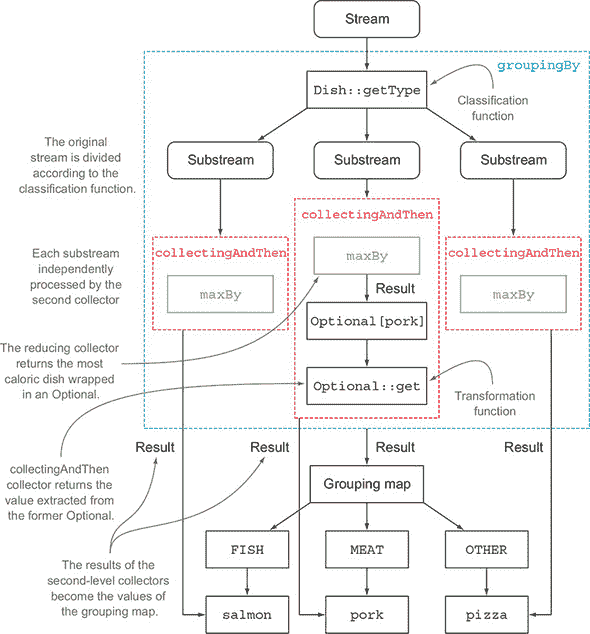

##### 与`groupingBy`一起使用的收集器的其他示例

更一般地说，作为`groupingBy`工厂方法的第二个参数传递的收集器将被用来对分类到同一组的流中的所有元素执行进一步的减少操作。例如，你也可以重用创建来计算菜单中所有菜肴卡路里总和的收集器，以获得类似的结果，但这次是为每个`Dish`组：

```
Map<Dish.Type, Integer> totalCaloriesByType =
               menu.stream().collect(groupingBy(Dish::getType,
                        summingInt(Dish::getCalories)));
```

另一个常用的收集器，通常与`groupingBy`一起使用，是由`mapping`方法生成的收集器。此方法接受两个参数：一个将流中的元素转换成另一个类型的函数，以及一个进一步收集此转换结果的收集器。它的目的是通过在累积之前对每个输入元素应用映射函数，将接受给定类型元素的收集器适配到处理不同类型对象的收集器。为了看到使用此收集器的实际示例，假设您想知道菜单中每种`Dish`类型可用的`CaloricLevel`。您可以通过结合使用`groupingBy`和`mapping`收集器来实现此结果，如下所示：

```
Map<Dish.Type, Set<CaloricLevel>> caloricLevelsByType =
menu.stream().collect(
   groupingBy(Dish::getType, mapping(dish -> {
          if (dish.getCalories() <= 400) return CaloricLevel.DIET;
          else if (dish.getCalories() <= 700) return CaloricLevel.NORMAL;
          else return CaloricLevel.FAT; },
    toSet() )));
```

在这里，传递给映射方法的转换函数将`Dish`映射到其`CaloricLevel`，正如您之前所看到的。然后，将`CaloricLevel`的流传递给一个`toSet`收集器，类似于`toList`，但它将流元素累积到一个`Set`中，而不是累积到一个`List`中，以保留唯一的值。与早期示例一样，这个映射收集器将用于收集由分组函数生成的每个子流中的元素，从而使您能够获得以下`Map`作为结果：

```
{OTHER=[DIET, NORMAL], MEAT=[DIET, NORMAL, FAT], FISH=[DIET, NORMAL]}
```

从这里您可以轻松地了解您的选择。如果您想吃鱼并且正在节食，您可以轻松地找到一道菜；同样，如果您饿了并且想要高热量的食物，您可以通过选择菜单中的肉类部分来满足您强烈的食欲。注意，在前面的例子中，没有关于返回的`Set`类型的保证。但通过使用`toCollection`，您可以有更多的控制。例如，您可以通过传递一个构造器引用来请求一个`HashSet`：

```
Map<Dish.Type, Set<CaloricLevel>> caloricLevelsByType =
menu.stream().collect(
   groupingBy(Dish::getType, mapping(dish -> {
          if (dish.getCalories() <= 400) return CaloricLevel.DIET;
          else if (dish.getCalories() <= 700) return CaloricLevel.NORMAL;
          else return CaloricLevel.FAT; },
    toCollection(HashSet::new) )));
```

### 6.4\. 分区

分区是分组的特殊情况：有一个称为*分区函数*的谓词作为分类函数。分区函数返回布尔值的事实意味着结果分组`Map`将有一个`Boolean`作为键类型，因此，最多可以有两个不同的组——一个用于`true`，一个用于`false`。例如，如果您是素食主义者或者邀请了素食朋友一起吃饭，您可能对将菜单分为素食和非素食菜肴感兴趣：

```
Map<Boolean, List<Dish>> partitionedMenu =
             menu.stream().collect(partitioningBy(Dish::isVegetarian));   *1*
```

+   ***1* 分区函数**

这将返回以下`Map`：

```
{false=[pork, beef, chicken, prawns, salmon],
 true=[french fries, rice, season fruit, pizza]}
```

因此，您可以通过从这个`Map`中获取以`true`为键的值来检索所有素食菜肴：

```
List<Dish> vegetarianDishes = partitionedMenu.get(true);
```

注意，您可以通过使用与分区相同的谓词过滤从“列表”菜单创建的流，然后将结果收集到一个额外的“列表”中，从而实现相同的结果：

```
List<Dish> vegetarianDishes =
              menu.stream().filter(Dish::isVegetarian).collect(toList());
```

#### 6.4.1\. 分区的优点

分区的好处是保留了流元素的两个列表，对于分区函数返回`true`或`false`的应用。在先前的例子中，你可以通过访问`partitionedMenu Map`中键`false`的值来获得非素食`Dish`的`List`，使用两个单独的过滤操作：一个使用谓词，另一个使用其否定。同样，正如你已经看到的分组，`partitioningBy`工厂方法有一个重载版本，你可以传递第二个收集器，如下所示：

```
Map<Boolean, Map<Dish.Type, List<Dish>>> vegetarianDishesByType =
menu.stream().collect(
        partitioningBy(Dish::isVegetarian,                 *1*
                       groupingBy(Dish::getType)));        *2*
```

+   ***1* 分区函数**

+   ***2* 第二个收集器**

这将产生一个两级的`Map`：

```
{false={FISH=[prawns, salmon], MEAT=[pork, beef, chicken]},
 true={OTHER=[french fries, rice, season fruit, pizza]}}
```

在这里，将菜肴按其类型分组的方法被单独应用于由分区产生的素食和非素食菜肴的两个子流，从而生成一个类似于你在第 6.3.1 节中执行的两级分组时获得的二级`Map`。作为另一个例子，你可以重用你之前的代码来找出素食和非素食菜肴中最高卡路里的菜肴：

```
Map<Boolean, Dish> mostCaloricPartitionedByVegetarian =
menu.stream().collect(
    partitioningBy(Dish::isVegetarian,
         collectingAndThen(maxBy(comparingInt(Dish::getCalories)),
                           Optional::get)));
```

这将产生以下结果：

```
{false=pork, true=pizza}
```

我们在本节开始时说，你可以将分区视为分组的一个特殊情况。还值得注意的是，`partitioningBy`返回的`Map`实现更紧凑、更高效，因为它只需要包含两个键：true 和 false。事实上，内部实现是一个具有两个字段的专用`Map`。`groupingBy`和`partitioningBy`收集器之间的类比并不止于此；正如你将在下一个练习中看到的，你也可以以类似于你在第 6.3.1 节中分组的方式执行多级分区。

|  |
| --- |

**练习 6.2：使用 partitioningBy**

正如你所看到的，与`groupingBy`收集器一样，`partitioningBy`收集器也可以与其他收集器结合使用。特别是它可以与第二个`partitioningBy`收集器一起使用，以实现多级分区。以下多级分区的结果会是什么？

1.  ```
    menu.stream().collect(partitioningBy(Dish::isVegetarian,
                              partitioningBy(d -> d.getCalories() > 500)));
    ```

1.  ```
    menu.stream().collect(partitioningBy(Dish::isVegetarian,
                              partitioningBy(Dish::getType)));
    ```

1.  ```
    menu.stream().collect(partitioningBy(Dish::isVegetarian,
                              counting()));
    ```

**答案：**

1.  这是一个有效的多级分区，产生了以下两级的`Map`：

    ```
            { false={false=[chicken, prawns, salmon], true=[pork, beef]},
              true={false=[rice, season fruit], true=[french fries, pizza]}}
    ```

1.  这将无法编译，因为`partitioningBy`需要一个谓词，一个返回布尔值的函数。方法引用`Dish::getType`不能用作谓词。

1.  这计算了每个分区中的项目数量，从而产生了以下`Map`：

    ```
          {false=5, true=4}
    ```

|  |
| --- |

为了给出一个如何使用`partitioningBy`收集器的最后一个例子，我们将暂时放下菜单数据模型，看看一些更复杂但也更有趣的东西：将数字分为质数和非质数。

#### 6.4.2\. 将数字分为质数和非质数

假设你想编写一个接受`int` *n* 作为参数的方法，并将前*n*个自然数分为质数和非质数。但首先，开发一个测试给定候选数字是否为质数的谓词将是有用的：

```
public boolean isPrime(int candidate) {
    return IntStream.range(2, candidate)                     *1*
                    .noneMatch(i -> candidate % i == 0);     *2*
}
```

+   ***1* 从 2 开始生成一个自然数范围，包括 2，但不包括候选数**

+   ***2* 如果候选数不能被流中的任何数整除，则返回 true**

简单的优化是只测试小于或等于候选数的平方根的因子：

```
public boolean isPrime(int candidate) {
    int candidateRoot = (int) Math.sqrt((double) candidate);
    return IntStream.rangeClosed(2, candidateRoot)
                    .noneMatch(i -> candidate % i == 0);
}
```

现在大部分工作已经完成。要将前*n*个数字分成质数和非质数，只需创建一个包含这些*n*个数字的流，然后使用`partitioningBy`收集器将其与您刚刚开发的`isPrime`方法作为谓词进行归约即可：

```
public Map<Boolean, List<Integer>> partitionPrimes(int n) {
    return IntStream.rangeClosed(2, n).boxed()
                    .collect(
                      partitioningBy(candidate -> isPrime(candidate)));
}
```

我们现在已经涵盖了可以使用`Collectors`类的静态工厂方法创建的所有收集器，展示了它们如何工作的实际示例。表 6.1 将它们全部汇总在一起，包括它们应用于`Stream<T>`时返回的类型，以及它们在名为`menuStream`的`Stream<Dish>`上的实际使用示例。

##### 表 6.1\. `Collectors`类的主要静态工厂方法

| 工厂方法 | 返回类型 | 用于 |
| --- | --- | --- |
| toList | List<T> | 将流中的所有项目收集到列表中。 |
| Example use: List<Dish> dishes = menuStream.collect(toList()); |
| toSet | Set<T> | 将流中的所有项目收集到集合中，消除重复项。 |
| Example use: Set<Dish> dishes = menuStream.collect(toSet()); |
| toCollection | Collection<T> | 将流中的所有项目收集到由提供的供应商创建的集合中。 |
| Example use: Collection<Dish> dishes = menuStream.collect(toCollection(), ArrayList::new); |
| counting | Long | 计算流中项目的数量。 |
| Example use: long howManyDishes = menuStream.collect(counting()); |
| summingInt | Integer | 对流中项目的 Integer 属性值求和。 |
| Example use: int totalCalories = menuStream.collect(summingInt(Dish::getCalories)); |
| averagingInt | Double | 计算流中项目 Integer 属性的平均值。 |
| Example use: double avgCalories = menuStream.collect(averagingInt(Dish::getCalories)); |
| summarizingInt | IntSummaryStatistics | 收集有关流中项目 Integer 属性（如最大值、最小值、总和和平均值）的统计信息。 |
| Example use: IntSummaryStatistics menuStatistics = menuStream.collect(summarizingInt(Dish::getCalories)); |
| joining | String | 将流中每个项目调用 toString 方法的结果连接起来。 |
| Example use: String shortMenu = menuStream.map(Dish::getName).collect(joining(", ")); |
| maxBy | Optional<T> | 一个 Optional，包含根据给定的比较器在此流中的最大元素，如果流为空，则为 Optional.empty()。 |
| Example use: Optional<Dish> fattest = menuStream.collect(maxBy(comparingInt(Dish::getCalories))); |
| minBy | Optional<T> | 一个 Optional，包含根据给定的比较器在此流中的最小元素，如果流为空，则为 Optional.empty()。 |
| Example use: Optional<Dish> lightest = menuStream.collect(minBy(comparingInt(Dish::getCalories))); | |
| reducing | 归约操作产生的类型 | 从一个用作累加器的初始值开始，迭代地将每个流项目与一个二元操作符组合，以将流归约为一个单一值。 |
| Example use: int totalCalories = menuStream.collect(reducing(0, Dish::getCalories, Integer::sum)); | |
| collectingAndThen | 转换函数返回的类型 | 包装另一个收集器并对其结果应用转换函数。 |
| Example use: int howManyDishes = menuStream.collect(collectingAndThen(toList(), List::size)); | |
| groupingBy | Map<K, List<T>> | 根据流中项目的一个属性值对项目进行分组，并使用这些值作为结果 Map 的键。 |
| Example use: Map<Dish.Type,List<Dish>> dishesByType = menuStream.collect(groupingBy(Dish::getType)); | |
| partitioningBy | Map<Boolean, List<T>> | 根据对每个项目应用谓词的结果对流中的项目进行分区。 |
| Example use: Map<Boolean,List<Dish>> vegetarianDishes = menuStream.collect(partitioningBy(Dish::isVegetarian)); | |

如本章开头所述，所有这些收集器都实现了`Collector`接口，因此在本章剩余部分，我们将更详细地研究这个接口。我们研究该接口中的方法，然后探索如何实现你自己的收集器。

### 6.5。`Collector`接口

`Collector`接口包含一组方法，为如何实现特定的归约操作（收集器）提供了一个蓝图。你已经看到了许多实现了`Collector`接口的收集器，例如`toList`或`groupingBy`。这也意味着你可以自由地创建定制的归约操作，通过提供自己的`Collector`接口实现。在第 6.6 节中，我们将展示如何实现`Collector`接口以创建一个收集器，将数字流划分为质数和非质数，比之前看到的方法更高效。

要开始使用`Collector`接口，我们关注本章开头遇到的第一批收集器之一：`toList`工厂方法，它将流中的所有元素收集到一个`List`中。我们说过，你将在日常工作中经常使用这个收集器，但至少在概念上，它也是容易开发的。更详细地研究这个收集器的实现方式是了解`Collector`接口定义以及其方法返回的函数如何被`collect`方法内部使用的好方法。

让我们先看看下一列表中`Collector`接口的定义，它显示了接口签名以及它声明的五个方法。

##### 列表 6.4。`Collector`接口

```
public interface Collector<T, A, R> {
    Supplier<A> supplier();
    BiConsumer<A, T> accumulator();
    Function<A, R> finisher();
    BinaryOperator<A> combiner();
    Set<Characteristics> characteristics();
}
```

在这个列表中，以下定义适用：

+   `T` 是要收集的流中项的泛型类型。

+   `A` 是累加器的类型，在收集过程中，部分结果将累积在这个对象上。

+   `R` 是收集操作结果的对象类型（通常是，但不总是，集合）。

例如，你可以实现一个 `ToListCollector<T>` 类，该类将 `Stream<T>` 的所有元素收集到一个具有以下签名的 `List<T>` 中

```
public class ToListCollector<T> implements Collector<T, List<T>, List<T>>
```

其中，正如我们很快就会澄清的，用于累积过程的对象也将是收集过程的最终结果。

#### 6.5.1. 理解 Collector 接口声明的方法

我们现在可以逐个分析 `Collector` 接口声明的五种方法。当我们这样做时，你会注意到前四种方法返回一个函数，该函数将由 `collect` 方法调用，而第五种方法 `characteristics` 提供了一组特性，这是一个由 `collect` 方法本身使用的提示列表，以知道在执行归约操作时允许使用哪些优化（例如，并行化）。

##### 创建新的结果容器：供应商方法

`supplier` 方法必须返回一个空的累加器的 `Supplier`——一个无参数的函数，当调用时创建用于收集过程的空累加器实例。显然，对于返回累加器本身作为结果的收集器，如我们的 `ToListCollector`，这个空累加器也将代表在空流上执行收集过程的结果。在我们的 `ToListCollector` 中，`supplier` 将返回一个空的 `List`，如下所示：

```
public Supplier<List<T>> supplier() {
    return () -> new ArrayList<T>();
}
```

注意，你也可以传递一个构造器引用：

```
public Supplier<List<T>> supplier() {
    return ArrayList::new;
}
```

##### 向结果容器添加元素：累加器方法

`accumulator` 方法返回执行归约操作的函数。当遍历流中的第 *n* 个元素时，此函数将使用两个参数应用，累加器是归约的结果（在收集了流的前 *n*–1 个元素之后）以及第 *n* 个元素本身。该函数返回 `void`，因为累加器是在原地修改的，这意味着其内部状态通过函数应用被改变，以反映遍历元素的效果。对于 `ToListCollector`，此函数只需将当前项添加到包含已遍历项的列表中：

```
public BiConsumer<List<T>, T> accumulator() {
    return (list, item) -> list.add(item);
```

你也可以使用方法引用，这更简洁：

```
public BiConsumer<List<T>, T> accumulator() {
    return List::add;
}
```

##### 对结果容器应用最终转换：完成器方法

`finisher`方法必须返回一个函数，在完全遍历流并在累积过程结束时调用，以便将累加器对象转换为整个收集操作的最终结果。通常，就像在`ToListCollector`的情况下，累加器对象已经与最终预期的结果一致。因此，不需要执行转换，所以`finisher`方法必须返回`identity`函数：

```
public Function<List<T>, List<T>> finisher() {
    return Function.identity();
}
```

这三种方法足以执行流的顺序减少，从逻辑角度来看，可以像图 6.7 中所示那样进行。在实践中，由于流的惰性特性，可能需要在`collect`操作之前执行一系列其他中间操作，以及理论上可以并行执行减少的可能性，实现细节要复杂一些。

##### 图 6.7\. 顺序减少过程的逻辑步骤

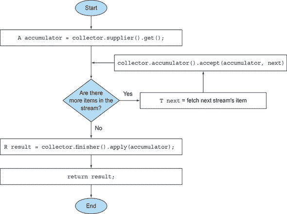

##### 合并两个结果容器：合并方法

`combiner`方法，这是四种返回由减少操作使用的函数的方法中的最后一种，定义了当子部分并行处理时，从流的不同子部分减少产生的累加器如何合并。在`toList`的情况下，此方法的实现很简单；将包含从流的第二部分收集到的项目的列表添加到遍历第一部分时获得的列表的末尾：

```
public BinaryOperator<List<T>> combiner() {
    return (list1, list2) -> {
        list1.addAll(list2);
        return list1; }
}
```

添加这种第四种方法允许流进行并行减少。这使用了 Java 7 中引入的 fork/join 框架和你在下一章中将学习的`Spliterator`抽象。它遵循一个类似于图 6.8 中所示的过程，并在此处详细描述。

+   原始的 *流* 会被递归地分割成子流，直到一个定义流是否需要进一步分割的条件变为假（当被分配的工作单元太小，并行计算通常比顺序计算慢，生成比你的处理核心更多的并行任务是没有意义的）。

+   到这一点，所有 *子流* 都可以并行处理，每个子流都使用图 6.7 中所示的顺序减少算法。

+   最后，所有部分结果都通过收集器的`combiner`方法返回的函数成对合并。这是通过将对应于原始流每个分割的子流的减少结果组合起来完成的。

##### 图 6.8\. 使用`combiner`方法并行化减少过程

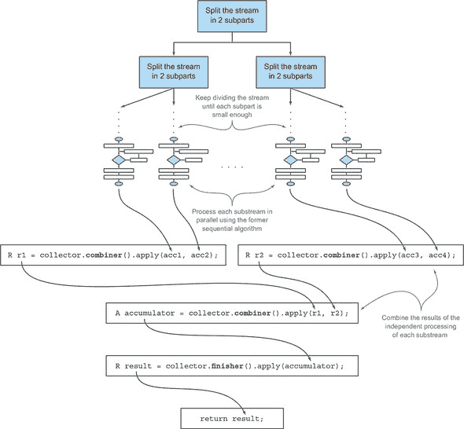

##### 特征方法

最后一个方法`characteristics`返回一个不可变的`Characteristics`集合，定义了收集器的行为——特别是提供有关流是否可以并行归约以及在这种情况下哪些优化是有效的提示。`Characteristics`是一个枚举，包含三个条目：

+   **`UNORDERED`—** 归约的结果不受流中项目遍历和累积顺序的影响。

+   **`CONCURRENT`—** 累加器函数可以从多个线程中并发调用，然后这个收集器可以对流进行并行归约。如果收集器没有也标记为`UNORDERED`，它只能在应用于无序数据源时执行并行归约。

+   **`IDENTITY_FINISH`—** 这表示由 finisher 方法返回的函数是恒等函数，其应用可以省略。在这种情况下，累加器对象直接用作归约过程的最终结果。这也意味着从累加器`A`到结果`R`的不检查类型转换是安全的。

到目前为止开发的`ToListCollector`是`IDENTITY_FINISH`，因为用于在流中累积元素的`List`已经是预期的最终结果，不需要任何进一步的转换，但它不是`UNORDERED`，因为如果你将其应用于有序流，你希望这种顺序在结果`List`中得以保留。最后，它是`CONCURRENT`的，但根据我们刚才所说的，只有当其底层数据源是无序时，流才会并行处理。

#### 6.5.2\. 将它们全部放在一起

在上一个子节中分析的五个方法是你开发自己的`ToListCollector`所需的一切，你可以通过将它们全部放在一起来实现它，如以下列表所示。

##### 列表 6.5\. `ToListCollector`

```
import java.util.*;
import java.util.function.*;
import java.util.stream.Collector;
import static java.util.stream.Collector.Characteristics.*;
public class ToListCollector<T> implements Collector<T, List<T>, List<T>> {
    @Override
    public Supplier<List<T>> supplier() {
        return ArrayList::new;                              *1*
    }
    @Override
    public BiConsumer<List<T>, T> accumulator() {
        return List::add;                                   *2*
    }
    @Override
    public Function<List<T>, List<T>> finisher() {
        return Function.identity();                         *3*
    }
    @Override
    public BinaryOperator<List<T>> combiner() {
        return (list1, list2) -> {
            list1.addAll(list2);                            *4*
            return list1;                                   *5*
        };
    }
    @Override
    public Set<Characteristics> characteristics() {
        return Collections.unmodifiableSet(EnumSet.of(
            IDENTITY_FINISH, CONCURRENT));                  *6*
    }
}
```

+   ***1* 创建集合操作的起点**

+   ***2* 累积遍历的项目，就地修改累加器**

+   ***3* 识别函数**

+   ***4* 修改第一个累加器，将其与第二个的内容合并**

+   ***5* 返回修改后的第一个累加器**

+   ***6* 将收集器标记为 IDENTITY_FINISH 和 CONCURRENT**

注意，这个实现与`Collectors.toList`方法返回的实现并不相同，但它们之间的差异仅在于一些小的优化。这些优化主要与 Java API 提供的收集器在需要返回空列表时使用`Collections.emptyList()`单例的事实有关。这意味着它可以安全地用作原始 Java 的示例，以收集菜单流中所有`Dish`的列表：

```
List<Dish> dishes = menuStream.collect(new ToListCollector<Dish>());
```

与标准公式的剩余差异

```
List<Dish> dishes = menuStream.collect(toList());
```

是`toList`是一个工厂，而你必须使用`new`来实例化你的`ToList-Collector`。

##### 执行自定义收集而不创建收集器实现

在`IDENTITY_FINISH`集合操作的情况下，还有进一步的可能性获得相同的结果，而无需开发一个全新的`Collector`接口实现。Streams 有一个重载的`collect`方法，接受三个其他函数——`supplier`、`accumulator`和`combiner`——它们具有与`Collector`接口相应方法返回的函数完全相同的语义。例如，可以将流中所有菜肴的所有项收集到一个`List`中，如下所示：

```
List<Dish> dishes = menuStream.collect(
                        ArrayList::new,        *1*
                        List::add,             *2*
                        List::addAll);         *3*
```

+   ***1* 供应者**

+   ***2* 累加器**

+   ***3* 组合器**

我们认为，这种第二种形式，即使比前者更紧凑和简洁，但可读性较低。此外，在适当的类中开发您自定义收集器的实现可以促进其重用，并有助于避免代码重复。还值得注意的是，不允许向这个第二个`collect`方法传递任何`Characteristics`，因此它始终表现为`IDENTITY_FINISH`和`CONCURRENT`收集器，而不是`UNORDERED`收集器。

在下一节中，您将把实现收集器的新的知识提升到下一个层次。您将为更复杂但希望更具体和有说服力的用例开发自己的自定义收集器。

### 6.6\. 开发自己的收集器以获得更好的性能

在第 6.4 节中，我们讨论了分区，您使用`Collectors`类提供的许多方便的工厂方法之一创建了一个收集器，将前*n*个自然数分为素数和非素数，如下所示。

##### 列表 6.6\. 将前*n*个自然数分为素数和非素数

```
public Map<Boolean, List<Integer>> partitionPrimes(int n) {
return IntStream.rangeClosed(2, n).boxed()
                .collect(partitioningBy(candidate -> isPrime(candidate));
}
```

在那里，你通过限制要测试的候选素数的除数数量不超过候选数的平方根，从而在原始`isPrime`方法上实现了改进：

```
public boolean isPrime(int candidate) {
    int candidateRoot = (int) Math.sqrt((double) candidate);
    return IntStream.rangeClosed(2, candidateRoot)
                    .noneMatch(i -> candidate % i == 0);
}
```

有没有一种方法可以获得更好的性能？答案是肯定的，但为此你必须开发一个自定义收集器。

#### 6.6.1\. 只除以素数

一种可能的优化是只测试候选数是否能被素数整除。测试一个非素数的除数是没有意义的！你可以将测试限制为只针对在当前候选数之前找到的素数。你之前使用的预定义收集器的问题，以及你必须开发一个自定义收集器的原因，是在收集过程中你无法访问部分结果。这意味着在测试给定的候选数是否为素数时，你无法访问到目前为止找到的其他素数列表。

假设你有一个这样的列表；你可以将它传递给`isPrime`方法，并按如下方式重写：

```
public static boolean isPrime(List<Integer> primes, int candidate) {
    return primes.stream().noneMatch(i -> candidate % i == 0);
}
```

此外，你还应该实现之前使用的相同优化，并且只对小于候选数平方根的素数进行测试。你需要一种方法，一旦下一个素数大于候选数的根，就可以立即停止测试候选数是否能被素数整除。你可以通过使用 Stream 的 `takeWhile` 方法轻松实现这一点：

```
public static boolean isPrime(List<Integer> primes, int candidate){
    int candidateRoot = (int) Math.sqrt((double) candidate);
    return primes.stream()
                 .takeWhile(i -> i <= candidateRoot)
                 .noneMatch(i -> candidate % i == 0);
}
```

|  |
| --- |

**练习 6.3：在 Java 8 中模拟 takeWhile**

`takeWhile` 方法是在 Java 9 中引入的，所以不幸的是，如果你还在使用 Java 8，则无法使用此解决方案。你该如何解决这个问题，并在 Java 8 中实现类似的功能？ 

**答案：**

你可以实现自己的 `takeWhile` 方法，该方法给定一个排序后的列表和一个谓词，返回满足谓词的列表的最长前缀：

```
public static <A> List<A> takeWhile(List<A> list, Predicate<A> p) {
    int i = 0;
    for (A item : list) {
            if (!p.test(item)) {                  *1*
                    return list.subList(0, i);    *2*
            }
            i++;
    }
    return list;                                  *3*
}
```

+   ***1* 检查列表中的当前项是否满足谓词**

+   ***2* 如果不是，则返回测试项之前子列表的前缀**

+   ***3* 列表中的所有项都满足谓词，因此返回列表本身**

使用这个方法，你可以重写 `isPrime` 方法，并且再次只对候选素数与小于其平方根的素数进行测试：

```
public static boolean isPrime(List<Integer> primes, int candidate){
    int candidateRoot = (int) Math.sqrt((double) candidate);
    return takeWhile(primes, i -> i <= candidateRoot)
                 .stream()
                 .noneMatch(p -> candidate % p == 0);
}
```

注意，与 Streams API 提供的不同，这个 `takeWhile` 的实现是 eager 的。在可能的情况下，始终优先选择 Java 9 Stream 的 lazy 版本的 `takeWhile`，以便它可以与 `noneMatch` 操作合并。

|  |
| --- |

拥有这个新的 `isPrime` 方法后，你现在可以准备实现你自己的自定义收集器。首先，你需要声明一个新的类，该类实现了 `Collector` 接口。然后，你需要开发 `Collector` 接口所需的五个方法。

##### 第一步：定义收集器类的签名

让我们从类签名开始，记住 `Collector` 接口被定义为

```
public interface Collector<T, A, R>
```

其中 `T`、`A` 和 `R` 分别是流中元素的类型、用于累积部分结果的对象的类型以及 `collect` 操作的最终结果类型。在这种情况下，你想要收集 `Integer` 类型的流，同时累积器和结果类型都是 `Map<Boolean, List<Integer>>`（与在 列表 6.6 中的前一个分区操作得到的相同 `Map`），键为 `true` 和 `false`，值分别为素数和非素数的列表：

```
public class PrimeNumbersCollector
             implements Collector<Integer,                          *1*
                                 Map<Boolean, List<Integer>>,       *2*
                                 Map<Boolean, List<Integer>>>       *3*
```

+   ***1* 流中元素的类型**

+   ***2* 累积器的类型**

+   ***3* 收集操作的结果类型**

##### 第二步：实现减少过程

接下来，你需要实现 `Collector` 接口中声明的五个方法。`supplier` 方法必须返回一个函数，当调用该函数时，会创建累积器：

```
public Supplier<Map<Boolean, List<Integer>>> supplier() {
    return () -> new HashMap<Boolean, List<Integer>>() {{
        put(true, new ArrayList<Integer>());
        put(false, new ArrayList<Integer>());
    }};
}
```

在这里，你不仅创建了一个将用作累加器的`Map`，而且还使用两个空列表在`true`和`false`键下初始化它。这就是你在收集过程中分别添加素数和非素数的地方。你收集器最重要的方法是`accumulator`方法，因为它包含了定义流元素如何收集的逻辑。在这种情况下，它也是实现我们之前描述的优化的关键。在任何给定的迭代中，你现在可以访问收集过程的局部结果，即包含迄今为止找到的素数的累加器：

```
public BiConsumer<Map<Boolean, List<Integer>>, Integer> accumulator() {
    return (Map<Boolean, List<Integer>> acc, Integer candidate) -> {
            acc.get( isPrime(acc.get(true), candidate) )               *1*
               .add(candidate);                                        *2*
    };
}
```

+   ***1* 根据 isPrime 的结果获取素数或非素数列表**

+   ***2* 将候选者添加到适当的列表**

在这个方法中，你调用`isPrime`方法，将其（连同你想要测试是否为素数的数字）以及迄今为止找到的素数列表传递给它。（这些是累积`Map`中由`true`键索引的值。）然后，这个调用的结果被用作键来获取素数或非素数列表，这样你就可以将新的候选者添加到正确的列表中。

##### 第 3 步：使收集器并行工作（如果可能）

下一个方法必须在并行收集过程中合并两个部分累加器，因此在这种情况下，它必须通过将第二个`Map`中素数和非素数列表的所有数字添加到第一个`Map`中相应的列表来合并这两个`Map`：

```
public BinaryOperator<Map<Boolean, List<Integer>>> combiner() {
    return (Map<Boolean, List<Integer>> map1,
            Map<Boolean, List<Integer>> map2) -> {
                map1.get(true).addAll(map2.get(true));
                map1.get(false).addAll(map2.get(false));
                return map1;
    };
}
```

注意，实际上这个收集器不能并行使用，因为算法本质上是顺序的。这意味着`combiner`方法永远不会被调用，你可以将其实现留空（或者更好，抛出`UnsupportedOperationException`）。我们决定仍然实现它，只是为了完整性。

##### 第 4 步：finisher 方法和收集器的特征方法

最后两个方法的实现相当直接。正如我们所说，`accumulator`与收集器的结果相同，因此不需要任何进一步的转换，而`finisher`方法返回`identity`函数：

```
public Function<Map<Boolean, List<Integer>>,
                Map<Boolean, List<Integer>>> finisher() {
        return Function.identity();
}
```

关于特征方法，我们之前已经说过，它既不是`CONCURRENT`也不是`UNORDERED`，而是`IDENTITY_FINISH`：

```
public Set<Characteristics> characteristics() {
    return Collections.unmodifiableSet(EnumSet.of(IDENTITY_FINISH));
}
```

以下列表显示了`PrimeNumbersCollector`的最终实现。

##### 列表 6.7. `PrimeNumbersCollector`

```
public class PrimeNumbersCollector
    implements Collector<Integer,
           Map<Boolean, List<Integer>>,
           Map<Boolean, List<Integer>>> {
    @Override
    public Supplier<Map<Boolean, List<Integer>>> supplier() {
        return () -> new HashMap<Boolean, List<Integer>>() {{             *1*
             put(true, new ArrayList<Integer>());
             put(false, new ArrayList<Integer>());
          }};
    }
    @Override
    public BiConsumer<Map<Boolean, List<Integer>>, Integer> accumulator() {
        return (Map<Boolean, List<Integer>> acc, Integer candidate) -> {
            acc.get( isPrime( acc.get(true),                              *2*
               candidate) )
               .add(candidate);                                           *3*
        };
    }
    @Override
    public BinaryOperator<Map<Boolean, List<Integer>>> combiner() {
            return (Map<Boolean, List<Integer>> map1,
                    Map<Boolean, List<Integer>> map2) -> {                *4*
                            map1.get(true).addAll(map2.get(true));
                            map1.get(false).addAll(map2.get(false));
                            return map1;
                };
    }
    @Override
    public Function<Map<Boolean, List<Integer>>,
                    Map<Boolean, List<Integer>>> finisher() {
                            return Function.identity();                   *5*
    }
    @Override
    public Set<Characteristics> characteristics() {
        return Collections.unmodifiableSet(EnumSet.of(IDENTITY_FINISH));  *6*
    }
}
```

+   ***1* 使用包含两个空列表的 Map 开始收集过程**

+   ***2* 将已找到的素数列表传递给 isPrime 方法**

+   ***3* 从 Map 中获取素数或非素数列表，根据 isPrime 方法返回的结果，并将当前候选者添加到其中**

+   ***4* 将第二个 Map 合并到第一个 Map 中**

+   ***5* 收集过程结束时不需要转换，因此使用恒等函数终止它**

+   ***6* 这个收集器是 IDENTITY_FINISH，但既不是 UNORDERED 也不是 CONCURRENT，因为它依赖于质数是按顺序发现的这一事实。**

您现在可以使用这个新的自定义收集器来替代之前使用`partitioningBy`工厂方法在第 6.4 节中创建的旧收集器，并得到完全相同的结果：

```
public Map<Boolean, List<Integer>>
                        partitionPrimesWithCustomCollector(int n) {
        return IntStream.rangeClosed(2, n).boxed()
                        .collect(new PrimeNumbersCollector());
}
```

#### 6.6.2\. 比较收集器的性能

使用`partitioningBy`工厂方法创建的收集器和您刚刚开发的自定义收集器在功能上是相同的，但您是否通过自定义收集器实现了提高`partitioningBy`收集器性能的目标？让我们快速编写一个测试程序来检查这一点：

```
public class CollectorHarness {
    public static void main(String[] args) {
        long fastest = Long.MAX_VALUE;
        for (int i = 0; i < 10; i++) {                                  *1*
            long start = System.nanoTime();
            partitionPrimes(1_000_000);                                 *2*
            long duration = (System.nanoTime() - start) / 1_000_000;    *3*
            if (duration < fastest) fastest = duration;                 *4*
        }
        System.out.println(
            "Fastest execution done in " + fastest + " msecs");
    }
}
```

+   ***1* 运行测试 10 次**

+   ***2* 将前一百万个自然数分为质数和非质数**

+   ***3* 持续时间（毫秒）**

+   ***4* 检查这是否是执行最快的**

注意，一个更科学的基准测试方法将是使用一个框架，例如 Java Microbenchmark Harness (JMH)，但我们不想在这里增加使用此类框架的复杂性，并且对于这个用例，这个小基准测试类提供的结果已经足够准确。这个类将前一百万个自然数分为质数和非质数，使用`partitioningBy`工厂方法创建的收集器调用该方法 10 次，并记录最快的执行时间。在 Intel i5 2.4 GHz 上运行它，它将打印以下结果：

```
Fastest execution done in 4716 msecs
```

现在将测试程序中的`partitionPrimes`替换为`partitionPrimesWithCustomCollector`，以测试您开发的自定义收集器的性能。现在程序将打印

```
Fastest execution done in 3201 msecs
```

还不错！这意味着您没有浪费时间开发这个自定义收集器，原因有两个：首先，当您需要时，您学习了如何实现自己的收集器。其次，您实现了大约 32%的性能提升。

最后，重要的是要注意，正如您在列表 6.5 中对`ToListCollector`所做的那样，通过将实现`PrimeNumbersCollector`核心逻辑的三个函数传递给`collect`方法的重载版本，作为参数，您可以得到相同的结果：

```
public Map<Boolean, List<Integer>> partitionPrimesWithCustomCollector
             (int n) {
    IntStream.rangeClosed(2, n).boxed()
        .collect(
                     () -> new HashMap<Boolean, List<Integer>>() {{    *1*
                        put(true, new ArrayList<Integer>());
                        put(false, new ArrayList<Integer>());
                }},
             (acc, candidate) -> {                                     *2*
                acc.get( isPrime(acc.get(true), candidate) )
                   .add(candidate);
            },
              (map1, map2) -> {                                        *3*
                map1.get(true).addAll(map2.get(true));
                map1.get(false).addAll(map2.get(false));
            });
}
```

+   ***1* 供应者**

+   ***2* 累加器**

+   ***3* 组合器**

正如您所看到的，这样您可以避免创建一个完全新的实现`Collector`接口的类；生成的代码更加紧凑，即使它可能也难以阅读，并且肯定不太可重用。

### 摘要

+   `collect`是一个终端操作，它接受各种配方（称为收集器）作为参数，用于将流中的元素累积到总结结果中。

+   预定义的收集器包括将流元素减少和总结为单个值，例如计算最小值、最大值或平均值。这些收集器在表 6.1 中总结。

+   预定义的收集器允许您使用`groupingBy`对流的元素进行分组，并使用`partitioningBy`对流的元素进行分区。

+   收集器有效地组合以创建多级分组、分区和归约。

+   您可以通过实现`Collector`接口中定义的方法来开发自己的收集器。

## 第七章\. 并行数据处理和性能

*本章涵盖*

+   使用并行流并行处理数据

+   并行流的性能分析

+   分支/合并框架

+   使用`Spliterator`分割数据流

在前三章中，您已经看到新的`Streams`接口如何让您以声明性方式操作数据集合。我们还解释了，从外部迭代到内部迭代的转变使得 Java 库能够控制流元素的处理。这种方法减轻了 Java 开发者显式实现优化以加快数据集合处理速度的负担。迄今为止，最重要的好处是能够在这些集合上执行操作管道，这会自动利用您计算机上的多个核心。

例如，在 Java 7 之前，并行处理数据集合非常繁琐。首先，您需要显式地将包含您数据的结构分割成子部分。其次，您需要将这些子部分分配给不同的线程。第三，您需要适当地同步它们以避免不希望的竞态条件，等待所有线程完成，最后合并部分结果。Java 7 引入了一个名为*fork/join*的框架来更一致且更不易出错地执行这些操作。我们将在第 7.2 节中探讨这个框架。

在本章中，您将发现`Streams`接口如何让您有机会在数据集合上轻松执行并行操作。它允许您声明性地将顺序流转换为并行流。此外，您还将看到 Java 如何通过使用在 Java 7 中引入的分支/合并框架来实现这一魔法，或者更实际地说，并行流是如何在底层工作的。您还将发现了解并行流内部工作方式的重要性，因为如果您忽略这个方面，您可能会通过误用它们而获得意外的（并且可能是错误的）结果。

尤其是您将发现，在并行处理不同块之前，并行流被分割成块的方式在某些情况下可能是这些不正确且看似无法解释的结果的来源。因此，您将学习如何通过实现和使用自己的`Spliterator`来控制这个分割过程。

### 7.1\. 并行流

在第四章中，我们简要提到了`Streams`接口允许你以方便的方式并行处理其元素：可以通过在集合源上调用`parallelStream`方法将一个集合转换为并行流。一个*并行*流是一个将元素分割成多个块，并使用不同的线程处理每个块的流。因此，你可以自动将给定操作的工作负载分配到多核处理器的所有核心上，并保持它们都同样忙碌。让我们通过一个简单的例子来实验这个想法。

假设你需要编写一个方法，该方法接受一个数字*n*作为参数，并返回从 1 到*n*的数字之和。一个直接（可能有些天真）的方法是生成一个无限数字流，限制它只包含传入的数字，然后使用`BinaryOperator`将两个数字相加的归约操作来减少生成的流，如下所示：

```
public long sequentialSum(long n) {
    return Stream.iterate(1L, i -> i + 1)       *1*
                 .limit(n)                      *2*
                 .reduce(0L, Long::sum);        *3*
}
```

+   ***1* 生成自然数的无限流**

+   ***2* 限制它只包含前*n*个数字**

+   ***3* 通过求和所有数字来减少流**

在更传统的 Java 术语中，这段代码与其迭代对应物等价：

```
public long iterativeSum(long n) {
    long result = 0;
    for (long i = 1L; i <= n; i++) {
        result += i;
    }
    return result;
}
```

这个操作似乎是一个很好的并行化候选，特别是对于大的*n*值。但你应该从哪里开始？你是在结果变量上同步吗？你使用多少线程？谁生成数字？谁将它们加起来？

不要担心这些。如果你采用并行流，这是一个要简单得多的问题！

#### 7.1.1\. 将顺序流转换为并行流

你可以通过将流转换为并行流来使前面的函数式归约过程（求和）并行运行；在顺序流上调用`parallel`方法：

```
public long parallelSum(long n) {
    return Stream.iterate(1L, i -> i + 1)
                 .limit(n)
                 .parallel()                     *1*
                 .reduce(0L, Long::sum);
}
```

+   ***1* 将流转换为并行流**

在之前的代码中，用于对流中所有数字求和的归约过程的工作方式与第 5.4.1 节中描述的方式类似。不同之处在于，流现在被内部分割成多个块。因此，归约操作可以独立且并行地在各个块上工作，如图 7.1 所示。最后，相同的归约操作将每个子流的局部归约结果值合并，从而产生整个初始流的归约过程的结果。

##### 图 7.1\. 并行归约操作

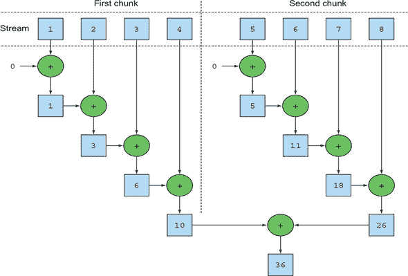

注意，在现实中，在顺序流上调用`parallel`方法并不意味着对流本身进行任何具体的转换。内部，会设置一个`boolean`标志来表示你希望并行执行所有跟随`parallel`调用之后的操作。同样，你也可以通过在并行流上调用`sequential`方法将其转换为顺序流。注意，你可能认为通过结合这两种方法，你可以更精细地控制你在遍历流时希望并行执行哪些操作以及哪些操作是顺序执行的。例如，你可以做如下操作：

```
    stream.parallel()
          .filter(...)
          .sequential()
          .map(...)
          .parallel()
          .reduce();
```

但最后调用`parallel`或`sequential`的会生效并影响整个流水线。在这个例子中，流水线将并行执行，因为这是流水线中的最后一个调用。

|  |
| --- |

**配置并行流使用的线程池**

看一下流的`parallel`方法，你可能想知道并行流使用的线程从哪里来，有多少个，以及如何自定义这个过程。

并行流内部使用默认的`ForkJoinPool`（你将在第 7.2 节中了解更多关于 fork/join 框架的信息），默认情况下，线程的数量与处理器数量相同，由`Runtime.getRuntime().availableProcessors()`返回。

但你可以使用系统属性`java.util.concurrent.ForkJoinPool.common.parallelism`来改变这个池的大小，如下例所示：

```
System.setProperty("java.util.concurrent.ForkJoinPool.common.parallelism",
     "12");
```

这是一个全局设置，因此它将影响你代码中的所有并行流。相反，目前还不可能为单个并行流指定这个值。一般来说，让`ForkJoinPool`的大小等于机器上的处理器数量是一个有意义的默认值，我们强烈建议除非你有充分的理由，否则不要修改它。

|  |
| --- |

回到求和练习，我们说过，当在多核处理器上运行其并行版本时，你可以期待显著的性能提升。现在你有三种方法以三种不同的方式执行完全相同的操作（迭代风格、顺序归约和并行归约），那么让我们看看哪个是最快的！

#### 7.1.2. 测量流性能

我们声称并行化求和的方法应该比顺序和迭代方法表现更好。然而，在软件工程中，猜测永远不是一个好主意！在优化性能时，你应该始终遵循三个黄金法则：测量，测量，再测量。为此，我们将使用名为 Java Microbenchmark Harness (JMH) 的库来实现一个微基准测试。这是一个工具包，它以简单、基于注解的方式帮助创建可靠的微基准测试，用于 Java 程序以及任何其他针对 Java 虚拟机 (JVM) 的语言。实际上，为在 JVM 上运行的程序开发正确且有意义的基准测试并不容易，因为有许多因素需要考虑，例如 HotSpot 需要多少预热时间来优化字节码以及垃圾收集器引入的开销。如果你使用 Maven 作为构建工具，那么要开始在项目中使用 JMH，你需要在 `pom.xml` 文件（它定义了 Maven 构建过程）中添加几个依赖项。

```
<dependency>
  <groupId>org.openjdk.jmh</groupId>
  <artifactId>jmh-core</artifactId>
  <version>1.17.4</version>
</dependency>
<dependency>
  <groupId>org.openjdk.jmh</groupId>
  <artifactId>jmh-generator-annprocess</artifactId>
  <version>1.17.4</version>
</dependency>
```

第一个库是 JMH 的核心实现，而第二个包含一个注解处理器，它有助于通过生成 Java 归档（JAR）文件来运行你的基准测试，一旦你也在你的 Maven 配置中添加了以下插件：

```
<build>
    <plugin>
      <groupId>org.apache.maven.plugins</groupId>
      <artifactId>maven-shade-plugin</artifactId>
      <executions>
        <execution>
          <phase>package</phase>
          <goals><goal>shade</goal></goals>
          <configuration>
            <finalName>benchmarks</finalName>
            <transformers>
              <transformer implementation="org.apache.maven.plugins.shade.
                                     resource.ManifestResourceTransformer">
                <mainClass>org.openjdk.jmh.Main</mainClass>
              </transformer>
            </transformers>
          </configuration>
        </execution>
      </executions>
    </plugin>
  </plugins>
</build>
```

完成这些后，你可以以这种方式基准测试本节开头引入的 `sequentialSum` 方法，如下一个列表所示。

##### 列表 7.1\. 测量累加前 *n* 个数字的函数的性能

```
@BenchmarkMode(Mode.AverageTime)                     *1*
@OutputTimeUnit(TimeUnit.MILLISECONDS)               *2*
@Fork(2, jvmArgs={"-Xms4G", "-Xmx4G"})               *3*
public class ParallelStreamBenchmark {
    private static final long N= 10_000_000L;

    @Benchmark                                       *4*
    public long sequentialSum() {
        return Stream.iterate(1L, i -> i + 1).limit(N)
                     .reduce( 0L, Long::sum);
    }

    @TearDown(Level.Invocation)                      *5*
    public void tearDown() {
        System.gc();
    }
}
```

+   ***1* 测量基准测试方法的平均耗时**

+   ***2* 使用毫秒作为时间单位打印基准测试结果**

+   ***3* 执行基准测试 2 次，以增加结果的可靠性，使用 4Gb 的堆空间**

+   ***4* 要基准测试的方法**

+   ***5* 尝试在基准测试的每次迭代后运行垃圾收集器**

当你编译这个类时，之前配置的 Maven 插件会生成一个名为 benchmarks.jar 的第二个 JAR 文件，你可以按照以下方式运行它：

```
java -jar ./target/benchmarks.jar ParallelStreamBenchmark
```

我们配置基准测试使用过大的堆来尽可能避免垃圾收集器的影响，出于同样的原因，我们尝试强制垃圾收集器在基准测试的每次迭代后运行。尽管采取了所有这些预防措施，但必须注意的是，结果应该带着怀疑的态度来看待。许多因素会影响执行时间，例如你的机器支持多少核心！你可以通过运行书中仓库中提供的代码在自己的机器上尝试这个。

当你启动前者时，让 JMH 执行 20 次基准方法的预热迭代，以允许 HotSpot 优化代码，然后执行 20 次更多迭代，这些迭代用于计算最终结果。这 20+20 次迭代是 JMH 的默认行为，但你可以通过其他 JMH 特定注解或更方便地通过使用`-w`和`-i`标志将它们添加到命令行来更改这两个值。在配备 Intel i7-4600U 2.1 GHz 四核的计算机上执行它，会打印出以下结果：

```
Benchmark                                Mode  Cnt    Score    Error  Units
ParallelStreamBenchmark.sequentialSum    avgt   40  121.843 ±  3.062  ms/op
```

你应该预期使用传统`for`循环的迭代版本会运行得更快，因为它在更低级别工作，更重要的是，它不需要执行任何原始值的装箱或拆箱。我们可以通过向列表 7.1 的基准测试类添加第二个方法并使用`@Benchmark`注解来检查这个直觉。

```
@Benchmark
public long iterativeSum() {
    long result = 0;
    for (long i = 1L; i <= N; i++) {
        result += i;
    }
    return result;
}
```

在我们的测试机器上运行这个第二个基准（可能已经注释掉第一个以避免再次运行）后，我们得到了以下结果：

```
Benchmark                                Mode  Cnt    Score    Error  Units
ParallelStreamBenchmark.iterativeSum     avgt   40    3.278 ±  0.192  ms/op
```

这证实了我们的预期：迭代版本几乎比我们预期的使用顺序流的版本快 40 倍。现在让我们用使用并行流的版本做同样的操作，也将该方法添加到我们的基准测试类中。我们得到了以下结果：

```
Benchmark                                Mode  Cnt    Score    Error  Units
ParallelStreamBenchmark.parallelSum      avgt   40  604.059 ± 55.288  ms/op
```

这相当令人失望：求和方法的并行版本并没有充分利用我们的四核 CPU，其速度比顺序版本慢大约五倍。你如何解释这个意外的结果？有两个问题混合在一起：

+   `iterate`生成装箱对象，在它们可以相加之前必须将它们拆箱成数字。

+   `iterate`难以分割成可以独立执行的独立块。

第二个问题特别有趣，因为你需要保持一个心理模型，即某些流操作比其他操作更容易并行化。具体来说，`iterate`操作难以分割成可以独立执行的块，因为一个函数应用的输入总是依赖于前一个应用的结果，如图 7.2 所示。

##### 图 7.2\. `iterate`本质上是顺序的。

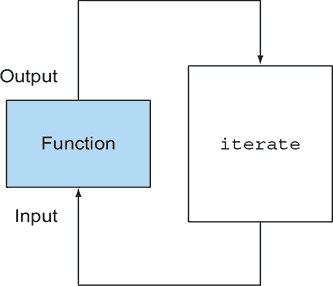

这意味着在这个特定情况下，减少过程并没有像图 7.1 中描述的那样进行：在减少过程的开始时，整个数字列表不可用，这使得无法有效地将流分成要并行处理的块。通过将流标记为并行，你给顺序处理增加了在每个不同线程上分配每个求和操作的开销。

这展示了并行编程可能很棘手，有时甚至反直觉。当误用（例如，使用不友好的并行操作，如 `iterate`）时，它可能会降低程序的整体性能，因此理解当你调用那个看似神奇的 `parallel` 方法时幕后发生了什么是强制性的。

##### 使用更专业的方法

那么你如何有效地使用多核处理器和流来执行并行求和呢？我们已经在第五章中讨论了一种名为 `LongStream.rangeClosed` 的方法。与 `iterate` 相比，这种方法有两个优点：

+   `LongStream.rangeClosed` 直接在原始 `long` 数字上工作，因此没有装箱和拆箱的开销。

+   `LongStream.rangeClosed` 生成数字范围，这些范围可以轻松地分割成独立的块。例如，范围 1–20 可以分割成 1–5、6–10、11–15 和 16–20。

让我们先通过向我们的基准测试类添加以下方法来查看它在顺序流上的性能，以检查与拆箱相关的开销是否相关：

```
@Benchmark
public long rangedSum() {
    return LongStream.rangeClosed(1, N)
                     .reduce(0L, Long::sum);
}
```

这次输出的是

```
Benchmark                                Mode  Cnt    Score    Error  Units
ParallelStreamBenchmark.rangedSum        avgt   40    5.315 ±  0.285  ms/op
```

数字流比之前使用 `iterate` 工厂方法生成的早期顺序版本要快得多，因为数字流避免了所有由非专业流执行的所有不必要的自动装箱和自动拆箱操作造成的开销。这是选择正确数据结构通常比并行化使用它们的算法更重要这一点的证据。但是，如果你尝试使用这个新版本中的并行流会怎样呢？

```
@Benchmark
public long parallelRangedSum() {
    return LongStream.rangeClosed(1, N)
                     .parallel()
                     .reduce(0L, Long::sum);
}
```

现在，将此方法添加到我们的基准测试类中，我们得到了

```
Benchmark                                  Mode  Cnt  Score    Error  Units
ParallelStreamBenchmark.parallelRangedSum  avgt   40  2.677 ±  0.214  ms/op
```

最后，我们得到了一个比其顺序对应版本更快的并行归约，因为这次归约操作可以像在图 7.1 中所示的那样执行。这也表明，使用正确的数据结构*并且*使其并行运行可以保证最佳性能。请注意，这个最新版本也比原始迭代版本快约 20%，这表明，当正确使用时，函数式编程风格允许我们以比命令式对应物更简单、更直接的方式使用现代多核 CPU 的并行性。

然而，请记住，并行化并非免费午餐。并行化过程本身要求你递归地分割流，将每个子流的归约操作分配给不同的线程，然后在一个单一值中合并这些操作的结果。但将数据在多个核心之间移动比你预期的要昂贵得多，因此，确保在另一个核心上并行执行的工作比从一个核心到另一个核心传输数据所需的时间更长是很重要的。一般来说，有许多情况下无法或不太方便使用并行化。但在你使用并行`stream`来加速你的代码之前，你必须确保你使用它是正确的；如果结果会出错，那么即使结果更快也是没有帮助的。让我们看看一个常见的陷阱。

#### 7.1.3\. 正确使用并行流

由滥用并行流产生的错误的主要原因是在算法中修改了一些共享状态。以下是通过修改共享累加器来实现前 *n* 个自然数之和的方法：

```
public long sideEffectSum(long n) {
    Accumulator accumulator = new Accumulator();
    LongStream.rangeClosed(1, n).forEach(accumulator::add);
    return accumulator.total;
}
public class Accumulator {
    public long total = 0;
    public void add(long value) { total += value; }
}
```

这种类型的代码很常见，尤其是对于熟悉命令式编程范式的开发者来说。这段代码与你习惯于迭代数字列表时的操作非常相似：你初始化一个累加器，逐个遍历列表中的元素，并将它们添加到累加器中。

这段代码有什么问题？不幸的是，它是无法恢复的，因为它是基本顺序的。你每次访问 `total` 时都会有一个数据竞争。如果你尝试通过同步来修复它，你将失去所有的并行性。为了理解这一点，让我们尝试将 `stream` 转换为并行流：

```
public long sideEffectParallelSum(long n) {
    Accumulator accumulator = new Accumulator();
    LongStream.rangeClosed(1, n).parallel().forEach(accumulator::add);
    return accumulator.total;
}
```

尝试使用列表 7.1 的 harness 运行这个最后的方法，并打印每次执行的输出：

```
System.out.println("SideEffect parallel sum done in: " +
    measurePerf(ParallelStreams::sideEffectParallelSum, 10_000_000L) + "
    msecs" );
```

你可能会得到以下类似的结果：

```
Result: 5959989000692
Result: 7425264100768
Result: 6827235020033
Result: 7192970417739
Result: 6714157975331
Result: 7497810541907
Result: 6435348440385
Result: 6999349840672
Result: 7435914379978
Result: 7715125932481
SideEffect parallel sum done in: 49 msecs
```

这次你的方法性能并不重要。唯一相关的是，每次执行都返回不同的结果，所有结果都与正确的值 `50000005000000` 相去甚远。这是由于多个线程同时访问累加器，特别是执行 `total += value`，尽管它看起来是原子的，但实际上并不是。问题的根源在于 `forEach` 块内部调用的方法具有改变多个线程之间共享对象可变状态的外部效应。如果你想在没有任何类似坏惊喜的情况下使用并行流，就必须避免这些情况。

现在你已经知道共享可变状态与并行流以及一般的并行计算不太兼容。我们将在第十八章和第十九章中更详细地讨论函数式编程时回到避免突变这个想法。现在，请记住，避免共享可变状态可以确保你的并行流产生正确的结果。接下来，我们将探讨一些实用的建议，你可以使用这些建议来确定何时使用并行流以获得性能提升。

#### 7.1.4\. 高效使用并行流

通常，尝试给出何时使用并行流的任何定量提示都是不可能的（也是没有意义的），因为任何特定的标准，例如“只有当流包含超过一千个元素时”，对于在特定机器上运行的特定操作可能是正确的，但在略微不同的环境中则完全错误。尽管如此，至少可以提供一些定性的建议，这些建议在决定在某种情况下是否使用并行流时可能是有用的：

+   如果有疑问，请进行测量。将顺序流转换为并行流是微不足道的，但并不总是正确的事情。正如我们已经在本节中展示的那样，并行流并不总是比相应的顺序版本快。此外，并行流有时可能会以反直觉的方式工作，因此在选择顺序流和并行流时，最重要的建议是始终使用适当的基准测试来检查它们的性能。

+   注意装箱问题。自动装箱和拆箱操作可能会严重影响性能。Java 8 包含原始流（`IntStream`、`LongStream` 和 `DoubleStream`），以避免此类操作，因此尽可能使用它们。

+   一些操作在并行流上的性能不如在顺序流上。特别是，依赖于元素顺序的操作，如 `limit` 和 `findFirst`，在并行流中成本较高。例如，`findAny` 的性能将优于 `findFirst`，因为它不受操作顺序的限制。你可以通过调用 `unordered` 方法将有序流转换为无序流。例如，如果你需要流中的 *N* 个元素，而你并不一定对前 *N* 个元素感兴趣，对无序并行流调用 `limit` 可能比在有序流（例如，当源是 `List` 时）上执行更有效。

+   考虑流执行的操作的总计算成本。其中 *N* 是要处理的元素数量，*Q* 是通过流管道处理这些元素之一的近似成本，*N*Q* 的乘积给出了这种成本的大致定性估计。*Q* 的值越高，使用并行流时获得良好性能的机会就越大。

+   对于少量数据，选择并行流几乎从未是明智的决定。并行处理仅几个元素的优势不足以弥补并行化过程带来的额外成本。

+   考虑底层数据结构如何有效地分解流。例如，`ArrayList`比`LinkedList`更有效地分割，因为前者可以均匀分割而不需要遍历，而后者则必须这样做。此外，使用`range`工厂方法创建的原始流可以快速分解。最后，正如你将在第 7.3 节中学习的，你可以通过实现自己的`Spliterator`来完全控制这个分解过程。

+   流的特性以及通过管道进行的中间操作如何修改它们，可以改变分解过程的表现。例如，一个`SIZED`流可以被分成两个相等的部分，然后每个部分可以更有效地并行处理，但过滤器操作可能会丢弃不可预测数量的元素，使得流本身的大小变得未知。

+   考虑终端操作是否具有昂贵或便宜的合并步骤（例如，`Collector`中的`combiner`方法）。如果这是昂贵的，那么由每个子流生成的部分结果的合并所造成的成本可能会超过并行流带来的性能优势。

表 7.1 总结了某些流源在可分解性方面的并行友好性。

##### 表 7.1\. 流源和可分解性

| 源 | 可分解性 |
| --- | --- |
| ArrayList | 优秀 |
| LinkedList | 差 |
| IntStream.range | 优秀 |
| Stream.iterate | 差 |
| HashSet | 良好 |
| TreeSet | 良好 |

最后，我们需要强调，并行流在幕后使用的用于并行执行操作的架构是 Java 7 中引入的分支/合并框架。并行求和示例证明，为了正确使用并行流，了解并行流的内部机制至关重要，因此我们将在下一节详细研究分支/合并框架。

### 7.2\. 分支/合并框架

分支/合并框架被设计为递归地将可并行化的任务分解成更小的任务，然后将每个子任务的输出组合起来以产生整体结果。它是`ExecutorService`接口的实现，将这些子任务分配到线程池中的工作线程，称为`ForkJoinPool`。让我们首先探索如何定义任务和子任务。

#### 7.2.1\. 与 RecursiveTask 一起工作

要向此池提交任务，您必须创建一个 `RecursiveTask<R>` 的子类，其中 `R` 是并行化任务（及其每个子任务）产生的结果的类型，或者如果任务不返回结果（尽管它可能更新其他非局部结构），则为 `RecursiveAction`。要定义 `RecursiveTask`s，您只需要实现其单个抽象方法 `compute`：

```
protected abstract R compute();
```

此方法定义了将当前任务拆分为子任务的逻辑以及当不再可能或方便进一步拆分时产生单个子任务结果的算法。因此，此方法的实现通常类似于以下伪代码：

```
if (task is small enough or no longer divisible) {
    compute task sequentially
} else {
    split task in two subtasks
    call this method recursively possibly further splitting each subtask
    wait for the completion of all subtasks
    combine the results of each subtask
}
```

通常，没有精确的标准来决定是否应该进一步拆分给定的任务，但有各种启发式方法可以帮助您做出这个决定。我们将在 7.2.2 节 中更详细地说明这些方法。递归任务拆分过程在 图 7.3 中以视觉形式综合展示。

##### 图 7.3\. Fork/join 过程

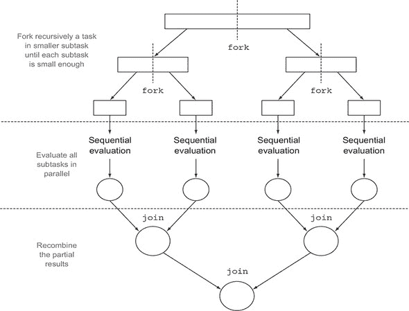

如您所注意到的，这不过是众所周知的分而治之算法的并行版本。为了演示如何使用 fork/join 框架并基于我们之前的示例，让我们尝试使用此框架计算一系列数字（在此由数字数组 `long[]` 表示）的总和。如前所述，您需要首先为 `RecursiveTask` 类提供一个实现，如列表 7.2 中的 `ForkJoinSumCalculator` 所示。

##### 列表 7.2\. 使用 fork/join 框架执行并行求和

```
public class ForkJoinSumCalculator
             extends java.util.concurrent.RecursiveTask<Long> {            *1*
    private final long[] numbers;                                          *2*
    private final int start;                                               *3*
    private final int end;
    public static final long THRESHOLD = 10_000;                           *4*
    public ForkJoinSumCalculator(long[] numbers) {                         *5*
        this(numbers, 0, numbers.length);
    }
    private ForkJoinSumCalculator(long[] numbers, int start, int end) {    *6*
        this.numbers = numbers;
        this.start = start;
        this.end = end;
    }
    @Override
    protected Long compute() {                                             *7*
        int length = end - start;                                          *8*
        if (length <= THRESHOLD) {
            return computeSequentially();                                  *9*
        }
        ForkJoinSumCalculator leftTask =
            new ForkJoinSumCalculator(numbers, start, start + length/2);   *10*
        leftTask.fork();                                                   *11*
        ForkJoinSumCalculator rightTask =
            new ForkJoinSumCalculator(numbers, start + length/2, end);     *12*
        Long rightResult = rightTask.compute();                            *13*
        Long leftResult = leftTask.join();                                 *14*
        return leftResult + rightResult;                                   *15*
    }
    private long computeSequentially() {                                   *16*
        long sum = 0;
        for (int i = start; i < end; i++) {
            sum += numbers[i];
        }
        return sum;
    }
}
```

+   ***1* 将 RecursiveTask 扩展为可用于 fork/join 框架的任务**

+   ***2* 要求和的数字数组**

+   ***3* 此子任务处理的子数组的初始和最终位置**

+   ***4* 将任务拆分为子任务的大小阈值**

+   ***5* 公共构造函数用于创建主任务**

+   ***6* 私有构造函数用于创建主任务的子任务**

+   ***7* 覆盖 RecursiveTask 的抽象方法**

+   ***8* 此任务求和的子数组的大小**

+   ***9* 如果大小小于或等于阈值，则按顺序计算结果**

+   ***10* 创建一个子任务来求和数组的前半部分**

+   ***11* 使用 ForkJoinPool 的另一个线程异步执行新创建的子任务**

+   ***12* 创建一个子任务来求和数组的后半部分**

+   ***13* 同步执行此第二个子任务，可能允许进一步的递归拆分**

+   ***14* 读取第一个子任务的结果——如果它尚未准备好则等待**

+   ***15* 合并两个子任务的结果**

+   ***16* 低于阈值的简单顺序算法**

现在编写一个执行并行求和前 *n* 个自然数的方法的步骤非常简单。您需要将所需的数字数组传递给 `ForkJoinSumCalculator` 构造函数：

```
public static long forkJoinSum(long n) {
    long[] numbers = LongStream.rangeClosed(1, n).toArray();
    ForkJoinTask<Long> task = new ForkJoinSumCalculator(numbers);
    return new ForkJoinPool().invoke(task);
}
```

在这里，您使用`Long-Stream`生成一个包含前*n*个自然数的数组。然后，您创建一个`ForkJoinTask`（`RecursiveTask`的父类），将此数组传递给列表 7.2 中所示的`ForkJoinSumCalculator`的公共构造函数。最后，您创建一个新的`ForkJoinPool`并将该任务传递给其`invoke`方法。此最后方法的返回值是`ForkJoin-SumCalculator`类在`ForkJoinPool`内部执行时定义的任务的结果。

注意，在实际应用中，使用多个`ForkJoinPool`是没有意义的。因此，您通常应该只实例化一次，并将此实例保留在静态字段中，使其成为单例，这样它就可以方便地被软件的任何部分重用。在这里，为了创建它，您正在使用它的默认无参数构造函数，这意味着您希望池使用 JVM 可用的所有处理器。更确切地说，此构造函数将使用`Runtime.availableProcessors`返回的值来确定池使用的线程数。请注意，尽管`availableProcessors`方法的名字如此，但实际上它返回的是可用的核心数，包括由于超线程而产生的任何虚拟核心。

##### 运行 ForkJoinSumCalculator

当您将`ForkJoinSumCalculator`任务传递给`ForkJoinPool`时，此任务由池中的一个线程执行，该线程随后调用任务的`compute`方法。此方法检查任务是否足够小，可以顺序执行；否则，它将待求和的数字数组分成两半，并将它们分配给两个新的`ForkJoinSumCalculator`，这些新任务被安排由`Fork-JoinPool`执行。因此，此过程可以递归重复，直到满足不再方便或不再可能进一步拆分的条件（在这种情况下，如果待求和的项目数小于或等于 10,000）。在此点，每个子任务的结果顺序计算，并通过分支过程创建的任务的二叉树回溯到其根。然后计算任务的结果，结合每个子任务的局部结果。此过程在图 7.4 中显示。

##### 图 7.4\. 分支/合并算法

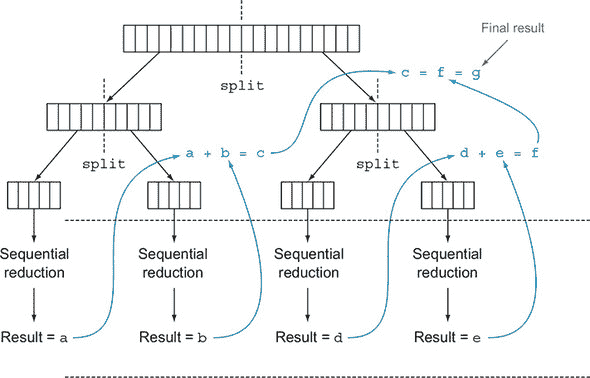

再次使用本章开头开发的 harness，您可以使用分支/合并框架显式检查求和方法的性能：

```
System.out.println("ForkJoin sum done in: " + measureSumPerf(
        ForkJoinSumCalculator::forkJoinSum, 10_000_000) + " msecs" );
```

在这种情况下，它产生以下输出：

```
ForkJoin sum done in: 41 msecs
```

在这里，性能不如使用并行流的版本，但这仅仅是因为您被迫在允许使用`ForkJoinSumCalculator`任务之前，将整个数字流放入一个`long[]`数组中。

#### 7.2.2\. 使用分支/合并框架的最佳实践

尽管 fork/join 框架相对容易使用，但不幸的是，它也很容易误用。以下是一些有效使用它的最佳实践：

+   在任务上调用`join`方法会阻塞调用者，直到该任务产生的结果准备好。因此，必须在启动两个子任务的计算之后调用它。否则，你最终会得到一个比原始顺序算法更慢、更复杂的版本，因为每个子任务都必须等待另一个子任务完成才能开始。

+   `ForkJoinPool`的`invoke`方法不应该在`RecursiveTask`内部使用。相反，你应该始终直接调用`compute`或`fork`方法；只有顺序代码应该使用`invoke`来开始并行计算。

+   在子任务上调用`fork`方法是将其调度到`Fork-JoinPool`上的方式。虽然对左右子任务都调用它看起来很自然，但这样做不如直接在其中一个上调用`compute`更有效率。这样做允许你为两个子任务中的任何一个重用相同的线程，并避免由于在池中不必要的进一步任务分配而产生的开销。

+   使用 fork/join 框架调试并行计算可能很棘手。特别是，通常在最喜欢的 IDE 中浏览堆栈跟踪以发现问题的原因是非常常见的，但这种方法不适用于 fork/join 计算，因为`compute`的调用发生在与概念调用者不同的线程中，而概念调用者是调用`fork`的代码。

+   正如你在并行流中发现的那样，你不应该理所当然地认为在多核处理器上使用 fork/join 框架进行的计算比顺序版本更快。我们之前已经说过，一个任务应该可以分解为几个独立的子任务，以便能够并行化并取得相关的性能提升。所有这些子任务应该比创建新任务的执行时间更长；一个常见的做法是将 I/O 放入一个子任务，将计算放入另一个子任务，从而重叠计算与 I/O。此外，在比较相同算法的顺序和并行版本的性能时，你应该考虑其他因素。像任何其他 Java 代码一样，fork/join 框架需要被“预热”，或者执行几次，然后才能被 JIT 编译器优化。这就是为什么在测量性能之前，总是重要地多次运行程序，就像我们在我们的工具中做的那样。此外，编译器内建优化可能会不公平地给顺序版本带来优势（例如，通过执行死代码分析——移除从未使用的计算）。

fork/join 拆分策略值得再提一句：你必须选择用于决定给定子任务是否应该进一步拆分或足够小以至于可以顺序评估的准则。我们将在下一节中给出一些关于这个问题的提示。

#### 7.2.3. 工作窃取

在我们的`ForkJoinSumCalculator`示例中，我们决定当要加和的数字数组最多包含 10,000 项时停止创建更多子任务。这是一个任意的选择，但在大多数情况下，除了尝试通过使用不同的输入进行多次尝试来优化它之外，很难找到一个好的启发式方法。在我们的测试案例中，我们从一个包含 1000 万个项目的数组开始，这意味着`ForkJoinSumCalculator`至少会分叉 1000 个子任务。这看起来可能像是一种资源浪费，因为我们是在一个只有四个核心的机器上运行的。在这种情况下，这可能确实是正确的，因为所有任务都是 CPU 密集型的，并且预计会花费相似的时间。

但将大量细粒度任务进行分叉通常是一个明智的选择。这是因为理想情况下，你希望将并行化任务的工作量分割成这样的方式，即每个子任务花费的时间完全相同，保持 CPU 的所有核心都处于同等忙碌状态。不幸的是，特别是在比我们这里展示的简单示例更接近现实场景的情况下，每个子任务所需的时间可能会因使用低效的分割策略或由于不可预测的原因（如缓慢的磁盘访问或需要与外部服务协调执行）而大幅变化。

Fork/join 框架通过一种称为*窃取工作*的技术来解决这个问题。在实践中，这意味着任务在大约`ForkJoinPool`中的所有线程上大致均匀分配。每个线程都持有分配给它的任务的双链队列，并且一旦它完成一个任务，它就会从队列的头部拉取另一个任务并开始执行。由于我们之前列出的原因，一个线程可能比其他线程更快地完成分配给它的所有任务，这意味着它的队列会变得空，而其他线程仍然相当忙碌。在这种情况下，线程不会空闲，而是随机选择另一个线程的队列，并从队列的尾部“窃取”一个任务。这个过程会一直持续到所有任务都执行完毕，然后所有队列都变为空。这就是为什么拥有许多较小的任务，而不是只有少数较大的任务，有助于更好地在工作线程之间平衡工作负载。

更普遍地，这种窃取工作算法用于在池中的工作线程之间重新分配和平衡任务。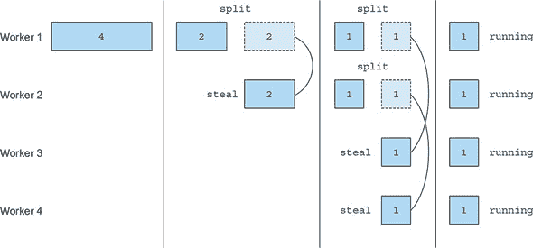展示了这个过程是如何发生的。当一个工作线程队列中的任务被分割成两个子任务时，其中一个子任务被另一个空闲的工作线程“窃取”。如前所述，这个过程可以递归地继续进行，直到用于定义给定子任务应该顺序执行的条件变为真。

##### 图 7.5\. Fork/join 框架使用的窃取工作算法


现在应该已经很清楚，一个流如何使用 fork/join 框架并行处理其项目了，但仍然缺少一个关键因素。在本节中，我们分析了一个例子，其中你明确开发了将数字数组拆分为多个任务的逻辑。然而，当你在本章开头使用并行流时，你并没有做类似的事情，这意味着必须有一个自动机制为你拆分流。这个新的自动机制被称为`Spliterator`，我们将在下一节中探讨它。

### 7.3. `Spliterator`

`Spliterator` 是 Java 8 中添加的另一个新接口；其名称代表“可拆分迭代器”。与`Iterator`类似，`Spliterator`用于遍历源中的元素，但它们也被设计为并行执行。虽然你可能不需要在实际中开发自己的`Spliterator`，但了解如何做到这一点将使你对并行流的工作原理有更深入的理解。Java 8 已经为它包含在其 Collections Framework 中的所有数据结构提供了一个默认的`Spliterator`实现。`Collection`接口现在提供了一个默认方法`spliterator()`（你将在第十三章中了解更多关于默认方法的内容），该方法返回一个`Spliterator`对象。`Spliterator`接口定义了几个方法，如下面的列表所示。

##### 列表 7.3. `Spliterator` 接口

```
public interface Spliterator<T> {
    boolean tryAdvance(Consumer<? super T> action);
    Spliterator<T> trySplit();
    long estimateSize();
    int characteristics();
}
```

如同往常，`T`是`Spliterator`遍历的元素类型。`tryAdvance`方法的行为与正常`Iterator`类似，因为它用于顺序地逐个消费`Spliterator`的元素，如果有其他元素要遍历，则返回`true`。但`trySplit`方法更具体于`Spliterator`接口，因为它用于将一些元素拆分到一个第二个`Spliterator`（由该方法返回的）中，允许这两个并行处理。`Spliterator`还可以通过其`estimateSize`方法提供一个估计值，表示剩余要遍历的元素数量，因为即使是一个不准确但计算快速的值也可以用于更均匀地拆分结构。

为了在需要时控制这个过程，理解这个拆分过程是如何在内部执行的非常重要。因此，我们将在下一节中更详细地分析它。

#### 7.3.1. 拆分过程

将流分割成多个部分的算法是一个递归过程，其步骤如下所示图 7.6。在第一步中，对第一个`Spliterator`调用`trySplit`生成第二个`Spliterator`。然后在第二步中，它再次被调用在这两个`Spliterator`上，总共生成四个。框架会持续在`Spliterator`上调用`trySplit`方法，直到它返回`null`以表示正在处理的数据结构不再可分割，如图 3 所示。最后，当所有`Spliterator`都向`trySplit`调用返回`null`时，递归分割过程在步骤 4 中终止。

##### 图 7.6\. 递归分割过程

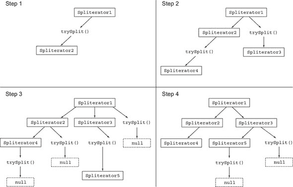

这个分割过程也可以受到`Spliterator`本身的特性的影响，这些特性通过`characteristics`方法声明。

##### `Spliterator`的特性

`Spliterator`接口声明的最后一个抽象方法是`characteristics`，它返回一个`int`编码，表示`Spliterator`本身的特性集。`Spliterator`客户端可以使用这些特性来更好地控制和优化其使用。表 7.2 总结了它们。（不幸的是，尽管这些在概念上与收集器的特性重叠，但它们的编码方式不同。）特性是在`Spliterator`接口中定义的 int 常量。

##### 表 7.2\. `Spliterator`的特性

| 特性 | 含义 |
| --- | --- |
| 有序 | 元素有一个定义的顺序（例如，一个 List），因此`Spliterator`在遍历和分割它们时强制执行这个顺序。 |
| 唯一 | 对于每个遍历的元素对 x 和 y，x.equals(y)返回 false。 |
| 排序 | 遍历的元素遵循预定义的排序顺序。 |
| 有大小 | 这个`Spliterator`是从一个已知大小（例如，一个 Set）的来源创建的，因此`estimatedSize()`返回的值是精确的。 |
| 非空 | 保证遍历的元素不会为空。 |
| 不可变 | 这个`Spliterator`的来源不能被修改。这意味着在遍历期间不能添加、删除或修改任何元素。 |
| 并发 | 这个`Spliterator`的来源可以安全地由其他线程并发修改，无需任何同步。 |
| 子大小 | 这个`Spliterator`及其从其分割产生的所有后续`Spliterator`都是 SIZED。 |

现在你已经看到了`Spliterator`接口是什么以及它定义了哪些方法，你可以尝试开发自己的`Spliterator`实现。

#### 7.3.2\. 实现自己的`Spliterator`

让我们看看你可能需要实现自己的`Spliterator`的实际情况。我们将开发一个简单的方法来计算`String`中的单词数量。这个方法的迭代版本可以写成如下所示。

##### 列表 7.4\. 迭代单词计数方法

```
public int countWordsIteratively(String s) {
    int counter = 0;
    boolean lastSpace = true;
    for (char c : s.toCharArray()) {           *1*
        if (Character.isWhitespace(c)) {
            lastSpace = true;
        } else {
            if (lastSpace) counter++;          *2*
            lastSpace = false;
        }
    }
    return counter;
}
```

+   ***1* 逐个遍历 String 中的所有字符**

+   ***2* 当最后一个字符是空格而当前遍历的不是时，增加单词计数器**

让我们用这种方法处理但丁的《地狱》第一句（见[`en.wikipedia.org/wiki/Inferno_(Dante)`](http://en.wikipedia.org/wiki/Inferno_(Dante))）：

```
final String SENTENCE =
            " Nel   mezzo del cammin  di nostra  vita " +
            "mi  ritrovai in una  selva oscura" +
            " ché la  dritta via era   smarrita ";
System.out.println("Found " + countWordsIteratively(SENTENCE) + " words");
```

注意，我们在句子中添加了一些额外的随机空格，以证明迭代实现即使在两个单词之间有多个空格的情况下也能正确工作。正如预期的那样，此代码将打印出以下内容：

```
Found 19 words
```

理想情况下，你希望以更函数式的风格达到相同的结果，因为这样你将能够，如前所述，使用并行流并行化此过程，而无需显式处理线程及其同步。

##### 以函数式风格重写 WordCounter

首先，你需要将`String`转换为流。不幸的是，只有`int`、`long`和`double`有原始流，所以你必须使用`Stream<Character>`：

```
Stream<Character> stream = IntStream.range(0, SENTENCE.length())
                                    .mapToObj(SENTENCE::charAt);
```

你可以通过对这个流执行归约来计算单词数。在归约流时，你必须携带一个由两个变量组成的状态：一个`int`变量用于计算到目前为止找到的单词数，一个`boolean`变量用于记住最后一个遇到的`Character`是否是空格。因为 Java 没有元组（一个表示无包装对象的异构元素有序列表的构造），你必须创建一个新的类`WordCounter`，它将如以下列表所示封装这个状态。

##### 列表 7.5\. 一个在遍历`Characters`流时计算单词的类

```
class WordCounter {
    private final int counter;
    private final boolean lastSpace;
    public WordCounter(int counter, boolean lastSpace) {
        this.counter = counter;
        this.lastSpace = lastSpace;
    }
    public WordCounter accumulate(Character c) {                  *1*
        if (Character.isWhitespace(c)) {
            return lastSpace ?
                   this :
                   new WordCounter(counter, true);
        } else {
            return lastSpace ?
                   new WordCounter(counter+1, false) :            *2*
                   this;
        }
    }
    public WordCounter combine(WordCounter wordCounter) {         *3*
        return new WordCounter(counter + wordCounter.counter,
                               wordCounter.lastSpace);            *4*
    }
    public int getCounter() {
        return counter;
    }
}
```

+   ***1* 累积方法逐个遍历字符，就像迭代算法所做的那样**

+   ***2* 当最后一个字符是空格而当前遍历的不是时，增加单词计数器**

+   ***3* 通过求和计数器合并两个 WordCounter**

+   ***4* 只使用计数器的总和，因此你不必关心 lastSpace**

在这个列表中，`accumulate`方法定义了如何改变`WordCounter`的状态，或者更确切地说，用哪个状态创建一个新的`WordCounter`，因为这是一个不可变类。这一点很重要。我们使用不可变类累积状态，以便在下一步中可以并行化这个过程。每当流中遍历一个新的`Character`时，都会调用`accumulate`方法。特别是，正如你在列表 7.4 中的`countWordsIteratively`方法中所做的那样，当遇到一个新的非空格字符时，计数器会增加，并且遇到的最后一个字符是空格。图 7.7 显示了`accumulate`方法遍历新`Character`时`WordCounter`的状态转换。

##### 图 7.7\. 当遍历新的`Character c`时`WordCounter`的状态转换

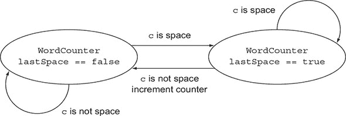

第二种方法，`combine`，被调用来聚合两个`WordCounter`的局部结果，这两个`WordCounter`分别作用于`Character`流的不同子部分，因此它通过求和它们的内部计数器来合并两个`WordCounter`。

现在你已经编码了如何在`WordCounter`上累积字符以及如何在`WordCounter`本身中组合它们，编写一个将`Character`流减少的方法就很简单了：

```
private int countWords(Stream<Character> stream) {
    WordCounter wordCounter = stream.reduce(new WordCounter(0, true),
                                            WordCounter::accumulate,
                                            WordCounter::combine);
    return wordCounter.getCounter();
}
```

现在，你可以尝试使用包含但丁的《地狱》第一句的`String`创建的流来尝试这个方法：

```
Stream<Character> stream = IntStream.range(0, SENTENCE.length())
                                    .mapToObj(SENTENCE::charAt);
System.out.println("Found " + countWords(stream) + " words");
```

你可以检查其输出是否与迭代版本生成的输出一致：

```
Found 19 words
```

到目前为止，一切顺利，但我们说过，在函数式术语中实现`WordCounter`的主要理由之一是能够轻松并行化此操作，那么让我们看看这是如何工作的。

##### 使`WordCounter`并行工作

你可以尝试使用并行流来加速单词计数操作，如下所示：

```
System.out.println("Found " + countWords(stream.parallel()) + " words");
```

不幸的是，这次输出是

```
Found 25 words
```

显然出了些问题，但问题是什么？问题并不难发现。因为原始字符串是在任意位置分割的，有时一个单词被分成两部分，然后被计数两次。总的来说，这表明如果结果可能受到流分割位置的影响，那么从顺序流到并行流可能会导致错误的结果。

如何解决这个问题？解决方案包括确保字符串不是在随机位置分割，而是在单词的末尾分割。为此，你必须实现一个`Spliterator`，它只将字符串分割在两个单词之间（如下所示），然后从它创建并行流。

##### 列表 7.6\. `WordCounterSpliterator`

```
class WordCounterSpliterator implements Spliterator<Character> {
    private final String string;
    private int currentChar = 0;
    public WordCounterSpliterator(String string) {
        this.string = string;
    }
    @Override
    public boolean tryAdvance(Consumer<? super Character> action) {
        action.accept(string.charAt(currentChar++));                      *1*
        return currentChar < string.length();                             *2*
    }
    @Override
    public Spliterator<Character> trySplit() {
        int currentSize = string.length() - currentChar;
        if (currentSize < 10) {
            return null;                                                  *3*
        }
        for (int splitPos = currentSize / 2 + currentChar;
                 splitPos < string.length(); splitPos++) {                *4*
            if (Character.isWhitespace(string.charAt(splitPos))) {        *5*
                Spliterator<Character> spliterator =                      *6*
                   new WordCounterSpliterator(string.substring(currentChar,
                                                               splitPos));
                currentChar = splitPos;                                   *7*
                return spliterator;                                       *8*
            }
        }
        return null;
    }
    @Override
    public long estimateSize() {
        return string.length() - currentChar;
    }
    @Override
    public int characteristics() {
        return ORDERED + SIZED + SUBSIZED + NON-NULL + IMMUTABLE;
    }
}
```

+   ***1* 消费当前字符**

+   ***2* 如果还有更多字符要消费，则返回 true**

+   ***3* 返回 null 以表示要解析的字符串足够小，可以顺序处理**

+   ***4* 将候选分割位置设置为要解析的字符串的一半**

+   ***5* 将分割位置推进到下一个空格**

+   ***6* 从起始位置到分割位置创建一个新的`WordCounter-Spliterator`来解析字符串**

+   ***7* 将当前`Word-CounterSpliterator`的起始位置设置为分割位置**

+   ***8* 找到一个空格并创建了新的 Spliterator，因此退出循环**

这个`Spliterator`是从要解析的`String`创建的，并通过保持正在遍历的索引来迭代其`Character`s。让我们快速回顾一下实现`Spliterator`接口的`WordCounterSpliterator`的方法：

+   `tryAdvance` 方法将当前索引位置的 `Character` 从 `String` 中传递给 `Consumer`，并增加这个位置。作为其参数传递的 `Consumer` 是一个内部 Java 类，它将消耗的 `Character` 转发到在遍历流时必须应用于它的函数集，在这种情况下，只有一个减少函数，即 `WordCounter` 类的 `accumulate` 方法。如果新的光标位置小于总 `String` 长度并且还有要迭代的 `Character`，则 `tryAdvance` 方法返回 `true`。

+   `trySplit` 方法是 `Spliterator` 中最重要的一个，因为它定义了用于拆分要迭代的数组的逻辑。正如你在实现 列表 7.1 的 `RecursiveTask` 的 `compute` 方法中所做的那样，你在这里首先要做的第一件事是设置一个限制，你不想在这个限制以下执行进一步的拆分。在这里，你只使用 10 个 `Character` 的低限制，以确保你的程序会在解析相对较短的 `String` 时执行一些拆分。但在实际应用中，你将不得不使用更高的限制，就像你在 fork/join 示例中所做的那样，以避免创建过多的任务。如果剩余要遍历的 `Character` 数量低于这个限制，你返回 `null` 以表示不需要进一步的拆分。相反，如果你需要执行拆分，你将候选拆分位置设置为剩余要解析的 `String` 块的一半。但你不会直接使用这个拆分位置，因为你想要避免在单词中间拆分，所以你会向前移动，直到找到一个空白 `Character`。一旦找到一个合适的拆分位置，你将创建一个新的 `Spliterator`，它将遍历从当前位置到拆分位置的子字符串块；你将 `this` 的当前位置设置为拆分位置，因为它前面的部分将由新的 `Spliterator` 管理，然后返回它。

+   还要遍历的元素 `estimatedSize` 是由这个 `Spliterator` 解析的 `String` 的总长度与当前迭代的当前位置之间的差值。

+   最后，`characteristics` 方法向框架表明这个 `Spliterator` 是 `ORDERED`（顺序是 `String` 中 `Character` 的序列），`SIZED`（`estimatedSize` 方法返回的值是精确的），`SUBSIZED`（由 `trySplit` 方法创建的其他 `Spliterator` 也具有精确的大小），`NON-NULL`（`String` 中不能有 `null Character`），以及 `IMMUTABLE`（在解析 `String` 时不能添加更多的 `Character`，因为 `String` 本身是一个不可变类）。

##### 使用 WordCounterSpliterator

你现在可以使用新的 `WordCounterSpliterator` 来并行流，如下所示：

```
Spliterator<Character> spliterator = new WordCounterSpliterator(SENTENCE);
Stream<Character> stream = StreamSupport.stream(spliterator, true);
```

传递给 `StreamSupport.stream` 工厂方法的第二个布尔参数意味着你想要创建一个并行流。将此并行流传递给 `countWords` 方法

```
System.out.println("Found " + countWords(stream) + " words");
```

产生预期的正确输出：

```
Found 19 words
```

你已经看到了如何使用 `Spliterator` 来控制分割数据结构所使用的策略。`Spliterator` 的最后一个显著特性是，在第一次遍历、第一次分割或第一次查询估计大小时，可以将要遍历的元素源绑定到点，而不是在创建时。当这种情况发生时，它被称为 *延迟绑定* 的 `Spliterator`。我们已在 附录 C 中专门介绍如何开发一个实用类，利用此功能在同一个流上并行执行多个操作。

### 摘要

+   内部迭代允许你在不显式使用和协调代码中的不同线程的情况下并行处理流。

+   即使并行处理流如此简单，也不能保证在所有情况下这样做会使程序运行得更快。并行软件的行为和性能有时可能是反直觉的，因此始终有必要对其进行测量，并确保你没有使程序变慢。

+   在一组数据上并行执行操作，如并行流所做的那样，可以提供性能提升，尤其是在要处理的数据元素数量巨大或每个单个元素的处理特别耗时的情况下。

+   从性能角度来看，使用合适的数据结构，例如，尽可能使用原始流而不是非专用流，通常比尝试并行化某些操作更重要。

+   Fork/Join 框架允许你递归地将可并行化的任务分割成更小的任务，在不同的线程上执行它们，然后将每个子任务的输出结果合并，以产生整体结果。

+   `Spliterator` 定义了并行流如何分割它遍历的数据。
