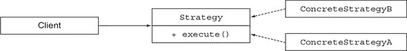
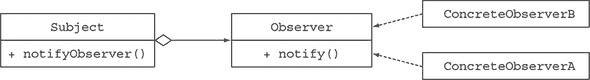
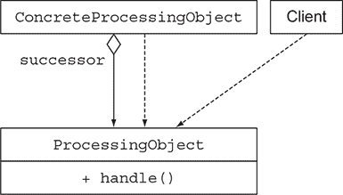
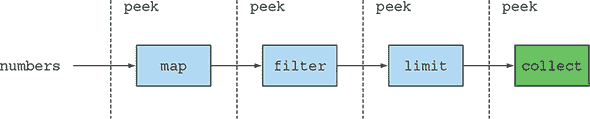

## 第三部分. 使用流和 lambda 进行有效编程

本书第三部分探讨了各种 Java 8 和 Java 9 主题，这些主题将使你更有效地使用 Java，并使用现代惯用模式增强你的代码库。因为它面向更高级的编程思想，所以本书后面的内容不依赖于这里描述的技术。

第八章是第二版的新章节，探讨了 Java 8 和 Java 9 的集合 API 增强，涵盖了使用集合工厂以及学习与 List 和 Set 集合一起使用的新惯用模式，以及涉及 Map 的惯用模式。

第九章探讨了如何使用新的 Java 8 特性和一些食谱来改进现有的代码。此外，它还探讨了重要的软件开发技术，如设计模式、重构、测试和调试。

第十章在第二版中也是新的。它探讨了基于领域特定语言（DSL）的 API 的想法。这不仅是一种强大的 API 设计方式，而且这种方式越来越受欢迎，并且在 Java 中已经很明显，例如在`Comparator`、`Stream`和`Collector`接口中。

## 第八章. 集合 API 增强

*本章涵盖*

+   使用集合工厂

+   学习使用`List`和`Set`的新惯用模式

+   学习与`Map`一起工作的惯用模式

没有集合 API，你的 Java 开发者生活将会相当孤独。集合被用于每个 Java 应用程序中。在前面的章节中，你看到了集合与 Streams API 结合使用是多么有用，这对于表达数据处理查询非常有用。尽管如此，集合 API 存在各种缺陷，有时使其使用起来既冗长又容易出错。

在本章中，你将了解 Java 8 和 Java 9 中集合 API 的新增功能，这将使你的生活变得更轻松。首先，你将了解 Java 9 中的集合工厂——简化创建小列表、集合和映射过程的添加。接下来，你将学习如何利用 Java 8 的增强功能在列表和集合中应用惯用移除和替换模式。最后，你将了解可用于处理映射的新便利操作。

第九章探讨了重构旧式 Java 代码的更广泛的技术。

### 8.1. 集合工厂

Java 9 引入了一些方便的方式来创建小的集合对象。首先，我们将回顾为什么程序员需要一个更好的方式来做事情；然后我们将向您展示如何使用新的工厂方法。

你如何在 Java 中创建一个小的元素列表？你可能想将要去度假的朋友的名字分组，例如。这里有一种方法：

```
List<String> friends = new ArrayList<>();
friends.add("Raphael");
friends.add("Olivia");
friends.add("Thibaut");
```

但要存储三个字符串，却要写这么多行代码！一个更方便的方式来编写这段代码是使用`Arrays.asList()`工厂方法：

```
List<String> friends
   = Arrays.asList("Raphael", "Olivia", "Thibaut");
```

你得到一个固定大小的列表，你可以更新它，但不能添加或删除元素。尝试添加元素，例如，会导致 `Unsupported-ModificationException`，但使用 `set` 方法更新是允许的：

```
List<String> friends = Arrays.asList("Raphael", "Olivia");
friends.set(0, "Richard");
friends.add("Thibaut");                  *1*
```

+   ***1* 抛出 `UnsupportedOperationException` 异常**

这种行为似乎有些令人惊讶，因为底层列表是由一个固定大小的可变数组支持的。

如何看待一个 `Set`？不幸的是，没有 `Arrays.asSet()` 工厂方法，所以你需要另一个技巧。你可以使用 `HashSet` 构造函数，它接受一个 `List`：

```
Set<String> friends "
   = new HashSet<>(Arrays.asList("Raphael", "Olivia", Thibaut"));
```

或者，你也可以使用 Streams API：

```
Set<String> friends
   = Stream.of("Raphael", "Olivia", "Thibaut")
           .collect(Collectors.toSet());
```

然而，这两种解决方案都远非优雅，并且在幕后涉及不必要的对象分配。此外，请注意，你得到的是一个可变的 `Set`。

如何看待 `Map`？创建小地图没有优雅的方法，但别担心；Java 9 添加了工厂方法，使你在需要创建小列表、集合和地图时生活变得更简单。

|  |
| --- |

**集合字面量**

一些语言，包括 Python 和 Groovy，支持集合字面量，允许你使用特殊语法创建集合，例如使用 [42, 1, 5] 创建一个包含三个数字的列表。Java 没有提供语法支持，因为语言的变化伴随着高昂的维护成本，并限制了未来可能语法的使用。相反，Java 9 通过增强 Collection API 来添加支持。

|  |
| --- |

我们通过向你展示 `List` 的新特性来开始对 Java 中创建集合的新方法的探索。

#### 8.1.1\. 列表工厂

你可以通过调用工厂方法 `List.of` 来创建一个列表：

```
List<String> friends = List.of("Raphael", "Olivia", "Thibaut");
System.out.println(friends);                                        *1*
```

+   ***1* [Raphael, Olivia, Thibaut]**

然而，你会注意到一些奇怪的事情。尝试向你的朋友列表中添加一个元素：

```
List<String> friends = List.of("Raphael", "Olivia", "Thibaut");
friends.add("Chih-Chun");
```

运行此代码会导致 `java.lang.UnsupportedOperationException`。事实上，生成的列表是不可变的。使用 `set()` 方法替换项会抛出类似的异常。你也不能使用 `set` 方法来修改它。然而，这种限制是好事，因为它保护你免受集合的不希望变化的侵害。没有任何东西阻止你拥有本身可变的元素。如果你需要一个可变列表，你仍然可以手动实例化一个。最后，请注意，为了防止意外的错误并允许更紧凑的内部表示，不允许使用 null 元素。

|  |
| --- |

**重载与可变参数**

如果你进一步检查 `List` 接口，你会注意到 `List.of` 有几个重载变体：

```
static <E> List<E> of(E e1, E e2, E e3, E e4)
static <E> List<E> of(E e1, E e2, E e3, E e4, E e5)
```

你可能会想知道为什么 Java API 没有一个使用可变参数接受任意数量元素的方法，如下所示：

```
static <E> List<E> of(E... elements)
```

在底层，可变参数版本分配了一个额外的数组，该数组被包装在一个列表中。你为分配数组、初始化它以及稍后进行垃圾回收付出了代价。通过 API 提供固定数量的元素（最多十个），你不必承担这个代价。请注意，你仍然可以使用超过十个元素创建`List.of`，但在此情况下将调用可变参数签名。你还在`Set.of`和`Map.of`中看到了这种模式。

|  |
| --- |

你可能会想知道是否应该使用 Streams API 而不是新的集合工厂方法来创建这样的列表。毕竟，你之前章节中看到可以使用`Collectors.toList()`收集器将流转换为列表。除非你需要设置某种形式的数据处理和转换，我们建议使用工厂方法；它们更易于使用，并且工厂方法的实现更简单、更合适。

现在你已经了解了`List`的新工厂方法，在下一节中，你将学习如何使用`Set`。

#### 8.1.2\. 集合工厂

与`List.of`类似，你可以从元素列表中创建一个不可变的`Set`：

```
Set<String> friends = Set.of("Raphael", "Olivia", "Thibaut");
System.out.println(friends);                                     *1*
```

+   ***1* [拉斐尔，奥利维亚，蒂博]**

如果你尝试通过提供重复的元素来创建`Set`，你会收到一个`Illegal-ArgumentException`。这个异常反映了集合强制其包含的元素唯一性的契约：

```
Set<String> friends = Set.of("Raphael", "Olivia", "Olivia");     *1*
```

+   ***1* java.lang.IllegalArgumentException: duplicate element: 奥利维亚**

Java 中另一个流行的数据结构是`Map`。在下一节中，你将了解创建`Map`的新方法。

#### 8.1.3\. 映射工厂

创建映射比创建列表和集合要复杂一些，因为你必须包含键和值。在 Java 9 中，你有两种初始化不可变映射的方法。你可以使用工厂方法`Map.of`，它交替使用键和值：

```
Map<String, Integer> ageOfFriends
   = Map.of("Raphael", 30, "Olivia", 25, "Thibaut", 26);
System.out.println(ageOfFriends);                           *1*
```

+   ***1* {奥利维亚=25, 拉斐尔=30, 蒂博=26}**

如果你想创建一个包含最多十个键和值的较小映射，这个方法很方便。要超出这个范围，请使用名为`Map.ofEntries`的替代工厂方法，它接受`Map.Entry<K, V>`对象，但使用可变参数实现。此方法需要额外的对象分配来包装键和值：

```
import static java.util.Map.entry;
Map<String, Integer> ageOfFriends
       = Map.ofEntries(entry("Raphael", 30),
                       entry("Olivia", 25),
                       entry("Thibaut", 26));
System.out.println(ageOfFriends);                   *1*
```

+   ***1* {奥利维亚=25, 拉斐尔=30, 蒂博=26}**

`Map.entry`是一个新的工厂方法，用于创建`Map.Entry`对象。

|  |
| --- |

**练习 8.1**

你认为以下代码片段的输出是什么？

```
List<String> actors = List.of("Keanu", "Jessica")
actors.set(0, "Brad");
System.out.println(actors)
```

**答案：**

抛出`UnsupportedOperationException`。由`List.of`产生的集合是不可变的。

|  |
| --- |

到目前为止，你已经看到新的 Java 9 工厂方法允许你更简单地创建集合。但在实践中，你必须处理这些集合。在下一节中，你将学习关于`List`和`Set`的一些新增强功能，它们实现了开箱即用的常见处理模式。

### 8.2\. 使用列表和集合

Java 8 将一些方法引入了`List`和`Set`接口：

+   `removeIf` 移除与谓词匹配的元素。它适用于所有实现 `List` 或 `Set` 的类（并且从 `Collection` 接口继承而来）。

+   `replaceAll` 在 `List` 上可用，并使用一个 (`UnaryOperator`) 函数替换元素。

+   `sort` 也在 `List` 接口上可用，并排序列表本身。

所有这些方法都会对其调用的集合进行修改。换句话说，它们会改变集合本身，这与流操作不同，流操作会产生一个新的（复制的）结果。为什么会有这样的方法？修改集合可能会出错且冗长。因此，Java 8 添加了 `removeIf` 和 `replaceAll` 来帮助。

#### 8.2.1\. removeIf

考虑以下代码，它试图移除以数字开头的参考代码的交易：

```
for (Transaction transaction : transactions) {
   if(Character.isDigit(transaction.getReferenceCode().charAt(0))) {
       transactions.remove(transaction);
   }
}
```

你能看出问题吗？不幸的是，这段代码可能会导致 `Concurrent-ModificationException`。为什么？在底层，`for-each` 循环使用了一个 `Iterator` 对象，所以执行的代码如下：

```
for (Iterator<Transaction> iterator = transactions.iterator();
     iterator.hasNext(); ) {
   Transaction transaction = iterator.next();
   if(Character.isDigit(transaction.getReferenceCode().charAt(0))) {
       transactions.remove(transaction);                                *1*
   }
}
```

+   ***1* 问题是我们通过两个不同的对象迭代和修改集合**

注意，有两个单独的对象管理着这个集合：

+   通过使用 `next()` 和 `hasNext()` 查询源的 `Iterator` 对象。

+   通过调用 `remove()` 方法移除元素的 `Collection` 对象本身。

因此，迭代器的状态不再与集合的状态同步，反之亦然。为了解决这个问题，你必须显式使用 `Iterator` 对象并调用它的 `remove()` 方法：

```
for (Iterator<Transaction> iterator = transactions.iterator();
     iterator.hasNext(); ) {
   Transaction transaction = iterator.next();
   if(Character.isDigit(transaction.getReferenceCode().charAt(0))) {
       iterator.remove();
   }
}
```

这段代码编写起来变得相当冗长。现在，这个代码模式可以直接使用 Java 8 的 `removeIf` 方法来直接表达，这不仅更简单，还能保护你免受这些错误的影响。它需要一个表示要移除哪些元素的谓词：

```
transactions.removeIf(transaction ->
     Character.isDigit(transaction.getReferenceCode().charAt(0)));
```

有时，你不想移除一个元素，而是想替换它。为此，Java 8 添加了 `replaceAll`。

#### 8.2.2\. replaceAll

`List` 接口上的 `replaceAll` 方法允许你将列表中的每个元素替换为一个新的元素。使用 Streams API，你可以这样解决这个问题：

```
referenceCodes.stream()                                              *1*
              .map(code -> Character.toUpperCase(code.charAt(0)) +
     code.substring(1))
              .collect(Collectors.toList())
              .forEach(System.out::println);                         *2*
```

+   ***1* [a12, C14, b13]**

+   ***2* 输出 A12, C14, B13**

这段代码会生成一个新的字符串集合，然而，你想要一种方法来更新现有的集合。你可以使用一个 `ListIterator` 对象，如下所示（支持 `set()` 方法来替换元素）：

```
for (ListIterator<String> iterator = referenceCodes.listIterator();
     iterator.hasNext(); ) {
   String code = iterator.next();
   iterator.set(Character.toUpperCase(code.charAt(0)) + code.substring(1));
}
```

如你所见，这段代码相当冗长。此外，正如我们之前解释的，使用 `Iterator` 对象与集合对象结合可能会因为混合迭代和修改集合而出现错误。在 Java 8 中，你可以简单地写

```
referenceCodes.replaceAll(code -> Character.toUpperCase(code.charAt(0)) +
     code.substring(1));
```

你已经学到了 `List` 和 `Set` 的新特性，但不要忘记 `Map`。`Map` 接口的新增内容将在下一节中介绍。

### 8.3\. 使用 Map

Java 8 引入了几种由 `Map` 接口支持的默认方法。（默认方法在第十三章中有详细说明，但在这里你可以把它们看作是接口中预实现的方法。）这些新操作的目的在于通过使用现成的惯用模式来帮助你编写更简洁的代码，而不是自己实现它。我们将在以下章节中查看这些操作，从全新的 `forEach` 开始。

#### 8.3.1\. forEach

传统的迭代 `Map` 的键和值是尴尬的。实际上，你需要使用 `Map` 的 `entrySet` 中的 `Map.Entry<K, V>` 迭代器：

```
for(Map.Entry<String, Integer> entry: ageOfFriends.entrySet()) {
   String friend = entry.getKey();
   Integer age = entry.getValue();
   System.out.println(friend + " is " + age + " years old");
}
```

自从 Java 8 以来，`Map` 接口支持了 `forEach` 方法，该方法接受一个 `BiConsumer`，它接受键和值作为参数。使用 `forEach` 可以使你的代码更简洁：

```
ageOfFriends.forEach((friend, age) -> System.out.println(friend + " is " +
     age + " years old"));
```

与迭代日期相关的一个问题是排序。Java 8 引入了几种方便的方式来比较 `Map` 中的条目。

#### 8.3.2\. 排序

两个新的实用工具让你可以按值或键对映射的条目进行排序：

+   `Entry.comparingByValue`

+   `Entry.comparingByKey`

代码

```
Map<String, String> favouriteMovies
       = Map.ofEntries(entry("Raphael", "Star Wars"),
       entry("Cristina", "Matrix"),
       entry("Olivia",
       "James Bond"));

favouriteMovies
  .entrySet()
  .stream()
  .sorted(Entry.comparingByKey())
  .forEachOrdered(System.out::println);         *1*
```

+   ***1* 根据人员的姓名按字母顺序处理流中的元素**

输出顺序如下：

```
Cristina=Matrix
Olivia=James Bond
Raphael=Star Wars
```

|  |
| --- |

**HashMap 和性能**

Java 8 对 `HashMap` 的内部结构进行了更新，以提高性能。映射的条目通常存储在通过键生成的哈希码访问的桶中。但如果许多键返回相同的哈希码，性能会下降，因为桶被实现为 `LinkedList`，其检索复杂度为 `O(n)`。如今，当桶变得太大时，它们会动态地被排序树替换，这些树具有 `O(log(n))` 的检索复杂度，并提高了冲突元素的查找。请注意，这种使用排序树的方法仅在键是 `Comparable`（如 `String` 或 `Number` 类）时才可行。

|  |
| --- |

另一个常见的模式是当你在 `Map` 中查找的键不存在时该如何处理。新的 `getOrDefault` 方法可以帮助。

#### 8.3.3\. getOrDefault

当你查找的键不存在时，你会收到一个 null 引用，你必须检查它以防止 `NullPointerException`。一种常见的设计风格是提供默认值。现在你可以通过使用 `getOrDefault` 方法更简单地编码这个想法。此方法将键作为第一个参数，将默认值（在键不存在于 `Map` 中时使用）作为第二个参数：

```
Map<String, String> favouriteMovies
       = Map.ofEntries(entry("Raphael", "Star Wars"),
       entry("Olivia", "James Bond"));

System.out.println(favouriteMovies.getOrDefault("Olivia", "Matrix"));    *1*
System.out.println(favouriteMovies.getOrDefault("Thibaut", "Matrix"));   *2*
```

+   ***1* 输出詹姆斯·邦德**

+   ***2* 输出矩阵**

注意，如果键存在于 `Map` 中，但意外地关联了 null 值，`getOrDefault` 仍然可以返回 null。另外，请注意，你传递的回退表达式始终会被评估，无论键是否存在。

Java 8 还包含了一些处理给定键值存在和不存在的高级模式。你将在下一节中了解这些新方法。

#### 8.3.4\. 计算模式

有时，你可能需要根据一个`Map`中是否存在某个键来有条件地执行一个操作并存储其结果，例如，根据键来缓存一个昂贵操作的输出。如果键存在，就没有必要重新计算结果。以下三种新操作可以帮助你：

+   `computeIfAbsent`——如果给定的键没有指定值（它不存在或其值为 null），则使用键计算一个新的值并将其添加到`Map`中。

+   `computeIfPresent`——如果指定的键存在，计算一个新的值并添加到`Map`中。

+   `compute`——这个操作为给定的键计算一个新的值并将其存储在`Map`中。

`computeIfAbsent`的一个用途是缓存信息。假设你解析一组文件中的每一行并计算它们的 SHA-256 表示。如果你之前已经处理过这些数据，就没有必要重新计算。

现在假设你通过使用`Map`来实现缓存，并使用`MessageDigest`实例来计算 SHA-256 散列：

```
Map<String, byte[]> dataToHash = new HashMap<>();
MessageDigest messageDigest = MessageDigest.getInstance("SHA-256");
```

然后，你可以遍历数据并缓存结果：

```
lines.forEach(line ->
   dataToHash.computeIfAbsent(line,                                     *1*
                              this::calculateDigest));                  *2*

private byte[] calculateDigest(String key) {                            *3*
   return messageDigest.digest(key.getBytes(StandardCharsets.UTF_8));
}
```

+   **1** 行是映射中要查找的键。

+   **2** 如果键不存在时执行的操作

+   **3** 将为给定键计算散列的帮助程序

这种模式对于方便地处理存储多个值的映射也非常有用。如果你需要向`Map<K, List<V>>`添加一个元素，你需要确保条目已经被初始化。这种模式是一种冗长的实现方式。假设你想要为你的朋友 Raphael 构建一个电影列表：

```
String friend = "Raphael";
List<String> movies = friendsToMovies.get(friend);
if(movies == null) {                                  *1*
   movies = new ArrayList<>();
   friendsToMovies.put(friend, movies);
}
movies.add("Star Wars");                              *2*

System.out.println(friendsToMovies);                  *3*
```

+   **1** 检查列表是否已初始化。

+   **2** 添加电影。

+   **3** `{Raphael: [Star Wars]}`

你如何使用`computeIfAbsent`呢？如果键未找到，它会在将计算值添加到`Map`后返回计算值；否则，它返回现有值。你可以如下使用它：

```
friendsToMovies.computeIfAbsent("Raphael", name -> new ArrayList<>())
              .add("Star Wars");                                        *1*
```

+   **1** `{Raphael: [Star Wars]}`

`computeIfPresent`方法在`Map`中与键关联的当前值存在且非空时计算一个新的值。注意一个细微之处：如果产生值的函数返回 null，则当前映射将从`Map`中移除。然而，如果你需要移除映射，则重载的`remove`方法更适合这项任务。你将在下一节中了解这个方法。

#### 8.3.5\. 移除模式

你已经了解`remove`方法，它允许你根据给定的键移除`Map`条目。自从 Java 8 以来，一个重载的版本只有在键与特定值关联时才会移除条目。之前，这段代码是这样实现这个行为的（我们并不反对汤姆·克鲁斯，但*杰克·雷 acher 2*收到了差评）：

```
String key = "Raphael";
String value = "Jack Reacher 2";
if (favouriteMovies.containsKey(key) &&
     Objects.equals(favouriteMovies.get(key), value)) {
   favouriteMovies.remove(key);
   return true;
}
else {
   return false;
}
```

现在你可以这样做到同样的事情，你不得不承认这更加切中要害：

```
favouriteMovies.remove(key, value);
```

在下一节中，你将了解如何在`Map`中替换元素和移除元素的方法。

#### 8.3.6\. 替换模式

`Map` 有两个新方法，允许你替换 `Map` 内部的条目：

+   `replaceAll`—将每个条目的值替换为应用 `BiFunction` 的结果。这种方法与前面看到的 `List` 上的 `replaceAll` 方法类似。

+   `Replace`—允许你在 `Map` 中替换一个值，如果键存在。一个额外的重载只替换键映射到特定值的值。

你可以将 `Map` 中的所有值格式化如下：

```
Map<String, String> favouriteMovies = new HashMap<>();                *1*
favouriteMovies.put("Raphael", "Star Wars");
favouriteMovies.put("Olivia", "james bond");
favouriteMovies.replaceAll((friend, movie) -> movie.toUpperCase());
System.out.println(favouriteMovies);                                  *2*
```

+   ***1* 我们必须使用可变映射，因为我们将会使用 replaceAll**

+   ***2* {奥利维亚=詹姆斯·邦德, 拉斐尔=星球大战}**

你所学的替换模式与单个 `Map` 一起工作。但如果你必须从两个 `Map` 中组合和替换值怎么办？你可以使用一个新的 `merge` 方法来完成这个任务。

#### 8.3.7\. 合并

假设你想要合并两个中间 `Map`，可能是两组联系人各自的两个单独的 `Map`。你可以使用 `putAll` 如下：

```
Map<String, String> family = Map.ofEntries(
   entry("Teo", "Star Wars"), entry("Cristina", "James Bond"));
Map<String, String> friends = Map.ofEntries(
   entry("Raphael", "Star Wars"));
Map<String, String> everyone = new HashMap<>(family);
everyone.putAll(friends);                                 *1*
System.out.println(everyone);                             *2*
```

+   ***1* 将朋友映射中的所有条目复制到每个人映射中**

+   ***2* {克里斯蒂娜=詹姆斯·邦德, 拉斐尔=星球大战, 特奥=星球大战}**

这段代码在没有重复键的情况下按预期工作。如果你需要更多灵活性来组合值，可以使用新的 `merge` 方法。这个方法接受一个 `BiFunction` 来合并具有重复键的值。假设克里斯蒂娜同时在家庭和朋友映射中，但关联的电影不同：

```
Map<String, String> family = Map.ofEntries(
    entry("Teo", "Star Wars"), entry("Cristina", "James Bond"));
Map<String, String> friends = Map.ofEntries(
    entry("Raphael", "Star Wars"), entry("Cristina", "Matrix"));
```

然后，你可以结合使用 `merge` 方法与 `forEach` 来提供一个处理冲突的方法。以下代码连接了两个电影的字符串名称：

```
Map<String, String> everyone = new HashMap<>(family);
friends.forEach((k, v) ->
   everyone.merge(k, v, (movie1, movie2) -> movie1 + " & " + movie2));   *1*
System.out.println(everyone);                                            *2*
```

+   ***1* 给定一个重复键，连接两个值**

+   ***2* 输出 {拉斐尔=星球大战, 克里斯蒂娜=詹姆斯·邦德 & 矩阵, 特奥=星球大战}**

注意，`merge` 方法处理空值的方式相当复杂，如 Javadoc 所述：

> *如果指定的键尚未与值关联或与 null 关联，[*`merge`*] 将它与给定的非空值关联。否则，[*`merge`*] 将关联的值替换为给定的重映射函数的结果，或者如果结果是 null，则删除 [它]。*

你也可以使用 `merge` 来实现初始化检查。假设你有一个 `Map` 来记录一部电影被观看的次数。在你增加其值之前，你需要检查代表电影的键是否在映射中：

```
Map<String, Long> moviesToCount = new HashMap<>();
String movieName = "JamesBond";
long count = moviesToCount.get(movieName);
if(count == null) {
   moviesToCount.put(movieName, 1);
}
else {
   moviesToCount.put(moviename, count + 1);
}
```

这段代码可以重写为

```
moviesToCount.merge(movieName, 1L, (key, count) -> count + 1L);
```

在这种情况下，`merge` 的第二个参数是 `1L`。Javadoc 指出，此参数是“要与非现有值或与键关联的 null 值合并的非空值；或者，如果没有现有值或与键关联的 null 值，则与键关联。”因为对该键返回的值是 `null`，所以第一次提供值 1。下一次，因为该键的值被初始化为 1，所以 `BiFunction` 被应用于增加计数。

|  |
| --- |

**练习 8.2**

确定以下代码的作用，并考虑你可以使用什么惯用操作来简化它：

```
Map<String, Integer> movies = new HashMap<>();
movies.put("JamesBond", 20);
movies.put("Matrix", 15);
movies.put("Harry Potter", 5);
Iterator<Map.Entry<String, Integer>> iterator =
            movies.entrySet().iterator();
while(iterator.hasNext()) {
   Map.Entry<String, Integer> entry = iterator.next();
   if(entry.getValue() < 10) {
       iterator.remove();
   }
}
System.out.println(movies);           *1*
```

+   ***1* {Matrix=15, JamesBond=20}**

**答案：**

你可以在映射的集合上使用`removeIf`方法，它接受一个谓词并删除元素：

```
movies.entrySet().removeIf(entry -> entry.getValue() < 10);
```

|  |
| --- |

你已经学习了`Map`接口的扩展。一些新的增强功能被添加到了它的一个堂兄弟：`ConcurrentHashMap`，你将在下一节学习到。

### 8.4\. 改进的`ConcurrentHashMap`

`ConcurrentHashMap`类被引入以提供一种更现代的`HashMap`，它也是并发友好的。`ConcurrentHashMap`允许并发`add`和`update`操作，这些操作只锁定内部数据结构的一部分。因此，与同步的`Hashtable`替代品相比，读写操作的性能得到了提升。（注意，标准的`HashMap`是不同步的。`））

#### 8.4.1\. 归约和搜索

`ConcurrentHashMap`支持三种新的操作类型，这与你在流中看到的情况相似：

+   `forEach`—对每个（键，值）执行给定的操作

+   `reduce`—将所有给定的（键，值）通过一个归约函数组合成一个结果

+   `search`—对每个（键，值）应用一个函数，直到函数产生一个非空结果

每种操作类型支持四种形式，接受带有键、值、`Map.Entry`和（键，值）参数的函数：

+   使用键和值（`forEach, reduce, search`）

+   使用键（`forEachKey, reduceKeys, searchKeys`）

+   使用值（`forEachValue, reduceValues, searchValues`）

+   使用`Map.Entry`对象（`forEachEntry, reduceEntries, search-Entries`）操作

注意，这些操作不会锁定`ConcurrentHashMap`的状态；它们在操作过程中对元素进行操作。提供给这些操作的功能不应该依赖于任何顺序或任何可能在计算过程中改变的其他对象或值。

此外，你还需要为所有这些操作指定一个并行度阈值。如果映射的当前大小小于给定的阈值，则操作将按顺序执行。`1`的值启用最大并行性，使用公共线程池。`Long.MAX_VALUE`的阈值值在单个线程上运行操作。除非你的软件架构具有高级资源使用优化，否则你通常应该坚持这些值。

在这个例子中，你使用`reduceValues`方法在映射中找到最大值：

```
ConcurrentHashMap<String, Long> map = new ConcurrentHashMap<>();        *1*
long parallelismThreshold = 1;
Optional<Integer> maxValue =
   Optional.ofNullable(map.reduceValues(parallelismThreshold, Long::max));
```

+   ***1* 假设`ConcurrentHashMap`被更新以包含多个键和值**

注意，对于每个`reduce`操作（如`reduceValuesToInt`、`reduceKeysToLong`等），都有原始特殊化，这更有效，因为它们防止了装箱。

#### 8.4.2\. 计数

`ConcurrentHashMap`类提供了一个名为`mappingCount`的新方法，它以长整型返回映射中的映射数量。你应该在返回 int 类型的方法`size`之前使用它，因为这样做可以为当映射数量不再适合 int 时使用的情况提供未来保障。

#### 8.4.3. 集合视图

`ConcurrentHashMap`类提供了一个名为`keySet`的新方法，它返回一个将`ConcurrentHashMap`视为`Set`的视图。（映射中的更改反映在`Set`中，反之亦然。）你也可以通过使用新的静态方法`newKeySet`来创建由`ConcurrentHashMap`支持的`Set`。

### 摘要

+   Java 9 支持集合工厂，允许你使用`List.of`、`Set.of`、`Map.of`和`Map.ofEntries`创建小的不可变列表、集合和映射。

+   这些集合工厂返回的对象是不可变的，这意味着你无法在创建后改变它们的状态。

+   `List`接口支持默认方法`removeIf`、`replaceAll`和`sor`t。

+   `Set`接口支持默认方法`removeIf`。

+   `Map`接口包括几个新的默认方法，用于常见模式，并减少了错误范围。

+   `ConcurrentHashMap`支持从`Map`继承的新默认方法，但提供了线程安全的实现。

## 第九章. 重构、测试和调试

*本章涵盖*

+   重构代码以使用 lambda 表达式

+   体会 lambda 表达式对面向对象设计模式的影响

+   测试 lambda 表达式

+   调试使用 lambda 表达式和 Streams API 的代码

在本书的前八章中，你看到了 lambda 和 Streams API 的表达能力。你主要是在创建使用这些特性的新代码。如果你必须从头开始一个新的 Java 项目，你可以立即使用 lambda 和流。

不幸的是，你并不总是可以从零开始一个新的项目。大多数时候，你必须处理一个使用较旧版本的 Java 编写的现有代码库。

本章介绍了几个示例，展示了如何重构现有代码以使用 lambda 表达式来提高可读性和灵活性。此外，我们还讨论了由于 lambda 表达式，几个面向对象的设计模式（包括策略、模板方法、观察者、责任链和工厂）可以变得更加简洁。最后，我们探讨了如何测试和调试使用 lambda 表达式和 Streams API 的代码。

在第十章中，我们探讨了重构代码的更广泛方式，以使应用程序逻辑更易于阅读：创建领域特定语言。

### 9.1. 优化可读性和灵活性

从本书的开头，我们就主张 lambda 表达式可以让您编写更简洁、更灵活的代码。代码更加简洁，因为 lambda 表达式允许您以更紧凑的形式表示一段行为，与使用匿名类相比。我们还在第三章中展示了方法引用如何让您在只想将现有方法作为参数传递给另一个方法时，编写更加简洁的代码。

您的代码更加灵活，因为 lambda 表达式鼓励我们第二章中引入的行为参数化风格。您的代码可以使用和执行作为参数传递的多个行为来应对需求变化。

在本节中，我们将所有内容整合在一起，向您展示如何使用之前章节中学到的特性（lambda 表达式、方法引用和流）来重构代码，以提升代码的可读性和灵活性。

#### 9.1.1\. 提高代码可读性

提高代码的可读性意味着什么？定义良好的可读性可能具有主观性。普遍的观点是，这个术语意味着“其他人理解这段代码的难易程度。”提高代码的可读性确保了除了您之外的其他人也能理解并维护您的代码。您可以通过以下步骤确保您的代码对其他人来说是可理解的，例如确保您的代码有良好的文档并遵循编码标准。

使用 Java 8 引入的特性也可以与之前的版本相比提高代码的可读性。您可以通过减少代码的冗长性来使代码更容易理解。此外，您还可以通过使用方法引用和 Streams API 更好地展示代码的意图。

在本章中，我们描述了三种使用 lambda 表达式、方法引用和流的简单重构方法，您可以将这些方法应用到您的代码中以提高其可读性：

+   将匿名类重构为 lambda 表达式

+   将 lambda 表达式重构为方法引用

+   将命令式风格的数据处理重构为流

#### 9.1.2\. 从匿名类到 lambda 表达式

您应该考虑的第一个简单重构是将实现单个抽象方法的匿名类使用转换为 lambda 表达式。为什么？我们希望在之前的章节中已经说服您，匿名类是冗长且容易出错的。通过采用 lambda 表达式，您将产生更简洁、更易读的代码。正如第三章中所示，以下是一个创建`Runnable`对象的匿名类及其 lambda 表达式对应物：

```
Runnable r1 = new Runnable() {                       *1*
    public void run(){
        System.out.println("Hello");
    }
};
Runnable r2 = () -> System.out.println("Hello");     *2*
```

+   ***1* 之前，使用匿名类**

+   ***2* 之后，使用 lambda 表达式**

但在某些情况下，将匿名类转换为 lambda 表达式可能是一个困难的过程.^([1]) 首先，匿名类和 lambda 表达式中的`this`和`super`的含义不同。在匿名类内部，`this`指的是匿名类本身，但在 lambda 内部，它指的是封装类。其次，匿名类允许遮蔽封装类的变量。Lambda 表达式不能（这将导致编译错误），如下面的代码所示：

> ¹
> 
> 这篇优秀的论文详细描述了该过程：[`dig.cs.illinois.edu/papers/lambdaRefactoring.pdf`](http://dig.cs.illinois.edu/papers/lambdaRefactoring.pdf)。

```
int a = 10;
Runnable r1 = () -> {
    int a = 2;                      *1*
    System.out.println(a);
};
Runnable r2 = new Runnable(){
    public void run(){
        int a = 2;                  *2*
        System.out.println(a);
    }
};
```

+   ***1* 编译错误**

+   ***2* 一切正常！**

最后，将匿名类转换为 lambda 表达式可能会使代码在重载的上下文中变得模糊。确实，匿名类的类型在实例化时是明确的，但 lambda 的类型取决于其上下文。以下是一个说明这种情况下可能存在问题的例子。假设您已声明了一个与`Runnable`具有相同签名的函数式接口，这里称为`Task`（当您在领域模型中需要更有意义的接口名称时可能会发生这种情况）：

```
interface Task {
    public void execute();
}
public static void doSomething(Runnable r){ r.run(); }
public static void doSomething(Task a){ r.execute(); }
```

现在，您可以无问题地传递一个实现`Task`的匿名类：

```
doSomething(new Task() {
    public void execute() {
        System.out.println("Danger danger!!");
    }
});
```

但将这个匿名类转换为 lambda 表达式会导致一个模糊的方法调用，因为`Runnable`和`Task`都是有效的目标类型：

```
doSomething(() -> System.out.println("Danger danger!!"));         *1*
```

+   ***1* 问题；doSomething(Runnable)和 doSomething(Task)都匹配。**

您可以通过提供显式的转换`(Task)`来解决歧义：

```
doSomething((Task)() -> System.out.println("Danger danger!!"));
```

尽管存在这些问题，但请保持乐观；有好消息！大多数集成开发环境（IDE）——如 NetBeans、Eclipse 和 IntelliJ——支持这种重构，并自动确保这些陷阱不会出现。

#### 9.1.3\. 从 lambda 表达式到方法引用

Lambda 表达式非常适合需要传递的简短代码。但尽可能使用方法引用来提高代码的可读性。方法名称可以更清楚地表达代码的意图。例如，在第六章中，我们向您展示了以下代码来按卡路里水平对菜肴进行分组：

```
Map<CaloricLevel, List<Dish>> dishesByCaloricLevel =
  menu.stream()
      .collect(
          groupingBy(dish -> {
            if (dish.getCalories() <= 400) return CaloricLevel.DIET;
            else if (dish.getCalories() <= 700) return CaloricLevel.NORMAL;
            else return CaloricLevel.FAT;
          }));
```

您可以将 lambda 表达式提取到单独的方法中，并将其作为参数传递给`groupingBy`。代码变得更加简洁，其意图也更加明确：

```
Map<CaloricLevel, List<Dish>> dishesByCaloricLevel =
    menu.stream().collect(groupingBy(Dish::getCaloricLevel));       *1*
```

+   ***1* Lambda 表达式被提取到方法中。**

您需要将`getCaloricLevel`方法添加到`Dish`类本身中，这样代码才能正常工作：

```
public class Dish{
    ...
    public CaloricLevel getCaloricLevel() {
        if (this.getCalories() <= 400) return CaloricLevel.DIET;
        else if (this.getCalories() <= 700) return CaloricLevel.NORMAL;
        else return CaloricLevel.FAT;
    }
}
```

此外，尽可能考虑使用辅助静态方法，如`comparing`和`maxBy`。这些方法是为与方法引用一起使用而设计的！确实，与我们在第三章中展示的 lambda 表达式相比，这段代码更清楚地表达了其意图，如下所示：

```
inventory.sort(
  (Apple a1, Apple a2) -> a1.getWeight().compareTo(a2.getWeight()));    *1*
inventory.sort(comparing(Apple::getWeight));                            *2*
```

+   ***1* 您需要考虑比较的实现。**

+   ***2* 读起来像问题陈述**

此外，对于许多常见的缩减操作，如 *sum*、*maximum*，有一些内置的辅助方法可以与方法引用结合使用。例如，我们展示了如何使用 `Collectors` API，你可以比使用 lambda 表达式和低级别的 `reduce` 操作组合更清晰地找到最大值或总和。而不是编写

```
int totalCalories =
    menu.stream().map(Dish::getCalories)
                 .reduce(0, (c1, c2) -> c1 + c2);
```

尝试使用替代的内置收集器，这些收集器更清晰地陈述了问题。在这里，我们使用收集器 `summingInt`（名称在文档化代码方面大有裨益）：

```
int totalCalories = menu.stream().collect(summingInt(Dish::getCalories));
```

#### 9.1.4\. 从命令式数据处理到 Streams

理想情况下，你应该尝试将所有使用迭代器处理典型数据处理模式的代码转换为使用 Streams API。为什么？Streams API 更清晰地表达了数据处理管道的意图。此外，流可以在幕后进行优化，利用短路和惰性以及利用你的多核架构，正如我们在第七章中解释的那样。

以下命令式代码表达了两种模式（过滤和提取），它们被混合在一起，迫使程序员在弄清楚代码做什么之前仔细考虑整个实现。此外，一个并行执行的实现将更加困难。参见第七章（特别是 7.2 节）以了解涉及的工作：

```
List<String> dishNames = new ArrayList<>();
for(Dish dish: menu) {
    if(dish.getCalories() > 300){
        dishNames.add(dish.getName());
    }
}
```

另一种使用 Streams API 的替代方案，读起来更像问题陈述，并且可以轻松并行化：

```
menu.parallelStream()
    .filter(d -> d.getCalories() > 300)
    .map(Dish::getName)
    .collect(toList());
```

不幸的是，将命令式代码转换为 Streams API 可能是一项艰巨的任务，因为你需要考虑控制流语句，如 `break`、`continue` 和 `return`，然后推断出正确的流操作来使用。好消息是，一些工具也可以帮助你完成这项任务。好消息是，一些工具（例如 Lambda-Ficator，[`ieeexplore.ieee.org/document/6606699`](https://ieeexplore.ieee.org/document/6606699)）也可以帮助你完成这项任务。

#### 9.1.5\. 提高代码灵活性

我们在第二章和第三章中论证，lambda 表达式鼓励行为参数化的风格。你可以用不同的 lambda 来表示多种行为，然后可以将它们传递出去执行。这种风格让你能够应对需求变化（例如，使用 `Predicate` 创建多个过滤方式或使用 `Comparator` 进行比较）。在下一节中，我们将探讨一些你可以应用到代码库中的模式，以立即从 lambda 表达式中受益。

##### 采用函数式接口

首先，没有功能接口，你无法使用 lambda 表达式；因此，你应该开始在代码库中引入它们。但在哪种情况下应该引入它们？在本章中，我们讨论了两种常见的代码模式，可以将它们重构为利用 lambda 表达式：条件延迟执行和执行周围。在下一节中，我们将向你展示如何使用 lambda 表达式更简洁地重写各种面向对象设计模式——例如策略和模板方法设计模式。

##### 条件延迟执行

在业务逻辑代码中看到控制流语句被破坏是很常见的。典型场景包括安全检查和记录。考虑以下使用内置 Java `Logger`类的代码：

```
if (logger.isLoggable(Log.FINER)) {
    logger.finer("Problem: " + generateDiagnostic());
}
```

这有什么问题？几点：

+   记录器的状态（它支持哪些级别）通过`isLoggable`方法在客户端代码中暴露。

+   为什么你每次记录消息之前都必须查询记录器对象的状态？这会使你的代码变得杂乱。

一个更好的替代方案是使用`log`方法，该方法在记录消息之前，内部检查记录器对象是否设置为正确的级别：

```
logger.log(Level.FINER, "Problem: " + generateDiagnostic());
```

这种方法更好，因为你的代码中没有`if`检查，记录器的状态也不再暴露。不幸的是，这段代码仍然有一个问题：即使记录器没有启用传递的消息级别，日志消息总是会被评估。

Lambda 表达式可以帮助。你需要一种方式来延迟消息的构建，以便它只能在给定条件下生成（在这里，当记录器级别设置为`FINER`时）。结果证明，Java 8 API 设计者知道这个问题，并引入了一个重载的`log`方法，该方法接受一个`Supplier`作为参数。这个替代`log`方法具有以下签名：

```
public void log(Level level, Supplier<String> msgSupplier)
```

现在你可以这样调用它：

```
logger.log(Level.FINER, () -> "Problem: " + generateDiagnostic());
```

`log`方法仅在记录器处于正确的级别时，内部执行作为参数传递的 lambda 表达式。`log`方法的内部实现大致如下：

```
public void log(Level level, Supplier<String> msgSupplier) {
    if(logger.isLoggable(level)){
        log(level, msgSupplier.get());              *1*
    }
}
```

+   ***1* 执行 lambda 表达式**

从这个故事中我们能学到什么？如果你在客户端代码中多次查询对象的状态（例如记录器的状态），只是为了调用这个对象上的某个方法（例如记录一条消息），考虑引入一个新的方法，该方法在内部检查对象的状态后，仅通过 lambda 表达式或方法引用调用该方法。你的代码将更易于阅读（更简洁），并且封装性更好，而不会在客户端代码中暴露对象的状态。

##### 执行周围

在第三章中，我们讨论了你可以采用的另一种模式：执行周围。如果你发现自己用相同的准备和清理阶段包围不同的代码，你通常可以将这些代码拉入 lambda。好处是你可以重用处理准备和清理阶段的逻辑，从而减少代码重复。

这是你在第三章中看到的代码。它重用了相同的逻辑来打开和关闭文件，但可以用不同的 lambda 参数化来处理文件：

```
String oneLine =
    processFile((BufferedReader b) -> b.readLine());                  *1*
String twoLines =
    processFile((BufferedReader b) -> b.readLine() + b.readLine());   *2*
public static String processFile(BufferedReaderProcessor p) throws
     IOException {
    try(BufferedReader br = new BufferedReader(new
     FileReader("ModernJavaInAction/chap9/data.txt"))) {
        return p.process(br);                                         *3*
    }
}
public interface BufferedReaderProcessor {                            *4*
    String process(BufferedReader b) throws IOException;
}
```

+   ***1* 传递一个 lambda。**

+   ***2* 传递不同的 lambda。**

+   ***3* 执行作为参数传递的 Buffered-ReaderProcessor。**

+   ***4* 一个用于 lambda 的功能接口，可以抛出 IOException**

这段代码是通过引入功能接口 `BufferedReader-Processor` 实现的，它允许你传递不同的 lambda 来处理 `BufferedReader` 对象。

在本节中，你看到了如何应用各种配方来提高你代码的可读性和灵活性。在下一节中，你将看到 lambda 表达式如何移除与常见面向对象设计模式相关的样板代码。

### 9.2\. 使用 lambda 重构面向对象设计模式

新的语言特性往往使现有的代码模式或习惯用法不那么受欢迎。例如，Java 5 中 `for-each` 循环的引入取代了许多显式迭代器的使用，因为它更不容易出错，更简洁。Java 7 中菱形运算符 `<>` 的引入减少了实例创建时显式泛型的使用（并逐渐推动 Java 程序员接受类型推断）。

一类特定的模式被称为设计模式.^([2]) *设计模式*可以视为解决软件设计中常见问题的可重用蓝图。它们类似于建筑工程师拥有一套可重用的解决方案来构建特定场景下的桥梁（如悬索桥、拱桥等）。例如，*访问者设计模式*是一种常见的解决方案，用于将算法与其需要操作的特定结构分离。*单例模式*是一种常见的解决方案，用于限制类的实例化只能有一个对象。

> ²
> 
> 见 Erich Gamma、Richard Helm、Ralph Johnson 和 John Vlissides 所著的 *Design Patterns: Elements of Reusable Object-Oriented Software*；ISBN 978-0201633610，ISBN 0-201-63361-2

Lambda 表达式为程序员提供了另一个新的工具。它们可以提供替代设计模式解决问题的方案，但通常工作量更少，方式更简单。许多现有的面向对象设计模式可以通过 lambda 表达式变得冗余或以更简洁的方式编写。

在本节中，我们探讨了五种设计模式：

+   策略

+   模板方法

+   观察者

+   责任链

+   工厂

我们向你展示 lambda 表达式如何提供一种替代方法来解决每个设计模式旨在解决的问题。

#### 9.2.1\. 策略

策略模式是表示一系列算法并允许你在运行时从中选择的一种常见解决方案。你曾在第二章中简要地看到过这个模式，当时我们向你展示了如何使用不同的谓词（如重苹果或绿苹果）来过滤库存。你可以将此模式应用于多种场景，例如使用不同的标准验证输入，使用不同的解析方式或格式化输入。

策略模式由三个部分组成，如图 9.1 所示：

+   表示某种算法的接口（接口 `Strategy`）

+   一个或多个具体实现该接口以表示多个算法（具体类 `ConcreteStrategyA`，`ConcreteStrategyB`）

+   一个或多个使用策略对象的客户端

##### 图 9.1\. 策略设计模式



假设你想要验证一个文本输入是否按照不同的标准（例如仅由小写字母组成或为数字）正确格式化。你首先定义一个接口来验证文本（表示为 `String`）：

```
public interface ValidationStrategy {
    boolean execute(String s);
}
```

其次，你定义该接口的一个或多个实现：

```
public class IsAllLowerCase implements ValidationStrategy {
    public boolean execute(String s){
        return s.matches("[a-z]+");
    }
}
public class IsNumeric implements ValidationStrategy {
    public boolean execute(String s){
        return s.matches("\\d+");
    }
}
```

然后，你可以在你的程序中使用这些不同的验证策略：

```
public class Validator {
    private final ValidationStrategy strategy;
    public Validator(ValidationStrategy v) {
        this.strategy = v;
    }
    public boolean validate(String s) {
        return strategy.execute(s);
    }
}
Validator numericValidator = new Validator(new IsNumeric());
boolean b1 = numericValidator.validate("aaaa");                        *1*
Validator lowerCaseValidator = new Validator(new IsAllLowerCase ());
boolean b2 = lowerCaseValidator.validate("bbbb");                      *2*
```

+   ***1* 返回 false**

+   ***2* 返回 true**

##### 使用 lambda 表达式

到目前为止，你应该已经认识到 `ValidationStrategy` 是一个函数式接口。此外，它具有与 `Predicate<String>` 相同的功能描述符。因此，你不需要声明新的类来实现不同的策略，可以直接传递更简洁的 lambda 表达式：

```
Validator numericValidator =
    new Validator((String s) -> s.matches("[a-z]+"));       *1*
boolean b1 = numericValidator.validate("aaaa");
Validator lowerCaseValidator =
    new Validator((String s) -> s.matches("\\d+"));         *1*
boolean b2 = lowerCaseValidator.validate("bbbb");
```

+   ***1* 直接传递 lambda 表达式**

如你所见，lambda 表达式消除了策略设计模式固有的样板代码。如果你这么想，lambda 表达式封装了一块代码（或策略），这正是策略设计模式被创建的原因，所以我们建议你在类似的问题上使用 lambda 表达式。

#### 9.2.2\. 模板方法

模板方法设计模式是在你需要表示算法的轮廓并具有更改其某些部分的额外灵活性时的一种常见解决方案。好吧，这个模式听起来有点抽象。换句话说，当你说“我很想使用这个算法，但我需要更改几行使其按我的要求工作”时，模板方法模式很有用。

这里有一个这个模式如何工作的例子。假设您需要编写一个简单的在线银行应用程序。用户通常输入客户 ID；应用程序从银行的数据库中获取客户的详细信息，并做一些使客户满意的事情。不同分支的在线银行应用程序可能有不同的使客户满意的方式（例如向他的账户添加奖金或减少他的文件工作）。您可以编写以下抽象类来表示在线银行应用程序：

```
abstract class OnlineBanking {
    public void processCustomer(int id){
        Customer c = Database.getCustomerWithId(id);
        makeCustomerHappy(c);
    }
    abstract void makeCustomerHappy(Customer c);
}
```

`processCustomer`方法为在线银行算法提供了一个草图：根据其 ID 获取客户并使客户满意。现在，不同的分支可以通过继承`OnlineBanking`类来提供`makeCustomerHappy`方法的不同的实现。

##### 使用 lambda 表达式

您可以使用您喜欢的 lambda 表达式来解决相同的问题（创建算法的轮廓并让实施者插入一些部分）。您想要插入的算法组件可以用 lambda 表达式或方法引用表示。

在这里，我们将一个类型为`Consumer<Customer>`的第二个参数引入到`processCustomer`方法中，因为它与之前定义的`makeCustomerHappy`方法的签名相匹配：

```
public void processCustomer(int id, Consumer<Customer> makeCustomerHappy) {
    Customer c = Database.getCustomerWithId(id);
    makeCustomerHappy.accept(c);
}
```

现在，您可以通过传递 lambda 表达式直接插入不同的行为，而无需对`Online-Banking`类进行子类化：

```
new OnlineBankingLambda().processCustomer(1337, (Customer c) ->
     System.out.println("Hello " + c.getName());
```

这个例子展示了 lambda 表达式如何帮助您移除设计模式中固有的样板代码。

#### 9.2.3\. 观察者

观察者设计模式是在一个对象（称为*主题*）需要自动通知其他对象列表（称为*观察者*）在某个事件发生时（例如状态变化）时的常见解决方案。您通常在处理 GUI 应用程序时遇到这种模式。您在按钮等 GUI 组件上注册一组观察者。如果按钮被点击，观察者将被通知并可以执行特定操作。但观察者模式不仅限于 GUI。观察者设计模式也适用于多个交易者（观察者）希望对股票（主题）价格的变化做出反应的情况。图 9.2 展示了观察者模式的 UML 图。

##### 图 9.2\. 观察者设计模式



现在编写一些代码来查看观察者模式在实际中的实用性。您将为类似 Twitter 这样的应用程序设计并实现一个定制的通知系统。概念很简单：几家新闻机构（*《纽约时报》*，*《卫报》*和*《世界报》*）订阅了新闻推文的源，如果推文包含特定的关键词，它们可能希望收到通知。

首先，您需要一个`Observer`接口来分组观察者。它有一个名为`notify`的方法，当有新的推文可用时，将由主题（`Feed`）调用：

```
interface Observer {
    void notify(String tweet);
}
```

现在，你可以声明不同的观察者（这里，是三家报纸），它们会对推文中包含的不同关键词执行不同的操作：

```
class NYTimes implements Observer {
    public void notify(String tweet) {
        if(tweet != null && tweet.contains("money")){
            System.out.println("Breaking news in NY! " + tweet);
        }
    }
}
class Guardian implements Observer {
    public void notify(String tweet) {
        if(tweet != null && tweet.contains("queen")){
            System.out.println("Yet more news from London... " + tweet);
        }
    }
}
class LeMonde implements Observer {
    public void notify(String tweet) {
        if(tweet != null && tweet.contains("wine")){
            System.out.println("Today cheese, wine and news! " + tweet);
        }
    }
}
```

你仍然缺少关键部分：主题。为主题定义一个接口：

```
interface Subject {
    void registerObserver(Observer o);
    void notifyObservers(String tweet);
}
```

主题可以使用`registerObserver`方法注册新的观察者，并使用`notifyObservers`方法通知观察者关于推文的信息。现在实现`Feed`类：

```
class Feed implements Subject {
    private final List<Observer> observers = new ArrayList<>();
    public void registerObserver(Observer o) {
        this.observers.add(o);
    }
    public void notifyObservers(String tweet) {
        observers.forEach(o -> o.notify(tweet));
    }
}
```

这个实现很简单：该 feed 维护一个内部观察者列表，当收到一条推文时可以通知这些观察者。你可以创建一个演示应用程序来连接主题和观察者：

```
Feed f = new Feed();
f.registerObserver(new NYTimes());
f.registerObserver(new Guardian());
f.registerObserver(new LeMonde());
f.notifyObservers("The queen said her favourite book is Modern Java in Action!");
```

毫不奇怪，*《卫报》* 收到了这条推文。

##### 使用 lambda 表达式

你可能想知道如何使用 lambda 表达式与观察者设计模式结合。注意，实现`Observer`接口的各个类都为单个方法提供了实现：`notify`。它们封装了当收到推文时要执行的行为。Lambda 表达式专门设计用来移除这些样板代码。你不需要显式实例化三个观察者对象，可以直接传递一个 lambda 表达式来表示要执行的行为：

```
f.registerObserver((String tweet) -> {
        if(tweet != null && tweet.contains("money")){
            System.out.println("Breaking news in NY! " + tweet);
        }
});
f.registerObserver((String tweet) -> {
        if(tweet != null && tweet.contains("queen")){
            System.out.println("Yet more news from London... " + tweet);
        }
});
```

你是否应该始终使用 lambda 表达式？答案是：不。在我们描述的例子中，lambda 表达式工作得很好，因为要执行的行为很简单，因此它们有助于移除样板代码。但是观察者可能更复杂；它们可能有状态，定义多个方法等。在这些情况下，你应该坚持使用类。

#### 9.2.4. 职责链

职责链模式是创建处理对象链（如操作链）的常见解决方案。一个处理对象可能做一些工作并将结果传递给另一个对象，该对象也做一些工作并将结果传递给另一个处理对象，依此类推。

通常，此模式通过定义一个表示处理对象的抽象类来实现，该类定义了一个字段来跟踪后继者。当它完成其工作后，处理对象将工作转交给其后继者。代码看起来像这样：

```
public abstract class ProcessingObject<T> {
    protected ProcessingObject<T> successor;
    public void setSuccessor(ProcessingObject<T> successor){
        this.successor = successor;
    }
    public T handle(T input) {
        T r = handleWork(input);
        if(successor != null){
            return successor.handle(r);
        }
        return r;
    }
    abstract protected T handleWork(T input);
}
```

图 9.3 使用 UML 说明了职责链模式。

##### 图 9.3. 职责链设计模式



这里，你可能认出了我们在 9.2.2 节中讨论的模板方法设计模式。`handle`方法提供了一个处理工作的框架。你可以通过子类化`Processing-Object`类并提供`handleWork`方法的实现来创建不同类型的处理对象。

这里有一个如何使用此模式的例子。你可以创建两个执行一些文本处理的处理对象：

```
public class HeaderTextProcessing extends ProcessingObject<String> {
    public String handleWork(String text) {
        return "From Raoul, Mario and Alan: " + text;
    }
}
public class SpellCheckerProcessing extends ProcessingObject<String> {
    public String handleWork(String text) {
        return text.replaceAll("labda", "lambda");       *1*
    }
}
```

+   ***1* 哦，我们忘记在“lambda”中写‘m’了！**

现在，你可以连接两个处理对象来构建操作链：

```
ProcessingObject<String> p1 = new HeaderTextProcessing();
ProcessingObject<String> p2 = new SpellCheckerProcessing();
p1.setSuccessor(p2);                                              *1*
String result = p1.handle("Aren't labdas really sexy?!!");
System.out.println(result);                                       *2*
```

+   ***1* 连接两个处理对象**

+   ***2* 打印出“来自 Raoul, Mario 和 Alan：lambda 真的很有魅力吗？!!”**

##### 使用 lambda 表达式

等一下——这个模式看起来像是函数链（即组合）。我们在第三章中讨论了组合 lambda 表达式。你可以将处理对象表示为 `Function<String, String>` 的一个实例，或者（更精确地）一个 `UnaryOperator<String>`。要链式调用它们，请使用 `andThen` 方法组合这些函数：

```
UnaryOperator<String> headerProcessing =
    (String text) -> "From Raoul, Mario and Alan: " + text;       *1*
UnaryOperator<String> spellCheckerProcessing =
    (String text) -> text.replaceAll("labda", "lambda");          *2*
Function<String, String> pipeline =
    headerProcessing.andThen(spellCheckerProcessing);             *3*
String result = pipeline.apply("Aren't labdas really sexy?!!");
```

+   ***1* 第一个处理对象**

+   ***2* 第二个处理对象**

+   ***3* 组合两个函数，形成一个操作链。**

#### 9.2.5\. 工厂

工厂设计模式允许你创建对象，同时不向客户端暴露实例化逻辑。假设你为一家银行工作，该银行需要一种创建不同金融产品的方法：贷款、债券、股票等等。

通常，你会创建一个 `Factory` 类，其中包含一个负责创建不同对象的方法，如下所示：

```
public class ProductFactory {
    public static Product createProduct(String name) {
        switch(name){
            case "loan": return new Loan();
            case "stock": return new Stock();
            case "bond": return new Bond();
            default: throw new RuntimeException("No such product " + name);
        }
    }
}
```

在这里，`Loan`、`Stock` 和 `Bond` 是 `Product` 的子类型。`createProduct` 方法可以包含额外的逻辑来配置每个创建的产品。但好处是你可以创建这些对象，同时不向客户端暴露构造函数和配置，这使得客户端创建产品更加简单，如下所示：

```
Product p = ProductFactory.createProduct("loan");
```

##### 使用 lambda 表达式

你在第三章中看到，你可以像引用方法一样引用构造函数：使用方法引用。以下是如何引用 `Loan` 构造函数的示例：

```
Supplier<Product> loanSupplier = Loan::new;
Loan loan = loanSupplier.get();
```

使用这种技术，你可以通过创建一个将产品名称映射到其构造函数的 `Map` 来重写前面的代码：

```
final static Map<String, Supplier<Product>> map = new HashMap<>();
static {
    map.put("loan", Loan::new);
    map.put("stock", Stock::new);
    map.put("bond", Bond::new);
}
```

你可以使用这个 `Map` 来实例化不同的产品，就像使用工厂设计模式一样：

```
public static Product createProduct(String name){
    Supplier<Product> p = map.get(name);
    if(p != null) return p.get();
    throw new IllegalArgumentException("No such product " + name);
}
```

这种技术是一种巧妙的方法，使用 Java 8 的这个特性来实现与工厂模式相同的目的。但如果工厂方法 `create-Product` 需要传递多个参数给产品构造函数，这种技术就不太适用了。你将不得不提供除简单的 `Supplier` 之外的函数式接口。

假设你想引用需要三个参数（两个 `Integer` 和一个 `String`）的产品构造函数；你需要创建一个特殊的函数式接口 `TriFunction` 来支持这样的构造函数。因此，`Map` 的签名变得更加复杂：

```
public interface TriFunction<T, U, V, R> {
    R apply(T t, U u, V v);
}
Map<String, TriFunction<Integer, Integer, String, Product>> map
    = new HashMap<>();
```

你已经看到了如何使用 lambda 表达式编写和重构代码。在下一节中，你将看到如何确保你的新代码是正确的。

### 9.3\. 测试 lambda

你已经在代码中使用了 lambda 表达式，代码看起来既美观又简洁。但在大多数开发者的工作中，你得到的报酬不是写漂亮的代码，而是写正确的代码。

通常，良好的软件工程实践涉及使用单元测试来确保你的程序按预期行为。你编写测试用例，断言你的源代码的小部分产生预期的结果。考虑一个简单的用于图形应用的`Point`类：

```
public class Point {
    private final int x;
    private final int y;
    private Point(int x, int y) {
        this.x = x;
        this.y = y;
    }
    public int getX() { return x; }
    public int getY() { return y; }
    public Point moveRightBy(int x) {
        return new Point(this.x + x, this.y);
    }
}
```

以下单元测试检查`moveRightBy`方法是否按预期行为：

```
@Test
public void testMoveRightBy() throws Exception {
    Point p1 = new Point(5, 5);
    Point p2 = p1.moveRightBy(10);
    assertEquals(15, p2.getX());
    assertEquals(5, p2.getY());
}
```

#### 9.3.1\. 测试可见 lambda 的行为

这段代码运行良好，因为`moveRightBy`方法是公开的，因此可以在测试用例中测试。但 lambda 没有名字（毕竟它们是无名函数），在你的代码中测试它们是棘手的，因为你不能通过名字引用它们。

有时，你可以通过一个字段访问到一个 lambda，这样你可以重用它，并且你想要测试那个 lambda 中封装的逻辑。你能做什么？你可以像调用方法一样测试 lambda。假设你在`Point`类中添加一个静态字段`compareByXAndThenY`，它让你可以访问由方法引用生成的`Comparator`对象：

```
public class Point {
    public final static Comparator<Point> compareByXAndThenY =
        comparing(Point::getX).thenComparing(Point::getY);
    ...
}
```

记住，lambda 表达式生成一个函数式接口的实例。因此，你可以测试那个实例的行为。在这里，你可以通过不同的参数调用`Comparator`对象`compareByXAndThenY`上的`compare`方法来测试其行为是否符合预期：

```
@Test
public void testComparingTwoPoints() throws Exception {
    Point p1 = new Point(10, 15);
    Point p2 = new Point(10, 20);
    int result = Point.compareByXAndThenY.compare(p1 , p2);
    assertTrue(result < 0);
}
```

#### 9.3.2\. 专注于使用 lambda 的方法的行为

但 lambda 的目的在于封装一个一次性行为，以便其他方法使用。在这种情况下，你不应该公开 lambda 表达式；它们只是实现细节。相反，我们认为你应该测试使用 lambda 表达式的那个方法的行为。考虑这里显示的`moveAllPoints-RightBy`方法：

```
public static List<Point> moveAllPointsRightBy(List<Point> points, int x) {
    return points.stream()
                 .map(p -> new Point(p.getX() + x, p.getY()))
                 .collect(toList());
}
```

测试 lambda `p -> new Point(p.getX() + x, p.getY())`没有意义（有意为之）；它只是`moveAllPointsRightBy`方法的实现细节。相反，你应该专注于测试`moveAllPointsRightBy`方法的行为：

```
@Test
public void testMoveAllPointsRightBy() throws Exception {
    List<Point> points =
        Arrays.asList(new Point(5, 5), new Point(10, 5));
    List<Point> expectedPoints =
        Arrays.asList(new Point(15, 5), new Point(20, 5));
    List<Point> newPoints = Point.moveAllPointsRightBy(points, 10);
    assertEquals(expectedPoints, newPoints);
}
```

注意，在单元测试中，`Point`类适当地实现`equals`方法是重要的；否则，它依赖于`Object`的默认实现。

#### 9.3.3\. 将复杂的 lambda 提取到单独的方法中

也许你会遇到一个非常复杂的 lambda 表达式，其中包含很多逻辑（例如具有边缘情况的复杂技术定价算法）。你该怎么办，因为你不能在测试中引用 lambda 表达式？一种策略是将 lambda 表达式转换为方法引用（这涉及到声明一个新的常规方法），正如我们在第 9.1.3 节中解释的那样。然后你可以像测试任何常规方法一样测试新方法的行为。

#### 9.3.4\. 测试高阶函数

接受函数作为参数或返回另一个函数的方法（所谓的高阶函数，在第十九章中解释）处理起来稍微有些困难。如果方法接受 lambda 作为参数，你可以用不同的 lambda 来测试其行为。你可以用你在第二章中创建的`filter`方法来测试不同的谓词：

```
@Test
public void testFilter() throws Exception {
    List<Integer> numbers = Arrays.asList(1, 2, 3, 4);
    List<Integer> even = filter(numbers, i -> i % 2 == 0);
    List<Integer> smallerThanThree = filter(numbers, i -> i < 3);
    assertEquals(Arrays.asList(2, 4), even);
    assertEquals(Arrays.asList(1, 2), smallerThanThree);
}
```

如果需要测试的方法返回另一个函数呢？你可以通过将其视为功能接口的实例来测试该函数的行为，就像我们之前用`Comparator`展示的那样。

不幸的是，并非所有事情都能一帆风顺，你的测试可能会报告一些与 lambda 表达式使用相关的错误。因此，在下一节中，我们将转向调试。

### 9.4. 调试

开发者的工具箱中有两种主要的旧式武器用于调试有问题的代码：

+   检查堆栈跟踪

+   记录

Lambda 表达式和流可以为你的典型调试流程带来新的挑战。我们将在本节中探讨这两个方面。

#### 9.4.1. 检查堆栈跟踪

当你的程序停止（例如，抛出异常）时，你需要知道的第一件事是程序停止的位置以及它是如何到达那里的。堆栈帧对此很有用。每次你的程序执行方法调用时，都会生成有关调用的信息，包括调用在程序中的位置、调用的参数以及被调用方法的局部变量。这些信息存储在堆栈帧中。

当你的程序失败时，你会得到一个*堆栈跟踪*，这是你的程序如何到达失败状态的总结，从堆栈帧到堆栈帧。换句话说，你得到了一个直到失败出现时的方法调用宝贵列表。这个列表有助于你理解问题是如何发生的。

##### 使用 lambda 表达式

不幸的是，由于 lambda 表达式没有名字，堆栈跟踪可能会有些令人困惑。考虑以下故意编写来失败的简单代码：

```
import java.util.*;
public class Debugging{
    public static void main(String[] args) {
        List<Point> points = Arrays.asList(new Point(12, 2), null);
        points.stream().map(p -> p.getX()).forEach(System.out::println);
    }
}
```

运行此代码会产生类似于以下堆栈跟踪（取决于你的 javac 版本；你可能不会得到相同的堆栈跟踪）：

```
Exception in thread "main" java.lang.NullPointerException
    at Debugging.lambda$main$0(Debugging.java:6)                         *1*
    at Debugging$$Lambda$5/284720968.apply(Unknown Source)
    at java.util.stream.ReferencePipeline$3$1.accept(ReferencePipeline
     .java:193)
    at java.util.Spliterators$ArraySpliterator.forEachRemaining(Spliterators
     .java:948)
...
```

+   ***1* 这行代码中的$0 代表什么？**

哎呀！发生了什么事？程序当然失败了，因为点的列表中的第二个元素是`null`。你试图处理一个`null`引用。由于错误发生在流管道中，使流管道工作的整个方法调用序列都暴露给你。但请注意，堆栈跟踪产生了以下神秘的行：

```
at Debugging.lambda$main$0(Debugging.java:6)
    at Debugging$$Lambda$5/284720968.apply(Unknown Source)
```

这些行意味着错误发生在 lambda 表达式内部。不幸的是，由于 lambda 表达式没有名字，编译器必须编造一个名字来引用它们。在这种情况下，名字是`lambda$main$0`，这并不直观，如果你有包含多个 lambda 表达式的长类，可能会出现问题。

即使你使用了方法引用，仍然有可能堆栈不会显示你使用的方法名称。将前面的 lambda `p -> p.getX()` 改为方法引用 `Point::getX` 也会导致问题堆栈跟踪：

```
points.stream().map(Point::getX).forEach(System.out::println);
Exception in thread "main" java.lang.NullPointerException
    at Debugging$$Lambda$5/284720968.apply(Unknown Source)              *1*
    at java.util.stream.ReferencePipeline$3$1.accept(ReferencePipeline
     .java:193)
...
```

+   ***1* 这行代码是什么意思？**

注意，如果方法引用引用的是在同一类中声明的同一方法，它将出现在堆栈跟踪中。在以下示例中：

```
import java.util.*;
public class Debugging{
    public static void main(String[] args) {
        List<Integer> numbers = Arrays.asList(1, 2, 3);
        numbers.stream().map(Debugging::divideByZero).forEach(System
     .out::println);
    }
    public static int divideByZero(int n){
        return n / 0;
    }
}
```

`divideByZero` 方法在堆栈跟踪中报告正确：

```
Exception in thread "main" java.lang.ArithmeticException: / by zero
    at Debugging.divideByZero(Debugging.java:10)                       *1*
    at Debugging$$Lambda$1/999966131.apply(Unknown Source)
    at java.util.stream.ReferencePipeline$3$1.accept(ReferencePipeline
     .java:193)
...
```

+   ***1* divideByZero 出现在堆栈跟踪中。**

通常，请记住，涉及 lambda 表达式的堆栈跟踪可能更难以理解。这是编译器在未来版本的 Java 中可以改进的一个领域。

#### 9.4.2\. 记录信息

假设你正在尝试调试流操作管道。你能做什么？你可以使用 `forEach` 来打印或记录流的结果，如下所示：

```
List<Integer> numbers = Arrays.asList(2, 3, 4, 5);
numbers.stream()
       .map(x -> x + 17)
       .filter(x -> x % 2 == 0)
       .limit(3)
       .forEach(System.out::println);
```

此代码产生以下输出：

```
20
22
```

不幸的是，在调用 `forEach` 之后，整个流都被消费了。了解流管道中每个操作（`map`、`filter`、`limit`）产生的结果将是有用的。

流操作 `peek` 可以帮助。`peek` 的目的是在流被消费时对每个元素执行一个动作。然而，它不会像 `forEach` 那样消费整个流；它将执行了动作的元素传递给管道中的下一个操作。图 9.4 展示了 `peek` 操作。

##### 图 9.4\. 使用 `peek` 检查流管道中流动的值



在以下代码中，你使用 `peek` 来打印流管道中每个操作前后的中间值：

```
List<Integer> result =
  numbers.stream()
         .peek(x -> System.out.println("from stream: " + x))    *1*
         .map(x -> x + 17)
         .peek(x -> System.out.println("after map: " + x))      *2*
         .filter(x -> x % 2 == 0)
         .peek(x -> System.out.println("after filter: " + x))   *3*
         .limit(3)
         .peek(x -> System.out.println("after limit: " + x))    *4*
         .collect(toList());
```

+   ***1* 打印从源中消耗的当前元素**

+   ***2* 打印映射操作的结果。**

+   ***3* 打印过滤操作后选定的数字。**

+   ***4* 打印限制操作后选定的数字。**

此代码在管道的每个步骤都产生有用的输出：

```
from stream: 2
after map: 19
from stream: 3
after map: 20
after filter: 20
after limit: 20
from stream: 4
after map: 21
from stream: 5
after map: 22
after filter: 22
after limit: 22
```

### 摘要

+   Lambda 表达式可以使你的代码更易读和灵活。

+   考虑将匿名类转换为 lambda 表达式，但要注意关键字 `this` 的含义和变量遮蔽等细微的语义差异。

+   与 lambda 表达式相比，方法引用可以使你的代码更易读。

+   考虑将迭代集合处理转换为使用 Streams API。

+   Lambda 表达式可以移除与多个面向对象设计模式（如策略、模板方法、观察者、责任链、工厂）相关的样板代码。

+   Lambda 表达式可以进行单元测试，但通常你应该关注测试 lambda 表达式出现的那些方法的行为了。

+   考虑将复杂的 lambda 表达式提取到常规方法中。

+   Lambda 表达式可以使堆栈跟踪更难以阅读。

+   流的`peek`方法在将中间值作为它们流经流管道的某些点时进行日志记录很有用。

## 第十章\. 使用 lambda 的领域特定语言

*本章涵盖*

+   哪些领域特定语言（DSLs）及其形式

+   在 API 中添加 DSL 的优缺点

+   在 JVM 上可用于普通 Java DSL 的替代方案

+   从现代 Java 接口和类中现有的 DSL 中学习

+   实现有效的基于 Java 的领域特定语言（DSL）的模式和技术

+   如何在常用的 Java 库和工具中使用这些模式

开发者常常忘记，编程语言首先是一种语言。任何语言的主要目的都是以最清晰、最易懂的方式传达信息。也许编写得好的软件最重要的特征就是清晰地传达其意图——正如著名计算机科学家 Harold Abelson 所说：“程序必须是为了让人阅读而编写的，而只是偶然地为了机器执行。”

可读性和可理解性在旨在模拟应用程序核心业务的软件部分中尤为重要。编写可以被开发团队和领域专家共享和理解代码有助于提高生产力。领域专家可以参与到软件开发过程中，并从业务角度验证软件的正确性。因此，可以尽早发现错误和误解。

为了达到这个结果，通常通过领域特定语言（DSL）来表述应用程序的业务逻辑。*DSL* 是一种小型的、通常非通用目的的编程语言，它专门针对特定领域进行定制。该 DSL 使用该领域的术语。例如，你可能熟悉 Maven 和 Ant，你可以把它们看作是表述构建过程的 DSL。你也熟悉 HTML，这是一种专门用于定义网页结构的语言。从历史上看，由于它的僵化和过多的冗余，Java 从未流行于实现一个既紧凑又适合非技术人士阅读的 DSL。然而，现在 Java 支持 lambda 表达式，你就有新的工具在你的工具箱中！实际上，你在第三章中了解到 lambda 表达式有助于减少代码冗余并提高程序的信噪比。

考虑一个用 Java 实现的数据库。在数据库的底层，可能有很多复杂的代码来确定给定记录在磁盘上的存储位置，为表构建索引，以及处理并发事务。这个数据库可能是由相对有经验的程序员编写的。假设现在你想编写一个类似于我们在第四章和第五章中探索的查询：“找到给定菜单上所有少于 400 卡路里的菜单项。”

从历史上看，这样的专家程序员可能会以这种方式快速编写低级代码，并认为任务很简单：

```
while (block != null) {
    read(block, buffer)
    for (every record in buffer) {
        if (record.calorie < 400) {
            System.out.println (record.name);
        }
    }
    block = buffer.next();
  }
```

这个解决方案有两个主要问题：一个是不太有经验的程序员很难创建（可能需要锁定、I/O 或磁盘分配的微妙细节），更重要的是，它处理的是系统级概念，而不是应用级概念。

一个新加入的用户界面程序员可能会说：“为什么你们不能提供一个 SQL 接口，让我可以编写`SELECT name FROM menu WHERE calorie < 400`，其中`menu`包含以 SQL 表形式表达的餐厅菜单？现在我可以比所有这些系统级垃圾更有效地编程！” 这句话很难反驳！本质上，程序员要求使用 DSL 与数据库交互，而不是编写纯 Java 代码。从技术上讲，这种类型的 DSL 被称为*外部*，因为它期望数据库有一个 API，可以解析和评估以文本形式编写的 SQL 表达式。你将在本章后面了解更多关于外部和内部 DSL 之间的区别。

但如果你回顾第四章和第五章，你会注意到这段代码也可以使用`Stream` API 更简洁地编写，如下所示：

```
menu.stream()
     .filter(d -> d.getCalories() < 400)
     .map(Dish::getName)
     .forEach(System.out::println)
```

这种使用链式方法，这是`Stream` API 的一个典型特征，通常被称为*流畅风格*，因为它易于快速理解，与 Java 循环中的复杂控制流形成对比。

这种风格有效地捕捉了 DSL。在这种情况下，这个 DSL 不是外部的，而是内部的。在*内部* DSL 中，应用级原语被暴露为 Java 方法，可以在表示数据库的一个或多个类类型上使用，这与外部 DSL 中原语的非 Java 语法形成对比，例如上面 SQL 讨论中的 SELECT FROM。

从本质上讲，设计一个 DSL 包括决定应用级程序员需要执行哪些操作（仔细避免由系统级概念引起的任何不必要的污染），并向程序员提供这些操作。

对于内部领域特定语言（DSL），这个过程意味着暴露适当的类和方法，以便代码可以流畅地编写。外部 DSL 需要更多的努力；你不仅必须设计 DSL 的语法，还要为 DSL 实现一个解析器和评估器。然而，如果你设计得当，也许低技能的程序员可以快速有效地编写代码（从而为公司赚取维持运营的资金），而无需直接在您美丽（但非专家难以理解）的系统级代码中进行编程！

在本章中，你将通过几个示例和用例了解什么是 DSL；你将了解何时应该考虑实现一个，以及它的好处是什么。然后你将探索一些在 Java 8 API 中引入的小型 DSL。你还了解如何使用相同的模式创建自己的 DSL。最后，你将研究一些广泛使用的 Java 库和框架如何采用这些技术，通过一系列 DSL 提供其功能，使它们的 API 更易于访问和使用。

### 10.1. 为你的领域设计一种特定语言

DSL（领域特定语言）是一种为解决特定商业领域问题而设计的定制语言。例如，你可能正在开发一个用于会计的软件应用程序。你的业务领域包括诸如银行对账单和诸如对账等操作。你可以创建一个定制的 DSL 来表示该领域的问题。在 Java 中，你需要想出一组类和方法来表示该领域。从某种意义上说，你可以将 DSL 视为创建用于与特定商业领域接口的 API。

DSL 不是一种通用编程语言；它限制了特定领域可用的操作和词汇，这意味着你考虑的事情更少，可以更多地关注解决手头的业务问题。你的 DSL 应该允许其用户仅处理该领域的复杂性。其他更底层的实现细节应该被隐藏——就像将类的底层实现细节方法设为私有一样。这导致了一个用户友好的 DSL。

什么不是 DSL？DSL 不是普通的英语。它也不是一种让领域专家实现低级业务逻辑的语言。有两个原因应该推动你朝着开发 DSL 的方向发展：

+   **沟通是王道。**你的代码应该清楚地传达其意图，即使是非程序员也能理解。这样，这个人就可以贡献于验证代码是否符合业务需求。

+   **代码一旦编写，就要多次阅读。**可读性对于可维护性至关重要。换句话说，你应该始终以你的同事会感谢你而不是恨你的方式编写代码！

一个设计良好的 DSL 提供了许多好处。尽管如此，开发和使用定制的 DSL 既有优点也有缺点。在第 10.1.1 节中，我们更详细地探讨了优缺点，以便你可以决定在特定场景下何时（或不）使用 DSL。

#### 10.1.1. DSL 的优缺点

DSLs，就像软件开发中的其他技术和解决方案一样，并不是万能的。使用 DSL 与您的领域进行交互可以是资产也可以是负债。DSL 可以成为资产，因为它提高了您澄清代码业务意图的抽象级别，并使代码更易于阅读。但这也可能成为负债，因为 DSL 的实现本身就是需要测试和维护的代码。因此，调查 DSL 的优势和成本是有用的，这样您就可以评估将 DSL 添加到您的项目中是否会带来积极的投资回报。

DSLs 提供以下优势：

+   ***简洁性***—**一个方便封装业务逻辑的 API 允许您避免重复，从而生成更简洁的代码。

+   ***可读性***—**使用属于领域词汇表中的词汇可以使代码即使对领域非专家来说也是可理解的。因此，代码和领域知识可以在组织更广泛的成员之间共享。

+   ***可维护性***—**针对良好设计的 DSL 编写的代码更容易维护和修改。对于业务相关的代码，可维护性尤为重要，因为这部分应用程序可能变化最为频繁。

+   ***更高的抽象级别***—**DSL 中可用的操作与领域处于相同的抽象级别，从而隐藏了与领域问题严格无关的细节。

+   ***专注度***—**为表达业务领域规则而设计的语言有助于程序员专注于代码的特定部分。结果是生产力的提高。

+   ***关注点分离***—**在专用语言中表达业务逻辑使将业务相关的代码与应用程序的基础设施部分隔离开来变得更容易。结果是代码更容易维护。

相反，将 DSL 引入您的代码库可能会带来一些不利因素：

+   ***DSL 设计的难度***—**在简洁有限的语境内捕捉领域知识是有难度的。

+   ***开发成本***—**将 DSL 添加到您的代码库是一项长期投资，前期成本较高，可能会在项目早期阶段延迟您的项目。此外，DSL 的维护及其演变还会增加额外的工程开销。

+   ***额外的间接层***—**DSL 在尽可能薄的一层中封装了您的领域模型，以避免引入性能问题。

+   ***另一种需要学习的技术***—**如今，开发者习惯于使用多种语言。然而，将 DSL 添加到您的项目中，却隐含着您和您的团队需要学习一门新的语言。更糟糕的是，如果您决定拥有多个覆盖您业务领域不同领域的 DSL，将它们无缝结合可能会很困难，因为 DSL 倾向于独立演变。

+   **宿主语言限制**—**一些通用编程语言（Java 就是其中之一）因其冗长和语法严格而闻名。这些语言使得设计用户友好的 DSL 变得困难。事实上，在冗长编程语言之上开发的 DSL 受到繁琐语法的限制，可能不易阅读。Java 8 中 lambda 表达式的引入为缓解这个问题提供了一个强大的新工具。

考虑到这些正负参数列表，决定是否为你的项目开发领域特定语言（DSL）并不容易。此外，你还有 Java 以外的其他选择来实现自己的 DSL。在调查你可以采用哪些模式和策略来在 Java 8 及更高版本中开发易于阅读和使用的 DSL 之前，我们快速探索这些替代方案，并描述它们可能成为适当解决方案的情况。

#### 10.1.2\. JVM 上可用的不同 DSL 解决方案

在本节中，你将学习 DSL 的分类。你还将了解到，除了 Java 之外，你还有许多选择来实现 DSL。在后面的章节中，我们将重点介绍如何使用 Java 特性来实现 DSL。

最常见的 DSL 分类方法是由 Martin Fowler 提出的，即区分内部和外部 DSL。内部 DSL（也称为嵌入式 DSL）是在现有宿主语言（可能是纯 Java 代码）之上实现的，而外部 DSL 被称为独立型，因为它们是从零开始开发的，语法独立于宿主语言。

此外，JVM 为你提供了一个介于内部和外部 DSL 之间的第三种可能性：另一种在 JVM 上运行但比 Java 更灵活、更丰富的通用编程语言，例如 Scala 或 Groovy。我们将这种第三种替代方案称为多语言 DSL。

在接下来的几节中，我们将按顺序查看这三种类型的 DSL。

##### 内部领域特定语言（Internal DSL）

因为这本书是关于 Java 的，当我们提到内部 DSL 时，我们明确指的是用 Java 编写的 DSL。从历史上看，Java 并不被认为是一种适合 DSL 的语言，因为其繁琐、不灵活的语法使得编写易于阅读、简洁、表达丰富的 DSL 变得困难。lambda 表达式的引入在很大程度上缓解了这个问题。正如你在第三章中看到的，lambda 表达式以简洁的方式用于行为参数化。实际上，广泛使用 lambda 表达式会导致具有更可接受的信号/噪声比的 DSL，因为它减少了与匿名内部类相关的冗长性。为了演示信号/噪声比，尝试使用 Java 7 语法打印一个`String`列表，但使用 Java 8 的新`forEach`方法：

```
List<String> numbers = Arrays.asList("one", "two", "three");
numbers.forEach( new Consumer<String>() {
    @Override
    public void accept( String s ) {
        System.out.println(s);
    }
} );
```

在这个片段中，粗体的部分承载着代码的信号。所有剩余的代码都是语法噪声，它不会提供额外的益处，而且在 Java 8 中，这些代码甚至不再是必要的。匿名内部类可以被 lambda 表达式替换。

```
numbers.forEach(s -> System.out.println(s));
```

或者，可以通过方法引用来更加简洁地实现：

```
numbers.forEach(System.out::println);
```

当你预期用户具有一定的技术背景时，你可能会很高兴用 Java 来构建你的 DSL。如果 Java 语法不是问题，选择在纯 Java 中开发你的 DSL 有许多优点：

+   与学习新的编程语言及其通常用于开发外部 DSL 的工具相比，学习实现良好的 Java DSL 所需的模式和技术所付出的努力是微不足道的。

+   你的 DSL 是用纯 Java 编写的，所以它与你的其他代码一起编译。由于集成了第二语言编译器或用于生成外部 DSL 的工具，不会产生额外的构建成本。

+   你的开发团队不需要熟悉不同的语言或可能不熟悉且复杂的第三方工具。

+   你的 DSL 用户将拥有你最喜欢的 Java 集成开发环境（IDE）通常提供的所有功能，例如自动完成和重构功能。现代 IDE 正在提高对其他流行 JVM 语言的兼容性，但仍然没有提供与为 Java 开发者提供的服务相当的支持。

+   如果你需要实现多个 DSL 来覆盖你的领域或多个领域，只要它们是用纯 Java 编写的，你就不必担心它们之间的组合问题。

另一种可能性是通过结合基于 JVM 的编程语言来组合使用相同 Java 字节码的 DSL。我们称这些 DSL 为多语言 DSL，并在下一节中对其进行描述。

##### 多语言 DSL

现在，可能超过 100 种语言在 JVM 上运行。其中一些语言，如 Scala 和 Groovy，相当流行，而且并不难找到精通它们的开发者。其他语言，包括 JRuby 和 Jython，是将其他知名编程语言移植到 JVM 上的。最后，其他新兴语言，如 Kotlin 和 Ceylon，正在获得越来越多的关注，主要是因为它们声称具有与 Scala 相当的特性，但具有更低的内在复杂性和更平缓的学习曲线。所有这些语言都比 Java 年轻，并且设计时采用了更宽松、更简洁的语法。这一特性很重要，因为它有助于实现一个由于嵌入的编程语言而具有较少固有冗余的 DSL。

特别地，Scala 几乎有几个特性，如柯里化和隐式转换，这些特性在开发领域特定语言（DSL）时非常方便。你可以在第二十章 chapter 20 中了解 Scala 的概述以及它与 Java 的比较。目前，我们希望通过一个小的示例让你对使用这些特性能做什么有一个感觉。

假设你想要构建一个重复执行另一个函数`f`的给定次数的实用函数。作为一个初步尝试，你可能会在 Scala 中得到以下递归实现。（不要担心语法；整体思路才是重要的。）

```
def times(i: Int, f: => Unit): Unit = {
  f                                        *1*
  if (i > 1) times(i - 1, f)               *2*
}
```

+   **1** 执行`f`函数。

+   **2** 如果计数器`i`是正数，则递减它并递归调用`times`函数。

注意，在 Scala 中，使用大的`i`值调用此函数不会导致栈溢出，这就像在 Java 中发生的那样，因为 Scala 有尾调用优化，这意味着对`times`函数的递归调用不会被添加到栈中。你可以在第十八章和第十九章中了解更多关于这个主题的内容。你可以使用这个函数重复执行另一个函数（例如打印 `"Hello World"` 三次），如下所示：

```
times(3, println("Hello World"))
```

如果你将`times`函数进行柯里化，或者将其参数分成两组（我们将在第十九章中详细讨论柯里化），

```
def times(i: Int)(f: => Unit): Unit = {
  f
  if (i > 1 times(i - 1)(f)
}
```

你可以通过在花括号中多次传递要执行的函数来达到相同的结果：

```
times(3) {
  println("Hello World")
}
```

最后，在 Scala 中，你可以通过只有一个函数将`Int`转换为匿名类，该函数将重复执行的函数作为参数。再次提醒，不要担心语法和细节。这个示例的目的是给你一个关于超越 Java 可能性的想法。

```
implicit def intToTimes(i: Int) = new {        *1*
  def times(f: => Unit): Unit = {              *2*
    def times(i: Int, f: => Unit): Unit = {    *3*
      f
      if (i > 1) times(i - 1, f)
    }
    times(i, f)                                *4*
  }
}
```

+   **1** 定义了一个从 Int 到匿名类的隐式转换。

+   **2** 该类只有一个接受另一个函数`f`作为参数的`times`函数。

+   **3** 一个接受两个参数的二次函数在第一个函数的作用域内定义。

+   **4** 调用内部`times`函数。

以这种方式，你的小型 Scala 嵌入式 DSL 的用户可以执行一个打印 `"Hello World"` 三次的函数，如下所示：

```
3 times {
  println("Hello World")
}
```

如你所见，结果没有语法噪音，即使是非开发者也能轻松理解。在这里，数字`3`被编译器自动转换为存储在`i`字段中的类的实例。然后使用无点表示法调用`times`函数，将重复的函数作为参数。

在 Java 中无法获得类似的结果，因此使用更适合 DSL 的语言的优势是显而易见的。然而，这个选择也有一些明显的不便：

+   你必须学习一门新的编程语言，或者你的团队中必须有已经掌握这门语言的人。因为这些语言中构建良好的 DSL 通常需要使用相对高级的功能，对新语言的肤浅了解通常是不够的。

+   你需要通过集成多个编译器来复杂化你的构建过程，以构建用两种或更多语言编写的源代码。

+   最后，尽管在 JVM 上运行的多数语言都声称与 100%的 Java 兼容，但与 Java 进行互操作通常需要尴尬的技巧和妥协。此外，这种互操作有时会导致性能损失。例如，Scala 和 Java 集合不兼容，所以当一个 Scala 集合需要传递给 Java 函数或反之亦然时，原始集合必须转换为目标语言原生 API 中的一个集合。

##### 外部 DSL

将 DSL 添加到你的项目的第三种选择是实现一个外部 DSL。在这种情况下，你必须从头开始设计一种新的语言，包括其自己的语法和语义。你还需要设置一个单独的基础设施来解析新语言，分析解析器的输出，并生成执行外部 DSL 的代码。这是一项大量工作！执行这些任务所需的技能既不常见也不容易获得。如果你确实想走这条路，ANTLR 是一个常用的解析器生成器，它可以帮助你，并且与 Java 紧密配合。

此外，即使从头开始设计一个连贯的编程语言也不是一个简单任务。另一个常见问题是外部 DSL 很容易失控，并覆盖它未设计用于的领域和目的。

在开发外部领域特定语言（DSL）中最大的优势是它提供的几乎无限的灵活性。你可以设计一种语言，使其完美地满足你领域的需求和特殊性。如果你做得好，结果将是一种极其易读的语言，专门用于描述和解决你业务中的问题。另一个积极的结果是，在 Java 中开发的底层代码与使用外部 DSL 编写的业务代码之间的清晰分离。然而，这种分离是一把双刃剑，因为它也在 DSL 和宿主语言之间创建了一个人工层。

在本章的剩余部分，你将了解可以帮助你开发有效的基于现代 Java 的内部 DSL 的模式和技术。你首先将探索这些想法是如何被用于原生 Java API 的设计中的，特别是 Java 8 及其以后的 API 新增功能。

### 10.2. 现代 Java API 中的小型 DSL

首先利用 Java 新功能特性的 API 是原生 Java API 本身。在 Java 8 之前，原生 Java API 已经有一些只有一个抽象方法的接口，但正如你在第 10.1 节中看到的，它们的使用需要实现一个具有庞大语法的匿名内部类。lambda 表达式和（也许从 DSL 的角度来看甚至更重要）方法引用的添加改变了游戏规则，使功能接口成为 Java API 设计的基础。

Java 8 中的 `Comparator` 接口已经添加了新的方法。你在第十三章中了解到，一个接口可以包含静态方法和默认方法。目前，`Comparator` 接口是一个很好的例子，展示了 lambda 如何提高原生 Java API 中方法的复用性和可组合性。

假设你有一个代表人员的对象列表（`Person` 对象），并且你想根据人员的年龄对这些对象进行排序。在 lambda 之前，你必须通过内部类实现 `Comparator` 接口：

```
Collections.sort(persons, new Comparator<Person>() {
    public int compare(Person p1, Person p2) {
        return p1.getAge() - p2.getAge();
    }
});
```

正如你在本书的许多其他示例中看到的，现在你可以用更紧凑的 lambda 表达式替换内部类：

```
Collections.sort(people, (p1, p2) -> p1.getAge() - p2.getAge());
```

这种技术大大提高了代码的信号/噪声比。然而，Java 也有一系列静态实用方法，允许你以更可读的方式创建 `Comparator` 对象。这些静态方法包含在 `Comparator` 接口中。通过静态导入 `Comparator.comparing` 方法，你可以将前面的排序示例重写如下：

```
Collections.sort(persons, comparing(p -> p.getAge()));
```

更好的是，你可以用方法引用替换 lambda：

```
Collections.sort(persons, comparing(Person::getAge));
```

这种方法的优点可以进一步发挥。如果你想按年龄对人员进行排序，但顺序相反，你可以利用添加在 Java 8 中的实例方法 `reverse`：

```
Collections.sort(persons, comparing(Person::getAge).reverse());
```

此外，如果你想按字母顺序对同龄人进行排序，你可以将这个 `Comparator` 与一个基于名称进行比对的 `Comparator` 组合起来：

```
Collections.sort(persons, comparing(Person::getAge)
                          .thenComparing(Person::getName));
```

最后，你可以使用在 `List` 接口中添加的新 `sort` 方法来进一步整理：

```
persons.sort(comparing(Person::getAge)
             .thenComparing(Person::getName));
```

这个小的 API 是集合排序领域的最小 DSL。尽管其范围有限，但这个 DSL 已经展示了如何通过精心设计的 lambda 和方法引用来提高代码的可读性、复用性和可组合性。

在下一节中，我们将探讨一个更丰富、更广泛使用的 Java 8 类，其中可读性的提升更为明显：`Stream` API。

#### 10.2.1\. 将 Stream API 视为操作集合的 DSL

`Stream` 接口是原生 Java API 中引入的小型内部 DSL 的一个很好的例子。实际上，`Stream` 可以被视为一个紧凑但强大的 DSL，它可以过滤、排序、转换、分组和操作集合中的项。假设你需要读取一个日志文件并收集以 `"ERROR"` 开头的前 40 行，你可以按照以下列表所示以命令式方式执行此任务。

##### 列表 10.1\. 以命令式方式读取日志文件中的错误行

```
List<String> errors = new ArrayList<>();
int errorCount = 0;
BufferedReader bufferedReader
    = new BufferedReader(new FileReader(fileName));
String line = bufferedReader.readLine();
while (errorCount < 40 && line != null) {
    if (line.startsWith("ERROR")) {
        errors.add(line);
           errorCount++;
    }
    line = bufferedReader.readLine();
}
```

这里，为了简洁，我们省略了错误处理部分的代码。尽管如此，代码过于冗长，其意图并不立即明显。损害可读性和可维护性的另一个方面是缺乏清晰的关注点分离。实际上，具有相同职责的代码散布在多个语句中。例如，用于逐行读取文件的代码位于三个地方：

+   `FileReader`创建的位置

+   `while`循环的第二个条件，用于检查文件是否已终止

+   `while`循环的末尾本身读取文件中的下一行

类似地，将收集到的行数限制在列表中的前 40 行的代码也散布在三个语句中：

+   初始化变量`errorCount`的操作

+   `while`循环的第一个条件

+   当在日志中找到以`"ERROR"`开头的行时增加计数器的语句

通过`Stream`接口以更函数式的方式实现相同的结果要容易得多，并且代码更加紧凑，如列表 10.2 所示。

##### 列表 10.2\. 以函数式风格读取日志文件中的错误行

```
List<String> errors = Files.lines(Paths.get(fileName))                 *1*
                           .filter(line -> line.startsWith("ERROR"))   *2*
                           .limit(40)                                  *3*
                           .collect(toList());                         *4*
```

+   ***1* 打开文件并创建一个字符串流，其中每个字符串对应文件中的一行。**

+   ***2* 过滤以“ERROR”开头的行。**

+   ***3* 限制结果只显示前 40 行。**

+   ***4* 将结果字符串收集到列表中。**

`Files.lines`是一个静态实用方法，它返回一个`Stream<String>`，其中每个`String`代表要解析的文件中的一行。这部分代码是唯一需要逐行读取文件的代码。同样，`limit(40)`语句就足以将收集的错误行数限制在前 40 行。你能想象出更易于阅读的吗？

`Stream` API 流畅的风格是另一个有趣的特点，这是良好设计的领域特定语言（DSL）的典型特征。所有中间操作都是懒加载的，并返回另一个`Stream`，允许一系列操作被管道化。终端操作是急切的，并触发整个管道的计算结果。

是时候调查另一个小型 DSL 的 API 了，该 DSL 旨在与`Stream`接口的`collect`方法一起使用：`Collectors` API。

#### 10.2.2\. 将收集器作为聚合数据的 DSL

您已经看到`Stream`接口可以被视为一个操作数据列表的 DSL。同样，`Collector`接口可以被视为一个对数据进行聚合操作的 DSL。在第六章中，我们探讨了`Collector`接口，并解释了如何使用它来收集、分组和分区`Stream`中的项目。我们还研究了`Collectors`类提供的静态工厂方法，以方便地创建不同类型的`Collector`对象并将它们组合起来。现在是时候回顾这些方法是如何从 DSL 的角度来设计的了。特别是，由于`Comparator`接口中的方法可以组合起来以支持多字段排序，`Collector`也可以组合起来实现多级分组。例如，您可以首先按品牌然后按颜色对汽车列表进行分组，如下所示：

```
Map<String, Map<Color, List<Car>>> carsByBrandAndColor =
        cars.stream().collect(groupingBy(Car::getBrand,
                                         groupingBy(Car::getColor)));
```

与您连接两个`Comparator`所做的工作相比，您在这里注意到了什么？您通过以流畅的方式组合两个`Comparator`来定义了多字段`Comparator`，

```
Comparator<Person> comparator =
        comparing(Person::getAge).thenComparing(Person::getName);
```

而`Collectors` API 允许你通过嵌套`Collector`来创建多级`Collector`：

```
Collector<? super Car, ?, Map<Brand, Map<Color, List<Car>>>>
   carGroupingCollector =
       groupingBy(Car::getBrand, groupingBy(Car::getColor));
```

通常，流畅风格被认为比嵌套风格更易读，尤其是在涉及三个或更多组件的组合时。这种风格上的差异是一种好奇心吗？事实上，它反映了由于最内层的`Collector`必须首先评估，但从逻辑上讲，它是最后一个分组操作，因此这是一种故意的、有意识的设计选择。在这种情况下，使用几个静态方法而不是流畅地连接它们来创建`Collector`创建，允许首先评估最内层的分组，但看起来像是在代码中的最后一个。

实现一个`GroupingBuilder`，它委托给`groupingBy`工厂方法，但允许流畅地组合多个分组操作会更简单（除了在定义中使用泛型之外）。接下来的列表展示了如何实现。

##### 列表 10.3\. 一个流畅分组收集器构建器

```
import static java.util.stream.Collectors.groupingBy;

public class GroupingBuilder<T, D, K> {
    private final Collector<? super T, ?, Map<K, D>> collector;

    private GroupingBuilder(Collector<? super T, ?, Map<K, D>> collector) {
        this.collector = collector;
    }

    public Collector<? super T, ?, Map<K, D>> get() {
        return collector;
    }

    public <J> GroupingBuilder<T, Map<K, D>, J>
                       after(Function<? super T, ? extends J> classifier) {
        return new GroupingBuilder<>(groupingBy(classifier, collector));
    }

    public static <T, D, K> GroupingBuilder<T, List<T>, K>
                     groupOn(Function<? super T, ? extends K> classifier) {
        return new GroupingBuilder<>(groupingBy(classifier));
    }
}
```

这个流畅构建器有什么问题？尝试使用它会使问题变得明显：

```
Collector<? super Car, ?, Map<Brand, Map<Color, List<Car>>>>
   carGroupingCollector =
       groupOn(Car::getColor).after(Car::getBrand).get()
```

如您所见，使用这个实用程序类是不直观的，因为分组函数必须相对于相应的嵌套分组级别以相反的顺序编写。如果您尝试重构这个流畅构建器以修复排序问题，您会发现不幸的是，Java 类型系统不允许您这样做。

通过更仔细地查看原生 Java API 及其设计决策背后的原因，您已经开始学习一些用于实现可读性 DSL 的模式和有用的技巧。在下一节中，您将继续研究开发有效 DSL 的技术。

### 10.3\. 在 Java 中创建 DSL 的模式和技术

DSL 提供了一个友好、易读的 API 来处理特定的领域模型。因此，我们从这个部分开始定义一个简单的领域模型；然后我们讨论可以用来在它之上创建 DSL 的模式。

样例领域模型由三部分组成。第一部分是建模在特定市场上交易的股票的普通 Java Bean：

```
public class Stock {

    private String symbol;
    private String market;

    public String getSymbol() {
        return symbol;
    }
    public void setSymbol(String symbol) {
        this.symbol = symbol;
    }

    public String getMarket() {
        return market;
    }
    public void setMarket(String market) {
        this.market = market;
    }
}
```

第二件事是在给定价格下买卖一定数量的股票的交易：

```
public class Trade {

    public enum Type { BUY, SELL }
    private Type type;

    private Stock stock;
    private int quantity;
    private double price;

    public Type getType() {
        return type;
    }
    public void setType(Type type) {
        this.type = type;
    }

    public int getQuantity() {
        return quantity;
    }
    public void setQuantity(int quantity) {
        this.quantity = quantity;
    }

    public double getPrice() {
        return price;
    }
    public void setPrice(double price) {
        this.price = price;
    }

    public Stock getStock() {
        return stock;
    }
    public void setStock(Stock stock) {
        this.stock = stock;
    }

    public double getValue() {
        return quantity * price;
    }
}
```

最后一件事情是客户为结算一个或多个交易而下达的订单：

```
public class Order {

    private String customer;
    private List<Trade> trades = new ArrayList<>();

    public void addTrade(Trade trade) {
        trades.add(trade);
    }

    public String getCustomer() {
        return customer;
    }
    public void setCustomer(String customer) {
        this.customer = customer;
    }

    public double getValue() {
        return trades.stream().mapToDouble(Trade::getValue).sum();
    }
}
```

这个领域模型很简单。创建表示订单的对象很繁琐，例如。尝试为你的客户 BigBank 定义一个简单的订单，它包含两个交易，如列表 10.4 所示。

##### 列表 10.4\. 直接使用领域对象的 API 创建股票交易订单

```
Order order = new Order();
order.setCustomer("BigBank");

Trade trade1 = new Trade();
trade1.setType(Trade.Type.BUY);

Stock stock1 = new Stock();
stock1.setSymbol("IBM");
stock1.setMarket("NYSE");

trade1.setStock(stock1);
trade1.setPrice(125.00);
trade1.setQuantity(80);
order.addTrade(trade1);

Trade trade2 = new Trade();
trade2.setType(Trade.Type.BUY);

Stock stock2 = new Stock();
stock2.setSymbol("GOOGLE");
stock2.setMarket("NASDAQ");

trade2.setStock(stock2);
trade2.setPrice(375.00);
trade2.setQuantity(50);
order.addTrade(trade2);
```

这段代码的冗长性几乎无法接受；你不能期望非开发领域的专家一眼就能理解和验证它。你需要的是一个反映领域模型的领域特定语言（DSL），并允许以更直接、直观的方式对其进行操作。你可以采用各种方法来实现这一结果。在本节的其余部分，你将了解这些方法的优缺点。

#### 10.3.1\. 方法链

要探索的第一种 DSL 风格是最常见的之一。它允许你通过单一的方法调用链定义一个交易订单。以下列表展示了这种类型 DSL 的一个示例。

##### 列表 10.5\. 使用方法链创建股票交易订单

```
Order order = forCustomer( "BigBank" )
                  .buy( 80 )
                  .stock( "IBM" )
                      .on( "NYSE" )
                  .at( 125.00 )
                  .sell( 50 )
                  .stock( "GOOGLE" )
                      .on( "NASDAQ" )
                  .at( 375.00 )
              .end();
```

这段代码看起来是一个很大的改进，不是吗？你的领域专家很可能能够轻松理解这段代码。但你是如何实现一个 DSL 来达到这个结果的？你需要一些构建器，通过流畅的 API 创建这个领域的对象。顶级构建器创建并包装一个订单，使其能够添加一个或多个交易，如下一列表所示。

##### 列表 10.6\. 提供方法链 DSL 的订单构建器

```
public class MethodChainingOrderBuilder {

    public final Order order = new Order();                                *1*

    private MethodChainingOrderBuilder(String customer) {
        order.setCustomer(customer);
    }

    public static MethodChainingOrderBuilder forCustomer(String customer) {
        return new MethodChainingOrderBuilder(customer);                   *2*
    }

    public TradeBuilder buy(int quantity) {
        return new TradeBuilder(this, Trade.Type.BUY, quantity);           *3*
    }

    public TradeBuilder sell(int quantity) {
        return new TradeBuilder(this, Trade.Type.SELL, quantity);          *4*
    }

    public MethodChainingOrderBuilder addTrade(Trade trade) {
        order.addTrade(trade);                                             *5*
        return this;                                                       *6*
    }

    public Order end() {
        return order;                                                      *7*
    }
}
```

+   ***1* 由这个构建器包装的订单**

+   ***2* 一个静态工厂方法用于创建由给定客户放置的订单构建器**

+   ***3* 创建一个 TradeBuilder 来构建一个购买股票的交易**

+   ***4* 创建一个 TradeBuilder 来构建一个出售股票的交易**

+   ***5* 将交易添加到订单中**

+   ***6* 返回订单构建器本身，允许你流畅地创建和添加更多交易**

+   ***7* 终止订单的构建并返回它**

订单构建器的`buy()`和`sell()`方法创建并返回另一个构建器，该构建器构建一个交易并将其添加到订单本身：

```
public class TradeBuilder {
    private final MethodChainingOrderBuilder builder;
    public final Trade trade = new Trade();

    private TradeBuilder(MethodChainingOrderBuilder builder,
                         Trade.Type type, int quantity) {
        this.builder = builder;
        trade.setType( type );
        trade.setQuantity( quantity );
    }

    public StockBuilder stock(String symbol) {
        return new StockBuilder(builder, trade, symbol);
    }
}
```

`TradeBuilder`的唯一公共方法用于创建另一个构建器，然后构建`Stock`类的实例：

```
public class StockBuilder {
    private final MethodChainingOrderBuilder builder;
    private final Trade trade;
    private final Stock stock = new Stock();

    private StockBuilder(MethodChainingOrderBuilder builder,
                         Trade trade, String symbol) {
        this.builder = builder;
        this.trade = trade;
        stock.setSymbol(symbol);
    }

    public TradeBuilderWithStock on(String market) {
        stock.setMarket(market);
        trade.setStock(stock);
        return new TradeBuilderWithStock(builder, trade);
    }
}
```

`StockBuilder`有一个单一的方法`on()`，它指定了股票的市场，将股票添加到交易中，并返回最后一个构建器：

```
public class TradeBuilderWithStock {
    private final MethodChainingOrderBuilder builder;
    private final Trade trade;

    public TradeBuilderWithStock(MethodChainingOrderBuilder builder,
                                 Trade trade) {
        this.builder = builder;
        this.trade = trade;
    }

    public MethodChainingOrderBuilder at(double price) {
        trade.setPrice(price);
        return builder.addTrade(trade);
    }
}
```

`TradeBuilderWithStock` 的这个公共方法设置了交易股票的单位价格，并返回原始订单构建器。正如你所看到的，这个方法允许你流畅地添加其他交易到订单中，直到调用 `MethodChaining-OrderBuilder` 的结束方法。选择多个构建器类——特别是两个不同的交易构建器——是为了迫使 DSL 的用户以预定的顺序调用其流畅 API 的方法，确保在用户开始创建下一个交易之前，交易已被正确配置。这种方法的其他优点是，用于设置订单的参数都在构建器的作用域内。这种方法最小化了静态方法的使用，并允许方法名称作为命名参数，从而进一步提高了这种 DSL 风格的可读性。最后，这种技术产生的流畅 DSL 具有尽可能少的语法噪声。

不幸的是，方法链的主要问题是实现构建器所需的冗长性。需要大量的粘合代码来混合顶层构建器和底层构建器。另一个明显的缺点是，你无法强制执行你用来强调领域对象嵌套层次结构的缩进约定。

在下一节中，你将研究第二种具有不同特性的 DSL 模式。

#### 10.3.2\. 使用嵌套函数

*嵌套函数* DSL 模式的名称来源于它通过使用嵌套在其他函数中的函数来填充领域模型。下面的列表展示了这种方法的 DSL 风格。

##### 列表 10.7\. 使用嵌套函数创建股票交易订单

```
Order order = order("BigBank",
                    buy(80,
                        stock("IBM", on("NYSE")),
                        at(125.00)),
                    sell(50,
                         stock("GOOGLE", on("NASDAQ")),
                         at(375.00))
                   );
```

实现这种 DSL 风格所需的代码比你在第 10.3.1 节中学到的要紧凑得多。

下面的列表中的 `NestedFunctionOrderBuilder` 展示了向用户提供具有这种 DSL 风格的 API 是可能的。（在这个列表中，我们隐含地假设所有静态方法都已导入。）

##### 列表 10.8\. 提供嵌套函数 DSL 的订单构建器

```
public class NestedFunctionOrderBuilder {

    public static Order order(String customer, Trade... trades) {
        Order order = new Order();                                      *1*
        order.setCustomer(customer);
        Stream.of(trades).forEach(order::addTrade);                     *2*
        return order;
    }

    public static Trade buy(int quantity, Stock stock, double price) {
        return buildTrade(quantity, stock, price, Trade.Type.BUY);      *3*
    }

    public static Trade sell(int quantity, Stock stock, double price) {
        return buildTrade(quantity, stock, price, Trade.Type.SELL);     *4*
    }

    private static Trade buildTrade(int quantity, Stock stock, double price,
                                    Trade.Type buy) {
        Trade trade = new Trade();
        trade.setQuantity(quantity);
        trade.setType(buy);
        trade.setStock(stock);
        trade.setPrice(price);
        return trade;
    }

    public static double at(double price) {                             *5*
        return price;
    }

    public static Stock stock(String symbol, String market) {
        Stock stock = new Stock();                                      *6*
        stock.setSymbol(symbol);
        stock.setMarket(market);
        return stock;
    }

    public static String on(String market) {                            *7*
        return market;
    }
}
```

+   ***1* 为指定客户创建订单**

+   ***2* 将所有交易添加到订单中**

+   ***3* 创建一个购买股票的交易**

+   ***4* 创建一个出售股票的交易**

+   ***5* 一个用于定义交易股票单位价格的虚拟方法**

+   ***6* 创建交易股票**

+   ***7* 一个用于定义股票交易市场的虚拟方法**

与方法链相比，这种技术的另一个优点是，通过不同函数的嵌套方式，可以直观地看到领域对象的层次结构（例如，在示例中，一个订单包含一个或多个交易，每个交易引用单个股票）。

不幸的是，这个模式也存在一些问题。您可能已经注意到，生成的 DSL 需要很多括号。此外，必须传递给静态方法的参数列表是严格预定的。如果您的领域对象有一些可选字段，您需要实现那些方法的多个重载版本，这样您就可以省略缺失的参数。最后，不同参数的含义是由它们的顺序而不是它们的名称定义的。您可以通过引入一些占位方法来减轻最后一个问题，就像您在`NestedFunctionOrderBuilder`中的`at()`和`on()`方法所做的那样，这些方法的唯一目的是阐明参数的作用。

我们之前向您展示的两个 DSL 模式不需要使用 lambda 表达式。在下一节中，我们将展示第三种技术，该技术利用了 Java 8 引入的功能特性。

#### 10.3.3\. 使用 lambda 表达式进行函数序列

下一个 DSL 模式使用 lambda 表达式定义的函数序列。在您的常规股票交易领域模型之上以这种方式实现 DSL 允许您定义一个订单，如列表 10.9 所示。

##### 列表 10.9\. 使用函数序列创建股票交易订单

```
Order order = order( o -> {
    o.forCustomer( "BigBank" );
    o.buy( t -> {
        t.quantity( 80 );
        t.price( 125.00 );
        t.stock( s -> {
            s.symbol( "IBM" );
            s.market( "NYSE" );
        } );
    });
    o.sell( t -> {
        t.quantity( 50 );
        t.price( 375.00 );
        t.stock( s -> {
            s.symbol( "GOOGLE" );
            s.market( "NASDAQ" );
        } );
    });
} );
```

要实现这种方法，您需要开发几个接受 lambda 表达式的构建器，并通过执行它们来填充领域模型。这些构建器以与在 DSL 实现中使用方法链相同的方式保留要创建的对象的中间状态。如您在方法链模式中所做的那样，您有一个顶级构建器来创建订单，但这次，构建器接受`Consumer`对象作为参数，以便 DSL 的用户可以使用 lambda 表达式来实现它们。下一个列表显示了实现此方法所需的代码。

##### 列表 10.10\. 提供函数序列 DSL 的订单构建器

```
public class LambdaOrderBuilder {

    private Order order = new Order();                                   *1*

    public static Order order(Consumer<LambdaOrderBuilder> consumer) {
        LambdaOrderBuilder builder = new LambdaOrderBuilder();
        consumer.accept(builder);                                        *2*
        return builder.order;                                            *3*
    }

    public void forCustomer(String customer) {
        order.setCustomer(customer);                                     *4*
    }

    public void buy(Consumer<TradeBuilder> consumer) {
        trade(consumer, Trade.Type.BUY);                                 *5*
    }

    public void sell(Consumer<TradeBuilder> consumer) {
        trade(consumer, Trade.Type.SELL);                                *6*
    }

    private void trade(Consumer<TradeBuilder> consumer, Trade.Type type) {
        TradeBuilder builder = new TradeBuilder();
        builder.trade.setType(type);
        consumer.accept(builder);                                        *7*
        order.addTrade(builder.trade);                                   *8*
    }
}
```

+   ***1* 由该构建器包装的订单**

+   ***2* 执行传递给订单构建器的 lambda 表达式**

+   ***3* 通过执行 OrderBuilder 的 Consumer 返回填充的订单**

+   ***4* 设置下订单的客户**

+   ***5* 消费 TradeBuilder 以创建购买股票的交易**

+   ***6* 消费 TradeBuilder 以创建销售股票的交易**

+   ***7* 执行传递给 TradeBuilder 的 lambda 表达式**

+   ***8* 通过执行 TradeBuilder 的 Consumer 将交易添加到订单中**

订单构建器的`buy()`和`sell()`方法接受两个`Consumer<TradeBuilder>`类型的 lambda 表达式。当执行时，这些方法将填充一个购买或销售交易，如下所示：

```
public class TradeBuilder {
    private Trade trade = new Trade();

    public void quantity(int quantity) {
        trade.setQuantity( quantity );
    }

    public void price(double price) {
        trade.setPrice( price );
    }

    public void stock(Consumer<StockBuilder> consumer) {
        StockBuilder builder = new StockBuilder();
        consumer.accept(builder);
        trade.setStock(builder.stock);
    }
}
```

最后，`TradeBuilder`接受一个第三构建器的`Consumer`，该构建器旨在定义交易股票：

```
public class StockBuilder {
    private Stock stock = new Stock();

    public void symbol(String symbol) {
        stock.setSymbol( symbol );
    }

    public void market(String market) {
        stock.setMarket( market );
    }
}
```

这种模式结合了两种先前 DSL 风格的两个积极特点。像方法链模式一样，它允许以流畅的方式定义交易顺序。此外，类似于嵌套函数风格，它在不同 lambda 表达式的嵌套级别中保留了我们的领域对象的层次结构。

不幸的是，这种方法需要大量的设置代码，并且使用 DSL 本身也受到 Java 8 lambda 表达式语法的噪声影响。

在这三种 DSL 风格之间进行选择主要是一个口味问题。这也需要一些经验来找到最适合你想要创建领域语言的领域模型。此外，你可以在单个 DSL 中结合两种或更多这些风格，正如你在下一节中看到的那样。

#### 10.3.4\. 将所有内容组合在一起

如你所见，所有三种 DSL 模式都有优点和缺点，但没有什么阻止你在单个 DSL 中一起使用它们。你最终可能会开发出一个 DSL，通过它可以定义你的股票交易订单，如下面的列表所示。

##### 列表 10.11\. 通过使用多个 DSL 模式创建股票交易订单

```
Order order =
        forCustomer( "BigBank",                           *1*
                     buy( t -> t.quantity( 80 )           *2*
                                .stock( "IBM" )           *3*
                                .on( "NYSE" )
                                .at( 125.00 )),
                     sell( t -> t.quantity( 50 )
                                 .stock( "GOOGLE" )
                                 .on( "NASDAQ" )
                                 .at( 125.00 )) );
```

+   ***1* 嵌套函数用于指定顶级订单的属性**

+   ***2* 使用单个 lambda 表达式创建单个交易**

+   ***3* 在填充交易对象的 lambda 表达式主体中进行方法链**

在这个例子中，嵌套函数模式与 lambda 方法相结合。每个交易都是由 `TradeBuilder` 的 `Consumer` 创建的，该 `TradeBuilder` 由 lambda 表达式实现，如下面的列表所示。

##### 列表 10.12\. 提供混合多种风格的 DSL 的订单构建器

```
public class MixedBuilder {

    public static Order forCustomer(String customer,
                                    TradeBuilder... builders) {
        Order order = new Order();
        order.setCustomer(customer);
        Stream.of(builders).forEach(b -> order.addTrade(b.trade));
        return order;
    }

    public static TradeBuilder buy(Consumer<TradeBuilder> consumer) {
        return buildTrade(consumer, Trade.Type.BUY);
    }

    public static TradeBuilder sell(Consumer<TradeBuilder> consumer) {
        return buildTrade(consumer, Trade.Type.SELL);
    }

    private static TradeBuilder buildTrade(Consumer<TradeBuilder> consumer,
                                           Trade.Type buy) {
        TradeBuilder builder = new TradeBuilder();
        builder.trade.setType(buy);
        consumer.accept(builder);
        return builder;
    }
}
```

最后，辅助类 `TradeBuilder` 和它内部使用的 `StockBuilder`（实现如下所示）提供了一个实现方法链模式的流畅 API。在你做出这个选择之后，你可以通过 lambda 表达式的主体以最紧凑的方式编写填充交易的代码：

```
public class TradeBuilder {
    private Trade trade = new Trade();

    public TradeBuilder quantity(int quantity) {
        trade.setQuantity(quantity);
        return this;
    }

    public TradeBuilder at(double price) {
        trade.setPrice(price);
        return this;
    }

    public StockBuilder stock(String symbol) {
        return new StockBuilder(this, trade, symbol);
    }
}

public class StockBuilder {
    private final TradeBuilder builder;
    private final Trade trade;
    private final Stock stock = new Stock();

    private StockBuilder(TradeBuilder builder, Trade trade, String symbol){
        this.builder = builder;
        this.trade = trade;
        stock.setSymbol(symbol);
    }

    public TradeBuilder on(String market) {
        stock.setMarket(market);
        trade.setStock(stock);
        return builder;
    }
}
```

列表 10.12 是一个例子，说明了本章讨论的三个 DSL 模式如何结合以实现可读的 DSL。这样做可以让你利用各种 DSL 风格的优点，但这种技术有一个小缺点：结果 DSL 看起来不如使用单一技术的 DSL 统一，因此这个 DSL 的用户可能需要更多时间来学习它。

到目前为止，你已经使用了 lambda 表达式，但正如 `Comparator` 和 `Stream` API 所示，使用方法引用可以进一步提高许多 DSL 的可读性。我们将在下一节通过一个使用方法引用在股票交易领域模型中的实际例子来证明这一点。

#### 10.3.5\. 在 DSL 中使用方法引用

在本节中，你尝试向你的股票交易领域模型添加另一个简单的功能。这个功能在订单的净价值中添加零个或多个以下税费后，计算订单的最终价值，如以下列表所示。

##### 列表 10.13\. 可以应用于订单净价值的税费

```
public class Tax {
    public static double regional(double value) {
        return value * 1.1;
    }

    public static double general(double value) {
        return value * 1.3;
    }

    public static double surcharge(double value) {
        return value * 1.05;
    }
}
```

实现这样的税费计算器最简单的方法是使用一个静态方法，该方法接受订单以及每个可能应用的税费的一个布尔标志（列表 10.14）。

##### 列表 10.14\. 使用一组布尔标志应用订单净价值的税费

```
public static double calculate(Order order, boolean useRegional,
                               boolean useGeneral, boolean useSurcharge) {
    double value = order.getValue();
    if (useRegional) value = Tax.regional(value);
    if (useGeneral) value = Tax.general(value);
    if (useSurcharge) value = Tax.surcharge(value);
    return value;
}
```

这样，就可以在应用地区税和附加费后，但未应用一般税的情况下，计算出订单的最终价值，如下所示：

```
double value = calculate(order, true, false, true);
```

这个实现的可读性问题很明显：很难记住正确的布尔变量的顺序，也很难理解哪些税费已经应用，哪些没有。解决这个问题的规范方法是实现一个`TaxCalculator`，它提供一个最小的领域特定语言（DSL），可以流畅地逐个设置布尔标志，如以下列表所示。

##### 列表 10.15\. 一个流畅定义要应用的税费的税费计算器

```
public class TaxCalculator {
    private boolean useRegional;
    private boolean useGeneral;
    private boolean useSurcharge;

    public TaxCalculator withTaxRegional() {
        useRegional = true;
        return this;
    }

    public TaxCalculator withTaxGeneral() {
        useGeneral= true;
        return this;
    }

    public TaxCalculator withTaxSurcharge() {
        useSurcharge = true;
        return this;
    }

    public double calculate(Order order) {
        return calculate(order, useRegional, useGeneral, useSurcharge);
    }
}
```

使用这个`TaxCalculator`可以清楚地表明你想要将地区税和附加费应用于订单的净价值：

```
double value = new TaxCalculator().withTaxRegional()
                                  .withTaxSurcharge()
                                  .calculate(order);
```

这个解决方案的主要问题是其冗长性。它无法扩展，因为你需要在你的领域中的每个税费都有一个布尔字段和方法。通过使用 Java 的功能特性，你可以以更紧凑、更灵活的方式实现相同的结果，在可读性方面。要了解如何实现，请参考以下列表中的重构`TaxCalculator`。

##### 列表 10.16\. 一个流畅组合要应用的税费函数的税费计算器

```
public class TaxCalculator {
   public DoubleUnaryOperator taxFunction = d -> d;              *1*

    public TaxCalculator with(DoubleUnaryOperator f) {
        taxFunction = taxFunction.andThen(f);                    *2*
        return this;                                             *3*
    }

    public double calculate(Order order) {
        return taxFunction.applyAsDouble(order.getValue());      *4*
    }
}
```

+   ***1* 计算要应用于订单价值的所有税费的函数**

+   ***2* 获取新的税费计算函数，将当前函数与作为参数传递的函数组合**

+   ***3* 返回这个，允许流畅地连接更多的税费函数**

+   ***4* 通过将税费计算函数应用于订单的净价值来计算最终订单价值**

使用这个解决方案，你只需要一个字段：一个函数，当应用于订单的净价值时，一次性添加通过`TaxCalculator`类配置的所有税费。这个函数的起始值是恒等函数。在这个点上，还没有添加任何税费，因此订单的最终价值与净价值相同。当通过`with()`方法添加新的税费时，这个税费与当前的税费计算函数组合，从而在单个函数中包含所有添加的税费。最后，当订单传递给`calculate()`方法时，将应用由各种配置的税费组合而成的税费计算函数到订单的净价值上。这个重构后的`TaxCalculator`可以使用如下方式：

```
double value = new TaxCalculator().with(Tax::regional)
                                  .with(Tax::surcharge)
                                  .calculate(order);
```

这个解决方案使用方法引用，易于阅读，并给出简洁的代码。它也很灵活，如果在`Tax`类中添加了新的税函数，你可以立即使用你的功能`TaxCalculator`而无需修改。

现在我们已经讨论了在 Java 8 及更高版本中实现 DSL 的各种技术，有趣的是研究这些策略是如何被广泛采用的 Java 工具和框架所使用的。

### 10.4. 实际应用中的 Java 8 DSL

在第 10.3 节中，你学习了三个用于在 Java 中开发 DSL 的有用模式，以及它们的优缺点。表 10.1 总结了我们迄今为止所讨论的内容。

##### 表 10.1. DSL 模式及其优缺点

| 模式名称 | 优点 | 缺点 |
| --- | --- | --- |
| 方法链 |

+   作为关键字参数的方法名

+   与可选参数配合良好

+   可以强制 DSL 用户以预定的顺序调用方法

+   最小或无静态方法的使用

+   最低可能的语法噪声

|

+   实现冗长

+   将构建器粘合在一起的粘合代码

+   仅通过缩进约定定义的领域对象层次结构

|

| 嵌套函数 |
| --- |

+   实现冗长度较低

+   通过函数嵌套回显的领域对象层次结构

|

+   严重使用静态方法

+   参数由位置而不是名称定义

+   对于可选参数需要方法重载

|

| 使用 lambda 表达式进行函数序列 |
| --- |

+   与可选参数配合良好

+   最小或无静态方法的使用

+   通过嵌套的 lambda 表达式回显的领域对象层次结构

+   没有构建器的粘合代码

|

+   实现冗长

+   DSL 中的 lambda 表达式产生的更多语法噪声

|

现在是时候通过分析这些模式在三个著名的 Java 库中的应用来巩固你迄今为止所学的知识了：一个 SQL 映射工具、一个行为驱动开发框架以及一个实现企业集成模式的工具。

#### 10.4.1. jOOQ

SQL 是最常见和广泛使用的 DSL 之一。因此，有一个 Java 库提供了一个很好的 DSL 来编写和执行 SQL 查询并不令人惊讶。jOOQ 是一个内部 DSL，它直接在 Java 中实现了类型安全的 SQL 嵌入语言。源代码生成器会逆向工程数据库模式，这允许 Java 编译器检查复杂的 SQL 语句。这个逆向工程过程产生的信息可以用来导航你的数据库模式。作为一个简单的例子，以下 SQL 查询

```
SELECT * FROM BOOK
WHERE BOOK.PUBLISHED_IN = 2016
ORDER BY BOOK.TITLE
```

可以使用 jOOQ DSL 像这样编写：

```
create.selectFrom(BOOK)
      .where(BOOK.PUBLISHED_IN.eq(2016))
      .orderBy(BOOK.TITLE)
```

jOOQ DSL 的另一个优点是它可以与`Stream` API 结合使用。这个特性允许你通过单个流畅的语句在内存中操作 SQL 查询执行的结果，如下面的列表所示。

##### 列表 10.17. 使用 jOOQ DSL 从数据库中选择书籍

```
Class.forName("org.h2.Driver");
try (Connection c =
       getConnection("jdbc:h2:~/sql-goodies-with-mapping", "sa", "")) {   *1*
    DSL.using(c)                                                          *2*
       .select(BOOK.AUTHOR, BOOK.TITLE)                                   *3*
       .where(BOOK.PUBLISHED_IN.eq(2016))
  .orderBy(BOOK.TITLE)
  .fetch()                                                                *4*
  .stream()                                                               *5*
  .collect(groupingBy(                                                    *6*
       r -> r.getValue(BOOK.AUTHOR),
       LinkedHashMap::new,
       mapping(r -> r.getValue(BOOK.TITLE), toList())))
       .forEach((author, titles) ->                                       *7*
    System.out.println(author + " is author of " + titles));
}
```

+   ***1* 创建到 SQL 数据库的连接**

+   ***2* 使用刚刚创建的数据库连接开始 jOOQ SQL 语句**

+   ***3* 通过 jOOQ DSL 定义 SQL 语句**

+   ***4* 从数据库中获取数据；jOOQ 语句在此结束**

+   ***5* 使用 Stream API 开始操作从数据库获取的数据**

+   ***6* 按作者分组书籍**

+   ***7* 打印作者的名字以及他们所写的书籍**

显然，实现 jOOQ DSL 所选择的主要 DSL 模式是方法链。实际上，这种模式的各种特性（允许可选参数和需要以预定的顺序调用某些方法）对于模仿良好形成的 SQL 查询的语法至关重要。这些特性，加上其较低的语法噪声，使得方法链模式非常适合 jOOQ 的需求。

#### 10.4.2\. Cucumber

行为驱动开发（BDD）是测试驱动开发的扩展，它使用一种简单的领域特定脚本语言，由结构化语句组成，描述各种业务场景。Cucumber，像其他 BDD 框架一样，将这些语句转换为可执行的测试用例。因此，应用这种开发技术产生的脚本既可以作为可运行的测试，也可以作为给定业务功能的验收标准。BDD 还将开发努力集中在交付优先级高、可验证的业务价值上，并通过使领域专家和程序员共享业务词汇来弥合他们之间的差距。

这些抽象概念可以通过一个使用 Cucumber 的实际例子来澄清，Cucumber 是一个 BDD 工具，它允许开发者用纯英语编写业务场景。以下是如何使用 Cucumber 的脚本语言定义一个简单的业务场景：

```
Feature: Buy stock
  Scenario: Buy 10 IBM stocks
    Given the price of a "IBM" stock is 125$
    When I buy 10 "IBM"
    Then the order value should be 1250$
```

Cucumber 使用分为三部分的符号：前提条件的定义（`Given`）、对测试中的域对象的实际调用（`When`），以及检查测试用例结果的断言（`Then`）。

定义测试场景的脚本是用一个具有有限关键词的外部 DSL 编写的，它允许你以自由格式编写句子。这些句子通过正则表达式进行匹配，捕获测试用例的变量，并将它们作为参数传递给实现测试本身的方法。从 第 10.3 节 开头的股票交易域模型开始，可以开发一个 Cucumber 测试用例，以检查股票交易订单的价值是否正确计算，如下一列表所示。

##### 列表 10.18\. 使用 Cucumber 注解实现测试场景

```
public class BuyStocksSteps {
    private Map<String, Integer> stockUnitPrices = new HashMap<>();
    private Order order = new Order();

    @Given("^the price of a \"(.*?)\" stock is (\\d+)\\$$")        *1*
    public void setUnitPrice(String stockName, int unitPrice) {
        stockUnitValues.put(stockName, unitPrice);                 *2*
    }

    @When("^I buy (\\d+) \"(.*?)\"$")                              *3*
    public void buyStocks(int quantity, String stockName) {
        Trade trade = new Trade();                                 *4*
        trade.setType(Trade.Type.BUY);

        Stock stock = new Stock();
        stock.setSymbol(stockName);

        trade.setStock(stock);
        trade.setPrice(stockUnitPrices.get(stockName));
        trade.setQuantity(quantity);
        order.addTrade(trade);
    }

    @Then("^the order value should be (\\d+)\\$$")                 *5*
    public void checkOrderValue(int expectedValue) {
        assertEquals(expectedValue, order.getValue());             *6*
    }
}
```

+   ***1* 定义股票单价为此场景的前提条件**

+   ***2* 存储库存单价**

+   ***3* 定义对测试中的域模型要采取的操作**

+   ***4* 根据域模型进行填充**

+   ***5* 定义预期的场景结果**

+   ***6* 检查测试断言**

Java 8 中 lambda 表达式的引入使得 Cucumber 能够开发一种替代语法，通过使用两个参数的方法来消除注解：注解值中之前包含的正则表达式和实现测试方法的 lambda 表达式。当你使用这种第二种类型的表示法时，你可以像这样重写测试场景：

```
public class BuyStocksSteps implements cucumber.api.java8.En {
    private Map<String, Integer> stockUnitPrices = new HashMap<>();
    private Order order = new Order();
    public BuyStocksSteps() {
        Given("^the price of a \"(.*?)\" stock is (\\d+)\\$$",
              (String stockName, int unitPrice) -> {
                  stockUnitValues.put(stockName, unitPrice);
        });
        // ... When and Then lambdas omitted for brevity
    }
}
```

这种替代语法具有明显的优势，即简洁。特别是，用匿名 lambda 表达式替换测试方法，消除了寻找有意义的名称（在测试场景中很少增加可读性）的负担。

Cucumber 的 DSL 非常简单，但它展示了如何有效地结合外部 DSL 和内部 DSL，并且（再次）表明 lambda 表达式允许你编写更紧凑、更易读的代码。

#### 10.4.3\. Spring Integration

*Spring Integration* 扩展了基于依赖注入的 Spring 编程模型，以支持众所周知的企业集成模式。1 Spring Integration 的主要目标是提供一个简单的模型来实现复杂的集成解决方案，并促进异步、消息驱动架构的采用。

> ¹
> 
> 更多详情请参阅书籍：“企业集成模式：设计、构建和部署消息解决方案”（Addison-Wesley），作者 Gregor Hohpe 和 Bobby Woolf，2004 年。

Spring Integration 在基于 Spring 的应用程序中实现了轻量级远程通信、消息传递和调度。这些功能也通过一个丰富、流畅的 DSL 提供，该 DSL 不仅仅是建立在传统 Spring XML 配置文件之上的语法糖。

Spring Integration 实现了基于消息的应用程序所需的所有最常见模式，例如通道、端点、轮询器和通道拦截器。端点在 DSL 中以动词的形式表达，以提高可读性，并且通过将这些端点组合成一个或多个消息流来构建集成过程。下面的列表显示了 Spring Integration 如何通过一个简单但完整的示例来工作。

##### 列表 10.19\. 使用 Spring Integration DSL 配置 Spring Integration 流程

```
@Configuration
@EnableIntegration
public class MyConfiguration {

    @Bean
    public MessageSource<?> integerMessageSource() {
        MethodInvokingMessageSource source =
                new MethodInvokingMessageSource();                      *1*
        source.setObject(new AtomicInteger());
        source.setMethodName("getAndIncrement");
        return source;
    }

    @Bean
    public DirectChannel inputChannel() {
        return new DirectChannel();                                     *2*
    }

    @Bean
    public IntegrationFlow myFlow() {
        return IntegrationFlows                                         *3*
                   .from(this.integerMessageSource(),                   *4*
                         c -> c.poller(Pollers.fixedRate(10)))          *5*
                   .channel(this.inputChannel())
                   .filter((Integer p) -> p % 2 == 0)                   *6*
                   .transform(Object::toString)                         *7*
                   .channel(MessageChannels.queue("queueChannel"))      *8*
                   .get();                                              *9*
    }
}
```

+   ***1* 创建一个新的 Message-Source，每次调用时增加一个 AtomicInteger**

+   ***2* 传递来自 MessageSource 的数据的通道**

+   ***3* 通过遵循方法链模式使用 builder 开始创建 IntegrationFlow**

+   ***4* 使用之前定义的 MessageSource 作为此 IntegrationFlow 的源**

+   ***5* 查询 MessageSource 以出队它所传递的数据**

+   ***6* 只过滤偶数**

+   ***7* 将从 MessageSource 检索到的整数转换为字符串**

+   ***8* 将 channel queueChannel 设置为 IntegrationFlow 的输出**

+   ***9* 终止 IntegrationFlow 的构建并返回它**

在这里，`myFlow()`方法通过使用 Spring Integration DSL 构建`IntegrationFlow`。它使用`IntegrationFlows`类提供的流畅构建器，该类实现了方法链模式。在这种情况下，结果流程以固定速率轮询`MessageSource`，提供一系列`Integer`；过滤出偶数并将它们转换为`String`，最后以类似于原生 Java 8 `Stream` API 的风格将结果发送到输出通道。此 API 允许将消息发送到流中的任何组件，如果你知道其`inputChannel`名称。如果流程从直接通道开始，而不是`MessageSource`，则可以使用以下 lambda 表达式定义`Integration-Flow`：

```
@Bean
public IntegrationFlow myFlow() {
    return flow -> flow.filter((Integer p) -> p % 2 == 0)
                       .transform(Object::toString)
                       .handle(System.out::println);
}
```

如你所见，在 Spring Integration DSL 中最广泛使用的模式是方法链。这种模式与`IntegrationFlow`构建器的主要目的非常契合：创建消息传递和数据转换的流程。然而，正如这个最后的例子所示，它还使用了 lambda 表达式进行函数序列，用于构建顶级对象（在某些情况下也用于内部更复杂的方法参数）。

### 摘要

+   DSL 的主要目的是填补开发者和领域专家之间的差距。编写实现应用程序业务逻辑的代码的人通常对程序将要使用的业务领域没有深入的了解。用非开发者可以理解的语言编写这种业务逻辑并不会使领域专家成为程序员，但它确实使他们能够阅读和验证逻辑。

+   DSL（领域特定语言）的两大主要类别是*内部*（在用于开发将使用 DSL 的应用程序的同一种语言中实现）和*外部*（使用专门设计的不同语言）。内部 DSL 需要较少的开发工作量，但语法受到宿主语言的限制。外部 DSL 提供了更高的灵活性，但实现起来更困难。

+   可以通过使用 JVM 上已经可用的另一种编程语言来开发多语言 DSL，例如 Scala 或 Groovy。这些语言通常比 Java 更灵活、更简洁。然而，将它们与 Java 集成需要更复杂的构建过程，并且它们与 Java 的互操作性可能远非无缝。

+   由于其冗长和严格的语法，Java 并不是开发内部 DSL 的理想编程语言，但 Java 8 中 lambda 表达式和方法引用的引入极大地改善了这种情况。

+   现代 Java 已经在其原生 API 中提供了小的 DSL。这些 DSL，如`Stream`和`Collectors`类中的那些，对于排序、过滤、转换和分组数据集合非常有用和方便。

+   在 Java 中实现 DSL 所使用的三个主要模式是方法链、嵌套函数和函数序列。每种模式都有其优缺点，但你可以在单个 DSL 中结合所有三种模式，以利用所有三种技术。

+   许多 Java 框架和库允许通过领域特定语言（DSL）使用其功能。本章探讨了其中的三个：jOOQ，一个 SQL 映射工具；Cucumber，一个行为驱动开发（BDD）框架；以及 Spring Integration，一个实现企业集成模式的 Spring 扩展。
