## 第四部分\. 每日 Java

本书第四部分探讨了 Java 8 和 Java 9 中围绕使项目编码更容易和更可靠的多种新特性。我们首先介绍 Java 8 中引入的两个 API。

第十一章介绍了`java.util.Optional`类，它允许你设计更好的 API 并减少`null`指针异常。

第十二章探讨了日期和时间 API，它极大地改进了之前处理日期和时间的易出错 API。

然后我们解释了 Java 8 和 Java 9 在编写大型系统以及使它们能够进化的增强功能。

在第十三章中，你将了解默认方法是什么，如何以兼容的方式使用它们来进化 API，一些实用的使用模式，以及有效使用默认方法的规则。

第十四章是第二版新增的内容，探讨了 Java 模块系统——Java 9 中的一个主要增强功能，它使大型系统能够以文档化和可执行的方式模块化，而不是“仅仅是一堆杂乱无章的包。”

## 第十一章\. 使用 Optional 作为 null 的更好替代方案

*本章涵盖*

+   `null`引用有什么问题，为什么你应该避免它们

+   从`null`到`Optional`：以安全的方式重写你的领域模型

+   将可选用于实际工作：从你的代码中移除 null 检查

+   读取可能包含在可选中的值的多种方式

+   考虑到可能缺失的值重新思考编程

如果你作为 Java 开发者的一生中曾经遇到过`NullPointerException`，请举手。如果这个`Exception`是你最常遇到的，请继续举手。不幸的是，我们此刻无法看到你，但我们相信你很可能已经举起了手。我们也猜测你可能正在想：“是的，我同意。`NullPointerException`s 对于任何 Java 开发者，无论是新手还是专家来说都是一种痛苦。但我们对此无能为力，因为这是我们为了使用这样方便且可能不可避免的构造`null`引用而付出的代价。”这种感受在（命令式）编程世界中很常见；然而，这可能不是全部真相，更可能是一种有深厚历史根源的偏见。

英国计算机科学家托尼·霍尔（Tony Hoare）在 1965 年设计 ALGOL W 时引入了`null`引用，这是第一种具有堆分配记录的类型化编程语言，后来他说他这样做“仅仅因为它很容易实现。”尽管他的目标是“确保所有引用的使用都能绝对安全，由编译器自动进行检查”，但他决定对`null`引用做出例外，因为他认为这是建模*值缺失*最方便的方式。多年以后，他后悔了这个决定，称其为“我的十亿美元的错误。”我们都看到了它的效果。我们检查一个对象字段，可能是为了确定其值是否是两种预期形式之一，结果却发现我们检查的不是对象，而是一个`null`指针，它立即引发那个讨厌的`NullPointerException`。

在现实中，霍尔的声明可能低估了过去 50 年中数百万开发者因`null`引用导致的错误所造成的成本。确实，近几十年来创建的大多数语言，包括 Java，都是基于相同的设计决策构建的，可能是因为与旧语言兼容的原因，或者（更有可能的是），正如霍尔所说，“仅仅因为它很容易实现。”我们首先向你展示一个关于`null`问题的简单示例。

> ¹
> 
> 值得注意的是，大多数类型化函数式语言，如 Haskell 和 ML，不包括在内。这些语言包括*代数数据类型*，允许简洁地表达数据类型，包括对特殊值（如`null`）是否要在类型级别上显式指定的明确说明。

### 11.1. 如何建模值的缺失？

想象一下，你有一个如下嵌套的对象结构，用于表示一个拥有汽车并购买汽车保险的人。

##### 列表 11.1. `Person`/`Car`/`Insurance`数据模型

```
public class Person {
    private Car car;
    public Car getCar() { return car; }
}
public class Car {
    private Insurance insurance;
    public Insurance getInsurance() { return insurance; }
}
public class Insurance {
    private String name;
    public String getName() { return name; }
}
```

以下代码有什么问题？

```
public String getCarInsuranceName(Person person) {
    return person.getCar().getInsurance().getName();
}
```

这段代码看起来相当合理，但许多人并不拥有汽车，那么调用`getCar`方法的结果是什么？一个常见的令人遗憾的做法是返回`null`引用来表示值的缺失（在这里，表示汽车的缺失）。因此，调用`getInsurance`方法返回了`null`引用的保险，这导致在运行时抛出`NullPointerException`，并停止程序进一步运行。但不仅如此。如果`person`是`null`呢？如果`getInsurance`方法也返回`null`呢？

#### 11.1.1. 通过防御性检查减少`NullPointerException`

你能做些什么来避免遇到意外的`NullPointerException`？通常，你可以在必要时添加`null`检查（有时，在过度防御性编程的情况下，甚至在不必要的地方）并且通常以不同的风格。以下列表展示了防止`NullPointerException`的一个方法尝试。

##### 列表 11.2. `Null`-安全尝试 1：深重的疑虑

```
public String getCarInsuranceName(Person person) {
    if (person != null) {                                *1*
        Car car = person.getCar();
        if (car != null) {                               *1*
            Insurance insurance = car.getInsurance();
            if (insurance != null) {                     *1*
                  return insurance.getName();
            }
        }
    }
    return "Unknown";
}
```

+   ***1* 每次对 `null` 的检查都会增加调用链剩余部分的嵌套级别。**

这个方法在每次解引用变量时都会进行 `null` 检查，如果在这个解引用链中遍历的任何变量是 `null` 值，则返回字符串 `"Unknown"`。这个规则的唯一例外是，你不会检查保险公司名称是否为 `null`，因为（就像任何其他公司一样）你 *知道* 它必须有一个名称。请注意，你之所以能够避免这个最后的检查，仅仅是因为你对业务领域的了解，但这个事实并没有反映在建模数据的 Java 类中。

我们将这个方法在 列表 11.2 中标记为“深疑虑”，因为它展示了一个反复出现的模式：每次你怀疑一个变量可能是 `null` 时，你都必须添加一个额外的嵌套 `if` 块，增加代码的缩进级别。这种技术显然扩展性不好，并损害了可读性，所以你可能想尝试另一种解决方案。尝试通过在下一个列表中展示的不同方法来避免这个问题。

##### 列表 11.3\. `Null`-安全尝试 2：退出点过多

```
public String getCarInsuranceName(Person person) {
    if (person == null) {                             *1*
        return "Unknown";
    }
    Car car = person.getCar();
    if (car == null) {                                *1*
        return "Unknown";
    }
    Insurance insurance = car.getInsurance();
    if (insurance == null) {                          *1*
        return "Unknown";
    }
    return insurance.getName();
}
```

+   ***1* 每次对 `null` 的检查都会增加一个额外的退出点。**

在这次尝试中，你试图避免深层嵌套的 `if` 块，采用不同的策略：每次遇到 `null` 变量时，你返回字符串 `"Unknown"`。然而，这个解决方案也远非理想；现在方法有四个不同的退出点，这使得维护变得困难。更糟糕的是，在 `null` 的情况下要返回的默认值，即字符串 `"Unknown"`，在三个地方被重复——（我们希望）没有拼写错误！（你当然可能想要将重复的字符串提取到一个常量中，以防止这个问题。）

此外，这个过程是容易出错的。如果你忘记检查某个属性是否可能是 `null` 会怎样？我们在本章中论证，使用 `null` 来表示值的缺失是错误的方法。你需要的是更好地建模值的存在和缺失的方法。

#### 11.1.2\. `null` 的问题

回顾我们到目前为止的讨论，Java 中 `null` 引用的使用既引起理论问题，也引起实际问题：

+   ***这是一个错误来源。*** `NullPointerException` 是 Java 中最常见的一种异常。

+   ***它膨胀了你的代码。*** 它通过使代码必须填充 `null` 检查（这些检查通常是深层嵌套的）来降低可读性。

+   ***它是无意义的。*** 它没有任何语义意义，特别是在静态类型语言中，它代表了错误地建模值缺失的方式。

+   ***它违背了 Java 的哲学。*** Java 总是除了一个情况外隐藏指针给开发者：`null` 指针。

+   ***它破坏了类型系统。*** `null` 不携带任何类型或其他信息，因此它可以分配给任何引用类型。这种情况是一个问题，因为当 `null` 被传播到系统的另一部分时，你不知道那个 `null` 初始时应该是什么。

为了为其他解决方案提供一些背景，在下一节中，我们将简要地看看其他编程语言能提供什么。

#### 11.1.3. 其他语言中 null 的替代方案有哪些？

近年来，像 Groovy 这样的语言通过引入一个表示为`?.`的**安全导航操作符**来解决这个问题，以安全地导航可能为`null`的值。为了理解这个过程是如何工作的，考虑以下 Groovy 代码，它检索一个给定的人用来为汽车投保的保险公司的名称：

```
def carInsuranceName = person?.car?.insurance?.name
```

这个语句所做的事情应该是清晰的。一个人可能没有车，你通常会通过将`Person`对象的汽车引用赋值为`null`来模拟这种可能性。同样，一辆车可能没有被投保。Groovy 的安全导航操作符允许你安全地导航这些可能为`null`的引用，而不会通过调用链传播`null`引用，在链中的任何值是`null`的情况下返回`null`。

类似的功能曾提出并被废弃用于 Java 7。然而，我们似乎并不缺少 Java 中的安全导航操作符。所有 Java 开发者面对`NullPointerException`时的第一个冲动是快速修复它，通过添加一个`if`语句，在调用方法之前检查值是否不是`null`。如果你以这种方式解决这个问题，而不考虑它是否适合你的算法或数据模型在那种特定情况下呈现`null`值，你并没有修复一个错误，而是在隐藏它，使得下次被叫来工作的人（很可能是你下周或下个月）发现和修复它变得更加困难。你是在把脏东西扫到地毯下。Groovy 的 null 安全解引用操作符只是更大、更强大的扫帚，让你在不必过于担心其后果的情况下犯这个错误。

其他函数式语言，如 Haskell 和 Scala，持有不同的观点。Haskell 包含一个`Maybe`类型，它本质上封装了一个可选值。`Maybe`类型的值可以包含给定类型的值或无值。Haskell 没有`null`引用的概念。Scala 有一个类似的构造，称为`Option[T]`，用于封装类型`T`的值的呈现或缺失，我们将在第二十章中讨论。然后你必须显式地检查值是否存在，这需要使用`Option`类型上的操作，这强制执行了“`null`检查”的概念。你不能再忘记检查`null`——因为检查是由类型系统强制执行的。

好吧，我们有点偏离主题了，所有这些都听起来相当抽象。你可能想知道 Java 8。Java 8 通过引入一个名为 `java.util.Optional<T>` 的新类来从这种可选值的想法中汲取灵感！在本章中，我们展示了使用此类来建模可能缺失的值而不是将 `null` 引用分配给它们的优点。我们还阐明了从 `null` 迁移到 `Optional` 需要你重新思考你在领域模型中处理可选值的方式。最后，我们探讨了这种新 `Optional` 类的功能，并提供了一些实际示例，展示了如何有效地使用它。最终，你将学习如何设计更好的 API，用户可以通过阅读方法的签名来判断是否可以期望一个可选值。

### 11.2\. 引入 `Optional` 类

Java 8 引入了一个名为 `java.util.Optional<T>` 的新类，它受到了 Haskell 和 Scala 的启发。该类封装了一个可选值。例如，如果你知道一个人可能没有汽车，那么 `Person` 类内部的 `car` 变量不应该声明为 `Car` 类型，并在这个人没有汽车时分配一个 `null` 引用；相反，它应该声明为 `Optional<Car>` 类型，如图 11.1 所示。

##### 图 11.1\. 一个可选的 `Car`

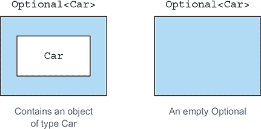

当存在值时，`Optional` 类会将其包装起来。相反，值的缺失通过方法 `Optional.empty()` 返回的空 `Optional` 来建模。这个静态工厂方法返回 `Optional` 类的特殊单例实例。你可能想知道 `null` 引用和 `Optional.empty()` 之间的区别。从语义上看，它们可能被视为相同的东西，但在实践中，区别很大。尝试取消引用 `null` 总是会导致 `NullPointerException`，而 `Optional.empty()` 是一个有效的、可工作的 `Optional` 类型的对象，可以用有用的方式调用。你很快就会看到这一点。

使用 `Optional` 而不是 `null` 的一个重要、实用的语义区别在于，在前者的情况下，声明一个 `Optional<Car>` 类型的变量而不是 `Car` 类型，清楚地表明那里允许缺失的值。相反，始终使用 `Car` 类型，并可能将 `null` 引用分配给该类型的变量，意味着除了你对业务模型的知识之外，你没有其他帮助来理解 `null` 是否属于该给定变量的有效域。

考虑到这一点，你可以重新设计 列表 11.1 中的原始模型，如下所示使用 `Optional` 类。

##### 列表 11.4\. 通过使用 `Optional` 重新定义 `Person`/`Car`/`Insurance` 数据模型

```
public class Person {
    private Optional<Car> car;                                      *1*
    public Optional<Car> getCar() { return car; }
}
public class Car {
    private Optional<Insurance> insurance;                          *2*
    public Optional<Insurance> getInsurance() { return insurance; }
}
public class Insurance {
    private String name;                                            *3*
    public String getName() { return name; }
}
```

+   ***1* 一个人可能没有汽车，因此你可以将此字段标记为可选。**

+   ***2* 汽车可能没有保险，因此你可以将此字段标记为可选。**

+   ***3* 保险公司必须有一个名称。**

注意`Optional`类的使用如何丰富了你的模型的语义。一个人引用`Optional<Car>`，一辆车引用`Optional<Insurance>`，这在领域中明确表示一个人*可能*或*可能不*拥有一辆车，以及这辆车*可能*或*可能不*被保险。

同时，保险公司名称被声明为`String`类型而不是`Optional<String>`类型的事实表明，保险公司必须有一个名称。这样，你就可以确定在解引用保险公司名称时是否会得到`NullPointer-Exception`；你不需要添加`null`检查，因为这样做会隐藏问题而不是解决问题。保险公司必须有一个名称，所以如果你发现一个没有名称的保险公司，你必须找出你的数据中有什么问题，而不是添加一段代码来掩盖这种情况。一致地使用`Optional`值可以在计划中缺失的值和仅因为你的算法或数据中的问题而缺失的值之间创建一个清晰的区分。重要的是要注意，`Optional`类的意图并不是要替换每一个`null`引用。相反，它的目的是帮助你设计更易于理解的 API，这样通过阅读方法的签名，你可以知道是否期望一个可选值。你必须主动解包可选值来处理值的缺失。

### 11.3. 采用 Optional 的模式

到目前为止，一切顺利；你已经学会了如何在类型中使用可选来澄清你的领域模型，你也看到了这种方法相对于用`null`引用表示缺失值的优点。你现在如何使用可选？更具体地说，你如何使用一个被可选包裹的值？

#### 11.3.1. 创建 Optional 对象

在使用`Optional`之前的第一步是学习如何创建可选对象！你可以通过几种方式创建它们。

##### 空的 Optional

如前所述，你可以通过使用静态工厂方法`Optional.empty`获取一个空的可选对象：

```
Optional<Car> optCar = Optional.empty();
```

##### 从非`null`值创建 Optional

你也可以使用静态工厂方法`Optional.of`从一个非`null`值创建一个可选对象：

```
Optional<Car> optCar = Optional.of(car);
```

如果`car`是`null`，会立即抛出`NullPointerException`（而不是在你尝试访问汽车的属性时得到潜在的错误）。

##### 从`null`创建 Optional

最后，通过使用静态工厂方法`Optional.ofNullable`，你可以创建一个可能包含`null`值的`Optional`对象：

```
Optional<Car> optCar = Optional.ofNullable(car);
```

如果`car`是`null`，生成的`Optional`对象将是空的。

你可能会想象我们会继续研究如何从一个可选对象中获取值。`get`方法正是这样做的，我们稍后会详细讨论。但是，当可选对象为空时，`get`会抛出异常，所以以不严谨的方式使用它实际上会重新创建使用`null`时引起的所有维护问题。相反，我们首先看看使用可选值的方法，这些方法避免了显式的测试，并受到流上类似操作的启发。

#### 11.3.2\. 使用 map 从可选对象中提取和转换值

一个常见的模式是从对象中提取信息。例如，你可能想从一个保险公司中提取名称。在提取名称之前，你需要检查`insurance`是否为`null`，如下所示：

```
String name = null;
if(insurance != null){
    name = insurance.getName();
}
```

`Optional`支持一个`map`方法来实现这种模式，其工作方式如下（从现在开始，我们使用列表 11.4 中提出的模型）：

```
Optional<Insurance> optInsurance = Optional.ofNullable(insurance);
Optional<String> name = optInsurance.map(Insurance::getName);
```

这种方法在概念上与你在第四章和第五章中看到的 Stream 的`map`方法相似。`map`操作将提供的函数应用于流中的每个元素。你也可以将`Optional`对象视为特定数据集合，最多包含一个元素。如果`Optional`包含一个值，则`map`方法传递的函数会转换该值。如果`Optional`为空，则不执行任何操作。图 11.2 说明了这种相似性，展示了当你将一个将正方形转换为三角形的函数传递给正方形流和正方形可选对象的`map`方法时会发生什么。

##### 图 11.2\. 比较`Stream`和`Optional`的`map`方法

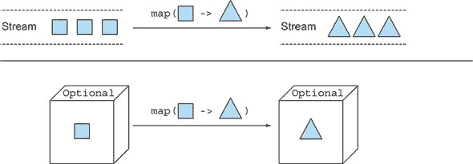

这个想法看起来很有用，但你如何使用它来重写列表 11.1 中的代码？

```
public String getCarInsuranceName(Person person) {
    return person.getCar().getInsurance().getName();
}
```

如何以安全的方式链式调用多个方法？

答案是使用`Optional`支持的另一个方法，称为`flatMap`。

#### 11.3.3\. 使用 flatMap 链式连接可选对象

因为你已经学会了如何使用`map`，你的第一个反应可能是使用`map`重写代码如下：

```
Optional<Person> optPerson = Optional.of(person);
Optional<String> name =
    optPerson.map(Person::getCar)
             .map(Car::getInsurance)
             .map(Insurance::getName);
```

不幸的是，这段代码无法编译。为什么？变量`optPerson`的类型是`Optional<Person>`，所以调用`map`方法是完全可行的。但是`getCar`返回一个类型为`Optional<Car>`的对象（如列表 11.4 所示），这意味着`map`操作的结果是一个类型为`Optional<Optional<Car>>`的对象。因此，调用`getInsurance`是无效的，因为最外层的可选对象包含另一个可选对象作为其值，这当然不支持`getInsurance`方法。图 11.3 说明了你将得到的嵌套可选结构。

##### 图 11.3\. 二级可选对象

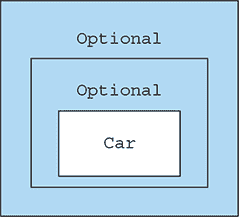

你该如何解决这个问题？再次，你可以看看你之前在流中使用过的模式：`flatMap` 方法。在流中，`flatMap` 方法接受一个函数作为参数，并返回另一个流。这个函数应用于流中的每个元素，结果产生一个流中的流。但 `flatMap` 有将每个生成的流替换为其内容的效应。换句话说，所有由该函数生成的单独的流都被合并或展平成一个单一的流。你在这里想要的类似的东西，但你想要展平一个两级的 `Optional` 到一个级别。

正如 图 11.2 对 `map` 方法所做的那样，图 11.4 阐述了 `Stream` 和 `Optional` 类的 `flatMap` 方法的相似性。

##### 图 11.4\. 比较 `Stream` 和 `Optional` 的 `flatMap` 方法

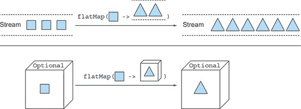

在这里，传递给流 `flatMap` 方法的函数将每个正方形转换成包含两个三角形的另一个流。然后简单 `map` 的结果是包含三个其他流的流，每个流包含两个三角形，但 `flatMap` 方法将这个两级的流展平成一个包含总共六个三角形的单一流。同样，传递给 `Optional` 的 `flatMap` 方法的函数将原始 `Optional` 中的正方形转换成一个包含三角形的 `Optional`。如果这个函数传递给 `map` 方法，结果将是一个包含另一个包含三角形的 `Optional` 的 `Optional`，但 `flatMap` 方法将这个两级的 `Optional` 展平成一个包含三角形的单一 `Optional`。

##### 使用 `Optional` 查找汽车的保险公司名称

现在你已经了解了 `Optional` 的 `map` 和 `flatMap` 方法的理论，你就可以将它们付诸实践。在 列表 11.2 和 11.3 中做出的丑陋尝试可以通过使用 列表 11.4 中的基于 `Optional` 的数据模型来重写，如下所示。

##### 列表 11.5\. 使用 `Optional` 查找汽车的保险公司名称

```
public String getCarInsuranceName(Optional<Person> person) {
    return person.flatMap(Person::getCar)
                 .flatMap(Car::getInsurance)
                 .map(Insurance::getName)
                 .orElse("Unknown");              *1*
}
```

+   ***1* 如果结果 `Optional` 为空，则提供一个默认值**

将 列表 11.5 与前两种尝试进行比较，显示了在处理可能缺失的值时使用 `Optional` 的优势。这次，你可以用一个容易理解的表达式来获得你想要的结果，而不是通过条件分支来增加代码的复杂性。

在实现方面，首先请注意，你修改了 `getCar-InsuranceName` 方法的签名，如 列表 11.2 和 11.3 所示。我们明确指出，可能存在一种情况，即传递给此方法的 `Person` 不存在，例如当通过标识符从数据库中检索 `Person` 时，你想要模拟给定标识符在数据中不存在 `Person` 的可能性。你通过将方法参数的类型从 `Person` 更改为 `Optional<Person>` 来模拟这个额外需求。

再次强调，这种方法允许你通过类型系统明确表达出在领域模型知识中原本可能保持隐含的内容：语言的第一要务，即使是编程语言，也是沟通。将一个方法声明为接受一个可选参数或返回一个可选结果，这样就可以向你的同事以及所有未来的方法使用者表明，它可以接受一个空值或返回一个空值。

##### 使用可选进行 Person/Car/Insurance 解引用链

从这个 `Optional<Person>` 开始，`Person` 中的 `Car`，`Car` 中的 `Insurance`，以及 `Insurance` 中包含的保险公司名称的 `String`，都通过本章前面引入的 `map` 和 `flatMap` 方法组合进行解引用。图 11.5 展示了这个操作流程。

##### 图 11.5\. 使用可选进行 Person/Car/Insurance 解引用链

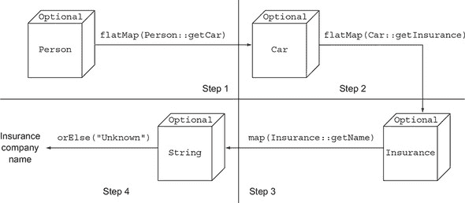

在这里，你从包裹 `Person` 的可选开始，并对其调用 `flatMap(Person::getCar)`。正如我们所说的，你可以逻辑上认为这个调用分为两个步骤。在步骤 1 中，一个 `Function` 被应用于可选内的 `Person` 以进行转换。在这种情况下，`Function` 通过一个方法引用来调用该 `Person` 的 `getCar` 方法。因为该方法返回一个 `Optional<Car>`，所以可选内的 `Person` 被转换成该类型的一个实例，从而在 `flatMap` 操作中形成一个两级的可选，该可选被扁平化。从理论角度来看，你可以将这个扁平化操作视为组合两个嵌套可选的操作，如果至少有一个为空，则结果为空可选。在现实中，如果你在空可选上调用 `flatMap`，则没有任何变化，空可选按原样返回。相反，如果可选包裹了一个 `Person`，则传递给 `flatMap` 方法的 `Function` 被应用于该 `Person`。因为该 `Function` 应用产生的值已经是可选，所以 `flatMap` 方法可以按原样返回它。

第二步与第一步类似，将 `Optional<Car>` 转换为 `Optional<Insurance>`。第 3 步将 `Optional<Insurance>` 转换为 `Optional<String>`：因为 `Insurance.getName()` 方法返回一个 `String`。在这种情况下，不需要 `flatMap`。

在这一点上，如果这个调用链中的任何方法返回一个空的 `Optional` 或包含所需的保险公司名称，那么生成的 `Optional` 将是空的。你如何读取这个值？毕竟，你最终会得到一个可能包含或不包含保险公司名称的 `Optional<String>`。在 列表 11.5 中，我们使用了另一个名为 `orElse` 的方法，它会在 `Optional` 为空时提供一个默认值。许多方法提供了默认操作或解包 `Optional`。在下一节中，我们将详细探讨这些方法。

| |
| --- |

**在领域模型中使用可选类型及其不可序列化的原因**

在 列表 11.4 中，我们展示了如何在领域模型中使用 `Optional` 来标记允许缺失或保持未定义的特定类型的值。然而，`Optional` 类的设计者基于不同的假设和不同的使用场景来开发它。特别是，Java 语言架构师 Brian Goetz 明确表示，`Optional` 的目的是仅支持可选返回语法的习惯用法。

由于 `Optional` 类并非旨在用作字段类型，它没有实现 `Serializable` 接口。因此，在领域模型中使用 `Optional` 可能会破坏需要序列化模型才能工作的工具或框架的应用程序。尽管如此，我们相信我们已经向你展示了为什么在领域中使用 `Optional` 作为适当类型是一个好主意，尤其是在你需要遍历可能不存在对象的图时。或者，如果你需要一个可序列化的领域模型，我们建议你至少提供一个方法，允许以可选形式访问任何可能缺失的值，如下例所示：

```
public class Person {
    private Car car;
    public Optional<Car> getCarAsOptional() {
        return Optional.ofNullable(car);
    }
}
```

| |
| --- |

#### |


Java 9 中引入的 `Optional` 类的 `stream()` 方法允许你将包含值的 `Optional` 转换为只包含该值的 `Stream`，或者将一个空的 `Optional` 转换为同样空的 `Stream`。这种技术在某些常见情况下特别方便：当你有一个 `Optional` 的 `Stream`，需要将其转换成另一个只包含原始 `Stream` 中非空 `Optional` 的值的 `Stream` 时。在本节中，我们通过另一个实际例子来展示为什么你可能需要处理一个 `Optional` 的 `Stream`，以及如何执行这个操作。

列表 11.6 中的示例使用了在 列表 11.4 中定义的 `Person`/`Car`/`Insurance` 领域模型，假设你需要实现一个方法，该方法接收一个 `List<Person>` 并返回一个包含列表中拥有汽车的人所使用的所有不同保险公司名称的 `Set<String>`。

##### 列表 11.6\. 找出由人员列表使用的不同保险公司名称

```
public Set<String> getCarInsuranceNames(List<Person> persons) {
    return persons.stream()
                  .map(Person::getCar)                                 *1*
                  .map(optCar -> optCar.flatMap(Car::getInsurance))    *2*
                  .map(optIns -> optIns.map(Insurance::getName))       *3*
                  .flatMap(Optional::stream)                           *4*
                  .collect(toSet());                                   *5*
}
```

+   ***1* 将人员列表转换为包含他们最终拥有的汽车的 Optional<Car> Stream。**

+   ***2* 将每个 Optional<Car> 平铺映射到相应的 Optional<Insurance>。**

+   ***3* 将每个 Optional<Insurance> 映射到包含相应名称的 Optional<String>。**

+   ***4* 将 Stream<Optional<String>> 转换为只包含现有名称的 Stream<String>。**

+   ***5* 将结果字符串收集到集合中，以获得唯一的值。**

通常，操作 `Stream` 的元素会导致一系列长链的转换、过滤和其他操作，但这个案例有一个额外的复杂性，因为每个元素也被包装进了一个 `Optional`。记住，你通过使 `getCar()` 方法返回 `Optional<Car>` 而不是简单的 `Car` 来模拟一个人可能没有车的事实。因此，在第一次 `map` 转换之后，你得到了一个 `Stream<Optional<Car>>`。在这个时候，接下来的两个 `map` 转换允许你将每个 `Optional<Car>` 转换为 `Optional<Insurance>`，然后再将它们转换为 `Optional<String>`，就像你在 列表 11.5 中对一个单独的元素所做的那样，而不是一个 `Stream`。

在这三个转换结束时，你得到了一个 `Stream<Optional<String>>`，其中一些 `Optional` 可能是空的，因为一个人没有车或者车没有保险。`Optional` 的使用允许你在缺失值的情况下以完全无空安全的方式执行这些操作，但现在你面临的问题是，在将结果收集到集合之前，需要去除空的 `Optional` 并展开剩余的 `Optional` 中包含的值。当然，你可以通过一个 `filter` 后跟一个 `map` 来获得这个结果，如下所示：

```
Stream<Optional<String>> stream = ...
Set<String> result = stream.filter(Optional::isPresent)
                           .map(Optional::get)
                           .collect(toSet());
```

然而，正如列表 11.6 中预期的，使用`Optional`类的`stream()`方法可以在一个操作中实现相同的结果，而不是两个操作。实际上，此方法将每个`Optional`转换为一个包含零个或一个元素的`Stream`，具体取决于转换后的`Optional`是否为空。因此，对该方法的引用可以被视为一个从`Stream`的单个元素到另一个`Stream`的函数，然后传递给在原始`Stream`上调用的`flatMap`方法。正如你已经学到的，这样每个元素都会被转换为一个`Stream`，然后两级的`Stream`流被展平为单级。这个技巧允许你在一步中展开包含值的`Optional`并跳过空的`Optional`。

#### 11.3.5\. 默认操作和展开 Optional

在第 11.3.3 节中，你决定使用`orElse`方法来读取一个`Optional`值，该方法还允许你在空`Optional`的情况下返回一个默认值。`Optional`类提供了几个实例方法来读取`Optional`实例中包含的值：

+   `get()`是这些方法中最简单但也是最不安全的。如果存在包装的值，则返回该值，否则抛出`NoSuchElementException`。因此，除非你确定`Optional`包含一个值，否则几乎总是不建议使用此方法。此外，此方法在嵌套`null`检查方面并没有太大的改进。

+   `orElse(T other)`是列表 11.5 中使用的的方法，正如我们之前提到的，它允许你在`Optional`不包含值时提供一个默认值。

+   `orElseGet(Supplier<? extends T> other)`是`orElse`方法的懒加载对应物，因为只有在`Optional`不包含值时才会调用供应商。你应该在默认值创建耗时（为了提高效率）或你希望供应商仅在`Optional`为空时被调用时使用此方法（当使用`orElseGet`时至关重要）。

+   `or(Supplier<? extends Optional<? extends T>> supplier)`与之前的`orElseGet`方法类似，但它不会展开`Optional`内部的值（如果存在）。实际上，此方法（从 Java 9 引入）不执行任何操作，当`Optional`包含值时按原样返回`Optional`，但当原始`Optional`为空时，它将延迟提供一个不同的`Optional`。

+   `orElseThrow(Supplier<? extends X> exceptionSupplier)`与`get`方法类似，当`optional`为空时抛出异常，但它允许你选择要抛出的异常类型。

+   `ifPresent(Consumer<? super T> consumer)`允许你在存在值时执行作为参数给出的操作；否则，不执行任何操作。

Java 9 引入了一个额外的实例方法：

+   `ifPresentOrElse(Consumer<? super T> action, Runnable emptyAction)`。这与`ifPresent`不同，它接受一个`Runnable`，当`Optional`为空时执行基于空的操作。

#### 11.3.6. 组合两个可选对象

现在假设您有一个方法，给定一个`Person`和一个`Car`，查询一些外部服务并实现一些复杂的业务逻辑来找到为该组合提供最便宜保单的保险公司：

```
public Insurance findCheapestInsurance(Person person, Car car) {
    // queries services provided by the different insurance companies
    // compare all those data
    return cheapestCompany;
}
```

此外，假设您想开发一个 null 安全的版本的方法，该方法接受两个可选参数，并返回一个`Optional<Insurance>`，如果传递给它的值中至少有一个为空，则该值将为空。`Optional`类还提供了一个`isPresent`方法，当可选包含值时返回`true`，因此您的第一次尝试可能是如下实现此方法：

```
public Optional<Insurance> nullSafeFindCheapestInsurance(
                              Optional<Person> person, Optional<Car> car) {
    if (person.isPresent() && car.isPresent()) {
        return Optional.of(findCheapestInsurance(person.get(), car.get()));
    } else {
        return Optional.empty();
    }
}
```

这种方法的优势在于，在其签名中清楚地表明传递给它的`Person`和`Car`值都可能缺失，因此它不能返回任何值。不幸的是，它的实现与如果方法以`Person`和`Car`作为参数，这两个参数都可能为`null`时编写的`null`检查非常相似。有没有一种更好的、更符合习惯的方法来实现这个方法，使用`Optional`类的功能？花几分钟时间通过练习 11.1，并尝试找到一个优雅的解决方案。

| |
| --- |

**练习 11.1：在不展开的情况下组合两个可选对象**

使用您在本节中学到的`map`和`flatMap`方法的组合，将前一个`nullSafeFindCheapestInsurance()`方法的实现重写为一个语句。

**答案：**

您可以在一个语句中实现该方法，并且不使用任何条件结构，如三元运算符，如下所示：

```
public Optional<Insurance> nullSafeFindCheapestInsurance(
                              Optional<Person> person, Optional<Car> car) {
    return person.flatMap(p -> car.map(c -> findCheapestInsurance(p, c)));
}
```

在这里，您在第一个可选对象上调用`flatMap`，所以如果这个可选对象为空，传递给它的 lambda 表达式将不会执行，并且这个调用将返回一个空的可选对象。相反，如果存在人，`flatMap`将其用作`Function`的输入，该`Function`返回一个`Optional<Insurance>`，这是`flatMap`方法所要求的。这个函数的主体在第二个可选对象上调用`map`，所以如果它不包含任何`Car`，则`Function`返回一个空的可选对象，整个`nullSafeFindCheapestInsurance`方法也是如此。最后，如果`Person`和`Car`都存在，传递给`map`方法的 lambda 表达式可以安全地调用原始的`findCheapestInsurance`方法。

| |
| --- |

`Optional`类和`Stream`接口之间的类比不仅限于`map`和`flatMap`方法。第三个方法`filter`在两个类上都有类似的行为，我们将在下一节中探讨它。

#### 11.3.7. 使用 filter 拒绝某些值

通常，您需要在一个对象上调用一个方法来检查某个属性。例如，您可能需要检查保险公司的名称是否等于 `CambridgeInsurance`。为了安全地这样做，首先检查指向 `Insurance` 对象的引用是否为 `null`，然后调用 `getName` 方法，如下所示：

```
Insurance insurance = ...;
if(insurance != null && "CambridgeInsurance".equals(insurance.getName())){
  System.out.println("ok");
}
```

您可以使用 `Optional` 对象上的 `filter` 方法重写此模式，如下所示：

```
Optional<Insurance> optInsurance = ...;
optInsurance.filter(insurance ->
                        "CambridgeInsurance".equals(insurance.getName()))
            .ifPresent(x -> System.out.println("ok"));
```

`filter` 方法接受一个谓词作为参数。如果 `Optional` 对象中存在值，并且该值与谓词匹配，则 `filter` 方法返回该值；否则，它返回一个空的 `Optional` 对象。如果您还记得，您可以将 Optional 视为一个最多包含一个元素的流，那么这个方法的行为应该是清晰的。如果 Optional 已经为空，则它没有任何效果；否则，它将谓词应用于 Optional 中包含的值。如果此应用返回 `true`，则 Optional 保持不变；否则，值被过滤掉，留下空的 Optional。您可以通过完成练习 11.2 来测试您对 `filter` 方法工作的理解。

|  |
| --- |

**练习 11.2：过滤可选值**

假设您的 `Person`/`Car`/`Insurance` 模型的 `Person` 类也有一个 `getAge` 方法来访问人员的年龄，通过使用以下签名修改 代码列表 11.5 中的 `getCarInsuranceName` 方法：

```
public String getCarInsuranceName(Optional<Person> person, int minAge)
```

以便仅在人员年龄大于或等于 `minAge` 参数时返回保险公司名称。

**答案：**

您可以通过将此条件编码在传递给 `filter` 方法的谓词中，来过滤 `Optional<Person>`，以删除任何年龄不足 `minAge` 参数的包含人员：

```
public String getCarInsuranceName(Optional<Person> person, int minAge) {
    return person.filter(p -> p.getAge() >= minAge)
                 .flatMap(Person::getCar)
                 .flatMap(Car::getInsurance)
                 .map(Insurance::getName)
                 .orElse("Unknown");
}
```

|  |
| --- |

在下一节中，我们将研究 `Optional` 类的其余功能，并提供更多实际示例，说明您可以使用各种技术重新实现您编写的代码以管理缺失值。

表 11.1 总结了 `Optional` 类的方法。

##### 表 11.1\. `Optional` 类的方法

| 方法 | 描述 |
| --- | --- |
| empty | 返回一个空的 Optional 实例 |
| filter | 如果存在值且与给定的谓词匹配，则返回此 Optional；否则，返回空的 |
| flatMap | 如果存在值，则返回应用提供的映射函数后的 Optional；否则，返回空的 Optional |
| get | 如果存在，则返回此 Optional 包装的值；否则，抛出 NoSuchElementException |
| ifPresent | 如果存在值，则使用指定的消费者调用该值；否则，不执行任何操作 |
| ifPresentOrElse | 如果存在值，则使用该值作为输入执行操作；否则，使用无输入执行不同的操作 |
| isPresent | 如果存在值，则返回 true；否则，返回 false |
| map | 如果存在值，则应用提供的映射函数到它上 |
| of | 返回一个包装给定值的 Optional，如果此值为 null 则抛出 NullPointer-Exception |
| ofNullable | 返回一个包装给定值的 Optional，如果此值为 null 则返回空的 Optional |
| or | 如果值存在，则返回相同的 Optional；否则，返回由供应函数产生的另一个 Optional |
| orElse | 如果存在值，则返回该值；否则，返回给定的默认值 |
| orElseGet | 如果存在值，则返回该值；否则，返回由给定的 Supplier 提供的值 |
| orElseThrow | 如果存在值，则返回该值；否则，抛出由给定的 Supplier 创建的异常 |
| stream | 如果存在值，则返回只包含该值的 Stream；否则，返回一个空的 Stream |

### 11.4\. 使用 Optional 的实用示例

正如你所学的，有效使用新的`Optional`类意味着对如何处理可能缺失的值的完全重新思考。这种重新思考不仅涉及你编写的代码，而且还涉及（可能甚至更重要）你与原生 Java API 的交互。

事实上，我们相信，如果当时在开发这些 API 时就有`Optional`类，那么其中许多 API 可能会被编写得不同。出于向后兼容性的原因，旧的 Java API 不能被修改以正确使用 optionals，但并非一切都已失去。你可以通过向你的代码中添加小的实用方法来修复，或者至少解决这个问题，这些方法允许你从 optionals 的力量中受益。你可以通过几个实际示例看到如何做到这一点。

#### 11.4.1\. 将可能为 null 的值包装在 Optional 中

一个现有的 Java API 几乎总是返回`null`来表示所需值不存在或由于某些原因获取它的计算失败。例如，`Map`的`get`方法在没有为请求的键包含映射时返回`null`作为其值。但是，由于我们之前列出的原因，在这种情况下的大多数情况下，你更希望这些方法返回一个 optional。你不能修改这些方法的签名，但你很容易用 optional 包装它们返回的值。继续使用`Map`示例，假设你有一个`Map<String, Object>`，通过以下方式访问由`key`索引的值

```
Object value = map.get("key");
```

如果与`String "key"`关联的`map`中没有值，则返回`null`。你可以通过将`map`返回的值包装在 optional 中来改进这样的代码。你可以添加一个丑陋的`if-then-else`来增加代码复杂性，或者你可以使用我们之前讨论过的`Optional.ofNullable`方法：

```
Optional<Object> value = Optional.ofNullable(map.get("key"));
```

你可以在每次想要安全地将可能为`null`的值转换为 optional 时使用此方法。

#### 11.4.2\. 异常与 Optional 的比较

抛出异常是 Java API 中在无法提供值时返回 `null` 的另一种常见替代方案。一个典型的例子是 `Integer.parseInt(String)` 静态方法提供的将 `String` 转换为 `int` 的操作。在这种情况下，如果 `String` 不包含可解析的整数，则此方法会抛出 `NumberFormatException`。再次强调，最终效果是代码在 `String` 不表示整数时发出无效参数的信号，唯一的区别是这次您必须使用 `try/catch` 块而不是使用 `if` 条件来控制值是否不是 `null`。

您还可以使用空的可选值来模拟由不可转换的 `String` 引起的无效值，因此您更倾向于让 `parseInt` 返回一个可选值。您不能更改原始的 Java 方法，但没有任何东西阻止您实现一个微小的实用方法，将其包装起来，并按需返回一个可选值，如下面的列表所示。

##### 列表 11.7\. 将 `String` 转换为 `Integer` 并返回一个可选值

```
public static Optional<Integer> stringToInt(String s) {
    try {
        return Optional.of(Integer.parseInt(s));         *1*
    } catch (NumberFormatException e) {
        return Optional.empty();                         *2*
    }
}
```

+   ***1* 如果字符串可以被转换为整数，则返回包含它的可选值。**

+   ***2* 否则，返回一个空的可选值。**

我们的建议是将几个类似的方法收集到一个实用类中，您可以将其称为 `OptionalUtility`。从那时起，您将始终可以使用 `OptionalUtility.stringToInt` 方法将 `String` 转换为 `Optional<Integer>`。您可以忘记您在其中封装了丑陋的 `try/catch` 逻辑。

#### 11.4.3\. 原始可选值及其不应使用的原因

注意，与流一样，可选值也有其原始对应物——`OptionalInt`、`Optional-Long` 和 `OptionalDouble`——因此 列表 11.7 中的方法可以返回 `Optional-Int` 而不是 `Optional<Integer>`。在 第五章 中，我们出于性能原因鼓励使用原始流（特别是当它们可能包含大量元素时），但鉴于 `Optional` 最多只能有一个值，这种理由在这里不适用。

我们不鼓励使用原始的可选值，因为它们缺少 `map`、`flatMap` 和 `filter` 方法，这些方法（正如您在 第 11.2 节 中所看到的）是 `Optional` 类最有用的方法。此外，就像流一样，可选值不能与其原始对应物组合，因此如果 列表 11.7 中的方法返回 `OptionalInt`，您就不能将其作为方法引用传递给另一个可选值的 `flatMap` 方法。

#### 11.4.4\. 整合所有内容

在本节中，我们展示了我们迄今为止所介绍的 `Optional` 类的方法如何在一个更有说服力的用例中一起使用。假设您有一些 `Properties`，它们作为配置参数传递给您的程序。为了本例的目的，以及测试您将要开发的代码，请按照以下方式创建一些示例 `Properties`：

```
Properties props = new Properties();
props.setProperty("a", "5");
props.setProperty("b", "true");
props.setProperty("c", "-3");
```

假设您的程序需要从这些 `Properties` 中读取一个值并将其解释为秒数。因为持续时间必须是一个正数（>0），您将需要一个具有以下签名的 `Properties`：

```
public int readDuration(Properties props, String name)
```

因此，当给定属性的值为表示正整数的 `String` 时，该方法返回该整数，但在所有其他情况下返回零。为了明确这一要求，使用几个 JUnit 断言对其进行形式化：

```
assertEquals(5, readDuration(param, "a"));
assertEquals(0, readDuration(param, "b"));
assertEquals(0, readDuration(param, "c"));
assertEquals(0, readDuration(param, "d"));
```

这些断言反映了原始要求：`readDuration` 方法对于属性 `"a"` 返回 `5`，因为该属性的值是一个可以转换为正数的 `String`，对于 `"b"` 返回 `0`，因为它不是数字，对于 `"c"` 返回 `0`，因为它是数字但为负数，对于 `"d"` 返回 `0`，因为不存在具有该名称的属性。尝试实现满足此要求的方法，如下一个列表所示。

##### 列表 11.8\. 命令式地从属性中读取持续时间

```
public int readDuration(Properties props, String name) {
    String value = props.getProperty(name);
    if (value != null) {                            *1*
        try {
            int i = Integer.parseInt(value);        *2*
            if (i > 0) {                            *3*
                return i;
            }
        } catch (NumberFormatException nfe) { }
    }
    return 0;                                       *4*
}
```

+   ***1* 确保存在具有所需名称的属性。**

+   ***2* 尝试将字符串属性转换为数字。**

+   ***3* 检查生成的数字是否为正数。**

+   ***4* 如果任何条件失败，则返回 0。**

如您所预期的那样，生成的实现是复杂的且不可读的，它以 `if` 语句和 `try`/`catch` 块的形式呈现了多个嵌套条件。花几分钟时间在 11.3 号测验中找出您如何使用本章学到的知识达到相同的结果。

注意使用 optionals 和 streams 的常见风格；两者都让人联想到数据库查询，其中多个操作被链接在一起。

| |
| --- |

**测验 11.3：使用 Optional 从属性中读取持续时间**

使用 `Optional` 类的功能和 列表 11.7 中的实用方法，尝试使用单个流畅语句重新实现 列表 11.8 中的命令式方法。

**答案：**

因为 `Properties.getProperty(String)` 方法返回的值在所需的属性不存在时为 `null`，所以使用 `ofNullable` 工厂方法将此值转换为 `Optional` 是方便的。然后，您可以将 `Optional<String>` 转换为 `Optional<Integer>`，将其 `flatMap` 方法传递到在 列表 11.7 中开发的 `OptionalUtility.stringToInt` 方法。最后，您可以轻松过滤掉负数。这样，如果这些操作中的任何一个返回一个空的 `Optional`，则方法返回传递给 `orElse` 方法的默认值 `0`；否则，它返回 `Optional` 中包含的正整数。此描述的实现如下：

```
public int readDuration(Properties props, String name) {
    return Optional.ofNullable(props.getProperty(name))
                   .flatMap(OptionalUtility::stringToInt)
                   .filter(i -> i > 0)
                   .orElse(0);
}
```

| |
| --- |

### **总结**

+   `null` 引用在编程语言中历史上被引入，用于表示值的缺失。

+   Java 8 引入了 `java.util.Optional<T>` 类来表示值的呈现或缺失。

+   您可以使用静态工厂方法 `Optional.empty`、`Optional.of` 和 `Optional.ofNullable` 创建 `Optional` 对象。

+   `Optional` 类支持许多方法——例如 `map`、`flatMap` 和 `filter`——这些方法在概念上与流的方法相似。

+   使用 `Optional` 强迫您主动解包可选对象以处理值的缺失；因此，您保护了您的代码免受意外的 `null` 指针异常。

+   使用 `Optional` 可以帮助您设计更好的 API，用户可以通过阅读方法的签名来判断是否期望一个可选值。

## 第十二章。新的日期和时间 API

*本章涵盖*

+   为什么我们需要一个新的日期和时间库，这个库在 Java 8 中引入

+   为人类和机器表示日期和时间

+   定义一段时间

+   操作、格式化和解析日期

+   处理不同的时区和日历

Java API 包含许多有用的组件，可以帮助您构建复杂的应用程序。不幸的是，Java API 并非总是完美的。我们相信，大多数经验丰富的 Java 开发者都会同意，在 Java 8 之前，日期和时间支持远非理想。不过，别担心；Java 8 引入了一个全新的日期和时间 API 来解决这个问题。

在 Java 1.0 中，对日期和时间的唯一支持是 `java.util.Date` 类。尽管它的名字叫日期，但这个类并不代表一个日期，而是一个以毫秒精度的时间点。更糟糕的是，一些模糊的设计决策，如它的偏移选择，损害了这个类的可用性：年份从 1900 年开始，而月份从索引 0 开始。如果你想表示 Java 9 的发布日期，即 2017 年 9 月 21 日，你必须创建一个 `Date` 实例，如下所示：

```
Date date = new Date(117, 8, 21);
```

打印这个日期对作者来说：

```
Thu Sep 21 00:00:00 CET 2017
```

这不是很直观，对吧？此外，即使是 `Date` 类的 `toString` 方法返回的 `String` 也可能相当误导。它还包括 JVM 的默认时区 CET，在我们的情况下是中欧时间。实际上，`Date` 类本身只是插入 JVM 默认时区！

当 Java 1.0 发布时，`Date` 类的问题和局限性立即变得明显，但也很清楚，如果不破坏其向后兼容性，这些问题是无法修复的。因此，在 Java 1.1 中，`Date` 类的许多方法都被弃用，并被替代的 `java.util.Calendar` 类所取代。不幸的是，`Calendar` 类也存在类似的问题和设计缺陷，这会导致容易出错的代码。月份也从索引 0 开始。（至少 `Calendar` 去掉了年份的 1900 偏移。）更糟糕的是，`Date` 和 `Calendar` 类的存在增加了开发者之间的混淆。（你应该使用哪一个？）此外，像 `DateFormat` 这样的功能，用于以语言无关的方式格式化和解析日期或时间，只能与 `Date` 类一起使用。

`DateFormat` 带有自己的问题集。例如，它不是线程安全的，这意味着如果有两个线程同时尝试使用相同的格式化器解析日期，你可能会收到不可预测的结果。

最后，`Date` 和 `Calendar` 都是可变类。将 2017 年 9 月 21 日修改为 10 月 25 日意味着什么？这个设计选择可能会导致维护噩梦，正如你将在第十八章（关于函数式编程）中更详细地了解的那样。

结果是，所有这些缺陷和不一致性都鼓励了使用第三方日期和时间库，例如 Joda-Time。出于这些原因，Oracle 决定在原生 Java API 中提供高质量的日期和时间支持。因此，Java 8 在 `java.time` 包中集成了许多 Joda-Time 功能。

在本章中，我们探讨了新日期和时间 API 引入的功能。我们首先从基本用例开始，例如创建既适合人类使用也适合机器使用的时间和日期。然后我们逐步探索新日期和时间 API 的更高级应用，例如操作、解析和打印日期时间对象，以及处理不同的时区和替代日历。

### 12.1\. LocalDate、LocalTime、LocalDateTime、Instant、Duration 和 Period

我们首先探索如何创建简单的日期和间隔。`java.time` 包包含许多新类来帮助你：`LocalDate`、`LocalTime`、`LocalDateTime`、`Instant`、`Duration` 和 `Period`。

#### 12.1.1\. 使用 LocalDate 和 LocalTime

当你开始使用新的日期和时间 API 时，`LocalDate` 类可能是你遇到的第一个类。这个类的实例是一个不可变对象，代表一个没有一天中的时间的纯日期。特别是，它不携带任何时区信息。

你可以通过使用 `of` 静态工厂方法创建一个 `LocalDate` 实例。`LocalDate` 实例提供了许多方法来读取其最常用的值（年、月、星期几等），如下所示。

##### 列表 12.1\. 创建 `LocalDate` 并读取其值

```
LocalDate date = LocalDate.of(2017, 9, 21);   *1*
int year = date.getYear();                    *2*
Month month = date.getMonth();                *3*
int day = date.getDayOfMonth();               *4*
DayOfWeek dow = date.getDayOfWeek();          *5*
int len = date.lengthOfMonth();               *6*
boolean leap = date.isLeapYear();             *7*
```

+   ***1* 2017-09-21**

+   ***2* 2017**

+   ***3* 九月**

+   ***4* 21**

+   ***5* 星期四**

+   ***6* 30 (九月的天数)**

+   ***7* false (非闰年)**

你也可以通过使用 `now` 工厂方法从系统时钟获取当前日期：

```
LocalDate today = LocalDate.now();
```

本章剩余部分中我们调查的所有其他日期时间类都提供了一个类似的工厂方法。你还可以通过传递一个 `TemporalField` 到 `get` 方法来访问相同的信息。`TemporalField` 是一个定义如何访问时间对象特定字段值的接口。`ChronoField` 枚举实现了这个接口，因此你可以方便地使用该枚举的一个元素与 `get` 方法一起使用，如下所示。

##### 列表 12.2\. 使用 `TemporalField` 读取 `LocalDate` 值

```
int year = date.get(ChronoField.YEAR);
int month = date.get(ChronoField.MONTH_OF_YEAR);
int day = date.get(ChronoField.DAY_OF_MONTH);
```

您可以使用内置的 `getYear()`、`getMonthValue()` 和 `getDayOfMonth()` 方法以更易读的形式访问信息，如下所示：

```
int year = date.getYear();
int month = date.getMonthValue();
int day = date.getDayOfMonth();
```

同样，一天中的时间，如 13:45:20，由 `LocalTime` 类表示。您可以通过使用名为 `of` 的两个重载的静态工厂方法来创建 `LocalTime` 的实例。第一个接受小时和分钟，第二个也接受秒。与 `LocalDate` 类一样，`LocalTime` 类提供了一些获取器方法来访问其值，如下面的列表所示。

##### 列表 12.3\. 创建 `LocalTime` 并读取其值

```
LocalTime time = LocalTime.of(13, 45, 20);     *1*
int hour = time.getHour();                     *2*
int minute = time.getMinute();                 *3*
int second = time.getSecond();                 *4*
```

+   ***1* 13:45:20**

+   ***2* 13**

+   ***3* 45**

+   ***4* 20**

您可以通过解析表示它们的字符串来创建 `LocalDate` 和 `LocalTime`。为了完成这个任务，请使用它们的 `parse` 静态方法：

```
LocalDate date = LocalDate.parse("2017-09-21");
LocalTime time = LocalTime.parse("13:45:20");
```

可以将 `DateTimeFormatter` 传递给 `parse` 方法。这个类的实例指定了如何格式化日期和/或时间对象。它旨在替代我们之前提到的旧的 `java.util.DateFormat`。我们将在 第 12.2.2 节 中更详细地展示如何使用 `DateTimeFormatter`。此外，请注意，这两个 `parse` 方法都会抛出 `DateTimeParseException`，它扩展了 `RuntimeException`，如果字符串参数不能解析为有效的 `LocalDate` 或 `LocalTime`。

#### 12.1.2\. 组合日期和时间

被称为 `LocalDateTime` 的组合类将 `LocalDate` 和 `LocalTime` 配对。它表示一个没有时区的日期和时间，可以直接创建或通过组合日期和时间来创建，如下面的列表所示。

##### 列表 12.4\. 直接创建 `LocalDateTime` 或通过组合日期和时间

```
// 2017-09-21T13:45:20
LocalDateTime dt1 = LocalDateTime.of(2017, Month.SEPTEMBER, 21, 13, 45, 20);
LocalDateTime dt2 = LocalDateTime.of(date, time);
LocalDateTime dt3 = date.atTime(13, 45, 20);
LocalDateTime dt4 = date.atTime(time);
LocalDateTime dt5 = time.atDate(date);
```

注意，可以通过将时间传递给 `LocalDate` 或日期传递给 `LocalTime` 来创建 `LocalDateTime`，分别使用它们的 `atTime` 或 `atDate` 方法。您还可以通过使用 `toLocalDate` 和 `toLocalTime` 方法从 `LocalDateTime` 中提取 `LocalDate` 或 `LocalTime` 组件：

```
LocalDate date1 = dt1.toLocalDate();       *1*
LocalTime time1 = dt1.toLocalTime();       *2*
```

+   ***1* 2017-09-21**

+   ***2* 13:45:20**

#### 12.1.3\. Instant：机器的日期和时间

作为人类，我们习惯于用周、天、小时和分钟来思考日期和时间。然而，这种表示方式对计算机来说并不容易处理。从机器的角度来看，最自然的格式是表示连续时间线上一个点的单一大数。这种方法被新的 `java.time.Instant` 类所采用，它表示自 Unix 纪元时间以来经过的秒数，按照惯例设置为 1970 年 1 月 1 日午夜 UTC。

您可以通过传递秒数给其`ofEpochSecond`静态工厂方法来创建此类的实例。此外，`Instant`类支持纳秒精度。`ofEpochSecond`静态工厂方法的补充重载版本接受一个纳秒调整参数，该参数是对传递的秒数的调整。这个重载版本调整纳秒参数，确保存储的纳秒分数在 0 到 999,999,999 之间。因此，以下对`ofEpochSecond`工厂方法的调用返回完全相同的`Instant`：

```
Instant.ofEpochSecond(3);
Instant.ofEpochSecond(3, 0);
Instant.ofEpochSecond(2, 1_000_000_000);         *1*
Instant.ofEpochSecond(4, -1_000_000_000);        *2*
```

+   ***1* 在 2 秒后 1 亿纳秒（1 秒）**

+   ***2* 在 4 秒前 1 亿纳秒（1 秒）**

如您已经看到，对于`LocalDate`和其他可读日期时间类，`Instant`类支持另一个名为`now`的静态工厂方法，它允许您捕获当前时刻的时间戳。重要的是要强调，`Instant`仅适用于机器使用。它由若干秒和纳秒组成。因此，它不提供处理对人类有意义的任何时间单位的任何能力。例如，以下语句

```
int day = Instant.now().get(ChronoField.DAY_OF_MONTH);
```

会抛出如下异常：

```
java.time.temporal.UnsupportedTemporalTypeException: Unsupported field:
     DayOfMonth
```

但您可以使用`Duration`和`Period`类来处理`Instant`，我们将在下一节中探讨。

#### 12.1.4\. 定义一个 Duration 或 Period

您迄今为止看到的所有类都实现了`Temporal`接口，该接口定义了如何读取和操作表示通用时间点的对象的值。我们已经向您展示了创建不同`Temporal`实例的几种方法。下一步自然的步骤是创建两个时间对象之间的持续时间。`Duration`类的`between`静态工厂方法正好用于此目的。您可以根据以下方式创建两个`LocalTime`、两个`LocalDateTime`或两个`Instant`之间的持续时间：

```
Duration d1 = Duration.between(time1, time2);
Duration d1 = Duration.between(dateTime1, dateTime2);
Duration d2 = Duration.between(instant1, instant2);
```

由于`LocalDateTime`和`Instant`是为不同的目的而设计的，一个用于人类，另一个用于机器，因此不允许将它们混合使用。如果您尝试在这两者之间创建持续时间，您将只能获得`DateTimeException`。此外，因为`Duration`类用于表示以秒和最终纳秒为单位的时间量，因此您不能将`LocalDate`传递给`between`方法。

当您需要用年、月和日来表示时间量时，您可以使用`Period`类。您可以使用该类的`between`工厂方法找出两个`LocalDate`之间的差异：

```
Period tenDays = Period.between(LocalDate.of(2017, 9, 11),
                                LocalDate.of(2017, 9, 21));
```

最后，`Duration`和`Period`类还有其他方便的工厂方法，可以直接创建它们的实例，而无需将它们定义为两个时间对象的差，如下所示。

##### 列表 12.5\. 创建`Duration`和`Period`

```
Duration threeMinutes = Duration.ofMinutes(3);
Duration threeMinutes = Duration.of(3, ChronoUnit.MINUTES);
Period tenDays = Period.ofDays(10);
Period threeWeeks = Period.ofWeeks(3);
Period twoYearsSixMonthsOneDay = Period.of(2, 6, 1);
```

`Duration`和`Period`类共享许多类似的方法，表 12.1 中列出了这些方法。

##### 表 12.1\. 表示时间间隔的日期时间类的常用方法

| Method | Static | 描述 |
| --- | --- | --- |
| between | Yes | 在两个时间点之间创建时间间隔 |
| from | Yes | 从时间单位创建时间间隔 |
| of | Yes | 从其组成部分创建此时间间隔的实例 |
| parse | Yes | 从字符串创建此时间间隔的实例 |
| addTo | No | 创建此时间间隔的副本，并添加指定的时态对象 |
| get | No | 读取此时间间隔的部分状态 |
| isNegative | No | 检查此时间间隔是否为负数，不包括零 |
| isZero | No | 检查此时间间隔是否为零长度 |
| minus | No | 创建此时间间隔的副本，并减去一定的时间量 |
| multipliedBy | No | 创建此时间间隔的副本，并将其乘以给定的标量 |
| negated | No | 创建此时间间隔的副本，其长度取反 |
| plus | No | 创建此时间间隔的副本，并添加一定的时间量 |
| subtractFrom | No | 从指定的时态对象中减去此时间间隔 |

我们迄今为止调查的所有类都是不可变的，这是一个很好的设计选择，允许更函数式编程风格，确保线程安全，并保持领域模型的一致性。尽管如此，新的日期和时间 API 提供了一些方便的方法来创建这些对象的修改版本。例如，您可能想要将三个天添加到现有的 `LocalDate` 实例中，我们将在下一节中探讨如何做到这一点。此外，我们还将探讨如何从给定的模式（如 dd/MM/yyyy）或甚至以编程方式创建日期时间格式化器，以及如何使用此格式化器进行日期的解析和打印。

### 12.2\. 操作、解析和格式化日期

创建现有 `LocalDate` 的修改版本最直接和最简单的方法是更改其属性之一，使用其 `withAttribute` 方法之一。请注意，所有这些方法都返回一个具有修改后属性的新对象，如列表 12.6 所示；它们不会修改现有对象！

##### 列表 12.6\. 以绝对方式操作 `LocalDate` 的属性

```
LocalDate date1 = LocalDate.of(2017, 9, 21);                  *1*
LocalDate date2 = date1.withYear(2011);                       *2*
LocalDate date3 = date2.withDayOfMonth(25);                   *3*
LocalDate date4 = date3.with(ChronoField.MONTH_OF_YEAR, 2);   *4*
```

+   ***1* 2017-09-21**

+   ***2* 2011-09-21**

+   ***3* 2011-09-25**

+   ***4* 2011-02-25**

您可以使用更通用的 `with` 方法做同样的事情，将 `TemporalField` 作为第一个参数，如列表 12.6 的最后一条语句所示。这个最后的 `with` 方法是列表 12.2 中使用的 `get` 方法的对偶。这两个方法都声明在所有类（如 `LocalDate`、`LocalTime`、`LocalDateTime` 和 `Instant`）实现的 `Temporal` 接口中，这些类属于日期和时间 API。更确切地说，`get` 和 `with` 方法分别允许您读取和修改 `Temporal` 对象的字段。如果请求的字段不支持特定的 `Temporal`，则抛出 `UnsupportedTemporalTypeException`，例如在 `Instant` 上的 `ChronoField.MONTH_OF_YEAR` 或在 `LocalDate` 上的 `ChronoField.NANO_OF_SECOND`。

> ¹
> 
> 记住，这样的“`with`”方法不会修改现有的 `Temporal` 对象，而是创建一个具有特定字段更新的副本。这个过程被称为*功能更新*（见第十九章）。

甚至可以以声明方式操作 `LocalDate`。例如，您可以添加或减去给定的时间量，如列表 12.7 所示。

##### 列表 12.7\. 以相对方式操作 `LocalDate` 的属性

```
LocalDate date1 = LocalDate.of(2017, 9, 21);             *1*
LocalDate date2 = date1.plusWeeks(1);                    *2*
LocalDate date3 = date2.minusYears(6);                   *3*
LocalDate date4 = date3.plus(6, ChronoUnit.MONTHS);      *4*
```

+   ***1* 2017-09-21**

+   ***2* 2017-09-28**

+   ***3* 2011-09-28**

+   ***4* 2012-03-28**

与我们之前解释的 `with` 和 `get` 方法类似，用于列表 12.7 最后一条语句的通用 `plus` 方法，以及相应的 `minus` 方法，都在 `Temporal` 接口中声明。这些方法允许您将 `Temporal` 向前或向后移动给定的时间量，该时间量由一个数字加上 `TemporalUnit` 定义，其中 `ChronoUnit` 枚举提供了对 `TemporalUnit` 接口的方便实现。

如您所预料的，所有代表时间点的日期时间类，如 `LocalDate`、`LocalTime`、`LocalDateTime` 和 `Instant`，都有许多共同的方法。表 12.2 总结了这些方法。

##### 表 12.2\. 代表时间点的日期时间类的常用方法

| 方法 | 静态 | 描述 |
| --- | --- | --- |
| from | 是 | 从传递的时间对象创建此类的实例 |
| now | 是 | 从系统时钟创建时间对象 |
| of | 是 | 从其组成部分创建此时间对象的实例 |
| parse | 是 | 从字符串创建此时间对象的实例 |
| atOffset | 否 | 将此时间对象与区域偏移量结合 |
| atZone | 否 | 将此时间对象与时区结合 |
| format | 否 | 使用指定的格式化程序将此时间对象转换为字符串（对于 `Instant` 不可用） |
| get | 否 | 读取此时间对象的部分状态 |
| minus | 否 | 创建此时间对象的副本，并减去一定的时间量 |
| plus | 否 | 创建此时间对象的副本，并添加一定的时间量 |
| with | 无 | 创建一个部分状态已更改的此时间对象的副本 |

通过练习 12.1 检查你到目前为止关于操作日期所学的知识。

|  |
| --- |

**练习 12.1：操作 `LocalDate`**

在以下操作之后，日期变量的值将会是多少？

```
LocalDate date = LocalDate.of(2014, 3, 18);
date = date.with(ChronoField.MONTH_OF_YEAR, 9);
date = date.plusYears(2).minusDays(10);
date.withYear(2011);
```

**答案：**

```
2016-09-08
```

正如你所见，你可以以绝对方式或相对方式操作日期。你还可以在单个语句中连接多个操作，因为每次更改都会创建一个新的 `LocalDate` 对象，后续调用将操作前一个调用创建的对象。最后，这段代码片段中的最后一个语句没有可观察的效果，因为像往常一样，它创建了一个新的 `LocalDate` 实例，但我们没有将这个新值赋给任何变量。

|  |
| --- |

#### 12.2.1\. 使用 `TemporalAdjusters`

你迄今为止看到的所有日期操作都比较直接。然而，有时你需要执行更高级的操作，例如将日期调整到下一个星期日、下一个工作日或月底的最后一天。在这种情况下，你可以向 `with` 方法的重载版本传递一个 `TemporalAdjuster`，它提供了一种更可定制的定义所需操作的方式来操作特定日期。日期和时间 API 已经为最常见的用例提供了许多预定义的 `TemporalAdjuster`。你可以通过使用 `TemporalAdjusters` 类中包含的静态工厂方法来访问它们，如 列表 12.8 所示。

##### 列表 12.8\. 使用预定义的 `TemporalAdjusters`

```
import static java.time.temporal.TemporalAdjusters.*;
LocalDate date1 = LocalDate.of(2014, 3, 18);                  *1*
LocalDate date2 = date1.with(nextOrSame(DayOfWeek.SUNDAY));   *2*
LocalDate date3 = date2.with(lastDayOfMonth());               *3*
```

+   ***1* 2014-03-18**

+   ***2* 2014-03-23**

+   ***3* 2014-03-31**

表 12.3 列出了你可以使用这些工厂方法创建的 `TemporalAdjuster`。

##### 表 12.3\. `TemporalAdjusters` 类的工厂方法

| 方法 | 描述 |
| --- | --- |
| dayOfWeekInMonth | 创建一个新的日期，与当前月份的序数星期相同的日期。（负数从月底开始计数。） |
| firstDayOfMonth | 创建一个新的日期，设置为当前月份的第一天。 |
| firstDayOfNextMonth | 创建一个新的日期，设置为下一个月的第一天。 |
| firstDayOfNextYear | 创建一个新的日期，设置为下一年度的第一天。 |
| firstDayOfYear | 创建一个新的日期，设置为当前年份的第一天。 |
| firstInMonth | 创建一个新的日期，与当前月份的第一匹配星期相同的日期。 |
| lastDayOfMonth | 创建一个新的日期，设置为当前月份的最后一天。 |
| lastDayOfNextMonth | 创建一个新的日期，设置为下一个月的最后一天。 |
| lastDayOfNextYear | 创建一个新的日期，设置为下一年度的最后一天。 |
| lastDayOfYear | 创建一个新的日期，设置为当前年份的最后一天。 |
| lastInMonth | 创建一个新的日期，与当前月份的最后匹配星期相同的日期。 |
| next previous | 创建一个新的日期，设置为调整日期之后/之前的指定星期的第一次出现。 |
| nextOrSame previousOrSame | 在调整的日期之后/之前创建一个新的日期，设置为指定星期几的第一天，除非它已经在那天，在这种情况下返回相同的对象。 |

如你所见，`TemporalAdjuster`允许你执行更复杂的日期操作，同时仍然像问题陈述一样易于阅读。此外，如果你找不到适合你需求的预定义`TemporalAdjuster`，创建你自己的自定义`TemporalAdjuster`实现相对简单。实际上，`TemporalAdjuster`接口只声明了一个方法（这使得它成为一个函数式接口），定义如下所示。

##### 列表 12.9. `TemporalAdjuster`接口

```
@FunctionalInterface
public interface TemporalAdjuster {
    Temporal adjustInto(Temporal temporal);
}
```

这个例子意味着`TemporalAdjuster`接口的实现定义了如何将一个`Temporal`对象转换为另一个`Temporal`。你可以将`TemporalAdjuster`视为一个`UnaryOperator<Temporal>`。花几分钟时间练习你到目前为止所学的内容，并在练习 12.2 中实现你自己的`TemporalAdjuster`。

|  |
| --- |

**练习 12.2：实现自定义的`TemporalAdjuster`**

开发一个名为`NextWorkingDay`的类，实现`TemporalAdjuster`接口，该接口将日期向前移动一天，但跳过星期六和星期日。使用

```
date = date.with(new NextWorkingDay());
```

应该将日期移动到下一天，如果这一天是星期一到星期五，但如果这一天是星期六或星期日，则移动到下一个星期一。

**答案：**

你可以这样实现`NextWorkingDay`调整器：

```
public class NextWorkingDay implements TemporalAdjuster {
    @Override
    public Temporal adjustInto(Temporal temporal) {
        DayOfWeek dow =
                DayOfWeek.of(temporal.get(ChronoField.DAY_OF_WEEK));   *1*
        int dayToAdd = 1;                                              *2*
        if (dow == DayOfWeek.FRIDAY) dayToAdd = 3;                     *3*
        else if (dow == DayOfWeek.SATURDAY) dayToAdd = 2;              *4*
        return temporal.plus(dayToAdd, ChronoUnit.DAYS);               *5*
    }
}
```

+   ***1* 读取当前日期。**

+   ***2* 通常添加一天。**

+   ***3* 但如果今天是星期五，则添加三天。**

+   ***4* 如果今天是星期六，则添加两天。**

+   ***5* 返回添加了正确天数后的修改日期。**

这个`TemporalAdjuster`通常将日期向前移动一天，除非今天是星期五或星期六，在这种情况下，分别将日期向前移动三天或两天。请注意，因为`TemporalAdjuster`是一个函数式接口，你可以通过 lambda 表达式传递这个调整器的行为：

```
date = date.with(temporal -> {
        DayOfWeek dow =
                DayOfWeek.of(temporal.get(ChronoField.DAY_OF_WEEK));
    int dayToAdd = 1;
    if (dow == DayOfWeek.FRIDAY) dayToAdd = 3;
    else if (dow == DayOfWeek.SATURDAY) dayToAdd = 2;
    return temporal.plus(dayToAdd, ChronoUnit.DAYS);
});
```

你可能希望在代码的几个地方应用这种操作，因此我们建议将它的逻辑封装在一个合适的类中，就像我们在这里做的那样。对于你经常使用的所有操作都这样做。最终，你将拥有一个小型的调整器库，你和你的团队可以轻松地在代码库中重用这些调整器。

如果你想要使用 lambda 表达式定义`TemporalAdjuster`，最好通过使用`TemporalAdjusters`类的`ofDateAdjuster`静态工厂方法来这样做，它接受一个`UnaryOperator<LocalDate>`，如下所示：

```
TemporalAdjuster nextWorkingDay = TemporalAdjusters.ofDateAdjuster(
    temporal -> {
       DayOfWeek dow =
                DayOfWeek.of(temporal.get(ChronoField.DAY_OF_WEEK));
        int dayToAdd = 1;
        if (dow == DayOfWeek.FRIDAY) dayToAdd = 3;
        else if (dow == DayOfWeek.SATURDAY) dayToAdd = 2;
        return temporal.plus(dayToAdd, ChronoUnit.DAYS);
    });
date = date.with(nextWorkingDay);
```

|  |
| --- |

你可能还想在日期和时间对象上执行另一个常见操作，那就是以特定于你业务域的格式打印它们。同样，你可能还想将这些格式的日期`String`转换为实际的日期对象。在下一节中，我们将展示新日期和时间 API 提供的机制来完成这些任务。

#### 12.2.2\. 打印和解析日期时间对象

格式化和解析是处理日期和时间的其他相关功能。新的 `java.time.format` 包致力于这些目的。该包中最重要的类是 `DateTimeFormatter`。创建格式化器的最简单方法是通过其静态工厂方法和常量。例如，`BASIC_ISO_DATE` 和 `ISO_LOCAL_DATE` 这样的常量是 `DateTimeFormatter` 类的预定义实例。您可以使用所有 `DateTimeFormatter` 创建表示给定日期或时间的特定格式的 `String`。例如，我们通过使用两个不同的格式化器生成一个 `String`：

```
LocalDate date = LocalDate.of(2014, 3, 18);
String s1 = date.format(DateTimeFormatter.BASIC_ISO_DATE);      *1*
String s2 = date.format(DateTimeFormatter.ISO_LOCAL_DATE);      *2*
```

+   ***1* 20140318**

+   ***2* 2014-03-18**

您还可以解析表示日期或时间的 `String`，以重新创建日期对象本身。您可以通过使用代表时间点或区间的 Date 和 Time API 中所有类的 `parse` 工厂方法来实现此任务：

```
LocalDate date1 = LocalDate.parse("20140318",
                                 DateTimeFormatter.BASIC_ISO_DATE);
LocalDate date2 = LocalDate.parse("2014-03-18",
                                 DateTimeFormatter.ISO_LOCAL_DATE);
```

与旧的 `java.util.DateFormat` 类相比，所有的 `DateTimeFormatter` 实例都是线程安全的。因此，您可以创建单例格式化器，如由 `DateTimeFormatter` 常量定义的格式化器，并在多个线程之间共享。下面的列表显示了 `DateTimeFormatter` 类还支持一个静态工厂方法，允许您从特定的模式创建格式化器。

##### 列表 12.10\. 从模式创建 `DateTimeFormatter`

```
DateTimeFormatter formatter = DateTimeFormatter.ofPattern("dd/MM/yyyy");
LocalDate date1 = LocalDate.of(2014, 3, 18);
String formattedDate = date1.format(formatter);
LocalDate date2 = LocalDate.parse(formattedDate, formatter);
```

在这里，`LocalDate` 的 `format` 方法生成一个表示日期的 `String`，该日期符合请求的格式。接下来，静态 `parse` 方法通过解析生成的 `String` 重新创建相同的日期，使用相同的格式化器。`ofPattern` 方法还有一个重载版本，允许您为给定的 `Locale` 创建格式化器，如下面的列表所示。

##### 列表 12.11\. 创建本地化的 `DateTimeFormatter`

```
DateTimeFormatter italianFormatter =
               DateTimeFormatter.ofPattern("d. MMMM yyyy", Locale.ITALIAN);
LocalDate date1 = LocalDate.of(2014, 3, 18);
String formattedDate = date.format(italianFormatter); // 18\. marzo 2014
LocalDate date2 = LocalDate.parse(formattedDate, italianFormatter);
```

最后，如果您需要更多的控制，`DateTimeFormatterBuilder` 类允许您通过使用有意义的步骤定义复杂的格式化器。此外，它还提供了不区分大小写的解析、宽松解析（允许解析器使用启发式方法来解释不精确匹配指定格式的输入）、填充和格式化器的可选部分的能力。您可以通过 `DateTimeFormatterBuilder` 编程构建与 列表 12.11 中使用的相同的 `italianFormatter`，例如，如下面的列表所示。

##### 列表 12.12\. 构建 `DateTimeFormatter`

```
DateTimeFormatter italianFormatter = new DateTimeFormatterBuilder()
        .appendText(ChronoField.DAY_OF_MONTH)
        .appendLiteral(". ")
        .appendText(ChronoField.MONTH_OF_YEAR)
        .appendLiteral(" ")
        .appendText(ChronoField.YEAR)
        .parseCaseInsensitive()
        .toFormatter(Locale.ITALIAN);
```

到目前为止，您已经学习了如何创建、操作、格式化和解析时间点和区间，但您还没有看到如何处理涉及日期和时间的细微差别。您可能需要处理不同的时区或替代的日历系统。在接下来的几节中，我们将通过使用新的日期和时间 API 探索这些主题。

### 12.3\. 与不同时区和日历一起工作

您迄今为止看到的任何类都不包含任何关于时区的信息。处理时区是另一个重要的问题，新日期和时间 API 已经极大地简化了这个问题。新的 `java.time.ZoneId` 类是旧 `java.util.TimeZone` 类的替代品。它的目标是更好地保护您免受与时区相关的复杂性的影响，例如处理夏令时（DST）。像日期和时间 API 的其他类一样，它是不可变的。

#### 12.3.1\. 使用时区

*时区*是一组与标准时间相同的规则相对应的区域。大约有 40 个时区包含在 `ZoneRules` 类的实例中。您可以通过调用 `getRules()` 在 `ZoneId` 上获取该时区的规则。特定的 `ZoneId` 通过区域 ID 来识别，如下例所示：

```
ZoneId romeZone = ZoneId.of("Europe/Rome");
```

所有区域 ID 都采用 `"{area}/{city}"` 的格式，可用的位置集合是由互联网名称与数字地址分配机构（IANA）时区数据库（见 [`www.iana.org/time-zones`](https://www.iana.org/time-zones)）提供的。您还可以通过使用新方法 `toZoneId` 将旧的 `TimeZone` 对象转换为 `ZoneId`：

```
ZoneId zoneId = TimeZone.getDefault().toZoneId();
```

当您有一个 `ZoneId` 对象时，您可以将其与 `LocalDate`、`LocalDateTime` 或 `Instant` 结合，将其转换为 `ZonedDateTime` 实例，这些实例表示相对于指定时区的时间点，如下所示。

##### 列表 12.13\. 将时区应用于时间点

```
LocalDate date = LocalDate.of(2014, Month.MARCH, 18);
ZonedDateTime zdt1 = date.atStartOfDay(romeZone);
LocalDateTime dateTime = LocalDateTime.of(2014, Month.MARCH, 18, 13, 45);
ZonedDateTime zdt2 = dateTime.atZone(romeZone);
Instant instant = Instant.now();
ZonedDateTime zdt3 = instant.atZone(romeZone);
```

图 12.1 展示了 `ZonedDateTime` 的组成部分，以帮助您理解 `LocalDate`、`LocalTime`、`LocalDateTime` 和 `ZoneId` 之间的差异。

##### 图 12.1\. 理解 `ZonedDateTime`


您也可以通过使用 `ZoneId:` 将 `LocalDateTime` 转换为 `Instant`。

```
LocalDateTime dateTime = LocalDateTime.of(2014, Month.MARCH, 18, 13, 45);
Instant instantFromDateTime = dateTime.toInstant(romeZone);
```

或者，您也可以反过来操作：

```
Instant instant = Instant.now();
LocalDateTime timeFromInstant = LocalDateTime.ofInstant(instant, romeZone);
```

注意，使用 `Instant` 非常有用，因为您经常需要处理与 `Date` 类相关的遗留代码。在那里，添加了两个方法来帮助在已弃用的 API 和新的日期和时间 API 之间进行互操作：`toInstant()` 和静态方法 `fromInstant()`。

#### 12.3.2\. 从 UTC/Greenwich 的固定偏移量

表达时区的另一种常见方式是使用相对于 UTC/Greenwich 的固定偏移量。例如，您可以使用这种表示法来说明，“纽约比伦敦晚五小时”。在这种情况下，您可以使用 `ZoneOffset` 类，它是 `ZoneId` 的子类，表示时间与伦敦格林威治零子午线之间的差异，如下所示：

```
ZoneOffset newYorkOffset = ZoneOffset.of("-05:00");
```

-05:00 的偏移量确实对应于美国东部标准时间。然而，请注意，以这种方式定义的 `ZoneOffset` 没有任何夏令时管理，因此在大多数情况下不建议使用。因为 `ZoneOffset` 也是一个 `ZoneId`，你可以像在本书前面的 清单 12.13 中所示的那样使用它。你还可以创建一个 `OffsetDateTime`，它表示 ISO-8601 日历系统中相对于 UTC/Greenwich 的日期时间：

```
LocalDateTime dateTime = LocalDateTime.of(2014, Month.MARCH, 18, 13, 45);
OffsetDateTime dateTimeInNewYork = OffsetDateTime.of(date, newYorkOffset);
```

新日期和时间 API 支持的另一个高级功能是对非 ISO 日历系统的支持。

#### 12.3.3\. 使用替代日历系统

ISO-8601 日历系统是事实上的世界公历系统。但 Java 8 提供了四种额外的日历系统。每个日历系统都有一个专门的日期类：`ThaiBuddhistDate`、`MinguoDate`、`JapaneseDate` 和 `HijrahDate`。所有这些类，连同 `LocalDate`，都实现了 `ChronoLocalDate` 接口，该接口旨在表示任意历法中的日期。你可以从 `LocalDate` 创建这些类中的一个实例。更普遍地说，你可以通过使用它们的 `from` 静态工厂方法创建任何其他 `Temporal` 实例，如下所示：

```
LocalDate date = LocalDate.of(2014, Month.MARCH, 18);
JapaneseDate japaneseDate = JapaneseDate.from(date);
```

或者，你可以为特定的 `Locale` 显式创建一个日历系统，并为该 `Locale` 创建一个日期实例。在新日期和时间 API 中，`Chronology` 接口表示一个日历系统，你可以通过使用它的 `ofLocale` 静态工厂方法来获取其实例：

```
Chronology japaneseChronology = Chronology.ofLocale(Locale.JAPAN);
ChronoLocalDate now = japaneseChronology.dateNow();
```

日期和时间 API 的设计者建议在大多数情况下使用 `LocalDate` 而不是 `Chrono-LocalDate`，因为开发者可能会在代码中做出一些假设，而这些假设在多日历系统中不幸地并不成立。这些假设可能包括认为一天或一个月的值永远不会超过 31，或者一年包含 12 个月，甚至一年有固定数量的月份。出于这些原因，我们建议在您的应用程序中始终使用 `LocalDate`，包括所有存储、操作和业务规则的解释，而您应该只在需要本地化程序输入或输出时使用 `ChronoLocalDate`。

##### 伊斯兰历

在 Java 8 中添加的新日历中，`HijrahDate`（伊斯兰历）似乎是最复杂的，因为它可能有变体。回历日历系统基于月相。有各种方法来确定新月份，例如新月在世界上任何地方都可以看到，或者必须首先在沙特阿拉伯看到。`withVariant` 方法用于选择所需的变体。Java 8 将 Umm Al-Qura 变体作为标准包含在 `HijrahDate` 中。

以下代码演示了显示当前伊斯兰年斋月开始和结束日期的示例：

```
HijrahDate ramadanDate =
    HijrahDate.now().with(ChronoField.DAY_OF_MONTH, 1)
                    .with(ChronoField.MONTH_OF_YEAR, 9);              *1*
System.out.println("Ramadan starts on " +
                   IsoChronology.INSTANCE.date(ramadanDate) +         *2*
                   " and ends on " +
                   IsoChronology.INSTANCE.date(                       *3*
                       ramadanDate.with(
                           TemporalAdjusters.lastDayOfMonth())));
```

+   ***1* 获取当前的回历日期；然后将其更改为具有斋月的第一天，即第九个月。**

+   ***2* IsoChronology.INSTANCE 是 IsoChronology 类的静态实例。**

+   ***3* 伊斯兰历 1438 年的斋月从 2017 年 5 月 26 日开始，到 2017 年 6 月 24 日结束。**

### 摘要

+   旧的 `java.util.Date` 类以及 Java 8 之前在 Java 中用于建模日期和时间的所有其他类都有许多不一致性和设计缺陷，包括可变性和一些选择不佳的偏移量、默认值和命名。

+   新的日期和时间 API 中的所有日期时间对象都是不可变的。

+   这个新的 API 提供了两种不同的时间表示，以管理人类和机器在操作它时的不同需求。

+   你可以以绝对和相对的方式操作日期和时间对象，这些操作的结果始终是一个新的实例，而原始对象保持不变。

+   `TemporalAdjuster`s 允许你以比更改其值更复杂的方式操作日期，并且你可以定义和使用你自己的自定义日期转换。

+   你可以定义一个格式化程序来以特定格式打印和解析日期时间对象。这些格式化程序可以从模式或程序化创建，并且它们都是线程安全的。

+   你可以表示一个时区，相对于特定的区域/位置，以及相对于 UTC/格林尼治的固定偏移量，并将其应用于日期时间对象以本地化它。

+   你可以使用与 ISO-8601 标准系统不同的日历系统。

## 第十三章\. 默认方法

*本章涵盖*

+   默认方法是什么

+   以兼容的方式发展 API

+   默认方法的用法模式

+   分辨规则

传统上，Java 接口将相关方法组合在一起形成一个合同。任何（非抽象）实现接口的类*必须*为接口中定义的每个方法提供实现，或者从超类继承实现。但是，当库设计者需要更新接口以添加新方法时，这个要求会导致问题。确实，现有的具体类（可能不受接口设计者的控制）需要被修改以反映新的接口合同。这种情况尤其有问题，因为 Java 8 API 在现有接口上引入了许多新方法，例如你在前几章中使用的 `List` 接口上的 `sort` 方法。想象一下，所有替代集合框架（如 Guava 和 Apache Commons）的愤怒维护者现在需要修改实现 `List` 接口的所有类，以提供 `sort` 方法的实现！

但不必担心。Java 8 引入了一种新的机制来解决这个问题。这听起来可能有些令人惊讶，但自从 Java 8 以来，接口可以通过两种方式声明带有实现代码的方法。首先，Java 8 允许接口内部存在静态方法。其次，Java 8 引入了一种名为默认方法的新特性，允许你为接口中的方法提供一个默认实现。换句话说，接口现在可以为方法提供具体实现。因此，如果现有类没有明确提供实现，它们将自动继承默认实现，这允许你以非侵入性的方式演进接口。你一直在使用多个默认方法。你看到的两个例子是 `List` 接口中的 `sort` 和 `Collection` 接口中的 `stream`。

你在第一章中看到的 `List` 接口中的 `sort` 方法是 Java 8 的新特性，其定义如下：

```
default void sort(Comparator<? super E> c){
    Collections.sort(this, c);
}
```

注意返回类型之前的新 `default` 修饰符。这就是你如何知道一个方法是默认方法的方式。在这里，`sort` 方法调用 `Collections.sort` 方法来执行排序。多亏了这个新方法，你可以通过直接调用方法来对列表进行排序：

```
List<Integer> numbers = Arrays.asList(3, 5, 1, 2, 6);
numbers.sort(Comparator.naturalOrder());                *1*
```

+   ***1* 排序是 List 接口中的一个默认方法。**

在这段代码中还有其他新内容。注意你调用了 `Comparator.naturalOrder` 方法。这个 `Comparator` 接口中的新静态方法返回一个 `Comparator` 对象，用于按自然顺序（标准的字母数字排序）对元素进行排序。你在第四章中看到的 `Collection` 中的 `stream` 方法如下所示：

```
default Stream<E> stream() {
    return StreamSupport.stream(spliterator(), false);
}
```

在这里，`stream` 方法，你在前几章中广泛使用它来处理集合，调用 `StreamSupport.stream` 方法来返回一个流。注意 `stream` 方法的主体是如何调用 `spliterator` 方法的，而 `spliterator` 也是 `Collection` 接口的一个默认方法。

哇！接口现在像抽象类一样了吗？是的，也不是；这里有一些根本性的区别，我们将在本章中解释。更重要的是，为什么你应该关心默认方法？默认方法的主要用户是库设计者。正如我们稍后解释的那样，默认方法的引入是为了以兼容的方式演进库，例如 Java API，如图 13.1 所示。

##### 图 13.1\. 向接口中添加方法


简而言之，向接口中添加方法会导致许多问题；实现该接口的现有类需要更改以提供该方法的实现。如果你控制着接口及其所有实现，那么情况并不太糟糕。但这种情况通常并不成立——这也正是默认方法产生的动机，默认方法允许类自动从接口继承默认实现。

如果您是库设计师，本章很重要，因为默认方法提供了一种在不修改现有实现的情况下演变接口的方法。此外，正如我们在本章后面解释的那样，默认方法可以通过提供一种灵活的多重继承行为机制来帮助结构化您的程序；一个类可以从多个接口继承默认方法。因此，即使您不是库设计师，您也可能对了解默认方法感兴趣。

| |
| --- |

**静态方法和接口**

在 Java 中，定义一个接口和一个定义了许多静态方法的实用伴随类是一个常见的模式。例如，`Collections`是一个伴随类，用于处理`Collection`对象。现在，静态方法可以存在于接口中，因此您代码中的此类实用类可以消失，它们的静态方法可以移动到接口内部。这些伴随类仍然保留在 Java API 中，以保持向后兼容性。

| |
| --- |

本章的结构如下。首先，我们带您了解一个 API 演变的使用案例以及可能出现的各种问题。然后，我们解释什么是默认方法，并讨论如何使用它们来解决使用案例中的问题。接下来，我们展示如何创建自己的默认方法，以在 Java 中实现一种多重继承的形式。最后，我们提供一些关于 Java 编译器如何解决一个类继承多个具有相同签名的默认方法时可能出现的歧义的技术信息。

### 13.1\. API 的演变

为了理解为什么在 API 发布后演变 API 很困难，假设为了本节的目的，您是一个流行的 Java 绘图库的设计师。您的库包含一个`Resizable`接口，该接口定义了许多简单可调整大小的形状必须支持的方法：`setHeight`、`setWidth`、`getHeight`、`getWidth`和`set-AbsoluteSize`。此外，您还提供了几个现成的实现，例如`Square`和`Rectangle`。由于您的库非常受欢迎，一些用户已经使用您的`Resizable`接口创建了他们自己的有趣实现，例如`Ellipse`。

在发布您的 API 几个月后，您意识到`Resizable`缺少一些功能。例如，如果接口有一个接受增长因子作为参数以调整形状大小的`setRelativeSize`方法，那就很好了。您可能将`setRelativeSize`方法添加到`Resizable`中，并更新`Square`和`Rectangle`的实现。但不要这么快！那么，所有创建了`Resizable`接口自己实现的用户怎么办？不幸的是，您无法访问并更改实现`Resizable`的他们的类。这个问题与 Java 库设计者在需要进化 Java API 时面临的问题相同。在下一节中，我们将详细探讨一个示例，该示例展示了修改已发布的接口的后果。

#### 13.1.1\. API 版本 1

您的`Resizable`接口的第一个版本具有以下方法：

```
public interface Resizable extends Drawable{
    int getWidth();
    int getHeight();
    void setWidth(int width);
    void setHeight(int height);
    void setAbsoluteSize(int width, int height);
}
```

##### 用户实现

您最忠诚的用户决定创建他自己的`Resizable`实现，称为`Ellipse`：

```
public class Ellipse implements Resizable {
    ...
}
```

他创建了一个游戏，该游戏处理不同类型的`Resizable`形状（包括他自己的`Ellipse`）：

```
public class Game{
    public static void main(String...args){
        List<Resizable> resizableShapes =
            Arrays.asList(new Square(), new Rectangle(), new Ellipse());   *1*
        Utils.paint(resizableShapes);
    }
}
public class Utils{
    public static void paint(List<Resizable> l){
        l.forEach(r -> {
                         r.setAbsoluteSize(42, 42);                        *2*
                         r.draw();
                       });
    }
}
```

+   ***1* 可调整大小的形状列表**

+   ***2* 在每个形状上调用`setAbsoluteSize`方法**

#### 13.1.2\. API 版本 2

在您的库使用了几个月后，您收到了许多更新`Resizable`实现（如`Square`、`Rectangle`等）以支持`setRelativeSize`方法的请求。您推出了 API 的第二个版本，如图所示，并在图 13.2 中进行了说明。

```
public interface Resizable {
    int getWidth();
    int getHeight();
    void setWidth(int width);
    void setHeight(int height);
    void setAbsoluteSize(int width, int height);
    void setRelativeSize(int wFactor, int hFactor);        *1*
}
```

+   ***1* 为 API 版本 2 添加新方法**

##### 图 13.2\. 通过向`Resizable`添加方法来演化 API。重新编译应用程序会产生错误，因为它依赖于`Resizable`接口。

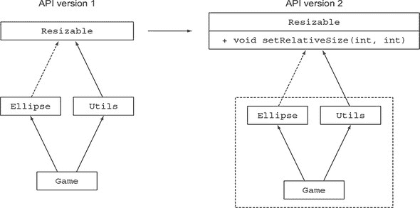

##### 用户的问题

`Resizable`的这次更新产生了问题。首先，接口现在要求实现`setRelativeSize`方法，但您的用户创建的`Ellipse`实现没有实现`setRelativeSize`方法。向接口添加新方法是**二进制兼容的**，这意味着如果未尝试重新编译它们，现有的类文件实现仍然可以运行。在这种情况下，即使向`Resizable`接口添加了`setRelativeSize`方法，游戏仍然可以运行（除非重新编译）。尽管如此，用户可以修改他游戏中`Utils.paint`方法的实现以使用`set-RelativeSize`方法，因为`paint`方法期望一个`Resizable`对象列表作为参数。如果传递了一个`Ellipse`对象，由于没有实现`setRelativeSize`方法，在运行时会抛出错误：

```
Exception in thread "main" java.lang.AbstractMethodError:
     lambdasinaction.chap9.Ellipse.setRelativeSize(II)V
```

第二，如果用户尝试重新构建他的整个应用程序（包括`Ellipse`），他将得到以下编译错误：

```
lambdasinaction/chap9/Ellipse.java:6: error: Ellipse is not abstract and does
     not override abstract method setRelativeSize(int,int) in Resizable
```

因此，更新已发布的 API 会创建向后不兼容性，这就是为什么演进现有的 API，例如官方 Java 集合 API，会给 API 的用户带来问题。您有演进 API 的替代方案，但它们的选择并不好。例如，您可以创建 API 的单独版本并维护旧版和新版，但这有几个不便之处。首先，对于库设计者来说，这更复杂。其次，您的用户可能必须在同一代码库中使用 API 的这两个版本，这会影响内存空间和加载时间，因为他们的项目需要更多的类文件。

在这种情况下，默认方法就派上用场了。它们让库设计者可以在不破坏现有代码的情况下演进 API，因为实现更新接口的类会自动继承默认实现。

|  |
| --- |

**不同类型的兼容性：二进制、源和行为**

在向 Java 程序引入更改时，主要有三种兼容性：二进制、源和行为兼容性（参见[`blogs.oracle.com/darcy/entry/kinds_of_compatibility`](https://blogs.oracle.com/darcy/entry/kinds_of_compatibility)）。您已经看到，向接口添加方法是二进制兼容的，但如果实现接口的类被重新编译，则会引发编译错误。了解不同类型的兼容性是很好的，因此在这个侧边栏中，我们将详细探讨它们。

*二进制兼容性*意味着现有的二进制文件在引入更改后继续无错误地链接（这涉及到验证、准备和解析），而不会出错。例如，向接口添加方法就是二进制兼容的，因为如果它没有被调用，接口的现有方法仍然可以正常运行而不会出现问题。

在其最简单的形式中，*源兼容性*意味着在引入更改后，现有的程序仍然可以编译。向接口添加方法不是源兼容的；现有的实现不会重新编译，因为它们需要实现新方法。

最后，*行为兼容性*意味着在更改后使用相同的输入运行程序会产生相同的行为。向接口添加方法是行为兼容的，因为该方法在程序中从未被调用（或被实现覆盖）。

|  |
| --- |

### 13.2\. 简要介绍默认方法

您已经看到了向已发布的 API 添加方法是如何破坏现有实现的。*默认方法*是 Java 8 中引入的，以便以兼容的方式演进 API。现在，一个接口可以包含实现类没有提供实现的方法签名。谁来实现它们？缺失的方法体作为接口的一部分给出（因此，默认实现），而不是在实现类中。

如何识别一个默认方法？简单：它以`default`修饰符开头，并包含一个体，就像在类中声明的类方法一样。在集合库的上下文中，你可以定义一个接口`Sized`，它有一个抽象方法`size`和一个默认方法`isEmpty`，如下所示：

```
public interface Sized {
    int size();
    default boolean isEmpty() {      *1*
        return size() == 0;
    }
}
```

+   ***1* 默认方法**

现在，任何实现`Sized`接口的类都会自动继承`isEmpty`的实现。因此，向接口添加一个带有默认实现的方 法并不构成源不兼容。

现在回到 Java 绘图库和你的游戏的初始示例。具体来说，为了以兼容的方式（这意味着你的库的用户不需要修改所有实现`Resizable`的类）进化你的库，使用默认方法并为`setRelativeSize`提供一个默认实现，如下所示：

```
default void setRelativeSize(int wFactor, int hFactor){
    setAbsoluteSize(getWidth() / wFactor, getHeight() / hFactor);
}
```

因为接口现在可以有带有实现的方法，这意味着 Java 中的多重继承已经到来吗？如果一个实现类也定义了相同的方法签名或默认方法可以被覆盖会发生什么？现在不用担心这些问题；有一些规则和机制可以帮助你处理这些问题。我们将在第 13.4 节中详细探讨它们。

你可能已经猜到了，默认方法在 Java 8 API 中被广泛使用。在本章的介绍中，你看到我们在前几章中广泛使用的`Collection`接口中的`stream`方法是一个默认方法。`List`接口中的`sort`方法也是一个默认方法。我们在第三章中介绍的大多数功能接口（如`Predicate`、`Function`和`Comparator`）也引入了新的默认方法，如`Predicate.and`和`Function.andThen`。（记住，功能接口只包含一个抽象方法；默认方法是具体方法。）

|  |
| --- |

**Java 8 中的抽象类与接口**

抽象类和接口之间的区别是什么？两者都可以包含抽象方法和有体方法。

首先，一个类只能从**一个**抽象类扩展，但一个类可以实现**多个**接口。

其次，一个抽象类可以通过实例变量（字段）强制执行一个共同的状态。接口不能有实例变量。

|  |
| --- |

要将你对默认方法的了解付诸实践，尝试一下第 13.1 题。

|  |
| --- |

**第 13.1 题：removeIf**

对于这个测验，假设你是 Java 语言和 API 的大师之一。你已经收到了许多在`ArrayList`、`TreeSet`、`LinkedList`和其他所有集合上使用`removeIf`方法的请求。`removeIf`方法应该从集合中移除所有匹配给定谓词的元素。在这个测验中，你的任务是找出增强`Collections` API 的这种新方法的最佳方式。

**答案：**

如何最有效地增强 `Collections` API？您可以在 `Collections` API 的每个具体类中复制和粘贴 `removeIf` 的实现，但这种解决方案对 Java 社区来说是一种犯罪。您还能做什么？嗯，所有的 `Collection` 类都实现了一个名为 `java.util.Collection` 的接口。很好；您可以在那里添加一个方法吗？是的。您已经了解到默认方法允许您以源兼容的方式在接口内部添加实现。所有实现 `Collection` 的类（包括用户类，这些类不是 `Collections` API 的一部分）都可以使用 `removeIf` 的实现。`removeIf` 的代码解决方案如下（这大致是官方 Java 8 Collections API 中的实现）。这个解决方案是 `Collection` 接口中的一个默认方法：

```
default boolean removeIf(Predicate<? super E> filter) {
    boolean removed = false;
    Iterator<E> each = iterator();
    while(each.hasNext()) {
        if(filter.test(each.next())) {
            each.remove();
            removed = true;
        }
    }
    return removed;
}
```

| |
| --- |

### 13.3\. 默认方法的用法模式

您已经看到默认方法可以以兼容的方式演变库。您还能用它们做什么？您可以创建具有默认方法的自己的接口。您可能希望在下文探讨的两个用例中这样做：可选方法和行为的多继承。

#### 13.3.1\. 可选方法

您可能遇到过实现接口但留空某些方法实现的类。以 `Iterator` 接口为例，它定义了 `hasNext` 和 `next` 方法，但也定义了 `remove` 方法。在 Java 8 之前，`remove` 方法通常被忽略，因为用户决定不使用该功能。因此，许多实现 `Iterator` 的类都有 `remove` 方法的空实现，这导致了不必要的样板代码。

使用默认方法，您可以为此类方法提供默认实现，因此具体类不需要显式提供空实现。Java 8 中的 `Iterator` 接口提供了如下 `remove` 方法的默认实现：

```
interface Iterator<T> {
    boolean hasNext();
    T next();
    default void remove() {
        throw new UnsupportedOperationException();
    }
}
```

因此，您可以减少样板代码。任何实现 `Iterator` 接口的类不再需要声明一个空 `remove` 方法来忽略它，因为现在它已经有了默认实现。

#### 13.3.2\. 行为的多继承

默认方法使之前不可能的事情变得优雅：*行为的多继承*，即一个类能够从多个地方重用代码的能力（图 13.3）。

##### 图 13.3\. 单继承与多继承

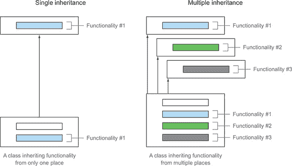

记住，Java 中的类只能从另一个类继承，但类始终允许实现多个接口。为了确认，以下是 Java API 中 `ArrayList` 类的定义：

```
public class ArrayList<E> extends AbstractList<E>     *1*
    implements List<E>, RandomAccess, Cloneable,
               Serializable {                         *2*
}
```

+   ***1* 从一个类继承**

+   ***2* 实现四个接口**

##### 类型多继承

在这里，`ArrayList` 扩展了一个类并直接实现了四个接口。因此，`ArrayList` 直接是七个类型的子类型：`AbstractList`、`List`、`RandomAccess`、`Cloneable`、`Serializable`、`Iterable` 和 `Collection`。从某种意义上说，你已经有多种类型的多重继承。

由于 Java 8 中接口方法可以有实现，类可以从多个接口继承行为（实现代码）。在下一节中，我们将通过一个示例来展示你如何利用这种能力来获得好处。保持接口最小化和正交性，让你在代码库中实现行为重用和组合。

##### 具有正交功能的接口最小化

假设你需要为创建的游戏定义具有不同特性的几个形状。一些形状应该是可调整大小的但不能旋转；一些应该是可旋转和可移动的但不能调整大小。你如何实现代码的重用？

你可以从定义一个独立的 `Rotatable` 接口开始，该接口有两个抽象方法：`setRotationAngle` 和 `getRotationAngle`。该接口还声明了一个默认的 `rotateBy` 方法，你可以通过使用 `setRotationAngle` 和 `get-RotationAngle` 方法来实现，如下所示：

```
public interface Rotatable {
    void setRotationAngle(int angleInDegrees);
    int getRotationAngle();
    default void rotateBy(int angleInDegrees){                            *1*
        setRotationAngle((getRotationAngle () + angleInDegrees) % 360);
    }
}
```

+   ***1* rotateBy 方法的默认实现**

这种技术某种程度上与模板设计模式相关，其中通过需要实现的其他方法来定义一个骨架算法。

现在，任何实现 `Rotatable` 的类都需要为 `setRotationAngle` 和 `getRotationAngle` 提供实现，但可以免费继承 `rotateBy` 的默认实现。

同样，你可以定义之前看到的两个接口：`Moveable` 和 `Resizable`。这两个接口都包含默认实现。以下是 `Moveable` 的代码：

```
public interface Moveable {
    int getX();
    int getY();
    void setX(int x);
    void setY(int y);
    default void moveHorizontally(int distance){
        setX(getX() + distance);
    }
    default void moveVertically(int distance){
        setY(getY() + distance);
    }
}
```

以下是 `Resizable` 的代码：

```
public interface Resizable {
    int getWidth();
    int getHeight();
    void setWidth(int width);
    void setHeight(int height);
    void setAbsoluteSize(int width, int height);
    default void setRelativeSize(int wFactor, int hFactor){
        setAbsoluteSize(getWidth() / wFactor, getHeight() / hFactor);
    }
}
```

##### 组合接口

你可以通过组合这些接口来为你的游戏创建不同的具体类。例如，怪物可以是可移动的、可旋转的，也可以是可调整大小的：

```
public class Monster implements Rotatable, Moveable, Resizable {
...                                                                  *1*
}
```

+   ***1* 需要为所有抽象方法提供实现，但不需要为默认方法提供实现**

`Monster` 类自动从 `Rotatable`、`Moveable` 和 `Resizable` 接口继承默认方法。在这种情况下，`Monster` 继承了 `rotateBy`、`moveHorizontally`、`moveVertically` 和 `setRelativeSize` 的实现。

现在你可以直接调用不同的方法：

```
Monster m = new Monster();        *1*
m.rotateBy(180);                  *2*
m.moveVertically(10);             *3*
```

+   ***1* 构造函数内部设置坐标、高度、宽度和默认角度。**

+   ***2* 从 Rotatable 调用 rotateBy**

+   ***3* 从 Moveable 调用 moveVertically**

假设现在你需要声明另一个类，该类是可移动和可旋转的，但不能调整大小，例如太阳。你不需要复制和粘贴代码；你可以重用 `Moveable` 和 `Rotatable` 接口中的默认实现，如下所示。

```
public class Sun implements Moveable, Rotatable {
...                                                   *1*
}
```

+   ***1* 需要为所有抽象方法提供实现，但不需要为默认方法提供实现**

图 13.4 展示了该场景的 UML 图。

##### 图 13.4\. 多种行为组合

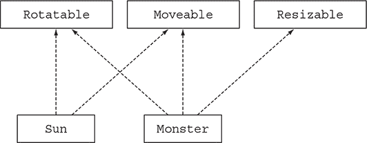

这里是定义简单接口（如你的游戏中的接口）并使用默认实现的另一个优点。假设你需要修改`moveVertically`的实现以使其更高效。你可以在`Moveable`接口中直接更改其实现，并且所有实现它的类都会自动继承代码（前提是它们没有自己实现该方法）！

|  |
| --- |

**继承被认为是有害的**

在代码重用方面，继承不应该是你的唯一答案。例如，从一个有 100 个方法和字段可以重用的类继承一个方法是一个糟糕的想法，因为这会增加不必要的复杂性。你最好使用*委托*：通过成员变量直接调用所需类的方 法来创建一个方法。因此，你有时会发现故意声明为`final`的类：它们不能被继承以防止这种反模式，或者它们的核心理念被破坏。请注意，有时`final`类有其位置。例如，`String`是 final 的，因为你不希望任何人能够干扰这种核心功能。

同样的想法也适用于具有默认方法的接口。通过保持你的接口最小化，你可以实现更大的组合，因为你只能选择你需要的实现。

|  |
| --- |

你已经看到默认方法对许多使用模式很有用。但这里有一些值得思考的问题：如果一个类实现了两个具有相同默认方法签名的接口，会发生什么？类可以使用哪个方法？我们将在下一节中探讨这个问题。

### 13.4\. 解决规则

如你所知，在 Java 中，一个类只能扩展一个父类，但可以实现多个接口。随着 Java 8 中默认方法的引入，一个类继承多个具有相同签名的方法的可能 性。应该使用哪个方法版本？在实践中，这种冲突可能非常罕见，但一旦发生，就必须有规则来指定如何处理冲突。本节解释了 Java 编译器如何解决这种潜在的冲突。我们的目标是回答诸如“在下面的代码中，`C`正在调用哪个`hello`方法？”等问题。请注意，以下示例旨在探索问题场景；这些场景在实践 中不一定经常发生：

```
public interface A {
    default void hello() {
        System.out.println("Hello from A");
    }
}
public interface B extends A {
    default void hello() {
        System.out.println("Hello from B");
    }
}
public class C implements B, A {
    public static void main(String... args) {
        new C().hello();                         *1*
    }
}
```

+   ***1* 打印的是什么？**

此外，你可能听说过 C++中的菱形问题，其中一个类可以继承两个具有相同签名的方法。哪个会被选择？Java 8 提供了解决这个问题的规则。继续阅读！

#### 13.4.1\. 需要了解的三个解决规则

当一个类从多个地方（例如另一个类或接口）继承具有相同签名的方法时，你需要遵循三个规则：

1.  类总是获胜。类或超类中的方法声明优先于任何默认方法声明。

1.  否则，子接口获胜：在具有最具体默认提供接口中具有相同签名的那个方法被选中。（如果 `B` 扩展 `A`，则 `B` 比较具体。）

1.  最后，如果选择仍然模糊不清，从多个接口继承的类必须通过覆盖它并显式调用所需的方法来显式选择要使用哪个默认方法实现。

我们保证这些是您需要知道的唯一规则！在下一节中，我们将查看一些例子。

#### 13.4.2\. 最具体默认提供接口获胜

在这里，你回顾了本节开头提到的例子，其中 `C` 实现了 `B` 和 `A`，它们定义了一个名为 `hello` 的默认方法。此外，`B` 扩展了 `A`。图 13.5 为该场景提供了一个 UML 图。

##### 图 13.5\. 最具体的默认提供接口获胜。

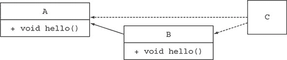

编译器将使用哪个 `hello` 方法的声明？规则 2 表示具有最具体默认提供接口的方法被选中。因为 `B` 比较具体，所以选择了 `B` 的 `hello`。因此，程序打印 `"Hello from B"`。

现在考虑如果 `C` 如下继承 `D` 会发生什么（如图 13.6 所示）：

##### 图 13.6\. 从类继承并实现两个接口

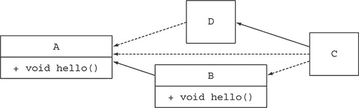

```
public class D implements A{ }
public class C extends D implements B, A {
    public static void main(String... args) {
        new C().hello();                         *1*
    }
}
```

+   ***1* 会打印什么？**

规则 1 表示类中的方法声明具有优先级。但 `D` 没有覆盖 `hello`；它实现了接口 `A`。因此，它有一个来自接口 `A` 的默认方法。规则 2 表示如果没有类或超类中的方法，则选择具有最具体默认提供接口的方法。因此，编译器在接口 `A` 的 `hello` 方法和接口 `B` 的 `hello` 方法之间有选择。因为 `B` 更具体，所以程序再次打印 `"Hello from B"`。

为了检验你对解析规则的理解，尝试测验 13.2。

| |
| --- |

**测验 13.2：记住解析规则**

对于这个测验，重用前面的例子，除了 `D` 明确覆盖了 `A` 的 `hello` 方法。你认为会打印出什么？

```
public class D implements A{
    void hello(){
        System.out.println("Hello from D");
    }
}
public class C extends D implements B, A {
    public static void main(String... args) {
        new C().hello();
    }
}
```

**答案：**

程序打印 `"Hello from D"`，因为超类中的方法声明具有优先级，正如规则 1 所述。

注意，如果 `D` 如下声明，

```
public abstract class D implements A {
    public abstract void hello();
}
```

即使在层次结构中的其他地方存在默认实现，`C` 也必须自己实现 `hello` 方法。

| |
| --- |

#### 13.4.3\. 冲突和显式消除歧义

你迄今为止看到的例子可以通过前两个解析规则来解决。现在假设 `B` 不再扩展 `A`（如图 13.7 所示）：

```
public interface A {
    default void hello() {
        System.out.println("Hello from A");
    }
}
public interface B {
    default void hello() {
        System.out.println("Hello from B");
    }
}
public class C implements B, A { }
```

##### 图 13.7\. 实现两个接口

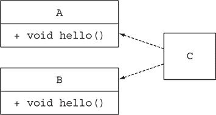

规则 2 现在无法帮助你，因为没有更具体的接口可以选择。`A` 和 `B` 的 `hello` 方法都可以是有效的选项。因此，Java 编译器产生了一个编译错误，因为它不知道哪个方法更适合：`"错误：类 C 从类型 B 和 A 继承了不相关的 hello() 默认值。"` 

##### 解决冲突

解决两个可能有效方法之间的冲突的解决方案并不多；你必须明确决定你希望 `C` 使用哪个方法声明。为此，你可以在类 `C` 中重写 `hello` 方法，然后在它的主体中明确调用你想要使用的方法。Java 8 引入了新的语法 `X.super.m(...)`，其中 `X` 是你想要调用其方法 `m` 的超接口。如果你想 `C` 使用来自 `B` 的默认方法，例如，代码看起来是这样的：

```
public class C implements B, A {
    void hello(){
        B.super.hello();               *1*
    }
}
```

+   ***1* 明确选择调用接口 B 的方法**

尝试做 13.3 题的测验，以调查一个相关复杂的情况。

| |
| --- |

**测验 13.3：几乎相同的签名**

对于这个测验，假设接口 `A` 和 `B` 被声明如下：

```
public interface A{
    default Number getNumber(){
        return 10;
    }
}
public interface B{
    default Integer getNumber(){
        return 42;
    }
}
```

还假设类 `C` 被声明如下：

```
public class C implements B, A {
    public static void main(String... args) {
        System.out.println(new C().getNumber());
    }
}
```

程序将打印什么？

**答案：**

`C` 无法区分 `A` 或 `B` 的哪个方法更具体。因此，类 `C` 将无法编译。

| |
| --- |

#### 13.4.4\. 钻石问题

最后，考虑一个让 C++ 社区感到寒心的场景：

```
public interface A{
    default void hello(){
        System.out.println("Hello from A");
    }
}
public interface B extends A { }
public interface C extends A { }
public class D implements B, C {
    public static void main(String... args) {
        new D().hello();                        *1*
    }
}
```

+   ***1* 打印了什么？**

图 13.8 展示了此场景的 UML 图。这个问题被称为 *钻石问题*，因为图看起来像钻石。`D` 继承了哪个默认方法声明：来自 `B` 的还是来自 `C` 的？你只有一个方法声明可以选择。只有 `A` 声明了默认方法。因为接口是 `D` 的超接口，所以代码将打印 `"来自 A 的问候"`。

##### 图 13.8\. 钻石问题

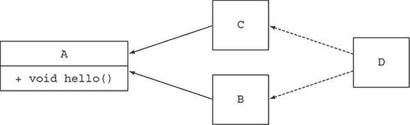

现在，如果 `B` 也有一个具有相同签名的默认 `hello` 方法会发生什么？规则 2 表示你选择最具体的默认提供接口。因为 `B` 比较具体于 `A`，所以选择了来自 `B` 的默认方法声明。如果 `B` 和 `C` 都声明了一个具有相同签名的 `hello` 方法，你将有一个冲突，需要像我们之前展示的那样明确解决。

作为旁注，你可能想知道如果你在接口 `C` 中添加一个抽象的 `hello` 方法（一个非默认的方法）会发生什么（仍然没有在 `A` 和 `B` 中声明方法）：

```
public interface C extends A {
    void hello();
}
```

`C` 语言中新的 `hello` 抽象方法比接口 `A` 中的默认 `hello` 方法具有优先级，因为 `C` 更具体。因此，类 `D` 需要为 `hello` 方法提供一个显式的实现；否则，程序将无法编译。

| |
| --- |

**C++ 钻石问题**

C++ 中的菱形问题更为复杂。首先，C++ 允许类的多重继承。默认情况下，如果类 `D` 从类 `B` 和 `C` 继承，并且类 `B` 和 `C` 都从 `A` 继承，类 `D` 将访问一个 `B` 对象的副本和一个 `C` 对象的副本。因此，使用 `A` 的方法必须显式地限定：它们是从 `B` 还是 `C` 来的？此外，类具有状态，因此从 `B` 修改成员变量不会反映在 `C` 对象的副本中。

| |
| --- |

你已经看到，如果一个类从多个具有相同签名的默认方法继承，默认方法的解析机制很简单。系统地遵循三个规则来解决所有可能的冲突：

1.  首先，在类或超类中显式的方法声明优先于任何默认方法声明。

1.  否则，将选择在最具特定性的默认提供接口中具有相同签名的那个方法。

1.  最后，如果仍然存在冲突，你必须显式地覆盖默认方法并选择你的类应该使用哪一个。

### 摘要

+   Java 8 中的接口可以通过默认方法和静态方法具有实现代码。

+   默认方法以 `default` 关键字开头，并包含一个主体，就像类方法一样。

+   向已发布的接口添加抽象方法会导致源不兼容。

+   默认方法有助于库设计者以向后兼容的方式演进 API。

+   默认方法可用于创建可选方法和行为的多重继承。

+   当一个类从多个具有相同签名的默认方法继承时，存在解决冲突的规则。

+   在类或超类中的方法声明优先于任何默认方法声明。否则，将选择在最具特定性的默认提供接口中具有相同签名的那个方法。

+   当两个方法具有相同的特定性时，一个类必须显式地覆盖此方法，例如选择调用哪一个。

## 第十四章。Java 模块系统


*本章涵盖*

+   导致 Java 采用模块系统的进化力量

+   主要结构：模块声明和 requires 以及 exports 指令

+   自动模块化旧版 Java 归档 (JAR)

+   模块化与 JDK 库

+   模块和 Maven 构建

+   简要总结除简单的 `requires` 和 `exports` 之外的其他模块指令

与 Java 9 一起引入的主要且最常讨论的新特性是其模块系统。该特性是在 Jigsaw 项目中开发的，其开发历时近十年。这个时间表是衡量这一新增功能重要性的良好指标，也是衡量 Java 开发团队在实现它时所遇到的困难的良好指标。本章提供了背景信息，说明为什么作为开发者你应该关心模块系统是什么，以及新的 Java 模块系统旨在做什么以及你如何从中受益。

注意，Java 模块系统是一个复杂的话题，值得一本书来专门讨论。我们推荐 Nicolai Parlog 的《Java 模块系统》（Manning Publications，[`www.manning.com/books/the-java-module-system`](https://www.manning.com/books/the-java-module-system)）作为全面资源的参考。在本章中，我们故意保持广泛的概述，以便你理解主要动机，并快速了解如何使用 Java 模块。

### 14.1\. 驱动力：对软件进行推理

在深入探讨 Java 模块系统的细节之前，了解一些动机和背景对于理解 Java 语言设计者设定的目标是有用的。模块化意味着什么？模块系统试图解决什么问题？本书花费了大量时间讨论新的语言特性，这些特性帮助我们编写更接近问题声明的代码，因此更容易理解和维护。然而，这种关注是低层次的。最终，在高层（软件架构层面），你希望与一个易于推理的软件项目合作，因为当你对你的代码库进行更改时，这会使你更有效率。在接下来的章节中，我们强调了两个有助于产生易于推理的软件的设计原则：*关注点分离*和*信息隐藏*。

#### 14.1.1\. 关注点分离

关注点分离（SoC）是一个促进将计算机程序分解为不同特性的原则。假设你需要开发一个会计应用程序，该程序可以解析不同格式的费用，分析它们，并向客户提供总结报告。通过应用 SoC，你将解析、分析和报告分解为称为 *模块* 的独立部分——具有很少重叠的代码集合。换句话说，模块将类分组，允许你表达应用程序中类之间的可见性关系。

你可能会说：“啊，但 Java 包已经将类分组。”你说得对，但 Java 9 模块让你能够更细粒度地控制哪些类可以看到哪些其他类，并允许在编译时检查这种控制。本质上，Java 包不支持模块化。

SoC 原则在架构观点（如模型与视图与控制器）和低级方法（如将业务逻辑与恢复机制分离）中都很有用。其好处包括

+   允许独立工作于各个部分，这有助于团队协作

+   促进独立部分的复用

+   更容易维护整体系统

#### 14.1.2\. 信息隐藏

*信息隐藏*是一种鼓励隐藏实现细节的原则。为什么这个原则很重要？在构建软件的背景下，需求可能会频繁变化。通过隐藏实现细节，你可以减少局部更改导致程序其他部分级联更改的可能性。换句话说，这是一个有用的原则，用于管理和保护你的代码。你经常听到*封装*这个术语用来表示特定的代码片段与应用程序的其他部分隔离得很好，以至于更改其内部实现不会对其产生负面影响。在 Java 中，你可以通过适当地使用`private`关键字来让编译器检查*类内的组件*是否得到了良好的封装。但直到 Java 9 之前，没有语言结构允许编译器检查*类和包仅对预期目的可用*。

#### 14.1.3\. Java 软件

这两个原则在任何设计良好的软件中都是基本的。它们如何与 Java 语言特性相匹配？Java 是一种面向对象的语言，你使用类和接口。你通过将处理特定问题的包、类和接口分组来使你的代码*模块化*。在实践中，对原始代码进行推理有点抽象。因此，像 UML 图（或者更简单地说，方框和箭头）这样的工具通过直观地表示代码各部分之间的依赖关系来帮助你推理你的软件。图 14.1 显示了一个将应用程序管理用户配置文件分解为三个特定关注点的 UML 图。

##### 图 14.1\. 具有依赖关系的三个独立关注点


关于信息隐藏，在 Java 中，你熟悉使用可见性修饰符来控制对方法、字段和类的访问：public、protected、包级别和 private。然而，正如我们在下一节中将要阐明的，在许多情况下，它们的粒度还不够精细，你可能被迫声明一个方法为 public，即使你并没有打算让它对最终用户可访问。在 Java 的早期，当应用程序和依赖链相对较小的时候，这个问题并不是很大。现在，随着许多 Java 应用程序变得庞大，这个问题变得更加重要。确实，如果你在一个类中看到一个`public`字段或方法，你可能觉得自己有权使用它（难道不是吗？），即使设计者可能认为它只适用于他自己的几个类中的私有使用！

现在你已经了解了模块化的好处，你可能想知道支持它如何导致 Java 发生变化。我们将在下一节中解释。

### 14.2\. 为什么设计 Java 模块系统

在本节中，你将了解为什么为 Java 语言和编译器设计了新的模块系统。首先，我们介绍 Java 9 之前的模块化限制。接下来，我们提供关于 JDK 库的背景信息，并解释为什么模块化它很重要。

#### 14.2.1\. 模块化限制

不幸的是，在 Java 9 之前，Java 内置的用于帮助生成模块化软件项目的支持有限。Java 有三个级别来分组代码：类、包和 JAR。对于类，Java 一直支持访问修饰符和封装。然而，在包和 JAR 级别，封装很少。

##### 有限的可见性控制

如前所述，Java 提供了访问修饰符来支持信息隐藏。这些修饰符是公共的、受保护的、包级别的和私有的可见性。但包之间的可见性控制怎么办？大多数应用程序定义了几个包来分组各种类，但包对可见性控制的支持有限。如果你想使一个包中的类和接口对另一个包可见，你必须将它们声明为公共的。因此，这些类和接口对每个人都是可访问的。这个问题的一个典型例子是，当你看到名称中包含字符串 `"impl"` 的伴随包，以提供默认实现。在这种情况下，因为该包内的代码被定义为公共的，你无法阻止用户使用这些内部实现。结果，如果不进行破坏性更改，就很难演进你的代码，因为你认为仅供内部使用的代码被程序员临时用来使某物工作，然后被冻结到系统中。更糟糕的是，从安全角度来看，这种情况很糟糕，因为你可能增加了攻击面，因为更多的代码暴露在篡改的风险中。

##### 类路径

在本章前面，我们讨论了编写易于维护和理解的软件的好处——换句话说，更容易推理。我们还讨论了关注点的分离以及模块之间的依赖建模。不幸的是，在打包和运行应用程序时，Java 历史上在这些想法上的支持不足。事实上，你必须将所有编译后的类放入一个单一的扁平 JAR 文件中，然后通过类路径使其可访问.^([1]) 然后 JVM 可以根据需要动态定位和从类路径加载类。

> ¹
> 
> 这种拼写用于 Java 文档中，但 `classpath` 通常用于程序的参数。

不幸的是，类路径和 JAR 的组合有几个缺点。

首先，类路径没有相同类的版本概念。例如，你不能指定解析库中的类 JSONParser 应属于版本 1.0 或版本 2.0，因此你无法预测如果类路径上有两个不同版本的相同库会发生什么。这种情况在大型应用程序中很常见，因为你可能使用不同版本的相同库来支持应用程序的不同组件。

其次，类路径不支持显式依赖项；不同 JAR 中的所有类都被合并到类路径上的一个类集合中。换句话说，类路径不允许你明确声明一个 JAR 依赖于另一个 JAR 中包含的一组类。这种情况使得推理类路径和提出诸如：

+   任何东西遗漏了吗？

+   有任何冲突吗？

建设工具如 Maven 和 Gradle 可以帮助你解决这个问题。然而，在 Java 9 之前，Java 和 JVM 都没有对显式依赖项的支持。这些问题通常被称为 JAR 地狱或类路径地狱。这些问题的直接后果是，在尝试和错误的过程中，通常需要不断在类路径上添加和删除类文件，希望 JVM 能够在没有抛出如 `ClassNotFound-Exception` 等运行时异常的情况下执行你的应用程序。理想情况下，你希望这些问题在开发早期就被发现。一致地使用 Java 9 模块系统可以在编译时检测到所有这些错误。

封装和类路径地狱不仅仅是你的软件架构的问题。那么 JDK 本身呢？

#### 14.2.2. 单一 JDK

*Java 开发工具包*（JDK）是一组工具，它允许你使用和运行 Java 程序。你可能最熟悉的工具是 `javac`，用于编译 Java 程序，以及 `java`，用于加载和运行 Java 应用程序，还有 JDK 库，它提供了包括输入/输出、集合和流在内的运行时支持。第一个版本于 1996 年发布。重要的是要理解，就像任何软件一样，JDK 已经增长并显著增加了大小。许多技术被添加，后来被弃用。CORBA 是一个很好的例子。无论你在应用程序中使用 CORBA 还是未使用，其类都包含在 JDK 中。这种情况在运行在移动设备或云上的应用程序中尤其成问题，这些应用程序通常不需要 JDK 库中所有可用的部分。

作为整个生态系统，你如何避免这个问题？Java 8 引入了 *紧凑配置文件* 的概念，作为向前迈出的一步。引入了三个配置文件，以便根据你感兴趣的 JDK 库的不同部分具有不同的内存占用。然而，紧凑配置文件只提供了短期解决方案。JDK 中的许多内部 API 都不是为公共使用而设计的。不幸的是，由于 Java 语言提供的封装性较差，这些 API 通常被广泛使用。例如，`sun.misc.Unsafe` 类被几个库（包括 Spring、Netty 和 Mockito）使用，但从未打算在 JDK 内部之外提供。因此，在不引入不兼容更改的情况下，很难演进这些 API。

所有这些问题都为设计一个 Java 模块系统提供了动力，该系统也可以用来模块化 JDK 本身。简而言之，需要新的结构化构造来允许您选择需要 JDK 的哪些部分以及如何对类路径进行推理，并提供更强的封装以演进平台。

#### 14.2.3. 与 OSGi 的比较

本节比较了 Java 9 模块与 OSGi。如果您还没有听说过 OSGi，我们建议您跳过本节。

在基于项目 Jigsaw 的模块引入 Java 9 之前，Java 已经有一个强大的模块系统，名为 OSGi，即使它不是 Java 平台正式的一部分。开放服务网关倡议（OSGi）始于 2000 年，直到 Java 9 的到来，它代表了在 JVM 上实现模块化应用程序的事实标准。

在现实中，OSGi 和新的 Java 9 模块系统并不是相互排斥的；它们可以在同一个应用程序中共存。事实上，它们的功能只是部分重叠。OSGi 具有更广泛的范围，并提供了许多 Jigsaw 中不可用的功能。

OSGi 模块被称为*bundles*，并在特定的 OSGi 框架中运行。存在几个认证的 OSGi 框架实现，但最广泛采用的两个是 Apache Felix 和 Equinox（它也被用来运行 Eclipse IDE）。当在 OSGi 框架中运行时，单个捆绑包可以远程安装、启动、停止、更新和卸载，而无需重启。换句话说，OSGi 为捆绑包定义了一个清晰的周期，这些状态列在表 14.1 中。

##### 表 14.1. OSGi 中的捆绑包状态

| 捆绑包状态 | 描述 |
| --- | --- |
| 已安装 | 该捆绑包已成功安装。 |
| 解析中 | 捆绑包需要的所有 Java 类都可用。 |
| 启动中 | 捆绑包正在启动，已调用 BundleActivator.start 方法，但启动方法尚未返回。 |
| 活跃 | 该捆绑包已成功激活并正在运行。 |
| 停止中 | 捆绑包正在停止。已调用 BundleActivator.stop 方法，但停止方法尚未返回。 |
| 未安装 | 该捆绑包已被卸载。它不能移动到另一个状态。 |

无需重新启动应用程序即可热插拔不同的子部分，这可能是 OSGi 相对于 Jigsaw 的主要优势。每个捆绑包通过一个文本文件定义，该文件描述了捆绑包需要哪些外部包才能工作，以及捆绑包公开导出哪些内部包并将其提供给其他捆绑包。

OSGi 的另一个有趣的特点是它允许在框架中同时安装同一捆绑包的不同版本。Java 9 模块系统不支持版本控制，因为 Jigsaw 仍然为每个应用程序使用一个单独的类加载器，而 OSGi 为每个捆绑包加载其自己的类加载器。

### 14.3. Java 模块：整体情况

Java 9 提供了一个新的 Java 程序结构单元：*模块*。模块通过一个新的关键字 `module` 引入，后跟其名称和其主体。这样的 *模块描述符* 生活在一个特殊的文件中：`module-info.java`，它被编译成 `module-info.class`。模块描述符的主体由子句组成，其中最重要的两个是 `requires` 和 `exports`。前者子句指定了您的模块需要哪些其他模块来运行，而 `exports` 指定了您的模块希望对其他模块可见的所有内容。您将在后面的章节中详细了解这些子句。

> ²
> 
> 技术上，Java 9 模块形成标识符（如 `module`、`requires` 和 `export`）是 *受限关键字*。您仍然可以在程序的其他地方使用它们作为标识符（为了向后兼容），但在允许模块的上下文中它们被解释为关键字。
> 
> ³
> 
> 法律上，文本形式被称为 *模块声明*，而在 `module-info.class` 中的二进制形式被称为 *模块描述符*。

模块描述符描述并封装了一个或多个包（通常与这些包位于同一文件夹中），但在简单用例中，它只导出（使可见）这些包中的一个。

Java 模块描述符的核心结构如图 图 14.2 所示。

##### 图 14.2\. Java 模块描述符的核心结构 (`module-info.java`)

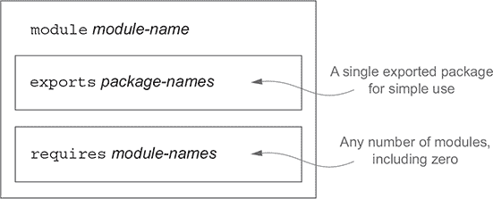

将模块的 `exports` 和 `requires` 部分想象成拼图（或许这就是 Project Jigsaw 这个工作名称的由来）的凸起（或标签）和凹槽是很有帮助的。图 14.3 展示了几个模块的示例。

##### 图 14.3\. 由四个模块（A、B、C、D）构建的 Java 系统的拼图风格示例。模块 A 需要模块 B 和 C 存在，从而获得对由模块 B 和 C 分别导出的包 `pkgB` 和 `pkgC` 的访问。模块 C 可以类似地使用它从模块 C 所需的包 `pkgD`，但模块 B 不能使用 `pkgD`。

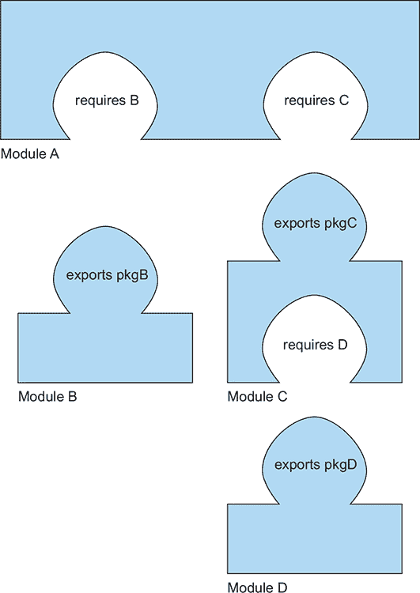

当您使用 Maven 等工具时，模块描述的许多细节由 IDE 处理，并从用户那里隐藏起来。

话虽如此，在下一节中，我们将通过示例更详细地探讨这些概念。

### 14.4\. 使用 Java 模块系统开发应用程序

在本节中，您将通过从头开始构建一个简单的模块化应用程序来概述 Java 9 模块系统。您将学习如何构建、打包和启动一个小型模块化应用程序。本节不会详细解释每个主题，而是展示整体情况，以便您在需要时可以独立深入探究。

#### 14.4.1\. 设置应用程序

要开始使用 Java 模块系统，您需要一个示例项目来编写代码。也许您经常出差，去杂货店购物，或者和朋友们一起喝咖啡，您不得不处理大量的收据。没有人喜欢管理费用。为了帮助自己，您编写了一个可以管理费用的应用程序。该应用程序需要执行以下任务：

+   从文件或 URL 读取费用列表；

+   解析这些费用的字符串表示；

+   计算统计数据；

+   显示有用的摘要；

+   为这些任务提供一个主要的启动和关闭协调器。

您需要定义不同的类和接口来建模此应用程序中的概念。首先，一个`Reader`接口允许您从源读取序列化的费用。您将拥有不同的实现，例如`HttpReader`或`FileReader`，具体取决于源。您还需要一个`Parser`接口将 JSON 对象反序列化为可以在 Java 应用程序中操作的领域对象`Expense`。最后，您需要一个`SummaryCalculator`类来负责根据`Expense`对象列表计算统计数据，并返回`SummaryStatistics`对象。

现在您有一个项目，您如何使用 Java 模块系统对其进行模块化？显然，项目涉及多个关注点，您希望将其分离：

+   从不同的源读取数据（`Reader`，`HttpReader`，`FileReader`）

+   解析来自不同格式的数据（`Parser`，`JSONParser`，`ExpenseJSON-Parser`）

+   表示领域对象（`Expense`）

+   计算并返回统计数据（`SummaryCalculator`，`SummaryStatistics`）

+   协调不同的关注点（`ExpensesApplication`）

在这里，出于教学目的，我们将采取细粒度方法。您可以将每个关注点分组到一个单独的模块中，如下所示（我们将在稍后更详细地讨论模块命名方案）：

+   expenses.readers

+   expenses.readers.http

+   expenses.readers.file

+   expenses.parsers

+   expenses.parsers.json

+   expenses.model

+   expenses.statistics

+   expenses.application

对于这个简单的应用程序，您采用细粒度分解来展示模块系统的不同部分。在实践中，对于一个简单的项目来说，采取这样的细粒度方法可能会带来高昂的前期成本，而收益可能有限，即正确封装项目的小部分。然而，随着项目的增长和更多内部实现的添加，封装和推理的好处变得更加明显。您可以想象前面的列表作为一个包列表，这取决于您的应用程序边界。一个模块将一系列包分组在一起。也许每个模块都有特定实现的包，您不希望将其暴露给其他模块。例如，`expenses.statistics`模块可能包含用于不同实验统计方法实现的几个包。稍后，您可以决定将这些包中的哪些发布给用户。

#### 14.4.2\. 精细和粗粒度模块化

当您对系统进行模块化时，可以选择粒度。在最精细的方案中，每个包都有自己的模块（如前一章所述）；在最粗粒度的方案中，单个模块包含系统中的所有包。如前所述，第一个方案增加了设计成本，但收益有限，第二个方案则失去了模块化的所有好处。最佳选择是将系统分解成模块，并辅以定期的审查过程，以确保不断发展的软件项目保持足够的模块化，这样您可以继续对其进行分析和修改。

简而言之，模块化是软件生锈的敌人。

#### 14.4.3\. Java 模块系统基础

让我们从基本的模块化应用程序开始，它只有一个模块来支持主应用程序。项目目录结构如下，每个级别嵌套在一个目录中：

```
|─ expenses.application
  |─ module-info.java
  |─ com
    |─ example
      |─ expenses
        |─ application
          |─ ExpensesApplication.java
```

您已经注意到了这个神秘的 `module-info.java` 文件，它是项目结构的一部分。此文件是一个模块描述符，正如我们在本章前面所解释的，它必须位于模块源代码文件层次结构的根目录，以便您可以指定模块的依赖关系以及您想要公开的内容。对于您的支出应用程序，顶层的 `module-info.java` 文件包含一个模块描述，它有一个名称，但除此之外是空的，因为它既不依赖于任何其他模块，也不将其功能公开给其他模块。您将在稍后学习更复杂的特性，从第 14.5 节开始。`module-info.java` 的内容如下：

```
module expenses.application {

}
```

如何运行一个模块化应用程序？查看一些命令来了解底层部分。此代码由您的 IDE 和构建系统自动化，但了解正在发生的事情是有用的。当您处于项目模块源代码目录中时，请运行以下命令：

```
javac module-info.java
     com/example/expenses/application/ExpensesApplication.java -d target

jar cvfe expenses-application.jar
     com.example.expenses.application.ExpensesApplication -C target
```

这些命令生成的输出类似于以下内容，显示了哪些文件夹和类文件被纳入生成的 JAR (`expenses-application.jar`)：

```
added manifest
added module-info: module-info.class
adding: com/(in = 0) (out= 0)(stored 0%)
adding: com/example/(in = 0) (out= 0)(stored 0%)
adding: com/example/expenses/(in = 0) (out= 0)(stored 0%)
adding: com/example/expenses/application/(in = 0) (out= 0)(stored 0%)
adding: com/example/expenses/application/ExpensesApplication.class(in = 456)
     (out= 306)(deflated 32%)
```

最后，您以模块化应用程序的形式运行生成的 JAR：

```
java --module-path expenses-application.jar \
     --module expenses/com.example.expenses.application.ExpensesApplication
```

您应该熟悉前两个步骤，它们代表将 Java 应用程序打包成 JAR 的标准方式。唯一的新部分是文件 `module-info.java` 成为编译步骤的一部分。

运行 Java `.class` 文件的 `java` 程序有两个新选项：

+   `--module-path`—此选项指定可加载的模块。此选项与 `--classpath` 参数不同，后者使类文件可用。

+   `--module`—此选项指定要运行的主模块和类。

模块的声明不包含版本字符串。解决版本选择问题并不是 Java 9 模块系统的特定设计点，因此不支持版本控制。理由是这个问题是构建工具和容器应用程序需要解决的问题。

### 14.5\. 与多个模块一起工作

现在你已经知道如何使用一个模块设置基本的应用程序，你就可以使用多个模块做一些更实际的事情了。你希望你的支出应用程序能够从一个源读取支出。为此，引入一个新的模块 `expenses.readers`，它封装了这些职责。两个模块 `expenses.application` 和 `expenses.readers` 之间的交互由 Java 9 的 `exports` 和 `requires` 子句指定。

#### 14.5.1\. `exports` 子句

这是我们如何声明模块 `expenses.readers` 的示例。（现在不用担心语法和概念；我们将在稍后介绍这些主题。）

```
module expenses.readers {

    exports com.example.expenses.readers;        *1*
    exports com.example.expenses.readers.file;   *1*
    exports com.example.expenses.readers.http;   *1*
}
```

+   ***1* 这些是包名称，而不是模块名称。**

有一个新特性：`exports` 子句，它使得特定包中的公共类型可供其他模块使用。默认情况下，所有内容都被封装在一个模块中。模块系统采用白名单方法，这有助于你获得强大的封装，因为你需要明确决定什么可以供其他模块使用。（这种方法可以防止你意外地导出一些内部特性，黑客可以利用这些特性在几年后破坏你的系统。）

你的项目两个模块版本的目录结构现在看起来是这样的：

```
|─ expenses.application
  |─ module-info.java
  |─ com
    |─ example
      |─ expenses
        |─ application
          |─ ExpensesApplication.java

|─ expenses.readers
  |─ module-info.java
  |─ com
    |─ example
      |─ expenses
        |─ readers
          |─ Reader.java
        |─ file
          |─ FileReader.java
        |─ http
          |─ HttpReader.java
```

#### 14.5.2\. `requires` 子句

或者，你可以这样编写 `module-info.java`：

```
module expenses.readers {
    requires java.base;                         *1*

    exports com.example.expenses.readers;       *2*
    exports com.example.expenses.readers.file;  *2*
    exports com.example.expenses.readers.http;  *2*
}
```

+   ***1* 这是一个模块名称，而不是包名称。**

+   ***2* 这是一个包名称，而不是模块名称。**

新的元素是 `requires` 子句，它允许你指定模块所依赖的内容。默认情况下，所有模块都依赖于一个名为 `java.base` 的平台模块，该模块包括 `net`、`io` 和 `util` 等 Java 主包。这个模块默认总是需要的，所以你不需要明确地说明。（这类似于在 Java 中说 `"class Foo { ... }"` 等同于说 `"class Foo extends Object { ... }"`。）

当你需要导入除 `java.base` 之外的其他模块时，这变得很有用。

`requires` 和 `exports` 子句的组合使得 Java 9 中类的访问控制更加复杂。表 14.2 总结了在 Java 9 之前和之后不同访问修饰符下的可见性差异。

##### 表 14.2\. Java 9 提供了对类可见性的更精细控制

| 类可见性 | 在 Java 9 之前 | 在 Java 9 之后 |
| --- | --- | --- |
| 对所有人公开的所有类 |  | （`exports` 和 `requires` 子句的组合） |
| 公共类数量有限 |  | （`exports` 和 `requires` 子句的组合） |
| 仅在单个模块内部公开 |  |  (没有导出条款) |
| 受保护的 |  |  |
| 包 |  |  |
| 私有 |  |  |

#### 14.5.3\. 命名

在这个阶段，对模块的命名约定进行评论是有用的。我们采用了简短的方法（例如，`expenses.application`），以免混淆模块和包的概念。（一个模块可以导出多个包。）然而，推荐的约定是不同的。

Oracle 建议你按照与用于包的相同反向互联网域名约定（例如，com.iteratrlearning.training）来命名模块。此外，模块的名称应与其主要导出 API 包相对应，该包也应遵循该约定。如果一个模块没有该包，或者由于其他原因需要与它的导出包之一不对应的名称，它应该以与其作者相关的互联网域名的反向形式开头。

现在你已经学会了如何设置一个包含多个模块的项目，那么如何打包和运行它呢？我们将在下一节中介绍这个主题。

### 14.6\. 编译和打包

现在你已经熟悉了设置项目和声明模块，你就可以看到如何使用像 Maven 这样的构建工具来编译你的项目了。本节假设你熟悉 Maven，它是 Java 生态系统中最常见的构建工具之一。另一个流行的构建工具是 Gradle，如果你还没有听说过它，我们鼓励你探索一下。

首先，你需要为每个模块引入一个`pom.xml`文件。实际上，每个模块都可以独立编译，使其表现得像一个独立的项目。你还需要为所有模块的父项目添加一个`pom.xml`，以协调整个项目的构建。现在的整体结构如下所示：

```
|─ pom.xml
|─ expenses.application
  |─ pom.xml
  |─ src
    |─ main
      |─ java
        |─ module-info.java
        |─ com
          |─ example
            |─ expenses
              |─ application
                |─ ExpensesApplication.java
|─ expenses.readers
  |─ pom.xml
  |─ src
    |─ main
      |─ java
        |─ module-info.java
        |─ com
          |─ example
            |─ expenses
              |─ readers
                |─ Reader.java
              |─ file
                |─ FileReader.java
              |─ http
                |─ HttpReader.java
```

注意到三个新的`pom.xml`文件和 Maven 目录项目结构。模块描述符（`module-info.java`）需要位于`src/main/java`目录中。Maven 将设置`javac`以使用适当的模块源路径。

`expenses.readers`项目的`pom.xml`文件如下所示：

```
<?xml version="1.0" encoding="UTF-8"?>
<project 

         xsi:schemaLocation="http://maven.apache.org/POM/4.0.0
     http://maven.apache.org/xsd/maven-4.0.0.xsd">
    <modelVersion>4.0.0</modelVersion>

    <groupId>com.example</groupId>
    <artifactId>expenses.readers</artifactId>
    <version>1.0</version>
    <packaging>jar</packaging>
    <parent>
        <groupId>com.example</groupId>
        <artifactId>expenses</artifactId>
        <version>1.0</version>
    </parent>
</project>
```

需要注意的重要事项是，此代码明确提到了父模块以帮助构建过程。父模块是 ID 为`expenses`的工件。你需要在`pom.xml`中定义父模块，正如你很快就会看到的。

接下来，你需要指定`expenses.application`模块的`pom.xml`。这个文件与前面的类似，但你必须添加对`expenses.readers`项目的依赖，因为`ExpensesApplication`需要它包含的类和接口来编译：

```
<?xml version="1.0" encoding="UTF-8"?>
<project 

         xsi:schemaLocation="http://maven.apache.org/POM/4.0.0
     http://maven.apache.org/xsd/maven-4.0.0.xsd">
    <modelVersion>4.0.0</modelVersion>

    <groupId>com.example</groupId>
    <artifactId>expenses.application</artifactId>
    <version>1.0</version>
    <packaging>jar</packaging>

    <parent>
        <groupId>com.example</groupId>
        <artifactId>expenses</artifactId>
        <version>1.0</version>
    </parent>

    <dependencies>
        <dependency>
                <groupId>com.example</groupId>
                <artifactId>expenses.readers</artifactId>
                <version>1.0</version>
        </dependency>
    </dependencies>

</project>
```

现在有两个模块，`expenses.application` 和 `expenses.readers`，它们都有自己的 `pom.xml`，你可以设置全局的 `pom.xml` 来指导构建过程。Maven 支持具有多个 Maven 模块的工程，使用特殊的 XML 元素 `<module>`，它引用子项目的 artifact IDs。以下是完整的定义，它引用了两个子模块 `expenses.application` 和 `expenses.readers`：

```
<?xml version="1.0" encoding="UTF-8"?>
<project 

         xsi:schemaLocation="http://maven.apache.org/POM/4.0.0
     http://maven.apache.org/xsd/maven-4.0.0.xsd">
    <modelVersion>4.0.0</modelVersion>

    <groupId>com.example</groupId>
    <artifactId>expenses</artifactId>
    <packaging>pom</packaging>
    <version>1.0</version>

    <modules>
    <module>expenses.application</module>
        <module>expenses.readers</module>
    </modules>

    <build>
        <pluginManagement>
            <plugins>
            <plugin>
                    <groupId>org.apache.maven.plugins</groupId>
                <artifactId>maven-compiler-plugin</artifactId>
                    <version>3.7.0</version>
                <configuration>
                        <source>9</source>
                        <target>9</target>
                </configuration>
            </plugin>
            </plugins>
        </pluginManagement>
    </build>
</project>
```

恭喜！现在你可以运行命令 `mvn clean package` 来生成项目中模块的 JAR 文件。此命令生成

```
./expenses.application/target/expenses.application-1.0.jar
./expenses.readers/target/expenses.readers-1.0.jar
```

你可以通过以下方式在模块路径上包含这两个 JAR 来运行你的模块应用程序：

```
java --module-path \
 ./expenses.application/target/expenses.application-1.0.jar:\
 ./expenses.readers/target/expenses.readers-1.0.jar \
    --module \
 expenses.application/com.example.expenses.application.ExpensesApplication
```

到目前为止，你已经学习了关于你创建的模块，你也看到了如何使用 `requires` 来引用 `java.base`。然而，现实世界的软件依赖于外部模块和库。这个过程是如何工作的，如果遗留库没有使用显式的 `module-info.java` 进行更新怎么办？在下一节中，我们将通过介绍自动模块来回答这些问题。

### 14.7\. 自动模块

你可能认为你的 `HttpReader` 的实现是低级的；相反，你可能想使用来自 Apache 项目的专用库，比如 `httpclient`。你如何将这个库集成到你的项目中？你已经学习了 `requires` 子句，所以尝试在 `expenses.readers` 项目的 `module-info.java` 中添加它。再次运行 `mvn clean package` 来查看结果。不幸的是，结果是坏消息：

```
[ERROR] module not found: httpclient
```

你得到这个错误是因为你还需要更新你的 `pom.xml` 来声明依赖。当你构建具有 `module-info.java` 的项目时，maven 编译器插件会将所有依赖项放在模块路径上，以便在项目中下载和识别适当的 JAR，如下所示：

```
    <dependencies>
        <dependency>
            <groupId>org.apache.httpcomponents</groupId>
            <artifactId>httpclient</artifactId>
            <version>4.5.3</version>
        </dependency>
    </dependencies>
```

现在运行 `mvn clean package` 可以正确构建项目。不过，要注意一个有趣的现象：库 `httpclient` 不是一个 Java 模块。它是一个你希望作为模块使用的外部库，但它还没有被模块化。Java 将适当的 JAR 转换为所谓的自动模块。模块路径上的任何没有 `module-info` 文件的 JAR 都成为自动模块。这个自动模块隐式导出所有其包。这个自动模块的名称是自动生成的，从 JAR 名称派生而来。你有几种方法可以派生名称，但最简单的方法是使用带有 `--describe-module` 参数的 `jar` 工具：

```
jar --file=./expenses.readers/target/dependency/httpclient-4.5.3.jar \
    --describe-module
httpclient@4.5.3 automatic
```

在这种情况下，名称是 `httpclient`。

最后一步是运行应用程序并将 `httpclient` JAR 添加到模块路径中：

```
java --module-path \
 ./expenses.application/target/expenses.application-1.0.jar:\
 ./expenses.readers/target/expenses.readers-1.0.jar \
 ./expenses.readers/target/dependency/httpclient-4.5.3.jar \
   --module \
 expenses.application/com.example.expenses.application.ExpensesApplication
```

| |
| --- |

##### 注意

有一个项目([`github.com/moditect/moditect`](https://github.com/moditect/moditect))旨在为 Maven 中的 Java 9 模块系统提供更好的支持，例如自动生成 `module-info` 文件。

| |
| --- |

### 14.8\. 模块声明和子句

Java 模块系统是一个庞大的系统。正如我们之前提到的，如果你想要深入了解这个主题，我们建议你阅读一本关于该主题的专著。尽管如此，本节为你提供了一个关于模块声明语言中可用其他关键字的大致概述，以帮助你了解可能实现的功能。

如你在前面的章节中学到的，你通过使用`module`指令来声明一个模块。在这里，它的名字是`com.iteratrlearning.application`：

```
module com.iteratrlearning.application {

}
```

模块声明中可以包含什么内容？你已经了解了`requires`和`exports`子句，但还有其他子句，包括`requires-transitive`、`exports-to`、`open`、`opens`、`uses`和`provides`。我们将在以下章节逐一介绍这些子句。

#### 14.8.1\. requires

`requires`子句允许你在编译时和运行时指定你的模块依赖于另一个模块。例如，模块`com.iteratrlearning.application`依赖于模块`com.iteratrlearning.ui:`。

```
module com.iteratrlearning.application {
    requires com.iteratrlearning.ui;
}
```

结果是，只有由`com.iteratrlearning.ui`导出的公共类型才对`com.iteratrlearning.application`可用。

#### 14.8.2\. exports

`exports`子句使特定包中的公共类型可供其他模块使用。默认情况下，没有包被导出。通过明确指定应该导出哪些包，你可以获得强大的封装性。在以下示例中，导出了包`com.iteratrlearning.ui.panels`和`com.iteratrlearning.ui.widgets`。（注意，`exports`接受一个*包名*作为参数，而`requires`接受一个*模块名*，尽管它们有相似的命名方案。）

```
module com.iteratrlearning.ui {
    requires com.iteratrlearning.core;
    exports com.iteratrlearning.ui.panels;
    exports com.iteratrlearning.ui.widgets;
}
```

#### 14.8.3\. requires transitive

你可以指定一个模块可以使用另一个模块所需的公共类型。例如，你可以在模块`com.iteratrlearning.ui`的声明中修改`requires`子句，将其设置为`requires`-`transitive`：

```
module com.iteratrlearning.ui {
    requires transitive com.iteratrlearning.core;

    exports com.iteratrlearning.ui.panels;
    exports com.iteratrlearning.ui.widgets;
}

module com.iteratrlearning.application {
    requires com.iteratrlearning.ui;
}
```

结果是，模块`com.iteratrlearning.application`可以访问由`com.iteratrlearning.core.`导出的公共类型。当所需的模块（这里为`com.iteratrlearning.ui`）返回由该模块（`com.iteratrlearning.core`）所需的另一个模块的类型时，传递性是有用的。在模块`com.iteratrlearning.application`内部重新声明`requires com.iteratrlearning.core`会非常麻烦。这个问题通过`transitive`得到了解决。现在，任何依赖于`com.iteratrlearning.ui`的模块都会自动读取`com.iteratrlearning.core`模块。

#### 14.8.4\. exports to

你有进一步的可见性控制级别，可以通过使用`exports to`结构来限制特定导出的允许用户。正如你在第 14.8.2 节中看到的，你可以通过调整模块声明来限制`com.iteratrlearning.ui.widgets`的允许用户为`com .iteratrlearning.ui.widgetuser`：

```
module com.iteratrlearning.ui {
    requires com.iteratrlearning.core;

    exports com.iteratrlearning.ui.panels;
    exports com.iteratrlearning.ui.widgets to
     com.iteratrlearning.ui.widgetuser;
}
```

#### 14.8.5\. open 和 opens

在模块声明中使用 `open` 限定符，允许其他模块以反射方式访问其所有包。`open` 限定符除了允许反射访问之外，对模块可见性没有影响，正如以下示例所示：

```
open module com.iteratrlearning.ui {

}
```

在 Java 9 之前，你可以通过反射检查对象的私有状态。换句话说，没有什么真正是封装的。对象关系映射（ORM）工具，如 Hibernate，经常使用这种能力直接访问和修改状态。在 Java 9 中，默认不再允许使用反射。前面代码中的 `open` 子句用于在需要时允许这种行为。

你可以不打开整个模块以供反射，而可以在模块声明中使用 `opens` 子句单独打开其包，按需进行。你还可以在 `opens-to` 变体的 `to` 限定符中使用，以限制允许执行反射访问的模块，类似于 `exports-to` 限制允许 `require` 导出包的模块。

#### 14.8.6. 使用和提供

如果你熟悉服务和 `ServiceLoader`，Java 模块系统允许你使用 `provides` 子句指定模块作为服务提供者，使用 `uses` 子句指定服务消费者。然而，这个主题是高级的，超出了本章的范围。如果你对结合模块和服务加载器感兴趣，我们建议你阅读前面章节中提到的由 Nicolai Parlog（Manning Publications）所著的全面资源《Java 模块系统》。

### 14.9. 一个更大的示例以及如何了解更多

你可以从以下示例中感受到模块系统的风味，该示例取自 Oracle 的 Java 文档。此示例展示了使用本章讨论的大多数特性的模块声明。这个例子并不是为了吓唬你（绝大多数模块语句都是简单的导出和需求），但它让你看到了一些更丰富的特性：

```
module com.example.foo {
    requires com.example.foo.http;
    requires java.logging;

    requires transitive com.example.foo.network;

    exports com.example.foo.bar;
    exports com.example.foo.internal to com.example.foo.probe;

    opens com.example.foo.quux;
    opens com.example.foo.internal to com.example.foo.network,
                                      com.example.foo.probe;

    uses com.example.foo.spi.Intf;
    provides com.example.foo.spi.Intf with com.example.foo.Impl;
}
```

本章讨论了引入新的 Java 模块系统的必要性，并对其主要特性进行了温和的介绍。我们没有涵盖许多特性，包括服务加载器、额外的模块描述符子句以及用于处理模块的工具，如 `jdeps` 和 `jlink`。如果你是 Java EE 开发者，在将你的应用程序迁移到 Java 9 时，重要的是要记住，与 EE 相关的几个包在模块化的 Java 9 虚拟机中默认不加载。例如，JAXB API 类现在被认为是 Java EE API，并且不再在 Java SE 9 的默认类路径中可用。你需要通过使用 `--add-modules` 命令行开关显式添加感兴趣的模块以保持兼容性。例如，要添加 `java.xml.bind`，你需要指定 `--add-modules java.xml.bind`。

正如我们之前提到的，要公正地对待 Java 模块系统，需要一本书，而不仅仅是一章。为了更深入地探讨细节，我们建议阅读之前在本章中提到的 Nicolai Parlog（Manning Publications）所著的《The Java Module System》一书。

### 摘要

+   关注点分离和信息隐藏是两个重要的原则，有助于构建你可以推理的软件。

+   在 Java 9 之前，你通过引入具有特定关注点的包、类和接口来使代码模块化，但这些元素对于有效的封装还不够丰富。

+   类路径地狱问题使得推理应用程序的依赖变得困难。

+   在 Java 9 之前，JDK 是单一的，这导致了高昂的维护成本和受限的进化。

+   Java 9 引入了一个新的模块系统，其中`module-info.java`文件命名了一个模块并指定了其依赖（`requires`）和公共 API（`exports`）。

+   `requires`子句允许你指定对其他模块的依赖。

+   `exports`子句使得模块中特定包的公共类型对其他模块可用。

+   模块的推荐命名约定遵循反向互联网域名约定。

+   模块路径上的任何没有`module-info`文件的 JAR 都成为自动模块。

+   自动模块隐式导出它们所有的包。

+   Maven 支持使用 Java 9 模块系统构建的应用程序。
