## 第五部分\. 加强版 Java 并发

本书第五部分探讨了在 Java 中构建并发程序的更高级方法——超越第六章和第七章中引入的易于使用的流并行处理理念。再次强调，本书其余部分的内容不依赖于本部分，因此如果您（目前）不需要探索这些想法，请随时跳过这部分。

第十五章是第二版的新增内容，涵盖了异步 API 的“大局”理念，包括 Futures 和反应式编程背后的发布-订阅协议，这些都被封装在 Java 9 Flow API 中。

第十六章探讨了`CompletableFuture`，它允许您以声明式的方式表达复杂的异步计算，与 Streams API 的设计相呼应。

第十七章也是第二版的新增内容，详细探讨了 Java 9 Flow API，重点关注实用的反应式编程代码。

## 第十五章\. CompletableFuture 和反应式编程背后的概念

*本章涵盖*

+   线程、未来以及导致 Java 支持更丰富并发 API 的进化力量

+   异步 API

+   并发计算的框-通道视图

+   用于动态连接框的 CompletableFuture 组合器

+   构成 Java 9 Flow API 反应式编程基础的发布-订阅协议

+   反应式编程和反应式系统

近年来，两个趋势迫使开发者重新思考软件的编写方式。第一个趋势与运行应用程序的硬件有关，第二个趋势涉及应用程序的结构（尤其是它们如何交互）。我们在第七章中讨论了硬件趋势的影响。我们指出，自从多核处理器问世以来，提高应用程序速度最有效的方法是编写能够充分利用多核处理器的软件。您了解到，您可以分解大任务，并使每个子任务与其他子任务并行运行。您还学习了如何使用自 Java 7 以来可用的 fork/join 框架和 Java 8 中的并行流以比直接操作线程更简单、更有效的方式完成此任务。

第二个趋势反映了应用程序对互联网服务的可用性和使用的增加。例如，微服务架构在过去几年中得到了增长。你的应用程序不再是单一的大型应用，而是被细分为更小的服务。这些较小服务的协调需要增加网络通信。同样，许多互联网服务通过公共 API 提供，由知名提供商如谷歌（本地化信息）、Facebook（社交信息）和 Twitter（新闻）提供。如今，开发一个完全独立工作的网站或网络应用相对罕见。你的下一个网络应用更有可能是一个混合应用，使用来自多个来源的内容，并将其聚合以简化用户的生活。

你可能想要构建一个网站，收集并总结特定主题在法国用户中的社交媒体情绪。为此，你可以使用 Facebook 或 Twitter API 来查找关于该主题的多种语言的趋势评论，并使用你内部的算法对最相关的评论进行排序。然后你可能使用谷歌翻译将评论翻译成法语或使用谷歌地图定位其作者，聚合所有这些信息，并在你的网站上显示。

如果这些外部网络服务响应缓慢，当然，你将希望向用户提供部分结果，例如，在地图服务器响应或超时之前显示一个带有问号的通用地图，而不是显示一个空白屏幕。图 15.1 说明了这种风格的*mashup*应用如何与远程服务交互。

##### 图 15.1\. 一个典型的混合应用


要实现这样的应用程序，你必须联系互联网上的多个网络服务。但你不想阻塞你的计算并浪费 CPU 宝贵的数十亿时钟周期等待这些服务的答案。例如，你不应该在处理来自 Twitter 的数据之前等待来自 Facebook 的数据。

这种情况代表了多任务编程的另一面。在第七章中讨论的 fork/join 框架和并行流是并行化的宝贵工具；它们将任务分解为多个子任务，并在不同的核心、CPU 或甚至机器上并行执行这些子任务。

相反，当你处理并发而不是并行时，或者当你主要的目标是在同一 CPU 上执行几个松散相关的任务，尽可能让它们的内核忙碌以最大化应用程序的吞吐量时，你想要避免阻塞线程并浪费其计算资源，在等待（可能相当长一段时间）远程服务或查询数据库的结果。

Java 为这种情形提供了两个主要的工具集。首先，正如你将在第十六章和第十七章中看到的，`Future`接口，特别是其 Java 8 的`CompletableFuture`实现，通常提供简单而有效的解决方案（第十六章）。最近，Java 9 增加了响应式编程的概念，它围绕所谓的发布-订阅协议通过`Flow` API 构建，提供了更复杂的编程方法（第十七章）。

图 15.2 展示了并发与并行之间的区别。并发是一种编程属性（重叠执行），即使对于单核机器也可以发生，而并行性是执行硬件的属性（同时执行）。

##### 图 15.2. 并发与并行对比

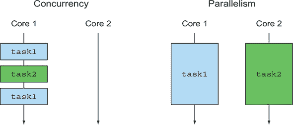

本章的其余部分解释了支撑 Java 新 CompletableFuture 和 Flow API 的基本思想。

我们首先解释 Java 在并发方面的演变，包括线程和高级抽象，如线程池和 Future（第 15.1 节）。我们注意到第七章主要讨论了在循环程序中使用并行性。第 15.2 节探讨了如何更好地利用并发进行方法调用。第 15.3 节提供了一种图示方法，将程序的某些部分视为通过通道进行通信的盒子。第 15.4 节和第 15.5 节探讨了 Java 8 和 9 中的 CompletableFuture 和响应式编程原则。最后，[第 15.6 节解释了响应式系统与响应式编程之间的区别。

|  |
| --- |

**读者指南**

本章包含很少的实际 Java 代码。我们建议只想看代码的读者跳转到第十六章和第十七章。另一方面，正如我们所有人所发现的，实现不熟悉想法的代码可能难以理解。因此，我们使用简单的函数并包含图表来解释大局，例如 Flow API 背后的发布-订阅协议，该协议捕获了响应式编程。

|  |
| --- |

我们通过一个运行示例来举例说明大多数概念，展示如何使用各种 Java 并发特性来计算表达式，如`f(x)+g(x)`，然后返回或打印结果——假设`f(x)`和`g(x)`是长时间运行的计算。

### 15.1. 不断发展的 Java 对表达并发的支持

Java 在支持并发编程方面已经取得了很大的进步，这主要反映了过去 20 年来硬件、软件系统和编程概念的变化。总结这一演变可以帮助你理解新添加内容的原因以及它们在编程和系统设计中的作用。

最初，Java 有锁（通过 `synchronized` 类和方法）、`Runnable`s 和 `Thread`s。在 2004 年，Java 5 引入了 `java.util.concurrent` 包，它支持更丰富的并发性，特别是 `ExecutorService` 接口（它将任务提交与线程执行解耦），以及 `Callable<T>` 和 `Future<T>`，它们是 `Runnable` 和 `Thread` 的高级和返回结果的变体，并使用了泛型（也是在 Java 5 中引入的）。`ExecutorService`s 可以执行 `Runnable`s 和 `Callable`s。这些特性促进了随后一年出现的多核 CPU 上的并行编程。说实话，没有人喜欢直接与线程打交道！

> ¹
> 
> `ExecutorService` 接口通过 `submit` 方法扩展了 `Executor` 接口以运行 `Callable`；`Executor` 接口仅有一个 `execute` 方法用于 `Runnables`。

Java 的后续版本继续增强并发支持，因为随着程序员需要有效地编程多核 CPU，这种需求变得越来越迫切。正如您在 第七章 中所看到的，Java 7 添加了 `java.util.concurrent.Recursive-Task` 以支持分治算法的 fork/join 实现，Java 8 添加了对 `Stream`s 和它们并行处理的支持（建立在新添加的 lambda 支持之上）。

Java 通过提供对 *组合* 未来的支持（通过 Java 8 的 `CompletableFuture` 实现 `Future`，第 15.4 节 和 第十六章），进一步丰富了其并发特性，并且 Java 9 提供了对分布式异步编程的显式支持。这些 API 为您提供了构建本章引言中提到的混合应用的心理模型和工具集。在那里，应用程序通过联系各种网络服务并在实时中为用户组合它们的信息，或者将其作为进一步的网络服务公开来工作。这个过程被称为 *响应式编程*，Java 9 通过 *发布-订阅协议*（由 `java.util.concurrent.Flow` 接口指定；参见 第 15.5 节 和 第十七章）提供了对它的支持。`CompletableFuture` 和 `java.util.concurrent.Flow` 的一个关键概念是提供编程结构，使得尽可能独立地执行任务，并以一种能够尽可能充分利用多核或多机提供的并行性的方式执行。

#### 15.1.1. 线程和高级抽象

我们中的许多人都是从操作系统课程中了解到线程和进程的。单核 CPU 计算机可以支持多个用户，因为它的操作系统为每个用户分配一个进程。操作系统为这些进程提供单独的虚拟地址空间，这样两个用户就会感觉他们是计算机的唯一用户。操作系统通过定期唤醒以在进程之间共享 CPU 来进一步这种错觉。一个进程可以请求操作系统为其分配一个或多个*线程*——这些线程与拥有它们的进程共享地址空间，因此可以并发和协作地运行任务。

在多核环境中，可能是一个只运行一个用户进程的单用户笔记本电脑，除非它使用线程，否则程序永远无法充分利用笔记本电脑的计算能力。每个核心可以用于一个或多个进程或线程，但如果你不使用线程，实际上你只是在使用处理器核心中的一个。

事实上，如果你有一个四核 CPU 并且能够安排每个核心持续进行有用的工作，你的程序理论上可以快四倍（当然，开销会降低这个结果）。给定一个包含 1,000,000 个数字的数组，存储学生在示例中回答的正确问题的数量，比较程序

```
long sum = 0;
for (int i = 0; i < 1_000_000; i++) {
    sum += stats[i];
}
```

在单线程上运行，这在单核时代工作得很好，有一个创建四个线程的版本，第一个线程执行

```
long sum0 = 0;
for (int i = 0; i < 250_000; i++) {
    sum0 += stats[i];
}
```

以及第四个线程执行

```
long sum3 = 0;
for (int i = 750_000; i < 1_000_000; i++) {
    sum3 += stats[i];
}
```

这四个线程由主程序依次启动（Java 中的`.start()`方法），等待它们完成（`.join()`方法），然后进行计算。

```
sum = sum0 + ... + sum3;
```

问题在于，对每个循环都这样做既麻烦又容易出错。此外，对于不是循环的代码，你能做什么？

第七章展示了 Java Streams 如何通过使用内部迭代而不是外部迭代（显式循环）来以最小的程序员努力实现并行性：

```
  sum = Arrays.stream(stats).parallel().sum();
```

吸取的想法是，并行 Stream 迭代是一个比显式使用线程的高级概念。换句话说，这种对 Streams 的使用*抽象*了线程的特定使用模式。这种抽象到 Streams 类似于设计模式，但好处是大部分复杂性都在库内部实现，而不是样板代码。第七章还解释了如何使用 Java 7 中的`java.util.concurrent.RecursiveTask`支持来并行化分而治之算法的 fork/join 抽象，提供了一种在多核机器上高效求和数组的高级方法。

在查看线程的额外抽象之前，我们来看看（Java 5）的`ExecutorServices`概念以及这些进一步抽象所基于的线程池。

#### 15.1.2. 执行器和线程池

Java 5 提供了 Executor 框架和线程池的概念，作为一个更高级的想法，它捕捉了线程的力量，允许 Java 程序员将任务提交与任务执行解耦。

##### 线程的问题

Java 线程直接访问操作系统线程。问题是操作系统线程的创建和销毁都很昂贵（涉及与页表的交互），而且数量有限。超过操作系统线程的数量可能会导致 Java 应用程序神秘地崩溃，所以请注意不要在继续创建新线程的同时留下线程运行。

操作系统（和 Java）线程的数量将显著超过硬件线程的数量^([2]），因此即使一些操作系统线程被阻塞或睡眠，所有硬件线程也可以有效地执行代码。例如，2016 年英特尔 Core i7-6900K 服务器处理器有八个核心，每个核心有两个对称多处理（SMP）硬件线程，总共 16 个硬件线程，服务器可能包含几个这样的处理器，可能包含 64 个硬件线程。相比之下，笔记本电脑可能只有一到两个硬件线程，因此可移植程序必须避免对可用的硬件线程数量做出假设。相反，给定程序的最佳 Java 线程数量取决于可用的硬件核心数量！

> ²
> 
> 我们在这里会使用“核心”这个词，但像英特尔 i7-6900K 这样的 CPU 每个核心都有多个硬件线程，因此即使对于像缓存未命中这样的短暂延迟，CPU 也能执行有用的指令。

##### 线程池及其为何更好

Java 的`ExecutorService`提供了一个接口，你可以提交任务并在稍后获取它们的结果。预期的实现使用线程池，这可以通过工厂方法之一创建，例如`newFixedThreadPool`方法：

```
ExecutorService newFixedThreadPool(int nThreads)
```

此方法创建一个包含`nThreads`（通常称为*工作线程*）的`ExecutorService`，并将它们存储在线程池中，从其中取出未使用的线程以按先到先服务的原则运行提交的任务。当它们的任务结束时，这些线程被返回到池中。一个很好的结果是，在保持任务数量为硬件适当的数量同时，向线程池提交数千个任务的成本很低。可能的配置包括队列大小、拒绝策略和不同任务的优先级。

注意措辞：程序员提供一个*任务*（一个`Runnable`或`Callable`），由*线程*执行。

##### 线程池及其为何更差

线程池在几乎所有方面都比显式线程操作更好，但你需要意识到两个“陷阱”：

+   一个包含 *k* 个线程的线程池只能同时执行 *k* 个任务。任何进一步的提交任务都会被保留在队列中，直到现有任务之一完成才会分配线程。这种情况通常很好，因为它允许你提交许多任务而不会意外地创建过多的线程，但你必须警惕那些睡眠或等待 I/O 或网络连接的任务。在阻塞 I/O 的上下文中，这些任务在等待时占用工作线程，但不会做任何有用的工作。尝试使用四个硬件线程和一个大小为 5 的线程池提交 20 个任务（图 15.3）。你可能期望任务会并行运行，直到所有 20 个任务都完成。但假设前三个提交的任务睡眠或等待 I/O。那么，剩余的 15 个任务就只能有 2 个线程可用，所以你只能获得预期吞吐量的一半（如果你用 8 个线程创建线程池的话）。如果早期任务提交或已运行的任务需要等待后续任务提交，这通常是对 Futures 的典型使用模式，那么甚至可能导致线程池发生死锁。

    ##### 图 15.3\. 睡眠任务会降低线程池的吞吐量。

    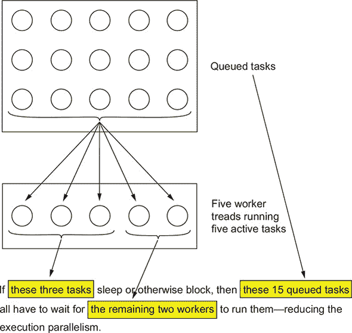

    要点是要尽量避免向线程池提交可能阻塞（睡眠或等待事件）的任务，但在现有系统中你并不总是能这样做。

+   Java 通常在允许从`main`返回之前等待所有线程完成，以避免杀死执行关键代码的线程。因此，在实践中，作为良好卫生习惯的一部分，在退出程序之前关闭每个线程池是很重要的（因为该池的工作线程已经被创建但尚未终止，因为它们正在等待另一个任务提交）。在实践中，通常会有一个长时间运行的`ExecutorService`来管理一个始终运行的互联网服务。Java 确实提供了`Thread.setDaemon`方法来控制这种行为，我们将在下一节讨论。

#### 15.1.3\. 线程的其他抽象：非嵌套的方法调用

为了解释为什么本章中使用的并发形式与第七章（并行 Stream 处理和 fork/join 框架）中使用的并发形式不同，我们将指出第七章中使用的并发形式有一个特殊属性：在方法调用中启动的任何任务（或线程）都会等待它完成后再返回。换句话说，线程创建和匹配的`join()`以正确的方式嵌套在方法调用的调用-返回嵌套中。这种称为*严格 fork/join*的想法在图 15.4 中展示。

##### 图 15.4\. 严格的 fork/join。箭头表示线程，圆圈表示 fork 和 join，矩形表示方法调用和返回。

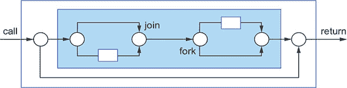

在一种更宽松的 fork/join 形式中，派生的任务可以从内部方法调用中逃逸，但在外部调用中合并，因此提供给用户的外观仍然像是正常的调用，^([3]) 如图 15.5 所示。

> ³
> 
> 比较一下“功能性思考”(第十八章)，其中我们讨论了提供一个无副作用的接口给内部使用副作用的方法！

##### 图 15.5. 松弛的 fork/join

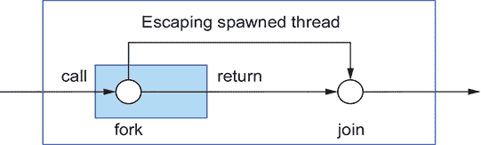

在本章中，我们关注更丰富的并发形式，其中用户方法调用创建的线程（或派生的任务）可能比调用存活得更久，如图 15.6 所示。

##### 图 15.6. 异步方法

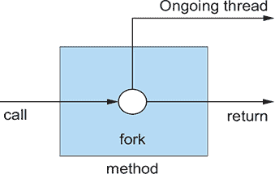

这种方法通常被称为异步方法，尤其是当正在进行的派生任务继续执行对方法调用者有帮助的工作时。我们将在本章后面探索 Java 8 和 9 的技术，以从这些方法中受益，从 15.2 节开始，但首先，检查一下危险：

+   当前线程与方法调用后的代码并发运行，因此需要仔细编程以避免数据竞争。

+   如果 Java 的`main()`方法在当前线程终止之前返回会发生什么？有两个答案，都相当令人不满意：

    +   在退出应用程序之前等待所有此类挂起的线程。

    +   杀死所有挂起的线程然后退出。

前一种解决方案由于忘记的线程而永远不会终止，存在看似应用程序崩溃的风险；后一种解决方案会中断写入磁盘的 I/O 操作序列，从而将外部数据置于不一致的状态。为了避免这两个问题，确保你的程序跟踪它创建的所有线程，并在退出前将它们全部合并（包括关闭任何线程池）。

Java 线程可以使用`setDaemon()`方法调用标记为*daemon*^([4])或 nondaemon。守护线程在退出时被杀死（因此对于不会留下不一致磁盘状态的服务很有用），而从`main`返回则继续等待所有非守护线程终止，然后退出程序。

> ⁴
> 
> 从词源学上讲，*daemon*和*demon*都源于同一个希腊单词，但*daemon*捕捉到的是有益精神的概念，而*demon*捕捉到的是邪恶精神的概念。UNIX 为计算目的创造了*daemon*这个词，用于系统服务，如 sshd，一个监听传入 ssh 连接的进程或线程。

#### 15.1.4. 你希望从线程中得到什么？

您希望的是能够构建程序结构，以便每当它可以从并行化中受益时，都有足够多的任务来占用所有硬件线程，这意味着构建程序以拥有许多较小的任务（但不要因为任务切换的成本而太小）。您在第七章中看到了如何为循环和分而治之算法做这件事，使用并行流处理和 fork/join，但在本章的其余部分（以及第十六章和第十七章），您将看到如何为方法调用做这件事，而无需编写大量的模板线程操作代码。

### 15.2. 同步和异步 API

第七章向您展示了 Java 8 Streams 如何让您利用并行硬件。这种利用分为两个阶段。首先，您将外部迭代（显式的`for`循环）替换为内部迭代（使用 Stream 方法）。然后您可以使用 Streams 上的`parallel()`方法，允许 Java 运行时库并行处理元素，而不是重写每个循环以使用复杂的线程创建操作。一个额外的优势是，当循环执行时，运行时系统比程序员更清楚地了解可用的线程数量，程序员只能猜测。

除了基于循环的计算之外，其他情况也可以从并行化中受益。本章以及第十六章和第十七章的背景是一个重要的 Java 开发，即异步 API。

让我们以一个运行示例来探讨，即计算方法`f`和`g`的调用结果之和的问题，这两个方法的签名如下：

```
int f(int x);
int g(int x);
```

为了强调，我们将把这些签名称为*同步 API*，因为它们在物理返回时返回结果，这种含义很快就会变得清晰。您可能需要使用一个代码片段来调用它们并打印它们结果的和：

```
int y = f(x);
int z = g(x);
System.out.println(y + z);
```

现在假设方法`f`和`g`执行时间较长。（这些方法可能实现数学优化任务，如梯度下降，但在第十六章和第十七章中，我们考虑更实际的案例，其中它们执行网络查询。）一般来说，Java 编译器无法优化此代码，因为`f`和`g`可能以编译器不清楚的方式交互。但是，如果您知道`f`和`g`没有交互，或者您不在乎，您希望`f`和`g`在单独的 CPU 核心上执行，这样总执行时间只是`f`和`g`调用时间的最大值，而不是总和。您需要做的就是分别在不同的线程中运行`f`和`g`的调用。这个想法非常好，但它使之前的简单代码复杂化了^([5])。

> ⁵
> 
> 这里的一些复杂性涉及到将结果从线程中传回。只有最终的外部对象变量可以在 lambda 表达式或内部类中使用，但真正的问题是所有的显式线程操作。

```
class ThreadExample {

    public static void main(String[] args) throws InterruptedException {
        int x = 1337;
        Result result = new Result();

        Thread t1 = new Thread(() -> { result.left = f(x); } );
        Thread t2 = new Thread(() -> { result.right = g(x); });
        t1.start();
        t2.start();
        t1.join();
        t2.join();
        System.out.println(result.left + result.right);
    }

    private static class Result {
        private int left;
        private int right;
    }
}
```

您可以通过使用 `Future` API 接口而不是 `Runnable` 来简化此代码。假设您之前已将线程池设置为 `ExecutorService`（例如 `executorService`），您可以编写

```
public class ExecutorServiceExample {
    public static void main(String[] args)
        throws ExecutionException, InterruptedException {

        int x = 1337;

        ExecutorService executorService = Executors.newFixedThreadPool(2);
        Future<Integer> y = executorService.submit(() -> f(x));
        Future<Integer> z = executorService.submit(() -> g(x));
        System.out.println(y.get() + z.get());

        executorService.shutdown();
    }
}
```

但这段代码仍然被涉及显式调用 `submit` 的样板代码所污染。

您需要一个更好的方式来表达这个想法，类似于在 Streams 的内部迭代避免了使用线程创建语法来并行化外部迭代的需求。

答案涉及到将 API 更改为 *异步 API*。^([6]) 与允许方法在物理返回到调用者（同步）的同时返回其结果相比，您允许它在产生结果之前物理返回，如图 15.6 所示。因此，对 `f` 的调用以及此调用之后的代码（这里是对 `g` 的调用）可以并行执行。您可以通过两种技术实现这种并行性，这两种技术都会改变 `f` 和 `g` 的签名。

> ⁶
> 
> 同步 API 也被称为 *阻塞 API*，因为物理返回被延迟，直到结果准备好（在考虑对 I/O 操作的调用时最为明显），而异步 API 可以自然地实现非阻塞 I/O（API 调用仅初始化 I/O 操作而不等待结果，前提是所使用的库，如 Netty，支持非阻塞 I/O 操作）。

第一种技术以更好的方式使用 Java Futures。Futures 出现在 Java 5 中，并在 Java 8 中扩展为 `CompletableFuture` 以使其可组合；我们在 第 15.4 节 中解释了这个概念，并在 第十六章 中通过一个工作的 Java 代码示例详细探讨了 Java API。第二种技术是一种使用 Java 9 `java.util.concurrent.Flow` 接口的响应式编程风格，基于 第 15.5 节 中解释的发布-订阅协议，并在 第十七章 中通过实际代码进行示例。

这些替代方案如何影响 `f` 和 `g` 的签名？

#### 15.2.1\. Future-style API

在这个替代方案中，将 `f` 和 `g` 的签名更改为

```
Future<Integer> f(int x);
Future<Integer> g(int x);
```

并更改调用为

```
Future<Integer> y = f(x);
Future<Integer> z = g(x);
System.out.println(y.get() + z.get());
```

这个想法是方法 `f` 返回一个 Future，其中包含一个继续评估其原始体的任务，但 `f` 的返回尽可能快地发生在调用之后。方法 `g` 类似地返回一个 Future，第三行代码使用 `get()` 等待两个 Future 完成，并求和它们的结果。

在这种情况下，您可以在不减少并行性的情况下保持 API 和 `g` 的调用不变——只需为 `f` 引入 Future。在更大的程序中不这样做有两个原因：

+   `g`的其他使用可能需要 Future 风格的版本，因此你更喜欢统一的 API 风格。

+   为了使并行硬件尽可能快地执行你的程序，拥有更多且更小的任务（在合理范围内）是有用的。

#### 15.2.2\. 响应式 API

在第二种替代方案中，核心思想是通过改变`f`和`g`的签名来使用回调风格编程。

```
void f(int x, IntConsumer dealWithResult);
```

这种替代方案一开始可能看起来令人惊讶。如果`f`不返回值，它怎么能工作呢？答案是，你将一个*回调*^([7])（一个 lambda）作为额外的参数传递给`f`，然后`f`的主体启动一个任务，在准备好时调用这个 lambda 而不是使用`return`返回值。再次强调，`f`在启动任务以评估主体后立即返回，这导致以下代码风格：

> ⁷
> 
> 一些作者使用术语*回调*来表示任何作为方法参数传递的 lambda 或方法引用，例如`Stream.filter`或`Stream.map`的参数。我们只将其用于那些可以在方法返回后调用的 lambda 和方法引用。

```
public class CallbackStyleExample {
    public static void main(String[] args) {

        int x = 1337;
        Result result = new Result();

        f(x, (int y) -> {
            result.left = y;
            System.out.println((result.left + result.right));
        } );

        g(x, (int z) -> {
            result.right = z;
            System.out.println((result.left + result.right));
        });

    }
}
```

啊，但这并不相同！在这段代码打印出正确的结果（`f`和`g`调用的总和）之前，它打印出完成最快的值（有时甚至打印出总和两次，因为没有锁定，加法的两个操作数可以在任一`println`调用执行之前更新）。有两个答案：

+   你可以通过在测试后调用`println`来恢复原始行为，使用 if-then-else 检查两个回调都已调用，可能通过适当的锁定来计数。

+   这种响应式风格的 API 旨在对一系列事件做出反应，而不是对单个结果，对于`Future`s 来说更为合适。

注意，这种响应式编程风格允许方法`f`和`g`多次调用它们的回调`dealWithResult`。`f`和`g`的原始版本被迫使用只能执行一次的`return`。同样，`Future`只能完成一次，其结果可以通过`get()`获取。从某种意义上说，响应式风格的异步 API 自然地启用了一组值（我们稍后将将其比作流），而`Future`风格的 API 则对应于一次性概念框架。

在第 15.5 节中，我们细化了这个核心思想示例，以模拟包含公式`=C1+C2`的工作表调用。

你可能会争辩说，这两种替代方案都会使代码更复杂。在某种程度上，这种论点是正确的；你不应该无意识地使用每个方法的 API。但是，API 比显式地操作线程使代码更简单（并使用更高级的构造）。此外，谨慎使用这些 API 进行方法调用，这些调用（a）导致长时间的计算（可能超过几毫秒）或（b）等待网络或来自人类的输入，可以显著提高应用程序的效率。在情况（a）中，这些技术使你的程序更快，而无需在程序中显式地使用污染线程。在情况（b）中，还有一个额外的好处，即底层系统可以有效地使用线程而不会阻塞。我们将在下一节中转向这一点。

#### 15.2.3. 休眠（以及其他阻塞操作）被认为是有害的

当你与人类或需要限制事件发生速率的应用程序交互时，一种自然的编程方式是使用`sleep()`方法。然而，休眠的线程仍然占用系统资源。如果你只有少数几个线程，这种情况并不重要，但如果你有很多线程，其中大多数都在休眠，那就很重要了。（参见 15.2.1 节和 15.3 图的讨论。）

要记住的教训是，在线程池中休眠的任务通过阻塞其他任务开始运行来消耗资源。（它们不能停止已分配给线程的任务，因为操作系统调度这些任务。）

当然，不仅仅是休眠会阻塞线程池中可用的线程。任何阻塞操作都可以做到这一点。阻塞操作分为两类：等待另一个任务执行某些操作，例如在 Future 上调用`get()`；以及等待外部交互，如从网络、数据库服务器或键盘等人类界面设备读取。

你能做什么？一个相当独裁的回答是永远不要在任务中阻塞，或者至少在你的代码中只允许少数例外。 （参见 15.2.4 节以了解现实情况。）更好的替代方案是将任务分为两部分——在之前和之后——并让 Java 在不会阻塞的情况下仅调度后面的部分。

比较代码 A，显示为一个单一的任务

```
work1();
Thread.sleep(10000);         *1*
work2();
```

+   ***1.*** 休眠 10 秒。

使用代码 B：

```
public class ScheduledExecutorServiceExample {
    public static void main(String[] args) {
        ScheduledExecutorService scheduledExecutorService
            = Executors.newScheduledThreadPool(1);

        work1();
        scheduledExecutorService.schedule(
    ScheduledExecutorServiceExample::work2, 10, TimeUnit.SECONDS);    *1*

        scheduledExecutorService.shutdown();
    }

    public static void work1(){
        System.out.println("Hello from Work1!");
    }

    public static void work2(){
        System.out.println("Hello from Work2!");
    }
}
```

+   ***1.*** 在 work1()完成后 10 秒为 work2()安排一个单独的任务。

想象这两个任务都在线程池中执行。

考虑代码 A 的执行方式。首先，它被排队在线程池中执行，然后开始执行。然而，在执行到一半时，它在`sleep()`调用中阻塞，占用了一个工作线程整整 10 秒钟什么也不做。然后它执行`work2()`并在终止和释放工作线程之前完成。相比之下，代码 B 执行`work1()`然后终止——但仅在 10 秒后排队一个任务来执行`work2()`。

代码 B 更好，但为什么？代码 A 和代码 B 做的是同一件事。区别在于，代码 A 在睡眠时占用了一个宝贵的线程，而代码 B 则将另一个任务排队执行（只需要少量内存，且不需要线程）而不是睡眠。

这种效果是在创建任务时应始终牢记在心的事情。任务在开始执行时占用宝贵的资源，因此你应该努力让它们运行直到完成并释放其资源。而不是阻塞，任务应在提交后续任务以完成其打算执行的工作后终止。

尽可能的情况下，此指南也适用于 I/O。而不是进行传统的阻塞式读取，任务应发出一个非阻塞的“启动读取”方法调用，并在请求运行时库在读取完成后安排后续任务后终止。

这种设计模式可能会让人感觉代码难以阅读。但 Java 的`CompletableFuture`接口（第 15.4 节和第十六章）在运行时库中抽象了这种代码风格，使用组合子而不是对`Future`的阻塞`get()`操作的显式使用，正如我们之前讨论的那样。

最后，我们将指出，如果线程是无限且便宜的，代码 A 和代码 B 将同样有效。但它们不是，所以当你有超过几个可能睡眠或阻塞的任务时，代码 B 是最佳选择。

#### 15.2.4. 现实检查

如果你正在设计一个新的系统，为了利用并行硬件，将系统设计为包含许多小型、并发任务，以便所有可能的阻塞操作都通过异步调用实现，这可能是一条可行的道路。但现实需要打破这种“一切异步”的设计原则。（记住，“最好的是好的敌人。”）自 2002 年 Java 1.4 以来，Java 就拥有了非阻塞 I/O 原语（`java.nio`），但它们相对复杂且不太为人所知。实用地说，我们建议你尝试确定那些可以从 Java 增强的并发 API 中受益的情况，并使用它们而无需担心使每个 API 都异步。

你还可以查看像 Netty（[`netty.io/`](https://netty.io/)）这样的较新库，它为网络服务器提供了一致的阻塞/非阻塞 API。

#### 15.2.5. 异常如何与异步 API 协同工作？

在基于 Future 和反应式风格的异步 API 中，被调用方法的逻辑主体在单独的线程中执行，调用者的执行很可能已经退出了围绕调用放置的任何异常处理程序的范畴。显然，会触发异常的不寻常行为需要执行替代操作。但这种操作可能是什么呢？在 `CompletableFuture` 的 Future 实现中，API 包括在 `get()` 方法时暴露异常的提供，还提供了如 `exceptionally()` 之类的从异常中恢复的方法，我们将在第十六章 16 中讨论。

对于反应式风格的异步 API，您必须通过引入一个额外的回调来修改接口，这个回调在抛出异常而不是执行 `return` 时被调用。为此，在反应式 API 中包含多个回调，如下例所示：

```
void f(int x, Consumer<Integer> dealWithResult,
              Consumer<Throwable> dealWithException);
```

然后，`f` 的主体可能会执行

```
dealWithException(e);
```

如果有多个回调，而不是单独提供它们，您可以将它们等价地包装在一个单一的对象中的方法。例如，Java 9 的 `Flow` API 将这些多个回调包装在一个单一的对象中（`Subscriber<T>` 类的对象，包含四个方法，被解释为回调）。以下是其中的三个：

```
void    onComplete()
void    onError(Throwable throwable)
void    onNext(T item)
```

分离的回调指示何时有值可用（`onNext`），何时在尝试提供值时出现异常（`onError`），以及何时 `onComplete` 回调允许程序指示不会产生更多值（或异常）。对于前面的示例，`f` 的 API 现在将是

```
void f(int x, Subscriber<Integer> s);
```

并且 `f` 的主体现在会通过执行来指示一个异常，该异常表示为 `Throwable t`

```
s.onError(t);
```

将包含多个回调的此 API 与从文件或键盘设备读取数字进行比较。如果您将此类设备视为生产者而不是被动数据结构，它会产生一系列“这里有数字”或“这里有格式不正确的项而不是数字”的项目，最后是一个“没有更多字符（文件结束）”的通知。

通常将这些调用称为消息或 *事件*。例如，您可能会说，文件读取器产生了数字事件 3、7 和 42，然后是一个格式不正确的数字事件，接着是数字事件 2，然后是文件结束事件。

当将这些事件视为 API 的一部分时，需要注意的是，API 并没有表明这些事件的相对顺序（通常称为 *通道协议*）。在实践中，相关的文档通过使用诸如“在 `onComplete` 事件之后，将不再产生更多事件”之类的阶段来指定协议。

### 15.3. 盒子-通道模型

通常，设计和思考并发系统的最佳方式是直观地表示。我们称这种技术为**箱-通道模型**。考虑一个涉及整数的简单情况，这是对之前计算 `f(x) + g(x)` 例子的一般化。现在你想要用参数 `x` 调用方法或函数 `p`，将它的结果传递给函数 `q1` 和 `q2`，然后用这两个调用的结果调用方法或函数 `r`，最后打印结果。（为了避免解释中的混乱，我们不会区分类 `C` 的方法 `m` 和其关联的函数 `C::m`。）直观地看，这个任务很简单，如图 15.7 所示。

##### 图 15.7\. 一个简单的箱-通道图

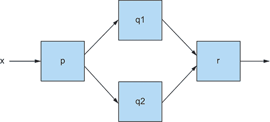

查看两种在 Java 中编码 图 15.7 的方式，以了解它们引起的问题。第一种方式是

```
int t = p(x);
System.out.println( r(q1(t), q2(t)) );
```

这段代码看起来很清晰，但 Java 会依次运行对 `q1` 和 `q2` 的调用，这是你在尝试利用硬件并行性时想要避免的。

另一种方式是使用 `Futures` 并行评估 `f` 和 `g`：

```
int t = p(x);
Future<Integer> a1 = executorService.submit(() -> q1(t));
Future<Integer> a2 = executorService.submit(() -> q2(t));
System.out.println( r(a1.get(),a2.get()));
```

注意：我们没有在这个例子中将 `p` 和 `r` 包裹在 `Futures` 中，因为箱-通道图的形状。`p` 必须在所有其他操作之前完成，而 `r` 必须在所有其他操作之后完成。如果我们改变这个例子来模仿

```
System.out.println( r(q1(t), q2(t)) + s(x) );
```

其中我们需要将所有五个函数（`p`、`q1`、`q2`、`r` 和 `s`）包裹在 `Futures` 中以最大化并发性。

如果系统中并发的总量很小，这种解决方案效果很好。但如果系统变得很大，包含许多独立的箱-通道图，并且其中一些盒子本身内部使用自己的盒子和通道，会怎样呢？在这种情况下，许多任务可能会等待（通过调用 `get()`）一个 `Future` 完成，正如在 15.1.2 节 中讨论的，结果可能是硬件并行性的低效利用，甚至死锁。此外，通常很难充分理解这样的大型系统结构，以确定有多少任务可能会等待 `get()`。Java 8 采取的解决方案（`CompletableFuture`；有关详细信息，请参阅 15.4 节）是使用**组合器**。你已经看到，你可以使用 `compose()` 和 `andThen()` 等方法在两个 `Function` 上操作以获得另一个 `Function`（参见 第三章）。例如，假设 `add1` 将整数加 1，而 `dble` 将整数加倍，你可以编写

```
Function<Integer, Integer> myfun = add1.andThen(dble);
```

创建一个将它的参数加倍并将结果加 2 的 `Function`。但箱-通道图也可以直接且优雅地使用组合器编码。Java `Function`s `p`、`q1`、`q2` 和 `BiFunction` `r` 可以简洁地捕获 图 15.7：

```
p.thenBoth(q1,q2).thenCombine(r)
```

不幸的是，`thenBoth` 和 `thenCombine` 并不是以这种形式成为 Java `Function` 和 `BiFunction` 类的一部分。

在下一节中，你将看到类似的思想如何应用于 `CompletableFuture` 并防止任务必须使用 `get()` 等待。

在离开这一节之前，我们想强调的是，盒子和通道模型可以用来组织思想和代码。在某种重要的意义上，它提高了构建更大系统的抽象级别。你画盒子（或在程序中使用组合器）来表达你想要的计算，稍后执行，可能比手动编码计算更有效率。这种组合器的使用不仅适用于数学函数，也适用于 Future 和数据反应流。在 第 15.5 节 中，我们将这些盒子和通道图推广到宝石图，其中每个通道上都会显示多个宝石（代表消息）。盒子和通道模型还帮助你从直接编程并发转变为允许组合器内部执行工作。同样，Java 8 Streams 从程序员必须遍历数据结构到组合器在内部执行工作的角度转变了视角。

### 15.4. CompletableFuture 和并发组合器

`Future` 接口的一个问题是它是一个接口，这鼓励你将你的并发编程任务视为 Future。然而，从历史上看，Future 提供了很少的操作，除了 `FutureTask` 实现：创建一个具有给定计算的未来，运行它，等待它终止等等。Java 的后续版本提供了更多的结构化支持（例如，第七章中讨论的 `RecursiveTask`）。

Java 8 带来的新功能是能够使用 `Future` 接口的 `CompletableFuture` 实现来组合 Future。那么为什么叫它 `CompletableFuture` 而不是，比如说，`ComposableFuture` 呢？嗯，一个普通的 Future 通常是用一个 `Callable` 创建的，它会被执行，然后通过 `get()` 获取结果。但是 `CompletableFuture` 允许你创建一个 Future 而不给它任何要运行的代码，并且一个 `complete()` 方法允许其他线程稍后用值完成它（因此得名），这样 `get()` 就可以访问那个值。为了并发地求和 `f(x)` 和 `g(x)`，你可以这样写

```
public class CFComplete {

    public static void main(String[] args)
        throws ExecutionException, InterruptedException {
        ExecutorService executorService = Executors.newFixedThreadPool(10);
        int x = 1337;

        CompletableFuture<Integer> a = new CompletableFuture<>();
        executorService.submit(() -> a.complete(f(x)));
        int b = g(x);
        System.out.println(a.get() + b);

        executorService.shutdown();
    }
}
```

或者你可以这样写

```
public class CFComplete {

    public static void main(String[] args)
        throws ExecutionException, InterruptedException {
        ExecutorService executorService = Executors.newFixedThreadPool(10);
        int x = 1337;

        CompletableFuture<Integer> a = new CompletableFuture<>();
        executorService.submit(() -> b.complete(g(x)));
        int a = f(x);
        System.out.println(a + b.get());

        executorService.shutdown();
    }
}
```

注意，这两种代码版本都可能因为有一个线程阻塞等待 `get` 而浪费处理资源（回想一下 第 15.2.3 节）。前者如果 `f(x)` 花费时间更长，后者如果 `g(x)` 花费时间更长。使用 Java 8 的 `CompletableFuture` 可以让你避免这种情况；但首先有一个测验。

|  |
| --- |

**测验 15.1：**

在继续阅读之前，思考一下你如何编写任务以完美地利用线程：当 `f(x)` 和 `g(x)` 都在执行时有两个活跃的线程，以及从第一个线程完成开始直到返回语句的一个线程。

答案是，你会使用一个任务来执行`f(x)`，第二个任务来执行`g(x)`，第三个任务（一个新的或现有的）来计算总和，并且某种方式下，第三个任务在第一个两个完成之前不能开始。你如何在 Java 中解决这个问题？

解决方案是使用 Future 上的组成思想。

| |
| --- |

首先，回顾一下你在本书中之前见过两次的组成操作。组成操作是一种在许多其他语言中使用的强大程序结构化思想，但只有在 Java 8 中添加了 lambda 表达式之后，Java 才开始流行这种思想。这个想法的一个实例是在流上组成操作，如下面的例子所示：

```
myStream.map(...).filter(...).sum()
```

这个想法的另一个实例是在两个`Function`上使用`compose()`和`andThen()`方法来获取另一个`Function`（参见第 15.5 节）。

这为你提供了一个使用`CompletableFuture<T>`中的`thenCombine`方法添加两个计算结果的新且更好的方法。目前不必过于担心细节；我们将在第十六章更全面地讨论这个话题。`thenCombine`方法具有以下签名（略微简化以防止泛型和通配符相关的杂乱）：

```
CompletableFuture<V> thenCombine(CompletableFuture<U> other,
                                 BiFunction<T, U, V> fn)
```

这个方法接受两个`CompletableFuture`值（结果类型为`T`和`U`）并创建一个新的（结果类型为`V`）。当前两个完成时，它获取它们的结果，对这两个结果应用`fn`，然后不阻塞地完成结果 future。前面的代码现在可以按照以下形式重写：

```
public class CFCombine {

    public static void main(String[] args) throws ExecutionException,
     InterruptedException {

        ExecutorService executorService = Executors.newFixedThreadPool(10);
        int x = 1337;

        CompletableFuture<Integer> a = new CompletableFuture<>();
        CompletableFuture<Integer> b = new CompletableFuture<>();
        CompletableFuture<Integer> c = a.thenCombine(b, (y, z)-> y + z);
        executorService.submit(() -> a.complete(f(x)));
        executorService.submit(() -> b.complete(g(x)));

        System.out.println(c.get());
        executorService.shutdown();

    }
}
```

`thenCombine`这一行是关键：在不知道`Futures`中的`a`和`b`的计算内容的情况下，它创建了一个仅在前面两个计算完成时才在线程池中运行的调度计算。第三个计算`c`将它们的结果相加（最重要的是）并且只有在其他两个计算完成之后才被认为有资格在线程上执行（而不是开始执行然后阻塞）。因此，没有实际等待操作，这在代码的早期两个版本中是麻烦的。在那个版本中，如果 Future 中的计算恰好是第二个完成的，那么线程池中的两个线程仍然处于活动状态，尽管你只需要一个！图 15.8 以图解方式展示了这种情况。在两个早期版本中，计算`y+z`都是在计算`f(x)`或`g(x)`的相同固定线程上进行的，中间可能存在潜在的等待。相比之下，使用`thenCombine`仅在`f(x)`和`g(x)`都完成之后才调度求和计算。

##### 图 15.8\. 显示三个计算：`f(x)`、`g(x)`和它们结果的时序图

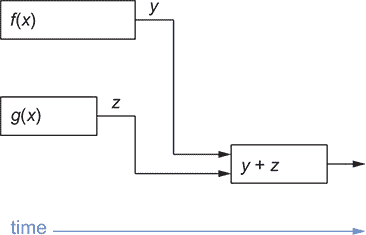

为了明确起见，对于许多代码片段，你不需要担心几个线程被阻塞等待`get()`，因此 Java 8 之前的 Futures 仍然是合理的编程选项。然而，在某些情况下，你可能需要拥有大量的 Futures（例如处理对服务的多个查询）。在这些情况下，使用`CompletableFuture`及其组合器来避免阻塞调用`get()`以及可能的并行性丢失或死锁通常是最佳解决方案。

### 15.5. 发布-订阅和响应式编程

对于`Future`和`CompletableFuture`的心理模型是独立并发执行的计算。Future 的结果在计算完成后通过`get()`方法可用。因此，Futures 是单次执行的，代码只运行到完成一次。

相比之下，响应式编程的心理模型是一个类似于 Future 的对象，随着时间的推移，它会产生多个结果。考虑两个例子，从一个温度计对象开始。你期望这个对象会反复产生结果，每隔几秒给你一个温度值。另一个例子是代表 Web 服务器监听器组件的对象；这个对象等待网络中出现 HTTP 请求，并以类似的方式产生请求的数据。然后其他代码可以处理结果：温度或 HTTP 请求的数据。然后温度计和监听器对象回到感应温度或监听之前，可能还会产生进一步的结果。

在这里要注意两点。核心点是这些例子类似于 Futures，但不同之处在于它们可以多次完成（或产生）而不是单次执行。另一个点是，在第二个例子中，早期结果可能和后期看到的结果一样重要，而对于温度计，大多数用户只对最新的温度感兴趣。但为什么这种编程被称为*响应式*呢？答案是程序的其他部分可能想要对低温报告做出反应（例如打开加热器）。

你可能会认为前面的想法只是一个 Stream。如果你的程序自然地适合 Stream 模型，Stream 可能是最好的实现。然而，总的来说，响应式编程范式更具表现力。一个 Java Stream 只能被一个终端操作消费。正如我们在第 15.3 节中提到的，Stream 范式使得表达可以在两个处理管道之间分割值序列的操作（例如 fork）或处理和合并来自两个不同流的项（例如 join）变得困难。Streams 具有线性处理管道。

Java 9 使用`java.util.concurrent.Flow`内部可用的接口来建模响应式编程，并编码了所谓的发布-订阅模型（或协议，通常简称为 pub-sub）。你可以在第十七章中详细了解 Java 9 Flow API，但在这里我们提供一个简要概述。有三个主要概念：

+   一个*发布者*，订阅者可以订阅它。

+   这种连接被称为*订阅*。

+   *消息*（也称为*事件*）通过连接传输。

图 15.9 以图形方式展示了这个想法，其中订阅是通道，发布者和订阅者是盒子上的端口。多个组件可以订阅单个发布者，一个组件可以发布多个单独的流，一个组件可以订阅多个发布者。在下一节中，我们将使用 Java 9 Flow 接口的术语逐步展示这个想法是如何工作的。

##### 图 15.9\. 发布-订阅模型

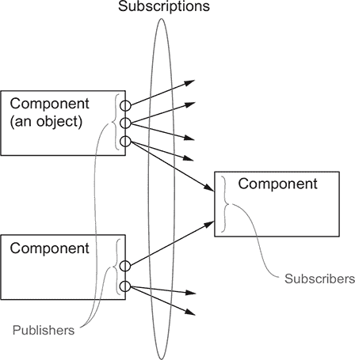

#### 15.5.1\. 用于求和两个流的示例用途

发布-订阅的一个简单但具有代表性的例子是将两个信息源的事件结合起来，并供其他人查看。这个过程一开始可能听起来很神秘，但这就是电子表格中包含公式的单元格在概念上所做的事情。建模一个包含公式`"=C1+C2"`的电子表格单元格 C3。每当 C1 或 C2 被更新（由人类或因为单元格包含另一个公式），C3 都会更新以反映变化。以下代码假设唯一可用的操作是添加单元格的值。

首先，建模一个持有值的细胞的概念：

```
private class SimpleCell {
    private int value = 0;
    private String name;

    public SimpleCell(String name) {
        this.name = name;
    }
}
```

目前，代码很简单，你可以初始化几个细胞，如下所示：

```
SimpleCell c2 = new SimpleCell("C2");
SimpleCell c1 = new SimpleCell("C1");
```

你如何指定当`c1`或`c2`的值发生变化时，`c3`将这两个值相加？你需要一种方式让`c1`和`c2`订阅`c3`的事件。为此，引入接口`Publisher<T>`，其核心看起来像这样：

```
interface Publisher<T> {
    void subscribe(Subscriber<? super T> subscriber);
}
```

此接口接受一个订阅者作为参数，它可以与之通信。`Subscriber<T>`接口包括一个简单的方法`onNext`，该方法将信息作为参数，然后可以自由提供特定的实现：

```
interface Subscriber<T> {
    void onNext(T t);
}
```

你如何将这两个概念结合起来？你可能意识到`Cell`实际上既是`Publisher`（可以订阅单元格到其事件）又是`Subscriber`（对其他单元格的事件做出反应）。`Cell`类的实现现在看起来像这样：

```
private class SimpleCell implements Publisher<Integer>, Subscriber<Integer> {
    private int value = 0;
    private String name;
    private List<Subscriber> subscribers = new ArrayList<>();

    public SimpleCell(String name) {
        this.name = name;
    }

    @Override
    public void subscribe(Subscriber<? super Integer> subscriber) {
        subscribers.add(subscriber);
    }

    private void notifyAllSubscribers() {                                  *1*
        subscribers.forEach(subscriber -> subscriber.onNext(this.value));
    }

    @Override
    public void onNext(Integer newValue) {
        this.value = newValue;                                             *2*
        System.out.println(this.name + ":" + this.value);                  *3*
        notifyAllSubscribers();                                            *4*
    }
}
```

+   ***1* 此方法通过新值通知所有订阅者。**

+   ***2* 通过更新其值来响应它所订阅的细胞的新值**

+   ***3* 在控制台打印值，但可以是渲染更新单元格的一部分 UI**

+   ***4* 通知所有订阅者关于更新后的值**

尝试一个简单的例子：

```
Simplecell c3 = new SimpleCell("C3");
SimpleCell c2 = new SimpleCell("C2");
SimpleCell c1 = new SimpleCell("C1");

c1.subscribe(c3);

c1.onNext(10); // Update value of C1 to 10
c2.onNext(20); // update value of C2 to 20
```

这段代码输出以下结果，因为 C3 直接订阅了 C1：

```
C1:10
C3:10
C2:20
```

你如何实现 `"C3=C1+C2"` 的行为？你需要引入一个能够存储算术运算两边（左和右）的独立类：

```
    public class ArithmeticCell extends SimpleCell {

        private int left;
        private int right;

        public ArithmeticCell(String name) {
            super(name);
        }

        public void setLeft(int left) {
            this.left = left;
            onNext(left + this.right);         *1*
        }

        public void setRight(int right) {
            this.right = right;
            onNext(right + this.left);         *2*
        }
    }
```

+   ***1* 更新单元格值并通知任何订阅者。**

+   ***2* 更新单元格值并通知任何订阅者。**

现在你可以尝试一个更实际的例子：

```
ArithmeticCell c3 = new ArithmeticCell("C3");
SimpleCell c2 = new SimpleCell("C2");
SimpleCell c1 = new SimpleCell("C1");

c1.subscribe(c3::setLeft);
c2.subscribe(c3::setRight);

c1.onNext(10); // Update value of C1 to 10
c2.onNext(20); // update value of C2 to 20
c1.onNext(15); // update value of C1 to 15
```

输出是

```
C1:10
C3:10
C2:20
C3:30
C1:15
C3:35
```

通过检查输出，你可以看到当 `C1` 更新为 `15` 时，`C3` 立即做出反应并更新其值。发布者-订阅者交互中很酷的一点是你可以设置一个发布者和订阅者的图。例如，你可以创建另一个依赖于 `C3` 和 `C4` 的单元格 `C5`，通过表达 `"C5=C3+C4"`：

```
ArithmeticCell c5 = new ArithmeticCell("C5");
ArithmeticCell c3 = new ArithmeticCell("C3");
SimpleCell c4 = new SimpleCell("C4");
SimpleCell c2 = new SimpleCell("C2");
SimpleCell c1 = new SimpleCell("C1");

c1.subscribe(c3::setLeft);
c2.subscribe(c3::setRight);

c3.subscribe(c5::setLeft);
c4.subscribe(c5::setRight);
```

然后你可以在你的电子表格中执行各种更新：

```
c1.onNext(10); // Update value of C1 to 10
c2.onNext(20); // update value of C2 to 20
c1.onNext(15); // update value of C1 to 15
c4.onNext(1); // update value of C4 to 1
c4.onNext(3); // update value of C4 to 3
```

这些操作会产生以下输出：

```
C1:10
C3:10
C5:10
C2:20
C3:30
C5:30
C1:15
C3:35
C5:35
C4:1
C5:36
C4:3
C5:38
```

最后，`C5` 的值是 `38`，因为 `C1` 是 `15`，`C2` 是 `20`，而 `C4` 是 `3`。

|  |
| --- |

**命名法**

因为数据从发布者（生产者）流向订阅者（消费者），开发者经常使用诸如 *上游* 和 *下游* 这样的词汇。在前面的代码示例中，上游 `onNext()` 方法接收到的 `newValue` 数据通过调用 `notifyAllSubscribers()` 传递给下游的 `onNext()` 调用。

|  |
| --- |

这就是发布-订阅的核心思想。然而，我们省略了一些事情，其中一些是直接的装饰，而其中一个（背压）是如此重要，以至于我们在下一节中单独讨论它。

首先，我们将讨论直接的事情。正如我们在第 15.2 节中提到的，流的实际编程可能需要传递比 `onNext` 事件更多的信息，因此订阅者（监听器）需要定义 `onError` 和 `onComplete` 方法，以便发布者可以指示异常和数据流的终止。（也许温度计的例子已经被替换，并且将永远不会通过 `onNext` 产生更多值。）`onError` 和 `onComplete` 方法在 Java 9 Flow API 的实际 `Subscriber` 接口中得到支持。这些方法就是为什么这个协议比传统的观察者模式更强大的原因之一。

两个简单但至关重要的想法，这些想法极大地复杂化了 Flow 接口，即压力和反压。这些想法可能看起来并不重要，但它们对于线程利用至关重要。假设你的温度计，之前每几秒钟报告一次温度，现在升级到了一个更好的版本，每毫秒报告一次温度。你的程序能否足够快速地对这些事件做出反应，或者可能会发生缓冲区溢出并导致崩溃？（回想一下，如果可能阻塞的任务超过几个，给线程池分配大量任务时会出现的问题。）同样，假设你订阅了一个向你的手机提供所有短信消息的发布者。在只有少量短信消息的情况下，这个订阅在我的新手机上可能运行良好，但几年后，当有数千条消息时，所有这些消息都可能在不到一秒的时间内通过调用`onNext`发送，会发生什么？这种情况通常被称为*压力*。

现在想象一个包含写有消息的球体的垂直管道。你还需要一种形式的反压，例如一种限制添加到柱子中的球体数量的机制。Java 9 Flow API 通过一个`request()`方法（在一个新接口`Subscription`中实现）实现了反压，该方法邀请发布者发送下一个项目（或多个项目），而不是以无限的速度发送项目（拉模型而不是推模型）。我们将在下一节中讨论这个话题。

#### 15.5.2\. 反压

你已经看到了如何将包含`onNext`、`onError`和`OnComplete`方法的`Subscriber`对象传递给`Publisher`，发布者在适当的时候调用这个对象。该对象将信息从`Publisher`传递到`Subscriber`。你希望通过反压（流量控制）限制发送信息的速率，这需要你从`Subscriber`向`Publisher`发送信息。问题是`Publisher`可能有多个`Subscriber`，而你希望反压只影响点对点连接。在 Java 9 Flow API 中，`Subscriber`接口包括第四个方法

```
void onSubscribe(Subscription subscription);
```

这被称为在`Publisher`和`Subscriber`之间建立的通道上发送的第一个事件。`Subscription`对象包含使`Subscriber`能够与`Publisher`通信的方法，如下所示：

```
interface Subscription {
    void   cancel();
    void   request(long n);
}
```

注意回调中常见的“这似乎是反的”效应。`Publisher`创建`Subscription`对象并将其传递给`Subscriber`，`Subscriber`可以调用其方法将信息从`Subscriber`传递回`Publisher`。

#### 15.5.3\. 真实反压的简单形式

为了使发布-订阅连接能够逐个处理事件，你需要进行以下更改：

+   安排`Subscriber`将`OnSubscribe`传递的`Subscription`对象本地存储，可能作为一个字段`subscription`。

+   使`onSubscribe`、`onNext`和（可能）`onError`的最后一个动作是调用`channel.request(1)`来请求下一个事件（只有一个事件，这阻止了`Subscriber`被淹没）。

+   改变`Publisher`，使得`notifyAllSubscribers`（在这个例子中）只通过请求的通道发送`onNext`或`onError`事件。（通常，`Publisher`会为每个`Subscriber`创建一个新的`Subscription`对象，以便多个`Subscriber`可以各自以自己的速率处理数据。）

虽然这个过程看起来很简单，但实现背压需要考虑一系列的实现权衡：

+   你会以最慢的`Subscriber`的速度发送事件，还是为每个`Subscriber`有一个单独的尚未发送的数据队列？

+   当这些队列过度增长时会发生什么？

+   如果`Subscriber`没有准备好，你会丢弃事件吗？

选择取决于发送数据的语义。丢失一个温度报告序列可能无关紧要，但丢失银行账户中的信用额度肯定很重要！

你经常听到这个概念被称为基于反应式拉取的背压。这个概念被称为基于反应式拉取，因为它提供了一种方式，让`Subscriber`通过事件（反应式）从`Publisher`拉取（请求）更多信息。结果是背压机制。

### 15.6. 反应式系统与反应式编程

在编程和学术界，你可能会越来越多地听到关于反应式系统和反应式编程的内容，重要的是要意识到这些术语表达的是相当不同的概念。

*反应式系统*是一个程序，其架构允许它对其运行时环境的变化做出反应。反应式系统应具备的属性在《反应式宣言》（[`www.reactivemanifesto.org`](http://www.reactivemanifesto.org)）中得到了形式化（见第十七章）。这三个属性可以总结为响应性、弹性和弹性。

*响应性*意味着反应式系统可以实时响应输入，而不是因为系统正在为其他人处理大任务而延迟简单的查询。*弹性*意味着系统通常不会因为一个组件失败而失败；损坏的网络链接不应该影响不涉及该链接的查询，并且可以重新路由到未响应组件的查询。*弹性*意味着系统可以调整其工作负载的变化，并继续高效地执行。就像你可以在酒吧在服务食物和服务饮料之间动态重新分配员工，以便两条队伍的等待时间相似一样，你可以调整与各种软件服务关联的工作线程数量，以确保没有工作线程空闲，同时确保每个队列继续被处理。

显然，你可以用许多方式实现这些属性，但主要的方法是使用由与`java.util.concurrent.Flow`关联的接口提供的*反应式编程*风格。这些接口的设计反映了反应式宣言的第四个和最后一个属性：消息驱动。*消息驱动*系统具有基于箱-通道模型的内部 API，组件等待被处理的输入，结果以消息的形式发送到其他组件，以使系统能够响应。

### 15.7\. 路线图

第十六章通过一个真实的 Java 示例探讨了`CompletableFuture` API，而第十七章探讨了 Java 9 Flow（发布-订阅）API。

### 概述

+   Java 对并发的支持已经发展并持续发展。线程池通常很有帮助，但当你有许多可能阻塞的任务时，可能会引起问题。

+   使方法异步（在所有工作完成之前返回）允许额外的并行性，与用于优化循环的并行性互补。

+   你可以使用箱-通道模型来可视化异步系统。

+   Java 8 的`CompletableFuture`类和 Java 9 Flow API 都可以表示箱-通道图。

+   `CompletableFuture`类表达了一次性异步计算。可以使用组合器来组合异步计算，而无需承担传统 Future 使用中固有的阻塞风险。

+   Flow API 基于发布-订阅协议，包括背压，并构成了 Java 中反应式编程的基础。

+   反应式编程可用于实现反应式系统。

## 第十六章\. CompletableFuture：可组合的异步编程

*本章涵盖*

+   创建异步计算并检索其结果

+   通过使用非阻塞操作提高吞吐量

+   设计和实现异步 API

+   异步消费同步 API

+   管道化和合并两个或更多异步操作

+   对异步操作完成的响应

第十五章探讨了现代并发上下文：多个处理资源（CPU 核心等）可用，并且您希望以高级方式尽可能利用这些资源（而不是在程序中散布结构不良、难以维护的线程操作）。我们指出，并行流和 fork/join 并行性为在遍历集合的程序和涉及分而治之的程序中表达并行性提供了高级构造，但方法调用提供了执行代码的并行执行的机会。Java 8 和 9 引入了两个特定的 API 来实现此目的：`CompletableFuture`和响应式编程范式。本章通过实际代码示例解释了 Java 8 `CompletableFuture`实现如何为您的编程工具箱提供额外的武器。它还讨论了 Java 9 中引入的添加功能。

### 16.1\. 简单使用 Futures

`Future`接口是在 Java 5 中引入的，用于模拟在未来的某个时刻可用的结果。例如，当调用者发起请求时，对远程服务的查询不会立即可用。`Future`接口模拟异步计算，并提供了一个引用，当计算本身完成时，该引用将指向结果。在`Future`内部触发可能耗时的操作允许调用者`Thread`继续执行有用的工作，而不是等待操作的结果。您可以将这个过程想象成把一袋衣服拿到您最喜欢的干洗店。干洗店会给您一张收据，告诉您衣服什么时候会被清洗（一个`Future`）；在此期间，您可以做一些其他活动。`Future`的另一个优点是它比低级的`Thread`s 更容易使用。要使用`Future`，通常需要将耗时的操作包装在一个`Callable`对象中，并将其提交给`ExecutorService`。以下列表显示了 Java 8 之前编写的示例。

##### 列表 16.1\. 在`Future`中异步执行长时间操作

```
ExecutorService executor = Executors.newCachedThreadPool();         *1*
Future<Double> future = executor.submit(new Callable<Double>() {    *2*
        public Double call() {
            return doSomeLongComputation();                         *3*
        }});
doSomethingElse();                                                  *4*
try {
    Double result = future.get(1, TimeUnit.SECONDS);                *5*
} catch (ExecutionException ee) {
    // the computation threw an exception
} catch (InterruptedException ie) {
    // the current thread was interrupted while waiting
} catch (TimeoutException te) {
    // the timeout expired before the Future completion
}
```

+   ***1* 创建一个 ExecutorService，允许您将任务提交到线程池。**

+   ***2* 将 Callable 提交给 ExecutorService。**

+   ***3* 在单独的线程中异步执行长时间操作。**

+   ***4* 在异步操作进行时做其他事情。**

+   ***5* 获取异步操作的结果，如果结果尚未可用则阻塞，但最多等待 1 秒钟然后超时。**

如图 16.1 所示，这种编程风格允许你的线程在另一个由`ExecutorService`提供的单独线程中并发执行长时间操作的同时执行其他任务。然后，当你没有异步操作的结果就无法进行任何其他有意义的工作时，你可以通过调用其`get`方法从`Future`检索它。如果操作已经完成，此方法立即返回操作的结果，或者它会阻塞你的线程，等待其结果可用。

##### 图 16.1\. 使用`Future`异步执行长时间操作

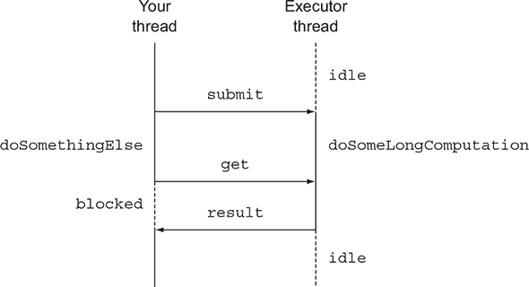

注意这个场景的问题。如果长时间操作永远不会返回怎么办？为了处理这种可能性，几乎总是使用`get`函数的两个参数版本是一个好主意，它接受一个超时参数，指定线程愿意等待`Future`结果的最大时间（及其时间单位）（如列表 16.1 所示）。`get`函数的无参数版本将无限期地等待。

#### 16.1.1\. 理解 Futures 及其限制

这个简单的例子表明，`Future`接口提供了检查异步计算是否完成的方法（通过使用`isDone`方法），等待其完成，并检索其结果。但这些都不足以让你编写简洁的并发代码。例如，表达`Future`结果之间的依赖关系是困难的。声明式地指定，“当长时间计算的结果可用时，请将其结果发送给另一个长时间计算，当它完成时，将其结果与另一个查询的结果合并。”使用`Future`中可用的操作来实现这个规范是一个不同的故事，这就是为什么在实现中拥有更多声明式特性会有所帮助，例如：

+   在两个异步计算独立或第二个依赖于第一个的结果时结合它们

+   等待一组`Future`执行的所有任务的完成

+   只等待一组`Future`中的最快任务完成（可能是因为`Future`正在以不同的方式尝试计算相同的值）并检索其结果

+   以编程方式完成一个`Future`（即通过手动提供异步操作的结果）

+   对`Future`完成的响应（即在完成发生时被通知，然后能够使用`Future`的结果执行进一步的操作，而不是在等待其结果时被阻塞）

在本章的其余部分，你将学习`CompletableFuture`类（它实现了`Future`接口）如何通过 Java 8 的新特性以声明式的方式实现所有这些功能。`Stream`和`CompletableFuture`的设计遵循类似的模式，因为它们都使用 lambda 表达式和管道化。因此，可以说`CompletableFuture`对于普通的`Future`就像`Stream`对于`Collection`一样。

#### 16.1.2\. 使用 CompletableFutures 构建异步应用程序

为了探索`CompletableFuture`的功能，在本节中，你将逐步开发一个最佳价格查找应用程序，该应用程序联系多个在线商店以找到给定产品或服务的最低价格。在这个过程中，你将学习几个重要的技能：

+   如何为你的客户提供异步 API（如果你是某个在线商店的所有者，这很有用）。

+   当你是一个同步 API 的消费者时，如何让你的代码非阻塞。你将发现如何将两个后续的异步操作管道化，将它们合并成一个单独的异步计算。这种情况发生在，例如，在线商店返回了你想要购买的商品的原价以及折扣码时。在计算该商品的实际价格之前，你必须联系第二个远程折扣服务来找出与该折扣码相关的百分比折扣。

+   如何反应性地处理表示异步操作完成的事件的完成，以及这样做如何允许最佳价格查找应用程序在每家商店返回其价格时不断更新你想要购买的商品的最佳购买报价，而不是等待所有商店返回各自的报价。这项技能还可以避免用户在一家商店的服务器宕机时永远看到空白屏幕的情况。

| |
| --- |

**同步与异步 API**

术语“同步 API”是另一种谈论传统方法调用的方式：你调用它，调用者等待方法计算，方法返回，调用者继续使用返回的值。即使调用者和被调用者是在不同的线程上执行的，调用者仍然会等待被调用者完成。这种情况导致了“阻塞调用”这个术语的产生。

相比之下，在异步 API 中，方法立即返回（或者至少在计算完成之前返回），将剩余的计算委托给一个线程，该线程异步于调用者运行——因此，短语“非阻塞调用”。剩余的计算通过调用回调方法将其值提供给调用者，或者调用者调用一个“等待计算完成”的进一步方法。这种计算方式在 I/O 系统编程中很常见：你启动一个磁盘访问，它在执行更多计算的同时异步发生，当你没有更多有用的事情可做时，你等待磁盘块加载到内存中。请注意，阻塞和非阻塞通常用于操作系统对 I/O 的具体实现。然而，即使在非 I/O 环境中，这些术语也常常与异步和同步互换使用。

| |
| --- |

### 16.2\. 实现异步 API

要开始实现最佳价格查找应用程序，定义每个商店应提供的 API。首先，一个商店声明一个方法，该方法返回产品的价格，给定其名称：

```
public class Shop {
    public double getPrice(String product) {
        // to be implemented
    }
}
```

此方法的内部实现将查询商店的数据库，但可能还会执行其他耗时任务，例如联系其他外部服务（如商店的供应商或与制造商相关的促销折扣）。为了模拟这种长时间运行的方法执行，在本章的其余部分，你使用`delay`方法，该方法引入了 1 秒的人工延迟，如下所示。

##### 列表 16.2\. 模拟 1 秒延迟的方法

```
public static void delay() {
    try {
        Thread.sleep(1000L);
    } catch (InterruptedException e) {
        throw new RuntimeException(e);
    }
}
```

为了本章的目的，你可以通过调用`delay`然后返回一个随机计算的价格值来模拟`getPrice`方法，如下所示。返回随机计算的价格的代码可能看起来有点像黑客行为；它通过使用`charAt`的结果作为数字来随机化价格。

##### 列表 16.3\. 在`getPrice`方法中引入模拟延迟

```
public double getPrice(String product) {
    return calculatePrice(product);
}

private double calculatePrice(String product) {
    delay();
    return random.nextDouble() * product.charAt(0) + product.charAt(1);
}
```

此代码意味着当 API 的消费者（在这种情况下，最佳价格查找应用程序）调用此方法时，它会保持阻塞，然后空闲 1 秒，等待其同步完成。这种情况是不可接受的，尤其是考虑到最佳价格查找应用程序必须对其网络中的所有商店重复此操作。在本章的后续部分，你将发现如何通过以异步方式消费此同步 API 来解决此问题。但为了学习如何设计异步 API，你继续在本节中假装站在另一边。你是一位明智的店主，意识到这种同步 API 对其用户来说是多么痛苦，你希望将其重写为异步 API，以便让你的客户的生活更轻松。

#### 16.2.1\. 将同步方法转换为异步方法

为了实现这个目标，你首先必须将 `getPrice` 方法转换为 `getPriceAsync` 方法，并更改其返回值，如下所示：

```
public Future<Double> getPriceAsync(String product) { ... }
```

正如我们在本章引言中提到的，Java 5 中引入了 `java.util.concurrent.Future` 接口，用于表示异步计算的结果。（也就是说，调用线程可以在不阻塞的情况下继续执行。）`Future` 是一个用于访问尚未可用但最终可以通过调用其 `get` 方法来检索的值的句柄。因此，`getPriceAsync` 方法可以立即返回，给调用线程一个机会在同时执行其他有用的计算。Java 8 的 `CompletableFuture` 类为你提供了多种实现此方法的简便方法，如下所示。

##### 列表 16.4\. 实现 `getPriceAsync` 方法

```
public Future<Double> getPriceAsync(String product) {
    CompletableFuture<Double> futurePrice = new CompletableFuture<>();   *1*
    new Thread( () -> {
                double price = calculatePrice(product);                  *2*
                futurePrice.complete(price);                             *3*
    }).start();
    return futurePrice;                                                  *4*
}
```

+   ***1* 创建将包含计算结果的 CompletableFuture。**

+   ***2* 在不同的 Thread 中异步执行计算。**

+   ***3* 当结果可用时，在 Future 上设置长时间计算返回的值。**

+   ***4* 不等待包含的结果的计算完成就返回 Future。**

在这里，你创建了一个 `CompletableFuture` 的实例，它代表一个异步计算，并在结果可用时包含该结果。然后你创建一个不同的 `Thread` 来执行实际的价格计算，并在等待长时间的计算完成之前返回 `Future` 实例。当请求产品的价格最终可用时，你可以使用其 `complete` 方法完成 `CompletableFuture`，以设置值。这一特性也解释了这种 Java 8 `Future` 实现的名称。API 的客户端可以调用它，如下一个列表所示。

##### 列表 16.5\. 使用异步 API

```
Shop shop = new Shop("BestShop");
long start = System.nanoTime();
Future<Double> futurePrice = shop.getPriceAsync("my favorite product");   *1*
long invocationTime = ((System.nanoTime() - start) / 1_000_000);
System.out.println("Invocation returned after " + invocationTime
                                                + " msecs");
// Do some more tasks, like querying other shops
doSomethingElse();
// while the price of the product is being calculated
try {
    double price = futurePrice.get();                                     *2*
    System.out.printf("Price is %.2f%n", price);
} catch (Exception e) {
    throw new RuntimeException(e);
}
long retrievalTime = ((System.nanoTime() - start) / 1_000_000);
System.out.println("Price returned after " + retrievalTime + " msecs");
```

+   ***1* 查询商店以获取产品的价格。**

+   ***2* 从 Future 读取价格或阻塞，直到它可用。**

如你所见，客户端请求商店获取某种产品的价格。因为商店提供了一个异步 API，所以这个调用几乎立即返回 `Future`，客户端可以通过它稍后检索产品的价格。然后客户端可以执行其他任务，例如查询其他商店，而不是保持阻塞，等待第一个商店产生所需的结果。稍后，当客户端在没有产品价格的情况下无法执行其他有意义的任务时，它可以调用 `Future` 上的 `get`。通过这样做，客户端解包 `Future` 中包含的值（如果异步任务已完成）或者保持阻塞，直到该值可用。代码在 列表 16.5 中产生的输出可能如下所示：

```
Invocation returned after 43 msecs
Price is 123.26
Price returned after 1045 msecs
```

您可以看到，调用 `getPriceAsync` 方法的返回时间远早于价格计算最终完成的时间。在 第 16.4 节 中，您将了解到客户端还可以避免任何阻塞的风险。相反，当 `Future` 完成时，客户端会被通知，并且可以在计算结果可用时执行回调代码，该代码通过 lambda 表达式或方法引用定义。现在，我们将解决另一个问题：如何在异步任务执行期间管理错误。

#### 16.2.2\. 处理错误

您到目前为止开发的代码在一切顺利的情况下可以正常工作。但如果价格计算生成错误会发生什么？遗憾的是，在这种情况下，您会得到一个特别负面的结果：表示错误的异常仍然局限于尝试计算产品价格的线程中，并最终杀死该线程。因此，客户端将永远阻塞，等待 `get` 方法的返回结果。

客户端可以通过使用接受超时参数的重载版 `get` 方法来防止这个问题。使用超时来防止代码其他部分出现类似情况是一种良好的实践。这样，客户端至少可以避免无限期地等待，但当超时到期时，它会通过 `TimeoutException` 被通知。因此，客户端将没有机会发现导致失败的线程中计算产品价格的原因。为了使客户端了解商店无法提供请求产品价格的原因，您必须通过 `CompletableFuture` 的 `completeExceptionally` 方法传播导致问题的 `Exception`。将这个想法应用到 列表 16.4 中，产生以下列表中的代码。

##### 列表 16.6\. 在 `CompletableFuture` 内部传播错误

```
public Future<Double> getPriceAsync(String product) {
    CompletableFuture<Double> futurePrice = new CompletableFuture<>();
    new Thread( () -> {
                try {
                    double price = calculatePrice(product);
                    futurePrice.complete(price);                   *1*
                } catch (Exception ex) {
                    futurePrice.completeExceptionally(ex);         *2*
                }
    }).start();
    return futurePrice;
}
```

+   ***1* 如果价格计算正常完成，则使用价格完成 Future。**

+   ***2* 否则，使用导致失败的异常来异常完成 Future。**

现在，客户端将收到一个 `ExecutionException`（它包含一个 `Exception` 参数，包含原因——原始的价格计算方法抛出的 `Exception`）。如果该方法抛出一个表示产品不可用的 `RuntimeException`，例如，客户端将收到以下类似的 `ExecutionException`：

```
Exception in thread "main" java.lang.RuntimeException:
     java.util.concurrent.ExecutionException: java.lang.RuntimeException:
         product not available
    at java89inaction.chap16.AsyncShopClient.main(AsyncShopClient.java:16)
Caused by: java.util.concurrent.ExecutionException: java.lang.RuntimeException:
     product not available
    at java.base/java.util.concurrent.CompletableFuture.reportGet
     (CompletableFuture.java:395)
    at java.base/java.util.concurrent.CompletableFuture.get
     (CompletableFuture.java:1999)
    at java89inaction.chap16.AsyncShopClient.main(AsyncShopClient.java:14)
Caused by: java.lang.RuntimeException: product not available
    at java89inaction.chap16.AsyncShop.calculatePrice(AsyncShop.java:38)
    at java89inaction.chap16.AsyncShop.lambda$0(AsyncShop.java:33)
    at java.base/java.util.concurrent.CompletableFuture$AsyncSupply.run
     (CompletableFuture.java:1700)
    at java.base/java.util.concurrent.CompletableFuture$AsyncSupply.exec
     (CompletableFuture.java:1692)
    at java.base/java.util.concurrent.ForkJoinTask.doExec(ForkJoinTask.java:283)
    at java.base/java.util.concurrent.ForkJoinPool.runWorker
     (ForkJoinPool.java:1603)
    at java.base/java.util.concurrent.ForkJoinWorkerThread.run
     (ForkJoinWorkerThread.java:175)
```

##### 使用 supplyAsync 工厂方法创建 CompletableFuture

到目前为止，您已经创建了 `CompletableFuture` 并在方便的时候程序化地完成它们，但 `CompletableFuture` 类附带了许多方便的工厂方法，可以使这个过程更加容易和简洁。例如，`supplyAsync` 方法允许您使用单个语句重写 列表 16.4 中的 `getPriceAsync` 方法，如下一个列表所示。

##### 列表 16.7. 使用`supplyAsync`工厂方法创建`CompletableFuture`

```
public Future<Double> getPriceAsync(String product) {
    return CompletableFuture.supplyAsync(() -> calculatePrice(product));
}
```

`supplyAsync`方法接受一个`Supplier`作为参数，并返回一个`CompletableFuture`，该`CompletableFuture`将通过调用该`Supplier`异步完成。这个`Supplier`由`ForkJoinPool`中的一个`Executor`运行，但你可以通过将`Executor`作为第二个参数传递给该方法的重载版本来指定不同的`Executor`。更一般地说，你可以将`Executor`传递给所有其他`CompletableFuture`工厂方法。你在第 16.3.4 节中使用了这种能力，我们展示了使用适合你应用程序特性的`Executor`可以对其性能产生积极影响。

还要注意，列表 16.7 中`getPriceAsync`方法返回的`CompletableFuture`与你手动在列表 16.6 中创建和完成的`CompletableFuture`是等效的，这意味着它提供了你仔细添加的错误管理。

在本章的剩余部分，我们假设你无法控制`Shop`类实现的 API，并且它只提供同步阻塞方法。这种情况通常发生在你想使用某个服务提供的 HTTP API 时。你可以看到，即使在这种情况下，仍然可以异步查询多个商店，从而避免在单个请求上阻塞，从而提高你最佳价格查找应用程序的性能和吞吐量。

### 16.3. 使你的代码非阻塞

你被要求开发一个最佳价格查找应用程序，而你需要查询的所有商店都只提供与第 16.2 节开头所示相同的同步 API。换句话说，你有一份商店列表，如下所示：

```
List<Shop> shops = List.of(new Shop("BestPrice"),
                           new Shop("LetsSaveBig"),
                           new Shop("MyFavoriteShop"),
                           new Shop("BuyItAll"));
```

你必须实现一个具有以下签名的函数，该函数给定一个产品的名称，返回一个字符串列表。每个字符串包含商店的名称和在该商店请求的产品价格，如下所示：

```
public List<String> findPrices(String product);
```

你的第一个想法可能就是使用你在第四章、第五章和第六章中学到的`Stream`功能。你可能会有写类似下面这样的代码的冲动。（是的，如果你已经认为这个第一个解决方案不好，那真是太好了！）

##### 列表 16.8. 顺序查询所有商店的`findPrices`实现

```
public List<String> findPrices(String product) {
    return shops.stream()
       .map(shop -> String.format("%s price is %.2f",
                                  shop.getName(), shop.getPrice(product)))
       .collect(toList());
}
```

这个解决方案很简单。现在尝试使用你目前非常想要的唯一产品：myPhone27S 来使用`findPrices`方法。此外，记录该方法运行所需的时间，如下所示列表所示。这些信息让你可以比较该方法与后来开发的改进方法的性能。

##### 列表 16.9. 检查`findPrices`的正确性和性能

```
long start = System.nanoTime();
System.out.println(findPrices("myPhone27S"));
long duration = (System.nanoTime() - start) / 1_000_000;
System.out.println("Done in " + duration + " msecs");
```

列表 16.9 中的代码会产生如下输出：

```
[BestPrice price is 123.26, LetsSaveBig price is 169.47, MyFavoriteShop price
     is 214.13, BuyItAll price is 184.74]
Done in 4032 msecs
```

如你所预期，`findPrices`方法运行所需的时间比 4 秒长几毫秒，因为四个商店是顺序查询的，一个接一个地阻塞，每个商店需要 1 秒钟来计算请求产品的价格。你如何改进这个结果？

#### 16.3.1\. 使用并行 Stream 并行化请求

在阅读第七章之后，第一个应该想到的快速改进是避免使用顺序`Stream`而不是并行`Stream`来避免这种顺序计算，如下一个列表所示。

##### 列表 16.10\. 并行化`findPrices`方法

```
public List<String> findPrices(String product) {
    return shops.parallelStream()                             *1*
       .map(shop -> String.format("%s price is %.2f",
                                  shop.getName(), shop.getPrice(product)))
       .collect(toList());
}
```

+   ***1* 使用并行 Stream 并行检索不同商店的价格。**

通过再次运行列表 16.9 中的代码来找出这个新的`findPrices`版本是否有所改进：

```
[BestPrice price is 123.26, LetsSaveBig price is 169.47, MyFavoriteShop price
     is 214.13, BuyItAll price is 184.74]
Done in 1180 msecs
```

干得好！看起来这个想法简单但有效。现在四个商店是并行查询的，所以代码完成需要超过一秒钟。

你能做得更好吗？尝试将`findPrices`方法中所有对商店的同步调用转换为异步调用，使用你迄今为止学到的关于`CompletableFuture`s 的知识。

#### 16.3.2\. 使用 CompletableFutures 进行异步请求

你之前看到可以使用工厂方法`supplyAsync`来创建`CompletableFuture`对象。现在使用它：

```
List<CompletableFuture<String>> priceFutures =
        shops.stream()
        .map(shop -> CompletableFuture.supplyAsync(
             () -> String.format("%s price is %.2f",
             shop.getName(), shop.getPrice(product))))
        .collect(toList());
```

使用这种方法，你将获得一个`List<CompletableFuture<String>>`，其中`List`中的每个`CompletableFuture`在其计算完成后都包含商店的`String`名称。但是，因为你试图用`CompletableFuture`s 重新实现的`findPrices`方法必须返回一个`List<String>`，你将不得不等待所有这些未来的完成并提取它们包含的值，然后才能返回`List`。

要实现这个结果，你可以对原始的`List<CompletableFuture<String>>`应用第二个`map`操作，对`List`中的所有未来调用`join`，然后逐个等待它们的完成。请注意，`CompletableFuture`类的`join`方法与在`Future`接口中声明的`get`方法具有相同的意义，唯一的区别是`join`不会抛出任何检查型异常。通过使用`join`，你不需要在传递给这个第二个`map`的 lambda 表达式中添加`try/catch`块。将所有这些放在一起，你可以像下面的列表所示重写`findPrices`方法。

##### 列表 16.11\. 使用`CompletableFuture`s 实现`findPrices`方法

```
public List<String> findPrices(String product) {
    List<CompletableFuture<String>> priceFutures =
            shops.stream()
            .map(shop -> CompletableFuture.supplyAsync(          *1*
                         () -> shop.getName() + " price is " +
                               shop.getPrice(product)))
            .collect(Collectors.toList());
    return priceFutures.stream()
            .map(CompletableFuture::join)                        *2*
            .collect(toList());
}
```

+   ***1* 使用 CompletableFuture 异步计算每个价格。**

+   ***2* 等待所有异步操作完成。**

注意，你使用两个独立的流管道，而不是将两个 `map` 操作一个接一个地放在同一个流处理管道中——这有一个很好的原因。鉴于中间流操作的延迟性质，如果你在一个管道中处理流，你只能成功同步和顺序地执行所有对不同商店的请求。只有当前一个的计算完成时，才会开始创建每个 `CompletableFuture` 来查询特定的商店，让 `join` 方法返回该计算的结果。图 16.2 清晰地说明了这个重要细节。

图 16.2 的上半部分显示，使用单个管道处理流意味着评估顺序（由虚线标识）是顺序的。实际上，只有在前一个完全评估之后才会创建一个新的 `CompletableFuture`。相反，图的下半部分展示了首先将 `CompletableFuture` 收集到一个列表中（由椭圆形表示），这样它们就可以在等待完成之前同时开始。

##### 图 16.2\. 为什么 `Stream` 的延迟性导致顺序计算以及如何避免它

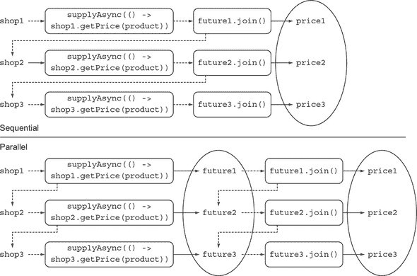

运行 列表 16.11 中的代码来检查 `findPrices` 方法的第三个版本的性能，你可能会得到如下输出：

```
[BestPrice price is 123.26, LetsSaveBig price is 169.47, MyFavoriteShop price
     is 214.13, BuyItAll price is 184.74]
Done in 2005 msecs
```

这个结果相当令人失望，不是吗？运行时间超过 2 秒，这个使用 `CompletableFuture` 的实现比 列表 16.8 中的原始天真顺序和阻塞实现要快，但它也几乎比之前使用并行流的实现慢一倍。考虑到你只是对顺序版本进行了微小的修改就得到了并行流版本，这更加令人失望。

新的 `CompletableFuture` 版本需要相当多的工作。但在这个场景中使用 `CompletableFuture` 是浪费时间吗？或者你忽略了一些重要的东西？在继续前进之前，花几分钟时间回想一下，你正在测试的代码样本是在一个能够并行运行四个线程的机器上运行的.^([1])

> ¹
> 
> 如果你使用的是能够并行运行更多线程的机器（比如，八个），你需要更多的商店和并行进程来重现这些页面上的行为。

#### 16.3.3\. 寻找更好的扩展性解决方案

并行流版本之所以表现良好，仅仅是因为它可以并行运行四个任务，因此可以为每个商店分配一个线程。如果你决定将第五个商店添加到你的最佳价格查找应用程序爬取的商店列表中，会发生什么呢？不出所料，顺序版本需要超过 5 秒的时间来运行，如下面的输出所示：

```
[BestPrice price is 123.26, LetsSaveBig price is 169.47, MyFavoriteShop price
     is 214.13, BuyItAll price is 184.74, ShopEasy price is 166.08]
Done in 5025 msecs                                                      *1*
```

+   ***1* 使用顺序流程序的输出**

不幸的是，并行流版本也比之前多了一秒钟，因为可以并行运行的四个线程（在公共线程池中可用）现在都在忙于处理前四家商店。第五个查询必须等待前一个操作完成以释放一个线程，如下所示：

```
[BestPrice price is 123.26, LetsSaveBig price is 169.47, MyFavoriteShop price
     is 214.13, BuyItAll price is 184.74, ShopEasy price is 166.08]
Done in 2167 msecs                                                      *1*
```

+   ***1* 使用并行流程序的输出**

那么`CompletableFuture`版本呢？用第五家商店试一试：

```
[BestPrice price is 123.26, LetsSaveBig price is 169.47, MyFavoriteShop price
     is 214.13, BuyItAll price is 184.74, ShopEasy price is 166.08]
Done in 2006 msecs                                                      *1*
```

+   ***1* 使用 CompletableFutures 程序的输出**

使用`CompletableFuture`版本的程序似乎比使用并行流的版本快一点，但这种版本也不令人满意。如果你尝试用九家商店运行你的代码，并行流版本需要 3143 毫秒，而`CompletableFuture`版本则需要 3009 毫秒。这两个版本看起来相当，原因很好：它们都内部使用相同的公共池，默认情况下具有与`Runtime.getRuntime().availableProcessors()`返回的线程数量相等的固定线程数。然而，`CompletableFuture`版本有一个优势：与并行`Streams` API 相比，它允许你指定一个不同的`Executor`来提交任务。你可以配置这个`Executor`，并调整其线程池的大小，使其更好地满足你应用程序的需求。在下一节中，你将把这个更好的可配置性转化为你应用程序的实际性能提升。

#### 16.3.4\. 使用自定义的 Executor

在这种情况下，创建一个具有考虑你应用程序中可能期望的实际工作负载的线程数的`Executor`似乎是一个明智的选择。你如何正确地调整这个`Executor`的大小？

|  |
| --- |

**调整线程池大小**

在伟大的书籍《Java 并发实践》（Addison-Wesley，2006 年；[`jcip.net`](http://jcip.net)）中，Brian Goetz 及其合著者提供了一些关于寻找线程池最佳大小的建议。这些建议很重要，因为如果池中的线程数太多，线程最终会竞争稀缺的 CPU 和内存资源，浪费它们的时间进行上下文切换。相反，如果这个数字太小（正如你应用程序中可能的那样），CPU 的一些核心将未被充分利用。Goetz 建议，你可以使用以下公式来计算正确的池大小，以近似所需的 CPU 使用率：

N^(threads) = N^(CPU) * U^(CPU) * (1 + W/C)

在这个公式中，NCPU 是通过`Runtime.getRuntime().availableProcessors()`可用的核心数。

+   U^(CPU) 是目标 CPU 使用率（介于 0 和 1 之间）。

+   W/C 是等待时间与计算时间的比率。

|  |
| --- |

应用程序大约有 99%的时间在等待商店的响应，因此你可以估计一个 W/C 比率为 100。如果你的目标是 100%的 CPU 使用率，你应该有一个包含 400 个线程的线程池。在实践中，拥有比商店更多的线程是浪费的，因为你将会有一些永远不会使用的线程。因此，你需要设置一个具有固定数量的线程的`Executor`，该数量等于你需要查询的商店数量，这样你就有每个商店一个线程。此外，设置一个上限为 100 个线程，以避免在商店数量较多时服务器崩溃，如下面的列表所示。

##### 列表 16.12\. 适用于最佳价格查找应用的定制`Executor`

```
private final Executor executor =
        Executors.newFixedThreadPool(Math.min(shops.size(), 100),   *1*
                                     (Runnable r) -> {
                Thread t = new Thread(r);
                t.setDaemon(true);                                  *2*
                return t;
            }
);
```

+   ***1* 创建一个包含与商店数量相同或小于 100 个线程的线程池。**

+   ***2* 使用守护线程，这不会阻止程序的终止。**

注意你正在创建一个由守护线程组成的线程池。Java 程序在正常线程执行时无法终止或退出，所以一个等待永远不会满足的事件的遗留线程会导致问题。相比之下，将线程标记为守护线程意味着程序终止时它可以被杀死。这没有性能差异。现在你可以将新的`Executor`作为`supplyAsync`工厂方法的第二个参数传递。此外，现在创建一个`CompletableFuture`，如下所示，以从给定的商店检索请求产品的价格：

```
CompletableFuture.supplyAsync(() -> shop.getName() + " price is " +
                                    shop.getPrice(product), executor);
```

经过这次改进，处理五个商店的`CompletableFuture`解决方案需要 1021 毫秒，处理九个商店需要 1022 毫秒。这种趋势一直持续到商店数量达到你之前计算的 400 个阈值。这个例子证明了创建一个适合你应用程序特性的`Executor`并使用`CompletableFuture`s 向其提交任务是一个好主意。这种策略几乎总是有效的，当你大量使用异步操作时，这是一个需要考虑的因素。

|  |
| --- |

**并行化：通过 Streams 还是 CompletableFutures？**

你已经看到了在集合上执行并行计算的两个方法：将集合转换为并行流并在其上使用如`map`之类的操作，或者遍历集合并在`CompletableFuture`中生成操作。后者通过调整线程池的大小提供更多控制，这确保了你的整体计算不会因为所有（固定数量的）线程都在等待 I/O 而阻塞。

我们使用这些 API 的建议如下：

+   如果你正在进行没有 I/O 的计算密集型操作，`Stream`接口提供了最简单的实现，也可能是最有效的实现。（如果所有线程都是计算密集型的，那么拥有比处理器核心更多的线程是没有意义的。）

+   如果你的并行工作单元涉及等待 I/O（包括网络连接），则`CompletableFuture`解决方案提供了更多的灵活性，并允许你匹配线程数与等待/计算机（W/C）比，如前所述。另一个避免在流处理管道中涉及 I/O 等待时使用并行流的原因是流的惰性可能会使得推理等待发生的时间更加困难。

|  |
| --- |

你已经学会了如何利用`CompletableFuture`为你的客户端提供一个异步 API，并作为同步但缓慢的服务器客户端，但你只在每个`Future`中执行了一个耗时的操作。在下一节中，你将使用`CompletableFuture`以声明式风格将多个异步操作管道化，这与你通过使用 Streams API 所学的类似。

### 16.4\. 管道化异步任务

假设所有商店都已同意使用集中式折扣服务。此服务使用五个折扣代码，每个代码都有一个不同的折扣百分比。你通过定义一个`Discount.Code`枚举来表示这个想法，如下所示。

##### 列表 16.13\. 定义折扣代码的枚举

```
public class Discount {
    public enum Code {
        NONE(0), SILVER(5), GOLD(10), PLATINUM(15), DIAMOND(20);
        private final int percentage;
        Code(int percentage) {
            this.percentage = percentage;
        }
    }
    // Discount class implementation omitted, see Listing 16.14
}
```

此外，假设商店已同意更改`getPrice`方法的格式，现在它返回一个格式为`ShopName:price:DiscountCode`的`String`。你的示例实现返回一个随机的`Discount.Code`以及已经计算出的随机价格，如下所示：

```
public String getPrice(String product) {
    double price = calculatePrice(product);
    Discount.Code code = Discount.Code.values()[
                            random.nextInt(Discount.Code.values().length)];
    return String.format("%s:%.2f:%s", name, price, code);
}
private double calculatePrice(String product) {
    delay();
    return random.nextDouble() * product.charAt(0) + product.charAt(1);
}
```

调用`getPrice`可能返回如下`String`：

```
BestPrice:123.26:GOLD
```

#### 16.4.1\. 实现折扣服务

你的最佳价格查找应用现在应该从商店获取价格；解析生成的`String`；并且，对于每个`String`，查询折扣服务器的需求。这个过程确定了所需产品的最终折扣价格。（与每个折扣代码相关联的实际折扣百分比可能会改变，这就是为什么每次都要查询服务器。）商店生成的`String`的解析封装在以下`Quote`类中：

```
public class Quote {
    private final String shopName;
    private final double price;
    private final Discount.Code discountCode;
    public Quote(String shopName, double price, Discount.Code code) {
        this.shopName = shopName;
        this.price = price;
        this.discountCode = code;
    }
    public static Quote parse(String s) {
        String[] split = s.split(":");
        String shopName = split[0];
        double price = Double.parseDouble(split[1]);
        Discount.Code discountCode = Discount.Code.valueOf(split[2]);
        return new Quote(shopName, price, discountCode);
    }
    public String getShopName() { return shopName; }
    public double getPrice() { return price; }
    public Discount.Code getDiscountCode() { return discountCode; }
}
```

你可以通过将商店生成的`String`传递给静态`parse`工厂方法来获取`Quote`类的实例——它包含商店的名称、未折扣的价格和折扣代码。

`Discount`服务还有一个`applyDiscount`方法，它接受一个`Quote`对象并返回一个`String`，声明了产生该报价的商店的折扣价格，如下所示。

##### 列表 16.14\. `Discount`服务

```
public class Discount {
    public enum Code {
        // source omitted ...
    }
    public static String applyDiscount(Quote quote) {
        return quote.getShopName() + " price is " +
               Discount.apply(quote.getPrice(),                 *1*
                              quote.getDiscountCode());
    }
    private static double apply(double price, Code code) {
        delay();                                                *2*
        return format(price * (100 - code.percentage) / 100);
    }
}
```

+   ***1* 将折扣代码应用于原始价格。**

+   ***2* 模拟折扣服务响应的延迟。**

#### 16.4.2\. 使用折扣服务

因为 `Discount` 服务是一个远程服务，你再次给它添加了 1 秒的模拟延迟，如下一列表所示。正如你在第 16.3 节中所做的那样，首先尝试重新实现 `findPrices` 方法，以最明显（但遗憾的是，是顺序和同步的）的方式适应这些新要求。

##### 列表 16.15\. 使用 `Discount` 服务实现的简单 `findPrices` 实现

```
public List<String> findPrices(String product) {
    return shops.stream()
            .map(shop -> shop.getPrice(product))       *1*
            .map(Quote::parse)                         *2*
            .map(Discount::applyDiscount)              *3*
            .collect(toList());
}
```

+   ***1* 从每个商店检索未折扣的价格。**

+   ***2* 将报价中商店返回的字符串转换为报价对象。**

+   ***3* 联系折扣服务以在每个报价上应用折扣。**

你通过在商店流上管道化三个 `map` 操作来获得期望的结果：

+   第一个操作将每个商店转换为一个 `String`，该字符串编码了该商店请求产品的价格和折扣代码。

+   第二个操作解析这些 `String`，将每个 `String` 转换为 `Quote` 对象。

+   第三个操作联系远程 `Discount` 服务，该服务计算最终折扣价格，并返回另一个包含该价格的商店名称的 `String`。

如你所想，这个实现的性能远非最佳。但像往常一样通过运行你的基准测试来尝试测量它：

```
[BestPrice price is 110.93, LetsSaveBig price is 135.58, MyFavoriteShop price
     is 192.72, BuyItAll price is 184.74, ShopEasy price is 167.28]
Done in 10028 msecs
```

如预期，这段代码运行需要 10 秒，因为查询五个商店所需的 5 秒加上折扣服务应用折扣代码到五个商店返回的价格上所消耗的 5 秒。你已经知道你可以通过将流转换为并行流来提高这个结果。但你也知道（从第 16.3 节中），当你增加要查询的商店数量时，这个解决方案的扩展性不好，因为流依赖于固定的公共线程池。相反，你了解到你可以通过定义一个自定义的 `Executor` 来更好地利用你的 CPU，该 `Executor` 调度 `CompletableFuture` 执行的任务。

#### 16.4.3\. 组合同步和异步操作

在本节中，你尝试异步重新实现 `findPrices` 方法，再次使用 `CompletableFuture` 提供的功能。下一列表显示了代码。如果你对某些东西看起来不熟悉，我们将在本节中解释代码。

##### 列表 16.16\. 使用 `CompletableFuture` 实现 `findPrices` 方法

```
public List<String> findPrices(String product) {
    List<CompletableFuture<String>> priceFutures =
        shops.stream()
             .map(shop -> CompletableFuture.supplyAsync(                   *1*
                                   () -> shop.getPrice(product), executor))
             .map(future -> future.thenApply(Quote::parse))                *2*
             .map(future -> future.thenCompose(quote ->                    *3*
                         CompletableFuture.supplyAsync(
                           () -> Discount.applyDiscount(quote), executor)))
                .collect(toList());
    return priceFutures.stream()
            .map(CompletableFuture::join)                                  *4*
            .collect(toList());
}
```

+   ***1* 异步从每个商店检索未折扣的价格。**

+   ***2* 当报价可用时，将商店返回的字符串转换为报价对象。**

+   ***3* 将结果 `Future` 与另一个异步任务组合，应用折扣代码。**

+   ***4* 等待流中的所有 `Future` 完成，并提取它们各自的结果。**

这次事情看起来有点复杂，所以尝试一步一步地理解正在发生的事情。图 16.3 描述了这三个转换的顺序。

##### 图 16.3\. 组合同步操作和异步任务

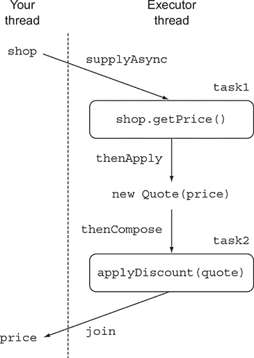

你正在执行与列表 16.15 中同步解决方案相同的三个`map`操作，但在必要时将这些操作异步化，使用`CompletableFuture`类提供的功能。

##### 获取价格

你已经在本章的各种示例中看到了这三个操作中的第一个；你通过传递一个 lambda 表达式到`supplyAsync`工厂方法来异步查询商店。第一次转换的结果是一个`Stream<CompletableFuture<String>>`，其中每个`CompletableFuture`在完成时都包含由相应商店返回的`String`。请注意，你使用在列表 16.12 中开发的自定义`Executor`配置了`CompletableFuture`。

##### 解析报价

现在你必须通过第二次转换将这些`String`转换为`Quote`。但由于这种解析操作没有调用任何远程服务或进行任何 I/O 操作，它可以几乎瞬间完成，并且可以同步执行而不引入任何延迟。因此，你通过在第一步生成的`CompletableFuture`s 上调用`thenApply`方法并传递一个将`String`转换为`Quote`实例的`Function`来实现这个第二次转换。

注意，使用`thenApply`方法不会阻塞你的代码，直到你调用的`CompletableFuture`完成。当`CompletableFuture`最终完成时，你想要通过传递给`then-Apply`方法的 lambda 表达式来转换它包含的值，从而将流中的每个`CompletableFuture<String>`转换为相应的`CompletableFuture<Quote>`。你可以将这个过程视为构建一个食谱，指定如何处理`CompletableFuture`的结果，就像你在处理流管道时一样。

##### 为计算折后价格而编写未来

第三次`map`操作涉及联系远程`Discount`服务，将商店收到的非折后价格应用适当的折扣百分比。这种转换与之前的不同，因为它需要在远程执行（或者在这种情况下，需要通过延迟模拟远程调用），因此，你也希望异步执行此操作。

为了实现这个目标，就像你用`getPrice`的第一个`supplyAsync`调用一样，你将这个操作作为一个 lambda 表达式传递给`supplyAsync`工厂方法，它返回另一个`CompletableFuture`。在这个时候，你有了两个异步操作，用两个不同的`CompletableFuture`建模，你想要按顺序执行：

+   从商店获取价格并将其转换为`Quote`。

+   将此`Quote`传递给`Discount`服务以获取最终折后价格。

Java 8 的`CompletableFuture` API 提供了专门用于此目的的`thenCompose`方法，允许你将两个异步操作串联起来，当第一个操作的结果可用时，将其传递给第二个操作。换句话说，你可以通过在第一个`CompletableFuture`上调用`thenCompose`方法并将一个`Function`传递给它来组合两个`CompletableFuture`。这个`Function`以第一个`CompletableFuture`完成时返回的值作为参数，并返回一个使用第一个的结果作为其计算输入的第二个`CompletableFuture`。请注意，使用这种方法时，虽然`Future`正在从商店检索报价，但主线程可以执行其他有用的操作，例如响应用户界面事件。

将这三个`map`操作产生的`Stream`的元素收集到一个`List`中，你得到一个`List<CompletableFuture<String>>`。最后，你可以通过使用`join`等待这些`CompletableFuture`的完成并提取它们的值，就像你在列表 16.11 中所做的那样。在列表 16.8 中实现的`findPrices`方法的新版本可能产生如下输出：

```
[BestPrice price is 110.93, LetsSaveBig price is 135.58, MyFavoriteShop price
     is 192.72, BuyItAll price is 184.74, ShopEasy price is 167.28]
Done in 2035 msecs
```

你在列表 16.16 中使用的`thenCompose`方法，就像`CompletableFuture`类的其他方法一样，有一个带有`Async`后缀的变体，即`thenComposeAsync`。一般来说，没有`Async`后缀的方法在其名称中将在前一个任务所在的线程中执行其任务，而以`Async`结尾的方法总是将后续任务提交到线程池，因此每个任务可以由不同的线程处理。在这种情况下，第二个`CompletableFuture`的结果依赖于第一个，因此使用此方法的任一变体对最终结果或其大致时间没有影响。你选择使用带有`thenCompose`的变体仅仅是因为它稍微更有效率，因为减少了线程切换的开销。然而，请注意，并不总是清楚使用的是哪个线程，特别是如果你运行一个管理自己的线程池的应用程序（如 Spring）。

#### 16.4.4. 组合两个 CompletableFutures：依赖性和独立性

在列表 16.16 中，你在第一个`CompletableFuture`上调用了`thenCompose`方法，并将第二个`CompletableFuture`传递给它，该`CompletableFuture`需要第一个执行的结果作为输入。在另一种常见情况下，你需要组合两个独立`CompletableFuture`执行的操作的结果，而且你不想在开始第二个操作之前等待第一个完成。

在这种情况下，使用`thenCombine`方法。此方法将`BiFunction`作为第二个参数，它定义了当两个`CompletableFuture`都可用时如何组合它们的结果。与`thenCompose`方法一样，`thenCombine`方法还有一个`Async`变体。在这种情况下，使用`thenCombineAsync`方法会导致由`BiFunction`定义的组合操作提交到线程池，并在单独的任务中异步执行。

转到本章的运行示例，你可能知道其中一家商店提供的价格是€（欧元），但你总是想以$(美元)的形式与客户沟通。你可以异步地询问商店给定产品的价格，并从远程汇率服务中单独检索€和$之间的当前汇率。在两个请求都完成后，你可以通过将价格乘以汇率来组合结果。使用这种方法，你将获得一个第三`CompletableFuture`，当两个`CompletableFuture`的结果都可用并且通过`BiFunction`组合时，它将完成，如下面的列表所示。

##### 列表 16.17\. 组合两个独立的`CompletableFuture`

```
Future<Double> futurePriceInUSD =
        CompletableFuture.supplyAsync(() -> shop.getPrice(product))       *1*
        .thenCombine(
            CompletableFuture.supplyAsync(
                () ->  exchangeService.getRate(Money.EUR, Money.USD)),    *2*
            (price, rate) -> price * rate                                 *3*
        ));
```

+   ***1* 创建一个任务，查询商店以获取产品的价格。**

+   ***2* 创建一个独立任务以检索美元和欧元之间的汇率转换率。**

+   ***3* 通过相乘将价格和汇率结合起来。**

在这种情况下，因为组合操作是一个简单的乘法，执行它将是一个资源的浪费，所以你需要使用`thenCombine`方法而不是其异步的`thenCombineAsync`对应方法。图 16.4 显示了列表 16.17 中创建的任务如何在池的不同线程上执行以及它们的结果是如何组合的。

##### 图 16.4\. 组合两个独立的异步任务


#### 16.4.5\. 关于 Future 与 CompletableFuture 的反思

在列表 16.16 和 16.17 的最后两个示例中，清楚地展示了`CompletableFuture`相对于其他 Java 8 之前的`Future`实现的最大优势之一。`CompletableFuture`使用 lambda 表达式提供声明式 API。此 API 允许你轻松组合和组合各种同步和异步任务，以最有效的方式执行复杂操作。为了更直观地了解`CompletableFuture`的代码可读性优势，尝试仅使用 Java 7 来获取列表 16.17 的结果。下一个列表将向您展示如何做到这一点。

##### 列表 16.18\. Java 7 中组合两个`Future`

```
ExecutorService executor = Executors.newCachedThreadPool();                *1*
final Future<Double> futureRate = executor.submit(new Callable<Double>() {
        public Double call() {
            return exchangeService.getRate(Money.EUR, Money.USD);          *2*
        }});
Future<Double> futurePriceInUSD = executor.submit(new Callable<Double>() {
        public Double call() {
            double priceInEUR = shop.getPrice(product);                    *3*
            return priceInEUR * futureRate.get();                          *4*
        }});
```

+   ***1* 创建一个 ExecutorService，允许你向线程池提交任务。**

+   ***2* 创建一个 Future，用于检索欧元和美元之间的汇率。**

+   ***3* 在第二个 Future 中找到给定商店请求产品的价格。**

+   ***4* 在用于查找价格的同一 Future 中乘以价格和汇率。**

在列表 16.18 中，你创建了一个第一个`Future`，向`Executor`提交一个`Callable`以查询外部服务以找到 EUR 和 USD 之间的汇率。然后你创建了一个第二个`Future`，检索给定商店请求产品的 EUR 价格。最后，正如你在列表 16.17 中所做的那样，你将汇率乘以 EUR 价格，在同一 future 中查询商店以检索 EUR 价格。请注意，在列表 16.17 中使用`thenCombineAsync`而不是`thenCombine`将与在列表 16.18 中执行第三个`Future`中的价格乘以汇率相等效。这两种实现之间的差异可能看起来很小，只是因为你正在组合两个`Future`。

#### 16.4.6\. 有效使用超时


如第 16.2.2 节中所述，在尝试读取`Future`计算出的值时指定超时总是一个好主意，以避免在等待该值的计算时被无限期地阻塞。Java 9 引入了一些方便的方法，这些方法丰富了`CompletableFuture`提供的超时功能。`orTimeout`方法使用`ScheduledThreadExecutor`在指定超时时间过后，用`TimeoutException`完成`CompletableFuture`，并返回另一个`CompletableFuture`。通过使用此方法，你可以进一步连接你的计算管道，并通过提供友好的消息来处理`TimeoutException`。你可以在列表 16.17 中的`Future`上添加超时，并在方法链的末尾添加此方法，以在 3 秒后未完成时抛出`TimeoutException`，如下一列表所示。当然，超时持续时间应与你的业务需求相匹配。

##### 列表 16.19\. 向`CompletableFuture`添加超时

```
Future<Double> futurePriceInUSD =
        CompletableFuture.supplyAsync(() -> shop.getPrice(product))
        .thenCombine(
            CompletableFuture.supplyAsync(
                () ->  exchangeService.getRate(Money.EUR, Money.USD)),
            (price, rate) -> price * rate
        ))
        .orTimeout(3, TimeUnit.SECONDS);        *1*
```

+   ***1* 如果在 3 秒后未完成，让 Future 抛出 Timeout-Exception。Java 9 中增加了异步超时管理。**

有时，如果服务暂时无法及时响应，使用默认值也是可以接受的。你可能会决定在列表 16.19 中，你希望等待交易所提供当前 EUR 兑 USD 的汇率不超过 1 秒，但如果请求需要更长的时间来完成，你不想因为一个`Exception`而终止整个计算。相反，你可以通过使用预定义的汇率来回退。你可以通过使用`completeOnTimeout`方法轻松地添加这种第二种超时，该方法也是在 Java 9 中引入的（以下列表）。

##### 列表 16.20\. 超时后使用默认值完成`CompletableFuture`

```
Future<Double> futurePriceInUSD =
        CompletableFuture.supplyAsync(() -> shop.getPrice(product))
        .thenCombine(
            CompletableFuture.supplyAsync(
                () ->  exchangeService.getRate(Money.EUR, Money.USD))
              .completeOnTimeout(DEFAULT_RATE, 1, TimeUnit.SECONDS),      *1*
            (price, rate) -> price * rate
        ))
        .orTimeout(3, TimeUnit.SECONDS);
```

+   ***1* 如果汇率服务在 1 秒内不提供结果，使用默认汇率。**

与`orTimeout`方法一样，`completeOnTimeOut`方法返回一个`CompletableFuture`，因此你可以将其与其他`CompletableFuture`方法链式调用。为了回顾，你已经配置了两种类型的超时：一种是在整个计算超过 3 秒时使整个计算失败，另一种是在 1 秒后过期，但用预定的值完成`Future`而不是导致失败。

你几乎完成了你的最佳价格查找应用程序，但仍然缺少一个成分。你希望用户一有可用价格就能看到商店提供的价格（就像汽车保险和航班比较网站通常所做的那样），而不是像你现在所做的那样等待所有价格请求完成。在下一节中，你将了解如何通过响应`CompletableFuture`的完成而不是对其调用`get`或`join`来达到这个目标，从而避免在`CompletableFuture`本身完成之前被阻塞。

### 16.5\. 响应 CompletableFuture 的完成

在本章中你看到的所有代码示例中，你都模拟了具有 1 秒延迟的远程调用方法。在现实世界的场景中，你需要从你的应用程序中联系到的远程服务可能由于服务器负载、网络延迟等因素而具有不可预测的延迟，也许还因为服务器认为你的应用程序的业务价值与支付更多查询费用的应用程序相比如何。

由于这些原因，你想要购买的产品价格可能在某些商店比其他商店更早可用。在下一列表中，你通过引入 0.5 到 2.5 秒的随机延迟来模拟这种场景，使用`randomDelay`方法而不是等待 1 秒的`delay`方法。

##### 列表 16.21\. 模拟 0.5 到 2.5 秒随机延迟的方法

```
private static final Random random = new Random();
public static void randomDelay() {
    int delay = 500 + random.nextInt(2000);
    try {
        Thread.sleep(delay);
    } catch (InterruptedException e) {
        throw new RuntimeException(e);
    }
}
```

到目前为止，你已经实现了`findPrices`方法，使其仅在所有商店的价格都可用时显示价格。现在你希望最佳价格查找应用程序能够在给定商店的价格一有可用就显示，而不必等待最慢的那个（甚至可能超时）。你如何实现这一进一步的改进？

#### 16.5.1\. 重构最佳价格查找应用程序

首先要避免的是等待包含所有价格的`List`的创建。你需要直接与`CompletableFuture`的流一起工作，其中每个`CompletableFuture`正在执行给定商店所需的操作序列。在下一列表中，你将实现的第一部分重构为`findPricesStream`方法，以生成这个`CompletableFuture`的流。

##### 列表 16.22\. 重构`findPrices`方法以返回一个`Future`流

```
public Stream<CompletableFuture<String>> findPricesStream(String product) {
    return shops.stream()
             .map(shop -> CompletableFuture.supplyAsync(
                                   () -> shop.getPrice(product), executor))
             .map(future -> future.thenApply(Quote::parse))
             .map(future -> future.thenCompose(quote ->
                      CompletableFuture.supplyAsync(
                          () -> Discount.applyDiscount(quote), executor)));
}
```

在这一点上，你将一个第四个 `map` 操作添加到 `findPricesStream` 方法返回的 `Stream` 上，该方法中已经执行了三个操作。这个新操作在每个 `CompletableFuture` 上注册一个动作；这个动作在 `CompletableFuture` 完成时立即消费其值。Java 8 的 `CompletableFuture` API 通过 `thenAccept` 方法提供了这个功能，该方法接受一个 `Consumer` 作为参数，该 `Consumer` 消费其完成的值。在这种情况下，这个值是由折扣服务返回的 `String`，其中包含商店的名称以及该商店请求产品的折扣价格。你想要执行的唯一动作是打印这个值：

```
findPricesStream("myPhone").map(f -> f.thenAccept(System.out::println));
```

正如你在 `thenCompose` 和 `thenCombine` 方法中看到的，`thenAccept` 方法有一个名为 `thenAcceptAsync` 的 `Async` 变体。`Async` 变体将传递给它的 `Consumer` 的执行调度到线程池中的新线程上，而不是使用完成 `CompletableFuture` 的相同线程直接执行。因为你想要避免不必要的上下文切换，并且（更重要的是）你想要尽快对 `CompletableFuture` 的完成做出反应，而不是等待新线程可用，所以在这里不使用这个变体。

因为 `thenAccept` 方法已经指定了当 `CompletableFuture` 可用时如何消费其产生的结果，所以它返回一个 `CompletableFuture<Void>`。因此，`map` 操作返回一个 `Stream<CompletableFuture<Void>>`。对于 `CompletableFuture<Void>`，除了等待其完成之外，你几乎无法做任何事情，但这正是你所需要的。你还想给最慢的商店一个机会来提供其响应并打印其返回的价格。为此，你可以将流中的所有 `CompletableFuture<Void>` 放入一个数组中，然后等待它们全部完成，就像在下面的列表中所展示的那样。

##### 列表 16.23\. 对 `CompletableFuture` 完成做出反应

```
CompletableFuture[] futures = findPricesStream("myPhone")
        .map(f -> f.thenAccept(System.out::println))
        .toArray(size -> new CompletableFuture[size]);
CompletableFuture.allOf(futures).join();
```

`allOf` 工厂方法接受一个 `CompletableFuture` 数组作为输入，并返回一个 `CompletableFuture<Void>`，只有当传递的所有 `CompletableFuture` 都已完成时才会完成。在 `allOf` 方法返回的 `CompletableFuture` 上调用 `join` 提供了一种等待原始流中所有 `CompletableFuture` 完成的简单方法。这种技术在最佳价格查找应用程序中很有用，因为它可以显示一条消息，例如 `所有商店都返回了结果或超时`，这样用户就不会继续想知道是否还有更多的价格可能变得可用。

在其他应用程序中，您可能只想等待数组中`CompletableFuture`的完成，例如，如果您正在咨询两个货币兑换服务器，并且对第一个响应的结果感到满意，您可以使用`anyOf`工厂方法。作为一个细节，此方法接受一个`CompletableFuture`数组作为输入，并返回一个`CompletableFuture<Object>`，它以第一个完成的`CompletableFuture`的相同值完成。

#### 16.5.2\. 将所有内容整合在一起

如在第 16.5 节开头所述，现在假设所有模拟远程调用的方法都使用列表 16.21 中的`randomDelay`方法，引入介于 0.5 到 2.5 秒之间的随机延迟，而不是 1 秒的延迟。使用此更改运行列表 16.23 中的代码，您会发现商店提供的价格不会像之前那样同时出现，而是随着给定商店的折扣价格可用而逐步打印。为了使此更改的结果更明显，代码略有修改，以报告每个价格计算所需的时间戳：

```
long start = System.nanoTime();
CompletableFuture[] futures = findPricesStream("myPhone27S")
        .map(f -> f.thenAccept(
             s -> System.out.println(s + " (done in " +
                  ((System.nanoTime() - start) / 1_000_000) + " msecs)")))
        .toArray(size -> new CompletableFuture[size]);
CompletableFuture.allOf(futures).join();
System.out.println("All shops have now responded in "
                   + ((System.nanoTime() - start) / 1_000_000) + " msecs");
```

运行此代码会产生类似于以下内容的输出：

```
BuyItAll price is 184.74 (done in 2005 msecs)
MyFavoriteShop price is 192.72 (done in 2157 msecs)
LetsSaveBig price is 135.58 (done in 3301 msecs)
ShopEasy price is 167.28 (done in 3869 msecs)
BestPrice price is 110.93 (done in 4188 msecs)
All shops have now responded in 4188 msecs
```

您可以看到，由于随机延迟的影响，第一个价格现在打印的速度比最后一个快两倍以上！

### 16.6\. 路线图

第十七章探讨了 Java 9 Flow API，该 API 通过启用计算在可选终止之前产生一系列值，从而泛化了`Computable-Future`（一次性，要么计算要么带有值的终止）的概念。

### 摘要

+   通过使用异步任务执行相对较长的操作可以提高应用程序的性能和响应速度，尤其是如果它依赖于一个或多个远程外部服务。

+   您应该考虑为您的客户端提供一个异步 API。您可以通过使用`CompletableFuture`的特性轻松实现一个。

+   `CompletableFuture`允许您传播和管理异步任务中生成的错误。

+   您可以通过将同步 API 的调用包装在`CompletableFuture`中，异步地从同步 API 中消费。

+   当多个异步任务独立且其中一个的结果用作另一个的输入时，您可以组合或合并多个异步任务。

+   您可以在`CompletableFuture`上注册一个回调，以便在`Future`完成并且其结果可用时，反应性地执行一些代码。

+   您可以确定`CompletableFuture`列表中所有值何时完成，或者您可以只等待第一个完成。

+   Java 9 通过`orTimeout`和`completeOnTimeout`方法在`CompletableFuture`上添加了对异步超时的支持。

## 第十七章\. 响应式编程


*本章涵盖*

+   定义响应式编程并讨论响应式宣言的原则

+   应用程序和系统级别的响应式编程

+   使用响应式流和 Java 9 Flow API 展示示例代码

+   介绍广泛使用的响应式库 RxJava

+   探索 RxJava 操作以转换和组合多个响应式流

+   展示文档化响应式流操作的宝石图

在我们深入探讨响应式编程是什么以及它是如何工作的之前，澄清为什么这种新范例越来越重要是有帮助的。几年前，最大的应用程序有数十台服务器和数 GB 的数据；几秒钟的响应时间和以小时计的离线维护时间被认为是可接受的。如今，这种情况正在迅速变化，至少有三个原因：

+   **大数据**—大数据通常以 PB（拍字节）为单位，并且每天都在增加。

+   **异构环境**—应用程序被部署在从移动设备到运行数千个多核处理器的基于云的集群的多种环境中。

+   **使用模式**—用户期望毫秒级响应时间和 100%的在线时间。

这些变化意味着今天的需求无法通过昨天的软件架构得到满足。这种情况在移动设备成为互联网流量最大来源的今天尤为明显，而在不久的将来，当这种流量被物联网（IoT）所超越时，情况只会变得更糟。

响应式编程通过允许你以异步方式处理和组合来自不同系统和来源的数据项流来解决这些问题。事实上，遵循这种范例编写的应用程序会对发生的数据项做出反应，这使得它们在与用户的交互中更加响应。此外，响应式方法不仅可以应用于构建单个组件或应用程序，还可以应用于将许多组件协调成一个完整的响应式系统。以这种方式构建的系统可以在不同的网络条件下交换和路由消息，在考虑故障和中断的情况下提供高负载下的可用性。（请注意，尽管开发者传统上认为他们的系统或应用程序是由组件构建的，但在这种新的混合风格中，松散耦合的系统构建方式，这些组件往往是完整的应用程序本身。因此，“组件”和“应用程序”几乎是同义词。）

响应式应用程序和系统的特征和优势在下一节讨论的响应式宣言中得到了体现。

### 17.1. 响应式宣言

响应式宣言（[`www.reactivemanifesto.org`](https://www.reactivemanifesto.org)）——由 Jonas Bonér、Dave Farley、Roland Kuhn 和 Martin Thompson 于 2013 年和 2014 年开发——为开发响应式应用程序和系统制定了一套核心原则。宣言确定了四个特征：

+   ***响应性***—**反应式系统具有快速且更重要的是一致、可预测的响应时间。因此，用户知道可以期待什么。这一事实反过来又增加了用户的信心，这无疑是可用应用程序的关键方面。

+   ***弹性***—**一个系统必须在出现故障的情况下保持响应性。反应式宣言建议了不同的技术来实现弹性，包括复制组件的执行、在时间（发送者和接收者有独立的生命周期）和空间（发送者和接收者运行在不同的进程中）上解耦这些组件，以及让每个组件异步地将任务委托给其他组件。

+   ***弹性***—**另一个损害应用程序响应性的问题是，它们在其生命周期内可能会受到不同的工作负载的影响。反应式系统被设计为能够自动对更重的工作负载做出反应，通过增加分配给受影响组件的资源数量。

+   ***消息驱动***—**弹性和弹性要求构成系统的组件的边界清晰定义，以确保松散耦合、隔离和位置透明。这些边界之间的通信是通过异步消息传递来完成的。这种选择既实现了弹性（通过将故障作为消息委托）又实现了弹性（通过监控交换的消息数量，然后相应地扩展管理这些资源的资源数量）。

图 17.1 展示了这四个特性是如何相互关联和依赖的。这些原则在不同的尺度上都是有效的，从小型应用程序的内部结构到确定这些应用程序如何协调以构建大型系统。然而，关于应用这些想法的粒度级别的具体问题，值得进一步详细讨论。

##### 图 17.1\. 反应式系统的关键特性

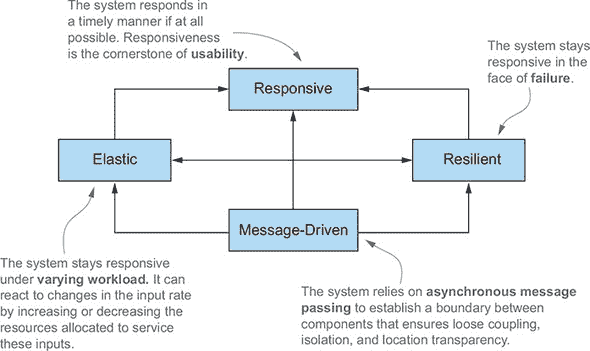

#### 17.1.1\. 应用级别的反应式

反应式编程在应用级组件中的主要特性允许异步执行任务。正如我们在本章的其余部分所讨论的，以异步和非阻塞的方式处理事件流对于最大化现代多核 CPU 的使用率至关重要，更确切地说，对于竞争使用它们的线程至关重要。为了实现这一目标，反应式框架和库在较轻的构造（如未来、演员；以及更常见的）事件循环中共享线程（相对昂贵且稀缺的资源），这些事件循环分发一系列回调，旨在聚合、转换和管理要处理的事件。

|  |
| --- |

**背景知识检查**

如果你对于诸如*事件*、*消息*、*信号*和*事件循环*（或*发布-订阅*、*监听器*和*背压*，这些将在本章后面使用）等术语感到困惑，请阅读第十五章中的温和介绍。如果不，请继续阅读。

| |
| --- |

这些技术不仅比线程更便宜，而且从开发者的角度来看还有一个主要优势：它们提高了实现并发和异步应用程序的抽象级别，使开发者能够专注于业务需求，而不是处理低级多线程问题（如同步、竞态条件和死锁）的典型问题。

在使用这些线程多路复用策略时，最重要的是永远不要在主事件循环中执行阻塞操作。将所有 I/O 密集型操作（如访问数据库或文件系统或调用可能需要很长时间或不可预测时间完成的远程服务）视为阻塞操作是有帮助的。通过提供一个实际例子来解释为什么你应该避免阻塞操作，既容易又有趣。

想象一个简化但典型的多路复用场景，其中有两个线程的线程池处理三个事件流。同时只能处理两个流，并且流必须尽可能公平和高效地竞争这两个线程。现在假设处理一个流的事件触发一个可能缓慢的 I/O 操作，例如通过阻塞 API 写入文件系统或从数据库检索数据。如图 17.2 图 17.2 所示，在这种情况下，线程 2 无谓地阻塞等待 I/O 操作完成，因此尽管线程 1 可以处理第一个流，但在阻塞操作完成之前，第三个流无法被处理。

##### 图 17.2\. 一个阻塞操作无谓地占用线程，阻止它执行其他计算。

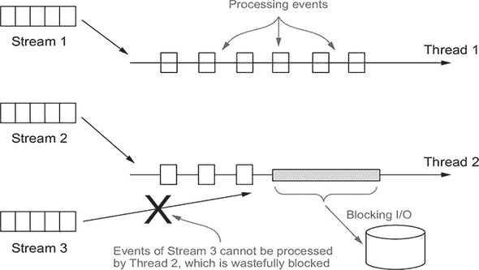

为了克服这个问题，大多数响应式框架（如 RxJava 和 Akka）允许通过一个单独的专用线程池来执行阻塞操作。主线程池中的所有线程都可以不间断地运行，保持 CPU 的所有核心以尽可能高的使用率运行。为 CPU 密集型和 I/O 密集型操作保留单独的线程池还有进一步的优点，即允许你以更精细的粒度对线程池进行大小和配置，并更精确地监控这两种类型任务的性能。

通过遵循响应式原则来开发应用程序只是响应式编程的一个方面，而且往往甚至不是最困难的。拥有一套设计精美的响应式应用程序，在独立运行时效率高，至少与使它们在一个协调良好的响应式系统中协作一样重要。

#### 17.1.2\. 系统级别的响应式

一个**反应式系统**是一种软件架构，它允许多个应用程序作为一个单一、连贯、弹性的平台协同工作，同时也允许这些应用程序足够解耦，以至于当其中一个失败时，不会导致整个系统崩溃。反应式应用程序和系统之间的主要区别在于，前者通常基于短暂的数据流进行计算，被称为事件驱动。后者旨在组合应用程序并促进通信。具有这种特性的系统通常被称为消息驱动系统。

消息和事件之间的另一个重要区别是，消息是针对一个定义明确的单一目的地，而事件是事实，将被注册以观察它们的组件接收。在反应式系统中，这些消息也必须是异步的，以保持发送和接收操作与发送者和接收者之间的解耦。这种解耦是组件之间完全隔离的要求，对于在故障（弹性）和重负载（弹性）下保持系统**响应性**是基本的。

更精确地说，通过隔离发生故障的组件，以防止故障传播到相邻组件，并从那里以灾难性的级联方式传播到整个系统，从而在反应式架构中实现弹性。在这种反应式意义上，弹性不仅仅是容错。系统不会优雅地退化，而是通过隔离故障并使系统恢复到健康状态，从而完全恢复。这种“魔法”是通过包含错误并将它们作为消息发送到其他作为监督者的组件来实现的。通过这种方式，可以从失败组件外部安全的环境中执行问题的管理。

由于隔离和解耦对于弹性至关重要，弹性主要是由*位置透明性*实现的，它允许反应式系统的任何组件与任何其他服务通信，无论接收者位于何处。位置透明性反过来又允许系统根据当前的工作负载复制和（自动）扩展任何应用程序。这种位置无关的扩展显示了反应式应用程序（异步、并发和解耦）和反应式系统（可以通过位置透明性在空间上解耦）之间的另一个区别。

在本章的其余部分，你将通过一些反应式编程的示例将这些想法付诸实践，特别是你将探索 Java 9 的 Flow API。

### 17.2. 反应式流和 Flow API

*反应式编程* 是一种使用反应式流的编程方式。反应式流是一种基于发布-订阅（或 pub-sub）协议（在第十五章中解释）的标准技术，用于异步、按顺序处理可能无界的数据流，并带有强制性的非阻塞背压。背压是发布-订阅中用于防止流中事件慢消费者被一个或多个更快生产者压垮的流量控制机制。当这种情况发生时，处于压力下的组件失败或无序地丢弃事件是不可接受的。该组件需要一种方式来请求上游生产者减速，或者告诉它们在接收更多数据之前可以接受和处理的特定时间内的数据量。

值得注意的是，内置背压的要求是由流处理异步性质所证明的。事实上，当执行同步调用时，系统会隐式地通过阻塞 API 进行背压。不幸的是，这种情况阻止你执行任何其他有用的任务，直到阻塞操作完成，因此你最终会浪费大量资源等待。相反，使用异步 API 可以最大化硬件的使用率，但会面临压垮某些其他较慢下游组件的风险。在这种情况下，背压或流量控制机制就派上用场了；它们建立了一种协议，防止数据接收者被压垮，而不需要阻塞任何线程。

这些要求和它们所隐含的行为被总结在反应式流项目（Reactive Streams^([1]))中，该项目涉及 Netflix、Red Hat、Twitter、Lightbend 和其他公司的工程师，并产生了四个相互关联的接口的定义，这些接口代表了任何反应式流实现必须提供的最小功能集。这些接口现在是 Java 9 的一部分，嵌套在新的`java.util.concurrent.Flow`类中，并由许多第三方库实现，包括 Akka Streams（Lightbend）、Reactor（Pivotal）、RxJava（Netflix）和 Vert.x（Red Hat）。在下一节中，我们将详细检查这些接口声明的方法，并阐明它们预期如何用于表达反应式组件。

> ¹
> 
> 我们为反应式流项目命名，但使用反应式流的概念。

#### 17.2.1. 介绍 Flow 类

Java 9 为反应式编程添加了一个新类：`java.util.concurrent.Flow`。这个类只包含静态组件，不能被实例化。`Flow` 类包含四个嵌套接口，用于表达反应式编程的发布-订阅模型，该模型由反应式流项目标准化：

+   发布者

+   订阅者

+   订阅

+   处理器

`Flow` 类允许通过相关接口和静态方法建立受控流组件，其中 `Publisher` 产生由一个或多个 `Subscriber` 消费的项目，每个 `Subscriber` 都由一个 `Subscription` 管理。`Publisher` 是一个提供可能无界序列事件的提供者，但它受到背压机制的约束，必须根据从其 `Subscriber`(s) 收到的需求来产生它们。`Publisher` 是一个 Java 函数式接口（仅声明一个抽象方法），允许 `Subscriber` 将自己注册为 `Publisher` 发出事件的监听器；`Publisher` 和 `Subscriber` 之间的流控制，包括背压，由 `Subscription` 管理。这三个接口，连同 `Processor` 接口，在 列表 17.1、17.2、17.3 和 17.4 中列出。

##### 列表 17.1\. `Flow.Publisher` 接口

```
@FunctionalInterface
public interface Publisher<T> {
    void subscribe(Subscriber<? super T> s);
}
```

在另一方面，`Subscriber` 接口有四个回调方法，当 `Publisher` 产生相应的事件时，由 `Publisher` 调用。

##### 列表 17.2\. `Flow.Subscriber` 接口

```
public interface Subscriber<T> {
    void onSubscribe(Subscription s);
    void onNext(T t);
    void onError(Throwable t);
    void onComplete();
}
```

这些事件必须严格按照此协议定义的顺序发布（并调用相应的方法）：

```
onSubscribe onNext* (onError | onComplete)?
```

这种表示法意味着 `onSubscribe` 总是作为第一个事件被调用，随后是任意数量的 `onNext` 信号。事件流可以无限进行，或者可以通过 `onComplete` 回调来终止，表示不再产生更多元素，或者通过 `onError` 如果 `Publisher` 遇到失败。（与从终端读取字符串或文件结束或 I/O 错误的指示进行比较。）

当 `Subscriber` 在 `Publisher` 上注册时，`Publisher` 的第一个动作是调用 `onSubscribe` 方法来返回一个 `Subscription` 对象。`Subscription` 接口声明了两个方法。`Subscriber` 可以使用第一个方法来通知 `Publisher` 它已准备好处理给定数量的事件；第二个方法允许它取消 `Subscription`，从而告诉 `Publisher` 它不再感兴趣接收其事件。

##### 列表 17.3\. `Flow.Subscription` 接口

```
public interface Subscription {
    void request(long n);
    void cancel();
}
```

Java 9 流规范定义了一套规则，通过这些规则这些接口的实现应该相互协作。这些规则可以总结如下：

+   `Publisher` 必须向 `Subscriber` 发送不超过 `Subscription` 的 `request` 方法指定的元素数量。然而，`Publisher` 可以发送少于请求的 `onNext` 并通过调用 `onComplete` 来终止 `Subscription`，如果操作成功或通过 `onError` 如果它失败。在这些情况下，当达到终端状态（`onComplete` 或 `onError`）时，`Publisher` 不能向其 `Subscriber`s 发送任何其他信号，并且必须认为 `Subscription` 已被取消。

+   `Subscriber` 必须通知 `Publisher` 它已准备好接收和处理 `n` 个元素。通过这种方式，`Subscriber` 对 `Publisher` 实施反向压力，防止 `Subscriber` 被过多的管理事件所淹没。此外，当处理 `onComplete` 或 `onError` 信号时，`Subscriber` 不被允许在 `Publisher` 或 `Subscription` 上调用任何方法，并且必须认为 `Subscription` 已被取消。最后，`Subscriber` 必须准备好在没有先前的 `Subscription.request()` 方法调用的情况下接收这些终端信号，甚至在调用 `Subscription.cancel()` 之后也要接收一个或多个 `onNext`。

+   `Subscription` 由一个 `Publisher` 和一个 `Subscriber` 共享，并代表它们之间独特的关系。因此，它必须允许 `Subscriber` 从 `onSubscribe` 和 `onNext` 方法中同步调用其 `request` 方法。标准指定 `Subscription.cancel()` 方法的实现必须是幂等的（重复调用与单次调用具有相同的效果）并且线程安全的，这样，在第一次调用之后，对 `Subscription` 的任何其他附加调用都没有效果。调用此方法要求 `Publisher` 最终放弃对相应 `Subscriber` 的任何引用。不建议使用相同的 `Subscriber` 对象重新订阅，但规范没有规定在这种情况下抛出异常，因为所有之前取消的订阅都必须无限期地存储。

 展示了实现 Flow API 定义的接口的应用程序的典型生命周期。

##### 图 17.3\. 使用 Flow API 的反应式应用程序的生命周期

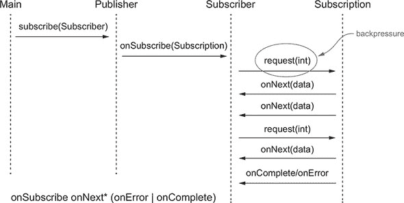

`Flow` 类的第四个也是最后一个成员是 `Processor` 接口，它扩展了 `Publisher` 和 `Subscriber` 接口，而不需要任何额外的函数。

##### 列表 17.4\. `Flow.Processor` 接口

```
public interface Processor<T, R> extends Subscriber<T>, Publisher<R> { }
```

实际上，此接口代表了通过反应式流处理的事件的转换阶段。当收到错误时，`Processor` 可以选择从中恢复（然后认为 `Subscription` 已被取消）或立即将 `onError` 信号传播给其 `Subscriber`(s)。当最后一个 `Subscriber` 取消其 `Subscription` 时，`Processor` 应取消其上游 `Subscription` 以传播取消信号（即使规范没有严格要求这样做）。

Java 9 的 `Flow` API/Reactive Streams API 要求任何 `Subscriber` 接口所有方法的实现都不应该阻塞 `Publisher`，但它没有指定这些方法应该同步还是异步地处理事件。然而，请注意，这些接口定义的所有方法都返回 `void`，这样就可以完全异步地实现。

在接下来的这一节中，你将通过一个简单实用的例子来运用到目前为止所学到的知识。

#### 17.2.2\. 创建你的第一个反应式应用程序

在`Flow`类中定义的接口，在大多数情况下，并不是直接实现的。不寻常的是，Java 9 库也没有提供实现它们的类！这些接口是由我们之前提到的反应式库（Akka、RxJava 等）实现的。Java 9 对`java.util.concurrency.Flow`的规范既是一个所有这些库都必须遵守的合同，也是一个通用语言，允许基于不同反应式库开发的应用程序相互合作和通信。此外，这些反应式库通常提供更多功能（类和方法，这些类和方法可以转换和合并反应式流，而不仅仅是`java.util.concurrency.Flow`接口指定的最小子集）。

话虽如此，直接在 Java 9 的`Flow` API 之上开发第一个反应式应用程序是有意义的，以了解前面几节讨论的四个接口是如何协同工作的。为此，你将编写一个简单的温度报告程序，使用反应式原则。这个程序有两个组件：

+   `TempInfo`，模拟一个远程温度计（不断报告 0 到 99 华氏度之间随机选择的温度，这对于大多数美国城市来说很合适）

+   `TempSubscriber`，它监听这些报告并打印安装在特定城市中的传感器报告的温度流

第一步是定义一个简单的类，用于传达当前报告的温度，如下面的列表所示。

##### 列表 17.5\. 一个传达当前报告温度的 Java Bean

```
import java.util.Random;

public class TempInfo {

    public static final Random random = new Random();

    private final String town;
    private final int temp;

    public TempInfo(String town, int temp) {
        this.town = town;
        this.temp = temp;
    }

    public static TempInfo fetch(String town) {              *1*
        if (random.nextInt(10) == 0)                         *2*
            throw new RuntimeException("Error!");
        return new TempInfo(town, random.nextInt(100));      *3*
    }

    @Override
    public String toString() {
        return town + " : " + temp;
    }

    public int getTemp() {
        return temp;
    }

    public String getTown() {
        return town;
    }
}
```

+   ***1* 通过静态工厂方法创建给定城镇的 TempInfo 实例。**

+   ***2* 获取当前温度可能会在十次中随机失败一次。**

+   ***3* 返回 0 到 99 华氏度范围内的随机温度**

在定义了这个简单的领域模型之后，你可以实现一个针对特定城镇温度的`Subscription`，每当其`Subscriber`请求报告时，就会发送温度报告，如下面的列表所示。

##### 列表 17.6\. 一个向其`Subscriber`发送`TempInfo`流的`Subscription`

```
import java.util.concurrent.Flow.*;

public class TempSubscription implements Subscription {

    private final Subscriber<? super TempInfo> subscriber;
    private final String town;

    public TempSubscription( Subscriber<? super TempInfo> subscriber,
                             String town ) {
        this.subscriber = subscriber;
        this.town = town;
    }

    @Override
    public void request( long n ) {
        for (long i = 0L; i < n; i++) {                         *1*
            try {
                subscriber.onNext( TempInfo.fetch( town ) );    *2*
            } catch (Exception e) {
                subscriber.onError( e );                        *3*
                break;
            }
        }
    }

    @Override
    public void cancel() {
        subscriber.onComplete();                                *4*
    }
}
```

+   ***1* 每次由 Subscriber 发起的请求中循环一次**

+   ***2* 将当前温度发送给 Subscriber**

+   ***3* 在获取温度失败的情况下，将错误传播给 Subscriber**

+   ***4* 如果取消订阅，向 Subscriber 发送完成（onComplete）信号。**

下一步是创建一个`Subscriber`，每次它接收到新元素时，都会打印从`Subscription`接收到的温度，并请求新的报告，如下面的列表所示。

##### 列表 17.7\. 一个打印接收到的温度的`Subscriber`

```
import java.util.concurrent.Flow.*;

public class TempSubscriber implements Subscriber<TempInfo> {

    private Subscription subscription;

    @Override
    public void onSubscribe( Subscription subscription ) {   *1*
        this.subscription = subscription;
        subscription.request( 1 );
    }

    @Override
    public void onNext( TempInfo tempInfo ) {                *2*
        System.out.println( tempInfo );
        subscription.request( 1 );
    }

    @Override
    public void onError( Throwable t ) {                     *3*
        System.err.println(t.getMessage());
    }

    @Override
    public void onComplete() {
        System.out.println("Done!");
    }
}
```

+   ***1* 存储订阅并发送第一个请求**

+   ***2* 打印接收到的温度并请求进一步的一个**

+   ***3* 在出错时打印错误信息**

下一个列表展示了如何使用创建 `Publisher` 并通过 `TempSubscriber` 订阅到它的 `Main` 类来使你的响应式应用程序工作。

##### 列表 17.8\. 创建一个 `main` 类：创建一个 `Publisher` 并将 `TempSubscriber` 订阅到它

```
import java.util.concurrent.Flow.*;

public class Main {
    public static void main( String[] args ) {
        getTemperatures( "New York" ).subscribe( new TempSubscriber() );   *1*
    }

    private static Publisher<TempInfo> getTemperatures( String town ) {    *2*
        return subscriber -> subscriber.onSubscribe(
                                new TempSubscription( subscriber, town ) );
    }
}
```

+   ***1* 创建一个新的纽约温度 `Publisher` 并将 `TempSubscriber` 订阅到它**

+   ***2* 返回一个向订阅它的订阅者发送 `TempSubscription` 的 `Publisher**`

在这里，`getTemperatures` 方法返回一个接受 `Subscriber` 作为参数并调用其 `onSubscribe` 方法的 lambda 表达式，并将一个新的 `TempSubscription` 实例传递给它。因为这个 lambda 的签名与 `Publisher` 功能接口的唯一抽象方法签名相同，Java 编译器可以自动将 lambda 转换为 `Publisher`（正如你在第三章中学到的）。`main` 方法创建了一个纽约温度的 `Publisher`，然后订阅了一个新的 `TempSubscriber` 类实例。运行 `main` 会产生类似以下的输出：

```
New York : 44
New York : 68
New York : 95
New York : 30
Error!
```

在先前的运行中，`TempSubscription` 成功获取了纽约的温度四次，但在第五次读取时失败了。似乎你正确地使用了 Flow API 的四个接口中的三个来实现了这个问题。但你确定代码中没有错误吗？通过完成以下练习来思考这个问题。

|  |
| --- |

**练习 17.1：**

到目前为止开发的示例存在一个微妙的问题。然而，这个问题被这样一个事实所掩盖，即在某个时刻，温度流会被 `TempInfo` 工厂方法内部随机生成的错误中断。如果你注释掉生成随机错误的语句并让 `main` 运行足够长的时间，你能猜到会发生什么吗？

**答案：**

你到目前为止所做的问题在于，每次 `TempSubscriber` 在其 `onNext` 方法中接收到一个新元素时，它会向 `TempSubscription` 发送一个新的请求，然后 `request` 方法会向 `Temp-Subscriber` 本身发送另一个元素。这些递归调用一个接一个地推入栈中，直到栈溢出，生成类似于以下的 `StackOverflowError`：

```
Exception in thread "main" java.lang.StackOverflowError
    at java.base/java.io.PrintStream.print(PrintStream.java:666)
    at java.base/java.io.PrintStream.println(PrintStream.java:820)
    at flow.TempSubscriber.onNext(TempSubscriber.java:36)
    at flow.TempSubscriber.onNext(TempSubscriber.java:24)
    at flow.TempSubscription.request(TempSubscription.java:60)
    at flow.TempSubscriber.onNext(TempSubscriber.java:37)
    at flow.TempSubscriber.onNext(TempSubscriber.java:24)
    at flow.TempSubscription.request(TempSubscription.java:60)
 ...
```

| |
| --- |

你可以做什么来解决这个问题并避免栈溢出？一个可能的解决方案是在 `TempSubscription` 中添加一个 `Executor`，然后使用它从不同的线程向 `TempSubscriber` 发送新的元素。为了达到这个目标，你可以按照下一个列表所示修改 `TempSubscription`。（该类是不完整的；完整的定义使用了 列表 17.6 中的剩余定义。）

##### 列表 17.9\. 向 `TempSubscription` 添加一个 `Executor`

```
import java.util.concurrent.ExecutorService;
import java.util.concurrent.Executors;

public class TempSubscription implements Subscription {                *1*

    private static final ExecutorService executor =
                                       Executors.newSingleThreadExecutor();

    @Override
    public void request( long n ) {
        executor.submit( () -> {                                       *2*
            for (long i = 0L; i < n; i++) {
                try {
                    subscriber.onNext( TempInfo.fetch( town ) );
                } catch (Exception e) {
                    subscriber.onError( e );
                    break;
                }
            }
        });
    }
}
```

+   ***1* 省略了原始 `TempSubscription` 的未修改代码。**

+   ***2* 从不同的线程向订阅者发送下一个元素**

到目前为止，你只使用了 Flow API 定义的四个接口中的三个。那么 `Processor` 接口呢？使用该接口的一个好例子是创建一个 `Publisher`，它报告的是摄氏温度而不是华氏温度（对于美国以外的订阅者）。

#### 17.2.3\. 使用 Processor 转换数据

如 17.2.1 节 所述，`Processor` 既是 `Subscriber` 也是 `Publisher`。实际上，它旨在订阅一个 `Publisher` 并在转换数据后重新发布它接收到的数据。作为一个实际例子，实现一个 `Processor`，它订阅一个发布华氏温度的 `Publisher` 并在将其转换为摄氏度后重新发布，如下一个列表所示。

##### 列表 17.10\. 一个将华氏温度转换为摄氏温度的 `Processor`

```
import java.util.concurrent.Flow.*;

public class TempProcessor implements Processor<TempInfo, TempInfo> {    *1*

    private Subscriber<? super TempInfo> subscriber;

    @Override
    public void subscribe( Subscriber<? super TempInfo> subscriber ) {
        this.subscriber = subscriber;
    }

    @Override
    public void onNext( TempInfo temp ) {
        subscriber.onNext( new TempInfo( temp.getTown(),
                                       (temp.getTemp() - 32) * 5 / 9) ); *2*
    }

    @Override
    public void onSubscribe( Subscription subscription ) {
        subscriber.onSubscribe( subscription );                          *3*
    }

    @Override
    public void onError( Throwable throwable ) {
        subscriber.onError( throwable );                                 *3*
    }

    @Override
    public void onComplete() {
        subscriber.onComplete();                                         *3*
    }
}
```

+   ***1* 将一个 `TempInfo` 转换为另一个 `TempInfo` 的处理器**

+   ***2* 在将温度转换为摄氏度后重新发布 `TempInfo`**

+   ***3* 所有其他信号都未改变地委托给上游订阅者。**

注意，`TempProcessor` 中唯一包含一些业务逻辑的方法是 `onNext`，它将温度从华氏转换为摄氏后再重新发布。所有其他实现 `Subscriber` 接口的方法只是将接收到的所有信号（委托）传递给上游 `Subscriber`，而 `Publisher` 的 `subscribe` 方法将上游 `Subscriber` 注册到 `Processor` 中。

下一个列表将 `TempProcessor` 用于你的 `Main` 类中。

##### 列表 17.11\. `Main` 类：创建一个 `Publisher` 并将其订阅给 `TempSubscriber`

```
import java.util.concurrent.Flow.*;

public class Main {
    public static void main( String[] args ) {
        getCelsiusTemperatures( "New York" )                               *1*
            .subscribe( new TempSubscriber() );                            *2*
    }

    public static Publisher<TempInfo> getCelsiusTemperatures(String town) {
        return subscriber -> {
            TempProcessor processor = new TempProcessor();                 *3*
            processor.subscribe( subscriber );
            processor.onSubscribe( new TempSubscription(processor, town) );
        };
    }
}
```

+   ***1* 为纽约创建一个新的摄氏温度发布者**

+   ***2* 将 `TempSubscriber` 订阅到发布者**

+   ***3* 创建一个 `TempProcessor` 并将其置于订阅者和返回的发布者之间**

这次，运行 `Main` 产生了以下输出，其中温度是摄氏温度尺度上的典型值：

```
New York : 10
New York : -12
New York : 23
Error!
```

在本节中，你直接实现了在 Flow API 中定义的接口，并在这样做的同时，通过发布-订阅协议熟悉了异步流处理，这是 Flow API 的核心思想。但这个例子中有一点稍微不同寻常，我们将在下一节中讨论。

#### 17.2.4\. 为什么 Java 不提供 Flow API 的实现？

Java 9 中的 Flow API 相当奇特。Java 库通常提供接口及其实现，但在这里，你亲自实现了 Flow API。让我们将其与 List API 进行比较。正如你所知，Java 提供了由许多类实现的`List<T>`接口，包括`ArrayList<T>`。更精确（并且对用户来说几乎不可见）的是，`ArrayList<T>`类扩展了抽象类`AbstractList<T>`，该类实现了接口`List<T>`。相比之下，Java 9 声明了接口`Publisher<T>`，但没有提供实现，这就是为什么你必须定义自己的（除了从实现中获得的学习收益之外）。让我们面对现实——一个接口本身可能有助于你组织编程思想，但它并不能帮助你更快地编写程序！

发生了什么？答案是历史的：有多个 Java 代码库的 reactive streams（如 Akka 和 RxJava）。最初，这些库是分别开发的，尽管它们通过发布-订阅思想实现了反应式编程，但它们使用了不同的命名法和 API。在 Java 9 标准化的过程中，这些库发生了演变，使得它们的类正式实现了`java.util.concurrent.Flow`中的接口，而不是仅仅实现了反应式概念。这一标准使得不同库之间的协作更加紧密。

注意，构建一个 reactive-streams 实现是复杂的，因此大多数用户将仅使用现有的实现。像许多实现接口的类一样，它们通常提供比最小实现所需更丰富的功能。

在下一节中，你将使用最广泛使用的库之一：由 Netflix 开发的 RxJava（Java 的反应式扩展）库，特别是当前的 RxJava 2.0 版本，它实现了 Java 9 的 Flow 接口。

### 17.3\. 使用反应式库 RxJava

RxJava 是第一个在 Java 中开发反应式应用的库之一。它诞生于 Netflix，作为由微软在.NET 环境中最初开发的 Reactive Extensions (Rx)项目的移植。RxJava 2.0 版本被调整以符合本章前面解释的反应式流 API，并被 Java 9 作为`java.util.concurrent.Flow`采用。

当你在 Java 中使用外部库时，这一点从导入中很明显。例如，你导入 Java Flow 接口，包括`Publisher`，使用如下一行代码：

```
import java.lang.concurrent.Flow.*;
```

但你还需要导入适当的实现类，例如使用一行代码

```
import io.reactivex.Observable;
```

如果你想要使用`Publisher`的`Observable`实现，正如你将在本章后面选择做的那样。

我们必须强调一个架构问题：良好的系统架构风格避免在整个系统中使任何仅在系统的一部分中使用的详细概念可见。因此，只在使用 `Observable` 的额外结构时使用 `Observable` 是一个好的实践，否则使用其 `Publisher` 接口。请注意，你无需思考就能观察到这个指南与 `List` 接口。即使一个方法可能传递了一个你知道是 `ArrayList` 的值，你也会声明这个值的参数类型为 `List`，这样你就避免了暴露和约束实现细节。实际上，你允许稍后从 `ArrayList` 更改为 `LinkedList` 的实现，而不需要无处不在的更改。

在本节的其余部分，你将使用 RxJava 的反应式流实现来定义一个温度报告系统。你遇到的第一问题是 RxJava 提供了两个类，这两个类都实现了 `Flow.Publisher`。

在阅读 RxJava 文档时，你会发现有一个类是 `io.reactivex.Flowable` 类，它包括 Java 9 `Flow`（使用请求）的基于反应式拉取的背压特性，这在 列表 17.7 和 17.9 中举例说明。背压防止 `Subscriber` 被快速 `Publisher` 产生的数据淹没。另一个类是原始 RxJava `io.reactivex.Observable` 版本的 `Publisher`，它不支持背压。这个类编程起来更简单，更适合用户界面事件（如鼠标移动）；这些事件是无法合理进行背压的流。（你不能要求用户减慢或停止移动鼠标！）因此，RxJava 提供了这两个实现类来表示常见的事件流概念。

RxJava 的建议是在你有不超过一千个元素的流或处理 GUI 事件（如鼠标移动或触摸事件）时使用非背压的 `Observable`，这些事件无法进行背压，而且本身也不频繁。

由于我们在上一节讨论 Flow API 时已经分析了背压场景，所以我们不再讨论 `Flowable`；相反，我们将通过一个没有背压的使用案例来展示 `Observable` 接口的工作。值得注意的是，任何订阅者都可以通过在订阅上调用 `request(Long.MAX_VALUE)` 来有效地关闭背压，即使这种做法除非你确定 `Subscriber` 总是能够及时处理所有接收到的事件，否则不建议这样做。

#### 17.3.1\. 创建和使用一个可观察对象

`Observable` 和 `Flowable` 类提供了许多方便的工厂方法，允许你创建许多类型的反应式流。（`Observable` 和 `Flowable` 都实现了 `Publisher`，因此这些工厂方法发布反应式流。）

你可能想要创建的最简单的`Observable`是由固定数量的预定义元素组成的，如下所示：

```
  Observable<String> strings = Observable.just( "first", "second" );
```

在这里，`just()`工厂方法将一个或多个元素转换为发出这些元素的`Observable`。订阅此`Observable`的订阅者将按顺序接收到`onNext("first")`、`onNext("second")`和`onComplete()`消息。

> ²
> 
> 这种命名约定稍微有些不幸，因为 Java 8 开始使用`of()`来为类似工厂方法命名，这些方法是由 Stream 和 Optional API 推广的。

另一个相当常见的`Observable`工厂方法，尤其是在你的应用程序与用户实时交互时，以固定的时间速率发出事件：

```
  Observable<Long> onePerSec = Observable.interval(1, TimeUnit.SECONDS);
```

`interval`工厂方法返回一个名为`onePerSec`的`Observable`，它发出一个无限序列，序列中的`long`类型值按升序排列，从零开始，以你选择的固定时间间隔（本例中为 1 秒）发出。现在计划使用`onePerSec`作为另一个`Observable`的基础，该`Observable`每秒发出给定城镇报告的温度。

作为实现这一目标的中间步骤，你可以每秒打印这些温度。为此，你需要订阅`onePerSec`，以便在每过一秒时收到通知，然后获取并打印感兴趣城镇的温度。在 RxJava 中，`Observable`在 Flow API 中扮演了`Publisher`的角色，因此`Observer`类似于 Flow 的`Subscriber`接口。RxJava 的`Observer`接口声明了与 Java 9 中给出的`Subscriber`相同的函数，区别在于`onSubscribe`方法有一个`Disposable`参数而不是`Subscription`。如我们之前提到的，`Observable`不支持背压，因此它没有形成`Subscription`一部分的`request`方法。完整的`Observer`接口如下：

> ³
> 
> 注意，自 Java 9 以来，`Observer`接口和`Observable`类已被弃用。新代码应使用 Flow API。RxJava 将如何发展还有待观察。

```
public interface Observer<T> {
    void onSubscribe(Disposable d);
    void onNext(T t);
    void onError(Throwable t);
    void onComplete();
  }
```

然而，请注意，RxJava 的 API 比原生 Java 9 `Flow` API 更灵活（有更多的重载变体）。例如，你可以通过传递一个具有`onNext`方法签名的 lambda 表达式来订阅`Observable`，并省略其他三个方法。换句话说，你可以使用只实现`onNext`方法的`Observer`来订阅`Observable`，该`Observer`接收事件的处理为`Consumer`，其他方法默认为无操作（no-op）以处理完成和错误。通过使用此功能，你可以订阅`Observable onePerSec`并使用它每秒打印纽约的温度，所有这些都在一行代码中完成：

```
  onePerSec.subscribe(i -> System.out.println(TempInfo.fetch( "New York" )));
```

在这个语句中，`onePerSec Observable`每秒发出一个事件。在收到这个消息后，`Subscriber`会获取纽约的温度并打印出来。然而，如果你将这个语句放在`main`方法中并尝试执行它，你将看不到任何东西，因为每秒发布一个事件的`Observable`是在属于 RxJava 计算线程池的线程中执行的，该线程池由守护线程组成。4 但你的`main`程序会立即终止，在这个过程中，它会杀死守护线程，使其无法产生任何输出。

> ⁴
> 
> 这个事实似乎在文档中并不明显，尽管你可以在[stackoverflow.com](http://stackoverflow.com)在线开发者社区中找到类似的说法。

作为一种小技巧，你可以在前面的语句之后放置一个线程休眠来防止这种立即终止。更好的方法是使用`blockingSubscribe`方法，该方法在当前线程（在这种情况下，是主线程）上调用回调。为了演示的目的，`blockingSubscribe`是完美的。然而，在生产环境中，你通常使用`subscribe`方法，如下所示：

```
onePerSec.blockingSubscribe(
    i -> System.out.println(TempInfo.fetch( "New York" ))
);
```

你可能会得到以下输出：

```
New York : 87
New York : 18
New York : 75
java.lang.RuntimeException: Error!
at flow.common.TempInfo.fetch(TempInfo.java:18)
at flow.Main.lambda$main$0(Main.java:12)
at io.reactivex.internal.observers.LambdaObserver
           .onNext(LambdaObserver.java:59)
at io.reactivex.internal.operators.observable
           .ObservableInterval$IntervalObserver.run(ObservableInterval.java:74)
```

不幸的是，由于设计原因，温度获取可能会随机失败（实际上在读取三次后就会失败）。因为你的`Observer`只实现了快乐路径，并且没有进行任何错误管理，例如`onError`，这种失败会以未捕获异常的形式出现在用户面前。

是时候提高标准并开始使这个例子复杂化一点了。你不仅想要添加错误管理，还要泛化你所拥有的。你不想立即打印温度，而是提供一个工厂方法，该方法返回一个每秒发出这些温度的`Observable`，最多（比如说）五次后完成。你可以通过使用名为`create`的工厂方法轻松实现这个目标，该方法从一个 lambda 表达式创建一个`Observable`，将另一个`Observer`作为参数，并返回`void`，如下所示。

##### 列表 17.12\. 创建每秒发出温度的`Observable`

```
public static Observable<TempInfo> getTemperature(String town) {
    return Observable.create(emitter ->                                   *1*
             Observable.interval(1, TimeUnit.SECONDS)                     *2*
                   .subscribe(i -> {
                       if (!emitter.isDisposed()) {                       *3*
                           if ( i >= 5 ) {                                *4*
                               emitter.onComplete();
                           } else {
                               try {
                                   emitter.onNext(TempInfo.fetch(town));  *5*
                               } catch (Exception e) {
                                   emitter.onError(e);                    *6*
                               }
                           }
                       }}));
}
```

+   ***1* 从一个消耗观察者的函数创建 Observable**

+   ***2* 一个每秒发出无限升序长整型序列的 Observable**

+   ***3* 只有在消耗的观察者尚未被处置（对于先前的错误）时才执行某些操作。**

+   ***4* 如果温度已经发出五次，完成观察者并终止流**

+   ***5* 否则，向观察者发送温度报告**

+   ***6* 发生错误时，通知观察者**

在这里，你从消耗`ObservableEmitter`的函数创建返回的`Observable`，向它发送所需的事件。RxJava 的`ObservableEmitter`接口扩展了基本的 RxJava `Emitter`，你可以将其视为没有`onSubscribe`方法的`Observer`，

```
public interface Emitter<T> {
    void onNext(T t);
    void onError(Throwable t);
    void onComplete();
  }
```

几个额外的设置新 `Disposable` 在 `Emitter` 上和检查序列是否已经被下游丢弃的方法。

内部，你订阅了一个如 `onePerSec` 这样的 `Observable`，它发布了一个无限序列的递增长整型，每秒一个。在订阅函数（作为 `subscribe` 方法的参数传递）中，你首先使用 `ObservableEmitter` 接口提供的 `isDisposed` 方法检查消耗的 `Observer` 是否已经被丢弃。（这种情况可能会在早期迭代中发生错误。）如果温度已经发射了五次，代码将完成 `Observer`，终止流；否则，它将在一个 try/catch 块中将请求城镇的最新温度报告发送到 `Observer`。如果在获取温度期间发生错误，它将错误传播到 `Observer`。

现在很容易实现一个完整的 `Observer`，稍后它将被用来订阅由 `getTemperature` 方法返回的 `Observable` 并打印它发布的温度，如下一个列表所示。

##### 列表 17.13\. 打印接收到的温度的 `Observer`

```
import io.reactivex.Observer;
import io.reactivex.disposables.Disposable;

public class TempObserver implements Observer<TempInfo> {
    @Override
    public void onComplete() {
        System.out.println( "Done!" );
    }

    @Override
    public void onError( Throwable throwable ) {
        System.out.println( "Got problem: " + throwable.getMessage() );
    }

    @Override
    public void onSubscribe( Disposable disposable ) {
    }

    @Override
    public void onNext( TempInfo tempInfo ) {
        System.out.println( tempInfo );
    }
}
```

这个 `Observer` 与 列表 17.7 中的 `TempSubscriber` 类（实现了 Java 9 的 `Flow.Subscriber`) 类似，但你有一个更进一步的简化。因为 RxJava 的 `Observable` 不支持背压，所以在处理已发布的元素后，你不需要进一步 `request()` 更多元素。

在下一个列表中，你创建了一个主程序，在这个程序中，你将这个 `Observer` 订阅到由 `getTemperature` 方法返回的 `Observable`，该方法来自 列表 17.12。

##### 列表 17.14\. 一个打印纽约温度的 `main` 类

```
public class Main {

    public static void main(String[] args) {
        Observable<TempInfo> observable = getTemperature( "New York" );   *1*
        observable.blockingSubscribe( new TempObserver() );               *2*

    }
}
```

+   ***1* 创建一个每秒发射纽约报告温度的 `Observable`**

+   ***2* 使用一个简单的 `Observer` 订阅到那个 `Observable` 并打印温度**

假设这次在获取温度时没有发生错误，`main` 每秒打印一行，共打印五次，然后 `Observable` 发射 `onComplete` 信号，因此你可能得到以下输出：

```
New York : 69
New York : 26
New York : 85
New York : 94
New York : 29
Done!
```

是时候进一步丰富你的 RxJava 示例了，特别是看看这个库如何让你操作一个或多个响应式流。

#### 17.3.2\. 转换和组合 Observables

与原生 Java 9 `Flow` API 提供的功能相比，RxJava 和其他反应库在处理反应流方面的主要优势之一是它们提供了一套丰富的函数工具箱，用于组合、创建和过滤这些流中的任何流。正如我们在前面的章节中展示的那样，一个流可以用作另一个流的输入。此外，你已经了解了在第 17.2.3 节中使用的 Java 9 `Flow.Processor`，用于将华氏温度转换为摄氏温度。但你也可以过滤一个流以获取只包含你感兴趣元素的另一个流，使用给定的映射函数转换这些元素（这两件事都可以通过`Flow.Processor`实现），或者以许多方式合并或组合两个流（这不能通过`Flow.Processor`实现）。

这些转换和组合函数可能相当复杂，以至于用普通语言解释它们的行为可能会导致尴尬、复杂的句子。为了获得一个概念，看看 RxJava 如何记录其`mergeDelayError`函数：

> *将发出 Observables 的 Observable 扁平化为一个 Observable，以允许观察者接收所有成功发出的项目，而不会因其中一个 Observable 的错误通知而中断，同时限制对这些 Observable 的并发订阅数量。*

你必须承认这个函数所做的事情并不立即明显。为了减轻这个问题，反应流社区决定以视觉方式记录这些函数的行为，使用所谓的弹珠图。一个*弹珠图*，如图 17.4 所示，将反应流中元素的时序序列表示为水平线上的几何形状；特殊符号表示错误和完成信号。方框表示命名操作符如何转换这些元素或组合多个流。

##### 图 17.4. 记录一个典型反应库提供的操作符的弹珠图例

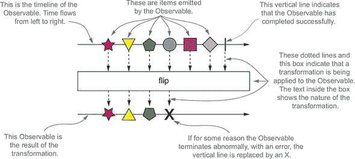

使用这种表示法，很容易提供 RxJava 库所有函数特性的视觉表示，如图 17.5 所示，该图例展示了`map`（将`Observable`发布的元素进行转换）和`merge`（将两个或更多`Observable`发出的事件合并成一个）。

##### 图 17.5. map 和 merge 函数的弹珠图

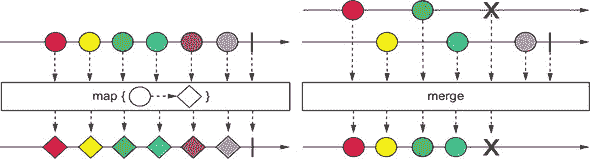

你可能会想知道如何使用`map`和`merge`来改进和添加你在前面章节中开发的 RxJava 示例的功能。使用`map`是一种更简洁的方式来实现使用 Flow API 的`Processor`实现的华氏到摄氏的转换，如下面的列表所示。

##### 列表 17.15. 使用`map`在`Observable`上转换华氏温度到摄氏温度

```
public static Observable<TempInfo> getCelsiusTemperature(String town) {
    return getTemperature( town )
                .map( temp -> new TempInfo( temp.getTown(),
                                            (temp.getTemp() - 32) * 5 / 9) );
}
```

这个简单的方法接受 列表 17.12 中的 `getTemperature` 方法返回的 `Observable`，并返回另一个 `Observable`，它重新发出第一个 `Observable`（每秒发布一次）发布的温度，在将其从华氏度转换为摄氏度后。

为了加强你对如何操作 `Observable` 发出的元素的理解，尝试在以下练习中使用另一个转换函数。

|  |
| --- |

**练习 17.2：仅过滤负温度**

`Observable` 类的 `filter` 方法接受一个 `Predicate` 作为参数，并产生一个第二个 `Observable`，它只发出通过该 `Predicate` 定义测试的元素。假设你被要求开发一个预警系统，当有结冰风险时提醒用户。你如何使用这个操作符创建一个只当温度低于零时才发出城镇摄氏温度的 `Observable`？（摄氏度方便地使用零作为水的冰点。）

**答案：**

只需使用 列表 17.15 中的方法返回的 `Observable`，并应用一个只接受负温度的 `Predicate` 的 `filter` 操作符，如下所示：

```
public static Observable<TempInfo> getNegativeTemperature(String town) {
    return getCelsiusTemperature( town )
               .filter( temp -> temp.getTemp() < 0 );
}
```

|  |
| --- |

现在也假设你被要求推广这个最后的方法，并允许用户拥有一个不仅为单个城镇，也为一组城镇发出温度的 `Observable`。列表 17.16 通过对每个城镇调用 列表 17.15 中的方法一次，并将从这些调用中获得的所有 `Observable` 通过 `merge` 函数合并成一个来满足最后一个要求。

##### 列表 17.16\. 合并一个或多个城镇报告的温度

```
public static Observable<TempInfo> getCelsiusTemperatures(String... towns) {
    return Observable.merge(Arrays.stream(towns)
                                  .map(TempObservable::getCelsiusTemperature)
                                  .collect(toList()));
}
```

这个方法接受一个包含你想要温度的城镇集合的 varargs 参数。这个 varargs 被转换为 `String` 的流；然后每个 `String` 都传递给 列表 17.11（在 列表 17.15 中改进）中的 `getCelsiusTemperature` 方法。这样，每个城镇都被转换为一个每秒发出该城镇温度的 `Observable`。最后，`Observable` 的流被收集到一个列表中，该列表被传递给 `Observable` 类本身提供的 `merge` 静态工厂方法。这个方法接受一个 `Observable` 的 `Iterable`，并组合它们的输出，使它们像一个单一的 `Observable`。换句话说，生成的 `Observable` 发出所有在传递的 `Iterable` 中包含的 `Observable` 发布的事件，并保持它们的时序。

要测试这个方法，可以在以下列表中将其用于一个最终的 `main` 类。

##### 列表 17.17\. 打印三个城镇温度的 `main` 类

```
public class Main {

    public static void main(String[] args) {
        Observable<TempInfo> observable = getCelsiusTemperatures(
                                  "New York", "Chicago", "San Francisco" );
        observable.blockingSubscribe( new TempObserver() );
    }
}
```

这个`main`类与列表 17.14 中的类相同，只是你现在正在订阅列表 17.16 中`getCelsiusTemperatures`方法返回的`Observable`，并打印三个城镇注册的温度。运行这个`main`会产生如下输出：

```
New York : 21
Chicago : 6
San Francisco : -15
New York : -3
Chicago : 12
San Francisco : 5
Got problem: Error!
```

每秒钟，`main`都会打印每个请求城镇的温度，直到温度检索操作引发一个错误，该错误传播到`Observer`，中断数据流。

这章的目的不是提供一个完整的 RxJava（或任何其他反应式库）概述，这需要一本完整的书，而是让你对这类工具包的工作方式有一个感觉，并介绍你到反应式编程的原则。我们只是触及了这种编程风格的表面，但我们希望我们已经展示了它的一些优点，并激发了你对它的好奇心。

### 摘要

+   反应式编程背后的基本思想已有 20 到 30 年的历史，但最近因为现代应用对处理数据量和用户期望的高要求而变得流行。

+   这些思想通过反应式宣言得到了正式化，该宣言指出，反应式软件必须由四个相互关联的特征来表征：响应性、弹性、弹性和消息驱动性。

+   反应式编程的原则可以应用于实现单个应用程序，以及在设计和集成多个应用程序的反应式系统中，有一些差异。

+   一个反应式应用程序基于异步处理一个或多个由反应式流传达的事件流。由于反应式流在反应式应用程序开发中的角色非常关键，包括 Netflix、Pivotal、Lightbend 和 Red Hat 在内的公司联盟将这些概念标准化，以最大化不同实现之间的互操作性。

+   由于反应式流是异步处理的，因此它们被设计为具有内置的背压机制。这可以防止消费者被更快的生产者淹没。

+   这个设计和标准化过程的结果已经被纳入 Java 中。Java 9 的`Flow` API 定义了四个核心接口：`Publisher`、`Subscriber`、`Subscription`和`Processor`。

+   在大多数情况下，这些接口不是为了直接由开发者实现，而是作为实现反应式范式的各种库之间的通用语言。

+   这些工具包中最常用的是 RxJava，它（除了 Java 9 `Flow` API 定义的基本功能外）还提供了许多有用的强大操作符。例如，包括方便地转换和过滤单个反应式流发布的元素的操作符，以及合并和聚合多个流的操作符。
