## 第六部分\. 函数式编程与 Java 未来的演变

在本书的最后一部分，我们通过一个关于如何编写有效的 Java 函数式风格程序的教程介绍，以及 Java 8 特性与 Scala 特性的比较，稍微回顾了一下。

第十八章提供了一个关于函数式编程的全面教程，介绍了其中的一些术语，并解释了如何在 Java 中编写函数式风格的程序。

第十九章涵盖了更高级的函数式编程技术，包括高阶函数、柯里化、持久数据结构、惰性列表和模式匹配。你可以将这一章视为将实用技术应用于你的代码库以及使你成为更知识渊博的程序员的信息混合体。

第二十章接着讨论了 Java 8 特性与 Scala 语言特性的比较——Scala 是一种像 Java 一样在 JVM 之上实现的语言，并且它迅速发展，威胁到了 Java 在编程语言生态系统中的某些领域。

最后，第二十一章回顾了学习 Java 8 的历程以及向函数式编程风格的温和推动。此外，我们还推测了 Java 8 和 Java 9 之外，Java 可能有哪些未来的增强功能和新的特性。

## 第十八章\. 函数式思考

*本章涵盖*

+   为什么选择函数式编程？

+   什么是函数式编程？

+   声明式编程和引用透明性

+   编写函数式风格 Java 的指南

+   迭代与递归的比较

你在这本书中经常看到“函数式”这个词。到现在，你可能对函数式意味着什么有一些想法。它是关于 lambda 表达式和一等函数，还是关于限制你修改对象的权利？采用函数式风格你能得到什么？

在本章中，我们揭示了这些问题的答案。我们解释了什么是函数式编程，并介绍了一些相关术语。首先，我们检查了函数式编程背后的概念——如副作用、不可变性、声明式编程和引用透明性——然后我们将这些概念与 Java 8 联系起来。在第十九章中，我们更仔细地研究了函数式编程技术，如高阶函数、柯里化、持久数据结构、惰性列表、模式匹配和组合子。

### 18.1\. 实施和维护系统

首先，想象一下，你被要求管理一个你从未见过的庞大软件系统的升级。你应该接受维护这样一个软件系统的任务吗？经验丰富的 Java 承包商在决定时只稍微带点玩笑地说：“首先搜索关键字`synchronized`；如果你找到了，就说不（反映修复并发错误的难度）。否则，更详细地考虑系统的结构。”我们将在接下来的段落中提供更多细节。然而，首先，我们将注意到，正如你在前面的章节中看到的，Java 8 添加的流允许你在不担心锁定的情况下利用并行性，前提是你接受无状态行为。（也就是说，你的流处理管道中的函数不交互，一个函数从另一个函数写入的变量中读取或写入。）

你还希望程序看起来如何，以便更容易工作？你希望它结构良好，有一个可理解的类层次结构，反映了系统的结构。你可以通过使用软件工程度量*耦合*（系统的各个部分之间的相互依赖性）和*内聚性*（系统的各个部分之间的关系）来估计这样的结构。

但对于许多程序员来说，关键的是维护期间的调试：一些代码崩溃是因为它观察到了一个意外的值。但是，程序中的哪些部分参与了创建和修改这个值？想想看，你有多少维护问题属于这个类别！^([1]) 事实证明，函数式编程提倡的*无副作用*和*不可变性*的概念可以帮助。我们将在以下章节中更详细地探讨这些概念。

> ¹
> 
> 我们建议阅读 Michael Feathers 所著的《有效地与遗留代码工作》（Prentice Hall，2004 年），以获取更多关于这个主题的信息。

#### 18.1.1\. 共享的可变数据

最终，上一节讨论的意外变量值问题的原因在于共享的可变数据结构被你的维护中心中的多个方法读取和更新。假设有多个类保留了对一个列表的引用。作为维护者，你需要回答以下问题：

+   谁拥有这个列表？

+   如果一个类修改了这个列表会发生什么？

+   其他类是否期望这个变化？

+   这些类是如何了解这个变化的？

+   为了满足这个列表中的所有假设，类需要被通知这个变化，还是它们应该为自己制作防御性副本？

换句话说，共享的可变数据结构使得跟踪程序不同部分的变化变得更加困难。图 18.1 说明了这个概念。

##### 图 18.1\. 在多个类之间共享的可变数据。很难理解谁拥有这个列表。

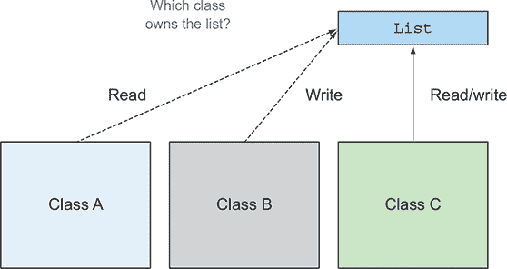

考虑一个不修改任何数据结构的系统。这个系统将是一个梦寐以求的维护系统，因为你不会对某个对象意外修改数据结构有任何坏惊喜。一个既不修改其封装类的状态也不修改任何其他对象的状态，并且通过使用`return`返回其整个结果的方法被称为*纯*或*无副作用*。

什么是副作用？简而言之，*副作用*是在函数本身内部不完全封闭的操作。以下是一些例子：

+   在构造函数内部（例如 setter 方法）之外，就地修改数据结构，包括对任何字段的赋值

+   抛出异常

+   执行 I/O 操作，例如写入文件

另一种看待无副作用概念的方法是考虑不可变对象。一个*不可变对象*是在实例化后不能改变其状态的对象，因此它不会受到函数操作的影响。当不可变对象被实例化时，它们永远不会进入意外状态。你可以共享它们而不需要复制，而且它们是线程安全的，因为它们不能被修改。

无副作用的概念可能看起来是一种严重的限制，你可能怀疑是否真的可以以这种方式构建系统。我们希望在本章结束时说服你，它们确实可以这样做。好消息是，接受这一想法的系统组件可以在不使用锁的情况下使用多核并行处理，因为方法不再会相互干扰。此外，这个概念对于立即理解程序的哪些部分是独立的非常有用。

这些想法来自函数式编程，我们将在下一节中介绍。

#### 18.1.2. 声明式编程

首先，我们探讨声明式编程的概念，这是函数式编程的基础。

通过编写程序来实现系统的两种思考方式。一种集中在如何做事上。（首先做这个，然后更新那个，等等。）例如，如果你想计算列表中最昂贵的交易，你通常会执行一系列命令。（从一个列表中取出一个交易并与暂定的最昂贵交易进行比较；如果它更贵，它就变成了暂定的最昂贵交易；然后与列表中的下一个交易重复此过程，等等。）

这种“如何”风格的编程非常适合经典面向对象编程（有时称为*命令式编程*），因为它有指令模仿计算机的低级词汇（如赋值、条件分支和循环），如以下代码所示：

```
Transaction mostExpensive = transactions.get(0);
if(mostExpensive == null)
    throw new IllegalArgumentException("Empty list of transactions");
for(Transaction t: transactions.subList(1, transactions.size())){
    if(t.getValue() > mostExpensive.getValue()){
        mostExpensive = t;
    }
}
```

另一种方法集中在要做什么上。你在第四章和第五章中看到，通过使用 Streams API，你可以这样指定这个查询：

```
Optional<Transaction> mostExpensive =
    transactions.stream()
                .max(comparing(Transaction::getValue));
```

这个查询如何实现的详细细节留给库来处理。我们将这个想法称为*内部迭代*。它的巨大优势是查询的阅读方式就像问题陈述一样，因此与试图理解一系列命令的作用相比，它立即变得清晰。

这种“是什么”风格通常被称为*声明式编程*。你提供规则说明你想要什么，并期望系统决定如何实现这个目标。这种类型的编程很棒，因为它更接近于问题陈述。

#### 18.1.3. 为什么是函数式编程？

函数式编程体现了这种声明式编程的思想（使用不交互的表达式来表达你想要的内容，系统可以选择实现方式），以及本章前面提到的无副作用计算。这两个想法可以帮助你更轻松地实现和维护系统。

注意，某些语言特性，如操作组合和传递行为（我们通过第三章中的 lambda 表达式来展示），是使用声明式风格自然地读写代码所必需的。使用流，你可以将多个操作链接起来以表达复杂的查询。这些特性是函数式编程语言的特征。我们在第十九章（通过组合器的视角）更仔细地研究这些特性。

为了使讨论具体化并将其与 Java 8 的新特性联系起来，在下一节中我们将具体定义函数式编程的概念及其在 Java 中的表示。我们想传达这样一个事实：通过使用函数式编程风格，你可以编写严肃的程序而不依赖于副作用。

### 18.2. 什么是函数式编程？

对于“什么是函数式编程？”这个问题的过于简化的回答是“用函数进行编程。”什么是函数？

想象一个方法接受一个`int`和一个`double`作为参数并产生一个`double`——并且还产生副作用，比如通过更新一个可变变量来计数它被调用的次数，如图 18.2 所示。

##### 图 18.2. 带有副作用的函数

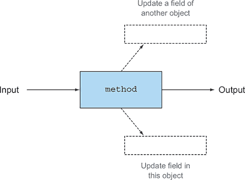

然而，在函数式编程的上下文中，一个*函数*对应于数学函数：它接受零个或多个参数，返回一个或多个结果，并且没有副作用。你可以将函数视为一个黑盒，它接受一些输入并产生一些输出，如图 18.3 所示。

##### 图 18.3. 没有副作用的函数

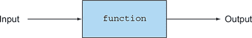

这种函数与你在像 Java 这样的编程语言中看到的方法之间的区别是核心的。（数学函数如`log`或`sin`可能会有这样的副作用的想法是不可想象的。）特别是，数学函数在用相同的参数重复调用时总是返回相同的结果。这种特征排除了`Random.nextInt`这样的方法，我们将在第 18.2.2 节进一步讨论这个概念，即引用透明性。

当我们说*函数式*时，我们指的是像数学一样，没有副作用。现在出现了一个编程的微妙之处。我们是说：每个函数是否只由函数和数学思想，如`if-then-else`构建？或者一个函数在内部做非函数式的事情，只要它不将这些副作用暴露给系统的其余部分？换句话说，如果程序员执行了一个调用者无法观察到的副作用，那么这个副作用存在吗？调用者不需要知道或关心，因为它无法影响他们。

为了强调这种差异，我们将前者称为纯函数式编程，后者称为函数式风格编程。

#### 18.2.1. 函数式 Java

在实践中，你无法在 Java 中完全以纯函数式风格编程。例如，Java 的 I/O 模型由副作用方法组成。（调用`Scanner.nextLine`会产生副作用，即从文件中消耗一行，因此连续调用两次通常会产生不同的结果。）尽管如此，你仍然可以将系统的核心组件编写成好像它们是纯函数式的。在 Java 中，你将编写函数式风格的程序。

首先，有一个关于没有人看到你的副作用，因此，在*功能*意义上的进一步微妙之处。假设一个函数或方法除了在进入后增加一个字段，在退出前减少它之外，没有副作用。从由单个线程组成的程序的角度来看，这种方法没有可见的副作用，可以被视为函数式风格。另一方面，如果另一个线程可以检查该字段——或者可以并发调用该方法——则该方法不是函数式的。你可以通过将此方法的主体用锁包裹来隐藏这个问题，这样你就可以争论说这个方法是函数式的。但这样做，你将失去在多核处理器上使用两个核心并行执行该方法两次调用的能力。你的副作用可能对程序不可见，但从程序员的角度来看，它会导致执行速度变慢。

我们的指导方针是，要被视为函数式风格，一个函数或方法只能修改局部变量。此外，它引用的对象应该是不可变的——也就是说，所有字段都是`final`的，所有引用类型的字段都递归地引用其他不可变对象。稍后，你可以允许更新在方法中新鲜创建的对象的字段，这样它们就不会从其他地方可见，也不会保存以影响后续调用的结果。

然而，我们的指导方针并不完整。要成为函数式，还有一个额外的要求，即函数或方法**不应该抛出任何异常**。一个合理的解释是，抛出异常意味着除了通过函数返回值之外，还在通过其他方式传递结果；参见图 18.2 中的黑盒模型。在这里有争议的空间，一些作者认为未捕获的异常表示致命错误是可以接受的，而捕获异常的行为才代表非函数式控制流。然而，这种对异常的使用仍然打破了黑盒模型中简单的“传递参数，返回结果”隐喻，导致出现一个表示异常的第三个箭头，如图 18.4 所示。

##### 图 18.4\. 抛出异常的函数

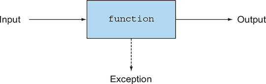

| |
| --- |

**函数和部分函数**

在数学中，一个函数必须对每个可能的参数值给出确切的一个结果。但许多常见的数学运算实际上应该被称为部分函数。也就是说，对于某些或大多数输入值，它们会给出确切的一个结果，但对于其他输入值，它们是未定义的，根本不会给出任何结果。例如，当第二个操作数是零时进行除法，或者当其参数为负数时进行平方根运算。我们通常在 Java 中通过抛出异常来模拟这些情况。

| |
| --- |

你如何在不使用异常的情况下表达像除法这样的函数？使用像`Optional<T>`这样的类型。而不是有“`double sqrt(double)`但可能抛出异常”这样的签名，`sqrt`将具有签名`Optional<Double> sqrt(double)`。它要么返回一个表示成功的值，要么在其返回值中表明它无法执行请求的操作。是的，这样做确实意味着调用者需要检查每个方法调用是否可能导致空的`Optional`。这可能听起来像是一个大问题，但根据我们对函数式编程与纯函数式编程的指导，你可以选择在本地使用异常，但不通过大规模接口暴露它们，从而在不增加代码膨胀风险的情况下获得函数式风格的优势。

要被视为功能性的，你的函数或方法应该只调用那些你可以隐藏非功能行为的副作用库函数（即，确保它们对数据结构所做的任何修改都不会被调用者看到，可能通过先复制并捕获任何异常来实现）。在第 18.2.4 节中，你通过复制列表的方式，在`insertAll`方法内部隐藏了副作用库函数`List.add`的使用。

你通常可以通过使用注释或声明带有标记注解的方法来标记这些规定，并且匹配你在第四章到第七章中为传递给并行流处理操作（如`Stream.map`）的函数所施加的限制。

最后，出于实用主义的原因，你可能发现对于函数式风格的代码来说，能够将调试信息输出到某种形式的日志文件中是很方便的。这段代码不能严格地描述为函数式，但在实践中，你保留了函数式编程的大部分好处。

#### 18.2.2\. 引用透明性

对无可见副作用（对调用者不可见的结构修改、无 I/O、无异常）的限制编码了引用透明性的概念。一个函数是引用透明的，如果它在用相同的参数值调用时总是返回相同的值。例如，`String.replace`方法就是引用透明的，因为`"raoul".replace('r', 'R')`总是产生相同的结果（`replace`返回一个新`String`，其中所有的`r`都被大写的`R`替换），而不是更新它的`this`对象，因此它可以被认为是一个函数。

换句话说，一个函数在相同的输入下始终产生相同的结果，无论它在何时何地被调用。这也解释了为什么`Random.nextInt`不被视为函数式。在 Java 中，使用`Scanner`对象从用户的键盘获取输入违反了引用透明性，因为调用`nextLine`方法可能每次调用都会产生不同的结果。但添加两个`final int`变量总是产生相同的结果，因为变量的内容永远不会改变。

引用透明性是程序理解的一个很好的属性。它还包括对昂贵或长期操作进行保存而不是重新计算优化的概念，这个过程被称为*记忆化*或*缓存*。尽管这个话题很重要，但在这里它是一个小的旁白，所以我们将在第十九章中讨论它。

Java 在引用透明性方面有一个轻微的复杂性。假设你调用一个返回`List`的方法两次。这两次调用可能返回内存中不同列表的引用，但包含相同的元素。如果这些列表被视为可变的面向对象值（因此非相同），则该方法不是引用透明的。如果你计划将这些列表用作纯（不可变）值，那么将这些值视为相等是有意义的，因此函数是引用透明的。一般来说，在函数式风格的代码中，你选择将这些函数视为引用透明的。

在下一节中，我们将从更广泛的视角探讨是否进行突变。

#### 18.2.3\. 面向对象与函数式编程风格

我们首先将函数式编程与（极端的）经典面向对象编程进行对比，然后观察到 Java 8 将这些风格视为面向对象光谱上的极端。作为一名 Java 程序员，即使没有有意识地思考，你也几乎肯定使用了函数式编程的一些方面和我们称之为极端面向对象编程的一些方面。正如我们在第一章（kindle_split_011.xhtml#ch01）中提到的，硬件（如多核）和程序员期望（如数据库查询来操作数据）的变化正在推动 Java 软件工程风格更多地转向函数式的一端，本书的一个目标就是帮助你适应这种变化的环境。

在光谱的一端是极端的面向对象观点：一切皆对象，程序通过更新字段和调用更新相关对象的方法来操作。在光谱的另一端是引用透明的函数式编程风格，没有（可见的）突变。在实践中，Java 程序员总是混合这些风格。你可能通过使用包含可变内部状态的`Iterator`遍历数据结构，但以函数式风格计算，例如，数据结构中值的总和。（在 Java 中，如前所述，此过程可能包括更新局部变量。）本章和第十九章（kindle_split_034.xhtml#ch19）的一个目标就是讨论编程技术，并引入函数式编程的特性，以便你能够编写更模块化且更适合多核处理器的程序。将这些想法视为你编程武器库中的额外武器。

#### 18.2.4\. 实践中的函数式风格

首先，解决一个给初学者的编程练习，以体现函数式风格：给定一个`List<Integer>`值，例如{1, 4, 9}，构造一个`List<List<Integer>>`值，其成员是{1, 4, 9}的所有子集，顺序不限。{1, 4, 9}的子集包括{1, 4, 9}，{1, 4}，{1, 9}，{4, 9}，{1}，{4}，{9}和{}。

有八个子集，包括空子集，写作{}。每个子集都表示为`List<Integer>`类型，这意味着答案是`List<List<Integer>>`类型。

学生们经常在思考如何开始时遇到问题，需要通过提示^([2])来帮助他们，即“{1, 4, 9}的子集要么包含 1，要么不包含。”那些不包含 1 的子集是{4, 9}的子集，而包含 1 的子集可以通过取{4, 9}的子集并将 1 插入到每个子集中来获得。不过有一个细微之处：我们必须记住空集恰好只有一个子集——它自己。这种理解让你在 Java 中以简单、自然、自上而下的函数式编程风格进行编码，如下所示:^([3])

> ²
> 
> 有时，麻烦（但聪明！）的学生会指出一个涉及数字二进制表示的巧妙编码技巧。（Java 解决方案代码对应于 000,001,010,011,100,101,110,111。）我们告诉这样的学生计算列表的所有排列；对于示例{1, 4, 9}，有六个。
> 
> ³
> 
> 为了具体化，我们在这里给出的代码使用`List<Integer>`，但你可以将其在方法定义中替换为泛型`List<T>`；然后你可以将更新的`subsets`方法应用于`List<String>`以及`List<Integer>`。

```
static List<List<Integer>> subsets(List<Integer> list) {
    if (list.isEmpty()) {                                     *1*
        List<List<Integer>> ans = new ArrayList<>();
        ans.add(Collections.emptyList());
        return ans;
    }
    Integer fst = list.get(0);
    List<Integer> rest = list.subList(1,list.size());
    List<List<Integer>> subAns = subsets(rest);               *2*
    List<List<Integer>> subAns2 = insertAll(fst, subAns);     *3*
    return concat(subAns, subAns2);                           *4*
}
```

+   ***1* 如果输入列表为空，它只有一个子集：空列表本身。**

+   ***2* 否则取出一个元素，fst，并找到其余所有子集以给出 subAns；subAns 形成答案的一半。**

+   ***3* 答案的一半，subAns2，由 subAns 中的所有列表组成，但每个元素列表都通过在前面添加 fst 来调整。**

+   ***4* 然后将两个子答案连接起来。**

当以{1, 4, 9}作为输入时，解决方案程序产生{{}, {9}, {4}, {4, 9}, {1}, {1, 9}, {1, 4}, {1, 4, 9}}。当你定义了这两个缺失的方法时，请尝试一下。

为了复习，你假设缺失的方法`insertAll`和`concat`本身是函数式的，并推断出你的函数`subsets`也是函数式的，因为其中没有操作会改变任何现有结构。（如果你熟悉数学，你会认出这个论点是通过归纳得出的。）

现在看看定义`insertAll`。这里有一个危险点。假设你定义了`insertAll`使其改变其参数，可能通过更新`subAns`的所有元素以包含`fst`。那么程序将错误地导致`subAns`以与`subAns2`相同的方式被修改，从而导致一个神秘地包含八个{1,4,9}副本的答案。相反，将`insertAll`函数式地定义为以下内容：

```
static List<List<Integer>> insertAll(Integer fst,
                                     List<List<Integer>> lists) {
    List<List<Integer>> result = new ArrayList<>();
    for (List<Integer> list : lists) {
        List<Integer> copyList = new ArrayList<>();            *1*
        copyList.add(fst);
        copyList.addAll(list);
        result.add(copyList);
    }
    return result;
}
```

+   ***1* 复制列表以便可以添加到它。即使它是可变的，你也不会复制底层结构。（整数是不可变的。）**

注意，你正在创建一个新的 `List`，它包含 `subAns` 的所有元素。你利用了 `Integer` 对象不可变的事实；否则，你将不得不克隆每个元素。将 `insertAll` 等方法视为函数式的方法引起的关注，为你提供了一个自然的位置来放置所有这些精心复制的代码：在 `insertAll` 内部，而不是在其调用者中。

最后，你需要定义 `concat` 方法。在这种情况下，解决方案很简单，但我们恳求你不要使用它；我们只展示它，以便你可以比较不同的风格：

```
static List<List<Integer>> concat(List<List<Integer>> a,
                                  List<List<Integer>> b) {
    a.addAll(b);
    return a;
}
```

相反，我们建议你编写以下代码：

```
static List<List<Integer>> concat(List<List<Integer>> a,
                                  List<List<Integer>> b) {
    List<List<Integer>> r = new ArrayList<>(a);
    r.addAll(b);
    return r;
}
```

为什么？`concat` 的第二个版本是一个纯函数。函数可能在其内部使用变异（向列表 `r` 添加元素），但它基于其参数返回结果，并且不修改任何一个参数。相比之下，第一个版本依赖于在调用 `concat(subAns, subAns2)` 之后，没有人再次引用 `subAns` 的值。对于我们的 `subsets` 定义，这种情况是成立的，因此当然使用更便宜的 `concat` 版本更好。答案取决于你如何评估你的时间。比较你后来花费在搜索难以捉摸的错误上的时间与制作副本的额外成本。

无论你如何注释不纯的 `concat` 只能“在第一个参数可以被任意覆盖时使用，并且仅在 `subsets` 方法中使用，并且对 `subsets` 的任何更改都必须根据此注释进行审查”，总有人会在某个代码片段中找到它有用，那里它似乎可以工作。你的未来噩梦调试问题已经诞生。我们将在第十九章 中重新审视这个问题。

吸收要点：在设计周期早期，以函数式方法来思考编程问题，这些方法仅以它们的输入参数和输出结果（做什么）为特征，通常比思考如何做以及过早地考虑变异更有效。

在下一节中，我们将详细讨论递归。

### 18.3. 递归与迭代

*递归* 是在函数式编程中推广的一种技术，让你能够以“做什么”的方式思考。纯函数式编程语言通常不包含迭代结构，如 `while` 和 `for` 循环。这些结构通常隐藏着使用变异的邀请。例如，`while` 循环中的条件需要更新；否则，循环将执行零次或无限次。然而，在许多情况下，循环是可行的。我们曾主张，对于函数式风格，如果你没有人看到你在做，那么你可以进行变异，因此修改局部变量是可以接受的。当你使用 Java 中的 `for-each` 循环 `for(Apple apple : apples) { }` 时，它解码为这个 `Iterator`：

```
Iterator<Apple> it = apples.iterator();
while (it.hasNext()) {
   Apple apple = it.next();
   // ...
}
```

这种翻译没有问题，因为突变（使用 `next` 方法改变 `Iterator` 的状态，以及在 `while` 体内部将值赋给 `apple` 变量）对发生突变的方法的调用者不可见。但是，当你使用 `for-each` 循环，例如搜索算法时，以下情况是有问题的，因为循环体正在更新与调用者共享的数据结构：

```
public void searchForGold(List<String> l, Stats stats){
    for(String s: l){
        if("gold".equals(s)){
            stats.incrementFor("gold");
        }
    }
}
```

事实上，循环体有一个不能被忽视的副作用，即它不能作为函数式风格来忽略：它改变了与程序其他部分共享的 `stats` 对象的状态。

因此，像 Haskell 这样的纯函数式编程语言省略了这样的副作用操作。你该如何编写程序呢？理论上的答案是，每个程序都可以通过使用递归而不是迭代来重写，这样就不需要可变性。使用递归可以让您摆脱逐步更新的迭代变量。一个经典的学校问题是计算阶乘函数（对于正数参数）的迭代方式和递归方式（假设输入大于 0），如下面的两个列表所示。

##### 列表 18.1\. 迭代阶乘

```
static long factorialIterative(long n) {
    long r = 1;
    for (int i = 1; i <= n; i++) {
        r *= i;
    }
    return r;
}
```

##### 列表 18.2\. 递归阶乘

```
static long factorialRecursive(long n) {
    return n == 1 ? 1 : n * factorialRecursive(n-1);
}
```

第一个列表演示了一种基于标准循环的形式：变量 `r` 和 `i` 在每次迭代中更新。第二个列表以更数学化的形式展示了递归定义（函数调用自身）。在 Java 中，递归形式通常效率较低，正如我们在下一个示例之后立即讨论的那样。

然而，如果您已经阅读了本书的前几章，您知道 Java 8 流提供了一种更简单的声明性方式来定义阶乘，如下面的列表所示。

##### 列表 18.3\. 流阶乘

```
static long factorialStreams(long n){
    return LongStream.rangeClosed(1, n)
                     .reduce(1, (long a, long b) -> a * b);
}
```

现在我们转向效率问题。作为 Java 用户，当功能编程狂热者告诉你应该总是使用递归而不是迭代时，要小心。一般来说，进行递归函数调用比发出迭代所需的单个机器级分支指令要昂贵得多。每次调用 `factorialRecursive` 函数时，都会在调用栈上创建一个新的栈帧来保存每个函数调用的状态（它需要进行的乘法）直到递归完成。您对阶乘的递归定义需要与输入成比例的内存。因此，如果您用大输入运行 `factorialRecursive`，您很可能会收到 `StackOverflowError`：

```
Exception in thread "main" java.lang.StackOverflowError
```

递归真的没有用吗？当然不是！函数式语言为这个问题提供了一个答案：*尾调用优化*。基本思想是，你可以编写一个阶乘的递归定义，其中递归调用是函数中最后发生的事情（或者调用在尾位置）。这种不同的递归风格可以被优化以快速运行。下一个列表提供了一个尾递归定义的阶乘。

##### 列表 18.4\. 尾递归阶乘

```
static long factorialTailRecursive(long n) {
    return factorialHelper(1, n);
}
static long factorialHelper(long acc, long n) {
    return n == 1 ? acc : factorialHelper(acc * n, n-1);
}
```

函数 `factorialHelper` 是尾递归的，因为递归调用是该函数中最后发生的事情。相比之下，在 `factorialRecursive` 的早期定义中，最后发生的事情是 `n` 和递归调用结果的乘法。

这种递归形式很有用，因为它不需要在单独的栈帧中存储递归的每个中间结果，编译器可以决定重用单个栈帧。实际上，在 `factorialHelper` 的定义中，中间结果（阶乘的部分结果）直接作为参数传递给函数。不需要在单独的栈帧上跟踪每个递归调用的中间结果；它可以直接作为 `factorialHelper` 的第一个参数访问。图 18.5 和 18.6 展示了阶乘递归和尾递归定义之间的差异。

##### 图 18.5\. 阶乘的递归定义，需要几个栈帧

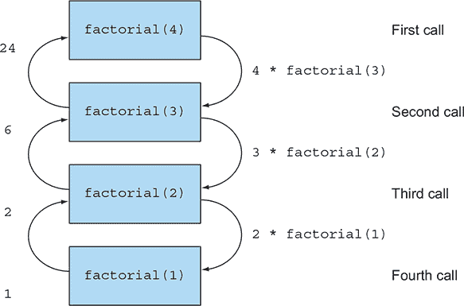

##### 图 18.6\. 阶乘的尾递归定义，可以重用单个栈帧

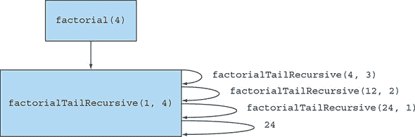

坏消息是 Java 不支持这种优化。但采用尾递归可能比经典递归是一种更好的实践，因为它为最终编译器优化开辟了道路。许多现代 JVM 语言，如 Scala、Groovy 和 Kotlin，可以优化这些递归的使用，这些递归与迭代等效（并且以相同的速度执行）。因此，纯函数式编程的拥护者也可以在保持纯度的同时高效地执行。

Java 8 编写指南中提到，你通常可以用流来替换迭代以避免突变。此外，当递归允许你以更简洁、无副作用的方式编写算法时，你可以用递归替换迭代。确实，递归可以使示例更容易阅读、编写和理解（如本章前面所示的部分示例），而程序员效率通常比执行时间的小差异更重要。

在本节中，我们讨论了具有方法功能性的函数式编程；我们所说的所有内容都适用于 Java 的第一个版本。在第十九章中，我们将探讨 Java 8 中引入一等函数带来的惊人强大可能性。

### 摘要

+   减少共享可变数据结构可以帮助你在长期内维护和调试你的程序。

+   函数式编程风格提倡无副作用的方法和声明式编程。

+   函数式方法的特点仅在于它们的输入参数和输出结果。

+   如果一个函数在用相同的参数值调用时总是返回相同的值，则该函数是引用透明的。例如 `while` 循环这样的迭代结构可以用递归替换。

+   尾递归可能在 Java 中比经典递归是一种更好的实践，因为它为潜在的编译器优化打开了道路。

## 第十九章\. 函数式编程技术

*本章涵盖*

+   一等公民、高阶函数、柯里化和部分应用

+   持久数据结构

+   惰性评估和惰性列表作为泛化 Java 流

+   模式匹配及其在 Java 中的模拟

+   指称透明性和缓存

在第十八章中，你看到了如何以函数式的方式思考；以无副作用的方法来思考可以帮助你编写更易于维护的代码。在本章中，我们介绍了更高级的函数式编程技术。你可以将本章视为将实际可应用于代码库的技术与使你成为更有知识程序员的信息相结合。我们讨论了高阶函数、柯里化、持久数据结构、惰性列表、模式匹配、具有指称透明性的缓存和组合子。

### 19.1\. 到处都是函数

在第十八章中，我们使用“函数式编程风格”这个短语来表示函数和方法的行为应该像数学风格的函数一样，没有副作用。函数式语言程序员经常更广泛地使用这个短语，表示函数可以被用作其他值：作为参数传递，作为结果返回，并存储在数据结构中。可以像其他值一样使用的函数被称为*一等函数*。一等函数是 Java 8 相对于之前版本 Java 新增的特性：你可以将任何方法作为函数值使用，使用`::`操作符创建方法引用，并使用 lambda 表达式（如`(int x) -> x + 1`）直接表达函数值。在 Java 8 中，使用方法引用如下将`Integer.parseInt`方法存储在变量中是完全有效的^([1])：

> ¹
> 
> 如果你计划将`Integer::parseInt`方法作为唯一要存储在变量`strToInt`中的方法，你可能想让`strToInt`具有`ToIntFunction<String>`类型以节省装箱。在这里你没有这样做，因为使用这样的 Java 原始应用可能会妨碍你看到正在发生的事情，即使这些应用提高了原始类型的效率。

```
Function<String, Integer> strToInt = Integer::parseInt;
```

#### 19.1.1\. 高阶函数

到目前为止，你主要使用函数值是一等公民的事实，将它们传递给 Java 8 流处理操作（如第四章至第七章），并在将 `Apple::isGreen-Apple` 作为函数值传递给 `filterApples` 时实现类似的行为参数化效果（如第一章和第二章所示）。另一个有趣的例子是使用静态方法 `Comparator.comparing`，它接受一个函数作为参数并返回另一个函数（一个 `Comparator`），如下面的代码和图 19.1 所示：

##### 图 19.1\. `comparing` 接受一个函数作为参数并返回另一个函数。

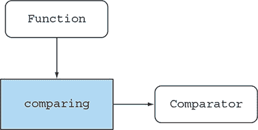

```
Comparator<Apple> c = comparing(Apple::getWeight);
```

当你在第三章中组合函数以创建操作流水线时，你做了类似的事情：

```
Function<String, String> transformationPipeline
  = addHeader.andThen(Letter::checkSpelling)
             .andThen(Letter::addFooter);
```

在函数式编程社区中，能够至少执行以下操作之一的函数（如 `Comparator.comparing`）被称为 *高级函数*：

+   接受一个或多个函数作为参数

+   返回一个函数作为结果

这种描述直接关联到 Java 8 函数，因为它们不仅可以作为参数传递，还可以作为结果返回，分配给局部变量，甚至可以插入到结构中。一个计算器程序可能有一个 `Map<String, Function<Double, Double>>`，将 `String "sin"` 映射到 `Function<Double, Double>` 以持有方法引用 `Math::sin`。你在第八章学习工厂设计模式时也做了类似的事情。

喜欢在第三章结尾处计算示例的读者可以将微分类型视为

```
Function<Function<Double,Double>, Function<Double,Double>>
```

因为它接受一个函数作为参数（例如 `(Double x) -> x * x`）并返回一个函数作为结果（在这个例子中，`(Double x) -> 2 * x`）。我们将此代码写成函数类型（最左边的 `Function`）以明确确认你可以将这个微分函数传递给另一个函数。但最好记住，微分函数的类型和签名

```
Function<Double,Double> differentiate(Function<Double,Double> func)
```

说的是同一件事。

|  |
| --- |

**副作用和高级函数**

我们在 第七章 中提到，传递给流操作的函数通常是无副作用的，并指出了否则可能出现的问题（例如，由于你没有考虑到竞态条件而导致的不正确结果甚至不可预测的结果）。这个原则也适用于你使用高阶函数的一般情况。当你编写一个高阶函数或方法时，你事先不知道将传递给它什么参数，如果参数有副作用，这些副作用可能会做什么。如果你的代码使用了作为参数传递的函数，这些函数会在程序状态中引起不可预测的变化，那么推理你的代码做什么会变得非常复杂；这些函数甚至可能以难以调试的方式干扰你的代码。记录你愿意从作为参数传递的函数中接受的副作用是一个好的设计原则。没有副作用是最好的！

| |
| --- |

在下一节中，我们将转向柯里化：一种可以帮助你模块化函数和重用代码的技术。

#### 19.1.2\. 柯里化

在我们给出柯里化的理论定义之前，我们将举一个例子。应用几乎总是需要国际化，因此从一个单位集转换到另一个单位集是一个反复出现的问题。

单位转换总是涉及一个转换系数，有时还涉及基线调整系数。例如，将摄氏度转换为华氏度的公式是 `CtoF(x) = x*9/5 + 32`。所有单位转换的基本模式如下：

1.  乘以转换系数。

1.  如果相关，调整基线。

你可以用以下通用方法表达这个模式：

```
static double converter(double x, double f, double b) {
    return x * f + b;
}
```

在这里，`x` 是你想要转换的量，`f` 是转换系数，而 `b` 是基线。但这种方法有点过于通用。通常，你需要进行大量相同单位对之间的转换，例如千米到英里。你可以在每次调用时用三个参数调用 `converter` 方法，但每次都提供系数和基线会显得很繁琐，而且你可能会不小心打错字。

你可以为每个应用编写一个新的方法，但这样做会错过底层逻辑的重用。

这是一个利用现有逻辑的同时为特定应用定制转换器的好方法。你可以定义一个工厂，制造单参数转换函数来举例说明柯里化的概念：

```
static DoubleUnaryOperator curriedConverter(double f, double b){
    return (double x) -> x * f + b;
}
```

现在你只需要传递 `curriedConverter` 转换系数和基线（`f` 和 `b`），它会乐意地返回一个函数（`x` 的函数）来完成你所要求的事情。然后你可以使用工厂来生产你需要的任何转换器，如下所示：

```
DoubleUnaryOperator convertCtoF = curriedConverter(9.0/5, 32);
DoubleUnaryOperator convertUSDtoGBP = curriedConverter(0.6, 0);
DoubleUnaryOperator convertKmtoMi = curriedConverter(0.6214, 0);
```

由于 `DoubleUnaryOperator` 定义了一个 `applyAsDouble` 方法，你可以这样使用你的转换器：

```
double gbp = convertUSDtoGBP.applyAsDouble(1000);
```

因此，你的代码更加灵活，并且它重用了现有的转换逻辑！

反思你在这里所做的事情。你并不是一次性将所有参数`x`、`f`和`b`传递给`converter`方法，而是只请求参数`f`和`b`，并返回另一个函数——当给定一个参数`x`时，它返回`x * f + b`。这个两阶段过程使你能够重用转换逻辑并创建具有不同转换因子的不同函数。

| |
| --- |

**柯里化（Currying）的正式定义**

*柯里化^([a])* 是一种技术，其中两个参数的函数 `f`（例如 `x` 和 `y`）被视为一个参数的函数 `g`，它返回另一个参数的函数。后者的函数值与原始函数的值相同——即 `f(x,y) = (g(x))(y)`。

> ^a
> 
> “柯里化”这个词与印度食物无关；这个术语是以逻辑学家 Haskell Brooks Curry 命名的，他使这项技术流行起来。然而，他将其归功于 Moses Ilyich Schönfinkel。我们是否应该将柯里化称为 *schönfinkeling*？

这种定义是通用的。你可以将一个六参数函数 curry 成首先接受编号为 2、4 和 6 的参数，它返回一个接受参数 5 的函数，该函数返回一个接受剩余参数 1 和 3 的函数。

当传递了一些参数（但少于所有参数）时，函数是*部分应用*的。

| |
| --- |

在下一节中，我们将转向函数式编程风格的另一个方面：数据结构。如果禁止修改数据结构，是否还能用它们来编程？

### 19.2. 持久化数据结构

在函数式编程风格程序中使用的数据结构有各种名称，例如函数式数据结构和不可变数据结构，但最常见的是持久化数据结构。（不幸的是，这个术语与数据库中“持久化”的概念相冲突，意味着“超出一次程序运行的生命周期。”）

首先，要注意的是，函数式方法不允许更新任何全局数据结构或任何作为参数传递的结构。为什么？因为调用它两次很可能会产生不同的答案，违反了引用透明性和将方法理解为一个简单的从参数到结果的映射的能力。

#### 19.2.1. 摧毁性更新与函数式

考虑可能出现的问题。假设你将 A 到 B 的火车旅程表示为一个可变的`TrainJourney`类（单链表的简单实现），其中`int`字段表示旅程的一些细节，例如旅程当前阶段的票价。需要换乘的旅程通过`onward`字段具有几个链接的`TrainJourney`对象；直达火车或旅程的最后一程，`onward`为`null`：

```
class TrainJourney {
    public int price;
    public TrainJourney onward;
    public TrainJourney(int p, TrainJourney t) {
        price = p;
        onward = t;
    }
}
```

现在假设你有代表从 X 到 Y 和从 Y 到 Z 的旅程的单独的`TrainJourney`对象。你可能想创建一个连接这两个`TrainJourney`对象（即 X 到 Y 到 Z）的旅程。

这里是一个简单的传统命令式方法来`链接`这些火车旅程：

```
static TrainJourney link(TrainJourney a, TrainJourney b){
    if (a==null) return b;
    TrainJourney t = a;
    while(t.onward != null){
        t = t.onward;
    }
    t.onward = b;
    return a;
}
```

此方法通过找到`TrainJourney`中`a`的最后一部分，并用列表`b`替换`a`列表末尾的`null`标记来实现。如果`a`没有元素，则需要一个特殊情况。

这里的问题是：假设一个变量`firstJourney`包含从 X 到 Y 的路线，而另一个变量`secondJourney`包含从 Y 到 Z 的路线。如果您调用`link(firstJourney, secondJourney)`，此代码会破坏性地更新`firstJourney`以包含`secondJourney`，因此除了请求从 X 到 Z 的单一用户看到预期的合并旅程外，从 X 到 Y 的旅程也被破坏性地更新了。实际上，`firstJourney`变量不再是 X 到 Y 的路线，而是一条从 X 到 Z 的路线，这破坏了依赖于`firstJourney`未修改的代码！假设`firstJourney`代表早上的伦敦到布鲁塞尔的火车，所有试图前往布鲁塞尔的后续用户都会惊讶地看到需要一段后续旅程，可能到科隆。我们都与这类有关数据结构变化可见性的 bug 作过斗争。

对于这个问题，函数式风格的解决方案是禁止这种有副作用的函数。如果您需要一个数据结构来表示计算的结果，您应该创建一个新的数据结构，而不是修改现有的数据结构，就像您之前所做的那样。这样做在标准面向对象编程中通常也是一个最佳实践。对函数式方法的一个常见反对意见是它会导致过多的复制，程序员会说，“我会记住”或“我会记录”副作用。但这种乐观是一种陷阱，对于后来必须处理您代码的维护程序员来说。因此，函数式风格的解决方案如下：

```
static TrainJourney append(TrainJourney a, TrainJourney b){
    return a==null ? b : new TrainJourney(a.price, append(a.onward, b));
}
```

这段代码明显是函数式风格的（不使用任何变异，即使是局部性的）并且不会修改任何现有的数据结构。然而，请注意，代码并没有创建一个新的`TrainJourney`。如果`a`是一个包含*n*个元素的序列，而`b`是一个包含*m*个元素的序列，则代码返回一个包含*n*+*m*个元素的序列，其中前*n*个元素是新的节点，最后的*m*个元素与`TrainJourney b`共享。请注意，用户需要确保不修改`append`的结果，因为这样做可能会破坏作为序列`b`传入的火车。和说明了破坏性`append`和函数式`append`之间的区别。

##### 图 19.2\. 数据结构被破坏性更新。

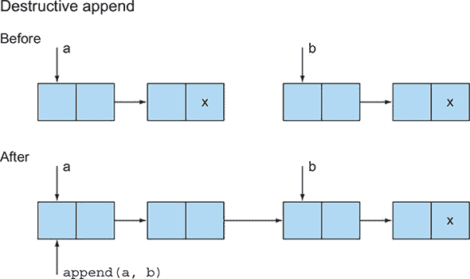

##### 图 19.3\. 函数式风格，没有修改数据结构

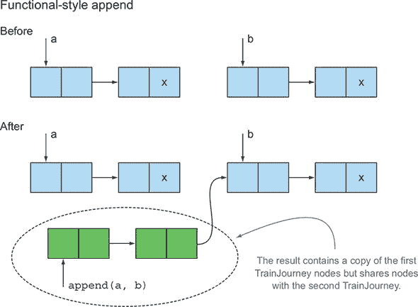

#### 19.2.2\. 树的另一个例子

在离开这个主题之前，考虑另一种数据结构：一个二叉搜索树，可能用于实现类似于 `HashMap` 的接口。想法是 `Tree` 包含一个表示键的 `String` 和一个表示其值的 `int`，可能是姓名和年龄：

```
class Tree {
   private String key;
   private int val;
   private Tree left, right;
   public Tree(String k, int v, Tree l, Tree r) {
     key = k; val = v; left = l; right = r;
   }
}
class TreeProcessor {
    public static int lookup(String k, int defaultval, Tree t) {
        if (t == null) return defaultval;
        if (k.equals(t.key)) return t.val;
        return lookup(k, defaultval,
                         k.compareTo(t.key) < 0 ? t.left : t.right);
    }
    // other methods processing a Tree
}
```

您想使用二叉搜索树来查找 `String` 值以生成一个 `int`。现在考虑您如何更新与给定键关联的值（为了简单起见，假设键已经存在于树中）：

```
public static void update(String k, int newval, Tree t) {
    if (t == null) { /* should add a new node */ }
    else if (k.equals(t.key)) t.val = newval;
    else update(k, newval, k.compareTo(t.key) < 0 ? t.left : t.right);
}
```

添加新节点比较复杂。最简单的方法是让方法 `update` 返回已遍历的 `Tree`（除非您需要添加节点，否则不会改变）。现在这段代码稍微有些笨拙，因为用户需要记住 `update` 尝试原地更新树，并返回与传入相同的树。但如果原始树为空，则返回一个新节点：

```
public static Tree update(String k, int newval, Tree t) {
    if (t == null)
       t = new Tree(k, newval, null, null);
    else if (k.equals(t.key))
       t.val = newval;
    else if (k.compareTo(t.key) < 0)
       t.left = update(k, newval, t.left);
    else
       t.right = update(k, newval, t.right);
    return t;
}
```

注意，`update` 的两个版本都会修改现有的 `Tree`，这意味着所有使用存储在树中的 `map` 的用户都会看到这种修改。

#### 19.2.3. 使用函数式方法

您如何以函数式方式编程这样的树更新？您需要为新的键值对创建一个新节点。您还需要在树的根节点到新节点路径上创建新节点，如下所示：

```
public static Tree fupdate(String k, int newval, Tree t) {
     return (t == null) ?
         new Tree(k, newval, null, null) :
          k.equals(t.key) ?
            new Tree(k, newval, t.left, t.right) :
       k.compareTo(t.key) < 0 ?
         new Tree(t.key, t.val, fupdate(k,newval, t.left), t.right) :
         new Tree(t.key, t.val, t.left, fupdate(k,newval, t.right));
}
```

通常，这段代码并不昂贵。如果树深度为 *d* 且平衡得合理，它可以有大约 2^d 个条目，所以您只需重新创建其中的一小部分。

我们将这段代码写成单个条件表达式，而不是使用 `if-then-else`，以强调主体是一个没有副作用的单个表达式。但您可能更喜欢编写等效的 `if-then-else` 链，每个都包含一个返回。

`update` 和 `fupdate` 之间的区别是什么？我们之前提到，`update` 方法假设每个用户都想要共享数据结构并看到程序任何部分引起的更新。因此，在非函数式代码中，每当您向树添加某种结构化值时，您必须复制它，因为有人可能后来会假设他可以更新它。相比之下，`fupdate` 完全是函数式的；它创建一个新的 `Tree` 作为结果，但尽可能多地与它的参数共享。图 19.4 阐述了这一概念。您有一个由存储人的姓名和年龄的节点组成的树。调用 `fupdate` 不会修改现有的树；它创建新的节点“位于树的一侧”，而不会损害现有的数据结构。

##### 图 19.4. 在制作此 `Tree` 更新过程中，没有现有的数据结构受到损害。

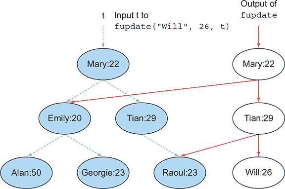

这种函数式数据结构通常被称为**持久性**的——它们的值持续存在，并且与其他地方发生的变化隔离——因此作为程序员，你可以确信`fupdate`不会修改作为其参数传递的数据结构。有一个前提条件：条约的另一方要求所有持久数据结构的用户都必须遵守不修改的要求。如果不这样做，忽视这个前提条件的程序员可能会修改`fupdate`的结果（例如，通过更改 Emily 的 20）。然后这种修改就会作为（几乎肯定是不希望看到的）意外和延迟的变化出现在传递给`fupdate`作为参数的数据结构中！

从这个角度来看，`fupdate`可以更高效。不允许修改现有结构的规则允许结构只略有不同（例如，用户 A 看到的`Tree`和用户 B 看到的修改版本）在它们的结构的公共部分共享存储。你可以通过将类`Tree`的字段`key`、`val`、`left`和`right`声明为`final`来让编译器帮助强制执行此规则。但请记住，`final`只保护字段，而不是指向的对象，该对象可能需要其自己的字段是`final`以保护它，依此类推。

你可能会说，“我希望树的结构更新能被某些用户看到（但诚实地讲，不是所有用户）。”你有两个选择。一个选择是经典的 Java 解决方案：在更新某些内容时要小心，检查是否需要先复制它。另一个选择是函数式风格的解决方案：你每次更新时逻辑上都会创建一个新的数据结构（这样就不会有任何东西被修改），并安排将适当的数据结构版本传递给用户。这个想法可以通过 API 来强制执行。如果某些数据结构的客户端需要看到更新，他们应该通过返回最新版本的 API 进行操作。不想看到更新的客户端（例如，用于长时间运行的统计分析）使用他们检索到的任何副本，知道它不能在他们不知情的情况下被修改。

这种技术就像在 CD-R 上更新文件一样，它允许通过激光烧录只写入一次文件。文件的多个版本存储在 CD 上（智能 CD 刻录软件甚至可能共享多个版本的公共部分），你通过传递文件起始位置的适当块地址（或包含版本信息的文件名编码）来选择你想要使用的版本。在 Java 中，情况比 CD 要好得多，因为旧的数据结构版本不再被使用时会被垃圾回收。

### 19.3. 使用流进行懒计算

你在前面的章节中看到，流是处理数据集合的绝佳方式。但是出于各种原因，包括高效的实现，Java 8 的设计者以一种相当具体的方式将流添加到 Java 中。一个限制是，你不能递归地定义一个流，因为流只能被消费一次。在接下来的几节中，我们将向你展示这种情况可能存在的问题。

#### 19.3.1\. 自定义流

回顾第六章（kindle_split_017.xhtml#ch06）中生成素数的例子，以理解递归流的这个概念。在第六章中，你看到（可能作为`MyMath-Utils`类的一部分），你可以按照以下方式计算素数流：

```
public static Stream<Integer> primes(int n) {
    return Stream.iterate(2, i -> i + 1)
                 .filter(MyMathUtils::isPrime)
                 .limit(n);
}
public static boolean isPrime(int candidate) {
    int candidateRoot = (int) Math.sqrt((double) candidate);
    return IntStream.rangeClosed(2, candidateRoot)
                    .noneMatch(i -> candidate % i == 0);
}
```

但这个解决方案有些尴尬。你必须每次迭代通过每个数字，看看它是否可以被候选数字整除。（实际上，你只需要测试已经被分类为素数的数字。）

理想情况下，流应该过滤掉那些可以被流正在生成的素数整除的数字。这个过程可能如下所示：

1.  你需要一个数字流，从该流中你可以选择素数。

1.  从那个流中取出第一个数字（流的头部），它将是一个素数。（在初始步骤中，这个数字是 2。）

1.  从流的尾部过滤掉所有可以被那个数字整除的数字。

1.  结果的尾部是新的数字流，你可以用它来找到素数。本质上，你回到了步骤 1，因此这个算法是递归的。

注意，这个算法有几个原因不好，^([2]) 但对于处理流的目的来说，算法是简单的，易于推理。在接下来的几节中，你将尝试使用 Streams API 编写这个算法。

> ²
> 
> 你可以在[www.cs.hmc.edu/~oneill/papers/Sieve-JFP.pdf](http://www.cs.hmc.edu/~oneill/papers/Sieve-JFP.pdf)找到更多关于为什么该算法较差的信息。

##### 第 1 步：获取一个数字流

你可以通过使用`IntStream.iterate`方法（我们在第五章中描述过）从 2 开始获取一个无限数字流，如下所示：

```
static Intstream numbers(){
    return IntStream.iterate(2, n -> n + 1);
}
```

##### 第 2 步：取出头部

`IntStream`提供了一个`findFirst`方法，你可以用它来返回第一个元素：

```
static int head(IntStream numbers){
    return numbers.findFirst().getAsInt();
}
```

##### 第 3 步：过滤尾部

定义一个获取流尾部的函数：

```
static IntStream tail(IntStream numbers){
    return numbers.skip(1);
}
```

给定流的头部，你可以按照以下方式过滤数字：

```
IntStream numbers = numbers();
int head = head(numbers);
IntStream filtered = tail(numbers).filter(n -> n % head != 0);
```

##### 第 4 步：递归创建素数流

接下来是棘手的部分。你可能想尝试传递回过滤后的结果流，这样你就可以取出它的头部并过滤更多的数字，如下所示：

```
static IntStream primes(IntStream numbers) {
    int head = head(numbers);
    return IntStream.concat(
             IntStream.of(head),
             primes(tail(numbers).filter(n -> n % head != 0))
           );
}
```

##### 坏消息

不幸的是，如果你运行第 4 步中的代码，你会得到以下错误：`java.lang.IllegalStateException: stream has already been operated upon or closed`。确实，你使用了两个终端操作来将流分割成其头部和尾部：`findFirst`和`skip`。记得从第四章中，在你对一个流调用终端操作后，它就会被永久消耗！

##### 惰性求值

有一个额外且更重要的问题：静态方法`IntStream.concat`期望两个流实例，但它的第二个参数是对`primes`的直接递归调用，导致无限递归！对于许多 Java 用途，Java 8 流上的限制，如不允许递归定义，是无问题的，并且给你的数据库查询提供了表达性和并行化的能力。因此，Java 8 的设计者选择了一个甜点。尽管如此，从 Scala 和 Haskell 等函数式语言中获得的更通用的流特性和模型可以作为你编程工具箱的有用补充。你需要的是一个方法，可以惰性地评估`concat`第二个参数中`primes`方法的调用。（在更技术性的编程术语中，我们称这个概念为*惰性求值，非严格求值*，甚至*按名调用*。）只有当你需要处理素数（例如使用`limit`方法）时，流才应该被评估。Scala（我们将在第二十章中探讨）提供了对这个想法的支持。在 Scala 中，你可以像下面这样编写前面的算法，其中操作符`#::`执行惰性连接（只有在需要消费流时才会评估参数）：

```
def numbers(n: Int): Stream[Int] = n #:: numbers(n+1)
def primes(numbers: Stream[Int]): Stream[Int] = {
  numbers.head #:: primes(numbers.tail filter (n => n % numbers.head != 0))
}
```

不要担心这段代码。它的唯一目的是向你展示 Java 与其他函数式编程语言之间差异的一个领域。花一点时间思考一下参数是如何评估的。在 Java 中，当你调用一个方法时，所有参数都会立即完全评估。但是，当你使用 Scala 中的`#::`时，连接操作会立即返回，并且元素只有在需要时才会被评估。

在下一节中，我们将转向直接在 Java 中实现这个惰性列表的想法。

#### 19.3.2. 你自己的惰性列表

Java 8 流通常被描述为惰性的。它们在某个特定方面是惰性的：流的行为像一个可以按需生成值的黑盒。当你对一个流应用一系列操作时，这些操作仅仅是保存起来。只有当你对一个流应用一个终端操作时，才会进行任何计算。当你对一个流应用多个操作（可能是一个`filter`和一个`map`，然后是一个终端操作`reduce`）时，这种延迟具有很大的优势：流只需要遍历一次，而不是对每个操作都进行遍历。

在本节中，你将考虑懒列表的概念，它是更一般流的形式。（懒列表形成了一个类似于流的概念。）懒列表还提供了一个思考高阶函数的绝佳方式。你将函数值放入数据结构中，这样大部分时间它都可以在那里闲置，但当你调用它（按需）时，它可以创建更多的数据结构。图 19.5 说明了这个想法。

##### 图 19.5\. `LinkedList` 的元素存在于（分散在）内存中。但 `LazyList` 的元素是由 `Function` 按需创建的；你可以将它们视为在时间上分散。

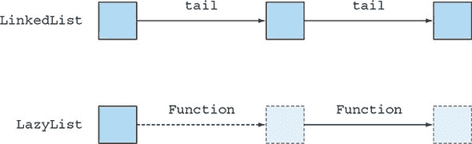

接下来，你将看到这个概念是如何工作的。你想要使用我们之前描述的算法生成一个无限素数列表。

##### 创建一个基本链表

回想一下，你可以在 Java 中通过以下方式定义一个简单的链表样式类 `MyLinkedList`，如下所示（使用最小的 `MyList` 接口）：

```
interface MyList<T> {
    T head();
    MyList<T> tail();
    default boolean isEmpty() {
        return true;
    }
}
class MyLinkedList<T> implements MyList<T> {
    private final T head;
    private final MyList<T> tail;
    public MyLinkedList(T head, MyList<T> tail) {
        this.head = head;
        this.tail = tail;
    }
    public T head() {
        return head;
    }
    public MyList<T> tail() {
        return tail;
    }
    public boolean isEmpty() {
        return false;
    }
}
class Empty<T> implements MyList<T> {
    public T head() {
        throw new UnsupportedOperationException();
    }
    public MyList<T> tail() {
        throw new UnsupportedOperationException();
    }
}
```

现在你可以按照以下方式构建一个示例 `MyLinkedList` 值：

```
MyList<Integer> l =
    new MyLinkedList<>(5, new MyLinkedList<>(10, new Empty<>()));
```

##### 创建一个基本懒列表

将此类适应懒列表概念的一个简单方法是不一次性将尾部存储在内存中，而是使用你在 第三章 中看到的 `Supplier<T>`（你也可以将其视为一个具有函数描述符 `void -> T` 的工厂）来生成列表的下一个节点。这种设计导致以下代码：

```
import java.util.function.Supplier;
class LazyList<T> implements MyList<T>{
    final T head;
    final Supplier<MyList<T>> tail;
    public LazyList(T head, Supplier<MyList<T>> tail) {
        this.head = head;
        this.tail = tail;
    }
    public T head() {
        return head;
    }
    public MyList<T> tail() {
        return tail.get();            *1*
    }
    public boolean isEmpty() {
        return false;
    }
}
```

+   ***1* 注意，与 head 方法相比，使用 Supplier 的 tail 编码了懒性。**

从 `Supplier` 调用 `get` 方法会导致创建一个 `Lazy-List` 节点（就像工厂创建一个新对象一样）。

现在你可以创建从 *n* 开始的无限懒列表，如下所示。将一个 `Supplier` 作为 `LazyList` 构造函数的 `tail` 参数传递，它将创建数字序列中的下一个元素：

```
public static LazyList<Integer> from(int n) {
    return new LazyList<Integer>(n, () -> from(n+1));
}
```

如果你尝试以下代码，你会看到它打印出 2 3 4。确实，数字是在需要时生成的。为了检查，适当地插入 `System.out.println` 或注意，如果 `from(2)` 尝试从 2 开始计算所有数字，它将永远运行：

```
LazyList<Integer> numbers = from(2);
int two = numbers.head();
int three = numbers.tail().head();
int four = numbers.tail().tail().head();
System.out.println(two + " " + three + " " + four);
```

##### 再次生成素数

看看你是否可以使用你到目前为止所做的一切来生成一个自定义的懒列表素数（这是你无法使用 Streams API 做到的事情）。如果你要使用新的 `LazyList` 来翻译之前使用 Streams API 的代码，代码看起来可能像这样：

```
public static MyList<Integer> primes(MyList<Integer> numbers) {
    return new LazyList<>(
                 numbers.head(),
                 () -> primes(
                         numbers.tail()
                                .filter(n -> n % numbers.head() != 0)
                             )
    );
}
```

##### 实现一个懒过滤

不幸的是，`LazyList`（更准确地说，`List` 接口）没有定义 `filter` 方法，所以前面的代码无法编译！为了解决这个问题，声明一个 `filter` 方法，如下所示：

```
public MyList<T> filter(Predicate<T> p) {
    return isEmpty() ?
           this :                                               *1*
           p.test(head()) ?
               new LazyList<>(head(), () -> tail().filter(p)) :
               tail().filter(p);
}
```

+   ***1* 你可以返回 new Empty<>()，但使用 'this' 一样好，也是空的。**

你的代码编译并通过，可以使用了！你可以通过链式调用 `tail` 和 `head` 来计算前三个素数，如下所示：

```
LazyList<Integer> numbers = from(2);
int two = primes(numbers).head();
int three = primes(numbers).tail().head();
int five = primes(numbers).tail().tail().head();
System.out.println(two + " " + three + " " + five);
```

这段代码打印出 2 3 5，这是前三个素数。现在你可以玩一些有趣的事情了。例如，你可以打印出所有的素数。（通过编写一个`printAll`方法，程序会无限运行，该方法会迭代打印列表的头部和尾部。）

```
static <T> void printAll(MyList<T> list){
    while (!list.isEmpty()){
        System.out.println(list.head());
        list = list.tail();
    }
}
printAll(primes(from(2)));
```

由于本章是关于函数式编程的，我们应该解释一下，这段代码可以简洁地递归编写：

```
static <T> void printAll(MyList<T> list){
    if (list.isEmpty())
        return;
    System.out.println(list.head());
    printAll(list.tail());
}
```

然而，这个程序不会无限运行。遗憾的是，它最终会因为栈溢出而失败，因为 Java 不支持尾调用消除，如第十八章所述（kindle_split_033.xhtml#ch18）。

##### 回顾

你已经用惰性列表和函数构建了大量技术，你只使用它们来定义一个包含所有素数的数据结构。这有什么实际用途呢？好吧，你已经看到了如何将函数放入数据结构中（因为 Java 8 允许这样做），你可以使用这些函数在需要时创建数据结构的一部分，而不是在结构创建时。如果你正在编写一个游戏程序，比如国际象棋，这可能很有用；你可以有一个理论上代表所有可能移动的整个树的数据结构（太大而不能积极计算），但可以在需要时创建。这种数据结构将是一个惰性树，而不是惰性列表。我们之所以在本章中专注于惰性列表，是因为它们提供了与 Java 8 的另一项功能——流的联系，这使得我们能够讨论流与惰性列表的优缺点。

性能问题仍然存在。人们很容易认为懒散地做事比积极地做事更好。当然，按需计算程序所需的价值和数据结构，而不是像传统执行那样创建所有这些值（也许更多），似乎是更好的选择。不幸的是，现实世界并不那么简单。懒散地做事的开销（比如在`LazyList`中的项目之间的额外`Supplier`）除非你探索的数据结构不到 10%，否则会超过这种理论上的好处。最后，有一种微妙的方式，你的`LazyList`值并不是真正懒散的。如果你遍历一个`LazyList`值，比如`from(2)`，可能到第 10 项，它也会创建所有节点两次，创建 20 个节点而不是 10 个。这种结果几乎不懒散。问题是`tail`中的`Supplier`在每次按需探索`LazyList`时都会被反复调用。你可以通过安排`tail`中的`Supplier`只在第一次按需探索时调用，并将结果缓存起来，从而在这一点上固化列表来解决这个问题。为了实现这个目标，在你的`LazyList`定义中添加一个`private Optional<LazyList<T>> alreadyComputed`字段，并安排`tail`方法适当地咨询和更新它。纯函数式语言 Haskell 就是这样安排的，使其所有数据结构在后者意义上都是适当的懒散的。如果你对 Haskell 感兴趣，可以阅读许多关于 Haskell 的文章之一。

我们的指导方针是记住，懒散的数据结构可以成为你编程武器库中的有用武器。当它们使应用程序更容易编程时使用这些结构；如果它们导致不可接受的低效，则以更传统的风格重写它们。

下一个部分处理几乎所有函数式编程语言（除了 Java）的另一个特性：模式匹配。

### 19.4. 模式匹配

被普遍认为的函数式编程还有一个其他重要的方面：（结构化）*模式匹配*，不要与模式匹配和正则表达式混淆。第一章以观察数学可以写出如下定义结束：

```
f(0) = 1
f(n) = n*f(n-1) otherwise
```

而在 Java 中，你必须编写一个`if-then-else`或`switch`语句。随着数据类型的变得更加复杂，处理它们所需的代码（和混乱）量也会增加。使用模式匹配可以减少这种混乱。

为了说明，考虑一个你想遍历的树结构。考虑一个由数字和二元运算组成的简单算术语言：

```
class Expr { ... }
class Number extends Expr { int val; ... }
class BinOp extends Expr { String opname; Expr left, right; ... }
```

假设你被要求编写一个简化某些表达式的函数。例如，5 + 0 可以简化为 5。使用我们的`Expr`类，`new BinOp("+", new Number(5), new Number(0))`可以简化为`Number(5)`。你可能像这样遍历一个`Expr`结构：

```
Expr simplifyExpression(Expr expr) {
    if (expr instanceof BinOp
          && ((BinOp)expr).opname.equals("+"))
          && ((BinOp)expr).right instanceof Number
          && ... // it's all getting very clumsy
          && ... ) {
        return (Binop)expr.left;
     }
     ...
}
```

你可以看到，这段代码很快就会变得丑陋！

#### 19.4.1. 访问者设计模式

在 Java 中展开数据类型的另一种方法是使用访问者设计模式。本质上，你创建一个单独的类，该类封装了一个访问特定数据类型的算法。

访问者类通过接受数据类型的特定实例作为输入来工作；然后它可以访问所有成员。以下是一个示例。首先，向 `BinOp` 添加方法 `accept`，该方法接受 `SimplifyExprVisitor` 作为参数并将自身传递给它（并为 `Number` 添加类似的方法）：

```
class BinOp extends Expr{
    ...
    public Expr accept(SimplifyExprVisitor v){
        return v.visit(this);
    }
}
```

现在 `SimplifyExprVisitor` 可以访问 `BinOp` 对象并展开它：

```
public class SimplifyExprVisitor {
    ...
    public Expr visit(BinOp e){
        if("+".equals(e.opname) && e.right instanceof Number && ...){
            return e.left;
        }
        return e;
    }
}
```

#### 19.4.2\. 模式匹配救命

一个更简单的解决方案是使用一个名为模式匹配的功能。该功能在 Java 中不可用，因此我们将使用 Scala 编程语言的小例子来说明模式匹配。这些例子给你一个想法，如果 Java 支持模式匹配，可能会实现什么。

给定表示算术表达式的数据类型 `Expr`，在 Scala 编程语言（我们之所以使用它是因为其语法与 Java 最接近）中，你可以编写以下代码来分解一个表达式：

```
def simplifyExpression(expr: Expr): Expr = expr match {
    case BinOp("+", e, Number(0)) => e   // Adding zero
    case BinOp("*", e, Number(1)) => e   // Multiplying by one
    case BinOp("/", e, Number(1)) => e   // Dividing by one
    case _ => expr                       // Can't simplify expr
}
```

这种模式匹配的使用提供了一种极其简洁且富有表现力的方式来操作许多树状数据结构。通常，这种技术对于构建编译器或处理业务规则的引擎非常有用。请注意，Scala 语法

```
Expression match { case Pattern => Expression ... }
```

与 Java 语法相似

```
switch (Expression) { case Constant : Statement ... }
```

使用 Scala 的通配符模式 _ 使最终的 `case` 扮演 Java 中的 `default` 角色：。主要的可见语法差异是 Scala 以表达式为导向，而 Java 则更以语句为导向。但对于程序员来说，主要的表达差异是 Java 中的 `case` 标签模式仅限于几种原始类型、枚举、一些封装特定原始类型的特殊类以及 `String`。使用具有模式匹配功能的语言的最大实际优势之一是你可以避免使用大型的 `switch` 或 `if-then-else` 语句链，这些语句链与字段选择操作交织在一起。

很明显，Scala 的模式匹配在表达简洁性方面优于 Java，你可以期待未来 Java 允许更具有表现力的 `switch` 语句。（我们在第二十一章中提出了这个特性的具体建议。chapter 21。）

同时，我们向你展示 Java 8 lambdas 如何提供在 Java 中实现类似模式匹配代码的另一种方法。我们纯粹为了向你展示 lambdas 的另一个有趣应用来描述这项技术。

##### 在 Java 中伪造模式匹配

首先，考虑 Scala 的模式匹配 `match` 表达式形式的丰富性。案例

```
def simplifyExpression(expr: Expr): Expr = expr match {
    case BinOp("+", e, Number(0)) => e
    ...
```

意味着“检查 `expr` 是否是 `BinOp`，提取其三个组件（`opname`，`left`，`right`），然后对这些组件进行模式匹配——第一个与 `String` + 匹配，第二个与变量 `e`（它总是匹配）匹配，第三个与模式 `Number(0)` 匹配。”换句话说，Scala（以及许多其他函数式语言）中的模式匹配是多层的。你用 Java 8 的 lambdas 模拟的模式匹配只产生单层模式匹配。在前面的例子中，你的模拟会表达 `BinOp(op, l, r)` 或 `Number(n)` 这样的情况，但不会表达 `BinOp("+", e, Number(0))`。

首先，我们做一个稍微令人惊讶的观察：既然你有了 lambdas，原则上你可以在代码中永远不用 `if-then-else`。你可以用方法调用替换 `condition ? e1 : e2` 这样的代码，如下所示：

```
myIf(condition, () ->  e1, () ->  e2);
```

在某个地方，可能是在图书馆里，你会找到一个定义（类型为 `T` 的泛型）：

```
static <T> T myIf(boolean b, Supplier<T> truecase, Supplier<T> falsecase) {
    return b ? truecase.get() : falsecase.get();
}
```

类型 `T` 扮演了条件表达式的结果类型角色。原则上，你可以用其他控制流结构，如 `switch` 和 `while`，执行类似的技巧。

在正常代码中，这种编码会使你的代码更加晦涩，因为 `if-then-else` 完美地捕捉了这个习语。但我们已经注意到，Java 的 `switch` 和 `if-then-else` 并没有捕捉到模式匹配的习语，而且结果证明 lambdas 可以编码（单层）模式匹配——比 `if-then-else` 链要整洁得多。

回到 `Expr` 类的模式匹配值（该类有两个子类，`BinOp` 和 `Number`），你可以定义一个 `patternMatchExpr` 方法（再次泛型 `T`，模式匹配的结果类型）：

```
interface TriFunction<S, T, U, R>{
    R apply(S s, T t, U u);
}
static <T> T patternMatchExpr(
                       Expr e,
                       TriFunction<String, Expr, Expr, T> binopcase,
                       Function<Integer, T> numcase,
                       Supplier<T> defaultcase) {
    return
     (e instanceof BinOp) ?
        binopcase.apply(((BinOp)e).opname, ((BinOp)e).left,
                                           ((BinOp)e).right) :
     (e instanceof Number) ?
        numcase.apply(((Number)e).val) :
        defaultcase.get();
}
```

结果是，方法调用

```
patternMatchExpr(e, (op, l, r) -> {return *binopcode*;},
                    (n) -> {return *numcode*;},
                    () -> {return *defaultcode*;});
```

判断 `e` 是否是 `BinOp`（如果是，则运行 `binopcode`，它可以通过标识符 `op, l, r` 访问 `BinOp` 的字段）或 `Number`（如果是，则运行 `numcode`，它可以通过值 `n` 访问），该方法甚至为 `defaultcode` 做了准备，如果有人后来创建了一个既不是 `BinOp` 也不是 `Number` 的树节点，则会执行该代码。

以下列表显示了如何通过简化加法和乘法表达式来开始使用 `patternMatchExpr`。

##### 列表 19.1\. 实现模式匹配以简化表达式

```
public static Expr simplify(Expr e) {
    TriFunction<String, Expr, Expr, Expr> binopcase =                     *1*
        (opname, left, right) -> {
            if ("+".equals(opname)) {                                     *2*
                if (left instanceof Number && ((Number) left).val == 0) {
                    return right;
                }
                if (right instanceof Number && ((Number) right).val == 0) {
                    return left;
                }
            }
            if ("*".equals(opname)) {                                     *3*
                if (left instanceof Number && ((Number) left).val == 1) {
                    return right;
                }
                if (right instanceof Number && ((Number) right).val == 1) {
                    return left;
                }
            }
            return new BinOp(opname, left, right);
        };
    Function<Integer, Expr> numcase = val -> new Number(val);             *4*
    Supplier<Expr> defaultcase = () -> new Number(0);                     *5*
    return patternMatchExpr(e, binopcase, numcase, defaultcase);          *6*
```

+   ***1* 处理 BinOp 表达式**

+   ***2* 处理加法情况**

+   ***3* 处理乘法情况**

+   ***4* 处理一个 Number**

+   ***5* 如果用户提供了一个未识别的 Expr，则有一个默认情况**

+   ***6* 应用模式匹配**

现在，你可以按照以下方式调用 `simplify` 方法：

```
Expr e = new BinOp("+", new Number(5), new Number(0));
Expr match = simplify(e);
System.out.println(match);            *1*
```

+   ***1* 打印 5**

到目前为止，你已经看到了很多信息：高阶函数、柯里化、持久数据结构、惰性列表和模式匹配。下一节将探讨我们推迟到最后的某些细微差别，以避免使文本过于复杂。

### 19.5\. 杂项

在本节中，我们探讨函数式编程和引用透明性的两个细微之处：一个关于效率，另一个关于返回相同的结果。这些问题很有趣，但我们将其放在这里，因为这些问题涉及到副作用，并不是概念上的核心。我们还探讨了*组合子*的概念——即接受两个或更多函数并返回另一个函数的方法或函数。这个想法启发了 Java 8 API 的许多新增功能，以及更近期的 Java 9 Flow API。

#### 19.5.1. 缓存或记忆化

假设你有一个无副作用的`computeNumberOfNodes(Range)`方法，它计算一个具有树形拓扑结构的网络中给定范围内的节点数。假设网络永远不会改变（即结构是不可变的），但调用`computeNumberOfNodes`方法计算成本很高，因为需要递归遍历结构。你可能需要反复计算结果。如果你有引用透明性，你有一个巧妙的方法来避免这种额外的开销。一个标准的解决方案是*记忆化*——在方法周围添加一个缓存（如`HashMap`）。首先，包装器会咨询缓存以查看（参数，结果）对是否已经在缓存中。如果是这样，它可以立即返回存储的结果。否则，你会调用`computeNumberOfNodes`，但在从包装器返回之前，你将新的（参数，结果）对存储在缓存中。严格来说，这个解决方案并不是纯函数式的，因为它会修改多个调用者共享的数据结构，但包装后的代码是引用透明的。

实际上，这段代码是这样工作的：

```
final Map<Range,Integer> numberOfNodes = new HashMap<>();
Integer computeNumberOfNodesUsingCache(Range range) {
    Integer result = numberOfNodes.get(range);
    if (result != null){
        return result;
    }
    result = computeNumberOfNodes(range);
    numberOfNodes.put(range, result);
    return result;
}
```

|  |
| --- |

##### 注意

Java 8 通过为这种用例添加`compute-If-Absent`方法来增强`Map`接口（见附录 Bappendix B）。你可以使用`computeIfAbsent`来编写更清晰的代码：

```
Integer computeNumberOfNodesUsingCache(Range range) {
    return numberOfNodes.computeIfAbsent(range,
                                         this::computeNumberOfNodes);
}
```

|  |
| --- |

很明显，`computeNumberOfNodesUsingCache`方法具有引用透明性（假设`computeNumberOfNodes`方法也是引用透明的）。但`numberOfNodes`具有可变的共享状态，而`HashMap`不是`synchronized`^([3])，这意味着这段代码不是线程安全的。即使使用（锁保护的）`Hashtable`或（无锁的）`ConcurrentHashMap`代替`HashMap`，如果从多个核心对`numberOfNodes`进行并行调用，也可能不会产生预期的性能。在将（参数，结果）对放回`map`之前，你发现`range`不在`map`中，这之间有一个竞争条件，这意味着多个进程可能会计算相同的值添加到`map`中。

> ³
> 
> 这里是容易滋生错误的地方。使用`HashMap`如此容易，以至于很容易忘记 Java 手册指出它不是线程安全的（或者因为*你的*程序目前是单线程的而不在乎）。

也许从这场斗争中我们能得到的最好的东西就是这样一个事实：将可变状态与并发混合比我们想象的要复杂。函数式编程除了用于低级性能黑客，如缓存之外，避免这种做法。第二个启示是，除了实现缓存等技巧之外，如果你以函数式风格编写代码，你永远不需要关心你调用的另一个函数式方法是否是同步的，因为你知道它没有共享的可变状态。

#### 19.5.2\. “返回相同的对象”是什么意思？

再次考虑第 19.2.3 节中的二叉树示例。在图 19.4 中，变量`t`指向一个现有的`Tree`，图显示了调用`fupdate("Will", 26, t)`以产生一个新的`Tree`的效果，这个新`Tree`可能被分配给变量`t2`。图清楚地表明`t`及其所有可到达的数据结构都没有被修改。现在假设你在附加赋值中执行一个文本上相同的调用：

```
t3 = fupdate("Will", 26, t);
```

现在`t3`指向三个包含与`t2`中相同数据的新的节点。问题是`fupdate`是否是引用透明的。*引用透明*意味着“相同的参数（这里的情况）意味着相同的结果。”问题是`t2`和`t3`是不同的引用，因此`(t2 == t3)`是`false`，所以看起来你将不得不得出结论，`fupdate`不是引用透明的。但是当你使用不可修改的持久数据结构时，`t2`和`t3`之间不存在逻辑上的差异。

我们可以对此进行长时间的辩论，但最简单的格言是，函数式编程通常使用`equals`来比较结构化值，而不是`==`（引用相等），因为数据不会被修改，在这个模型下，`fupdate`是引用透明的。

#### 19.5.3\. 组合子

在函数式编程中，编写一个接受两个函数并产生另一个将这两个函数以某种方式组合的函数（可能被写成方法）是很常见且自然的。这个概念通常被称为*组合子*。Java 8 API 中的许多新功能都受到了这种想法的启发，例如`CompletableFuture`类中的`thenCombine`方法。你可以给这个方法提供两个`CompletableFuture`和一个`BiFunction`来产生另一个`CompletableFuture`。

尽管对函数式编程中组合子的详细讨论超出了本书的范围，但看看几个特殊情况以给你一个关于操作函数的常见和自然函数式编程结构的味道是值得的。以下方法编码了函数组合的概念：

```
static <A,B,C> Function<A,C> compose(Function<B,C> g, Function<A,B> f) {
    return x -> g.apply(f.apply(x));
}
```

此方法将函数 `f` 和 `g` 作为参数，并返回一个函数，其效果是先执行 `f`，然后执行 `g`。然后你可以定义一个操作，将内部迭代作为组合器。假设你想要对数据进行操作，并重复应用函数 `f`，*n* 次，就像循环一样。你的操作（可以称为 `repeat`）接受一个函数 `f`，说明一次迭代发生的事情，并返回一个函数，说明 *n* 次迭代发生的事情。例如，调用

```
repeat(3, (Integer x) -> 2*x);
```

返回 `x ->(2*(2*(2*x))` 或等价于 `x -> 8*x`。

你可以通过编写以下代码来测试此代码：

```
System.out.println(repeat(3, (Integer x) -> 2*x).apply(10));
```

这将打印 80。

你可以这样编写 `repeat` 方法（注意零次循环的特殊情况）：

```
static <A> Function<A,A> repeat(int n, Function<A,A> f) {
    return n==0 ? x -> x                                       *1*
                : compose(f, repeat(n-1, f));          *2*
}
```

+   ***1* 如果 n 为零，则返回无操作的身份函数。**

+   ***2* 否则，先执行 f，重复 n-1 次，然后再次执行。**

这种想法的变体可以模拟更丰富的迭代概念，包括在迭代之间传递可变状态的函数模型。但是，现在是时候继续前进了。本章的作用是为你提供一个关于函数式编程的总结，作为 Java 8 的基础。许多优秀的书籍都深入探讨了函数式编程。

### 摘要

+   一等函数是可以作为参数传递、作为结果返回，并且可以存储在数据结构中的函数。

+   高阶函数接受一个或多个函数作为输入或返回另一个函数。Java 中的典型高阶函数包括 `comparing`、`andThen` 和 `compose`。

+   柯里化是一种让你模块化函数和重用代码的技术。

+   持久数据结构在修改时保留其之前的版本。因此，它可以防止不必要的防御性复制。

+   Java 中的流不能自定义。

+   惰性列表是 Java 流的更表达性版本。惰性列表允许你通过使用可以创建更多数据结构的供应商按需生成列表的元素。

+   模式匹配是一种函数式特性，它允许你展开数据类型。你可以将数据匹配视为泛化 Java 的 `switch` 语句。

+   引用透明性允许计算被缓存。

+   组合器是结合两个或更多函数或其他数据结构的函数式思想。

## 第二十章。混合 OOP 和 FP：比较 Java 和 Scala

*本章涵盖*

+   Scala 简介

+   Java 与 Scala 以及反之的关系

+   Scala 中的函数与 Java 中的函数比较

+   类和特质

Scala 是一种混合面向对象和函数式编程的编程语言。它通常被视为想要在 JVM 上运行且具有 Java 感觉的静态类型编程语言中具有函数式特性的程序员的 Java 的替代语言。Scala 引入了许多比 Java 更多的特性：更复杂的类型系统、类型推断、模式匹配（如第十九章所述）、定义特定领域语言的构造，等等。此外，你可以在 Scala 代码中访问所有 Java 库。

你可能会想知道为什么在一本 Java 书中会有关于 Scala 的章节。这本书主要关注在 Java 中采用函数式编程风格。Scala，就像 Java 一样，支持集合的函数式处理概念（即类似流式操作）、一等函数和默认方法。但 Scala 将这些想法进一步推进，提供了比 Java 更大的功能集来支持这些想法。我们相信，您可能会对将 Scala 与 Java 采用的方法进行比较，并看到 Java 的局限性感到有趣。本章旨在阐明这一点，以满足您的求知欲。我们并不一定鼓励您采用 Scala 而不是 Java。JVM 上其他有趣的新的编程语言，如 Kotlin，也值得一看。本章的目的是开阔您的视野，了解 Java 之外还有什么。我们相信，对于一位全面发展的软件工程师来说，了解更广泛的编程语言生态系统是很重要的。

还要记住，本章的目的不是教您如何编写地道的 Scala 代码，也不是告诉您关于 Scala 的所有内容。Scala 支持许多在 Java 中不可用的特性（如模式匹配、for-comprehensions 和 implicits），我们不会讨论这些特性。相反，我们专注于比较 Java 和 Scala 的特性，以给您一个更全面的了解。您会发现，与 Java 相比，您可以在 Scala 中编写更简洁、更易读的代码，例如。

本章从 Scala 的简介开始：编写简单的程序和操作集合。接下来，我们讨论 Scala 中的函数：一等函数、闭包和柯里化。最后，我们探讨 Scala 中的类以及一个称为 traits 的特性，这是 Scala 对接口和默认方法的实现。

### 20.1\. Scala 简介

本节简要介绍了 Scala 的基本特性，以便您对简单的 Scala 程序有一个感觉。我们从一个稍微修改过的“Hello world”示例开始，这个示例以命令式风格和函数式风格编写。然后我们查看 Scala 支持的一些数据结构——`List`、`Set`、`Map`、`Stream`、`Tuple` 和 `Option`——并将它们与 Java 进行比较。最后，我们介绍 *traits*，Scala 用它来替代 Java 的接口，它也支持在对象实例化时继承方法。

#### 20.1.1\. Hello beer

为了从经典的“Hello world”示例中有所改变，我们可以引入一些啤酒。你希望在屏幕上打印以下输出：

```
Hello 2 bottles of beer
Hello 3 bottles of beer
Hello 4 bottles of beer
Hello 5 bottles of beer
Hello 6 bottles of beer
```

##### 命令式风格的 Scala

当你使用命令式风格在 Scala 中打印这个输出时，代码如下：

```
object Beer {
  def main(args: Array[String]){
    var n : Int = 2
    while( n <= 6){
      println(s"Hello ${n} bottles of beer")           *1*
      n += 1
    }
  }
}
```

+   ***1* 字符串插值**

你可以在官方 Scala 网站上找到有关如何运行此代码的信息（见[`docs.scala-lang.org/getting-started.html`](https://docs.scala-lang.org/getting-started.html)）。这个程序看起来与你在 Java 中编写的程序相似，其结构也与 Java 程序相似，包含一个名为`main`的方法，该方法接受一个字符串数组作为参数。（类型注解遵循`s : String`语法，而不是 Java 中的`Strings`。）`main`方法不返回任何值，因此在 Scala 中不需要声明返回类型，就像在 Java 中使用`void`时必须做的那样。

|  |
| --- |

##### 注意

在 Scala 中，通常非递归方法声明不需要显式返回类型，因为 Scala 可以为你推断类型。

|  |
| --- |

在我们查看`main`方法体之前，我们需要讨论`object`声明。毕竟，在 Java 中，你必须在类内部声明`main`方法。`object`声明引入了一个单例对象，同时声明了一个名为`Beer`的类并实例化它。只创建了一个实例。这个例子是第一个将经典设计模式（单例设计模式）作为语言特性实现的例子，并且可以直接使用。此外，你可以将`object`声明内的方法视为静态声明，这就是为什么`main`方法的签名没有明确声明为`static`。

现在看看`main`方法的主体。这个方法看起来与 Java 方法相似，但语句不需要以分号结尾（这是可选的）。主体包含一个`while`循环，它递增一个可变变量`n`。对于`n`的每个新值，你都会在屏幕上打印一个字符串，使用预定义的`println`方法。`println`行展示了 Scala 的另一个特性：*字符串插值*，它允许你直接在字符串字面量中嵌入变量和表达式。在先前的代码中，你可以在字符串字面量`s"Hello ${n} bottles of beer"`中直接使用变量`n`。在字符串前加上插值器`s`提供了这种魔法。通常在 Java 中，你必须进行显式的连接，例如`"Hello " + n + " bottles of beer"`。

##### 函数式风格的 Scala

但在我们整本书都在讨论函数式编程风格之后，Scala 又能提供什么呢？前面的代码可以用更函数式的方式在 Java 中写成如下形式：

```
public class Foo {
    public static void main(String[] args) {
        IntStream.rangeClosed(2, 6)
                 .forEach(n -> System.out.println("Hello " + n +
                                                  " bottles of beer"));
    }
}
```

下面是这段代码在 Scala 中的样子：

```
object Beer {
  def main(args: Array[String]){
    2 to 6 foreach { n => println(s"Hello ${n} bottles of beer") }
  }
}
```

Scala 代码与 Java 代码类似，但更简洁。首先，你可以使用表达式`2 to 6`创建一个范围。这里有一个很酷的点：`2`是一个`Int`类型的对象。在 Scala 中，*一切都是对象*；没有像 Java 中那样的原始类型概念，这使得 Scala 成为一门完整的面向对象语言。Scala 中的`Int`对象支持一个名为`to`的方法，它接受另一个`Int`作为参数并返回一个范围。你可以写成`2.to(6)`。但是只有一个参数的方法可以写成中缀形式。接下来，`foreach`（小写`e`）与 Java 中的`forEach`（大写`E`）类似。这个方法在范围上可用（你再次使用中缀表示法），它接受一个 lambda 表达式作为参数，用于对每个元素应用。lambda 表达式的语法与 Java 中的类似，但箭头是`=>`而不是`->`。^([1]) 上述代码是函数式的；你并没有像在早期示例中使用`while`循环那样修改变量。

> ¹
> 
> 注意，Scala 中的术语*匿名函数*和*closures*（可以互换使用）指的是 Java 中称为 lambda 表达式的概念。

#### 20.1.2\. 基本数据结构：List、Set、Map、Tuple、Stream、Option

喝了几杯啤酒解渴之后，你感觉好吗？大多数真实程序都需要操作和存储数据，所以在本节中，你将使用 Scala 操作集合，并查看这个过程与 Java 的比较。

##### 创建集合

在 Scala 中创建集合很简单，这得益于 Scala 对简洁性的重视。为了举例说明，以下是如何创建一个`Map`：

```
val authorsToAge = Map("Raoul" -> 23, "Mario" -> 40, "Alan" -> 53)
```

这段代码中有几个新特点。首先，你可以直接使用语法`->`创建一个`Map`并将键与值关联起来，这是很酷的。与 Java 中手动添加元素不同，你不需要手动添加元素：

```
Map<String, Integer> authorsToAge = new HashMap<>();
authorsToAge.put("Raoul", 23);
authorsToAge.put("Mario", 40);
authorsToAge.put("Alan", 53);
```

然而，你已经在第八章中了解到，Java 9 有几个受 Scala 启发的工厂方法，可以帮助你整理这类代码：

```
Map<String, Integer> authorsToAge
    = Map.ofEntries(entry("Raoul", 23),
                    entry("Mario", 40),
                    entry("Alan", 53));
```

第二个新特点是，你可以选择不注释变量`authorsToAge`的类型。你可以明确写出`val authorsToAge : Map[String, Int]`，但 Scala 可以为你推断变量的类型。（注意，代码仍然是静态检查的。所有变量在编译时都有一个给定的类型。）我们将在第二十一章中回到这个特性。第三，你使用`val`关键字而不是`var`。有什么区别？关键字`val`表示变量是只读的，不能重新赋值（就像 Java 中的`final`一样）。关键字`var`表示变量是可读写的。

那其他集合呢？你可以轻松创建一个`List`（单链表）或一个`Set`（无重复），如下所示：

```
val authors = List("Raoul", "Mario", "Alan")
val numbers = Set(1, 1, 2, 3, 5, 8)
```

`authors`变量有三个元素，而`numbers`变量有五个元素。

##### 不可变与可变

需要记住的一个重要事实是，你之前创建的集合默认是不可变的，这意味着创建后不能更改。不可变性很有用，因为你知道在程序的任何时刻访问集合都会得到具有相同元素的集合。

你如何在 Scala 中更新不可变集合？回到 第十九章 中使用的术语，Scala 中的此类集合被称为 *持久性*。更新集合会产生一个新的集合，尽可能多地与上一个版本共享，而不会受到更改的影响（如图 19.3 和 19.4 所示）。由于这个属性，你的代码具有更少的隐式数据依赖：关于代码中哪个位置更新集合（或任何其他共享数据结构）以及何时更新的混淆更少。

以下示例演示了这个概念。向 `Set` 添加一个元素：

```
val numbers = Set(2, 5, 3);
val newNumbers = numbers + 8        *1*
println(newNumbers)                 *2*
println(numbers)                    *3*
```

+   ***1* 在这里，+ 是一种将 8 添加到集合的方法，从而创建一个新的集合对象。**

+   ***2* (2, 5, 3, 8)**

+   ***3* (2, 5, 3)**

在这个例子中，数字集合没有被修改。相反，创建了一个新的 `Set`，并添加了一个额外的元素。

注意，Scala 不会强迫你使用不可变集合——只是使你在代码中采用不可变性变得容易。此外，在 `scala.collection.mutable` 包中提供了可变版本的集合。

|  |
| --- |

**不可变与不可变**

Java 提供了多种创建不可变集合的方法。在以下代码中，变量 `newNumbers` 是集合 `numbers` 的只读视图：

```
Set<Integer> numbers = new HashSet<>();
Set<Integer> newNumbers = Collections.unmodifiableSet(numbers);
```

这段代码意味着你将无法通过 `newNumbers` 变量添加新元素。但是，不可变集合是可变集合的包装器，因此你可以通过访问 `numbers` 变量来添加元素。

相比之下，不可变集合保证没有任何东西可以更改集合，无论指向它的变量有多少。

我们在 第十九章 中解释了如何创建持久数据结构：在修改时保留其先前版本的不可变数据结构。任何修改都会产生一个新的更新结构。

|  |
| --- |

##### 使用集合

现在你已经看到了如何创建集合，你需要知道你可以用它们做什么。Scala 中的集合支持类似于 Java `Stream` API 中的操作。你可能会在以下示例中认出 `filter` 和 `map`，如图 20.1 所示：

```
val fileLines = Source.fromFile("data.txt").getLines.toList()
val linesLongUpper
  = fileLines.filter(l => l.length() > 10)
             .map(l => l.toUpperCase())
```

##### 图 20.1\. Scala 的 `List` 的流式操作

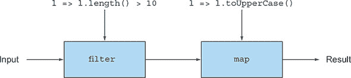

不要担心第一行，它将文件转换为包含文件中行的字符串列表（类似于 Java 中的 `Files.readAllLines` 提供的功能）。第二行创建了一个包含两个操作的管道：

+   一个 `filter` 操作，只选择长度大于 10 的行

+   一个将长行转换为大写的 `map` 操作

这段代码也可以写成以下形式：

```
val linesLongUpper
  = fileLines filter (_.length() > 10) map(_.toUpperCase())
```

你使用中缀表示法以及下划线字符（`_`），它是一个占位符，与任何参数位置匹配。在这种情况下，你可以将 `_.length()` 读取为 `l => l.length()`。在传递给 `filter` 和 `map` 的函数中，下划线绑定要处理的行参数。

Scala 的集合 API 中还有许多其他有用的操作。我们建议查看 Scala 文档以获得一些想法（[`docs.scala-lang.org/overviews/collections/introduction.html`](https://docs.scala-lang.org/overviews/collections/introduction.html)）。请注意，此 API 比流的 API（包括支持解包操作，这允许你组合两个列表的元素）略丰富，因此查看它绝对会带来一些编程习惯。这些习惯也可能在未来版本的 Java 的 Streams API 中出现。

最后，记住在 Java 中，你可以通过在 `Stream` 上调用 `parallel` 来请求并行执行管道。Scala 也有类似的技巧。你只需要使用 `par` 方法：

```
val linesLongUpper
  = fileLines.par filter (_.length() > 10) map(_.toUpperCase())
```

##### 元组

这一节探讨了在 Java 中通常非常冗长的另一个特性：元组。你可能想使用元组来按姓名和电话号码（在这里是简单的对）分组人员，而不需要声明一个专门的新类并为它实例化一个对象：`("Raoul", "+44 7700 700042")`、`("Alan", "+44 7700 700314")`，等等。

不幸的是，Java 不提供对元组的支持，所以你必须创建自己的数据结构。以下是一个简单的 `Pair` 类：

```
public class Pair<X, Y> {
    public final X x;
    public final Y y;
    public Pair(X x, Y y){
        this.x = x;
        this.y = y;
    }
}
```

当然，你还需要显式地实例化对：

```
Pair<String, String> raoul = new Pair<>("Raoul", "+44 7700 700042");
Pair<String, String> alan = new Pair<>("Alan", "+44 7700 700314");
```

好吧，但是三元组和任意大小的元组怎么办？为每个元组大小定义一个新的类既繁琐又最终会影响你程序的易读性和可维护性。

Scala 提供了 *元组字面量*，允许你通过简单的语法糖和正常的数学符号创建元组，如下所示：

```
val raoul = ("Raoul", "+44 7700 700042")
val alan = ("Alan", "+44 7700 700314")
```

Scala 支持任意大小的^([2])元组，所以以下都是可能的：

> ²
> 
> 元组最多有 22 个元素。

```
val book = (2018 "Modern Java in Action", "Manning")     *1*
val numbers = (42, 1337, 0, 3, 14)                       *2*
```

+   ***1* 一个类型为 (Int, String, String) 的元组**

+   ***2* 一个类型为 (Int, Int, Int, Int, Int) 的元组**

你可以通过使用访问器 `_1`、`_2`（从 1 开始）来通过位置访问元组的元素，就像这个例子一样：

```
println(book._1)         *1*
println(numbers._4)      *2*
```

+   ***1* 打印 2018**

+   ***2* 打印 3**

难道这个例子不像你在 Java 中需要写的那么好吗？好消息是，关于在 Java 的未来版本中引入元组字面量的讨论正在进行。（有关 Java 中可能的新功能的更多讨论，请参阅第二十一章）

##### 流

我们迄今为止所描述的集合——`List`、`Set`、`Map` 和 `Tuple`——都是立即评估的（即立即）。到现在为止，你知道 Java 中的流是按需评估的（即惰性）。你在 第五章 中看到，由于这个特性，流可以表示一个无限序列而不会溢出内存。

Scala 还提供了一个相应的惰性评估数据结构，称为 `Stream`。但 Scala 中的 `Stream` 提供的功能比 Java 中的更多。Scala 中的 `Stream` 会记住计算过的值，以便可以访问前面的元素。此外，`Stream` 是索引的，因此可以通过索引访问元素，就像列表一样。请注意，这些额外属性的权衡是 `Stream` 相比 Java 的 `Stream` 在内存效率上更低，因为能够引用前面的元素意味着元素需要被记住（缓存）。

##### Option

你还会熟悉另一种数据结构 `Option`——Scala 对 Java 的 `Optional` 的实现，我们已在 第十一章 中讨论过。我们曾论证，在可能的情况下，你应该使用 `Optional` 来设计更好的 API，这样用户通过阅读方法的签名就可以知道他们是否可以期待一个可选值。在可能的情况下，你应该使用这种数据结构而不是 `null` 来防止 `null`-pointer 异常。

你在 第十一章 中看到，你可以使用 `Optional` 来返回一个大于某个最小年龄的人的保险名称，如下所示：

```
public String getCarInsuranceName(Optional<Person> person, int minAge) {
    return person.filter(p -> p.getAge() >= minAge)
                 .flatMap(Person::getCar)
                 .flatMap(Car::getInsurance)
                 .map(Insurance::getName)
                 .orElse("Unknown");
}
```

在 Scala 中，你可以像使用 `Optional` 一样使用 `Option`：

```
  def getCarInsuranceName(person: Option[Person], minAge: Int) =
    person.filter(_.age >= minAge)
          .flatMap(_.car)
          .flatMap(_.insurance)
          .map(_.name)
          .getOrElse("Unknown")
```

你可以识别出相同的结构和除了 `getOrElse` 之外的方法名称，`getOrElse` 是 Java 中的 `orElse` 的等价物。你看，在这本书的整个过程中，你已经学习了可以直接应用于其他编程语言的新概念！不幸的是，由于与 Java 的兼容性原因，Scala 中也存在 `null`，但其使用被高度不建议。

### 20.2. 函数

Scala 函数可以被视为执行任务的指令序列。这些函数对于抽象行为非常有用，并且是函数式编程的基石。

在 Java 中，你熟悉 *方法*：与类关联的函数。你也看到了 lambda 表达式，可以被认为是匿名函数。Scala 提供了比 Java 更丰富的功能来支持函数，我们将在本节中探讨这些功能。Scala 提供以下功能：

+   *函数类型*——表示 Java 函数描述符（即表示在函数式接口中声明的抽象方法的签名）的语法糖，我们在 第三章 中描述过

+   没有对非局部变量进行写入限制的匿名函数，这是 Java 的 lambda 表达式所不具备的

+   支持 *柯里化*，这意味着将接受多个参数的函数分解为一系列函数，每个函数接受一些参数

#### 20.2.1\. 首类函数在 Scala 中

Scala 中的函数是 *首类值*，这意味着它们可以作为参数传递，作为结果返回，并存储在变量中，就像 `Integer` 和 `String` 这样的值一样。正如我们在前面的章节中向您展示的那样，Java 中的方法引用和 lambda 表达式也可以看作是首类函数。

下面是一个 Scala 中首类函数如何工作的示例。假设你有一个表示你收到的推文的字符串列表。你想要根据不同的标准过滤这个列表，比如提到单词 *Java* 的推文或特定短长度的推文。你可以将这些两个标准表示为 *谓词*（返回 `Boolean` 的函数）：

```
def isJavaMentioned(tweet: String) : Boolean = tweet.contains("Java")
def isShortTweet(tweet: String) : Boolean = tweet.length() < 20
```

在 Scala 中，你可以直接将这些方法传递给内置的 `filter`，如下所示（正如你可以在 Java 中使用方法引用传递它们一样）：

```
val tweets = List(
    "I love the new features in Java",
    "How's it going?",
    "An SQL query walks into a bar, sees two tables and says 'Can I join you?'"
)
tweets.filter(isJavaMentioned).foreach(println)
tweets.filter(isShortTweet).foreach(println)
```

现在检查内置方法 `filter` 的签名：

```
def filterT => Boolean): List[T]
```

你可能会想知道参数 `p` 的类型 `(T) => Boolean` 是什么意思，因为在 Java 中，你可能会期望一个函数式接口。这种 Scala 语法（目前）在 Java 中不可用，但它描述了一种 *函数类型*。在这里，该类型表示一个接受类型 `T` 的对象并返回 `Boolean` 的函数。在 Java 中，这种类型可以表示为 `Predicate<T>` 或 `Function<T, Boolean>`，它与 `isJavaMentioned` 和 `isShortTweet` 方法的签名相同，因此你可以将它们作为 `filter` 的参数传递。Java 语言的开发者决定不引入类似语法来保持语言与先前版本的一致性。（在语言的新版本中引入过多的新语法被视为增加了过多的认知负担。）

#### 20.2.2\. 匿名函数和闭包

Scala 也支持匿名函数，其语法与 lambda 表达式类似。在下面的示例中，你可以将一个匿名函数赋值给名为 `isLong-Tweet` 的变量，该函数检查给定的推文是否很长：

```
val isLongTweet : String => Boolean                 *1*
    = (tweet : String) => tweet.length() > 60       *2*
```

+   ***1* 一个从 String 到 Boolean 的函数类型变量**

+   ***2* 一个匿名函数**

在 Java 中，lambda 表达式允许你创建一个函数式接口的实例。Scala 有一个类似的机制。前面的代码是声明一个类型为 `scala.Function1` 的匿名类（一个单参数函数）的语法糖，它提供了 `apply` 方法的实现：

```
val isLongTweet : String => Boolean
    = new Function1[String, Boolean] {
        def apply(tweet: String): Boolean = tweet.length() > 60
      }
```

因为变量 `isLongTweet` 存储了一个 `Function1` 类型的对象，所以你可以调用 `apply` 方法，这可以看作是调用函数：

```
isLongTweet.apply("A very short tweet")           *1*
```

+   ***1* 返回 false**

在 Java 中，你可以这样做：

```
Function<String, Boolean> isLongTweet = (String s) -> s.length() > 60;
boolean long = islongTweet.apply("A very short tweet");
```

为了让你可以使用 lambda 表达式，Java 提供了几个内置的函数式接口，如`Predicate`、`Function`和`Consumer`。Scala 提供特质（你现在可以将其视为接口）来实现相同的功能：从`Function0`（具有 0 个参数和返回结果的函数）到`Function22`（具有 22 个参数的函数），所有这些都定义了`apply`方法。

Scala 中另一个酷炫的技巧允许你通过类似于函数调用的语法糖隐式调用`apply`方法：

```
isLongTweet("A very short tweet")          *1*
```

+   ***1* 返回 false**

编译器自动将调用`f(a)`转换为`f.apply(a)`，更一般地，将调用`f(a1, ..., an)`转换为`f.apply(a1, ..., an)`，如果`f`是一个支持`apply`方法的对象。（注意，`apply`可以有任意数量的参数。）

##### 闭包

在第三章中，我们讨论了 Java 中的 lambda 表达式是否构成闭包。**闭包**是函数的一个实例，它可以无限制地引用该函数的非局部变量。但是 Java 中的 lambda 表达式有一个限制：它们不能修改 lambda 定义的方法中局部变量的内容。这些变量必须隐式地声明为`final`。有助于思考的是，lambda 表达式是封闭在值上，而不是变量上。

相比之下，Scala 中的匿名函数可以捕获变量本身，而不是变量当前所引用的**值**。在 Scala 中以下情况是可能的：

```
def main(args: Array[String]) {
    var count = 0
    val inc = () => count+=1         *1*
    inc()
    println(count)                   *2*
    inc()
    println(count)                   *3*
}
```

+   ***1* 捕获并增加计数的闭包**

+   ***2* 打印 1**

+   ***3* 打印 2**

但在 Java 中，以下结果会导致编译器错误，因为`count`被隐式地强制为`final`：

```
public static void main(String[] args) {
    int count = 0;
    Runnable inc = () -> count+=1;              *1*
    inc.run();
    System.out.println(count);
    inc.run();
}
```

+   ***1* 错误：计数必须是 final 或实际上是 final 的。**

我们在第七章、第十八章和第十九章中争论说，你应该尽可能避免修改，以使你的程序更容易维护和并行化，因此仅在绝对必要时使用此功能。

#### 20.2.3\. 柯里化

在第十九章中，我们描述了一种称为**柯里化**的技术，其中两个参数（例如`x`和`y`）的函数`f`被视为一个参数的函数`g`，它返回一个也是参数为单个参数的函数。这个定义可以推广到具有多个参数的函数，产生多个参数为单个参数的函数。换句话说，你可以将接受多个参数的函数分解为一系列函数，每个函数接受参数的子集。Scala 提供了一个构造，使得可以轻松地对现有函数进行柯里化。

要理解 Scala 带来了什么，首先回顾一下 Java 中的一个示例。你可以定义一个简单的乘法方法来乘以两个整数：

```
static int multiply(int x, int y) {
  return x * y;
}
int r = multiply(2, 10);
```

但这个定义要求将所有参数传递给它。你可以通过使其返回另一个函数来手动分解`multiply`方法：

```
static Function<Integer, Integer> multiplyCurry(int x) {
    return (Integer y) -> x * y;
}
```

由`multiplyCurry`返回的函数捕获`x`的值并将其与它的参数`y`相乘，返回一个`Integer`。因此，你可以在`map`中使用`multiplyCurry`来将每个元素乘以 2：

```
Stream.of(1, 3, 5, 7)
      .map(multiplyCurry(2))
      .forEach(System.out::println);
```

这段代码产生结果 2，6，10，14。这段代码之所以能工作，是因为`map`期望一个`Function`作为参数，而`multiplyCurry`返回一个`Function`。

在 Java 中手动拆分函数以创建 curried 形式有点繁琐，尤其是当函数有多个参数时。Scala 有一种特殊的语法可以自动执行这个操作。你可以定义一个普通的`multiply`方法如下：

```
def multiply(x : Int, y: Int) = x * y
val r = multiply(2, 10)
```

这里是 curried 形式的例子：

```
def multiplyCurry(x :Int)(y : Int) = x * y     *1*
val r = multiplyCurry(2)(10)                   *2*
```

+   ***1* 定义 curried 函数**

+   ***2* 调用 curried 函数**

当你使用`(x: Int)(y: Int)`语法时，`multiplyCurry`方法接受两个参数列表，每个列表有一个`Int`参数。相比之下，`multiply`接受一个包含两个`Int`参数的参数列表。当你调用`multiplyCurry`时会发生什么？`multiplyCurry`的第一个调用使用单个`Int`（参数`x`），即`multiplyCurry(2)`，返回另一个函数，该函数接受一个参数`y`并将其与捕获的`x`的值（在这里是值 2）相乘。我们说这个函数是*部分应用*的，如第十九章中解释的那样，因为不是所有参数都提供了。第二次调用将`x`和`y`相乘。你可以将第一次调用`multiplyCurry`存储在一个变量中并重用它，如下所示：

```
val multiplyByTwo : Int => Int = multiplyCurry(2)
val r = multiplyByTwo(10)                            *1*
```

+   ***1* 20**

与 Java 相比，在 Scala 中，你不需要像上一个例子那样手动提供函数的 curried 形式。Scala 提供了一个方便的函数定义语法，用来表示一个函数有多个 curried 参数列表。

### 20.3\. 类和特质

在本节中，我们来看 Java 中的类和接口与 Scala 中的类和接口如何比较。这两个构造是设计应用程序的关键。你会发现 Scala 的类和接口可以提供比 Java 更多的灵活性。

#### 20.3.1\. Scala 类减少冗余

因为 Scala 是一种完全面向对象的语言，所以你可以创建类并实例化它们来生成对象。在其最基本的形式中，声明和实例化类的语法与 Java 相似。下面是如何声明一个`Hello`类的示例：

```
class Hello {
  def sayThankYou(){
    println("Thanks for reading our book")
  }
}
val h = new Hello()
h.sayThankYou()
```

##### Getter 和 setter

当你有一个带有字段的类时，Scala 变得更加有趣。你是否遇到过只定义了一组字段而没有声明长列表的 getter、setter 和适当构造函数的 Java 类？多么痛苦！此外，你经常看到对每个方法实现的测试。在企业 Java 应用程序中，通常会有大量代码用于此类。考虑这个简单的`Student`类：

```
public class Student {
    private String name;
    private int id;
    public Student(String name) {
        this.name = name;
    }
    public String getName() {
        return name;
    }
    public void setName(String name) {
        this.name = name;
    }
    public int getId() {
        return id;
    }
    public void setId(int id) {
        this.id = id;
    }
}
```

你必须手动定义一个构造函数来初始化所有字段，两个 getter 和两个 setter。一个简单的类现在有超过 20 行代码。几个 IDE（集成开发环境）和工具可以帮助你生成此代码，但你的代码库仍然必须处理与实际业务逻辑相比不太有用的大量额外代码。

在 Scala 中，构造函数、getter 和 setter 可以隐式生成，这导致代码更加简洁：

```
class Student(var name: String, var id: Int)
val s = new Student("Raoul", 1)                 *1*
println(s.name)                                 *2*
s.id = 1337                                     *3*
println(s.id)                                   *4*
```

+   ***1* 初始化一个 Student 对象。**

+   ***2* 获取名称并打印 Raoul。**

+   ***3* 设置 id。**

+   ***4* 打印 1337。**

在 Java 中，你可以通过定义公共字段来获得类似的行为，但你仍然需要显式地定义构造函数。Scala 类可以为你节省样板代码。

#### 20.3.2\. Scala 特质与 Java 接口

Scala 还有一个用于抽象的有用特性，称为特质，它是 Scala 对 Java 接口的替代。特质可以定义抽象方法和具有默认实现的方法。特质也可以像 Java 中的接口一样多重继承，因此你可以将它们视为类似于支持默认方法的 Java 接口。特质还可以包含字段，如抽象类，这是 Java 接口不支持的功能。特质像抽象类吗？不，因为与抽象类不同，特质可以多重继承。Java 始终具有类型的多重继承，因为一个类可以实现多个接口。Java 8 通过默认方法引入了行为的多重继承，但仍然不允许状态的多重继承——这是 Scala 特质允许的。

要在 Scala 中看到特质的样子，定义一个名为`Sized`的特质，其中包含一个名为`size`的可变字段和一个名为`isEmpty`的方法，具有默认实现：

```
trait Sized {
  var size : Int = 0              *1*
  def isEmpty() = size == 0       *2*
}
```

+   ***1* 一个名为“大小”的字段**

+   ***2* 一个具有默认实现的方法 isEmpty**

你可以在声明时与一个类组合此代码，例如一个始终具有大小 0 的`Empty`类：

```
class Empty extends Sized         *1*
println(new Empty().isEmpty())    *2*
```

+   ***1* 从特质 Sized 继承的类**

+   ***2* 打印 true**

有趣的是，与 Java 接口相比，特质可以在对象实例化时进行组合（但这个操作仍然是一个编译时操作）。你可以创建一个`Box`类，并决定一个特定的实例应该支持由特质`Sized`定义的操作，如下所示：

```
class Box
val b1 = new Box() with Sized      *1*
println(b1.isEmpty())              *2*
val b2 = new Box()
b2.isEmpty()                       *3*
```

+   ***1* 在对象实例化时组合特质**

+   ***2* 打印 true**

+   ***3* 编译错误：Box 类声明没有从 Sized 继承。**

如果继承了多个特质，声明具有相同签名的方法或具有相同名称的字段会发生什么？Scala 提供了类似于应用于默认方法的限制规则（第十三章）。

### 摘要

+   Java 和 Scala 将面向对象和函数式编程特性结合到一个编程语言中；两者都运行在 JVM 上，并且在很大程度上可以互操作。

+   Scala 支持类似于 Java 中的集合抽象，如 `List`、`Set`、`Map`、`Stream`、`Option`，但也支持元组。

+   Scala 提供了比 Java 更丰富的功能，支持比 Java 更多的函数。这些功能包括函数类型、无限制访问局部变量的闭包，以及内置的柯里化形式。

+   Scala 中的类可以提供隐式构造函数、获取器和设置器。

+   Scala 支持特质，这些特质是包含字段和默认方法的接口。

## 第二十一章。结论和 Java 的未来方向

*本章涵盖*

+   新的 Java 8 特性及其对编程风格的影响

+   新的 Java 9 模块系统

+   新的每六个月一次的 Java 增量发布生命周期

+   构成 Java 10 的第一个增量发布

+   一些你可能会在 Java 的未来版本中看到的实现想法

在这本书中，我们涵盖了大量的内容，我们希望你觉得你已经准备好开始在自己的代码中使用新的 Java 8 和 9 特性，也许是在我们的示例和测验的基础上。在本章中，我们回顾了学习 Java 8 的旅程，以及向函数式编程风格的温和推动，以及 Java 9 引入的新模块化能力和其他一些改进的优势。你还了解了 Java 10 中包含的内容。此外，我们还推测了在 Java 9、10、11 和 12 之后的未来增强和新特性可能是什么。

### 21.1. Java 8 特性回顾

要帮助你理解 Java 8 作为一种实用、有用的语言的好方法，就是依次回顾其特性。我们不想只是简单地列出它们，而是希望将它们呈现为相互关联，以便你不仅能够理解它们作为一组特性，还能理解它们是 Java 8 高级语言设计的整体概述。在本章的另一个目标中，我们强调大多数 Java 8 的新特性是如何促进 Java 中函数式编程的。记住，支持函数式编程并不是一个任性的设计选择，而是一种以两个趋势为中心的有意识的设计策略，我们将它们视为模型中的气候变化，这两个趋势在第一章中有所描述：

+   由于硅技术的原因，摩尔定律每年提供的额外晶体管不再转化为单个 CPU 核心的更高时钟速度，现在需要利用多核处理器的强大功能。简单来说，让你的代码运行得更快需要并行代码。

+   越来越倾向于使用声明性风格简洁地处理数据集合，例如，从某些数据源中提取所有符合给定标准的数据，并对结果应用某些操作（总结它或创建一个结果集合以供后续处理）。这种风格与使用不可变对象和集合相关联，然后对这些对象和集合进行处理，以产生进一步的不变值。

无论是哪种动机，传统的面向对象、命令式方法都无法有效支持。这种方法以修改字段和应用迭代器为中心。在一个核心上修改数据，然后在另一个核心上读取它，其成本出奇地高，更不用说它还引入了易出错的锁定需求。同样，当你专注于迭代和修改现有对象时，流式编程习惯可能会感觉陌生。但这两个趋势得到了函数式编程思想的支撑，这也解释了为什么 Java 8 的中心力从你从 Java 中期待的方向有所偏移。

本章从宏观统一的角度回顾了你在本书中学到的内容，并展示了在新环境下一切是如何相互融合的。

#### 21.1.1\. 行为参数化（lambda 和方法引用）

要编写一个可重用的方法，如`filter`，你需要指定其参数为过滤标准的描述。尽管 Java 专家可以在 Java 的早期版本中通过将过滤标准包装为类内的方法并传递该类的实例来完成这项任务，但这种解决方案不适合通用使用，因为它编写和维护起来过于繁琐。

正如你在第二章和第三章中发现的那样，Java 8 提供了一种从函数式编程中借用来的方法，可以将一段代码传递给方法。Java 方便地提供了两种变体：

+   传递一个 lambda（一段一次性代码），例如

    ```
    apple -> apple.getWeight() > 150
    ```

+   传递一个*方法引用*到现有方法，例如`Apple::isHeavy`

这些值具有`Function<T, R>`、`Predicate<T>`和`BiFunction<T, U, R>`等类型，接收者可以通过使用`apply`、`test`等方法来执行它们。这些类型被称为函数式接口，并且有一个抽象方法，正如你在第三章中学到的。lambda 本身可能看起来是一个相当狭窄的概念，但 Java 8 在许多新的 Streams API 中使用它们的方式，使它们成为了 Java 的中心。

#### 21.1.2\. 流

Java 中的集合类，连同迭代器和`for-each`构造，长期以来一直为程序员提供了荣誉服务。Java 8 的设计师们本可以轻松地将`filter`和`map`等方法添加到集合中，利用 lambda 表达式来表示类似数据库的查询。然而，他们添加了一个新的 Streams API，这是第四章到第七章的主题，值得我们停下来思考一下原因。

`Collection`s 有什么问题需要它们被类似`Stream`s 的概念所取代或增强？我们可以这样总结：如果你有一个大集合，并且对其应用三个操作（可能将集合中的对象映射到求两个字段的和，过滤满足某些标准的和，然后对结果进行排序），你将对集合进行三次单独的遍历。相反，Streams API 会懒惰地将这些操作组合成一个管道，并执行一次流遍历，完成所有操作。这个过程对于大数据集来说效率更高，并且由于内存缓存等原因，数据集越大，最小化遍历次数就越重要。

另一个同样重要的原因是并行处理元素，这对于高效利用多核 CPU 至关重要。Streams，特别是`parallel`方法，允许将流标记为适合并行处理。回想一下，并行性和可变状态不太搭配，所以核心函数式概念（无副作用的操作和用 lambda 表达式和方法引用参数化的方法，允许内部迭代而不是外部迭代，如第四章所述）是利用`map`、`filter`等来并行利用流的关键。

在下一节中，我们将探讨这些想法，即我们以流的形式引入的，在`CompletableFuture`的设计中有一个直接的对应物。

#### 21.1.3\. CompletableFuture

Java 自 Java 5 以来就提供了`Future`接口。`Future`s 对于利用多核很有用，因为它们允许将任务在另一个线程或核心上生成，并允许生成任务继续执行。当生成任务需要结果时，它可以使用`get`方法等待`Future`完成（产生其值）。

第十六章解释了 Java 8 的`CompletableFuture`对`Future`的实现，这再次利用了 lambda 表达式。一个有用但稍微不够精确的格言是“`CompletableFuture`是`Future`的，就像`Stream`是`Collection`的。”为了比较：

+   `Stream`允许你将操作管道化，并通过`map`、`filter`等提供行为参数化，消除了在使用迭代器时通常必须编写的样板代码。

+   `CompletableFuture`提供了`thenCompose`、`thenCombine`和`allOf`等操作，这些操作以函数式编程风格的简洁编码提供了涉及`Future`s 的常见设计模式，并让你避免类似的命令式样板代码。

这种操作风格，尽管是在一个更简单的场景中，也适用于 Java 8 对`Optional`的操作，我们将在下一节重新探讨这一点。

#### 21.1.4\. Optional

Java 8 库提供了 `Optional<T>` 类，允许你的代码指定一个值是类型 `T` 的有效值或由静态方法 `Optional.empty` 返回的缺失值。这个特性对于程序理解和文档来说非常棒。它提供了一个具有显式缺失值的数据类型，而不是之前使用 `null` 指针来指示缺失值，程序员永远无法确定这是一个计划中的缺失值还是由于早期错误计算导致的意外 `null`。

如第十一章所述 chapter 11，如果一致地使用 `Optional<T>`，程序就不应该产生 `NullPointerException`s。再次强调，你可以将这种情况视为一个孤立的例子，与 Java 8 的其他部分无关，并问自己，“从一种缺失值形式转换为另一种形式如何帮助我编写程序？”仔细检查后发现，`Optional<T>` 类提供了 `map`、`filter` 和 `ifPresent` 方法。这些方法的行为与 `Streams` 类中相应的方法类似，可以用来链式计算，再次以函数式风格进行，由库而不是用户代码来完成缺失值的测试。`Optional<T>` 中内部测试与外部测试的选择与 Streams 库在用户代码中如何进行内部迭代与外部迭代直接相关。Java 9 为 `Optional` API 添加了各种新方法，包括 `stream()`、`or()` 和 `ifPresentOrElse()`。

#### 21.1.5\. 流 API

Java 9 标准化了反应式流和基于反应式拉取的背压协议，这是一种旨在防止慢速消费者被一个或多个较快的生产者压倒的机制。Flow API 包含四个核心接口，库实现可以支持这些接口以提供更广泛的兼容性：`Publisher`、`Subscriber`、`Subscription` 和 `Processor`。

本节最后一个主题不是关于函数式编程风格，而是关于 Java 8 对向上兼容的库扩展的支持，这种支持是由软件工程的需求驱动的。

#### 21.1.6\. 默认方法

Java 8 有其他添加的功能，但它们都没有特别影响任何程序的表达能力。但有一个对库设计者有帮助的功能，允许向接口添加默认方法。在 Java 8 之前，接口定义了方法签名；现在它们还可以为接口设计者怀疑不是所有客户端都希望明确提供的那些方法提供默认实现。

这个工具是库设计者的一个伟大新工具，因为它使他们能够通过不需要要求所有客户端（实现此接口的类）添加代码来定义此方法，从而增强接口的新操作。因此，默认方法也与库的用户相关，因为它们保护用户免受未来接口更改的影响（参见第十三章 chapter 13）。

### 21.2\. Java 9 模块系统

Java 8 增加了大量的新特性（例如接口上的 lambdas 和默认方法）以及原生 API 中的新有用类，如 `Stream` 和 `CompletableFuture`。Java 9 没有引入任何新的语言特性，但主要是在 Java 8 中开始的工作进行了打磨，通过在 `Stream` 上添加 `takeWhile` 和 `dropWhile` 以及在 `CompletableFuture` 上添加 `completeOn-Timeout` 等一些有用的方法来完善那里引入的类。实际上，Java 9 的主要重点是引入新的模块系统。这个新系统除了新的 `module-info.java` 文件外，不会影响语言，但仍然从架构的角度改善了设计和编写应用程序的方式，明确标记了子部分的边界，并定义了它们如何交互。

不幸的是，Java 9 对 Java 的向后兼容性造成了比任何其他版本更大的损害（尝试用 Java 9 编译一个大的 Java 8 代码库）。但这个代价是值得的，因为适当的模块化带来的好处。一个原因是确保跨包之间有更好的和更强的封装。实际上，Java 可见性修饰符被设计用来定义方法和类之间的封装，但在包之间，只有一种可见性是可能的：`public`。这种缺乏使得正确地模块化一个系统变得困难，特别是指定模块中哪些部分是为公共使用设计的，哪些部分是应该隐藏给其他模块和应用的实现细节。

第二个原因，它是跨包封装弱化的直接后果，即没有适当的模块系统，无法避免暴露与同一环境中所有代码运行的安全相关的功能。恶意代码可能访问模块的关键部分，从而绕过其中编码的所有安全措施。

最后，新的 Java 模块系统使得 Java 运行时可以被分割成更小的部分，因此你可以只使用你应用所必需的部分。如果你的新 Java 项目需要 CORBA，这可能会令人惊讶，但它很可能会包含在你所有的 Java 应用中。尽管这一举措对于传统尺寸的计算设备可能影响有限，但对于嵌入式设备以及你的 Java 应用越来越多地在容器化环境中运行的情况来说，它非常重要。换句话说，Java 模块系统是一个使能器，它允许在物联网（IoT）应用和云中使用 Java 运行时。

如在第十四章讨论中所述，Java 模块系统通过引入一种语言级机制来模块化你的大型系统和 Java 运行时本身，从而解决了这些问题。Java 模块系统的优势包括以下方面：

+   ***可靠的配置*—** 明确声明模块需求可以在构建时而不是在运行时（在缺少、冲突或循环依赖的情况下）早期检测到错误。

+   ***强封装*—** Java 模块系统使模块能够仅导出特定包，然后通过内部实现将每个模块的公共和可访问边界分开。

+   ***提高安全性*—** 不允许用户调用模块的特定部分，这使得攻击者更难规避其中实现的安全控制。

+   ***更好的性能*—** 当一个类可以引用少量组件而不是由运行时加载的任何其他类时，许多优化技术可以更有效地发挥作用。

+   ***可伸缩性*—** Java 模块系统允许将 Java SE 平台分解为只包含运行应用程序所需特性的更小部分。

通常，模块化是一个难题，它不太可能像 Java 8 中的 lambda 表达式那样成为 Java 9 快速采用的驱动因素。然而，我们认为，从长远来看，你在模块化应用程序上投入的努力将因易于维护而得到回报。

到目前为止，我们已经总结了本书中涵盖的 Java 8 和 9 的概念。在下一节中，我们将转向更棘手的话题，即 Java 9 之外可能存在于 Java 管道中的未来增强功能和重大特性。

### 21.3. Java 10 局部变量类型推断

在 Java 中，每次你引入一个变量或方法时，你都会同时给出它的类型。例如，这个例子

```
double convertUSDToGBP(double money) { ExchangeRate e = ...; }
```

包含三种类型，这些类型给出了`convertUSDToGBP`的结果类型、其参数`money`的类型以及其局部变量`e`的类型。随着时间的推移，这一要求已经以两种方式放宽。首先，当上下文确定类型参数时，你可以在表达式中省略泛型的类型参数。这个例子

```
Map<String, List<String>> myMap = new HashMap<String, List<String>>();
```

可以从 Java 7 开始简写为以下形式：

```
Map<String, List<String>> myMap = new HashMap<>();
```

第二，为了将上下文确定的类型传播到表达式中相同的思想，一个 lambda 表达式如下

```
Function<Integer, Boolean> p = (Integer x) -> *booleanExpression;*
```

可以缩短为

```
Function<Integer, Boolean> p = x -> *booleanExpression;*
```

通过省略类型。在两种情况下，编译器都会推断省略的类型。

当类型由单个标识符组成时，类型推断有几个优点，主要优点是在用一种类型替换另一种类型时减少了编辑工作量。但随着类型大小的增加，由更进一步的泛型类型参数化的泛型，类型推断有助于提高可读性.^([1]) Scala 和 C#语言允许在局部变量初始化声明中将类型替换为（受限的）关键字`var`；编译器会从右侧填充适当类型。前面用 Java 语法展示的`myMap`声明可以表示如下：

> ¹
> 
> 当然，类型推断必须合理。类型推断在只有一个方式，或者一个容易记录的方式，来重新创建用户省略的类型时效果最好。如果系统推断出的类型与用户所想的类型不同，就会出现问题。因此，良好的类型推断设计会在可以推断出两个不可比较的类型时产生错误；启发式方法可能会给人一种随机选择错误类型的印象。

```
var myMap = new HashMap<String, List<String>>();
```

这个想法被称为*局部变量类型推断*，并包含在 Java 10 中。

然而，有一些小的担忧。给定一个继承自`Vehicle`类的`Car`类，声明

```
var x = new Car();
```

隐式声明`x`的类型为`Car`或`Vehicle`（甚至`Object`）？在这种情况下，一个简单的解释，即缺失的类型是初始化器的类型（在这里，是`Car`）是完全可以理解的。Java 10 正式化了这一事实，同时也指出`var`不能在没有初始化器的情况下使用。

### 21.4\. Java 的未来是什么？

我们在本节中讨论的一些点在 JDK 增强提案网站上讨论得更为详细[`openjdk.java.net/jeps/0`](http://openjdk.java.net/jeps/0)。在这里，我们仔细解释了为什么看似合理的想法有细微的困难或与现有特征的交互，这阻碍了它们直接被纳入 Java。

#### 21.4.1\. 声明位置方差

Java 支持通配符作为灵活的机制，允许泛型（通常称为*使用位置方差*）进行子类型化。这种支持使得以下赋值有效：

```
List<? extends Number> numbers = new ArrayList<Integer>();
```

但以下省略`"? extends"`的赋值会产生编译时错误：

```
List<Number> numbers = new ArrayList<Integer>();        *1*
```

+   ***1* 不兼容的类型**

许多编程语言，如 C#和 Scala，支持一种称为*声明位置方差机制*的不同方差机制。这些语言允许程序员在定义泛型类时指定方差。这个特性对于本质上可变的类很有用。例如，`Iterator`本质上是一致的，而`Comparator`本质上是对抗的，当你使用它们时，你不需要考虑`? extends`或`? super`。将声明位置方差添加到 Java 中会有用，因为这些规范出现在类的声明处。因此，这个添加将减少程序员的认知负担。注意，在撰写时（2018 年），一个 JDK 增强提案将允许在 Java 的后续版本中默认启用声明位置方差（[`openjdk.java.net/jeps/300`](http://openjdk.java.net/jeps/300)）。

#### 21.4.2\. 模式匹配

正如我们在第十九章中讨论的，函数式语言通常提供某种形式的模式匹配——一种增强的`switch`形式——你可以问，“这个值是否是给定类的实例？”（可选地）递归地询问其字段是否具有某些值。在 Java 中，简单的 case 测试看起来像这样：

```
if (op instanceof BinOp){
    Expr e = ((BinOp) op).getLeft();
}
```

注意，即使在 `op` 引用的对象显然属于该类型的情况下，你仍然需要在类型转换表达式中重复 `BinOp` 类型。

当然，你可能有一个复杂的表达式层次结构需要处理，使用多个 `if` 条件链的方法会使你的代码更加冗长。值得提醒的是，传统的面向对象设计不鼓励使用 `switch`，并鼓励使用如访问者模式之类的模式，其中数据类型相关的控制流是通过方法调度而不是通过 `switch` 来实现的。在编程语言的另一端，在函数式编程风格中，对数据类型值的模式匹配通常是设计程序最方便的方式。

将 Scala 风格的模式匹配完全泛化到 Java 似乎是一项大工程，但鉴于最近对 `switch` 的泛化，允许 `String` 使用，你可以想象一个更温和的语法扩展，允许 `switch` 通过使用 `instanceof` 语法来操作对象。实际上，一个 JDK 增强提案探索了将模式匹配作为 Java 的语言特性([`openjdk.java.net/jeps/305`](http://openjdk.java.net/jeps/305))。以下示例回顾了第十九章中的例子，并假设有一个类 `Expr`，它被继承为 `BinOp` 和 `Number`：

```
switch (someExpr) {
      case (op instanceof BinOp):
         doSomething(op.getOpName(), op.getLeft(), op.getRight());
      case (n instanceof Number):
         dealWithLeafNode(n.getValue());
      default:
         defaultAction(someExpr);
}
```

注意以下几点。首先，这段代码从模式匹配中借鉴了这样的想法：在 `case (op instanceof BinOp`): 中，`op` 是一个新的局部变量（类型为 `BinOp`），它绑定到与 `someExpr` 相同的值。同样，在 `Number` 情况下，`n` 成为一个 `Number` 类型的变量。在默认情况下，没有变量被绑定。与使用一系列 `if-then-else` 语句和子类型转换相比，这个提议消除了大量的样板代码。一个传统的面向对象设计师可能会争辩说，这样的数据类型分发代码最好用子类型中重写的访问者风格方法来表示，但从函数式编程的角度来看，这种解决方案导致相关代码分散在几个类定义中。这种经典的设计二分法在文献中被讨论为表达式问题.^([2])

> ²
> 
> 对于更完整的解释，请参阅 [`en.wikipedia.org/wiki/Expression_problem`](http://en.wikipedia.org/wiki/Expression_problem)。

#### 21.4.3. 泛型的更丰富形式

本节讨论了 Java 泛型的两个限制，并探讨了一种可能的演变来减轻它们。

##### 实体化泛型

当 Java 5 引入泛型时，它们必须与现有的 JVM 向后兼容。为此，`ArrayList<String>`和`ArrayList<Integer>`的运行时表示是相同的。这种模型被称为*泛型多态的擦除模型*。这个选择与某些小的运行时成本相关联，但对于程序员来说，最显著的影响是泛型类型的参数只能是对象，而不能是原始类型。假设 Java 允许，比如说，`ArrayList<int>`。那么你可以在堆上分配一个`ArrayList`对象，包含一个原始值，如`int 42`，但是`ArrayList`容器不会包含任何指示它是否包含一个`Object`值，如`String`，或者一个原始`int`值，如 42。

在某种程度上，这种状况似乎是无害的。如果你从一个`ArrayList<int>`中获取一个原始的 42，并从一个`ArrayList<String>`中获取一个`String`对象`"abc"`，你为什么还会担心`ArrayList`容器是不可区分的呢？不幸的是，答案是垃圾回收，因为`ArrayList`内容缺少运行时类型信息，会导致 JVM 无法确定你的`ArrayList`的第 13 个元素是一个`String`引用（将被跟踪并标记为垃圾回收使用）还是一个`int`原始值（绝对不是要跟踪的）。

在 C#语言中，`ArrayList<String>`、`ArrayList<Integer>`和`ArrayList<int>`的运行时表示在原则上不同。即使这些表示相同，运行时也会保留足够类型信息，以便例如垃圾回收确定一个字段是引用还是原始值。这种模型被称为*泛型多态的实体化模型*，或者更简单地说，*实体化泛型*。单词*实体化*意味着“使原本隐含的东西变得明确”。

实体化泛型显然是可取的，因为它们能够实现原始类型及其对应对象类型的更全面统一——你将在以下章节中看到这可能会成为问题。对于 Java 来说，主要困难是向后兼容性，无论是在 JVM 中还是在使用反射并期望泛型被擦除的现有程序中。

##### 泛型在函数类型上的额外语法灵活性

当泛型在 Java 5 中添加时，它们证明是一个非常好的特性。它们也适用于表达许多 Java 8 lambda 表达式和方法引用的类型。你可以这样表达一个单参数函数：

```
Function<Integer, Integer> square = x -> x * x;
```

如果你有一个双参数函数，你使用类型`BiFunction<T, U, R>`，其中`T`是第一个参数的类型，`U`是第二个参数，`R`是结果。但是除非你自己声明，否则没有`TriFunction`。

同样，你不能使用`Function<T, R>`来引用接受零个参数并返回结果类型`R`的方法；你必须使用`Supplier<R>`代替。

从本质上讲，Java 8 的 lambda 表达式丰富了你可以编写的代码，但类型系统并没有跟上代码的灵活性。在许多函数式语言中，你可以编写，例如，类型 `(Integer, Double) => String` 来表示 Java 8 中的 `BiFunction<Integer, Double, String>`，以及 `Integer => String` 来表示 `Function<Integer, String>`，甚至 `() => String` 来表示 `Supplier<String>`。你可以将 `=>` 理解为 `Function`、`BiFunction`、`Supplier` 等的 infix 版本。Java 语法类型的一个简单扩展，允许 infix `=>`，将导致更易读的类型，类似于在第二十章中讨论的 Scala 提供的类型，如 chapter 20 所述。

##### 原始类型特化和泛型

在 Java 中，所有原始类型（例如 `int`）都有一个相应的对象类型（这里，`java.lang.Integer`）。通常，程序员将这些类型称为未装箱和已装箱。尽管这种区别有提高运行时效率的值得称赞的目标，但类型可能会变得令人困惑。例如，为什么在 Java 8 中你写 `Predicate<Apple>` 而不是 `Function<Apple, Boolean>`？当 `Predicate<Apple>` 类型的对象通过 `test` 方法被调用时，返回的是一个原始的 `boolean`。

与所有 Java 泛型一样，`Function` 只能通过对象类型进行参数化。在 `Function<Apple, Boolean>` 的情况下，这是对象类型 `Boolean`，而不是原始类型 `boolean`。`Predicate<Apple>` 更高效，因为它避免了将 `boolean` 封装成 `Boolean`。这个问题导致了多个类似接口的创建，例如 `LongToIntFunction` 和 `BooleanSupplier`，这进一步增加了概念上的负担。

另一个例子涉及 `void` 和对象类型 `Void` 之间的区别，`void` 只能修饰方法返回类型且没有值，而 `Void` 的唯一值是 `null`（这是一个在论坛中经常出现的问题）。`Function` 的特殊情况，如 `Supplier<T>`，在上一节提出的新语法中可以写成 `() => T`，进一步证明了原始类型和对象类型之间的区别所引起的后果。我们之前讨论了如何通过具体化的泛型来解决这些问题。

#### 21.4.4. 对不可变性的更深入支持

一些专家读者可能对我们说 Java 8 有三种值形式感到有些不满：

+   原始值

+   （对）对象

+   （对）函数

在一个层面上，我们将坚持我们的观点，说：“但是，这些是方法现在可以将其作为参数传递并作为结果返回的值。”但我们也想承认这种解释有点问题。当你返回一个可变数组的引用时，你返回了多少（数学）值？`String` 或不可变数组显然是值，但对于可变对象或数组来说，情况远没有那么明确。你的方法可能返回一个元素按升序排列的数组，但其他代码可能在以后改变其元素之一。

如果你对 Java 中的函数式编程风格感兴趣，你需要语言支持来表达“不可变值”。正如在第十八章中提到的（kindle_split_033.xhtml#ch18），关键字 `final` 达不到这个目的；它只能阻止它修饰的字段被更新。考虑以下示例：

```
final int[] arr = {1, 2, 3};
final List<T> list = new ArrayList<>();
```

第一行禁止另一个赋值 `arr = ...`，但不禁止 `arr[1] = 2`；第二行禁止对 `list` 进行赋值，但不禁止其他方法改变 `list` 中的元素数量。关键字 `final` 对于原始值来说效果很好，但对于对象引用来说，它往往会产生一种错误的安全感。

我们要引导的是这个观点：鉴于函数式编程风格强调不要修改现有结构，存在一个强有力的论据支持一个如 `transitively_final` 这样的关键字，它可以修饰引用类型的字段，并确保该字段或通过该字段直接或间接访问的任何对象都不能进行修改。

这样的类型代表了对值的某种直觉：值是不可变的，只有变量（包含值的容器）可以被修改以包含不同的不可变值。正如我们在本节开头所提到的，Java 作者（包括我们）有时会不一致地讨论 Java 值是否可能是可变数组的可能性。在下一节中，我们将回到正确的直觉，并讨论值类型的概念，即使值类型的变量仍然可以被更新（除非它们被 `final` 修饰），值类型也只能包含不可变值。

#### 21.4.5. 值类型

在本节中，我们讨论原始类型和对象类型之间的区别，这是在讨论对值类型的渴望之后进行的，值类型有助于你以函数式的方式编写程序，因为对象类型对于面向对象编程是必要的。我们讨论的许多问题都是相关的，因此没有简单的方法可以单独解释一个问题。相反，我们通过其各种方面来识别问题。

##### 编译器难道不能将 Integer 和 int 视为相同类型处理吗？

考虑到 Java 自 1.1 版本以来逐渐获得的隐式装箱和拆箱，你可能会问是否是时候让 Java 将 `Integer` 和 `int` 视为相同类型，并依赖 Java 编译器优化到 JVM 的最佳形式了。

这个想法在原则上很棒，但考虑一下在 Java 中添加`Complex`类型所带来的问题，以了解为什么装箱有问题。`Complex`类型，它用实部和虚部来模拟所谓的复数，自然地以以下方式引入：

```
class Complex {
    public final double re;
    public final double im;
    public Complex(double re, double im) {
        this.re = re;
        this.im = im;
    }
    public static Complex add(Complex a, Complex b) {
        return new Complex(a.re+b.re, a.im+b.im);
    }
}
```

但`Complex`类型的值是引用类型，对`Complex`的每个操作都需要进行对象分配，这使`add`中的两个添加的成本相形见绌。程序员需要一个`Complex`的原始类型类似物，可能称为`complex`。

问题在于程序员想要一个无包装的对象，而 Java 和 JVM 都没有提供真正的支持。你可以回到那个哀叹：“哦，但编译器肯定可以优化这个。”遗憾的是，这个过程比看起来要困难得多；尽管基于所谓的逃逸分析进行的编译器优化有时可以确定无包装是可行的，但其适用性受到 Java 对`Object`的假设的限制，这些假设自 Java 1.1 以来就存在了。考虑以下难题：

```
double d1 = 3.14;
double d2 = d1;
Double o1 = d1;
Double o2 = d2;
Double ox = o1;
System.out.println(d1 == d2 ? "yes" : "no");
System.out.println(o1 == o2 ? "yes" : "no");
System.out.println(o1 == ox ? "yes" : "no");
```

结果是“是”、“否”、“是”。一个经验丰富的 Java 程序员可能会说，“什么愚蠢的代码。每个人都知道你应该在最后两行使用`equals`而不是`==`。”但我们会坚持下去。尽管所有这些原始类型和对象都包含不可变的值 3.14 并且应该是不可区分的，但`o1`和`o2`的定义创建了新的对象，而`==`运算符（身份比较）可以区分它们。请注意，在原始类型上，身份比较进行位比较，而在对象上，它进行引用相等性比较。通常，你会意外地创建一个新的不同的`Double`对象，编译器需要尊重它，因为`Object`的语义，`Double`从中继承，要求这样做。你之前已经见过这个讨论，无论是在本章关于值类型的讨论中，还是在第十九章中，我们讨论了函数式更新持久数据结构的方法的引用透明性。

##### 值类型：并非所有内容都是原始类型或对象

我们建议解决这个问题的方法是重新工作 Java 的假设，即（1）所有不是原始类型的东西都是对象，因此继承`Object`，以及（2）所有引用都是对对象的引用。

开发以这种方式开始。值有两种形式：

+   具有可变字段的对象类型，除非用`final`禁止，并且具有身份，该身份可以用`==`测试。

+   值类型，它们是不可变的并且没有引用身份。原始类型是这个更广泛概念的一个子集。

你可以允许用户定义值类型（可能从小写字母开始，以强调它们与诸如`int`和`boolean`这样的原始类型相似）。在值类型上，默认情况下，`==`会执行元素级的比较，就像硬件在`int`上执行位级比较一样。我们需要小心处理浮点成员，因为比较是一个相对复杂的操作。`Complex`类型将是一个非原始值类型的完美例子；这些类型类似于 C#中的结构体。

此外，值类型可以减少存储需求，因为它们没有引用标识。图 21.1 展示了大小为三的数组，其元素 0、1 和 2 分别是浅灰色、白色和深灰色。左图显示了当`Pair`和`Complex`是`Object`时的典型存储需求，右图显示了当`Pair`和`Complex`是值类型时的更好布局。注意，我们在图中用小写字母称呼它们，以强调它们与原始类型的相似性。还要注意，值类型可能会产生更好的性能，不仅对于数据访问（多级指针间接替换为单个索引寻址指令），而且对于硬件缓存的使用（由于数据连续性）。

##### 图 21.1\. 对象与值类型


注意，由于值类型没有引用标识，编译器可以自由地进行装箱和拆箱。如果你从一个函数将一个`complex`类型作为参数传递到另一个函数，编译器可以自然地将它作为两个单独的双精度浮点数传递。（在 JVM 中，不进行装箱直接返回它会更复杂，因为 JVM 只为可以在 64 位机器寄存器中表示的值提供了方法返回指令。）但是，如果你传递一个更大的值类型作为参数（可能是一个大的不可变数组），编译器可以透明地将它作为引用传递，当它被装箱时。这种技术已经在 C#中存在。微软表示（[`docs.microsoft.com/en-us/dotnet/csharp/language-reference/keywords/value-types`](https://docs.microsoft.com/en-us/dotnet/csharp/language-reference/keywords/value-types)）：

> *基于值类型的变量直接包含值。将一个值类型变量赋值给另一个变量时，会复制包含的值。这与引用类型变量的赋值不同，引用类型变量的赋值会复制对象的引用，但不会复制对象本身。*

在撰写本文时（2018 年），Java 中关于值类型的 JDK 增强提案正在等待审批（[`openjdk.java.net/jeps/169`](http://openjdk.java.net/jeps/169)）。

##### 装箱、泛型、值类型：相互依赖问题

我们希望在 Java 中有值类型，因为函数式风格的程序处理的是没有身份的不变值。我们希望将原始类型视为值类型的特例，但 Java 目前具有的泛型擦除模型意味着值类型不能与泛型一起使用而不进行装箱。由于擦除模型，原始类型的对象（装箱）版本（如`Integer`）对于集合和 Java 泛型来说仍然至关重要，但现在它们继承`Object`（因此，引用相等）被视为一个缺点。解决任何这些问题意味着解决所有这些问题。

### 21.5. 加速 Java 的发展

在 22 年内，Java 已经发布了十个主要版本——平均每个版本之间相隔两年多。在某些情况下，等待时间长达五年。Java 架构师意识到，这种情况已经不再可持续，因为它不能足够快地推动语言的发展，这也是为什么在 JVM 上新兴的语言（如 Scala 和 Kotlin）为 Java 创造了一个巨大的功能差距的主要原因。对于像 lambda 和 Java 模块系统这样巨大且革命性的功能，这样的长发布周期可以说是合理的，但它也意味着，在将这些大变化之一完全实现之前，任何小的改进都必须无理由地等待，然后才能被纳入语言中。例如，第八章中讨论的集合工厂方法，在 Java 9 模块系统最终确定之前就已经准备好发货了。

由于这些原因，已经决定从现在开始，Java 将拥有六个月的开发周期。换句话说，Java 和 JVM 的新主要版本将每六个月出现一次，Java 10 于 2018 年 3 月发布，Java 11 预计于 2018 年 9 月发布。Java 架构师也意识到，尽管这种更快的开发周期对语言本身以及习惯于不断尝试新技术的敏捷公司和开发者来说是有益的，但它可能对更保守的组织造成问题，这些组织通常以较慢的速度更新其软件。因此，Java 架构师还决定，每三年将有一个长期支持（LTS）版本，将在随后的三年内得到支持。Java 9 不是一个 LTS 版本，因此现在被认为已经走到了生命的尽头，因为 Java 10 已经发布。同样的事情也会发生在 Java 10 上。相比之下，Java 11 将是一个 LTS 版本，计划于 2018 年 9 月发布，并支持到 2021 年 9 月。图 21.2 显示了计划在未来几年发布的 Java 版本的生命周期。

##### 图 21.2. 未来 Java 版本的生命周期

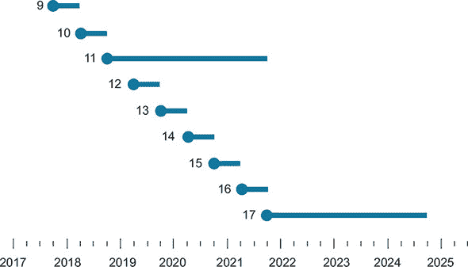

我们强烈认同缩短 Java 开发周期的决定，尤其是在现在，当所有软件系统和语言都旨在尽可能快速地改进的时候。较短的开发周期使 Java 能够以适当的速度进化，并使语言在未来几年保持相关性和适用性。

### 21.6. 最后的话

这本书探讨了 Java 8 和 9 添加的主要新特性。Java 8 可能代表了 Java 历史上迈出的最大一步。与之相比，上一个十年前（2005 年）Java 5 中泛型的引入，也是一个相当大的进化步骤。Java 9 最显著的特征是引入了期待已久的模块系统，这对软件架构师可能比开发者更有趣。Java 9 还通过 Flow API 标准化了其协议，从而拥抱了响应式流。Java 10 引入了局部变量类型推断，这是在其他编程语言中流行的功能，有助于提高生产力。Java 11 允许将局部变量类型推断的`var`语法用于隐式类型 lambda 表达式的参数列表。也许更重要的是，Java 11 接受了本书讨论的并发和响应式编程思想，并带来一个新的异步 HTTP 客户端库，该库完全采用`CompletableFutures`。最后，在撰写本文时，Java 12 宣布支持一个增强的 switch 结构，它可以作为一个表达式而不是仅仅作为一个语句使用——这是函数式编程语言的一个关键特性。实际上，switch 表达式为 Java 中模式匹配的引入铺平了道路，我们在第 21.4.2 节中讨论了这一点。所有这些语言更新都表明，函数式编程思想和影响将继续在未来进入 Java！

在本章中，我们探讨了进一步 Java 进化的压力。总之，我们提出以下声明：

> *Java 8、9、10 和 11 是暂停但不要停止的地方！*

我们希望您已经享受了与我们一起的学习之旅，并且我们已经激发了您探索 Java 进一步演化的兴趣。
