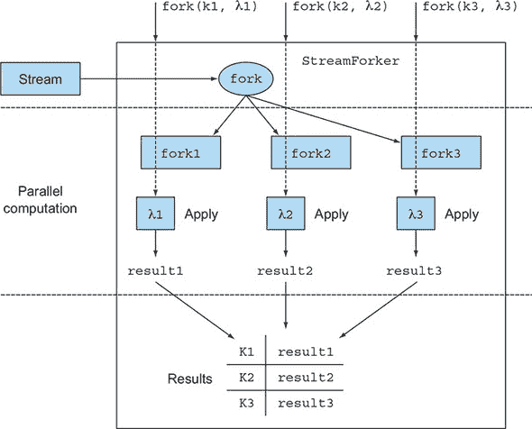
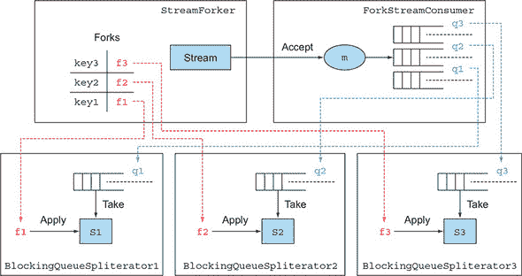

## 附录 C. 在流上并行执行多个操作

Java 8 流的一个最大的限制是，在处理它时只能操作一次，并且只能得到一个结果。确实，如果你尝试第二次遍历流，你所能达到的只有像这样的异常：

```
java.lang.IllegalStateException: stream has already been operated upon or closed
```

尽管如此，在处理单个流时，你可能会希望得到多个结果。例如，你可能想要像在 第 5.7.3 节 中做的那样，以流的形式解析日志文件，但在单步中收集多个统计数据。或者，继续使用在 第四章、第五章 和 第六章 中用来解释 `Stream` 功能的菜单数据模型，你可能在遍历菜肴流时想要检索不同的信息。

换句话说，你希望在单次遍历中通过多个 lambda 推送流，为此你需要一种 `fork` 方法，并将不同的函数应用于每个分叉的流。更好的是，如果你能够使用不同的线程并行执行这些操作，那就太棒了。

不幸的是，这些功能目前在 Java 8 提供的流实现中尚不可用，但在这个附录中，我们将向你展示如何使用 `Spliterator` 以及其后期绑定能力，结合 `BlockingQueues` 和 `Futures` 来实现这个有用的功能，并通过一个方便的 API 提供它.^([1])

> ¹
> 
> 本附录其余部分所提出的实现基于 Paul Sandoz 在他发送给 lambda-dev 邮件列表的电子邮件中提出的解决方案：[`mail.openjdk.java.net/pipermail/lambda-dev/2013-November/011516.html`](http://mail.openjdk.java.net/pipermail/lambda-dev/2013-November/011516.html)。

### C.1\. 分叉流

在流上并行执行多个操作的第一件事是创建一个包装原始流的 `StreamForker`，你可以在其上定义你想要执行的不同操作。请看下面的列表。

##### 列表 C.1\. 定义一个 `StreamForker` 以在流上执行多个操作

```
public class StreamForker<T> {

    private final Stream<T> stream;
    private final Map<Object, Function<Stream<T>, ?>> forks =
                                                          new HashMap<>();

    public StreamForker(Stream<T> stream) {
        this.stream = stream;
    }

    public StreamForker<T> fork(Object key, Function<Stream<T>, ?> f) {
        forks.put(key, f);                                               *1*
        return this;                                                     *2*
    }

    public Results getResults() {
        // To be implemented
    }
}
```

+   ***1* 使用键索引要应用于流的函数。**

+   ***2* 返回此以便流畅地多次调用分叉方法。**

在这里，`fork` 方法接受两个参数：

+   一个 `Function`，它将流转换成表示这些操作之一的任何类型的输出结果

+   一个键，它将允许你检索该操作的输出，并将这些键/函数对累积到一个内部的 `Map` 中

`fork` 方法返回 `StreamForker` 本身；因此，你可以通过分叉多个操作来构建一个管道。图 C.1 展示了 `StreamForker` 的主要思想。

##### 图 C.1\. `StreamForker` 的作用



在这里，用户定义了三个要在三个键索引的流上执行的操作。然后 `StreamForker` 遍历原始流并将其分叉成三个其他流。在此阶段，可以在分叉的流上并行应用这三个操作，并使用这些函数应用的结果（按其相应的键索引）来填充结果 `Map`。

通过调用 `getResults` 方法触发通过 `fork` 方法添加的所有操作的执行，该方法返回一个实现如下定义的 `Results` 接口的实现：

```
public static interface Results {
    public <R> R get(Object key);
}
```

此接口只有一个方法，你可以传递一个在 `fork` 方法中使用的键 `Object`，该方法返回与该键对应的操作的结果。

#### C.1.1\. 使用 ForkingStreamConsumer 实现 Results 接口

`getResults` 方法可以按以下方式实现：

```
public Results getResults() {
    ForkingStreamConsumer<T> consumer = build();
    try {
        stream.sequential().forEach(consumer);
    } finally {
        consumer.finish();
    }
    return consumer;
}
```

`ForkingStreamConsumer` 实现了之前定义的 `Results` 接口和 `Consumer` 接口。正如你将在更详细地分析其实现时看到的那样，其主要任务是消费流中的所有元素并将它们多路复用到通过 `fork` 方法提交的操作数量的 `BlockingQueue`s。请注意，确保流是顺序的，因为如果在并行流上执行 `forEach` 方法，其元素可能会无序地推送到队列中。`finish` 方法向这些队列添加特殊元素以表示没有更多项目需要处理。用于创建 `ForkingStreamConsumer` 的 `build` 方法在下一列表中显示。

##### 列表 C.2\. 创建 ForkingStreamConsumer 所使用的 `build` 方法

```
private ForkingStreamConsumer<T> build() {
    List<BlockingQueue<T>> queues = new ArrayList<>();        *1*

    Map<Object, Future<?>> actions =                          *2*
            forks.entrySet().stream().reduce(
                    new HashMap<Object, Future<?>>(),
                    (map, e) -> {
                        map.put(e.getKey(),
                                getOperationResult(queues, e.getValue()));
                        return map;
                    },
                    (m1, m2) -> {
                        m1.putAll(m2);
                        return m1;
                    });

    return new ForkingStreamConsumer<>(queues, actions);
}
```

+   ***1* 为每个操作创建一个队列列表。**

+   ***2* 使用用于识别这些操作的键来映射将包含操作结果的 `Future`s。**

在列表 C.2 中，你首先创建了之前提到的 `BlockingQueue`s 的 `List`。然后你创建了一个 `Map`，其键用于识别要在流上执行的不同操作，其值是包含这些操作相应结果的 `Future`s。然后，`BlockingQueue`s 的列表和 `Future`s 的 `Map` 被传递给 `ForkingStreamConsumer` 的构造函数。每个 `Future` 都使用此 `getOperationResult` 方法创建，如下一列表所示。

##### 列表 C.3\. 使用 `getOperationResult` 方法创建的 `Future`s

```
private Future<?> getOperationResult(List<BlockingQueue<T>> queues,
                                     Function<Stream<T>, ?> f) {
    BlockingQueue<T> queue = new LinkedBlockingQueue<>();
    queues.add(queue);                                                    *1*
    Spliterator<T> spliterator = new BlockingQueueSpliterator<>(queue);   *2*
    Stream<T> source = StreamSupport.stream(spliterator, false);          *3*
    return CompletableFuture.supplyAsync( () -> f.apply(source) );        *4*
}
```

+   ***1* 创建一个队列并将其添加到队列列表中。**

+   ***2* 创建一个遍历该队列元素的 Spliterator。**

+   ***3* 创建一个以该 Spliterator 为源的流。**

+   ***4* 创建一个 Future，异步计算给定函数在该流上的应用。**

`getOperationResult` 方法创建一个新的 `BlockingQueue` 并将其添加到队列的 `List` 中。这个队列被传递给一个新的 `BlockingQueueSpliterator`，它是一个后期绑定的 `Spliterator`，从队列中读取要遍历的项目；我们将在稍后考察它是如何制作的。

然后，你创建一个遍历此 `Spliterator` 的顺序流，最后创建一个 `Future` 来计算应用表示你想要在此流上执行的操作之一的函数的结果。这个 `Future` 是使用实现 `Future` 接口的 `CompletableFuture` 类的静态工厂方法创建的。这是 Java 8 中引入的另一个新类，我们在第十六章 中对其进行了详细调查。

#### C.1.2\. 开发 ForkingStreamConsumer 和 BlockingQueueSpliterator

你需要开发的最后两个部分是之前介绍的 `ForkingStreamConsumer` 和 `BlockingQueueSpliterator` 类。第一个可以按以下方式实现。

##### 列表 C.4\. 用于将流元素添加到多个队列的 ForkingStreamConsumer

```
static class ForkingStreamConsumer<T> implements Consumer<T>, Results {
    static final Object END_OF_STREAM = new Object();

    private final List<BlockingQueue<T>> queues;
    private final Map<Object, Future<?>> actions;

    ForkingStreamConsumer(List<BlockingQueue<T>> queues,
                          Map<Object, Future<?>> actions) {
        this.queues = queues;
        this.actions = actions;
    }

    @Override
    public void accept(T t) {
        queues.forEach(q -> q.add(t));                        *1*
    }

    void finish() {
        accept((T) END_OF_STREAM);                            *2*
    }

    @Override
    public <R> R get(Object key) {
        try {
            return ((Future<R>) actions.get(key)).get();      *3*
        } catch (Exception e) {
            throw new RuntimeException(e);
        }
    }
}
```

+   ***1* 将流遍历的元素传播到所有队列中**

+   ***2* 向队列添加一个最后元素以表示流已结束**

+   ***3* 返回给定键索引的操作结果，并等待计算它的 Future 完成**

这个类实现了 `Consumer` 和 `Results` 接口，并持有 `BlockingQueues` 的 `List` 和执行流上不同操作的 `Map` 的引用。

`Consumer` 接口要求实现 `accept` 方法。在这里，每次 `ForkingStreamConsumer` 接受流的一个元素时，它将该元素添加到所有 `BlockingQueue`s 中。此外，在将原始流的所有元素添加到所有队列之后，`finish` 方法会导致向所有队列添加最后一个项目。当遇到 `BlockingQueueSpliterators` 时，这个项目将使队列理解没有更多元素需要处理。

`Results` 接口要求实现 `get` 方法。在这里，它检索在 `Map` 中通过键索引的 `Future`，并展开其结果或等待结果可用。

最后，将为流上要执行的操作创建一个 `BlockingQueueSpliterator`。每个 `BlockingQueueSpliterator` 将有一个引用，指向由 `ForkingStreamConsumer` 填充的 `BlockingQueue` 之一，它可以像以下列表中所示的那样实现。

##### 列表 C.5\. 从 BlockingQueue 读取遍历元素的一个 Spliterator

```
class BlockingQueueSpliterator<T> implements Spliterator<T> {
    private final BlockingQueue<T> q;

    BlockingQueueSpliterator(BlockingQueue<T> q) {
        this.q = q;
    }

    @Override
    public boolean tryAdvance(Consumer<? super T> action) {
        T t;
        while (true) {
            try {
                t = q.take();
                break;
            } catch (InterruptedException e) { }
        }

        if (t != ForkingStreamConsumer.END_OF_STREAM) {
            action.accept(t);
            return true;
        }

        return false;
    }

    @Override
    public Spliterator<T> trySplit() {
        return null;
    }

    @Override
    public long estimateSize() {
        return 0;
    }

    @Override
    public int characteristics() {
        return 0;
    }
}
```

在这个列表中，实现了一个 `Spliterator`，不是为了定义如何分割流的政策，而只是为了使用其后期绑定能力。因此，`trySplit` 方法未实现。

此外，由于你无法预见还能从队列中取出多少元素，因此从 `estimatedSize` 方法返回任何有意义的值都是不可能的。此外，因为你没有尝试任何拆分，这种估计将变得毫无用处。这个实现没有我们列在表 7.2 中的任何 `Spliterator` 特性，所以 `characteristic` 方法返回 `0`。

这里只实现了 `tryAdvance` 方法，该方法等待从其 `BlockingQueue` 中取出原始流添加到其中的元素。它将这些元素发送到一个 `Consumer`，该 `Consumer`（基于如何在 `getOperationResult` 方法中创建此 `Spliterator`）是进一步流（在相应的函数应用于其中一个 `fork` 方法调用时）的来源。`tryAdvance` 方法返回 `true`，以通知其调用者还有其他元素要消费，直到它在队列中找到由 `ForkingStreamConsumer` 添加的特殊 `Object`，以表示没有更多元素要从队列中取出。图 C.2 展示了 `StreamForker` 及其构建块的总览。

##### 图 C.2\. `StreamForker` 的构建块



在图中，左上角的 `StreamForker` 有一个 `Map`，其中每个要执行的流操作（由一个函数定义）通过一个键进行索引。右边的 `ForkingStreamConsumer` 为这些操作中的每一个都保留一个队列，并消费原始流中的所有元素，将它们多路复用到所有队列中。

在图的底部，每个队列都有一个 `BlockingQueueSpliterator` 拉取其项目，并作为不同流的来源。最后，这些由原始流拆分出来的每个流，都作为参数传递给一个函数，从而执行要执行的操作之一。现在你已经有了 `StreamForker` 的所有组件，因此它已经准备好使用。

#### C.1.3\. 将 StreamForker 应用到工作中

让我们将 `StreamForker` 应用到我们在第四章中定义的菜单数据模型上，通过拆分原始的菜肴流，并行地对它执行四个不同的操作，如下所示。特别是，你想要生成所有可用菜肴名称的逗号分隔列表，计算菜单的总卡路里，找到卡路里最高的菜肴，并按类型对所有菜肴进行分组。

##### 列表 C.6\. 将 `StreamForker` 应用到工作中

```
Stream<Dish> menuStream = menu.stream();

StreamForker.Results results = new StreamForker<Dish>(menuStream)
        .fork("shortMenu", s -> s.map(Dish::getName)
                                 .collect(joining(", ")))
        .fork("totalCalories", s -> s.mapToInt(Dish::getCalories).sum())
        .fork("mostCaloricDish", s -> s.collect(reducing(
                (d1, d2) -> d1.getCalories() > d2.getCalories() ? d1 : d2))
                .get())
        .fork("dishesByType", s -> s.collect(groupingBy(Dish::getType)))
        .getResults();

String shortMenu = results.get("shortMenu");
int totalCalories = results.get("totalCalories");
Dish mostCaloricDish = results.get("mostCaloricDish");
Map<Dish.Type, List<Dish>> dishesByType = results.get("dishesByType");

System.out.println("Short menu: " + shortMenu);
System.out.println("Total calories: " + totalCalories);
System.out.println("Most caloric dish: " + mostCaloricDish);
System.out.println("Dishes by type: " + dishesByType);
```

`StreamForker`提供了一个方便的、流畅的 API 来分割流并将不同的操作分配给每个分割的流。这些操作以在流上应用函数的形式表达，并且可以由任何任意对象识别；在这种情况下，我们选择使用`String`。当你不再需要添加分割时，你可以在`StreamForker`上调用`getResults`来触发所有定义的操作并获取`StreamForker.Results`。因为这些操作是在内部异步执行的，所以`getResults`方法会立即返回，而无需等待所有结果都可用。

你可以通过将用于识别该操作的键传递给`StreamForker.Results`接口来获取特定操作的结果。如果在那时该操作的计算完成，`get`方法将返回相应的结果；否则，它将阻塞，直到该结果可用。

如预期的那样，这段代码生成了以下输出：

```
Short menu: pork, beef, chicken, french fries, rice, season fruit,
     pizza, prawns, salmon
Total calories: 4300
Most caloric dish: pork
Dishes by type: {OTHER=[french fries, rice, season fruit, pizza], MEAT=[pork,
     beef, chicken], FISH=[prawns, salmon]}
```

### C.2. 性能考虑

由于性能原因，你不应该假设这种方法比多次遍历流更有效。使用阻塞队列造成的开销很容易超过当流由全部在内存中的数据组成时并行执行不同操作的优势。

相反，当涉及到一些昂贵的 I/O 操作时，例如当流源是一个大文件时，只访问一次流可能是一个获胜的选择；因此（就像往常一样），在优化应用程序性能时，唯一有意义的规则是“只测量它！”

这个例子演示了如何在一次操作中执行同一流上的多个操作。更重要的是，我们相信这证明了即使特定的功能不是由原生 Java API 提供的，lambda 表达式的灵活性和一点点的创新，在重用和组合现有功能上，也可以让你自己实现缺失的功能。
