## 第一部分. 熟悉 Groovy

欢迎来到第一部分：“熟悉 Groovy。”本节由四个章节组成，涵盖与任何特定应用程序无关的主题。在第一章中，我试图帮助你为 Groovy 制造商业和技术案例。第二章通过示例教程展示了如何使用 Groovy 解决一些小但有趣的问题。结合附录 B，它应该为你提供理解本书其余部分所需的 Groovy 背景。

第三章回顾了 Groovy 和 Java 如何紧密合作。它涵盖了从 Java 程序化运行 Groovy 脚本，以及其他两种语言可以混合的方式。将两种语言集成最简单的方法就是为每个语言创建类，实例化它们，并调用它们的方法。本章提供了实现这一点的示例。

本部分的最后一章回顾了在处理 Java 问题时特别有帮助的惯用 Groovy 特性。从 POGOs 到 AST 转换到 Groovy JDK，本章展示了 Groovy 可以简化 Java 开发的许多方式。

## 第一章. 为什么要在 Java 中添加 Groovy？

*本章内容涵盖*

+   Java 的问题

+   帮助 Java 的 Groovy 特性

+   Java 和 Groovy 的常见用例以及 Groovy 如何使它们更简单

尽管存在诸多缺陷（我们很快就会对其进行回顾），Java 仍然是当今行业中的主导面向对象编程语言。它无处不在，尤其是在服务器端，它被用于实现从网络应用程序到消息系统再到服务器基本基础设施的一切。因此，并不令人惊讶的是，Java 开发者和 Java 开发工作比其他任何编程语言都要多。作为一个语言，Java 是一个无与伦比的成功故事。

如果 Java 如此普遍且如此有用，为什么还要切换到其他任何东西？为什么不在任何提供 Java 虚拟机 (JVM) 的地方继续使用 Java？

在本书中，对那个问题的回答是，尽管如此。在 Java 对你有所帮助并完成任务的地方，无论如何都要继续使用它。我预计你已经具备 Java 背景，并且不想失去所有辛苦赚来的经验。然而，有些问题是 Java 可以轻松解决的，而有些问题是 Java 使之变得困难的。对于这些困难问题，考虑一个替代方案。

那个替代方案是 Groovy。在本章中，我将回顾一些导致开发者遇到问题的 Java 问题，并讨论 Groovy 如何帮助缓解这些问题。我还会展示一系列作为 Groovy 生态系统一部分的工具，这些工具可以使纯 Java 开发更加容易。从长远来看，我建议采用混合方法：让 Java 做它擅长的事情，让 Groovy 在 Java 难以处理的地方提供帮助。

在整个过程中，这将是一个口号：


##### 指导原则

Java 适用于工具、库和基础设施。Groovy 适用于其他一切。


在 Java 表现良好的地方使用 Java，在它使你的生活更轻松的地方使用 Groovy。没有人会重写，比如说，Spring 框架，用 Groovy。没有必要。Groovy 与 Spring 配合得很好，我将在第七章详细讨论。同样，JVM 无处不在。这是一个好事，因为 Java 可以运行的地方，Groovy 也可以运行，如图 1.1 所示。

##### 图 1.1\. Groovy 为 Java 虚拟机生成字节码。可以提前编译它们，或者让`groovy`命令从源代码生成它们。

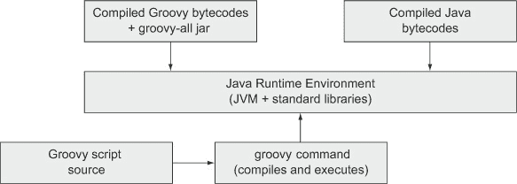

我将在下一章讨论实际细节，但就其基础而言，Groovy *确实是* Java。Groovy 脚本和类编译成字节码，这些字节码可以自由地与编译后的 Java 类混合使用。从运行时角度来看，运行编译后的 Groovy 只需将一个 JAR 文件添加到你的环境中即可。

这本书的一个目标是在 Groovy 可以显著帮助 Java 开发者的机会中识别出来。为了做到这一点，让我首先回顾一下 Java 可能存在哪些需要帮助的问题。

### 1.1\. Java 的问题

在 1990 年代中后期，一场完美的风暴席卷了开发世界，最终导致将主要开发语言从 C++迁移到 Java。Java 实际上是 C++家族中的下一代语言。它的语法与 C 和 C++有很多相似之处。语言结构，如内存管理和指针算术，这些结构给中级开发者带来了问题，现在被自动处理或完全从程序员控制中移除。语言本身很小（尽管现在想象起来可能很难），易于编写，最重要的是，它是免费的。只需下载一个 JDK，访问库文档（在当时，提供干净、最新、超链接的库文档是一项相当大的创新），然后开始编码。当时的领先浏览器 Netscape 甚至内置了 JVM。结合“一次编写，到处运行”的口号，Java 取得了胜利。

从那时起已经过去了很长时间。Java 已经发展壮大，早期开发中做出的决策现在反而使开发变得复杂，而不是简化。那些决策是什么？以下是一个简短但并不详尽的列表：

+   Java 是静态类型的。

+   Java 中所有方法都必须包含在类中。

+   Java 禁止操作符重载。

+   属性和方法的默认访问权限是“包私有”。

+   Java 对待原始类型和类的方式不同。

随着时间的推移，Java 也积累了一些不一致性。例如，数组有一个`length`属性，字符串有一个`length`方法，集合有一个`size`方法，而节点列表（在 XML 中）有一个`getLength`方法。Groovy 为它们都提供了一个`size`方法。

Java 还缺乏元编程能力.^([1]) 这不是缺陷，但它限制了 Java 创建领域特定语言（DSLs）的能力。

> ¹ 这有多种很好的理由，其中许多与性能相关。元编程依赖于动态能力，如反射，当 Java 最初发布时，反射非常慢。1998 年的 Groovy 在 Java 1.2 上最多是一个令人畏惧的前景。

还有一些其他问题，但这个列表将为我们提供一个良好的起点。让我们单独看看这些项目中的几个。

#### 1.1.1\. 静态类型是缺陷还是特性？

当 Java 被创造出来时，行业中的思考是静态类型——你必须声明每个变量的类型——是一种优势。静态类型和动态绑定的结合意味着开发者有足够的结构来让编译器立即捕捉到问题，但仍然有足够的自由来实现和使用多态。多态允许开发者覆盖超类中的方法并在子类中改变其行为，使通过继承的重用变得可行。更好的是，Java 默认是动态绑定的，所以你可以覆盖任何你想要的东西，除非方法上应用了关键字`final`。

静态类型也使得集成开发环境（IDE）变得有用，因为它们可以使用类型来提示开发者使用正确的字段和方法。像 Eclipse 和 NetBeans 这样的 IDE，既强大又免费，在行业中变得普遍，部分原因就是这种便利性。

那么，静态类型有什么问题呢？如果你想听到一些不满，可以问任何 Smalltalk 开发者。更实际地说，在 Java 的动态绑定限制（除非两个类通过继承相关联，否则你不能覆盖任何东西）下，静态类型过于限制。动态类型语言有更多的自由，让一个对象代表另一个对象。

以一个简单的例子来说明，考虑数组和字符串。两者都是收集信息的数据结构：数组收集对象，字符串收集字符。两者都有向现有结构中添加新元素的概念。假设我们有一个包含数组的类，我们想要测试这个类的功能。我们并不关心测试数组的操作。我们知道它们是有效的。但我们的类依赖于这个数组。

我们需要某种类型的模拟对象来代表数组进行测试。如果我们有一个具有动态类型的语言，并且我们只是在它上面调用`append`方法并使用字符参数，我们可以在有数组的地方提供一个字符串，一切仍然会正常工作。

在 Java 中，一个对象只能代表另一个对象，如果这两个类通过继承相关联，或者如果它们都实现了相同的接口。静态引用只能分配给该类型或其子类的对象，或者如果引用是接口类型，则可以分配给实现该接口的类。然而，在动态类型语言中，只要它们实现了我们需要的方法，任何类都可以代表另一个类。在动态世界中，这被称为*鸭子类型*：如果它像鸭子走路，如果它像鸭子嘎嘎叫，那么它就是一只鸭子。参见图 1.2。

##### 图 1.2\. 从鸭子类型的角度看数组和字符串。每个都是具有`append`方法的集合。如果我们只关心这一点，它们就是相同的。

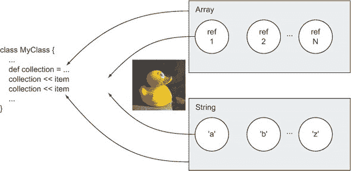

只要字符串有我们需要的`append`方法，我们就不会介意它不是一个数组。这个例子还展示了 Groovy 的一个特性，这个特性在 Java 中没有被包含：操作符重载。在 Groovy 中，所有操作符都由可以重写的方法表示。例如，+操作符使用`plus()`方法，*使用`multiply()`。在之前的图中，`<<`操作符代表`leftShift()`方法，它对于数组和字符串都实现为`append`。

| |
| --- |

##### Groovy 特性

Groovy 的特性，如可选类型和操作符重载，为开发者提供了在更少的代码中更大的灵活性。

| |
| --- |

关于可选类型，Groovy 为你提供了两者的最佳选择。如果你知道变量的类型，请随意指定它。如果你不知道或者不在乎，请随意使用`def`关键字。

#### 1.1.2\. 方法必须在类中，即使你不需要或想要一个

之前，史蒂夫·耶格（Steve Yegge）写了一篇非常有影响力的博客文章，名为“在名词王国中的执行”。^([2]) 在这篇文章中，他描述了一个名词统治、动词是二等公民的世界。这是一篇有趣的博客文章，我推荐阅读。

> ² 阅读史蒂夫·耶格（Steve Yegge）博客上 2006 年 3 月 30 日的文章：[`mng.bz/E4MB`](http://mng.bz/E4MB)。

Java 在这个世界中根深蒂固。在 Java 中，所有方法（动词）都必须位于类（名词）内部。你不能单独拥有一个方法。它必须位于某个类的内部。大多数时候这并不是一个大问题，但考虑一下，例如，对字符串进行排序。

与 Groovy 不同，Java 没有对集合的原生支持。尽管集合从 Java 一开始就存在，以数组以及原始的`java.util.Vector`和`java.util.Hashtable`类的形式存在，但正式的集合框架是在 Java 2 标准版，版本 1.2 中添加的。除了为 Java 提供了一组小但有用的基本数据结构，如列表、集合和映射之外，该框架还引入了迭代器，它将你遍历集合的方式与其底层实现分离开来。最后，该框架引入了一套多态算法，这些算法可以在集合上工作。

在所有这些准备就绪之后，我们可以按照以下列表所示组装一个字符串集合并对它们进行排序。首先需要实例化一个字符串集合，然后填充数据，最后进行排序。

##### 列表 1.1\. 使用`Collections.sort`方法排序字符串

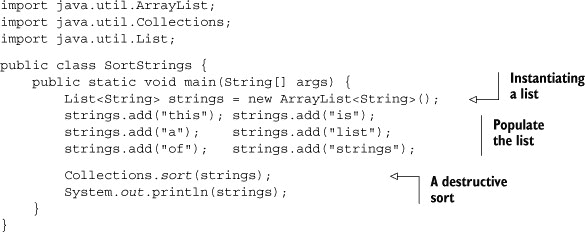

集合框架提供了接口，如`List`，以及实现类，如`ArrayList`。`add`方法用于填充列表。然后`java.util`包中的`.Collections`实用类包括静态方法，用于排序和搜索列表。在这里，我使用单参数`sort`方法，该方法根据其自然排序对参数进行排序。假设列表的元素来自实现`java.util.Comparable`接口的类。该接口包括`compareTo`方法，如果其参数大于当前对象，则返回负数；如果参数小于当前对象，则返回正数；否则返回零。`String`类实现了`Comparable`作为字典序排序，即字母顺序，但将大写字母排在小写字母之前。

我们稍后将查看与此对应的 Groovy 代码，但首先让我们考虑另一个问题。如果你想要按长度而不是按字母顺序对字符串进行排序怎么办？`String`类是一个库类，所以我不能编辑它来更改`compareTo`方法的实现。它也被标记为`final`，所以我不能简单地扩展它并覆盖`compareTo`实现。然而，对于这种情况，`Collections.sort`方法被重载，可以接受一个类型为`java.util.Comparator`的第二个参数。

下一个列表显示了我们对字符串列表的第二次排序，这次使用的是作为匿名内部类实现的比较器。与上一个示例中的`main`方法不同，这里有一个`StringSorter`类，它可以使用默认排序或按长度对字符串进行排序。

##### 列表 1.2\. 一个用于排序字符串的 Java 类

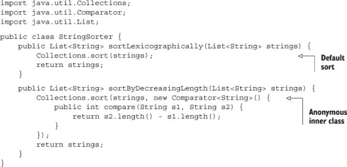

我们在这里看到了名词战胜动词的胜利。`Comparator`接口有一个`compare`方法，我们只想为`Collections.sort`提供我们自己的方法实现。然而，我们无法在不将其包含在一个类中的情况下实现一个方法。在这种情况下，我们通过一个称为匿名内部类的尴尬的 Java 结构提供自己的实现（按长度降序排序）。为此，我们输入单词`new`，然后是我们要实现的接口的名称（在这种情况下，`Comparator`），打开一个花括号，并在`sort`方法的第二个参数中放入我们的实现。这是一个丑陋、尴尬的语法，它唯一的优点是，你最终会习惯它。

下面是 Groovy 脚本形式的等价代码：

```
def strings = ['this','is','a','list','of','strings']
Collections.sort(strings, {s1,s2 -> s2.size() - s1.size()} as Comparator)
assert strings*.size() == [7, 4, 4, 2, 2, 1]
```

首先，我通过简单地定义和填充列表，就像它是一个数组一样，利用 Groovy 对集合的原生支持。`strings`变量实际上是对`java.util.ArrayList`实例的引用。

接下来，我使用`Collections.sort`的两个参数版本对字符串进行排序。有趣的部分是，`sort`方法的第二个参数是一个闭包（在括号内），然后使用`as`运算符将其“强制”实现`Comparable`。^([3])

> ³ 如此的闭包强制转换将在第四章中进一步讨论。

闭包旨在实现`compare(String, String)`方法，类似于之前 Java 列表中展示的那样。在这里，我在箭头左侧展示了两个虚拟参数`s1`和`s2`，然后在右侧使用它们。我将闭包作为`Comparator`接口的实现。如果接口有几个方法，并且我想为每个方法提供不同的实现，我将提供一个以方法名称为键、相应闭包为值的映射。

最后，我使用所谓的扩展点运算符来调用排序集合中每个元素的`size`方法，它返回一个结果列表。在这种情况下，我要求获取集合中每个字符串的长度，并将结果与预期值进行比较。

顺便说一下，Groovy 脚本也不需要任何导入。Java 自动导入`java.lang`包。Groovy 还自动引入了`java.util`、`java.net`、`java.io`、`groovy.lang`、`groovy.util`、`java.math.BigInteger`和`java.math.BigDecimal`。这是一件小事，但很方便。

| |
| --- |

##### Groovy 特性

集合的原生语法和额外的自动导入减少了所需的代码量和其复杂性。

| |
| --- |

如果你之前使用过 Groovy，你可能知道实际上有一个更简单的方法来进行排序。我根本不需要使用`Collections`类。相反，Groovy 已经将`sort`方法添加到了`java.util.Collection`本身。默认版本执行自然排序，一个参数版本的`sort`方法接受一个闭包来进行排序。换句话说，整个排序可以简化为单行：

```
strings.sort { -it?.size() }
```

闭包告诉`sort`方法使用每个元素的`size()`方法的结果来进行排序，负号表示这里我要求降序排序。

| |
| --- |

##### Groovy 特性

Groovy 对 JDK 的扩展简化了其使用，Groovy 闭包消除了匿名内部类等人工包装。

| |
| --- |

在本节中有两个主要的生产力提升。首先，Groovy 添加到 Java 库中的所有方法，称为 Groovy JDK。我会在接下来的章节中经常提到这些方法。其次，我利用 Groovy 将方法本身作为对象处理的能力，称为闭包。我将在接下来的章节中有很多关于闭包的讨论，但最后一个例子展示了它们的一个优点：你几乎永远不需要匿名内部类。

顺便说一下，在闭包中，我使用了额外的 Groovy 特性来保护自己。`it`这个词后面的问号是安全的解引用操作符。如果引用为 null，它将在这里调用`size`方法。如果不为 null，它将返回`null`并避免`NullPointerException`。这个小小的语法比我想象的更能吸引更多的 Java 开发者转向 Groovy。^([4])

> ⁴ 有时候他们会眼含泪水。“真的吗？”他们说。“我不用做所有那些 null 检查？”他们如此高兴，真是感人。

#### 1.1.3\. Java 过于冗长

下面的列表显示了一个简单的 POJO。在这种情况下，我有一个名为`Task`的类，可能是项目管理系统的一部分。它具有表示任务名称、优先级和开始和结束日期的属性。

##### 列表 1.3\. 表示任务的 Java 类

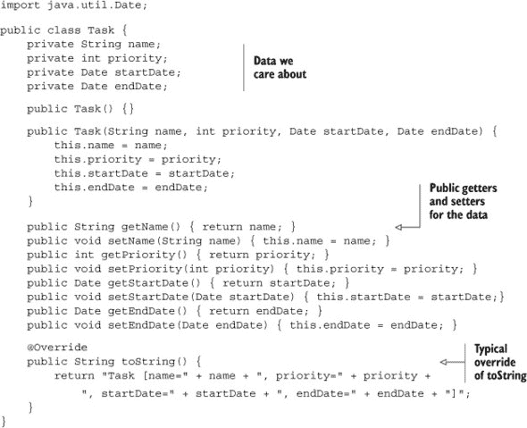

我们有私有字段和公共的获取器和设置器方法，以及我们需要的任何构造函数。我们还添加了一个典型的重写`toString`方法。我可能还可以使用重写`equals`和`hashCode`，但为了简单起见，我省略了这些。

大部分代码可以由 IDE 生成，但这仍然是一个很长的列表，我还没有添加必要的`equals`和`hashCode`重写。这实际上是一个愚蠢的数据结构，却需要这么多代码。

这里显示了类似的普通旧格罗 ovy 对象（POGO）：

```
@EqualsAndHashCode
class Task {
    String name
    int priority
    Date startDate
    Date endDate

    String toString() { "($name,$priority,$startDate,$endDate)" }
}
```

严肃地说，这就是整个类，它确实包括重写`equals`和`hashCode`方法。Groovy 类默认是公开的，Groovy 方法也是如此。属性默认是私有的。属性的访问是通过动态生成的获取器和设置器方法完成的，所以尽管看起来我们是在处理单个字段，但实际上我们是通过获取器和设置器方法来处理的。此外，Groovy 自动提供了一个基于映射的构造函数，消除了需要大量重载构造函数的需求。`@EqualsAndHashCode`注解代表一个抽象语法树（AST）转换，它生成相关的方法。最后，我使用 Groovy 字符串及其参数替换功能将任务转换为字符串。


##### 格罗 ovy 特性

Groovy 的动态生成能力大大减少了类中所需的代码量，让你能够关注本质而不是仪式。


Java 还包括检查型异常，这最多算是一种双刃剑。其哲学是在开发周期的早期就捕捉（无意中用了双关语）问题，这也被认为是静态类型的一个优势。

#### 1.1.4\. Groovy 使 Java 测试变得容易

就算一个类能编译，并不意味着它实现了正确。就算你为各种异常做了准备，并不意味着代码能正常工作。你仍然需要测试它，否则你真的不知道。5

> 5 我最喜欢的例子来自一个朋友，他曾经在上世纪 C++ 语言还非常新潮的时候教 C++。他看了一个学生的代码，一团糟。然后他注意到第一行是 `/*`，最后一行是 `*/`。他说：“你注释掉了整个程序。”学生耸了耸肩说：“这是我能让它编译的唯一方法！”

过去十年左右最重要的生产力提升之一是自动化测试工具的兴起。Java 有 JUnit 和其衍生工具，它们使编写和运行测试自动化且简单。

测试是 Groovy 发挥作用的另一个领域。首先，基本的 Groovy 库包括 `GroovyTestCase`，它扩展了 JUnit 的 `TestCase` 类并添加了一系列有用的方法，例如 `testArrayEquals`、`testToString`，甚至 `shouldFail`。接下来，Groovy 的元编程能力催生了用于测试的简单 DSL。

一个特别好的例子是 Spock 框架，我将在 第六章 中讨论测试。Spock 精简且表达力强，有 `given`、`expect` 和 `when`/`then` 这样的块。

以排序字符串为例，这是在 Java 中实现的，前面已经讨论过。在 列表 1.3 中，我展示了一个 Java 类，它可以按字典顺序和递减长度对字符串进行排序。现在我想测试这一点，为此我将使用 Groovy 的 Spock 测试框架。

下面的列表展示了检查两种排序方法的 Spock 测试。

##### 列表 1.4\. 检查每个 Java 排序方法的 Spock 测试

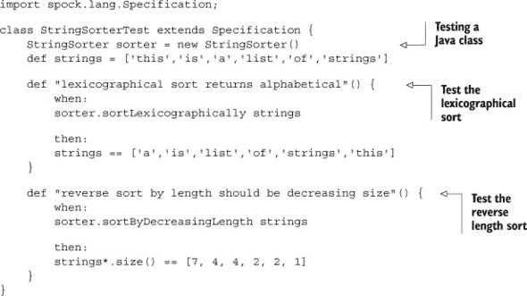

在 Spock 测试中，被测试的 Java 类作为属性实例化。我使用 Groovy 的原生集合来填充数据，尽管被测试的类是用 Java 编写的，并且方法接受 Java 列表作为参数。6 我有两个测试，在每种情况下，即使不了解 Spock，也应该清楚测试在做什么。我正在利用 Groovy 的可选括号和扩展点操作符，它适用于列表并返回具有指定属性的唯一列表。

> 在 第六章 中讨论了将 Groovy 测试应用于 Java 代码。

测试通过了，我可以用相同的测试与 Groovy 实现一起使用。然而，重要的是，我可以在没有任何问题的前提下，向 Java 系统中添加一个 Groovy 测试。

#### 1.1.5\. Groovy 工具简化了你的构建

Groovy 帮助 Java 的另一个领域是在构建过程中。我将在第五章中详细讨论 Groovy 的构建机制，但在这里我将只提到它们如何帮助 Java 的几种方式。如果你习惯于使用 Apache Ant 构建系统，Groovy 为 Ant 添加了执行和编译任务。另一个选项是使用`AntBuilder`，它允许你使用 Groovy 语法编写 Ant 任务。

这实际上是 Groovy 的一个常见主题，我应该强调：


##### Groovy 特性

Groovy 增强并扩展了现有的 Java 工具，而不是取代它们。


如果你的公司已经从 Ant 迁移到 Maven，你正在使用一个工作在更高抽象层次并为你管理依赖项的工具。在第五章中提供了两种将 Groovy 添加到 Maven 构建的方法。然而，Groovy 生态系统提供了另一种选择。

在第五章中，我讨论了最新的 Groovy 杀手级应用 Gradle。Gradle 基于 Maven 仓库进行依赖项管理（尽管底层使用 Ivy），并以类似于 Ant 的方式定义构建任务，但它易于设置和运行。Maven 非常强大，但它与那些一开始就没有考虑到它的项目有很多麻烦。Maven 是一个非常具有意见的框架，并且通过插件进行定制。最终，在 Maven 中，构建文件是用 XML 编写的。Gradle 完全是关于定制的，并且因为构建文件是用 Groovy 编写的，所以你可以使用 Groovy 语言的全部功能。

虽然 Gradle 构建文件是用 Groovy 编写的，但这并不限制它只能用于 Groovy 项目。如果你的 Java 项目实际上是用 Maven 形式编写的，并且没有外部依赖项，那么这就是你的整个 Gradle 构建文件：

```
apply plugin:'java'
```

应用 Java 插件定义了一系列任务，从编译到测试再到 JAR。如果这一行代码在一个名为 build.gradle 的文件中，那么只需在命令行中输入`gradle build`，就会引发一系列活动。如果你（希望如此）要进行一些测试，你需要添加 JUnit 或 Spock 的依赖。生成的构建文件如下所示：

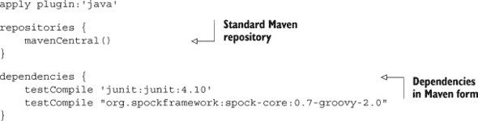

现在运行 gradle build 会导致一系列阶段：

```
:compileJava
:processResources
:classes
:jar
:assemble
:compileTestJava
:processTestResources
:testClasses
:test
:check
:build
```

结果是一个包含所有测试用例的漂亮、超链接的文档集，以及一个用于部署的 JAR 文件。

当然，如果有一个名为`java`的插件，那么还有一个名为`groovy`的插件。更好的是，Groovy 插件包括 Java 插件，并且像往常一样，增强并改进它。如果你的项目与本书中讨论的项目类似，即它结合了 Groovy 和 Java 类，并在最有帮助的地方使用它们，那么你只需要 Groovy 插件就可以开始了。还有许多其他插件可用，包括`eclipse`和`web`。我将在第五章中讨论它们，关于构建过程。

在本节中，我回顾了 Java 中内置的一些功能以及它们如何导致代码比必要的更冗长和复杂。我展示了 Groovy 如何简化实现，甚至增强现有的 Java 工具，使其更容易使用且更强大。我将在整本书中展示更多细节。首先，我想在下一节中列出 Groovy 为 Java 带来的额外功能。

### 1.2\. Groovy 对 Java 的帮助

我实际上一直在讨论这些内容，但让我在这里提出一些具体观点。首先，Groovy 版本的 Java 类几乎总是更简单、更干净。Groovy 的语法远没有 Java 那么冗长，通常更容易阅读。

尽管这个说法是真实的，但它有点误导。我并不主张将所有的 Java 代码重写为 Groovy。恰恰相反；如果你的现有 Java 代码工作得很好，那太好了，尽管你可能想要考虑添加 Groovy 测试用例，如果你还没有的话。在这本书中，我更感兴趣的是帮助 Java 而不是取代它。

Groovy 为 Java 提供了什么？以下是在本书其余部分详细讨论的短列表主题：

> **1**.  *Groovy 为现有的 Java 类添加了新功能。* Groovy 包括一个 Groovy JDK，它记录了 Groovy 添加到 Java 库中的方法。我使用字符串的`Collection`接口中添加的`sort`方法是一个简单的例子。你还可以使用 Java 类与 Groovy 一起，并为 Java 添加如操作符重载等功能。这些以及相关主题将在第四章（[kindle_split_014.html#ch04]）中讨论。
> 
> **2**.  *Groovy 使用 Java 库。* 几乎每个 Groovy 类都依赖于 Java 库，无论是带有还是不带 Groovy 的扩展。这意味着几乎每个 Groovy 类都已经是一个集成故事，将 Groovy 和 Java 结合在一起。Groovy 的一个很好的用途是尝试使用你之前没有使用过的 Java 库。
> 
> **3**.  *Groovy 使处理* *XML 和 JSON 变得容易。* 这是在 Groovy 中表现优异的领域。Groovy 包括名为`MarkupBuilder`的类，它使得生成 XML 变得容易，以及名为`JsonBuilder`的类，它生成 JSON 对象。它还包括名为`XmlParser`和`XmlSlurper`的类，它们将 XML 数据结构转换为内存中的 DOM 结构，以及`JsonSlurper`来解析 JSON 数据。这些将在整本书中使用，特别是在第九章（RESTful Web 服务）中。
> 
> **4**.  *Groovy 包括简化的数据源操作。* `groovy.sql.Sql` 类提供了一种非常简单的方式来处理关系数据库。我将在第八章（数据库）、第七章（使用 Spring 框架）和第九章（RESTful Web 服务）中详细讨论这一点。
> 
> **5**.  *Groovy 的元编程简化了开发。* 构建器类是 Groovy 元编程的一个例子。我将在几个章节中展示 DSL 的示例。
> 
> **6**.  *Groovy 测试适用于 Java 代码。* 本章演示并广泛讨论的 Spock 测试工具，在第六章（[kindle_split_017.html#ch06](https://wiki.example.org/kindle_split_017.html#ch06)）关于测试的内容中，是测试 Java 系统的一个很好的方法。
> 
> **7**.  *Groovy 构建工具适用于 Java（和混合）项目。* 在第五章（[kindle_split_016.html#ch05](https://wiki.example.org/kindle_split_016.html#ch05)）关于增强构建过程的内容中，我将讨论`AntBuilder`，如何将 Groovy 添加到 Maven 构建中，以及 Gradle。
> 
> **8**.  *像 Grails* *和 Griffon 这样的 Groovy 项目使开发 Web 和桌面应用程序变得更容易。* Grails 项目是一个基于 Spring 和 Hibernate 的完整栈、端到端框架，用于构建 Web 应用程序。Griffon 将相同的约定优于配置思想引入桌面开发。Grails 在第八章（[kindle_split_020.html#ch08](https://wiki.example.org/kindle_split_020.html#ch08)）关于数据库和第十章（[kindle_split_022.html#ch10](https://wiki.example.org/kindle_split_022.html#ch10)）关于 Web 应用程序中进行了讨论。

当查看 Java 开发者通常遇到的问题时，这个列表将成为简化实现、使其更容易阅读和理解、更快实施的想法的来源。

### 1.3. Java 用例以及 Groovy 如何帮助

我迄今为止讨论的示例都是代码级别的简化。它们非常有帮助，但我可以做得更多。Groovy 开发者处理的问题与 Java 开发者类似，因此已经创建了多个高级抽象，以使解决问题变得更简单。

在这本书中，我还将调查 Java 开发者日常面临的各种类型的问题，从访问和实现 Web 服务到使用对象关系映射工具以及改进构建过程。在每种情况下，我将探讨添加 Groovy 如何使您作为开发者的生活变得更轻松。

在我们继续前进的过程中，以下是一些我将讨论的领域，我将简要介绍 Groovy 如何帮助。这还将提供对即将到来的章节的轻量级概述。

#### 1.3.1. Spring 框架对 Groovy 的支持

目前 Java 行业中最为成功的开源项目之一是 Spring 框架。它是项目的瑞士军刀；它在 Java 世界中无处不在，并为几乎每个目的都提供了工具。

没有人会建议用 Groovy 重写 Spring。它现在在 Java 中运行得很好。也没有必要将其“移植”到 Groovy。就 Spring 而言，编译后的 Groovy 类只是一组字节码。Groovy 可以使用 Spring，就像使用另一个库一样。

然而，Spring 的开发者对 Groovy 非常了解，并为其构建了特殊的功能以支持其使用。Spring 的 bean 文件可以包含*内联脚本*的 Groovy bean。Spring 还允许你部署 Groovy 源代码，而不是编译版本，作为所谓的*可刷新*bean。Spring 定期检查可刷新 bean 的源代码以查找更改，如果发现任何更改，则重新构建它们并使用更新版本。这是一个非常强大的功能，正如第七章中关于使用 Spring 的内容将展示的那样。

最后，Grails 项目的开发者还创建了一个名为`BeanBuilder`的类，用于在 Groovy 中脚本化 Spring bean。这就像 Gradle 增强 XML 构建文件一样，将 Groovy 的功能带到了 Spring bean 文件中。

#### 1.3.2. 简化数据库访问

几乎所有 Java 开发者都与数据库打交道。Groovy 有一套特殊的类，可以轻松实现数据库集成，我将在第八章关于数据库的章节中对其进行回顾。我还展示了通过一个封装相应 Java API 的 Groovy 库与 MongoDB 数据库交互的示例。

我还将借鉴 Grails 世界的经验，讨论 GORM，即 Grails 对象关系映射工具，这是一个用于配置 Hibernate 的 DSL。实际上，GORM 已经被重构以支持各种持久化机制，包括 MongoDB、Neo4J、Redis 等 NoSQL 数据库。

#### 1.3.3. 构建和访问 Web 服务

今天，另一个活跃的开发领域是 Web 服务。Java 开发者使用基于 SOAP 和 RESTful 的服务，前者涉及自动生成的代理，后者尽可能使用 HTTP。REST 在第九章中有介绍，基于 SOAP 的 Web 服务在附录 C 中讨论，该附录可免费下载。在这两种情况下，如果稍加注意，现有的 Java 工具与 Groovy 实现配合得很好。

#### 1.3.4. Web 应用增强

Groovy 包含一个“groovlet”类，它类似于基于 Groovy 的 servlet。它接收 HTTP 请求并返回 HTTP 响应，并包括请求、响应、会话等预构建对象。Groovy 和 Java 集成最成功的实例之一，可以说是 Groovy 的杀手级应用，是 Grails 框架，它为 Web 应用带来了非凡的生产力。这两者都在第十章关于 Web 开发的章节中有介绍。

在这些用例中，Groovy 可以与现有的 Java 工具、库和基础设施协同工作。在某些情况下，Groovy 将简化所需的代码。在其他情况下，集成将更加深入，并将提供远超 Java 本身所包含的功能。在所有这些情况下，希望生产力的提升既明显又显著。

### 1.4. 摘要

Java 是一种庞大、强大的语言，但它已经显露出它的年龄。在其早期开发中做出的决策现在可能并不一定合适，随着时间的推移，它已经积累了问题和不一致性。尽管如此，Java 无处不在，它的工具、库和基础设施既有用又方便。

在本章中，我回顾了 Java 开发世界中的一些问题，从其冗长性到匿名内部类再到静态类型。大多数 Java 开发者已经习惯了这些“问题”，以至于他们把它们看作是特性而不是错误。然而，添加一点 Groovy，生产力的提升可以相当可观。我演示了仅仅使用 Groovy 原生集合和 Groovy 添加到标准 Java 库中的方法，可以将大量代码缩减到几行。我还列出了 Groovy 的功能，这将是一个简化 Java 开发的丰富思想来源。

尽管 Groovy（以及使用 Groovy 的乐趣）非常强大，但我仍然不建议用 Groovy 替换现有的 Java。在这本书中，我提倡一种混合方法。哲学是在适当的地方使用 Java，这通常意味着使用其工具和库，并将其部署到其基础设施上。我在 Java 中最有帮助的地方添加 Groovy。在下一章中，我将通过检查 Java 和 Groovy 在类级别的集成开始这段旅程。

## 第二章 通过示例学习 Groovy

*本章涵盖*

+   基本 Groovy 语法

+   集合和闭包

+   使用 Groovy JDK

如前一章所述，这本书并不是旨在成为 Groovy 的全面参考，但至少需要一定的 Groovy 熟练程度。虽然有些人通过简短、简单的代码示例来学习每个概念，但其他人更喜欢看到基本概念结合解决实际问题。对于那些喜欢每个功能都有代码片段的人来说，我提供了附录 B，一个按功能排列的 Groovy 教程。

在本章中，我将通过几个小型但非平凡的 Groovy 示例进行说明。希望这不仅能帮助传达语言的语法，还能传达一些标准的 Groovy 惯用法。一些示例将在本书的其他章节中再次使用，但在这里作为基本 Groovy 实践的说明。

### 2.1. 你好，Groovy

由于每本编程语言书籍都依法必须包含一个“Hello, World!”程序，所以这里是 Groovy 的版本：

```
println 'Hello, World!'
```

在 Java 中，您使用`javac`进行编译，并使用`java`执行生成的字节码。在 Groovy 中，您可以使用`groovyc`进行编译，并使用`groovy`执行，但实际上您并不需要先进行编译。`groovy`命令可以与源代码参数一起运行，它将首先编译然后执行。Groovy 是一种编译型语言，但您不需要分离步骤，尽管大多数人都会这样做。例如，当您使用 IDE 时，每次保存 Groovy 脚本或类，它都会被编译。

之前展示的单行就是一个完整的程序。与 Java 不同，你不需要将所有 Groovy 代码放入一个类中。Groovy 支持运行脚本。在底层，所有内容仍然是 Java 字节码，所以发生的情况是 Groovy 脚本最终成为扩展`groovy.lang.Script`类的`main`方法体。

注意 Groovy 和 Java 之间语法上的两个额外差异：

+   ***分号是可选的。*** 你可以添加它们，如果你一行中有多个语句，使用它们是合适的，但通常并不必要。

+   ***括号通常是可选的。*** `println` 命令实际上是一个方法调用，而 `String` 是传递给方法的参数。因为没有任何歧义，你可以省略括号。不过，如果你想包含它们，也没有错。


##### 可选的括号

括号在需要之前是可选的。简单的函数调用通常省略括号，但如果存在任何不确定性，请添加它们。Groovy 的一切都关于简洁和可理解性。

现在“Hello, World!”示例已经完成，我可以继续进行一些更有趣的内容。Groovy 的一个有用用例是它能够很好地作为 RESTful 网络服务（如 Google Chart）的客户端。

### 2.2\. 访问 Google 图表工具

谷歌提供的一个 API 是名为 Chart API 的 RESTful 网络服务，或者更正式地，称为 Google Chart Tools Image API.^([1]) 文档位于[`developers.google.com/chart/image/`](https://developers.google.com/chart/image/)。这些图表工具为 JavaScript 用户提供了一个丰富的 API，但输入最终是带有查询参数的 URL。

> ¹ Google 于 2012 年 4 月 20 日正式弃用了 Google Chart Tools 中的图像图表部分。截至 2013 年夏季，该 API 仍然可用。这里既作为一个良好且自包含的示例，也作为一个简单应用，展示了 Groovy 的许多特性。书中还提供了其他访问公开服务的示例。

开发者向基本 URL [`chart.apis.google.com/chart`](https://chart.apis.google.com/chart) 发送请求，并附加查询参数以指定图表类型、大小、数据以及任何标签。因为该 API 还需要一个“Hello, World”示例，以下是三维饼图的 URL：

```
https://chart.apis.google.com/chart?
       cht=p3&
       chs=250x100&
       chd=t:60,40&
       chl=Hello|World
```

这个 URL 本可以全部放在一行中，但在这里（以及文档中）将其展开是为了说明目的。在基本 URL 之后，参数列表中指定图表类型（`cht`）为 3D 饼图，图表大小（`chs`）为 250x100 像素，图表数据（`chd`）以简单的文本格式表示为 60 和 40，以及图表标签（`chl`）“Hello”和“World。”将此 URL 输入浏览器，返回的结果图像如图 2.1 所示。图 2.1。

##### 图 2.1\. Google 图表 API 的“Hello, World”示例


显示的 URL 是硬编码来生成图 2.1 中的图表。为了使其更通用，我将展示如何从字符串、列表、映射、闭包和构建器生成 URL。

| |
| --- |

##### 目标

编写一个 Groovy 脚本以生成“Hello, World”3D 饼图作为桌面应用程序。

| |
| --- |

在这个过程中，我将讨论

+   字符串操作

+   列表和映射

+   使用闭包处理数据

+   Groovy 构建器类

在这个例子中，我将使用简单的脚本实现这些步骤；稍后，它可能被转换为类以进行集成。

#### 2.2.1\. 使用查询字符串组装 URL

首先，我需要一个变量来表示基本 URL。在 Groovy 脚本中，你实际上根本不需要声明任何类型。如果你声明了一个类型，变量就会成为脚本的局部变量。如果没有，它就成为了“绑定”的一部分，这在下一章中会讨论。在这里，因为我知道在转换之前 URL 将包含在一个字符串中，所以我将声明该变量为 `java.lang.String` 类型：

```
String base = 'http://chart.apis.google.com/chart?'
```

Groovy 是可选类型的。这意味着你可以根据需要指定类型，或者如果你不知道或不在乎，可以使用关键字 `def`。在开发人员中关于何时使用 `def` 和何时指定类型有一些争议。Dierk Koenig，优秀书籍《Groovy in Action》（Manning，2007）的主编，是这样说的：

| |
| --- |

##### 使用 def

如果你想到一个类型，就输入它（来自 Dierk Koenig）。换句话说，如果你知道一个变量将是 `String`、`Date` 或 `Employee`，就使用那种类型的变量。

| |
| --- |

在我的个人经验中，我过去经常使用 `def`，但随着时间的推移，我使用它的次数越来越少。我同意 Dierk 的观点，并补充说，当我倾向于使用 `def` 时，我经常停下来片刻，并在使用它之前尝试想出一个实际类型。尽管其他开发人员有其他风格。这就是可选类型语言的美妙之处：每个人都有空间。

我现在需要将查询参数追加到这个 URL 上。而不是直接编写查询字符串，我将使用这种类型应用程序的典型惯用语，即构建一个映射，然后从映射参数生成查询字符串。考虑到这一点，以下是参数映射：

```
def params = [cht:'p3',chs:'250x100',
              chd:'t:60,40',chl:'Hello|World']
```

在 Groovy 中，你使用方括号创建一个映射，每个条目由冒号分隔的键和值组成。默认情况下，键被认为是字符串。值可以是任何东西。默认情况下，`params` 变量是 `java.util.LinkedHashMap` 的实例。

| |
| --- |

##### 集合

Groovy 有原生的列表和映射语法。映射键默认为字符串。

| |
| --- |

每个对应的值都由单引号包围。在 Groovy 中，单引号字符串是 `java.lang.String` 的实例。双引号字符串是“插值”字符串，不幸的是被称为 `GString`s。我将在本程序稍后展示一个字符串插值的例子。

要将映射转换为查询字符串，我首先需要将映射中的每个条目转换为“key=value”形式的字符串，然后使用带符号的`&`作为分隔符将它们全部连接起来.^([2]) 第一步是通过使用添加到所有 Groovy 集合中的特殊方法完成的，称为`collect`。`collect`方法接受一个闭包作为参数，将闭包应用于集合的每个元素，并返回一个包含结果的新集合。

> ² 我还需要对映射条目进行 URL 编码，但在这个例子中它们已经很好了。在其他 RESTful Web 服务的例子中，我将演示编码过程。

闭包将在下一侧边栏中介绍，并在整本书中广泛讨论，但在此刻，请将它们视为代表函数主体的代码块，可能包含占位符参数。在`collect`的情况下，当应用于映射时，闭包可以接受一个或两个参数。如果闭包接受一个参数，则该参数表示`Map.Entry`；如果有两个参数，则第一个是每个条目的键，第二个是值。

要将映射转换为`key=value`对的列表，以下两个参数的闭包在`collect`方法中工作：

```
params.collect { k,v -> "$k=$v" }
```

在 Groovy 中，如果任何方法的最后一个参数是闭包，你可以将闭包放在括号外面。在这种情况下，`collect`的唯一参数是闭包，因此甚至省略了可选的括号。


**什么是闭包**

闭包是一段代码块，由花括号分隔，可以被视为一个对象。箭头符号用于指定占位符参数。在当前示例中应用于映射的闭包中，两个占位符参数是`k`和`v`，分别代表每个条目的键和值。箭头右侧的表达式表示用等号将每个键和值替换到`GString`中。这个`collect`方法将映射中的每个条目转换为将键分配给值的字符串，并生成一个结果列表。


操作的结果如下所示：

```
["cht=p3", "chs=250x100", "chd=t:60,40", "chl=Hello|World"]
```

此过程如图 2.2 所示。

##### 图 2.2\. 将`collect`应用于映射以将其转换为列表，其中每个条目都转换为字符串。


要创建查询字符串，请使用 Groovy 为集合添加的另一种方法，称为`join`。`join`方法接受一个参数，用作将元素组装成字符串时的分隔符。要创建查询字符串，请使用带符号的`&`作为参数调用`join`方法：

```
["cht=p3", "chs=250x100", "chd=t:60,40", "chl=Hello|World"].join('&')
```

结果是所需的查询字符串，如下所示：

```
"cht=p3&chs=250x100&chd=t:60,40&chl=Hello|World"
```

到目前为止，整个过程如下，从基本 URL 和参数映射开始，构建 Google Chart URL：

```
String base = 'http://chart.apis.google.com/chart?'
def params = [cht:'p3',chs:'250x100',
              chd:'t:60,40',chl:'Hello|World']
String qs = params.collect { k,v -> "$k=$v" }.join('&')
```

所有这些操作的结果实际上是一个字符串，而不是 URL。在将其转换为 URL 之前，让我首先验证这个过程是否成功。通常这需要测试，正如在第六章测试中广泛讨论的那样。然而，在这里，我将使用 Groovy 的 `assert` 关键字，它接受一个布尔表达式作为参数。如果表达式为真，则不返回任何内容，如果不为真，则错误信息将打印到控制台。在这种情况下，我将使用 `Map` 接口的 `contains` 方法来检查 `params` 映射中的每个条目是否以正确的格式出现在查询字符串中：

```
params.each { k,v ->
    assert qs.contains("$k=$v")
}
```


##### 断言关键字

Groovy 断言是一种验证正确性的简单方法。如果表达式为真，则断言返回无内容，如果不为真，则打印详细的错误消息。


`join` 方法的优点之一是您不必担心在字符串的开始或结尾不小心添加一个 & 符号。它只在内部添加分隔符。

注意，这也是一个需要括号（在 `join` 方法上）的情况。在 Groovy 中，如果您在调用无参数的方法时省略括号，编译器会假设您正在请求相应的 getter 或 setter 方法。因为我想要 `join()` 方法（而不是不存在的 `getJoin()`），所以我需要括号。

#### 2.2.2\. 传输 URL

Groovy JDK 向 `String` 类添加了 `toURL()` 方法。正如您所想象的，此方法将 `java.lang.String` 实例转换为 `java.net.URL` 实例。


**Groovy JDK**

Groovy 向现有的 Java 库类添加了许多有用的方法。我多次发现添加到 `String`、`Date` 或 `Collection` 等类的方法，我一直希望这些方法在 Java 中就有。Groovy 添加的方法集合被称为 Groovy JDK，并有自己的 JavaDocs 集合。Groovy JDK 文档可通过 Groovy 主页上的链接获取。

Groovy JDK 的详细讨论可以在第三章中找到。


要向 URL 发送 HTTP GET 请求并检索结果，将字符串转换为 URL 并调用添加到 `java.net.URL` 的另一个 Groovy JDK 方法，即 `getText()` 方法。换句话说，网页上的数据可以通过以下代码检索：

```
url.toURL().text
```

在这里，我故意使用 URL 类的 `text` 属性，知道这将调用 `getText()` 方法。实际上调用 `getText` 没有问题，但这更符合 Groovy 的习惯。

通常这将是我想写的代码，我在关于 Web 服务的章节中的一些示例中使用了这种技术，但在这个特定的情况下，结果不是文本。Google 图表将这里生成的 URL 转换为二进制图像，因此将其转换为文本并不很有帮助。


##### Groovy 属性

在 Groovy 中访问属性会自动调用相关的 getter 或 setter 方法。


接下来，我将构建一个包含 `javax.swing` `.ImageIcon` 中的图像的 Swing 用户界面。这将给我一个机会来展示构建器，这是 Groovy 元编程的一个很好的示例。

#### 2.2.3\. 使用 SwingBuilder 创建 UI

在 Groovy 中，每个类都有一个元类。元类是另一个管理实际调用过程的类。如果你对一个不存在的方法调用类，调用最终会被元类中的 `methodMissing` 方法拦截。同样，访问一个不存在的属性最终会在元类中调用 `propertyMissing`。自定义 `methodMissing` 和 `propertyMissing` 的行为是 Groovy 运行时元编程的核心。

Groovy 元编程是一个庞大的主题，但在这里我将演示其一个有用的结果：构建器类的创建。在构建器中，对 `methodMissing` 的调用为该类型的构建器执行特定操作。

这里我将展示一个 Swing 构建器。这是一个拦截组件名称的类，并从结果中构建 Swing 用户界面。这实际上比解释更容易展示。但是，我首先将向迄今为止构建的 Google Chart 脚本中添加一些导入：^([3])

> ³ 这又是 Java 开发者在第一次学习 Groovy 时经常得到的“哦！我们为什么一直没这么做？”类型的启示之一。为什么 Java 程序中我们只导入 `java.lang`？为什么不导入许多典型的包？这不会让编码更容易吗？Groovy 说可以。

```
import java.awt.BorderLayout as BL
import javax.swing.WindowConstants as WC
import groovy.swing.SwingBuilder
import javax.swing.ImageIcon
```


**自动导入**

你可能已经注意到，我还没有需要任何导入语句。Java 自动导入 `java.lang` 包。Groovy 导入 `java.lang`，以及 `java.util`、`java.io`、`java.net`、`groovy.lang`、`groovy.util`、`java.math.BigInteger` 和 `java.math.BigDecimal`。³


在这个脚本中，我正在从 Java 标准库导入三个类。前两个导入使用 `as` 操作符为相应的类构建别名。这样，使用 `BorderLayout` 和 `WindowConstants` 的代码就可以直接写 `BL` 或 `WC`。我还添加了 `ImageIcon` 类，它将保存 Google Chart 返回的图像。从 Groovy 库导入的是 `SwingBuilder`，它将被用来构建 Swing UI。


##### `as` 关键字

`as` 关键字有几个用途，其中之一是为导入的类提供别名。`as` 关键字对应于添加到 Groovy JDK 中的 `java.lang.Object` 的 `asType` 方法。


在 `SwingBuilder` 的情况下，你调用构建器上不存在的方法，但这些方法会被转换成相应的 Swing API。例如，通过调用 `frame` 方法，你实际上是在实例化 `JFrame` 类。传递一个类似映射的参数 `visible:true` 相当于调用 `setVisible` 方法并传递一个 `true` 参数。

这是使用构建器的代码。不在`SwingBuilder`中的每个方法都被翻译为对 Swing 库类的适当方法调用：

```
SwingBuilder.edt {
    frame(title:'Hello, World!', visible:true, pack: true,
        defaultCloseOperation:WC.EXIT_ON_CLOSE) {
            label(icon:new ImageIcon("$base$qs".toURL()),
                constraints:BL.CENTER)
    }
}
```

`SwingBuilder`上的`edt`方法使用事件调度线程构建 GUI。它接受一个闭包作为参数，从这里开始有趣的部分。闭包内的第一条语句是对`frame`方法的调用，但事实上，`SwingBuilder`中没有`frame`方法。构建器的元类拦截了这个调用（通过`methodMissing`），并将其解释为实例化`javax.swing.JFrame`类的请求。这里的`frame`方法列出了一系列映射条目，这些条目旨在为`JFrame`的标题、可见性和关闭操作提供值。构建器将它们解释为对`JFrame`实例的`setTitle`、`setVisible`和`setDefaultCloseOperation`的调用。

在括号之后还有一个闭包。这表示我即将提供将被添加到`JFrame`实例中的组件。下一个调用是对`label`方法的调用，当然这个方法不存在。Swing 构建器知道要生成一个`JLabel`实例，用包含 Google 图表返回的图像的新`ImageIcon`调用其`setIcon`方法，并将`JLabel`放置在`BorderLayout`的中心。

最后，在`frame`闭包之后，我调用`JFrame`上的`pack`方法，使生成的 GUI 刚好足够容纳图像。下一个列表包含完整的脚本（没有断言，以保持列表简短）。

##### 列表 2.1\. 使用 Google 图表构建 Swing UI 3D 饼图

```
import java.awt.BorderLayout as BL
import javax.swing.WindowConstants as WC
import groovy.swing.SwingBuilder
import javax.swing.ImageIcon

def base = 'http://chart.apis.google.com/chart?'

def params = [cht:'p3',chs:'250x100',
              chd:'t:60,40',chl:'Hello|World']

String qs = params.collect { k,v -> "$k=$v" }.join('&')

SwingBuilder.edt {
    frame(title:'Hello, Chart!', pack: true,
       visible:true, defaultCloseOperation:WC.EXIT_ON_CLOSE) {
            label(icon:new ImageIcon("$base$qs".toURL()),
                constraints:BL.CENTER)
    }
}
```

结果图像显示在图 2.3 中。

##### 图 2.3\. “Hello, World” Swing 用户界面，包含由 Google 图表返回的图像

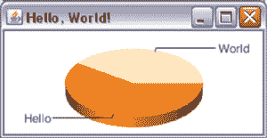

| |
| --- |

**经验教训（Google 图表）**

1.  Groovy 变量可以有类型，或者如果你不知道或者不在乎，可以使用`def`关键字。关键字`def`也可以用作方法返回类型或参数。

1.  Groovy 具有列表和映射的本地语法。这个例子使用了 Groovy 映射；列表在本书的其他许多例子中也被使用。

1.  闭包类似于带有参数的匿名函数体。

1.  `collect`方法通过将闭包应用于每个元素并返回结果列表来转换集合。

1.  Groovy JDK 向标准 Java API 添加了许多方法。

1.  Groovy 解析器和构建器简化了与许多 API 的工作。

| |
| --- |

下一个示例展示了 Groovy 的 XML 解析和生成能力、数据库操作、正则表达式、groovlets 等。

### 2.3\. Groovy 棒球

图 2.4 显示了我在其中创建的 Web 应用程序，我称之为 Groovy 棒球。在棒球赛季的特定日期，该页面创建一个 Google 地图，显示当天所有大联盟棒球比赛的比分，使用以主场为中心的信息标记。比赛结果也列在一个小表中。提供了一个日历小部件，用户可以通过 Ajax 调用选择不同的日期，从而更新页面。

##### 图 2.4\. Groovy 棒球是一个显示特定日期 MLB 比赛结果的 Web 应用程序。


部分功能由 JavaScript 通过 Google Maps API 提供，该 API 创建地图并添加标记。对于给定日期的比赛结果集，通过使用原型 JavaScript 库的 Ajax 调用获取。稍后我将展示该代码。同时，我想强调这个应用程序的 Groovy 部分。

该应用程序简单，但它有相当多的动态部分，所以我将分阶段构建它。第一个任务是收集个别 MLB 球场的地理信息，并将其保存到数据库中，如图 2.5 所示。

##### 图 2.5\. 构建 Groovy 棒球，第一部分—地理编码球场数据并将其保存到数据库中

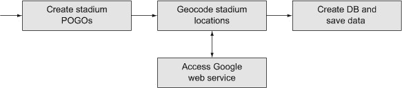

在这个过程的这部分，我将涵盖

+   简单的 Groovy 对象

+   访问 RESTful Web 服务

+   `groovy.sql.Sql`类

下一步是访问在线比分板并解析生成的 XML 文件，如图 2.6 所示。

##### 图 2.6\. 构建 Groovy 棒球，第二部分—提取比分数据并创建输出 POGOs


在这个阶段，我将讨论

+   从数据库中读取

+   在互联网上下载信息

+   解析 XML

最后，我需要将结果数据以视图层能理解的形式发送，如图 2.7 所示。figure 2.7。

##### 图 2.7\. 构建 Groovy 棒球，第三部分—驱动系统并生成 XML


在这个阶段，我将涵盖

+   使用 groovlet

+   生成 XML

我将从第一部分开始这个过程，创建 POGO 并将数据保存到数据库中。

#### 2.3.1\. 数据库数据和简单的 Groovy 对象

网页上的比赛结果集中在每场比赛的主场。Google Maps 根据给定位置的纬度和经度放置标记。因为球场不太可能移动，所以提前计算这些位置并将它们保存在某种持久化结构中是值得的。在这种情况下，我使用了 MySQL 数据库，但任何数据库都适用。

我将在这里构建一个脚本来收集每个 MLB 球场的必要信息，计算其纬度和经度，并将它们存储在数据库表中。我将从一个表示球场的类开始。

##### 体育场 POGO

在 Java 中，我们会称这个类为普通 Java 对象，简称 POJO。在 Groovy 中，我会使用普通 Groovy 对象，简称 POGO。下面的列表展示了 `Stadium` 类。

##### 列表 2.2\. `Stadium.groovy`：一个用于存储球场信息的 POGO

```
package beans

class Stadium {
    int id
    String name
    String city
    String state
    String team
    double latitude
    double longitude

    String toString() { "($team,$name,$latitude,$longitude)" }
}
```

如果你习惯了 Java，这里引人注目的是缺少了什么。分号的存在可能在这个时候并不令人惊讶。可能令人惊讶的是，任何地方都没有公共或私有访问修饰符。在 Groovy 中，如果你没有指定访问修饰符，属性将被假定为私有的，方法将被假定为公共的.^([4])

> ⁴ 这又是一个“duh”时刻。Java 中的默认访问是“包私有”，这意味着成员可以从同一子目录中的任何其他类访问。在大概 15 年的 Java 编码中，我可能故意使用过这种访问方式两次，而且两次都有合理的替代方案。我可以理解尝试创建某种友元访问，但为什么将其作为默认值？再次强调，Groovy 做的是有意义的。

你可能还会注意到，`Stadium` 类中没有构造函数。在 Java 中，如果你没有添加构造函数，编译器会免费为你提供一个默认构造函数。然而，在 Groovy 中，你不仅得到默认的构造函数，还有一个基于映射的构造函数，允许你通过提供键值对来设置任何组合的属性值。

考虑到这一点，以下是用于将 `Stadium` 位置填充到数据库表中的脚本的第一部分：

```
def stadiums = []
stadiums <<
    new Stadium(name:'Angel Stadium',city:'Anaheim',state:'CA',team:'ana')
stadiums <<
    new Stadium(name:'Chase Field',city:'Phoenix',state:'AZ',team:'ari')
...
stadiums <<
    new Stadium(name:'Rogers Centre',city:'Toronto',state:'ON',team:'tor')
stadiums <<
    new Stadium(name:'Nationals Park',
    city:'Washington',state:'DC',team:'was')
```

`stadiums` 变量被初始化为一个空的 `java.util.ArrayList`。左移运算符在 `Collection` 中被实现为一个追加方法，所以列表中的其余部分实例化了每个 MLB 球场并将其追加到列表中。

每个构造函数都会设置球场的 `name`、`city`、`state` 以及三个字母的 `team` 简称。缺少的是 `latitude` 和 `longitude` 值。为了提供这些值，我使用了 Google 地理编码器，这是 Google 提供的另一个 RESTful 网络服务，类似于前一部分讨论的 Google 图表 API。


##### POGO

普通 Groovy 对象类似于 POJO，但具有自动生成的获取器、设置器和基于映射的构造函数。


##### 地理编码

Google 地理编码 API 的文档位于 [`developers.google.com/maps/documentation/geocoding/`](https://developers.google.com/maps/documentation/geocoding/)。地理编码器将地址转换为纬度和经度。要使用 Google 地理编码器，你需要组装一个包含地址信息的 URL。根据文档，URL 的格式如下

```
http://maps.googleapis.com/maps/api/geocode/output?parameters
```

这里 `output` 的值是 `xml` 或 `json`，取决于你想要返回哪种类型的数据.^([5]) `parameters` 属性包含地址以及一个 `sensor` 值。以下是文档中的示例，它自然地使用了加利福尼亚州山景城 Google 总部地址：

> ⁵ 真正的 REST 倡导者更倾向于在 HTTP 请求的`Accept`头中进行内容协商。在这里，谷歌通过单独的 URI 来实现这一点。

```
http://maps.googleapis.com/maps/api/geocode/
     xml?address=1600+Amphitheatre+Parkway,+Mountain+View,+CA&sensor=*true_or_*
     *false*
```

如果你打算使用 JavaScript 访问地理编码器，我会建议使用`json`（JavaScript 对象表示法）作为输出值。因为我使用 Groovy，并且 Groovy 与 XML 配合得很好，所以我将使用`xml`值。查询字符串包含两个参数。第一个是地址，它包含街道、城市和州的 URL 编码值（用`“,”`分隔）。另一个参数称为`sensor`，如果请求来自具有 GPS 功能的设备，则其值为 true，否则为 false。

我将通过设置一个变量到基本 URL 来开始地理编码过程：

```
def base = 'http://maps.googleapis.com/maps/api/geocode/xml?'
```

要组装查询字符串，考虑一个包含体育场名称、城市和州的列表：

```
[stadium.name, stadium.city, stadium.state]
```

这些值中任何一个都可能包含空格、撇号或其他在 URL 中不合法的符号。因此，我需要将每个值进行 URL 编码。正如我在上一节中所示，将`collect`方法应用于列表返回一个包含转换后值的新列表。在这种情况下，我想要的转换是使用`java.net.URLEncoder`中的`encode`方法，如下所示：

```
[stadium.name, stadium.city, stadium.state].*collect* {
    URLEncoder.encode(it,'UTF-8')
}.join(',')
```

如果你在这里没有指定占位符参数的闭包，每个列表元素将被分配给一个名为`it`的变量。闭包的主体使用 UTF-8 编码方案在名称、城市和州上执行静态`encode`方法。结果是包含编码值的列表。最后，使用“`,`”作为分隔符将列表的值连接成一个字符串。

这样就完成了地址的组装。使用与谷歌图表列表中相同的闭包来形成完整的查询字符串。到目前为止的完整过程如下所示：

```
def url = base + [sensor:false,
    address: [stadium.name, stadium.city, stadium.state].*collect* {
        URLEncoder.encode(it,'UTF-8')
    }.*join*(',')
].*collect* {k,v -> "$k=$v"}.*join*('&')
```


**构建查询字符串**

参数映射、`collect`闭包和`join`方法的组合是构建查询字符串的一种方便方式。开发者可以以任何顺序存储参数，或者从用户那里接受它们（如在 Grails 应用程序中），并以最小的努力将它们转换为查询字符串。


所有这些字符串操作的结果是创建一个完整的 URL，类似于前一个示例中显示的 URL，它可以被传输到谷歌地理编码器。

现在是时候进行有趣的部分了。地理编码器返回一个相当大的 XML 块（此处未显示，但可在谷歌地理编码器文档的[`developers.google.com/maps/documentation/geocoding/#XML`](https://developers.google.com/maps/documentation/geocoding/#XML)在线找到）。使用 Java 处理 XML 将会非常冗长。幸运的是，对于 Groovy 来说，XML 不是什么大问题。将 URL 传输到谷歌地理编码器并将结果解析为 DOM 树的过程只需要一行代码：

```
def response = new XmlSlurper().parse(url)
```

Groovy 有两个用于解析 XML 的类。一个是 `XmlParser`，另一个是 `XmlSlurper`。两者都将 XML 转换为 DOM 树。底层结构和过程有些不同，但从实际角度来看，slurper 更高效且占用更少的内存，所以我将在这里使用它。提取所需的结果只是简单地遍历树。我可以粘贴一个 XML 输出的副本来显示结构，但如果你看到 Groovy 解析代码，这很容易理解：

```
stadium.latitude = response.result[0].geometry.location.lat.toDouble()[6]
stadium.longitude = response.result[0].geometry.location.lng.toDouble()
```

> ⁶ 在 Java 中试试 *那个*。没有什么能像与 XML 一起工作那样让 Java 开发者喜欢 Groovy。

换句话说，slurper 返回 DOM 树的根，并将其分配给一个名为 `response` 的变量。根有一个名为 `result` 的子元素，它有一个名为 `geometry` 的子元素，它有一个名为 `location` 的子元素，然后它有两个子元素，一个名为 `lat`，另一个名为 `lng`。有时地理编码器会返回多个结果，所以我使用了 `result` 的数组索引 0 来只使用第一个。因为 XML 中的所有内容都是 `String`，而我想要将结果分配给 `Stadium` 中的双精度值，所以我最终使用添加到 `String` 的 `toDouble` 方法来进行转换。

| |
| --- |

##### 解析 XML

无论你使用 `XmlParser` 还是 `XmlSlurper`，从 XML 中提取数据只是遍历树。⁷]

> ⁷ 解析（实际上是 slurping）JSON 同样简单。本书源代码的 第二章 包含另一个示例，该示例访问并解析 JSON 数据。

| |
| --- |

以下列表显示了完整的 `Geocoder` 类，其中包含其 `fillInLatLng` 方法，该方法接受一个 `Stadium` 参数并填充纬度和经度值。

##### 列表 2.3\. `Geocoder.groovy`，它使用 Google 地理编码器计算纬度和经度

```
class Geocoder {
    def base = 'http://maps.googleapis.com/maps/api/geocode/xml?'
    def fillInLatLng(Stadium stadium) {
        def url = base + [sensor:false,
            address: [stadium.name, stadium.city, stadium.state].*collect* {
                URLEncoder.encode(it,'UTF-8')
            }.*join*(',')
        ].*collect* {k,v -> "$k=$v"}.*join*('&')
        def response = new XmlSlurper().parse(url)
        stadium.latitude =
            response.result[0].geometry.location.lat.*toDouble*()
        stadium.longitude =
            response.result[0].geometry.location.lng.*toDouble*()
        return stadium
    }
}
```

##### `groovy.sql.Sql` 类

返回到原始问题，我想将体育场信息存储在数据库中。我现在将利用 Groovy 库中的一个非常有用的类，`groovy.sql.Sql`。这个类连接到数据库，并允许你对它执行 SQL。为了开始这个过程，这是如何实例化 `Sql` 类的：

```
Sql db = Sql.*newInstance*(
    'jdbc:mysql://localhost:3306/baseball',
    '...username...',
    '...password...',
    'com.mysql.jdbc.Driver'
)
```

`Sql` 类有一个静态的 `newInstance` 方法，其参数包括 JDBC URL、用户名和密码以及驱动类。结果是数据库的连接。接下来，如果 stadium 表已经存在，我将删除它：

```
db.execute "drop table if exists stadium;"
```

`execute` 方法接受一个 SQL 字符串并在数据库上运行它。在这里，我再次利用了可选的括号。

下一步是创建一个用于存储体育场信息的表：

```
db.execute '''
    create table stadium(
        id int not null auto_increment,
        name varchar(200) not null,
        city varchar(200) not null,
        state char(2) not null,
        team char(3) not null,
        latitude double,
        longitude double,
        primary key(id)
    );
'''
```

三个单引号代表 Groovy 中的多行字符串。三个双引号将是一个多行 `GString`，我可以用它来进行参数替换，但在这个特定情况下不需要。

现在表已经构建好了，是时候用体育场数据填充表了：

```
Geocoder geo = new Geocoder()
stadiums.*each* { s ->
    geo.fillInLatLng s
    db.execute """
        insert into stadium(name, city, state, team, latitude, longitude)
        values(${s.name},${s.city},${s.state},
               ${s.team},${s.latitude},${s.longitude});
    """
}
```

在实例化地理编码器后，我遍历集合中的每个体育馆，将每个分配给虚拟变量 `s`。对于每一个，在计算纬度和经度之后，我执行一个包含在三个双引号内的 `insert` 语句，其中使用标准的 `${...}` 符号替换从体育馆中需要的值。

剩下的工作就是进行某种合理性检查，以确保接收到的值是合理的。以下是一些用于此目的的 `assert` 语句：

```
assert db.rows('select * from stadium').size() == stadiums.size()
db.eachRow('select latitude, longitude from stadium') { row ->
    assert row.latitude > 25 && row.latitude < 48
    assert row.longitude > -123 && row.longitude < -71
}
```

第一个 `assert` 语句检查表中的总行数是否与集合中的体育馆数量匹配。下一个语句在连接上调用 `eachRow` 方法，仅选择经纬度，并将虚拟变量 `row` 分配给结果集中的每一行。两个包含的 `assert` 语句验证纬度在 25 到 48 之间，经度在 -123 到 -71 之间。


##### Sql 类

`groovy.sql.Sql` 类几乎消除了原始 JDBC 的所有仪式，并添加了便利的方法。


完整的脚本在下一部分列出。

##### 列表 2.4\. `populate_stadium_data.groovy`

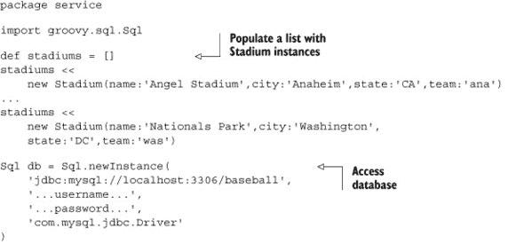

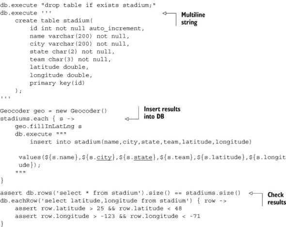

此脚本收集每个 MLB 体育馆的所有经纬度值，创建一个数据库表来存储它们，并填充该表。它只需运行一次，然后应用程序就可以使用该表。在审查代码的过程中，我使用了 `Stadium` POGO、一个列表、几个带有闭包的 `collect` 方法、一个在 Groovy 脚本中使用 Java 的 `URLEncoder` 类的示例，以及通过 `groovy.sql.Sql` 类进行数据库操作。

下一步是从美国职业棒球大联盟维护的网站上收集比分数据，并生成可以发送到视图页面的 XML 信息。

#### 2.3.2\. 解析 XML

美国职业棒球大联盟持续在线更新棒球比赛的结果。信息以 XML 格式保存在从 [`gd2.mlb.com/components/game/mlb/`](http://gd2.mlb.com/components/game/mlb/) 下降的链接中。

在网站上，比赛按日期排列。从基本 URL 深入需要形式为 `"year_${year}/month_${month}/day_${day}/"` 的链接，其中年份是四位数字，月份和日期各为两位数字。该日期的比赛作为单独的链接列出。例如，图 2.8 显示了 2007 年 5 月 5 日每场比赛的链接。^([8)]

> ⁸ 令人惊讶的是，5 月 5 日也是我儿子的生日。

##### 图 2.8\. 2007 年 5 月 5 日举行的棒球比赛的链接

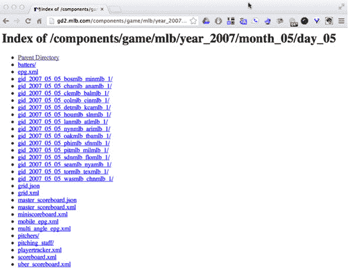

每个单独比赛的链接形式为

```
gid_${year}_${month}_${day}_${away}mlb_${home}mlb_${num}
```

`year`、`month`和`day`的值符合预期。`away`和`home`的值是每个队伍的三字母小写缩写，`num`的值代表那天比赛的编号（第一场比赛为 1，双头赛的第二场比赛为 2）。每个比赛的链接包含一系列文件，但我感兴趣的是名为 boxscore.xml 的文件。

为了检索得分板信息，我将创建一个名为`GetGameData`的类。这个类将具有基础 URL 和队伍缩写的属性，如所示。下一个列表显示了该类的一部分。

##### 列表 2.5\. `GetGameData`的一部分，显示属性和初始化

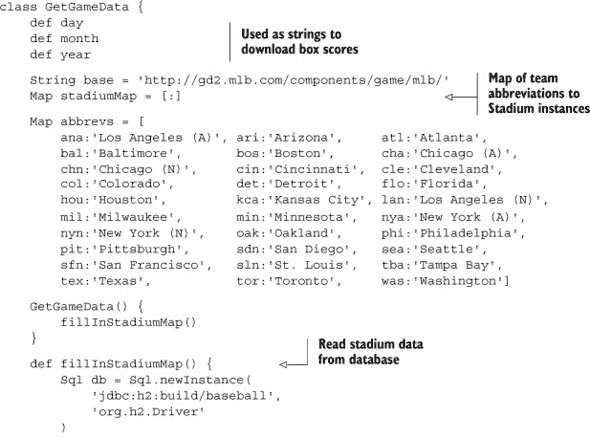

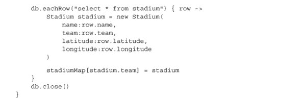

`abbrevs`映射中的键值对分别持有每个队伍的三字母缩写和城市名称。

下一步是处理实际的得分板。以下是一些随机选取的样本数据。我选择的随机日期是 2007 年 10 月 28 日.^([9]) 下一个列表显示了 XML 形式的得分板，截断以显示典型元素，而不显示所有元素。

> ⁹ 正好是红袜队在 2007 年赢得世界大赛的那一天。

##### 列表 2.6\. boxscore.xml：2007 年世界大赛第 4 场比赛的得分板

```
<boxscore game_id=*"2007/10/28/bosmlb-colmlb-1"* game_pk=*"224026"*
    home_sport_code=*"mlb"* away_team_code=*"bos"* home_team_code=*"col"*
    away_id=*"111"* home_id=*"115"* away_fname=*"Boston Red Sox"*
    home_fname=*"Colorado Rockies"*
    away_sname=*"Boston"* home_sname=*"Colorado"* date=*"October 28, 2007"*
    away_wins=*"5"* away_loss=*"0"* home_wins=*"0"* home_loss=*"5"* status_ind=*"F"*>
    <linescore away_team_runs=*"4"* home_team_runs=*"3"*
        away_team_hits=*"9"* home_team_hits=*"7"* away_team_errors=*"0"*
        home_team_errors=*"0"*>
        <inning_line_score away=*"1"* home=*"0"* inning=*"1"* />
        <inning_line_score away=*"0"* home=*"0"* inning=*"2"* />
        ...
        <inning_line_score away=*"0"* home=*"0"* inning=*"9"* />
    </linescore>

    <pitching team_flag=*"away"* out=*"27"* h=*"7"* r=*"3"* er=*"3"* bb=*"3"*
        so=*"7"* hr=*"2"* bf=*"37"* era=*"2.60"*>
        <pitcher id=*"452657"* name=*"Lester"* pos=*"P"* out=*"17"* bf=*"23"*
            er=*"0"* r=*"0"* h=*"3"* so=*"3"* hr=*"0"* bb=*"3"* w=*"2"* l=*"0"* era=*"0.00"*
            note=*"(W, 2-0)"* />
        <pitcher id=*"434668"* name=*"Delcarmen"* pos=*"P"* out=*"2"* bf=*"4"*
        er=*"1"* r=*"1"* h=*"2"* so=*"1"* hr=*"1"* bb=*"0"* w=*"0"* l=*"0"* era=*"9.00"*
        note=*"(H, 2)"* />
        ...
        <pitcher id=*"449097"* name=*"Papelbon"* pos=*"P"* out=*"5"* bf=*"5"*
            er=*"0"* r=*"0"* h=*"0"* so=*"1"* hr=*"0"* bb=*"0"* w=*"0"* l=*"0"* era=*"0.00"*
            note=*"(S, 4)"* />
    </pitching>
    <batting team_flag=*"home"* ab=*"34"* r=*"3"* h=*"7"* d=*"2"* t=*"0"* hr=*"2"*
        rbi=*"3"* bb=*"3"* po=*"27"* da=*"18"* so=*"7"* avg=*".216"* lob=*"12"*>
        <batter id=*"430565"* name=*"Matsui"* pos=*"2B"* bo=*"100"* ab=*"4"* po=*"3"*
            r=*"0"* bb=*"0"* a=*"5"* t=*"0"* sf=*"0"* h=*"1"* e=*"0"* d=*"1"* hbp=*"0"*
            so=*"1"* hr=*"0"* rbi=*"0"* lob=*"2"* fldg=*"1.000"* avg=*".286"* />
        <batter id=*"466918"* name=*"Corpas"* pos=*"P"* bo=*"101"* ab=*"0"* po=*"0"*
            r=*"0"* bb=*"0"* a=*"1"* t=*"0"* sf=*"0"* h=*"0"* e=*"0"* d=*"0"* hbp=*"0"*
            so=*"0"* hr=*"0"* rbi=*"0"* lob=*"0"* fldg=*"1.000"* avg=*".000"* />
...
    </batting>
    <pitching team_flag=*"home"* out=*"27"* h=*"9"* r=*"4"* er=*"4"* bb=*"1"*
        so=*"4"* hr=*"2"* bf=*"34"* era=*"6.91"*>
        <pitcher id=*"346871"* name=*"Cook"* pos=*"P"* out=*"18"* bf=*"23"* er=*"3"*
            r=*"3"* h=*"6"* so=*"2"* hr=*"1"* bb=*"0"* w=*"0"* l=*"2"* era=*"4.50"*
            note=*"(L, 0-2)"* />
...
    </pitching>
    <batting team_flag=*"away"* ab=*"33"* r=*"4"* h=*"9"* d=*"2"* t=*"0"* hr=*"2"*
        rbi=*"4"* bb=*"1"* po=*"27"* da=*"8"* so=*"4"* avg=*".322"* lob=*"10"*>
        <batter id=*"453056"* name=*"Ellsbury"* pos=*"CF-LF"* bo=*"100"* ab=*"4"*
            po=*"3"* r=*"1"* bb=*"0"* a=*"0"* t=*"0"* sf=*"0"* h=*"2"* e=*"0"* d=*"1"*
            so=*"1"* hr=*"0"* rbi=*"0"* lob=*"2"* fldg=*"1.000"* avg=*".450"* />
        <batter id=*"456030"* name=*"Pedroia"* pos=*"2B"* bo=*"200"* ab=*"4"* po=*"1"*
            r=*"0"* bb=*"0"* a=*"4"* t=*"0"* sf=*"0"* h=*"0"* e=*"0"* d=*"0"* hbp=*"0"*
            so=*"0"* hr=*"0"* rbi=*"0"* lob=*"2"* fldg=*"1.000"* avg=*".227"* />
...
    </batting>
...
</boxscore>
```

根元素是`<boxscore>`，它有几个属性。它有一个名为`<linescore>`的子元素，显示每局的得分。然后是`<pitching>`和`<batting>`元素，分别代表主队和客队。

这不是一个特别复杂的 XML 文件，但如果您必须使用 Java 处理它，代码会很快变得复杂。使用前面展示的 Groovy，您只需遍历树即可。

解析这些数据与上一节中解析地理编码数据的做法相同。在这里，我需要根据月份、日期和年份组装 URL，然后解析得分板文件：

```
def url = base + "year_${year}/*month_*${month}/*day_*${day}/"
def game = "gid_${year}_${month}_${day}_${away}mlb_${home}mlb_${num}/
      *boxscore*.xml"
def boxscore = new XmlSlurper().parse("$url$game")
```

解析文件后，我可以遍历树以提取队伍名称和得分：

```
def awayName = boxscore.@away_fname
def awayScore = boxscore.linescore[0].@away_team_runs
def homeName = boxscore.@home_fname
def homeScore = boxscore.linescore[0].@home_team_runs
```

点号代表子元素，如前所述，这次@符号表示属性。

| |
| --- |

##### 解析 XML

点号从父元素遍历到子元素，而@符号代表属性值。

| |
| --- |
| |

**XML、正则表达式和 Groovy 的真理**

要进行一些稍微有趣的处理，可以考虑确定获胜和失败的投手。XML 在`pitcher`元素的`note`属性中包含该信息，我可以使用正则表达式处理，假设它确实存在：

```
def pitchers = boxscore.pitching.pitcher
pitchers.each { p ->
    if (p.@note && p.@note =~ /W|L|S/) {
        println "  ${p.@name} ${p.@note}"
    }
}
```

首先，我选择两队的所有`pitcher`元素。然后，我想检查`pitcher`元素以找出谁获胜和失败，以及是否有人被分配了救援。在 XML 中，这些信息保存在`pitcher`元素的`note`注释中，这可能存在也可能不存在。

因此，在`if`语句中，我检查是否存在`note`属性。在这里，我使用“Groovy 真理”，这意味着非空引用评估为真。同样，非空字符串或集合、非零数字以及当然，布尔字面量`true`也是如此。如果存在`note`元素，然后我使用所谓的“斜线”语法来检查该注释是否与正则表达式匹配：`p.@note =~ /W|L|S/`。如果匹配，则打印出值。

| |
| --- |

##### 生成游戏结果

在我展示完整方法之前，我还需要一个部分。对于 Groovy 棒球应用程序，我对控制台输出不感兴趣。相反，我想将游戏结果组装成可以在视图层由 JavaScript 处理的格式。这意味着我需要返回一个可以转换为 XML（或 JSON）的对象。

这里有一个名为`GameResult`的类用于此目的：

```
class GameResult {
    String home
    String away
    String hScore
    String aScore
    Stadium stadium

    String toString() { "$home $hScore, $away $aScore" }
}
```

| |
| --- |

##### 闭包返回值

闭包中的最后一个表达式会自动返回。

| |
| --- |

这个 POGO 是主队和客队以及主队和客队得分以及球场的简单包装。球场是必需的，因为它包含我需要的用于 Google 地图的纬度和经度值。下面的列表现在显示了`GetGameData`类中列表 2.5 所示的完整`getGame`方法。

##### 列表 2.7\. `GetGameData.groovy`中的`getGame`方法

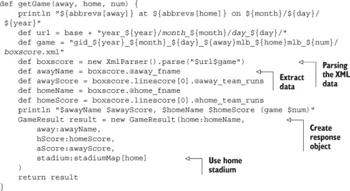

该方法使用一个`XmlSlurper`将 XML 比赛得分转换为 DOM 树，提取所需信息，并创建并返回`Game-Result`类的实例。

在`GetGameData`类中还有一个其他的方法，这是用来解析当天比赛列表网页的。这是必要的，因为由于雨停和其他推迟，事先无法知道哪场比赛将在某一天实际进行。

解析 HTML 总是一个冒险的提议，尤其是因为它可能不是良好形成的。有第三方库来做这件事^([10])，但这里显示的机制是有效的。它还展示了 Groovy 中的正则表达式映射。下一个列表显示了`GetGameData`中的`getGames`方法。

> ¹⁰ 例如，请参阅[NekoHTML 解析器](http://nekohtml.sourceforge.net/)。

##### 列表 2.8\. `GetGameData`中的`getGames`方法


Groovy 中的`=~`方法返回一个`java.util.regex.Matcher`实例。正则表达式中的括号是分组，这让我可以从 URL 中提取客队缩写、主队缩写和比赛编号。我使用这些来调用列表 2.7 中的`getGames`方法，并将结果放入`GameResult`实例的集合中。

##### 测试

剩下的就是测试完整的`GetGameData`类。下一个列表显示了用于此目的的 JUnit 测试。

##### 列表 2.9\. `GetGameDataTests.groovy`：JUnit 4 测试用例

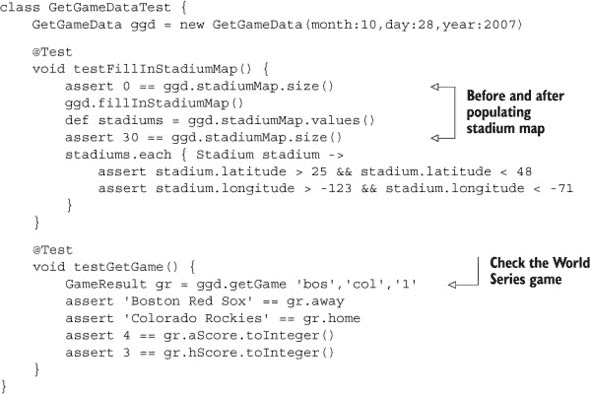

这是一个标准的 JUnit 4 测试用例。我在第六章（kindle_split_017.html#ch06）关于测试的章节中有更多关于 Groovy 测试能力的话要说，但这里有一个简单的例子。这个类除了以下三点以外没有固有的 Groovy 特性：（1）我使用了基于映射的构造函数来实例化测试用例，（2）尽可能省略了可选的括号，（3）不需要显式的 `public` 或 `private` 关键字。否则，这只是一个普通的测试用例，并且像往常一样工作。

我在本节中讨论了什么？

+   Groovy 为映射提供了方便的语法。

+   如前所述，XML 解析和提取数据都很简单。

+   Groovy 有用于正则表达式的斜线语法。

+   Groovy 类与 JUnit 测试一起工作。

还需要解决一个最终的问题，那就是用于调用每个日期的系统的驱动程序。在下一节中，我使用一个“groovlet”来完成这个目的。

#### 2.3.3. HTML 构建器和 groovlets

到目前为止使用的类访问 XML 比赛得分信息并将其转换为一系列比赛结果对象。然而，对于视图层，我需要可以由 JavaScript 处理的对象。有几种方法可以实现这一点，但其中之一是使用 XML 构建器以 XML 形式写出信息.^([11])

> ^（11）数据也可以很容易地以 JSON 格式编写。本书中使用了其他 JSON 示例。

##### 生成 XML

标准的 Groovy 库包括一个名为 `groovy.xml.MarkupBuilder` 的类，^([12]), 它是标准库中几个构建器之一（类似于本章开头展示的 `SwingBuilder`）。每个构建器都会拦截不存在的方法调用（所谓的 *假想* 方法）并从中构建节点以形成树结构。然后，根据该类型的构建器适当地导出树。

> ^（12）我敢打赌，如果这个类今天被创建，它会被命名为 `XmlBuilder`。

这实际上比解释更容易看到。考虑前一个节段的 `GameResult` 类，它包含了主队和客队名称、比分以及一个指向 `Stadium` 对象的引用。以下是创建 XML 的语法：

```
MarkupBuilder builder = new MarkupBuilder()
builder.games {
    results.each { g ->
        game(
            outcome:"$g.away $g.aScore, $g.home $g.hScore",
            lat:g.stadium.latitude,
            lng:g.stadium.longitude
        )
    }
}
```

在实例化 `MarkupBuilder` 并调用引用 `builder` 之后，第二行在它上面调用了 `games` 方法。它可能看起来不像一个方法，但请记住，在 Groovy 中，如果闭包是方法的最后一个参数，它可以放在括号外面，这里我使用了可选的括号。当然，`MarkupBuilder` 中没有名为 `games` 的方法。这使得它成为一个假想的方法，构建器拦截这个方法调用并从中创建一个节点。在 `MarkupBuilder` 中，这意味着它最终会创建一个名为 `games` 的 XML 元素。闭包语法暗示下一个元素将是 `games` 的子元素。

在闭包内部，代码遍历每个包含的结果，将其分配给虚拟变量 `g`。对于每个 `GameResult` `g`，构建器创建一个名为 `game` 的元素。`game` 上的括号表示 `game` 将包含属性。在这种情况下，每个 `game` 都有一个 `outcome`、一个 `lat` 和一个 `lng`。

这是 `MarkupBuilder` 的输出：

```
<games>
  <game outcome='Boston Red Sox 4, Colorado Rockies 3'
    lat='39.7564956' lng='-104.9940163' />
</games>
```

如果那天有十二场比赛，那么每场比赛都会有一个 `<game>` 元素。总之，在 Groovy 中，生成 XML 与解析 XML 一样简单。

##### 使用 groovlets 进行服务器端处理

为了驱动整个系统，我需要一个服务器端组件，它接收所需日期并调用 `GetGameData` 类来检索游戏，然后以 XML 格式返回。Groovy 有一个名为 *groovlet* 的组件，可以轻松实现这一切。

Groovlet 是一个由名为 `groovy.servlet.GroovyServlet` 的类执行的脚本。这个类是 Groovy 标准库的一部分。像任何 servlet 一样，它需要在 web.xml 部署描述符中声明，并映射到特定的 URL 模式。在这种情况下，我选择了模式 *.groovy。以下是部署描述符的摘录：

```
<servlet>
    <servlet-name>GroovyServlet</servlet-name>
    <servlet-class>groovy.servlet.GroovyServlet</servlet-class>
</servlet>
<servlet-mapping>
    <servlet-name>GroovyServlet</servlet-name>
    <url-pattern>*.groovy</url-pattern>
</servlet-mapping>
```

因此，Groovy Baseball 应用程序将发送所有以 .groovy 结尾的 URL 通过 `GroovyServlet`，它将执行它们。以这种方式执行的 groovlets 作为源代码部署，而不是在 WEB-INF 下的编译类。^[[13] Groovlets 还包含一组表示请求、响应、输入参数等隐式对象。

> ^[13] 详细内容请参阅第十章关于网络应用。

以下列表包含驱动 Groovy Baseball 系统的 groovlet 的完整内容。

##### 列表 2.10\. `GameServlet.groovy`：Groovy Baseball 的 groovlet

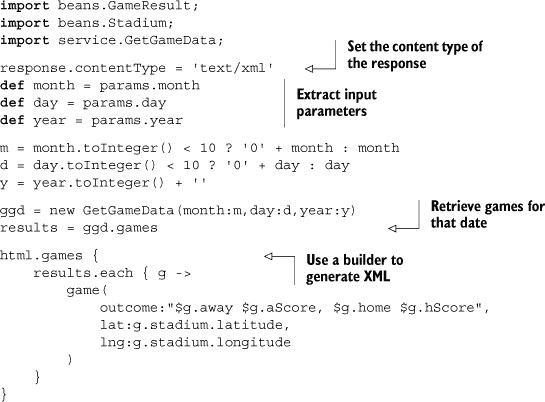

Groovlet 可以设置响应头，这里设置为输出 XML 格式。输入参数填充一个名为 `params` 的字符串映射，可以通过常规方式访问。URL 需要两位数的日期和两位数的月份，因此当需要时会在前面添加零。在检索到该日期的游戏后，使用隐式的 `MarkupBuilder` 生成输出。在这种情况下，不需要实例化 `MarkupBuilder`，因为 groovlets 已经包含一个，称为 `html`。

Groovlet 是从一个常规网页中调用的，使用形式为 [`.../groovybaseball/GroovyService.groovy?month=10&day=28&year=2007`](http://.../groovybaseball/GroovyService.groovy?month=10&day=28&year=2007) 的 URL。XML 数据被写入输出流，然后可以被 JavaScript 处理。

| |
| --- |

**Groovy Baseball 的经验教训**

1.  POGOs 默认具有私有属性和公共方法。每个属性都会自动生成公共的获取器和设置器。

1.  POGOs 包含一个基于映射的构造函数，可以用来设置任何或所有属性的任何组合。

1.  Groovy 中的闭包和方法会自动返回它们的最后一个评估表达式。

1.  `XmlSlurper`类使得解析 XML 变得简单，并返回结果 DOM 树的根。可以通过遍历树来提取值。

1.  `MarkupBuilder`类生成 XML。

1.  `groovy.sql.Sql`类是处理关系数据库的简单外观。

1.  Groovlets 是响应 HTTP 请求的简单 Groovy 脚本。

1.  所有 Groovy 异常都是未检查的。


系统的其余部分只是 HTML 和 JavaScript，因此超出了 Groovy 讨论的范围。应用程序的完整源代码包含在本书的 GitHub 存储库中。

### 2.4\. 摘要

本章是面向 Java 开发者的 Groovy 教程，通过示例应用程序而不是一系列功能来介绍。令人印象深刻的是 Groovy 如何简化代码。POGs 是 POJOs 的一个最小化且更灵活的版本。`groovy.sql.Sql`类使得 JDBC 对于合理规模的应用变得实用。Groovy JDK 添加了许多便利方法，如`toURL`和`getText`，这些方法使得现有的 Java 类更容易使用。map、闭包和`join`方法的组合使得构建 Web 服务的 URL 变得简单。最后，Java 中处理 XML 与 Groovy 中处理 XML 之间的差异令人震惊。每次我必须以任何形式处理 XML 时，我总是寻找添加 Groovy 模块来处理细节的方法。

在下一章中，我们将更详细地探讨将 Java 和 Groovy 集成在一起的方法。

## 第三章\. 代码级集成

*本章涵盖*

+   使用 JSR 223 从 Java 调用 Groovy 脚本

+   使用 Groovy 库类从 Java 调用 Groovy 脚本

在第一章中，我回顾了许多 Java 的可争议的弱点和缺点，并建议 Groovy 可能有助于改善它们。因为那一章旨在作为介绍，所以我只建议 Groovy 如何帮助，而没有展示很多代码示例。

本章开始详细探讨 Java 和 Groovy 的集成。在本章中，我将开始以基本方式使用 Groovy 和 Java，而不必担心框架或解决任何特定的用例。本章讨论的技术指南如图 3.1 所示图 3.1。

##### 图 3.1\. 集成功能指南。仅使用 Java 类即可通过 JSR 223 脚本引擎访问 Groovy。如果您愿意将一些 Groovy 库类添加到 Java 中，`Eval`、`GroovyShell`和`Binding`类使得处理脚本变得容易。将 Groovy 和 Java 结合起来的最佳方式是使用两种语言中的类。

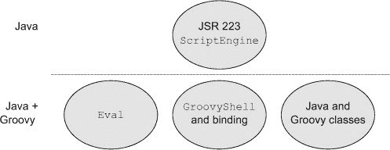

### 3.1\. 将 Java 与其他语言集成

将 Java 与其他语言结合一直是一个挑战。Java 历史上与其他语言配合得并不好.^([1]) 从一开始就为 Java 调用其他语言编写的函数设计的唯一 API 是 JNI，即 Java 本地接口，即使在最佳情况下使用起来也很繁琐.^([2]) 然而，在过去的几年里，我们看到从 Groovy 到 Scala 到 Clojure 等一系列直接编译为在 JVM 上运行的字节码的语言兴起，以及像 Jython 或 JRUBY 这样的桥梁语言，允许你在 JVM 上运行用 Python 或 Ruby 编写的代码。从这些“替代”基于 JVM 的语言的角度来看，Java 真正的贡献不是语言本身，而是虚拟机及其相关的 Java 库。基于 JVM 的语言利用 Java 基础设施，并试图处理任何 Java 特定的缺点。

> ¹ 当然，这一点对大多数语言都适用。
> 
> ² 曾经在 20 世纪 90 年代末晚期，我不得不在用 Fortran 编写的工程系统前面构建一个 Java Swing 用户界面。我使用了 JNI 从 Java 到 C，然后从 C 到 Fortran。结果就像在木梁上开一个缺口，然后说，“我希望你就在这里断裂。”

| |
| --- |

##### JVM

最终，Java 最大的贡献不是语言本身；而是虚拟机。

| |
| --- |

每当 Java 的基本基础设施集成新的功能时，就会创建一个 Java 规范请求（JSR）来提供一个标准的实现机制。在集成案例中，相关的 JSR 是 JSR 223，Java 平台脚本编程([`jcp.org/en/jsr/detail?id=223`](http://jcp.org/en/jsr/detail?id=223))。JSR 的目的在于允许其他（可能是脚本）语言从 Java 中调用。尽管本书的大部分内容将假设你是在类级别上混合使用 Java 和 Groovy，为了完整性，我将在此回顾如何从 Java 调用 Groovy 脚本，既使用 JSR 技术，也使用 Groovy 为此目的提供的库类。

Groovy 与 Java 的关系比脚本集成故事所暗示的要近得多。正如我将在从 Groovy 调用 Java 而不是相反方向的章节中演示的那样，几乎任何规模的 Groovy 程序都已经使用了 Java。Groovy 代码可以实例化一个 Java 类，调用添加到其中的 Groovy 方法（所谓 Groovy JDK，在第四章中突出显示[kindle_split_014.html#ch04]，第 4.3 节[kindle_split_014.html#ch04lev1sec3]），并且可以在结果上调用额外的 Java 方法。那么问题就变成了，Groovy 为 Java 带来了什么？如何通过添加 Groovy 到 Java 系统中来简化你的开发任务？我将在本章的其余部分（以及本书的其余部分）中回答这个问题。不过，让我们先从脚本故事开始。当 Groovy 由脚本而不是类组成，并且你想要隔离任何 Java 集成代码时，如何在同一个系统中结合 Java 和 Groovy？

### 3.2. 从 Java 执行 Groovy 脚本

本章前几节中的假设是，你已经编写或获取了一些 Groovy 脚本，并希望以最小侵入性的方式在 Java 系统中使用它们。也许你正在使用这些脚本在 Groovy 中实现业务逻辑，因为它们变化如此频繁（Dierk Koenig，*Groovy in Action* 的主要作者，将其称为液体心脏技术[Manning, 2007]）。也许你正在用 Groovy 替换 Perl 脚本，因为你可以用 Groovy 做任何用 Perl 可以做的事情，并且还有一个额外的优点，那就是你可以与现有的 Java 系统集成。也许你正在遵循 JSR 的原始意图之一，即使用脚本语言生成用户界面，同时让 Java 处理后端功能。无论如何，我想演示如何尽可能容易地从 Java 系统中调用这些脚本。

Groovy 的一个有趣特性是，与 Java 不同，你不必将所有 Groovy 代码放入一个类中。你只需将所有 Groovy 代码放入一个名为你喜欢的任何名称的文件中，只要文件扩展名是 .groovy，然后你可以使用 `groovy` 命令执行脚本。Groovy 的一个可能的优势是编写简短、简单的程序，而不需要创建一个包含 `main` 方法的类，在这里我将展示如何将此类脚本集成到 Java 应用程序中。

按照标准，我将从一个基于 JSR 223 的技术开始，即 Java 平台脚本，它允许你仅通过 Java 库调用调用 Groovy。然后我将展示，如果你使用 Groovy API 中的几个类，你可以简化集成。最后，我将展示，如果你可以将你的 Groovy 代码从脚本更改为类，几乎可以消除所有复杂性。

顺便说一句，假设任何 Groovy 脚本都已编译，在运行时将组合应用程序视为全部是 Java。我在本章中计划讨论的所有集成策略都涉及决定在哪里以及如何使用 Groovy 来使你的生活更轻松。然而，一旦你有了组合系统，部署故事就非常简单，正如侧边栏所示。


**运行时 Groovy 和 Java 一起**

在 *运行时*，编译后的 Groovy 和编译后的 Java 都会为 JVM 生成字节码。要执行结合它们的代码，只需要将一个 JAR 文件添加到系统中。编译和测试你的代码需要 Groovy 编译器和库，但在运行时你只需要一个 JAR。

那个 JAR 文件包含在你的 Groovy 发行版中的可嵌入子目录中。例如，假设你的 Groovy 安装版本是 2.1.5。那么在你的磁盘上 Groovy 安装目录中，你有以下结构，你需要的是 groovy-all-2.1.5.jar。

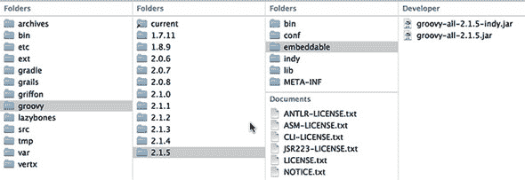

将 groovy-all JAR 添加到你的系统中，你就可以使用 `java` 命令来运行它。

在文本的其余部分，我将把这个 JAR 文件称为“groovy-all” JAR。如果你把这个 JAR 添加到你的类路径中，你可以使用标准的 `java` 命令来执行 Groovy 和 Java 的组合应用程序。如果你把一个 Groovy 模块添加到一个 Web 应用程序中，请将 groovy-all JAR 添加到 WEB-INF/lib 目录，一切都将正常工作。

这里有一个简单的演示，只是为了证明这个观点。考虑用 Groovy 编写的“Hello, World!”应用程序，与 Java 不同，它是一行代码：

```
println 'Hello, Groovy!'
```

如果我把这个保存到一个名为 hello_world.groovy 的文件中，我可以用 `groovy` 命令来执行脚本，它会编译并运行它。但是，要使用 `java` 命令来运行它，我必须首先用 `groovyc` 编译它，然后执行生成的字节码，确保 groovy-all JAR 在类路径中。这个过程分为两步。注意，`java` 命令应该在一行上：

```
> groovyc hello_world.groovy
> java –cp
    .:$GROOVY_HOME/embeddable/groovy-all-2.1.5.jar
    hello_world
→ Hello, Groovy!
```

我需要 `groovyc` 命令来编译脚本，但我能够使用普通的 `java` 命令（只要 groovy-all JAR 在执行类路径中）来执行它。


在 API 层面，要从 Java 调用一个 Groovy 脚本，你有几种选择。我将首先展示“最困难”的方法，使用 JSR-223 API。与 JSR 223 相关的 API 设计用于允许 Java 程序调用用其他语言编写的脚本。

我称之为“困难的方式”是因为它没有利用 Groovy 提供的任何东西，除了脚本本身。我将使用 Java API 提供的间接层，它将 Groovy 代码与调用它的 Java 代码分开。稍后，你将通过组合类和方法开始混合 Java 和 Groovy，你会发现这要容易得多。尽管如此，了解如何使用 JSR 仍然值得，特别是因为它毕竟是标准。此外，尽管在技术上这是困难的方式，但实际上并不那么困难。

#### 3.2.1\. 使用 JSR223 脚本为 Java 平台 API

内置于 Java SE 6 及更高版本中，JSR 223 的 API，即 Java 平台的脚本，是一个标准机制，你可以用它来调用用其他语言编写的脚本。这种方法的优势在于它避免了在调用 Java 程序中引入任何特定于 Groovy 的内容。如果你已经有了 Groovy 脚本，并且只想在 Java 内部调用它们，这是一个不错的选择。


##### JSR 223

JSR 允许你使用纯 Java 类调用 Groovy 脚本。


JSR 定义了一个基于`javax.script.ScriptEngine`实例的 API。与许多 Java 库一样，该 API 还包括一个工厂接口，在这种情况下称为`javax.script.ScriptEngineFactory`，用于检索`ScriptEngine`实例。该 API 还指定了一个`javax.script.ScriptEngineManager`类，它检索有关可用的`ScriptEngineFactory`实例的元数据。

在许多 Java API 中，你使用一个工厂来获取你需要的对象。例如，使用 SAX 解析器解析 XML 是通过首先获取`SAXParserFactory`的实例，然后使用它来获取一个新的 SAX 解析器来完成的。对于 DOM 构建器、XSLT 转换引擎以及许多其他情况也是如此。在每种情况下，如果你想使用除内置默认实现之外的特定实现，你需要指定一个环境变量、方法参数或其他方式让 Java 知道你打算做不同的事情。你还需要在类路径中提供替代实现。

因此，首要问题是确定用于 Groovy 代码的脚本引擎是否默认可用，如果不可用，如何获取它。使用 Oracle 的 Java 7 JDK，我可以确定哪些工厂已经内置。以下列表从管理器检索所有可用的工厂并打印它们的一些属性。

##### 列表 3.1\. 查找所有可用的脚本引擎工厂

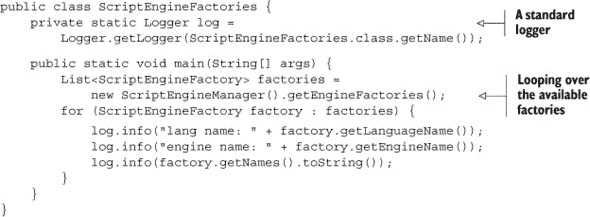

为了比简单地使用`System.out.println`语句更好的实践，我设置了一个简单的日志记录器。然后我从管理器检索所有可用的工厂并打印语言名称和引擎名称。最后，我打印出每个工厂的所有可用名称，这显示了所有可以用来检索它们的别名。

结果如下，为了可读性进行了截断：

```
INFO: lang name: ECMAScript
INFO: lang version: 1.8
INFO: engine version: 1.7 release 3 PRERELEASE
INFO: engine name: Mozilla Rhino
INFO: [js, rhino, JavaScript, javascript, ECMAScript, ecmascript]
```

输出显示默认情况下只有一个工厂可用，其目的是执行 JavaScript（或者更正式地，ECMAScript）。这个工厂可以通过最后一行上的任何名称检索，但只有一个工厂可用，它与 Groovy 没有关系。

幸运的是，使 Groovy 脚本引擎工厂可用很容易。`ScriptEngineManager` 类的一个特性是它使用与 JAR 文件相同的扩展机制来检测新的工厂。换句话说，你所要做的就是通过 groovy-all JAR 将 Groovy 库添加到你的类路径中。一旦这样做，相同的程序就会产生这里所示的增加输出：

```
INFO: lang name: Groovy
INFO: lang version: 2.1.3
INFO: engine version: 2.0
INFO: engine name: Groovy Scripting Engine
INFO: [groovy, Groovy]
```

在这种情况下，脚本引擎报告 Groovy 语言版本为 2.1.3，引擎版本为 2.0.^([3])

> ³ 我确实使用了 Groovy 2.1.5 编译器，但脚本引擎仍然报告为 2.1.3。尽管如此，这并不影响结果。

在这个特定的 API 中，尽管现在有工厂可用，但你不需要使用它来获取脚本引擎。相反，`ScriptEngineManager` 类有一个方法可以通过提供其名称（如前一个输出所示，可以是 `groovy` 或 `Groovy`）作为 `String` 来检索工厂。然后，我可以从 `ScriptEngine` 使用脚本引擎的 `eval` 方法执行 Groovy 脚本。这个过程在 图 3.2 中得到了说明。

##### 图 3.2\. 使用 JSR 223 的 `ScriptEngine` 调用 Groovy 脚本。Java 创建一个 `ScriptEngineManager`，然后生成一个 `ScriptEngine`。在向引擎提供参数后，其 `eval` 方法被调用以执行一个 Groovy 脚本。

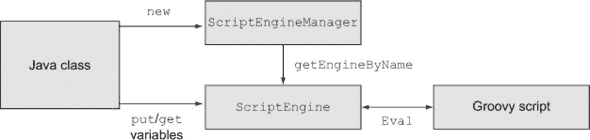

下一个列表展示了 API 在一个简单的“Hello, World!” Groovy 脚本中的实际应用。

##### 列表 3.2\. 使用 `ScriptEngine` 执行简单的 Groovy 脚本

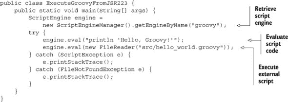

我通过调用 `getEngineByName` 方法检索 Groovy 脚本引擎。然后，我使用 `eval` 方法的两种不同的重载：一个接受 `String` 参数，另一个接受 `java.io.Reader` 接口的实现。在前一种情况下，提供的字符串需要是实际的脚本代码。对于读取器，我使用一个包装在“Hello, Groovy!”脚本中的 `FileReader`。输出是每种情况下都可以预期的。

##### 向 Groovy 脚本提供参数

如果 Groovy 脚本接受输入参数并返回数据呢？在 Groovy 脚本编写世界中，这通过 *绑定* 来处理。在下一节中，当我讨论 `GroovyShell` 时，我会展示 Groovy API 中实际上有一个名为 `Binding` 的类，但在这里我将通过 Java API 隐式地执行绑定。

绑定是在某个作用域内的一组变量集合，使得它们在脚本内部可见。在 JSR 223 API 中，`ScriptEngine` 类本身就是一个绑定。它具有 `put` 和 `get` 方法，可以用来向脚本添加变量并从它们中检索结果。

为了说明这一点，让我们做一些不那么平凡、可能更有实际意义的事情。不要做一个简单的“Hello, World!”脚本，考虑 Google 地理编码器，以它的版本 2 形式。

| |
| --- |

##### Groovy 甜点

Groovy 脚本是一种轻松尝试新库的方法。

| |
| --- |

地理编码器是一种将地址转换为经纬度对的应用程序。谷歌已经公开提供地理编码器多年。在本节中，我将使用版本 2，它需要一个密钥（通过免费注册获得），但这也给了我展示一些有趣的 Groovy 特性的机会。当我在本章后面讨论 XML 处理时，我将使用地理编码器的版本 3。该版本不再需要密钥，但它不会以我在这里使用的相同逗号分隔的形式提供结果。

Google 地理编码器版本 2 的文档可以在 [`mng.bz/Pg8S`](http://mng.bz/Pg8S) 找到。版本 2 目前已弃用但仍然有效。我在这里使用它是因为它来自上一章，这样你可以专注于脚本的输入/输出部分，并且因为它还让我展示了多个返回值^([4])。

> ⁴ 展示版本 2 地理编码器的另一个原因是 Android 的 Google 地图 API 仍然使用它。

为了使用地理编码器，基本思路是将地址作为 HTTP `GET` 请求中的参数进行传输并处理结果。如 第二章 所示，使用 Google 地理编码器需要以下步骤：

> **1**. 将包含街道、城市和州的列表转换为以“，”分隔的 URL 编码字符串。
> 
> **2**. 将包含地址和传感器的键的映射转换为查询字符串。
> 
> **3**. 将生成的 URL 传输到 Google 地理编码器。
> 
> **4**. 将结果解析为所需的值。

第一步使用 Groovy 的 `collect` 方法，该方法接受一个闭包作为参数，将闭包应用于集合的每个元素，并返回一个包含结果的新集合。我将结果集合取出来，并将每个元素连接成一个单独的字符串，使用“，”作为分隔符：

```
String address = [street,city,state].collect {
    URLEncoder.encode(it,'UTF-8')
}.join(',')
```

| |
| --- |

##### 未声明的变量

街道、城市和州在脚本中没有声明。这会将它们添加到绑定中，使它们对调用者可用。

| |
| --- |

要构建一个查询字符串，我将所有必需的参数添加到一个名为 `params` 的映射中。我还请求以逗号分隔的输出值，这在版本 3 的地理编码器中不可用：

```
def params = [q:address, sensor:false, output:'csv', key:'ABQIAAAAaUT...']
```

如果此请求来自具有 GPS 功能的设备，则 `sensor` 的值应为 `true`，否则为 `false`。`key` 在注册时确定（版本 3 不需要密钥）。`output` 在这里设置为 CSV，因此结果是一个由逗号分隔的值字符串，由响应代码（希望是 200）、放大级别以及纬度和经度组成。

要将映射转换为查询字符串，再次使用 `collect` 方法。在映射中，如果使用两个参数的闭包应用 `collect`，方法会自动将键和值分开。我想要的是将 `key:value` 这样的表达式替换为 `key=value` 这样的字符串。然后将查询字符串连接到基本 URL 上，得到完整的 URL：

```
String url = base + params.collect { k,v -> "$k=$v" }.join('&')
```

最后，我利用 Groovy JDK。在 Groovy JDK 中，`String` 类包含一个名为 `toURL` 的方法，它将 `String` 转换为 `java.net.URL` 实例。Groovy JDK 中的 `URL` 类包括一个 `getText` 方法，我可以作为 `text` 属性调用它。


##### 属性访问

在 Groovy 中，标准习惯是访问一个属性，它会被自动转换为 getter 或 setter 方法。


获取所需 CSV 字符串的代码是

```
url.toURL().text
```

现在，我可以对字符串使用 `split` 方法，它会在逗号处分割字符串并返回一个包含元素的列表。然后，我可以利用 Groovy 的酷炫多值返回功能，将每个值分配给一个输出变量。

完整的脚本如下，并在图 3.3 中图形化展示：

```
String address = [street,city,state].collect {
    URLEncoder.encode(it,'UTF-8')
}.join(',+')
def params = [q:address,sensor:false,output:'csv',key:'ABQIAAAAaUT...']
String base = 'http://maps.google.com/maps/geo?'
String url = base + params.collect { k,v -> "$k=$v" }.join('&')
(code,level,lat,lng) = url.toURL().text.split(',')
```

##### 图 3.3\. 访问 Google V2 地理编码器的 Groovy 脚本


运行此脚本需要我提供街道、城市和州的信息，然后检索输出纬度和经度。我想使用 Java 提供输入值并处理输出，但首先我会展示一个典型结果，然后可以作为测试用例使用。为了避免过于以美国为中心，我将使用位于英国格林尼治的皇家天文台的地址。这使得 `street`、`city` 和 `state` 的值分别为“Blackheath Avenue”、“Greenwich”和“UK”。^([5]) 执行脚本的结果如下

> ⁵ 显然，“状态”一词应被广泛解释。提供一个国家名称作为状态，它将在全球范围内工作。

```
(code,level,lat,lng) = (200,6,51.4752654,0.0014324)
```

皇家天文台最初是任意选择的子午线位置，因此经度的值应该非常接近零，确实如此。输入地址并不像可能的那样精确，天文台的地址也不再定义实际的子午线，但结果仍然相当令人印象深刻。作为 JUnit 4 测试的一部分，下一个列表显示了生成的测试用例。

##### 列表 3.3\. 一个用于检查 JSR 223 脚本引擎结果的 JUnit 测试用例

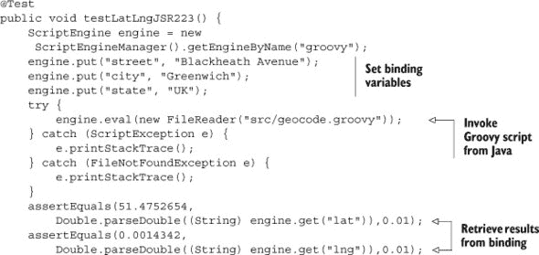

结果与单独使用 Groovy 运行 Groovy 脚本相同。设置输入变量的值是微不足道的。输出变量需要转换为 `String` 类型，然后转换为 `double`，但这个过程同样简单。如果你的目标是完全从 Java 中执行外部 Groovy 脚本（除了将 groovy-all JAR 添加到类路径之外，不引入任何 Groovy 依赖），这个机制工作得很好。

在下一节中，我想放宽这个要求。如果你愿意使用一些来自 Groovy 标准库的类，生活就会变得简单。

#### 3.2.2\. 使用 Groovy Eval 类

Groovy 库中有两个特殊类，`groovy.util.Eval` 和 `groovy.lang.GroovyShell`，专门设计用于执行脚本。在本节中，我将使用 `Eval` 类的示例，在下一节中，我将展示 `GroovyShell`。在每种情况下，目标仍然是调用 Java 中的外部 Groovy 脚本。

`Eval` 类是一个实用工具类（所有方法都是静态的），用于执行接受零个、一个、两个或三个参数的操作。相关方法在 表 3.1 中显示。

##### 表 3.1\. `groovy.util.Eval` 中用于从 Java 执行 Groovy 的静态方法

| Eval.me | 重载以接受一个字符串表达式或一个包含字符串符号和对象的表达式 |
| --- | --- |
| Eval.x | 一个参数：x 的值 |
| Eval.xy | 两个参数，x 和 y |
| Eval.xyz | 三个参数，x、y 和 z |

为了展示这些方法，我将在 JUnit 测试用例中添加额外的测试。测试是用 Java 编写的，所以我将自动从 Java 调用 Groovy。

以下列表显示了四个测试，每个测试对应于 `Eval` 类中的静态方法。

##### 列表 3.4\. JUnit 4 测试类验证从 Java 调用 `Eval` 方法的结果

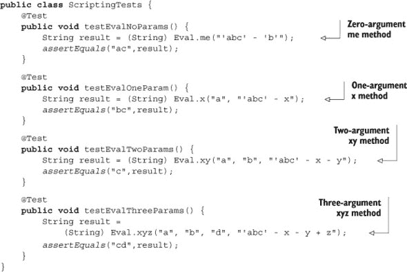

在每个测试中，要评估的 Groovy 脚本都包含为一个字符串。与 `ScriptEngine` 不同，没有为 `Reader` 实例提供重载，因此要执行一个单独文件中的脚本，需要将文件读入一个字符串。这些方法还假设输入变量被命名为 `x`、`y` 和 `z`，这可能要求过多。尽管如此，这个机制的存在本身就很令人感兴趣。

除了说明从 Java 调用 Groovy 脚本的机制外，这些测试还展示了 `String` 类中的运算符重载。Groovy 中的减号运算符对应于 `String` 中的 `minus` 方法。其实现用于从给定字符串中移除其参数的第一个实例，与字符串一起使用以移除子字符串的实例。在 Groovy 中，字符串可以包含在单引号或双引号内。单引号字符串是常规的 Java 字符串，双引号字符串是参数化字符串，礼貌地称为 Groovy 字符串，但正式名称不幸地是 `GString`.^([6])

> ⁶ 要更糟糕的是，简单的参数使用美元符号注入到`GString`中。这导致了太多的“在 GString 中插入一个$”笑话。对我来说，这是一个明显的证明，我们计算机科学领域女性不足。你不认为如果当时团队中有一个女性，她可能会说，“嘿，那是个有趣的笑话，但让我们不要将其构建成将被所有人永久使用的标准库中吗？”毕竟，在没有这样做的情况下，让 Groovy 语言被《财富》500 强认真对待已经足够困难了。就我而言，我称它们为 Groovy 字符串，这正是这个类本应被称呼的。虽然这是个有趣的笑话，但也就持续了大约 10 分钟。

使用 Java 中的`Eval`的过程在图 3.4 中展示。

##### 图 3.4\. Java 在 Groovy 的`Eval`类中调用`me`、`x`、`xy`或`xyz`方法来执行脚本。


`Eval`类方便且简单，但通常过于简单。它建立在更强大的基础之上，即`GroovyShell`类，我将在下一节中讨论它。

#### 3.2.3\. 使用`GroovyShell`类

`GroovyShell`类用于那些不受上一节中描述的`Eval`特殊情况的限制的脚本。`groovy.lang.GroovyShell`类可以用来执行脚本，尤其是当与`Binding`结合使用时。

与`Eval`类不同，`GroovyShell`类不仅包含静态方法。在调用其`evaluate`方法之前，需要先实例化它。作为一个简单的例子，可以考虑向之前的测试用例集中添加以下测试：

```
@Test
public void testEvaluateString() {
    GroovyShell shell = new GroovyShell();

    Object result = shell.evaluate("3+4");
    assertEquals(7, result);
}
```

`evaluate`方法重载很多。我在这里使用的是接受一个表示要评估脚本的字符串的版本。其他重载接受一个`java.io.File`或`java.io.Reader`实例，以及各种附加参数。还有一些重载接受`java.io.InputStream`作为参数，但由于可能的编码问题，它们已被弃用。

到目前为止，使用`GroovyShell`看起来很像使用`ScriptEngine`类，尽管在这种情况下可以直接实例化它。然而，为了处理输入和输出变量，`GroovyShell`使用`groovy.lang.Binding`类提供一个输入和输出变量的映射。

下一个列表展示了`Binding`和`GroovyShell`类的实际应用。这是要添加到不断增长的 JUnit 4 测试用例集中的另一个测试。

##### 列表 3.5\. 使用`GroovyShell`和`Binding`调用 Google 地理编码器

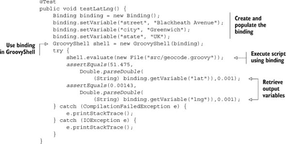

使用`Binding`上的`setVariable`方法将参数传递到脚本中很容易。然后，绑定被用作`GroovyShell`构造函数的参数。脚本通常使用`evaluate`方法从 Java 中运行，并通过从 shell 中获取输出变量来提取结果。使用`GroovyShell`和`Binding`的示例在图 3.5 中展示。

##### 图 3.5\. Java 代码在`Binding`中设置变量，该变量用于`GroovyShell`执行 Groovy 代码。结果通过`Binding`中的`getVariable`方法返回。


`GroovyShell`的功能远不止我这里所展示的。我可以使用`parse`方法而不是`evaluate`来解析脚本并检索生成的`Script`对象的引用。这样，我可以在不每次都需要重新编译的情况下设置绑定变量并重新运行脚本。`GroovyShell`还可以与类加载器和配置的层次结构一起工作。尽管所有这些都很有趣，但它们并没有真正为集成故事增添很多内容，所以我会将你引荐到 Dierk Koenig 的杰出的*Groovy in Action*以获取详细信息。

| |
| --- |

##### 困难方式

使用 Java 中的`ScriptEngine`类，或者 Groovy 中的`Eval`和`GroovyShell`类，如果需要的话，还可以使用`Binding`，从 Java 中调用 Groovy 脚本。

| |
| --- |

在`ScriptEngine`、`Eval`和`GroovyShell`类之间，希望你会同意，从 Java 执行 Groovy 脚本有各种方法。总的来说，我仍然称这为“困难的方式”，尽管它并不特别困难，但与简单的方式相比，它非常间接。从现在开始，我将停止尝试维持 Java 代码和 Groovy 代码之间的人工分离。为了取得进展，我只需要将 Groovy 代码放入一个类中。

#### 3.2.4\. 从 Java 简单调用 Groovy

到目前为止，我讨论的所有技术——使用 JSR 223 `ScriptEngine`，或者使用 Groovy API 类`Eval`和`GroovyShell`——都运行得很好，但感觉过于复杂。Groovy 应该简化你的生活，所以尽管上一节中展示的所有机制都有效，但对于大多数用例来说，还有更简单的方法。

从 Java 调用 Groovy 的最简单方法是将其放入一个类中并编译它。然后 Java 代码可以实例化该类并正常调用其方法。

| |
| --- |

##### 简单方式

要从 Java 调用 Groovy，将 Groovy 代码放入一个类中，像往常一样编译它，然后实例化它并像调用 Java 一样调用其方法。

| |
| --- |

让我们再次回到地理编码器。然而，这次，我将它重构为一个可以被实例化的类，具有可以从外部调用的方法。这个过程在图 3.6 中展示。

##### 图 3.6\. 混合 Java 和 Groovy 类。Java 应用程序实例化一个 Location 对象，并向其提供街道、城市和州的信息。它将新的 Location 对象发送到 Groovy 地理编码器，其`fillInLatLng`方法提供纬度和经度，然后 Java 可以再次检索。

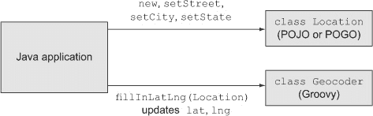

如图所示，Java 应用程序将使用 `Location` 类来存储所有需要的属性。它将提供 `street`、`city` 和 `state` 字段作为输入参数，但 `Location` 类还将包括 `latitude` 和 `longitude` 字段，这些字段将由 Groovy 地理编码器更新。地理编码器本身将用 Groovy 编写，因为用这种方式编写 RESTful 网络服务客户端代码很容易.^([7])

> ⁷ 注意这与第二章中使用的 `Stadium` 类的地理编码器非常相似，当时我讨论了 Groovy 棒球应用程序。这里的区别是 CSV 输出，以及我从 Java 中调用 Groovy 实现的情况。

这是新的 `Location` 类，它可以写成 Java 或 Groovy。这次，为了使代码简单，我将使用 Groovy POGO：

```
class Location {
    String street
    String city
    String state

    double latitude
    double longitude
}
```

`Location` 类封装了地址信息为字符串，并为使用地理编码器设置的纬度和经度值提供了双精度浮点变量。说到地理编码器，下一个列表显示了将脚本包装成类的修订版。

##### 列表 3.6\. 一个用于地理编码的 Groovy 类

```
class Geocoder {
    def base = 'http://maps.google.com/maps/geo?'

    void fillInLatLong(Location loc) {
        def addressFields = loc.street ?
            [loc.street,loc.city,loc.state] : [loc.city,loc.state]
        def address = addressFields.collect {
            URLEncoder.encode(it,'UTF-8')
        }.join(',')
        def params = [q:address,sensor:false,
            output:'csv',key:'ABQIAAAAa...']
        def url = base + params.collect { k,v -> "$k=$v" }.join('&')
        def (code,level,lat,lng) = url.toURL().text.split(',')
        loc.latitude = lat.toDouble()
        loc.longitude = lng.toDouble()
    }
}
```

`fillInLatLong` 方法接受一个 `Location` 作为参数。严格来说，我根本不需要为参数声明类型。我可以在方法内部依赖鸭子类型，并小心不要用除了具有街道、城市和州属性的对象之外的其他任何东西调用它。尽管如此，我是在考虑 `Location` 的前提下构建服务的，所以这样说并无害处。

`addressFields` 变量使用三元运算符来确定在返回地址组件集合时是否提供了街道。请注意，我在这里依赖于所谓的“Groovy 真实性”，即我无需显式地将 `loc.street` 与 `null` 或空字符串进行比较。`loc` 参数作为街道字段的一部分的任何非空值都将返回 true，因此它将被添加到集合中。

类的其余部分与之前的脚本相同，尽管为了使类更有用，我费尽心思在返回位置之前将字符串结果转换为双精度浮点数。

最后一个问题是值得注意的，它突出了脚本和类之间的重要区别。所有变量，无论是局部变量还是属性，都必须声明。没有未定义的变量，因此也不再需要担心任何绑定。

我如何从 Java 中使用这些类（`Geocoder` 和 `Location`）？只需实例化它们，并像往常一样调用方法。在前一节中，我开始将 JUnit 4 测试积累到一个测试类中。这里还有一个要添加到该集合的测试：

```
@Test
public void testGeocoder() {
    Location loc = new Location();
    loc.setState("1600 Pennsylvania Avenue");
    loc.setCity("Washington");
    loc.setState("DC");
    Geocoder geocoder = new Geocoder();
    geocoder.fillInLatLong(loc);
    assertEquals(38.895,loc.getLatitude(),0.001);
    assertEquals(-77.037,loc.getLongitude(),0.001);
}
```

没有什么比这更容易了。我不需要实例化脚本引擎或担心 Groovy 壳或类加载器。只需实例化和填充一个 `Location`，实例化一个 `Geocoder`，并调用所需的方法。

从现在起，我将展示的所有示例都将使用简单的方式进行集成。再次强调，这并不是对章节中先前展示的所有技术的价值判断。如果你想要从 Java 调用一个现有的 Groovy 脚本，或者你需要在应用程序中保持 Java 和 Groovy 代码的分离，那么先前的机制仍然有效。然而，像这个脚本一样自由混合类是非常容易的。

在我开始探讨 Groovy 如何帮助 Java 之前，还有一个问题需要解决。到目前为止，本章的目标始终是从 Java 调用 Groovy。那么反方向呢？如何从 Groovy 调用 Java？

#### 3.2.5\. 从 Groovy 调用 Java

实际上，这太简单了，几乎不值得作为一个章节。我已经多次展示了它。还记得之前使用 Google V2 地理编码器的例子（为了方便在此重现）？

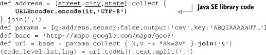

通过使用库类和各种 Java 方法，集成已经存在。我需要以 URL 编码形式将地址传递给 Google。为此，我将地址的每个元素（街道、城市和州）通过 `java.net.URLEncoder` 的 `encode` 方法进行编码。换句话说，Groovy 脚本使用了 Java 库类并调用了其方法之一。


**学习到的经验（集成）**

> **1**. Groovy 脚本可以使用 Java 的 JSR 223 脚本引擎调用。
> 
> **2**. Groovy 的 `Eval` 类使得调用涉及零、一、二或三个参数的脚本变得简单。
> 
> **3**. 使用 `GroovyShell` 和 `Binding` 类可以编程设置输入变量，调用脚本，并检索其结果。
> 
> **4**. 从 Java 调用 Groovy 最简单的方法是创建一个 Groovy 类，编译它，然后在 Java 中实例化它，并像往常一样调用方法。


Java 和 Groovy 的结合也在 图 3.3 中得到强调，如图所示，原始列表中每个 Java 方法以及每个 Groovy 方法都用箭头表示。

脚本混合了 Java 和 Groovy 的做法几乎适用于任何 Groovy 脚本。Groovy 建立在 Java 库的基础上。正如你将在 4.3 节 中看到的，它增强了这些库，但不需要重新发明轮子。8] Groovy 完全可以使用你提供的任何 Java 类，并且使许多类变得更好。

> ⁸ 重新发明轮子却做错了，这就是重新发明平轮胎的情况。


##### 使用 groovyc 编译

每当你混合使用 Java 和 Groovy 时，请使用 `groovyc` 编译所有内容。让 `groovyc` 处理所有跨编译器问题。


在下一章中，我将探讨 Groovy 如何改进 Java 的几种方法。


**不要将 Groovy 和 Java 类分开**

使用两种不同的语言时，自然的倾向是将两个代码库分开，并独立编译它们。使用 Groovy 和 Java 可能会导致各种问题，尤其是在涉及循环依赖时（换句话说，Java 类`A`使用 Groovy 类`B`，它又调用了 Java 类`A`的另一个方法，依此类推）。特别是 Maven 项目会引导你走这条路，因为它们的默认布局自然建议将 Java 代码放在`src/main/java`下，将 Groovy 代码放在`src/main/groovy`下。然后的想法是使用`javac`编译 Java 代码，使用`groovyc`编译 Groovy 代码。

尽管你可能能让它工作，但这会让生活变得比必要的更困难。Groovy 的开发者多年来一直在努力解决交叉编译的问题。对我们这些两种语言的使用者来说，利用他们的进步会更好。

在同一个项目中编译 Groovy 和 Java 的最简单方法是由`groovyc`编译器处理这两个代码库。Groovy 对 Java 了如指掌，并且完全能够处理它。你通常发送给`javac`的任何编译器标志在`groovyc`中也同样适用。这实际上是一个好的通用原则。

在本书的项目中，我会让`groovyc`做所有的工作。我会在第五章中展示具体的例子，但你可以安全地假设我会在整个过程中使用`groovyc`。

| |
| --- |

### 3.3\. 摘要

本章是关于基本的 Groovy/Java 集成，无论使用案例如何。在回顾了从 JSR-223 `Script-Engine`到 Groovy 中的`GroovyShell`和`Eval`类等各种从 Java 调用 Groovy 的不同方法之后，我转向了简单的方法，即将 Groovy 放入一个类中，像使用任何其他库类一样使用它。这种简单的 Java 和 Groovy 混合将从现在开始使用。

接下来，我回顾了许多 Groovy 在基本级别帮助 Java 的方法，从 POJO 增强到 AST 转换到构建 XML 等。我将在未来的章节中使用这些技术，只要它们有帮助。我还会在途中回顾其他有用的技术，尽管这些是大多数主要的技术。

## 第四章\. 在 Java 中使用 Groovy 特性

*本章涵盖*

+   基本的代码级别简化

+   有用的 AST 转换

+   XML 处理

在第一章中，我回顾了许多 Java 的争议性弱点和缺点，并提出了 Groovy 可能有助于改善它们的方法。因为那一章旨在作为介绍，所以我只建议 Groovy 如何帮助，而没有展示很多代码示例。现在，既然我已经建立了将 Groovy 类添加到 Java 应用程序中的简便性，那么何时这样做是有帮助的呢？Groovy 为 Java 系统带来了哪些特性，使得它们更容易开发？

本章涵盖的技术指南如图 4.1 所示。[我将回顾几个 Groovy 的优势，如 POGs、操作符重载、Groovy JDK、AST 转换，以及如何使用 Groovy 处理 XML 和 JSON 数据。首先，我会展示从 Groovy 代码中，POJOs 可以被视为 POGs。]

##### 图 4.1\. 可添加到 Java 类中的 Groovy 特性

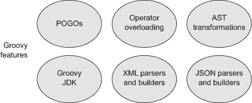

### 4.1\. 将 POJOs 视为 POGs

POGOs 比 POJOs 具有更多功能。例如，所有 POGs 都有一个基于映射的构造函数，这对于设置属性非常方便。有趣的是，即使一个类是用 Java 编写的，只要从 Groovy 访问，许多便利性仍然适用。

考虑一个简单的 POJO，代表一个人，可能是在 Java 的领域模型中创建的，如下一列表所示。为了保持简单，我只包括 ID 和名称。我还会添加一个`toString`重写，但不会包括不可避免的`equals`和`hashCode`重写。

##### 列表 4.1\. 代表一个人的简单 POJO

```
public class Person {
    private int id;
    private String name;

    public Person() {}

    public Person(int id, String name) {
        this.id = id;
        this.name = name;
    }

    public void setId(int id) { this.id = id; }
    public int getId() { return id; }
    public void setName(String name) { this.name = name; }
    public String getName() { return name; }

    @Override
    public String toString() {
        return "Person [id=" + id + ", name=" + name + "]";
    }
}
```

任何典型的 Java 持久层都有数十个这样的类，它们映射到关系数据库表（图 4.2）。

##### 图 4.2\. Groovy 为 Java 类添加了基于映射的构造函数，无论已经包含哪些构造函数。


如果我从 Groovy 中实例化这个类，我可以使用基于映射的构造函数（[1]）来这样做，尽管 Java 版本已经指定了两个构造函数，而且都不是我想要的。以下 Groovy 脚本使用三种不同的机制创建了一些`Person`实例，这些机制在 Java 类中都没有出现：

> ¹术语*基于映射*指的是使用 Groovy 映射中使用的键值符号设置属性。构造函数实际上并没有使用映射来完成其工作。

```
def buffy = new Person(name:'Buffy')
assert buffy.id == 0
assert buffy.name == 'Buffy'

def faith = new Person(name:'Faith',id:1)
assert faith.id == 1
assert faith.name == 'Faith'

def willow = [name:'Willow',id:2] as Person
assert willow.getId() == 2
assert willow.getName() == 'Willow'
```

`buffy`和`faith`实例是使用基于映射的构造函数创建的，首先只设置`name`，然后设置`name`和`id`。然后我能够使用 Groovy 的内置`assert`方法（省略其可选的括号）验证人的属性是否设置正确。

顺便提一下，所有看似直接访问类私有属性的`assert`语句实际上并不是。当看起来正在访问或分配属性时，Groovy 会通过 Java 类中提供的 getter 和 setter 方法进行操作。我可以通过修改 getter 方法的实现来证明这一点，使其返回不仅仅是名称：

```
public String getName() {
    return "from getter: " + name;
}
```

现在，我必须修改每个断言，包括字符串"`from getter:`"，以便它们仍然返回 true。

第三个人`willow`是使用 Groovy 中的`as`运算符构建的。这个运算符有几个用途，其中之一是将映射强制转换为对象，如这里所示。在这种情况下，运算符实例化一个人，并将映射作为属性提供给结果实例。

接下来，我还可以将人实例添加到 Groovy 集合中，这并不令人惊讶，但有一些额外的优点。例如，Groovy 集合支持运算符重载，这使得添加额外的个人和具有额外搜索方法变得容易：

```
def slayers = [buffy, faith]
assert ['Buffy','Faith'] == slayers*.name
assert slayers.class == java.util.ArrayList

def characters = slayers + willow
assert ['Buffy','Faith','Willow'] == characters*.name

def doubles = characters.findAll { it.name =~ /*([a-z])\1*/ }
assert ['Buffy','Willow'] == doubles*.name
```

Groovy 有一个用于集合的本地语法，这简化了 Java 代码。将引用放在方括号内创建了一个`java.util.ArrayList`类的实例，并将每个元素添加到集合中。然后，在`assert`语句中，我使用了所谓的“扩展点”运算符来从每个实例中提取`name`属性，并返回一个结果列表（换句话说，扩展点运算符的行为与`collect`相同）。顺便说一句，我将`getName`方法恢复到其原始形式，它只返回属性值。

我能够使用运算符重载将`willow`添加到`slayers`集合中，从而得到`characters`集合。最后，我利用了在 Groovy 中，`java.util.Collection`接口已经被扩展，具有一个`findAll`方法，该方法返回所有匹配提供的闭包中条件的集合实例。在这种情况下，闭包包含一个匹配任何重复小写字母的正则表达式。

许多现有的 Java 应用程序拥有广泛的领域模型。正如你所看到的，Groovy 代码可以直接与它们一起工作，甚至可以将它们视为 POGOs，并为你提供一种简陋的搜索能力。

现在来展示 Groovy 可以添加到 Java 中，而 Java 甚至不支持的功能：运算符重载。

### 4.2\. 在 Java 中实现运算符重载

到目前为止，我已经使用了这样一个事实：在`String`类中，`+`和`-`运算符都被重载了。`String`中的重载`+`运算符对于 Java 开发者来说应该是熟悉的，因为它是 Java 中唯一的重载运算符；它用于字符串的连接和数值的加法。然而，Java 开发者并不能随意重载运算符。

在 Groovy 中情况不同。在 Groovy 中，所有运算符都由方法表示，就像`plus`方法用于`+`运算符或`minus`方法用于减法运算符一样。你可以通过在 Groovy 类中实现适当的方法来重载任何运算符。然而，不一定明显的是，你还可以在 Java 类中实现正确的方法，如果该类的实例在 Groovy 代码中使用，运算符也会在那里工作（参见图 4.3）。

> ² 顺便提一下，以这种方式改变运算符的行为通常被称为运算符*重载*，因为同一个运算符在不同的类中有不同的行为。然而，可以说，我实际上做的是运算符*重写*。实际上，在这里它们是同一件事，所以我会交替使用这些术语。

##### 图 4.3\. Groovy 运算符被实现为方法，所以如果 Java 类包含正确的方法，Groovy 脚本就可以在其实例上使用相关的运算符。 

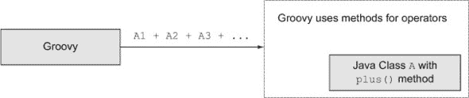

为了演示这一点，我将创建一个 Java 类，它封装一个映射。`Department`包含一组`Employee`实例，并将有一个`hire`方法来添加它们，以及一个`layOff`方法来移除它们（希望不会太频繁）。我将通过三个方法实现运算符重载：`plus`、`minus`和`leftShift`。直观地，`plus`将添加一个新员工，`minus`将移除现有员工，而`leftShift`将是一种添加的替代方式。所有三个方法都将允许链式调用，这意味着它们将返回修改后的`Department`实例。

这里是`Employee`类，它只是另一个名字的`Person` POJO：

```
public class Employee {
    private int id;
    private String name;

    public String getName() { return name; }
    public void setName(String name) { this.name = name; }
    public int getId() { return id; }
    public void setId(int id) { this.id = id; }
}
```

现在是`Department`类，如下所示，它在一个以员工`id`值为键的`Map`中维护员工集合。

##### 列表 4.2\. 一个包含`Employees`映射和运算符重载的`Department`

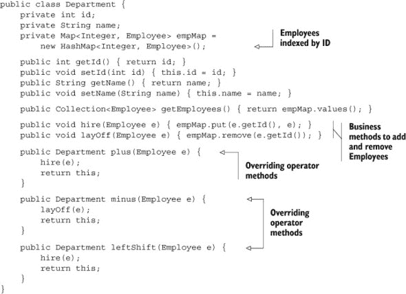

顺便说一下，请注意，`plus`方法不是添加两个`Department`实例；相反，它将一个`Employee`添加到`Department`中。Groovy 只关心方法名来执行运算符.^([3])

> ³ 作为 Groovy JDK 的一个例子，`java.util.Date`类有一个`plus`方法，它接受一个表示天数的整数。还可以参考`Collection`中的`multiply`方法，它也接受一个整数。

为了测试这一点，我将使用 Spock 测试框架。正如第一章中所述，我将展示测试，而不会过多地详细介绍 Spock 框架本身，这将在第六章中处理。幸运的是，即使不了解细节，Spock 测试也很容易阅读。下一个列表显示了一个专注于运算符方法的 Spock 测试。

##### 列表 4.3\. 检查 Java 类中运算符重载方法的 Spock 测试

```
class DepartmentTest extends Specification {
    private Department dept;

    def setup() { dept = new Department(name:'IT') }

    def "add employee to dept should increase total by 1"() {
        given: Employee fred = new Employee(name:'Fred',id:1)

        when: dept = dept + fred

        then:
        dept.employees.size() == old(dept.employees.size()) + 1
    }

    def "add two employees via chained plus"() {
        given:
        Employee fred = new Employee(name:'Fred',id:1)
        Employee barney = new Employee(name:'Barney',id:2)

        when:
        dept = dept + fred + barney

        then:
        dept.employees.size() == 2
    }

    def "subtract emp from dept should decrease by 1"() {
        given:
        Employee fred = new Employee(name:'Fred',id:1)
        dept.hire fred

        when:
        dept = dept - fred

        then:
        dept.employees.size() == old(dept.employees.size()) - 1
    }

    def "remove two employees via chained minus"() {
        given:
        Employee fred = new Employee(name:'Fred',id:1)
        Employee barney = new Employee(name:'Barney',id:2)
        dept.hire fred; dept.hire barney

        when: dept = dept - fred - barney

        then: dept.employees.size() == 0
    }

    def "left shift should increase employee total by 1"() {
        given:
        Employee fred = new Employee(name:'Fred',id:1)

        when:
        dept = dept << fred

        then:
        dept.employees.size() == old(dept.employees.size()) + 1
    }

    def "add two employees via chained left shift"() {
        given:
        Employee fred = new Employee(name:'Fred',id:1)
        Employee barney = new Employee(name:'Barney',id:2)

        when:
        dept = dept << fred << barney

        then:
        dept.employees.size() == 2
    }
}
```

Spock 测试是用 Groovy 编写的，因此我可以使用+、-和<<，并且知道将使用相关的方法，即使它们是在 Java 类中实现的。

Groovy 中可以重载的运算符列表包括`plus`、`minus`和`leftShift`，如列表所示，以及许多其他运算符。你可以通过实现`getAt`等来通过索引实现类似数组的访问。通过`next`和`previous`方法分别实现前置和后置递增。通过`compareTo`实现关系运算符`<=>`。甚至可以重载点运算符，信不信由你。酷的地方在于，你可以在 POJOs 或 POGs 中实现这些方法，Groovy 会利用它们。

Groovy 的下一个简化 Java 的功能是我已经多次利用过的：Groovy JDK。

### 4.3\. 使 Java 库类更好的方法：Groovy JDK

每个 Groovy 类都包含一个元类。除了提供有关类的信息外，元类还包含在通过实例访问不存在的方法或属性时发挥作用的方法。通过拦截那些方法或属性“缺失”失败，开发者可以提供他们想要的任何内容。

这种应用之一是 Groovy 向现有类添加方法。当你想要向无法更改源代码的类添加方法时，这特别有用。如前所述，Groovy 广泛使用了现有的 Java 标准库。然而，它并不是简单地使用它们。在许多情况下，已经向 Java 库添加了一系列新方法，以便使它们更容易、更强大。

一起，这些增强的 Java 库集合被称为 Groovy JDK。Groovy 有两套 Javadoc 文档。一个是 Groovy API，其中包含有关包含的 Groovy 库的信息。另一个是 Groovy JDK，它只显示已添加到标准 Java 库中的方法和属性，以便，正如俗话所说，使它们更加“Groovy”（见图 4.4）。

##### 图 4.4\. Groovy 向 Java 标准库中的类添加便利方法。

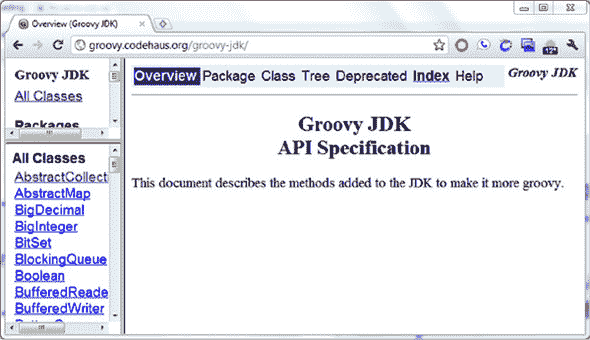

例如，Groovy 向`java.util.Collection`接口添加了许多方法，包括`collect`、`count`、`find`、`findAll`、`leftShift`、`max`、`min`、`sort`和`sum`。这些方法随后在任何 Groovy 集合中都是可用的，无论它们是否包含 Java 或 Groovy 的对象。

尽管我已经在集合上花费了不少时间，但我在书中会经常回顾它们。因此，为了从一个不同的 Java 类中选择一个例子，让我们说明为什么在 HTTP 上使用基本身份验证是个糟糕的主意。

在基本身份验证中，用户名和密码以编码形式发送到服务器。基本身份验证将用户名和密码通过冒号连接起来，对生成的字符串进行 Base 64 编码，并将结果作为认证的 HTTP 请求头的一部分发送。

然而，编码和解密之间有很大的区别。编码后的字符串同样可以被解码。Groovy 使得演示这一点变得容易，因为 Groovy JDK 为字节数组添加了一个名为`encodeBase64`的方法。它还向`String`添加了一个`decodeBase64`方法。下面的列表演示了这两个方法。

##### 列表 4.4\. 基于 Base 64 编码和解码用户名/密码信息

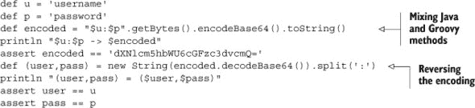

在这个简短的脚本中有很多事情在进行。首先，用户名和密码被组合成一个 Groovy 字符串。然后对组合字符串调用 `getBytes` 方法，使用默认字符编码将字符串编码成一系列字节。这个方法来自 Java。结果是字节数组。检查 Groovy JDK，你会发现 Groovy 为 `byte[]` 添加了 `encodeBase64` 方法，它返回一个 `groovy.lang.Writable` 实例。在这里，我只是使用它的 `toString` 方法（当然，来自 Java，尽管在 Groovy 类中被覆盖）来查看结果值。实际上，我在一个链式方法调用中从 Java 到 Groovy 再到 Java。

要进行相反的操作，首先我使用 Groovy 添加到 `java.lang.String` 的 `decodeBase64` 方法，它再次返回一个 `byte[]`。然后 `String` 有一个构造函数，它接受一个字节数组，我使用 Java 的 `split` 方法再次将用户名和密码分开，并验证它们在转换过程中没有被修改。

除了展示 Groovy JDK 如何向标准 Java 数据类型添加新方法之外，这个例子还表明编码文本并没有加密。任何拦截请求并访问编码头的人都可以提取用户名和密码。因此，如果请求是通过未加密的连接（如 HTTP）传输的，使用基本身份验证就完全不安全。至少，请求应该通过 HTTPS 传输.^([4])

> ⁴ 几年来，Twitter 作为其 RESTful API 的一部分支持基本身份验证。希望所有使用它的许多 Twitter 客户端都通过安全套接字传输了它们的身份验证。如果没有，你可能需要考虑更改你的密码。如今，Twitter 已经切换到 OAuth，这可能过于复杂，但比基本身份验证要好得多。

Groovy JDK 中有很多有用的方法。作为另一个例子，日期操作在 Java 中总是很痛苦.^([5]) Groovy 并不一定解决了许多问题，但 Groovy JDK 为与日期相关的类添加了几个方法，使它们更强大。以下是一个示例，希望对一些读者来说既有趣又至少有点乐趣。

> ⁵ Java 8 终于要解决这个问题了。在此期间，Java 世界中首选的开源日期/时间库是 Joda 时间：[`joda-time.sourceforge.net/`](http://joda-time.sourceforge.net/).

在美国和加拿大，2 月 2 日被称为土拨鼠日。在土拨鼠日，土拨鼠会从它的洞里出来寻找它的影子。如果它看不到影子，它就会待在洞里，冬天就快结束了。如果它看到了自己的影子，它就会回到洞里睡觉，我们就不幸地要再忍受六个星期的冬天。

让我们检查一下下一个列表中的数学，如图所示。

##### 列表 4.5\. 土拨鼠日——Groovy JDK 中 `Date` 和 `Calendar` 的一个示例

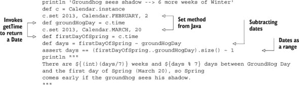

我通过访问其 `instance` 属性来获取 `Calendar` 类的实例。当然，`Calendar` 中没有 `instance` 属性，但这个语法实际上意味着我使用无参数调用静态的 `getInstance` 方法。然后我使用适合土拨鼠日和春天第一天的适当参数调用 `set`。从 `Calendar` 中提取 `Date` 实例是通过 `getTime` 方法完成的（ sigh^([6]))，这同样是通过访问 `time` 属性来调用的。到目前为止，这完全是 Java，除了我通过属性调用方法并省略了可选的括号。

> ⁶ 真的，就不能使用 `getDate` 方法从一个 `Calendar` 中提取一个 `Date` 吗？

然而，我可以进行日期相减，因为 Groovy JDK 显示 `Date` 中的 `minus` 方法返回它们之间的天数。`Date` 类有一个 `next` 方法和一个 `previous` 方法，并实现了 `compareTo`。这些都是一个类作为范围的一部分使用所必需的要求，因此我可以通过在范围上调用 `size` 方法来检查数学。范围的尺寸计算两端，所以我必须通过减去一来纠正潜在的偏移量错误。

重要的是，从土拨鼠日到春天的第一天（3 月 20 日）之间有六个星期和四天。换句话说，如果土拨鼠看到了自己的影子，接下来的六个星期冬天的结果实际上是一个（稍微）早春。^([7])

> ⁷ 是的，为了一个玩笑走这么远的路，但这确实清楚地展示了 Java 和 Groovy 的混合使用，利用了 Groovy JDK 方法和运算符重载。这个笑话只是一个额外的好处。

最后，还应注意的是一个便利之处。在 Java 中，数组有 `length` 属性，字符串有 `length` 方法，集合有 `size` 方法，`NodeList`s 有 `getLength` 方法，等等。在 Groovy 中，你可以对它们中的任何一个调用 `size` 来获得适当的行为。在这种情况下，Groovy JDK 已被用来纠正 Java 中的历史不一致性。

Groovy JDK 中充满了有用的方法。即使你的应用程序计划只使用 Java 库类，我也鼓励你检查 Groovy JDK，看看是否有可能的简化或增强。

我提到了运行时元编程，这是通过元类完成的。然而，Groovy 中更有趣的一个特性是通过 AST 转换进行的编译时元编程，这是下一节的主题。

### 4.4\. 令人印象深刻的 AST 转换

Groovy 1.6 引入了抽象语法树（AST）转换。其思路是在 Groovy 类上放置注解并调用编译器，编译器会像往常一样构建一个语法树，然后以有趣的方式修改它。编写 AST 转换是通过各种构建器类完成的，但这不是我的主要关注点。相反，我想展示一些 Groovy 标准库中提供的 AST 转换，并证明它们也可以应用于 Java 类。

#### 4.4.1\. 将代理委托给包含对象

让我们从代理开始。当前的设计原则倾向于优先考虑代理而不是继承，认为继承耦合度太高。不是通过扩展一个类来支持所有其方法，而是使用代理，你将一个类的实例包裹在另一个类中。然后你在外部类中实现所有包含类提供的方法，并将每个调用委托给包含对象上的相应方法。这样，你的类具有与包含对象相同的接口，但除此之外与它没有其他关系。

写所有这些“透传”方法可能会很痛苦。Groovy 引入了 `@Delegate` 注解来为你处理所有这些工作。

手机变得越来越强大，以至于“手机”这个词现在有点名不副实。当前一代的“智能手机”包括相机、浏览器、联系人管理器、日历等等。8 如果你已经为所有组件开发了类，那么你可以通过代理来构建智能手机。有趣的部分是，组件类可以是 Java，容器可以是 Groovy。

> ⁸ 这里有一个归功于 C++ 发明者 Bjarne Stroustrup 的好引用：“我一直希望我的电脑像我的电话一样容易使用；我的愿望实现了，因为我现在再也想不出如何使用我的电话了。”

考虑一个简单的 Java `Camera` 类：

```
public class Camera {
    public String takePicture() {
        return "taking picture";
    }
}
```

这里还有一个 `Phone` 类，用 Java 编写。

```
public class Phone {
    public String dial(String number) {
        return "dialing " + number;
    }
}
```

现在来看看 Groovy 中的一个 `SmartPhone` 类，它使用 `@Delegate` 注解来通过 `SmartPhone` 类公开组件方法（见图 4.5）：

```
class SmartPhone {
    @Delegate Camera camera = new Camera()
    @Delegate Phone phone = new Phone()
}
```

##### 图 4.5\. `@Delegate` AST 转换通过组合对象公开了所有代理中的方法。这个转换只在 Groovy 类中起作用，但代理本身可以是 Groovy、Java 或两者都是。

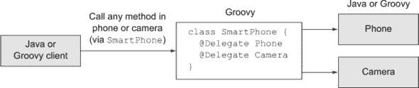

一个 JUnit 测试（这次是用 Groovy 编写的）演示了下一个列表中的代理方法。

##### 列表 4.6\. Groovy 中的一个 JUnit 测试，用于演示代理方法

```
class SmartPhoneTest {
    SmartPhone sp = new SmartPhone()

    @Test
    void testPhone() {
        assert 'dialing 555-1234' == sp.dial('555-1234')
    }

    @Test
    void testCamera() {
        assert 'taking picture' == sp.takePicture()
    }
}
```

简单地添加所需的任何组件，`@Delegate` 注解将通过 `SmartPhone` 类公开它们的方法。我也可以添加所需的智能手机特定方法。@`Delegate` 注解使得包括功能变得容易，组件本身可以是 Java 或 Groovy，哪个更方便都可以。唯一的要求是 `SmartPhone` 类本身必须用 Groovy 编写，因为只有 Groovy 编译器理解 AST 转换。

我将在附录 C 中提供一个关于基于 SOAP 的 Web 服务的 @`Delegate` 的实际例子，但现在是时候继续创建不可变对象了。

#### 4.4.2\. 创建不可变对象

随着多核机器的兴起，处理并发性良好的程序变得越来越重要。处理操作的一种线程安全机制是尽可能使用不可变对象来共享信息。

与 C++不同，Java 没有内置的方式使对象无法修改。Java 中没有“const”关键字，将`static`和`final`组合应用于引用仅使引用成为常量，而不是它引用的对象。在 Java 中使对象不可变的唯一方法是移除所有改变它的方法。

这实际上比听起来要困难得多。移除所有 setter 方法是一个好的开始，但还有其他要求。使一个类支持不可变性需要

+   所有可变方法（setter）都必须移除。

+   类应该被标记为`final`。

+   任何包含的字段都应该是`private`和`final`。

+   可变组件（如数组）应该在输入（通过构造函数）和输出（通过 getter）时进行防御性复制。

+   `equals`、`hashCode`和`toString`都应该通过字段实现。

这听起来像是一项工作。幸运的是，Groovy 有一个`@``Immutable` AST 转换，它可以为你做所有事情（见图 4.6）。

##### 图 4.6\. `@``Immutable` AST 转换产生了一个不可变对象，该对象可以在 Java 和 Groovy 客户端中使用。

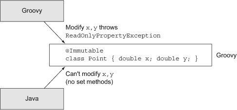

`@``Immutable`转换只能应用于 Groovy 类，但那些类可以用于 Java 应用程序。我将首先展示`@``Immutable`注解的工作方式和其局限性，然后在一个 Java 类中使用不可变对象。

这是一个不可变点类。它包含两个字段，`x`和`y`，它们代表点在二维空间中的位置：

```
@Immutable
class ImmutablePoint {
    double x
    double y

    String toString() { "($x,$y)" }
}
```

`@``Immutable`注解应用于类本身。它仍然允许通过构造函数设置属性，但一旦设置，属性就再也不能修改。下一个列表展示了 Spock 测试来演示这一点。

##### 列表 4.7\. 测试`ImmutablePoint`类

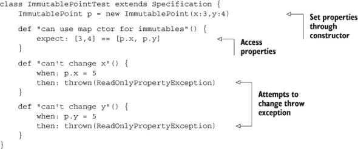

在测试中，通过指定构造函数参数`x`和`y`的值来实例化`ImmutablePoint`类。这是必要的，因为没有可用的设置方法。我可以通过常规动态生成的 get 方法访问属性，但如果我尝试修改一个属性，尝试将抛出`ReadOnlyPropertyException`。

`@``Immutable`注解非常强大，但它也有局限性。你只能将其应用于包含原始数据类型或某些库类（如`String`或`Date`）的类。它也适用于包含也是不可变属性的类。例如，这里有一个`ImmutableLine`类，它包含两个`ImmutablePoint`实例：

```
@Immutable
class ImmutableLine {
    ImmutablePoint start
    ImmutablePoint end

    def getLength() {
        double dx = end.x - start.x
        double dy = end.y - start.y
        return Math.sqrt(dx*dx + dy*dy)
    }

    String toString() { "from $start to $end" }
}
```

`start`和`end`字段都是`ImmutablePoint`类型。我添加了一个方法来返回一个依赖的`length`属性，它使用通常的方式通过勾股定理计算。这意味着我可以访问`Immut`ableLine`的`length`属性，访问将通过`getLength`方法进行，但由于没有设置器，所以我不能从外部更改该值。这个类的对应测试如下所示。

##### 列表 4.8\. `ImmutableLine`类的 Spock 测试

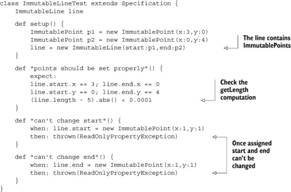

为了创建一个`ImmutableLine`，我需要首先创建一对`ImmutablePoint`实例，这些实例可以用在`ImmutableLine`构造函数中。第一个测试检查包含的点是否被正确设置，然后通过访问`length`“字段”来检查`getLength`实现。最后，我确保不能重新分配线的`start`或`end`属性。

将这一步进一步，如果类中包含一个集合会发生什么？`@Immutable`注解将导致该集合被其不可修改的替代品之一包装。例如，假设路径是一系列线的集合，所以这里是`ImmutablePath`的定义：

```
@Immutable
class ImmutablePath {
    List<ImmutableLine> segments = []
}
```

这次我无法仅使用`def`声明 segments 变量。如果我想让`@Immutable`注解工作，我需要指定我正在使用某种类型的集合。在`segments`定义的右侧，我仍然只有`[]`，这通常意味着一个`java.util.ArrayList`的实例。然而，实际上我得到的是`java.util.Collections$UnmodifiableRandomAccessList`，信不信由你。`Collections`类有像`unmodifiableList`这样的实用方法，它接受一个常规列表并返回一个新的不可变列表，但说实话，我并不一定期望在这种情况下它是一个`RandomAccessList`。当然，只要契约得到维护，实际的类是什么并不重要。

说到这个契约，`Collections`中的不可修改方法并没有移除可用的修改器方法。相反，它们将它们包装起来，如果访问它们，则抛出`UnsupportedOperationException`。这可以说是实现接口的一种奇怪方式，但就是这样。这个类的 Spock 测试如下所示。构建所有必要的不可变对象以创建`ImmutablePath`实例需要一些工作，但一旦设置好，一切都会正常工作。

##### 列表 4.9\. `ImmutablePath`类的 Spock 测试

```
class ImmutablePathTest extends Specification {
    ImmutablePath path

    def setup() {
        def lines = []
        ImmutablePoint p1 = new ImmutablePoint(x:0,y:0)
        ImmutablePoint p2 = new ImmutablePoint(x:3,y:0)
        ImmutablePoint p3 = new ImmutablePoint(x:0,y:4)
        lines << new ImmutableLine(start:p1,end:p2)
        lines << new ImmutableLine(start:p2,end:p3)
        lines << new ImmutableLine(start:p3,end:p1)

        path = new ImmutablePath(segments:lines)
    }

    def "points should be set through ctor"() {
        expect:
        path.segments.collect { line -> line.start.x } == [0,3,0]
        path.segments.collect { line -> line.start.y } == [0,0,4]
        path.segments.collect { line -> line.end.x } == [3,0,0]
        path.segments.collect { line -> line.end.y } == [0,4,0]
    }

    def "cant add new segments"() {
        given:
        ImmutablePoint a = new ImmutablePoint(x:5,y:5)
        ImmutablePoint b = new ImmutablePoint(x:4,y:4)

        when:
        path.segments << new ImmutableLine(start:a,end:b)

        then:
        thrown UnsupportedOperationException
    }
}
```

到目前为止，我所展示的关于`@``Immutable`注解的内容都属于好消息的范畴。然而，现在要说的是坏消息，尽管这并不是那么糟糕。首先，`@``Immutable`注解，就像许多 AST 转换一样，对集成开发环境（IDEs）造成了破坏。这些转换发生在编译时，这使得 IDEs 很难预测。尽管我到目前为止所做的一切都是合法的并且运行良好，但我的 IDE^([9])仍然不断为此挣扎。到目前为止，IDE 的问题主要很烦人，但修复这些问题确实是一个难题，而且可能不会很快消失。

> ⁹本章的大部分代码都是使用 Groovy / Grails 工具套件（STS）版本 3.2 编写的。

下一个问题出现在我尝试在 Java 程序中使用我的`ImmutablePoint`时。我该如何分配`x`和`y`的值呢？Groovy 给了我一个基于映射的构造函数，我到目前为止一直在使用，但 Java 看不到这一点。

幸运的是，`@``Immutable`的开发者预见到了这个问题。转换还生成一个元组构造函数，它按照定义的顺序接受每个属性。在这种情况下，`ImmutablePoint`类似乎有一个接受表示`x`和`y`的双精度浮点数的两个参数的构造函数。

这里有一个 JUnit 4 测试（用 Java 编写的，所以它本身就是一个 Java/Groovy 集成的例子）利用了那个构造函数：

```
public class ImmutablePointJUnitTest {
    private ImmutablePoint p;

    @Test
    public void testImmutablePoint() {
        p = new ImmutablePoint(3,4);
        *assertEquals*(3.0, p.getX(), 0.0001);
        *assertEquals*(4.0, p.getY(), 0.0001);
    }
}
```

这同样运行得很好。目前，我的 IDE 甚至理解存在两个参数的构造函数，这真的很棒。顺便说一下，我正在使用`Assert.assertEquals`方法的三个参数版本，因为我正在比较双精度浮点数，而这需要指定一个精度。

由于从 Java 的角度来看，这个类没有可能改变`x`或`y`的方法，因此没有必要尝试检查不可变性。与展示的`getX`和`getY`方法不同，没有相应的 setter 方法。

正如我说的，这一切都运行得很好，但如果你试图使用生成的构造函数，而你的系统拒绝相信它存在，有一个简单的解决方案。只需在 Groovy 中添加一个可以以常规方式实例化点的工厂类：

```
class ImmutablePointFactory {
    ImmutablePoint newImmutablePoint(xval,yval) {

        return new ImmutablePoint(x:xval,y:yval)
    }
}
```

现在，Java 客户端可以实例化`ImmutablePointFactory`，然后调用`newImmutablePoint`工厂方法，提供所需的`x`和`y`值。

一切都运行得很好，也就是说，直到你屈服于遵循 Java API 中标准实践的诱惑，将工厂类做成单例。这就是下一小节的主题。

#### 4.4.3\. 创建单例

当一位新的 Java 开发者首次发现广阔、美妙的设计模式世界时，他们往往会遇到 Singleton。这是一个容易学习的模式，因为它易于实现，并且只涉及一个类。如果您只想有一个类的实例，请将构造函数设为私有，添加一个 `static final` 类型的实例变量，并添加一个静态获取方法来检索它。这有多酷？

不幸的是，我们可怜的新开发者误入了一个充满怪物、攻击那些不小心的人的广阔丛林。首先，实现一个真正的 Singleton 并不像听起来那么简单。至少，还有线程安全问题需要担心，而且由于似乎没有 Java 程序是完全线程安全的，结果很快就变得很糟糕。

然后，还有这样一个事实，一小部分但非常直言不讳的开发者认为整个 Singleton 设计模式是一个反模式。他们出于各种原因对其进行抨击，并且他们往往对这种模式和任何愚蠢或天真到足以使用它的人都非常严厉。

幸运的是，我并不是来解决这个问题。我的工作是向您展示 Groovy 如何帮助您作为 Java 开发者，我可以在这里做到这一点。根据本节标题的标题，这里有一个名为 @`Singleton` 的 AST 转换。

要使用它，我只需将注释添加到我的类中。这里我将它添加到了之前的 `ImmutablePointFactory`：

```
@Singleton
class ImmutablePointFactory {
    ImmutablePoint newImmutablePoint(xval,yval) {
        return new ImmutablePoint(x:xval,y:yval)
    }
}
```

再次，我忍不住要说：这很简单。结果是，这个类现在包含一个名为 `instance` 的静态属性，它自然地包含该类的一个且仅有一个实例。此外，转换的作者以尽可能正确的方式实现了所有内容。¹⁰。在 Groovy 代码中，我现在可以编写以下内容：

> [¹⁰] Paul King，*Groovy in Action*（Manning，2007）的合著者之一，是一位出色的开发者。让我坦白地说：Paul King 写的每一篇东西都是好的。他倾向于将他的演示文稿添加到 SlideShare.net，所以请尽可能快地去阅读它们。

```
ImmutablePoint p = ImmutablePointFactory.instance.newImmutablePoint(3,4)
```

这一切都很正常。问题在于当我尝试在 Java 中做同样的事情时，我遇到了问题。再次，编译器理解，但我从未能够说服我的 IDE 相信工厂类中有一个名为 `public` `static` 的字段 `instance`。

尽管如此，注释仍然有效，IDEs 最终会理解如何处理它。实际上，所有酷炫的新 AST 转换都有效，我鼓励您考虑它们是编写应用程序的显著快捷方式。

有其他 AST 转换可用，并且还在不断编写中。我鼓励您密切关注它们，以防出现可以以与刚刚讨论的相同方式简化您的代码的转换。

尽管 AST 转换很酷，但我们的最后一个任务在 Groovy 中比在 Java 中容易得多，这几乎让 Groovy 本身就能吸引 Java 开发者。这个问题是解析和生成 XML。

### 4.5. 处理 XML

回到 20 世纪 90 年代末，当 XML 还年轻、新鲜且仍然流行（尽管现在看起来很难想象），XML 和 Java 的结合被认为将是非常有成效的。Java 是一种可移植的语言（一次编写，到处运行，对吧？），而 XML 是一种可移植的数据格式。不幸的是，如果你曾经尝试通过 Java 内置的 API 来处理 XML，你就会知道结果远远没有达到预期。为什么 Java 处理 XML 的 API 使用起来如此痛苦？

这里有一个简单的例子。我有一份 XML 格式的书籍列表，如下所示：

```
<books>
    <book isbn="...">
        <title>Groovy in Action</title>
        <author>Dierk Koenig</author>
        <author>Paul King</author>
        ...
    </book>
    <book isbn="...">
        <title>Grails in Action</title>
        <author>Glen Smith</author>
        <author>Peter Ledbrook</author>
    </book>
    <book isbn="...">
        <title>Making Java Groovy[11]</title>
        <author>Ken Kousen</author>
    </book>
</books>
```

> ^（11）我必须找到一种方法，让我的书加入那个显赫的行列，仅仅是为了沐浴在反射的荣光中。

现在假设我的任务是打印第二本书的标题。还有什么比这更容易的吗？这是一个基于将数据解析为文档对象模型（DOM）树并找到正确元素的 Java 解决方案：

```
public class ProcessBooks {
    public static void main(String[] args) {
        DocumentBuilderFactory factory =
            DocumentBuilderFactory.*newInstance*();
        Document doc = null;
        try {
            DocumentBuilder builder = factory.newDocumentBuilder();
            doc = builder.parse("src/jag/xml/books.xml");
        } catch (ParserConfigurationException e) {
            e.printStackTrace();
        } catch (SAXException e) {
            e.printStackTrace();
        } catch (IOException e) {
            e.printStackTrace();
        }
        if (doc == null) return;
        NodeList titles = doc.getElementsByTagName("title");
        Element titleNode = (Element) titles.item(1);
        String title = titleNode.getFirstChild().getNodeValue();
        System.out.println("The second title is " + title);
    }
}
```

这实际上是所需程序的简短版本。为了使其更短，我必须将异常处理折叠为仅捕获`Exception`，或者向`main`方法添加`throws`子句。

许多 Java API 都是围绕一组接口设计的，假设将会有许多不同的替代实现。在 Java API for XML Processing（JAXP）的世界里，有许多解析器可用，因此 API 主要由接口主导。当然，你不能实例化一个接口，因此使用 API 归结为工厂和工厂方法。

因此，为了使用简单的 DOM 解析器解析 XML 文件，我首先需要获取相关的工厂，使用其`newInstance`方法。然后我使用工厂方法`newDocumentBuilder`，这确实是一个很好的工厂方法的名字。然后，通过`parse`方法解析文件，正如预期的那样。在 DOM 解析器内部，树是通过一个 SAX 解析器构建的，这也是为什么我需要准备 SAX 异常。

假设我做到了这一步，那么此时的结果是 DOM 树的引用。通过遍历树来找到我的答案坦白说是不可能的。遍历对空白节点的高度敏感，并且可用的方法（`getFirstChild`、`getNextSibling` 等等）并不是直接得到答案的方法。如果谁整理了 XML 文件，并且足够友好地为每个元素分配了一个 ID，我就可以使用伟大的 `getElementByID` 方法来提取我需要的节点，但很不幸没有这样的运气。相反，我只能通过 `getElementsByTagName` 收集相关的节点，它不会像你预期的那样返回 `Collections` 框架中的内容，而是一个 `NodeList`。`NodeList` 类有一个 `item` 方法，它接受一个整数，代表我想要的节点的零基索引，最终我得到了我的标题节点。

然后还有最后的侮辱，那就是节点的值并不是我想要的字符内容。不，我必须检索节点的第一个文本子节点，然后才能得到值，这返回了我需要的文本。


**XML 和 Groovy**

我曾经教过一门关于 Java 和 XML 的课程，其中一项练习是提取嵌套值。在让学生们通过那个笨拙、丑陋的 Java 解决方案后，教室后面的一位女士举手发言。

“我一直等着你说，‘这是困难的方法，’”她说，“现在这里有简单的方法，但你从未提到简单的方法。”

作为回应，我不得不说，“想看看简单的方法吗？让我们看看这个问题的 Groovy 解决方案。”

```
def root = new XmlSlurper().parse('books.xml')
println root.book[1].title
```

这难道不简单吗？我实例化了一个 `XmlSlurper`，在 XML 文件上调用它的 `parse` 方法，然后直接走到我想要的值。

如果我需要解析或生成 XML，我总是会添加一个 Groovy 模块来完成这项工作。


让我们看看另一个，相对更实用的例子。还记得第三章（[kindle_split_013.html#ch03](https://example.org/kindle_split_013.html#ch03)）中使用的 Google 地理编码器吗？当地理编码器升级到版本 3 时，Google 移除了注册密钥的要求（好事），但也移除了 CSV 输出类型（不幸）。现在可用的输出类型只有 JSON 或 XML。Google 还更改了访问 Web 服务的 URL（实际上在版本化 Web 服务时很典型），将两种可用的输出类型嵌入到新的 URL 中。在第九章（[kindle_split_021.html#ch09](https://example.org/kindle_split_021.html#ch09)）关于 RESTful Web 服务中，我将有很多关于输出类型选择（正式称为 *内容协商*）的讨论，但在这里类型是嵌入到 URL 中的。

从 Java 的角度来看，处理 JSON 输出有点复杂，因为它需要一个外部库来解析 JSON 数据。这并不是太大的负担，因为有几个好的 JSON 库可用，但你仍然需要选择一个并学习如何使用它。我们已经讨论了在 Java 中处理 XML 数据是多么复杂，所以这也不是一个好的替代方案。

然而，Groovy 对 XML 来说却是小菜一碟。让我们看看 Groovy 访问新的地理编码器并提取返回的经纬度数据有多容易。

首先，这是一个从网络服务返回的 XML 输出样本，用于 Google 家办公室的输入地址：

```
<GeocodeResponse>
  <status>OK</status>
  <result>
  <type>street_address</type>
  <formatted_address>1600 Amphitheatre Pkwy, Mountain View, CA 94043, USA</
      formatted_address>

...
  <geometry>
   <location>
    <lat>37.4217550</lat>
    <lng>-122.0846330</lng>
   </location>
   ...
  </geometry>
</result>
</GeocodeResponse>
```

为了专注于我真正想要的内容，已经从这个响应中省略了很多子元素。经纬度值深藏在输出中。当然，对于 Groovy 来说，挖掘到那个点很容易。以下是一个脚本，它创建所需的 HTTP 请求，将其发送到 Google，并提取响应，所有这些都在不到一打行代码内完成：

```
String street = '1600 Ampitheatre Parkway'
String city = 'Mountain View'; state = 'CA'
String base = 'http://maps.google.com/maps/api/geocode/xml?'
String url = base + [sensor:false,
    address:[street, city, state].collect { v ->
         URLEncoder.encode(v,'UTF-8')
    }.join(',')].collect {k,v -> "$k=$v"}.join('&')
def response = new XmlSlurper().parse(url)
latitude = response.result[0].geometry.location.lat
longitude = response.result[0].geometry.location.lng
```

代码与前面展示的版本 2 客户端非常相似，因为我有一个服务的基本 URL（注意，它将响应类型 XML 作为 URL 的一部分包含在内）和一个参数映射，我将它转换为查询字符串。发送请求和解析结果是在一行代码中完成的，因为 `XmlSlurper` 类有一个接受 URL 的 `parse` 方法。然后，提取经纬度只是遍历树的一个简单问题。

几次我编写了应用程序，将这个脚本转换为使用 `Location` 的类，并将其添加为服务。与相应的 Java 版本相比，代码节省的量实在太大，不容忽视。

解析是一回事，但生成呢？为此，Groovy 提供了一个名为 `groovy.xml.MarkupBuilder` 的构建器类。

考虑另一个表示 `Song` 的 POJO，如下所示：

```
public class Song {
    private int id;
    private String title;
    private String artist;
    private String year;

    public Song() {}

    public Song(int id, String title, String artist, String year) {
        this.id = id;
        this.title = title;

        this.artist = artist;
        this.year = year;
    }

    public int getId() { return id;  }
    public void setId(int id) { this.id = id; }
    public String getTitle() { return title; }
    public void setTitle(String title) { this.title = title; }
    public String getArtist() { return artist; }
    public void setArtist(String artist) { this.artist = artist; }
    public String getYear() { return year; }
    public void setYear(String year) { this.year = year; }
}
```

实现 `Song` 类的 Java 包含一个 `id` 和 `title`、`artist`、`year` 的字符串。其余的只是构造函数、获取器和设置器。在实际系统中，这个类可能还会覆盖 `toString`、`equals` 和 `hashCode` 方法，但在这里我不需要这些。

`Song` 实例应该如何在 XML 中表示？一个简单的想法是将 ID 作为歌曲的属性处理，并将 `title`、`artist` 和 `year` 作为子元素。在下面的列表中，我展示了部分 Groovy 类，该类将 `Song` 实例转换为 XML 并反向转换。

##### 列表 4.10\. 将歌曲转换为 XML 并反向转换

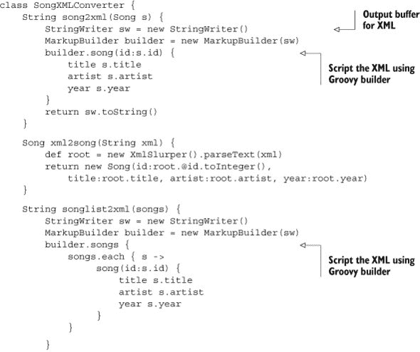

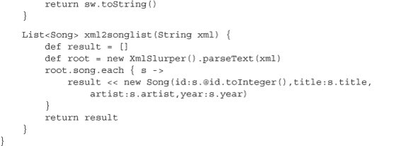

`SongXMLConverter` 类有四个方法：一个用于将单个歌曲转换为 XML，一个用于将 XML 转换为单个歌曲，以及两个用于将歌曲集合转换为 XML。从 XML 转换为 `Song` 实例是通过前面展示的 `XmlSlurper` 完成的。唯一的新部分是，slurper 使用 `@id` 表示法访问歌曲 ID 值，其中 `@` 用于检索属性。图 4.7 展示了 `XmlSlurper` 或其类似类 `XmlParser` 的任务。

##### 图 4.7\. 使用 `XmlSlurper` 或 `XmlParser` 从 XML 数据填充对象

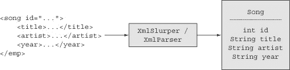

从歌曲到 XML 的反向转换使用 `MarkupBuilder` 完成。`MarkupBuilder` 类默认写入标准输出。在这个类中，我想返回一个字符串形式的 XML，因此我使用了带有一个 `java.io.Writer` 参数的重载 `MarkupBuilder` 构造函数。我向构造函数提供了一个 `StringWriter`，构建 XML，然后使用正常的 `toString` 方法将输出转换为字符串。

一旦我有了 `MarkupBuilder`，我就将歌曲的属性写出来，就像我正在构建 XML 一样。让我们专注于将单个歌曲转换为 XML 格式的转换，如下所示：

```
MarkupBuilder builder = new MarkupBuilder(sw)
builder.song(id:s.id) {
    title s.title
    artist s.artist
    year s.year
}
```

`MarkupBuilder` 的作用在图 4.8 中展示。

##### 图 4.8\. 使用 `groovy.xml.MarkupBuilder` 生成对象的 XML 表示形式

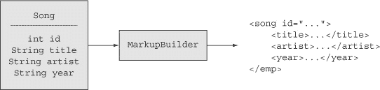

这是一个 Groovy 元编程能力的示例，尽管一开始看起来并不像。想法是，在构建器内部，每当我写一个不存在的函数名时，构建器将其解释为创建 XML 元素的指令。例如，我通过传递一个键为 `id`、值为歌曲 ID 的映射作为参数，在构建器上调用 `song` 方法。当然，构建器没有 `song` 方法，因此它将方法调用解释为构建一个名为 `song` 的元素的命令，并将参数解释为向 `song` 元素添加一个 `id` 属性的指令，其值为歌曲 ID。然后，当它遇到花括号时，将其解释为开始子元素的指令。

我还有三个方法调用：一个用于 `title`，一个用于 `artist`，一个用于 `year`。在这种情况下，括号的缺失可能会造成误导，但实际上每个都是方法调用。再次强调，构建器将每个不存在的解释为创建 XML 元素的命令。这次，由于它们不是以映射形式存在，因此它们成为包含在元素中的字符数据。构建器处理的结果是下面的 XML：

```
<song id="...">
    <title>...</title>
    <artist>...</artist>
    <year>...</year>
</song>
```

将歌曲列表转换为更大的 XML 文件的方法对每首歌曲都做了同样的事情。

| |
| --- |

**XML 学习经验**

1.  Groovy 的 `XmlParser` 和 `XmlSlurper` 使得解析 XML 变得非常简单，可以通过遍历生成的 DOM 树来提取值。

1.  使用 `MarkupBuilder` 生成 XML 一样简单。

| |
| --- |
| |

##### Groovy Sweet Spot

Groovy 在解析和生成 XML 方面非常出色。如果你的 Java 应用程序与 XML 一起工作，强烈考虑委托给 Groovy 模块。

| |
| --- |

### 4.6\. 处理 JSON 数据

Groovy 处理 JSON 数据与处理 XML 一样容易。为了结束本章，让我给出一个来自网络服务的 JSON 响应数据的简单示例。

该服务被称为 ICNDB：互联网 Chuck Norris 数据库。它位于 [`icndb.com`](http://icndb.com)，并提供 RESTful API 以检索相关的笑话。如果您向 [http://api.icndb.com/jokes/random?limitTo=[nerdy]](http://api.icndb.com/jokes/random?limitTo=[nerdy]) 发送 HTTP GET 请求，您将收到一个 JSON 格式的字符串。

Groovy 使得发送 GET 请求变得简单。在 Groovy JDK 中，`String` 类有一个 `toURL` 方法，它将其转换为 `java.net.URL` 的实例。然后 Groovy JDK 向 URL 类添加了一个名为 `getText` 的方法。因此，访问网络服务就像这样

```
String url = 'http://api.icndb.com/jokes/random?limitTo=[nerdy]'
String jsonTxt = url.toURL().text
println jsonTxt
```

执行此操作返回一个类似以下格式的 JSON 对象

```
{ "type": "success", "value": { "id": 563, "joke": "Chuck Norris causes the
     Windows Blue Screen of Death.", "categories": ["nerdy"] } }
```

在本书中，我已经使用过的所有 Google 地理编码演示中，我介绍了 `XmlSlurper` 类，其 `parse` 方法接受字符串形式的 URL 并自动将结果转换为 DOM 树。从版本 1.8 开始，Groovy 也包括了一个 `JsonSlurper`，但它 `parse` 方法的重载比 `XmlSlurper` 少。然而，它确实包含一个 `parseText` 方法，可以处理前一段代码返回的 `jsonTxt`。

如果我将这些添加到前面的行中，完整的 ICNDB 脚本将在下一列表中显示。

##### 列表 4.11\. `chuck_norris.groovy`，处理 ICNDB 的数据

```
import groovy.json.JsonSlurper

String url = 'http://api.icndb.com/jokes/random?limitTo=[nerdy]'
String jsonTxt = url.toURL().text
def json = new JsonSlurper().parseText(jsonTxt)
def joke = json?.value?.joke
println joke
```

`JsonSlurper` 上的 `parseText` 方法将 JSON 数据转换为 Groovy 的映射和列表。然后我访问 `json` 对象的 `value` 属性，它是一个包含的 JSON 对象。它有一个 `joke` 属性，其中包含我正在寻找的字符串。

执行此脚本的结果类似于以下内容：

```
Chuck Norris can make a method abstract and final
```

正如通过 `MarkupBuilder` 脚本输出生成 XML 一样，生成 JSON 数据使用 `groovy.json.JsonBuilder` 类。请参阅 GroovyDocs 中的 `JsonBuilder` 以获取完整示例。

| |
| --- |

**学习到的经验（JSON**）

1.  `JsonSlurper` 类有一个 `parseText` 方法，用于处理 JSON 格式的字符串。

1.  `JsonBuilder` 类使用与 `XmlSlurper` 相同的机制生成 JSON 字符串。

| |
| --- |

这完成了对可以添加到 Java 应用程序中的 Groovy 特性的浏览，无论使用场景如何。

| |
| --- |

**学习到的经验（在 Java 中使用的 Groovy 特性**）

1.  当 Groovy 访问 POJO 时，它可以像访问 POGO 一样使用基于映射的构造函数。

1.  Groovy 中的每个运算符都委托给一个方法，如果该方法在 Java 类中实现，Groovy 中的运算符仍然会使用它。这意味着您甚至可以在 Java 类中进行运算符重载。

1.  Groovy JDK 通过元编程记录了 Groovy 添加到 Java 标准 API 中的所有方法。

1.  Groovy AST 转换只能应用于 Groovy 类，但这些类可以以有趣的方式与 Java 混合。本章包括 `@Delegate`、`@Immutable` 和 `@Singleton` 的示例。

| |
| --- |

### 4.7\. 摘要

本章回顾了许多 Groovy 在基本层面上帮助 Java 的方法，从 POJO 增强到 AST 转换，再到构建 XML 等。我将在未来的章节中使用这些技术，只要它们能有所帮助。我还会在途中回顾其他有用的技术，尽管这些是大多数主要的技术。

然而，接下来的几章将改变焦点。尽管混合使用 Java 和 Groovy 很容易，这也是本书的一个主要主题，但一些公司不愿意在生产代码中添加 Groovy，直到他们的开发者对这种语言达到一定的最低舒适度。事实上，有两个主要领域 Groovy 可以强烈影响并简化 Java 项目，而不需要直接集成。其中一个是企业开发中的主要痛点之一：构建过程。另一个是测试，开发者越好，测试的价值就越高。

通过在本书早期介绍这两项技术，我就可以在攻击 Java 开发者通常遇到的使用案例时，例如 Web 服务、数据库操作或与 Spring 框架协同工作时，使用 Gradle 构建和 Spock 测试。
