## 第二部分。Groovy 工具

欢迎来到第二部分：“Groovy 工具。”在这两章中，我讨论了 Groovy 通常被引入组织的两种主要方式：即构建过程和测试。

第五章关于构建过程回顾了 Java 世界中的主导构建工具 Ant 和 Maven，并展示了如何将 Groovy 依赖项添加到每个工具中。它还涵盖了与 Groovy 一起工作的 Ant 任务和 Maven 的主要 Groovy 插件。最后，它介绍了 Gradle，这是 Groovy 世界中最重要项目之一，并包括涵盖几个有趣构建任务的示例。

第六章关于测试从 Java 和 Groovy 中的 JUnit 测试开始，然后探讨了 JUnit 子类`GroovyTestCase`及其后代，以及它们带来的额外功能。接着，它涵盖了 Groovy 库中的`MockFor`和`StubFor`类，这些是构建模拟对象的好方法，同时也提供了一些关于 Groovy 元编程的见解。最后，本章以 Spock 测试框架的良好概述结束，该框架本身也包含一些模拟功能。

## 第五章。构建过程

*本章涵盖*

+   将 Groovy 添加到 Ant 构建中

+   使用 Maven 与 Groovy

+   Groovy 葡萄和`@Grab`

+   未来：Gradle

在开发组织中，构建源代码几乎总是痛点。一个理想的构建过程是自动化端到端，包括编译、运行测试、生成报告和生成任何所需的工件。该过程需要足够快，以便可以频繁执行，尤其是在现代敏捷方法下，同时还需要足够灵活，以适应各个团队的紧急需求。

在 Java 世界中，随着时间的推移，已经出现了两种主要的自动化构建方法。两者都是 Apache 的开源项目。第一个是 Ant ([`ant.apache.org`](http://ant.apache.org))，它使用配置在 XML 中的任务库，由 Java 类支持。另一个是 Maven ([`maven.apache.org`](http://maven.apache.org))，它提供了一系列丰富的选项，承诺使整个过程简单化，但使用了一个高度有偏见的 API，需要一定的掌握才能有效使用。

首先，我想讨论任何构建过程的目标，然后看看各种工具是如何尝试满足这些目标的。

### 5.1。构建挑战

软件构建结合了几个功能，单独看起来似乎应该很容易，但在实践中却变得复杂。为了构建你的代码，你必须

+   下载任何必要的依赖项。

+   使用正确解析的依赖项编译源代码，处理可能出现的跨语言问题。

+   运行单元、集成和/或功能测试。

+   生成所需的工件，无论它们是什么。

可选的任务可能包括从源代码控制中检出代码、生成文档，甚至将结果部署到生产环境中。

| |
| --- |

**IDE 构建**

一些公司仍然在集成开发环境（IDE）内部进行构建。尽管这本身并不是一件坏事，但它往往会导致长期问题。迟早，这些公司会拥有一台特殊的计算机，没有人敢触摸，即使原始所有者很久以前就离开了或者转到了其他部门，因为它是唯一一个构建仍然可以工作的系统。

当前的观点是，源代码控制系统应该管理构建的所有方面，从所需的脚本到 JAR 依赖项。这样，你就可以始终确信构建是正确的并且自给自足的，这避免了整个“至少在我的机器上它能工作”的问题。

| |
| --- |

事实上，近年来在开发过程中的趋势是持续交付，其中一条命令就可以在一次操作中完成从构建到部署的整个序列。（^[1]）

> ¹ 请参阅 Jez Humble 和 Dave Farley 的著作 *持续交付*（Addison Wesley，2010）以获取详细信息。（可通过其配套网站 http://continuousdelivery.com/ 获取。）

在 Java 世界中有两种主要的构建工具：Ant 和 Maven。Ant 较老，正在逐渐被取代，但它仍在行业中很常见，并且是之后所有事物的基石。Maven 在 Java 行业中得到了广泛的应用，但往往会在开发者中引起强烈的情感。

本章节涵盖的技术指南如图 5.1 所示。下一节，我将从 Apache Ant 项目开始介绍。

##### 图 5.1\. 本章节技术指南。Java 方法基于 Ant 或 Maven。Groovy 为编译和执行脚本提供了 Ant 任务。Gant 被用于 Grails，但最终将被 Gradle 取代。`AntBuilder` 类很有用，并且内置在 Gradle 中。有两个独立的插件可用于 Maven 构建。Groovy Grapes 使得在没有先编译的情况下向客户端交付代码（通常是脚本）变得容易。然而，最终，未来属于 Gradle。

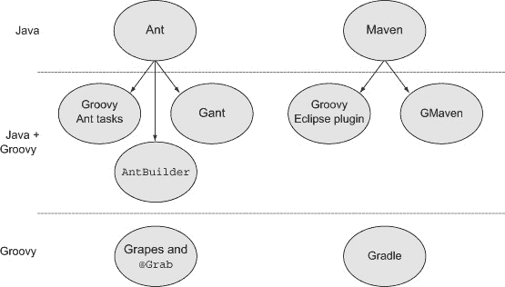

### 5.2\. Java 方法，第一部分：Ant

Apache Ant 是一个基于 Java 的构建工具，基于较老的“make”技术，但避免了其中许多困难。Ant 的名字代表“另一个整洁的工具”或一个能够承担远超自身重量的工具，这取决于你问的是谁。Ant 构建文件是用 XML 编写的，因此它们本质上是跨平台的，并且由于 Java 类实现了 XML 任务，因此单个 API 就足以适用于所有操作系统。

这是好消息。有些（多少有些）坏消息是，Ant 是一个非常底层的 API，因此许多构建文件由许多扭曲的小任务组成，它们都一样。（^[2]）

> ² 是的，一个冒险（或 Zork）的引用。我的意思是它们很小，很多，而且很容易在其中迷路。

让我从下一列表中的“Hello, World”示例开始，这个示例基于 Apache 在 Ant 网站上提供的 Ant 教程中的样本。

##### 列表 5.1\. build.xml：一个简单的 Ant 构建“Hello, World” Java 应用程序的构建文件

```
<project name="HelloWorld" basedir="." default="main">

    <property name="src.dir"     value="src"/>
    <property name="build.dir"   value="build"/>
    <property name="classes.dir" value="${build.dir}/classes"/>
    <property name="jar.dir"     value="${build.dir}/jar"/>
    <property name="main-class"  value="mjg.HelloWorld"/>

    <target name="clean">
        <delete dir="${build.dir}"/>
    </target>

    <target name="compile">
        <mkdir dir="${classes.dir}"/>
        <javac srcdir="${src.dir}" destdir="${classes.dir}"
            includeantruntime="false"/>
    </target>

    <target name="jar" depends="compile">
        <mkdir dir="${jar.dir}"/>
        <jar destfile="${jar.dir}/${ant.project.name}.jar"

            basedir="${classes.dir}">
            <manifest>
                <attribute name="Main-Class" value="${main-class}"/>
            </manifest>
        </jar>
    </target>

    <target name="run" depends="jar">
        <java jar="${jar.dir}/${ant.project.name}.jar" fork="true"/>
    </target>

    <target name="clean-build" depends="clean,jar"/>

    <target name="main" depends="clean,run"/>

</project>
```

默认情况下，此文件名为 build.xml，位于项目的根目录中。项目文件的根元素称为 `<project>`，它被赋予一个 `name`、一个基本目录以及一个默认任务，如果命令行中没有提供，则运行此任务。

在文件顶部设置了一系列属性，包括各种目录的位置。请注意，一个属性可以通过使用 `${...}` 语法来引用另一个属性。

定义了一系列 `<task>` 元素（`clean`、`compile`、`jar`、`run`、`clean-compile` 和 `main`），以表示构建过程中的单个操作。一些任务依赖于其他任务，这通过 `<task>` 元素的 `depends` 属性来表示。

所定义的所有任务最终都会委托给一组预定义的 Ant 任务。这里这些任务包括基于文件的任务，如 `mkdir` 和 `delete`，以及与 Java 相关的任务，如 `javac`、`jar` 和 `java`。

不带参数执行此构建意味着在命令行中键入 `ant`，这将执行默认的 `main` 任务。因为 `main` 依赖于 `clean` 和 `run`，它将首先执行这些任务，这些任务将执行它们自己的依赖项，依此类推。结果如下所示。

##### 列表 5.2\. “Hello, World” Ant 构建中默认任务的执行

```
Buildfile: /.../build.xml
clean:
   [delete] Deleting directory /.../build
compile:
    [mkdir] Created dir: /.../build/classes
    [javac] Compiling 1 source file to /.../build/classes
jar:
    [mkdir] Created dir: /.../build/jar
      [jar] Building jar: /.../build/jar/HelloWorld.jar
run:
     [java] Hello, World!
main:
BUILD SUCCESSFUL
Total time: 1 second
```

每个任务都会输出其自己的名称，然后是包含在下面的缩进内置 Ant 任务。构建成功完成，尽管这可能具有误导性。最后的 `BUILD` `SUCCESSFUL` 语句表示 Ant 完成了所有任务。个别任务可能成功也可能失败。

这里选择的任务很典型，但没有标准。每个组织（甚至每个开发者）都可以自由选择自己的。在不同构建之间重用任务还需要一个 `import` 语句（或复制粘贴重用），以及一些确保任务不与特定项目结构绑定的努力。

再次强调，这里的优势是这一切都是完全可移植的。Ant 构建应该在 Mac OS X 上与在 Windows 或 Linux 上一样好。缺点是这个只是一个简单的 Hello World 应用程序，构建文件已经超过 35 行长。一旦添加了 `junit` 和 `junitreport` 任务，更不用说使用第三方库自定义类路径了，这个文件的大小会迅速增长。一个更广泛的构建文件，包括 JUnit 4 库和一个测试用例，可以在章节源代码中找到。

然而，在这里不做这个，而是让我向你展示如何将 Groovy 引入这个系统。

### 5.3\. 将 Ant 与 Groovy 结合

Ant 在 Java 构建中不像以前那样常见，但切换构建工具对于大多数组织来说是一个重大的决定，不应轻率行事。如果你正在使用大量已安装的 Ant 构建，那么 Groovy 仍然可以做出贡献。

有四种方法可供选择：

+   Groovy 脚本代码可以直接添加到 Ant 构建文件中。

+   Groovy 脚本和类可以使用专门为此目的的 Ant 任务在 Ant 构建中编译和执行。

+   Groovy 标准库中包含一个名为 `groovy.util.AntBuilder` 的特殊类，它可以替换执行相同功能的 Groovy 脚本 XML 构建文件。

+   可用 Groovy DSL，称为 Gant，它提供了对 `AntBuilder` 的替代方案。

| |
| --- |

##### AntBuilder

即使您不使用 Ant，了解 `AntBuilder` 类也是值得的，因为它嵌入在其他构建工具中，如 Gant 和 Gradle。

| |
| --- |

以下小节将依次处理这些 Groovy 和 Ant 主题。

#### 5.3.1\. `<groovy>` Ant 任务

Ant 有两个钩子，允许您将 Groovy 添加到标准构建文件中。`<groovy>` 和 `<groovyc>` 任务分别使用 Groovy 库执行 Groovy 脚本和编译 Groovy 源文件。

首先从 `<groovy>` 开始，在 Ant 构建中定义相关任务，可以直接将 Groovy 代码写入构建文件。下面的列表显示了一个简单的示例。

##### 列表 5.3\. 一个简单的 Ant 构建，在任务中执行 Groovy 代码

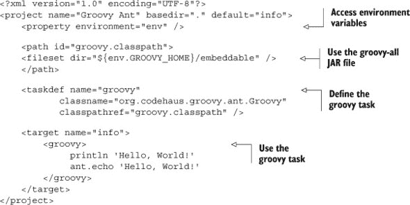

`environment` 属性允许构建访问操作系统的系统属性。在这里，`env` 变量用于访问 `GROOVY_HOME` 的当前值，Groovy 的安装目录。`<path>` 元素将 groovy-all JAR 文件（位于可嵌入目录中）分配给 `groovy.classpath` ID。

`<taskdef>` 元素定义 `groovy` 任务为对 `org.codehaus.groovy.ant.Groovy` 类的引用，该类在 groovy-all JAR 文件中解析。一旦定义了 `groovy` 任务，就可以使用它来执行任意 Groovy 代码。执行了“Hello, World!”的直接打印，然后还调用了 Ant 的 `echo` 任务。

因此，很容易将 Groovy 代码添加到现有的 Ant 构建文件中，这在构建中需要循环或条件逻辑时非常有用。在 XML 中“编程”是出了名的困难，而且倾向于这个方向的技术（如 Ant 和 XSLT）往往会导致笨拙、复杂的构建文件。添加 Groovy 脚本代码可能有助于构建文件，而无需修改底层源代码。

#### 5.3.2\. `<groovyc>` Ant 任务

假如您遵循本书中的建议并决定将 Groovy 模块添加到您的实现代码中。如果您仍然使用 Ant 进行构建，您将需要一个类似于 `<javac>` 的编译任务来编译 Groovy。这个任务就是 `<groovyc>`。

`<groovyc>` 任务定义非常简单：

```
<taskdef name="groovyc"
    classname="org.codehaus.groovy.ant.Groovyc"
    classpathref="groovy.classpath"/>
```

任务的名称是 `<groovyc>`，它由 `org.codehaus.groovy.ant` 包中的 `Groovyc` 类支持。这个类是前面构建文件中引用的 Groovy Ant JAR 文件的一部分。

此任务定义的结果是，您可以在使用 `<javac>` 编译 Java 类的同时使用 `<groovyc>` 编译 Groovy 类。这种强制分离代码库的方法可能会导致困难，如果有交叉依赖关系。例如，一个 Groovy 类可能实现了 Java 接口并引用了一个 Java 类，而这个 Java 类又使用了一个 Groovy 类，依此类推。

解决这些问题的好方法是使用 *联合编译* 方法。Ant 允许您在 `<groovyc>` 任务内部嵌入 `<javac>` 任务。嵌套标签方法导致一个看起来像这样的 `<groovyc>` 任务：

```
<groovyc srcdir="${src.dir}" destdir="${classes.dir}"
   classpathref="classpath">
    <javac source="1.5" target="1.5" />
</groovyc>
```

嵌套的 `<javac>` 任务并不意味着 Java 编译器正在运行。作为 `<groovyc>` 任务的子任务，它允许 Groovy 联合编译器完成所有工作。

在 `<groovyc>` 任务中定义的源目录、目标目录和类路径变量被传递到嵌套的 `<javac>` 任务中。联合编译方法意味着 Groovy 将编译 Groovy 源代码并为它们创建存根，然后调用 Java 编译器为 Java 源代码做同样的事情，并使用 Groovy 编译器继续编译过程。结果是，您可以无问题地混合 Java 和 Groovy 源代码。

因此，为了将 Ant 构建文件扩展到包括 Groovy 文件，请按照下一个列表所示进行添加和更改。

##### 列表 5.4. 将“Hello, World”构建扩展以混合 Java 和 Groovy 源代码

```
    <path id="groovy.classpath">
       <fileset dir="${env.GROOVY_HOME}/embeddable" />
    </path>

    <path id="classpath">
        <fileset dir="${lib.dir}" includes="**/*.jar" />
    </path>

    <taskdef name="groovyc"
        classname="org.codehaus.groovy.ant.Groovyc"
        classpathref="groovy.classpath" />
...
    <target name="compile">
        <mkdir dir="${classes.dir}" />
           <groovyc srcdir="${src.dir}" destdir="${classes.dir}"
               classpathref="classpath">
               <javac source="1.5" target="1.5" />
           </groovyc>
       </target>
```

其余的与之前相同。

如果您坚持使用 XML 进行 Ant 构建，那么这就是全部内容。然而，如果您愿意将构建语言切换到 Groovy，还有其他一些替代方案。接下来的两个小节使用 Groovy 作为构建语言，但仍然基于 Ant。

#### 5.3.3. 使用 AntBuilder 在 Groovy 中编写构建

标准的 Groovy 库包括一个名为 `groovy.util.AntBuilder` 的类。要使用它，您需要将基于 Java 的 Ant JAR 库文件添加到您的类路径中，但一旦这样做，`AntBuilder` 就允许您用 Groovy 语法替换 XML 语法。

Ant 定义的任何任务都可以通过 `AntBuilder` 类使用。例如，以下列表显示了一个简单的脚本，该脚本复制其自身的源代码，验证其是否成功，然后删除副本。

##### 列表 5.5. `antbuilder.groovy`，该脚本复制自身

```
def ant = new AntBuilder()
String dir = 'src/main/groovy'

assert !(new File("$dir/*antbuildercopy.groovy*").exists())

ant.*echo* 'about to copy the source code'
ant.*copy* file:"$dir/*antbuilder.groovy*",
    tofile:"$dir/*antbuildercopy.groovy*"

assert (new File("$dir/*antbuildercopy.groovy*").exists())

ant.*echo* 'deleting the copied file'
ant.*delete* file:"$dir/*antbuildercopy.groovy*"
```

在此示例中，构建代码和常规 Groovy 代码可以自由混合。这里使用的 Ant 任务是 `echo`、`copy` 和 `delete`，但很容易使用其他任务，如 `javac`、`junitreport`，甚至是可选的 Ant 任务如 `mail`。只要所需的 Ant 库在类路径中，每个任务都可以正常工作。

实际上有一个简化的方法可用。`with` 语法是 Groovy 元编程能力的一部分。它可以简化前面的列表，使其变为下一个列表所示的内容。

##### 列表 5.6. 使用 `with` 方法简化构建脚本

```
ant.*with* {
    echo 'about to copy the source code'
    copy file:"$dir/*antbuilder.groovy*",
        tofile:"$dir/*antbuildercopy.groovy*"
    echo 'deleting the copied file'
    delete file:"$dir/*antbuildercopy.groovy*"
}
```

`with` 方法调用 Ant 构建器中的包含方法。

`AntBuilder` 可以用来编写整个构建文件。这对于快速创建构建文件非常有用，尤其是如果你已经非常熟悉相应的 Ant 任务。因为 `AntBuilder` 是标准 Groovy 库的一部分，所以你可以在需要执行与构建相关的任务的地方使用它。更好的是，Gradle 构建文件包含一个 `AntBuilder` 实例，这使得从 Ant 迁移到 Gradle 的路径变得更加简单。

下一个列表提供了一个更有趣的示例，它是 列表 5.1 中显示的原始 Ant 构建的移植。

##### 列表 5.7\. 将 列表 5.1 中的 build.xml 文件移植到 Groovy `AntBuilder` 脚本

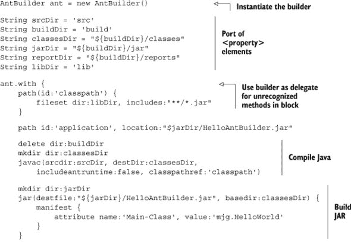


你可以使用 `groovy` 命令来执行此脚本。在 `with` 块内部，所有像 `mkdir`、`javac` 和 `junit` 这样的方法都被传递给构建器实例。正式来说，这意味着 `with` 块的 `delegate` 属性是 `AntBuilder` 实例。因为这是一个 Groovy 脚本，你可以添加任何你想要的代码来进行其他处理。例如，在 XML 文件中安排循环和条件是众所周知的尴尬，但在这里这会变得很容易。

尽管如此，`AntBuilder` 在底层仍然是 Ant。如果没有特定领域的语言（DSL）替代品，Groovy 就不会是 Groovy。在本章后面将讨论的 Gradle 是最佳选择。然而，在实践中你可能会遇到另一种方法。为了完整性，下一个子节简要讨论了 Groovy Ant，也称为 Gant。

#### 5.3.4\. 使用 Gant 创建自定义构建脚本

尽管在 Groovy 中构建文件的未来属于 Gradle，但 Gant 仍然在 Groovy 生态系统中占据一个特殊的细分市场。截至本文写作时，Grails 框架的最新版本（2.3）^([3]) 仍然使用 Gant 实现其构建脚本.^([4）。如果你需要为 Grails 应用程序创建自定义构建脚本，Gant 仍然是有用的。如果你不打算这样做，你可以舒适地跳过这个子节。

> ³ Grails 在第八章数据库和第十章网络开发中被讨论。Grails 的主页是 [`grails.org`](http://grails.org)。
> 
> ⁴ Gant 将至少在 Grails 2.3 版本中继续被包含。


##### Gant 用例

Grails 命令作为 Gant 脚本实现，所以如果你需要自定义一个 Grails 命令或创建一个新的命令，Gant 是首选的工具。


Grails 中的 Gant 脚本也是一个极好的示例代码选择。为了使本节内容简单，我将回顾一个现有的 Grails Gant 脚本的一部分，名为 `Clean.groovy`。该脚本位于 Grails 发行版的根目录下的 scripts 目录中。与所有 Grails Gant 脚本一样，它通过小写脚本名来调用，将驼峰式命名替换为连字符；因此，对于 `Clean` 脚本，命令将是 `grails clean`，而对于 `CreateDomainObject` 脚本，命令是 `grails create-domain-object`。

这是`Clean`脚本的完整内容（不包括版权声明）：

```
includeTargets << grailsScript("_GrailsClean")
setDefaultTarget("cleanAll")
```

`grailsScript`命令加载了一个不同的 Gant 脚本，称为`_GrailsClean`。按照惯例（Grails 的一切都是关于惯例），以下划线开头的脚本是内部脚本，不能从命令行执行。因此，第一行加载了一系列任务，第二行将`cleanAll`任务设置为默认任务。

现在转向`_GrailsClean`脚本，让我从其中突出几个小节：

```
includeTargets << grailsScript("_GrailsEvents")

target (cleanAll: "Cleans a Grails project") {
    clean()
    cleanTestReports()
    grailsConsole.updateStatus "Application cleaned."
}

target (clean: "Implementation of clean") {
    depends(cleanCompiledSources, cleanWarFile)
}
```

与 Ant 的相似性并非偶然。Gant 脚本包含目标，目标可以被调用，就像方法调用一样。在这里，名为`cleanAll`的目标调用了两个其他任务（`clean`和`cleanTestReports`），然后调用了预定义的`grailsConsole`对象上的`updateStatus`方法。

`clean`任务使用`depends`方法（再次类似于 Ant 中的相同功能）来确保在调用`clean`任务时调用`cleanCompiledSources`和`cleanWarFile`任务。以下是`cleanCompiledSources`任务的片段：

```
target (cleanCompiledSources: "Cleans compiled Java and Groovy sources") {
    def webInf = "${basedir}/web-app/WEB-INF"
    ant.delete(dir:"${webInf}/classes")
    ant.delete(file:webXmlFile.absolutePath, failonerror:false)
    ant.delete(dir:"${projectWorkDir}/gspcompile", failonerror:false)
```

任务继续删除更多项目，每次都委托给一个内部的`AntBuilder`对象。`cleanWarFile`任务展示了如何在脚本中混合 Groovy 逻辑代码：

```
target (cleanWarFile: "Cleans the deployable .war file") {
    if (buildConfig.grails.project.war.file) {
        warName = buildConfig.grails.project.war.file
    }
    else {
        def fileName = grailsAppName
        def version = metadata.'app.version'
        if (version) {
            fileName += "-$version"
        }
        warName = "${basedir}/${fileName}.war"
    }
    ant.delete(file:warName, failonerror:false)
}
```

这是一段简单的 Groovy 代码，它只是定义了一些变量，并根据当前配置设置它们的属性，然后对`ant`对象调用`delete`方法。

这本书关于 Gant 的内容就到这里了.^([5])

> ⁵有关 Gant 的更多信息，可以在 Groovy 网站上找到。在 Peter Ledbrook 和 Glen Smith 合著的书籍*Grails in Action*（Manning，2009）中也有一个不错的教程。最后，Grails 用户指南有一个专门关于创建 Gant 脚本的章节。

#### 5.3.5. Ant 总结

这也结束了关于 Ant 和基于 Ant 的方法的讨论，无论是 Java 还是 Groovy。在“经验教训”侧边栏中显示了详细信息。

| |
| --- |

**经验教训（Ant）**

1.  如果你有一个现有的 Ant 构建，你可以向其中添加`<groovyc>`和`<groovy>`任务。

1.  Gant 只用于 Grails，并且不会使用很长时间。

1.  `AntBuilder`本身很少见，但它内置在 Gradle 中，并且非常有用

| |
| --- |

现在是时候检查 Java 世界中的另一个主要构建工具：Maven 了。

| |
| --- |

**Ant 的局限性**

当它发布时，Ant 是比之前的构建过程的一个重大改进。然而，它仍然存在一些主要问题，这些问题使得生活复杂化，尤其是在较大的构建中。以下是使用 Ant 时与复杂性相关的一些简要列表。这并不是对 Ant 的批评，而是为了突出导致下一代工具的问题。

*Ant 构建基于 XML*，*而 XML 不是一个脚本语言*。构建不可避免地需要定制，并且通常取决于项目是在开发、测试还是生产模式。Ant 允许你设置属性，但属性不是变量。在 XML 文件中执行复杂的分支逻辑尤其困难。

*Ant 没有提及* *依赖管理*。它假设你已经有所有必需的库可用，并且你可以构建一个文件集来保存它们，并将其用作类路径。Ivy 项目（也是来自 Apache）填补了这一空白，现在 Ant 和 Ivy 的组合比单独使用 Ant 更为常见。

*XML 是为了被程序处理而设计的，而不是给人阅读的*。阅读一个简短的 XML 文件并不难。阅读一个长而复杂的文件就困难多了，甚至在这个章节中展示的简单构建文件，当包含一些基本任务时，也有超过 50 行长。

*内置的 Ant 任务非常低级*。因此，Ant 构建文件很快就会变得又长又复杂，并且涉及大量的重复。

由于所有这些原因以及其他原因，Ant 已经准备好被一个更高级别的替代品所取代。这个角色由 Maven 项目填补，这取决于你对它的经验，要么是祝福，要么是诅咒。


### 5.4. Java 方法，第二部分：Maven

我将坦白地说 Maven 很难理性地讨论。它的最佳特性（建立传统项目布局、管理依赖项、提供丰富的插件架构）也被认为是最糟糕的特性（难以在其约定之外工作、难以管理传递依赖项、整个“下载整个互联网”问题）。我可以诚实地说我从未遇到过一种在行业中普遍存在，却又被像一千个太阳一样炽热地憎恨的技术。在开发者群体中提起 Maven，有人会拒绝讨论“M 话题”。然而，与此同时，另一个人会悄悄地说他们可以让它做任何事情，并且不理解为什么会有这么大的争议。 

> ⁶ 除非是每一个微软技术。

我自己的经验并非如此黑白分明。我发现，如果一个项目从一开始就使用 Maven 设计，它通常与系统配合得很好。没有 Maven 也很难使用那个系统。另一方面，将 Maven 添加到一个没有从它开始的项目中可能会相当痛苦。此外，朋友们也向我保证，一旦系统规模超过一定程度，整个过程就会变得难以管理。

可能最好的办法是说明 Maven 有一个高度意见化的 API。为了成功，你必须按照 Maven 的方式做事。此外，就像 Ant 一样，你是在 XML 中编写构建代码，这从来都不是一件容易的事。多项目构建功能也很尴尬。^([7])

> ⁷ 虽然这听起来并不太“超然”，但至少我在尝试。

我要指出，标准的 Maven 项目布局（如图 5.2 所示）在业界已经变得很普遍。此外，人们可能会对 Maven 的依赖管理方法提出抱怨，但我还没有看到任何显著更好的方法。Gradle（本章后面将讨论的替代品）使用 Maven 仓库和 Ivy 依赖管理，并遭受相同的“从互联网下载”问题。无论你如何处理，依赖管理都是一件困难的事情。

##### 图 5.2\. 本节中应用程序使用的标准 Maven 项目结构。编译后的源代码位于 src/main/java，测试代码位于 src/test/java。

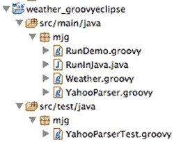

返回（终于）到本书的核心主题，本节的目标是向您展示如何将 Groovy 集成到 Maven 构建中。有两种方法可以实现这一点。我将从 Groovy-Eclipse 插件开始，然后使用 GMaven 项目构建相同的应用程序。

#### 5.4.1\. Maven 的 Groovy-Eclipse 插件

The Groovy-Eclipse compiler plugin ([`mng.bz/2rHY`](http://mng.bz/2rHY)) is a standard compiler plugin for Maven. It emerged from the effort to build a good Eclipse plugin for Groovy that worked with combined Groovy and Java projects. The Maven plugin is a way to take advantage of that effort, whether you plan to use the Eclipse IDE or not.

为了演示其用法，我将构建一个小项目，该项目访问 Yahoo！天气网络服务并报告当前条件。这用 Java 做起来足够简单，但在 Groovy 中则变得特别简单。

The Yahoo! Weather web service ([`developer.yahoo.com/weather/`](http://developer.yahoo.com/weather/)) provides weather information in the form of an RSS feed. The web service is accessed from a URL of the form

```
http://weather.yahooapis.com/forecastrss
```

The URL has two parameters, one required and one optional. The required parameter is `w`, a so-called WOEID (Where On Earth ID), that Yahoo uses to identify a location. The other parameter is `u`, which is used to specify the temperature units in Fahrenheit (`f`, the default) or Celsius (`c`). For unknown reasons, there’s no way to programmatically look up a WOEID. Instead Yahoo! directs you to its own weather page and suggests you search for your city.

向正确的 URL 发送一个简单的 HTTP GET 请求会返回一个 RSS 格式的 XML 响应。一个示例包含在 Yahoo！的网页上。

假设我决定构建一个简单的应用程序来检索基于此服务的当前天气条件。Maven 建议您指定一个特定的工件以开始项目，所以我将使用经典的 `maven-archetype-quickstart`：

```
> mvn archetype:generate –DgroupId=mjg –DartifactId=weather
    –DarchetypeArtifactId=maven-archetype-quickstart
    -Dversion=1.0-SNAPSHOT –Dpackage=mjg
```

| |
| --- |

##### Maven 架构

The Groovy-Eclipse plugin uses regular Java archetypes and adds Groovy functionality. The GMaven approach in the next section includes a basic archetype to get started.

| |
| --- |

这将生成一个具有标准布局的 Java 项目，这意味着源代码目录是 src/main/java，测试目录是 src/test/java。快速入门原型在这些目录中分别包含一个简单的 App.java 和 AppTest.java，生成器还在根目录中添加了一个标准的 Maven POM 文件，其唯一依赖项是 JUnit，如下一列表所示。

##### 列表 5.8\. 标准 Java 项目的 Maven pom.xml 文件

```
<project 

  xsi:schemaLocation="http://maven.apache.org/POM/4.0.0
                      http://maven.apache.org/maven-v4_0_0.xsd">
  <modelVersion>4.0.0</modelVersion>
  <groupId>mjg</groupId>
  <artifactId>weather</artifactId>
  <packaging>jar</packaging>
  <version>1.0-SNAPSHOT</version>
  <name>weather</name>
  <url>http://maven.apache.org</url>
  <dependencies>
    <dependency>
      <groupId>junit</groupId>
      <artifactId>junit</artifactId>
      <version>4.10</version>
      <scope>test</scope>
    </dependency>
  </dependencies>
</project>
```

我到目前为止所做的唯一更改是将 JUnit 依赖项从 3.8.1 升级到 4.10。

为了完成实际工作，我需要一个发送请求到 Yahoo 并解析响应的类，以及一个用于存储生成的天气信息的 POJO。从 POJO 开始，对于一个给定的城市、地区和国家，我想存储条件、温度、风寒和湿度。Web 服务返回的信息比这多得多，但这足以开始。

POJOs 是简单的数据容器，因此构造函数、getter 和 setter 方法以及任何必要的覆盖方法大多是杂乱无章的。因此，如果使用 POGO，我可以简化我的生活，如下一列表所示。

##### 列表 5.9\. `Weather.groovy`，一个用于存储来自 Web 服务的天气结果的 POGO

```
package mjg

class Weather {
    String city
    String region
    String country
    String condition
    String temp

    String chill
    String humidity

    String toString() {
        """
        Weather for $city, $region, $country:
        Condition  : $condition
        Temperature: $temp
        Wind Chill : $chill
        Humidity   : $humidity
        """
    }
}
```

`toString`方法是一种生成格式化输出的方式。Groovy 的多行字符串使得这特别容易。

我需要的另一个类是 Web 服务的解析器。因为我只需要一个 GET 请求，所以我可以像往常一样使用`XmlSlurper`类的`parse`方法，并钻入生成的 DOM 树以获取我想要的结果。这也很简单，如下一列表所示。

##### 列表 5.10\. `YahooParser.groovy`，它访问并解析天气服务

```
package mjg

class YahooParser {
    final static String BASE = 'http://weather.yahooapis.com/forecastrss?'

    Weather getWeather(String woeid) {
        def root = new XmlSlurper().parse(BASE + "w=$woeid")
        Weather w = new Weather(
            city:root.channel.location.@city,
            region:root.channel.location.@region,
            country:root.channel.location.@country,
            condition:root.channel.item.condition.@text,
            temp:root.channel.item.condition.@temp,
            chill:root.channel.wind.@chill,
            humidity:root.channel.atmosphere.@humidity
        )
    }
}
```

给定一个 WOEID，服务构建 URL 并访问 Web 服务，解析生成的 RSS，并返回一个包含所有相关字段的`Weather`类的实例。

为了完成程序，我需要一个驱动程序，我可以将其编写为 Groovy 脚本。除非我想允许客户端在命令行上指定 WOEID，否则这是一个单行命令：

```
def woeid = args.size() ? args[0] : '2367105'
println new YahooParser().getWeather(woeid)
```

脚本中的默认 WOEID 是波士顿，马萨诸塞州，并存储在`RunDemo.groovy`中。为了演示当 Java 和 Groovy 源文件同时存在时的差异，我还添加了一个 Java 类来访问 Web 服务，该类存储在`RunInJava.java`文件中：

```
public class RunInJava {
    public static void main(String[] args) {
        String woeid = "2367105";
        if (args.length > 0) woeid = args[0];
        YahooParser yp = new YahooParser();
        System.*out*.println(yp.getWeather(woeid));
    }
}
```

现在是有趣的部分：我该如何让 Maven 处理所有的 Groovy 代码？Groovy-Eclipse 插件需要向 POM 文件添加两个修改。首先，我需要将 Groovy 添加为依赖项：

```
<dependencies>
...
    <dependency>
        <groupId>org.codehaus.groovy</groupId>
        <artifactId>groovy-all</artifactId>
        <version>2.1.5</version>
    </dependency>
  </dependencies>
```

接下来，我需要在依赖项下方的`build`部分添加 Groovy-Eclipse 插件：

```
<build>
   <plugins>
        <plugin>
            <artifactId>maven-compiler-plugin</artifactId>
            <version>2.3.2</version>
            <configuration>
                <compilerId>groovy-eclipse-compiler</compilerId>
            </configuration>
            <dependencies>
                <dependency>
                    <groupId>org.codehaus.groovy</groupId>
                    <artifactId>groovy-eclipse-compiler</artifactId>
                    <version>2.7.0-01</version>
                </dependency>
            </dependencies>
        </plugin>
    </plugins>
</build>
```

在这两个添加之后，Maven 将适当地编译和使用 Groovy 代码，除了一个相当奇怪的问题。通常我会将我的 Groovy 类添加到 src/main/groovy，并将任何 Groovy 测试添加到 src/test/groovy。根据插件文档，我只能在以下情况下这样做：（1）src/main/java 中至少有一个 Java 类，或者（2）我添加更多的 XML 来指定额外的源目录。

| |
| --- |

##### 源目录

对于 Groovy-Eclipse 插件，默认情况下，将 Java 和 Groovy 源文件放在 src/main/java 和 src/test/java 目录中。

| |
| --- |

我将我的 Groovy 文件放在 src/main/java 和 src/test/java。现在我可以使用以下方式构建项目：

```
mvn clean install
```

我甚至可以使用 `exec:java` (!) 任务执行项目，无论是使用默认的 WOEID 还是提供命令行参数：

```
> mvn exec:java -Dexec.mainClass=mjg.RunDemo
...
        Weather for Boston, MA, United States:
        Condition  : Cloudy
        Temperature: 58
        Wind Chill : 58
        Humidity   : 84
```

我可以使用 `–Dexec.args` 来提供一个命令行参数：

```
> mvn exec:java -Dexec.mainClass=mjg.RunDemo -Dexec.args='44418'
...
        Weather for London, , United Kingdom:
        Condition  : Cloudy
        Temperature: 54
        Wind Chill : 54
        Humidity   : 82
```

本书的一个指导原则是，Java 在工具、库和（现有）基础设施方面做得很好，而 Groovy 在其他所有方面都做得很好。很难想象比当前示例更好的证明。整个应用程序都是用 Groovy 编写的，代码节省量在 10 到 1 的数量级。基础设施将代码视为全部是 Java，我甚至能够使用 Java 的 `exec` 任务来执行 Groovy 脚本以驱动应用程序。

Groovy-Eclipse 编译器插件是一个资助项目，因为它被用于 SpringSource（VMware 的一个部门）提供的 IDE 中。因此，该插件的质量，特别是对于交叉编译，相当高。仅仅因为它名字中有“Eclipse”，并不意味着不能在 Maven 项目中使用它。插件并不是 IDE 独有的。你可以用它来任何地方，就像我在本节中用 Maven 项目做的那样。

> ⁸ 现在是 Pivotal 的一部分，由 VMware 拥有，而 VMware 又由 EMC 拥有...

将 Groovy 添加到使用 Maven 构建的项目中的另一种方法是使用 GMaven 项目，这在下一节中讨论。

#### 5.4.2\. GMaven 项目

GMaven 是将 Groovy 添加到 Maven 项目的另一种方法。它通过在构建序列中生成 Groovy 文件的存根，与结合 Java 和 Groovy 的源文件一起工作。

为了帮助用户入门，项目提供了一个名为 `gmaven-archetype-basic` 的 Maven 架构。要使用该架构，请在命令行中执行以下操作：

```
> mvn archetype:generate –DgroupId=mjg –DartifactId=weather
    –DarchetypeArtifactId=gmaven-archetype-basic
    -Dversion=1.0-SNAPSHOT –Dpackage=mjg
```

这又产生了一个标准 Maven 结构的项目，其中源文件位于 src/main/groovy，测试文件位于 src/test/groovy。插件期望 Java 和 Groovy 源文件都位于这些目录中。

生成的 POM 如下所示，其中一些修改在列表中讨论。

##### 列表 5.11\. GMaven 项目生成的 Maven pom.xml 文件

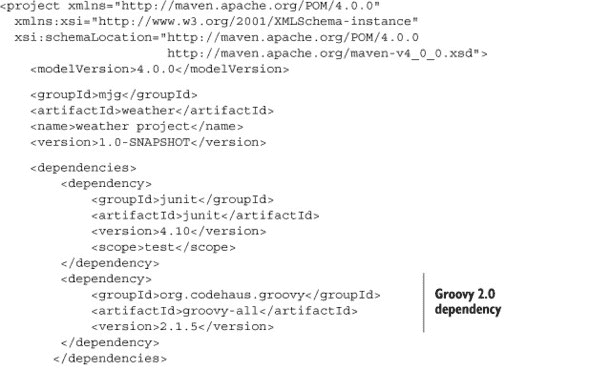

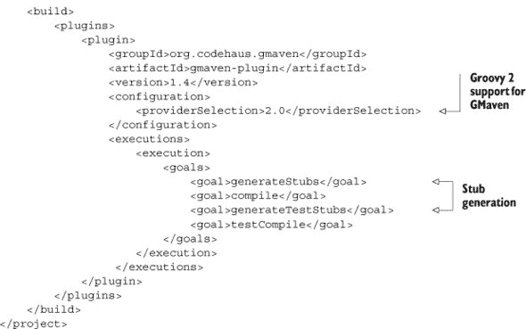

POM 需要 Groovy 依赖项。它不必是全局的，但在这里添加它同样简单。提供者已调整为 2.1.5，以便使用 Groovy 版本 2。

使用标准的 Maven `install`命令构建系统：

```
> mvn clean install
```

在构建过程中，为每个 Groovy 文件生成 Java 占位符。这些占位符本身相当简单；它们仅用于解决跨语言依赖关系，而不是执行。例如，以下是之前章节中显示的`Weather`类的占位符的一部分。

##### 列表 5.12\. 从`Weather.groovy`生成的 Java 占位符的一部分

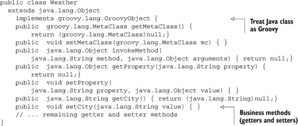

任何 Java 类都可以通过实现`GroovyObject`接口来被视为 Groovy 源代码，就像这里的占位符所做的那样。占位符中的前五种方法为该接口中的所有方法提供了无操作实现。其余的占位符为剩余的方法提供了空实现，在这种情况下是获取器和设置器以及`toString`方法。

为`RunDemo`类生成的占位符略有不同，以一种有趣的方式。Groovy 实现只是几行脚本代码。正如在第三章演示中提到的，我从`java`命令执行了一个编译后的 Groovy 脚本，每个 Groovy 脚本最终都会被编译器转换为一个类，相应的 RunDemo.java 占位符说明了这一点：

```
public class RunDemo extends groovy.lang.Script {
  public RunDemo() {}
  public RunDemo(groovy.lang.Binding context) {}
  public static  void main(java.lang.String... args) { }
  public  java.lang.Object run() { return null;}
}
```

该类扩展了`groovy.lang.Script`，有一个默认构造函数和一个接受`groovy.lang.Binding`的构造函数，一个标准的 Java `main`方法，以及一个`run`方法。所有 Groovy 脚本对 JVM 来说看起来都像这样。运行脚本就像执行`main`方法一样，它将委托给这里的`run`操作。

如前所述，要使用 Maven 运行程序，需要使用带有正确参数的`exec:java`任务。在这种情况下，这意味着主类是`RunDemo`或`RunInJava`：

```
> mvn exec:java -Dexec.mainClass=mjg.RunDemo

> mvn exec:java -Dexec.mainClass=mjg.RunInJava
```

无论哪种方式，结果都与上一节相同。

最近 GMaven 项目比较安静，但它仍然存在。正如所示，原型工作正常，占位符生成允许插件将编译委托给标准的 Maven 工具。


**教训（Maven）**

1.  添加 Groovy 到 Maven 构建有两种独立的方式，每种方式都有其优点和缺点：“Groovy Eclipse”插件和 GMaven。

1.  如果可能的话，考虑迁移到 Gradle。


#### 5.4.3\. Maven 总结

向 Maven 项目添加 Groovy 依赖有两种方式：Groovy-Eclipse 插件和 GMaven 项目。我的建议（可能会随着项目的演变而改变）是

> **1**.  对于已经存在的 Maven 构建，添加 Groovy-Eclipse 插件。它有效，并且有一家公司从财务上支持插件本身的发展。名字中包含单词*Eclipse*并不重要。
> 
> **2**. 对于新项目，任一插件都可以工作，但 Maven 架构的存在使得 GMaven 的启动变得特别容易。
> 
> **3**. 真是很有趣，这两个插件都期望 Java 和 Groovy 源文件放在一起。这里有一个重要的集成课程。

现在从混合方法转向纯 Groovy 解决方案，我将首先介绍简洁的 Grape 方法，然后再转向真正的目的地：Gradle。

### 5.5\. Grape 和 @Grab

Grape 机制允许你在 Groovy 脚本中直接声明库依赖项。当你需要向客户端交付一个脚本，而客户端尚未拥有所需的依赖项，但愿意在构建过程中下载它们时，这很有用。

整个 API 被称为 Grape（Groovy 可适应/高级打包引擎），并以 `groovy.lang.Grab` 注解开始。它使用 Ivy 解析器来识别和下载依赖项。它的主要用例是脚本，这样它们就可以在没有任何设置要求（除了安装 Groovy）的情况下交付给客户端。在运行时，Groovy 将下载并安装任何声明的库及其传递依赖项，作为执行过程的一部分。

| |
| --- |

##### Grape 用例

Grape 允许你交付一个简单的脚本，客户端可以执行它，而无需进行任何设置，除了安装 Groovy，这使得它对于测试人员或 QA 人员特别方便。

| |
| --- |

为了演示 Grape 系统，让我选择 Apache Commons 项目中的 Math 库（[`commons.apache.org/math/`](http://commons.apache.org/math/)）。具体来说，我想使用复数包。该包包含一个名为 `Complex` 的类，它表示复数。尽管这个类本身很有趣，但它也很好地展示了 Groovy 的元编程能力。

在 Maven 语法中，该库的组 ID 为 `org.apache.commons`，工件 ID 为 `commons-math3`，版本为 3.0。因此，`@Grab` 注解的格式如下所示：

```
import org.apache.commons.math3.complex.*

@Grab('org.apache.commons:commons-math3:3.0')
Complex first = new Complex(1.0, 3.0);
Complex second = new Complex(2.0, 5.0);
```

`@Grab` 注解下载了给定的库及其依赖项。语法使用 Maven 结构，使用冒号连接组 ID、工件 ID 和版本号。或者，你可以单独指定部分：

```
@Grab(group='org.apache.commons', module='commons-math3', version='3.0')
```

两种情况下的行为是等效的。

除了这些，Grapes 没有什么更多了。为了展示一个需要外部 Java 库的有趣示例，让我提出一个简单的 Groovy 元编程案例。这并不特别需要 Grape，但它展示了少量的元编程如何使 Java 库类更加 Groovy。在脚本中使用 Grape 允许我将其发送给客户端，而无需编译它或提供库依赖项。Grape 注解将处理其余部分。

`Complex`类表示一个复数，它结合了实部和虚部。该类包含一个两个参数的构造函数，如所示，它接受实部和虚部作为参数。该类定义了许多方法，以便将基本的数值计算推广到复数域。

回想一下，在 Groovy 中，每个操作符都委托给一个方法调用。有趣的是，`Complex`类已经有一个名为`multiply`的方法，用于计算两个复数的乘积。因为 Groovy 中的`*`操作符使用`multiply`方法，所以可以直接使用该操作符：

```
assert first.multiply(second) == first * second
```

再次强调，这是一个 Java 类。幸运的是，该类的开发者选择包含一个名为`multiply`的方法，因此 Groovy 可以使用`*`操作符与复数一起使用。

那么，其他所有数学运算呢？大多数都不那么整洁。例如，该类使用`add`而不是`plus`，使用`subtract`而不是`minus`。然而，通过向与`Complex`关联的元类添加适当的方法，可以轻松地将它们连接起来，通过 Groovy 查看。

作为提醒，通过 Groovy 访问的每个类都包含一个元类，元类是一个`Expando`。这意味着可以按需向元类添加方法和属性，结果成员将属于任何实例化的对象。以下是如何向`Complex`添加几个数学运算的方法：

```
Complex.*metaClass*.plus = { Complex c -> delegate.add c }
Complex.*metaClass*.minus = { Complex c -> delegate.subtract c }
Complex.*metaClass*.div = { Complex c -> delegate.divide c }
Complex.*metaClass*.power = { Complex c -> delegate.pow c }
Complex.*metaClass*.negative = { delegate.negate() }
```

这就解决了`+`、`-`、`/`、`**`和取反操作符的问题。在每种情况下，相关的方法都是通过将闭包设置为等于一个闭包来定义在元类上的。相关的闭包接受一个`Complex`参数（在二元操作符的情况下）并在闭包的委托上调用所需的现有方法，同时传递参数。

| |
| --- |

##### 闭包委托

每个闭包都有一个`delegate`属性。默认情况下，委托指向闭包被调用的对象。

| |
| --- |

在将这些方法添加到元类之后，可以在 Groovy 脚本中使用操作符：

```
assert new Complex(3.0, 8.0) == first + second
assert new Complex(1.0, 2.0) == second - first
assert new Complex(0.5862068965517241, 0.03448275862068969) ==
    first / second
assert new Complex(-0.007563724861696302, 0.01786136835085382) ==
    first ** second
assert new Complex(-1.0, -3.0) == -first
```

为了完成这个故事的一部分，我想展示著名的欧拉恒等式，这个恒等式被称为欧拉公式，^([9])，它表达为

> ⁹ 莱昂哈德·欧拉（1707 – 1783）是有史以来最杰出的数学家之一。他的工作几乎涵盖了数学和科学的每一个领域，他的全集占据了 60 到 80 个四开本。超越数`e`是以他的名字命名的。

*e*^(*iπ*)=–1

这个等式将虚数（*i*）、超越数（*e*和*π*）与负数（–1）联系起来。欧拉认为这个表达式非常深刻，以至于他在自己的墓碑上刻下了它。

`java.lang.Math`类包含常量`Math.E`和`Math.PI`，而`Complex`类有常量`Complex.I`。为了使公式看起来更好，我将使用静态导入来导入它们。

需要最后添加一个功能才能使其工作。Java 中的`Math.E`是 double 类型，我想将其提升到`Complex`的幂。最简单的方法是将 double 转换为`Complex`类的实例，然后使用`Complex`类中的`pow`方法。回到 Groovy 元编程，我需要一个`power`方法（对应于`**`运算符），它接受一个`Complex`参数：

```
Double.metaClass.power = { Complex c -> (new Complex(delegate,0)).pow(c) }
```

在所有这些机制就绪后，生成的代码略显平淡，但这是一件好事：

```
Complex result = *E* ** (*I* * *PI*)
assert result.real == -1
assert result.imaginary < 1.0e-15
```

在 Groovy 中，通常访问`real`或`imaginary`属性相当于调用`getReal`或`getImaginary`方法。该表达式确实生成了-1 的实部，但由于与 Java 双精度浮点数相关的舍入误差，虚部并不正好为零。在我的机器上，它评估为一个小于显示边界的数字，这当然足够接近了。

在 Grapes 系统中还有一些额外的注释可用。其中一个是`@GrabConfig`，在下一个示例中用于加载数据库驱动程序。以下脚本使用`groovy.sql.Sql`类生成一个 H2 数据库并向其中添加一些数据：

```
import groovy.sql.Sql

@GrabConfig(systemClassLoader=true)
@Grab(group='com.h2database', module='h2', version='1.2.140')
Sql sql = Sql.newInstance(url:'jdbc:h2:mem:',driver:'org.h2.Driver')
```

注释提供了驱动程序，因此可以使用`Sql`类正常工作。

由于类的成员只能有一个特定注释的单例，因此使用`@Grapes`注释来组合多个`@Grab`注释。下一个列表计算复数值并将它们存储在数据库表中。

##### 列表 5.13. 使用 Apache Commons Math 和数据库驱动程序一起

```
@GrabConfig(systemClassLoader=true)
@Grapes([
    @Grab('org.apache.commons:commons-math3:3.0'),
    @Grab(group='com.h2database', module='h2', version='1.2.140')
])

import static java.lang.Math.*
import org.apache.commons.math3.complex.Complex
import org.apache.commons.math3.complex.ComplexUtils
import groovy.sql.Sql

*S*ql sql = Sql.newInstance(url:'jdbc:h2:mem:',driver:'org.h2.Driver')

sql.execute '''
    create table coordinates (
        id bigint generated by default as identity,
        angle double not null,
        x double not null,
        y double not null,
        primary key (id)
    )
'''

int n = 20
def delta = 2*PI/n
(0..<n).*each* { num ->
    Complex c = ComplexUtils.polar2Complex(1, num*delta)
    sql.execute """
    insert into coordinates(id,angle,x,y)
        values(null, ${i*delta}, $c.real, $c.imaginary)
    """
}

sql.rows('select * from coordinates').*each* { row ->
    println "$row.id, $row.angle, $row.x, $row.y"
}
```

脚本创建了一个表格，用于存储圆周上 20 个点的 x 和 y 坐标。`ComplexUtils.polar2Complex`方法接受一个半径（这里为了简单起见使用一个半径）和一个圆周上的角度（以弧度为单位），并生成一个复数，然后将其存储在数据库中。

Grapes 系统简单有效，但在实践中有限制。这些添加在脚本中工作，但对于更大的系统，更常见的是使用完整的构建工具，如 Gradle，这是下一节的主题。

### 5.6. Gradle 构建系统

提议 Gradle 作为下一代构建解决方案。Gradle 结合了 Groovy 构建的灵活性以及一个强大的领域特定语言（DSL），它可以配置丰富的类集。

与几乎所有有意义的 Groovy 项目一样，Gradle 是用 Java 和 Groovy 编写的。Gradle 本质上是一个用于构建的 DSL。10 它定义了一种语法和语义的语言，允许你快速轻松地编写构建文件。

> ^([10] 必须的 DSL 笑话：“JavaScript 是用于查找浏览器错误的 DSL”；“Java 是用于生成堆栈跟踪的 DSL”；“Maven 是用于下载互联网的 DSL。”)

Gradle 不附带安装程序。你只需下载一个 ZIP 文件，将 `GRADLE_HOME` 环境变量设置为解压缩的位置，并将 `$GRADLE_HOME/bin` 目录添加到你的路径中，你就可以开始了。实际上，你甚至不需要先安装 Groovy，因为 Gradle 自带其自己的 Groovy 版本。


**Groovy 生态系统中的项目如何包含 Groovy**

Groovy 的一个不为人知的秘密是，主版本并不总是二进制兼容的。用某个版本编译的代码不一定与任何其他版本兼容。

这意味着 Groovy 生态系统中的项目有选择权。它们可以选择用不同版本的 Groovy 进行编译，并将 Groovy 版本号作为它们自己版本的一部分，或者它们可以捆绑一个特定的 Groovy 版本。

Spock 框架（在第六章中讨论）采取了前一种方法。Spock 版本的形式为 0.7-groovy-2.0，这意味着 Spock 版本 0.7 是用 Groovy 版本 2.0 编译的。

Grails 和 Gradle 项目采取了另一种方法。例如，Grails 1.3.9 包含了 Groovy 1.7.8 的副本，Grails 2.0.3 包含 Groovy 1.8.6，而 Grails 2.2.1 包含 Groovy 2.0.8。要查看 Gradle 分发版中包含的 Groovy 版本，请运行 `gradle –v` 命令。


对于 Grails 来说，捆绑的 Groovy 版本会将整个应用程序锁定在该版本。然而，对于 Gradle 来说，捆绑的 Groovy 版本仅用于执行构建脚本本身。你可以在自己的项目中使用任何版本的 Groovy，Gradle 都会正确地构建它们。

当你运行 `gradle –v` 命令时，除了显示 Gradle 和 Groovy 版本外，Gradle 还会报告包含的 Ant 和 Ivy 版本，以及 JVM 和 OS。

Gradle 构建的范围从极其简单到相当强大。我将从一个最简单的例子开始，并在此基础上构建。

#### 5.6.1\. 基本 Gradle 构建

Gradle 是一个基于插件的架构。大多数 Gradle 教程都是从定义任务是什么以及如何调用一个任务开始的。在这里，我不再那样做，而是展示一个最小的构建文件，并从那里开始。

这里是一个 Java 项目的最小 Gradle 构建示例，在名为 build.gradle 的文件中：

```
apply plugin:'java'
```

`apply` 语法表示构建正在使用 Java 插件。当你使用此文件运行 `build` 命令时，Gradle 会分几个阶段执行任务，如下所示：

```
:compileJava UP-TO-DATE
:processResources UP-TO-DATE
:classes UP-TO-DATE
:jar
:assemble
:compileTestJava UP-TO-DATE
:processTestResources UP-TO-DATE
:testClasses UP-TO-DATE
:test
:check
:build

BUILD SUCCESSFUL
```

冒号后面的每个单词都是一个 Gradle *任务*。Gradle 会根据指定的任务构建一个有向无环图（DAG），注意它们的依赖关系，然后按顺序执行它们。这个最小项目没有源代码，因此编译任务无需运行就已是最新状态。实际上，唯一执行任何操作的任务是 `jar` 任务，它在构建目录的 `libs` 中创建一个 JAR 文件。

如果你正在進行任何測試，你的項目將需要包含 JUnit 依賴。考慮一個使用標準 Maven 結構的簡單項目，這樣任何 Java 類別都包含在 src/main/java 中，任何測試都包含在 src/test/java 中。下一個列表展示了一個名為 `Greeting` 的 POJO，它有一個單一的 `String` 屬性名為 `message`。

##### 列表 5.14\. 用於展示 Gradle 建築的 `Greeting` POJO

```
public class Greeting {
    private String message = "Hello, World!";

    public String getMessage() {
        return message;
    }

    public void setMessage(String message) {
        this.message = message;
    }
}
```

以下列表是一個名為 `GreetingTest` 的 JUnit 測試，它檢查 getter 和 setter。

##### 列表 5.15\. `Greeting` POJO 的 JUnit 測試

```
import static org.junit.Assert.*;
import org.junit.Test;

public class GreetingTests {
    private Greeting greeting = new Greeting();

    @Test
    public void testGetGreeting() {
        assertEquals("Hello, World!", greeting.getMessage());
    }

    @Test
    public void testSetGreeting() {
        greeting.setMessage("What up?");
        assertEquals("What up?", greeting.getMessage());
    }
}
```

下一個列表展示了一個在測試階段具有 JUnit 依賴的 Gradle 建築文件。這仍然是一個“Hello, World”示例，但它引入了一些基本概念。

##### 列表 5.16\. POJO 應用程序的 build.gradle 文件

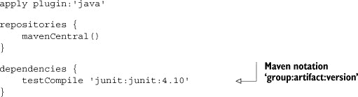

`repositories` 和 `dependencies` 是 Gradle DSL 的部分。任何所需的庫都列在 `dependencies` 块中。有幾種合法的依賴列表形式。這裡使用的是由冒號分隔的字符串。使用 Maven 語法不是偶然的，如 `repositories` 部分所示。可以使用多種不同類型的存儲庫，但這裡聲明了標準 Maven 中央存儲庫。

本次執行建築時運行相同的任務系列，但現在任何測試都會執行，並在 build/reports/tests 目錄中生成 HTML 格式的 JUnit 报告。

這證明了 Gradle 构建可以應用於沒有 Groovy 依賴的 Java 项目。為了展示相同的過程在混合 Java/Groovy 項目上也能正常工作，我將在 src/test/groovy 目錄中添加一個名為 `GroovyGreetingTests` 的 Groovy 測試用例。測試用例在下一個列表中展示。

##### 列表 5.17\. POJO 的 Groovy 測試，使這成為一個混合 Java/Groovy 项

```
import static org.junit.Assert.*
import org.junit.Test

class GroovyGreetingTests {
    Greeting greeting = new Greeting()

    @Test
    void testGetMessage(){
        assert 'Hello, World!' == greeting.message
    }

    @Test
    void testSetMessage() {
        greeting.message = 'Yo, dude'
        assert 'Yo, dude' == greeting.message
    }
}
```

新的 build.gradle 文件需要 Groovy 依賴。在 Gradle 版本 1.6 之前，依賴的名称是“groovy”。現在，推薦的表示法是將 Groovy 依賴聲明為標準編譯時間要求。完整的 build.gradle 文件在以下列表中展示。

##### 列表 5.18\. 混合 Java/Groovy 项目的 build.gradle 文件

```
apply plugin:'groovy'

repositories {
    mavenCentral()
}

dependencies {
    compile 'org.codehaus.groovy:groovy-all:2.1.5'
    testCompile 'junit:junit:4.10'
}
```

建築文件的其他更改是將 Java 插件替換為 Groovy 插件，該插件已經包含了 Java 任務。新的插件為建築添加了幾個任務，如下所示：

```
:compileJava
:compileGroovy UP-TO-DATE
:processResources UP-TO-DATE
:classes
:jar
:assemble
:compileTestJava
:compileTestGroovy
:processTestResources UP-TO-DATE
:testClasses
:test
:check
:build

BUILD SUCCESSFUL
```

`compileGroovy` 和 `compileTestGroovy` 任務都是新的，但其他一切正常進行。類別被編譯，測試運行，並生成了 HTML 測試報告。

那是处理 Java、Groovy 或混合 Java/Groovy 项目时的 Gradle 构建文件的基礎結構。類似的文件在這本書中都有展示。為了說明一些有趣的 Gradle 特性，我現在將考慮幾個在實踐中經常出現的用例。

#### 5.6.2\. 有趣的配置

本书使用了 Gradle 构建。当讨论上下文中的特定示例时，我会提出很多不同的选项，但在这里我可以讨论一些有趣的想法。

##### 自定义源集

首先，本书中的一个主要主题是，将 Groovy 源代码与 Java 源代码分开相当不自然。如果你想要使用相同的源文件夹来处理两者，就像 Eclipse 项目可能做的那样？这里有一个简单的自定义项目布局来实现这一点：

```
sourceSets {
          main {
              java { srcDirs = [] }
              groovy { srcDir 'src' }
          }
          test {
              java { srcDirs = [] }
              groovy { srcDir 'src' }
          }
      }
```

*源集*是 Gradle 构建中源代码的集合。在这里，通过将 src/main/java 和 src/test/java 文件夹的`srcDirs`属性分配给空列表，Java 编译器根本不会运行。相反，Groovy 编译器用于 src 目录中的所有类，这些类可能包含 Java 和 Groovy 类。

##### 复制 JAR 文件

另一个有用的策略是制作依赖库的本地副本。以下任务就是这样做的：

```
task collectJars(type: Copy) {
    into "$buildDir/output/lib"
    from configurations.testRuntime
}
```

`collectJars`任务是一种`Copy`任务——Gradle 中内置的任务类型之一。运行`collectJars`会将运行时类路径中的 JAR 文件复制到构建目录中的输出/lib 文件夹。Spock 使用此任务来制作完整的发行版。

##### 输入和输出

Gradle 的另一个出色功能是它可以跳过不必要的任务。它是通过创建文件和目录的哈希值并检查它们是否已更改来做到这一点的。以下列表显示了一个从 Gradle 附带示例中取出的示例。

> ^（11）请参阅下载分布中 userguide/tasks/incrementalBuild/inputsAndOutputs 目录。Gradle 附带大量非常简单的示例，就像这个一样。

##### 列表 5.19\. `incrementalBuilds` Gradle 示例中的输入/输出示例

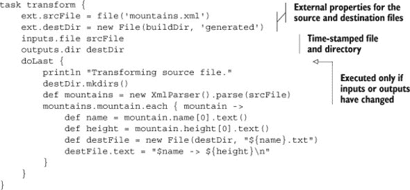

脚本的`srcFile`和`destDir`属性被分配给`ext`映射，这使得它们位于项目中，但避免了与现有的`Project`属性可能发生的任何潜在冲突。`inputs`和`outputs`属性可以分配给文件或目录（换句话说，单词`file`被解释为`java.io.File`）。如果这两个属性与上次运行时相同，则`doLast`块内的代码将被跳过。

##### Ant 集成

Gradle 的一个很好的特性是它包含了一个`groovy.ant.AntBuilder`实例作为构建的一部分。这意味着任何可以用 Ant 完成的事情都可以在 Gradle 构建中处理。这有几个后果。首先，如果你已经有了 Ant 构建文件，你可以在 Gradle 构建中调用其任务。你甚至可以使 Gradle 任务依赖于 Ant 任务。

考虑这个例子，来自 Gradle 示例.^([12]) Ant 构建文件是 build.xml，它包含一个名为`hello`的单个任务：

> ^（12）请参阅分布中的 userguide/ant/dependsOnAntTarget。

```
<project>
    <target name="hello">
        <echo>Hello, from Ant</echo>
    </target>
</project>
```

Gradle 构建在文件 build.gradle 中：

```
ant.importBuild 'build.xml'

task intro(dependsOn: hello) << {
    println 'Hello, from Gradle'
}
```

`intro`任务依赖于 Ant 构建中的`hello`任务，该任务通过`ant`变量（`AntBuilder`的一个实例）导入。运行`gradle intro`会执行这两个任务：

```
:hello
[ant:echo] Hello, from Ant
:intro
Hello, from Gradle

BUILD SUCCESSFUL
```

##### 包装器任务

最后，即使客户端没有安装 Gradle，也可以执行 Gradle 构建。Gradle 附带一个特殊的`Wrapper`任务，它有一个版本属性：

```
task wrapper(type: Wrapper) {
    gradleVersion = '1.6'
}
```

运行此任务会为 Windows 和 Unix 生成脚本，分别称为`gradlew.bat`和`gradlew`，以及一个最小的 Gradle JAR 发行版。当执行时，包装器首先下载并安装 Gradle 的本地副本，然后执行构建。

Gradle 是一个非常强大的系统，对其彻底的调查超出了本书的范围.^([13]) 希望这一节能为你提供足够的介绍，让你开始。

> ^(13) 书籍《Gradle in Action》（Manning，2013）由 Benjamin Muschko 撰写，既写得很好又全面。我强烈推荐它。

| |
| --- |

**学习到的经验（Grapes 和 Gradle）**

1.  `@Grab`对 Groovy 脚本很有帮助。

1.  Gradle 使用 Groovy 构建文件来配置你的构建，但像 Maven 一样从互联网上下载。

1.  Gradle 没有像 Maven 那样的工件，但人们正在研究为各种目标创建标准构建的方法。

1.  除了本章的讨论之外，本书中的每个项目都包含一个 Gradle 构建，突出其各种功能。

| |
| --- |

### 5.7\. 摘要

本章探讨了适用于 Groovy 和 Java 项目的构建工具。Ant 非常常见但处于较低级别。Groovy 提供了原始的`groovy`任务和`groovyc`编译任务，这在组合项目中可能很有用。

Maven 是一个高级工具，但可能难以定制。在本章中，我介绍了 GMaven 项目作为将 Groovy 添加到 Maven 的方法，以及 Groovy-Eclipse 插件方法，这种方法在跨编译问题时通常更稳健。

Groovy 包含一个`@Grab`注解，其所谓的 Grapes 功能可以用来直接将依赖项添加到 Groovy 脚本中。它功能强大，但仅限于 Groovy 构建。

最后，我介绍了 Gradle 构建工具。本章包括了对 Gradle 的基本讨论，并提到了几个更高级的功能。Gradle 在本书中被用来展示每个章节中的有趣机制。

## 第六章\. 测试 Groovy 和 Java 项目

*本章涵盖*

+   使用`GroovyTestCase`及其子类

+   测试脚本以及类

+   Groovy 库中的`MockFor`和`StubFor`类

+   Spock 测试框架

自动化测试的兴起是过去 20 年中软件开发生产率最显著的提升之一。作为构建过程一部分运行的自动化测试很容易设置，可以立即发现问题，并给你在重构代码时无需担心破坏相关无关内容的自由。

测试是许多“敏捷”开发流程的基石，从更现代的技术如 SCRUM 到 Kanban，再到原始的极限编程（XP）运动。然而，自动化测试还有两个其他的好处，但它们并没有得到足够的宣传：

> **1**. 测试是可执行的文档。
> 
> 任何主要的开源项目都是世界上一些最好的开发者共同努力的结果，其中许多人是在自己的时间里工作的。他们高度致力于编写代码，而不是文档。结果是，文档的质量往往低于代码的质量，如果它甚至最初是更新的话。
> 
> 我自己的经验是，开发者越好，他们就越关心测试。最好的开发者编写完整的测试，这些测试作为持续集成系统的一部分始终运行。如果一个测试失败，系统会立即通知项目提交者。因此，测试是开发者如何打算使用系统的绝佳例子。
> 
> 无论何时您与一个主要的开源项目一起工作，请下载源代码。您可能不会查看细节，但测试是无价的。
> 
> **2**. 测试不是生产代码的一部分。
> 
> 从开发者的角度来看，这并不是什么大问题，但对于管理者来说却是一个巨大的问题。公司不愿意采用新语言的一个原因是不确定它们在生产环境中表现如何。生产代码通常涉及复杂的审批流程和性能评估，这些评估可能非常保守。
> 
> 如果您想在您的系统中尝试 Groovy，测试是一个简单的方法。Groovy 语言内置了许多测试功能，这些功能都可以与 Groovy 和 Java 代码一起工作。从管理的角度来看，最好的是，在运行时 Groovy 只是一个 JAR 文件。

本章回顾了使测试更简单的 Groovy API 和库。首先，我会回顾 Java 开发者通常如何测试应用程序，重点关注 JUnit 库。然后，我会展示 Groovy 如何通过其`GroovyTestCase`扩展来增强这个过程。接下来，我会展示如何使用`GroovyTestCase`的子类测试用 Groovy 编写的脚本。从那里，我会讨论使用模拟和存根来单独测试类。这涉及到 Groovy 内置的模拟和存根功能，无论是通过`Expando`类，还是通过 Groovy 的`MockFor`和`StubFor`类。最后，我会向您展示未来的一瞥，即强大的 Spock 框架，这是一个纯 Groovy 库，它简化了 Java 和 Groovy 项目的测试。

图 6.1 是本章讨论的技术的指南。

##### 图 6.1\. 本章中的 Java 测试来自 JUnit。标准的 Groovy 库包括 JUnit 的 `TestCase` 的一个子类，称为 `GroovyTestCase`，其子类也很有用。Spock 框架是一个非常流行的替代测试 API，它包括一个 JUnit 测试运行器。Groovy 通过 `Expando`、`MockFor` 和 `StubFor` 等库类使创建模拟对象变得容易。

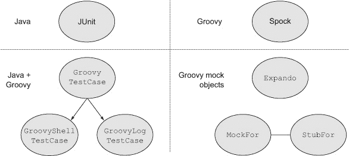

### 6.1\. 使用 JUnit

敏捷开发社区创建了 JUnit ([`junit.org`](http://junit.org)) 作为自动化测试的伟大工具。虽然存在其他 Java 测试工具，但 JUnit 的影响如此之大，以至于我遇到的几乎每一位 Java 开发者都使用过它或听说过它。JUnit 的成功催生了一系列用于其他语言的类似工具（统称为“xUnit”）。JUnit 简单、易于使用，在 Java 世界中无处不在。正如我将在本章中展示的，可用的 Groovy 工具也易于使用和学习，其中一些直接基于 JUnit.^([1])

> ¹ 现在更常被称为“敏捷”开发，因为大多数财富 500 强公司不想与“极端”任何事情联系在一起。

| |
| --- |

**将 JUnit 添加到您的项目中（第五章的回顾 chapter 5)**

JUnit 是由极限编程的两位创始人 Erich Gamma 和 Kent Beck 创建的开源项目。JUnit 库可以从其主页([`junit.org`](http://junit.org))下载，但它已内置到大多数常见的 IDE 中，包括 Eclipse、NetBeans 和 IntelliJ IDEA。它还可以通过 Maven 中央仓库检索，使用以下形式的 POM 依赖项

```
<dependency>
    <groupId>junit</groupId>
    <artifactId>junit</artifactId>
    <version>4.10</version>
</dependency>
```

作为替代，JUnit 4.5 及以上版本启用 artifact ID `junit`-dep，它不包括所谓的 Hamcrest 匹配器([`code.google.com/p/hamcrest/`](http://code.google.com/p/hamcrest/))，这些匹配器在某些情况下简化了语法。像大多数酷项目一样，JUnit 的源代码现在位于 GitHub 上，在 [`github.com/junit-team/junit.`](https://github.com/junit-team/junit.)

本书中的大多数 Gradle 构建文件（特别是本章中的项目）都将 JUnit 作为“test-compile”依赖项。这意味着 API 中的类（如 `org.junit.TestCase` 和 `org.junit.Assert`）仅对测试类可用。

| |
| --- |

当在 Groovy 中编写 JUnit 测试时，你有两种选择。你可以像往常一样使用注解编写 JUnit 测试，但用 Groovy 实现，或者你可以扩展 `GroovyTestCase` 类。唯一的区别是 `GroovyTestCase` 为 JUnit 的 `TestCase` 类添加了一些额外的方法。

因为这本书全部关于集成，我想检查以下情况：

+   使用标准的 Groovy JUnit 测试来检查 Java 实现。

+   使用标准的 Java JUnit 测试来检查 Groovy 实现。

+   编写一个扩展 `GroovyTestCase` 的 Groovy 测试，以查看它提供了哪些新增功能。

在每种情况下，我都需要一些东西来测试。因为我计划混合使用语言，我找到的一种使这更容易的方法是在 Java 接口中声明我的方法，然后在两种语言中实现它。这实际上是一个相当通用的规则。

| |
| --- |

##### Groovy 实现了 Java

Groovy 类可以像 Java 类一样轻松地实现 Java 接口。

| |
| --- |

下一个列表显示了一个 Java 接口，称为`UtilityMethods`，包含三个方法声明。

##### 列表 6.1. 一个包含三个方法的 Java 接口

```
public interface UtilityMethods {
    int[] getPositives(int... values);
    boolean isPrime(int x);
    boolean isPalindrome(String s);
}
```

在真正的测试驱动开发（TDD）中，我现在会编写测试，观察它们失败，然后编写正确的实现。因为本章的主题是测试而不是实现，让我先展示实现。^([2])

> 我尝试使用 TDD（测试驱动开发），但更经常使用 GDD（罪恶驱动开发）。如果我编写了代码但没有进行测试，我会感到内疚，并为它编写一个测试。

以下列表是`UtilityMethods`接口的 Java 实现。

##### 列表 6.2. `UtilityMethods`接口的 Java 实现

```
import java.util.ArrayList;
import java.util.List;

public class JavaUtilityMethods implements UtilityMethods {

    public int[] getPositives(int... values) {
        List<Integer> results = new ArrayList<Integer>();
        for (Integer i : values) {
            if (i > 0) results.add(i);
        }
        int[] answer = new int[results.size()];
        for (int i = 0; i < results.size(); i++) {
            answer[i] = results.get(i);
        }

        return answer;
    }

    public boolean isPrime(int x) {
        if (x < 0) throw new IllegalArgumentException("argument must be > 0");
        if (x == 2) return true;
        for (int i = 2; i < Math.sqrt(x) + 1; i++) {
            if (x % i == 0) return false;
        }
        return true;
    }

    public boolean isPalindrome(String s) {
        StringBuilder sb = new StringBuilder();
        for (char c : s.toCharArray()) {
            if (Character.isLetter(c)) {
                sb.append(c);
            }
        }
        String forward = sb.toString().toLowerCase();
        String backward = sb.reverse().toString().toLowerCase();
        return forward.equals(backward);
    }
}
```

对于有 Java 背景的人来说，实现不会令人惊讶。下一个列表中显示的 Groovy 实现要短一些。

##### 列表 6.3. `UtilityMethods`接口的 Groovy 实现

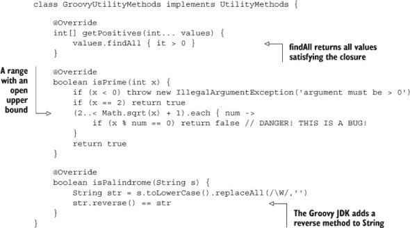

实际上，`isPrime`方法的实现中有一个微妙的错误。测试将检测到它，并给我一个机会来解释陷阱。

在下一个子节中，我将使用 Java 来测试 Groovy 实现并修复错误。然后我将使用 Groovy 来测试 Java 实现，最后我将编写一个作为`GroovyTestCase`子类的测试，看看这能帮到什么。

#### 6.1.1. 一个针对 Groovy 实现的 Java 测试

下面的列表包含一个 JUnit 4 测试，用 Java 编写，用于测试 Groovy 实现。它包括对`org.junit.Assert`类中方法的静态导入和单个测试的`@Test`注解。

##### 列表 6.4. 一个用于检查 Groovy 实现的 Java JUnit 测试

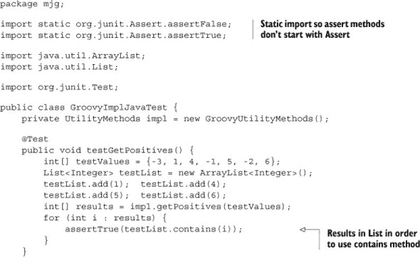

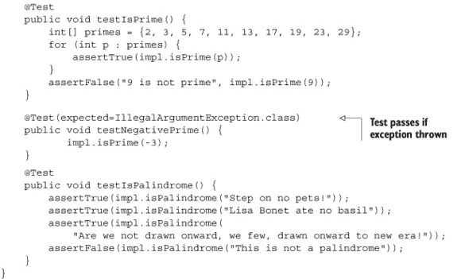

在 JUnit 3 中，测试扩展了`org.junit.TestCase`类，测试方法是通过反射检测的。`TestCase`中包含了所有需要的断言方法。现在，在 JUnit 4 中，测试没有超类，并且通过`@Test`注解进行检测。断言方法现在是`Assert`类中的静态方法，这导致了 Java 中最常见的静态导入使用。如果你对`Assert`类进行静态导入，你可以像在旧版本中一样编写断言方法。

这里的另一个有趣的部分是`@Test`注解的`expected`属性的用法，它声明只有当抛出预期异常时测试才通过。图 6.2 显示了结果。

##### 图 6.2. `isPrime`方法有一个错误，但其他部分都正常。

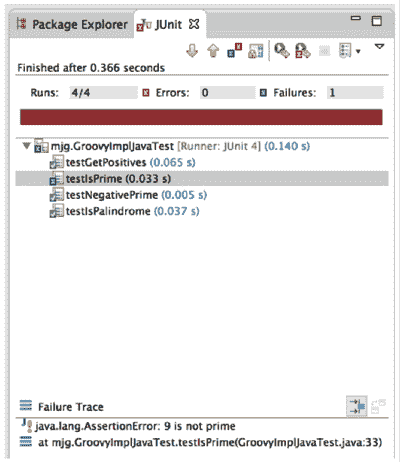

测试检测到 Groovy 实现对所有情况都返回 true。Groovy 实现将给定的数字除以从 2 到数字平方根减 1 的所有整数，寻找任何能被整除的数。这个算法是好的。问题是如果检测到合数（非质数），该方法应该返回 false。

不幸的是，从闭包内部返回的行为并不像常规 Java 开发者所期望的那样。实际上，当你从闭包返回时，就像是从另一个方法内部的方法返回一样。它只从闭包返回，而不是包含它的方法。

这是一个值得注意的陷阱：


##### 从闭包返回

从闭包内部返回只会从闭包返回，而不会从包含它的方法返回。


可能最简单的修复方法是切换到循环，其中返回行为如预期。下面是一个正确的实现：

```
boolean isPrime(int x) {
    if (x < 0) throw new IllegalArgumentException('argument must be > 0')
    if (x == 2) return true

    for (num in 2..< Math.sqrt(x) + 1) {
        if (x % num == 0) {
            return false
        }
    }
    return true
}
```

现在测试通过了。接下来我将展示一个针对 Java 实现的 Groovy 测试。

#### 6.1.2\. 一个针对 Java 实现的 Groovy 测试

你可以使用 Groovy 实现 JUnit 测试，就像使用 Java 一样简单，并且伴随着代码简化。下面的列表展示了这样一个测试。

##### 列表 6.5\. 一个针对 Java 实现的 Groovy JUnit 测试

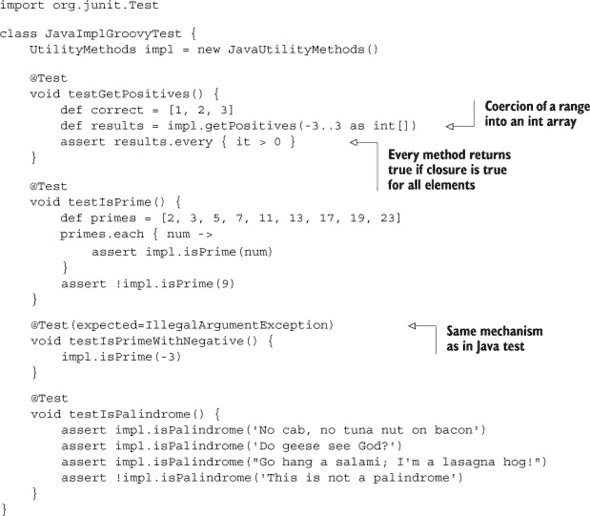

这里有一些代码简化，但这仍然是一个可识别的标准 JUnit 测试。可以通过将范围强制转换为整数数组来提供初始数据。`Collection` 中的 `every` 方法让我可以在一个语句中检查所有返回值。否则这与之前相同。

另一个注意事项：由于 Groovy 的真值规则，^([3]) Groovy 中的 `assert` 与 `assertTrue` 和 `assertNotNull` 相同。此外，Groovy 的 `assert` 具有出色的调试输出。因此，大多数 Groovy 开发者更倾向于在测试中使用 `assert` 而不是 `org.junit.Assert` 类中的任何断言方法。

> ³ 非空引用为真，非零数字为真，非空集合为真，非空字符串为真，等等。

最后，让我展示一个扩展 `GroovyTestCase` 的测试类，看看它带来了哪些额外功能。

#### 6.1.3\. 一个针对 Java 实现的 GroovyTestCase 测试

Groovy 通过其标准库提供 `groovy.util.GroovyTestCase` 类。如前所述，它扩展了 `org.junit.TestCase`。下面的列表展示了一个针对 Java 实现的此类测试。

##### 列表 6.6\. 一个针对 Java 实现的 GroovyTestCase 测试

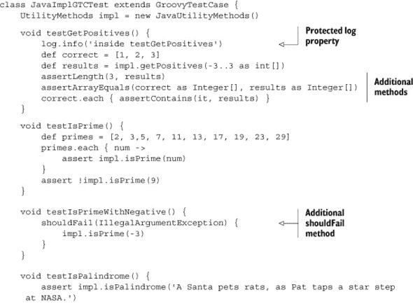

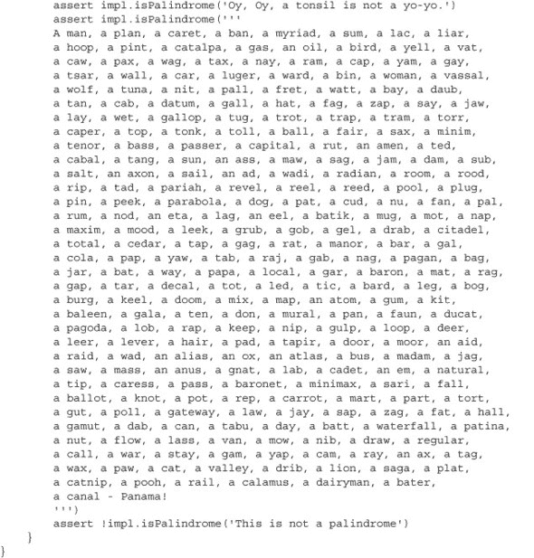

这里有一些新特性。首先，`GroovyTestCase` 包含一个静态的受保护属性 `log`，其类型为 `java.util.logging.Logger`。自己添加一个日志记录器到测试中并不难，但自动提供一个是方便的。

接下来，该类添加了一个`assertLength`方法。它有三个重载版本。在每个版本中，第一个参数是数组的预期长度。第二个参数是一个整数数组、字符数组或`Object`类型的数组。在这里，我使用这个方法来检查返回的正整数数量是否符合预期。

该类还提供了一个`assertArrayEquals`方法，它接受两个`Object`数组作为参数。文档说明，此方法检查数组是否等效且包含相同的元素.^([4])

> ⁴ 这听起来像是冗余部门的，但并非如此。

另外添加了一个方法`assertContains`。该方法有两个重载版本，一个用于字符，一个用于整数，因此仅在那些情况下有用。

最后，超类还提供了一个`shouldFail`方法，它接受一个异常类型和一个闭包，或者只接受一个闭包。它期望在运行闭包时抛出异常，因此它的行为与具有预期属性的`@Test`注解非常相似。

`GroovyTestCase`类还有一些额外的没有在这里列出的方法，如`assertScript`、`shouldFailWithCause`和广受欢迎的`notYetImplemented`。有关详细信息，请参阅 GroovyDocs。

有趣的是，这个测试可以从命令行运行。`groovy`命令充当基于文本的 JUnit 运行器，用于`GroovyTestCase`子类。结果看起来像这样：

```
$ groovy -cp bin src/test/groovy/mjg/JavaImplGTCTest.groovy
.Jun 23, 2013 5:53:05 PM java_util_logging_Logger$info call
INFO: inside testGetPositives

...
Time: 0.179

OK (4 tests)
```

Java 接口和实现类被编译并存储在项目的 bin 目录中，因此在运行 Groovy 脚本时需要将它们添加到类路径中。


**Lessons learned (JUnit)^([5])**

> **1**. JUnit 是业界最常用的 Java 单元测试框架。
> 
> **2**. 正常的 JUnit 测试基于注解。`@Test`注解有一个名为`expected`的属性。这样的测试只有在抛出预期异常时才会通过。
> 
> **3**. 版本 4 的测试没有超类。相反，所有的断言方法都是`org.junit.Assert`类中的静态方法。
> 
> **4**. 根据 Groovy 的真理，`assert`、`assertTrue`和`assertNotNull`都是相同的。
> 
> **5**. 因为 Groovy 的`assert`在失败时提供了大量的调试信息，所以通常比标准的 JUnit `assertEquals`方法更受欢迎。
> 
> **6**. `GroovyTestCase`扩展了 JUnit 中的`TestCase`类，并添加了一些便利方法，如`assertLength`和`shouldFail`。


> ⁵ 在我离开这个部分之前，我应该提到，示例中使用的回文来自[www.derf.net/palindromes/old.palindrome.html](http://www.derf.net/palindromes/old.palindrome.html)上的“巨大的回文列表”页面。

测试用 Groovy 编写的脚本涉及特殊的情况，特别是如果输入数据来自外部时。这是下一节的主题。

### 6.2\. 使用 Groovy 编写的脚本测试

测试脚本与测试类略有不同。你通常不会实例化一个脚本并在其上调用方法，尽管你可以这样做。相反，最简单的方法是执行脚本，并让它的内部`assert`语句进行任何正确性检查。

| |
| --- |

##### 使用断言

当 Groovy 开发者编写脚本时，他们通常会添加断言来演示脚本是否正常工作。

| |
| --- |

如果脚本中没有涉及输入或输出变量，在测试用例中运行脚本就足够简单了。因为脚本通常包含验证其正确性的`assert`语句，所以关键是简单地以编程方式执行脚本。这就是`GroovyShell`类的作用。

这里有一个简单的例子。考虑一个访问互联网 Chuck Norris 数据库的简短但强大的脚本，该脚本从第四章复制而来：

> ⁶ 这可能是互联网被发明的原因。

```
import groovy.json.JsonSlurper

def result = 'http://api.icndb.com/jokes/random'.toURL().text
def json = new JsonSlurper().parseText(result)
def joke = json?.value?.joke
assert joke
println joke
```

```
Chuck Norris can instantiate an interface
```

当这个脚本执行时，它会访问显示的 URL 上的 RESTful 网络服务，以 JavaScript 对象表示法（JSON）的形式检索一个随机笑话，解析（或者更确切地说，是吞噬）它，并打印出结果笑话。脚本使用安全的解引用操作符来避免`NullPointerException`，以防出现错误，但它有一个`assert`语句来检查是否确实检索到了某些内容。当执行时，结果类似于：为了测试这个脚本，我只需要执行它，让嵌入的`assert`语句来完成工作。我可以像以下列表中那样以编程方式执行它。

##### 列表 6.7\. 用于存储所有脚本测试的类

```
class ScriptTests {
    @Test
    void testChuckNorrisScript() {
        GroovyShell shell = new GroovyShell()
        shell.evaluate(new File('src/main/groovy/mjg/chuck_norris.groovy'))
    }
}
```

在第三章中讨论的`GroovyShell`类有一个`evaluate`方法，它接受一个`File`参数。我只需将`File`指向相关的脚本，shell 上的`evaluate`方法就会执行它。

如果我想检查结果呢？在这种情况下，结果是随机的，但如果我的脚本基于输入值有实际的结果，那么可以做什么呢？

为了处理这个问题，我需要一个脚本的绑定（再次在第三章中讨论）。绑定是一个对象，它允许从脚本中访问输入和输出变量。

| |
| --- |

##### 脚本绑定

任何在脚本中未声明的变量都是绑定的一部分，可以从外部访问。

| |
| --- |

考虑 Groovy 中的经典“Hello, World!”脚本。我将在下一个列表中将其放入一个包中，但除此之外，它与附录 B，“Groovy by feature”中描述的脚本相同。

##### 列表 6.8\. “Hello, World!”脚本

```
package mjg
println 'Hello, World!'
```

此脚本不包含任何 `assert` 语句，但由于它打印到控制台，我希望能够检查输出。为此，我可以将对应绑定的 `out` 属性分配给一个 `StringBuffer`，我可以在脚本执行后访问它。⁷ 以下测试已被添加到在 列表 6.7 中开始的 `ScriptTests` 类。

> ⁷ 这部分内容没有很好地记录，所以请考虑这是通过阅读这本书为你提供的额外价值。Guillaume Laforge 告诉了我关于它的事情（并且也写了它），所以他应该得到真正的荣誉。

##### 列表 6.9\. 捕获脚本输出的测试

```
@Test
void testHelloWorld() {
    Binding binding = new Binding()

    def content = new StringWriter()
    binding.out = new PrintWriter(content)
    GroovyShell shell = new GroovyShell(binding)
    shell.evaluate(new File('src/main/groovy/mjg/hello_world.groovy'))
    *assert* "Hello, World!" == content.toString().trim()
}
```

绑定的 `out` 属性被分配给一个围绕 `StringWriter` 的 `PrintWriter`，这样当脚本中的 `println` 方法执行时，输出就会流向该写入器而不是控制台。然后，在通过 shell 执行脚本后，我可以通过访问写入器并修剪其输出，来检查是否打印了正确的语句。

通常，绑定用于将输入变量传递到脚本中。以下是对上一个示例的微小变化，使用了 `name` 变量。

##### 列表 6.10\. 带有绑定变量的脚本

```
package mjg
println "Hello, $name!"
```

再次强调，这里唯一的真正区别是 `print` 语句使用了一个在脚本内部未声明的 `name` 变量。这意味着它可以像以下测试中所示的那样从外部传递。

##### 列表 6.11\. 设置绑定变量以测试脚本

```
@Test
void testHelloName() {
    Binding binding = new Binding()
    binding.name = 'Dolly'
    def content = new StringWriter()
    binding.out = new PrintWriter(content)
    GroovyShell shell = new GroovyShell(binding)
    shell.evaluate(new File('src/main/groovy/mjg/hello_name.groovy'))
    *assert* "Hello, Dolly!" == content.toString().trim()
}
```

`name` 变量被设置为 Dolly，结果与之前确认一致。

#### 6.2.1\. GroovyTestCase 的有用子类：GroovyShellTestCase

脚本和绑定的组合足够常见，以至于 Groovy API 现在包括了类 `groovy.util.GroovyShellTestCase`。这是一个 `GroovyTestCase` 的子类，它在 `setUp` 方法中实例化了一个 `GroovyShell`。shell 被作为一个受保护的属性提供，但该类还包括一个 `withBinding` 方法，该方法接受一个参数 `Map` 和一个要执行的闭包。以下列表展示了本节中 Groovy 脚本的测试。

##### 列表 6.12\. 使用 GroovyShellTestCase 测试 Groovy 脚本


第一个测试找到要运行的脚本，并使用在超类中实例化的 shell 来执行它。其他测试使用 `withBinding` 方法覆盖 `out` 变量并提供一个输入参数。结果与直接实例化 `GroovyShell` 和 `Binding` 类相同。

之前的示例展示了如何从脚本中捕获标准输出，但通常脚本会返回具体的值。`withBinding` 方法返回脚本返回的任何内容。作为一个简单的例子，考虑以下强大的 Groovy 计算器，保存在一个名为 `calc.groovy` 的文件中：

```
z = x + y
```

由于三个变量（`x`、`y` 和 `z`）都没有声明，它们都可以通过脚本的绑定来访问。下一个列表展示了对此脚本进行测试的示例，该测试验证了返回的值。

##### 列表 6.13\. 对加法脚本 calc.groovy 的测试

```
void testAddition() {
    def result = withBinding( [x:3,y:4] ) {
        shell.evaluate(new File('src/main/groovy/mjg/calc.groovy'))
        shell.context.z
    }
    *assert* 7 == result
}
```

闭包的最后一行访问了 `z` 变量，其值是从绑定中检索的。

标准库中还有一个名为 `GroovyLogTestCase` 的 `GroovyTestCase` 子类，用于测试日志记录。这个类是下一小节的主题。

#### 6.2.2\. GroovyTestCase 的有用子类：GroovyLogTestCase

良好的开发者不会依赖于捕获标准输出。相反，他们使用日志记录器将输出定向到可以稍后访问的位置。Java 早已内置了基本的日志记录功能，可以作为日志 API 实现的前端。

Java 日志类，如 `Logger` 和 `Level`，位于 `java.util.logging` 包中。以下是一个使用这些类的例子，它是上一节中计算器脚本的微小变化，存储在一个名为 `calc_with_logger.groovy` 的文件中。

##### 列表 6.14\. 使用日志记录器的脚本

```
import java.util.logging.Logger

Logger log = Logger.*getLogger*(this.class.name)
log.info("Received (x,y) = ($x,$y)")
z = x + y
```

`Logger` 类的静态 `getLogger` 方法是一个工厂方法，用于为这个特定组件创建一个 `Logger` 实例。在这里，我使用了脚本的名称，它将成为生成的类的名称。再次强调，变量 `x`、`y` 和 `z` 是脚本绑定的部分。日志提供与各种日志级别相对应的方法。在标准中，内置的级别包括 `finest`、`finer`、`fine`、`info`、`warning` 和 `severe`。在这个特定的情况下，输入参数正在以信息级别进行日志记录。要将此脚本执行为 `x` 和 `y` 设置为 `3` 和 `4`，请使用以下代码：

```
Binding b = new Binding(x:3, y:4)
GroovyShell shell = new GroovyShell(b)
shell.evaluate(new File('src/main/groovy/mjg/calc_with_logger.groovy'))
println shell.context.z
```

结果类似于这个（日期和时间可能有所不同）：

```
Jun 24, 2013 12:21:19 AM
     org.codehaus.groovy.runtime.callsite.PojoMetaMethodSite$PojoCachedMethod
     SiteNoUnwrap invoke
INFO: Received (x,y) = (3,4)
7
```

默认的日志记录器包括一个控制台“附加器”，将所有日志输出定向到控制台。但是，捕获标准输出的机制在这里不起作用。相反，Groovy 提供了一个名为 `GroovyLogTestCase` 的类，其中包含一个名为 `stringLog` 的静态方法，用于此目的。下面的列表展示了演示其使用的一个测试。

##### 列表 6.15\. 在测试用例中捕获日志输出

```
class CalcWithLoggerTests extends GroovyLogTestCase {

    void testAddition() {
        def result = stringLog(Level.INFO, calc_with_logger.class.name) {
            Binding b = new Binding()
            b.x = 3; b.y = 4
            GroovyShell shell = new GroovyShell(b)
            shell.evaluate(
                new File('src/main/groovy/mjg/calc_with_logger.groovy'))
            assert 7 == shell.context.z
        }
        assert result.contains('INFO: Received (x,y) = (3,4)')
    }
}
```

`stringLog` 方法返回日志输出作为字符串，用于检查日志记录器是否正常工作。

本书中的大多数脚本都是使用本节中描述的技术进行测试的。然而，如果脚本（或任何类）有依赖项，则需要做更多的工作。

| |
| --- |

**Lessons learned (testing scripts)**

> **1**. Groovy 脚本提供自己的挑战，尤其是在尝试捕获输入或输出数据以及记录结果时。
> 
> **2**. Groovy 源代码可以通过 `GroovyShell` 和 `Binding` 类程序化执行，然后执行任何包含的 `assert` 方法。
> 
> **3**. 可用于简化脚本测试的 `GroovyTestCase` 的特殊子类。

| |
| --- |

真正的单元测试意味着测试一个独立的类。测试的成功或失败不应依赖于任何相关对象。任何依赖对象都应被模拟或存根对象替换，当访问时返回预定的值。

这是在使用 Groovy 时比使用 Java 更容易处理的一个领域。Groovy 有几个内置机制用于创建模拟或存根对象，我将在下一节中对其进行回顾。

### 6.3\. 隔离测试类

在面向对象的程序中，没有哪个类是孤岛。类通常有依赖关系。集成测试使用所有依赖关系以及正在测试的类（通常称为 CUT，即原因），但要真正测试一个给定的类，你需要将其从其环境中隔离出来。

为了隔离一个类，你需要提供它从依赖关系中需要的东西，以便它能够完成其工作。例如，如果一个类处理从系统其余部分提取的数据，你需要以受控的方式提供这些数据，而不涉及系统的其余部分。

形式上，正在被测试的类被称为*调用者*，它所依赖的类被称为*协作者*。目标是提供所有协作者的受控实现，以便调用者可以单独进行测试。

在本节中，我们将查看一个与第七章中展示的类似示例。它足够简单，易于理解，但又不完全是人为的。示例是一个经典的银行账户。有一个`Account`类，一个`AccountDAO`接口，一个`File-AccountDAO`实现，以及一个`AccountService`类。布局如图 6.3 所示。想法是服务将有一个名为`transferFunds`的方法，该方法设置事务边界，DAO 类为`Account`执行持久化，而`Account`本身只是一个将被保存和从某些持久化结构中恢复的实体。

##### 图 6.3\. 使用服务和一个基于平面文件的 DAO 实现的简单银行系统的 UML 图。虚线开放箭头表示依赖关系，实线开放箭头是关联，虚线闭合箭头表示实现。

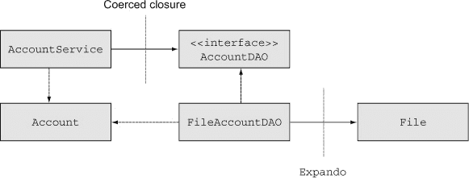

在这个例子中，我将使用一个简单的文件进行持久化。通常我会使用数据库，但我想说明如何使用代表文件的存根在 Groovy 中进行单元测试。在这个过程中，我将讨论单元测试和集成测试之间的区别。到目前为止，本章中的测试还没有尝试模拟任何依赖对象，因此它们可以被认为是集成测试。现在我将查看如何进行真正的单元测试。

除了基本类之外，图 6.3 还显示了以下小节（强制闭包和展开）中将要使用的技术。

（程序性）客户端会通过在服务类`AccountService`上调用方法来使用银行系统，这个服务类可能具有事务性。服务类使用`AccountDAO`接口的实现来处理单个账户。`Account`类本身是一个简单的 POJO。

下面的几节展示了服务和 DAO 的实现代码，并说明了如何使用强制闭包和扩展来表示依赖对象。具体来说，当在服务类中测试逻辑时，使用闭包来表示 DAO。当测试 DAO 实现时，扩展体代替了`File`类。

#### 6.3.1\. 强制闭包

让我从下一列表中的`AccountService`开始。

##### 列表 6.16\. `AccountService`（Java）：使用`AccountDAO`查找`Accounts`

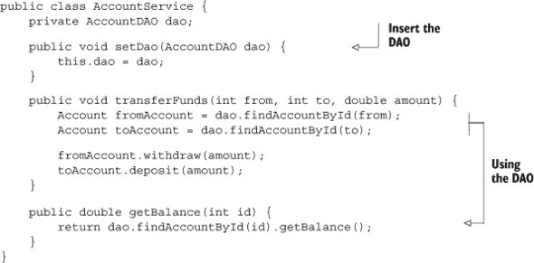

再次强调，为了保持简单，`AccountService`只有两个业务方法：一个`transferFunds`方法用于将资金从一个账户转移到另一个账户，一个`get-Balance`方法委托给`Account`中的相应方法。这两个方法都接受整数`id`作为参数，并使用`AccountDAO`查找相应的账户。因此，为了完成其工作，`AccountService`需要一个`AccountDAO`实例。

`AccountService`与`AccountDAO`相关联。真正的单元测试会单独测试这个类，这意味着我需要为`AccountDAO`类提供一个某种存根。`AccountDAO`实际上是一个接口，如下一列表所示。

##### 列表 6.17\. `AccountDAO`接口，包含`Account`类的 CRUD 方法

```
public interface AccountDAO {
    Account findAccountById(int id);
    Collection<Account> findAllAccounts();
    int createNewAccount(double balance);
    void deleteAccount(int id);
}
```

如果我创建了一个`AccountDAO`接口的存根实现，我需要实现所有这些方法。但是请注意，`AccountService`只使用接口中的一个方法：`findAccountById`。这正是我实际需要的方法。不幸的是，我无法只实现这个方法。在实现接口时，我需要实现所有它的方法，无论我是否打算使用它们。

我可以使用 Groovy 技术来避免所有额外的劳动。如果我为关心的方法提供具有相同参数列表的闭包，我就可以将闭包“强制”为接口。闭包成为具有相同参数列表的接口中所有方法的实现。

在这种情况下，我想为`findAccountById`方法提供一个实现，该方法接受一个整数`id`并返回一个`Account`。我将使用一个映射来完成这个任务：

```
Account a1 = new Account(1,100)
Account a2 = new Account(2,100)
def accounts = [1:a1, 2:a2]
```

`Account`类（未显示，但它是一个简单的 POJO，包含在书籍源代码中）有一个接受`id`和初始`balance`的两个参数的构造函数。我创建了两个 ID 为 1 和 2 的账户，并将它们添加到以 ID 值为基础的映射中。现在我需要实现我的方法的闭包：

```
{ id -> accounts[id] }
```

这是一个单参数闭包，其占位符变量再次称为`id`，返回存储在该 ID 下的`Account`。有了这个机制，我可以为服务类提供一个 DAO 的存根实现，如以下列表所示。

##### 列表 6.18\. `AccountService`的 JUnit 4 测试用例，使用 Groovy 编写，并带有存根化的 DAO

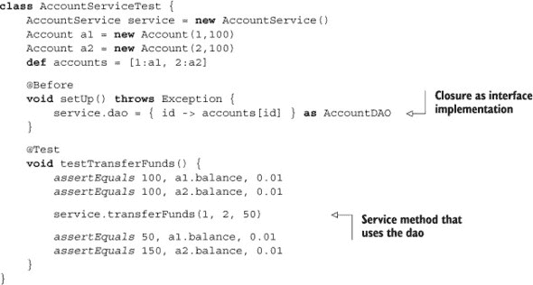

在`setUp`方法（带有`@Before`注解）中，我使用`as`运算符将闭包视为`AccountDAO`接口。这意味着闭包将被用作接口中所有方法的实现。因为 DAO 接口中使用的唯一方法是`findAccountById`，所以我可以将一个转换后的闭包分配给服务中的`dao`属性（通常通过`setDao`方法进行），然后完成。`testTransferFunds`方法验证两个账户的初始余额是否符合预期，执行转账操作，然后检查更新的余额是否正确，考虑到比较双精度浮点数需要一个表示精度的第三个参数。

如果我需要在接口中使用闭包实现多个方法，我可以提供一个闭包到方法名的映射，其中每个闭包都有正确的参数列表。例如，以下列表显示了一个表示整个`AccountDAO`接口的闭包映射和一些展示其工作方式的测试。

##### 列表 6.19\. 使用闭包映射实现接口

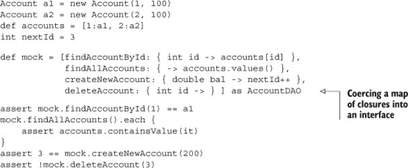

核心观点是闭包可以用作接口的实现，而且这是一种简单且非常强大的技术，用于提供协作者的存根实现。

接下来我想测试使用平面文件存储账户的 DAO 实现类。在这种情况下，目标将是提供一个存根来代替`java.io.File`类。

#### 6.3.2\. Expando 类

我打算使用文件作为我的持久化机制，但在测试环境中，我将保持一个账户的缓存映射。这意味着当我初始化 DAO 时，我需要读取文件并将找到的账户存储在映射中，每次我对账户进行更改时，我需要将结果写回文件。在读取数据时，我只需使用映射——除非文件已被更改，在这种情况下，我必须重新读取文件.^([8])

> 我从 Jeff Brown 那里得到了这种使用 expando 的想法，他是《Grails 2 definitive guide》（Apress，2013 年）不知疲倦的合著者。

首先，这是我的`FileAccountDAO`类中的属性：

```
def accountsFile
Map<Integer, Account> accounts = [:]
private static int *nextId*
boolean dirty
```

我故意将表示账户文件的变量声明为 `def` 类型而不是 `File` 类型，原因将在创建存根时解释。其他属性是一个映射，用于表示账户缓存（使用泛型，Groovy 可以成功编译但不会强制执行^([9]))，一个 `private` `static` 整数，将作为我的主要键生成器，以及一个布尔标志，用于指示账户缓存是否需要刷新。

> ⁹ 这又是一个微妙的陷阱。Java 泛型的语法在 Groovy 中可以编译，但仅仅因为你声明了一个 `List<Integer>` 并不意味着你不能添加 `String`、`Date` 或 `Employee` 的实例。在 Groovy 中，将泛型声明视为仅仅是文档。

这是用来从文件中读取账户的方法：

```
void readAccountsFromFile() {
    accountsFile.splitEachLine(',') { line ->
        int id = line[0].*toInteger*()
        double balance = line[1].*toDouble*()
        accounts[id] = new Account(id:id,balance:balance)
    }
    *nextId* = accounts?.keySet().*max*() ?: 0
    *nextId*++
    dirty = false
}
```

每个账户都以纯文本形式存储，用逗号将 `id` 和 `balance` 分隔开。读取账户使用 `splitEachLine` 方法，该方法接受两个参数：分隔符（在这种情况下是逗号）和一个闭包，该闭包定义了对结果列表的操作。闭包指示将 ID 和余额解析到适当的数据类型，使用结果值实例化一个账户，并将其保存到映射中。然后我需要将 `nextId` 变量设置为迄今为止使用的 ID 的最大值加一，这给了我使用酷炫的 Elvis 操作符的机会.^([10]) 最后，因为此方法刷新了缓存，我可以将 `dirty flag` 设置为 `false`。

> ¹⁰ 我并不是刻意寻找使用酷炫的 Elvis 操作符的借口，但当我遇到它们时，也不会错过。

下一个示例显示了写入账户的相应方法：

```
void writeAccountsToFile() {
    accountsFile.withWriter { w ->
        accounts.each { id, account ->
             *w.println*("$id,$account.balance")
        }
    }
    dirty = true
}
```

`withWriter` 方法来自 Groovy JDK，并被添加到 `java.io.File` 类中。它提供了一个包装在文件周围的输出写入器，当闭包参数完成时自动关闭。闭包将每个账户的 ID 和余额写入文件的同一行，用逗号分隔。因为此方法会更改文件，所以它将 `dirty` 标志设置为 `true`，以便类知道缓存需要刷新。

在这些方法到位之后，下一列表显示了完整的 DAO 实现。

##### 列表 6.20\. 完整的 `FileAccountDAO` 实现示例，使用 Groovy

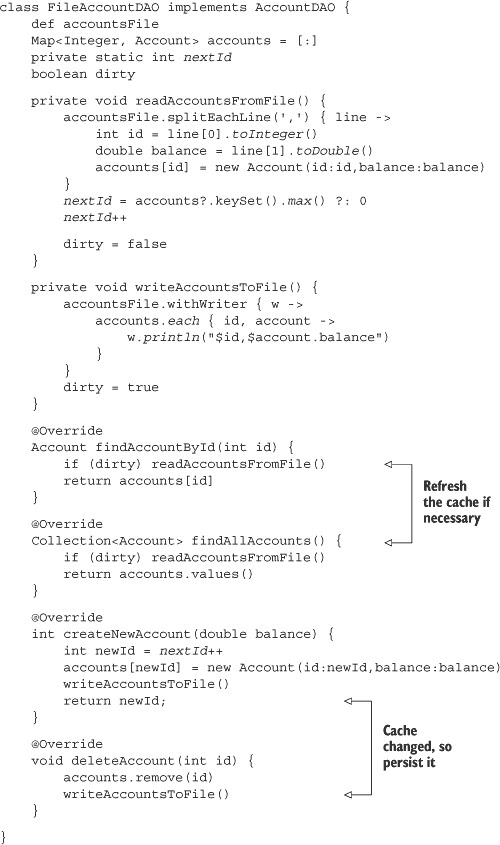

业务方法很简单，基于账户缓存（映射）。唯一的复杂性是确定在返回值之前是否需要刷新缓存。更改账户的方法会强制写入文件。检索它们的方法只需要检查是否需要读取。

这是一段相当多的代码，如果它没有被测试，我会感到非常不舒服。集成测试会简单地向 DAO 提供一个实际的文件，我在书中的源代码中就有这样一个测试。然而，单元测试会消除对 `File` 类的依赖。这就是 `Expando` 发挥作用的地方。

`groovy.util.Expando` 类创建了一个没有任何属性或自己方法的对象，除了它继承的方法。酷的地方在于你可以将 `Expando` 的实例当作一个映射来处理，其中键是属性或方法的名称，值是属性值或方法实现。


##### Expando

`groovy.util.Expando` 是一个类，你可以创建一个空对象，然后根据需要向其中添加属性和方法。


为了看到这个动作，让我创建一个 `Expando` 来作为我的 DAO 中文件的替代品。首先，我必须看到 `File` 中哪些方法需要表示。

这里是 `AccountDAO` 中使用 `accountsFile` 依赖项的方法。我需要模拟的方法用粗体标出：

```
private void readAccountsFromFile() {
    accountsFile.splitEachLine(',') { line ->
        int id = line[0].*toInteger*()
        double balance = line[1].*toDouble*()
        accounts[id] = new Account(id:id,balance:balance)
    }
    *nextId* = accounts?.keySet().*max*() ?: 0
    *nextId*++

    dirty = false

}

private void writeAccountsToFile() {
    accountsFile.withWriter { w ->
        accounts.*each* { id, account ->
            w.println("$id,$account.balance")
        }
    }
    dirty = true
}
```

检查前面的列表显示，我在 `File` 类中使用了 `splitEachLine` 和 `withWriter`，以及 `Writer` 类的 `println` 方法，因此这些方法需要在 `Expando` 中实现。

所有这些方法已经在 `String` 类中实现了。因此，为什么不使用字符串来表示文件呢？我将在 `Expando` 中添加一个字符串属性，然后实现所有需要的功能，以便它们委托到字符串上的相应方法。以下是生成的代码：

```
Expando ex = new Expando()
ex.data = ''
ex.*println* = { data.append(it) }
ex.withWriter = { new StringWriter() }
ex.splitEachLine = { pattern, clos ->
    data.splitEachLine(pattern, clos) }
```

首先，我实例化 `Expando`。然后，我向其中添加一个 `data` 属性并将其分配给一个空字符串。然后通过 `String` 上的 `append` 方法实现 `println` 方法。`withWriter` 方法被分配一个返回新的 `StringWriter` 的闭包。最后，`splitEachLine` 方法被分配给一个接受两个参数的闭包，该闭包委托到 `String` 上对应现有的方法。

剩下的就是用 `Expando` 替换 DAO 中的文件：

```
FileAccountDAO dao = new FileAccountDAO(accountsFile:ex)
```

最后，这就是为什么我需要用 `def` 而不是 `File` 来声明 `accountsFile` 变量的原因。`Expando` 不是一个文件，并且与 `File` 类没有任何关系，所以 `File` 引用会是一个问题。如果我用 `def` 来声明变量，我就可以自由地将 `Expando` 变量分配给我的变量。鸭子类型会完成剩下的工作；每次在变量上调用方法时，都会在 `Expando` 上调用相应的方法。


##### 动态类型来拯救

如果我使用 `def` 声明一个引用，我可以将其分配给任何东西。当我调用它的方法时，我依赖于在所使用的任何类中都有这些方法。


下一个列表显示了文件 DAO 的完整单元测试。

##### 列表 6.21\. 使用 `Expando` 模拟 `File` 的 `FileAccountDAO` 单元测试

```
class FileAccountDAOUnitTests {
    FileAccountDAO dao

    @Before
    void setUp() {
        Expando ex = new Expando()
        ex.data = ''
        ex.splitEachLine = { pattern, clos ->
            data.splitEachLine(pattern, clos) }
        ex.withWriter = { new StringWriter() }
        ex.*println* = { data.append(it) }
        dao = new FileAccountDAO(accountsFile:ex)
    }

    @Test
    void testCreateAndFindNewAccount() {
        int id = dao.createNewAccount(100.0)
        Account local = new Account(id:id,balance:100.0)
        Account fromDao = dao.findAccountById(id)
        assertEquals local.id, fromDao.id
        assertEquals local.balance, fromDao.balance, 0.01
    }

    @Test
    void testFindAllAccounts() {
        (1..10).*each* { num -> dao.createNewAccount(num*100) }
        def accounts = dao.findAllAccounts()
        assertEquals 10, accounts.size()
        accounts*.balance.*each* { it in (100..1000) }
    }

    @Test
    void testDeleteAccount() {
        (1..10).*each* { num -> dao.createNewAccount(num*100) }
        def accounts = dao.findAllAccounts()
        assertEquals 10, accounts.size()
        accounts.*each* { account -> dao.deleteAccount(account.id) }
        assert 0 == dao.findAllAccounts().size()
    }
}
```

在某种程度上，我在这个例子中很幸运。我需要模拟的变量 `accountsFile` 被公开为一个属性，所以我可以从外部将其分配给它。如果情况不是这样呢？如果变量是在类内部实例化的呢？那时能做些什么呢？

如果我受限于 Java，我就没有运气了.^(11)) 事实上，甚至模拟框架也难以处理这种情况。幸运的是，Groovy 有一个内置机制来处理这个问题。我需要的类被称为`StubFor`和`MockFor`。

> ^([11](http://en.wikipedia.org/wiki/Integration_testing)) 除非我有 AspectJ 可用，但即使那样，解决方案也很复杂。

#### 6.3.3. StubFor 和 MockFor

一个典型的 Groovy 开发者不一定花很多时间进行元编程，但他们确实享受到了它的好处。我在这本书的几个地方使用了构建器。像 GORM 这样的领域特定语言（DSL）是通过元编程技术构建的。整个 Groovy JDK 是通过元类操作创建的。在上一个章节中，我使用了一个`Expando`来创建测试对象，而这只适用于支持元编程的语言。过了一段时间，你会习惯于元编程的能力，并且不再对它们的益处感到惊讶。

在本节中，我将展示一种技巧，即使在我多年的 Groovy 编程经验之后，它仍然感觉像是魔法。我知道它有效，并且我会在任何可能的地方使用它，但每次发生这种情况，我都要花点时间坐下来，微笑着欣赏它的酷炫。

让我直接展示我想展示的例子，然后解释存根技术。与其使用迄今为止描述的银行账户系统，不如让我提醒你我在本书的几个章节中使用的地理编码器示例。下面的列表显示了 Groovy 棒球系统中的一部分`Geocoder`类，该系统在第二章中描述。

##### 列表 6.22。回顾 Groovy 棒球`Geocoder`类

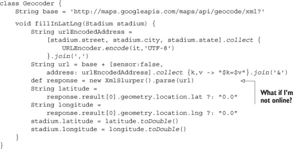

我为这个类编写了一个测试，但毫无疑问，它是一个集成测试。下面的列表显示了一个用 Groovy 编写的 JUnit 4 测试，用于地理编码器。

##### 列表 6.23。`GeocoderIntegrationTests.groovy`：地理编码器的 JUnit 4 测试

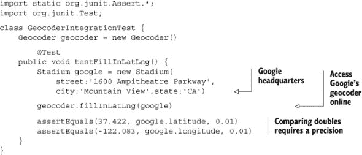

一个`Stadium`（体育场）有街道、城市、州、纬度和经度，地理编码器的任务是获取地址，使用 Google 的地理编码服务，并使用结果更新纬度和经度。在设置与 Google 总部办公室对应的`Stadium`实例后，测试调用`fillInLatLng`方法，并检查更新的纬度和经度值是否在公差范围内。

这一切都很正常，但它要完成其工作，必须访问 Google 地理编码服务。这就是为什么它是一个集成测试.^(12))

> ^([12](http://en.wikipedia.org/wiki/Integration_testing)) 请参阅关于集成测试的定义。

如果我没有在线怎么办？更正式地说，有没有任何方法可以在不依赖外部 URL 的情况下测试`fillInLatLng`方法中的逻辑？

在线访问是通过`XmlSlurper`的`parse`方法处理的。该方法接受一个 URL，访问它，下载 XML 响应，将其解析为 DOM 树，并返回根元素。在一个正常的模拟中，我想用预定义的 DOM 树替换表达式“`new XmlSlurper().parse(url)`”。如果`slurper`是从外部提供到这个类中的，我可以创建一个存根并强制`parse`方法返回我想要的。不幸的是，`slurper`是在方法内部实例化的。

这里 Groovy 的`MockFor`和`StubFor`类就派上用场了。

| |
| --- |

**存根与模拟**

模拟对象有强烈的期望，而存根则没有。这意味着如果协作方法没有被正确次数和顺序调用，涉及模拟对象的测试将失败。对于存根，期望更宽松；你不需要按正确的顺序调用方法，尽管它确实强制了多重性要求。

从概念上讲，存根只是协作对象的替代品，因此重点是调用者。因为模拟的期望很强，你实际上是在测试调用者和协作者之间的交互，这被称为*协议*。

| |
| --- |

图 6.4 展示了我希望存根如何工作。

##### 图 6.4。地理编码器依赖于在本地实例化的`XmlSlurper`来完成其工作。目标是修改其`parse`方法以返回所需值，即使`slurper`是测试方法中的局部变量。

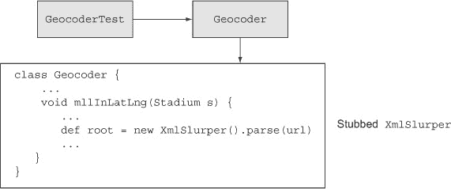

我想让`slurper`的`parse`方法返回一个 DOM 树的根，这个树看起来就像谷歌地理编码器返回的那样，如果我能够访问它的话。获取这个值的最简单方法是在测试之前设置正确的 XML 树并解析它：

```
String xml = '''
<root><result><geometry>
    <location>
        <lat>37.422</lat>

        <lng>-122.083</lng>
    </location>
</geometry></result></root>'''

def correctRoot = new XmlSlurper().parseText(xml)
```

XML 字符串具有谷歌总部办公室的正确纬度和经度。为了获取正确的根值，我调用`XmlSlurper`的`parseText`方法。我的`Geocoder`类可以接受这个根并像通常一样遍历树以获取纬度和经度。

挑战是：在没有明显方法注入的情况下，我如何让我的`Geocoder`使用这个实现？解决方案是使用`StubFor`类并围绕它设置期望：

```
def stub = new StubFor(XmlSlurper)
stub.demand.parse { correctRoot }
```

`StubFor` 构造函数接受一个类引用并在其周围构建一个存根。然后我“要求”`parse`方法返回之前片段中计算出的树的根。

要让 Groovy 使用新的存根，请在`use`方法的闭包参数中调用测试：

```
stub.use {
   geocoder.fillInLatLng(stadium)
}
```

`use`闭包是关键。通过 Groovy 元编程的魔力，当在`fillInLatLng`方法内部访问`XmlSlurper`的`parse`方法时，使用的是所需版本而不是实际实现。结果是测试了`fillInLatLng`方法的业务逻辑，而不依赖于`slurper`本身。

下一个列表显示了完整的测试。为了确保绝对不使用地理编码器的在线版本，我创建了一个地址错误的体育场。测试通过的唯一方式是如果 slurper 返回了预设的值。

##### 列表 6.24\. GeocoderUnitTest.groovy: 测试地理编码器即使不在线

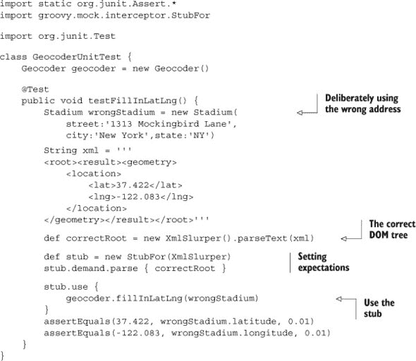

测试设置了一个地址错误的 `Stadium` 实例。使用字符串数据生成正确的 DOM 树根，并使用存根的 `demand` 属性返回它。通过在 `use` 块内执行测试，正确的答案在适当的时候提供，测试成功。

`StubFor` 和 `MockFor` API 的功能远比这里展示的要多。你可以要求每次调用方法时返回不同的预设值。你可以通过在 `StubFor` 上使用 `verify` 方法（`MockFor` 会自动这样做）来验证方法是否以正确的次数和顺序被调用。有关详细信息，请参阅 API。

`StubFor` 和 `MockFor` 类的唯一真正限制是它们只能用来替换 Groovy 实现。你不能提供一个 Java 类并让它工作。尽管如此，如果你的服务是用 Groovy 实现的，它们仍然是你的测试工具箱中的无价之宝。^([13])

> ^（13）坦白地说，我花了几天时间才弄清楚如何使用 `StubFor` 和 `MockFor`，然后做了我最初应该做的事情：在 *Groovy in Action* 中查找它们。GinA（那时它被称为；第二版是 ReGinA）在几页纸上详细介绍了，非常整洁。这就是为什么 *Groovy in Action* 仍然是我有史以来最喜欢的技术书籍。

| |
| --- |

**学习到的经验（模拟依赖项）**

> **1**. 要轻松创建接口的存根，使用闭包来实现方法。这被称为 *闭包强制转换*。
> 
> **2**. `Expando` 类没有属性或方法，但两者都可以在运行时添加以配置对象执行你想要的操作。
> 
> **3**. 在标准库中的 `StubFor` 和 `MockFor` 类可以用来创建模拟对象，即使它们在测试用例中替换了局部变量。^([14])
> 
> > ^（14）如果你在这个章节中什么都不读，那就看看这一点。

| |
| --- |

到目前为止，本章中介绍的所有技术都是基于 Groovy 标准库中的现有类。然而，有一个新的测试库在 Groovy 社区中越来越受欢迎，不仅仅是因为它有一个巧妙的名称。Spock 框架易于学习，易于使用，并且是下一节的主题。

### 6.4\. 测试的未来：Spock

与我遇到的其他任何框架相比，Spock 框架以更少的努力带来更高的生产力。花一点时间与 Spock 一起（例如，通过本节中的讨论），你就可以立即变得高效。Spock 提供了测试和强大的模拟能力，易于使用。

根据框架的开发者，^(15)，Spock 这个名字是“specification”和“mock”的结合。这可能甚至是真的。然而，似乎更有可能的是，有人只是喜欢 Spock 这个名字，其余的都是巧妙的合理化。不可避免的结果是，关于该框架的任何讨论都会导致一系列与《星际迷航》相关的双关语。我最初的计划是避免它们，但事实上这是不可能的。^(16)^(17)

> ^(15) 活跃并乐于助人的 Peter Niederweiser，他在 Spock 邮件列表上。
> 
> ^(16) 我完全赞同。
> 
> ^(17) 例如，Spock 是一个用于企业测试的*逻辑*框架。测试得好，就能繁荣昌盛。我一直是，也永远将是，你友好的测试框架。

#### 6.4.1\. 寻找 Spock

Spock 的主要网站是[`spockframework.org，`](http://spockframework.org,) 实际上重定向到[`code.google.com/p/spock/`](https://code.google.com/p/spock/)的 Google 代码项目。在那里你可以找到包含大量有用信息的维基页面。像大多数现代酷项目一样，源代码托管在 GitHub 上，网址为[`github.com/spockframework/spock.`](https://github.com/spockframework/spock。)你可以克隆存储库并手动构建，或者你可以从标准的 Maven 仓库安装发行版。

Spock 版本与 Groovy 版本相关联。Spock 的最新发布版本是 0.7-groovy-2.0。不要让低版本号让你气馁。^(18) Spock API 简单易用易懂，其采用速度非常快。^(19)

> ^(18) 当这本书印刷出版时，1.0 版本应该已经发布。
> 
> ^(19) 从版本 2.3 开始，Spock 插件将默认包含在 Grails 中。

下一个列表中的 Gradle 文件显示了构建本章源代码所需的适当依赖关系。

##### 列表 6.25\. 使用 Gradle 构建和测试 Spock

```
apply plugin: "groovy"

repositories {
    mavenCentral()
}

dependencies {
    groovy "org.codehaus.groovy:groovy-all:2.1.5
    testCompile "org.spockframework:spock-core:0.7-groovy-2.0"
}
```

Maven 中央仓库保存了 Groovy 发行版和 Spock 发布版本。依赖关系以通常的方式解码，组为“org.spockframework”，名称（或 Maven 中的工件 ID）为“spock-core”，版本号为 0.7-groovy-2.0。请注意，Spock 版本与 Groovy 版本相关联。

#### 6.4.2\. 测试得好，就能繁荣昌盛

Spock 测试都扩展了一个名为`spock.lang.Specification`的父类。除了它自己的方法外，`Specification`类还包括 JUnit 的`@RunWith`注解。结果是，Spock 测试可以在正常的 JUnit 测试基础设施中运行。

测试本身都有一种常见的格式。每个测试方法（称为*固定装置*）都使用`def`关键字声明，后面跟着一个描述测试预期完成什么的字符串。固定装置方法通常不接收任何参数。

列表 6.26 展示了一个简单的 Spock 测试，用于验证一些 `String` 的行为。按照惯例，Spock 测试用例以 `Spec` 结尾。这并不是一个要求，^([20]) 但它确实有助于使 Spock 测试易于识别，尤其是在你的系统同时使用 Spock 和 JUnit 测试时。

> ^(20) 在 Grails 中，Spock 测试确实必须以 `Spec` 结尾。

##### 列表 6.26\. 一个验证基本 `java.lang.String` 行为的规范

```
import spock.lang.Specification;

class StringSpec extends Specification {
    String llap

    def setup() { llap = "Live Long and Prosper" }

    def "LLaP has 21 characters"() {
        expect: llap.*size*() == 21
    }

    def "LLaP has 4 words"() {
        expect: llap.split(/*\W/*).size() == 4
    }

    def "LLaP has 6 vowels"() {
        expect: llap.*findAll*(/*[aeiou]*/).size() == 6
    }
}
```

该类扩展了 `spock.lang.Specification`，这使得它成为一个 Spock 测试。该规范正在测试一个 `String`，因此它有一个名为 `llap` 的属性。在 `setup` 方法中，`llap` 变量被赋值为字符串 “Live Long and Prosper。” `setup` 方法在每次测试之前运行，类似于 JUnit 4 中的 `@Before`。JUnit 3 包含一个名为 `setUp` 的方法，它执行相同的功能，但在 Spock 中，`setup` 方法以小写形式编写，并使用 `def` 关键字。

测试方法，在 Spock 文档中被称为特性方法，是以块结构编写的。在下面显示的每个测试方法中，都有一个名为 `expect` 的单个块。`expect` 块由一系列布尔表达式组成，每个表达式都必须评估为真，测试才能通过。

这三个示例测试检查（1）测试字符串中的字符数；（2）基于在非单词边界处拆分字符串，测试字符串中有四个单词；（3）测试字符串总共有六个元音，再次基于正则表达式。

与 JUnit 4 类似，Spock 测试可以验证是否抛出了异常。Spock 测试还可以验证没有抛出异常。考虑以下两个测试，它们被添加到之前的列表中：

```
def "Access inside the string doesn't throw an exception"() {
    when: s.charAt(s.size() – 1)
    then: notThrown(IndexOutOfBoundsException)
}

def "Access beyond the end of the string throws exception"() {
    when: s.charAt(s.size() + 1)
    then: thrown(IndexOutOfBoundsException)
}
```

这些测试使用 `when`/`then` 块，这些块用作刺激/响应对。`when` 块中可以添加任何代码，但 `then` 块必须由布尔表达式组成，就像 `expect` 一样。这些表达式会自动使用 Groovy 真值进行评估。这意味着非空引用、非空字符串和非零数字都会评估为真。

`String` 类中的 `charAt` 方法如果其参数是负数或者超出了字符串的末尾，将会抛出一个异常。前两个测试展示了这两种情况，使用了 `thrown()` 和 `notThrown()` 方法。如果你想进一步处理异常，可以使用 `thrown` 方法返回异常，语法上有两种变体。

```
Exception e = thrown()
```

或者

```
e = thrown(Exception)
```

其中 `Exception` 可以是任何特定的异常类。

考虑以下测试，它还介绍了极其有用的 `old` 方法。

##### 列表 6.27\. 另一个示例，展示了 `old` 方法

```
class QuoteSpec extends Specification {
    String quote = """I am endeavoring, ma'am, to construct a
        mnemonic memory circuit, using stone knives and bear skins."""

    List<String> strings

    def setup() { strings = quote.*tokenize*(" ,.") }

   def "test string has 16 words"() {
        expect: strings.size() == 16
    }

    def "adding a word increases total by 1"() {
        when: strings << 'Fascinating'
        then: strings.size() == old(strings.size()) + 1
    }
}
```

`tokenize` 方法接受一组分隔符作为参数，并在这些位置分割字符串。结果是单词的 `ArrayList`。这已经很有趣了，但酷的部分在于测试中向列表添加新单词的部分。在这种情况下，列表的大小被评估了两次，一次是在 `when` 块执行之前，一次是在之后。表达式显示，之后的结果是之前的结果加上一。

#### 6.4.3\. 数据驱动规范

Spock 测试除了在其他测试框架中出现的特性外，还有一个额外的特性：数据驱动的^([21])规范。其理念是，如果你以 Groovy 可以迭代的格式提供一组数据，那么测试将运行每个条目通过任何提供的布尔条件。

> ²¹ 数据应该在 Android 上运行吗？（是的，那特别糟糕。抱歉。）

这比描述更容易展示。考虑 Spock 网站主页上显示的测试，在下一个列表中重复。它使用数据表中的名称输入到 `expect` 中，使用三个不同的数据源。

##### 列表 6.28\. 数据驱动 Spock 测试

```
class HelloSpock extends spock.lang.Specification {
    @Unroll
    def "#name should be #length"() {
        expect:
        name.size() == length

        where:
        name     | length
        "Spock"  | 5
        "Kirk"   | 4
        "Scotty" | 6
        'McCoy'  | 5
    }

    def "check lengths using arrays"() {
        expect: name.size() == length

        where:
        name << ["Spock","Kirk","Scotty"]
        length << [5,4,6]
    }
    def "check lengths using pairs"() {
        expect: name.size() == length
        where:
        [name,length] << [["Spock",5],["Kirk",4],["Scotty",6]]
    }
}
```

第一个测试中的 `where` 块包含一个数据表。列名（`name` 和 `length`）是变量，在 `expect` 块中引用。Groovy 会评估表中的每一行，并评估 `expect` 条件。这是一个易于理解且功能强大的优雅系统。虽然数据表是一个强大的结构，但实际上 Groovy 知道的任何可迭代的集合都可以工作。

第二个和第三个测试说明了相同的过程，但通过集合提供数据。第二个测试使用单独的列表来存储 `name` 和 `length` 的值。这意味着要理解测试数据，你必须匹配集合的索引。例如，“Spock”对应 5，“Kirk”对应 4，依此类推。第三个测试更容易可视化，因为数据被组织成有序对。你使用哪种机制（数据表、有序对集合、单个集合等）纯粹是一个风格问题。

Spock 的另一个有趣的部分是 `@Unroll` 注解。没有它，测试输出中列出的名称将是测试本身的名称。有了它，`where` 块的每一行都会创建一个不同的名称。

图 6.5 展示了在 Groovy 和 Grails 工具套件（这仅仅是 Eclipse 加上许多插件）中执行此测试的结果，作为一个 JUnit 测试。除了演示 Spock 测试与现有的 JUnit 基础设施一起运行外，测试还显示了使用 `@Unroll` 注解产生的输出差异。第二个和第三个测试使用方法名作为它们的输出。标记有 `@Unroll` 的第一个测试出现在“未根测试”下，其中每个测试都根据测试数据获得其唯一的名称。

##### 图 6.5。Spock 数据驱动测试的结果。带有`@Unroll`注解的测试在 Eclipse 输出中显示为“未根植”，显示针对每组数据的不同输出消息。

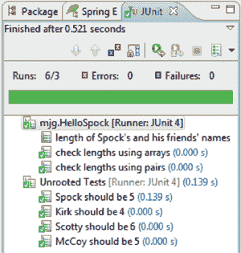

如果你打算测试的类有依赖关系怎么办？这些依赖关系需要像之前讨论的那样进行存根或模拟。幸运的是，Spock 内置了自己的模拟能力。

#### 6.4.4。三文鱼的问题

Spock 中的`Specification`类包含一个名为`Mock`的方法，用于创建模拟对象。如果你的依赖基于接口，`Mock`方法可以直接生成模拟对象，使用 Java 的动态代理机制。如果是类，`Mock`将使用 CGLIB 库扩展该类。

是时候举一个相对简单（而且相对愚蠢）的例子了。三文鱼是一种小型、毛茸茸的动物，繁殖力强，喜欢伏尔甘人，讨厌克林贡人。下面是一个用 Groovy 编写的`Tribble`类。

> ^(22) 有关详细信息，请参阅[`en.wikipedia.org/wiki/The_Trouble_With_Tribbles`](http://en.wikipedia.org/wiki/The_Trouble_With_Tribbles)，除非你还没有看过那个特定的*星际迷航*（原版系列）剧集。35 年（！）后仍然非常出色。

##### 列表 6.29。Groovy 中的`Tribble`类

```
class Tribble {

    String react(Vulcan vulcan) {
        vulcan.soothe()
        "purr, purr"
    }

    String react(Klingon klingon) {
        klingon.annoy()
        "wheep! wheep!"
    }

    def feed() {
        def tribbles = [this]
        10.*times* { tribbles << new Tribble() }
        return tribbles
    }

}
```

给三文鱼喂食会得到什么？不是胖三文鱼，而是一大群饥饿的小三文鱼。`feed`方法返回一个包含原始三文鱼加上 10 个更多三文鱼的列表。

重载的`react`方法接受伏尔甘人或克林贡人作为参数。如果是伏尔甘人，三文鱼会安抚伏尔甘人并满意地咕噜。如果是克林贡人，三文鱼会惹恼克林贡人并做出不良反应。`Tribble`类依赖于`Vulcan`和`Klingon`。

为了保持简单，`Vulcan`和`Klingon`都是接口。这里显示了`Vulcan`接口：

```
interface Vulcan {
    def soothe()
    def decideIfLogical()
}
```

伏尔甘人有一种被称为“安抚”的方法，由三文鱼触发，还有一种`decideIfLogical`方法，这个方法对这个测试来说并不必要。顺便说一句，实现存根的一个问题是你必须实现所有接口方法，即使这些方法与所讨论的测试无关。

克林贡人有点不同：

```
interface Klingon {
    def annoy()
    def fight()
    def howlAtDeath()
}
```

三文鱼会“惹恼”克林贡人。克林贡人也会“战斗”和`howlAtDeath`，^(23) 这两个方法在这里并不需要。为了测试`Tribble`类，我需要为`Vulcan`和`Klingon`类创建模拟对象，适当地设置它们的期望，并测试三文鱼在每种情况下的行为是否适当。

> ^(23) 在*星际迷航：下一代*中，克林贡人在死亡时会嚎叫。据我所知，在原版系列中他们并没有这样做。

让我逐个展示测试。首先我会检查`feed`方法是否正常工作：

```
def "feed a tribble, get more tribbles"() {
    when:
    def result = tribble.feed()

    then:
    result.size() == 11
    result.*every* {
        it instanceof Tribble
    }
}
```

`when`块调用`feed`方法。`then`块检查返回的集合中有 11 个元素，并且每个元素都是三文鱼。这个测试没有什么新奇的或不同寻常的地方。然而，当进行对 Vulcans 的反应测试时，我需要模拟`Vulcan`接口.^([24])

> (24) 当我模拟一个 Vulcans 时，我感觉像麦克医生。

```
def "reacts well to Vulcans"() {
    Vulcan spock = Mock()

    when:
    String reaction = tribble.react(spock)

    then:
    reaction == "purr, purr"
    1*spock.soothe()
}
```

在 Spock 中使用`Mock`方法有两种方式。第一种如下所示：实例化类，并将其分配给适当类型的变量。该方法将实现声明类型的接口。第二种方式是将接口类型作为`Mock`方法的参数，这里没有展示。

一旦创建了模拟，`when`块使用模拟作为`react`方法的参数。在`then`块中，首先检查适当的反应，然后是有趣的部分。最后一行表示只有当在模拟上恰好调用一次`soothe`方法时，测试才通过，忽略任何返回值。

这是一个非常灵活的系统。基数可以是任何东西，包括使用下划线作为通配符（例如，`(3.._)`表示三次或更多）。

接下来是`Klingon`接口，以下测试进行了多项检查：

```
def "reacts badly to Klingons"() {
    Klingon koloth = Mock()

    when:
    String reaction = tribble.react(koloth)

    then:
    1 * koloth.annoy() >> {
        throw new Exception()
    }
    0 * koloth.howlAtDeath()
    reaction == null
    Exception e = thrown()
}
```

在模拟了`克林贡人`^([25])并调用了`react`方法之后，`then`块首先检查模拟上的`annoy`方法是否恰好被调用一次，并使用右移运算符通过抛出异常来实现该方法。下一行检查`howlAtDeath`方法根本未被调用。因为`annoy`方法抛出了异常，所以没有返回反应。最后一行验证确实抛出了预期的异常。

> (25) 你如何模拟一个克林贡人？来自遥远的星系（rimshot）。

理念是即使模拟被配置为抛出异常，三文鱼测试仍然可以通过。测试验证了异常被抛出，而没有使测试本身失败。

#### 6.4.5. 其他 Spock 功能

到目前为止展示的功能可能为 Spock 提供了一个预告。Spock 还有更多功能超出了本章的范围。例如，测试上的`@Ignore`注解会跳过该测试，但还有一个`@IgnoreRest`注解会跳过所有其他测试。`@IgnoreIf`注解检查一个布尔条件，如果条件评估为真则跳过测试。还有一个`@Stepwise`注解用于必须按特定顺序执行的测试，以及一个`@Timeout`注解用于执行时间过长的测试。


**从 Spock 中学到的经验**

> **1**. `Spock`测试扩展`spock.lang.Specification`
> 
> **2**. `Specification`类有一个 JUnit 运行器，因此 Spock 测试可以在你的现有 JUnit 基础设施中运行。
> 
> **3**. `Spock`测试名称是描述性句子。框架使用 AST 转换将它们转换为合法的 Groovy。
> 
> **4**.  测试由块组成，如 `expect` 或 `when/then`。`expect` 或 `then` 块中的表达式会自动评估 Groovy 的真理。
> 
> **5**.  `spock.lang.Specification` 中的 `old` 方法在执行 `when` 块之前评估其参数。
> 
> **6**.  `where` 块用于遍历测试数据，这些数据可以来自表格、数据库结果或 Groovy 可以遍历的任何数据结构。
> 
> **7**.  Spock 拥有内置的模拟能力。


Spock 的 wiki 包含许多示例，以及关于模拟细节（称为*交互*）的详细文档和更多内容。源代码还附带了一个 Spock 示例项目，你可以将其作为你项目的起点。Spock 是用 Gradle 构建的，它配置了所有依赖项，并且可以连接到其他 API，如 Spring。有关详细信息，请参阅文档和 API。^(26))

> ^([26] 见 Manning 出版的《Spock in Action》，作者 Ken Sipe，即将上市。)

### 6.5\. 摘要

本章在测试领域覆盖了大量的内容。Groovy 引入了一个简单的 `assert` 语句，它可以用于脚本，并包括扩展 JUnit 功能的 `GroovyTestCase` 类。在管理依赖项方面，你可以使用闭包构建接口的存根实现，也可以使用 `Expando` 类构建更完整的存根。

Groovy 还提供了 `StubFor` 和 `MockFor` 类，它们可以用于测试交互。它们甚至可以为作为局部变量实例化的类创建模拟对象，这相当令人印象深刻。

最后，如果你愿意添加额外的库，Spock 测试框架提供了一个简单而灵活的 API，它仍然运行在你的现有基于 JUnit 的基础设施上。它还拥有自己的模拟能力，并与其他库，如 Spring 和 Tapestry 集成。

添加 Groovy 也为测试 Java 和混合 Java/Groovy 项目提供了广泛的选择。希望本章中的技术能帮助你决定在哪里从中获得最大的收益。
