## 第三部分。现实世界中的 Groovy

在第三部分，“现实世界中的 Groovy”，我试图解决 Java 开发者经常面临的一些挑战。

我从 Spring 框架开始，这可能是 Java 世界中应用最广泛的开源项目。Spring 和 Groovy 是老朋友，它们配合得非常完美。第七章展示了如何在系统的任何地方使用 Groovy 类作为 Spring bean，包括方面。然后展示了 Spring 针对动态语言的独特功能，如可刷新的 bean、内联脚本 bean 和来自 Grails 的`BeanBuilder`类。

第八章涵盖了 Groovy 与持久存储的交互。Groovy 包含一个非常有用的 JDBC 封装，称为`groovy.sql.Sql`类，当与关系型数据库一起工作时非常有效。本章还提供了一个使用 GMongo 项目的示例，这是一个围绕 Java API 的 Groovy 包装器，用于与 MongoDB 一起工作。这是一个典型的 Groovy 惯用语——将 Java 库变得更容易使用。最后，本章讨论了许多与 GORM 相关的问题，GORM 是 Grails 的面向对象关系映射层，可能是目前 Groovy 中应用最广泛的领域特定语言。

第九章专注于 RESTful Web 服务，重点在于 JAX-RS 2.0 规范。大多数 JAX-RS 功能在 Groovy 和 Java 下操作方式相同，但提供了示例来展示如何处理超媒体应用程序。

本节最后一章是关于 Web 应用程序开发的。在第十章(Chapter 10)中，我从一个使用分类的 Groovy 元编程的好例子开始，具体来说，`ServletCategory`类被作为一个使用 Groovy 快速轻松完成工作的例子。接下来是关于 groovlets 的讨论，这些是通过 servlet 执行的 Groovy 脚本，使得运行简单的应用程序变得容易。本章最后展示了 Grails 框架作为 Groovy DSLs 的美丽组合，这些 DSLs 结合并配置基于 Spring/Hibernate 的 Web 应用程序。

## 第七章。Spring 框架

*本章涵盖*

+   在 Spring 应用程序中使用 Groovy 类

+   可刷新的 bean

+   内联脚本 bean

+   Grails 的`BeanBuilder`类

+   使用 Groovy 类进行 Spring AOP

在 Java 框架中，Spring 是最成功的之一。Spring 将依赖注入、复杂对象生命周期管理和 POJO 的声明式服务等理念带到了 Java 开发的 forefront。几乎很少有项目不考虑充分利用 Spring 所提供的一切，包括其库中包含的众多 Spring“bean”。Spring 几乎触及了企业 Java 开发的各个方面，在大多数情况下，它极大地简化了这些方面。

在本章中，我将探讨 Groovy 如何与 Spring 框架交互。实际上，Groovy 和 Spring 是老朋友。Spring 管理 Groovy bean 就像它处理 Java bean 一样容易。Spring 包括与动态语言代码交互的特殊功能，我将在下面进行回顾。

Groovy 可以用来实现 bean 或配置它们。在本章中，我将尝试回顾 Groovy 如何帮助 Spring 的所有方式。图 7.1 包含本章讨论的技术指南。

##### 图 7.1\. 使用 Groovy 的 Spring 技术指南。Spring 管理 POGO 就像管理 POJO 一样容易，所以示例包括正常 bean 和方面的 Groovy 实现。在`JdbcTemplate`中，使用闭包强制转换实现`RowMapper`接口。可刷新的 bean 是可以在运行时修改的 Groovy 源文件。内联脚本 bean 包含在 XML 配置文件中。Grails 提供了一个`BeanBuilder`类来配置 bean。最后，Spock 有一个库，允许它与 Spring 的测试上下文功能一起使用。

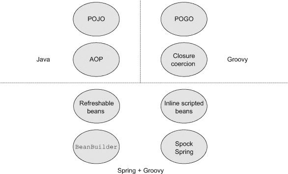

为了展示 Groovy 如何帮助 Spring，我需要回顾 Spring 是什么，以及它是如何被使用和配置的。我将从一个简单但非平凡的示例应用开始。而不是展示所有组件（这些组件在本书的源代码库中），我将突出整体架构和 Groovy 部分。

### 7.1\. 一个 Spring 应用

尽管 Spring 有诸多好处，但它对于不熟悉它的开发者来说是一个难以展示的框架。Spring 中的“Hello, World”应用会让你质疑为什么你想要它，因为它用几行额外的代码和大约 20 行 XML 替换了几个简单、易于理解、强类型的 Java 代码行。这并不完全是一个响亮的推荐。

要真正看到 Spring 的价值，你必须看到实际的应用，即使它在各种方式上被简化了。以下的应用模型了一个账户管理应用的服务和持久层。表示层是任意的，所以以下代码可以用于客户端或服务器端应用。在这种情况下，我将通过单元测试和集成测试来演示其功能。


##### Java 和 Groovy Spring Beans

与其他章节中在 Java 中构建整个应用然后转换为 Groovy 不同，为了节省空间，这个应用混合了两种语言。重点是 Spring 管理的 bean 可以用 Java 或 Groovy 实现，哪种更方便就用哪种。


考虑一个管理银行账户的应用。我将有一个代表账户的单个实体类，它只有`id`和`balance`，以及`deposit`和`withdraw`方法。

下面的列表显示了 Groovy 中的`Account`类，它比其 Java 对应物有明显的优势：它使得与`java.math.BigDecimal`一起工作变得容易。

##### 列表 7.1\. 使用`BigDecimal`的 Groovy `Account` POGO

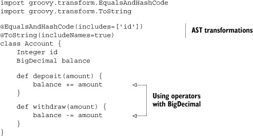

财务计算是我们需要 `java.math.BigDecimal` 和 `java.math.BigInteger` 的原因之一。使用 `BigDecimal` 可以防止舍入误差进入账户，随着时间的积累，这些误差可能会累积起来.^([1]) 很容易展示舍入误差如何迅速变成问题。考虑以下两行代码：

> ¹ 如果你还没有看过 *Office Space* ([`mng.bz/c6o8`](http://mng.bz/c6o8))，你面前有一份真正的美味。

```
println 2.0d – 1.1d
println 2.0 – 1.1
```

第一行使用双精度浮点数，而第二行使用 `java.math.BigDecimal`。第一行计算结果为 0.8999999999999999，而第二行计算结果为 0.9。在 `double` 的情况下，我仅仅进行了一次计算，就已经有足够的误差显示出来。

在 Java 中编码时，使用 `BigDecimal` 是尴尬的，因为它是一个类而不是原始类型。这意味着你不能使用你正常的 +, *, - 操作符，而必须使用类的 API。

然而，由于 Groovy 具有操作符重载，因此这些都不必要。我可以简单地声明余额为 `BigDecimal`，然后其他所有事情都正常工作，即使我使用 Java 的 `Account` 类。

关于 `Account` 的一个额外说明：目前没有应用约束来确保余额保持正值。这只是为了说明目的，尽可能简单。

使用 `Account` 类的整体设计如图 7.2 所示。这是一种非常简单的分层架构形式，服务层提供事务支持，持久层由一个接口和一个 DAO 类组成，将在稍后讨论。

##### 图 7.2\. 一个简单的账户管理应用程序。事务在服务层中定义。持久层由一个实现接口并使用 Spring *JdbcTemplate* 访问嵌入式数据库的单个 DAO 类组成。

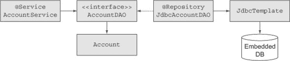

持久层遵循正常的 Data Access Object 设计模式。下面的列表显示了一个名为 `AccountDAO` 的 Java 接口，用 Java 编写。

##### 列表 7.2\. `AccountDAO` 接口，Java 编写

```
package mjg.spring.dao;

import java.util.List;

import mjg.spring.entities.Account;

public interface AccountDAO {
    int createAccount(double initialBalance);
    Account findAccountById(int id);
    List<Account> findAllAccounts();
    void updateAccount(Account account);
    void deleteAccount(int id);
}
```

该接口包含将 `Account` 对象传输到数据库和返回的典型方法。有一个创建新账户、更新账户和删除账户的方法；一个通过 `id` 查找账户的方法；以及一个返回所有账户的方法。

使用名为 `JdbcAccountDAO` 的 Groovy 类实现接口，与 Spring 的 `JdbcTemplate` 一起工作。而不是展示整个类（可在书籍源代码中找到），让我只展示结构，然后之后强调 Groovy 方面。类的概要如下所示。

##### 列表 7.3\. 使用 `JdbcTemplate` 实现 `AccountDAO`，Groovy 编写

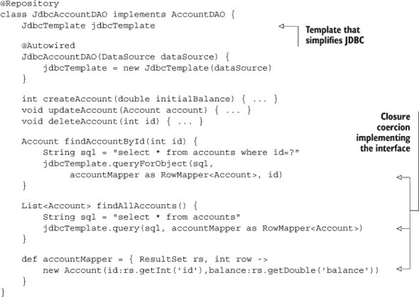

各种 `查询` 方法接受一个类型为 `RowMapper<T>` 的参数，其定义如下

```
public interface RowMapper<T> {
    T mapRow(ResultSet rs, int rowNum) throws SQLException
}
```

当你在`JdbcTemplate`中执行`query`方法之一时，Spring 会获取`ResultSet`并将每一行通过`RowMapper`接口的实现传递。`mapRow`方法的任务是将该行转换为域类的实例。正常的 Java 实现可能是创建一个名为`AccountMapper`的内部类，其`mapRow`方法会从`ResultSet`行中提取数据并将其转换为`Account`实例。将`AccountMapper`类的实例提供给`queryForObject`方法后，将返回一个单独的`Account`。相同的实例也可以提供给`query`方法，该方法然后返回`Account`的集合。

这正是第六章中展示的闭包强制转换的类型。定义了一个名为`accountMapper`的变量，并将其分配给一个与所需的`mapRow`方法具有相同参数的闭包。然后，该变量在`findAccountById`和`findAllAccounts`方法中都被使用。

这里有两个使用 Groovy 的地方：

> **1**. 一个 Groovy 类实现了 Java 接口，这使得集成变得容易并简化了代码。
> 
> **2**. 闭包强制转换消除了预期的内部类。

在书中源代码的示例中，我还包括了图 7.2 中引用的服务类。它使用 Spring 的`@Transactional`注解来确保每个方法都在所需的交易中操作。它本身并没有 Groovy 的特性，所以在这里我将只展示下一个列表中实现的概要。

##### 列表 7.4\. Java 中`AccountService`类的一部分

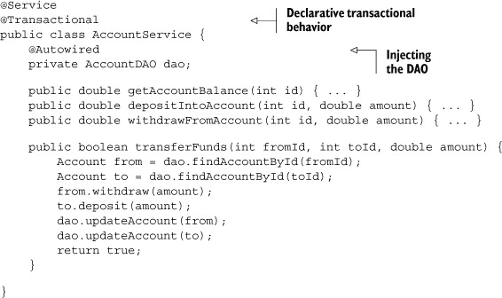

`@Autowired`注解由 Spring 用于将实现`AccountDAO`接口的类的实例（*注入*）到服务类中。有关自动装配的更多详细信息，请参阅 Spring 文档^([2])。

> ² [`mng.bz/m9M3`](http://mng.bz/m9M3)

服务实现主要在 Java 中，因为没有在 Groovy 中实现它的明显优势，尽管我可以轻松地做到这一点。

拼图中的最后一部分是 Spring 的 bean 配置文件。书中源代码中的配置使用 XML 和组件扫描的组合来配置存储库和服务类。同样，其中没有任何内容使用 Groovy，所以在这里不会展示。记录在案，该示例使用 Spring 的`<embedded-database>`标签在内存中设置一个示例 H2 数据库，每次运行都会重新初始化。其余部分如描述所述。

现在回到 Groovy，我想展示下一个列表中的 Gradle 构建文件。

##### 列表 7.5\. 账户应用的 Gradle 构建文件

```
apply plugin:'groovy'
apply plugin:'eclipse'

repositories {
    mavenCentral()
}

def springVersion = '3.2.2.RELEASE'
def spockVersion = '0.7-groovy-2.0'

dependencies {
    compile "org.codehaus.groovy:groovy-all:2.1.5"
    compile "org.springframework:spring-context:$springVersion"
    compile "org.springframework:spring-jdbc:$springVersion"
    runtime "com.h2database:h2:1.3.172"
    runtime "cglib:cglib:2.2"

    testCompile "org.springframework:spring-test:$springVersion"
    testCompile "org.spockframework:spock-core:$spockVersion"
    testCompile "org.spockframework:spock-spring:$spockVersion"
}
```

构建文件是本书迄今为止介绍的项目中典型的。它声明了 Groovy 和 Eclipse 插件。它使用 Maven central 作为仓库。依赖项包括 Groovy 和 Spock，如常。通过声明 `spring-context` 和 `spring-jdbc` 依赖项添加了 Spring。这些依赖项最终添加了几个其他与 Spring 相关的 JAR 文件。`h2database` 依赖项用于嵌入式数据库所需的 H2 驱动程序。

一个有趣的补充是 `spock-spring` 依赖项。Spring 包含一个基于 JUnit 的强大测试框架，它自动缓存 Spring 应用程序上下文。`spock-spring` 依赖项允许 Spock 测试与 Spring 测试上下文一起工作。

第一个测试类是对 `JdbcAccountDAO` 的 Spock 测试。以下列表显示了完整测试集的一些测试。

##### 列表 7.6\. `JdbcAccountDAO` 实现的 Spock 测试

```
import spock.lang.Specification;

@ContextConfiguration("classpath:applicationContext.xml")
@Transactional
class JdbcAccountDAOSpec extends Specification {
    @Autowired
    JdbcAccountDAO dao

    def "dao is injected properly"() {
        expect: dao
    }

    def "find 3 accounts in sample db"() {
        expect: dao.findAllAccounts().size() == 3
    }

    def "find account 0 by id"() {
        when:
        Account account = dao.findAccountById(0)

        then:
        account.id == 0
        account.balance == 100.0
    }
    // tests for other methods as well
}
```

`@ContextConfiguration` 注解告诉测试运行器如何找到 Spring bean 配置文件。添加 `@Transactional` 表示每个测试都在一个必需的事务中运行，在每个测试结束时自动回滚（这部分很酷），意味着数据库在每个测试开始时重新初始化。DAO 自动注入到测试类中。各个测试检查 DAO 中的所有方法是否按预期工作。

以下列表显示了服务类的测试，其中包括使用 第六章 中描述的 Spock 的 `old` 方法进行测试。

##### 列表 7.7\. 服务类的 Spock 测试

```
import spock.lang.Specification

@ContextConfiguration("classpath:applicationContext.xml")
@Transactional
class AccountServiceSpec extends Specification {
    @Autowired
    AccountService service

    def "balance of test account is 100"() {
        expect: service.getAccountBalance(0) == 100.0
    }
    // ... other tests as necessary ...

    def "transfer funds works"() {
        when:
        service.transferFunds(0,1,25.0)

        then:
        service.getAccountBalance(0) ==
            old(service.getAccountBalance(0)) - 25.0
        service.getAccountBalance(1) ==
            old(service.getAccountBalance(1)) + 25.0
    }
}
```

与之前一样，注解允许 Spock 测试与 Spring 的测试框架一起工作，该框架缓存应用程序上下文。我使用了 Spock 的 `old` 操作来检查存款或取款后的账户余额变化。使用 Spock 与 Spring 测试上下文不需要其他添加。

尽管这个应用程序很简单，但它展示了 Spring 的许多功能，从声明式事务管理到自动装配，再到简化 JDBC 编码，再到有效的测试。从 Spring 的角度来看，Groovy bean 只是另一种名称的字节码。只要 groovy-all JAR 文件在类路径中，Spring 就非常乐意使用用 Groovy 编写的 bean。

Spring 管理 Groovy 中的 bean 和管理 Java 中的 bean 一样容易。尽管如此，Spring 为动态语言提供的 bean 也具有一些特殊功能。我将在下一节中展示这些功能，从可以在运行系统中修改的 bean 开始。

### 7.2\. 可刷新的 bean

自 2.0 版本以来，Spring 为 Groovy 等动态语言提供了特殊功能。一个特别有趣、但可能危险的选项是部署所谓的 *可刷新* bean。

对于可刷新的 bean，而不是像往常一样编译类，你需要部署实际的源代码，并告诉 Spring 在哪里可以找到它以及多久检查一次是否有变化。Spring 在每个刷新间隔结束时检查源代码，如果文件已被修改，它将重新加载 bean。这给了你在系统仍在运行时更改已部署类的机会.^([3])

> ³ 是的，这也让我感到害怕。蜘蛛侠的推论也适用：能力越大，责任越大。

我将演示一个稍微有些牵强但希望有趣的例子。在前一节中，我介绍了一个用于管理账户的应用程序。现在，让我假设账户管理员，可能是一种银行，决定进入抵押贷款业务。我现在需要一个代表抵押贷款申请的类，客户会提交这个申请以供批准。我还需要一个抵押贷款评估器，我将在 Java 和 Groovy 中实现它。整个系统如图 7.3 所示。图 7.3。

##### 图 7.3\. `GroovyEvaluator`是一个可刷新的 bean。源代码已部署，Spring 在每个刷新间隔后检查其变化。如果它已更改，Spring 将重新加载 bean。

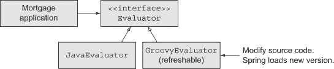

为了使这个例子简单，抵押贷款申请类只包含代表贷款金额、利率和所需年数的字段，如下一列表所示。

##### 列表 7.8\. Groovy 中的简单抵押贷款申请类

```
class MortgageApplication {
    BigDecimal amount
    BigDecimal rate
    int years
}
```

如前所述，使用 Groovy 只是为了减少代码量，并使其更容易处理`BigDecimal`实例。这个类的实例被提交给银行，银行会运行它通过抵押贷款评估器来决定是否批准它。以下列表显示了一个代表评估器的 Java 接口，它将在 Java 和 Groovy 中实现。

##### 列表 7.9\. Java 中的`Evaluator`接口

```
public interface Evaluator {
    boolean approve(MortgageApplication application);
}
```

接口只包含一个方法，`approve`，它接受一个抵押贷款申请作为参数，如果申请被批准则返回`true`，否则返回`false`。

假设现在是 2008 年的夏天。公众对像*信用违约掉期*这样的术语一无所知，而银行则急于尽可能多地贷款给尽可能多的人。换句话说，这里是一个`Evaluator`接口的 Java 实现。

##### 列表 7.10\. 一个相当宽容的 Java 评估器

```
public class JavaEvaluator implements Evaluator {
    public boolean approve(MortgageApplication application) {
        return true;
    }
}
```

这是一个非常宽容的贷款政策，但如果每个人都这样做，可能会出什么问题？

当然，出了问题的是，在 2008 年夏末和秋初，贝尔斯登崩溃，雷曼兄弟破产，美国经济几乎崩溃。银行需要尽快止血。如果现有的评估器是刚刚显示的 Java 评估器，那么系统必须停机以便修改。担心的是，如果系统离线，客户可能会担心它永远不会再回来.^([4])

> ⁴ 这是一个《美好人生》的引用：“乔治，如果你关上这些门，你就再也打不开它们了！”

然而，还有一种可能性。考虑一下贷款评估器的 Groovy 版本，其行为与 Java 版本等效，如下所示。

##### 列表 7.11\. 作为源代码部署的 Groovy 贷款评估器

```
class GroovyEvaluator implements Evaluator {
    boolean approve(MortgageApplication application) { true }
}
```

再次，它简单地返回 `true`，就像 Java 版本一样。然而，这次我不想编译这个类并像往常一样部署它，而是想创建一个可刷新的 bean。为此，我需要在 Spring 配置文件中的 `lang` 命名空间中工作（假设我正在使用 XML；对于 Java 配置文件也有其他选择）。我还需要部署源代码本身，而不是该文件的编译版本。

| |
| --- |

##### 部署源代码

注意，对于可刷新的 bean，你需要部署源代码，而不是编译后的 bean。

| |
| --- |

下一个列表显示了包含两个评估器的 bean 配置文件。注意添加了 `lang` 命名空间和 Groovy bean。

##### 列表 7.12\. 包含可刷新 Groovy 评估器 bean 的 bean 配置文件

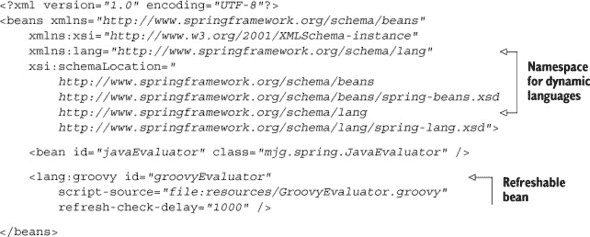

Groovy 为动态语言（包括 Groovy、BeanShell 和 JRuby）的 bean 提供了一个命名空间。该命名空间中声明的一个元素是 `<lang: groovy>`，其 `script-source` 属性用于指向 Groovy 类的源代码。注意，与同一文件中的 Java 评估器 bean 不同，此属性指向实际的源文件，而不是编译后的 bean。对于该元素来说，另一个重要的属性是 `refresh-check-delay`，它表示 Spring 在多长时间（以毫秒为单位）后检查源文件是否已更改。这里延迟已设置为 1 秒。

现在是好玩的部分.^([5]) 下一个列表显示了一个演示应用程序，该应用程序加载 Groovy 评估器 bean 并调用 `approve` 方法 10 次，每次调用之间暂停 1 秒。

> ⁵ 严肃地说。这是一个在观众面前做的有趣演示。试试看。

##### 列表 7.13\. 加载 Groovy bean 并调用 `approve` 方法 10 次的演示应用程序

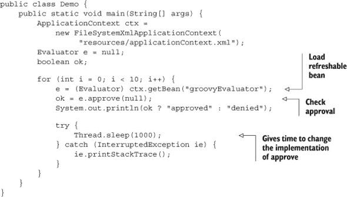

理念是启动演示程序，然后在迭代进行的同时，编辑源代码以将 `approve` 方法的返回值从 `true` 更改为 `false`。^([6]) 程序的输出类似于

> ⁶ 你注意到审批方法被一个 null 参数调用，承认抵押贷款申请根本无关紧要吗？这是玩笑的一部分，所以当你这样做的时候，一定要笑一笑。

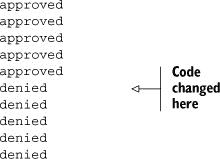

在循环中途更改源代码以阻止出血。如果国会随后迅速采取行动并授予巨额政府救助金，则可以将其改回.^([8])

> ⁷ 哎呀。是的，这是一个糟糕的双关语，但却是无法抗拒的。
> 
> ⁸ 或者不。

在运行系统中更改 bean 的实现能力非常强大，但显然也很危险。Spring 只将其提供给像 Groovy 这样的动态语言 bean。


**可刷新 bean 的真实用例**

尽管本节中展示的银行应用程序很有趣，但很少有公司会允许你在系统运行时将源代码部署到生产环境中并进行编辑。那么你实际上会在什么时候使用这个功能呢？

一些问题只有在系统负载下才会出现。想象一下，一个可刷新的 bean 就像是一个可适应的探测器，可以被服务器端开发者以受控的方式插入到基于 Spring 的系统。你不仅可以改变日志级别或其他属性（原则上你可以使用 JMX，Java 管理扩展来实现），你还可以实时改变探测器的行为并诊断实际发生的情况。

Dierk Koenig，*Groovy in Action*（Manning，2007）的主要作者，称这种模式为“钥匙孔手术”。当不知道进入时会发现什么时，它被用作一种微创手术.^([9])

> ⁹ 查看 Dierk 的演示文稿“Seven Groovy Usage Patterns for Java Developers”在[www.slideshare.net](http://www.slideshare.net)上以获取更多详细信息。


在讨论其他仅限于动态语言 bean 的 Spring 能力，即内联脚本 bean 之前，让我先介绍另一个想法。Spring 的伟大之处之一是它提供了一个方便的基础设施来支持面向切面编程。我想讨论这意味着什么以及如何使用 Groovy 来实现一个切面。

### 7.3\. 使用 Groovy bean 的 Spring AOP

Spring 的许多功能都是使用面向切面编程（AOP）实现的。Spring 提供了开发切面的基础设施。有趣的是，切面可以用 Groovy 和 Java 一样容易地编写。

AOP 是一个很大的主题，但在这里我可以总结一些关键特性。切面被设计来处理*横切关注点*，这些是适用于许多不同位置的功能。横切关注点的例子包括日志记录、安全和事务。每个都需要在系统的多个位置应用，这会导致相当多的重复，以及同一功能中不同类型功能的纠缠。

> ^(10) 关于 AOP 的完整讨论可以在 Ramnivas Laddad 的 *AspectJ in Action* 第二版（Manning，2009）中找到，[www.mannin10g.com/laddad2/](http://www.mannin10g.com/laddad2/)。

跨切面关注点被编写为方法，称为 *建议*。下一个问题是建议应用的位置。所有可用的建议应用位置统称为 *切入点*。给定 Aspect 的所选切入点的集合称为 *切入点集合*。建议和切入点的组合定义了 *Aspect*。

本节和下一节的示例应用如图 7.4 所示。figure 7.4。

##### 图 7.4\. Spring AOP 的实际应用。`ChangeLogger` 是一个记录每个 `set` 方法前消息的 Java Aspect。`UpdateReporter` 在 Groovy 中做同样的事情，但报告现有值。`GroovyAspect` 是在配置文件内部定义的内联脚本 Bean。

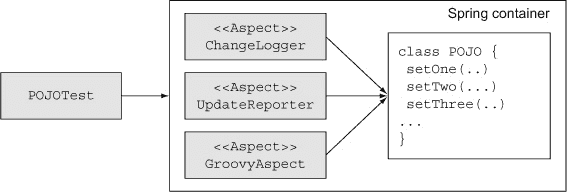

下面的列表展示了一个使用 Spring 注解编写的 Aspect 示例，该 Aspect 在每次即将调用 `set` 方法时应用，并记录被调用的方法和新的值。

##### 列表 7.14\. 一个记录属性变更的 Java Aspect

```
package mjg.aspects;

import java.util.logging.Logger;

import org.aspectj.lang.JoinPoint;
import org.aspectj.lang.annotation.Aspect;
import org.aspectj.lang.annotation.Before;

@Aspect
public class ChangeLogger {
    private Logger log = Logger.*getLogger*(
         ChangeLogger.class.getName());

    @Before("execution(void set*(*))")
    public void trackChange(JoinPoint jp) {
        String method = jp.getSignature().getName();
        Object newValue = jp.getArgs()[0];
        log.info(method + " about to change to " +
            newValue + " on " + jp.getTarget());
    }
}
```

`@Aspect` 注解告诉 Spring 这是一个 Aspect。`@Before` 注解使用 AspectJ 切入点语言定义了切入点。^(11) 这个特定的切入点应用于所有以字母 `set` 开头、接受单个参数并返回 `void` 的方法。`trackChange` 方法是建议。`JoinPoint` 参数由 Spring 在 Aspect 被调用时提供。它提供了执行上下文。在这种情况下，`JoinPoint` 提供了检索被建议方法签名、方法提供的参数和目标对象的方法。

> ^(11) AspectJ 的文档托管在 Eclipse 上，详情请见 [`www.eclipse.org/aspectj/`](http://www.eclipse.org/aspectj/)。

为了演示这个 Aspect 的实际应用，我需要配置 Spring 应用该 Aspect，并且需要一个被建议的对象。后者很容易实现。下一个列表展示了一个具有三个属性的简单类。

##### 列表 7.15\. 具有三个 `set` 方法的简单 POJO

```
package mjg;

public class POJO {
    private String one;
    private int two;
    private double three;

    public String getOne() { return one; }
    public void setOne(String one) { this.one = one; }

    public int getTwo() { return two; }
    public void setTwo(int two) { this.two = two; }

    public double getThree() { return three; }
    public void setThree(double three) { this.three = three; }

    @Override
    public String toString() {
        return "POJO [one=" + one + ", two=" + two +
             ", three=" + three + "]";
    }
}
```

这个类被称为 `POJO`，它有三个属性，分别称为 `one`、`two` 和 `three`。每个属性都有一个 getter 和一个 setter。Aspect 将在每个 `set` 方法之前运行。

与完整的 AOP 解决方案相比，Spring 的 AOP 基础设施有一些限制。Spring 限制切入点仅限于 Spring 管理的 Bean 的公共方法边界。因此，我需要在 Spring 的配置文件中添加 `POJO` Bean。我还需要告诉 Spring 识别 `@Aspect` 注解并生成所需的代理。结果 Bean 配置文件在下面的列表中展示。

##### 列表 7.16\. AOP 的 Spring Bean 配置文件

```
<?xml version=*"1.0"* encoding=*"UTF-8"*?>
<beans xmlns=*"http://www.springframework.org/schema/beans"*
    ... namespace declarations elided ... >

    <aop:aspectj-autoproxy />

    <bean id=*"tracker"* class=*"mjg.aspects.ChangeLogger"* />
    <bean id=*"pojo"* class=*"mjg.POJO"* p:one=*"1"* p:two=*"2"* p:three=*"3"*/>
</beans>
```

`aop`命名空间提供了`<aspect-autoproxy>`元素，它告诉 Spring 为所有带有`@Aspect`注解的类生成代理。`tracker`豆（bean）是之前展示的 Java 方面。`pojo`豆是刚刚讨论的`POJO`类。

现在，我需要调用`set`方法来查看方面（aspect）的实际效果。下面的列表显示了一个基于 JUnit 4 的测试用例，它使用了 Spring 的 JUnit 4 测试运行器，该运行器在测试之间缓存应用程序上下文。

##### 列表 7.17\. 一个用于测试 POJO 的 JUnit 4 测试用例

```
package mjg;

import static org.junit.Assert.*;

import org.junit.Test;
import org.junit.runner.RunWith;
import org.springframework.beans.factory.annotation.Autowired;
import org.springframework.test.context.ContextConfiguration;
import org.springframework.test.context.junit4.SpringJUnit4ClassRunner;

@ContextConfiguration("classpath:applicationContext.xml")
@RunWith(SpringJUnit4ClassRunner.class)
public class POJOTest {
    @Autowired
    private POJO pojo;

    @Test
    public void callSetters() {
        pojo.setOne("one");
        pojo.setTwo(22);
        pojo.setThree(333.0);
        assertEquals("one", pojo.getOne());
        assertEquals(22, pojo.getTwo());
        assertEquals(333.0, pojo.getThree(),0.0001);
    }
}
```

Spring 将`POJO`的实例注入到测试中并执行测试，该测试简单地调用三个 setter 并检查它们是否正常工作。有趣的部分在于控制台输出，它显示了方面在起作用：

```
INFO: setOne about to change to one on POJO [one=1, two=2, three=3.0]
INFO: setTwo about to change to 22 on POJO [one=one, two=2, three=3.0]
INFO: setThree about to change to 333.0 on POJO [one=one, two=22, three=3.0]
```

当方面被调用时，它会报告每个`set`方法的名称及其参数。一切如预期般工作。

然而，有一个问题。如果你想在 setter 更改属性之前知道每个属性的当前值，没有明显的方法可以找到。连接点（joinpoint）提供了对目标对象的访问，我知道正在调用`set`方法，但尽管在概念上我知道对于每个 setter 都有一个 getter，但确定如何调用它并不简单。确定适当的`get`方法可能需要结合反射和字符串操作，但这需要做些工作。

至少，除非我求助于 Groovy，否则需要做些工作。我可以像下一列表所示的那样，用几行 Groovy 代码完成我刚才描述的所有操作。

##### 列表 7.18\. 在属性更改之前打印属性值的 Groovy 方面

```
package mjg.aspects

import java.util.logging.Logger

import org.aspectj.lang.JoinPoint
import org.aspectj.lang.annotation.Aspect
import org.aspectj.lang.annotation.Before

@Aspect
class UpdateReporter {
    Logger log = Logger.getLogger(UpdateReporter.class.name)

    @Before("execution(void set*(*))")
    void reportOnSet(JoinPoint jp) {
        String method = jp.signature.name
        String base = method – 'set'
        String property = base[0].toLowerCase() + base[1..-1]
        def current = jp.target."$property"
        log.info "About to change $property from $current to ${jp.args[0]}"
    }
}
```

`UpdateReporter`类是用 Groovy 编写的。它具有与 Java 方面相同的`@Aspect`和`@Before`注解。被调用的方法是以与 Java 方面相同的方式计算的，唯一的细微差别是 Groovy 访问`signature`和`name`属性，而不是显式调用相关的`getSignature`和`getName`方法。这实际上是一个预示，因为它意味着我真正需要做的只是找出属性的名称。

属性是通过取`set`方法的名称，减去字母`set`，并将结果转换为标准属性语法来找到的。现在我已经有了属性的名称，我只需要从目标对象中访问它，这将在下一行完成。我使用 Groovy 字符串来确保属性被评估。结果是，在三条 Groovy 代码中，我现在知道了属性的原始值。剩下的只是将其记录到标准输出。

要运行这个方面，我只需在配置文件中添加相应的豆：

```
<bean id=*"updater"* class=*"mjg.aspects.UpdateReporter"* />
```

现在如果运行相同的测试用例，输出将如下所示：

```
INFO: About to change one from 1 to one
INFO: setOne about to change to one on POJO [one=1, two=2, three=3.0]
INFO: About to change two from 2 to 22
INFO: setTwo about to change to 22 on POJO [one=one, two=2, three=3.0]
INFO: About to change three from 3.0 to 333.0
INFO: setThree about to change to 333.0 on POJO [one=one, two=22, three=3.0]
```

Groovy 方面和 Java 方面都在执行 POJO 的`set`方法。Groovy 方面的优势是它能够轻松地确定在更改之前属性的现有值。

生活并不像我描述的那么简单。处理 `set` 方法的字符串操作确定了一个属性名称。如果该属性实际上不存在（或者，更确切地说，`get` 方法不存在），访问它将不起作用。尽管如此，要求每个设置器都有一个相应的获取器似乎并不算过分的要求，尤其是在 Groovy POGO 会自动执行这一点的情况下。

为了完成这一节，列表 7.19 展示了从本章开头添加到银行示例中的方面，跟踪 `Account` 类中的方法。因为 `Account` 是一个 POGO，我没有显式的设置器方法。我也不一定想跟踪所有的获取器，因为其中一个是 `getMetaClass`，而这不是一个业务方法。

一种解决方法是通过 POGO 实现的 Java 接口。相反，这里我将使用显式切点并将它们组合起来。

这里是包含切点和通知的完整 `AccountAspect` 列表。

##### 列表 7.19\. 跟踪 `Account` POGO 中方法的方面

```
import java.util.logging.Logger

import org.aspectj.lang.JoinPoint
import org.aspectj.lang.annotation.Aspect
import org.aspectj.lang.annotation.Before
import org.aspectj.lang.annotation.Pointcut

@Aspect
class AccountAspect {
    Logger log = Logger.getLogger(AccountAspect.class.name)

    @Pointcut("execution(* mjg..Account.deposit(*))")
    void deposits() {}

    @Pointcut("execution(* mjg..Account.withdraw(*))")
    void withdrawals() {}

    @Pointcut("execution(* mjg..Account.getBalance())")
    void balances() {}

    @Before("balances() || deposits() || withdrawals()")
    void audit(JoinPoint jp) {
         String method = jp.signature.name
         og.info("$method called with ${jp.args} on ${jp.target}")
    }
}
```

`@Pointcut` 注解是用来创建一个 *命名* 切点的。这个名称由应用其上的方法的名称设置。这里的三个切点分别对应 `Account` 类中的 `deposit`、`withdraw` 和 `getBalance` 方法。`@Before` 通知通过 `or` 表达式将它们组合起来并记录方法调用。当运行 `AccountSpec` 测试时，(截断的) 输出类似于以下内容：

```
Jun 28, 2013 12:03:29 PM
INFO: getBalance called with [] on mjg.spring.entities.Account(id:4, balance:100.0)
Jun 28, 2013 12:03:29 PM

INFO: deposit called with [100] on mjg.spring.entities.Account(id:8, balance:100.0)
INFO: withdraw called with [100] on mjg.spring.entities.Account(id:9, balance:100.0)
Jun 28, 2013 12:03:29 PM
INFO: getBalance called with [] on mjg.spring.entities.Account(id:9, balance:0.0)
```

可以使用 `JoinPoint` 获取更多信息，但这些是 AOP 的细节，而不是 Groovy。

在这两个例子中，方面都是通过其自己的类提供的。然而，Spring 提供了一种替代方案，即直接在 Bean 定义文件中定义 Bean。

### 7.4\. 内联脚本化 Bean

Spring 为动态语言提供的另一个功能是，Bean 可以直接在 XML 配置中编码.^(12）

> ^(12) 我必须承认，在使用 Spring 和 Groovy 的几年中，我从未找到过不能通过常规类处理的内联脚本化 Bean 的有说服力的用例。如果您有，请告诉我。

这里有一个例子。以下部分可以用于 Bean 配置文件，如下一列表所示。

##### 列表 7.20\. 为内联脚本化方面添加的 Bean 配置文件

```
<lang:groovy id=*"aspectScript"*>
    <lang:inline-script>
<![CDATA[
import org.aspectj.lang.JoinPoint
import java.util.logging.Logger

class GroovyAspect {
    Logger log = Logger.getLogger(GroovyAspect.getClass().getName())

    def audit(JoinPoint jp) {
        log.info "${jp.signature.name} on ${jp.target.class.name}"
    }
}
]]>
    </lang:inline-script>
</lang:groovy>

<aop:config>
    <aop:aspect ref=*"aspectScript"*>
        <aop:before method=*"audit"* pointcut=*"execution(* *.*(*))"*/>
    </aop:aspect>
</aop:config>
```

`<inline-script>` 标签包装了 Groovy Bean 的源代码。我采取了额外的步骤，将代码包装在 `CDATA` 部分中，这样在验证 XML 时，XML 解析器将不会修改 Groovy 源代码。

与使用注解不同，这次代码的编写方式就像它是任何其他 bean 一样。因此，我不得不添加`<config>`元素。通常，一个方面是切点（pointcut）和通知（advice）的组合。在这种情况下，切点包含在`<before>`元素中，但这次它适用于系统中的每个单参数方法。通知是`aspectScript` bean 中的`audit`方法，它只是打印被调用的方法名称和包含它的对象名称。

最终的输出会在控制台添加更多行：

```
INFO: setOne on mjg.POJO
INFO: setTwo on mjg.POJO
INFO: setThree on mjg.POJO
```

内联脚本 bean 的原始动机是在释放 bean 之前可以在脚本中进行尽可能多的处理。^([13]) 然而，随着 Spring 迁移到 3.x 版本，配置 bean 的选项也有所增加。

> ^（13）正如我说的，这是一个很大的跳跃。Spring 文档建议这是一个脚本验证器的好机会，但我看不到。

### 7.5. Groovy 与 JavaConfig

Spring 在 3.0 版本中引入了配置 bean 的第三种方式。最初，所有 bean 都是通过 XML 配置的。然后，在 2.0 版本中引入了注解（假设 JDK 1.5 可用），如`@Component`、`@Service`和`@Repository`，以及用于拾取它们的组件扫描。

在 3.0 版本中，Spring 引入了 Java 配置选项。不再需要在 XML 中的中央位置定义所有 bean，或者将注解分散在 Java 代码库中，现在你可以在一个带有`@Configuration`注解的 Java 类中定义 bean。在配置文件中，单个 bean 用`@Bean`注解。

这种方法的一个优点是配置信息是强类型的，因为它们都是用 Java 编写的。然而，另一个优点是现在你可以自由地编写任何你想要的代码，只要最终返回正确的对象。

考虑以下示例。在之前讨论的账户管理器示例中，假设我想每月收取一次处理费.^([14]) 为了这样做，我创建了一个处理账户的类，很自然地命名为`AccountProcessor`。我想让`Account Processor`获取所有账户并对每个账户收取一美元的费用.^([15])

> ^（14）哇，我感觉自己更像一个真正的银行家了。
> 
> ^（15）不多，但这是一个开始。

如果我以传统的方式这样做，我会将`AccountDAO`注入到`AccountProcessor`中。然后，在`processAccounts`方法中，我会使用 DAO 检索账户并对每个账户收费。然而，使用 Java 配置选项，我有一个替代方案。

以下列表显示了`AccountProcessor`类，这次是 Java 版本。

##### 列表 7.21. 一个扣除每个账户一美元的账户处理器

```
package mjg.spring.services;

import java.util.List;

import mjg.spring.entities.Account;

public class AccountProcessor {
    private List<Account> accounts;

    public void setAccounts(List<Account> accounts) {
        this.accounts = accounts;
    }

    public List<Account> getAccounts() { return accounts; }

    public double processAccounts() {
        double total = 0.0;
        for (Account account : accounts) {
            account.withdraw(1.0);
            total += 1.0;
        }
        return total;
    }
}
```

我没有将 `AccountDAO` 注入到处理器中，而是给它提供了一个账户列表作为属性。`processAccounts` 方法会遍历它们，从每个账户中提取一美元并返回总额。没有对 `AccountDAO` 的依赖，这个处理器可以用于任何来源的任何账户集合。这还有一个额外的好处，即总是从 DAO 中检索完整的账户集合。注入账户列表会在应用程序启动时初始化它，但不会在之后更新它。

那么，账户集合是如何进入我的处理器的呢？下面的列表显示了 Java 配置文件。

##### 列表 7.22\. 声明 `AccountProcessor` Bean 的 Java 配置文件

```
package mjg.spring;

import mjg.spring.dao.AccountDAO;
import mjg.spring.services.AccountProcessor;

import org.springframework.beans.factory.annotation.Autowired;
import org.springframework.context.annotation.Bean;
import org.springframework.context.annotation.Configuration;

@Configuration
public class JavaConfig {
    @Autowired
    private AccountDAO accountDAO;

    @Bean
    public AccountProcessor accountProcessor() {
        AccountProcessor ap = new AccountProcessor();

        ap.setAccounts(accountDAO.findAllAccounts());
        return ap;
    }
}
```

`@Configuration` 注解表示这是一个定义 Spring 中 Bean 的 Java 配置文件。每个 Bean 都使用 `@Bean` 注解定义。方法名是 Bean 的名称，返回类型是 Bean 的类。在方法内部，我的任务是实例化 Bean，适当地配置它，并返回它。

Bean 方法的实现可以简单到只是实例化 Bean 并返回它，在过程中设置所需的任何属性。不过，在这种情况下，我决定自动装配 `AccountDAO` Bean（在组件扫描中被选中）并使用 DAO 来检索所有账户并将它们放入处理器中。

下一个列表显示了一个 Spock 测试，以证明系统正在运行。它再次依赖于嵌入式数据库，正如你可能记得的，它配置了三个账户。

##### 列表 7.23\. 检查 `AccountProcessor` 行为的 Spock 测试

```
package mjg.spring.services

import mjg.spring.dao.AccountDAO;

import org.springframework.beans.factory.annotation.Autowired;
import org.springframework.test.context.ContextConfiguration
import org.springframework.transaction.annotation.Transactional

import spock.lang.Specification

@ContextConfiguration("classpath:applicationContext.xml")
@Transactional
class AccountProcessorSpec extends Specification {
    @Autowired
    AccountProcessor accountProcessor

    @Autowired
    AccountDAO dao

    def "processing test accounts should yield 3"() {
        given: def accounts = dao.findAllAccounts()

        when: def result = accountProcessor.processAccounts()

        then:
        result == *3.0*
        accounts.*every* { account ->
             account.balance.toString().endsWith "9"
        }
    }
}
```

`AccountProcessor` 和 `AccountDAO` Bean 都被自动装配到测试中。DAO 用于检索账户。然后，当处理器处理账户时，返回三美元。

另一个测试条件依赖于每个账户的初始余额都能被 10 整除的事实。因此，从每个账户中减去一美元后，更新的余额都应该以数字 9 结尾。这有点笨拙，但它是有效的。

这个练习的目的是表明，使用 Java 配置选项，你可以在释放 Bean 之前编写任何代码来配置 Bean。尽管如此，Groovy 并没有太多可以添加的，尽管证明 Java 配置选项也可以在 Groovy 类上工作是有价值的。

通常情况下，我不会使用 Spring 来管理基本的实体实例。Spring 专注于管理后端服务，尤其是那些通常被设计为单例的服务。除非另有说明，Spring 容器中的所有 Bean 都假定是单例的。然而，你可以通过将 Bean 的作用域设置为 `prototype` 来告诉 Spring 每次都提供一个新实例。

列表 7.24 展示了一个 Java（实际上是 Groovy）配置文件，其中有一个类型为 `Account` 的单例 `prototypeAccount` 的 bean 定义。它使用 `AccountDAO` 在每次请求 `prototypeAccount` 时生成一个新的 bean，本质上使 Spring 成为 `Account` beans 的工厂，所有这些 beans 都以 100 为初始余额开始。

##### 列表 7.24\. 作为账户工厂的 Groovy 格式的 Spring 配置文件

```
package mjg.spring.config

import mjg.spring.dao.AccountDAO
import mjg.spring.entities.Account

import org.springframework.beans.factory.annotation.Autowired
import org.springframework.context.annotation.Bean
import org.springframework.context.annotation.Configuration
import org.springframework.context.annotation.Scope

@Configuration
class GroovyConfig {
    @Autowired
    AccountDAO dao

    @Bean @Scope("prototype")
    Account prototypeAccount() {
        int newId = dao.createAccount(100.0)
        new Account(id:newId,balance:100.0)
    }
}
```

`@Configuration` 和 `@Bean` 注解与 Java 配置文件中的对应注解相同。`AccountDAO` 仍然按照之前的方式自动装配。不过这次，使用了 `@Scope` 注解来表明 `prototypeAccount` 不是一个单例。实现方式是使用 DAO 创建每个新的账户，并使用生成的 ID 填充一个 `Account` 对象。

为了证明这是正常工作的，下面是另一个 Spock 测试。

##### 列表 7.25\. 对原型 `Accounts` 的 Spock 测试

```
package mjg.spring.services

import mjg.spring.entities.Account

import org.springframework.beans.factory.annotation.Autowired
import org.springframework.context.ApplicationContext
import org.springframework.test.context.ContextConfiguration
import org.springframework.transaction.annotation.Transactional

import spock.lang.Specification

@ContextConfiguration("classpath:applicationContext.xml")
@Transactional
class AccountSpec extends Specification {
    @Autowired
    ApplicationContext ctx

    def "prototype accounts have consecutive ids and balance 100"() {
        when:
        Account a1 = (Account) ctx.getBean("prototypeAccount")
        Account a2 = (Account) ctx.getBean("prototypeAccount")
        Account a3 = (Account) ctx.getBean("prototypeAccount")

        then:
        a3.id == a2.id + 1
        a2.id == a1.id + 1
        a1.balance == 100.0
        a2.balance == 100.0
        a3.balance == 100.0
    }
}
```

这次应用程序上下文本身被自动装配到测试中，因为我想要多次调用它的 `getBean` 方法。然后测试获取三个 `prototype-Account` 实例，并首先验证它们的账户号码是连续的，然后验证所有三个都有预期的余额。

重要的是，你可以像使用 Java 一样轻松地使用 Groovy 创建 Spring 配置文件，在两种情况下，你都有语言的全部力量来做任何你可能想要的额外配置，然后再发布 beans。

到目前为止，所有讨论的技术都涉及如何使用 Spring 中定义的能力。然而，有一个新的能力允许你使用构建器符号定义复杂的 beans。这种机制来自 Grails 项目，但可以在任何地方使用。

### 7.6\. 使用 Grails BeanBuilder 构建 beans

到目前为止，在这本书中我并没有过多地介绍 Grails，这是一个结合了 Groovy DSLs、Spring MVC 和 Hibernate 的强大框架。我将在第十章关于 Groovy 网络应用中更详细地讨论 Grails，但其中一部分内容与这里相关。通常，Spring 的创新会以插件的形式进入 Grails，但偶尔 Grails 的创新也会反过来。

Grails 的 `BeanBuilder` 是一个例子。`grails.spring.BeanBuilder` 类使用 Groovy 的构建器语法来创建 Spring 配置文件。你可以使用 Grails `BeanBuilder` 类做任何在常规配置文件中能做的事情。最好的部分，也是这里讨论最相关的部分，是你不需要在 Grails 项目中工作就可以使用 `BeanBuilder`。

| |
| --- |

##### 注意

据说 Grails 的 `BeanBuilder` 类将在版本 4 中添加到核心 Spring 库中，这将使使用它变得非常简单。尽管如此，这里描述的过程对任何通用外部库都是有用的。

| |
| --- |

本章中使用的 Spring 版本是 3.2，它不包括`BeanBuilder`。在几个版本之前，Grails 被重新构建，尽可能地将依赖关系拆分为单独的 JAR 文件，就像 Spring 在 3.0 版本中重构一样。因此，Grails 发行版包含一个名为 grails-spring-2.2.2.jar 的 JAR 文件，对应于 Grails 版本 2.2.2。

Grails-Spring JAR 可以简单地作为外部 JAR 依赖项添加到我的项目中，但由于我的其余项目是用 Gradle 构建的，我更喜欢以那种方式列出我的附加依赖项。Grails-Spring JAR 本身依赖于 Java 简单日志框架（SLF4J），因此必须添加其依赖项。

下面的列表显示了完整的构建文件，它假设项目使用传统的 Maven 结构。

##### 列表 7.26。完整的 Gradle 构建文件，包括 Grails-Spring 依赖关系

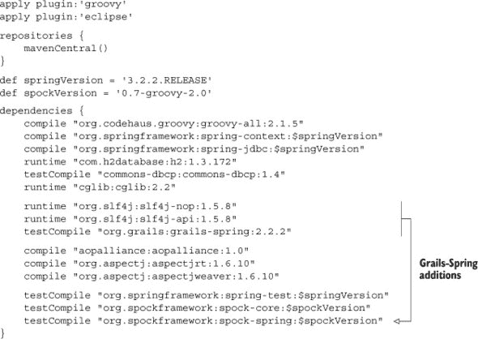

构建文件中显示的添加内容是使用 Grails `BeanBuilder`在常规应用程序中所需的所有内容。Grails-Spring 依赖关系（以及 SLF4J）以常规方式列出。任何其他必需的 JAR 文件（有几个）将自动下载。

为了展示如何使用`BeanBuilder`，我将采用与早期示例不同的方法。`BeanBuilder`是一个由开源项目提供的类。根据定义，开源项目会使其源代码可用。虽然浏览开源项目的实现确实具有教育意义，但我想要指出一个经常被忽视的资源。更好的开源项目充满了测试用例。由于没有人真正喜欢编写文档[¹⁶]，有时很难确切地了解如何在项目中使用特定的功能。如果你很幸运，编写你想要的功能的人也为其编写了测试用例。然后，测试用例会详细展示如何使用该功能。测试用例是可执行的文档，说明了作者希望您如何使用该功能。

> ^[16] 我的意思是除了书籍形式之外。写书既有趣又容易。这就是我的故事，我会坚持下去。

在 Grails `BeanBuilder`的情况下，有一个名为`grails.spring.BeanBuilderTests`的测试用例，它有几个非常不错的属性：

+   它最初由 Grails 项目的负责人 Graeme Rocher 编写，他可能是我遇到过的最好的开发者[¹⁷]。

    > ^[17] 除了 Guillaume Laforge、Dierk Koenig、Paul King、Andres Almiray 或少数其他人之外。Groovy 生态系统充满了非常聪明的开发者。

+   该测试用例中几乎有 30 个不同的测试，展示了您可能想对该类做的所有事情。

在本节中，我想回顾一下 `BeanBuilderTests` 类的一些基本功能。实际上，我把这个类复制到书籍源代码中，只是为了确保一切正常工作。我需要移除一些与独立运行 `BeanBuilder`（不依赖于 Grails）无关的测试，但其他所有测试都成功通过了。

在我继续之前，我应该强调这种做法是一个很好的通用规则：

| |
| --- |

##### 测试用例

即使你从不查看实现，下载开源项目的源代码也是有用的。仅测试用例本身通常比实际文档更有价值。

| |
| --- |

这些建议可能比这本书中说的任何其他内容都更有用。

下一个列表显示了 `BeanBuilderTests` 类中的第一个测试用例。

##### 列表 7.27\. 包含其第一个测试用例的 `BeanBuilderTests` 类

```
class BeanBuilderTests extends GroovyTestCase {

    void testImportSpringXml() {
        def bb = new BeanBuilder()

        bb.beans {
            importBeans "classpath:grails/spring/test.xml"
        }

        def ctx = bb.createApplicationContext()

        def foo = ctx.getBean("foo")
        *assertEquals* "hello", foo
    }
}
```

要使用 `BeanBuilder`，你只需要实例化这个类。这类似于使用 `MarkupBuilder`、`SwingBuilder`、`AntBuilder` 或任何用 Groovy 编写的广泛范围内的构建器。在这里，构建器被分配给变量 `bb`，因此使用构建器从 `bb.beans` 开始，就像在 Spring 配置文件中创建一个根 `<beans>` 元素一样。大括号表示子元素。在这里，子元素是一个 `importBeans` 元素，它从类路径中读取 test.xml 文件。在继续之前，这是 test.xml 的文本：

```
<?xml version=*"1.0"* encoding=*"UTF-8"*?>
<beans xmlns=*"http://www.springframework.org/schema/beans"*
    xmlns:xsi=*"http://www.w3.org/2001/XMLSchema-instance"*
    xsi:schemaLocation=*"http://www.springframework.org/schema/beans*
        *http://www.springframework.org/schema/beans/spring-beans-2.0.xsd"*>

    <bean id=*"foo"* class=*"java.lang.String"*>
        <constructor-arg value=*"hello"* />
    </bean>
</beans>
```

这是一个典型的 beans 配置文件，包含一个单独的 bean 定义。该 bean 是一个 `java.lang.String` 类型的实例，其值为 `hello`，名称为 `foo`。

返回到测试用例，在导入 XML 文件后，会调用 `createApplicationContext` 方法，这使得 bean 通过应用程序上下文可用。然后测试调用 `getBean` 返回 `foo` bean，并检查其值为 `hello`。

可以得出的结论是，要使用 `BeanBuilder`，你必须（1）实例化类，（2）使用正常的构建器语法定义 bean，（3）从构建器创建应用程序上下文，（4）以正常方式访问和使用 bean。

下一个列表包含另一个测试用例，展示了设置 bean 属性。

##### 列表 7.28\. 在 `BeanBuilder` 中设置 bean 属性，来自 BeanBuilderTests

```
void testSimpleBean() {
    def bb = new BeanBuilder()
    bb.beans {
        bean1(Bean1) {
            person = "homer"
            age = 45
            props = [overweight:true, height:"1.8m"]
            children = ["bart", "lisa"]

        }
    }
    def ctx  = bb.createApplicationContext()

    assert ctx.containsBean("bean1")
    def bean1 = ctx.getBean("bean1")

    assertEquals "homer", bean1.person
    assertEquals 45, bean1.age
    assertEquals true, bean1.props?.overweight
    assertEquals "1.8m", bean1.props?.height
    assertEquals(["bart", "lisa"], bean1.children)
}
```

在构建器内部，语法使用 bean 名称后跟括号中的 bean 类。在这种情况下，`bean1` 是 `Bean1` 类的一个实例的名称或 ID。在文件底部附近，你可以找到 `Bean1` 的定义：

```
class Bean1 {
    String person
    int age
    Properties props
    List children
}
```

实际上，在类的底部定义了几个豆类。与 Java 不同，Groovy 源文件可以包含多个类定义。`Bean1` 类包含类型为 `String`、`int`、`Properties` 和 `List` 的属性。测试用例将 `name` 分配给 `homer`，将 `age` 分配给 `45`，使用映射语法分配 `overweight` 和 `height` 属性，并将列表设置为孩子的名字.^([18])然后测试断言豆类在应用程序上下文中，并且在检索后，所有属性都已按描述设置。

> (18) 略去了玛吉，她总是让人感到像是事后才想起的。

当然，你不仅限于定义单个豆类。接下来的列表显示了一个创建多个豆类并设置它们关系的测试。

##### 列表 7.29\. 使用 `BeanBuilder` 定义多个相关豆类

```
void testBeanReferences() {
    def bb = new BeanBuilder()
    bb.beans {
        homer(Bean1) {
            person = "homer"
            age = 45
            props = [overweight:true, height:"1.8m"]
            children = ["bart", "lisa"]
        }
        bart(Bean1) {
            person = "bart"
            age = 11
        }
        lisa(Bean1) {

            person = "lisa"
            age = 9
        }
        marge(Bean2) {
            person = "marge"
            bean1 = homer
            children = [bart, lisa]
        }
    }
    def ctx  = bb.createApplicationContext()

    def homer = ctx.getBean("homer")
    def marge = ctx.getBean("marge")
    def bart = ctx.getBean("bart")
    def lisa = ctx.getBean("lisa")

    assertEquals homer, marge.bean1
    assertEquals 2, marge.children.size()

    assertTrue marge.children.contains(bart)
    assertTrue marge.children.contains(lisa)
}
```

命名为 `homer`、`bart` 和 `lisa` 的豆类都是 `Bean1` 类的实例。`marge` 豆类是 `Bean2` 类的实例，它添加了一个类型为 `Bean1` 的引用，名为 `bean1`。在这里，`marge` 中的 `bean1` 引用被分配给了 `homer`。`Bean1` 类还有一个类型为 `List` 的 `children` 属性，因此它被分配给包含 `bart` 和 `lisa` 的列表。

我不想在这里通过所有测试，但有几个特性应该被强调。例如，你可以定义不同作用域的豆类，如下一个列表所示。

##### 列表 7.30\. 在不同作用域中定义豆类

```
void testScopes() {
    def bb = new BeanBuilder()
    bb.beans {
        myBean(ScopeTest) { bean ->
            bean.scope = "prototype"
        }
        myBean2(ScopeTest)
    }
    def ctx = bb.createApplicationContext()

    def b1 = ctx.myBean
    def b2 = ctx.myBean

    assert b1 != b2

    b1 = ctx.myBean2
    b2 = ctx.myBean2

    assertEquals b1, b2

}
```

通过将 `myBean` 的 `scope` 属性设置为 `prototype`，检索两次豆类会产生不同的实例。`myBean2` 的作用域默认为单例，因此请求两次将导致两个对同一对象的引用。

你还可以使用来自不同 Spring 命名空间的标签。在本章早些时候，我使用 Groovy 创建了一个方面。以下列表显示了使用 `BeanBuilder` 的类似情况。

##### 列表 7.31\. 使用 `BeanBuilder` 定义方面

```
void testSpringAOPSupport() {

    def bb = new BeanBuilder()

    bb.beans {
        xmlns aop:"http://www.springframework.org/schema/aop"

        fred(AdvisedPerson) {
            name = "Fred"
            age = 45
        }
        birthdayCardSenderAspect(BirthdayCardSender)

        aop.config("proxy-target-class":true) {
            aspect(id:"sendBirthdayCard",ref:"birthdayCardSenderAspect" ) {
                after method:"onBirthday", pointcut:
                    "execution(void grails.spring.AdvisedPerson.birthday())
                     and this(person)"
            }
        }
    }

    def appCtx = bb.createApplicationContext()
    def fred = appCtx.getBean("fred")
    assertTrue (fred instanceof SpringProxy )

    fred.birthday()

    BirthdayCardSender birthDaySender = appCtx.getBean(
        "birthdayCardSenderAspect")

    assertEquals 1, birthDaySender.peopleSentCards.size()
    assertEquals "Fred", birthDaySender.peopleSentCards[0].name
}
```

使用 `xmlns` 声明 `aop` 命名空间。在解释为（不存在的）方法调用的构建器中，其解释是在 `aop` 前缀下使命名空间可用。`fred` 豆类是 `AdvisedPerson` 类的实例，其定义如下

```
@Component(value = "person")
class AdvisedPerson {
    int age
    String name

    void birthday() {
        ++age
    }
}
```

`birthdayCardSenderAspect` 是 `BirthdayCardSender` 类的实例，该类在文件底部定义：

```
class BirthdayCardSender {
   List peopleSentCards = []
   void onBirthday(AdvisedPerson person) {
      peopleSentCards << person
   }
}
```

使用 `aop` 命名空间中的 `config` 元素，构建器声明了一个名为 `sendBirthdayCard` 的方面，该方面引用了方面。在任何被建议的人执行生日方法之后，方面的 `onBirthday` 方法将被执行，这会将这个人添加到 `peopleSentCards` 集合中。然后测试验证方面确实已运行。

其他测试展示了 `BeanBuilder` 中的其他功能。例如，如果你正在尝试设置的属性需要连字符，你将属性放在引号中。一些测试显示了如下示例

```
aop.'scoped-proxy'()
```

或者

```
jee.'jndi-lookup'(id:"foo", 'jndi-name':"bar")
```

请参阅测试文件以获取广泛的示例。底线是，你可以在常规 Spring bean 配置文件中完成的任何事情，都可以使用 Grails 的`BeanBuilder`来完成。

| |
| --- |

**学习心得（Spring 与 Groovy）**

> **1**. Spring 以与 POJO 相同的方式管理 POGOS，因此 beans 可以用 Groovy 实现，就像用 Java 一样容易。
> 
> **2**. 闭包强制转换消除了匿名内部类的需要。
> 
> **3**. 通过添加单个 JAR 文件，Spock 测试可以在 Spring 测试上下文中运行。
> 
> **4**. 可刷新的 beans 允许你在不重新启动系统的情况下修改系统。
> 
> **5**. 内联脚本 beans 嵌入在配置文件中。
> 
> **6**. Grails 的`BeanBuilder`提供了另一种配置 Spring 的方法。

| |
| --- |

### 7.7. 摘要

本章演示了 Groovy 可以在哪些地方与 Spring 框架高效地协同工作。除了在 Groovy 中编写 Spring beans，这有时会导致代码量显著减少之外，还有 Spring 特有的动态语言 beans 的特性。我展示了可刷新的 beans，其中你可以部署源代码并可以修改它而无需停止系统，以及内联脚本 beans，其中 beans 直接在配置文件中定义。Groovy beans 也可以作为 Spring AOP 方面，如所示。最后，我回顾了来自 Grails 的`BeanBuilder`类的测试，该类可以使用正常的 Groovy 构建器语法创建 Spring bean 定义，即使在 Grails 之外也是如此。

在下一章中，我们将探讨数据库开发和操作。在那里，除了`groovy.sql.Sql`类的酷炫功能之外，我还会使用 Grails 项目的一个贡献，即 Grails 对象关系映射（GORM）功能。

## 第八章 数据库访问

*本章涵盖*

+   JDBC 和 Groovy 的`Sql`类

+   使用 GORM 简化 Hibernate 和 JPA

+   与 NoSQL 数据库一起工作

几乎每个重要的应用程序都以某种形式使用持久数据。其中绝大多数将数据保存在关系数据库中。为了便于在不同数据库之间切换，Java 提供了 JDBC^([1]) API。虽然 JDBC 可以处理所需的任务，但其低级性质导致处理甚至最简单的任务也需要很多行代码。

> ¹ 你可能会认为 JDBC 代表 Java Database Connectivity。每个人都可能会同意你的看法，除了创建该 API 的 Sun（现在是 Oracle）的人。他们声称 JDBC 是一个商标化的首字母缩略词，不代表任何东西。显然，在这个过程中涉及到了律师。我不会被这种愚蠢的东西所束缚，如果因此被起诉，我肯定会写博客关于这件事。

由于软件是面向对象的，而数据库是关系型的，因此在边界处存在不匹配。开源的 Hibernate 项目试图在更高层次的抽象上弥合这一差距。Java 包括 Java 持久化 API（JPA），作为对 Hibernate 和其他对象关系映射（ORM）工具的统一接口。

如同往常，Groovy 为 Java API 提供了一些简化。对于原始 SQL，Groovy 标准库包括 `groovy.sql.Sql` 类。对于像 Hibernate 这样的 ORM 工具，Grails 项目创建了一个特定领域的语言（DSL）称为 GORM。最后，最近变得流行的许多所谓的“非 SQL”数据库也提供了 Groovy API 以简化其使用。图 8.1 展示了本章涵盖的技术。

##### 图 8.1\. Java 使用 JDBC 和 JPA，其中 Hibernate 是最常用的 JPA 提供商。大多数 NoSQL 数据库都有一个 Java API，可以被 Groovy 包装；在本章中，使用 GMongo 访问 MongoDB。GORM 是基于 Spring 和 Hibernate 的 Groovy DSL。最后，`groovy.sql.Sql` 类使得使用关系型数据库的原始 SQL 变得容易。

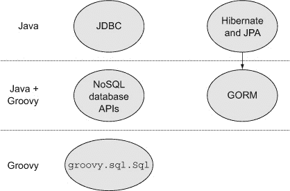

在关系型数据库中，一切最终都归结为 SQL，所以我会从这里开始。

### 8.1\. Java 方法，第一部分：JDBC

JDBC 是一组类和接口，在原始 SQL 上提供了一层薄层。这实际上是一项重大的工程成就。在几乎每个关系型数据库上提供统一的 API 并非易事，尤其是在每个供应商在 SQL 本身中实现了显著不同的变体时。

尽管如此，如果你已经解决了 SQL 问题，JDBC API 提供了类和方法来传递它到数据库并处理结果。

下面的列表展示了一个基于单个持久化类 `Product` 的简单示例。

##### 列表 8.1\. `Product` 类，一个映射到数据库表的 POJO

```
package mjg;

public class Product {
    private int id;
    private String name;
    private double price;

    public Product() {}

    public Product(int id, String name, double price) {
        this.id = id;
        this.name = name;
        this.price = price;
    }

    public int getId() { return id; }
    public void setId(int id) { this.id = id; }
    public String getName() { return name; }
    public void setName(String name) { this.name = name; }
    public double getPrice() { return price; }
    public void setPrice(double price) { this.price = price; }
}
```

`Product` 类只有三个属性，其中之一（`id`）将代表数据库中的主键。类的其余部分只是构造函数、getter 和 setter，以及（未展示）正常的 `toString`、`equals` 和 `hashCode` 重写。完整的版本可在本书源代码中找到。

下一个列表展示了 `ProductDAO` 接口。

##### 列表 8.2\. `Product` 类的 DAO 接口

```
import java.util.List;
public interface ProductDAO {
    List<Product> getAllProducts();
    Product findProductById(int id);
    void insertProduct(Product p);
    void deleteProduct(int id);
}
```

要实现接口，我需要知道表结构。再次，为了简化，假设我只有一个名为 `product` 的表。为了本例的目的，该表将在 DAO 实现类中使用 H2 数据库创建。

实现类是 `JDBCProductDAO`。下面展示了几个摘录。Java 开发者会发现代码及其伴随的繁琐相当熟悉。

下面的列表展示了实现的开端，包括表示 URL 和驱动类常量。

##### 列表 8.3\. DAO 接口的 JDBC 实现

```
public class JDBCProductDAO implements ProductDAO {
    private static final String *URL* = "jdbc:h2:build/test";
    private static final String *DRIVER* = "org.h2.Driver";

    public JDBCProductDAO() {
        try {
            Class.*forName*(*DRIVER*);
        } catch (ClassNotFoundException e) {
            e.printStackTrace();
            return;
        }
       createAndPopulateTable();
    }
// ... More to come ...
}
```

已经仁慈地省略了 `import` 语句。创建和填充表的私有方法在下一个列表中显示。

##### 列表 8.4\. 将 `Product` 表的创建和填充添加到 DAO 中

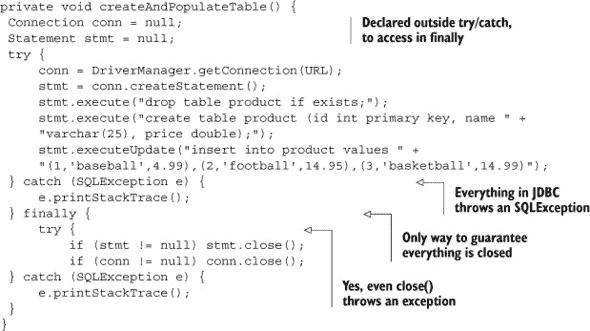

描述 Java 时常用的一句话是，本质被埋藏在仪式中。JDBC 代码可能是整个 API 中最糟糕的违规者。这里的“本质”是创建表并添加几行。而“仪式”则是围绕它的所有样板代码。正如列表所示，需要 `try`/`catch` 块，因为 JDBC 中几乎所有的操作都会抛出检查的 `SQLException`。此外，由于无论是否抛出异常，都必须关闭数据库连接，因此必须在 `finally` 块中关闭连接。更糟糕的是，`close` 方法本身也会抛出 `SQLException`，因此它也必须被包裹在 `try`/`catch` 块中，当然，避免潜在的 `NullPointerException` 的唯一方法是在关闭时验证连接和语句引用不是 null。

这种样板代码在 DAO 的每个方法中都会重复。例如，以下列表显示了 `findProductById` 方法的实现。

##### 列表 8.5\. 带有所有必要仪式的 `findProductById` 方法

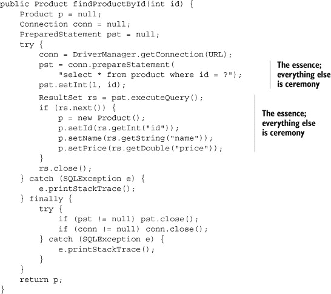

与 Java 中许多事物一样，你能说的最好的关于这段代码的事情就是最终你会习惯它。这里所做的一切只是执行一个带有 `where` 子句的 `select` 语句，该子句包括必要的产品 ID，并将返回的数据库行转换为 `Product` 对象。其他一切都是仪式。

我可以继续展示剩余的实现方法，但可以说细节同样被埋藏。请参阅书籍源代码以获取详细信息。


**Lessons learned (JDBC)**

> **1**. JDBC 是一组用于访问关系型数据库的 SQL 访问的非常冗长、低级的类。
> 
> **2**. 如果没有 Groovy，Spring 的 `JdbcTemplate` 类（在第七章 chapter 7 中介绍）是一个不错的选择。


几年前，这是 Java 的唯一可行选项。现在有其他选项存在，如 Spring 的 `JdbcTemplate`（在第七章 chapter 7 中讨论）和对象关系映射工具如 Hibernate（在本章后面讨论）。尽管如此，如果您已经了解 SQL 并且想实现 DAO 接口，Groovy 提供了一个非常简单的替代方案：`groovy.sql.Sql` 类。

### 8.2\. Groovy 方法，第一部分：groovy.sql.Sql

`groovy.sql.Sql` 类是 JDBC 的一种简单封装。该类为您处理资源管理，包括创建和配置语句以及记录错误。与常规 JDBC 相比，使用起来容易得多，因此根本没有任何理由要回头。

下一个列表显示了设置数据库连接并初始化它的类部分。

##### 列表 8.6\. 使用 `groovy.sql.Sql` 类实现的 `ProductDAO`

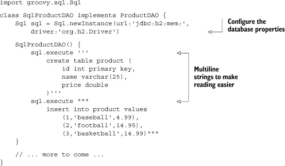

`groovy.sql.Sql` 类包含一个名为 `newInstance` 的静态工厂方法，它返回该类的新实例。该方法具有多种参数的重载；请参阅 GroovyDocs 获取详细信息。

`execute` 方法接受一个 SQL 字符串，并自然地执行它。在这里，我使用多行字符串来使 `create` `table` 和 `insert` `into` 语句更容易阅读。`Sql` 类负责打开连接并在完成后关闭它。


##### Sql 类

`groovy.sql.Sql` 类执行了原始 JDBC 所做的一切，并且还处理资源管理。


同样的 `execute` 方法可以用来删除产品：

```
void deleteProduct(int id) {
    sql.execute 'delete from product where id=?', id
}
```

`execute` 方法不仅创建了预编译的语句，还将提供的 ID 插入其中并执行它。这已经足够简单了。

插入产品可以使用相同的方法，但需要参数列表：

```
void insertProduct(Product p) {
    def params = [p.id, p.name, p.price]
    sql.execute
        'insert into product(id,name,price) values(?,?,?)', params
}
```

该类还有一个名为 `executeInsert` 的方法，当任何列由数据库自动生成时使用。该方法返回包含生成值的列表。在这个例子中，`id` 值由程序提供。自动生成的值将在 第 8.3 节 中讨论 Hibernate 和 JPA。

获取产品涉及一个小的复杂性。有几个有用的查询方法。其中 `firstRow`、`eachRow` 和 `rows` 是其中之一。当只需要单行时使用 `firstRow` 方法。如果有多个行在结果集中，可以使用 `eachRow` 或 `rows`。在这种情况下，`eachRow` 返回一个列名到列值的映射，而 `rows` 方法返回一个映射列表，每个映射对应一行。

复杂之处在于返回的列名都是大写的。例如，查询

```
sql.firstRow 'select * from product where id=?', id
```

返回

```
[ID:1, NAME:baseball, PRICE:4.99]
```

对于 `id` 为 `1` 的情况。通常我想要将这个映射作为 `Product` 构造函数的参数，但由于 `Product` 属性都是小写，所以这行不通。

一种可能的解决方案是将映射转换为一个具有小写键的新映射。这正是 `Map` 类中的 `collectEntries` 方法的作用。因此，`findProductById` 方法的实现如下

```
Product findProductById(int id) {
    def row = sql.firstRow('select * from product where id=?', id)
    new Product( row.collectEntries { k,v -> [k.toLowerCase(), v] } );
}
```

通过使用 `eachRow` 并逐个转换它们，很容易将这个方法推广到 `getAllProducts` 方法。一个稍微更优雅的解决方案是使用 `rows` 方法并直接转换结果列表中的映射：

```
List<Product> getAllProducts() {
    sql.rows('select * from product').collect { row ->
        new Product(
            row.collectEntries { k,v -> [k.toLowerCase(), v] }
        )
    }
}
```

这个解决方案要么非常优雅，要么过于聪明，这取决于你的观点。收集^([2]) 所有一切（除了在构造函数中已经显示的初始化之外），结果如下所示。

> ² 没有故意开玩笑。

##### 列表 8.7\. 除了已经显示的部分之外，完整的 `SqlProductDAO` 类

```
class SqlProductDAO implements ProductDAO {
    Sql sql = Sql.newInstance(url:'jdbc:h2:mem:',driver:'org.h2.Driver')

    List<Product> getAllProducts() {
        sql.rows('select * from product').collect { row ->
            new Product(
                row.collectEntries { k,v -> [k.toLowerCase(), v] }
            )
        }
    }

    Product findProductById(int id) {
        def row = sql.firstRow('select * from product where id=?', id)
        new Product(
           row.collectEntries { k,v -> [k.toLowerCase(), v] } );
    }

    void insertProduct(Product p) {
        def params = [p.id, p.name, p.price]
        sql.execute
           'insert into product(id,name,price) values(?,?,?)', params
    }

    void deleteProduct(int id) {
        sql.execute 'delete from product where id=?', id
    }
}
```

顺便说一下，还有一个可用的选项，^([3]) 但仅当`Person`类是用 Groovy 实现的。如果是这样，我可以在`Person`类中添加一个构造函数来处理那里的大小写转换：

> ³ 感谢 Groovy Users 电子邮件列表上的 Dinko Srkoc 提供的这个有用的建议。

```
class Product {
    int id
    String name
    double price

    Person(Map args) {
        args.each { k,v ->
            setProperty( k.toLowerCase(), v)
        }
    }
}
```

使用这个构造函数，`getAllProducts`方法简化为

```
List<Product> getAllProducts() {
    sql.rows('select * from product').collect { new Product(it) }
}
```

这对于优雅来说很难超越。

| |
| --- |

**进入元领域**

如果类属性使用驼峰式命名，这在正常情况下是常见的，那么章节中的“优雅”解决方案就会崩溃。相应的数据库表条目将使用下划线来分隔单词。

如 Groovy Users 电子邮件列表上的 Tim Yates 所示，^([4]) 你可以使用 Groovy 元编程向`String`类添加一个`toCamelCase`方法来进行转换。相关的代码是

> ⁴ 有关完整讨论，请参阅[`groovy.329449.n5.nabble.com/Change-uppercase-Sql-column-names-to-lowercase-td5712088.html`](http://groovy.329449.n5.nabble.com/Change-uppercase-Sql-column-names-to-lowercase-td5712088.html)。

```
String.metaClass.toCamelCase = {->
  delegate.toLowerCase().split('_')*.capitalize().join('').with {
    take( 1 ).toLowerCase() + drop( 1 )
  }
}
```

每个 Groovy 类都有一个通过`getMetaClass`方法检索到的元类。可以通过将闭包分配给它们来向元类添加新方法，就像这里所做的那样。使用了一个无参闭包，这意味着新方法将接受零个参数。

在闭包内部，`delegate`属性指向它被调用的对象。在这种情况下，它是被转换的字符串。数据库表列是大写字母，由下划线分隔，因此将`delegate`转换为小写，然后在下划线处分割，结果得到一个字符串列表。

然后使用扩展点操作符在列表上调用每个元素的`capitalize`方法，这只会将第一个字母转换为大写。然后`join`方法重新组装字符串。

然后是更有趣的部分。`with`方法接受一个闭包，在该闭包内部，任何没有引用的方法都会在`delegate`上被调用。`take`和`drop`方法用于列表（或在这种情况下，字符序列）。`take`方法检索其参数指定的元素数量。这里该值是 1，因此返回第一个字母，并将其转换为小写。`drop`方法返回在移除参数中的数字后的其余元素，在这种情况下意味着字符串的其余部分。

结果是，你可以在字符串上调用该方法并将其转换。`'FIRST_NAME' .toLowerCase()`变为`'firstName'`，依此类推。

欢迎来到 Groovy 元编程的奇妙世界。

| |
| --- |

`groovy.sql.Sql`相对于原始 JDBC 的优点是显而易见的。如果我已经编写了 SQL 代码，我总是使用它。

| |
| --- |

**学习到的经验（Groovy SQL^([5]))**

> **1**.  `groovy.sql.Sql`类在各个方面都使处理原始 SQL 变得更好：资源管理、多行字符串、闭包支持以及将结果集映射到映射。
> 
> **2**.  本书中相关的示例可以在第七章（关于 Spring）第七章和第九章（关于 REST）第九章中找到。

| |
| --- |

> ⁵ 世界上最糟糕的 SQL 笑话：SQL 查询走进酒吧，选择两张表，然后说，“介意我加入你们吗？”（响指）。（警告：本章后面的 NoSQL 版本。）

而不是编写所有那些 SQL 代码，你可以使用可用的对象关系映射（ORM）工具之一，其中最普遍的还是 Hibernate。Java 持久化 API（JPA）规范作为 ORM 工具的前端，是下一节的主题。

### 8.3\. Java 方法，第二部分：Hibernate 和 JPA

简化 JDBC 的一种方法是通过尽可能自动化它。Java 的早期年份见证了将 ORM 工具直接添加到规范中的尝试，成功率各不相同。首先是 Java 数据对象（JDO），它直接与编译后的字节码工作，今天在很大程度上已被遗忘。然后是企业 JavaBeans（EJB）实体 bean，社区在最初的几个版本中将其视为一团糟。

当需要某种功能而只有不受欢迎的规范可用时，这种情况经常发生，开源社区开发了一个实用的替代方案。在这种情况下，出现的项目被命名为 Hibernate，它仍然旨在在处理关系数据库时成为 Java 世界的首选 ORM 工具。

在常规 JDBC 中，`ResultSet`只要连接打开就连接到数据源，连接关闭时就会消失。因此，在 EJB 世界中，你需要两个类来表示一个实体：一个始终连接，一个从不连接。前者被称为类似于`ProductEJB`的东西，后者是`ProductTO`，或传输对象。6 当从数据库获取产品时，`ProductEJB`保存单行数据，并将其数据传输到`ProductTO`以进行显示。传输对象不连接，因此可能会过时，但至少它没有使用数据库连接，这是一种稀缺的商品。从 EJB 到 TO 的数据传输是通过会话 EJB 完成的，事务边界在那里发生。会话 EJBs 构成了服务层，也包含了业务逻辑。整个过程与图 8.2 中所示的过程非常相似。

> ⁶ 旧术语包括数据传输对象（DTO）和值对象（VO）。

##### 图 8.2\. 控制器与事务会话 EJBs 进行交互，通过实体 EJBs 获取数据库数据。数据被复制到传输对象中，并返回给控制器。

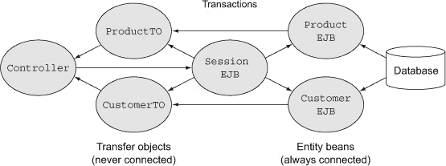

结果是，`ProductEJB` 类和 `ProductTO` 类在本质上相同，因为它们都包含相同的方法签名，尽管实现不同。马丁·福勒（*企业应用架构模式* [Addison-Wesley, 2002]，*重构* [Addision-Wesley, 1999]，以及其他几本书的作者）称这为反模式，并说这是设计有缺陷的症状。

Hibernate 和 EJBs 之间的一个关键区别是 Hibernate 会话的概念。创新之处在于，而不是一类始终连接的对象和另一类永远不会连接的对象，需要的是一组有时连接有时不连接的对象。在 Hibernate 中，当对象是 Hibernate 会话的一部分时，框架承诺将它们与数据库保持同步。当会话关闭时，对象断开连接，从而成为它自己的传输对象。任何时候通过 Hibernate 获取的对象，都成为 Hibernate 会话的一部分。

您可以通过会话工厂检索 Hibernate 会话。会话工厂读取所有映射元数据，配置框架，并执行任何必要的预处理。它应该只实例化一次，作为单例。

那些熟悉 Spring 框架的读者（如第七章所述[kindle_split_019.html#ch07]）可能会突然产生兴趣，因为管理单例是 Spring 所关注的事情之一。它的另一个能力是声明式事务管理，这也非常适合。结果是，EJB 2.x 世界的架构被 Spring 的声明式事务和会话工厂以及 Hibernate 的实体 Bean 的组合所取代。

在 EJB 的第 3 版中，架构再次进行了重新设计，以更紧密地适应 Spring 和 Hibernate 所使用的架构。实体 Bean 部分导致了 Java 持久化 API 的创建。JPA 世界使用相同的概念，但标签不同.^([7]) Hibernate 的 `Session` 变成了 `EntityManager`。`SessionFactory` 是 `EntityManagerFactory`。被管理的对象（即，在 Hibernate 会话中）组成一个 *持久化上下文*。

> ⁷ 当然，这是肯定的。使用相同的术语会太容易了。

最后，在原始的 Hibernate 中，实体类到数据库表的映射是通过 XML 文件完成的。随着时间的推移，XML 已经变得不那么受欢迎，并被注解所取代。Hibernate 和 JPA 共享许多注解，这是幸运的。

现在是时候举一个例子了，这个例子将 Spring、Hibernate 和 JPA 结合在一起。Spring 框架的第七章[kindle_split_019.html#ch07]详细讨论了 Spring。在这里，我将只突出示例所需的各个部分。

首先，我需要一个数据库。为此，我将使用 H2，一个基于 Java 文件或内存的纯 Java 数据库。Spring 提供了一个嵌入式数据库 bean，以便更容易地与 H2 一起工作。Spring 配置文件中相关的 bean 是

```
<jdbc:embedded-database id="dataSource" type="H2">
     <jdbc:script location="classpath:schema.sql"/>
     <jdbc:script location="classpath:test-data.sql"/>
</jdbc:embedded-database>
```

架构和测试数据 SQL 文件定义了一个名为`PRODUCT`的单个表，包含三行：

```
create table PRODUCT (
    id bigint generated by default as identity (start with 1),
    name varchar(255), price double, primary key (id)
)
insert into PRODUCT(name, price) values('baseball', 5.99)
insert into PRODUCT(name, price) values('basketball', 10.99)
insert into PRODUCT(name, price) values('football', 7.99)
```

Spring 提供了一个表示`EntityManagerFactory`的 bean，它有几个属性可以设置：

```
<bean id="entityManagerFactory" class=
    "org.springframework.orm.jpa.LocalContainerEntityManagerFactoryBean">
    <property name="dataSource" ref="dataSource" />
    <property name="persistenceUnitName" value="jpaDemo" />
    <property name="packagesToScan">
        <list>
            <value>mjg</value>
        </list>
    </property>
    <property name="jpaVendorAdapter">
        <bean class=
        "org.springframework.orm.jpa.vendor.HibernateJpaVendorAdapter">
            <property name="database" value="H2" />
        </bean>
    </property>
</bean>
```

`LocalContainerEntityManagerFactoryBean`类使用之前定义的数据源 bean，扫描给定的包以查找实体，并使用 Hibernate 作为其实施。

> ⁸ 极长的类名是 Spring 的常规。我最喜欢的是`AbstractTransactional-Data-Source-Spring-ContextTests`，它有 49 个字符，甚至已被弃用。你的呢？

实体本身是`Product`类，这次添加了一些 JPA（或 Hibernate）注解：

```
@Entity
public class Product {

    @Id
    private int id;
    private String name;
    private double price;

    // ... constructors ...
    // ... getters and setters ...
   // ... toString, equals, hashCode ...
}
```

`@Entity`和`@Id`注解声明`Product`是一个映射到数据库表的类，并分别标识主键。由于一个惊人的巧合，^([9]) `Product`属性名和数据库列名恰好匹配，所以我不需要额外的物理注解，如`@Table`和`@Column`。

> ⁹ 并非如此。

`ProductDAO`接口与第 8.1 节中展示的 JDBC 接口相同，但现在`insertProduct`方法返回新的数据库生成的主键。`JpaProductDAO`实现类是动作发生的地方，它将在下一个列表中展示。

##### 列表 8.8。使用 JPA 类实现 DAO 的`JpaProductDAO`类

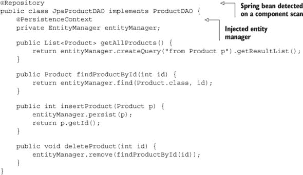

JPA 实现非常简洁，但这是因为它假设事务管理由其他地方处理，并且 Spring 将处理分配和关闭必要的数据库资源。

我绝不会在没有合适的测试用例的情况下编写这么多代码。Spring 的测试上下文框架管理应用程序上下文，允许测试固定值被注入，并且如果提供了事务管理器，则在每次测试结束时自动回滚事务。

为了处理事务，我使用了另一个 Spring bean，`JpaTransactionManager`，它使用之前指定的实体管理器工厂：

```
<bean id="transactionManager"
    class="org.springframework.orm.jpa.JpaTransactionManager"
    p:entityManagerFactory-ref="entityManagerFactory" />
```

结果的测试用例如下所示。

##### 列表 8.9。JPA DAO 实现的 Spring 测试用例

```
@RunWith(SpringJUnit4ClassRunner.class)
@ContextConfiguration(locations="classpath:applicationContext.xml")
@Transactional
public class JpaProductDAOTest {
    @Autowired
    private ProductDAO dao;

    @Test
    public void testFindById() {
        Product p = dao.findProductById(1);
        assertEquals("baseball", p.getName());
    }

    @Test
    public void testGetAllProducts() {
        List<Product> products = dao.getAllProducts();
        assertEquals(3, products.size());
    }

    @Test
    public void testInsert() {
        Product p = new Product(99, "racketball", 7.99);
        int id = dao.insertProduct(p);
        Product p1 = dao.findProductById(id);
        assertEquals("racketball", p1.getName());
    }

    @Test
    public void testDelete() {
        List<Product> products = dao.getAllProducts();
        for (Product p : products) {
            dao.deleteProduct(p.getId());
        }
        assertEquals(0, dao.getAllProducts().size());
    }
}
```

测试检查每个 DAO 方法。我最喜欢的是`testDelete`，它删除表中的每一行，验证它们已经消失，并且*不会将它们重新添加回去*，这会产生副作用，让任何数据库管理员心跳加速。幸运的是，Spring 在测试完成后回滚所有更改，所以没有东西丢失，但大家都有了一个愉快的时光。

最后一个拼图是 Maven 构建文件。您可以在书籍源代码中看到它，就像往常一样。

这是一段相当多的代码和配置，而我只有一个类和一个数据库表。坦白说，如果我不能让它工作，我可能就放弃吧。当你添加关系时，生活就会变得复杂。（[10]）

> ^([10]) 在许多层面上；有时笑话会自己写出来。

| |
| --- |

**Lessons learned (Hibernate and JPA)**

> **1**. Java 持久性 API 管理对象关系映射提供程序，这些程序将对象转换为表行，然后再转换回来。
> 
> **2**. Hibernate 是业界最常用的 JPA 提供商。
> 
> **3**. ORM 工具提供传递持久性、持久化上下文、SQL 代码生成等功能。
> 
> **4**. 与所有 Java 库一样，它们仍然相当冗长。

| |
| --- |

Groovy 可以通过几种方式帮助这种情况，这些将在下一节中讨论。

### 8.4. The Groovy approach, part 2: Groovy and GORM

在深入探讨 Grails 对象关系映射（GORM）之前，让我指出几个 Groovy 可以简化上一节示例应用的地方。

#### 8.4.1. Groovy 简化

实体类 `Product` 可以写成 POGO。这不会改变行为，但可以将类的尺寸减少大约三分之二。还有应用程序的其他与 Spring 相关的部分也可以转换为 Groovy，这在第七章（[kindle_split_019.html#ch07](https://example.org/kindle_split_019.html#ch07)）中会有更详细的展示。

书籍源代码中包含一个 Gradle 构建文件。它看起来与前面章节中显示的大多数构建文件相似，但它比相应的 Maven 构建文件短得多，也更容易阅读。

#### 8.4.2. Grails 对象关系映射（GORM）

Grails 框架由一组基于 Spring 和 Hibernate 的 Groovy DSLs 组成。由于 Spring 和 Hibernate 的组合在 Java 世界中是一个非常常见的架构，Grails 是一个自然的演变，它简化了编码和集成问题。

Grails 在第十章（[kindle_split_022.html#ch10](https://example.org/kindle_split_022.html#ch10)）中详细讨论了 Web 应用程序，但 Hibernate 集成部分与此相关。Grails 结合 Groovy 领域特定语言（DSLs）来简化配置领域类。

| |
| --- |

##### 领域类

在 Grails 中，术语 *domain* 与 JPA 中的 *entity* 类似。领域类映射到数据库表。

| |
| --- |

考虑一个基于本章前面使用过的相同 `Product` 类的小型但非平凡的领域模型。下面的列表显示了 `Product` 类，现在是在 Groovy 中。

##### 列表 8.10. `Product` 类，这次是在 Grails 应用程序中的 POGO

```
class Product {
    String name
    double price

    String toString() { name }

    static constraints = {
        name blank:false
        price min:0.0d
    }
}
```

在 Grails 中，每个领域类隐式地有一个名为 `id` 的主键，它是某种整型，这里没有展示但确实存在。这里的 `constraints` 块是 GORM 的一部分^([11])。`constraints` 块中的每一行实际上是一个方法调用，其中方法名是属性名。`blank` 约束自然地意味着产品的名称不能是空字符串。`price` 约束设置最小值为 0，而 `d` 使其成为双精度浮点数，因为约束类型必须与属性数据类型匹配。

> ^(11) 在《星际迷航》原系列剧集“竞技场”中，指挥官柯克与之战斗的爬行动物是戈恩，而不是 GORM。我的意思是，谁听说过 Grails 对象关系式睡眠呢？(尽管可能有一个“懒加载”的笑话在其中。)

此应用程序将拥有另外三个领域类，代表客户、订单和订单上的行。接下来是 `Customer` 类，在下一个列表中展示。

##### 列表 8.11\. `Customer` 类。客户拥有多个订单（希望如此）。

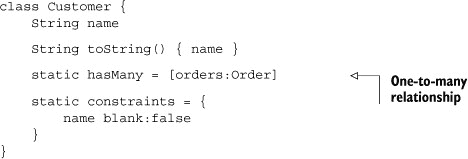

客户有一个 `name` 属性和一个表示其订单的 `Set`。

| |
| --- |

##### Grails hasmany

在 Grails 中，`hasMany` 属性表示一对一关系。默认情况下，包含的对象形成一个集合。

| |
| --- |

`name` 不能为空。`Order` 类在下面的列表中展示。

##### 列表 8.12\. `Order` 类，包含多个订单且属于某个客户

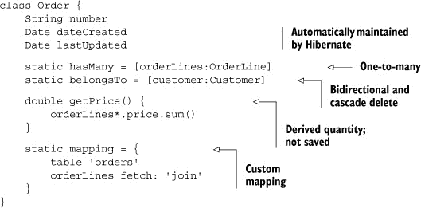

这里有很多事情在进行。首先，一个订单包含一个订单行的 `Set`。订单也属于特定的客户。客户引用意味着你可以从订单导航到其关联的客户。通过将其分配给 `belongsTo` 属性，这两个类之间存在级联删除关系。如果从系统中删除客户，所有订单也会被删除。

| |
| --- |

##### Grails belongsto

在 Grails 中，单词 `belongsTo` 表示级联删除关系。

| |
| --- |

`getPrice` 方法通过计算每个订单行的价格来计算订单的价格。它也是一个派生量，因此不会保存到数据库中。

`dateCreated` 和 `lastUpdated` 属性由 Hibernate 自动维护。当订单首次保存时，其 `dateCreated` 值被设置；每次修改时，`lastUpdated` 也会被保存。

最后，`mapping` 块用于自定义类如何映射到数据库表。默认情况下，Grails 将生成一个与类名匹配的表。因为 `order` 是一个 SQL 关键字，所以生成的 DDL 语句会有问题。在 `mapping` 块中，指定的生成表名是 `orders`，而不是 `order`，以避免这个问题。此外，Hibernate 将所有关联都视为延迟加载。在这种情况下，这意味着如果加载了一个订单，还需要一个单独的 SQL 查询来加载订单行。在映射块中，`fetch` `join` 关系意味着所有关联的订单行将与订单一起通过内部连接加载。

`OrderLine` 类包含正在订购的产品和数量，如下面的列表所示。

##### 列表 8.13\. 组装以构建 `Order` 的 `OrderLine` POGO

```
class OrderLine {
    Product product
    int quantity

    double getPrice() { quantity * product?.price }

    static constraints = {
        quantity min:0
    }
}
```

`getPrice` 方法将数量乘以产品的价格以获取订单行的价格。然后，它将这个值加起来，以获得之前看到的总价。

还要注意，`OrderLine` 类没有对其所属的 `Order` 的引用。这是一个单向级联删除关系。如果订单被删除，所有订单行也会被删除，但你不能从订单行导航到其关联的订单。

当你声明一个 `hasMany` 关系时，Grails 会提供方法来将包含的对象添加到它们的容器中。为了说明这些方法之一，这里有一个名为 `BootStrap.groovy` 的文件，它是 Grails 应用中用于初始化代码的配置文件。接下来的列表显示了创建一个客户、两个产品、一个订单和一些订单行并将它们全部保存到数据库中的代码。

##### 列表 8.14\. `BootStrap.groovy` 中的初始化代码

```
class BootStrap {

    def init = { servletContext ->
        if (!Product.findByName('baseball')) {
            Product baseball =
                new Product(name:'baseball', price:5.99).save()
            Product football =
                new Product(name:'football', price:12.99).save()
            Customer cb = new Customer(name:'Charlie Brown').save()
            Order o1 = new Order(number:'1', customer:cb)
                .addToOrderLines(product:baseball, quantity:2)
                .addToOrderLines(product:football, quantity:1)
                .save()
        }
    }

    def destroy = {
    }
}
```

当应用程序启动时，会执行 `init` 闭包中的代码。`addToOrderLines` 方法来自于声明一个 `Order` 有多个 `OrderLine` 实例。`save` 方法首先验证每个对象是否符合其约束，然后将它们保存到数据库中。

Grails 使用 Hibernate 生成数据库模式的能力。生成的数据库的实体关系图（ERD）显示在 图 8.3^([12]) 中。

> ^[(12)](http://www.mysql.com/products/workbench/) 这个图表是使用 MySQL Workbench 生成的，这是一个可在 [www.mysql.com/products/workbench/](http://www.mysql.com/products/workbench/) 获取的免费工具。

##### 图 8.3\. 给定文本中列出的域类的生成的数据库实体关系图

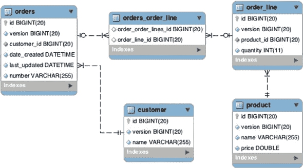

在这种情况下，数据库是 MySQL 版本 5，因此 `id` 的数据类型是 `BIGINT`。它还将驼峰式属性 `dateCreated` 和 `lastUpdated` 转换为表中的下划线。由于 `Order` 和 `OrderLine` 之间的关系是单向的，Hibernate 在它们之间生成一个名为 `orders_order_line` 的连接表。

Grails 还为每个表添加了一个名为 `version` 的列。Hibernate 使用这个列来实现乐观锁。这意味着每当一个表的行被修改并保存时，Hibernate 会自动将版本列增加一。这是尝试在不实际锁定行并支付性能惩罚的情况下获得锁定行为的一种尝试。如果应用程序涉及许多读取但只有少量写入，这将工作得很好。如果有太多的写入，Grails 还为每个域类添加了一个名为 `lock` 的实例方法来锁定行。这被称为 *悲观锁*，会导致性能下降，因此仅在必要时使用。

Grails 做的远不止这些。例如，Grails 使用 Groovy 为每个域类生成动态的查找方法。对于 `Product` 类，Grails 在域类上生成静态方法，包括

+   `Product.list()`, 返回所有产品实例

+   `Product.findByName(...)`, 返回第一个匹配名称的产品

+   `Product.findAllByPriceGreaterThan(...)`, 返回所有价格大于参数的产品

+   `Product.findAllByNameIlikeAndPriceGreaterThan(...,...)`, 返回名称满足不区分大小写的 SQL `like` 子句且价格大于第二个参数的产品

还有更多；有关详细信息，请参阅 Grails 文档^(13))。在每种情况下，Grails 都使用映射来生成满足所需条件的 SQL 代码。

> ^([13]) 有关 Grails 文档，请参阅 [`grails.org/doc/latest/`](http://grails.org/doc/latest/)。这些文档中的 第六章 详细讨论了 GORM。

Grails 还使用 Groovy 提供了构建器用于构建查询条件。Hibernate 有一个用于构建查询条件的 API，允许您以编程方式构建查询。Java API 可以工作，但仍然相当冗长。Grails 极大地简化了它，使得您可以编写如下表达式：

```
Product.withCriteria {
  like('name','%e%')
  between('price', 2.50, 10.00)
  order('price','desc')
  maxResults(10)
}
```

这生成一个 SQL 语句来查找所有名称中包含字母 *e* 且价格在 $2.50 到 $10.00 之间的产品。它按价格降序返回前 10 个匹配产品。

Hibernate 的一个基本原则是 Hibernate 会话的概念。如前所述，Hibernate 确保任何在 Hibernate 会话中（JPA 所称的持久化上下文）的对象都将与数据库保持同步。在 Hibernate 中，对象可以处于三种状态之一，^(14))，如图 8.4 所示。

> ^([14]) 定义状态的 Hibernate 文档可以在 [`mng.bz/Q9Ry`](http://mng.bz/Q9Ry) 找到。

##### 图 8.4\. 新的和已删除的对象是瞬时的。当它们被保存时，它们变为持久，当会话关闭时，它们变为分离。了解对象的状态是理解它在 Hibernate 中如何工作的关键。

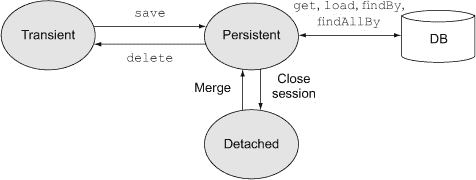

通过 Hibernate 检索到的任何对象——例如，通过使用动态查找器或条件查询之一——都会被放置在持久状态中，并且在该状态下会与数据库保持同步。新创建的尚未保存的对象是瞬时的，而当 Hibernate 会话关闭时内存中的对象则变为分离的。分离的对象不再与数据库连接。

关键问题是，Hibernate 会话何时创建，何时关闭？随着时间的推移，已经形成了一种常见的做法，即把会话范围限定在单个 HTTP 请求中。在 Hibernate 文献中，这被称为视图中的打开会话（OSIV）模式，并且通过请求拦截器来实现。Spring 框架自带了一个库类来自动完成这项工作，Grails 默认使用它。


##### OSIV Bean

Grails 使用 Spring 中的 OSIV Bean 来将 Hibernate 会话范围限定到每个 HTTP 请求。该 Bean 拦截传入的请求并创建会话，然后它拦截传出的响应并关闭会话。


最后，事务是通过 Spring 的声明式事务能力来管理的，使用`@Transactional`注解。所有 Grails 服务方法默认都是事务性的，但可以使用注解来定制其行为。

设置所有这些基础设施——管理会话和事务、将域类映射到表、建立关系、处理乐观锁定、生成动态查找器和条件查询、以及将 Hibernate 会话范围限定到每个请求——在手动将 Spring 和 Hibernate 结合使用时需要做大量的工作。Grails 为你完成所有这些，以及更多。

Spring 框架是 Java 中所有开源项目中最为常见的之一，Hibernate 仍然是使用最广泛的 ORM 工具。任何考虑将它们结合使用的项目都应该考虑使用 Grails。


**学习到的经验（Groovy 和 GORM）**

> **1**. Groovy 通过使用 POGs（Plain Old Groovy Objects）而不是 POJOs（Plain Old Java Objects）、使用闭包进行结果集处理以及简化构建和测试，简化了所有数据库访问。
> 
> **2**. GORM API 使得配置基于 Hibernate 的应用程序变得简单。当与 Spring（如 Grails 中那样）结合使用时，事务和 Hibernate 会话也变得简单。
> 
> **3**. 在 Grails 之外使用 GORM 并不容易，因为它与 Spring 紧密绑定。在业界尝试这样做的情况足够罕见，以至于这个过程在本章中没有涉及。


Grails 的最新版本也可以映射到非关系型数据库，但也可以使用常规 Groovy 来完成，下一节将展示这一点。

### 8.5\. Groovy 和 NoSQL 数据库

在过去几年软件开发中最有趣的趋势之一^([15]) 就是替代性、非关系型数据库的增长。通用术语 NoSQL（大多数社区将其解释为“不仅限于 SQL”）指的是一系列无模式的数据库，这些数据库不是基于关系型方法。

> (15) 当然，除了在 JVM 上动态语言的兴起之外。

NoSQL 数据库的主题已经很大，并且正在迅速增长，这已经超出了本书的范围。但许多数据库都有 Java API，其中一些也有简化它们的 Groovy 包装器。

其中最有趣的一个是 MongoDB，^([16]) 其 Java API 相当笨拙，但通过一个名为 GMongo 的 Groovy 包装器得到了显著改进。GMongo 项目，其 GitHub 仓库位于[`github.com/poiati/gmongo`](https://github.com/poiati/gmongo)，是 Paulo Poiati 的作品，也是本节的主题。

> (16) 有关下载和文档，请参阅[www.mongodb.org/](http://www.mongodb.org/)。

MongoDB 是一个面向文档的数据库，它以二进制 JSON（BSON）格式存储其数据。这使得它非常适合存储从 RESTful 网络服务下载的数据，这些服务通常在请求时产生 JSON 数据。

#### 8.5.1. 填充 Groovy 吸血鬼

这个例子是因为我最近在书店闲逛时注意到，虽然只有一个书架被标记为“计算机”，但还有三个其他书架被标记为“青少年超自然浪漫”。我选择将此视为我需要在我的书中添加 Groovy 吸血鬼的证据，而不是哀叹西方文明的衰落。

以电影评论网站 Rotten Tomatoes 提供的网络服务为例，[`developer.rottentomatoes.com`](http://developer.rottentomatoes.com)。如果你注册了一个 API 密钥，你可以进行 HTTP GET 请求来搜索电影、演员阵容等。数据以 JSON 形式返回。API 的基本 URL 位于[`api.rottentomatoes.com/api/public/v1.0`](http://api.rottentomatoes.com/api/public/v1.0)。所有请求都以该 URL 开始。

例如，搜索关于电影*Blazing Saddles*^([17]) 的信息是通过访问[`api.rottentomatoes.com/api/public/v1.0/movies.json?q=Blazing%20Saddles&apiKey=...`](http://api.rottentomatoes.com/api/public/v1.0/movies.json?q=Blazing%20Saddles&apiKey=...)（在 URL 中提供 API 密钥）来完成的。结果是如下所示的一个 JSON 对象。

> (17) 显然，这并不是一部吸血鬼电影，但拯救 MongoDB 中的 Mongo 的冲动是无法抗拒的。“Mongo 只是生命游戏中的一个小卒”是一句精彩的话，可以说是亚历克斯·卡拉斯作品的巅峰之作。

##### 列表 8.15。代表电影*Blazing Saddles*的 JSON 对象的一部分

```
{
    "total": 1,
    "movies": [
        {
            "id": "13581",
            "title": "Blazing Saddles",

            "year": 1974,
            "mpaa_rating": "R",
            "runtime": 93,
            "release_dates": {
                "theater": "1974-02-07",
                "dvd": "1997-08-27"
            },
            "ratings": {
                "critics_rating": "Certified Fresh",
                "critics_score": 89,
                "audience_rating": "Upright",
                "audience_score": 89
            },
            "synopsis": "",
            ...,
            "abridged_cast": [
                {
                    "name": "Cleavon Little",
                    "id": "162693977",
                    "characters": [
                        "Bart"
                    ]
                },
                {
                    "name": "Gene Wilder",
                    "id": "162658425",
                    "characters": [
                        "Jim the Waco Kid"
                    ]
                },
                ...
            ],
            "alternate_ids": {
                "imdb": "0071230"
            },
...
}
```

除了显示的数据外，JSON 对象还有指向完整的演员列表、评论等链接。使用像 MongoDB 这样的数据库来存储这些数据的另一个原因是并非每个字段都出现在每部电影中。例如，一些电影包含评论家的评分，而另一些则没有。这与基于 JSON 的无模式数据库的整体理念相符。

首先，为了填充 MongoDB，我将使用`com.gmongo.GMongo`类的一个实例。这个类直接封装了 Java API。实际上，如果你查看`GMongo.groovy`中的类，你会看到它由

```
class GMongo {

  @Delegate
  Mongo mongo

  // ... Constructors and other methods ...
}
```

紧接着是各种构造函数和简单的修补方法。Groovy 的`@Delegate`注解是一个抽象语法树（AST）转换^([18]），它通过 GMongo 暴露了来自 Java API 的`com.mongodb.Mongo`类中的方法。AST 转换意味着你不需要手动编写所有代理方法。

> ^（18）在第四章中讨论了积分，在附录 B 中，“Groovy by feature”，以及本书的许多其他地方使用了。

初始化数据库就像

```
GMongo mongo = new GMongo()
def db = mongo.getDB('movies')
db.vampireMovies.drop()
```

MongoDB 使用`movies`作为数据库名称，其中包含的集合，如`vampireMovies`，是数据库的属性。`drop`方法清除集合。

搜索 Rotten Tomatoes 包括构建带有正确参数的 GET 请求。在这种情况下，以下代码搜索吸血鬼电影：

```
String key = new File('mjg/rotten_tomatoes_apiKey.txt').text
String base = "http://api.rottentomatoes.com/api/public/v1.0/movies.json?"
String qs = [apiKey:key, q:'vampire'].collect { it }.join('&')
String url = "$base$qs"
```

API 密钥存储在外部文件中。构建查询字符串从参数映射开始，该映射被转换为形式为“key=value”的字符串映射，然后与和号连接。完整的 URL 是基本 URL 加上附加的查询字符串。获取电影并将它们保存到数据库中几乎是微不足道的：

```
def vampMovies = new JsonSlurper().parseText(url.toURL().text)
db.vampireMovies << vampMovies.movies
```

`JsonSlurper`从 URL 接收 JSON 格式的文本数据并将其转换为 JSON 对象。将结果保存到数据库就像附加整个集合一样简单。

API 每页有 30 个结果的限制。搜索结果包括一个名为`next`的属性，它指向下一个可用的页面，假设有。因此，脚本需要循环这么多次数来检索可用数据：

```
def next = vampMovies?.links?.next
while (next) {
    println next
    vampMovies = slurper.parseText("$next&apiKey=$key".toURL().text)
    db.vampireMovies << vampMovies.movies
    next = vampMovies?.links?.next
}
```

就这些了。使用关系型数据库需要将电影结构映射到关系表，这将是一个挑战。因为 MongoDB 使用 BSON 作为其原生格式，即使是 JSON 对象的集合也可以不加任何工作地添加。

有一个名为 MonjaDB 的 Eclipse 插件，它连接到 MongoDB 数据库。图 8.5 显示了 vampireMovies 数据库的一部分。

##### 图 8.5. 使用 Eclipse 的 MonjaDB 插件的部分吸血鬼电影数据库


#### 8.5.2. 查询和映射 MongoDB 数据

现在数据已经存储在数据库中，我需要能够搜索它并检查结果。这可以通过 `find` 方法以简单的方式完成，或者可以将数据映射到 Groovy 对象以供后续处理。

集合上的 `find` 方法返回满足特定条件的所有 JSON 对象。如果我只是想查看集合中有多少元素，以下就足够了：

```
println db.vampireMovies.find().count()
```

如果没有参数，`find` 方法将返回整个集合。然后 `count` 方法返回总数。

将 JSON 映射到 Groovy 展示了强类型语言（如 Groovy）和弱类型语言（如 JSON）之间的差异。显示的 JSON 数据是字符串、日期、整数和枚举值的混合，但 JSON 对象没有嵌入的类型信息。将此映射到一组 Groovy 对象需要一些工作。

例如，以下列表展示了包含 JSON 对象数据的 `Movie` 类。

##### 列表 8.16\. 包装 JSON 数据的 `Movie.groovy`

```
@ToString(includeNames=true)
class Movie {
    long id
    String title
    int year
    MPAARating mpaaRating
    int runtime
    String criticsConsensus

    Map releaseDates = [:]
    Map<String, Rating> ratings = [:]
    String synopsis
    Map posters = [:]
    List<CastMember> abridgedCast = []
    Map links = [:]
}
```

`Movie` 类为每个包含的元素提供了属性，并指定了数据类型。它包含发布日期、海报、评级和附加链接的映射，以及简略演员列表。`CastMember` 只是一个 POGO：

```
class CastMember {
    String name
    long id
    List<String> characters = []
}
```

`Rating` 包含一个字符串和一个整数：

```
class Rating {
    String rating
    int score
}
```

为了保持内容的趣味性，MPAA 评级是一个 Java `enum`，尽管它同样可以用 Groovy 实现：

```
public enum MPAARating {
    G, PG, PG_13, R, X, NC_17, Unrated
}
```

将 JSON 电影转换为 `Movie` 实例是通过 `Movie` 类中的静态方法完成的。`fromJSON` 方法的部分内容将在下一个列表中展示。

##### 列表 8.17\. 将 JSON 电影转换为 `Movie` 实例的方法的一部分

```
static Movie fromJSON(data) {
    Movie m = new Movie()
    m.id = data.id.toLong()
    m.title = data.title
    m.year = data.year.toInteger()
    switch (data.mpaa_rating) {
        case 'PG-13' : m.mpaaRating = MPAARating.PG_13; break
        case 'NC-17' : m.mpaaRating = MPAARating.NC_17; break
        default :
            m.mpaaRating = MPAARating.valueOf(data.mpaa_rating)
    }
    m.runtime = data.runtime
    m.criticsConsensus = data.critics_consensus ?: ''
```

完整的列表可以在书籍源代码中找到，但与这里展示的基本上没有区别。

下面的列表展示了验证转换是否正常工作的测试。

##### 列表 8.18\. 验证 JSON 转换的 JUnit 测试

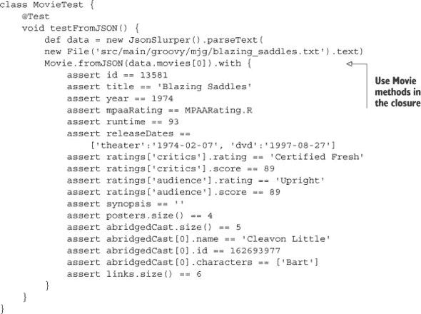


**Lessons learned (NoSQL^([19]))**

> **1**.  像 MongoDB、Neo4J 和 Redis 这样的 NoSQL 数据库正在成为特定用例的常见选择。
> 
> **2**.  大多数 NoSQL 数据库都提供基于 Java 的 API，可以直接从 Groovy 中调用。
> 
> **3**.  通常，Groovy 库会提供包装 Java API 并简化它的功能。这里，以 GMongo 为例。


> ¹⁹ 最糟糕的 SQL 笑话的 NoSQL 版本：DBA 走进 NoSQL 酒吧；找不到表，所以他就离开了。

一旦映射成功，查找所有有评论家共识的吸血鬼电影就像以下脚本一样简单：

```
GMongo mongo = new GMongo()
def db = mongo.getDB('movies')
db.vampireMovies.find([critics_consensus : ~/.*/]).each { movie ->
    println Movie.fromJSON(movie)
}
```

这已经非常简单了。使用 MongoDB^([20]) 与使用传统的关系型数据库一样简单.^([21])

> ²⁰ 有关 MongoDB 的详细说明，请参阅 Kyle Banker 所著的书籍 *MongoDB in Action* (Manning, 2011)：[www.manning.com/banker/](http://www.manning.com/banker/)。
> 
> ^（21）由于某种原因，从“吸血鬼”查询中没有返回任何《暮光之城》电影。我考虑过修复这个问题，但最终决定这不是一个错误，而是一个特性。

### 8.6. 摘要

几乎每个重要的应用程序都需要持久化数据。其中绝大多数都是基于关系型数据库。在 Java 领域，关系型持久化使用 JDBC 或 Hibernate 或 JPA 等对象关系映射工具。本章回顾了这两种方法，并探讨了 Groovy 如何简化它们。

Groovy 的`Sql`类移除了伴随原始 JDBC 的大部分杂乱。任何直接使用 JDBC 的代码都可以使用`Sql`类显著简化。

许多现代应用程序使用 JPA 进行持久化，特别是 Hibernate 作为底层 API，Spring 框架处理单例和事务。仅配置这样的应用程序就是一个非平凡的任务。另一方面，Grails 框架优雅地处理所有这些，并且几乎不需要任何努力。

最后，许多所谓的 NoSQL 数据库都有 Java API。其中一些，如 MongoDB，包括一个 Groovy 包装器，使得与底层数据库的工作变得简单。

## 第九章. RESTful Web 服务

*本章涵盖*

+   REST 架构风格

+   使用 JAX-RS 在 Java 中实现 REST

+   使用 Groovy 客户端访问 RESTful 服务

+   超媒体

RESTful Web 服务在当今的 API 设计中占主导地位，因为它们提供了一种方便的机制，以高度解耦的方式连接客户端和服务器应用程序。特别是移动应用程序使用 RESTful 服务，但一个好的 RESTful 设计模仿了最初使网络如此成功的特点。

在讨论了 REST 的一般情况之后，我将讨论服务器端，然后是客户端，最后是超媒体问题。图 9.1，9.2，和 9.3 展示了本章中的不同技术。

##### 图 9.1. 本章中的服务器端 JAX-RS 技术。JAX-RS 2.0 基于注解，但包括响应的构建器。URI 映射到资源中的方法，这些方法通过注解分配。资源作为使用客户端头的内容协商的表示返回。

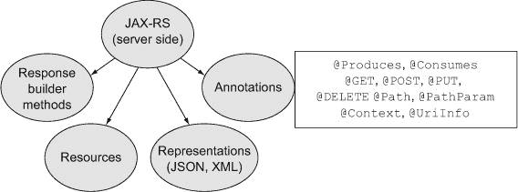

##### 图 9.2. 本章中的客户端 REST 技术。与 JAX-RS 1.x 不同，2.0 版本包括客户端类。Apache 也有一个通用的客户端，它在 Groovy 的 HttpBuilder 项目中进行了封装。最后，您可以使用标准的 Groovy 类手动解析请求和构建响应。

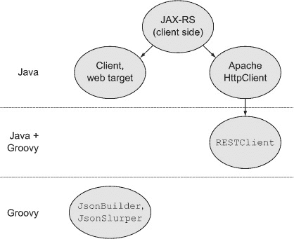

##### 图 9.3. 本章中的超媒体方法。在 JAX-RS 中，超媒体通过 HTTP 头中的过渡链接、消息体中的结构链接或使用构建器和解析器定制的响应来实现。

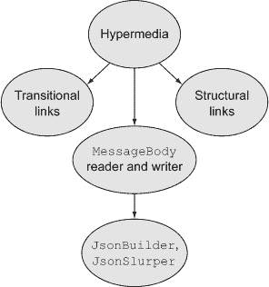

### 9.1. REST 架构

代表性状态转移（Representational State Transfer，REST）这个术语来自 Roy Fielding 2000 年的博士论文^([1）]，他是一位拥有史上最伟大简历的人之一.^([2）

> ¹ “Architectural Styles and the Design of Network-based Software Architectures，”可在 [www.ics.uci.edu/~fielding/pubs/dissertation/top.htm](http://www.ics.uci.edu/~fielding/pubs/dissertation/top.htm) 上在线获取。
> 
> ² 菲尔德宁是 Apache 软件基金会的共同创始人；曾是 URI、HTTP 和 HTML 规范的 IETF 工作组成员；并帮助建立了一些原始的 Web 服务器。我将他轻松地列入了 CS 简历的前十名，与像 James Duncan Davidson（Tomcat 和 Ant 的第一版创造者；他基本上拥有 90 年代）、Sir Timothy Berners-Lee（创建了网络 → 勋章 FTW）和 Haskell Curry（其名字是终极函数式编程语言，其姓氏是一种基本的编码技术；如果你的 *名字* 就是你的简历，你就赢了）等人并列。

在他的论文中，菲尔德宁将 REST 架构定义为可寻址资源和它们之间的交互。当限制在通过互联网（不是架构的要求，但今天最常见的使用方式）发出的 HTTP 请求时，RESTful 网络服务基于以下原则：

+   ***可寻址资源—*** 项目可以通过 URI 被客户端访问。

+   ***统一接口—*** 使用标准的 HTTP 动词 GET、POST、PUT 和 DELETE 访问和修改资源.^([3])

    > ³ 一些服务支持将 HEAD 请求作为返回空响应的 GET 请求，将 OPTIONS 请求作为在特定地址指定有效请求类型的一种替代方式。PATCH 请求被提议作为一种进行部分更新的方法。

+   ***内容协商—*** 客户端可以请求不同格式的资源表示，通常通过在请求的 `Accept` 头部中指定所需的 MIME 类型。

+   ***无状态服务—*** 与资源的交互是通过自包含的请求完成的。

基于这些想法的 Web 服务旨在具有高度的可扩展性和可扩展性，因为它们遵循使 Web 本身具有高度可扩展性和可扩展性的机制。

RESTful 网络服务可扩展性的部分来源于 *安全* 和 *幂等* 这两个术语：

+   ***安全—*** 不修改服务器的状态

+   ***幂等性—*** 可以重复执行而不产生任何额外效果

GET 请求既安全又幂等。PUT 和 DELETE 请求是幂等的但不安全。它们可以重复执行（例如，如果出现网络错误）而不产生任何额外变化.^([4）POST 请求既不安全也不幂等。

> ⁴ 有时很难想象 DELETE 请求是幂等的，但如果你多次删除同一行，它仍然会消失。

另一个关键概念是作为应用程序状态引擎的超媒体，它有一个真正不幸、难以发音的首字母缩略词 HATEOAS。我所知道的许多 REST 倡导者^([5])只是简单地说是“超媒体”。

> ⁵ 通常被称为 RESTafarians。

本节中定义的原则是架构性的，因此与实现语言无关。在下一节中，我将讨论针对实现 RESTful 服务的 Java 特定规范，即 JAX-RS。

> ⁶ 对不起。

### 9.2. Java 方法：JAX-RS

Java EE 规范包括 RESTful 服务的 Java API。版本 1.18 来自 JSR 311。新版本 2.0 是 JSR 339 的实现，并于 2013 年 5 月发布。

在本节中，我将在一个简单的 POJO 上实现一组 CRUD 方法.^([7]) JAX-RS 部分不依赖于这一点，所以我将单独讨论。我将从基本基础设施开始，然后转向 REST。

> ⁷ 是的，这是一个 URL 驱动的数据库，是的，这违反了超媒体原则。我保证稍后会解释这一点。

| |
| --- |

**Java 开发者实际上使用什么来实现 REST？**

在这本书中，我通常从 Java 开发者针对特定问题使用的解决方案开始，然后展示 Groovy 如何帮助 Java 实现，最后讨论 Groovy 提供的替代方案。当我描述 Java 开发者通常使用的内容时，我默认使用 Java SE 或 EE 规范提供的内容。

对于 REST 来说，情况并非如此。除了规范，Java 开发者还使用几个第三方替代方案。其中最受欢迎的是 Restlet ([`restlet.org/`](http://restlet.org/))、RestEasy ([www.jboss.org/resteasy](http://www.jboss.org/resteasy)) 和 Restfulie ([`restfulie.caelum.com.br/`](http://restfulie.caelum.com.br/))，还有其他替代方案。在这个时候很难知道，如果有的话，哪个将成为几年后 Java 开发者选择的 REST 框架.^([8])^([9))

> ⁸ Spring REST 不遵循 JAX-RS 规范。Apache CXF 是为 JAX-WS 设计的，但最新版本支持 JAX-RS。Apache Wink 是另一个 JAX-RS 1.x 实现。
> 
> ⁹ 如果我必须下注，我会选择 Restlet。我所知道的许多优秀的 REST 开发者都非常喜欢它。

因此，我将本章基于 JAX-RS 规范，尽管它可能不是最受欢迎的替代方案。当替代方案不是显而易见的时候，规范通常获胜.^([10])

> ¹⁰ 除了它不这么做的时候。例如，JDO 仍然是 Java EE 的一部分。

| |
| --- |

本节中的应用程序将一个名为`Person`的 POGO 作为 JAX-RS 2.0 资源公开。该应用程序支持 GET、POST、PUT 和 DELETE 操作，并最终支持超媒体链接。

该项目的基础设施包括 POJO、Spock 测试和基于 H2 数据库的 DAO 实现。虽然这些实现很有趣，但它们只是讨论 RESTful 服务以及 Groovy 如何简化其开发的真正目标的辅助内容。因此，它们将不会在本章中详细介绍。通常，包括 Gradle 构建文件和测试在内的完整类可以在本书的源代码仓库中找到。

简要总结一下，`Person` 类将在下一列表中展示。

##### 列表 9.1\. 用于 RESTful 网络服务的 `Person` POGO

```
    class Person {
        Long id
        String first
        String last

        String toString() {
            "$first $last"
    }
}
```

`Person` 对象的 DAO 接口包括查找方法，以及创建、更新和删除 `Person` 的方法。具体内容如下所示。

##### 列表 9.2\. 包含 `Person` CRUD 方法的 DAO 接口

```
import java.util.List;

public interface PersonDAO {
    List<Person> findAll();
    Person findById(long id);
    List<Person> findByLastName(String name);
    Person create(Person p);
    Person update(Person p);
    boolean delete(long id);
}
```

DAO 的实现使用 Groovy 的 `groovy.sql.Sql` 类完成，就像在第八章（关于数据库）中一样。与该章节不同的是，`id` 属性由数据库生成。以下是使用 `Sql` 类检索生成的 ID 的方法：

```
Person create(Person p) {
    String txt = 'insert into people(id, first, last) values(?, ?, ?)'
    def keys = sql.executeInsert txt, [null, p.first, p.last]
    p.id = keys[0][0]
    return p
}
```

`executeInsert` 方法返回生成的值的集合，在这种情况下，新的 ID 被找到为第一行中的第一个元素。

DAO 的 Spock 测试与第六章（关于测试）或第八章（关于数据库）中展示的类似。唯一的新部分是 Spock 中的 `when`/`then` 块被重复用于插入和删除一个新 `Person`。当 Spock 看到重复的 `when`/`then` 对时，它会按顺序执行它们。列表 9.3 展示了这个测试，它插入了一个代表 Peter Quincy Taggart 的行，^([11]) 验证他是否被正确存储，然后删除该行。回想一下，Spock 中非常酷的 `old` 方法在执行 `when` 块之前评估其参数，因此它可以与 `when` 块完成后评估的表达式的其余部分进行比较。

> (11) 记得他吗？NSEA 保护队的指挥官？“永不放弃，永不屈服？”这是《银河护卫队》，一部《星际迷航》的恶搞电影，但可以说是其中较好的电影之一。你知道保护者的编号是 NTE-3120，而 NTE 代表“不是企业”吗？按照 Grabthar 的锤子，当你写一本 Groovy/Java 集成书籍时，这就是你必须要做的类型的研究。

##### 列表 9.3\. 插入和删除新 `Person` 的 Spock 测试方法

```
def 'insert and delete a new person'() {
    Person taggart = new Person(first:'Peter Quincy', last:'Taggart')

    when:
    dao.create(taggart)

    then:
    dao.findAll().size() == old(dao.findAll().size()) + 1
    taggart.id

    when:
    dao.delete(taggart.id)

    then:
    dao.findAll().size() == old(dao.findAll().size()) - 1
}
```

现在初步工作已经完成，是时候看看 JAX-RS API 提供的功能了。

#### 9.2.1\. JAX-RS 资源和测试

现在转向应用程序的 RESTful 部分，JAX-RS API 的几个特性都涉及到了实现。在这里，我将使用 `PersonResource` 类来实现 CRUD 方法。

| |
| --- |

##### 集合和项目资源

通常提供两个资源：一个用于人员实例的集合，一个用于单个人员。在这种情况下，两者都合并以保持示例简短。

| |
| --- |

首先，每个与特定类型的 HTTP 请求绑定的方法使用这些注解之一：`@GET`、`@POST`、`@PUT` 或 `@DELETE`。例如，`findAll` 方法可以如下实现：

```
@GET
public List<Person> findAll() {
    return dao.findAll();
}
```

成功请求返回 HTTP 状态码 200。`@Produces` 注解向客户端标识响应的 MIME 类型。在这种情况下，我希望返回 JSON 或 XML：

```
@Produces({MediaType.APPLICATION_JSON, MediaType.APPLICATION_XML})
```

该注解接受 `MediaType` 实例数组，这些实例用于根据传入请求的 `Accept` 头进行内容协商。

如果我想指定响应头，JAX-RS 提供了一个名为 `Response` 的工厂类，使用构建者设计模式。以下是使用它的 `findById` 方法的实现：

```
@GET @Path("{id}")
@Produces({MediaType.APPLICATION_JSON, MediaType.APPLICATION_XML})
public Response findById(@PathParam("id") long id) {
    return Response.ok(dao.findById(id))
        .build();
}
```

`Response` 类上的 `ok` 方法将响应状态码设置为 200。它接受一个对象作为参数，并将其添加到响应中。`@PathParam` 注解还自动将输入 ID 从字符串转换为 `long` 类型。

插入新实例稍微复杂一些，因为新插入的实例需要自己的 URI。因为在这种情况下，生成的 URI 将包含数据库生成的 ID，所以资源方法绑定到 HTTP POST 请求，这些请求既不安全也不幂等。

| |
| --- |

##### 实现细节

`create` 方法返回一个包含数据库表主键的 URL。这个细节不是你想暴露给客户端的。需要一个唯一的标识符；在这里，为了简单起见，使用 ID。

| |
| --- |

新的 URI 作为其 `Location` 头的一部分添加到响应中。新的 URI 是使用 JAX-RS 的 `UriBuilder` 类根据传入的 URI 生成的：

```
UriBuilder builder =
    UriBuilder.fromUri(uriInfo.getRequestUri()).path("{id}");
```

表达式中的 `uriInfo` 引用指向从应用程序上下文注入的 `UriInfo` 对象。这被添加为属性到实现中：

```
@Context
private UriInfo uriInfo;
```

通常，REST 应用程序中任何插入方法的响应要么是“无内容”，要么是实体本身。在这里的 `create` 方法中，我决定使用实体，因为它包含了生成的 ID，以防客户端需要它。

将所有这些放在一起，`create` 方法如下：

```
@POST
@Consumes({MediaType.APPLICATION_JSON, MediaType.APPLICATION_XML})
@Produces({MediaType.APPLICATION_JSON, MediaType.APPLICATION_XML})
public Response create(Person person) {
    dao.create(person);
    UriBuilder builder =
        UriBuilder.fromUri(uriInfo.getRequestUri()).path("{id}");
    return Response.created(builder.build(person.getId()))
        .entity(person)
        .build();
}
```

`@POST` 注解将响应的 HTTP 状态码设置为 201。

资源 URL 模式总结如下：

+   基础资源模式是 `/people`。在该 URL 发起的 GET 请求返回所有 `Person` 实例。使用 `Person` 的复数形式是因为这个原因。

+   在相同的 URL (`/person`) 上发起 POST 请求创建一个新的 `Person`，为其分配一个自己的 URL，并将其保存到数据库中。

+   `/people/lastname/{like}` 的子资源使用 URL 模板（`like` 参数）执行类似 SQL 的查询，并找到所有姓氏满足该条件的 `Person` 实例。

+   使用 URL 模板 `{id}` 的子资源支持返回具有该 ID 的 `Person` 实例的 GET 请求。

+   在 `{id}` URL 上执行 PUT 和 DELETE 请求分别更新和删除 `Person` 实例。

下面的列表显示了用于管理 `Person` 实例的完整 `PersonResource` 类。

##### 列表 9.4\. 用于 `Person` POJO 的 Java 资源类

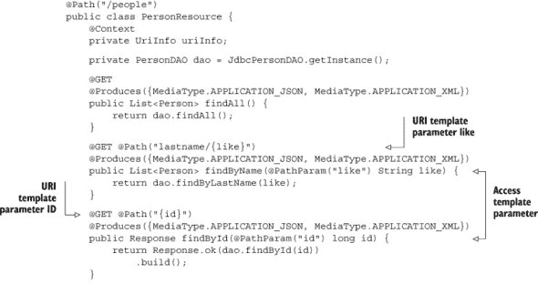

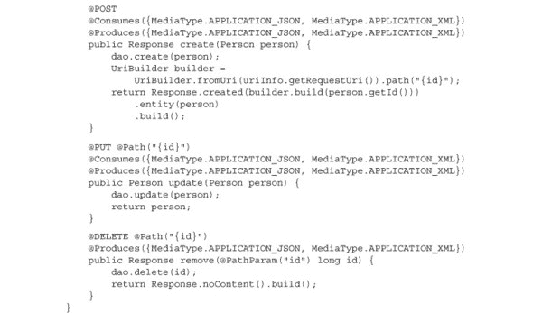

为了验证一切是否正常工作，我再次使用 Spock 提供一个测试类。测试 RESTful API 需要一个可以部署应用程序的服务器。Jersey 引用实现包括一个名为 Grizzly 的服务器用于此目的。

Spock 测试方法 `setupSpec` 和 `shutdownSpec` 分别在单个测试之前和之后各执行一次。因此，它们成为启动和停止服务器的合适位置，如下所示：

```
@Shared static HttpServer server

void setupSpec() {
    server = GrizzlyHttpServerFactory.createHttpServer(
        'http://localhost:1234/'.toURI(), new MyApplication())
}
void cleanupSpec() {
    server?.stop()
}
```

`createHttpServer` 方法在指定的 URI 上启动服务器并将 RESTful 应用程序部署到它上面。`MyApplication` 类非常简单：

```
public class MyApplication extends ResourceConfig {
    public MyApplication() {
        super(PersonResource.class, JacksonFeature.class);
    }
}
```

类 `MyApplication` 继承了一个名为 `ResourceConfig` 的 JAX-RS 类，该类的构造函数接受所需的资源和特性作为参数。这里使用的 `JacksonFeature` 提供了将 `PersonResource` 实例转换为 JSON 以及反向转换的机制.^([12])

> ¹² 一提到 JSON，我就是在谈论表示，而不是资源。再次强调，我将在第 9.5 节（#ch09lev1sec5）中讨论超媒体。

注意在关闭服务器时使用的方便的 safe-dereference 运算符 `?.`，这将在服务器无法正确启动时避免空指针异常。

第一个实际测试验证服务器已启动并运行，使用 `HttpServer` 类上的 `isStarted` 方法：

```
def 'server is running'() {
    expect: server.started
}
```

再次，使用标准 Groovy 语法访问属性来调用 `isStarted` 方法。当然，如果你更喜欢，你也可以直接调用该方法。

其余^([13]) 的测试方法需要客户端使用适当的动词生成 HTTP 请求。在 Groovy 中，GET 请求很简单，因为你可以利用 Groovy JDK 添加到 `java.net.URL` 类中的 `getText` 方法。因此，检索所有实例的请求可以写成如下：

> ¹³ 再次强调，这里没有双关语。

```
'http://localhost:1234/people'.toURL().text
```

虽然这样也可以工作，但响应需要被解析以获取适当的信息。通常这不会是问题，但在这里我使用了一个替代方案。

类 `RESTClient` 是 HttpBuilder ([`groovy.codehaus.org/modules/http-builder/`](http://groovy.codehaus.org/modules/http-builder/)) 项目的组成部分。我将在第 9.4 节（#ch09lev1sec4）中进一步讨论 Groovy 客户端，但到目前为止，让我说它定义了由 Apache 的 `HttpClient` 项目提供的 Java 类的 Groovy 类。因此，测试中包含了一个类型为 `RESTClient` 的属性，如下所示：

```
RESTClient client
    new RESTClient('http://localhost:1234/', ContentType.JSON)
```

客户端指向正确的端点，第二个参数指定请求中 `Accept` 头部的内容类型。使用此客户端的 GET 请求返回一个对象，可以查询头部属性以及数据：

```
def 'get request returns all people'() {
    when:
    def response = client.get(path: 'people')

    then:
    response.status == 200
    response.contentType == 'application/json'
    response.data.size() == 5
}
```

其他查找方法以类似的方式进行测试。为了保持测试的独立性，插入和删除方法一起测试；首先插入一个人，然后验证，然后再次删除。测试使用了 Spock 的另一个特性：每个块（`when`/`then`/`expect` 等）都可以提供一个字符串来描述其目的。这并不完全是行为驱动开发，但它是 Spock 目前所能达到的最接近的方式。

插入和删除测试看起来如下：

```
def 'insert and delete a person'() {
    given: 'A JSON object with first and last names'
    def json = [first: 'Peter Quincy', last: 'Taggart']

    when: 'post the JSON object'
    def response = client.post(path: 'people',
        contentType: ContentType.JSON, body: json)

    then: 'number of stored objects goes up by one'
    getAll().size() == old(getAll().size()) + 1
    response.data.first == 'Peter Quincy'
    response.data.last == 'Taggart'
    response.status == 201
    response.contentType == 'application/json'
    response.headers.Location ==
        "http://localhost:1234/people/${response.data.id}"

    when: 'delete the new JSON object'
    client.delete(path: response.headers.Location)

    then: 'number of stored objects goes down by one'
    getAll().size() == old(getAll().size()) - 1
}
```

给定一个表示人的 JSON 对象，通过 POST 请求将其添加到系统中。返回的对象包含状态码（201）、内容类型（application/json）、返回的人对象（在 `data` 属性中），以及新资源的 URI 在 `Location` 头部。删除对象是通过向新 URI 发送 DELETE 请求并验证存储的实例总数减少一个来完成的。

更新是通过 PUT 请求完成的。为了确保 PUT 请求是幂等的，需要在请求体中指定完整对象。这就是为什么 PUT 请求通常不用于插入；客户端不知道新插入对象的 ID，所以使用 POST 请求代替。

完整的测试在下一列表中展示。

##### 列表 9.5\. 使用方便的测试服务器的 `PersonResource` 的 Spock 测试

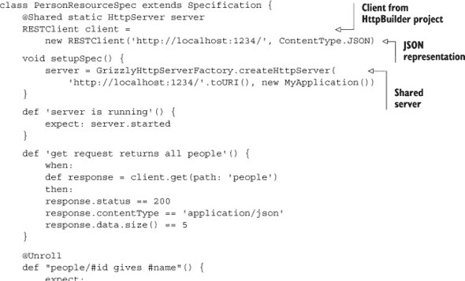

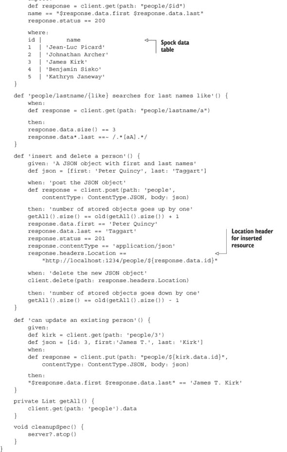

JAX-RS 注解的使用很简单。使用它们构建 URL 驱动的 API 并不难。规范 2.0 版本还包括客户端 API，但这里没有展示。

| |
| --- |

**（JAX-RS）学到的经验教训**

1.  JAX-RS 2.0 是 Java EE 规范的一部分，和大多数最近的规范一样，是基于注解的。

1.  使用 JAX-RS 构建超链接驱动的数据库非常容易。

1.  在 JAX-RS 中确实存在超媒体机制，但它们隐藏得很好。

| |
| --- |

相反，我想展示相同规范的 Groovy 实现，主要是为了说明代码简化。之后我会处理超媒体的问题。

### 9.3\. 使用 Groovy 实现 JAX-RS

虽然 Groovy 并没有以任何根本的方式改变 JAX-RS，但像往常一样，它简化了实现类。JAX-RS 已经通过提供自己的 DSL 来简化实现，因此 Groovy 的修改是最小的。

上一节使用了 Groovy 实现，但没有展示。这里我将展示足够的示例来说明 Groovy 功能。

首先，这是 `Person` POGO。注意 `@XmlRootElement` 注解，它用于控制响应中 `Person` 的序列化。通常这用于 Java API for XML Binding (JAXB)，但由于 Jackson JSON 解析器的存在，序列化过程会生成 JSON 对象：

```
@XmlRootElement
@EqualsAndHashCode
class Person {
    Long id
    String first
    String last

    String toString() { "$first $last" }
}
```

属性获取器、设置器和构造函数都是按常规方式生成的。`@EqualsAndHashCode` AST 转换负责 `equals` 和 `hashCode` 方法的实现。`@ToString` 注解也可以使用，但所需的 `toString` 方法几乎和它一样长，所以我只是直接写出来。

说到 AST 转换，当在 Groovy 中实现时，`@Singleton` 注解应用于 `JdbcPersonDAO` 类。这通过使构造函数私有、添加静态 `instance` 变量等方式自动实现并强制类的 `singleton` 属性。该类实现了与之前相同的接口。以下是类的开头：

```
@Singleton
class JdbcPersonDAO implements PersonDAO {
    static Sql sql = Sql.newInstance(
        url:'jdbc:h2:db', driver:'org.h2.Driver')

    static {
        sql.execute 'drop table if exists people'
        ...
    }
...
}
```

| |
| --- |

##### Groovy 和 Java 接口

Java 工具更喜欢 Java 接口。如果你使用 Java 接口和 Groovy 实现来集成，大多数 Java/Groovy 集成问题都会消失。

| |
| --- |

从 Java 转换到 Groovy 需要一点语法上的变化。`@Produces` 和 `@Consumes` 注解接受它们支持的媒体类型列表。在 Java 实现中，这表示为一个使用花括号表示法的数组：

```
@Produces({MediaType.APPLICATION_JSON, MediaType.APPLICATION_XML})
```

在 Groovy 中，花括号表示闭包。然而，方括号用于界定列表，因此 Groovy 的实现只是将花括号替换为方括号。

| |
| --- |

##### 花括号与方括号

Groovy 使用花括号定义闭包，因此定义 Java 数组的字面表示法应该使用方括号来表示 `java.util.ArrayList`。

| |
| --- |

下一个列表展示了 Groovy 中 `PersonResource` 的完整实现。

##### 列表 9.6\. `PersonResource` 类的 Groovy 实现

```
@Path('/people')
class PersonResource {
    @Context
    private UriInfo uriInfo

    PersonDAO dao = JdbcPersonDAO.instance

    @GET
    @Produces([MediaType.APPLICATION_JSON, MediaType.APPLICATION_XML])

    List<Person> findAll() {
        dao.findAll();
    }

    @GET @Path("lastname/{like}")
    @Produces([MediaType.APPLICATION_JSON, MediaType.APPLICATION_XML])
    List<Person> findByName(@PathParam("like") String like) {
        dao.findByLastName(like);
    }

    @GET @Path("{id}")
    @Produces([MediaType.APPLICATION_JSON, MediaType.APPLICATION_XML])
    Response findById(@PathParam("id") long id) {
        Response.ok(dao.findById(id))
            .build()
    }

    @POST
    @Consumes([MediaType.APPLICATION_JSON, MediaType.APPLICATION_XML])
    @Produces([MediaType.APPLICATION_JSON, MediaType.APPLICATION_XML])
    Response create(Person person) {
        dao.create(person);
        UriBuilder builder =
            UriBuilder.fromUri(uriInfo.requestUri).path("{id}")
        Response.created(builder.build(person.id))
            .entity(person)
            .build()
    }

    @PUT @Path("{id}")
    @Consumes([MediaType.APPLICATION_JSON, MediaType.APPLICATION_XML])
    @Produces([MediaType.APPLICATION_JSON, MediaType.APPLICATION_XML])
    Person update(Person person) {
        dao.update(person)
        person
    }

    @DELETE @Path("{id}")
    Response remove(@PathParam("id") long id) {
        dao.delete(id);
        Response.noContent().build()
    }
}
```

大多数关于 JAX-RS 的讨论都止步于此，有一个工作状态、由 URL 驱动的数据库。然而，真正的 REST 比这更灵活。RESTful 服务应该像网络一样行动，向客户端提供一个单一的 URL，客户端访问它并返回额外的链接。这被称为 HATEOAS，或简单地称为超媒体。

| |
| --- |

**从 JAX-RS 与 Groovy 中学到的经验教训**

1.  Groovy 并没有显著改变 JAX-RS。

1.  Groovy 的真正简化在于 POGO 和 DAO 类。两种语言中的资源实现基本上是相同的。

| |
| --- |

超媒体链接暴露给客户端，客户端消费它们。JAX-RS 1.x 不包括客户端 API。2.0 版本包括了一个，Groovy 生态系统中的 HttpBuilder 项目是一个方便的项目，用于执行 HTTP 请求。这两个都是下一节的主题。

### 9.4\. RESTful 客户端

访问 RESTful 网络服务涉及创建适当类型的 HTTP 请求，并将任何必要的信息添加到体中。当从版本 1 迁移到版本 2 时，JAX-RS 最大的变化之一是添加了标准客户端 API。该 API 包括 `Client` 和 `WebTarget` 类，其使用方法如下：

```
Client cl = ClientBuilder.newClient()
WebTarget target = cl.target('http://localhost:1234/people/3')
def resp = target.request().get(Response.class)
```

从 `ClientBuilder` 创建一个 `Client` 实例，它又指向一个 `Web-Target`。GET 请求使用 `get` 方法，其参数是返回对象的数据类型。此示例取自下一节中展示的媒体超文本测试。

在 Groovy 中，Groovy JDK 使得 GET 请求变得非常简单。Groovy JDK 将 `toURL` 方法添加到 `java.lang.String` 中，将 `String` 转换为 `java.net.URL` 的实例。Groovy JDK 还将 `getText` 方法添加到 `java.net.URL` 中。因此，从网络获取信息可以像这样简单：

```
String response = 'http://localhost:1234/people/3'.toURL().text
```

在 Groovy 中，与 Java 一样，使用 POST、PUT 和 DELETE 请求并不有趣。相反，最好通过库来访问客户端。

最受欢迎的 HTTP 库之一是开源的 Apache HTTP 客户端库 ([`hc.apache.org/httpcomponents-client-ga/index.html`](http://hc.apache.org/httpcomponents-client-ga/index.html))，它是 Apache HttpComponents 项目的一部分。

我更愿意关注相应的 Groovy 项目 HttpBuilder，而不是展示那个库的细节。HttpBuilder 项目 ([`groovy.codehaus.org/modules/http-builder/`](http://groovy.codehaus.org/modules/http-builder/)) 遵循经典的 Groovy 习惯：封装一个 Java 库并使其更容易使用。虽然网站上的文档还不错，但我建议查看源代码中的测试用例，以了解如何使用 API。

与大多数酷项目一样，源代码托管在 GitHub 上，地址为 [`github.com/jgritman/httpbuilder`](https://github.com/jgritman/httpbuilder)。API 包含一个方便的用于 REST 应用的类 `RESTClient`，我在本章的测试中使用了它。相应的测试类 `RESTClientTests` 展示了如何使用所有标准 HTTP 动词访问 Twitter。

我在 `PersonResourceSpec` 测试中使用了 `RESTClient` 类。`RESTClient` 类有一个构造函数，它接受两个参数，即基础 URL 和内容类型：

```
RESTClient client = new RESTClient(
    'http://localhost:1234/', ContentType.JSON)
```

在这种情况下，我在端口 1234 上运行 Grizzly 测试服务器，并且对于这个演示，数据以 JSON 格式存在。GET 方法的测试产生了以下结果：

```
def response = client.get(path: 'people')
response.status == 200
response.contentType == 'application/json'
response.data.size() == 5
```

`RESTClient` 提供了一个 `get` 方法，它接受一个 `path` 参数。响应返回具有（大多数）典型头部的特殊属性。其他头部可以通过请求 `allHeaders` 属性或通过调用 `get-Header("...")` 并提供所需的头部来检索。响应体中的任何返回实体都在 `data` 属性中。

查看 `PersonResourceSpec` 类的其余部分（^[14]），以获取 POST、PUT 和 DELETE 请求的示例。

> ^(14) 再次，抱歉。在某个时刻（这可能已经发生），当我说，“没有这个意思，”你可能根本不会相信我。


**学习到的经验（REST 客户端）**

1.  JAX-RS 2.0 包含用于构建 REST 客户端的类.^([15])

    > ^(15) JAX-RS 客户端类也非常容易使用，这在尝试展示 Groovy 有多酷的时候很不幸，但对于用户来说很有帮助。哦，算了。

1.  Groovy 项目的 HttpBuilder 包装了 Apache HttpClient 项目，使其更容易使用。


在超媒体部分的测试用例中，`RESTClient` 和 JAX-RS 2.0 客户端都被使用，这为最终讨论 Java 中的 HATEOAS 提供了一个很好的过渡。

### 9.5. 超媒体

一系列资源 URL 不是一个 RESTful 网络服务。充其量，它是一个 URL 驱动的数据库。然而，像这样的应用程序，它们声称是 RESTful 服务，遍布整个网络。

一个真正的^(16) REST 应用理解到，尽管尝试尽可能保持稳定，但特定的资源 URL 可能会发生变化。因此，请求的目的是发现后续的 URL。我们习惯于有一个固定的 API，因此这个概念可能很难接受。你不知道任何给定请求会返回什么，但你知道如何发出第一个请求，并查询结果以了解接下来可能发生什么。这与我们浏览网页的方式相似，这并非巧合。

> ^(16) 这里的“真正”被定义为“至少尝试遵循 Roy Fielding 的论文中的原则。”

虽然这给客户端和服务器带来了更高的负担。服务器需要添加一些类型的元数据来解释后续资源是什么以及如何访问它们，客户端需要读取这些响应并正确解释它们。

本节将说明你可以如何向服务响应中添加链接。我会从一个公共 API 的例子开始，然后演示如何将链接添加到 HTTP 响应头或响应体中，最后演示如何自定义输出方式。

#### 9.5.1. 一个简单的例子：烂番茄

作为简单的例子，考虑在第八章中使用的电影评论网站烂番茄提供的 API。烂番茄 API 只支持 GET 请求，因此它不是一个完整的 RESTful 服务.^(17])

> ^(17) 只支持 GET 的 RESTful 服务可以被称为 GETful 服务。如果它们也是无状态的，那么它们不就成了 FORGETful 服务？谢谢，谢谢。我整个星期都会在这里。尝试牛排，别忘了给服务员小费。

使用基于 URL 的 API 查询包含单词 *trek* 的电影看起来是这样的：

```
api.rottentomatoes.com/api/public/v1.0/movies.json?q=trek&apikey=3...
```

在生成的 151 (!) 部电影中，^([18]) 如果我选择 *星际迷航：暗黑无界*，我会得到一个如下所示的 JSON 对象（省略了很多部分）：

> ^（18）包括一个名为，我必须说的是，*星际迷航与蝙蝠侠*。企业号回到 20 世纪 60 年代，被小丑和猫女占领。真的。

```
{
    "id": "771190753",
    "title": "Star Trek Into Darkness",
    "year": 2013,
    ...,
    "synopsis": "The Star Trek franchise continues ...",
    ...,
    "links": {
       "self": "http://api.rottentomatoes.com/.../771190753.json",
       "cast": "http://api.rottentomatoes.com/.../771190753/cast.json",
       "clips": "http://api.rottentomatoes.com/.../771190753/clips.json",
       "reviews": "http://api.rottentomatoes.com/.../771190753/reviews.json",
       "similar": "http://api.rottentomatoes.com/.../771190753/similar.json"
    }
}
```

电影对象（使用 JSON 表示的资源）包含一个名为`links`的条目，它本身是一个键值映射。`links`对象中的所有键都指向其他资源，例如完整的演员列表或评论。

Rotten Tomatoes 服务将链接添加到单个资源中，而不是将其附加到响应头中。该网站使用自己的格式而不是其他标准.^([19]) 它还通过在 URL 本身嵌入“ .json”字符串来处理内容协商。

> ^（19）尝试标准化 JSON 链接包括[www.subbu.org/blog/2008/10/generalized-linking](http://www.subbu.org/blog/2008/10/generalized-linking)和[www.mnot.net/blog/2011/11/25/linking_in_json](http://www.mnot.net/blog/2011/11/25/linking_in_json)。

客户端当然需要知道所有这些信息，但通过在响应中包含一个`links`部分，服务器可以明确指出接下来期望的内容。客户端可以简单地展示这些链接给用户，或者尝试将它们置于上下文中，这需要额外的理解。

为基于超媒体的 RESTful 服务生成一个好的客户端不是一个简单任务。

注意一个有趣的观点：整个 API 使用 JSON 来表示对象。到目前为止，在本章中，我使用术语*资源*不仅代表服务器端暴露给客户端的对象，还代表其表示方式。正式来说，术语*表示*用来描述资源的形态。


##### 表示

表示是一个不可变、自描述、无状态的资源快照，可能包含指向其他资源的链接。


最常见的表示形式是 XML 和 JSON，其中 JSON 几乎无处不在。


**理查森成熟度模型：一个精心设计的演示**

理查森成熟度模型（RMM）基于 Leonard Richardson 在 2008 年的一次演讲，他描述了 REST 采用的多个级别。

RMM 有四个级别，编号从零到三：

+   ***零级：通过 HTTP 的简单老式 XML（POX）—*** HTTP 仅仅是一个传输协议，服务本质上是通过它进行的远程过程调用。听起来很像 SOAP，对吧？这并非巧合。

+   ***第一级：可寻址资源—*** 每个 URI 对应服务器端的一个资源。

+   ***第二级：统一接口—*** API 仅使用 HTTP 动词 GET、PUT、POST 和 DELETE（可能还包括 OPTIONS 和 TRACE）。

+   ***第三级：超媒体—*** 响应的表示包含定义过程额外步骤的链接。服务器甚至可以定义自定义 MIME 类型来指定如何包含额外的元数据。

现在，老实说，我对这个模型没有任何异议。它对 Roy Fielding 的论文来说是基本的；除非你也有超媒体，否则你并不是真正采用了 REST。

然而，单词*maturity*却带有许多情感负担。谁愿意他们的实现不够成熟？这也并非巧合，SOAP 被认为是成熟度级别 0。模型是好的，但无需给它加上带有评判色彩的语气，使其感觉像是一场被操纵的演示。


JAX-RS 中的超媒体^([20])通过链接工作，链接有两种类型：

> ^（20）信不信由你，超媒体和 HATEOAS 这两个词在 JSR 339 规范中根本**没有出现**。我对此没有解释。

+   HTTP 头中的过渡链接

+   响应中嵌入的结构链接

图 9.4 在单个 HTTP 响应中显示了两者。

##### 图 9.4\. 过渡链接出现在 HTTP 响应头中，而结构链接是响应对象的一部分。在每种情况下，链接都可以用来访问其他资源。

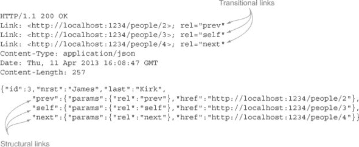

JAX-RS 规范的 2.0 版本支持使用`Link`和`LinkBuilder`类进行过渡链接，以及使用特殊的 JAXB 序列化器进行结构链接。

为了说明两者，我将继续使用之前提到的`Person`示例，并为每个实例添加链接。每个人有三种可能的链接：

+   一个`self`链接，包含该人的 URL

+   一个`prev`链接，指向 ID 比当前人 ID 小 1 的人

+   一个`next`链接，指向 ID 比当前人 ID 大 1 的人

这是一个相当牵强的例子，但它具有简单性的优势。

我首先将链接添加到 HTTP 头中，并展示如何使用它们。然后，我将使用结构链接，使用 JAXB 序列化器。最后，我将控制输出生成过程，并使用 Groovy 的`JsonBuilder`自定义输出写入器。

#### 9.5.2\. 添加过渡链接

要创建过渡链接，JAX-RS API 从`javax.ws.rs.core`包中的内部类`Response` `.Response-Builder`开始。`ResponseBuilder`有三个相关方法：

```
public abstract Response.ResponseBuilder link(String uri, String rel)
public abstract Response.ResponseBuilder link(URI uri, String rel)
public abstract Response.ResponseBuilder links(Link... link)
```

前两个示例向 HTTP 响应添加单个`Link`头。第三个示例向响应添加一系列头。以下是从`PersonResource`类中的一个示例：

```
@GET @Produces(MediaType.APPLICATION_JSON)
Response findAll() {
    def people = dao.findAll();
    Response.ok(people).link(uriInfo.requestUri, 'self').build()
}
```

在这种情况下，`link`方法使用请求 URI 作为第一个参数，并将`rel`属性设置为`self`。相应的测试如下访问链接：

```
def 'get request returns all people'() {
    when:
    def response = client.get(path: 'people')

    then:
    response.status == 200
    response.contentType == 'application/json'
    response.headers.Link ==
        '<http://localhost:1234/people>; rel="self"'
}
```

此示例仅返回一个`Link`头。对于多个链接（例如，每个个人的三个过渡链接`prev`、`next`和`self`），`getHeaders('Link')`方法检索所有这些链接。

在`PersonResource`中，链接是通过一个私有方法设置的，如下一列表所示。

##### 列表 9.7\. 为每个人设置`prev`、`self`和`next`链接头

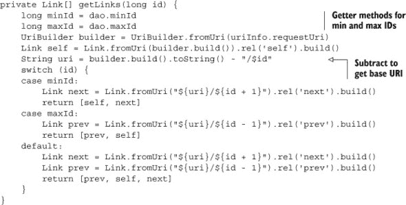

所以所谓的“self”链接为每个人生成。对于位于第一个和最后一个元素之间的元素，生成下一个和上一个链接。链接本身是通过字符串操作生成的。

使用`links`方法将链接添加到资源中：

```
Response findById(@PathParam("id") long id) {
    Person p = dao.findById(id)
    Response.*ok*(p)
        .links(getLinks(id))
        .build()
}
```

结果表明，使用`RESTClient`将`Link`头转换为有用的内容并不简单。在这种情况下，JAX-RS 的`Client`类效果更好。`Client`类有一个名为`getLink`的方法，该方法接受一个字符串参数，其中字符串是关系类型。该方法返回一个`javax.ws.rs.core.Link`类的实例，对应于 IETF 的 RFC 5988，Web 链接规范。

我将通过在客户端逐个遍历链接来演示超媒体功能。以下列表是一个 JUnit 测试用例，用 Groovy 编写，它访问`next`链接。

##### 列表 9.8\. 使用链接头遍历数据

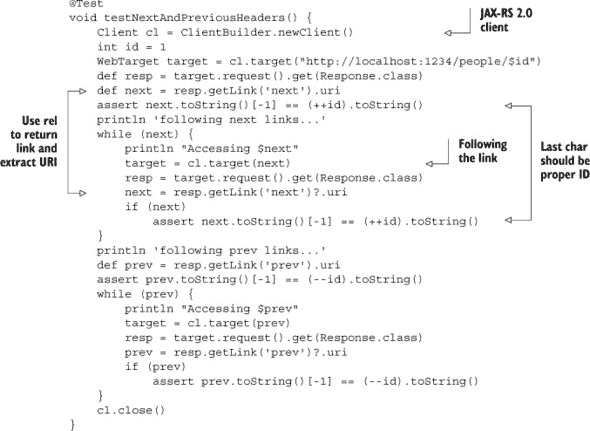

客户端使用`getLink`方法与关系类型（`next`或`prev`）一起使用，该方法返回一个`Link`实例。然后`getUri`方法返回一个`java.net.URI`实例，客户端可以在下一次迭代中跟随它.^([21])

> ²¹ 我必须提到，这可能是过去十年中我真正可以使用`do`/`while`循环的唯一几次之一。具有讽刺意味的是，这正是 Groovy 不支持的唯一 Java 结构。

如果你更愿意在响应体中放置链接，则需要采用不同的方法，下一节将进行描述。

#### 9.5.3\. 添加结构化链接

JAX-RS 中的结构化链接是实体内部的`Link`类的实例。将它们转换为 XML 或 JSON 需要特殊的序列化器，该序列化器由 API 提供。

这是`Person`类，扩展以包含`self`、`next`和`prev`链接作为属性：

```
@XmlRootElement
@EqualsAndHashCode
class Person {
    Long id
    String first
    String last

    @XmlJavaTypeAdapter(JaxbAdapter)
    Link prev

    @XmlJavaTypeAdapter(JaxbAdapter)
    Link self

    @XmlJavaTypeAdapter(JaxbAdapter)
    Link next
}
```

`prev`、`self`和`next`链接是`javax.ws.rs.core.Link`类的实例，与之前一样。`Link.JaxbAdapter`是一个内部类，它告诉 JAXB 如何序列化链接。

在资源中设置链接引用的值，这次使用了一个有趣的 Groovy 机制：

```
Response findById(@PathParam("id") long id) {
    Person p = dao.findById(id)
    getLinks(id).each { link ->
        p."${link.rel}" = link
    }
}
```

与头部分节中使用的相同`getLinks`私有方法，但这次链接被添加到`Person`实例中。通过调用`link.rel`（这会调用`getRel`方法）并将结果注入到一个字符串中，效果是调用`p.self`、`p.next`或`p.prev`，具体情况而定。在每种情况下，这将调用相关的 setter 方法并将属性分配给右侧的链接。

使用`RESTClient`测试结构化链接如下：

```
def 'structural and transitional links for kirk are correct'() {
    when:
    def response = client.get(path: 'people/3')

    then:
    'James Kirk' == "$response.data.first $response.data.last"
    response.getHeaders('Link').each { println it }
    assert response.data.prev.href == 'http://localhost:1234/people/2'
    assert response.data.self.href == 'http://localhost:1234/people/3'
    assert response.data.next.href == 'http://localhost:1234/people/4'
}
```

响应封装了一个`Person`实例，通过调用`getData`来访问。然后检索单个链接作为`prev`、`self`和`next`属性。结果是`Link`实例，其`getHref`方法可用于验证链接。

只有一个问题，这更像是一个麻烦，而不是其他。在超媒体部分的开始处，Rotten Tomatoes 示例中的链接不是电影的最顶层属性。相反，每个电影表示都包含一个键为 `links` 的 JSON 对象，其中包含单个链接和关系的列表。以下是 Rotten Tomatoes 响应的片段：

```
"links": {
    "self": "http://api.rottentomatoes.com/.../771190753.json",
    "cast": "http://api.rottentomatoes.com/.../771190753/cast.json",
    "clips": "http://api.rottentomatoes.com/.../771190753/clips.json",
    "reviews": "http://api.rottentomatoes.com/.../771190753/reviews.json",
    "similar": "http://api.rottentomatoes.com/.../771190753/similar.json"
}
```

在使用序列化器的 JAX-RS 方法中，关系是属性名。如果我想创建一个类似于电影示例中的链接集合，该怎么办？为此，我需要控制序列化过程。

#### 9.5.4\. 使用 JsonBuilder 控制输出

要自定义输出生成，JAX-RS 包含一个名为 `javax.ws.rs.ext` 的接口 `.MessageBodyWriter<T>`。此接口是将 Java 类型转换为流的契约。它包含三个需要实现的方法。

第一种方法被称为 `isWriteable`，对于本写器支持的类型，它返回 true。对于 `Person` 类，实现很简单：

```
boolean isWriteable(Class<?> type, Type genericType,
       Annotation[] annotations, MediaType mediaType) {
    type == Person && mediaType == MediaType.APPLICATION_JSON_TYPE
}
```

此方法仅在 `Person` 实例上返回 true，并且只有当指定的媒体类型是 JSON 时才返回 true。

第二种方法被称为 `getSize`，在 JAX-RS 2.0 中已被弃用。它的实现应该返回 -1：

```
long getSize(Person t, Class<?> type, Type genericType,
        Annotation[] annotations, MediaType mediaType) {
    return -1;
}
```

`writeTo` 方法完成所有工作。在这里，我使用 `groovy.json.JsonBuilder` 生成我想要的输出形式，如下所示。

##### 列表 9.9\. 使用 `JsonBuilder` 生成嵌套链接

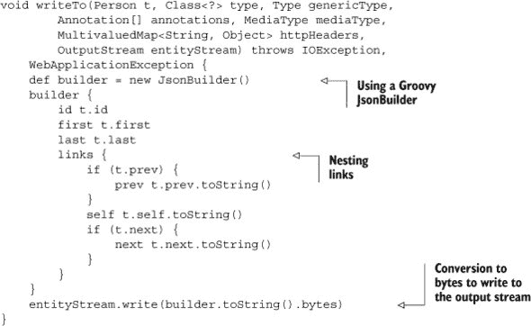

这里有一个特殊的怪癖值得注意。方法对单个 `Link` 实例调用 `toString`。正如 `Link` 的 JavaDocs 所明确指出的，`Link` 中的 `toString` 和 `valueOf(String)` 方法用于将字符串转换为和从字符串转换。 

`MessageBodyReader` 接口相当类似。在这种情况下，只有两个方法：`isReadable` 和 `readFrom`。`isReadable` 的实现与 `isWriteable` 方法相同：

```
public boolean isReadable(Class<?> type, Type genericType,
        Annotation[] annotations, MediaType mediaType) {
    type == Person && mediaType == MediaType.APPLICATION_JSON_TYPE
}
```

`readFrom` 方法使用 `JsonSlurper` 将字符串输入转换为 `Person`，如下所示。

##### 列表 9.10\. 从字符串解析 `Person` 实例

```
public Person readFrom(Class<Person> type, Type genericType,
        Annotation[] annotations, MediaType mediaType,
        MultivaluedMap<String, String> httpHeaders,

        InputStream entityStream)
            throws IOException, WebApplicationException {

    def json = new JsonSlurper().parseText(entityStream.text)
    Person p = new Person(id:json.id, first:json.first, last:json.last)
    if (json.links) {
        p.prev = Link.valueOf(json.links.prev)
        p.self = Link.valueOf(json.links.self)
        p.next = Link.valueOf(json.links.next)
    }
    return p
}
```

`readFrom` 方法使用 `JsonSlurper` 的 `parseText` 方法将输入文本数据转换为 JSON 对象，然后根据结果属性实例化一个 `Person`。如果正文中存在链接，它们将使用 `valueOf` 方法进行转换。

要使用 `MessageBodyWriter`，我需要在实现类上添加 `@Provider` 注解，并确保它在应用程序中加载。后者是通过将提供者添加到 `MyApplication` 类中完成的：

```
public class MyApplication extends ResourceConfig {
    public MyApplication() {
        super(PersonResource.class, PersonProvider.class,
              JacksonFeature.class);
    }
}
```

在这种情况下，同时使用了 `PersonProvider` 和 `JacksonFeature`。`Person` 提供者将单个 `Person` 实例转换为 JSON，而 `JacksonFeature` 处理集合。对结果结构的测试如下所示：

```
def 'transitional links for kirk are correct'() {
    when:
    def response = client.get(path: 'people/3')

    then:
    'James Kirk' == "$response.data.first $response.data.last"
    Link.valueOf(response.data.links.prev).uri ==
         'http://localhost:1234/people/2'.toURI()
    Link.valueOf(response.data.links.self).uri ==
         'http://localhost:1234/people/3'.toURI()
    Link.valueOf(response.data.links.next).uri ==
         'http://localhost:1234/people/4'.toURI()
}
```

响应体现在有一个 `links` 元素，它包含作为子元素的 `prev`、`self` 和 `next`。


**学习到的经验（超媒体）**

1.  JAX-RS 主要忽略了超媒体，但确实为它提供了一些方法。

1.  过渡链接头是通过`Response-Builder`中的`link`和`links`方法添加的。

1.  通过特殊的 JAXB 注解在正文中添加结构链接。

1.  你可以通过编写一个实现`MessageBodyReader`和/或`Message-BodyWriter`的提供者类来自己管理解析和响应生成阶段。


在过渡链接、与 JAXB 序列化器的结构链接和 Groovy 的`JsonBuilder`之间，希望你现在有足够的机制以任何你应用程序需要的方式实现超媒体链接。选择使用哪种方法在很大程度上是一个风格问题，但有一些指导原则：

+   结构链接包含在响应中，因此客户端必须解析响应才能获取它们。

+   过渡链接在 HTTP 头中。这使它们从响应中分离出来，但迫使客户端解析 HTTP 响应头以检索它们。

+   自定义链接可以是任何东西，因此它们必须被清楚地记录。

在网络上可以找到所有三种方法的示例。

### 9.6. 其他 Groovy 方法

在 Groovy 生态系统中有三种其他方法我应该提到，用于 RESTful Web 服务。在这里，我将特别讨论 groovlets、Ratpack 项目和 Grails。

#### 9.6.1. Groovlets

Groovlets 在第十章[kindle_split_022.html#ch10]中讨论了 Web 应用程序，以及第二章[kindle_split_012.html#ch02]中的简单示例，但本质上它们是接收 HTTP 请求并返回 HTTP 响应的 Groovy 脚本。Groovlets 包含许多隐式变量，包括`request`、`response`、`session`和`params`（用于存储输入变量）。

在 groovlet 中，你可以使用请求对象的`getMethod`方法来确定请求是 GET、PUT、POST 还是 DELETE。然后你可以相应地构建响应。

书中的源代码有一个名为`SongService`的项目，位于第十章[kindle_split_022.html#ch10]，它展示了如何使用 groovlet。该服务本身就是一个 groovlet，如下所示。

##### 列表 9.11. 处理并生成 XML 的 groovlet

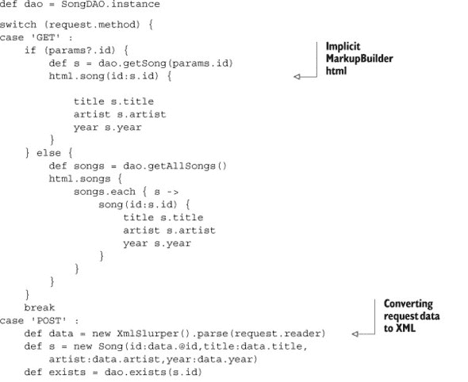


groovlet 使用`request.method`在`switch`语句中确定正确的实现。然后它使用一个名为`html`的内置`MarkupBuilder`来生成 XML，并使用`XmlSlurper`将 XML 转换为歌曲实例。现在 groovlets 也有内置的`JsonBuilder`，因此 JSON 可以很容易地被使用。

> ^(22) 这是我对 Groovy 的巨大贡献——groovlet 中的隐式`json`对象，我不仅添加了它，而且在添加的过程中还成功地破坏了构建。唉。如果你感兴趣，详细信息可以在[`mng.bz/5Vn6`](http://mng.bz/5Vn6)找到。

这种方法相当底层，但可能对快速实现或需要这种详细控制的情况很有用。

#### 9.6.2. Ratpack

第二种选择是查看 Ratpack 项目（[`github.com/ratpack/ratpack`](https://github.com/ratpack/ratpack)）。Ratpack 是一个 Groovy 项目，它遵循 Ruby 世界中的 Sinatra^([23])项目的相同理念。Ratpack 被称为“微型”框架，因为你编写简单的 Groovy 脚本，以控制如何处理单个请求。

> ^（23）Sinatra，Ratpack，明白了吗？如果其他什么都没有，那也是一个很棒的名字。

例如，一个简单的 Ratpack 脚本看起来像这样：

```
get("/person/:personid") {
    "This is the page for person ${urlparams.personid}"
}

post("/submit") {
    // handle form submission here
}

put("/some-resource") {
    // create the resource
}

delete("/some-resource") {
    // delete the resource
}
```

该项目显示出很大的潜力，Sinatra 在 Ruby 世界中非常受欢迎，所以它可能值得一看。该项目最近被 Luke Daley 接管，他是 Groovy 世界中的主要人物，所以我期待很快会有显著的改进。

#### 9.6.3\. Grails 和 REST

最后，Grails 也有 REST 功能。例如，在一个 Grails 应用程序中，你可以按照以下方式编辑`URLMappings.groovy`文件：

```
static mappings = {
    "/product/$id?"(resource:"product")
}
```

结果是，对于产品的 GET、POST、PUT 和 DELETE 请求将分别被导向`ProductController`中的`show`、`save`、`update`和`delete`操作。Grails 还可以自动解析和生成所需的 XML 和/或 JSON。

对于 Grails，还有一个可用的 JAX-RS 插件。目前它基于 JAX-RS 版本 1，但实现可以使用 Jersey 参考实现或 Restlets。当然，在两种情况下都没有提到超媒体，尽管你可以在 Groovy 中做的任何事情，当然也可以在 Grails 中做。

REST 功能是 Grails 3.0 的主要设计目标，因此到那时情况无疑会发生变化。

### 9.7\. 总结

近年来，RESTful Web 服务的主题非常热门，这是有充分理由的。REST 架构使开发者能够构建灵活、高度解耦的应用程序，这些应用程序利用了使 Web 本身如此成功的相同特性。

在 Java 世界中，有许多库可用于实现 REST 架构。本章重点介绍了 JAX-RS 2.0 规范以及 Groovy 如何与之结合使用。除了基本的 URL 驱动数据库之外，还可以通过 HTTP 头中的过渡链接、实体体内的结构链接，甚至通过 Groovy 的`JsonBuilder`来实现超媒体。希望本章中的一些技术组合能够帮助你构建你想要的服务。

## 第十章\. 构建和测试 Web 应用程序

*本章涵盖*

+   Groovy servlets 和 `ServletCategory`

+   Groovlets

+   Web 应用的单元和集成测试

+   Groovy 杀手级应用，Grails

虽然 Java 在桌面上有其支持者，但 Java 在服务器端找到了真正的归宿。Java 在早期的发展和采用与 Web 本身的发展紧密相连。很少有 Java 开发者没有至少参与过一个 Web 应用程序的开发。

在本章中，我将探讨现代 Web 应用程序开发以及 Groovy 如何使这个过程更加简单和容易。有时 Groovy 只是简化了代码。有时它提供了有用的测试工具，如 Gradle 和 HTTPBuilder。最后，还有 Groovy 生态系统中最著名的框架 Grails。我将回顾它们所有，并尝试将它们放在 Web 应用程序的整体环境中。

 是本章讨论的技术指南。

##### 图 10.1。本章技术指南。Spring 提供了用于测试的模拟对象，这些对象也用于 Grails。使用插件和一些配置，Gradle 构建可以执行 Web 应用的集成测试。`ServletCategory` 类使会话、请求和其他对象更容易使用。Groovlets 是构建简单应用的一种快速方式。最后，HTTPBuilder 项目提供了一个程序性 Web 客户端，Grails 应用程序使用 Groovy DSL 和优雅的元编程将 Spring 和 Hibernate 结合到一个标准的约定优于配置框架中。

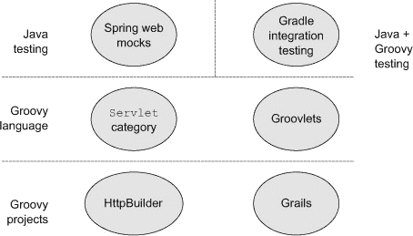

### 10.1。Groovy servlets 和 ServletCategory

Groovy 并没有为基本的 servlet 开发添加很多功能，但标准库确实提供了一个类别类，展示了 Groovy 的元编程能力。以下列表显示了一个简单的 servlet，`HelloGroovyServlet.groovy`，这是使用 Groovy 实现的 Web 应用程序的一部分。

##### 列表 10.1。使用 Groovy 实现的简单 servlet

```
class HelloGroovyServlet extends HttpServlet {
    void doGet(HttpServletRequest req, HttpServletResponse resp)
        throws ServletException, IOException {
        resp.writer.print 'Hello from a Groovy Servlet!'
    }
}
```

除了正常的 Groovy 简化（省略 `public` 关键字，缺少分号，使用 `writer` 而不是 `getWriter()`，以及 `print` 上的可选括号）之外，这与 Java 实现并没有太大的不同。如果你更喜欢稍微简短的代码，可以使用 Groovy，但真正选择语言的问题是一个风格问题。

Groovy 提供的是一种类别类，可以进一步简化代码。类别类是 Groovy 元编程能力的一个例子。它们展示了如何在指定的代码块中向现有类添加方法，而不是像使用元类对象那样在程序中的任何地方添加它们。如果你曾经想了解类别，`ServletCategory` 是一个极好、极其简单、非常有用的例子。

| |
| --- |

##### 类别

当你只需要在特定情况下使用那些方法时，使用 Groovy 类别向现有类添加方法。类别方法仅在 `use` 块中可用。

| |
| --- |

 展示了 `groovy.servlet.Servlet-Category` 类的 GroovyDocs 示例。

##### 图 10.2。`ServletCategory` 的 GroovyDocs。每个方法都是静态的，并添加到第一个参数中列出的类。

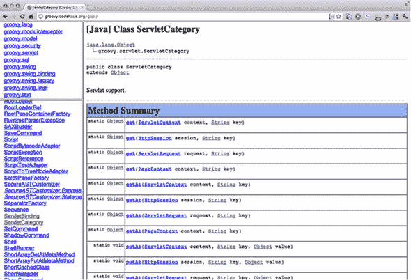

一个 Groovy 类别由一个或多个参数的静态方法组成。方法的第一参数是接收该方法的类。在 `Servlet-Category` 中只有四个方法，有很多重载（见 表 10.1）。

##### 表 10.1. 不同作用域的 `ServletCategory` 方法

| 方法名称 | 第一个参数 |
| --- | --- |
| get(arg, String key) | ServletContext, HttpSession, ServletRequest, PageContext |
| getAt(arg, String key) | 与上面相同 |
| putAt(arg, String key, Object value) | 与上面相同 |
| set(arg, String key, Object value) | 与上面相同 |

你看到了模式吗？这个分类的任务是使在页面作用域（`PageContext`）、请求作用域（`ServletRequest`）、会话作用域（`HttpSession`）和应用作用域（`ServletContext`）中添加属性变得容易。记住，在 Groovy 中，所有操作符都对应于方法。在这种情况下，`get` 和 `set` 方法对应于点操作符，而 `getAt` 和 `putAt` 方法实现了数组索引操作符。在我展示示例之前，请看一下实际实现类 `groovy.servlet.ServletCategory` 的以下部分，它是在 Java 中实现的。

##### 列表 10.2. 来自 `groovy.servlet.ServletCategory` 的 `HttpSession` 方法

```
public class ServletCategory {

    public static Object get(HttpSession session, String key) {
        return session.getAttribute(key);
    }
    ...
    public static Object getAt(HttpSession session, String key) {
        return session.getAttribute(key);
    }
    ...
    public static void set(HttpSession session,
        String key, Object value) {
        session.setAttribute(key, value);
    }
    ...
    public static void putAt(HttpSession session,
        String key, Object value) {
        session.setAttribute(key, value);
    }
}
```

首先值得注意的是，这个类是用 Java 编写的 (!)，尽管它是在 Groovy 中使用的。当重载操作符时，Groovy 不关心你使用哪种语言来实现方法，只关心你使用的是否是委托给 Groovy 中方法的操作符。在这种情况下，我甚至不打算直接使用这些方法。相反，我使用点操作符和/或数组索引表示法来隐式调用它们。

这里另一个重要的细节是，所有方法都是委托给 `getAttribute` 或 `setAttribute` 方法。结果是，可以使用点操作符或索引操作符将属性添加到页面、请求、会话或应用作用域。

| |
| --- |

##### ServletCategory

无论你是否使用 `ServletCategory`，它的元编程和操作符重载的结合使其成为 Groovy 如何帮助 Java 的一个优秀示例。

| |
| --- |
| |

**Groovy 2.0 中的分类**

Groovy 2.0 引入了一种用于定义分类的替代语法。在本节中讨论的 `ServletCategory` 中，分类类包含静态方法，其第一个参数是要修改的类。在新语法中，你可以使用注解和实例方法。

例如，考虑将数字格式化为货币。`java.text.NumberFormat` 类有一个名为 `getCurrencyInstance` 的方法，它有一个无参数方法用于格式化当前区域设置，还有一个重载版本，它接受一个 `java.util.Locale` 参数。向 `Number` 类添加一个 `asCurrency` 方法，并使用货币格式化器，经典的方式如下

```
import java.text.NumberFormat

class CurrencyCategory {
    static String asCurrency(Number amount) {
        NumberFormat.currencyInstance.format(amount)
    }

    static String asCurrency(Number amount, Locale loc) {
        NumberFormat.getCurrencyInstance(loc).format(amount)
    }
}

use(CurrencyCategory) {
    def amount = 1234567.89012
    println amount.asCurrency()
    println amount.asCurrency(Locale.GERMANY)
    println amount.asCurrency(new Locale('hin','IN'))
}
```

实现分类的新方法使用 `@Category` 注解，它接受要修改的类作为参数。然后在分类内部使用实例方法，`this` 引用指向分类被调用的对象。货币分类的类似实现如下

```
import java.text.NumberFormat

@Category(Number)
class AnnotationCurrencyCategory {
    String asCurrency() {
        NumberFormat.currencyInstance.format(this)
    }

    String asCurrency(Locale loc) {
        NumberFormat.getCurrencyInstance(loc).format(this)
    }
}

Number.mixin AnnotationCurrencyCategory
def amount = 1234567.89012
println amount.asCurrency()
println amount.asCurrency(Locale.GERMANY)
println amount.asCurrency(new Locale('hin','IN'))
```

还要注意使用 `mixin` 方法将类别添加到 `Number` 类。

假设现在正在实现 `ServletCategory`，它可能会使用注解方法。当然，无论哪种方式，结果都是相同的.^([1])

> ¹ 书籍源代码包括两种实现货币类别的方法以及一个测试用例。

| |
| --- |

以下将举例说明。下一列表展示了一个名为 `HelloName-Servlet` 的类，它使用 Groovy 实现，接收一个 `name` 参数，并返回标准的欢迎信息。

##### 列表 10.3. 使用 `ServletCategory` 的 `HelloNameServlet` 类

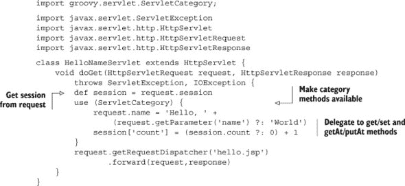

这个类同时与请求和会话中的属性一起工作。在从请求中获取会话（这是标准的“属性访问意味着获取方法”风格，而不是类别）之后，`use` 块定义了类别活跃的区域。在 `use` 块内部，使用点符号向 `request` 添加了一个 `name` 属性，其值要么由用户以参数的形式提供，要么由默认值 `World` 组成。接下来，在会话中放置一个 `count` 属性；其值要么从现有值中递增，要么如果它不存在，则设置为 `1`。

测试类 `HelloNameServletTest` 在下一列表中展示。它使用 Spring API 模拟对象来测试 `doGet` 方法，无论是带参数还是不带参数。

##### 列表 10.4. 使用 Spring 模拟对象的 `HelloNameServletTest` 类

```
import static org.junit.Assert.*;

import org.junit.Test;
import org.springframework.mock.web.MockHttpServletRequest;

import org.springframework.mock.web.MockHttpServletResponse;
import org.springframework.mock.web.MockHttpSession;

class HelloNameServletTest {
    HelloNameServlet servlet = new HelloNameServlet()

    @Test
    void testDoGetWithNoName() {
        MockHttpServletRequest request = new MockHttpServletRequest()
        MockHttpServletResponse response = new MockHttpServletResponse()
        MockHttpSession session = new MockHttpSession()
        request.session = session
        servlet.doGet(request, response)
        assert 'hello.jsp' == response.forwardedUrl
        assert request.getAttribute("name") == 'Hello, World'
        assert session.getAttribute("count") == 1
    }

    @Test
    void testDoGetWithName() {
        MockHttpServletRequest request = new MockHttpServletRequest()
        MockHttpServletResponse response = new MockHttpServletResponse()
        MockHttpSession session = new MockHttpSession()
        request.session = session
        request.setParameter('name','Dolly')
        servlet.doGet(request, response)
        assert 'hello.jsp' == response.forwardedUrl
        assert request.getAttribute("name") == 'Hello, Dolly'
        assert session.getAttribute("count") == 1
    }
}
```

在测试中不需要 `ServletCategory`，因为我已经使用模拟对象而不是 Servlet API 类。请注意，测试检查了 `request` 和 `session` 属性以及从 `doGet` 方法转发的 URL。`Servlet-``Category` 类是使用 Groovy 的元编程能力简化 API 的简单示例。

作为正常 servlet 开发的简单替代方案，Groovy 提供了 groovlets。

### 10.2. 使用 groovlets 进行简单的服务器端开发

Groovlets 是响应 HTTP 请求执行的 Groovy 脚本。一个内置的库类 `groovy.servlet.GroovyServlet` 执行它们。像所有 Groovy 脚本一样，它们与一个绑定相关联，该绑定包含许多预实例化的变量。

要使用 groovlet，首先配置 `GroovyServlet` 以接收映射的请求。这样做的一种典型方式是将以下 XML 添加到标准的 Web 应用程序部署描述符 web.xml 中：

```
<servlet>
    <servlet-name>Groovy</servlet-name>
    <servlet-class>groovy.servlet.GroovyServlet</servlet-class>
</servlet>
<servlet-mapping>
    <servlet-name>Groovy</servlet-name>

    <url-pattern>*.groovy</url-pattern>
</servlet-mapping>
```

`GroovyServlet` 类是标准 Groovy 库的一部分。在这里，它被映射到 URL 模式 `*.groovy`，这意味着任何以该模式结尾的 URL 都将被导向这个 servlet。例如，URL http://localhost/.../hello.groovy 将匹配到 Web 应用程序根目录下的名为 `hello.groovy` 的脚本。请记住，这实际上是源文件，而不是编译后的类。

| |
| --- |

##### Groovlets

Groovlets 以源代码的形式部署，而不是编译。

| |
| --- |

当被调用时，`GroovyServlet`类找到以 URL 结尾的脚本名称，预先实例化一系列变量，创建`GroovyScriptEngine`类的一个实例，并执行脚本。实际的脚本代码可以放置在 Web 应用根目录下的任何可访问目录中，或者放置在/WEB-INF/groovy 的任何子目录中。

groovlet 简单性的关键是这个已经配置好的基础设施。有了这个，开发者需要做的工作就少多了。

#### 10.2.1\. 一个“Hello, World!” groovlet

因为每种技术都需要一个“Hello, World!”应用程序，所以这里有一个用于问候用户的 groovlet。假设`GroovyServlet`已经配置好了，并在 Web 应用的根目录下添加一个名为`hello.groovy`的文件。在一个标准的 Maven 结构中，这将是 src/main/webapp/hello.groovy。groovlet 的内容如下

```
name = params.name ?: 'World'
println "Hello, $name!"
```

这是一个简单的 groovlet，但它仍然应该被测试。本章后面将讨论 Web 应用的集成测试，但下一个列表中的语法使用的是与前面几个章节中相同的机制来传输 GET 请求（使用 Groovy JDK 将字符串转换为`URL`，然后调用 URL 的`getText`方法）。

##### 列表 10.5\. `HelloGroovletTest`，`hello` groovlet 的集成测试

```
class HelloGroovletTest {
    int port = 8163

    @Test
    void testHelloGroovletWithNoName() {
        String response =
            "http://localhost:$port*/HelloGroovlet/hello.groovy"*
            .*toURL*().*text*
        assert 'Hello, World!' == response.trim()
    }

    @Test
    void testHelloGroovletWithName() {
        String response =
            "http://localhost:$port*/HelloGroovlet/hello.groovy?name=Dolly"*
            .*toURL*().*text*

        assert 'Hello, Dolly!' == response.trim()
    }
}
```

这个测试没有什么特别令人惊讶或不寻常的地方，因为它很简单，因为 groovlet 只响应 GET 请求。

基于`GroovyServlet`将 groovlet 作为具有预定义变量的脚本执行的事实，单元测试也是可以完成的。例如，下一个列表显示了使用`GroovyShell`类和`Binding`类进行单元测试的 groovlet，其方式类似于在第六章（kindle_split_017.html#ch06）中描述的测试。

##### 列表 10.6\. 使用`GroovyShell`和`Binding`对 groovlet 进行的单元测试

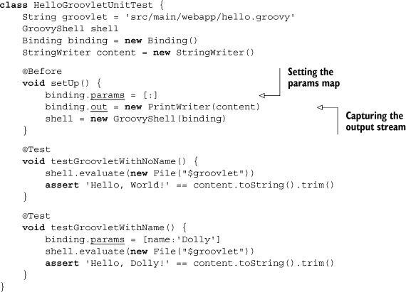

这个测试的有趣之处首先在于 groovlet 期望一个输入参数的映射，因此测试必须提供一个，并且我需要一种方法来捕获 groovlet 的输出流，这通过绑定中的`out`变量来完成。

回想一下第六章，Groovy 还提供了一个名为`GroovyTestCase`的子类，称为`GroovyShellTestCase`，它被设计用来测试此类脚本。下面的列表显示了使用`GroovyShellTestCase`的相同单元测试。请注意，它明显更简单。

##### 列表 10.7\. 使用`GroovyShellTestCase`简化 groovlet 的单元测试

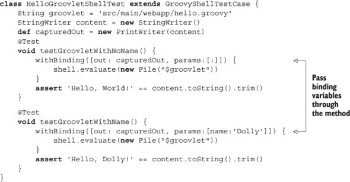

`GroovyShellTestCase` 类内部实例化一个 `GroovyShell` 并允许你通过 `withBinding` 方法传递一个绑定参数的映射。

#### 10.2.2\. groovlet 中的隐含变量

之前的例子显示 groovlets 期望所有请求参数都被打包到一个名为`params`的映射中。Groovlets 在一个包含许多隐含变量的环境中运行。表 10.2 显示了完整的列表。

##### 表 10.2. Groovlets 中可用的隐式变量

| 变量 | 代表 | 备注 |
| --- | --- | --- |
| request | ServletRequest |   |
| response | ServletResponse |   |
| session | getSession(false) | 可能为 null |
| context | ServletContext |   |
| application | ServletContext (与 context 相同) |   |
| params |   | 请求参数映射 |
| headers |   | 请求/响应头映射 |
| out | response.getWriter() |   |
| sout | response.getOutputStream() |   |
| html | new MarkupBuilder(out) |   |

之前的例子只使用了`params`变量。现在我将讨论一个稍微复杂一点的例子，这个例子首先在第二章中介绍的 Groovy Baseball 应用程序中使用。

下面的列表显示了完整的源代码。

##### 列表 10.8. Groovy Baseball 应用程序中的`GameService` groovlet

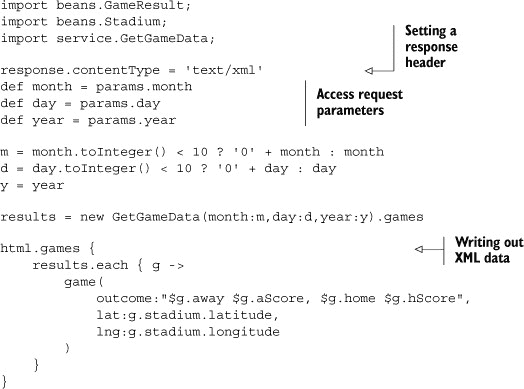

`GameService` groovlet 的目标是获取用户界面提供的日期，调用`GetGameData`服务中的`getGames`方法，并将结果以 XML 形式提供给用户。groovlet 在响应中设置`contentType`头为 XML，检索表示请求日期的输入参数，如果需要则将它们规范化到适当的形式，调用游戏服务，并使用内置的标记构建器将游戏结果写入 XML 块。

使用标记构建器来写入 XML 在这里很有帮助。当前 Web 应用面临的一个问题是用户界面中使用的 JavaScript 代码无法解析服务器端产生的 Java 或 Groovy 对象。需要一个中间格式，双方都可以解释和生成。为此，只有两个现实的选择：XML 和 JavaScript 对象表示法（JSON）。最近的趋势是尽可能多地使用 JSON 对象，但 groovlets 内部的标记构建器使得生成 XML 变得容易。该应用程序生成的 XML 量很少，所以解析用户界面中的 XML 不是问题。


##### 生成 XML

在需要时使用 groovlets 中的`html`标记构建器来写入 XML，而不是生成 HTML 网页。


这个演示很简单，但这就是重点。Groovlets 是一种方便的方式，可以接收输入数据，访问后端服务，并生成响应或将用户转发到新的目的地。因为它们有一个内置的方式将对象转换为 XML（并且添加一个`JsonBuilder`以转换为 JSON 也不难^([2]))，所以它们是 RESTful Web 服务的理想前端。

> ² 事实上，我确实帮了那个忙。这就是开源的魅力；如果你有想法，就去实现它。


**学习到的经验（groovlets）**

1.  Groovlets 是由嵌入式 servlet 执行的 Groovy 脚本。

1.  Groovlets 包含请求参数、HTTP 会话等隐式对象。

1.  Groovlets 使用构建器来生成格式化的输出。


在展示 Grails 框架之前，现在让我讨论一下测试 Web 应用程序的问题，包括作为单元测试的独立测试和利用 Gradle 自动化的集成测试。

### 10.3. 单元测试和集成测试 Web 组件

第六章讨论了单元测试 Java 和 Groovy 类的技术，并展示了 Groovy 的模拟能力如何提供一套标准库的模拟和存根来支持单元测试。测试单个类以及将这些测试作为构建过程的一部分自动运行是非常容易的。

测试如此重要，以至于大多数现代 Web 框架都将可测试性视为一个主要的设计目标，因此它们试图使各个组件易于测试。例如，原始 Struts 框架与更现代的 Struts 2、Spring MVC、JSF 或其他许多框架之间的一个主要区别是它们的组件是如何考虑测试而设计的。尽管如此，Web 组件的测试程度远不如预期。

尽管如此，单元测试和集成测试 Web 应用程序与测试系统中的任何其他内容一样重要，并且自动执行这些测试是至关重要的。通过手动在表单中输入数据并点击链接来集成测试 Web 应用程序是一种极其昂贵且容易出错的机制。必须有一种更好的方法，幸运的是 Groovy 在这个领域提供了大量帮助。

然而，为了打下基础，我将从 Spring 框架中最大的 Java 库之一提供的模拟类库开始。

#### 10.3.1. 使用 Spring 单元测试 Servlet

Spring 框架是 Java 世界中最受欢迎的开源库之一。第七章关于 Groovy 和 Spring 的讨论中对其进行了详细阐述，但我在这里想要提及它有两个原因：(1) Spring 为单元测试 Web 应用程序提供了一套优秀的模拟对象，(2) Spring 是 Grails 的底层技术之一，因此了解 Spring 的工作原理有助于你更有效地使用 Grails。

为了说明挑战并突出测试过程中需要模拟的依赖关系，让我从一个简单的名为 `HelloServlet` 的 Java Servlet 类开始，以展示其结构：

```
public class HelloServlet extends HttpServlet {
    protected void doGet(HttpServletRequest req, HttpServletResponse resp)
        throws ServletException, IOException {
        resp.getWriter().print("Hello, Servlet!");
    }
}
```

Servlets 都是通过继承创建的，通常是通过扩展 `javax.servlet.http.HttpServlet`。`HttpServlet` 是一个没有抽象方法的抽象类。它接收 HTTP 请求并将它们委托给对应于每个 HTTP 动词的 `do` 方法，如 `doGet`、`doPost`、`doPut`、`doTrace` 或 `doOptions`。这些方法都接受两个参数，一个是 `HttpServletRequest` 类型，另一个是 `HttpServletResponse` 类型。

`HelloServlet` 类重写了 `doGet` 方法以响应 HTTP GET 请求。它使用 `resp` 参数（`HttpServletResponse` 的一个实例）来获取相关的输出写入器，该写入器用于向输出流打印。

即使在这个简单的类中，单元测试的挑战性也是显而易见的。为了提醒大家单元测试的要点，让我说：

| |
| --- |

##### 单元测试 Web 组件

单元测试 Web 应用程序的目的是在容器外运行测试。这需要所有由容器提供的类和服务的模拟对象。

| |
| --- |

在这种情况下，我需要代表类型为`HttpServlet-Request`和`HttpServletResponse`的两个对象。在大多数情况下，我还需要代表`HttpSession`、`ServletContext`，以及可能还有更多的对象。

正是 Spring 框架中的模拟类集合提供了帮助。Spring API 包括一个名为`org.springframework.mock.web`的包，正如 API 中所述，它包含“一套全面的 Servlet API 2.5 模拟对象，旨在与 Spring 的 Web MVC 框架一起使用。”幸运的是，它们可以与任何 Web 应用程序一起使用，无论它是否基于 Spring MVC。

> ³ 模拟对象在 Servlet 3.0 中同样适用，尽管 JavaDocs 中列出了少数例外。

下一个列表显示了对我“Hello, World!” servlet 的`doGet`方法的 JUnit 测试。

##### 列表 10.9\. `HelloServletJavaTest`：使用模拟对象的 servlet 测试类

```
import static org.junit.Assert.*;

import org.junit.Test;
import org.springframework.mock.web.MockHttpServletRequest;
import org.springframework.mock.web.MockHttpServletResponse;

public class HelloServletJavaTest {
    @Test
    public void testDoGet() {
        HelloServlet servlet = new HelloServlet();
        MockHttpServletRequest req = new MockHttpServletRequest();
        MockHttpServletResponse resp = new MockHttpServletResponse();

        try {
            servlet.doGet(req, resp);
            assertEquals("Hello, Servlet!",
                resp.getContentAsString().trim());
        } catch (Exception e) {
            e.printStackTrace();
        }
    }
}
```

`try/catch`块尽力将本质隐藏在仪式之中，但意图是清晰的。该方法实例化了 servlet 以及代表 servlet 请求和 servlet 响应类的模拟对象，然后使用模拟对象作为参数在 servlet 上调用`doGet`方法。好事是`MockHttpServletResponse`类有一个名为`getContentAsString`的方法，它可以捕获写入 servlet 输出流中的数据，以便与预期的答案进行比较。

注意，模拟类并不是作为传统意义上的 Spring beans（如第七章中所述）来使用的，而仅仅是作为一个可用的 API。

如图 10.3 所示，单元测试 Servlet 非常简单。实例化 servlet，提供它需要的任何模拟对象，调用适当的`do`方法，并检查结果。这个例子展示了`getContentAsString`；本章中的其他测试将展示另外两个方便的方法：`getForwardedUrl`和`getRedirectedUrl`。有了这些类和方法，就不需要部署到 servlet 容器中。

##### 图 10.3\. 使用 Spring 模拟的 Servlet 测试。Spring API 为请求、响应和会话提供了模拟类，并捕获输出、转发和重定向的 URL。

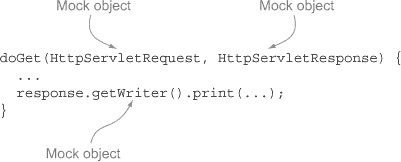

然而，到目前为止，我完全没有使用 Groovy。Groovy 提供了什么来使 Servlet 开发和测试更容易？我将在下一节回答这个问题。

尽管单元测试很重要，但并不总是足够。我想证明我的应用程序类在实际中也能正常工作，所以我还想进行集成测试。这意味着我需要一个 servlet 容器，一种部署我的 Web 应用程序的方法，以及一种触发除简单 GET 请求之外的其他请求类型的方法。这是下一节的主题。

#### 10.3.2\. 使用 Gradle 进行集成测试

Gradle 是一个用 Groovy 实现的构建工具，这在第五章（关于构建过程）中进行了广泛讨论。[kindle_split_016.html#ch05]。Gradle 使用 Groovy 构建器语法来指定仓库、库依赖项和构建任务。使用正常插件（如本书中使用的 Groovy 插件）执行构建会下载任何需要的依赖项，编译和测试代码，并准备最终的结果报告。与 Gradle 一起工作的一个优点是它提供了大量的可用插件。在本章中，我正在处理 Web 应用程序，Gradle 理解它们的结构以及常规的 Java 或 Groovy 应用程序。你只需要包含`war`插件，一切就会工作。更好的是，Gradle 还包含一个`jetty`插件，它专为测试 Web 应用程序而设计。

简单地添加以下行到 Gradle 构建文件中：

```
apply plugin:'war'
```

项目将使用 Web 应用程序的默认 Maven 结构。这意味着 web 目录 src/main/webapp 将包含任何视图层文件，如 HTML、CSS 和 JavaScript。该目录还将包含 WEB-INF 子目录，其中包含 web 部署描述符 web.xml。源结构可以按任何方式映射，但在这个部分，我将坚持使用默认的 Maven 方法。

考虑一个包含上一节中的`HelloServlet`的 Web 应用程序。项目布局如图 10.4 所示。figure 10.4。

##### 图 10.4\. Web 项目布局。集成测试目录将在本章后面讨论。该项目具有 Web 应用程序的标准 Maven 结构。

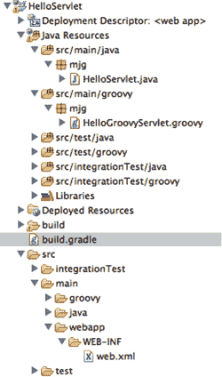

在这个阶段，Gradle 构建文件非常简单，如下所示。

##### 列表 10.10\. 使用`war`插件的 Web 应用程序的 Gradle 构建文件

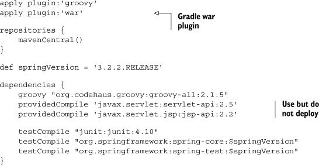

列表中包含了`war`插件。通常，依赖项来自 Maven 中央仓库。依赖的库包括 JUnit 和用于单元测试的 Spring API 库。有趣的功能是`providedCompile`依赖项。这告诉 Gradle 在编译期间需要 servlet 和 JSP API，但在部署时不需要，因为容器将提供它们。

当与`jetty`插件结合使用时，`war`插件表现得非常出色。Jetty 是由 Eclipse 基金会托管的一个轻量级、开源的 servlet 容器。4 这使得测试 Web 应用程序变得方便，Gradle 的标准分发中包含了一个`jetty`插件。

> ⁴有关详细信息，请参阅[www.eclipse.org/jetty/](http://www.eclipse.org/jetty/)。

#### 10.3.3. 在 Gradle 构建中自动化 Jetty

要在 Gradle 中使用 Jetty，你需要添加插件依赖项，但还需要配置一些设置：

```
apply plugin:'jetty'

httpPort = 8080
stopPort = 9451
stopKey = 'foo'
```

`httpPort`变量是 Jetty 将用于 HTTP 请求的端口。使用 8080 是典型的，因为它既是 Tomcat 也是 Jetty 的默认端口，但这绝对不是必需的。Jetty 容器将在`stopPort`上监听关闭请求，当需要关闭时，插件将向 Jetty 发送`stopKey`。

将插件和属性添加到 Gradle 构建中可以启用三个新任务：

> **1**. `jettyRun`，用于启动服务器并部署应用程序
> 
> **2**. `jettyRunWar`，在部署前创建 WAR 文件
> 
> **3**. `jettyStop`，用于停止服务器

这很有帮助，但我想自动化部署应用程序的过程，这样我就可以在没有人为干预的情况下运行集成测试。为了实现这一点，我需要`jettyRun`和`jettyRunWar`任务以“守护”模式运行，这意味着启动后，控制权将返回到构建，以便它可以继续执行其他任务。

因此，我在构建中添加了以下行：

```
[jettyRun, jettyRunWar]*.daemon = true
```

记住，在 Groovy 中这里的扩展点运算符（`*.`）意味着要为集合中的每个元素设置`daemon`属性。如果没有星号，点运算符将尝试在集合本身上设置属性，这是不会工作的。

测试本身可以在构建文件中定义为私有方法，并在 Gradle 任务内部调用，如下所示：

```
task intTest(type: Test, dependsOn: jettyRun) << {
    callServlets()
    jettyStop.execute()
}

private void callServlet() {
    String response = "http://localhost:$httpPort*/HelloServlet/hello"*
        .*toURL*().*text*.trim()
    assert response == 'Hello, Servlet!'
}
```

`intTest`任务使用左移运算符（`<<`）定义，它是添加`doLast`闭包的别名。换句话说，这定义了任务但不执行它。因为任务依赖于`jettyRun`任务，所以如果调用此任务，`jettyRun`将首先被调用。任务调用私有的`callServlet`方法，该方法将`String`转换为 URL，访问网站，并将响应与预期值进行比较。一旦方法完成，`intTest`任务告诉 Jetty 关闭，我就完成了。

我可以直接从命令行调用`intTest`任务，但我想让它成为我的正常构建过程的一部分。为了做到这一点，我注意到在 Gradle 构建文件形成的有向无环图（DAG，见第五章）中，测试任务完成后紧接着的任务被称为`check`。

这听起来比实际要复杂得多。我需要做的只是用`–m`标志运行 Gradle，以防止它实际执行，这会产生以下输出：

```
prompt> gradle -m build
:compileJava SKIPPED
:processResources SKIPPED
:classes SKIPPED
:war SKIPPED
:assemble SKIPPED
:compileTestJava SKIPPED
:processTestResources SKIPPED
:testClasses SKIPPED
:test SKIPPED
:check SKIPPED
:build SKIPPED

BUILD SUCCESSFUL
```

如您所见，`check`任务在`test`任务完成后立即发生，而`intTest`任务根本不会执行，除非我调用它。为了将我的任务放入流程中，我将它设置为`check`任务的依赖项：

```
check.dependsOn intTest
```

现在如果再次运行相同的构建任务，集成测试将在适当的时间运行：

```
prompt> gradle -m build
:compileJava SKIPPED
:processResources SKIPPED
:classes SKIPPED
:war SKIPPED

:assemble SKIPPED
:jettyRun SKIPPED
:compileTestJava SKIPPED
:processTestResources SKIPPED
:testClasses SKIPPED
:intTest SKIPPED
:test SKIPPED
:check SKIPPED
:build SKIPPED

BUILD SUCCESSFUL
```

注意，`jettyRun`任务在测试之前也会被触发。现在一切按我想要的方式工作。

从一个角度来看，这相当是一项工程壮举。Gradle 中的类结构使得定义新任务变得容易，我可以确保我的任务在正确的时间运行，我甚至可以将测试作为 Groovy 代码直接嵌入到构建文件中。

当然，问题是，我可以将测试作为 Groovy 代码直接嵌入到我的构建文件中。在这个例子中，这行得通，但在构建文件中进行业务逻辑（甚至测试）不能是一个好的长期解决方案。测试用例不是构建的一部分；构建调用它们。在构建内部，它们难以维护且不易重用。

#### 10.3.4. 使用集成测试源树

将测试基础设施与实际测试分开的一个好方法是为其创建一个特殊的源树。这为测试提供了一个方便的位置，它们将在构建的正确时间自动运行。

Gradle 项目有一个`sourceSets`属性，可以用来映射源目录，如果它们不符合默认的 Maven 模式。第五章中给出了一个例子。在这里，我想添加一个额外的测试目录。对于 Java 和 Groovy 插件，只需定义一个源集名称就可以生成正确的任务。

在当前的构建中，我添加了一个名为`integrationTest`的源集：

```
sourceSets {
    integrationTest
}
```

这会导致 Gradle 生成名为`compileIntegrationTestJava`、`compileIntegrationTestGroovy`、`processIntegrationTestResources`和`integrationTest-Classes`的任务。目录树现在包括 src/integrationTest/java、src/integrationTest/groovy 和 src/integrationTest/resources。

对于这个源集，我希望编译和运行时依赖与常规测试目录中的对应项相匹配：

```
dependencies {
    // ... Various libraries ...
    integrationTestCompile configurations.testCompile
    integrationTestRuntime configurations.testRuntime
}
```

和之前一样，我会使用`intTest`任务，但现在我需要配置它以拥有正确的类路径和测试目录。以下是任务的最新版本：

```
task intTest(type: Test, dependsOn: jettyRun) {
    testClassesDir = sourceSets.integrationTest.output.classesDir
    classpath = sourceSets.integrationTest.runtimeClasspath
    jettyStop.execute()
}
```

`testClassesDir`属性指向编译后的测试源。类路径设置为源集的运行时类路径，这仅仅是常规测试的运行时类路径。我现在可以将集成测试放入 src/integrationTest 目录树中，它们将在正确的时间执行。

在展示集成测试之前，还有一个问题需要解决。创建 HTTP GET 请求很简单：你将字符串 URL 转换为`java.net.URL`的一个实例，然后访问它的`text`属性，如前所述。然而，创建 POST、PUT 和 DELETE 请求并不那么简单。这些在第八章中有详细讨论，但到目前为止，我将使用第三方开源库。

HTTPBuilder 库([`groovy.codehaus.org/modules/http-builder/`](http://groovy.codehaus.org/modules/http-builder/))是 Apache HttpClient 库的 Groovy 包装器。它使用 Groovy 使其易于执行 HTTP 请求并处理响应。为了使用它，我在 Gradle 构建文件中添加了以下依赖项：

```
testCompile 'org.codehaus.groovy.modules.http-builder:http-builder:0.6'
```

在此添加之后，以下列表现在显示了各种集成测试。测试类包括使用 HTTPBuilder 客户端和不使用客户端的测试。

##### 列表 10.11\. `ServletIntegrationTests.groovy`：访问部署的 servlet

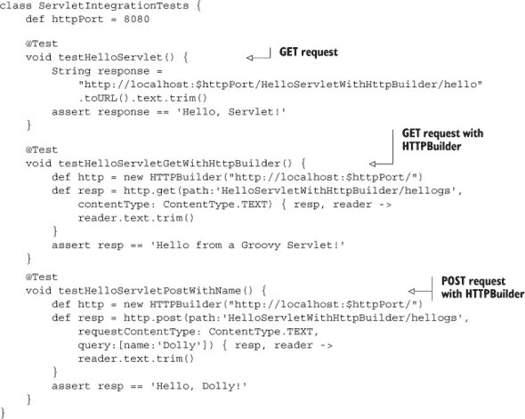

列表展示了三种不同类型的测试。第一种显示了一个没有任何库依赖的简单 GET 请求。第二种使用 HTTPBuilder^([5])库执行 GET 请求，最后一种使用 POST 请求完成同样的操作。详细的语法来自库文档。

> ⁵HTTPBuilder 包括一个名为`RESTClient`的类，它在第九章（kindle_split_021.html#ch09）关于 REST 的讨论中被广泛使用。

在此基础设施到位的情况下，单元测试和集成测试都可以添加到标准项目树中，并且都可以使用 Gradle 构建中的插件通过嵌入的 Jetty 服务器执行。


##### Gradle 集成测试

使用 Gradle 的`web`和`jetty`插件与集成源树一起，可以在正常构建期间以“实时”模式测试 Web 应用程序。

|  |

**Geb 网络测试框架**

Geb ([www.gebish.org](http://www.gebish.org))（发音为“jeb”，带有一个轻柔的*g*）是一个基于 Spock 的 Groovy 测试工具，它允许使用以页面为中心的方法编写网络应用的测试。网站交互可以用页面对象来脚本化，而不是简单的屏幕抓取。它使用类似 jQuery 的语法以及 Groovy 语义来执行浏览器自动化，底层使用 WebDriver 库。

Geb 项目显示出很大的潜力，并且有越来越多的支持者。它当然值得考虑作为一个功能测试工具，以及像 Canoo WebTest ([`webtest.canoo.com`](http://webtest.canoo.com))和 Selenium^([6]) ([`seleniumhq.org`](http://seleniumhq.org)) JavaScript 库这样的替代品。仅关于这些工具就可以写一整章，但本书可能已经足够长了。

> ⁶顺便问一下，你知道为什么它叫 Selenium 吗？当它被开发时，有一个非常令人讨厌的产品叫做 Mercury Test Runner。碰巧的是，元素 Selenium（Se）是治疗水银（Hg）中毒的良药。

由于这是一个活跃的开发领域，我建议参考 Paul King 在 Slide Share 上的测试演示（例如，[www.slideshare.net/paulk_asert/make-tests-groovy](http://www.slideshare.net/paulk_asert/make-tests-groovy)），他是*Groovy in Action*（Manning，2007）的合著者之一，也是一位杰出的开发者，作为有益的参考资料.^([7])

> ⁷我就在这里说：Paul King 说的每一句话都是对的。从这个假设开始，你就会做得很好。


Groovy 有其他支持服务器端配置的类，例如`ServletBinding`，它扩展了常规脚本`Binding`类。


**经验教训（测试）**

1.  Spring 提供了一个用于单元测试 Web 应用的模拟对象库。这个库同样被集成到了 Grails 中。

1.  Gradle 的 Web 和 Jetty 插件使得构建和部署 Web 应用程序变得容易。经过一些工作，Gradle 可以进行自动集成测试。


较大的应用程序需要更多的结构以便易于维护。Java 世界充满了 Web 框架，从 Struts（1 和 2 版本）到 Tapestry，再到 Wicket，JSF，Spring MVC 以及更多。在 Groovy 世界中，有一个特定的框架占主导地位，以至于吸引开发者学习 Groovy 只是为了使用这个框架。这就是杀手级应用的定义：一个如此酷的应用程序，以至于人们会为了使用它而学习一门新的语言。正如大多数读者所熟知，这个框架被称为 Grails。

这是一本关于如何结合使用 Java 和 Groovy 的书，因此我不会提供一个标准的 Grails 入门教程。关于这一点，有大量的参考资料可用.^([8]) 相反，我将展示一个简单但可能不平凡的示例应用程序，讨论在创建 Grails 时做出的某些架构选择，并展示如何将现有的 Java 类集成到 Grails 应用程序中。

> ⁸ 特别推荐 Peter Ledbrook 和 Glen Smith 所著的《Grails in Action》（Manning，2009）。

### 10.4\. Grails：Groovy 的“杀手级应用”

很难过分强调 Ruby on Rails（RoR）彗星在 2005 年横扫 Java 天空时对 Java 世界产生的影响。当时的 Java Web 开发由一系列由各种技术组成的层组成，每种技术都有自己的配置文件和依赖关系。仅仅开始一个新的 Web 应用程序就是一个挑战。

Ruby on Rails，由于其强调 DRY（不要重复自己）原则和约定优于配置，展示了生活可以多么简单。虽然许多 Java Web 开发者接受了 RoR 方法，但并非每个人都处于可以简单地放弃 Java 世界的情况。关键问题是，我们如何将 RoR 世界中的快速开发原则带入 Java 企业开发？

我将在稍后解决这个问题，但首先我想从 30,000 英尺的高度讨论每一个创建过的 Web 应用程序，^([9]) 如 图 10.5 所示的标准架构。

> ⁹ 对于大多数非 Web 应用程序也是如此。这些层相当普遍。

##### 图 10.5\. 所有 Java Web 应用程序的分层设计。表示层类，包括控制器，通过事务服务访问持久数据。

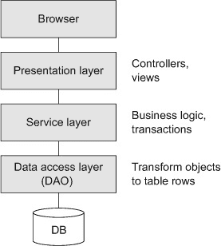

标准模型中的用户界面是一个浏览器，也称为轻量级客户端，与重量级（桌面）Java 客户端相对。浏览器向用户展示视图，用户偶尔会将信息提交回服务器端。信息通过控制器传递，控制器是一类决定去哪里、调用什么业务逻辑以及请求处理完毕后使用什么视图的类。

Java Web 应用开发的一个关键原则是保持控制器瘦，这意味着它们实际处理的数量最小。相反，业务逻辑被委托给服务类。服务类还需要作为事务边界，因为数据访问是通过数据访问层中的一系列类来处理的。数据访问类遵循数据访问对象（DAO）设计模式，它封装了^([10])数据源，并将实体转换为数据库表，反之亦然。

> ^(10) 封装。唉。我们难道不能只说“包裹”吗？为什么每个来自面向对象编程（OOP）的术语都必须如此复杂？为什么我们不能只是“制作”或“创建”某物，而不是“实例化”它？而且我完全理解“多种形式”的概念，但谁会认为“多态”这个术语正是我们所需要的？谁会那样说（毕竟，这么多年了，除了我之外）？

当我谈到这个话题时，我需要向你展示一个在 Web 应用领域中不可避免的一个图示。那就是标准的模型-视图-控制器（MVC）架构，如图 10.6 所示。figure 10.6。

##### 图 10.6。模型-视图-控制器（MVC）架构，自 Smalltalk 时代以来变化不大。视图显示模型对象，这些对象由控制器创建和配置。

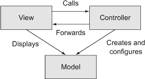

MVC 背后的基本思想是关注点的分离。视图显示模型对象，从用户那里收集数据，并将其提交给控制器。控制器创建和配置模型对象，并将它们转发到视图。虽然控制器和视图紧密耦合，但模型对象并不与它们绑定。如果系统中的任何内容是可重用的，那就是模型类。顺便说一下，从这种架构中明显缺失的是前一个图中的服务，但这种方法本身就是一种过度简化，所以我选择不去担心它。

Grails 是前面描述的基于 MVC 的分层架构的典型代表，它有一些有趣的变体，将在本节中讨论。Grails 有几个显著的特点：

+   Grails 是*建立在*现有成熟技术之上的。Grails 在 Spring 和 Hibernate 之上结合了一系列 Groovy 领域特定语言（DSLs）。

+   Grails 是一个*完整的堆栈框架*（与 RoR 非常相似），它将视图层到持久化层以及中间的所有开源解决方案结合起来。

+   Grails 具有一种*交互式脚本*能力，这使得快速原型化应用变得容易。

+   Grails 的设计基于一个*插件系统*，这使得它非常容易扩展.^(11))

    > ^(11) 至少到目前为止，有超过 800 个插件可供 Grails 使用（质量参差不齐）。

+   Grails 应用程序*部署在现有的基于 Java 的基础设施上*。

Grails 依赖于 Spring 框架的内部基础设施，因此 Spring 能做的任何事情，Grails 都能直接或通过插件做到。持久性通过 Hibernate 对象关系映射层管理，它足够强大，但也可以用现代的 NoSQL 数据库家族来替换。

为了展示 Grails 如何融入标准架构，我将遍历一个示例组件。

#### 10.4.1\. 寻找圣杯的旅程

Grails 可以用来设计任意复杂的 Web 应用程序，但其中一个亮点是提供一个数据库表集的 Web 界面。在展示组件之后，我会回到这一点，因为它既是祝福也是诅咒。


##### Grails

本节的目标是演示一个小但非平凡的 Grails 应用程序的一部分。第八章更详细地探讨了 GORM。第九章简要介绍了 Grails 中的 REST。最后，第七章介绍了 Spring，讨论了底层基础设施。


考虑一个包含四个域类的 Web 应用程序：`Quest`、`Task`、`Knight`和`Castle`。


##### 域类

在 Grails 中，域类的实例映射到数据库表行。


Grails 对约定优于配置的方法意味着有一个特定的目录用于所有内容，如图 10.7 所示。图 10.7。域类有自己的目录，控制器、服务、视图也是如此。这使得理解一个你没有编写的 Grails 应用程序变得容易，因为它们都将元素存储在相同的位置。

##### 图 10.7\. 所有 Grails 应用程序的标准布局。遵循约定优于配置的规则使得查找各种组件变得容易，从控制器到服务，再到域类和视图。

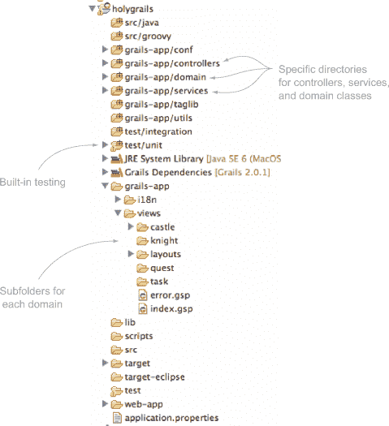

Grails 域类通常用 Groovy 编写，尽管这不是必需的。在下一列表中所示的应用程序中，一个任务有一个名称，并与许多任务和骑士相关联。

##### 列表 10.12\. `Quest`域类

```
class Quest {
    String name
    String toString() { name }
    static *hasMany* = [knights:Knight, tasks:Task]
    static *constraints* = {
        name blank:false
    }
}
```

`Quest`有一个`name`属性和一个覆盖的`toString`方法来返回它。关键字`hasMany`是 GORM 的一部分，即 Grails 对象关系映射 DSL，它以编程方式配置 Hibernate。其他 ORM 工具也是可用的，但 Hibernate 是默认的。`hasMany`关键字暗示了`Knight`和`Task`表与`Quest`表之间的外键关系。

域类也有约束，Grails 在创建新实例时强制执行这些约束。对于`Quest`，`name`字段不能为空。

下一个列表显示了`Task`类。`Task`具有名称、优先级、开始和结束日期以及完成标记。

##### 列表 10.13。`Task`属于一个`Quest`

```
class Task {
    String name
    int priority = 3
    Date startDate = new Date()
    Date endDate = new Date()
    boolean completed

    String toString() { name }

    static belongsTo = [quest:Quest]

    static constraints = {
        name blank:false
        priority range:1..5
        startDate()
        endDate validator: { value, task ->
            value >= task.startDate
        }
        completed()
    }
}
```

约束闭合状态表明`Task`必须有一个名称，一个介于 1 和 5 之间的优先级，以及一个大于或等于开始日期的结束日期。这个类中另一个值得注意的部分是`belongsTo`关键字，它暗示了任务和任务之间的级联删除关系。如果一个`Quest`被删除，所有相关的`Task`也会从数据库中移除。

`Knight`与`Quest`和`Castle`都有关联，但不是通过级联删除。实际上，一个`Knight`可以在`Quest`之间，但不属于一个`Castle`，所以这两个引用在下一个列表中都被列为`nullable`。

##### 列表 10.14。与`Quest`和`Castle`关联的`Knight`类

```
class Knight {
    String title = 'Sir'
    String name
    Quest quest
    Castle castle

    String toString() { "$title $name" }

    static constraints = {
        title inList: ['Sir','King','Lord','Squire']
        name blank: false
        quest nullable: true
        castle nullable: true
    }
}
```

最后一个域类是`Castle`，它有一个名称、一个城市、一个州以及一个计算出的经纬度对，如下所示。

##### 列表 10.15。存储位置信息的`Castle`

```
class Castle {
    String name
    String city
    String state
    double latitude
    double longitude

    String toString() { "$name Castle" }

    static hasMany = [knights:Knight]

    static constraints = {
        name blank: false
        city blank: false
        state blank: false
        latitude min: -90d, max: 90d
        longitude()
    }
}
```

`Castle`中的`hasMany`变量表示`Knight`表将有一个外键指向`Castle`表。

在一个简单的 Grails 演示中，所有相关的控制器都会被 scaffold。在 Grails 中，这意味着它们有一个名为`scaffold`的单个属性，如下所示：

```
class QuestController {
    static scaffold = Quest
}
```

`scaffold`术语告诉 Grails 动态（即在运行时）生成用于`list`、`show`、`edit`、`update`和`delete`任务的视图。每个动作的代码在运行时生成，所以这里没有显示。然而，最终我需要自定义控制器和视图，所以我需要生成静态版本。

下一个列表显示了`Castle`控制器的一部分。

##### 列表 10.16。静态`Castle`控制器类

```
class CastleController {
...
    def list(Integer max) {
        params.max = Math.min(max ?: 10, 100)
        [castleInstanceList: Castle.list(params),
         castleInstanceTotal: Castle.count()]
    }
...}
```

`list`动作检查`params`映射是否已经包含一个名为`max`的键。如果是，则将其转换为整数并重置为提供的值和 100 之间的最小值。如果参数不存在，则使用 10 作为`max`。从 Grails 2.0 开始，请求参数可以用作控制器动作的参数，并且类型转换将自动进行。

| |
| --- |

##### 控制器

Grails 控制器包含称为*actions*的方法，这些方法映射到 URL。它们要么转发到其他资源，直接渲染输出，要么重定向到其他 URL。

| |
| --- |

然而，对于架构讨论来说，更重要的是作为动作返回值的映射。该映射包含两个键，`castleInstanceList`和`castleInstanceTotal`。前者与 10 座城堡（或`max`参数评估的任何值）的列表相关联，后者给出它们的总数。这很好，但真正有趣的是这些值的计算方式。Grails 在域类上添加了`list`方法和`count`方法作为静态方法。

| |
| --- |

##### 没有 Dao 类

与数据访问对象不同，Grails 使用 Groovy 元编程向领域类添加静态方法。这遵循了 Active Record^([12]) 方法，这在 Java 框架中不常见，但在 Ruby 中非常流行。

> (12) 来自马丁·福勒的《企业应用架构模式》（Addison-Wesley Professional，2002 年）。有关简要总结，请参阅 [`en.wikipedia.org/wiki/Active_record`](http://en.wikipedia.org/wiki/Active_record)。

| |
| --- |

根据标准架构，控制器应该通过服务层访问 DAO 类。在静态脚手架中没有服务层。如果应用程序确实只是稍微多于一个由 Web 驱动的数据库，那么这没问题，但在一般情况下，应用程序需要更多。

| |
| --- |

##### 服务

在 Grails 中，业务逻辑应该放在服务中，这些服务是事务性的、由 Spring 管理的豆，可以自动注入到其他组件中。

| |
| --- |

此应用程序确实包含一个服务。它是来自 Groovy Baseball 应用程序的 `Geocoder`。在下一个列表中，它操作 `Castle`s。

##### 列表 10.17\. `Geocoder`，这次它操作 `Castle`s

```
class GeocoderService {

    String base = 'http://maps.googleapis.com/maps/api/geocode/xml?'

    def fillInLatLng(Castle castle) {
        String encodedAddress =
            [castle.city, castle.state].collect {
                URLEncoder.encode(it, 'UTF-8')
            }.join(',+')
        String qs =
            [address: encodedAddress, sensor: false].collect { k,v ->
                "$k=$v"
            }.join('&')

        def root = new XmlSlurper().parse("$base$qs")
        castle.latitude = root.result[0].geometry.location.lat.toDouble()
        castle.longitude = root.result[0].geometry.location.lng.toDouble()
    }
}
```

这样多的代码当然必须经过测试.^([13]) Grails 从一开始就具有测试能力，最初基于 JUnit 子类。从版本 2.0 开始，Grails 测试用例使用注解（特别是，`@TestFor` 注解）来控制所谓的 *mixin* 类。将 `@TestFor` 注解应用于控制器或服务测试会自动实例化测试并将其分配给一个属性。

> (13) 在纯测试驱动开发（TDD）中，首先编写测试。然后观察它失败，实现服务，并观察测试最终通过。

例如，下一个列表显示了 `GeocoderService` 类的测试。

##### 列表 10.18\. `GeocoderService` 的单元测试

![284fig01_alt.jpg]

| |
| --- |

##### 测试用例

Grails 为它生成的每个组件（领域类、控制器或服务）生成一个单元测试类。默认实现故意失败，以鼓励您正确实现它们。

| |
| --- |

在 Grails 应用程序中，服务使用 Spring 的依赖注入。在这里，`Geocoder` 服务被注入到 `CastleController` 中，以便在数据库中保存实例之前更新纬度和经度。通过声明一个与服务同名的属性（首字母小写）来注入服务.^([14]) 例如，以下代码是 `CastleController` 实现的另一个部分。

> (14) 在 Spring 术语中，这被称为“按名称自动装配”。

##### 列表 10.19\. 将服务注入到控制器中

![284fig02_alt.jpg]

服务通过名称注入到控制器中（在 Spring 中术语是 *autowiring*），因此使用与服务相同名称的变量并使用小写字母开头告诉 Grails 在该点提供一个服务的实例。该服务在 `save` 方法中使用，以在保存之前更新 `Castle`。


##### Grails 服务

使用标准的分层架构的 Grails 应用程序。让控制器委托给服务，并让事务性服务与数据库协同工作。


如本节前面所述，Grails 有一个丰富的可用插件集。在这个应用程序中，有用的一个插件是 Google Visualization 插件，它提供了一个用于生成 Google Maps 应用 JavaScript 的自定义 GSP 标签库。

与其他一切一样，Grails 以标准方式管理插件安装。grails-app/conf 文件夹中的 `BuildConfig.groovy` 文件有一个关于插件的章节。向该文件添加适当的语句会导致 Grails 在下一次应用程序启动时自动下载并安装插件。

这里是 `BuildConfig.groovy` 文件的相关部分：

```
plugins {
    runtime ":hibernate:$grailsVersion"
    runtime ":jquery:1.8.3"
    runtime ":resources:1.1.6"

    compile ":google-visualization:0.6.2"
    build ":tomcat:$grailsVersion"
}
```

Google Visualization 插件的文档说明，为了使用它，需要在希望地图出现的 GSP 的 `<head>` 部分添加 `<gvisualization:apiImport` `/>` 标签。然后插件提供了一个 `<gvisualization:map` `/>` 标签来生成 Google 地图应用的 JavaScript。`map` 标签使用 `columns` 和 `data` 属性来指定地图点的信息，这是我需要指定的。

Quest 应用程序提供了一个很好的过程演示。假设我想让地图出现在与城堡关联的 list.gsp 页面上。Grails 将 URL [`<host>:<port>/holygrails/castle/list`](http://<host>:<port>/holygrails/castle/list) 映射到 `CastleController` 类中的 list 动作。该动作中的最后一个表达式是一个映射（Groovy 的而不是 Google 的），因此 Grails 自动将条目添加到 HTTP 请求中，并将其转发到 list.gsp 页面。

因此，目标是向适当的控制器动作添加地图所需的信息。像往常一样，数据应来自服务，我已经有 `GeocoderService` 可用。下一个列表显示了添加的额外方法。

##### 列表 10.20\. 添加到 `GeocoderService` 的方法以支持映射插件

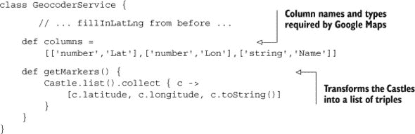

`CastleController` 中的 `list` 动作已经返回了一个城堡列表和总数，这些用于在表格中显示它们。我也可以使用相同的动作来返回地图的列和数据。

`CastleController` 中修订的 `list` 动作如下所示：

```
def list() {
    params.max = Math.min(params.max ? params.int('max') : 10, 100)
    [castleInstanceList: Castle.list(params),
     castleInstanceTotal: Castle.count(),
     mapColumns:geocoderService.columns, mapData:geocoderService.markers]
}
```

下面的列表显示了为显示城堡地图而添加到视图 list.gsp 的修改。

##### 列表 10.21\. 对 `list.gsp` 的修改以显示城堡的 Google 地图

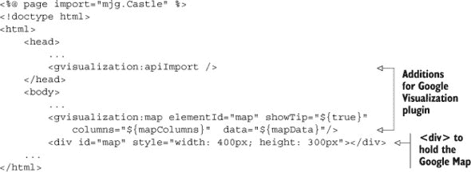

结果如图 10.8 所示，它显示了 Google 地图上的城堡。插件生成了 Google 地图 API 所需的 JavaScript 代码。

##### 图 10.8. 在 Google 地图上显示城堡。`Castle` 领域类通过 `GeocoderService` 设置了纬度和经度坐标。Google 可视化插件生成必要的 JavaScript 代码，将它们添加到 Google 地图上。


Grails 是一个功能强大、特性丰富的框架，拥有众多特性，而它所缺少的特性则通过插件提供。如果你花时间学习 Groovy，那么在构建网络应用程序时，它总是值得一看。


**（Grails）学到的经验教训**

1.  Grails 是一个基于约定优于配置的框架，用于生成网络应用程序。

1.  Grails 领域类由 Hibernate 管理，并映射到数据库表。

1.  Grails 服务是 Spring 管理的豆，它们通过名称自动注入到其他组件中。它们默认使用 Spring 的交易管理。

1.  Grails 架构的插件设计使得添加额外功能变得容易。


Grails 在底层使用 Spring 和 Hibernate，因此它将基于 Groovy 的领域特定语言混合在主要的 Java 库之上。

### 10.5. 摘要

本章探讨了 Groovy 如何帮助进行测试和构建网络应用程序。单元测试与它们的 Java 对应物类似，但 Gradle 构建框架提供了一个很好的方法来进行已部署应用程序的集成测试。

Groovy JDK 包含像 `ServletCategory` 这样的类，这些类简化了网络组件的实现。Groovy 还有一个内置的网络脚本引擎，称为 groovlets，这使得在 Web 应用程序中处理请求、响应、会话和输入参数变得容易。

最后，本章简要讨论了 Grails，这可能是所有 Java/Groovy 集成成功故事中最大的一个。
