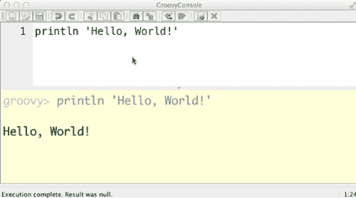

## 附录 A. 安装 Groovy

安装 Groovy 很简单。本附录将向您展示如何进行安装，并对涉及的各种选项进行回顾。

### A.1. 安装 JDK

Groovy 生成由 Java 虚拟机解释的 Java 字节码。这意味着您必须安装 Java 才能安装 Groovy。您需要一个完整的 Java 开发工具包（JDK），而不是 Java 运行时环境（JRE）。您只需要 Java 的标准版（SE），而不是企业版^([1])。

> ¹ 顺便问一下，"business"这个词是什么时候被"enterprise"这个词取代的？是《星际迷航》的事情吗？成为企业架构师意味着您是设计星际飞船谋生的吗？在星际飞船上煮咖啡时使用企业 Java Bean 吗？

Java SE 的官方 JDK 可以从 Oracle 的[`mng.bz/83Ct`](http://mng.bz/83Ct)获取。在撰写本文时，当前版本是 Java SE 7u25（Java 7，更新 25），但 Groovy 可以在 Java 1.5 及以上版本的任何 Java 版本上运行。

请确保设置一个名为`JAVA_HOME`的环境变量，以指向安装目录。您可能还希望将`JAVA_HOME`下的 bin 文件夹添加到您的路径中。

在 Windows 上看起来是这样的：

```
C:\> set JAVA_HOME="C:\Program Files\Java\jdk1.7.0"
C:\> set PATH=%JAVA_HOME%\bin;%PATH%
```

这些命令将在本地 shell 中设置`JAVA_HOME`和`PATH`属性。要将其设置到每个地方，右键单击我的电脑，选择属性，然后单击高级，接着单击环境变量。将它们作为系统变量添加，并启动一个新的 shell.^([2])

> ² 在不同的 Windows 版本上，安装过程的细节可能会有所不同，但概念是相同的。将变量作为系统环境变量设置，并启动一个新的 shell，因为 Windows 不会更新现有的一个。

在 Mac 或 Unix 版本上，设置是相同的

```
$ export JAVA_HOME=/Library/Java/...
$ export PATH=$PATH:$JAVA_HOME/bin
```

根据目录结构和版本号的不同，这些语句的变体太多，难以计数，但原则始终相同：安装 Java，设置`JAVA_HOME`变量以指向它，并将它的 bin 子目录添加到您的路径中。

### A.2. 安装 Groovy

假设您已安装 Java，安装 Groovy 就变得简单了。同样，有几种选择，但基本过程归结为下载和解压发行版，设置`GROOVY_HOME`环境变量，并将它的 bin 子目录添加到您的路径中。

如果您不喜欢自动安装程序或您在机器上没有 root 权限，您可以直接下载 Groovy 的压缩二进制发行版。当前版本始终可以在[`groovy.codehaus.org/Download`](http://groovy.codehaus.org/Download)找到。您可以获取二进制发布版或源发布版（或两者都获取）。无论如何，将下载解压到您选择的目录中。

在 Windows 上，遵循与 Java 安装相同的模式，它是

```
C:\> set GROOVY_HOME=C:\Groovy\groovy-2.1.6
C:\> set PATH=%GROOVY_HOME%\bin;%PATH%
```

在 Mac 或 Unix 上，过程是相同的

```
$ export GROOVY_HOME=...
$ export PATH=$PATH:$GROOVY_HOME/bin
```

如果你不在乎安装程序，Windows 上有一个好的安装程序可用。下载页面上有可用的 EXE 安装程序，它将 Groovy 安装到你的选择目录中，为你设置 `GROOVY_HOME` 变量，并将它下面的 bin 文件夹添加到你的路径中。它还提供为你安装一些可选库，这些库很有用，并且不会以任何方式干扰你的常规安装。我已经在客户站点上使用 Windows 安装程序多年，从未遇到过问题。顺便说一句，如果未设置 `JAVA_HOME` 环境变量，它将通知你。

如果你使用的是 Mac 或其他 Unix 系统，你有其他方便的替代方案可用。首先，有一个 MacPorts ([www.macports.org](http://www.macports.org)) 选项。运行

```
$ sudo port install groovy
```

这将下载并安装最新版本。如果你更喜欢 HomeBrew ([`mxcl.github.io/homebrew`](http://mxcl.github.io/homebrew))，相关的命令是

```
$ brew install groovy
```

这也会下载最新版本，安装它，并在你的路径中创建可执行脚本的软链接。

另一个主要的替代方案是使用 GVM，即 Groovy 环境管理器 ([`gvmtool.net`](http://gvmtool.net))。如果你计划随时切换版本，这是最佳选择。GVM 使用 `curl` 安装，命令如下：

```
$ curl –s get.gvmtool.net | bash
```

GVM 假设你使用的是 bash shell，但同样的过程适用于大多数 Unix 系统。如果你安装了 Cygwin，它也可以在 Windows 上工作。详情请见网页。

GVM 的巨大优势是它使得切换版本几乎变得非常简单。如果你已经安装了 GVM，你可以通过输入来找出可用的 Groovy 版本

```
$ gvm list groovy
```

你可以像这样安装最新版本：

```
$ gvm install groovy
```

如果你向 `install` 命令提供一个版本号，你可以选择安装哪个版本的 Groovy。你可以使用以下方式从一个版本的 Groovy 切换到另一个版本

```
$ gvm use groovy [version]
```

如果你请求的版本尚未安装，GVM 会为你下载并安装它。在我的工作中，我并不经常切换 Groovy 版本，但我经常切换 Grails 版本，而这个工具对 Groovy、Grails、Griffon 以及一些其他软件发行版都适用。GVM 在你的主目录下的 `.gvm` 文件夹中安装软件，因此你应该将 `GROOVY_HOME` 变量设置为指向那里。例如，在我的 Mac 上，我有

```
$ export GROOVY_HOME=/Users/kousen/.gvm/groovy/current
```

这很有用，因为通过 GVM 切换版本会更新当前链接。不过，我无需明确将那个文件夹添加到我的路径中，因为该工具已经将软链接添加到了已经在我路径中的 bin 文件夹。

### A.3. 测试你的安装

检查你的 Groovy 安装是否正常工作的最简单方法是尝试 Groovy shell 或 Groovy 控制台。如果你输入

```
$ groovysh
```

你应该得到如下响应：

```
Groovy Shell (2.1.5, JVM: 1.7.0_11)
Type 'help' or '\h' for help.
------------------------------------
groovy:000> println 'Hello, World!'
Hello, World!
===> null
groovy:000>
```

Groovy shell 实质上是 Groovy（甚至 Java）的 REPL^([3])。请注意，这里的响应是 `null`，因为 `println` 命令有一个 `void` 返回类型。

> ³ 读取-评估-打印-循环，在附录 B 中进一步讨论。Read-Eval-Print-Loop, discussed further in [appendix B]。

Groovy 控制台稍微有用一些。使用以下命令启动它：

```
$ groovyConsole
```

在 Windows 上，这会启动一个单独的进程。在 Mac 和 Unix 版本上，`groovyConsole`命令会锁定特定的 shell，因此你可能想要通过附加一个&符号在后台运行它。结果看起来像图 A.1。

##### 图 A.1\. Groovy 控制台，它是 Groovy 发行版的一部分。记得在视图菜单下选择运行时自动清除输出，这样可以使工具更加实用。



Groovy 控制台将其结果追加到输出窗口，这可能会引起问题。更糟糕的是，如果你输入了一行抛出异常的代码，^([4]) 结果窗口将停止滚动，即使你后来修复了错误。因此，我的建议是选择视图菜单下的最后一个条目，标题为运行时自动清除输出。这样，每次执行脚本时控制台都会清除输出。Groovy 控制台包括抽象语法树浏览器等工具。即使你通常使用 IDE，它也很有用。

> ⁴我知道你永远不会那样做，但你了解你的同事是什么样的。他们什么都能做到。

谈到 IDE，下一节将介绍它们当前的支持水平。

### A.4\. IDE 支持

如果你是一名 Eclipse 用户，Groovy Eclipse 插件是顶级的。要将它添加到现有的 Eclipse 发行版中，请使用在[`groovy.codehaus.org/Eclipse+Plugin`](http://groovy.codehaus.org/Eclipse+Plugin)页面找到的更新字符串。该插件也可以在 Eclipse 市场找到。

Eclipse 有一个令人烦恼的 bug，需要安装目录可由用户写入。Groovy Eclipse 不能安装到所谓的“共享”安装中，这通常包括 Windows 上的 c:\Program Files 目录。只需将你的 Eclipse 安装到其他位置，一切就会正常。

如果你只想使用 Groovy，Groovy Eclipse 插件就足够了。如果你想同时使用 Grails，那么你可以安装 Groovy 和 Grails 工具套件，GGTS。GGTS 是基于 Eclipse 的一系列插件，由 Pivotal（原名 SpringSource）管理。你可以从[www.springsource.org/downloads/sts-ggts](http://www.springsource.org/downloads/sts-ggts)下载 GGTS。请注意：该网站首先列出 STS 下载，然后是 GGTS 下载。

STS 和 GGTS 都来自同一个代码库。区别在于初始的插件集。GGTS 包含了 Groovy Eclipse 插件和 Grails 支持，提供了整个 Grails 视角、各种向导、快捷键等。

主要的 IDE 替代品是 IntelliJ IDEA。在[www.jetbrains.com/idea/features/groovy_grails.html](http://www.jetbrains.com/idea/features/groovy_grails.html)的页面中讨论了其 Groovy 和 Grails 功能。它甚至支持 Griffon，这在目前来说相当不寻常。IntelliJ IDEA 是大多数核心 Groovy、Grails 和 Griffon 团队成员的首选工具，但它是一个商业产品，因此需要许可证。^([[5])如果你参与开源项目或在当地的 Java/Groovy/Grails 用户组中做演讲，你可以获得免费许可证，这是参与开源世界的另一个原因。

> ⁵曾经有一个社区版不支持 Grails，但这种情况可能正在改变。务必查看网站以了解当前的功能。

[`groovy.codehaus.org/IDE+Support`](http://groovy.codehaus.org/IDE+Support)网页列出了从 Emacs 到 TextMate 到 UltraEdit 等 IDE 的插件和支持。如果你找不到你感兴趣的一个，务必在邮件列表上提问。总有人会知道并告诉你去哪里找到你需要的东西。

### A.5. 在 Groovy 生态系统中安装其他项目

GVM 工具目前可以安装和管理 Groovy、Grails、Griffon、Gradle 以及其他项目的分发版。^([[6])如果你使用的是 Mac 或 Unix 发行版，这是最简单的方法。同样，在 Mac 上，HomeBrew 和 MacPorts 都有相同项目的选项。在 Windows 上，Groovy 有本章前面提到的安装程序。

> ⁶当前的候选列表包括 Groovy、Grails、Griffon、Gradle、Lazybones、Vertx 和 Groovyserv。

Grails 始终是一个 ZIP 文件，你需要下载并解压它。然后你设置一个环境变量（在这种情况下为`GRAILS_HOME`）并将 bin 子目录添加到你的路径中。Griffon 和 Gradle 的工作方式几乎相同。

注意，所有这些项目都在 GitHub 上拥有自己的源代码仓库。你可以随时克隆分发版并自行构建，尽管这可能会有些复杂。有关详细信息，请参阅各自的项目页面。GitHub 的最好之处之一是你可以浏览源代码而无需下载任何内容。熟悉包含在各个项目中的测试用例是个好主意，因为它们是每个项目的可执行文档。网页可能会过时，但持续集成服务器会一直执行测试用例。当它们出现问题时，每个人都知道，并且会立即修复。

在这本书中广泛讨论的另一个项目是 Spock。Spock 是一个库而不是框架，通常作为 Gradle（或 Maven）构建的一部分安装。其源代码也在 GitHub 上。
