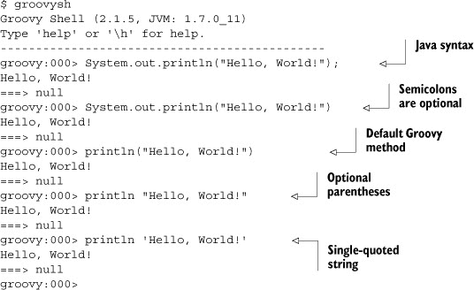
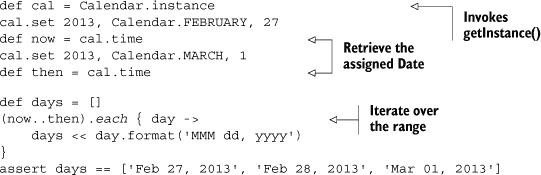
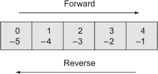
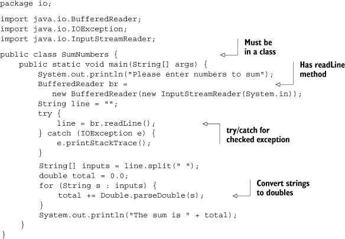

## 附录 B. Groovy 按特性

有些人通过例子学习。有些人通过特性学习。在这本书中，我试图满足两者。如果你是一个只有粗略了解 Groovy 的 Java 开发者，希望这个附录或第二章，“Groovy 按例子”，能让你对 Groovy 语言有所了解。

这个附录概述了 Groovy 的大部分主要特性，并提供了简短的代码片段来展示它们。虽然这一章并不声称像《Groovy 实战》（Manning，2007；在本附录的其余部分称为 GinA）那样是一个详尽的参考，但它有几个特点使其优于更全面的处理方法：（1）它相对较短，并且（2）附录中用友好的大字写着“不要慌张！”（实际上就在这句话中).^([1]) 更严肃地说，在这个附录 I 中，我回顾了本书中使用的 Groovy 编程语言的主要特性。

> ¹ 对于那些出生太晚的人来说，这是一个对《银河系漫游指南》的引用。我可以说这一章“包含很多伪经，或者至少是非常不准确的内容”，但这可能对销售没有好处。

因为这不会是一个全面的处理，我选择基于两个标准来审查 Groovy 的方面：（1）它们在实践中使用得多频繁，以及（2）它们相对于 Java 中相应特性（假设 Java 中甚至存在相应的特性）提供了多少优势。在掌握 Groovy 的基本知识（如如何运行 Groovy 程序和基本数据类型，如数字和字符串）之后，我将继续讨论集合、I/O、XML 等问题。一些主题，如 SQL，在其他章节中有所涉及，但你会发现这里的基本内容。

### B.1\. 脚本和传统例子

假设你已经安装了 Groovy，^([2]) 我将从传统的“Hello, World!”程序开始，如下所示：

> ² 详细内容请见附录 A。

```
println 'Hello, Groovy!'
```

这就是整个程序。在 Java 中，你需要在类内部有一个`main`方法，并在`main`方法内部调用`System.out.println`来写入控制台。Java 开发者对此已经习惯了，但根据你如何计算，大约有 8 到 10 个面向对象的概念涉及其中.^([3]) 在 Groovy 中，整个程序只有一行。

> ³ 粗略统计包括类、方法、字符串、数组、公共访问、静态方法和属性、void 返回类型、重载方法如`println`等。布鲁斯·艾克尔（Bruce Eckel）的《Java 编程思想》（Prentice-Hall，2002）之所以需要超过 100 页才能到达他的第一个“Hello, World”程序，这并非偶然。

为了演示，考虑 Groovy 伴随的两个执行环境之一，即 `groovysh` 命令，它启动 Groovy 壳。Groovy 壳是一个 REPL^[[4)]，允许你逐行执行 Groovy 代码。以下列表中的所有行都会产生相同的结果。

> ⁴ 读取-评估-打印循环；有关详细信息，请参阅 [`en.wikipedia.org/wiki/REPL`](http://en.wikipedia.org/wiki/REPL)。

##### 列表 B.1\. 在 Groovy 壳中运行“Hello, World!”



在每种情况下，`println` 方法都会打印到控制台并返回 `null`。当没有歧义时，可以省略括号。分号的作用与 Java 中的相同，但它们是可选的。

这是一个 Groovy *脚本* 的例子。脚本是一个不显式包含类定义的代码列表。在 Java 中，一切都必须在类内部。Groovy 能够同时处理脚本和类。

Groovy 脚本是一种 *语法糖*。^([[5)]] 一个类实际上也是涉及的。如果我编译这个脚本并对其运行 `javap` 命令，我会得到以下响应：

> ⁵ 语法糖是简化代码编写的语法，但不会在底层改变任何东西。过度使用语法糖可能会导致语法糖尿病。

```
> groovyc hello_world.groovy
> javap hello_world
Compiled from "hello_world.groovy"
public class hello_world extends groovy.lang.Script{
    public static transient boolean __$stMC;
    public static long __timeStamp;
    public static long __timeStamp__239_neverHappen1309544582162;
    public hello_world();
    public hello_world(groovy.lang.Binding);
    public static void main(java.lang.String[]);
    public java.lang.Object run();
...
```

`javap` 命令大约有 30 行输出，主要涉及超类方法。有趣的部分是 `groovy` 命令生成一个名为 `hello_world` 的类，以及一对构造函数和一个 `main` 方法。该类在编译时生成，并扩展了来自 Groovy 库的 `groovy.lang.Script` 类。实际上，Groovy 中的脚本成为 Java 中的类，其中脚本中的代码最终（经过几层间接）由 `main` 方法执行。然而，我不想给人留下 Groovy 生成 Java 的印象。Groovy 代码直接编译成 JVM 的字节码。

| |
| --- |

##### 编译后的 Groovy

Groovy 是编译的，而不是解释的。它不是一个代码生成器；编译器直接生成 Java 字节码。

| |
| --- |

由于字节码在 JVM 上运行，只要你在类路径中包含必要的 JAR 文件，就可以使用 `java` 命令执行 Groovy 脚本：

```
> java –cp .;%GROOVY_HOME%\embeddable\groovy-all-2.1.5.jar hello_world
Hello, World!
```

| |
| --- |

##### 执行 Groovy

在运行时，Groovy 只是一个 JAR 文件。只要 groovy-all JAR 文件在类路径中，Java 就可以完美地执行编译后的 Groovy 代码。

| |
| --- |

`groovy` 命令用于执行 Groovy 程序。它可以与编译后的代码（类似于 `java` 命令）或 Groovy 源代码一起使用。如果你使用源代码，`groovy` 命令首先编译代码然后执行它。

### B.2\. 变量、数字和字符串

Groovy 是一种可选类型的语言。Groovy 使用类来定义数据类型，就像 Java 一样，但 Groovy 变量可以是静态类型或使用 `def` 关键字。

例如，我完全可以自由地声明类型为 `int`、`String` 或 `Employee` 的变量，使用标准的 Java 语法：

```
int x
String name
Employee fred
```

如果我不知道变量的类型，或者我不在乎，Groovy 提供了关键字 `def`：

```
def arg
```

| |
| --- |

**类型化变量与无类型变量**

当你应该使用 `def` 而不是实际类型时？没有严格的答案，但最近我关于这个问题与 Dierk Koenig（*GinA* 的主要作者）、Andres Almiray（*Griffon in Action* 的主要作者和 Griffon 项目负责人）以及 Dave Klein（*Grails: A Quick-Start Guide* 的主要作者）进行了一场（非常温和的）Twitter 讨论。Dierk 在这个话题上给出了我听过的最好的建议。他说：“如果我想到了一个类型，我就输入它（字面意思）。”

我自己的经验是，随着我对 Groovy 的经验越来越丰富，我越来越少使用 `def`。我同意 Dierk 的建议，并额外建议现在当我声明一个类型时，我会停下来片刻，看看是否有什么实际类型浮现在我的脑海中。如果有，我就使用它。

在某些情况下，`def` 更受欢迎，尤其是在使用测试中的模拟对象时。这个主题在第六章 中讨论。

| |
| --- |

接下来，让我们来看看数据类型本身。Java 在原始类型和类之间做出了区分。在 Groovy 中没有原始类型。Groovy 中的数字是一等对象，有自己的方法集。

#### B.2.1. 数字

因为在 Groovy 中数字是对象，我可以确定它们的数据类型。对于整型字面量，数据类型取决于值，如下面的脚本所示：

```
x = 1
assert x.class == java.lang.Integer
x = 10000000000000000
assert x.class == java.lang.Long
x = 100000000000000000000000
assert x.class == java.math.BigInteger
```

关于这个脚本有几个要点需要注意。首先，变量 `x` 完全没有声明。这只有在脚本中才是合法的，其中变量成为脚本绑定的一部分，可以从外部设置和访问。关于这个过程的详细信息请参阅 第三章 关于与 Java 的集成。这里只需说，这在脚本中是合法的，但在类中不是。如果你觉得更舒服，你可以在 x 前面自由地添加单词 `def`。

| |
| --- |

##### 脚本变量

如果脚本中的一个变量没有被声明，它就成为了脚本绑定的一个部分。

| |
| --- |

如前所述，脚本缺少分号。在 Groovy 中，分号作为语句分隔符是可选的，如果没有歧义，可以省略。再次强调，你可以自由地添加它们而不会出现问题。

| |
| --- |

##### 分号的使用

在 Groovy 中，分号是有效的，但不是必需的。

| |
| --- |

接下来，Groovy 广泛使用名为 `assert` 的方法。单词 `assert` 可以不带括号书写，就像这里一样，或者你可以用它们包围一个表达式。结果表达式必须评估为布尔值，但这比 Java 中的要求宽松得多。在 Java 中，唯一可用的布尔值是 `true` 和 `false`。在 Groovy 中，非空引用是 true，非零数字、非空集合、非空字符串以及布尔值 `true` 都是 true。

这需要重复强调，被称为 *Groovy 真理*。

| |
| --- |

##### Groovy 真理

在 Groovy 中，非空引用、非空集合、非空字符串、非零数字以及布尔值 `true` 都是真实的。

| |
| --- |

最后，Java 中浮点值的默认数据类型是 `double`，但在 Groovy 中是 `java.math.BigDecimal`。Java 中的 `double` 类型大约有 17 位十进制精度，但如果你想对其准确性感到沮丧，可以尝试这个微小的示例：

```
println 2.0d – 1.1d
```

在字面量后附加的 `d` 使其成为双精度浮点数。你可能会期望这里的答案是 0.9，但实际上它是 0.8999999999999999。这并不是很大的差异，但我只做了一次减法，就已经出现了偏差。这并不好。这就是为什么任何严肃的数值计算在 Java 中都需要 `java.math.BigDecimal`，但这意味着你不能再使用标准运算符（`+`、`-`、`*`、`/`）了，而必须使用方法调用。

Groovy 无需处理这个问题。以下是对应的 Groovy 脚本：

```
println 2.0 – 1.1
```

在这种情况下，答案是 0.9，正如预期的那样。因为计算使用了 `BigDecimal`，所以答案是正确的。Groovy 也支持运算符重载，因此加法运算符可以与 `BigDecimal` 值一起使用。总结如下：

| |
| --- |

##### 字面量

没有小数点的数字类型为 `Integer`、`Long` 或 `java.math.BigInteger`，具体取决于大小。有小数点的数字类型为 `java.math.BigDecimal`。

| |
| --- |

因为数字是对象，所以它们也有方法。B.2 列表 展示了一个脚本，它对一些数字进行了测试。其中一些表达式使用了闭包，这是 B.4 节 的主题。最简单的定义是，将它们视为一个代码块，就像它是匿名方法调用一样执行。

##### 列表 B.2\. `numbers.groovy`，显示对数字字面量的方法调用

```
assert 2**3 == 8
assert 2**-2 == 0.25 // i.e., 1/(2*2) = 1/4

def x = ""
3.times { x += "Hello" }
assert x == "HelloHelloHello"

def total = 0
1.upto(3) { total += it }
assert total == 1 + 2 + 3

def countDown = []
5.downto 1, { countDown << "$it ..." }
assert countDown == ['5 ...', '4 ...', '3 ...', '2 ...', '1 ...']
```

Groovy 有一个指数运算符，与 Java 不同。数字有 `times`、`upto` 和 `downto` 等方法。`times` 操作接受一个类型为 `Closure` 的单个参数。当方法参数的最后一个参数是闭包时，可以将其放在括号之后。因为方法没有其他参数，所以可以完全省略括号。

| |
| --- |

##### 闭包参数

如果方法参数的最后一个参数是闭包，则可以将其放在括号之后。

| |
| --- |

`upto` 和 `downto` 方法接受两个参数，因此前者显示了括号，后者使用逗号来表示数字和闭包都是方法的参数。`countDown` 变量是一个列表，将在 B.3 节 中讨论。左移运算符被重载以向集合中添加元素，这里的参数是一个参数化字符串。Groovy 有两种字符串类型，将在下一节讨论。

#### B.2.2\. 字符串和 Groovy 字符串

在 Java 中，单引号用于界定字符（原始类型）而双引号包围`java.lang.String`的实例。在 Groovy 中，单引号和双引号都用于字符串，但存在区别。双引号字符串用于参数替换。它们不是`java.lang.String`的实例，而是`groovy.lang.GString`的实例。

这里有一些示例，展示了它们的用法：

```
def s = 'this is a string'
assert s.class == java.lang.String

def gs = "this might be a GString"
assert gs.class == java.lang.String
assert !(gs instanceof GString)

gs = "If I put in a placeholder, this really is a GString: ${1+1}"
assert gs instanceof GString
```

单引号字符串始终是`java.lang.String`的实例。双引号字符串可能是 Groovy 字符串，也可能不是，这取决于是否进行了参数替换。

Groovy 还有多行字符串，可以是单引号或双引号。区别再次在于是否进行了参数替换：

```
def picard = '''
    (to the tune of Let It Snow)
    Oh the vacuum outside is endless
    Unforgiving, cold, and friendless
    But still we must boldly go
    Make it so, make it so, make it so!
'''

def quote = """
    There are ${Integer.*toBinaryString*(2)} kinds of people in the world:
    Those who know binary, and those who don't
"""
assert quote == '''
    There are 10 kinds of people in the world:
    Those who know binary, and those who don't
'''
```

最后还有一种字符串类型，用于正则表达式。Java 从 1.4 版本开始就具备正则表达式功能，但大多数开发者要么不知道，要么避免使用它们.^([6]) Java 中正则表达式的一个特别令人烦恼的部分是反斜杠字符`\`用作转义字符，但如果你想在正则表达式中使用它，你必须对反斜杠进行转义。这导致了一些令人烦恼的表达式，其中你必须对反斜杠进行双重转义，使得结果表达式几乎无法阅读。

> ⁶ Perl 程序员热爱正则表达式。Ruby 开发者也喜欢它们，但态度比较理性。Java 开发者一看到`java.util.regex.Pattern`类的 JavaDocs，就会感到恐惧。

Groovy 提供了所谓的*斜杠语法*。如果你用斜杠包围一个表达式，它就被假定为正则表达式，你不再需要双重转义。


##### 字符串

Groovy 使用单引号表示普通字符串，双引号表示参数化字符串，斜杠用于正则表达式。


这里有一个示例，用于检查字符串是否是回文：也就是说，如果它们正向和反向相同。要检查回文，你首先需要移除任何标点符号，并在反转字符串之前忽略大小写：

```
def palindromes = '''
    Able was I ere I saw Elba
    Madam, in Eden, I'm Adam
    Sex at noon taxes

    Flee to me, remote elf!
    Doc, note: I dissent. A fast never prevents a fatness. I diet on cod.
'''
palindromes.*eachLine* {
    String str = it.trim().replaceAll(*/\W/*,'').toLowerCase()
    assert str.*reverse*() == str
}
```

再次证明，一点 Groovy 代码就能包含很多功能。`String`类中添加了`eachLine`方法，用于在换行处分割多行字符串。它接受一个闭包作为参数。在这种情况下，闭包中没有使用虚拟变量，因此每个字符串都分配给默认变量`it`。


##### it 变量

在闭包中，如果没有指定虚拟名称，则默认使用术语`it`。


`trim`方法应用于行以移除任何前导和尾随空格。然后使用`replaceAll`方法将所有非单词字符替换为空字符串。最后，将字符串转换为小写。

assert 测试使用了 Groovy 添加到`String`的另一个方法，称为`reverse`。Java 在`StringBuffer`中有`reverse`方法，但不是在`String`中。Groovy 为了方便，将`reverse`方法添加到`String`。

Groovy 向 Java 标准库添加了许多方法。这些方法统称为*Groovy* *JDK*，并且是 Groovy 的最佳特性之一。Groovy 文档包括 Groovy 标准库和 Groovy JDK 的 GroovyDocs。

| |
| --- |

##### Groovy JDK

通过其元编程能力，Groovy 向标准 Java 库添加了许多便利方法。这些额外的方法被称为 Groovy JDK。

| |
| --- |

总结来说，Groovy 使用数字和对象，并且具有常规和参数化的字符串以及额外的方法。Groovy 在简化 Java 的另一个领域是集合。

### B.3\. Plain Old Groovy Objects

具有属性获取器和设置器的 Java 类通常被称为 POJOs，或 Plain Old Java Objects。在 Groovy 中，相同的类被称为 Plain Old Groovy Objects，或 POGOs.^([7]) 本节讨论了 POGOs 的额外特性。

> ⁷ Python 偶尔使用 POPOs 这个术语，听起来有点令人作呕。如果你真的想惹恼一个 Ruby 开发者，可以提到 POROs。Ruby 开发者讨厌任何听起来像 Java 的东西。

考虑以下 Groovy 中的`Person`类：

```
class Person {
    String firstName
    String lastName

    String toString() { "$firstName $lastName" }
}
```

POGOs 不需要访问修饰符，因为在 Groovy 中属性默认是私有的，方法默认是公共的。类也是默认公共的。任何没有访问修饰符的属性都会自动获得公共的获取器和设置器方法。如果你想添加`public`或`private`，你可以这样做，并且对属性的任何指定都会阻止生成相关的获取器和设置器。

| |
| --- |

##### Groovy 属性

在 Groovy 中，属性访问是通过动态生成的获取器和设置器方法完成的。

| |
| --- |

这里是一个使用`Person`类的脚本示例：

```
Person mrIncredible = new Person()
mrIncredible.firstName = 'Robert'
mrIncredible.setLastName('Parr')
assert 'Robert Parr' ==
    "${mrIncredible.firstName} ${mrIncredible.getLastName()}"

Person elastigirl = new Person(firstName: 'Helen', lastName: 'Parr')
assert 'Helen Parr' == elastigirl.toString()
```

脚本显示，你还可以获得一个默认的、*基于映射的*构造函数，之所以称为这样，是因为它使用了 Groovy 映射中使用的相同的`property:value`语法。

这个习惯用法在 Groovy 中非常常见，以至于标准库中的任何地方的获取器和设置器方法通常都使用属性表示法来访问。例如，`Calendar.instance`用于在`Calendar`类上调用`getInstance`方法。

现在转向实例集合，我将从范围开始，然后转向列表，最后查看映射。

### B.4\. 集合

自从 J2SE 1.2 以来，Java 标准库已经包括了集合框架。该框架定义了列表、集合和映射的接口，并为每个接口提供了一组小型但实用的实现类，以及`java.util.Collections`类中的一组多态实用方法。

Groovy 可以使用所有这些集合，但还添加了很多：

+   列表和映射的原生语法

+   一个`Range`类

+   许多额外的便利方法

我将在本节中展示每个示例。

#### B.4.1\. 范围

*范围*是 Groovy 中的集合，由一对点分隔的两个值组成。范围通常用作其他表达式的部分，如循环，但也可以单独使用。

`groovy.lang.Range` 类提供了访问范围边界的方法，以及检查它是否包含特定元素的功能。以下是一个简单的示例：

```
Range bothEnds = 5..8
assert bothEnds.contains(5)
assert bothEnds.contains(8)
assert bothEnds.from == 5
assert bothEnds.to == 8
assert bothEnds == [5, 6, 7, 8]
```

使用两个点包括边界。要排除上限，请使用小于号：

```
Range noUpper = 5..<8
assert noUpper.contains(5)
assert !noUpper.contains(8)
assert noUpper.from == 5
assert noUpper.to == 7
assert noUpper == [5, 6, 7]
```

数字范围会遍历包含的整数。其他库类也可以用于范围。字符串按字母顺序遍历：

```
assert 1..5 == [1,2,3,4,5]
assert 'A'..'E' == ["A","B","C","D","E"]
```

日期遍历包含的日期，如下一列表所示。

##### 列表 B.3\. 使用 Java 的 `Calendar` 类在范围中使用日期



尽管 Groovy 拥有众多优点，但它也无法驯服 Java 中略显笨拙的 `java.util.Date` 和 `java.util.Calendar` 类，但它可以使使用它们的代码变得更加简单。`Calendar` 是一个具有工厂方法 `getInstance` 的抽象类，因此我在 Groovy 中通过访问 `instance` 属性来调用它。Groovy JDK 为 `Date` 添加了 `format` 方法，因此不需要单独实例化 `SimpleDateFormat`。

在列表中，在设置年份、月份和日期之后，通过调用 `getTime` 获取 `Date` 实例。^([8]) 在这种情况下，这相当于访问 `time` 属性。日期被 `each` 方法用作范围的边界，该方法将每个日期追加到列表中。

> ⁸ 是的，您没有看错。您通过调用 ... `getTime` 来获取 *日期*。嘿，这不是我写的。

实际上，任何包含三个特征的类都可以被转换为范围：

+   一个 `next()` 方法，用于正向迭代

+   一个 `previous()` 方法，用于反向迭代

+   实现 `java.util.Comparable` 接口，用于排序

这里，范围用作循环的基础，日期被追加到列表中。

#### B.4.2. 列表

Groovy 中的列表与 Java 中的列表相同，只是语法更简单，并且有一些额外的方法可用。在 Groovy 中创建列表，请将值放在方括号之间：

```
def teams = ['Red Sox', 'Yankees']
assert teams.class == java.util.ArrayList
```

默认列表类型为 `java.util.ArrayList`。如果您想使用 `LinkedList`，请按常规方式实例化它。

Groovy 具有操作符重载。Groovy JDK 显示，加号、减号和左移操作符已被定义为与列表一起工作：

```
teams << 'Orioles'
assert teams == ['Red Sox', 'Yankees', 'Orioles']
teams << ['Rays', 'Blue Jays']
assert teams ==
    ['Red Sox', 'Yankees', 'Orioles', ['Rays', 'Blue Jays']]
assert teams.flatten() ==
    ['Red Sox', 'Yankees', 'Orioles', 'Rays', 'Blue Jays']
assert teams + 'Angels' - 'Orioles' ==
    ['Red Sox', 'Yankees', ['Rays', 'Blue Jays'], 'Angels']
```

可以使用类似数组的语法访问列表的元素。同样，这是通过重写方法来实现的——在这种情况下，是 `getAt` 方法：

```
assert teams[0] == 'Red Sox'
assert teams[1] == 'Yankees'
assert teams[-1] == ['Rays','Blue Jays']
```

如 图 B.1 所示，从左侧访问元素从索引 0 开始。从右侧访问从索引 -1 开始。您也可以使用方括号中的范围：

```
def cities = ['New York', 'Boston', 'Cleveland','Seattle']
assert ['Boston', 'Cleveland'] == cities[1..2]
```

##### 图 B.1\. 使用索引从两端访问任何线性集合。第一个元素在索引 0。最后一个元素在索引 -1。您还可以使用子范围，例如 mylist[-4..-2]。



| |
| --- |

##### 类似数组的访问

线性集合支持从两端通过索引访问元素，甚至可以使用范围。

| |
| --- |

Groovy 为集合添加了 `pop`、`intersect` 和 `reverse` 等方法。详细信息请参阅 GroovyDocs。

有两种方法可以将函数应用于每个元素。*扩展点*操作符 (`.*`) 使得访问属性或对每个元素应用方法变得容易：

```
assert cities*.size() == [8, 6, 9, 7]
```

`collect` 方法接受一个闭包作为参数，并将其应用于集合的每个元素，返回一个包含结果的列表。这与扩展点操作符类似，但可以进行更通用的操作：

```
def abbrev = cities.*collect* { city -> city[0..2].toLowerCase() }
assert abbrev == ['new', 'bos', 'cle', 'sea']
```

在箭头之前使用的单词 `city` 作为一个方法调用的占位符。闭包提取列表中每个元素的前三个字母，并将它们转换为小写。

集合的一个特别有趣的特点是它们支持使用 `as` 操作符进行类型强制转换。这意味着什么？将 Java 列表转换为集合并不困难，因为有一个构造函数用于此目的。然而，将列表转换为数组则需要一些笨拙、反直觉的代码。以下是 Groovy 对此过程的看法：

```
def names = teams as String[]
assert names.class == String[]

def set = teams as Set
assert set.class == java.util.HashSet
```

这很简单.^([9]) Groovy 中的集合就像 Java 中的集合一样，这意味着它不包含重复项，也不保证顺序。

> ⁹ 我知道我经常这么说，但用 Groovy 我也经常这么想。


##### as 操作符

Groovy 使用关键字 `as` 用于许多目的。其中之一是类型强制转换，它将一个类的实例转换为另一个类的实例。


Groovy 集合最令人愉悦的特性之一是它们是可搜索的。Groovy 为集合添加了 `find` 和 `findAll` 方法。`find` 方法接受一个闭包，并返回满足闭包的第一个元素：

```
assert 'New Hampshire' ==
    ['New Hampshire','New Jersey','New York'].find { it =~ */*New*/* }
```

`findAll` 方法返回满足闭包的所有元素。此示例返回所有名字中包含字母 *e* 的城市：

```
def withE = cities.findAll { city -> city =~ */*e*/* }
assert withE == ['Seattle', 'New York', 'Cleveland']
```

Groovy 还提供了 `any` 和 `every` 方法，这些方法也接受闭包：

```
assert cities.any { it.size() < 7 }
assert cities.every { it.size() < 10 }
```

第一个表达式表示至少有一个城市的名字少于 7 个字符。第二个表达式说明所有城市名字的长度都不超过 10 个字符。

表 B.1 总结了添加到 Groovy 集合中的可搜索方法。

##### Table B.1\. 添加到 Groovy 集合中的可搜索方法

| 方法 | 描述 |
| --- | --- |
| any | 如果任何元素满足闭包则返回 true |
| every | 如果所有元素满足闭包则返回 true |
| find | 返回满足闭包的第一个元素 |
| findAll | 返回满足闭包的所有元素的列表 |

最后，`join` 方法使用提供的分隔符将列表中的所有元素连接成一个单独的字符串：

```
assert cities.*join*(',') == "Boston,Seattle,New York,Cleveland"
```

原生语法和附加便利方法的组合使得 Groovy 列表比它们的 Java 对应物更容易处理。实际上，映射也是以同样的方式改进的。

#### B.4.3\. 映射

Groovy 映射类似于 Java 映射，但再次具有原生语法和额外的辅助方法。Groovy 使用与列表相同的方括号语法来表示映射，但映射中的每个条目都使用冒号来分隔键和其对应的值。

您可以在声明映射本身时立即通过添加元素来填充映射：

```
def trivialMap = [x:1, y:2, z:3]
assert 1 == trivialMap['x']
assert trivialMap instanceof java.util.HashMap
```

这定义了一个包含三个条目的映射。当向映射中添加元素时，假设键是字符串类型，因此不需要在它们周围放置引号。值可以是任何内容。

| |
| --- |

##### 映射键

在向映射中添加内容时，假设键的类型为 `string`，因此不需要引号。

| |
| --- |

您可以使用 Java 或 Groovy 语法向映射中添加内容：

```
def ALEast[10] = [:]
ALEast.put('Boston','Red Sox')
assert 'Red Sox' == ALEast.get('Boston')
assert ALEast == [Boston:'Red Sox']
ALEast['New York'] = 'Yankees'
```

> ^（10）对于非棒球爱好者来说，ALEast 是美国联盟东部分区的缩写。

可以使用显示的数组语法或使用点来访问值。如果键中包含空格，请将键用引号括起来：

```
assert 'Red Sox' == ALEast.Boston
assert 'Yankees' == ALEast.'New York'
```

我一直使用 `def` 来定义映射引用，但 Groovy 理解 Java 泛型：

```
Map<String,String> ALCentral = [Cleveland:'Indians',
   Chicago:'White Sox',Detroit:'Tigers']
assert 3 == ALCentral.size()
assert ALCentral.Cleveland == 'Indians'
```

映射有一个 `size` 方法，它返回条目的数量。实际上，`size` 方法是通用的。

| |
| --- |

##### 大小

在 Groovy 中，`size` 方法适用于数组、列表、映射、字符串等。

| |
| --- |

映射有一个重载的 `plus` 操作，它将两个映射的条目组合起来：

```
def both = ALEast + ALCentral
assert 5 == both.size()
```

与 Java 映射一样，您可以使用 `keySet` 方法从映射中提取键集：

```
assert ALEast.keySet() == ['Boston','New York'] as Set
```

映射还有一个相当有争议的方法，允许您在元素不存在的情况下添加一个具有默认值的元素：

```
assert 'Blue Jays' == ALEast.get('Toronto','Blue Jays')
assert 'Blue Jays' == ALEast['Toronto']
```

在这里，我尝试使用不在映射中的键（`Toronto`）来检索值。如果键存在，则返回其值。如果不存在，则将其添加到映射中，`get` 方法的第二个参数是其新值。这很方便，但这也意味着如果您在尝试检索时意外拼写错误，您不会收到错误；相反，您最终会添加它。使用 `get` 的单参数版本则不是这样。

最后，当您使用闭包迭代映射时，虚拟参数的数量决定了如何访问映射。使用两个参数意味着映射作为键和值被访问：

```
String keys1 = ''
List<Integer> values1 = []
both.*each* { key,val ->
    keys1 += '|' + key
    values1 << val
}
```

`each` 迭代器有两个虚拟变量，因此第一个代表键，第二个代表值。这个闭包将键追加到一个字符串中，键之间用竖线分隔。值被添加到一个列表中。

或者，使用单个参数将每个条目分配给指定的参数，或者如果没有指定，则分配给 `it`：

```
String keys2 = ''
List<Integer> values2 = []
both.*each* { entry ->
    keys2 += '|' + entry.key
    values2 << entry.value
}
```

因为闭包中使用了单个虚拟参数，所以我需要访问其 `key` 和 `value` 属性（相当于通常调用 `getKey` 和 `getValue` 方法）来执行与上一个示例相同的操作。

两种机制产生相同的结果：

```
assert keys1 == keys2
assert values1 == values2
```

在本节中，我在示例中使用了闭包，但没有定义它们是什么。这是下一节的主题。

### B.5. 闭包

和许多开发者一样，我最初是从过程式世界开始的。我以研究科学家的身份开始了我的职业生涯，研究不稳定的空气动力学和声学。大部分工作都涉及数值求解偏微分方程。

这意味着除非我想编写自己的所有库，否则我必须选择 Fortran 作为我的首选专业语言。^([11)] 我在第一份工作中的第一个任务是取我老板用 Fortran IV 编写的 3000 行程序，并为其添加功能。最好的部分是原始程序中只有两个子程序：一个大约 25 行长，另一个 2975 行。不用说，我在知道实际术语之前就学会了重构。

> ^([11]) 我认真考虑用不同的语言编写那些库的事实，是我处于错误职业的另一个迹象。
> 
> ^([12]) 不寒而栗。哦，数学-if 语句，蝙蝠侠。噩梦已经停止，但花了一些时间。

我迅速学会了当时被认为是良好的开发实践，这意味着我写了尽可能使用现有库的结构化程序。直到 90 年代中期，当我第一次学习 Java 时，我才接触到面向对象编程。

那是我第一次遇到后来有影响力的博主 Steve Yegge 称之为名词王国中动词的屈服现象。^([13)] 在大多数面向对象的语言中，方法（动词）只能作为名词（类）的一部分存在。Java 当然就是这样工作的。即使是那些不需要对象的静态方法，也必须定义在某个地方的类内部。

> ^([13]) “在名词王国的执行”，在 [`mng.bz/E4MB`](http://mng.bz/E4MB)

第一种改变这一切的语言是 JavaScript，它是一种基于对象的语言，而不是面向对象的语言。在 JavaScript 中，甚至类也是函数。然后，因为类中的方法也是函数，你最终会得到函数在函数内部运行，可能传递对其他函数的引用，突然之间一切变得混乱和困难。JavaScript 中的闭包之所以令人困惑，并不是因为函数本身复杂，而是因为闭包包含了其执行的 环境。闭包可能引用其外部声明的变量，在 JavaScript 中，确定这些值很容易迷失方向。

我直到遇到 Groovy 才知道闭包可以有多简单。^([14)] 在 Groovy 中，将闭包视为代码块很容易，但总是很清楚非局部变量在哪里被评估，因为没有关于当前对象的混淆。

> ^([14]) 其他人也可以说 Ruby 或其他 JVM 语言。这是我的历史。

| |
| --- |

##### 闭包

实际上，闭包是一段代码及其执行环境。

| |
| --- |

在 Groovy 中，术语“闭包”被广泛用来指代代码块，即使它们不包含对外部变量的显式引用。闭包感觉像方法，可以那样调用。考虑这个简单的例子，它返回它所接收的任何内容：

```
def echo = { it }
assert 'Hello' == echo('Hello')
assert 'Hello' == echo.call('Hello')
```

`echo` 引用被分配给由大括号分隔的代码块（闭包）。闭包包含一个默认名为 `it` 的变量，其值在闭包被调用时提供。如果你把变量想象成方法参数，你就抓住了基本概念。

闭包可以通过两种方式之一被调用：要么像方法调用一样使用引用，要么通过显式调用其上的 `call` 方法。由于闭包计算出的最后一个值会自动返回，所以两种方式都返回闭包的参数，这也是为什么它最初被称为 `echo` 的原因。

| |
| --- |

##### 闭包返回值

闭包中最后评估的表达式会自动返回。

| |
| --- |

如果闭包接受多个参数，或者你不想使用默认名称，请使用箭头将虚拟参数名称与闭包体分开。以下是一个简单的求和示例，一次使用默认名称，一次使用命名参数：

```
def total = 0
(1..10).*each* { num -> total += num }
assert (1..10).*sum*() == total

total = 0
(1..10).*each* { total += it }
assert (1..10).*sum*() == total
```

闭包在本书中被广泛使用，并在 *GinA* 中占据了一整章。这么一点信息就足以让你取得很大进步。

回到语言的基本结构，我现在将展示 Groovy 在使用循环和条件测试时与 Java 的不同之处。

### B.6. 循环和条件

在本节中，我将讨论任何编程语言中都会出现的两个特性：遍历一组值和做出决策。

#### B.6.1. 循环

当 Groovy 首次创建时，以及在此之后的一段时间内，它不支持标准的 Java `for` 循环：

```
for (int i = 0; i < 5; i++) { ... }
```

然而，在 1.6 版本中，核心贡献者决定支持 Java 构造比尝试保持语言不受从其前辈那里继承的有些尴尬的语法更重要。许多 Groovy 的演示从 Java 类开始，将其重命名为 `.groovy` 扩展名，并显示它仍然可以用 Groovy 编译器成功编译。结果是远非 Groovy 的典型用法，但它确实说明了有效观点：Groovy 是 JVM 新家族语言中最接近 Java 的。

| |
| --- |

##### Java 循环

Groovy 支持标准的 Java `for` 循环和 `for-each` 循环，以及 `while` 循环。然而，它不支持 `do-while` 构造。

| |
| --- |

Java 中的 `for-each` 循环是在 Java SE 1.5 中引入的，适用于任何线性集合，包括数组和列表：

```
for (String s : strings) { ... }
```

`for-each` 循环很有用，因为它意味着你不必总是获取迭代器来遍历列表的元素。你付出的代价是没有显式的索引。在循环内部，你知道当前在哪个元素上，但不知道它在列表中的位置。如果你需要知道索引，你可以自己跟踪索引，或者回到传统的 `for` 循环。

Groovy 提供了一种对 `for-each` 循环的变体，避免了冒号语法，称为 `for-in` 循环：

```
def words = "I'm a Groovy coder".*tokenize*()
def capitalized = ''
for (word in words) {
    capitalized += word.*capitalize*() + ' '
}
assert capitalized == "I'm A Groovy Coder "
```

注意，与 `for-each` 循环不同，值变量没有被声明为具有类型：甚至不是 `def`。

尽管如此，这些循环都不是 Groovy 中最常见的迭代方式。与前面的例子中显式编写循环不同，Groovy 更喜欢直接实现迭代器设计模式。Groovy 向集合添加了`each`方法，该方法接受一个闭包作为参数。然后`each`方法将闭包应用于集合的每个元素：

```
(0..5).each { println it }
```

再次强调，因为闭包是方法的最后一个参数，所以它可以放在括号之后。因为没有其他参数传递给`each`方法，所以可以完全省略括号。

| |
| --- |

##### 每个

`each`方法是 Groovy 中最常见的循环结构。

| |
| --- |

迭代器设计模式建议将遍历集合元素的方式与计划对这些元素做什么分开。`each`方法在内部执行迭代。用户通过提供闭包来确定如何处理元素，如所示。这里闭包打印其参数。`each`方法逐个将范围内的每个值提供给闭包，因此结果是打印从零到五的数字。

就像`for-in`循环一样，在闭包内部你可以访问每个元素，但不能访问索引。但是，如果你想得到索引，有一个额外的`eachWithIndex`方法可用：

```
def strings = ['how','are','you']
def results = []
strings.*eachWithIndex* { s,i -> results << "$i:$s" }
assert results == ['0:how', '1:are', '2:you']
```

传递给`eachWithIndex`方法的闭包接受两个虚拟参数。第一个是集合中的值，第二个是索引。

我应该提到，尽管所有这些循环都工作正常，但它们在执行时间上可能会有所不同。如果你处理的是一个包含几十个元素或更少的集合，这些差异可能不会很明显。如果迭代的次数将达到数万次或更多，你可能应该对生成的代码进行性能分析。

#### B.6.2\. 条件语句

Java 有两种类型的条件语句：`if`语句及其相关结构，如`if-else`和`switch`语句。两者都由 Groovy 支持。`if`语句的工作方式与 Java 中几乎相同。然而，`switch`语句是从 Java 的受损形式中提取出来的，并恢复到其以前的辉煌。

Groovy 的`if`语句版本与 Java 的类似，区别在于所谓的 Groovy 真理。在 Java 中，`if`语句的参数必须是布尔表达式，否则语句无法编译。在 Groovy 中，除了布尔表达式之外，许多东西都会评估为 true。

例如，非零数字是真实的：

```
if (1) {
    assert true
} else {
    assert false
}
```

结果是`true`。这个表达式在 Java 中不起作用。在那里，你必须将参数与另一个值进行比较，从而产生布尔表达式。

| |
| --- |

**回归 C？**

Groovy 的真理是一个 Java 限制而 C 支持的情况（决策语句中的非布尔表达式），但 Groovy 将其恢复。这当然可能导致 Java 会避免的 bug。

从哲学的角度来看，为什么要这样做？通过限制允许的内容，Java 使得某些类型的错误发生的可能性大大降低。Groovy 通过恢复这些特性，再次增加了这些错误的可能性。这种收益是否值得？

我认为这是开发社区中测试重要性增加的副作用。如果你必须编写测试来证明你的代码是正确的，为什么不利用这种更大的能力呢？当然，你引入了编译器可能无法捕捉到一些错误的可能性，但仅仅因为编译成功并不意味着它是正确的。测试证明了正确性，所以为什么不在可能的情况下使用更短、更强大的代码呢？


回到决策语句，Java 也支持三元操作符，Groovy 也是如此：

```
String result = 5 > 3 ? 'x' : 'y'
assert result == 'x'
```

三元表达式读作：五是否大于三？如果是，将结果分配给 `x`，否则使用 `y`。它就像一个 `if` 语句，但更短。

三元操作符的简化形式突出了 Groovy 的有用性和幽默感：Elvis 操作符。

#### B.6.3\. Elvis

考虑以下用例。你计划使用一个输入值，但它不是必需的。如果客户端提供了它，你将使用它。如果没有，你计划使用默认值。

我将以一个名为 `name` 的变量为例：

```
String displayName = name ? name : 'default'
```

这意味着如果 `name` 不为 null，则使用它作为 `displayName`。否则，使用默认值。我正在使用标准的三元操作符来检查 `name` 是否为 null。这种写法有一些重复。毕竟，如果 `name` 可用，我想使用它，为什么我还要重复自己呢？

这就是 Elvis 操作符发挥作用的地方。以下是修改后的代码：

```
String displayName = name ?: 'default'
```

Elvis 操作符是三元操作符中省略中间值形成的一个问号和冒号的组合。理念是如果问号前面的变量不为 null，则使用它。`?:` 操作符被称为 Elvis，因为如果你侧过头来看，结果看起来有点像国王：

```
def greet(name) { "${name ?: 'Elvis'} has left the building" }
assert greet(null) == 'Elvis has left the building'
assert greet('Priscilla') == 'Priscilla has left the building'
```

`greet` 方法接受一个名为 `name` 的参数，并使用 Elvis 操作符来确定要返回的内容。这样即使输入参数为 null，它仍然有一个合理的值。^([15])

> ¹⁵ 非常感谢，非常感谢。

#### B.6.4\. Safe de-reference

Groovy 提供了一个可以节省许多代码行的最终条件操作符，它被称为安全解引用操作符，写作 `?.`。

理念是避免不断检查 null 值。例如，假设你有名为 `Employee`、`Department` 和 `Location` 的类。如果每个员工实例都有一个部门，每个部门都有一个位置，那么如果你想为员工获取位置，你将编写如下代码（在 Java 中）：

```
Location loc = employee.getDepartment().getLocation()
```

但如果员工引用为 null 呢？或者如果员工尚未分配部门，`getDepartment` 方法返回 `null` 呢？这些可能性意味着代码会扩展为

```
if (employee == null) {
    loc = null;
} else {
    Department dept = employee.getDepartment();
    if (dept == null) {
        loc = null;
    } else {
        loc = dept.getLocation();
    }
}
```

仅为了检查空值就进行了如此大的扩展。以下是 Groovy 版本：

```
Location loc = employee?.department?.location
```

安全解引用操作符如果引用为 null 则返回`null`。否则，它将继续访问属性。这是一件小事，但节省的代码行数却非同小可。

在简化代码的主题上继续，考虑输入/输出流。Groovy 在 Groovy JDK 中引入了几个方法，帮助 Groovy 在处理文件和目录时简化 Java 代码。

### B.7\. 文件输入/输出

Groovy 中的文件 I/O 在本质上与 Java 方法没有区别。Groovy 添加了几个便利方法，并处理了像为你关闭文件这样的问题。几个简短的例子就足以让你了解可能实现的内容。

首先，Groovy 向`File`类添加了一个`getText`方法，这意味着通过请求文本属性，你可以一次性以字符串的形式检索文件中的所有数据：

```
String data = new File('data.txt').*text*
```

访问`text`属性会调用`getText`方法，就像通常一样，并返回文件中的所有文本。或者，你可以使用`readLines`方法检索文件中的所有行并将它们存储在一个列表中：

```
List<String> lines = new File("*data.txt"*).*readLines*()*.trim()
```

在此示例中，`trim`方法与扩展点操作符一起使用，用于删除每行的前导和尾随空格。如果你的数据以特定方式格式化，`splitEachLine`方法接受一个分隔符并返回一个元素列表。例如，如果你有一个包含以下行的数据文件

```
1,2,3
a,b,c
```

那么数据可以同时检索和解析：

```
List dataLines = []
new File("*data.txt"*).*splitEachLine*(',') {
    dataLines << it
}
assert dataLines == [['1','2','3'],['a','b','c']]
```

向文件写入同样简单：

```
File f = new File("$base*/output.dat"*)
f.*write*('Hello, Groovy!')
assert f.*text* == 'Hello, Groovy!'
```

在 Java 中，如果你已经向文件写入，关闭文件是至关重要的，因为否则它可能不会刷新缓冲区，你的数据可能永远无法进入文件。Groovy 会自动为你处理这个问题。

Groovy 还使得向文件追加内容变得非常简单：

```
File temp = new File("*temp.txt"*)
temp.*write* 'Groovy Kind of Love'
assert temp.readLines().size() == 1
temp.append "\nGroovin', on a Sunday afternoon..."
temp << "\nFeelin' Groovy"
assert temp.readLines().size() == 3
temp.delete()
```

`append`方法做的是它听起来像的事情，左移操作符也被重载以执行相同的操作。

有几种方法可以遍历文件，如`eachFile`、`eachDir`，甚至`eachFileRecurse`。它们各自接受闭包以过滤你想要的内容。

最后，我必须给你举一个例子，说明 Groovy 的 I/O 流比 Java 流简单得多。考虑编写一个简单的应用程序，它执行以下操作：

> **1**. 提示用户在一行中输入数字，数字之间用空格分隔
> 
> **2**. 读取行
> 
> **3**. 计算数字总和
> 
> **4**. 打印结果

没什么特别的，对吧？下一个列表显示了 Java 版本。

##### 列表 B.4\. `SumNumbers.java`，一个读取一行数字并求和的应用程序



仅用 30 行代码就完成了极其简单的事情。所有 Java 代码都必须在一个包含`main`方法的类中。输入流`System.in`是可用的，但我想读取一整行数据，所以我将流包装在`InputStreamReader`中，然后再将其包装在`BufferedReader`中，这样我就可以调用`readLine`方法。这可能会抛出 I/O 异常，所以我需要为它提供一个`try`/`catch`块。最后，传入的数据是字符串形式，所以在将数字相加并打印结果之前，我需要解析它。

下面是相应的 Groovy 版本：

```
println 'Please enter some numbers'
System.in.withReader { br ->
    println br.readLine().tokenize()*.toBigDecimal().sum()
}
```

这就是整个程序。`withReader`方法创建了一个具有`readLine`方法的`Reader`实现，并在闭包完成后自动关闭它。对于输入和输出，都有几个类似的方法可用，包括`withReader`、`withInputStream`、`withPrintWriter`和`withWriterAppend`。

那很有趣，但这里还有一个功能更强大的版本。在这种情况下，代码中有一个循环，它会累加每一行的值并打印出结果，直到没有输入为止：

```
println 'Sum numbers with looping'
System.in.eachLine { line ->
    if (!line) System.exit(0)
    println line.*split*(' ')*.toBigDecimal().sum()
}
```

`eachLine`方法会重复执行闭包，直到行变量为空。

Groovy 对文件 I/O 的贡献是添加了一些便利方法，这些方法简化了 Java API 并确保流或文件被正确关闭。它为 Java I/O 包提供了一个干净的界面。

Groovy 使得输入/输出流比 Java 中更容易处理，所以如果我在一个 Java 系统中工作并且需要处理文件，我会尝试添加一个 Groovy 模块来达到这个目的。这是一个节省，但与在处理 XML 时使用 Groovy 而不是 Java 所带来的节省相比，这微不足道。在下一节中，我们将展示这一点。

### B.8\. XML

我把最好的留到了最后。XML 是 Groovy 和 Java 之间易用性差距最大的地方。在 Java 中处理 XML 最多是痛苦的，而在 Groovy 中解析和生成 XML 几乎是微不足道的。如果我在 Java 系统中必须处理 XML，我总是会添加一个 Groovy 模块来达到这个目的。本节旨在展示原因。

#### B.8.1\. 解析和读取 XML

很久以前，我教了一个关于 XML 和 Java 的培训课程。其中一个练习是从展示一个类似于这个的 XML 文件开始的：

```
<books>
    <book isbn=*"9781935182443"*>
        <title>Groovy in Action (2nd edition)</title>
        <author>Dierk Koenig</author>
        <author>Guillaume Laforge</author>
        <author>Paul King</author>
        <author>Jon Skeet</author>
        <author>Hamlet D'Arcy</author>
    </book>
    <book isbn=*"9781935182948"*>
        <title>Making Java Groovy</title>
        <author>Ken Kousen</author>
    </book>
    <book isbn=*"1933988932"*>
        <title>Grails in Action</title>
        <author>Glen Smith</author>
        <author>Peter Ledbrook</author>
    </book>
</books>
```

这个练习的目标是解析这个文件并打印出第二本书的标题。因为这个文件很小，你可以使用 DOM 解析器来读取它。在 Java 中这样做，你需要一个工厂，然后它会产生解析器，然后你可以调用`parse`方法来构建 DOM 树。然后，为了提取数据，有三个选项：

+   通过获取子元素并遍历它们来遍历树。

+   使用`getElementById`方法找到正确的节点，然后获取第一个文本子节点并检索其值。

+   使用`getElementsByTagName`方法，遍历结果`NodeList`以找到正确的节点，然后检索第一个文本子节点的值。

第一种方法会遇到空白字符的问题。这份文档包含回车符和制表符，因为没有提供 DTD 或模式，解析器不知道哪些空白字符是重要的。由于 `getFirstChild` 等方法会返回空白节点以及元素，遍历 DOM 变得复杂。这是可以做到的，但你将需要检查每个元素的节点类型，以确保你正在处理元素而不是文本节点。

第二种方法仅在元素具有类型为 `ID` 的属性时才有效，但这里不是这种情况。

你将使用 `getElementsByTagName` 方法，这将导致以下代码：

```
import java.io.IOException;

import javax.xml.parsers.DocumentBuilder;
import javax.xml.parsers.DocumentBuilderFactory;
import javax.xml.parsers.ParserConfigurationException;

import org.w3c.dom.Document;
import org.w3c.dom.Element;
import org.w3c.dom.NodeList;
import org.xml.sax.SAXException;

public class ProcessBooks {
    public static void main(String[] args) {
        DocumentBuilderFactory factory =
            DocumentBuilderFactory.newInstance();
        Document doc = null;
        try {
            DocumentBuilder builder = factory.newDocumentBuilder();
            doc = builder.parse("books.xml");
        } catch (ParserConfigurationException e) {
            e.printStackTrace();
        } catch (SAXException e) {
            e.printStackTrace();
        } catch (IOException e) {
            e.printStackTrace();
        }
        NodeList titles = doc.getElementsByTagName("title");
        Element titleNode = (Element) titles.item(1);
        String title = titleNode.getFirstChild().getNodeValue();
        System.out.println("The second title is " + title);
    }
}
```

解析文档可能会抛出各种异常，如所示。假设没有出错，解析后，代码检索所有 `title` 元素。在从 `NodeList` 中获取适当的元素并将其转换为 `Element` 类型后，你必须记住元素中的字符数据位于元素的第一个文本子节点中，而不是元素本身。

这里是 Groovy 的解决方案：

```
root = new XmlSlurper().parse('books.xml')
assert root.book[1].title == 'Making Java Groovy'
```

哇。Groovy 包含了 `XmlSlurper` 类，该类位于 `groovy.util` 包中（无需导入）。`XmlSlurper` 有一个 `parse` 方法，它构建 DOM 树并返回根元素。然后就是遍历树，使用点表示法来表示子元素。元素多次出现形成一个集合，可以通过索引以正常方式访问。Groovy 版本和 Java 版本在大小和复杂性方面的对比是明显的。

下一个列表演示了如何处理 XML 文件。

##### 列表 B.5\. 吞噬 XML

```
String fileName = 'books.xml'
def books = new XmlSlurper().parse(fileName)

assert books.book.size() == 4
assert books.book[0].title == "Groovy in Action"

assert books.book.find {
    it.@isbn == "9781935182948"
}.title == "Making Java Groovy"

def prices = []
books.book.price.each {
    prices << it.toDouble()
}
assert prices == [39.99, 35.99, 35.99, 27.50]
assert prices.sum() == 139.47
```

Groovy 使用两个不同的类来处理 XML。上一个例子使用了 `XmlSlurper`。Groovy 还包括一个 `XmlParser`。`XmlParser` 创建一个 `Node` 实例的树，所以如果你需要从节点角度接近文件，请使用解析器。结果是，你需要在每个节点上调用 `text` 方法来检索文本数据，但除此之外，两种方法几乎相同。

解析 XML 因此相当简单。那么生成 XML 呢？这是下一小节的主题。

#### B.8.2\. 生成 XML

到目前为止，Groovy 展示的大多数功能与 Java 可以做到的类似，只是更简单或更容易。在本节中，我将展示一个 Groovy 构建器，它使用 Groovy 的元编程来超越 Java 可以做到的。

要生成 XML，Groovy 提供了一个名为 `groovy.xml.MarkupBuilder` 的类。你通过调用不存在的方法来使用 `MarkupBuilder`，构建器通过生成 XML 元素和属性来解释它们。

这听起来很奇怪，但在实践中很简单。接下来的列表显示了示例。

##### 列表 B.6\. 使用 `MarkupBuilder` 生成 XML

```
def builder = new groovy.xml.MarkupBuilder()
def department = builder.department {
    deptName "Construction"
    employee(id:1) {
         empName "Fred"
    }
    employee(id:2) {
         empName "Barney"
    }
}
```

在实例化 `MarkupBuidler` 后，我在它上面调用了 `department` 方法，省略了可选的括号。`MarkupBuilder` 上没有 `department` 方法，那么 Groovy 会做什么呢？

如果这是 Java，我会因为`MissingMethodException`而失败。然而，每个 Groovy 类都有一个相关的`meta`类，而`meta`类有一个名为`methodMissing`的方法。`meta`类是 Groovy 代码生成能力的关键。当`MarkupBuilder`中的`methodMissing`方法被调用时，其实施最终是生成一个以方法名作为元素名的 XML 元素。

下面的花括号表示下一个子元素。子元素的名称将是`deptName`，其字符数据将是提供的字符串。下一个元素是`employee`，`id`的映射语法暗示在员工元素上需要一个属性，依此类推。

执行此脚本的结果是

```
<department>
  <deptName>Construction</deptName>
  <employee id='1'>
    <empName>Fred</empName>
  </employee>
  <employee id='2'>
    <empName>Barney</empName>
  </employee>
</department>
```

`MarkupBuilder`生成 XML。很难想象有比这更简单的方法来解决该问题。

我想用 Groovy 演示 XML 处理的一个最终方面，这涉及到验证一个文档。

#### B.8.3\. 验证

XML 文档可以通过两种方式之一进行验证：通过文档类型定义（DTD）或 XML 架构。DTD 系统较老，较简单，但不太有用，但 Java 解析器几乎从一开始就能对它们进行验证。架构验证来得较晚，但更为重要，尤其是在处理，例如，网络服务时。

使用 Groovy 验证 XML 是一个有趣的演示，展示了 Groovy 提供了什么，以及如果 Groovy 没有提供任何东西时应该怎么做。

首先，考虑对 DTD 的验证。这是前面显示的图书馆 XML 的 DTD：

```
<!ELEMENT library (book+)>
<!ELEMENT book (title,author+,price)>
<!ATTLIST book
    isbn CDATA #REQUIRED>
<!ELEMENT title (#PCDATA)>
<!ELEMENT author (#PCDATA)>
<!ELEMENT price (#PCDATA)>
```

想法是`library`元素包含一个或多个`book`元素。`book`元素包含一个`title`，一个或多个`author`元素，以及一个`price`，顺序如下。`book`元素有一个名为`isbn`的属性，它是一个简单的字符串，但必需。`title`、`author`和`price`元素都由简单的字符串组成。

为了将 XML 文件与 DTD 关联起来，我在根元素之前添加以下行：

```
<!DOCTYPE library SYSTEM "library.dtd">
```

将 XML 文件与 DTD 进行验证几乎是微不足道的。`XmlSlurper`类有一个重载的构造函数，它接受两个参数，都是布尔值。第一个参数用于触发验证，第二个参数用于命名空间感知。在讨论 DTD 时，命名空间并不相关，但开启这两个属性也无妨：

```
def root = new XmlSlurper(true, true).parse(fileName)
```

这就是进行验证所需的所有内容。如果 XML 数据不满足 DTD，解析过程将报告错误。

与 XML 架构的验证一直是一个更大的挑战。架构理解命名空间和命名空间前缀，并且在架构中你可以做很多在 DTD 中不能做的事情。

考虑下面的列表，它展示了图书馆的架构。

##### 列表 B.7\. 图书馆 XML 的 XML 架构

```
<?xml version=*"1.0"* encoding=*"UTF-8"*?>
<schema
    xmlns=*"http://www.w3.org/2001/XMLSchema"*
    targetNamespace=*"http://www.kousenit.com/books"*
    xmlns:tns=*"http://www.kousenit.com/books"*
    elementFormDefault=*"qualified"*>

    <element name=*"library"* type=*"tns:LibraryType"* />
    <complexType name=*"LibraryType"*>
        <sequence>
            <element ref=*"tns:book"* maxOccurs=*"unbounded"* />
        </sequence>
    </complexType>
    <element name=*"book"*>
        <complexType>
            <sequence>
                <element name=*"title"* type=*"string"* />
                <element name=*"author"* type=*"string"*
                    maxOccurs=*"unbounded"* />
                <element name=*"price"* type=*"tns:PriceType"* />
            </sequence>
            <attribute name=*"isbn"* type=*"tns:ISBNtype"* />
        </complexType>
    </element>
    <simpleType name=*"PriceType"*>
        <restriction base=*"decimal"*>
            <fractionDigits value=*"2"* />
        </restriction>
    </simpleType>
    <simpleType name=*"ISBNtype"*>
        <restriction base=*"string"*>
            <pattern value=*"\d{10}|\d{13}"* />
        </restriction>
    </simpleType>
</schema>
```

这与 DTD 相同，只是它指出价格元素有两位小数，而`isbn`属性由 10 或 13 位十进制数字组成。通过修改根元素如下，可以将 XML 文档绑定到这个模式：

```
<library
    xmlns:xsi=*"http://www.w3.org/2001/XMLSchema-instance"*
    xmlns=*"http://www.kousenit.com/books"*
    xsi:schemaLocation=*"*
        *http://www.kousenit.com/books*
        *books.xsd"*>
```

`library`的其余部分与之前相同。以下是用于验证 XML 文档与模式的代码：

```
String file = "b*ooks.xml"*
String xsd = "*books.xsd"*
SchemaFactory factory = SchemaFactory.*newInstance*(
    XMLConstants.*W3C_XML_SCHEMA_NS_URI*)
Schema schema = factory.newSchema(new File(xsd))
Validator validator = schema.newValidator()
validator.validate(new StreamSource(new FileReader(file)))
```

这看起来相对简单，但有趣的部分是：所使用的机制是 Java。如果我要用 Java 编写这段代码，它看起来几乎相同。与用于 DTD 验证的`XmlSlurper`不同，Groovy 没有添加任何特殊的功能来进行模式验证。因此，你将回退到 Java 方法并在 Groovy 中编写它。因为 Groovy 没有添加任何东西，这些行可以根据你的需要用任何一种语言编写。

尽管如此，Groovy 通常还是有所帮助的，正如本附录中的大部分代码所示。

现在，每当提到 XML 时，总有人询问关于 JSON 支持的问题。我将在下一节中解决这个问题。

### B.9. JSON 支持

行业趋势已经从 XML 转向 JavaScript 对象表示法（JSON）。如果你的客户端是用 JavaScript 编写的，JSON 是自然的，因为 JSON 对象是语言的原生部分。Java 不包含 JSON 解析器，但有几个好的库可用。

截至 1.8 版本的 Groovy，Groovy 包括一个`groovy.json`包，其中包含一个 JSON 解析器和 JSON 构建器。

#### B.9.1. 吞噬 JSON

`groovy.json` 包含一个名为`JsonSlurper`的类。这个类并不像`XmlSlurper`类那样多功能，因为它有更少的方法。它包含一个`parse`方法，该方法接受一个`Reader`作为参数，以及一个`parseText`方法，该方法接受一个`String`。

一个 JSON 对象看起来就像花括号内的一个映射。解析它会在 Groovy 中产生一个映射：

```
import groovy.json.JsonSlurper;

def slurper = new JsonSlurper()
def result = slurper.parseText('{"first":"Herman","last":"Munster"}')
assert result.first == 'Herman'
assert result.last == 'Munster'
```

实例化解析器并调用其`parseText`方法，结果是一个可以按常规方式访问的映射，如下所示。列表也可以工作：

```
result = slurper.parseText(
    '{"first":"Herman","last":"Munster","kids":["Eddie","Marilyn"]}')
assert result.kids == ['Eddie','Marilyn']
```

这两个子元素最终会出现在一个`ArrayList`实例中。你还可以添加数字，甚至包含的对象：

```
result = slurper.parseText(
'{"first":"Herman","last":"Munster","address":{"street":"1313 Mockingbird
     Lane","city":"New York","state":"NY"},"wife":"Lily",
     "age":34,"kids":["Eddie","Marilyn"]}')

result.with {
    assert wife == 'Lily'
    assert age == 34
    assert address.street == '1313 Mockingbird Lane'
    assert address.city == 'New York'
    assert address.state == 'NY'
}
```

`age` 变成了整数。`address` 对象也被解析成一个映射，其属性也可以按照标准方式访问。顺便说一句，我使用了`with`方法，它会将调用它的任何值添加到包含的表达式之前。`wife` 是 `result.wife` 的简称，以此类推。

如果解析简单，构建也是一个简单的操作，就像使用`MarkupBuilder`一样。

#### B.9.2. 构建 JSON

我之前讨论了构建器，并在整本书中使用它们。在各个章节中，我使用了`MarkupBuilder`（在本章中展示）、`SwingBuilder`和`AntBuilder`。在这里，我将展示用于生成 JSON 的构建器，称为`JsonBuilder`。

`JsonBuilder`类可以与列表、映射或方法一起使用。例如，这里有一个简单的列表：

```
import groovy.json.JsonBuilder;

def builder = new JsonBuilder()
def result = builder 1,2,3
assert result == [1, 2, 3]
```

这个构建器接受一个数字列表作为参数，并构建一个包含这些数字的 JSON 对象。这里是一个使用映射的示例：

```
result = builder {
    first 'Fred'
    last 'Flintstone'
}
assert builder.toString() == '{"first":"Fred","last":"Flintstone"}'
```

结果是一个标准的 JSON 对象（包含在大括号中），其属性是构建器中提供的字符串。

在构建器语法中，您可以使用括号来构建一个包含的对象，所以让我们继续使用示例：

```
result = builder.people {
    person {
        first 'Herman'
        last 'Munster'
        address(street:'1313 Mockingbird Lane',
            city:'New York',state:'NY')
        wife 'Lily'
        age 34
        kids 'Eddie','Marilyn'
    }
}
assert builder.toString() ==
    '{"people":{"person":{"first":"Herman","last":"Munster",' +
    '"address":{"street":"1313 Mockingbird Lane",' +
    '"city":"New York","state":"NY"},"wife":"Lily","age":34,' +
    "kids":["Eddie","Marilyn"]}}}'
```

生成的 JSON 可能难以阅读，因此该类添加了一个 `toPrettyString()` 方法：

```
println builder.toPrettyString()
```

这将产生格式良好的输出，如下所示：

```
{
    "people": {
        "person": {
            "first": "Herman",
            "last": "Munster",
            "address": {
                "street": "1313 Mockingbird Lane",
                "city": "New York",
                "state": "NY"
            },
            "wife": "Lily",
            "age": 34,
            "kids": [
                "Eddie",

                "Marilyn"
            ]
        }
    }
}
```

因此，JSON 数据在创建和管理时几乎与 XML 一样容易处理。
