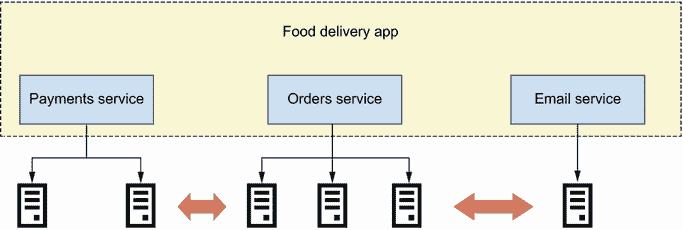
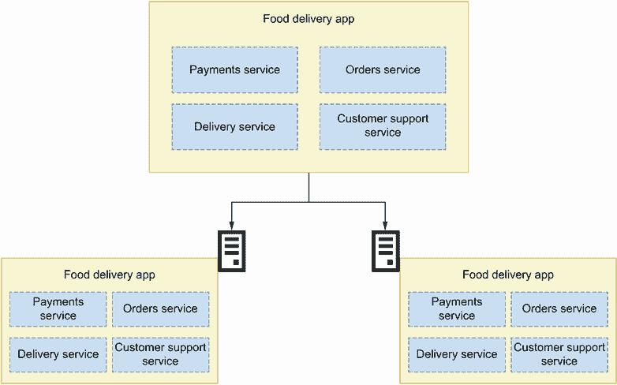
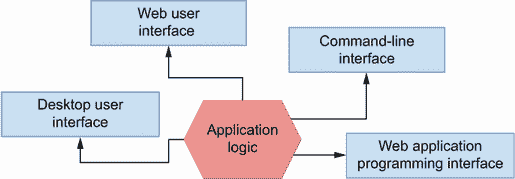
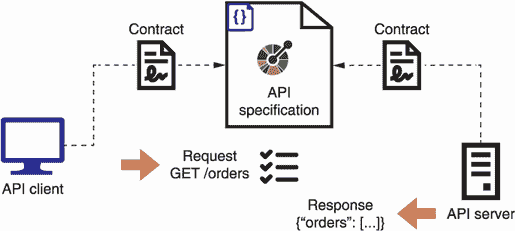
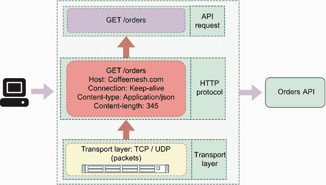
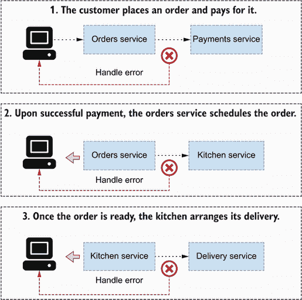
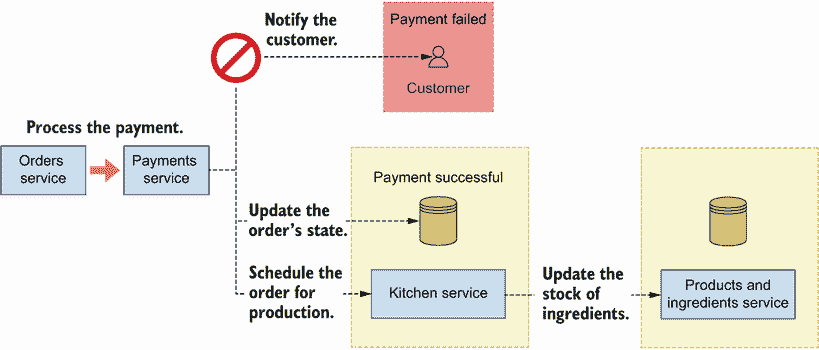
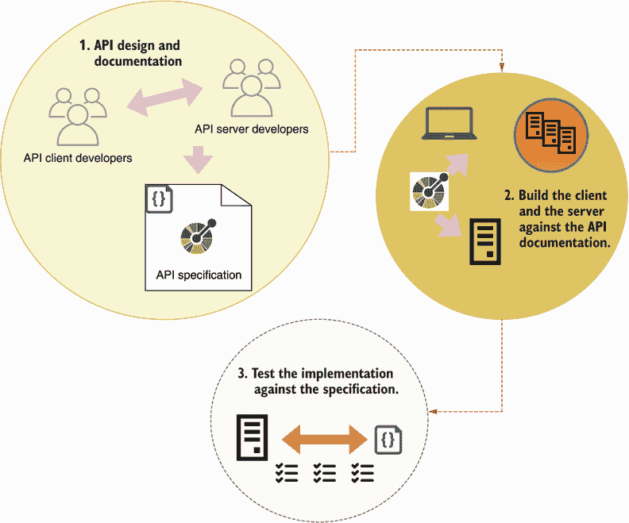

# 1 微服务 API 是什么？

本章涵盖

+   微服务是什么以及它们与单体应用如何比较

+   网络 API 是什么以及它们如何帮助我们推动微服务之间的集成

+   开发和运营微服务面临的最重要挑战

本章定义了本书中最重要的一些概念：微服务和 API。微服务是一种架构风格，其中系统的组件被设计为独立部署的服务，API 是允许我们与这些服务交互的接口。我们将看到微服务架构的定义特征以及它们与单体应用的比较。单体应用围绕单个代码库构建并部署在单个构建中。

我们将讨论微服务架构的优点和缺点。本章的最后部分将讨论在设计、实施和运营微服务时面临的最重要挑战。这次讨论不是为了阻止你接受微服务，而是为了让你能够做出明智的决定，判断微服务是否是你架构选择的正确选择。

## 1.1 微服务是什么？

在本节中，我们定义微服务架构是什么，并分析微服务与单体应用的比较。我们将探讨每种架构模式的优点和挑战。最后，我们还将简要回顾导致现代微服务架构出现的历史发展。

### 1.1.1 定义微服务

那么，微服务是什么？微服务可以以不同的方式定义，并且，根据我们想要强调的微服务架构的哪个方面，作者提供了略微不同但相关的定义。Sam Newman，微服务领域最有影响力的作者之一，提供了一个最小化定义：“微服务是小型、自治的服务，它们协同工作。”¹

这个定义强调了微服务是独立运行的应用程序，但可以在执行任务时相互协作的事实。定义还强调了微服务是“小型”的。在这种情况下，“小型”并不指微服务的代码库大小，而是指微服务是具有狭窄和明确范围的应用程序，遵循单一责任原则，即做好一件事。

James Lewis 和 Martin Fowler 撰写的一篇开创性文章提供了更详细的定义。他们将微服务定义为一种架构风格，即“将单个应用程序作为一系列小型服务开发的方法，每个服务都在自己的进程中运行，并通过轻量级机制进行通信，通常是 HTTP 资源 API”([`martinfowler.com/articles/microservices.html`](https://martinfowler.com/articles/microservices.html))。这个定义通过指出它们在独立进程中运行来强调服务的自治性。Lewis 和 Fowler 还强调微服务具有狭窄的责任范围，他们说它们是“小的”，并明确描述了微服务通过轻量级协议（如 HTTP）进行通信的方式。

定义：*微服务*是一种架构风格，其中系统的组件被设计为独立部署的服务。微服务围绕定义良好的业务子域设计，并使用轻量级协议（如 HTTP）相互通信。

从前面的定义中，我们可以看出微服务可以被定义为一种架构风格，其中服务是执行一组小而明确定义的相关功能的组件。正如你在图 1.1 中所看到的，这个定义意味着微服务是围绕特定的业务子域设计和构建的，例如处理支付、发送电子邮件或处理客户的订单。



图 1.1 在微服务架构中，每个服务实现特定的业务子域，并作为独立组件部署，在它自己的进程中运行。

微服务作为独立进程部署，通常在独立环境中运行，并通过定义良好的接口公开其功能。在这本书中，你将学习如何设计和构建通过 Web API 公开其功能的微服务，尽管其他类型的接口也是可能的，例如消息队列。²

### 1.1.2 微服务与单体

既然我们已经知道了什么是微服务，让我们看看它们与单体应用模式的比较。与微服务相反，单体是一个所有功能都作为一个单一构建部署在一起并运行在相同进程中的系统。例如，图 1.2 展示了一个包含四个服务的食品配送应用程序：支付服务、订单服务、配送服务和客户支持服务。由于应用程序被实现为单体，所有功能都一起部署。我们可以运行多个单体应用程序的实例，并让它们并行运行以提高冗余和可伸缩性，但每个进程仍然运行整个应用程序。



图 1.2 在单体应用程序中，所有功能都作为一个单一构建部署到每个服务器。

**定义** 一个**单体**是一种架构模式，其中整个应用程序作为一个单一构建部署。

在某些情况下，单体是架构的正确选择。例如，当我们的代码库很小且预期不会变得很大时，我们会使用单体。³ 单体也带来了一些优势。首先，整个实现都在同一个代码库中，这使得从不同的子域访问数据和逻辑变得更容易。而且因为所有内容都在同一个进程中运行，所以很容易通过应用程序跟踪错误：你只需要在你代码的不同部分放置几个断点，你就能得到一个详细的错误发生时的画面。此外，因为所有代码都在同一个项目的范围内，当你从不同的子域消费功能时，你可以利用你最喜欢的开发编辑器的生产力功能。

然而，随着应用程序的增长和复杂化，这种类型的架构显示出局限性。当代码库增长到难以管理的程度，以及当你通过代码找到路径变得困难时，这种情况就会发生。此外，能够在同一项目内部的其他子域中重用代码通常会导致组件之间的紧密耦合。紧密耦合发生在组件依赖于另一段代码的实现细节时。

单体越大，测试它所需的时间就越长。单体中的每个部分都必须经过测试，并且随着我们向其中添加新功能，测试套件会越来越大。因此，部署变得缓慢，并鼓励开发者在同一个版本中堆积更改，这使得发布变得更加具有挑战性。因为许多更改一起发布，如果在发布中引入了新的错误，通常很难找到导致错误的特定更改并将其回滚。而且因为整个应用程序在同一个进程中运行，当你为某个组件扩展资源时，你实际上是在为整个应用程序扩展资源。简而言之，代码更改变得越来越有风险，部署变得越来越难以管理。微服务如何帮助我们解决这些问题？

微服务通过强制执行严格分离组件的边界来解决了与单体应用程序相关的一些问题。当你使用微服务实现应用程序时，每个微服务都在不同的进程中运行，通常在不同的服务器或虚拟机上，并且可以拥有完全不同的部署模型。实际上，它们可以用完全不同的编程语言编写（这并不意味着它们应该这样做！）。

由于微服务的代码库比单体应用小，并且它们的逻辑是自包含的，并且定义在特定的业务子域范围内，因此测试它们更容易，它们的测试套件运行更快。由于它们在代码级别上没有与其他平台组件的依赖关系（除了可能是一些共享库），它们的代码更清晰，重构它们也更容易。这意味着代码可以随着时间的推移变得更好，并变得更加易于维护。因此，我们可以对代码进行小幅度修改并更频繁地发布。较小的发布更容易控制，如果我们发现了一个错误，发布回滚也更容易。我想强调的是，微服务并不是万能的。正如我们将在第 1.3 节中看到的，微服务也有其局限性，并带来了一些自己的挑战。

现在我们已经了解了微服务是什么以及它们与单体应用相比如何，让我们退一步看看是什么发展导致了这种类型架构的出现。

### 1.1.3 当前微服务及其发展历程

在许多方面，微服务并不是什么新鲜事物。⁴ 公司在微服务概念流行之前就已经开始实施和部署独立的应用程序组件。他们只是没有称之为微服务。亚马逊的首席技术官 Werner Vogels 解释了亚马逊是如何在 21 世纪初开始尝试这种架构的。到那时，亚马逊网站的代码库已经增长成为一个没有明确架构模式的复杂系统，发布新版本和扩展系统已经变成了严重的痛点。为了解决这些问题，他们决定在代码中寻找独立的逻辑片段，并将它们分离出来成为可以独立部署的组件，并在它们前面提供一个 API。在这个过程中，他们还确定了属于这些组件的数据，并确保系统的其他部分不能通过 API 之外的方式访问数据。他们将这种新的架构类型称为*面向服务的架构*([`vimeo.com/29719577`](https://vimeo.com/29719577))。Netflix 也在大规模上开创了这种架构风格，并将它称为“细粒度面向服务的架构”。⁵

术语*微服务*在 2010 年代初开始流行，用来描述这种类型的架构。例如，James Lewis 在 2012 年克拉科夫第 33 度会议上使用了这个概念，标题为“Micro-Services—Java, the Unix way”([`vimeo.com/74452550`](https://vimeo.com/74452550))。2014 年，Martin Fowler 和 James Lewis 关于微服务架构特征的论文以及 Newman 有影响力的书籍《Building Microservices》的出版，使这一概念得到了巩固([`martinfowler.com/articles/microservices.html`](https://martinfowler.com/articles/microservices.html))。

今天，微服务是一种广泛使用的架构风格。在技术扮演重要角色的公司中，大多数公司已经在使用微服务或正在转向其采用。对于初创公司来说，开始使用微服务方法实现其平台也是常见的。然而，微服务并不适合所有人，尽管它们带来了实质性的好处，正如我们所展示的，它们也带来了相当大的挑战，我们将在第 1.3 节中看到。

## 1.2 什么是 Web API？

在本节中，我们将解释 Web API。您将了解到 Web API 是更一般的应用程序编程接口（API）概念的特定实例。重要的是要理解 API 只是应用程序之上的一个层，并且存在不同类型的接口。因此，我们将从定义 API 是什么开始，然后我们将继续解释 API 如何帮助我们驱动微服务之间的集成。

### 1.2.1 什么是 API？

API 是一种接口，允许我们以编程方式与应用程序交互。编程接口是我们可以从代码或终端使用的那种接口，与图形界面相对，在图形界面中，我们使用用户界面与应用程序交互。应用程序接口有多种类型，例如命令行界面（CLI；允许您从终端使用应用程序的接口）、桌面 UI 接口、Web UI 接口或 Web API 接口。如图 1.3 所示，一个应用程序可以有一个或多个这些接口。



图 1.3 一个应用程序可以拥有多个接口，例如 Web API、CLI、Web UI 和桌面 UI。

为了说明这个概念，想想流行的客户端 URL（cURL）。cURL 是 `libcurl` 库的 CLI。`libcurl` 实现了允许我们与 URL 交互的功能，而 cURL 通过 CLI 揭示这些功能。例如，我们可以使用 cURL 向 URL 发送 GET 请求：

```
$ curl -L http://www.google.com
```

我们还可以使用带有 `-O` 选项的 cURL 来将 URL 的内容下载到文件中：

```
$ curl -O http://www.gnu.org/software/gettext/manual/gettext.html
```

`libcurl` 库位于 cURL CLI 之后，没有任何东西阻止我们通过源代码直接访问它（如果您好奇，您可以从 Github 上获取它：[`github.com/curl/curl`](https://github.com/curl/curl))并为该应用程序构建更多类型的接口。

### 1.2.2 什么是 Web API？

现在我们已经了解了 API 是什么，我们将解释 Web API 的定义特征。Web API 是一种使用超文本传输协议（HTTP）传输数据的 API。HTTP 是支撑互联网的通信协议，它允许我们在网络上交换不同类型的媒体类型，如文本、图像、视频和 JSON。HTTP 使用统一资源定位符（即 URL）的概念来定位互联网上的资源，并且它具有 API 技术可以利用的功能，以增强与服务器的交互，例如请求方法（例如 GET、POST、PUT）和 HTTP 头。Web API 使用诸如 SOAP、REST、GraphQL、gRPC 等技术实现，这些技术将在附录 A 中更详细地讨论。

### 1.2.3 API 如何帮助我们驱动微服务集成？

微服务通过 API 相互通信，因此 API 代表了我们的微服务接口。API 使用标准协议进行文档化。API 文档告诉我们如何与微服务交互以及我们可以期望从它那里得到什么样的响应。API 文档越好，API 消费者对 API 的工作方式就越清晰。从这个意义上说，如图 1.4 所示，API 文档代表了服务之间的合同：只要客户端和服务器都遵循 API 文档，通信就会按预期进行。



图 1.4 API 规范代表了 API 服务器和 API 客户端之间的合同。只要客户端和服务器都遵循规范，API 集成就会正常工作。

弗劳尔和刘易斯普及了这样一个观点：集成微服务的最佳策略是通过暴露*智能端点*并通过*哑管道*进行通信（[`martinfowler.com/articles/microservices.html`](https://martinfowler.com/articles/microservices.html)）。这个想法受到了 Unix 系统设计原则的启发，这些原则规定：

+   一个系统应由小型、独立的组件组成，这些组件只做一件事。

+   每个组件的输出都应该设计得易于成为另一个组件的输入。

Unix 程序通过管道相互通信，管道是简单地将消息从一个应用程序传递到另一个应用程序的机制。为了说明这个过程，请考虑以下命令链，您可以从基于 Unix 的机器（例如 Mac 或 Linux 计算机）的终端运行：

```
$ history | less
```

`history`命令显示了使用你的 Bash 配置文件运行的所有命令列表。命令列表可能很长，所以你可能想使用`less`命令分页显示`history`的输出。要从一个命令传递数据到另一个命令，使用管道字符（`|`），这指示 shell 捕获`history`命令的输出并将其作为`less`命令的输入。我们称这种类型的管道为“哑”管道，因为它的唯一任务是传递消息从一个进程到另一个进程。如图 1.5 所示，Web API 通过 HTTP 交换数据。数据传输层对我们使用的特定 API 协议一无所知，因此它代表我们的“哑”管道，而 API 本身包含处理数据的所有必要逻辑。



图 1.5 微服务通过数据传输层（如 TCP 上的 HTTP）进行 API 通信。

API 必须稳定，并且在其背后，你可以更改任何服务的内部实现，只要它们遵守 API 文档。这意味着 API 的消费者必须能够继续以前的方式调用 API，并且必须获得相同的响应。这导致微服务架构中的另一个重要概念：*可替换性*。⁶ 理念是，你应该能够完全替换端点背后的代码库，而端点以及因此服务之间的通信仍然可以工作。现在我们了解了 API 是什么以及它们如何帮助我们驱动服务之间的集成，让我们看看微服务带来的最重要的挑战。

## 1.3 微服务架构的挑战

如我们在 1.1.2 节中看到的，微服务带来了实质性的好处。然而，它们也带来了重大的挑战。在本节中，我们讨论微服务带来的最重要的挑战，我们将它们分为五个主要类别：

+   有效的服务分解

+   微服务集成测试

+   处理服务不可用

+   跟踪分布式事务

+   增加的操作复杂性和基础设施开销

本节中讨论的所有问题和困难都可以通过特定的模式和策略来解决，其中一些我们在本书的后续内容中详细说明。你还会找到其他深入处理这些问题的资源的引用。这里的理念是让你意识到微服务并不是解决单体应用所呈现的所有问题的神奇疗法。

### 1.3.1 有效的服务分解

在设计微服务时，最关键的挑战之一是服务分解。我们必须将平台分解成松散耦合但足够独立的组件，并具有明确定义的边界。如果您发现自己每次更改另一个服务时都会更改一个服务，那么您就可以知道您在服务之间有不合理的耦合。在这种情况下，要么服务之间的合同不够弹性，要么两个组件之间有足够的依赖关系，这足以证明它们应该合并。未能将系统分解成独立的微服务可能导致 Chris Richardson，*微服务模式*一书的作者所说的*分布式单体*，这是一种将单体架构的所有问题与微服务的所有问题结合在一起的情况，而没有享受到任何一种架构的好处。在第三章中，您将学习有用的设计模式和分解策略，这些策略将帮助您将系统分解成微服务。

### 1.3.2 微服务集成测试

在 1.1.2 节中，我们提到微服务通常更容易测试，并且它们的测试套件通常运行得更快。然而，微服务集成测试可能运行起来要困难得多，尤其是在单个事务涉及多个微服务协作的情况下。当您的整个应用程序运行在同一个进程中时，测试不同组件之间的集成相对容易，其中大部分只需要编写良好的单元测试。在微服务环境中，为了测试多个服务之间的集成，您需要能够以类似于您的生产环境的方式进行设置来运行所有这些服务。

您可以使用不同的策略来测试微服务集成。第一步是确保每个服务都有一个良好文档化和正确实现的 API。您可以使用 Dredd 和 Schemathesis 等工具，正如您将在第十二章中学到的，来测试 API 实现是否符合 API 规范。您还必须确保 API 客户端按照 API 文档的要求准确消费 API。您可以使用 API 文档编写针对 API 客户端的单元测试，以从服务生成模拟响应。⁷ 最后，如果没有一个完整的端到端测试来运行实际的微服务并相互调用，那么上述任何测试都不足以满足要求。

### 1.3.3 处理服务不可用

我们必须确保我们的应用程序在面对服务不可用、连接和请求超时、错误请求等情况时具有弹性。例如，当我们通过像 Uber Eats、Delivery Hero 或 Deliveroo 这样的食品配送应用程序下单时，服务之间的一系列请求展开以处理和交付订单，任何这些请求在任何一点都可能失败。让我们从用户下单时发生的过程的宏观角度来审视这个过程（见图 1.6 以展示请求链的示意图）：

1.  客户下单并支付。订单是通过订单服务进行的，为了处理支付，订单服务与支付服务协同工作。

1.  如果支付成功，订单服务向厨房服务发出请求以安排订单的生产。

1.  一旦订单生产完成，厨房服务向配送服务发出请求以安排配送。



图 1.6 微服务必须能够应对服务不可用、请求超时和其他服务的处理错误等事件，要么重试请求，要么向用户返回有意义的响应。

在这个复杂的请求链中，如果参与的服务中的任何一个未能按预期响应，它可能会通过平台触发级联错误，导致订单未处理或处于不一致的状态。因此，设计微服务时，它们必须能够可靠地处理失败的端点非常重要。我们的端到端测试应该考虑这些场景，并测试我们在这些情况下的服务行为。

### 1.3.4 跟踪分布式事务

协作服务有时必须处理分布式事务。分布式事务是指需要两个或更多服务协作的事务。例如，在一个食品配送应用程序中，我们希望跟踪现有原料的库存，以便我们的目录可以准确地反映产品可用性。当用户下单时，我们希望更新原料库存以反映新的可用性。具体来说，我们希望在支付成功处理之后更新原料库存。正如您在图 1.7 中看到的，订单成功处理涉及以下操作：

1.  处理支付。

1.  如果支付成功，将订单状态更新为表示其正在处理中。

1.  与厨房服务接口，安排订单的生产。

1.  更新原料库存以反映其当前可用性。



图 1.7 分布式事务涉及多个服务之间的协作。如果其中任何服务失败，我们必须能够处理失败并提供对用户有意义的响应。

所有这些操作都是相关的，并且它们必须协调一致，要么全部成功，要么全部失败。我们不能在没有正确更新其状态的情况下成功完成订单，如果支付失败，我们也不应该安排其生产。我们可能希望在制作订单时更新原料的可用性，如果支付后来失败，我们想要确保回滚更新。如果所有这些操作都在同一个流程中发生，管理流程就很简单，但使用微服务时，我们必须管理各个流程的结果。当使用微服务时，挑战在于确保我们在服务之间有一个健壮的通信过程，以便我们确切知道当错误发生时是什么类型的错误，并采取适当的措施来应对。

在服务协同工作以处理某些请求的情况下，你还必须能够跟踪请求在其穿越不同服务时的周期，以便在事务过程中发现错误。为了获得分布式事务的可见性，你需要为你的微服务设置分布式日志和跟踪。你可以从 Jamie Riedesel 的《软件遥测》（Manning，2021 年）中了解更多关于这个主题的信息。

### 1.3.5 运营复杂性和基础设施开销增加

随着微服务的引入，另一个重要的挑战是它们给平台带来的增加的运营复杂性和运营开销。当你的整个网站后端运行在单个应用程序构建中时，你只需要部署和监控一个进程。当你有十几个微服务时，每个服务都必须进行配置、部署和管理。这包括不仅为部署服务而提供服务器，还包括日志聚合流、监控系统、警报、自恢复机制等等。正如你将在第三章中学到的，每个服务都有自己的数据库，这意味着它们也需要多个数据库设置，包括所有在规模上运行所需的功能。而且，一个新部署改变微服务的端点并不罕见，无论是 IP、基本 URL 还是通用 URL 中的特定路径，这意味着其消费者必须被告知这些变化。

当亚马逊刚开始向微服务架构转型时，他们发现开发团队大约会花费 70%的时间来管理基础设施([`vimeo.com/29719577`](https://vimeo.com/29719577) 在 07:53 处)。如果你从一开始就没有采用最佳实践进行基础设施自动化，这将是一个非常真实的风险。即使你采取了这些措施，你也可能需要花费大量时间开发定制工具来有效地管理你的服务。

## 1.4 介绍文档驱动开发

正如我们在 1.2.3 节中解释的，API 集成的成功取决于良好的 API 文档，在本节中，我们介绍了一种将文档置于 API 开发前沿的 API 开发工作流程。如图 1.8 所示，以文档驱动的开发是构建 API 的一种方法，它分为三个阶段：

1.  您设计和记录 API。

1.  按照文档说明，您构建 API 客户端和 API 服务器。

1.  您将 API 客户端和 API 服务器都针对文档进行测试。



图 1.8：以文档驱动的开发分为三个阶段：设计和文档、实施和验证。

让我们深入探讨这些要点。第一步包括设计和记录规范。我们为他人构建 API，因此在构建 API 之前，我们必须创建一个满足 API 客户端需求的 API 设计。正如我们在设计应用程序的用户界面（UI）时涉及用户一样，在设计 API 时也必须与 API 消费者进行互动。

良好的 API 设计可以提供良好的开发者体验，而良好的 API 文档有助于实现成功的 API 集成。什么是 API 文档？API 文档是根据标准接口描述语言（IDL）对 API 的描述，例如 OpenAPI 用于 REST API 和 Schema Definition Language（SDL）用于 GraphQL API。标准 IDL 拥有工具和框架的生态系统，这使得构建、测试和可视化我们的 API 变得更加容易，因此投入时间学习它们是值得的。在这本书中，您将学习如何使用 OpenAPI（第五章）和 SDL（第八章）来记录您的 API。

一旦我们完成了文档化的 API 设计，我们就进入第二阶段，这一阶段包括根据 API 文档构建 API 服务器和 API 客户端。在第二章和第六章中，您将学习如何分析 OpenAPI 规范的要求，并根据这些要求构建 API 应用程序，而在第十章中，我们将应用相同的方法来处理 GraphQL API。API 客户端开发者还可以利用 API 文档来运行 API 模拟服务器，并对其代码进行测试。⁸

最后的阶段涉及测试我们的实现与 API 文档的一致性。在第十二章中，您将学习如何使用自动化的 API 测试工具，如 Dredd 和 Schemathesis，这些工具可以为您的 API 生成一系列可靠的测试。将 Dredd 和 Schemathesis 与您的应用程序单元测试套件结合使用，将使您确信您的 API 实现按预期工作。您应该在持续集成服务器上运行这些测试，以确保不会发布任何违反 API 文档约定的代码。

通过将 API 文档置于开发过程的前端，文档驱动开发有助于你避免 API 开发者面临的最常见问题之一：客户端和服务器开发团队在 API 应该如何工作的问题上存在分歧。在没有健壮的 API 文档的情况下，开发者经常需要猜测 API 的实现细节。在这种情况下，API 很少在第一次集成测试中成功。尽管文档驱动开发不能保证你的 API 集成 100%成功，但它将显著降低 API 集成失败的风险。

## 1.5 介绍 CoffeeMesh 应用程序

为了说明本书中解释的概念和想法，我们将构建一个名为 CoffeeMesh 的应用程序的部分组件。CoffeeMesh 是一个虚构的应用程序，允许客户在任何地点、任何时间订购咖啡。CoffeeMesh 平台由一组实现不同功能的微服务组成，例如处理订单和安排配送。我们将在第三章中对 CoffeeMesh 平台进行正式的分析和设计。为了让你了解这本书中你将学到的东西，我们将在第二章中开始实现 CoffeeMesh 订单服务的 API。在我们结束这一章之前，我想专门用一节来解释你将从这本书中学到什么。

## 1.6 这本书面向的对象以及你将学到什么

为了充分利用这本书，你应该熟悉网络开发的基础知识。书中的代码示例使用 Python 编写，因此对 Python 的基本理解有益，但不是必须的，以便能够跟随示例。你不需要了解网络 API 或微服务，因为我们将深入解释这些技术。如果你熟悉网络开发中的模型-视图-控制器（MVC）模式或其变体，例如 Python 流行的 Django 框架实现的模型-模板-视图（MTV）模式，这将很有用。我们将不时将这些模式与某些概念进行比较以说明。对 Docker 和云计算的基本熟悉将有助于通过部署章节，但我会尽最大努力详细解释每个概念。

本书通过实践方法展示了如何使用 Python 开发 API 驱动的微服务。你将学习

+   设计微服务架构的服务分解策略

+   如何设计和使用 OpenAPI 规范来记录 REST API

+   如何使用 FastAPI 和 Flask 等流行框架在 Python 中构建 REST API

+   如何设计和消费 GraphQL API，以及如何使用 Python 的 Ariadne 框架构建它们

+   如何使用基于属性的测试和 Dredd、Schemathesis 等 API 测试框架测试你的 API

+   在你的微服务中实现松耦合的有用设计模式

+   如何使用开放授权（OAuth）和开放 ID 连接（OIDC）为您的 API 添加身份验证和授权

+   如何使用 Docker 和 Kubernetes 将您的微服务部署到 AWS

在这本书结束时，您将熟悉微服务架构为 Web 应用程序带来的好处，以及随之而来的挑战和困难。您将了解如何使用 API 集成微服务，您将了解如何使用标准和最佳实践构建和记录这些 API，您将准备好以清晰的应用程序边界定义 API 的领域。最后，您还将了解如何测试、部署和确保您的微服务 API 的安全性。

## 摘要

+   微服务是一种架构模式，其中系统的组件被设计和构建为独立部署的服务。这导致代码库更小、更易于维护，并允许服务独立于彼此进行优化和扩展。

+   单体架构是一种架构模式，其中整个应用程序在一个构建中部署，并在同一进程中运行。这使得应用程序更容易部署和监控，但当代码库变得很大时，部署也更具挑战性。

+   应用程序可以有多种类型的接口，例如 UI、CLI 和 API。API 是一种允许我们从代码或终端以编程方式与应用程序交互的接口。

+   Web API 是在 Web 服务器上运行的 API，使用 HTTP 进行数据传输。我们使用 Web API 通过互联网公开服务功能。

+   微服务通过智能端点和“哑管道”相互通信。哑管道是一种简单地将数据从一个组件传输到另一个组件的管道。对于微服务来说，HTTP 是一个很好的哑管道示例，它在不了解所使用的 API 协议的情况下，在 API 客户端和 API 服务器之间交换数据。因此，Web API 是推动微服务之间集成的一种优秀技术。

+   尽管它们有好处，但微服务也带来了以下挑战：

    +   *有效的服务分解*——我们必须围绕特定的子域设计服务，以具有清晰的边界；否则，我们可能会构建一个“分布式单体”。

    +   *微服务集成测试*——对所有微服务进行集成测试具有挑战性，但我们可以通过确保 API 正确实现来降低集成失败的风险。

    +   *处理服务不可用*——协作服务容易受到服务不可用、请求超时和处理错误的影响，因此必须能够处理这些场景。

    +   *跟踪分布式事务*——跨多个服务跟踪错误具有挑战性，需要软件遥测工具，这些工具允许您集中日志、启用 API 可见性并跨服务跟踪请求。

    +   *增加的操作复杂性和基础设施开销*——每个微服务都需要自己的基础设施配置，包括服务器、监控系统以及警报，因此您需要在基础设施自动化方面投入额外的努力。

+   以文档驱动开发是一种 API 开发工作流程，分为三个阶段：

    +   设计并记录 API。

    +   根据文档构建 API。

    +   测试 API 与文档的一致性。

    通过将 API 文档置于开发过程的前端，文档驱动开发有助于您避免 API 开发者面临的一些常见问题，从而降低 API 集成失败的风险。

* * *

¹ Sam Newman，*Building Microservices*（O’Reilly，2015 年），第 2 页。

² 为了全面了解可用于实现微服务之间通信的不同接口，请参阅 Chris Richardson 所著的《Microservices Patterns》（Manning，2019 年）。

³ 为了对单体架构和微服务架构的战略性架构决策进行彻底分析，请参阅 Vernon、Vaughn 和 Tomasz Jaskula 合著的《Strategic Monoliths and Microservices》（Addison-Wesley，2021 年）。

⁴ 为了更全面地分析微服务架构及其前身的历史，请参阅 Nicola Dragoni 等人撰写的“Microservices: Yesterday, Today, and Tomorrow”，载于《Present and Ulterior Software Engineering》（Springer，2017 年），第 195–216 页。

⁵ Allen Wang 和 Sudhir Tonse，"Announcing Ribbon: Tying the Netflix Mid-Tier Services Together"，载于《Netflix Technology Blog》，2013 年 1 月 18 日，[`netflixtechblog.com/announcing-ribbon-tying-the-netflix-mid-tier-services-together-a89346910a62`](https://netflixtechblog.com/announcing-ribbon-tying-the-netflix-mid-tier-services-together-a89346910a62)。关于面向服务架构（SOA）与微服务架构之间差异的精彩讨论，请参阅 Richardson 所著的《Microservices Patterns》，第 13–14 页。

⁶ Newman，*Building Microservices*，第 7–8 页。

⁷ 要了解更多关于 API 开发工作流程以及如何使用 API 模拟服务器构建客户端的信息，请查看我的演示文稿“API Development Workflows for Successful Integrations”，Manning API 会议，2021 年 8 月 3 日，[`youtu.be/SUKqmEX_uwg`](https://youtu.be/SUKqmEX_uwg)。

⁸ 要了解 API 服务器和客户端开发者如何在软件开发过程中利用 API 文档，请查看我的演讲“Leveraging API Documentation to Deliver Reliable API Integrations”，API 规范会议，2021 年 9 月 28 日至 29 日，[`youtu.be/kAWvM-CVcnw`](https://youtu.be/kAWvM-CVcnw)。
