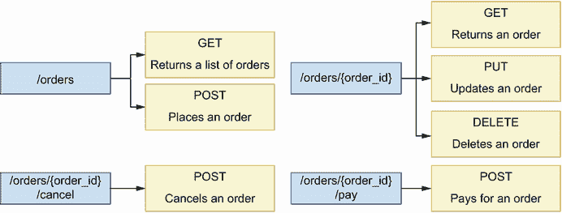
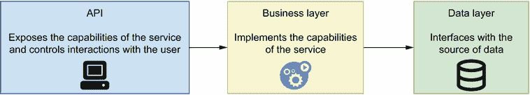
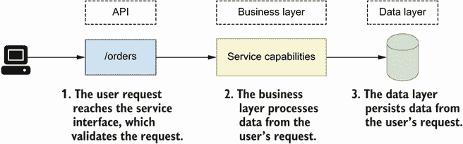
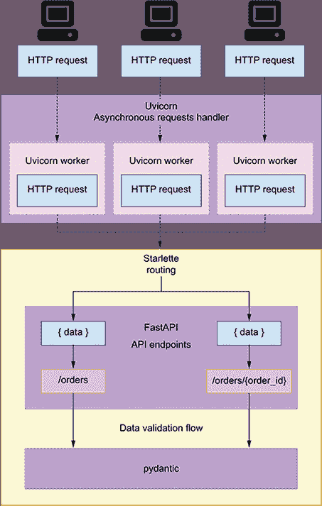
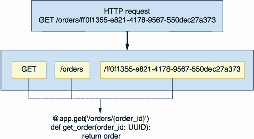
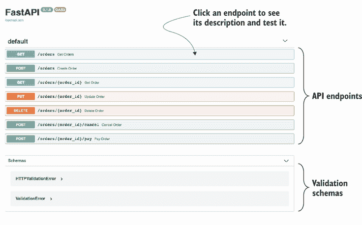
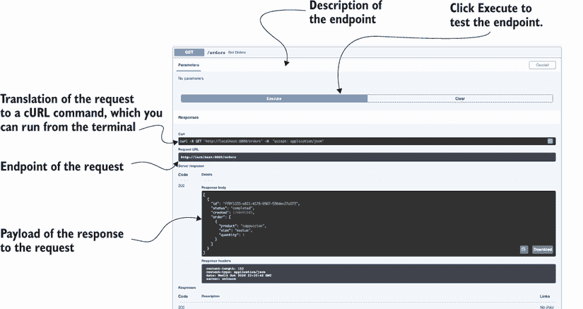
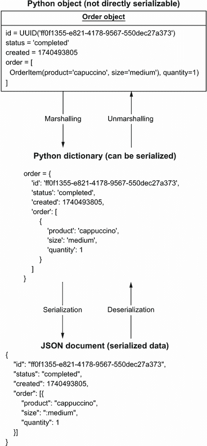
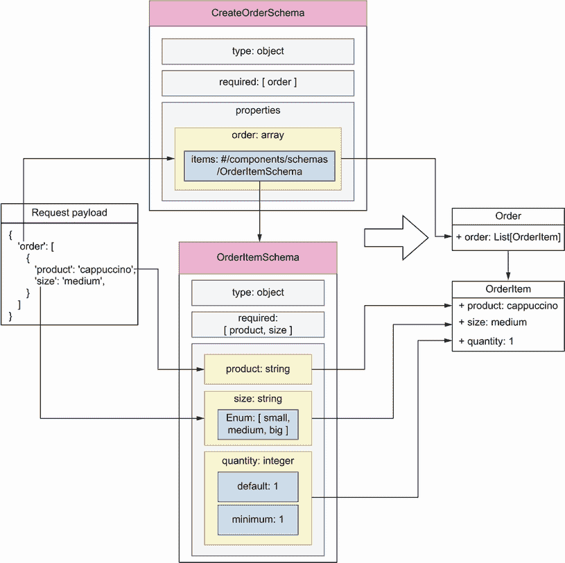
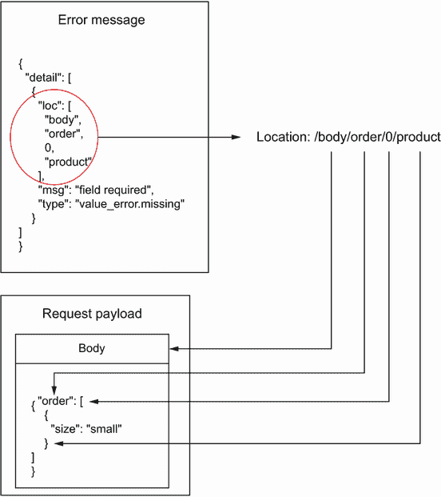

# 2 基本的 API 实现

本章涵盖

+   阅读和理解 API 规范的要求

+   将我们的应用程序结构化为数据层、应用层和接口层

+   使用 FastAPI 实现 API 端点

+   使用 pydantic 实现数据验证模型（模式）

+   使用 Swagger UI 测试 API

在本章中，我们实现了订单服务的 API，这是我们在 1.5 节中介绍的 CoffeeMesh 网站的一个微服务。CoffeeMesh 是一个可以在任何时间、任何地点按需制作和配送咖啡的应用程序。订单服务允许客户通过 CoffeeMesh 下订单。在我们实现订单 API 的过程中，您将提前了解我们在本书中更详细地剖析的概念和流程。本章的代码可在本书提供的 GitHub 仓库的 ch02 文件夹中找到。

## 2.1 订单 API 规范的介绍

让我们从分析订单 API 的要求开始。使用订单 API，我们可以下订单、更新订单、检索它们的详细信息或取消订单。订单 API 规范可在本书 GitHub 仓库的 ch02/oas.yaml 文件中找到。OAS 代表*OpenAPI 规范*，这是一种用于记录 REST API 的标准格式。如图 2.1 所示，API 规范描述了一个具有四个主要 URL 路径的 REST API。 

+   `/orders`—允许我们检索订单列表（GET）和创建订单（POST）。

+   `/orders/{order_id}`—允许我们检索特定订单的详细信息（GET），更新订单（PUT），以及删除订单（DELETE）。

+   `/orders/{order_id}/cancel`—允许我们取消订单（POST）。

+   `/orders/{order_id}/pay`—允许我们为订单付款（POST）。



图 2.1 订单 API 公开了围绕四个 URL 路径结构的七个端点。每个端点实现不同的功能，例如下订单和取消订单。

除了记录 API 端点外，规范还包括数据模型，告诉我们通过这些端点交换的数据看起来像什么。在 OpenAPI 中，我们称这些模型为*模式*，您可以在订单 API 规范的组件部分找到它们。模式告诉我们必须包含哪些属性以及它们的类型。

例如，`OrderItemSchema`模式指定`product`和`size`属性是必需的，但`quantity`属性是可选的。当`quantity`属性从有效负载中缺失时，默认值是`1`。因此，我们的 API 实现必须在尝试创建订单之前强制执行有效负载中`product`和`size`属性的存在。

列表 2.1 `OrderItemSchema`规范

```
# file: oas.yaml

OrderItemSchema:
  type: object
  required:
    - product
    - size
  properties:
    product:
      type: string
    size:
      type: string
      enum:
        - small
        - medium
        - big
    quantity:
      type: integer
      default: 1
      minimum: 1
```

现在我们已经了解了构建订单 API 的要求，让我们看看我们将用于实施的架构布局。

## 2.2 订单应用的高级架构

本节提供了订单 API 架构布局的高级概述。我们的目标是确定应用程序的层，并在所有层之间强制执行清晰的边界和关注点的分离。

如图 2.2 所示，我们将组织成三层：API 层、业务层和数据层。



图 2.2 为了在我们的服务不同组件之间强制执行关注点的分离，我们围绕三个层次结构化我们的代码：数据层知道如何与数据源接口；业务层实现服务的功能；接口层实现服务的 API。

这种构建应用程序的方式是对三层架构模式的改编，它将应用程序结构化为数据层、业务层和表示层。如图 2.3 所示，数据层是应用程序中知道如何持久化数据以便我们以后可以检索的部分。数据层实现了与我们的数据源接口所需的数据模型。例如，如果我们的持久化存储是 SQL 数据库，数据层中的模型将代表数据库中的表，通常需要使用对象关系映射（ORM）框架。



图 2.3 当用户请求到达订单服务时，它首先由接口层进行验证。然后接口层与业务层接口以处理请求。处理完毕后，数据层将请求中包含的数据持久化。

业务层实现我们服务的功能。它控制 API 层和数据层之间的交互。对于订单服务来说，它是知道如何处理订单放置、取消或支付的部分。

服务的 API 层与业务层不同。业务层实现服务的功能，而 API 层是应用逻辑之上的适配器，它将服务的功能暴露给消费者。图 2.2 说明了服务层之间的关系，而图 2.3 说明了用户请求是如何被每一层处理的。

API 层是业务层之上的适配器。其最重要的任务是验证传入的请求并返回预期的响应。API 层与业务层通信，传递用户发送的数据，以便资源可以在服务器上被处理和持久化。API 层相当于三层架构中的表示层。既然我们已经知道了我们将如何构建我们的应用程序，那么我们就直接进入代码吧！

## 2.3 实现 API 端点

在本节中，你将学习如何实现订单服务的 API 层。我会向你展示如何将 API 的实现分解成逐步的步骤。在第一步中，我们将使用模拟响应生成端点的最小实现。在本章的后续部分，我们将通过添加数据验证和动态响应来增强实现。你还将了解 FastAPI 库以及如何使用它来构建 Web API。

什么是 FastAPI？

FastAPI ([`github.com/tiangolo/fastapi`](https://github.com/tiangolo/fastapi))是一个建立在 Starlette ([`github.com/encode/starlette`](https://github.com/encode/starlette))之上的 Web API 框架。Starlette 是一个高性能、轻量级、异步的服务器网关接口（ASGI）Web 框架，这意味着我们可以将我们的服务实现为一系列异步任务，以在我们的应用程序中获得性能提升。此外，FastAPI 使用 pydantic ([`github.com/samuelcolvin/pydantic/`](https://github.com/samuelcolvin/pydantic/))进行数据验证。以下图示说明了所有这些不同技术是如何结合在一起的。



Uvicorn ([`github.com/encode/uvicorn`](https://github.com/encode/uvicorn))是一个异步 Web 服务器，通常用于运行 Starlette 应用程序。Uvicorn 处理 HTTP 请求并将它们传递给 Starlette，Starlette 在你的应用程序中工作，当服务器收到请求时调用。FastAPI 建立在 Starlette 之上，并通过数据验证和 API 文档功能增强了 Starlette 的路由。

在我们开始实现 API 之前，我们需要为这个项目设置我们的环境。创建一个名为 ch02 的文件夹，并使用终端中的`cd`命令进入该文件夹。我们将使用 Pipenv 来安装和管理我们的依赖项。

关于依赖项

如果你想要确保你使用的是我在编写这本书时使用的相同依赖项，你可以从这本书的 GitHub 仓库中获取 ch02/Pipfile 和 ch02/Pipfile.lock 文件，并运行`pipenv install`。

`Pipfile`描述了我们希望使用 Pipenv 创建的环境。其中包含了许多内容，例如必须用于创建环境的 Python 版本和必须用于拉取依赖项的 PyPi 仓库的 URL。Pipenv 还通过为每个集合提供特定的安装标志，使得将生产依赖项与开发依赖项分开变得更容易。例如，要安装`pytest`，我们运行`pipenv install pytest --dev`。Pipenv 还公开了允许我们轻松管理我们的虚拟环境的命令，例如使用`pipenv shell`激活虚拟环境或使用`pipenv --rm`删除虚拟环境。

Pipenv 是 Python 的一个依赖项管理工具，它确保在不同的环境中安装了相同版本的依赖项。换句话说，Pipenv 使得以确定性的方式创建环境成为可能。为了实现这一点，Pipenv 使用一个名为 Pipfile.lock 的文件，其中包含已安装的确切包版本描述。

列表 2.2 使用`pipenv`创建虚拟环境并安装依赖项

```
$ pipenv --three                     ①

$ pipenv install fastapi uvicorn     ②

$ pipenv shell                       ③
```

① 使用 pipenv 创建虚拟环境并设置运行时为 Python 3。

② 安装 FastAPI 和 Uvicorn。

③ 激活虚拟环境。

现在我们已经安装了依赖项，让我们构建 API。首先，复制 GitHub 仓库中 ch02/oas.yaml 下的 API 规范到我们之前创建的 ch02 文件夹中。然后创建一个名为 orders 的子文件夹，它将包含我们的 API 实现。在 orders 文件夹内，创建一个名为 app.py 的文件。再创建一个名为 orders/api 的子文件夹，并在该文件夹内创建一个名为 orders/api/api.py 的文件。此时，项目结构应该看起来像这样：

```
.
├── Pipfile
├── Pipfile.lock
├── oas.yaml
└── orders
    ├── api
    │   └── api.py
    └── app.py
```

列表 2.3 展示了如何在文件 orders/app.py 中创建 FastAPI 应用程序的实例。从 FastAPI 来的`FastAPI`类实例代表我们正在实现的 API。它提供了*装饰器*（向函数或类添加额外功能的函数），允许我们注册我们的视图函数。¹

列表 2.3 创建 FastAPI 应用程序实例

```
# file: orders/app.py

from fastapi import FastAPI

app = FastAPI(debug=True)      ①

from orders.api import api     ②
```

① 我们创建 FastAPI 类的实例。这个对象代表我们的 API 应用程序。

② 我们导入 api 模块，以便我们的视图函数可以在加载时注册。

列表 2.4 展示了我们 API 端点的最小实现。代码位于 orders/api/api.py 文件中。我们声明了一个静态`order`对象，并在所有端点中返回相同的数据，除了 DELETE `/orders/{order_id}`端点，它返回一个空响应。稍后，我们将更改实现以使用动态订单列表。FastAPI 装饰器将每个函数返回的数据转换为 HTTP 响应；它们还将我们的函数映射到服务器中的特定 URL。默认情况下，FastAPI 在我们的响应中包含 200（OK）状态码，但我们可以通过在路由装饰器中使用`status_code`参数来覆盖此行为，就像我们在 POST `/orders`和 DELETE `/orders/{order_id}`端点中所做的那样。

列表 2.4 订单 API 的最小实现

```
# file: orders/api/api.py

from datetime import datetime
from uuid import UUID

from starlette.responses import Response
from starlette import status

from orders.app import app

order = {                                                     ①
    'id': 'ff0f1355-e821-4178-9567-550dec27a373',
    'status': "delivered",
    'created': datetime.utcnow(),
    'order': [
        {
            'product': 'cappuccino',
            'size': 'medium',
            'quantity': 1
        }
    ]
}

@app.get('/orders')                                           ②
def get_orders():
    return {'orders': [orders]}

@app.post('/orders', status_code=status.HTTP_201_CREATED)     ③
def create_order():
    return order

@app.get('/orders/{order_id}')                                ④
def get_order(order_id: UUID):                                ⑤
    return order

@app.put('/orders/{order_id}')
def update_order(order_id: UUID):
    return order

@app.delete('/orders/{order_id}', status_code=status.HTTP_204_NO_CONTENT)
def delete_order(order_id: UUID):
    return Response(status_code=HTTPStatus.NO_CONTENT.value)  ⑥

@app.post('/orders/{order_id}/cancel')
def cancel_order(order_id: UUID):
    return order

@app.post('/orders/{order_id}/pay')
def pay_order(order_id: UUID):
    return order
```

① 我们定义一个订单对象以返回我们的响应。

② 我们为/orders URL 路径注册了一个 GET 端点。

③ 我们指定响应的状态码为 201（已创建）。

④ 我们在花括号内定义 URL 参数，例如 order_id。

⑤ 我们捕获 URL 参数作为函数参数。

⑥ 我们使用 HTTPStatus.NO_CONTENT.value 来返回一个空响应。

FastAPI 公开了以 HTTP 方法命名的装饰器，例如`get()`和`post()`。我们使用这些装饰器来注册我们的 API 端点。FastAPI 的装饰器至少接受一个参数，即我们想要注册的 URL 路径。

我们的观点函数可以接受任意数量的参数。如果参数的名称与 URL 路径参数的名称匹配，FastAPI 在调用时会将路径参数从 URL 传递到我们的视图函数中。例如，如图 2.4 所示，URL `/orders/{order_id}` 定义了一个名为 `order_id` 的路径参数，相应地，我们为该 URL 路径注册的视图函数接受一个名为 `order_id` 的参数。如果用户导航到 URL /orders/53e80ed2-b9d6-4c3b-b549-258aaaef9533，我们的视图函数将被调用，并将 `order_id` 参数设置为 `53e80ed2-b9d6-4c3b-b549-258aaaef9533`。FastAPI 允许我们通过使用类型提示来指定 URL 路径参数的类型和格式。在列表 2.4 中，我们指定 `order_id` 的类型是一个*通用唯一标识符*（UUID）。FastAPI 将使任何不符合该格式的 `order_id` 调用无效。



图 2.4 FastAPI 知道如何将请求映射到正确的函数，并将任何相关的参数从请求传递到函数中。在这个示例中，一个对`/orders/{order_id}`端点的 GET 请求，其中`order_id`设置为`ff0f1355-e821-4178-9567-550dec27a373`，被传递到`get_order()`函数。

FastAPI 的响应默认包含一个 200（OK）状态码，但我们可以通过在端点装饰器中设置`status_code`参数来改变这种行为。在列表 2.4 中，我们在 POST `/orders`端点中将`status_code`设置为 201（已创建），在 DELETE `/orders/{order_id}`端点中设置为 204（无内容）。有关状态码的详细解释，请参阅第四章第 4.6 节。

您现在可以从顶级`orders`目录执行以下命令来运行应用程序，以了解 API 的外观：

```
$ uvicorn orders.app:app --reload
```

此命令加载服务器并启用热重载。*热重载*会在您更改文件时重启您的服务器。在浏览器中访问 http://127.0.0.1:8000/docs URL，您将看到由 FastAPI 从我们的代码生成的 API 文档的交互式显示（见图 2.5）。这种可视化称为 Swagger UI，它是可视化 REST API 中最受欢迎的方式之一。另一种流行的可视化是 Redoc，它也由 FastAPI 支持，可通过 http://127.0.0.1:8000/redoc URL 访问。



图 2.5 由 FastAPI 从我们的代码动态生成的 Swagger UI 视图。我们可以使用这个视图来测试端点的实现。

如果你点击 Swagger UI 中表示的任何端点，你将看到有关端点的附加文档。你还将看到一个“尝试一下”按钮，它给你直接从该 UI 测试端点的机会。点击该按钮，然后点击“执行”，你将得到我们包含在端点中的硬编码响应（参见图 2.6 以获得说明）。



图 2.6 要测试一个端点，点击它以展开。你将在端点描述的右上角看到一个“尝试一下”按钮。点击该按钮，然后点击“执行”按钮。这将触发对服务器的请求，你将能够看到响应。

现在我们已经有了我们 API 的基本框架，接下来我们将转向实现我们传入的有效载荷和输出的响应的验证器。下一节将指导你完成这一步骤。

## 2.4 使用 pydantic 实现数据验证模型

现在我们已经实现了我们 API 的 URL 路径的主要布局，我们需要添加对传入的有效载荷和我们的输出响应的验证。数据验证和序列化是 API 中的关键操作，为了成功实现 API 集成，我们需要正确处理它们。在接下来的章节中，你将学习如何为你的 API 添加强大的数据验证和序列化功能。FastAPI 使用 pydantic 进行数据验证，因此我们将从本节开始学习如何创建 pydantic 模型。

定义 *序列化* 是将内存中的数据结构转换为适合存储或通过网络传输的格式的过程。在 Web API 的上下文中，序列化指的是将对象转换为可以序列化为所选内容类型（如 XML 或 JSON）的数据结构的过程，并具有对对象属性的显式映射（参见图 2.7 以获得说明）。



图 2.7 要从 Python 对象构建响应有效载荷，我们首先将对象序列化为可序列化的数据结构，并在对象和新的结构之间显式映射属性。反序列化有效载荷将给我们回一个与序列化时相同的对象。

订单 API 规范包含三个模式：`CreateOrderSchema`、`GetOrderSchema` 和 `OrderItemSchema`。让我们分析这些模式，以确保我们理解我们需要如何实现我们的验证模型。

列表 2.5 订单 API 模式的规范

```
# file: oas.yaml

components:
  schemas:
    OrderItemSchema:
      type: object                                        ①
      required:                                           ②
        - product
        - size
      properties:                                         ③
        product:
          type: string
        size:
          type: string
          enum:                                           ④
            - small
            - medium
            - big
        quantity:
          type: integer
          default: 1                                      ⑤
          minimum: 1                                      ⑥

    CreateOrderSchema:
      type: object
      required:
        - order
      properties:
        order:
          type: array
          items:                                          ⑦
            $ref: '#/components/schemas/OrderItemSchema'  ⑧

    GetOrderSchema:
      type: object
      required:
        - order
        - id
        - created
        - status
      properties:
        id:
          type: string
          format: uuid
        created:
          type: string
          format: date-time
        status:
          type: string
          enum:
            - created
            - progress
            - cancelled
            - dispatched
            - delivered
        order:
          type: array
          items:
            $ref: '#/components/schemas/OrderItemSchema'
```

① 每个模式都有一个类型，在这个例子中是一个对象。

② 我们在 required 关键字下列出强制属性。

③ 我们在 properties 关键字下列出对象属性。

④ 我们使用枚举来约束属性的值。

⑤ 属性可以有一个默认值。

⑥ 我们还可以指定属性的最低值。

⑦ 我们使用 items 关键字指定数组中项的类型。

⑧ 我们使用 JSON 指针来引用同一文档内的另一个模式。

当我们从服务器返回订单详情时使用`GetOrderSchema`，而当验证客户放置的订单时使用`CreateOrderSchema`。图 2.8 说明了`CreateOrderSchema`的数据验证流程。如图所示，`CreateOrderSchema`只要求有效载荷中存在一个属性：`order`属性，它是一个对象数组，其规范由`OrderItemSchema`定义。`OrderItemSchema`有两个必需属性，`product`和`size`，以及一个可选属性`quantity`，其默认值为`1`。这意味着在处理请求有效载荷时，我们必须检查有效载荷中是否存在`product`和`size`属性，并且它们具有正确的类型。图 2.8 显示了当有效载荷中缺少`quantity`属性时会发生什么。在这种情况下，我们在服务器中将该属性设置为默认值`1`。



图 2.8 `CreateOrderSchema`模型对请求有效载荷的数据验证流程。该图显示了请求有效载荷的每个属性是如何与模式中定义的属性进行验证的，以及我们是如何从验证结果构建对象的。

现在我们已经理解了我们的 API 模式，是时候实现它们了。创建一个名为`orders/api/schemas.py`的新文件。该文件将包含我们的 pydantic 模型。列表 2.6 显示了如何使用 pydantic 实现`CreateOrderSchema`、`GetOrderSchema`和`OrderItemSchema`。列表 2.6 中的代码位于`orders/api/schemas.py`模块中。我们定义每个模式为一个继承自 pydantic 的`BaseModel`类的类，并使用 Python 类型提示指定每个属性的类型。对于只能取有限值集合的属性，我们定义一个枚举类。在这种情况下，我们为`size`和`status`属性定义了枚举。我们将`OrderItemSchema`的`quantity`属性的类型设置为 pydantic 的`conint`类型，该类型强制执行整数值。我们还指定`quantity`是一个可选属性，其值应等于或大于 1，并为其提供一个默认值 1。最后，我们使用 pydantic 的`conlist`类型将`CreateOrderSchema`的`order`属性定义为至少包含一个元素的列表。

列表 2.6 使用 pydantic 实现验证模型

```
# file: orders/api/schemas.py

from enum import Enum
from typing import List
from uuid import UUID

from pydantic import BaseModel, Field, conlist, conint

class Size(Enum):                                       ①
    small = 'small'
    medium = 'medium'
    big = 'big'

class Status(Enum):
    created = 'created'
    progress = 'progress'
    cancelled = 'cancelled'
    dispatched = 'dispatched'
    delivered = 'delivered'

class OrderItemSchema(BaseModel):                       ②
    product: str                                        ③
    size: Size                                          ④
    quantity: Optional[conint(ge=1, strict=True)] = 1   ⑤

class CreateOrderSchema(BaseModel):
    order:  conlist(OrderItemSchema, min_items=1)       ⑥

class GetOrderSchema(CreateOrderSchema):
    id: UUID
    created: datetime
    status: Status

class GetOrdersSchema(BaseModel):
    orders: List[GetOrderSchema]
```

① 我们声明一个枚举模式。

② 每个 pydantic 模型都继承自 pydantic 的 BaseModel。

③ 我们使用 Python 类型提示来指定属性的类型。

④ 我们通过将属性的类型设置为枚举来约束属性的值。

⑤ 我们指定数量的最小值，并为其提供一个默认值。

⑥ 我们使用 pydantic 的 conlist 类型来定义至少包含一个元素的列表。

现在我们已经实现了验证模型，在接下来的部分中，我们将它们与 API 链接起来以验证和打包有效载荷。

## 2.5 使用 pydantic 验证请求有效载荷

在本节中，我们使用在第 2.4 节中实现的模型来验证请求负载。我们如何在视图函数中访问请求负载？我们通过将它们声明为视图函数的参数来拦截请求负载，并通过将它们的类型设置为相关的 pydantic 模型来验证它们。

列表 2.7 将验证模型与 API 端点连接

```
# file: orders/api/api.py

from uuid import UUID

from starlette.responses import Response
from starlette import status

from orders.app import app
from orders.api.schemas import CreateOrderSchema         ①

...

@app.post('/orders', status_code=status.HTTP_201_CREATED)
def create_order(order_details: CreateOrderSchema):      ②
    return order

@app.get('/orders/{order_id}')
def get_order(order_id: UUID):
    return order

@app.put('/orders/{order_id}')
def update_order(order_id: UUID, order_details: CreateOrderSchema):
    return order

...
```

① 我们导入 pydantic 模型，以便可以使用它们进行验证。

② 我们通过在函数中声明它作为参数来拦截负载，并使用类型提示来验证它。

如果你保持应用程序运行，更改将自动由服务器加载，因此你只需刷新浏览器即可更新 UI。如果你点击/orders URL 路径的 POST 端点，你会看到 UI 现在为你提供了一个服务器期望的负载示例。现在，如果你尝试编辑负载以删除任何必需的字段，例如`product`字段，并将其发送到服务器，你将收到以下错误信息：

```
{
  "detail": [
    {
      "loc": [
        "body",
        "order",
        0,
        "product"
      ],
      "msg": "field required",
      "type": "value_error.missing"
    }
  ]
}
```

FastAPI 生成了一个错误信息，该信息指向了负载中错误发生的位置。错误信息使用 JSON 指针来指示问题所在。JSON 指针是一种语法，允许你在 JSON 文档中表示特定值的路径。如果你第一次遇到 JSON 指针，可以将它们视为在 Python 中表示字典语法和索引记法的一种不同方式。例如，错误信息`"loc:` `/body/order/0/product"`大致等同于 Python 中的以下表示：`loc['body']['order'][0]['product']`。图 2.9 展示了如何从错误信息中解释 JSON 指针，以确定负载中问题的来源。



图 2.9 当请求因负载格式错误而失败时，我们收到一个包含错误信息的响应。错误信息使用 JSON 指针告诉我们错误的位置。在这种情况下，错误信息指出，属性`/body/order/0/product`在负载中缺失。

你也可以更改负载，使其不缺少必需的属性，而是包含`size`属性的非法值：

```
{
  "order": [
    {
      "product": "string",
      "size": "somethingelse"
    }
  ]
}
```

在这种情况下，你也会收到以下信息的错误信息：`"value` `is` `not` `a` `valid` `enumeration` `member;` `permitted:` `'small',` `'medium',` `'big'"`。如果我们对负载中的内容输入错误会发生什么？例如，想象一个客户端向服务器发送以下负载：

```
{
  "order": [
    {
      "product": "string",
      "size": "small",
      "quantit": 5
    }
  ]
}
```

在这种情况下，FastAPI 假设`quantity`属性缺失，并且客户端希望将其值设置为`1`。这种结果可能会导致客户端和服务器之间的混淆，在这种情况下，通过验证非法属性来使 API 集成更加可靠。在第六章中，你将学习如何处理这些情况。

带有可选属性的边缘情况，例如`OrderItemSchema`的`quantity`，是 pydantic 假设它们是可空的，因此会接受将`quantity`设置为`null`的有效负载。例如，如果我们向 POST `/orders`端点发送以下有效负载，我们的服务器将接受它：

```
{
  "order": [
    {
      "product": "string",
      "size": "small",
      "quantity": null
    }
  ]
}
```

在 API 集成方面，可选的并不完全等同于可空的：一个属性可以是可选的，因为它有一个默认值，但这并不意味着它可以设置为`null`。为了在 pydantic 中强制正确的行为，我们需要包含一个额外的验证规则，防止用户将`quantity`的值设置为`null`。我们使用 pydantic 的`validator()`装饰器为我们的模型定义额外的验证规则。

列表 2.8 为 pydantic 模型包含额外的验证规则

```
# file: orders/api/schemas.py

from datetime import datetime
from enum import Enum
from typing import List, Optional
from uuid import UUID

from pydantic import BaseModel, conint, validator

...

class OrderItemSchema(BaseModel):
    product: str
    size: Size
    quantity: Optional[conint(ge=1, strict=True)] = 1

    @validator('quantity')
    def quantity_non_nullable(cls, value):
        assert value is not None, 'quantity may not be None'
        return value
...
```

现在我们知道了如何使用 Swagger UI 测试我们的 API 实现，让我们看看我们如何使用 pydantic 来验证和序列化我们的 API 响应。

## 2.6 使用 pydantic 序列化和验证响应有效负载

在本节中，我们将使用第 2.4 节中实现的 pydantic 模型来序列化和验证我们的 API 的响应有效负载。格式错误的有效负载是 API 集成失败的最常见原因之一，因此这一步对于提供健壮的 API 至关重要。例如，POST `/orders`端点响应有效负载的模式是`GetOrderSchema`，它要求存在`id`、`created`、`status`和`order`字段。API 客户端将期望响应有效负载中存在所有这些字段，如果任何字段缺失或类型或格式不正确，将引发错误。

注意：格式错误的有效负载是 API 集成失败的一个常见原因。你可以在它们离开服务器之前验证你的响应有效负载来避免这个问题。在 FastAPI 中，这可以通过设置路由装饰器的`response_model`参数轻松完成。

列表 2.9 展示了我们如何使用 pydantic 模型来验证 GET `/orders`和 POST `/orders`端点的响应。正如你所见，我们在 FastAPI 的路由装饰器中将`response_model`参数设置为一个 pydantic 模型。我们遵循相同的方法来验证所有其他端点的响应，除了返回空响应的 DELETE `/orders/{order_id}`端点。你可以自由地查看 GitHub 仓库中这本书的完整实现。

列表 2.9 在 API 端点中挂钩验证模型以响应

```
# file: orders/api/api.py

from uuid import UUID

from starlette.responses import Response
from starlette import status

from orders.app import app
from orders.api.schemas import (
    GetOrderSchema,
    CreateOrderSchema,
    GetOrdersSchema,
)

...

@app.get('/orders', response_model=GetOrdersSchema)
def get_orders():
    return [
        order
    ]

@app.post(
    '/orders',
    status_code=status.HTTP_201_CREATED,
    response_model=GetOrderSchema,
)

def create_order(order_details: CreateOrderSchema):
    return order
```

现在我们有了响应模型，如果响应有效负载中缺少必需的属性，FastAPI 将引发错误。它还会删除不属于模式的任何属性，并尝试将每个属性转换为正确的类型。让我们看看这个行为是如何工作的。

在浏览器中，访问 http://127.0.0.1:8000/docs URL 以加载我们的 API 的 Swagger UI。然后转到 GET `/orders` `端点` 并发送请求。你会得到位于 orders/api/api.py 文件顶部的硬编码订单。让我们对那个有效载荷进行一些修改，以查看 FastAPI 如何处理它们。首先，让我们添加一个额外的属性 `updated`：

```
# orders/api/api.py
...

order = {
    'id': 'ff0f1355-e821-4178-9567-550dec27a373',
    'status': 'delivered',
    'created': datetime.utcnow(),
    'updated': datetime.utcnow(),
    'order': [
        {
            'product': 'cappuccino',
            'size': 'medium',
            'quantity': 1
        }
    ]
}

...
```

如果我们再次调用 GET `/orders` 端点，我们将获得之前获得相同的响应，但没有 `updated` 属性，因为它不是 `GetOrderSchema` 模型的一部分：

```
[
  {
    "order": [
      {
        "product": "cappuccino",
        "size": "medium",
        "quantity": 1
      }
    ],
    "id": "ff0f1355-e821-4178-9567-550dec27a373",
    "created": datetime.utcnow(),
    "status": "delivered"
  }
]
```

现在让我们从订单有效载荷中删除 `created` 属性，并再次调用 GET `/orders` 端点：

```
# orders/api/api.py
...

order = {
    'id': 'ff0f1355-e821-4178-9567-550dec27a373',
    'status': "delivered",
    'updated': datetime.utcnow(),
    'order': [
        {
            'product': 'cappuccino',
            'size': 'medium',
            'quantity': 1
        }
    ]
}
```

这次，FastAPI 抛出一个服务器错误，告诉我们必需的 `created` 属性在有效载荷中缺失：

```
pydantic.error_wrappers.ValidationError: 1 validation error for GetOrderSchema
response -> 0 -> created
  field required (type=value_error.missing)
```

现在让我们将 `created` 属性的值更改为一个随机字符串，并再次对 GET `/orders` 端点发起请求：

```
# orders/api/api.py
...

order = {
    'id': 'ff0f1355-e821-4178-9567-550dec27a373',
    'status': "delivered",
    'created': 'asdf',
    'updated': 1740493905,
    'order': [
        {
            'product': 'cappuccino',
            'size': 'medium',
            'quantity': 1
        }
    ]
}

...
```

在这种情况下，FastAPI 会抛出一个有用的错误：

```
pydantic.error_wrappers.ValidationError: 1 validation error for GetOrderSchema
response -> 0 -> created
  value is not a valid integer (type=type_error.integer)
```

我们的反应正在被正确验证和打包。现在让我们为应用程序添加一个简单的状态管理机制，这样我们就可以通过 API 放置订单并更改它们的状态。

## 2.7 向 API 添加内存订单列表

到目前为止，我们的 API 实现已经返回了相同的响应对象。让我们通过添加一个简单的内存订单集合来改变这一点，以管理应用程序的状态。为了简化实现，我们将订单集合表示为 Python 列表。我们将在 API 层的视图函数中管理该列表。在第七章中，你将学习到向应用程序添加健壮的控制器和数据持久化层的实用模式。

列表 2.10 展示了在 api.py 中管理视图函数中内存订单列表所需的更改。列表 2.9 中的更改涉及 orders/api/api.py 文件。我们将订单集合表示为 Python 列表，并将其分配给变量 `ORDERS`。为了简化，我们将每个订单的详细信息存储为字典，并通过更改字典中的属性来更新它们。

列表 2.10 使用内存列表管理应用程序的状态

```
# file: orders/api/api.py

import time
import uuid
from datetime import datetime
from uuid import UUID

from fastapi import HTTPException
from starlette.responses import Response
from starlette import status

from orders.app import app
from orders.api.schemas import GetOrderSchema, CreateOrderSchema

ORDERS = []                                              ①

@app.get('/orders', response_model=GetOrdersSchema)
def get_orders():
    return ORDERS                                        ②

@app.post(
    '/orders',
    status_code=status.HTTP_201_CREATED,
    response_model=GetOrderSchema,
)
def create_order(order_details: CreateOrderSchema):
    order = order_details.dict()                         ③
    order['id'] = uuid.uuid4()                           ④
    order['created'] = datetime.utcnow()
    order['status'] = 'created'
    ORDERS.append(order)                                 ⑤
    return order                                         ⑥

@app.get('/orders/{order_id}', response_model=GetOrderSchema)
def get_order(order_id: UUID):
    for order in ORDERS:                                 ⑦
        if order['id'] == order_id:
            return order
    raise HTTPException(                                 ⑧
        status_code=404, detail=f'Order with ID {order_id} not found'
    )

@app.put('/orders/{order_id}', response_model=GetOrderSchema)
def update_order(order_id: UUID, order_details: CreateOrderSchema):
    for order in ORDERS:
        if order['id'] == order_id:
            order.update(order_details.dict())
            return order
    raise HTTPException(
        status_code=404, detail=f'Order with ID {order_id} not found'
    )

@app.delete(
    '/orders/{order_id}',
    status_code=status.HTTP_204_NO_CONTENT,
    response_class=Response,
)
def delete_order(order_id: UUID):
    for index, order in enumerate(ORDERS):               ⑨
        if order['id'] == order_id:
            ORDERS.pop(index)
            return Response(status_code=HTTPStatus.NO_CONTENT.value)
    raise HTTPException(
        status_code=404, detail=f'Order with ID {order_id} not found'
    )

@app.post('/orders/{order_id}/cancel', response_model=GetOrderSchema)
def cancel_order(order_id: UUID):
    for order in ORDERS:
        if order['id'] == order_id:
            order['status'] = 'cancelled'
            return order
    raise HTTPException(
        status_code=404, detail=f'Order with ID {order_id} not found'
    )

@app.post('/orders/{order_id}/pay', response_model=GetOrderSchema)
def pay_order(order_id: UUID):
    for order in ORDERS:
        if order['id'] == order_id:
            order['status'] = 'progress'
            return order
    raise HTTPException(
        status_code=404, detail=f'Order with ID {order_id} not found'
    )
```

① 我们将内存中的订单列表表示为 Python 列表。

② 为了返回订单列表，我们只需返回 `ORDERS` 列表。

③ 我们将每个订单转换为字典。

④ 我们通过服务器端属性（如 ID）丰富订单对象。

⑤ 为了创建订单，我们将它添加到列表中。

⑥ 在将订单追加到列表后，我们返回它。

⑦ 为了通过 ID 查找订单，我们遍历 ORDERS 列表并检查它们的 ID。

⑧ 如果找不到订单，我们将抛出一个 `HTTPException`，将 `status_code` 设置为 404，以返回 404 响应。

⑨ 我们使用 `list.pop()` 方法从列表中删除订单。

如果你尝试操作 `/orders` 端点，你将能够创建新的订单，并且使用它们的 ID，你可以通过访问 `/orders/{order_id}` 端点来更新它们。在 `/orders/{order_id}` URL 路径下的每个端点，我们都会检查 API 客户端请求的订单是否存在，如果不存在，我们将返回一个包含有用信息的 404（未找到）响应。

我们现在能够使用订单 API 来创建订单、更新它们、支付它们、取消它们以及获取它们的详细信息。你已经为微服务应用程序实现了一个完全工作的 Web API！你已经熟悉了构建 Web API 的一堆新库，并且看到了如何为你的 API 添加健壮的数据验证。你还学会了如何将它们全部组合起来并成功运行。希望这一章能够激发你对设计和构建暴露 Web API 的微服务的兴趣和热情。在接下来的章节中，我们将更深入地探讨这些主题，你将学习如何构建和交付健壮且安全的微服务 API 集成。

## 摘要

+   为了将微服务结构化为模块化层，我们使用了一种三层架构模式的变体：

    +   一个知道如何与数据源接口的数据层

    +   一个实现服务功能的业务层

    +   一个接口或表示层，通过 API 公开服务的功能

+   FastAPI 是一个流行的用于构建 Web API 的框架。它性能卓越，并且拥有丰富的库生态系统，这使得构建 API 更加容易。

+   FastAPI 使用 pydantic，这是一个流行的 Python 数据验证库。Pydantic 使用类型提示来创建验证规则，这导致模型干净且易于理解。

+   FastAPI 会从我们的代码中动态生成 Swagger UI。Swagger UI 是一个流行的 API 交互式可视化 UI。使用 Swagger UI，我们可以轻松地测试我们的实现是否正确。

* * *

¹ 对于装饰器模式的经典解释，请参阅 Erich Gamma 等人所著的《设计模式》（Addison-Wesley，1995 年），第 175-184 页。对于装饰器的更 Pythonic 介绍，请参阅 Luciano Ramalho 所著的《Fluent Python》（O’Reilly，2015 年），第 189-222 页。
