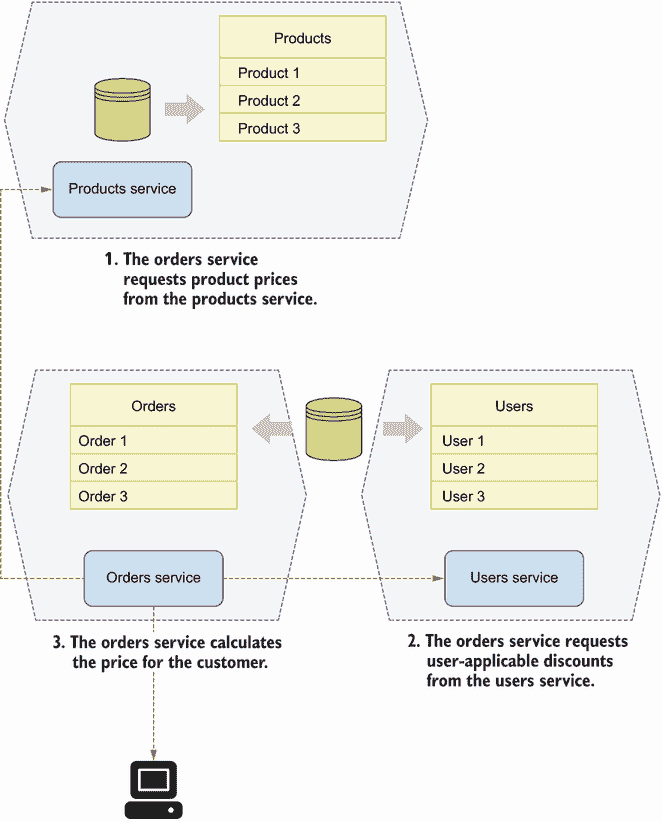
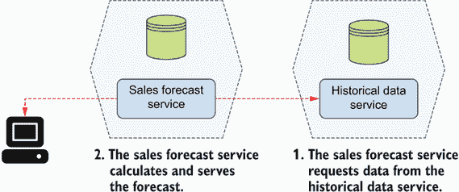
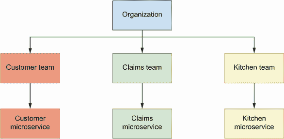
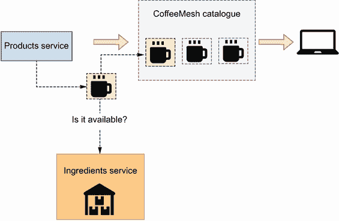
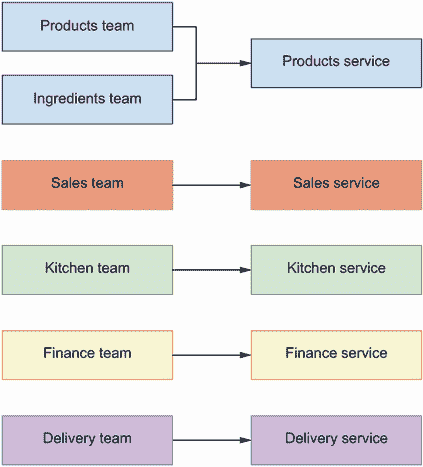
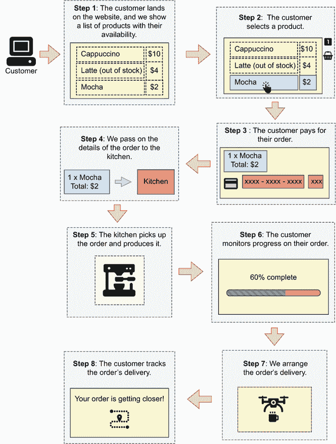
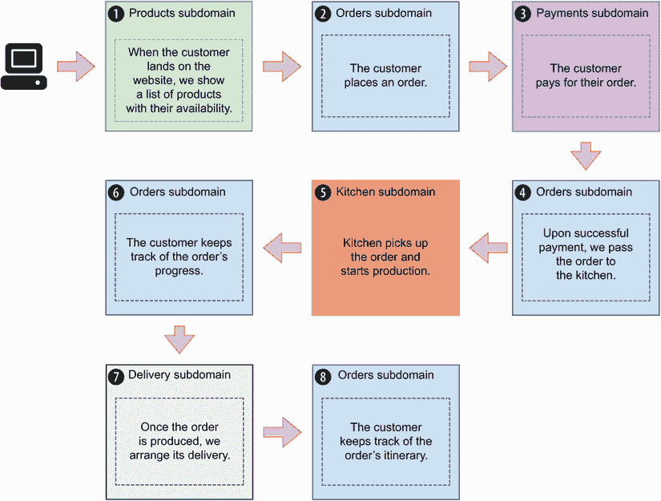
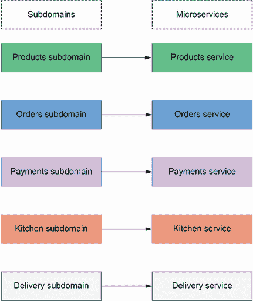

# 3 设计微服务

本章涵盖

+   微服务设计原则

+   按业务能力进行服务分解

+   按子域进行服务分解

当我们设计一个微服务平台时，我们面临的首要问题是，“如何将一个系统分解成微服务？如何决定一个服务在哪里结束，另一个服务在哪里开始？”换句话说，如何定义微服务之间的边界？在本章中，你将学会如何回答这些问题，以及如何通过应用一系列设计原则来评估微服务架构的质量。

将系统分解成微服务的过程称为*服务分解*。服务分解是我们微服务设计中的一个基本步骤，因为它帮助我们定义具有明确边界、定义良好的范围和明确责任的应用程序。一个设计良好的微服务架构对于降低分布式单体风险至关重要。在本章中，你将学习两种服务分解策略：按业务能力分解和按子域分解。我们将了解这些方法是如何工作的，并使用一个实际例子来学习如何应用它们。在我们深入服务分解策略之前，我们介绍了一个项目，它将指导本章以及本书其余部分的所有示例：CoffeeMesh。

## 3.1 介绍 CoffeeMesh

CoffeeMesh 是一家虚构的公司，允许客户订购各种咖啡衍生产品，包括饮料和糕点。CoffeeMesh 有一个使命：无论客户在哪里，无论他们何时下单，都能按需制作并交付世界上最好的咖啡。CoffeeMesh 拥有的生产工厂形成了一个密集的网络，一个跨越几个国家的咖啡生产单元网。咖啡生产是完全自动化的，配送由 24/7 运营的无人机群执行。

当客户通过 CoffeeMesh 网站下单时，所订购的商品将按需生产。一个算法根据可用库存、工厂正在处理的待处理订单数量以及距离客户的距离，确定哪个工厂是最适合生产每个商品的地方。一旦商品生产出来，它们将立即派送给客户。CoffeeMesh 的使命宣言之一是确保客户收到的每一件商品都是新鲜且热腾腾的。

现在我们有一个例子可以操作，让我们看看我们是如何为 CoffeeMesh 平台设计微服务架构的。在我们学习应用微服务的服务分解策略之前，下一节将教你三个将指导我们设计的原则。

## 3.2 微服务设计原则

什么使一个微服务设计得很好？正如我们在第一章中确立的，微服务是围绕定义良好的业务子域设计的，它们有明确的应用边界，并且通过轻量级协议相互通信。这在实践中意味着什么？在本节中，我们探讨三个设计原则，帮助我们测试我们的微服务是否设计正确：

+   每服务数据库原则

+   松耦合原则

+   单一职责原则（SRP）

遵循这些原则将帮助您避免构建分布式单体架构的风险。在接下来的几节中，我们将评估我们的架构设计是否符合这些原则，并且它们帮助我们发现设计中的错误。

### 3.2.1 每服务数据库原则

每服务数据库原则指出，每个微服务拥有特定的一组数据，并且除了通过 API 之外，没有其他服务应该访问这样的数据。尽管这个模式的名称是“每服务数据库”，但这并不意味着每个微服务都应该连接到一个完全不同的数据库。它可能是 SQL 数据库中的不同表或 NoSQL 数据库中的不同集合。这个模式的目的在于确保特定服务拥有的数据不会被其他服务直接访问。

图 3.1 展示了微服务如何共享它们的数据。在图中，订单服务计算客户订单的价格。为了计算价格，订单服务需要订单中每个项目的价格，这些价格在产品数据库中可用。它还需要知道用户是否有适用的折扣，这可以在用户数据库中检查。然而，订单服务不是直接访问这两个数据库，而是从产品和用户服务请求这些数据。

图 3.1 每个微服务都有自己的数据库，访问其他服务的数据库通过 API 进行。

为什么这个原则很重要？将数据访问封装在服务背后，使我们能够为服务设计最优的数据模型。这也允许我们在不破坏其他服务代码的情况下对数据库进行更改。如果图 3.1 中的订单服务直接访问产品数据库，该数据库的架构更改将需要更新产品和订单服务。这样，我们就会将订单服务的代码耦合到产品数据库上，因此我们就会破坏我们在下一节讨论的松耦合原则。

### 3.2.2 松耦合原则

*松* *耦合* 指出我们必须设计具有明确关注点分离的服务。松耦合的服务不依赖于其他服务的实现细节。这在实践中意味着什么？这个原则有两个实际的影响：

+   每个服务都可以独立于其他服务工作。如果我们有一个服务不能在不调用另一个服务的情况下完成单个请求，那么这两个服务之间没有明确的职责分离，它们应该属于一起。

+   每个服务都可以在不影响其他服务的情况下进行更新。如果对服务的更改需要更新其他服务，那么这些服务之间存在紧密耦合，因此它们需要被重新设计。

图 3.2 展示了一个销售预测服务，该服务知道如何根据历史数据计算预测。它还展示了一个拥有历史销售数据的历史数据服务。为了计算预测，销售预测服务通过 API 调用历史数据服务以获取历史数据。在这种情况下，销售预测服务不能在不调用历史数据服务的情况下处理任何请求，因此这两个服务之间存在紧密耦合。解决方案是重新设计这两个服务，使它们不相互依赖，或者将它们合并为一个单一的服务。

图 3.2 当一个服务不能在不调用另一个服务的情况下处理单个请求时，我们说这两个服务是紧密耦合的。

### 3.2.3 单一职责原则

SRP 原则指出，我们必须设计具有少量职责的组件，理想情况下只有一个职责。当应用于微服务架构设计时，这意味着我们应该努力围绕单一业务能力或子域来设计服务。在接下来的章节中，你将学习如何通过业务能力和子域来分解服务。如果你遵循任何这些方法，你将能够设计遵循 SRP 的微服务。

## 3.3 通过业务能力进行服务分解

当使用业务能力分解时，我们研究业务执行的活动以及业务如何组织自己来完成这些活动。然后我们设计反映业务组织结构的微服务。例如，如果业务有一个客户管理团队，我们构建一个客户管理服务；如果业务有一个索赔管理团队，我们构建一个索赔管理服务；对于一个厨房团队，我们构建相应的厨房服务；等等。对于围绕产品构建的业务，我们可能对每个产品都有一个微服务。例如，一个生产宠物食品的公司可能有一个专门制作狗粮的团队，另一个专门制作猫粮的团队，另一个专门制作龟粮的团队，等等。在这种情况下，我们为这些团队中的每一个构建微服务。

如图 3.3 所示，通过业务能力分解通常会导致一个将每个业务团队映射到微服务的架构。让我们看看我们如何将这种方法应用于 CoffeeMesh 平台。

图 3.3 通过业务能力进行服务分解，我们在微服务架构中反映了业务的结构。

### 3.3.1 分析 CoffeeMesh 的业务结构

要应用按业务能力分解，我们需要分析业务的结构和组织。让我们为 CoffeeMesh 进行此分析。通过 CoffeeMesh 网站，客户可以订购由产品团队管理的目录中的不同类型的咖啡相关产品，该团队负责创建新产品。产品和配料的可供性取决于订单时 CoffeeMesh 的配料库存，这由库存团队负责。

一个销售团队致力于通过 CoffeeMesh 网站改善产品订购体验。他们的目标是最大化销售额，并确保客户对他们的体验感到满意，并希望再次光临。一个财务团队确保公司盈利，并负责处理客户支付和退款的财务基础设施。

一旦用户下单，厨房就会获取其详情以开始生产。厨房工作完全自动化，一个由工程师和厨师组成的专门团队称为厨房团队，负责监控厨房操作以确保生产过程中没有发生故障。当订单准备好交付时，无人机将其取走并飞往客户处。一个由工程师组成的专门团队称为配送团队，负责监控此过程以确保配送过程的运营卓越。

这完成了我们对 CoffeeMesh 组织结构的分析。我们现在可以根据这个分析设计基于微服务的架构。

### 3.3.2 按业务能力分解微服务

要按业务能力分解服务，我们将每个业务团队映射到一个微服务。根据 3.3.1 节的分析，我们可以将以下业务团队映射到微服务：

+   *产品团队对应产品服务*—此服务拥有 CoffeeMesh 产品目录数据。产品团队使用此服务通过服务界面添加新产品或更新现有产品来维护 CoffeeMesh 的目录。

+   *配料团队对应配料服务*—此服务拥有关于 CoffeeMesh 配料库存的资料。配料团队使用此服务来确保配料数据库与 CoffeeMesh 仓库保持同步。

+   *销售团队对应销售服务*—此服务引导客户完成订购旅程并跟踪订单。销售团队拥有关于客户订单的资料，并管理每个订单的生命周期。它从该服务收集数据以分析和改进客户旅程。

+   *财务团队对应财务服务*—此服务实现支付处理器，并拥有关于用户支付详情和支付历史的资料。财务团队使用此服务来确保公司账户保持最新，并确保支付正确无误。

+   *厨房团队对应厨房服务*—此服务将订单发送到自动化厨房系统，并跟踪其进度。它拥有厨房生产订单的数据。厨房团队从该服务收集数据以监控自动化厨房系统的性能。

+   *交付团队对应交付服务*—此服务在厨房生产订单后，负责将其交付给客户。此服务知道如何将用户位置转换为坐标，以及如何计算到达该目的地的最佳路线。它拥有 CoffeeMesh 所有交付的数据。交付团队从该服务收集数据以监控自动化交付系统的性能。

在这个微服务架构中，我们根据它所代表的业务结构命名了每个服务。我们这样做是为了方便这个例子，但并不一定必须这样。例如，财务服务可以被重命名为支付服务，因为所有与该服务的用户交互都将与其支付相关。

根据业务能力进行分解，给我们提供了一个每个服务都映射到业务团队的架构。这个结果是否与我们在 3.2 节学到的微服务设计原则一致？让我们看看这个问题。

从前面的分析中可以看出，每个服务都拥有自己的数据：产品服务拥有产品数据，成分服务拥有成分数据，等等。单一职责原则（SRP）也适用，因为每个服务都限制在一个业务领域：财务服务仅处理支付，交付服务仅管理交付，等等。

然而，如图 3.4 所示，这个解决方案并不满足松耦合原则。为了服务 CoffeeMesh 目录，产品服务需要确定每个产品的可用性，这取决于成分的可用库存。由于成分库存数据由成分服务拥有，产品服务需要为每个产品向成分服务发起一次 API 调用。

图 3.4 为了确定产品是否可用，产品服务通过成分服务检查成分的库存。

产品服务和成分服务之间存在高度耦合，因此这两个业务能力应该在同一服务中实现。图 3.5 显示了使用业务能力分解策略的 CoffeeMesh 微服务架构的最终布局。

图 3.5 当我们根据业务能力分解服务时，我们将每个团队映射到一个服务。

现在我们知道了如何根据业务能力分解服务，让我们看看子域分解是如何工作的。

## 3.4 子域服务分解

通过子域进行分解是一种从**领域驱动设计**（DDD）领域汲取灵感的方法——一种侧重于使用与业务用户相同的语言，用软件对业务的过程和流程进行建模的软件开发方法。当应用于微服务平台的设计时，DDD 帮助我们定义每个服务的核心责任及其边界。

### 3.4.1 什么是领域驱动设计？

领域驱动设计（DDD）是一种软件方法，它侧重于通过使用与业务用户相同的语言，用软件对业务用户的过程和流程进行建模。DDD 的方法在埃里克·埃文斯（Eric Evans）有影响力的书籍《领域驱动设计》（Domain-Driven Design，Addison-Wesley，2003 年出版），也被称为“大蓝书”中得到了最好的描述。DDD 提供了一种软件开发方法，试图尽可能准确地反映企业或软件的最终用户用来指代其过程和流程的思想和语言。为了实现这种一致性，DDD 鼓励开发者创建一种严格、基于模型的、软件开发者可以与最终用户共享的语言。这种语言不能有歧义，被称为**通用语言**。

要创建一种通用语言，我们必须确定企业的核心领域，这对应于组织为了生成价值而执行的主要活动。对于一个物流公司来说，这可能是在全球范围内运输产品。对于一个电子商务公司来说，这可能是在销售产品。对于一个社交媒体平台来说，这可能是在向用户提供相关内容。对于一个约会应用来说，这可能是在匹配用户。对于 CoffeeMesh 来说，核心领域是以尽可能快的速度将高品质咖啡送到客户手中，无论他们的位置在哪里。

核心领域通常不足以涵盖企业活动的所有领域，因此领域驱动设计（DDD）还区分了支持性子域和通用子域。一个**支持性子域**代表与企业价值生成不直接相关，但对其基本支持的业务领域。对于一个物流公司来说，这可能包括为运输产品的用户提供客户支持、租赁设备、管理与其他企业的合作关系等等。对于一个电子商务公司来说，这可能包括市场营销、客户支持、仓储等等。

核心领域为你提供了一个**问题空间**的定义：你试图用软件解决的问题。解决方案包括一个模型，在这里被理解为描述领域并解决问题的抽象系统。理想情况下，只有一个通用模型为问题提供了一个**解决方案空间**，并具有明确定义的通用语言。然而，在实践中，大多数问题都足够复杂，需要不同模型之间的协作，每个模型都有自己的通用语言。我们将定义此类模型的过程称为**战略****设计**。

### 3.4.2 将战略分析应用于 CoffeeMesh

DDD 在实践中是如何工作的？我们如何将其应用于将 CoffeeMesh 分解为子域？为了将系统分解为子域，考虑系统为了实现其目标必须执行的操作是有帮助的。在 CoffeeMesh 中，我们希望模拟下单并交付给顾客的过程。如图 3.6 所示，我们将此过程分解为八个步骤：

1.  当顾客登录网站时，我们向他们展示产品目录。每个产品都被标记为可用或不可用。顾客可以通过可用性过滤列表，并按价格排序（从低到高和从高到低）。

1.  顾客选择产品。

1.  顾客为他们的订单付款。

1.  一旦顾客付款，我们就将订单的详细信息传递给厨房。

1.  厨房接单并制作产品。

1.  顾客监控他们订单的进度。

1.  一旦订单准备就绪，我们就安排其配送。

1.  顾客跟踪无人机的行程，直到他们的订单被送达。

图 3.6 要下单，顾客登录 CoffeeMesh 网站，从产品目录中选择商品，并为订单付款。付款后，我们将订单的详细信息传递给厨房，厨房在顾客监控其进度的同时制作产品。最后，我们安排订单的配送。

让我们将每个步骤映射到其相应的子域（见图 3.7 对此分析的分析表示）。第一步代表一个为 CoffeeMesh 产品目录服务的子域。我们可以称之为*产品子域*。此子域告诉我们哪些产品可用，哪些不可用。为此，产品子域跟踪每种产品和成分的库存量。

图 3.7 我们将订单放置和配送过程中的每一步映射到一个子域。例如，服务产品目录的过程由产品子域满足，而接收订单的过程由订单子域满足。

第二步代表一个允许用户选择产品的子域。此子域管理每个订单的生命周期，我们称之为*订单子域*。此子域拥有关于用户订单的数据，并公开一个接口，允许我们管理订单并检查其状态。它隐藏了平台的复杂性，这样用户就不必了解不同的端点以及如何使用它们。订单子域还负责第四步的第二部分：在支付成功处理后，将订单的详细信息传递给厨房。它还满足第六步的要求：允许用户检查他们订单的状态。作为订单管理员，订单子域还与配送子域合作安排配送。

第三步代表了一个可以处理用户支付的子域。我们将称之为**支付子域**。这个域包含用于支付处理的专用逻辑，包括卡验证、与第三方支付提供商的集成、处理不同的支付方式等。支付子域拥有与用户支付相关的数据。

第五步代表了一个与厨房协作以管理客户订单生产的子域。我们称之为**厨房子域**。厨房中的生产系统是完全自动化的，厨房子域与厨房系统接口以安排客户订单的生产并跟踪其进度。一旦订单生产完成，厨房子域会通知订单子域，然后安排其配送。厨房子域拥有与客户订单生产相关的数据，并公开了一个接口，允许我们向厨房发送订单并跟踪其进度。订单子域与厨房子域接口以更新订单的状态，以满足第六步的要求。

第七步代表了一个与自动化配送系统接口的子域。我们称之为**配送子域**。这个子域包含用于解决客户地理位置和计算到达他们最优化路线的专用逻辑。它管理配送无人机编队并优化配送，并拥有与所有配送相关的数据。订单子域与配送子域接口以更新客户订单的行程，以满足第八步的要求。

通过战略分析，我们获得了 CoffeeMesh 在五个子域中的分解，这些子域可以映射到微服务中，因为每个都封装了一个定义明确且清晰区分的逻辑区域，拥有自己的数据。DDD 的战略分析产生了满足我们在第 3.2 节中列举的设计原则的微服务：所有这些子域都可以在不依赖其他微服务的情况下执行其核心任务，因此我们说它们是松散耦合的；每个服务都拥有自己的数据，因此符合数据库服务原则；最后，每个服务在狭窄定义的子域内执行任务，这符合单一职责原则。

如图 3.8 所示，战略分析为我们提供了以下微服务架构：

+   **产品子域映射到产品服务**——管理 CoffeeMesh 的产品目录

+   **订单子域映射到订单服务**——管理客户订单

+   **支付子域映射到支付服务**——管理客户支付

+   **厨房子域映射到厨房服务**——管理厨房中的订单生产

+   **配送子域映射到配送服务**——管理客户配送

图 3.8 展示了应用 DDD 的战略分析将 CoffeeMesh 平台分解为五个可以直接映射到微服务的子域。

在下一节中，我们将比较 DDD 的战略分析结果与按业务能力进行服务分解的结果，并评估每种方法的益处和挑战。

## 3.5 按业务能力分解与按子域分解

我们应该使用哪种服务分解策略来设计我们的微服务：按业务能力分解还是按子域分解？虽然按业务能力分解侧重于业务结构和组织，但按子域分解则分析业务流程和流程。因此，这两种方法为我们提供了对业务的不同视角，如果你有时间，最佳策略是同时应用这两种服务分解方法。

有时我们可以结合两种方法的结果。例如，CoffeeMesh 平台可以允许客户为每个产品撰写评论，CoffeeMesh 可以利用这些信息向其他客户推荐新产品。公司可以有一个专门的团队负责这一业务方面。从技术角度来看，评论可能只是产品数据库中的另一个表。然而，为了便于与业务合作，建立一个评论服务可能是有意义的。评论服务能够将新的评论输入到推荐系统中，而订单服务将使用评论服务的接口为新用户提供推荐。

按业务能力分解的优势在于，平台的架构与业务现有的组织结构相一致。这种一致性可能有助于业务和技术团队之间的协作。这种方法的缺点是，业务现有的组织结构并不一定是最高效的。事实上，它可能是过时的，反映了旧的业务流程。在这种情况下，业务的不效率将在微服务架构中得到反映。如果组织结构重组，按业务能力分解也可能会与业务脱节。

当我们在 3.3.2 节中应用按业务能力进行分解时，我们得到了产品和成分服务之间一个不理想的部分划分。在进一步分析这两个服务之间的依赖关系后，我们得出结论，这两个能力应该归入同一个服务。然而，在现实生活中的情况中，这种额外的分析往往被忽略，导致的结果架构并不最优。从 3.3 节和 3.4 节的分析中，我们可以得出结论，按子域进行分解能更好地适应业务流程和流程的建模，如果你必须选择其中一种方法，按子域进行分解是更好的策略。

现在我们已经知道了如何设计我们的微服务，是时候设计和构建它们的接口了。在接下来的章节中，你将学习如何为微服务构建 REST 和 GraphQL 接口。

## 摘要

+   我们将系统分解成微服务的过程称为服务分解。服务分解定义了服务之间的边界，我们必须正确执行这个过程以避免构建分布式单体架构的风险。

+   按业务能力进行分解分析业务结构，并为组织中的每个团队设计微服务。这种方法使业务与我们的系统架构保持一致，但也将业务的低效性复制到平台中。

+   按子域进行分解将领域驱动设计（DDD）应用于通过子域建模业务的过程和流程。通过使用这种方法，我们为每个子域设计一个微服务，从而得到一个更稳健的技术设计。

+   为了评估我们的微服务架构的质量，我们应用了三个设计原则：

    +   *数据库服务原则*—每个微服务拥有自己的数据，并且对数据的访问通过服务的 API 进行。

    +   *松耦合原则*—你必须能够更新一个服务而不影响其他服务，并且每个服务应该能够在不不断调用其他服务的情况下工作。

    +   *单一职责原则*—我们必须围绕特定的业务能力或子域来设计每个服务。
