# REST API 设计的 4 个原则

本章涵盖

+   REST API 的设计原则

+   Richardson 成熟度模型如何帮助我们理解 REST 最佳设计原则的优势

+   资源的概念和 REST API 端点的设计

+   使用 HTTP 动词和 HTTP 状态码创建高度表达的 REST API

+   设计高质量的负载和 URL 查询参数的 REST API

表示性状态转移（REST）描述了一种用于通过网络通信的应用程序的架构风格。最初，REST 的概念包括了一组用于设计分布式和可扩展 Web 应用程序的约束。随着时间的推移，详细协议和规范已经出现，为我们提供了设计 REST API 的明确指南。今天，REST 是构建 Web API 中最受欢迎的选择。¹ 在本章中，我们研究 REST 的设计原则，并通过设计 CoffeeMesh 平台上的订单 API，即我们在第一章中介绍的需求咖啡配送应用程序，来学习如何应用这些原则。

我们解释了资源的概念，以及它对 REST API 设计意味着什么。你还将学习如何利用 HTTP 协议的功能，如 HTTP 动词和状态码，来创建高度表达的 API。本章的最后部分涵盖了设计 API 负载和 URL 查询参数的最佳实践。

## 4.1 什么是 REST？

REST，由 Roy Fielding 在其博士论文“架构风格和网络软件架构设计”（PhD diss., University of California, Irvine, 2000, p. 109）中提出，描述了一种用于通过网络通信的松散耦合和高度可扩展应用程序的架构风格。它指的是传输资源状态表示的能力。资源概念在 REST 应用程序中是基本的。

定义 REST 是一种用于构建松散耦合和高度可扩展 API 的架构风格。REST API 围绕资源构建，这些资源可以通过 API 进行操作。

一个 *资源* 是一个可以通过唯一的超文本引用（即 URL）进行引用的实体。资源有两种类型：集合和单例。一个 *单例* 代表一个单一实体，而 *集合* 代表实体列表。² 这在实践中意味着我们为每种类型的资源使用不同的 URL 路径。例如，CoffeeMesh 的订单服务管理订单，通过其 API，我们可以通过`/orders/{order_id}` URL 路径访问特定的订单，而订单集合则位于`/orders` URL 路径下。因此，`/orders/{order_id}`是一个单例端点，而`/orders`是一个集合端点。

一些资源可以嵌套在其他资源内部，例如一个订单的负载，其中列出了嵌套数组中的多个项目。

列表 4.1 具有嵌套资源的负载示例

```
{
    "id": "924721eb-a1a1-4f13-b384-37e89c0e0875",
    "status": "progress",
    "created": "2023-09-01",
    "order": [
        {
            "product": "cappuccino",
            "size": "small",
            "quantity": 1
        },
        {
            "product": "croissant",
            "size": "medium",
            "quantity": 2
        }
    ]
}
```

我们可以创建嵌套端点来表示嵌套资源。嵌套端点允许我们访问资源的特定细节。例如，我们可以公开一个 GET `/orders/{order_id}/status` 端点，允许我们获取订单的状态，而不需要订单的所有其他细节。当资源由大型有效负载表示时，使用嵌套端点是一种常见的优化策略，因为它们帮助我们避免在只对单个属性感兴趣时进行昂贵的传输。

REST API 的资源导向性质有时可能显得有限。一个常见的担忧是如何通过端点建模操作同时保持我们的 API 是 RESTful 的。例如，我们如何表示取消订单的操作？一个常见的启发式方法是表示操作为嵌套资源。例如，我们可以有一个用于取消订单的 POST `/orders/{order_id}/cancel` 端点。在这种情况下，我们将订单的取消建模为创建一个取消事件。

设计干净的端点是构建易于维护和消费的 REST API 的第一步。在本节中学到的模式对于实现干净的端点大有裨益，在本章的其余部分，你将学习更多关于干净 API 设计的模式和原则。在下一节中，你将了解 REST API 应用的六个架构约束。

## 4.2 REST 应用的架构约束

在本节中，我们研究 REST 应用的架构约束。这些约束由 Fielding 列举，并指定了服务器应该如何处理和响应用户请求。在我们深入细节之前，让我们首先简要概述每个约束：

+   *客户端-服务器架构*——用户界面（UI）必须与后端解耦。

+   *无状态*——服务器必须在请求之间不管理状态。

+   *可缓存性*——始终返回相同响应的请求必须是可缓存的。

+   *分层系统*——API 可以分层架构，但这种复杂性必须对用户隐藏。

+   *按需代码*——服务器可以在需要时将代码注入用户界面。

+   *统一接口*——API 必须提供一致的接口来访问和操作资源。

让我们更详细地讨论这些约束。

### 4.2.1 关注点分离：客户端-服务器架构原则

REST 依赖于关注点分离的原则，因此它要求用户界面与数据存储和服务器逻辑解耦。这允许服务器端组件独立于 UI 元素进行演变。如图 4.1 所示，客户端-服务器架构模式的一个常见实现是将 UI 构建为一个独立的应用程序，例如，作为一个单页应用程序（SPA）。


图 4.1 REST 的客户端-服务器架构原则指出，服务器实现必须与客户端解耦。

### 4.2.2 使其可扩展：无状态原则

在 REST 中，对服务器的每个请求都必须包含处理它所需的所有信息。特别是，服务器不得从一次请求保持到下一次请求的状态。正如您在图 4.2 中看到的，从服务器组件中移除状态管理使得水平扩展后端变得更加容易。这允许我们部署多个服务器实例，并且由于这些实例中没有任何一个管理 API 客户端的状态，客户端可以与任何一个实例通信。

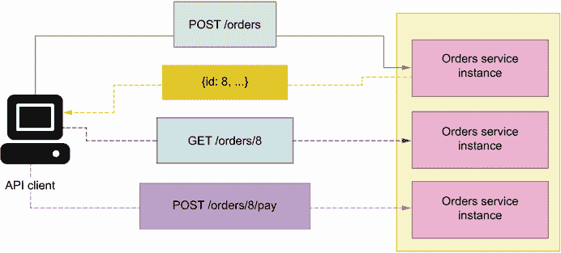

图 4.2 REST 的无状态原则指出，服务器不得管理客户端的状态。这允许我们部署多个 API 服务器实例，并使用任何一个实例来响应 API 客户端。

### 4.2.3 优化性能：缓存原则

当适用时，服务器响应必须被缓存。缓存提高了 API 的性能，因为它意味着我们不必再次执行为提供响应所需的全部计算。GET 请求适合缓存，因为它们返回已经保存在服务器中的数据。正如您在图 4.3 中看到的，通过缓存 GET 请求，我们避免了每次用户请求相同信息时都要从源获取数据。组装 GET 请求响应所需的时间越长，缓存它的好处就越大。

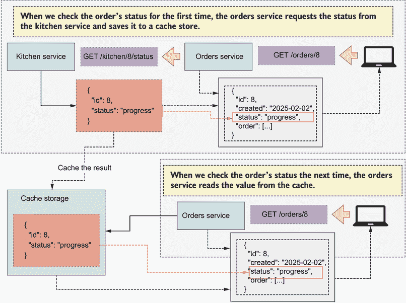

图 4.3 REST 的缓存原则指出，可缓存的响应必须被缓存，这有助于提高 API 服务器的性能。在这个例子中，我们缓存订单状态一段时间，以避免对厨房服务进行多次请求。

图 4.3 说明了缓存的优点。正如我们在第三章中学到的，一旦订单提交给厨房，客户就可以跟踪订单的进度。订单服务与厨房服务接口，以获取订单进度的信息。为了节省时间，当客户下次检查订单状态时，我们将其值缓存一段时间。

### 4.2.4 简化客户端操作：分层系统原则

在 REST 架构中，客户端必须有一个唯一的 API 入口点，并且不能判断他们是直接连接到端服务器还是连接到负载均衡器等中间层。您可以在不同的服务器上部署服务器端应用程序的不同组件，或者为了冗余和可扩展性，可以在不同的服务器上部署相同的组件。这种复杂性应该通过暴露一个封装了对您的服务访问的单个端点来隐藏给用户。

如您在图 4.4 中看到的，解决这个问题的常见方法是 API 网关模式，这是一个充当所有微服务入口点的组件。API 网关知道每个服务的服务器地址，并且知道如何将每个请求映射到相应的服务。³

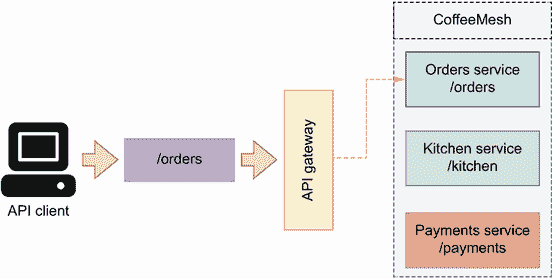

图 4.4 REST 分层系统原则指出，我们的后端复杂性必须对客户端隐藏。解决这个问题的常见方法是 API 网关模式，它作为平台中所有服务的入口点。

### 4.2.5 可扩展接口：按需代码原则

服务器可以通过直接从后端发送可执行代码来扩展客户端应用程序的功能，例如运行 UI 所需的 JavaScript 文件。这个限制是可选的，并且仅适用于后端提供客户端界面的应用程序。

### 4.2.6 保持一致性：统一接口原则

REST 应用程序必须向其消费者提供一个统一和一致的接口。该接口必须得到文档化，服务器和客户端必须严格遵循 API 规范。单个资源通过统一资源标识符（URI）⁴进行标识，并且每个 URI 必须是唯一的，并且始终返回相同的资源。例如，URI `/orders/8` 代表 ID 为 8 的订单，对该 URI 的 GET 请求始终返回 ID 为 8 的订单的状态。如果订单从系统中删除，则不得重新使用该 ID 来表示不同的订单。

资源必须使用选择的序列化方法表示，并且在整个 API 中应始终使用这种方法。如今，REST API 通常使用 JSON 作为序列化格式，尽管其他格式也是可能的，例如 XML。

REST 的架构约束为我们设计健壮和可扩展的 API 提供了坚实的基础。但正如我们在本章的后续部分将看到的，在设计 API 时，我们还需要考虑更多因素。在下一节中，你将学习如何通过丰富资源的描述来包含相关的超媒体链接，使你的 API 变得可发现。

## 4.3 超媒体作为应用状态引擎

现在我们已经了解了 REST API 最重要的设计约束，让我们来看看 REST 的另一个重要概念：超媒体作为应用状态引擎（HATEOAS）。HATEOAS 是 REST API 设计中的一个范例，强调可发现性概念。HATEOAS 通过丰富响应，包含用户与资源交互所需的所有信息，使得 API 更容易使用。在本节中，我们解释了 HATEOAS 是如何工作的，并讨论了这种方法的优点和缺点。

HATEOAS 究竟是什么？在 2008 年发表的一篇题为“REST APIs Must Be Hypertext-Driven”的文章（[`mng.bz/p6y5`](http://mng.bz/p6y5)）中，菲尔德宁建议 REST API 必须在它们的响应中包含相关链接，以便客户端可以通过跟随这些链接来导航 API。

定义 *超媒体作为应用状态引擎*（HATEOAS）是 REST 的一种设计范式，强调可发现性的理念。每当客户端从服务器请求一个资源时，响应必须包含与该资源相关的链接列表。例如，如果客户端请求一个订单的详细信息，响应必须包括取消和付款的链接。

例如，如图 4.5 所示，当客户端请求一个订单的详细信息时，API 会包含与该订单相关的链接集合。通过这些链接，我们可以取消订单，或者为其付款。

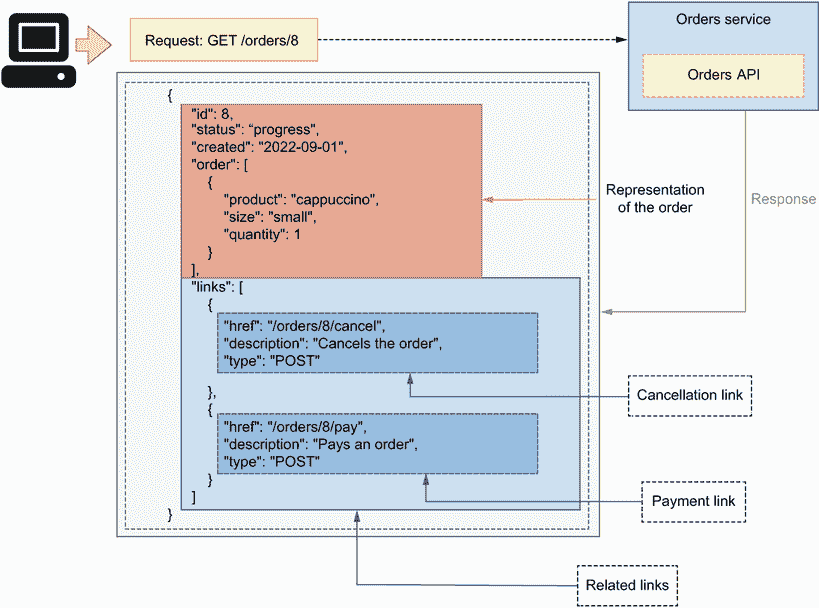

图 4.5 在 HATEOAS 范式中，API 发送请求资源的表示，以及与资源相关的其他链接。

列表 4.2 包含超媒体链接的订单表示

```
{
    "id": 8,
    "status": "progress",
    "created": "2023-09-01",
    "order": [
        {
            "product": "cappuccino",
            "size": "small",
            "quantity": 1
        },
        {
            "product": "croissant",
            "size": "medium",
            "quantity": 2
        }
    ],
    "links": [
        {
            "href": "/orders/8/cancel",
            "description": "Cancels the order",
            "type": "POST"

        },
        {
            "href": "/orders/8/pay",
            "description": "Pays for the order",
            "type": "POST"
        }
    ]
}
```

提供关系链接使 API 可导航且易于使用，因为每个资源都附带我们与之交互所需的所有 URL。然而，在实践中，由于几个原因，许多 API 并没有这样实现：

+   超链接提供的信息已经在 API 文档中提供。事实上，OpenAPI 规范中包含的信息比在特定资源的相关链接列表中提供的信息更为丰富和结构化。

+   并非总是清楚应该返回哪些链接。不同的用户有不同的权限和角色，这使他们能够执行不同的操作和访问不同的资源。例如，外部用户可以使用 CoffeeMesh API 中的`/orders`端点下单，并且他们也能够使用`/orders/{order_id}`端点检索订单的详细信息。然而，他们不能使用`/orders/{order_id}`端点的 DELETE 操作来删除订单，因为这个端点是限制给 CoffeeMesh 平台内部用户的。如果 HATEOAS 的目的是从单一入口点使 API 可导航，那么将 DELETE `/orders/{order_id}`端点返回给外部用户就没有意义，因为他们无法使用它。因此，有必要根据用户的权限返回不同的相关链接列表。然而，这种灵活性在我们的 API 设计和实现中引入了额外的复杂性，并将授权层与 API 层耦合在一起。

+   根据资源的状态，某些操作和资源可能不可用。例如，你可以在一个活跃订单上调用`/orders/1234/cancel`端点，但不能在一个已取消的订单上调用。这种模糊性使得定义和实现遵循 HATEOAS 原则的健壮接口变得困难。

+   最后，在某些 API 中，相关链接的列表可能很大，因此会使响应负载过大，从而影响 API 的性能和低网络连接设备连接的可靠性。

当你在自己的 API 上工作时，你可以决定是否遵循 HATEOAS 原则。在某些情况下，提供相关资源的列表有一定的好处。例如，在一个维基应用程序中，有效载荷的链接资源部分可以用来列出与特定文章相关的文章内容、同一文章在其他语言的链接以及可以对该文章执行的操作的链接。总的来说，你可能希望在 API 文档已经以更清晰和详细的方式提供给客户端的内容，以及你可以在响应中提供的内容之间找到一个平衡，以促进客户端和 API 之间的交互。如果你正在构建面向公众的 API，你的客户端将从关系链接中受益。然而，如果它是一个小型的内部 API，可能没有必要包含关系链接。

现在我们已经了解了如何使我们的 API 可发现以及何时这样做是值得的，让我们来研究理查森成熟度模型，这将帮助你了解你的 API 在多大程度上符合 REST 的设计原则。

## 4.4 使用理查森成熟度模型分析 API 的成熟度

本节讨论了理查森成熟度模型，这是一个由伦纳德·理查森开发的心理模型，帮助我们思考一个 API 符合 REST 原则的程度。⁵ 理查森成熟度模型区分了 API 中“成熟度”的四个级别（从 0 级到 3 级）。每个级别都引入了额外的良好 REST API 设计元素（见图 4.6）。让我们详细讨论每个级别。

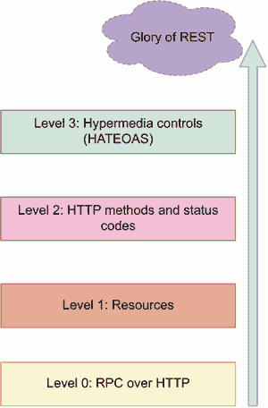

图 4.6 理查森成熟度模型区分了 API 成熟度的四个级别，其中最高级别代表一个遵守 REST 最佳实践和标准的 API 设计，而最低级别代表一种不应用任何 REST 原则的 API 类型。

### 4.4.1 第 0 级：Web API 类似于 RPC

在第 0 级，HTTP 基本上被用作一个传输系统来承载与服务器的交互。在这种情况下，API 的概念更接近于*远程过程调用*（RPC；见附录 A）。所有对服务器的请求都是在同一个端点上，使用相同的 HTTP 方法进行的，通常是 GET 或 POST。客户端请求的详细信息包含在 HTTP 有效载荷中。例如，为了通过 CoffeeMesh 网站下订单，客户端可能会在通用的`/api`端点上发送以下有效载荷的 POST 请求：

```
{
    "action": "placeOrder",
    "order": [
        {
            "product": "mocha",
            "size": "medium",
            "quantity": 2
        }
    ]
} 
```

服务器总是以 200 状态码和伴随的有效载荷响应，让我们知道请求处理的结果。同样，为了获取订单的详细信息，客户端可能会在通用的`/api`端点上发出以下 POST 请求（假设订单 ID 为 8）：

```
{
    "action": "getOrder",
    "order": [
        {
            "id": 8
        }
    ]
}
```

### 4.4.2 第 1 级：引入资源概念

第 1 级介绍了资源 URL 的概念。服务器不再暴露通用的`/api`端点，而是暴露代表资源的 URL。例如，`/orders` URL 代表订单集合，而`/orders/{order_id}` URL 代表单个订单。为了下订单，客户端在`/orders`端点上发送一个与第 0 级类似的 POST 请求：

```
{
    "action": "placeOrder",
    "order": [
        {
            "product": "mocha",
            "size": "medium",
            "quantity": 2
        }
    ]
} 
```

这次当请求最后一个订单的详细信息时，客户端将在代表该订单的 URI 上发送一个 POST 请求：`/orders/8`。在这个级别，API 不区分 HTTP 方法来表示不同的操作。

### 4.4.3 第 2 级：使用 HTTP 方法和状态码

第 2 级介绍了 HTTP 动词和状态码的概念。在这个级别，HTTP 动词用于表示特定的操作。例如，为了下订单，客户端在`/orders`端点上发送一个 POST 请求，带有以下有效负载：

```
{
    "order": [
        {
            "product": "mocha",
            "size": "medium",
            "quantity": 2
        }
    ]
}
```

在这种情况下，HTTP 方法 POST 表示我们想要执行的操作，有效负载仅包括我们想要下订单的订单详情。同样，为了获取订单的详细信息，我们向订单的 URI 发送一个 GET 请求：`/orders/` `{order_id}`。在这种情况下，我们使用 HTTP 动词 GET 来告诉服务器我们想要检索 URI 中指定的资源的详细信息。

虽然前几个级别在所有响应中都包含相同的状态码（通常是 200），但第 2 级引入了 HTTP 状态码的语义使用，以报告处理客户端请求的结果。例如，当我们使用 POST 请求创建资源时，我们得到一个 201 响应状态码，而对于一个不存在的资源的请求，我们得到一个 404 响应状态码。有关 HTTP 状态码和最佳实践的更多信息，请参阅第 4.6 节。

### 4.4.4 第 3 级：API 可发现性

第 3 级通过应用 HATEOAS 原则并丰富响应，通过包含表示我们可以对资源执行的操作的链接来引入可发现性的概念。例如，对`/orders/{order_id}`端点的 GET 请求返回一个订单表示，并包括相关链接列表。

列表 4.3 订单表示，包括超媒体链接

```
{
    "id": 8
    "status": "progress",
    "created": "2023-09-01",
    "order": [
        {
            "product": "cappuccino",
            "size": "small",
            "quantity": 1
        },
        {
            "product": "croissant",
            "size": "medium",
            "quantity": 2
        }
    ],
    "links": [
        {
            "href": "/orders/8/cancel",
            "description": "Cancels the order",
            "type": "POST"

        },
        {
            "href": "/orders/8/pay",
            "description": "Pays for the order",
            "type": "GET"
        }
    ]
}
```

在里查德森成熟度模型中，第 3 级代表他所称的“REST 的荣耀”的最后一步。

里查德森成熟度模型对我们 API 的设计意味着什么？该模型为我们提供了一个框架，以思考我们的 API 设计在 REST 整体原则中的位置。这个模型并不是用来衡量 API“遵守”REST 原则的程度，或者评估 API 设计质量；相反，它为我们提供了一个框架，以思考我们如何利用 HTTP 协议创建易于理解和消费的表达式丰富的 API。

现在我们已经理解了 REST API 的主要设计原则，是时候开始设计订单 API 了！在下一节中，我们将通过学习如何使用 HTTP 方法来设计 API 端点。

## 4.5 使用 HTTP 方法的具有结构性的资源 URL

正如我们在 4.4 节中学到的，使用 HTTP 方法和状态码与 Richardson 成熟度模型中的成熟 API 设计相关联。在本节中，我们通过将 HTTP 方法应用于 CoffeeMesh 应用程序订单 API 的设计来学习如何正确使用 HTTP 方法。

HTTP 方法是用于 HTTP 请求中的特殊关键字，用于指示我们希望在服务器上执行的操作类型。正确使用 HTTP 方法可以使我们的 API 更加结构化和优雅，并且由于它们是 HTTP 协议的一部分，它们也使得 API 更加易于理解和使用。

**HTTP 请求方法**的定义是用于 HTTP 请求中的关键字，用于指示我们希望执行的操作类型。例如，GET 方法用于检索资源的详细信息，而 POST 方法用于创建新的资源。对于 REST API 来说，最重要的 HTTP 方法是 GET、POST、PUT、PATCH 和 DELETE。HTTP 方法也被称为动词。

在我的经验中，关于 HTTP 方法正确使用的问题常常存在混淆。让我们通过学习每个方法的语义来消除这种混淆。在 REST API 中最相关的 HTTP 方法是 GET、POST、PUT、PATCH 和 DELETE：

+   *GET*—返回关于请求资源的详细信息

+   *POST*—创建新的资源

+   *PUT*—通过替换资源执行完全更新

+   *PATCH*—更新资源的特定属性

+   *DELETE*—删除资源

PUT 方法的语义

根据 HTTP 规范，PUT 可以是幂等的，因此如果资源不存在，我们可以使用它来创建资源。然而，规范也强调了“在收到状态改变请求后，代表客户端选择适当 URI 的服务应该使用 POST 方法而不是 PUT 方法。”这意味着，当服务器负责生成新资源的 URI 时，我们应该使用 POST 方法来创建资源，而 PUT 方法只能用于更新。

参见 R. Fielding，“超文本传输协议（HTTP/1.1）：语义和内容”（RFC 7231，2014 年 6 月，[`tools.ietf.org/html/rfc7231#section-4.3.4`](https://tools.ietf.org/html/rfc7231#section-4.3.4))。

HTTP 方法允许我们模拟对资源可以执行的基本操作：创建（POST）、读取（GET）、更新（PUT 和 PATCH）和删除（DELETE）。我们用缩写 CRUD 来指代这些操作，它来自数据库领域，⁶，但在 API 的世界中非常流行。你经常会听到关于 CRUD API 的讨论，这些 API 被设计来对资源执行这些操作。

PUT 与 PATCH：它们有什么区别，何时使用它们？

我们可以使用 PUT 和 PATCH 来执行更新。那么，两者之间的区别是什么？PUT 要求 API 客户端发送资源的新完整表示（因此具有替换语义），而 PATCH 允许您只发送已更改的属性。

例如，想象一个订单具有以下表示：

```
{
    "id": "96247264-7d42-4a95-b073-44cedf5fc07d",
    "status": "progress",
    "created": "2023-09-01",
    "order": [
        {
            "product": "cappuccino",
            "size": "small",
            "quantity": 1
        },
        {
            "product": "croissant",
            "size": "medium",
            "quantity": 2
        }
    ]
}
```

现在假设用户想要对这个订单进行小的修改，并将羊角面包的大小从 `"medium"` 更改为 `"small"`。尽管用户只想更改一个特定的字段，但使用 PUT 他们必须将整个有效负载发送回服务器。然而，使用 PATCH 他们只需要发送服务器中必须更新的字段。PATCH 请求更优，因为发送到服务器的有效负载更小。然而，正如以下示例所示，PATCH 请求也有更复杂的结构，有时在后端处理起来也更困难：

```
{
    "op": "replace",
    "path": "order/1/size",
    "value": "medium"
}
```

这遵循 JSON Patch 规范的指南：^a JSON Patch 请求必须指定我们想要执行的操作类型，以及目标属性及其期望的值。我们使用 JSON Patch 来声明目标属性。

虽然实现 PATCH 端点是面向公众的 API 的良好实践，但内部 API 通常只实现 PUT 端点用于更新，因为它们更容易处理。在订单 API 中，我们将实现更新为 PUT 请求。

^a P. Bryan 和 M. Nottingham，"JavaScript 对象表示法 (JSON) Patch" ([`www.rfc-editor.org/rfc/rfc6902`](https://www.rfc-editor.org/rfc/rfc6902))。

我们如何使用 HTTP 方法来定义 CoffeeMesh 订单 API 的端点？我们结合使用 HTTP 方法和 URL，因此首先定义资源 URL。在第 4.1 节中，我们学习了在 REST 中区分两种类型的资源 URL：单例，它表示单个资源，和集合，它表示资源列表。在订单 API 中，我们有这两个资源 URL：

+   `/orders`—表示订单列表。

+   `/orders/{order_id}`—表示单个订单。大括号 `{order_id}` 中的圆括号表示这是一个 URL 路径参数，必须用订单的 ID 替换。

如图 4.7 所示，我们使用单例 URL `/orders/{order_id}` 来执行对订单的操作，例如更新它，以及集合 URL `/orders` 来放置和列出过去的订单。HTTP 方法帮助我们建模这些操作：

+   使用 POST `/orders` 来下订单，因为我们使用 POST 来创建新资源。

+   使用 GET `/orders` 来检索订单列表，因为我们使用 GET 来获取信息。

+   使用 GET `/orders/{order_id}` 来检索特定订单的详细信息。

+   使用 PUT `/orders/{order_id}` 来更新订单，因为我们使用 PUT 来更新资源。

+   使用 DELETE `/orders/{order_id}` 来删除订单，因为我们使用 DELETE 进行删除。

+   使用 POST `/orders/{order_id}/cancel` 来取消订单。我们使用 POST 来创建取消操作。

+   使用 POST `/orders/{order_id}/pay` 来支付订单。我们使用 POST 来创建支付。

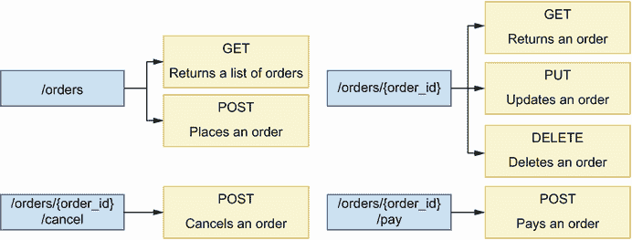

图 4.7 我们将 HTTP 方法与 URL 路径结合来设计我们的 API 端点。我们利用 HTTP 方法的语义来传达每个端点的意图。例如，我们使用 POST 方法来创建新资源，因此我们在 POST `/orders` 端点中使用它来下订单。

现在我们知道了如何通过结合 URL 路径和 HTTP 方法来设计 API 端点，让我们看看如何利用 HTTP 状态码的语义来返回表达性的响应。

## 4.6 使用 HTTP 状态码创建表达性的 HTTP 响应

本节解释了我们在 REST API 的响应中使用 HTTP 状态码的方式。我们首先明确 HTTP 状态码是什么，以及我们如何将它们分类到不同的组中，然后解释如何使用它们来模拟我们的 API 响应。

### 4.6.1 什么是 HTTP 状态码？

我们使用状态码来表示服务器处理请求的结果。当正确使用时，HTTP 状态码帮助我们向 API 的消费者提供表达性的响应。状态码分为以下五个组：

+   *1xx 组*—表示操作正在进行中

+   *2xx 组*—表示请求被成功处理

+   *3xx 组*—表示资源已移动到新位置

+   *4xx 组*—表示请求存在问题

+   *5xx 组*—表示在处理请求时出现错误

注意：HTTP 响应状态码用于指示处理 HTTP 请求的结果。例如，200 状态码表示请求被成功处理，而 500 状态码表示在处理请求时引发了内部服务器错误。HTTP 状态码与一个有理的短语相关联，该短语解释了代码的意图。例如，404 状态码的有理短语是“未找到”。您可以在 [`mng.bz/z5lw`](http://mng.bz/z5lw) 查看状态码的完整列表并了解更多信息。

HTTP 状态码的完整列表很长，逐一列举它们并不会对我们理解如何使用它们有很大帮助。相反，让我们看看最常用的代码，并看看我们如何在 API 设计中应用它们。

在考虑 HTTP 状态码时，区分成功和失败响应是有用的。成功响应意味着请求被成功处理，而失败响应意味着在处理请求时出现了问题。对于我们在 4.5 节中定义的每个端点，我们使用以下成功 HTTP 状态码：

+   POST `/orders`: 201 (已创建)—表示已创建资源。

+   GET `/orders`: 200 (OK)—表示请求被成功处理。

+   GET `/orders/{order_id}`: 200 (OK)—表示请求被成功处理。

+   PUT `/orders/{order_id}`: 200 (OK)—表示资源已成功更新。

+   DELETE `/orders/{order_id}`: 204 (No Content)—表示请求已成功处理，但响应中没有内容。与所有其他方法不同，DELETE 请求不需要带有有效载荷的响应，因为毕竟我们是在指示服务器删除资源。因此，204 (No Content) 状态码是这类 HTTP 请求的好选择。

+   POST `/orders/{order_id}/cancel`: 200 (OK)—尽管这是一个 POST 端点，我们使用 200 (OK) 状态码，因为我们实际上并没有创建资源，客户端只想知道取消操作已成功处理。

+   POST `/orders/{order_id}/pay`: 200 (OK)—尽管这是一个 POST 端点，我们使用 200 (OK) 状态码，因为我们实际上并没有创建资源，客户端只想知道支付已成功处理。

对于成功的响应来说，这些都很好，但错误响应呢？在服务器处理请求时，我们可能会遇到哪些类型的错误，以及哪些 HTTP 状态码是合适的？我们区分两组错误：

+   用户在发送请求时犯的错误，例如，由于有效载荷格式不正确，或者由于请求发送到了一个不存在的端点。我们使用 4xx 组中的 HTTP 状态码来处理这类错误。

+   在服务器处理请求时意外抛出的错误，通常是由于我们代码中的错误。我们使用 5xx 组中的 HTTP 状态码来处理这类错误。

让我们更详细地讨论这些错误类型。

### 4.6.2 使用 HTTP 状态码来报告请求中的客户端错误

API 客户端在向 API 发送请求时可能会犯不同类型的错误。这类错误中最常见的一种是向服务器发送格式不正确的有效载荷。我们区分两种格式不正确的有效载荷：无效语法的有效载荷和不可处理的实体。

*无效语法* 的有效载荷是服务器既无法解析也无法理解的有效载荷。无效语法有效载荷的一个典型例子是格式不正确的 JSON。如图 4.8 所示，我们使用 400 (Bad Request) 状态码来处理这类错误。

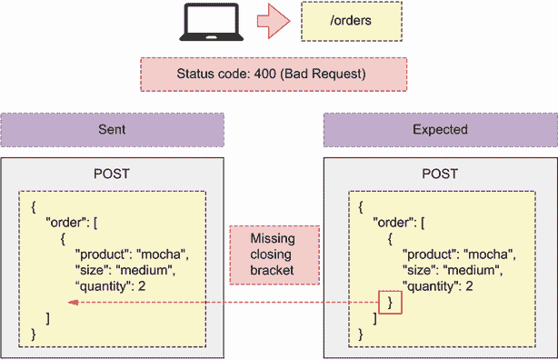

图 4.8 当客户端发送一个格式不正确的有效载荷时，我们以 400 (Bad Request) 状态码进行响应。

*不可处理的实体* 是语法上有效的有效载荷，但缺少所需的参数，包含无效的参数，或将错误的值或类型分配给参数。例如，假设为了下订单，我们的 API 期望在 `/orders` URL 路径上发送一个类似以下的 POST 请求：

```
{
    "order": [
        {
            "product": "mocha",
            "size": "medium",
            "quantity": 2
        }
    ]
}
```

即，我们期望用户发送给我们一个元素列表，其中每个元素代表订单中的一个项目。每个项目由以下属性描述：

+   `product`—标识用户正在订购的产品

+   `size`—标识适用于订购产品的尺寸

+   `quantity`—告诉我们用户希望订购多少个相同产品和大小的项目

如图 4.9 所示，API 客户端可以发送缺少所需属性之一的有效负载，例如`product`。我们使用 422（不可处理实体）状态码来处理此类错误，该状态码表示请求存在问题，无法处理。

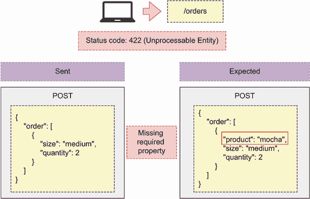

图 4.9 当 API 客户端发送格式错误的负载时，服务器会以 400（错误请求）状态码响应。

另一个常见的错误发生在 API 客户端请求一个不存在的资源时。例如，我们知道 GET `/orders/{order_id}` 端点提供订单的详细信息。如果客户端使用该端点并带有不存在的订单 ID，我们应该以一个表示订单不存在的 HTTP 状态码进行响应。如图 4.10 所示，我们使用 404（未找到）状态码来处理这个错误，该状态码表示请求的资源不可用或找不到。

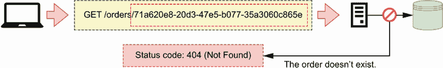

图 4.10 当 API 客户端请求一个不存在的资源时，服务器会以状态码 404（未找到）响应。

另一个常见的错误发生在 API 客户端使用不支持的方法发送请求时。例如，如果用户在`/orders`端点上发送 PUT 请求，我们必须告诉他们该 URL 路径不支持 PUT 方法。我们可以使用两种 HTTP 状态码来处理这种情况。如图 4.11 所示，如果方法尚未实现但将来将可用（即我们有计划实现它），我们可以返回 501（未实现）状态码。

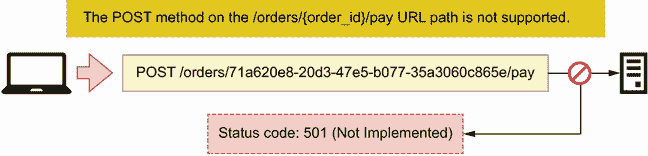

图 4.11 当 API 客户端向一个未来将公开但尚未实现的 URL 路径发送请求时，服务器会以 501（未实现）状态码响应。

如果请求的 HTTP 方法不可用且我们没有计划实现它，我们像图 4.12 所示的那样以 405（方法不允许）状态码进行响应。

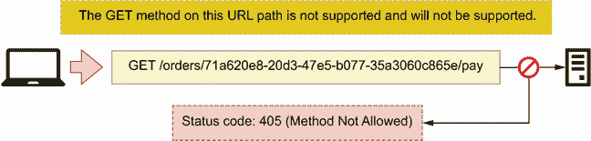

图 4.12 当 API 客户端对一个不支持且未来也不会支持的 HTTP 方法进行 URL 路径请求时，服务器会以 405（方法不允许）状态码响应。

API 请求中常见的两个错误与身份验证和授权有关。第一个错误发生在客户端向受保护的端点发送未经身份验证的请求时。在这种情况下，我们必须告诉他们他们应该首先进行身份验证。如图 4.13 所示，我们使用 401（未授权）状态码来处理这种情况，该状态码表示用户尚未经过身份验证。

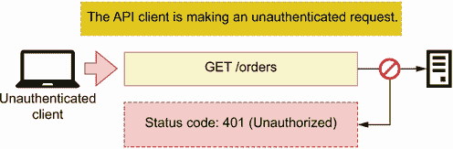

图 4.13 当 API 客户端向需要身份验证的端点发送未经身份验证的请求时，服务器会以 401（未授权）状态码响应。

第二种错误发生在用户正确认证后，试图访问他们无权访问的端点或资源。一个例子是用户试图访问不属于他们的订单详情。如图 4.14 所示，我们使用 403（禁止）状态码来处理这种情况，这表示用户没有权限访问请求的资源或执行请求的操作。

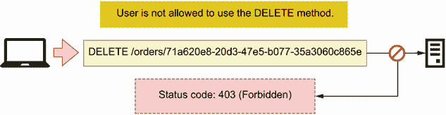

图 4.14 当认证用户使用他们不被允许使用的 HTTP 方法发起请求时，服务器会以 403（禁止）状态码进行响应。

既然我们已经知道了如何使用 HTTP 状态码来报告用户错误，那么让我们将注意力转向服务器错误的状态码。

### 4.6.3 使用 HTTP 状态码在服务器中报告错误

第二组错误是由于我们代码中的错误或我们基础设施的限制在服务器中引发的。这一类别中最常见的错误类型是当我们的应用程序因错误而意外崩溃时。在这些情况下，我们以 500（内部服务器错误）状态码进行响应，如图 4.15 所示。

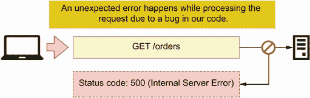

图 4.15 当服务器因我们代码中的错误而引发错误时，我们以 500（内部服务器错误）状态码进行响应。

当我们的应用程序无法处理请求时，会发生一种相关的错误类型。我们通常借助代理服务器或 API 网关（见 4.2.4 节）来处理这种情况。当服务器过载或维护关闭时，我们的 API 可能变得无响应，我们必须通过发送信息状态码来让用户知道这一点。我们区分两种情况：

+   如图 4.16 所示，当服务器无法接受新的连接时，我们必须响应 503（服务不可用）状态码，这表示服务器过载或维护关闭，因此无法处理更多请求。

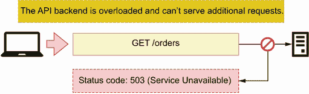

图 4.16 当 API 服务器过载且无法处理更多请求时，我们向客户端响应 503（服务不可用）状态码。

+   当服务器响应请求过慢时，我们以 504（网关超时）状态码进行响应，如图 4.17 所示。

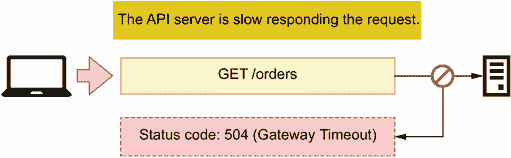

图 4.17 当 API 服务器响应请求非常慢时，代理服务器会以 504（网关超时）状态码向客户端响应。

这完成了我们对在 Web API 设计中最常用 HTTP 状态码的概述。正确使用状态码对于为您的 API 客户端提供良好的开发者体验大有裨益，但我们还需要设计好一件事：API 有效载荷。在下一节中，我们将关注这个重要话题。

## 4.7 设计 API 有效载荷

本节解释了设计用户友好的 HTTP 请求和响应负载数据的最佳实践。*负载数据*代表客户端和服务器通过 HTTP 请求交换的数据。当我们想要创建或更新资源时，我们会向服务器发送负载数据，而当请求数据时，服务器会向我们发送负载数据。API 的可用性很大程度上取决于良好的负载数据设计。设计不良的负载数据会使 API 难以使用，并导致糟糕的用户体验。因此，在设计高质量的负载数据时投入一些努力是很重要的。在本节中，你将学习一些模式和最佳实践，以帮助你完成这项任务。⁷

### 4.7.1 什么是 HTTP 负载数据，我们何时使用它们？

HTTP 请求是应用程序客户端发送给 Web 服务器的消息，HTTP 响应是服务器对请求的回复。HTTP *请求*包括一个 URL、一个 HTTP 方法、一组标头，以及可选的正文或负载数据。HTTP 标头包含有关请求内容元数据的信息，例如编码格式。同样，HTTP *响应*包括状态码、一组标头，以及可选的负载数据。我们可以用不同的数据序列化方法表示负载数据，例如 XML 和 JSON。在 REST API 中，数据通常表示为 JSON 文档。

定义：*HTTP 消息正文*或*负载数据*是包含 HTTP 请求中交换的数据的消息。HTTP 请求和响应都可以包含消息正文。消息正文以 HTTP 支持的媒体类型之一进行编码，例如 XML 或 JSON。HTTP 请求的 Content-Type 标头告诉我们消息的编码类型。在 REST API 中，消息正文通常编码为 JSON。

当我们需要向服务器发送数据时，HTTP 请求会包含负载数据。例如，POST 请求通常用于发送数据以创建资源。HTTP 规范允许我们在所有 HTTP 方法中包含负载数据，但建议不要在 GET ([`mng.bz/O69K`](http://mng.bz/O69K)) 和 DELETE ([`mng.bz/YKeo`](http://mng.bz/YKeo)) 请求中使用它们。

HTTP 规范在是否允许 DELETE 和 GET 请求包含负载数据方面故意表述模糊。它没有禁止使用负载数据，但指出它们没有定义的语义。这允许一些 API 在 GET 请求中包含负载数据。一个著名的例子是 Elasticsearch，它允许客户端在 GET 请求的正文发送查询文档 ([`mng.bz/G14M`](http://mng.bz/G14M))。

那么 HTTP 响应呢？响应可能包含有效载荷，这取决于状态码。根据 HTTP 规范，状态码为 1xx 的响应，以及 204（无内容）和 304（未修改）状态码的响应，不得包含有效载荷。所有其他响应都包含有效载荷。在 REST API 的上下文中，最重要的有效载荷是 4xx 和 5xx 错误响应中的有效载荷，以及 2xx 成功响应中的有效载荷，除了 204 状态码。在下一节中，你将学习如何为所有这些响应设计高质量的有效载荷。

### 4.7.2 HTTP 有效载荷设计模式

既然我们已经知道了何时使用有效载荷，那么让我们学习设计它们的最佳实践。我们将重点关注响应有效载荷的设计，因为它们具有更多的多样性。正如我们在 4.6.1 节中学到的，我们区分错误响应和成功响应。错误响应的有效载荷应包括一个 `"error"` 关键字，详细说明客户端为什么收到错误。例如，当请求的资源在服务器中找不到时生成的 404 响应，可以包含以下错误信息：

```
{
    "error": "Resource not found"
} 
```

`"error"` 是错误消息中常用的关键字，但你也可以使用其他关键字，如 `"detail"` 和 `"message"`。大多数 Web 开发框架处理 HTTP 错误，并为错误响应提供默认模板。例如，FastAPI 使用 `"detail"`，因此我们将在订单 API 规范中使用该关键字。

在成功响应中，我们区分三种场景：当我们创建一个资源时，当我们更新一个资源时，以及当我们获取一个资源的详细信息时。让我们看看我们是如何为这些场景中的每一个设计响应的。

POST 请求的响应有效载荷

我们使用 POST 请求来创建资源。在 CoffeeMesh 的订单 API 中，我们通过 POST `/orders` 端点下订单。为了下订单，我们将我们想要购买的商品列表发送到服务器，服务器负责分配一个唯一的 ID 给订单，因此订单的 ID 必须在响应有效载荷中返回。服务器还设置订单被接受的时间和其初始状态。我们将服务器设置的属性称为 *服务器端* 或 *只读属性*，我们必须在响应有效载荷中包含它们。正如你在图 4.18 中看到的，对于 POST 请求的响应返回资源的完整表示是一个好习惯。这个有效载荷的作用是验证资源是否被正确创建。

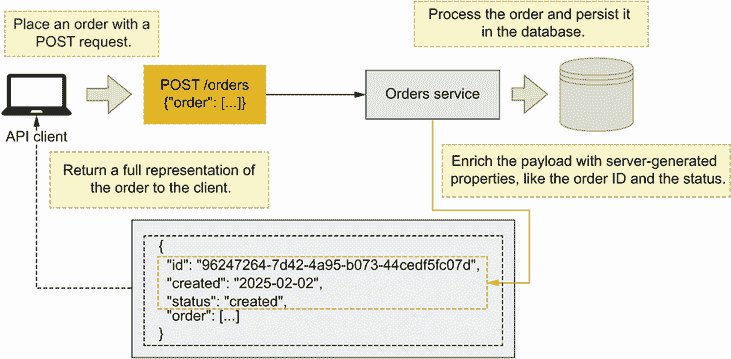

图 4.18 当 API 客户端发送 POST 请求以创建新资源时，服务器会响应一个包含其 ID 和服务器设置的任何其他属性的资源的完整表示。

PUT 和 PATCH 请求的响应有效载荷

要更新资源，我们使用 PUT 或 PATCH 请求。正如我们在 4.5 节中看到的，我们在单例资源 URI 上执行 PUT/PATCH 请求，例如 CoffeeMesh 订单 API 的 PUT `/orders/` `{order_id}`端点。如图 4.19 所示，在这种情况下，返回资源的完整表示也是良好的实践，客户端可以使用它来验证更新是否正确处理。

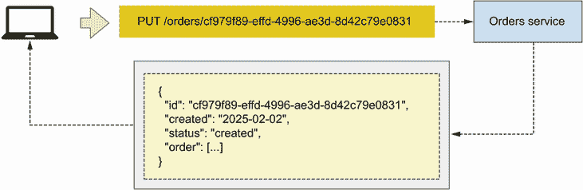

图 4.19 当 API 客户端向更新资源的 PUT 请求发送时，服务器响应资源的完整表示。

GET 请求的响应负载

我们使用 GET 请求从服务器检索资源。正如我们在 4.5 节中确立的，CoffeeMesh 的订单 API 公开了两个 GET 端点：GET `/orders`和 GET `/orders/{orders_id}`端点。让我们看看在设计这些端点的响应负载时我们有哪些建议。

GET `/orders` 返回订单列表。为了设计列表的内容，我们有两种策略：包含每个订单的完整表示或包含每个订单的部分表示。如图 4.20 所示，第一种策略在一个请求中向 API 客户端提供所有所需信息。然而，当列表中的项目很大时，这种策略可能会影响 API 的性能，导致响应负载过大。

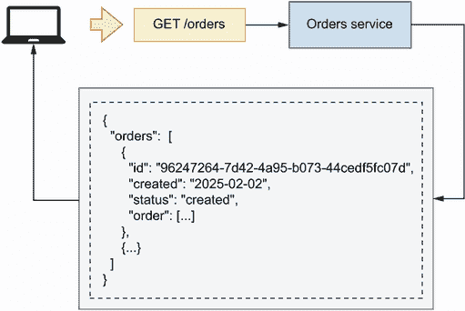

图 4.20 当 API 客户端向 GET `/orders`端点发送请求时，服务器响应订单列表，其中每个订单对象包含关于订单的完整详细信息。

GET `/orders`端点负载的第二种策略是包含每个订单的部分表示，如图 4.21 所示。例如，在集合端点的 GET 请求响应中只包含每个项目的 ID 是一种常见的做法，如 GET `/orders`。在这种情况下，客户端必须调用 GET `/orders/{order_id}`端点来获取每个订单的完整表示。


图 4.21 当 API 客户端对`/orders` URL 路径发出 GET 请求时，服务器响应订单 ID 列表。客户端使用这些 ID 在 GET `/orders/{order_id}`端点上请求每个订单的详细信息。

哪种方法更好？这取决于用例。在公共 API 中，发送每个资源的完整表示更可取。然而，如果你正在开发内部 API，并且不需要每个项目的全部详细信息，你可以通过只包含客户端需要的属性来缩短负载。较小的负载处理速度更快，这会导致更好的用户体验。最后，单例端点，如 GET `/orders/{order_id}`，必须始终返回资源的完整表示。

现在我们已经知道了如何设计 API 负载，让我们将注意力转向 URL 查询参数。

## 4.8 设计 URL 查询参数

现在让我们谈谈 URL 查询参数以及何时、为什么以及如何使用它们。某些端点，如订单 API 的 GET `/orders`端点，返回资源列表。当一个端点返回资源列表时，最佳实践是允许用户过滤和分页结果。例如，当使用 GET `/orders`端点时，我们可能只想限制结果为最近的五笔订单，或者只列出已取消的订单。URL 查询参数允许我们实现这些目标，并且始终应该是可选的，并且，在适当的情况下，服务器可以为它们分配默认值。

*URL 查询参数*的定义是 URL 中的键值参数。查询参数位于问号（?）之后，通常用于过滤端点的结果，例如订单 API 的 GET `/orders`端点。我们可以通过使用和号（&）来分隔它们，组合多个查询参数。

URL 查询参数是构成 URL 的一部分的键值对，但它们通过问号与 URL 路径分开。例如，如果我们想调用 GET `/orders`端点并通过已取消的订单过滤结果，我们可能会写如下：

```
GET /orders?cancelled=true
```

我们可以通过使用和号（&）来分隔多个查询参数，在同一个 URL 中链式调用多个查询参数。让我们向 GET `/orders`端点添加一个名为`limit`的查询参数，以便我们可以限制结果的数量。为了通过已取消的订单过滤 GET `/orders`端点并限制结果数量为 5，我们发出以下 API 请求：

```
GET /orders?cancelled=true&Limit=5
```

允许 API 客户端分页结果也是常见的做法。分页包括将结果分割成不同的集合，并一次服务一个集合。我们可以使用几种策略来分页结果，但最常见的方法是使用`page`和`per_page`参数的组合。`page`代表数据集，而`per_page`告诉我们每个集合中要包含多少项。服务器使用`per_page`的值来确定我们将得到多少数据集。我们可以在以下示例中将这两个参数组合在 API 请求中：

```
GET /orders?page=1&per_page=10
```

这标志着我们通过 REST API 的最佳实践和设计原则的旅程的结束。你现在拥有了设计高度表达性和结构化的 REST API 所需的资源，这些 API 易于理解和消费。在下一章中，你将学习如何使用 OpenAPI 标准来记录你的 API 设计。

## 摘要

+   表现性状态转移（REST）定义了良好架构的 REST API 的设计原则：

    +   *客户端-服务器架构*—客户端和服务器代码必须解耦。

    +   *无状态*—服务器必须在请求之间不保持状态。

    +   *可缓存性*—可缓存的请求必须被缓存。

    +   *分层系统*—后端架构的复杂性不得暴露给最终用户。

    +   *代码按需（可选）*—客户端应用程序可能能够从服务器下载可执行代码。

    +   *统一接口*——API 必须提供统一且一致的接口。

+   作为应用程序状态引擎的超媒体（HATEOAS）是一种范式，它指出 REST API 必须在它们的响应中包含引用链接。HATEOAS 使 API 具有导航性并更容易使用。

+   良好的 REST API 设计利用了 HTTP 协议的特性，例如 HTTP 方法和状态码，以创建结构良好且高度表达的 API，这些 API 易于消费。

+   对于 REST API 来说，最重要的 HTTP 方法是

    +   GET 用于从服务器检索资源

    +   POST 用于创建新资源

    +   PUT 和 PATCH 用于更新资源

    +   DELETE 用于删除资源

+   我们使用有效载荷与 API 服务器交换数据。有效载荷位于 HTTP 请求或响应的主体中。客户端使用 POST、PUT 和 PATCH HTTP 方法发送请求有效载荷。服务器响应总是包含有效载荷，除非状态码是 204、304 或 1xx 组中的任何一个。

+   URL 查询参数是 URL 中的键值对，我们使用它们来过滤、分页和排序 GET 端点的结果。

* * *

¹ Postman 的 2022 年“API 状态报告”发现，调查的大多数参与者（89%）使用 REST（[`www.postman.com/state-of-api/api-technologies/#api-technologies`](https://www.postman.com/state-of-api/api-technologies/#api-technologies)）。

² 关于 REST API 中资源和资源建模的深入讨论，请参阅 Prakash Subramaniam 的出色文章“REST API 设计——资源建模”（[`www.thoughtworks.com/en-gb/insights/blog/rest-api-design-resource-modeling`](https://www.thoughtworks.com/en-gb/insights/blog/rest-api-design-resource-modeling)）。

³ 关于此模式的更多信息，请参阅 Chris Richardson 的《微服务模式》（Manning，2019，第 259-291 页；[`livebook.manning.com/book/microservices-patterns/chapter-8/point-8620-53-297-0`](https://livebook.manning.com/book/microservices-patterns/chapter-8/point-8620-53-297-0)）。

⁴ 关于 URI 的最新规范，请参阅 M. Nottingham 的“RFC 7320：URI 设计和所有权”（2004 年 7 月，[`tools.ietf.org/html/rfc7320`](https://tools.ietf.org/html/rfc7320)）。

⁵ Leonard Richardson 在 2008 年 QCon 旧金山会议上的演讲“正义将需要数百万个复杂的步骤”中提出了他的成熟度模型（[`www.crummy.com/writing/speaking/2008-QCon/`](https://www.crummy.com/writing/speaking/2008-QCon/)）。

⁶ CRUD 缩写据说是由 James Martin 在他的有影响力的书籍《管理数据库环境》中引入的（Prentice-Hall，1983，第 381 页）。

⁷ 除了学习最佳实践外，阅读有关反模式的内容也会很有用。我的文章“如何糟糕的模型破坏 API（或为什么设计优先是正确的方法）”概述了你应该避免的常见反模式（[`www.microapis.io/blog/how-bad-models-ruin-an-api`](https://www.microapis.io/blog/how-bad-models-ruin-an-api)）。
