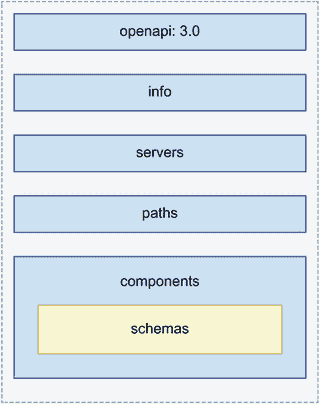

# 5 使用 OpenAPI 记录 REST API

本章节涵盖

+   使用 JSON Schema 创建 JSON 文档的验证模型

+   使用 OpenAPI 文档标准描述 REST API

+   模型 API 请求和响应的有效载荷

+   在 OpenAPI 规范中创建可重用的模式

在本章节中，你将学习如何使用 OpenAPI：描述 RESTful API 最流行的标准，它拥有丰富的工具生态系统，用于测试、验证和可视化 API。大多数编程语言都有支持 OpenAPI 规范的库，在第六章中，你将学习如何使用 Python 生态系统中的 OpenAPI 兼容库。

OpenAPI 使用 JSON Schema 来描述 API 的结构和模型，因此我们首先提供 JSON Schema 的工作概述。JSON Schema 是一个用于定义 JSON 文档结构的规范，包括文档中值的类型和格式。

在了解 JSON Schema 之后，我们研究 OpenAPI 文档的结构、其属性以及我们如何使用它为 API 消费者提供有信息的 API 规范。API 端点是规范的核心，因此我们特别关注它们。我们逐步分解定义 API 请求和响应有效载荷端点和模式的过程。在本章的示例中，我们与 CoffeeMesh 订单服务的 API 进行合作。正如我们在第一章中提到的，CoffeeMesh 是一个虚构的按需咖啡配送平台，订单服务是允许客户下单和管理订单的组件。订单 API 的完整规范可在本书 GitHub 仓库的 ch05/oas.yaml 下找到。

## 5.1 使用 JSON Schema 模型数据

本节介绍了 JSON Schema 规范标准，并解释了如何利用它来生成 API 规范。OpenAPI 使用 JSON Schema 规范的扩展子集来定义 JSON 文档的结构及其属性的类型和格式。这对于记录使用 JSON 表示数据并验证交换的数据是否正确非常有用。JSON Schema 规范正在积极开发中，最新版本为 2020-12。¹

定义 *JSON Schema* 是一个用于定义 JSON 文档结构和其属性类型及格式的规范标准。OpenAPI 使用 JSON Schema 来描述 API 的属性。

JSON Schema 规范通常定义了一个具有某些属性或属性的对象。JSON Schema 的 `object` 通过键值对关联数组表示。JSON Schema 规范通常看起来像这样：

```
{
    "status": {             ①
        "type": "string"    ②
    }
}
```

① JSON Schema 规范中的每个属性都是一个键，其值是该属性的描述符。

② 属性所需的最小描述符是类型。在这种情况下，我们指定状态属性是一个字符串。

在这个例子中，我们定义了一个具有一个名为 `status` 的属性的对象模式，其类型为 `string`。

JSON Schema 允许我们对服务器和客户端应从有效载荷中期望的数据类型和格式非常明确。这对于 API 提供者和 API 消费者之间的集成是基本的，因为它让我们知道如何解析有效载荷以及如何在我们的运行时将它们转换为正确的数据类型。

JSON Schema 支持以下基本数据类型：

+   对于字符值，使用 `string`。

+   对于整数和小数值，使用 `number`。

+   对于关联数组（即 Python 中的字典），使用 `object`。

+   对于其他数据类型的集合（即 Python 中的列表），使用 `array`。

+   对于 `true` 或 `false` 值，使用 `boolean`。

+   对于未初始化的数据，使用 `null`。

要使用 JSON Schema 定义一个对象，我们声明其类型为 `object`，并列出其属性及其类型。以下是如何定义一个名为 `order` 的对象，它是订单 API 的核心模型之一。

列表 5.1 使用 JSON Schema 定义对象的模式

```
{
    "order": {
        "type": "object",      ①
        "properties": {        ②
            "product": {
                "type": "string"
            },
            "size": {
                "type": "string"
            },
            "quantity": {
                "type": "integer"
            }
        }
    }
}
```

① 我们可以将模式声明为一个对象。

② 我们在 `properties` 关键字下描述对象的属性。

由于 `order` 是一个对象，因此 `order` 属性也有属性，这些属性在 `properties` 属性下定义。每个属性都有自己的类型。符合列表 5.1 中规范的一个 JSON 文档如下：

```
{
    "order": {
        "product": "coffee",
        "size": "big",
        "quantity": 1
    }
}
```

正如你所看到的，规范中描述的每个属性都用于本文档中，并且每个属性都有预期的类型。

属性也可以表示一个项目数组。在下面的代码中，`order` 对象代表一个对象数组。正如你所看到的，我们使用 `items` 关键字来定义数组中的元素。

列表 5.2 使用 JSON Schema 定义对象数组

```
{
    "order": {
        "type": "array",
        "items": {              ①
            "type": "object",
            "properties": {
                "product": {
                    "type": "string"
                },
                "size": {
                    "type": "string"
                },
                "quantity": {
                    "type": "integer"
                }
            }
        }
    }
}
```

① 我们使用 `items` 关键字定义数组中的元素。

在这个例子中，`order` 属性是一个数组。数组类型在其模式中需要额外的属性，即 `items` 属性，它定义了数组中每个元素的类型。在这种情况下，数组中的每个元素都是一个对象，它代表订单中的一个项目。

一个对象可以有任意数量的嵌套对象。然而，当嵌套的对象太多时，缩进会变得很大，使得规范难以阅读。为了避免这个问题，JSON Schema 允许我们分别定义每个对象，并使用 JSON 指针来引用它们。*JSON 指针* 是一种特殊语法，允许我们在同一规范中指向另一个对象定义。

正如以下代码所示，我们可以将 `order` 数组中每个项目的定义作为一个名为 `OrderItemSchema` 的模型提取出来，并使用特殊的 `$ref` 关键字通过 JSON 指针引用 `OrderItemSchema`。

列表 5.3 使用 JSON 指针引用其他模式

```
{
    "OrderItemSchema": {
        "type": "object",
        "properties": {
            "product": {
                "type": "string"
            },
            "size": {
                "type": "string"
            },
            "quantity": {
                "type": "integer"
            }
        }
    },
    "Order": {
        "status": {
            "type": "string"
        },
        "order": {
            "type": "array",
            "items": {
                "$ref": '#/OrderItemSchema'    ①
            }
        }
    }
}
```

① 我们可以使用 JSON 指针来指定数组项的类型。

JSON 指针使用特殊关键字 `$ref` 和 JSONPath 语法来指向模式中的另一个定义。在 JSONPath 语法中，文档的根由井号符号（#）表示，嵌套属性的相互关系由正斜杠（/）表示。例如，如果我们想创建一个指向 `OrderItemSchema` 模型中 `size` 属性的指针，我们会使用以下语法：`'#/OrderItemSchema/size'`。

定义 A *JSON 指针* 是 JSON Schema 中的一个特殊语法，它允许我们在同一规范中指向另一个定义。我们使用特殊关键字 `$ref` 来声明一个 JSON 指针。要构建指向另一个模式的路径，我们使用 JSONPath 语法。例如，要指向在文档顶层定义的名为 `OrderItemSchema` 的模式，我们使用以下语法：`{"$ref": "#/OrderItemSchema"}`。

我们可以通过提取通用的模式对象到可重用模型，并使用 JSON 指针来重构我们的规范。我们可以通过 JSON 指针来引用它们。这有助于我们避免重复，并保持规范简洁。

除了能够指定属性的类型之外，JSON Schema 还允许我们指定属性的格式。我们可以开发自己的自定义格式或使用 JSON Schema 内置的格式。例如，对于一个表示日期的属性，我们可以使用 `date` 格式——这是 JSON Schema 支持的内置格式，它表示 ISO 日期（例如，2025-05-21）。以下是一个示例：

```
{
    "created": {
        "type": "string",
        "format": "date"
    }
}
```

在本节中，我们使用了 JSON 格式的示例。然而，JSON Schema 文档不需要用 JSON 编写。实际上，更常见的是用 YAML 格式编写，因为它更易于阅读和理解。OpenAPI 规范也通常以 YAML 格式提供，因此在本章的剩余部分，我们将使用 YAML 来开发订单 API 的规范。

## 5.2 OpenAPI 规范的结构

在本节中，我们介绍了 OpenAPI 标准，并学习了如何构建 API 规范。OpenAPI 的最新版本是 3.1；然而，这个版本在当前生态系统中仍然支持很少，因此我们将使用 OpenAPI 3.0 来记录 API。这两个版本之间没有太大差异，你关于 OpenAPI 3.0 所学到的几乎所有内容都适用于 3.1。²

OpenAPI 是一种用于记录 RESTful API 的标准规范格式（图 5.1）。OpenAPI 允许我们详细描述 API 的每个元素，包括其端点、请求和响应负载的格式、其安全方案等。OpenAPI 于 2010 年以 Swagger 的名义创建，作为一个开源规范格式，用于描述 RESTful 网络 API。随着时间的推移，这个框架越来越受欢迎，2015 年，Linux 基金会和一家主要公司联盟赞助了 OpenAPI 创新项目的创建，该项目旨在改进构建 RESTful API 的协议和标准。如今，OpenAPI 是最流行的规范格式，用于记录 RESTful API，³ 并且它受益于一个丰富的工具生态系统，用于 API 可视化、测试和验证。



图 5.1 OpenAPI 规范包含五个部分。例如，`paths` 部分描述了 API 端点，而 `components` 部分包含在文档中引用的可重用模式。

OpenAPI 规范包含了 API 消费者需要了解的所有信息，以便能够与 API 交互。正如你在图 5.1 中所看到的，OpenAPI 围绕五个部分进行结构化：

+   `openapi`—指示我们用于生成规范的 OpenAPI 版本。

+   `info`—包含一般信息，如 API 的标题和版本。

+   `servers`—包含 API 可用的 URL 列表。你可以为不同的环境（如生产环境和预发布环境）列出多个 URL。

+   `paths`—描述 API 提供的端点，包括预期的负载、允许的参数和响应的格式。这是规范中最重要的一部分，因为它代表了 API 接口，并且是消费者将寻找以了解如何与 API 集成的部分。

+   `components`—定义了在规范中可重用的元素，例如模式、参数、安全方案、请求体和响应。⁴ 一个 *模式* 是对请求和响应对象中预期属性和类型的定义。OpenAPI 模式使用 JSON Schema 语法定义。

现在我们已经知道了如何构建 OpenAPI 规范的结构，让我们继续记录订单 API 的端点。

## 5.3 记录 API 端点

在本节中，我们声明订单 API 的端点。正如我们在第 5.2 节中提到的，OpenAPI 规范的 `paths` 部分描述了您的 API 接口。它列出了 API 暴露的 URL 路径，以及它们实现的 HTTP 方法、它们期望的请求类型以及它们返回的响应，包括状态码。每个路径都是一个对象，其属性是该路径支持的 HTTP 方法。在本节中，我们将特别关注记录 URL 路径和 HTTP 方法。在第四章中，我们确定了订单 API 包含以下端点：

+   POST `/orders`—下单。它需要一个包含订单详细信息的有效负载。

+   GET `/orders`—返回订单列表。它接受 URL 查询参数，允许我们过滤结果。

+   GET `/orders/{order_id}`—返回特定订单的详细信息。

+   PUT `/orders/{order_id}`—更新订单的详细信息。由于这是一个 PUT 端点，它需要一个完整的订单表示。

+   DELETE `/orders/{order_id}`—删除一个订单。

+   POST `/orders/{order_id}/pay`—为订单付款。

+   POST `/orders/{order_id}/cancel`—取消订单。

以下显示了订单 API 端点的高级定义。我们声明 URL 和每个 URL 实现的 HTTP，并为每个端点添加一个操作 ID，以便我们可以在文档的其他部分中引用它们。

列表 5.4 订单 API 端点的概述

```
paths:
  /orders:                     ①
    get:                       ②
      operationId: getOrders
    post:  # creates a new order 
      operationId: createOrder

  /orders/{order_id}:
    get:
      operationId: getOrder
    put: 
      operationId: updateOrder
    delete: 
      operationId: deleteOrder

  /orders/{order_id}/pay:
    post:
      operationId: payOrder

  /orders/{order_id}/cancel:
    post: 
      operationId: cancelOrder
```

① 我们声明一个 URL 路径。

② 由 /orders URL 路径支持的 HTTP 方法

现在我们有了端点，我们需要填写详细信息。对于 GET `/orders` 端点，我们需要描述端点接受的参数，对于 POST 和 PUT 端点，我们需要描述请求有效负载。我们还需要描述每个端点的响应。在以下章节中，我们将学习为 API 的不同元素构建规范，从 URL 查询参数开始。

## 5.4 记录 URL 查询参数

正如我们在第四章中学到的，URL 查询参数允许我们过滤和排序 GET 端点的结果。在本节中，我们将学习如何使用 OpenAPI 定义 URL 查询参数。GET `/orders` 端点允许我们使用以下参数过滤订单：

+   `cancelled`—订单是否被取消。此值将是一个布尔值。

+   `limit`—指定应返回给用户的最大订单数。此参数的值将是一个数字。

`cancelled` 和 `limit` 都可以在同一请求中组合使用以过滤结果：

```
GET /orders?cancelled=true&limit=5
```

此请求要求服务器列出五个已取消的订单。列表 5.5 显示了 GET `/orders`端点查询参数的规范。参数的定义需要一个`name`，这是我们实际 URL 中用来引用它的值。我们还指定了它是哪种`type`的参数。OpenAPI 3.1 区分四种类型的参数：路径参数、查询参数、头参数和 cookie 参数。头参数是放入 HTTP 头字段中的参数，而 cookie 参数放入 cookie 有效载荷中。路径参数是 URL 路径的一部分，通常用于标识资源。例如，在`/orders/` `{order_id}`中，`order_id`是一个路径参数，用于标识一个特定的订单。查询参数是可选参数，允许我们过滤和排序端点的结果。我们使用`schema`关键字（对于`cancelled`是布尔值，对于`limit`是数字）来定义参数的类型，并在相关的情况下，我们还指定了参数的`format`。⁵

列表 5.5 GET `/orders`端点查询参数规范

```
paths: 
  /orders:
    get:
      parameters:            ①
        - name: cancelled    ②
          in: query          ③
          required: false    ④
          schema:            ⑤
            type: boolean
        - name: limit
          in: query
          required: false
          schema:
            type: integer
```

① 我们在“参数”属性下描述 URL 查询参数。

② 参数的名称

③ 我们使用 in 描述符来指定参数位于 URL 路径中。

④ 我们指定参数是否必需。

⑤ 我们在“模式”下指定参数的类型。

现在我们知道了如何描述 URL 查询参数，在下一节中，我们将处理更复杂的事情：记录请求有效载荷。

## 5.5 记录请求有效载荷

在第四章中，我们了解到一个请求代表客户端通过 POST 或 PUT 请求发送给服务器的数据。在本节中，我们将学习如何记录订单 API 端点的请求有效载荷。让我们从 POST `/orders`方法开始。在第 5.1 节中，我们确定了 POST `/orders`端点的有效载荷如下所示：

```
{
    "order": [
        {
            "product": "cappuccino",
            "size": "big",
            "quantity": 1
        }
    ]
}
```

此有效载荷包含一个名为`order`的属性，它表示一个物品数组。每个物品由以下三个属性和约束定义：

+   `product`—用户订购的产品类型。

+   `size`—产品的尺寸。它可以有以下三种选择之一：`small`、`medium`和`big`。

+   `quantity`—产品的数量。它可以是一个等于或大于 1 的任何整数。

列表 5.6 展示了如何定义此负载的方案。我们在方法的 `requestBody` 属性的 `content` 属性下定义请求负载。我们可以以不同的格式指定负载。在这种情况下，我们只允许 JSON 格式的数据，其媒体类型定义为 `application/json`。我们的负载模式是一个具有一个属性的对象：`order`，其类型为 `array`。数组中的项是具有三个属性的对象：`product` 属性，类型为 `string`；`size` 属性，类型为 `string`；和 `quantity` 属性，类型为 `integer`。此外，我们还为 `size` 属性定义了一个枚举，将接受的值限制为 `small`、`medium` 和 `big`。最后，我们还为 `quantity` 属性提供了一个默认值 `1`，因为它是在负载中唯一的非必需字段。每当用户发送包含没有 `quantity` 属性的项目的请求时，我们假设他们只想订购该项目的单个单位。

列表 5.6 规范 POST `/orders` 端点

```
paths:
  /orders:
    post:
      operationId: createOrder
      requestBody:                       ①
        required: true                   ②
        content:                         ③
          application/json:
            schema:                      ④
              type: object
              properties:
                order:
                  type: array
                  items:
                    type: object
                    properties:
                      product:
                        type: string
                      size:
                        type: string
                        enum:            ⑤
                          - small
                          - medium
                          - big
                      quantity:
                        type: integer
                        required: false
                        default: 1       ⑥
                    required:
                      - product
                      - size
```

① 我们在 requestBody 下描述请求负载。

② 我们指定负载是否必需。

③ 我们指定负载的内容类型。

④ 我们定义负载的方案。

⑤ 我们可以使用枚举来约束属性的值。

⑥ 我们指定一个默认值。

如列表 5.6 所示，在端点的定义中嵌入负载模式可以使我们的规范更难以阅读和理解。在下一节中，我们将学习如何重构负载模式以提高可重用性和可读性。

## 5.6 重构模式定义以避免重复

在本节中，我们学习重构模式以保持 API 规范清洁和可读的策略。列表 5.6 中的 POST `/orders` 端点定义很长，包含多层缩进。因此，它难以阅读，这意味着将来它将难以扩展和维护。我们可以通过将负载模式移至 API 规范的不同部分（即 `components` 部分）来做得更好。正如我们在 5.2 节中解释的，`components` 部分用于声明在规范中引用的方案。每个方案都是一个对象，其中键是方案名称，值是描述它的属性。

列表 5.7 使用 JSON 指针规范 POST `/orders` 端点的规范

```
paths:
  /orders:
    post:
      operationId: createOrder
      requestBody:
        required: true
        content:
          application/json:
            schema:
              $ref: '#/components/schemas/CreateOrderSchema'    ①

components:                                                     ②
  schemas:
    CreateOrderSchema:                                          ③
      type: object
      properties:
        order:
          type: array
          items:
            type: object
            properties:
              product:
                type: string
              size:
                type: string
                enum:
                  - small
                  - medium
                  - big
              quantity:
                type: integer
                required: false
                default: 1
            required:
              - product
              - size
```

① 我们使用 JSON 指针引用文档中其他地方定义的方案。

② 模式定义位于 components 下。

③ 每个方案都是一个对象，其中键是名称，值是描述它的属性。

将 POST `/orders` 请求负载的模式移至 API 的 `components` 部分可以使文档更易于阅读。它允许我们保持文档的 `paths` 部分清洁并专注于端点的高级细节。我们只需通过 JSON 指针引用 `CreateOrderSchema` 模式即可：

```
#/components/schemas/CreateOrderSchema
```

规范看起来不错，但可以做得更好。`CreateOrderSchema`有点长，并且包含多层嵌套定义。如果`CreateOrderSchema`变得复杂，随着时间的推移，它将变得难以阅读和维护。我们可以通过以下代码中数组中`order`项的定义重构来使其更易于阅读。这种策略允许我们在 API 的其他部分重用订单项的架构。

列表 5.8 `OrderItemSchema`和`Order`的架构定义

```
components:
  schemas:
      OrderItemSchema:                     ①
        type: object
        properties:
          product:
            type: string
          size:
            type: string
            enum:
              - small
              - medium
              - big
          quantity:
            type: integer
            default: 1
      CreateOrderSchema:
        type: object
        properties:
          order:
            type: array
            items:
              $ref: '#/OrderItemSchema'    ②
```

① 我们引入了 OrderItemSchema。

② 我们使用 JSON 指针指向 OrderItemSchema。

我们的模式看起来不错！`CreateOrderSchema`架构可用于创建订单或更新订单，因此我们可以在 PUT `/orders/{order_id}`端点中重用它，如列表 5.9 所示。正如我们在第四章中学到的，`/orders/{order_id}` URL 路径代表一个单例资源，因此 URL 包含一个路径参数，即订单的 ID。在 OpenAPI 中，路径参数用大括号表示。我们指定`order_id`参数是一个具有 UUID 格式的字符串（一个长随机字符串，常用于 ID）。⁶ 我们直接在 URL 路径下定义 URL 路径参数，以确保它适用于所有 HTTP 方法。

列表 5.9 PUT `/orders/{order_id}`端点的规范

```
paths:
  /orders:
    get:
      ...

  /orders/{order_id}:          ①
    parameters:                ②
      - in: path               ③
        name: order_id         ④
        required: true         ⑤
        schema:
          type: string
          format: uuid         ⑥
    put:                       ⑦
      operationId: updateOrder
      requestBody:             ⑧
        required: true
        content:
          application/json:
            schema:
           $ref: '#/components/schemas/CreateOrderSchema'
```

① 我们声明订单的资源 URL。

② 我们定义 URL 路径参数。

③ order_id 参数是 URL 路径的一部分。

④ 参数的名称

⑤ order_id 参数是必需的。

⑥ 我们指定参数的格式（UUID）。

⑦ 我们为当前 URL 路径定义 HTTP 方法 PUT。

⑧ 我们记录了 PUT 端点的请求体。

现在我们已经了解了如何定义请求有效载荷的架构，让我们将注意力转向响应。

## 5.7 记录 API 响应

在本节中，我们学习如何记录 API 响应。我们首先定义 GET `/orders/{order_id}`端点的有效载荷。GET `/orders/` `{order_id}`端点的响应如下：

```
{
    "id": "924721eb-a1a1-4f13-b384-37e89c0e0875",
    "status": "progress",
    "created": "2022-05-01",
    "order": [
        {
            "product": "cappuccino",
            "size": "small",
            "quantity": 1
        },
        {
            "product": "croissant",
            "size": "medium",
            "quantity": 2
        }
    ]
}
```

此有效载荷显示了用户订购的产品、订单的放置时间和订单的状态。此有效载荷与我们在第 5.6 节中为 POST 和 PUT 端点定义的请求有效载荷类似，因此我们可以重用之前的模式。

列表 5.10 `GetOrderSchema`架构的定义

```
components:
  schemas:
    OrderItemSchema:
      ...

  GetOrderSchema:                                       ①
    type: object
    properties:
      status:
        type: string
        enum:                                           ②
          - created
          - paid
          - progress
          - cancelled
          - dispatched
          - delivered
      created:
        type: string
        format: date-time                               ③
      order:
        type: array
        items:
          $ref: '#/components/schemas/OrderItemSchema'  ④
```

① 我们定义 GetOrderSchema 架构。

② 我们使用枚举约束状态属性的值。

③ 具有日期时间格式的字符串

④ 我们使用 JSON 指针引用 OrderItemSchema 模式。

在列表 5.10 中，我们使用 JSON 指针指向 `GetOrderSchema`。另一种重用现有模式的方法是使用继承。在 OpenAPI 中，我们可以使用称为 *模型组合* 的策略来继承和扩展一个模式，这允许我们在单个对象定义中结合不同模式的属性。在这些情况下，使用特殊关键字 `allOf` 来指示该对象需要列出的模式中的所有属性。

定义 *模型组合* 是 JSON Schema 中的一种策略，允许我们将不同模式的属性组合成一个单一的对象。当模式包含已在其他地方定义的属性时，它非常有用，因此可以避免重复。

以下代码展示了使用 `allOf` 关键字对 `GetOrderSchema` 的另一种定义。在这种情况下，`GetOrderSchema` 是两个其他模式的组合：`CreateOrderSchema` 和一个包含两个键——`status` 和 `created` 的匿名模式。

列表 5.11 使用 `allOf` 关键字对 `GetOrderSchema` 的替代实现

```
components:
  schemas:
    OrderItemSchema:
      ...

    GetOrderSchema:
      allOf:                                                ①
        - $ref: '#/components/schemas/CreateOrderSchema'    ②
        - type: object                                      ③
          properties:
            status:
              type: string
              enum:
                - created
                - paid
                - progress
                - cancelled
                - dispatched
                - delivered
            created:
              type: string
              format: date-time
```

① 我们使用 `allOf` 关键字从其他模式继承属性。

② 我们使用 JSON 指针引用另一个模式。

③ 我们定义了一个新对象，以包含特定于 `GetOrderSchema` 的属性。

模型组合导致更简洁的规范，但它仅在模式严格兼容时才有效。如果我们决定通过新属性扩展 `CreateOrderSchema`，那么这个模式可能就不再适用于 `GetOrderSchema` 模型。从这个意义上说，有时最好在不同的模式中寻找共同元素，并将它们的定义重构为独立的模式。

现在我们有了 GET `/orders/{order_id}` 端点响应负载的规范，我们可以完成端点的规范。我们将端点的响应定义为对象，其键是响应的状态码，例如 200。我们还描述了响应的内容类型及其模式，`GetOrderSchema`。

列表 5.12 GET `/orders/{order_id}` 端点的规范

```
paths:
  /orders:
    get:
        ...

  /orders/{order_id}:
    parameters: 
      - in: path
        name: order_id
        required: true
        schema:
          type: string
          format: uuid

    put:
      ... 

    get:                                                      ①
      summary: Returns the details of a specific order        ②
      operationId: getOrder
      responses:                                              ③
        '200':                                                ④
          description: OK                                     ⑤
          content:                                            ⑥
            application/json:
              schema:
                $ref: '#/components/schemas/GetOrderSchema'   ⑦
```

① 我们定义了 /orders/{order_id} URL 路径的 GET 端点。

② 我们提供了此端点的摘要描述。

③ 我们定义了这个端点的响应。

④ 每个响应都是一个对象，其键是状态码。

⑤ 对响应的简要描述

⑥ 我们描述了响应的内容类型。

⑦ 我们使用 JSON 指针引用 `GetOrderSchema`。

如您所见，我们在端点的 `responses` 部分定义了响应模式。在这种情况下，我们只提供了 200 (OK) 成功响应的规范，但我们也可以记录其他状态码，例如错误响应。下一节解释了我们如何创建可以在端点之间重用的通用响应。

## 5.8 创建通用响应

在本节中，我们学习如何向我们的 API 端点添加错误响应。正如我们在第四章中提到的，错误响应更为通用，因此我们可以使用 API 规范的 `components` 部分提供这些响应的通用定义，然后在我们的端点中重复使用它们。

我们在 API 的 `components` 部分的 `responses` 标题内定义通用响应。以下是一个名为 `NotFound` 的 404 响应的通用定义。与任何其他响应一样，我们也记录了内容的有效负载，在这种情况下，它由 `Error` 架构定义。

列表 5.13 通用 `404` 状态码响应定义

```
components:
  responses:                                                ①
    NotFound:                                               ②
      description: The specified resource was not found.    ③
      content:                                              ④
        application/json:
          schema:
            $ref: '#/components/schemas/Error'              ⑤

  schemas:
    OrderItemSchema:
      ...
    Error:                                                  ⑥
      type: object
      properties:
        detail: 
          type: string
      required:
        - detail
```

① 通用响应位于组件部分的 responses 下。

② 我们命名了响应。

③ 我们描述了响应。

④ 我们定义了响应的内容。

⑤ 我们引用了 Error 架构。

⑥ 我们定义了 Error 有效负载的架构。

由于所有这些端点都是专门设计来针对特定资源的，因此这个 404 响应的规范可以在 `/orders/{order_id}` URL 路径下所有端点的规范中重复使用。

注意：你可能想知道，如果某些响应对所有 URL 路径的端点都是通用的，为什么我们不能直接在 URL 路径下定义响应以避免重复？答案是，目前这是不可能的。`responses` 关键字不允许直接位于 URL 路径下，因此我们必须为每个端点单独记录所有响应。OpenAPI GitHub 仓库中有一个请求，允许直接在 URL 路径下包含通用响应，但尚未实现([`mng.bz/097p`](http://mng.bz/097p))。

我们可以在 GET `/orders/` `{order_id}` 端点下使用列表 5.13 中的通用 404 响应。

列表 5.14 在 GET `/orders/{order_id}` 下使用 404 响应架构

```
paths:
  ...

  /orders/{order_id}:
    parameters:
      - in: path
        name: order_id
        required: true
        schema:
          type: string
          "format": uuid
    get:
      summary: Returns the details of a specific order
      operationId: getOrder
      responses:
        '200':
          description: OK
          content:
            application/json:
              schema:
                $ref: '#/components/schemas/GetOrderSchema'
        '404':                                               ①
          $ref: '#/components/responses/NotFound'            ②
```

① 我们定义了一个 404 响应。

② 我们使用 JSON 指针引用 NotFound 响应。

本书 GitHub 仓库中的订单 API 规范还包含了对 422 响应的通用定义和对 `Error` 组件的扩展定义，该定义考虑了从 FastAPI 获得的不同错误有效负载。

我们几乎完成了。唯一剩下的端点是 GET `/orders`，它返回订单列表。端点有效负载重复使用 `GetOrderSchema` 来定义 `orders` 数组中的项目。

列表 5.15 GET `/orders` 端点的规范

```
paths:
  /orders:
    get:                                                             ①
      operationId: getOrders
      responses:
        '200':
          description: A JSON array of orders
          content:
            application/json:
              schema:
                type: object
                properties:
                  orders:
                    type: array                                      ②
                    items:
                      $ref: '#/components/schemas/GetOrderSchema'    ③
                required:
                  - order

    post:
      ...

  /orders/{order_id}:
    parameters:
      ...
```

① 我们定义了 /orders URL 路径的新 GET 方法。

② 订单是一个数组。

③ 数组中的每个项目都由 GetOrderSchema 定义。

我们 API 的端点现在已完全记录！你可以在端点的定义中使用许多其他元素，例如 `tags` 和 `externalDocs`。这些属性不是严格必要的，但可以帮助提供更多结构给你的 API 或使其更容易分组端点。例如，你可以使用 `tags` 创建逻辑上属于一起或具有共同特征的端点组。

在我们完成本章之前，还有一个话题我们需要解决：记录我们 API 的认证方案。这就是下一节的主题！

## 5.9 定义 API 的认证方案

如果我们的 API 受保护，API 规范必须描述用户如何进行身份验证和授权他们的请求。本节解释了我们如何记录我们的 API 安全方案。API 的安全定义位于规范中的 `components` 部分的 `securitySchemes` 标题下。

使用 OpenAPI，我们可以描述不同的安全方案，例如基于 HTTP 的认证、基于密钥的认证、开放授权 2 (OAuth2) 和 OpenID Connect。⁷ 在第十一章中，我们将使用 OpenID Connect 和 OAuth2 协议实现认证和授权，因此让我们继续添加这些方案的定义。列表 5.16 展示了我们需要对我们的 API 规范进行的更改，以记录安全方案。

我们描述了三种安全方案：一个用于 OpenID Connect，另一个用于 OAuth2，还有一个用于携带授权。我们将使用 OpenID Connect 通过前端应用程序授权用户访问，对于直接 API 集成，我们将提供 OAuth 的客户端凭据流。在第十一章中，我们将详细解释每个协议和每个授权流程的工作原理。对于 OpenID Connect，我们必须提供一个配置 URL，该 URL 描述了我们的后端身份验证如何在 `openIdConnectUrl` 属性下工作。对于 OAuth2，我们必须描述可用的授权流程，以及客户端必须使用的 URL 来获取他们的授权令牌和可用的作用域。携带授权告诉用户，他们必须在授权头中包含一个 JSON Web Token (JWT) 来授权他们的请求。

列表 5.16 记录 API 的安全方案

```
components:
  responses:
    ...

  schemas:
    ...

  securitySchemes:                                                    ①
    openId:                                                           ②
      type: openIdConnect                                             ③
      openIdConnectUrl: https://coffeemesh-dev.eu.auth0.com/.well-
➥ known/openid-configuration                                         ④
    oauth2:                                                           ⑤
      type: oauth2                                                    ⑥
      flows:                                                          ⑦
        clientCredentials:                                            ⑧
          tokenUrl: https://coffeemesh-dev.eu.auth0.com/oauth/token ⑨
          scopes: {}                                                  ⑩
    bearerAuth:
      type: http
      scheme: bearer
      bearerFormat: JWT                                               ⑪
  ...

security:
  - oauth2:
      - getOrders
      - createOrder
      - getOrder
      - updateOrder
      - deleteOrder
      - payOrder
      - cancelOrder
  - bearerAuth:
      - getOrders
      - createOrder
      - getOrder
      - updateOrder
      - deleteOrder
      - payOrder
      - cancelOrder
```

① API 组件部分的 `securitySchemes` 标题下的安全方案

② 我们为安全方案提供一个名称（可以是任何名称）。

③ 安全方案的类型

④ 描述我们后端 OpenID Connect 配置的 URL

⑤ 另一个安全方案的名称

⑥ 安全方案的类型

⑦ 此安全方案下的可用授权流程

⑧ 客户端凭据流的描述

⑨ 用户可以请求授权令牌的 URL

⑩ 请求授权令牌时的可用作用域

⑪ 携带令牌具有 JSON Web Token (JWT) 格式。

这标志着我们通过 OpenAPI 记录 REST API 的旅程结束。这是一次多么精彩的旅程！你学习了如何使用 JSON Schema；OpenAPI 的工作原理；如何构建 API 规范；如何将记录 API 的过程分解为小而渐进的步骤；以及如何生成完整的 API 规范。下次你处理 API 时，你将能够使用这些标准技术来记录其设计。

## 摘要

+   JSON Schema 是定义 JSON 文档属性类型和格式的规范。JSON Schema 以语言无关的方式定义数据验证模型非常有用。

+   OpenAPI 是描述 REST API 的标准文档格式，并使用 JSON Schema 来描述 API 的属性。通过使用 OpenAPI，您可以利用围绕标准构建的整个工具和框架生态系统，这使得构建 API 集成变得更加容易。

+   JSON 指针允许您使用`$ref`关键字引用模式。使用 JSON 指针，我们可以创建可重用的模式定义，这些定义可以在 API 规范的不同部分中使用，从而保持 API 规范整洁且易于理解。

+   OpenAPI 规范包含以下部分：

    +   `openapi`—指定用于记录 API 的 OpenAPI 版本

    +   `info`—包含有关 API 的信息，例如其标题和版本

    +   `servers`—记录 API 可用的 URL

    +   `paths`—描述 API 公开的端点，包括 API 请求和响应的模式以及任何相关的 URL 路径或查询参数

    +   `components`—描述 API 的可重用组件，例如有效载荷模式、通用响应和身份验证方案

* * *

¹ A. Wright, H. Andrews, B. Hutton, “JSON Schema: A Media Type for Describing JSON Documents” (December 8, 2020); [`datatracker.ietf.org/doc/html/draft-bhutton-json-schema-00`](https://datatracker.ietf.org/doc/html/draft-bhutton-json-schema-00)。您可以通过参与 GitHub 上的其仓库来跟踪 JSON Schema 的发展并为其改进做出贡献：[`github.com/json-schema-org/json-schema-spec`](https://github.com/json-schema-org/json-schema-spec)。还可以查看项目的网站：[`json-schema.org/`](https://json-schema.org/)。

² 要详细了解 OpenAPI 3.0 和 3.1 之间的差异，请查看 OpenAPI 从 3.0 迁移到 3.1 的指南：[`www.openapis.org/blog/2021/02/16/migrating-from-openapi-3-0-to-3-1-0`](https://www.openapis.org/blog/2021/02/16/migrating-from-openapi-3-0-to-3-1-0)。

³ 根据 2022 年 Postman 发布的“API 状态”报告([`www.postman.com/state-of-api/api-technologies/#api-technologies`](https://www.postman.com/state-of-api/api-technologies/#api-technologies))。

⁴ 有关 API 规范中`components`部分可以定义的所有可重用元素的完整列表，请参阅[`swagger.io/docs/specification/components/`](https://swagger.io/docs/specification/components/)。

⁵ 要了解 OpenAPI 3.1 中可用的日期类型和格式，请参阅[`spec.openapis.org/oas/v3.1.0#data-types`](http://spec.openapis.org/oas/v3.1.0#data-types)。

⁶ P. Leach, M. Mealling, and R. Salz, “A Universally Unique Identifier (UUID) URN Namespace,” RFC 4112 ([`datatracker.ietf.org/doc/html/rfc4122`](https://datatracker.ietf.org/doc/html/rfc4122)).

⁷ 关于 OpenAPI 中所有可用安全模式的完整参考，请参阅[`swagger.io/docs/specification/authentication/`](https://swagger.io/docs/specification/authentication/).
