# 6 使用 Python 构建 REST API

本章涵盖

+   使用 FastAPI 向端点添加 URL 查询参数

+   使用 pydantic 和 marshmallow 禁止在有效负载中出现未知属性

+   使用 flask-smorest 实施 REST API

+   使用 marshmallow 定义验证模式和 URL 查询参数

在前面的章节中，你学习了如何设计和记录 REST API。在本章中，你将学习通过在 CoffeeMesh 平台的两个示例上工作来实施 REST API，这是我们在第一章中介绍的需求咖啡配送应用程序。我们将构建订单服务和厨房服务的 API。订单服务是 CoffeeMesh 平台客户的主要入口。通过它，他们可以下单、支付订单、更新订单并跟踪订单。厨房服务负责在 CoffeeMesh 工厂安排订单的生产并跟踪其进度。我们将通过这些示例学习实施 REST API 的最佳实践。

在第二章中，我们实现了订单 API 的一部分。在本章的前几节中，我们将在第二章中留下的订单 API 上继续工作，并使用 FastAPI（一个针对 Python 的高性能 API 框架，也是构建 REST API 的热门选择）实现其剩余功能。我们将学习如何使用 FastAPI 向我们的端点添加 URL 查询参数。正如我们在第二章中看到的，FastAPI 使用 pydantic 进行数据验证，在本章中我们将使用 pydantic 禁止有效负载中的未知字段。我们将了解容错读取模式，并权衡其好处与由于错误（如拼写错误）导致的 API 集成失败的风险。

在完成订单 API 的实施后，我们将实施厨房服务的 API。厨房服务在工厂安排订单的生产并跟踪其进度。我们将使用 flask-smorest 实施厨房 API，这是一个基于 Flask 和 marshmallow 的流行 API 框架。我们将学习按照 Flask 应用程序模式实施我们的 API，并使用 marshmallow 定义验证模式。

到本章结束时，你将了解如何使用 FastAPI 和 Flask（Python 生态系统中最受欢迎的库之一）实施 REST API。你将看到实施 REST API 的原则如何超越每个框架的实现细节，并且可以应用于你使用的任何技术。本章的代码可在本书提供的存储库中的 ch06 文件夹下找到。ch06 文件夹包含两个子文件夹：一个用于订单 API（ch06/orders）和一个用于厨房 API（ch06/kitchen）。话虽如此，我们就不多说了，让我们开始吧！

## 6.1 订单 API 概述

在本节中，我们回顾了我们在第二章中进行的订单 API 的最小实现。您可以在本书的 GitHub 仓库中 ch06/orders/oas.yaml 下找到订单 API 的完整规范。在我们直接进入实现之前，让我们简要分析一下规范，看看还剩下哪些要实现的内容。

在第二章中，我们实现了订单 API 的 API 端点，并创建了 pydantic 架构来验证请求和响应负载。我们故意跳过了实现应用程序的业务层，因为这是一个复杂任务，我们将在第七章中解决。

作为提醒，订单 API 公开的端点如下：

+   `/orders`—允许我们检索订单列表（GET）以及放置订单（POST）

+   `/orders/{order_id}`—允许我们检索特定订单的详细信息（GET）、更新订单（PUT）以及删除订单（DELETE）

+   `/orders/{order_id}/cancel`—允许我们取消订单（POST）

+   `/orders/{order_id}/pay`—允许我们为订单付款（POST）

POST `/orders` 和 PUT `/orders/{order_id}` 需要包含请求负载，以定义订单的属性，在第二章中我们已经实现了这些负载的架构。在实现中缺少的是 GET `/orders` 端点的 URL 查询参数。此外，我们在第二章中实现的 pydantic 架构不会使包含非法属性的负载无效。正如我们将在 6.3 节中看到的，在某些情况下这是可以的，但在其他情况下可能会导致集成问题，您将学习如何配置架构以使包含非法属性的负载无效。

如果您想跟随本章的示例，请创建一个名为 ch06 的文件夹，并将 ch02 中的代码复制到 ch06/orders 中。请记住安装依赖项并激活虚拟环境：

```
$ mkdir ch06
$ cp -r ch02 ch06/orders
$ cd ch06/orders
$ pipenv install --dev && pipenv shell
```

您可以通过运行以下命令来启动 Web 服务器：

```
$ uvicorn orders.app:app --reload
```

FastAPI + uvicorn 快速回顾 我们使用 FastAPI 框架实现订单 API，这是一个用于构建 REST API 的流行 Python 框架。FastAPI 建立在 Starlette 之上，这是一个异步 Web 服务器实现。为了执行我们的 FastAPI 应用程序，我们使用 Uvicorn，这是另一个异步服务器实现，它有效地处理传入的请求。

`--reload`标志使 Uvicorn 监视您的文件上的更改，这样每次您进行更新时，应用程序都会重新加载。这为您节省了每次更改代码时都需要重新启动服务器的时间。在这一点上，让我们完成订单 API 的实现！

## 6.2 订单 API 的 URL 查询参数

在本节中，我们通过添加 URL 查询参数来增强订单 API 的 GET `/orders`端点。我们还实现了参数的验证模式。在第四章中，我们了解到 URL 查询参数允许我们过滤 GET 端点的结果。在第五章中，我们确定 GET `/orders`端点接受 URL 查询参数以通过取消来过滤订单，并且还可以限制端点返回的订单列表。

列表 6.1 GET `/orders` URL 查询参数的规范

```
# file: orders/oas.yaml

paths:
  /orders:
    get:
      parameters:
        - name: cancelled
          in: query
          required: false
          schema:
            type: boolean
        - name: limit
          in: query
          required: false
          schema:
            type: integer
```

我们需要实现两个 URL 查询参数：`cancelled`（布尔值）和`limit`（整数）。这两个参数都不是必需的，因此用户必须能够在不指定它们的情况下调用 GET `/orders`端点。让我们看看我们如何做到这一点。

使用 FastAPI 实现端点的 URL 查询参数非常简单。我们只需要在端点的函数签名中包含它们，并使用类型提示为它们添加验证规则。由于查询参数是可选的，我们将使用`Optional`类型将它们标记为可选，并将它们的默认值设置为`None`。

列表 6.2 GET `/orders`端点 URL 查询参数的实现

```
# file: orders/orders/api/api.py

import uuid
from datetime import datetime
from typing import Optional
from uuid import UUID

...

@app.get('/orders', response_model=GetOrdersSchema)
def get_orders(cancelled: Optional[bool] = None, limit: Optional[int] = None):①
    ...
```

① 我们在函数签名中包含 URL 查询参数。

现在我们已经在 GET `/orders`端点中有了查询参数，我们如何在函数内部处理它们呢？由于查询参数是可选的，我们首先检查它们是否已设置。我们可以通过检查它们的值是否不是`None`来实现这一点。列表 6.3 显示了如何在 GET `/orders`端点的函数体内部处理 URL 查询参数。研究图 6.1 以了解基于查询参数过滤订单列表的决策流程。

列表 6.3 GET `/orders`端点 URL 查询参数的实现

```
# file: orders/orders/api/api.py

@app.get('/orders', response_model=GetOrdersSchema)
def get_orders(cancelled: Optional[bool] = None, limit: Optional[int] = None): 
    if cancelled is None and limit is None:                     ①
        return {'orders': orders}

    query_set = [order for order in orders]                     ②

    if cancelled is not None:                                   ③
        if cancelled:
            query_set = [
                order
                for order in query_set
                if order['status'] == 'cancelled'
            ]
        else:
            query_set = [
                order
                for order in query_set
                if order['status'] != 'cancelled'
            ]
    if limit is not None and len(query_set) > limit:            ④
        return {'orders': query_set[:limit]}

    return {'orders': query_set}
```

① 如果参数尚未设置，我们立即返回。

② 如果任何参数已设置，我们将列表过滤到`query_set`中。

③ 我们检查`cancelled`是否已设置。

④ 如果设置了`limit`并且其值小于`query_set`的长度，我们返回`query_set`的子集。

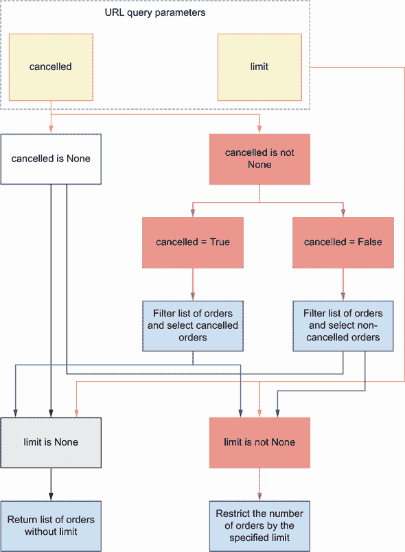

图 6.1 基于查询参数过滤订单的决策流程。如果`cancelled`参数设置为`True`或`False`，我们使用它来过滤订单列表。在此步骤之后，我们检查`limit`参数是否已设置。如果设置了`limit`，我们只从列表中返回相应数量的订单。

现在我们知道了如何将 URL 查询参数添加到我们的端点中，让我们看看我们如何增强我们的验证模式。

## 6.3 验证具有未知字段的负载

到目前为止，我们的 Pydantic 模型对请求负载一直持宽容态度。如果一个 API 客户端发送的负载包含在我们模式中未声明的字段，该负载将被接受。正如您在本节中将会看到的，在某些情况下这可能很方便，但在其他上下文中可能会产生误导或危险。为了避免集成错误，在本节中，我们将学习如何配置 Pydantic 以禁止未知字段的的存在。未知字段是指那些在模式中未定义的字段。

Pydantic 快速回顾正如我们在第二章中看到的，FastAPI 使用 Pydantic 来定义我们 API 的验证模型。Pydantic 是一个流行的 Python 数据验证库，它具有现代接口，允许您使用类型提示来定义数据验证规则。

在第二章中，我们按照宽容读取器模式实现了订单 API 的模式定义（[`martinfowler.com/bliki/TolerantReader.html`](https://martinfowler.com/bliki/TolerantReader.html)），该模式遵循 Postel 的法律，建议在您所做的事情上要保守，在您从他人那里接受的事情上要宽容。¹

在网络 API 领域，这意味着我们必须严格验证发送给客户端的负载，同时允许接收来自 API 客户端的负载中的未知字段。JSON Schema 默认遵循此模式，除非明确声明，否则 JSON Schema 对象接受任何类型的属性。要使用 JSON Schema 禁止未声明的属性，我们将 `additionalProperties` 设置为 `false`。如果我们使用模型组合，一个更好的策略是将 `unevaluatedProperties` 设置为 `false`，因为 `additionalProperties` 会导致不同模型之间的冲突。² OpenAPI 3.1 允许我们使用 `additionalProperties` 和 `unevaluatedProperties`，但 OpenAPI 3.0 只接受 `additionalProperties`。由于我们使用 OpenAPI 3.0.3 来记录我们的 API，我们将使用 `additionalProperties` 来禁止未声明的属性：

```
# file: orders/oas.yaml

    GetOrderSchema:
      additionalProperties: false
      type: object
      required:
        - order
        - id
        - created
        - status
      properties:
        id:
          type: string
          format: uuid
      ...
```

要查看更多关于 `additionalProperties` 的示例，请查看本书 GitHub 仓库中 ch06/orders/oas.yaml 下的订单 API 规范。

宽容读取器模式在 API 未经充分整合或可能频繁更改，并且我们希望能够在不破坏现有客户端集成的情况下对其进行更改时很有用。然而，在其他情况下，例如我们在第二章中看到的（第 2.5 节），宽容读取器模式可能会引入新的错误或导致意外的集成问题。

例如，`OrderItemSchema` 有三个属性：`product`、`size` 和 `quantity`。`product` 和 `size` 是必需属性，但 `quantity` 是可选的，如果缺失，服务器将其分配为默认值 `1`。在某些场景中，这可能会导致令人困惑的情况。想象一下，一个客户端发送了一个包含 `quantity` 属性表示错误的负载，例如以下负载：

```
{
  "order": [
    {
      "product": "capuccino",
      "size": "small",
      "quantit": 5
    }
  ]
}
```

使用容错读取器实现，我们忽略来自负载的字段 `quantit`，并假设 `quantity` 属性缺失，将其值设置为默认的 `1`。这种情况可能会让客户端感到困惑，因为客户端原本打算为 `quantity` 设置不同的值。

API 客户端应该测试他们的代码！你可以争辩说客户端应该测试他们的代码，并在调用服务器之前验证它是否正常工作。你是对的。但在现实生活中，代码往往未经测试，或者测试不充分，服务器上的一点额外验证将有助于这些情况。如果我们检查负载是否存在非法属性，这个错误将被捕获并向客户端报告。

我们如何使用 pydantic 实现这一点？为了禁止未知属性，我们需要在我们的模型中定义一个 `Config` 类，并将 `extra` 属性设置为 `forbid`。

列表 6.4 在模型中禁止额外的属性

```
# file: orders/orders/api/schemas.py

from datetime import datetime
from enum import Enum
from typing import List, Optional
from uuid import UUID

from pydantic import BaseModel, Extra, conint, conlist, validator

...

class OrderItemSchema(BaseModel):
    product: str
    size: Size
    quantity: int = Optional[conint(ge=1, strict=True)] = 1

    class Config:                 ①
        extra = Extra.forbid

class CreateOrderSchema(BaseModel):
    order: List[OrderItemSchema]

    class Config:
        extra = Extra.forbid

class GetOrderSchema(CreateOrderSchema):
    id: UUID
    created: datetime
    status: StatusEnum
```

① 我们使用 Config 禁止在模式中未定义的属性。

让我们测试这个新功能。运行以下命令以启动服务器：

```
$ uvicorn orders.app:app --reload
```

正如我们在第二章中看到的，FastAPI 从代码中生成 Swagger UI，我们可以使用它来测试端点。我们将使用此 UI 使用以下负载测试我们的新验证规则：

```
{
  "order": [
    {
      "product": "string",
      "size": "small",
      "quantit": 5
    }
  ]
}
```

定义 A *Swagger UI* 是表示 REST API 交互式可视化的流行样式。它们提供了一个用户友好的界面，帮助我们理解 API 实现。另一个流行的 REST 接口 UI 是 Redoc ([`github.com/Redocly/redoc`](https://github.com/Redocly/redoc))。

要访问 Swagger UI，请访问 http://127.0.0.1:8000/docs 并按照图 6.2 中的步骤操作，学习如何对 POST `/orders` 端点执行测试。

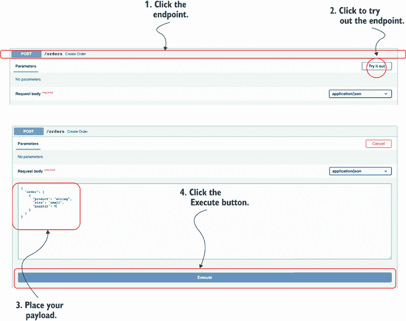

图 6.2 使用 Swagger UI 测试 API：要测试端点，点击端点本身，然后点击“尝试一下”按钮，然后点击“执行”按钮。

运行此测试后，您会看到现在 FastAPI 会验证此负载，并返回一个包含以下信息的有用 422 响应：“不允许额外的字段。”

## 6.4 覆盖 FastAPI 的动态生成规范

到目前为止，我们一直依赖 FastAPI 动态生成的 API 规范来测试、可视化和记录订单 API。动态生成的规范有助于我们理解 API 的实现方式。然而，我们的代码可能包含实现错误，这些错误可能导致文档不准确。此外，API 开发框架在生成 API 文档方面存在局限性，并且通常缺乏对 OpenAPI 某些特性的支持。例如，一个常见的缺失特性是记录 OpenAPI 链接，我们将在第十二章中将其添加到我们的 API 规范中。

要了解 API 应该如何工作，我们需要查看我们的 API 设计文档，它位于 orders/oas.yaml 下，因此是我们部署 API 时想要展示的规范。在本节中，你将学习如何使用我们的 API 设计文档覆盖 FastAPI 动态生成的 API 规范。

要加载 API 规范文档，我们需要 PyYAML，你可以使用以下命令安装：

```
$ pipenv install pyyaml
```

在 orders/app.py 文件中，我们加载 API 规范，并覆盖我们应用程序的对象`openapi`属性。

列表 6.5 覆盖 FastAPI 动态生成的 API 规范

```
# file: orders/orders/app.py

from pathlib import Path

import yaml
from fastapi import FastAPI

app = FastAPI(debug=True)

oas_doc = yaml.safe_load(
    (Path(__file__).parent / '../oas.yaml').read_text()
)                                 ①

app.openapi = lambda: oas_doc     ②

from orders.api import api
```

① 我们使用 PyYAML 加载 API 规范。

② 我们覆盖 FastAPI 的 openapi 属性，使其返回我们的 API 规范。

要能够使用 Swagger UI 测试 API，我们需要将 localhost URL 添加到 API 规范中。打开 orders/oas.yaml 文件，并将 localhost 地址添加到规范的`servers`部分：

```
# file: orders/oas.yaml

servers:
  - url: http://localhost:8000
    description: URL for local development and testing
  - url: https://coffeemesh.com
    description: main production server
  - url: https://coffeemesh-staging.com
    description: staging server for testing purposes only
```

默认情况下，FastAPI 在/docs URL 下提供 Swagger UI，在/openapi.json 下提供 OpenAPI 规范。当我们只有一个 API 时，这很好，但 CoffeeMesh 有多个微服务 API；因此，我们需要多个路径来访问每个 API 的文档。我们将为 orders API 的 Swagger UI 提供/docs/orders，以及其 OpenAPI 规范提供/openapi/orders.json。我们可以在 FastAPI 的应用程序对象初始化器中直接覆盖这些路径：

```
# file: orders/app.py

app = FastAPI(
    debug=True, openapi_url='/openapi/orders.json', docs_url='/docs/orders'
)
```

这标志着我们使用 FastAPI 构建订单 API 之旅的结束。现在是时候继续构建厨房服务的 API 了，我们将使用一个新的堆栈：Flask + marshmallow。让我们开始吧！

## 6.5 厨房 API 概述

在本节中，我们分析了厨房 API 的实现需求。如图 6.3 所示，厨房服务管理客户订单的生产。当客户下单或检查订单状态时，他们通过订单服务与厨房服务接口。CoffeeMesh 的员工也可以使用厨房服务来检查已安排的订单数量并管理它们。

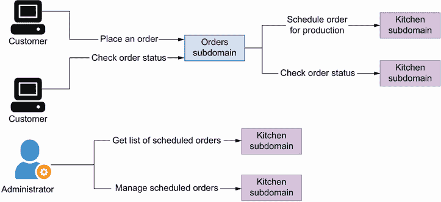

图 6.3 厨房服务安排生产订单，并跟踪它们的进度。CoffeeMesh 的员工使用厨房服务来管理已安排的订单。

厨房 API 的规范位于本书提供的存储库中的 ch06/kitchen/oas.yaml 文件下。厨房 API 包含四个 URL 路径（参见图 6.4 以获取更多说明）：

+   `/kitchen/schedules`—允许我们在厨房中安排生产订单（POST）并检索已安排生产订单的列表（GET）

+   `/kitchen/schedules/{schedule_id}`—允许我们检索已安排订单的详细信息（GET），更新其详细信息（PUT），并从我们的记录中删除它（DELETE）

+   `/kitchen/schedules/{schedule_id}/status`—允许我们读取已安排生产订单的状态

+   `/kitchen/schedules/{schedule_id}/cancel`—允许我们取消一个已计划的订单

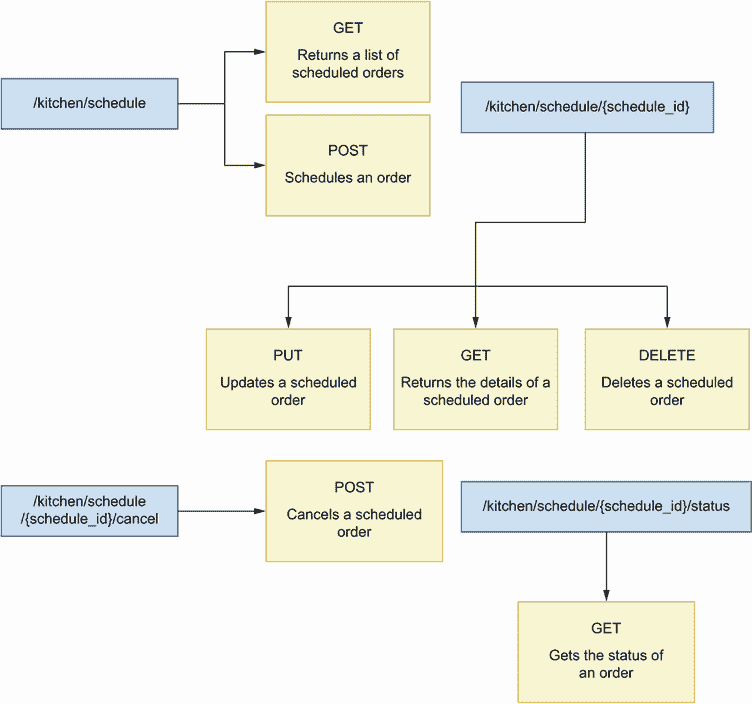

图 6.4 厨房 API 有四个 URL 路径：`/kitchen/schedules`公开一个 GET 和一个 POST 端点；`/kitchen/schedules/{schedule_id}`公开 PUT、GET 和 DELETE 端点；`/kitchen/schedules/{schedule_id}/cancel`公开一个 POST 端点；而`/kitchen/schedules/{schedule_id}/status`公开一个 GET 端点。

厨房 API 包含三个模式：`OrderItemSchema`、`ScheduleOrderSchema`和`GetScheduledOrderSchema`。`ScheduleOrderSchema`表示为生产调度订单所需的负载，而`GetScheduledOrderSchema`表示已调度的订单的详细信息。就像在订单 API 中一样，`OrderItemSchema`表示订单中每个项目的详细信息。

正如我们在第二章中所做的那样，我们将保持实现简单，仅关注 API 层。我们将使用服务管理的调度内存表示来模拟业务层。在第七章中，我们将学习服务实现模式，这将帮助我们实现业务层。

## 6.6 介绍 flask-smorest

本节介绍了我们将用于构建厨房 API 的框架：flask-smorest ([`github.com/marshmallow-code/flask-smorest`](https://github.com/marshmallow-code/flask-smorest))。Flask-smorest 是在 Flask 和 marshmallow 之上构建的 REST API 框架。Flask 是构建 Web 应用的流行框架，而 marshmallow 是一个流行的数据验证库，用于处理复杂数据结构到和从原生 Python 对象的转换。Flask-smorest 建立在两个框架之上，这意味着我们使用 marshmallow 实现我们的 API 模式，我们按照典型 Flask 应用程序的模式实现我们的 API 端点，如图 6.5 所示。正如您将看到的，我们在使用 FastAPI 构建订单 API 时使用的原则和模式可以应用于任何框架，我们将使用相同的方法使用 flask-smorest 构建厨房 API。

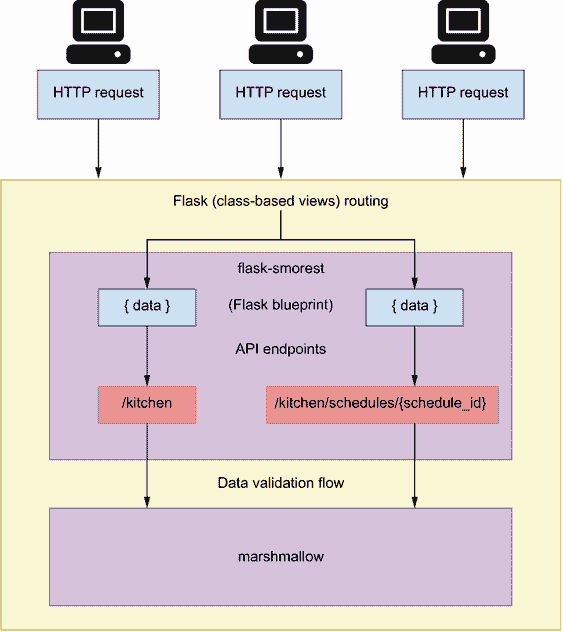

图 6.5 使用 flask-smorest 构建的应用程序架构。Flask-smorest 实现了一个典型的 Flask 蓝图，这允许我们像在标准 Flask 应用程序中一样构建和配置我们的 API 端点。

使用 flask-smorest 构建 API 提供与使用 FastAPI 构建类似的经验，只有两个主要区别：

+   *FastAPI 使用 pydantic 进行数据验证，而 flask-smorest 使用 marshmallow*。这意味着在 FastAPI 中，我们使用原生 Python 类型提示来创建数据验证规则，而在 marshmallow 中，我们使用字段类。

+   *Flask 允许我们使用基于类的视图实现 API 端点*。这意味着我们可以使用一个类来表示一个 URL 路径，并实现其 HTTP 方法作为类的成员方法。基于类的视图帮助你编写更结构化的代码，并将每个 URL 路径的特定行为封装在类中。相比之下，FastAPI 只允许你使用函数定义端点。请注意，Starlette 允许你实现基于类的路由，因此 FastAPI 的这种限制可能在将来消失。

在此基础上，让我们开始厨房 API 的实现！

## 6.7 初始化 API 的 Web 应用程序

在本节中，我们设置环境以开始对厨房 API 进行工作。我们还将创建应用程序的入口点并添加对 Web 服务器的基本配置。这样做，你将学习如何使用 flask-smorest 设置项目以及如何将配置对象注入到 Flask 应用程序中。

Flask-smorest 建立在 Flask 框架之上，因此我们将按照典型 Flask 应用程序的模式来布局我们的 Web 应用程序。为厨房 API 实现创建一个名为 ch06/kitchen 的文件夹。在该文件夹中，复制本书 GitHub 仓库中 ch06/kitchen/oas.yaml 下的厨房 API 规范。oas.yaml 包含厨房 API 的规范。使用`cd`命令导航到 ch06/kitchen 文件夹，并运行以下命令来安装我们进行实现所需的依赖项：

```
$ pipenv install flask-smorest
```

注意：如果你想确保安装的依赖项与我编写本章时使用的版本相同，请从 GitHub 仓库复制 ch06/kitchen/ Pipfile 和 ch06/kitchen/Pipfile.lock 文件到你的本地机器上，并运行`pipenv` `install`。

此外，运行以下命令以激活环境：

```
$ pipenv shell
```

现在我们有了所需的库，让我们创建一个名为 kitchen/app.py 的文件。这个文件将包含一个`Flask`应用程序对象的实例，它代表我们的 Web 服务器。我们还将创建一个 flask-smorest 的`Api`对象的实例，它将代表我们的 API。

列表 6.6 初始化`Flask`应用程序对象和`Api`对象

```
# file: kitchen/app.py

from flask import Flask
from flask_smorest import Api

app = Flask(__name__)     ①

kitchen_api = Api(app)    ②
```

① 我们创建了一个 Flask 应用程序对象的实例。

② 我们创建了一个 flask-smorest 的 Api 对象的实例。

Flask-smorest 需要一些配置参数才能工作。例如，我们需要指定我们使用的 OpenAPI 版本、我们 API 的标题以及我们 API 的版本。我们通过`Flask`应用程序对象传递此配置。Flask 提供了不同的注入配置策略，但最方便的方法是从类中加载配置。让我们创建一个名为 kitchen/config.py 的文件来存储我们的配置参数。在这个文件中，我们创建一个`BaseConfig`类，它包含 API 的通用配置。

列表 6.7 orders API 的配置

```
# file: kitchen/config.py

class BaseConfig:
    API_TITLE = 'Kitchen API'                                              ①
    API_VERSION = 'v1'                                                     ②
    OPENAPI_VERSION = '3.0.3'                                              ③
    OPENAPI_JSON_PATH = 'openapi/kitchen.json'                             ④
    OPENAPI_URL_PREFIX = '/'                                               ⑤
    OPENAPI_REDOC_PATH = '/redoc'                                          ⑥
    OPENAPI_REDOC_URL = 'https://cdn.jsdelivr.net/npm/redoc@next/bundles/redoc.standalone.js' ⑦
    OPENAPI_SWAGGER_UI_PATH = '/docs/kitchen'                              ⑧
    OPENAPI_SWAGGER_UI_URL = 'https://cdn.jsdelivr.net/npm/swagger-ui-
➥ dist/'                                                                  ⑨
```

① 我们 API 的标题

② 我们 API 的版本

③ 我们使用的 OpenAPI 版本

④ 动态生成的 JSON 规范路径

⑤ OpenAPI 规范文件 URL 路径的前缀

⑥ 我们 API 的 Redoc UI 路径

⑦ 用于渲染 Redoc UI 的脚本路径

⑧ 我们 API 的 Swagger UI 路径

⑨ 用于渲染 Swagger UI 的脚本路径

现在配置已经就绪，我们可以将其传递给`Flask`应用程序对象。

列表 6.8 加载配置

```
# file: kitchen/app.py

from flask import Flask
from flask_smorest import Api

from config import BaseConfig          ①
app = Flask(__name__)
app.config.from_object(BaseConfig) ②

kitchen_api = Api(app)
```

① 我们导入我们之前定义的 BaseConfig 类。

② 我们使用 from_object 方法从类中加载配置。

当我们的应用程序入口点和配置就绪并配置好后，让我们继续实现厨房 API 的端点！

## 6.8 实现 API 端点

本节解释了我们如何使用 flask-smorest 实现厨房 API 的端点。由于 flask-smorest 建立在 Flask 之上，因此我们为我们的 API 构建端点的方式与构建任何其他 Flask 应用程序的方式完全相同。在 Flask 中，我们使用 Flask 的`route`装饰器注册我们的端点：

```
@app.route('/orders')
def process_order():
    pass
```

使用`route`装饰器适用于简单情况，但对于更复杂的应用程序模式，我们使用 Flask blueprints。Flask blueprints 允许你为一组 URL 提供特定的配置。为了实现厨房 API 端点，我们将使用 flask-smorest 的`Blueprint`类。Flask-smorest 的`Blueprint`是 Flask 的`Blueprint`的子类，因此它提供了 Flask blueprints 的功能，并增强了额外的功能和配置，用于生成 API 文档，并提供负载验证模型等。

我们可以使用`Blueprint`的`route`装饰器创建端点或 URL 路径。正如你在图 6.6 中看到的，对于只暴露一个 HTTP 方法的 URL 路径，函数是方便的。当一个 URL 暴露多个 HTTP 方法时，使用基于类的路由会更方便，我们使用 Flask 的`MethodView`类来实现这些路由。

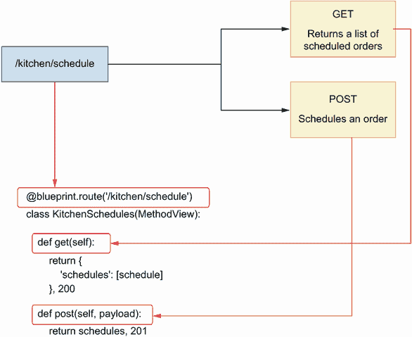

图 6.6 当一个 URL 路径暴露多个 HTTP 方法时，将其实现为一个基于类的视图会更方便，其中类方法实现了暴露的每个 HTTP 方法。

正如你在图 6.7 中看到的，使用`MethodView`，我们将 URL 路径表示为一个类，并将它暴露的 HTTP 方法实现为类的成员方法。

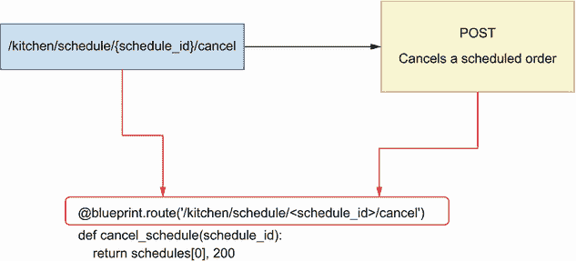

图 6.7 当一个 URL 路径只暴露一个 HTTP 方法时，将其实现为一个基于函数的视图会更方便。

例如，如果我们有一个暴露 GET 和 POST 端点的 URL 路径`/kitchen`，我们可以实现以下基于类的视图：

```
class Kitchen(MethodView):

    def get(self):
        pass

    def post(self):
        pass
```

列表 6.9 展示了如何使用基于类的视图和基于函数的视图实现厨房 API 的端点。列表 6.9 中的内容放入 kitchen/api/api.py 文件中。首先，我们创建 flask-smorest 的 `Blueprint` 的一个实例。`Blueprint` 对象允许我们注册我们的端点并为它们添加数据验证。要实例化 `Blueprint`，我们必须传递两个必需的位置参数：`Blueprint` 本身的名称以及实现 `Blueprint` 路由的模块的名称。在这种情况下，我们使用 `__name__` 属性传递模块的名称，它解析为文件的名称。

一旦 `Blueprint` 被实例化，我们就使用 `route()` 装饰器将我们的 URL 路径注册到它。对于 `/kitchen/schedules` 和 `/kitchen/schedules/{schedule_id}` 路径，我们使用基于类的路由，因为它们暴露了多个 HTTP 方法，而对于 `/kitchen/schedules/{schedule_id}/cancel` 和 `/kitchen/schedules/{schedule_id}/status` 路径，我们使用基于函数的路由，因为它们只暴露一个 HTTP 方法。为了说明目的，我们每个端点都返回一个模拟的调度对象，我们将在第 6.12 节中将它更改为动态的内存中的调度集合。每个函数的返回值是一个元组，其中第一个元素是有效载荷，第二个是响应的状态码。

列表 6.9 订单 API 端点的实现

```
# file: kitchen/api/api.py

import uuid
from datetime import datetime

from flask.views import MethodView
from flask_smorest import Blueprint

blueprint = Blueprint('kitchen', __name__, description='Kitchen API')   ①

schedules = [{                                                          ②
    'id': str(uuid.uuid4()),
    'scheduled': datetime.now(),
    'status': 'pending',
    'order': [
        {
            'product': 'capuccino',
            'quantity': 1,
            'size': 'big'
        }
    ]
}]

@blueprint.route('/kitchen/schedules')                                  ③
class KitchenSchedules(MethodView):                                     ④

    def get(self):                                                      ⑤
        return {
            'schedules': schedules
        }, 200                                                          ⑥

    def post(self, payload):
        return schedules[0], 201

@blueprint.route('/kitchen/schedules/<schedule_id>')                    ⑦
class KitchenSchedule(MethodView):
    def get(self, schedule_id):                                         ⑧
        return schedules[0], 200

    def put(self, payload, schedule_id):
        return schedules[0], 200

    def delete(self, schedule_id):
        return '', 204

@blueprint.route(
    '/kitchen/schedules/<schedule_id>/cancel', methods=['POST']
)                                                                       ⑨
def cancel_schedule(schedule_id):
    return schedules[0], 200

@blueprint.route('/kitchen/schedules/<schedule_id>/status, methods=[GET])
def get_schedule_status(schedule_id):
    return schedules[0], 200
```

① 我们创建 flask-smorest 的 Blueprint 类的一个实例。

② 我们声明一个硬编码的调度列表。

③ 我们使用 Blueprint 的 route() 装饰器来注册一个类或函数作为 URL 路径。

④ 我们将 `/kitchen/schedules` URL 路径实现为一个基于类的视图。

⑤ 在基于类的视图中，每个方法视图的名称都与其实现的 HTTP 方法相对应。

⑥ 我们返回有效载荷和状态码。

⑦ 我们在尖括号内定义 URL 参数。

⑧ 我们在函数签名中包含 URL 路径参数。

⑨ 我们将 `/kitchen/schedules/<schedule_id>/cancel` URL 路径实现为一个基于函数的视图。

现在我们已经创建了蓝图，我们可以在 kitchen/app.py 文件中将它注册到我们的 API 对象。

列表 6.10 将蓝图注册到 API 对象

```
# file: kitchen/app.py

from flask import Flask
from flask_smorest import Api

from api.api import blueprint                ①
from config import BaseConfig

app = Flask(__name__)
app.config.from_object(BaseConfig)

kitchen_api = Api(app)

kitchen_api.register_blueprint(blueprint) ②
```

① 我们导入之前定义的蓝图。

② 我们将蓝图注册到厨房 API 对象。

使用 `cd` 命令导航到 ch06/kitchen 目录，并使用以下命令运行应用程序：

```
$ flask run --reload
```

就像在 Uvicorn 中一样，`--reload` 标志会在你的文件上运行一个监视器，以便当你修改代码时服务器会重新启动。

如果您访问 http://127.0.0.1:5000/docs URL，您将看到由我们之前实现的端点动态生成的交互式 Swagger UI。您还可以看到由 flask-smorest 在 http://127.0.0.1:5000/openapi.json 下动态生成的 OpenAPI 规范。在我们当前的实施阶段，通过 Swagger UI 与端点交互是不可能的。由于我们还没有 marshmallow 模型，flask-smorest 不知道如何序列化数据，因此不返回负载。然而，仍然可以通过 cURL 调用 API 并检查响应。如果您运行`curl http://127.0.0.1:5000/kitchen/schedules`，您将得到我们在厨房/api/api.py 模块中定义的模拟对象。

看起来一切都很顺利，现在是时候通过添加 marshmallow 模型来丰富实现。继续阅读下一节，了解如何做到这一点！

## 6.9 使用 marshmallow 实现负载验证模型

Flask-smorest 使用 marshmallow 模型来验证请求和响应负载。在本节中，我们通过实现厨房 API 的架构来学习如何使用 marshmallow 模型。marshmallow 模型将帮助 flask-smorest 验证我们的负载并序列化我们的数据。

正如您可以在本书 GitHub 仓库的 ch06/kitchen/oas.yaml 文件下的厨房 API 规范中看到的那样，厨房 API 包含三个架构：`ScheduleOrderSchema`架构，其中包含安排订单所需的详细信息；`GetScheduledOrderSchema`，它表示已安排订单的详细信息；以及`OrderItemSchema`，它表示订单中的项目集合。列表 6.11 展示了如何在厨房/api/schemas.py 下实现这些架构作为 marshmallow 模型。

要创建 marshmallow 模型，我们创建 marshmallow 的`Schema`类的子类。我们使用 marshmallow 的字段类，如`String`和`Integer`，来定义模型的属性。Marshmallow 使用这些属性定义来验证负载与模型的一致性。为了自定义 marshmallow 模型的行为，我们使用`Meta`类将`unknown`属性设置为`EXCLUDE`，这指示 marshmallow 无效化具有未知属性的负载。

列表 6.11 订单 API 的架构定义

```
# file: kitchen/api/schemas.py

from marshmallow import Schema, fields, validate, EXCLUDE

class OrderItemSchema(Schema):
    class Meta:                                                 ①
        unknown = EXCLUDE

    product = fields.String(required=True)
    size = fields.String(
        required=True, validate=validate.OneOf(['small', 'medium', 'big'])
    )
    quantity = fields.Integer(
        validate=validate.Range(1, min_inclusive=True), required=True
    )

class ScheduleOrderSchema(Schema):
    class Meta:
        unknown = EXCLUDE

    order = fields.List(fields.Nested(OrderItemSchema), required=True)

class GetScheduledOrderSchema(ScheduleOrderSchema):             ②
    id = fields.UUID(required=True)
    scheduled = fields.DateTime(required=True)
    status = fields.String(
        required=True,
        validate=validate.OneOf(
            ["pending", "progress", "cancelled", "finished"]
        ),
    )

class GetScheduledOrdersSchema(Schema):
    class Meta:
        unknown = EXCLUDE

    schedules = fields.List(
        fields.Nested(GetScheduledOrderSchema), required=True
    )

class ScheduleStatusSchema(Schema):
    class Meta:
        unknown = EXCLUDE

    status = fields.String(
        required=True,
        validate=validate.OneOf(
            ["pending", "progress", "cancelled", "finished"]
        ),
    )
```

① 我们使用 Meta 类来禁止未知属性。

② 我们使用类继承来重用现有架构的定义。

现在我们已经准备好了验证模型，我们可以将它们与我们的视图链接起来。列表 6.12 展示了我们如何使用这些模型在我们的端点上添加请求和响应负载的验证。要向视图添加请求负载验证，我们使用蓝图中的`arguments()`装饰器与 marshmallow 模型结合使用。对于响应负载，我们使用蓝图中的`response()`装饰器与 marshmallow 模型结合使用。

通过使用蓝图中的`response()`装饰器装饰我们的方法和函数，我们不再需要返回负载加状态码的元组。Flask-smorest 会为我们处理添加状态码。默认情况下，flask-smorest 将 200 状态码添加到我们的响应中。如果我们想自定义它，我们只需在装饰器中指定所需的`status_code`参数。

当蓝图中的`arguments()`装饰器验证和反序列化请求负载时，蓝图中的`response()`装饰器不执行验证，仅序列化负载。我们将在 6.11 节中更详细地讨论此功能，并了解我们如何确保在序列化之前验证数据。

列表 6.12 向 API 端点添加验证

```
# file: kitchen/api/api.py

import uuid
from datetime import datetime

from flask.views import MethodView
from flask_smorest import Blueprint

from api.schemas import (
    GetScheduledOrderSchema,
    ScheduleOrderSchema,
    GetScheduledOrdersSchema,
    ScheduleStatusSchema, ①
) 

blueprint = Blueprint('kitchen', __name__, description='Kitchen API')

...

@blueprint.route('/kitchen/schedulles')
class KitchenSchedules(MethodView):

    @blueprint.response(status_code=200, schema=GetScheduledOrdersSchema) ②
    def get(self):
        return {'schedules': schedules}

    @blueprint.arguments(ScheduleOrderSchema)                              ③
    @blueprint.response(status_code=201, schema=GetScheduledOrderSchema) ④
    def post(self, payload):
        return schedules[0]

@blueprint.route('/kitchen/schedules/<schedule_id>')
class KitchenSchedule(MethodView):

    @blueprint.response(status_code=200, schema=GetScheduledOrderSchema)
    def get(self, schedule_id):
        return schedules[0]

    @blueprint.arguments(ScheduleOrderSchema)
    @blueprint.response(status_code=200, schema=GetScheduledOrderSchema)
    def put(self, payload, schedule_id):
        return schedules[0]

    @blueprint.response(status_code=204)
    def delete(self, schedule_id):
        return

@blueprint.response(status_code=200, schema=GetScheduledOrderSchema)
@blueprint.route(
    '/kitchen/schedules/<schedule_id>/cancel', methods=['POST']
)
def cancel_schedule(schedule_id):
    return schedules[0]

@blueprint.response(status_code=200, schema=ScheduleStatusSchema)
@blueprint.route(
    '/kitchen/schedules/<schedule_id>/status', methods=['GET']
)
def get_schedule_status(schedule_id):
    return schedules[0]
```

① 我们导入我们的 Marshmallow 模型。

② 我们使用蓝图中的`response()`装饰器来注册用于响应负载的 Marshmallow 模型。

③ 我们使用蓝图中的`arguments()`装饰器来注册用于请求负载的 Marshmallow 模型。

④ 我们将`status_code`参数设置为所需的状态码。

要查看实现中新的更改的效果，请再次访问 http://127.0.0.1:5000/docs URL。如果您使用`--reload`标志运行服务器，更改将自动重新加载。否则，停止服务器并重新运行。如图 6.8 所示，flask-smorest 现在识别 API 中需要使用的验证模式，因此它们在 Swagger UI 中表示。如果您现在尝试操作 UI，例如通过调用 GET `/kitchen/schedules`端点，您将能够看到响应负载。

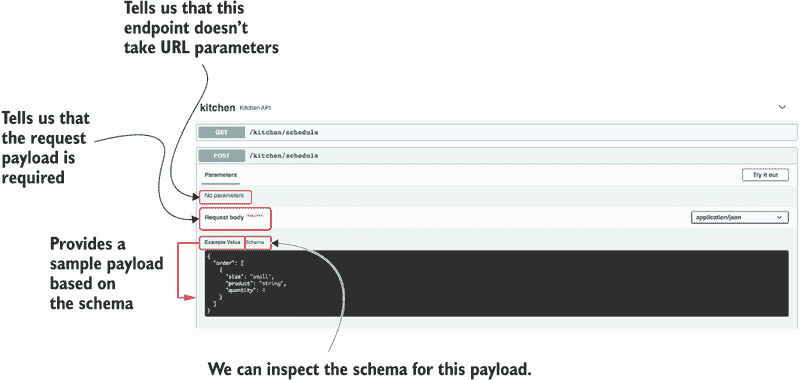

图 6.8 Swagger UI 显示了 POST `/kitchen/schedules`端点请求负载的模式，并提供了示例。

API 看起来不错，我们几乎完成了实现。下一步是向 GET `/kitchen/schedules`端点添加 URL 查询参数。继续下一节，了解如何做到这一点！

## 6.10 验证 URL 查询参数

在本节中，我们学习如何向 GET /`kitchen/` `schedules`端点添加 URL 查询参数。如图表 6.13 所示，GET `/kitchen/schedules`端点接受三个 URL 查询参数：

+   `progress` *(布尔值)*—指示订单是否正在进行中。

+   `limit` *(整数)*—限制端点返回的结果数量。

+   `since` *(日期时间)*—通过订单计划的时间过滤结果。日期时间格式的日期是 ISO 日期，具有以下结构：`YYYY-MM-DDTHH:mm:ssZ`。此日期格式的一个示例是 2021-08-31T01:01:01Z。有关此格式的更多信息，请参阅[`tools.ietf.org/html/rfc3339 #section-5.6`](https://tools.ietf.org/html/rfc3339#section-5.6)。

列表 6.13 GET `/kitchen/schedules` URL 查询参数规范

```
# file: kitchen/oas.yaml

paths:
  /kitchen/schedules:
    get:
      summary: Returns a list of orders scheduled for production
      parameters:
        - name: progress
          in: query
          description: >-
            Whether the order is in progress or not.
            In progress means it's in production in the kitchen.
          required: false
          schema:
            type: boolean
        - name: limit
          in: query
          required: false
          schema:
            type: integer
        - name: since
          in: query
          required: false
          schema:
            type: string
            format: 'date-time'
```

我们如何在 flask-smorest 中实现 URL 查询参数？首先，我们需要创建一个新的 marshmallow 模型来表示它们。我们使用 marshmallow 定义厨房 API 的 URL 查询参数。您可以将 URL 查询参数的模型添加到 kitchen/api/schemas.py 中，与其他 marshmallow 模型一起。

列表 6.14 marshmallow 中的 URL 查询参数

```
# file: kitchen/api/schemas.py

from marshmallow import Schema, fields, validate, EXCLUDE

...

class GetKitchenScheduleParameters(Schema):
    class Meta:
        unknown = EXCLUDE

    progress = fields.Boolean() ①
    limit = fields.Integer()
    since = fields.DateTime()
```

① 我们定义 URL 查询参数的字段。

我们使用蓝图中的 `arguments()` 装饰器注册 URL 查询参数的方案。我们指定方案中定义的属性预期在 URL 中，因此我们将 `location` 参数设置为 `query`。

列表 6.15 向 GET `/kitchen/schedules` 添加 URL 查询参数

```
# file: kitchen/api/api.py

import uuid
from datetime import datetime

from flask.views import MethodView
from flask_smorest import Blueprint

from api.schemas import (
    GetScheduledOrderSchema, ScheduleOrderSchema, GetScheduledOrdersSchema,
    ScheduleStatusSchema, GetKitchenScheduleParameters                     ①
)

blueprint = Blueprint('kitchen', __name__, description='Kitchen API')

...

@blueprint.route('/kitchen/schedules')
class KitchenSchedules(MethodView):

    @blueprint.arguments(GetKitchenScheduleParameters, location='query') ②
    @blueprint.response(status_code=200, schema=GetScheduledOrdersSchema)
    def get(self, parameters):                                             ③
        return schedules

...
```

① 我们导入 URL 查询参数的 marshmallow 模型。

② 我们使用 arguments() 装饰器注册模型，并将位置参数设置为查询。

③ 我们在函数签名中捕获 URL 查询参数。

如果你重新加载 Swagger UI，你会看到 GET `/kitchen/schedules` 端点现在接受三个可选的 URL 查询参数（如图 6.9 所示）。我们应该将这些参数传递给我们的业务层，它将使用它们来过滤结果列表。URL 查询参数以字典的形式出现。如果用户没有设置任何查询参数，则字典将为空，因此评估为 `False`。由于 URL 查询参数是可选的，我们通过使用字典的 `get()` 方法来检查它们的存在。由于 `get()` 在参数未设置时返回 `None`，我们知道当参数的值不是 `None` 时，参数已被设置。我们将在第七章实现业务层，但我们可以使用查询参数来过滤我们的内存中的调度列表。

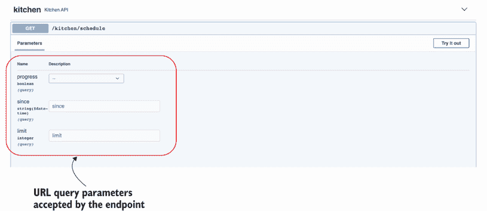

图 6.9 Swagger UI 显示了 GET `/kitchen/schedules` 端点的 URL 查询参数，并提供表单字段，我们可以填写以尝试不同的值。

列表 6.16 在 GET `/kitchen/schedules` 中使用过滤器

```
# file: kitchen/api/api.py

...

@blueprint.route('/kitchen/schedules')
class KitchenSchedules(MethodView):

    @blueprint.arguments(GetKitchenScheduleParameters, location='query') 
    @blueprint.response(status_code=200, schema=GetScheduledOrdersSchema)
    def get(self, parameters):
        if not parameters:                                    ①
            return {'schedules': schedules}

        query_set = [schedule for schedule in schedules]      ②

        in_progress = parameters.get(progress)                ③
        if in_progress is not None:
            if in_progress:
                query_set = [
                    schedule for schedule in schedules
                    if schedule['status'] == 'progress'
                ]
            else:
                query_set = [
                    schedule for schedule in schedules
                    if schedule['status'] != 'progress'
                ]

        since = parameters.get('since')
        if since is not None:
            query_set = [
                schedule for schedule in schedules
                if schedule['scheduled'] >= since
            ]

        limit = parameters.get('limit')
        if limit is not None and len(query_set) > limit: ④
            query_set = query_set[:limit]

        return {'schedules': query_set}                       ⑤
...
```

① 如果没有设置任何参数，我们返回完整的调度列表。

② 如果用户设置了任何 URL 查询参数，我们使用它们来过滤调度列表。

③ 我们通过使用字典的 get() 方法检查每个 URL 查询参数的存在。

④ 如果设置了 limit 并且其值小于 query_set 的长度，我们返回 query_set 的子集。

⑤ 我们返回过滤后的调度列表。

现在我们知道了如何使用 flask-smorest 处理 URL 查询参数，还有一个主题需要讨论，那就是在序列化之前的数据验证。继续到下一节了解更多关于这个主题的信息！

## 6.11 在序列化响应之前验证数据

现在我们有了用于验证请求负载的模式，并且我们已经将它们与我们的路由连接起来，我们必须确保我们的响应负载也被验证。在本节中，我们将学习如何使用 marshmallow 模型来验证数据。我们将使用此功能来验证我们的响应负载，但你也可以使用相同的方法来验证任何类型的数据，例如配置对象。

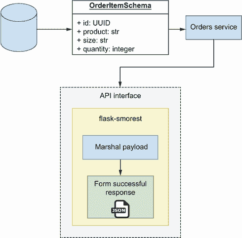

图 6.10 展示了使用 flask-smorest 框架的数据负载的工作流程。响应负载应该来自“可信区域”，因此在序列化之前不进行验证。

当我们在响应中发送负载时，flask-smorest 使用 marshmallow 序列化负载。然而，如图 6.10 所示，它不会验证其是否正确形成。³正如你在图 6.11 中看到的，与 marshmallow 不同，FastAPI 在序列化响应之前会验证我们的数据。

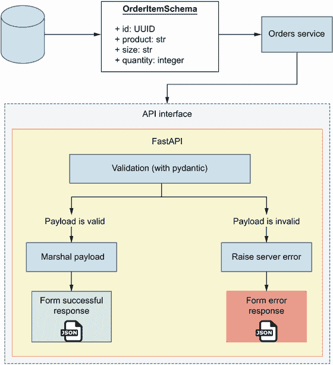

图 6.11 展示了使用 FastAPI 框架的数据负载的工作流程。在序列化响应之前，FastAPI 会验证负载是否符合指定的模式。

marshmallow 在序列化之前不执行验证的事实并不一定是不受欢迎的。事实上，可以认为这是一种期望的行为，因为它将序列化任务与验证负载的任务解耦。有两个理由可以证明为什么 marshmallow 在序列化之前不执行验证([`mng.bz/9Vwx`](http://mng.bz/9Vwx))：

+   它提高了性能，因为验证是缓慢的。

+   从服务器来的数据应该被信任，因此不需要进行验证。

marshmallow 维护者用来证明这一设计决策的理由是合理的。然而，如果你在 API 和网站方面工作的时间足够长，你就会知道，通常情况下，即使是来自你自己的系统，也很少有什么可以信任的。

零信任方法对于健壮的 API 集成至关重要，API 集成失败的原因既可能是服务器发送了错误的负载，也可能是客户端向服务器发送了格式不正确的负载。在可能的情况下，采取零信任方法来设计我们的系统，并验证所有数据，无论其来源如何。

我们从厨房 API 发送的数据来自数据库。在第七章中，我们将学习模式和技巧来确保我们的数据库包含正确格式的数据。然而，即使在最严格的安全措施下，总有可能出现格式不正确的数据进入数据库。尽管这种情况不太可能发生，但我们不希望在这种情况下破坏用户体验，在序列化之前验证我们的数据可以帮助我们做到这一点。

幸运的是，使用 marshmallow 验证数据非常简单。我们只需获取我们想要验证的模式的实例，并使用其 `validate()` 方法传递我们需要验证的数据。如果 `validate()` 函数发现错误，它不会抛出异常。相反，它返回一个包含错误的字典，如果没有错误则返回一个空字典。为了了解这是如何工作的，请在终端中输入 `python` 打开 Python 壳，并运行以下代码：

```
>>> from api.schemas import GetScheduledOrderSchema
>>> GetScheduledOrderSchema().validate({'id': 'asdf'})
{'order': ['Missing data for required field.'], 'scheduled': ['Missing
➥ data for required field.'], 'status': ['Missing data for required 
➥ field.'], 'id': ['Not a valid UUID.']}
```

在第 1 行导入模式后，在第 2 行我们传递一个包含仅 `id` 字段的无效日程表示，在第 3 行 marshmallow 有助于报告 `order`、`scheduled` 和 `status` 字段缺失，以及 `id` 字段不是一个有效的 UUID。我们可以使用这些信息在服务器上抛出一个有用的错误消息，如列表 6.17 所示。我们在构建和返回查询集之前在 GET `/kitchen/schedules` 方法视图中验证日程，并逐个迭代日程列表进行验证。在验证之前，我们创建日程的深拷贝，这样我们就可以将其 `datetime` 对象转换为 ISO 日期字符串，因为这是验证方法期望的格式。如果我们得到验证错误，我们将抛出 marshmallow 的 `ValidationError` 异常，该异常会自动将错误消息格式化为适当的 HTTP 响应。

列表 6.17 在序列化前验证数据

```
# file: kitchen/api/api.py

import copy
import uuid
from datetime import datetime

from flask.views import MethodView
from flask_smorest import Blueprint
from marshmallow import ValidationError                               ①

...

@blueprint.route('/kitchen/schedules')
class KitchenSchedules(MethodView):

    @blueprint.arguments(GetKitchenScheduleParameters, location='query') 
    @blueprint.response(status_code=200, schema=GetScheduledOrdersSchema)
    def get(self, parameters):
        for schedule in schedules:
            schedule = copy.deepcopy(schedule)
            schedule['scheduled'] = schedule['scheduled'].isoformat()
            errors = GetScheduledOrderSchema().validate(schedule)     ②
            if errors:
                raise ValidationError(errors)                         ③
        ...
        return {'schedules': query_set}
...
```

① 我们从 marshmallow 导入 ValidationError 类。

② 我们将验证错误捕获在 errors 变量中。

③ 如果 validate() 函数发现错误，我们将抛出 ValidationError 异常。

请注意，marshmallow 中存在已知的验证问题，尤其是在你的模型包含用于确定哪些字段应该序列化以及哪些字段不应该序列化的复杂配置时（有关更多信息，请参阅 [`github.com/marshmallow-code/marshmallow/issues/682`](https://github.com/marshmallow-code/marshmallow/issues/682)）。此外，请注意，验证是一个已知的过程，速度较慢，因此如果你正在处理大量有效负载，你可能想使用不同的工具来验证你的数据，只验证数据的一部分，或者完全跳过验证。然而，只要可能，你最好对你的数据进行验证。

这标志着厨房 API 功能实现的完成。然而，API 仍然在所有端点返回相同的模拟日程安排。在结束这一章之前，让我们添加一个内存中的日程列表的最小实现，这样我们就可以使我们的 API 动态化。这将允许我们验证所有端点是否按预期工作。

## 6.12 实现内存中的日程列表

在本节中，我们实现了一个简单的日程表内存表示，以便我们可以从 API 中获得动态结果。在本节结束时，我们将能够通过 API 安排订单、更新它们以及取消它们。因为日程表被管理为一个内存列表，所以每次服务器重启时，我们都会丢失之前会话的信息。在下一章中，我们将通过向我们的服务添加持久化层来解决这个问题。

我们在内存中的日程表集合将由一个 Python 列表表示，我们将在 API 层中简单地添加和删除元素。列表 6.18 显示了我们需要对`kitchen/api/api.py`进行的更改，以实现这一点。我们初始化一个空列表并将其分配给名为`schedules`的变量。我们还重构了我们的数据验证代码到一个名为`validate_schedule()`的独立函数中，这样我们就可以在其他视图方法或函数中重用它。当`KitchenSchedules`的`post()`方法接收到日程表有效载荷时，我们设置服务器端属性，如 ID、预定时间和状态。在单例端点中，我们通过遍历日程表列表并检查它们的 ID 来查找请求的日程表。如果找不到请求的日程表，我们返回一个 404 响应。

列表 6.18：日程表的内存实现

```
# file: kitchen/api/api.py

import copy
import uuid
from datetime import datetime

from flask import abort
...

schedules = []                                                             ①

def validate_schedule(schedule):                                           ②
    schedule = copy.deepcopy(schedule)
    schedule['scheduled'] = schedule['scheduled'].isoformat()
    errors = GetScheduledOrderSchema().validate(schedule)
    if errors:
        raise ValidationError(errors)

@blueprint.route('/kitchen/schedules')
class KitchenSchedules(MethodView):

    @blueprint.arguments(GetKitchenScheduleParameters, location='query')  
    @blueprint.response(GetScheduledOrdersSchema)
    def get(self, parameters):
        ...

    @blueprint.arguments(ScheduleOrderSchema)
    @blueprint.response(status_code=201, schema=GetScheduledOrderSchema,)
    def post(self, payload):
        payload['id'] = str(uuid.uuid4())                                  ③
        payload['scheduled'] = datetime.utcnow()
        payload['status'] = 'pending'
        schedules.append(payload)
        validate_schedule(payload)
        return payload

@blueprint.route('/kitchen/schedules/<schedule_id>')
class KitchenSchedule(MethodView):

    @blueprint.response(status_code=200, schema=GetScheduledOrderSchema)
    def get(self, schedule_id):
        for schedule in schedules:
            if schedule['id'] == schedule_id:
                validate_schedule(schedule)
                return schedule
        abort(404, description=f'Resource with ID {schedule_id} not found')④

    @blueprint.arguments(ScheduleOrderSchema)
    @blueprint.response(status_code=200, schema=GetScheduledOrderSchema)
    def put(self, payload, schedule_id):
        for schedule in schedules:
            if schedule['id'] == schedule_id:
                schedule.update(payload)                                   ⑤
                validate_schedule(schedule)
                return schedule
        abort(404, description=f'Resource with ID {schedule_id} not found')

    @blueprint.response(status_code=204)
    def delete(self, schedule_id):
        for index, schedule in enumerate(schedules):
            if schedule['id'] == schedule_id:
                schedules.pop(index)                                       ⑥
                return
        abort(404, description=f'Resource with ID {schedule_id} not found')

@blueprint.response(status_code=200, schema=GetScheduledOrderSchema)
@blueprint.route(
    '/kitchen/schedules/<schedule_id>/cancel', methods=['POST']
)
def cancel_schedule(schedule_id):
    for schedule in schedules:
        if schedule['id'] == schedule_id:
            schedule['status'] = 'cancelled'                               ⑦
            validate_schedule(schedule)
            return schedule
    abort(404, description=f'Resource with ID {schedule_id} not found')

@blueprint.response(status_code=200, schema=ScheduleStatusSchema)
@blueprint.route(
    '/kitchen/schedules/<schedule_id>/status', methods=['GET']
)
def get_schedule_status(schedule_id):
    for schedule in schedules:
        if schedule['id'] == schedule_id:
            validate_schedule(schedule)
            return {'status': schedule['status']}
    abort(404, description=f'Resource with ID {schedule_id} not found')
```

① 我们将日程表初始化为一个空列表。

② 我们将数据验证代码重构为一个函数。

③ 我们设置日程表的服务器端属性，如 ID。

④ 如果找不到日程表，我们返回一个 404 响应。

⑤ 当用户更新日程表时，我们使用有效载荷的内容更新日程表属性。

⑥ 我们从列表中删除日程表并返回一个空响应。

⑦ 我们将日程表的状态设置为已取消。

如果你重新加载 Swagger UI 并测试端点，你会看到你现在能够添加日程表、更新它们、取消它们、列出和过滤它们、获取它们的详细信息以及删除它们。在下一节中，你将学习如何覆盖 flask-smorest 动态生成的 API 规范，以确保我们提供我们的 API 设计而不是实现。

## 6.13 覆盖 flask-smorest 动态生成的 API 规范

正如我们在 6.4 节中学到的，从代码动态生成的 API 规范对于测试和可视化我们的实现是有好处的，但为了发布我们的 API，我们想确保我们提供的是我们的 API 设计文档。为此，我们将覆盖 flask-smorest 动态生成的 API 文档。首先，我们需要安装 PyYAML，我们将使用它来加载 API 设计文档：

```
$ pipenv install pyyaml
```

我们使用自定义的`APISpec`对象覆盖 API 对象的`spec`属性。我们还覆盖了`APISpec`的`to_dict()`方法，以便它返回我们的 API 设计文档。

列表 6.19：覆盖 flask-smorest 动态生成的 API 规范

```
# file: kitchen/app.py

from pathlib import Path

import yaml
from apispec import APISpec
from flask import Flask
from flask_smorest import Api

from api.api import blueprint
from config import BaseConfig

app = Flask(__name__)

app.config.from_object(BaseConfig)

kitchen_api = Api(app)

kitchen_api.register_blueprint(blueprint)

api_spec = yaml.safe_load((Path(__file__).parent / "oas.yaml").read_text())
spec = APISpec(
    title=api_spec["info"]["title"],
    version=api_spec["info"]["version"],
    openapi_version=api_spec["openapi"],
)
spec.to_dict = lambda: api_spec
kitchen_api.spec = spec
```

这标志着我们使用 Python 实现 REST API 的旅程的结束。在下一章中，我们将学习如何遵循最佳实践和有用的设计模式来实施服务的其余部分。事情变得越来越有趣了！

## 摘要

+   你可以使用 FastAPI 和 flask-smorest 等框架在 Python 中构建 REST API，这些框架拥有强大的工具和库生态系统，使构建 API 更加容易。

+   FastAPI 是一个现代 API 框架，它使构建高性能和健壮的 REST API 更加容易。FastAPI 是建立在 Starlette 和 pydantic 之上的。Starlette 是一个高性能的异步服务器框架，而 pydantic 是一个使用类型提示来创建验证规则的数据验证库。

+   Flask-smorest 是建立在 Flask 之上的，并作为一个 Flask 蓝图工作。Flask 是 Python 最受欢迎的框架之一，通过使用 flask-smorest，你可以利用其丰富的库生态系统，使构建 API 更加容易。

+   FastAPI 使用 pydantic 进行数据验证。Pydantic 是一个现代框架，它使用类型提示来定义验证规则，这导致代码更加清晰和易于阅读。默认情况下，FastAPI 验证请求和响应负载。

+   Flask-smorest 使用 marshmallow 进行数据验证。Marshmallow 是一个经过实战考验的框架，它使用类字段来定义验证规则。默认情况下，flask-smorest 不验证响应负载，但你可以通过使用 marshmallow 模型的 `validate()` 方法来验证响应。

+   使用 flask-smorest，你可以使用 Flask 的 `MethodView` 来创建表示 URL 路径的基于类的视图。在基于类的视图中，你将 HTTP 方法实现为类的成员方法，例如 `get()` 和 `post()`。

+   容忍的读取模式遵循波斯尔的法则，该法则建议对 HTTP 请求中的错误保持容忍，并验证响应负载。在设计你的 API 时，你必须平衡容忍的读取模式的好处与由于错误（如拼写错误）导致的集成失败的风险。

* * *

¹ 约翰·波斯尔，编辑，“传输控制协议”，RFC 761，第 13 页，[`tools.ietf.org/html/rfc761`](https://tools.ietf.org/html/rfc761)。

² 要了解为什么在使用模型组合时 `additionalProperties` 不起作用，请参阅 JSON Schema 的 GitHub 存储库中关于此主题的优秀讨论：[`github.com/json-schema-org/json-schema-spec/issues/556`](https://github.com/json-schema-org/json-schema-spec/issues/556)。

³ 在 3.0.0 版本之前，marshmallow 会在序列化之前执行验证（参见变更日志：[`github.com/marshmallow-code/marshmallow/blob/dev/CHANGELOG.rst#300-2019-08-18`](https://github.com/marshmallow-code/marshmallow/blob/dev/CHANGELOG.rst#300-2019-08-18)）。
