# 7 微服务实现模式

本章涵盖

+   六边形架构如何帮助我们设计松散耦合的服务

+   为微服务实现业务层，并使用 SQLAlchemy 实现数据库模型

+   使用仓储模式将数据层从业务层解耦

+   使用工作单元模式确保所有事务的原子性，并使用依赖倒置原则构建对变化具有弹性的软件

+   使用控制反转原则和依赖注入模式解耦相互依赖的组件

在本章中，我们将学习如何实现微服务的业务层。在之前的章节中，我们学习了如何设计和实现 REST API。在这些实现中，我们使用了服务管理的资源的内存表示。我们采取这种方法是为了保持实现简单，并让我们能够专注于服务的 API 层。 

在本章中，我们将通过添加业务层和数据层来完成订单服务的实现。业务层将实现订单服务的功能，例如接收订单、处理其支付或安排其生产。对于其中一些任务，订单服务需要与其他服务的协作，我们将学习处理这些集成模式的有用模式。

数据层将实现服务的数据管理功能。订单服务拥有并管理订单数据，因此我们将实现一个持久化存储解决方案及其接口。然而，作为用户关于订单生命周期的网关，订单服务还需要从其他服务中获取数据——例如，在生产和交付过程中跟踪订单。我们还将学习处理对这些服务访问的有用模式。

为了阐述服务的实现模式，我们还将涵盖保持我们微服务各个部分松散耦合所需的架构布局元素。松散耦合将帮助我们确保我们可以在不修改依赖它的其他组件的情况下更改特定组件的实现。它还将使我们的代码库更易于阅读、维护和测试。本章的代码可在本书提供的存储库中的 ch07 目录中找到。

## 7.1 微服务的六边形架构

本章介绍了六边形架构的概念以及我们将如何将其应用于订单服务的开发。在第二章中，我们介绍了三层架构模式，以帮助我们以模块化和松散耦合的方式组织应用程序的组件。在本节中，我们将进一步应用六边形架构的概念来指导我们的设计。

在 2005 年，Alistair Cockburn 引入了*六边形架构*的概念，也称为*端口和适配器*架构，作为一种帮助软件开发者将代码结构化为松散耦合组件的方法。¹ 如图 7.1 所示，六边形或端口和适配器架构背后的思想是，在任何应用程序中，都有一个核心逻辑块实现了服务的功能，并且围绕这个核心，我们“附加”*适配器*以帮助核心与外部组件通信。例如，Web API 是一个适配器，帮助核心通过互联网与 Web 客户端通信。数据库也是如此，它只是一个帮助服务持久化数据的简单外部组件。如果我们想更换数据库，服务仍然是一样的。因此，数据库也是一个适配器。

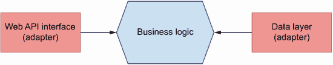

图 7.1 在六边形架构中，我们在应用程序中区分一个核心层，即业务层，它实现了服务的功能。其他组件，如 Web API 接口或数据库，被认为是依赖于业务层的适配器。

这如何帮助我们构建松散耦合的服务？六边形架构要求我们将服务的核心逻辑和适配器的逻辑严格分离。换句话说，实现我们的 Web API 层的逻辑不应该干扰核心业务逻辑的实现。同样，对于数据库也是如此：无论我们选择什么技术，以及其设计和特性，它都不应该干扰核心业务逻辑。我们如何实现这一点？通过在核心业务层和适配器之间构建端口。*端口*是技术无关的接口，用于连接业务层和适配器。在本章的后面部分，我们将学习一些设计模式，这些模式将帮助我们设计那些端口或接口。

当确定核心业务逻辑和适配器之间的关系时，我们应用依赖倒置原则，该原则指出（见图 7.2 以获得澄清）

+   高级模块不应该依赖于低级细节。相反，两者都应该依赖于抽象，例如接口。例如，在保存数据时，我们希望通过一个不需要了解数据库特定实现细节的接口来完成。无论是 SQL 数据库、NoSQL 数据库还是缓存存储，接口应该是相同的。

+   抽象不应该依赖于细节。相反，细节应该依赖于抽象。² 例如，在设计业务层和数据层之间的接口时，我们希望确保接口不会根据数据库的实现细节而改变。相反，我们修改数据层以使其与接口兼容。换句话说，数据层依赖于接口，而不是相反。

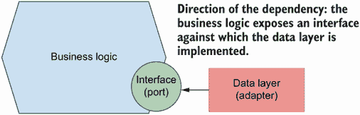

图 7.2 我们应用依赖倒置原则来确定哪些组件驱动变化。在六边形架构中，这意味着我们的适配器将依赖于核心业务层公开的接口。

定义：*依赖倒置原则*鼓励我们针对接口设计我们的软件，并确保我们不会在组件的低级细节之间创建依赖。

依赖倒置的概念经常与控制反转和控制注入的概念一起出现。这些是相关但不同的概念。正如我们在第 7.5 节中将要看到的，控制反转原则包括通过执行上下文（也称为控制反转容器）提供代码依赖。为了提供这样的依赖，我们可以使用依赖注入模式，我们将在第 7.5 节中描述它。

这在实践中意味着我们应该让适配器依赖于核心业务逻辑公开的接口。也就是说，我们的 API 层了解核心业务逻辑的接口是可以的，但我们的业务逻辑了解 API 层的具体细节或 HTTP 协议的低级细节是不可以的。对于数据库也是如此：我们的数据层应该知道应用程序的工作方式以及如何适应我们选择的存储技术，但核心业务层对数据库的了解应该是具体的。我们的业务层将公开一个接口，所有其他组件都将针对它实现。

我们到底是通过依赖倒置原则来反转什么？这个原则反转了我们对软件的思考方式。不是先构建软件的低级细节，然后再在其上构建接口的更传统的方法，依赖倒置原则鼓励我们首先考虑接口，然后针对它们构建低级细节。³

正如图 7.3 所示，当我们谈到订单服务时，我们将有一个核心包来实现服务的功能。这包括处理订单及其支付、安排其生产或跟踪其进度的能力。核心服务包将向应用程序的其他组件公开接口。另一个包实现了 Web API 层，我们的 API 模块将使用业务层接口中的函数和类来响应用户的请求。另一个包实现了数据层，它知道如何与数据库交互并返回业务对象供核心业务层使用。

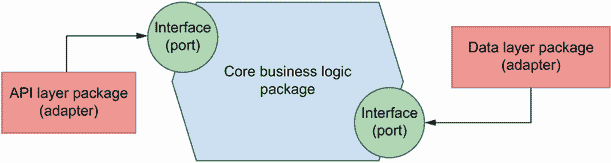

图 7.3 订单服务由三个包组成：核心业务逻辑，它实现了服务的功能；API 层，它允许客户端通过 HTTP 与服务交互；以及数据层，它允许服务与数据库交互。核心业务逻辑暴露了 API 层和数据层实现的接口。

现在我们知道了我们将如何构建应用程序的结构，是时候开始实现了！在下一节中，我们将设置环境以开始处理服务。

## 7.2 设置环境和项目结构

在本节中，我们设置环境以处理订单服务并概述项目的高级结构。与前面的章节一样，我们将使用 Pipenv 来管理我们的依赖项。运行以下命令以设置 Pipenv 环境并激活它：

```
$ pipenv --three
$ pipenv shell
```

我们将在以下章节中按需安装我们的依赖项。或者，如果您愿意，从 ch07 文件夹下的 GitHub 仓库复制 Pipfile 和 Pipfile.lock 文件，然后运行`pipenv install`。

我们的服务实现将位于名为 orders 的文件夹下，所以请创建它。为了加强核心业务层与 API 和数据库适配器之间的关注点分离，我们将它们各自实现于不同的目录中，如图 7.4 所示。业务层将位于 orders/orders_service。由于 API 层是一个网络组件，它将位于 orders/web，其中包含订单服务的网络适配器。在这种情况下，我们只包含一种类型的网络适配器，即 REST API，但没有任何东西阻止您添加一个从服务器返回动态渲染内容的网络适配器，就像在更传统的 Django 应用程序中做的那样。

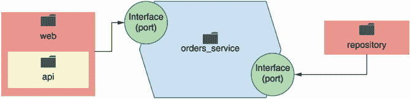

图 7.4 为了加强关注点分离，我们在不同的目录中实现应用程序的每一层：orders_service 用于核心业务层；repository 用于数据层；web/api 用于 API 层。

数据层将位于 orders/repository。虽然“repository”这个名字对于我们的数据层来说可能看起来不太合适，但我们选择这个名字是因为我们将实现仓库模式来与我们的数据接口。这个概念将在 7.4 节中变得更加清晰。在第二章和第六章中，我们介绍了 API 层的实现，所以请将 GitHub 仓库下 ch07/order/web 中的文件复制到您的本地目录。请注意，API 实现已经为本章进行了适配。

列表 7.1 订单服务的高级结构

```
├── Pipfile                ①
├── Pipfile.lock
└── orders                 ②
    ├── orders_service     ③
    ├── repository         ④
    └── web                ⑤
        ├── api            ⑥
        │   ├── api.py
        │   └── schemas.py
        └── app.py         ⑦
```

① Pipfile 包含依赖项列表。

② 订单服务的完整实现

③ 业务层

④ 数据层

⑤ 网络适配器

⑥ REST API 实现

⑦ 此文件包含我们的网络服务器对象实例。

由于文件夹结构已更改，我们的 FastAPI 应用程序对象的路径也发生了变化，因此现在运行 API 服务器的命令是

```
$ uvicorn orders.web.app:app --reload
```

由于文件夹结构的变化，一些导入路径和文件位置也发生了变化。有关更改的完整列表，请参阅 GitHub 存储库中本书的 ch07 文件夹。

现在我们已经设置了项目并准备开始，是时候着手实现部分了。进入下一节，了解如何将数据库模型添加到服务中！

## 7.3 实现数据库模型

在上一节中，我们学习了如何将我们的项目结构划分为三个不同的层：核心业务层、API 层和数据层。这种结构强化了每一层之间的关注点分离，正如我们在 7.1 节中学到的六边形架构模式所推荐的那样。现在我们知道了代码的结构，是时候专注于实现了。在本节中，我们将定义订单服务的数据库模型；也就是说，我们将设计数据库表及其字段。我们从数据库开始实现，因为它将有助于本章其余部分的讨论。在实际环境中，你可能会从业务层开始，模拟数据层，并在每个层之间迭代，直到完成实现。只需记住，本章中我们采取的线性方法并不是要反映实际的开发过程，而是旨在说明我们想要解释的概念。

为了使本章内容简单易懂，我们将使用 SQLite 作为我们的数据库引擎。SQLite 是一个基于文件的数据库系统。使用它时，我们不需要设置和运行服务器，就像使用 PostgreSQL 或 MySQL 那样，也不需要配置即可开始使用。Python 的核心库内置了对 SQLite 的支持，这使得它成为在准备迁移到生产就绪数据库系统之前进行快速原型设计和实验的合适选择。

我们不会手动管理数据库连接和查询。也就是说，我们不会编写自己的 SQL 语句来与数据库交互。相反，我们将使用 SQLAlchemy——在 Python 生态系统中最受欢迎的 ORM（对象关系映射器）。ORM 是一个实现数据映射模式的框架，它允许我们将数据库中的表映射到对象上。

**定义** 一个 *数据映射器* 是围绕数据库表和行的一个对象包装器。它以类方法的形式封装数据库操作，并允许我们通过类属性访问数据字段。⁴

如您在图 7.5 中所见，使用 ORM 可以使管理我们的数据更容易，因为它为我们提供了数据库表的一个类接口。这使我们能够利用面向对象编程的好处，包括向我们的数据库模型添加自定义方法和属性，以增强其功能并封装其行为。

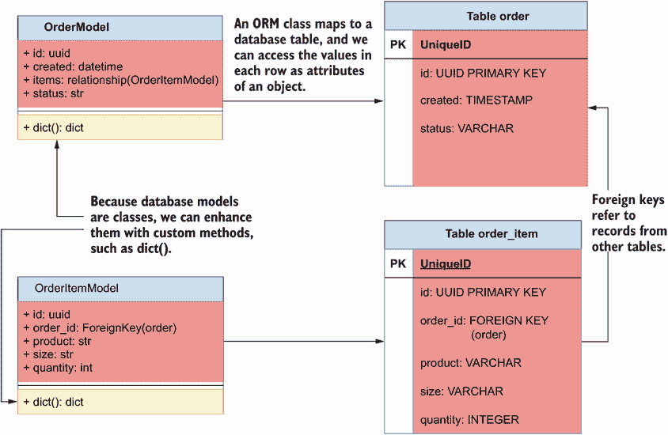

图 7.5 使用 ORM，我们可以将数据模型实现为映射到数据库表的类。由于模型是类，我们可以通过添加自定义方法来增强它们，以添加新的功能。

随着时间的推移，我们的数据库模型将会发生变化，我们需要能够跟踪这些变化。改变我们数据库的模式被称为*迁移*。随着数据库的发展，我们将积累越来越多的迁移。我们需要跟踪我们的迁移，因为它们允许我们在不同的环境中可靠地复制数据库模式，并且有信心地将数据库更改部署到生产环境中。为了管理这个复杂的任务，我们将使用 Alembic。Alembic 是一个与 SQLAlchemy 无缝集成的模式迁移库。

让我们首先通过运行以下命令来安装这两个库：

```
$ pipenv install sqlalchemy alembic
```

在我们开始工作于数据库模型之前，让我们设置 Alembic。（如需更多帮助，请查看我关于使用 SQLAlchemy 设置 Alembic 的视频教程，链接为 [`youtu.be/nt5sSr1A_qw`](https://youtu.be/nt5sSr1A_qw)。）运行以下命令以创建一个包含我们数据库所有迁移历史的 migrations 文件夹：

```
$ alembic init migrations
```

这将创建一个名为 migrations 的文件夹，其中包含一个名为 env.py 的配置文件和一个 versions/ 目录。versions/ 目录将包含迁移文件。设置命令还会创建一个名为 alembic.ini 的配置文件。为了使 Alembic 能够与 SQLite 数据库一起工作，打开 alembic.ini，找到包含 `sqlalchemy.url` 变量声明的行，并将其替换为以下内容：

```
sqlalchemy.url = sqlite:///orders.db
```

提交 alembic 生成的文件迁移文件夹包含了管理我们数据库模式变化所需的所有信息，因此你应该提交这个文件夹，以及 alembic.ini。这将允许你在新的环境中复制数据库设置。

此外，打开 migrations/env.py 并找到包含以下内容的行：⁵

```
# from myapp import mymodel
# target_metadata = mymodel.Base.metadata
target_metadata = None
```

将其替换为以下内容：

```
from orders.repository.models import Base
target_metadata = Base.metadata
```

通过将`target_metadata`设置为我们的`Base`模型的`metadata`，我们使 Alembic 能够加载我们的 SQLAlchemy 模型并从它们生成数据库表。接下来，我们将实现我们的数据库模型。在我们跳入实现之前，让我们暂停一下，思考我们需要多少个模型以及每个模型应该具有哪些属性。订单服务的核心对象是订单。用户下单、支付、更新或取消订单。订单有一个生命周期，我们将通过`status`属性来跟踪它。我们将使用以下属性列表来定义我们的订单模型：

+   *ID*—订单的唯一标识符。我们将使用通用唯一识别码（UUID）的格式。如今，使用 UUID 而不是递增整数相当常见。UUID 在分布式系统中表现良好，并且有助于隐藏数据库中存在的订单数量信息，从而保护用户。

+   *创建日期*—订单下单的时间。

+   *项目*—订单中包含的项目列表以及每种产品的数量。由于一个订单可以与任何数量的项目相关联，我们将使用不同的项目模型，并在订单和项目之间创建一对一的关系。

+   *状态*—订单在整个系统中的状态。订单可以有以下状态：

    +   *创建*—订单已下单。

    +   *已支付*—订单已成功支付。

    +   *进度*—订单正在厨房生产中。

    +   *已取消*—订单已被取消。

    +   *已派遣*—订单正在向用户配送。

    +   *已送达*—订单已送达用户。

+   *调度 ID*—厨房服务中订单的 ID。此 ID 由厨房服务在调度订单生产后创建，我们将使用它来跟踪其在厨房中的进度。

+   *配送 ID*—配送服务中订单的 ID。此 ID 由配送服务在调度发货后创建，我们将使用它来跟踪其在配送过程中的进度。

当用户下单时，他们可以将任何数量的项目添加到订单中。每个项目包含用户选择的产品信息、产品的尺寸以及用户希望购买的数量。订单和项目之间存在一对一的关系，因此我们将实现一个项目模型并将它们通过外键关系链接起来。项目模型将具有以下属性列表：

+   *ID*—以 UUID 格式表示的项目唯一标识符。

+   *订单 ID*—表示项目所属订单 ID 的外键。这正是我们能够连接属于同一订单的项目和订单的原因。

+   *产品*—用户选择的产品。

+   *尺寸*—产品的尺寸。

+   *数量*—用户希望购买的产品数量。

我们将 SQLAlchemy 模型放在我们创建的 orders/repository 文件夹下，以封装我们的数据层，在名为 orders/repository/models.py 的文件中。我们将使用这些类与数据库接口，并依赖 SQLAlchemy 在幕后将这些模型转换为相应的数据库表。列表 7.2 显示了订单服务的数据库模型定义。首先，我们使用 SQLAlchemy 的`declarative_base()`函数创建一个声明性基模型。声明性基模型是一个可以将 ORM 类映射到数据库表和列的类，因此所有我们的数据库模型都必须继承自它。我们通过将它们设置为 SQLAlchemy 的`Column`类的实例来将类属性映射到特定的数据库列。

要将一个属性映射到另一个模型，我们使用 SQLAlchemy 的`relationship()`函数。在列表 7.2 中，我们使用`relationship()`创建`OrderModel`的`items`属性与`OrderItemModel`模型之间的一对多关系。这意味着我们可以通过`OrderModel`的`items`属性访问订单中的项目列表。每个项目也通过`order_id`属性映射到它所属的订单，该属性被定义为外键列。此外，`relationship()`的`backref`参数允许我们通过一个名为`order`的属性直接从项目访问完整的订单对象。

由于我们希望我们的 ID 以 UUID 格式，我们创建了一个函数，SQLAlchemy 可以使用它来生成值。如果我们后来切换到具有内置 UUID 值生成支持的数据库引擎，我们将让数据库生成 ID。每个数据库模型都增强了`dict()`方法，允许我们以字典格式输出记录的属性。由于我们将使用此方法将数据库模型转换为业务对象，`dict()`方法仅返回与业务层相关的属性。

列表 7.2 SQLAlchemy 的订单服务模型

```
# file: orders/repository/models.py

import uuid
from datetime import datetime

from sqlalchemy import Column, Integer, String, ForeignKey, DateTime
from sqlalchemy.ext.declarative import declarative_base
from sqlalchemy.orm import relationship

Base = declarative_base()                                          ①

def generate_uuid():                                               ②
    return str(uuid.uuid4())

class OrderModel(Base):                                            ③
    __tablename__ = 'order'                                        ④

    id = Column(String, primary_key=True, default=generate_uuid)   ⑤
    items = relationship('OrderItemModel', backref='order')        ⑥
    status = Column(String, nullable=False, default='created')
    created = Column(DateTime, default=datetime.utcnow)
    schedule_id = Column(String)
    delivery_id = Column(String)

    def dict(self):                                                ⑦
        return {
            'id': self.id,
            'items': [item.dict() for item in self.items],         ⑧
            'status': self.status,
            'created': self.created,
            'schedule_id': self.schedule_id,
            'delivery_id': self.delivery_id,
        }

class OrderItemModel(Base):
    __tablename__ = 'order_item'

    id = Column(String, primary_key=True, default=generate_uuid)
    order_id = Column(Integer, ForeignKey('order.id'))
    product = Column(String, nullable=False)
    size = Column(String, nullable=False)
    quantity = Column(Integer, nullable=False)

    def dict(self):
        return {
            'id': self.id,
            'product': self.product,
            'size': self.size,
            'quantity': self.quantity
        }
```

① 我们创建我们的声明性基模型。

② 自定义函数用于为我们的模型生成随机 UUID

③ 所有我们的模型都必须继承自 Base。

④ 映射到此模型的表名

⑤ 每个类属性都通过 Column 类映射到数据库列。

⑥ 我们使用 relationship()与 OrderItemModel 模型创建一对一关系。

⑦ 自定义方法以将我们的对象渲染为 Python 字典

⑧ 我们对每个项目调用 dict()以获取其字典表示形式。

要将模型应用到数据库，请在 ch07 目录下运行以下命令：

```
$ PYTHONPATH=`pwd` alembic revision --autogenerate -m "Initial migration"
```

这将在 migrations/versions 下创建一个迁移文件。我们使用 `pwd` 命令将 `PYTHONPATH` 环境变量设置为当前目录，这样 Python 就会相对于这个目录查找我们的模型。你应该提交你的迁移文件，并将它们保存在你的版本控制系统（例如，Git 仓库）中，因为它们将允许你在不同的环境中重新创建你的数据库。你可以查看这些文件来了解 SQLAlchemy 将执行哪些数据库操作以应用迁移。要应用迁移并在数据库中为这些模型创建模式，请运行以下命令：

```
$ PYTHONPATH=`pwd` alembic upgrade heads 
```

这将在我们的数据库中创建所需的模式。现在，我们的数据库模型已经实现，我们的数据库包含所需的模式，是时候进行下一步了。前往下一节了解存储库模式！

## 7.4 实现数据访问的存储库模式

在上一节中，我们学习了如何为订单服务设计数据库模型，并通过迁移管理数据库模式的变化。随着我们的数据库模型准备就绪，我们可以与数据库交互以创建订单并管理它们。现在我们必须决定如何使数据对业务层可用。在本节中，我们将首先讨论将业务层与数据层连接的不同策略，我们将了解存储库模式是什么，以及我们如何使用它来在业务层和数据库之间创建接口。然后我们将继续实现它。

### 7.4.1 存储库模式的案例：它是什麼，为什么它有用？

在本节中，我们讨论了从业务层与数据库交互的不同策略，并介绍了存储库模式作为一种策略，帮助我们解耦业务层与数据库实现细节。

如图 7.6 所示，一种常见的实现业务层和数据库之间交互的策略是在业务层直接使用数据库模型。我们的数据库模型已经包含了关于订单的数据，因此我们可以通过实现业务功能的方法来增强它们。这被称为 *活动记录模式*，它代表同时携带数据和领域逻辑的对象。⁶ 当我们有一个服务能力和数据库操作之间的一对一映射，或者当我们不需要多个领域的协作时，这种模式是有用的。

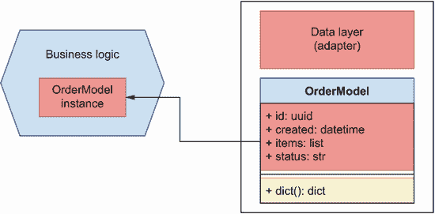

图 7.6 一种常见的实现数据层和业务层之间交互的方法是直接在业务层使用数据库模型。

这种方法适用于简单情况；然而，它将业务层的实现与数据库和所选的 ORM 框架耦合在一起。如果我们想稍后更改 ORM 框架，或者如果我们想切换到不涉及 SQL 的不同数据存储技术，会发生什么？在这些情况下，我们不得不修改我们的业务层。这违反了我们第 7.1 节中介绍的原则。记住，数据库是订单服务用来持久化数据的一个适配器，数据库的实现细节不应该泄露到业务逻辑中。相反，数据访问将由我们的数据访问层封装。

为了使业务层与数据层解耦，我们将使用仓库模式。这种模式为我们提供了数据的内存列表接口。这意味着我们可以从列表中获取、添加或删除订单，而仓库将负责将这些操作转换为数据库特定的命令。使用仓库模式意味着数据层向业务层提供了一个一致的接口，以便与数据库交互，无论我们使用哪种数据库技术来存储我们的数据。无论是使用 SQL 数据库如 PostgreSQL，还是使用 NoSQL 数据库如 MongoDB，或者使用内存缓存如 Redis，仓库模式的接口都将保持不变，并将封装与数据库交互所需的任何特定操作。图 7.7 说明了仓库模式如何帮助我们反转数据层和业务层之间的依赖关系。

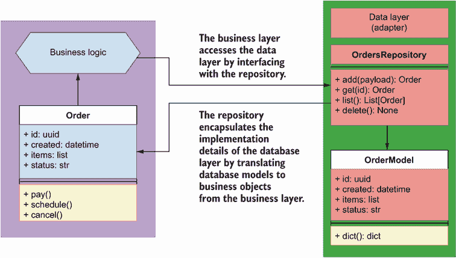

图 7.7 仓库模式通过向业务层公开内存列表接口来封装数据层的实现细节，并将数据库模型转换为业务对象。

定义 仓库模式是一种软件开发模式，它为我们提供数据存储的内存列表接口。这有助于我们使我们的组件与数据库的低级实现细节解耦。仓库负责管理与数据库的交互，并为我们的组件提供一个一致的接口，无论使用哪种数据库技术。这允许我们在不更改核心业务逻辑的情况下更改数据库系统。

现在我们知道了如何使用仓库模式允许业务层与数据库接口，同时将其实现从数据库的低级细节中解耦，我们将学习如何实现仓库模式。

### 7.4.2 实现仓库模式

我们如何实现仓储模式？只要我们满足以下约束条件，我们可以使用不同的方法来实现：仓储执行的操作不能由仓储本身提交。这意味着什么？这意味着当我们向仓储添加一个订单对象时，仓储会将订单添加到数据库会话中，但不会提交更改。相反，提交更改的责任将落在`OrdersService`的消费者（即 API 层）身上。图 7.8 展示了这个过程。

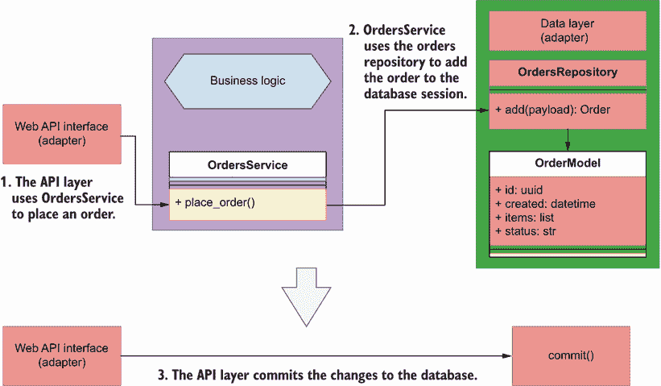

图 7.8 使用仓储模式，API 层使用`OrdersService`的`place_order()`功能下单。为了下单，`OrdersService`与订单仓储接口将订单添加到数据库。最后，API 层必须提交更改以在数据库中持久化。

为什么我们不能在仓储内提交数据库更改？首先，因为仓储就像是我们数据在内存中的列表表示，因此它没有数据库会话和事务的概念；其次，因为仓储不是执行数据库事务的正确地方。相反，仓储被调用的上下文提供了执行数据库事务的正确上下文。在许多情况下，我们的应用程序将执行涉及一个或多个仓储以及调用其他服务的多个操作。例如，图 7.9 显示了处理支付所涉及的操作数量：

1.  API 层接收用户的请求，并使用`OrdersService`的`pay_order()`方法处理请求。

1.  `OrdersService`与支付服务接口处理支付。

1.  如果支付成功，`OrdersService`将与厨房服务安排订单。

1.  `OrdersService`使用订单仓储更新数据库中订单的状态。

1.  如果所有之前的操作都成功，API 层将在数据库中提交事务；否则，它将回滚更改。

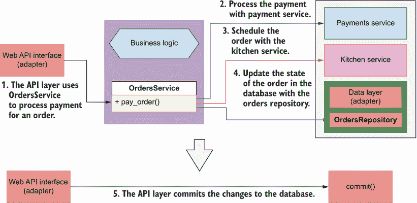

图 7.9 在某些情况下，`OrdersService`必须与多个仓储或服务接口进行交互以执行操作。在这个例子中，`OrdersService`与支付服务接口以处理支付，然后与厨房服务接口安排订单生产，最后通过订单仓储更新订单的状态。所有这些操作必须同时成功或失败，相应地提交或回滚的责任落在 API 层。

这些步骤可以同步进行，一个接一个，也可以异步进行，没有特定的顺序，但无论采用哪种方法，所有步骤都必须全部成功或全部失败。作为执行上下文的单元，API 层的责任是确保所有更改都按要求提交或回滚。在第 7.6 节中，我们将学习 API 层如何精确地控制数据库会话并提交事务。

至少，一个仓库模式实现包括一个类，该类分别暴露`get()`和`add()`方法，以便能够从仓库中检索和添加对象。为了我们的目的，我们还将实现以下方法：`update()`、`delete()`和`list()`。这将简化仓库的 CRUD 接口。

在这个背景下，以下问题值得考虑：当我们通过仓库获取数据时，仓库应该返回什么类型的对象？在许多实现中，你会看到仓库返回数据库模型实例（即，在`orders/repository/models.py`中定义的类）。在本章中，我们不会这样做。相反，我们将返回代表业务层领域订单的对象。为什么通过仓库返回数据库模型实例是一个坏主意？因为它违背了仓库的目的，即解耦业务层和数据层。记住，我们可能想要改变我们的持久化存储技术或我们的 ORM 框架。如果发生这种情况，我们在第 7.2 节中实现的数据库类将不再存在，而且不能保证新的框架会允许我们返回具有相同接口的对象。因此，我们不希望将我们的业务层与它们耦合。图 7.10 说明了业务层和订单仓库之间的关系。

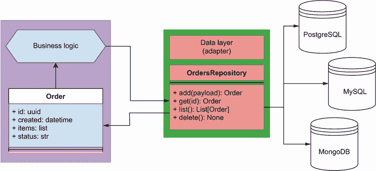

图 7.10 仓库模式封装了用于管理我们数据的持久化存储技术的实现细节。我们的业务层只与仓库打交道，因此我们可以自由地将我们的持久化存储解决方案更改为不同的技术，而不会影响我们的核心应用程序实现。

我们的订单仓库实现将位于`orders/repository/orders_repository.py`下。列表 7.3 显示了订单仓库的实现。它接受一个表示数据库会话的必需参数。对象被添加到或从数据库会话中删除。`add()`和`update()`方法接受表示订单的 Python 字典形式的负载。我们的负载相当简单，所以在这里字典就足够了，但如果我们有更复杂的负载，我们应该考虑使用对象。

除了`delete()`方法外，仓库的所有方法都从业务层返回`Order`对象（有关`Order`的实现细节，请参阅第 7.5 节）。要创建`Order`的实例，我们使用列表 7.2 中的自定义`dict()`方法传递 SQLAlchemy 模型的字典表示。在`add()`方法中，我们还通过`Order`的`order_`参数包含对实际 SQLAlchemy 模型的指针。正如我们将在第 7.5 节中看到的，这个指针将帮助我们提交数据库事务后访问订单的 ID。

`OrdersRepository`的`get()`、`update()`和`delete()`方法使用相同的逻辑在返回、更新或删除之前拉取记录，因此我们定义了一个通用的`_get()`方法，它知道如何根据 ID 和可选的过滤器获取记录。我们使用 SQLAlchemy 查询对象的`first()`方法获取记录。`first()`如果存在则返回记录的实例，否则返回`None`。或者，也可以使用`one()`方法，如果记录不存在则引发错误。`_get()`返回数据库记录，因此它不是为服务层设计的，我们通过在方法名前加下划线来表示这一点。

`list()`方法接受一个`limit`参数和可选的过滤器。我们使用 SQLAlchemy 的`query`对象动态构建我们的查询。我们还利用 SQLAlchemy 的`filter_by()`方法将额外的过滤器作为关键字参数包含在查询中，并通过添加`limit`参数来限制查询结果。最后，我们使用我们在列表 7.2 中实现的`dict()`方法将数据库记录转换为`Order`对象，以便业务层使用。

仓库实现与 SQLAlchemy 的`Session`对象的方法紧密耦合，但它也封装了这些细节，并且对于业务层来说，仓库看起来是一个接口，我们向其提交 ID 和有效负载，并返回`Order`对象。这是仓库的目的：封装和隐藏数据层的实现细节，以便于业务层。这意味着如果我们切换到不同的 ORM 框架或不同的数据库系统，我们只需要修改仓库。

列表 7.3 订单仓库

```
# file: orders/repository/orders_repository.py

from orders.orders_service.orders import Order
from orders.repository.models import OrderModel, OrderItemModel

class OrdersRepository:
    def __init__(self, session):                                      ①
        self.session = session

    def add(self, items):
        record = OrderModel(
            items=[OrderItemModel(**item) for item in items]
        )                                                             ②
        self.session.add(record)                                      ③
        return Order(**record.dict(), order_=record)                  ④

    def _get(self, id_):                                              ⑤
        return (
            self.session.query(OrderModel)
            .filter(OrderModel.id == str(id_))
            .filter_by(**filters)
            .first()
        )                                                             ⑥

    def get(self, id_):
        order = self._get(id_)                                        ⑦
        if order is not None:                                         ⑧
            return Order(**order.dict())

    def list(self, limit=None, **filters):                            ⑨
        query = self.session.query(OrderModel)                        ⑩
        if 'cancelled' in filters:                                    ⑪
            cancelled = filters.pop('cancelled')
            if cancelled:
                query = query.filter(OrderModel.status == 'cancelled')
            else:
                query = query.filter(OrderModel.status != 'cancelled')
        records = query.filter_by(**filters).limit(limit).all()
        return [Order(**record.dict()) for record in records]         ⑫
    def update(self, id_, **payload):
        record = self._get(id_)
        if 'items' in payload:                                        ⑬
            for item in record.items:
                self.session.delete(item)
            record.items = [
                OrderItemModel(**item) for item in payload.pop('items')
            ]
        for key, value in payload.items():                            ⑭
            setattr(record, key, value)
        return Order(**record.dict())

    def delete(self, id_):
        self.session.delete(self._get(id_))                           ⑮
```

① 仓库的初始化方法需要一个会话对象。

② 在创建订单记录时，我们也会为订单中的每个项目创建一个记录。

③ 我们将记录添加到会话对象中。

④ 我们返回`Order`类的一个实例。

⑤ 通过 ID 检索记录的通用方法

⑥ 我们使用 SQLAlchemy 的 first()方法获取记录。

⑦ 我们使用 _get()方法检索记录。

⑧ 如果订单存在，我们返回一个`Order`对象。

⑨ list()接受一个限制参数和其他可选过滤器。

⑩ 我们动态构建我们的查询。

⑪ 我们使用 SQLAlchemy 的 filter()方法根据订单是否已取消进行过滤。

⑫ 我们返回一个`Order`对象的列表。

⑬ 要更新订单，我们首先删除与订单链接的项目，然后从提供的有效负载中创建新的项目。

⑭ 我们使用 setattr()函数动态更新数据库对象。

⑮ 要删除记录，我们调用 SQLAlchemy 的 delete()方法。

这完成了我们数据层的实现。我们借助 SQLAlchemy 实现了持久化存储解决方案，并使用存储库模式封装了该解决方案的细节。现在是时候着手业务层，看看它将如何与存储库交互了！

## 7.5 实现业务层

我们已经为订单服务设计了大量的数据库模型，并使用存储库模式来构建数据接口。现在是时候专注于业务层了！在本节中，我们将实现订单服务的业务层。这就是我们在 7.1 节中介绍并在图 7.1 中展示的六边形架构的核心，为了您的方便，这里以图 7.11 的形式重现。业务层实现了服务的功能。订单服务的业务能力有哪些？从第三章（3.4.2 节）的分析中，我们知道订单服务允许平台用户下单并管理订单。


图 7.11 在六边形架构中，我们在应用程序中区分了一个核心层，即业务层，它实现了服务的功能。其他组件，如 Web API 接口或数据库，被视为依赖于业务层的适配器。

如图 7.12 所示，订单服务通过与其他服务的集成来管理订单的生命周期。以下列表描述了订单服务的功能，并突出了与其他服务的集成（有关进一步说明，请参阅图 7.9）： 

+   *下单*——在系统中创建订单记录。用户支付之前，订单不会被安排到厨房。

+   *处理支付*——在支付服务的帮助下处理订单的支付。如果支付服务确认支付成功，订单服务将使用厨房服务安排订单的生产。

+   *更新订单*——用户可以随时更新订单，添加或删除其中的项目。为了确认更改，必须进行新的支付，并使用支付服务进行处理。

+   *取消订单*——用户可以随时取消他们的订单。根据订单的状态，订单服务将与厨房或配送服务通信以取消订单。

+   *在厨房安排订单生产*——支付后，订单服务在厨房的帮助下安排订单的生产。

+   *跟踪订单进度*——用户可以通过订单服务跟踪其订单的状态。根据订单的状态，订单服务会与厨房或配送服务联系，以获取订单状态的最新信息。

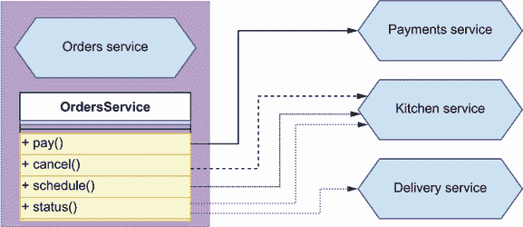

图 7.12 为了执行某些功能，订单服务需要与订单服务进行交互。例如，为了处理支付，它必须与支付服务交互，为了安排订单生产，它必须与厨房服务交互。

我们如何在业务层中最好地建模这些操作？我们可以使用不同的方法，但为了使其他组件更容易与业务层交互，我们将通过一个名为`OrdersService`的类公开一个单一的统一接口。我们将在`orders/orders_service/orders_service.py`下定义这个类。为了履行其职责，`OrdersService`使用订单存储库与数据库进行接口。我们可以让`OrdersService`导入并初始化订单存储库，如下面的代码所示：

```
from repository.orders_repository import OrdersRepository

class OrdersService:
    def __init__(self):
        self.repository = OrdersRepository()
```

然而，这样做会给订单服务带来过多的责任，因为它需要知道如何配置订单存储库。它还会使订单存储库的实现和订单服务紧密耦合，如果我们需要使用不同的存储库，我们就无法这样做。如图 7.13 和 7.14 所示，更好的方法是结合使用依赖注入和控制反转原则。

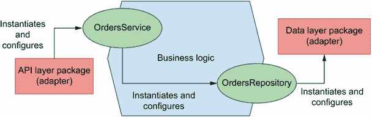

图 7.13 在传统的软件开发中，依赖关系遵循线性关系，每个组件负责实例化和配置其自身的依赖。在许多情况下，这会使我们的组件与其依赖的低级实现细节紧密耦合。

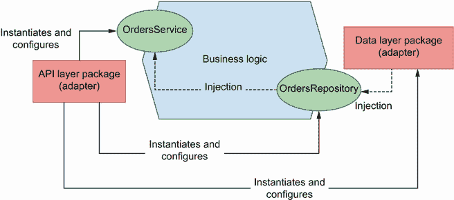

图 7.14 在控制反转中，我们通过在运行时使用如依赖注入等方法提供依赖项来解耦组件和它们的依赖项。在这种方法中，提供正确配置的依赖项实例的责任在于上下文。实线显示依赖关系，而虚线显示依赖项是如何注入的。

定义 *控制反转* 是一种软件开发原则，它鼓励我们在运行时提供依赖项，从而解耦我们的组件和它们的依赖项。这使我们能够控制依赖项的提供方式。实现这一目标的一种流行模式是依赖注入。依赖项实例化和提供的上下文称为 *控制反转容器*。在订单服务中，一个合适的控制反转容器是请求对象，因为大多数操作都是特定于请求上下文的。

控制反转原则指出，我们应该通过让执行上下文在运行时提供这些依赖项来解耦我们的代码中的依赖项。这意味着，而不是让订单服务导入和实例化订单存储库，我们应该在运行时提供存储库。我们如何做到这一点？我们可以使用不同的模式来向我们的代码提供依赖项，但最流行的一种，由于其简单性和有效性，是依赖注入。

定义 *依赖注入* 是一种软件开发模式，其中我们在运行时提供代码依赖项。这有助于我们解耦我们的组件与它们所依赖的代码的特定实现细节，因为它们不需要知道如何配置和实例化它们的依赖项。

为了使订单存储库可注入到订单服务中，我们对其进行参数化：

```
class OrdersService:
    def __init__(self, orders_repository):
        self.orders_repository = orders_repository
```

现在调用者有责任正确地实例化和配置订单存储库。如图 7.11 所示，这有一个非常理想的结果：根据上下文，我们可以提供不同的存储库实现或添加不同的配置。这使得订单服务在不同上下文中更容易使用。⁷

列表 7.4 显示了`OrdersService`公开的接口。类的初始化器接受一个订单存储库的实例作为参数，使其可注入。根据控制反转原则，当我们将`OrdersService`与 API 层集成时，获取有效的订单存储库实例并将其传递给`OrdersService`的责任将属于 API。这种方法很方便，因为它允许我们在必要时随意交换存储库，并且它将使我们在下一章编写测试变得非常容易。

列表 7.4 `OrdersService`类的接口

```
# file: orders/orders_service/orders_service.py

class OrdersService:
    def __init__(self, orders_repository):
        self.orders_repository = orders_repository 

    def place_order(self, items):
        pass

    def get_order(self, order_id):
        pass

    def update_order(self, order_id, items):
        pass

    def list_orders(self, **filters):
        pass

    def pay_order(self, order_id):
        pass

    def cancel_order(self, order_id):
        pass
```

在`OrdersService`下列出的某些操作，例如支付或调度，是在单个订单级别进行的。由于订单包含数据，因此拥有一个代表订单并具有执行与订单相关任务的类将是有用的。在订单服务上下文中，订单是订单域的核心对象。在领域驱动设计（DDD）中，我们称这些对象为*领域对象*。这些是订单存储库返回的对象。我们将在`orders/orders_service/orders.py`下实现我们的`Order`类。列表 7.5 显示了`Order`类的初步实现。

除了`Order`类之外，列表 7.5 还提供了一个`OrderItem`类，它代表订单中的每个项目。我们将使用`Order`类来表示在保存到数据库之前和之后的订单。订单的一些属性，如创建时间或其 ID，由数据层设置，并且只能在数据库更改提交后才能知道。正如我们在第 7.4 节中解释的，提交更改超出了存储库的范围，这意味着当我们向存储库添加订单时，返回的对象将不会有这些属性。订单的 ID 和创建时间在提交事务后通过订单的数据库记录变得可用。因此，`Order`的初始化方法将订单的 ID、创建时间和状态绑定为带前导下划线的私有属性（如`self._id`），我们在`Order`类中使用`order_`参数来持有订单的数据库记录的指针。如果我们检索已保存到数据库的订单的详细信息，`_id`、`_created`和`_status`将在初始化器中具有相应的值；否则，它们将是`None`，我们将从`order_`中拉取它们的值。这就是为什么我们使用`property()`装饰器定义`Order`的`id`、`created`和`status`属性，因为它允许我们根据对象的状态来解析它们的值。这是我们将在业务层和数据层之间允许的唯一耦合程度。并且为了确保如果需要的话，这个依赖关系可以轻松移除，我们将`order_`默认设置为`None`。

列表 7.5 `Order`业务对象类的实现

```
# file: orders/orders_service/orders.py

class OrderItem:                                                     ①
    def __init__(self, id, product, quantity, size):                 ②
        self.id = id
        self.product = product
        self.quantity = quantity
        self.size = size

class Order:
    def __init__(self, id, created, items, status, schedule_id=None,
                 delivery_id=None, order_=None):                     ③
        self._id = id                                                ④
        self._created = created
        self.items = [OrderItem(**item) for item in items]           ⑤
        self._status = status
        self.schedule_id = schedule_id
        self.delivery_id = delivery_id

    @property
    def id(self):                                                    ⑥
        return self._id or self._order.id

    @property
    def created(self):       
        return self._created or self._order.created

    @property
    def status(self):       
        return self._status or self._order.status
```

① 代表订单项的业务对象

② 我们声明了`OrderItem`初始化方法的参数。

③ `order_`参数代表一个数据库模型实例。

④ 由于我们动态解析 ID，我们将提供的 ID 存储为私有属性。

⑤ 我们为每个订单项构建一个`OrderItem`对象。

⑥ 我们使用`property()`装饰器动态解析 ID。

除了持有订单的数据之外，`Order`类还需要处理诸如取消、支付和安排订单等任务。为了完成这些任务，我们必须与外部依赖项接口，例如厨房和支付服务。正如我们在第 7.1 节中解释的，六边形架构的目标是通过适配器封装对外部依赖项的访问。然而，为了使本章的内容简单，我们将在`Order`类中实现外部 API 调用。封装外部 API 调用的良好适配器模式是*外观模式*。⁸在我们继续实施之前，我们应该知道这些 API 调用看起来是什么样子。

为了构建订单服务与厨房和支付服务之间的集成，我们希望运行厨房和支付服务，看看它们是如何工作的。然而，我们不需要运行实际的服务。本书 GitHub 仓库中这一章的文件夹包含三个 OpenAPI 文件：一个用于订单 API（ch07/oas.yaml），一个用于厨房 API（ch07/kitchen.yaml），还有一个用于支付 API（ch07/payments.yaml）。kitchen.yaml 和 payments.yaml 告诉我们厨房和支付 API 是如何工作的，这就是我们构建集成所需的所有信息。确保从 GitHub 拉取 kitchen.yaml 和 payments.yaml 文件，以便能够使用以下示例。

事实上，我们还可以使用厨房和支付 API 规范，通过模拟服务器来模拟它们的行为。API 模拟服务器复制 API 背后的服务器，验证我们的请求并返回有效的响应。我们将使用由 Stoplight 构建和维护的 Prism CLI（[`github.com/stoplightio/prism`](https://github.com/stoplightio/prism)），来模拟厨房和支付服务的 API 服务器。Prism 是一个 Node.js 库，但不用担心，它只是一个命令行工具；你不需要了解任何 JavaScript 就能使用它。要安装这个库，运行以下命令：

```
$ yarn add @stoplight/prism-cli
```

运行 Prism 时处理错误你可能会在运行 Prism 时遇到错误。一个常见错误是没有兼容版本的 Node.js。我建议你安装 nvm 来管理你的 Node 版本，并使用 Node 的最新稳定版本来运行 Prism。此外，确保你选择的运行 Prism 的端口是可用的。

这个命令将在你的应用程序文件夹内创建一个 node_modules/文件夹，其中将安装 Prism 及其所有依赖项。你不希望提交这个文件夹，所以请确保将其添加到你的.gitignore 文件中。你还会看到一个新的文件叫做 package.json，以及另一个文件叫做 yarn.lock 在你的应用程序目录中。这些是你想要提交的文件，因为它们将允许你在任何其他环境中重新创建相同的 node_modules/文件夹。

要查看 Prism 与厨房 API 的实际应用，运行以下命令：

```
$ ./node_modules/.bin/prism mock kitchen.yaml --port 3000
```

这将在 3000 端口上启动一个服务器，该服务器运行厨房 API 的模拟服务。为了体验我们可以用它做什么，运行以下命令来调用 GET `/kitchen/schedules`端点，该端点返回一个日程表列表：

```
$ curl http://localhost:3000/kitchen/schedules
```

使用 jq 在终端中像专业人士一样显示 json 当你在终端输出 JSON 时，无论是使用 cURL 与 API 交互还是使用 cat 查看 JSON 文件，我建议你使用 JQ——这是一个命令行实用工具，它可以解析 JSON 并产生美观的显示。你可以这样使用 JQ：`curl` `http://localhost: 3000/kitchen/schedules` `|` `jq`。

你会看到由 Prism 启动的模拟服务器能够返回一个表示调度列表的完全有效的有效负载。至少可以说，这是令人印象深刻的！现在我们知道了如何为厨房和支付 API 运行模拟服务器，让我们分析与它们的 API 集成的需求：

+   *厨房服务* *(kitchen.yaml)*—为了通过厨房服务安排订单，我们必须调用 POST `/kitchen/schedules` 端点，并带有包含订单中项目列表的有效负载。在这个调用的响应中，我们将找到 `schedule_id`，我们可以用它来跟踪订单的状态。

+   *支付服务* *(payments.yaml)*—为了处理订单的支付，我们必须调用 POST `/payments` 端点，并带有包含订单 ID 的有效负载。这是一个用于集成测试的模拟端点。

在我们能够取消订单之前，我们需要检查其状态。如果订单已安排生产，我们必须调用 POST `/kitchen/schedules/{schedule_id}/cancel` 端点来取消调度。如果订单正在配送，我们不允许用户取消订单，因此我们将引发异常。

为了实现 API 集成，我们将使用流行的 Python `requests` 库。运行以下命令使用 `pipenv` 安装库：

```
$ pipenv install requests
```

列表 7.6 通过添加实现厨房和支付服务 API 调用的方法扩展了 `Order` 类的实现。为了测试目的，我们期望厨房 API 在端口 3001 上运行，支付服务在端口 3000 上运行。你可以通过运行以下命令来完成此操作：

```
$ ./node_modules/.bin/prism mock kitchen.yaml --port 3000
$ ./node_modules/.bin/prism mock payments.yaml --port 3001
```

在每次 API 调用中，我们检查响应是否包含预期的状态码，如果不包含，我们将引发自定义的 `APIIntegrationError` 异常。此外，如果用户尝试执行无效的操作，例如在订单已经发货时取消订单，我们将引发 `InvalidActionError` 异常。

列表 7.6 在 `Order` 类中封装每个订单的功能

```
# file: orders/orders_service/orders.py

import requests
from orders.orders_service.exceptions import (
    APIIntegrationError, InvalidActionError
)

...
class Order:
  ...

    def cancel(self):
        if self.status == 'progress':                              ①
            kitchen_base_url = "http://localhost:3000/kitchen"
            response = requests.post(
                f"{kitchen_base_url}/schedules/{self.schedule_id}/cancel",
                json={"order": [item.dict() for item in self.items]},
            )
               if response.status_code == 200:                     ②
                return
            raise APIIntegrationError(                             ③
                f'Could not cancel order with id {self.id}'
            )
        if self.status == 'delivery':                              ④
            raise InvalidActionError(
                f'Cannot cancel order with id {self.id}'
            )

    def pay(self):
        response = requests.post(                                  ⑤
            'http://localhost:3001/payments', json={'order_id': self.id}
        )
        if response.status_code == 201:
            return
        raise APIIntegrationError(
            f'Could not process payment for order with id {self.id}'
        )

    def schedule(self):
        response = requests.post(                                  ⑥
            'http://localhost:3000/kitchen/schedules',
            json={'order': [item.dict() for item in self.items]}
        )
        if response.status_code == 201:                            ⑦
            return response.json()['id']
        raise APIIntegrationError(
            f'Could not schedule order with id {self.id}'
        )
```

① 如果订单正在进行中，我们将通过调用厨房 API 来取消其调度。

② 如果厨房服务的响应成功，我们将返回。

③ 否则，我们将引发 APIIntegrationError 异常。

④ 我们不允许取消正在配送的订单。

⑤ 我们通过调用支付 API 来处理支付。

⑥ 我们通过调用厨房 API 来安排订单进行生产。

⑦ 如果厨房服务的响应成功，我们将返回调度 ID。

列表 7.7 包含了我们用于订单服务以表示出现问题的自定义异常的实现。当用户尝试获取一个不存在的订单的详细信息时，我们将在 `OrdersService` 类中使用 `OrderNotFoundError`。

列表 7.7 订单服务自定义异常

```
# file: orders/orders_service/exceptions.py

class OrderNotFoundError(Exception):      ①
    pass

class APIIntegrationError(Exception):     ②
    pass

class InvalidActionError(Exception):      ③
    pass
```

① 异常用于表示订单不存在

② 异常用于表示发生了 API 集成错误

③ 异常用于表示正在执行的操作无效

如我们之前提到的，API 模块不会直接使用`Order`类。相反，它将通过`OrdersService`类使用所有适配器的统一接口，我们在第 7.4 节中展示了该接口。`OrdersService`封装了订单域的能力，并负责使用订单仓库获取订单对象并对它们执行操作。第 7.8 节展示了`OrdersService`类的实现。

要实例化`OrdersService`类，我们需要一个订单仓库对象，我们可以用它来添加或删除我们的记录中的订单。为了下订单，我们使用订单仓库创建一个数据库记录，为了获取订单的详细信息，我们从数据库中检索相应的记录。如果请求的订单未找到，我们抛出`OrderNotFoundError`异常。`list_orders()`方法接受字典形式的过滤器。为了获取订单列表，订单仓库强制我们为`limit`参数传递一个特定的值，因此我们使用`pop()`方法从`filters`字典中提取其值，这允许我们设置一个默认值，同时也从字典中删除了该键。在`pay_order()`方法中，我们使用支付 API 处理支付，如果支付成功，我们通过调用厨房 API 来安排订单。在安排订单后，我们通过将`schedule_id`属性设置为厨房 API 返回的安排 ID 来更新订单记录。

列表 7.8 `OrdersService`实现

```
# file: orders/orders_service/orders_service.py

from orders.orders_service.exceptions import OrderNotFoundError

class OrdersService:
    def __init__(self, orders_repository):              ①
        self.orders_repository = orders_repository

    def place_order(self, items):
        return self.orders_repository.add(items)        ②

    def get_order(self, order_id):
        order = self.orders_repository.get(order_id)    ③
        if order is not None:                           ④
            return order
        raise OrderNotFoundError(f'Order with id {order_id} not found')

    def update_order(self, order_id, items):
        order = self.orders_repository.get(order_id)
        if order is None:
            raise OrderNotFoundError(f'Order with id {order_id} not found')
        return self.orders_repository.update(order_id, {'items': items})

    def list_orders(self, **filters):
        limit = filters.pop('limit', None)              ⑤
        return self.orders_repository.list(limit, **filters)

    def pay_order(self, order_id):
        order = self.orders_repository.get(order_id)
        if order is None:
            raise OrderNotFoundError(f'Order with id {order_id} not found')
        order.pay()
        schedule_id = order.schedule()                  ⑥
        return self.orders_repository.update(
            order_id, {'status': 'scheduled', 'schedule_id': schedule_id}
        )

    def cancel_order(self, order_id):
        order = self.orders_repository.get(order_id)
        if order is None:
            raise OrderNotFoundError(f'Order with id {order_id} not found')
        order.cancel()
        return self.orders_repository.update(order_id, status="cancelled")
```

① 要实例化`OrdersService`类，我们需要订单仓库的一个实例。

② 我们通过创建数据库记录来下订单。

③ 我们通过使用订单仓库并传入请求的 ID 来获取订单的详细信息。

④ 如果订单不存在，我们抛出`OrderNotFoundError`异常。

⑤ 我们通过使用关键字参数将过滤器捕获为字典。

⑥ 在安排订单后，我们更新其`schedule_id`属性。

订单服务已准备好在我们的 API 模块中使用。然而，在我们继续进行此集成之前，这个谜题中还有一个部分需要我们解决。正如我们在第 7.4 节中提到的，订单仓库不会将任何操作提交到数据库。作为`OrdersService`的消费者，API 的责任确保在操作结束时一切都被提交。这究竟是如何工作的？继续阅读第 7.6 节来了解详情！

## 7.6 实现工作单元模式

在本节中，我们将学习在交互`OrdersService`时处理数据库提交和回滚。正如你在图 7.15 中看到的，当我们使用`OrdersService`类访问其任何功能时，我们必须注入`OrdersRepository`类的实例。我们必须在执行任何操作之前打开一个 SQLAlchemy 会话，并且我们必须提交对数据的任何更改以将它们持久化到数据库中。

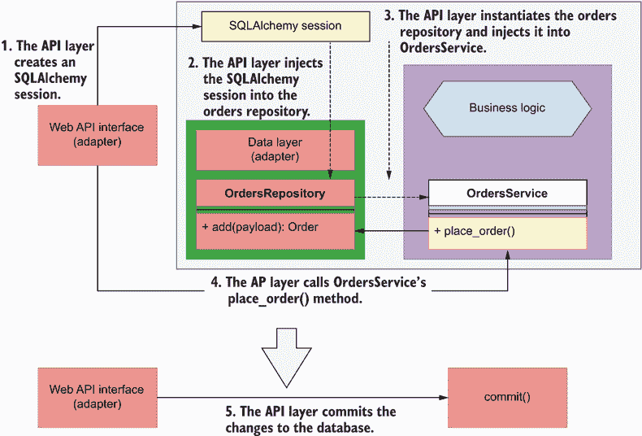

图 7.15 为了将我们的更改持久化到数据库中，我们可以简单地让 API 层使用 SQLAlchemy 会话对象来提交事务。在这个图中，实线代表调用，而虚线代表依赖注入。

最佳的操作编排方式是什么？我们可以使用不同的方法来实现这一点。我们可以简单地使用 SQLAlchemy 会话对象来包装我们对 `OrdersService` 的调用，一旦我们的操作成功，就使用会话来提交，否则回滚。如果 `OrdersService` 只需要处理单个 SQL 数据库，这将有效。然而，如果我们同时需要与不同类型的数据库交互呢？我们需要为它打开一个新的会话。如果我们还必须在同一操作中处理与其他微服务的集成，并确保在事务结束时正确调用 API，以防需要回滚，又会怎样呢？我们还可以在代码中添加特殊的子句和守卫。相同的代码必须在每个与 `OrdersService` 交互的 API 函数中重复，所以如果有一个模式可以帮助我们将所有这些内容集中在一个地方，那岂不是很好？这就是工作单元模式的作用。

定义 *工作单元* 是一种设计模式，保证了我们业务事务的原子性，确保所有事务一次性提交，或者如果有任何事务失败，则回滚。

工作单元是一种模式，确保业务事务中的所有对象都一起更改，如果出现错误，则确保它们中没有任何一个发生变化。⁹ 这个概念来自数据库领域，其中数据库事务作为工作单元实现，确保每个事务都是

+   *原子性*——整个事务要么成功，要么失败。

+   *一致性*——它符合数据库的约束。

+   *隔离*——它不会干扰其他事务。

+   *持久性*——它被写入持久存储。

这些属性在数据库领域被称为 *ACID 原则* ([`en.wikipedia.org/wiki/Database_transaction`](https://en.wikipedia.org/wiki/Database_transaction))。当涉及到服务时，工作单元模式帮助我们将这些原则应用于我们的操作。SQLAlchemy 的 `Session` 对象已经实现了数据库事务的工作单元模式([`mng.bz/jA5z`](http://mng.bz/jA5z))。这意味着我们可以将所需的所有更改添加到同一个会话中，并一起提交。如果出现问题，我们可以调用 `rollback` 方法来撤销任何更改。在 Python 中，我们可以使用上下文管理器来协调这些步骤。

如图 7.16 所示，上下文管理器是一种允许我们在操作期间锁定资源、确保在出现任何错误时执行必要的清理工作，并在操作完成后最终释放锁的模式。上下文管理器的关键语法特性是使用 `with` 语句，如图 7.16 所示。如图所示，上下文管理器可以返回对象，我们可以通过使用 Python 的 `as` 子句来捕获这些对象。如果上下文管理器正在创建对资源（例如文件）的访问，我们希望对其进行操作，这非常有用。

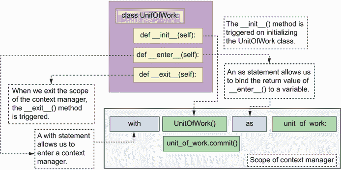

图 7.16 基于类的上下文管理器具有 `__init__()`、`__enter__()` 和 `__exit__()` 方法。`__init__()` 在初始化上下文管理器时触发。`__enter__()` 方法允许我们进入上下文，并在使用 `with` 语句时被调用。在同一行内使用 `as` 语句允许我们将 `__enter__()` 方法的返回值绑定到一个变量（在本例中为 `unit_of_work`）。最后，当我们退出上下文管理器时，`__exit__()` 方法被触发。

在 Python 中，我们可以以多种方式实现上下文管理器，包括作为类或使用 `contextlib` 模块中的 `contextmanager()` 装饰器。¹⁰ 在本节中，我们将以类的方式实现我们的工作单元上下文管理器。上下文管理器类必须实现至少以下两个特殊方法：

+   `__enter__()` — 定义进入上下文时必须执行的操作，例如创建会话或打开文件。如果我们需要在 `__enter__()` 方法创建的任何对象上执行操作，我们可以返回该对象，并通过 `as` 子句捕获其值，如图 7.16 所示。

+   `__exit__()` — 定义退出上下文时必须执行的操作，例如关闭文件或会话。`__exit__()` 方法通过其方法签名中的三个参数捕获在上下文执行过程中抛出的任何异常：

    +   `exc_type` — 捕获抛出的异常类型

    +   `exc_value` — 捕获绑定到异常的值，通常是错误消息

    +   `traceback` — 一个可以用来确定异常发生确切位置的回溯对象

如果没有抛出异常，这三个参数的值将为 `None`。

列表 7.9 展示了将工作单元模式作为订单服务的上下文管理器的实现。在初始化方法中，我们使用 SQLAlchemy 的 `sessionmaker()` 函数获取一个会话工厂对象，该函数需要一个连接对象，我们通过 SQLAlchemy 的 `create_engine()` 函数生成这个连接对象。为了简化示例，我们将数据库连接字符串硬编码为指向我们的本地 SQLite 数据库。在第十三章中，你将学习如何参数化此值并从环境中获取它。

当我们进入上下文时，我们创建一个新的数据库会话，并将其绑定到`UnitOfWork`实例，以便我们可以在其他方法中访问它。我们还返回上下文管理器对象本身，以便调用者可以访问其任何属性，例如`session`对象或`commit()`方法。在退出上下文时，我们检查在向会话添加或删除对象时是否抛出了任何异常，如果是这样，我们将回滚更改以避免使数据库处于不一致的状态。我们可以访问异常的类型（`exc_type`）、值（`exc_val`）和跟踪信息（`traceback`），我们可以使用这些信息来记录错误的详细信息。如果没有发生异常，所有三个参数都将设置为`None`。最后，我们关闭数据库会话以释放数据库资源并结束事务的作用域。我们还添加了`commit()`和`rollback()`方法的包装器，以避免将数据库内部暴露给业务层。

列表 7.9 将工作单元模式作为上下文管理器

```
# file: orders/repository/unit_of_work.py

from sqlalchemy import create_engine
from sqlalchemy.orm import sessionmaker

class UnitOfWork:

    def __init__(self):
        self.session_maker = sessionmaker(               ①
            bind=create_engine('sqlite:///orders.db')
        )

    def __enter__(self):
        self.session = self.session_maker()              ②
        return self                                      ③

    def __exit__(self, exc_type, exc_val, traceback):    ④
        if exc_type is not None:                         ⑤
            self.rollback()                              ⑥
            self.session.close()                         ⑦
        self.session.close()

    def commit(self):
        self.session.commit()                            ⑧

    def rollback(self):
        self.session.rollback()                          ⑨
```

① 我们获取一个会话工厂对象。

② 我们打开一个新的数据库会话。

③ 我们返回工作单元对象的实例。

④ 在上下文退出时，我们可以访问上下文执行期间抛出的任何异常。

⑤ 我们检查是否发生了异常。

⑥ 如果发生异常，回滚事务。

⑦ 我们关闭数据库会话。

⑧ SQLAlchemy 的`commit()`方法的包装器

⑨ SQLAlchemy 的`rollback()`方法的包装器

这一切看起来都很不错，但我们究竟应该如何使用`UnitOfWork`与订单存储库和`OrdersService`结合使用呢？在下一节中，我们将更深入地探讨这个细节，但在我们这样做之前，列表 7.10 为你提供了一个如何将这些组件一起使用的模板。我们使用 Python 的上下文管理器语法中的`with`语句进入工作单元上下文。我们还使用`as`语句将`UnitOfWork`的`__enter__()`方法的返回值绑定到`unit_of_work`变量。然后我们通过传递`UnitOfWork`的数据库会话对象获取订单存储库的实例，并通过传递订单存储库对象获取`OrdersService`类的实例。然后我们使用订单服务对象下订单，并使用`UnitOfWork`的`commit()`方法提交事务。

列表 7.10 使用工作单元和存储库的模板模式

```
with UnitOfWork() as unit_of_work:                 ①
    repo = OrdersRepository(unit_of_work.session)  ②
    orders_service = OrdersService(repo)           ③
    orders_service.place_order(order_details)      ④
    unit_of_work.commit()                          ⑤
```

① 我们进入工作单元上下文。

② 我们通过传递`UnitOfWork`的会话获取订单存储库的实例。

③ 我们通过传递订单存储库对象来获取`OrdersService`类的实例。

④ 我们下订单。

⑤ 我们提交事务。

现在我们有了可以使用来提交事务的工作单元，让我们看看如何通过将 API 层与服务层集成来将这些全部组合起来！继续阅读第 7.7 节，了解我们是如何做到这一点的。

## 7.7 集成 API 层和服务层

在本节中，我们将本章所学的一切整合起来，将服务层与 API 层集成。我们将利用列表 7.10 中展示的模板模式，结合使用 `UnitOfWork` 类和 `OrdersRepository` 以及 `OrdersService`。当用户尝试对订单执行操作时，我们确保我们设置了检查来验证订单是否首先存在；否则，我们返回 404（未找到）错误响应。

列表 7.11 显示了 orders/web/api/api.py 模块的新版本。在每一个函数中，我们首先进入 `UnitOfWork` 的上下文，确保我们将上下文对象绑定到一个变量 `unit_of_work` 上。然后我们使用 `UnitOfWork` 上下文对象中的会话对象创建一个 `OrdersRepository` 的实例。一旦我们有了仓库的实例，我们就在创建服务实例时将其注入到 `OrdersService` 中。然后我们使用服务在每个端点执行所需的操作。在执行对特定订单的操作的端点中，我们防范 `OrdersService` 如果请求的订单不存在而抛出 `OrderNotFoundError` 的可能性。

在 `create_order()` 函数中，我们在退出 `UnitOfWork` 上下文之前使用 `order.dict()` 获取订单的字典表示形式，以便我们可以访问在提交过程中由数据库生成的属性，例如订单的 ID。请记住，订单 ID 在更改提交到数据库之前不存在，因此它只能在数据库会话的作用域内访问。在我们的实现中，这意味着我们必须在退出 `UnitOfWork` 上下文之前访问 ID，因为数据库会话在退出上下文之前关闭。图 7.17 说明了这个过程。

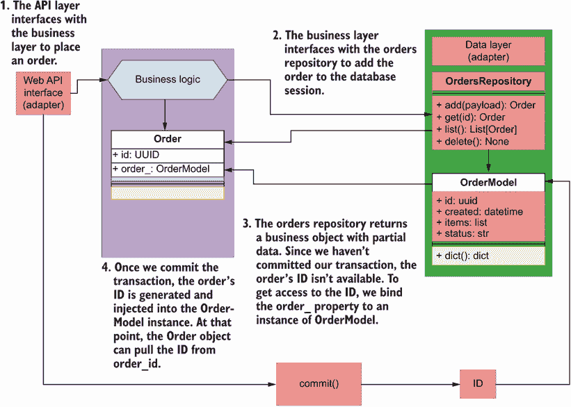

图 7.17 当我们下订单时，订单仓库返回的对象不包含 ID。一旦我们通过 `OrderModel` 实例提交数据库事务，ID 就会可用。因此，我们将模型实例绑定到 `Order` 对象上，以便在提交后从模型中提取 ID。记住，订单 ID 在提交到数据库之前不存在，因此它只能在数据库会话的作用域内访问。在我们的实现中，这意味着我们必须在退出 `UnitOfWork` 上下文之前访问 ID，因为数据库会话在退出上下文之前关闭。图 7.17 说明了这个过程。

列表 7.11 API 层与服务层之间的集成

```
# file: orders/web/api/api.py

from http import HTTPStatus
from typing import List, Optional
from uuid import UUID

from fastapi import HTTPException
from starlette import status
from starlette.responses import Response

from orders.orders_service.exceptions import OrderNotFoundError
from orders.orders_service.orders_service import OrdersService
from orders.repository.orders_repository import OrdersRepository
from orders.repository.unit_of_work import UnitOfWork
from orders.web.app import app
from orders.web.api.schemas import (
    GetOrderSchema,
    CreateOrderSchema,
    GetOrdersSchema,
)
@app.get('/orders', response_model=GetOrdersSchema)
def get_orders(
    cancelled: Optional[bool] = None,
    limit: Optional[int] = None,
):
    with UnitOfWork() as unit_of_work: ①
        repo = OrdersRepository(unit_of_work.session)
        orders_service = OrdersService(repo)
        results = orders_service.list_orders(
            limit=limit, cancelled=cancelled
        )
    return {'orders': [result.dict() for result in results]}

@app.post(
    '/orders',
    status_code=status.HTTP_201_CREATED,
    response_model=GetOrderSchema,
)
def create_order(payload: CreateOrderSchema):
    with UnitOfWork() as unit_of_work:
        repo = OrdersRepository(unit_of_work.session)
        orders_service = OrdersService(repo)
        order = orders_service.place_order(payload.dict()['order'])
        order = payload.dict()['order']
        for item in order:
            item['size'] = item['size'].value
        order = orders_service.place_order(order) ②

        unit_of_work.commit()
        return_payload = order.dict() ③
    return return_payload

@app.get('/orders/{order_id}', response_model=GetOrderSchema)
def get_order(order_id: UUID):
    try: ④
        with UnitOfWork() as unit_of_work:
            repo = OrdersRepository(unit_of_work.session)
            orders_service = OrdersService(repo)
            order = orders_service.get_order(order_id=order_id)
        return order.dict()
    except OrderNotFoundError:
        raise HTTPException(
            status_code=404, detail=f'Order with ID {order_id} not found'
        )

@app.put('/orders/{order_id}', response_model=GetOrderSchema)
def update_order(order_id: UUID, order_details: CreateOrderSchema):
    try:
        with UnitOfWork() as unit_of_work:
            repo = OrdersRepository(unit_of_work.session)
            orders_service = OrdersService(repo)
            order = order_details.dict()['order']
            for item in order:
                item['size'] = item['size'].value
            order = orders_service.update_order(
                order_id=order_id, items=order
            )
            unit_of_work.commit()
        return order.dict()
    except OrderNotFoundError:
        raise HTTPException(
            status_code=404, detail=f'Order with ID {order_id} not found'
        )

@app.delete(
    "/orders/{order_id}",
    status_code=status.HTTP_204_NO_CONTENT,
    response_class=Response,
)
def delete_order(order_id: UUID):
    try:
        with UnitOfWork() as unit_of_work:
            repo = OrdersRepository(unit_of_work.session)
            orders_service = OrdersService(repo)
            orders_service.delete_order(order_id=order_id)
            unit_of_work.commit()
        return
    except OrderNotFoundError:
        raise HTTPException(
            status_code=404, detail=f'Order with ID {order_id} not found'
        )

@app.post('/orders/{order_id}/cancel', response_model=GetOrderSchema)
def cancel_order(order_id: UUID):
    try:
        with UnitOfWork() as unit_of_work:
            repo = OrdersRepository(unit_of_work.session)
            orders_service = OrdersService(repo)
            order = orders_service.cancel_order(order_id=order_id)
            unit_of_work.commit()
        return order.dict()
    except OrderNotFoundError:
        raise HTTPException(
            status_code=404, detail=f'Order with ID {order_id} not found'
        )

@app.post('/orders/{order_id}/pay', response_model=GetOrderSchema)
def pay_order(order_id: UUID):
    try:
        with UnitOfWork() as unit_of_work:
            repo = OrdersRepository(unit_of_work.session)
            orders_service = OrdersService(repo)
            order = orders_service.pay_order(order_id=order_id)
            unit_of_work.commit()
        return order.dict()
    except OrderNotFoundError:
        raise HTTPException(
            status_code=404, detail=f'Order with ID {order_id} not found'
        )
```

① 我们进入工作单元上下文。

② 我们下订单。

③ 在退出工作单元上下文之前，我们访问订单的字典表示形式。

④ 我们使用 try/except 块来捕获 OrderNotFoundError 异常。

这标志着我们完成对订单服务服务层实现的旅程。在本章中我们学到的模式不仅适用于 API 和微服务的世界，而且适用于所有通用应用程序模型。特别是，仓库模式将始终帮助您确保您的数据访问层与业务层完全解耦，而工作单元模式将帮助您确保业务操作的所有事务都是原子性和一致性地处理的。

## 摘要

+   六边形架构，或称为端口和适配器架构，是一种软件架构模式，它鼓励我们将业务层与数据库实现细节和应用接口的实现细节解耦。

+   依赖倒置原则教导我们，我们应用程序组件的实现细节应该依赖于接口。这有助于我们解耦我们的组件与其依赖的实现细节。

+   要与数据库接口，你可以使用如 SQLAlchemy 这样的 ORM 库，它可以将数据库表和行转换为类和对象。这为我们提供了增强数据库模型以适应应用程序需求的有用功能的可能性。

+   仓库是一种软件开发模式，通过添加一个抽象层来帮助解耦数据层和业务层，该抽象层暴露了数据的内存列表接口。无论我们使用哪种数据库引擎，业务层都将始终从仓库接收相同的对象。

+   工作单元模式有助于确保所有作为应用程序操作一部分的业务事务要么全部成功，要么全部失败。如果其中一项事务失败，工作单元模式将确保所有更改都被回滚。这种机制确保数据永远不会处于不一致的状态。

* * *

¹ Alistair Cockburn，“六边形架构”，[`alistair.cockburn.us/hexagonal-architecture/`](https://alistair.cockburn.us/hexagonal-architecture/)。你可能想知道为什么是六边形而不是五边形或七边形。正如 Alistair 所指出的，它“不是六边形不是因为数字六很重要”，而是因为它有助于从视觉上突出核心应用程序通过端口（六边形的边）与外部组件通信的概念，并允许我们表示应用程序的两个主要方面：面向公众的方面（Web 组件、API 等）和内部方面（数据库、第三方集成等）。

² Robert C. Martin，《敏捷软件开发：原则、模式和实践》（Prentice Hall，2003 年），第 127-131 页。

³ 关于依赖倒置原则的出色介绍，请参阅 Eric Freeman、Elizabeth Robson、Kathy Sierra 和 Bert Bates 合著的《Head First Design Patterns》（O’Reilly，2014 年），第 141-143 页。

⁴ Martin Fowler，《企业架构模式》（Addison-Wesley，2003 年），第 165-181 页。

⁵ 这个文件的形状和格式可能会随时间而改变，但为了参考，在撰写本文时，这些行是第 18-20 行。

⁶ Fowler，《企业架构模式》，第 160-164 页。

⁷ 关于控制反转原则和依赖注入模式的更多细节，请参阅 Martin Fowler 的“控制反转容器和依赖注入模式”，[`martinfowler.com/articles/injection.html`](https://martinfowler.com/articles/injection.html)。

⁸ Erich Gamma, Richard Helm, Ralph Johnson, 和 John Vlissides, *《设计模式》* (Addison-Wesley, 1995), 第 185–193 页。

⁹ Fowler, *《企业架构模式》* (第 184–194 页)。

(10) Ramalho, *《流畅的 Python》* (O’Reilly, 2015), 第 463–478 页。
