# 8 设计 GraphQL API

本章涵盖

+   理解 GraphQL 的工作原理

+   使用模式定义语言（SDL）生成 API 规范

+   学习 GraphQL 的内置标量类型和数据结构，以及构建自定义对象类型

+   在 GraphQL 类型之间建立有意义的连接

+   设计 GraphQL 查询和突变

GraphQL 是构建 Web API 最受欢迎的协议之一。它是驱动微服务之间集成和构建与前端应用程序集成的合适选择。GraphQL 使 API 消费者能够完全控制他们从服务器获取的数据以及他们希望如何获取这些数据。

在本章中，你将学习如何设计一个 GraphQL API。你将通过一个实际案例来完成这项工作：你将为 CoffeeMesh 平台的产品服务设计一个 GraphQL API。产品服务拥有关于 CoffeeMesh 产品及其成分的数据。每个产品和成分都包含一个丰富的属性列表，描述了它们的特性。然而，当客户端请求产品列表时，他们最可能只对获取每个产品的少量详细信息感兴趣。此外，客户端可能还希望能够遍历产品、成分以及产品服务拥有的其他对象之间的关系。出于这些原因，GraphQL 是构建产品 API 的一个绝佳选择。

随着我们为产品 API 构建规范，你将了解 GraphQL 的标量类型、自定义对象类型的设计，以及查询和突变。到本章结束时，你将了解 GraphQL 与其他类型 API 的比较，以及何时使用它最为合理。我们有很多内容要覆盖，所以无需多言，让我们开始我们的旅程吧！

要跟随本章中开发的规范，你可以使用本书提供的 GitHub 仓库。本章的代码位于名为 ch08 的文件夹中。

## 8.1 介绍 GraphQL

本节介绍了 GraphQL 是什么，它的优势是什么，以及在什么情况下使用它是合理的。GraphQL 规范的官方网站将 GraphQL 定义为“API 的查询语言，以及用现有数据满足这些查询的运行时。”¹ 这到底是什么意思呢？这意味着 GraphQL 是一个规范，允许我们在 API 服务器上运行查询。就像 SQL 为数据库提供查询语言一样，GraphQL 为 API 提供了查询语言。² GraphQL 还提供了一个规范，说明如何在服务器中解析这些查询，以便任何人都可以在任何编程语言中实现 GraphQL 运行时。³

正如我们可以使用 SQL 来定义数据库表的模式一样，我们也可以使用 GraphQL 来编写描述从我们的服务器可以查询的数据类型的规范。GraphQL API 规范被称为模式，它使用一种称为模式定义语言（SDL）的标准编写。在本章中，我们将学习如何使用 SDL 为产品 API 生成规范。

GraphQL 首次发布于 2015 年，自那时起，它已成为构建 Web API 最受欢迎的选择之一。我必须说，在 GraphQL 规范中并没有说 GraphQL 应该通过 HTTP 使用，但在实践中，这是 GraphQL API 中最常见的协议类型。

GraphQL 的伟大之处在于它能够让用户完全控制他们希望从服务器获取哪些数据。例如，正如我们将在下一节中看到的，在产品 API 中，我们存储了关于每个产品的许多详细信息，例如其名称、价格、可用性和成分等。如图 8.1 所示，如果用户只想获取产品名称和价格列表，使用 GraphQL 可以实现这一点。相比之下，在其他类型的 API，如 REST 中，你会得到每个产品的完整详细信息列表。因此，每当需要让客户端完全控制他们从服务器获取数据的方式时，GraphQL 都是一个很好的选择。

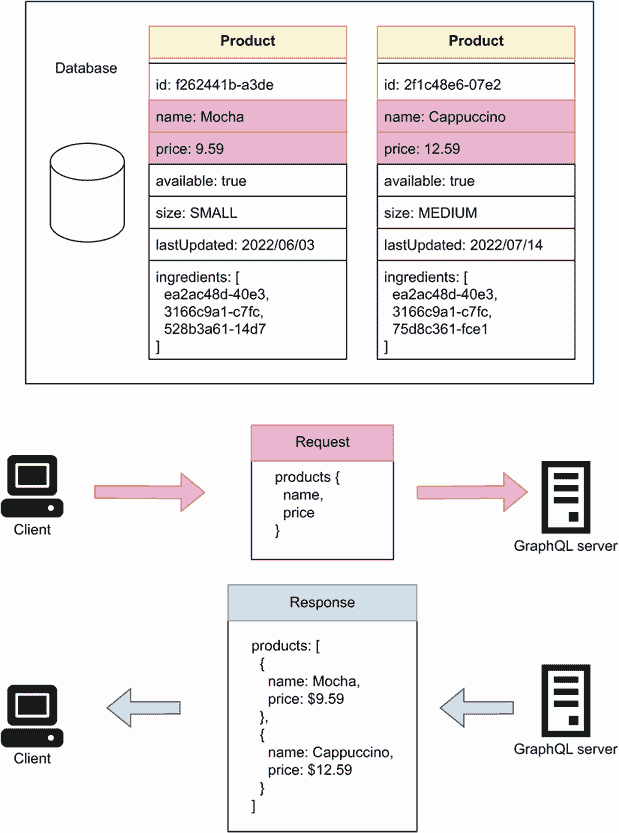

图 8.1 展示了使用 GraphQL API，客户端可以请求具有特定详细信息的项目列表。在这个例子中，客户端正在请求产品 API 中每个产品的名称和价格。

GraphQL 的另一个巨大优势是能够在不同类型的资源之间创建连接，并将这些连接暴露给我们的客户端以供他们在查询中使用。例如，在产品 API 中，产品和成分是不同但相关的资源类型。如图 8.2 所示，如果用户想要获取包括产品名称、价格和成分的产品列表，使用 GraphQL 可以通过利用这些资源之间的连接来实现这一点。因此，在具有高度互联资源的服务中，并且当客户端探索和查询这些连接对客户端有用时，GraphQL 是一个极佳的选择。

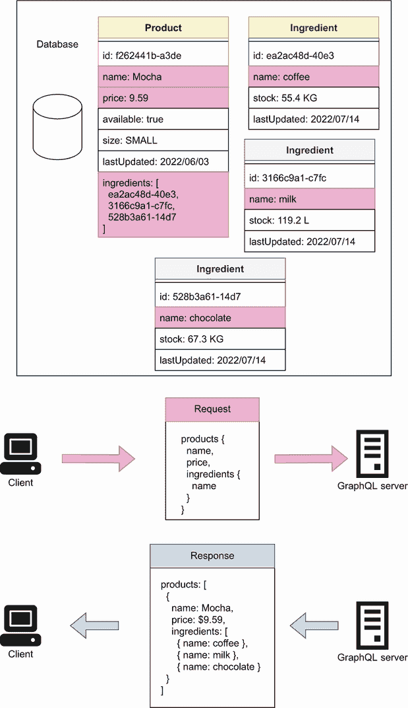

图 8.2 展示了使用 GraphQL，客户端可以请求资源的详细信息及其相关联的其他资源。在这个例子中，产品 API 有两种类型的资源：产品和成分，它们通过产品的`ingredients`字段相互连接。利用这种连接，客户端可以请求每个产品的名称和价格，以及每个产品成分的名称。

在接下来的章节中，我们将学习如何为产品服务生成 GraphQL 规范。我们将学习如何定义数据类型，如何创建资源之间的有意义连接，以及如何定义查询数据和更改服务器状态的操作。但在我们这样做之前，我们应该了解产品 API 的要求，这就是我们在下一节要做的。

## 8.2 介绍产品 API

本节讨论了产品 API 的要求。在着手编写 API 规范之前，收集有关 API 要求的信息非常重要。如图 8.3 所示，产品 API 是产品服务的接口。为了确定产品 API 的要求，我们需要知道产品服务的用户可以用它做什么。

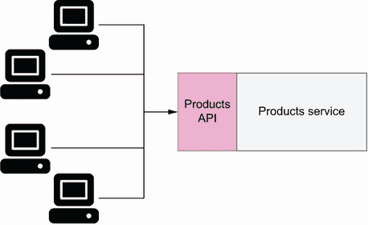

图 8.3 客户端通过产品 API 与产品服务交互。

产品服务拥有关于 CoffeeMesh 平台提供的产品数据。如图 8.4 所示，CoffeeMesh 员工必须能够使用产品服务来管理每种产品的可用库存，以及保持产品配料的最新状态。特别是，他们必须能够查询产品或配料的库存，并在新库存到达仓库时更新它们。他们还必须能够向系统中添加新产品或配料，并删除旧的。这些信息已经给我们提供了一个复杂的要求列表，所以让我们将其分解为具体的技術要求。

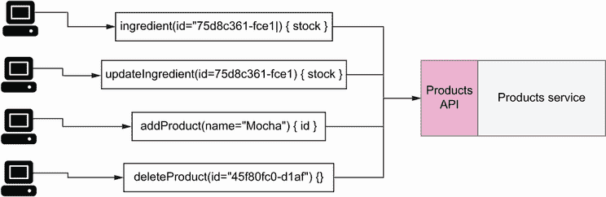

图 8.4 CoffeeMesh 员工使用产品服务来管理产品和配料。

让我们从为产品 API 管理的资源建模开始。我们想知道应该通过 API 公开哪种类型的资源以及产品的属性。从上一段的描述中，我们知道产品服务管理两种类型的资源：产品和配料。让我们首先分析产品。

CoffeeMesh 平台提供两种类型的产品：蛋糕和饮料。如图 8.5 所示，蛋糕和饮料都有一些共同的属性，包括产品的名称、价格、大小、配料列表以及其可用性。蛋糕有两个额外的属性：

+   `hasFilling`—表示蛋糕是否有填充物

+   `hasNutsToppingOption`—表示客户是否可以给蛋糕添加坚果作为配料

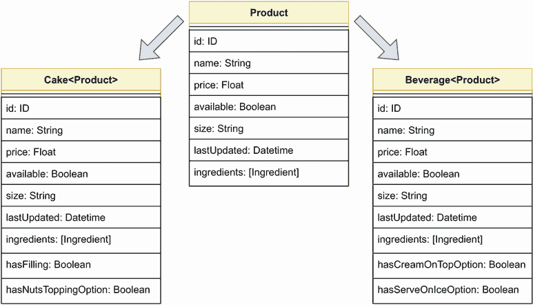

图 8.5 CoffeeMesh 公开了两种产品类型：`蛋糕`和`饮料`，它们都共享一组通用的属性列表。

饮料有以下两个额外的属性：

+   `hasCreamOnTopOption`—表示客户是否可以加奶油到饮料上

+   `hasServeOnIceOption`—表示客户是否可以选择要冰镇饮料

关于成分呢？正如图 8.6 所示，我们可以通过以下属性使用一个实体来表示所有成分：

+   `name`—成分的名称。

+   `stock`—该成分的可用库存。由于不同的成分使用不同的单位进行测量，例如千克或升，我们用每单位测量的数量来表示可用库存。

+   `description`—一组笔记，CoffeeMesh 员工可以使用它来描述和说明产品。

+   `supplier`—关于向 CoffeeMesh 供应成分的公司信息，包括他们的名称、地址、联系电话和电子邮件。

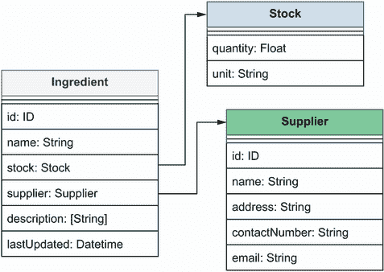

图 8.6 展示了描述成分的属性列表。成分的供应商由一个名为`Supplier`的资源来描述，而成分的库存通过一个`Stock`对象来描述。

现在我们已经模拟了产品服务管理的主要资源，让我们将注意力转向我们必须通过 API 公开的操作。我们将区分读取操作和写入/删除操作。当我们更仔细地查看第 8.8 节和第 8.9 节中的这些操作时，这种区分将变得有意义。

根据之前的讨论，我们将公开以下读取操作：

+   `allProducts()`—返回 CoffeeMesh 目录中可用的产品完整列表

+   `allIngredients()`—返回 CoffeeMesh 用于制作其产品的所有成分的完整列表

+   `products()`—允许用户根据某些标准（如可用性、最高价格等）过滤产品完整列表

+   `product()`—允许用户获取单个产品的信息

+   `ingredient()`—允许用户获取单个成分的信息

在写入/删除操作方面，根据之前的讨论，很明显我们应该公开以下功能：

+   `addIngredient()`—添加新成分

+   `updateStock()`—更新成分的库存

+   `addProduct()`—添加新产品

+   `updateProduct()`—更新现有产品

+   `deleteProduct()`—从目录中删除产品

现在我们已经了解了产品 API 的要求，是时候继续创建 API 规范了！在接下来的章节中，我们将学习如何为产品 API 创建 GraphQL 规范，并且在这个过程中，我们将了解 GraphQL 是如何工作的。我们的第一个停靠点是 GraphQL 的类型系统，我们将使用它来模拟 API 管理的资源。

## 8.3 介绍 GraphQL 的类型系统

在本节中，我们介绍 GraphQL 的类型系统。在 GraphQL 中，类型是允许我们描述数据属性的定义。它们是 GraphQL API 的构建块，我们使用它们来模拟 API 拥有的资源。在本节中，你将学习如何使用 GraphQL 的类型系统来描述我们在第 8.2 节中定义的资源。

### 8.3.1 使用标量创建属性定义

本节解释了我们如何使用 GraphQL 的类型系统来定义属性的类型。我们区分标量类型和对象类型。正如我们将在第 8.3.2 节中看到的，对象类型是表示实体的属性集合。*标量类型*是布尔值或整数等类型。定义属性类型的语法与我们使用 Python 中的类型提示非常相似：我们包括属性名称后跟一个冒号，以及冒号右侧的属性类型。例如，在第 8.2 节中，我们讨论了蛋糕有两个不同的属性：`hasFilling` 和 `hasNutsToppingOption`，这两个属性都是布尔值。使用 GraphQL 的类型系统，我们这样描述这些属性：

```
hasFilling: Boolean
hasNutsToppingOption: Boolean
```

GraphQL 支持以下类型的标量：

+   *字符串* (`String`)—用于基于文本的对象属性。

+   *整数* (`Int`)—用于数值对象属性。

+   *浮点数* (`Float`)—用于具有小数精度的数值对象属性。

+   *布尔值* (`Boolean`)—用于对象的二进制属性。

+   *唯一标识符* (`ID`)—用于描述对象 ID。技术上，ID 是字符串，但 GraphQL 会检查并确保每个对象的 ID 是唯一的。

除了定义属性的类型外，我们还可以指示属性是否为非可选的。可选属性是在我们不知道其值时可以设置为 `null` 的属性。我们通过在属性定义的末尾放置一个感叹号来标记属性为非可选的：

```
name: String!
```

这行定义了一个类型为 `String` 的属性 `name`，并通过使用感叹号将其标记为非可选的。这意味着，无论何时我们从 API 提供这个属性，它都将始终是一个字符串。

现在我们已经了解了属性和标量，让我们看看我们如何利用这些知识来建模资源！

### 8.3.2 使用对象类型建模资源

本节解释了我们如何使用 GraphQL 的类型系统来建模资源。资源是由 API 管理的实体，例如我们在第 8.2 节中讨论的成分、蛋糕和饮料。在 GraphQL 中，这些资源中的每一个都被建模为一个对象类型。*对象类型*是一组属性，正如其名称所示，我们使用它们来定义对象。要定义一个对象类型，我们使用 `type` 关键字后跟对象名称，以及用大括号括起来的对象属性列表。一个属性通过声明属性名称后跟一个冒号，以及冒号右侧的类型来定义。在 GraphQL 中，`ID` 是一个具有唯一值的类型。属性末尾的感叹号表示该属性是非可选的。以下展示了我们如何将蛋糕资源描述为一个对象类型。列表包含了蛋糕类型的基本属性，如 ID、名称和价格。

列表 8.1 `Cake` 对象类型的定义

```
type Cake {          ①
  id: ID!            ②
  name: String!
  price: Float
  available: Boolean!
  hasFilling: Boolean!
  hasNutsToppingOption: Boolean!
}
```

① 我们定义一个对象类型。

② 我们定义一个非可选的 ID 属性。

类型与对象类型 为了方便起见，除非另有说明，否则在本书中，我们将类型和对象类型的概念互换使用。

列表 8.1 中的一些属性定义以感叹号结尾。在 GraphQL 中，感叹号表示属性是非空白的，这意味着我们 API 返回的每个蛋糕对象都将包含一个 ID、一个名称、其可用性，以及 `hasFilling` 和 `hasNutsToppingOption` 属性。这也保证了这些属性都不会被设置为 `null`。对于 API 客户端开发者来说，这些信息非常有价值，因为他们知道他们可以依赖这些属性始终存在，并据此构建他们的应用程序。以下代码显示了 `Beverage` 和 `Ingredient` 类型的定义。它还显示了 `Supplier` 类型的定义，该类型包含有关供应特定成分的企业的信息，在 8.5.1 节中我们将看到如何将其与 `Ingredient` 类型连接起来。

列表 8.2 `Beverage` 和 `Ingredient` 对象类型的定义

```
type Beverage {
  id: ID!
  name: String!
  price: Float
  available: Boolean!
  hasCreamOnTopOption: Boolean!
  hasServeOnIceOption: Boolean!
}

type Ingredient {
  id: ID!
  name: String!
}

type Supplier {
  id: ID!
  name: String!
  address: String!
  contactNumber: String!
  email: String!
}
```

现在我们已经知道了如何定义对象类型，让我们通过学习如何创建自己的自定义类型来完善对 GraphQL 类型系统的探索！

### 8.3.3 创建自定义标量

本节解释了如何创建自定义标量定义。在 8.3.1 节中，我们介绍了 GraphQL 的内置标量：`String`、`Int`、`Float`、`Boolean` 和 `ID`。在许多情况下，这个标量类型列表足以模拟我们的 API 资源。然而，在某些情况下，GraphQL 的内置标量类型可能显得有限。在这种情况下，我们可以定义自己的自定义标量类型。例如，我们可能希望能够表示日期类型、URL 类型或电子邮件地址类型。

由于产品 API 用于管理产品和成分以及对其进行更改，因此添加一个 `lastUpdated` 属性很有用，该属性告诉我们记录最后一次更改的时间。`lastUpdated` 应该是一个 `Datetime` 标量。GraphQL 没有内置该类型的标量，因此我们必须自己创建。要声明一个自定义日期时间标量，我们使用以下语句：

```
scalar Datetime
```

我们还需要定义如何验证和序列化此标量类型。我们定义自定义标量在服务器实现中的验证和序列化规则，这将是第十章的主题。

列表 8.3 使用自定义的 `Datetime` 标量类型

```
scalar Datetime                    ①

type Cake {
  id: ID!
  name: String!
  price: Float
  available: Boolean!
  hasFilling: Boolean!
  hasNutsToppingOption: Boolean!
  lastUpdated: Datetime!           ②
}
```

① 我们声明一个自定义的 Datetime 标量。

② 我们声明一个类型为 Datetime 的非空属性。

这就结束了我们对 GraphQL 标量和对象类型的探索。你现在可以定义 GraphQL 中的基本对象类型并创建自己的自定义标量。在接下来的章节中，我们将学习如何在不同的对象类型之间创建连接，以及如何使用列表、接口、枚举等！

## 8.4 使用列表表示项目集合

本节介绍了 GraphQL 列表。列表是类型的数组，它们通过在类型周围加上方括号来定义。当我们需要定义表示项目集合的属性时，列表非常有用。如第 8.2 节所述，`Ingredient`类型包含一个名为`description`的属性，它包含有关成分的笔记集合，如下面的代码所示。

列表 8.4 表示字符串列表

```
type Ingredient {
  id: ID!
  name: String!
  description: [String!]     ①
}
```

① 我们定义了一个不可为空的项列表。

仔细观察`description`属性中感叹号的使用：我们将其定义为具有不可为空项的可空属性。这意味着什么？当我们从 API 返回成分时，它可能包含也可能不包含`description`字段，如果该字段存在，它将包含字符串列表。

当涉及到列表时，你必须仔细注意感叹号的使用。在列表属性中，我们可以使用两个感叹号：一个用于列表本身，另一个用于列表中的项。为了使列表及其内容都不可为空，我们为两者都使用感叹号。对于列表类型使用感叹号是 GraphQL 用户中最常见的混淆来源之一。表 8.1 总结了列表属性定义中感叹号每种组合的可能返回值。

使用感叹号和列表要小心！在 GraphQL 中，感叹号表示属性不可为空，这意味着该属性必须在对象中存在，并且其值不能为`null`。当涉及到列表时，我们可以使用两个感叹号：一个用于列表本身，另一个用于列表中的项。感叹号的不同组合将产生属性的不同表示。表 8.1 显示了每种组合的有效表示。

表 8.1 列表属性的合法返回值

|  | `[Word]` | `[Word!]` | `[Word]!` | `[Word!]!` |
| --- | --- | --- | --- | --- |
| `null` | 合法 | 合法 | 非法 | 非法 |
| `[]` | 合法 | 合法 | 合法 | 合法 |
| `["word"]` | 合法 | 合法 | 合法 | 合法 |
| `[null]` | 合法 | 非法 | 合法 | 非法 |
| `["word", null]` | 合法 | 非法 | 合法 | 非法 |

现在我们已经了解了 GraphQL 的类型系统和列表属性，我们准备探索 GraphQL 最强大和最令人兴奋的功能之一：类型之间的连接。

## 8.5 思考图形：在对象类型之间建立有意义的连接

本节解释了如何在 GraphQL 中创建对象之间的连接。GraphQL 的一个巨大好处是能够连接对象。通过连接对象，我们清楚地说明了我们的实体之间的关系。正如我们将在下一章中看到的，这使得我们的 GraphQL API 更容易被消费。

### 8.5.1 通过边缘属性连接类型

本节解释了如何通过使用**边属性**来连接类型：指向另一个类型的属性。可以通过创建一个指向另一个类型的属性来连接类型。如图 8.7 所示，连接另一个对象的属性被称为边。以下代码展示了我们如何通过向`Ingredient`添加一个名为`supplier`的属性来连接`Ingredient`类型和`Supplier`类型，该属性指向`Supplier`。

列表 8.5 一对一连接的 Edge

```
type Ingredient {
  id: ID!
  name: String!
  supplier: Supplier!       ①
  description: [String!]
}
```

① 我们使用边属性来连接 Ingredient 和 Supplier 类型。

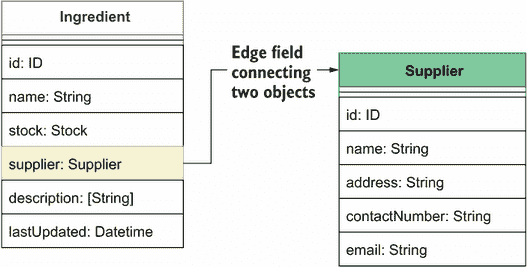

图 8.7 要将`Ingredient`类型与`Supplier`类型连接起来，我们在`Ingredient`中添加一个名为`supplier`的属性，该属性指向`Supplier`类型。由于`Ingredient`的`supplier`属性正在在两个类型之间创建连接，我们称它为边。

这是一个**一对一连接**的例子：一个对象中的属性指向恰好一个对象。在这个例子中，这个属性被称为边，因为它将`Ingredient`类型与`Supplier`类型连接起来。它也是一个**有向连接**的例子：如图 8.7 所示，我们可以从`Ingredient`类型到达`Supplier`类型，但不能反过来，所以连接只在一个方向上工作。

为了使`Supplier`和`Ingredient`之间的连接双向，⁴我们需要向`Supplier`类型添加一个指向`Ingredient`类型的属性。由于一个供应商可以提供多种成分，`ingredients`属性指向一个`Ingredient`类型的列表。这是一个**一对一连接**的例子。图 8.8 显示了`Ingredient`和`Supplier`类型之间新的关系。

列表 8.6 `Supplier`和`Ingredient`之间的双向关系

```
type Supplier {
  id: ID!
  name: String!
  address: String!
  contactNumber: String!
  email: String!
  ingredients: [Ingredient!]!     ①
}
```

① 我们在 Ingredient 和 Supplier 类型之间创建一个双向关系。

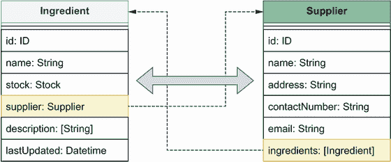

图 8.8 要在两个类型之间创建双向关系，我们需要向每个类型添加指向对方的属性。在这个例子中，`Ingredient`的`supplier`属性指向`Supplier`类型，而`Supplier`的`ingredients`属性指向一个成分列表。

现在我们知道了如何通过边属性创建简单的连接，让我们看看如何使用专用类型创建更复杂的连接。

### 8.5.2 使用通过类型创建连接

本节讨论了**通过类型**：这些类型告诉我们其他对象类型是如何相互连接的。它们提供了关于连接本身的一些额外信息。我们将使用通过类型来连接我们的产品、蛋糕和饮料及其成分。我们可以通过向`Cake`和`Beverage`添加一个简单的成分列表来连接它们，如图 8.9 所示，但这不会告诉我们每种成分在产品配方中各占多少。

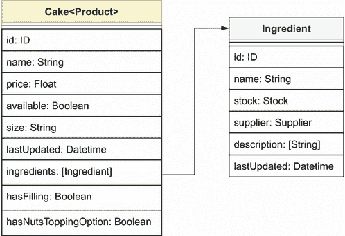

图 8.9 我们可以将`Cake`的`ingredients`字段表示为`Ingredient`类型的列表，但这不会告诉我们每种成分在蛋糕配方中各占多少。

为了将蛋糕和饮料与它们的成分连接起来，我们将使用一个称为`IngredientRecipe`的关联类型。如图 8.10 所示，`IngredientRecipe`有三个属性：成分本身、其数量以及数量所测量的单位。这为我们提供了关于我们的产品如何与它们的成分相关联的更多有意义的信息。

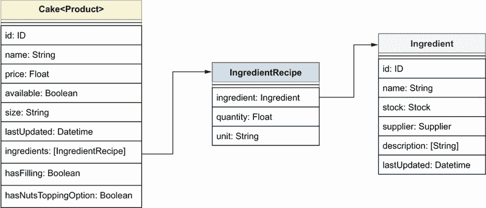

图 8.10 为了表达`Ingredient`如何与`Cake`连接，我们使用`IngredientRecipe`关联类型，这允许我们详细说明每种成分在蛋糕配方中各占多少。

列表 8.7 通过类型表示两种类型之间关系的类型

```
type IngredientRecipe {                   ①
  ingredient: Ingredient!
  quantity: Float!
  unit: String!
}

type Cake {
  id: ID!
  name: String!
  price: Float
  available: Boolean!
  hasFilling: Boolean!
  hasNutsToppingOption: Boolean!
  lastUpdated: Datetime!
  ingredients: [IngredientRecipe!]!       ②
}

type Beverage {
  id: ID!
  name: String!
  price: Float
  available: Boolean!
  hasCreamOnTopOption: Boolean!
  hasServeOnIceOption: Boolean!
  lastUpdated: Datetime!   
  ingredients: [IngredientRecipe!]!
}
```

① 我们声明`IngredientRecipe`关联类型。

② 我们通过类型声明成分为一个`IngredientRecipe`列表。

通过在对象类型之间创建连接，我们为 API 消费者提供了通过仅跟随类型中的连接边来探索我们的数据的能力。通过创建双向关系，我们为用户提供在数据图之间往返的能力。这是 GraphQL 最强大的功能之一，总是值得花时间设计跨我们数据的有意义连接。

更多的时候，我们需要创建表示多个类型的属性。例如，我们可能有一个表示蛋糕或饮料的属性。这是下一节的主题。

## 8.6 通过联合和接口组合不同类型

本节讨论了如何处理我们拥有多种相同实体类型的情况。你经常会遇到指向多个类型集合的属性。这在实践中意味着什么，又是如何工作的呢？让我们通过产品 API 的一个例子来看看！

在产品 API 中，`Cake`和`Beverage`是两种产品类型。在第 8.4.2 节中，我们看到了如何将`Cake`和`Beverage`与`Ingredient`类型连接起来。但我们是怎样将`Ingredient`连接到`Cake`和`Beverage`的呢？我们可以简单地给`Ingredient`类型添加一个名为`products`的属性，它指向一个`Cakes`和`Beverages`的列表，如下所示：

```
products: [Cake, Beverage]
```

这可行，但它不允许我们将`Cakes`和`Beverages`表示为单一的产品实体。我们为什么要这样做呢？原因如下：

+   `Cake`和`Beverage`是同一事物：一个产品，因此将它们视为同一实体是有意义的。

+   正如我们在第 8.8 节和第 8.9 节中将要看到的，我们将在代码的其他部分引用我们的产品，能够使用单一类型来做这一点将非常有帮助。

+   如果我们在未来向系统中添加新的产品类型，我们不希望不得不更改所有引用产品的规范部分。相反，我们希望有一个单一的类型来代表它们所有，并只更新那个类型。

GraphQL 提供了两种将各种类型组合到单个类型下的方法：联合和接口。让我们详细看看每种方法。

当我们有一些具有共同属性的类型时，接口非常有用。例如，对于`Cake`和`Beverage`类型，它们共享了大部分属性。GraphQL 接口与编程语言（如 Python）中的类接口类似：它们定义了一组必须由其他类型实现的属性。列表 8.8 展示了我们如何使用接口来表示`Cake`和`Beverage`共享的属性集合。正如你所看到的，我们使用`interface`关键字声明接口类型。`Cake`和`Beverage`类型实现了`ProductInterface`接口，因此它们必须定义`ProductInterface`类型中定义的所有属性。通过查看`ProductInterface`类型，任何使用我们 API 的用户都可以快速了解在`Beverage`和`Cake`类型上可访问哪些属性。

列表 8.8 通过接口表示公共属性

```
interface ProductInterface {                   ①
  id: ID!
  name: String!
  price: Float
  ingredients: [IngredientRecipe!]
  available: Boolean!
  lastUpdated: Datetime!
}

type Cake implements ProductInterface {        ②
  id: ID!
  name: String!
  price: Float
  available: Boolean!
  hasFilling: Boolean!                         ③
  hasNutsToppingOption: Boolean!
  lastUpdated: Datetime!
  ingredients: [IngredientRecipe!]!
}

type Beverage implements ProductInterface {    ④
  id: ID!
  name: String!
  price: Float
  available: Boolean!
  hasCreamOnTopOption: Boolean!
  hasServeOnIceOption: Boolean!
  lastUpdated: Datetime!
  ingredients: [IngredientRecipe!]!
}
```

① 我们声明了`ProductInterface`接口类型。

② `Cake`类型实现了`ProductInterface`接口。

③ 我们定义了特定于`Cake`的属性。

④ `Beverage`实现了`ProductInterface`接口。

通过创建接口，我们使 API 消费者更容易理解我们的产品类型共享的公共属性。正如我们将在下一章中看到的，接口也使 API 更容易消费。

虽然接口帮助我们定义各种类型的公共属性，但联合帮助我们将各种类型归入同一类型。当我们想要将各种类型视为单个实体时，这非常有用。在产品 API 中，我们希望能够将`Cake`和`Beverage`类型视为单个`Product`类型，联合允许我们这样做。联合类型是使用管道（`|`）运算符组合不同类型的结果。

列表 8.9 不同类型的联合

```
type Cake implements ProductInterface {
  id: ID!
  name: String!
  price: Float
  available: Boolean!
  hasFilling: Boolean!
  hasNutsToppingOption: Boolean!
  lastUpdated: Datetime!
  ingredients: [IngredientRecipe!]!
}

type Beverage implements ProductInterface {
  id: ID!
  name: String!
  price: Float
  available: Boolean!
  hasCreamOnTopOption: Boolean!
  hasServeOnIceOption: Boolean!
  lastUpdated: Datetime!
  ingredients: [IngredientRecipe!]!
}

union Product = Beverage | Cake      ①
```

① 我们创建了`Beverage`和`Cake`类型的联合。

使用联合和接口使我们的 API 更容易维护和消费。如果我们向 API 添加新的产品类型，我们可以确保它通过实现`ProductInterface`类型提供与`Cake`和`Beverage`类似的接口。通过将新产品添加到`Product`联合中，我们确保它可以在使用`Product`联合类型的所有操作中使用。

现在我们已经知道了如何组合多种对象类型，现在是时候学习如何通过枚举来约束对象类型属性的值了。

## 8.7 使用枚举约束属性值

本节介绍了 GraphQL 的枚举类型。技术上讲，枚举是一种只能取预定义值的特定类型的标量。枚举在只能接受受限列表中选择值的属性中非常有用。在 GraphQL 中，我们使用`enum`关键字后跟枚举名称来声明枚举，并在大括号内列出其允许的值。

在产品 API 中，我们需要枚举来表达成分的数量。例如，在第 8.5.2 节中，我们定义了一个通过类型`IngredientRecipe`，它表示产品中每种成分的量。`IngredientRecipe`以每单位测量的数量来表示数量。我们可以用不同的方式来衡量成分。例如，我们可以用品脱、升、盎司、加仑等方式来衡量牛奶。为了保持一致性，我们希望确保每个人都使用相同的单位来描述我们成分的数量，因此我们将创建一个名为`MeasureUnit`的枚举类型，它可以用来约束单位属性的值。

列表 8.10 使用`MeasureUnit`枚举类型

```
enum MeasureUnit {       ①
  LITERS                 ②
  KILOGRAMS
  UNITS
}

type IngredientRecipe {
    ingredient: Ingredient!
    quantity: Float!
    unit: MeasureUnit!   ③
}
```

① 我们声明一个枚举。

② 我们在这个枚举中列出允许的值。

③ 单位是非空属性，类型为`MeasureUnit`。

我们还希望使用`MeasureUnit`枚举来描述成分的可用库存。为此，我们定义一个`Stock`类型，并使用它来定义`Ingredient`类型的`stock`属性。

列表 8.11 使用`Stock`枚举类型

```
type Stock {              ①
  quantity: Float!
  unit: MeasureUnit!      ②
}

type Ingredient {
  id: ID!
  name: String!
  stock: Stock            ③
  products: [Product!]!
  supplier: Supplier!
  description: [String!]
}
```

① 我们声明`Stock`类型，以帮助我们表达有关成分可用库存的信息。

② 库存的单位属性是一个枚举。

③ 我们通过成分的库存属性将成分类型与库存类型连接起来。

枚举有助于确保某些值在整个接口中保持一致。这有助于避免当用户自行选择和编写这些值时发生的错误。

这标志着我们通过 GraphQL 类型系统的旅程结束。类型是 API 规范的构建块，但没有查询或与之交互的机制，我们的 API 将非常有限。要在服务器上执行操作，我们需要了解 GraphQL 查询和突变。这些将是本章剩余部分的主题！

## 8.8 定义查询以从 API 提供数据

本节介绍了 GraphQL *查询*：允许我们从服务器获取或读取数据的操作。提供数据是任何 Web API 最重要的功能之一，GraphQL 提供了极大的灵活性来创建强大的查询接口。查询对应于我们在第 8.2 节中讨论的读取操作组。作为提醒，这些是需要产品 API 支持查询操作：

+   `allProducts()`

+   `allIngredients()`

+   `products()`

+   `product()`

+   `ingredient()`

我们将首先处理`allProducts()`查询，因为它是最简单的，然后继续处理`products()`查询。当我们处理`products()`时，我们将看到如何向我们的查询定义添加参数，我们将了解分页，最后，我们将学习如何将查询参数重构为其自己的类型以提高可读性和维护性。

GraphQL 查询的规范看起来类似于 Python 函数签名定义：我们定义查询名称，可选地在括号内定义查询参数列表，并在冒号后指定返回类型。以下代码展示了产品 API 中最简单的查询：`allProducts()` 查询，它返回所有产品的列表。`allProducts()` 不接受任何参数，仅返回服务器中存在的所有产品列表。

列表 8.12 简单的 GraphQL 查询以返回产品列表

```
type Query {                   ①
  allProducts: [Products!]!    ②
}
```

① 所有查询都是在查询对象类型下定义的。

② 我们定义了 `allProducts()` 查询。在冒号之后，我们指明查询的返回类型。

`allProducts()` 返回 CoffeeMesh 数据库中所有产品的列表。此类查询如果我们想对所有产品进行彻底分析时很有用，但在现实生活中，我们的 API 用户希望能够过滤结果。他们可以通过使用 `products()` 查询来实现，根据我们在第 8.2 节中收集的要求，该查询返回过滤后的产品列表。

查询参数在括号内定义，类似于我们定义 Python 函数参数的方式。列表 8.13 展示了如何定义 `products()` 查询。它包括允许我们的 API 用户通过可用性或最大和最小价格过滤产品的参数。所有参数都是可选的。API 用户可以自由使用任何或所有查询参数，或者不使用任何参数。如果他们在使用 `products()` 查询时没有指定任何参数，他们将获得所有产品的列表。

列表 8.13 简单的 GraphQL 查询以返回产品列表

```
type Query {
  products(available: Boolean, maxPrice: Float, minPrice: Float):
    [Product!]      ①
}
```

① 查询参数在括号内定义。

除了过滤产品列表之外，API 用户可能还希望能够对列表进行排序并分页显示结果。分页是将查询结果以指定大小的不同集合的形式提供的能力，并且在 API 中通常用于确保 API 客户端在每次请求中接收合理数量的数据。如图 8.11 所示，如果查询的结果有 10 条或更多记录，我们可以将查询结果分成每组五项的组，并一次服务一组。每组被称为 *页面*。

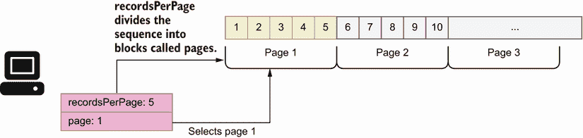

图 8.11 一种更常见的分页方法是让用户决定他们希望每页显示多少结果，并让他们选择他们想要获取的特定页面。

我们通过向查询中添加 `resultsPerPage` 参数和 `page` 参数来启用分页。为了对结果集进行排序，我们公开了一个 `sort` 参数。以下代码片段以粗体显示了在添加这些参数后对 `products()` 查询所做的更改：

```
type Query {
  products(available: Boolean, maxPrice: Float, minPrice: Float, sort: String, 
      resultsPerPage: Int, page: Int): [Product!]!
}
```

提供众多的查询参数给我们的 API 消费者提供了很大的灵活性，但为所有这些参数设置值可能会很繁琐。我们可以通过为一些参数设置默认值来使我们的 API 更容易使用。我们将设置一个默认排序顺序，以及 `resultsPerPage` 参数和 `page` 参数的默认值。以下代码显示了如何为 `products()` 查询中的某些参数分配默认值，并包括一个 `SortingOrder` 枚举，该枚举将 `sort` 参数的值限制为 `ASCENDING` 或 `DESCENDING`。

列表 8.14 为查询参数设置默认值

```
enum SortingOrder {                      ①
  ASCENDING
  DESCENDING
}

type Query {
  products(
    maxPrice: Float
    minPrice: Float
    available: Boolean = true            ②
    sort: SortingOrder = DESCENDING ③
    resultsPerPage: Int = 10
    page: Int = 1
  ): [Product!]!
}
```

① 我们声明了 SortingOrder 枚举。

② 我们为一些参数分配默认值。

③ 我们通过将 sort 的类型设置为 SortingOrder 枚举来限制 sort 的值。

`products()` 查询的签名正变得越来越杂乱。如果我们继续向其中添加参数，它将变得难以阅读和维护。为了提高可读性，我们可以将参数从查询规范中重构出来，形成它们自己的类型。在 GraphQL 中，我们可以通过使用输入类型来定义参数列表，这些输入类型看起来和感觉上与任何其他 GraphQL 对象类型相同，但它们是用于查询和 mutations 的输入。

列表 8.15 将查询参数重构为输入类型

```
input ProductsFilter {                            ①
  maxPrice: Float                                 ②
  minPrice: Float
  available: Boolean = true,                      ③
  sort: SortingOrder = DESCENDING
  resultsPerPage: Int = 10
  page: Int = 1
}

type Query {
  products(input: ProductsFilter): [Product!]!    ④
}
```

① 我们声明了 ProductsFilter 输入类型。

② 我们定义 ProductsFilter 的参数。

③ 我们为一些参数分配默认值。

④ 我们将输入参数的类型设置为 ProductsFilter。

剩余的 API 查询，即 `allIngredients()`、`product()` 和 `ingredient()`，在列表 8.16 中以粗体显示。`allIngredients()` 返回完整的成分列表，因此不需要参数，就像 `allProducts()` 查询一样。最后，`product()` 和 `ingredient()` 通过 ID 返回单个产品或成分，因此需要一个必需的 `id` 参数，参数类型为 ID。如果找到了提供的 ID 对应的产品或成分，查询将返回请求项的详细信息；否则，它们将返回 `null`。

列表 8.16 产品 API 中所有查询的规范

```
type Query {
  allProducts: [Product!]!
  allIngredients: [Ingredient!]!
  products(input: ProductsFilter!): [Product!]!
  product(id: ID!): Product                        ①
  ingredient(id: ID!): Ingredient
}
```

① product() 返回一个可空的 Product 类型结果。

现在我们已经知道了如何定义查询，是时候学习 mutations 了，这是下一节的主题。

## 8.9 使用 mutations 改变服务器的状态

本节介绍了 GraphQL **mutations**：允许我们触发改变服务器状态的操作的命令。虽然查询的目的是让我们从服务器获取数据，但 mutations 允许我们创建新资源、删除它们或改变它们的状态。mutations 有一个返回值，可以是标量，例如布尔值，或是一个对象。这允许我们的 API 消费者验证操作是否成功完成，并获取服务器生成的任何值，例如 ID。

在 8.2 节中，我们讨论了产品 API 需要支持以下操作以在服务器中添加、删除和更新资源：

+   `addIngredient()`

+   `updateStock()`

+   `addProduct()`

+   `updateProduct()`

+   `deleteProduct()`

在本节中，我们将记录 `addProduct()`、`updateProduct()` 和 `deleteProduct()` 演变。其他演变的规范与这些类似，你可以在本书提供的 GitHub 仓库中查看它们。

GraphQL 演变看起来类似于 Python 中函数的签名：我们定义演变的名称，在括号中描述其参数，并在冒号后提供其返回类型。列表 8.17 展示了 `addProduct()` 演变的规范。`addProduct()` 接受一系列参数，并返回 `Product` 类型。所有参数都是可选的，除了 `name` 和 `type`。我们使用 `type` 来指示我们正在创建的产品类型，是蛋糕还是饮料。我们还包含了一个 `ProductType` 枚举来约束 `type` 参数的值只能是 `cake` 或 `beverage`。由于这个演变用于创建蛋糕和饮料，我们允许用户指定每种类型的属性，即蛋糕的 `hasFilling` 和 `hasNutsToppingOption`，以及饮料的 `hasCreamOnTopOption` 和 `hasServeOnIceOption`，但我们默认将它们设置为 `false` 以简化演变的用法。

列表 8.17 定义 GraphQL 演变

```
enum ProductType {                           ①
  cake
  beverage
}

input IngredientRecipeInput {
  ingredient: ID!
  quantity: Float!
  unit: MeasureUnit!
}

enum Sizes {
  SMALL
  MEDIUM
  BIG
}

type Mutation {                              ②
  addProduct(
    name: String!
    type: ProductType!
    price: String
    size: Sizes
    ingredients: [IngredientRecipeInput!]! 
    hasFilling: Boolean = false
    hasNutsToppingOption: Boolean = false
    hasCreamOnTopOption: Boolean = false
    hasServeOnIceOption: Boolean = false
  ): Product!                                ③
}
```

① 我们声明一个 `ProductType` 枚举。

② 我们在 `Mutation` 对象类型下声明演变。

③ 我们指定了 `addProduct()` 的返回类型。

你会同意 `addProduct()` 演变的签名定义看起来有点杂乱。我们可以通过将参数列表重构为它们自己的类型来提高可读性和可维护性。列表 8.18 展示了如何通过将参数列表移动到输入类型中来重构 `addProduct()` 演变。`AddProductInput` 包含了在创建新产品时可以设置的 所有可选参数。我们留出了 `name` 参数，这是创建新产品时唯一的必需参数。正如我们很快就会看到的，这允许我们在不需要 `name` 参数的其他演变中重用 `AddProductInput` 输入类型。

列表 8.18 使用输入类型重构参数

```
input AddProductInput { ①
  price: String ②
  size: Sizes 
  ingredients: [IngredientRecipeInput!]!
  hasFilling: Boolean = false ③
  hasNutsToppingOption: Boolean = false
  hasCreamOnTopOption: Boolean = false
  hasServeOnIceOption: Boolean = false
}

type Mutation {
  addProduct(
    name: String!
    type: ProductType!
    input: AddProductInput!
  ): Product!                             ④
}
```

① 我们声明 `AddProductInput` 输入类型。

② 我们列出 `AddProductInput` 的参数。

③ 我们为一些参数指定了默认值。

④ `addProduct()` 方法的输入参数具有 `AddProduct` 输入类型。

输入类型不仅帮助我们使规范更易于阅读和维护，而且还可以允许我们创建可重用的类型。我们可以在 `updateProduct()` 变异的签名中重用 `AddProductInput` 输入类型。当我们更新产品的配置时，我们可能只想更改其某些参数，例如名称、价格或其成分。下面的片段显示了我们在 `updateProduct()` 中如何重用 `AddProductInput` 参数。除了 `AddProductInput` 之外，我们还包括一个强制性的产品 `id` 参数，这是识别我们想要更新的产品所必需的。我们还包括 `name` 参数，在这种情况下是可选的：

```
type Mutation {
  updateProduct(id: ID!, input: AddProductInput!): Product!
}
```

让我们现在看看 `deleteProduct()` 变异，它从目录中删除一个产品。为此，用户必须提供他们想要删除的产品的 ID。如果操作成功，变异返回 `true`；否则，返回 `false`。下面的片段显示了 `deleteProduct()` 变异的规范：

```
deleteProduct(id: ID!): Boolean!
```

这标志着我们通过 GraphQL 的 SDL 的旅程结束！你现在已经拥有了定义自己的 API 模式的所有必要工具。在第九章中，我们将学习如何使用产品 API 规范启动模拟服务器，以及如何消费和交互 GraphQL API。

## 摘要

+   GraphQL 是构建 Web API 的流行协议。它在需要给予 API 客户端对要获取的数据有完全控制权的情况下，以及在数据高度互联的情况下表现出色。

+   一个 GraphQL API 规范被称为模式，它使用模式定义语言（SDL）编写。

+   我们使用 GraphQL 的标量类型来定义对象类型的属性：布尔值、字符串、浮点数、整数和 ID。此外，我们还可以创建自己的自定义标量类型。

+   GraphQL 的对象类型是属性的集合，它们通常代表由 API 服务器管理的资源或实体。

+   我们可以通过使用边缘属性来连接对象，即指向另一个对象的属性，以及通过使用通过类型。通过类型是添加关于两个对象如何连接的额外信息的对象类型。

+   要约束属性的值，我们使用枚举类型。

+   GraphQL 查询是允许 API 客户端从服务器获取数据的操作。

+   GraphQL 变异是允许 API 客户端触发改变服务器状态的行动的操作。

+   当查询和变更有长参数列表时，我们可以将它们重构为输入类型以提高可读性和可维护性。输入类型也可以在多个查询或变体中重用。

* * *

¹ 此定义出现在 GraphQL 规范的主页上：[`graphql.org/`](https://graphql.org/)。

² 我将 GraphQL 与 SQL 的比较归功于 Eve Porcello 和 Alex Banks，*学习 GraphQL，现代 Web 应用程序声明式数据获取*（O’Reilly，2018），第 31-32 页。

³ GraphQL 网站维护了一个在不同语言中构建 GraphQL 服务器的可用运行时列表：[`graphql.org/code/`](https://graphql.org/code/).

⁴ 在关于 GraphQL 的文献中，你经常会发现关于 GraphQL 受图论启发的讨论，以及我们如何使用图论的一些概念来阐述类型之间的关系。遵循这一传统，我们这里提到的双向关系是一个无向图的例子，因为可以从 `Supplier` 类型到达 `Ingredient` 类型，反之亦然。关于 GraphQL 上下文中的图论的良好讨论，请参阅 Eve Porcello 和 Alex Banks 的作品 *Learning GraphQL, Declarative Data Fetching for Modern Web Apps* (O’Reilly, 2018)，第 15-30 页。
