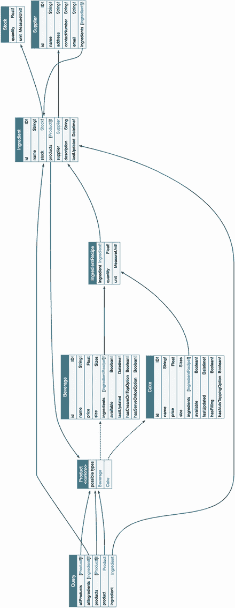
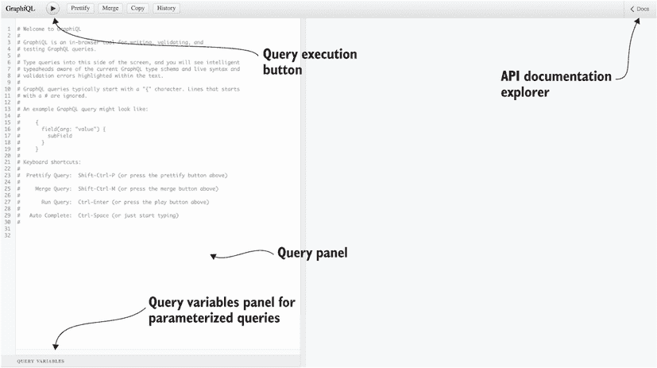
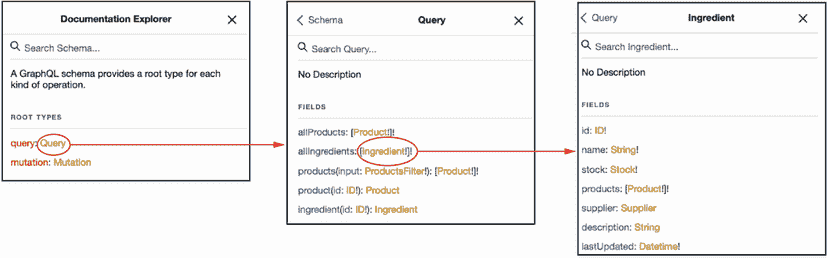
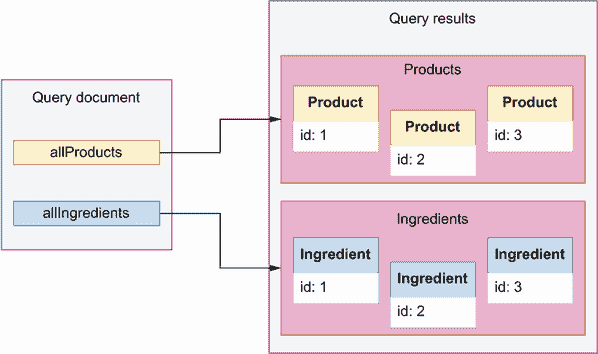
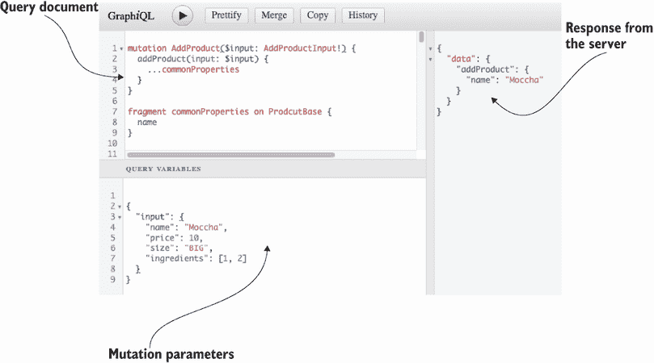
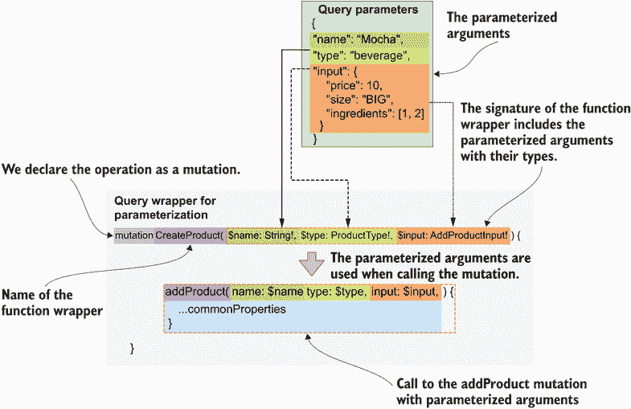

# 9 消费 GraphQL API

本章涵盖

+   运行 GraphQL 模拟服务器以测试我们的 API 设计

+   使用 GraphiQL 客户端探索和消费 GraphQL API

+   对 GraphQL API 执行查询和突变

+   使用 cURL 和 Python 以编程方式消费 GraphQL API

本章教您如何消费 GraphQL API。正如我们在第八章中学到的，GraphQL 为 Web API 提供了一种查询语言，在本章中，您将学习如何使用这种语言在服务器上运行查询。特别是，您将学习如何对 GraphQL API 进行查询。您将学习探索 GraphQL API 以发现其可用的类型、查询和突变。从客户端理解 GraphQL API 的工作原理是掌握 GraphQL 的重要一步。

学习与 GraphQL API 交互将帮助您学习消费其他供应商公开的 API，它将允许您对自己的 API 进行测试，并帮助您设计更好的 API。您将学习使用 GraphiQL 客户端探索和可视化 GraphQL API。正如您将看到的，GraphiQL 提供了一个交互式查询面板，这使得在服务器上运行查询变得更容易。

为了说明 GraphQL 查询语言背后的概念和思想，我们将使用第八章中设计的产品 API 运行实际示例。由于我们尚未实现产品 API 的 API 规范，我们将学习运行模拟服务器——这是 API 开发过程中的重要部分，因为它使测试和验证 API 设计变得容易得多。最后，您还将学习如何使用 cURL 和 Python 等工具以编程方式对 GraphQL API 进行查询。

## 9.1 运行 GraphQL 模拟服务器

在本节中，我们解释了如何运行 GraphQL 模拟服务器以探索和测试我们的 API。模拟服务器是一个模仿真实服务器行为的假服务器，提供相同的端点和功能，但使用假数据。例如，产品 API 的模拟服务器是一个模仿产品 API 实现并提供与我们第八章中开发的相同接口的服务器。

定义*模拟服务器*是模仿真实服务器行为的假服务器。它们通常在实现后端时用于开发 API 客户端。您可以使用 API 规范启动模拟服务器。模拟服务器返回假数据，通常不会持久化数据。

模拟服务器在开发 Web API 中起着至关重要的作用，因为它们允许我们的 API 消费者在我们进行后端实现的同时开始编写客户端代码。在本节中，我们将运行产品 API 的模拟服务器。我们运行模拟服务器所需的一切就是 API 规范，这是我们第八章中开发的。您可以在本书的 GitHub 仓库中的 ch08/schema.graphql 下找到 API 规范。

您可以从许多不同的库中选择来运行一个 GraphQL 模拟服务器。在本章中，我们将使用 GraphQL Faker ([`github.com/APIs-guru/graphql-faker`](https://github.com/APIs-guru/graphql-faker))，这是最受欢迎的 GraphQL 模拟工具之一。要安装 GraphQL Faker，请运行以下命令：

```
$ npm install graphql-faker
```

这将在您的当前目录下创建一个 package-lock.json 文件，以及一个 node_modules 文件夹。package-lock.json 包含了与 graphql-faker 一起安装的依赖项信息，而 node_modules 是这些依赖项安装的目录。要运行模拟服务器，请执行以下命令：

```
$ ./node_modules/.bin/graphql-faker schema.graphql
```

GraphQL Faker 通常在端口 9002 上运行，并暴露了三个端点：

+   `/editor`—一个交互式编辑器，您可以在其中开发您的 GraphQL API。

+   `/graphql`—这是您的 GraphQL API 的 GraphiQL 接口。这是我们用来探索 API 和运行查询的接口。

+   `/voyager`—这是您 API 的交互式展示，有助于您理解类型之间的关系和依赖（见图 9.1）。



图 9.1 产品 API 的 Voyager UI。此 UI 显示了 API 中可用查询捕获的对象类型之间的关系。通过跟随连接箭头，您可以看到我们可以从每个查询到达哪些对象。

要开始探索和测试产品 API，请在您的浏览器中访问以下地址：http://localhost:9002/graphql（如果您在另一个端口上运行 GraphQL Faker，则您的 URL 将不同）。此端点加载了我们的产品 API 的 GraphiQL 接口。图 9.2 展示了此接口的外观，并突出了其中的最重要的元素。



图 9.2 GraphiQL 中的 API 文档浏览器和查询面板界面

要发现 API 暴露的查询和突变，请点击 UI 右上角处的 Docs 按钮。点击 Docs 按钮后，将弹出一个侧边导航栏，提供两个选项：查询或突变（见图 9.3）。如果您选择查询，您将看到服务器暴露的查询列表及其返回类型。您可以点击返回类型来探索它们的属性，如图 9.3 所示。在下一节中，我们将开始测试 GraphQL API！



图 9.3 通过在 GraphiQL 中的文档浏览器中点击，您可以检查 API 中所有可用的查询和突变，以及它们返回的类型及其属性。

## 9.2 介绍 GraphQL 查询

在本节中，我们学习通过使用 GraphiQL 运行查询来消费 GraphQL API。我们将从不需要任何参数的简单查询开始，然后我们将继续到带有参数的查询。

### 9.2.1 运行简单查询

在本节中，我们介绍了一些不需要参数的简单查询。产品 API 提供了两种此类查询：`allProducts()`，它返回 CoffeeMesh 提供的所有产品的列表，以及 `allIngredients()`，它返回所有成分的列表。

我们将使用 GraphiQL 来运行针对 API 的查询。要运行查询，请转到 GraphiQL UI 中的查询编辑器面板，如图 9.2 所示。列表 9.1 展示了如何运行 `allIngredients()` 查询。正如你所看到的，要运行查询，我们必须使用查询操作的名称后跟大括号。在大括号内，我们声明从服务器获取的属性选择。大括号内的块称为 *选择集*。GraphQL 查询必须始终包含选择集。如果你不包括它，你将收到来自服务器的错误响应。在这里，我们只选择了每个成分的名称。表示查询的文本称为 *查询文档*。

列表 9.1 运行 `allIngredients()` 查询的查询文档

```
{                     ①
  allIngredients {    ②
    name              ③
  }
}
```

① 我们将查询放在大括号内。

② 我们运行 `allIngredients()` 查询。

③ 我们查询名称属性。

来自 GraphQL API 的成功查询的响应包含一个包含“data”字段的 JSON 文档，它包装了查询结果。不成功的查询会导致包含“error”键的 JSON 文档。由于我们正在运行模拟服务器，API 返回随机值。

列表 9.2 `allIngredients()` 查询的成功响应示例

```
{
  "data": {                 ①
    "allIngredients": [     ②
      {
        "name": "string"
      },
      {
        "name": "string"
      }
    ]
  }
}
```

① 成功的响应包括一个 "data" 键。

② 查询的结果在以查询本身命名的键下索引。

既然我们已经了解了 GraphQL 查询的基础知识，让我们通过添加参数来丰富我们的查询吧！

### 9.2.2 使用参数运行查询

本节解释了我们在 GraphQL 查询中使用参数的方式。`allIngredients()` 是一个不需要任何参数的简单查询。现在让我们看看如何运行需要参数的查询。此类查询的一个例子是 `ingredient()` 查询，它需要一个 `id` 参数。以下代码展示了我们如何使用随机 ID 调用 `ingredient()` 查询。正如你所看到的，我们将查询参数作为冒号分隔的键值对包含在括号内。

列表 9.3 使用必需参数运行查询

```
{
  ingredient(id: "asdf") {    ①
    name
  }
}
```

① 我们调用 `ingredient()`，将 ID 参数设置为 "asdf "。

现在我们已经知道了如何运行带参数的查询，让我们看看在运行查询时可能会遇到的问题类型以及如何处理它们。

### 9.2.3 理解查询错误

本节解释了在运行 GraphQL 查询时可能会遇到的一些常见错误，并教你如何阅读和解释它们。

如果你运行 `ingredient()` 查询时省略了所需的参数，你将收到来自 API 的错误。错误响应包括一个错误键，指向服务器找到的所有错误的列表。每个错误都是一个具有以下键的对象：

+   `message`——包含错误的人类可读描述

+   `locations`—指定错误在查询中的位置，包括行和列

列表 9.4 显示了当你运行空括号的查询时会发生什么。正如你所见，我们得到了一个带有某种隐晦信息的语法错误：`Expected` `Name,` `found` `)`。这是一个在 GraphQL 中发生语法错误时的常见错误。在这种情况下，这意味着 GraphQL 期望在开括号之后有一个参数，但相反，它找到了一个闭括号。

列表 9.4 缺少查询参数错误

```
# Query:
{
  ingredient() {                                           ①
    name
  }
}

# Error:
{
  "errors": [                                              ②
    {
      "message": "Syntax Error: Expected Name, found )",   ③
      "locations": [                                       ④
        {
          "line": 2,                                       ⑤
          "column": 14                                     ⑥
        }
      ]
    }
  ]
}
```

① 我们运行 ingredient()查询时没有包含必需的参数 id。

② 不成功的响应包括一个"errors"键。

③ 我们得到一个通用的语法错误。

④ 错误的确切位置在我们的查询中

⑤ 错误出现在我们的查询文档的第二行。

⑥ 错误出现在第二行的第 14 个字符。

另一方面，如果你像列表 9.5 中所示的那样运行没有任何括号的`ingredient()`查询，你将得到一个错误，指出你遗漏了必需的参数`id`。

在 GraphQL 查询和突变中使用括号 在 GraphQL 中，查询的参数定义在括号内。如果你运行一个包含必需参数的查询，例如`ingredient`，你必须将参数包含在括号内（参见列表 9.3）。如果不这样做，将会抛出错误（参见列表 9.4 和 9.5）。如果你运行一个不带参数的查询，你必须省略括号。例如，当我们运行`allIngredients()`查询时，我们省略括号（参见列表 9.1），因为`allIngredients()`不需要任何括号。

列表 9.5 缺少查询参数错误

```
# Query:
{
  ingredient {                           ①
    name
  }
}

# Error:
{
  "errors": [
    {
      "message": "Field \"ingredient\" argument \"id\" of type \"ID!\" is 
➥ required, but it was not provided.",  ②
      "locations": [
        {
          "line": 2,                     ③
          "column": 3                    ④
        }
      ]
    }
  ]
}
```

① 我们运行 ingredient()查询时没有括号。

② 错误信息表明查询中缺少 id 参数。

③ 错误出现在我们的查询文档的第二行。

④ 错误出现在第二行的第三个字符。

现在我们知道了如何在查询出错时阅读和解释错误信息，让我们来探索返回多个类型的查询。

## 9.3 在查询中使用片段

本节解释了我们如何运行返回多个类型的查询。到目前为止，本章中我们看到的查询很简单，因为它们只返回一个类型，即`Ingredient`。然而，我们的与产品相关的查询，如`allProducts()`和`product()`，返回的是`Product`联合类型，它是`Cake`和`Beverage`类型的组合。在这种情况下，我们如何运行我们的查询？

当一个 GraphQL 查询返回多个类型时，我们必须为每个类型创建选择集。例如，如果你使用单个选择集运行`allProducts()`查询，你将得到一个错误信息，表明服务器不知道如何解析选择集中的属性。

列表 9.6 使用单个选择集调用`allProducts()`

```
# Query
{
  allProducts {              ①
    name                     ②
  }
}

# Error message
{
  "errors": [                ③
    {
      "message": "Cannot query field \"name\" on type \"Product\". Did you 
➥ mean to use an inline fragment on \"ProductInterface\", \"Beverage\", 
➥ or \"Cake\"?",            ④
      "locations": [
        {
          "line": 3,         ⑤
          "column": 5        ⑥
        }
      ]
    }
  ]
}
```

① 我们运行 allProducts()查询时没有参数。

② 我们在选择集中包含名称属性。

③ 我们得到一个错误响应。

④ 服务器不知道如何解析选择集中的属性。

⑤ 错误出现在查询文档的第三行。

⑥ 错误出现在第三行的第五个位置。

列表 9.6 中的错误信息询问你是否想在`ProductInterface`、`Beverage`或`Cake`上使用内联片段。什么是内联片段？内联片段是在特定类型上的匿名选择集。内联片段的语法包括三个点（JavaScript 中的扩展运算符）后跟`on`关键字和选择集应用到的类型，以及花括号之间的属性选择：

```
...on ProductInterface {
      name
    }
```

列表 9.7 通过添加选择`ProductInterface`、`Cake`和`Beverage`类型属性的内联片段来修复`allProducts()`查询。`allProducts()`的返回类型是`Product`，它是`Cake`和`Beverage`的联合，因此我们可以从这两种类型中选择属性。从规范中，我们还知道`Cake`和`Beverage`实现了`ProductInterface`接口类型，因此我们可以方便地在接口上直接选择`Cake`和`Beverage`共有的属性。

列表 9.7 添加每个返回类型的内联片段

```
{
  allProducts {
    ...on ProductInterface {     ①
      name
    }
    ...on Cake {                 ②
      hasFilling
    }
    ...on Beverage {             ③
      hasCreamOnTopOption
    }
  }
}
```

① 在 ProductInterface 类型上有选择集的内联片段

② 在 Cake 类型上有选择集的内联片段

③ 在 Beverage 类型上有选择集的内联片段

列表 9.7 使用内联片段，但片段的实际好处是我们可以将它们定义为独立的变量。这使得片段可重用，同时也使我们的查询更易于阅读。列表 9.8 展示了我们如何重构列表 9.7 以使用独立片段。查询变得如此干净！在实际情况下，你很可能会处理大量的选择集，因此将你的片段组织成独立的、可重用的代码片段将使你的查询更容易阅读。

列表 9.8 使用独立片段

```
{
  allProducts {
    ...commonProperties
    ...cakeProperties
    ...beverageProperties
  }
}
fragment commonProperties on ProductInterface {
  name
}

fragment cakeProperties on Cake {
  hasFilling
}

fragment beverageProperties on Beverage {
  hasCreamOnTopOption
}
```

现在我们知道了如何处理返回多个对象类型的查询，让我们将我们的查询技能提升到下一个层次。在下一节中，我们将学习如何使用一种称为输入参数的特定类型参数运行查询。

## 9.4 使用输入参数运行查询

本节解释了如何使用输入类型参数运行查询。在第 8.8 节中，我们了解到输入类型类似于对象类型，但它们是为了用作 GraphQL 查询或变异的参数。在产品 API 中，`ProductsFilter`是一个输入类型的例子，它允许我们通过可用性、最低或最高价格等因素过滤产品。`ProductsFilter`是`products()`查询的参数。我们如何调用`products()`查询？

当一个查询以输入类型的形式接受参数时，查询的输入类型参数必须以输入对象的形式传递。这可能听起来很复杂，但实际上非常简单。我们使用 `ProductsFilter` 的 `maxPrice` 参数调用 `products()` 查询。要使用输入类型中的任何参数，我们只需用大括号将它们括起来。

列表 9.9 使用必需参数调用查询

```
{
  products(input: {maxPrice: 10}) {    ①
    ...on ProductInterface {           ②
      name
    }
  }
}
```

① 指定 ProductFilter 的 maxPrice 参数。

② 在 ProductInterface 类型上的内联片段

现在我们已经知道了如何使用输入参数调用查询，让我们更深入地了解 API 规范中定义的对象之间的关系，并看看我们如何构建允许我们遍历我们的数据图的查询。

## 9.5 导航 API 图

本节解释了如何通过利用它们的连接从多个类型中选择属性。在 8.5 节中，我们学习了如何通过使用边属性和通过类型创建对象类型之间的连接。这些连接允许 API 客户端遍历 API 管理的资源之间的关系图。例如，在产品 API 中，`Cake` 和 `Beverage` 类型通过一个称为 `IngredientRecipe` 的通过类型与 `Ingredient` 类型连接。通过利用这个连接，我们可以运行查询，获取与每个产品相关的成分信息。在本节中，我们将学习如何构建这样的查询。

在我们的查询中，每当我们添加一个指向另一个对象类型的属性的选择器时，我们必须包括一个嵌套的选择集。例如，如果我们添加了 `ProductInterface` 类型上的 `ingredient` 属性的选择器，我们必须包括一个包含在 `ingredients` 属性中的 `IngredientRecipe` 的任何属性的选择集。我们在 `allProducts()` 查询中包含了 `ProductInterface` 的 `ingredients` 属性的嵌套选择集。该查询选择了每个产品的名称以及产品配方中每个成分的名称。

列表 9.10 查询嵌套对象类型

```
{
  allProducts {
    ...on ProductInterface {    ①
      name,
      ingredients {             ②
        ingredient {            ③
          name
        }
      }
    }
  }
}
```

① 在 ProductInterface 类型上的内联片段

② ProductInterface 的 ingredients 属性选择器

③ IngredientRecipe 的 ingredient 属性选择器

列表 9.10 利用 `ProductInterface` 和 `Ingredient` 类型之间的连接，在单个查询中从这两个类型中获取信息，但我们还可以更进一步。`Ingredient` 类型包含一个 `supplier` 属性，它指向 `Supplier` 类型。假设我们想要获取一个产品列表，包括它们的名称和成分，以及每个成分的供应商名称。（我鼓励您访问由 `graphql-faker` 生成的 Voyager UI，以可视化此查询捕获的关系；图 9.1 是 Voyager UI 的示意图。）

列表 9.11 通过类型之间的连接遍历产品 API 图

```
{
  allProducts {
    ...on ProductInterface {     ①
      name
      ingredients {              ②
        ingredient {             ③
          name
          supplier {             ④
            name
          }
        }
      }
    }
  }
}
```

① 在 ProudctInterface 类型上的内联片段

② ProductInterface 的 ingredients 属性的选择器

③ IngredientRecipe 的 ingredient 属性选择器

④ Ingredient 的 supplier 属性选择器

列表 9.11 正在遍历我们的类型图。从`ProductInterface`类型开始，我们可以通过利用它们的连接来获取其他对象的信息，例如`Ingredient`和`Supplier`。

这就是 GraphQL 最强大的功能之一，也是与其他类型的 API（如 REST）相比的主要优势之一。使用 REST，我们需要进行多个请求才能获取在列表 9.11 中通过一个请求就能获取的所有信息。GraphQL 赋予你获取所需所有信息，以及仅获取所需信息的权力，在一个请求中完成。

现在我们已经知道了如何在 GraphQL API 中遍历类型图，让我们通过学习如何在单个请求中运行多个查询来将我们的查询技能提升到下一个层次！

## 9.6 运行多个查询和查询别名

本节解释了如何在每个请求中运行多个查询以及如何为服务器返回的响应创建别名。别名我们的查询意味着更改服务器返回的数据集索引下的键。正如我们将看到的，别名可以提高服务器返回结果的可读性，尤其是在我们每个请求进行多个查询时。

### 9.6.1 在同一请求中运行多个查询

在前面的章节中，我们每次请求只运行一个查询。然而，GraphQL 也允许我们在一个请求中发送多个查询。这是 GraphQL 的另一个强大功能，可以帮助我们节省不必要的网络往返到服务器，从而提高我们应用程序的整体性能和用户体验。

假设我们想要获取 CoffeeMesh 平台中所有产品和成分的列表，如图 9.4 所示。为此，我们可以运行`allIngredients()`和`allProducts()`查询。列表 9.12 显示了如何在同一个查询文档中包含这两个操作。通过在同一个查询文档中包含多个查询，我们确保它们都通过同一个请求发送到服务器，从而节省了往返服务器的次数。代码还包括一个命名片段，该片段选择`ProductInterface`类型的属性。命名片段有助于保持我们的查询简洁和专注。

列表 9.12 每个请求中的多个查询

```
{
  allProducts {                                       ①
    ...commonProperties                               ②
  }
  allIngredients {                                    ③
    name
  }
}

fragment commonProperties on ProductInterface {       ④
  name
}
```

① 我们运行不带参数的 allProducts()查询。

② 我们使用命名片段选择属性。

③ 运行 allIngredients()查询。

④ 在 ProductInterface 类型上具有选择集的命名片段



图 9.4 在 GraphQL 中，我们可以在同一个请求中运行多个查询，并且响应将包含每个查询的一个数据集。

### 9.6.2 别名我们的查询

我们在前几节中运行的所有查询都是匿名查询。当我们进行匿名查询时，服务器返回的数据会出现在我们调用的查询名称命名的键下。

列表 9.13 匿名查询的结果

```
# Query:
{
  allIngredients {        ①
    name
  }
}

# Result:
{
  "data": {               ②
    "allIngredients": [   ③
      {
        "name": "string"
      },
      {
        "name": "string"
      }
    ]
  }
}
```

① 我们运行 allIngredients()查询。

② 查询成功响应

③ 查询结果

运行匿名查询有时可能会令人困惑。`allIngredients()`返回一个成分列表，因此将成分列表索引在`ingredients`键下，而不是`allIngredients()`下是有帮助的。更改此键的名称称为*查询别名*。我们可以通过使用别名使我们的查询更易读。当我们在同一个请求中包含多个查询时，别名的优势变得更加明显。例如，如果我们在 9.12 列表中使用别名，那么所有产品和成分的查询将变得更加易读。以下代码显示了如何使用别名重命名每个查询的结果：`allProducts()`的结果出现在`product`别名下，而`allIngredients()`查询的结果出现在`ingredients`别名下。

列表 9.14 使用查询别名以使查询更易读

```
{
  products: allProducts {                          ①
    ...commonProperties                            ②
  }
  ingredients: allIngredients {                    ③
    name
  }
}

fragment commonProperties on ProductInterface {    ④
  name
}
```

① allProducts()查询的别名

② 我们使用命名片段选择属性。

③ allIngredients()查询的别名

④ 在 ProductInterface 上设置选择集的命名片段

在某些情况下，使用查询别名是必要的，以便使我们的请求生效。例如，在 9.15 列表中，我们运行了`products()`查询两次以选择两个数据集：一个用于可用产品，另一个用于不可用产品。这两个数据集都是由同一个查询生成的：`products`。正如你所看到的，如果没有查询别名，这个请求会导致冲突错误，因为两个数据集都在同一个键下返回：`products`。

列表 9.15 由于没有别名而多次调用相同的查询导致的错误

```
{
  products(input: {available: true}) {            ①
    ...commonProperties                           ②
  }
  products(input: {available: false}) {           ③
    ...commonProperties
  }
}
fragment commonProperties on ProductInterface {   ④
  name
}

# Error
{
  "errors": [                                     ⑤
    {
      "message": "Fields \"products\" conflict because they have differing 
➥ arguments. Use different aliases on the fields to fetch both if this 
➥ was intentional.",                             ⑥
      "locations": [
        {
          "line": 2,                              ⑦
          "column": 3
        },
        {
          "line": 5,
          "column": 3
        }
      ]
    }
  ]
}
```

① 运行用于过滤可用产品的 products()查询

② 我们使用 commonProperties 片段选择属性。

③ 我们运行用于过滤不可用产品的 products()查询。

④ 在 ProductInterface 类型上设置选择集的命名片段。

⑤ 查询返回失败响应，因此有效载荷包括一个错误键。

⑥ 错误信息表明查询文档包含冲突。

⑦ 服务器在查询文档的第 2 行和第 5 行发现了错误。

为了解决 9.15 列表中查询所造成的冲突，我们必须使用别名。9.16 列表通过为每个操作添加一个别名来修复查询：`availableProducts`用于过滤可用产品的查询，`unavailableProducts`用于过滤不可用产品的查询。

列表 9.16 使用别名多次调用相同的查询

```
{
  availableProducts: products(input: {available: true}) {      ①
    ...commonProperties
  }
  unavailableProducts: products(input: {available: false}) {   ②
    ...commonProperties
  }
}

fragment commonProperties on ProductInterface {
  name
}

# Result (datasets omitted for brevity)
{
  "data": {                                                    ③
    "availableProducts": [...],                                ④
    "unavailableProducts": [...]                               ⑤
  }
}
```

① 可用产品()查询的别名

② 不可用产品()查询的 unavailableProducts 别名

③ 服务器成功响应

④ 可用产品()查询的结果

⑤ 不可用产品()查询的结果

这就结束了我们对 GraphQL 查询的概述。你已经学会了如何使用参数、输入类型、内联和命名的片段以及别名来运行查询，你还学会了如何在同一请求中包含多个查询。我们已经走了很长的路！但是，没有学习如何运行变异，任何 GraphQL 查询语言的概述都不会完整。

## 9.7 运行 GraphQL 变异

本节解释了如何运行 GraphQL 变异。变异是允许我们创建资源或更改服务器状态的 GraphQL 函数。运行变异与运行查询类似。这两者之间的唯一区别在于它们的意图：查询的目的是从服务器读取数据，而变异的目的是在服务器中创建或更改数据。

让我们通过一个例子来说明我们如何运行一个变异。列表 9.17 展示了如何运行 `deleteProduct()` 变异。当我们使用变异时，我们必须通过指定我们的操作为变异来开始我们的查询文档。`deleteProduct()` 变异有一个必需的参数，即产品 ID，它的返回值是一个简单的布尔值，所以在这种情况下，我们不需要包含选择集。

列表 9.17 调用一个变异

```
mutation {                    ①
  deleteProduct(id: "asdf")   ②
}
```

① 我们将我们要运行的运算符指定为变异。

② 我们调用 `deleteProduct()` 变异，传递必需的 id 参数。

现在我们来看一个更复杂的变异，比如 `addProduct()`，它用于向 CoffeeMesh 目录中添加新产品。`addProduct()` 有三个必需的参数：

+   `name`—产品名称。

+   `type`—产品类型。此参数的值受 `ProductType` 枚举的限制，它提供了两个选择：蛋糕和饮料。

+   `input`—额外的产品属性，例如其价格、尺寸、成分列表等。属性的全列表由 `AddProductInput` 类型给出。

`addProduct()` 返回一个 `Product` 类型的值，这意味着在这种情况下，我们必须包含一个选择集。记住，`Product` 是 `Cake` 和 `Beverage` 类型的联合，所以我们的选择集必须使用片段来指示我们想在返回的有效载荷中包含哪个类型的属性。在下面的示例中，我们选择了 `ProductInterface` 类型的 `name` 属性。

列表 9.18 使用输入参数和复杂返回类型调用变异

```
mutation {                                                                 ①
  addProduct(name: "Mocha", type: beverage, input: {price: 10, size: BIG, ingredients: [{ingredient: 1, quantity: 1, unit: LITERS}]}) {         ②
    ...commonProperties                                                    ③
  }
}

fragment commonProperties on ProductInterface {
  name
}
```

① 我们将我们要运行的运算符指定为变异。

② 我们调用 `addProduct()` 变异。

③ 我们使用命名的片段选择属性。

现在我们已经知道了如何运行变异，是时候学习我们如何通过参数化参数来编写更结构化和可读的查询文档了。

## 9.8 运行参数化查询和变异

本节介绍了参数化查询，并解释了我们可以如何使用它们来构建更结构化和可读的查询文档。在之前的章节中，当使用需要参数的查询和突变时，我们在调用函数的同一行定义了每个参数的值。在有很多参数的查询中，这种方法可能导致查询文档杂乱无章，难以阅读和维护。GraphQL 为此提供了一个解决方案，即使用参数化查询。

参数化查询使我们能够将查询/突变调用与数据解耦。图 9.5 说明了我们如何使用 GraphiQL 参数化对`addProduct()`突变的调用（查询的代码也显示在列表 9.19 中，以便您可以检查并更容易地复制它）。当我们参数化一个查询或突变时，我们需要做两件事：在查询变量对象中为查询/突变参数分配值，并在查询/突变周围创建一个函数包装器。图 9.6 说明了所有这些部分如何组合在一起，将参数化值绑定到`addProduct()`突变调用。



图 9.5 GraphiQL 提供了一个查询变量面板，我们可以在这里包含参数化查询的输入值。

列表 9.19 使用参数化语法

```
# Query document
mutation CreateProduct(                                   ①
  $name: String!
  $type: ProductType!
  $input: AddProductInput!
) {
  addProduct(name: $name, type: $type, input: $input) {   ②
    ...commonProperties                                   ③
  }
}

fragment commonProperties on ProductInterface {
  name
}

# Query variables
{
  "name": "Mocha",                                        ④
  "type": "beverage",                                     ⑤
  "input": {                                              ⑥
    "price": 10,
    "size": "BIG",
    "ingredients": [{"ingredient": 1, "quantity": 1, "unit": "LITERS"}]
  }
}
```

① 我们创建一个名为`CreateProduct()`的包装器。

② 我们调用`addProduct()`突变。

③ 我们使用命名片段选择属性。

④ 我们为名称参数分配一个值。

⑤ 我们为类型参数分配一个值。

⑥ 我们为输入参数分配一个值。

让我们详细看看这些步骤。

1.  *创建查询/突变包装器*。为了参数化我们的查询，我们在查询或突变周围创建一个函数包装器。如图 9.5 所示，我们称这个包装器为`CreateProduct()`。包装器的语法看起来与我们用来定义查询的语法非常相似。参数化参数必须包含在包装器函数的签名中。在图 9.5 中，我们参数化了`addProduct()`突变中的`name`、`type`和`input`参数。参数化参数用美元符号（`$`）标记。在包装器的签名中（即`CreateProduct()`中），我们指定参数化参数的预期类型。

1.  *通过查询变量对象进行参数化*。分别地，我们将查询变量定义为一个 JSON 文档。如图 9.5 所示，在 GraphiQL 中，我们在查询变量面板中定义查询变量。为了进一步了解参数化查询的工作原理，请参阅图 9.6。

在图 9.5 中，我们使用参数化语法仅包装了一个突变，但没有任何阻止我们在同一个查询文档中包装更多突变。当我们包装多个查询或突变时，所有参数化参数必须在包装器函数签名内定义。以下代码显示了如何将列表 9.19 中的查询扩展到包括对 `deleteProduct()` 突变的调用。在这里，我们调用包装器 `CreateAndDeleteProduct()` 以更好地表示此请求中的操作。



图 9.6 为了参数化查询和突变，我们在查询或突变周围创建了一个函数包装器。在包装器的签名中，我们包括参数化参数。参数化变量带有前导美元符号 (`$`)。

列表 9.20 使用参数化语法

```
# Query document
mutation CreateAndDeleteProduct(                           ①
  $name: String!
  $type: ProductType!
  $input: AddProductInput!
  $id: ID!
) {
  addProduct(name: $name, type: $type, input: $input) {    ②
    ...commonProperties                                    ③
  }
  deleteProduct(id: $id)                                   ④
}

fragment commonProperties on ProductInterface {
  name
}
# Query variables
{
  "name": "Mocha",                                         ⑤
  "type": "beverage",
  "input": {
    "price": 10,
    "size": "BIG",
    "ingredients": [{"ingredient": 1, "quantity": 1, "unit": "LITERS"}]
  },
  "id": "asdf"                                             ⑥
}
```

① 我们创建了一个名为 CreateAndDeleteProduct() 的包装器。

② 我们调用 addProduct() 突变。

③ 我们使用命名片段选择属性。

④ 我们调用 deleteProduct() 突变。

⑤ 我们为 addProduct() 的参数分配值。

⑥ 我们为 deleteProduct() 函数的 id 参数设置了值。

这完成了我们学习如何消费 GraphQL API 的旅程。你现在可以检查任何 GraphQL API，探索其类型，并对其查询和突变进行实验。在我们关闭这一章之前，我想向你展示一个 GraphQL API 请求是如何在底层工作的。

## 9.9 揭秘 GraphQL 查询

本节解释了在 HTTP 请求的上下文中，GraphQL 查询是如何在底层工作的。在前面的章节中，我们使用了 GraphiQL 客户端来探索我们的 GraphQL API 并与之交互。GraphiQL 将我们的查询文档转换为 GraphQL 服务器能够理解的 HTTP 请求。GraphiQL 等客户端如 GraphiQL 是使与 GraphQL API 交互更简单的接口。但没有任何阻止你直接向 API 发送 HTTP 请求，例如，从你的终端使用类似 cURL 的工具。与一个普遍的误解相反，你实际上并不需要任何特殊的工具来与 GraphQL API 一起工作。¹

要向 GraphQL API 发送请求，你可以使用 GET 或 POST 方法之一。如果你使用 GET，你将使用 URL 查询参数发送你的查询文档；如果你使用 POST，你将在请求有效载荷中包含查询。GraphQL Faker 的模拟服务器只接受 GET 请求，所以我将说明如何使用 GET 发送查询。

让我们运行 `allIngredients()` 查询，仅选择每个成分的 `name` 属性。由于这是一个 GET 请求，我们的查询文档必须作为查询参数包含在 URL 中。然而，查询文档包含特殊字符，如大括号，这些字符被认为是不可安全的，因此不能包含在 URL 中。为了处理 URL 中的特殊字符，我们需要对它们进行 URL 编码。*URL 编码* 是将特殊字符（如大括号、标点符号等）转换为适合 URL 的格式的过程。URL 编码的字符以百分号开头，因此这种编码也被称为 *百分编码*。² 当我们使用 `--data-urlencode` 选项时，cURL 会负责对数据进行 URL 编码。通过使用 `--data-urlencode`，cURL 将我们的命令转换为以下 URL 的 GET 请求：http://localhost:9002/graphql?query=%7BallIngredients%7Bname%7D%7D。以下代码片段显示了你需要运行的 cURL 命令来执行此调用：

```
$ curl http://localhost:9002/graphql --data-urlencode \
'query={allIngredients{name}}'
```

现在你已经了解了 GraphQL API 请求的工作原理，让我们看看如何利用这些知识来编写 Python 代码，以消耗 GraphQL API。

## 9.10 使用 Python 代码调用 GraphQL API

本节说明了我们如何使用 Python 与 GraphQL API 进行交互。GraphQL 客户端如 GraphiQL 有助于探索和熟悉 GraphQL API，但在实际应用中，你将花费大部分时间编写消耗这些 API 的应用程序。在本节中，我们将学习如何使用用 Python 编写的 GraphQL 客户端来消耗产品 API。

要与 GraphQL API 一起工作，Python 生态系统提供了如 `gql` ([`github.com/graphql-python/gql`](https://github.com/graphql-python/gql)) 和 `sgqlc` ([`github.com/profusion/sgqlc`](https://github.com/profusion/sgqlc)) 这样的库。当我们需要使用 GraphQL 的高级功能，如订阅时，这些库非常有用。在微服务环境中，你很少需要这些功能，因此在本节中，我们将采用更简单的方法，并使用流行的 `requests` 库 ([`github.com/psf/requests`](https://github.com/psf/requests))。请记住，GraphQL 查询仅仅是带有查询文档的 GET 或 POST 请求。

列表 9.21 展示了如何调用`allIngredients()`查询，并为`Ingredient`的`name`属性添加选择器。该列表也可在本书的 GitHub 仓库 ch09/client.py 中找到。由于我们的 GraphQL 模拟服务器只接受 GET 请求，我们以 URL 编码数据的形式发送查询文档。使用 requests 库，我们通过传递查询文档到`get`方法的`params`参数来实现这一点。如您所见，查询文档看起来与我们在 GraphiQL 查询面板中写的相同，API 的响应结果也相同。这是一个好消息，因为它意味着，当您编写查询时，您可以从 GraphiQL 开始工作，利用其对语法高亮和查询验证的优秀支持，当您准备好时，可以将查询直接移动到 Python 代码中。

列表 9.21 使用 Python 调用 GraphQL 查询

```
# file: ch09/client.py 

import requests                                                 ①
URL = 'http://localhost:9002/graphql'                           ②

query_document = '''                                            ③
{
  allIngredients {
    name
  }
}
'''

result = requests.get(URL, params={'query': query_document})    ④

print(result.json())                                            ⑤

# Result
{'data': {'allIngredients': [{'name': 'string'}, {'name': 'string'}, 
➥ {'name': 'string'}]}}
```

① 我们导入 requests 库。

② 我们 GraphQL 服务器的基 URL

③ 查询文档

④ 我们将查询文档作为 URL 查询参数发送 GET 请求到服务器。

⑤ 我们解析并打印服务器返回的 JSON 有效负载。

这标志着我们通过 GraphQL 的旅程结束。您从第八章学习 GraphQL 支持的基本标量类型，到本章使用 GraphiQL、cURL 和 Python 等多样化的工具进行复杂查询。在这个过程中，我们构建了产品 API 的规范，并使用 GraphQL 模拟服务器与之交互。这是一项了不起的成就。如果您已经读到这儿，您已经学到了很多关于 API 的知识，您应该为此感到自豪！

GraphQL 是网络 API 世界中最受欢迎的协议之一，其采用率每年都在增长。GraphQL 是构建微服务 API 和与前端应用集成的绝佳选择。在下一章中，我们将着手实现产品 API 及其服务。敬请期待！

## 摘要

+   当我们调用返回对象类型的查询或突变时，我们的查询必须包含选择集。选择集是我们想要从查询返回的对象中获取的属性列表。

+   当查询或突变返回多个类型的列表时，我们的选择集必须包含片段。片段是特定类型上的属性选择，并且由扩展运算符（三个点）作为前缀。

+   当调用包含参数的查询或突变时，我们可以通过围绕查询或查询构建包装器来参数化这些参数。这使我们能够编写更易于阅读和维护的查询文档。

+   在设计 GraphQL API 时，使用模拟服务器进行测试是个好主意，这允许我们在服务器实现的同时构建 API 客户端。

+   您可以使用`graphql-faker`运行 GraphQL 模拟服务器，它还会为 API 创建一个 GraphiQL 界面。这有助于测试我们的设计是否符合预期。

+   在幕后，一个 GraphQL 查询是一个简单的 HTTP 请求，它使用 GET 或 POST 方法中的任意一种。当使用 GET 时，我们必须确保我们的查询文档是 URL 编码的，而当使用 POST 时，我们将其包含在请求负载中。

* * *

¹ 除非你想使用订阅（与 GraphQL 服务器的连接，允许你在服务器发生某些事件时接收通知，例如，当资源的状态发生变化时）。订阅需要与服务器建立双向连接，因此你需要比 cURL 更复杂的东西。要了解更多关于 GraphQL 订阅的信息，请参阅 Eve Porcello 和 Alex Banks 的著作 *Learning GraphQL, Declarative Data Fetching for Modern Web Apps*（O’Reilly，2018），第 50–53 页和第 150–160 页。

² Tim Berners-Lee, R. Fielding, 和 L. Masinter, “统一资源标识符 (URI)：通用语法，” RFC 3986，第 2.1 节，[`datatracker.ietf.org/doc/html/rfc3986#section-2.1`](https://datatracker.ietf.org/doc/html/rfc3986#section-2.1).
