# 10 使用 Python 构建 GraphQL API

本章涵盖

+   使用 Ariadne 网络服务器框架创建 GraphQL API

+   验证请求和响应有效载荷

+   为查询和突变创建解析器

+   为复杂对象类型，如联合类型创建解析器

+   为自定义标量类型和对象属性创建解析器

在第八章中，我们为产品服务设计了 GraphQL API，并生成了一份详细说明产品 API 要求的规范。在本章中，我们根据规范实现 API。为了构建 API，我们将使用 Ariadne 框架，这是 Python 生态系统中最受欢迎的 GraphQL 库之一。Ariadne 允许我们利用文档驱动开发的优点，通过自动从规范中加载数据验证模型。我们将学习创建解析器，这些解析器是 Python 函数，用于实现查询或突变的逻辑。我们还将学习处理返回多个类型的查询。阅读本章后，您将拥有开始开发自己的 GraphQL API 所需的所有工具！

本章的代码可在本书提供的 GitHub 存储库中找到，位于 ch10 文件夹下。除非另有说明，本章中所有文件引用均相对于 ch10 文件夹。例如，server.py 指的是 ch10/server.py 文件，而 web/schema.py 指的是 ch10/web/schema.py 文件。此外，为了确保本章中使用的所有命令按预期工作，请使用`cd`命令将 ch10 文件夹移动到您的终端中。

## 10.1 分析 API 要求

在本节中，我们分析 API 规范的要求。在开始实现 API 之前，花些时间分析 API 规范及其要求是值得的。让我们为产品 API 进行这项分析！

产品 API 规范可在本书的 GitHub 存储库的 ch10/web/products.graphql 下找到。规范定义了一个表示我们可以从 API 检索的数据的对象类型集合，以及一组查询和突变，它们公开了产品服务的功能。我们必须创建验证模型，这些模型忠实地表示规范中定义的模式，以及正确实现查询和突变功能的函数。我们将与一个框架一起工作，该框架可以从规范中自动处理模式验证，因此我们不需要担心实现验证模型。

我们的实现将主要关注查询和突变。在模式中定义的大多数查询和突变都会返回`Ingredient`和`Product`类型的数组或单个实例。由于`Ingredient`是一个对象类型，所以它比较简单，因此我们将首先查看使用此类型的查询和突变。`Product`是`Beverage`和`Cake`类型的联合，这两个类型都实现了`ProductInterface`类型。正如我们将看到的，实现返回联合类型的查询和突变稍微复杂一些。返回`Product`对象列表的查询包含`Beverage`和`Cake`类型的实例，因此我们需要实现额外的功能，使服务器能够确定列表中每个元素属于哪种类型。

话虽如此，让我们分析一下我们将用于本章的技术栈，然后直接进入实现阶段！

## 10.2 介绍技术栈

在本节中，我们讨论我们将用于实现产品 API 的技术栈。我们讨论了可用于在 Python 中实现 GraphQL API 的库，并从中选择了一个。我们还讨论了我们将用于运行应用程序的服务器框架。

由于我们将实现 GraphQL API，我们首先想要寻找的是一个好的 GraphQL 服务器库。GraphQL 的网站([`graphql.org/code/`](https://graphql.org/code/))是寻找 GraphQL 生态系统工具和框架的绝佳资源。由于生态系统不断演变，我建议您偶尔查看该网站，以了解任何新增内容。该网站列出了四个支持 GraphQL 的 Python 库：

+   *Graphene* ([`github.com/graphql-python/graphene`](https://github.com/graphql-python/graphene)) 是为 Python 构建的第一个 GraphQL 库之一。它经过实战检验，并且是最广泛使用的库之一。

+   *Ariadne* ([`github.com/mirumee/ariadne`](https://github.com/mirumee/ariadne)) 是一个为模式优先（或文档驱动）开发构建的库。它是一个非常流行的框架，并且能够自动处理模式验证和序列化。

+   *Strawberry* ([`github.com/strawberry-graphql/strawberry`](https://github.com/strawberry-graphql/strawberry)) 是一个较新的库，它通过提供一个受 Python 数据类启发的干净接口，使实现 GraphQL 模式模型变得容易。

+   *Tartiflette* ([`github.com/tartiflette/tartiflette`](https://github.com/tartiflette/tartiflette)) 是 Python 生态系统中的另一个新成员，它允许您使用模式优先方法实现 GraphQL 服务器，并且它建立在 asyncio 之上，这是 Python 的异步编程核心库。

对于本章，我们将使用 Ariadne，因为它支持模式优先或文档驱动的开发方法，并且是一个成熟的项目。API 规范已经可用，所以我们不想花时间在 Python 中实现每个模式模型。相反，我们希望使用一个可以直接从 API 规范中处理模式验证和序列化的库，Ariadne 就能这样做。

我们将使用 Uvicorn 运行 Ariadne 服务器，我们在第二章和第六章中与 FastAPI 一起工作时遇到了 Uvicorn。要安装本章的依赖项，您可以使用本书提供的存储库中 ch10 文件夹下的 Pipfile 和 Pipfile.lock 文件。将 Pipfile 和 Pipfile.lock 文件复制到您的 ch10 文件夹中，然后使用 `cd` 命令进入该文件夹，并运行以下命令：

```
pipenv install
```

如果您想安装 Ariadne 和 Uvicorn 的最新版本，只需运行

```
pipenv install ariadne uvicorn
```

现在我们已经安装了依赖项，让我们激活环境：

```
pipenv shell
```

在安装了所有依赖项之后，我们现在可以开始编码了，所以让我们开始吧！

## 10.3 介绍 Ariadne

在本节中，我们介绍 Ariadne 框架，并通过一个简单的示例来了解它是如何工作的。我们将学习如何使用 Ariadne 运行 GraphQL 服务器，如何加载 GraphQL 规范，以及如何实现一个简单的 GraphQL 解析器。正如我们在第九章中看到的，用户通过运行查询和突变与 GraphQL API 交互。GraphQL 解析器是一个知道如何执行这些查询或突变之一的函数。在我们的实现中，我们将拥有与 API 规范中查询和突变一样多的解析器。如图 10.1 所示，解析器是 GraphQL 服务器的基础，因为正是通过解析器，我们才能向 API 用户返回实际数据。

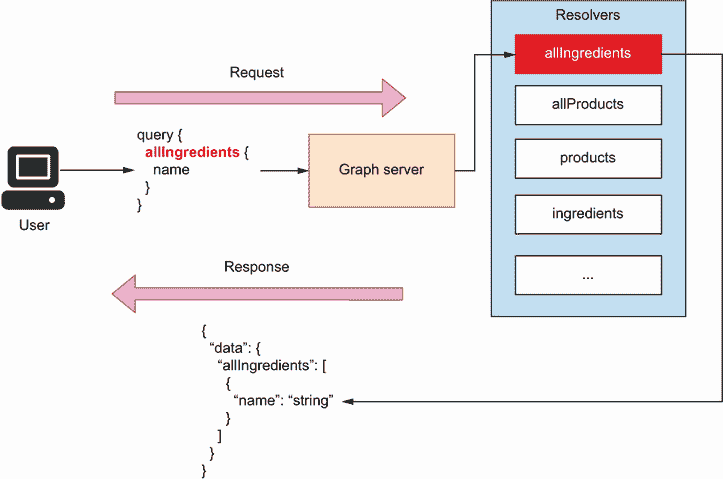

图 10.1 为了向用户提供服务，GraphQL 服务器使用解析器，这些解析器是知道如何为给定查询构建有效载荷的函数。

让我们从编写一个非常简单的 GraphQL 模式开始。打开 server.py 文件，并将以下内容复制到其中：

```
# file: server.py

schema = '''
  type Query {
    hello: String
  }
'''
```

我们定义了一个名为 `schema` 的变量，并将其指向一个简单的 GraphQL 模式。此模式仅定义了一个名为 `hello()` 的查询，该查询返回一个字符串。`hello()` 查询的返回值是可选的，这意味着 `null` 也是一个有效的返回值。为了通过我们的 GraphQL 服务器公开此查询，我们需要使用 Ariadne 实现一个解析器。

Ariadne 可以从这个简单的模式定义中运行 GraphQL 服务器。我们如何做到这一点？首先，我们需要使用 Ariadne 的 `make_executable_schema()` 函数加载模式。`make_executable_schema()` 解析文档，验证我们的定义，并构建模式内部表示。如图 10.2 所示，Ariadne 使用此函数的输出来验证我们的数据。例如，当我们返回查询的有效载荷时，Ariadne 会将有效载荷与模式进行验证。

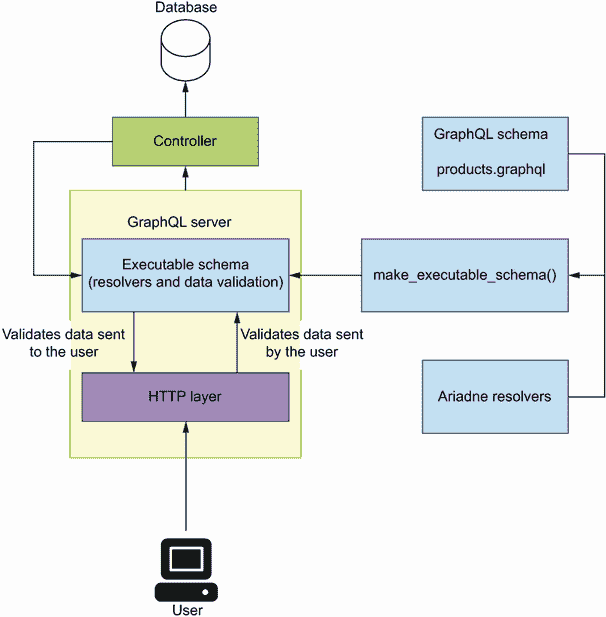

图 10.2 要使用 Ariadne 运行 GraphQL 服务器，我们通过加载 API 的 GraphQL 模式和查询及变异的解析器集合来生成一个可执行的模式。Ariadne 使用可执行模式来验证用户发送给服务器的数据，以及从服务器发送给用户的数据。

一旦我们加载了模式，我们可以使用 Ariadne 的`GraphQL`类（列表 10.1）来初始化我们的服务器。Ariadne 提供了两种服务器实现：一种同步实现，位于`ariande.wsgi`模块下，另一种异步实现，位于`ariande.asgi`模块下。在本章中，我们将使用异步实现。

列表 10.1 使用 Ariadne 初始化 GraphQL 服务器

```
# file: server.py

from ariadne import make_executable_schema
from ariadne.asgi import GraphQL

schema = '''
  type Query {                                                ①
    hello: String
  }
'''

server = GraphQL(make_executable_schema(schema), debug=True)  ②
```

① 我们声明一个简单的模式。

② 我们实例化 GraphQL 服务器。

要运行服务器，请在终端中执行以下命令：

```
$ uvicorn server:server --reload
```

您的应用程序将在 http://localhost:8000 上可用。如果您访问该地址，您将看到一个指向应用程序的 Apollo Playground 界面。如图 10.3 所示，Apollo Playground 与我们在第八章中学到的 GraphiQL 类似。在左侧面板中，我们编写我们的查询。编写以下查询：

```
{
  hello
}
```

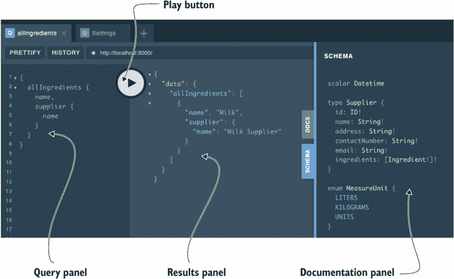

图 10.3 Apollo Playground 界面包含一个查询面板，我们可以在这里执行查询和变异；一个结果面板，用于评估查询和变异；以及一个文档面板，我们可以在这里检查 API 模式。

此查询执行我们在列表 10.1 中定义的查询函数。如果您按下执行按钮，您将在右侧面板上获得此查询的结果：

```
{
  "data": {
    "hello": null
  }
}
```

查询返回`null`。这并不令人惊讶，因为`hello()`查询的返回值是一个可空的字符串。我们如何让`hello()`查询返回一个字符串？请输入解析器。*解析器*是函数，它让服务器知道如何为类型或属性生成值。为了让`hello()`查询返回实际的字符串，我们需要实现一个解析器。让我们创建一个返回 10 个随机字符字符串的解析器。

在 Ariadne 中，解析器是一个 Python 可调用对象（例如，一个函数），它接受两个位置参数：`obj`和`info`。

Ariadne 中的解析器参数

Ariadne 的解析器总是有两个位置参数，通常称为`obj`和`info`。基本 Ariadne 解析器的签名是

```
def simple_resolver(obj: Any, info: GraphQLResolveInfo):
  pass
```

如图中所示，`obj`通常会被设置为`None`，除非解析器有一个父解析器，在这种情况下`obj`会被设置为父解析器返回的值。当我们遇到一个不返回显式类型的解析器时，我们会遇到后一种情况。例如，我们将在第 10.4.4 节中实现的`allProducts()`查询解析器不返回显式类型。它返回一个类型为`Product`的对象，这是`Cake`和`Beverage`类型的联合。为了确定每个对象的类型，Ariadne 需要调用`Product`类型的解析器。


当解析器没有父解析器时，`obj`参数被设置为`None`。当存在父解析器时，`obj`将被设置为父解析器返回的值。

`info`参数是`GraphQLResolveInfo`的一个实例，它包含执行查询所需的信息。Ariadne 使用这些信息来处理和响应每个请求。对于应用程序开发者来说，`info`对象暴露的最有趣的属性是`info.context`，它包含关于调用解析器时上下文的详细信息，例如 HTTP 上下文。要了解更多关于`obj`和`info`对象的信息，请查看 Ariadne 的文档：[`ariadnegraphql.org/docs/resolvers.html`](https://ariadnegraphql.org/docs/resolvers.html)。

解析器需要绑定到其对应的对象类型。Ariadne 为每个 GraphQL 类型提供了可绑定的类：

+   `ObjectType`用于对象类型。

+   `QueryType`用于查询类型。在 GraphQL 中，查询类型代表一个模式中所有查询的集合。正如我们在第八章（第 8.8 节）中看到的，查询是一个从 GraphQL 服务器读取数据的函数。

+   `MutationType`用于突变类型。正如我们在第八章（第 8.9 节）中看到的，突变是一个改变 GraphQL 服务器状态的函数。

+   `UnionType`用于联合类型。

+   `InterfaceType`用于接口类型。

+   `EnumType`用于枚举类型。

由于`hello()`是一个查询，我们需要将其解析器绑定到 Ariadne 的`QueryType`实例。列表 10.2 显示了如何做到这一点。我们首先创建一个`QueryType`类的实例并将其分配给一个名为`query`的变量。然后我们使用`QueryType`的`field()`装饰器方法绑定我们的解析器，这在 Ariadne 的大多数可绑定类上都是可用的，并允许我们将解析器绑定到特定字段。按照惯例，我们在解析器的名称前加上`resolve_`前缀。Ariadne 的解析器默认总是获取两个位置参数：`obj`和`info`。在这种情况下，我们不需要使用这些参数，所以我们使用一个通配符后跟一个下划线(`*_`)，这是 Python 中忽略一系列位置参数的惯例。为了使 Ariadne 了解我们的解析器，我们需要将我们的可绑定对象作为数组传递给`make_executable_` `schema()`函数。这些更改在`server.py`中进行。

列表 10.2 使用 Ariadne 实现 GraphQL 解析器

```
# file: server.py

import random
import string

from ariadne import QueryType, make_executable_schema
from ariadne.asgi import GraphQL

query = QueryType()                                                   ①

@query.field('hello')                                                 ②
def resolve_hello(*_):                                                ③
    return ''.join(
        random.choice(string.ascii_letters) for _ in range(10)        ④
    )

schema = '''
type Query {                                                          ⑤
        hello: String
    }
'''

server = GraphQL(make_executable_schema(schema, [query]), debug=True) ⑥
```

① `QueryType`实例

② 我们使用 QueryType 的 field() 装饰器绑定 hello() 查询的解析器。

③ 我们跳过仅位置参数。

④ 我们返回一个随机生成的 ASCII 字符列表。

⑤ 我们声明我们的 GraphQL 模式。

⑥ GraphQL 服务器的实例

由于我们使用热重载标志(`--reload`)运行服务器，一旦你将文件中的更改保存，服务器会自动重新加载。返回到 http://127.0.0.1:8000 上的 Apollo Playground 接口，并再次运行 `hello()` `查询`。这次，你应该得到一个由 10 个字符组成的随机字符串作为结果。

这完成了我们对 Ariadne 的介绍。你已经学会了如何使用 Ariadne 加载 GraphQL 模式，如何运行 GraphQL 服务器，以及如何为查询函数实现解析器。在接下来的章节中，我们将应用这些知识来构建产品服务的 GraphQL API。

## 10.4 实现产品 API

在本节中，我们将使用上一节学到的所有知识来构建产品服务的 GraphQL API。具体来说，你将学习如何构建产品 API 的查询和突变（mutations）解析器，处理查询参数，以及构建你的项目结构。在这个过程中，我们将学习 Ariadne 框架的额外功能和实现 GraphQL 解析器的各种策略。到本节结束时，你将能够为你的微服务构建 GraphQL API。让我们开始这段旅程吧！

### 10.4.1 项目结构布局

在本节中，我们为产品 API 实现结构化我们的项目。到目前为止，我们已经在 server.py 文件下包含了所有我们的代码。为了实现整个 API，我们需要将我们的代码拆分到不同的文件中，并为项目添加结构；否则，代码库将变得难以阅读和维护。为了保持实现简单，我们将使用我们数据的内存表示。

如果你跟随着上一节中的代码，请删除 server.py 中我们之前编写的代码，这代表了我们应用程序的入口点，因此将包含 GraphQL 服务器的实例。我们将在名为 web/ 的文件夹中封装 Web 服务器实现。创建这个文件夹，并在其中创建以下文件：

+   data.py 将包含我们数据的内存表示。

+   mutations.py 将包含产品 API 中突变（mutations）的解析器。

+   queries.py 将包含查询的解析器。

+   schema.py 将包含加载可执行模式所需的所有代码。

+   types.py 将包含对象类型、自定义标量类型和对象属性的解析器。

产品规格文件 products.graphql 也位于 `w`eb 文件夹下，因为它由 web/schema.py 文件下的代码处理。你可以从本书 GitHub 仓库中 ch10/web/products.graphql 文件复制 API 规范。产品 API 的目录结构如下所示：

```
.
├── Pipfile
├── Pipfile.lock
├── server.py
└── web
    ├── data.py
    ├── mutations.py
    ├── products.graphql
    ├── queries.py
    ├── schema.py
    └── types.py
```

本书 GitHub 仓库中包含一个名为 `exceptions.py` 的附加模块，你可以从中查看如何在 GraphQL API 中处理异常的示例。现在我们已经结构化了我们的项目，是时候开始编码了！

### 10.4.2 创建 GraphQL 服务器的入口点

现在我们已经结构化了我们的项目，是时候着手实现工作了。在本节中，我们将创建 GraphQL 服务器的入口点。我们需要创建 Ariadne 的 `GraphQL` 类的实例，并从产品规范中加载一个可执行的架构。

正如我们在 10.4.1 节中提到的，产品 API 服务器的入口点位于 `server.py` 之下。将以下内容包含在这个文件中：

```
# file: server.py

from ariadne.asgi import GraphQL

from web.schema import schema

server = GraphQL(schema, debug=True)
```

接下来，让我们在 `web/schema.py` 下创建可执行的架构：

```
# file: web/schema.py

from pathlib import Path

from ariadne import make_executable_schema

schema = make_executable_schema(
    (Path(__file__).parent / 'products.graphql').read_text()
)
```

产品 API 的 API 规范位于 `web/products.graphql` 文件下。我们读取架构文件的内容，并将它们传递给 Ariadne 的 `make_executable_schema()` 函数。然后，我们将生成的架构对象传递给 Ariadne 的 `GraphQL` 类以实例化服务器。如果你还没有启动服务器，你现在可以执行以下命令：

```
$ uvicorn server:server --reload
```

和之前一样，API 可在 http://localhost:8000 上访问。如果你再次访问这个地址，你会看到熟悉的 Apollo Playground UI。在这个阶段，我们可以尝试运行产品 API 规范中定义的任何查询；然而，由于我们没有实现任何解析器，大多数查询都会失败。例如，如果你运行以下查询

```
{
  allIngredients {
    name
  }
}
```

你会得到以下错误消息：“Cannot return null for non-nullable field Query.allProducts。”服务器不知道如何为 `Ingredient` 类型生成值，因为我们没有为其提供解析器，所以让我们构建它！

### 10.4.3 实现查询解析器

在本节中，我们学习如何实现查询解析器。如图 10.4 所示，查询解析器是一个 Python 函数，它知道如何为给定的查询返回一个有效的有效载荷。我们将为 `allIngredients()` 查询构建一个解析器，这是产品 API 规范中（列表 10.3）最简单的查询之一。

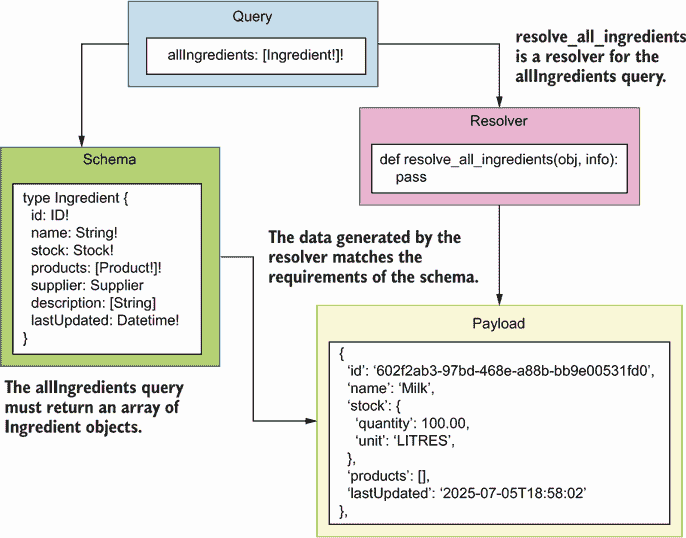

图 10.4 GraphQL 使用解析器来服务用户发送到服务器的查询请求。解析器是一个 Python 函数，它知道如何为给定的查询返回一个有效的有效载荷。

要实现 `allIngredients()` 查询的解析器，我们只需要创建一个返回与 `Ingredient` 类型形状相同的数据结构的功能，该类型有四个非空属性：`id`、`name`、`stock` 和 `products`。`stock` 属性反过来是一个 `Stock` 对象类型的实例，根据规范，它必须包含 `quantity` 和 `unit` 属性。最后，`products` 属性必须是一个 `Product` 对象的数组。数组的内含是非空的，但空数组是一个有效的返回值。

列表 10.3 `Ingredient` 类型的规范

```
# file: web/products.graphql

type Stock {                  ①
    quantity: Float!          ②
    unit: MeasureUnit!
}

type Ingredient {
    id: ID!
    name: String!
    stock: Stock!
    products: [Product!]!     ③
    supplier: Supplier        ④
    description: [String!]
    lastUpdated: Datetime!
}
```

① 声明 Stock 类型。

② 数量是一个非空浮点数。

③ 产品是一个非空的产品列表。

④ 供应商通过类型指向 Supplier 类型，是一个可空的。

在 web/data.py 文件下，让我们给我们的数据内存列表表示添加一个成分列表：

```
# file: web/data.py

from datetime import datetime

ingredients = [
    {
        'id': '602f2ab3-97bd-468e-a88b-bb9e00531fd0',
        'name': 'Milk',
        'stock': {
            'quantity': 100.00,
            'unit': 'LITRES',
        },
        'supplier': '92f2daae-a4f8-4aae-8d74-51dd74e5de6d',
        'products': [],
        'lastUpdated': datetime.utcnow(),
    },
]
```

现在我们有一些数据，我们可以在`allIngredients()`解析器中使用它。列表 10.4 显示了`allIngredients()`解析器的外观。正如我们在第 10.3 节中所做的那样，我们首先创建了一个`QueryType`类的实例，并将解析器与这个类绑定。由于这是一个查询类型的解析器，实现代码位于 web/queries.py 文件下。

列表 10.4 `allIngredients()`查询的解析器

```
# file: web/queries.py

from ariadne import QueryType

from web.data import ingredients

query = QueryType()

@query.field('allIngredients')     ①
def resolve_all_ingredients(*_):
    return ingredients             ②
```

① 我们使用装饰器绑定 allIngredients()解析器。

② 我们返回一个硬编码的响应。

为了启用查询解析器，我们必须将查询对象传递给 web/schema.py 下的`make_executable_` `schema()`函数：

```
# file: web/schema.py

from pathlib import Path

from ariadne import make_executable_schema

from web.queries import query

schema = make_executable_schema(
    (Path(__file__).parent / 'products.graphql').read_text(), [query]
)
```

如果我们回到 Apollo Playground UI 并运行查询

```
{
  allIngredients {
    name
  }
}
```

我们得到了一个有效的有效载荷。查询只选择了成分的名称，这本身并不很有趣，并且它并没有真正告诉我们我们的当前解析器是否如预期地适用于其他字段。让我们编写一个更复杂的查询来更彻底地测试我们的解析器。以下查询选择了成分的`id`、`name`和`description`，以及与之相关的每个产品的`name`：

```
{
  allIngredients {
    id,
    name,
    products {
      ...on ProductInterface {
        name
      }
    },
    description
  }
}
```

此查询的响应有效载荷也是有效的：

```
{
  "data": {
    "allIngredients": [
      {
        "id": " "602f2ab3-97bd-468e-a88b-bb9e00531fd0",
        "name": "Milk",
        "products": [],
        "description": null
      }
    ]
  }
}
```

产品列表为空，因为我们还没有将任何产品与成分关联，`description`是`null`，因为这是一个可空字段。现在我们知道如何实现简单查询的解析器实现，在下一节中，我们将学习如何实现处理更复杂情况的解析器。

### 10.4.4 实现类型解析器

在本节中，我们将学习如何实现返回多个类型的查询解析器。`allIngredients()`查询相当简单，因为它只返回一种类型的对象：`Ingredient`类型。现在让我们考虑`allProducts()`查询。如图 10.5 所示，`allProducts()`更复杂，因为它返回`Product`类型，它是`Beverage`和`Cake`两种类型的联合，这两种类型都实现了`ProductInterface`类型。

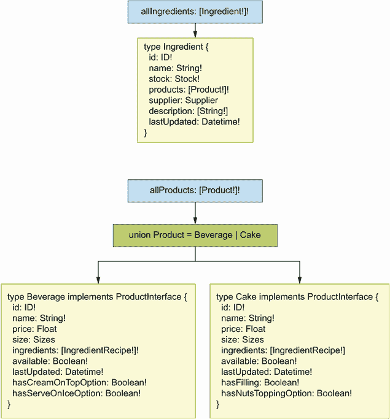

图 10.5 `allIngredients()`查询返回一个`Ingredient`对象的数组，而`allProducts()`查询返回一个`Product`对象的数组，其中`Product`是`Beverage`和`Cake`两种类型的联合。

让我们从向 web/data.py 文件下的内存数据列表中添加产品列表开始。我们将添加两个产品：一个 `Beverage` 和一个 `C``ake`。我们应该在产品中包含哪些字段？如图 10.6 所示，由于 `Beverage` 和 `Cake` 实现了 `ProductInterface` 类型，我们知道它们都需要一个 `id`、一个 `name`、一个 `ingredients` 列表和一个名为 `available` 的字段，该字段表示产品是否可用。在这些从 `ProductInterface` 继承的公共字段之上，`Beverage` 需要两个额外的字段：`hasCreamOnTopOption` 和 `hasServeOnIceOption`，这两个都是布尔值。反过来，`Cake` 需要属性 `hasFilling` 和 `hasNutsToppingOption`，这些也是布尔值。

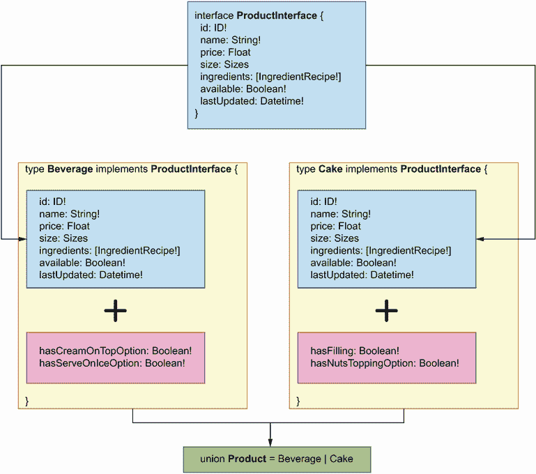

图 10.6 产品是 `Beverage` 和 `Cake` 类型的联合，这两个类型都实现了 `ProductInterface` 类型。由于 `Beverage` 和 `Cake` 实现了相同的接口，这两个类型共享从接口继承的属性。除了这些属性外，每个类型都有自己的特定属性，例如 `Cake` 类型的 `hasFilling`。

列表 10.5 `allProducts()` 查询的解析器

```
# file: web/data.py

...

products = [
    {
        'id': '6961ca64-78f3-41d4-bc3b-a63550754bd8',
        'name': 'Walnut Bomb',
        'price': 37.00,
        'size': 'MEDIUM',
        'available': False,
        'ingredients': [
            {
                'ingredient': '602f2ab3-97bd-468e-a88b-bb9e00531fd0', ①
                'quantity': 100.00,
                'unit': 'LITRES',
            }
        ],
        'hasFilling': False,
        'hasNutsToppingOption': True,
        'lastUpdated': datetime.utcnow(),
    },
    {
        'id': 'e4e33d0b-1355-4735-9505-749e3fdf8a16',
        'name': 'Cappuccino Star',
        'price': 12.50,
        'size': 'SMALL',
        'available': True,
        'ingredients': [
            {
                'ingredient': '602f2ab3-97bd-468e-a88b-bb9e00531fd0',
                'quantity': 100.00,
                'unit': 'LITRES',
            }
        ],
        'hasCreamOnTopOption': True,
        'hasServeOnIceOption': True,
        'lastUpdated': datetime.utcnow(),
    },
]
```

① 此 ID 引用了我们在 web/data.py 中之前添加的牛奶成分的 ID。

现在我们有了产品列表，让我们在 `allProducts()` 解析器中使用它。

列表 10.6 添加 `allProducts()` 解析器

```
# file: web/queries.py

from ariadne import QueryType

from web.data import ingredients, products

query = QueryType()

...

@query.field('allProducts')     ①
def resolve_all_products(*_):
    return products             ②
```

① 我们使用 field() 装饰器绑定 allProducts() 的解析器。

② 我们返回一个硬编码的响应。

让我们运行一个简单的查询来测试解析器：

```
{
  allProducts {
    ...on ProductInterface {
      name
    }
  }
}
```

如果你运行此查询，你会得到一个错误，表示服务器无法确定我们列表中每个元素的类型。在这些情况下，我们需要一个类型解析器。如图 10.7 所示，一个 *类型解析器* 是一个 Python 函数，它确定对象的类型，并返回类型的名称。

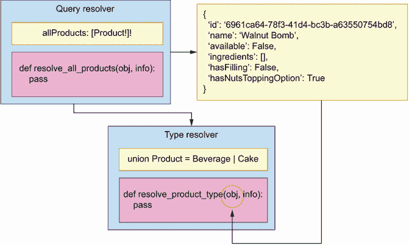

图 10.7 类型解析器是一个确定对象类型的函数。此示例显示了 `resolve_product_type()` 解析器如何确定 `resolve_all_products()` 解析器返回的对象的类型。

在查询和突变中，我们需要类型解析器来返回多于一个对象类型。在产品 API 中，这影响到所有返回 `Product` 类型的查询和突变，例如 `allProducts()`、`addProduct()` 和 `product()`。

返回多个类型 当查询或突变返回多个类型时，你需要实现一个类型解析器。这适用于返回联合类型和实现接口的对象类型的查询和突变。

列表 10.7 展示了我们在 Ariadne 中如何实现 `Product` 类型的类型解析器。类型解析器函数接受两个位置参数，第一个是一个对象。我们需要确定这个对象的类型。如图 10.8 所示，由于我们知道 `Cake` 和 `Beverage` 有不同的必需字段，我们可以使用这些信息来确定它们的类型：如果对象有 `hasFilling` 属性，我们知道它是一个 `Cake`；否则，它是一个 `Beverage`。

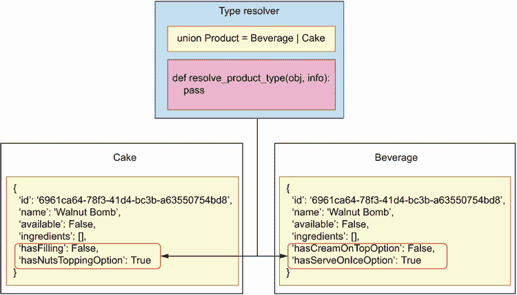

图 10.8 类型解析器检查有效负载的属性以确定其类型。在这个例子中，`resolve_product_type()` 寻找区分 `Cake` 和 `Beverage` 类型的区分属性。

类型解析器必须绑定到 `Product` 类型。由于 `Product` 是一个联合类型，我们使用 `UnionType` 类创建它的一个可绑定对象。Ariadne 保证解析器中的第一个参数是一个对象，我们检查这个对象以解析其类型。我们不需要任何其他参数，因此我们使用 Python 的 `*_` 语法忽略它们，这是忽略位置参数的标准做法。为了解析对象的类型，我们检查它是否有 `hasFilling` 属性。如果有，我们知道它是一个 `Cake` 对象；否则，它是一个 `Beverage`。最后，我们将产品可绑定对象传递给 `make_executable_schema()` 函数。由于这是一个类型解析器，这段代码将放入 web/types.py。

列表 10.7 实现对 `Product` 联合类型的类型解析器

```
# file: web/types.py

from ariadne import UnionType

product_type = UnionType('Product')    ①

@product_type.type_resolver            ②
def resolve_product_type(obj, *_):     ③
    if 'hasFilling' in obj:
        return 'Cake'
    return 'Beverage'
```

① 我们使用 UnionType 类为 Product 类型创建一个可绑定对象。

② 我们使用 resolver() 装饰器绑定 Product 的解析器。

③ 我们将解析器的第一个位置参数捕获为 obj。

要启用类型解析器，我们需要将产品对象添加到 web/schema.py 下的 `make_executable_` `schema()` 函数中：

```
# file: web/schema.py

from pathlib import Path

from ariadne import make_executable_schema

from web.queries import query
from web.types import product_type

schema = make_executable_schema(
    (Path(__file__).parent / 'products.graphql').read_text(), 
    [query, product_type]
)
```

让我们再次运行 `allProducts()` 查询：

```
{
  allProducts {
    ...on ProductInterface {
      name
    }
  }
}
```

你现在将获得一个成功的响应。你已经学会了如何实现类型解析器和处理返回多个类型的查询！在下一节中，我们将继续通过学习如何处理查询参数来探索查询。

### 10.4.5 处理查询参数

在本节中，我们学习如何在解析器中处理查询参数。大多数产品 API 中的查询都接受过滤参数，并且所有突变至少需要一个参数。让我们通过研究产品 API 中的一个示例来了解我们如何访问参数：`products()` 查询接受一个 `input` 过滤对象，其类型为 `ProductsFilter`。我们如何在解析器中访问这个过滤对象？


图 10.9 查询参数作为关键字参数传递给我们的解析器。这个例子说明了 `resolve_products()` 解析器是如何被调用的，其中 `input` 参数作为关键字参数传递。参数 `input` 是 `ProductsFilter` 类型的对象，因此它以字典的形式出现。

如图 10.9 所示，当查询或突变带有参数时，Ariadne 将这些参数作为关键字参数传递给我们的解析器。列表 10.8 显示了如何访问`products()`查询解析器的`input`参数。由于`input`参数是可选的，因此可能是 null，我们将其默认设置为`None`。`input`参数是`ProductsFilter`输入类型的一个实例，因此当它在查询中存在时，它以字典的形式出现。从 API 规范中，我们知道`ProductsFilter`保证以下字段的可用性：

+   `available`——布尔字段，通过是否可用过滤产品

+   `sortBy`——枚举类型，允许我们按价格或名称对产品进行排序

+   `sort`——枚举类型，允许我们按升序或降序排序结果

+   `resultsPerPage`——指示每页应显示多少结果

+   `page`——指示应返回哪个结果页

除了这些参数之外，`ProductsFilter`还可能包括两个可选参数：`maxPrice`，它通过最大价格过滤结果，以及`minPrice`，它通过最小价格过滤结果。由于`maxPrice`和`minPrice`不是必填字段，我们使用 Python 字典的`get()`方法检查它们是否存在，如果找不到则返回`None`。让我们首先实现过滤和排序功能，然后再处理分页。以下代码位于 web/queries.py 文件中。

列表 10.8 在解析器中访问`input`参数

```
# file: web/queries.py

...

Query = QueryType()

...

@query.field('products')                                ①
def resolve_products(*_, input=None):                   ②
    filtered = [product for product in products]        ③
    if input is None:                                   ④
        return filtered
    filtered = [                                        ⑤
        product for product in filtered
        if product['available'] is input['available']
    ]
    if input.get('minPrice') is not None:               ⑥
        filtered = [
            product for product in filtered
            if product['price'] >= input['minPrice']
        ]
    if input.get('maxPrice') is not None:
        filtered = [
            product for product in filtered
            if product['price'] <= input['maxPrice']
        ]
    filtered.sort(                                      ⑦
        key=lambda product: product.get(input['sortBy'], 0],
        reverse=input['sort'] == 'DESCENDING'
    )
    return filtered                                     ⑧
```

① 我们使用 field()装饰器绑定 products()的解析器。

② 我们忽略默认的位置参数，而是捕获输入参数。

③ 我们复制产品列表。

④ 如果输入为 None，我们返回整个数据集。

⑤ 我们通过可用性过滤产品。

⑥ 我们通过 minPrice 过滤产品。

⑦ 我们对过滤后的数据集进行排序。

⑧ 我们返回过滤后的数据集。

让我们运行一个查询来测试这个解析器：

```
{
  products(input: {available: true}) {
    ...on ProductInterface {
      name
    }
  }
}
```

你应该从服务器获得一个有效的响应。现在我们已经过滤了结果，我们需要对它们进行分页。列表 10.9 向 web/queries.py 添加了一个名为`get_page()`的通用分页函数。提醒一下：在正常情况下，你会在数据库中存储数据，并将过滤和分页委托给数据库。这里的示例是为了说明如何在解析器中使用查询参数。我们使用`itertools`模块中的`islice()`函数进行分页。

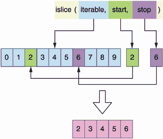

图 10.10 `itertools`模块中的`islice()`函数允许你通过选择子集的`start`和`stop`索引来获取可迭代对象的切片。

正如你在图 10.10 中可以看到，`islice()` 允许我们从可迭代对象中提取一个片段。`islice()` 需要我们提供我们想要切片的部分的起始和停止索引。例如，一个包含数字 0 到 9 的 10 项列表，提供起始索引为 2 和停止索引为 6，将给我们以下项的切片：`[2,` `3,` `4,` `5]`。API 从 1 开始分页结果，而 `islice()` 使用基于零的索引，因此 `get_page()` 从 `page` 参数中减去一个单位来补偿这个差异。

列表 10.9 分页结果

```
# file: web/queries.py

From itertools import islice                                           ①

from ariadne import QueryType

from web.data import ingredients, products

...

def get_page(items, items_per_page, page):
    page = page - 1
    start = items_per_page * page if page > 0 else page                ②
    stop = start + items_per_page                                      ③
    return list(islice(items, start, stop))                            ④

@query.field('products')
def resolve_products(*_, input=None):
    ...
    return get_page(filtered, input['resultsPerPage'], input['page']) ⑤
```

① 我们导入 islice()。

② 我们解析起始索引。

③ 我们计算停止索引。

④ 我们返回列表的一个切片。

⑤ 我们分页结果。

我们硬编码的数据集只包含两个产品，所以让我们将 `resutlsPerPage` 设置为 1 来测试分页，这将把列表分成两页：

```
{
  products(input: {resultsPerPage: 1, page: 1}) {
    ...on ProductInterface {
      name
    }
  }
}
```

你应该得到一个确切的结果。一旦我们在下一节实现 `addProduct()` 突变，我们就能通过 API 添加更多产品并充分利用分页参数。

你刚刚学会了如何处理查询参数！我们现在处于一个很好的位置来学习如何实现突变。突变解析器与查询解析器类似，但它们总是有参数。但这就足够剧透了；继续到下一节，了解更多关于突变的信息。

### 10.4.6 实现突变解析器

在本节中，我们学习如何实现突变解析器。实现突变解析器遵循我们看到的查询的相同指南。唯一的区别是我们用来绑定突变解析器的类。虽然查询绑定到 `QueryType` 类的实例，但突变绑定到 `MutationType` 类的实例。

让我们看看如何实现 `addProduct()` 突变的解析器。从规范中，我们知道 `addProduct()` 突变有三个必需参数：`name`、`type` 和 `input`。`input` 参数的形状由 `AddProductInput` 对象类型给出。`AddProductInput` 定义了在创建新产品时可以设置的附加属性，所有这些属性都是可选的，因此是可空的。最后，`addProduct()` 突变必须返回一个产品类型。

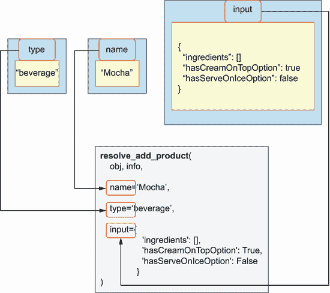

图 10.11 突变参数作为关键字参数传递给我们的解析器。此示例说明了如何调用 `resolve_add_product()` 解析器，其中 `name`、`type` 和 `input` 参数作为关键字参数传递。

列表 10.10 展示了我们如何实现`addProduct()`变异的解析器（参见图 10.11 以获取说明）。我们首先导入`MutationType`可绑定类并实例化它。然后我们声明我们的解析器，并使用其`field()`装饰器将其绑定到`MutationType`。我们不需要使用 Ariadne 的默认位置参数`obj`和`info`，所以我们使用一个通配符后跟一个下划线(`*_`)来跳过它们。由于规范指出它们都是必需的，我们没有为`addProduct()`的参数设置默认值。`addProduct()`必须返回一个有效的`Product`对象，因此我们在解析器的主体中构建具有预期属性的该对象。由于`Product`是`Cake`和`Beverage`类型的联合，并且每种类型都需要不同的属性集，我们检查`type`参数以确定我们应该向我们的对象添加哪些字段。以下代码将放入`web/mutations.py`文件中。

列表 10.10 `addProduct()`变异的解析器

```
# file: web/mutations.py

import uuid
from datetime import datetime

from ariadne import MutationType

from web.data import products

mutation = MutationType()                              ①

@mutation.field('addProduct')                          ②
def resolve_add_product(*_, name, type, input):        ③
    product = {                                        ④
        'id': uuid.uuid4(),                            ⑤
        'name': name,
        'available': input.get('available', False),    ⑥
        'ingredients': input.get('ingredients', []),
        'lastUpdated': datetime.utcnow(),
    }
    if type == 'cake':                                 ⑦
        product.update({
            'hasFilling': input['hasFilling'],
            'hasNutsToppingOption': input['hasNutsToppingOption'],
        })
    else:
        product.update({
            'hasCreamOnTopOption': input['hasCreamOnTopOption'],
            'hasServeOnIceOption': input['hasServeOnIceOption'],
        })
    products.append(product)                           ⑧
    return product
```

① 用于变异的可绑定对象

② 我们使用 field()装饰器绑定`addProduct()`的解析器。

③ 我们捕获`addProduct()`的参数。

④ 我们将新产品声明为一个字典。

⑤ 我们设置服务器端属性，如 ID。

⑥ 我们解析可选参数并设置它们的默认值。

⑦ 我们检查产品是饮料还是蛋糕。

⑧ 我们返回新创建的产品。

为了启用列表 10.10 中实现的解析器，我们需要将`mutation`对象添加到`web/schema.py`中的`make_executable_schema()`函数中：

```
# file: web/schema.py

from pathlib import Path

from ariadne import make_executable_schema

from web.mutations import mutation
from web.queries import query
from web.types import product_type
schema = make_executable_schema(
    (Path(__file__).parent / 'products.graphql').read_text(), 
    [query, mutation, product_type]
)
```

让我们通过运行一个简单的测试来使用这个新的变异。转到运行在 http://127.0.0.1:8000 上的 Apollo Playground，并运行以下变异：

```
mutation {
  addProduct(name: "Mocha", type: beverage, input:{ingredients: []}) {
    ...on ProductInterface {
      name,
      id
    }
  }
}
```

你将得到一个有效的响应，并且一个新的产品将被添加到我们的列表中。为了验证一切是否正常工作，运行以下查询并检查响应是否包含刚刚创建的新条目：

```
{
  allProducts {
    ...on ProductInterface {
      name
    }
  }
}
```

记住，我们正在使用我们数据的内存列表表示运行服务，所以如果你停止或重新加载服务器，列表将被重置，你将丢失任何新创建的数据。

你刚刚学习了如何构建变异！这是一个强大的功能：使用变异，你可以在 GraphQL 服务器中创建和更新数据。我们现在已经涵盖了 GraphQL 服务器实现的大部分主要方面。在下一节中，我们将进一步学习如何实现自定义标量类型的解析器。

### 10.4.7 为自定义标量类型构建解析器

在本节中，我们学习如何实现自定义标量类型的解析器。正如我们在第八章中看到的，GraphQL 提供了一定数量的标量类型，例如布尔值、整数和字符串。在许多情况下，GraphQL 的默认标量类型足以开发 API。有时，然而，我们需要定义我们自己的自定义标量。产品 API 包含一个名为`Datetime`的自定义标量。`Ingredient`和`Product`类型中的`lastUpdated`字段都有一个`Datetime`标量类型。由于`Datetime`是一个自定义标量，Ariadne 不知道如何处理它，因此我们需要为它实现一个解析器。我们如何做到这一点？

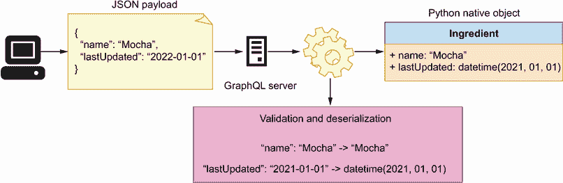

图 10.12 当 GraphQL 服务器从用户接收数据时，它验证并反序列化数据为原生 Python 对象。在这个例子中，服务器将名称`"Mocha"`反序列化为 Python 字符串，将日期`"2021-01-01"`反序列化为 Python datetime 对象。

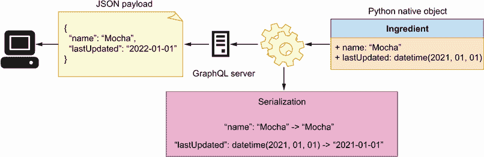

图 10.13 当 GraphQL 服务器向用户发送数据时，它将原生 Python 对象转换为可序列化的数据。在这个例子中，服务器将名称和日期都序列化为字符串。

正如你在图 10.12 和 10.13 中可以看到的，当我们遇到 GraphQL API 中的自定义标量类型时，我们需要确保我们能够对自定义标量执行以下三个操作：

+   *序列化*—当用户从服务器请求数据时，Ariadne 必须能够序列化数据。Ariadne 知道如何序列化 GraphQL 的内置标量，但对于自定义标量，我们需要实现一个自定义序列化器。在产品 API 中`Datetime`标量的情况下，我们必须实现一个序列化`datetime`对象的方法。

+   *反序列化*—当用户向我们的服务器发送数据时，Ariadne 将数据反序列化并使其以 Python 原生数据结构的形式（如字典）可用。如果数据中包含自定义标量，我们需要实现一个方法，让 Ariadne 知道如何解析和将标量加载到原生 Python 数据结构中。对于`Datetime`标量，我们希望能够将其加载为`datetime`对象。

+   *验证*—GraphQL 强制执行每个标量和类型的验证，Ariadne 知道如何验证 GraphQL 的内置标量。对于自定义标量，我们必须实现我们自己的验证方法。在`Datetime`标量的情况下，我们想要确保它具有有效的 ISO 格式。

Ariadne 通过其`ScalarType`类提供了一个简单的 API 来处理这些操作。我们需要做的第一件事是创建这个类的实例：

```
from ariadne import ScalarType

datetime_scalar = ScalarType('Datetime') 
```

`ScalarType`公开了装饰器方法，允许我们实现序列化、反序列化和验证。对于序列化，我们使用`ScalarType`的`serializer()`装饰器。我们希望将`datetime`对象序列化为 ISO 标准日期格式，Python 的`datetime`库提供了一个方便的 ISO 格式化方法，即`isoformat()`方法：

```
@datetime_scalar.serializer
def serialize_datetime(value):
  return value.isoformat()
```

对于验证和反序列化，`ScalarType` 提供了 `value_parser()` 装饰器。当用户向服务器发送包含 `Datetime` 标量数据时，我们期望日期以 ISO 格式，因此可以被 Python 的 `datetime.fromisoformat()` 方法解析：

```
from datetime import datetime

@datetime_scalar.value_parser
def parse_datetime_value(value):
  return datetime.fromisoformat(value)
```

如果日期以错误的格式传入，`fromisoformat()` 将引发一个 `ValueError`，这将由 Ariadne 捕获并向用户显示以下消息：“Invalid isoformat string.” 以下代码位于 web/types.py 中，因为它实现了类型解析器。

列表 10.11 序列化和解析自定义标量

```
# file: web/types.py

import uuid
from datetime import datetime

from ariadne import UnionType, ScalarType

...
datetime_scalar = ScalarType('Datetime') ①

@datetime_scalar.serializer                ②
def serialize_datetime_scalar(date):       ③
    return date.isoformat()                ④

@datetime_scalar.value_parser              ⑤
def parse_datetime_scalar(date):           ⑥
    return datetime.fromisoformat(date) ⑦
```

① 我们使用 ScalarType 类创建一个可绑定的 Datetime 标量对象。

② 我们使用 serializer() 装饰器绑定 Datetime 的序列化器。

③ 我们将序列化器的参数捕获为日期。

④ 我们序列化日期对象。

⑤ 我们使用 value_parser() 装饰器绑定 Datetime 的解析器。

⑥ 我们捕获解析器的参数。

⑦ 我们解析一个日期。

要启用 `Datetime` 解析器，我们将 `datetime_scalar` 添加到 web/schema.py 中 `make_executable_schema()` 函数的可绑定对象数组中：

```
from pathlib import Path

from ariadne import make_executable_schema

from web.mutations import mutation
from web.queries import query
from web.types import product_type, datetime_scalar

schema = make_executable_schema(
    (Path(__file__).parent / 'products.graphql').read_text(),
    [query, mutation, product_type, datetime_scalar]
)
```

让我们将新的解析器付诸实践！回到运行在 http://127.0.0.1:8000 的 Apollo Playground，并执行以下查询：

```
# Query document
{
  allProducts {
    ...on ProductInterface {
      name,
      lastUpdated
    }
  }
}

# result:
{
  "data": {
    "allProducts": [
      {
        "name": "Walnut Bomb",
        "lastUpdated": "2022-06-19T18:27:53.171870"
      },
      {
        "name": "Cappuccino Star",
        "lastUpdated": "2022-06-19T18:27:53.171871"
      }
    ]
  }
}
```

你应该得到一个包含所有产品名称以及 `lastUpdated` 字段中 ISO 格式日期的产品列表。现在你有了在 GraphQL 中实现自定义标量类型的能力。明智地使用它！在我们结束这一章之前，还有一个话题我们需要探讨：实现对象类型字段的解析器。

### 10.4.8 实现字段解析器

在本节中，我们学习如何实现对象类型字段的解析器。我们已经实现了几乎所有在产品 API 上提供各种查询所需的解析器，但我们的服务器仍然无法解析一种类型的查询：涉及映射到其他 GraphQL 类型的字段。例如，`Products` 类型有一个名为 `ingredients` 的字段，它映射到一个 `IngredientRecipe` 对象数组。根据规范，`IngredientRecipe` 类型的形状如下：

```
# file: web/products.graphql

type IngredientRecipe {
    ingredient: Ingredient!
    quantity: Float!
    unit: String!
}
```

每个 `IngredientRecipe` 对象都有一个 `ingredient` 字段，它映射到 `Ingredient` 对象类型。这意味着，当我们查询产品的 `ingredients` 字段时，我们应该能够获取每个成分的信息，例如其名称、描述或供应商信息。换句话说，我们应该能够在服务器上运行以下查询：

```
{
  allProducts {
    ...on ProductInterface {
      name,
      ingredients {
        quantity,
        unit,
        ingredient{
          name
        }
      }
    }
  }
}
```

如果你在这个时候在 Apollo Playground 中运行这个查询，你会得到一个错误，错误信息如下：“Cannot return null for non-nullable field Ingredient.name。”

为什么会发生这种情况？如果你查看 10.5 列表中的产品列表，你会注意到 `ingredients` 字段映射到一个包含三个字段的对象数组：`ingredient`、`quantity` 和 `unit`。例如， Walnut Bomb 有以下成分：

```
# file: web/data.py

ingredients = [
  {
    'ingredient': '602f2ab3-97bd-468e-a88b-bb9e00531fd0',
    'quantity': 100.00,
    'unit': 'LITRES',
  }
]
```

`ingredient`字段映射到成分 ID，而不是完整的成分对象。这是我们产品成分的内部表示。这是我们如何在数据库中存储产品数据（在本实现中为内存列表）的方式。并且这是一个有用的表示，因为它允许我们通过 ID 识别每个成分。然而，API 规范告诉我们，`ingredients`字段应该映射到`IngredientRecipe`对象的数组，并且每个`ingredient`应该代表一个`Ingredient`对象，而不仅仅是 ID。

我们如何解决这个问题？我们可以使用不同的方法。例如，我们可以确保每个成分负载在返回`Product`类型的每个查询的解析器中都被正确构建。例如，列表 10.12 展示了我们如何修改`allProducts()`解析器来完成这个任务。该片段修改了每个产品的`ingredients`属性，以确保它包含一个完整的成分负载。由于每个产品都由一个字典表示，我们为每个产品进行深度复制，以确保在这个函数中应用的变化不会影响我们的内存产品列表。

列表 10.12 更新产品以包含完整的成分负载，而不仅仅是 ID

```
# file: web/queries.py

...

@query.field('allProducts')
def resolve_all_products(*_):
    products_with_ingredients = [deepcopy(product) for product in products]①
    for product in products_with_ingredients:
        for ingredient_recipe in product['ingredients']:
            for ingredient in ingredients: 
                if ingredient['id'] == ingredient_recipe['ingredient']:
                    ingredient_recipe['ingredient'] = ingredient           ②
    return products_with_ingredients                                       ③
```

① 我们对产品列表中的每个对象进行深度复制。

② 我们使用成分的完整表示更新成分属性。

③ 我们返回包含成分的产品列表。

列表 10.12 中的方法完全可行，但正如你所看到的，它使得代码的复杂性增加。如果我们需要为更多的属性做同样的事情，函数很快就会变得难以理解和维护。

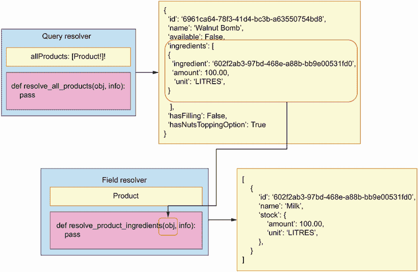

图 10.14 GraphQL 允许我们为对象的特定字段创建解析器。在这个例子中，`resolve_product_ingredients()`解析器负责为产品的`ingredients`属性返回一个有效的负载。

正如你在图 10.14 中可以看到的，GraphQL 提供了一种解决对象属性的方法的替代方式。我们不是在`allProducts()`解析器中修改产品负载，而是可以创建一个针对产品`ingredients`属性的特定解析器，并在该解析器内进行任何必要的修改。列表 10.13 展示了产品`ingredients`属性的解析器是什么样的，并且位于`web/types.py`下，因为它实现了对象属性的解析器。

列表 10.13 实现字段解析器

```
# file: web/types.py

...

@product_interface.field('ingredients')
def resolve_product_ingredients(product, _):
    recipe = [                                ①
        copy.copy(ingredient)
        for ingredient in product.get("ingredients", [])
    ]

    for ingredient_recipe in recipe:
        for ingredient in ingredients:
            if ingredient['id'] == ingredient_recipe['ingredient']:
                ingredient_recipe['ingredient'] = ingredient
    return recipe
```

① 我们为每个成分创建深度复制。

对象属性解析器帮助我们使代码更加模块化，因为每个解析器只做一件事。它们还帮助我们避免重复。通过拥有一个单独的解析器来处理更新产品负载中的`ingredients`属性，我们避免了在每个返回产品类型的解析器中执行此操作。缺点是属性解析器可能更难追踪和调试。如果`ingredients`负载有问题，你不会在`allProducts()`解析器中找到错误。你必须知道有一个解析器负责产品的成分，并查看该解析器。应用日志将帮助你在调试此类问题时指明方向，但请记住，这种设计对于不熟悉 GraphQL 的其他开发者来说可能并不完全明显。就像软件设计中的其他一切一样，确保代码的可重用性不会损害代码的可读性和易于维护性。

## 摘要

+   Python 生态系统提供了各种框架来实现 GraphQL API。有关可用框架的最新消息，请参阅 GraphQL 的官方网站：[`graphql.org/code/`](https://graphql.org/code/)。

+   您可以使用 Ariadne 框架按照 schema-first 方法实现 GraphQL API，这意味着我们首先设计 API，然后根据规范实现服务器。这种方法的好处在于它允许服务器和客户端开发团队并行工作。

+   Ariadne 可以使用规范自动验证请求和响应负载，这意味着我们不必花费时间实现自定义验证模型。

+   对于 API 规范中的每个查询和突变，我们需要实现一个解析器。解析器是一个知道如何处理给定查询或突变请求的函数。解析器是允许我们公开 GraphQL API 功能的代码，因此代表了实现的骨干。

+   要注册一个解析器，我们使用 Ariadne 的可绑定类之一，例如`QueryType`或`MutationType`。这些类公开了装饰器，允许我们绑定解析器函数。

+   GraphQL 规范可以包含复杂类型，例如联合类型，它们结合了两个或多个对象类型。如果我们的 API 规范包含联合类型，我们必须实现一个解析器，该解析器知道如何确定对象的类型；否则，GraphQL 服务器不知道如何解析它。

+   使用 GraphQL，我们可以定义自定义标量。如果规范包含自定义标量，我们必须实现知道如何序列化、解析和验证自定义标量类型的解析器；否则，GraphQL 服务器不知道如何处理它们。
