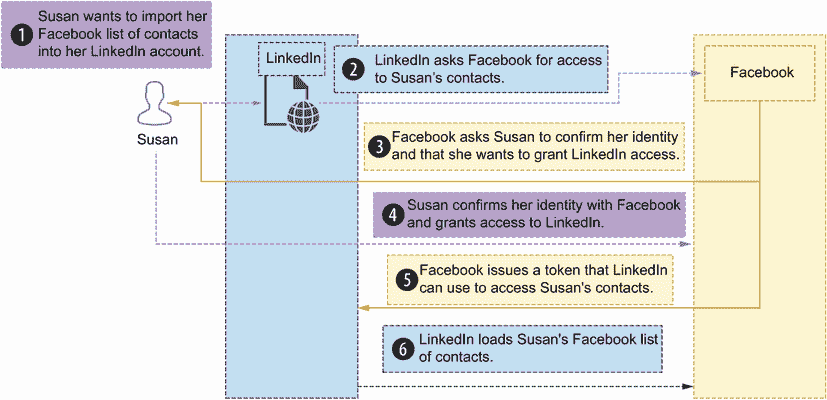
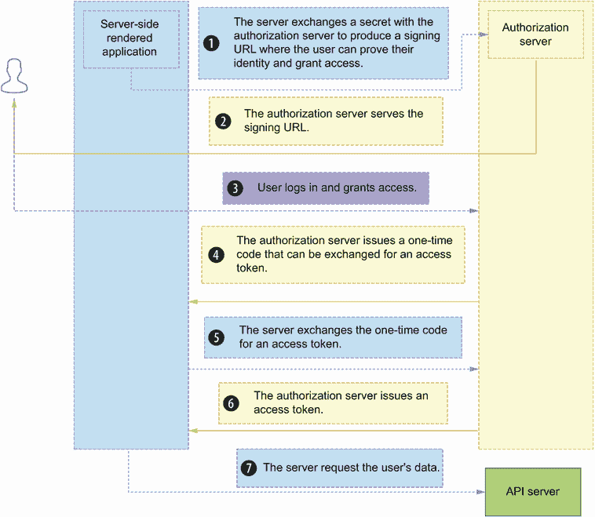
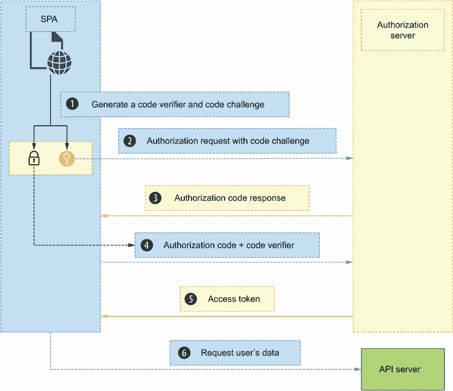
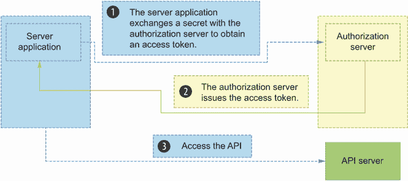
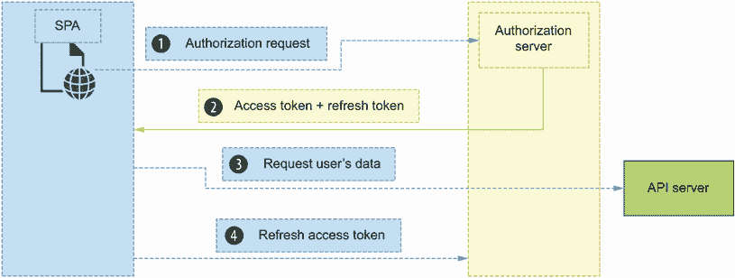
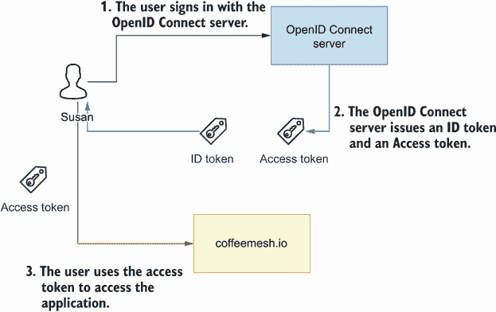
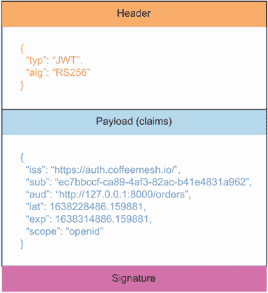
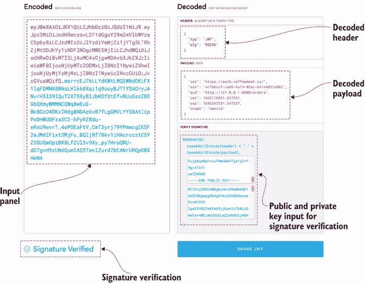
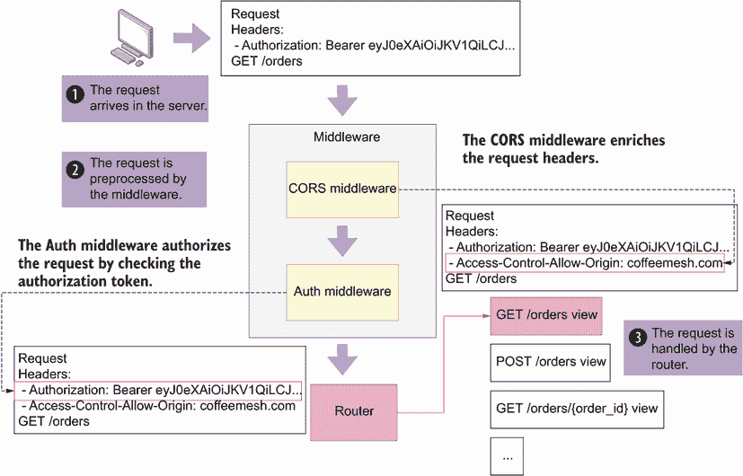
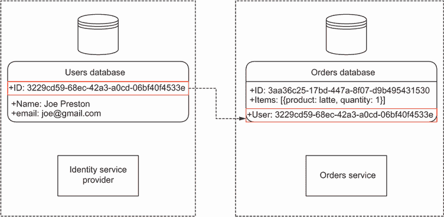

# 11 API 授权和身份验证

本章节涵盖了

+   使用开放授权允许访问我们的 API

+   使用 OpenID Connect 验证我们的 API 用户的身份

+   存在哪些类型的授权流程，以及每种授权场景更适合哪种流程

+   理解 JSON Web Tokens (JWT) 并使用 Python 的 PyJWT 库生成和验证它们

+   将身份验证和授权中间件添加到我们的 API 中

2018 年，美国邮政系统 API 身份验证系统的一个弱点（[`usps.com`](https://usps.com)）允许黑客从 6000 万用户那里获取数据，包括他们的电子邮件地址、电话号码和其他个人信息。¹ 类似这样的 API 安全攻击变得越来越普遍，预计 2021 年攻击数量增长了 300%以上。² API 漏洞不仅可能暴露用户的敏感数据；它们也可能使你的业务陷入困境 好消息是，你可以采取一些措施来降低 API 泄露的风险。第一道防线是一个健壮的身份验证和授权系统。在本章中，你将学习如何通过使用标准的身份验证和授权协议来防止未授权访问你的 API。

根据我的经验，API 身份验证和授权是开发者最困惑的两个主题，也是实施错误经常发生的领域。在你实现 API 的安全层之前，我强烈建议你阅读本章，以确保你知道自己在做什么，并且知道如何正确地做。我已经尽力提供了一个关于 API 身份验证和授权如何工作的全面总结，到本章结束时，你应该能够为自己的 API 添加一个健壮的授权流程。

身份验证是验证用户身份的过程，而授权是确定用户是否有权访问某些资源或操作的过程。在本章中你将学习的关于身份验证和授权的概念和标准适用于所有类型的 Web API。

你将学习不同的身份验证和授权协议及流程，以及如何验证授权令牌。你还将学习如何使用 Python 的 PyJWT 库来生成签名令牌并验证它们。我们将通过一个实际示例来讲解如何向订单 API 添加身份验证和授权。我们有很多内容要介绍，所以让我们开始吧！

## 11.1 设置本章的环境

让我们为本章设置环境。本章的代码可在本书 GitHub 仓库中名为 ch11 的目录下找到。在第七章中，我们实现了一个功能齐全的订单服务，包括业务层、数据库和 API。本章从第七章中我们停止的地方继续订单服务。如果您想跟随本章的变化，请将第七章的代码复制到一个名为 ch11 的新文件夹中：

```
$ cp -r ch07 ch11
```

在 ch11 目录下运行 `pipenv install` 来安装依赖项。对于本章，我们需要一些额外的依赖项，因此请运行以下命令来安装它们：

```
$ pipenv install cryptography pyjwt 
```

PyJWT 是一个 Python 库，它允许我们处理 JSON Web Tokens，而 `cryptography` 将允许我们验证令牌的签名。（有关 Python 生态系统中的替代 JWT 库列表，请参阅 [`jwt.io/libraries?language=Python`](https://jwt.io/libraries?language=Python)。）

我们的环境现在已经准备好了，让我们开始我们的旅程，探索用户身份验证和授权的奇妙世界。这是一段充满陷阱的旅程，但却是必要的。请系好安全带，并仔细观察我们一路上的进展！

## 11.2 理解身份验证和授权协议

当涉及到 API 身份验证时，您需要了解的两个最重要的协议是 OAuth（开放授权）和 OpenID Connect（OIDC）。本节解释了每个协议的工作原理以及它们如何适合我们 API 的身份验证和授权流程。

### 11.2.1 理解开放授权

OAuth 是一种用于访问委派的标准化协议。⁴ 如图 11.1 所示，OAuth 允许用户在不共享其凭证的情况下，授权第三方应用程序访问他们拥有的另一个网站上的受保护资源。



图 11.1 使用 OAuth，用户可以授予第三方应用程序访问另一个网站上的其信息的权限。

定义 *OAuth* 是一种开放标准，允许用户授予第三方应用程序访问他们在其他网站上的信息。通常，通过发放令牌来授予访问权限，第三方应用程序使用该令牌来访问用户的信息。

例如，假设苏珊在她的 Facebook 账户中有一个联系人列表。有一天，苏珊登录到 LinkedIn，并希望从 Facebook 导入她的联系人列表。为了允许 LinkedIn 导入她的 Facebook 联系人，苏珊必须授予 LinkedIn 访问该资源的权限。她如何授予 LinkedIn 访问她联系人列表的权限？她可以给 LinkedIn 她的 Facebook 凭证以访问她的账户。但那将是一个重大的安全风险。相反，OAuth 定义了一种协议，允许苏珊告诉 Facebook，LinkedIn 可以访问她的联系人列表。通过 OAuth，Facebook 会发放一个 LinkedIn 可以用来导入苏珊联系人的临时令牌。

OAuth 在授予资源访问权限的过程中区分了不同的角色：

+   *资源所有者*——授予资源访问权限的用户。在先前的例子中，Susan 是资源所有者。

+   *资源服务器*——托管用户受保护资源的服务器。在先前的例子中，Facebook 是资源服务器。

+   *客户端*——请求访问用户资源的应用程序或服务器。在先前的例子中，LinkedIn 是客户端。

+   *授权服务器*——授予客户端访问资源的服务器。在先前的例子中，Facebook 是授权服务器。

OAuth 提供了四种不同的流程，根据访问条件授予用户授权。了解每个流程的工作原理以及在哪些场景下可以使用它们非常重要。根据我的经验，OAuth 流程是围绕授权的最大困惑之一，也是现代网站中最大的安全问题的来源之一。这些是 OAuth 流程：

+   授权码流

+   PKCE 流程

+   客户端凭证流

+   刷新令牌流

OAuth

OAuth 流程是客户端应用程序用来授权其访问 API 的策略。OAuth 的最佳实践随着时间的推移而变化，因为我们更多地了解应用程序漏洞并改进了协议。当前的最佳实践在 IETF 的“OAuth 2.0 安全最佳当前实践”中有描述（[`mng.bz/o58v`](http://mng.bz/o58v)），由 T. Lodderstedt，J. Bradley，A. Labunets 和 D. Fett 撰写。如果你阅读关于 OAuth 2.0 的内容，可能会遇到我们本章未描述的两个流程的引用：资源所有者密码流和隐式流。这两个流程现在都已弃用，因为它们暴露了严重的漏洞，因此你不应该使用它们。

本章未讨论的另一个流行扩展是设备授权授予（[`mng.bz/5mZD`](http://mng.bz/5mZD)），它允许输入受限的设备，如智能电视，获取访问令牌。OAuth 的最新版本是 2.1，它在 IETF 的“OAuth 2.1 授权框架”中有描述（[`mng.bz/69m6`](http://mng.bz/69m6)）。

让我们深入了解每个流程，了解它们是如何工作的以及何时使用它们！

授权码流

在授权码流中，客户端服务器与授权服务器交换一个秘密，以生成一个签名 URL。如图 11.2 所示，用户使用此 URL 登录后，客户端服务器获得一个一次性代码，它可以用来交换访问令牌。此流程使用客户端秘密，因此仅适用于代码未公开暴露的应用程序，例如用户界面在后台渲染的传统 Web 应用程序。OAuth 2.1 建议结合使用 PKCE（证明密钥编码挑战）的授权码流，这在下一节中将有描述。



图 11.2 在授权码流中，授权服务器生成一个签名 URL，用户可以使用它来证明自己的身份并授予第三方应用程序访问权限。

代码交换密钥证明流程

*代码交换密钥证明*（PKCE，发音为“pixie”）是授权代码流程的扩展，旨在保护源代码公开的应用程序，如移动应用程序和单页应用程序（SPAs）。⁵ 由于源代码是公开的，客户端不能使用秘密，因为这也会被公开。

如您在图 11.3 中看到的，在 PKCE 流程中，客户端生成一个称为*代码验证器*的秘密，并将其编码。编码后的代码称为*代码挑战*。当向服务器发送授权请求时，客户端在请求中包含代码验证器和代码挑战。作为回报，服务器生成一个*授权代码*，客户端可以用它来交换访问令牌。为了获取访问令牌，客户端必须发送授权代码和代码挑战。

多亏了代码挑战，PKCE 流程还防止了授权代码注入攻击，在这种攻击中，恶意用户拦截授权代码并使用它来获取访问令牌。由于这种流程的安全优势，PKCE 也推荐用于服务器端应用程序。我们将在附录 C 中看到一个使用 SPA 的此流程的示例。



图 11.3 在 PKCE 流程中，由客户端提供的单页应用（SPA）通过交换代码验证器和代码挑战，直接从授权服务器请求用户的访问权限。

客户端凭据流程

客户端凭据流程旨在用于服务器到服务器的通信，如您在图 11.4 中看到的，它涉及交换秘密以获取访问令牌。此流程适用于在安全网络上启用微服务之间的通信。我们将在附录 C 中看到一个此流程的示例。



图 11.4 在客户端凭据流程中，服务器应用程序与授权服务器交换秘密以获取访问令牌。

刷新令牌流程

刷新令牌流程允许客户端用刷新令牌交换新的访问令牌。出于安全原因，访问令牌的有效期是有限的。然而，API 客户端通常需要在访问令牌过期后能够与 API 服务器通信，并且为了获取新令牌，它们使用刷新令牌流程。

如您在图 11.5 中看到的，API 客户端在成功访问 API 时通常会收到一个访问令牌和一个刷新令牌。刷新令牌通常只在有限的时间内有效，并且只能一次性使用。每次您刷新访问令牌时，您都会获得一个新的刷新令牌。



图 11.5 为了允许 API 客户端在访问令牌过期后继续与 API 服务器通信，授权服务器每次客户端请求新的访问令牌时都会颁发一个新的刷新令牌。

现在我们已经了解了 OAuth 的工作原理，让我们将注意力转向 OpenID Connect！

### 11.2.2 理解 OpenID Connect

OpenID Connect (OIDC) 是一个建立在 OAuth 之上的开放标准，用于身份验证。如图 11.6 所示，OIDC 允许用户通过使用第三方身份提供者来验证网站。如果您已经使用 Facebook、Twitter 或 Google 账户在其他网站上登录，您已经熟悉 OIDC 了。在这种情况下，Facebook、Twitter 和 Google 是身份提供者。您使用它们将您的身份带到新的网站。OIDC 是一个方便的认证系统，因为它允许用户在不同的网站上使用相同的身份，而无需创建和管理新的用户名和密码。



图 11.6 在 OIDC 中，用户使用 OIDC 服务器登录。OIDC 服务器颁发一个 ID 令牌和一个访问令牌，用户可以使用这些令牌来访问应用程序。

定义 *OpenID Connect* (OIDC) 是一个允许用户将他们的身份从网站（身份提供者）带到另一个网站的身份验证协议。OIDC 建立在 OAuth 之上，我们可以使用 OAuth 定义的相同流程来验证用户。

由于 OIDC 建立在 OAuth 之上，我们可以使用上一节中描述的任何授权流程来验证和授权用户。如图 11.6 所示，当我们使用 OIDC 协议进行认证时，我们区分两种类型的令牌：ID 令牌和访问令牌。这两种令牌都采用 JSON Web Tokens 的形式，但它们有不同的用途：*ID 令牌*用于识别用户，并包含诸如用户姓名、电子邮件和其他个人详细信息等信息。您仅使用 ID 令牌来验证用户身份，而永远不用于确定用户是否有权访问 API。API 访问通过访问令牌进行验证。*访问令牌*通常不包含用户信息，而是一组关于用户访问权利的声明。

ID 令牌与访问令牌 比较常见的安全问题是对 ID 令牌和访问令牌的误用。ID 令牌是携带用户身份信息的令牌。它们必须仅用于验证用户的身份，而不能用于验证对 API 的访问。API 访问通过访问令牌进行验证。访问令牌很少包含用户的身份信息，而是包含关于用户访问 API 权利的声明。ID 令牌和访问令牌之间的一个基本区别是受众：ID 令牌的受众是授权服务器，而访问令牌的受众是我们的 API 服务器。

提供 OIDC 集成的身份提供者公开了一个`/.well-known/openid-configuration`端点（带有一个前置句点！），也称为*发现端点*，它告诉 API 消费者如何进行认证以及如何获取他们的访问令牌。例如，OIDC 为 Google 账户的知名端点是[`accounts.google.com/.well-known/openid-configuration`](https://accounts.google.com/.well-known/openid-configuration)。如果你调用此端点，你会获得以下载荷（示例被省略号截断）：

```
{
  "issuer": "https://accounts.google.com",
  "authorization_endpoint": "https://accounts.google.com/o/oauth2/v2/auth",
  "device_authorization_endpoint": 
➥ "https://oauth2.googleapis.com/device/code",
  "token_endpoint": "https://oauth2.googleapis.com/token",
  "userinfo_endpoint": "https://openidconnect.googleapis.com/v1/userinfo",
  "revocation_endpoint": "https://oauth2.googleapis.com/revoke",
  "jwks_uri": "https://www.googleapis.com/oauth2/v3/certs",
  "response_types_supported": [
    "code",
    "token",
    "id_token",
    "code token",
    "code id_token",
    "token id_token",
    "code token id_token",
    "none"
  ],
  ...
}
```

如您所见，知名端点告诉我们必须使用哪个 URL 来获取授权访问令牌，哪个 URL 返回用户信息，或者我们使用哪个 URL 来撤销访问令牌。在此载荷中还有其他一些信息，例如可用的声明或 JSON Web Keys URI（JWKS）。通常，您会使用库来代表您处理这些端点，或者您会使用身份即服务提供商来处理这些集成。如果您想了解更多关于 OpenID Connect 的信息，我推荐 Prabath Siriwardena 的*OpenID Connect in Action*（Manning，2022）。

现在我们已经了解了 OAuth 和 OpenID Connect 的工作原理，是时候深入了解认证和授权的具体工作了。我们将在下一节研究 JSON Web Tokens（JWT）是什么。

## 11.3 与 JSON Web Tokens 一起工作

在 OAuth 和 OpenID Connect 中，用户访问是通过一种称为*JSON Web Token*（JWT）的令牌来验证的。本节将解释 JWT 是什么，它们的结构是怎样的，它们包含哪些声明，以及如何生成和验证它们。

JWT 是一个代表 JSON 文档的令牌。该 JSON 文档包含声明，例如谁发行了令牌、令牌的受众或令牌何时过期。JSON 文档通常编码为 Base64 字符串。JWT 通常使用私有密钥或加密密钥进行签名。⁶一个典型的 JWT 看起来像这样：

```
eyJ0eXAiOiJKV1QiLCJhbGciOiJSUzI1NiJ9.eyJpc3MiOiJodHRwczovL2F1dGguY29mZmVlbW
➥ VzaC5pby8iLCJzdWIiOiJlYzdiYmNjZi1jYTg5LTRhZjMtODJhYy1iNDFlNDgzMWE5NjIiL
➥ CJhdWQiOiJodHRwOi8vMTI3LjAuMC4xOjgwMDAvb3JkZXJzIiwiaWF0IjoxNjM4MjI4NDg2
➥ LjE1Otg4MSwiZXhwIjoxNjM4MzE0Odg2LjE1Otg4Mswic2NvcGUiOiJvcGVuaWQifQ.oblJ
➥ 5wV9GqrhIDzNSzcClrpEQTMK8hZGzn1S707tDtQE__OCDsP9J2Wa70aBua6X81-
➥ zrvWBfzrcX--nSyT-
➥ A9uQxL5j3RHHycToqSVi87I9H6jgP4FEKH6ClwZfabVwzNIy52Zs7zRdcSI4WRz1OpHoCM-
➥ 2hNtZ67dMJQgBVIlrXcwKAeKQWP8SxSDgFbwnyRTZJt6zijRnCJQqV4KrK_M4pv2UQYqf9t
➥ Qpj2uflTsVcZq6XsrFLAgqvAg-YsIarYw9d63rs4H_I2aB3_T_1dGPY6ic2R8WDT1_Axzi-
➥ crjoWq9A51SN-kMaTLhE_v2MSBB3A0zrjbdC4ZvuszAqQ
```

如果你仔细观察示例，你会看到字符串中包含两个句点。句点作为分隔符，将 JWT 的每个部分分开。如图 11.7 所示，一个 JWT 文档有三个部分：

+   *头部*——标识令牌的类型以及用于签名令牌的算法和密钥。我们使用这些信息来应用正确的算法以验证令牌的签名。

+   *载荷*——包含文档的声明集。JWT 规范包括一系列保留声明，用于标识令牌的发行者（授权服务器）、令牌的受众或预期接收者（我们的 API 服务器）以及其过期日期等详细信息。除了 JWT 的标准声明外，载荷还可以包含自定义声明。我们使用这些信息来确定用户是否有权访问 API。

+   *签名*——表示令牌签名的字符串。



图 11.7 JWT 由三部分组成：包含令牌本身信息的头部，包含关于用户对网站访问声明的负载，以及证明令牌真实性的签名。

现在我们已经了解了 JWT 是什么以及它的结构看起来像什么，让我们更深入地探讨它的属性。接下来的几节将解释 JWT 负载和头部中我们可以找到的主要声明和属性类型，以及我们如何使用它们。

### 11.3.1 理解 JWT 头部

JWT 包含一个描述令牌类型、签名算法以及用于签名字令牌的密钥的头部。JWT 通常使用 HS256 和 RS256 算法进行签名。HS256 使用密钥加密令牌，而 RS256 使用私钥/公钥对来签名字令牌。我们使用这些信息来应用正确的算法以验证令牌签名。

JWT 的签名算法

用于签名字令牌的最常见的两种算法是 HS256 和 RS256。HS256 代表 HMAC-SHA256，这是一种使用密钥生成哈希的加密形式。

RS256 代表 RSA-SHA256。RSA（Rivest-Shamir-Adleman）是一种使用私钥加密负载的加密形式。在这种情况下，我们可以通过使用公钥来验证令牌签名是否正确。

你可以在 David Wong 的《现实世界密码学》（Manning, 2021）中了解更多关于 HMAC 和 RSA 的信息。

一个典型的 JWT 头部如下所示：

```
{
  "alg": "RS256",
  "typ": "JWT",
  "kid": "ZweIFRR4l1dJlVPHOoZqf"
}
```

让我们分析这个头部：

+   `alg`—告诉我们令牌是使用 RS256 算法签名的

+   `typ`—告诉我们这是一个 JWT 令牌

+   `kid`—告诉我们用于签名字令牌的密钥具有 ID `ZweIFRR4l1dJlVPHOoZqf`

令牌的签名只能使用用于签名的相同密钥或密钥进行验证。出于安全考虑，我们通常使用一组密钥或密钥来签名字令牌。`kid`字段告诉我们使用哪个密钥或密钥来签名字令牌，以便在验证令牌签名时使用正确的值。

一些令牌还在头部包含一个`nonce`字段。如果你看到这样的令牌，那么这个令牌可能不是为你自己的 API 服务器准备的，除非你是令牌的创建者并且知道`nonce`的值。`nonce`字段通常包含一个加密的密钥，为 JWT 添加额外的安全层。例如，Azure Active Directory 发行的用于访问其 Graph API 的令牌包含一个`nonce`令牌，这意味着你不应该使用这些令牌来授权访问你的自定义 API。现在我们已经了解了令牌头部的属性，下一节将解释如何读取令牌的声明。

### 11.3.2 理解 JWT 声明

JWT 的负载包含一组声明。由于 JWT 负载是一个 JSON 文档，声明以键值对的形式出现。

声明有两种类型：*保留声明*，它是 JWT 规范的一部分，以及*自定义声明*，我们可以添加这些声明以丰富令牌并添加更多信息。⁷ JWT 规范定义了七个保留声明：

+   `iss` *(发行者)*—标识 JWT 的发行者。如果您使用身份即服务提供商，发行者标识该服务。它通常以 ID 或 URL 的形式出现。

+   `sub` *(主题)*—标识 JWT 的主题（即向服务器发送请求的用户）。它通常以不透明的 ID（即不披露用户个人详情的 ID）的形式出现。

+   `aud` *(观众)*—表示 JWT 的目标接收者。这是我们 API 服务器。它通常以 ID 或 URL 的形式出现。检查此字段以验证令牌是否针对我们的 API 至关重要。如果我们不认识此字段中的值，则意味着令牌不是为我们准备的，我们必须忽略该请求。

+   `exp` *(过期时间)*—一个 UTC 时间戳，表示 JWT 何时过期。带有过期令牌的请求必须被拒绝。

+   `nbf` *(不早于时间)*—一个 UTC 时间戳，表示 JWT 必须在此时间之前不被接受。

+   `iat` *(签发时间)*—一个 UTC 时间戳，表示 JWT 签发的时间。它可以用来确定 JWT 的年龄。

+   `jti` *(JWT ID)*—JWT 的唯一标识符。

保留声明在 JWT 有效载荷中不是必需的，但建议包括它们以确保与第三方集成的互操作性。

列表 11.1 JWT 有效载荷声明示例

```
{
  "iss": "https://auth.coffeemesh.io/",
  "sub": "ec7bbccf-ca89-4af3-82ac-b41e4831a962",
  "aud": "http://127.0.0.1:8000/orders",
  "iat": 1667155816,
  "exp": 1667238616,
  "azp": "7c2773a4-3943-4711-8997-70570d9b099c",
  "scope": "openid"
}
```

让我们分析列表 11.1 中的声明：

+   `iss`告诉我们，令牌是由 https://auth.coffeemesh.io 服务器身份服务签发的。

+   `sub`告诉我们，用户具有标识符`ec7bbccf-ca89-4af3-82ac-b41e4831a962`。此标识符的值属于身份服务。我们的 API 可以使用此值以透明的方式控制对用户拥有的资源的访问。我们说此 ID 是透明的，因为它不披露任何关于用户的个人信息。

+   `aud`告诉我们，此令牌已签发以授予对订单 API 的访问权限。如果此字段的值是不同的 URL，则订单 API 将拒绝请求。

+   `iat`告诉我们，令牌是在 2022 年 10 月 30 日晚上 6:50 UTC 签发的。

+   `exp`告诉我们，令牌在 2022 年 10 月 31 日晚上 5:50 UTC 到期。

+   `azp`告诉我们，令牌是由标识符为`7c2773a4-3943-4711-8997-70570d9b099c`的应用程序请求的。这通常是一个前端应用程序。此声明在已使用 OpenID Connect 协议签发的令牌中很常见。

+   `scope`字段告诉我们，此令牌是使用 OpenID Connect 协议签发的。

现在我们知道了如何处理令牌声明，让我们看看我们如何生成和验证令牌！

### 11.3.3 生成 JWT

要形成最终的 JWT，我们需要使用 base64url 编码来编码头部、有效载荷和签名。如 RFC 4648 ([`mng.bz/aPRj`](http://mng.bz/aPRj)) 所述，base64url 编码类似于 Base64，但它使用非字母数字字符并省略填充。然后使用点作为分隔符将头部、有效载荷和签名连接起来。像 PyJWT 这样的库会处理生成 JWT 的繁重工作。假设我们想要为列表 11.1 中看到的有效载荷生成一个令牌：

```
payload = {
  "iss": "https://auth.coffeemesh.io/",
  "sub": "ec7bbccf-ca89-4af3-82ac-b41e4831a962",
  "aud": "http://127.0.0.1:8000/orders",
  "iat": 1667155816,
  "exp": 1667238616,
  "azp": "7c2773a4-3943-4711-8997-70570d9b099c",
  "scope": "openid"
}
```

要使用此有效载荷生成一个签名令牌，我们使用 PyJWT 的 `encode()` 函数，传入令牌、用于签名令牌的密钥以及我们想要用于签名令牌的算法：

```
>>> import jwt
>>> jwt.encode(payload=payload, key='secret', algorithm='HS256')
➥ 'eyJ0eXAiOiJKV1QiLCJhbGciOiJIUzI1NiJ9.eyJpc3MiOiJodHRwczovL2F1dGguY29mZ
➥ mVlbWVzaC5pby8iLCJzdWIiOiJlYzdiYmNjZi1jYTg5LTRhZjMtODJhYy1iNDFlNDgzMWE5
➥ NjIiLCJhdWQiOiJodHRwOi8vMTI3LjAuMC4xOjgwMDAvb3JkZXJzIiwiaWF0IjoxNjY3MTU
➥ 1ODE2LCJleHAiOjE2NjcyMzg2MTYsImF6cCI6IjdjMjc3M2E0LTM5NDMtNDcxMS04Otk3Lt
➥ cwNTcwZDliMDk5YyIsInNjb3BlIjoib3BlbmlkIn0.sZEXZVitCv0iVrbxGN54GJr8QecZf
➥ HA_pdvfEMzT1dI'
```

在这种情况下，我们使用 HS256 算法使用一个秘密关键字来签名令牌。为了更安全的加密，我们使用私钥/公钥对来使用 RS256 算法签名令牌。为了签名 JWT，我们通常使用遵循 X.509 标准的证书，这允许我们将一个身份绑定到一个公钥。要生成私钥/公钥对，请在您的终端中运行以下命令：

```
$ openssl req -x509 -nodes -newkey rsa:2048 -keyout private_key.pem \
-out public_key.pem -subj "/CN=coffeemesh"
```

X.509 证书的最小输入是主题的通用名称（CN），在这种情况下我们将其设置为 `coffeemesh`。如果您省略了 `-subj` 标志，您将收到一系列关于您想要将证书绑定到的身份的问题。此命令在名为 private_key.pem 的文件下生成一个私钥，以及相应的名为 public_key.pem 的公钥证书。如果您无法运行这些命令，您可以在本书提供的 GitHub 存储库中找到示例密钥对，位于 ch11/private_key.pem 和 ch11/public_key.pem。

现在我们有了私钥/公钥对，我们可以使用它们来签名我们的令牌并验证它们。创建一个名为 jwt_generator.py 的文件，并将列表 11.2 的内容粘贴到其中，该列表显示了如何使用私钥生成 JWT 令牌。该列表定义了一个名为 `generate_jwt()` 的函数，它为函数内部定义的有效载荷生成一个 JWT。在有效载荷中，我们动态设置 `iat` 和 `exp` 属性：`iat` 设置为当前的 UTC 时间；`exp` 设置为从现在起 24 小时。我们使用 `cryptography` 的 `serialization()` 函数加载私钥，传入参数是我们私钥文件的字节内容以及以字节编码的密码。最后，我们使用 PyJWT 的 `encode()` 函数对有效载荷进行编码，传入有效载荷、加载的私钥以及我们想要用于签名令牌的算法（RS256）。

列表 11.2 使用私钥生成 JWT

```
# file: jwt_generator.py

from datetime import datetime, timedelta
from pathlib import Path

import jwt
from cryptography.hazmat.primitives import serialization

def generate_jwt():
    now = datetime.utcnow()
    payload = {
        "iss": "https://auth.coffeemesh.io/",
        "sub": "ec7bbccf-ca89-4af3-82ac-b41e4831a962",
        "aud": "http://127.0.0.1:8000/orders",
        "iat": now.timestamp(),
        "exp": (now + timedelta(hours=24)).timestamp(),
        "scope": "openid",
    }
    private_key_text = Path("private_key.pem").read_text()
    private_key = serialization.load_pem_private_key(
        private_key_text.encode(),
        password=None,
    )
    return jwt.encode(payload=payload, key=private_key, algorithm="RS256")

print(generate_jwt())
```

要查看此代码的工作情况，通过运行 `pipenv shell` 激活您的虚拟环境，并执行以下命令：

```
$ python jwt_generator.py
➥ eyJ0eXAiOiJKV1QiLCJhbGciOiJSUzI1NiJ9.eyJpc3MiOiJodHRwczovL2F1dGguY29mZm
➥ VlbWVzaC5pby8iLCJzdWIiOiJlYzdiYmNjZi1jYTg5LTRhZjMtODJhYy1iNDFlNDgzMWE5N
➥ jIiLCJhdWQiOiJodHRwOi8vMTI3LjAuMC4xOjgwMDAvb3JkZXJzIiwiaWF0IjoxNjM4MDMx
➥ LjgzOTY5ODczOTEsImV4cCI6MTYzODExOC4yMzk2Otg5OTMsInNjb3BlIjoib3BlbmlkIn0
➥ .GipMvEvZG8ErmMA99geYUq5IkeWpRrnHoViLb1CkRufqC5vgM9555re4IsLLa7yVxNAXIp
➥ FVFBqaoWrloJl6dSQ5r00dvUBSM1EM78KMZ7f0gQqUDFWNoKWCeyQu1QCBzuHTouS4l_mzz
➥ Ii75Sal3DJLTaj4zr6c_bQdUuDU1GyrIOJiPSCHSlnKPgg9tjrX8eOcB_ESGSo9ipnCbPAl
➥ uWp0cDjPRPBNRuiU53sbli-
➥ dTy7WoCD1mXAbqhztwO39kG3DZBkysB4vTnKU4Eul2yNNYK2hHVZQEvAqq8TJjETUS7iekf
➥ 0NSt1qQArJ7cxg6Jh5D7y5pbKmYYsBlFohPg
```

现在你已经知道如何生成 JWT 了！列表 11.2 中的 JWT 生成器非常适合运行测试，我们将在接下来的章节中使用它来测试我们的代码。现在我们了解了 JWT 的生成方式，让我们看看如何检查它们的载荷以及如何验证它们。

### 11.3.4 检查 JWT

在处理 JWT 时，你经常会遇到验证问题。要了解令牌验证失败的原因，检查载荷并验证其声明是否正确非常有用。在本节中，你将学习使用三种不同的工具来检查 JWT：jwt.io ([`jwt.io`](https://jwt.io))、终端的 `base64` 命令和 Python。要尝试这些工具，请运行我们在 11.3.3 节中创建的 jwt_generator.py 脚本来发布新的令牌。



图 11.8 jwt.io 是一个帮助你轻松检查和可视化 JWT 的工具。只需将令牌粘贴到左侧面板即可。你还可以通过在右侧的“验证签名”框中粘贴公钥来验证令牌的签名。

jwt.io 是一个优秀的工具，它提供了一种简单的方式来检查 JWT。如图 11.8 所示，你所需要做的就是将 JWT 粘贴到左侧的输入面板中。右侧的显示面板将显示令牌头部和载荷的内容。你还可以通过提供你的公钥来验证令牌的签名。要从我们的公钥证书中提取公钥，可以使用以下命令：

```
$ openssl x509 -pubkey -noout < public_key.pem > pubkey.pem
```

此命令将公钥输出到名为 pubkey.pem 的文件中。你需要将文件内容复制到 jwt.io 的公钥输入面板中，以验证令牌的签名。

你还可以通过在终端中使用 `base64` 命令解码 JWT 的头部和载荷来检查 JWT 的内容。例如，要在终端中解码令牌的头部，运行以下命令：

```
$ echo eyJ0eXAiOiJKV1QiLCJhbGciOiJSUzI1NiJ9 | base64 --decode
{"alg":"RS256","typ":"JWT"}
```

我们还可以使用 Python 的 `base64` 库来检查 JWT 的内容。要使用 Python 解码 JWT 头部，打开 Python 命令行并运行以下代码：

```
>>> import base64
>>> base64.decodebytes('eyJ0eXAiOiJKV1QiLCJhbGciOiJSUzI1NiJ9'.encode())
b'{"alg":"RS256","typ":"JWT",}'
```

由于 JWT 载荷也是 base64url 编码的，我们使用相同的方法来解码它。现在我们知道了如何检查 JWT 载荷，让我们看看如何验证它们！

### 11.3.5 验证 JWT

验证 JWT 有两个部分。一方面，你必须验证其签名，另一方面，你必须验证其声明是否正确，例如，确保令牌未过期且受众正确。这个过程必须清晰；验证过程的两个步骤都是必需的。带有有效签名的过期令牌不应被 API 服务器接受，而带有无效签名的活动令牌也没有任何价值。每个用户请求服务器都必须携带令牌，并且必须在每次请求中验证令牌。

在每个请求中验证 JWT 当用户与我们的 API 服务器交互时，他们必须在每个请求中发送一个 JWT，我们必须在每个请求中验证该令牌。一些实现，特别是那些使用我们在 11.2.1 节中讨论的授权代码流，将令牌存储在会话缓存中，并将请求的令牌与缓存进行比较。这不是 JWT 应该被使用的方式。JWT 是为客户端和服务器之间的无状态通信而设计的，因此必须使用我们在本节中描述的方法进行验证。

正如我们在 11.3.3 节中看到的，令牌可以用秘密密钥或用私钥/公钥对进行签名。出于安全考虑，大多数网站使用用私钥/公钥签名的令牌，为了验证此类令牌的签名，我们使用公钥。

让我们看看如何在代码中验证令牌。我们将使用我们在 11.3.3 节中创建的签名密钥来生成和验证令牌。通过运行 `pipenv shell` 激活您的 Pipenv 环境，并执行 jwt_generator.py 脚本来颁发新的令牌。

为了验证令牌，我们必须首先使用以下代码加载公钥：

```
>>> from cryptography.x509 import load_pem_x509_certificate
>>> from pathlib import Path
>>> public_key_text = Path('public_key.pem').read_text()
>>> public_key = load_pem_x509_certificate(public_key_text.encode('utf-
➥ 8')).public_key()
```

现在我们有了公钥，我们可以使用以下代码来验证令牌：

```
>>> import jwt
>>> access_token = "eyJ0eXAiOiJKV1QiLCJhbGciOiJSUzI1NiJ..."
>>> jwt.decode(access_token, key=public_key, algorithms=['RS256'], 
➥ audience=["http://127.0.0.1:8000/orders"])
{'iss': 'https://auth.coffeemesh.io/', 'sub': 'ec7bbccf-ca89-4af3-82ac-
➥ b41e4831a962', 'aud': 'http://127.0.0.1:8000/orders', 'iat': 
➥ 1638114196.49375, 'exp': 1638200596.49375, 'scope': 'openid'}
```

如您所见，如果令牌有效，我们将返回 JWT 负载。如果令牌无效，此代码将引发异常。现在我们知道了如何处理和验证 JWT，让我们看看如何在 API 服务器中授权请求。

## 11.4 向 API 服务器添加授权

现在我们知道了如何验证访问令牌，让我们将所有这些代码组合到我们的 API 服务器中。在本节中，我们向订单 API 添加授权。订单 API 的某些端点是受保护的，而其他端点必须对每个人可访问。我们的目标是确保我们的服务器在受保护端点下检查有效的访问令牌。

我们将允许公开访问 /docs/orders 和 /openapi/orders.json 端点，因为它们提供必须对所有消费者可用的 API 文档。所有其他端点都需要有效的令牌。如果令牌无效或请求中缺少令牌，我们必须以 401（未授权）状态码拒绝请求，这表示凭证缺失。

我们如何向我们的 API 添加授权？有两种主要策略：在 API 网关中处理验证或在每个服务中处理验证。*API 网关* 是位于我们 API 前的网络层。⁸ API 网关的主要作用是促进服务发现，但它也可以用于授权用户访问、验证访问令牌以及通过添加有关用户信息的自定义头来自定义请求。

第二种方法是处理每个 API 内部的授权。当你的 API 网关无法处理授权或 API 网关不适合你的架构时，你将在服务级别处理授权。在本节中，我们将学习如何在服务内部处理授权，因为我们没有 API 网关。

常常出现的一个问题是，我们的代码中在哪里处理授权？由于授权是验证用户通过 API 访问服务所必需的，我们将其实现为 API 中间件。如图 11.9 所示，*中间件* 是一层代码，为处理所有请求提供通用功能。大多数 Web 服务器都有一个中间件或请求预处理器的概念，我们的授权代码就放在那里。中间件组件通常按顺序执行，我们通常可以选择它们的执行顺序。由于授权控制对服务器的访问，授权中间件必须尽早执行。



图 11.9 请求首先由服务器中间件处理，例如 CORS 和 auth 中间件，然后再到达路由器，路由器将请求映射到相应的视图函数。

### 11.4.1 创建授权模块

让我们先创建一个模块来封装我们的授权代码。创建一个名为 orders/web/api/auth.py 的文件，并将列表 11.3 中的代码复制进去。我们首先加载在 11.3.3 节中创建的公钥。为了验证令牌，我们首先检索头信息并加载公钥。我们使用 PyJWT 的 `decode()` 函数来验证令牌，传入参数包括令牌本身、验证令牌所需的公钥、预期的受众列表以及用于签名密钥的算法。

列表 11.3 向 API 添加授权模块

```
# file: orders/web/api/auth.py

from pathlib import Path

import jwt
from cryptography.x509 import load_pem_x509_certificate

public_key_text = (
    Path(__file__).parent / "../../../public_key.pem"
).read_text()
public_key = load_pem_x509_certificate(
    public_key_text.encode()
).public_key()

def decode_and_validate_token(access_token):
    """
    Validates an access token. If the token is valid, it returns the token payload.
    """
    return jwt.decode(
        access_token,
        key=public_key,
        algorithms=["RS256"],
        audience=["http://127.0.0.1:8000/orders"],
    )
```

现在我们创建了一个封装验证 JWT 所需功能的模块，让我们通过添加一个使用它来验证 API 访问的中间件将其集成到 API 中。

### 11.4.2 创建授权中间件

要将授权添加到我们的 API 中，我们创建一个授权中间件。列表 11.4 展示了如何实现授权中间件。列表 11.4 中的代码放入 orders/web/app.py 文件中，新添加的代码以粗体显示。我们将中间件实现为一个简单的类，称为 `AuthorizeRequestMiddleware`，它继承自 Starlette 的 `BaseHTTPMiddleware` 类。中间件的入口点必须在名为 `dispatch()` 的函数中实现。

我们使用一个标志来确定是否应该启用身份验证。这个标志是一个名为`AUTH_ON`的环境变量，我们默认将其设置为`False`。通常在开发新功能或调试 API 中的问题时，在本地运行服务器而不进行身份验证是很方便的。使用标志允许我们根据需要切换身份验证的开启和关闭。如果身份验证关闭，我们为请求用户添加默认 ID `test`。

接下来，我们检查用户是否请求 API 文档。如果是这种情况，我们不会阻止请求，因为我们希望让所有用户都能看到 API 文档；否则，他们不知道如何正确地构建他们的请求。

我们还检查请求的方法。如果是 OPTIONS 请求，我们不会尝试授权请求。OPTIONS 请求是预检请求，也称为跨源资源共享（CORS）请求。预检请求的目的是检查 API 服务器接受哪些来源、方法和请求头，根据 W3 的规范，CORS 请求不得要求凭据（[`www.w3.org/TR/2020/SPSD-cors-20200602/`](https://www.w3.org/TR/2020/SPSD-cors-20200602/)）。CORS 请求通常由 Web 服务器框架处理。

**CORS 请求**，也称为预检请求，是由网络浏览器发送的，以了解 API 服务器接受哪些方法、来源和头。如果我们没有正确处理 CORS 请求，网络浏览器将终止与 API 的通信。幸运的是，大多数 Web 框架都包含处理 CORS 请求的正确插件或扩展。CORS 请求未进行身份验证，因此当我们向我们的服务器添加身份验证时，我们必须确保预检请求不需要凭据。

如果不是 CORS 请求，我们尝试从请求头中捕获令牌。我们期望在“Authorization”头下找到令牌。如果找不到“Authorization”头，我们将以 401（未授权）状态码响应拒绝请求。Authorization 头的值格式为`Bearer` `<ACCESS_TOKEN>`，因此如果找到 Authorization 头，我们将通过在空格周围分割头值来捕获令牌，并尝试验证它。如果令牌无效，PyJWT 将抛出异常。在我们的中间件中，我们捕获 PyJWT 的无效化异常，以确保我们可以返回 401 状态码响应。如果没有抛出异常，这意味着令牌是有效的，因此我们可以处理请求，所以返回对下一个回调的调用。我们还从令牌的有效载荷中捕获用户 ID 并将其存储在请求的`state`对象中，以便我们可以在 API 视图中稍后访问它。最后，为了注册中间件，我们使用 FastAPI 的`add_middleware()`方法。

JSON Web 令牌去哪里了？JWTs 放在请求头中，通常在 Authorization 头下。带有 JWT 的 Authorization 头通常具有以下格式：`Authorization:` `Bearer` `<JWT>`。

列表 11.4 向订单 API 添加授权中间件

```
# file: orders/web/app.py

import os

from fastapi import FastAPI
from jwt import (
    ExpiredSignatureError,
    ImmatureSignatureError,
    InvalidAlgorithmError,
    InvalidAudienceError,
    InvalidKeyError,
    InvalidSignatureError,
    InvalidTokenError,
    MissingRequiredClaimError,
)
from starlette import status
from starlette.middleware.base import (
    RequestResponseEndpoint,
    BaseHTTPMiddleware,
)
from starlette.requests import Request
from starlette.responses import Response, JSONResponse

from orders.api.auth import decode_and_validate_token

app = FastAPI(debug=True)

class AuthorizeRequestMiddleware(BaseHTTPMiddleware):                      ①
    async def dispatch(                                                    ②
        self, request: Request, call_next: RequestResponseEndpoint
    ) -> Response:
        if os.getenv("AUTH_ON", "False") != "True":                        ③
            request.state.user_id = "test"                                 ④
            return await call_next(request)                                ⑤

        if request.url.path in ["/docs/orders", "/openapi/orders.json"]: ⑥
            return await call_next(request)
        if request.method == "OPTIONS":
            return await call_next(request)

        bearer_token = request.headers.get("Authorization")                ⑦
        if not bearer_token:                                               ⑧
            return JSONResponse(
                status_code=status.HTTP_401_UNAUTHORIZED,
                content={
                    "detail": "Missing access token",
                    "body": "Missing access token",
                },
            )
        try:
            auth_token = bearer_token.split(" ")[1].strip()                ⑨
            token_payload = decode_and_validate_token(auth_token)          ⑩
        except (                                                           ⑪
            ExpiredSignatureError,
            ImmatureSignatureError,
            InvalidAlgorithmError,
            InvalidAudienceError,
            InvalidKeyError,
            InvalidSignatureError,
            InvalidTokenError,
            MissingRequiredClaimError,
        ) as error:
            return JSONResponse(
                status_code=status.HTTP_401_UNAUTHORIZED,
                content={"detail": str(error), "body": str(error)},
            )
        else:
            request.state.user_id = token_payload["sub"]                   ⑫
        return await call_next(request)

app.add_middleware(AuthorizeRequestMiddleware)                             ⑬

from orders.api import api
```

① 我们通过从 Starlette 的 BaseHTTPMiddleware 基类继承来创建一个中间件类。

② 我们实现中间件的入口点。

③ 如果 AUTH_ON 设置为 True，我们授权请求。

④ 如果未启用授权，我们将默认用户 test 绑定到请求。

⑤ 我们通过调用下一个回调来返回。

⑥ 文档端点是公开可用的，所以我们不对它们进行授权。

⑦ 我们尝试获取 Authorization 头。

⑧ 如果没有设置 Authorization 头，我们返回一个 401 响应。

⑨ 我们从 Authorization 头中捕获令牌。

⑩ 我们验证并检索令牌的有效载荷。

⑪ 如果令牌无效，我们返回一个 401 响应。

⑫ 我们从令牌的 sub 字段中捕获用户 ID。

⑬ 我们使用 FastAPI 的 add_middleware() 方法注册中间件。

服务器已准备好开始使用 JWT 验证请求！让我们运行一个测试来看看我们的授权代码是如何工作的。通过运行 `pipenv shell` 激活虚拟环境，并使用以下命令启动服务器：

```
$ AUTH_ON=True uvicorn orders.web.app:app --reload
```

从不同的终端，使用 cURL 发送一个未认证的请求（一些输出被截断），使用 `-i` 标志，它显示额外的信息，例如响应状态码：

```
$ curl -i http://localhost:8000/orders
HTTP/1.1 401 Unauthorized
[...]

{"detail":"Missing access token","body":"Missing access token"}
```

如您所见，缺少令牌的请求被拒绝，并显示一个 401 错误和一个消息，告诉我们访问令牌缺失。现在使用我们在 11.3.3 节中实现的 jwt_generator.py 脚本生成一个令牌，并使用该令牌发送一个新的请求：

```
curl http://localhost:8000/orders -H 'Authorization: Bearer 
➥ eyJ0eXAiOiJKV1QiLCJhbGciOiJSUzI1NiIsImtpZCI6ImI3NTQwM2QxLWUzZDktNDgzYy0
➥ 5MjZhLTM4NDRhM2Q4OWY1YyJ9.eyJpc3MiOiJodHRwczovL2F1dGguY29mZmVlbWVzaC5pb
➥ y8iLCJzdWIiOiJlYzdiYmNjZi1jYTg5LTRhZjMtODJhYy1iNDFlNDgzMWE5NjIiLCJhdWQi
➥ OiJodHRwOi8vMTI3LjAuMC4xOjgwMDAvb3JkZXJzIiwiaWF0IjoxNjM4MTE3MjEyLjc5OTE
➥ 3OSwiZXhwIjoxNjM4MjAzNjEyLjc5OTE3OSwic2NvcGUiOiJvcGVuaWQifQ.F1bmgYm1acf
➥ i1NMm5JGkbYQYWFNvG1-7BAXEnIqNdF0th_DYcnEm_p3YZ5hQ93v4QWxDx9muit6InKs-
➥ MHqhChP2k6DakpSocaqbgJ_IHpqNhTaEzByqZjoNfZFyQLZMo3yEaQB8S_x0LcKOOqeoPYl
➥ GSWM1eAUy7VFBXmvMUZrUj-yoK721U9vevgM-wdVyYFVtpTRuyjCoWMjJEVadNn-
➥ Zrxr0ghlRQnwEx-YdTbbEMkk_vVLWoWeEgj7mkBE167fr-
➥ fyGUKBqa2F71Zwh8DaDQz79Ph_STOY6BTlCnAVL8XwnlIOhJWpSHuc90Kynn_RX49_yJrQH
➥ KF-xLoflWg'
{"orders":[]}
```

如果令牌有效，这次你会得到一个包含订单列表的成功响应。我们的授权代码正在工作！下一步是确保用户只能访问服务器上的自己的资源。在我们这样做之前，让我们再添加一个中间件来处理 CORS 请求。

### 11.4.3 添加 CORS 中间件

由于我们打算允许与前端应用程序进行交互，因此我们还需要启用 CORS 中间件。正如我们在 11.4.2 节中看到的，CORS 请求是由浏览器发送的，以了解服务器允许哪些头、方法和来源。FastAPI 的 CORS 中间件负责用正确的信息填充我们的响应。列表 11.5 展示了如何修改 orders/web/app.py 文件以注册 CORS 中间件，其中加粗的新代码和省略号省略了列表 11.5 中的部分代码。

如我们之前所做的那样，我们使用 FastAPI 的 `add_middleware()` 方法来注册 CORS 中间件，并传递必要的配置。出于测试目的，我们使用通配符来允许所有来源、方法和头部信息，但在您的生产环境中，您必须更加具体。特别是，您必须限制允许的来源为您的网站域名和其他受信任的来源。

我们注册中间件的顺序很重要。中间件是按照注册的逆序执行的，因此最新注册的中间件首先执行。由于 CORS 中间件对于前端客户端和 API 服务器之间的所有交互都是必需的，所以我们最后注册它，这确保了它总是被执行。

列表 11.5 添加 CORS 中间件

```
# file: orders/web/app.py

import os

from fastapi import FastAPI
from jwt import (
    ExpiredSignatureError,
    ImmatureSignatureError,
    InvalidAlgorithmError,
    InvalidAudienceError,
    InvalidKeyError,
    InvalidSignatureError,
    InvalidTokenError,
    MissingRequiredClaimError,
)
from starlette import status
from starlette.middleware.base import RequestResponseEndpoint, BaseHTTPMiddleware
from starlette.middleware.cors import CORSMiddleware ①
from starlette.requests import Request
from starlette.responses import Response, JSONResponse

from orders.api.auth import decode_and_validate_token

app = FastAPI(debug=True)

...

app.add_middleware(AuthorizeRequestMiddleware)

app.add_middleware(
    CORSMiddleware,                                    ②
    allow_origins=["*"],                               ③
    allow_credentials=True,                            ④
    allow_methods=["*"],                               ⑤
    allow_headers=["*"],                               ⑥
)

from orders.api import api
```

① 我们导入 Starlette 的 CORSMiddleware 类。

② 我们使用 FastAPI 的 add_middleware() 方法注册 CORSMiddleware。

③ 我们允许所有来源。

④ 我们支持跨域请求的 cookies。

⑤ 我们允许所有 HTTP 方法。

⑥ 我们允许所有头部信息。

我们几乎准备好了！我们的服务器现在可以授权用户并处理 CORS 请求。下一步是确保每个用户只能访问他们的数据。

## 11.5 授权资源访问

我们通过确保只有经过身份验证的用户可以访问我们的 API 来保护了我们的 API。现在我们必须确保每个订单的详细信息只能由放置订单的用户访问；我们不希望允许用户访问彼此的数据。我们称这种类型的验证为 *授权*，在本节中，您将学习如何将其添加到您的 API 中。

### 11.5.1 更新数据库以链接用户和订单

我们首先将数据库中现有的订单删除。这些订单没有与用户关联，因此一旦我们强制执行每个订单与用户的关联，它们将无法工作。进入 ch11 目录，通过运行 `pipenv shell` 激活虚拟环境，并通过运行 `python` 命令打开 Python shell。在 Python shell 中，运行以下代码：

```
>>> from orders.repository.orders_repository import OrdersRepository
>>> from orders.repository.unit_of_work import UnitOfWork
>>> with UnitOfWork() as unit_of_work:
...     orders_repository = OrdersRepository(unit_of_work.session)
...     orders = orders_repository.list()
...     for order in orders: order.delete(order.id)
...     unit_of_work.commit()
```

我们的数据库名现在已清理，因此我们准备开始。我们如何将每个订单与用户关联起来？一种典型策略是创建一个用户表，并通过外键将我们的订单链接到用户记录。但为订单服务创建用户表真的有意义吗？我们想要为每个服务都有一个用户表吗？

不，我们不想为每个服务都有一个用户表，因为这会涉及大量的重复。正如您在图 11.10 中所看到的，我们只想有一个用户表，并且该表必须由用户服务拥有。我们的用户服务是我们的身份即服务提供商，因此我们的用户表已经存在。每个用户都有一个 ID，正如我们在 11.3.1 节中看到的，ID 存在于 JWT 有效载荷的 `sub` 字段下。我们所需做的只是向订单表添加一个新列来存储创建订单的用户 ID。



图 11.10 为了避免重复，我们在身份服务提供程序下只保留一个用户表。为了避免服务之间的紧密耦合，我们避免在不同服务拥有的表之间使用外键。

将用户与其资源关联起来 微服务架构中的两个常见反模式是每个服务创建一个用户表，以及有一个共享的用户表，该表被多个服务直接访问以创建用户与其他资源之间的外键。每个服务有一个用户表是不必要的，并且涉及重复，而多个服务之间的共享用户表会在服务之间创建紧密耦合，并冒着在更改用户表模式时破坏它们的危险。由于 JWTs 已经在 `sub` 字段下包含不透明的用户 ID，因此依赖该标识符将用户与其资源关联起来是一个好的做法。

列表 11.6 展示了如何向 `OrderModel` 类添加 `user_id` 字段。以下代码位于 orders/repository/models.py 文件中，新添加的代码以粗体突出显示。

列表 11.6 向订单表添加用户 ID 外键

```
# file: orders/repository/models.py

class OrderModel(Base):
    __tablename__ = 'order'

    id = Column(String, primary_key=True, default=generate_uuid)
    user_id = Column(String, nullable=False)                       ①
    items = relationship('OrderItemModel', backref='order')
    status = Column(String, nullable=False, default='created')
    created = Column(DateTime, default=datetime.utcnow)
    schedule_id = Column(String)
    delivery_id = Column(String)
```

① 我们添加了一个名为 user_id 的新列。

现在我们已经更新了模型，我们需要通过运行迁移来更新数据库。正如我们在第七章中看到的，运行迁移是更新数据库模式的过程。正如我们在第七章中所做的那样，我们使用 Alembic 来管理我们的迁移，这是 Python 最好的数据库迁移管理库。Alembic 检查 `OrderModel` 模型和 `order` 表当前模式之间的差异，并执行必要的更新以添加 `user_id` 列。

在 SQLITE 中修改表 SQLite 对 `ALTER` 语句的支持有限。例如，SQLite 不支持通过 `ALTER` 语句向表中添加新列。如图 11.11 所示，为了解决这个问题，我们需要将表的数据复制到临时表并删除原始表。然后我们使用新字段重新创建表，从临时表复制数据，并删除临时表。Alembic 通过其批处理操作策略处理这些操作。


图 11.11 当与 SQLite 一起工作时，我们使用批处理操作来更改我们的表。在批处理操作中，我们从原始表复制数据到一个临时表；然后，我们删除原始表并使用新字段重新创建它；最后，我们从临时表复制数据回来。

在我们可以运行迁移之前，我们需要更新 Alembic 配置。列表 11.6 中的更改向订单表添加了一个新列，这转化为一个 `ALTER` `TABLE` SQL 语句。对于本地开发，我们使用 SQLite，它对 `ALTER` 语句的支持有限。为了确保 Alembic 为 SQLite 生成正确的迁移，我们需要更新其配置以运行批处理操作。*只有当你使用 SQLite 时才需要这样做*。

要更新 Alembic 配置以便我们可以运行迁移，打开 migrations/env.py 文件并搜索一个名为 `run_migrations_online()` 的函数。这个函数运行迁移以针对我们的数据库。在该函数内部，搜索以下代码块：

```
# file: migrations/env.py

with connectable.connect() as connection:
    context.configure(
        connection=connection,
        target_metadata=target_metadata

    )
```

在调用 `configure()` 方法的内部添加以下行（以粗体突出显示）：

```
# file: migrations/env.py

with connectable.connect() as connection:
    context.configure(
        connection=connection,
        target_metadata=target_metadata,
        render_as_batch=True
    )
```

现在我们可以生成 Alembic 迁移并更新数据库。运行以下命令以创建新的迁移：

```
$ PYTHONPATH=`pwd` alembic revision --autogenerate -m "Add user id to order table"
```

接下来，我们使用以下命令运行迁移：

```
$ PYTHONPATH=`pwd` alembic upgrade heads
```

我们的数据库名单现在已准备好开始链接订单和用户。下一节将解释我们如何从 `request` 对象中获取用户 ID 并将其传递给我们的数据存储库。

### 11.5.2 限制用户访问他们自己的资源

现在我们数据库已准备好，我们需要更新我们的 API 视图以在创建或更新订单，或检索订单列表时捕获用户 ID。由于我们需要对视图函数进行的更改都非常相似，我们将展示如何将这些更改应用到一些视图中。你可以参考这本书的 GitHub 仓库以获取更改的完整列表。

列表 11.7 展示了如何更新 `create_order()` 视图函数以在下单时捕获用户 ID。新添加的代码以粗体突出显示。正如我们在 11.4.2 节中看到的，我们在请求的 `state` 属性下存储用户 ID，所以我们做的第一个更改是将 `create_order()` 函数的签名更改以包括 `request` 对象。第二个更改是将用户 ID 传递给 `OrderService` 的 `place_order()` 方法。

列表 11.7 在下单时捕获用户 ID

```
# file: orders/web/api/api.py

@app.post(
    "/orders", status_code=status.HTTP_201_CREATED, response_model=GetOrderSchema
)
def create_order(request: Request, payload: CreateOrderSchema):            ①
    with UnitOfWork() as unit_of_work:
        repo = OrdersRepository(unit_of_work.session)
        orders_service = OrdersService(repo)
        order = payload.dict()["order"]
        for item in order:
            item["size"] = item["size"].value
        order = orders_service.place_order(order, request.state.user_id)   ②
        unit_of_work.commit()
        return_payload = order.dict()
    return return_payload
```

① 我们在函数签名中捕获请求对象。

② 我们从请求的状态对象中捕获用户 ID。

我们还需要更改 `OrdersService` 和 `OrdersRepository` 以确保它们也能捕获用户 ID。以下代码展示了如何更新 `OrdersService` 以捕获用户 ID：

```
# file: orders/orders_service/orders_service.py

class OrdersService:
    def __init__(self, orders_repository: OrdersRepository):
        self.orders_repository = orders_repository

    def place_order(self, items, user_id):
        return self.orders_repository.add(items, user_id)
```

以下代码展示了如何更新 `OrdersRepository` 以捕获用户 ID：

```
# file: orders/repository/orders_repository.py

class OrdersRepository:
    def __init__(self, session):
        self.session = session

    def add(self, items, user_id):
        record = OrderModel(
            items=[OrderItemModel(**item) for item in items],
            user_id=user_id
        )
        self.session.add(record)
        return Order(**record.dict(), order_=record)
```

现在我们知道了如何使用用户 ID 保存订单，让我们看看我们如何确保当用户调用 GET `/orders` 端点时，他们只能获取他们自己的订单列表。列表 11.8 展示了对 `get_orders()` 函数所需的更改，该函数实现了 GET `/orders` 端点。新添加的代码以粗体显示。正如你所见，在这种情况下，我们还需要更改函数的签名以捕获请求对象。然后我们简单地将用户 ID 作为查询过滤器之一传递。由于 `OrdersService` 和 `OrdersRepository` 都被设计为接受任意字典的过滤器，所以代码的其他部分不需要任何额外更改。

列表 11.8 确保用户只能获取他们自己的订单列表

```
# file: orders/web/api/api.py

@app.get("/orders", response_model=GetOrdersSchema)
def get_orders(
    request: Request,
    cancelled: Optional[bool] = None,
    limit: Optional[int] = None
):
    with UnitOfWork() as unit_of_work:
        repo = OrdersRepository(unit_of_work.session)
        orders_service = OrdersService(repo)
        results = orders_service.list_orders(
            limit=limit, cancelled=cancelled, user_id=request.state.user_id
        )
    return {"orders": [result.dict() for result in results]}
```

现在，让我们将注意力转向 GET `/orders/{order_id}`端点。如果用户尝试检索不属于他们的订单的详细信息会发生什么？我们可以采取两种策略：返回 404（未找到）响应，表明请求的订单不存在，或者返回 403（禁止）响应，表明用户没有访问请求资源的权限。

技术上讲，当用户试图访问不属于他们的资源时，返回 403 响应比 404 响应更正确。但这也暴露了不必要的详细信息。一个拥有有效凭证的恶意用户可能会利用我们的 403 响应来构建服务器上现有资源的映射。为了避免这个问题，我们选择披露更少的信息，并返回 404 响应。当尝试从数据库中检索订单时，用户 ID 将变成一个额外的过滤器。

以下代码显示了`get_order()`函数所需的更改，以包括用户 ID 在我们的查询中，新添加的代码以粗体显示。同样，我们将请求对象包含在函数签名中，并将用户 ID 传递给`OrderService`的`get_order()`方法。

列表 11.9 使用订单 ID 和用户 ID 过滤订单

```
# file: orders/web/api/api.py

@app.get("/orders/{order_id}", response_model=GetOrderSchema)
def get_order(request: Request, order_id: UUID):
    try:
        with UnitOfWork() as unit_of_work:
            repo = OrdersRepository(unit_of_work.session)
            orders_service = OrdersService(repo)
            order = orders_service.get_order(
                order_id=order_id, user_id=request.state.user_id
            )
        return order.dict()
    except OrderNotFoundError:
        raise HTTPException(
            status_code=404, detail=f"Order with ID {order_id} not found"
        )
```

为了能够按用户 ID 查询订单，我们还需要更新`OrdersService`和`OrdersRepository`类。我们将更改它们的方法以接受一个可选的任意过滤器字典。`OrdersService`的`get_order()`方法更改如下：

```
# file: orders/orders_service/orders_service.py

def get_order(self, order_id, **filters):
    order = self.orders_repository.get(order_id, **filters)
    if order is not None:
        return order
    raise OrderNotFoundError(f"Order with id {order_id} not found")
```

并且`OrdersRepository`的`get()`和`_get()`方法需要以下更改：

```
# file: orders/repository/orders_repository.py

def _get(self, id_, **filters):
    return (
        self.session.query(OrderModel)
        .filter(OrderModel.id == str(id_)).filter_by(**filters)
        .first()
    )

def get(self, id_, **filters):
    order = self._get(id_, **filters)
    if order is not None:
        return Order(**order.dict())
```

`orders/web/api/api.py`文件中其余的视图函数需要与这一节中看到的类似更改，同样适用于`OrdersService`和`OrdersRepository`类的其余方法。作为一个练习，我建议您尝试完成添加授权到剩余 API 端点所需的更改。本书的 GitHub 存储库包含了完整的更改列表，因此请随时查看以获取指导。

这标志着我们通过 API 身份验证和授权的旅程结束，这是一段怎样的旅程！您已经学习了 OAuth 和 OpenID Connect 是什么以及它们是如何工作的。您已经了解了 OAuth 流程以及何时使用每个流程。您已经了解了 JWT 是什么，如何检查它们的负载，以及如何生成和验证它们。最后，您已经学习了如何授权 API 请求以及如何授权用户访问特定资源。您已经拥有了开始为您的 API 添加强大身份验证和授权所需的一切！

附录 C 教您如何与身份提供者（如 Auth0）集成。您还将看到如何使用 PKCE 和客户端凭证流量的实际示例，并学习如何使用 Swagger UI 授权您的请求。

## 摘要

+   我们使用标准的 OAuth 和 OpenID Connect 协议授权访问我们的 API。

+   OAuth 是一种访问委派协议，允许用户授予应用程序访问他们不同网站上的资源的权限。它区分了四种授权流程：

    +   *授权代码*——API 服务器与授权服务器交换代码，以请求用户的访问令牌。

    +   *PKCE*——客户端应用程序（通常是单页应用程序）使用代码验证器和代码挑战从授权服务器获取访问令牌。

    +   *客户端凭证*——客户端（通常是另一个微服务）通过交换一个私有密钥来换取访问令牌。

    +   *刷新令牌*——客户端通过交换刷新令牌来获取新的访问令牌。

+   OpenID Connect 是一个基于 OAuth 的身份验证协议，它帮助用户通过从其他网站（如 Google 或 Facebook）带来他们的身份，轻松地验证到新网站。

+   JWT 是包含关于用户访问权限声明的 JSON 文档。JWT 使用 base64url 编码，通常使用私有/公钥进行签名。

+   要验证请求，用户将在请求的授权头中发送他们的访问令牌。此头的预期格式为 `Authorization:` `Bearer` `<ACCESS_TOKEN>`。

+   我们使用 PyJWT 验证访问令牌。PyJWT 检查令牌是否未过期，受众是否正确，以及签名是否可以使用可用的公钥之一进行验证。如果令牌无效，我们以 401（未授权）响应拒绝请求。

+   为了将用户与其资源链接起来，我们使用 JWT 的 `sub` 声明中表示的用户 ID。

+   如果用户尝试访问不属于他们的资源，我们将以 403（禁止）响应。

+   OPTIONS 请求被称为 CORS 请求或预检请求。CORS 请求不得由凭据保护。

* * *

¹ 该问题首先由 Brian Krebs 报告，“USPS 网站泄露了 6000 万用户的个人信息”，KrebsOnSecurity，2018 年 11 月 21 日，[`krebsonsecurity.com/2018/11/usps-site-exposed-data-on-60-million-users/`](https://krebsonsecurity.com/2018/11/usps-site-exposed-data-on-60-million-users/)。

² Bill Doerfeld，“过去六个月内 API 攻击流量增长了 300%以上”，*Security Boulevard*，2021 年 7 月 30 日，[`securityboulevard.com/2021/07/api-attack-traffic-grew-300-in-the-last-six-months/`](https://securityboulevard.com/2021/07/api-attack-traffic-grew-300-in-the-last-six-months/)。

³ Joe Galvin，“60%的小企业在遭受网络攻击后的六个月内倒闭，”*Inc.*，2018 年 5 月 7 日，[`www.inc.com/joe-galvin/60-percent-of-small-businesses-fold-within-6-months-of-a-cyber-attack-heres-how-to-protect-yourself.html`](https://www.inc.com/joe-galvin/60-percent-of-small-businesses-fold-within-6-months-of-a-cyber-attack-heres-how-to-protect-yourself.html)。

⁴ [`oauth.net/`](https://oauth.net/) 是一个很好的网站，提供了大量关于 OAuth 规范的学习资源。

⁵ N. Sakimura、J. Bradley 和 N. Agarwal，“OAuth 公共客户端的代码交换证明密钥”，IETF RFC 7636，2015 年 9 月，[`datatracker.ietf.org/doc/html/rfc7636`](https://datatracker.ietf.org/doc/html/rfc7636)。

⁶ JSON Web Tokens（JWT）的完整生成和验证规范可在 J. Jones、J. Bradley 和 N. Sakimura 的“JSON Web Token (JWT)”RFC-7519 文档中找到，发布于 2015 年 5 月，[`datatracker.ietf.org/doc/html/rfc7519`](https://datatracker.ietf.org/doc/html/rfc7519)。

您可以在[`www.iana.org/assignments/jwt/jwt.xhtml`](https://www.iana.org/assignments/jwt/jwt.xhtml)查看最常用的 JWT 声明的完整列表。

请参阅 Chris Richardson 的“模式：API 网关/前端后端”，[`microservices.io/patterns/apigateway.html`](https://microservices.io/patterns/apigateway.html)。
