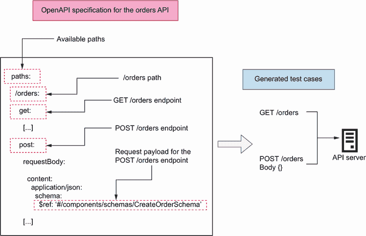
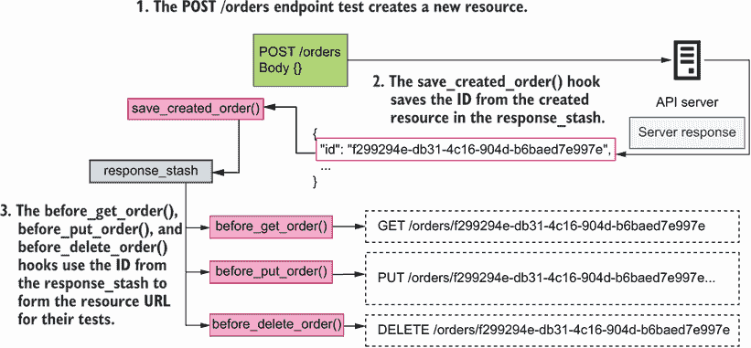
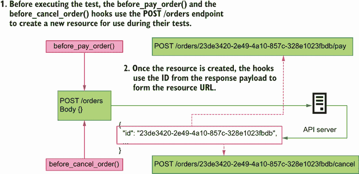
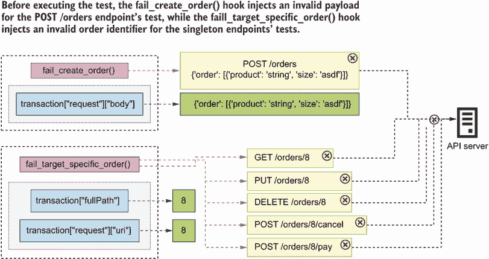
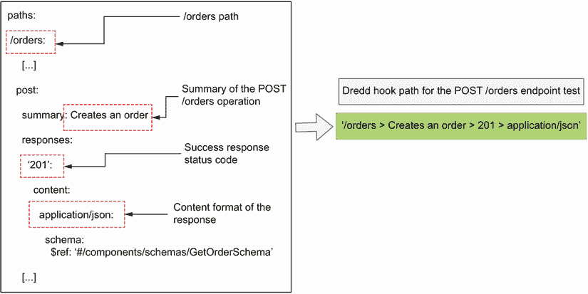
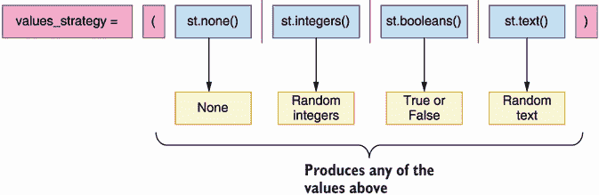
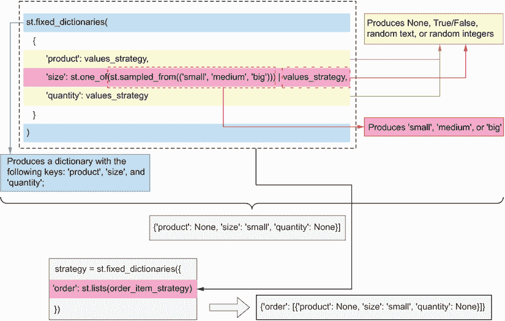
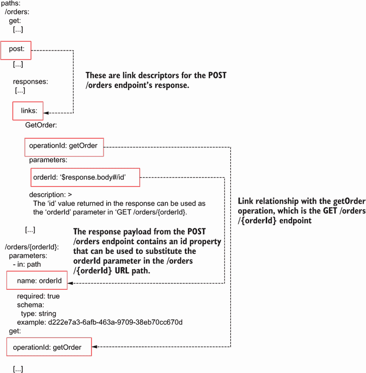
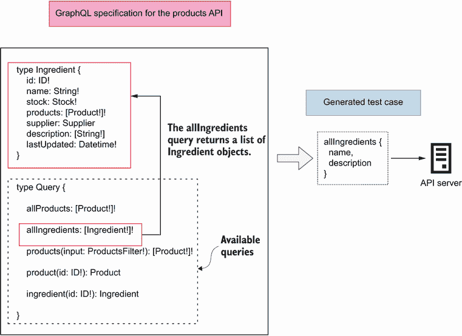

# 12 测试和验证 API

本章涵盖

+   使用 Dredd 和 Schemathesis 为 REST API 生成自动测试

+   编写 Dredd 钩子来自定义 Dredd 测试套件的行为

+   使用基于属性的测试来测试 API

+   利用 OpenAPI 链接增强 Schemathesis 测试套件

+   使用 Schemathesis 测试 GraphQL API

本章教你如何测试和验证 API 实现。到目前为止，我们已经学会了设计和构建 API 以驱动微服务之间的集成。在这个过程中，我们进行了一些手动测试以确保我们的实现表现出正确的行为。然而，这些测试是有限的，更重要的是，它们完全是手动的，因此无法以自动化的方式重复。

在本章中，我们学习如何使用 Dredd 和 Schemathesis 等工具对 API 实现运行全面的测试套件，这些工具是每个 API 开发人员工具包中的 API 测试工具。Dredd 和 Schemathesis 都通过查看 API 规范并自动生成针对我们的 API 服务器的测试来工作。对于 API 开发人员来说，这非常方便，因为它意味着你可以将精力集中在构建 API 上，而不是测试它们。

通过使用 Dredd 和 Schemathesis 等工具，你可以节省时间和精力，同时确保你交付的实现是正确的。你可以组合使用 Dredd 和 Schemathesis，或者选择其中之一。正如你将看到的，Dredd 运行的是一个更基础的测试套件，这在 API 开发周期的早期阶段非常有用，而 Schemathesis 运行的是一个健壮的测试套件，在你将 API 发布到生产之前非常有用。

为了说明如何测试 REST API，我们将使用在第二章和第六章中实现的 orders API。为了说明如何测试 GraphQL API，我们将使用在第十章中实现的 products API。作为回顾，这两个 API 都是 CoffeeMesh 的一部分，这是一个虚构的按需咖啡配送平台，我们在本书中构建了这个平台。orders API 是订单服务的接口，它管理客户的订单，而 products API 是产品服务的接口，它管理 CoffeeMesh 提供的商品目录。

本章的代码可在 GitHub 上找到，位于名为 ch12 的文件夹下。在第 12.1 节中，我们设置了文件夹结构和环境，以便于本章示例的编写，所以如果你想要跟随本章的示例，请确保你已经阅读了那一节。

## 12.1 设置 API 测试环境

在本节中，我们设置环境以跟随本章中的示例。让我们首先设置文件夹结构。创建一个名为 ch12 的新文件夹，并进入它。在这个文件夹中，我们将复制订单 API 和产品 API。为了使本章内容简单，我们使用第六章中留下的订单 API 实现。第六章包含了订单 API 的完整实现，但它缺少真实的数据库和其他服务的集成（这些功能在第七章中添加）。由于本章的目标是学习如何测试 API，第六章中的实现就足够了，这将帮助我们保持专注，因为我们不需要设置数据库和运行额外的服务。在现实生活中，您可能希望单独测试 API 层，并运行包括数据库在内的集成测试。有关在章节 7 和 11 之后运行测试的说明，请参阅 GitHub 仓库中 ch12/orders 文件夹下的 README.md 文件。

在 ch12 文件夹内，通过运行以下命令复制 ch06/orders 中订单 API 的实现：

```
$ cp -r ../ch06/orders orders
```

进入 ch12/orders 目录，并运行以下命令来安装依赖项：

```
$ pipenv install --dev
```

在运行 `pipenv install` 时，不要忘记包含 `--dev` 标志，这会告诉 `pipenv` 安装生产环境和开发环境的依赖项。在本章中，我们将使用开发包来测试订单 API。要运行测试，我们需要 `pytest`、`dredd_hooks` 和 `schemathesis`，您可以使用以下命令进行安装：

```
$ pipenv install --dev dredd_hooks pytest schemathesis
```

要运行测试，我们将使用一个略微修改过的订单 API 规范，其中不包含 `bearerAuth` 安全方案，您可以在本书 GitHub 仓库的 ch12/orders/oas.yaml 文件中找到它。在本章中，我们将专注于测试 API 实现是否符合 API 规范，即确保 API 使用正确的模式、正确的状态码等。API 安全测试是一个完全不同的主题，为此我推荐 Mark Winteringham 的 *Testing Web APIs*（Manning，2022）和 Corey J. Ball 的 *Hacking APIs*（No Starch Press，2022）的第十一章。

现在让我们复制第十章中产品的 API 实现。通过运行 `cd ..` 返回 ch12 目录的顶层，然后执行以下命令：

```
$ cp -r ../ch10 products
```

进入 ch12/products 目录，并运行 `pipenv install --dev` 命令来安装依赖项。我们将使用 `pytest` 和 `schemathesis` 来测试产品 API，您可以通过运行以下命令进行安装：

```
$ pipenv install pytest schemathesis
```

我们现在已经准备好开始测试 API 了。我们将从了解 Dredd API 测试框架开始我们的旅程。

## 12.2 使用 Dredd 测试 REST API

本节解释了 Dredd 是什么以及我们如何使用它来测试 REST API。Dredd 是一个 API 测试框架，它可以自动生成测试来验证我们的 API 服务器的行为。它通过解析 API 规范并从中学习 API 应该如何工作来生成测试。使用 Dredd 在开发过程中非常有帮助，因为它意味着我们可以专注于构建 API，而 Dredd 确保我们的工作方向正确。Dredd 于 2017 年由 Apiary 发布，成为该类工具的第一个工具 ([`mng.bz/5maq`](http://mng.bz/5maq))，自那时起它一直是每个 API 开发者必备的工具包的一部分。

在本节中，我们将通过使用 Dredd 验证订单 API 的实现来学习 Dredd 的工作原理。我们首先将运行一个基本的测试套件对 API 进行测试，然后我们将探索框架的更多高级功能。

### 12.2.1 什么是 Dredd？

在我们开始使用 Dredd 之前，让我们花一点时间来了解 Dredd 是什么以及它是如何工作的。Dredd 是一个 API 测试框架。如图 12.1 所示，Dredd 通过解析 API 规范并发现可用的 URL 路径以及它们接受的 HTTP 方法来工作。



图 12.1 Dredd 通过解析 API 规范，发现可用的端点，并为每个端点启动测试来工作。

为了测试 API，Dredd 会向 API 规范中定义的每个端点发送请求，如果有的话，还包括预期的有效载荷以及端点接受的任何查询参数。最后，它检查 API 收到的响应是否符合 API 规范中声明的模式，以及它们是否携带预期的状态码。

现在我们已经了解了 Dredd 的工作原理，让我们开始使用它！下一节将解释如何安装 Dredd。

### 12.2.2 安装和运行 Dredd 的默认测试套件

在本节中，我们将安装 Dredd 并运行其默认测试套件对订单 API 进行测试。在 ch12/orders 目录下使用 `cd` 命令进入，然后运行 `pipenv shell` 来激活环境。Dredd 是一个 npm 包，这意味着您需要在您的机器上有一个可用的 Node.js 运行时，以及一个 JavaScript 的包管理工具，例如 npm 或 Yarn。要从 npm 安装 Dredd，请在 ch12/orders 目录下运行以下命令：

```
$ npm install dredd
```

这将在名为 node_modules/ 的文件夹下安装 Dredd。一旦安装完成，我们就可以开始使用 Dredd 来测试 API。Dredd 随附一个 CLI，位于以下目录：node_modules/.bin/dredd。Dredd CLI 提供了可选的参数，这使我们能够在运行测试时具有很大的灵活性。我们将在本节后面使用其中的一些参数。现在，让我们执行最简单的 Dredd 命令来运行测试：

```
$ ./node_modules/.bin/dredd oas.yaml http://127.0.0.1:8000 --server \
 "uvicorn orders.app:app"
```

Dredd CLI 的第一个参数是 API 规范文件的路径，第二个参数表示 API 服务器的基准 URL。使用`--server`选项，我们告诉 Dredd 需要使用哪个命令来启动订单 API 服务器。如果你现在运行此命令，你将得到 Dredd 的一些警告，如下所示（省略号省略了 API 规范文件的路径，它将在你的机器上有所不同）：

```
warn: [...] (Orders API > /orders/{order_id}/cancel > Cancels an order > 
➥ 200 > application/json): Ambiguous URI parameter in template: 
➥ /orders/{order_id}/cancel
No example value for required parameter in API description document: 
➥ order_id
```

Dredd 正在抱怨，因为我们没有提供 URL 参数`order_id`的示例，该参数在一些 URL 路径中是必需的。Dredd 抱怨缺少示例，因为它无法从规范中生成随机值。为了解决 Dredd 的抱怨，我们在每个使用`order_id`参数的 URL 中添加了该参数的示例。例如，对于`/orders/{order_id}` URL 路径，我们进行了如图 12.1 所示的修改（省略号表示省略的代码）。`/orders/{order_id}/pay`和`/orders/{order_id}/cancel` URL 也包含了`order_id`参数的描述，因此也要为它们添加示例。Dredd 将使用示例中提供的确切值来测试 API。

列表 12.1 为`order_id` URL 路径参数添加示例

```
# file: orders/oas.yaml

[...]
  /orders/{order_id}:
    parameters:
      - in: path
        name: order_id
        required: true
        schema:
          type: string
        example: d222e7a3-6afb-463a-9709-38eb70cc670d      ①
    get:
      [...]
```

① 我们为 order_id URL 参数添加了一个示例。

一旦我们为`order_id`参数添加了示例，我们就可以再次运行 Dredd CLI。这次，测试套件运行没有问题，你将得到如下结果：

```
complete: 7 passing, 5 failing, 0 errors, 0 skipped, 12 total
complete: Tests took 90ms
INFO:     Shutting down
INFO:     Finished server process [23593]
```

这个总结告诉我们，Dredd 运行了 18 个测试，其中 7 个通过，11 个失败。测试的完整结果太长，无法在此重现，但如果你在终端中向上滚动，你会看到失败的测试是在针对特定资源的端点上：

+   GET、PUT 和 DELETE `/orders/{order_id}`

+   POST `/orders/{order_id}/pay`

+   POST `/orders/{order_id}/cancel`

Dredd 为每个这些端点运行三个测试，并期望每个端点获得一个成功的响应。然而，在上一次执行中，Dredd 只获得了 404 响应，这意味着服务器找不到 Dredd 请求的资源。在测试这些端点时，Dredd 使用列表 12.1 中提供的示例 ID。为了解决这个问题，我们可以在内存中的订单列表中添加一个具有该 ID 的硬编码订单（如果我们使用数据库进行测试，我们会将其添加到数据库中）。然而，正如我们将在下一节中看到的，更好的方法是使用 Dredd 钩子。

还有一个针对 POST `/orders`端点的失败测试，其中 Dredd 期望得到 422 响应。422 响应的失败测试发生是因为 Dredd 不知道如何创建生成这些响应的测试，而 Dredd 钩子也将帮助我们解决这个问题。

### 12.2.3 使用钩子自定义 Dredd 的测试套件

Dredd 的默认行为可以受到限制。正如我们在 12.2.1 节中看到的，Dredd 不知道如何处理带有 URL 路径参数的端点，例如 `/orders/{order_id}` URL 中的 `order_id`。Dredd 不知道如何生成随机资源 ID，并且如果我们提供一个示例，它期望样本 ID 在测试套件执行期间存在于系统中。这种期望是无用的，因为它意味着我们的 API 只有在它处于某种状态时才能进行测试——当某些资源或 fixtures 已加载到数据库中时。

**定义** 在软件测试中，**fixtures** 是运行测试所需的先决条件。通常，fixtures 是我们为测试而加载到数据库中的数据，但它们也可以包括配置、目录和文件，或基础设施资源。

与使用 fixtures 相比，我们可以通过使用 Dredd 钩子采取更好的方法。本节解释了 Dredd 钩子是什么以及我们如何使用它们。Dredd 钩子是脚本，允许我们在测试套件执行期间自定义 Dredd 的行为。使用 Dredd 钩子，我们可以在测试期间创建资源，保存它们的 ID，并在测试完成后清理它们。

Dredd 钩子允许我们在整个测试套件之前和之后，以及在每个端点特定测试之前和之后触发操作。对于涉及创建资源并对它们执行操作的**有状态测试**非常有用。例如，我们可以使用钩子通过 POST `/orders` 端点下单，保存订单的 ID，并使用该 ID 对订单执行操作，例如支付和取消，与其他端点一起使用。使用这种方法，我们可以测试 POST `/orders` 端点是否完成了创建资源的任务，并且我们可以使用真实资源测试其他端点。如图 12.2、12.3 和 12.4 所示，我们将按照以下步骤创建以下钩子：

1.  在 POST `/orders` 测试之后，我们使用钩子保存服务器为新创建的订单返回的 ID。

1.  在执行 GET、PUT 和 DELETE `/orders/{order_id}` 测试之前，我们使用钩子来告诉 Dredd 使用在点 (1) 创建的订单的 ID。这些端点用于检索订单的详细信息（GET），更新订单（PUT），以及从服务器中删除订单（DELETE）。因此，在运行 DELETE `/orders/{order_id}` 测试后，订单将不再存在于服务器上。

1.  在 POST `/orders/{order_id}/pay` 和 POST `/orders/{order_id}/cancel` 端点之前，我们使用钩子创建新的订单以供这些测试使用。由于点 (2) 的 DELETE `/orders/{order_id}` 测试已从服务器中删除订单，因此我们无法重用点 (1) 的 ID。

1.  对于 422 响应，我们需要一种从服务器生成 422 响应的策略。我们将使用两种方法：对于 POST `/orders` 端点，我们将发送一个无效的有效负载，而对于其他端点，我们将修改订单的 URI 并包含一个无效的标识符。



图 12.2 在 POST `/orders` 端点测试之后，`save_created_order()` 钩子将服务器响应体中的 ID 保存到 `response_stash` 中。`before_get_order()`、`before_put_order()` 和 `before_delete_order()` 钩子使用 `response_stash` 中的 ID 来形成它们的资源 URL。



图 12.3 在执行测试之前，`before_pay_order()` 和 `before_cancel_order()` 钩子使用 POST `/orders` 端点创建一个新订单，并使用响应有效载荷中的 ID 从它们的资源 URL 中获取。



图 12.4 `fail_create_order()` 和 `fail_target_specific_order()` 钩子注入无效的有效载荷和无效的订单标识符，以触发服务器返回的 422 响应。

使用 Dredd 钩子保存创建的资源 ID

既然我们已经知道我们想要做什么，让我们编写我们的钩子！首先，如果您还没有这样做，请使用 `cd` 命令进入 ch12/orders 目录，并通过运行 `pipenv shell` 激活虚拟环境。创建一个名为 orders/hooks.py 的文件，我们将在这里编写我们的钩子。尽管 Dredd 是一个 npm 包，但我们可以通过使用 `dredd-hooks` 库在 Python 中编写我们的钩子。在第 12.1 节中，我们为这一章设置了环境，因此 `dredd-hooks` 已经被安装。

为了理解 Dredd 钩子是如何工作的，让我们详细看看其中一个。列表 12.2 展示了 POST `/orders` 端点的后钩子实现。这段代码放入 orders/hooks.py 文件中。我们首先声明一个名为 `response_stash` 的变量，我们将使用它来存储 POST `/orders` 请求中的数据。`dredd-hooks` 提供了装饰器函数，如 `dredd_hooks.before()` 和 `dredd_hooks.after()`，允许我们将函数绑定到特定的操作。`dredd-hooks` 的装饰器接受一个参数，它代表我们想要绑定钩子的特定操作的路径。如图 12.5 所示，在 Dredd 中，一个操作被定义为具有其响应状态码和内容编码格式的 URL 端点。在列表 12.2 中，我们将 `save_created_order()` 钩子绑定到 POST `/orders` 端点的 201 响应。



图 12.5 在 Dredd 钩子中形成特定操作的路径时，您使用操作摘要的 URL 路径、响应状态码和响应的内容编码。

在 Dredd 钩子中定义操作路径 当使用 `dredd-hooks` 定义操作的路径时，您不能将 HTTP 方法作为操作路径的一部分使用；也就是说，以下语法将不起作用：`/orders` `>` `post` `>` `201` `>` `application/json`。相反，我们使用 POST 端点的其他属性，如 `summary` 或 `operationId`，如下例所示：`/orders` `>` `Creates` `an` `order` `>` `201` `>` `application/json`。

Dredd hooks 接收一个参数，表示 Dredd 在测试期间执行的事务。该参数以字典的形式出现。在列表 12.2 中，我们命名 hook 的参数为 `transaction`。由于我们在 `save_created_order()` hook 中的目标是获取创建的订单的 ID，我们检查 POST `/orders` 端点返回的有效载荷，该有效载荷可以在 `transaction['real']['body']` 下找到。由于我们的 API 返回 JSON 有效载荷，我们使用 Python 的 `json` 库加载其内容。一旦我们获取到订单的 ID，我们就将其保存到用于以后在全局状态字典中，我们将其命名为 `response_stash`。

列表 12.2 实现 POST `/orders` 端点的 after hook

```
# file: orders/hooks.py

import json
import dredd_hooks                                                        ①

response_stash = {}                                                       ②

@dredd_hooks.after('/orders > Creates an order > 201 > application/json') ③
def save_created_order(transaction):
    response_payload = transaction['real']['body']                        ④
    order_id = json.loads(response_payload)['id']                         ⑤
    response_stash['created_order_id'] = order_id                         ⑥
```

① 我们导入 dredd_hooks 库。

② 我们创建一个全局对象来存储和管理测试套件的状态。

③ 我们创建一个在 POST /orders 端点测试之后被触发的 hook。

④ 我们从 POST /orders 端点访问响应有效载荷。

⑤ 我们使用 Python 的 json 库加载响应并检索订单的 ID。

⑥ 我们将订单 ID 存储在我们的全局 response_stash 对象中。

使用 hooks 使 Dredd 使用自定义 URL

现在我们知道了如何保存 POST 请求中创建的订单的 ID，让我们看看我们如何使用该 ID 来形成订单的资源 URL。列表 12.3 展示了如何为订单资源端点构建 hooks。列表 12.3 中显示的代码放入了 orders/hooks.py 文件。列表 12.2 中的代码使用省略号省略，而新的添加内容以粗体显示。

要指定 Dredd 在测试 `/orders/{order_id}` 路径时应该使用的 URL，我们需要修改事务有效载荷。特别是，我们需要修改事务的 `fullPath` 和其 `request` 的 `uri` 属性，并确保它们指向正确的 URL。为了形成 URL，我们从 `response_stash` 字典中访问订单的 ID。

列表 12.3 使用 before hooks 告诉 Dredd 使用哪个 URL

```
# file: orders/hooks.py

import json
import dredd_hooks

response_stash = {}

[...]
@dredd_hooks.before(
    '/orders/{order_id} > Returns the details of a specific order > 200 > '
    'application/json'
)                                                           ①
def before_get_order(transaction):
    transaction["fullPath"] = (
        "/orders/" + response_stash["created_order_id"]     ②
    ) 
    transaction['request']['uri'] = (
        '/orders/' + response_stash['created_order_id']
    )

@dredd_hooks.before(
    '/orders/{order_id} > Replaces an existing order > 200 > '
    'application/json'
)
def before_put_order(transaction):
    transaction['fullPath'] = (
        '/orders/' + response_stash['created_order_id']
    )
    transaction['request']['uri'] = (
        '/orders/' + response_stash['created_order_id']
    )

@dredd_hooks.before('/orders/{order_id} > Deletes an existing order > 204')
def before_delete_order(transaction):
    transaction['fullPath'] = (
        '/orders/' + response_stash['created_order_id']
    )
    transaction['request']['uri'] = (
        '/orders/' + response_stash['created_order_id']
    )
```

① 我们创建一个在 GET /orders/{order_id} 端点测试之前被触发的 hook。

② 我们更改 GET /orders/{order_id} 端点测试的 URL，以包含我们之前创建的订单的 ID。

使用 Dredd hooks 在测试前创建资源

DELETE `/orders/{order_id}` 端点从数据库中删除订单，因此我们无法使用相同的订单 ID 来测试 `/orders/{order_id}/pay` 和 `/orders/{order_id}/cancel` 端点。相反，我们将在测试这些端点之前使用 hooks 来创建新的订单。列表 12.4 展示了如何完成这个任务。列表 12.4 中的代码放入了 orders/hooks.py 文件。新的代码以粗体显示，而之前列表中的代码使用省略号省略。

要创建新的订单，我们将使用`requests`库调用 POST `/orders`端点，这使得发送 HTTP 请求变得容易。要启动一个 POST 请求，我们使用`requests`的`post()`函数，传入请求的目标 URL 和创建订单所需的 JSON 有效负载。在这种情况下，我们硬编码服务器基本 URL 为 http://127.0.0.1:8000，但如果你想在不同的环境中运行测试套件，你可能希望使这个值可配置。一旦我们创建了订单，我们就从响应有效负载中获取其 ID，并使用 ID 来修改`transaction`的`fullPath`属性及其`request`的`uri`属性。

列表 12.4 使用 before 钩子在测试前创建资源

```
# file: orders/hooks.py

import json
import dredd_hooks
import requests                                                   ①

response_stash = {}

[...]

@dredd_hooks.before(
    '/orders/{order_id}/pay > Processes payment for an order > 200 > '
    'application/json'
)
def before_pay_order(transaction):
    response = requests.post(                                     ②
        "http://127.0.0.1:8000/orders",
        json={
            "order": [{"product": "string", "size": "small", "quantity":1}]
        },
    )
    id_ = response.json()['id']                                   ③
    transaction['fullPath'] = '/orders/' + id_ + '/pay'           ④
    transaction['request']['uri'] = '/orders/' + id_ + '/pay'

@dredd_hooks.before(
    '/orders/{order_id}/cancel > Cancels an order > 200 > application/json'
)
def before_cancel_order(transaction):
    response = requests.post(
        "http://127.0.0.1:8000/orders",
        json={
            "order": [{"product": "string", "size": "small", "quantity":1}]
        },
    )
    id_ = response.json()['id']
    transaction['fullPath'] = '/orders/' + id_ + '/cancel'
    transaction['request']['uri'] = '/orders/' + id_ + '/cancel'
```

① 我们导入 requests 库。

② 我们放置一个新的订单。

③ 我们获取新创建订单的 ID。

④ 我们通过将之前创建的订单 ID 包含在 URL 中来更改 POST /orders/{order_id}/pay 端点测试的 URL。

使用钩子生成 422 响应

订单 API 中的一些端点接受请求有效负载或 URL 路径参数。如果 API 客户端发送无效的有效负载或使用无效的 URL 路径参数，API 将响应一个 422 状态码。如我们之前所见，Dredd 不知道如何从服务器生成 422 响应，因此我们将为这种情况创建钩子。

如你在列表 12.5 中看到的，我们只需要两个函数：

+   `fail_create_order()`在请求到达服务器之前拦截对 POST `/orders`端点的请求，并修改其有效负载中的`size`属性为无效值。

+   `fail_target_specific_order()`通过使用无效标识符修改订单的 URI。由于我们知道 Dredd 使用我们在 API 规范中提供的示例 ID 来触发这个测试，我们只需将那个 ID 替换为无效值。`order_id`路径参数的类型是 UUID，所以通过将其替换为整数，服务器将响应 422 状态码。

这些钩子是测试服务器对不同类型有效负载和参数的行为的好机会，如果你需要，你可以为每个端点创建特定的测试以获得更全面的测试覆盖率。

列表 12.5 使用 Dredd 钩子生成 422 响应

```
# file: orders/hooks.py

@dredd_hooks.before('/orders > Creates an order > 422 > application/json')
def fail_create_order(transaction):
    transaction["request"]["body"] = json.dumps(
        {"order": [{"product": "string", "size": "asdf"}]}
    )

@dredd_hooks.before(
    "/orders/{order_id} > Returns the details of a specific order > 422 > "
    "application/json"
)
@dredd_hooks.before(
    "/orders/{order_id}/cancel > Cancels an order > 422 > application/json"
)
@dredd_hooks.before(
    "/orders/{order_id}/pay > Processes payment for an order > 422 > "
    "application/json"
)
@dredd_hooks.before(
    "/orders/{order_id} > Replaces an existing order > 422 > "
    "application/json"
)
@dredd_hooks.before(
    "/orders/{order_id} > Deletes an existing order > 422 > "
    "application/json"
)
def fail_target_specific_order(transaction):
    transaction["fullPath"] = transaction["fullPath"].replace(
        "d222e7a3-6afb-463a-9709-38eb70cc670d", "8"
    )
    transaction["request"]["uri"] = transaction["request"]["uri"].replace(
        "d222e7a3-6afb-463a-9709-38eb70cc670d", "8"
    )
```

使用自定义钩子运行 Dredd

现在我们有了 Dredd 钩子来确保每个 URL 都是正确形成的，我们可以再次运行 Dredd 测试套件。以下命令显示了如何使用钩子文件运行 Dredd：

```
$ ./node_modules/.bin/dredd oas.yaml http://127.0.0.1:8000 --server \ 
 "uvicorn orders.app:app" --hookfiles=./hooks.py --language=python
```

如你所见，我们只需使用`--hookfiles`标志传递我们钩子文件的路径。我们还需要使用`--language`标志指定钩子编写的语言。如果你现在运行这个命令，你会看到所有测试都通过了。

### 12.2.4 在你的 API 测试策略中使用 Dredd

Dredd 是一个用于测试 API 实现的出色工具，但其测试套件有限。Dredd 只测试每个端点的成功路径。例如，为了测试 `/orders` 端点的 POST 请求，Dredd 只向端点发送有效的有效载荷并期望它被正确处理。它不会发送格式错误的载荷，因此仅使用 Dredd，我们不知道服务器在这些情况下会如何反应。在我们服务的早期开发阶段，我们不想被 API 层面所吸引时，这是可以接受的。

然而，在我们发布代码之前，我们必须确保它在所有情况下都能按预期工作，并且为了运行超出成功路径的测试，我们需要使用不同的库：`schemathesis`。我们将在第 12.4 节中了解 Schemathesis，但在我们这样做之前，我们需要了解 Schemathesis 所使用的核心测试方法：基于属性的测试。这就是我们下一节的主题，所以继续学习更多关于它的内容！

## 12.3 基于属性的测试简介

本节解释了什么是基于属性的测试，它是如何工作的，以及它是如何帮助我们为我们的 API 编写更全面的测试的。在这个过程中，你还将了解 Python 的出色基于属性的测试库 `hypothesis`。正如你将看到的，基于属性的测试帮助我们为 API 创建健壮的测试套件，使我们能够轻松地生成具有多个属性和类型组合的数百个测试用例。本节为本章即将到来的部分铺平了道路，我们将学习 Schemathesis，这是一个使用基于属性的测试的 API 测试框架。

### 12.3.1 什么是基于属性的测试？

正如你在图 12.6 中可以看到的，基于属性的测试是一种测试策略，其中我们向我们的代码提供测试数据，并设计我们的测试来对我们代码运行结果的属性提出主张。¹ 通常，基于属性的框架会根据我们定义的一组条件为我们生成测试用例。


图 12.6 在基于属性的测试中，我们使用一个框架为我们生成函数的测试用例，并对我们在这些情况下运行代码的结果提出断言。

定义 基于属性的测试是一种测试方法，其中我们对我们函数或方法的返回值的属性提出主张。我们不是手动编写大量具有各种输入的不同测试，而是让框架为我们生成输入，并定义我们期望我们的代码如何处理它们。在 Python 中，一个出色的基于属性的测试库是 Hypothesis ([`github.com/HypothesisWorks/hypothesis`](https://github.com/HypothesisWorks/hypothesis))。

### 12.3.2 API 测试的传统方法

假设我们想要测试我们的 POST `/orders` 端点以确保它只接受有效的有效负载。正如您从 ch012/orders/oas.yaml 文件中订单 API 的 OpenAPI 规范中可以看到，POST `/orders` 端点的有效有效负载包含一个名为 `order` 的键，它表示一个有序项的数组。每个项目有两个必需的键：`product` 和 `size`。

列表 12.6 POST `/orders` 端点的请求有效负载模式

```
# file: orders/oas.yaml

components:
  schemas:
    OrderItemSchema:
      type: object
      additionalProperties: false
      required:
        - product
        - size
      properties:
        product:
          type: string
        size:
          type: string
          enum:
            - small
            - medium
            - big
        quantity:
          type: integer
          format: int64
          default: 1
          minimum: 1

    CreateOrderSchema:
      type: object
      additionalProperties: false
      required:
        - order
      properties:
        order:
          type: array
          minItems: 1
          items:
            $ref: '#/components/schemas/OrderItemSchema'
```

在传统方法中，我们会手动编写各种有效负载，然后将它们提交到 POST `/orders` 端点，并为每个有效负载编写预期的结果。列表 12.7 展示了如何使用两种不同的有效负载测试 POST `/orders` 端点。如果您想尝试列表 12.7 中的代码，请创建一个名为 orders/test.py 的文件，并使用以下命令运行测试：`pytest test.py`。

在列表 12.7 中，我们定义了两个测试用例：一个缺少订单项必需的 `size` 属性的无效有效负载，另一个是有效有效负载。在两种情况下，我们使用 FastAPI 的测试客户端将有效负载发送到我们的 API 服务器，并通过检查响应的状态码来测试服务器的行为。我们期望无效有效负载的响应携带 422 状态码（不可处理实体），而有效有效负载的响应携带 201 状态码（已创建）。FastAPI 使用 pydantic 验证我们的有效负载，并且它会自动为格式错误的有效负载生成 422 响应。因此，这个测试旨在验证我们的 pydantic 模型是否正确实现。

列表 12.7 使用不同有效负载测试 POST `/orders` 端点

```
# file: orders/test.py

from fastapi.testclient import TestClient                        ①

from orders.app import app

test_client = TestClient(app=app)                                ②

def test_create_order_fails():                                   ③
    bad_payload = {
        'order': [{'product': 'coffee'}]                         ④
    }
    response = test_client.post('/orders', json=bad_payload)     ⑤
    assert response.status_code == 422                           ⑥
def test_create_order_succeeds():
    good_payload = {
        'order': [{'product': 'coffee', 'size': 'big'}]          ⑦
    }
    response = test_client.post('/orders', json=good_payload)
    assert response.status_code == 201                           ⑧
```

① 我们导入 FastAPI 的 TestClient 类。

② 我们实例化测试客户端。

③ 我们创建一个测试。

④ 我们为 POST /orders 端点定义一个无效的有效负载。

⑤ 我们测试有效负载。

⑥ 我们确认响应状态码是 422。

⑦ 我们为 POST /orders 端点定义一个有效的有效负载。

⑧ 我们确认响应状态码是 201。

### 12.3.3 使用 Hypothesis 进行基于属性的测试

列表 12.7 中所示的传统测试策略，即手动编写所有测试用例，是 API 测试中的一种常见方法。这种方法的问题在于，除非我们愿意花费大量时间编写详尽的测试套件，否则它相当有限。列表 12.7 中的测试套件远非完整：它没有测试如果 `size` 属性包含无效值，或者如果 `quantity` 属性具有负值，或者如果订单项列表为空时会发生什么。

为了更全面地测试 API，我们希望使用一个能够生成所有可能类型的有效负载并对其 API 服务器进行测试的框架。这正是基于属性的测试允许我们做到的。在 Python 中，我们可以借助出色的 `hypothesis` 库运行基于属性的测试。

假设使用策略的概念来生成测试数据。例如，如果我们想生成随机整数，我们使用假设的`integers()`策略，如果我们想生成文本数据，我们使用假设的`text()`策略。假设的策略公开了一个名为`example()`的方法，您可以使用它来了解它们产生的值。您可以通过在 Python shell 中（由于假设产生随机值，您将在 shell 中看到不同的结果）玩弄它们来获得假设策略的工作感觉：

```
>>> from hypothesis import strategies as st
>>> st.integers().example()
0
>>> st.text().example()
'r'
```

如图 12.7 所示，假设还允许我们使用`pipe`运算符（`|`）组合各种策略。例如，我们可以定义一个生成整数或文本的策略：

```
>>> strategy = st.integers() | st.text()
>>> strategy.example()
-2781
```



图 12.7 我们可以将各种假设策略组合成一个。结果策略将随机从任何组合策略中产生一个值。

为了使用假设测试 POST `/orders`端点，我们想要定义一个生成具有随机值的字典的策略。为了处理字典，我们可以使用假设的`dictionaries()`或`fixed_dictionaries()`策略。例如，如果我们想生成一个包含两个键的字典，例如`product`和`size`，其中每个键可以是整数或文本，我们将使用以下声明：

```
>>> strategy = st.fixed_dictionaries(
    {
        "product": st.integers() | st.text(),
        "size": st.integers() | st.text(),
    }
)

>>> strategy.example()
{'product': -7958791642907854994, 'size': 16875}
```

### 12.3.4 使用假设来测试 REST API 端点

让我们将所有这些内容组合起来，为`the` POST `/orders`端点创建一个实际的测试。首先，让我们定义一个策略，用于我们负载中属性可以采取的所有值。为了说明目的，我们将保持简单，并假设属性只能是 null、布尔值、文本或整数：

```
>>> values_strategy = (
        st.none() |
        st.booleans() |
        st.text() |
        st.integers()
)
```

现在，让我们定义一个表示订单项的模式的策略。为了简化，我们使用一个具有有效键的固定字典，即`product`、`size`和`quantity`。由于`size`属性只能取自一个枚举值，其选择为`small`、`medium`或`big`，我们定义一个策略，允许假设从该枚举值或我们之前定义的`values_strategy`策略中选择一个值：

```
>>> order_item_strategy = st.fixed_dictionaries(
    {
        "product": values_strategy,
        "size": st.one_of(st.sampled_from(("small", "medium", "big")))
        | values_strategy,
        "quantity": values_strategy,
    }
)
```

最后，如图 12.8 所示，我们将所有这些内容整合成一个针对`CreateOrderSchema`模式的策略。从列表 12.4 中，我们知道`CreateOrderSchema`需要一个名为`order`的属性，其值是一个订单项的列表。使用假设，我们可以定义一个策略来生成用于测试`CreateOrderSchema`模式的负载，如下所示：

```
>>> strategy = st.fixed_dictionaries({
    'order': st.lists(order_item_strategy)
})
>>> strategy.example()
{'order': [{'product': None, 'size': 'small', 'quantity': None}]}
```



图 12.8 通过结合假设的`fixed_dictionaries()`策略与`lists()`策略和`values_strategy`，我们可以生成类似于`CreateOrderSchema`模式的负载。

现在我们已经准备好将列表 12.6 中的测试套件重写为一个更通用和全面的 POST `/orders` 端点测试。列表 12.7 展示了如何将假设策略注入到测试函数中。列表 12.7 中的代码位于 orders/test.py 文件中。我在列表 12.7 中省略了一些变量的定义，例如 `values_strategy` 和 `order_item_strategy`，因为我们已经在之前的示例中遇到过它们。

列表 12.8 中的测试策略使用 `jsonschema` 库验证 Hypothesis 生成的有效载荷。为了使用 `jsonschema` 库验证有效载荷，我们首先加载 orders API 的 OpenAPI 规范，它位于 ch012/orders/oas.yaml 下。我们使用 `pathlib` 的 `Path().read_text()` 方法读取文件内容，并使用 Python 的 `yaml` 库进行解析。为了检查有效载荷是否有效，我们创建了一个名为 `is_valid_payload()` 的实用函数，如果有效载荷有效则返回 `True`，否则返回 `False`。

我们使用 `jsonschema` 的 `validate()` 函数验证有效载荷，该函数需要两个参数：我们想要验证的有效载荷和我们想要验证的架构。由于 `CreateOrderSchema` 包含对 API 规范中另一个架构的引用，即 `OrderItemSchema` 架构，我们还提供了一个解析器，`jsonschema` 可以使用它来解析文档中其他架构的引用。如果有效载荷无效，`jsonschema` 的 `validate()` 函数会引发 `ValidationError`，因此我们在 try/except 块中调用它，并根据结果返回 `True` 或 `False`。

为了将数据注入我们的测试函数中，Hypothesis 提供了 `given()` 装饰器，它接受一个 Hypothesis 策略作为参数，并使用它将测试用例提供给我们的测试函数。如果有效载荷有效，我们期望我们的 API 返回一个状态码为 201 的响应，而对于无效的有效载荷，我们期望一个 422 状态码。

列表 12.8 使用 `hypothesis` 运行针对 API 的基于属性的测试

```
# file: orders/test.py

from pathlib import Path

import hypothesis.strategies as st
import jsonschema
import yaml
from fastapi.testclient import TestClient
from hypothesis import given, Verbosity, settings
from jsonschema import ValidationError, RefResolver

from orders.app import app

orders_api_spec = yaml.full_load(
    (Path(__file__).parent / 'oas.yaml').read_text()                    ①
)
create_order_schema = ( orders_api_spec['components']['schemas']['CreateOrderSchema']      ②
)

def is_valid_payload(payload, schema):                                  ③
    try:
        jsonschema.validate(
            payload, schema=schema,
            resolver=RefResolver('', orders_api_spec)                   ④
        )
    except ValidationError:
        return False
    else:
        return True

test_client = TestClient(app=app)                                       ⑤

values_strategy = [...]

order_item_strategy = [...]

strategy = [...]

@given(strategy)                                                        ⑥
def test(payload):                                                      ⑦
    response = test_client.post('/orders', json=payload)                ⑧
    if is_valid_payload(payload, create_order_schema):                  ⑨
        assert response.status_code == 201
    else:
        assert response.status_code == 422
```

① 我们加载 API 规范。

② 指向 CreateOrderSchema 架构的指针

③ 用于确定有效载荷是否有效的辅助函数

④ 我们使用 jsonschema 的 validate() 函数验证有效载荷。

⑤ 我们实例化了测试客户端。

⑥ 我们将假设策略输入到我们的测试函数中。

⑦ 我们通过有效载荷参数捕获每个测试用例。

⑧ 我们将有效载荷发送到 POST /orders 端点。

⑨ 根据有效载荷是否有效，我们断言预期的状态码。

事实上，Hypothesis 非常适合根据 JSON Schema 模式生成数据集，并且已经有一个库可以将模式转换为 Hypothesis 策略，因此你不必自己来做这件事：`hypothesis-jsonschema` ([`github.com/Zac-HD/hypothesis-jsonschema`](https://github.com/Zac-HD/hypothesis-jsonschema))。我强烈建议你在尝试为测试 Web API 生成自己的 Hypothesis 策略之前查看这个库。现在我们了解了基于属性的测试是什么以及 Hypothesis 是如何工作的，我们就准备好学习 Schemathesis 了，这是我们下一节的主题！

## 12.4 使用 Schemathesis 测试 REST API

本节介绍了 Schemathesis，并解释了它是如何工作的以及我们如何使用它来测试 REST API。Schemathesis 是一个 API 测试框架，它使用基于属性的测试来验证我们的 API。它底层使用`hypothesis`库，并且得益于其方法，它能够运行比 Dredd 更全面的测试套件。一旦你准备将 API 发布到生产环境，我建议你使用 Schemathesis 来测试它们，以确保你覆盖了所有边缘情况。

### 12.4.1 运行 Schemathesis 的默认测试套件

在本节中，我们将通过运行其默认测试套件来熟悉 Schemathesis。由于我们在 12.1 节中已经安装了依赖项，我们只需要`cd`到 orders 文件夹并运行`pipenv shell`来激活我们的环境。与 Dredd 不同，Schemathesis 要求你在运行测试套件之前启动你的 API 服务器。你可以通过在新终端窗口中打开并运行服务器，或者通过以下命令启动服务器并将其推送到后台来启动服务器：

```
$ uvicorn orders.app:app &
```

`&`符号将进程推送到后台。然后你可以使用以下命令运行 Schemathesis：

```
$ schemathesis run oas.yaml --base-url=http://localhost:8000 \
--hypothesis-database=none
```

Hypothesis，Schemathesis 用来生成测试用例的库，创建了一个名为.hypothesis/的文件夹，其中缓存了一些测试。根据我的经验，Hypothesis 的缓存有时会导致后续测试执行中的误导性结果，所以直到这个问题得到修复之前，我的建议是避免缓存测试。我们设置`--hypothesis-database`标志为`none`，这样 Schemathesis 就不会缓存测试用例。

执行命令后，你会看到 Schemathesis 针对 API 运行了大约 700 个测试，测试所有可能的参数、类型和格式的组合。所有测试都应该正确通过。一旦 Schemathesis 完成，你可以通过运行`fg`命令将 Uvicorn 进程带到前台，如果你希望停止它的话。（我确信你知道，但请记住，要停止进程，你需要使用 Ctrl-C 键组合）。

### 12.4.2 使用链接增强 Schemathesis 的测试套件

我们刚刚使用 Schemathesis 运行的测试套件有一个主要限制：它没有测试 POST `/orders` 端点是否正确创建订单，也没有测试我们是否可以在订单上执行预期的操作，例如支付和取消。它只是向订单 API 中的每个端点发送独立且无关的请求。为了检查我们是否正确创建了资源，我们需要通过链接增强我们的 API 规范。正如您在图 12.9 中所见，在 OpenAPI 标准 中，链接是声明，允许我们描述不同端点之间的关系。²



图 12.9 在 OpenAPI 中，我们可以使用链接来描述端点之间的关系。例如，POST `/orders` 的响应包含一个 `id` 属性，我们可以使用它来替换 `/orders/{order_id}` URL 中的 `order_id` 参数。

例如，使用链接，我们可以指定 POST `/orders` 端点返回一个包含 ID 的有效负载，并且我们可以使用该 ID 来形成在 GET `/orders/{order_id}` 端点下刚刚创建的订单的资源 URL。我们使用操作 ID 来描述端点之间的关系。正如我们在第五章（5.3 节）中学到的，操作 ID 是 API 中每个端点的唯一标识符。列表 12.9 展示了我们是如何通过一个描述 POST `/orders` 端点和 GET `/orders/{order_id}` 端点之间关系的链接来增强订单 API 的。有关链接的完整列表，请参阅本书 GitHub 仓库中的 ch12/orders/oas_with_links.yaml 文件。省略号用于隐藏与示例无关的代码部分，新添加的代码以粗体显示。

在列表 12.9 中，我们将 POST `/orders` 和 GET `/order/{order_id}` 端点之间的链接命名为 `GetOrder`。`GetOrder` 的 `operationId` 属性标识了这个链接所引用的端点（`getOrder`）。GET `/order/{order_id}` 端点有一个名为 `order_id` 的 URL 参数，而 `GetOrder` 的 `parameters` 属性告诉我们，POST `/orders` 端点的响应体包含一个 `id` 属性，我们可以使用它来替换 GET `/order/{order_id}` 端点中的 `order_id`。

列表 12.9 在 OpenAPI 中添加链接以在端点之间创建关系的示例

```
# file: orders/oas.yaml

paths:
  /orders:
    get:
      [...]

    post:
      operationId: createOrder
      summary: Creates an order
      requestBody:
        required: true
        content:
          application/json:
            schema:
              $ref: '#/components/schemas/CreateOrderSchema'
      responses:
        '201':
          description: A JSON representation of the created order
          content:
            application/json:
              schema:
                $ref: '#/components/schemas/GetOrderSchema'
          links:                                            ①
            GetOrder:
              operationId: getOrder                         ②
              parameters:
                order_id: '$response.body#/id'              ③
              description: >                                ④
                The `id` value returned in the response can be used as
                the `order_id` parameter in `GET /orders/{order_id}`
            [...]

  /orders/{order_id}:
    [...]
    get:
      operationId: getOrder
      [...]
```

① 我们为 POST /orders 端点添加了链接。

② 我们使用 GET /orders/{order_id} 端点定义了一个链接。

③ 在 `getOrder` 端点中，可以将 `order_id` URL 参数替换为响应有效负载的 `id` 属性。

④ 我们将解释这个链接是如何工作的。

现在我们可以运行 Schemathesis 并通过以下命令利用我们的链接：

```
$ schemathesis run oas_with_link.yaml --base-url=http://localhost:8000 \
--stateful=links
```

`--stateful=links` 标志指示 Schemathesis 在我们的文档中查找链接，并使用它们通过 POST `/orders` 端点创建的资源运行测试。如果你现在运行 Schemathesis，你会看到它针对 API 运行超过一千个测试。由于 Schemathesis 生成随机测试，测试用例的确切数量可能因时而异。列表 12.10 展示了使用 `--stateful` 参数设置为 `links` 运行 Schemathesis 测试套件后的输出。列表省略了测试套件的前几行，因为它们只包含系统特定的元数据。请注意，一些测试似乎嵌套在 POST `/orders` 端点内部（以 `->` 符号开始的行）。嵌套测试是利用我们 API 文档中的链接进行的测试。如果 POST `/orders` 端点的链接测试通过，我们可以确信我们的资源正在正确创建。

列表 12.10 Schemathesis 测试套件的输出

```
[...]
Base URL: http://localhost:8000                                             ①
Specification version: Open API 3.0.3                                       ②
Workers: 1                                                                  ③
Collected API operations: 7                                                 ④

GET /orders .                                                        [ 14%] ⑤
POST /orders .                                                       [ 28%]
    -> GET /orders/{order_id} .                                      [ 37%] ⑥
    -> PUT /orders/{order_id} .                                      [ 44%]
    -> DELETE /orders/{order_id} .                                   [ 50%]
    -> POST /orders/{order_id}/cancel .                              [ 54%]
    -> POST /orders/{order_id}/pay .                                 [ 58%]
GET /orders/{order_id} .                                             [ 66%]
PUT /orders/{order_id} .                                             [ 75%]
DELETE /orders/{order_id} .                                          [ 83%]
POST /orders/{order_id}/pay .                                        [ 91%]
POST /orders/{order_id}/cancel .                                     [100%]

================================ SUMMARY ==================================

Performed checks:
    not_a_server_error        1200 / 1200 passed          PASSED            ⑦
========================== 12 passed in 57.57s ============================
```

① 服务器的基准 URL

② 我们服务器使用的 OpenAPI 版本

③ 并行运行测试套件的进程数量

④ API 规范中定义的操作数量

⑤ 测试 GET /orders 端点

⑥ 测试与 POST /orders 端点关联的 GET /orders/{order_id} 端点

⑦ 测试套件运行了 1,200 个测试，并且全部通过。

上一个测试的输出表明，我们的 API 在 `not_a_` `server_error` 类别中通过了所有检查。默认情况下，Schemathesis 只检查 API 不会引发服务器错误，但它可以被配置为验证我们的 API 是否使用 API 规范中记录的正确状态码、内容类型、头和模式。要应用所有这些检查，我们使用 `--checks` 标志并将其设置为 `all`：

```
$ schemathesis run oas_with_link.yaml --base-url=http://localhost:8000 \
--hypothesis-database=none --stateful=links --checks=all
```

如你所见，这次 Schemathesis 每次检查运行超过一千个测试用例：

```
================================ SUMMARY ==================================

Performed checks:
    not_a_server_error              1200 / 1200 passed          PASSED
    status_code_conformance         1200 / 1200 passed          PASSED
    content_type_conformance        1200 / 1200 passed          PASSED
    response_headers_conformance    1200 / 1200 passed          PASSED
    response_schema_conformance     1200 / 1200 passed          PASSED

========================== 12 passed in 70.54s ============================
```

在某些情况下，Schemathesis 可能会抱怨生成测试用例花费的时间太长。你可以通过使用 `--hypothesis-suppress-health-check=too_slow` 标志来抑制该警告。通过针对你的 API 运行整个 Schemathesis 检查集，你可以确信它按预期工作并符合 API 规范。如果你想要通过额外的自定义有效载荷或场景扩展测试，你也可以这样做。由于 `schemathesis` 是一个 Python 库，添加额外的自定义测试非常容易。请查看文档以获取如何做到这一点的示例（[`mng.bz/69Q5`](http://mng.bz/69Q5)）。

这标志着我们通过测试 REST API 的旅程结束。现在是时候进入 GraphQL API 测试的世界了，这是下一节的主题！

## 12.5 测试 GraphQL API

本节解释了如何测试和验证 GraphQL API，以确保在将它们发布到生产环境之前它们按预期工作。我们将使用在第十章中实现的商品 API 作为指导示例。为了完成本节中的示例，请使用 `cd` 命令进入 ch12/products 目录，并通过运行 `pipenv shell` 激活环境。

在第 12.2 节和第 12.4 节中，我们学习了 Dredd 和 Schemathesis，它们可以根据 API 规范自动生成 REST API 的测试。对于 GraphQL，自动测试生成的支持较少。特别是，Dredd 不支持 GraphQL API，而 Schemathesis 只提供部分支持。然而，这是一个活跃的开发领域，因此预计未来将看到对自动 GraphQL 测试的支持不断增加。

### 12.5.1 使用 Schemathesis 测试 GraphQL API

本节解释了如何使用 Schemathesis 测试和验证 GraphQL API。正如我们在第 12.4 节中解释的那样，Schemathesis 是一个 API 测试框架，它使用一种称为基于属性的测试方法来验证我们的 API。Schemathesis 可以用于测试 REST 和 GraphQL API。在两种情况下，如图 12.10 所示，Schemathesis 会查看 API 规范以了解其端点和模式，并决定要运行哪些测试。



图 12.10 Schemathesis 解析 GraphQL API 规范以查找可用操作，并生成包含有效和无效参数以及选择集的查询文档来测试服务器的响应。

要为 GraphQL API 生成测试，Schemathesis 使用 `hypothesis-graphql` ([`mng.bz/o5Pj`](http://mng.bz/o5Pj))，这是一个从 GraphQL 模式生成 Hypothesis 策略的库。在我们运行测试之前，我们需要启动 GraphQL API 服务器。您可以在不同的终端窗口中这样做，或者您可以使用以下命令在后台运行进程：

```
$ uvicorn server:server &
```

`&` 符号将 Uvicorn 进程推送到后台。要使用 Schemathesis 测试 GraphQL API，我们只需提供我们的 API 规范托管的位置的 URL。在我们的例子中，GraphQL API 托管在以下 URL 下：http://127.0.0.1:8000/graphql。有了这些信息，我们现在可以运行我们的测试：

```
$ schemathesis run --hypothesis-deadline=None http://127.0.0.1:8000/graphql
```

`--hypothesis-deadline=None` 标志指示 Schemathesis 避免对请求进行计时。这在我们的查询可能很慢的情况下很有用，有时 GraphQL API 就会发生这种情况。以下显示了测试套件的输出，省略了包含平台特定元数据的前几行。如图所示，Schemathesis 测试了商品 API 所公开的所有查询和突变，生成了一套非常坚实的测试：1,100 个测试用例！

列表 12.11 Schemathesis 测试套件对 GraphQL API 的输出

```
[...]
Schema location: http://127.0.0.1:8000/graphql
Base URL: http://127.0.0.1:8000/graphql
Specification version: GraphQL
Workers: 1
Collected API operations: 11
Query.allProducts .                                                  [  9%]
Query.allIngredients .                                               [ 18%]
Query.products .                                                     [ 27%]
Query.product .                                                      [ 36%]
Query.ingredient .                                                   [ 45%]
Mutation.addSupplier .                                               [ 54%]
Mutation.addIngredient .                                             [ 63%]
Mutation.addProduct .                                                [ 72%]
Mutation.updateProduct .                                             [ 81%]
Mutation.deleteProduct .                                             [ 90%]
Mutation.updateStock .                                               [100%]

================================ SUMMARY ==================================

Performed checks:
    not_a_server_error.           1100 / 1100 passed          PASSED

========================== 11 passed in 36.82s ============================
```

在对产品 API 运行 Schemathesis 测试套件后，我们可以确信我们的查询和突变按预期工作。你可以进一步自定义你的测试，以确保应用程序在特定条件下正确运行。要了解如何添加自定义测试用例，请查看 Schemathesis 的优秀文档（[`schemathesis.readthedocs.io/en/stable/`](https://schemathesis.readthedocs.io/en/stable/))。

## 12.6 设计你的 API 测试策略

你在本章中学到了很多。你学会了如何使用 Dredd 和 Schemathesis 等框架，这些框架根据 API 文档对 API 运行自动测试套件。你还了解了基于属性的测试以及如何使用 Hypothesis 自动生成测试用例来测试你的 REST 和 GraphQL API。

正如我们在 12.2 节中看到的，Dredd 对你的 API 运行一个简单的测试套件。Dredd 只测试快乐路径：它确保你的 API 接受预期的有效载荷并响应预期的有效载荷。它不测试当错误的有效载荷发送到你的服务器时会发生什么。

Dredd 的测试策略在 API 的早期开发阶段非常有用，当你想要专注于应用程序的整体功能而不是陷入 API 集成的特定边缘情况时。然而，在你将 API 发布到生产之前，你想要确保你的 API 已经用 Schemathesis 进行了测试。Schemathesis 运行一个更全面的测试套件，确保你的 API 精确地按预期工作。

我建议你在开发过程中本地运行 Dredd 和 Schemathesis，并在发布代码之前在你的持续集成（CI）服务器上运行。关于如何将 Dredd 和 Schemathesis 集成到你的 CI 服务器中的示例，请查看我在 Manning 的 API 会议上的演讲，“API 开发工作流程以实现成功集成”（2021 年 8 月 3 日，[`youtu.be/SUKqmEX_uwg`](https://youtu.be/SUKqmEX_uwg))。

你在本章中学到的一些技术和技能仍然非常新颖和实验性，所以你在团队和就业市场上具有优势。明智地使用你的新力量！

## 摘要

+   Dredd 和 Schemathesis 是 API 测试工具，可以从文档中自动生成 API 的验证测试。这有助于你避免手动编写测试的努力，并专注于构建你的 API 和服务。

+   Dredd 是一个 REST API 测试框架。它对你的 API 运行一个基本的测试套件，不涵盖边缘情况，因此在 API 周期的早期阶段非常方便。

+   你可以通过向你的测试中添加 Dredd 钩子来自定义 Dredd 的行为。尽管 Dredd 是一个 npm 包，但你可以用 Python 编写你的钩子。Dredd 钩子对于从一次测试中保存信息以供另一次测试重用，以及在每次测试前后创建或删除资源非常有用。

+   Schemathesis 是一个更通用的 API 测试框架，它会对您的 API 运行详尽的测试套件。在将 API 发布到生产环境之前，您想要确保已经使用 Schemathesis 测试了它们。您可以使用 Schemathesis 来测试 REST 和 GraphQL API。

+   为了测试您的 POST 端点是否正确创建资源，您可以通过添加链接来丰富您的 OpenAPI 规范，并指导 Schemathesis 在测试套件中使用它们。链接是描述 OpenAPI 规范中不同操作之间关系的属性。

+   基于属性的测试是一种方法，其中您让框架生成随机测试用例，并通过对测试结果属性进行断言来验证您代码的行为。这种方法可以节省您手动编写测试用例的时间。在 Python 中，您可以使用出色的`hypothesis`库运行基于属性的测试。

* * *

¹ 关于基于属性的测试的更详细解释，请参阅 David R. MacIver 的优秀文章：“什么是基于属性的测试？”，[`hypothesis.works/articles/what-is-property-based-testing/`](https://hypothesis.works/articles/what-is-property-based-testing/)。

² 为了了解链接如何工作以及如何在您的 API 文档中利用它们，请参阅[`swagger.io/docs/specification/links/`](https://swagger.io/docs/specification/links/)。
