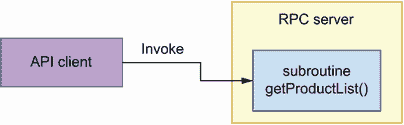
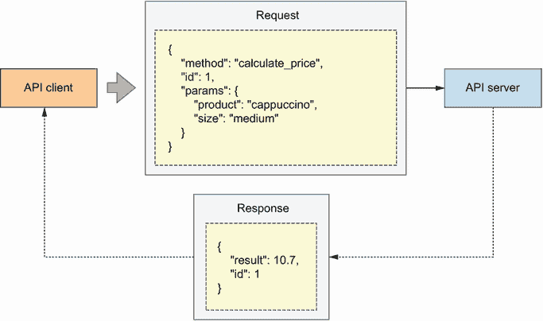
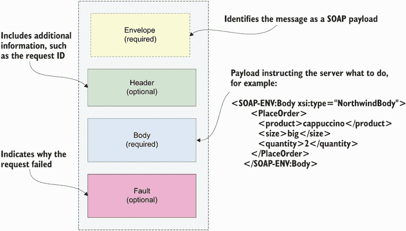
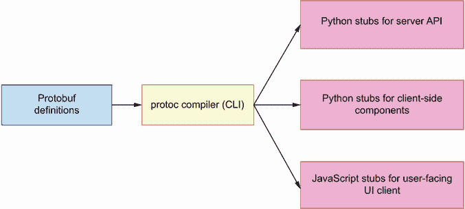
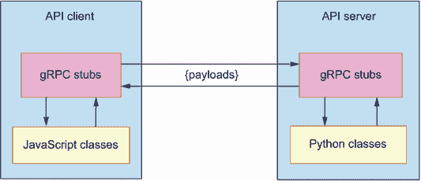
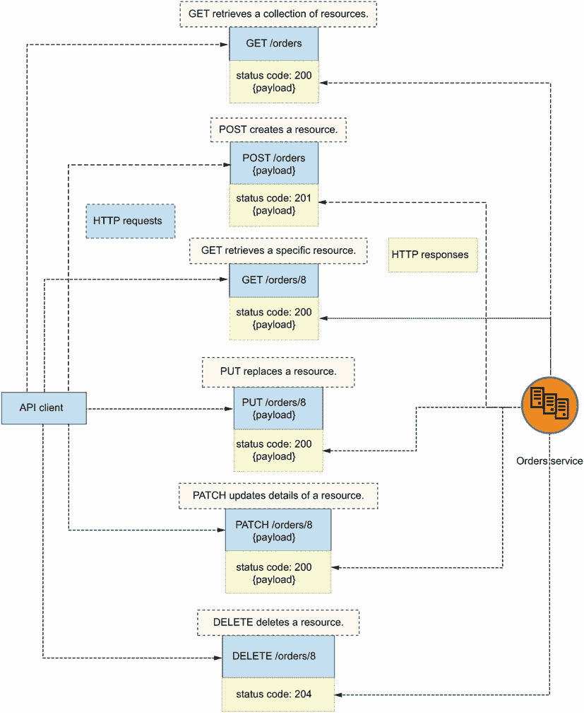
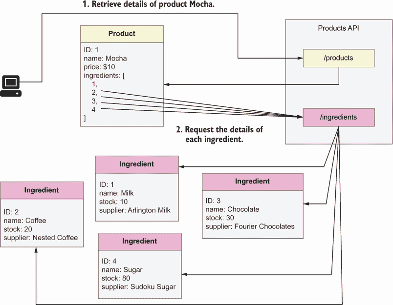
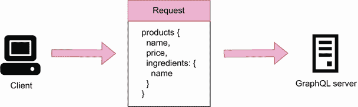

# 附录 A. 网络 API 和协议类型

在本附录中，我们研究我们可以用来实现应用程序接口的 API 协议。每个协议都是为了解决 API 消费者和生产者之间集成中的特定问题而演化的。我们讨论每个协议的优缺点，以便我们在设计和构建自己的 API 时做出最佳选择。我们将讨论以下协议：

+   RPC 及其变体，JSON-RPC 和 XML-RPC

+   SOAP

+   gRPC

+   REST

+   GraphQL

选择正确的 API 类型对于我们的微服务性能和集成策略至关重要。将影响我们选择 API 协议的因素包括：

+   API 是否为公开或私有

+   API 消费者类型：小型设备、移动应用、浏览器或其他微服务

+   我们希望公开的能力和资源；例如，是否是一个可以围绕端点组织的数据模型，或者是一个高度互联的资源网络，其中资源之间存在交叉引用

在以下各节中，我们讨论每个协议的优缺点时，会考虑这些因素，以评估它们在不同场景中的适用性。

## A.1 API 的黎明：RPC、XML-RPC 和 JSON-RPC

让我们先解释远程过程调用及其两种最常见实现，即 XML-RPC 和 JSON-RPC。如图 A.1 所示，*远程过程调用*（RPC）是一种允许客户端在另一台机器上调用过程或子程序的协议。这种通信形式的起源可以追溯到 20 世纪 80 年代，随着分布式计算系统的出现，随着时间的推移，它已经发展成为标准实现。¹ 两种流行的实现是 XML-RPC 和 JSON-RPC。

图 A.1 使用 RPC，程序从 API 服务器调用函数或子程序。

XML-RPC 是一种 RPC 协议，它使用可扩展标记语言 (XML) 通过 HTTP 在客户端和服务器之间交换数据。它由 Dave Winer 在 1998 年创建，并最终发展成为后来被称为 SOAP 的东西（见附录 A.2）。

随着 JavaScript 对象表示法（JSON）作为数据序列化格式的日益流行，RPC 的另一种实现形式是 JSON-RPC。它于 2005 年推出，为 API 客户端和服务器之间交换数据提供了一种简化的方式。如图 A.2 所示，JSON-RPC 有效载荷通常包括三个属性：

+   `method`—客户端希望在远程服务器上调用的方法或函数

+   `params`—在调用方法或函数时必须传递的参数

+   `id`—用于标识请求的值

图 A.2 使用 JSON-RPC，API 客户端向 API 服务器发送请求，调用 `calculate_price()` 函数以获取中杯卡布奇诺的价格。服务器响应调用结果：$10.70。

相应地，JSON-RPC 响应负载包括以下参数：

+   `result`—被调用的方法或函数返回的值

+   `error`—在调用过程中引发的错误代码（如果有）

+   `id`—正在处理请求的 ID

RPC 是一种轻量级协议，允许您在不实现复杂接口的情况下驱动 API 集成。RPC 客户端只需要知道它需要在远程服务器上调用的函数的名称及其签名。它不需要像 REST 那样寻找不同的端点并遵守它们的模式。然而，API 消费者和生产者之间缺乏适当的接口层不可避免地倾向于在客户端和服务器实现细节之间创建紧密耦合。因此，实现细节的微小变化可能会破坏集成。因此，RPC 主要推荐用于内部 API 集成，在这种情况下，您可以完全控制客户端和服务器。

## A.2 SOAP 和 API 标准的出现

本节讨论简单对象访问协议（SOAP）。SOAP 通过交换 XML 负载来实现与 Web 服务的通信。它于 1998 年由 Dave Winer、Don Box、Bob Atkisnon 和 Mohsen Al-Ghosein 为微软公司引入，经过多次迭代，于 2003 年成为 Web 应用程序的标准协议。SOAP 被构想为一个消息协议，它运行在数据传输层之上，例如 HTTP。

SOAP 被设计来满足三个主要目标：

+   *可扩展性*—SOAP 可以通过其他消息系统中找到的功能进行扩展。

+   *中立性*—它可以操作任何选择的数据传输协议，包括 HTTP，或者直接通过 TCP 或 UDP 等其他协议。

+   *独立性*—它使得无论 Web 应用程序的编程模型如何，都可以进行通信。

与 SOAP 端点交换的负载以 XML 表示，如图 A.3 所示，它们包括以下属性：

+   `Envelope` *(必需)*—标识 XML 文档为 SOAP 负载

+   `Header` *(可选)*—包含关于消息中包含的数据的附加信息，例如编码类型

+   `Body` *(必需)*—包含请求/响应的负载（实际交换的消息）

+   `Fault` *(可选)*—包含在处理请求时发生的错误

图 A.3 在 SOAP 消息的顶部，我们找到一个名为 `Envelope` 的部分，它告诉我们这是一个 SOAP 负载。一个可选的 `Header` 部分包含了关于消息的元数据，例如编码类型。`Body` 部分包含了消息的实际负载：客户端和服务器之间交换的数据。最后，一个名为 `Fault` 的部分包括了在处理负载时出现的任何错误详情。

SOAP 对 API 领域做出了重大贡献。跨 Web 应用程序通信的标准协议的可用性导致了供应商 API 的出现。突然之间，通过简单地公开一个每个人都能理解和消费的 API，就可以销售数字服务。

近年来，SOAP 已被新的协议和架构所取代。导致 SOAP 衰落的因素包括这些：

+   通过 SOAP 交换的有效负载包含大型 XML 文档，这消耗了大量的带宽。

+   XML 难以阅读和维护，它需要仔细解析，这使得交换以 XML 结构化的消息不太方便。

+   SOAP 没有提供一个清晰的框架来组织我们希望通过 API 公开的数据和能力。它提供了一种交换消息的方式，并且 API 两边的代理必须决定如何理解这些消息。

## A.3 RPC 再次出击：在 gRPC 上快速交换

本节讨论了 RPC 协议的一个特定实现，称为 gRPC，²，该协议由谷歌在 2015 年开发。该协议使用 HTTP/2 作为传输层，并交换使用 Protocol Buffers（Protobuf）编码的有效负载——一种序列化结构化数据的方法。正如我们在第二章中解释的，序列化是将数据转换为可以存储或通过网络传输的格式的过程。另一个过程必须能够拾取保存的数据并将其恢复到原始格式。恢复序列化数据的过程也被称为*反序列化*。

一些序列化方法是语言特定的，例如 Python 的`pickle`。其他一些，如流行的 JavaScript 对象表示法（JSON）格式，是语言无关的，并且可以转换为其他语言的本地数据结构。

JSON 的一个明显缺点是它只允许序列化由字符串、布尔值、数组、关联数组以及`null`值组成的简单数据表示。由于 JSON 是语言无关的，并且必须在语言和环境之间严格可传输，因此它不能允许序列化语言特定的功能，如 JavaScript 中的`NaN`（不是一个数字）、Python 中的元组或集合，或在面向对象语言中的类。

Python 的`pickle`格式允许您序列化在您的 Python 程序中运行的任何类型的数据结构，包括自定义对象。然而，缺点是序列化数据高度特定于您在导出数据时运行的 Python 版本。由于 Python 在不同版本之间内部实现的细微变化，您不能期望不同的过程能够可靠地解析一个 pickle 文件。

Protobuf 处于中间位置：它允许你定义比 JSON 更复杂的数据结构，包括枚举，并且能够从序列化数据生成原生类，你可以扩展这些类以添加自定义功能。如图 A.4 所示，在 gRPC 中，你必须首先使用 Protobuf 规范格式定义你想要通过 API 交换的数据结构的模式，然后使用 Protobuf 命令行工具自动生成客户端和 API 服务器的代码。

图 A.4 gRPC 使用 Protobuf 对 API 交换的数据进行编码。使用 `protoc` 命令行工具，我们可以从 Protobuf 规范生成客户端和服务器端的代码（存根）。

从 Protobuf 规范生成的数据结构称为 *存根*。存根是用我们构建 API 客户端和服务器所使用的语言本地编写的代码实现的。如图 A.5 所示，存根负责解析和验证客户端和服务器之间交换的数据。

图 A.5 使用 Protobuf 生成的存根负责解析 API 客户端和 API 服务器之间交换的有效载荷，并将它们转换为本地代码。

gRPC 提供了一种比普通 RPC 更可靠的 API 集成方法。使用 Protobuf 作为强制机制，确保客户端和服务器之间交换的数据符合预期的格式。它还有助于确保 API 通信高度优化，因为数据是以二进制格式直接交换的。因此，gRPC 是实现内部 API 集成的一个理想选择，其中性能是一个相关因素。³

## A.4 基于 HTTP 的 REST API

本节解释了表示状态转移（REST）及其主要特性。REST 是一种用于设计网络服务和其接口的架构风格。正如我们在第四章中看到的，REST API 是围绕资源构建的。我们区分两种资源类型，集合和单例，并使用不同的 URL 路径来表示它们。例如，在图 A.6 中，`/orders` 代表订单集合，而 `/orders/{order_id}` 代表单个订单的 URI。我们使用 `/orders` 来检索订单列表和创建新订单，并使用 `/orders/{order_id}` 来对单个订单执行操作。

图 A.6 REST API 的结构围绕端点构建。我们区分单例端点，例如 GET `/orders/8`，和集合端点，例如 GET `/orders`。利用 HTTP 方法的语义，REST API 响应包括 HTTP 状态码，用以指示请求处理的结果。

良好的 REST API 设计利用 HTTP 协议的功能来提供高度表达的 API。例如，如图 A.7 所示，我们使用 HTTP 方法来定义 API 端点并表达它们的意图（POST 用于创建资源，GET 用于检索资源）；我们使用 HTTP 状态码来表示请求处理的结果；我们使用 HTTP 有效载荷在客户端和服务器之间传输交换数据。

我们使用 OpenAPI 标准来记录 REST API，该标准最初于 2010 年由 Tony Tam 创建，当时名为 Swagger API。随着项目的流行，2015 年启动了 OpenAPI 创新计划以维护该规范。2016 年，该规范正式以 OpenAPI 规范（OAS）的名义发布。

通过 REST API 交换的数据位于 HTTP 请求/响应的主体中。API 生产者可以将其编码为任何他们希望实施的格式，但通常的做法是使用 JSON。

由于可以在标准规范格式中创建具有高度详细信息的 API 文档，因此 REST 是企业 API 集成和构建面向大量且多样化的消费者的公共 API 的理想选择。

## A.5 使用 GraphQL 进行细粒度查询

本节解释了 GraphQL 以及它与 REST 的比较。GraphQL 是一种基于图和节点的查询语言。截至本文撰写时，它是实现 Web API 最受欢迎的选择之一。⁴ 它由 Facebook 于 2012 年开发并于 2015 年公开发布。

GraphQL 被设计用来解决 REST API 的一些局限性，例如通过 HTTP 端点表示某些操作的困难。例如，假设您通过 CoffeeMesh 网站订购了一杯咖啡，后来您改变了主意并决定取消订单。哪种 HTTP 方法最适合表示这个动作？您可以争论说取消订单类似于删除，因此可以使用 DELETE 方法。但是，取消真的等同于删除吗？您在取消后是否会从您的记录中删除订单？可能不会。您可以争论说它应该是一个 PUT 或 PATCH 请求，因为您正在将订单的状态更改为“已取消”。或者您可以说它应该是一个 POST 请求，因为用户正在触发一个涉及更多不仅仅是更新记录的操作。无论如何看待这个问题，HTTP 在建模用户动作时确实存在一些局限性，而 GraphQL 通过不将自己限制在仅使用 HTTP 协议的元素来解决这个问题。

REST 的另一个限制是客户端无法对数据进行细粒度请求，这在技术上被称为*过度获取*。例如，想象一个 API 公开了`/products`和`/ingredients`资源。如图 A.7 所示，使用`/products`我们可以获取产品列表，包括其成分的 ID。然而，如果我们想获取每个成分的名称，我们必须向`/ingredients` API 请求每个成分的详细信息。结果是 API 客户端需要向 API 发送各种请求以获取产品的简单表示。API 客户端还接收了比所需更多的信息：在针对`/ingredients` API 的每个请求中，客户端接收了每个成分的完整描述，而它只需要名称。过度获取对于如手机等小型设备来说是一个挑战，这些设备可能无法处理和存储大量数据，并且可能具有更有限的网络访问。

图 A.7 REST API 的一个限制是 API 客户端无法对数据进行细粒度请求，这被称为过度获取。在图中，`/products`端点返回包含其成分 ID 的产品列表。为了获取成分的名称，客户端必须从`/ingredients`端点请求每个成分的详细信息。结果，API 客户端最终向服务器发送过多的请求，并接收比所需更多的数据。

GraphQL 通过允许客户端在服务器上执行细粒度查询来避免这些问题。使用 GraphQL，我们可以创建不同数据模型之间的关系，允许 API 客户端从相关实体中获取数据。例如，在图 A.8 中，API 客户端可以请求产品列表及其成分名称的单个请求。通过允许客户端在单个请求中从服务器检索所需数据，GraphQL 是 API 的理想选择，这些 API 由具有有限网络访问或有限存储能力的客户端消费，如移动设备。GraphQL 也是高度互联资源 API 的良好选择，其中用户很可能从相关实体中获取数据，如图 A.8 中的产品和成分。

图 A.8 使用 GraphQL API，我们可以查询相关实体中的数据，例如产品和成分。在此图中，API 客户端请求带有其成分名称的产品列表。

尽管 GraphQL 有其优点，但它也伴随着一些限制。GraphQL 的一个主要限制是它对自定义标量类型的支持并不充分。GraphQL 自带一组基本的内置标量，例如整数（`Int`）和字符串（`String`）。GraphQL 允许你声明自己的自定义标量，但你无法使用 SDL 文档化它们的形状或验证方式。正如 GraphQL 官方文档所说，“定义该类型如何序列化、反序列化和验证取决于我们的实现” ([`graphql.org/learn/schema/`](https://graphql.org/learn/schema/))。由于稳健的 API 集成的一个基石是优秀的文档，因此 GraphQL 对于必须被外部客户端可靠消费的公共 API 来说是一个具有挑战性的选择。

GraphQL 的另一个限制是所有查询通常都使用 POST 请求来完成，这使得缓存响应变得更加困难。根据我的经验，大多数开发者也发现与 GraphQL API 交互更加困难。实际上，Postman 的 2022 年 API 状态报告发现，只有 28%的调查开发者使用 GraphQL，其中高达 14%的人甚至没有听说过它。虽然与 REST API 交互可能只需简单地调用 GET 端点，但使用 GraphQL 你必须知道如何构建查询文档以及如何将它们发送到服务器。由于开发者对 GraphQL 不太熟悉，选择这项技术可能会使你的 API 不太可能被消费。

* * *

¹ 布鲁斯·杰·尼尔森在他的博士论文（技术报告 CSL-81-9，Xero 帕洛阿尔托研究中心，帕洛阿尔托 CA，1981 年）中引入了术语*远程过程调用*。关于 RPC 实现要求的更正式描述，请参阅 Andrew B. Birrell 和 Bruce Jay Nelson 的“Implementing Remote Procedure Calls”，*ACM Transactions on Computer Systems*，第 2 卷，第 1 期，1984 年，第 39-59 页。

² 你肯定想知道 gRPC 中的“g”代表什么。根据官方文档，每个版本中“g”代表不同的单词。例如，在版本 1.1 中它代表“good”，而在版本 1.2 中它代表“green”，以此类推 ([`grpc.github.io/grpc/core/md_doc_g_stands_for.html`](https://grpc.github.io/grpc/core/md_doc_g_stands_for.html))。有些人认为“g”代表 Google，因为该协议是由 Google 发明的（参见 Bleeding Edge Press 的“Is gRPC the Future of Client-Server Communication?”，*Medium*，2018 年 7 月 19 日，[`medium.com/@EdgePress/is-grpc-the-future-of-client-server-communication-b112acf9f365`](https://medium.com/@EdgePress/is-grpc-the-future-of-client-server-communication-b112acf9f365))。

³ 根据 Postman 的 2022 年 API 状态报告，11%的调查开发者使用 gRPC ([`www.postman.com/state-of-api/api-technologies/#api-technologies`](https://www.postman.com/state-of-api/api-technologies/#api-technologies))。

根据 Postman 的 2022 年 API 状态报告，28% 的受访开发者使用 GraphQL ([`www.postman.com/state-of-api/api-technologies/#api-technologies`](https://www.postman.com/state-of-api/api-technologies/#api-technologies)).
