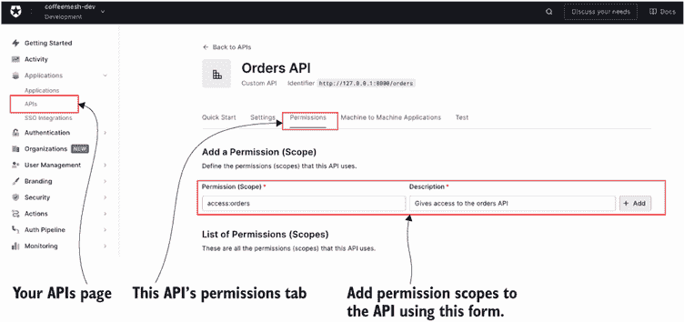
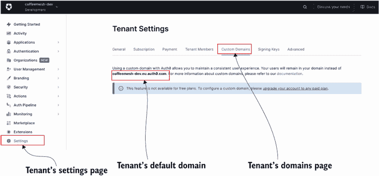
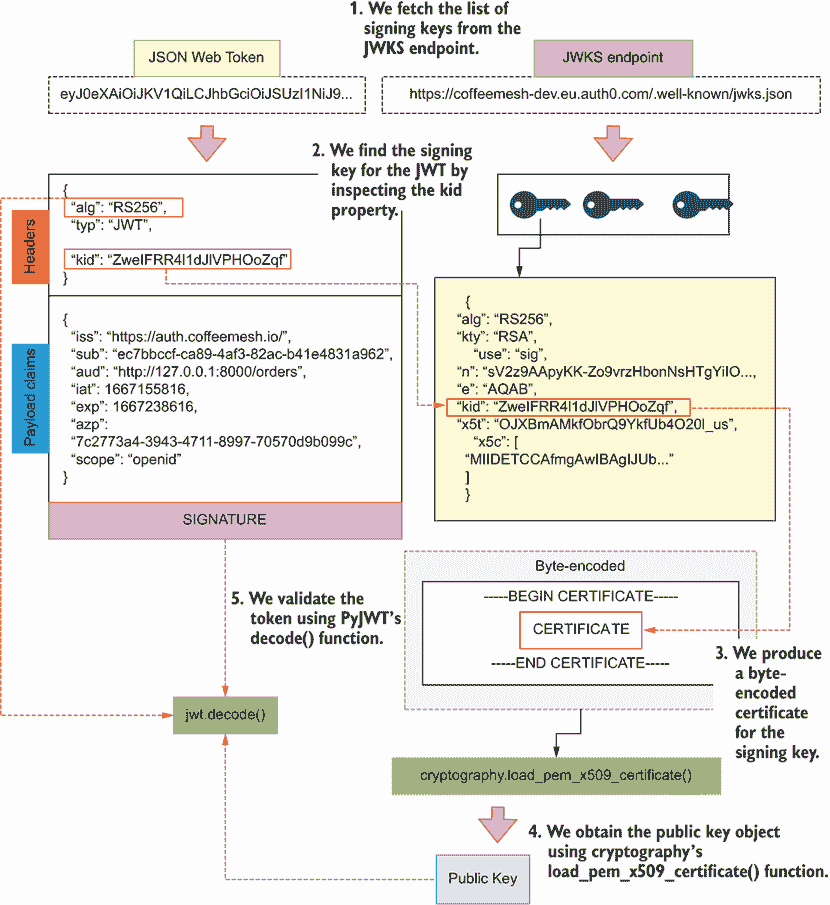
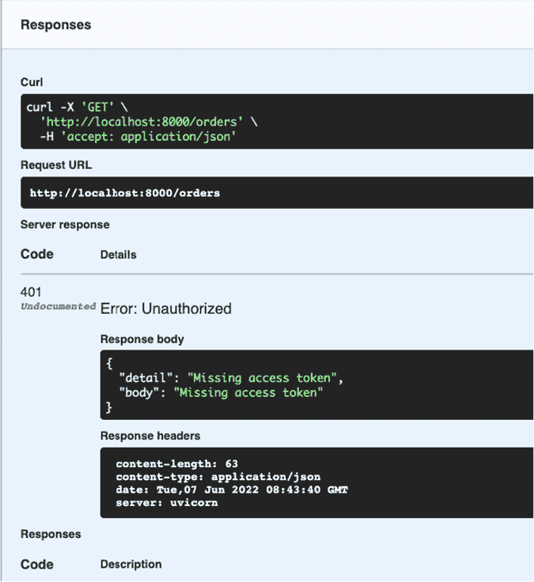
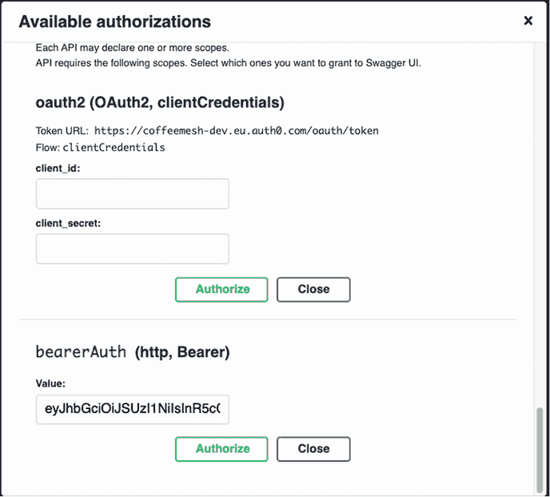

# 附录 C. 使用身份提供者进行 API 授权

在第十一章中，你学习了开放授权（OAuth）和开放 ID 连接（OIDC）协议的工作原理。你还学习了如何生成、检查和验证 JSON Web Tokens（JWT）。最后，你学习了向 API 添加授权中间件的模式。我们仍需回答的问题是，我们如何构建一个端到端的身份验证和授权系统？

你可以使用各种策略来处理身份验证和授权。你可以构建自己的身份验证服务，或者使用身份即服务提供商，如 Auth0、Okta、Azure Active Directory 或 AWS Cognito。除非你是网络安全和身份验证协议的专家，并且有足够的资源正确构建系统，否则我建议你使用身份服务提供商。在本附录中，你将学习如何使用 Auth0 为你的 API 添加身份验证，Auth0 是最受欢迎的身份管理系统之一。

我们将使用 Auth0 的免费计划。Auth0 负责管理用户账户和发放安全令牌，它还提供了与 Google、Facebook、Twitter 等身份提供者的社交登录的简单集成。Auth0 的身份验证系统基于标准，因此你关于使用 Auth0 进行身份验证所学的所有内容都适用于任何其他提供商。如果你在自己的项目或工作中使用不同的身份验证系统，你将能够将本附录中的经验教训应用到你所使用的任何其他系统上。

本附录的代码可在本书 GitHub 仓库的附录 _c 文件夹中找到。我建议你拉取此代码以跟随示例，特别是名为 appendix_c/ui 的文件夹，因为你将需要它来运行 C.2 节中的示例。

## C.1 使用身份即服务提供商

本节解释了如何将我们的代码与身份即服务（IDaaS）提供商集成。IDaaS 提供商是一种负责处理用户身份验证和为我们的用户提供访问令牌的服务。使用 IDaaS 提供商很方便，因为它意味着我们可以将时间和精力集中在构建我们的 API 上。好的 IDaaS 提供商基于标准并具有强大的安全协议，这也有助于降低我们服务器的安全风险。在本节中，你将学习如何与 Auth0 建立集成，Auth0 是最受欢迎的 IDaaS 提供商之一。

要与 Auth0 一起工作，首先创建一个账户，然后根据 Auth0 的文档（[`auth0.com/docs/get-started`](https://auth0.com/docs/get-started)）创建一个租户。作为第一步，前往你的仪表板并创建一个 API 来表示订单 API。按照图 C.1 进行配置，将其标识符的值配置为 http://127.0.0.1:8000/orders，并选择 RS256 签名算法。


图 C.1 要创建一个新的 API，请点击创建 API 按钮，并在表单中填写 API 的名称、其 URL 标识符以及你想要用于其访问令牌的签名算法。

一旦你创建了 API，前往权限并添加一个权限范围到 API，如图 C.2 所示。



图 C.2 要向 API 添加权限范围，请点击权限选项卡，并填写添加权限（范围）表单。

接下来，点击左侧栏的设置，然后点击自定义域名选项卡，如图 C.3 所示。



图 C.3 要找出你的租户默认域名，请转到租户设置页面并点击自定义域名选项卡。

如果你想要，你可以添加一个自定义域名，或者你可以使用 Auth0 为你的租户提供的默认域名。我们使用这个域名来构建我们认证服务的知名 URL：

```
https://<tenant>.<region>.auth0.com/.well-known/openid-configuration
```

例如，对于 CoffeeMesh，租户的域名是[`coffeemesh-dev.eu.auth0.com/.well-known/openid-configuration`](https://coffeemesh-dev.eu.auth0.com/.well-known/openid-configuration)。

现在调用这个 URL，并捕获`jwks_uri`属性，它表示返回我们可以用来验证 Auth0 令牌的公钥的 URL。以下是一个示例：

```
$ curl https://coffeemesh.eu.auth0.com/.well-known/openid-configuration \
| jq .jwks_uri
# output:
"https://coffeemesh-dev.eu.auth0.com/.well-known/jwks.json"
```

如果你调用这个 URL，你会得到一个包含每个租户公钥信息的对象数组。每个对象看起来像这样：

```
{
  "alg": "RS256",
  "kty": "RSA",
  "use": "sig",
  "n": "sV2z9AApyKK-
➥ Zo9vrzHbonNsHTgYiIOx1dHx3U102fUhPFzUcdnjb7li960iTKyTbFlMRbsN2fFZOHa5_4Q
➥ 3C7UzjkVw__jK3AcPZ-0cCiLBS-HQzE_6ii-OPo84-
➥ W9Pp2ScKdAlJIqBimDtNv8vuOEMr5c5YbJz1HlppFY_hA71dgc101SHp0n9GZYqP5HV713m
➥ 6smE5b7abHLqrUSz9eVbSOrTUOcSd5_LUHvQqFb5Wt7kRalIiHnQFob-
➥ cyM1AmxDNsX1qR2cX_jqjWCRO2iK5DTG--ure8GQUTCMPZ0LkBKSDelTwHuEn_r4z-
➥ x30wf-2lA0yzMSlcxcJIojpQ",
  "e": "AQAB",
  "kid": "ZweIFRR4l1dJlVPHOoZqf",
  "x5t": "OJXBmAMkfObrQ9YkfUb4O20l_us",
  "x5c": [
    "MIIDETCCAfmgAwIBAgIJUbXpEMz8nlmXMA0GCSqGSIb3DQEBCwUAMCYxJDAiBgNVBAMTG2NvZm
➥ ZlZW1lc2gtZGV2LmV1LmF1dGgwLmNvbTAeFw0yMTEwMjkyMjQ4MjBaFw0zNTA3MDgyMjQ4M[
➥ jBaMCYxJDAiBgNVBAMTG2NvZmZlZW1lc2gtZGV2LmV1LmF1dGgwLmNvbTCCASIwDQYJKoZI
➥ hvcNAQEBBQADggEPADCCAQoCggEBALFds/QAKciivmaPb68x26JzbB04GIiDsdXR8d1NdNn
➥ 1ITxc1HHZ42+5YvetIkysk2xZTEW7DdnxWTh2uf+ENwu1M45FcP/4ytwHD2ftHAoiwUvh0M
➥ xP+oovjj6POPlvT6dknCnQJSSKgYpg7Tb/L7jhDK+XOWGyc9R5aaRWP4QO9XYHNdNUh6dJ/
➥ RmWKj+R1e9d5urJhOW+2mxy6q1Es/XlW0jq01DnEnefy1B70KhW+Vre5EWpSIh50BaG/nMj
➥ NQJsQzbF9akdnF/46o1gkTtoiuQ0xvvrq3vBkFEwjD2dC5ASkg3pU8B7hJ/6+M/sd9MH/tp
➥ QNMszEpXMXCSKI6UCAwEAAaNCMEAwDwYDVR0TAQH/BAUwAwEB/zAdBgNVHQ4EFgQUWrl+q/
➥ l4wp/MWDdYrhjxns0iP2wwDgYDVR0PAQH/BAQDAgKEMA0GCSqGSIb3DQEBCwUAA4IBAQA+Y
➥ H+sxcMlBzEOJ5hJgZw1upRroCgmeQzEh+Cx73sTKw+vi8u70bdkDt9sBLKlGK9xbPJt3+QW
➥ ZDJF9rwx4vXbfFvxZD+dthIvn4NH4/sLQXG20JN/b6GtHdVllbJIGUeWb8DBsx94wXYMwag
➥ 0gXUk5spgaGGdoc16uSrrbxt/rmzFk3VMQ8qG5i8E33N/DZb88P4u3WJMNMsmujw9Q8meg4
➥ ygEFadXBcfJPHuiriLWi0j1Gm+m6DZQM51OtpQ/cvcZXRNPogqj7wsZXH4za9DJjnQf8ZOK
➥ Q86WKl/9CE5AvHBTTTr810DviJIqv8sqC866+2t2euxcfOYMIw5E42o"
  ]
}
```

在这个有效载荷中，最重要的两个字段是`kid`和`x5c`。`kid`是密钥的 ID，我们用它来匹配 JWT 头部的`kid`字段。它告诉我们需要使用哪个密钥来验证令牌的签名。`x5c`字段包含一个以 X.509 证书形式存在的公钥数组，我们使用其中的第一个来验证 JWT 的签名。

这是我们集成我们的代码与 Auth0 所需的所有信息。我们将在第十一章（11.4.1 节）中创建的 orders/web/api/auth.py 模块中实现我们的 Auth0 集成，该模块用于封装我们的授权代码。删除 orders/web/api/auth.py 的内容，并用列表 C.1 的内容替换。我们首先导入必要的依赖项，创建 X.509 证书的模板，并从知名端点加载公钥。X.509 证书被包裹在`-----BEGIN CERTIFICATE-----`和`-----END CERTIFICATE-----`语句之间，因此我们的模板包括这两个语句，并使用一个名为`key`的模板变量，我们将用实际密钥替换它。

由于 Auth0 使用多个密钥来签名令牌，我们通过调用 JWKS 端点来加载公钥，并动态加载给定令牌的正确密钥。如图 C.4 所示，令牌头部的 `kid` 属性告诉我们需要使用哪个密钥，我们的自定义函数 `_get_certificate_for_kid()` 找到令牌的 `kid` 对应的 X.509 证书。为了加载密钥，我们使用 `cryptography` 的 `load_pem_x509_certificate()` 函数，传入格式化为我们的 X.509 字节编码证书的公钥。



图 C.4 要验证 JWT，我们使用其对应的签名密钥验证其签名。签名密钥可在 JWKS 端点找到。

由于令牌可以使用不同的算法进行签名，我们直接从令牌的头部获取算法。Auth0 签发的令牌可以访问我们的 API 和用户信息 API，因此我们在受众中包含这两个服务。

列表 C.1 向 API 添加授权模块

```
# file: orders/web/api/auth.py

import jwt
import requests
from cryptography.x509 import load_pem_x509_certificate

X509_CERT_TEMPLATE = (
       "-----BEGIN CERTIFICATE-----\n{key}\n-----END CERTIFICATE-----"     ①
   )

public_keys = requests.get(
    "https://coffeemesh-dev.eu.auth0.com/.well-known/jwks.json"
).json()["keys"]                                                           ②

def _get_certificate_for_kid(kid):                                         ③
    """
    Return the public key whose ID matches the provided kid.
    If no match is found, an exception is raised.
    """
    for key in public_keys:
        if key["kid"] == kid:                                              ④
            return key["x5c"][0]
    raise Exception(f"Not matching key found for kid {kid}")               ⑤

def load_public_key_from_x509_cert(certificate):                           ⑥
    """
    Loads the public signing key into a RSAPublicKey object. To do that,
    we first need to format the key into a PEM certificate and make sure
    it's utf-8 encoded. We can then load the key using cryptography's
    convenient `load_pem_x509_certificate` function.
    """
    return load_pem_x509_certificate(certificate).public_key()             ⑦

def decode_and_validate_token(access_token):                               ⑧
    """
    Validates an access token. If the token is valid, it returns the token 
    payload.
    """
    unverified_headers = jwt.get_unverified_header(access_token)           ⑨
    x509_certificate = _get_certificate_for_kid(
        unverified_headers["kid"]                                          ⑩
    )
    public_key = load_public_key_from_x509_cert(                           ⑪
        X509_CERT_TEMPLATE.format(key=x509_certificate).encode("utf-8")
    )
    return jwt.decode(                                                     ⑫
        access_token,
        key=public_key,
        algorithms=unverified_headers["alg"],                              ⑬
        audience=[                                                         ⑭
            "http://127.0.0.1:8000/orders",
            "https://coffeemesh-dev.eu.auth0.com/userinfo",
        ],
    )
```

① X509 证书的模板

② 我们从租户的已知端点拉取签名密钥列表。

③ 返回给定密钥 ID 的证书的函数

④ 我们寻找与提供的密钥 ID 匹配的证书。

⑤ 如果找不到匹配项，我们抛出异常。

⑥ 加载给定证书的公钥对象的函数

⑦ 我们加载公钥。

⑧ 解码和验证 JWT 的函数

⑨ 我们获取令牌的头部信息而不进行验证。

⑩ 我们获取与令牌的密钥 ID 对应的证书。

⑪ 我们加载与令牌的密钥 ID 对应的证书的公钥对象。

⑫ 我们验证并解码令牌。

⑬ 我们使用令牌头部指示的算法验证令牌的签名。

⑭ 我们传递令牌预期的受众列表。

我们准备出发！订单服务现在能够验证由 Auth0 签发的令牌。以下章节将说明如何利用此集成使我们的 API 服务器对单页应用（SPA）和另一个微服务可用。

## C.2 使用 PKCE 授权流程

在 PKCE 流程中，API 客户端直接从授权服务器请求 ID 令牌和访问令牌。正如我们在第十一章中解释的，我们必须使用访问令牌与 API 服务器交互。ID 令牌可以在 UI 中用于显示用户的详细信息，但它绝不能发送到我们的 API 服务器。

为了说明此流程的工作原理，我在本书的 GitHub 仓库的附录 _c/ui 目录下包含了一个 SPA。该 SPA 是一个使用 Vue.js 构建的简单应用程序，它与订单 API 进行通信，并配置为使用 Auth0 服务器进行身份验证。

我们首先配置应用程序。转到您的 Auth0 账户，创建一个新的应用程序。选择单页 Web 应用程序，给它一个名称，然后点击创建。在应用程序设置页面中，在应用程序 URI 部分，将 http://localhost:8000 的值分配给允许回调 URL、允许注销 URL、允许 Web 来源和允许来源（CORS）字段。从应用程序设置中，我们需要两个值来配置我们的应用程序：域名和客户端 ID。打开 ui/.env.local 文件，并将`VUE_APP_AUTH_CLIENT_ID`的值替换为客户端 ID，将`VUE_APP_AUTH_DOMAIN`替换为 Auth0 应用程序设置页面中的域名。

要运行 UI，您需要一个最新的 Node.js 和 npm 版本，您可以从 node.js 网站下载（[`nodejs.org/en/`](https://nodejs.org/en/)）。一旦安装了这些，您需要使用以下命令安装 yarn：

```
$ npm install -g yarn
```

接下来，`cd`到 ui/文件夹，并运行以下命令来安装依赖项：

```
$ yarn
```

一旦配置了应用程序，您可以通过执行以下命令来运行它：

```
$ yarn serve --mode local
```

应用程序将在 http://localhost:8080 地址下可用。请确保订单 API 也在运行，因为 Vue.js 应用程序会与之通信。要从订单文件夹运行订单 API，请执行以下命令：

```
$ AUTH_ON=True uvicorn orders.web.app:app –-reload
```

一旦您通过 UI 注册了用户，您将能够在 UI 中看到您的授权令牌。您可以使用此令牌直接从终端调用 API。例如，您可以通过以下命令获取您用户的订单列表：

```
$ curl http://localhost:8000/orders \
-H 'Authorization: Bearer <ACCESS_TOKEN>'
```

通过 Vue.js 应用程序，您可以通过点击“显示我的订单”按钮创建新订单并显示用户放置的订单。

PKCE 流适用于通过浏览器访问您的 API 的用户。然而，这种流对于机器到机器通信来说并不方便。为了允许对 API 进行更多程序化访问，您需要支持客户端凭据流。在下一节中，我们将解释如何启用该流！

## C.3 使用客户端凭据流

本节解释了如何实现客户端凭据流以实现服务器到服务器的通信。当我们必须对我们的服务进行身份验证以访问其他 API，或者当我们想允许对 API 进行程序化访问时，我们使用服务器到服务器的流。在客户端凭据流中，我们的服务通过提供与客户端 ID 和期望受众共享的秘密来从认证服务请求访问令牌。然后我们可以使用这个访问令牌来访问目标受众的 API。

要使用此授权流程，您需要使用您的 IDaaS 提供商注册一个服务器到服务器的客户端。在您的 Auth0 仪表板的“应用程序”页面中，点击“创建应用程序”并选择“机器到机器应用程序”。给它起一个名字，然后点击“创建”。在下一屏幕上，当您被要求选择要为此客户端授权的 API 时，选择订单 API，然后选择我们在第十一章（第 11.6 节）中创建的权限。一旦注册了客户端，您将获得一个客户端 ID 和一个客户端密钥，您可以使用它们来获取访问令牌。

列表 C.2 展示了如何实现服务器到服务器的授权以获取访问令牌并调用订单 API。列表 C.2 中的代码可在本书的 GitHub 仓库中找到，位于 machine_to_machine_test.py 文件下。我们创建了一个函数，通过调用 POST `https://coffeemesh-dev.eu.auth0.com/oauth/token`端点从授权服务器获取访问令牌。在有效载荷中，我们提供了客户端 ID 和客户端密钥，并指定了我们想要生成访问令牌的受众。我们还声明我们想要在`grant_type`属性下使用客户端凭据流。如果客户端认证正确，我们将获得一个访问令牌，然后我们使用它来调用订单 API。

列表 C.2 为机器到机器访问订单 API 授权客户端

```
# file: machine_to_machine_test.py

import requests

def get_access_token():
    payload = {
        "client_id": "<client_id>",
        "client_secret": "<client_secret>",
        "audience": "http://127.0.0.1:8000/orders",
        "grant_type": "client_credentials"
    }

    response = requests.post(
        "https://coffeemesh-dev.eu.auth0.com/oauth/token",
        json=payload,
        headers={'content-type': "application/json"}
    )

    return response.json()['access_token']

def create_order(token):
    order_payload = {
        'order': [{
            'product': 'cappuccino',
            'size': 'small',
            'quantity': 1
        }]
    }

    order = requests.post(
        'http://127.0.0.1:8000/orders',
        json=order_payload,
        headers={
            "content-type": "application/json", 
            "authorization": f"Bearer {token}",
        }
    )

    return order.json()

access_token = get_access_token()
print(access_token)
order = create_order(access_token)
print(order)
```

使用客户端凭据流只需这些步骤！在下一节中，您将学习如何使用 Swagger UI 进行请求认证，以便您可以更轻松地测试您的 API。

## C.4 在 Swagger UI 中授权请求

在本书的整个过程中，您已经学会了使用 Swagger UI 测试您的 API。您可以使用 Swagger UI 来测试您的 API 授权，在本节中您将学习如何操作。首先，`cd`到附录 C 的 orders 目录，并带上授权启动 API 服务器：

```
$ AUTH_ON=True uvicorn orders.web.app:app --reload
```

您现在可以访问 http://localhost:8000/docs/orders 上的 Swagger UI。如图 C.5 所示，如果您尝试任何端点，您将收到 401 响应，因为我们尚未授权我们的请求。



图 C.5 如果我们使用 Swagger UI 进行未经授权的请求，我们将收到 401 响应。

要授权一个请求，点击屏幕右上角的“授权”按钮。您将获得一个弹出菜单，其中包含 API 规范中记录的安全方案：`openId`（授权代码和 PKCE 流程）、`oauth2`（客户端凭据流）和`bearerAuth`。测试 API 授权层最简单的方法是使用`bearerAuth`安全方案，因为它只需要您提供授权令牌。您可以使用 Vue.js 应用程序在附录 C 的 ui 或使用 machine_to_machine_test.py 脚本生成令牌。例如，如果您运行 machine_to_machine_test.py 脚本，您将获得一个令牌和创建订单的结果：

```
$ python machine_to_machine_test.py
# output:
eyJhbGciOiJSUzI1NiIsInR5cCI6IkpXVCIsImtpZCI6Ilp3ZUlGUlI0bDFkSmxWUEhPb1px...
➥ {'order': [{'product': 'latte', 'size': 'small', 'quantity': 1}], 'id': 
➥ '6e420d2e-b213-4d15-bc46-0c680e590154', 'created': '2022-06-
➥ 07T09:01:47.757223', 'status': 'created'}
```

复制令牌，并将其粘贴到`bearerAuth`安全方案的值输入字段中，如图 C.6 所示，然后点击授权。如果你现在向 GET `/orders`端点发送请求，你会得到一个成功的响应。在令牌有效（即，在它过期之前），你可以尝试任何其他端点，你的请求将会被成功处理。



图 C.6 要授权一个请求，请将授权令牌粘贴到`bearerAuth`表单的值输入框中。

这就是使用 Swagger UI 测试你的 API 授权的全部步骤。你刚刚学习了如何通过集成外部身份提供者来添加一个强大的身份验证和授权层，如何测试 PKCE 和客户端凭证流程，以及如何使用 Swagger 测试你的 API 授权实现。你现在可以开始构建安全的 API 了！
