## 第一章\. 逃离单体地狱

*本章涵盖*

+   单体地狱的症状以及如何通过采用微服务架构来逃离它

+   微服务架构的基本特征及其优缺点

+   微服务如何使大型、复杂应用程序的 DevOps 开发风格成为可能

+   微服务架构模式语言及其为什么应该使用它的原因

那天只是周一的中午，但 Mary，Food to Go，Inc.（FTGO）的首席技术官，已经感到沮丧。她的这一天开始得很顺利。上周，她与其他软件架构师和开发者参加了一个优秀的会议，学习了最新的软件开发技术，包括持续部署和微服务架构。Mary 还遇到了她从北卡罗来纳州 A&T 州立大学的计算机科学同学，分享了技术领导力的故事。会议让她感到充满力量，渴望改善 FTGO 的软件开发方式。

不幸的是，这种感觉很快就消失了。她刚刚在办公室里又经历了一次痛苦的会议，与高级工程和业务人员进行讨论。他们花了两个小时讨论为什么开发团队将错过另一个关键发布日期。遗憾的是，这类会议在过去几年中变得越来越常见。尽管采用了敏捷开发，但开发速度却在放缓，几乎不可能达到业务目标。更糟糕的是，似乎没有简单的解决方案。

会议让 Mary 意识到 FTGO 正遭受“单体地狱”的困扰，而治愈的方法是采用微服务架构。但会议中描述的微服务架构和相关最先进的软件开发实践似乎是一个遥不可及的梦想。Mary 不清楚她如何在应对当前的问题的同时，同时改善 FTGO 的软件开发方式。

幸运的是，正如你将在本书中学到的，有一个方法。但首先，让我们看看 FTGO 面临的问题以及他们是如何走到这一步的。

### 1.1\. 向单体地狱缓慢迈进

自从 2005 年底推出以来，FTGO 发展迅速。如今，它是美国领先的在线食品配送公司之一。业务甚至计划拓展海外市场，尽管由于实施必要功能的延误，这些计划处于危险之中。

在本质上，FTGO 应用程序相当简单。消费者使用 FTGO 网站或移动应用程序在本地餐厅下订单。FTGO 协调一个快递网络，负责递送订单。它还负责支付快递和餐厅的费用。餐厅使用 FTGO 网站编辑他们的菜单和管理订单。该应用程序使用各种网络服务，包括 Stripe 支付、Twilio 消息传递和 Amazon Simple Email Service（SES）电子邮件服务。

与许多其他老化的企业应用程序一样，FTGO 应用程序是一个单体，由一个单一的 Java Web 应用程序存档（WAR）文件组成。多年来，它已经变成一个庞大而复杂的应用程序。尽管 FTGO 开发团队做出了最大的努力，但它已经成为 Big Ball of Mud 模式的例子([www.laputan.org/mud/](http://www.laputan.org/mud/))。引用该模式的作者 Foote 和 Yoder 的话，它是一个“随意结构、蔓延、混乱、胶带和铁丝、意大利面代码丛林”。软件交付的速度已经放缓。更糟糕的是，FTGO 应用程序使用了某些越来越过时的框架。FTGO 应用程序正显示出单体地狱的所有症状。

下一个部分将描述 FTGO 应用程序的架构。然后它将讨论为什么单体架构最初工作得很好。我们将探讨 FTGO 应用程序是如何超出其架构的，以及这是如何导致单体地狱的。

#### 1.1.1\. FTGO 应用程序的架构

FTGO 是一个典型的企业 Java 应用程序。图 1.1 显示了其架构。FTGO 应用程序具有六边形架构，这在第二章中描述得更为详细。在六边形架构中，应用程序的核心是业务逻辑。围绕业务逻辑的是各种适配器，它们实现 UI 并与外部系统集成。

##### 图 1.1\. FTGO 应用程序具有六边形架构。它由业务逻辑组成，周围是实现 UI 并与外部系统（如移动应用程序和支付、消息和电子邮件的云服务）接口的适配器。

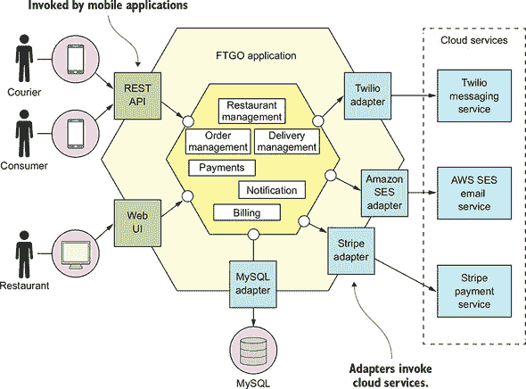

业务逻辑由模块组成，每个模块都是一组领域对象。模块的例子包括`订单管理`、`配送管理`、`计费`和`支付`。有几个适配器与外部系统接口。一些是*入站*适配器，通过调用业务逻辑处理请求，包括`REST API`和`Web UI`适配器。其他是*出站*适配器，使业务逻辑能够访问 MySQL 数据库并调用 Twilio 和 Stripe 等云服务。

尽管逻辑上具有模块化架构，FTGO 应用程序仍然被打包成一个单一的 WAR 文件。该应用程序是广泛使用的*单体*软件架构风格的例子，它将系统结构为一个单一的可执行或可部署组件。如果 FTGO 应用程序是用 Go 语言（GoLang）编写的，它将是一个单一的执行文件。Ruby 或 NodeJS 版本的该应用程序将是一个单一的源代码目录层次结构。单体架构本身并不坏。FTGO 开发者在为应用程序选择单体架构时做出了明智的决定。

#### 1.1.2\. 单体架构的好处

在 FTGO 的早期，当应用程序相对较小的时候，其单体架构有很多好处：

+   ***易于开发*—** 集成开发环境（IDE）和其他开发者工具专注于构建单个应用程序。

+   ***易于对应用程序进行重大更改*—** 你可以更改代码和数据库模式，构建和部署。

+   ***测试简单*—** 开发者编写了端到端测试，启动应用程序，调用 REST API，并使用 Selenium 测试 UI。

+   ***部署简单*—** 开发者只需将 WAR 文件复制到已安装 Tomcat 的服务器上。

+   ***易于扩展*—** FTGO 在负载均衡器后面运行了多个应用程序实例。

然而，随着时间的推移，开发、测试、部署和扩展变得更加困难。让我们看看原因。

#### 1.1.3\. 活在单体地狱中

不幸的是，正如 FTGO 的开发者所发现的，单体架构有一个巨大的限制。像 FTGO 这样的成功应用程序往往会长得超出单体架构的范畴。每个冲刺，FTGO 的开发团队实施了更多的故事，这使得代码库变得更大。此外，随着公司的日益成功，开发团队的大小稳步增长。这不仅增加了代码库的增长速度，还增加了管理成本。

如图 1.2 所示，曾经小巧、简单的 FTGO 应用程序在多年后已经成长为一个庞大的单体。同样，小型开发团队现在已成为多个 Scrum 团队，每个团队负责特定的功能区域。由于超出其架构，FTGO 陷入了单体地狱。开发缓慢且痛苦。敏捷开发和部署变得不可能。让我们看看这是为什么发生了。

##### 图 1.2\. 单体地狱的一个案例。庞大的 FTGO 开发团队将他们的更改提交到一个单一源代码仓库。从代码提交到生产的路径漫长而艰难，涉及手动测试。FTGO 应用程序庞大、复杂、不可靠，难以维护。

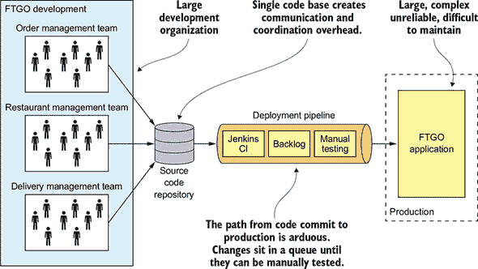

##### 复杂性令开发者感到畏惧

FTGO 应用程序的一个主要问题是它过于复杂。它太大，以至于任何开发者都无法完全理解。因此，修复错误和正确实现新功能变得困难且耗时。截止日期被延误。

更糟糕的是，这种压倒性的复杂性往往会导致一个恶性循环。如果代码库难以理解，开发者就不会正确地做出更改。每次更改都会使代码库逐渐变得更加复杂，更难以理解。前面图 1.1 中展示的干净、模块化的架构并不反映现实。FTGO 正逐渐变成一个庞大、难以理解的“泥球”。

玛丽记得最近参加了一个会议，在那里她遇到了一个正在编写工具来分析他们数百万行代码（LOC）应用程序中数千个 JAR 之间依赖关系的开发者。当时，那个工具看起来像是 FTGO 可以使用的工具。现在她不太确定了。玛丽怀疑更好的方法是将架构迁移到更适合复杂应用程序的架构：微服务。

##### 开发缓慢

除了要应对压倒性的复杂性，FTGO 开发者发现日常开发任务也缓慢。大型应用程序超载并减慢了开发者的 IDE。构建 FTGO 应用程序需要很长时间。此外，由于它如此庞大，应用程序启动也需要很长时间。因此，编辑-构建-运行-测试循环需要很长时间，这对生产力产生了严重影响。

##### 从提交到部署的路径漫长且艰巨

FTGO 应用程序的另一个问题是将更改部署到生产是一个漫长且痛苦的过程。团队通常每月一次将更新部署到生产环境，通常是在周五或周六晚上。玛丽一直在阅读关于软件即服务（SaaS）应用程序的最新技术是*持续部署*：在办公时间内多次将更改部署到生产环境。显然，截至 2011 年，Amazon.com 每隔 11.6 秒就将一个更改部署到生产环境，而从未影响过用户！对于 FTGO 开发者来说，每月更新一次生产环境似乎是一个遥远的梦想。而且采用持续部署似乎几乎不可能。

FTGO 部分采用了敏捷开发。工程团队分为小队，并使用两周冲刺。不幸的是，从代码完成到在生产环境中运行的过程漫长且艰巨。这么多开发者提交到同一个代码库的一个问题是构建经常处于不可发布的状态。当 FTGO 开发者试图通过使用功能分支来解决这个问题时，他们的尝试导致了漫长而痛苦的合并。因此，一旦团队完成其冲刺，就会跟随一段长时间的测试和代码稳定期。

另一个原因是将更改部署到生产环境需要很长时间的原因是测试需要很长时间。由于代码库非常复杂，并且对更改的影响理解不充分，开发者和持续集成（CI）服务器必须运行整个测试套件。系统的一些部分甚至需要手动测试。诊断和修复测试失败的原因也需要一段时间。因此，完成一个测试周期需要几天时间。

##### 扩展很困难

FTGO 团队在扩展其应用程序时也遇到了问题。这是因为不同的应用程序模块有不同的资源需求。例如，餐厅数据存储在一个大型的内存数据库中，理想情况下应该部署在拥有大量内存的服务器上。相比之下，图像处理模块对 CPU 资源需求较高，最好部署在拥有大量 CPU 的服务器上。由于这些模块是同一应用程序的一部分，FTGO 必须在服务器配置上做出妥协。

##### 提供一个可靠的单体应用具有挑战性

FTGO 应用程序的另一个问题是可靠性不足。因此，经常出现生产中断。它不可靠的一个原因是由于其规模庞大，彻底测试应用程序很困难。这种不可测试性意味着错误会进入生产环境。更糟糕的是，应用程序缺乏*故障隔离*，因为所有模块都在同一个进程中运行。每隔一段时间，一个模块中的错误——例如内存泄漏——会逐一崩溃所有应用程序实例。FTGO 开发者不喜欢因为生产中断而在半夜被叫醒。商界人士对收入和信任的损失更是感到不满。

##### 被锁定在越来越过时的技术堆栈中

FTGO 团队经历的最后一个单体地狱方面的问题是，该架构迫使他们使用一个变得越来越过时的技术堆栈。单体架构使得采用新框架和语言变得困难。重写整个单体应用程序以使用新的、可能更好的技术将极其昂贵且风险极高。因此，开发者被困在项目开始时所做的技术选择中。很多时候，他们必须维护使用越来越过时的技术堆栈编写的应用程序。

Spring 框架在保持向后兼容的同时持续发展，因此在理论上 FTGO 可能已经能够升级。不幸的是，FTGO 应用程序使用的框架版本与 Spring 的新版本不兼容。开发团队从未找到时间升级这些框架。因此，应用程序的主要部分是使用越来越过时的框架编写的。更重要的是，FTGO 开发者希望尝试使用 GoLang 和 NodeJS 等非 JVM 语言。遗憾的是，在单体应用程序中这是不可能的。

### 1.2. 为什么这本书对你很重要

很可能你是一名开发者、架构师、CTO 或工程副总裁。你负责的应用程序已经超出了其单体架构的范畴。像 FTGO 的玛丽一样，你在软件交付方面遇到了困难，并想知道如何逃离单体地狱。或者，也许你担心你的组织正在走向单体地狱，你希望在为时已晚之前改变方向。如果你需要逃离或避免单体地狱，这本书就是为你准备的。

本书花费了大量时间解释微服务架构的概念。我的目标是让你无论使用什么技术栈都能轻松理解这些材料。你所需要的只是熟悉企业应用程序架构和设计的基础知识。特别是，你需要了解以下内容：

+   三层架构

+   网络应用程序设计

+   如何使用面向对象设计开发业务逻辑

+   如何使用关系型数据库管理系统：SQL 和 ACID 事务

+   如何使用消息代理和 REST API 进行进程间通信

+   安全性，包括身份验证和授权

本书中的代码示例使用 Java 和 Spring 框架编写。这意味着为了充分利用示例，你需要熟悉 Spring 框架。

### 1.3. 本书你将学到什么

在你完成阅读这本书的时候，你将理解以下内容：

+   微服务架构的基本特征、其优势和劣势，以及何时使用它

+   分布式数据管理模式

+   有效的微服务测试策略

+   微服务的部署选项

+   将单体应用程序重构为微服务架构的策略

你还将能够做以下事情：

+   使用微服务架构模式设计应用程序

+   为服务开发业务逻辑

+   使用传奇（sagas）来维护服务之间的数据一致性

+   实现跨服务的查询

+   有效测试微服务

+   开发安全、可配置和可观察的生产就绪服务

+   将现有的单体应用程序重构为服务

### 1.4. 微服务架构的拯救

玛丽得出结论，FTGO 必须迁移到微服务架构。

有趣的是，软件架构与功能需求几乎没有关系。你可以使用任何架构来实现一组*用例*——应用程序的功能需求。实际上，对于像 FTGO 应用程序这样的成功应用，通常都是一团糟。

然而，架构很重要，因为它影响所谓的*服务质量*需求，也称为*非功能性需求*、*质量属性*或*能力*。随着 FTGO 应用程序的增长，各种质量属性都受到了影响，最值得注意的是那些影响软件交付速度的属性：可维护性、可扩展性和可测试性。

一方面，一个有纪律的团队能够减缓其走向单体地狱的步伐。团队成员可以努力保持其应用程序的模块化。他们可以编写全面的自动化测试。另一方面，他们无法避免一个大型团队在单个单体应用程序上工作的问题。他们也无法解决日益过时的技术堆栈问题。团队所能做的最好的事情就是推迟不可避免的事情。为了逃离单体地狱，他们必须迁移到新的架构：微服务架构。

现在，越来越多的人达成共识，如果你正在构建一个大型、复杂的应用程序，你应该考虑使用微服务架构。但微服务究竟是什么呢？不幸的是，这个名字并没有帮助，因为它过分强调了大小。微服务架构有众多定义。有些人过于字面地理解这个名字，声称服务应该是微小的——例如，100 行代码。其他人声称服务应该只花两周时间开发。前 Netflix 的阿德里安·科克罗斯（Adrian Cockcroft）将微服务架构定义为由松散耦合的元素组成的面向服务的架构，这些元素具有边界上下文。这不是一个坏的定义，但它有点复杂。让我们看看我们是否能做得更好。

#### 1.4.1. 规模立方体和微服务

我对微服务架构的定义受到了马丁·艾布特（Martin Abbott）和迈克尔·费舍尔（Michael Fisher）的优秀著作《扩展的艺术》（The Art of Scalability，Addison-Wesley，2015）的启发。这本书描述了一个有用的三维扩展模型：*规模立方体*，如图 1.3 所示。

##### 图 1.3\. 规模立方体定义了三种独立的应用程序扩展方法：X 轴扩展在多个相同实例之间平衡请求；Z 轴扩展根据请求的属性路由请求；Y 轴在功能上将应用程序分解为服务。

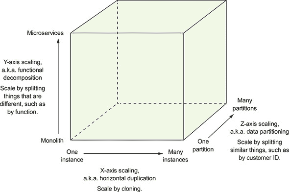

该模型定义了三种扩展应用程序的方法：X、Y 和 Z。

##### X 轴扩展通过负载均衡器在多个实例之间平衡请求

*X 轴* 扩展是扩展单体应用程序的常见方法。图 1.4 展示了 X 轴扩展的工作原理。你运行多个应用程序实例，并在负载均衡器后面。负载均衡器将请求分配给应用程序的 *N* 个相同实例。这是一种提高应用程序容量和可用性的极好方法。

##### 图 1.4\. X 轴扩展在负载均衡器后面运行单体应用程序的多个、相同实例。

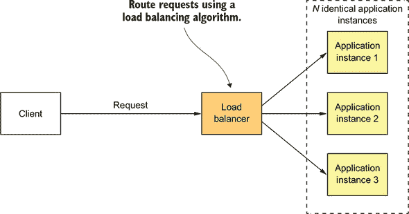

##### Z 轴扩展根据请求的属性路由请求

*Z-axis* 缩放也会运行单体应用的多个实例，但与 X-axis 缩放不同，每个实例只负责数据的一个子集。图 1.5 展示了 Z-axis 缩放的工作原理。实例前面的路由器使用请求属性将其路由到适当的实例。例如，一个应用程序可能会使用 `userId` 来路由请求。

##### 图 1.5\. Z-axis 缩放在路由器后面运行单体应用程序的多个相同实例，路由器根据 `request` 属性进行路由。每个实例只负责数据的一个子集。

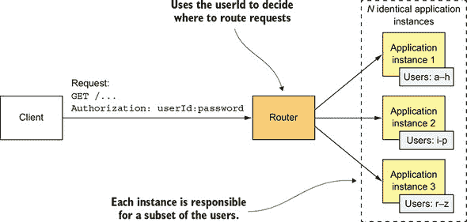

在这个例子中，每个应用程序实例只负责用户的一个子集。路由器使用请求 `Authorization` 标头中指定的 `userId` 来选择应用程序的 *N* 个相同实例中的一个。Z-axis 缩放是扩展应用程序以处理增加的交易和数据量的绝佳方式。

##### Y-axis 缩放在功能上将应用程序分解为服务

X-和 Z-axis 缩放提高了应用程序的容量和可用性。但这两种方法都不能解决开发和应用复杂性增加的问题。要解决这些问题，你需要应用 *Y-axis* 缩放，或 *功能分解*。图 1.6 展示了 Y-axis 缩放的工作原理：通过将单体应用程序拆分为一组服务。

##### 图 1.6\. Y-axis 缩放将应用程序拆分为一组服务。每个服务负责特定的功能。服务使用 X-axis 缩放进行扩展，并且可能还使用 Z-axis 缩放。

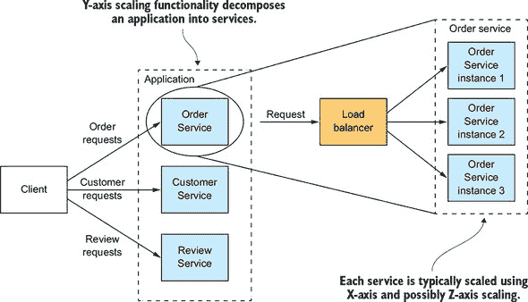

*服务* 是一个实现狭窄关注功能的迷你应用程序，例如订单管理、客户管理等。服务使用 X-axis 缩放进行扩展，尽管一些服务也可能使用 Z-axis 缩放。例如，订单服务由一组负载均衡的服务实例组成。

微服务架构（微服务）的高级定义是一种将应用程序功能分解成一组服务的架构风格。请注意，这个定义并没有说任何关于大小的事情。相反，重要的是每个服务都有一组专注且连贯的责任。在本书的后面部分，我将讨论这意味着什么。

现在我们来看看微服务架构是如何成为模块化的一种形式的。

#### 1.4.2\. 微服务作为模块化的一种形式

*模块化*在开发大型、复杂应用程序时至关重要。像 FTGO 这样的现代应用程序太大，无法由个人开发。它也太复杂，无法由单一个人理解。应用程序必须分解成由不同的人开发和理解的模块。在单体应用程序中，模块是通过编程语言构造（如 Java 包）和构建工件（如 Java JAR 文件）的组合来定义的。然而，正如 FTGO 开发者所发现的那样，这种方法在实践中往往效果不佳。长期存在的单体应用程序通常会退化成大泥球。

微服务架构使用服务作为模块化的单元。一个服务有一个 API，这是一个难以违反的不透水边界。你不能像使用 Java 包那样绕过 API 访问内部类。因此，随着时间的推移，更容易保持应用程序的模块化。使用服务作为构建块还有其他好处，包括能够独立部署和扩展它们。

#### 1.4.3\. 每个服务都有自己的数据库

微服务架构的一个关键特征是服务之间松散耦合，并且仅通过 API 进行通信。实现松散耦合的一种方式是每个服务都有自己的数据存储。例如，在在线商店中，`订单服务`有一个包含`ORDERS`表的数据库，而`客户服务`有自己的数据库，其中包含`CUSTOMERS`表。在开发时，开发者可以更改服务的模式，而无需与其他服务的开发者协调。在运行时，服务之间是隔离的——例如，一个服务永远不会因为另一个服务持有数据库锁而被阻塞。

| |
| --- |

**不要担心：松散耦合不会让拉里·埃里森更富有**

每个服务需要有自己的数据库的要求并不意味着它有自己的数据库服务器。例如，你不必在 Oracle RDBMS 许可证上花费 10 倍的费用。第二章深入探讨了这一主题。

| |
| --- |

现在我们已经定义了微服务架构并描述了其一些基本特征，让我们看看这如何应用于 FTGO 应用程序。

#### 1.4.4\. FTGO 微服务架构

本书剩余部分将深入讨论 FTGO 应用程序的微服务架构。但首先让我们快速看一下将 Y 轴扩展应用于此应用程序意味着什么。如果我们对 FTGO 应用程序应用 Y 轴分解，我们得到图 1.7 所示的架构。分解后的应用程序由众多前端和后端服务组成。我们还会应用 X 轴和可能的 Z 轴扩展，以便在运行时每个服务都会有多个实例。

##### 图 1.7. 基于微服务架构的 FTGO 应用程序的一些服务。API 网关将来自移动应用程序的请求路由到服务。服务通过 API 进行协作。

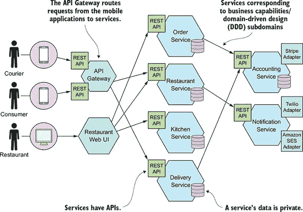

前端服务包括 API 网关和餐厅 Web UI。API 网关扮演门面角色，在第八章中详细描述，为消费者和快递员的移动应用程序提供 REST API。餐厅 Web UI 实现了餐厅用于管理菜单和处理订单的 Web 界面。

FTGO 应用程序的业务逻辑由多个后端服务组成。每个后端服务都有一个 REST API 和自己的私有数据存储。后端服务包括以下内容：

+   **`订单服务`—** 管理订单

+   **`配送服务`—** 管理从餐厅到消费者的订单配送

+   **`餐厅服务`—** 维护餐厅信息

+   **`厨房服务`—** 管理订单的准备

+   **`会计服务`—** 处理账单和支付

许多服务对应于本章前面描述的模块。不同之处在于每个服务及其 API 都定义得非常清晰。每个服务都可以独立开发、测试、部署和扩展。此外，这种架构很好地保持了模块化。开发者不能绕过服务的 API 来访问其内部组件。第十三章描述了如何将现有的单体应用程序转换为微服务。

#### 1.4.5. 比较微服务架构和 SOA

一些微服务架构的批评者声称这并不是什么新东西——它是面向服务的架构（SOA）。在非常高的层面上，有一些相似之处。SOA 和微服务架构都是将系统结构化为服务集的架构风格。但正如表 1.1 所示，一旦深入挖掘，就会遇到显著的不同。

##### 表 1.1. 比较 SOA 与微服务

|   | SOA | 微服务 |
| --- | --- | --- |
| 服务间通信 | 使用重量级协议，如企业服务总线（ESB）的智能管道。 | 使用轻量级协议，如 REST 或 gRPC 的消息代理或直接服务到服务的通信的哑管道 |
| 数据 | 全局数据模型和共享数据库 | 每个服务的独立数据模型和数据库 |
| 典型服务 | 较大的单体应用程序 | 较小的服务 |

SOA 和微服务架构通常使用不同的技术栈。SOA 应用通常使用重量级技术，如 SOAP 和其他 WS*标准。它们经常使用 ESB，一种包含业务和消息处理逻辑的*智能管道*来集成服务。使用微服务架构构建的应用程序倾向于使用轻量级、开源技术。服务通过*哑管道*进行通信，例如消息代理或轻量级协议如 REST 或 gRPC。

SOA 和微服务架构在处理数据的方式上也存在差异。SOA 应用通常具有全局数据模型并共享数据库。相比之下，如前所述，在微服务架构中，每个服务都有自己的数据库。此外，正如第二章所述，每个服务通常被认为有自己的领域模型。

SOA 和微服务架构之间的另一个关键区别是服务的大小。SOA 通常用于集成大型、复杂、单体应用程序。尽管微服务架构中的服务并不总是微小的，但它们几乎总是比 SOA 中的服务小得多。因此，SOA 应用通常由几个大型服务组成，而基于微服务的应用程序通常由数十或数百个较小的服务组成。

### 1.5\. 微服务架构的优点和缺点

让我们先考虑其优点，然后再看看其缺点。

#### 1.5.1\. 微服务架构的优点

微服务架构有以下优点：

+   它使得大型、复杂的应用程序能够持续交付和部署。

+   服务规模小且易于维护。

+   服务可以独立部署。

+   服务可以独立扩展。

+   微服务架构使团队能够实现自治。

+   它允许轻松实验和采用新技术。

+   它具有更好的故障隔离性。

让我们看看每个优点。

##### 使大型、复杂的应用程序能够持续交付和部署

微服务架构最重要的好处是它使得大型、复杂的应用程序能够持续交付和部署。如后文 1.7 节所述，持续交付/部署是*DevOps*的一部分，是一套旨在快速、频繁且可靠地交付软件的实践。表现优异的 DevOps 组织通常在生产中部署更改时遇到的生产问题非常少。

微服务架构实现持续交付/部署的三个方式如下：

+   ***它具有持续交付/部署所需的可测试性——** 自动化测试是持续交付/部署的关键实践。由于微服务架构中的每个服务相对较小，自动化测试编写起来更容易，执行速度更快。因此，应用程序将具有更少的错误。

+   ***它具有持续交付/部署所需的部署能力**——**每个服务可以独立于其他服务进行部署。如果负责某个服务的开发者需要部署针对该服务的本地更改，他们不需要与其他开发者协调。他们可以部署他们的更改。因此，将更改频繁部署到生产中要容易得多。

+   ***它使开发团队能够实现自治和松散耦合**——**你可以将工程组织结构构建为一系列小型团队（例如，两个披萨大小的团队）。每个团队仅负责一个或多个相关服务的开发和部署。如图 1.8 所示，每个团队可以独立于其他团队开发、部署和扩展他们的服务。因此，开发速度要高得多。

##### 图 1.8。基于微服务的 FTGO 应用程序由一系列松散耦合的服务组成。每个团队独立开发、测试和部署他们的服务。

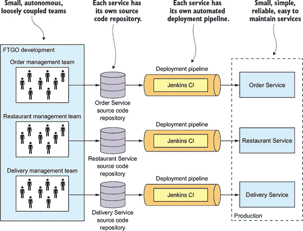

能够进行持续交付和部署具有以下几项商业优势：

+   它缩短了上市时间，使企业能够快速响应客户的反馈。

+   它使企业能够提供今天客户期望的可靠服务。

+   由于更多时间用于交付有价值的功能而不是灭火，员工满意度更高。

因此，微服务架构已成为任何依赖软件技术的企业的基本要求。

##### 每个服务都是小型且易于维护的

微服务架构的另一个好处是每个服务相对较小。代码更容易让开发者理解。小型代码库不会减慢集成开发环境（IDE），使开发者更加高效。而且每个服务通常启动得比大型单体应用快得多，这也使得开发者更加高效，并加快了部署速度。

##### 服务可以独立扩展

在微服务架构中，每个服务都可以使用 X 轴克隆和 Z 轴分区独立于其他服务进行扩展。此外，每个服务都可以部署在最适合其资源需求硬件上。这与使用单体架构时大不相同，在单体架构中，具有截然不同资源需求（例如，CPU 密集型与内存密集型）的组件必须一起部署。

##### 更好的故障隔离

微服务架构具有更好的故障隔离。例如，一个服务中的内存泄漏只会影响该服务。其他服务将继续正常处理请求。相比之下，单体架构中一个行为异常的组件可能会使整个系统崩溃。

##### 轻松实验和采用新技术

最后但同样重要的是，微服务架构消除了对技术栈的长期承诺。原则上，当开发新服务时，开发者可以自由选择最适合该服务的语言和框架。在许多组织中，限制选择是有意义的，但关键点是你不受过去决策的限制。

此外，由于服务规模较小，使用更好的语言和技术重写它们变得可行。如果新技术的试验失败，你可以丢弃这项工作而不会危及整个项目。这与使用单体架构时大不相同，在单体架构中，你的初始技术选择会严重限制你未来使用不同语言和框架的能力。

#### 1.5.2. 微服务架构的缺点

当然，没有哪种技术是万能的，微服务架构有许多显著的缺点和问题。实际上，本书的大部分内容都是关于如何解决这些缺点和问题。当你阅读关于挑战的内容时，不要担心。在这本书的后面部分，我将描述解决这些问题的方法。

下面是微服务架构的主要缺点和问题：

+   找到合适的服务集是一项挑战。

+   分布式系统很复杂，这使得开发、测试和部署变得困难。

+   部署跨越多个服务的功能需要仔细的协调。

+   决定何时采用微服务架构是困难的。

让我们逐一来看。

##### 找到合适的服务是一项挑战

使用微服务架构的一个挑战是没有一个具体、明确地将系统分解为服务的算法。就像软件开发中的许多事情一样，这更像是一门艺术。更糟糕的是，如果你错误地分解了一个系统，你会构建一个*分布式单体*，这是一个由必须一起部署的耦合服务组成的系统。分布式单体既有单体架构的缺点，也有微服务架构的缺点。

##### 分布式系统很复杂

使用微服务架构的另一个问题是开发者必须处理创建分布式系统带来的额外复杂性。服务必须使用进程间通信机制。这比简单的函数调用要复杂。此外，服务必须设计成能够处理部分故障，并处理远程服务不可用或延迟过高的情况。

实现跨越多个服务的用例需要使用不熟悉的技巧。每个服务都有自己的数据库，这使得实现跨越服务的交易和查询成为一项挑战。正如第四章所述，基于微服务的应用程序必须使用所谓的*叙事*来维护服务之间的数据一致性。第七章解释说，基于微服务的应用程序不能使用简单的查询从多个服务中检索数据。相反，它必须使用 API 组合或 CQRS 视图来实现查询。

集成开发环境（IDE）和其他开发工具专注于构建单体应用程序，并且不提供开发分布式应用程序的明确支持。编写涉及多个服务的自动化测试具有挑战性。这些都是特定于微服务架构的问题。因此，您的组织开发人员必须具备复杂的软件开发和交付技能，才能成功使用微服务。

微服务架构还引入了显著的操作复杂性。在生产中必须管理更多的移动部件——不同类型服务的多个实例。要成功部署微服务，您需要高度的自动化。您必须使用以下技术：

+   自动部署工具，例如 Netflix Spinnaker

+   一个现成的 PaaS，例如 Pivotal Cloud Foundry 或 Red Hat OpenShift

+   一个 Docker 编排平台，例如 Docker Swarm 或 Kubernetes

我在第十二章中更详细地描述了部署选项。

##### 部署跨越多个服务的功能需要仔细协调

使用微服务架构的另一个挑战是，部署跨越多个服务的功能需要在各个开发团队之间进行仔细的协调。您必须创建一个部署计划，该计划根据服务之间的依赖关系对服务部署进行排序。这与单体架构大不相同，在单体架构中，您可以轻松原子性地部署多个组件的更新。

##### 决定何时采用是困难的

使用微服务架构的另一个问题是确定在应用程序的生命周期中何时应该使用这种架构。在开发应用程序的第一个版本时，您通常不会遇到这种架构解决的问题。此外，使用复杂的分布式架构会减慢开发速度。这对初创公司来说可能是一个重大的困境，因为最大的问题通常是如何快速演变商业模式和相应的应用程序。使用微服务架构会使快速迭代变得更加困难。初创公司几乎肯定应该从单体应用程序开始。

然而，后来当问题是如何处理复杂性时，那时将应用程序功能分解成一组微服务是有意义的。您可能会发现由于复杂的依赖关系而难以重构。第十三章介绍了将单体应用重构为微服务的方法。

如您所见，微服务架构提供了许多好处，但也存在一些显著的缺点。正因为这些问题，采用微服务架构不应轻率行事。但对于面向消费者的 Web 应用或 SaaS 应用等复杂应用来说，这通常是一个正确的选择。像 eBay([www.slideshare.net/RandyShoup/the-ebay-architecture-striking-a-balance-between-site-stability-feature-velocity-performance-and-cost](http://www.slideshare.net/RandyShoup/the-ebay-architecture-striking-a-balance-between-site-stability-feature-velocity-performance-and-cost))、Amazon.com、Groupon 和 Gilt 等知名网站都已经从单体架构演变为微服务架构。

在使用微服务架构时，您必须解决许多设计和架构问题。更重要的是，许多这些问题都有多个解决方案，每个解决方案都有一套不同的权衡。没有一种单一的完美解决方案。为了帮助您做出决策，我创建了微服务架构模式语言。我在本书的其余部分引用这个模式语言，向您介绍微服务架构。让我们看看模式语言是什么以及为什么它有帮助。

### 1.6. 微服务架构模式语言

架构和设计都是关于做决定。您需要决定单体架构或微服务架构最适合您的应用。在做出这些决定时，您需要考虑许多权衡。如果您选择微服务架构，您将需要解决许多问题。

描述各种架构和设计选项并提高决策质量的一个好方法是使用模式语言。让我们首先看看为什么我们需要模式和模式语言，然后我们将游览微服务架构模式语言。

#### 1.6.1. 微服务架构并非万能药

回到 1986 年，*《人月神话》*（Addison-Wesley Professional，1995 年）的作者 Fred Brooks 说，在软件工程中，没有万能药。这意味着没有技术或技术如果采用就会给您带来十倍的生产力提升。然而，几十年后，开发者们仍然激烈地争论他们最喜欢的万能药，坚信他们最喜欢的技术将给他们带来巨大的生产力提升。

许多争论遵循*好/坏二分法*（[`nealford.com/memeagora/2009/08/05/suck-rock-dichotomy.html`](http://nealford.com/memeagora/2009/08/05/suck-rock-dichotomy.html)），这是尼尔·福特创造的术语，用来描述软件世界中的每一件事要么很糟糕要么很棒，没有中间地带。这些争论具有以下结构：如果你做 X，那么一只小狗会死，所以你必须做 Y。例如，同步编程与反应式编程，面向对象与函数式，Java 与 JavaScript，REST 与消息传递。当然，现实要复杂得多。每种技术都有其倡导者经常忽视的缺点和局限性。因此，技术的采用通常遵循*Gartner 炒作周期*（[`en.wikipedia.org/wiki/Hype_cycle`](https://en.wikipedia.org/wiki/Hype_cycle)），其中一种新兴技术要经历五个阶段，包括*期望过高的顶峰*（它很棒），接着是*幻灭的低谷*（它很糟糕），最后是*生产力的平台期*（我们现在理解了权衡和何时使用它）。

微服务并非对银弹现象免疫。这种架构是否适合你的应用程序取决于许多因素。因此，总是建议使用微服务架构是不良的建议，但同样，不建议永远不使用它。就像许多事情一样，这取决于具体情况。

这些关于技术的极端和夸张争论的潜在原因是人类主要受情感驱动。乔纳森·海蒂在他的优秀著作《正义之心：为什么好人会被政治和宗教分裂》（Vintage，2013 年）中，用大象和骑手的比喻来描述人类思维的工作方式。大象代表人类大脑的情感部分。它做出了大部分决定。骑手代表大脑的理性部分。它有时可以影响大象，但大多数时候只是为大象的决定提供正当理由。

我们——软件开发社区——需要克服我们的情感天性，找到更好的讨论和应用技术的方法。讨论和描述技术的一个好方法是使用*模式*格式，因为它客观。例如，在模式格式中描述一项技术时，你必须描述其缺点。让我们看看模式格式。

#### 1.6.2. 模式和模式语言

**模式**是针对特定情境中出现的问题的可重用解决方案。它是一个源于现实世界建筑的思想，并在软件架构和设计中被证明是有用的。模式的概念是由现实世界建筑师克里斯托弗·亚历山大提出的。他还创造了**模式语言**的概念，这是一组相关的模式，用于解决特定领域内的问题。他的著作《模式语言：城镇、建筑、建造》（牛津大学出版社，1977 年）描述了一种建筑模式语言，包含 253 个模式。这些模式从解决高层次问题，如城市的位置（“水源接入”），到解决低层次问题，如如何设计房间（“每个房间两面都有光”）。每个模式通过安排从城市到窗户等不同范围的物理对象来解决问题。

克里斯托弗·亚历山大的著作启发了软件社区采用模式及其模式语言的概念。《设计模式：可复用面向对象软件元素》（Addison-Wesley Professional，1994 年），由 Erich Gamma、Richard Helm、Ralph Johnson 和 John Vlissides 所著，是一本面向对象设计模式的集合。这本书在软件开发者中普及了模式。自 1995 年代中期以来，软件开发者已经记录了大量的软件模式。**软件模式**通过定义一组协作的软件元素来解决软件架构或设计问题。

例如，让我们想象你正在构建一个必须支持各种透支政策的银行应用程序。每个政策定义了账户余额的限制以及透支账户的收费。你可以使用策略模式解决这个问题，这是经典《设计模式》书中一个众所周知的设计模式。策略模式定义的解决方案由三个部分组成：

+   一个名为`Overdraft`的策略接口，它封装了透支算法

+   一个或多个具体的策略类，每个类对应一个特定的情境

+   使用算法的`Account`类

策略模式是一种**面向对象**的设计模式，因此解决方案的元素是类。在本节的后半部分，我将描述**高级**设计模式，其中解决方案由协作服务组成。

模式有价值的一个原因是，模式必须描述其应用的上下文。一个解决方案是特定于某个特定上下文，可能在其他上下文中效果不佳的想法，是技术通常讨论方式的一种改进。例如，解决 Netflix 规模问题的解决方案可能不适合用户较少的应用程序。

然而，模式的价值远远超出了要求你考虑问题情境的需要。它迫使你描述其他关键但经常被忽视的解决方案方面。常用的模式结构包括三个特别有价值的部分：

+   力量

+   结果情境

+   相关模式

让我们逐一查看这些内容，从力量开始。

##### 力量：解决问题时必须解决的问题

模式的“力量”部分描述了在特定情境中解决问题时必须处理的力（问题）。力量可能存在冲突，因此可能无法解决所有问题。哪些力量更重要取决于情境。你必须优先解决某些力量而不是其他力量。例如，代码必须易于理解并且性能良好。以响应式风格编写的代码比同步代码性能更好，但通常更难以理解。明确列出力量是有用的，因为它清楚地表明哪些问题需要解决。

##### 结果情境：应用模式的结果

模式的“结果情境”部分描述了应用模式的结果。它包括三个部分：

+   ***好处***—**模式的好处，包括已解决的力**

+   ***缺点***—**模式的缺点，包括未解决的力**

+   ***问题***—**应用模式所引入的新问题**

结果情境提供了更完整且更少偏见的解决方案视角，这有助于做出更好的设计决策。

##### 相关模式：五种不同类型的关系

模式的“相关模式”部分描述了模式与其他模式之间的关系。模式之间存在五种类型的关系：

+   ***前驱模式***—**前驱模式是激发对这种模式需求的前驱模式。例如，微服务架构模式是模式语言中除单体架构模式之外所有模式的先导模式。**

+   ***后续模式***—**解决由该模式引入的问题的模式。例如，如果你应用了微服务架构模式，你必须随后应用许多后续模式，包括服务发现模式和断路器模式。**

+   ***替代方案***—**提供替代解决方案的模式。例如，单体架构模式和微服务架构模式是构建应用程序的替代架构方式。你选择其中一个或另一个。**

+   ***泛化***—**一个通用于解决问题的模式。例如，在第十二章中，你将了解单服务每主机模式的不同实现。**

+   ***专业化*—** 某个特定模式的特殊形式。例如，在第十二章 chapter 12 中，您将了解到将服务作为容器部署模式是单机单服务模式的特殊形式。

此外，您还可以将解决特定问题领域的模式组织成组。相关模式的明确描述为如何有效地解决特定问题提供了宝贵的指导。图 1.9 展示了模式之间关系的视觉表示。

##### 图 1.9\. 模式之间不同类型关系的视觉表示：一个 *后继* 模式解决由 *前驱* 模式应用而产生的问题；两个或更多模式可以是同一问题的 *替代* 解决方案；一个模式可以是另一个模式的 *专业化*；并且解决同一领域问题的模式可以分组，或 *泛化*。

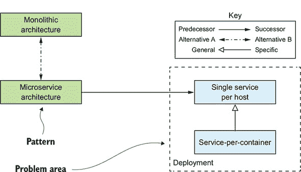

图 1.9 中展示的模式之间的不同关系如下所示：

+   表示前驱-后继关系

+   相同问题的替代解决方案

+   表示一个模式是另一个模式的特殊形式

+   适用于特定问题领域的模式

通过这些关系相关联的模式集合有时形成所谓的模式语言。模式语言中的模式共同工作，以解决特定领域的问题。特别是，我创建了微服务架构模式语言。它是一系列相互关联的微服务软件架构和设计模式。让我们来看看这个模式语言。

#### 1.6.3\. 微服务架构模式语言概述

微服务架构模式语言是一系列模式，帮助您使用微服务架构来构建应用程序。图 1.10 展示了模式语言的高级结构。模式语言首先帮助您决定是否使用微服务架构。它描述了单体架构和微服务架构，以及它们的优缺点。然后，如果微服务架构适合您的应用程序，模式语言通过解决各种架构和设计问题，帮助您有效地使用它。

##### 图 1.10\. 微服务架构模式语言的概览，展示了这些模式解决的不同问题领域。左侧是应用架构模式：单体架构和微服务架构。所有其他模式组解决的是选择微服务架构模式所带来的问题。

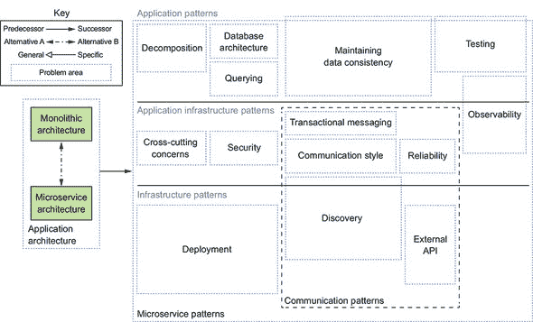

模式语言由几个模式组组成。在 图 1.10 的左侧是应用架构模式组，包括单体架构模式和微服务架构模式。这些就是本章讨论的模式。模式语言的其余部分由解决使用微服务架构模式引入的问题的模式组组成。

模式还被分为三层：

+   ***基础设施模式*—** 这些解决大多数是开发之外的基础设施问题。

+   ***应用基础设施*—** 这些是影响开发的基础设施问题。

+   ***应用模式*—** 这些解决开发者面临的问题。

这些模式根据它们解决的问题类型分组。让我们看看主要模式组。

##### 将应用程序分解为服务的模式

决定如何将系统分解为一系列服务在很大程度上是一种艺术，但有一些策略可以帮助。在 图 1.11 中显示的两个分解模式是您可以用来定义应用程序架构的不同策略。

##### 图 1.11\. 有两种分解模式：按业务能力分解，它围绕业务能力组织服务，以及按子域分解，它围绕领域驱动设计 (DDD) 子域组织服务。

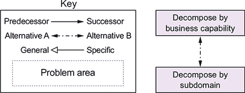

第二章 详细描述了这些模式。

##### 通信模式

使用微服务架构构建的应用程序是一个分布式系统。因此，进程间通信 (IPC) 是微服务架构的一个重要部分。您必须就您的服务如何相互通信以及与外部世界的通信做出各种架构和设计决策。图 1.12 显示了通信模式，这些模式被组织成五个组：

+   ***通信风格*—** 应该使用哪种 IPC 机制？

+   ***发现*—** 服务客户端如何确定服务实例的 IP 地址，例如，以便进行 HTTP 请求？

+   ***可靠性*—** 即使服务可能不可用，您如何确保服务之间的通信是可靠的？

+   ***事务消息*—** 如何将消息发送和事件发布的集成与更新业务数据的数据库事务相结合？

+   ***外部 API*—** 您的应用程序客户端如何与服务通信？

##### 图 1.12\. 五种通信模式组

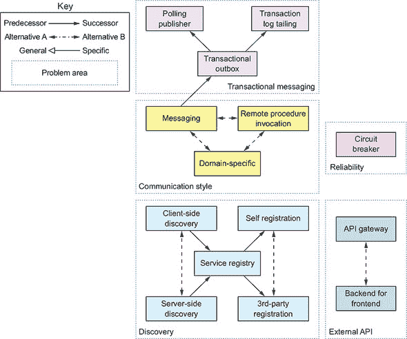

第三章 探讨了前四个模式组：通信风格、发现、可靠性和事务消息。第八章 探讨外部 API 模式。

##### 实现事务管理的数据一致性模式

如前所述，为了确保松耦合，每个服务都有自己的数据库。不幸的是，每个服务拥有自己的数据库引入了一些重大问题。我在第四章中描述了传统的使用分布式事务（2PC）的方法对于现代应用来说不是一个可行的选项。相反，应用程序需要通过使用 Saga 模式来维护数据一致性。图 1.13 展示了与数据相关的模式。

##### 图 1.13。由于每个服务都有自己的数据库，你必须使用 Saga 模式来维护服务之间的数据一致性。

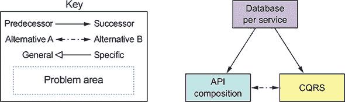

第四章、第五章和第六章更详细地描述了这些模式。

##### 微服务架构中查询数据的模式

使用每个服务一个数据库的另一个问题是，某些查询需要连接多个服务拥有的数据。服务的数据只能通过其 API 访问，因此你不能对其数据库执行分布式查询。图 1.14 展示了你可以用来实现查询的几个模式。

##### 图 1.14。由于每个服务都有自己的数据库，你必须使用查询模式之一来检索分散在多个服务中的数据。

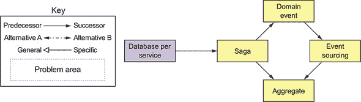

有时你可以使用 API 组合模式，该模式调用一个或多个服务的 API 并聚合结果。其他时候，你必须使用命令查询责任分离（CQRS）模式，该模式维护一个或多个易于查询的数据副本。第七章探讨了实现查询的不同方法。

##### 服务部署模式

部署单体应用并不总是容易，但从某种意义上说，它很简单，因为只有一个应用需要部署。你必须在负载均衡器后面运行应用程序的多个实例。

相比之下，部署基于微服务的应用要复杂得多。可能有成十或上百个服务，它们是用各种语言和框架编写的。有许多更多的移动部件需要管理。图 1.15 展示了部署模式。

##### 图 1.15。部署微服务的几种模式。传统的方法是将服务部署在特定语言的打包格式中。有两种现代的服务部署方法。第一种是将服务作为虚拟机或容器部署。第二种是无服务器方法。你只需上传服务的代码，无服务器平台就会运行它。你应该使用服务部署平台，这是一个自动的、自助的平台，用于部署和管理服务。

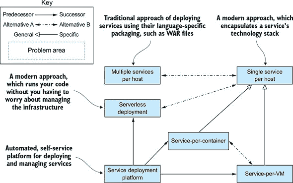

传统的、通常是手动的方式在特定语言的打包格式中部署应用程序，例如 WAR 文件，无法扩展以支持微服务架构。您需要一个高度自动化的部署基础设施。理想情况下，您应该使用提供开发者简单 UI（命令行或 GUI）以部署和管理其服务的部署平台。部署平台通常基于虚拟机（VM）、容器或无服务器技术。第十二章探讨了不同的部署选项。

##### 可观察性模式提供对应用程序行为的洞察

运营应用程序的关键部分是理解其运行时行为和诊断问题，如失败的请求和高延迟。虽然理解和诊断单体应用程序并不总是容易，但请求以简单直接的方式处理是有帮助的。每个传入的请求都会被负载均衡到特定的应用程序实例，该实例对数据库进行少量调用并返回响应。例如，如果您需要了解特定请求的处理方式，您会查看处理该请求的应用程序实例的日志文件。

相比之下，理解和诊断微服务架构中的问题要复杂得多。在最终将响应返回给客户端之前，一个请求可以在多个服务之间弹跳。因此，没有单一的日志文件可以检查。同样，由于存在多个嫌疑人，延迟问题也更难以诊断。

您可以使用以下模式来设计可观察的服务：

+   ***健康检查 API*—** 暴露一个返回服务健康状况的端点。

+   ***日志聚合*—** 记录服务活动并将日志写入集中式日志服务器，该服务器提供搜索和警报功能。

+   ***分布式跟踪*—** 为每个外部请求分配一个唯一的 ID，并跟踪请求在服务之间的流动。

+   ***异常跟踪*—** 将异常报告给异常跟踪服务，该服务去重异常、提醒开发者并跟踪每个异常的解决情况。

+   ***应用指标*—** 维护指标，例如计数器和仪表，并将它们暴露给指标服务器。

+   ***审计日志*—** 记录用户操作。

第十一章更详细地描述了这些模式。

##### 服务自动化测试模式

微服务架构使得单个服务更容易测试，因为它们比单体应用程序小得多。同时，尽管如此，测试不同服务协同工作而避免使用复杂、缓慢且脆弱的端到端测试（这些测试多个服务一起）也很重要。以下是在隔离测试服务中简化测试的模式：

+   ***消费者驱动的合同测试*—** 验证服务是否满足其客户端的期望。

+   ***客户端合同测试*—** 验证服务客户端能否与服务通信。

+   ***服务组件测试*—** 在隔离状态下测试服务。

第九章和第十章更详细地描述了这些测试模式。

##### 处理横切关注点的模式

在微服务架构中，每个服务都必须实现许多关注点，包括可观察性模式和发现模式。它还必须实现外部化配置模式，该模式在运行时向服务提供配置参数，例如数据库凭证。当开发新的服务时，从头开始重新实现这些关注点将非常耗时。一个更好的方法是应用微服务底盘模式，并在处理这些关注点的框架之上构建服务。第十一章更详细地描述了这些模式。

##### 安全模式

在微服务架构中，用户通常由 API 网关进行身份验证。然后它必须将有关用户的信息，例如身份和角色，传递给它调用的服务。一个常见的解决方案是应用访问令牌模式。API 网关传递一个访问令牌，例如 JWT（JSON Web Token），到服务，这些服务可以验证令牌并获取有关用户的信息。第十一章更详细地讨论了访问令牌模式。

毫不奇怪，微服务架构模式语言中的模式主要集中在解决架构和设计问题上。你当然需要正确的架构才能成功开发软件，但这并非唯一关注点。你还必须考虑流程和组织。

### 1.7. 超越微服务：流程和组织

对于大型、复杂的应用程序，微服务架构通常是最佳选择。但除了拥有正确的架构外，成功的软件开发还需要你有组织，以及开发和交付流程。图 1.16 展示了流程、组织和架构之间的关系。

##### 图 1.16。快速、频繁和可靠地交付大型、复杂应用程序需要 DevOps 的组合，包括持续交付/部署、小型、自主团队和微服务架构。

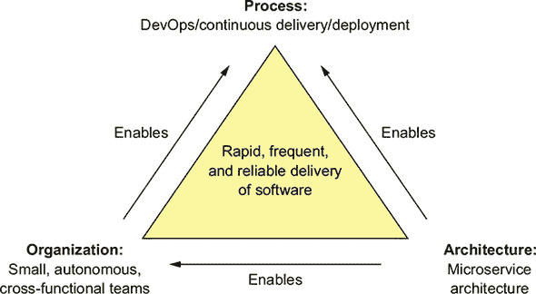

我已经描述了微服务架构。让我们看看组织和流程。

#### 1.7.1. 软件开发和交付组织

成功不可避免地意味着工程团队将扩大。一方面，这很好，因为更多的开发者可以完成更多的工作。大型团队的问题，正如弗雷德·布鲁克斯在*《人月神话》*中所写，团队规模为*N*的沟通开销是*O*(*N*²)。如果团队规模过大，由于沟通开销，它将变得低效。例如，想象一下试图与 20 人进行每日站立会议。

解决方案是将一个大型单一团队重构为多个团队。每个团队规模较小，由不超过 8-12 人组成。它有一个明确以业务为导向的使命：开发和可能运营一个或多个实现功能或业务能力的服务。团队是跨职能的，可以在不经常与其他团队沟通或协调的情况下开发、测试和部署其服务。

| |
| --- |

**逆向康威行动**

为了在使用微服务架构有效交付软件时，你需要考虑康威定律([`en.wikipedia.org/wiki/Conway%27s_law`](https://en.wikipedia.org/wiki/Conway%27s_law))，该定律如下所述：

> *组织在设计和构建系统时...会受到限制，只能产生与这些组织的沟通结构相匹配的设计。*
> 
> *梅尔文·康威*

换句话说，你的应用程序的架构反映了开发它的组织的结构。因此，逆向应用康威定律([www.thoughtworks.com/radar/techniques/inverse-conway-maneuver](http://www.thoughtworks.com/radar/techniques/inverse-conway-maneuver))并设计你的组织，使其结构反映你的微服务架构是非常重要的。通过这样做，你确保你的开发团队与服务的耦合性一样松散。

| |
| --- |

多个团队的速度显著高于单个大型团队的速度。如前所述在第 1.5.1 节，微服务架构在使团队实现自治方面发挥着关键作用。每个团队可以开发、部署和扩展其服务，而无需与其他团队协调。此外，当服务未满足其服务级别协议(SLA)时，非常清楚应该联系谁。

此外，开发组织具有更高的可扩展性。你通过添加团队来扩大组织。如果一个单一团队变得过大，你可以将其及其相关的服务或服务拆分。由于团队松散耦合，你可以避免大型团队的沟通开销。因此，你可以添加人员而不影响生产力。

#### 1.7.2\. 软件开发和交付流程

使用瀑布式开发流程的微服务架构就像驾驶一辆马拉的法拉利——你浪费了使用微服务的大部分好处。如果你想使用微服务架构开发应用程序，采用敏捷开发和部署实践，如 Scrum 或 Kanban，是至关重要的。更好的是，你应该实践持续交付/部署，这是 DevOps 的一部分。

Jez Humble 在 [`continuousdelivery.com/`](https://continuousdelivery.com/) 将持续交付定义为如下：

> *持续交付是能够以安全、快速且可持续的方式将所有类型的更改（包括新功能、配置更改、错误修复和实验）投入生产或用户手中的能力。*

持续交付的一个关键特征是软件始终可发布。它依赖于高度自动化，包括自动化测试。持续部署在自动将可发布代码部署到生产环境中进一步推进了持续交付的实践。实践持续部署的高性能组织每天多次将代码部署到生产中，生产中断事件远少，并且能够快速从任何发生的事件中恢复。如前所述，微服务架构直接支持持续交付/部署。

|  |
| --- |

**快速行动，不破坏事物**

持续交付/部署（以及更广泛的 DevOps）的目标是快速且可靠地交付软件。以下四个用于评估软件开发的有用指标如下：

+   ***部署频率*—** 软件被部署到生产环境的频率

+   ***平均恢复时间*—** 从生产问题恢复所需的时间

+   ***平均恢复时间*—** 从生产问题恢复所需的时间

+   ***变更失败率*—** 导致生产问题的变更的百分比

在一个传统组织中，部署频率低，平均恢复时间长。压力山大的开发人员和运维人员通常会在维护窗口期间熬夜修复最后一刻的问题。相比之下，DevOps 组织频繁发布软件，通常每天发布多次，生产问题远少。例如，亚马逊在 2014 年每 11.6 秒就将更改部署到生产环境中 ([www.youtube.com/watch?v=dxk8b9rSKOo](http://www.youtube.com/watch?v=dxk8b9rSKOo))，Netflix 一个软件组件的平均恢复时间为 16 分钟 ([`medium.com/netflix-techblog/how-we-build-code-at-netflix-c5d9bd727f15`](https://medium.com/netflix-techblog/how-we-build-code-at-netflix-c5d9bd727f15))。

|  |
| --- |

#### 1.7.3\. 采用微服务的“人”的方面

采用微服务架构会改变你的架构、组织和开发流程。然而，最终，它改变了人们的办公环境，正如前面提到的，人们是情感动物。如果忽视他们的情绪，他们的情绪可能会使微服务的采用变得崎岖不平。玛丽和其他 FTGO 领导者将努力改变 FTGO 开发软件的方式。

畅销书《管理过渡》（Da Capo Lifelong Books，2017 年，[`wmbridges.com/books`](https://wmbridges.com/books)）的作者威廉和苏珊·布里奇斯介绍了“过渡”的概念，它指的是人们如何情感上对变革做出反应的过程。它描述了一个三阶段的过渡模型：

1.  ***结束、失去和放手*—** 当人们面临一个迫使他们走出舒适区的变革时，会出现情感动荡和抵抗的时期。他们常常哀悼失去旧做事方式。例如，当人们重组为跨职能团队时，他们会怀念他们以前的同学。同样，拥有全球数据模型的数据建模组可能会受到每个服务都有自己的数据模型这一想法的威胁。

1.  ***中立区*—** 在旧方式和新方式之间的中间阶段，人们常常感到困惑。他们经常努力学习新做事的方式。

1.  ***新的开始*—** 这是人们热情拥抱新做事方式并开始体验其益处的最终阶段。

本书描述了如何最好地管理过渡的每个阶段并提高成功实施变革的可能性。FTGO 当然正遭受单体地狱的困扰，需要迁移到微服务架构。它还必须改变其组织和开发流程。然而，为了使 FTGO 能够成功完成这一任务，它必须考虑过渡模型并考虑人们的情绪。

在下一章中，你将了解软件架构的目标以及如何将应用程序分解为服务。

### 摘要

+   单体架构模式将应用程序结构化为一个单一的部署单元。

+   微服务架构模式将系统分解为一系列独立可部署的服务，每个服务都有自己的数据库。

+   单体架构对于简单应用来说是一个不错的选择，但对于大型、复杂的应用程序，微服务架构通常是更好的选择。

+   微服务架构通过允许小型、自主团队并行工作，加速了软件开发的速度。

+   微服务架构并不是万能的银弹——存在显著的缺点，包括复杂性。

+   微服务架构模式语言是一系列帮助您使用微服务架构来构建应用程序的模式。它帮助您决定是否使用微服务架构，如果您选择了微服务架构，模式语言将帮助您有效地应用它。

+   仅靠微服务架构并不能加速软件交付。成功的软件开发还需要 DevOps 和小型、自主的团队。

+   不要忘记采用微服务的“人”的一面。为了成功过渡到微服务架构，您需要考虑员工的情绪。
