## 第二章. 分解策略

*本章涵盖*

+   理解软件架构及其重要性

+   通过应用分解模式“按业务能力分解”和“按子域分解”将应用程序分解为服务

+   使用领域驱动设计（DDD）中的边界上下文概念来解开数据并使分解更容易

有时候你必须小心你所期望的。经过一番激烈的游说努力，玛丽最终说服了公司，迁移到微服务架构是正确的做法。感到既兴奋又有些紧张，玛丽与她的建筑师们进行了一整天的会议，讨论从哪里开始。在讨论中，很明显，微服务架构模式语言的一些方面，如部署和服务发现，虽然新颖且不熟悉，但却是直接的。关键挑战，即微服务架构的本质，是将应用程序分解为服务。因此，架构的第一个也是最重要的方面是定义服务。当他们围在白板旁时，FTGO 团队想知道究竟该如何做！

在本章中，你将学习如何为应用程序定义微服务架构。我描述了将应用程序分解为服务的策略。你将了解到服务是围绕业务关注点而不是技术关注点组织的。我还展示了如何使用领域驱动设计（DDD）中的思想来消除神级类，这些类在整个应用程序中使用并导致纠缠的依赖关系，从而阻碍了分解。

我首先通过软件架构概念来定义微服务架构。之后，我描述了一个从应用需求出发定义微服务架构的过程。我讨论了将应用程序分解为服务集合的策略、面临的障碍以及如何克服它们。让我们先来考察一下软件架构的概念。

### 2.1. 精确来说，微服务架构是什么？

第一章描述了微服务架构的关键思想是功能分解。不是开发一个大型的应用程序，而是将应用程序结构化为一系列服务。一方面，将微服务架构描述为一种功能分解是有用的。但另一方面，它也留下了一些未解决的问题，包括微服务架构如何与更广泛的软件架构概念相关？什么是服务？以及服务的大小有多重要？

为了回答这些问题，我们需要退后一步，看看“软件架构”的含义。软件应用程序的架构是其高级结构，它由组成部分及其之间的依赖关系组成。正如你将在本节中看到的，应用程序的架构是多维的，因此有多种描述它的方法。架构之所以重要，是因为它决定了应用程序的软件质量属性或“-ilities”。传统上，架构的目标是可扩展性、可靠性和安全性。但今天，架构还必须能够实现软件的快速和安全交付。你将了解到微服务架构是一种提供高可维护性、可测试性和可部署性的架构风格。

我从这个部分开始，描述了“软件架构”的概念以及为什么它很重要。接下来，我讨论了架构风格的想法。然后，我将微服务架构定义为一种特定的架构风格。让我们先从软件架构的概念开始看起。

#### 2.1.1\. 什么是软件架构以及为什么它很重要？

架构显然很重要。至少有两个会议致力于这个主题：O’Reilly 软件架构会议([`conferences.oreilly.com/software-architecture`](https://conferences.oreilly.com/software-architecture))和 SATURN 会议([`resources.sei.cmu.edu/news-events/events/saturn/`](https://resources.sei.cmu.edu/news-events/events/saturn/))。许多开发者的目标是成为一名架构师。但什么是架构以及为什么它很重要？

为了回答这个问题，我首先定义了“软件架构”这个术语的含义。之后，我讨论了应用程序的架构是多维的，并且最好使用一系列视图或蓝图来描述。然后，我说明了软件架构之所以重要，是因为它对应用程序的软件质量属性有影响。

##### 软件架构的定义

软件架构有许多定义。例如，可以查看[`en.wikiquote.org/wiki/Software_architecture`](https://en.wikiquote.org/wiki/Software_architecture)来阅读一些定义。我最喜欢的定义来自软件工程研究所的 Len Bass 和同事们([www.sei.cmu.edu](http://www.sei.cmu.edu))，他们在建立软件架构作为一门学科中发挥了关键作用。他们如下定义软件架构：

> *计算系统的软件架构是用于推理系统的结构集合，它包括软件元素、它们之间的关系以及它们的属性。*
> 
> *《软件架构文档：Bass 等人著》*

这显然是一个相当抽象的定义。但其本质是，一个应用程序的架构是其分解成部分（元素）以及这些部分之间的关系（关系）。分解之所以重要，有几个原因：

+   它促进了劳动力和知识的分工。它使得具有可能专门知识的多个人（或多个团队）能够高效地共同工作在一个应用程序上。

+   它定义了软件元素如何交互。

是将应用分解成部分以及这些部分之间的关系决定了应用的*可用性*。

##### 软件架构的 4+1 视图模型

更具体地说，一个应用程序的架构可以从多个角度来审视，就像一座建筑的架构可以从结构、管道、电气和其他角度来审视一样。菲利普·克鲁滕（Phillip Krutchen）撰写了一篇经典论文，描述了软件架构的 4+1 视图模型，“架构蓝图——软件架构的‘4+1’视图模型”（[www.cs.ubc.ca/~gregor/teaching/papers/4+1view-architecture.pdf](http://www.cs.ubc.ca/~gregor/teaching/papers/4+1view-architecture.pdf)）。4+1 模型，如图 2.1 所示，定义了软件架构的四个不同视图。每个视图都描述了架构的特定方面，并包含一组特定的软件元素及其之间的关系。

##### 图 2.1\. 4+1 视图模型使用四个视图来描述应用程序的架构，以及场景展示了每个视图中的元素如何协作来处理请求。

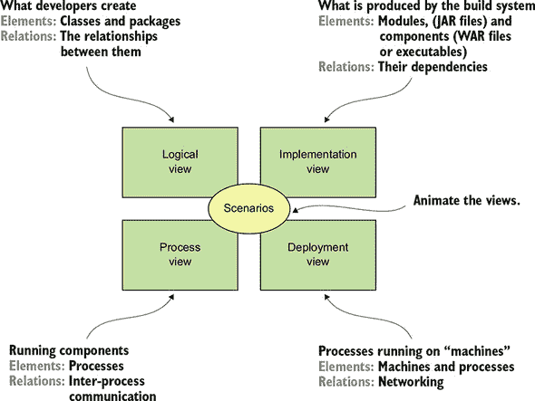

每个视图的目的如下：

+   ***逻辑视图*—** 开发者创建的软件元素。在面向对象的语言中，这些元素是类和包。它们之间的关系包括类和包之间的关系，包括继承、关联和依赖。

+   ***实现视图*—** 构建系统的输出。这个视图由模块组成，代表打包的代码，以及组件，它们是由一个或多个模块组成的可执行或可部署单元。在 Java 中，模块是一个 JAR 文件，组件通常是 WAR 文件或可执行 JAR 文件。它们之间的关系包括模块之间的依赖关系和组件与模块之间的组合关系。

+   ***过程视图*—** 运行时的组件。每个元素是一个进程，进程之间的关系代表进程间通信。

+   ***部署*—** 过程是如何映射到机器上的。这个视图中的元素包括（物理或虚拟）机器和过程。机器之间的关系代表网络。这个视图还描述了过程和机器之间的关系。

除了这四个视图之外，还有场景——4+1 模型中的+1，它们使视图生动起来。每个场景描述了特定视图中各种架构组件如何协作来处理请求。例如，逻辑视图中的场景显示了类如何协作。同样，过程视图中的场景显示了进程如何协作。

4+1 视图模型是描述应用程序架构的绝佳方式。每个视图都描述了架构的一个重要方面，而场景说明了视图元素如何协作。现在让我们看看为什么架构很重要。

##### 为什么架构很重要

应用程序有两个要求类别。第一个类别包括*功能性*要求，这些要求定义了应用程序必须做什么。它们通常以用例或用户故事的形式出现。架构与功能性要求几乎没有关系。你可以用几乎任何架构来实现功能性要求，甚至是一个大泥球。

架构之所以重要，是因为它使应用程序能够满足第二类要求：其*服务质量*要求。这些也被称为*质量属性*，也就是所谓的*-ilities*。服务质量要求定义了运行时质量，如可伸缩性和可靠性。它们还定义了开发时间质量，包括可维护性、可测试性和可部署性。你为应用程序选择的架构决定了它如何满足这些质量要求。

#### 2.1.2\. 架构风格概述

在物理世界中，一座建筑物的架构通常遵循特定的风格，例如维多利亚式、美国手工艺人或装饰艺术。每种风格都是一组设计决策的集合，限制了建筑物的功能和建筑材料。建筑风格的概念也适用于软件。大卫·加兰和玛丽·肖（《软件架构导论》，1994 年 1 月，[`www.cs.cmu.edu/afs/cs/project/able/ftp/intro_softarch/intro_softarch.pdf`](https://www.cs.cmu.edu/afs/cs/project/able/ftp/intro_softarch/intro_softarch.pdf)），软件架构领域的先驱，将架构风格定义为以下内容：

> 因此，*架构风格*定义了一组这样的系统，通过结构组织的模式。更具体地说，一个架构风格决定了在该风格实例中可以使用的组件和连接器的词汇，以及它们如何组合的一组约束。

特定的架构风格提供了一组有限的元素（组件）和关系（连接器），您可以从这些元素中定义应用程序架构的视图。应用程序通常使用多种架构风格的组合。例如，在本节的后面部分，我将描述单体架构是如何作为一种架构风格，将实现视图结构化为单个（可执行/可部署）组件的。微服务架构将应用程序结构化为一组松散耦合的服务。

##### 分层架构风格

架构风格的经典例子是分层架构。*分层架构*将软件元素组织成层。每一层都有一个定义良好的责任集。分层架构还限制了层之间的依赖关系。一层只能依赖于它下面的层（如果严格分层）或任何下面的层。

您可以将分层架构应用于前面讨论的任何四个视图。流行的三层架构是将分层架构应用于逻辑视图。它将应用程序的类组织成以下层或层：

+   ***表示层*—** 包含实现用户界面或外部 API 的代码

+   ***业务逻辑层*—** 包含业务逻辑

+   ***持久层*—** 实现与数据库交互的逻辑

分层架构是架构风格的一个很好的例子，但它确实有一些显著的缺点：

+   ***单一表示层*—** 它没有反映出应用程序可能不仅仅被单个系统调用的现实。

+   ***单一持久层*—** 它没有反映出应用程序可能不仅仅与单个数据库交互的事实。

+   ***将业务逻辑层定义为依赖于持久层*—** 理论上，这种依赖关系阻止了您在没有数据库的情况下测试业务逻辑。

此外，分层架构错误地表示了设计良好的应用程序中的依赖关系。业务逻辑通常定义了一个接口或接口的存储库，这些接口定义了数据访问方法。持久层定义了实现存储库接口的 DAO 类。换句话说，依赖关系与分层架构所描述的相反。

让我们看看一种克服这些缺点的替代架构：六边形架构。

##### 关于六边形架构风格

**六边形架构**是分层架构风格的替代方案。如图 2.2 所示，六边形架构风格以将业务逻辑置于中心的方式组织逻辑视图。与表示层不同，应用程序有一个或多个**入站适配器**，通过调用业务逻辑来处理来自外部的请求。同样，与数据持久层不同，应用程序有一个或多个由业务逻辑调用并调用外部应用程序的**出站适配器**。这种架构的关键特征和好处是业务逻辑不依赖于适配器。相反，它们依赖于它。

##### 图 2.2\. 一个六边形架构的例子，它由业务逻辑和一个或多个与外部系统通信的适配器组成。业务逻辑有一个或多个端口。入站适配器，处理来自外部系统的请求，调用入站端口。出站适配器实现出站端口，并调用外部系统。

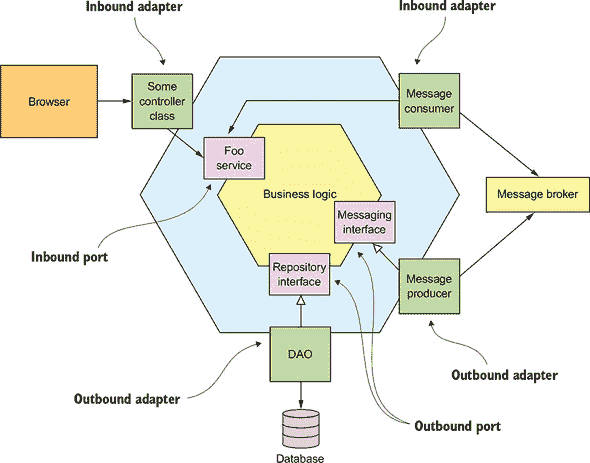

业务逻辑有一个或多个端口。一个**端口**定义了一组操作，并且是业务逻辑如何与它之外的内容交互的方式。例如，在 Java 中，一个端口通常是一个 Java 接口。端口有两种类型：入站端口和出站端口。入站端口是业务逻辑暴露的 API，它使得外部应用程序能够调用它。一个入站端口的例子是服务接口，它定义了一个服务的公共方法。出站端口是业务逻辑调用外部系统的方式。一个出站端口的例子是存储库接口，它定义了一组数据访问操作。

围绕业务逻辑的是适配器。与端口一样，适配器有两种类型：入站和出站。入站适配器通过调用入站端口来处理来自外部世界的请求。一个入站适配器的例子是实现了 REST 端点或一组网页的 Spring MVC 控制器。另一个例子是订阅消息的消息代理客户端。多个入站适配器可以调用相同的入站端口。

出站适配器实现出站端口，并通过调用外部应用程序或服务来处理来自业务逻辑的请求。一个出站适配器的例子是实现访问数据库操作的**数据访问对象**（DAO）类。另一个例子是调用远程服务的代理类。出站适配器还可以发布事件。

六边形架构风格的一个重要优点是它将业务逻辑从适配器中的表示逻辑和数据访问逻辑解耦。业务逻辑不依赖于表示逻辑或数据访问逻辑。由于这种解耦，单独测试业务逻辑变得更加容易。另一个优点是它更准确地反映了现代应用程序的架构。业务逻辑可以通过多个适配器调用，每个适配器实现特定的 API 或 UI。业务逻辑也可以调用多个适配器，每个适配器调用不同的外部系统。六边形架构是描述微服务架构中每个服务架构的绝佳方式。

层次结构和六边形架构都是架构风格的例子。每个都定义了架构的构建块并对它们之间的关系施加约束。六边形架构和层次架构，以三层架构的形式，组织逻辑视图。现在让我们将微服务架构定义为一种组织实现视图的架构风格。

#### 2.1.3. 微服务架构是一种架构风格

我已经讨论了 4+1 视图模型和架构风格，因此我现在可以定义单体和微服务架构。它们都是架构风格。单体架构是一种将实现视图结构化为单个组件的架构风格：一个单一的执行文件或 WAR 文件。这个定义对其他视图没有说任何东西。例如，单体应用程序可以有逻辑视图，该视图按照六边形架构组织。

| |
| --- |

**模式：单体架构**

将应用程序结构化为一个单一的可执行/可部署组件。请参阅[`microservices.io/patterns/monolithic.html`](http://microservices.io/patterns/monolithic.html)。

| |
| --- |

微服务架构也是一种架构风格。它将实现视图结构化为多个组件：可执行文件或 WAR 文件。这些组件是服务，连接器是使这些服务能够协作的通信协议。每个服务都有自己的逻辑视图架构，这通常是六边形架构。图 2.3 展示了 FTGO 应用程序的可能微服务架构。该架构中的服务对应于业务能力，例如订单管理和餐厅管理。

| |
| --- |

**模式：微服务架构**

将应用程序结构化为一组松散耦合、独立部署的服务。请参阅[`microservices.io/patterns/microservices.html`](http://microservices.io/patterns/microservices.html)。

| |
| --- |

##### 图 2.3. FTGO 应用程序的可能微服务架构。它由众多服务组成。

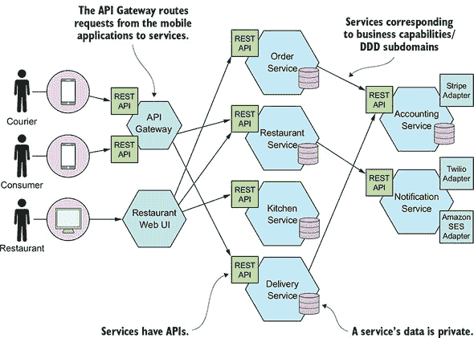

在本章的后面部分，我将描述“业务能力”的含义。服务之间的连接器是通过使用诸如 REST API 和异步消息等进程间通信机制来实现的。第三章更详细地讨论了进程间通信。

微服务架构强加的一个关键约束是服务之间的松散耦合。因此，对服务如何协作有一些限制。为了解释这些限制，我将尝试定义“服务”这个术语，描述松散耦合的含义，并告诉你这为什么很重要。

##### 什么是服务？

“服务”是一个独立、可独立部署的软件组件，它实现了某些有用的功能。图 2.4 显示了服务的外部视图，在这个例子中是“订单服务”。服务有一个 API，它为客户端提供了对其功能的访问。有两种类型的操作：命令和查询。API 由命令、查询和事件组成。例如，`createOrder()`这样的命令执行操作并更新数据。例如，`findOrderById()`这样的查询检索数据。服务还发布事件，如`OrderCreated`，这些事件被其客户端消费。

##### 图 2.4。服务有一个封装其实现的 API。API 定义了操作，这些操作由客户端调用。有两种类型的操作：命令更新数据，查询检索数据。当其数据发生变化时，服务会发布事件，客户端可以订阅这些事件。

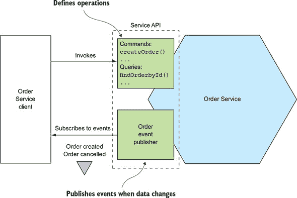

服务的 API 封装了其内部实现。与单体架构不同，开发者不能编写绕过其 API 的代码。因此，微服务架构强制执行应用程序的模块化。

在微服务架构中，每个服务都有自己的架构和，可能还有技术栈。但一个典型的服务具有六边形架构。它的 API 是通过与服务的业务逻辑交互的适配器来实现的。操作适配器调用业务逻辑，而事件适配器发布由业务逻辑发出的事件。

在第十二章的后面部分，当我讨论部署技术时，你会看到服务的实现视图可以有多种形式。组件可能是一个独立进程、一个运行在容器中的 Web 应用或 OSGI 包，或者是一个无服务器云函数。然而，一个基本要求是服务必须有一个 API 并且可以独立部署。

##### 什么是松散耦合？

微服务架构的一个重要特征是服务之间松散耦合（[`en.wikipedia.org/wiki/Loose_coupling`](https://en.wikipedia.org/wiki/Loose_coupling)）。所有与服务的交互都通过其 API 进行，该 API 封装了其实现细节。这使得服务的实现可以改变，而不会影响其客户端。松散耦合的服务对于提高应用程序的开发时间属性至关重要，包括其可维护性和可测试性。它们更容易理解、更改和测试。

服务需要松散耦合并且只能通过 API 进行协作的要求禁止服务通过数据库进行通信。你必须像对待类的字段一样对待服务的持久数据，并保持其私有。保持数据私有使得开发者可以在不花费时间与其他服务上的开发者协调的情况下更改其服务的数据库模式。不共享数据库表还可以提高运行时隔离性。它确保，例如，一个服务不能持有阻止另一个服务的数据库锁。然而，稍后你将了解到不共享数据库的一个缺点是，维护数据一致性和跨服务查询变得更加复杂。

##### 共享库的作用

开发者经常将功能打包到库（模块）中，以便可以在不重复代码的情况下由多个应用程序重用。毕竟，如果没有 Maven 或 npm 仓库，我们今天会是什么样子？你可能会倾向于在微服务架构中也使用共享库。表面上，这似乎是一种减少服务中代码重复的好方法。但你需要确保你不会意外地在服务之间引入耦合。

想象一下，例如，多个服务需要更新`订单`业务对象。一种方法是将该功能打包成一个库，供多个服务使用。一方面，使用库可以消除代码重复。另一方面，考虑一下当需求发生变化，影响`订单`业务对象时会发生什么。你需要同时重建和重新部署这些服务。一个更好的方法是将可能发生变化的功能，例如`订单`管理，实现为一个服务。

你应该努力使用库来实现那些不太可能改变的功能。例如，在一个典型的应用中，每个服务实现一个通用的`货币`类是没有意义的。相反，你应该创建一个由服务使用的库。

##### 服务的规模大多并不重要

“微服务”这个术语的一个问题是，你首先听到的是“微”。这暗示服务应该非常小。其他基于大小的术语，如迷你服务或纳米服务，也是如此。实际上，大小并不是一个有用的指标。

一个更好的目标是为一个设计良好的服务定义，使其成为一个能够由小型团队开发的服务，具有最短的前期准备时间和与其他团队的最小协作。从理论上讲，一个团队可能只负责一个服务，因此这个服务绝不算是*微服务*。相反，如果一个服务需要大型团队或花费很长时间进行测试，那么将团队和服务拆分可能是有意义的。或者，如果你因为其他服务的变更而不断需要更改服务，或者它正在触发其他服务的变更，那么这是一个迹象表明它不是松散耦合的。你甚至可能已经构建了一个分布式单体。

微服务架构将应用程序结构化为一系列小型、松散耦合的服务。因此，它提高了开发时间属性——可维护性、可测试性、可部署性等——并使组织能够更快地开发更好的软件。它还提高了应用程序的可扩展性，尽管这并不是主要目标。为了为你的应用程序开发微服务架构，你需要确定服务并确定它们如何协作。让我们看看如何做到这一点。

### 2.2. 定义应用程序的微服务架构

我们应该如何定义微服务架构？与任何软件开发工作一样，起点是书面需求，希望有领域专家，也许还有一个现有的应用程序。像许多软件开发一样，定义架构更多的是艺术而不是科学。本节描述了一个简单、三步的过程，如图 2.5 所示，用于定义应用程序的架构。然而，重要的是要记住，这不是一个可以机械遵循的过程。它很可能是迭代的，并且需要大量的创造力。

##### 图 2.5. 定义应用程序微服务架构的三步流程

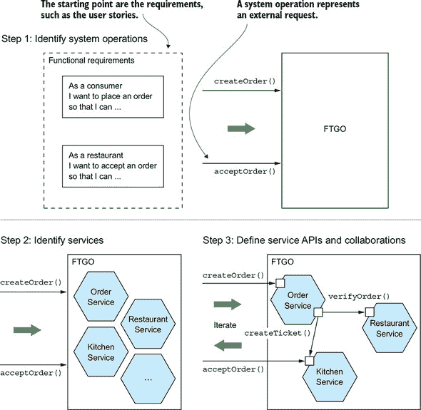

应用程序存在是为了处理请求，因此定义其架构的第一步是将应用程序的需求提炼为关键请求。但我不使用特定的 IPC 技术（如 REST 或消息传递）来描述请求，而是使用更抽象的系统操作概念。一个*系统操作*是应用程序必须处理的一个请求的抽象。它要么是一个更新数据的命令，要么是一个检索数据的查询。每个命令的行为都是用抽象领域模型来定义的，该模型也是从需求中派生出来的。系统操作成为说明服务如何协作的架构场景。

流程的第二步是确定服务的分解。有几种策略可供选择。一种策略，其起源在于业务架构学科，是定义与业务能力相对应的服务。另一种策略是围绕领域驱动设计子域组织服务。最终结果是服务围绕业务概念而不是技术概念组织。

定义应用程序架构的第三步是确定每个服务的 API。要做到这一点，你需要将第一步中识别出的每个系统操作分配给一个服务。一个服务可能完全自行实现一个操作。或者，它可能需要与其他服务协作。在这种情况下，你需要确定服务如何协作，这通常需要服务支持额外的操作。你还需要决定实现每个服务 API 的 IPC 机制，我在第三章中描述了这些机制。

分解存在几个障碍。第一个是网络延迟。你可能会发现，由于服务之间往返次数过多，某种分解可能不切实际。分解的另一个障碍是服务之间的同步通信会降低可用性。你可能需要使用第三章中描述的自包含服务概念。第三个障碍是在服务之间维护数据一致性的要求。你通常需要使用在第四章中讨论的的 sagas。分解的第四个和最后一个障碍是所谓的神级类，这些类在整个应用程序中使用。幸运的是，你可以使用领域驱动设计中的概念来消除神级类。

本节首先描述如何识别应用程序的操作。之后，我们将探讨将应用程序分解为服务的策略和指南，以及分解的障碍以及如何解决它们。最后，我将描述如何定义每个服务的 API。

#### 2.2.1. 识别系统操作

定义应用程序架构的第一步是定义系统操作。起点是应用程序的要求，包括用户故事及其相关的用户场景（注意，这些与架构场景不同）。系统操作是通过图 2.6 中所示的两步过程来识别和定义的。这个过程受到了 Craig Larman 在其书籍《应用 UML 和模式》（Prentice Hall，2004）中涵盖的面向对象设计过程的影响（有关详细信息，请参阅[www.craiglarman.com/wiki/index.php?title=Book_Applying_UML_and_Patterns](http://www.craiglarman.com/wiki/index.php?title=Book_Applying_UML_and_Patterns)）。第一步创建了由关键类组成的高级领域模型，这些类提供了一个词汇表，可以用来描述系统操作。第二步识别系统操作，并描述每个操作的行为，用领域模型来表述。

##### 图 2.6。系统操作是通过一个两步过程从应用程序的要求中推导出来的。第一步是创建一个高级领域模型。第二步是定义系统操作，这些操作是用领域模型来定义的。

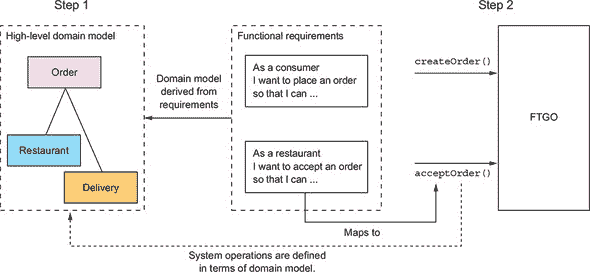

领域模型主要来源于用户故事中的名词，系统操作主要来源于动词。你也可以使用一种称为事件风暴的技术来定义领域模型，我在第五章中提到了这种技术。第五章。每个系统操作的行为都是用其对一个或多个领域对象及其之间关系的影响来描述的。系统操作可以创建、更新或删除领域对象，以及创建或破坏它们之间的关系。

让我们看看如何定义一个高级领域模型。之后，我将根据领域模型来定义系统操作。

##### 创建高级领域模型

定义系统操作的过程的第一步是为应用程序绘制一个高级领域模型。请注意，这个领域模型最终实现起来要简单得多。应用程序甚至不会有一个单独的领域模型，因为，正如你很快就会学到的，每个服务都有自己的领域模型。尽管这是一个极端的简化，但在这个阶段，高级领域模型是有用的，因为它定义了描述系统操作行为的词汇。

领域模型是通过使用标准技术创建的，例如分析故事和场景中的名词以及与领域专家交谈。以`Place Order`故事为例。我们可以将这个故事扩展到包括以下用户场景：

```
Given a consumer
  And a restaurant
  And a delivery address/time that can be served by that restaurant
  And an order total that meets the restaurant's order minimum
When the consumer places an order for the restaurant
Then consumer's credit card is authorized
  And an order is created in the PENDING_ACCEPTANCE state
  And the order is associated with the consumer
  And the order is associated with the restaurant
```

在这个用户场景中的名词暗示了各种类的存在，包括`Consumer`、`Order`、`Restaurant`和`CreditCard`。

同样，`Accept Order`故事可以扩展到如下场景：

```
Given an order that is in the PENDING_ACCEPTANCE state
  and a courier that is available to deliver the order
When a restaurant accepts an order with a promise to prepare by a particular
     time
Then the state of the order is changed to ACCEPTED
  And the order's promiseByTime is updated to the promised time
  And the courier is assigned to deliver the order
```

这种场景暗示了存在`Courier`和`Delivery`类。经过几轮分析后的最终结果将是一个领域模型，不出所料，它由那些类和其他类组成，例如`MenuItem`和`Address`。图 2.7 是一个显示关键类的类图。

##### 图 2.7\. FTGO 领域模型中的关键类

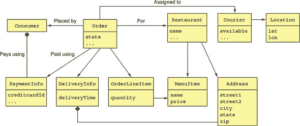

每个类的职责如下：

+   **`Consumer`—** 下订单的消费者。

+   **`Order`—** 消费者下的一单。它描述了订单并跟踪其状态。

+   **`OrderLineItem`—** 订单的行项目。

+   **`DeliveryInfo`—** 交付订单的时间和地点。

+   **`Restaurant`—** 为消费者准备订单以供交付的餐厅。

+   **`MenuItem`—** 餐厅菜单上的项目。

+   **`Courier`—** 将订单交付给消费者的快递员。它跟踪快递员的可用性和当前位置。

+   **`Address`—** 消费者或餐厅的地址。

+   **`Location`—** 快递员的纬度和经度。

如图 2.7 所示的类图说明了应用程序架构的一个方面。但没有场景来激活它，它不过是一幅漂亮的图片。下一步是定义系统操作，这些操作对应于架构场景。

##### 定义系统操作

一旦定义了高级领域模型，下一步就是确定应用程序必须处理的请求。UI 的细节超出了本书的范围，但你可以想象在每个用户场景中，UI 将向后端业务逻辑发出请求以检索和更新数据。FTGO 主要是一个 Web 应用程序，这意味着大多数请求都是基于 HTTP 的，但某些客户端可能使用消息。因此，而不是承诺特定的协议，使用更抽象的系统操作概念来表示请求是有意义的。

系统操作有两种类型：

+   ***命令*—** 创建、更新和删除数据的系统操作

+   ***查询*—** 读取（查询）数据的系统操作

最终，这些系统操作将对应于 REST、RPC 或消息端点，但就目前而言，抽象地思考它们是有用的。让我们首先确定一些命令。

识别系统命令的一个好起点是分析用户故事和场景中的动词。例如，考虑`Place Order`故事。它清楚地表明系统必须提供`Create Order`操作。许多其他故事单独直接映射到系统命令。表 2.1 列出了一些关键系统命令。

##### 表 2.1\. FTGO 应用程序的关键系统命令

| 行动者 | 故事 | 命令 | 描述 |
| --- | --- | --- | --- |
| 消费者 | 创建订单 | createOrder() | 创建订单 |
| 餐厅 | 接受订单 | acceptOrder() | 表示餐厅已接受订单，并承诺在指定时间内准备订单 |
| 餐厅 | 订单准备就绪 | noteOrderReadyForPickup() | 表示订单已准备就绪，可以取货 |
| 快递员 | 更新位置 | noteUpdatedLocation() | 更新快递员当前的位置 |
| 快递员 | 取货完成 | noteDeliveryPickedUp() | 表示快递员已取走订单 |
| 快递员 | 送货完成 | noteDeliveryDelivered() | 表示快递员已投递订单 |

一个命令有一个规范，该规范定义了其参数、返回值以及从领域模型类角度的行为。行为规范包括在操作调用时必须为真的前置条件，以及在操作调用后为真的后置条件。例如，以下是`createOrder()`系统操作的规范：

| 操作 | createOrder (消费者 ID, 支付方式, 送货地址, 送货时间, 餐厅 ID, 订单行项目) |
| --- | --- |
| 返回值 | orderId, ... |
| 前置条件 |

+   消费者存在并且可以下单。

+   行项目对应于餐厅的菜单项。

+   餐厅可以提供送货地址和时间服务。

|

| 后置条件 |
| --- |

+   消费者的信用卡已授权支付订单总额。

+   已创建一个处于**待接受**状态的订单。

|

前置条件反映了之前描述的`Place Order`用户场景中的**已知条件**。后置条件反映了场景中的**结果**。当系统操作被调用时，它将验证前置条件并执行使后置条件为真的所需操作。

这是`acceptOrder()`系统操作的规范：

| 操作 | acceptOrder(restaurantId, orderId, readyByTime) |
| --- | --- |
| 返回值 | — |
| 前置条件 |

+   订单状态为**待接受**。

+   有快递员可以投递订单。

|

| 后置条件 |
| --- |

+   订单状态已更改为**接受**。

+   订单的`readyByTime`被更改为`readyByTime`。

+   快递员被分配去投递订单。

|

其前置条件和后置条件与之前用户场景中的内容相匹配。

大多数与架构相关的系统操作都是命令。尽管如此，有时查询，即检索数据，也非常重要。

除了实现命令之外，应用程序还必须实现查询。查询为 UI 提供用户做出决策所需的信息。在这个阶段，我们还没有 FTGO 应用程序的特定 UI 设计，但考虑例如消费者下单时的流程：

1.  用户输入送货地址和时间。

1.  系统显示可用的餐厅。

1.  用户选择餐厅。

1.  系统显示菜单。

1.  用户选择商品并结账。

1.  系统创建订单。

此用户场景建议以下查询：

+   **`findAvailableRestaurants(deliveryAddress, deliveryTime)`—** 获取在指定时间可以送达到指定送货地址的餐厅

+   **`findRestaurantMenu(id)`—** 获取关于餐厅的信息，包括菜单项目

在这两个查询中，`findAvailableRestaurants()` 可能是架构上最重要的查询。它是一个复杂的查询，涉及地理搜索。查询的地理搜索组件包括找到所有靠近一个位置——送货地址的餐厅。它还会过滤掉那些在订单需要准备和取货时已关闭的餐厅。此外，性能至关重要，因为这个查询是在消费者想要下单时执行的。

高级领域模型和系统操作描述了应用程序的功能。它们有助于推动应用程序架构的定义。每个系统操作的行为都是用领域模型来描述的。每个重要的系统操作代表了一个架构上重要的场景，这是架构描述的一部分。

一旦定义了系统操作，下一步就是确定应用程序的服务。如前所述，没有机械的过程可以遵循。然而，有各种分解策略可以使用。每个策略都从不同的角度攻击问题，并使用自己的术语。但所有策略的最终结果都是相同的：一个由服务组成的架构，这些服务主要是围绕业务而不是技术概念组织的。

让我们看看第一种策略，它定义了与业务能力相对应的服务。

#### 2.2.2\. 通过应用按业务能力分解模式定义服务

创建微服务架构的一种策略是按业务能力进行分解。这是来自业务架构建模的一个概念，*业务能力*是指为了创造价值而进行的业务活动。给定业务的业务能力集合取决于业务类型。例如，保险公司的能力通常包括承保、索赔管理、计费、合规性等。在线商店的能力包括订单管理、库存管理、运输等。

|  |
| --- |

**模式：按业务能力分解**

定义与业务能力相对应的服务。请参阅[`microservices.io/patterns/decomposition/decompose-by-business-capability.html`](http://microservices.io/patterns/decomposition/decompose-by-business-capability.html)。

|  |
| --- |

##### 业务能力定义了一个组织做什么

一个组织的业务能力捕捉了组织的业务“是什么”。它们通常是稳定的，与组织如何开展业务相对，后者会随着时间的推移而变化，有时变化很大。这在今天尤其如此，随着技术自动化许多业务过程的快速增长。例如，不久前，你还需要把支票交给银行柜员来存款。后来，可以使用自动柜员机存款。如今，你可以方便地使用智能手机存款。正如你所看到的，存款支票业务能力保持稳定，但执行方式发生了巨大变化。

##### 识别业务能力

一个组织的业务能力是通过分析组织的宗旨、结构和业务流程来识别的。每个业务能力都可以被视为一种服务，只不过它是面向业务的而不是技术性的。其规范包括各种组件，包括输入、输出和服务级别协议。例如，保险承保能力的输入是消费者的申请，输出包括批准和价格。

业务能力通常专注于特定的业务对象。例如，索赔业务对象是索赔管理能力的焦点。能力通常可以分解为子能力。例如，索赔管理能力有几个子能力，包括索赔信息管理、索赔审查和索赔付款管理。

想象 FTGO 的业务能力包括以下内容并不困难：

+   供应商管理

    +   ***快递管理*—** 管理快递信息

    +   ***餐厅信息管理*—** 管理餐厅菜单和其他信息，包括位置和营业时间

+   消费者管理—管理消费者信息

+   订单接收和履行

    +   ***订单管理*—** 允许消费者创建和管理订单

    +   ***餐厅订单管理*—** 管理餐厅订单的准备工作

    +   物流

    +   ***快递可用性管理*—** 管理快递员对配送订单的实时可用性

    +   ***配送管理*—** 向消费者配送订单

+   会计

    +   ***消费者会计*—** 管理消费者的账单

    +   ***餐厅会计*—** 管理对餐厅的付款

    +   ***快递会计*—** 管理对快递员的付款

+   ...

最高层的能力包括供应商管理、消费者管理、订单接收和履行以及会计。可能还会有许多其他最高层能力，包括与营销相关的能力。大多数最高层能力都被分解为子能力。例如，订单接收和履行被分解为五个子能力。

这个能力层次结构的一个有趣方面是，有三个与餐厅相关的功能：餐厅信息管理、餐厅订单管理和餐厅会计。这是因为它们代表了餐厅运营的三个非常不同的方面。

接下来，我们将探讨如何使用业务能力来定义服务。

##### 从业务能力到服务

一旦你确定了业务能力，然后为每个能力或相关能力组定义一个服务。图 2.8 显示了 FTGO 应用程序从能力到服务的映射。一些顶级能力，如会计能力，映射到服务。在其他情况下，子能力映射到服务。

##### 图 2.8\. 将 FTGO 业务能力映射到服务。能力层次结构的不同级别的能力映射到服务。

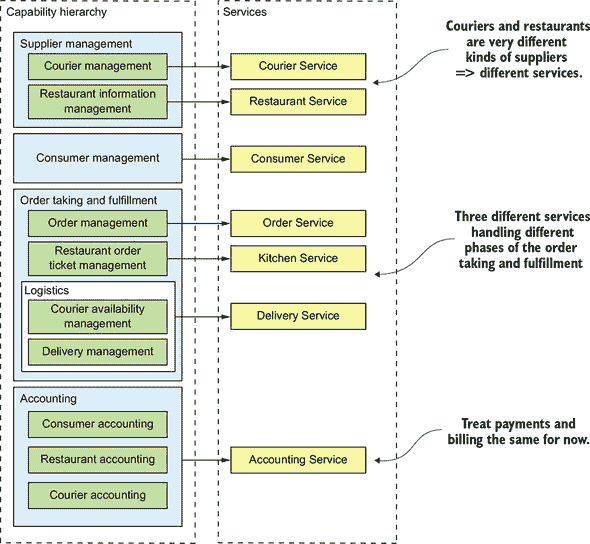

决定将能力层次结构的哪个级别映射到服务，因为这是主观的。我对这种特定映射的合理性如下：

+   我将供应商管理的子能力映射到两个服务，因为餐厅和快递员是两种非常不同的供应商类型。

+   我将订单接收和履约能力映射到三个服务，每个服务负责流程的不同阶段。我将快递员可用性管理和配送管理能力合并，并将它们映射到单个服务，因为它们紧密相连。

+   我将会计能力映射到其自己的服务，因为不同类型的会计看起来很相似。

之后，将支付（餐厅和快递员的支付）和账单（消费者的账单）分开可能是有意义的。

将服务组织在能力周围的一个关键好处是，因为它们是稳定的，所以产生的架构也将相对稳定。随着业务“如何”方面的变化，架构的各个组成部分可能会发展，但架构保持不变。

话虽如此，重要的是要记住，图 2.8 中所示的服务仅仅是定义架构的第一次尝试。随着时间的推移，随着我们对应用领域的了解更多，它们可能会发生变化。特别是，在架构定义过程中，调查服务如何在每个关键架构服务中协作是一个重要步骤。例如，你可能会发现，由于进程间通信过多，某种特定的分解效率低下，你必须合并服务。相反，一个服务可能会变得复杂到值得将其拆分为多个服务。更重要的是，在第 2.2.5 节中，我描述了可能导致你重新考虑决定的几个分解障碍。

让我们来看看另一种基于领域驱动设计的应用分解方法。

#### 2.2.3\. 通过应用按子域分解模式定义服务

如同在埃里克·埃文斯（Eric Evans）所著的优秀书籍《领域驱动设计》（Domain-driven design，Addison-Wesley Professional，2003 年）中所描述的，DDD 是一种构建复杂软件应用程序的方法，该方法以面向对象领域模型的发展为中心。*领域模型*以可以用于解决该领域内问题的形式捕捉关于领域的知识。它定义了团队使用的词汇，DDD 称之为*通用语言*。领域模型在应用程序的设计和实现中紧密对应。DDD 有两个在应用微服务架构时非常有用的概念：子域和边界上下文。

|  |
| --- |

**模式：按子域分解**

定义与 DDD 子域对应的服务的定义。参见[`microservices.io/patterns/decomposition/decompose-by-subdomain.html`](http://microservices.io/patterns/decomposition/decompose-by-subdomain.html)。

|  |
| --- |

DDD 与传统的企业建模方法大不相同，后者为整个企业创建一个单一模型。在这种模型中，例如，每个业务实体（如客户、订单等）都有一个单一的定义。这种建模的问题在于，让组织的不同部分就一个单一模型达成一致是一项艰巨的任务。此外，从组织某个部分的角度来看，该模型对于他们的需求来说过于复杂。此外，领域模型可能会令人困惑，因为组织的不同部分可能会使用相同的术语来表示不同的概念，或者使用不同的术语来表示相同的概念。DDD 通过定义多个领域模型来避免这些问题，每个模型都有一个明确的范围。

DDD 为每个子域定义一个单独的领域模型。子域是*领域*的一部分，DDD 术语，指的是应用程序的问题空间。子域是通过与识别业务能力相同的方法来识别的：分析业务并识别不同的专业领域。最终结果很可能产生与业务能力相似的子域。FTGO 中子域的例子包括订单处理、订单管理、厨房管理、配送和财务。正如你所看到的，这些子域与前面描述的业务能力非常相似。

DDD 将领域模型的范围称为*边界上下文*。边界上下文包括实现该模型的代码工件。当使用微服务架构时，每个边界上下文都是一个服务或可能是一组服务。我们可以通过应用 DDD 并为每个子域定义一个服务来创建微服务架构。图 2.9 显示了子域如何映射到服务，每个服务都有自己的领域模型。

##### 图 2.9\. 从子域到服务：FTGO 应用域的每个子域都映射到一个服务，该服务有自己的领域模型。

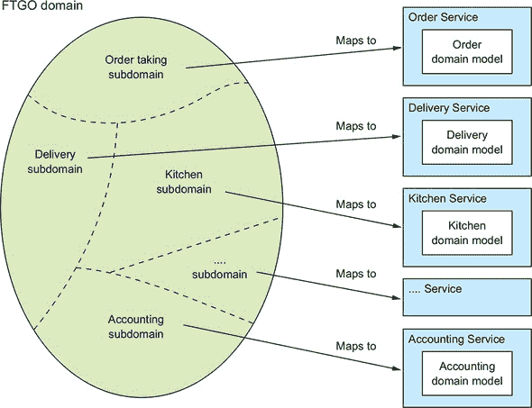

DDD 和微服务架构几乎完美地一致。DDD 的子域和边界上下文的概念很好地映射到微服务架构中的服务。此外，微服务架构中拥有服务的自主团队的概念与 DDD 中每个领域模型由单一团队拥有和开发的概念完全一致。更好的是，正如我在本节后面描述的，具有自己领域模型的子域的概念是消除上帝类并因此使分解更容易的绝佳方式。

通过子域分解和通过业务能力分解是定义应用程序微服务架构的两个主要模式。然而，有一些有用的分解指南，其根源在于面向对象设计。让我们来看看它们。

#### 2.2.4\. 分解指南

到目前为止，在本章中，我们已经探讨了定义微服务架构的主要方法。我们还可以在应用微服务架构模式时，采用和利用面向对象设计的一些原则。这些原则是由罗伯特·C·马丁创建的，并在他的经典著作《使用 Booch 方法设计面向对象 C++应用程序》（Prentice Hall，1995 年）中描述。第一个原则是单一职责原则（SRP），用于定义类的职责。第二个原则是共同封闭原则（CCP），用于将类组织到包中。让我们来看看这些原则，并了解它们如何应用于微服务架构。

##### 单一职责原则

软件架构和设计的主要目标之一是确定每个软件元素的职责。单一职责原则如下：

> *一个类应该只有一个变化的原因。*
> 
> *罗伯特·C·马丁*

类所拥有的每个职责都是该类可能发生变化的潜在原因。如果一个类有多个独立变化的职责，那么该类将不会稳定。通过遵循 SRP，你可以定义每个类只有一个职责和因此只有一个变化原因的类。

我们可以在定义微服务架构时应用 SRP，创建小型、内聚的服务，每个服务只有一个职责。这将减少服务的大小并增加其稳定性。新的 FTGO 架构是 SRP 应用的例子。将食物送到消费者手中的每个方面——订单接收、订单准备和配送——都是独立服务的职责。

##### 共同封闭原则

另一个有用的原则是共同封闭原则：

> *包中的类应该对同一类变化进行封闭。影响包的变化会影响该包中的所有类。*
> 
> *罗伯特·C·马丁*

理念是，如果两个类因为相同的基本原因而同步更改，那么它们属于同一个包。例如，这些类可能实现了特定业务规则的不同方面。目标是当该业务规则更改时，开发者只需更改少量包中的代码（理想情况下只有一个包）。遵循 CCP 显著提高了应用程序的可维护性。

当创建微服务架构时，我们可以应用 CCP（共同原因原则），将因相同原因而更改的组件打包到同一个服务中。这样做将最小化在需求变更时需要更改和部署的服务数量。理想情况下，一个变更只会影响一个团队和一个服务。CCP 是分布式单体反模式的解药。

SRP 和 CCP 是 Bob Martin 开发的 11 个原则中的两个。它们在开发微服务架构时特别有用。其余的九个原则用于设计类和包。有关 SRP、CCP 和其他面向对象设计原则的更多信息，请参阅 Bob Martin 的网站上的文章“面向对象设计的原则”（[`butunclebob.com/ArticleS.UncleBob.PrinciplesOfOod`](http://butunclebob.com/ArticleS.UncleBob.PrinciplesOfOod))。

通过业务能力和子域进行分解，以及 SRP（单一责任原则）和 CCP，是分解应用程序为服务的好方法。为了应用它们并成功开发微服务架构，你必须解决一些事务管理和进程间通信问题。

#### 2.2.5. 将应用程序分解为服务的障碍

表面上看，通过定义对应于业务能力或子域的服务来创建微服务架构的策略看起来很简单。然而，你可能会遇到几个障碍：

+   网络延迟

+   由于同步通信而降低的可用性

+   在服务之间保持数据一致性

+   获取数据的一致视图

+   阻碍分解的上帝类

让我们逐一审视每个障碍，从网络延迟开始。

##### 网络延迟

*网络延迟*是分布式系统中一个始终存在的担忧。你可能会发现，将应用程序分解为服务的方式会导致两个服务之间的大量往返。有时，通过实现批量 API 以在一次往返中检索多个对象，你可以将延迟减少到可接受的程度。但在其他情况下，解决方案是合并服务，用语言级别的调用或方法调用替换昂贵的进程间通信（IPC）。

##### 同步进程间通信降低可用性

另一个问题是如何以不降低可用性的方式实现服务间的通信。例如，实现`createOrder()`操作最直接的方式是`Order Service`通过 REST 同步调用其他服务。使用像 REST 这样的协议的缺点是它会降低`Order Service`的可用性。如果那些其他服务中的任何一个不可用，它将无法创建订单。有时这是一个值得的权衡，但在第三章中你将了解到，使用异步消息传递，这可以消除紧密耦合并提高可用性，通常是一个更好的选择。

##### 维护服务间的数据一致性

另一个挑战是维护服务间的数据一致性。一些系统操作需要在多个服务中更新数据。例如，当餐馆接受订单时，必须在`Kitchen Service`和`Delivery Service`中更新。`Kitchen Service`更改`Ticket`的状态。`Delivery Service`安排订单的配送。这两个更新都必须原子性地完成。

传统的解决方案是使用基于两阶段提交的分布式事务管理机制。但正如你将在第四章中看到的，这并不是现代应用的正确选择，你必须使用一种非常不同的方法来管理事务，即叙事法。*叙事法*是一系列使用消息协调的本地事务。叙事法比传统的 ACID 事务更复杂，但在许多情况下工作得很好。叙事法的一个局限性是它们最终是一致的。如果你需要原子性地更新某些数据，那么这些数据必须位于单个服务中，这可能会成为分解的障碍。

##### 获取数据的一致视图

分解的另一个障碍是无法在多个数据库中获取数据的真正一致视图。在单体应用中，ACID 事务的特性保证了查询将返回数据库的一致视图。相比之下，在微服务架构中，尽管每个服务的数据库都是一致的，但你无法获得数据的全局一致视图。如果你需要某些数据的一致视图，那么这些数据必须位于单个服务中，这可能会阻止分解。幸运的是，在实践中这很少成为问题。

##### God 类阻止了分解

分解的另一个障碍是所谓的“上帝类”的存在。*上帝类*是那些在整个应用程序中使用的臃肿类([`wiki.c2.com/?GodClass`](http://wiki.c2.com/?GodClass))。一个上帝类通常为应用程序的许多不同方面实现业务逻辑。它通常具有大量字段映射到具有许多列的数据库表。大多数应用程序至少有一个这样的类，每个类代表一个对领域至关重要的概念：银行中的账户、电子商务中的订单、保险中的政策等等。由于上帝类将应用程序许多不同方面的状态和行为捆绑在一起，因此它是将使用它的任何业务逻辑拆分为服务的一个不可逾越的障碍。

`Order`类是 FTGO 应用程序中上帝类的绝佳例子。这并不令人惊讶——毕竟，FTGO 的目的是将食品订单交付给客户。系统的许多部分都涉及订单。如果 FTGO 应用程序有一个单一的领域模型，`Order`类将是一个非常庞大的类。它将具有与应用程序许多不同部分相对应的状态和行为。图 2.10 显示了使用传统建模技术创建的这个类的结构。

##### 图 2.10。`Order`上帝类因承担众多职责而变得臃肿。

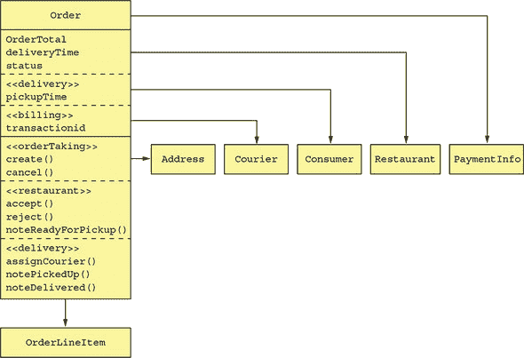

正如你所见，`Order`类具有与订单处理、餐厅订单管理、配送和支付相对应的字段和方法。这个类也具有复杂的状态模型，因为一个模型必须描述来自应用程序不同部分的状态转换。在其当前形式下，这个类使得将代码拆分为服务变得极其困难。

一种解决方案是将`Order`类打包成一个库，并创建一个中央`Order`数据库。所有处理订单的服务都使用这个库并访问这个数据库。这种方法的问题在于它违反了微服务架构的一个关键原则，并导致了不希望的紧密耦合。例如，对`Order`模式的任何更改都需要团队同步更新他们的代码。

另一种解决方案是将`Order`数据库封装在`Order Service`中，其他服务通过调用它来检索和更新订单。这种设计的问题在于`Order Service`将是一个数据服务，包含贫血的领域模型，其中包含很少或没有业务逻辑。这两种选择都不吸引人，但幸运的是，DDD 提供了一个解决方案。

一个更好的方法是应用 DDD，并将每个服务视为一个具有自己领域模型的独立子域。这意味着 FTGO 应用程序中与订单有关的每个服务都有自己的领域模型，以及自己的`Order`类版本。多个领域模型的好处的一个很好的例子是`Delivery Service`。它对`Order`的视图，如图 2.11 所示，非常简单：取货地址、取货时间、配送地址和配送时间。此外，它不是将其称为`Order`，而是使用更合适的名称`Delivery`。

##### 图 2.11\. `Delivery Service`领域模型

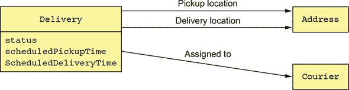

`Delivery Service`对订单的任何其他属性都不感兴趣。

`Kitchen Service`对订单有一个更为简单的视图。它版本的`Order`被称为`Ticket`。如图 2.12 所示，`Ticket`仅包含状态、`requestedDeliveryTime`、`prepareByTime`以及一个列表，告诉餐厅需要准备什么。它与消费者、支付、配送等无关。

##### 图 2.12\. `Kitchen Service`领域模型

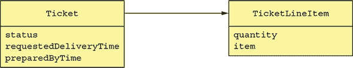

`Order`服务对订单有最复杂的视图，如图 2.13 所示。尽管它有很多字段和方法，但它仍然比原始版本简单得多。

##### 图 2.13\. `Order Service`领域模型

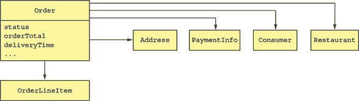

每个领域模型中的`Order`类代表同一`Order`业务实体的不同方面。FTGO 应用程序必须在不同的服务中保持这些不同对象的一致性。例如，一旦`Order Service`授权了消费者的信用卡，它就必须在`Kitchen Service`中触发创建`Ticket`。同样，如果餐厅通过`Kitchen Service`拒绝订单，它必须在`Order Service`服务中取消，并在计费服务中向客户退款。在第四章中，你将学习如何使用之前提到的基于事件的机制 sagas 在服务之间保持一致性。

拥有多个领域模型不仅带来了技术挑战，还影响了用户体验的实现。应用程序必须在用户体验（它自己的领域模型）和每个服务的领域模型之间进行转换。例如，在 FTGO 应用程序中，显示给消费者的`Order`状态是从多个服务中存储的`Order`信息派生出来的。这种转换通常由 API 网关处理，这在第八章中讨论过。尽管存在这些挑战，但在定义微服务架构时，识别和消除上帝类是至关重要的。

我们现在将探讨如何定义服务 API。

#### 2.2.6\. 定义服务 API

到目前为止，我们有一个系统操作列表和一个潜在的服务列表。下一步是定义每个服务的 API：它的操作和事件。服务 API 操作存在有两个原因之一：一些操作对应于系统操作。它们被外部客户端和其他服务调用。其他操作存在是为了支持服务间的协作。这些操作只被其他服务调用。

服务主要发布事件是为了能够与其他服务协作。第四章描述了如何使用事件来实现传奇，以在服务之间保持数据一致性。而第七章讨论了如何使用事件来更新 CQRS 视图，以支持高效查询。应用程序还可以使用事件来通知外部客户端。例如，它可以使用 WebSockets 将事件发送到浏览器。

定义服务 API 的起点是将每个系统操作映射到服务。之后，我们决定一个服务是否需要与其他服务协作以实现系统操作。如果需要协作，我们接着确定那些其他服务必须提供哪些 API 以支持协作。让我们首先看看如何将系统操作分配给服务。

##### 将系统操作分配给服务

第一步是决定哪个服务是请求的初始入口点。许多系统操作可以很好地映射到服务，但有时映射并不明显。例如，考虑`noteUpdatedLocation()`操作，它更新快递员的位置。一方面，因为它与快递员相关，这个操作应该分配给`Courier`服务。另一方面，`Delivery Service`需要快递员的位置。在这种情况下，将操作分配给需要操作提供的信息的服务是一个更好的选择。在其他情况下，将操作分配给具有处理所需信息的服务可能更有意义。

表 2.2 显示了 FTGO 应用程序中哪些服务负责哪些操作。

##### 表 2.2\. FTGO 应用程序中系统操作到服务的映射

| 服务 | 操作 |
| --- | --- |
| 消费者服务 | createConsumer() |
| 订单服务 | createOrder() |
| 餐厅服务 | findAvailableRestaurants() |
| 厨房服务 |

+   acceptOrder()

+   noteOrderReadyForPickup()

|

| 配送服务 |
| --- |

+   noteUpdatedLocation()

+   noteDeliveryPickedUp()

+   noteDeliveryDelivered()

|

在将操作分配给服务之后，下一步是决定服务如何协作以处理每个系统操作。

##### 确定支持服务间协作所需的 API

一些系统操作完全由单个服务处理。例如，在 FTGO 应用中，`消费者服务`完全自行处理`createConsumer()`操作。但其他系统操作跨越多个服务。处理这些请求所需的数据可能分散在多个服务中。例如，为了实现`createOrder()`操作，`订单服务`必须调用以下服务以验证其先决条件并使后置条件成立：

+   **`消费者服务`—** 验证消费者能否下单并获取他们的支付信息。

+   **`餐厅服务`—** 验证订单行项目，确认配送地址/时间在餐厅的服务区域内，验证订单最低金额是否满足，并获取订单行项目的价格。

+   **`厨房服务`—** 创建`票据`。

+   **`会计服务`—** 授权消费者的信用卡。

同样，为了实现`acceptOrder()`系统操作，`厨房服务`必须调用`配送服务`来安排快递员配送订单。表 2.3 显示了服务、它们的修订版 API 和它们的合作伙伴。为了完全定义服务 API，您需要分析每个系统操作并确定所需的协作。

##### 表 2.3\. 服务、它们的修订版 API 和它们的合作伙伴

| 服务 | 操作 | 合作伙伴 |
| --- | --- | --- |
| 消费者服务 | verifyConsumerDetails() | — |
| 订单服务 | createOrder() |

+   消费者服务 verifyConsumerDetails()

+   餐厅服务 verifyOrderDetails()

+   厨房服务 createTicket()

+   会计服务 authorizeCard()

|

| 餐厅服务 |
| --- |

+   findAvailableRestaurants()

+   verifyOrderDetails()

| — |
| --- |
| 厨房服务 |

+   createTicket()

+   acceptOrder()

+   noteOrderReadyForPickup()

|

+   配送服务 scheduleDelivery()

|

| 配送服务 |
| --- |

+   scheduleDelivery()

+   noteUpdatedLocation()

+   noteDeliveryPickedUp()

+   noteDeliveryDelivered()

| — |
| --- |
| 会计服务 |

+   authorizeCard()

| — |
| --- |

到目前为止，我们已经确定了服务和每个服务实现的操作。但重要的是要记住，我们勾勒出的架构非常抽象。我们尚未选择任何特定的 IPC 技术。此外，尽管术语*操作*暗示了一种基于同步请求/响应的 IPC 机制，但您会发现异步消息发挥着重要作用。在这本书的整个过程中，我描述了影响这些服务协作的架构和设计概念。

第三章描述了特定的 IPC 技术，包括同步通信机制，如 REST，以及使用消息代理的异步消息。我讨论了同步通信如何影响可用性，并引入了自包含服务的概念，这种服务不会同步调用其他服务。实现自包含服务的一种方法是通过 CQRS 模式，这在第七章中有介绍。例如，`Order Service`可以维护`Restaurant Service`拥有的数据的副本，以消除同步调用`Restaurant Service`验证订单的需求。它通过订阅`Restaurant Service`发布的事件来保持副本的更新，每当`Restaurant Service`更新其数据时。

第四章介绍了叙事概念及其如何使用异步消息来协调参与叙事的服务。叙事不仅能够可靠地更新分散在多个服务中的数据，而且也是一种实现自包含服务的方式。例如，我描述了如何使用叙事来实现`createOrder()`操作，通过异步消息调用诸如`Consumer Service`、`Kitchen Service`和`Accounting Service`等服务。

第八章描述了 API 网关的概念，它向外部客户端公开 API。API 网关可能会使用第七章中描述的 API 组合模式来实现查询操作，而不是简单地将其路由到服务。API 网关中的逻辑通过调用多个服务并组合结果来收集查询所需的数据。在这种情况下，系统操作分配给 API 网关而不是服务。服务需要实现 API 网关所需的查询操作。

### 摘要

+   架构决定了你的应用程序的*可*性，包括可维护性、可测试性和可部署性，这些直接影响开发速度。

+   微服务架构是一种架构风格，它为应用程序提供了高度的维护性、可测试性和可部署性。

+   微服务架构中的服务是围绕业务关注点——业务能力或子域——而不是技术关注点组织的。

+   分解有两种模式：

    +   按业务能力分解，其起源在于业务架构

    +   按子域分解，基于领域驱动设计的概念

+   通过应用领域驱动设计（DDD）并为每个服务定义一个单独的领域模型，你可以消除导致依赖纠缠的上帝类，从而实现分解。
