## 第三章\. 微服务架构中的进程间通信

*本章涵盖*

+   应用通信模式：远程过程调用、断路器、客户端发现、自我注册、服务器端发现、第三方注册、异步消息、事务性输出箱、事务日志尾部、轮询发布者

+   进程间通信在微服务架构中的重要性

+   定义和演进 API

+   各种进程间通信选项及其权衡

+   使用异步消息通信的服务的好处

+   作为数据库事务一部分可靠地发送消息

Mary 和她的团队，像大多数其他开发者一样，对进程间通信（IPC）机制有一些经验。FTGO 应用程序有一个 REST API，该 API 被移动应用程序和浏览器端的 JavaScript 使用。它还使用了各种云服务，例如 Twilio 消息服务和 Stripe 支付服务。但在像 FTGO 这样的单体应用程序中，模块通过语言级别的函数或方法调用相互调用。FTGO 开发者通常不需要考虑 IPC，除非他们正在处理 REST API 或与云服务集成的模块。

相比之下，正如你在第二章中看到的，微服务架构将应用程序结构化为一系列服务。这些服务必须经常协作以处理请求。因为服务实例通常是运行在多台机器上的进程，它们必须使用 IPC 进行交互。在微服务架构中，IPC 比在单体应用程序中扮演着更加重要的角色。因此，当 Mary 和其他 FTGO 开发者将应用程序迁移到微服务时，他们需要花费更多的时间来思考 IPC。

可供选择的 IPC 机制并不缺乏。今天，时尚的选择是 REST（使用 JSON）。然而，重要的是要记住，没有银弹。你必须仔细考虑选项。本章探讨了包括 REST 和消息在内的各种 IPC 选项，并讨论了权衡。

IPC 机制的选择是一个重要的架构决策。它可能影响应用程序的可用性。更重要的是，正如我在本章和下一章中解释的，IPC 甚至与事务管理相交。我倾向于一个由松散耦合的服务组成的架构，这些服务通过异步消息相互通信。同步协议，如 REST，主要用于与其他应用程序通信。

我以微服务架构中进程间通信的概述开始本章。接下来，我描述基于远程过程调用的 IPC，其中 REST 是最流行的例子。我涵盖了包括服务发现和如何处理部分失败等重要主题。之后，我描述基于异步消息的 IPC。我还谈论了在保持消息顺序的同时扩展消费者，正确处理重复消息和事务性消息。最后，我探讨了处理同步请求而不与其他服务通信的自包含服务的概念，以提高可用性。

### 3.1\. 微服务架构中进程间通信概述

有很多不同的 IPC 技术可供选择。服务可以使用基于同步请求/响应的通信机制，如基于 HTTP 的 REST 或 gRPC。或者，它们可以使用基于异步、基于消息的通信机制，如 AMQP 或 STOMP。还有各种不同的消息格式。服务可以使用人类可读的、基于文本的格式，如 JSON 或 XML。或者，它们可以使用更高效的二进制格式，如 Avro 或 Protocol Buffers。

在深入探讨具体技术的细节之前，我想提出几个你应该考虑的设计问题。我以讨论交互风格开始这一节，交互风格是一种与技术无关的描述客户端和服务如何交互的方式。接下来，我将讨论在微服务架构中精确定义 API 的重要性，包括 API-first 设计概念。然后，我将讨论 API 进化的重要主题。最后，我将讨论消息格式的不同选项以及它们如何决定 API 进化的容易程度。让我们从查看交互风格开始。

#### 3.1.1\. 交互风格

在选择服务 API 的 IPC 机制之前，首先思考一下服务与其客户端之间的交互风格是有用的。首先考虑交互风格将有助于你集中精力考虑需求，避免陷入特定 IPC 技术的细节中。此外，如第 3.4 节所述，交互风格的选择会影响你应用程序的可用性。此外，正如你将在第九章和第十章中看到的那样，它有助于你选择适当的集成测试策略。

存在多种客户端-服务交互风格。如表 3.1 所示，它们可以从两个维度进行分类。第一个维度是交互是一对一还是一对多：

+   ***一对一***—**每个客户端请求由恰好一个服务处理**。

+   ***一对多***—**每个请求由多个服务处理**。

第二个维度是交互是同步还是异步：

+   ***同步***—** 客户端期望从服务中获得及时响应，甚至可能在等待时阻塞。

+   ***异步***—** 客户端不会阻塞，如果有的话，响应也不一定是立即发送的。

##### 表 3.1\. 不同的交互风格可以从两个维度进行描述：一对一与一对多，以及同步与异步。

|   | 一对一 | 一对多 |
| --- | --- | --- |
| 同步 | 请求/响应 | — |
| 异步 | 异步请求/响应 单向通知 | 发布/订阅 发布/异步响应 |

以下是一对一交互的不同类型：

+   ***请求/响应***—** 客户端向服务发出请求并等待响应。客户端期望及时收到响应。它甚至可能在等待时阻塞。这种交互风格通常会导致服务紧密耦合。

+   ***异步请求/响应***—** 服务客户端向服务发送请求，服务异步回复。客户端在等待时不会阻塞，因为服务可能不会立即发送响应。

+   ***单向通知***—** 服务客户端向服务发送请求，但不需要也不发送回复。

记住这一点很重要，即同步请求/响应交互风格通常与进程间通信（IPC）技术正交。例如，一个服务可以通过使用 REST 或消息传递的请求/响应风格与另一个服务交互。即使两个服务正在使用消息代理进行通信，客户端服务也可能因为等待响应而被阻塞。这并不一定意味着它们是松散耦合的。这是我在本章后面讨论服务间通信对可用性影响时再次回顾的内容。

以下是一对多交互的不同类型：

+   ***发布/订阅***—** 客户端发布一个通知消息，该消息被零个或多个感兴趣的服务消费。

+   ***发布/异步响应***—** 客户端发布一个请求消息，然后等待一定时间，以从感兴趣的服务那里获取响应。

每个服务通常会使用这些交互风格的组合。FTGO 应用程序中的许多服务都有同步和异步 API 用于操作，许多服务还发布事件。

让我们看看如何定义服务的 API。

#### 3.1.2\. 在微服务架构中定义 API

API 或接口是软件开发的核心。一个应用程序由模块组成。每个模块都有一个接口，该接口定义了该模块客户端可以调用的操作集。一个设计良好的接口可以暴露有用的功能，同时隐藏实现细节。它使得实现可以改变而不会影响客户端。

在单体应用程序中，通常使用编程语言构造，如 Java 接口来指定接口。Java 接口定义了一组客户端可以调用的方法。实现类对客户端是隐藏的。此外，由于 Java 是一种静态类型语言，如果接口发生变化，与客户端不兼容，则应用程序将无法编译。

在微服务架构中，API 和接口同样重要。服务的 API 是服务与其客户端之间的合同。如第二章所述，服务的 API 包括客户端可以调用的操作和由服务发布的事件。一个操作有一个名称、参数和返回类型。一个事件有一个类型和一组字段，如第 3.3 节所述，发布到一个消息通道。

挑战在于服务 API 不是使用简单的编程语言构造来定义的。根据定义，服务和其客户端不是一起编译的。如果一个服务的新的不兼容 API 版本被部署，将不会有编译错误。相反，将会出现运行时错误。

无论你选择哪种 IPC 机制，使用某种类型的*接口定义语言*（IDL）精确地定义服务的 API 都是非常重要的。此外，有很好的理由使用 API 优先的方法来定义服务（更多信息请参阅[www.programmableweb.com/news/how-to-design-great-apis-api-first-design-and-raml/how-to/2015/07/10](http://www.programmableweb.com/news/how-to-design-great-apis-api-first-design-and-raml/how-to/2015/07/10)）。首先，你编写接口定义。然后，与客户端开发者审查接口定义。只有在迭代 API 定义之后，你才实施服务。这种前期设计可以增加你构建满足客户端需求的服务的机会。

| |
| --- |

**API 优先设计是至关重要的**

即使在小项目中，我也见过由于组件没有就 API 达成一致而导致问题发生的情况。例如，在一个项目中，后端 Java 开发者和 AngularJS 前端开发者都表示他们已经完成了开发。然而，应用程序却无法工作。前端应用程序用于与后端通信的 REST 和 WebSocket API 定义得不好。结果，两个应用程序无法通信！

| |
| --- |

API 定义的性质取决于你使用的 IPC 机制。例如，如果你使用消息传递，API 包括消息通道、消息类型和消息格式。如果你使用 HTTP，API 包括 URL、HTTP 动词以及请求和响应格式。在本章的后面部分，我将解释如何定义 API。

服务的 API 很少是一成不变的。它很可能会随着时间的推移而演变。让我们看看如何做到这一点，并考虑你将面临的问题。

#### 3.1.3. API 的演变

随着新功能的添加、现有功能的更改以及（可能）旧功能的删除，API 不可避免地会随着时间的推移而变化。在单体应用程序中，更改 API 并更新所有调用者相对简单。如果你使用静态类型语言，编译器会通过提供编译错误列表来帮助。唯一的挑战可能是变更的范围。更改广泛使用的 API 可能需要很长时间。

在基于微服务的应用程序中，更改服务的 API 要困难得多。服务的客户端是其他服务，这些服务通常由其他团队开发。客户端甚至可能是组织外的其他应用程序。你通常无法强迫所有客户端与服务同步升级。此外，由于现代应用程序通常永远不会因维护而停机，你通常会执行服务的滚动升级，因此服务的旧版本和新版本将同时运行。

制定应对这些挑战的策略很重要。你如何处理 API 的变更取决于变更的性质。

##### 使用语义版本控制

语义版本控制规范([`semver.org`](http://semver.org))是 API 版本化的有用指南。它是一组规则，指定了如何使用和递增版本号。语义版本控制最初旨在用于软件包的版本控制，但你也可以用于分布式系统中 API 的版本控制。

语义版本控制规范（Semvers）要求版本号由三部分组成：`MAJOR.MINOR.PATCH`。你必须按照以下方式递增版本号的每一部分：

+   **`MAJOR`—** 当你对 API 进行不兼容的变更时

+   **`MINOR`—** 当你对 API 进行向后兼容的增强时

+   **`PATCH`—** 当你进行向后兼容的错误修复时

在 API 中，你可以使用版本号的地方有几个。如果你正在实现 REST API，你可以像下面提到的，将主版本号用作 URL 路径的第一个元素。或者，如果你正在实现使用消息传递的服务，你可以在它发布的消息中包含版本号。目标是正确地版本化 API，并按受控方式演进。让我们看看如何处理次要和主要变更。

##### 进行次要的向后兼容变更

理想情况下，你应该努力只进行向后兼容的变更。向后兼容的变更是对 API 的增量变更：

+   添加可选属性到请求中

+   向响应中添加属性

+   添加新操作

如果你只进行这类更改，较旧的客户端仍然可以与较新的服务一起工作，前提是它们遵循鲁棒性原则([`en.wikipedia.org/wiki/Robustness_principle`](https://en.wikipedia.org/wiki/Robustness_principle))，该原则指出：“在行动上要保守，在接受他人时要有宽容。”服务应提供缺失请求属性的默认值。同样，客户端应忽略任何额外的响应属性。为了使这一过程不痛苦，客户端和服务必须使用支持鲁棒性原则的请求和响应格式。在本节后面的内容中，我将描述基于文本的格式，如 JSON 和 XML，通常如何使 API 的演变更容易。

##### 进行重大、破坏性的更改

有时候你必须对 API 进行重大且不兼容的更改。由于你不能强迫客户端立即升级，因此服务必须在一段时间内同时支持 API 的旧版本和新版本。如果你使用基于 HTTP 的 IPC 机制，如 REST，一种方法是将主要版本号嵌入到 URL 中。例如，版本 1 的路径以`'/v1/...'`开头，版本 2 的路径以`'/v2/...'`开头。

另一个选择是使用 HTTP 的内容协商机制，并在 MIME 类型中包含版本号。例如，客户端可以通过以下请求来请求`Order`的`1.x`版本：

```
GET /orders/xyz HTTP/1.1
Accept: application/vnd.example.resource+json; version=1
...
```

这个请求告诉`Order Service`，客户端期望得到一个版本`1.x`的响应。

为了支持 API 的多个版本，实现 API 的服务适配器将包含在旧版本和新版本之间进行转换的逻辑。此外，正如在第八章 chapter 8 中所述，API 网关几乎肯定会使用版本化的 API。它甚至可能需要支持 API 的多个旧版本。

现在我们将探讨消息格式的问题，选择哪种格式可能会影响 API 演变的难易程度。

#### 3.1.4\. 消息格式

IPC 的本质是消息的交换。*消息*通常包含数据，因此一个重要的设计决策是数据格式。消息格式的选择可能会影响 IPC 的效率、API 的可用性和其可扩展性。如果你使用消息系统或如 HTTP 之类的协议，你可以选择你的消息格式。一些 IPC 机制——如你很快就会了解到的 gRPC——可能会规定消息格式。在任何情况下，使用跨语言的消息格式都是至关重要的。即使你今天正在用单一语言编写微服务，将来也很可能使用其他语言。例如，你不应该使用 Java 序列化。

消息格式主要分为两大类：文本和二进制。让我们逐一来看。

##### 基于文本的消息格式

第一类是基于文本的格式，如 JSON 和 XML。这些格式的优点是不仅可读性好，而且具有自描述性。一个 JSON 消息是一组命名的属性集合。同样，一个 XML 消息实际上是一组命名的元素和值的集合。这种格式使得消息的消费者能够挑选出感兴趣的值并忽略其余部分。因此，许多对消息架构的更改可以很容易地实现向后兼容。

XML 文档的结构由 XML 模式指定 ([www.w3.org/XML/Schema](http://www.w3.org/XML/Schema))。随着时间的推移，开发社区逐渐意识到 JSON 也需要类似的机制。一个流行的选择是使用 JSON Schema 标准 ([`json-schema.org`](http://json-schema.org))。一个 JSON 模式定义了消息属性的名称和类型，以及它们是可选的还是必需的。除了作为有用的文档外，JSON 模式还可以由应用程序用于验证传入的消息。

使用基于文本的消息格式的缺点是消息往往很冗长，尤其是 XML。每个消息都包含属性名称及其值的开销。另一个缺点是解析文本的开销，尤其是当消息很大时。因此，如果效率和性能很重要，你可能想要考虑使用二进制格式。

##### 二进制消息格式

有几种不同的二进制格式可供选择。流行的格式包括 Protocol Buffers ([`developers.google.com/protocol-buffers/docs/overview`](https://developers.google.com/protocol-buffers/docs/overview)) 和 Avro ([`avro.apache.org`](https://avro.apache.org))。这两种格式都提供了一种类型化的 IDL，用于定义消息的结构。然后编译器生成序列化和反序列化消息的代码。这使得你不得不采取 API 首选的方法来设计服务！此外，如果你用静态类型语言编写客户端，编译器会检查它是否正确使用了 API。

这两种二进制格式之间的一个区别是，Protocol Buffers 使用标记字段，而 Avro 消费者需要知道模式才能解释消息。因此，与 Avro 相比，使用 Protocol Buffers 处理 API 进化要容易得多。这篇博客文章 ([`martin.kleppmann.com/2012/12/05/schema-evolution-in-avro-protocol-buffers-thrift.html`](http://martin.kleppmann.com/2012/12/05/schema-evolution-in-avro-protocol-buffers-thrift.html)) 是 Thrift、Protocol Buffers 和 Avro 之间优秀比较。

现在我们已经了解了消息格式，接下来让我们看看具体的 IPC 机制，这些机制用于传输消息，从远程过程调用（RPI）模式开始。

### 3.2. 使用同步远程过程调用模式进行通信

当使用基于远程过程调用的 IPC 机制时，客户端向服务发送请求，服务处理请求并发送响应。一些客户端可能会阻塞等待响应，而另一些可能具有反应性、非阻塞的架构。但与使用消息传递不同，客户端假设响应将及时到达。

图 3.1 展示了 RPI 的工作原理。客户端的业务逻辑调用一个由*RPI 代理*适配器类实现的接口。*RPI 代理*向服务发送请求。请求由一个*RPI 服务器*适配器类处理，该适配器类通过接口调用服务的业务逻辑。然后它将回复发送回*RPI 代理*，*RPI 代理*将结果返回给客户端的业务逻辑。

| |
| --- |

**模式：远程过程调用**

客户端使用基于同步、远程过程调用协议的服务，例如 REST ([`microservices.io/patterns/communication-style/messaging.html`](http://microservices.io/patterns/communication-style/messaging.html))。

| |
| --- |

##### 图 3.1\. 客户端业务逻辑调用一个由*RPI 代理*适配器类实现的接口。*RPI 代理类*向服务发送请求。*RPI 服务器*适配器类通过调用服务的业务逻辑来处理请求。

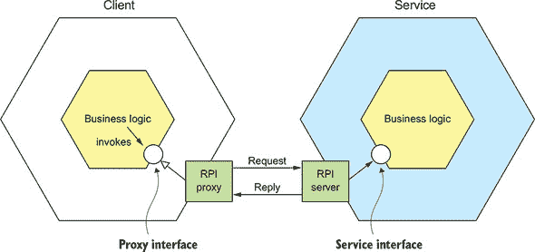

代理接口通常封装了底层的通信协议。有众多协议可供选择。在本节中，我将介绍 REST 和 gRPC。我将解释如何通过妥善处理部分故障来提高服务的可用性，并解释为什么基于 RPI 的微服务应用必须使用服务发现机制。

让我们先看看 REST。

#### 3.2.1\. 使用 REST

现在，以 RESTful 风格开发 API 很流行 ([`en.wikipedia.org/wiki/Representational_state_transfer`](https://en.wikipedia.org/wiki/Representational_state_transfer))。*REST*是一种 IPC 机制，几乎总是使用 HTTP。REST 的创造者 Roy Fielding 将其定义为如下：

> REST 提供了一套架构约束，当整体应用时，强调组件交互的可扩展性、接口的通用性、组件的独立部署，以及中间件组件以减少交互延迟、加强安全性和封装遗留系统。
> 
> *[www.ics.uci.edu/~fielding/pubs/dissertation/top.htm](http://www.ics.uci.edu/~fielding/pubs/dissertation/top.htm)*

REST 中的一个关键概念是*资源*，它通常代表单个业务对象，如客户或产品，或一组业务对象。REST 使用 HTTP 动词来操作资源，这些动词通过 URL 引用。例如，GET 请求返回资源的表示，这通常是 XML 文档或 JSON 对象的形式，尽管也可以使用其他格式，如二进制格式。POST 请求创建新的资源，而 PUT 请求更新资源。例如，`Order Service`有一个`POST /orders`端点用于创建`Order`，以及一个`GET /orders/{orderId}`端点用于检索`Order`。

许多开发人员声称他们的基于 HTTP 的 API 是 RESTful 的。但正如 Roy Fielding 在博客文章中描述的，并非所有这些 API 实际上都是 RESTful 的。为了了解原因，让我们看一下 REST 成熟度模型。

##### The REST 成熟度模型

Leonard Richardson（与您的作者无亲属关系）定义了一个非常实用的 REST 成熟度模型([`martinfowler.com/articles/richardsonMaturityModel.html`](http://martinfowler.com/articles/richardsonMaturityModel.html))，它包括以下级别：

+   ***Level 0*—** 0 级服务的客户端通过向其唯一的 URL 端点发送 HTTP POST 请求来调用服务。每个请求都指定要执行的操作、操作的目标（例如，业务对象）以及任何参数。

+   ***Level 1*—** 1 级服务支持资源的概念。要对资源执行操作，客户端需要发送一个 POST 请求，指定要执行的操作和任何参数。

+   ***Level 2*—** 2 级服务使用 HTTP 动词执行操作：GET 用于检索，POST 用于创建，PUT 用于更新。请求的查询参数和（如果有的话）正文指定了操作的参数。这使得服务可以使用 Web 基础设施，如缓存，用于 GET 请求。

+   ***Level 3*—** 3 级服务的设计基于名为 HATEOAS（Hypertext As The Engine Of Application State）的糟糕命名原则。基本思想是，GET 请求返回的资源表示中包含执行该资源操作的超链接。例如，客户端可以使用 GET 请求返回的表示中的链接来取消订单。HATEOAS 的好处包括不再需要在客户端代码中硬编码 URL([www.infoq.com/news/2009/04/hateoas-restful-api-advantages](http://www.infoq.com/news/2009/04/hateoas-restful-api-advantages))。

我鼓励您审查贵组织的 REST API，以了解它们对应哪个级别。

##### 指定 REST API

如前文第 3.1 节所述，你必须使用接口定义语言（IDL）来定义你的 API。与像 CORBA 和 SOAP 这样的旧通信协议不同，REST 最初并没有 IDL。幸运的是，开发社区重新发现了 IDL 对 RESTful API 的价值。最受欢迎的 REST IDL 是 Open API 规范 ([www.openapis.org](http://www.openapis.org))，它起源于 Swagger 开源项目。Swagger 项目是一套用于开发文档化 REST API 的工具。它包括从接口定义生成客户端存根和服务器骨架的工具。

##### 在单个请求中检索多个资源的挑战

REST 资源通常围绕业务对象，如`Consumer`和`Order`。因此，设计 REST API 时常见的难题是如何使客户端能够在一个请求中检索多个相关对象。例如，想象一个 REST 客户端想要检索一个`Order`及其`Order`的`Consumer`。一个纯 REST API 将要求客户端至少发出两个请求，一个用于`Order`，另一个用于其`Consumer`。更复杂的场景可能需要更多的往返，并遭受过度的延迟。

解决这个问题的方法之一是让 API 允许客户端在获取资源时检索相关资源。例如，客户端可以使用`GET /orders/order-id-1345?expand=consumer`来检索`Order`及其`Consumer`。查询参数指定了与`Order`一起返回的相关资源。这种方法在许多场景下效果良好，但对于更复杂的场景通常是不够的。此外，实现起来可能也很耗时。这导致了像 GraphQL ([`graphql.org`](http://graphql.org)) 和 Netflix Falcor ([`netflix.github.io/falcor/`](http://netflix.github.io/falcor/)) 这样的替代 API 技术的日益流行，这些技术旨在支持高效的数据检索。

##### 将操作映射到 HTTP 动词的挑战

另一个常见的 REST API 设计问题是如何将你想要在业务对象上执行的操作映射到 HTTP 动词。REST API 应该使用 PUT 进行更新，但可能有多种更新订单的方式，包括取消订单、修改订单等。此外，更新可能不是幂等的，这是使用 PUT 的要求。一种解决方案是为更新资源的特定方面定义一个子资源。例如，`Order Service`有一个用于取消订单的`POST /orders/{orderId}/cancel`端点，以及一个用于修改订单的`POST /orders/{orderId}/revise`端点。另一种解决方案是将动词指定为 URL 查询参数。遗憾的是，这两种解决方案都不太符合 REST 原则。

将操作映射到 HTTP 动词的问题导致了 REST 替代方案的日益流行，如稍后将在第 3.2.2 节中讨论的 gPRC。但首先让我们看看 REST 的好处和缺点。

##### REST 的好处和缺点

使用 REST 有许多好处：

+   它简单且熟悉。

+   您可以使用例如 Postman 插件在浏览器内测试 HTTP API，或者使用 curl 从命令行测试（假设使用 JSON 或其他文本格式）。

+   它直接支持请求/响应风格的通信。

+   当然，HTTP 是防火墙友好的。

+   它不需要中间代理，这简化了系统的架构。

使用 REST 有一些缺点：

+   它仅支持请求/响应风格的通信。

+   可用性降低。由于客户端和服务直接通信，没有中间件来缓冲消息，因此它们都必须在交换期间运行。

+   客户端必须知道服务实例的位置（URL）。如第 3.2.4 节所述，这在现代应用中是一个非平凡的问题。客户端必须使用所谓的*服务发现机制*来定位服务实例。

+   在单个请求中检索多个资源具有挑战性。

+   将多个更新操作映射到 HTTP 动词有时很困难。

尽管有这些缺点，REST 似乎仍然是 API 的事实标准，尽管有几个有趣的替代方案。例如，GraphQL 实现了灵活、高效的数据获取。第八章讨论了 GraphQL 并涵盖了 API 网关模式。

gRPC 是 REST 的另一种选择。让我们看看它是如何工作的。

#### 3.2.2\. 使用 gRPC

如前所述，使用 REST 的一个挑战是，由于 HTTP 只提供有限数量的动词，因此设计支持多个更新操作的 REST API 并不总是直接的。避免此问题的 IPC 技术是 gRPC ([www.grpc.io](http://www.grpc.io))，这是一个用于编写跨语言客户端和服务器框架（更多内容请参见[`en.wikipedia.org/wiki/Remote_procedure_call`](https://en.wikipedia.org/wiki/Remote_procedure_call)）。gRPC 是一个基于二进制消息的协议，这意味着——如前所述，在讨论二进制消息格式时——您被迫采用以 API 为先的方法来设计服务。您使用基于 Protocol Buffers 的 IDL 定义您的 gRPC API，这是 Google 的用于序列化结构化数据的中立语言机制。您使用 Protocol Buffer 编译器生成客户端存根和服务器骨架。编译器可以为包括 Java、C#、NodeJS 和 GoLang 在内的多种语言生成代码。客户端和服务器使用 HTTP/2 在 Protocol Buffers 格式中交换二进制消息。

gRPC API 由一个或多个服务和请求/响应消息定义组成。*服务定义*类似于 Java 接口，是一组强类型方法的集合。除了支持简单的请求/响应 RPC 外，gRPC 还支持流式 RPC。服务器可以向客户端发送消息流作为响应。或者，客户端可以向服务器发送消息流。

gRPC 使用 Protocol Buffers 作为消息格式。正如之前提到的，Protocol Buffers 是一种高效、紧凑的二进制格式。它是一种标记格式。Protocol Buffers 消息的每个字段都进行了编号并具有类型代码。消息接收者可以提取它需要的字段，并跳过它不认识的字段。因此，gRPC 使得 API 在保持向后兼容的同时可以进化。

列表 3.1 展示了`Order Service`的 gRPC API 摘录。它定义了包括`createOrder()`在内的几个方法。该方法接受一个`CreateOrderRequest`作为参数，并返回一个`CreateOrderReply`。

##### 列表 3.1\. `Order Service`的 gRPC API 摘录

```
service OrderService {
  rpc createOrder(CreateOrderRequest) returns (CreateOrderReply) {}
  rpc cancelOrder(CancelOrderRequest) returns (CancelOrderReply) {}
  rpc reviseOrder(ReviseOrderRequest) returns (ReviseOrderReply) {}
  ...
}

message CreateOrderRequest {
  int64 restaurantId = 1;
  int64 consumerId = 2;
  repeated LineItem lineItems = 3;
  ...
}

message LineItem {
  string menuItemId = 1;
  int32 quantity = 2;
}

message CreateOrderReply {
  int64 orderId = 1;
}
...
```

`CreateOrderRequest`和`CreateOrderReply`是类型消息。例如，`CreateOrderRequest`消息有一个类型为`int64`的`restaurantId`字段。该字段的标签值是 1。

gRPC 有以下几个优点：

+   设计一个具有丰富更新操作的 API 很简单。

+   它有一个高效、紧凑的 IPC 机制，尤其是在交换大消息时。

+   双向流支持 RPI 和消息通信风格。

+   它使得用各种语言编写的客户端和服务之间能够互操作。

gRPC 也有一些缺点：

+   相比于基于 REST/JSON 的 API，JavaScript 客户端消费基于 gRPC 的 API 需要更多的工作。

+   较旧的防火墙可能不支持 HTTP/2。

gRPC 是 REST 的强大替代品，但像 REST 一样，它也是一种同步通信机制，因此它也面临着部分失败的问题。让我们看看这是什么以及如何处理它。

#### 3.2.3\. 使用断路器模式处理部分失败

在分布式系统中，每当一个服务向另一个服务发起同步请求时，总存在部分失败的风险。因为客户端和服务是独立的进程，服务可能无法及时响应客户端的请求。服务可能因为故障或维护而宕机。或者服务可能过载，对请求响应极其缓慢。由于客户端被阻塞等待响应，风险是失败可能会级联到客户端的客户端，等等，从而导致服务中断。

|  |
| --- |

**模式：断路器**

当连续失败次数超过指定阈值后，RPI 代理会立即拒绝超时期间的调用。参见[`microservices.io/patterns/reliability/circuit-breaker.html`](http://microservices.io/patterns/reliability/circuit-breaker.html)。

|  |
| --- |

例如，考虑图 3.2 中所示的场景，其中`Order Service`无响应。移动客户端向 API 网关发出 REST 请求，正如第八章中讨论的，API 网关是 API 客户端进入应用的入口点。API 网关将请求代理到无响应的`Order Service`。

##### 图 3.2\. API 网关必须保护自己免受无响应服务，如`Order Service`的影响。

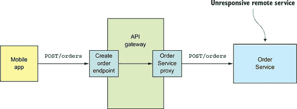

`OrderServiceProxy`的简单实现会无限期地阻塞，等待响应。这不仅会导致糟糕的用户体验，而且在许多应用中还会消耗宝贵的资源，例如线程。最终，API 网关会耗尽资源，无法处理请求。整个 API 将不可用。

确保你设计的服务能够防止部分失败在整个应用中级联至关重要。解决方案有两个部分：

+   您必须使用设计 RPI 代理，例如`OrderServiceProxy`，来处理无响应的远程服务。

+   您需要决定如何从失败的远程服务中恢复。

首先，我们将探讨如何编写健壮的 RPI 代理。

##### 开发健壮的 RPI 代理

每当某个服务同步调用另一个服务时，它应该使用 Netflix([`techblog.netflix.com/2012/02/fault-tolerance-in-high-volume.html`](http://techblog.netflix.com/2012/02/fault-tolerance-in-high-volume.html))描述的方法来保护自己。这种方法包括以下机制的组合：

+   **网络超时**—**永远不要无限期地阻塞，并且在等待响应时始终使用超时。使用超时可以确保资源不会被无限期地占用。

+   **限制客户端对服务的未完成请求数量**—**对客户端对特定服务可以发出的未完成请求的数量设置上限。如果达到限制，再进行额外的请求可能毫无意义，并且这些尝试应该立即失败。

+   **断路器模式**—**跟踪成功和失败的请求数量，如果错误率超过某个阈值，则触发断路器，使进一步的尝试立即失败。大量请求失败表明服务不可用，发送更多请求是毫无意义的。在超时期间，客户端应再次尝试，如果成功，则关闭断路器。

Netflix Hystrix([`github.com/Netflix/Hystrix`](https://github.com/Netflix/Hystrix))是一个开源库，实现了这些和其他模式。如果您使用 JVM，在实现 RPI 代理时，您绝对应该考虑使用 Hystrix。如果您在非 JVM 环境中运行，您应该使用等效的库。例如，Polly 库在.NET 社区中很受欢迎([`github.com/App-vNext/Polly`](https://github.com/App-vNext/Polly))。

##### 从不可用的服务中恢复

使用像 Hystrix 这样的库只是解决方案的一部分。你还必须根据每个服务的情况决定如何从无响应的远程服务中恢复。一个选项是服务简单地向其客户端返回错误。例如，这种方法对于图 3.2 中显示的场景是有意义的，其中创建`订单`的请求失败。唯一的选择是 API 网关向移动客户端返回错误。

在其他场景中，返回回退值，例如默认值或缓存响应，可能是有意义的。例如，第七章描述了 API 网关如何通过使用 API 组合模式实现`findOrder()`查询操作。如图 3.3 所示，其实现在`GET /orders/{orderId}`端点的实现调用包括`订单服务`、`厨房服务`和`配送服务`在内的多个服务，并组合结果。

##### 图 3.3。API 网关使用 API 组合实现了`GET /orders/{orderId}`端点。它调用多个服务，聚合它们的响应，并将响应发送到移动应用程序。实现端点的代码必须有一种处理它所调用每个服务失败的策略。

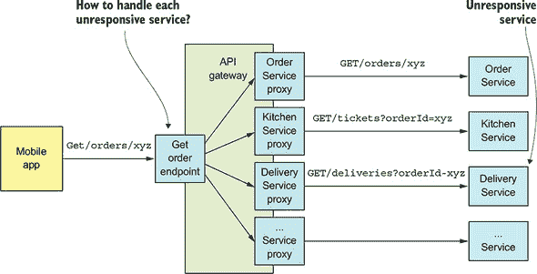

很可能每个服务的数据对客户端的重要性并不相同。`订单服务`的数据是至关重要的。如果这个服务不可用，API 网关应该返回其数据的缓存版本或错误。其他服务的数据不太关键。例如，即使配送状态不可用，客户端也可以向用户显示有用的信息。如果`配送服务`不可用，API 网关应该返回其数据的缓存版本或从响应中省略它。

设计你的服务以处理部分故障是至关重要的，但这并不是在使用 RPI 时你需要解决的唯一问题。另一个问题是，为了使用 RPI 调用另一个服务，一个服务需要知道服务实例的网络位置。表面上这听起来很简单，但在实践中这是一个具有挑战性的问题。你必须使用服务发现机制。让我们看看它是如何工作的。

#### 3.2.4. 使用服务发现

假设你正在编写一些调用具有 REST API 的服务的代码。为了发出请求，你的代码需要知道服务实例的网络位置（IP 地址和端口）。在一个运行在物理硬件上的传统应用程序中，服务实例的网络位置通常是静态的。例如，你的代码可以从偶尔更新的配置文件中读取网络位置。但在一个现代的基于云的微服务应用程序中，这通常并不那么简单。如图 3.4 所示，现代应用程序要动态得多。

##### 图 3.4\. 服务实例具有动态分配的 IP 地址。

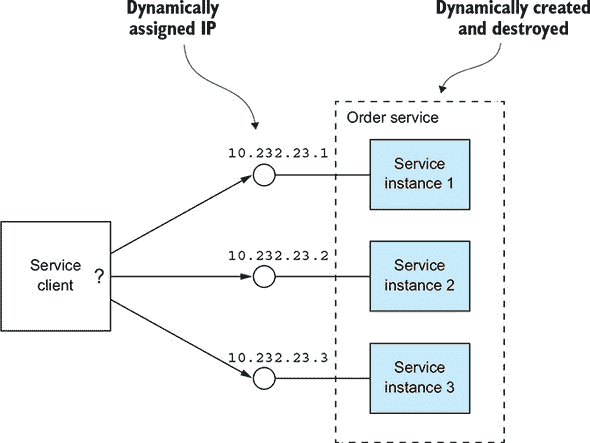

服务实例具有动态分配的网络位置。此外，由于自动扩展、故障和升级，服务实例的集合会动态变化。因此，您的客户端代码必须使用服务发现。

##### 服务发现概述

正如您刚才看到的，您不能使用服务的 IP 地址静态配置客户端。相反，应用程序必须使用动态服务发现机制。服务发现从概念上讲相当简单：其关键组件是服务注册表，它是应用程序服务实例网络位置的数据库。

服务发现机制在服务实例启动和停止时更新服务注册表。当客户端调用服务时，服务发现机制查询服务注册表以获取可用服务实例的列表，并将请求路由到其中之一。

实现服务发现主要有两种方式：

+   服务及其客户端直接与服务注册表交互。

+   部署基础设施处理服务发现。（我在第十二章中谈到了更多关于这一点。）

让我们看看每个选项。

##### 应用应用程序级服务发现模式

实现服务发现的一种方式是让应用程序的服务及其客户端与服务注册表进行交互。图 3.5 展示了这是如何工作的。服务实例将其网络位置注册到服务注册表中。服务客户端通过首先查询服务注册表以获取服务实例列表来调用服务。然后，它向这些实例中的一个发送请求。

##### 图 3.5\. 服务注册表跟踪服务实例。客户端查询服务注册表以找到可用服务实例的网络位置。

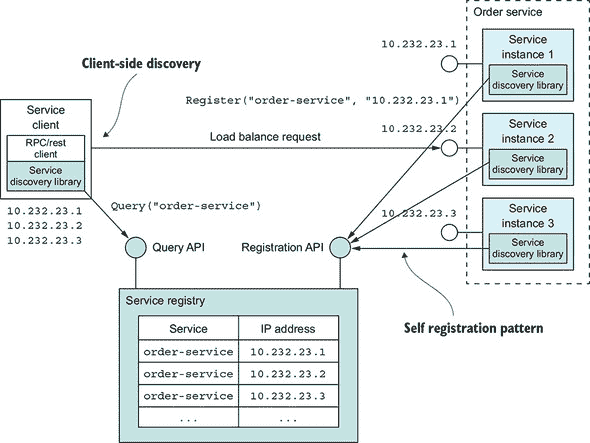

这种服务发现方法结合了两种模式。第一种模式是自动注册模式。服务实例通过调用服务注册表的注册 API 来注册其网络位置。它还可以提供一个详细的健康检查 URL，如第十一章中所述。健康检查 URL 是服务注册表定期调用的 API 端点，以验证服务实例是否健康且可以处理请求。服务注册表可能要求服务实例定期调用“心跳”API，以防止其注册过期。

| |
| --- |

**模式：自动注册**

服务实例将自己注册到服务注册表中。请参阅[`microservices.io/patterns/self-registration.html`](http://microservices.io/patterns/self-registration.html)。

| |
| --- |

第二种模式是客户端发现模式。当服务客户端想要调用一个服务时，它会查询服务注册表以获取该服务的实例列表。为了提高性能，客户端可能会缓存服务实例。然后服务客户端使用负载均衡算法，例如轮询或随机，来选择一个服务实例。然后它向选定的服务实例发出请求。

| |
| --- |

**模式：客户端发现**

服务客户端从服务注册表中检索可用服务实例的列表，并在它们之间进行负载均衡。请参阅[`microservices.io/patterns/client-side-discovery.html`](http://microservices.io/patterns/client-side-discovery.html)。

| |
| --- |

应用级服务发现已被 Netflix 和 Pivotal 普及。Netflix 开发和开源了几个组件：Eureka，一个高度可用的服务注册表，Eureka Java 客户端，以及 Ribbon，一个支持 Eureka 客户端的复杂 HTTP 客户端。Pivotal 开发了基于 Spring 的 Spring Cloud 框架，这使得使用 Netflix 组件变得非常容易。基于 Spring Cloud 的服务会自动注册到 Eureka，基于 Spring Cloud 的客户端会自动使用 Eureka 进行服务发现。

应用级服务发现的优点之一是它处理了服务部署在多个部署平台上的场景。想象一下，例如，你只将一些服务部署在第十二章中讨论的 Kubernetes 上，其余的运行在传统环境中。例如，使用 Eureka 进行的应用级服务发现可以在两个环境中工作，而基于 Kubernetes 的服务发现仅限于 Kubernetes 内部。

应用级服务发现的一个缺点是，你需要为使用的每种语言（以及可能的项目框架）都提供一个服务发现库。Spring Cloud 仅帮助 Spring 开发者。如果你使用的是其他 Java 框架或非 JVM 语言，如 NodeJS 或 GoLang，你必须找到其他服务发现框架。应用级服务发现的另一个缺点是你需要负责设置和管理服务注册表，这会分散注意力。因此，通常最好使用由部署基础设施提供的服务发现机制。

##### 应用平台提供的服务发现模式

在第十二章中，你将了解到许多现代部署平台，如 Docker 和 Kubernetes，都内置了服务注册和服务发现机制。部署平台为每个服务分配一个 DNS 名称、一个虚拟 IP（VIP）地址以及解析到 VIP 地址的 DNS 名称。服务客户端向 DNS 名称/VIP 发起请求，部署平台自动将请求路由到可用的服务实例之一。因此，服务注册、服务发现和请求路由完全由部署平台处理。图 3.6 展示了这是如何工作的。

##### 图 3.6。平台负责服务注册、发现和请求路由。服务实例由**注册器**注册到服务注册表中。每个服务都有一个网络位置、一个 DNS 名称/虚拟 IP 地址。客户端向服务的网络位置发起请求。路由器查询服务注册表并在可用的服务实例之间负载均衡请求。

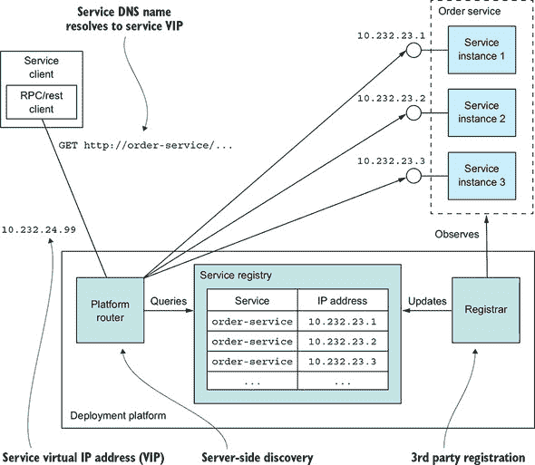

部署平台包含一个服务注册表，跟踪已部署服务的 IP 地址。在这个例子中，客户端使用 DNS 名称`order-service`访问`Order Service`，该名称解析为虚拟 IP 地址`10.1.3.4`。部署平台自动在`Order Service`的三个实例之间负载均衡请求。

这种方法结合了两种模式：

+   ***第三方注册模式*—** 不同于服务将自己注册到服务注册表中，一个称为**注册器**的第三方，通常是部署平台的一部分，负责注册。

+   ***服务器端发现模式*—** 不同于客户端查询服务注册表，它向一个 DNS 名称发起请求，该名称解析为一个请求路由器，该路由器查询服务注册表并负载均衡请求。

| |
| --- |

**模式：第三方注册**

服务实例由第三方自动注册到服务注册表中。请参阅[`microservices.io/patterns/3rd-party-registration.html`](http://microservices.io/patterns/3rd-party-registration.html)。

| |
| --- |
| |

**模式：服务器端发现**

客户端向负责服务发现的**路由器**发起请求。请参阅[`microservices.io/patterns/server-side-discovery.html`](http://microservices.io/patterns/server-side-discovery.html)。

| |
| --- |

平台提供的服务发现的关键优势是服务发现的各个方面完全由部署平台处理。服务和客户端都不包含任何服务发现代码。因此，无论服务或客户端是用哪种语言或框架编写的，服务发现机制都可供所有服务和客户端使用。

平台提供的服务发现的一个缺点是它仅支持发现使用该平台部署的服务。例如，如前所述，在描述应用级发现时，基于 Kubernetes 的发现仅适用于在 Kubernetes 上运行的服务。尽管存在这种限制，我还是建议尽可能使用平台提供的服务发现。

现在我们已经了解了使用 REST 或 gRPC 进行的同步 IPC，让我们看看另一种选择：基于消息的异步通信。

### 3.3. 使用异步消息模式进行通信

当使用消息传递时，服务通过异步交换消息进行通信。基于消息传递的应用程序通常使用一个**消息代理**，它充当服务之间的中介，尽管另一种选择是使用无代理架构，其中服务直接相互通信。服务客户端通过向服务发送消息来向服务发出请求。如果预期服务实例将回复，它将通过向客户端发送一条单独的消息来这样做。因为通信是异步的，所以客户端不会阻塞等待回复。相反，客户端的编写假设回复不会立即收到。

| |
| --- |

**模式：消息传递**

客户端使用异步消息调用服务。参见[`microservices.io/patterns/communication-style/messaging.html`](http://microservices.io/patterns/communication-style/messaging.html)。

| |
| --- |

我以对消息的概述开始本节。我展示了如何独立于消息技术描述消息架构。接下来，我比较和对比了无代理和基于代理的架构，并描述了选择消息代理的标准。然后，我讨论了几个重要主题，包括在保持消息顺序的同时扩展消费者、检测和丢弃重复消息，以及作为数据库事务一部分发送和接收消息。让我们先看看消息是如何工作的。

#### 3.3.1. 消息概述

在 Gregor Hohpe 和 Bobby Woolf 合著的书籍《企业集成模式》（Addison-Wesley Professional，2003 年）中定义了一个有用的消息传递模型。在这个模型中，消息通过消息通道进行交换。发送者（一个应用程序或服务）将消息写入通道，接收者（一个应用程序或服务）从通道读取消息。让我们先看看消息，然后再看看通道。

##### 关于消息

消息由一个头部和消息体组成([www.enterpriseintegrationpatterns.com/Message.html](http://www.enterpriseintegrationpatterns.com/Message.html))。*头部*是一系列名称-值对，是描述正在发送的数据的元数据。除了消息发送者提供的名称-值对之外，消息头部还包含名称-值对，例如由发送方或消息基础设施生成的唯一*消息 ID*，以及可选的*返回地址*，它指定了应写入的回复消息通道。消息*体*是正在发送的数据，可以是文本或二进制格式。

存在几种不同类型的消息：

+   ***文档*—** 仅包含数据的通用消息。接收方决定如何解释它。命令的回复是一个文档消息的例子。

+   ***命令*—** 与 RPC 请求等价的消息。它指定要调用的操作及其参数。

+   ***事件*—** 指示发送方发生了值得注意的事情的消息。事件通常是领域事件，它代表领域对象（如`Order`或`Customer`）的状态变化。

本书所描述的微服务架构方法广泛使用了命令和事件。

现在我们来看看通道，这是服务之间通信的机制。

##### 关于消息通道

如图 3.7 所示，消息通过通道([www.enterpriseintegrationpatterns.com/MessageChannel.html](http://www.enterpriseintegrationpatterns.com/MessageChannel.html))进行交换。发送方的业务逻辑调用一个*发送端口*接口，该接口封装了底层的通信机制。*发送端口*由一个*消息发送器*适配器类实现，它通过消息通道向接收方发送消息。*消息通道*是对消息基础设施的一种抽象。接收方的一个*消息处理器*适配器类被调用以处理消息。它调用由消费者的业务逻辑实现的*接收端口*接口。任何数量的发送者可以向通道发送消息。同样，任何数量的接收者都可以从通道接收消息。

##### 图 3.7。发送方的业务逻辑调用一个发送端口接口，该接口由消息发送器适配器实现。消息发送器通过消息通道向接收方发送消息。消息通道是对消息基础设施的一种抽象。接收方的一个消息处理器适配器被调用以处理消息。它调用由接收方业务逻辑实现的接收端口接口。

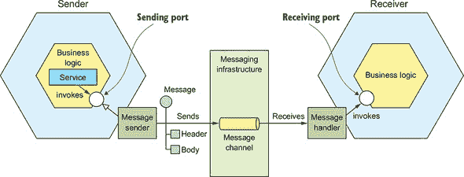

有两种类型的通道：点对点([www.enterpriseintegrationpatterns.com/PointToPointChannel.html](http://www.enterpriseintegrationpatterns.com/PointToPointChannel.html))和发布-订阅([www.enterpriseintegrationpatterns.com/PublishSubscribeChannel.html](http://www.enterpriseintegrationpatterns.com/PublishSubscribeChannel.html))：

+   一个 *点对点* 通道将消息发送给从通道中读取的恰好一个消费者。服务使用点对点通道来实现前面描述的一对一交互风格。例如，命令消息通常通过点对点通道发送。

+   一个 *发布-订阅* 通道将每条消息发送给所有附加的消费者。服务使用发布-订阅通道来实现前面描述的一对多交互风格。例如，事件消息通常通过发布-订阅通道发送。

#### 3.3.2\. 使用消息实现交互风格

消息的一个宝贵特性是它足够灵活，可以支持第 3.1.1 节中描述的所有交互风格。一些交互风格可以通过消息直接实现。其他交互风格必须在消息之上实现。

让我们看看如何实现每种交互风格，从请求/响应和异步请求/响应开始。

##### 实现请求/响应和异步请求/响应

当客户端和服务使用请求/响应或异步请求/响应进行交互时，客户端发送一个请求，服务发送一个回复。这两种交互风格之间的区别在于，在请求/响应中，客户端期望服务立即响应，而在异步请求/响应中则没有这样的期望。消息本质上是异步的，因此只提供异步请求/响应。但是客户端可以阻塞，直到收到回复。

客户端和服务通过交换一对消息来实现异步请求/响应风格的交互。如图 3.8 所示，客户端向服务拥有的点对点消息通道发送一个命令消息，该消息指定要执行的操作和参数。服务处理请求，并将包含结果的回复消息发送到客户端拥有的点对点通道。

##### 图 3.8\. 通过在请求消息中包含回复通道和消息标识符来实现异步请求/响应。接收者处理消息并将回复发送到指定的回复通道。

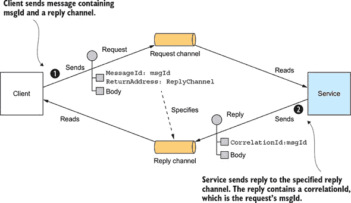

客户端必须告诉服务将回复消息发送到何处，并且必须将回复消息与请求匹配。幸运的是，解决这两个问题并不困难。客户端发送一个带有*回复通道*头的命令消息。服务器将包含与*消息标识符*相同值的*关联 ID*的回复消息写入回复通道。客户端使用*关联 ID*来匹配回复消息与请求。

由于客户端和服务通过消息进行通信，因此交互本质上是异步的。从理论上讲，消息客户端可能会阻塞，直到它收到回复，但在实践中，客户端将异步处理回复。更重要的是，回复通常由客户端的任何实例之一处理。

##### 实现单向通知

使用异步消息实现单向通知很简单。客户端向服务拥有的点对点通道发送消息，通常是命令消息。服务订阅该通道并处理消息。它不会发送回复。

##### 实现发布/订阅

消息内置了对发布/订阅交互风格的支撑。客户端向由多个消费者读取的发布/订阅通道发布消息。如第四章和 5 章所述，服务使用发布/订阅来发布表示领域对象变化的领域事件。发布领域事件的服务的拥有一个发布/订阅通道，其名称来自领域类。例如，`Order Service`将`Order`事件发布到`Order`通道，而`Delivery Service`将`Delivery`事件发布到`Delivery`通道。只对特定领域对象的事件感兴趣的服务只需订阅适当的通道。

##### 实现发布/异步响应

发布/异步响应交互风格是一种高级交互风格，通过结合发布/订阅和请求/响应的元素来实现。客户端向发布/订阅通道发布一条消息，该消息指定了一个*回复通道*头。消费者将包含*关联 ID*的回复消息写入回复通道。客户端通过使用*关联 ID*来匹配回复消息与请求来收集响应。

在您的应用程序中，每个具有异步 API 的服务都将使用这些实现技术之一或多个。具有用于调用操作异步 API 的服务将有一个用于请求的消息通道。同样，发布事件的服务会将事件发布到事件消息通道。

如第 3.1.2 节所述，为服务编写 API 规范非常重要。让我们看看如何为异步 API 执行此操作。

#### 3.3.3. 为基于消息的服务 API 创建 API 规范

服务的异步 API 规范必须，如图 3.9 所示，指定消息通道的名称，每个通道上交换的消息类型及其格式。您还必须使用 JSON、XML 或 Protobuf 等标准描述消息的格式。但与 REST 和 Open API 不同，没有广泛采用的标准来记录通道和消息类型。相反，您需要编写一个非正式的文档。

##### 图 3.9. 服务的异步 API 由消息通道和命令、回复和事件消息类型组成。

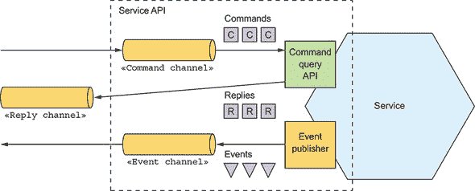

服务的异步 API 由客户端调用的操作和由服务发布的事件组成。它们以不同的方式进行记录。让我们看看每个，从操作开始。

##### 记录异步操作

服务的操作可以使用两种不同的交互风格之一来调用：

+   ***请求/异步响应式 API**—** 这包括服务的命令消息通道，服务接受的命令消息类型的类型和格式，以及服务发送的回复消息的类型和格式。

+   ***单向通知式 API**—** 这包括服务的命令消息通道和服务接受的命令消息类型的类型和格式。

服务可能使用相同的请求通道进行异步请求/响应和单向通知。

##### 记录已发布的事件

服务还可以使用发布/订阅交互风格发布事件。这种 API 风格的规范包括事件通道和服务向该通道发布的消息类型和格式。

消息和通道模型是消息的一个很好的抽象，也是设计服务异步 API 的好方法。但为了实现服务，您需要选择一个消息技术并确定如何使用其功能来实现您的设计。让我们看看涉及的内容。

#### 3.3.4. 使用消息代理

基于消息的应用程序通常使用一个**消息代理**，这是一个服务通过其进行通信的基础设施服务。但基于代理的架构并不是唯一的消息架构。您还可以使用无代理的消息架构，其中服务直接相互通信。这两种方法，如图 3.10 所示，有不同的权衡，但通常基于代理的架构是更好的方法。

##### 图 3.10. 无代理架构中的服务直接通信，而基于代理架构中的服务通过消息代理进行通信。

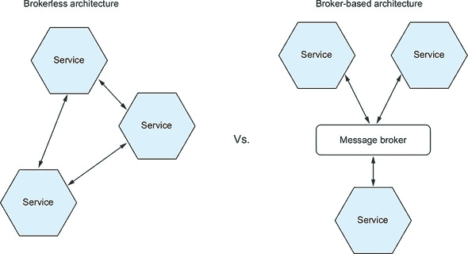

本书侧重于基于代理的架构，但快速看一下无代理架构是有价值的，因为可能存在您会发现它有用的场景。

##### 无代理消息

在无代理架构中，服务可以直接交换消息。ZeroMQ ([`zeromq.org`](http://zeromq.org)) 是一种流行的无代理消息技术。它既是一个规范，也是一套支持不同语言的库。它支持多种传输方式，包括 TCP、UNIX 风格的域套接字和多播。

无代理架构有一些好处：

+   由于消息直接从发送者到接收者，而不是必须从发送者到消息代理再到接收者，因此允许更轻的网络流量和更好的延迟

+   消除了消息代理成为性能瓶颈或单点故障的可能性

+   由于没有消息代理需要设置和维护，因此具有更少的操作复杂性

尽管这些好处可能很有吸引力，但无代理消息存在显著的缺点：

+   服务需要了解彼此的位置，因此必须使用之前在第 3.2.4 节中描述的发现机制之一。

+   由于消息的发送者和接收者必须在消息交换期间都可用，因此它提供了降低的可用性

+   实现机制，如保证交付，更具挑战性。

事实上，这些缺点中的一些，如降低的可用性和服务发现的需求，与使用同步、请求/响应相同。

由于这些限制，大多数企业应用程序使用基于消息代理的架构。让我们看看它是如何工作的。

##### 基于代理的消息概述

消息代理是一个中介，所有消息都通过它流动。发送者将消息写入消息代理，然后消息代理将其传递给接收者。使用消息代理的一个重要好处是发送者不需要知道消费者的网络位置。另一个好处是消息代理可以缓冲消息，直到消费者能够处理它们。

有许多消息代理可供选择。以下是一些流行的开源消息代理的例子：

+   ActiveMQ ([`activemq.apache.org`](http://activemq.apache.org))

+   RabbitMQ ([`www.rabbitmq.com`](https://www.rabbitmq.com))

+   Apache Kafka ([`kafka.apache.org`](http://kafka.apache.org))

此外，还有基于云的消息服务，例如 AWS Kinesis ([`aws.amazon.com/kinesis/`](https://aws.amazon.com/kinesis/)) 和 AWS SQS ([`aws.amazon.com/sqs/`](https://aws.amazon.com/sqs/))。

在选择消息代理时，你需要考虑各种因素，包括以下内容：

+   ***支持的编程语言*—** 你可能应该选择支持多种编程语言的。

+   ***支持的消息标准*—** 消息代理是否支持任何标准，如 AMQP 和 STOMP，或者它是专有的？

+   ***消息排序*—** 消息代理是否保留消息的顺序？

+   **投递保证**—**代理提供什么样的投递保证？**

+   **持久性**—**消息是否持久化到磁盘并且能够在代理崩溃后存活？**

+   **持久性**—**如果消费者重新连接到消息代理，它是否会收到在断开连接期间发送的消息？**

+   **可扩展性**—**消息代理的可扩展性如何？**

+   **延迟**—**端到端延迟是多少？**

+   **竞争消费者**—**消息代理支持竞争消费者吗？**

每个代理都会做出不同的权衡。例如，一个低延迟的代理可能不会保持顺序，不保证投递消息，并且只在内存中存储消息。一个保证投递并可靠地将消息存储在磁盘上的消息代理可能会具有更高的延迟。哪种类型的消息代理最适合取决于您的应用程序需求。甚至可能您的应用程序的不同部分会有不同的消息需求。

尽管如此，消息排序和可扩展性可能是至关重要的。现在让我们看看如何使用消息代理实现消息通道。

##### 使用消息代理实现消息通道

每个消息代理以不同的方式实现消息通道的概念。如表 3.2 所示，ActiveMQ 等 JMS 消息代理有队列和主题。基于 AMQP 的代理，如 RabbitMQ，有交换机和队列。Apache Kafka 有主题，AWS Kinesis 有流，AWS SQS 有队列。更重要的是，一些消息代理提供的消息传递比本章中描述的消息和通道抽象更灵活。

##### 表 3.2。每个消息代理以不同的方式实现消息通道的概念。

| 消息代理 | 点对点通道 | 发布/订阅通道 |
| --- | --- | --- |
| JMS | 队列 | 主题 |
| Apache Kafka | 主题 | 主题 |
| 基于 AMQP 的代理，如 RabbitMQ | 交换机 + 队列 | 广播交换机以及每个消费者的队列 |
| AWS Kinesis | 流 | 流 |
| AWS SQS | 队列 | — |

几乎所有这里描述的消息代理都支持点对点和发布/订阅通道。唯一的例外是 AWS SQS，它只支持点对点通道。

现在让我们看看基于代理的消息传递的优缺点。

##### 基于代理的消息传递的优缺点

使用基于代理的消息传递有许多优点：

+   **松散耦合**—**客户端通过向适当的通道发送消息来发出请求。客户端完全不知道服务实例。它不需要使用发现机制来确定服务实例的位置。**

+   ***消息缓冲*—** 消息代理将消息缓冲起来，直到它们可以被处理。在同步请求/响应协议（如 HTTP）中，客户端和服务必须在交换期间都可用。然而，在消息传递中，消息将排队直到它们可以被消费者处理。这意味着，例如，即使订单履行系统缓慢或不可用，在线商店也可以接受客户的订单。消息将简单地排队，直到它们可以被处理。

+   ***灵活的通信*—** 消息传递支持前面描述的所有交互样式。

+   ***显式的进程间通信*—** 基于 RPC 的机制试图使调用远程服务看起来与调用本地服务相同。但由于物理定律和部分失败的可能性，它们实际上相当不同。消息传递使得这些差异非常明确，因此开发者不会陷入虚假的安全感。

使用消息传递有一些缺点：

+   ***潜在的性能瓶颈*—** 消息代理可能成为性能瓶颈。幸运的是，许多现代消息代理都设计为高度可扩展。

+   ***潜在的单一故障点*—** 消息代理必须高度可用，这是至关重要的——否则，系统可靠性将受到影响。幸运的是，大多数现代代理都已被设计为高度可用。

+   ***额外的操作复杂性*—** 消息系统是必须安装、配置和运行的另一个系统组件。

让我们看看你可能会遇到的一些设计问题。

#### 3.3.5. 竞争接收器和消息顺序

一个挑战是如何在保持消息顺序的同时扩展消息接收器。为了并发处理消息，通常需要多个服务实例。此外，即使单个服务实例也可能使用线程来并发处理多个消息。使用多个线程和服务实例并发处理消息可以增加应用程序的吞吐量。但并发处理消息的挑战在于确保每个消息只被处理一次，并且按照顺序处理。

例如，想象有三个服务实例从同一个点对点通道读取，并且发送者按顺序发布`Order Created`、`Order Updated`和`Order Cancelled`事件消息。一个简单的消息实现可能会并发地将每条消息发送给不同的接收者。由于网络问题或垃圾回收导致的延迟，消息可能会以错误的顺序处理，这可能导致奇怪的行为。理论上，一个服务实例可能会在另一个服务处理`Order Created`消息之前处理`Order Cancelled`消息！

一种常见的解决方案，由现代消息代理如 Apache Kafka 和 AWS Kinesis 使用，是使用*分片*（分区）通道。图 3.11 展示了这是如何工作的。该解决方案有三个部分：

1.  分片通道由两个或多个分片组成，每个分片的行为都像一个通道。

1.  发送者在消息头中指定一个分片键，这通常是一个任意字符串或字节序列。消息代理使用分片键将消息分配给特定的分片/分区。例如，它可能通过计算分片键的哈希值模分片数来选择分片。

1.  消息代理将多个接收器实例组合在一起，并将它们视为同一个逻辑接收器。例如，Apache Kafka 使用术语*消费者组*。消息代理将每个分片分配给单个接收器。当接收器启动和关闭时，它会重新分配分片。

##### 图 3.11\. 通过使用分片（分区）消息通道在扩展消费者时保持消息排序。发送者在消息中包含分片键。消息代理将消息写入由分片键确定的分片。消息代理将每个分区分配给复制接收器的单个实例。

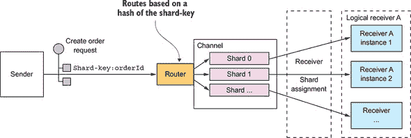

在这个例子中，每个`Order`事件消息的`orderId`作为其分片键。特定订单的每个事件都发布到同一个分片，由单个消费者实例读取。因此，这些消息保证按顺序处理。

#### 3.3.6\. 处理重复消息

在使用消息传递时，你必须解决的另一个挑战是处理重复消息。理想情况下，消息代理应该只投递每条消息一次，但保证恰好一次投递通常成本太高。相反，大多数消息代理承诺至少投递一条消息。

当系统正常运行时，保证至少一次投递的消息代理将每条消息只投递一次。但是，客户端、网络或消息代理的故障可能导致消息被多次投递。假设一个客户端在处理消息并更新其数据库后崩溃，但在确认消息之前。消息代理将再次投递未确认的消息，要么在客户端重启时投递给该客户端，要么投递给客户端的另一个副本。

理想情况下，你应该使用在重新投递消息时保留排序的消息代理。想象一下，客户端处理了一个`Order Created`事件，然后处理了同一订单的`Order Cancelled`事件，但`Order Created`事件没有被确认。消息代理应该重新投递`Order Created`和`Order Cancelled`事件。如果它只重新投递`Order Created`，客户端可能会撤销取消订单的操作。

处理重复消息有几种不同的方法：

+   编写幂等消息处理器。

+   跟踪消息并丢弃重复项。

让我们逐一查看每个选项。

##### 编写幂等消息处理器

如果处理消息的应用程序逻辑是幂等的，那么重复的消息是无害的。如果多次以相同的输入值调用它没有额外的效果，则应用程序逻辑是*幂等的*。例如，取消已取消的订单是一个幂等操作。创建带有客户端提供的 ID 的订单也是如此。只要消息代理在重新投递消息时保持顺序，幂等的消息处理器就可以安全地多次执行。

不幸的是，应用程序逻辑通常不是幂等的。或者你可能使用的是一个在重新投递消息时不保留顺序的消息代理。重复或顺序错误的消息可能导致错误。在这种情况下，你必须编写跟踪消息和丢弃重复消息的消息处理器。

##### 跟踪消息和丢弃重复项

例如，考虑一个授权消费者信用卡的消息处理器。它必须为每个订单恰好授权一次卡。这个应用程序逻辑的例子每次被调用时都有不同的效果。如果重复的消息导致消息处理器多次执行此逻辑，应用程序的行为将不正确。执行此类应用程序逻辑的消息处理器必须通过检测和丢弃重复消息来成为幂等的。

一个简单的解决方案是消息消费者使用`消息 ID`跟踪它已处理的消息，并丢弃任何重复项。例如，它可以在数据库表中存储它消耗的每个消息的`消息 ID`。图 3.12 展示了如何使用专用表来实现这一点。

##### 图 3.12。消费者通过在数据库表中记录已处理消息的 ID 来检测和丢弃重复消息。如果消息之前已被处理，向`PROCESSED_MESSAGES`表的`INSERT`操作将失败。

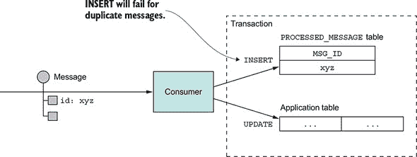

当消费者处理消息时，它将`消息 ID`记录在数据库表中，作为创建和更新业务实体的事务的一部分。在这个例子中，消费者将包含`消息 ID`的行插入到`PROCESSED_MESSAGES`表中。如果消息是重复的，`INSERT`操作将失败，消费者可以丢弃该消息。

另一个选项是消息处理器在应用表中而不是专用表中记录`消息 ID`。当使用具有有限事务模型的 NoSQL 数据库时，这种方法特别有用，因为它不支持在数据库事务中更新两个表。第七章展示了这种方法的一个例子。

#### 3.3.7. 事务性消息

一个服务通常需要在更新数据库的事务中发布消息。例如，在这本书的整个过程中，你都会看到服务在创建或更新业务实体时发布领域事件的示例。数据库更新和发送消息都必须在事务内完成。否则，服务可能在发送消息之前更新数据库并崩溃，例如。如果服务没有原子地执行这两个操作，失败可能会导致系统处于不一致的状态。

传统的解决方案是使用跨越数据库和消息代理的分布式事务。但正如你将在第四章（kindle_split_012.xhtml#ch04）中了解到的那样，分布式事务并不是现代应用程序的好选择。此外，许多现代代理，如 Apache Kafka，不支持分布式事务。

因此，应用程序必须使用不同的机制来可靠地发布消息。让我们看看它是如何工作的。

##### 使用数据库表作为消息队列

让我们假设你的应用程序正在使用关系型数据库。一种可靠发布消息的简单方法是应用事务性输出队列模式。该模式使用数据库表作为临时消息队列。如图 3.13 所示，发送消息的服务有一个`OUTBOX`数据库表。作为创建、更新和删除业务对象的数据库事务的一部分，服务通过将消息插入`OUTBOX`表来发送消息。原子性得到保证，因为这是一个本地 ACID 事务。

##### 图 3.13。一个服务通过将消息插入更新数据库的事务中的`OUTBOX`表来可靠地发布消息。`Message Relay`读取`OUTBOX`表并将消息发布到消息代理。

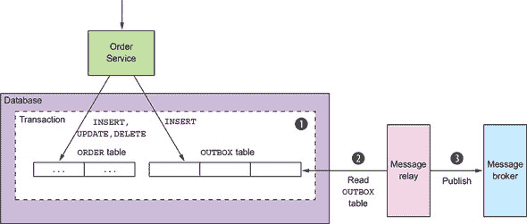

`OUTBOX`表充当临时消息队列。`MessageRelay`是一个组件，它读取`OUTBOX`表并将消息发布到消息代理。

| |
| --- |

**模式：事务性输出队列**

通过在数据库中的`OUTBOX`中保存事件或消息作为数据库事务的一部分来发布事件或消息。请参阅[`microservices.io/patterns/data/transactional-outbox.html`](http://microservices.io/patterns/data/transactional-outbox.html)。

| |
| --- |

你可以使用类似的方法与一些 NoSQL 数据库一起使用。每个存储在数据库中作为`record`的业务实体都有一个属性，该属性是需要发布的消息列表。当服务更新数据库中的实体时，它会将一条消息追加到该列表中。这是原子的，因为它通过单个数据库操作完成。然而，挑战在于高效地找到具有事件的业务实体并将它们发布出去。

将消息从数据库移动到消息代理有几种不同的方法。我们将逐一查看。

##### 通过轮询发布者模式发布事件

如果应用程序使用关系型数据库，一个发布`OUTBOX`表中插入的消息的非常简单的方法是让`MessageRelay`轮询表以查找未发布消息。它定期查询表：

```
SELECT * FROM OUTBOX ORDERED BY ... ASC
```

接下来，`MessageRelay`将这些消息发布到消息代理，将一条消息发送到其目标消息通道。最后，它从`OUTBOX`表中删除这些消息：

```
BEGIN
 DELETE FROM OUTBOX WHERE ID in (....)
COMMIT
```

|  |
| --- |

**模式：轮询发布者**

通过轮询数据库中的`OUTBOX`来发布消息。参见[`microservices.io/patterns/data/polling-publisher.html`](http://microservices.io/patterns/data/polling-publisher.html)。

|  |
| --- |

轮询数据库是一种简单的方法，在低规模下效果相当不错。缺点是频繁轮询数据库可能会很昂贵。此外，您是否可以使用此方法与 NoSQL 数据库一起使用取决于其查询能力。这是因为，而不是查询`OUTBOX`表，应用程序必须查询业务实体，这可能或可能无法高效地完成。由于这些缺点和限制，通常更好的做法——在某些情况下，这是必要的——是使用更复杂且性能更好的方法，即跟踪数据库事务日志。

##### 通过应用事务日志跟踪模式发布事件

一个复杂的解决方案是让`MessageRelay`跟踪数据库事务日志（也称为提交日志）。应用程序所做的每个提交更新都表示为数据库事务日志中的一个条目。事务日志挖掘器可以读取事务日志，并将每个更改作为消息发布到消息代理。图 3.14 展示了这种方法是如何工作的。

##### 图 3.14。一个服务通过挖掘数据库的事务日志来发布插入到`OUTBOX`表中的消息。

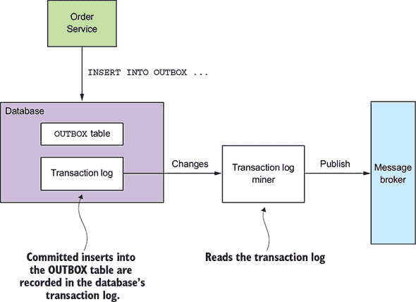

`事务日志挖掘器`读取事务日志条目。它将每个与插入消息相对应的相关日志条目转换为消息，并将该消息发布到消息代理。这种方法可以用来发布写入关系型数据库的`OUTBOX`表中的消息或追加到 NoSQL 数据库记录中的消息。

|  |
| --- |

**模式：事务日志跟踪**

通过跟踪事务日志来发布对数据库所做的更改。参见[`microservices.io/patterns/data/transaction-log-tailing.html`](http://microservices.io/patterns/data/transaction-log-tailing.html)。

|  |
| --- |

有几个使用此方法的例子：

+   *Debezium* ([`debezium.io`](http://debezium.io))——一个开源项目，将数据库更改发布到 Apache Kafka 消息代理。

+   *LinkedIn Databus* ([`github.com/linkedin/databus`](https://github.com/linkedin/databus))——一个开源项目，挖掘 Oracle 事务日志并将更改作为事件发布。LinkedIn 使用 Databus 来同步各种派生数据存储与记录系统。

+   *DynamoDB streams* ([`docs.aws.amazon.com/amazondynamodb/latest/developerguide/Streams.html`](http://docs.aws.amazon.com/amazondynamodb/latest/developerguide/Streams.html))—DynamoDB streams 包含在过去 24 小时内对 DynamoDB 表中项目所做的更改（创建、更新和删除）的时间顺序序列。应用程序可以从流中读取这些更改，例如，将它们作为事件发布。

+   *Eventuate Tram* ([`github.com/eventuate-tram/eventuate-tram-core`](https://github.com/eventuate-tram/eventuate-tram-core))—您作者的专属开源事务消息库，它使用 MySQL binlog 协议、Postgres WAL 或轮询来读取对`OUTBOX`表所做的更改，并将它们发布到 Apache Kafka。

尽管这种方法不太为人所知，但它工作得非常出色。挑战在于实现它需要一些开发工作。例如，你可以编写低级代码来调用数据库特定的 API。或者，你可以使用如 Debezium 这样的开源框架，它将 MySQL、Postgres 或 MongoDB 中应用程序所做的更改发布到 Apache Kafka。使用 Debezium 的缺点是它的重点是捕获数据库级别的更改，而发送和接收消息的 API 超出了其范围。这就是我创建 Eventuate Tram 框架的原因，它不仅提供了消息 API，还提供了事务跟踪和轮询功能。

#### 3.3.8\. 消息的库和框架

一个服务需要使用库来发送和接收消息。一种方法是用消息代理的客户端库，尽管直接使用此类库存在一些问题：

+   客户端库将发布消息到消息代理 API 的业务逻辑耦合在一起。

+   消息代理的客户端库通常是低级的，发送或接收消息需要很多行代码。作为开发者，你不想反复编写样板代码。此外，作为本书的作者，我不想示例代码被低级样板代码所充斥。

+   客户端库通常只提供发送和接收消息的基本机制，不支持高级交互样式。

更好的方法是使用一个高级库或框架，它隐藏了低级细节并直接支持高级交互样式。为了简单起见，本书中的示例使用我的 Eventuate Tram 框架。它有一个简单、易于理解的 API，隐藏了使用消息代理的复杂性。除了发送和接收消息的 API 之外，Eventuate Tram 还支持异步请求/响应和领域事件发布等高级交互样式。

|  |
| --- |

**什么？！为什么是 Eventuate 框架？**

本书中的代码示例使用我开发的开源 Eventuate 框架，用于事务消息、事件溯源和 sagas。我选择使用我的框架，因为与依赖注入和 Spring 框架不同，微服务架构所需的功能中，没有广泛采用的框架。如果没有 Eventuate Tram 框架，许多示例将不得不直接使用低级消息 API，这将使它们变得更加复杂，并掩盖重要的概念。或者，它们将使用一个不受广泛采用的框架，这也会引起批评。

相反，示例使用 Eventuate Tram 框架，它具有简单、易于理解的 API，隐藏了实现细节。您可以在您的应用程序中使用这些框架。或者，您可以研究 Eventuate Tram 框架，并自行重新实现这些概念。

|  |
| --- |

Eventuate Tram 还实现了两个重要机制：

+   ***事务消息*—** 它将消息作为数据库事务的一部分发布。

+   ***重复消息检测*—** Eventuate Tram 消息消费者检测并丢弃重复消息，这对于确保消费者恰好处理一次消息至关重要，如第 3.3.6 节中所述。

让我们来看看 Eventuate Tram API。

##### 基本消息

基本消息 API 由两个 Java 接口组成：`MessageProducer` 和 `MessageConsumer`。生产者服务使用 `MessageProducer` 接口将消息发布到消息通道。以下是如何使用此接口的示例：

```
MessageProducer messageProducer = ...;
String channel = ...;
String payload = ...;
messageProducer.send(destination, MessageBuilder.withPayload(payload).build())
```

消费者服务使用 `MessageConsumer` 接口订阅消息：

```
MessageConsumer messageConsumer;
messageConsumer.subscribe(subscriberId, Collections.singleton(destination),
     message -> { ... })
```

`MessageProducer` 和 `MessageConsumer` 是异步请求/响应和领域事件发布的高级 API 的基础。

让我们谈谈如何发布和订阅事件。

##### 领域事件发布

Eventuate Tram 提供了发布和消费领域事件的 API。第五章 解释了领域事件是当 *聚合*（业务对象）创建、更新或删除时发出的事件。服务使用 `DomainEventPublisher` 接口发布领域事件。以下是一个示例：

```
DomainEventPublisher domainEventPublisher;

String accountId = ...;

DomainEvent domainEvent = new AccountDebited(...);

domainEventPublisher.publish("Account", accountId, Collections.singletonList(
     domainEvent));
```

一个服务使用 `DomainEventDispatcher` 来消费领域事件。以下是一个示例：

```
DomainEventHandlers domainEventHandlers = DomainEventHandlersBuilder
            .forAggregateType("Order")
            .onEvent(AccountDebited.class, domainEvent -> { ... })
            .build();

new DomainEventDispatcher("eventDispatcherId",
            domainEventHandlers,
            messageConsumer);
```

事件不是 Eventuate Tram 支持的唯一高级消息模式。它还支持基于命令/回复的消息。

##### 基于命令/回复的消息

客户端可以使用 `CommandProducer` 接口向服务发送命令消息。例如

```
CommandProducer commandProducer = ...;

Map<String, String> extraMessageHeaders = Collections.emptyMap();

String commandId = commandProducer.send("CustomerCommandChannel",
        new DoSomethingCommand(),
        "ReplyToChannel",
        extraMessageHeaders);
```

一个服务使用 `CommandDispatcher` 类来消费命令消息。`CommandDispatcher` 使用 `MessageConsumer` 接口订阅指定的事件。它将每个命令消息调度到适当的手动方法。以下是一个示例：

```
CommandHandlers commandHandlers =CommandHandlersBuilder
            .fromChannel(commandChannel)
            .onMessage(DoSomethingCommand.class, (command) -
     > { ... ; return withSuccess(); })
            .build();

CommandDispatcher dispatcher = new CommandDispatcher("subscribeId",
     commandHandlers, messageConsumer, messageProducer);
```

在本书的整个过程中，您将看到使用这些 API 发送和接收消息的代码示例。

正如你所看到的，Eventuate Tram 框架实现了 Java 应用程序的事务性消息传递。它提供了一个低级 API 用于事务性地发送和接收消息。它还提供了用于发布和消费领域事件以及发送和处理命令的高级 API。

现在我们来看一种使用异步消息传递来提高可用性的服务设计方法。

### 3.4. 使用异步消息传递来提高可用性

正如你所看到的，各种 IPC 机制有不同的权衡。一个特定的权衡是你选择的 IPC 机制如何影响可用性。在本节中，你将了解到作为请求处理一部分与其他服务进行同步通信会降低应用程序的可用性。因此，你应该尽可能设计你的服务使用异步消息传递。

让我们先看看同步通信的问题以及它如何影响可用性。

#### 3.4.1. 同步通信降低可用性

REST 是一种极其流行的 IPC 机制。你可能想用它来进行服务间通信。然而，REST 的问题在于它是一个同步协议：HTTP 客户端必须等待服务发送响应。每当服务使用同步协议进行通信时，应用程序的可用性就会降低。

要了解原因，请考虑图 3.15 中所示的场景。`Order Service` 提供了一个用于创建 `Order` 的 REST API。它调用 `Consumer Service` 和 `Restaurant Service` 来验证 `Order`。这两个服务也都有 REST API。

##### 图 3.15. `Order Service` 使用 REST 调用其他服务。这很简单，但要求所有服务同时可用，这降低了 API 的可用性。

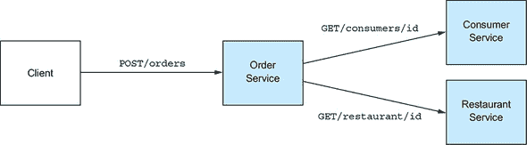

创建订单的步骤顺序如下：

1.  客户端向 `Order Service` 发送 HTTP `POST /orders` 请求。

1.  `Order Service` 通过向 `Consumer Service` 发送 HTTP `GET /consumers/id` 请求来检索消费者信息。

1.  `Order Service` 通过向 `Restaurant Service` 发送 HTTP `GET /restaurant/id` 请求来检索餐厅信息。

1.  `Order Taking` 使用消费者和餐厅信息验证请求。

1.  `Order Taking` 创建一个订单。

1.  `Order Taking` 向客户端发送 HTTP 响应。

因为这些服务使用 HTTP，所以为了 FTGO 应用程序能够处理`CreateOrder`请求，它们必须同时可用。如果这三个服务中的任何一个出现故障，FTGO 应用程序就无法创建订单。从数学上讲，系统操作的可用性是调用该操作的服务可用性的乘积。如果`Order Service`及其调用的两个服务都是 99.5%可用，则整体可用性为 99.5%³ = 98.5%，这明显较低。每个参与处理请求的额外服务都会进一步降低可用性。

这个问题并不仅限于基于 REST 的通信。每当服务只能在收到另一个服务的响应后才能对其客户端做出响应时，可用性就会降低。即使服务通过异步消息的请求/响应风格进行通信，这个问题也存在。例如，如果`Order Service`通过消息代理向`Consumer Service`发送消息，然后等待响应，那么`Order Service`的可用性就会降低。

如果你想最大化可用性，你必须最小化同步通信的数量。让我们看看如何做到这一点。

#### 3.4.2\. 消除同步交互

在处理同步请求的同时，有几种不同的方法可以减少与其他服务的同步通信量。一种解决方案是通过定义仅具有异步 API 的服务来完全避免这个问题。但这并不总是可能的。例如，公共 API 通常是 RESTful 的。因此，有时服务需要具有同步 API。

幸运的是，有一些方法可以处理同步请求而不进行同步请求。让我们谈谈这些选项。

##### 使用异步交互风格

理想情况下，所有交互都应使用本章前面描述的异步交互风格进行。例如，假设 FTGO 应用程序的一个客户端使用异步请求/异步响应风格的交互来创建订单。客户端通过向`Order Service`发送请求消息来创建订单。然后，该服务与其他服务异步交换消息，并最终向客户端发送回复消息。图 3.16 展示了设计。

##### 图 3.16\. 如果 FTGO 应用程序的服务使用异步消息而不是同步调用进行通信，则其可用性更高。

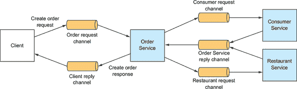

客户端和服务通过通过消息通道发送消息进行异步通信。在这个交互中的任何参与者都不会因为等待响应而被阻塞。

这样的架构将具有极高的弹性，因为消息代理会缓冲消息，直到它们可以被消费。然而，问题是服务通常有一个使用同步协议（如 REST）的外部 API，因此它必须立即响应请求。

如果一个服务有一个同步 API，提高可用性的方法之一是复制数据。让我们看看这是如何工作的。

##### 复制数据

在请求处理期间最小化同步请求的一种方法是通过复制数据。服务在处理请求时维护所需数据的副本。它通过订阅拥有数据的服务发布的事件来保持副本的更新。例如，`订单服务`可以维护由`消费者服务`和`餐厅服务`拥有的数据的副本。这将使`订单服务`能够在不与那些服务交互的情况下处理创建订单的请求。图 3.17 展示了该设计。

##### 图 3.17\. `订单服务`是自包含的，因为它拥有消费者和餐厅数据的副本。

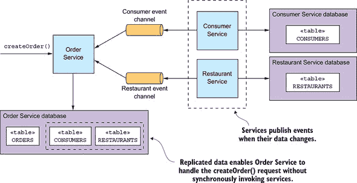

`消费者服务`和`餐厅服务`在其数据更改时发布事件。`订单服务`订阅这些事件并更新其副本。

在某些情况下，复制数据是一种有用的方法。例如，第五章描述了`订单服务`如何从`餐厅服务`复制数据，以便验证和定价菜单项。复制的缺点之一是有时可能需要复制大量数据，这效率低下。例如，由于消费者数量庞大，`订单服务`维护`消费者服务`拥有的数据的副本可能不切实际。复制的另一个缺点是它没有解决服务如何更新其他服务拥有的数据的问题。

解决该问题的一种方法是为服务延迟与其他服务交互，直到它向其客户端响应之后。我们接下来将看看这是如何工作的。

##### 在返回响应后完成处理

在请求处理期间消除同步通信的另一种方法是服务按照以下方式处理请求：

1.  仅使用本地可用的数据验证请求。

1.  更新其数据库，包括将消息插入到`OUTBOX`表中。

1.  向其客户端返回响应。

在处理请求时，服务不会与任何其他服务同步交互。相反，它异步地向其他服务发送消息。这种方法确保服务是松散耦合的。正如你将在下一章学到的那样，这通常是通过使用一个*saga*来实现的。

例如，如果`订单服务`使用这种方法，它会在`待处理`状态下创建一个订单，然后通过与其他服务交换消息异步验证订单。图 3.18 展示了当调用`createOrder()`操作时会发生什么。事件序列如下：

1.  `订单服务`创建一个处于`待处理`状态的订单。

1.  `订单服务`向其客户端返回包含订单 ID 的响应。

1.  `订单服务`向`消费者服务`发送`ValidateConsumerInfo`消息。

    ##### 图 3.18\. `Order Service` 在不调用任何其他服务的情况下创建订单。然后它通过与其他服务（包括 `Consumer Service` 和 `Restaurant Service`）交换消息来异步验证新创建的 `Order`。

    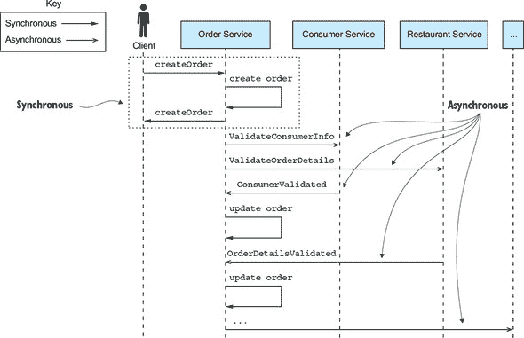

1.  `Order Service` 向 `Restaurant Service` 发送一个 `ValidateOrderDetails` 消息。

1.  `Consumer Service` 接收到一个 `ValidateConsumerInfo` 消息，验证消费者能否下订单，并向 `Order Service` 发送一个 `ConsumerValidated` 消息。

1.  `Restaurant Service` 接收到一个 `ValidateOrderDetails` 消息，验证菜单项是否有效以及餐厅是否能够将订单送达指定地址，然后向 `Order Service` 发送一个 `OrderDetailsValidated` 消息。

1.  `Order Service` 接收到 `ConsumerValidated` 和 `OrderDetailsValidated` 并将订单状态改为 `VALIDATED`。

1.  ...

`Order Service` 可以以任意顺序接收 `ConsumerValidated` 和 `OrderDetailsValidated` 消息。它通过改变订单的状态来跟踪它首先接收哪个消息。如果它首先接收到 `ConsumerValidated` 消息，它将订单状态改为 `CONSUMER_VALIDATED`；而如果它首先接收到 `OrderDetailsValidated` 消息，它将状态改为 `ORDER_DETAILS_VALIDATED`。当它接收到另一个消息时，`Order Service` 将 `Order` 的状态改为 `VALIDATED`。

在订单验证完成后，`Order Service` 完成订单创建过程的其余部分，这些内容将在下一章中讨论。这种方法的好处是，即使 `Consumer Service` 停止运行，例如，`Order Service` 仍然可以创建订单并响应其客户端。最终，`Consumer Service` 将恢复运行并处理任何排队中的消息，订单将被验证。

服务在完全处理请求之前就做出响应的缺点是它使得客户端变得更加复杂。例如，当 `Order Service` 返回响应时，它对新建订单的状态只提供最基本保证。它在验证订单和授权消费者的信用卡之前立即创建订单并返回。因此，为了使客户端知道订单是否成功创建，它必须定期轮询或者 `Order Service` 必须发送通知消息。尽管听起来很复杂，但在许多情况下，这种方法是首选的——特别是因为它还解决了我在下一章中讨论的分布式事务管理问题。例如，在第 4 和 5 章中，我描述了 `Order Service` 如何使用这种方法。

### 摘要

+   微服务架构是一种分布式架构，因此进程间通信扮演着关键角色。

+   精心管理服务 API 的演变至关重要。向后兼容的更改最容易实现，因为它们不会影响客户端。如果你对服务的 API 进行了破坏性更改，通常需要同时支持旧版和新版，直到客户端升级。

+   有许多 IPC 技术，每种技术都有不同的权衡。一个关键的设计决策是选择同步远程过程调用模式或异步消息模式。基于同步远程过程调用的协议，如 REST，最容易使用。但理想情况下，服务应使用异步消息进行通信，以提高可用性。

+   为了防止故障在系统中级联，使用同步协议的服务客户端必须设计成能够处理部分故障，即调用服务时服务可能处于宕机状态或表现出高延迟。特别是，在发起请求时必须使用超时，限制未完成请求的数量，并使用断路器模式来避免调用失败的服务。

+   使用同步协议的架构必须包括服务发现机制，以便客户端确定服务实例的网络位置。最简单的方法是使用部署平台实现的服务发现机制：服务器端发现和第三方注册模式。但另一种方法是实现应用级别的服务发现：客户端发现和自注册模式。这需要更多的工作，但它确实处理了服务运行在多个部署平台上的场景。

+   设计基于消息的架构的一个好方法就是使用消息和通道模型，该模型抽象了底层消息系统的细节。然后你可以将这个设计映射到特定的消息基础设施上，这通常是基于消息代理的。

+   使用消息时，一个关键挑战是原子地更新数据库并发布消息。一个好的解决方案是使用事务性输出队列模式，首先将消息作为数据库事务的一部分写入数据库。然后，一个单独的过程使用轮询发布者模式或事务日志尾部模式从数据库检索消息，并将其发布到消息代理。
