## 第四章\. 使用传奇管理事务

*本章涵盖*

+   为什么分布式事务不适合现代应用程序

+   使用传奇模式在微服务架构中保持数据一致性

+   使用编排和协调来协调传奇

+   使用对策来处理隔离不足的问题

当玛丽开始研究微服务架构时，她最大的担忧之一是如何实现跨越多个服务的事务。事务是每个企业应用程序的基本组成部分。没有事务，就难以保持数据一致性。

ACID（原子性、一致性、隔离、持久性）事务通过提供每个事务对数据具有独占访问的错觉，极大地简化了开发者的工作。在微服务架构中，单个服务内的操作仍然可以使用 ACID 事务。然而，挑战在于实现更新多个服务拥有的数据的操作的事务。例如，正如第二章中描述的，`createOrder()`操作跨越了多个服务，包括`Order Service`、`Kitchen Service`和`Accounting Service`。这类操作需要一个跨服务工作的交易管理机制。

玛丽发现，正如第二章中提到的，传统的分布式事务管理方法并不适合现代应用程序。与传统 ACID 事务不同，跨越服务的操作必须使用所谓的传奇，即本地事务的消息驱动序列，以保持数据一致性。传奇的一个挑战是它们是 ACD（原子性、一致性、持久性）。它们缺乏传统 ACID 事务的隔离特性。因此，应用程序必须使用所谓的*对策*，即设计技术，以防止或减少由隔离不足引起的并发异常的影响。

在许多方面，玛丽和 FTGO 开发者采用微服务时将面临的最大障碍是从具有 ACID 事务的单数据库架构迁移到具有 ACD（原子性、一致性、持久性）传奇的多数据库架构。他们习惯了 ACID 事务模型的简单性。但在现实中，即使是像 FTGO 这样的单体应用程序通常也不使用教科书中的 ACID 事务。例如，许多应用程序使用较低的事务隔离级别以提高性能。此外，许多重要的业务流程，如在不同银行账户之间转账，最终都是一致的。甚至星巴克也不使用两阶段提交([www.enterpriseintegrationpatterns.com/ramblings/18_starbucks.html](http://www.enterpriseintegrationpatterns.com/ramblings/18_starbucks.html))。

我以探讨微服务架构中事务管理的挑战开始本章，并解释为什么传统的分布式事务管理方法不是一个可行的选择。接下来，我解释如何使用 sagas 来维护数据一致性。之后，我查看协调 sagas 的两种不同方式：*编排*，其中参与者交换事件而没有集中的控制点，以及*编排*，其中集中的控制器告诉 sagas 参与者执行什么操作。我讨论了如何使用对策来防止或减少由于 sagas 之间缺乏隔离性而引起的并发异常的影响。最后，我描述了一个示例 sagas 的实现。

让我们从探讨在微服务架构中管理事务的挑战开始。

### 4.1\. 微服务架构中的事务管理

几乎每个由企业应用程序处理的需求都在数据库事务中执行。企业应用程序开发者使用框架和库来简化事务管理。一些框架和库提供了用于显式开始、提交和回滚事务的程序化 API。其他框架，例如 Spring 框架，提供了声明式机制。Spring 提供了一个`@Transactional`注解，该注解安排方法调用在事务中自动执行。因此，编写事务性业务逻辑变得非常简单。

或者，更准确地说，在访问单个数据库的单体应用程序中，事务管理是直接的。在复杂单体应用程序中使用多个数据库和消息代理时，事务管理更具挑战性。在微服务架构中，事务跨越多个服务，每个服务都有自己的数据库。在这种情况下，应用程序必须使用更复杂的机制来管理事务。正如你将学到的，使用分布式事务的传统方法对于现代应用程序来说不是一个可行的选择。相反，基于微服务的应用程序必须使用 sagas。

在解释 sagas 之前，让我们首先看看为什么在微服务架构中事务管理具有挑战性。

#### 4.1.1\. 微服务架构中分布式事务的需求

假设你是负责实现 `createOrder()` 系统操作的 FTGO 开发者。如第二章所述 [kindle_split_010.xhtml#ch02]，此操作必须验证消费者能否下单，验证订单详情，授权消费者的信用卡，并在数据库中创建一个 `Order`。在单体 FTGO 应用程序中实现此操作相对简单。验证订单所需的所有数据都易于访问。更重要的是，你可以使用 ACID 事务来确保数据一致性。你可能会在 `createOrder()` 服务方法上使用 Spring 的 `@Transactional` 注解。

与此相反，在微服务架构中实现相同的操作要复杂得多。如图 4.1 所示，所需数据分散在多个服务中。`createOrder()` 操作访问多个服务中的数据。它从 `Consumer Service` 读取数据，并在 `Order Service`、`Kitchen Service` 和 `Accounting Service` 中更新数据。

##### 图 4.1\. `createOrder()` 操作更新多个服务中的数据。它必须使用一种机制来维护这些服务之间的数据一致性。

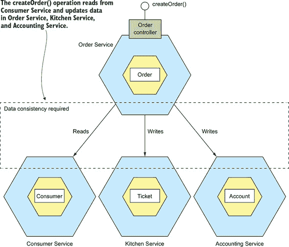

由于每个服务都有自己的数据库，你需要使用一种机制来维护这些数据库之间的数据一致性。

#### 4.1.2\. 分布式事务的问题

在多个服务、数据库或消息代理之间维护数据一致性的传统方法是用分布式事务。分布式事务管理的既定标准是 X/Open 分布式事务处理 (DTP) 模型 (X/Open XA—见 [`en.wikipedia.org/wiki/X/Open_XA`](https://en.wikipedia.org/wiki/X/Open_XA))。XA 使用 *两阶段提交* (2PC) 来确保事务中的所有参与者要么提交要么回滚。符合 XA 的技术堆栈包括符合 XA 的数据库和消息代理、数据库驱动程序和消息 API，以及传播 XA 全局事务 ID 的进程间通信机制。大多数 SQL 数据库都符合 XA 标准，一些消息代理也是如此。例如，Java EE 应用程序可以使用 JTA 来执行分布式事务。

虽然听起来很简单，但分布式事务存在各种问题。一个问题就是许多现代技术，包括 MongoDB 和 Cassandra 这样的 NoSQL 数据库，都不支持它们。此外，现代消息代理，如 RabbitMQ 和 Apache Kafka，也不支持分布式事务。因此，如果你坚持使用分布式事务，你将无法使用许多现代技术。

分布式事务的另一个问题是，它们是一种同步 IPC 形式，这降低了可用性。为了使分布式事务提交，所有参与的服务都必须可用。如第三章所述，可用性是事务中所有参与者可用性的乘积。如果一个分布式事务涉及两个 99.5% 可用的服务，那么整体可用性将是 99%，这显著降低了。每个参与分布式事务的额外服务都会进一步降低可用性。甚至还有埃里克·布赖尔的 CAP 定理，该定理指出，一个系统只能拥有以下三个属性中的两个：一致性、可用性和分区容错性([`en.wikipedia.org/wiki/CAP_theorem`](https://en.wikipedia.org/wiki/CAP_theorem))。今天，架构师更倾向于拥有一个可用的系统，而不是一个一致的系统。

表面上看，分布式事务很有吸引力。从开发者的角度来看，它们与本地事务具有相同的编程模型。但由于前面提到的问题，分布式事务并不是现代应用的可行技术。第三章描述了在不使用分布式事务的情况下，作为数据库事务一部分发送消息的方法。为了解决在微服务架构中维护数据一致性的更复杂问题，应用程序必须使用不同的机制，该机制建立在松散耦合、异步服务概念的基础上。这就是传说发挥作用的地方。

#### 4.1.3\. 使用传说模式来维护数据一致性

*传说* 是在无需使用分布式事务的情况下，在微服务架构中维护数据一致性的机制。您为每个需要更新多个服务中数据的系统命令定义一个传说。传说是一系列本地事务。每个本地事务都使用前面提到的熟悉的 ACID 事务框架和库在单个服务内更新数据。

| |
| --- |

**模式：传说**

使用一系列由异步消息协调的本地事务来在服务之间维护数据一致性。请参阅[`microservices.io/patterns/data/saga.html`](http://microservices.io/patterns/data/saga.html)。

| |
| --- |

系统操作启动传说的第一步。本地事务的完成触发下一个本地事务的执行。稍后，在第 4.2 节中，您将看到如何使用异步消息实现步骤的协调。异步消息的一个重要好处是，它确保即使传说的一个或多个参与者暂时不可用，传说的所有步骤都会被执行。

Sagas 在几个重要方面与 ACID 事务不同。正如我在 第 4.3 节 中详细描述的那样，它们缺乏 ACID 事务的隔离属性。此外，由于每个本地事务都会提交其更改，因此必须使用补偿性事务来回滚 Saga。我将在本节后面更多地讨论补偿性事务。让我们看看一个示例 Saga。

##### 一个示例 Saga：创建订单 Saga

本章中使用的示例 Saga 是 `Create Order Saga`，如图 4.2 所示。`订单服务` 使用这个 Saga 实现了 `createOrder()` 操作。这个 Saga 的第一个本地事务是由创建订单的外部请求启动的。其他五个本地事务分别由前一个事务的完成触发。

##### 图 4.2\. 使用 Saga 创建 `订单`。`createOrder()` 操作由一个由几个服务中的本地事务组成的 Saga 实现。

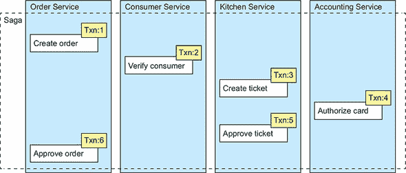

这个 Saga 包含以下本地事务：

1.  **`订单服务`—** 在 `APPROVAL_PENDING` 状态下创建一个 `订单`。

1.  **`消费者服务`—** 验证消费者能否下订单。

1.  **`厨房服务`—** 验证订单详情并在 `CREATE_PENDING` 状态下创建一个 `票据`。

1.  **`会计服务`—** 授权消费者信用卡。

1.  **`厨房服务`—** 将 `票据` 的状态更改为 `AWAITING_ACCEPTANCE`。

1.  **`订单服务`—** 将 `订单` 的状态更改为 `APPROVED`。

在 第 4.2 节 中，我描述了参与 Sagas 的服务如何使用异步消息进行通信。当本地事务完成时，服务会发布一条消息。然后，这条消息触发 Saga 的下一步。使用消息不仅确保 Saga 参与者松散耦合，而且还保证了 Saga 的完成。这是因为如果消息的接收者暂时不可用，消息代理会缓冲该消息，直到可以交付。

表面上看，Sagas 看起来很简单，但使用它们时存在一些挑战。一个挑战是 Sagas 之间缺乏隔离性。第 4.3 节 描述了如何处理这个问题。另一个挑战是在发生错误时回滚更改。让我们看看如何做到这一点。

##### Sagas 使用补偿性交易来回滚更改

传统 ACID 事务的一个伟大特性是，如果业务逻辑检测到业务规则违规，它可以轻松地回滚事务。它执行一个 `ROLLBACK` 语句，数据库撤销迄今为止所做的所有更改。不幸的是，saga 不能自动回滚，因为每个步骤都将更改提交到本地数据库。这意味着，例如，如果 `Create Order Saga` 的第四步中信用卡授权失败，FTGO 应用程序必须显式地撤销前三个步骤所做的更改。你必须编写所谓的 *补偿事务*。

假设 saga 的第 (*n* + 1) 次事务失败。前 *n* 次事务的效果必须被撤销。从概念上讲，这些步骤中的每一个，T[i]，都有一个相应的补偿事务，C[i]，它撤销 T[i] 的效果。为了撤销前 *n* 个步骤的效果，saga 必须以相反的顺序执行每个 C[i]。步骤的顺序是 T[1] ... T[n]，C[n] ... C[1]，如图 4.3 所示。在这个例子中，T[n+1] 失败，这要求撤销步骤 T[1] ... T[n]。

##### 图 4.3\. 当一个 saga 的步骤因业务规则违规而失败时，saga 必须通过执行补偿事务显式地撤销之前步骤所做的更新。

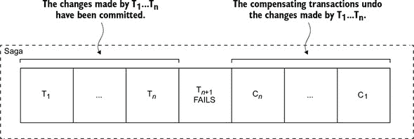

saga 以正向事务的相反顺序执行补偿事务：C[n] ... C[1]。C[i] 的排序机制与 T[i] 的排序机制没有任何不同。C[i] 的完成必须触发 C[i-1] 的执行。

例如，考虑 `Create Order Saga`。这个 saga 可能因多种原因而失败：

+   消费者信息无效或消费者不允许创建订单。

+   餐厅信息无效或餐厅无法接受订单。

+   消费者的信用卡授权失败。

如果本地事务失败，saga 的协调机制必须执行补偿事务以拒绝 `Order` 和可能 `Ticket`。表 4.1 显示了 `Create Order Saga` 每个步骤的补偿事务。重要的是要注意，并非所有步骤都需要补偿事务。只读步骤，如 `verifyConsumerDetails()`，不需要补偿事务。也不需要像 `authorizeCreditCard()` 这样的步骤，这些步骤后面总是跟随成功的步骤。

##### 表 4.1\. `Create Order Saga` 的补偿事务

| 步骤 | 服务 | 事务 | 补偿事务 |
| --- | --- | --- | --- |
| 1 | 订单服务 | createOrder() | rejectOrder() |
| 2 | 消费者服务 | verifyConsumerDetails() | — |
| 3 | 厨房服务 | createTicket() | rejectTicket() |
| 4 | 会计服务 | authorizeCreditCard() | — |
| 5 | 厨房服务 | approveTicket() | — |
| 6 | 订单服务 | approveOrder() | — |

第 4.3 节 讨论了为什么`创建订单史诗`的前三个步骤被称为*可补偿事务*，因为它们后面跟着可能会失败的步骤，第四步被称为史诗的*枢纽事务*，因为它后面跟着永远不会失败的步骤，以及最后两个步骤被称为*可重试事务*，因为它们总是成功的。

为了了解补偿事务是如何使用的，想象一个场景，其中消费者的信用卡授权失败。在这个场景中，史诗执行以下本地事务：

1.  **`订单服务`**— 在`APPROVAL_PENDING`状态下创建一个`Order`。

1.  **`消费者服务`**— 验证消费者能否下订单。

1.  **`厨房服务`**— 验证订单详情并在`CREATE_PENDING`状态下创建一个`Ticket`。

1.  **`会计服务`**— 授权消费者的信用卡，但失败了。

1.  **`厨房服务`**— 将`Ticket`的状态更改为`CREATE_REJECTED`。

1.  **`订单服务`**— 将`Order`的状态更改为`REJECTED`。

第五步和第六步是补偿事务，分别撤销了`厨房服务`和`订单服务`所做的更新。史诗的协调逻辑负责序列化执行正向和补偿事务。让我们看看这是如何工作的。

### 4.2\. 协调史诗

一个史诗的实现包括协调史诗步骤的逻辑。当一个史诗被系统命令启动时，协调逻辑必须选择并告知第一个史诗参与者执行一个本地事务。一旦该事务完成，史诗的序列协调逻辑会选择并调用下一个史诗参与者。这个过程会一直持续到史诗执行了所有步骤。如果任何本地事务失败，史诗必须以相反的顺序执行补偿事务。有几种不同的方式来构建史诗的协调逻辑：

+   ***编排*—** 在史诗参与者之间分配决策和序列。他们主要通过交换事件进行通信。

+   ***编排*—** 在史诗编排器类中集中史诗的协调逻辑。一个史诗*编排器*向史诗参与者发送命令消息，告诉他们要执行哪些操作。

让我们看看每个选项，从编排开始。

#### 4.2.1\. 基于编排的史诗

实现史诗的一种方式是使用编排。当使用编排时，没有中央协调器告诉史诗参与者做什么。相反，史诗参与者订阅彼此的事件并相应地做出反应。为了展示基于编排的史诗是如何工作的，我将首先描述一个例子。然后，我将讨论你必须解决的一些设计问题。然后，我将讨论使用编排的好处和缺点。

##### 使用编排实现创建订单史诗

图 4.4 显示了基于编排的`创建订单叙事`的设计。参与者通过交换事件进行通信。每个参与者，从`订单服务`开始，更新其数据库并发布一个触发下一个参与者的事件。

##### 图 4.4。使用编排实现`创建订单叙事`。叙事参与者通过交换事件进行通信。

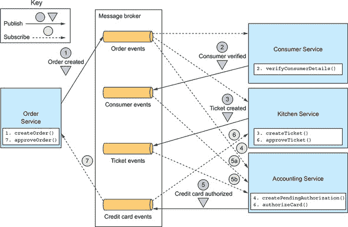

通过这个叙事的愉快路径如下：

1.  `订单服务`在`APPROVAL_PENDING`状态下创建一个`订单`，并发布一个`OrderCreated`事件。

1.  `消费者服务`消费`OrderCreated`事件，验证消费者能否下订单，并发布一个`ConsumerVerified`事件。

1.  `厨房服务`消费`OrderCreated`事件，验证`订单`，在`CREATE_PENDING`状态下创建一个`票据`，并发布`TicketCreated`事件。

1.  `会计服务`消费`OrderCreated`事件，并在`PENDING`状态下创建一个`CreditCardAuthorization`。

1.  `会计服务`消费`TicketCreated`和`ConsumerVerified`事件，对消费者信用卡进行收费，并发布`CreditCardAuthorized`事件。

1.  `厨房服务`消费`CreditCardAuthorized`事件，并将`票据`的状态更改为`AWAITING_ACCEPTANCE`。

1.  `订单服务`接收`CreditCardAuthorized`事件，将`订单`的状态更改为`APPROVED`，并发布一个`OrderApproved`事件。

`创建订单叙事`还必须处理叙事参与者拒绝`订单`并发布某种类型的失败事件的场景。例如，消费者信用卡的授权可能会失败。叙事必须执行补偿性交易以撤销已经完成的事情。图 4.5 显示了当`AccountingService`无法授权消费者信用卡时事件流。

##### 图 4.5。当消费者信用卡授权失败时`创建订单叙事`的事件序列。`会计服务`发布`Credit Card Authorization Failed`事件，导致`厨房服务`拒绝`票据`，以及`订单服务`拒绝`订单`。

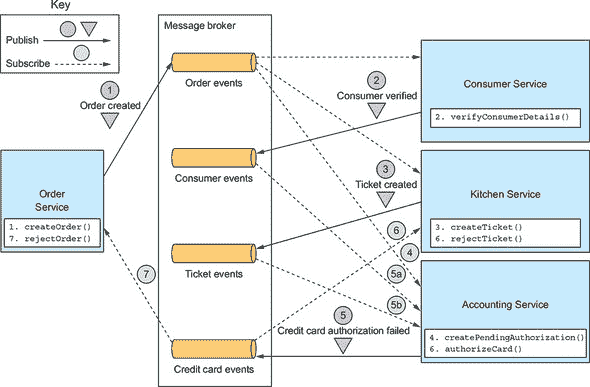

事件序列如下：

1.  `订单服务`在`APPROVAL_PENDING`状态下创建一个`订单`，并发布一个`OrderCreated`事件。

1.  `消费者服务`消费`OrderCreated`事件，验证消费者能否下订单，并发布一个`ConsumerVerified`事件。

1.  `厨房服务`消费`OrderCreated`事件，验证`订单`，在`CREATE_PENDING`状态下创建一个`票据`，并发布`TicketCreated`事件。

1.  `会计服务`消费`OrderCreated`事件，并在`PENDING`状态下创建一个`CreditCardAuthorization`。

1.  `会计服务`消费`TicketCreated`和`ConsumerVerified`事件，对消费者信用卡进行收费，并发布一个`Credit Card Authorization Failed`事件。

1.  `厨房服务`消费了`信用卡授权失败`事件，并将`票`的状态更改为`已拒绝`。

1.  `订单服务`消费了`信用卡授权失败`事件，并将`订单`的状态更改为`已拒绝`。

正如你所见，基于编排的叙事的参与者通过发布/订阅进行交互。让我们更深入地了解一下在为你的叙事实现基于发布/订阅的通信时需要考虑的一些问题。

##### 可靠的事件驱动通信

在实现基于编排的叙事时，你必须考虑一些与服务间通信相关的问题。第一个问题是确保叙事参与者更新其数据库并发布事件作为数据库事务的一部分。基于编排的叙事的每一步都会更新数据库并发布事件。例如，在`创建订单叙事`中，`厨房服务`接收到`消费者验证`事件，创建一个`票`，并发布一个`票已创建`事件。数据库更新和事件发布的原子性是至关重要的。因此，为了可靠地通信，叙事参与者必须使用事务消息，这在第三章中有所描述。第三章。

第二个你需要考虑的问题是确保叙事参与者必须能够将接收到的每个事件映射到自己的数据。例如，当`订单服务`接收到`信用卡已授权`事件时，它必须能够查找相应的`订单`。解决方案是让叙事参与者发布包含*关联 ID*的事件，这是一种数据，使其他参与者能够执行映射。

例如，`创建订单叙事`的参与者可以使用`orderId`作为从一位参与者传递到下一位参与者的关联 ID。`会计服务`发布一个包含`orderId`的`信用卡已授权`事件，该`orderId`来自`票已创建`事件。当`订单服务`接收到`信用卡已授权`事件时，它使用`orderId`来检索相应的`订单`。同样，`厨房服务`使用该事件中的`orderId`来检索相应的`票`。

##### 基于编排的叙事的优缺点

基于编排的叙事有以下几个好处：

+   ***简单性*—** 服务在创建、更新或删除业务对象时发布事件。

+   ***松散耦合*—** 参与者订阅事件，并不直接了解彼此。

并且还有一些缺点：

+   ***更难理解*—** 与编排不同，代码中没有单一的地方定义叙事。相反，编排将叙事的实现分布在各个服务中。因此，有时对于开发者来说，理解一个特定的叙事是如何工作的可能很困难。

+   ***服务之间的循环依赖*—** 叙事参与者订阅彼此的事件，这通常会产生循环依赖。例如，如果你仔细检查图 4.4，你会看到循环依赖，例如`Order Service` → `Accounting Service` → `Order Service`。尽管这不一定是一个问题，但循环依赖被认为是设计上的一个坏味道。

+   ***紧密耦合的风险*—** 每个叙事参与者都需要订阅影响它们的所有事件。例如，`Accounting Service`必须订阅所有导致消费者信用卡被收费或退款的操作。因此，它可能需要与`Order Service`实现的订单生命周期同步更新。

舞台编排（Choreography）对于简单的叙事可能效果很好，但由于这些缺点，对于更复杂的叙事，通常更好的做法是使用编排。让我们看看编排是如何工作的。

#### 4.2.2\. 基于编排的叙事

编排（Orchestration）是实现叙事（sagas）的另一种方式。当使用编排时，你定义一个编排器（orchestrator）类，其唯一责任是告诉叙事参与者他们应该做什么。叙事编排器通过命令/异步回复风格的交互与参与者进行通信。为了执行叙事步骤，它向参与者发送一个命令消息，告诉他们要执行的操作。在叙事参与者执行了操作之后，它向编排器发送一个回复消息。然后编排器处理该消息并确定下一个要执行的叙事步骤。

为了展示基于编排的叙事是如何工作的，我首先将描述一个示例。然后，我将描述如何将基于编排的叙事建模为状态机。我将讨论如何利用事务消息确保叙事编排器和叙事参与者之间可靠的通信。然后，我将描述使用基于编排的叙事的优缺点。

##### 使用编排实现创建订单叙事（Create Order saga）

图 4.6 展示了基于编排的`Create Order Saga`的设计。叙事由`CreateOrderSaga`类编排，该类使用异步请求/响应调用叙事参与者。这个类跟踪流程并向叙事参与者发送命令消息，例如`Kitchen Service`和`Consumer Service`。`CreateOrderSaga`类从其回复通道读取回复消息，然后确定叙事中的下一步，如果有的话。

##### 图 4.6\. 使用编排实现`Create Order Saga`。`Order Service`实现一个叙事编排器，使用异步请求/响应调用叙事参与者。

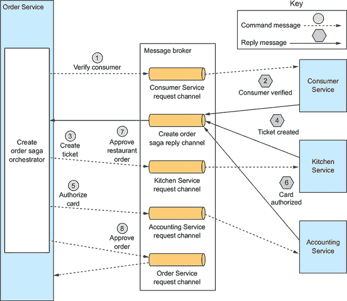

`Order Service`首先创建一个`Order`和一个`Create Order Saga`编排器。之后，对于愉快的路径流程如下：

1.  叙事编排器向`Consumer Service`发送一个`Verify Consumer`命令。

1.  `消费者服务`回复一个`消费者已验证`的消息。

1.  叙事协调器向`厨房服务`发送一个`创建票据`的命令。

1.  `厨房服务`回复一个`创建票据`的消息。

1.  叙事协调器向`会计服务`发送一个`授权卡`的消息。

1.  `会计服务`回复一个`卡已授权`的消息。

1.  叙事协调器向`厨房服务`发送一个`批准票据`的命令。

1.  叙事协调器向`订单服务`发送一个`批准订单`的命令。

注意，在最后一步，叙事协调器向`订单服务`发送一个命令消息，即使它也是`订单服务`的一个组件。原则上，`创建订单叙事`可以通过直接更新来批准`订单`。但为了保持一致性，叙事将`订单服务`视为另一个参与者。

如图 4.6 所示的图表，每个都描述了一个叙事的场景，但一个叙事可能有许多场景。例如，`创建订单叙事`有四个场景。除了快乐路径外，叙事还可能因为`消费者服务`、`厨房服务`或`会计服务`中的任何一个失败而失败。因此，将叙事建模为状态机是有用的，因为它描述了所有可能的情况。

##### 将叙事协调器建模为状态机

将一个叙事协调器建模为一个状态机是一个好方法。一个*状态机*由一组状态和一组由事件触发的状态转换组成。每个转换可以有一个动作，对于一个叙事来说，这个动作就是调用一个叙事参与者。状态之间的转换是由一个叙事参与者执行的一个本地事务的完成触发的。当前状态和本地事务的具体结果决定了状态转换以及是否执行某个动作。对于状态机也有有效的测试策略。因此，使用状态机模型使得设计、实现和测试叙事变得更加容易。

图 4.7 显示了`创建订单叙事`的状态机模型。这个状态机由许多状态组成，包括以下内容：

+   **`验证消费者`—** 初始状态。当处于此状态时，叙事正在等待`消费者服务`验证消费者能否下订单。

+   **`创建票据`—** 叙事正在等待对`创建票据`命令的回复。

+   **`授权卡`—** 等待`会计服务`授权消费者的信用卡。

+   **`订单批准`—** 表示叙事成功完成的最终状态。

+   **`订单拒绝`—** 表示`订单`被参与者之一拒绝的最终状态。

##### 图 4.7\. `创建订单叙事`的状态机模型

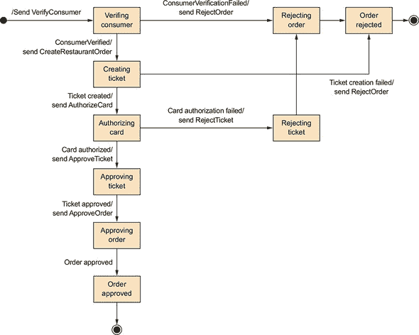

状态机还定义了众多状态转换。例如，状态机从“创建票据”状态转换到“授权卡片”或“拒绝订单”状态。当它收到对“创建票据”命令的成功回复时，它转换到“授权卡片”状态。或者，如果“厨房服务”无法创建“票据”，状态机转换到“拒绝订单”状态。

状态机的初始动作是向“消费者服务”发送“验证消费者”命令。来自“消费者服务”的回复触发下一个状态转换。如果消费者验证成功，叙事创建“票据”并转换到“创建票据”状态。但如果消费者验证失败，叙事拒绝“订单”并转换到“拒绝订单”状态。状态机经历众多其他状态转换，由叙事参与者的回复驱动，直到达到“订单批准”或“订单拒绝”的最终状态。

##### 叙事编排和事务消息

基于编排的叙事的每一步都包括一个服务更新数据库并发布消息。例如，“订单服务”持久化“订单”和“创建订单叙事编排器”，并发送消息给第一个叙事参与者。叙事参与者，如“厨房服务”，通过更新其数据库并发送回复消息来处理命令消息。“订单服务”通过更新叙事编排器的状态并发送命令消息到下一个叙事参与者来处理参与者的回复消息。如第三章所述，一个服务必须使用事务消息才能原子性地更新数据库并发布消息。稍后，在第 4.4 节中，我将更详细地描述“创建订单叙事编排器”的实现，包括它如何使用事务消息。

让我们来看看使用叙事编排的优缺点。

##### 基于编排的叙事的优缺点

基于编排的叙事有几个好处：

+   ***更简单的依赖关系*—**编排的一个好处是它不会引入循环依赖。叙事编排器调用叙事参与者，但参与者不会调用编排器。因此，编排器依赖于参与者，但反之则不然，因此没有循环依赖。

+   ***更少的耦合*—**每个服务实现了一个由编排器调用的 API，因此它不需要了解叙事参与者发布的事件。

+   ***提高关注点的分离并简化业务逻辑*—** 悲剧协调逻辑位于悲剧编排器中。领域对象更简单，并且不知道它们参与的悲剧。例如，当使用编排时，`Order` 类不知道任何悲剧，因此它有一个更简单的状态机模型。在执行 `Create Order Saga` 的过程中，它直接从 `APPROVAL_PENDING` 状态过渡到 `APPROVED` 状态。`Order` 类没有与悲剧步骤相对应的任何中间状态。因此，业务变得更加简单。

编排也有一个缺点：将过多的业务逻辑集中在编排器中的风险。这导致了一种设计，其中智能编排器告诉愚蠢的服务要执行的操作。幸运的是，你可以通过设计仅负责排序而不包含任何其他业务逻辑的编排器来避免这个问题。

我建议除了最简单的悲剧之外，都使用编排。实现你的悲剧的协调逻辑只是你需要解决的设计问题之一。另一个，可能是你在使用悲剧时面临的最大挑战，是处理缺乏隔离。让我们看看这个问题以及如何解决它。

### 4.3\. 处理缺乏隔离

ACID 中的*I*代表*隔离*。ACID 事务的隔离属性确保并发执行多个事务的结果与它们按某种顺序执行的结果相同。数据库提供了每个 ACID 事务对数据具有独占访问的错觉。隔离使得编写并发执行的业务逻辑变得容易得多。

使用悲剧的挑战在于它们缺乏 ACID 事务的隔离属性。这是因为悲剧的每个本地事务所做的更新一旦提交，就会立即对其他悲剧可见。这种行为可能导致两个问题。首先，其他悲剧可以在悲剧执行时更改悲剧访问的数据。并且其他悲剧可以在悲剧完成更新之前读取其数据，因此可能会暴露在不一致的数据中。实际上，你可以将悲剧视为 ACD：

+   ***原子性*—** 悲剧式实现确保所有事务都执行或所有更改都撤销。

+   ***一致性*—** 服务内的引用完整性由本地数据库处理。服务之间的引用完整性由服务处理。

+   ***耐用性*—** 由本地数据库处理。

这种缺乏隔离可能导致数据库文献中称为*异常*的情况。异常是指事务以它不会在单个事务执行时的方式读取或写入数据。当发生异常时，并发执行悲剧的结果与它们按顺序执行的结果不同。

表面上看，缺乏隔离性似乎不可行。但在实践中，开发者为了获得更高的性能，通常愿意接受降低隔离性。关系型数据库管理系统（RDBMS）允许你为每个事务指定隔离级别（[`dev.mysql.com/doc/refman/5.7/en/innodb-transaction-isolation-levels.html`](https://dev.mysql.com/doc/refman/5.7/en/innodb-transaction-isolation-levels.html)）。默认的隔离级别通常是一个比完全隔离更弱的隔离级别，也称为可序列化事务。现实世界的数据库事务通常与教科书中 ACID 事务的定义不同。

下一节将讨论一系列处理缺乏隔离性的 saga 设计策略。这些策略被称为*对策*。一些对策在应用层面实现隔离性。其他对策降低了缺乏隔离性的业务风险。通过使用对策，你可以编写基于 saga 的业务逻辑，使其正确运行。

我将首先描述由缺乏隔离性引起的异常。之后，我将讨论消除这些异常或降低其业务风险的对策。

#### 4.3.1\. 异常概述

缺乏隔离性可能导致以下三种异常：

+   ***丢失更新*—** 一个 saga 在没有读取另一个 saga 所做的更改的情况下进行覆盖。

+   ***脏读*—** 一个事务或 saga 读取了尚未完成更新的 saga 所做的更新。

+   ***模糊/不可重复读取*—** saga 的两个不同步骤读取相同的数据并得到不同的结果，因为另一个 saga 已经进行了更新。

这三种异常都可能发生，但前两种最常见且最具挑战性。让我们先看看这两种类型的异常，从丢失更新开始。

##### 丢失更新

当一个 saga 覆盖了另一个 saga 所做的更新时，就会发生丢失更新异常。例如，考虑以下场景：

1.  `Create Order Saga` 的第一步是创建一个 `Order`。

1.  当那个 saga 执行时，`Cancel Order Saga` 取消了 `Order`。

1.  `Create Order Saga` 的最后一步是批准 `Order`。

在这个场景中，`Create Order Saga` 忽略了 `Cancel Order Saga` 所做的更新并将其覆盖。因此，FTGO 应用程序将发货给客户已取消的订单。在本节稍后，我将展示如何防止丢失更新。

##### 脏读

当一个 saga 读取另一个 saga 正在更新的数据时，就会发生脏读。例如，考虑一个 FTGO 应用程序存储版本，其中消费者有一个信用额度。在这个应用程序中，取消订单的 saga 由以下事务组成：

+   **`Consumer Service`—** 增加可用信用额度。

+   **`Order Service`—** 将 `Order` 的状态更改为已取消。

+   **`Delivery Service`—** 取消配送。

让我们想象一个场景，其中`取消订单`和`创建订单叙事`的执行交织在一起，并且由于取消交货太晚，`取消订单叙事`被回滚。可能调用`消费者服务`的事务序列如下：

1.  **`取消订单叙事`—** 增加可用信用。

1.  **`创建订单叙事`—** 减少可用信用。

1.  **`取消订单叙事`—** 减少可用信用的补偿性交易。

在这种情况下，`创建订单叙事`对可用信用进行了脏读，使得消费者可以放置超过其信用额的订单。这很可能是对业务不可接受的风险。

让我们看看如何防止这种情况以及其他类型的异常影响应用程序。

#### 4.3.2\. 处理隔离不足的对策

叙事事务模型是 ACD，其隔离不足可能导致导致应用程序行为异常的异常。开发者有责任编写叙事，以防止异常或最小化其对业务的影响。这听起来可能是一项艰巨的任务，但你已经看到了一个防止异常的策略的例子。`订单`使用`*_PENDING`状态，例如`APPROVAL_PENDING`，是这种策略的一个例子。更新`订单`的叙事，如`创建订单叙事`，首先将`订单`的状态设置为`*_PENDING`。`*_PENDING`状态告诉其他事务，`订单`正在由叙事更新，并相应地采取行动。

`订单`使用`*_PENDING`状态是 Lars Frank 和 Torben U. Zahle 于 1998 年发表的论文“使用远程过程调用和更新传播在多数据库中实现语义 ACID 属性”中称为*语义锁对策*的例子（[`dl.acm.org/citation.cfm?id=284472.284478`](https://dl.acm.org/citation.cfm?id=284472.284478)）。该论文描述了如何处理不使用分布式事务的多数据库架构中事务隔离不足的问题。其中许多想法在设计叙事时很有用。它描述了一系列处理由隔离不足引起的异常的对策，这些对策要么防止一个或多个异常，要么最小化其对业务的影响。该论文描述的对策如下：

+   ***语义锁*—** 应用级别的锁。

+   ***交换更新*—** 设计更新操作，使其可以按任何顺序执行。

+   ***悲观视图*—** 重新排序叙事的步骤以最小化业务风险。

+   ***重读值*—** 通过重新读取数据以验证在覆盖之前它未更改来防止脏写。

+   ***版本文件*—** 记录记录的更新，以便可以重新排序。

+   ***按值*—** 使用每个请求的业务风险动态选择并发机制。

在本节的后面部分，我将描述这些对策中的每一个，但首先我想介绍一些术语，用于描述 Saga 的结构，这在讨论对策时很有用。

##### Saga 的结构

上节中提到的对策论文定义了一个用于 Saga 结构的有用模型。在这个模型中，如图 4.8 所示，一个 Saga 由三种类型的事务组成：

+   ***可补偿事务*—** 可以使用补偿事务潜在地回滚的事务。

+   ***枢纽事务*—** Saga 中的启动/停止点。如果枢纽事务提交，则 Saga 将运行至完成。枢纽事务可以既不是可补偿的也不是可重试的事务。或者，它可以是最后一个可补偿事务或第一个可重试事务。

+   ***可重试事务*—** 沿着枢纽事务进行的、有保证成功的事务。

##### 图 4.8\. Saga 由三种不同类型的事务组成：可补偿事务，可以回滚，因此有补偿事务；枢纽事务，是 Saga 的启动/停止点；可重试事务，是不需要回滚且保证完成的事务。

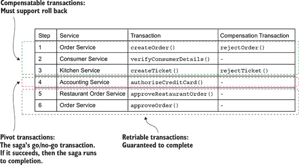

在 `Create Order Saga` 中，`createOrder()`、`verifyConsumerDetails()` 和 `createTicket()` 步骤是可补偿事务。`createOrder()` 和 `createTicket()` 事务有补偿事务来撤销它们的更新。`verifyConsumerDetails()` 事务是只读的，因此不需要补偿事务。`authorizeCreditCard()` 事务是这个 Saga 的枢纽事务。如果消费者的信用卡可以被授权，那么这个 Saga 就有保证完成。`approveTicket()` 和 `approveOrder()` 步骤是跟随枢纽事务的可重试事务。

可补偿事务和可重试事务之间的区别特别重要。正如您将看到的，每种类型的事务在对策中扮演着不同的角色。第十三章 指出，在迁移到微服务时，单体有时必须参与 Saga，如果单体只需要执行可重试事务，那么这会显著简化。

现在我们来逐一查看每种对策，首先是语义锁对策。

##### 对策：语义锁

当使用语义锁对策时，叙事的可补偿性事务会在它创建或更新的任何记录中设置一个标志。该标志表示记录尚未*提交*并且可能发生变化。该标志可以是防止其他事务访问记录的锁，或者是一个警告，表明其他事务应该对该记录持怀疑态度。它可以通过可重试的事务（叙事成功完成）或补偿性事务（叙事正在回滚）来清除。

`Order.state`字段是语义锁的一个很好的例子。`*_PENDING`状态，如`APPROVAL_PENDING`和`REVISION_PENDING`，实现了语义锁。它们告诉访问`Order`的其他叙事，叙事正在更新`Order`。例如，`Create Order Saga`的第一个步骤，这是一个可补偿性事务，在`APPROVAL_PENDING`状态下创建一个`Order`。`Create Order Saga`的最终步骤，这是一个可重试的事务，将字段更改为`APPROVED`。补偿性事务将字段更改为`REJECTED`。

管理锁只是问题的一半。你还需要根据具体情况决定叙事应该如何处理被锁定的记录。例如，考虑`cancelOrder()`系统命令。客户端可能会调用此操作来取消处于`APPROVAL_PENDING`状态的`Order`。

处理这种场景有几种不同的方法。一个选项是让`cancelOrder()`系统命令失败，并告诉客户端稍后重试。这种方法的主要好处是易于实现。然而，缺点是它使客户端变得更加复杂，因为它必须实现重试逻辑。

另一个选项是让`cancelOrder()`方法阻塞，直到锁被释放。使用语义锁的好处是它们本质上重新创建了 ACID 事务提供的隔离性。更新相同记录的叙事是序列化的，这显著减少了编程工作量。另一个好处是它们从客户端移除了重试的负担。缺点是应用程序必须管理锁。它还必须实现一个死锁检测算法，该算法通过回滚叙事来打破死锁并重新执行它。

##### 对策：交换更新

一个直接的对策是设计更新操作为可交换的。如果操作可以以任何顺序执行，则它们是*可交换的*。`Account`的`debit()`和`credit()`操作是可交换的（如果你忽略透支检查）。这种对策很有用，因为它消除了丢失的更新。

例如，考虑这样一个场景：在可补偿性事务已经借记（或贷记）一个账户之后，需要回滚一个叙事。补偿性事务可以简单地贷记（或借记）该账户以撤销更新。不可能覆盖其他叙事所做的更新。

##### 对策：悲观观点

处理隔离不足的另一种方法是**悲观视图**对策。它重新排序叙事的步骤以最小化因脏读而导致的业务风险。例如，考虑之前用来描述脏读异常的场景。在那个场景中，`创建订单叙事`执行了对可用信用的脏读并创建了一个超出消费者信用额度的订单。为了降低这种情况发生的风险，这种对策会重新排序`取消订单叙事`：

1.  **`订单服务`**—将`订单`的状态更改为已取消。

1.  **`配送服务`**—取消配送。

1.  **`客户服务`**—增加可用信用。

在这个重新排序的叙事版本中，可用信用通过可重试事务增加，从而消除了脏读的可能性。

##### 对策：重读值

**重读值**对策防止丢失更新。使用这种对策的叙事在更新记录之前会重新读取记录，验证其未改变，然后更新记录。如果记录已改变，叙事将中止并可能重新启动。这种对策是乐观离线锁模式（[`martinfowler.com/eaaCatalog/optimisticOfflineLock.html`](https://martinfowler.com/eaaCatalog/optimisticOfflineLock.html)）的一种形式。

`创建订单叙事`可以使用这种对策来处理在订单正在审批过程中被取消的场景。批准订单的事务验证订单自叙事早期创建以来是否未改变。如果未改变，事务批准订单。但如果订单已被取消，事务将中止叙事，这会导致其补偿事务被执行。

##### 对策：版本文件

**版本文件**对策之所以得名，是因为它记录了对记录执行的操作，以便可以重新排序它们。这是一种将非交换操作转换为交换操作的方法。要了解这种对策是如何工作的，可以考虑一个场景，其中`创建订单叙事`与`取消订单叙事`并发执行。除非叙事使用语义锁对策，否则`取消订单叙事`可能会在`创建订单叙事`授权卡片之前取消消费者的信用卡授权。

`会计服务`处理这些顺序错误的请求的一种方法是将操作按到达顺序记录下来，然后按正确的顺序执行它们。在这个场景中，它首先记录`取消授权`请求。然后，当`会计服务`收到随后的`授权卡片`请求时，它会注意到它已经收到了`取消授权`请求，并跳过授权信用卡。

##### 对策：按值

最后一种对策是 *值传递* 对策。这是一种根据业务风险选择并发机制的战略。使用这种对策的应用程序使用每个请求的属性来决定使用 sagas 还是分布式事务。它使用 sagas 执行低风险请求，可能应用上一节中描述的对策。但对于涉及大量资金等高风险请求，它使用分布式事务。这种策略使应用程序能够动态地在业务风险、可用性和可伸缩性之间进行权衡。

在实现应用程序中的 sagas 时，你可能需要使用这些对策之一或多个。让我们看看使用语义锁对策的 `Create Order Saga` 的详细设计和实现。

### 4.4\. `Order Service` 和 `Create Order Saga` 的设计

现在我们已经探讨了各种 saga 设计和实现问题，让我们来看一个例子。图 4.9 展示了 `Order Service` 的设计。该服务的业务逻辑由传统的业务逻辑类组成，例如 `Order Service` 和 `Order` 实体。还包括 saga 调度器类，例如 `CreateOrderSaga` 类，它调度 `Create Order Saga`。此外，因为 `Order Service` 参与其自身的 sagas，它有一个 `OrderCommandHandlers` 适配器类，该类通过调用 `OrderService` 来处理命令消息。

##### 图 4.9\. `Order Service` 及其 sagas 的设计

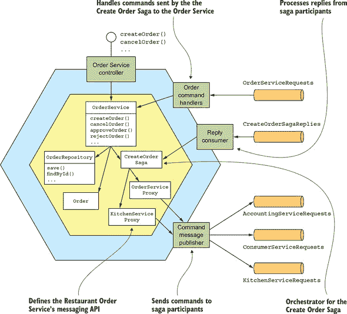

`Order Service` 的某些部分可能看起来很熟悉。就像在传统应用程序中一样，业务逻辑的核心是由 `OrderService`、`Order` 和 `OrderRepository` 类实现的。在本章中，我将简要描述这些类。我在第五章中更详细地描述了它们。

关于 `Order Service` 的不太熟悉的部分是 saga 相关的类。这个服务既是 saga 调度器也是 saga 参与者。`Order Service` 有几个 saga 调度器，例如 `CreateOrderSaga`。saga 调度器通过使用 saga 参与者代理类（如 `KitchenServiceProxy` 和 `OrderServiceProxy`）向 saga 参与者发送命令消息。saga 参与者代理定义了 saga 参与者的消息 API。`Order Service` 还有一个 `OrderCommandHandlers` 类，该类处理 sagas 发送给 `Order Service` 的命令消息。

让我们更详细地看看设计，从 `OrderService` 类开始。

#### 4.4.1\. `OrderService` 类

`OrderService` 类是一个由服务的 API 层调用的领域服务。它负责创建和管理订单。图 4.10 显示了 `OrderService` 及其一些协作者。`OrderService` 创建和更新 `Orders`，调用 `OrderRepository` 持久化 `Orders`，并使用 `SagaManager` 创建 saga，例如 `CreateOrderSaga`。`SagaManager` 类是 Eventuate Tram Saga 框架提供的类之一，这是一个用于编写 saga 调度器和参与者的框架，将在本节稍后进行讨论。

##### 图 4.10\. `OrderService` 创建和更新 `Orders`，调用 `OrderRepository` 持久化 `Orders`，并创建包括 `CreateOrderSaga` 在内的 saga。

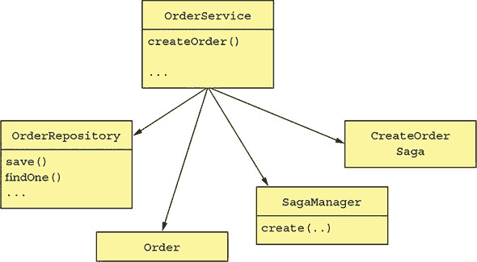

我将在第五章中更详细地讨论这个类。第五章。现在，让我们专注于 `createOrder()` 方法。以下列表显示了 `OrderService` 的 `createOrder()` 方法。此方法首先创建一个 `Order`，然后创建一个 `CreateOrderSaga` 来验证订单。

##### 列表 4.1\. `OrderService` 类及其 `createOrder()` 方法

```
@Transactional                                                           *1*
 public class OrderService {

  @Autowired
  private SagaManager<CreateOrderSagaState> createOrderSagaManager;

  @Autowired
  private OrderRepository orderRepository;

  @Autowired
  private DomainEventPublisher eventPublisher;

  public Order createOrder(OrderDetails orderDetails) {
    ...
    ResultWithEvents<Order> orderAndEvents = Order.createOrder(...);     *2*
     Order order = orderAndEvents.result;
    orderRepository.save(order);                                         *3*

    eventPublisher.publish(Order.class,                                  *4*
                            Long.toString(order.getId()),
                           orderAndEvents.events);

    CreateOrderSagaState data =
        new CreateOrderSagaState(order.getId(), orderDetails);           *5*
     createOrderSagaManager.create(data, Order.class, order.getId());

    return order;
  }

  ...
}
```

+   ***1* 确保服务方法是事务性的。**

+   ***2* 创建订单。**

+   ***3* 在数据库中持久化订单。**

+   ***4* 发布领域事件。**

+   ***5* 创建一个 CreateOrderSaga。**

`createOrder()` 方法通过调用工厂方法 `Order.createOrder()` 创建一个 `Order`。然后使用 `OrderRepository`（一个基于 JPA 的存储库）持久化 `Order`。通过调用 `SagaManager.create()` 创建 `CreateOrderSaga`，传递一个包含新保存的 `Order` ID 和 `OrderDetails` 的 `CreateOrderSagaState`。`SagaManager` 实例化 saga 调度器，这导致它向第一个 saga 参与者发送命令消息，并在数据库中持久化 saga 调度器。

让我们看看 `CreateOrderSaga` 及其相关类。

#### 4.4.2\. Create Order Saga 的实现

图 4.11 显示了实现 `Create Order Saga` 的类。每个类的职责如下：

##### 图 4.11\. `OrderService` 的 saga，例如 `Create Order Saga`，是使用 Eventuate Tram Saga 框架实现的。

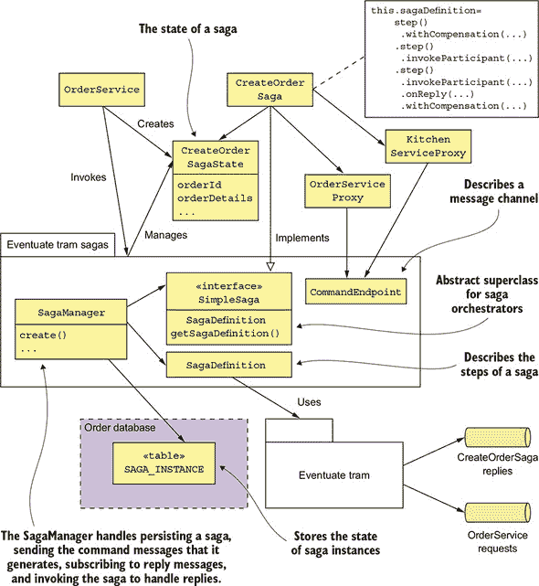

+   `CreateOrderSaga`—一个单例类，它定义了 saga 的状态机。它调用 `CreateOrderSagaState` 创建命令消息，并通过 saga 参与者代理类（如 `KitchenServiceProxy`）指定的消息通道将它们发送给参与者。

+   `CreateOrderSagaState`—一个 saga 的持久化状态，用于创建命令消息。

+   *saga 参与者代理类，例如* `KitchenServiceProxy`—每个代理类定义了一个 saga 参与者的消息 API，它包括命令通道、命令消息类型和回复类型。

这些类是使用 Eventuate Tram Saga 框架编写的。

Eventuate Tram Saga 框架提供了一个领域特定语言 (DSL) 来定义悲剧的状态机。它执行悲剧的状态机，并使用 Eventuate Tram 框架与悲剧参与者交换消息。该框架还将悲剧的状态持久化到数据库中。

让我们更仔细地看看 `Create Order Saga` 的实现，从 `CreateOrderSaga` 类开始。

##### `CreateOrderSaga` 协调器

`CreateOrderSaga` 类实现了前面在 图 4.7 中显示的状态机。这个类实现了 `SimpleSaga`，这是悲剧的基接口。`CreateOrderSaga` 类的核心是以下列表中显示的悲剧定义。它使用 Eventuate Tram Saga 框架提供的 DSL 来定义 `Create Order Saga` 的步骤。

##### 列表 4.2\. `CreateOrderSaga` 的定义

```
public class CreateOrderSaga implements SimpleSaga<CreateOrderSagaState> {

  private SagaDefinition<CreateOrderSagaState> sagaDefinition;

  public CreateOrderSaga(OrderServiceProxy orderService,
                         ConsumerServiceProxy consumerService,
                         KitchenServiceProxy kitchenService,
                         AccountingServiceProxy accountingService) {
    this.sagaDefinition =
             step()
              .withCompensation(orderService.reject,
                                CreateOrderSagaState::makeRejectOrderCommand)
            .step()
              .invokeParticipant(consumerService.validateOrder,
                      CreateOrderSagaState::makeValidateOrderByConsumerCommand)
            .step()
              .invokeParticipant(kitchenService.create,
                      CreateOrderSagaState::makeCreateTicketCommand)
              .onReply(CreateTicketReply.class,
                      CreateOrderSagaState::handleCreateTicketReply)
              .withCompensation(kitchenService.cancel,
                  CreateOrderSagaState::makeCancelCreateTicketCommand)
            .step()
              .invokeParticipant(accountingService.authorize,
                      CreateOrderSagaState::makeAuthorizeCommand)
            .step()
              .invokeParticipant(kitchenService.confirmCreate,
                  CreateOrderSagaState::makeConfirmCreateTicketCommand)
            .step()
              .invokeParticipant(orderService.approve,
                                 CreateOrderSagaState::makeApproveOrderCommand)
            .build();
  }

 @Override
 public SagaDefinition<CreateOrderSagaState> getSagaDefinition() {
  return sagaDefinition;
 }
```

`CreateOrderSaga` 的构造函数创建悲剧定义并将其存储在 `sagaDefinition` 字段中。`getSagaDefinition()` 方法返回悲剧定义。

为了了解 `CreateOrderSaga` 的工作原理，让我们看看悲剧的第三步定义，如下所示。这一步的悲剧调用 `Kitchen Service` 来创建一个 `Ticket`。它的补偿事务取消该 `Ticket`。`step()`、`invokeParticipant()`、`onReply()` 和 `withCompensation()` 方法是 Eventuate Tram Saga 提供的 DSL 的一部分。

##### 列表 4.3\. 悲剧第三步的定义

```
public class CreateOrderSaga ...

public CreateOrderSaga(..., KitchenServiceProxy kitchenService,
            ...) {
    ...
    .step()
      .invokeParticipant(kitchenService.create,                         *1*
                 CreateOrderSagaState::makeCreateTicketCommand)
      .onReply(CreateTicketReply.class,
                CreateOrderSagaState::handleCreateTicketReply)          *2*
       .withCompensation(kitchenService.cancel,                         *3*
               CreateOrderSagaState::makeCancelCreateTicketCommand)

    ...
  ;
```

+   **1* 定义正向事务。**

+   **2* 当收到成功回复时调用 handleCreateTicketReply()。**

+   **3* 定义补偿事务。**

`invokeParticipant()` 的调用定义了正向事务。它通过调用 `CreateOrderSagaState.makeCreateTicketCommand()` 创建 `CreateTicket` 命令消息，并将其发送到由 `kitchenService.create` 指定的通道。`onReply()` 的调用指定当从 `Kitchen Service` 收到成功回复时，应调用 `CreateOrderSagaState.handleCreateTicketReply()`。此方法将返回的 `ticketId` 存储在 `CreateOrderSagaState` 中。`withCompensation()` 的调用定义了补偿事务。它通过调用 `CreateOrderSagaState.makeCancelCreateTicket()` 创建 `RejectTicketCommand` 命令消息，并将其发送到由 `kitchenService.create` 指定的通道。

悲剧的其他步骤以类似的方式定义。`CreateOrderSagaState` 创建每个消息，这些消息由悲剧发送到由 `KitchenServiceProxy` 定义的 messaging 端点。让我们看看这些类中的每一个，从 `CreateOrderSagaState` 开始。

##### `CreateOrderSagaState` 类

如下所示，`CreateOrderSagaState` 类代表 saga 实例的状态。该类的实例由 `OrderService` 创建，并由 Eventuate Tram Saga 框架保存在数据库中。其主要职责是创建发送给 saga 参与者的消息。

##### 列表 4.4\. `CreateOrderSagaState` 存储 saga 实例的状态

```
public class CreateOrderSagaState {

  private Long orderId;

  private OrderDetails orderDetails;
  private long ticketId;

  public Long getOrderId() {
    return orderId;
  }

  private CreateOrderSagaState() {
  }

  public CreateOrderSagaState(Long orderId, OrderDetails orderDetails) {  *1*
     this.orderId = orderId;
    this.orderDetails = orderDetails;
  }

  CreateTicket makeCreateTicketCommand() {                                *2*
     return new CreateTicket(getOrderDetails().getRestaurantId(),
                   getOrderId(), makeTicketDetails(getOrderDetails()));
  }

  void handleCreateTicketReply(CreateTicketReply reply) {                 *3*
     logger.debug("getTicketId {}", reply.getTicketId());
    setTicketId(reply.getTicketId());
  }

  CancelCreateTicket makeCancelCreateTicketCommand() {                    *4*
     return new CancelCreateTicket(getOrderId());
  }

  ...
```

+   ***1* 由 OrderService 调用以实例化 CreateOrderSagaState**

+   ***2* 创建一个 CreateTicket 命令消息**

+   ***3* 保存新创建的 Ticket 的 ID**

+   ***4* 创建 CancelCreateTicket 命令消息**

`CreateOrderSaga` 调用 `CreateOrderSagaState` 来创建命令消息。它将这些命令消息发送到由 `SagaParticipantProxy` 类定义的端点。让我们看看这些类中的一个：`KitchenServiceProxy`。

##### `KitchenServiceProxy` 类

如 列表 4.5 所示，`KitchenServiceProxy` 类定义了 `Kitchen Service` 的命令消息端点。有三个端点：

+   **`create`—** 创建一个 `Ticket`

+   **`confirmCreate`—** 确认创建

+   **`cancel`—** 取消一个 `Ticket`

每个 `CommandEndpoint` 指定命令类型、命令消息的目的地通道和预期的回复类型。

##### 列表 4.5\. `KitchenServiceProxy` 定义了 `Kitchen Service` 的命令消息端点

```
public class KitchenServiceProxy {

  public final CommandEndpoint<CreateTicket> create =
        CommandEndpointBuilder
          .forCommand(CreateTicket.class)
          .withChannel(
               KitchenServiceChannels.kitchenServiceChannel)
          .withReply(CreateTicketReply.class)
          .build();

  public final CommandEndpoint<ConfirmCreateTicket> confirmCreate =
         CommandEndpointBuilder
          .forCommand(ConfirmCreateTicket.class)
          .withChannel(
                KitchenServiceChannels.kitchenServiceChannel)
          .withReply(Success.class)
          .build();

  public final CommandEndpoint<CancelCreateTicket> cancel =
        CommandEndpointBuilder
          .forCommand(CancelCreateTicket.class)
          .withChannel(
                 KitchenServiceChannels.kitchenServiceChannel)
          .withReply(Success.class)
          .build();

}
```

代理类，如 `KitchenServiceProxy`，并非绝对必要。saga 可以直接将命令消息发送给参与者。但是代理类有两个重要的好处。首先，代理类定义了静态类型端点，这减少了 saga 向服务发送错误消息的机会。其次，代理类是一个定义良好的 API，用于调用服务，这使得代码更容易理解和测试。例如，第十章 描述了如何为 `KitchenServiceProxy` 编写测试，以验证 `Order Service` 正确调用 `Kitchen Service`。没有 `KitchenServiceProxy`，将无法编写如此范围狭窄的测试。

##### Eventuate Tram Saga 框架

如 图 4.12 所示，Eventuate Tram Saga 是一个用于编写 saga 调度器和 saga 参与者的框架。它使用 Eventuate Tram 的事务消息功能，这在 第三章 中讨论过。

##### 图 4.12\. Eventuate Tram Saga 是一个用于编写 saga 调度器和 saga 参与者的框架。

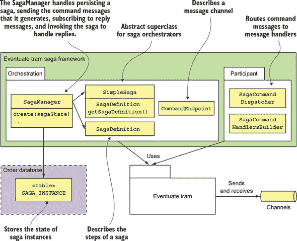

`saga 协调` 包是框架中最复杂的一部分。它提供了一个 `SimpleSaga` 基础接口用于 saga，以及一个 `SagaManager` 类，用于创建和管理 saga 实例。`SagaManager` 负责持久化 saga，发送它生成的命令消息，订阅回复消息，并调用 saga 处理回复。图 4.13 展示了当 `OrderService` 创建 saga 时的事件序列。事件序列如下：

1.  `OrderService` 创建 `CreateOrderSagaState`。

1.  通过调用 `SagaManager` 创建一个 saga 实例。

1.  `SagaManager` 执行 saga 定义的第一步。

1.  调用 `CreateOrderSagaState` 生成一个命令消息。

1.  `SagaManager` 将命令消息发送给 saga 参与者（`Consumer Service`）。

1.  `SagaManager` 将 saga 实例保存到数据库中。

##### 图 4.13. 当 `OrderService` 创建 `Create Order Saga` 实例时的事件序列

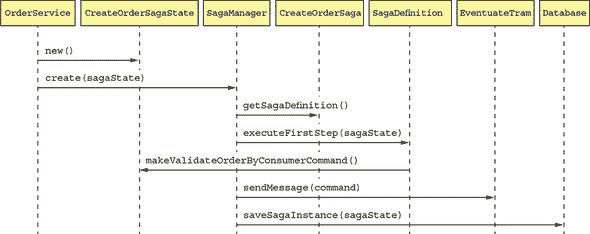

图 4.14 展示了当 `SagaManager` 从 `Consumer Service` 接收到回复时的事件序列。

##### 图 4.14. 当 `SagaManager` 从 saga 参与者接收到回复消息时的事件序列

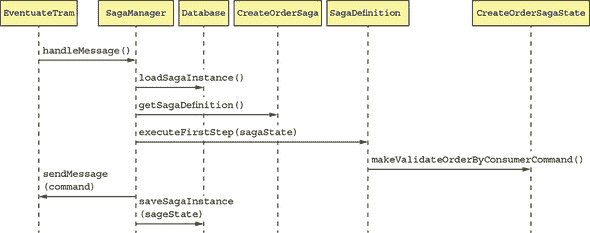

事件序列如下：

1.  Eventuate Tram 使用 `Consumer Service` 的回复调用 `SagaManager`。

1.  `SagaManager` 从数据库中检索 saga 实例。

1.  `SagaManager` 执行 saga 定义的下一步。

1.  调用 `CreateOrderSagaState` 生成一个命令消息。

1.  `SagaManager` 将命令消息发送给指定的 saga 参与者（`Kitchen Service`）。

1.  `SagaManager` 将更新后的 saga 实例保存到数据库中。

如果 saga 参与者失败，`SagaManager` 将以相反的顺序执行补偿事务。

Eventuate Tram Saga 框架的另一部分是 `saga 参与者` 包。它提供了 `SagaCommandHandlersBuilder` 和 `SagaCommandDispatcher` 类，用于编写 saga 参与者。这些类将命令消息路由到处理方法，调用 saga 参与者的业务逻辑并生成回复消息。让我们看看这些类是如何被 `Order Service` 使用的。

#### 4.4.3. `OrderCommandHandlers` 类

`Order Service` 参与其自己的 saga。例如，`CreateOrderSaga` 调用 `Order Service` 来批准或拒绝一个 `Order`。如图 4.15 所示的 `OrderCommandHandlers` 类定义了这些 saga 发送的命令消息的处理方法。

##### 图 4.15. `OrderCommandHandlers` 实现了由各种 `Order Service` saga 发送的命令的处理程序。

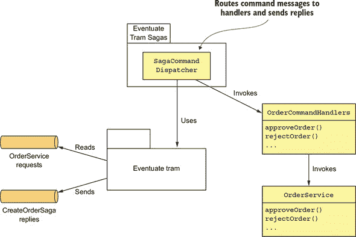

每个处理方法调用 `OrderService` 更新一个 `Order` 并生成一个回复消息。`SagaCommandDispatcher` 类将命令消息路由到适当的处理方法并发送回复。

以下列表显示了`OrderCommandHandlers`类。它的`commandHandlers()`方法将命令消息类型映射到处理方法。每个处理方法接受一个命令消息作为参数，调用`OrderService`，并返回一个回复消息。

##### 列表 4.6。`订单服务`的命令处理程序

```
public class OrderCommandHandlers {

  @Autowired
  private OrderService orderService;

  public CommandHandlers commandHandlers() {                           *1*
     return SagaCommandHandlersBuilder
          .fromChannel("orderService")
          .onMessage(ApproveOrderCommand.class, this::approveOrder)
          .onMessage(RejectOrderCommand.class, this::rejectOrder)
          ...
          .build();

  }

  public Message approveOrder(CommandMessage<ApproveOrderCommand> cm) {
    long orderId = cm.getCommand().getOrderId();
    orderService.approveOrder(orderId);                                *2*
     return withSuccess();                                             *3*
   }

  public Message rejectOrder(CommandMessage<RejectOrderCommand> cm) {
    long orderId = cm.getCommand().getOrderId();
    orderService.rejectOrder(orderId);                                 *4*
     return withSuccess();
  }
```

+   ***1* 将每个命令消息路由到适当的处理方法。**

+   ***2* 将订单的状态更改为已授权。**

+   ***3* 返回一个通用的成功消息。**

+   ***4* 将订单的状态更改为已拒绝。**

`approveOrder()`和`rejectOrder()`方法通过调用`OrderService`来更新指定的`Order`。参与 saga 的其他服务也有类似的命令处理类，用于更新它们的领域对象。

#### 4.4.4。`OrderServiceConfiguration`类

`订单服务`使用 Spring 框架。以下列表是`OrderServiceConfiguration`类的摘录，它是一个`@Configuration`类，用于实例化和连接 Spring `@Beans`。

##### 列表 4.7。`OrderServiceConfiguration`是一个 Spring `@Configuration`类，它定义了`订单服务`的 Spring `@Beans`。

```
@Configuration
public class OrderServiceConfiguration {

 @Bean
 public OrderService orderService(RestaurantRepository restaurantRepository,
                                  ...
                                  SagaManager<CreateOrderSagaState>
                                          createOrderSagaManager,
                                  ...) {
  return new OrderService(restaurantRepository,
                          ...
                          createOrderSagaManager
                          ...);
 }

 @Bean
 public SagaManager<CreateOrderSagaState> createOrderSagaManager(CreateOrderS
     aga saga) {
  return new SagaManagerImpl<>(saga);
 }

 @Bean
 public CreateOrderSaga createOrderSaga(OrderServiceProxy orderService,
                                        ConsumerServiceProxy consumerService,
                                        ...) {
  return new CreateOrderSaga(orderService, consumerService, ...);
 }

 @Bean
 public OrderCommandHandlers orderCommandHandlers() {
  return new OrderCommandHandlers();
 }

 @Bean
 public SagaCommandDispatcher  orderCommandHandlersDispatcher(OrderCommandHan
     dlers orderCommandHandlers) {
  return new SagaCommandDispatcher("orderService", orderCommandHandlers.comma
     ndHandlers());
 }

 @Bean
 public KitchenServiceProxy kitchenServiceProxy() {
   return new KitchenServiceProxy();
 }

 @Bean
 public OrderServiceProxy orderServiceProxy() {
   return new OrderServiceProxy();
 }

 ...

}
```

此类定义了多个 Spring `@Beans`，包括`orderService`、`createOrderSagaManager`、`createOrderSaga`、`orderCommandHandlers`和`orderCommandHandlersDispatcher`。它还定义了各种代理类的 Spring `@Beans`，包括`kitchenServiceProxy`和`orderServiceProxy`。

`CreateOrderSaga`只是`订单服务`众多 saga 之一。它的许多其他系统操作也使用 saga。例如，`cancelOrder()`操作使用`取消订单 saga`，而`reviseOrder()`操作使用`修改订单 saga`。因此，尽管许多服务有一个使用同步协议的外部 API，例如 REST 或 gRPC，但大量的服务间通信将使用异步消息。

正如你所见，在微服务架构中，事务管理和业务逻辑设计的某些方面相当不同。幸运的是，saga 编排器通常是相当简单的状态机，你可以使用 saga 框架来简化你的代码。然而，事务管理确实比在单体架构中更复杂。但这通常是为了微服务带来的巨大好处而付出的微小代价。

### 摘要

+   一些系统操作需要更新多个服务中的分散数据。传统的基于 XA/2PC 的分布式事务并不适合现代应用。更好的方法是使用 saga 模式。saga 是一系列使用消息协调的本地事务。每个本地事务更新单个服务中的数据。因为每个本地事务都会提交其更改，如果 saga 必须因为违反业务规则而回滚，它必须执行补偿事务来显式撤销更改。

+   你可以使用编排或编排来协调 Sagas 的步骤。在基于编排的 Sagas 中，本地事务发布事件，触发其他参与者执行本地事务。在基于编排的 Sagas 中，集中的 Sagas 编排器向参与者发送命令消息，告诉他们执行本地事务。你可以通过将 Sagas 编排器建模为状态机来简化开发和测试。简单的 Sagas 可以使用编排，但对于复杂的 Sagas，编排通常是一个更好的方法。

+   设计基于 Sagas 的业务逻辑可能具有挑战性，因为与 ACID 事务不同，Sagas 之间并不是相互隔离的。你通常必须使用对策，这些对策是设计策略，用于防止由 ACD 事务模型引起的并发异常。应用程序甚至可能需要使用锁定来简化业务逻辑，尽管这可能导致死锁。
