## 第五章：在微服务架构中设计业务逻辑

*本章涵盖*

+   应用业务逻辑组织模式：事务脚本模式和领域模型模式

+   使用领域驱动设计（DDD）聚合模式设计业务逻辑

+   在微服务架构中应用领域事件模式

企业应用的核心是业务逻辑，它实现了业务规则。开发复杂的业务逻辑始终具有挑战性。FTGO 应用的业务逻辑实现了一些相当复杂的业务逻辑，尤其是在订单管理和配送管理方面。玛丽鼓励她的团队应用面向对象设计原则，因为在她看来，这是实现复杂业务逻辑的最佳方式。一些业务逻辑使用了程序性的事务脚本模式。但 FTGO 应用的大多数业务逻辑都是在一个面向对象的领域模型中实现的，该模型使用 JPA 映射到数据库。

在业务逻辑分散在多个服务中的微服务架构中，开发复杂的业务逻辑更具挑战性。你需要解决两个关键挑战。首先，典型的领域模型是一个相互连接的类错综复杂的网络。尽管在单体应用中这不是问题，但在类分散在不同服务中的微服务架构中，你需要消除跨越服务边界的对象引用。第二个挑战是在微服务架构的事务管理约束内设计业务逻辑。你的业务逻辑可以在服务内使用 ACID 事务，但如第四章所述，它必须使用 Saga 模式来维护服务间数据的一致性。

幸运的是，我们可以通过使用 DDD 中的聚合模式来解决这些问题。聚合模式将服务业务逻辑结构化为一系列聚合。一个*聚合*是一组可以作为一个单元处理的对象。在微服务架构中开发业务逻辑时，聚合之所以有用，有两个原因：

+   聚合避免任何跨越服务边界的对象引用的可能性，因为聚合间的引用是一个主键值而不是对象引用。

+   因为一个事务只能创建或更新一个聚合，所以聚合符合微服务事务模型的约束。

因此，ACID 事务保证在单个服务内完成。

我以描述组织业务逻辑的不同方式开始本章：转录脚本模式和领域模型模式。接下来，我介绍 DDD 聚合的概念，并解释为什么它是服务业务逻辑的良好构建块。之后，我描述领域事件模式事件，并解释为什么对服务发布事件是有用的。我以 `Kitchen Service` 和 `Order Service` 的几个业务逻辑示例结束本章。

让我们现在看看业务逻辑组织模式。

### 5.1\. 业务逻辑组织模式

图 5.1 展示了一个典型服务的架构。正如 第二章 所描述的，业务逻辑是六边形架构的核心。围绕业务逻辑的是输入和输出适配器。一个 *输入适配器* 处理来自客户端的请求并调用业务逻辑。一个 *输出适配器*，由业务逻辑调用，调用其他服务和应用程序。

##### 图 5.1\. `Order Service` 具有六边形架构。它由业务逻辑和一个或多个适配器组成，这些适配器与外部应用程序和其他服务进行接口。

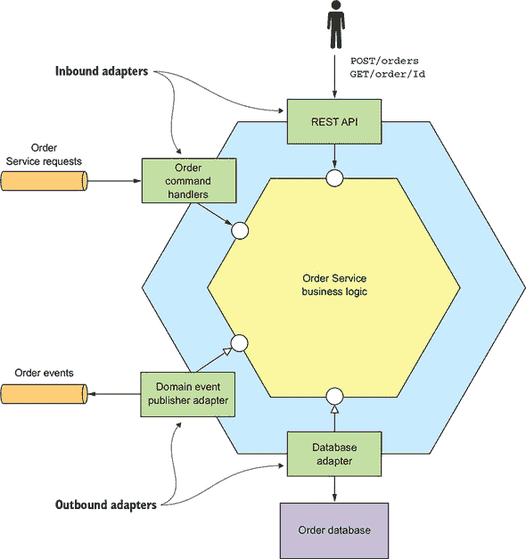

此服务由业务逻辑和以下适配器组成：

+   **`REST API 适配器`—** 一个实现 REST API 的输入适配器，它调用业务逻辑

+   **`OrderCommandHandlers`—** 一个从消息通道消费命令消息并调用业务逻辑的输入适配器

+   **`Database Adapter`—** 一个由业务逻辑调用以访问数据库的输出适配器

+   **`领域事件发布适配器`—** 一个将事件发布到消息代理的输出适配器

业务逻辑通常是服务中最复杂的一部分。在开发业务逻辑时，你应该有意识地以最适合你应用程序的方式组织你的业务逻辑。毕竟，我相信你一定经历过维护他人糟糕结构化代码的挫败感。大多数企业应用程序是用面向对象的语言（如 Java）编写的，因此它们由类和方法组成。但是，使用面向对象的语言并不能保证业务逻辑具有面向对象的设计。在开发业务逻辑时，你必须做出的关键决策是使用面向对象的方法还是过程式方法。组织业务逻辑有两种主要模式：过程式的交易脚本模式和面向对象的领域模型模式。

#### 5.1.1\. 使用交易脚本模式设计业务逻辑

虽然我是面向对象方法的强烈支持者，但在某些情况下，它可能过于复杂，例如当你正在开发简单的业务逻辑时。在这种情况下，更好的方法是编写过程性代码，并使用马丁·福勒（Martin Fowler）在其著作《企业应用架构模式》（Patterns of Enterprise Application Architecture）中称为“事务脚本模式”的方法。而不是进行任何面向对象设计，你编写一个名为“事务脚本”的方法来处理来自表示层的每个请求。如图 5.2 所示，这种方法的一个重要特征是实现行为的类与存储状态的类是分开的。

##### 图 5.2\. 将业务逻辑组织成事务脚本。在典型的基于事务脚本的设计中，一组类实现行为，另一组类存储状态。事务脚本组织成通常没有状态的类。脚本使用数据类，这些数据类通常没有行为。

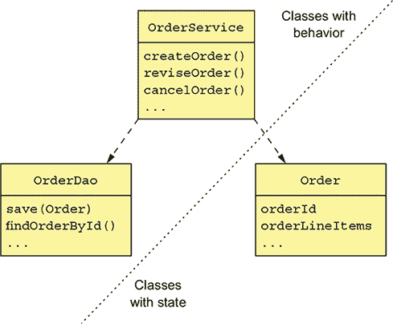

在使用事务脚本模式时，脚本通常位于服务类中，在这个例子中是`OrderService`类。服务类为每个请求/系统操作有一个方法。该方法实现该请求的业务逻辑。它使用数据访问对象（DAOs），如`OrderDao`，访问数据库。数据对象，在这个例子中是`Order`类，是纯数据，几乎没有行为。

| |
| --- |

**模式：事务脚本**

将业务逻辑组织成一系列过程性事务脚本，每个脚本对应一种请求类型。

| |
| --- |

这种设计风格高度过程化，并且很少依赖面向对象编程（OOP）语言的能力。如果你用 C 或另一种非面向对象语言编写应用程序，你会创建这样的应用程序。尽管如此，当适用时，使用过程性设计并不应该感到羞耻。这种方法对于简单的业务逻辑效果很好。缺点是这通常不是实现复杂业务逻辑的好方法。

#### 5.1.2\. 使用领域模型模式设计业务逻辑

过程性方法的简单性可能相当诱人。你可以编写代码而无需仔细考虑如何组织类。问题是如果业务逻辑变得复杂，你可能会得到难以维护的代码。事实上，就像单体应用程序有不断增长的习性一样，事务脚本也有同样的问题。因此，除非你正在编写极其简单的应用程序，否则你应该抵制编写过程性代码的诱惑，而是应用领域模型模式并开发面向对象的设计。

| |
| --- |

**模式：领域模型**

将业务逻辑组织成一个由具有状态和行为的类组成的对象模型。

| |
| --- |

在面向对象的设计中，业务逻辑由一个对象模型和相对较小类的网络组成。这些类通常直接对应于问题域中的概念。在这种设计中，一些类可能只有状态或行为，但许多类同时包含两者，这是设计良好的类的标志。图 5.3 展示了领域模型模式的一个示例。

##### 图 5.3\. 将业务逻辑组织为领域模型。大部分业务逻辑由具有状态和行为的类组成。

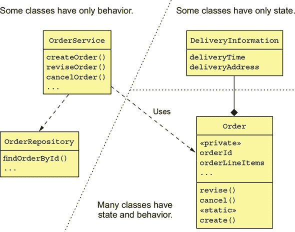

与事务脚本模式一样，`OrderService`类为每个请求/系统操作都有一个方法。但是，当使用领域模型模式时，服务方法通常是简单的。这是因为服务方法几乎总是委托给持久化的领域对象，这些对象包含大部分业务逻辑。例如，一个服务方法可能会从数据库中加载一个领域对象并调用其方法之一。在这个例子中，`Order`类既有状态又有行为。此外，其状态是私有的，只能通过其方法间接访问。

使用面向对象的设计有许多好处。首先，这种设计易于理解和维护。它不是由一个承担所有功能的庞大类组成，而是由许多具有少量职责的小类组成。此外，如`Account`、`BankingTransaction`和`OverdraftPolicy`之类的类紧密地反映了现实世界，这使得它们在设计中的角色更容易理解。其次，我们的面向对象设计更容易测试：每个类都可以并且应该独立测试。最后，面向对象的设计更容易扩展，因为它可以使用诸如策略模式（Strategy pattern）和模板方法模式（Template method pattern）之类的知名设计模式，这些模式定义了在不修改代码的情况下扩展组件的方法。

领域模型模式效果良好，但这种方法存在一些问题，尤其是在微服务架构中。为了解决这些问题，你需要使用一种称为领域驱动设计（DDD）的面向对象设计的细化。

#### 5.1.3\. 关于领域驱动设计

领域驱动设计（DDD），由埃里克·埃文斯（Eric Evans）在其著作《领域驱动设计》（Domain-Driven Design）中描述，是面向对象设计的细化，并且是开发复杂业务逻辑的方法。我在第二章中介绍了 DDD，当时讨论了在将应用程序分解为服务时 DDD 子域的有用性。当使用 DDD 时，每个服务都有自己的领域模型，这避免了单一、应用范围领域模型的问题。子域和相关概念边界上下文（Bounded Context）是 DDD 的战略模式之二。

DDD 还有一些战术模式，它们是领域模型的构建块。每个模式都是一个类在领域模型中扮演的角色，并定义了类的特征。被开发者广泛采用的构建块包括以下内容：

+   ***实体*—** 具有持久身份的对象。具有相同属性的两个实体仍然是不同的对象。在 Java EE 应用程序中，使用 JPA `@Entity` 持久化的类通常是 DDD 实体。

+   ***值对象*—** 由值组成的对象。具有相同属性的两个值对象可以互换使用。一个值对象的例子是 `Money` 类，它由货币和金额组成。

+   ***工厂*—** 实现对象创建逻辑的对象或方法，这些逻辑过于复杂，不能直接通过构造函数完成。它还可以隐藏实例化的具体类。工厂可以作为一个类的静态方法实现。

+   ***仓储*—** 提供对持久化实体访问的对象，并封装了访问数据库的机制。

+   ***服务*—** 实现不属于实体或值对象的业务逻辑的对象。

这些构建块被许多开发者使用。其中一些由 JPA 和 Spring 框架等框架支持。还有一个构建块通常被忽视（包括我自己！），除了 DDD 纯粹主义者之外：聚合。实际上，聚合在开发微服务时是一个极其有用的概念。让我们首先看看经典 OOD 中的一些微妙问题，这些问题可以通过使用聚合来解决。

### 5.2. 使用 DDD 聚合模式设计领域模型

在传统的面向对象设计中，领域模型是一组类及其之间的关系。这些类通常被组织成包。例如，图 5.4 展示了 FTGO 应用程序领域模型的一部分。它是一个典型的领域模型，由相互连接的类网组成。

##### 图 5.4. 传统的领域模型是一个相互连接的类网。它没有明确指定业务对象（如 `Consumer` 和 `Order`）的边界。

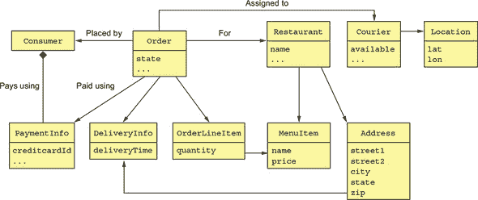

这个例子有几个与业务对象对应的类：`Consumer`、`Order`、`Restaurant` 和 `Courier`。但有趣的是，这种传统领域模型中缺少每个业务对象的明确边界。例如，它没有指定哪些类是 `Order` 业务对象的一部分。这种边界缺失有时会导致问题，尤其是在微服务架构中。

我以一个由于缺乏明确边界而引起的问题为例开始本节。接下来，我描述了聚合的概念以及它具有明确的边界。然后，我描述了聚合必须遵守的规则以及它们如何使聚合适合微服务架构。然后，我描述了如何仔细选择聚合的边界以及为什么这很重要。最后，我讨论了如何使用聚合设计业务逻辑。让我们首先看看模糊边界引起的问题。

#### 5.2.1. 模糊边界的弊端

例如，假设你想对一个`Order`业务对象执行一个操作，比如加载或删除。这究竟意味着什么？操作的范畴是什么？你当然会加载或删除`Order`对象。但在现实中，`Order`不仅仅是`Order`对象。还包括订单行项目、支付信息等等。图 5.4 将领域对象的边界留给了开发者的直觉。

除了概念上的模糊性之外，缺乏明确的边界在更新业务对象时也会引起问题。一个典型的业务对象有*不变性*，这是必须始终强制执行的商务规则。例如，`Order`有一个最小订单金额。FTGO 应用程序必须确保任何尝试更新订单的行为都不会违反不变性，例如最小订单金额。挑战在于，为了强制执行不变性，你必须仔细设计你的业务逻辑。

例如，让我们看看当多个消费者共同创建一个订单时，如何确保满足订单的最小金额。两个消费者——山姆和玛丽——正在共同处理一个订单，并且同时决定订单超出了他们的预算。山姆减少了萨莫萨饼的数量，玛丽减少了印度烤饼的数量。从应用程序的角度来看，两个消费者都从数据库中检索订单及其行项目。然后，两个消费者更新一个行项目以降低订单的成本。从每个消费者的角度来看，订单的最小金额得到了保留。以下是数据库事务的顺序。

|

```
Consumer - Mary

BEGIN TXN

   SELECT ORDER_TOTAL FROM ORDER
     WHERE ORDER ID = X

   SELECT * FROM ORDER_LINE_ITEM
      WHERE ORDER_ID = X
   ...
END TXN

Verify minimum is met
```

|

```
Consumer - Sam

BEGIN TXN

   SELECT ORDER_TOTAL FROM ORDER
     WHERE ORDER ID = X

   SELECT * FROM ORDER_LINE_ITEM
      WHERE ORDER_ID = X
   ...
END TXN
```

|

|

```
BEGIN TXN

   UPDATE ORDER_LINE_ITEM
     SET VERSION=..., QUANTITY=...
   WHERE VERSION = <loaded version>
    AND ID = ...

END TXN
```

| |   |
| --- | --- |
| |   |

```
Verify minimum is met

BEGIN TXN

   UPDATE ORDER_LINE_ITEM
     SET VERSION=..., QUANTITY=...
   WHERE VERSION = <loaded version>
    AND ID = ...

END TXN
```

|

每个消费者使用一系列两个事务来更改一个行项目。第一个事务加载订单及其行项目。UI 在执行第二个事务之前验证订单最小金额是否得到满足。第二个事务使用乐观离线锁定检查更新行项目数量，该检查验证订单行自第一个事务加载以来未发生变化。

在这个场景中，山姆减少了订单总额 X 美元，玛丽减少了 Y 美元。结果，`Order`不再有效，尽管应用程序在每次消费者更新后都验证了订单仍然满足订单最小金额。正如你所看到的，直接更新业务对象的一部分可能导致违反业务规则。DDD 聚合旨在解决这个问题。

#### 5.2.2\. 聚合具有明确的边界

一个 *聚合* 是一个边界内的领域对象簇，可以作为一个单元处理。它由一个根实体以及可能的一个或多个其他实体和值对象组成。许多业务对象被建模为聚合。例如，在第二章中，我们通过分析需求中使用的名词以及领域专家的分析创建了一个粗略的领域模型。其中许多名词，如`Order`、`Consumer`和`Restaurant`，都是聚合。

| |
| --- |

**模式：聚合**

将领域模型组织为聚合的集合，每个聚合都是一个可以作为一个单元处理的对象图。

| |
| --- |

图 5.5 展示了`Order`聚合及其边界。一个`Order`聚合由一个`Order`实体、一个或多个`OrderLineItem`值对象以及其他值对象（如交付地址和支付信息）组成。

##### 图 5.5\. 将领域模型结构化为聚合集合使边界明确。

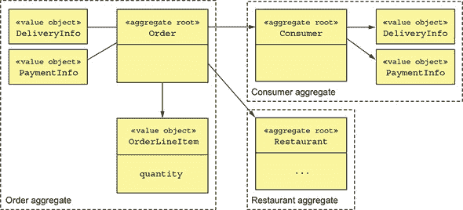

聚合将领域模型分解成块，这些块单独更容易理解。它们还澄清了诸如加载、更新和删除等操作的范围。这些操作作用于整个聚合，而不是其部分。聚合通常从数据库中完全加载，从而避免了懒加载的任何复杂性。删除聚合会从数据库中删除其所有对象。

##### 聚合是一致性边界

更新整个聚合而不是其部分可以解决一致性问题，例如前面描述的例子。更新操作是在聚合根上触发的，这强制执行不变性。此外，并发通过使用版本号或数据库级别的锁等方式锁定聚合根来处理。例如，而不是直接更新行项的数量，客户端必须调用`Order`聚合根上的一个方法，该方法强制执行如最小订单金额这样的不变性。然而，请注意，这种方法不需要在数据库中更新整个聚合。例如，应用程序可能只更新与`Order`对象和更新的`OrderLineItem`对应的行。

##### 识别聚合是关键

在 DDD 中，设计领域模型的关键部分是识别聚合、它们的边界和它们的根。聚合内部结构的细节是次要的。然而，聚合的好处远远超出了模块化领域模型。这是因为聚合必须遵守某些规则。

#### 5.2.3\. 聚合规则

DDD 要求聚合遵守一组规则。这些规则确保聚合是一个自包含的单元，可以强制执行其不变性。让我们看看每条规则。

##### 规则 #1：仅引用聚合根

之前的例子说明了直接更新 `OrderLineItems` 的危险。第一个聚合规则的目标是消除这个问题。它要求根实体是聚合中唯一可以被聚合外部类引用的部分。客户端只能通过在聚合根上调用方法来更新聚合。

例如，一个服务使用存储库从数据库中加载聚合并获取聚合根的引用。它通过在聚合根上调用方法来更新聚合。这个规则确保聚合可以强制执行其不变性。

##### 规则#2：聚合之间的引用必须使用主键

另一条规则是，聚合通过标识符（例如，主键）而不是对象引用相互引用。例如，如图 5.6 所示，`Order` 使用 `consumerId` 而不是 `Consumer` 对象的引用来引用其 `Consumer`。同样，`Order` 使用 `restaurantId` 来引用 `Restaurant`。

##### 图 5.6\. 聚合之间的引用是通过主键而不是通过对象引用来实现的。`Order` 聚合包含 `Consumer` 和 `Restaurant` 聚合的 ID。在一个聚合内部，对象之间相互引用。

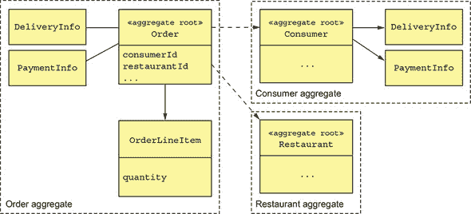

这种方法与传统对象建模有很大不同，传统对象建模认为领域模型中的外键是一个设计问题。它有许多好处。使用标识符而不是对象引用意味着聚合是松散耦合的。它确保聚合之间的边界定义良好，并避免意外更新不同的聚合。此外，如果一个聚合是另一个服务的一部分，就不会存在跨越服务的对象引用问题。

这种方法也简化了持久性，因为聚合是存储的单位。这使得在 MongoDB 等 NoSQL 数据库中存储聚合变得更加容易。它还消除了透明延迟加载及其相关问题的需要。通过分片聚合来扩展数据库相对简单。

##### 规则#3：一个事务创建或更新一个聚合

聚合必须遵守的另一条规则是，一个事务只能创建或更新单个聚合。多年前我第一次读到这条规则时，觉得它毫无意义！当时，我正在开发使用 RDBMS 的传统单体应用，事务可以更新多个聚合。如今，这个约束对微服务架构来说非常完美。它确保事务被包含在服务内部。这个约束也符合大多数 NoSQL 数据库有限的交易模型。

这个规则使得实现需要创建或更新多个聚合的操作变得更加复杂。但这正是传奇（在第四章中描述）旨在解决的问题。传奇的每一步都恰好创建或更新一个聚合。图 5.7 显示了这是如何工作的。

##### 图 5.7。事务只能创建或更新单个聚合，因此应用程序使用传奇来更新多个聚合。传奇的每一步都创建或更新一个聚合。

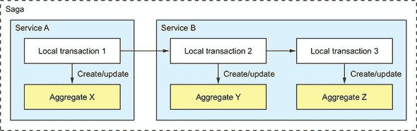

在这个例子中，传奇由三个事务组成。第一个事务在服务 `A` 中更新聚合 `X`。其他两个事务都在服务 `B` 中。一个事务更新聚合 `X`，另一个更新聚合 `Y`。

在单个服务内维护多个聚合的一致性的一种替代方法是采取欺骗手段，在事务中更新多个聚合。例如，服务 `B` 可以在单个事务中更新聚合 `Y` 和 `Z`。这只有在使用支持丰富事务模型的数据库，如关系数据库管理系统（RDBMS）时才可行。如果你使用的是只有简单事务的 NoSQL 数据库，除了使用传奇（sagas）之外没有其他选择。

或者有其他选择吗？实际上，聚合边界并不是一成不变的。在开发领域模型时，你可以选择边界在哪里。但就像 20 世纪的殖民强国划定国家边界一样，你需要小心谨慎。

#### 5.2.4. 聚合粒度

在开发领域模型时，你必须做出的一个关键决策是每个聚合的大小。一方面，理想情况下聚合应该尽可能小。因为每个聚合的更新都是序列化的，更细粒度的聚合将增加应用程序可以处理的并发请求数量，从而提高可伸缩性。它还将改善用户体验，因为它减少了两个用户尝试对同一聚合进行冲突更新的可能性。另一方面，因为聚合是事务的范围，你可能需要定义一个更大的聚合，以便执行特定的原子更新。

例如，我之前提到过在 FTGO 应用程序的领域模型中，“订单”和“消费者”是独立的聚合。另一种设计是将“订单”作为“消费者”聚合的一部分。图 5.8 显示了这种替代设计。

##### 图 5.8。一种替代设计定义了一个包含“客户”类和“订单”类的“客户”聚合。这种设计使得应用程序能够原子性地更新一个“消费者”及其一个或多个“订单”。

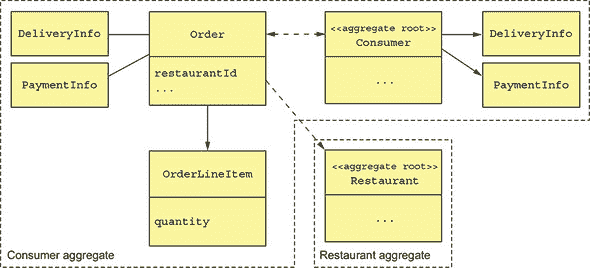

这种更大的`Consumer`聚合体的一个好处是，应用程序可以原子性地更新一个`Consumer`及其一个或多个`Orders`。这种方法的缺点是它降低了可扩展性。更新同一客户不同订单的事务将被序列化。同样，如果两个用户尝试编辑同一客户的不同的订单，他们将会发生冲突。

在微服务架构中，这种方法的一个缺点是它阻碍了分解。例如，`Orders`和`Consumers`的业务逻辑必须在同一服务中集中，这使得服务更大。由于这些问题，使聚合体尽可能细粒度是最好的。

#### 5.2.5. 使用聚合体设计业务逻辑

在典型的（微）服务中，大部分业务逻辑由聚合体组成。其余的业务逻辑位于领域服务和传说中。传说通过编排一系列本地事务来强制执行数据一致性。服务是业务逻辑的入口点，并由入站适配器调用。服务使用存储库从数据库检索聚合体或将聚合体保存到数据库。每个存储库都由一个出站适配器实现，该适配器访问数据库。图 5.9 显示了基于聚合体的`Order Service`业务逻辑设计。

##### 图 5.9. `Order Service`业务逻辑的基于聚合体的设计

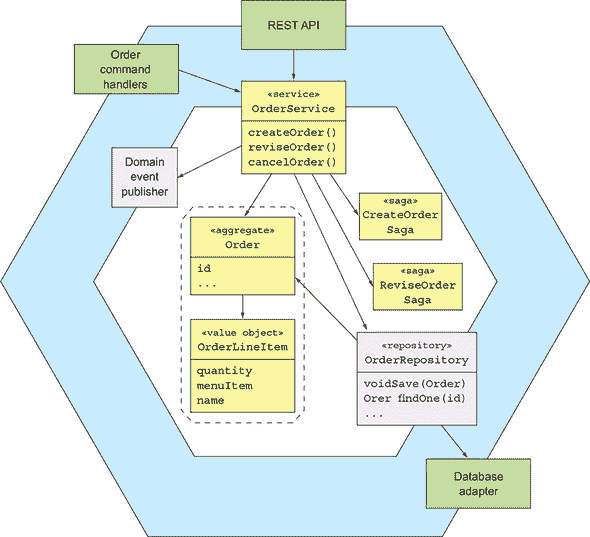

业务逻辑包括`Order`聚合体、`OrderService`服务类、`OrderRepository`和一个或多个传说。`OrderService`调用`OrderRepository`来保存和加载`Orders`。对于仅限于服务本地的简单请求，服务会更新一个`Order`聚合体。如果更新请求跨越多个服务，`OrderService`还将创建一个传说，如第四章所述。

我们将查看代码——但首先，让我们考察一个与聚合体密切相关的概念：领域事件。

### 5.3. 发布领域事件

Merriam-Webster ([`www.merriam-webster.com/dictionary/event`](https://www.merriam-webster.com/dictionary/event)) 列出了“事件”这个词的几个定义，包括以下这些：

1.  发生的事情

1.  一个值得注意的事件

1.  一个社交场合或活动

1.  一个不利的或有害的医疗事件，如心脏病发作或其他心脏事件

在领域驱动设计（DDD）的上下文中，领域事件是发生在聚合体上的事情。它在领域模型中由一个类表示。事件通常表示状态变化。例如，考虑 FTGO 应用程序中的`Order`聚合体。其状态变化事件包括`Order Created`、`Order Cancelled`、`Order Shipped`等。如果存在感兴趣的消费者，`Order`聚合体可能会在每次经历状态转换时发布其中一个事件。

|  |
| --- |

**模式：领域事件**

当聚合创建或经历某些其他重大变化时，它会发布领域事件。

| |
| --- |

#### 5.3.1\. 为什么发布变更事件？

领域事件很有用，因为其他方——用户、其他应用程序或同一应用程序内的其他组件——通常对了解聚合的状态变化感兴趣。以下是一些示例场景：

+   使用基于编排的叙事，维护跨服务的数据一致性，如第四章所述。

+   通知维护副本的服务源数据已更改。这种方法被称为命令查询责任分离（CQRS），并在第七章中描述。

+   通过注册的 webhook 或通过消息代理通知不同的应用程序，以触发业务流程的下一步。

+   通知同一应用程序的另一个组件，例如，向用户的浏览器发送 WebSocket 消息或更新文本数据库，如 ElasticSearch。

+   向用户发送通知——短信或电子邮件——告知他们的订单已发货，他们的 Rx 处方已准备好取药，或他们的航班延误。

+   监控领域事件以验证应用程序是否表现正确。

+   分析事件以建模用户行为。

在所有这些场景中，通知的触发器是应用程序数据库中聚合的状态变化。

#### 5.3.2\. 什么是领域事件？

一个 *领域事件* 是一个使用过去分词动词命名的类。它具有有意义的传达事件的属性。每个属性要么是原始值，要么是值对象。例如，`OrderCreated` 事件类有一个 `orderId` 属性。

领域事件通常也具有元数据，例如事件 ID 和时间戳。它还可能包含更改用户的身份，因为这对审计很有用。元数据可以是事件对象的一部分，也许定义在超类中。或者，事件元数据可以放在包装事件对象的信封对象中。发出事件的聚合的 ID 也可能是信封的一部分，而不是显式的事件属性。

`OrderCreated` 事件是领域事件的例子。它没有任何字段，因为订单的 ID 是事件信封的一部分。以下列表显示了 `OrderCreated` 事件类和 `DomainEventEnvelope` 类。

##### 列表 5.1\. `OrderCreated` 事件和 `DomainEventEnvelope` 类

```
interface DomainEvent {}

interface OrderDomainEvent extends DomainEvent {}

class OrderCreated implements OrderDomainEvent {}

class DomainEventEnvelope<T extends DomainEvent> {
  private String aggregateType;                        *1*
  private Object aggregateId;
  private T event;
  ...
}
```

+   ***1* 事件的元数据**

`DomainEvent` 接口是一个标记接口，用于标识一个类作为领域事件。`OrderDomainEvent` 是一个标记接口，用于事件，例如 `OrderCreated`，这些事件由 `Order` 聚合发布。`DomainEventEnvelope` 是一个包含事件元数据和事件对象的类。它是一个泛型类，由领域事件类型参数化。

#### 5.3.3\. 事件丰富化

例如，让我们想象你正在编写一个处理 `Order` 事件的消费者。之前显示的 `OrderCreated` 事件类捕捉了所发生事情的本质。但你的事件消费者在处理 `OrderCreated` 事件时可能需要订单详情。一个选项是让它从 `OrderService` 中检索该信息。事件消费者查询服务以获取聚合的缺点是它会产生服务请求的开销。

另一种称为 *事件丰富* 的替代方法是为事件包含消费者所需的信息。这简化了事件消费者，因为他们不再需要从发布事件的服务的请求该数据。在 `OrderCreated` 事件中，`Order` 聚合可以通过包含订单详情来丰富事件。以下列表显示了丰富的事件。

##### 列表 5.2\. 丰富的 `OrderCreated` 事件

```
class OrderCreated implements OrderEvent {
  private List<OrderLineItem> lineItems;
  private DeliveryInformation deliveryInformation;       *1*
  private PaymentInformation paymentInformation;
  private long restaurantId;
  private String restaurantName;
  ...
}
```

+   ***1* 消费者通常需要的数据**

因为这个版本的 `OrderCreated` 事件包含了订单详情，所以事件消费者，例如 `Order History Service`（在第七章中讨论过），在处理 `OrderCreated` 事件时不再需要获取这些数据。

虽然事件丰富简化了消费者，但其缺点是它可能会使事件类变得不稳定。事件类可能需要在消费者需求发生变化时进行更改。这可能会降低可维护性，因为这种类型的更改可能会影响应用程序的多个部分。满足每个消费者的需求也可能是一种徒劳的努力。幸运的是，在许多情况下，很明显应该将哪些属性包含在事件中。

现在我们已经介绍了领域事件的基础知识，让我们看看如何发现它们。

#### 5.3.4\. 识别领域事件

识别领域事件有几种不同的策略。通常，需求会描述需要通知的场景。需求可能包括诸如“当 X 发生时做 Y。”之类的语言。例如，FTGO 应用中的一个需求是“当订单被下单时，向消费者发送电子邮件。”一个通知需求暗示了领域事件的存在。

另一种越来越受欢迎的方法是使用事件风暴。*事件风暴* 是一种以事件为中心的工作坊格式，用于理解复杂的领域。它涉及将领域专家聚集在房间里，大量的便利贴，以及一个非常大的表面——白板或纸卷——将便利贴粘在上面。事件风暴的结果是一个以事件为中心的领域模型，由聚合和事件组成。

事件风暴包括三个主要步骤：

1.  ***头脑风暴事件*—** 请领域专家进行领域事件的头脑风暴。领域事件由橙色便利贴表示，这些便利贴在建模表面上以大致的时间顺序排列。

1.  ***识别事件触发器*—** 请领域专家识别每个事件的触发器，这通常包括以下几种：

    +   用户操作，用蓝色便利贴表示的命令

    +   外部系统，由紫色便利贴表示

    +   另一个领域事件

    +   时间的流逝

1.  ***识别聚合*—** 请领域专家识别消耗每个命令并发出相应事件的聚合。聚合用黄色便利贴表示。

图 5.10 显示了事件风暴工作坊的结果。在短短几个小时里，参与者确定了众多领域事件、命令和聚合。这是创建领域模型过程中的良好第一步。

##### 图 5.10\. 持续了几个小时的事件风暴工作坊的结果。便利贴代表事件，它们沿着时间线排列；命令，代表用户操作；以及聚合，它们在接收到命令时发出事件。


事件风暴是一种快速创建领域模型的有用技术。

现在我们已经介绍了领域事件的基础知识，让我们看看生成和发布它们的机制。

#### 5.3.5\. 生成和发布领域事件

使用领域事件进行通信是一种异步消息传递的形式，这在第三章中讨论过。但在业务逻辑可以将它们发布到消息代理之前，它必须首先创建它们。让我们看看如何做到这一点。

##### 生成领域事件

从概念上讲，领域事件是由聚合发布的。聚合知道其状态何时改变，因此知道要发布什么事件。聚合可以直接调用消息 API。这种方法的缺点是，由于聚合不能使用依赖注入，消息 API 需要作为方法参数传递。这将基础设施关注点和业务逻辑交织在一起，这是极其不希望的。

更好的方法是让聚合和调用它的服务（或等效类）分担责任。服务可以使用依赖注入来获取消息 API 的引用，轻松发布事件。聚合在其状态改变时生成事件，并将它们返回给服务。聚合将事件返回给服务的方式有几种。一种选择是聚合方法的返回值包括事件列表。例如，以下列表显示了`Ticket`聚合的`accept()`方法如何向其调用者返回`TicketAcceptedEvent`。

##### 列表 5.3\. `Ticket`聚合的`accept()`方法

```
public class Ticket {

   public List<DomainEvent> accept(ZonedDateTime readyBy) {
    ...
    this.acceptTime = ZonedDateTime.now();                       *1*
    this.readyBy = readyBy;
    return singletonList(new TicketAcceptedEvent(readyBy));      *2*
   }
}
```

+   ***1* 更新票据**

+   ***2* 返回一个事件**

服务调用聚合根的方法，然后发布事件。例如，以下列表显示了`KitchenService`如何调用`Ticket.accept()`并发布事件。

##### 列表 5.4\. `KitchenService`调用`Ticket.accept()`

```
public class KitchenService {

  @Autowired
  private TicketRepository ticketRepository;

  @Autowired
  private DomainEventPublisher domainEventPublisher;

  public void accept(long ticketId, ZonedDateTime readyBy) {
    Ticket ticket =
          ticketRepository.findById(ticketId)
            .orElseThrow(() ->
                      new TicketNotFoundException(ticketId));
    List<DomainEvent> events = ticket.accept(readyBy);
    domainEventPublisher.publish(Ticket.class, orderId, events);      *1*
  }
```

+   ***1* 发布领域事件**

`accept()` 方法首先调用 `TicketRepository` 从数据库中加载 `Ticket`。然后通过调用 `accept()` 更新 `Ticket`。`KitchenService` 然后通过调用 `DomainEventPublisher.publish()` 发布 `Ticket` 返回的事件，这将在稍后进行描述。

这种方法相当简单。原本应该返回 void 类型的方法现在返回 `List<Event>`。唯一的潜在缺点是，非 void 方法的返回类型现在更复杂。它们必须返回一个包含原始返回值和 `List<Event>` 的对象。你很快就会看到一个这样的方法的例子。

另一个选项是聚合根在字段中累积事件。然后服务检索事件并发布它们。例如，以下列表显示了一个以这种方式工作的 `Ticket` 类的变体。

##### 列表 5.5。`Ticket` 扩展了一个超类，该超类记录领域事件

```
public class Ticket extends AbstractAggregateRoot {

  public void accept(ZonedDateTime readyBy) {
    ...
    this.acceptTime = ZonedDateTime.now();
    this.readyBy = readyBy;
    registerDomainEvent(new TicketAcceptedEvent(readyBy));
  }

}
```

`Ticket` 扩展了 `AbstractAggregateRoot`，它定义了一个 `registerDomainEvent()` 方法来记录事件。服务将调用 `AbstractAggregateRoot.getDomainEvents()` 来检索这些事件。

我的偏好是第一种选项：将事件返回给服务的方法。但是，在聚合根中累积事件也是一个可行的选项。事实上，Spring Data Ingalls 版本列车（[`spring.io/blog/2017/01/30/what-s-new-in-spring-data-release-ingalls`](https://spring.io/blog/2017/01/30/what-s-new-in-spring-data-release-ingalls)）实现了一个机制，该机制自动将事件发布到 Spring `ApplicationContext`。主要的缺点是，为了减少代码重复，聚合根应该扩展一个超类，如 `AbstractAggregateRoot`，这可能与扩展其他超类的要求相冲突。另一个问题是，尽管聚合根的方法调用 `registerDomainEvent()` 很容易，但聚合中其他类的方法会发现这很具挑战性。它们很可能会需要以某种方式将事件传递给聚合根。

##### 如何可靠地发布领域事件？

第三章 讨论了如何在本地数据库事务中可靠地发送消息。领域事件并无不同。服务必须使用事务消息来发布事件，以确保它们作为更新数据库中聚合的事务的一部分发布。在第三章（kindle_split_011.xhtml#ch03）中描述的 Eventuate Tram 框架实现了这样的机制。它将事件插入到更新数据库的 ACID 事务中的 `OUTBOX` 表中。在事务提交后，插入到 `OUTBOX` 表中的事件随后被发布到消息代理。

`Tram` 框架提供了一个 `DomainEventPublisher` 接口，如下所示。它定义了几个重载的 `publish()` 方法，这些方法接受聚合类型和 ID 作为参数，以及一个领域事件列表。

##### 列表 5.6\. Eventuate Tram 框架的 `DomainEventPublisher` 接口

```
public interface DomainEventPublisher {
 void publish(String aggregateType, Object aggregateId,
     List<DomainEvent> domainEvents);
```

它使用 Eventuate Tram 框架的 `MessageProducer` 接口以事务方式发布这些事件。

服务可以直接调用 `DomainEventPublisher` 发布者。但这样做的一个缺点是它不能确保服务只发布有效的事件。例如，`KitchenService` 应该只发布实现 `TicketDomainEvent` 的事件，这是 `Ticket` 聚合事件的标记接口。更好的选择是服务实现 `AbstractAggregateDomainEventPublisher` 的子类，这在 列表 5.7 中展示。`AbstractAggregateDomainEventPublisher` 是一个抽象类，它为发布领域事件提供了一个类型安全的接口。它是一个泛型类，有两个类型参数，`A` 是聚合类型，`E` 是领域事件的标记接口类型。服务通过调用 `publish()` 方法发布事件，该方法有两个参数：类型为 `A` 的聚合和类型为 `E` 的事件列表。

##### 列表 5.7\. 类型安全领域事件发布器的抽象超类

```
public abstract class AbstractAggregateDomainEventPublisher<A, E extends Doma
     inEvent> {
  private Function<A, Object> idSupplier;
  private DomainEventPublisher eventPublisher;
  private Class<A> aggregateType;

  protected AbstractAggregateDomainEventPublisher(
     DomainEventPublisher eventPublisher,
     Class<A> aggregateType,
     Function<A, Object> idSupplier) {
    this.eventPublisher = eventPublisher;
    this.aggregateType = aggregateType;
    this.idSupplier = idSupplier;
  }

  public void publish(A aggregate, List<E> events) {
    eventPublisher.publish(aggregateType, idSupplier.apply(aggregate),
     (List<DomainEvent>) events);
  }

}
```

`publish()` 方法检索聚合的 ID 并调用 `DomainEventPublisher.publish()`。以下列表展示了 `TicketDomainEventPublisher`，它为 `Ticket` 聚合发布领域事件。

##### 列表 5.8\. 发布 `Ticket` 聚合领域事件的类型安全接口

```
public class TicketDomainEventPublisher extends
     AbstractAggregateDomainEventPublisher<Ticket, TicketDomainEvent> {

  public TicketDomainEventPublisher(DomainEventPublisher eventPublisher) {
    super(eventPublisher, Ticket.class, Ticket::getId);
  }

}
```

此类只发布是 `TicketDomainEvent` 子类的事件。

现在我们已经了解了如何发布领域事件，接下来让我们看看如何消费它们。

#### 5.3.6\. 消费领域事件

领域事件最终被发布为消息到消息代理，例如 Apache Kafka。消费者可以直接使用代理的客户端 API。但使用更高层次的 API，例如 Eventuate Tram 框架中的 `DomainEventDispatcher` 更为方便，这在 第三章 中有描述。`DomainEventDispatcher` 将领域事件分发给相应的处理方法。列表 5.9 展示了一个示例事件处理器类。`KitchenServiceEventConsumer` 订阅由 `Restaurant Service` 发布的事件，每当餐厅的菜单更新时。它负责保持 `Kitchen Service` 的数据副本是最新的。

##### 列表 5.9\. 将事件分发给事件处理方法

```
public class KitchenServiceEventConsumer {
  @Autowired
  private RestaurantService restaurantService;

  public DomainEventHandlers domainEventHandlers() {                         *1*
     return DomainEventHandlersBuilder
      .forAggregateType("net.chrisrichardson.ftgo.restaurantservice.Restaurant")
      .onEvent(RestaurantMenuRevised.class, this::reviseMenu)
      .build();
  }

  public void reviseMenu(DomainEventEnvelope<RestaurantMenuRevised> de) {    *2*
    long id = Long.parseLong(de.getAggregateId());
    RestaurantMenu revisedMenu = de.getEvent().getRevisedMenu();
    restaurantService.reviseMenu(id, revisedMenu);
  }

}
```

+   ***1* 将事件映射到事件处理器**

+   ***2* RestaurantMenuRevised 事件的处理器**

`reviseMenu()` 方法处理 `RestaurantMenuRevised` 事件。它调用 `restaurantService.reviseMenu()`，更新餐厅的菜单。该方法返回一个领域事件列表，这些事件由事件处理器发布。

现在我们已经了解了聚合和领域事件，是时候考虑一些使用聚合实现的示例业务逻辑了。

### 5.4\. 厨房服务业务逻辑

第一个例子是`Kitchen Service`，它使餐厅能够管理他们的订单。该服务中的两个主要聚合是`Restaurant`和`Ticket`聚合。`Restaurant`聚合了解餐厅的菜单和营业时间，并可以验证订单。`Ticket`代表餐厅必须为快递员准备的订单。显示了这些聚合以及服务业务逻辑的其他关键部分，以及服务的适配器。

##### 图 5.11\. `Kitchen Service`的设计

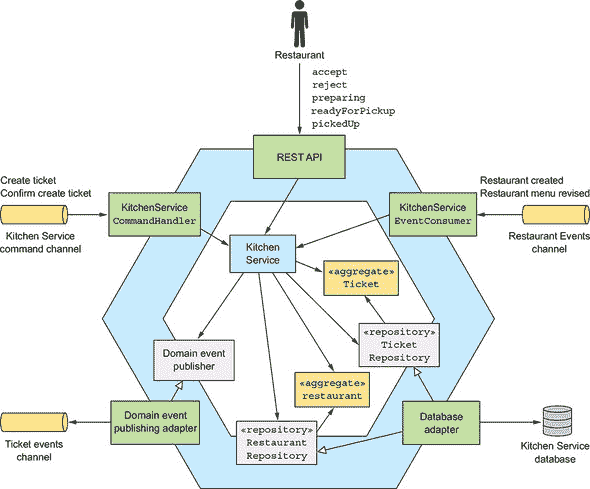

除了聚合之外，`Kitchen Service`的业务逻辑的其他主要部分是`KitchenService`、`TicketRepository`和`RestaurantRepository`。`KitchenService`是业务逻辑的入口。它定义了创建和更新`Restaurant`和`Ticket`聚合的方法。`TicketRepository`和`RestaurantRepository`分别定义了持久化`Tickets`和`Restaurants`的方法。

`Kitchen Service` 服务有三个入站适配器：

+   **`REST API`—** 由餐厅工作人员使用的用户界面调用的 REST API。它调用`KitchenService`来创建和更新`Tickets`。

+   **`KitchenServiceCommandHandler`—** 由 sagas 调用的基于异步请求/响应的 API。它调用`KitchenService`来创建和更新`Tickets`。

+   **`KitchenServiceEventConsumer`—** 订阅由`Restaurant Service`发布的事件。它调用`KitchenService`来创建和更新`Restaurants`。

该服务还有两个出站适配器：

+   **`DB adapter`—** 实现了`TicketRepository`和`RestaurantRepository`接口并访问数据库。

+   **`DomainEventPublishingAdapter`—** 实现了`DomainEventPublisher`接口并发布`Ticket`领域事件。

让我们更详细地看看`KitchenService`的设计，从`Ticket`聚合开始。

#### 5.4.1\. 票据聚合

`Ticket`是`Kitchen Service`的聚合之一。如第二章中所述，当谈论边界上下文的概念时，这个聚合代表了餐厅厨房对订单的视图。它不包含有关消费者的信息，例如他们的身份、配送信息或支付详情。它专注于使餐厅的厨房能够为取货准备`Order`。此外，`KitchenService`不为这个聚合生成唯一的 ID。相反，它使用`OrderService`提供的 ID。

让我们首先看看这个类的结构，然后我们将检查其方法。

##### 票据类结构

下面的列表显示了该类的代码摘录。`Ticket`类类似于传统的领域类。主要区别是其他聚合的引用是通过主键进行的。

##### 列表 5.10\. `Ticket`类的一部分，它是一个 JPA 实体

```
@Entity(table="tickets")
public class Ticket {

  @Id
  private Long id;
  private TicketState state;
  private Long restaurantId;

  @ElementCollection
  @CollectionTable(name="ticket_line_items")
  private List<TicketLineItem> lineItems;

  private ZonedDateTime readyBy;
  private ZonedDateTime acceptTime;
  private ZonedDateTime preparingTime;
  private ZonedDateTime pickedUpTime;
  private ZonedDateTime readyForPickupTime;
  ...
```

此类使用 JPA 持久化，并映射到 `TICKETS` 表。`restaurantId` 字段是一个 `Long` 而不是一个指向 `Restaurant` 对象的引用。`readyBy` 字段存储订单预计可以取走的时间。`Ticket` 类有多个字段跟踪订单的历史，包括 `acceptTime`、`preparingTime` 和 `pickupTime`。让我们看看这个类的其他方法。

##### `Ticket` 聚合的行为

`Ticket` 聚合定义了几个方法。正如您之前所看到的，它有一个静态的 `create()` 方法，这是一个工厂方法，用于创建一个 `Ticket`。还有一些方法在餐厅更新订单状态时会被调用：

+   **`accept()`—** 餐厅已接受订单。

+   **`preparing()`—** 餐厅已经开始准备订单，这意味着订单不能再更改或取消。

+   **`readyForPickup()`—** 订单现在可以取走了。

以下列表显示了其中的一些方法。

##### 列表 5.11\. `Ticket` 的部分方法

```
public class Ticket {

public static ResultWithAggregateEvents<Ticket, TicketDomainEvent>
     create(Long id, TicketDetails details) {
  return new ResultWithAggregateEvents<>(new Ticket(id, details), new
     TicketCreatedEvent(id, details));
}

public List<TicketPreparationStartedEvent> preparing() {
  switch (state) {
    case ACCEPTED:
      this.state = TicketState.PREPARING;
      this.preparingTime = ZonedDateTime.now();
      return singletonList(new TicketPreparationStartedEvent());
    default:
      throw new UnsupportedStateTransitionException(state);
  }
}

public List<TicketDomainEvent> cancel() {
    switch (state) {
      case CREATED:
      case ACCEPTED:
        this.state = TicketState.CANCELLED;
        return singletonList(new TicketCancelled());
      case READY_FOR_PICKUP:
        throw new TicketCannotBeCancelledException();

      default:
        throw new UnsupportedStateTransitionException(state);

    }
  }
```

`create()` 方法创建一个 `Ticket`。当餐厅开始准备订单时，会调用 `preparing()` 方法。它将订单状态更改为 `PREPARING`，记录时间，并发布一个事件。当用户尝试取消订单时，会调用 `cancel()` 方法。如果允许取消，此方法将更改订单状态并返回一个事件。否则，它抛出异常。这些方法在响应 REST API 请求以及事件和命令消息时被调用。让我们看看调用聚合方法类的示例。

##### `KitchenService` 领域服务

`KitchenService` 由服务的入站适配器调用。它定义了各种更改订单状态的方法，包括 `accept()`、`reject()`、`preparing()` 等。每个方法都加载指定的聚合，在聚合根上调用相应的方法，并发布任何领域事件。以下列表显示了它的 `accept()` 方法。

##### 列表 5.12\. 服务的 `accept()` 方法更新 `Ticket`

```
public class KitchenService {

  @Autowired
  private TicketRepository ticketRepository;

  @Autowired
  private TicketDomainEventPublisher domainEventPublisher;

  public void accept(long ticketId, ZonedDateTime readyBy) {
    Ticket ticket =
          ticketRepository.findById(ticketId)
            .orElseThrow(() ->
                      new TicketNotFoundException(ticketId));
    List<TicketDomainEvent> events = ticket.accept(readyBy);
    domainEventPublisher.publish(ticket, events);                *1*
  }

}
```

+   ***1* 发布领域事件**

当餐厅接受新订单时，会调用 `accept()` 方法。它有两个参数：

+   **`orderId`—** 要接受的订单 ID

+   **`readyBy`—** 订单预计可以取走的时间

此方法检索 `Ticket` 聚合并调用其 `accept()` 方法。它发布任何生成的事件。

现在让我们看看处理异步命令的类。

##### `KitchenServiceCommandHandler` 类

`KitchenServiceCommandHandler` 类是一个适配器，负责处理由 `Order Service` 实现的各个 sagas 发送的命令消息。此类为每个命令定义了一个处理程序方法，调用 `KitchenService` 创建或更新 `Ticket`。以下列表显示了此类的摘录。

##### 列表 5.13\. 处理 sagas 发送的命令消息

```
public class KitchenServiceCommandHandler {

  @Autowired
  private KitchenService kitchenService;

  public CommandHandlers commandHandlers() {                        *1*
   return CommandHandlersBuilder
          .fromChannel("orderService")
          .onMessage(CreateTicket.class, this::createTicket)
          .onMessage(ConfirmCreateTicket.class,
                  this::confirmCreateTicket)
          .onMessage(CancelCreateTicket.class,
                  this::cancelCreateTicket)
          .build();
 }

 private Message createTicket(CommandMessage<CreateTicket>
                                               cm) {
  CreateTicket command = cm.getCommand();
  long restaurantId = command.getRestaurantId();
  Long ticketId = command.getOrderId();
  TicketDetails ticketDetails =
      command.getTicketDetails();

  try {
    Ticket ticket =                                                 *2*
       kitchenService.createTicket(restaurantId,
                                   ticketId, ticketDetails);
    CreateTicketReply reply =
                new CreateTicketReply(ticket.getId());
    return withSuccess(reply);                                      *3*
   } catch (RestaurantDetailsVerificationException e) {
    return withFailure();                                           *4*
   }
 }

 private Message confirmCreateTicket
         (CommandMessage<ConfirmCreateTicket> cm) {                 *5*
      Long ticketId = cm.getCommand().getTicketId();
     kitchenService.confirmCreateTicket(ticketId);
     return withSuccess();
 }

   ...
```

+   ***1* 将命令消息映射到消息处理器**

+   ***2* 调用 KitchenService 创建 Ticket**

+   ***3* 发送成功回复**

+   ***4* 发送失败回复**

+   ***5* 确认订单**

所有命令处理方法都调用 `KitchenService` 并以成功或失败回复进行回复。

现在您已经看到了一个相对简单的服务的业务逻辑，我们将看看一个更复杂的例子：`Order Service`。

### 5.5. 订单服务业务逻辑

如前几章所述，`Order Service` 提供了一个用于创建、更新和取消订单的 API。此 API 主要由消费者调用。图 5.12 展示了该服务的高级设计。`Order` 聚合是 `Order Service` 的中心聚合。但还有一个 `Restaurant` 聚合，它是 `Restaurant Service` 所拥有数据的部分副本。它使 `Order Service` 能够验证和定价 `Order` 的行项目。

##### 图 5.12. `Order Service` 的设计。它有一个用于管理订单的 REST API。它通过几个消息通道与其他服务交换消息和事件。

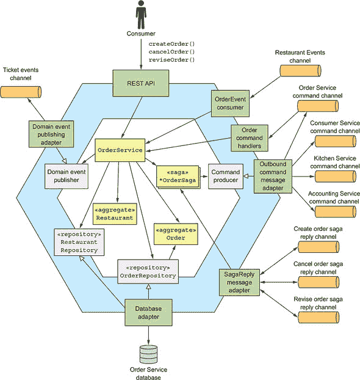

除了 `Order` 和 `Restaurant` 聚合之外，业务逻辑还包括 `OrderService`、`OrderRepository`、`RestaurantRepository` 以及各种 saga，例如在第四章中描述的 `CreateOrderSaga`。`OrderService` 是业务逻辑的主要入口点，并定义了创建和更新 `Orders` 和 `Restaurants` 的方法。`OrderRepository` 定义了持久化 `Orders` 的方法，而 `RestaurantRepository` 则有持久化 `Restaurants` 的方法。`Order Service` 有几个入站适配器：

+   **`REST API`—** 用户界面调用的 REST API。它调用 `OrderService` 来创建和更新 `Orders`。

+   **`OrderEventConsumer`—** 订阅由 `Restaurant Service` 发布的事件。它调用 `OrderService` 来创建和更新其 `Restaurants` 的副本。

+   **`OrderCommandHandlers`—** 由 sagas 调用的基于异步请求/响应的 API。它调用 `OrderService` 来更新 `Orders`。

+   **`SagaReplyAdapter`—** 订阅 saga 回复通道并调用 sagas。

该服务还有一些出站适配器：

+   **`DB adapter`—** 实现 `OrderRepository` 接口并访问 `Order Service` 数据库

+   **`DomainEventPublishingAdapter`—** 实现 `DomainEventPublisher` 接口并发布 `Order` 领域事件

+   **`OutboundCommandMessageAdapter`—** 实现 `CommandPublisher` 接口并向 saga 参与者发送命令消息

让我们先仔细看看 `Order` 聚合，然后再检查 `OrderService`。

#### 5.5.1. 订单聚合

`Order` 聚合代表消费者下的一张订单。我们首先将查看 `Order` 聚合的结构，然后检查其方法。

##### 订单聚合的结构

图 5.13 展示了 `Order` 聚合的结构。`Order` 类是 `Order` 聚合的根。`Order` 聚合还包括诸如 `OrderLineItem`、`DeliveryInfo` 和 `PaymentInfo` 这样的值对象。

##### 图 5.13\. 由 `Order` 聚合根和各种值对象组成的 `Order` 聚合的设计。

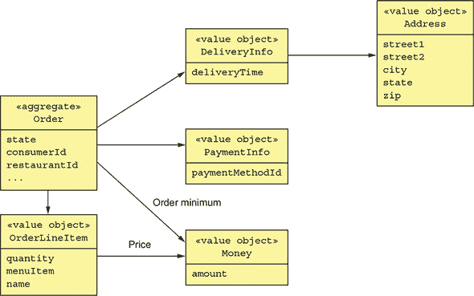

`Order` 类有一个 `OrderLineItems` 集合。因为 `Order` 的 `Consumer` 和 `Restaurant` 是其他聚合，所以它通过主键值引用它们。`Order` 类有一个 `DeliveryInfo` 类，用于存储送货地址和期望的送货时间，以及一个 `PaymentInfo`，用于存储支付信息。以下列表显示了代码。

##### 列表 5.14\. `Order` 类及其字段

```
@Entity
@Table(name="orders")
@Access(AccessType.FIELD)
public class Order {

  @Id
  @GeneratedValue
  private Long id;

  @Version
  private Long version;

  private OrderState state;
  private Long consumerId;
  private Long restaurantId;

  @Embedded
  private OrderLineItems orderLineItems;

  @Embedded
  private DeliveryInformation deliveryInformation;

  @Embedded
  private PaymentInformation paymentInformation;

  @Embedded
  private Money orderMinimum;
```

这个类使用 JPA 进行持久化，并映射到 `ORDERS` 表。`id` 字段是主键。`version` 字段用于乐观锁。`Order` 的状态由 `OrderState` 枚举表示。`DeliveryInformation` 和 `PaymentInformation` 字段使用 `@Embedded` 注解进行映射，并存储为 `ORDERS` 表的列。`orderLineItems` 字段是一个包含订单行项的嵌入对象。`Order` 聚合不仅包含字段，还实现了业务逻辑，这可以通过状态机来描述。让我们看看状态机。

##### `Order` 聚合状态机

为了创建或更新订单，`Order Service` 必须与其他服务协作使用 sagas。要么 `OrderService` 或 saga 的第一步调用一个 `Order` 方法来验证操作是否可以执行，并将 `Order` 的状态更改为待处理状态。正如 第四章 中解释的，*待处理* 状态是语义锁对策的一个例子，有助于确保 sagas 之间相互隔离。最终，一旦 saga 调用了参与的服务，它就会更新 `Order` 以反映结果。例如，正如 第四章 中描述的，`Create Order Saga` 有多个参与服务，包括 `Consumer Service`、`Accounting Service` 和 `Kitchen Service`。`OrderService` 首先以 `APPROVAL_PENDING` 状态创建一个 `Order`，然后稍后将其状态更改为 `APPROVED` 或 `REJECTED`。`Order` 的行为可以建模为 图 5.14 中所示的状态机。

##### 图 5.14\. `Order` 聚合状态机模型的一部分

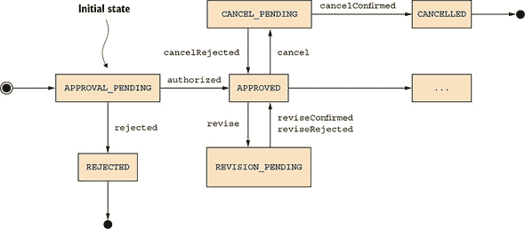

类似地，其他 `Order Service` 操作，如 `revise()` 和 `cancel()`，首先将 `Order` 改为挂起状态，并使用 saga 来验证操作是否可以执行。一旦 saga 验证操作可以执行，它将 `Order` 转换为反映操作成功结果的其他状态。如果操作验证失败，`Order` 将恢复到之前的状态。例如，`cancel()` 操作首先将 `Order` 转换为 `CANCEL_PENDING` 状态。如果订单可以被取消，`Cancel Order Saga` 将 `Order` 的状态改为 `CANCELLED` 状态。否则，如果由于例如取消订单太晚等原因，`cancel()` 操作被拒绝，那么 `Order` 将转换回 `APPROVED` 状态。

现在我们来看看 `Order` 聚合是如何实现这个状态机的。

##### `Order` 聚合的方法

`Order` 类有多个方法组，每个组对应一个 saga。在每个组中，一个方法在 saga 的开始时被调用，其他方法在 saga 的结束时被调用。我首先将讨论创建 `Order` 的业务逻辑。之后，我们将看看如何更新 `Order`。以下列表显示了在创建 `Order` 的过程中被调用的 `Order` 的方法。

##### 列表 5.15\. 订单创建过程中调用的方法

```
public class Order { ...

  public static ResultWithDomainEvents<Order, OrderDomainEvent>
   createOrder(long consumerId, Restaurant restaurant,
                                        List<OrderLineItem> orderLineItems) {
    Order order = new Order(consumerId, restaurant.getId(), orderLineItems);
    List<OrderDomainEvent> events = singletonList(new OrderCreatedEvent(
            new OrderDetails(consumerId, restaurant.getId(), orderLineItems,
                    order.getOrderTotal()),
            restaurant.getName()));
    return new ResultWithDomainEvents<>(order, events);
  }

  public Order(OrderDetails orderDetails) {
    this.orderLineItems = new OrderLineItems(orderDetails.getLineItems());
    this.orderMinimum = orderDetails.getOrderMinimum();
    this.state = APPROVAL_PENDING;
  }
  ...

  public List<DomainEvent> noteApproved() {
    switch (state) {
      case APPROVAL_PENDING:
        this.state = APPROVED;
        return singletonList(new OrderAuthorized());
      ...
      default:
        throw new UnsupportedStateTransitionException(state);
    }
  }

  public List<DomainEvent> noteRejected() {
    switch (state) {
      case APPROVAL_PENDING:
        this.state = REJECTED;
        return singletonList(new OrderRejected());
        ...
      default:
        throw new UnsupportedStateTransitionException(state);
    }

  }
```

`createOrder()` 方法是一个静态工厂方法，用于创建一个订单并发布一个 `OrderCreatedEvent`。`OrderCreatedEvent` 包含了订单的详细信息，包括行项目、总金额、餐厅 ID 和餐厅名称。第七章 讨论了 `Order History Service` 如何使用 `Order` 事件，包括 `OrderCreatedEvent`，来维护一个易于查询的 `Orders` 复制品。

`Order` 的初始状态为 `APPROVAL_PENDING`。当 `CreateOrderSaga` 完成时，它将调用 `noteApproved()` 或 `noteRejected()` 中的一个。当消费者的信用卡成功授权时，将调用 `noteApproved()` 方法。当其中一个服务拒绝订单或授权失败时，将调用 `noteRejected()` 方法。正如你所见，`Order` 聚合的 `state` 决定了其大多数方法的行为。像 `Ticket` 聚合一样，它也会发出事件。

除了 `createOrder()`，`Order` 类还定义了几个更新方法。例如，`Revise Order Saga` 通过首先调用 `revise()` 方法，然后验证修订可以执行后，再调用 `confirmRevised()` 方法来修改订单。以下列表显示了这些方法。

##### 列表 5.16\. 修改 `Order` 的 `Order` 方法

```
class Order ...

  public List<OrderDomainEvent> revise(OrderRevision orderRevision) {
    switch (state) {

      case APPROVED:
        LineItemQuantityChange change =
                orderLineItems.lineItemQuantityChange(orderRevision);
        if (change.newOrderTotal.isGreaterThanOrEqual(orderMinimum)) {
          throw new OrderMinimumNotMetException();
        }
        this.state = REVISION_PENDING;
        return singletonList(new OrderRevisionProposed(orderRevision,
                          change.currentOrderTotal, change.newOrderTotal));

      default:
        throw new UnsupportedStateTransitionException(state);
    }
  }

  public List<OrderDomainEvent> confirmRevision(OrderRevision orderRevision) {
    switch (state) {
      case REVISION_PENDING:
        LineItemQuantityChange licd =
          orderLineItems.lineItemQuantityChange(orderRevision);

        orderRevision
              .getDeliveryInformation()
              .ifPresent(newDi -> this.deliveryInformation = newDi);

        if (!orderRevision.getRevisedLineItemQuantities().isEmpty()) {
          orderLineItems.updateLineItems(orderRevision);
        }

        this.state = APPROVED;
        return singletonList(new OrderRevised(orderRevision,
                          licd.currentOrderTotal, licd.newOrderTotal));
      default:
        throw new UnsupportedStateTransitionException(state);
    }
  }

}
```

调用`revise()`方法来启动订单的修订。除了其他事情之外，它验证修订的订单不会违反订单最低限额，并将订单的状态更改为`REVISION_PENDING`。一旦`Revise Order Saga`成功更新了`Kitchen Service`和`Accounting Service`，它随后调用`confirmRevision()`来完成修订。

这些方法由`OrderService`调用。让我们看看那个类。

#### 5.5.2\. `OrderService`类

`OrderService`类定义了创建和更新`Orders`的方法。它是进入业务逻辑的主要入口点，并由各种传入适配器调用，例如`REST API`。它的大多数方法创建一个传奇来编排`Order`聚合的创建和更新。因此，这个服务比之前讨论的`KitchenService`类更复杂。以下列表显示了该类的摘录。`OrderService`被注入了各种依赖项，包括`OrderRepository`、`OrderDomainEventPublisher`和几个传奇管理器。它定义了包括`createOrder()`和`reviseOrder()`在内的几个方法。

##### 列表 5.17\. `OrderService`类具有创建和管理订单的方法

```
@Transactional
public class OrderService {

  @Autowired
  private OrderRepository orderRepository;

  @Autowired
  private SagaManager<CreateOrderSagaState, CreateOrderSagaState>
    createOrderSagaManager;

  @Autowired
  private SagaManager<ReviseOrderSagaState, ReviseOrderSagaData>
    reviseOrderSagaManagement;

  @Autowired
  private OrderDomainEventPublisher orderAggregateEventPublisher;

  public Order createOrder(OrderDetails orderDetails) {

    Restaurant restaurant = restaurantRepository.findById(restaurantId)
            .orElseThrow(() -
     > new RestaurantNotFoundException(restaurantId));

    List<OrderLineItem> orderLineItems =                                  *1*
       makeOrderLineItems(lineItems, restaurant);

    ResultWithDomainEvents<Order, OrderDomainEvent> orderAndEvents =
            Order.createOrder(consumerId, restaurant, orderLineItems);

    Order order = orderAndEvents.result;

    orderRepository.save(order);                                          *2*

    orderAggregateEventPublisher.publish(order, orderAndEvents.events);   *3*

    OrderDetails orderDetails =
      new OrderDetails(consumerId, restaurantId, orderLineItems,
                        order.getOrderTotal());
    CreateOrderSagaState data = new CreateOrderSagaState(order.getId(),
            orderDetails);

    createOrderSagaManager.create(data, Order.class, order.getId());      *4*

    return order;
  }

  public Order reviseOrder(Long orderId, Long expectedVersion,
                                OrderRevision orderRevision)  {
    public Order reviseOrder(long orderId, OrderRevision orderRevision) {
      Order order = orderRepository.findById(orderId)                     *5*
               .orElseThrow(() -> new OrderNotFoundException(orderId));
      ReviseOrderSagaData sagaData =
        new ReviseOrderSagaData(order.getConsumerId(), orderId,
              null, orderRevision);
      reviseOrderSagaManager.create(sagaData);                            *6*
       return order;
    }
  }
```

+   ***1* 创建订单聚合**

+   ***2* 在数据库中持久化订单**

+   ***3* 发布领域事件**

+   ***4* 创建创建订单传奇**

+   ***5* 获取订单**

+   ***6* 创建修订订单传奇**

`createOrder()`方法首先创建和持久化`Order`聚合。然后，它发布由聚合发出的领域事件。最后，它创建一个`CreateOrderSaga`。`reviseOrder()`检索`Order`然后创建一个`ReviseOrderSaga`。

在许多方面，基于微服务的应用程序的业务逻辑与传统单体应用程序的业务逻辑并没有太大的不同。它由服务、JPA 支持的实体和存储库等类组成。尽管如此，也有一些不同之处。领域模型组织为一系列 DDD 聚合，这些聚合施加了各种设计约束。与传统对象模型不同，不同聚合之间类的引用是主键值而不是对象引用。此外，事务只能创建或更新单个聚合。当聚合的状态发生变化时，发布领域事件对聚合也很有用。

另一个主要区别是，服务通常使用传奇（sagas）来维护多个服务之间的数据一致性。例如，`Kitchen Service` 仅参与传奇，它不会启动它们。相比之下，`Order Service` 在创建和更新订单时严重依赖传奇。这是因为`Orders`必须与属于其他服务的数据进行事务一致性。因此，大多数`OrderService`方法创建一个传奇而不是直接更新`Order`。

本章介绍了如何使用传统的持久化方法来实现业务逻辑。这包括将消息传递和事件发布与数据库事务管理集成。事件发布代码与业务逻辑交织在一起。下一章将探讨事件溯源，这是一种以事件为中心的方法来编写业务逻辑，其中事件生成是业务逻辑的组成部分，而不是附加的。

### 摘要

+   程序性事务脚本模式通常是实现简单业务逻辑的好方法。但在实现复杂业务逻辑时，应考虑使用面向对象的领域模型模式。

+   将服务业务逻辑组织为 DDD 聚合集合是一个好方法。DDD 聚合很有用，因为它们模块化了领域模型，消除了服务之间对象引用的可能性，并确保每个 ACID 事务都在服务内部。

+   当聚合创建或更新时，应该发布领域事件。领域事件有广泛的应用。第四章讨论了它们如何实现基于编排的叙事。在第七章中，我谈论了如何使用领域事件来更新复制数据。领域事件订阅者还可以通知用户和其他应用程序，并向用户的浏览器发布 WebSocket 消息。
