## 第六章\. 使用事件源开发业务逻辑

*本章涵盖*

+   使用事件源模式开发业务逻辑

+   实现事件存储库

+   集成剧情和基于事件源的业务逻辑

+   使用事件源实现剧情协调器

玛丽喜欢第五章中描述的想法，即把业务逻辑结构化为发布领域事件的 DDD 聚合体的集合。她可以想象这些事件在微服务架构中的使用将非常有用。玛丽计划使用事件来实现基于剧情的剧情协调器，这些协调器在服务之间维护数据一致性，并在第四章中描述。她还预计将使用 CQRS 视图，这些视图是支持高效查询的副本，在第七章中描述。

然而，她担心事件发布逻辑可能存在错误。一方面，事件发布逻辑相对直接。聚合体中每个初始化或更改聚合体状态的方法的返回值都是一个事件列表。领域服务随后发布这些事件。但另一方面，事件发布逻辑是附加到业务逻辑上的。即使开发者忘记发布事件，业务逻辑仍然可以继续工作。玛丽担心这种发布事件的方式可能成为错误源。

多年前，玛丽了解到*事件源*，这是一种以事件为中心编写业务逻辑和持久化领域对象的方法。当时她对其众多好处感到好奇，包括它如何保留聚合体变更的完整历史，但它仍然是一个谜。鉴于领域事件在微服务架构中的重要性，她现在想知道在 FTGO 应用程序中使用事件源是否值得探索。毕竟，事件源通过保证在创建或更新聚合体时将发布事件，从而消除了编程错误的一个来源。

我在本章开始时将描述事件源的工作原理以及如何使用它来编写业务逻辑。我描述了事件源如何在所谓的*事件存储*中将每个聚合体持久化为一系列事件。我讨论了事件源的好处和缺点，并涵盖了如何实现事件存储库。我描述了一个编写基于事件源的业务逻辑的简单框架。之后，我讨论了事件源是如何成为实现剧情的良好基础的。让我们先看看如何使用事件源开发业务逻辑。

### 6.1\. 使用事件源开发业务逻辑

事件源是一种不同的业务逻辑结构和聚合体持久化的方式。它将聚合体持久化为一系列事件。每个事件代表聚合体的状态变化。应用程序通过重放事件来重新创建聚合体的当前状态。

|  |
| --- |

**模式：事件源**

将聚合持久化为一系列表示状态变化的领域事件序列。参见[`microservices.io/patterns/data/event-sourcing.html`](http://microservices.io/patterns/data/event-sourcing.html)。

| |
| --- |

事件溯源有几个重要的优点。例如，它保留了聚合的历史，这对于审计和监管目的非常有价值。它还可靠地发布领域事件，这在微服务架构中特别有用。事件溯源也有一些缺点。它涉及一个学习曲线，因为这是一种编写业务逻辑的不同方式。此外，查询事件存储通常很困难，这需要你使用第七章中描述的 CQRS 模式，第七章。

我在本节开始时描述了传统持久化的局限性。然后，我详细介绍了事件溯源，并讨论了它如何克服这些局限性。之后，我展示了如何使用事件溯源实现`Order`聚合。最后，我描述了事件溯源的优点和缺点。

首先，让我们看看传统持久化方法的局限性。

#### 6.1.1\. 传统持久化的麻烦

传统持久化方法将类映射到数据库表，将这些类的字段映射到表列，并将这些类的实例映射到表中的行。例如，图 6.1 显示了第五章中描述的`Order`聚合如何映射到`ORDER`表。它的`OrderLineItems`映射到`ORDER_LINE_ITEM`表。

##### 图 6.1\. 传统持久化方法将类映射到表，并将对象映射到这些表中的行。

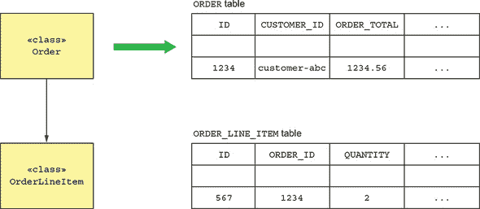

应用程序将订单实例持久化为`ORDER`和`ORDER_LINE_ITEM`表中的行。它可能使用 ORM 框架，如 JPA，或更低级别的框架，如 MyBATIS 来实现这一点。

这种方法显然效果很好，因为大多数企业应用程序都是这样存储数据的。但它有几个缺点和局限性：

+   对象-关系阻抗不匹配。

+   缺乏聚合历史。

+   实现审计日志既繁琐又容易出错。

+   事件发布被附加到业务逻辑上。

让我们逐一分析这些问题，首先是对象-关系阻抗不匹配问题。

##### 对象-关系阻抗不匹配

一个古老的难题是所谓的*对象-关系阻抗不匹配*问题。在表格关系模式与具有复杂关系的丰富领域模型的图结构之间存在根本的概念不匹配。这个问题的某些方面反映在关于对象/关系映射（ORM）框架适用性的两极分化辩论中。例如，Ted Neward 曾经说过：“对象-关系映射是计算机科学的越南”（[`blogs.tedneward.com/post/the-vietnam-of-computer-science/`](http://blogs.tedneward.com/post/the-vietnam-of-computer-science/))。公平地说，我已经成功地使用 Hibernate 开发了一些应用程序，其中数据库模式是从对象模型派生出来的。但问题比任何特定 ORM 框架的限制要深。

##### 缺乏聚合历史记录

传统持久化的另一个局限性是它只存储聚合的当前状态。一旦聚合被更新，其先前状态就会丢失。如果一个应用程序必须保留聚合的历史记录，可能出于监管目的，那么开发人员必须自己实现这个机制。实现聚合历史记录机制既耗时又涉及复制必须与业务逻辑同步的代码。

##### 实施审计日志记录是繁琐且容易出错的

另一个问题也是审计日志。许多应用程序必须维护一个审计日志，以追踪哪些用户更改了聚合数据。一些应用程序需要出于安全或监管目的进行审计。在其他应用程序中，用户行为的历史记录是一个重要的功能。例如，问题跟踪器和任务管理应用程序，如 Asana 和 JIRA，会显示任务和问题的更改历史。实施审计的挑战在于，除了是一个耗时的工作外，审计日志代码和业务逻辑可能会出现分歧，从而导致错误。

##### 事件发布被附加到业务逻辑上

传统持久化的另一个局限性是它通常不支持发布领域事件。领域事件在第五章（kindle_split_013.xhtml#ch05）中讨论过，是聚合状态改变时发布的事件。它们是同步数据和在微服务架构中发送通知的有用机制。一些 ORM 框架，如 Hibernate，可以在数据对象更改时调用应用程序提供的回调。但是，没有支持作为更新数据的交易的一部分自动发布消息。因此，与历史和审计一样，开发人员必须附加事件生成逻辑，这可能导致与业务逻辑不同步。幸运的是，这些问题有解决方案：事件源。

#### 6.1.2\. 事件源概述

事件源是一种以事件为中心的技术，用于实现业务逻辑和持久化聚合。聚合作为一系列事件存储在数据库中。每个事件代表聚合的状态变化。聚合的业务逻辑围绕产生和消费这些事件的要求来构建。让我们看看它是如何工作的。

##### 事件源使用事件持久化聚合

在前面的 6.1.1 节中，我讨论了传统持久化如何将聚合映射到表，将它们的字段映射到列，将它们的实例映射到行。事件源是一种非常不同的持久化聚合的方法，它建立在领域事件的概念之上。它将每个聚合作为一系列事件持久化到数据库中，称为事件存储。

例如，考虑`Order`聚合。如图 6.2 所示，事件源不是将每个`Order`存储在`ORDER`表中的一行，而是将每个`Order`聚合持久化为`EVENTS`表中的一行或多行。每一行都是一个领域事件，例如`Order Created`、`Order Approved`、`Order Shipped`等。

##### 图 6.2\. 事件源将每个聚合持久化为一系列事件。基于 RDBMS 的应用程序可以将事件存储在`EVENTS`表中。

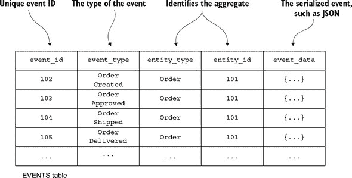

当一个应用程序创建或更新一个聚合时，它会将聚合发出的事件插入到`EVENTS`表中。应用程序通过检索其事件并重新播放它们来从事件存储中加载聚合。具体来说，加载聚合包括以下三个步骤：

1.  加载聚合的事件。

1.  使用其默认构造函数创建聚合实例。

1.  遍历事件，调用`apply()`。

例如，Eventuate 客户端框架（在 6.2.2 节中介绍）使用类似于以下代码来重建一个聚合：

```
Class aggregateClass = ...;
Aggregate aggregate = aggregateClass.newInstance();
for (Event event : events) {
  aggregate = aggregate.applyEvent(event);
}
// use aggregate...
```

它创建类的实例，并遍历事件，调用聚合的`applyEvent()`方法。如果你熟悉函数式编程，你可能认识这作为一个*折叠或归约*操作。

通过加载事件并重新播放事件来重建聚合的内存状态可能显得奇怪且不熟悉。但以某种方式，这并不完全不同于 ORM 框架（如 JPA 或 Hibernate）加载实体的方式。ORM 框架通过执行一个或多个`SELECT`语句来检索当前持久化状态，使用它们的默认构造函数实例化对象。它使用反射来初始化这些对象。事件源的不同之处在于，内存状态的重建是通过使用事件来完成的。

现在我们来看看事件源对领域事件提出的要求。

##### 事件表示状态变化

第五章定义了领域事件为通知订阅者聚合变化的一种机制。事件可以包含最小数据，例如仅包含聚合 ID，或者可以扩展以包含对典型消费者有用的数据。例如，当创建订单时，`Order Service`可以发布`OrderCreated`事件。`OrderCreated`事件可能仅包含`orderId`。或者，事件可以包含完整的订单，这样该事件的消费者就不需要从`Order Service`获取数据。事件是否发布以及事件包含的内容是由消费者的需求驱动的。然而，在使用事件溯源时，主要是聚合决定了事件及其结构。

在使用事件溯源时，事件不是可选的。聚合的每个状态变化，包括其创建，都由领域事件表示。每当聚合的状态发生变化时，它必须发出一个事件。例如，当创建时，`Order`聚合必须发出`OrderCreated`事件，每次更新时发出`Order*`事件。这是一个比以前更严格的要求，当时聚合只发出对消费者感兴趣的事件。

更重要的是，事件必须包含聚合执行状态转换所需的数据。聚合的状态由构成聚合的对象的字段值组成。状态变化可能只是简单地更改对象的字段值，例如更改`Order.state`的值。或者，状态变化可以涉及添加或删除对象，例如修改`Order`的行项目。

假设，如图 6.3 所示，聚合的当前状态是`S`，新状态是`S'`。表示状态变化的事件`E`必须包含数据，使得当`Order`处于状态`S`时，调用`order.apply(E)`将更新`Order`到状态`S'`。在下一节中，您将看到`apply()`是一个执行事件表示的状态变化的方法。

##### 当`Order`处于状态`S`时，应用事件`E`必须将`Order`状态更改为`S'`。事件必须包含执行状态转换所需的数据。

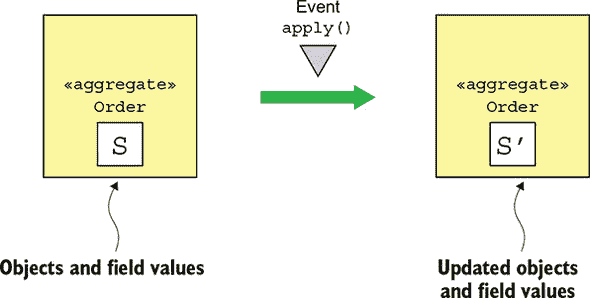

一些事件，例如`Order Shipped`事件，包含很少或没有数据，仅仅表示状态转换。`apply()`方法通过将`Order`的状态字段更改为`SHIPPED`来处理`Order Shipped`事件。然而，其他事件包含大量数据。例如，`OrderCreated`事件必须包含`apply()`方法初始化`Order`所需的所有数据，包括其行项目、支付信息、配送信息等。由于事件用于持久化聚合，因此不再有使用仅包含`orderId`的最小`OrderCreated`事件的选项。

##### 聚合方法都是关于事件的

业务逻辑通过在聚合根上调用命令方法来处理更新聚合的请求。在传统应用中，命令方法通常验证其参数，然后更新聚合的一个或多个字段。基于事件源的应用中的命令方法之所以有效，是因为它们必须生成事件。如图 6.4 所示，调用聚合的命令方法会产生一系列事件，这些事件代表了必须进行的州变化。这些事件被保存在数据库中，并应用于聚合以更新其状态。

##### 图 6.4\. 处理命令生成事件，而不改变聚合的状态。聚合通过应用事件来更新。

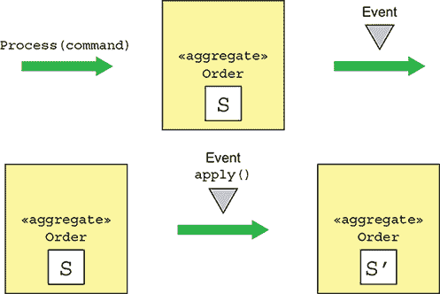

生成事件并将它们应用的要求需要对业务逻辑进行重构——尽管是机械的。事件源将命令方法重构为两个或更多方法。第一个方法接受一个表示请求的命令对象参数，并确定需要执行哪些状态变化。它验证其参数，并在不改变聚合状态的情况下返回表示状态变化的事件列表。如果命令无法执行，此方法通常抛出异常。

其他方法各自接受特定的事件类型作为参数并更新聚合。对于每个事件都有一个这样的方法。重要的是要注意，这些方法不能失败，因为事件代表了一个已经发生的状态变化。每个方法根据事件更新聚合。

Eventuate 客户端框架，一个在第 6.2.2 节中更详细描述的事件源框架，将这些方法命名为 `process()` 和 `apply()`。一个 `process()` 方法接受一个命令对象作为参数，该对象包含更新请求的参数，并返回一个事件列表。一个 `apply()` 方法接受一个事件作为参数并返回空值。聚合将定义这些方法的多个重载版本：每个命令类一个 `process()` 方法，以及每个由聚合发出的事件类型一个 `apply()` 方法。图 6.5 展示了一个示例。

##### 图 6.5\. 事件源将更新聚合的方法拆分为一个 `process()` 方法，它接受一个命令并返回事件，以及一个或多个 `apply()` 方法，它们接受一个事件并更新聚合。

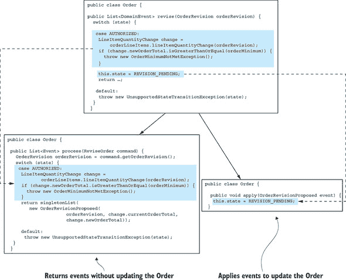

在这个例子中，`reviseOrder()`方法被一个`process()`方法和一个`apply()`方法所取代。`process()`方法接受一个`ReviseOrder`命令作为参数。这个命令类是通过将*引入参数对象*重构([`refactoring.com/catalog/introduceParameterObject.html`](https://refactoring.com/catalog/introduceParameterObject.html))应用到`reviseOrder()`方法中定义的。`process()`方法要么返回一个`OrderRevisionProposed`事件，要么在修改`Order`太晚或提议的修订不符合订单最低要求时抛出异常。`OrderRevisionProposed`事件的`apply()`方法将`Order`的状态更改为`REVISION_PENDING`。

使用以下步骤创建聚合：

1.  使用默认构造函数实例化聚合根。

1.  调用`process()`以生成新事件。

1.  通过遍历新事件并调用其`apply()`来更新聚合。

1.  将新事件保存到事件存储中。

使用以下步骤更新聚合：

1.  从事件存储中加载聚合的事件。

1.  使用默认构造函数实例化聚合根。

1.  遍历加载的事件，在聚合根上调用`apply()`。

1.  调用其`process()`方法以生成新事件。

1.  通过遍历新事件并调用`apply()`来更新聚合。

1.  将新事件保存到事件存储中。

为了看到这个动作，现在让我们看看`Order`聚合的事件源版本。

##### 基于事件源技术的订单聚合

列表 6.1 展示了`Order`聚合的字段以及负责创建它的方法。`Order`聚合的事件源版本与第五章中展示的基于 JPA 的版本有一些相似之处。它们的字段几乎相同，并且发出类似的事件。不同之处在于，其业务逻辑是通过处理发出事件和应用的命令来实现的，这更新了其状态。每个创建或更新基于 JPA 的聚合的方法，如`createOrder()`和`reviseOrder()`，在事件源版本中被`process()`和`apply()`方法所取代。

##### 列表 6.1\. `Order`聚合的字段及其初始化实例的方法

```
public class Order {

  private OrderState state;
  private Long consumerId;
  private Long restaurantId;
  private OrderLineItems orderLineItems;
  private DeliveryInformation deliveryInformation;
  private PaymentInformation paymentInformation;
  private Money orderMinimum;

  public Order() {
  }

  public List<Event> process(CreateOrderCommand command) {            *1*
     ... validate command ...
    return events(new OrderCreatedEvent(command.getOrderDetails()));
  }

  public void apply(OrderCreatedEvent event) {                        *2*
    OrderDetails orderDetails = event.getOrderDetails();
    this.orderLineItems = new OrderLineItems(orderDetails.getLineItems());
    this.orderMinimum = orderDetails.getOrderMinimum();
    this.state = APPROVAL_PENDING;
  }
```

+   ***1* 验证命令并返回一个 OrderCreatedEvent**

+   ***2* 通过初始化订单的字段来应用 OrderCreatedEvent。**

这个类的字段与基于 JPA 的`Order`类似。唯一的区别是聚合的`id`不存储在聚合中。`Order`的方法相当不同。`createOrder()`工厂方法已被`process()`和`apply()`方法所取代。`process()`方法接受一个`CreateOrder`命令并发出一个`OrderCreated`事件。`apply()`方法接受`OrderCreated`并初始化`Order`的字段。

现在我们将探讨修改订单的稍微复杂一些的业务逻辑。之前这个业务逻辑由三个方法组成：`reviseOrder()`、`confirmRevision()` 和 `rejectRevision()`。事件溯源版本用三个 `process()` 方法和一些 `apply()` 方法替换了这三个方法。以下列表展示了 `reviseOrder()` 和 `confirmRevision()` 的事件溯源版本。

##### 列表 6.2\. 修改 `Order` 聚合的 `process()` 和 `apply()` 方法

```
public class Order {

public List<Event> process(ReviseOrder command) {                          *1*
  OrderRevision orderRevision = command.getOrderRevision();
  switch (state) {
    case APPROVED:
      LineItemQuantityChange change =
              orderLineItems.lineItemQuantityChange(orderRevision);
      if (change.newOrderTotal.isGreaterThanOrEqual(orderMinimum)) {
        throw new OrderMinimumNotMetException();
      }
      return singletonList(new OrderRevisionProposed(orderRevision,
                            change.currentOrderTotal, change.newOrderTotal));

    default:
      throw new UnsupportedStateTransitionException(state);
  }
}

public void apply(OrderRevisionProposed event) {                           *2*
   this.state = REVISION_PENDING;
}

public List<Event> process(ConfirmReviseOrder command) {                   *3*
  OrderRevision orderRevision = command.getOrderRevision();
  switch (state) {
    case REVISION_PENDING:
      LineItemQuantityChange licd =
            orderLineItems.lineItemQuantityChange(orderRevision);
      return singletonList(new OrderRevised(orderRevision,
              licd.currentOrderTotal, licd.newOrderTotal));
    default:
      throw new UnsupportedStateTransitionException(state);
  }
}

public void apply(OrderRevised event) {                                    *4*
  OrderRevision orderRevision = event.getOrderRevision();
  if (!orderRevision.getRevisedLineItemQuantities().isEmpty()) {
    orderLineItems.updateLineItems(orderRevision);
  }
  this.state = APPROVED;
}
```

+   ***1* 验证订单是否可以修改，并且修改后的订单符合订单最低要求。**

+   ***2* 将订单状态更改为 REVISION_PENDING。**

+   ***3* 验证修订是否可以确认，并返回一个 OrderRevised 事件。**

+   ***4* 修改订单。**

如您所见，每个方法都被替换为一个 `process()` 方法和一个或多个 `apply()` 方法。`reviseOrder()` 方法被替换为 `process (ReviseOrder)` 和 `apply(OrderRevisionProposed)`。同样，`confirmRevision()` 被替换为 `process(ConfirmReviseOrder)` 和 `apply(OrderRevised)`。

#### 6.1.3\. 使用乐观锁处理并发更新

同时更新同一个聚合体的两个或多个请求并不少见。使用传统持久化的应用程序通常使用乐观锁来防止一个事务覆盖另一个事务的更改。*乐观锁*通常使用一个版本列来检测聚合体自读取以来是否已更改。应用程序将聚合根映射到一个具有 `VERSION` 列的表，每当聚合体更新时，该列都会递增。应用程序使用如下 `UPDATE` 语句更新聚合体：

```
UPDATE AGGREGATE_ROOT_TABLE
SET VERSION = VERSION + 1 ...
WHERE VERSION = <original version>
```

只有当版本号自应用程序读取聚合体以来未更改时，此 `UPDATE` 语句才会成功。如果有两个事务读取相同的聚合体，第一个更新聚合体的交易将成功。第二个将失败，因为版本号已更改，所以它不会意外地覆盖第一个事务的更改。

事件存储库也可以使用乐观锁来处理并发更新。每个聚合实例都有一个版本号，在读取事件时一起读取。当应用程序插入事件时，事件存储库会验证版本号是否未更改。一种简单的方法是将事件的数量作为版本号。或者，如您在下面的第 6.2 节中看到的，事件存储库可以维护一个显式的版本号。

#### 6.1.4\. 事件溯源和发布事件

严格来说，事件溯源将聚合体持久化为事件，并从这些事件中重建聚合体的当前状态。您还可以将事件溯源用作可靠的事件发布机制。在事件存储中保存事件是一个本质上原子的操作。我们需要实现一个机制来将所有持久化的事件传递给感兴趣的消费者。

第三章描述了几种不同的机制——轮询和事务日志尾部——用于发布作为事务一部分插入数据库的消息。基于事件源的应用可以使用这些机制之一来发布事件。主要区别在于它永久地将事件存储在`EVENTS`表中，而不是临时将事件存储在`OUTBOX`表中然后删除它们。让我们看看每种方法，从轮询开始。

##### 使用轮询来发布事件

如果事件存储在图 6.6 中显示的`EVENTS`表中，事件发布者可以通过执行一个`SELECT`语句来轮询表以获取新事件，并将事件发布到消息代理。挑战在于确定哪些事件是新的。例如，假设`eventIds`是单调递增的。表面上吸引人的方法是让事件发布者记录它最后处理过的`eventId`。然后，它会使用如下查询来检索新事件：`SELECT * FROM EVENTS where event_id > ? ORDER BY event_id ASC`。

##### 图 6.6\. 一个事件被跳过的情况，因为其事务*A*在事务*B*提交之后提交。轮询看到`eventId=1020`，然后后来跳过`eventId=1010`。

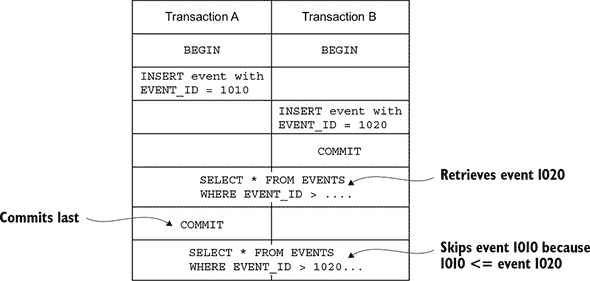

这种方法的缺点是事务可以以不同于它们生成事件的顺序提交。因此，事件发布者可能会意外地跳过一个事件。图 6.6 展示了这种情况。

在这个场景中，事务*A*插入一个`EVENT_ID`为 1010 的事件。接下来，事务*B*插入一个`EVENT_ID`为 1020 的事件，然后提交。如果事件发布者现在查询`EVENTS`表，它会找到事件 1020。稍后，在事务*A*提交并且事件 1010 变得可见之后，事件发布者会忽略它。

解决这个问题的一个方案是在`EVENTS`表中添加一个额外的列来跟踪事件是否已发布。然后事件发布者将使用以下过程：

1.  通过执行以下 SELECT 语句来查找未发布的事件：`SELECT * FROM EVENTS where PUBLISHED = 0 ORDER BY event_id ASC`。

1.  将事件发布到消息代理。

1.  将事件标记为已发布：`UPDATE EVENTS SET PUBLISHED = 1 WHERE EVENT_ID in`。

这种方法防止事件发布者跳过事件。

##### 使用事务日志尾部可靠地发布事件

更复杂的事件存储使用*事务日志尾部*，正如第三章所描述的，这保证了事件将被发布，并且性能更高，可扩展性更好。例如，开源事件存储 Eventuate Local 就使用这种方法。它从数据库事务日志中读取插入到`EVENTS`表中的事件，并将它们发布到消息代理。第 6.2 节详细讨论了 Eventuate Local 的工作原理。

#### 6.1.5\. 使用快照提高性能

“订单”聚合具有相对较少的状态转换，因此它只有少量的事件。查询事件存储以获取这些事件并重建“订单”聚合是高效的。然而，长期存在的聚合可以具有大量的事件。例如，“账户”聚合可能具有大量的事件。随着时间的推移，加载和折叠这些事件将变得越来越低效。

一种常见的解决方案是定期持久化聚合状态的快照。图 6.7 展示了使用快照的示例。应用程序通过加载最近的快照以及自快照创建以来发生的事件来恢复聚合的状态。

##### 图 6.7\. 使用快照通过消除加载所有事件的必要性来提高性能。应用程序只需要加载快照以及之后发生的事件。

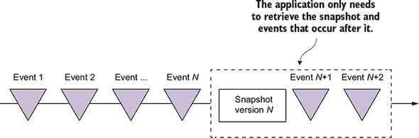

在此示例中，快照版本为*N*。应用程序只需要加载快照以及紧随其后的两个事件，以便恢复聚合的状态。之前的*N*个事件不需要从事件存储中加载。

当从快照恢复聚合的状态时，应用程序首先从快照创建一个聚合实例，然后遍历事件，应用它们。例如，在第 6.2.2 节中描述的 Eventuate Client 框架，使用类似于以下代码来重建一个聚合：

```
Class aggregateClass = ...;
Snapshot snapshot = ...;
Aggregate aggregate = recreateFromSnapshot(aggregateClass, snapshot);
for (Event event : events) {
  aggregate = aggregate.applyEvent(event);
}
// use aggregate...
```

当使用快照时，聚合实例是从快照重新创建的，而不是使用其默认构造函数创建。如果一个聚合具有简单且易于序列化的结构，快照可以是其 JSON 序列化。更复杂的聚合可以使用备忘录模式([`en.wikipedia.org/wiki/Memento_pattern`](https://en.wikipedia.org/wiki/Memento_pattern))进行快照。

在在线商店示例中，“客户”聚合具有非常简单的结构：客户信息、信用额度以及信用预留。一个“客户”的快照是其状态的 JSON 序列化。图 6.8 展示了如何从对应于事件#103 时“客户”状态的快照中重新创建一个“客户”。客户服务需要加载快照以及事件#103 之后发生的事件。

##### 图 6.8\. “客户服务”通过反序列化快照的 JSON，然后加载并应用事件#104 至#106 来重新创建“客户”。

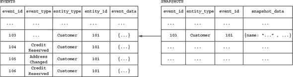

“客户服务”通过反序列化快照的 JSON，然后加载并应用事件#104 至#106 来重新创建“客户”。

#### 6.1.6\. 幂等消息处理

服务通常从其他应用程序或其他服务中消费消息。例如，一个服务可能会消费由聚合体发布的领域事件或由叙事编排器发送的命令消息。如第三章所述，开发消息消费者时的重要问题是确保它是幂等的，因为消息代理可能会多次投递相同的消息。

如果消息消费者可以安全地多次使用相同的消息调用，则它是幂等的。例如，Eventuate Tram 框架通过检测和丢弃重复消息来实现幂等消息处理。它将处理消息的`ids`记录在业务逻辑创建或更新聚合体时使用的本地 ACID 事务的`PROCESSED_MESSAGES`表中。如果消息的 ID 在`PROCESSED_MESSAGES`表中，则它是重复的，可以被丢弃。基于事件源的业务逻辑必须实现等效机制。如何实现取决于事件存储使用的是 RDBMS 还是 NoSQL 数据库。

##### 使用基于 RDBMS 的事件存储进行幂等消息处理

如果应用程序使用基于 RDBMS 的事件存储，它可以使用相同的方法来检测和丢弃重复消息。它在将事件插入`EVENTS`表的事务中将消息 ID 插入到`PROCESSED_MESSAGES`表中。

##### 使用基于 NoSQL 的事件存储进行幂等消息处理

基于 NoSQL 的事件存储，由于具有有限的交易模型，必须使用不同的机制来实现幂等消息处理。消息消费者必须以某种方式原子性地持久化事件并记录消息 ID。幸运的是，有一个简单的解决方案。消息消费者在处理消息时将其 ID 存储在生成的事件中。它通过验证聚合体的事件中不包含消息 ID 来检测重复项。

使用这种方法的一个挑战是处理消息可能不会生成任何事件。没有事件意味着没有记录消息已被处理。对同一消息的后续重新投递和重新处理可能会导致不正确的行为。例如，考虑以下场景：

1.  消息 A 被处理，但没有更新聚合体。

1.  消息 B 被处理，并且消息消费者更新了聚合体。

1.  消息 A 被重新投递，因为没有记录它已被处理，消息消费者更新了聚合体。

1.  消息 B 再次被处理...

在这种情况下，事件的重新投递会导致不同的结果，可能是错误的结果。

避免这种问题的方法之一是始终发布一个事件。如果一个聚合体没有发出事件，应用程序将保存一个伪事件仅用于记录消息 ID。事件消费者必须忽略这些伪事件。

#### 6.1.7. 领域事件的演变

事件源，至少从概念上讲，永久存储事件——这是一把双刃剑。一方面，它为应用程序提供了一个保证准确性的变更审计日志。它还使应用程序能够重建聚合的历史状态。另一方面，它也带来了挑战，因为事件的结构通常会随时间而变化。

应用程序可能需要处理多个事件版本。例如，加载 `Order` 聚合的服务可能需要合并多个事件版本。同样，事件订阅者可能看到多个版本。

让我们先看看事件可以以哪些不同的方式改变，然后我将描述一种常用的处理变更的方法。

##### 事件模式演进

从概念上讲，事件源应用程序有一个分为三个级别的架构：

+   由一个或多个聚合组成

+   定义每个聚合发出的事件

+   定义事件的架构

表 6.1 展示了在每个级别可能发生的不同类型的变更。

##### 表 6.1\. 应用程序事件演变的多种方式

| 级别 | 变更 | 向后兼容 |
| --- | --- | --- |
| 架构 | 定义一个新的聚合类型 | 是 |
| 移除聚合 | 移除现有的聚合 | 否 |
| 重命名聚合 | 更改聚合类型的名称 | 否 |
| 聚合 | 添加一个新的事件类型 | 是 |
| 移除事件 | 移除一个事件类型 | 否 |
| 重命名事件 | 更改事件类型的名称 | 否 |
| 事件 | 添加一个新的字段 | 是 |
| 删除字段 | 删除一个字段 | 否 |
| 重命名字段 | 重命名一个字段 | 否 |
| 更改字段类型 | 更改字段的类型 | 否 |

这些变更随着服务领域模型随时间演变而自然发生——例如，当服务的需求发生变化或其开发者对领域有更深入的了解并改进领域模型时。在架构级别，开发者添加、删除和重命名聚合类。在聚合级别，特定聚合发出的事件类型可能会改变。开发者可以通过添加、删除、更改字段名称或类型来更改事件类型的结构。

幸运的是，许多这类变更都是向后兼容的。例如，向事件添加字段不太可能影响消费者。消费者会忽略未知字段。然而，其他变更则不是向后兼容的。例如，更改事件或字段的名称需要更改该事件类型的消费者。

##### 通过向上转换管理架构变更

在 SQL 数据库世界中，数据库架构的变更通常通过架构迁移来处理。每个架构变更都由一个 *迁移* 表示，这是一个更改架构并将数据迁移到新架构的 SQL 脚本。架构迁移存储在版本控制系统，并使用如 Flyway 这样的工具应用到数据库中。

事件溯源应用程序可以使用类似的方法来处理不向后兼容的更改。但是，与在原地迁移事件到新架构版本不同，事件溯源框架在从事件存储加载事件时转换事件。一个通常称为*升级器*的组件将单个事件从旧版本更新到新版本。因此，应用程序代码始终只处理当前的事件架构。

现在我们已经了解了事件溯源的工作原理，让我们考虑其优点和缺点。

#### 6.1.8\. 事件溯源的优点

事件溯源既有优点也有缺点。其优点包括以下内容：

+   可靠发布领域事件

+   保留聚合的历史

+   主要避免了 O/R 阻抗不匹配问题

+   为开发者提供时间机器

让我们更详细地考察每个好处。

##### 可靠发布领域事件

事件溯源的一个主要好处是它可以在聚合状态改变时可靠地发布事件。这对于事件驱动的微服务架构是一个良好的基础。此外，由于每个事件都可以存储更改用户的身份，事件溯源提供了一个保证准确性的审计日志。事件流可以用作各种其他目的，包括通知用户、应用程序集成、分析和监控。

##### 保留聚合的历史

事件溯源的另一个好处是它存储了每个聚合的整个历史。你可以轻松实现时间查询，以检索聚合的过去状态。例如，要确定某个过去时刻聚合的状态，你可以折叠直到那个时刻发生的事件。例如，计算客户在某个过去时刻的可用信用额度是直接的。

##### 主要避免了 O/R 阻抗不匹配问题

事件溯源是持久化事件而不是聚合它们。事件通常具有简单、易于序列化的结构。如前所述，一个服务可以通过序列化其状态的备忘录来快照一个复杂的聚合，这会在聚合及其序列化表示之间增加一个间接层。

##### 为开发者提供时间机器

事件溯源存储了一个应用程序在其生命周期中发生的所有事情的历史。想象一下，FTGO 的开发者需要实现一个新需求，即向那些将商品添加到购物车后又删除它们的客户进行营销。传统的应用程序不会保留这些信息，因此只能在功能实现后向添加和删除商品的客户进行营销。相比之下，基于事件溯源的应用程序可以立即向那些过去做过这件事的客户进行营销。这就像事件溯源为开发者提供了一个时间机器，可以回到过去并实现未预见的需求。

#### 6.1.9\. 事件溯源的缺点

事件溯源不是万能的。它有以下缺点：

+   它具有具有学习曲线的不同编程模型。

+   它具有基于消息的应用程序的复杂性。

+   事件演变可能很棘手。

+   删除数据很棘手。

+   查询事件存储具有挑战性。

让我们来看看每个缺点。

##### 具有学习曲线的不同编程模型

它是一个不同且不熟悉的编程模型，这意味着有一个学习曲线。为了使现有应用程序使用事件溯源，你必须重写其业务逻辑。幸运的是，这是一个相当机械的转换，你可以在将应用程序迁移到微服务时进行。

##### 基于消息的应用程序的复杂性

事件溯源的另一个缺点是消息代理通常保证至少一次投递。非幂等的事件处理器必须检测并丢弃重复的事件。事件溯源框架可以通过为每个事件分配一个单调递增的 ID 来帮助。事件处理器可以通过跟踪最高已见事件 ID 来检测重复事件。当事件处理器更新聚合时，这甚至可以自动发生。

##### 事件演变可能很棘手

使用事件溯源时，事件的模式（以及快照！）会随着时间的推移而演变。因为事件是永久存储的，聚合可能需要折叠对应多个模式版本的事件。确实存在这样的风险，即聚合可能会因为处理所有不同版本而变得臃肿。如第 6.1.7 节所述，解决这个问题的一个好方法是当从事件存储中加载事件时将事件升级到最新版本。这种方法将升级事件的代码与聚合分离，从而简化了聚合，因为它们只需要应用事件的最新版本。

##### 删除数据很棘手

因为事件溯源的一个目标是为了保留聚合的历史，它故意永久存储数据。在事件溯源中使用传统方式删除数据时，通常会进行软删除。应用程序通过设置一个*已删除*标志来删除聚合。聚合通常会发出一个`Deleted`事件，通知任何感兴趣的消费者。任何访问该聚合的代码都可以检查该标志并相应地操作。

使用软删除对于许多类型的数据来说效果很好。然而，一个挑战是遵守通用数据保护条例（GDPR），这是一项欧洲数据保护和隐私法规，赋予个人删除权([`gdpr-info.eu/art-17-gdpr/`](https://gdpr-info.eu/art-17-gdpr/))。应用程序必须有能力忘记用户的个人信息，例如他们的电子邮件地址。基于事件溯源的应用程序的问题是电子邮件地址可能存储在`AccountCreated`事件中或用作聚合的主键。应用程序必须以某种方式忘记用户，而不删除事件。

加密是你可以用来解决这个问题的一种机制。每个用户都有一个加密密钥，该密钥存储在单独的数据库表中。应用程序使用该加密密钥在将事件存储在事件存储之前加密包含用户个人信息的任何事件。当用户请求被删除时，应用程序会从数据库表中删除加密密钥记录。由于事件无法再被解密，因此用户的个人信息实际上被删除了。

加密事件可以解决删除用户个人信息的大部分问题。但如果用户的某些个人信息，例如电子邮件地址，被用作聚合 ID，仅仅丢弃加密密钥可能就不够了。例如，第 6.2 节描述了一个事件存储，它有一个`entities`表，其主键是聚合 ID。解决这个问题的一个方案是使用*匿名化*技术，用 UUID 令牌替换电子邮件地址，并将其用作聚合 ID。应用程序将 UUID 令牌与电子邮件地址之间的关联存储在数据库表中。当用户请求被删除时，应用程序会从该表中删除其电子邮件地址的行。这防止了应用程序将 UUID 映射回电子邮件地址。

##### 查询事件存储具有挑战性

假设你需要找到已经耗尽信用额的客户。由于没有包含信用的列，你不能写`SELECT * FROM CUSTOMER WHERE CREDIT_LIMIT = 0`。相反，你必须使用一个更复杂且可能效率不高的查询，该查询包含嵌套的`SELECT`来通过折叠设置初始信用额并调整它来计算信用额。更糟糕的是，基于 NoSQL 的事件存储通常只支持基于主键的查找。因此，你必须使用第七章中描述的 CQRS 方法来实现查询。

### 6.2\. 实现事件存储

使用事件源的应用程序将事件存储在事件存储中。*事件存储*是数据库和消息代理的混合体。它作为数据库，因为它有一个 API，可以通过主键插入和检索聚合的事件。它作为消息代理，因为它有一个 API，可以订阅事件。

实现事件存储有几种不同的方法。一种选择是自行实现事件存储和事件源框架。例如，你可以在关系型数据库管理系统（RDBMS）中持久化事件。发布事件的一个简单但性能较低的方法是让订阅者轮询`EVENTS`表以获取事件。但是，如第 6.1.4 节所述，一个挑战是确保订阅者按顺序处理所有事件。

另一种选择是使用专用的事件存储，这通常提供了一组丰富的功能，以及更好的性能和可扩展性。有几种可供选择：

+   ***事件存储*—** 由事件溯源先驱 Greg Young 开发的一个基于.NET 的开源事件存储。[事件存储官网](https://eventstore.org)。

+   ***Lagom*—** 由公司 Lightbend（原名 Typesafe）开发的微服务框架。[Lagom 框架官网](http://www.lightbend.com/lagom-framework)。

+   ***Axon*—** 开源 Java 框架，用于开发使用事件溯源和 CQRS 的事件驱动应用程序。[Axon 框架官网](http://www.axonframework.org)。

+   ***Eventuate*—** 由我的初创公司 Eventuate([`eventuate.io`](http://eventuate.io))开发。Eventuate 有两个版本：Eventuate SaaS，一个云服务，以及 Eventuate Local，一个基于 Apache Kafka/RDBMS 的开源项目。

虽然这些框架在细节上有所不同，但核心概念保持不变。因为 Eventuate 是我最熟悉的框架，所以我在这里介绍它。它具有简单、易于理解的架构，可以说明事件溯源的概念。您可以在应用程序中使用它，自己重新实现这些概念，或者将在这里学到的知识应用于构建使用其他事件溯源框架的应用程序。

我在以下章节的开头描述了 Eventuate Local 事件存储的工作原理。然后我描述了 Eventuate Client 框架，这是一个用于 Java 的简单易用的框架，用于编写基于事件存储的业务逻辑，并使用 Eventuate Local 事件存储。

#### 6.2.1\. Eventuate Local 本地事件存储的工作原理

Eventuate Local 是一个开源事件存储。图 6.9(#ch06fig09)显示了其架构。事件存储在数据库中，如 MySQL。应用程序通过主键插入和检索聚合事件。应用程序从消息代理，如 Apache Kafka，消费事件。事务日志跟踪机制将事件从数据库传播到消息代理。

##### 图 6.9\. Eventuate Local 的架构。它由一个事件数据库（如 MySQL）组成，用于存储事件，一个事件代理（如 Apache Kafka），用于将事件传递给订阅者，以及一个事件中继，将存储在事件数据库中的事件发布到事件代理。

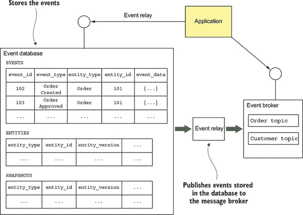

让我们看看不同的 Eventuate Local 组件，从数据库模式开始。

##### Eventuate Local 事件数据库的模式

事件数据库由三个表组成：

+   **`events`—** 存储事件

+   **`entities`—** 每个实体一行

+   **`snapshots`—** 存储快照

核心表是`events`表。这个表的结构与图 6.2 中显示的表非常相似。以下是它的定义：

```
create table events (
  event_id varchar(1000) PRIMARY KEY,
  event_type varchar(1000),
  event_data varchar(1000) NOT NULL,
  entity_type VARCHAR(1000) NOT NULL,
  entity_id VARCHAR(1000) NOT NULL,
  triggering_event VARCHAR(1000)
);
```

`triggering_event`列用于检测重复的事件/消息。它存储了生成此事件的已处理消息/事件的 ID。

`entities`表存储每个实体的当前版本。它用于实现乐观锁。以下是该表的定义：

```
create table entities (
  entity_type VARCHAR(1000),
  entity_id VARCHAR(1000),
  entity_version VARCHAR(1000) NOT NULL,
  PRIMARY KEY(entity_type, entity_id)
);
```

当实体被创建时，此表中插入一行。每次实体被更新时，`entity_version` 列都会更新。

`snapshots` 表存储每个实体的快照。以下是此表的定义：

```
create table snapshots (
  entity_type VARCHAR(1000),
  entity_id VARCHAR(1000),
  entity_version VARCHAR(1000),
  snapshot_type VARCHAR(1000) NOT NULL,
  snapshot_json VARCHAR(1000) NOT NULL,
  triggering_events VARCHAR(1000),
  PRIMARY KEY(entity_type, entity_id, entity_version)
)
```

`entity_type` 和 `entity_id` 列指定快照的实体。`snapshot_json` 列是快照的序列化表示，`snapshot_type` 是其类型。`entity_version` 指定这是快照的实体的版本。

此架构支持的三种操作是 `find()`、`create()` 和 `update()`。`find()` 操作查询 `snapshots` 表以检索最新的快照（如果有的话）。如果存在快照，`find()` 操作将查询 `events` 表以找到所有 `event_id` 大于快照的 `entity_version` 的事件。否则，`find()` 检索指定实体的所有事件。`find()` 操作还查询 `entity` 表以检索实体的当前版本。

`create()` 操作在 `entity` 表中插入一行，并将事件插入到 `events` 表中。`update()` 操作将事件插入到 `events` 表中。它还通过使用此 `UPDATE` 语句在 `entities` 表中更新实体版本来执行乐观锁定检查：

```
UPDATE entities SET entity_version = ?
WHERE entity_type = ? and entity_id = ? and entity_version = ?
```

此语句验证自 `find()` 操作检索以来版本未更改。它还更新 `entity_version` 到新版本。`update()` 操作在事务中执行这些更新，以确保原子性。

现在我们已经了解了 Eventuate Local 如何存储聚合的事件和快照，让我们看看客户端如何使用 Eventuate Local 的事件代理订阅事件。

##### 通过订阅 Eventuate Local 的事件代理来消费事件

服务通过订阅事件代理来消费事件，该代理使用 Apache Kafka 实现。事件代理为每种聚合类型有一个主题。如第三章所述，*主题*是一个分区消息通道。这使消费者能够在保持消息顺序的同时水平扩展。聚合 ID 用作分区键，这保留了给定聚合发布的事件的顺序。为了消费聚合的事件，服务订阅了聚合的主题。

现在我们来看看事件中继——事件数据库和事件代理之间的粘合剂。

##### Eventuate Local 事件中继将事件从数据库传播到消息代理

事件中继将插入到事件数据库中的事件传播到事件代理。它尽可能使用事务日志跟踪，对于其他数据库则进行轮询。例如，事件中继的 MySQL 版本使用 MySQL 主/从复制协议。事件中继连接到 MySQL 服务器，就像是一个从服务器一样，读取 MySQL binlog，这是对数据库进行的更新记录。对应于事件的`EVENTS`表中的插入被发布到适当的 Apache Kafka 主题。事件中继忽略任何其他类型的更改。

事件中继作为一个独立进程部署。为了正确重启，它定期将当前位置（binlog 的文件名和偏移量）保存到一个特殊的 Apache Kafka 主题中。启动时，它首先从主题中检索最后记录的位置。然后事件中继从该位置开始读取 MySQL binlog。

事件数据库、消息代理和事件中继构成了事件存储。现在让我们看看 Java 应用程序使用该框架访问事件存储的方式。

#### 6.2.2\. Java 的 Eventuate 客户端框架

Eventuate 客户端框架使开发者能够编写基于事件源的应用程序，这些应用程序使用 Eventuate Local 事件存储。该框架，如图 6.10 所示，为开发基于事件源的聚合、服务和事件处理器提供了基础。

##### 图 6.10\. Eventuate 客户端框架为 Java 提供的主体类和接口

![Images/06fig10_alt.jpg]

该框架为聚合、命令和事件提供了基类。还有一个`AggregateRepository`类，它提供了 CRUD 功能。框架还有一个用于订阅事件的 API。

让我们简要地看看图 6.10 中显示的每个类型。

##### 使用 ReflectiveMutableCommandProcessingAggregate 类定义聚合

`ReflectiveMutableCommandProcessingAggregate`是聚合的基类。它是一个泛型类，有两个类型参数：第一个是具体的聚合类，第二个是聚合命令类的超类。正如其相当长的名字所暗示的，它使用反射将命令和事件调度到适当的方法。命令被调度到`process()`方法，事件被调度到`apply()`方法。

你之前看到的`Order`类扩展了`ReflectiveMutableCommandProcessingAggregate`。下面的列表显示了`Order`类。

##### 列表 6.3\. Eventuate 版本的`Order`类

```
public class Order extends ReflectiveMutableCommandProcessingAggregate<
      Order, OrderCommand> {

  public List<Event> process(CreateOrderCommand command) { ... }

  public void apply(OrderCreatedEvent event) { ... }

  ...
}
```

传递给`ReflectiveMutableCommandProcessingAggregate`的两个类型参数是`Order`和`OrderCommand`，这是`Order`命令的基接口。

##### 定义聚合命令

聚合的命令类必须扩展一个特定于聚合的基接口，该接口本身必须扩展`Command`接口。例如，`Order`聚合的命令扩展了`OrderCommand`：

```
public interface OrderCommand extends Command {
}

public class CreateOrderCommand implements OrderCommand { ... }
```

`OrderCommand` 接口扩展了 `Command`，而 `CreateOrderCommand` 命令类扩展了 `OrderCommand`。

##### 定义领域事件

一个聚合的事件类必须扩展 `Event` 接口，这是一个没有方法的标记接口。同时，定义一个通用的基接口，用于扩展所有聚合的事件类，也是很有用的。例如，以下是 `OrderCreated` 事件的定义：

```
interface OrderEvent extends Event {

}

public class OrderCreated extends OrderEvent { ... }
```

`OrderCreated` 事件类扩展了 `OrderEvent`，这是 `Order` 聚合的事件类的基接口。`OrderEvent` 接口扩展了 `Event`。

##### 使用 `AggregateRepository` 类创建、查找和更新聚合

框架提供了多种创建、查找和更新聚合的方法。这里描述的最简单的方法是使用 `AggregateRepository`。`AggregateRepository` 是一个泛型类，它通过聚合类和聚合的基本命令类进行参数化。它提供了三个重载方法：

+   **`save()`—** 创建一个聚合

+   **`find()`—** 查找一个聚合

+   **`update()`—** 更新一个聚合

`save()` 和 `update()` 方法尤其方便，因为它们封装了创建和更新聚合所需的基本代码。例如，`save()` 方法接受一个命令对象作为参数，并执行以下步骤：

1.  使用其默认构造函数实例化聚合

1.  调用 `process()` 方法来处理命令

1.  通过调用 `apply()` 方法应用生成的事件

1.  在事件存储中保存生成的事件

`update()` 方法类似。它有两个参数，一个聚合 ID 和一个命令，并执行以下步骤：

1.  从事件存储中检索聚合数据

1.  调用 `process()` 方法来处理命令

1.  通过调用 `apply()` 方法应用生成的事件

1.  在事件存储中保存生成的事件

`AggregateRepository` 类主要用于服务，这些服务根据外部请求创建和更新聚合。例如，以下列表展示了 `OrderService` 如何使用 `AggregateRepository` 创建一个 `Order`。

##### 列表 6.4\. `OrderService` 使用 `AggregateRepository`

```
public class OrderService {
  private AggregateRepository<Order, OrderCommand> orderRepository;

  public OrderService(AggregateRepository<Order, OrderCommand> orderRepository)
  {
    this.orderRepository = orderRepository;
  }

  public EntityWithIdAndVersion<Order> createOrder(OrderDetails orderDetails) {
    return orderRepository.save(new CreateOrder(orderDetails));
  }
}
```

`OrderService` 注入了 `Orders` 的 `AggregateRepository`。它的 `create()` 方法通过 `CreateOrder` 命令调用 `AggregateRepository.save()`。

##### 订阅领域事件

Eventuate 客户端框架还提供了一个用于编写事件处理器的 API。列表 6.5 展示了 `CreditReserved` 事件的事件处理器。`@EventSubscriber` 注解指定了持久订阅的 ID。当订阅者未运行时发布的事件将在启动时传递。`@EventHandlerMethod` 注解将 `creditReserved()` 方法标识为事件处理器。

##### 列表 6.5\. `OrderCreatedEvent` 的事件处理器

```
@EventSubscriber(id="orderServiceEventHandlers")
public class OrderServiceEventHandlers {

  @EventHandlerMethod
  public void creditReserved(EventHandlerContext<CreditReserved> ctx) {
    CreditReserved event = ctx.getEvent();
    ...
  }
```

事件处理器有一个类型为 `EventHandlerContext` 的参数，它包含事件及其元数据。

现在我们已经了解了如何使用 Eventuate 客户端框架编写基于事件源的业务逻辑，接下来让我们看看如何使用 saga 结合事件源的业务逻辑。

### 6.3. 使用 saga 和事件源结合

假设你已经使用事件源实现了一个或多个服务。你可能已经编写了类似于列表 6.4 中所示的服务。但如果你已经阅读了第四章，你会知道服务通常需要启动并参与*saga*，即用于在服务之间维护数据一致性的本地事务序列。例如，`订单服务`使用 saga 来验证`订单`。`厨房服务`、`消费者服务`和`会计服务`参与该 saga。因此，你必须将 saga 和基于事件源的业务逻辑集成在一起。

事件源使得使用基于编排的 saga 变得容易。参与者交换它们聚合产生的领域事件。每个参与者的聚合通过处理命令和发出新事件来处理事件。您需要编写聚合和事件处理类，这些类会更新聚合。

但将基于事件源的业务逻辑与基于编排的 saga 集成可能更具挑战性。这是因为事件存储的事务概念可能相当有限。当使用某些事件存储时，应用程序只能创建或更新单个聚合并发布结果事件。但 saga 的每个步骤都由必须原子性执行的多项操作组成：

+   *** Saga 创建*—** 初始化 saga 的服务必须原子性地创建或更新聚合，并创建 saga 编排器。例如，`订单服务`的`createOrder()`方法必须创建一个`订单`聚合和一个`CreateOrderSaga`。

+   *** Saga 编排*—** Saga 编排器必须原子性地消费回复，更新其状态，并发送命令消息。

+   *** Saga 参与者*—** Saga 参与者，如`厨房服务`和`订单服务`，必须原子性地消费消息，检测和丢弃重复项，创建或更新聚合，并发送回复消息。

由于这些要求与事件存储的事务能力之间存在不匹配，因此将基于编排的 saga 和事件源集成可能会带来一些有趣的挑战。

确定事件溯源和基于编排的叙事法集成难易程度的关键因素是事件存储是否使用关系型数据库管理系统（RDBMS）或 NoSQL 数据库。在第四章中描述的 Eventuate Tram 叙事法框架以及第三章中描述的底层 Tram 消息框架都依赖于 RDBMS 提供的灵活 ACID 事务。叙事法协调器和叙事法参与者使用 ACID 事务来原子性地更新其数据库并交换消息。如果应用程序使用基于 RDBMS 的事件存储，例如 Eventuate Local，那么它可以“作弊”并调用 Eventuate Tram 叙事法框架，并在 ACID 事务内更新事件存储。但如果事件存储使用无法与 Eventuate Tram 叙事法框架参与同一事务的 NoSQL 数据库，它将不得不采取不同的方法。

让我们更深入地看看一些不同的场景和需要解决的问题：

+   实现基于编排的叙事法

+   创建基于编排的叙事法

+   使用事件溯源实现基于事件溯源的叙事法参与者

+   使用事件溯源实现叙事法协调器

我们将首先探讨如何使用事件溯源来实现基于编排的叙事法。

#### 6.3.1. 使用事件溯源实现基于编排的叙事法

事件溯源的事件驱动特性使得实现基于编排的叙事法变得相当直接。当一个聚合被更新时，它会发出一个事件。不同聚合的事件处理器可以消费该事件并更新其聚合。事件溯源框架自动使每个事件处理器具有幂等性。

例如，第四章讨论了如何使用编排来实现`创建订单叙事法`。`ConsumerService`、`KitchenService`和`AccountingService`订阅了`OrderService`的事件，反之亦然。每个服务都有一个类似于列表 6.5 中所示的事件处理器。事件处理器更新相应的聚合，从而发出另一个事件。

事件溯源和基于编排的叙事法非常配合。事件溯源提供了叙事法所需的各种机制，包括基于消息的进程间通信（IPC）、消息去重以及状态和消息发送的原子更新。尽管其简单性，基于编排的叙事法仍有几个缺点。我在第四章中谈到了一些缺点，但还有一个特定于事件溯源的缺点。

使用事件进行 saga 编排的问题在于，事件现在具有双重目的。事件溯源使用事件来表示状态变化，但使用事件进行 saga 编排需要聚合体即使没有状态变化也发出一个事件。例如，如果更新聚合体会违反业务规则，那么聚合体必须发出一个事件来报告错误。更糟糕的问题是，当 saga 参与者无法创建聚合体时。没有可以发出错误事件的聚合体。

由于这些问题，最好使用编排来实现更复杂的 saga。以下各节将解释如何集成基于编排的 saga 和事件溯源。正如您将看到的，这涉及到解决一些有趣的问题。

让我们先看看服务方法，如`OrderService.createOrder()`，是如何创建 saga 编排器的。

#### 6.3.2\. 创建基于编排的 saga

Saga 编排器是由某些服务方法创建的。其他服务方法，例如`OrderService.createOrder()`，执行两件事：创建或更新一个聚合体*并且*创建一个 saga 编排器。服务必须以保证如果它执行第一个动作，那么第二个动作最终会被执行的方式来执行这两个动作。服务如何确保这两个动作都得到执行取决于它使用的存储事件的类型。

##### 在使用基于 RDBMS 的事件存储时创建 saga 编排器

如果一个服务使用基于关系数据库管理系统（RDBMS）的事件存储，它可以在同一个 ACID 事务中更新事件存储并创建一个 saga 编排器。例如，假设`OrderService`使用 Eventuate Local 和 Eventuate Tram saga 框架。它的`createOrder()`方法看起来像这样：

```
class OrderService

  @Autowired
  private SagaManager<CreateOrderSagaState> createOrderSagaManager;

  @Transactional                                                             *1*
   public EntityWithIdAndVersion<Order> createOrder(OrderDetails orderDetails) {
    EntityWithIdAndVersion<Order> order =
        orderRepository.save(new CreateOrder(orderDetails));                 *2*

    CreateOrderSagaState data =
        new CreateOrderSagaState(order.getId(), orderDetails);               *3*

    createOrderSagaManager.create(data, Order.class, order.getId());

    return order;
  }
...
```

+   ***1* 确保 createOrder()在数据库事务中执行。**

+   ***2* 创建 Order 聚合体。**

+   ***3* 创建 CreateOrderSaga。**

这是由列表 6.4 中的`OrderService`和第四章中描述的`OrderService`的组合。因为 Eventuate Local 使用 RDBMS，它可以参与与 Eventuate Tram saga 框架相同的 ACID 事务。但如果一个服务使用基于 NoSQL 的事件存储，创建 saga 编排器就不那么直接了。

##### 在使用基于 NoSQL 的事件存储时创建 saga 编排器

使用基于 NoSQL 的事件存储的服务很可能会无法原子性地更新事件存储并创建一个 saga 编排器。saga 编排框架可能使用一个完全不同的数据库。即使它使用相同的 NoSQL 数据库，由于 NoSQL 数据库有限的交易模型，应用程序也无法原子性地创建或更新两个不同的对象。相反，服务必须有一个事件处理器，该处理器在聚合体发出的领域事件响应中创建 saga 编排器。

例如，图 6.11 展示了 `Order Service` 如何使用 `OrderCreated` 事件的处理器创建 `CreateOrderSaga`。`Order Service` 首先创建一个 `Order` 聚合并将其持久化到事件存储库中。事件存储库发布 `OrderCreated` 事件，该事件被事件处理器消费。事件处理器调用 Eventuate Tram 编排器框架来创建 `CreateOrderSaga`。

##### 图 6.11\. 使用事件处理器在服务创建基于事件源聚合后可靠地创建编排器

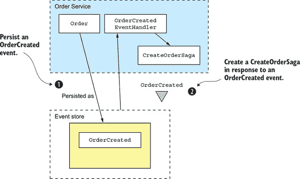

在编写创建一个编排器的事件处理器时需要记住的一个问题是它必须处理重复的事件。至少一次的消息投递意味着创建编排器的事件处理器可能会被多次调用。确保只创建一个编排器实例是很重要的。

一种简单的方法是从事件的唯一属性中派生出编排器的 ID。有几个不同的选项。一个是使用发出事件的聚合的 ID 作为编排器的 ID。这对于响应聚合创建事件的编排器来说效果很好。

另一个选项是使用事件 ID 作为编排器 ID。因为事件 ID 是唯一的，这将保证编排器 ID 是唯一的。如果一个事件是重复的，由于 ID 已经存在，事件处理器尝试创建编排器的操作将失败。当给定聚合实例可以存在多个相同编排器的实例时，这个选项很有用。

使用基于关系数据库管理系统（RDBMS）的事件存储库的服务也可以使用相同的事件驱动方法来创建编排器。这种方法的一个好处是它促进了松散耦合，因为像`OrderService`这样的服务不再显式实例化编排器。

现在我们已经了解了如何可靠地创建编排器编排器，让我们看看基于事件源的服务如何参与基于编排器的编排。

#### 6.3.3\. 实现基于事件源的编排器参与者

假设您使用事件源实现了一个需要参与基于编排器编排的服务。不出所料，如果您的服务使用基于关系数据库管理系统（RDBMS）的事件存储库，例如 Eventuate Local，您可以轻松确保它原子性地处理编排器命令消息并发送回复。它可以作为 Eventuate Tram 框架发起的 ACID 事务的一部分更新事件存储库。但是，如果您的服务使用无法与 Eventuate Tram 框架参与同一事务的事件存储库，您必须使用完全不同的方法。

您必须解决几个不同的问题：

+   幂等命令消息处理

+   原子性地发送回复消息

让我们先看看如何实现幂等命令消息处理器。

##### 幂等命令消息处理

第一个要解决的问题是如何使基于事件源的 saga 参与者能够检测和丢弃重复消息，以实现幂等命令消息处理。幸运的是，这是一个很容易解决的问题，可以使用前面描述的幂等消息处理机制来解决。saga 参与者在处理消息时生成的事件中记录消息 ID。在更新聚合体之前，saga 参与者通过在事件中查找消息 ID 来验证它之前是否已经处理了该消息。

##### 原子性地发送回复消息

第二个要解决的问题是如何使基于事件源的 saga 参与者能够原子性地发送回复。原则上，saga 调度器可以订阅聚合体发出的事件，但这种方法有两个问题。第一个问题是 saga 命令可能实际上并没有改变聚合体的状态。在这种情况下，聚合体不会发出事件，因此不会向 saga 调度器发送回复。第二个问题是这种方法要求 saga 调度器将使用事件源的 saga 参与者与其他参与者区别对待。这是因为为了接收领域事件，saga 调度器必须订阅聚合体的事件通道，除了自己的回复通道。

一种更好的方法是让 saga 参与者继续向 saga 调度器的回复通道发送回复消息。但而不是直接发送回复消息，saga 参与者使用两步过程：

1.  当 saga 命令处理器创建或更新聚合体时，它会安排将一个 `SagaReplyRequested` 伪事件与聚合体发出的真实事件一起保存在事件存储中。

1.  一个用于处理 `SagaReplyRequested` 伪事件的处理器使用事件中包含的数据来构建回复消息，然后将其写入 saga 调度器的回复通道。

让我们通过一个例子来看看它是如何工作的。

##### 基于事件源的 saga 参与者示例

此示例分析了 `Accounting Service`，它是 `Create Order Saga` 参与者之一。图 6.12 展示了 `Accounting Service` 如何处理 saga 发送的 `Authorize Command`。`Accounting Service` 是使用 Eventuate Saga 框架实现的。Eventuate Saga 框架是一个用于编写使用事件源的 sagas 的开源框架。它是基于 Eventuate 客户端框架构建的。

##### 图 6.12\. 基于事件源 `Accounting Service` 如何参与 `Create Order Saga`

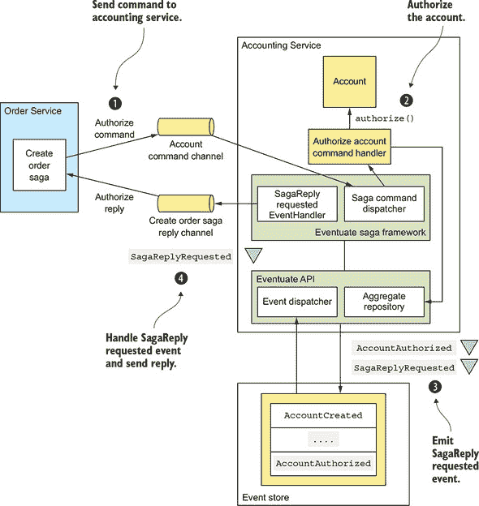

此图展示了 `Create Order Saga` 和 `AccountingService` 之间的交互。事件发生的顺序如下：

1.  `Create Order Saga` 通过消息通道向 `AccountingService` 发送 `AuthorizeAccount` 命令。Eventuate Saga 框架的 `SagaCommandDispatcher` 调用 `AccountingServiceCommandHandler` 来处理命令消息。

1.  `AccountingServiceCommandHandler` 通过调用 `AggregateRepository.update()` 将命令发送到指定的 `Account` 聚合。

1.  聚合发出两个事件，`AccountAuthorized` 和 `SagaReplyRequestedEvent`。

1.  `SagaReplyRequestedEventHandler` 通过向 `CreateOrderSaga` 发送回复消息来处理 `SagaReplyRequestedEvent`。

下面的列表中所示的 `AccountingServiceCommandHandler` 通过调用 `AggregateRepository.update()` 来处理 `AuthorizeAccount` 命令消息，以更新 `Account` 聚合。

##### 列表 6.6\. 处理由叙事发送的命令消息

```
public class AccountingServiceCommandHandler {

  @Autowired
  private AggregateRepository<Account, AccountCommand> accountRepository;

  public void authorize(CommandMessage<AuthorizeCommand> cm) {
    AuthorizeCommand command = cm.getCommand();
    accountRepository.update(command.getOrderId(),
            command,
            replyingTo(cm)
                .catching(AccountDisabledException.class,
                          () -> withFailure(new AccountDisabledReply()))
                .build());
  }

  ...
```

`authorize()` 方法调用 `AggregateRepository` 来更新 `Account` 聚合。`update()` 方法的第三个参数，即 `UpdateOptions`，由以下表达式计算得出：

```
replyingTo(cm)
    .catching(AccountDisabledException.class,
              () -> withFailure(new AccountDisabledReply()))
    .build()
```

这些 `UpdateOptions` 配置 `update()` 方法执行以下操作：

1.  使用 *消息 ID* 作为幂等键以确保消息恰好处理一次。如前所述，Eventuate 框架将幂等键存储在所有生成的事件中，使其能够检测并忽略重复尝试更新聚合。 

1.  将一个 `SagaReplyRequestedEvent` 伪事件添加到事件存储中保存的事件列表。当 `SagaReplyRequestedEventHandler` 接收到 `SagaReplyRequestedEvent` 伪事件时，它会向 `CreateOrderSaga` 的回复通道发送回复。

1.  当聚合抛出 `AccountDisabledException` 异常时，发送 `AccountDisabledReply` 而不是默认的错误回复。

现在我们已经了解了如何使用事件溯源实现叙事参与者，让我们来看看如何实现叙事编排器。

#### 6.3.4\. 使用事件溯源实现叙事编排器

到目前为止，在本节中，我已描述了基于事件溯源的服务如何发起和参与叙事。您还可以使用事件溯源来实现叙事编排器。这将使您能够开发完全基于事件存储的应用程序。

在实现叙事编排器时，你必须解决三个关键的设计问题：

1.  你如何持久化一个叙事编排器？

1.  你如何原子性地更改编排器的状态并发送命令消息？

1.  你如何确保叙事编排器恰好处理一次回复消息？

第四章 讨论了如何实现基于 RDBMS 的叙事编排器。让我们看看在使用事件溯源时如何解决这些问题。

##### 使用事件溯源持久化叙事编排器

叙事编排器有一个非常简单的生命周期。首先，它被创建。然后，它根据叙事参与者的回复进行更新。因此，我们可以使用以下事件来持久化叙事：

+   **`SagaOrchestratorCreated`—** 叙事编排器已被创建。

+   **`SagaOrchestratorUpdated`—** 叙事编排器已被更新。

当叙事协调器被创建时，它会发出一个 `SagaOrchestratorCreated` 事件，当它被更新时，会发出一个 `SagaOrchestratorUpdated` 事件。这些事件包含重新创建叙事协调器状态所需的数据。例如，第四章 中描述的 `CreateOrderSaga` 的事件将包含序列化（例如，JSON）的 `CreateOrderSagaState`。

##### 可靠地发送命令消息

另一个关键的设计问题是如何原子地更新叙事的状态并发送命令。如第四章 所述，基于 Eventuate Tram 的叙事实现通过更新协调器并将命令消息插入到 `message` 表中作为同一事务的一部分来完成此操作。使用基于 RDBMS 的事件存储的应用程序，如 Eventuate Local，可以使用相同的方法。使用基于 NoSQL 的事件存储的应用程序，如 Eventuate SaaS，尽管具有非常有限的交易模型，也可以使用类似的方法。

技巧是持久化一个 `SagaCommandEvent`，它代表一个要发送的命令。然后事件处理器订阅 `SagaCommandEvents` 并将每个命令消息发送到适当的通道。图 6.13 展示了这是如何工作的。

##### 图 6.13\. 基于事件源式的叙事协调器如何向叙事参与者发送命令

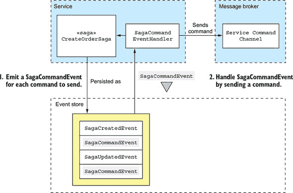

叙事协调器使用两步过程来发送命令：

1.  一个叙事协调器为它想要发送的每个命令发出一个 `SagaCommandEvent`。`SagaCommandEvent` 包含发送命令所需的所有数据，例如目标通道和命令对象。这些事件在事件存储中持久化。

1.  事件处理器处理这些 `SagaCommandEvents` 并向目标消息通道发送命令消息。

这种两步方法保证了命令至少会被发送一次。

由于事件存储提供至少一次投递，事件处理器可能会多次以相同的事件被调用。这会导致 `SagaCommandEvents` 的事件处理器发送重复的命令消息。幸运的是，一个叙事参与者可以很容易地检测并丢弃重复的命令，使用以下机制。`SagaCommandEvent` 的 ID，保证是唯一的，被用作命令消息的 ID。因此，重复的消息将具有相同的 ID。收到重复命令消息的叙事参与者将使用前面描述的机制丢弃它。

##### 精确一次处理回复

叙事协调器还需要检测和丢弃重复的回复消息，它可以使用前面描述的机制来完成。协调器将回复消息的 ID 存储在它处理回复时发出的事件中。然后它可以很容易地确定消息是否是重复的。

如您所见，事件溯源是实现叙事的好基础。这还包括事件溯源的其他好处，包括数据更改时事件固有的可靠生成、可靠的审计日志和执行时间查询的能力。尽管如此，事件溯源并不是万能的。它涉及一个重大的学习曲线。事件模式的演变并不总是直接的。但尽管有这些缺点，事件溯源在微服务架构中仍然扮演着重要的角色。在下一章中，我们将转换方向，探讨如何在微服务架构中解决不同的分布式数据管理挑战：查询。我将描述如何实现查询，以检索分散在多个服务中的数据。

### 摘要

+   事件溯源将聚合体持久化为一系列事件。每个事件代表聚合体的创建或状态变化。应用程序通过重放事件来重新创建聚合体的状态。事件溯源保留了领域对象的历史，提供了准确的审计日志，并可靠地发布领域事件。

+   快照通过减少必须重放的事件数量来提高性能。

+   事件存储在事件存储库中，它是数据库和消息代理的混合体。当服务在事件存储库中保存事件时，它将事件传递给订阅者。

+   Eventuate Local 是一个基于 MySQL 和 Apache Kafka 的开源事件存储库。开发者使用 Eventuate 客户端框架来编写聚合体和事件处理器。

+   使用事件溯源的一个挑战是处理事件的演变。在重放事件时，应用程序可能必须处理多个事件版本。一个好的解决方案是使用向上转换，当事件从事件存储库加载时，将事件升级到最新版本。

+   在事件溯源应用程序中删除数据是棘手的。应用程序必须使用加密和匿名化等技术来遵守像欧盟的 GDPR 这样的法规，该法规要求应用程序删除个人的数据。

+   事件溯源是实现基于编排的叙事的一种简单方法。服务拥有事件处理器，它们监听基于事件溯源的聚合体发布的事件。

+   事件溯源是实现叙事协调器的好方法。因此，你可以编写仅使用事件存储的应用程序。
