## 第七章\. 在微服务架构中实现查询

*本章涵盖*

+   在微服务架构中查询数据的挑战

+   何时以及如何使用 API 组合模式实现查询

+   何时以及如何使用命令查询责任分离（CQRS）模式实现查询

玛丽和她的团队刚开始习惯于使用 sagas 来维护数据一致性。然后他们发现，在将 FTGO 应用程序迁移到微服务时，他们不仅要担心事务管理，还要解决如何实现查询的问题。

为了支持 UI，FTGO 应用程序实现了各种查询操作。在现有的单体应用程序中实现这些查询相对简单，因为它有一个单一的数据库。大多数情况下，FTGO 开发者需要做的只是编写 SQL SELECT 语句并定义必要的索引。正如玛丽发现的，在微服务架构中编写查询是具有挑战性的。查询通常需要检索分散在多个服务拥有的数据库中的数据。然而，你不能使用传统的分布式查询机制，因为即使技术上可行，它也违反了封装原则。

以例如 FTGO 应用程序在第二章中描述的查询操作为例。一些查询检索仅由一个服务拥有的数据。例如，`findConsumerProfile()`查询从`Consumer Service`返回数据。但其他 FTGO 查询操作，如`findOrder()`和`findOrderHistory()`，返回由多个服务拥有的数据。实现这些查询操作并不像想象中那么简单。

在微服务架构中实现查询操作有两种不同的模式：

+   ***API 组合模式***——**这是最简单的方法，应尽可能使用。它通过使拥有数据的服务的客户端负责调用服务并组合结果来实现**。

+   ***命令查询责任分离（CQRS）模式***——**这比 API 组合模式更强大，但也更复杂。它维护一个或多个仅用于支持查询的视图数据库**。

在讨论了这两种模式之后，我将讨论如何设计 CQRS 视图，然后是示例视图的实现。让我们先看看 API 组合模式。

### 7.1\. 使用 API 组合模式进行查询

FTGO 应用程序实现了许多查询操作。正如之前提到的，一些查询是从单个服务中检索数据的。实现这些查询通常很简单——尽管在本章的后面部分，当我介绍 CQRS 模式时，你会看到一些难以实现的单一服务查询示例。

也有查询操作可以从多个服务中检索数据。在本节中，我描述了`findOrder()`查询操作，这是一个从多个服务中检索数据的查询示例。我解释了在微服务架构中实现此类查询时经常出现的挑战。然后，我描述了 API 组合模式，并展示了如何使用它来实现`findOrder()`等查询。

#### 7.1.1\. findOrder()查询操作

`findOrder()`操作通过主键检索订单。它接受一个`orderId`作为参数，并返回一个包含订单信息的`OrderDetails`对象。如图 7.1 所示，此操作由实现*订单状态*视图的前端模块（如移动设备或 Web 应用程序）调用。

##### 图 7.1\. `findOrder()`操作由 FTGO 前端模块调用，并返回`Order`的详情。

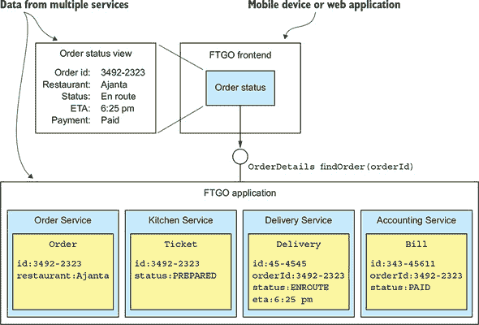

*订单状态*视图显示的信息包括订单的基本信息，包括其状态、支付状态、从餐厅角度的订单状态以及配送状态，包括其位置和预计配送时间（如果正在途中）。

由于其数据驻留在单个数据库中，单体 FTGO 应用程序可以轻松通过执行一个连接各种表的单一 SELECT 语句来检索订单详情。相比之下，在基于微服务的 FTGO 应用程序版本中，数据分散在以下服务中：

+   **`订单服务`—** 基本订单信息，包括细节和状态

+   **`厨房服务`—** 从餐厅的角度看订单的状态以及预计取餐准备时间

+   **`配送服务`—** 订单的配送状态、预计配送信息和当前位置

+   **`会计服务`—** 订单的支付状态

任何需要订单详情的客户都必须询问所有这些服务。

#### 7.1.2\. API 组合模式的概述

实现查询操作，例如`findOrder()`，以检索多个服务拥有的数据的一种方法是通过使用 API 组合模式。该模式通过调用拥有数据的服务并组合结果来执行查询操作。图 7.2 展示了该模式的结构。它有两种类型的参与者：

+   ***API 作曲家*—** 通过查询提供者服务来实现查询操作。

+   ***提供者服务*—** 这是拥有查询返回的一些数据的服务。

##### 图 7.2\. API 组合模式由一个 API 作曲家和两个或更多提供者服务组成。API 作曲家通过查询提供者并组合结果来执行查询。

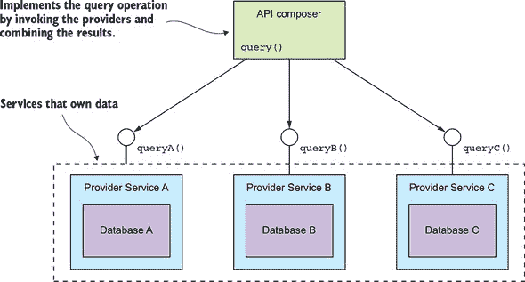

图 7.2 展示了三个提供者服务。API composer 通过从提供者服务检索数据并合并结果来实现查询。API composer 可能是一个客户端，例如需要数据来渲染网页的 Web 应用程序。或者，它可能是一个服务，例如 API 网关及其在 第八章 中描述的前端后端变体，它将查询操作作为 API 端点公开。

|  |
| --- |

**模式：API 组合**

实现一个查询，通过通过每个服务的 API 查询每个服务并合并结果来检索来自几个服务的数据。参见 [`microservices.io/patterns/data/api-composition.html`](http://microservices.io/patterns/data/api-composition.html)。

|  |
| --- |

您是否可以使用此模式实现特定的查询操作取决于多个因素，包括数据如何分区、拥有数据的服务的 API 的功能以及服务使用的数据库的功能。例如，即使 *Provider services* 有用于检索所需数据的 API，聚合器可能需要执行低效的内存中连接大型数据集。稍后，您将看到无法使用此模式实现的查询操作的示例。幸运的是，尽管如此，有许多场景适用此模式。为了看到它在实际中的应用，我们将查看一个示例。

#### 7.1.3\. 使用 API 组合模式实现 findOrder() 查询操作

`findOrder()` 查询操作对应于一个简单的基于主键的等值连接查询。可以合理地预期每个 *Provider services* 都有一个 API 端点，可以通过 `orderId` 检索所需数据。因此，`findOrder()` 查询操作是 API 组合模式的绝佳候选。*API composer* 调用四个服务并将结果合并在一起。图 7.3 展示了 `Find Order Composer` 的设计。

##### 图 7.3\. 使用 API 组合模式实现 `findOrder()`

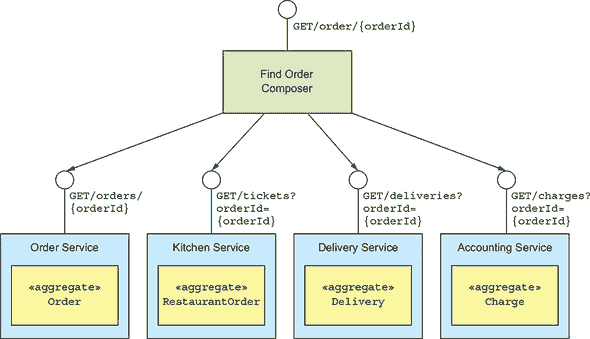

在本例中，*API composer* 是一个将查询暴露为 REST 端点服务的服务。*Provider services* 也实现了 REST API。但如果使用的是其他进程间通信协议，如 gRPC 而不是 HTTP，概念是相同的。`Find Order Composer` 实现了一个 REST 端点 `GET /order/{orderId}`。它通过 `orderId` 调用四个服务并将响应合并。每个 *Provider service* 实现了一个 REST 端点，返回与单个聚合对应的响应。`OrderService` 通过主键检索其版本的 `Order`，而其他服务使用 `orderId` 作为外键来检索它们的聚合。

如您所见，API 组合模式相当简单。让我们看看在应用此模式时必须解决的一些设计问题。

#### 7.1.4\. API 组合设计问题

当使用此模式时，您必须解决几个设计问题：

+   决定您的架构中哪个组件是查询操作*API 作曲家*

+   如何编写高效的聚合逻辑

让我们看看每个问题。

##### 谁扮演 API 作曲家的角色？

您必须做出的一个决定是，谁扮演查询操作*API 作曲家*的角色。您有三个选项。第一种选项，如图 7.4 所示，是让服务客户端成为*API 作曲家*。

##### 图 7.4\. 在客户端实现 API 组合。客户端查询提供者服务以检索数据。

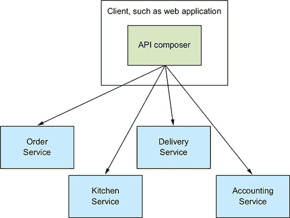

前端客户端，如运行在同一局域网上的 Web 应用程序，实现了`订单状态`视图，可以使用此模式高效地检索订单详情。但正如您将在第八章中了解到的那样，此选项对于在防火墙之外且通过较慢网络访问服务的客户端可能不太实用。

第二种选项，如图 7.5 所示，是为 API 网关，它实现了应用程序的外部 API，在查询操作中扮演*API 作曲家*的角色。

##### 图 7.5\. 在 API 网关中实现 API 组合。API 查询提供者服务以检索数据，合并结果，并将响应返回给客户端。


如果查询操作是应用程序外部 API 的一部分，则此选项是有意义的。而不是将请求路由到另一个服务，API 网关实现了 API 组合逻辑。这种方法使运行在防火墙之外，例如移动设备等客户端，能够通过单个 API 调用高效地从多个服务中检索数据。我在第八章中讨论了 API 网关。

第三种选项，如图 7.6 所示，是将*API 作曲家*实现为一个独立的服务。

##### 图 7.6\. 将多个客户端和服务使用的查询操作实现为一个独立的服务。

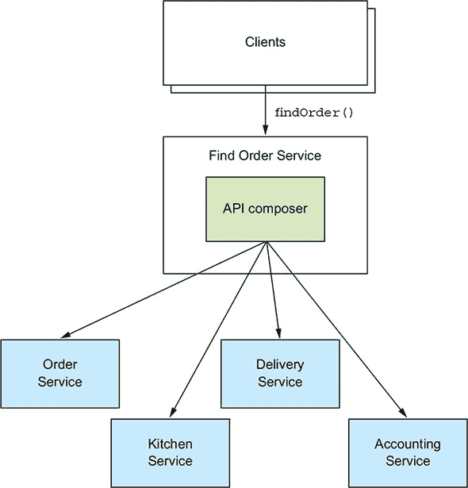

对于多个服务内部使用的查询操作，您应该使用此选项。此操作也可以用于外部可访问的查询操作，其聚合逻辑过于复杂，不适合作为 API 网关的一部分。

##### API 作曲家应使用响应式编程模型

在开发分布式系统时，最小化延迟是一个持续存在的担忧。尽可能的情况下，**API composer**应该并行调用提供者服务以最小化查询操作的响应时间。例如，“查找订单聚合器”应该并发调用四个服务，因为调用之间没有依赖关系。然而，有时**API composer**需要某个**Provider 服务**的结果来调用另一个服务。在这种情况下，它将需要按顺序调用一些——但希望不是所有——的**提供者服务**。

高效执行顺序和并行服务调用的逻辑可能很复杂。为了使**API composer**既易于维护又具有高性能和可扩展性，它应该使用基于 Java `CompletableFuture`、RxJava 可观察对象或其他等效抽象的响应式设计。我在第八章中进一步讨论了这个主题，当时我介绍了 API 网关模式。

#### 7.1.5. API 组合模式的利弊

这种模式是实现微服务架构中查询操作的一种简单直观的方法。但它也有一些缺点：

+   增加开销

+   减少可用性的风险

+   事务数据一致性不足

让我们来看看它们。

##### 增加开销

这种模式的另一个缺点是调用多个服务和查询多个数据库的开销。在单体应用中，客户端可以通过单个请求检索数据，这通常执行单个数据库查询。相比之下，使用 API 组合模式涉及多个请求和数据库查询。因此，需要更多的计算和网络资源，从而增加了应用程序的运行成本。

##### 减少可用性的风险

这种模式的另一个缺点是可用性降低。如第三章中所述，操作的可用性随着涉及的服务数量而下降。因为查询操作的实现至少涉及三个服务——**API composer**和至少两个提供者服务——其可用性将显著低于单个服务。例如，如果单个服务的可用性为 99.5%，那么调用四个提供者服务的`findOrder()`端点的可用性为 99.5%^((4+1)) = 97.5%！

您可以使用几种策略来提高可用性。第一种策略是在**API composer**无法访问**Provider 服务**时返回之前缓存的资料。**API composer**有时会缓存**Provider 服务**返回的数据以提高性能。它也可以使用这个缓存来提高可用性。如果提供者不可用，**API composer**可以从缓存中返回数据，尽管这些数据可能已经过时。

提高可用性的另一种策略是让*API composer*返回不完整的数据。例如，假设`Kitchen Service`暂时不可用。`findOrder()`查询操作的*API Composer*可以省略该服务的数据，因为 UI 仍然可以显示有用的信息。你将在第八章（kindle_split_016.xhtml#ch08）中看到更多关于 API 设计、缓存和可靠性的细节。

##### 缺乏事务性数据一致性

API 组合模式的另一个缺点是缺乏数据一致性。一个单体应用程序通常使用单个数据库事务来执行查询操作。ACID 事务——受隔离级别细节的影响——确保应用程序对数据有一个一致的观点，即使它执行多个数据库查询。相比之下，API 组合模式针对多个数据库执行多个数据库查询。因此，查询操作可能会返回不一致的数据。

例如，从`Order Service`检索的`Order`可能处于`CANCELLED`状态，而对应的从`Kitchen Service`检索的`Ticket`可能尚未被取消。*API composer*必须解决这种差异，这增加了代码的复杂性。更糟糕的是，*API composer*可能无法始终检测到不一致的数据，并将其返回给客户端。

尽管有这些缺点，API 组合模式仍然非常有用。你可以用它来实现许多查询操作。但有些查询操作无法有效地使用此模式实现。例如，一个查询操作可能需要*API composer*对大型数据集进行内存中的连接。

通常最好使用 CQRS 模式来实现这些类型的查询操作。让我们看看这个模式是如何工作的。

### 7.2\. 使用 CQRS 模式

许多企业应用程序使用关系数据库管理系统（RDBMS）作为事务性记录系统，并使用文本搜索数据库，如 Elasticsearch 或 Solr，进行文本搜索查询。一些应用程序通过同时写入两个数据库来保持数据库同步。其他应用程序定期从 RDBMS 复制数据到文本搜索引擎。具有这种架构的应用程序利用多个数据库的优势：RDBMS 的事务属性和文本数据库的查询能力。

| |
| --- |

**模式：命令查询责任分离**

通过使用事件来维护只读视图并复制来自服务的数据，实现需要从多个服务获取数据的查询。请参阅[`microservices.io/patterns/data/cqrs.html`](http://microservices.io/patterns/data/cqrs.html)。

| |
| --- |

CQRS 是这种架构的泛化。它维护一个或多个视图数据库——不仅仅是文本搜索数据库——这些数据库实现了应用程序的一个或多个查询。为了理解为什么这很有用，我们将查看一些无法使用 API 组合模式有效实现的查询。我将解释 CQRS 是如何工作的，然后讨论 CQRS 的优点和缺点。让我们看看何时需要使用 CQRS。

#### 7.2.1. 使用 CQRS 的动机

API 组合模式是实现必须从多个服务检索数据的许多查询的好方法。不幸的是，它只是微服务架构中查询问题的一个部分解决方案。这是因为 API 组合模式无法有效实现多个服务查询。

此外，还有一些难以实现的单一服务查询。也许服务的数据库不支持查询效率。或者，有时一个服务实现一个检索不同服务拥有的数据的查询是有意义的。让我们看看这些问题，从无法使用 API 组合有效实现的跨服务查询开始。

##### 实现 findOrderHistory()查询操作

`findOrderHistory()`操作检索消费者的订单历史。它有几个参数：

+   **`consumerId`——** 识别消费者

+   **`pagination`——** 返回的结果页

+   **`filter`——** 过滤条件，包括返回订单的最大年龄、可选的订单状态以及可选的关键字，这些关键字匹配餐厅名称和菜单项

此查询操作返回一个包含按年龄递增排序的匹配订单摘要的`OrderHistory`对象。它由实现`Order History`视图的模块调用。此视图显示每个订单的摘要，包括订单编号、订单状态、订单总额和预计配送时间。

表面上，这个操作与`findOrder()`查询操作相似。唯一的区别是它返回多个订单而不是一个。看起来*API composer*只需要对每个*Provider service*执行相同的查询并合并结果。不幸的是，事情并不那么简单。

这是因为并非所有服务都存储用于过滤或排序的属性。例如，`findOrderHistory()`操作的一个过滤条件是匹配菜单项的关键字。只有两个服务，`Order Service`和`Kitchen Service`，存储`Order`的菜单项。`Delivery Service`和`Accounting Service`都不存储菜单项，因此不能使用此关键字过滤它们的数据。同样，`Kitchen Service`和`Delivery Service`也不能按`orderCreationDate`属性排序。

一个*API composer*可以解决这个问题的两种方式。一种解决方案是*API composer*进行内存中的连接，如图 7.7 所示。它检索来自`Delivery Service`和`Accounting Service`的所有订单，并与来自`Order Service`和`Kitchen Service`检索到的订单进行连接。

##### 图 7.7。API 组合无法有效地检索消费者的订单，因为一些提供者，如`Delivery Service`，没有存储用于过滤的属性。

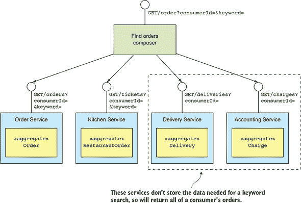

这种方法的缺点是，它可能需要*API composer*检索和连接大量数据集，这是低效的。

另一种解决方案是*API composer*从`Order Service`和`Kitchen Service`检索匹配的订单，然后通过 ID 请求其他服务的订单。但这只有在那些服务有批量检索 API 的情况下才是实用的。由于网络流量过大，逐个请求订单可能会效率低下。

类似于`findOrderHistory()`的查询需要*API composer*复制 RDBMS 查询执行引擎的功能。一方面，这可能会将工作从可扩展性较低的数据库移动到可扩展性较高的应用程序。另一方面，这效率较低。此外，开发者应该编写业务功能，而不是查询执行引擎。

接下来，我将向您展示如何应用 CQRS 模式并使用一个单独的数据存储，该数据存储旨在有效地实现`findOrderHistory()`查询操作。但在那之前，让我们看看一个查询操作，尽管它位于单个服务中，但实现起来具有挑战性。

##### 具有挑战性的单个服务查询：`findAvailableRestaurants()`

正如您刚才看到的，实现从多个服务中检索数据的查询可能具有挑战性。但即使是针对单个服务的本地查询也可能很难实现。这可能有几个原因。一方面，正如稍后讨论的，有时拥有数据的服务的实现查询可能并不合适。另一个原因是，有时一个服务的数据库（或数据模型）不支持查询的效率。

以`findAvailableRestaurants()`查询操作为例。这个查询操作找到在特定时间可以配送至指定地址的餐厅。这个查询的核心是针对位于配送地址一定距离内的餐厅的地理空间（基于位置）搜索。它是订单流程的关键部分，并由显示可用餐厅的 UI 模块调用。

实现此查询操作时的主要挑战是执行高效的地理空间查询。如何实现`findAvailableRestaurants()`查询取决于存储餐厅的数据库的功能。例如，使用 MongoDB 或 Postgres 和 MySQL 的地理空间扩展来实现`findAvailableRestaurants()`查询非常直接。这些数据库支持地理空间数据类型、索引和查询。当使用这些数据库之一时，`Restaurant Service`将`Restaurant`作为一个具有`location`属性的数据库记录持久化。它通过在`location`属性上的地理空间索引优化来执行地理空间查询以找到可用的餐厅。

如果 FTGO 应用程序在某种其他类型的数据库中存储餐厅信息，实现`findAvailableRestaurant()`查询将更具挑战性。它必须以支持地理空间查询的形式维护餐厅数据的副本。例如，应用程序可以使用 DynamoDB 的地理空间索引库([`github.com/awslabs/dynamodb-geo`](https://github.com/awslabs/dynamodb-geo))，该库使用表作为地理空间索引。或者，应用程序可以将餐厅数据的副本存储在完全不同类型的数据库中，这种情况与使用文本搜索数据库进行文本查询非常相似。

使用副本的挑战在于，每当原始数据发生变化时，都需要保持副本的更新。正如你下面将要学到的，CQRS 解决了同步副本的问题。

##### 需要分离关注点

单一服务查询难以实现的另一个原因是，有时拥有数据的服务不应该是实现查询的服务。`findAvailableRestaurants()`查询操作检索由`Restaurant Service`拥有的数据。该服务使餐厅老板能够管理他们的餐厅资料和菜单项。它存储餐厅的各种属性，包括其名称、地址、菜系、菜单和营业时间。鉴于该服务拥有数据，至少表面上，它实现此查询操作是有意义的。但数据所有权并不是唯一需要考虑的因素。

你还必须考虑到需要分离关注点，避免因过多的责任而使服务过载。例如，开发`Restaurant Service`团队的 主要责任是使餐厅经理能够维护他们的餐厅。这与实现高流量、关键查询截然不同。更重要的是，如果他们负责`findAvailableRestaurants()`查询操作，团队将不断生活在担心部署更改阻止消费者下订单的恐惧中。

对于`Restaurant Service`来说，仅仅将餐厅数据提供给另一个实现`findAvailableRestaurants()`查询操作的服务是有意义的，而这个服务很可能由`Order Service`团队拥有。正如`findOrderHistory()`查询操作一样，在需要维护地理空间索引时，需要维护一些数据的最终一致副本以实现查询。让我们看看如何使用 CQRS 来完成这个任务。

#### 7.2.2. CQRS 概述

在 7.2.1 节中描述的示例突出了在微服务架构中实现查询时常见的三个问题：

+   使用 API 组合模式检索分散在多个服务中的数据会导致昂贵的、低效的内存连接。

+   拥有数据的该服务以某种形式或数据库存储数据，该数据库不支持所需的查询操作。

+   需要分离关注点意味着拥有数据的该服务不应该是实现查询操作的服务。

解决这三个问题的解决方案是使用 CQRS 模式。

##### CQRS 将命令与查询分离

命令查询责任分离（Command Query Responsibility Segregation），正如其名称所暗示的，完全是关于*分离*，即关注点的分离。如图 7.8 图 7.8 所示，它将持久数据模型及其使用的模块分为两部分：命令端和查询端。命令端模块和数据模型实现创建、更新和删除操作（简称 CUD——例如，HTTP POSTs、PUTs 和 DELETEs）。查询端模块和数据模型实现查询（例如 HTTP GETs）。查询端通过订阅命令端发布的事件来保持其数据模型与命令端数据模型的同步。

##### 图 7.8.左侧是非 CQRS 版本的服务，右侧是 CQRS 版本。CQRS 将服务重构为命令端和查询端模块，它们具有独立的数据库。

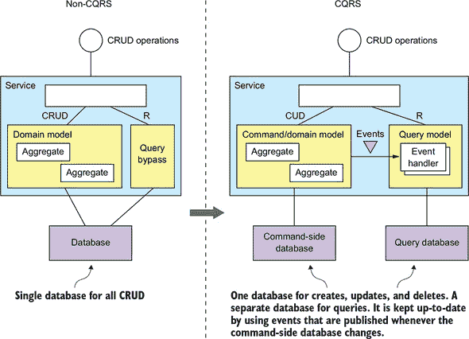

该服务的非 CQRS 和 CQRS 版本都有一个由各种 CRUD 操作组成的 API。在非 CQRS 基于的服务中，这些操作通常由映射到数据库的领域模型实现。为了性能，一些查询可能会绕过领域模型直接访问数据库。单一持久数据模型支持命令和查询。

在基于 CQRS 的服务中，命令端领域模型处理 CRUD 操作，并映射到其自己的数据库。它也可能处理简单的查询，例如非连接、基于主键的查询。命令端在其数据更改时发布领域事件。这些事件可能通过 Eventuate Tram 或事件溯源等框架发布。

一个独立的查询模型处理非平凡查询。它比命令端简单得多，因为它不负责实现业务规则。查询端使用对它必须支持的查询有意义的任何类型的数据库。查询端有事件处理器，它们订阅领域事件并更新数据库或数据库。甚至可能有多个查询模型，每个模型对应于查询的一种类型。

##### CQRS 和仅查询服务

不仅可以在服务内部应用 CQRS，而且还可以使用此模式来定义查询服务。查询服务有一个仅包含查询操作的 API——没有命令操作。它通过查询一个数据库来实现查询操作，该数据库通过订阅一个或多个其他服务发布的事件来保持最新。查询端服务是实施通过订阅多个服务发布的事件构建的视图的好方法。这种视图不属于任何特定服务，因此将其作为独立服务实现是有意义的。此类服务的良好示例是 `订单历史服务`，这是一个实现 `findOrderHistory()` 查询操作的查询服务。如图 7.9 所示，此服务订阅了包括 `订单服务`、`配送服务` 等在内的多个服务发布的事件。

##### 图 7.9。`订单历史服务` 的设计，它是一个查询端服务。它通过查询数据库来实现 `findOrderHistory()` 查询操作，该数据库通过订阅多个其他服务发布的事件来维护。

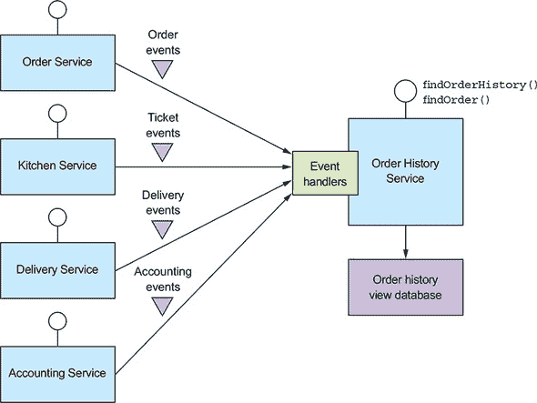

`订单历史服务` 有事件处理器，它们订阅由多个服务发布的事件，并更新 `订单历史视图数据库`。我在 第 7.4 节 中更详细地描述了此服务的实现。

查询服务也是实现一个复制单个服务拥有的数据的视图的好方法，但由于需要分离关注点，它并不属于该服务的一部分。例如，FTGO 开发者可以定义一个 `可用餐厅服务`，该服务实现了前面描述的 `findAvailableRestaurants()` 查询操作。它订阅由 `餐厅服务` 发布的事件，并更新一个专为高效地理空间查询设计的数据库。

在许多方面，CQRS 是一种基于事件的通用方法，它将流行的使用 RDBMS 作为记录系统以及文本搜索引擎（如 Elasticsearch）来处理文本查询的方法进行了扩展。不同之处在于，CQRS 使用了更广泛的数据库类型——不仅仅是文本搜索引擎。此外，CQRS 查询端视图通过订阅事件在近实时更新。

现在我们来看看 CQRS 的优点和缺点。

#### 7.2.3. CQRS 的优点

CQRS 既有优点也有缺点。其优点如下：

+   使微服务架构中查询的高效实现成为可能

+   使多样化查询的高效实现成为可能

+   在基于事件源的应用中实现查询成为可能

+   提高了关注点的分离

##### 在微服务架构中实现查询的高效实现

CQRS 模式的一个好处是它有效地实现了检索多个服务拥有的数据的查询。如前所述，使用 API 组合模式来实现查询有时会导致大型数据集昂贵的、低效的内存连接。对于这些查询，使用一个易于查询的 CQRS 视图（预先连接来自两个或更多服务的数据）更有效率。

##### 允许高效地实现多样化的查询

CQRS 的另一个好处是它允许应用程序或服务高效地实现一系列不同的查询。尝试使用单个持久数据模型来支持所有查询通常具有挑战性，在某些情况下甚至不可能。一些 NoSQL 数据库的查询能力非常有限。即使数据库有扩展来支持特定类型的查询，使用专用数据库通常更有效率。CQRS 模式通过定义一个或多个视图来避免单个数据存储的限制，每个视图都有效地实现了特定的查询。

##### 在基于事件源的应用中实现查询

CQRS 还克服了事件源的一个主要限制。事件存储只支持基于主键的查询。CQRS 模式通过定义一个或多个聚合视图来解决这个问题，这些视图通过订阅基于事件源聚合发布的事件流来保持最新状态。因此，基于事件源的应用不可避免地使用 CQRS。

##### 提高了关注点的分离

CQRS 的另一个好处是它分离了关注点。领域模型及其对应的持久数据模型不处理命令和查询。CQRS 模式为服务的命令和查询方面定义了单独的代码模块和数据库模式。通过分离关注点，命令方面和查询方面可能更简单且更容易维护。

此外，CQRS 允许实现查询的服务与拥有数据的服务不同。例如，我之前描述了尽管 `Restaurant Service` 拥有 `findAvailableRestaurants` 查询操作所查询的数据，但由另一个服务实现这样一个关键、高流量的查询是有意义的。CQRS 查询服务通过订阅拥有数据的服务或服务发布的事件来维护一个视图。

#### 7.2.4. CQRS 的缺点

尽管 CQRS 有几个好处，但它也有显著的缺点：

+   更复杂的架构

+   处理复制延迟

让我们来看看这些缺点，首先是复杂性增加。

##### 更复杂的架构

CQRS 的一个缺点是它增加了复杂性。开发者必须编写更新和查询视图的查询端服务。还有管理和操作额外数据存储的额外操作复杂性。更重要的是，一个应用程序可能使用不同类型的数据库，这给开发者和运维都增加了进一步的复杂性。

##### 处理复制延迟

CQRS 的另一个缺点是处理命令端和查询端视图之间的“延迟”。正如你可能预料的那样，当命令端发布事件和该事件被查询端处理以及视图更新之间的延迟。一个更新聚合并立即查询视图的客户端应用可能会看到聚合的旧版本。它必须经常以避免向用户暴露这些潜在的不一致性为前提来编写。

一种解决方案是命令端和查询端 API 向客户端提供版本信息，使其能够知道查询端已过时。客户端可以轮询查询端视图，直到它是最新的。我很快就会讨论服务 API 如何使客户端能够做到这一点。

像原生移动应用或单页 JavaScript 应用这样的 UI 应用可以通过在命令成功后更新其本地模型一次来处理复制延迟，而不发出查询。例如，它可以使用命令返回的数据更新其模型。希望当用户操作触发查询时，视图将是最新的。这种方法的缺点是 UI 代码可能需要复制服务器端代码以更新其模型。

如你所见，CQRS 既有优点也有缺点。如前所述，你应该尽可能使用 API 组合，并在必须时才使用 CQRS。

现在你已经看到了 CQRS 的优点和缺点，让我们现在看看如何设计 CQRS 视图。

### 7.3. 设计 CQRS 视图

CQRS 视图模块有一个由一个或多个查询操作组成的 API。它通过订阅一个或多个服务发布的事件来维护它所查询的数据库，从而实现这些查询操作。如图 7.10 所示，视图模块由一个视图数据库和三个子模块组成。

##### 图 7.10。CQRS 视图模块的设计。事件处理程序更新视图数据库，该数据库被查询 API 模块查询。

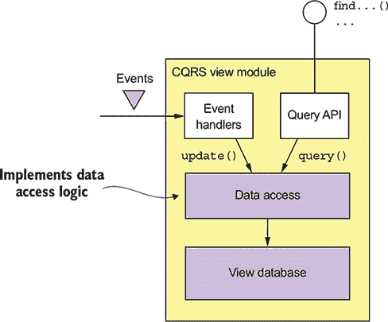

数据访问模块实现了数据库访问逻辑。事件处理程序模块和查询 API 模块使用数据访问模块来更新和查询数据库。事件处理程序模块订阅事件并更新数据库。查询 API 模块实现了查询 API。

在开发视图模块时，你必须做出一些重要的设计决策：

+   你必须选择一个数据库并设计模式。

+   在设计数据访问模块时，你必须解决各种问题，包括确保更新是幂等的以及处理并发更新。

+   在现有应用程序中实现新的视图或更改现有应用程序的模式时，您必须实现一个机制来高效地构建或重建视图。

+   您必须决定如何使视图的客户端能够处理前面描述的复制延迟。

让我们看看这些问题中的每一个。

#### 7.3.1. 选择视图数据存储

一个关键的设计决策是数据库的选择和模式的设计。数据库和数据模型的主要目的是高效地实现视图模块的查询操作。在选择数据库时，主要考虑的是这些查询的特性。但是，数据库也必须高效地实现事件处理器执行的操作更新。

##### SQL 与 NoSQL 数据库

不久以前，有一种类型的数据库可以统治一切：基于 SQL 的关系型数据库管理系统（RDBMS）。然而，随着网络的普及，各种公司发现 RDBMS 无法满足它们的 Web 规模需求。这导致了所谓的 NoSQL 数据库的创建。一个 *NoSQL 数据库* 通常具有有限的交易形式和较少的通用查询能力。对于某些用例，这些数据库在 SQL 数据库之上具有某些优势，包括更灵活的数据模型、更好的性能和可扩展性。

对于 CQRS 视图，通常选择一个 NoSQL 数据库是一个不错的选择，这样可以利用其优势并忽略其弱点。CQRS 视图受益于 NoSQL 数据库更丰富的数据模型和性能。它不受 NoSQL 数据库限制的影响，因为它只使用简单的交易并执行一组固定的查询。

虽然如此，有时使用 SQL 数据库来实现 CQRS 视图是有意义的。在现代硬件上运行的现代关系型数据库管理系统（RDBMS）具有出色的性能。开发者、数据库管理员和 IT 运营人员通常比 NoSQL 数据库更熟悉 SQL 数据库。如前所述，SQL 数据库通常具有非关系型功能的扩展，例如地理空间数据类型和查询。此外，CQRS 视图可能需要使用 SQL 数据库来支持报告引擎。

正如您在表 7.1 中可以看到的，有很多不同的选项可供选择。而且为了使选择更加复杂，不同类型数据库之间的差异开始变得模糊。例如，MySQL，作为一个关系型数据库管理系统（RDBMS），对 JSON 的支持非常出色，这是 MongoDB（一个 JSON 风格的面向文档的数据库）的一个优势。

##### 表 7.1. 查询端视图存储

| 如果您需要 | 使用 | 示例 |
| --- | --- | --- |
| 基于主键的 JSON 对象查找 | 例如 MongoDB 或 DynamoDB 这样的文档存储，或如 Redis 这样的键值存储 | 通过维护包含每个客户的 MongoDB 文档来实现订单历史记录。 |
| 基于查询的 JSON 对象查找 | 例如 MongoDB 或 DynamoDB 这样的文档存储 | 使用 MongoDB 或 DynamoDB 实现客户视图。 |
| 文本查询 | 如 Elasticsearch 这样的文本搜索引擎 | 通过维护每个订单的 Elasticsearch 文档来实现订单的文本搜索。 |
| 图查询 | 如 Neo4j 这样的图数据库 | 通过维护客户、订单和其他数据的图来实现欺诈检测。 |
| 传统 SQL 报告/BI | RDBMS | 标准的商业报告和分析。 |

既然我已经讨论了你可以用来实现 CQRS 视图的数据库类型，让我们看看如何高效地更新视图的问题。

##### 支持更新操作

除了高效地实现查询外，视图数据模型还必须高效地实现事件处理器执行更新操作。通常，事件处理器将使用其主键在视图数据库中更新或删除记录。例如，我很快将描述 `findOrderHistory()` 查询的 CQRS 视图设计。它使用 `orderId` 作为主键将每个 `Order` 存储为数据库记录。当这个视图从 `Order Service` 接收到事件时，它可以直接更新相应的记录。

有时，它可能需要使用外键的等效方式来更新或删除记录。例如，考虑 `Delivery*` 事件的处理器。如果一个 `Delivery` 与一个 `Order` 之间存在一对一的对应关系，那么 `Delivery.id` 可能与 `Order.id` 相同。如果是这样，那么 `Delivery*` 事件处理器可以轻松地更新订单的数据库记录。

但假设 `Delivery` 有自己的主键，或者 `Order` 与 `Delivery` 之间存在一对多关系。某些 `Delivery*` 事件，如 `DeliveryCreated` 事件，将包含 `orderId`。但其他事件，如 `DeliveryPickedUp` 事件，可能不会。在这种情况下，`DeliveryPickedUp` 事件处理器需要使用 `deliveryId` 作为外键的等效方式来更新订单的记录。

一些类型的数据库有效地支持基于外键的更新操作。例如，如果你使用的是 RDBMS 或 MongoDB，你将在必要的列上创建索引。然而，当使用其他 NoSQL 数据库时，非主键的更新并不直接。应用程序需要维护某种数据库特定的映射，从外键到主键，以便确定要更新的记录。例如，使用仅支持基于主键的更新和删除的 DynamoDB 的应用程序必须首先查询 DynamoDB 的辅助索引（稍后讨论），以确定要更新或删除的项目的主键。

#### 7.3.2. 数据访问模块设计

事件处理器和查询 API 模块不直接访问数据存储。相反，它们使用数据访问模块，该模块由一个数据访问对象（DAO）及其辅助类组成。DAO 有几个职责。它实现了由事件处理器调用的更新操作和由查询模块调用的查询操作。DAO 在高级代码使用的数据类型和数据库 API 之间进行映射。它还必须处理并发更新并确保更新是幂等的。

让我们来看看这些问题，从如何处理并发更新开始。

##### 处理并发

有时 DAO 必须处理对同一数据库记录进行多次并发更新的可能性。如果一个视图订阅了单个聚合类型发布的事件，将不会出现任何并发问题。这是因为特定聚合实例发布的事件是顺序处理的。因此，对应于聚合实例的记录不会同时更新。但是，如果一个视图订阅了多个聚合类型发布的事件，那么可能多个事件处理器会同时更新相同的记录。

例如，一个针对 `Order*` 事件的处理器可能同时被同一个订单的 `Delivery*` 事件的处理器调用。然后这两个事件处理器同时调用 DAO 来更新该 `Order` 的数据库记录。DAO 必须以正确处理这种情况的方式编写。它不能允许一个更新覆盖另一个更新。如果 DAO 通过读取记录然后写入更新后的记录来实现更新，它必须使用悲观锁或乐观锁。在下一节中，您将看到一个通过不先读取数据库记录来更新数据库记录以处理并发更新的 DAO 的示例。

##### 幂等事件处理器

如第三章所述，一个事件处理器可能被同一个事件多次调用。如果查询端事件处理器是幂等的，这通常不是问题。一个事件处理器是幂等的，如果处理重复事件会导致正确的结果。在最坏的情况下，视图数据存储将暂时过时。例如，维护 `Order History` 视图的事件处理器可能被（虽然可能性极低）以下事件序列调用：`DeliveryPickedUp`、`DeliveryDelivered`、`DeliveryPickedUp` 和 `DeliveryDelivered`。在第一次发送 `DeliveryPickedUp` 和 `DeliveryDelivered` 事件后，消息代理，可能是因为网络错误，开始从较早的时间点发送事件，因此重新发送 `DeliveryPickedUp` 和 `DeliveryDelivered`。

##### 图 7.11. `DeliveryPickedUp` 和 `DeliveryDelivered` 事件被发送了两次，这导致视图中的订单状态暂时过时。

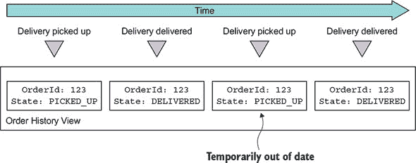

在事件处理器处理第二个`DeliveryPickedUp`事件之后，`订单历史`视图暂时包含`订单`的过时状态，直到处理了`DeliveryDelivered`。如果这种行为不可取，那么事件处理器应该检测并丢弃重复的事件，就像非幂等事件处理器一样。

如果重复的事件导致结果不正确，则事件处理器不是幂等的。例如，增加银行账户余额的事件处理器不是幂等的。非幂等事件处理器必须，如第三章所述，通过记录它在视图数据存储中处理的事件的 ID 来检测和丢弃重复的事件。

为了可靠，事件处理器必须记录事件 ID 并以原子方式更新数据存储。如何做这取决于数据库类型。如果视图数据库存储是 SQL 数据库，事件处理器可以在更新视图的事务中插入已处理的事件到`PROCESSED_EVENTS`表。但如果视图数据存储是具有有限事务模型的 NoSQL 数据库，事件处理器必须在它更新的数据存储“记录”（例如，MongoDB 文档或 DynamoDB 表项）中保存事件。

需要注意的是，事件处理器不需要记录每个事件的 ID。如果，像 Eventuate 那样，事件具有单调递增的 ID，那么每个记录只需要存储从给定的聚合实例接收到的`max(eventId)`。此外，如果记录对应于单个聚合实例，那么事件处理器只需要记录`max(eventId)`。只有代表来自多个聚合的事件连接的记录必须包含从`[aggregate type, aggregate id]`到`max(eventId)`的映射。

例如，你很快就会看到`订单历史`视图的 DynamoDB 实现包含具有跟踪事件的属性，这些属性看起来像这样：

```
{...
      "Order3949384394-039434903" : "0000015e0c6fc18f-0242ac1100e50002",
      "Delivery3949384394-039434903" : "0000015e0c6fc264-0242ac1100e50002",
   }
```

此视图是各种服务发布的事件的连接。这些事件跟踪属性的名称是`«aggregateType»«aggregateId»`，其值是`eventId`。稍后我将更详细地描述它是如何工作的。

##### 启用客户端应用程序使用最终一致视图

如我之前所说，使用 CQRS 的一个问题是，更新命令端并立即执行查询的客户端可能看不到自己的更新。视图最终一致是因为消息基础设施不可避免的延迟。

命令和查询模块 API 可以使客户端通过以下方法检测不一致。命令端操作返回一个包含已发布事件 ID 的令牌给客户端。然后客户端将令牌传递给查询操作，如果视图尚未被该事件更新，则查询操作返回错误。视图模块可以使用重复事件检测机制实现此机制。

#### 7.3.3. 添加和更新 CQRS 视图

CQRS 视图将在应用程序的生命周期内添加和更新。有时你需要添加一个新的视图来支持新的查询。在其他时候，你可能需要重新创建视图，因为模式已更改或需要修复更新视图的代码中的错误。

添加和更新视图在概念上相当简单。要创建一个新的视图，你需要开发查询模块，设置数据存储，并部署服务。查询模块的事件处理器处理所有事件，最终视图将是最新的。同样，更新现有视图在概念上也很简单：你更改事件处理器并从头开始重建视图。然而，问题在于这种方法在实践中可能不起作用。让我们看看问题所在。

##### 使用归档事件构建 CQRS 视图

一个问题是消息代理不能无限期地存储消息。传统的消息代理，如 RabbitMQ，一旦消费者处理了消息就会删除该消息。甚至更现代的代理，如 Apache Kafka，虽然可以保留消息一段时间，但并不是为了无限期地存储事件。因此，不能仅通过从消息代理中读取所有所需事件来构建视图。相反，应用程序还必须读取存档在例如 AWS S3 中的较旧事件。你可以通过使用可扩展的大数据技术，如 Apache Spark，来实现这一点。

##### 逐步构建 CQRS 视图

视图创建的另一个问题是，处理所有事件所需的时间和资源会随着时间的推移而不断增加。最终，视图创建将变得过于缓慢且成本高昂。解决方案是使用两步增量算法。第一步基于每个聚合实例的先前快照以及自该快照创建以来发生的事件，定期计算每个聚合实例的快照。第二步使用这些快照和任何后续事件创建视图。

### 7.4. 实现使用 AWS DynamoDB 的 CQRS 视图

现在我们已经探讨了在使用 CQRS 时必须解决的各个设计问题，让我们考虑一个例子。本节描述了如何使用 DynamoDB 实现针对 `findOrderHistory()` 操作的 CQRS 视图。AWS DynamoDB 是一种可扩展的 NoSQL 数据库，可在亚马逊云上作为一项服务提供。DynamoDB 数据模型由包含项的表组成，这些项类似于 JSON 对象，是层次结构化的名称-值对的集合。AWS DynamoDB 是一个完全管理的数据库，你可以动态地上下调整表的吞吐量容量。

`findOrderHistory()` 的 CQRS 视图从多个服务消费事件，因此它被实现为一个独立的 `Order View Service`。该服务有一个 API，实现了两个操作：`findOrderHistory()` 和 `findOrder()`。尽管 `findOrder()` 可以通过 API 组合来实现，但这个视图免费提供了这个操作。图 7.12 展示了该服务的架构。`Order History Service` 被构建为一组模块，每个模块都实现特定的职责，以简化开发和测试。每个模块的职责如下：

+   `OrderHistoryEventHandlers`—订阅由各种服务发布的事件并调用 `OrderHistoryDAO`

+   `OrderHistoryQuery API` *模块*—实现了之前描述的 REST 端点

+   `OrderHistoryDataAccess`—包含 `OrderHistoryDAO`，它定义了更新和查询 `ftgo-order-history` DynamoDB 表及其辅助类的方法

+   `ftgo-order-history` *DynamoDB 表*—存储订单的表

##### 图 7.12\. `OrderHistoryService` 的设计。`OrderHistoryEventHandlers` 在响应事件时更新数据库。`OrderHistoryQuery` 模块通过查询数据库来实现查询操作。这两个模块使用 `OrderHistoryDataAccess` 模块来访问数据库。

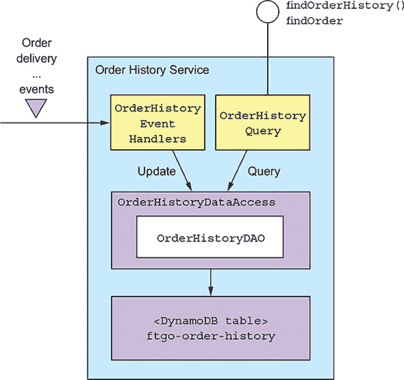

让我们更详细地看看事件处理器、DAO 和 DynamoDB 表的设计。

#### 7.4.1\. `OrderHistoryEventHandlers` 模块

此模块由消费事件并更新 DynamoDB 表的事件处理器组成。如下所示，事件处理器是简单的函数。每个方法都是一行代码，它调用 `OrderHistoryDao` 方法，并使用从事件中派生的参数。

##### 列表 7.1\. 调用 `OrderHistoryDao` 的事件处理器

```
public class OrderHistoryEventHandlers {

  private OrderHistoryDao orderHistoryDao;

  public OrderHistoryEventHandlers(OrderHistoryDao orderHistoryDao) {
    this.orderHistoryDao = orderHistoryDao;
  }

  public void handleOrderCreated(DomainEventEnvelope<OrderCreated> dee) {
    orderHistoryDao.addOrder(makeOrder(dee.getAggregateId(), dee.getEvent()),
                              makeSourceEvent(dee));
  }

  private Order makeOrder(String orderId, OrderCreatedEvent event) {
    ...
  }

  public void handleDeliveryPickedUp(DomainEventEnvelope<DeliveryPickedUp>
                                             dee) {
   orderHistoryDao.notePickedUp(dee.getEvent().getOrderId(),
           makeSourceEvent(dee));
  }

  ...
```

每个事件处理器有一个类型为 `DomainEventEnvelope` 的单个参数，它包含事件和一些描述事件的元数据。例如，`handleOrderCreated()` 方法被调用来处理 `OrderCreated` 事件。它调用 `orderHistoryDao.addOrder()` 在数据库中创建一个 `Order`。同样，`handleDeliveryPickedUp()` 方法被调用来处理 `DeliveryPickedUp` 事件。它调用 `orderHistoryDao.notePickedUp()` 更新数据库中 `Order` 的状态。

两个方法都调用辅助方法 `makeSourceEvent()`，该方法构建一个包含发出事件的聚合类型和 ID 以及事件 ID 的 `SourceEvent`。在下一节中，您将看到 `OrderHistoryDao` 使用 `SourceEvent` 来确保更新操作是幂等的。

现在我们来看 DynamoDB 表的设计，然后检查 `OrderHistoryDao`。

#### 7.4.2\. 使用 DynamoDB 进行数据建模和查询设计

与许多 NoSQL 数据库一样，DynamoDB 的数据访问操作比 RDBMS 提供的弱得多。因此，您必须仔细设计数据的存储方式。特别是，查询通常决定了模式的设计。我们需要解决几个设计问题：

+   设计 `ftgo-order-history` 表

+   为 `findOrderHistory` 查询定义索引

+   实现 `findOrderHistory` 查询

+   分页查询结果

+   更新订单

+   检测重复事件

我们将逐一查看每个问题。

##### 设计 ftgo-order-history 表

DynamoDB 存储模型由表组成，其中包含项目，以及索引，它们提供了访问表项目的替代方式（稍后讨论）。一个*项目*是一组命名属性。一个*属性值*可以是字符串等标量值，也可以是字符串的多值集合，或者是一组命名属性。尽管一个项目在关系型数据库管理系统（RDBMS）中相当于一行，但它要灵活得多，可以存储整个聚合。

这种灵活性使得 `OrderHistoryDataAccess` 模块能够将每个 `Order` 作为单个项目存储在名为 `ftgo-order-history` 的 DynamoDB 表中。`Order` 类的每个字段都映射到一个项目属性，如图 7.13 所示。图 7.13。简单的字段，如 `orderCreationTime` 和 `status`，映射到单值项目属性。`lineItems` 字段映射到一个列表属性，其中每个时间线对应一个映射。它可以被视为对象的 JSON 数组。

##### 图 7.13\. DynamoDB `OrderHistory` 表的初步结构

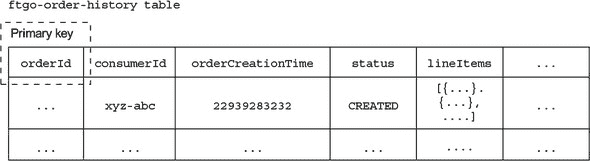

表定义的一个重要部分是其主键。DynamoDB 应用程序通过主键插入、更新和检索表的项目。主键似乎是 `orderId`。这使得 `Order History Service` 能够通过 `orderId` 插入、更新和检索订单。但在最终确定这个决定之前，让我们首先探讨表的主键如何影响它支持的数据访问操作类型。

##### 为 findOrderHistory 查询定义索引

此表定义支持基于主键的`Orders`的读取和写入。但它不支持返回按年龄递增排序的多个匹配订单的`findOrderHistory()`查询。这是因为，正如你将在本节后面看到的那样，此查询使用 DynamoDB 的`query()`操作，该操作要求表具有由两个标量属性组成的复合主键。第一个属性是分区键。所谓的分区键是因为 DynamoDB 的 Z 轴扩展（在第一章中描述）用它来选择一个项目的存储分区。第二个属性是*排序*键。`query()`操作返回具有指定分区键、具有指定范围内的排序键并匹配可选过滤表达式的项目。它按排序键指定的顺序返回项目。

`findOrderHistory()`查询操作返回按年龄递增排序的消费者订单。因此，它需要一个具有`consumerId`作为分区键和`orderCreationDate`作为排序键的主键。但`(consumerId, orderCreationDate)`作为`ftgo-order-history`表的主键没有意义，因为它不是唯一的。

解决方案是让`findOrderHistory()`查询 DynamoDB 在`ftgo-order-history`表上称为*二级索引*的内容。此索引的非唯一键为`(consumerId, orderCreationDate)`。像 RDBMS 索引一样，DynamoDB 索引在其表更新时自动更新。但与典型的 RDBMS 索引不同，DynamoDB 索引可以具有非键属性。*非键属性*可以提高性能，因为它们由查询返回，所以应用程序不需要从表中获取它们。此外，正如你很快就会看到的那样，它们可以用于过滤。图 7.14 显示了表和此索引的结构。

##### 图 7.14. `OrderHistory`表和索引的设计

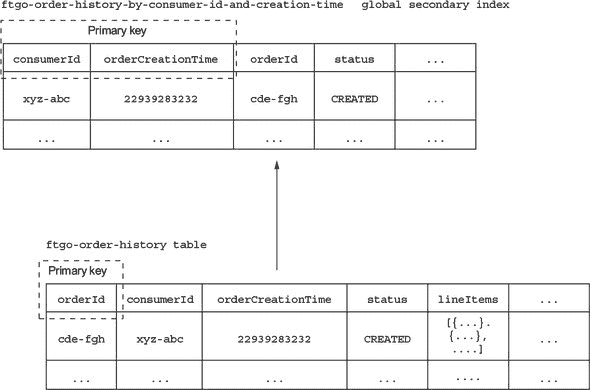

该索引是`ftgo-order-history`表定义的一部分，称为`ftgo-order-history-by-consumer-id-and-creation-time`。索引的属性包括主键属性`consumerId`和`orderCreationTime`，以及非键属性，包括`orderId`和`status`。

`ftgo-order-history-by-consumer-id-and-creation-time`索引使`OrderHistoryDaoDynamoDb`能够高效地检索按年龄递增排序的消费者订单。

现在我们来看如何检索仅匹配过滤条件的那些订单。

##### 实现 findOrderHistory 查询

`findOrderHistory()`查询操作有一个`filter`参数，它指定了搜索条件。一个过滤器条件是返回的订单的最大年龄。这很容易实现，因为 DynamoDB 的`Query`操作的支持对排序键的范围限制的*键条件表达式*。其他过滤器条件对应于非键属性，可以使用*过滤器表达式*实现，这是一个布尔表达式。DynamoDB 的`Query`操作只返回满足过滤器表达式的项目。例如，为了找到`已取消`的`Orders`，`OrderHistoryDaoDynamoDb`使用查询表达式`orderStatus = :orderStatus`，其中`:orderStatus`是一个占位符参数。

关键字过滤器条件更难实现。它选择那些餐厅名称或菜单项与指定的关键字之一匹配的订单。`OrderHistoryDaoDynamoDb`通过将餐厅名称和菜单项进行分词并将关键字集合存储在一个名为`keywords`的集合值属性中来启用关键字搜索。它通过使用包含`contains()`函数的过滤器表达式来找到匹配关键字的订单，例如`contains(keywords, :keyword1) OR contains(keywords, :keyword2)`，其中`:keyword1`和`:keyword2`是特定关键字的占位符。

##### 分页查询结果

一些消费者会有大量的订单。因此，对于`findOrderHistory()`查询操作使用分页是有意义的。DynamoDB 的`Query`操作有一个`pageSize`参数，它指定了要返回的最大项目数。如果有更多项目，查询的结果将包含一个非空的`LastEvaluatedKey`属性。一个 DAO 可以通过设置`exclusiveStartKey`参数为`LastEvaluatedKey`来调用查询以检索下一页的项目。

如您所见，DynamoDB 不支持基于位置的分页。因此，`Order History Service`向其客户端返回一个不透明的分页令牌。客户端使用这个分页令牌来请求下一页的结果。

现在我已经描述了如何查询 DynamoDB 中的订单，让我们看看如何插入和更新它们。

##### 更新订单

DynamoDB 支持两种用于添加和更新项目的操作：`PutItem()`和`UpdateItem()`。`PutItem()`操作通过其主键创建或替换整个项目。理论上，`OrderHistoryDaoDynamoDb`可以使用此操作来插入和更新订单。然而，使用`PutItem()`的一个挑战是确保对同一项目的并发更新被正确处理。

例如，考虑两个事件处理器同时尝试更新同一项目的场景。每个事件处理器都会调用`OrderHistoryDaoDynamoDb`从 DynamoDB 加载项目，在内存中更改它，并使用`PutItem()`在 DynamoDB 中更新它。一个事件处理器可能会覆盖另一个事件处理器所做的更改。`OrderHistoryDaoDynamoDb`可以通过使用 DynamoDB 的乐观锁定机制来防止更新丢失。但一个更简单、更有效的方法是使用`UpdateItem()`操作。

`UpdateItem()`操作更新项目的单个属性，如果需要则创建项目。由于不同的事件处理器更新`Order`项目的不同属性，因此使用`UpdateItem`是有意义的。此操作也更高效，因为不需要首先从表中检索订单。

在响应事件更新数据库时遇到的挑战之一，如前所述，是检测和丢弃重复事件。让我们看看在使用 DynamoDB 时如何做到这一点。

##### 检测重复事件

`Order History Service`的所有事件处理器都是幂等的。每个处理器都会设置`Order`项目的单个或多个属性。因此，`Order History Service`可以简单地忽略重复事件的问题。然而，忽略问题的缺点是`Order`项目有时会暂时过时。这是因为接收重复事件的处理器会将`Order`项目的属性设置为以前的值。`Order`项目将不会具有正确的值，直到稍后的事件重新传递。

如前所述，防止数据过时的方法之一是检测和丢弃重复事件。`OrderHistoryDaoDynamoDb`可以通过在每一项中记录导致其更新的事件来检测重复事件。然后，它可以使用`UpdateItem()`操作的条件更新机制，仅在事件不是重复事件时更新项目。

仅当*条件表达式*为真时才执行条件更新。*条件表达式*测试属性是否存在或具有特定值。`OrderHistoryDaoDynamoDb` DAO 可以使用一个名为`«aggregateType»«aggregateId»`的属性来跟踪从每个聚合实例接收的事件，其值是接收到的最高事件 ID。如果属性存在且其值小于或等于事件 ID，则事件是重复的。`OrderHistoryDaoDynamoDb` DAO 使用以下条件表达式：

```
attribute_not_exists(«aggregateType»«aggregateId»)
     OR «aggregateType»«aggregateId» < :eventId
```

*条件表达式* 仅允许在属性不存在或`eventId`大于最后处理的事件 ID 时进行更新。

例如，假设事件处理器接收来自 ID 为 `3949384394-039434903` 的 `Delivery` 聚合的 ID 为 `123323-343434` 的 `DeliveryPickup` 事件。跟踪属性名为 `Delivery3949384394-039434903`。如果此属性值大于或等于 `123323-343434`，事件处理器应认为该事件是重复的。事件处理器调用的 `query()` 操作使用此条件表达式更新 `Order` 项：

```
attribute_not_exists(Delivery3949384394-039434903)
     OR Delivery3949384394-039434903 < :eventId
```

现在我已经描述了 DynamoDB 数据模型和查询设计，让我们看看 `OrderHistoryDaoDynamoDb`，它定义了更新和查询 `ftgo-order-history` 表的方法。

#### 7.4.3\. `OrderHistoryDaoDynamoDb` 类

`OrderHistoryDaoDynamoDb` 类实现了在 `ftgo-order-history` 表中读写项的方法。它的更新方法由 `OrderHistoryEventHandlers` 调用，而它的查询方法由 `OrderHistoryQuery API` 调用。让我们看看一些示例方法，从 `addOrder()` 方法开始。

##### `addOrder()` 方法

如 列表 7.2 所示的 `addOrder()` 方法将订单添加到 `ftgo-order-history` 表中。它有两个参数：`order` 和 `sourceEvent`。`order` 参数是要添加的 `Order`，它从 `OrderCreated` 事件中获取。`sourceEvent` 参数包含 `eventId` 以及发出事件的聚合的类型和 ID。它用于实现条件更新。

##### 列表 7.2\. `addOrder()` 方法添加或更新一个 `Order`

```
public class OrderHistoryDaoDynamoDb ...

@Override
public boolean addOrder(Order order, Optional<SourceEvent> eventSource) {
 UpdateItemSpec spec = new UpdateItemSpec()
         .withPrimaryKey("orderId", order.getOrderId())                      *1*
         .withUpdateExpression("SET orderStatus = :orderStatus, " +          *2*
                  "creationDate = :cd, consumerId = :consumerId, lineItems =" +
                 " :lineItems, keywords = :keywords, restaurantName = " +
                 ":restaurantName")
         .withValueMap(new Maps()                                            *3*
                  .add(":orderStatus", order.getStatus().toString())
                 .add(":cd", order.getCreationDate().getMillis())
                 .add(":consumerId", order.getConsumerId())
                 .add(":lineItems", mapLineItems(order.getLineItems()))
                 .add(":keywords", mapKeywords(order))
                 .add(":restaurantName", order.getRestaurantName())
                 .map())
         .withReturnValues(ReturnValue.NONE);
 return idempotentUpdate(spec, eventSource);
}
```

+   ***1* 要更新的 Order 项的主键**

+   ***2* 更新属性的表达式**

+   ***3* 更新表达式中占位符的值**

`addOrder()` 方法创建一个 `UpdateSpec`，它是 AWS SDK 的一部分，用于描述更新操作。在创建 `UpdateSpec` 之后，它调用 `idempotentUpdate()`，这是一个辅助方法，在添加防止重复更新的条件表达式后执行更新。

##### `notePickedUp()` 方法

如 列表 7.3 所示的 `notePickedUp()` 方法由 `DeliveryPickedUp` 事件的处理器调用。它将 `Order` 项的 `deliveryStatus` 更改为 `PICKED_UP`。

##### 列表 7.3\. `notePickedUp()` 方法将订单状态更改为 `PICKED_UP`

```
public class OrderHistoryDaoDynamoDb ...

@Override
public void notePickedUp(String orderId, Optional<SourceEvent> eventSource) {
 UpdateItemSpec spec = new UpdateItemSpec()
         .withPrimaryKey("orderId", orderId)
         .withUpdateExpression("SET #deliveryStatus = :deliveryStatus")
         .withNameMap(Collections.singletonMap("#deliveryStatus",
                 DELIVERY_STATUS_FIELD))
         .withValueMap(Collections.singletonMap(":deliveryStatus",
                 DeliveryStatus.PICKED_UP.toString()))
         .withReturnValues(ReturnValue.NONE);
 idempotentUpdate(spec, eventSource);
}
```

此方法类似于 `addOrder()`。它创建一个 `UpdateItemSpec` 并调用 `idempotentUpdate()`。让我们看看 `idempotentUpdate()` 方法。

##### `idempotentUpdate()` 方法

以下列表显示了 `idempotentUpdate()` 方法，该方法在可能向 `UpdateItemSpec` 添加条件表达式以防止重复更新后更新项。

##### 列表 7.4\. `idempotentUpdate()` 方法忽略重复事件

```
public class OrderHistoryDaoDynamoDb ...

private boolean idempotentUpdate(UpdateItemSpec spec, Optional<SourceEvent>
        eventSource) {
 try {
  table.updateItem(eventSource.map(es -> es.addDuplicateDetection(spec))
          .orElse(spec));
  return true;
 } catch (ConditionalCheckFailedException e) {
  // Do nothing
  return false;
 }
}
```

如果提供了 `sourceEvent`，`idempotentUpdate()` 将调用 `SourceEvent.addDuplicateDetection()` 将之前描述的条件表达式添加到 `UpdateItemSpec` 中。`idempotentUpdate()` 方法捕获并忽略由 `updateItem()` 抛出的 `ConditionalCheckFailedException`，如果事件是重复的。

现在我们已经看到了更新表的代码，让我们看看查询方法。

##### `findOrderHistory()` 方法

如 列表 7.5 所示的 `findOrderHistory()` 方法通过查询 `ftgo-order-history` 表并使用 `ftgo-order-history-by-consumer-id-and-creation-time` 次级索引来检索消费者的订单。它有两个参数：`consumerId` 指定消费者，`filter` 指定搜索条件。此方法从其参数创建 `QuerySpec`（与 `UpdateSpec` 一样，是 AWS SDK 的一部分），查询索引并将返回的项目转换为 `OrderHistory` 对象。

##### 列表 7.5\. `findOrderHistory()` 方法检索消费者的匹配订单

```
public class OrderHistoryDaoDynamoDb ...

@Override
public OrderHistory findOrderHistory(String consumerId, OrderHistoryFilter
        filter) {

 QuerySpec spec = new QuerySpec()
         .withScanIndexForward(false)                                    *1*
          .withHashKey("consumerId", consumerId)
         .withRangeKeyCondition(new RangeKeyCondition("creationDate")    *2*
                                  .gt(filter.getSince().getMillis()));

 filter.getStartKeyToken().ifPresent(token ->
       spec.withExclusiveStartKey(toStartingPrimaryKey(token)));

 Map<String, Object> valuesMap = new HashMap<>();

 String filterExpression = Expressions.and(                              *3*
          keywordFilterExpression(valuesMap, filter.getKeywords()),
         statusFilterExpression(valuesMap, filter.getStatus()));

 if (!valuesMap.isEmpty())
  spec.withValueMap(valuesMap);

 if (StringUtils.isNotBlank(filterExpression)) {
  spec.withFilterExpression(filterExpression);
 }

 filter.getPageSize().ifPresent(spec::withMaxResultSize);                *4*

 ItemCollection<QueryOutcome> result = index.query(spec);

 return new OrderHistory(
         StreamSupport.stream(result.spliterator(), false)
            .map(this::toOrder)                                          *5*
             .collect(toList()),
         Optional.ofNullable(result
               .getLastLowLevelResult()
               .getQueryResult().getLastEvaluatedKey())
            .map(this::toStartKeyToken));
}
```

+   **1** 指定查询必须按年龄递增的顺序返回订单**

+   **2** 返回订单的最大年龄**

+   **3** 从 `OrderHistoryFilter` 构建一个过滤器表达式和占位符值映射。

+   **4** 如果调用者指定了页面大小，则限制结果数量。**

+   **5** 从查询返回的项目创建一个订单。**

在构建 `QuerySpec` 之后，此方法然后执行查询并从返回的项目构建一个 `OrderHistory`，其中包含 `Orders` 列表。

`findOrderHistory()` 方法通过将 `getLastEvaluatedKey()` 返回的值序列化为 JSON 令牌来实现分页。如果客户端在 `OrderHistoryFilter` 中指定了一个起始令牌，那么 `findOrderHistory()` 将会序列化它并调用 `withExclusiveStartKey()` 来设置起始键。

正如你所见，在实现 CQRS 视图时，你必须解决许多问题，包括选择数据库、设计高效实现更新和查询的数据模型、处理并发更新以及处理重复事件。代码中唯一复杂的部分是 DAO，因为它必须正确处理并发并确保更新是幂等的。

### 摘要

+   实现从多个服务检索数据的查询具有挑战性，因为每个服务的数据是私有的。

+   实现这类查询有两种方式：API 组合模式和命令查询责任分离（CQRS）模式。

+   从多个服务中收集数据的 API 组合模式是实现查询的最简单方式，应尽可能使用。

+   API 组合模式的一个限制是，一些复杂的查询需要在大数据集上进行低效的内存连接。

+   CQRS 模式，通过使用视图数据库来实现查询，功能更强大但实现起来更复杂。

+   CQRS 视图模块必须处理并发更新以及检测和丢弃重复事件。

+   CQRS 通过允许一个服务实现返回不同服务所拥有数据的查询，从而提高了关注点的分离。

+   客户端必须处理 CQRS 视图的最终一致性。
