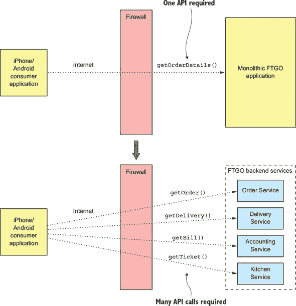
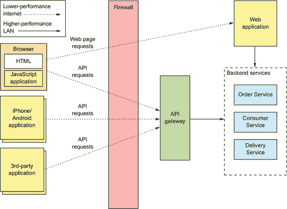
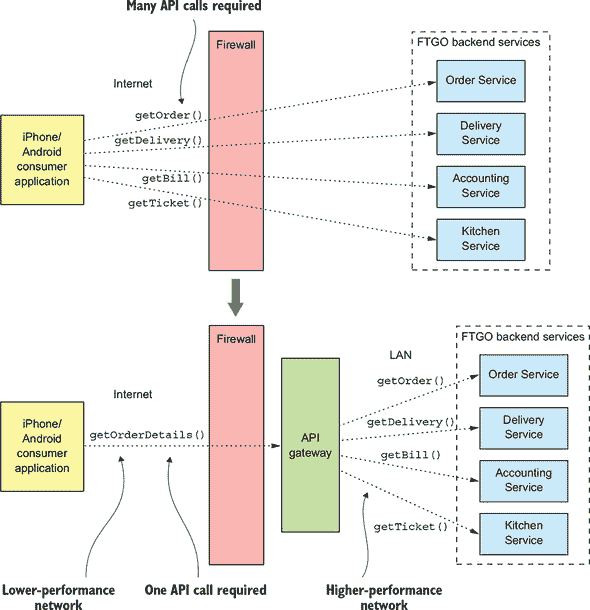
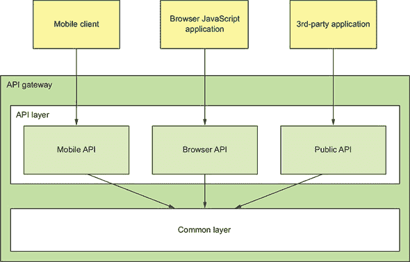
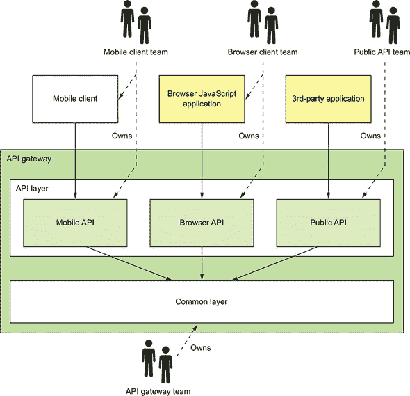
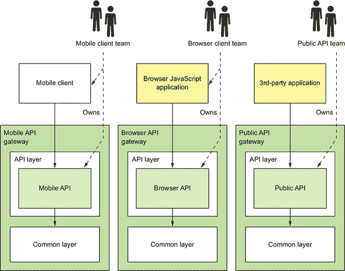
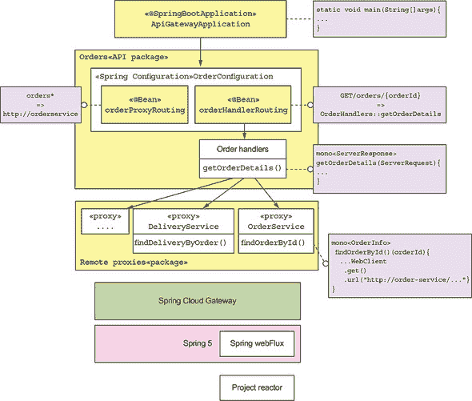
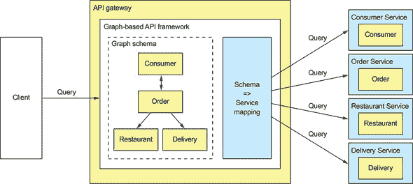
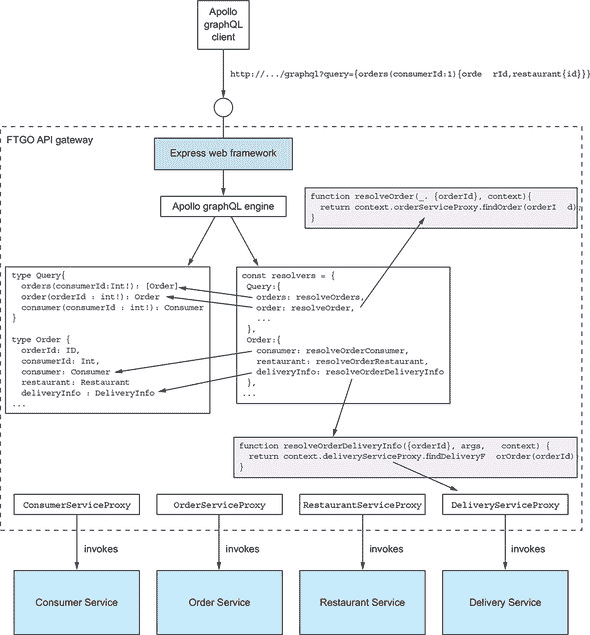
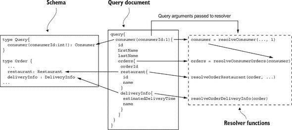

## 第八章. 外部 API 模式

*本章涵盖*

+   设计支持多样化客户端的 API 的挑战

+   应用 API 网关和后端为前端模式

+   设计和实现 API 网关

+   使用响应式编程简化 API 组合

+   使用 GraphQL 实现 API 网关

与许多其他应用程序一样，FTGO 应用程序有一个 REST API。其客户端包括 FTGO 移动应用程序、在浏览器中运行的 JavaScript 以及合作伙伴开发的应用程序。在这样的单体架构中，暴露给客户端的 API 是单体 API。但是当 FTGO 团队开始部署微服务时，就不再有一个 API 了，因为每个服务都有自己的 API。玛丽和她的团队必须决定 FTGO 应用程序现在应该向其客户端暴露哪种类型的 API。例如，客户端是否应该知道服务的存在并直接向它们发出请求？

设计应用程序外部 API 的任务由于客户端的多样性而变得更加具有挑战性。不同的客户端通常需要不同的数据。基于桌面浏览器的 UI 通常显示比移动应用程序多得多的信息。此外，不同的客户端通过不同类型的网络访问服务。防火墙内的客户端使用高性能的局域网，而防火墙外的客户端使用互联网或移动网络，这将具有较低的性能。因此，正如你将学到的，通常没有单一、通用的 API 是有意义的。

本章首先描述了各种外部 API 设计问题。随后，我介绍了外部 API 模式。我涵盖了 API 网关模式和后端为前端模式。之后，我讨论了如何设计和实现 API 网关。我回顾了可用的各种选项，包括现成的 API 网关产品和用于开发自己的框架。我描述了使用 Spring Cloud Gateway 框架构建的 API 网关的设计和实现。我还描述了如何使用 GraphQL 框架，它提供了一个基于图查询语言，来构建 API 网关。

### 8.1. 外部 API 设计问题

为了探索各种 API 相关的问题，让我们考虑 FTGO 应用程序。如图 8.1 所示，该应用程序的服务被各种客户端消费。四种类型的客户端消费服务的 API：

+   网络应用程序，例如`消费者网络应用程序`，它实现了面向消费者的基于浏览器的 UI，`餐厅网络应用程序`，它实现了面向餐厅的基于浏览器的 UI，以及`管理员网络应用程序`，它实现了内部管理员 UI

+   在浏览器中运行的 JavaScript 应用程序

+   移动应用程序，一个面向消费者，另一个面向快递员

+   由第三方开发者编写的应用程序

##### 图 8.1\. FTGO 应用程序的服务及其客户端。存在几种不同类型的客户端。一些在防火墙内部，而另一些在外部。那些在防火墙外部的客户端通过低性能的互联网/移动网络访问服务。那些在防火墙内部的客户端使用高性能的局域网。


网络应用程序运行在防火墙内部，因此它们通过高带宽、低延迟的局域网访问服务。其他客户端运行在防火墙外部，因此它们通过低带宽、高延迟的互联网或移动网络访问服务。

API 设计的一种方法是为客户端直接调用服务。表面上，这似乎非常直接——毕竟，这就是客户端调用单体应用程序 API 的方式。但由于以下缺点，这种方法在微服务架构中很少使用：

+   精细粒度的服务 API 要求客户端进行多次请求以检索所需的数据，这既低效又可能导致用户体验不佳。

+   由于客户端了解每个服务和其 API，导致缺乏封装，这使得改变架构和 API 变得困难。

+   服务可能使用对客户端来说不方便或不实用的 IPC 机制，尤其是那些在防火墙外部的客户端。

要了解更多关于这些缺点，让我们看看 FTGO 移动应用程序如何从服务中检索数据。

#### 8.1.1\. FTGO 移动客户端的 API 设计问题

消费者使用 FTGO 移动客户端来下单和管理他们的订单。想象一下，你正在开发移动客户端的“查看订单”视图，该视图显示一个订单。如第七章所述，此视图显示的信息包括基本订单信息，包括其状态、支付状态、从餐厅角度的订单状态以及配送状态，包括其位置和如果在途中，预计的配送时间。

FTGO 应用程序的单一版本有一个 API 端点，返回订单详情。移动客户端通过单次请求检索所需信息。相比之下，在 FTGO 应用程序的微服务版本中，订单详情，如前所述，分散在几个服务中，包括以下服务：

+   **`订单服务`—** 基本订单信息，包括细节和状态

+   **`厨房服务`—** 从餐厅角度的订单状态和预计取货准备时间

+   **`配送服务`—** 订单的配送状态、预计配送时间和当前位置

+   **`会计服务`—** 订单的支付状态

如果移动客户端直接调用服务，那么它必须，如图 8.2 所示，进行多次调用以检索这些数据。

##### 图 8.2。客户端可以通过单个请求从单体 FTGO 应用程序中检索订单详情。但在微服务架构中，客户端必须进行多次请求来检索相同的信息。



在这个设计中，移动应用程序扮演着 API 作曲家的角色。它调用多个服务并组合结果。尽管这种方法看起来合理，但它有几个严重的问题。

##### 由于客户端进行多次请求导致的用户体验差

第一个问题在于，移动应用程序有时必须进行多次请求以检索它想要向用户显示的数据。应用程序与服务之间的频繁交互可能会让应用程序看起来没有响应，尤其是在它使用互联网或移动网络时。互联网的带宽比局域网低得多，延迟也更高，而移动网络的情况更糟。移动网络（和互联网）的延迟通常是局域网的 100 倍。

当检索订单详情时，较高的延迟可能不是问题，因为移动应用程序通过并发执行请求来最小化延迟。整体响应时间不会超过单个请求。但在其他场景中，客户端可能需要顺序执行请求，这将导致用户体验不佳。

此外，由于网络延迟导致的用户体验差并不是频繁交互的 API 的唯一问题。它要求移动开发者编写可能复杂的 API 组合代码。这项工作会分散他们创建良好用户体验的主要任务。而且，因为每个网络请求都会消耗电量，频繁交互的 API 会更快地耗尽移动设备的电池。

##### 缺乏封装要求前端开发者与后端同步更改他们的代码

移动应用程序直接访问服务的另一个缺点是封装不足。随着应用程序的发展，服务的开发者有时会以破坏现有客户端的方式更改 API。他们甚至可能改变系统分解为服务的方式。开发者可能会添加新的服务，分割或合并现有服务。但如果关于服务的知识已经嵌入到移动应用程序中，那么更改服务的 API 可能会变得困难。

与更新服务器端应用程序不同，推出移动应用程序的新版本可能需要数小时甚至数天。苹果或谷歌必须批准升级并使其可供下载。用户可能不会立即下载升级——如果他们下载的话。而且你可能不希望强迫不愿意升级的用户。将服务 API 暴露给移动的策略为这些 API 的演变设置了重大的障碍。

##### 服务可能会使用对客户端不友好的 IPC 机制

对于直接调用服务的移动应用程序来说，另一个挑战是某些服务可能使用客户端难以消费的协议。运行在防火墙之外的客户应用程序通常使用 HTTP 和 WebSockets 等协议。但如第三章所述，服务开发者有许多协议可供选择——不仅仅是 HTTP。一个应用程序的一些服务可能使用 gRPC，而其他服务可能使用 AMQP 消息协议。这类协议在内部运行良好，但可能不易被移动客户端消费。有些甚至对防火墙不友好。

#### 8.1.2\. 其他类型客户端的 API 设计问题

我选择移动客户端，因为它是一种很好的方式来展示客户端直接访问服务的缺点。但是，向客户端公开服务所造成的问题并不仅限于移动客户端。其他类型的客户端，尤其是那些在防火墙之外运行的客户端，也会遇到这些问题。如前所述，FTGO 应用程序的服务被 Web 应用程序、基于浏览器的 JavaScript 应用程序和第三方应用程序消费。让我们看看这些客户端的 API 设计问题。

##### 网络应用的 API 设计问题

传统的服务器端网络应用程序，它处理来自浏览器的 HTTP 请求并返回 HTML 页面，运行在防火墙内并通过局域网访问服务。网络带宽和延迟不是在 Web 应用程序中实现 API 组合的障碍。此外，Web 应用程序可以使用非 Web 友好的协议来访问服务。开发 Web 应用程序的团队属于同一组织，并且通常与编写后端服务的团队紧密合作，因此 Web 应用程序可以很容易地随时更新后端服务。因此，Web 应用程序直接访问后端服务是可行的。

##### 基于浏览器的 JavaScript 应用程序的 API 设计问题

现代浏览器应用程序使用一定量的 JavaScript。即使 HTML 主要由服务器端网络应用程序生成，浏览器中运行的 JavaScript 调用服务是很常见的。例如，FTGO 应用程序的所有 Web 应用程序——`Consumer`、`Restaurant` 和 `Admin`——都包含调用后端服务的 JavaScript。例如，`Consumer` Web 应用程序使用调用服务 API 的 JavaScript 动态刷新 `Order Details` 页面。

一方面，基于浏览器的 JavaScript 应用程序在服务 API 更改时易于更新。另一方面，通过互联网访问服务的 JavaScript 应用程序与移动应用程序一样，存在网络延迟的问题。更糟糕的是，基于浏览器的 UI，尤其是桌面应用程序，通常更复杂，需要组合比移动应用程序更多的服务。很可能会出现，通过互联网访问服务的`Consumer`和`Restaurant`应用程序无法有效地组合服务 API。

##### 为第三方应用程序设计 API

FTGO，像许多其他组织一样，向第三方开发者公开 API。开发者可以使用 FTGO API 编写放置和管理订单的应用程序。这些第三方应用程序通过互联网访问 API，因此 API 组合可能效率低下。但与设计供第三方应用程序使用的 API 相比，API 组合的低效率是一个相对较小的问题。这是因为第三方开发者需要一个稳定的 API。

很少有组织能够强迫第三方开发者升级到新的 API。具有不稳定 API 的组织可能会失去开发者，转而使用竞争对手。因此，您必须仔细管理供第三方开发者使用的 API 的演变。通常，您必须长期维护旧版本——可能永远如此。

这个要求对组织来说是一个巨大的负担。让后端服务的开发者负责维护长期向后兼容性是不切实际的。与其直接向第三方开发者公开服务，组织应该有一个由不同团队开发的独立公共 API。正如您稍后将要了解的，公共 API 是由一个称为*API 网关*的架构组件实现的。让我们看看 API 网关是如何工作的。

### 8.2\. API 网关模式

正如您刚刚看到的，直接访问服务的服务存在许多缺点。客户端在互联网上执行 API 组合通常不切实际。缺乏封装使得开发者难以更改服务分解和 API。服务有时使用不适合防火墙外的通信协议。因此，一个更好的方法是用 API 网关。

|  |
| --- |

**模式：API 网关**

实现一个服务，作为外部 API 客户端进入基于微服务的应用程序的入口点。参见[`microservices.io/patterns/apigateway.html`](http://microservices.io/patterns/apigateway.html)。

|  |
| --- |

*API 网关*是一个服务，它是从外部世界进入应用程序的入口点。它负责请求路由、API 组合和其他功能，例如身份验证。本节介绍了 API 网关模式。我讨论了它的优点和缺点，并描述了在开发 API 网关时必须解决的各种设计问题。

#### 8.2.1. API 网关模式的概述

第 8.1.1 节描述了客户端（如 FTGO 移动应用程序）的缺点，例如，为了向用户显示信息而进行多次请求。一个更好的方法是客户端向 API 网关发送单个请求，该网关作为 API 请求进入应用程序的外部防火墙的单一点。这与面向对象设计中的外观模式类似。像外观一样，API 网关封装了应用程序的内部架构，并为客户端提供了一个 API。它还可能具有其他职责，例如身份验证、监控和速率限制。图 8.3 显示了客户端、API 网关和服务之间的关系。

##### 图 8.3。API 网关是外部防火墙进入应用程序进行 API 调用的单一入口点。



API 网关负责请求路由、API 组合和协议转换。所有来自*外部*客户端的 API 请求首先到达 API 网关，其中一些请求被路由到适当的服务。API 网关通过使用 API 组合模式和调用多个服务并汇总结果来处理其他请求。它还可能在客户端友好的协议（如 HTTP 和 WebSockets）和客户端不友好的协议（由服务使用）之间进行转换。

##### 请求路由

API 网关的关键功能之一是**请求路由**。API 网关通过将请求路由到相应的服务来执行一些 API 操作。当它收到一个请求时，API 网关会咨询一个路由映射表，该映射表指定将请求路由到哪个服务。例如，一个路由映射表可能会将 HTTP 方法和路径映射到服务的 HTTP URL。这个功能与由像 NGINX 这样的 Web 服务器提供的反向代理功能相同。

##### API 组合

API 网关通常不仅仅是反向代理。它还可能使用 API 组合来实现一些 API 操作。例如，FTGO API 网关使用 API 组合来实现`获取订单详情`API 操作。如图 8.4 所示，移动应用程序向 API 网关发送一个请求，该网关从多个服务中检索订单详情。

##### 图 8.4。API 网关通常执行 API 组合，这使得客户端（如移动设备）能够通过单个 API 请求有效地检索数据。



FTGO API 网关提供了一个粗粒度的 API，允许移动客户端通过单个请求检索所需的数据。例如，移动客户端向 API 网关发出单个`getOrderDetails()`请求。

##### 协议转换

API 网关还可能执行协议转换。它可能为外部客户端提供 RESTful API，尽管应用程序服务内部使用多种协议，包括 REST 和 gRPC。当需要时，某些 API 操作的实现会在 RESTful 外部 API 和基于 gRPC 的内部 API 之间进行转换。

##### API 网关为每个客户端提供特定于客户端的 API

API 网关可能提供一个适用于所有情况的单一 API（OSFA）。单一 API 的问题在于，不同的客户端通常有不同的需求。例如，第三方应用程序可能需要`Get Order Details` API 操作返回完整的`Order`详情，而移动客户端只需要数据的一个子集。解决此问题的一种方法是在请求中允许客户端指定服务器应返回哪些字段和相关对象。这种方法对于必须服务于广泛第三方应用的公共 API 来说是足够的，但它通常不会给客户端提供他们需要的控制权。

更好的方法是 API 网关为每个客户端提供其自己的 API。例如，FTGO API 网关可以为 FTGO 移动客户端提供一个专门设计以满足其需求的 API。它甚至可能为 Android 和 iPhone 移动应用程序提供不同的 API。API 网关还将为第三方开发者实现一个公共 API。稍后，我将描述“前后端分离”模式，该模式通过为每个客户端定义一个单独的 API 网关将 API-per-client 的概念进一步扩展。

##### 实现边缘函数

尽管 API 网关的主要职责是 API 路由和组合，但它也可能实现所谓的边缘函数。正如其名称所示，边缘函数是在应用程序边缘实现的请求处理函数。应用程序可能实现的边缘函数示例包括以下内容：

+   **认证**—**验证发起请求的客户端身份**。

+   **授权**—**验证客户端是否有权执行特定操作**。

+   **速率限制**—**限制来自特定客户端和/或所有客户端的每秒请求数量**。

+   **缓存**—**缓存响应以减少对服务的请求次数**。

+   **指标收集**—**收集 API 使用情况指标，用于计费分析目的**。

+   **请求记录**—**记录请求**。

在你的应用程序中，你可以在三个不同的地方实现这些边缘功能。首先，你可以在后端服务中实现它们。对于某些功能，如缓存、指标收集和可能授权，这可能是有意义的。但通常，在请求到达服务之前在边缘对请求进行身份验证会更安全。

第二种选择是在 API 网关上游的边缘服务中实现这些边缘功能。边缘服务是外部客户端的第一个接触点。它验证请求并在将其传递给 API 网关之前执行其他边缘处理。

使用专用边缘服务的一个重要好处是它分离了关注点。API 网关专注于 API 路由和组合。另一个好处是它将关键边缘功能（如身份验证）的责任集中化。当应用程序有多个 API 网关，且可能使用多种语言和框架编写时，这一点尤其有价值。我稍后会详细讨论这一点。这种方法的缺点是它增加了网络延迟，因为多了一个跳转。它还增加了应用程序的复杂性。

因此，通常使用第三种方法并在 API 网关本身实现这些边缘功能，特别是授权，是非常方便的。这样可以减少一个网络跳转，从而提高延迟。同时，移动部件也更少，这降低了复杂性。第十一章描述了 API 网关和服务的协作方式以实现安全性。

##### API 网关架构

API 网关具有分层、模块化的架构。其架构，如图 8.5 所示，由两层组成：API 层和通用层。API 层由一个或多个独立的 API 模块组成。每个 API 模块为特定客户端实现一个 API。通用层实现共享功能，包括如身份验证之类的边缘功能。

##### 图 8.5\. API 网关具有分层模块化的架构。每个客户端的 API 由一个单独的模块实现。通用层实现所有 API 共有的功能，如身份验证。



在这个例子中，API 网关有三个 API 模块：

+   ***移动 API*—** 实现 FTGO 移动客户端的 API

+   ***浏览器 API*—** 实现运行在浏览器中的 JavaScript 应用的 API

+   ***公共 API*—** 实现第三方开发者的 API

API 模块以两种方式之一实现每个 API 操作。一些 API 操作直接映射到单个服务 API 操作。API 模块通过将请求路由到相应的服务 API 操作来实现这些操作。它可能使用一个通用路由模块来路由请求，该模块读取描述路由规则的配置文件。

API 模块通过 API 组合实现其他更复杂的 API 操作。该 API 操作的实现由自定义代码组成。每个 API 操作实现通过调用多个服务并组合结果来处理请求。

##### API 网关所有权模型

你必须回答的一个重要问题是，谁负责 API 网关的开发和运营？有几个不同的选择。一个是设立一个专门的团队负责 API 网关。其缺点是，这与 SOA 类似，在 SOA 中，企业服务总线（ESB）团队负责所有 ESB 的开发。如果一个移动应用的开发者需要访问特定的服务，他们必须向 API 网关团队提交请求，并等待他们公开 API。这种在组织中的集中式瓶颈与微服务架构的哲学非常不符，微服务架构推崇松散耦合的自治团队。

Netflix 推广的一种更好的方法是，让客户端团队——移动、Web 和公共 API 团队——拥有暴露其 API 的 API 模块。API 网关团队负责开发“公共”模块和网关的运营方面。这种所有权模型如图 8.6 所示，使团队能够控制他们的 API。

##### 图 8.6。客户端团队拥有自己的 API 模块。随着客户端的变化，他们可以更改 API 模块，而无需请求 API 网关团队进行更改。



当一个团队需要更改他们的 API 时，他们将更改检查到 API 网关的源代码库中。为了有效工作，API 网关的部署管道必须完全自动化。否则，客户端团队经常会因为等待 API 网关团队部署新版本而被阻塞。

##### 使用前后端分离模式

对于 API 网关的一个担忧是，其责任界限模糊。多个团队共同贡献相同的代码库。API 网关团队负责其运营。虽然不如 SOA ESB 那样糟糕，但这种责任模糊与微服务架构哲学“如果你建造它，你就拥有它”相悖。

解决方案是为每个客户端提供一个 API 网关，即所谓的“前后端分离”（BFF）模式，这一模式由 Phil Calçado（[`philcalcado.com/`](http://philcalcado.com/)）及其在 SoundCloud 的同事开创。如图 8.7 所示，每个 API 模块都成为其自己的独立 API 网关，由单个客户端团队开发和运营。

| |
| --- |

**模式：前后端分离**

为每种类型的客户端实现一个独立的 API 网关。参见[`microservices.io/patterns/apigateway.html`](http://microservices.io/patterns/apigateway.html)。

| |
| --- |

##### 图 8.7。前后端分离模式为每个客户端定义了一个独立的 API 网关。每个客户端团队拥有自己的 API 网关。API 网关团队拥有公共层。



公共 API 团队拥有并运营他们的 API 网关，移动团队拥有并运营他们的，以此类推。从理论上讲，可以使用不同的技术栈来开发不同的 API 网关。但这可能导致重复编写实现边缘功能的通用代码，例如实现边缘功能的代码。理想情况下，所有 API 网关都使用相同的技术栈。通用功能是由 API 网关团队实现的共享库。

除了明确定义责任外，BFF 模式还有其他好处。API 模块彼此隔离，这提高了可靠性。一个表现不佳的 API 不太可能轻易影响其他 API。它还提高了可观察性，因为不同的 API 模块是不同的进程。BFF 模式的另一个好处是每个 API 都可以独立扩展。BFF 模式还减少了启动时间，因为每个 API 网关都是一个更小、更简单的应用程序。

#### 8.2.2. API 网关的优缺点

如您所预期的那样，API 网关模式既有优点也有缺点。

##### API 网关的优点

使用 API 网关的一个主要优点是它封装了应用程序的内部结构。而不是调用特定的服务，客户端与网关进行通信。API 网关为每个客户端提供一个特定于客户端的 API，这减少了客户端与应用程序之间的往返次数。它还简化了客户端代码。

##### API 网关的缺点

API 网关模式也有一些缺点。它又是一个必须开发、部署和管理的可用性很高的组件。还有风险，即 API 网关成为开发瓶颈。开发者必须更新 API 网关才能公开他们的服务的 API。重要的是，更新 API 网关的过程应该尽可能轻量。否则，开发者将被迫排队等待更新网关。尽管如此，对于大多数实际应用来说，使用 API 网关是有意义的。如果需要，您可以使用前后端分离模式，以使团队能够独立开发和部署他们的 API。

#### 8.2.3. Netflix 作为 API 网关的例子

API 网关的一个很好的例子是 Netflix API。Netflix 流媒体服务可在数百种不同的设备上使用，包括电视、蓝光播放器、智能手机以及许多其他小工具。最初，Netflix 试图为其流媒体服务提供一个通用的 API 风格([www.programmableweb.com/news/why-rest-keeps-me-night/2012/05/15](http://www.programmableweb.com/news/why-rest-keeps-me-night/2012/05/15))。但公司很快发现，由于设备种类繁多且需求不同，这并不奏效。如今，Netflix 使用一个 API 网关，为每种设备实现一个单独的 API。客户端设备团队开发和拥有 API 实现。

在 API 网关的第一个版本中，每个客户端团队使用 Groovy 脚本实现他们的 API，这些脚本执行路由和 API 组合。每个脚本使用服务团队提供的 Java 客户端库调用一个或多个服务 API。一方面，这效果很好，客户端开发者已经编写了数千个脚本。Netflix API 网关每天处理数十亿次请求，平均每个 API 调用会扩展到六个或七个后端服务。另一方面，Netflix 发现这种单体架构有些笨重。

因此，Netflix 现在正在转向与前端后端模式类似的 API 网关架构。在这个新的架构中，客户端团队使用 NodeJS 编写 API 模块。每个 API 模块运行自己的 Docker 容器，但脚本不会直接调用服务。相反，它们调用第二个“API 网关”，使用 Netflix Falcor 公开服务 API。*Netflix Falcor*是一种 API 技术，它执行声明性、动态的 API 组合，并允许客户端使用单个请求调用多个服务。这种新的架构有许多优点。API 模块彼此隔离，这提高了可靠性和可观察性，并且客户端 API 模块可以独立扩展。

#### 8.2.4\. API 网关设计问题

现在我们已经了解了 API 网关模式及其优点和缺点，让我们来探讨各种 API 网关设计问题。在设计 API 网关时需要考虑几个问题：

+   性能和可扩展性

+   通过使用响应式编程抽象编写可维护的代码

+   处理部分失败

+   成为应用程序架构中的良好公民

我们将逐一探讨。

##### 性能和可扩展性

API 网关是应用程序的前门。所有外部请求都必须首先通过网关。尽管大多数公司没有 Netflix 那样每天处理数十亿次请求的规模，但 API 网关的性能和可扩展性通常非常重要。影响性能和可扩展性的一个关键设计决策是 API 网关应该使用同步 I/O 还是异步 I/O。

在**同步**I/O 模型中，每个网络连接都由一个专用的线程处理。这是一个简单的编程模型，并且效果相当不错。例如，它是广泛使用的 Java EE servlet 框架的基础，尽管这个框架提供了异步完成请求的选项。然而，同步 I/O 的一个局限性是操作系统线程是重量级的，因此线程的数量，以及 API 网关可以拥有的并发连接数，都有限制。

另一种方法是使用 *异步*（非阻塞）I/O 模型。在这个模型中，单个事件循环线程将 I/O 请求调度到事件处理器。您有多种异步 I/O 技术可供选择。在 JVM 上，您可以使用基于 NIO 的框架之一，如 Netty、Vertx、Spring Reactor 或 JBoss Undertow。一个流行的非 JVM 选项是 NodeJS，这是一个基于 Chrome JavaScript 引擎的平台。

非阻塞 I/O 的可扩展性更好，因为它没有使用多个线程的开销。然而，缺点是异步、基于回调的编程模型更加复杂。代码更难编写、理解和调试。事件处理器必须快速返回，以避免阻塞事件循环线程。

此外，使用非阻塞 I/O 是否具有有意义的整体效益取决于 API 网关请求处理逻辑的特征。Netflix 在重写其边缘服务器 Zuul 时，使用 NIO 得到了混合的结果（见 [`medium.com/netflix-techblog/zuul-2-the-netflix-journey-to-asynchronous-non-blocking-systems-45947377fb5c`](https://medium.com/netflix-techblog/zuul-2-the-netflix-journey-to-asynchronous-non-blocking-systems-45947377fb5c)）。一方面，正如预期的那样，使用 NIO 减少了每个网络连接的成本，因为不再为每个连接分配专用线程。此外，运行 I/O 密集型逻辑（如请求路由）的 Zuul 集群吞吐量提高了 25%，CPU 利用率降低了 25%。另一方面，运行 CPU 密集型逻辑（如解密和压缩）的 Zuul 集群没有显示出任何改进。

##### 使用响应式编程抽象

如前所述，API 组成包括调用多个后端服务。一些后端服务请求完全依赖于客户端请求的参数。其他可能依赖于其他服务请求的结果。一种方法是由 API 端点处理方法根据依赖关系调用服务。例如，以下列表显示了以这种方式编写的 `findOrder()` 请求的处理程序。它依次调用每个服务。

##### 列表 8.1\. 通过依次调用后端服务来获取订单详情

```
@RestController
public class OrderDetailsController {
@RequestMapping("/order/{orderId}")
public OrderDetails getOrderDetails(@PathVariable String orderId) {

  OrderInfo orderInfo = orderService.findOrderById(orderId);

  TicketInfo ticketInfo = kitchenService
          .findTicketByOrderId(orderId);

  DeliveryInfo deliveryInfo = deliveryService
          .findDeliveryByOrderId(orderId);

  BillInfo billInfo = accountingService
          .findBillByOrderId(orderId);

  OrderDetails orderDetails =
       OrderDetails.makeOrderDetails(orderInfo, ticketInfo,
                                     deliveryInfo, billInfo);

  return orderDetails;
}
...
```

按顺序调用服务的缺点是响应时间是服务响应时间的总和。为了最小化响应时间，组成逻辑应尽可能并发调用服务。在这个例子中，服务调用之间没有依赖关系。所有服务都应并发调用，这显著减少了响应时间。挑战在于编写可维护的并发代码。

这是因为编写可扩展、并发代码的传统方式是使用回调。异步、事件驱动的 I/O 本质上基于回调。即使是基于 Servlet API 的 API 编曲器，在并发调用服务时通常也使用回调。它可以通过调用`ExecutorService.submitCallable()`来并发执行请求。问题在于，这个方法返回一个`Future`，它有一个阻塞的 API。一个更可扩展的方法是 API 编曲器调用`ExecutorService.submit (Runnable)`，并为每个`Runnable`调用一个带有请求结果的回调。回调累积结果，一旦所有结果都接收完毕，它就向客户端发送响应。

使用传统的异步回调方法编写 API 编曲代码会迅速将你带入回调地狱。代码会变得混乱，难以理解，且容易出错，尤其是在编曲需要并行和顺序请求混合时。一个更好的方法是使用声明式风格和响应式方法编写 API 编曲代码。JVM 的响应式抽象示例包括以下内容：

+   Java 8 `CompletableFutures`

+   Project Reactor `Monos`

+   RxJava (Java 的响应式扩展) `Observables`，由 Netflix 专门为其 API 网关解决这个问题创建

+   Scala `Futures`

基于 NodeJS 的 API 网关将使用 JavaScript 承诺或 RxJS，这是 JavaScript 的响应式扩展。使用这些响应式抽象之一将使你能够编写简单且易于理解的并发代码。在本章的后面部分，我将使用 Project Reactor `Monos`和 Spring 框架的版本 5 展示这种风格的代码示例。

##### 处理部分失败

除了可扩展性，API 网关还必须是可靠的。实现可靠性的方法之一是在负载均衡器后面运行网关的多个实例。如果一个实例失败，负载均衡器将路由请求到其他实例。

确保 API 网关可靠性的另一种方法是正确处理失败的请求和延迟过高的请求。当 API 网关调用服务时，服务可能会很慢或不可用。API 网关可能会等待很长时间，可能是不确定的，以等待响应，这会消耗资源并阻止它向其客户端发送响应。对失败服务的未完成请求甚至可能消耗有限的、宝贵的资源，如线程，最终导致 API 网关无法处理任何其他请求。解决方案，如第三章所述，是在调用服务时 API 网关使用断路器模式。

##### 成为架构中的良好公民

在第三章中，我描述了服务发现模式，在第十一章第十一章中，我介绍了可观察性模式。服务发现模式使服务客户端，如 API 网关，能够确定服务实例的网络位置，以便它可以调用它。可观察性模式使开发者能够监控应用程序的行为并解决问题。API 网关，就像架构中的其他服务一样，必须实现为架构所选的模式。

### 8.3. 实现 API 网关

现在我们来看看如何实现 API 网关。如前所述，API 网关的职责如下：

+   ***请求路由*—** 使用诸如 HTTP 请求方法和方法路径等标准将请求路由到服务。当应用程序有一个或多个 CQRS 查询服务时，API 网关必须使用 HTTP 请求方法进行路由。如第七章第七章中所述，在这种架构中，命令和查询由不同的服务处理。

+   ***API 组合*—** 使用第七章第七章中描述的 API 组合模式实现`GET` REST 端点。请求处理器结合调用多个服务的结果。

+   ***边缘函数*—** 其中最显著的是身份验证。

+   ***协议转换*—** 在客户端友好的协议和客户端不友好的服务协议之间进行转换。

+   成为应用程序架构中的良好公民。

实现 API 网关有几种不同的方法：

+   ***使用现成的 API 网关产品/服务*—** 此选项几乎不需要开发工作，但灵活性最低。例如，现成的 API 网关通常不支持 API 组合。

+   ***使用 API 网关框架或以 Web 框架作为起点自行开发 API 网关*—** 这是最灵活的方法，尽管它需要一些开发工作。

让我们来看看这些选项，从使用现成的 API 网关产品或服务开始。

#### 8.3.1. 使用现成的 API 网关产品/服务

几种现成的服务和产品实现了 API 网关功能。让我们首先看看 AWS 提供的一些服务。之后，我将讨论一些您可以下载、配置和运行的产品。

##### AWS API 网关

AWS API 网关是亚马逊网络服务提供的许多服务之一，是一种用于部署和管理 API 的服务。AWS API 网关 API 是一组 REST 资源，每个资源都支持一个或多个 HTTP 方法。您配置 API 网关将每个`(方法, 资源)`路由到后端服务。后端服务可以是 AWS Lambda 函数，这在第十二章中稍后描述，也可以是应用程序定义的 HTTP 服务或 AWS 服务。如果需要，您可以通过基于模板的机制配置 API 网关以转换请求和响应。AWS API 网关还可以对请求进行身份验证。

AWS API 网关满足了我之前列出的 API 网关的一些要求。API 网关由 AWS 提供，因此您不需要负责安装和运营。您配置 API 网关，AWS 处理其他所有事情，包括扩展。

不幸的是，AWS API 网关有几个缺点和限制，导致它无法满足其他要求。它不支持 API 组合，因此您需要在后端服务中实现 API 组合。AWS API 网关仅支持 HTTP(S)，并且对 JSON 有很高的依赖。它只支持在第三章中描述的服务器端发现模式。应用程序通常会使用 AWS 弹性负载均衡器来在一系列 EC2 实例或 ECS 容器之间进行请求负载均衡。尽管有这些限制，除非您需要 API 组合，否则 AWS API 网关是 API 网关模式的良好实现。

##### AWS 应用程序负载均衡器

另一个提供类似 API 网关功能的 AWS 服务是 AWS 应用程序负载均衡器，这是一个用于 HTTP、HTTPS、WebSocket 和 HTTP/2 的负载均衡器（[`aws.amazon.com/blogs/aws/new-aws-application-load-balancer/`](https://aws.amazon.com/blogs/aws/new-aws-application-load-balancer/））。当配置应用程序负载均衡器时，您定义路由规则，将请求路由到必须运行在 AWS EC2 实例上的后端服务。

与 AWS API 网关类似，AWS 应用程序负载均衡器满足了一些 API 网关的要求。它实现了基本的路由功能。它是托管服务，因此您不需要负责安装或运营。不幸的是，它相当有限。它不实现基于 HTTP 方法的路由。也不实现 API 组合或身份验证。因此，AWS 应用程序负载均衡器不满足 API 网关的要求。

##### 使用 API 网关产品

另一个选择是使用 API 网关产品，如 Kong 或 Traefik。这些是您需要自行安装和操作的开源软件包。Kong 基于 NGINX HTTP 服务器，而 Traefik 是用 GoLang 编写的。这两个产品都允许您配置灵活的路由规则，这些规则使用 HTTP 方法、头部和路径来选择后端服务。Kong 允许您配置实现边缘功能（如身份验证）的插件。Traefik 甚至可以与某些服务注册表集成，这些注册表在第三章中有所描述。第三章。

虽然这些产品实现了边缘功能和强大的路由能力，但它们也有一些缺点。您必须自行安装、配置和操作它们。它们不支持 API 组合。如果您想使 API 网关执行 API 组合，您必须开发自己的 API 网关。

#### 8.3.2\. 开发自己的 API 网关

开发 API 网关并不特别困难。它基本上是一个代理其他服务的 Web 应用程序。您可以使用您喜欢的 Web 框架来构建它。然而，您将需要解决两个关键的设计问题：

+   实现一个机制来定义路由规则，以最小化复杂的编码

+   正确实现 HTTP 代理行为，包括如何处理 HTTP 头部信息

因此，开发 API 网关的更好起点是使用专为该目的设计的框架。其内置功能显著减少了您需要编写的代码量。

我们将探讨 Netflix Zuul，这是一个 Netflix 的开源项目，然后考虑 Spring Cloud Gateway，这是一个来自 Pivotal 的开源项目。

##### 使用 Netflix Zuul

Netflix 开发了 Zuul 框架来实现边缘功能，如路由、速率限制和身份验证([`github.com/Netflix/zuul`](https://github.com/Netflix/zuul))。Zuul 框架使用 *过滤器* 的概念，这些是可重用的请求拦截器，类似于 servlet 过滤器或 NodeJS Express 中间件。Zuul 通过组装一系列适用的过滤器来处理 HTTP 请求，然后转换请求，调用后端服务，并在将其发送回客户端之前转换响应。虽然您可以直接使用 Zuul，但使用来自 Pivotal 的开源项目 Spring Cloud Zuul 要容易得多。Spring Cloud Zuul 基于 Zuul，通过约定优于配置，使得基于 Zuul 的服务器开发变得非常简单。

Zuul 处理路由和边缘功能。您可以通过定义实现 API 组合的 Spring MVC 控制器来扩展 Zuul。但 Zuul 的一个主要限制是它只能实现基于路径的路由。例如，它无法将 `GET /orders` 路由到一个服务，而将 `POST /orders` 路由到另一个服务。因此，Zuul 不支持第七章中描述的查询架构。第七章。

##### 关于 Spring Cloud Gateway

我之前描述的选项中没有任何一个能满足所有要求。事实上，我在寻找 API 网关框架的过程中已经放弃了，并开始基于 Spring MVC 开发一个 API 网关。但后来我发现 Spring Cloud Gateway 项目([`cloud.spring.io/spring-cloud-gateway/`](https://cloud.spring.io/spring-cloud-gateway/))。它是一个基于多个框架之上的 API 网关框架，包括 Spring Framework 5、Spring Boot 2 和 Spring Webflux，后者是 Spring Framework 5 的一部分，是一个基于 Project Reactor 的响应式 Web 框架。Project Reactor 是一个基于 NIO 的响应式框架，用于 JVM，它提供了稍后在本章中稍后使用的 Mono 抽象。

Spring Cloud Gateway 提供了一种简单而全面的方式来执行以下操作：

+   将路由请求转发到后端服务。

+   实现执行 API 组合的请求处理器。

+   处理边缘函数，如身份验证。

 展示了使用此框架构建的 API 网关的关键部分。

##### 图 8.8。使用 Spring Cloud Gateway 构建的 API 网关的架构



API 网关由以下包组成：

+   `ApiGatewayMain` *包*—定义了 API 网关的主程序。

+   *一个或多个 API 包*—API 包实现一组 API 端点。例如，`Orders`包实现了与`Order`相关的 API 端点。

+   *代理包*—由 API 包使用的代理类组成，用于调用服务。

`OrderConfiguration`类定义了负责路由`Order`相关请求的 Spring beans。一个路由规则可以匹配 HTTP 方法、头部和路径的一些组合。`orderProxyRoutes @Bean`定义了将 API 操作映射到后端服务 URL 的规则。例如，它将以`/orders`开头的路径路由到`Order Service`。

`orderHandlers @Bean`定义了覆盖`orderProxyRoutes`中定义的规则。这些规则将 API 操作映射到处理器方法，这是 Spring WebFlux 对 Spring MVC 控制器方法的等效。例如，`orderHandlers`将操作`GET /orders/{orderId}`映射到`OrderHandlers::getOrderDetails()`方法。

`OrderHandlers`类实现了各种请求处理器方法，如`OrderHandlers::getOrderDetails()`。此方法使用 API 组合来获取订单详情（前面已描述）。处理方法使用远程代理类（如`OrderService`）调用后端服务。此类定义了调用`OrderService`的方法。

让我们来看看代码，从`OrderConfiguration`类开始。

##### `OrderConfiguration` 类

在 列表 8.2 中显示的 `OrderConfiguration` 类是一个 Spring `@Configuration` 类。它定义了实现 `/orders` 端点的 Spring `@Beans`。`orderProxyRouting` 和 `orderHandlerRouting @Beans` 使用 Spring WebFlux 路由 DSL 定义请求路由。`orderHandlers @Bean` 实现执行 API 组合的请求处理器。

##### 列表 8.2\. 实现 `/orders` 端点的 Spring `@Beans`

```
@Configuration
@EnableConfigurationProperties(OrderDestinations.class)
public class OrderConfiguration {

  @Bean
  public RouteLocator orderProxyRouting(OrderDestinations orderDestinations) {
    return Routes.locator()
            .route("orders")
            .uri(orderDestinations.orderServiceUrl)
            .predicate(path("/orders").or(path("/orders/*")))             *1*
             .and()
            ...
            .build();
  }

  @Bean
  public RouterFunction<ServerResponse>
             orderHandlerRouting(OrderHandlers orderHandlers) {
    return RouterFunctions.route(GET("/orders/{orderId}"),                *2*
                       orderHandlers::getOrderDetails);
  }

  @Bean
  public OrderHandlers orderHandlers(OrderService orderService,
                               KitchenService kitchenService,
                               DeliveryService deliveryService,
                               AccountingService accountingService) {
    return new OrderHandlers(orderService, kitchenService,                *3*
                              deliveryService, accountingService);
  }

}
```

+   ***1* 默认情况下，将所有以 /orders 开头的请求路由到 orderDestinations.orderServiceUrl。**

+   ***2* 将 GET /orders/{orderId} 路由到 orderHandlers::getOrderDetails。**

+   ***3* 实现自定义请求处理逻辑的 @Bean**

`OrderDestinations`，如以下列表所示，是一个 Spring `@ConfigurationProperties` 类，它允许外部化配置后端服务 URL。

##### 列表 8.3\. 后端服务 URL 的外部化配置

```
@ConfigurationProperties(prefix = "order.destinations")
public class OrderDestinations {

  @NotNull
  public String orderServiceUrl;

  public String getOrderServiceUrl() {
    return orderServiceUrl;
  }

  public void setOrderServiceUrl(String orderServiceUrl) {
    this.orderServiceUrl = orderServiceUrl;
  }
  ...
}
```

例如，您可以将 `Order Service` 的 `URL` 指定为一个属性文件中的 `order.destinations.orderServiceUrl` 属性，或者指定为操作系统环境变量，`ORDER_DESTINATIONS_ORDER_SERVICE_URL`。

##### `OrderHandlers` 类

在以下列表中显示的 `OrderHandlers` 类定义了实现自定义行为的请求处理器方法，包括 API 组合。例如，`getOrderDetails()` 方法执行 API 组合以检索有关订单的信息。此类注入了几个代理类，这些代理类向后端服务发送请求。

##### 列表 8.4\. `OrderHandlers` 类实现了自定义请求处理逻辑。

```
public class OrderHandlers {

  private OrderService orderService;
  private KitchenService kitchenService;
  private DeliveryService deliveryService;
  private AccountingService accountingService;

  public OrderHandlers(OrderService orderService,
                       KitchenService kitchenService,
                       DeliveryService deliveryService,
                       AccountingService accountingService) {
    this.orderService = orderService;
    this.kitchenService = kitchenService;
    this.deliveryService = deliveryService;
    this.accountingService = accountingService;
  }

  public Mono<ServerResponse> getOrderDetails(ServerRequest serverRequest) {
    String orderId = serverRequest.pathVariable("orderId");

    Mono<OrderInfo> orderInfo = orderService.findOrderById(orderId);

    Mono<Optional<TicketInfo>> ticketInfo =
       kitchenService
            .findTicketByOrderId(orderId)
            .map(Optional::of)                                      *1*
             .onErrorReturn(Optional.empty());                      *2*

    Mono<Optional<DeliveryInfo>> deliveryInfo =
        deliveryService
            .findDeliveryByOrderId(orderId)
            .map(Optional::of)
            .onErrorReturn(Optional.empty());

    Mono<Optional<BillInfo>> billInfo = accountingService
            .findBillByOrderId(orderId)
            .map(Optional::of)
            .onErrorReturn(Optional.empty());

    Mono<Tuple4<OrderInfo, Optional<TicketInfo>,                    *3*
                 Optional<DeliveryInfo>, Optional<BillInfo>>> combined =
            Mono.when(orderInfo, ticketInfo, deliveryInfo, billInfo);

    Mono<OrderDetails> orderDetails =                               *4*
         combined.map(OrderDetails::makeOrderDetails);

    return orderDetails.flatMap(person -> ServerResponse.ok()       *5*
             .contentType(MediaType.APPLICATION_JSON)
            .body(fromObject(person)));
  }

}
```

+   ***1* 将 TicketInfo 转换为 Optional<TicketInfo>。**

+   ***2* 如果服务调用失败，则返回 Optional.empty().**

+   ***3* 将四个值合并为一个单一值，即 Tuple4。**

+   ***4* 将 Tuple4 转换为 OrderDetails。**

+   ***5* 将 OrderDetails 转换为 ServerResponse。**

`getOrderDetails()` 方法实现 API 组合以获取订单详情。它使用 Project Reactor 提供的 `Mono` 抽象以可扩展、响应式的方式编写，`Mono` 是一种更丰富的 Java 8 `CompletableFuture`。它包含异步操作的结果，要么是一个值，要么是一个异常。它具有丰富的 API 用于转换和组合异步操作返回的值。您可以使用 `Monos` 以简单易懂的方式编写并发代码。在此示例中，`getOrderDetails()` 方法并行调用四个服务，并将结果组合以创建一个 `OrderDetails` 对象。

`getOrderDetails()` 方法接受一个 `ServerRequest` 参数，这是 Spring WebFlux 对 HTTP 请求的表示，并执行以下操作：

1.  它从路径中提取 `orderId`。

1.  它通过它们的代理异步调用四个服务，这些代理返回 `Monos`。为了提高可用性，`getOrderDetails()` 将除 `OrderService` 之外的所有服务的返回结果视为可选的。如果一个可选服务返回的 `Mono` 包含异常，`onErrorReturn()` 调用将其转换为包含空 `Optional` 的 `Mono`。

1.  它使用 `Mono.when()` 异步组合结果，该方法返回一个包含四个值的 `Mono<Tuple4>`。

1.  它通过调用 `OrderDetails::makeOrderDetails` 将 `Mono<Tuple4>` 转换为 `Mono<OrderDetails>`。

1.  它将 `OrderDetails` 转换为 `ServerResponse`，这是 Spring WebFlux 对 JSON/HTTP 响应的表示。

如您所见，因为 `getOrderDetails()` 使用 `Monos`，它并发调用服务并组合结果，而不使用混乱的、难以阅读的回调。让我们看看其中一个返回服务 API 调用结果的 `Mono` 包装的服务代理。

##### The OrderService class

下面的列表中显示的 `OrderService` 类是 `Order Service` 的远程代理。它使用 `WebClient` 调用 `Order Service`，`WebClient` 是 Spring WebFlux 反应式 HTTP 客户端。

##### 列表 8.5\. `OrderService` 类——`Order Service` 的远程代理

```
@Service
public class OrderService {

  private OrderDestinations orderDestinations;

  private WebClient client;

  public OrderService(OrderDestinations orderDestinations, WebClient client)
     {
    this.orderDestinations = orderDestinations;
    this.client = client;
  }

  public Mono<OrderInfo> findOrderById(String orderId) {
    Mono<ClientResponse> response = client
            .get()
            .uri(orderDestinations.orderServiceUrl + "/orders/{orderId}",
                 orderId)
            .exchange();                                                 *1*
     return response.flatMap(resp -> resp.bodyToMono(OrderInfo.class));  *2*
   }

}
```

+   ***1* 调用服务。**

+   ***2* 将响应体转换为 OrderInfo。**

`findOrder()` 方法检索订单的 `OrderInfo`。它使用 `WebClient` 向 `Order Service` 发送 HTTP 请求并将 JSON 响应反序列化为 `OrderInfo`。`WebClient` 拥有反应式 API，响应被包装在 `Mono` 中。`findOrder()` 方法使用 `flatMap()` 将 `Mono<ClientResponse>` 转换为 `Mono<OrderInfo>`。正如其名所示，`bodyToMono()` 方法将响应体作为 `Mono` 返回。

##### The ApiGatewayApplication class

下面的列表中显示的 `ApiGatewayApplication` 类实现了 API 网关的 `main()` 方法。它是一个标准的 Spring Boot 主类。

##### 列表 8.6\. API 网关的 `main()` 方法

```
@SpringBootConfiguration
@EnableAutoConfiguration
@EnableGateway
@Import(OrdersConfiguration.class)
public class ApiGatewayApplication {

  public static void main(String[] args) {
    SpringApplication.run(ApiGatewayApplication.class, args);
  }
}
```

`@EnableGateway` 注解导入 Spring Cloud Gateway 框架的 Spring 配置。

Spring Cloud Gateway 是实现 API 网关的出色框架。它允许您使用简单、简洁的路由规则 DSL 配置基本代理。将请求路由到执行 API 组合和协议转换的处理程序方法也非常简单。Spring Cloud Gateway 是使用可扩展的、反应式的 Spring Framework 5 和 Project Reactor 框架构建的。但还有另一个吸引人的选项来开发自己的 API 网关：GraphQL，这是一个提供基于图查询语言的框架。让我们看看它是如何工作的。

#### 8.3.3\. 使用 GraphQL 实现一个 API 网关

假设你负责实现 FTGO 的 API 网关的`GET /orders/{orderId}`端点，该端点返回订单详情。表面上，实现这个端点可能看起来很简单。但如第 8.1 节所述，这个端点从多个服务中检索数据。因此，你需要使用 API 组合模式并编写调用服务并组合结果的代码。

另一个挑战，如前所述，是不同的客户端需要稍微不同的数据。例如，与移动应用程序不同，桌面 SPA 应用程序显示你对订单的评分。如第三章所述，调整端点返回的数据的一种方法，是给客户端提供指定所需数据的能力。例如，端点可以支持查询参数，如`expand`参数，它指定要返回的相关资源，以及`field`参数，它指定要返回的每个资源的字段。另一种选择是在应用前后端分离模式时定义此端点的多个版本。这对于 FTGO 的 API 网关需要实现的众多 API 端点之一来说，工作量很大。

实现一个支持多种客户端的 REST API 的 API 网关是耗时的。因此，你可能想要考虑使用一个基于图的 API 框架，如 GraphQL，它旨在支持高效的数据检索。基于图 API 框架的关键思想是，如图 8.9 所示，服务器的 API 由一个基于图的架构组成。基于图的架构定义了一组*节点*（类型），它们具有*属性*（字段）与其他节点的关系。客户端通过执行一个查询来检索数据，该查询以图节点及其属性和关系为条件指定所需数据。因此，客户端可以在一次往返 API 网关中检索所需的数据。

##### 图 8.9。API 网关的 API 由一个基于图的架构组成，该架构映射到服务上。客户端发出一个查询，检索多个图节点。基于图的 API 框架通过从一个或多个服务中检索数据来执行查询。



基于图的 API 技术有几个重要的好处。它使客户端能够控制返回哪些数据。因此，开发一个足够灵活的单个 API 以支持各种客户端变得可行。另一个好处是，尽管 API 更加灵活，但这种方法显著减少了开发工作量。这是因为你使用一个查询执行框架来编写服务器端代码，该框架旨在支持 API 组合和投影。这就像，而不是强迫客户端通过你需要编写和维护的存储过程来检索数据，你让他们对底层数据库执行查询。

|  |
| --- |

**模式驱动的 API 技术**

最受欢迎的基于图的 API 技术是 GraphQL ([`graphql.org`](http://graphql.org)) 和 Netflix Falcor ([`netflix.github.io/falcor/`](http://netflix.github.io/falcor/))。Netflix Falcor 将服务器端数据建模为一个虚拟的 JSON 对象图。Falcor 客户端通过执行查询来检索该 JSON 对象的属性来从 Falcor 服务器获取数据。客户端还可以更新属性。在 Falcor 服务器中，对象图的属性映射到后端数据源，例如具有 REST API 的服务。服务器通过调用一个或多个后端数据源来处理设置或获取属性的请求。

由 Facebook 开发并于 2015 年发布的 GraphQL 是另一种流行的基于图的 API 技术。它将服务器端数据建模为具有字段和指向其他对象的引用的对象图。对象图映射到后端数据源。GraphQL 客户端可以执行查询以检索数据，以及创建和更新数据的突变。与 Netflix Falcor 不同，后者是一个实现，GraphQL 是一个标准，它为包括 NodeJS、Java 和 Scala 在内的多种语言提供了客户端和服务器。

Apollo GraphQL 是一个流行的 JavaScript/NodeJS 实现 ([www.apollographql.com](http://www.apollographql.com))。它是一个包含 GraphQL 服务器和客户端的平台。Apollo GraphQL 实现了对 GraphQL 规范的某些强大扩展，例如将更改的数据推送到客户端的订阅。

|  |
| --- |

本节讨论如何使用 Apollo GraphQL 开发 API 网关。我只会介绍 GraphQL 和 Apollo GraphQL 的一些关键特性。更多详细信息，请参阅 GraphQL 和 Apollo GraphQL 文档。

展示在图 8.10 中的基于 GraphQL 的 API 网关是用 JavaScript 和 NodeJS Express Web 框架以及 Apollo GraphQL 服务器编写的。设计的关键部分如下：

+   ***GraphQL 模式*—** GraphQL 模式定义了服务器端数据模型及其支持的查询。

+   ***解析函数*—** 解析函数将模式元素映射到各种后端服务。

+   ***代理类*—** 代理类调用 FTGO 应用程序的服务。

##### 图 8.10。基于 GraphQL 的 FTGO API 网关的设计



还有一些小的粘合代码，用于将 GraphQL 服务器与 Express Web 框架集成。让我们看看每个部分，从 GraphQL 模式开始。

##### 定义 GraphQL 模式

GraphQL API 围绕一个 *schema*，它由一组类型组成，这些类型定义了服务器端数据模型的架构以及客户端可以执行的操作，如查询。GraphQL 有几种不同类型的类型。本节中的示例代码只使用了两种类型的类型：*object* 类型，这是定义数据模型的主要方式，以及 *enums*，它们类似于 Java 枚举。对象类型有一个名称和一组类型化的、命名的字段。*字段* 可以是标量类型，如数字、字符串或枚举；标量类型的列表；另一个对象类型的引用；或另一个对象类型的引用集合。尽管与传统面向对象类的字段相似，但 GraphQL 字段在概念上是一个返回值的函数。它可以有参数，这使 GraphQL 客户端能够定制函数返回的数据。

GraphQL 也使用字段来定义架构支持的查询。您通过声明一个对象类型来定义架构的查询，按照惯例称为 `Query`。`Query` 对象的每个字段都是一个命名查询，它有一个可选的参数集和一个返回类型。我发现当我第一次遇到这种方式定义查询时，有点困惑，但记住 GraphQL 字段是一个函数会有所帮助。当我们查看字段如何连接到后端数据源时，这会变得更加清晰。

下面的列表显示了基于 GraphQL 的 FTGO API 网关架构的一部分。它定义了几个对象类型。大多数对象类型对应于 FTGO 应用程序的 `Consumer`、`Order` 和 `Restaurant` 实体。它还有一个 `Query` 对象类型，用于定义架构的查询。

##### 列表 8.7\. FTGO API 网关的 GraphQL 架构

```
type Query {                               *1*
  orders(consumerId : Int!): [Order]
  order(orderId : Int!): Order
  consumer(consumerId : Int!): Consumer
}

type Consumer {
  id: ID                                   *2*
  firstName: String
  lastName: String
  orders: [Order]                          *3*
 }

type Order {
  orderId: ID,
  consumerId : Int,
  consumer: Consumer
  restaurant: Restaurant

  deliveryInfo : DeliveryInfo

  ...
}

type Restaurant {
  id: ID
  name: String
  ...
}

type DeliveryInfo {
  status : DeliveryStatus
  estimatedDeliveryTime : Int
  assignedCourier :String
}

enum DeliveryStatus {
  PREPARING
  READY_FOR_PICKUP
  PICKED_UP
  DELIVERED
}
```

+   ***1* 定义客户端可以执行的查询***

+   ***2* 消费者的唯一标识***

+   ***3* 消费者有一系列订单。***

尽管语法不同，但 `Consumer`、`Order`、`Restaurant` 和 `DeliveryInfo` 对象类型在结构上与相应的 Java 类相似。一个区别是 `ID` 类型，它代表一个唯一标识符。

此架构定义了三个查询：

+   **`orders()`—** 返回指定 `Consumer` 的 `Orders`

+   **`order()`—** 返回指定的 `Order`

+   **`consumer()`—** 返回指定的 `Consumer`

这些查询可能看起来与等效的 REST 端点没有太大区别，但 GraphQL 给客户端提供了对返回数据的巨大控制权。为了理解原因，让我们看看客户端是如何执行 GraphQL 查询的。

##### 执行 GraphQL 查询

使用 GraphQL 的主要好处是其查询语言赋予客户端对返回数据的巨大控制权。客户端通过向服务器发送包含查询文档的请求来执行查询。在简单的情况下，查询文档指定查询的名称、参数值和要返回的结果对象字段。以下是一个检索具有特定 ID 的消费者的 `firstName` 和 `lastName` 的简单查询：

```
query {
  consumer(consumerId:1)       *1*
   {                           *2*
     firstName
    lastName
  }
}
```

+   ***1* 指定名为 consumer 的查询，该查询用于获取消费者**

+   ***2* 要返回的 Consumer 字段**

此查询返回指定 `Consumer` 的那些字段。

这是一个更复杂的查询，它返回消费者、他们的订单以及每个订单的餐厅的 ID 和名称：

```
query {
    consumer(consumerId:1)  {
      id
      firstName
      lastName
      orders {
        orderId
        restaurant {
          id
          name
        }
        deliveryInfo {
          estimatedDeliveryTime
          name
        }
      }
  }
}
```

此查询指示服务器返回的不仅仅是 `Consumer` 的字段。它检索消费者的 `Orders` 以及每个 `Order` 的餐厅。如您所见，GraphQL 客户端可以指定要返回的确切数据，包括传递相关对象的字段。

查询语言比乍看之下更灵活。这是因为查询是 `Query` 对象的一个字段，而查询文档指定了服务器应返回哪些字段。这些简单的示例检索单个字段，但查询文档可以通过指定多个字段来执行多个查询。对于每个字段，查询文档提供字段参数并指定它对结果对象中哪些字段感兴趣。以下是一个检索两个不同消费者的查询：

```
query {
  c1: consumer (consumerId:1)  { id, firstName, lastName}
  c2: consumer (consumerId:2)  { id, firstName, lastName}
}
```

在此查询文档中，`c1` 和 `c2` 是 GraphQL 所称的 *别名*。它们用于区分结果中的两个 `Consumers`，否则这两个都会被称作 `consumer`。此示例检索了相同类型的两个对象，但客户端可以检索不同类型的多个对象。

GraphQL 模式定义了数据的形状和受支持的查询。为了有用，它必须连接到数据源。让我们看看如何做到这一点。

##### 将模式连接到数据

当 GraphQL 服务器执行查询时，它必须从一个或多个数据存储中检索请求的数据。在 FTGO 应用程序的情况下，GraphQL 服务器必须调用拥有数据的服务的 API。您通过将解析器函数附加到由模式定义的对象类型的字段来将 GraphQL 模式与数据源关联。GraphQL 服务器通过调用解析器函数来检索数据，首先为顶层查询，然后递归地为结果对象或对象的字段。

解析器函数如何与模式关联的细节取决于你使用的 GraphQL 服务器。列表 8.8 展示了在使用 Apollo GraphQL 服务器时如何定义解析器。你创建一个双层嵌套的 JavaScript 对象。每个顶层属性对应一个对象类型，例如 `Query` 和 `Order`。每个第二层属性，例如 `Order.consumer`，定义了一个字段的解析器函数。

##### 列表 8.8\. 将解析器函数附加到 GraphQL 模式的字段

```
const resolvers = {
  Query: {
    orders: resolveOrders,                 *1*
    consumer: resolveConsumer,
    order: resolveOrder
  },
  Order: {
    consumer: resolveOrderConsumer,        *2*
    restaurant: resolveOrderRestaurant,
    deliveryInfo: resolveOrderDeliveryInfo
...
};
```

+   ***1* 查询的解析器***

+   ***2* 订单消费者字段的解析器**

解析器函数有三个参数：

+   ***对象*—** 对于顶层查询字段，例如 `resolveOrders`，`object` 是一个根对象，通常解析器函数会忽略它。否则，`object` 是解析器为父对象返回的值。例如，`Order.consumer` 字段的解析器函数接收 `Order` 解析器函数返回的值。

+   ***查询参数*—** 这些由查询文档提供。

+   ***上下文*—** 查询执行的全局状态，所有解析器都可以访问。例如，它用于将用户信息和依赖项传递给解析器。

解析器函数可能调用单个服务，也可能实现 API 组合模式并从多个服务检索数据。Apollo GraphQL 服务器的解析器函数返回一个 `Promise`，这是 JavaScript 的 `CompletableFuture` 版本。这个承诺包含解析器函数从数据存储中检索的对象（或对象列表）。GraphQL 引擎将返回值包含在结果对象中。

让我们看看几个例子。这是 `resolveOrders()` 函数，它是 `orders` 查询的解析器：

```
function resolveOrders(_, { consumerId }, context) {
  return context.orderServiceProxy.findOrders(consumerId);
}
```

此函数从 `context` 获取 `OrderServiceProxy` 并调用它以获取消费者的订单。它忽略其第一个参数。它将查询文档提供的 `consumerId` 参数传递给 `OrderServiceProxy.findOrders()`。`findOrders()` 方法从 `OrderHistoryService` 检索消费者的订单。

这里是 `resolveOrderRestaurant()` 函数，它是用于检索订单餐厅的 `Order.restaurant` 字段的解析器：

```
function resolveOrderRestaurant({restaurantId}, args, context) {
    return context.restaurantServiceProxy.findRestaurant(restaurantId);
}
```

它的第一个参数是 `Order`。它使用 `Order` 的 `restaurantId` 调用 `RestaurantServiceProxy.findRestaurant()`，这个 `restaurantId` 是由 `resolveOrders()` 提供的。

GraphQL 使用递归算法来执行解析器函数。首先，它执行由查询文档指定的顶层查询的解析器函数。接下来，对于查询返回的每个对象，它遍历查询文档中指定的字段。如果一个字段有解析器，它将使用对象和查询文档中的参数调用解析器。然后，它递归处理该解析器返回的对象或对象。

图 8.11 展示了该算法如何执行查询以检索消费者的订单以及每个订单的配送信息和餐厅。首先，GraphQL 引擎调用 `resolveConsumer()`，以检索 `Consumer`。接下来，它调用 `resolveConsumerOrders()`，这是 `Consumer.orders` 字段的解析器，返回消费者的订单。然后，GraphQL 引擎遍历 `Orders`，调用 `Order.restaurant` 和 `Order.deliveryInfo` 字段的解析器。

##### 图 8.11\. GraphQL 通过递归调用查询文档中指定的字段解析器来执行查询。首先，它执行查询的解析器，然后递归调用结果对象层次结构中的字段解析器。



执行解析器的结果是包含从多个服务检索到的数据的 `Consumer` 对象。

现在我们来看看如何通过使用批处理和缓存来优化解析器的执行。

##### 使用批处理和缓存优化加载

当执行查询时，GraphQL 可能会执行大量解析器。由于 GraphQL 服务器独立执行每个解析器，因此存在因过度往返到服务而导致性能不佳的风险。例如，考虑一个检索消费者、他们的订单以及订单餐厅的查询。如果有 *N* 个订单，那么简单的实现将向 `Consumer Service` 发起一次调用，向 `Order History Service` 发起一次调用，然后向 `Restaurant Service` 发起 *N* 次调用。尽管 GraphQL 引擎通常会在并行调用 `Restaurant Service`，但仍然存在性能不佳的风险。幸运的是，您可以使用一些技术来提高性能。

一个重要的优化是使用服务器端批处理和缓存的组合。*批处理* 将对服务（如 `Restaurant Service`）的 *N* 次调用转换为一个调用，该调用检索 *N* 个对象。*缓存* 重新使用相同对象的先前获取结果，以避免进行不必要的重复调用。批处理和缓存的组合可以显著减少对后端服务的往返次数。

基于 NodeJS 的 GraphQL 服务器可以使用 `DataLoader` 模块来实现批处理和缓存 ([`github.com/facebook/dataloader`](https://github.com/facebook/dataloader))。它将事件循环单次执行中发生的加载合并在一起，并调用您提供的批加载函数。它还会缓存调用以消除重复加载。以下列表显示了 `RestaurantServiceProxy` 如何使用 `DataLoader`。`findRestaurant()` 方法通过 `DataLoader` 加载 `Restaurant`。

##### 列表 8.9\. 使用 `DataLoader` 优化对 `Restaurant Service` 的调用

```
const DataLoader = require('dataloader');

class RestaurantServiceProxy {
    constructor() {
        this.dataLoader =                                 *1*
            new DataLoader(restaurantIds =>
             this.batchFindRestaurants(restaurantIds));
    }

    findRestaurant(restaurantId) {                        *2*
         return this.dataLoader.load(restaurantId);
    }

    batchFindRestaurants(restaurantIds) {                 *3*
       ...
    }
}
```

+   ***1* 创建一个 DataLoader，使用 batchFindRestaurants() 作为批加载函数。**

+   ***2* 通过 DataLoader 加载指定的餐厅。**

+   ***3* 加载一批餐厅。**

`RestaurantServiceProxy`以及因此产生的`DataLoader`为每个请求创建，因此不存在`DataLoader`混合不同用户数据的可能性。

现在我们来看看如何将 GraphQL 引擎与网络框架集成，以便客户端可以调用它。

##### 将 Apollo GraphQL 服务器与 Express 集成

Apollo GraphQL 服务器执行 GraphQL 查询。为了使客户端能够调用它，您需要将其与一个网络框架集成。Apollo GraphQL 服务器支持多个网络框架，包括 Express，这是一个流行的 NodeJS 网络框架。

列表 8.10 展示了如何在 Express 应用程序中使用 Apollo GraphQL 服务器。关键函数是`graphqlExpress`，它由`apollo-server-express`模块提供。它构建了一个 Express 请求处理器，该处理器针对模式执行 GraphQL 查询。此示例配置 Express 将请求路由到此 GraphQL 请求处理器的`GET /graphql`和`POST /graphql`端点。它还创建了一个包含代理的 GraphQL 上下文，这使得它们对解析器可用。

##### 列表 8.10\. 将 GraphQL 服务器与 Express 网络框架集成

```
const {graphqlExpress} = require("apollo-server-express");

const typeDefs = gql`                                                  *1*
   type Query {
    orders: resolveOrders,
   ...
  }

  type Consumer {
   ...

const resolvers = {                                                    *2*
   Query: {
  ...
  }
}

const schema = makeExecutableSchema({ typeDefs, resolvers });          *3*

const app = express();

function makeContextWithDependencies(req) {                            *4*
    const orderServiceProxy = new OrderServiceProxy();
    const consumerServiceProxy = new ConsumerServiceProxy();
    const restaurantServiceProxy = new RestaurantServiceProxy();
    ...
    return {orderServiceProxy, consumerServiceProxy,
              restaurantServiceProxy, ...};
}

function makeGraphQLHandler() {                                        *5*
     return graphqlExpress(req => {
        return {schema: schema, context: makeContextWithDependencies(req)}
    });
}

app.post('/graphql', bodyParser.json(), makeGraphQLHandler());         *6*

app.get('/graphql', makeGraphQLHandler());

app.listen(PORT);
```

+   **1* 定义 GraphQL 模式。**

+   **2* 定义解析器。**

+   **3* 将模式与解析器结合以创建可执行模式。**

+   **4* 将仓库注入上下文中，以便它们对解析器可用。**

+   **5* 创建一个 Express 请求处理器，用于执行针对可执行模式的 GraphQL 查询。**

+   **6* 将 POST /graphql 和 GET /graphql 端点路由到 GraphQL 服务器。**

这个例子没有处理诸如安全等问题，但这些问题的实现将非常直接。例如，API 网关可以使用 Passport，这是一个在第十一章中描述的 NodeJS 安全框架，来验证用户。`makeContextWithDependencies()`函数会将用户信息传递给每个仓库的构造函数，以便它们可以将用户信息传播到服务中。

现在我们来看看客户端如何调用此服务器来执行 GraphQL 查询。

##### 编写 GraphQL 客户端

客户端应用程序可以以几种不同的方式调用 GraphQL 服务器。因为 GraphQL 服务器有一个基于 HTTP 的 API，客户端应用程序可以使用 HTTP 库来发送请求，例如`GET http://localhost:3000/graphql?query={orders(consumerId:1){orderId,restaurant{id}}}'`。然而，使用 GraphQL 客户端库更容易，它负责正确格式化请求，并通常提供客户端缓存等特性。

以下列表展示了`FtgoGraphQLClient`类，这是一个简单的基于 GraphQL 的 FTGO 应用程序客户端。它的构造函数实例化了`ApolloClient`，这是由 Apollo GraphQL 客户端库提供的。`FtgoGraphQLClient`类定义了一个`findConsumer()`方法，该方法使用客户端检索消费者的名称。

##### 列表 8.11\. 使用 Apollo GraphQL 客户端执行查询

```
class FtgoGraphQLClient {

    constructor(...) {
        this.client = new ApolloClient({ ... });
    }

    findConsumer(consumerId) {
        return this.client.query({
            variables: { cid: consumerId},             *1*
             query: gql`
              query foo($cid : Int!) {                 *2*
                 consumer(consumerId: $cid)  {         *3*
                     id
                    firstName
                    lastName
                }
            } `,
        })
    }

}
```

+   **1** 提供值 $cid。

+   **2** 定义 $cid 为 Int 类型的变量。

+   **3** 将查询参数 consumerid 的值设置为 $cid。

`FtgoGraphQLClient` 类可以定义各种查询方法，例如 `findConsumer()`。每个方法都执行一个查询，精确地检索客户端所需的数据。

这一节只是浅尝辄止地介绍了 GraphQL 的功能。我希望我已经证明 GraphQL 是一个非常有吸引力的替代方案，用于更传统的基于 REST 的 API 网关。它允许您实现一个灵活的 API，足以支持多样化的客户端。因此，您应该考虑使用 GraphQL 来实现您的 API 网关。

### 摘要

+   您的外部客户端通常通过 API 网关访问应用程序的服务。API 网关为每个客户端提供定制的 API。它负责请求路由、API 组合、协议转换以及实现边缘功能，如身份验证。

+   您的应用程序可以有一个单独的 API 网关，或者可以使用前端后端模式，为每种类型的客户端定义一个 API 网关。前端后端模式的主要优势是它给予客户端团队更大的自主权，因为他们可以开发、部署和运行自己的 API 网关。

+   您可以使用多种技术来实现 API 网关，包括现成的 API 网关产品。或者，您可以使用框架开发自己的 API 网关。

+   Spring Cloud Gateway 是一个开发 API 网关的好用且易于使用的框架。它使用任何请求属性路由请求，包括方法和路径。Spring Cloud Gateway 可以将请求直接路由到后端服务或自定义处理方法。它是使用可扩展的、反应式的 Spring Framework 5 和 Project Reactor 框架构建的。您可以使用 Project Reactor 的 `Mono` 抽象，以反应式风格编写自定义请求处理器。

+   GraphQL，一个提供基于图查询语言的框架，是开发 API 网关的另一个优秀基础。您编写一个面向图的模式来描述服务器端数据模型及其支持的查询。然后通过编写解析器将此模式映射到您的服务上，解析器用于检索数据。基于 GraphQL 的客户端针对指定服务器应返回的确切数据的模式执行查询。因此，基于 GraphQL 的 API 网关可以支持多样化的客户端。
