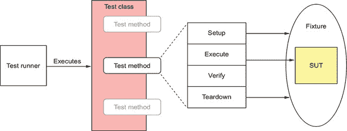
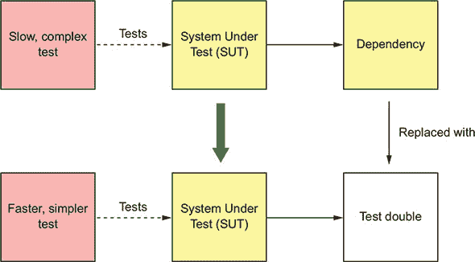
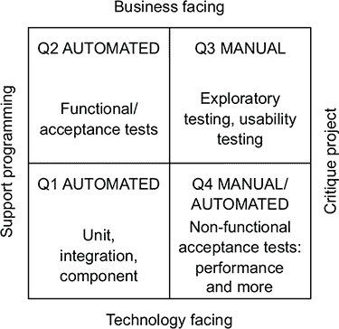
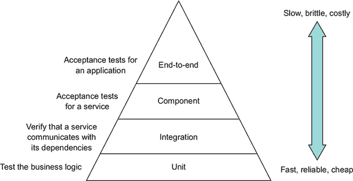
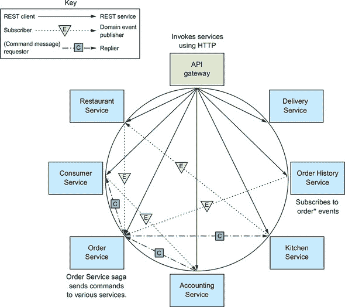
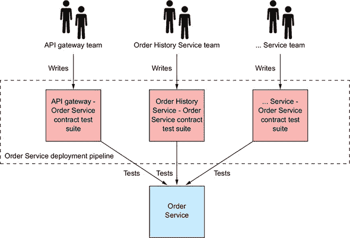
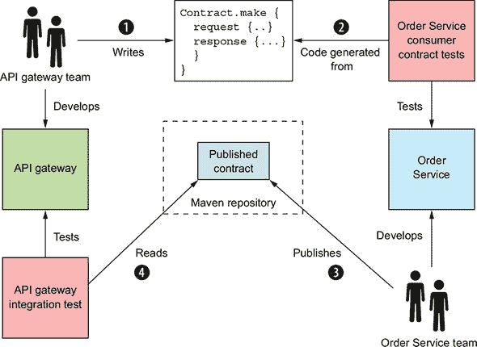
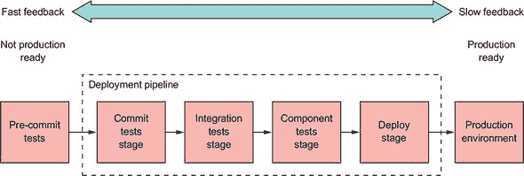
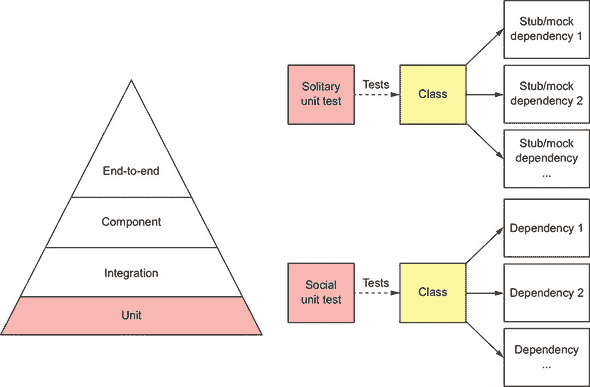
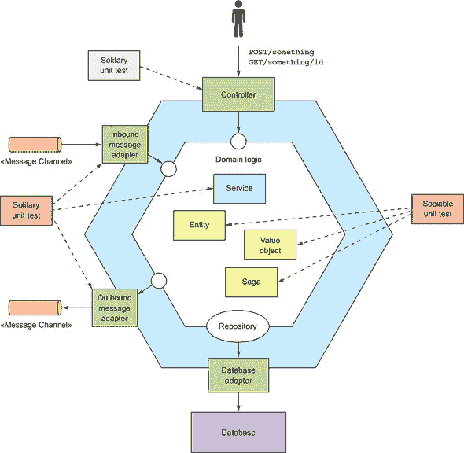

## 第九章。测试微服务：第一部分

**本章涵盖**

+   微服务的有效测试策略

+   使用模拟和存根来单独测试软件元素

+   使用测试金字塔来确定测试努力的焦点

+   在服务内部对类进行单元测试

FTGO，像许多组织一样，已经采用了一种传统的测试方法。**测试**主要是在开发之后进行的活动。FTGO 的开发者将他们的代码扔给 QA 团队，由他们验证软件是否按预期工作。更重要的是，他们的大部分测试都是手动进行的。遗憾的是，这种测试方法是有缺陷的——有两个原因：

+   **手动测试效率极低**—**你永远不应该要求人类去做机器能做得更好的事情。与机器相比，人类速度慢，不能 24/7 工作。如果你依赖手动测试，你将无法快速且安全地交付软件。编写自动化测试是至关重要的。**

+   **测试在交付过程中的进行时间太晚**—**当然，在应用程序编写完成后对应用程序进行批评性测试是有其作用的，但经验表明，这些测试是不够的。一个更好的方法是让开发者将自动化测试作为开发的一部分来编写。这提高了他们的生产力，因为例如，他们会有在编辑代码时提供即时反馈的测试。**

在这方面，FTGO 是一个相当典型的组织。《Sauce Labs 2018 年测试趋势报告》描绘了一个相当黯淡的测试自动化状态图景([`saucelabs.com/resources/white-papers/testing-trends-for-2018`](https://saucelabs.com/resources/white-papers/testing-trends-for-2018))。它描述了只有 26%的组织大部分是自动化的，而仅有微乎其微的 3%是完全自动化的！

对手动测试的依赖并不是因为缺乏工具和框架。例如，JUnit，一个流行的 Java 测试框架，最早在 1998 年发布。缺乏自动化测试的原因主要是文化上的：“测试是 QA 的工作”，“这不是开发者时间最好的使用方式”，等等。开发一个快速运行、有效且可维护的测试套件也是一个挑战。此外，一个典型的大型、单体应用程序非常难以测试。

使用微服务架构的一个关键动机，如第二章所述，是提高可测试性。然而，同时，微服务架构的复杂性要求你编写自动化测试。此外，测试微服务的一些方面具有挑战性。这是因为我们需要验证服务可以正确交互，同时最大限度地减少启动许多服务的缓慢、复杂和不可靠的全链路测试的数量。

本章是关于测试的两章中的第一章。它是测试的介绍。第十章涵盖了更高级的测试概念。这两章篇幅较长，但结合起来，它们涵盖了现代软件开发中至关重要的测试思想和技巧，特别是针对微服务架构。

我在本章的开头描述了针对基于微服务应用程序的有效测试策略。这些策略使你能够确信你的软件是有效的，同时最大限度地减少测试复杂性和执行时间。之后，我描述了如何为你的服务编写一种特定的测试：单元测试。第十章涵盖了其他类型的测试：集成、组件和端到端。

让我们从查看微服务的测试策略开始。

| |
| --- |

**为什么要介绍测试？**

你可能想知道为什么本章包括基本测试概念的介绍。如果你已经熟悉测试金字塔和不同类型的测试等概念，你可以快速阅读本章，然后继续阅读下一章，该章节专注于微服务特定的测试主题。但根据我为全球各地的客户咨询和培训的经验，许多软件开发组织的根本弱点是缺乏自动化测试。这是因为如果你想要快速且可靠地交付软件，进行自动化测试是**绝对必要的**。这是唯一能够缩短**前置时间**的方法，即把提交的代码放入生产所需的时间。也许更重要的是，自动化测试是必要的，因为它迫使你开发一个可测试的应用程序。通常，将自动化测试引入已经很大、很复杂的应用程序是非常困难的。换句话说，不编写自动化测试是通往单体地狱的快速途径。

| |
| --- |

### 9.1. 微服务架构的测试策略

假设你对 FTGO 应用程序的`Order Service`进行了更改。自然地，下一步是你运行你的代码并验证更改是否正确。一个选择是手动测试这个更改。首先，你运行`Order Service`及其所有依赖项，包括数据库和其他应用程序服务这样的基础设施服务。然后，通过调用其 API 或使用 FTGO 应用程序的用户界面来“测试”该服务。这种方法的不利之处在于，它是一种缓慢且手动的方式来测试你的代码。

一个更好的选择是拥有可以在开发过程中运行的自动化测试。你的开发工作流程应该是：编辑代码，运行测试（理想情况下只需按一个键），重复。快速运行的测试可以在几秒钟内快速告诉你你的更改是否有效。但是，你该如何编写快速运行的测试？它们是否足够，或者你需要更全面的测试？这些问题就是我在这章和其他章节中回答的问题。

我从这个部分开始，先概述一些重要的自动化测试概念。我们将探讨测试的目的和典型测试的结构。我涵盖了你需要编写的不同类型的测试。我还描述了测试金字塔，它提供了关于你应该在哪里集中测试努力的宝贵指导。在介绍测试概念之后，我将讨论测试微服务的策略。我们将探讨具有微服务架构的应用程序的独特挑战。我描述了你可以使用的技巧来编写更简单、更快，但仍然有效的微服务测试。

让我们来看看测试概念。

#### 9.1.1. 测试概述

在本章中，我的重点是自动化测试，我使用术语*测试*作为*自动化测试*的简称。维基百科将*测试用例*或测试定义为如下：

> *测试用例是为特定目标开发的测试输入、执行条件和预期结果的一组，例如，为了执行特定的程序路径或验证符合特定的要求。*
> 
> *[`en.wikipedia.org/wiki/Test_case`](https://en.wikipedia.org/wiki/Test_case)*

换句话说，测试的目的，如图 9.1 所示，是验证被测系统（SUT）的行为。在这个定义中，*系统*是一个术语，意味着正在测试的软件元素。它可能小到是一个类，大到是整个应用程序，或者介于两者之间，例如类簇或单个服务。相关测试的集合形成一个*测试套件*。

##### 图 9.1. 测试的目标是验证被测系统的行为。SUT（系统单元）可能小到是一个类，也可能大到是一个完整的应用程序。


让我们先看看自动化测试的概念。然后我将讨论你需要编写的不同类型的测试。之后，我将讨论测试金字塔，它描述了你应该编写的不同类型测试的相对比例。

##### 编写自动化测试

自动化测试通常使用测试框架编写。例如，JUnit 是一个流行的 Java 测试框架。图 9.2 显示了自动化测试的结构。每个测试都由一个属于测试类的测试方法实现。

##### 图 9.2. 每个自动化测试都由一个属于测试类的测试方法实现。一个测试包括四个阶段：*设置*，初始化测试固定装置，这是运行测试所需的一切；*执行*，调用 SUT；*验证*，验证测试的结果；以及*清理*，清理测试固定装置。



自动化测试通常由四个阶段组成([`xunitpatterns.com/Four%20Phase%20Test.html`](http://xunitpatterns.com/Four%20Phase%20Test.html))：

1.  ***设置*—** 初始化测试固定装置，该装置由 SUT 及其依赖项组成，到所需的初始状态。例如，创建正在测试的类并将其初始化到它需要展示所需行为的状态。

1.  ***执行*—** 调用 SUT——例如，在正在测试的类上调用一个方法。

1.  ***验证*—** 对调用的结果和 SUT 的状态进行断言。例如，验证方法的返回值和正在测试的类的新的状态。

1.  ***清理*—** 如果需要，清理测试固定装置。许多测试省略了这个阶段，但某些类型的数据库测试，例如，会回滚由设置阶段启动的事务。

为了减少代码重复并简化测试，测试类可能包含在测试方法之前运行的设置方法，以及在之后运行的清理方法。测试**套件**是一组测试类。测试由**测试运行器**执行。

##### 使用模拟和存根进行测试

SUT 通常有依赖项。依赖项的问题在于它们可能会使测试复杂化并减慢测试速度。例如，`OrderController`类调用`OrderService`，这最终依赖于许多其他应用程序服务和基础设施服务。通过运行系统的大部分内容来测试`OrderController`类并不实用。我们需要一种方法来单独测试 SUT。

如图 9.3 所示，解决方案是用测试替身替换 SUT 的依赖项。测试替身是一个模拟依赖项行为的对象。

##### 图 9.3。用测试替身替换依赖项使得可以单独测试 SUT。测试更简单，更快。



有两种类型的测试替身：存根和模拟。术语*存根*和*模拟*通常可以互换使用，尽管它们的行为略有不同。存根是一个向 SUT 返回值的测试替身。模拟是一个测试使用的测试替身，用于验证 SUT 是否正确调用了依赖项。此外，模拟通常也是一个存根。

在本章的后面部分，您将看到测试替身在实际中的应用示例。例如，第 9.2.5 节展示了如何通过使用`OrderService`类的测试替身来单独测试`OrderController`类。在那个例子中，`OrderService`测试替身是使用 Mockito 实现的，Mockito 是一个流行的 Java 模拟对象框架。第十章展示了如何使用测试替身测试`Order Service`，这些测试替身响应由`Order Service`发送的命令消息。

让我们现在看看不同的测试类型。

##### 测试的不同类型

存在许多不同类型的测试。一些测试，如性能测试和可用性测试，验证应用程序是否满足其服务质量要求。在本章中，我专注于验证应用程序或服务功能方面的自动化测试。我描述了如何编写四种不同类型的测试：

+   ***单元测试***—**测试服务的一个小部分，例如一个类。

+   ***集成测试***—**验证服务能否与基础设施服务（如数据库和其他应用程序服务）交互。

+   ***组件测试***—**对单个服务的验收测试。

+   ***端到端测试***—**对整个应用程序的验收测试。

它们在范围上主要有所不同。在光谱的一端是单元测试，它验证最小有意义的程序元素的行为。对于像 Java 这样的面向对象语言来说，这相当于一个类。在光谱的另一端是端到端测试，它验证整个应用程序的行为。在中间是组件测试，它测试单个服务。在第十章中，您将看到集成测试的范围相对较小，但它们比纯单元测试更复杂。范围只是描述测试的一种方式。另一种方式是使用测试象限。

|  |
| --- |

**编译时单元测试**

测试是开发的一个组成部分。现代开发工作流程是先编辑代码，然后运行测试。此外，如果您是测试驱动开发（TDD）的实践者，您将首先编写一个失败的测试，然后编写代码使其通过，以此来开发新功能或修复错误。即使您不是 TDD 的忠实信徒，编写一个可以重现错误的测试，然后编写修复它的代码，也是一个修复错误的绝佳方法。

作为此工作流程一部分运行的测试被称为*编译时*测试。在现代 IDE，如 IntelliJ IDEA 或 Eclipse 中，您通常不会将代码作为单独的步骤进行编译。相反，您使用单个按键来编译代码并运行测试。为了保持流程，这些测试需要快速执行——理想情况下，不超过几秒钟。

|  |
| --- |

##### 使用测试象限对测试进行分类

一种对测试进行分类的好方法是布赖恩·马里克（Brian Marick）的*测试象限*（[www.exampler.com/old-blog/2003/08/21/#agile-testing-project-1](http://www.exampler.com/old-blog/2003/08/21/#agile-testing-project-1)）。测试象限，如图 9.4 所示，沿两个维度对测试进行分类：

+   ***测试是面向业务还是面向技术***—**面向业务的测试使用领域专家的术语进行描述，而面向技术的测试使用开发者和实现的术语进行描述。

+   ***测试的目标是支持编程还是批评应用程序***—**开发者将支持编程的测试作为他们日常工作的一部分。批评应用程序的测试旨在识别需要改进的领域。

##### 图 9.4。测试象限根据两个维度对测试进行分类。第一个维度是测试是否面向业务或技术。第二个维度是测试的目的是支持编程还是评估应用程序。



测试象限定义了四种不同的测试类别：

+   ***Q1*—** 支持面向编程/技术：单元和集成测试

+   ***Q2*—** 支持面向编程/业务：组件和端到端测试

+   ***Q3*—** 评估面向应用/业务的：可用性和探索性测试

+   ***Q4*—** 评估面向应用/技术的：非功能性验收测试，例如性能测试

测试象限并不是组织测试的唯一方式。还有测试金字塔，它提供了关于需要编写多少种类型测试的指导。

##### 使用测试金字塔作为指导来集中测试努力

我们必须编写不同类型的测试，以确保我们的应用程序能够正常工作。然而，挑战在于测试的执行时间和复杂性与其范围成正比。此外，测试的范围越大，包含的移动部件越多，其可靠性就越低。不可靠的测试几乎和没有测试一样糟糕，因为如果你不相信一个测试，你很可能会忽略失败。

在光谱的一端是对单个类的单元测试。它们执行速度快，编写简单，且可靠。在光谱的另一端是对整个应用程序的端到端测试。这些测试通常很慢，难以编写，并且由于它们的复杂性，往往不可靠。由于我们开发和测试的预算是有限的，我们希望专注于编写范围小且不损害测试套件有效性的测试。

测试金字塔，如图 9.5 所示，是一个很好的指导([`martinfowler.com/bliki/TestPyramid.html`](https://martinfowler.com/bliki/TestPyramid.html))。金字塔的底部是快速、简单且可靠的单元测试。金字塔的顶部是缓慢、复杂且易碎的端到端测试。就像美国农业部食物金字塔一样，尽管更有用且争议较少([`en.wikipedia.org/wiki/History_of_USDA_nutrition_guides`](https://en.wikipedia.org/wiki/History_of_USDA_nutrition_guides))，测试金字塔描述了每种类型测试的相对比例。

##### 图 9.5。测试金字塔描述了需要编写的每种类型测试的相对比例。随着你向上移动金字塔，你应该编写越来越少的测试。



测试金字塔的关键思想是，随着我们向上移动金字塔，我们应该编写越来越少的测试。我们应该编写大量的单元测试和非常少的端到端测试。正如你将在本章中看到的，我描述了一种强调测试服务各个部分的策略。它甚至最小化了组件测试的数量，这些测试针对整个服务。

测试像`消费者服务`这样的单个微服务相对简单，因为它们不依赖于任何其他服务。但对于像`订单服务`这样的服务，它依赖于众多其他服务，我们该如何确保整个应用程序能够正常工作呢？这是测试具有微服务架构的应用程序的关键挑战。测试的复杂性已经从单个服务转移到它们之间的交互。让我们看看如何解决这个问题。

#### 9.1.2\. 测试微服务的挑战

在基于微服务的应用程序中，进程间通信比在单体应用程序中扮演着更加重要的角色。单体应用程序可能只与少数外部客户端和服务进行通信。例如，FTGO 应用程序的单体版本使用了一些第三方网络服务，如 Stripe 用于支付、Twilio 用于消息传递和 Amazon SES 用于电子邮件，它们都有稳定的 API。应用程序模块之间的任何交互都是通过基于编程语言的 API 进行的。进程间通信在应用程序的边缘非常明显。

相比之下，进程间通信在微服务架构中至关重要。基于微服务的应用程序是一个分布式系统。团队不断开发他们的服务并演进他们的 API。确保服务开发者编写的测试能够验证他们的服务与其依赖项和客户端的交互是至关重要的。

如第三章所述，服务之间使用各种交互样式和进程间通信（IPC）机制进行通信。一些服务使用基于请求/响应的交互，这种交互通过同步协议实现，例如 REST 或 gRPC。其他服务通过请求/异步回复或发布/订阅使用异步消息进行交互。例如，图 9.6 展示了 FTGO 应用中的一些服务是如何进行交互的。每个箭头都指向从消费者服务到生产者服务的方向。

##### 图 9.6\. FTGO 应用程序中的一些服务间通信。每个箭头都指向从消费者服务到生产者服务的方向。



箭头指向依赖的方向，从 API 的消费者到 API 的提供者。消费者对 API 的假设取决于交互的性质：

+   *REST 客户端* → *服务*—API 网关路由请求到服务并实现 API 组合。

+   *领域事件消费者* → *发布者*—`订单历史服务`消费由`订单服务`发布的事件。

+   *命令消息请求者* → *回复者*—`订单服务`向各种服务发送命令消息并消费回复。

两个服务之间的每次交互代表两个服务之间的协议或合同。例如，`Order History Service`和`Order Service`必须就事件消息结构和发布到的通道达成一致。同样，API 网关和这些服务必须就 REST API 端点达成一致。`Order Service`和它使用异步请求/响应调用的每个服务必须就命令通道和命令及回复消息的格式达成一致。

作为服务开发者，你需要确信你消费的服务具有稳定的 API。同样，你也不想无意中破坏你服务 API 的兼容性。例如，如果你正在开发`Order Service`，你想要确保你的服务依赖项（如`Consumer Service`和`Kitchen Service`）的开发者不会以与你的服务不兼容的方式更改他们的 API。同样，你必须确保你不会以破坏`API Gateway`或`Order History Service`的方式更改`Order Services`的 API。

验证两个服务可以交互的一种方法是在运行这两个服务的情况下，调用一个触发通信的 API，并验证它具有预期的结果。这肯定会捕获集成问题，但基本上是一个端到端测试。测试可能需要运行这些服务的许多其他传递依赖项。测试还可能需要调用复杂的高级功能，如业务逻辑，即使其目标是测试相对低级的 IPC。最好避免编写这样的端到端测试。我们 somehow 需要编写更快、更简单、更可靠的测试，理想情况下是独立测试服务。解决方案是使用所谓的*消费者驱动的合同测试*。

##### 消费者驱动的合同测试

假设你是第八章中描述的`API Gateway`团队的一员。第八章。`API Gateway`的`OrderServiceProxy`调用各种 REST 端点，包括`GET /orders/{orderId}`端点。我们编写测试以验证`API Gateway`和`Order Service`是否就 API 达成一致至关重要。在消费者合同测试的术语中，这两个服务参与一个*消费者-提供者关系*。`API Gateway`是消费者，而`Order Service`是提供者。消费者合同测试是对提供者（如`Order Service`）的集成测试，它验证其 API 是否符合消费者的期望，例如`API Gateway`。

消费者合同测试专注于验证提供者 API 的“形状”是否符合消费者的期望。对于一个 REST 端点，合同测试验证提供者实现了一个端点，该端点

+   具有预期的 HTTP 方法和路径

+   如果有的话，接受预期的头信息

+   如果有的话，接受请求正文

+   返回包含预期状态码、头信息和正文的响应

重要的是要记住，合同测试并不彻底测试提供者的业务逻辑。这是单元测试的工作。稍后，您将看到消费者合同测试实际上是模拟控制器测试。

开发消费者产品的团队编写一个合同测试套件，并将其（例如，通过拉取请求）添加到提供者的测试套件中。调用`Order Service`的其他服务的开发者也会贡献一个测试套件，如图 9.7 所示。每个测试套件将测试`Order Service` API 与每个消费者相关的方面。例如，`Order History Service`的测试套件会验证`Order Service`是否发布了预期的事件。

##### 图 9.7。每个开发消费`Order Service` API 服务的团队贡献一个合同测试套件。该测试套件验证 API 是否符合消费者的期望。这个测试套件，以及其他团队贡献的测试套件，由`Order Service`的部署管道运行。



这些测试套件由`Order Service`的部署管道执行。如果消费者合同测试失败，则该失败会告知生产团队他们对 API 进行了破坏性更改。他们必须修复 API 或与消费者团队沟通。

| |
| --- |

**模式：消费者驱动的合同测试**

验证服务是否满足其客户端的期望，请参阅[`microservices.io/patterns/testing/service-integration-contract-test.html`](http://microservices.io/patterns/testing/service-integration-contract-test.html)。

| |
| --- |

消费者驱动的合同测试通常使用示例测试。消费者和提供者之间的交互由一组示例定义，称为合同。每个*合同*包含在一次交互过程中交换的示例消息。例如，一个 REST API 的合同包含一个示例 HTTP 请求和响应。表面上，使用例如 OpenAPI 或 JSON schema 编写的模式来定义交互可能看起来更好。但事实证明，当编写测试时，模式并不那么有用。测试可以使用模式验证响应，但仍需要使用示例请求调用提供者。

此外，消费者测试还需要示例响应。这是因为尽管消费者驱动的合同测试的重点是测试提供者，但合同也用于验证消费者是否符合合同。例如，一个 REST 客户端的消费者端合同测试使用合同配置一个 HTTP 存根服务，该服务验证 HTTP 请求是否与合同的请求匹配，并发回合同的 HTTP 响应。测试交互的双方确保消费者和提供者对 API 达成一致。稍后我们将探讨如何编写此类测试的示例，但首先让我们看看如何使用 Spring Cloud Contract 编写消费者合同测试。

| |
| --- |

**模式：消费者端合同测试**

验证服务客户端能否与该服务通信。请参阅 [`microservices.io/patterns/testing/consumer-side-contract-test.html`](https://microservices.io/patterns/testing/consumer-side-contract-test.html)。

|  |
| --- |

##### 使用 Spring Cloud Contract 测试服务

两个流行的合同测试框架是 Spring Cloud Contract ([`cloud.spring.io/spring-cloud-contract/`](https://cloud.spring.io/spring-cloud-contract/))，这是一个针对 Spring 应用的消费者合同测试框架，以及 Pact 框架家族([`github.com/pact-foundation`](https://github.com/pact-foundation))，它支持多种语言。FTGO 应用程序是一个基于 Spring 框架的应用程序，因此在本章中，我将介绍如何使用 Spring Cloud Contract。它提供了一种 Groovy 领域特定语言 (DSL) 用于编写合同。每个合同都是一个消费者和提供者之间交互的具体示例，例如 HTTP 请求和响应。Spring Cloud Contract 代码为提供者生成合同测试。它还配置了模拟，例如模拟 HTTP 服务器，用于消费者集成测试。

假设您正在处理 `API Gateway` 并想为 `Order Service` 编写一个消费者合同测试。 显示了此过程，需要您与 `Order Service` 团队协作。您编写定义 `API Gateway` 如何与 `Order Service` 交互的合同。`Order Service` 团队使用这些合同来测试 `Order Service`，而您使用它们来测试 `API Gateway`。步骤顺序如下：

1.  您编写一个或多个合同，例如 列表 9.1 中所示。每个合同由 `API Gateway` 可能发送给 `Order Service` 的 HTTP 请求和预期的 HTTP 响应组成。您通过 Git pull 请求等方式将这些合同提供给 `Order Service` 团队。

1.  `Order Service` 团队使用消费者合同测试来测试 `Order Service`，这些测试由 Spring Cloud Contract 代码从合同生成。

    ##### 图 9.8\. `API Gateway` 团队编写合同。`Order Service` 团队使用这些合同来测试 `Order Service` 并将它们发布到存储库。`API Gateway` 团队使用发布的合同来测试 `API Gateway`。

    

1.  `Order Service` 团队将测试 `Order Service` 的合同发布到 Maven 存储库。

1.  您使用发布的合同来编写 `API Gateway` 的测试。

由于您使用发布的合同测试 `API Gateway`，您可以确信它与已部署的 `Order Service` 兼容。

合同是这个测试策略的关键部分。以下列表显示了一个示例 Spring Cloud Contract。它由一个 HTTP 请求和一个 HTTP 响应组成。

##### 列表 9.1\. 描述 `API Gateway` 如何调用 `Order Service` 的合同

```
org.springframework.cloud.contract.spec.Contract.make {
    request {                                             *1*
        method 'GET'
        url '/orders/1223232'
    }
    response {                                            *2*
        status 200
        headers {
            header('Content-Type': 'application/json;charset=UTF-8')
        }
        body("{ ... }")
    }
}
```

+   ***1* HTTP 请求的方法和路径**

+   ***2* HTTP 响应的状态码、头和正文**

请求元素是对 REST 端点`GET /orders/{orderId}`的 HTTP 请求。响应元素是描述`API Gateway`期望的`Order`的 HTTP 响应。Groovy 合同是提供者代码库的一部分。每个消费者团队编写合同来描述他们的服务如何与提供者交互，并通过 Git 拉取请求，可能提供给提供者团队。提供者团队负责将合同打包成 JAR 文件，并发布到 Maven 仓库。消费者端测试从仓库下载 JAR 文件。

每个合同的请求和响应都扮演着测试数据和预期行为规范的双重角色。在消费者端测试中，合同被用来配置一个存根，这类似于 Mockito 模拟对象，并模拟`Order Service`的行为。它使得可以在不运行`Order Service`的情况下测试`API Gateway`。在提供者端测试中，生成的测试类使用合同的请求调用提供者，并验证它返回的响应与合同的响应相匹配。下一章将讨论如何使用 Spring Cloud Contract 的详细情况，但现在我们将看看如何使用消费者合同测试来测试消息 API。

##### 消息 API 的消费者合同测试

REST 客户端并不是唯一对提供者 API 有期望的消费者类型。订阅领域事件并使用基于异步请求/响应通信的服务也是消费者。它们消费其他服务的消息 API，并对该 API 的性质做出假设。我们也必须为这些服务编写消费者合同测试。

Spring Cloud Contract 还提供了对基于消息交互的测试支持。合同的结构和测试如何使用它取决于交互的类型。领域事件发布的合同由一个示例领域事件组成。提供者测试导致提供者发出事件，并验证它是否与合同的事件匹配。消费者测试验证消费者能否处理该事件。在下一章中，我将描述一个示例测试。

异步请求/响应交互的合同类似于 HTTP 合同。它由一个请求消息和一个响应消息组成。提供者测试使用合同的请求消息调用 API，并验证响应是否与合同的响应匹配。消费者测试使用合同配置一个存根订阅者，该订阅者监听合同的请求消息，并以指定的响应进行回复。下一章将讨论一个示例测试。但在那之前，我们将看看运行这些和其他测试的部署管道。

#### 9.1.3. 部署管道

每个服务都有一个部署管道。Jez Humble 的书籍《持续交付》（Addison-Wesley，2010）将**部署管道**描述为将代码从开发者的桌面自动部署到生产环境的自动化过程。如图 9.9 所示，它由一系列执行测试套件的阶段组成，随后是一个发布或部署服务的阶段。理想情况下，它是完全自动化的，但它可能包含手动步骤。部署管道通常使用持续集成（CI）服务器，如 Jenkins 来实现。

##### 图 9.9\. `Order Service`的示例部署管道。它由一系列阶段组成。在提交代码之前，开发者会运行预提交测试。其余阶段由自动化工具执行，例如 Jenkins CI 服务器。



随着代码通过管道流动，测试套件在更类似生产环境的环境中对其进行越来越彻底的测试。同时，每个测试套件的执行时间通常会增加。目的是尽可能快速地提供关于测试失败的反馈。

如图 9.9 所示的示例部署管道包括以下阶段：

+   ***预提交测试阶段*—** 运行单元测试。这是在开发者提交更改之前执行的。

+   ***提交测试阶段*—** 编译服务，运行单元测试，并执行静态代码分析。

+   ***集成测试阶段*—** 运行集成测试。

+   ***组件测试阶段*—** 运行服务的组件测试。

+   ***部署阶段*—** 将服务部署到生产环境中。

当开发者提交更改时，CI 服务器会运行提交阶段。它执行得非常快，因此可以快速提供关于提交的反馈。后续阶段运行时间更长，提供的即时反馈较少。如果所有测试都通过，最终阶段就是将此管道部署到生产环境中。

在这个例子中，从提交到部署的整个部署管道是完全自动化的。然而，有些情况下需要手动步骤。例如，你可能需要一个手动测试阶段，比如预发布环境。在这种情况下，代码在测试人员点击按钮表示成功后进入下一阶段。或者，对于本地产品，部署管道会发布服务的新版本。稍后，发布的服务会被打包成产品版本并发送给客户。

现在我们已经了解了部署管道的组织结构和它执行不同类型测试的时间，让我们来看看测试金字塔的底部，看看如何为服务编写单元测试。

### 9.2\. 为服务编写单元测试

假设你想编写一个测试来验证 FTGO 应用的`Order Service`正确计算`Order`的小计。你可以编写运行`Order Service`、调用其 REST API 创建`Order`并检查 HTTP 响应包含预期值的测试。这种方法的一个缺点是测试既复杂又慢。如果这些测试是`Order`类的编译时测试，你会浪费很多时间等待它完成。一个更有效的方法是为`Order`类编写单元测试。

如图 9.10 所示，单元测试是测试金字塔的最低层。它们是面向技术的测试，支持开发。单元测试验证一个*单元*（服务的一个非常小的部分）是否正确工作。一个单元通常是类，因此单元测试的目标是验证它是否按预期行为。

##### 图 9.10。单元测试是金字塔的基础。它们运行速度快，易于编写，且可靠。一个独立的单元测试在隔离的情况下测试一个类，使用模拟或存根来处理其依赖项。一个社交单元测试测试一个类及其依赖项。



有两种类型的单元测试([`martinfowler.com/bliki/UnitTest.html`](https://martinfowler.com/bliki/UnitTest.html))：

+   ***独立单元测试*—** 使用模拟对象对类的依赖项进行隔离测试

+   ***社交单元测试*—** 测试一个类及其依赖项

类的责任及其在架构中的作用决定了使用哪种类型的测试。图 9.11 展示了典型服务的六边形架构以及为每种类通常使用的单元测试类型。控制器和服务类通常使用独立单元测试进行测试。领域对象，如实体和价值对象，通常使用社交单元测试进行测试。

##### 图 9.11。一个类的责任决定了是否使用独立或社交单元测试。



每个类典型的测试策略如下：

+   实体，如`Order`，如第五章所述（kindle_split_013.xhtml#ch05）是具有持久身份的对象，使用社交单元测试进行测试。

+   值对象，如`Money`，如第五章所述（kindle_split_013.xhtml#ch05）是值的集合，使用社交单元测试进行测试。

+   传奇，如`CreateOrderSaga`，如第四章所述（kindle_split_012.xhtml#ch04），在服务之间维护数据一致性，使用社交单元测试进行测试。

+   领域服务，如`OrderService`，如第五章所述（kindle_split_013.xhtml#ch05）是实现不属于实体或值对象的业务逻辑的类，使用独立单元测试进行测试。

+   处理 HTTP 请求的控制器，如`OrderController`，使用独立单元测试进行测试。

+   输入和输出消息网关使用单独的单元测试进行测试。

让我们先看看如何测试实体。

#### 9.2.1\. 为实体开发单元测试

下面的列表显示了 `OrderTest` 类的摘录，该类实现了 `Order` 实体的单元测试。该类有一个 `@Before setUp()` 方法，在运行每个测试之前创建一个 `Order`。它的 `@Test` 方法可能会进一步初始化 `Order`，调用其方法之一，然后对返回值和 `Order` 的状态进行断言。

##### 列表 9.2\. 对 `Order` 实体的一个简单、快速运行的单元测试

```
public class OrderTest {

  private ResultWithEvents<Order> createResult;
  private Order order;

  @Before
  public void setUp() throws Exception {
    createResult = Order.createOrder(CONSUMER_ID, AJANTA_ID, CHICKEN_VINDALOO
     _LINE_ITEMS);
    order = createResult.result;
  }

  @Test
  public void shouldCalculateTotal() {
    assertEquals(CHICKEN_VINDALOO_PRICE.multiply(CHICKEN_VINDALOO_QUANTITY),
     order.getOrderTotal());
  }

  ...

}
```

`@Test shouldCalculateTotal()` 方法验证 `Order.getOrderTotal()` 返回预期的值。单元测试彻底测试了业务逻辑。它们是针对 `Order` 类及其依赖项的社交单元测试。你可以将它们用作编译时测试，因为它们执行得非常快。`Order` 类依赖于 `Money` 值对象，因此测试该类也很重要。让我们看看如何进行这项测试。

#### 9.2.2\. 编写值对象的单元测试

值对象是不可变的，因此它们通常很容易测试。你不必担心副作用。值对象的测试通常创建一个处于特定状态的值对象，调用其方法之一，并对返回值进行断言。列表 9.3 显示了 `Money` 值对象的测试，它是一个表示货币值的简单类。这些测试验证了 `Money` 类的方法的行为，包括 `add()` 方法，它将两个 `Money` 对象相加，以及 `multiply()` 方法，它将一个 `Money` 对象乘以一个整数。它们是单独的测试，因为 `Money` 类不依赖于任何其他应用程序类。

##### 列表 9.3\. 对 `Money` 值对象的一个简单、快速运行的测试

```
public class MoneyTest {

  private final int M1_AMOUNT = 10;
  private final int M2_AMOUNT = 15;

  private Money m1 = new Money(M1_AMOUNT);
  private Money m2 = new Money(M2_AMOUNT);

  @Test
  public void shouldAdd() {                                       *1*
     assertEquals(new Money(M1_AMOUNT + M2_AMOUNT), m1.add(m2));
  }

  @Test
  public void shouldMultiply() {                                  *2*
    int multiplier = 12;
    assertEquals(new Money(M2_AMOUNT * multiplier), m2.multiply(multiplier));
  }

  ...
}
```

+   ***1* 验证两个 Money 对象可以相加。**

+   ***2* 验证一个 Money 对象可以乘以一个整数。**

实体和值对象是服务业务逻辑的构建块。但一些业务逻辑也存在于服务的 sagas 和服务中。让我们看看如何测试这些内容。

#### 9.2.3\. 为 sagas 开发单元测试

一个 saga，例如 `CreateOrderSaga` 类，实现了重要的业务逻辑，因此需要对其进行测试。它是一个持久对象，向 saga 参与者发送命令消息并处理它们的回复。如 第四章 所述，`CreateOrderSaga` 与多个服务（如 `Consumer Service` 和 `Kitchen Service`）交换命令/回复消息。对这个类的测试创建了一个 saga 并验证它向 saga 参与者发送了预期的消息序列。你需要编写的一个测试是针对快乐路径的测试。你还必须编写针对 saga 因为 saga 参与者发送了失败消息而回滚的各种场景的测试。

一种方法可能是编写使用真实数据库和消息代理以及模拟来模拟各种传说参与者的测试。例如，`Consumer Service` 的模拟会订阅 `consumerService` 命令通道并发送所需的回复消息。但使用这种方法编写的测试会相当慢。一个更有效的方法是编写模拟与数据库和消息代理交互的类的测试。这样，我们可以专注于测试传说的核心职责。

列表 9.4 展示了对 `CreateOrderSaga` 的测试。这是一个社交单元测试，用于测试传说类及其依赖项。它使用 Eventuate Tram Saga 测试框架编写（[`github.com/eventuate-tram/eventuate-tram-sagas`](https://github.com/eventuate-tram/eventuate-tram-sagas)）。此框架提供了一个易于使用的 DSL，它抽象化了与传说交互的细节。使用此 DSL，您可以创建一个传说并验证它是否发送了正确的命令消息。在底层，传说测试框架使用数据库和消息基础设施的模拟配置了传说框架。

##### 列表 9.4\. 对 `CreateOrderSaga` 的简单、快速运行的单元测试

```
public class CreateOrderSagaTest {

  @Test
  public void shouldCreateOrder() {
    given()
        .saga(new CreateOrderSaga(kitchenServiceProxy),                *1*
                 new CreateOrderSagaState(ORDER_ID,
                            CHICKEN_VINDALOO_ORDER_DETAILS)).
    expect().                                                          *2*
         command(new ValidateOrderByConsumer(CONSUMER_ID, ORDER_ID,
                CHICKEN_VINDALOO_ORDER_TOTAL)).
        to(ConsumerServiceChannels.consumerServiceChannel).
    andGiven().
        successReply().                                                *3*
     expect().
          command(new CreateTicket(AJANTA_ID, ORDER_ID, null)).        *4*
           to(KitchenServiceChannels.kitchenServiceChannel);
  }

  @Test
  public void shouldRejectOrderDueToConsumerVerificationFailed() {
    given()
        .saga(new CreateOrderSaga(kitchenServiceProxy),
                new CreateOrderSagaState(ORDER_ID,
                           CHICKEN_VINDALOO_ORDER_DETAILS)).
    expect().
        command(new ValidateOrderByConsumer(CONSUMER_ID, ORDER_ID,
                CHICKEN_VINDALOO_ORDER_TOTAL)).
        to(ConsumerServiceChannels.consumerServiceChannel).
    andGiven().
        failureReply().                                                *5*
     expect().
        command(new RejectOrderCommand(ORDER_ID)).
        to(OrderServiceChannels.orderServiceChannel);                  *6*
   }

}
```

+   ***1* 创建传说。**

+   ***2* 验证它是否向消费者服务发送了 ValidateOrderByConsumer 消息。**

+   ***3* 向该消息发送一个成功回复。**

+   ***4* 验证它是否向厨房服务发送了 CreateTicket 消息。**

+   ***5* 发送一个失败回复，表明消费者服务拒绝了订单。**

+   ***6* 验证传说是否向订单服务发送了 RejectOrderCommand 消息。**

`@Test shouldCreateOrder()` 方法测试了快乐路径。`@Test shouldRejectOrderDueToConsumerVerificationFailed()` 方法测试了消费者服务拒绝订单的场景。它验证了 `CreateOrderSaga` 向消费者被拒绝进行补偿发送了 `RejectOrderCommand`。`CreateOrderSagaTest` 类有测试其他失败场景的方法。

现在我们来看如何测试领域服务。

#### 9.2.4\. 编写领域服务的单元测试

服务的大部分业务逻辑是由实体、值对象和传说实现的。例如，`OrderService` 类这样的领域服务类实现了其余部分。这是一个典型的领域服务类。它的方法调用实体和存储库并发布领域事件。测试此类的一个有效方法是使用主要孤立的单元测试，该测试模拟了存储库和消息类等依赖项。

列表 9.5 展示了测试 `OrderService` 的 `OrderServiceTest` 类。它定义了孤立的单元测试，使用 Mockito 模拟服务依赖项。每个测试按照以下方式实现测试阶段：

1.  ***设置*—** 配置服务的依赖项的模拟对象

1.  ***执行*—** 调用服务方法

1.  ***验证*—** 验证服务方法返回的值是否正确，以及依赖项是否已正确调用

##### 列表 9.5\. `OrderService` 类的一个简单、快速运行的单元测试

```
public class OrderServiceTest {

  private OrderService orderService;
  private OrderRepository orderRepository;
  private DomainEventPublisher eventPublisher;
  private RestaurantRepository restaurantRepository;
  private SagaManager<CreateOrderSagaState> createOrderSagaManager;
  private SagaManager<CancelOrderSagaData> cancelOrderSagaManager;
  private SagaManager<ReviseOrderSagaData> reviseOrderSagaManager;

  @Before
  public void setup() {
    orderRepository = mock(OrderRepository.class);                         *1*
     eventPublisher = mock(DomainEventPublisher.class);
    restaurantRepository = mock(RestaurantRepository.class);
    createOrderSagaManager = mock(SagaManager.class);
    cancelOrderSagaManager = mock(SagaManager.class);
    reviseOrderSagaManager = mock(SagaManager.class);
    orderService = new OrderService(orderRepository, eventPublisher,       *2*
             restaurantRepository, createOrderSagaManager,
            cancelOrderSagaManager, reviseOrderSagaManager);
  }

  @Test
  public void shouldCreateOrder() {
    when(restaurantRepository                                              *3*
       .findById(AJANTA_ID)).thenReturn(Optional.of(AJANTA_RESTAURANT_);
    when(orderRepository.save(any(Order.class))).then(invocation -> {      *4*
       Order order = (Order) invocation.getArguments()[0];
      order.setId(ORDER_ID);
      return order;
    });

    Order order = orderService.createOrder(CONSUMER_ID,                    *5*
                     AJANTA_ID, CHICKEN_VINDALOO_MENU_ITEMS_AND_QUANTITIES);

    verify(orderRepository).save(same(order));                             *6*

    verify(eventPublisher).publish(Order.class, ORDER_ID,                  *7*
             singletonList(
                 new OrderCreatedEvent(CHICKEN_VINDALOO_ORDER_DETAILS)));

    verify(createOrderSagaManager)                                         *8*
           .create(new CreateOrderSagaState(ORDER_ID,
                       CHICKEN_VINDALOO_ORDER_DETAILS),
                  Order.class, ORDER_ID);
  }

}
```

+   ***1* 为 OrderService 的依赖项创建 Mockito 模拟。**

+   ***2* 创建一个注入了模拟依赖的 OrderService。**

+   ***3* 配置 RestaurantRepository.findById() 以返回 Ajanta 餐厅。**

+   ***4* 配置 OrderRepository.save() 以设置订单的 ID。**

+   ***5* 调用 OrderService.create()。**

+   ***6* 验证 OrderService 是否已将新创建的订单保存到数据库中。**

+   ***7* 验证 OrderService 是否发布了 OrderCreatedEvent。**

+   ***8* 验证 OrderService 是否创建了一个 CreateOrderSaga。**

`setUp()` 方法创建了一个注入了模拟依赖的 `OrderService`。`@Test shouldCreateOrder()` 方法验证 `OrderService.createOrder()` 是否调用了 `OrderRepository` 来保存新创建的 `Order`，发布了一个 `OrderCreatedEvent`，并创建了一个 `CreateOrderSaga`。

现在我们已经看到了如何对领域逻辑类进行单元测试，接下来让我们看看如何对与外部系统交互的适配器进行单元测试。

#### 9.2.5\. 开发控制器的单元测试

例如 `Order Service` 这样的服务通常有一个或多个控制器来处理来自其他服务和 API 网关的 HTTP 请求。控制器类由一组请求处理方法组成。每个方法实现一个 REST API 端点。方法参数代表 HTTP 请求中的值，例如路径变量。它通常调用领域服务或存储库并返回一个响应对象。例如，`OrderController` 调用 `OrderService` 和 `OrderRepository`。对于控制器，一个有效的测试策略是单独的单元测试，模拟服务和存储库。

你可以编写一个类似于 `OrderServiceTest` 类的测试类来实例化一个控制器类并调用其方法。但这种方法无法测试一些重要的功能，例如请求路由。使用模拟 MVC 测试框架，例如 Spring Mock Mvc，它属于 Spring 框架的一部分，或者基于 Spring Mock Mvc 的 Rest Assured Mock MVC，效果会更好。使用这些框架编写的测试会模拟 HTTP 请求并对 HTTP 响应进行断言。这些框架使你能够在不进行实际网络调用的情况下测试 HTTP 请求路由以及 Java 对象与 JSON 之间的转换。在底层，Spring Mock Mvc 仅实例化了足够的 Spring MVC 类以实现这一点。

|  |
| --- |

**这真的是单元测试吗？**

由于这些测试使用 Spring 框架，你可能会认为它们不是单元测试。它们当然比我之前描述的单元测试更重量级。Spring Mock Mvc 文档将这些测试称为出 Servlet 容器集成测试（[`docs.spring.io/spring/docs/current/spring-framework-reference/testing.html#spring-mvc-test-vs-end-to-end-integration-tests`](https://docs.spring.io/spring/docs/current/spring-framework-reference/testing.html#spring-mvc-test-vs-end-to-end-integration-tests)）。然而，Rest Assured Mock MVC 将这些测试描述为单元测试（[`github.com/rest-assured/rest-assured/wiki/Usage#spring-mock-mvc-module`](https://github.com/rest-assured/rest-assured/wiki/Usage#spring-mock-mvc-module)）。无论术语上的争论如何，这些都是重要的测试。

|  |
| --- |

列表 9.6 展示了 `OrderControllerTest` 类，它测试 `Order Service` 的 `OrderController`。它定义了使用 `OrderController` 依赖项的模拟的独立单元测试。它使用 Rest Assured Mock MVC 编写，它提供了一个简单的 DSL，可以抽象出与控制器交互的细节。Rest Assured 使得向控制器发送模拟 HTTP 请求并验证响应变得容易。`OrderControllerTest` 创建了一个控制器，该控制器注入了 Mockito 模拟的 `OrderService` 和 `OrderRepository`。每个测试配置模拟，发送 HTTP 请求，验证响应是否正确，并可能验证控制器是否调用了模拟。

##### 列表 9.6\. `OrderController` 类的一个简单、快速运行的单元测试

```
public class OrderControllerTest {

  private OrderService orderService;
  private OrderRepository orderRepository;

  @Before
  public void setUp() throws Exception {
    orderService = mock(OrderService.class);                            *1*
    orderRepository = mock(OrderRepository.class);
    orderController = new OrderController(orderService, orderRepository);
  }

  @Test
  public void shouldFindOrder() {

    when(orderRepository.findById(1L))
          .thenReturn(Optional.of(CHICKEN_VINDALOO_ORDER_);             *2*

    given().
      standaloneSetup(configureControllers(                             *3*
               new OrderController(orderService, orderRepository))).
    when().
            get("/orders/1").                                           *4*
    then().
      statusCode(200).                                                  *5*
       body("orderId",                                                  *6*
            equalTo(new Long(OrderDetailsMother.ORDER_ID).intValue())).
      body("state",
           equalTo(OrderDetailsMother.CHICKEN_VINDALOO_ORDER_STATE.name())).
      body("orderTotal",
          equalTo(CHICKEN_VINDALOO_ORDER_TOTAL.asString()))
    ;
  }

  @Test
  public void shouldFindNotOrder() { ... }

  private StandaloneMockMvcBuilder controllers(Object... controllers) { ... }

}
```

+   ***1* 为 OrderController 的依赖项创建模拟。**

+   ***2* 配置模拟的 OrderRepository 返回一个订单。**

+   ***3* 配置 OrderController。**

+   ***4* 发送 HTTP 请求。**

+   ***5* 验证响应状态码。**

+   ***6* 验证 JSON 响应体的元素。**

`shouldFindOrder()` 测试方法首先配置 `OrderRepository` 模拟以返回一个 `Order`。然后它发送一个 HTTP 请求以检索订单。最后，它检查请求是否成功，以及响应体是否包含预期的数据。

控制器不是唯一处理外部系统请求的适配器。还有事件/消息处理器，让我们谈谈如何对这些进行单元测试。

#### 9.2.6\. 编写事件和消息处理器的单元测试

服务通常处理外部系统发送的消息。例如，`Order Service` 有 `OrderEventConsumer`，这是一个消息适配器，用于处理其他服务发布的领域事件。像控制器一样，消息适配器通常是简单的类，调用领域服务。消息适配器的每个方法通常都会调用一个服务方法，并使用消息或事件中的数据。

我们可以使用与单元测试控制器类似的方法来单元测试消息适配器。每个测试实例化消息适配器，向通道发送消息，并验证服务模拟是否被正确调用。然而，在幕后，消息基础设施被模拟，因此没有涉及任何消息代理。让我们看看如何测试 `OrderEventConsumer` 类。

列表 9.7 展示了 `OrderEventConsumerTest` 类的一部分，该类测试 `OrderEventConsumer`。它验证 `OrderEventConsumer` 将每个事件路由到适当的手动方法，并正确调用 `OrderService`。该测试使用 Eventuate Tram Mock Messaging 框架，该框架提供了一个易于使用的 DSL，用于编写与 Rest Assured 相同的给定-当-然后格式模拟消息测试。每个测试实例化 `OrderEventConsumer`，注入模拟 `OrderService`，发布一个领域事件，并验证 `OrderEventConsumer` 是否正确调用服务模拟。

##### 列表 9.7\. `OrderEventConsumer` 类的快速运行的单元测试

```
public class OrderEventConsumerTest {

  private OrderService orderService;
  private OrderEventConsumer orderEventConsumer;

  @Before
  public void setUp() throws Exception {
    orderService = mock(OrderService.class);
    orderEventConsumer = new OrderEventConsumer(orderService);            *1*
  }

  @Test
  public void shouldCreateMenu() {

    given().
            eventHandlers(orderEventConsumer.domainEventHandlers()).      *2*
    when().
      aggregate("net.chrisrichardson.ftgo.restaurantservice.domain.Restaurant",
                AJANTA_ID).
      publishes(new RestaurantCreated(AJANTA_RESTAURANT_NAME,             *3*
                          RestaurantMother.AJANTA_RESTAURANT_MENU))
    then().
       verify(() -> {                                                     *4*
          verify(orderService)
                .createMenu(AJANTA_ID,
            new RestaurantMenu(RestaurantMother.AJANTA_RESTAURANT_MENU_ITEMS));
       })
    ;
  }

}
```

+   ***1* 使用模拟依赖项实例化 OrderEventConsumer。**

+   ***2* 配置 OrderEventConsumer 领域处理器。**

+   ***3* 发布一个 RestaurantCreated 事件。**

+   ***4* 验证 OrderEventConsumer 是否调用了 OrderService.createMenu().**

`setUp()` 方法创建了一个注入了模拟 `OrderService` 的 `OrderEventConsumer`。`shouldCreateMenu()` 方法发布了一个 `RestaurantCreated` 事件，并验证 `OrderEventConsumer` 调用了 `OrderService.createMenu()`。`OrderEventConsumerTest` 类和其他单元测试类执行得非常快。单元测试只需几秒钟就能完成。

但单元测试并没有验证服务，例如 `Order Service`，是否与其他服务正确交互。例如，单元测试没有验证 `Order` 是否可以持久化到 MySQL。也没有验证 `CreateOrderSaga` 是否以正确的格式向正确的消息通道发送命令消息。而且它们也没有验证 `OrderEventConsumer` 处理的 `RestaurantCreated` 事件的结构与 `Restaurant Service` 发布的事件相同。为了验证服务是否正确与其他服务交互，我们必须编写集成测试。我们还需要编写组件测试，以单独测试整个服务。下一章将讨论如何进行这些类型的测试，以及端到端测试。

### 摘要

+   自动化测试是快速、安全交付软件的关键基础。更重要的是，由于其固有的复杂性，为了充分利用微服务架构，您 *必须* 自动化您的测试。

+   测试的目的是验证被测试系统（SUT）的行为。在这个定义中，“系统”是一个术语，意味着正在测试的软件元素。它可能小到是一个类，大到是整个应用程序，或者介于两者之间，比如一组类或一个单独的服务。相关测试的集合形成一个测试套件。

+   简化并加速测试的一个好方法是使用测试替身。测试替身是一个模拟 SUT（系统单元）依赖行为的对象。测试替身有两种类型：存根和模拟。存根是一种测试替身，它向 SUT 返回值。模拟是一种测试替身，测试用它来验证 SUT 是否正确调用了依赖。

+   使用测试金字塔来确定为您的服务集中测试努力的地方。您的大多数测试应该是快速、可靠且易于编写的单元测试。您必须最小化端到端测试的数量，因为它们运行缓慢、脆弱，且编写起来耗时。
