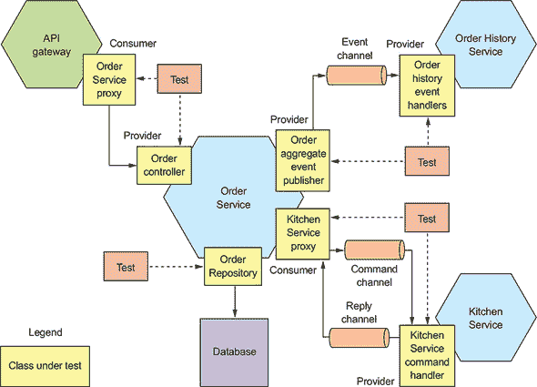
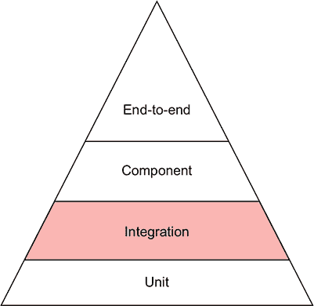
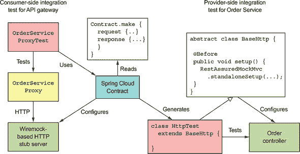
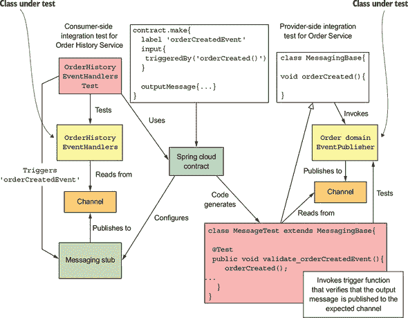
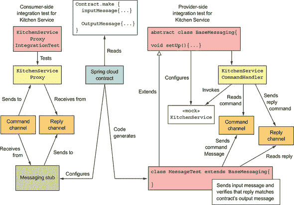
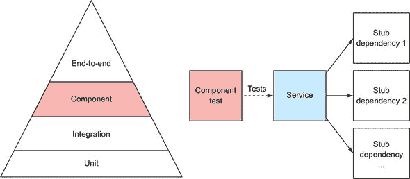
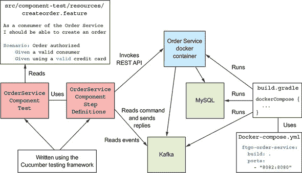
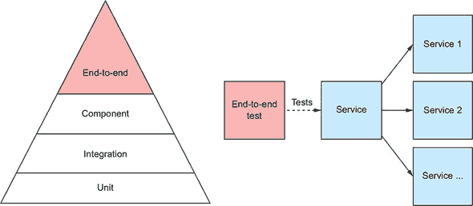

## 第十章。测试微服务：第二部分

*本章涵盖*

+   隔离测试服务的技巧

+   使用消费者驱动的契约测试来编写快速且可靠地验证服务间通信的测试

+   何时以及如何进行应用程序的端到端测试

本章基于上一章，介绍了测试概念，包括测试金字塔。*测试金字塔*描述了你应该编写的不同类型测试的相对比例。上一章介绍了如何编写单元测试，这些测试位于测试金字塔的底部。在本章中，我们继续攀登测试金字塔。

本章首先介绍如何编写集成测试，这是测试金字塔中位于单元测试之上的层级。*集成测试*验证服务能否正确地与基础设施服务（如数据库）和其他应用服务进行交互。接下来，我将介绍*组件测试*，这是对服务的验收测试。组件测试通过使用存根来模拟其依赖项，从而在隔离状态下测试服务。之后，我将描述如何编写端到端测试，这些测试针对一组服务或整个应用程序。端到端测试位于测试金字塔的顶端，因此应谨慎使用。

让我们先看看如何编写集成测试。

### 10.1。编写集成测试

服务通常与其他服务进行交互。例如，如图 10.1 所示，`Order Service`与多个服务进行交互。它的 REST API 被`API Gateway`消费，它的领域事件被包括`Order History Service`在内的服务消费。`Order Service`还使用其他几个服务。它在 MySQL 中持久化`Orders`，同时也向其他几个服务发送命令并消费它们的回复，例如`Kitchen Service`。

##### 图 10.1。集成测试必须验证服务能否与其客户端和依赖项进行通信。但策略不是测试整个服务，而是测试实现通信的各个适配器类。



为了确保像`Order Service`这样的服务按预期工作，我们必须编写测试来验证该服务能否正确地与基础设施服务和其他应用服务进行交互。一种方法是通过启动所有服务并通过它们的 API 进行测试。然而，这被称为端到端测试，它速度慢、脆弱且成本高。如第 10.3 节所述，有时端到端测试有其作用，但它位于测试金字塔的顶端，因此你希望最小化端到端测试的数量。

一种更有效的策略是编写所谓的集成测试。如图 10.2 所示，集成测试在测试金字塔中位于单元测试之上。它们验证服务能否正确地与基础设施服务和其它服务交互。但与端到端测试不同，它们不会启动服务。相反，我们使用一些策略，这些策略显著简化了测试，同时不影响其有效性。

##### 图 10.2。集成测试位于单元测试之上。它们验证服务能否与其依赖项通信，这包括数据库等基础设施服务。



第一种策略是测试服务中的每个适配器，也许还包括适配器的支持类。例如，在第 10.1.1 节中，你会看到一个 JPA 持久化测试，该测试验证`Orders`是否正确持久化。而不是通过`Order Service`的 API 进行持久化测试，它直接测试`OrderRepository`类。同样，在第 10.1.3 节中，你会看到一个测试，通过测试`OrderDomainEventPublisher`类来验证`Order Service`是否正确发布结构化的域事件。仅测试少量类而不是整个服务的好处是，测试显著更简单、更快。

简化验证应用服务之间交互的集成测试的第二种策略是使用合约，这在第九章中讨论过。一个 *合约* 是一对服务之间交互的具体示例。如图 10.1 所示，合约的结构取决于服务之间的交互类型。

##### 表 10.1。合约的结构取决于服务之间的交互类型。

| 交互风格 | 消费者 | 提供者 | 合约 |
| --- | --- | --- | --- |
| 基于 REST 的请求/响应 | API 网关 | 订单服务 | HTTP 请求和响应 |
| 发布/订阅 | 订单历史服务 | 订单服务 | 域事件 |
| 异步请求/响应 | 订单服务 | 厨房服务 | 命令消息和回复消息 |

合约在发布/订阅风格的交互中包含一个消息，在请求/响应和异步请求/响应风格的交互中包含两个消息。

合约用于测试消费者和提供者，这确保了它们对 API 达成一致。根据你是测试消费者还是提供者，它们的使用方式略有不同：

+   ***消费者端测试**—** 这些是对消费者适配器的测试。它们使用合约来配置存根，模拟提供者，使你能够编写不需要运行提供者的消费者集成测试。

+   ***Provider-side tests*—** 这些是对提供者适配器的测试。它们使用合约，通过模拟适配器依赖项来测试适配器。

在本节的后面部分，我将描述这些类型测试的示例——但首先让我们看看如何编写持久化测试。

#### 10.1.1\. 持久化集成测试

服务通常将数据存储在数据库中。例如，`Order Service` 使用 JPA 在 MySQL 中持久化聚合，如 `Order`。同样，`Order History Service` 在 AWS DynamoDB 中维护一个 CQRS 视图。我们之前编写的单元测试仅测试内存中的对象。为了确保服务正确工作，我们必须编写持久化集成测试，这些测试验证服务的数据访问逻辑是否按预期工作。在 `Order Service` 的情况下，这意味着测试 JPA 存储库，如 `OrderRepository`。

持久化集成测试的每个阶段的行为如下：

+   ***Setup*—** 通过创建数据库模式并将其初始化到已知状态来设置数据库。它也可能开始一个数据库事务。

+   ***Execute*—** 执行数据库操作。

+   ***Verify*—** 对数据库状态和从数据库检索的对象的状态进行断言。

+   ***Teardown*—** 一个可选阶段，可能撤销由设置阶段启动的事务对数据库所做的更改。

列表 10.1 展示了 `Order` 聚合和 `OrderRepository` 的持久化集成测试。除了依赖于 JPA 创建数据库模式外，持久化集成测试对数据库的状态没有任何假设。因此，测试不需要回滚它们对数据库所做的更改，这避免了 ORM 在内存中缓存数据更改的问题。

##### 列表 10.1\. 一个验证 `Order` 可以被持久化的集成测试

```
@RunWith(SpringRunner.class)
@SpringBootTest(classes = OrderJpaTestConfiguration.class)
public class OrderJpaTest {

  @Autowired
  private OrderRepository orderRepository;

  @Autowired
  private TransactionTemplate transactionTemplate;

  @Test
  public void shouldSaveAndLoadOrder() {

    Long orderId = transactionTemplate.execute((ts) -> {
      Order order =
              new Order(CONSUMER_ID, AJANTA_ID, CHICKEN_VINDALOO_LINE_ITEMS);
      orderRepository.save(order);
      return order.getId();
    });

    transactionTemplate.execute((ts) -> {
      Order order = orderRepository.findById(orderId).get();

      assertEquals(OrderState.APPROVAL_PENDING, order.getState());
      assertEquals(AJANTA_ID, order.getRestaurantId());
      assertEquals(CONSUMER_ID, order.getConsumerId().longValue());
      assertEquals(CHICKEN_VINDALOO_LINE_ITEMS, order.getLineItems());
      return null;
    });

  }

}
```

`shouldSaveAndLoadOrder()` 测试方法执行两个事务。第一个事务在数据库中保存一个新创建的 `Order`。第二个事务加载 `Order` 并验证其字段是否正确初始化。

你需要解决的问题是如何为持久化集成测试提供数据库。在测试期间运行数据库实例的有效解决方案是使用 Docker。第 10.2 节 描述了如何使用 Docker Compose Gradle 插件在组件测试期间自动运行服务。你可以使用类似的方法在持久化集成测试期间运行 MySQL，例如。

数据库只是服务交互的外部服务之一。现在让我们看看如何编写应用服务之间交互的集成测试，从 REST 开始。

#### 10.1.2\. 基于 REST 的请求/响应风格交互的集成测试

REST 是一种广泛使用的服务间通信机制。REST 客户端和 REST 服务必须就 REST API 达成一致，这包括 REST 端点和请求/响应体的结构。客户端必须向正确的端点发送 HTTP 请求，而服务必须发送客户端期望的响应。

例如，第八章 描述了 FTGO 应用程序的 `API Gateway` 如何向包括 `ConsumerService`、`Order Service` 和 `Delivery Service` 在内的多个服务发出 REST API 调用。`OrderService` 的 `GET /orders/{orderId}` 端点是 `API Gateway` 调用的端点之一。为了确保 `API Gateway` 和 `Order Service` 可以在不使用端到端测试的情况下通信，我们需要编写集成测试。

如前一章所述，一个好的集成测试策略是使用消费者驱动的合约测试。`API Gateway` 和 `GET /orders/{orderId}` 之间的交互可以使用一组基于 HTTP 的合约来描述。每个合约由一个 HTTP 请求和一个 HTTP 响应组成。合约用于测试 `API Gateway` 和 `Order Service`。

图 10.3 展示了如何使用 Spring Cloud Contract 测试基于 REST 的交互。消费者端的 `API Gateway` 集成测试使用合约配置一个模拟 `Order Service` 行为的 HTTP 模拟服务器。合约的请求指定了来自 API 网关的 HTTP 请求，合约的响应指定了模拟发送回 API 网关的响应。Spring Cloud Contract 使用合约生成提供者端 `Order Service` 集成测试，这些测试使用 Spring Mock MVC 或 Rest Assured Mock MVC 测试控制器。合约的请求指定了要发送到控制器的 HTTP 请求，合约的响应指定了控制器期望的响应。

##### 图 10.3 显示了合约用于验证 `API Gateway` 和 `Order Service` 之间基于 REST 的通信两端的适配器类是否符合合约。消费者端测试验证 `OrderServiceProxy` 正确调用 `Order Service`。提供者端测试验证 `OrderController` 正确实现了 REST API 端点。



消费者端的 `OrderServiceProxyTest` 调用 `OrderServiceProxy`，该代理已被配置为向 WireMock 发送 HTTP 请求。WireMock 是一个用于高效模拟 HTTP 服务器的工具——在这个测试中，它模拟 `Order Service`。Spring Cloud Contract 管理 WireMock，并配置它响应由合约定义的 HTTP 请求。

在提供者端，Spring Cloud Contract 生成一个名为 `HttpTest` 的测试类，该类使用 Rest Assured Mock MVC 来测试 `Order Service` 的控制器。像 `HttpTest` 这样的测试类必须扩展一个手写的基类。在这个例子中，基类 `BaseHttp` 实例化注入了模拟依赖的 `OrderController`，并调用 `RestAssuredMockMvc.standaloneSetup()` 来配置 Spring MVC。

让我们更详细地看看它是如何工作的，从一个示例合同开始。

##### 一个 REST API 的示例合同

一个 REST 合同，例如 列表 10.2 中所示，指定了一个 HTTP 请求，这是由 REST 客户端发送的，以及客户端期望从 REST 服务器接收的 HTTP 响应。合同请求指定了 HTTP 方法、路径和可选的头部。合同响应指定了 HTTP 状态码、可选的头部，以及当适用时，预期的体。

##### 列表 10.2\. 描述基于 HTTP 请求/响应样式交互的合同

```
org.springframework.cloud.contract.spec.Contract.make {
    request {
        method 'GET'
        url '/orders/1223232'
    }
    response {
        status 200
        headers {
            header('Content-Type': 'application/json;charset=UTF-8')
        }
        body('''{"orderId" : "1223232", "state" : "APPROVAL_PENDING"}''')
    }
}
```

这个特定的合同描述了 `API Gateway` 成功从 `Order Service` 中检索 `Order` 的尝试。现在让我们看看如何使用这个合同来编写集成测试，从 `Order Service` 的测试开始。

##### 订单服务的消费者驱动合同集成测试

订单服务的消费者驱动合同集成测试验证其 API 是否满足客户端的期望。列表 10.3 显示了 `HttpBase`，这是由 Spring Cloud Contract 代码生成的测试类的基类。它负责测试的设置阶段。它创建了注入了模拟依赖的控制器，并配置这些模拟以返回导致控制器生成预期响应的值。

##### 列表 10.3\. 由 Spring Cloud Contract 代码生成的测试的抽象基类

```
public abstract class HttpBase {

  private StandaloneMockMvcBuilder controllers(Object... controllers) {
    ...
    return MockMvcBuilders.standaloneSetup(controllers)
                     .setMessageConverters(...);
  }

  @Before
  public void setup() {
    OrderService orderService = mock(OrderService.class);                    *1*
     OrderRepository orderRepository = mock(OrderRepository.class);
    OrderController orderController =
              new OrderController(orderService, orderRepository);

    when(orderRepository.findById(1223232L))                                 *2*
            .thenReturn(Optional.of(OrderDetailsMother.CHICKEN_VINDALOO_ORDER));
    ...
    RestAssuredMockMvc.standaloneSetup(controllers(orderController));        *3*

  }
}
```

+   ***1* 创建注入了模拟的 OrderRepository。**

+   ***2* 配置 OrderResponse，当使用合同中指定的 orderId 调用 findById() 时返回一个 Order。**

+   ***3* 使用 OrderController 配置 Spring MVC。**

传递给模拟 `OrderRepository` 的 `findById()` 方法的参数 `1223232L` 与 列表 10.3 中显示的合同中指定的 `orderId` 匹配。这个测试验证了 `Order Service` 有一个 `GET /orders/{orderId}` 端点，该端点符合其客户端的期望。

让我们看看相应的客户端测试。

##### API Gateway 的 OrderServiceProxy 的消费者端集成测试

`API Gateway` 的 `OrderServiceProxy` 调用 `GET /orders/{orderId}` 端点。列表 10.4 展示了 `OrderServiceProxyIntegrationTest` 测试类，它验证了其是否符合合约。这个类被 `@AutoConfigureStubRunner` 注解，由 Spring Cloud Contract 提供。它告诉 Spring Cloud Contract 在随机端口上运行 WireMock 服务器，并使用指定的合约进行配置。`OrderServiceProxyIntegrationTest` 配置 `OrderServiceProxy` 向 WireMock 端口发送请求。

##### 列表 10.4\. `API Gateway` 的 `OrderServiceProxy` 的消费者端集成测试

```
@RunWith(SpringRunner.class)
@SpringBootTest(classes=TestConfiguration.class,
        webEnvironment= SpringBootTest.WebEnvironment.NONE)
@AutoConfigureStubRunner(ids =                                            *1*
         {"net.chrisrichardson.ftgo.contracts:ftgo-order-service-contracts"},
        workOffline = false)
@DirtiesContext
public class OrderServiceProxyIntegrationTest {

  @Value("${stubrunner.runningstubs.ftgo-order-service-contracts.port}")  *2*
  private int port;
  private OrderDestinations orderDestinations;
  private OrderServiceProxy orderService;

  @Before
  public void setUp() throws Exception {
    orderDestinations = new OrderDestinations();
    String orderServiceUrl = "http://localhost:" + port;
    orderDestinations.setOrderServiceUrl(orderServiceUrl);
    orderService = new OrderServiceProxy(orderDestinations,               *3*
                                          WebClient.create());
  }

  @Test
  public void shouldVerifyExistingCustomer() {
    OrderInfo result = orderService.findOrderById("1223232").block();
    assertEquals("1223232", result.getOrderId());
    assertEquals("APPROVAL_PENDING", result.getState());
  }

  @Test(expected = OrderNotFoundException.class)
  public void shouldFailToFindMissingOrder() {
    orderService.findOrderById("555").block();
  }

}
```

+   ***1* 告诉 Spring Cloud Contract 配置 WireMock 使用订单服务的合约。**

+   ***2* 获取 WireMock 运行的随机分配端口。**

+   ***3* 创建一个配置为向 WireMock 发送请求的 OrderServiceProxy。**

每个测试方法都会调用 `OrderServiceProxy` 并验证它返回正确的值或抛出预期的异常。`shouldVerifyExistingCustomer()` 测试方法验证 `findOrderById()` 返回的值等于合约响应中指定的值。`shouldFailToFindMissingOrder()` 尝试检索一个不存在的 `Order`，并验证 `OrderServiceProxy` 抛出 `OrderNotFoundException`。使用相同的合约测试 REST 客户端和 REST 服务确保它们在 API 上达成一致。

现在我们来看如何对使用消息交互的服务进行相同类型的测试。

#### 10.1.3\. 集成测试发布/订阅式交互

服务通常会发布领域事件，这些事件被一个或多个其他服务消费。集成测试必须验证发布者和其消费者在消息通道和领域事件结构上达成一致。例如，`Order Service` 在创建或更新 `Order` 聚合时，会发布 `Order*` 事件。`Order History Service` 是这些事件的消费者之一。因此，我们必须编写测试来验证这些服务可以交互。

图 10.4 展示了集成测试发布/订阅交互的方法。它与测试 REST 交互的方法非常相似。与之前一样，交互由一组合约定义。不同的是，每个合约指定一个领域事件。

##### 图 10.4\. 合约被用来测试发布/订阅交互的两端。提供方测试验证 `OrderDomainEventPublisher` 发布符合合约的事件。消费者端测试验证 `OrderHistoryEventHandlers` 消费合约中的示例事件。



每个消费者端测试都会发布由合约指定的事件，并验证 `OrderHistoryEventHandlers` 是否正确调用其模拟的依赖项。

在提供者端，Spring Cloud Contract 代码生成扩展`MessagingBase`的测试类，`MessagingBase`是一个手写的抽象超类。每个测试方法调用由`MessagingBase`定义的钩子方法，预期这将触发服务发布事件。在这个例子中，每个钩子方法调用`OrderDomainEventPublisher`，它负责发布`Order`聚合事件。然后测试方法验证`OrderDomainEventPublisher`发布了预期的事件。让我们看看这些测试如何工作的细节，从合约开始。

##### 发布`OrderCreated`事件的合约

列表 10.5 显示了`OrderCreated`事件的合约。它指定了事件通道、预期的正文和消息头。

##### 列表 10.5\. 一个发布/订阅交互风格的合约

```
package contracts;

org.springframework.cloud.contract.spec.Contract.make {
    label 'orderCreatedEvent'                                         *1*
    input {
        triggeredBy('orderCreated()')                                 *2*
    }

    outputMessage {                                                   *3*
        sentTo('net.chrisrichardson.ftgo.orderservice.domain.Order')
        body('''{"orderDetails":{"lineItems":[{"quantity":5,"menuItemId":"1",
                 "name":"Chicken Vindaloo","price":"12.34","total":"61.70"}],
                 "orderTotal":"61.70","restaurantId":1,
        "consumerId":1511300065921},"orderState":"APPROVAL_PENDING"}''')
        headers {
            header('event-aggregate-type',
                        'net.chrisrichardson.ftgo.orderservice.domain.Order')
            header('event-aggregate-id', '1')
        }
    }
}
```

+   ***1* 由消费者测试用于触发要发布的事件**

+   ***2* 由代码生成的提供者测试调用**

+   ***3* 一个`OrderCreated`域事件**

合约还有两个其他重要元素：

+   `label`——由消费者测试使用，通过 Spring Contact 触发事件的发布

+   `triggeredBy`——由生成的测试方法调用的超类方法名称，用于触发事件的发布

让我们看看合约是如何使用的，从`OrderService`的提供者端测试开始。

##### 订单服务的消费者驱动合约测试

`Order Service`的提供者端测试是另一个消费者驱动的合约集成测试。它验证负责发布`Order`聚合域事件的`OrderDomainEventPublisher`是否发布了符合其客户端期望的事件。列表 10.6 显示了`MessagingBase`，这是由 Spring Cloud Contract 代码生成的测试类的基类。它负责配置`OrderDomainEventPublisher`类以使用内存中的消息存根。它还定义了`orderCreated()`等方法，这些方法由生成的测试调用以触发事件的发布。

##### 列表 10.6\. Spring Cloud Contract 提供者端测试的抽象基类

```
@RunWith(SpringRunner.class)
@SpringBootTest(classes = MessagingBase.TestConfiguration.class,
                webEnvironment = SpringBootTest.WebEnvironment.NONE)
@AutoConfigureMessageVerifier
public abstract class MessagingBase {

  @Configuration
  @EnableAutoConfiguration
  @Import({EventuateContractVerifierConfiguration.class,
           TramEventsPublisherConfiguration.class,
           TramInMemoryConfiguration.class})
  public static class TestConfiguration {

    @Bean
    public OrderDomainEventPublisher
            OrderDomainEventPublisher(DomainEventPublisher eventPublisher) {
      return new OrderDomainEventPublisher(eventPublisher);
    }
  }

  @Autowired
  private OrderDomainEventPublisher OrderDomainEventPublisher;

  protected void orderCreated() {                                   *1*
     OrderDomainEventPublisher.publish(CHICKEN_VINDALOO_ORDER,
          singletonList(new OrderCreatedEvent(CHICKEN_VINDALOO_ORDER_DETAILS)));
  }

}
```

+   ***1* `orderCreated()`由代码生成的测试子类调用以发布事件。**

这个测试类使用内存中的消息存根配置了`OrderDomainEventPublisher`。`orderCreated()`方法由从前面列表 10.5 中显示的合约生成的测试方法调用。它调用`OrderDomainEventPublisher`来发布一个`OrderCreated`事件。测试方法尝试接收此事件，然后验证它是否与合约中指定的事件匹配。现在让我们看看相应的消费者端测试。

##### 订单历史服务的消费者端合约测试

`Order History Service` 消费由 `Order Service` 发布的事件。正如我在第七章中描述的，处理这些事件的适配器类是 `OrderHistoryEventHandlers` 类。它的事件处理器调用 `OrderHistoryDao` 来更新 CQRS 视图。列表 10.7 展示了消费者端的集成测试。它创建了一个注入了模拟 `OrderHistoryDao` 的 `OrderHistoryEventHandlers`。每个测试方法首先调用 Spring Cloud 发布合约中定义的事件，然后验证 `OrderHistoryEventHandlers` 是否正确地调用了 `OrderHistoryDao`。

##### 列表 10.7\. `OrderHistoryEventHandlers` 类的消费者端集成测试

```
@RunWith(SpringRunner.class)
@SpringBootTest(classes= OrderHistoryEventHandlersTest.TestConfiguration.class,
        webEnvironment= SpringBootTest.WebEnvironment.NONE)
@AutoConfigureStubRunner(ids =
        {"net.chrisrichardson.ftgo.contracts:ftgo-order-service-contracts"},
        workOffline = false)
@DirtiesContext
public class OrderHistoryEventHandlersTest {

  @Configuration
  @EnableAutoConfiguration
  @Import({OrderHistoryServiceMessagingConfiguration.class,
          TramCommandProducerConfiguration.class,
          TramInMemoryConfiguration.class,
          EventuateContractVerifierConfiguration.class})
  public static class TestConfiguration {

    @Bean
    public OrderHistoryDao orderHistoryDao() {
      return mock(OrderHistoryDao.class);                                    *1*
     }
  }

  @Test
  public void shouldHandleOrderCreatedEvent() throws ... {
    stubFinder.trigger("orderCreatedEvent");                                 *2*
     eventually(() -> {                                                      *3*
       verify(orderHistoryDao).addOrder(any(Order.class), any(Optional.class));
    });
  }
```

+   ***1* 创建一个模拟的 `OrderHistoryDao` 以注入到 `OrderHistoryEventHandlers` 中。**

+   ***2* 触发 `orderCreatedEvent` 模拟器，它发出 `OrderCreated` 事件。**

+   ***3* 验证 `OrderHistoryEventHandlers` 是否调用了 `orderHistoryDao.addOrder()`。**

`shouldHandleOrderCreatedEvent()` 测试方法告诉 Spring Cloud Contract 发布 `OrderCreated` 事件。然后它验证 `OrderHistoryEventHandlers` 是否调用了 `orderHistoryDao.addOrder()`。使用相同的合约测试领域事件的发布者和消费者确保他们就 API 达成一致。现在让我们看看如何进行使用异步请求/响应交互的集成测试服务。

#### 10.1.4\. 异步请求/响应交互的集成合约测试

发布/订阅不是基于消息的唯一交互风格。服务还可以使用异步请求/响应进行交互。例如，在第四章中我们看到了 `Order Service` 实现了向各种服务（如 `Kitchen Service`）发送命令消息的 sagas，并处理回复消息。

异步请求/响应交互的双方是请求者，即发送命令的服务，和回复者，即处理命令并发送回复的服务。他们必须就命令消息通道的名称和命令及回复消息的结构达成一致。让我们看看如何编写异步请求/响应交互的集成测试。

图 10.5 展示了如何测试 `Order Service` 和 `Kitchen Service` 之间的交互。异步请求/响应交互的集成测试方法与用于测试 REST 交互的方法相当相似。服务之间的交互由一系列合约定义。不同之处在于，合约指定了一个输入消息和一个输出消息，而不是 HTTP 请求和回复。

##### 图 10.5\. 这些合同用于测试实现异步请求/响应交互每一方的适配器类。提供端测试验证 `KitchenServiceCommandHandler` 处理命令并发送回复。消费端测试验证 `KitchenServiceProxy` 发送符合合同的命令，并处理合同中的示例回复。



消费端测试验证命令消息代理类发送正确结构的命令消息，并正确处理回复消息。在这个例子中，`KitchenServiceProxyTest` 测试 `KitchenServiceProxy`。它使用 Spring Cloud Contract 配置消息存根，以验证命令消息与合同的输入消息匹配，并回复相应的输出消息。

提供端测试由 Spring Cloud Contract 代码生成。每个测试方法对应一个合同。它发送合同输入消息作为命令消息，并验证回复消息是否与合同的输出消息匹配。让我们看看细节，从合同开始。

##### 异步请求/响应合同示例

列表 10.8 展示了一个交互的合同。它包括一个输入消息和一个输出消息。两个消息都指定了消息通道、消息体和消息头。命名规范是从提供者的角度出发的。输入消息的 `messageFrom` 元素指定了消息读取的通道。同样，输出消息的 `sentTo` 元素指定了回复应该发送到的通道。

##### 列表 10.8\. 描述 `Order Service` 如何异步调用 `Kitchen Service` 的合同

```
package contracts;

org.springframework.cloud.contract.spec.Contract.make {
    label 'createTicket'
    input {                                                                 *1*
        messageFrom('kitchenService')
        messageBody('''{"orderId":1,"restaurantId":1,"ticketDetails":{...}}''')
        messageHeaders {
            header('command_type','net.chrisrichardson...CreateTicket')
            header('command_saga_type','net.chrisrichardson...CreateOrderSaga')
            header('command_saga_id',$(consumer(regex('[0-9a-f]{16}-[0-9a-f]
               {16}'))))
            header('command_reply_to','net.chrisrichardson...CreateOrderSaga-Reply')
        }
    }
    outputMessage {                                                         *2*
        sentTo('net.chrisrichardson...CreateOrderSaga-reply')
        body([
                ticketId: 1
        ])
        headers {
            header('reply_type', 'net.chrisrichardson...CreateTicketReply')
            header('reply_outcome-type', 'SUCCESS')
        }
    }
}
```

+   ***1* 订单服务发送到 kitchenService 通道的命令消息**

+   ***2* Kitchen Service 发送的回复消息**

在这个合同示例中，输入消息是发送到 `kitchenService` 通道的 `CreateTicket` 命令。输出消息是发送到 `CreateOrderSaga` 回复通道的成功回复。让我们看看如何在测试中使用这个合同，从 `Order Service` 的消费端测试开始。

##### 消费端异步请求/响应交互的合同集成测试

编写消费端异步请求/响应交互集成测试的策略与测试 REST 客户端相似。测试调用服务的信息代理，并验证其行为的两个方面。首先，它验证信息代理发送符合合同的命令消息。其次，它验证代理正确处理回复消息。

列表 10.9 展示了 `KitchenServiceProxy` 的消费者端集成测试，`Order Service` 使用 `KitchenServiceProxy` 调用 `Kitchen Service`。每个测试使用 `KitchenServiceProxy` 发送一个命令消息，并验证它返回预期的结果。它使用 Spring Cloud Contract 配置 `Kitchen Service` 的消息模拟，以找到与命令消息匹配的合约并以其输出消息作为回复。测试使用内存消息以提高简单性和速度。

##### 列表 10.9\. `Order Service` 的消费者端合约集成测试

```
@RunWith(SpringRunner.class)
@SpringBootTest(classes=
     KitchenServiceProxyIntegrationTest.TestConfiguration.class,
        webEnvironment= SpringBootTest.WebEnvironment.NONE)
@AutoConfigureStubRunner(ids =                                               *1*
         {"net.chrisrichardson.ftgo.contracts:ftgo-kitchen-service-contracts"},
        workOffline = false)
@DirtiesContext
public class KitchenServiceProxyIntegrationTest {

  @Configuration
  @EnableAutoConfiguration
  @Import({TramCommandProducerConfiguration.class,
          TramInMemoryConfiguration.class,
            EventuateContractVerifierConfiguration.class})
  public static class TestConfiguration { ... }

  @Autowired
  private SagaMessagingTestHelper sagaMessagingTestHelper;

  @Autowired
  private  KitchenServiceProxy kitchenServiceProxy;

  @Test
  public void shouldSuccessfullyCreateTicket() {
    CreateTicket command = new CreateTicket(AJANTA_ID,
          OrderDetailsMother.ORDER_ID,
      new TicketDetails(Collections.singletonList(
        new TicketLineItem(CHICKEN_VINDALOO_MENU_ITEM_ID,
                           CHICKEN_VINDALOO,
                           CHICKEN_VINDALOO_QUANTITY))));

    String sagaType = CreateOrderSaga.class.getName();

    CreateTicketReply reply =
       sagaMessagingTestHelper                                               *2*
             .sendAndReceiveCommand(kitchenServiceProxy.create,
                                   command,
                                    CreateTicketReply.class, sagaType);

    assertEquals(new CreateTicketReply(OrderDetailsMother.ORDER_ID), reply); *3*

  }

}
```

+   ***1* 配置模拟 Kitchen Service 以响应消息。**

+   ***2* 发送命令并等待回复。**

+   ***3* 验证回复。**

`shouldSuccessfullyCreateTicket()` 测试方法发送一个 `CreateTicket` 命令消息，并验证回复包含预期的数据。它使用 `SagaMessagingTestHelper`，这是一个同步发送和接收消息的测试辅助类。

现在我们来看看如何编写提供者端集成测试。

##### 编写异步请求/响应交互的提供者端、消费者驱动的合约测试

提供者端集成测试必须验证提供者通过发送正确的回复来处理命令消息。Spring Cloud Contract 生成测试类，每个合约都有一个测试方法。每个测试方法发送合约的输入消息，并验证回复与合约的输出消息匹配。

`Kitchen Service` 的提供者端集成测试测试 `KitchenServiceCommandHandler`。`KitchenServiceCommandHandler` 类通过调用 `KitchenService` 来处理消息。以下列表显示了 `AbstractKitchenServiceConsumerContractTest` 类，它是 Spring Cloud Contract 生成的测试的基础类。它创建了一个注入模拟 `KitchenService` 的 `KitchenServiceCommandHandler`。

##### 列表 10.10\. `Kitchen Service` 提供者端、消费者驱动的合约测试的超级类

```
@RunWith(SpringRunner.class)
@SpringBootTest(classes =
     AbstractKitchenServiceConsumerContractTest.TestConfiguration.class,
                webEnvironment = SpringBootTest.WebEnvironment.NONE)
@AutoConfigureMessageVerifier
public abstract class AbstractKitchenServiceConsumerContractTest {

  @Configuration
  @Import(RestaurantMessageHandlersConfiguration.class)
  public static class TestConfiguration {
    ...
    @Bean
    public KitchenService kitchenService() {            *1*
       return mock(KitchenService.class);
    }
  }

  @Autowired
  private KitchenService kitchenService;

  @Before
  public void setup() {
     reset(kitchenService);
     when(kitchenService
           .createTicket(eq(1L), eq(1L),                *2*
                           any(TicketDetails.class)))
           .thenReturn(new Ticket(1L, 1L,
                        new TicketDetails(Collections.emptyList())));
  }

}
```

+   ***1* 用模拟覆盖 kitchenService @Bean 的定义**

+   ***2* 配置模拟以返回与合约输出消息匹配的值**

`KitchenServiceCommandHandler` 使用从合约输入消息派生的参数调用 `KitchenService`，并创建一个从返回值派生的回复消息。测试类的 `setup()` 方法配置模拟的 `KitchenService` 以返回与合约输出消息匹配的值

集成测试和单元测试验证服务各个部分的行为。集成测试验证服务能否与其客户端和依赖项通信。单元测试验证服务的逻辑是否正确。这两种类型的测试都不会运行整个服务。为了验证服务作为一个整体是否工作，我们将向上移动金字塔，看看如何编写组件测试。

### 10.2\. 开发组件测试

到目前为止，我们已经探讨了如何测试单个类和类簇。但想象一下，我们现在想要验证`Order Service`是否按预期工作。换句话说，我们想要编写服务的验收测试，将其视为一个黑盒，并通过其 API 验证其行为。一种方法就是编写本质上属于端到端测试，并部署`Order Service`及其所有传递依赖项。正如你现在应该知道的，这是一种缓慢、脆弱且昂贵的测试服务的方法。

|  |
| --- |

**模式：服务组件测试**

在隔离状态下测试服务。参见[`microservices.io/patterns/testing/service-component-test.html`](http://microservices.io/patterns/testing/service-component-test.html)。

|  |
| --- |

为服务编写验收测试的一个更好的方法是使用组件测试。如图 10.6 所示，*组件测试*位于集成测试和端到端测试之间。组件测试在隔离状态下验证服务的行为。它用模拟行为的存根替换了服务的依赖项。甚至可能使用内存中的基础设施服务版本，如数据库。因此，组件测试编写起来更容易，运行速度更快。

##### 图 10.6.组件测试在隔离状态下测试服务。它通常使用服务依赖项的存根。



我首先简要描述如何使用名为 Gherkin 的测试 DSL 编写服务的验收测试，例如`Order Service`。之后，我将讨论各种组件测试设计问题。然后，我将展示如何为`Order Service`编写验收测试。

让我们看看如何使用 Gherkin 编写验收测试。

#### 10.2.1. 定义验收测试

验收测试是面向业务的软件组件测试。它们从组件客户端的角度描述了期望的外部可见行为，而不是从内部实现的角度。这些测试是从用户故事或用例中派生出来的。例如，`Order Service`的一个关键故事是`Place Order`故事：

```
As a consumer of the Order Service
I should be able to place an order
```

我们可以将这个故事扩展到以下场景：

```
Given a valid consumer
Given using a valid credit card
Given the restaurant is accepting orders
When I place an order for Chicken Vindaloo at Ajanta
Then the order should be APPROVED
And an OrderAuthorized event should be published
```

这个场景描述了`Order Service`的 API 方面的期望行为。

每个场景定义一个验收测试。*给定*对应于测试的设置阶段，*当*对应于执行阶段，而*然后*和*并且*对应于验证阶段。稍后，你将看到对这个场景的测试，它执行以下操作：

1.  通过调用`POST /orders`端点创建`Order`

1.  通过调用`GET /orders/{orderId}`端点验证`Order`的状态

1.  通过订阅适当的消息通道验证`Order Service`是否发布了`OrderAuthorized`事件

我们可以将每个场景翻译成 Java 代码。然而，一个更简单的方法是使用 Gherkin 之类的 DSL 编写验收测试。

#### 10.2.2. 使用 Gherkin 编写验收测试

在 Java 中编写验收测试具有挑战性。存在场景和 Java 测试之间发生分歧的风险。此外，高级场景和由低级实现细节组成的 Java 测试之间存在脱节。还有风险是一个场景缺乏精确性或含糊不清，无法转换为 Java 代码。一个更好的方法是消除手动翻译步骤，并编写可执行的场景。

Gherkin 是一个用于编写可执行规范的 DSL。当使用 Gherkin 时，你使用类似英语的场景定义你的验收测试，例如前面所示。然后，使用 Gherkin 的测试自动化框架 Cucumber 执行规范。Gherkin 和 Cucumber 消除了手动将场景转换为可运行代码的需求。

对于 `Order Service` 等服务，Gherkin 规范由一系列特性组成。每个 *特性* 都由一组场景描述，例如你之前看到的。一个场景具有给定-当-然后的结构。*给定* 是前提条件，*当* 是发生的行为或事件，而 *然后*/*和* 是预期的结果。

例如，`Order Service` 的预期行为由几个特性定义，包括 `Place Order`、`Cancel Order` 和 `Revise Order`。列表 10.11 是 `Place Order` 特性的摘录。这个特性由几个元素组成：

+   ***名称*—** 对于这个特性，名称是 `Place Order`。

+   ***规范摘要*—** 这描述了特性的存在原因。对于这个特性，规范摘要就是用户故事。

+   ***场景*—** `Order authorized` 和 `Order rejected due to expired credit card`。

##### 列表 10.11\. `Place Order` 特性和其一些场景的 Gherkin 定义

```
Feature: Place Order

  As a consumer of the Order Service
  I should be able to place an order

  Scenario: Order authorized
    Given a valid consumer
    Given using a valid credit card
    Given the restaurant is accepting orders
    When I place an order for Chicken Vindaloo at Ajanta
    Then the order should be APPROVED
    And an OrderAuthorized event should be published

  Scenario: Order rejected due to expired credit card
    Given a valid consumer
    Given using an expired credit card
    Given the restaurant is accepting orders
    When I place an order for Chicken Vindaloo at Ajanta
    Then the order should be REJECTED
    And an OrderRejected event should be published

...
```

在这两个场景中，消费者试图下订单。在第一个场景中，他们成功了。在第二个场景中，由于消费者的信用卡已过期，订单被拒绝。有关 Gherkin 的更多信息，请参阅 Kamil Nicieja 所著的《编写优秀的规范：使用示例规范和 Gherkin》（Manning，2017）。

##### 使用 Cucumber 执行 Gherkin 规范

Cucumber 是一个自动化测试框架，用于执行用 Gherkin 编写的测试。它支持多种语言，包括 Java。当使用 Cucumber 进行 Java 测试时，你将编写一个步骤定义类，例如 列表 10.12 中所示。一个 *步骤定义类* 包含定义每个给定-然后-当步骤含义的方法。每个步骤定义方法都带有 `@Given`、`@When`、`@Then` 或 `@And` 之一的注解。每个注解都有一个 `value` 元素，它是一个正则表达式，Cucumber 会将其与步骤进行匹配。

##### 列表 10.12\. Java 步骤定义类使 Gherkin 场景可执行。

```
public class StepDefinitions ...  {

  ...

  @Given("A valid consumer")
  public void useConsumer() { ... }

  @Given("using a(.?) (.*) credit card")
  public void useCreditCard(String ignore, String creditCard) { ... }

  @When("I place an order for Chicken Vindaloo at Ajanta")
  public void placeOrder() { ... }

  @Then("the order should be (.*)")
  public void theOrderShouldBe(String desiredOrderState) { ... }

  @And("an (.*) event should be published")
  public void verifyEventPublished(String expectedEventClass)  { ... }

}
```

每种方法类型都是测试特定阶段的一部分：

+   `@Given`—设置阶段

+   `@When`—执行阶段

+   `@Then` *和* `@And`—验证阶段

在第 10.2.4 节的后面，当我更详细地描述这个类时，你会看到许多这些方法都向`Order Service`发起 REST 调用。例如，`placeOrder()`方法通过调用`POST /orders` REST 端点来创建`Order`。`theOrderShouldBe()`方法通过调用`GET /orders/{orderId}`来验证订单的状态。

但在深入探讨如何编写步骤类之前，让我们先探讨一些组件测试的设计问题。

#### 10.2.3. 设计组件测试

假设你正在实现`Order Service`的组件测试。第 10.2.2 节展示了如何使用 Gherkin 指定期望的行为，并使用 Cucumber 执行它。但在组件测试可以执行 Gherkin 场景之前，它必须首先运行`Order Service`并设置服务的依赖项。你需要单独测试`Order Service`，因此组件测试必须为包括`Kitchen Service`在内的几个服务配置存根。它还需要设置数据库和消息基础设施。有几个不同的选项，这些选项在现实性、速度和简单性之间进行权衡。

##### 在制品组件测试

一个选择是编写在制品组件测试。一种*在制品组件测试*在内存存根和模拟依赖项的情况下运行服务。例如，你可以使用 Spring Boot 测试框架编写一个基于 Spring Boot 服务的组件测试。一个带有`@SpringBootTest`注解的测试类在测试相同的 JVM 中运行服务。它使用依赖注入来配置服务以使用模拟和存根。例如，对`Order Service`的测试会配置它使用内存 JDBC 数据库，如 H2、HSQLDB 或 Derby，以及 Eventuate Tram 的内存存根。在制品测试编写起来更简单，速度更快，但缺点是它没有测试可部署的服务。

##### 离进程组件测试

一种更现实的方法是将服务打包成生产就绪格式，并作为一个单独的进程运行。例如，第十二章解释说，将服务打包成 Docker 容器镜像的做法越来越普遍。一种*离进程组件测试*使用真实的底层服务，例如数据库和消息代理，但对于任何应用程序服务的依赖项则使用存根。例如，对`FTGO Order Service`的离进程组件测试将使用 MySQL 和 Apache Kafka，以及`Consumer Service`和`Accounting Service`等服务用的存根。因为`Order Service`通过消息与这些服务交互，这些存根将消费 Apache Kafka 中的消息并返回回复消息。

进程外组件测试的一个关键优势是它提高了测试覆盖率，因为被测试的内容与部署的内容非常接近。缺点是这种类型的测试编写更复杂，执行速度更慢，并且可能比进程内组件测试更脆弱。您还必须弄清楚如何存根应用程序服务。让我们看看如何做到这一点。

##### 如何在进程外组件测试中存根服务

被测试的服务通常使用涉及发送响应的交互样式调用依赖项。例如，`Order Service`使用异步请求/响应并向各种服务发送命令消息。`API Gateway`使用 HTTP，这是一种请求/响应交互样式。进程外测试必须为这些类型的依赖项配置存根，这些存根处理请求并发送回复。

一种选择是使用我们在第 10.1 节中讨论集成测试时查看的 Spring Cloud Contract。我们可以编写配置组件测试存根的合同。不过，有一点需要考虑的是，与用于集成的合同不同，这些合同可能只会被组件测试使用。

使用 Spring Cloud Contract 进行组件测试的另一个缺点是，由于其重点是消费者合同测试，因此它采取了一种相对重量级的策略。包含合同的 JAR 文件必须在 Maven 仓库中部署，而不仅仅是放在类路径上。处理涉及动态生成值的交互也是一项挑战。因此，一个更简单的选择是在测试本身内部配置存根。

例如，一个测试可以使用 WireMock 存根 DSL 配置 HTTP 存根。同样，对使用 Eventuate Tram 消息传递的服务进行的测试可以配置消息存根。在本节的后面部分，我将展示一个易于使用的 Java 库，它可以完成这项工作。

现在我们已经了解了如何设计组件测试，让我们考虑如何为 FTGO `Order Service`编写组件测试。

#### 10.2.4. 为 FTGO `Order Service`编写组件测试

如您在本节前面所见，实现组件测试有几种不同的方法。本节描述了使用进程外策略来测试作为 Docker 容器运行的服务`Order Service`的组件测试。您将看到测试如何使用 Gradle 插件来启动和停止 Docker 容器。我还将讨论如何使用 Cucumber 来执行定义`Order Service`期望行为的基于 Gherkin 的场景。

图 10.7 显示了`Order Service`组件测试的设计。`OrderServiceComponentTest`是运行 Cucumber 的测试类：

```
@RunWith(Cucumber.class)
@CucumberOptions(features = "src/component-test/resources/features")
public class OrderServiceComponentTest {
}
```

##### 图 10.7\. `Order Service` 组件测试使用 Cucumber 测试框架执行使用 Gherkin 接受测试 DSL 编写的测试场景。测试使用 Docker 运行 `Order Service` 及其基础设施服务，例如 Apache Kafka 和 MySQL。



它有一个 `@CucumberOptions` 注解，指定了 Gherkin 特性文件的查找位置。它还带有 `@RunWith(Cucumber.class)` 注解，告诉 JUNIT 使用 Cucumber 测试运行器。但与典型的基于 JUNIT 的测试类不同，它没有测试方法。相反，它通过读取 Gherkin 特性来定义测试，并使用 `OrderServiceComponentTestStepDefinitions` 类使它们可执行。

使用 Cucumber 与 Spring Boot 测试框架需要稍微不寻常的结构。尽管它不是一个测试类，但 `OrderServiceComponentTestStepDefinitions` 仍然被 `@ContextConfiguration` 注解，这是 Spring 测试框架的一部分。它创建 Spring `ApplicationContext`，该上下文定义了各种 Spring 组件，包括消息存根。让我们看看步骤定义的详细情况。

##### `OrderServiceComponentTestStepDefinitions` 类

`OrderServiceComponentTestStepDefinitions` 类是测试的核心。该类定义了 `Order Service` 组件测试中每个步骤的含义。下面的列表展示了 `usingCreditCard()` 方法，该方法定义了 `Given using ... credit card` 步骤的含义。

##### 列表 10.13\. `@GivenuseCreditCard()` 方法定义了 `Given using ... credit card` 步骤的含义。

```
@ContextConfiguration(classes =
     OrderServiceComponentTestStepDefinitions.TestConfiguration.class)
public class OrderServiceComponentTestStepDefinitions {

  ...

  @Autowired
  protected SagaParticipantStubManager sagaParticipantStubManager;

  @Given("using a(.?) (.*) credit card")
  public void useCreditCard(String ignore, String creditCard) {
    if (creditCard.equals("valid"))
      sagaParticipantStubManager                                *1*
            .forChannel("accountingService")
            .when(AuthorizeCommand.class).replyWithSuccess();
    else if (creditCard.equals("invalid"))
      sagaParticipantStubManager                                *2*
               .forChannel("accountingService")
              .when(AuthorizeCommand.class).replyWithFailure();
    else
      fail("Don't know what to do with this credit card");
  }
```

+   ***1* 发送成功回复。**

+   ***2* 发送失败回复。**

此方法使用 `SagaParticipantStubManager` 类，这是一个测试辅助类，用于配置 saga 参与者的存根。`useCreditCard()` 方法使用它来配置 `Accounting Service` 存根以根据指定的信用卡回复成功或失败消息。

下面的列表展示了 `placeOrder()` 方法，该方法定义了 `When I place an order for Chicken Vindaloo at Ajanta` 步骤。它调用 `Order Service` REST API 创建 `Order` 并将响应保存以供后续步骤验证。

##### 列表 10.14\. `placeOrder()` 方法定义了 `When I place an order for Chicken Vindaloo at Ajanta` 步骤。

```
@ContextConfiguration(classes =
     OrderServiceComponentTestStepDefinitions.TestConfiguration.class)
public class OrderServiceComponentTestStepDefinitions {

  private int port = 8082;
  private String host = System.getenv("DOCKER_HOST_IP");

  protected String baseUrl(String path) {
    return String.format("http://%s:%s%s", host, port, path);
  }

  private Response response;

  @When("I place an order for Chicken Vindaloo at Ajanta")
  public void placeOrder() {

    response = given().                                               *1*
            body(new CreateOrderRequest(consumerId,
                    RestaurantMother.AJANTA_ID, Collections.singletonList(
                        new CreateOrderRequest.LineItem(
                           RestaurantMother.CHICKEN_VINDALOO_MENU_ITEM_ID,
                          OrderDetailsMother.CHICKEN_VINDALOO_QUANTITY)))).
            contentType("application/json").
            when().
            post(baseUrl("/orders"));
  }
```

+   ***1* 调用 Order Service REST API 创建订单**

`baseUrl()` 辅助方法返回订单服务的 URL。

列表 10.15 展示了 `theOrderShouldBe()` 方法，该方法定义了 `Then the order should be ...` 步骤的含义。它验证 `Order` 已成功创建并且处于预期的状态。

##### 列表 10.15\. `@ThentheOrderShouldBe()` 方法验证 HTTP 请求是否成功。

```
@ContextConfiguration(classes =
     OrderServiceComponentTestStepDefinitions.TestConfiguration.class)
public class OrderServiceComponentTestStepDefinitions {

  @Then("the order should be (.*)")
  public void theOrderShouldBe(String desiredOrderState) {

    Integer orderId =                                     *1*
             this.response. then(). statusCode(200).
                    extract(). path("orderId");

    assertNotNull(orderId);

    eventually(() -> {
      String state = given().
              when().
              get(baseUrl("/orders/" + orderId)).
              then().
              statusCode(200)
              .extract().
                      path("state");
      assertEquals(desiredOrderState, state);             *2*
     });

  }
]
```

+   ***1* 验证订单是否成功创建。**

+   ***2* 验证订单状态。**

预期状态的断言被封装在 `eventually()` 调用中，该调用会重复执行断言。

下面的列表显示了 `verifyEventPublished()` 方法，它定义了 `And an ... event should be published` 步骤。它验证预期的领域事件是否已发布。

##### 列表 10.16\. `Order Service` 组件测试的 Cucumber 步骤定义类

```
@ContextConfiguration(classes =
     OrderServiceComponentTestStepDefinitions.TestConfiguration.class)
public class OrderServiceComponentTestStepDefinitions {

  @Autowired
  protected MessageTracker messageTracker;

  @And("an (.*) event should be published")
  public void verifyEventPublished(String expectedEventClass) throws ClassNot
     FoundException {
    messageTracker.assertDomainEventPublished("net.chrisrichardson.ftgo.order
     service.domain.Order",
            (Class<DomainEvent>)Class.forName("net.chrisrichardson.ftgo.order
     service.domain." + expectedEventClass));
  }
  ....
}
```

`verifyEventPublished()` 方法使用 `MessageTracker` 类，这是一个测试辅助类，用于记录测试期间已发布的事件。这个类和 `SagaParticipantStubManager` 都是由 `TestConfiguration@Configuration` 类实例化的。

现在我们已经查看步骤定义，让我们看看如何运行组件测试。

##### 运行组件测试

由于这些测试相对较慢，我们不希望将它们作为 `./gradlew test` 的一部分运行。相反，我们将测试代码放在一个单独的 `src/component-test/java` 目录中，并使用 `./gradlew componentTest` 运行它们。查看 `ftgo-order-service/build.gradle` 文件以了解 Gradle 配置。

测试使用 Docker 运行 `Order Service` 及其依赖项。如第十二章所述，Docker 容器是一种轻量级的操作系统虚拟化机制，允许你在隔离的沙盒中部署服务实例。Docker Compose 是一个极其有用的工具，可以定义一组容器，并将它们作为一个单元启动和停止。FTGO 应用在根目录中有一个 `docker-compose` 文件，定义了所有服务以及基础设施服务的容器。

我们可以使用 Gradle Docker Compose 插件在执行测试之前运行容器，并在测试完成后停止容器：

```
apply plugin: 'docker-compose'

dockerCompose.isRequiredBy(componentTest)
componentTest.dependsOn(assemble)

dockerCompose {
   startedServices = [ 'ftgo-order-service']
}
```

前面的 Gradle 配置片段做了两件事。首先，它配置 Gradle Docker Compose 插件在组件测试之前运行，并启动 `Order Service` 以及它配置依赖的基础设施服务。其次，它配置 `componentTest` 依赖于 `assemble`，以确保 Docker 镜像所需的 JAR 文件首先构建。有了这些配置，我们可以使用以下命令运行这些组件测试：

```
./gradlew  :ftgo-order-service:componentTest
```

这些命令需要几分钟，执行以下操作：

1.  构建 `Order Service`。

1.  运行服务及其基础设施服务。

1.  运行测试。

1.  停止运行中的服务。

现在我们已经了解了如何单独测试服务，我们将看到如何测试整个应用程序。

### 10.3\. 编写端到端测试

组件测试分别测试每个服务。然而，端到端测试则测试整个应用程序。如图 10.8 所示，端到端测试位于测试金字塔的顶部。这是因为这些类型的测试——现在跟我一起说——速度慢、脆弱且开发耗时。

##### 图 10.8\. 端到端测试位于测试金字塔的顶部。它们速度慢、脆弱且开发耗时。你应该尽量减少端到端测试的数量。



端到端测试涉及许多移动部件。您必须部署多个服务和它们的支持性基础设施服务。因此，端到端测试运行缓慢。此外，如果您的测试需要部署大量服务，那么其中一个服务部署失败的可能性很大，这使得测试不可靠。因此，您应该尽量减少端到端测试的数量。

#### 10.3.1\. 设计端到端测试

正如我解释的，最好尽可能少地编写这些测试。一个好的策略是编写用户旅程测试。*用户旅程测试*对应于用户在系统中的旅程。例如，与其分别测试创建订单、修改订单和取消订单，您可以编写一个执行所有这三个操作的单一测试。这种方法显著减少了您必须编写的测试数量，并缩短了测试执行时间。

#### 10.3.2\. 编写端到端测试

端到端测试，就像第 10.2 节中提到的验收测试一样，是面向业务的测试。使用业务人员理解的高级 DSL 编写它们是有意义的。例如，您可以使用 Gherkin 编写端到端测试，并使用 Cucumber 执行它们。以下列表显示了一个此类测试的示例。它与之前我们查看的验收测试类似。主要区别是，这个测试有多个动作，而不仅仅是单个 `Then`。

##### 列表 10.17\. 基于 Gherkin 的用户旅程规范

```
Feature: Place Revise and Cancel

  As a consumer of the Order Service
  I should be able to place, revise, and cancel an order

  Scenario: Order created, revised, and cancelled
    Given a valid consumer
    Given using a valid credit card
    Given the restaurant is accepting orders
    When I place an order for Chicken Vindaloo at Ajanta          *1*
     Then the order should be APPROVED
    Then the order total should be 16.33
    And when I revise the order by adding 2 vegetable samosas     *2*
     Then the order total should be 20.97
    And when I cancel the order
    Then the order should be CANCELLED                            *3*
```

+   ***1* 创建订单。**

+   ***2* 修改订单。**

+   ***3* 取消订单。**

这个场景包括下单、修改订单，然后取消订单。让我们看看如何运行它。

#### 10.3.3\. 运行端到端测试

端到端测试必须运行整个应用程序，包括任何所需的必需基础设施服务。正如您在第 10.2 节中看到的，Gradle Docker Compose 插件提供了一个方便的方式来执行此操作。然而，与运行单个应用程序服务不同，Docker Compose 文件运行应用程序的所有服务。

现在我们已经探讨了设计和编写端到端测试的不同方面，让我们来看一个端到端测试的例子。

`ftgo-end-to-end-test` 模块实现了 FTGO 应用程序的端到端测试。端到端测试的实现与之前在第 10.2 节中讨论的组件测试实现相当相似。这些测试使用 Gherkin 编写，并使用 Cucumber 执行。Gradle Docker Compose 插件在测试运行之前启动容器。启动容器并运行测试大约需要四到五分钟。

这可能看起来时间不长，但这是一个相对简单的应用程序，只有几个容器和测试。想象一下，如果有数百个容器和更多的测试，测试可能需要相当长的时间。因此，最好专注于编写金字塔底部的测试。

### 摘要

+   使用合同，即示例消息，来驱动服务之间交互的测试。而不是编写运行缓慢的测试，这些测试同时运行服务和它们的传递依赖项，编写测试以验证两个服务的适配器都符合合同。

+   编写组件测试以通过其 API 验证服务的功能。你应该通过在隔离状态下测试服务，使用存根来测试其依赖项，来简化并加快组件测试。

+   编写用户旅程测试以最小化端到端测试的数量，因为端到端测试速度慢、脆弱且耗时。用户旅程测试模拟用户在应用程序中的旅程，并验证应用程序功能较大块的高级行为。由于测试数量较少，每个测试的额外开销，如测试设置，被最小化，从而加快了测试速度。
