## 第十一章\. 开发生产就绪服务

*本章涵盖*

+   开发安全服务

+   应用外部化配置模式

+   应用可观察性模式：

    +   健康检查 API

    +   日志聚合

    +   分布式跟踪

    +   异常跟踪

    +   应用程序度量

    +   审计日志

+   通过应用微服务底盘模式简化服务的开发

玛丽和她的团队认为他们已经掌握了服务分解、服务间通信、事务管理、查询和业务逻辑设计以及测试。他们有信心能够开发出满足其功能要求的服务。但是，为了使服务准备好部署到生产环境中，他们需要确保它还会满足三个至关重要的质量属性：安全性、可配置性和可观察性。

第一个质量属性是*应用安全*。开发安全的应用程序是至关重要的，除非你希望你的公司在数据泄露的新闻头条上。幸运的是，微服务架构中的大多数安全方面与单体应用程序没有太大区别。FTGO 团队知道，他们在过去几年中开发单体应用程序所学到的大部分知识也适用于微服务。但是，微服务架构迫使你以不同的方式实现应用级安全的一些方面。例如，你需要实现一种机制，将用户的身份从一个服务传递到另一个服务。

你必须解决的第二个质量属性是*服务可配置性*。服务通常使用一个或多个外部服务，例如消息代理和数据库。每个外部服务的网络位置和凭证通常取决于服务运行的环境。你不能将配置属性硬编码到服务中。相反，你必须使用一个外部化配置机制，该机制在运行时为服务提供配置属性。

第三个质量属性是*可观察性*。FTGO 团队已经为现有应用程序实现了监控和日志记录。但是，微服务架构是一个分布式系统，这带来了一些额外的挑战。每个请求都由 API 网关和至少一个服务处理。想象一下，例如，你正在尝试确定六个服务中的哪一个导致了延迟问题。或者想象一下，当日志条目分散在五个不同的服务中时，尝试理解请求是如何被处理的。为了使理解应用程序的行为和解决问题更容易，你必须实现几个可观察性模式。

我以描述如何在微服务架构中实现安全性开始本章。接下来，我讨论如何设计可配置的服务。我介绍了几种不同的服务配置机制。然后，我谈论如何通过使用可观察性模式使服务更容易理解和调试。我通过展示如何在微服务底盘框架之上开发服务来简化这些和其他问题的实现。

让我们先看看安全性。

### 11.1\. 开发安全服务

网络安全已成为每个组织的重大问题。几乎每天都有关于黑客如何窃取公司数据的头条新闻。为了开发安全的软件并避免成为头条，组织需要解决各种安全问题，包括硬件的物理安全、传输和静止状态下的数据加密、身份验证和授权，以及修补软件漏洞的政策。大多数这些问题无论你使用单体架构还是微服务架构都是相同的。本节重点介绍微服务架构如何影响应用层的安全性。

应用程序开发者主要负责实现安全性的四个不同方面：

+   ***身份验证***—**验证尝试访问应用程序的应用或人类（即*主体*）的身份。例如，应用程序通常验证主体的凭据，如用户 ID 和密码或应用程序的 API 密钥和密钥。

+   ***授权***—**验证主体是否被允许在指定数据上执行请求的操作。应用程序通常结合使用基于角色的安全和访问控制列表（ACL）。基于角色的安全为每个用户分配一个或多个角色，授予他们调用特定操作的权限。ACL 授予用户或角色在特定业务对象或聚合上执行操作的权限。

+   ***审计***—**跟踪主体执行的操作，以检测安全问题、帮助客户支持和执行合规性。

+   ***安全进程间通信***—**理想情况下，所有服务内部和外部通信都应通过传输层安全性（TLS）进行。服务间通信甚至可能需要使用身份验证。

我在第 11.3 节中详细介绍了审计，并在第 11.4.1 节讨论服务网格时简要提到了保护服务间通信。本节重点介绍实现身份验证和授权。

我首先描述 FTGO 单体应用程序中安全实现的细节。然后，我描述在微服务架构中实现安全的挑战，以及为什么在单体架构中效果良好的技术不能用于微服务架构。之后，我将介绍如何在微服务架构中实现安全。

让我们先回顾一下单体 FTGO 应用程序如何处理安全。

#### 11.1.1\. 传统单体应用程序中的安全概述

FTGO 应用程序有几种人类用户，包括消费者、快递员和餐厅员工。他们通过基于浏览器的 Web 应用程序和移动应用程序访问应用程序。所有 FTGO 用户都必须登录才能访问应用程序。图 11.1 展示了单体 FTGO 应用程序的客户端如何进行身份验证和发出请求。

##### 图 11.1\. FTGO 应用程序的客户端首先登录以获取会话令牌，这通常是一个 cookie。客户端在其向应用程序发出的每个后续请求中都包含会话令牌。

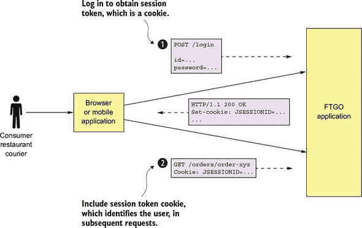

当用户使用用户 ID 和密码登录时，客户端向 FTGO 应用程序发出包含用户凭据的 POST 请求。FTGO 应用程序验证凭据并返回会话令牌给客户端。客户端在其向 FTGO 应用程序发出的每个后续请求中都包含会话令牌。

图 11.2 展示了 FTGO 应用程序实现安全的高级视图。FTGO 应用程序是用 Java 编写的，并使用 Spring Security 框架，但我会使用适用于其他框架的通用术语来描述设计，例如 NodeJS 的 Passport。

##### 图 11.2\. 当 FTGO 应用程序的客户端发起登录请求时，`Login Handler`验证用户，初始化会话用户信息，并返回一个会话令牌 cookie，该 cookie 安全地标识会话。接下来，当客户端发出包含会话令牌的请求时，`SessionBasedSecurityInterceptor`从指定的会话中检索用户信息并建立安全上下文。请求处理器，如`OrderDetailsRequestHandler`，从安全上下文中检索用户信息。

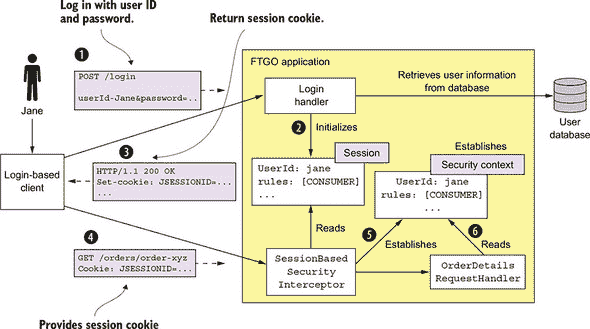

|  |
| --- |

**使用安全框架**

正确实现身份验证和授权具有挑战性。最好使用经过验证的安全框架。选择哪个框架取决于你的应用程序的技术堆栈。以下是一些流行的框架：

+   *Spring Security* ([`projects.spring.io/spring-security/`](https://projects.spring.io/spring-security/))—Java 应用程序的流行框架。它是一个复杂的框架，用于处理身份验证和授权。

+   *Apache Shiro* ([`shiro.apache.org`](https://shiro.apache.org))—另一个 Java 框架。

+   *Passport* ([`www.passportjs.org`](http://www.passportjs.org))—一个专注于身份验证的 NodeJS 应用程序的流行安全框架。

| |
| --- |

安全架构的一个关键部分是会话，它存储主体的 ID 和角色。FTGO 应用程序是一个传统的 Java EE 应用程序，因此会话是一个内存中的`HttpSession`。会话通过会话令牌来识别，客户端将其包含在每个请求中。它通常是一个不透明的令牌，如具有强密码学随机数的令牌。FTGO 应用程序的会话令牌是一个名为`JSESSIONID`的 HTTP cookie。

安全实现的其他关键部分是安全*上下文*，它存储有关当前请求的用户的信息。Spring Security 框架使用标准的 Java EE 方法，将安全上下文存储在静态的、线程局部变量中，这使得任何被调用以处理请求的代码都可以轻松访问。请求处理器可以调用`SecurityContextHolder.getContext().getAuthentication()`来获取有关当前用户的信息，例如其身份和角色。相比之下，Passport 框架将安全上下文存储为`request`的`user`属性。

图 11.2 中显示的事件序列如下：

1.  客户端向 FTGO 应用程序发起登录请求。

1.  登录请求由`LoginHandler`处理，该处理器验证凭据，创建会话，并在会话中存储有关主体的信息。

1.  `Login Handler`向客户端返回一个会话令牌。

1.  客户端在其调用操作的请求中包含会话令牌。

1.  这些请求首先由`SessionBasedSecurityInterceptor`处理。拦截器通过验证会话令牌来验证每个请求，并建立安全上下文。安全上下文描述了主体及其角色。

1.  请求处理器使用安全上下文来确定是否允许用户执行请求的操作并获取其身份。

FTGO 应用程序使用*基于角色的*授权。它定义了几个与不同类型用户相对应的角色，包括`CONSUMER`、`RESTAURANT`、`COURIER`和`ADMIN`。它使用 Spring Security 的声明式安全机制来限制对 URL 和服务方法的访问，仅限于特定角色。角色也编织到业务逻辑中。例如，消费者只能访问他们的订单，而管理员可以访问所有订单。

单体 FTGO 应用所使用的安全设计只是实现安全的一种可能方式。例如，使用内存中会话的一个缺点是它要求所有特定会话的请求都路由到同一个应用实例。这一要求使得负载均衡和操作变得复杂。例如，你必须实现一个会话排空机制，在关闭应用实例之前等待所有会话过期。一种避免这些问题的替代方法是将会话存储在数据库中。

有时你可以完全消除服务器端会话。例如，许多应用程序都有 API 客户端，它们在每次请求中都提供其凭证，例如 API 密钥和密钥。因此，不需要维护服务器端会话。或者，应用程序可以将会话状态存储在会话令牌中。在本节稍后，我将描述一种使用会话令牌存储会话状态的方法。但让我们首先看看在微服务架构中实现安全的挑战。

#### 11.1.2. 在微服务架构中实现安全

微服务架构是一种分布式架构。每个外部请求都由 API 网关和至少一个服务处理。例如，考虑第八章中讨论的`getOrderDetails()`查询。API 网关通过调用多个服务来处理这个查询，包括`订单服务`、`厨房服务`和`会计服务`。每个服务都必须实现一些安全方面。例如，`订单服务`必须只允许消费者查看他们的订单，这需要认证和授权的组合。为了在微服务架构中实现安全，我们需要确定谁负责认证用户，谁负责授权。

在微服务应用程序中实现安全的一个挑战是我们不能简单地从单体应用程序复制设计。这是因为单体应用程序安全架构的两个方面对于微服务架构来说是不切实际的：

+   **内存安全上下文**—**使用内存安全上下文，如线程局部，来传递用户身份。由于服务不能共享内存，因此它们不能使用内存安全上下文，如线程局部，来传递用户身份。在微服务架构中，我们需要一种不同的机制来从一个服务传递用户身份到另一个服务。

+   **集中式会话**—**由于内存安全上下文没有意义，内存会话也没有意义。理论上，多个服务可以访问基于数据库的会话，但这会违反松耦合原则。在微服务架构中，我们需要不同的会话机制。

让我们通过看看如何处理认证来开始我们对微服务架构中安全的探索。

##### 在 API 网关中处理身份验证

处理身份验证有几种不同的方法。一种选择是让各个服务单独对用户进行身份验证。这种方法的缺点是它允许未经身份验证的请求进入内部网络。它依赖于每个开发团队在其所有服务中正确实现安全性。因此，存在应用程序包含安全漏洞的重大风险。

在服务中实现身份验证的另一个问题是不同的客户端以不同的方式身份验证。纯 API 客户端在每个请求中提供凭证，例如使用基本身份验证。其他客户端可能首先登录，然后在每个请求中提供会话令牌。我们希望避免要求服务处理各种不同的身份验证机制。

一个更好的方法是让 API 网关在将请求转发到服务之前先对请求进行身份验证。在 API 网关中集中处理 API 身份验证的优势在于，只有一个地方需要正确设置。因此，安全漏洞的风险大大降低。另一个好处是，只有 API 网关需要处理各种不同的身份验证机制。它将这种复杂性隐藏在服务之外。

图 11.3 展示了这种方法是如何工作的。客户端与 API 网关进行身份验证。API 客户端在每个请求中包含凭证。基于登录的客户端将用户的凭证`POST`到 API 网关的认证，并接收一个会话令牌。一旦 API 网关验证了请求，它就会调用一个或多个服务。

| |
| --- |

**模式：访问令牌**

API 网关将包含用户信息（如身份和角色）的令牌传递给它调用的服务。请参阅[`microservices.io/patterns/security/access-token.html`](http://microservices.io/patterns/security/access-token.html)。

| |
| --- |

##### 图 11.3。API 网关对客户端的请求进行身份验证，并在对服务发出的请求中包含安全令牌。服务使用令牌来获取有关主体的信息。API 网关还可以将安全令牌用作会话令牌。

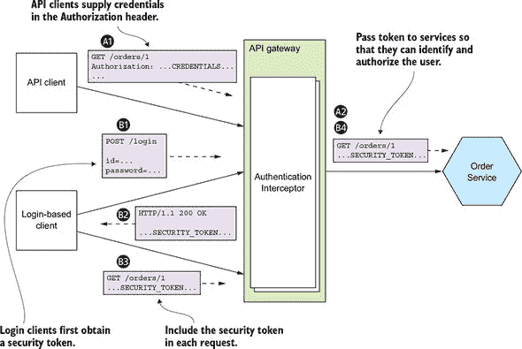

由 API 网关调用的服务需要知道发起请求的主体。它还必须验证请求是否已通过身份验证。解决方案是 API 网关在每个服务请求中包含一个令牌。服务使用该令牌来验证请求并获取有关主体的信息。API 网关还可能将相同的令牌提供给面向会话的客户端，供其作为会话令牌使用。

API 客户端的事件序列如下：

1.  客户端发出包含凭证的请求。

1.  API 网关验证凭证，创建安全令牌，并将其传递给服务或多个服务。

基于登录的客户端的事件序列如下：

1.  客户端发起一个包含凭证的登录请求。

1.  API 网关返回一个安全令牌。

1.  客户端在调用操作的请求中包含安全令牌。

1.  API 网关验证安全令牌并将其转发到服务或服务。

在本章稍后，我将描述如何实现令牌，但首先让我们看看安全的另一个主要方面：授权。

##### 处理授权

客户端凭证的验证很重要，但不足以。应用程序还必须实现一个授权机制，以验证客户端是否有权执行请求的操作。例如，在 FTGO 应用程序中，`getOrderDetails()`查询只能由放置`Order`（实例化安全的一个例子）的消费者调用，以及帮助消费者的客户服务代表。

实现授权的一个地方是 API 网关。例如，它可以限制对`GET /orders/{orderId}`的访问，仅限于消费者和客户服务代表。如果用户不允许访问特定的路径，API 网关可以在将其转发到服务之前拒绝该请求。与身份验证一样，在 API 网关中集中授权可以降低安全漏洞的风险。您可以使用安全框架，如 Spring Security，在 API 网关中实现授权。

在 API 网关中实现授权的一个缺点是，它可能会将 API 网关与服务耦合，需要它们同步更新。更重要的是，API 网关通常只能实现基于角色的对 URL 路径的访问控制。对于 API 网关来说，实现控制对单个域对象的访问的 ACL（访问控制列表）通常是不切实际的，因为这需要详细了解服务的域逻辑。

实现授权的另一个地方是在服务中。服务可以为 URL 和服务方法实现基于角色的授权。它还可以实现 ACL 来管理对聚合的访问。例如，`Order Service`可以实现基于角色和基于 ACL 的授权机制来控制对订单的访问。FTGO 应用程序中的其他服务实现类似的授权逻辑。

##### 使用 JWT 传递用户身份和角色

在微服务架构中实现安全时，您需要决定 API 网关应该使用哪种类型的令牌将用户信息传递给服务。有几种类型的令牌可供选择。一个选项是使用*不透明*令牌，通常是 UUID。不透明令牌的缺点是它们会降低性能和可用性，并增加延迟。这是因为令牌的接收者必须向安全服务发出同步 RPC 调用以验证令牌并检索用户信息。

一种替代方法，它消除了对安全服务的调用，是使用包含有关用户信息的*透明*令牌。透明令牌的一个流行标准是 JSON Web Token（JWT）。JWT 是安全表示两个当事人之间声明的标准方式，例如用户身份和角色。JWT 有一个有效载荷，它是一个包含有关用户信息的 JSON 对象，例如他们的身份和角色，以及其他元数据，例如过期日期。它使用只有 JWT 的创建者（如 API 网关）和 JWT 的接收者（如服务）所知的秘密进行签名。秘密确保恶意第三方无法伪造或篡改 JWT。

JWT 的一个问题是，由于令牌是自包含的，因此它是不可撤销的。按照设计，服务将在验证 JWT 签名和过期日期后执行请求操作。因此，没有实际的方法可以撤销落入恶意第三方手中的单个 JWT。解决方案是颁发具有短过期时间的 JWT，因为这限制了恶意方可能做的事情。然而，短期 JWT 的一个缺点是，应用程序必须以某种方式不断重新颁发 JWT 以保持会话活跃。幸运的是，这是许多由名为 OAuth 2.0 的安全标准解决的协议之一。让我们看看它是如何工作的。

##### 在微服务架构中使用 OAuth 2.0

假设您想为 FTGO 应用程序实现一个`用户服务`，该服务管理包含用户信息（如凭证和角色）的用户数据库。API 网关调用`用户服务`以验证客户端请求并获取 JWT。您可以为`用户服务`API 进行设计并使用您喜欢的 Web 框架实现它。但这是一种通用的功能，并不特定于 FTGO 应用程序——开发此类服务不会是开发资源的有效利用。

幸运的是，您不需要开发这种安全基础设施。您可以使用现成的服务或框架，这些服务或框架实现了名为 OAuth 2.0 的标准。OAuth 2.0 是一种授权协议，最初设计用于允许公共云服务的用户，例如 GitHub 或 Google，在不泄露其密码的情况下，授予第三方应用程序访问其信息的权限。例如，OAuth 2.0 是使您能够安全地授予第三方基于云的持续集成（CI）服务访问您 GitHub 存储库的机制。

尽管 OAuth 2.0 的原始重点是授权访问公共云服务，但您也可以在您的应用程序中使用它进行身份验证和授权。让我们快速了解一下微服务架构可能如何使用 OAuth 2.0。

| |
| --- |

**关于 OAuth 2.0**

OAuth 2.0 是一个复杂的话题。在本章中，我只能提供一个简要概述，并描述它如何在微服务架构中使用。有关 OAuth 2.0 的更多信息，请参阅 Aaron Parecki 编写的在线书籍 *OAuth 2.0 Servers* ([www.oauth.com](http://www.oauth.com))。*Spring Microservices in Action* (Manning, 2017) 的第七章 ([`livebook.manning.com/#!/book/spring-microservices-in-action/chapter-7/`](https://livebook.manning.com/#!/book/spring-microservices-in-action/chapter-7/)) 也涵盖了这一主题。

| |
| --- |

OAuth 2.0 的关键概念如下：

+   **`授权服务器`—** 提供用于验证用户和获取访问令牌和刷新令牌的 API。Spring OAuth 是构建 OAuth 2.0 授权服务器框架的一个很好的例子。

+   **`访问令牌`—** 一种授予对 `资源服务器` 访问权限的令牌。访问令牌的格式取决于实现。但某些实现，例如 Spring OAuth，使用 JWT。

+   **`刷新令牌`—** 一个长期有效但可撤销的令牌，客户端使用它来获取新的 `访问令牌`。

+   **`资源服务器`—** 使用访问令牌来授权访问的服务。在微服务架构中，服务是资源服务器。

+   **`客户端`—** 想要访问 `资源服务器` 的客户端。在微服务架构中，`API 网关` 是 OAuth 2.0 客户端。

在本节后面，我将描述如何支持基于登录的客户端。但首先，让我们谈谈如何验证 API 客户端。

图 11.4 展示了 API 网关如何验证来自 API 客户端的请求。API 网关通过向 OAuth 2.0 授权服务器发送请求来验证 API 客户端，该服务器返回一个访问令牌。然后，API 网关向服务发送包含访问令牌的一个或多个请求。

##### 图 11.4\. API 网关通过向 OAuth 2.0 认证服务器发送密码授权请求来验证 API 客户端。服务器返回一个访问令牌，API 网关将其传递给服务。服务验证令牌的签名并提取有关用户的信息，包括他们的身份和角色。

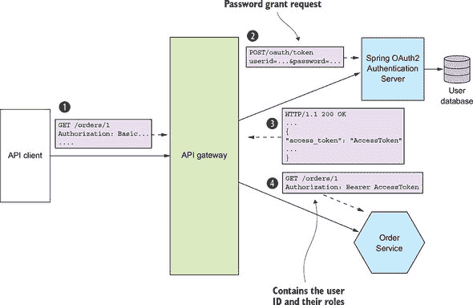

图 11.4 中所示的事件序列如下：

1.  客户端通过基本身份验证提供其凭据来发送请求。

1.  API 网关向 OAuth 2.0 认证服务器发送 OAuth 2.0 密码授权请求 ([www.oauth.com/oauth2-servers/access-tokens/password-grant/](http://www.oauth.com/oauth2-servers/access-tokens/password-grant/))。

1.  认证服务器验证 API 客户端的凭据，并返回一个访问令牌和一个刷新令牌。

1.  API 网关将其请求中包含的访问令牌传递给服务。服务验证访问令牌并使用它来授权请求。

基于 OAuth 2.0 的 API 网关可以通过使用 OAuth 2.0 访问令牌作为会话令牌来验证面向会话的客户端。更重要的是，当访问令牌过期时，它可以使用刷新令牌获取新的访问令牌。图 11.5 展示了 API 网关如何使用 OAuth 2.0 处理面向会话的客户端。API 客户端通过向 API 网关的`/login`端点 POST 其凭据来启动会话。API 网关向客户端返回访问令牌和刷新令牌。然后，API 客户端在向 API 网关发出请求时提供这两个令牌。

##### 图 11.5。客户端通过将凭据 POST 到 API 网关来登录。API 网关使用 OAuth 2.0 认证服务器验证凭据，并将访问令牌和刷新令牌作为 cookie 返回。客户端将这些令牌包含在它向 API 网关发出的请求中。

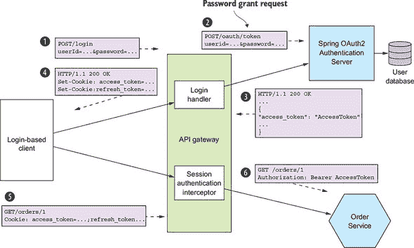

事件序列如下：

1.  基于登录的客户端将其凭据 POST 到 API 网关。

1.  API 网关的`登录处理器`向 OAuth 2.0 认证服务器发出 OAuth 2.0 密码授权请求([www.oauth.com/oauth2-servers/access-tokens/password-grant/](http://www.oauth.com/oauth2-servers/access-tokens/password-grant/))。

1.  认证服务器验证客户端的凭据，并返回访问令牌和刷新令牌。

1.  API 网关将访问和刷新令牌返回给客户端——例如，作为 cookie。

1.  客户端将其访问和刷新令牌包含在它向 API 网关发出的请求中。

1.  API 网关的`会话认证拦截器`验证访问令牌，并将其包含在它向服务发出的请求中。

如果访问令牌已过期或即将过期，API 网关通过向授权服务器发出包含刷新令牌的 OAuth 2.0 刷新授权请求([www.oauth.com/oauth2-servers/access-tokens/refreshing-access-tokens/](http://www.oauth.com/oauth2-servers/access-tokens/refreshing-access-tokens/))来获取新的访问令牌。如果刷新令牌尚未过期或未被撤销，授权服务器将返回一个新的访问令牌。`API 网关`将新的访问令牌传递给服务并返回给客户端。

使用 OAuth 2.0 的一个重要好处是它是一个经过验证的安全标准。使用现成的 OAuth 2.0 `认证服务器`意味着你不必浪费时间重新发明轮子或冒着开发不安全设计的风险。但 OAuth 2.0 并不是在微服务架构中实现安全性的唯一方式。无论你使用哪种方法，三个关键思想如下：

+   API 网关负责验证客户端。

+   API 网关和服务使用一个透明的令牌，例如 JWT，来传递有关主体的信息。

+   服务使用令牌来获取主体的身份和角色。

现在我们已经了解了如何使服务安全，让我们看看如何使它们可配置。

### 11.2\. 设计可配置的服务

假设你负责`订单历史服务`。如图 11.6 所示，该服务从 Apache Kafka 消费事件，并读取和写入 AWS DynamoDB 表项。为了使此服务运行，它需要各种配置属性，包括 Apache Kafka 的网络位置以及 AWS DynamoDB 的凭证和网络位置。

##### 图 11.6\. `订单历史服务`使用 Apache Kafka 和 AWS DynamoDB。它需要配置每个服务的网络位置、凭证等。

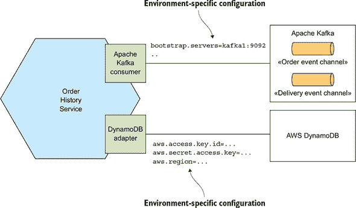

这些配置属性的值取决于服务运行的环境。例如，开发和生产环境将使用不同的 Apache Kafka 代理和不同的 AWS 凭证。将特定环境的配置属性值硬编码到可部署的服务中是没有意义的，因为这需要为每个环境重新构建它。相反，服务应由部署管道构建一次，然后部署到多个环境中。

将不同的配置属性集硬编码到源代码中，并使用例如 Spring 框架的配置文件机制在运行时选择适当的集合，也没有意义。这样做会引入安全漏洞并限制其部署位置。此外，敏感数据，如凭证，应使用如 Hashicorp Vault ([www.vaultproject.io](http://www.vaultproject.io)) 或 AWS 参数存储 ([`docs.aws.amazon.com/systems-manager/latest/userguide/systems-manager-paramstore.html`](https://docs.aws.amazon.com/systems-manager/latest/userguide/systems-manager-paramstore.html)) 这样的秘密存储机制安全存储。相反，您应该通过使用外部化配置模式在运行时向服务提供适当的配置属性。

|  |
| --- |

**模式：外部化配置**

在运行时向服务提供配置属性值，例如数据库凭证和网络位置。请参阅 [`microservices.io/patterns/externalized-configuration.html`](http://microservices.io/patterns/externalized-configuration.html)。

|  |
| --- |

外部化配置机制在运行时向服务实例提供配置属性值。主要有两种方法：

+   ***推送模型*—** 部署基础设施通过例如操作系统环境变量或配置文件将配置属性传递给服务实例。

+   ***拉模型*—** 服务实例从配置服务器读取其配置属性。

我们将探讨每种方法，从推送模型开始。

#### 11.2.1\. 使用基于推送的外部化配置

推送模型依赖于部署环境和服务的协作。当部署环境创建服务实例时，它会提供配置属性。如图 11.7 所示，它可能将配置属性作为环境变量传递。或者，部署环境也可以使用配置文件来提供配置属性。服务实例在启动时会读取这些配置属性。

##### 图 11.7。当部署基础设施创建`订单历史服务`的实例时，它会设置包含外部化配置的环境变量。`订单历史服务`会读取这些环境变量。

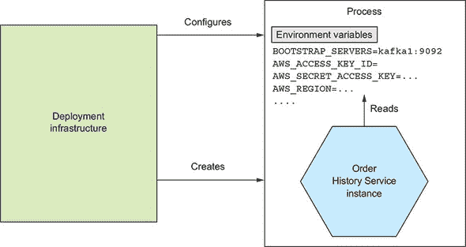

部署环境和服务必须就配置属性的提供方式达成一致。确切的机制取决于特定的部署环境。例如，第十二章描述了如何指定 Docker 容器的环境变量。

让我们假设你已经决定使用环境变量来提供外部化配置属性的值。你的应用程序可以调用`System.getenv()`来获取它们的值。但如果你是 Java 开发者，你很可能正在使用一个提供更方便机制的框架。FTGO 服务是使用 Spring Boot 构建的，它具有非常灵活的外部化配置机制，可以从各种来源检索配置属性，并具有定义良好的优先级规则（[`docs.spring.io/spring-boot/docs/current/reference/html/boot-features-external-config.html`](https://docs.spring.io/spring-boot/docs/current/reference/html/boot-features-external-config.html)）。让我们看看它是如何工作的。

Spring Boot 从各种来源读取属性。我发现以下来源在微服务架构中很有用：

1.  命令行参数

1.  `SPRING_APPLICATION_JSON`，一个包含 JSON 的操作系统环境变量或 JVM 系统属性

1.  JVM 系统属性

1.  操作系统环境变量

1.  当前目录下的配置文件

列表中较早来源的特定属性值会覆盖列表中较晚来源的相同属性。例如，操作系统环境变量会覆盖从配置文件中读取的属性。

Spring Boot 将这些属性提供给 Spring 框架的`ApplicationContext`。例如，一个服务可以使用`@Value`注解来获取属性的值：

```
public class OrderHistoryDynamoDBConfiguration {

  @Value("${aws.region}")
  private String awsRegion;
```

Spring 框架将`awsRegion`字段初始化为`aws.region`属性的值。这个属性是从前面列出的某个来源读取的，例如配置文件或`AWS_REGION`环境变量。

推送模型是配置服务的一种有效且广泛使用的机制。然而，一个限制是，重新配置运行中的服务可能具有挑战性，甚至可能不可能。部署基础设施可能不允许在不重新启动的情况下更改运行服务的配置属性。例如，您不能更改运行进程的环境变量。另一个限制是，配置属性值可能会分散在多个服务的定义中，存在风险。因此，您可能希望考虑使用基于拉的模型。让我们看看它是如何工作的。

#### 11.2.2\. 使用基于拉的配置外部化

在拉模型中，服务实例从配置服务器读取其配置属性。图 11.8 展示了它是如何工作的。在启动时，服务实例查询配置服务以获取其配置。访问配置服务器的配置属性，如其网络位置，通过基于推送的配置机制（如环境变量）提供给服务实例。

##### 图 11.8\. 在启动时，服务实例从配置服务器检索其配置属性。部署基础设施提供了访问配置服务器的配置属性。

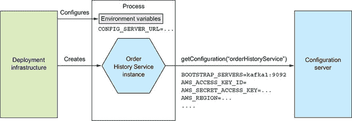

实现配置服务器有多种方式，包括以下几种：

+   版本控制系统，如 Git

+   SQL 和 NoSQL 数据库

+   专门的配置服务器，如 Spring Cloud Config Server、Hashicorp Vault（用于存储敏感数据，如凭据）和 AWS Parameter Store

Spring Cloud Config 项目是一个基于配置服务器的框架的绝佳示例。它由一个服务器和一个客户端组成。服务器支持多种后端来存储配置属性，包括版本控制系统、数据库和 Hashicorp Vault。客户端从服务器检索配置属性并将它们注入到 Spring `ApplicationContext` 中。

使用配置服务器具有几个优点：

+   ***集中式配置*—** 所有配置属性都存储在一个地方，这使得它们更容易管理。更重要的是，为了消除重复的配置属性，一些实现允许您定义全局默认值，这些默认值可以在每个服务的基础上进行覆盖。

+   ***透明解密敏感数据*—** 加密敏感数据，如数据库凭据，是安全最佳实践。然而，使用加密的一个挑战是，通常服务实例需要解密它们，这意味着它需要加密密钥。一些配置服务器实现会在将属性返回给服务之前自动解密属性。

+   ***动态重新配置*—** 服务实例可以通过例如轮询等方式检测更新的属性值，并重新配置自身。

使用配置服务的主要缺点是，除非它由基础设施提供，否则它又是一个需要设置和维护的基础设施组件。幸运的是，有各种开源框架，例如 Spring Cloud Config，它们使运行配置服务器变得更加容易。

现在我们已经了解了如何设计可配置的服务，让我们谈谈如何设计可观察的服务。

### 11.3\. 设计可观察的服务

假设你已经将 FTGO 应用程序部署到生产环境中。你可能想知道应用程序正在做什么：每秒请求次数、资源利用率等等。如果出现问题，例如服务实例失败或磁盘空间不足——理想情况下在影响用户之前——你也需要收到警报。而且，如果出现问题，你需要能够进行故障排除并确定根本原因。

在生产环境中管理应用程序的许多方面都不在开发者的职责范围内，例如监控硬件可用性和利用率。这些显然是运维的责任。但作为服务开发者，你必须实现一些模式来使你的服务更容易管理和故障排除。这些模式，如图 11.9 所示，揭示了服务实例的行为和健康状况。它们使监控系统能够跟踪和可视化服务的状态，并在出现问题时生成警报。这些模式还使问题排除变得更加容易。

##### 图 11.9\. 可观察性模式使开发者和运维人员能够理解应用程序的行为并排除问题。开发者负责确保他们的服务是可观察的。运维负责收集服务暴露的信息的基础设施。

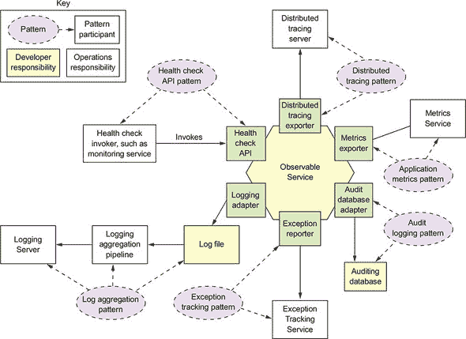

你可以使用以下模式来设计可观察的服务：

+   ***健康检查 API*—** 暴露一个返回服务健康状况的端点。

+   ***日志聚合*—** 记录服务活动并将日志写入集中式日志服务器，该服务器提供搜索和警报功能。

+   ***分布式跟踪*—** 为每个外部请求分配一个唯一的 ID，并跟踪请求在服务之间流动的情况。

+   ***异常跟踪*—** 将异常报告给异常跟踪服务，该服务会去重异常、通知开发者并跟踪每个异常的解决情况。

+   ***应用程序度量*—** 服务维护度量，如计数器和仪表，并将它们暴露给度量服务器。

+   ***审计日志*—** 记录用户行为。

这些模式的大部分特点在于每个模式都有一个开发组件和一个运维组件。以健康检查 API 模式为例。开发者负责确保他们的服务实现一个健康检查端点。运维负责定期调用健康检查 API 的监控系统。同样，对于日志聚合模式，开发者负责确保他们的服务记录有用的信息，而运维负责日志聚合。

让我们逐一查看这些模式，从健康检查 API 模式开始。

#### 11.3.1. 使用健康检查 API 模式

有时，一个服务可能正在运行但无法处理请求。例如，一个新启动的服务实例可能还没有准备好接受请求。例如，FTGO 的`Consumer Service`大约需要 10 秒钟来初始化消息和数据库适配器。对于部署基础设施在服务实例准备好处理请求之前将 HTTP 请求路由到服务实例来说，这是毫无意义的。

此外，一个服务实例可能会失败而不会终止。例如，一个错误可能会导致`Consumer Service`实例耗尽数据库连接，无法访问数据库。部署基础设施不应将请求路由到已失败但仍在运行的服务实例。而且，如果服务实例无法恢复，部署基础设施必须终止它并创建一个新的实例。

|  |
| --- |

**模式：健康检查 API**

服务公开一个健康检查 API 端点，例如`GET /health`，它返回服务的健康状况。请参阅[`microservices.io/patterns/observability/healthcheck-api.html`](http://microservices.io/patterns/observability/healthcheck-api.html)。

|  |
| --- |

服务实例需要能够通知部署基础设施它是否能够处理请求。一个不错的解决方案是服务实现一个健康检查端点，如图 11.10 所示。例如，Spring Boot Actuator Java 库实现了一个`GET /actuator/health`端点，如果服务健康则返回 200，否则返回 503。同样，HealthChecks .NET 库实现了一个`GET /hc`端点（[`docs.microsoft.com/en-us/dotnet/standard/microservices-architecture/implement-resilient-applications/monitor-app-health`](https://docs.microsoft.com/en-us/dotnet/standard/microservices-architecture/implement-resilient-applications/monitor-app-health)）。部署基础设施定期调用此端点以确定服务实例的健康状况，并在不健康时采取适当的行动。

##### 图 11.10。服务实现了一个健康检查端点，部署基础设施定期调用此端点以确定服务实例的健康状况。

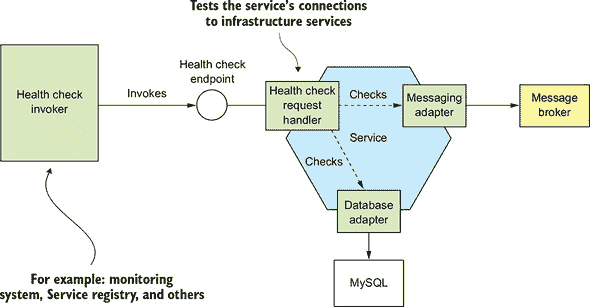

`Health Check Request Handler` 通常会测试服务实例与外部服务的连接。例如，它可能对数据库执行测试查询。如果所有测试都成功，`Health Check Request Handler` 返回一个健康响应，如 HTTP 200 状态码。如果有任何测试失败，它返回一个不健康响应，如 HTTP 500 状态码。

`Health Check Request Handler` 可能简单地返回一个带有适当状态码的空 HTTP 响应。或者，它可能返回每个适配器的详细健康状况描述。详细信息对于故障排除很有用。但由于它可能包含敏感信息，一些框架，如 Spring Boot Actuator，允许您配置健康端点响应的详细程度。

在使用健康检查时，您需要考虑两个问题。第一个问题是端点的实现，它必须报告服务实例的健康状况。第二个问题是如何配置部署基础设施以调用健康检查端点。让我们首先看看如何实现端点。

##### 实现健康检查端点

实现健康检查端点的代码必须以某种方式确定服务实例的健康状况。一种简单的方法是验证服务实例可以访问其外部基础设施服务。如何做到这一点取决于基础设施服务。例如，健康检查代码可以通过获取数据库连接并执行测试查询来验证它是否连接到一个 RDBMS。更复杂的方法是执行一个模拟客户端调用服务 API 的合成事务。这种类型的健康检查更为彻底，但实现起来可能更耗时，执行时间也更长。

健康检查库的一个优秀例子是 Spring Boot Actuator。如前所述，它实现了一个 `/actuator/health` 端点。实现此端点的代码返回执行一系列健康检查的结果。通过使用约定优于配置，Spring Boot Actuator 根据服务使用的底层基础设施服务实现了一套合理的健康检查。例如，如果一个服务使用 JDBC `DataSource`，Spring Boot Actuator 会配置一个执行测试查询的健康检查。同样，如果服务使用 RabbitMQ 消息代理，它会自动配置一个健康检查来验证 RabbitMQ 服务器是否运行正常。

您还可以通过为您的服务实现额外的健康检查来自定义此行为。您通过定义一个实现 `HealthIndicator` 接口的类来实现自定义健康检查。此接口定义了一个 `health()` 方法，该方法由 `/actuator/health` 端点的实现调用。它返回健康检查的结果。

##### 调用健康检查端点

如果没有人调用它，健康检查端点就没有什么用处。当你部署你的服务时，你必须配置部署基础设施来调用该端点。你如何做这取决于你的部署基础设施的具体细节。例如，如第三章所述（[kindle_split_011.xhtml#ch03]），你可以配置一些服务注册表，例如 Netflix Eureka，以调用健康检查端点，以确定是否应该将流量路由到服务实例。第十二章 讨论了如何配置 Docker 和 Kubernetes 来调用健康检查端点。

#### 11.3.2\. 应用日志聚合模式

日志是一个有价值的故障排除工具。如果你想了解你的应用程序出了什么问题，一个好的起点是查看日志文件。但在微服务架构中使用日志具有挑战性。例如，想象你正在调试 `getOrderDetails()` 查询的问题。如第八章所述（[kindle_split_016.xhtml#ch08]），FTGO 应用程序使用 API 组合来实现这个查询。因此，你需要查看的日志条目分散在 API 网关和包括 `Order Service` 和 `Kitchen Service` 在内的几个服务的日志文件中。

| |
| --- |

**模式：日志聚合**

将所有服务的日志聚合到一个支持搜索和警报的集中式数据库中。请参阅 [`microservices.io/patterns/observability/application-logging.html`](http://microservices.io/patterns/observability/application-logging.html)。

| |
| --- |

解决方案是使用日志聚合。如图 11.11 所示，日志聚合管道将所有服务实例的日志发送到一个集中的日志服务器。一旦日志被日志服务器存储，你就可以查看、搜索和分析它们。你还可以配置当某些消息出现在日志中时触发的警报。

##### 图 11.11\. 日志聚合基础设施将每个服务实例的日志发送到一个集中的日志服务器。用户可以查看和搜索日志。他们还可以设置警报，当日志条目匹配搜索条件时，警报会被触发。

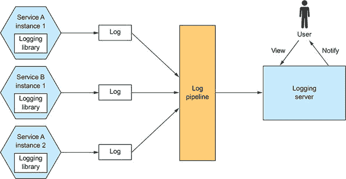

日志管道和服务器通常由运维负责。但服务开发者负责编写生成有用日志的服务。让我们首先看看服务是如何生成日志的。

##### 服务生成日志的方式

作为服务开发者，你需要考虑几个问题。首先，你需要决定使用哪个日志库。第二个问题是日志条目的写入位置。让我们首先看看日志库。

大多数编程语言都有一个或多个日志库，可以轻松生成正确结构的日志条目。例如，三个流行的 Java 日志库是 Logback、log4j 和 JUL（java.util.logging）。还有 SLF4J，它是各种日志框架的日志门面 API。同样，Log4JS 是 NodeJS 的一个流行的日志框架。使用日志的一个合理方式是在你的服务代码中调用这些日志库之一。但是，如果你有严格的日志要求，这些要求不能通过日志库强制执行，你可能需要定义自己的日志 API，该 API 封装了一个日志库。

你还需要决定在哪里记录日志。传统上，你会配置日志框架将日志写入文件系统中的一个已知位置的日志文件。但是，随着更现代的部署技术，如容器和无服务器，如第十二章 12 中所述，这通常不是最佳方法。在某些环境中，例如 AWS Lambda，甚至没有“永久”的文件系统来写入日志！相反，你的服务应该记录到`stdout`。然后，部署基础设施将决定如何处理你的服务的输出。

##### 日志聚合基础设施

日志基础设施负责聚合日志、存储它们并使用户能够搜索它们。一个流行的日志基础设施是 ELK 堆栈。ELK 由三个开源产品组成：

+   ***Elasticsearch*—** 一个以文本搜索为导向的 NoSQL 数据库，用作日志服务器

+   ***Logstash*—** 一个聚合服务日志并将其写入 Elasticsearch 的日志管道

+   ***Kibana*—** 用于 Elasticsearch 的可视化工具

其他开源日志管道包括 Fluentd 和 Apache Flume。日志服务器示例包括云服务，如 AWS CloudWatch Logs，以及众多商业产品。日志聚合是微服务架构中一个有用的调试工具。

现在我们来看看分布式追踪，这是理解基于微服务应用程序行为的另一种方式。

#### 11.3.3\. 使用分布式追踪模式

想象你是一名 FTGO 开发者，正在调查`getOrderDetails()`查询为何变慢。你已经排除了外部网络问题导致问题的可能性。延迟的增加必定是由 API 网关或它调用的某个服务引起的。一个选择是查看每个服务的平均响应时间。这个选项的问题在于它是请求的平均值，而不是单个请求的时间分解。此外，更复杂的场景可能涉及许多嵌套的服务调用。你可能甚至不熟悉所有服务。因此，在微服务架构中，诊断这类性能问题可能具有挑战性。

|  |
| --- |

**模式：分布式追踪**

为每个外部请求分配一个唯一的 ID，并在提供可视化和分析的集中式服务器中记录它从服务到下一个服务的流动情况。请参阅[`microservices.io/patterns/observability/distributed-tracing.html`](http://microservices.io/patterns/observability/distributed-tracing.html)。

|  |
| --- |

了解你的应用程序正在做什么的一个好方法是使用分布式追踪。*分布式追踪*在单体应用程序中类似于性能分析器。它记录了处理请求时做出的服务调用树的信息（例如，开始时间和结束时间）。然后你可以看到服务在处理外部请求时的交互，包括时间花费的分解。

图 11.12 展示了分布式追踪服务器如何显示 API 网关处理请求时发生的情况。它显示了 API 网关的入站请求和网关对`订单服务`发出的请求。对于每个请求，分布式追踪服务器显示了执行的操作和请求的时间。

##### 图 11.12\. Zipkin 服务器显示了 FTGO 应用程序如何处理由 API 网关路由到`订单服务`的请求。每个请求都由一个追踪表示。一个追踪是一系列跨度。每个跨度，可以包含子跨度，代表一个服务的调用。根据收集的详细程度，跨度也可以代表服务内部操作的调用。

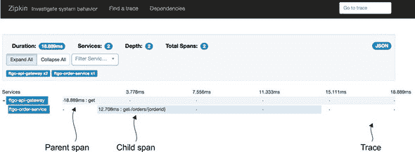

图 11.12 展示了在分布式追踪术语中被称为*追踪*的内容。一个追踪代表一个外部请求，由一个或多个跨度组成。一个*跨度*代表一个操作，其关键属性是操作名称、开始时间戳和结束时间。一个跨度可以有零个或多个子跨度，它们代表嵌套操作。例如，顶层跨度可能代表 API 网关的调用，正如图 11.12 中所示。其子跨度代表 API 网关对服务的调用。

分布式追踪的一个宝贵副作用是它为每个外部请求分配一个唯一的 ID。一个服务可以将请求 ID 包含在其日志条目中。当与日志聚合结合使用时，请求 ID 可以让你轻松地找到特定外部请求的所有日志条目。例如，下面是从`订单服务`的一个示例日志条目：

```
2018-03-04 17:38:12.032 DEBUG [ftgo-order-
     service,8d8fdc37be104cc6,8d8fdc37be104cc6,false]
  7 --- [nio-8080-exec-6] org.hibernate.SQL                        :
  select order0_.id as id1_3_0_, order0_.consumer_id as consumer2_3_0_, order
     0_.city as city3_3_0_,
  order0_.delivery_state as delivery4_3_0_, order0_.street1 as street5_3_0_,
  order0_.street2 as street6_3_0_, order0_.zip as zip7_3_0_,
order0_.delivery_time as delivery8_3_0_, order0_.a
```

日志条目中的`[ftgo-order-service,8d8fdc37be104cc6,8d8fdc37be104cc6,false]`部分（SLF4J 映射诊断上下文—见[www.slf4j.org/manual.html](http://www.slf4j.org/manual.html)）包含了分布式追踪基础设施的信息。它由四个值组成：

+   **`ftgo-order-service`—** 应用程序名称

+   **`8d8fdc37be104cc6`—** `traceId`

+   **`8d8fdc37be104cc6`—** `spanId`

+   **`false`—** 表示这个跨度没有被导出到分布式追踪服务器

如果您在日志中搜索`8d8fdc37be104cc6`，您将找到该请求的所有日志条目。

展示了分布式跟踪的工作原理。分布式跟踪有两个部分：一个仪表化库，每个服务都使用它，以及一个分布式跟踪服务器。仪表化库管理跟踪和跨度。它还向出站请求添加跟踪信息，例如当前的跟踪 ID 和父跨度 ID。例如，传播跟踪信息的一个常见标准是 B3 标准（[`github.com/openzipkin/b3-propagation`](https://github.com/openzipkin/b3-propagation)），它使用如`X-B3-TraceId`和`X-B3-ParentSpanId`这样的头信息。仪表化库还将跟踪报告给分布式跟踪服务器。分布式跟踪服务器存储跟踪并提供一个用于可视化的 UI。

##### 图 11.13。每个服务（包括 API 网关）都使用一个仪表化库。仪表化库为每个外部请求分配一个 ID，在服务之间传播跟踪状态，并将跨度报告给分布式跟踪服务器。

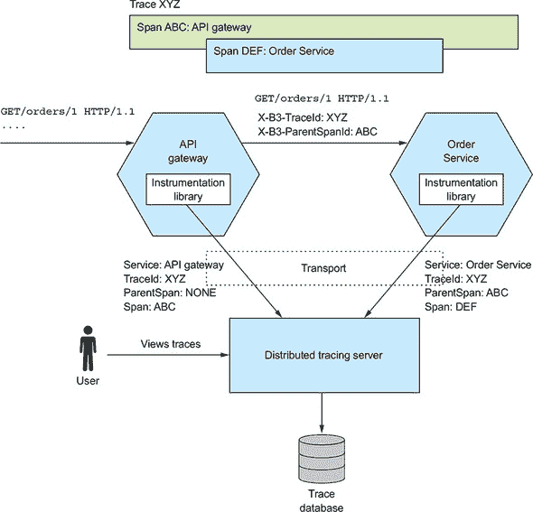

让我们来看看仪表化库和分布式跟踪服务器，从库开始。

##### 使用仪表化库

仪表化库构建跨度树并将它们发送到分布式跟踪服务器。服务代码可以直接调用仪表化库，但这会将仪表化逻辑与业务和其他逻辑交织在一起。一种更干净的方法是使用拦截器或面向切面编程（AOP）。

基于 AOP（面向切面编程）框架的一个优秀例子是 Spring Cloud Sleuth。它利用 Spring 框架的 AOP 机制自动将分布式跟踪集成到服务中。因此，您必须将 Spring Cloud Sleuth 作为项目依赖项添加。除非在 Spring Cloud Sleuth 无法处理的情况下，您的服务不需要调用分布式跟踪 API。

##### 关于分布式跟踪服务器

仪表化库将跨度发送到分布式跟踪服务器。分布式跟踪服务器将跨度拼接在一起形成完整的跟踪，并将它们存储在数据库中。一个流行的分布式跟踪服务器是 Open Zipkin。Zipkin 最初由 Twitter 开发。服务可以通过 HTTP 或消息代理将跨度发送到 Zipkin。Zipkin 将跟踪存储在存储后端，该后端可以是 SQL 或 NoSQL 数据库。它有一个 UI，用于显示跟踪，如图 11.12 中所示。AWS X-ray 是另一个分布式跟踪服务器的例子。

#### 11.3.4. 应用应用程序度量模式

生产环境的一个关键部分是监控和警报。如图 11.14 所示，监控系统从技术栈的每个部分收集指标，这些指标提供了关于应用程序健康状况的关键信息。指标范围从基础设施级别的指标，如 CPU、内存和磁盘利用率，到应用程序级别的指标，如服务请求延迟和执行的请求数量。例如，`Order Service`收集有关已放置、批准和拒绝的订单的指标。这些指标由提供可视化和警报的指标服务收集。

| |
| --- |

**模式：应用程序指标**

服务将指标报告给一个提供聚合、可视化和警报的中心服务器。

| |
| --- |

##### 图 11.14\. 栈的每一层都收集并存储在指标服务中，该服务提供可视化和警报。

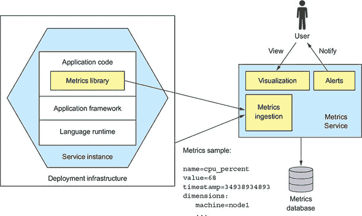

指标是定期采样的。一个指标样本具有以下三个属性：

+   ***名称*—** 指标的名称，例如`jvm_memory_max_bytes`或`placed_orders`

+   ***值*—** 一个数值

+   ***时间戳*—** 样本的时刻

此外，一些监控系统支持*维度*的概念，它们是任意的名称-值对。例如，`jvm_memory_max_bytes`与`area="heap",id="PS Eden Space"`和`area="heap",id="PS Old Gen"`等维度一起报告。维度通常用于提供额外的信息，例如机器名或服务名，或服务实例标识符。监控系统通常在一条或多条维度上*聚合*（求和或平均）指标样本。

监控的许多方面是运维的责任。但是，服务开发者负责指标的两个方面。首先，他们必须对其服务进行仪表化，以便收集有关其行为的数据。其次，他们必须将那些服务指标，以及 JVM 和应用框架的指标，公开给指标服务器。

让我们先看看服务是如何收集指标的。

##### 收集服务级指标

你需要做多少工作来收集指标取决于你的应用程序使用的框架以及你想要收集的指标。例如，一个基于 Spring Boot 的服务可以通过将 Micrometer Metrics 库作为依赖项并使用几行配置来收集（并公开）基本指标，如 JVM 指标。Spring Boot 的自动配置负责配置指标库并公开指标。如果服务需要收集特定于应用程序的指标，它只需直接使用 Micrometer Metrics API。

以下列表显示了`OrderService`如何收集有关已放置、批准和拒绝的订单数量的指标。它使用`MeterRegistry`，这是由接口提供的 Micrometer Metrics，来收集自定义指标。每个方法都会增加一个适当命名的计数器。

##### 列表 11.1\. `OrderService`跟踪已下单、批准和拒绝的订单数量。

```
public class OrderService {

  @Autowired
  private MeterRegistry meterRegistry;                          *1*

  public Order createOrder(...) {
    ...
    meterRegistry.counter("placed_orders").increment();         *2*
     return order;
  }

  public void approveOrder(long orderId) {
    ...
    meterRegistry.counter("approved_orders").increment();       *3*
   }

  public void rejectOrder(long orderId) {
    ...
    meterRegistry.counter("rejected_orders").increment();       *4*
   }
```

+   ***1* 用于管理应用程序特定仪表的 Micrometer Metrics 库 API**

+   ***2* 当订单成功下单时增加`placedOrders`计数器**

+   ***3* 当订单被批准时增加`approvedOrders`计数器**

+   ***4* 当订单被拒绝时增加`rejectedOrders`计数器**

##### 将指标发送到指标服务

一个服务通过以下两种方式之一将指标发送到指标服务：推送或拉取。在*推送*模式下，服务实例通过调用 API 将指标发送到指标服务。例如，AWS Cloudwatch 指标实现了推送模式。

在*拉取*模式下，指标服务（或其在本地上运行的代理）调用服务 API 以从服务实例检索指标。Prometheus，一个流行的开源监控和警报系统，使用拉取模式。

FTGO 应用程序的`Order Service`使用`micrometer-registry-prometheus`库与 Prometheus 集成。因为这个库在类路径上，Spring Boot 暴露了一个`GET /actuator/prometheus`端点，该端点以 Prometheus 期望的格式返回指标。`OrderService`的自定义指标报告如下：

```
$ curl -v http://localhost:8080/actuator/prometheus | grep _orders
# HELP placed_orders_total
# TYPE placed_orders_total counter
placed_orders_total{service="ftgo-order-service",} 1.0
# HELP approved_orders_total
# TYPE approved_orders_total counter
approved_orders_total{service="ftgo-order-service",} 1.0
```

例如，`placed_orders`计数器报告为类型为`counter`的指标。

Prometheus 服务器定期轮询此端点以检索指标。一旦指标在 Prometheus 中，您可以使用 Grafana，一个数据可视化工具（[`grafana.com`](https://grafana.com)）来查看它们。您还可以为这些指标设置警报，例如，当`placed_orders_total`的变化率低于某个阈值时。

应用程序指标提供了对应用程序行为的宝贵见解。由指标触发的警报使您能够快速响应生产问题，可能在它影响用户之前。现在让我们看看如何观察和响应另一个警报源：异常。

#### 11.3.5\. 使用异常跟踪模式

服务很少记录异常，当它这样做时，重要的是要确定根本原因。异常可能是失败或编程错误的症状。查看异常的传统方式是查看日志。您甚至可以配置日志服务器，如果日志文件中出现异常，则提醒您。然而，这种方法存在一些问题：

+   日志文件以单行日志条目为导向，而异常由多行组成。

+   没有机制来跟踪日志文件中发生的异常的解决情况。您必须手动将异常复制/粘贴到问题跟踪器中。

+   很可能存在重复的异常，但没有自动机制将它们视为一个。

|  |
| --- |

**模式：异常跟踪**

服务将异常报告给一个中央服务，该服务去重异常、生成警报并管理异常的解决。请参阅[`microservices.io/patterns/observability/audit-logging.html`](http://microservices.io/patterns/observability/audit-logging.html)。

|  |
| --- |

更好的方法是使用异常跟踪服务。如图 11.15 所示，您可以通过例如 REST API 配置您的服务向异常跟踪服务报告异常。异常跟踪服务去重异常、生成警报并管理异常的解决。

##### 图 11.15\. 一个服务将异常报告给异常跟踪服务，该服务去重异常并向开发者发出警报。它有一个用于查看和管理异常的用户界面。

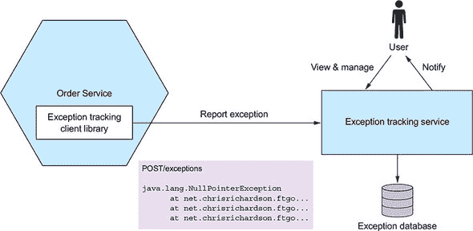

|  |
| --- |

**异常跟踪服务**

有几个异常跟踪服务。其中一些，如 Honeybadger([www.honeybadger.io](http://www.honeybadger.io))，是纯云基础的。其他，如 Sentry.io([`sentry.io/welcome/`](https://sentry.io/welcome/))，也有一个开源版本，您可以在自己的基础设施上部署。这些服务接收来自您应用程序的异常并生成警报。它们提供了一个控制台用于查看异常和管理它们的解决。异常跟踪服务通常提供多种语言的客户端库。

|  |
| --- |

有几种方法可以将异常跟踪服务集成到您的应用程序中。您的服务可以直接调用异常跟踪服务的 API。更好的方法是使用异常跟踪服务提供的客户端库。例如，HoneyBadger 的客户端库提供了几个易于使用的集成机制，包括一个 Servlet Filter，它可以捕获并报告异常。

异常跟踪模式是快速识别和响应生产问题的有用方法。

跟踪用户行为也同样重要。让我们看看如何做到这一点。

#### 11.3.6\. 应用审计日志模式

审计日志的目的是记录每位用户的行为。审计日志通常用于帮助客户支持、确保合规性以及检测可疑行为。每个审计日志条目记录了用户的身份、他们执行的操作以及业务对象。应用程序通常将审计日志存储在数据库表中。

|  |
| --- |

**模式：审计日志**

在数据库中记录用户行为，以帮助客户支持、确保合规性以及检测可疑行为。请参阅[`microservices.io/patterns/observability/audit-logging.html`](http://microservices.io/patterns/observability/audit-logging.html)。

|  |
| --- |

实现审计日志有多种不同的方法：

+   将审计日志代码添加到业务逻辑中。

+   使用面向方面编程（AOP）。

+   使用事件溯源。

让我们逐一查看每个选项。

##### 将审计日志代码添加到业务逻辑

第一个也是最直接的选择是在服务业务逻辑中散布审计日志代码。例如，每个服务方法都可以创建一个审计日志条目并将其保存到数据库中。这种方法的一个缺点是它将审计日志代码与业务逻辑交织在一起，这降低了可维护性。另一个缺点是它可能存在错误，因为它依赖于开发者编写审计日志代码。

##### 使用面向切面编程

第二种选择是使用 AOP。你可以使用 AOP 框架，如 Spring AOP，来定义建议，该建议可以自动拦截每个服务方法调用并持久化一个审计日志条目。这是一个更可靠的方案，因为它自动记录每个服务方法的调用。使用 AOP 的主要缺点是建议只能访问方法名称及其参数，因此可能难以确定正在操作的业务对象并生成面向业务的活动审计日志条目。

##### 使用事件溯源

第三种也是最后一种选择是使用事件溯源来实现你的业务逻辑。如第六章所述，*事件溯源*自动为创建和更新操作提供审计日志。你需要在每个事件中记录用户的身份。然而，使用事件溯源的一个局限性是它不记录查询。如果你的服务必须为查询创建日志条目，那么你将不得不使用其他选项之一。

### 11.4. 使用微服务底盘模式开发服务

本章描述了服务必须实现的各种问题，包括指标、向异常跟踪器报告异常、日志记录和健康检查、外部化配置以及安全性。此外，如第三章所述，服务还可能需要处理服务发现和实现断路器。这不是每次实现新服务时都希望从头开始设置的事情。如果你这样做，可能需要几天甚至几周的时间才能编写第一行业务逻辑。

|  |
| --- |

**模式：微服务底盘**

在处理跨切面关注点（如异常跟踪、日志记录、健康检查、外部化配置和分布式跟踪）的框架或框架集合上构建服务。请参阅[`microservices.io/patterns/microservice-chassis.html`](http://microservices.io/patterns/microservice-chassis.html)。

|  |
| --- |

开发服务的一个更快的方法是在微服务底盘上构建你的服务。如图 11.16 所示，*微服务底盘*是一个框架或一系列框架，用于处理这些问题。当使用微服务底盘时，你几乎不需要编写代码来处理这些问题。

##### 图 11.16\. 微服务框架是一个处理众多问题的框架，例如异常跟踪、日志记录、健康检查、外部化配置和分布式跟踪。

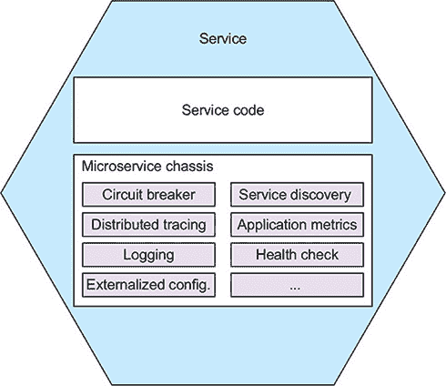

在本节中，我首先描述微服务框架的概念，并提出一些优秀的微服务框架。然后，我介绍服务网格的概念，在写作时，它正成为使用框架和库的有趣替代品。

让我们先看看微服务框架的想法。

#### 11.4.1\. 使用微服务框架

微服务框架是一个或一组框架，处理包括以下在内的众多问题：

+   外部化配置

+   健康检查

+   应用程序指标

+   服务发现

+   断路器

+   分布式跟踪

它显著减少了你需要编写的代码量。你可能甚至不需要编写任何代码。相反，你配置微服务框架以满足你的需求。微服务框架使你能够专注于开发你服务的业务逻辑。

FTGO 应用程序使用 Spring Boot 和 Spring Cloud 作为微服务框架。Spring Boot 提供外部化配置等功能。Spring Cloud 提供断路器等功能。它还实现了客户端服务发现，尽管 FTGO 应用程序依赖于基础设施进行服务发现。Spring Boot 和 Spring Cloud 并不是唯一的微服务框架。例如，如果你在 GoLang 中编写服务，你可以使用 Go Kit ([`github.com/go-kit/kit`](https://github.com/go-kit/kit)) 或 Micro ([`github.com/micro/micro`](https://github.com/micro/micro))。

使用微服务框架的一个缺点是，你需要为每个你用来开发服务的语言/平台组合使用一个。幸运的是，许多微服务框架实现的功能可能会由基础设施来实现。例如，如第三章所述，许多部署环境处理服务发现。更重要的是，微服务框架的许多网络相关功能将由所谓的服务网格来处理，这是一个运行在服务之外的基础设施层。

#### 11.4.2\. 从微服务框架到服务网格

微服务框架是实现各种横切关注点的好方法，例如断路器。但使用微服务框架的一个障碍是，你需要为每种编程语言使用一个。例如，如果你是 Java/Spring 开发者，Spring Boot 和 Spring Cloud 很有用，但如果你想编写基于 NodeJS 的服务，它们就帮不上忙了。

| |
| --- |

**模式：服务网格**

将所有网络流量通过一个实现各种关注点的网络层进出服务，包括断路器、分布式跟踪、服务发现、负载均衡和基于规则的流量路由。请参阅[`microservices.io/patterns/deployment/service-mesh.html`](http://microservices.io/patterns/deployment/service-mesh.html)。

| |
| --- |

一种避免此问题的新兴替代方案是在所谓的服务网格之外实现一些此功能。*服务网格*是一种网络基础设施，它调解服务与其他服务和外部应用程序之间的通信。如图 11.17 所示，所有进出服务的网络流量都通过服务网格。它实现了包括断路器、分布式跟踪、服务发现、负载均衡和基于规则的流量路由在内的各种关注点。服务网格还可以通过在服务之间使用基于 TLS 的 IPC 来确保进程间通信。因此，你不再需要在服务中实现这些特定的关注点。

##### 图 11.17。所有进出服务的网络流量都通过服务网格。服务网格实现了包括断路器、分布式跟踪、服务发现和负载均衡在内的各种功能。微服务底盘实现的功能较少。它还通过在服务之间使用基于 TLS 的 IPC 来确保进程间通信。

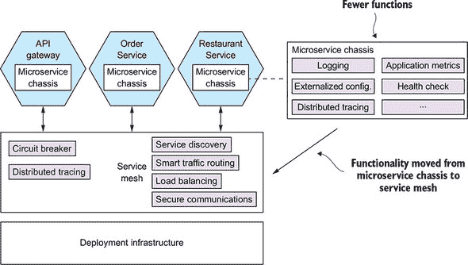

当使用服务网格时，微服务底盘要简单得多。它只需要实现与应用程序代码紧密集成的关注点，例如外部化配置和健康检查。微服务底盘必须通过传播分布式跟踪信息（如我之前在 11.3.3 节中讨论的 B3 标准头）来支持分布式跟踪。

服务网格的概念是一个极具前景的想法。它使开发者免于处理各种横切关注点。此外，服务网格路由流量的能力使您能够将部署与发布分离。它使您能够将服务的全新版本部署到生产环境中，但仅向某些用户（如内部测试用户）发布。第十二章在描述如何使用 Kubernetes 部署服务时进一步讨论了这一概念。

| |
| --- |

**服务网格实现的当前状态**

有各种服务网格实现，包括以下：

+   Istio ([`istio.io`](https://istio.io))

+   Linkerd ([`linkerd.io`](https://linkerd.io))

+   Conduit ([`conduit.io`](https://conduit.io))

到写作时为止，Linkerd 是最成熟的，而 Istio 和 Conduit 仍在积极开发中。有关这项激动人心的新技术的更多信息，请查看每个产品的文档。

| |
| --- |

### 摘要

+   一个服务实现其功能需求是至关重要的，但它还必须是安全的、可配置的和可观察的。

+   在微服务架构中的许多安全方面与单体架构并无二致。但也有一些应用安全方面的考虑是必然不同的，包括用户身份如何在 API 网关和服务之间传递，以及谁负责认证和授权。常用的方法是由 API 网关对客户端进行认证。API 网关在每个请求中包含一个透明的令牌，例如 JWT，发送到服务。令牌包含主体的身份及其角色。服务使用令牌中的信息来授权对资源的访问。OAuth 2.0 是微服务架构中安全性的良好基础。

+   服务通常使用一个或多个外部服务，例如消息代理和数据库。每个外部服务的网络位置和凭证通常取决于服务运行的环境。你必须应用外部化配置模式并实现一种机制，在运行时为服务提供配置属性。一种常用的方法是部署基础设施在创建服务实例时通过操作系统环境变量或属性文件提供这些属性。另一种选择是服务实例从配置属性服务器检索其配置。

+   运维和开发人员共同负责实现可观察性模式。运维负责可观察性基础设施，例如处理日志聚合、指标、异常跟踪和分布式跟踪的服务器。开发人员负责确保他们的服务是可观察的。服务必须具有健康检查 API 端点、生成日志条目、收集和公开指标、向异常跟踪服务报告异常以及实现分布式跟踪。

+   为了简化并加速开发，你应该在微服务框架之上开发服务。微服务框架是一个或一组框架，用于处理各种横切关注点，包括本章中描述的那些。然而，随着时间的推移，许多与微服务框架相关的网络功能可能会迁移到服务网格，这是一个基础设施软件层，所有服务的网络流量都通过它流动。
