## 第十二章\. 部署微服务

*本章涵盖*

+   四种关键部署模式，它们的工作原理以及它们的优缺点：

    +   语言特定的打包格式

    +   将服务作为虚拟机部署

    +   将服务作为容器部署

    +   无服务器部署

+   使用 Kubernetes 部署服务

+   使用服务网格将部署与发布分离

+   使用 AWS Lambda 部署服务

+   选择部署模式

在 FTGO，玛丽和她的小组几乎完成了他们的第一个服务的编写。尽管它还没有完全具备所有功能，但它已经在开发者的笔记本电脑和 Jenkins CI 服务器上运行。但这还不够。软件在 FTGO 中没有价值，除非它在生产环境中运行并对用户可用。FTGO 需要将他们的服务部署到生产环境中。

*部署* 是两个相互关联的概念的组合：过程和架构。部署过程包括人们（开发人员和运维人员）必须执行的一系列步骤，以便将软件投入生产。部署架构定义了软件运行的环境结构。自我在 1990 年代后期开始开发企业级 Java 应用程序以来，这两个部署方面都发生了根本性的变化。开发者将代码扔过墙到生产环境的手动过程已经高度自动化。如图 12.1 所示，物理生产环境已被越来越轻量级和短暂的计算基础设施所取代。

##### 图 12.1\. 重量级和长期存在的物理机器已被越来越轻量级和短暂的科技所抽象化。

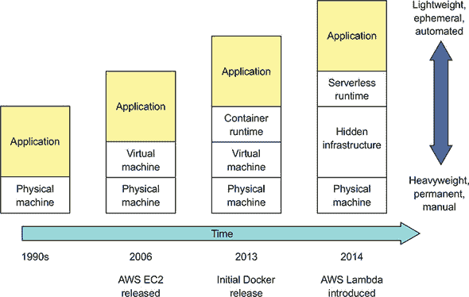

回到 1990 年代，如果你想将应用程序部署到生产环境，第一步是将你的应用程序以及一系列操作说明扔过墙给运维。例如，你可能提交一个故障单，要求运维部署应用程序。接下来发生的一切完全由运维负责，除非他们遇到了需要你帮助解决的问题。通常，运维会购买并安装昂贵的、重量级的应用程序服务器，如 WebLogic 或 WebSphere。然后他们会登录到应用程序服务器控制台并部署你的应用程序。他们会像照顾宠物一样爱护这些机器，安装补丁和更新软件。

在 2000 年代中期，昂贵的应用服务器被开源、轻量级的 Web 容器如 Apache Tomcat 和 Jetty 所取代。你仍然可以在每个 Web 容器上运行多个应用程序，但每个 Web 容器运行一个应用程序变得可行。此外，虚拟机开始取代物理机器。但机器仍然被视为心爱的宠物，部署仍然是一个基本的手动过程。

今天，部署过程已经发生了根本性的变化。不再是将代码交给单独的生产团队，DevOps 的采用意味着开发团队也负责部署他们的应用程序或服务。在某些组织中，运维为开发者提供了一个用于部署代码的控制台。或者，更好的是，一旦测试通过，部署管道会自动将代码部署到生产环境中。

在生产环境中使用的计算资源也发生了根本性的变化，因为物理机器被抽象化。在高度自动化的云平台上，如 AWS 上运行的虚拟机已经取代了长期存在的、类似宠物的物理和虚拟机。今天的虚拟机是不可变的。它们被视为可丢弃的牛群而不是宠物，因此被丢弃并重新创建，而不是重新配置。"容器"，作为虚拟机之上的更轻量级的抽象层，正成为部署应用程序越来越受欢迎的方式。你也可以使用更轻量级的无服务器部署平台，例如 AWS Lambda，来处理许多用例。

部署过程和架构的演变与微服务架构的日益采用不谋而合并非巧合。一个应用程序可能有数十或数百个用各种语言和框架编写的服务。由于每个服务都是一个小的应用程序，这意味着在生产中有数十或数百个应用程序。例如，系统管理员手动配置服务器和服务已不再实用。如果你想要大规模部署微服务，你需要一个高度自动化的部署流程和基础设施。

图 12.2 展示了生产环境的高级视图。生产环境使开发者能够配置和管理他们的服务，部署管道以部署服务的最新版本，以及用户访问由这些服务实现的功能。

##### 图 12.2\. 生产环境的简化视图。它提供了四个主要功能：服务管理使开发者能够部署和管理他们的服务，运行时管理确保服务正在运行，监控可视化服务行为并生成警报，请求路由将用户的请求路由到服务。


生产环境必须实现四个关键能力：

+   ***服务管理界面*—** 使开发者能够创建、更新和配置服务。理想情况下，此界面是一个由命令行和 GUI 部署工具调用的 REST API。

+   ***运行时服务管理*—** 试图确保始终运行着所需数量的服务实例。如果一个服务实例崩溃或以某种方式无法处理请求，生产环境必须重新启动它。如果机器崩溃，生产环境必须在不同的机器上重新启动那些服务实例。

+   **监控**—**为开发者提供对其服务正在做什么的洞察，包括日志文件和指标。如果有问题，生产环境必须通知开发者。第十一章 描述了监控，也称为 *可观察性*。

+   **请求路由**—**将用户请求路由到服务。

在本章中，我讨论了四种主要的部署选项：

+   将服务作为特定语言的打包格式部署，例如 Java JAR 或 WAR 文件。探索这个选项是值得的，因为尽管我推荐使用其他选项之一，但其缺点促使其他选项的产生。

+   将服务作为虚拟机部署，通过将服务打包成虚拟机镜像来封装服务的技术堆栈，从而简化部署。

+   将服务作为容器部署，容器比虚拟机更轻量。我将展示如何使用 Kubernetes，一个流行的 Docker 集成框架，来部署 FTGO 应用程序的 `Restaurant Service`。

+   使用无服务器部署来部署服务，这比容器更现代。我们将探讨如何使用 AWS Lambda，一个流行的无服务器平台，来部署 `Restaurant Service`。

让我们先看看如何将服务作为特定语言的打包格式部署。

### 12.1\. 使用特定语言的打包格式模式部署服务

让我们设想，你想要部署 FTGO 应用程序的 `Restaurant Service`，这是一个基于 Spring Boot 的 Java 应用程序。部署此服务的一种方法是将服务作为特定语言的打包模式。当使用此模式时，在生产环境中部署并由服务运行时管理的，是一个特定语言的打包格式的服务。在 `Restaurant Service` 的例子中，这可能是可执行的 JAR 文件或 WAR 文件。对于其他语言，例如 NodeJS，服务是一个源代码和模块的目录。对于某些语言，例如 GoLang，服务是一个特定操作系统的可执行文件。

|  |
| --- |

**模式：特定语言的打包格式**

将特定语言的打包格式部署到生产环境中。请参阅 [`microservices.io/patterns/deployment/language-specific-packaging.html`](http://microservices.io/patterns/deployment/language-specific-packaging.html)。

|  |
| --- |

要在机器上部署 `Restaurant Service`，你首先需要安装必要的运行时，在这个例子中是 JDK。如果是 WAR 文件，你还需要安装一个 Web 容器，例如 Apache Tomcat。一旦配置好机器，你将包复制到机器上并启动服务。每个服务实例都作为一个 JVM 进程运行。

理想情况下，你已经设置了部署管道以自动将服务部署到生产环境，如图 12.3 所示。部署管道构建一个可执行的 JAR 文件或 WAR 文件。然后它调用生产环境的服务管理接口以部署新版本。

##### 图 12.3\. 部署管道构建可执行的 JAR 文件并将其部署到生产环境中。在生产环境中，每个服务实例是在安装了 JDK 或 JRE 的机器上运行的 JVM。

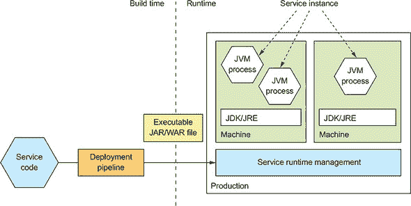

服务实例通常是单个进程，但有时也可能是一组进程。例如，Java 服务实例是一个运行 JVM 的进程。NodeJS 服务可能会产生多个工作进程以并发处理请求。一些语言支持在同一个进程中部署多个服务实例。

有时你可能会在机器上部署单个服务实例，同时保留在相同机器上部署多个服务实例的选项。例如，如图 12.4 所示，你可以在单台机器上运行多个 JVM。每个 JVM 运行一个服务实例。

##### 图 12.4\. 在同一台机器上部署多个服务实例。它们可能是同一服务的实例，也可能是不同服务的实例。操作系统的开销在服务实例之间共享。每个服务实例是一个单独的进程，因此它们之间有一定的隔离。

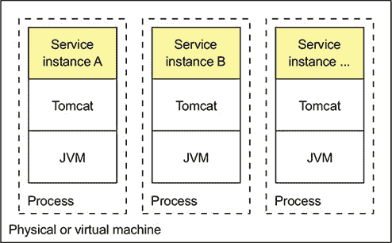

一些语言也允许你在单个进程中运行多个服务实例。例如，如图 12.5 所示，你可以在单个 Apache Tomcat 上运行多个 Java 服务。

##### 图 12.5\. 在同一 Web 容器或应用服务器上部署多个服务实例。它们可能是同一服务的实例，也可能是不同服务的实例。操作系统和运行时的开销在所有服务实例之间共享。但由于服务实例在同一个进程中，它们之间没有隔离。

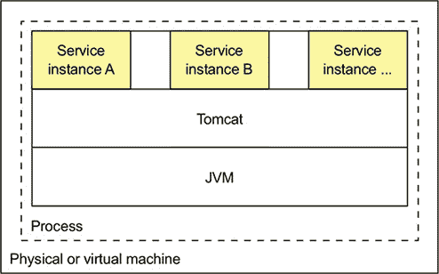

这种方法通常用于在传统的昂贵且重量级的应用服务器上部署应用程序，如 WebLogic 和 WebSphere。你还可以将服务打包成 OSGI 包，并在每个 OSGI 容器中运行多个服务实例。

服务作为特定语言包模式既有优点也有缺点。让我们首先看看优点。

#### 12.1.1\. 服务作为特定语言包模式的优点

服务作为特定语言包模式有几个优点：

+   快速部署

+   有效利用资源，尤其是在同一台机器或同一进程中运行多个实例时

让我们逐一查看。

##### 快速部署

这种模式的主要好处之一是部署服务实例相对较快：你将服务复制到主机并启动它。如果服务是用 Java 编写的，你将复制一个 JAR 或 WAR 文件。对于其他语言，如 NodeJS 或 Ruby，你将复制源代码。在两种情况下，通过网络复制的字节数相对较小。

此外，启动服务很少耗时。如果服务是其自己的进程，您就启动它。否则，如果服务是同一容器进程中运行的多个实例之一，您要么将其动态部署到容器中，要么重启容器。由于缺乏开销，启动服务通常很快。

##### 资源利用效率高

这种模式的另一个主要好处是它相对高效地使用资源。多个服务实例共享机器及其操作系统。如果多个服务实例在同一个进程中运行，则效率更高。例如，多个网络应用程序可以共享同一个 Apache Tomcat 服务器和 JVM。

#### 12.1.2. 作为特定语言包模式的“服务”的缺点

尽管这种模式具有吸引力，但作为特定语言包模式的“服务”存在几个显著的缺点：

+   技术栈缺乏封装。

+   无法限制服务实例消耗的资源。

+   在同一台机器上运行多个服务实例时缺乏隔离。

+   自动确定服务实例放置位置具有挑战性。

让我们来看看每个缺点。

##### 技术栈缺乏封装

运维团队必须了解如何部署每个服务的具体细节。每个服务都需要特定版本的运行时。例如，一个 Java 网络应用程序需要特定版本的 Apache Tomcat 和 JDK。运维团队必须安装每个所需软件包的正确版本。

情况变得更糟，服务可以是用各种语言和框架编写的。它们也可能使用这些语言和框架的多个版本。因此，开发团队必须与运维团队分享大量细节。这种复杂性增加了部署过程中出现错误的风险。例如，一台机器可能运行着错误的语言运行时版本。

##### 无法限制服务实例消耗的资源

另一个缺点是您无法限制服务实例消耗的资源。一个进程可能会消耗机器的所有 CPU 或内存，导致其他服务实例和操作系统资源匮乏。这种情况可能是因为一个错误。

##### 在同一台机器上运行多个服务实例时缺乏隔离

当在同一台机器上运行多个实例时，问题更为严重。缺乏隔离意味着一个行为不当的服务实例可能会影响其他服务实例。因此，应用程序可能会变得不可靠，尤其是在同一台机器上运行多个服务实例时。

##### 自动确定服务实例放置位置具有挑战性

在同一台机器上运行多个服务实例的另一个挑战是确定服务实例的位置。每台机器都有固定的一组资源，如 CPU、内存等，每个服务实例都需要一定量的资源。重要的是以高效使用机器且不过载的方式分配服务实例到机器上。我稍后会解释，基于 VM 的云和容器编排框架会自动处理这个问题。当原生部署服务时，你可能需要手动决定位置。

如你所见，尽管这种模式很熟悉，但作为语言特定包模式的 Service 也有一些显著的缺点。你应该很少使用这种方法，除非效率比其他所有问题都更重要。

现在我们来看看避免这些问题的现代服务部署方式。

### 12.2\. 使用 Service 作为虚拟机模式部署服务

再次想象，你想要部署 FTGO 的 `Restaurant Service`，但这次是在 AWS EC2 上。一个选择是创建并配置一个 EC2 实例，并将可执行文件或 WAR 文件复制到上面。尽管使用云会带来一些好处，但这种方法存在前面章节中描述的缺点。一个更好、更现代的方法是将服务打包成亚马逊机器镜像（AMI），如图 12.6 所示。每个服务实例都是由该 AMI 创建的 EC2 实例。这些 EC2 实例通常由 AWS 自动扩展组管理，该组试图确保始终运行着所需数量的健康实例。

| |
| --- |

**模式：将服务作为 VM 部署**

将打包为 VM 镜像的服务部署到生产环境中。每个服务实例都是一个 VM。见 [`microservices.io/patterns/deployment/service-per-vm.html`](http://microservices.io/patterns/deployment/service-per-vm.html)。

| |
| --- |

##### 图 12.6\. 部署管道将服务打包成虚拟机镜像，如 EC2 AMI，其中包含运行服务所需的一切，包括语言运行时。在运行时，每个服务实例都是一个 VM，如 EC2 实例，由该镜像实例化。EC2 弹性负载均衡器将请求路由到这些实例。

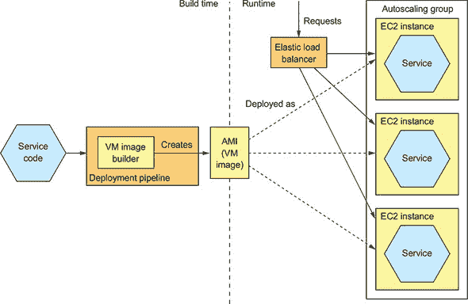

虚拟机镜像是由服务的部署管道构建的。如图 12.6 所示，部署管道运行一个 VM 镜像构建器来创建包含服务代码和运行它所需的任何软件的 VM 镜像。例如，FTGO 服务的 VM 构建器安装了 JDK 和服务的可执行 JAR。VM 镜像构建器配置 VM 镜像机器在 VM 启动时运行应用程序，使用 Linux 的 `init` 系统，如 upstart。

部署管道可以使用各种工具来构建虚拟机镜像。一个早期的用于创建 EC2 AMI 的工具是 Netflix 创建的 Aminator，它使用它来在 AWS 上部署其视频流媒体服务（[`github.com/Netflix/aminator`](https://github.com/Netflix/aminator)）。一个更现代的虚拟机镜像构建器是 Packer，与 Aminator 不同，它支持多种虚拟化技术，包括 EC2、Digital Ocean、Virtual Box 和 VMware（[www.packer.io](http://www.packer.io)）。要使用 Packer 创建 AMI，你需要编写一个配置文件，该文件指定了基础镜像和一组安装软件并配置 AMI 的 provisioners。

|  |
| --- |

**关于 Elastic Beanstalk**

AWS 提供的 Elastic Beanstalk 是一个使用虚拟机部署服务的简单方法。你上传你的代码，例如 WAR 文件，Elastic Beanstalk 将其作为一个或多个负载均衡和管理 EC2 实例部署。Elastic Beanstalk 可能不像 Kubernetes 那样时尚，但它是一个在 EC2 上部署基于微服务的应用程序的简单方法。

有趣的是，Elastic Beanstalk 结合了本章中描述的三个部署模式的元素。它支持多种语言的多种打包格式，包括 Java、Ruby 和.NET。它以虚拟机（VM）的形式部署应用程序，但与构建 AMI 不同，它使用一个基础镜像，该镜像在启动时安装应用程序。

Elastic Beanstalk 还可以部署 Docker 容器。每个 EC2 实例运行一个或多个容器的集合。与本章后面将要介绍的 Docker 编排框架不同，扩展的单位是 EC2 实例而不是容器。

|  |
| --- |

让我们来看看使用这种方法的好处和缺点。

#### 12.2.1\. 将服务作为虚拟机部署的好处

作为虚拟机的服务模式具有许多好处：

+   虚拟机镜像封装了技术堆栈。

+   隔离的服务实例。

+   使用成熟的云基础设施。

让我们逐一来看。

##### 虚拟机镜像封装了技术堆栈

这种模式的一个重要好处是虚拟机镜像包含了服务和所有依赖项。它消除了正确安装和设置服务运行所需软件的错误风险。一旦服务被封装为虚拟机，它就变成了一个封装了服务技术堆栈的黑盒。虚拟机镜像可以在不修改的情况下部署到任何地方。部署服务的 API 变成了虚拟机管理 API。部署变得简单且更可靠。

##### 服务实例是隔离的

虚拟机的一个主要好处是每个服务实例都在完全隔离的环境中运行。毕竟，这是虚拟机技术的主要目标之一。每个虚拟机都有固定数量的 CPU 和内存，并且不能从其他服务中窃取资源。

##### 使用成熟的云基础设施

将您的微服务作为虚拟机部署的另一个好处是您可以利用成熟的、高度自动化的云基础设施。公共云如 AWS 试图以避免过载机器的方式在物理机上调度虚拟机。它们还提供了如跨虚拟机的流量负载均衡和自动扩展等有价值的功能。

#### 12.2.2\. 将服务作为虚拟机部署的缺点

服务作为虚拟机模式也有一些缺点：

+   资源利用率较低

+   相对较慢的部署

+   系统管理开销

让我们逐一分析每个缺点。

##### 资源利用率较低

每个服务实例都有整个虚拟机的开销，包括其操作系统。此外，典型的公共 IaaS 虚拟机提供有限的虚拟机大小，因此虚拟机可能会被过度使用。这对于基于 Java 的服务来说不太可能成为问题，因为它们相对较重。但这种方法可能不是部署轻量级的 NodeJS 和 GoLang 服务的有效方式。

##### 相对较慢的部署

构建虚拟机镜像通常需要一些时间，因为虚拟机的大小。需要通过网络传输大量的数据。此外，从虚拟机镜像实例化虚拟机由于再次需要通过网络传输大量数据而耗时。虚拟机内部运行的操作系统也需要一些时间来启动，尽管“慢”是一个相对术语。这个过程可能需要几分钟，比传统的部署过程快得多。但它比您即将读到的更轻量级的部署模式慢得多。

##### 系统管理开销

您负责修补操作系统和运行时。在部署软件时，系统管理似乎是不可避免的，但在第 12.5 节中，我将描述无服务器部署，它消除了这种类型的系统管理。

现在让我们看看一种更轻量级但仍然具有许多虚拟机优点的方式来部署微服务。

### 12.3\. 使用服务作为容器模式部署服务

容器是一种更现代且轻量级的部署机制。它们是操作系统级别的虚拟化机制。正如图 12.7 所示，容器通常包含一个但有时是多个在沙盒中运行的进程，这将其与其他容器隔离开来。例如，运行 Java 服务的容器通常包含 JVM 进程。

##### 图 12.7\. 容器由一个或多个在隔离沙盒中运行的进程组成。通常多个容器运行在单个机器上。容器共享操作系统。

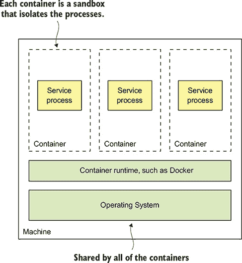

从容器中运行的过程的角度来看，它就像是在自己的机器上运行一样。它通常有自己的 IP 地址，这消除了端口冲突。例如，所有 Java 进程都可以监听 8080 端口。每个容器也有自己的根文件系统。容器运行时使用操作系统机制来隔离容器。最流行的容器运行时示例是 Docker，尽管还有其他，如 Solaris Zones。

| |
| --- |

**模式：将服务作为容器部署**

将打包为容器镜像的服务部署到生产环境中。每个服务实例都是一个容器。请参阅[`microservices.io/patterns/deployment/service-per-container.html`](http://microservices.io/patterns/deployment/service-per-container.html)。

| |
| --- |

当你创建一个容器时，你可以指定它的 CPU、内存资源，以及根据容器实现的不同，可能还有 I/O 资源。容器运行时强制执行这些限制，并防止容器占用其机器的资源。当使用如 Kubernetes 这样的 Docker 编排框架时，指定容器的资源尤为重要。这是因为编排框架使用容器请求的资源来选择运行容器的机器，从而确保机器不会被过载。

图 12.8 展示了将服务作为容器部署的过程。在构建时，部署管道使用容器镜像构建工具，读取服务的代码和镜像描述，以创建容器镜像并将其存储在注册表中。在运行时，从注册表中拉取容器镜像并用于创建容器。

##### 图 12.8\. 服务被打包为容器镜像，并存储在注册表中。在运行时，服务由从该镜像实例化的多个容器组成。容器通常在虚拟机上运行。单个虚拟机通常会运行多个容器。

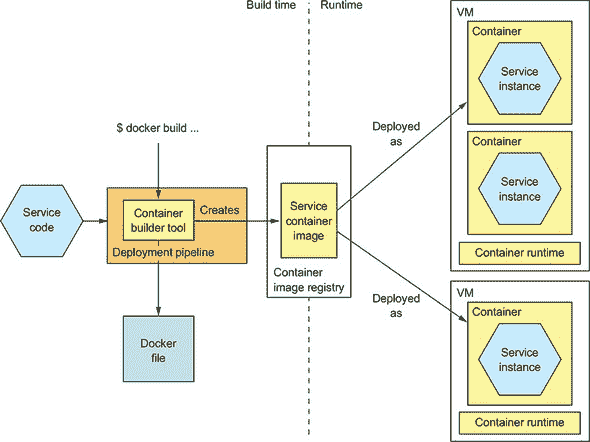

让我们更详细地看看构建时和运行时步骤。

#### 12.3.1\. 使用 Docker 部署服务

要将服务作为容器部署，你必须将其打包为容器镜像。*容器镜像*是一个包含应用程序和运行服务所需的任何软件的文件系统镜像。它通常是一个完整的 Linux 根文件系统，尽管也使用了更轻量级的镜像。例如，要部署基于 Spring Boot 的服务，你需要构建一个包含服务的可执行 JAR 文件和正确版本的 JDK 的容器镜像。同样，要部署 Java Web 应用程序，你将构建一个包含 WAR 文件、Apache Tomcat 和 JDK 的容器镜像。

##### 构建 Docker 镜像

构建镜像的第一步是创建一个 Dockerfile。一个 *Dockerfile* 描述了如何构建 Docker 容器镜像。它指定了基础容器镜像、一系列用于安装软件和配置容器的指令，以及容器创建时运行的 shell 命令。列表 12.1 展示了用于构建 `Restaurant Service` 镜像的 Dockerfile。它构建了一个包含服务可执行 JAR 文件的容器镜像。它配置容器在启动时运行 `java -jar` 命令。

##### 列表 12.1\. 构建 `Restaurant Service` 所使用的 `Dockerfile`

```
FROM openjdk:8u171-jre-alpine                                              *1*
RUN apk --no-cache add curl                                                *2*
CMD java ${JAVA_OPTS} -jar ftgo-restaurant-service.jar                     *3*
HEALTHCHECK --start-period=30s --
     interval=5s CMD curl http://localhost:8080/actuator/health || exit 1  *4*
COPY build/libs/ftgo-restaurant-service.jar .                              *5*
```

+   ***1* 基础镜像**

+   ***2* 安装 curl 以供健康检查使用。**

+   ***3* 配置 Docker 在容器启动时运行 java -jar 命令。**

+   ***4* 配置 Docker 调用健康检查端点。**

+   ***5* 将 Gradle 构建目录中的 JAR 复制到镜像中**

基础镜像 `openjdk:8u171-jre-alpine` 是一个包含 JRE 的最小化 Linux 镜像。Dockerfile 将服务的 JAR 文件复制到镜像中，并配置镜像在启动时执行 JAR 文件。它还配置 Docker 定期调用 第十一章 中描述的健康检查端点。`HEALTHCHECK` 指令表示在初始 30 秒延迟后每 5 秒调用一次健康检查端点 API，这给服务提供了启动时间。

一旦编写了 `Dockerfile`，就可以构建镜像。以下列表展示了构建 `Restaurant Service` 镜像的 shell 命令。脚本构建了服务的 JAR 文件，并执行 `docker build` 命令以创建镜像。

##### 列表 12.2\. 构建 `Restaurant Service` 容器镜像所使用的 shell 命令

```
cd ftgo-restaurant-service                        *1*
../gradlew assemble                               *2*
docker build -t ftgo-restaurant-service .         *3*
```

+   ***1* 切换到服务的目录。**

+   ***2* 构建服务的 JAR 文件。**

+   ***3* 构建镜像。**

`docker build` 命令有两个参数：`-t` 参数指定镜像的名称，`.` 指定 Docker 所称的上下文。在这个例子中，上下文是当前目录，包括 `Dockerfile` 和构建镜像所使用的文件。`docker build` 命令将上下文上传到 Docker 守护进程，该守护进程构建镜像。

##### 将 Docker 镜像推送到注册库

构建过程的最后一步是将新构建的 Docker 镜像推送到称为注册库的地方。Docker *注册库* 等同于 Java Maven 仓库中的 Java 库，或者 NodeJS npm 仓库中的 NodeJS 包。Docker Hub 是一个公共 Docker 注册库的例子，相当于 Maven Central 或 NpmJS.org。但对你自己的应用程序来说，你可能希望使用由服务提供者提供的私有注册库，例如 Docker Cloud 注册库或 AWS EC2 容器注册库。

您必须使用两个 Docker 命令将镜像推送到注册表。首先，您使用 `docker tag` 命令给镜像一个以注册表的主机名和可选端口为前缀的名称。镜像名称还附加了版本号，这在您发布服务的新版本时将非常重要。例如，如果注册表的主机名是 `registry.acme.com`，您将使用此命令标记镜像：

```
docker tag ftgo-restaurant-service registry.acme.com/ftgo-restaurant-
     service:1.0.0.RELEASE
```

接下来，您使用 `docker push` 命令将标记的镜像上传到注册表：

```
docker push registry.acme.com/ftgo-restaurant-service:1.0.0.RELEASE
```

此命令通常比您预期的要快得多。这是因为 Docker 镜像有一个被称为 *分层文件系统* 的特性，这使得 Docker 只需要通过网络传输镜像的一部分。镜像的操作系统、Java 运行时和应用程序位于不同的层。Docker 只需要传输那些在目标中不存在的层。因此，当 Docker 只需要移动应用程序的层（这些层是镜像的一小部分）时，通过网络传输镜像就非常快了。

现在我们已经将镜像推送到注册表，让我们看看如何创建一个容器。

##### 运行 Docker 容器

一旦您将服务打包成容器镜像，您就可以创建一个或多个容器。容器基础设施将从注册表将镜像拉取到生产服务器上。然后，它将从这个镜像创建一个或多个容器。每个容器都是您服务的实例。

如您所预期的那样，Docker 提供了一个 `docker run` 命令来创建并启动一个容器。列表 12.3 展示了如何使用此命令运行 `Restaurant Service`。`docker run` 命令有几个参数，包括容器镜像和在运行时容器中设置的指定环境变量。这些用于传递外部化配置，例如数据库的网络位置等。

##### 列表 12.3\. 使用 `docker run` 运行容器化服务

```
docker run \
  -d  \                                                               *1*
  --name ftgo-restaurant-service  \                                   *2*
  -p 8082:8080  \                                                     *3*
  -e SPRING_DATASOURCE_URL=... -e SPRING_DATASOURCE_USERNAME=...  \   *4*
  -e SPRING_DATASOURCE_PASSWORD=... \
  registry.acme.com/ftgo-restaurant-service:1.0.0.RELEASE             *5*
```

+   ***1* 作为后台守护进程运行**

+   ***2* 容器的名称**

+   ***3* 将容器的 8080 端口绑定到主机的 8082 端口**

+   ***4* 环境变量**

+   ***5* 要运行的镜像**

`docker run` 命令在必要时从注册表拉取镜像。然后它创建并启动容器，该容器运行 `Dockerfile` 中指定的 `java -jar` 命令。

使用 `docker run` 命令可能看起来很简单，但有几个问题。一个是 `docker run` 并不是一个可靠的服务部署方式，因为它创建了一个在单个机器上运行的容器。Docker 引擎提供了一些基本的管理功能，例如在容器崩溃或机器重启时自动重启容器。但它不处理机器崩溃的情况。

另一个问题是在通常情况下，服务并不是孤立的存在的。它们依赖于其他服务，例如数据库和消息代理。能够作为一个单元部署或卸载服务及其依赖项将是非常好的。

一种更好的方法，尤其是在开发期间非常有用，是使用 Docker Compose。Docker Compose 是一个工具，它允许你使用 YAML 文件声明性地定义一组容器，然后作为一个组启动和停止这些容器。更重要的是，YAML 文件是一种方便的方式来指定许多外部化配置属性。要了解更多关于 Docker Compose 的信息，我建议阅读 Jeff Nickoloff 的《Docker 实战》（Manning，2016 年）并查看示例代码中的 docker-compose.yml 文件。

Docker Compose 的问题在于它仅限于单台机器。为了可靠地部署服务，你必须使用 Docker 编排框架，例如 Kubernetes，它将一组机器转换成一个资源池。我将在第 12.4 节中描述如何使用 Kubernetes。首先，让我们回顾一下使用容器的好处和缺点。

#### 12.3.2. 将服务作为容器部署的好处

将服务作为容器部署有几个好处。首先，容器具有许多虚拟机的优点：

+   技术堆栈的封装，其中管理你的服务的 API 成为容器 API。

+   服务实例是隔离的。

+   服务实例的资源受到限制。

但与虚拟机不同，容器是一种轻量级技术。容器镜像通常构建得很快。例如，在我的笔记本电脑上，将 Spring Boot 应用程序打包成容器镜像只需要大约五秒钟。在网络上移动容器镜像，例如到和从容器注册库，也相对较快，主要是因为只需要传输镜像层的一个子集。容器启动也非常快，因为没有漫长的操作系统启动过程。当容器启动时，只运行服务。

#### 12.3.3. 将服务作为容器部署的缺点

容器的一个显著缺点是，你必须负责管理容器镜像的无差别的繁重工作。你必须修补操作系统和运行时。此外，除非你使用托管容器解决方案，如 Google Container Engine 或 AWS ECS，否则你必须管理容器基础设施，以及可能运行在其上的虚拟机基础设施。

### 12.4. 使用 Kubernetes 部署 FTGO 应用程序

现在我们已经了解了容器及其权衡，让我们看看如何使用 Kubernetes 部署 FTGO 应用的`Restaurant Service`。如 12.3.1 节中描述的 Docker Compose 非常适合开发和测试。但要在生产中可靠地运行容器化服务，您需要使用更复杂的容器运行时，例如 Kubernetes。Kubernetes 是一个 Docker 编排框架，它是 Docker 之上的一个软件层，将一组机器转换成一个单一的资源池来运行服务。它努力保持每个服务所需实例的数量始终运行，即使服务实例或机器崩溃。容器的灵活性与 Kubernetes 的复杂性相结合，是部署服务的一种有吸引力的方式。

在本节中，我首先概述 Kubernetes 的功能和架构。之后，我将展示如何使用 Kubernetes 部署服务。Kubernetes 是一个复杂的话题，全面覆盖它超出了本书的范围，因此我只从开发者的角度展示如何使用 Kubernetes。有关更多信息，我推荐 Marko Luksa 所著的《Kubernetes 实战》（Manning, 2018）。

#### 12.4.1\. Kubernetes 概述

Kubernetes 是一个 Docker 编排框架。*Docker 编排框架*将运行 Docker 的一组机器视为资源池。您告诉 Docker 编排框架运行您服务的*N*个实例，然后它处理其余部分。图 12.9 显示了 Docker 编排框架的架构。

##### 图 12.9\. Docker 编排框架将运行 Docker 的一组机器转换成一个资源集群。它将容器分配到机器上。该框架试图始终保持所需数量的健康容器运行。

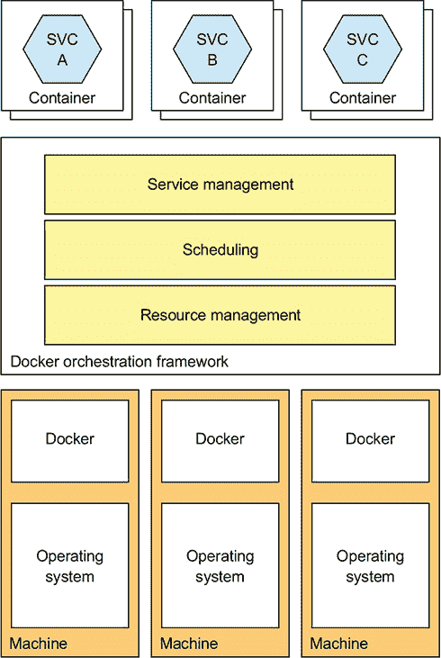

例如 Kubernetes 这样的 Docker 编排框架有三个主要功能：

+   ***资源管理*—** 将机器集群视为 CPU、内存和存储卷的资源池，将机器集合转换成一个单一机器。

+   ***调度*—** 选择运行您的容器的机器。默认情况下，调度会考虑容器的资源需求以及每个节点的可用资源。它还可能实现*亲和性*，将容器放置在同一节点上，以及*反亲和性*，将容器放置在不同的节点上。

+   ***服务管理*—** 实现了命名和版本化服务的概念，这些服务直接映射到微服务架构中的服务。编排框架确保始终运行着所需数量的健康实例。它在这些实例之间进行负载均衡。编排框架执行服务的滚动升级，并允许您回滚到旧版本。

Docker 编排框架是部署应用程序越来越受欢迎的方式。Docker Swarm 是 Docker 引擎的一部分，因此易于设置和使用。Kubernetes 的设置和管理要复杂得多，但功能更强大。在撰写本文时，Kubernetes 具有巨大的动力，拥有庞大的开源社区。让我们更深入地了解一下它是如何工作的。

##### Kubernetes 架构

Kubernetes 运行在机器集群上。图 12.10 显示了 Kubernetes 集群的架构。Kubernetes 集群中的每台机器要么是主节点，要么是节点。一个典型的集群拥有少量主节点——可能只有一个——以及许多节点。*主节点*负责管理集群。*节点*是一个运行一个或多个 Pod 的工作节点。*Pod*是 Kubernetes 的部署单元，由一组容器组成。

##### 图 12.10\. Kubernetes 集群由一个主节点组成，该节点管理集群，以及运行服务的节点。开发人员和部署管道通过 API 服务器与 Kubernetes 交互，该服务器与其他集群管理软件一起运行在主节点上。应用程序容器在节点上运行。每个节点运行一个 Kubelet，它管理应用程序容器，以及一个 kube-proxy，它将应用程序请求路由到 Pod，要么直接作为代理，要么通过配置 Linux 内核中内置的 iptables 路由规则间接地。

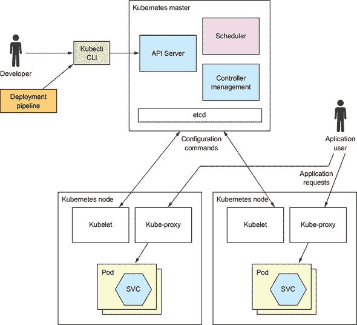

主节点运行以下组件：

+   ***API 服务器*—** 部署和管理服务的 REST API，例如`kubectl`命令行界面所使用的。

+   ***Etcd*—** 一个键值 NoSQL 数据库，用于存储集群数据。

+   ***调度器*—** 选择一个节点来运行 Pod。

+   ***控制器管理器*—** 运行控制器，确保集群的状态与预期状态相匹配。例如，一种称为 *复制* 控制器的控制器确保通过启动和终止实例来运行所需数量的服务实例。

节点运行以下组件：

+   ***Kubelet*—** 创建和管理节点上运行的 Pod

+   ***Kube-proxy*—** 管理网络，包括跨 Pod 的负载均衡

+   ***Pods*—** 应用程序服务

现在我们来看看您需要掌握的关键 Kubernetes 概念，以便在 Kubernetes 上部署服务。

##### 关键 Kubernetes 概念

如本节引言中所述，Kubernetes 相当复杂。但一旦掌握了几个关键概念，即所谓的 *对象*，就可以有效地使用 Kubernetes。Kubernetes 定义了许多类型的对象。从开发人员的角度来看，最重要的对象如下：

+   ***Pod***—**Pod 是 Kubernetes 中部署的基本单元。它由一个或多个共享 IP 地址和存储卷的容器组成。服务实例的 pod 通常只包含一个容器，例如运行 JVM 的容器。但在某些场景下，pod 包含一个或多个 *sidecar* 容器，这些容器实现支持功能。例如，一个 NGINX 服务器可以有一个 sidecar，它定期执行 `git pull` 来下载网站的最新版本。Pod 是短暂的，因为 pod 的容器或其运行的节点可能会崩溃**。

+   ***部署***—**一个 pod 的声明性规范。部署是一个控制器，确保 pod（服务实例）的期望实例数始终在运行。它支持通过滚动升级和回滚进行版本控制。在第 12.4.2 节的后面，你将看到在微服务架构中，每个服务都是一个 Kubernetes 部署**。

+   ***服务***—**为应用程序服务的客户端提供一个静态/稳定的网络位置。它是一种基础设施提供的服务发现形式，在第三章中进行了描述。服务有一个 IP 地址和一个解析到该 IP 地址的 DNS 名称，并在一个或多个 pod 上进行 TCP 和 UDP 流量的负载均衡。IP 地址和 DNS 名称仅在 Kubernetes 内部可访问。稍后，我将描述如何配置可以从集群外部访问的服务。

+   ***ConfigMap***—**一个命名集合，包含一组键值对，用于定义一个或多个应用程序服务的外部化配置（有关外部化配置的概述，请参阅第十一章）。pod 容器的定义可以引用 ConfigMap 来定义容器的环境变量。它还可以使用 ConfigMap 在容器内创建配置文件。你可以将敏感信息，如密码，以 ConfigMap 的形式存储在 Secret 中。

现在我们已经回顾了关键 Kubernetes 概念，让我们通过查看如何在 Kubernetes 上部署应用程序服务来观察它们在实际中的应用。

#### 12.4.2\. 在 Kubernetes 上部署 Restaurant 服务

如前所述，要在 Kubernetes 上部署服务，你需要定义一个部署。创建 Kubernetes 对象（如部署）的最简单方法是编写一个 YAML 文件。列表 12.4 是一个定义 `Restaurant Service` 部署的 YAML 文件。此部署指定运行两个 pod 实例。该 pod 只有一个容器。容器定义指定了运行的 Docker 镜像以及其他属性，如环境变量的值。容器的环境变量是服务的外部化配置。Spring Boot 读取这些环境变量，并在应用程序上下文中作为属性提供。

##### 列表 12.4\. Kubernetes `Deployment` for `ftgo-restaurant-service`

```
apiVersion: extensions/v1beta1
kind: Deployment                                               *1*
 metadata:
  name: ftgo-restaurant-service                                *2*
 spec:
  replicas: 2                                                  *3*
   template:
    metadata:
      labels:
        app: ftgo-restaurant-service                           *4*
     spec:                                                     *5*
       containers:
       - name: ftgo-restaurant-service
         image: msapatterns/ftgo-restaurant-service:latest
         imagePullPolicy: Always
         ports:
         - containerPort: 8080                                 *6*
           name: httpport
         env:                                                  *7*
           - name: JAVA_OPTS
             value: "-Dsun.net.inetaddr.ttl=30"
           - name: SPRING_DATASOURCE_URL
             value: jdbc:mysql://ftgo-mysql/eventuate
           - name: SPRING_DATASOURCE_USERNAME
             valueFrom:
               secretKeyRef:
                 name: ftgo-db-secret
                 key: username
           - name: SPRING_DATASOURCE_PASSWORD
             valueFrom:
               secretKeyRef:
                 name: ftgo-db-secret                          *8*
                 key: password
           - name: SPRING_DATASOURCE_DRIVER_CLASS_NAME
             value: com.mysql.jdbc.Driver
           - name: EVENTUATELOCAL_KAFKA_BOOTSTRAP_SERVERS
             value: ftgo-kafka:9092
           - name: EVENTUATELOCAL_ZOOKEEPER_CONNECTION_STRING
             value: ftgo-zookeeper:2181
         livenessProbe:                                        *9*
           httpGet:
             path: /actuator/health
             port: 8080
           initialDelaySeconds: 60
           periodSeconds: 20
         readinessProbe:
           httpGet:
             path: /actuator/health
             port: 8080
           initialDelaySeconds: 60
           periodSeconds: 20
```

+   ***1* 指定这是一个类型为 Deployment 的对象**

+   ***2* 部署的名称**

+   ***3* Pod 副本的数量**

+   ***4* 为每个 Pod 分配一个名为 app 的标签，其值为 ftgo-restaurant-service**

+   ***5* Pod 的规范，仅定义了一个容器**

+   ***6* 容器的端口**

+   ***7* 容器的环境变量，这些变量由 Spring Boot 读取**

+   ***8* 从名为 ftgo-db-secret 的 Kubernetes Secret 中检索的敏感值**

+   ***9* 配置 Kubernetes 调用健康检查端点。**

此部署定义配置 Kubernetes 调用 `Restaurant Service` 的健康检查端点。如第十一章所述（kindle_split_019.xhtml#ch11），健康检查端点使 Kubernetes 能够确定服务实例的健康状况。Kubernetes 实现了两种不同的检查。第一种检查是 `readinessProbe`，它用于确定是否应将流量路由到服务实例。在此示例中，Kubernetes 在初始 30 秒延迟后每 20 秒调用一次 `/actuator/health` HTTP 端点，这给了它初始化的机会。如果连续出现一定数量（默认为 1）的 `readinessProbes` 成功，Kubernetes 认为服务已就绪；而如果连续出现一定数量（默认为 3）的 `readinessProbes` 失败，则认为服务未就绪。只有当 `readinessProbe` 指示服务就绪时，Kubernetes 才会将流量路由到服务实例。

第二个健康检查是 `livenessProbe`。它的配置方式与 `readinessProbe` 相同。但与确定是否将流量路由到服务实例不同，`livenessProbe` 确定 Kubernetes 是否应该终止并重新启动服务实例。如果连续出现一定数量（默认为 3）的 `livenessProbes` 失败，Kubernetes 将终止并重新启动服务。

一旦编写了 YAML 文件，您可以使用 `kubectl apply` 命令创建或更新部署：

```
kubectl apply -f ftgo-restaurant-service/src/deployment/kubernetes/ftgo-
     restaurant-service.yml
```

此命令向 Kubernetes API 服务器发出请求，导致部署和 Pod 的创建。

要创建此部署，您必须首先创建名为 `ftgo-db-secret` 的 Kubernetes Secret。一种快速但不安全的方法如下：

```
kubectl create secret generic ftgo-db-secret \
  --from-literal=username=mysqluser --from-literal=password=mysqlpw
```

此命令创建一个包含在命令行上指定的数据库用户 ID 和密码的 secret。有关创建 secret 的更安全方法，请参阅 Kubernetes 文档（[`kubernetes.io/docs/concepts/configuration/secret/#creating-your-own-secrets`](https://kubernetes.io/docs/concepts/configuration/secret/#creating-your-own-secrets)）。

##### 创建 Kubernetes 服务

到目前为止，Pod 正在运行，Kubernetes 部署将尽力保持它们运行。问题是 Pod 具有动态分配的 IP 地址，因此对于想要发起 HTTP 请求的客户端来说并不那么有用。如第三章所述，解决方案是使用服务发现机制。一种方法是在客户端使用发现机制并安装服务注册表，例如 Netflix OSS Eureka。幸运的是，我们可以通过使用 Kubernetes 内置的服务发现机制并定义 Kubernetes 服务来避免这样做。

*服务*是 Kubernetes 对象，为一个或多个 Pod 的客户端提供一个稳定的端点。它有一个 IP 地址和一个 DNS 名称，该名称解析该 IP 地址。服务将流量负载均衡到该 IP 地址的 Pod 上。列表 12.5 显示了`Restaurant Service`的 Kubernetes 服务。此服务将流量从`http://ftgo-restaurant-service:8080`路由到列表中定义的部署所定义的 Pod。

##### 列表 12.5\. `ftgo-restaurant-service`的 Kubernetes 服务的 YAML 定义

```
apiVersion: v1
kind: Service
metadata:
  name: ftgo-restaurant-service          *1*
 spec:
  ports:
  - port: 8080                           *2*
     targetPort: 8080                    *3*
  selector:
    app: ftgo-restaurant-service         *4*
 ---
```

+   ***1* 服务的名称，也是 DNS 名称**

+   ***2* 暴露的端口**

+   ***3* 路由流量的容器端口**

+   ***4* 选择要路由流量的容器**

服务定义的关键部分是`selector`，它选择目标 Pod。它选择那些具有名为`app`且值为`ftgo-restaurant-service`的标签的 Pod。如果你仔细看，你会看到列表 12.4 中定义的容器具有这样的标签。

一旦你编写了 YAML 文件，你可以使用以下命令创建服务：

```
kubectl apply -f ftgo-restaurant-service-service.yml
```

现在我们已经创建了 Kubernetes 服务，任何在 Kubernetes 集群内部运行的`Restaurant Service`客户端都可以通过`http://ftgo-restaurant-service:8080`访问其 REST API。稍后我将讨论如何升级运行中的服务，但首先让我们看看如何使服务从 Kubernetes 集群外部可访问。

#### 12.4.3\. 部署 API 网关

Kubernetes 的`Restaurant Service`服务，如列表 12.5 所示，仅可在集群内部访问。这对`Restaurant Service`来说没问题，但`API Gateway`怎么办？它的作用是将外部世界的流量路由到服务。因此，它需要从集群外部可访问。幸运的是，Kubernetes 服务也支持这种用例。我们之前查看的服务是一个`ClusterIP`服务，这是默认设置，但事实上还有两种其他类型的服务：`NodePort`和`LoadBalancer`。

`NodePort`服务可通过集群中所有节点的集群端口访问。任何集群节点上的该端口的流量都将负载均衡到后端 Pod。你必须选择 30000-32767 范围内的可用端口。例如，列表 12.6 显示了一个将流量路由到`Consumer Service`的 30000 端口的服务的示例。

##### 列表 12.6\. `NodePort`服务的 YAML 定义，该服务将流量路由到`Consumer Service`的 8082 端口

```
apiVersion: v1
kind: Service
metadata:
  name: ftgo-api-gateway
spec:
  type: NodePort              *1*
  ports:
  - nodePort: 30000           *2*
     port: 80
    targetPort: 8080
  selector:
    app: ftgo-api-gateway
---
```

+   ***1* 指定 NodePort 类型**

+   ***2* 集群端口**

`API Gateway`位于集群内部，使用 URL `http://ftgo-api-gateway`，外部 URL 为`http://<node-ip-address>:3000/`，其中`node-ip-address`是集群中某个节点的 IP 地址。配置一个`NodePort`服务后，例如，你可以配置一个 AWS 弹性负载均衡器（ELB）来在节点之间负载均衡来自互联网的请求。这种方法的优点是 ELB 完全受你控制。在配置它时，你拥有完全的灵活性。

虽然`NodePort`类型服务不是唯一的选择，你也可以使用`LoadBalancer`服务，它会自动配置一个特定于云的负载均衡器。如果 Kubernetes 运行在 AWS 上，负载均衡器将是一个 ELB。这种类型服务的优点是，你不再需要配置自己的负载均衡器。然而，缺点是，尽管 Kubernetes 确实提供了一些配置 ELB 的选项，例如 SSL 证书，但你对其配置的控制力大大降低。

#### 12.4.4\. 无停机部署

假设你已经更新了`Restaurant Service`并希望将这些更改部署到生产环境中。当使用 Kubernetes 时，更新运行中的服务是一个简单的三步过程：

1.  使用前面描述的相同过程构建一个新的容器镜像并将其推送到注册表。唯一的不同之处在于，该镜像将带有不同的版本标签——例如，`ftgo-restaurant-service:1.1.0.RELEASE`。

1.  编辑服务的部署的 YAML 文件，使其引用新的镜像。

1.  使用`kubectl apply -f`命令更新部署。

Kubernetes 随后将对 Pod 执行滚动升级。它将逐步创建运行版本`1.1.0.RELEASE`的 Pod，并终止运行版本`1.0.0.RELEASE`的 Pod。Kubernetes 这样做的好处是，它不会在替代 Pod 准备好处理请求之前终止旧 Pod。它使用前面在本节中描述的`readinessProbe`机制来确定 Pod 是否就绪。因此，始终会有 Pod 可用于处理请求。最终，假设新 Pod 启动成功，所有部署的 Pod 都将运行新版本。

但如果出现问题，版本 `1.1.0.RELEASE` 的 pod 无法启动怎么办？可能是因为存在错误，例如容器镜像名称拼写错误或新配置属性缺少环境变量。如果 pod 启动失败，部署将陷入停滞。在这种情况下，您有两个选择。一个选择是修复 YAML 文件并重新运行 `kubectl apply -f` 来更新部署。另一个选择是回滚部署。

每次更新部署时，都会维护所谓的 *发布历史*。每次更新部署，它都会创建一个新的发布。因此，您可以通过执行以下命令轻松地将部署回滚到以前的版本：

```
kubectl rollout undo deployment ftgo-restaurant-service
```

Kubernetes 将用运行旧版本 `1.0.0.RELEASE` 的 pod 替换运行版本 `1.1.0.RELEASE` 的 pod。

Kubernetes 部署是一种在不中断服务的情况下部署服务的好方法。但是，如果错误仅在 pod 准备就绪并接收生产流量后出现怎么办？在这种情况下，Kubernetes 将继续推出新版本，因此越来越多的用户将受到影响。尽管您的监控系统可能会检测到问题并快速回滚部署，但您仍然无法避免至少影响一些用户。为了解决这个问题并使服务的新版本发布更加可靠，我们需要将 *部署*（意味着使服务在生产中运行）与 *发布*（意味着使其能够处理生产流量）分开。让我们看看如何使用服务网格来实现这一点。

#### 12.4.5\. 使用服务网格将部署与发布分离

部署服务新版本的传统方式是首先在预发布环境中进行测试。然后，一旦它通过了预发布环境的测试，您就可以通过滚动升级来部署到生产环境中，用新的服务实例替换旧的服务实例。一方面，正如您刚才看到的，Kubernetes 部署使滚动升级变得非常简单。另一方面，这种方法假设一旦服务版本通过了预发布环境的测试，它将在生产中工作。遗憾的是，这并不总是如此。

一个原因是，如果只是为了生产环境可能要大得多并处理更多的流量，那么预发布环境不太可能是一个精确的克隆。保持两个环境同步也很耗时。由于差异，一些错误可能仅在生产环境中出现。即使是一个精确的克隆，您也无法保证测试会捕获所有错误。

将部署与发布分离是一种推出新版本的更可靠的方法：

+   ***部署*—** 在生产环境中运行

+   ***发布服务*—** 使其可供最终用户使用

您可以使用以下步骤将服务部署到生产环境中：

1.  将新版本部署到生产环境中，而不将任何最终用户请求路由到它。

1.  在生产环境中测试它。

1.  将其发布给少数最终用户。

1.  逐步将其发布给越来越多的用户，直到它处理所有生产流量。

1.  如果在任何时候出现问题，则回滚到旧版本——否则，一旦您确信新版本运行正确，则删除旧版本。

理想情况下，这些步骤将由一个完全自动化的部署管道执行，该管道会仔细监控新部署的服务以查找错误。

传统上，以这种方式分离部署和发布一直具有挑战性，因为它需要大量工作来实现。但使用服务网格的一个好处是，采用这种部署风格要容易得多。正如第十一章所述，*服务网格*是一种网络基础设施，它介助于服务与其他服务和外部应用程序之间的所有通信。除了承担一些微服务框架的责任外，服务网格还提供基于规则的负载均衡和流量路由，让您能够安全地同时运行多个服务版本。在本节稍后，您将看到您可以路由测试用户到服务的一个版本，而最终用户则使用另一个版本，例如。

正如第十一章所述，有几种服务网格可供选择。在本节中，我将向您展示如何使用 Istio，这是一个由 Google、IBM 和 Lyft 最初开发的开源服务网格。我首先提供一个关于 Istio 及其众多功能的简要概述。接下来，我描述了如何使用 Istio 部署应用程序。之后，我将展示如何使用其流量路由功能来部署和发布服务的升级。

##### Istio 服务网格概述

Istio 网站将 Istio 描述为“一个用于连接、管理和保护微服务的开放平台” ([`istio.io`](https://istio.io))。它是一个网络层，所有服务的网络流量都通过它流动。Istio 具有丰富的功能集，分为四大类：

+   **流量管理**—** 包括服务发现、负载均衡、路由规则和断路器

+   **安全**—** 使用传输层安全（TLS）确保服务间通信的安全

+   **遥测**—** 捕获关于网络流量的指标并实现分布式跟踪

+   **策略执行**—** 执行配额和速率限制

本节重点介绍 Istio 的流量管理功能。

图 12.11 显示了 Istio 的架构。它由控制平面和数据平面组成。控制平面实现管理功能，包括配置数据平面以路由流量。数据平面由 Envoy 代理组成，每个服务实例一个。

##### 图 12.11\. Istio 由一个控制平面组成，其组件包括 Pilot 和 Mixer，以及一个数据平面，该数据平面由 Envoy 代理服务器组成。Pilot 从底层基础设施中提取已部署服务的相关信息并配置数据平面。Mixer 强制执行诸如配额等策略并收集遥测数据，将其报告给监控基础设施服务器。Envoy 代理服务器在服务之间路由流量。每个服务实例都有一个 Envoy 代理服务器。

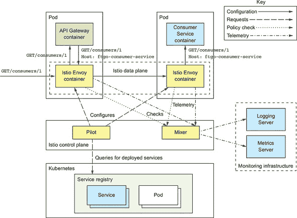

控制平面的两个主要组件是 Pilot 和 Mixer。*Pilot* 从底层基础设施中提取已部署服务的相关信息。例如，当在 Kubernetes 上运行时，Pilot 获取服务和健康 pod。它配置 Envoy 代理以根据定义的路由规则路由流量。*Mixer* 从 Envoy 代理收集遥测数据并强制执行策略。

Istio Envoy 代理是 Envoy 的修改版本 ([www.envoyproxy.io](http://www.envoyproxy.io))。它是一个高性能代理，支持多种协议，包括 TCP、低级协议如 HTTP 和 HTTPS，以及高级协议。它还理解 MongoDB、Redis 和 DynamoDB 协议。Envoy 还支持具有断路器、速率限制和自动重试等功能的强大跨服务通信。它可以通过使用 TLS 进行 Envoy 之间的通信来保护应用程序内的通信。

Istio 使用 Envoy 作为边车，一个与服务实例并行运行的进程或容器，并实现跨切面关注点。当在 Kubernetes 上运行时，Envoy 代理是服务 pod 内的一个容器。在其他没有 pod 概念的环境中，Envoy 在与服务的同一容器中运行。所有进入和离开服务的流量都通过其 Envoy 代理流动，该代理根据控制平面提供的路由规则路由流量。例如，直接服务 → 服务通信变为服务 → 源 Envoy → 目标 Envoy → 服务。

| |
| --- |

**模式：边车**

在与服务实例并行运行的边车进程或容器中实现跨切面关注点。请参阅 [`microservices.io/patterns/deployment/sidecar.html`](http://microservices.io/patterns/deployment/sidecar.html)。

| |
| --- |

Istio 使用类似 Kubernetes 风格的 YAML 配置文件进行配置。它有一个名为 `istioctl` 的命令行工具，类似于 `kubectl`。您使用 `istioctl` 创建、更新和删除规则和政策。当在 Kubernetes 上使用 Istio 时，您也可以使用 `kubectl`。

让我们看看如何使用 Istio 部署服务。

##### 使用 Istio 部署服务

在 Istio 上部署服务相当简单。你为你的应用程序服务的每个服务定义一个 Kubernetes `Service` 和一个 `Deployment`。列表 12.7 展示了 `Consumer Service` 的 `Service` 和 `Deployment` 定义。尽管它与之前我展示的定义几乎相同，但有一些差异。这是因为 Istio 对 Kubernetes 服务和 Pod 有一些要求：

+   Kubernetes 服务端口必须使用 Istio 命名约定 `<protocol>[-<suffix>]`，其中协议是 `http`、`http2`、`grpc`、`mongo` 或 `redis`。如果端口未命名，Istio 将该端口视为 TCP 端口，并且不会应用基于规则的路由。

+   Pod 应该有一个 `app` 标签，例如 `app: ftgo-consumer-service`，以标识服务，以便支持 Istio 分布式跟踪。

+   为了同时运行服务的多个版本，Kubernetes 部署的名称必须包含版本，例如 `ftgo-consumer-service-v1`、`ftgo-consumer-service-v2` 等。部署的 Pod 应该有一个 `version` 标签，例如 `version: v1`，以指定版本，这样 Istio 就可以路由到特定版本。

##### 列表 12.7\. 使用 Istio 部署消费者服务

```
apiVersion: v1
kind: Service
metadata:
  name: ftgo-consumer-service
spec:
  ports:
  - name: http                                    *1*
    port: 8080
    targetPort: 8080
  selector:
    app: ftgo-consumer-service
---
apiVersion: extensions/v1beta1
kind: Deployment
metadata:
 name: ftgo-consumer-service-v2                   *2*
 spec:
  replicas: 1
  template:
    metadata:
      labels:
        app: ftgo-consumer-service                *3*
        version: v2
    spec:
      containers:
      - image: image: ftgo-consumer-service:v2    *4*
 ...
```

+   ***1* 命名端口**

+   ***2* 版本化部署**

+   ***3* 推荐标签**

+   ***4* 镜像版本**

到目前为止，你可能想知道如何在服务的 Pod 中运行 Envoy 代理容器。幸运的是，Istio 通过自动化修改 Pod 定义以包含 Envoy 代理，使得这个过程变得非常简单。有两种方法可以实现这一点。第一种是使用 *手动边车注入* 并运行 `istioctl kube-inject` 命令：

```
istioctl kube-inject -f ftgo-consumer-service/src/deployment/kubernetes/ftgo-
     consumer-service.yml | kubectl apply -f -
```

此命令读取 Kubernetes YAML 文件，并输出包含 Envoy 代理的修改后的配置。然后，修改后的配置被管道传输到 `kubectl apply`。

将 Envoy 边车添加到 Pod 的第二种方法是使用 *自动边车注入*。当此功能启用时，你使用 `kubectl apply` 部署服务。Kubernetes 会自动调用 Istio 修改 Pod 定义以包含 Envoy 代理。

如果你描述你的服务 Pod，你会看到它由你的服务容器以外的更多内容组成：

```
$ kubectl describe po ftgo-consumer-service-7db65b6f97-q9jpr

Name:           ftgo-consumer-service-7db65b6f97-q9jpr
Namespace:      default
  ...
Init Containers:
  istio-init:                                                   *1*
     Image:         docker.io/istio/proxy_init:0.8.0
    ....
Containers:
  ftgo-consumer-service:                                        *2*
     Image:          msapatterns/ftgo-consumer-service:latest
    ...
  istio-proxy:
    Image:         docker.io/istio/proxyv2:0.8.0                *3*
 ...
```

+   ***1* 初始化 Pod**

+   ***2* 服务容器**

+   ***3* Envoy 容器**

现在我们已经部署了服务，让我们看看如何定义路由规则。

##### 创建路由规则以路由到 v1 版本

让我们假设你已经部署了 `ftgo-consumer-service-v2` 部署。在没有路由规则的情况下，Istio 会将请求负载均衡到服务的所有版本。因此，它会在 `ftgo-consumer-service` 的版本 1 和 2 之间进行负载均衡，这违背了使用 Istio 的目的。为了安全地推出新版本，你必须定义一个路由规则，将所有流量路由到当前的 v1 版本。

图 12.12 显示了将所有流量路由到 `v1` 的 `Consumer Service` 路由规则。它由两个 Istio 对象组成：一个 `VirtualService` 和一个 `DestinationRule`。

##### 图 12.12。将所有流量路由到 v1 pod 的 `Consumer Service` 路由规则。它由一个 `VirtualService` 组成，该 `VirtualService` 将其流量路由到 v1 子集，以及一个 `DestinationRule`，该 `DestinationRule` 将 v1 子集定义为带有 `version: v1` 标签的 pod。一旦定义了此规则，就可以安全地部署新版本，而无需最初将其路由到任何流量。

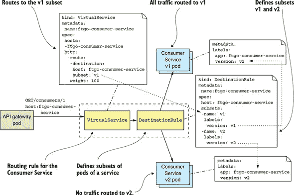

一个 `VirtualService` 定义了如何路由一个或多个主机名的请求。在这个例子中，`VirtualService` 定义了单个主机名 `ftgo-consumer-service` 的路由。以下是 `Consumer Service` 的 `VirtualService` 定义：

```
apiVersion: networking.istio.io/v1alpha3
kind: VirtualService
metadata:
  name: ftgo-consumer-service
spec:
  hosts:
  - ftgo-consumer-service                 *1*
  http:
    - route:
      - destination:
          host: ftgo-consumer-service     *2*
          subset: v1                      *3*
```

+   ***1* 适用于消费者服务**

+   ***2* 路由到消费者服务**

+   ***3* v1 子集**

它路由了 `Consumer Service` pod 的 `v1` 子集的所有请求。稍后，我将展示更复杂的示例，这些示例基于 HTTP 请求进行路由并在多个加权目的地之间进行负载均衡。

除了 `VirtualService` 之外，还必须定义一个 `DestinationRule`，该 `DestinationRule` 定义了服务的一个或多个 pod 子集。pod 子集通常是服务版本。`DestinationRule` 还可以定义流量策略，例如负载均衡算法。以下是 `Consumer Service` 的 `DestinationRule`：

```
apiVersion: networking.istio.io/v1alpha3
kind: DestinationRule
metadata:
  name: ftgo-consumer-service
spec:
  host: ftgo-consumer-service
  subsets:
  - name: v1                 *1*
    labels:
      version: v1            *2*
  - name: v2
    labels:
      version: v2
```

+   ***1* 子集的名称**

+   ***2* 子集的 pod 选择器**

此 `DestinationRule` 定义了两个 pod 子集：`v1` 和 `v2`。`v1` 子集选择带有标签 `version: v1` 的 pod。`v2` 子集选择带有标签 `version: v2` 的 pod。

一旦定义了这些规则，Istio 将仅路由带有 `version: v1` 标签的 pod 流量。现在可以安全地部署 `v2`。

##### 部署消费者服务的版本 2

这是 `Consumer Service` 版本 2 的 `Deployment` 的摘录：

```
apiVersion: extensions/v1beta1
kind: Deployment
metadata:
  name: ftgo-consumer-service-v2      *1*
 spec:
  replicas: 1
  template:
    metadata:
      labels:
        app: ftgo-consumer-service
        version: v2                   *2*
 ...
```

+   ***1* 版本 2**

+   ***2* Pod 带有版本标签**

此部署称为 `ftgo-consumer-service-v2`。它使用 `version: v2` 标签其 pod。创建此部署后，`ftgo-consumer-service` 的两个版本都将运行。但由于路由规则，Istio 不会将任何流量路由到 `v2`。你现在可以开始将一些测试流量路由到 `v2`。

##### 将测试流量路由到版本 2

部署服务的新版本后，下一步是测试它。假设测试用户的请求有一个 `testuser` 标头。我们可以通过以下更改增强 `ftgo-consumer-service VirtualService`，将带有此标头的请求路由到 `v2` 实例：

```
apiVersion: networking.istio.io/v1alpha3
kind: VirtualService
metadata:
  name: ftgo-consumer-service
spec:
  hosts:
  - ftgo-consumer-service
  http:
    - match:
      - headers:
          testuser:
            regex: "^.+$"                *1*
      route:
      - destination:
          host: ftgo-consumer-service
          subset: v2                     *2*
     - route:
      - destination:
          host: ftgo-consumer-service
          subset: v1                     *3*
```

+   ***1* 匹配非空 testuser 标头**

+   ***2* 将测试用户路由到 v2**

+   ***3* 将所有人路由到 v1**

除了原始的默认路由外，`VirtualService`还有一个路由规则，将带有`testuser`头部的请求路由到`v2`子集。更新规则后，你现在可以测试`Consumer Service`。然后，一旦你确信 v2 正在正常工作，你可以将一些生产流量路由到它。让我们看看如何做到这一点。

##### 将生产流量路由到版本 2

在测试了新部署的服务之后，下一步是将生产流量开始路由到它。一个好的策略是最初只路由一小部分流量。例如，这里有一条将 95%的流量路由到 v1，5%路由到 v2 的规则：

```
apiVersion: networking.istio.io/v1alpha3
kind: VirtualService
metadata:
  name: ftgo-consumer-service
spec:
  hosts:
  - ftgo-consumer-service
  http:
    - route:
      - destination:
          host: ftgo-consumer-service
          subset: v1
        weight: 95
      - destination:
          host: ftgo-consumer-service
          subset: v2
        weight: 5
```

随着你对服务能够处理生产流量的信心增强，你可以逐步增加流向版本 2 pod 的流量，直到达到 100%。在这个时候，Istio 不再将任何流量路由到 v1 pod。你可以在删除版本 1 的`Deployment`之前让它们运行一段时间。

通过让你轻松地将部署与发布分离，Istio 使得推出服务的新版本变得更加可靠。然而，我对 Istio 的功能只是略知一二。截至写作时，Istio 的当前版本是 0.8。我非常期待看到它和其他服务网格成熟并成为生产环境的标准部分。

### 12.5\. 使用无服务器部署模式部署服务

语言特定的打包（第 12.1 节）、作为 VM 的服务（第 12.2 节）和作为容器的服务（第 12.3 节）模式都相当不同，但它们有一些共同的特征。第一个特征是，在所有三种模式中，你必须预先配置一些计算资源——无论是物理机器、虚拟机器还是容器。一些部署平台实现了自动扩展，根据负载动态调整 VM 或容器的数量。但即使它们处于空闲状态，你也需要为一些 VM 或容器付费。

另一个常见的特征是你需要负责系统管理。如果你在运行任何类型的机器，你必须修补操作系统。在物理机器的情况下，这也包括上架和堆叠。你还需要负责管理语言运行时。这是亚马逊所说的“无差别的重劳动”的例子。自从计算机的早期，系统管理就是那些你需要做的事情之一。然而，事实证明，有一个解决方案：无服务器。

#### 12.5.1\. 使用 AWS Lambda 的无服务器部署概述

在 2014 年的 AWS Re:Invent 大会上，亚马逊的首席技术官 Werner Vogels 用一句惊人的话介绍了 AWS Lambda：“在函数、事件和数据交汇处发生魔法。”正如这句话所暗示的，AWS Lambda 最初是为了部署事件驱动的服务。它的“魔法”之处在于，正如你将看到的，AWS Lambda 是服务器无部署技术的例子。

|  |
| --- |

**无服务器部署技术**

所有主要公共云都提供无服务器部署选项，尽管 AWS Lambda 是最先进的。Google Cloud 有 Google Cloud functions，截至写作时仍在测试阶段([`cloud.google.com/functions/`](https://cloud.google.com/functions/))。Microsoft Azure 有 Azure functions([`azure.microsoft.com/en-us/services/functions`](https://azure.microsoft.com/en-us/services/functions))。

此外，还有一些开源的无服务器框架，如 Apache Openwhisk([`openwhisk.apache.org`](https://openwhisk.apache.org))和针对 Kubernetes 的 Fission([`fission.io`](https://fission.io))，您可以在自己的基础设施上运行。但我并不完全确信它们的价值。您需要管理运行无服务器框架的基础设施——这听起来并不完全像是*无服务器*。此外，正如您将在本节后面看到的那样，无服务器以最小的系统管理为代价提供了一个受限的编程模型。如果您需要管理基础设施，那么您将面临限制而没有好处。

| |
| --- |

AWS Lambda 支持 Java、NodeJS、C#、GoLang 和 Python。一个*lambda*函数是一个无状态服务。它通常通过调用 AWS 服务来处理请求。例如，当图像上传到 S3 存储桶时被调用的 lambda 函数可以将项目插入到 DynamoDB 的 IMAGES 表中，并向 Kinesis 发布消息以触发图像处理。lambda 函数还可以调用第三方网络服务。

要部署服务，您将应用程序打包成 ZIP 文件或 JAR 文件，上传到 AWS Lambda，并指定要调用的函数名称以处理请求（也称为*事件*）。AWS Lambda 会自动运行足够的实例来处理传入的请求。您将根据所花费的时间和消耗的内存为每个请求付费。当然，细节才是关键，稍后您将看到 AWS Lambda 有一些限制。但您作为开发人员或您组织中的任何人都无需担心服务器、虚拟机或容器的任何方面的观念是非常强大的。

| |
| --- |

**模式：无服务器部署**

使用公共云提供的服务器无部署机制部署服务。请参阅[`microservices.io/patterns/deployment/serverless-deployment.html`](http://microservices.io/patterns/deployment/serverless-deployment.html)。

| |
| --- |

#### 12.5.2. 开发 lambda 函数

与使用其他三种模式不同，您必须为 lambda 函数使用不同的编程模型。lambda 函数的代码和打包依赖于编程语言。Java lambda 函数是一个实现了 AWS Lambda Java 核心库中定义的通用接口 `RequestHandler` 的类。该接口定义在下面的列表中。此接口接受两个类型参数：`I`，它是输入类型，`O`，它是输出类型。`I` 和 `O` 的类型取决于 lambda 处理的特定请求类型。

##### 列表 12.8\. Java lambda 函数是一个实现了 `RequestHandler` 接口的类。

```
public interface RequestHandler<I, O> {
    public O handleRequest(I input, Context context);
}
```

`RequestHandler` 接口定义了一个单独的 `handleRequest()` 方法。此方法有两个参数，一个输入对象和一个上下文，它们提供了对 lambda 执行环境的访问，例如请求 ID。`handleRequest()` 方法返回一个输出对象。对于由 AWS API Gateway 代理处理的 HTTP 请求的 lambda 函数，`I` 和 `O` 分别是 `APIGatewayProxyRequestEvent` 和 `APIGatewayProxyResponseEvent`。正如您很快就会看到的，处理函数与旧式的 Java EE servlets 非常相似。

Java lambda 函数打包为 ZIP 文件或 JAR 文件。JAR 文件是一个由 Maven Shade 插件等创建的超级 JAR（或胖 JAR）。ZIP 文件在根目录中有类，在 `lib` 目录中有 JAR 依赖项。稍后，我将展示如何使用 Gradle 项目创建 ZIP 文件。但首先，让我们看看调用 lambda 函数的不同方式。

#### 12.5.3\. 调用 lambda 函数

调用 lambda 函数有四种方式：

+   HTTP 请求

+   AWS 服务生成的事件

+   计划调用

+   直接使用 API 调用

让我们逐一查看。

##### 处理 HTTP 请求

调用 lambda 函数的一种方式是配置 AWS API Gateway 将 HTTP 请求路由到您的 lambda。API 网关将您的 lambda 函数公开为 HTTPS 端点。它作为一个 HTTP 代理，使用 HTTP 请求对象调用 lambda 函数，并期望 lambda 函数返回一个 HTTP 响应对象。通过使用 AWS Lambda 和 API 网关，您可以将 RESTful 服务作为 lambda 函数部署。

##### 处理 AWS 服务生成的事件

调用 lambda 函数的第二种方式是将您的 lambda 函数配置为处理由 AWS 服务生成的事件。可以触发 lambda 函数的事件示例包括以下内容：

+   在 S3 存储桶中创建一个对象。

+   在 DynamoDB 表中创建、更新或删除一个条目。

+   可以从 Kinesis 流中读取一条消息。

+   通过简单电子邮件服务收到一封电子邮件。

由于与其他 AWS 服务的这种集成，AWS Lambda 对于广泛的任务非常有用。

##### 定义计划中的 lambda 函数

另一种调用 Lambda 函数的方式是使用类似 Linux `cron` 的计划。您可以配置 Lambda 函数定期调用——例如，每分钟、3 小时或 7 天。或者，您可以使用 `cron` 表达式来指定 AWS 应该何时调用您的 Lambda。`cron` 表达式提供了极大的灵活性。例如，您可以将 Lambda 配置为在周一至周五下午 2:15 调用。

##### 使用网络服务请求调用 Lambda 函数

调用 Lambda 函数的第四种方式是您的应用程序通过网络服务请求来调用它。网络服务请求指定 Lambda 函数的名称和输入事件数据。您的应用程序可以同步或异步地调用 Lambda 函数。如果您的应用程序同步调用 Lambda 函数，则网络服务的 HTTP 响应包含 Lambda 函数的响应。否则，如果它异步调用 Lambda 函数，则网络服务响应指示 Lambda 执行是否成功启动。

#### 12.5.4\. 使用 Lambda 函数的好处

使用 Lambda 函数部署服务具有以下好处：

+   ***与许多 AWS 服务集成***—**编写消费 AWS 服务生成的事件（如 DynamoDB 和 Kinesis）并通过 AWS API Gateway 处理 HTTP 请求的 Lambda 非常简单**。

+   ***消除许多系统管理任务***—**您不再负责低级系统管理。没有操作系统或运行时需要修补。因此，您可以专注于开发您的应用程序**。

+   ***弹性***—**AWS Lambda 会根据需要运行您应用程序的实例。您不需要预测所需的容量，也不会面临虚拟机或容器配置不足或配置过量的风险**。

+   ***按使用量计费***—**与典型的 IaaS 云不同，即使虚拟机或容器空闲，IaaS 云也会按分钟或小时计费，而 AWS Lambda 只对处理每个请求时消耗的资源收费**。

#### 12.5.5\. 使用 Lambda 函数的缺点

正如您所看到的，AWS Lambda 是部署服务的一种极其方便的方式，但也有一些显著的缺点和限制：

+   ***长尾延迟***—**由于 AWS Lambda 动态运行您的代码，一些请求由于 AWS 分配您的应用程序实例和应用程序启动所需的时间而具有高延迟。这在运行基于 Java 的服务时尤其具有挑战性，因为它们通常至少需要几秒钟才能启动。例如，下一节中描述的示例 Lambda 函数启动需要一段时间。因此，AWS Lambda 可能不适合对延迟敏感的服务**。

+   ***基于事件/请求的有限编程模型***—**AWS Lambda 并不打算用于部署长时间运行的服务，例如从第三方消息代理消费消息的服务**。

由于这些缺点和限制，AWS Lambda 并不适合所有服务。但在选择部署模式时，我建议首先评估无服务器部署是否支持您服务的需求，然后再考虑其他替代方案。

### 12.6\. 使用 AWS Lambda 和 AWS Gateway 部署 RESTful 服务

让我们看看如何使用 AWS Lambda 部署 `Restaurant Service`。这是一个具有创建和管理餐厅的 REST API 的服务。例如，它没有与 Apache Kafka 的长期连接，因此非常适合 AWS Lambda。图 12.13 显示了该服务的部署架构。该服务由几个 lambda 函数组成，每个 REST 端点一个。AWS API Gateway 负责将 HTTP 请求路由到 lambda 函数。

##### 图 12.13\. 将 `Restaurant Service` 部署为 AWS Lambda 函数。AWS API Gateway 将 HTTP 请求路由到 AWS Lambda 函数，这些函数由 `Restaurant Service` 定义的请求处理类实现。

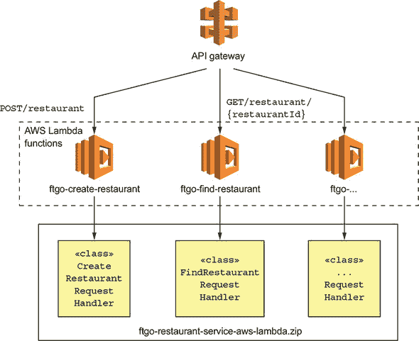

每个 lambda 函数都有一个请求处理类。`ftgo-create-restaurant` lambda 函数调用 `CreateRestaurantRequestHandler` 类，而 `ftgo-find-restaurant` lambda 函数调用 `FindRestaurantRequestHandler`。由于这些请求处理类实现了同一服务的紧密相关方面，它们被打包在同一 ZIP 文件 `restaurant-service-aws-lambda.zip` 中。让我们看看包括这些处理类在内的服务设计。

#### 12.6.1\. `Restaurant Service` 的 AWS Lambda 版本设计

服务架构，如图 12.14 所示，与传统服务的架构相当相似。主要区别是 Spring MVC 控制器已被 AWS Lambda 请求处理类所取代。其余的业务逻辑保持不变。

##### 图 12.14\. 基于 AWS Lambda 的 `Restaurant Service` 设计。表示层由请求处理类组成，这些类实现了 lambda 函数。它们调用业务层，业务层采用传统风格编写，包括一个服务类、一个实体和一个仓库。

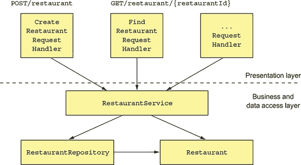

该服务由一个表示层组成，包括请求处理程序，这些处理程序由 AWS Lambda 调用以处理 HTTP 请求，以及一个传统的业务层。业务层包括 `RestaurantService`、`Restaurant` JPA 实体和 `RestaurantRepository`，后者封装了数据库。

让我们来看看 `FindRestaurantRequestHandler` 类。

##### `FindRestaurantRequestHandler` 类

`FindRestaurantRequestHandler`类实现了`GET /restaurant/{restaurantId}`端点。这个类以及其他的请求处理类是图 12.15 中显示的类层次结构的叶子。层次结构的根是`RequestHandler`，它是 AWS SDK 的一部分。它的抽象子类处理错误和注入依赖项。

##### 图 12.15。请求处理类的设计。抽象超类实现了依赖注入和错误处理。

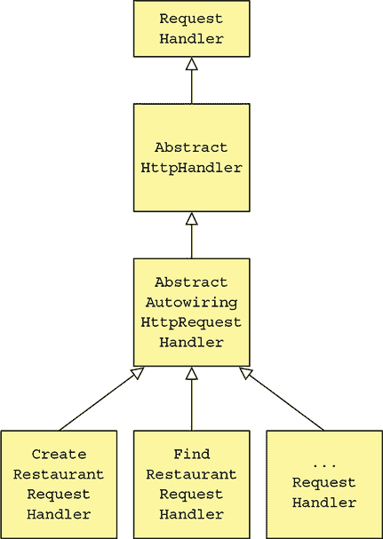

`AbstractHttpHandler`类是 HTTP 请求处理程序的抽象基类。它捕获在请求处理过程中抛出的未处理异常，并返回一个`500 - 内部服务器错误`响应。`AbstractAutowiringHttpRequestHandler`类实现了请求处理程序的依赖注入。我将在稍后描述这些抽象超类，但首先让我们看看`FindRestaurantRequestHandler`的代码。

列表 12.9 展示了`FindRestaurantRequestHandler`类的代码。`FindRestaurantRequestHandler`类有一个`handleHttpRequest()`方法，该方法接受一个表示 HTTP 请求的`APIGatewayProxyRequestEvent`作为参数。它调用`RestaurantService`来查找餐厅，并返回一个描述 HTTP 响应的`APIGatewayProxyResponseEvent`。

##### 列表 12.9。`GET /restaurant/{restaurantId}`的处理类

```
public class FindRestaurantRequestHandler
     extends AbstractAutowiringHttpRequestHandler {

  @Autowired
  private RestaurantService restaurantService;

  @Override
  protected Class<?> getApplicationContextClass() {
    return CreateRestaurantRequestHandler.class;                         *1*
  }

  @Override
  protected APIGatewayProxyResponseEvent
       handleHttpRequest(APIGatewayProxyRequestEvent request, Context context) {
    long restaurantId;
    try {
      restaurantId = Long.parseLong(request.getPathParameters()
               .get("restaurantId"));
    } catch (NumberFormatException e) {
      return makeBadRequestResponse(context);                            *2*
     }

    Optional<Restaurant> possibleRestaurant = restaurantService.findById(restaur
     antId);

    return possibleRestaurant                                            *3*
             .map(this::makeGetRestaurantResponse)
            .orElseGet(() -> makeRestaurantNotFoundResponse(context,
                                   restaurantId));

  }

  private APIGatewayProxyResponseEvent makeBadRequestResponse(Context context) {
    ...
  }

  private APIGatewayProxyResponseEvent
      makeRestaurantNotFoundResponse(Context context, long restaurantId) { ... }

  private  APIGatewayProxyResponseEvent
                        makeGetRestaurantResponse(Restaurant restaurant) { ... }
}
```

+   ***1* 用于应用程序上下文的 Spring Java 配置类**

+   ***2* 如果缺少或无效的 restaurantId，则返回 400 - 错误请求响应**

+   ***3* 返回餐厅或 404 - 未找到响应**

如您所见，它与 servlet 非常相似，只是它没有接受`HttpServletRequest`并返回`HttpServletResponse`的`service()`方法，而是有一个`handleHttpRequest()`，它接受`APIGatewayProxyRequestEvent`并返回`APIGatewayProxyResponseEvent`。

让我们看看它的超类，它实现了依赖注入。

##### 使用`AbstractAutowiringHttpRequestHandler`类进行依赖注入

AWS Lambda 函数既不是 Web 应用程序，也不是具有`main()`方法的程序。但是，如果不能使用我们习惯的 Spring Boot 功能，那就太遗憾了。下面的列表中显示的`AbstractAutowiringHttpRequestHandler`类实现了请求处理程序的依赖注入。它使用`SpringApplication.run()`创建一个`ApplicationContext`，并在处理第一个请求之前自动装配依赖项。例如`FindRestaurantRequestHandler`这样的子类必须实现`getApplicationContextClass()`方法。

##### 列表 12.10。实现依赖注入的抽象`RequestHandler`

```
public abstract class AbstractAutowiringHttpRequestHandler
     extends AbstractHttpHandler {

  private static ConfigurableApplicationContext ctx;
  private ReentrantReadWriteLock ctxLock = new ReentrantReadWriteLock();
  private boolean autowired = false;

  protected synchronized ApplicationContext getAppCtx() {               *1*
     ctxLock.writeLock().lock();
    try {
      if (ctx == null) {
        ctx =  SpringApplication.run(getApplicationContextClass());
      }
      return ctx;
    } finally {
      ctxLock.writeLock().unlock();
    }
  }

  @Override
  protected void
        beforeHandling(APIGatewayProxyRequestEvent request, Context context) {
    super.beforeHandling(request, context);
    if (!autowired) {
      getAppCtx().getAutowireCapableBeanFactory().autowireBean(this);   *2*
       autowired = true;
    }
  }

  protected abstract Class<?> getApplicationContextClass();             *3*
 }
```

+   ***1* 只创建一次 Spring Boot 应用程序上下文**

+   ***2* 在处理第一个请求之前使用自动装配将依赖项注入到请求处理程序中**

+   ***3* 返回用于创建 ApplicationContext 的@Configuration 类**

该类覆盖了 `AbstractHttpHandler` 定义的 `beforeHandling()` 方法。其 `beforeHandling()` 方法在处理第一个请求之前使用自动装配注入依赖项。

##### `AbstractHttpHandler` 类

`Restaurant Service` 的请求处理器最终扩展了 `AbstractHttpHandler`，如 列表 12.11 所示。该类实现了 `RequestHandler<APIGatewayProxyRequestEvent` 和 `APIGatewayProxyResponseEvent>`。其关键责任是在处理请求时捕获抛出的异常，并抛出 500 错误代码。

##### 列表 12.11\. 一个捕获异常并返回 500 HTTP 响应的抽象 `RequestHandler`

```
public abstract class AbstractHttpHandler implements
  RequestHandler<APIGatewayProxyRequestEvent, APIGatewayProxyResponseEvent> {

  private Logger log = LoggerFactory.getLogger(this.getClass());

  @Override
  public APIGatewayProxyResponseEvent handleRequest(
     APIGatewayProxyRequestEvent input, Context context) {
    log.debug("Got request: {}", input);
    try {
      beforeHandling(input, context);
      return handleHttpRequest(input, context);
    } catch (Exception e) {
      log.error("Error handling request id: {}", context.getAwsRequestId(), e);
      return buildErrorResponse(new AwsLambdaError(
              "Internal Server Error",
              "500",
              context.getAwsRequestId(),
              "Error handling request: " + context.getAwsRequestId() + " "
     + input.toString()));
    }
  }

  protected void beforeHandling(APIGatewayProxyRequestEvent request,
     Context context) {
    // do nothing
  }

  protected abstract APIGatewayProxyResponseEvent handleHttpRequest(
     APIGatewayProxyRequestEvent request, Context context);
}
```

#### 12.6.2\. 将服务打包成 ZIP 文件

在服务可以部署之前，我们必须将其打包成 ZIP 文件。我们可以使用以下 Gradle 任务轻松构建 ZIP 文件：

```
task buildZip(type: Zip) {
    from compileJava
    from processResources
    into('lib') {
        from configurations.runtime
    }
}
```

此任务构建一个 ZIP 文件，其中包含顶级目录中的类和资源以及 `lib` 目录中的 JAR 依赖项。

现在我们已经构建了 ZIP 文件，让我们看看如何部署 Lambda 函数。

#### 12.6.3\. 使用 Serverless 框架部署 Lambda 函数

使用 AWS 提供的工具部署 Lambda 函数和配置 API 网关相当繁琐。幸运的是，Serverless 开源项目使得使用 Lambda 函数变得更加容易。当使用 Serverless 时，你只需编写一个简单的 `serverless.yml` 文件，该文件定义了你的 Lambda 函数及其 RESTful 端点。然后 Serverless 部署 Lambda 函数并创建和配置一个 API 网关，将请求路由到这些函数。

以下列表是 `serverless.yml` 的摘录，它将 `Restaurant Service` 部署为 Lambda。

##### 列表 12.12\. `serverless.yml` 部署 `Restaurant Service`。

```
service: ftgo-application-lambda

provider:
  name: aws                                                     *1*
  runtime: java8
  timeout: 35
  region: ${env:AWS_REGION}
  stage: dev
  environment:                                                  *2*
    SPRING_DATASOURCE_DRIVER_CLASS_NAME: com.mysql.jdbc.Driver
    SPRING_DATASOURCE_URL: ...
    SPRING_DATASOURCE_USERNAME: ...
    SPRING_DATASOURCE_PASSWORD: ...

package:                                                        *3*
   artifact: ftgo-restaurant-service-aws-lambda/build/distributions/
     ftgo-restaurant-service-aws-lambda.zip

functions:                                                      *4*
   create-restaurant:
    handler: net.chrisrichardson.ftgo.restaurantservice.lambda
     .CreateRestaurantRequestHandler
    events:
      - http:
          path: restaurants
          method: post
  find-restaurant:
    handler: net.chrisrichardson.ftgo.restaurantservice.lambda
     .FindRestaurantRequestHandler
    events:
      - http:
          path: restaurants/{restaurantId}
          method: get
```

+   ***1* 告诉无服务器在 AWS 上部署**

+   ***2* 通过环境变量提供服务的外部化配置**

+   ***3* 包含 Lambda 函数的 ZIP 文件**

+   ***4* 由处理函数和 HTTP 端点组成的 Lambda 函数定义**

然后，你可以使用 `serverless deploy` 命令，该命令读取 `serverless.yml` 文件，部署 Lambda 函数，并配置 AWS API 网关。稍等片刻后，你的服务将通过 API 网关的端点 URL 可访问。AWS Lambda 将根据需要为每个 `Restaurant Service` Lambda 函数提供所需数量的实例以支持负载。如果你更改了代码，你可以通过重新构建 ZIP 文件并重新运行 `serverless deploy` 来轻松更新 Lambda。无需服务器！

基础设施的演变是显著的。不久前，我们手动在物理机上部署应用程序。今天，高度自动化的公共云提供了一系列虚拟部署选项。一个选项是将服务作为虚拟机部署。或者更好，我们可以将服务打包成容器，并使用复杂的 Docker 编排框架（如 Kubernetes）进行部署。有时我们甚至完全不考虑基础设施，并将服务作为轻量级、短暂的 lambda 函数部署。

### 摘要

+   你应该选择最轻量级的部署模式，以满足你的服务需求。以下顺序评估选项：无服务器、容器、虚拟机和语言特定的包。

+   由于长尾延迟和需要使用基于事件/请求的编程模型，无服务器部署并不适合每个服务。然而，当它适合时，无服务器部署是一个极具吸引力的选项，因为它消除了管理操作系统和运行时的需要，并提供了自动弹性供应和基于请求的定价。

+   Docker 容器，这是一种轻量级的、操作系统级别的虚拟化技术，比无服务器部署更灵活，并且具有更可预测的延迟。最好使用 Docker 编排框架，如 Kubernetes，它管理机器集群上的容器。使用容器的缺点是，你必须管理操作系统和运行时，以及很可能是 Docker 编排框架和它运行的虚拟机。

+   第三个部署选项是将你的服务作为虚拟机部署。一方面，虚拟机是一个重量级的部署选项，因此部署较慢，并且它可能比第二个选项使用更多的资源。另一方面，现代云服务如 Amazon EC2 高度自动化，并提供了一组丰富的功能。因此，有时使用虚拟机部署小型、简单的应用程序可能比设置 Docker 编排框架更容易。

+   将你的服务作为语言特定的包部署通常最好避免，除非你只有少量服务。例如，如第十三章所述，当你开始你的微服务之旅时，你可能会使用与你的单体应用相同的机制来部署服务，这很可能是这个选项。一旦你开发了一些服务，你才应该考虑设置复杂的部署基础设施，如 Kubernetes。

+   使用服务网格——一个充当所有服务进出网络流量的中介的网络层——的许多好处之一是，它使你能够在生产中部署一个服务，测试它，然后才将生产流量路由到它。将部署与发布分离可以提高推出新版本服务的可靠性。
