## 第十三章\. 微服务重构

*本章涵盖*

+   何时将单体应用迁移到微服务架构

+   为什么在重构单体应用为微服务时使用增量方法至关重要

+   将新功能作为服务实现

+   从单体中提取服务

+   集成服务和单体

我希望这本书已经让你对微服务架构、其优势和劣势以及何时使用它有了很好的理解。然而，你很可能正在处理一个大型、复杂的单体应用。你开发和应用应用程序的日常体验缓慢且痛苦。看起来非常适合你的应用程序的微服务似乎是一个遥远的极乐世界。像玛丽和 FTGO 开发团队的其他成员一样，你可能想知道如何才能采用微服务架构？

幸运的是，有一些策略你可以使用，以避免从头开始重写你的应用程序，从而逃离单体地狱。你通过开发所谓的“绞杀应用”来逐步将单体转换为微服务。绞杀应用的灵感来源于热带雨林中的绞杀藤，它们通过包围和有时杀死树木来生长。一个*绞杀应用*是由微服务组成的新应用，你通过将新功能作为服务实现并从单体中提取服务来开发它。随着时间的推移，随着绞杀应用实现越来越多的功能，它逐渐缩小并最终杀死单体。开发绞杀应用的一个重要好处是，与一次性的大改写不同，它能够早期且频繁地向业务交付价值。

我以描述将单体重构为微服务架构的动机开始本章。然后，我描述了如何通过将新功能作为服务实现并从单体中提取服务来开发绞杀应用。接下来，我涵盖了各种设计主题，包括如何集成单体和服务，如何在单体和服务之间维护数据库一致性，以及如何处理安全问题。我通过描述几个示例服务来结束本章。一个服务是`Delayed Order Service`，它实现了全新的功能。另一个服务是`Delivery Service`，它是从单体中提取出来的。让我们先从查看重构到微服务架构的概念开始。

### 13.1\. 微服务重构概述

换位思考，假设你是玛丽。你负责 FTGO 应用程序，这是一个庞大且老旧的单体应用程序。企业对工程团队无法快速和可靠地交付功能感到极度沮丧。FTGO 似乎正遭受单体地狱的典型案例。至少表面上，微服务似乎是一个解决方案。你应该提出将开发资源从功能开发转移到迁移到微服务架构的建议吗？

我从这个部分开始讨论为什么你应该考虑将单体架构重构为微服务。我还讨论了为什么确定你的软件开发问题是因为你处于单体地狱，而不是例如一个糟糕的软件开发流程中，这一点很重要。然后，我描述了将单体架构逐步重构为微服务架构的策略。接下来，我讨论了为了保持企业的支持，为什么需要尽早和经常交付改进的重要性。然后，我描述了为什么在开发了一些服务之前，你应该避免投资复杂的部署基础设施。最后，我描述了你可以用来将服务引入架构的各种策略，包括将新功能作为服务实现，以及从单体中提取服务。

#### 13.1.1. 为什么重构单体架构？

如第一章所述，微服务架构具有众多优势。它具有更好的可维护性、可测试性和可部署性，因此可以加速开发。微服务架构更具有可扩展性并提高了故障隔离性。同时，它也更容易演进你的技术栈。但是，将单体架构重构为微服务是一项重大任务。这将分散资源，导致新功能开发受阻。因此，企业可能只有在微服务能够解决重大业务问题时，才会支持其采用。

如果你处于单体地狱，你很可能已经至少有一个业务问题。以下是一些由单体地狱引起的业务问题的例子：

+   ***缓慢的交付速度***—** 应用程序难以理解、维护和测试，因此开发者的生产力低下。结果，组织无法有效竞争，并面临被竞争对手超越的风险。

+   ***有缺陷的软件发布***—** 缺乏可测试性意味着软件发布往往存在缺陷。这使客户不满意，导致客户流失和收入减少。

+   ***较差的可扩展性***—** 扩展单体应用程序很困难，因为它将具有非常不同资源需求的功能模块组合成一个可执行组件。缺乏可扩展性意味着在某个点之后，要么无法扩展应用程序，要么成本过高。因此，应用程序无法满足当前或预测的业务需求。

确保这些问题是因为你已经超过了你的架构是很重要的。缓慢交付和有缺陷的发布的一个常见原因是软件开发流程不佳。例如，如果你仍然依赖于手动测试，那么仅采用自动化测试就可以显著提高开发速度。同样，有时你可以在不改变架构的情况下解决可伸缩性问题。你应该首先尝试更简单的解决方案。只有在你仍然有软件交付问题时，你才应该迁移到微服务架构。让我们看看如何做到这一点。

#### 13.1.2. 绞杀单体

将单体应用转换为微服务的过程是一种应用现代化形式([`en.wikipedia.org/wiki/Software_modernization`](https://en.wikipedia.org/wiki/Software_modernization))。*应用现代化*是将遗留应用转换为具有现代架构和技术堆栈的过程。开发者们已经进行了数十年的应用现代化。因此，我们在将应用重构为微服务架构时，可以借鉴通过经验积累的智慧。多年来学到的最重要的教训就是不要进行一次性大规模重构。

“一次性大规模重构”是指从头开始开发一个新应用——在这种情况下，是一个基于微服务的新应用。虽然从头开始并放弃遗留代码库听起来很有吸引力，但这非常冒险，很可能会以失败告终。你可能会花费数月甚至数年去复制现有的功能，然后才能实现业务今天需要的功能！此外，你仍然需要开发遗留应用，这会分散重构的努力，意味着你有一个不断移动的目标。更重要的是，你可能会浪费时间重新实现不再需要的功能。正如马丁·福勒据说所说，“一次性大规模重构唯一保证的就是一次性的爆炸！”([www.randyshoup.com/evolutionary-architecture](http://www.randyshoup.com/evolutionary-architecture))。

而不是进行一次性的大规模重构，你应该像图 13.1 所示的那样，逐步重构你的单体应用。你逐渐构建一个新的应用，这被称为“绞杀应用”。它由与你的单体应用一起运行的微服务组成。随着时间的推移，单体应用实现的功能量会逐渐减少，直到它完全消失或者变成另一个微服务。这种策略类似于在高速公路上以 70 英里每小时的速度开车时给你的车做保养。这很具挑战性，但比起尝试一次性的大规模重构风险要小得多。

##### 图 13.1. 单体应用逐步被由服务组成的绞杀应用所取代。最终，单体应用完全被绞杀应用取代或变成另一个微服务。

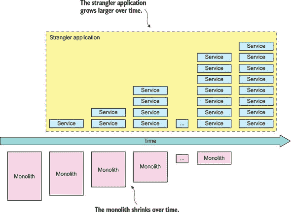

Martin Fowler 将这种应用现代化策略称为 Strangler 应用模式([www.martinfowler.com/bliki/StranglerApplication.html](http://www.martinfowler.com/bliki/StranglerApplication.html))。这个名字来源于热带雨林中发现的绞杀藤（或绞杀榕——见[`en.wikipedia.org/wiki/Strangler_fig`](https://en.wikipedia.org/wiki/Strangler_fig))。绞杀藤围绕树木生长，以到达森林冠层之上的阳光。通常，树木会死亡，因为要么被藤蔓杀死，要么因年老而死亡，留下一个形状像树的藤蔓。

| |
| --- |

**模式：Strangler 应用**

通过逐步在遗留应用周围开发新的（绞杀）应用来现代化应用。见[`microservices.io/patterns/refactoring/strangler-application.html`](http://microservices.io/patterns/refactoring/strangler-application.html)。

| |
| --- |

重构过程通常需要数月或数年。例如，根据 Steve Yegge ([`plus.google.com/+RipRowan/posts/eVeouesvaVX`](https://plus.google.com/+RipRowan/posts/eVeouesvaVX))的说法，亚马逊.com 花费了几年时间来重构其单体应用。在非常大型系统中，你可能永远无法完成这个过程。例如，你可能达到一个点，此时你有比拆分单体更重要的任务，比如实现盈利功能。如果单体不是持续发展的障碍，那么你不妨让它保持原样。

##### 早期并频繁地展示价值

逐步重构到微服务架构的一个重要好处是，你可以立即获得投资回报。这与一次性重写大不相同，后者直到完成才提供任何好处。当逐步重构单体应用时，你可以使用新的技术栈和现代、高速的 DevOps 风格开发和交付流程来开发每个新的服务。因此，随着时间的推移，你团队的交付速度稳步提高。

此外，你可以首先将应用中的高价值区域迁移到微服务中。例如，假设你正在开发 FTGO 应用。例如，业务可能会决定配送调度算法是一个关键竞争优势。配送管理可能是一个持续、不断发展的领域。通过将配送管理提取为一个独立的服务，配送管理团队将能够独立于 FTGO 的其他开发者工作，并显著提高他们的开发速度。他们能够频繁部署算法的新版本并评估其有效性。

能够更早地交付价值的好处之一是，它有助于维持业务对迁移工作的支持。他们的持续支持是至关重要的，因为重构工作将意味着在开发功能上花费的时间减少。一些组织难以消除技术债务，因为过去的尝试过于雄心勃勃且没有带来太多好处。结果，业务变得不愿意投资进一步的清理工作。将单体重构为微服务的增量性质意味着开发团队能够早期且频繁地展示价值。

##### 最小化对单体的更改

本章的一个反复出现的主题是，在迁移到微服务架构时，你应该避免对单体应用进行大规模的更改。在支持迁移到服务的过程中，你不可避免地需要做出一些更改。第 13.3.2 节讨论了单体通常需要修改以便能够参与维护单体和服务之间数据一致性的叙事。对单体进行大规模更改的问题在于它耗时、成本高昂且风险较大。毕竟，这可能是你最初想要迁移到微服务的原因。

幸运的是，你可以使用一些策略来减少你需要做出的更改范围。例如，在第 13.2.3 节中，我描述了从提取的服务将数据复制回单体数据库的策略。在第 13.3.2 节中，我展示了如何谨慎地安排服务的提取以减少对单体的影响。通过应用这些策略，你可以减少重构单体所需的工作量。

##### 技术部署基础设施：你目前不需要全部

在整本书中，我讨论了许多闪亮的新技术，包括 Kubernetes 和 AWS Lambda 这样的部署平台以及服务发现机制。你可能会被诱惑通过选择技术并构建基础设施来开始你的微服务迁移。你甚至可能感受到来自商业人士和友好的 PaaS 供应商的压力，开始在这类基础设施上花钱。

虽然一开始就构建这个基础设施看起来很有吸引力，但我建议只进行最小的前期投资来开发它。你无法离开的唯一东西是执行自动化测试的部署管道。例如，如果你只有少数几个服务，你不需要复杂的部署和可观察性基础设施。最初，你甚至可以用硬编码的配置文件来进行服务发现。我建议在获得微服务架构的真实经验之前，推迟任何涉及重大投资的技术基础设施决策。只有当你有几个服务运行时，你才会拥有选择技术的经验。

现在我们来看看你可以用来迁移到微服务架构的策略。

### 13.2. 单体重构为微服务的策略

有三种主要的策略可以扼杀单体并逐步用微服务替换它：

1.  将新功能作为服务实现。

1.  将表示层和后端分离。

1.  通过将功能提取到服务中拆分单体。

第一种策略阻止单体增长。这通常是展示微服务价值的一种快速方式，有助于建立迁移工作的支持。其他两种策略将单体拆分。在重构单体时，你可能会使用第二种策略，但你肯定会使用第三种策略，因为这是将功能从单体迁移到缠扰应用的方式。

让我们逐一审视这些策略，从将新功能作为服务实现开始。

#### 13.2.1. 将新功能作为服务实现

洞穴法则指出：“如果你发现自己陷入了一个洞，就停止挖掘”([`en.m.wikipedia.org/wiki/Law_of_holes`](https://en.m.wikipedia.org/wiki/Law_of_holes))。当你的单体应用变得难以管理时，这是一条很好的建议。换句话说，如果你有一个庞大而复杂的单体应用，不要通过向单体添加代码来实现新功能。这将使单体变得更大，更难以管理。相反，你应该将新功能作为服务来实现。

这是一种将单体应用程序迁移到微服务架构的绝佳方式。它减缓了单体的增长速度。由于你在全新的代码库中进行开发，因此它加速了新功能的发展。它还迅速展示了采用微服务架构的价值。

##### 将新服务与单体集成

图 13.2 展示了实现新功能作为服务后的应用程序架构。除了新服务和单体之外，该架构还包括两个其他元素，它们将服务集成到应用程序中：

+   ***API 网关*——**将新功能请求路由到新服务，并将旧请求路由到单体。

+   ***集成胶水代码**—** 将服务与单体应用集成。它使服务能够访问单体应用拥有的数据，并调用单体应用实现的功能。

##### 图 13.2\. 新功能作为 strangler 应用程序的一部分以服务的形式实现。集成胶水将服务与单体应用集成，包括实现同步和异步 API 的适配器。API 网关将调用新功能的请求路由到服务。


集成胶水代码不是一个独立的组件。相反，它由单体应用和服务中的适配器组成，这些适配器使用一个或多个进程间通信机制。例如，第 13.4.1 节中描述的 `Delayed Delivery Service` 的集成胶水使用 REST 和领域事件。服务通过调用 REST API 从单体应用检索客户合同信息。单体应用发布 `Order` 领域事件，以便 `Delayed Delivery Service` 能够跟踪 `Orders` 的状态并对无法按时交付的订单做出响应。第 13.3.1 节更详细地描述了集成胶水代码。

##### 何时将新功能实现为服务

理想情况下，你应该在 strangler 应用程序中而不是在单体应用中实现每个新功能。你可以将新功能实现为一个新服务或作为现有服务的一部分。这样，你将永远不需要接触单体代码库。然而，不幸的是，并非每个新功能都可以作为服务实现。

这是因为微服务架构的本质是一组围绕业务能力组织的松散耦合服务。例如，一个功能可能太小，不足以成为一个有意义的服务。你可能只需要向现有类添加几个字段和方法。或者，新功能可能与单体应用中的代码过于紧密耦合。如果你尝试将此类功能作为服务实现，你通常会发现由于过多的进程间通信而导致性能下降。你也可能遇到维护数据一致性的问题。如果一个新功能不能作为服务实现，通常的解决方案是首先在单体应用中实现该新功能。然后，你可以将这个功能以及其他相关功能提取出来，形成它们自己的服务。

将新功能作为服务实现可以加速这些功能的开发。这是快速展示微服务架构价值的好方法。它还可以降低单体应用的增长速度。但最终，你需要使用另外两种策略来分解单体应用。你需要通过从单体应用中提取功能到服务中来迁移功能到 strangler 应用程序。你还可以通过水平拆分单体应用来提高开发速度。让我们看看如何做到这一点。

#### 13.2.2\. 将表示层从后端分离

缩小单体应用程序的一种策略是将表示层从业务逻辑和数据访问层中分离出来。一个典型的企业应用程序由以下层组成：

+   ***表示逻辑***—** 这包括处理 HTTP 请求并生成实现 Web UI 的 HTML 页面的模块。在一个具有复杂用户界面的应用程序中，表示层通常是大量的代码。

+   ***业务逻辑***—** 这包括实现业务规则的模块，在企业应用程序中可能很复杂。

+   ***数据访问逻辑***—** 这包括访问基础设施服务，如数据库和消息代理。

通常，表示逻辑与业务和数据访问逻辑之间有一个清晰的分离。业务层有一个粗粒度的 API，由一个或多个封装业务逻辑的门面组成。这个 API 是你可以沿着它将单体拆分为两个较小应用程序的自然缝隙，如图 13.3 所示。一个应用程序包含表示层，另一个包含业务和数据访问逻辑。拆分后，表示逻辑应用程序会对业务逻辑应用程序进行远程调用。

##### 图 13.3\. 将前端从后端分离，使得每个都可以独立部署。它还公开了一个服务可以调用的 API。

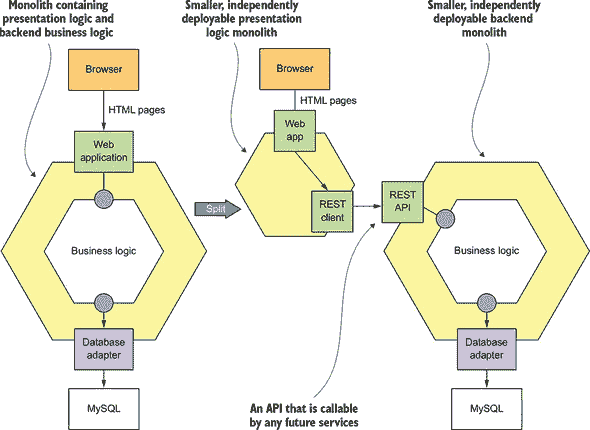

以这种方式拆分单体有两个主要好处。它使你可以独立于彼此开发、部署和扩展两个应用程序。特别是，它允许表示层开发人员快速迭代用户界面，并轻松执行 A/B 测试，例如，而无需部署后端。这种方法的另一个好处是公开了一个远程 API，可以由你后来开发的微服务调用。

但这种策略只是部分解决方案。很可能至少有一个或两个结果应用程序仍然是一个难以管理的单体。你需要使用第三种策略用服务替换单体。

#### 13.2.3\. 将业务能力提取到服务中

将新功能作为服务实现并将前端 Web 应用程序与后端分离，这只能让你走这么远。你仍然会在单体代码库中进行大量的开发。如果你想显著改进应用程序的架构并提高开发速度，你需要通过逐步将业务能力从单体迁移到服务中来拆分单体。例如，第 13.5 节描述了如何将交付管理从 FTGO 单体中提取到新的`Delivery Service`中。当你使用这种策略时，随着时间的推移，由服务实现的企业能力数量会增加，而单体逐渐缩小。

你想要提取到服务中的功能是单体应用的一个垂直切片。该切片包括以下内容：

+   实现 API 端点的入站适配器

+   领域逻辑

+   出站适配器，如数据库访问逻辑

+   单体应用的数据库模式

如图 13.4 所示，此代码是从单体应用中提取出来并移动到独立服务中的。API 网关将调用提取出的业务能力的请求路由到服务，并将其他请求路由到单体应用。单体应用和服务通过集成粘合代码进行协作。如第 13.3.1 节所述，集成粘合代码由服务中的适配器和单体应用中使用一个或多个进程间通信（IPC）机制组成的适配器组成。

##### 图 13.4。通过提取服务来分解单体应用。你确定一个功能切片，它由业务逻辑和适配器组成，并将其提取到服务中。你将那段代码移动到服务中。新提取的服务和单体应用通过集成粘合代码提供的 API 进行协作。

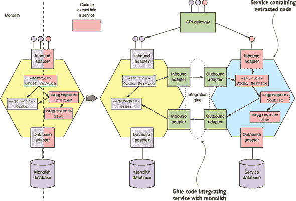

提取服务具有挑战性。你需要确定如何将单体应用的领域模型分割成两个独立的领域模型，其中一个将成为服务的领域模型。你需要打破诸如对象引用之类的依赖关系。你可能甚至需要分割类以将功能移动到服务中。你还需要重构数据库。

提取服务通常耗时较长，尤其是因为单体应用的代码库可能很混乱。因此，你需要仔细思考要提取哪些服务。重要的是要关注那些提供大量价值的应用程序的部分的重构。在提取服务之前，问问自己这样做的好处是什么。

例如，提取一个实现对业务至关重要且不断发展的功能的服务的做法是值得的。当这样做没有多少好处时，投入精力提取服务是没有价值的。在本节的后面部分，我将描述一些确定提取什么以及何时提取的策略。但首先，让我们更详细地看看在提取服务时你将面临的一些挑战以及如何解决它们。

在提取服务时，你将遇到一些挑战：

+   分割领域模型

+   重构数据库

让我们逐一来看，首先是分割领域模型。

##### 分割领域模型

为了提取一个服务，你需要将其领域模型从单体领域模型中提取出来。你需要进行重大手术来分割领域模型。你将遇到的挑战之一是消除那些本应跨越服务边界的对象引用。可能留在单体中的类会引用已移动到服务中的类，反之亦然。例如，想象一下，正如图 13.5 所示，你提取了`Order Service`，因此其`Order`类引用了单体的`Restaurant`类。由于服务实例通常是进程，跨越服务边界的对象引用是没有意义的。你需要以某种方式消除这些类型的对象引用。

##### 图 13.5\. `Order`域类引用了一个`Restaurant`类。如果我们把`Order`提取到一个单独的服务中，我们需要对其对`Restaurant`的引用进行处理，因为进程之间的对象引用是没有意义的。

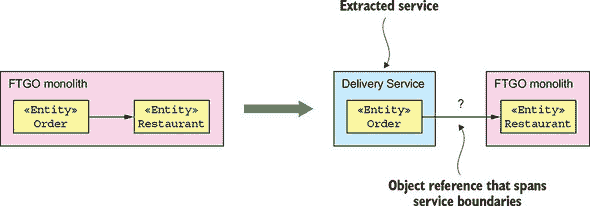

解决这个问题的好方法之一是考虑 DDD 聚合，这在第五章中有描述。*聚合*通过主键而不是对象引用相互引用。因此，你会把`Order`和`Restaurant`类视为聚合，正如图 13.6 所示，将`Order`类中对`Restaurant`的引用替换为存储主键值的`restaurantId`字段。

##### 图 13.6\. 为了消除跨越进程边界的对象，`Order`类对`Restaurant`的引用被替换为`Restaurant`的主键。

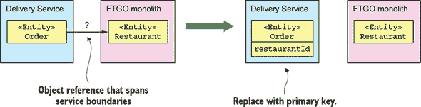

将对象引用替换为主键的问题在于，尽管这仅仅是类的一个小改动，但它可能会对期望对象引用的类的客户端产生重大影响。在本节稍后，我将描述如何通过在服务和单体之间复制数据来缩小更改的范围。例如，`Delivery Service`可以定义一个与单体`Restaurant`类相同的`Restaurant`类。

提取服务通常比将整个类移动到服务中涉及更多。在拆分领域模型时，一个更大的挑战是从具有其他职责的类中提取嵌入的功能。这个问题通常出现在第二章中描述的“全能类”中，这些类承担了过多的职责。例如，`Order`类是 FTGO 应用程序中的全能类之一。它实现了多个业务能力，包括订单管理、配送管理等。在第 13.5 节中，我讨论了如何将配送管理提取到服务中，这涉及到从`Order`类中提取`Delivery`类。`Delivery`实体实现了之前与`Order`类中其他功能捆绑在一起的配送管理功能。

##### 重构数据库

将领域模型拆分不仅涉及代码的改变。领域模型中的许多类都是持久的。它们的字段映射到数据库模式中。因此，当你从一个单体中提取服务时，你也在移动数据。你需要将表从单体数据库移动到服务数据库。

此外，当你拆分一个实体时，你需要拆分相应的数据库表并将新表移动到服务中。例如，当将配送管理提取到服务中时，你拆分了`Order`实体并提取了`Delivery`实体。在数据库层面，你拆分了`ORDERS`表并定义了一个新的`DELIVERY`表。然后你将`DELIVERY`表移动到服务中。

Scott W. Ambler 和 Pramod J. Sadalage 合著的《重构数据库》（Addison-Wesley，2011 年）描述了一系列针对数据库模式的重构方法。例如，它描述了*Split Table*（拆分表）重构，将一个表拆分为两个或更多表。书中许多技术对于从单体中提取服务非常有用。其中一种技术是复制数据，以便你可以逐步更新数据库客户端以使用新架构。我们可以将这个想法适应到减少在提取服务时必须对单体进行的更改范围。

##### 复制数据以避免广泛更改

如前所述，提取服务需要你修改单体领域的模型。例如，你用主键替换对象引用并拆分类。这类改变可能会在代码库中产生连锁反应，并要求你对单体进行广泛的修改。例如，如果你拆分了`Order`实体并提取了`Delivery`实体，你将不得不更改代码中所有引用已移动字段的部位。进行这类改变可能非常耗时，并可能成为拆分单体的一大障碍。

延迟并可能避免做出这些昂贵改变的一个好方法是用一种类似于在《重构数据库》中描述的方法。重构数据库的一个主要障碍是改变该数据库的所有客户端以使用新的模式。书中提出的解决方案是在过渡期间保留原始模式，并使用触发器来同步原始和新的模式。然后你可以在一段时间内将客户端从旧模式迁移到新模式。

当从单体应用中提取服务时，我们可以使用类似的方法。例如，当提取`Delivery`实体时，我们让`Order`实体在过渡期间基本保持不变。如图 13.7 所示，我们将与交付相关的字段设置为只读，并通过从`Delivery Service`复制数据回单体应用来保持它们是最新的。因此，我们只需要找到单体应用代码中更新这些字段的地方，并将它们更改为调用新的`Delivery Service`。

##### 通过从新提取的`Delivery Service`复制相关数据回单体数据库，最小化对 FTGO 单体应用更改的范围。

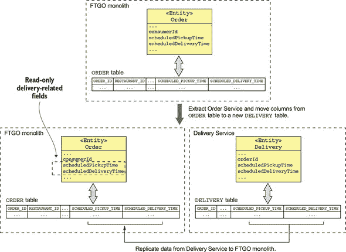

通过从`Delivery Service`复制数据以保留`Order`实体的结构，显著减少了我们立即需要做的工作量。随着时间的推移，我们可以将使用与交付相关的`Order`实体字段或`ORDERS`表列的代码迁移到`Delivery Service`。更重要的是，我们可能永远不需要在单体应用中进行这种更改。如果该代码随后被提取到一个服务中，那么该服务就可以访问`Delivery Service`。

##### 提取哪些服务和何时提取

正如我提到的，拆分单体应用是耗时的。它会分散实现功能的精力。因此，你必须仔细决定提取服务的顺序。你需要专注于提取能带来最大效益的服务。更重要的是，你想要不断地向业务展示迁移到微服务架构的价值。

在任何旅程中，了解你要去哪里是至关重要的。开始向微服务迁移的一个好方法是通过一个时间限制的架构定义努力。你应该花上一些时间，比如几周时间，来头脑风暴你的理想架构并定义一组服务。这为你提供了一个目标去追求。然而，重要的是要记住，这个架构并不是一成不变的。随着你将单体应用拆分并积累经验，你应该修订架构以考虑你所学到的内容。

一旦你确定了大致的目标，下一步就是开始拆分单体应用。你可以使用几种不同的策略来确定提取服务的顺序。

一种策略是有效地冻结单体应用的开发，并根据需求提取服务。而不是在单体应用中实现功能或修复错误，你提取必要的或多个服务并对其进行更改。这种方法的一个优点是它迫使你分解单体应用。一个缺点是服务的提取是由短期需求而不是长期需求驱动的。例如，即使你只是对系统的一个相对稳定的部分进行小的更改，这也要求你提取服务。结果，你可能会做很多工作，但收益却很小。

另一种策略是一种更计划的途径，其中你根据从提取模块中预期获得的收益对应用程序的模块进行排序。提取服务有几个好处：

+   ***加速开发*—** 如果你的应用程序路线图表明应用程序的某个部分将在下一年经历大量的开发，那么将其转换为服务可以加速开发。

+   ***解决性能、扩展性或可靠性问题*—** 如果应用程序的某个部分存在性能或可扩展性问题或不可靠，那么将其转换为服务是有价值的。

+   ***使提取其他服务成为可能*—** 有时，由于模块之间的依赖关系，提取一个服务可以简化另一个服务的提取。

你可以使用这些标准将重构任务添加到应用程序的待办事项列表中，按预期收益进行排序。这种方法的优点是它更加战略化，并且与业务需求更加紧密地一致。在冲刺计划期间，你决定是实施功能还是提取服务更有价值。

### 13.3\. 设计服务与单体应用的协作方式

一个服务很少是独立的。它通常需要与单体应用协作。有时一个服务需要访问单体应用拥有的数据或调用其操作。例如，详细描述在第 13.4.1 节中的`延迟交付服务`，需要访问单体应用的订单和客户联系信息。单体应用也可能需要访问服务拥有的数据或调用其操作。例如，在第 13.5 节中稍后讨论如何将交付管理提取为服务时，我描述了单体应用需要调用`交付服务`。

一个重要的关注点是维护服务与单体应用之间的数据一致性。特别是，当你从单体应用中提取服务时，你不可避免地会分割原本的 ACID 事务。你必须小心确保数据一致性仍然得到维护。正如本节稍后所述，有时你使用 sagas 来维护数据一致性。

如前所述，服务和单体之间的交互由集成粘合剂代码促进。图 13.8 显示了集成粘合剂的结构。它由服务和单体中使用某种 IPC 机制进行通信的适配器组成。根据要求，服务和单体可能通过 REST 交互，或者它们可能使用消息传递。它们甚至可能使用多种 IPC 机制进行通信。

##### 图 13.8\. 当将单体应用迁移到微服务时，服务和单体通常需要相互访问对方的数据。这种交互由集成粘合剂促进，它由实现 API 的适配器组成。一些 API 是基于消息的。其他 API 是基于 RPI 的。

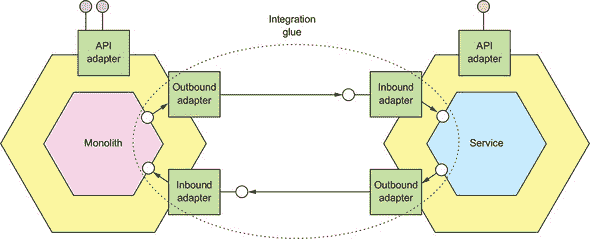

例如，`Delayed Delivery Service`同时使用 REST 和领域事件。它使用 REST 从单体应用中检索客户联系信息。它通过订阅由单体应用发布的领域事件来跟踪`Orders`的状态。

在本节中，我首先描述了集成粘合剂的设计。我讨论了它解决的问题和不同的实现选项。之后，我描述了事务管理策略，包括使用 sagas。我讨论了有时保持数据一致性的要求会改变你提取服务时的顺序。

让我们先看看集成粘合剂的设计。

#### 13.3.1\. 设计集成粘合剂

当将一个功能作为服务实现或从单体应用中提取服务时，你必须开发一个集成粘合剂，使服务能够与单体应用协作。它由服务和单体中使用的某种 IPC 机制代码组成。集成粘合剂的结构取决于所使用的 IPC 机制类型。例如，如果服务使用 REST 调用单体应用，那么集成粘合剂由服务中的 REST 客户端和单体应用中的 Web 控制器组成。或者，如果单体应用订阅由服务发布的领域事件，那么集成粘合剂由服务中的事件发布适配器和单体应用中的事件处理器组成。

##### 设计集成粘合剂 API

设计集成粘合剂的第一步是决定它为领域逻辑提供哪些 API。根据你是查询数据还是更新数据，你可以从几种不同的接口风格中进行选择。假设你正在处理`Delayed Delivery Service`，该服务需要从单体应用中检索客户联系信息。服务的业务逻辑不需要知道集成粘合剂用来检索信息的 IPC 机制。因此，该机制应该被一个接口封装。因为`Delayed Delivery Service`正在查询数据，所以定义一个`CustomerContactInfoRepository`是有意义的：

```
interface CustomerContactInfoRepository {
  CustomerContactInfo findCustomerContactInfo(long customerId)
}
```

服务的业务逻辑可以调用这个 API，而无需知道集成粘合剂如何检索数据。

让我们考虑一个不同的服务。想象一下，你正在从 FTGO 单体中提取配送管理。单体需要调用 `Delivery Service` 来安排、重新安排和取消配送。再次强调，底层 IPC 机制的细节对业务逻辑来说并不重要，应该由接口封装。在这种情况下，单体必须调用服务操作，因此使用存储库没有意义。更好的方法是定义一个服务接口，如下所示：

```
interface DeliveryService {
  void scheduleDelivery(...);
  void rescheduleDelivery(...);
  void cancelDelivery(...);
}
```

单体的业务逻辑调用此 API，而不知道它是如何由集成粘合剂实现的。

既然我们已经看到了接口设计，让我们来看看交互样式和 IPC 机制。

##### 选择交互样式和 IPC 机制

在设计集成粘合剂时，你必须做出的一个重要设计决策是选择使服务和单体协作的交互样式和 IPC 机制。如第三章所述（kindle_split_011.xhtml#ch03），有几种交互样式和 IPC 机制可供选择。你应该使用哪一种取决于一方——服务或单体——需要什么来查询或更新另一方。

如果一方需要查询另一方的数据，有几个选择。一个选项是，如图 13.9 所示，实现存储库接口的适配器调用数据提供者的 API。这个 API 通常使用请求/响应交互样式，如 REST 或 gRPC。例如，`Delayed Delivery Service` 可能通过调用由 FTGO 单体实现的 REST API 来检索客户联系信息。

##### 图 13.9\. 实现存储库接口的适配器调用单体的 REST API 来检索客户信息。

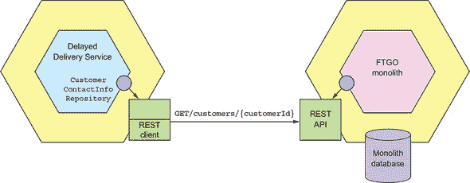

在这个例子中，`Delayed Delivery Service` 的领域逻辑通过调用 `CustomerContactInfoRepository` 接口来检索客户联系信息。该接口的实现调用单体的 REST API。

通过调用查询 API 查询数据的一个重要好处是其简单性。主要缺点是它可能效率低下。消费者可能需要发出大量请求。提供者可能返回大量数据。另一个缺点是它减少了可用性，因为它是一种同步的 IPC。因此，使用查询 API 可能不切实际。

一种替代方法是数据消费者维护数据的副本，如图 13.10 所示。副本本质上是一个 CQRS 视图。数据消费者通过订阅数据提供者发布的领域事件来保持副本的更新。

##### 图 13.10\. 集成粘合剂从单体复制数据到服务。单体发布领域事件，由服务实现的事件处理器更新服务的数据库。

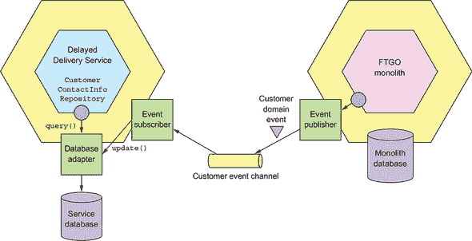

使用副本有几个好处。它避免了反复查询数据提供者的开销。相反，正如在描述第七章中的 CQRS 时讨论的那样，你可以设计副本以支持高效的查询。然而，使用副本的一个缺点是维护它的复杂性。本节后面将描述的一个潜在挑战是需要修改单体以发布领域事件。

既然我们已经讨论了如何进行查询，让我们考虑如何进行更新。执行更新的一个挑战是需要维护服务和单体之间的数据一致性。发起更新请求的方（请求者）已经更新或需要更新其数据库。因此，确保两个更新都发生至关重要。解决方案是服务和单体通过框架实现的交易性消息进行通信，例如 Eventuate Tram。在简单场景中，请求者可以发送通知消息或发布事件来触发更新。在更复杂场景中，请求者必须使用一个叙事来维护数据一致性。第 13.3.2 节讨论了使用叙事的后果。

##### 实现反腐败层

想象一下，你正在作为一项全新的服务实现一个新功能。由于不受单体代码库的限制，你可以使用现代开发技术，如领域驱动设计（DDD），并开发一个全新的领域模型。此外，由于 FTGO 单体领域的定义不佳且有些过时，你可能会以不同的方式建模概念。因此，你的服务领域模型将具有不同的类名、字段名和字段值。例如，`Delayed Delivery Service` 有一个专注于特定责任的 `Delivery` 实体，而 FTGO 单体则有一个具有过多责任的 `Order` 实体。由于这两个领域模型不同，你必须实现 DDD 所说的*反腐败层*（ACL），以便服务能与单体通信。

| |
| --- |

**模式：反腐败层**

一种软件层，用于在两个不同的领域模型之间进行转换，以防止一个模型的概念污染另一个模型。请参阅[`microservices.io/patterns/refactoring/anti-corruption-layer.html`](https://microservices.io/patterns/refactoring/anti-corruption-layer.html)。

| |
| --- |

反腐败层的目的是防止遗留单体领域模型污染服务领域模型。它是一层代码，在不同的领域模型之间进行转换。例如，如图 13.11 所示，`Delayed Delivery Service` 有一个 `CustomerContactInfoRepository` 接口，该接口定义了一个返回 `CustomerContactInfo` 的 `findCustomerContactInfo()` 方法。实现 `CustomerContactInfoRepository` 接口的类必须在 `Delayed Delivery Service` 的通用语言和 FTGO 单体之间的语言进行转换。

##### 图 13.11。调用单体应用的服务适配器必须在服务的领域模型和单体应用的领域模型之间进行转换。

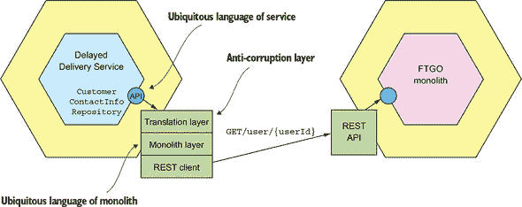

`findCustomerContactInfo()` 方法的实现调用 FTGO 单体应用以检索客户信息，并将响应转换为`CustomerContactInfo`。在这个例子中，转换相当简单，但在其他场景中可能会非常复杂，例如涉及映射状态代码等值。

消费领域事件的领域事件订阅者也有一个访问控制列表（ACL）。领域事件是发布者领域模型的一部分。事件处理器必须将领域事件转换为订阅者的领域模型。例如，如图 13.12 所示，FTGO 单体应用发布`Order`领域事件。`Delivery Service`有一个订阅这些事件的处理器。

##### 图 13.12。事件处理器必须从事件发布者的领域模型转换为订阅者的领域模型。

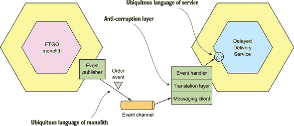

事件处理器必须将单体应用的领域语言中的领域事件转换为`Delivery Service`的语言。它可能需要映射类和属性名称，以及可能属性值。

不仅服务使用反腐败层。单体应用在调用服务和订阅由服务发布的领域事件时，也会使用 ACL。FTGO 单体应用通过向`Delivery Service`发送通知消息来安排交付。它通过在`DeliveryService`接口上调用方法来发送通知。实现类将其参数转换为`Delivery Service`能够理解的消息。

##### 单体应用如何发布和订阅领域事件

领域事件是一个重要的协作机制。对于新开发的服务来说，发布和消费事件是直接的。它可以使用第三章中描述的机制之一，例如 Eventuate Tram 框架。服务甚至可以使用第六章中描述的事件溯源来发布事件。然而，将单体应用改为发布和消费事件可能具有挑战性。让我们看看原因。

一个单体应用可以通过几种不同的方式发布领域事件。一种方法就是使用服务所使用的相同的领域事件发布机制。你需要在代码中找到所有改变特定实体的地方，并插入对事件发布 API 的调用。这种方法的问题在于改变单体应用并不总是容易的。定位所有这些地方并插入发布事件的调用可能会很耗时，且容易出错。更糟糕的是，单体应用的一些业务逻辑可能由无法轻松发布领域事件的存储过程组成。

另一种方法是在数据库级别发布领域事件。例如，你可以使用事务逻辑尾随或轮询，这些内容在第三章中有描述。使用事务尾随的一个关键好处是，你不需要改变单体应用。在数据库级别发布事件的缺点是，通常很难确定更新的原因并发布适当的高级业务事件。因此，服务通常会发布表示表变更的事件，而不是业务实体的事件。

幸运的是，对于单体应用来说，通常更容易订阅作为服务发布的领域事件。很多时候，你可以使用框架，如 Eventuate Tram，来编写事件处理器。但有时，单体应用订阅事件甚至具有挑战性。例如，单体应用可能使用的是没有消息代理客户端的语言。在这种情况下，你需要编写一个小型的“辅助”应用程序来订阅事件并直接更新单体应用的数据库。

现在我们已经探讨了如何设计集成胶水，使服务和单体应用能够协作，让我们看看在迁移到微服务时可能会遇到的另一个挑战：在服务和单体应用之间维护数据一致性。

#### 13.3.2\. 在服务和单体应用之间维护数据一致性

当你开发一个服务时，你可能会发现很难在服务和单体应用之间维护数据一致性。服务操作可能需要更新单体应用中的数据，或者单体应用操作可能需要更新服务中的数据。例如，想象一下你从单体应用中提取了“厨房服务”。你需要更改单体应用的订单管理操作，如`createOrder()`和`cancelOrder()`，以使用 sagas 来保持“票据”与“订单”的一致性。

然而，使用 sagas 的问题在于，单体应用可能不愿意参与。如第四章所述，sagas 必须使用补偿事务来撤销更改。例如，“创建订单 sagas”包括一个补偿事务，如果“厨房服务”拒绝订单，则将订单标记为已拒绝。在单体应用中使用补偿事务的问题是你可能需要做出许多耗时且复杂的更改来支持它们。单体应用可能还需要实施对策来处理 sagas 之间缺乏隔离的问题。这些代码更改的成本可能是提取服务的一个巨大障碍。

|  |
| --- |

**关键 sagas 术语**

我在第四章中介绍了 sagas。以下是一些关键术语：

+   ***Saga*—** 通过异步消息协调的一系列本地事务。

+   ***补偿事务*—** 撤销本地事务所做的更新的交易。

+   ***对策*——** 用于处理故事（sagas）之间隔离不足的设计技术。

+   ***语义锁*——** 在由故事（saga）更新的记录中设置标志的一种对策。

+   ***可补偿事务*——** 需要补偿事务的事务，因为叙事（saga）中跟随它的某个事务可能会失败。

+   ***枢纽事务*——** 一个决定故事（saga）是否执行的事务。如果它成功，那么故事（saga）将运行到完成。

+   ***可重试事务*——** 跟随枢纽事务并保证成功的事务。

|  |
| --- |

幸运的是，许多故事（sagas）的实现都很直接。如第四章第四章所述，如果单体架构的事务要么是*枢纽事务*要么是*可重试事务*，那么实现故事（sagas）应该很简单。你甚至可以通过仔细排序服务提取的顺序来简化实现，这样单体架构的事务就永远不需要是可补偿的。或者，改变单体架构以支持补偿事务可能相对困难。为了理解为什么在单体架构中实现补偿事务有时具有挑战性，让我们看看一些例子，从特别棘手的一个开始。

##### 将单体架构改为支持可补偿事务的挑战

让我们深入探讨当你从单体架构中提取`厨房服务`时需要解决的补偿事务问题。这个重构涉及将`订单`实体拆分并在`厨房服务`中创建一个`票证`实体。它影响了单体架构实现的许多命令，包括`createOrder()`。

单体架构将`createOrder()`命令实现为一个包含以下步骤的单个 ACID 事务：

1.  验证订单详情。

1.  验证消费者能否下单。

1.  授权消费者的信用卡。

1.  创建一个`订单`。

你需要用以下步骤组成的叙事（saga）来替换这个 ACID 事务：

1.  在单体架构中

    +   在`审批待定`状态下创建一个`订单`。

    +   验证消费者能否下单。

1.  在`厨房服务`

    +   验证订单详情。

    +   在`创建待定`状态下创建一个`票证`。

1.  在单体架构中

    +   授权消费者的信用卡。

    +   将`订单`的状态改为`已批准`。

1.  在`厨房服务`

    +   将`票证`的状态改为`等待接受`。

这个故事与第四章中描述的`CreateOrderSaga`类似。第四章。它由四个本地事务组成，两个在单体架构中，两个在`厨房服务`中。第一个事务在`审批待定`状态下创建一个`订单`。第二个事务在`创建待定`状态下创建一个`票证`。第三个事务授权`消费者`的信用卡并将订单状态改为`已批准`。第四个也是最后一个事务将`票证`的状态改为`等待接受`。

实现这个 Saga 的挑战在于，第一步，即创建`Order`，必须是可补偿的。这是因为第二个本地事务，发生在`Kitchen Service`中，可能会失败并要求单体应用撤销第一个本地事务所做的更新。因此，`Order`实体需要有一个`APPROVAL_PENDING`，一个在第四章中描述的语义锁定对策，它表明`Order`正在创建过程中。

引入新的`Order`实体状态的问题在于，这可能会要求对单体应用进行广泛的更改。你可能需要更改代码中所有触及`Order`实体的地方。对单体应用进行这类广泛的更改既耗时又不是开发资源的最佳投资。此外，这也可能存在风险，因为单体应用通常难以测试。

##### Saga 不一定需要单体应用来支持可补偿的事务。

Saga 具有高度领域特定性。有些，例如我们刚刚看到的，需要单体应用来支持补偿性事务。但完全有可能，当你提取一个服务时，你可能能够设计出不需要单体应用实现补偿性事务的 Saga。这是因为单体应用只需要支持补偿性事务，如果跟随单体应用事务的事务可能会失败。如果单体应用中的每个事务要么是关键事务要么是可重试事务，那么单体应用就永远不需要执行补偿性事务。因此，你只需要对单体应用进行最小程度的更改以支持 Saga。

例如，想象一下，如果你不是提取`Kitchen Service`，而是提取`Order Service`。这次重构涉及将`Order`实体拆分，并在`Order Service`中创建一个精简的`Order`实体。它还影响了包括`createOrder()`在内的许多命令，该命令从单体应用移动到`Order Service`。为了提取`Order Service`，你需要更改`createOrder()`命令以使用 saga，按照以下步骤进行：

1.  `Order Service`

    +   在`APPROVAL_PENDING`状态下创建一个`Order`。

1.  单体应用

    +   验证消费者可以下订单。

    +   验证订单详情并创建一个`Ticket`。

    +   授权消费者的信用卡。

1.  `Order Service`

    +   将`Order`的状态更改为`APPROVED`。

这个 Saga 由三个本地事务组成，一个在单体应用中，两个在`Order Service`中。第一个事务，在`Order Service`中，创建了一个处于`APPROVAL_PENDING`状态的`Order`。第二个事务，在单体应用中，验证消费者可以下订单，授权他们的信用卡并创建一个`Ticket`。第三个事务，在`Order Service`中，将`Order`的状态更改为`APPROVED`。

单体的事务是 saga 的枢纽事务——saga 的不可逆转点。如果单体的事务完成，那么 saga 将运行至完成。只有这个 saga 的前两个步骤可能会失败。第三个事务不能失败，因此单体中的第二个事务永远不会需要回滚。因此，支持补偿性事务的所有复杂性都在`订单服务`中，这使得它比单体更容易测试。

如果在提取服务时需要编写的所有 sagas 都具有这种结构，那么您需要对单体进行更少的更改。更重要的是，您可以仔细地排序服务提取，以确保单体的事务要么是枢纽事务，要么是可重试事务。让我们看看如何做到这一点。

##### 对服务提取进行排序以避免在单体中实现补偿性事务。

正如我们刚才看到的，提取`厨房服务`需要单体实现补偿性事务，而提取`订单服务`则不需要。这表明提取服务的顺序很重要。通过仔细排序服务提取，您可以避免需要对单体进行广泛的修改以支持补偿性事务。我们可以确保单体的事务要么是枢纽事务，要么是可重试事务。例如，如果我们首先从 FTGO 单体中提取`订单服务`，然后提取`消费者服务`，提取`厨房服务`将变得简单。让我们更详细地看看如何做到这一点。

一旦我们提取了`消费者服务`，`createOrder()`命令使用以下 saga：

1.  `订单服务`: 在`APPROVAL_PENDING`状态下创建一个`订单`。

1.  `消费者服务`: 验证消费者能否下订单。

1.  单体

    +   验证订单详情并创建一个`票据`。

    +   授权消费者的信用卡。

1.  `订单服务`: 将`订单`的状态更改为`APPROVED`。

在这个 saga 中，单体的事务是枢纽事务。`订单服务`实现补偿性事务。

现在我们已经提取了`消费者服务`，我们可以提取`厨房服务`。如果我们提取这个服务，`createOrder()`命令将使用以下 saga：

1.  `订单服务`: 在`APPROVAL_PENDING`状态下创建一个`订单`。

1.  `消费者服务`: 验证消费者能否下订单。

1.  `厨房服务`: 验证订单详情并创建一个`PENDING`的`票据`。

1.  单体：授权消费者的信用卡。

1.  `厨房服务`: 将`票据`的状态更改为`APPROVED`。

1.  `订单服务`: 将`订单`的状态更改为`APPROVED`。

在这个 saga 中，单体的事务仍然是枢纽事务。`订单服务`和`厨房服务`实现补偿性事务。

我们甚至可以通过提取`会计服务`来继续重构单体。如果我们提取这个服务，`createOrder()`命令将使用以下 saga：

1.  `Order Service`：创建一个处于 `APPROVAL_PENDING` 状态的 `Order`。

1.  `Consumer Service`：验证消费者能否下订单。

1.  `Kitchen Service`：验证订单详情并创建一个 PENDING 的 `Ticket`。

1.  `Accounting Service`：授权消费者的信用卡。

1.  `Kitchen Service`：将 `Ticket` 的状态更改为 `APPROVED`。

1.  `Order Service`：将 `Order` 的状态更改为 `APPROVED`。

如您所见，通过仔细排序提取，您可以避免使用需要修改单体应用的复杂 sagas。现在让我们看看如何在迁移到微服务架构时处理安保问题。

#### 13.3.3. 处理身份验证和授权

当将单体应用重构为微服务架构时，需要解决的另一个设计问题是将单体应用的安保机制适应以支持服务。第十一章 描述了如何在微服务架构中处理安保问题。基于微服务的应用程序使用令牌，例如 JSON Web 令牌 (JWT)，来传递用户身份。这与典型的传统单体应用大不相同，后者使用内存中的会话状态并通过线程局部传递用户身份。将单体应用转换为微服务架构的挑战在于，你需要同时支持单体和基于 JWT 的安保机制。

幸运的是，有一个简单直接的方法可以解决这个问题，只需对单体应用的登录请求处理程序进行一个小改动。图 13.13 展示了这是如何工作的。登录处理程序返回一个额外的 cookie，在这个例子中我称之为 `USERINFO`，它包含用户信息，如用户 ID 和角色。浏览器在每次请求中都包含该 cookie。API 网关从 cookie 中提取信息，并将其包含在它向服务发出的 HTTP 请求中。因此，每个服务都可以访问所需用户信息。

##### 图 13.13. 登录处理程序已增强以设置一个 `USERINFO` cookie，它是一个包含用户信息的 JWT。`API Gateway` 在调用服务时将 `USERINFO` cookie 转移到授权头中。

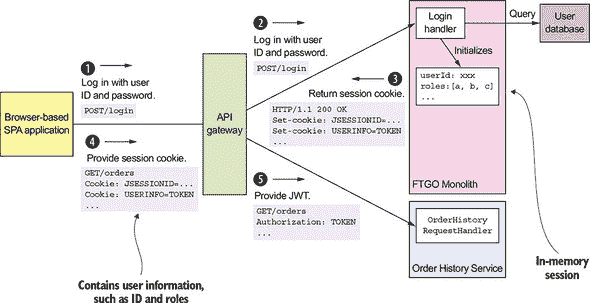

事件序列如下：

1.  客户端发出包含用户凭证的登录请求。

1.  `API Gateway` 将登录请求路由到 FTGO 单体应用。

1.  单体应用返回一个包含 `JSESSIONID` 会话 cookie 和 `USERINFO` cookie 的响应，其中包含用户信息，如 ID 和角色。

1.  客户端发出一个包含 `USERINFO` cookie 的请求，以调用一个操作。

1.  `API Gateway` 验证 `USERINFO` cookie，并将其包含在它向服务发出的请求的 `Authorization` 头中。服务验证 `USERINFO` 令牌并提取用户信息。

让我们更详细地看看 `LoginHandler` 和 `API Gateway`。

##### 单体应用的 LoginHandler 设置 USERINFO cookie

`LoginHandler`处理用户的凭证的`POST`请求。它验证用户并将在会话中存储有关用户的信息。这通常由安全框架实现，例如 Spring Security 或 NodeJS 的 Passport。如果应用程序配置为使用默认的内存会话，HTTP 响应将设置一个会话 cookie，例如`JSESSIONID`。为了支持迁移到微服务，`LoginHandler`还必须设置包含描述用户的 JWT 的`USERINFO`cookie。

##### API 网关将 USERINFO cookie 映射到 Authorization 头

如第八章所述，API 网关负责请求路由和 API 组合。它通过向单体和各个服务发送一个或多个请求来处理每个请求。当 API 网关调用一个服务时，它会验证`USERINFO`cookie 并将其传递给服务，在 HTTP 请求的`Authorization`头中。通过将 cookie 映射到`Authorization`头，API 网关确保以标准方式将用户身份传递给服务，这种方式与客户端的类型无关。

最终，我们很可能会将登录和用户管理提取到服务中。但正如你所看到的，通过仅对单体登录处理程序进行一个小改动，现在服务就可以访问用户信息了。这使得你可以专注于开发为业务提供最大价值的服务，并推迟提取价值较低的服务，例如用户管理。

现在我们已经了解了在重构到微服务时如何处理安全问题，让我们来看一个将新功能作为服务实现的示例。

### 13.4. 将新功能作为服务实现：处理误送订单

假设你被分配去改进 FTGO 处理误送订单的方式。越来越多的客户抱怨客户服务如何处理未能送达的订单。大多数订单都能按时送达，但有时订单要么送达晚，要么根本没送达。例如，快递员因意外糟糕的交通而延误，所以订单被取走并晚些时候送达。或者，也许当快递员到达餐厅时，餐厅已经关门，无法完成配送。更糟糕的是，客户服务第一次听说误送是在收到一个愤怒的客户发来的电子邮件时。

| |
| --- |

**一个真实的故事：我丢失的冰淇淋**

一个周六晚上，我感到很懒，使用一个知名的食品配送应用从 Smitten 订购了冰淇淋，但从未送达。公司唯一的沟通是在第二天早上发来的电子邮件，说我的订单已被取消。我还接到一个来自非常困惑的客户服务代表的语音邮件，显然她不知道她为什么要打电话。也许这个电话是由我的一条推文触发的，描述了发生的事情。显然，配送公司没有建立任何处理不可避免的错误的机制。

|  |
| --- |

许多配送问题的根本原因是 FTGO 应用使用的原始配送调度算法。一个更复杂的调度器正在开发中，但还需要几个月才能完成。临时解决方案是 FTGO 通过向客户道歉，并在某些情况下在客户投诉之前提供补偿，来主动处理延迟或取消的订单。

你的任务是实现一个新功能，该功能将执行以下操作：

1.  当订单无法按时交付时，通知客户。

1.  当订单因为无法在餐厅关门前取货而无法交付时，通知客户。

1.  当订单无法按时交付时，通知客户服务，以便他们可以通过补偿客户来主动纠正情况。

1.  跟踪配送统计数据。

这个新功能相当简单。新的代码必须跟踪每个 `Order` 的状态，如果 `Order` 无法按承诺交付，代码必须通过例如发送电子邮件的方式通知客户和客户支持。

但你应该如何——或者更确切地说，*在哪里*——实现这个新功能呢？一种方法是在单体中实现一个新的模块。那里的问题是开发和测试此代码将很困难。更重要的是，这种方法增加了单体的大小，从而使单体地狱变得更加糟糕。记住之前提到的洞穴法则：当你陷入洞穴时，最好的办法是停止挖掘。与其使单体更大，不如将这些新功能作为服务来实现是一个更好的方法。

#### 13.4.1. 延迟配送服务的设计

我们将把这个功能实现为一个名为 `Delayed Order Service` 的服务。图 13.14 展示了在实现此服务后 FTGO 应用的架构。该应用由 FTGO 单体应用、新的 `Delayed Delivery Service` 和一个 `API Gateway` 组成。`Delayed Delivery Service` 有一个 API，定义了一个名为 `getDelayedOrders()` 的单一查询操作，该操作返回当前延迟或无法交付的订单。`API Gateway` 将 `getDelayedOrders()` 请求路由到服务，并将所有其他请求路由到单体。集成胶水为 `Delayed Order Service` 提供了对单体数据的访问。

##### 图 13.14\. `Delayed Delivery Service` 的设计。集成粘合剂为 `Delayed Delivery Service` 提供了对单体拥有的数据的访问权限，例如 `Order` 和 `Restaurant` 实体以及客户联系信息。

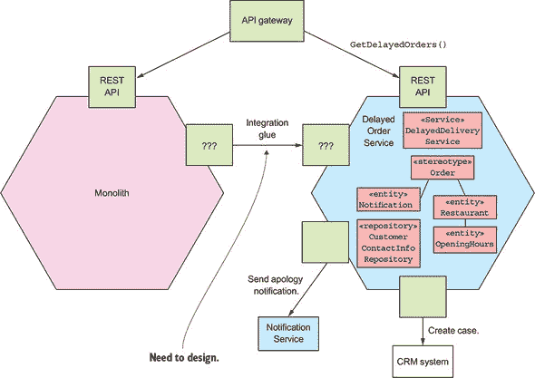

`Delayed Order Service` 的领域模型由各种实体组成，包括 `DelayedOrderNotification`、`Order` 和 `Restaurant`。核心逻辑由 `DelayedOrderService` 类实现。它由定时器定期调用以查找无法按时交付的订单。它是通过查询 `Orders` 和 `Restaurants` 来做到这一点的。如果一个 `Order` 无法按时交付，`DelayedOrderService` 会通知消费者和客户服务。

`Delayed Order Service` 不拥有 `Order` 和 `Restaurant` 实体。相反，这些数据是从 FTGO 单体复制的。更重要的是，该服务不存储客户联系信息，而是从单体中检索它。让我们看看为 `Delayed Order Service` 提供单体数据访问权限的集成粘合剂的设计。

#### 13.4.2\. 为 `Delayed Delivery Service` 设计集成粘合剂

即使实现新功能的服务的定义了自己的实体类，它通常也会访问单体拥有的数据。`Delayed Delivery Service` 也不例外。它有一个 `DelayedOrderNotification` 实体，代表它发送给消费者的通知。但正如我刚才提到的，它的 `Order` 和 `Restaurant` 实体复制了 FTGO 单体的数据。它还需要查询用户联系信息以便通知用户。因此，我们需要实现集成粘合剂，使 `Delivery Service` 能够访问单体的数据。

图 13.15 展示了集成粘合剂的设计。FTGO 单体发布 `Order` 和 `Restaurant` 领域事件。`Delivery Service` 消费这些事件并更新其那些实体的副本。FTGO 单体实现了一个用于查询客户联系信息的 REST 端点。`Delivery Service` 在需要通知用户他们的订单无法按时交付时调用此端点。

##### 图 13.15\. 集成粘合剂为 `Delayed Delivery Service` 提供了对单体拥有的数据的访问权限。

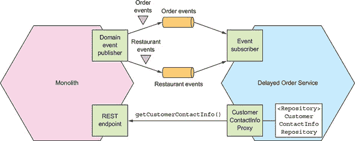

让我们看看集成每个部分的设计，从检索客户联系信息的 REST API 开始。

##### 使用 CustomerContactInfoRepository 查询客户联系信息

如 第 13.3.1 节 所述，服务如 `Delayed Delivery Service` 读取单体应用数据的方式有几种。最简单的方法是 `Delayed Order Service` 使用单体应用的查询 API 来检索数据。当检索 `User` 联系信息时，这种方法是合理的。由于 `Delayed Delivery Service` 很少需要检索用户的联系信息，且数据量相当小，因此不存在延迟或性能问题。

`CustomerContactInfoRepository` 是一个接口，它使 `Delayed Delivery Service` 能够检索消费者的联系信息。它通过一个 `CustomerContactInfoProxy` 实现，该代理通过调用单体应用的 `getCustomerContactInfo()` REST 端点来检索用户信息。

##### 发布和消费订单和餐厅领域事件

不幸的是，对于 `Delayed Delivery Service` 来说，查询单体应用以获取所有开放 `Orders` 和 `Restaurant` 小时的状态并不实用。这是因为反复在网络中传输大量数据效率低下。因此，`Delayed Delivery Service` 必须使用第二种更复杂的方法，通过订阅单体发布的事件来维护 `Orders` 和 `Restaurants` 的副本。重要的是要记住，副本并不是单体数据的一个完整副本——它只存储 `Order` 和 `Restaurant` 实体属性的一个小子集。

如前所述 第 13.3.1 节，我们可以通过几种不同的方式修改 FTGO 单体应用，使其发布 `Order` 和 `Restaurant` 领域事件。一种选择是修改单体应用中所有更新 `Orders` 和 `Restaurants` 的地方，以发布高级领域事件。第二种选择是跟踪事务日志以将更改作为事件进行复制。在这个特定场景中，我们需要同步两个数据库。我们不需要 FTGO 单体应用发布高级领域事件，所以两种方法都可以。

`Delayed Order Service` 实现了事件处理器，这些处理器订阅来自单体应用的事件，并更新其 `Order` 和 `Restaurant` 实体。事件处理器的细节取决于单体是否发布特定的低级事件或高级事件。在任一情况下，你可以将事件处理器视为将单体应用边界上下文中的事件转换为服务边界上下文中实体的更新。

使用副本的一个重要好处是它使`Delayed Order Service`能够高效地查询订单和餐厅营业时间。然而，一个缺点是它更复杂。另一个缺点是它需要单体发布必要的`Order`和`Restaurant`事件。幸运的是，因为`Delayed Delivery Service`只需要`ORDERS`和`RESTAURANT`表的基本子集列，我们不应该遇到第 13.3.1 节中描述的问题。

将新功能如延迟订单管理作为一个独立服务实现可以加速其开发、测试和部署。更重要的是，它允许你使用全新的技术栈而不是单体较旧的技术栈来实现该功能。它还可以阻止单体继续增长。延迟订单管理只是 FTGO 应用程序计划中的许多新功能之一。FTGO 团队可以将这些功能中的许多作为独立服务实现。

不幸的是，你不能将所有更改都作为新服务实现。很多时候，你必须对单体进行大量更改来实现新功能或更改现有功能。任何涉及单体的开发都可能很慢且痛苦。如果你想加速这些功能的交付，你必须通过将功能从单体迁移到服务中来拆分单体。让我们看看如何做到这一点。

### 13.5\. 拆分单体：提取配送管理

为了加速实现单体应用的功能交付，你需要将单体应用拆分成服务。例如，让我们设想你希望通过实现一个新的路由算法来增强 FTGO 的配送管理。开发配送管理的一个主要障碍是它与订单管理纠缠在一起，并且是单体代码库的一部分。开发和部署配送管理可能会很慢。为了加速其开发，你需要将配送管理提取为一个`Delivery Service`。

我在这个部分开始描述配送管理以及它目前如何在单体中嵌入。接下来，我讨论新的独立`Delivery Service`及其 API 的设计。然后，我描述`Delivery Service`和 FTGO 单体如何协作。最后，我谈谈我们需要对单体进行的一些更改以支持`Delivery Service`。

让我们先从回顾现有设计开始。

#### 13.5.1\. 现有配送管理功能概述

配送管理负责安排在餐厅取订单并将其递送给消费者的快递员。每个快递员都有一个计划，即取货和配送行动的日程表。一个*取货*行动告诉`Courier`在特定时间从餐厅取订单。一个*配送*行动告诉`Courier`将订单递送给消费者。每当下单、取消或修改订单，以及快递员的位置和可用性发生变化时，计划都会进行修订。

配送管理是 FTGO 应用程序中最古老的组成部分之一。如图 13.16 所示，它嵌入在订单管理中。管理配送的大部分代码都在`OrderService`中。更重要的是，没有显式地表示`Delivery`。它嵌入在`Order`实体中，该实体包含各种与配送相关的字段，例如`scheduledPickupTime`和`scheduledDeliveryTime`。

##### 图 13.16。配送管理在 FTGO 单体中与订单管理交织在一起。

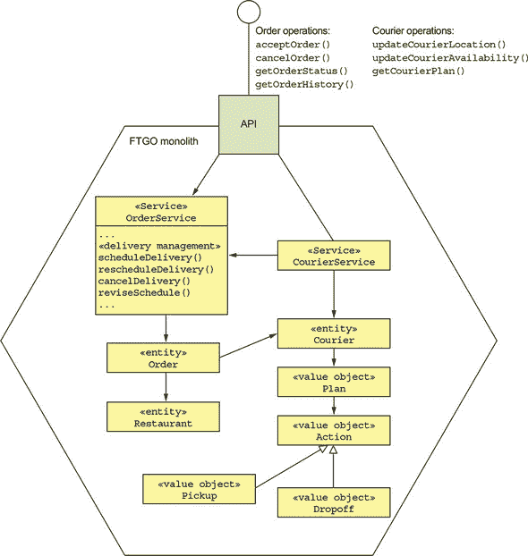

单体实现了许多命令，包括以下内容调用配送管理：

+   **`acceptOrder()`—** 当餐厅接受订单并承诺在特定时间内准备时调用。此操作调用配送管理以安排配送。

+   **`cancelOrder()`—** 当消费者取消订单时调用。如果需要，它将取消配送。

+   **`noteCourierLocationUpdated()`—** 由快递员的移动应用程序调用以更新快递员的位置。它触发了配送的重新安排。

+   **`noteCourierAvailabilityChanged()`—** 由快递员的移动应用程序调用以更新快递员的可用性。它触发了配送的重新安排。

此外，各种查询检索由配送管理维护的数据，包括以下内容：

+   **`getCourierPlan()`—** 由快递员的移动应用程序调用并返回快递员的计划。

+   **`getOrderStatus()`—** 返回订单的状态，包括与配送相关的信息，例如指定的快递员和预计到达时间（ETA）。

+   **`getOrderHistory()`—** 返回与`getOrderStatus()`类似的信息，但关于多个订单。

很常见的是，提取到服务中的是，如第 13.2.3 节中提到的，一个完整的垂直切片，顶部是控制器，底部是数据库表。我们可以考虑与`Courier`相关的命令和查询是配送管理的一部分。毕竟，配送管理创建快递员计划，并且是`Courier`位置和可用信息的主要消费者。但为了最小化开发工作量，我们将保留这些操作在单体中，并仅提取算法的核心。因此，`Delivery Service`的第一迭代不会公开提供 API。相反，它将仅由单体调用。接下来，让我们探索`Delivery Service`的设计。

#### 13.5.2. 配送服务概述

建议的新`Delivery Service`负责调度、重新调度和取消交付。图 13.17 显示了提取`Delivery Service`后的 FTGO 应用程序的架构视图。该架构由 FTGO 单体和`Delivery Service`组成。它们通过服务中的 API 和单体中的 API 组成的集成胶水进行协作。`Delivery Service`有自己的领域模型和数据库。

##### 图 13.17\. 提取`Delivery Service`后的 FTGO 应用程序的高级视图。FTGO 单体和`Delivery Service`通过它们各自的 API 组成的集成胶水进行协作。需要做出的两个关键决策是哪些功能和数据被移动到`Delivery Service`，以及单体和`Delivery Service`如何通过 API 进行协作？

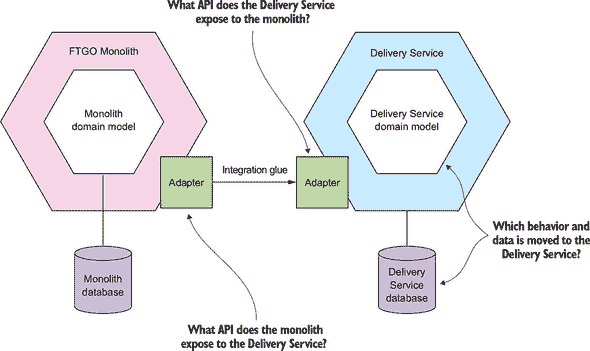

为了完善这个架构并确定服务的领域模型，我们需要回答以下问题：

+   哪些行为和数据被移动到`Delivery Service`？

+   `Delivery Service`向单体暴露了哪些 API？

+   该单体向`Delivery Service`暴露了哪些 API？

这些问题是相互关联的，因为单体和服务之间责任分配的分布会影响 API。例如，`Delivery Service`将需要调用单体提供的 API 来访问单体数据库中的数据，反之亦然。稍后，我将描述使`Delivery Service`和 FTGO 单体协作的集成胶水的结构。但首先，让我们看看`Delivery Service`的领域模型设计。

#### 13.5.3\. 设计`Delivery Service`领域模型

为了能够提取交付管理，我们首先需要识别实现它的类。一旦我们做到了这一点，我们就可以决定哪些类要移动到`Delivery Service`以形成其领域逻辑。在某些情况下，我们需要拆分类。我们还需要决定在服务与单体之间复制哪些数据。

让我们先识别实现交付管理的类。

##### 确定哪些实体及其字段是交付管理的一部分

设计`Delivery Service`的第一步是仔细审查交付管理代码，并确定参与实体及其字段。图 13.18 显示了交付管理的一部分实体和字段。一些字段是交付调度算法的输入，而其他字段是输出。该图显示了哪些字段也被单体实现的其他功能使用。

##### 图 13.18\. 由单体实现的交付管理和其他功能访问的实体和字段。字段可以被读取或写入，或者两者都可以。它可以被交付管理、单体或两者访问。

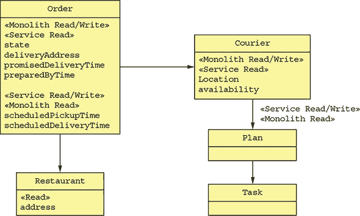

配送调度算法读取各种属性，包括 `Order` 的 `restaurant`、`promisedDeliveryTime` 和 `deliveryAddress`，以及 `Courier` 的 `location`、`availability` 和当前计划。它更新 `Courier` 的计划、`Order` 的 `scheduledPickupTime` 和 `scheduledDeliveryTime`。如您所见，配送管理使用的字段也被单体应用使用。

##### 决定哪些数据迁移到 `Delivery Service`

既然我们已经确定了参与配送管理的实体和字段，下一步就是决定将哪些实体和字段移动到服务中。在理想情况下，服务访问的数据仅由服务使用，因此我们可以简单地将这些数据移动到服务中并完成。遗憾的是，这种情况很少见，这种情况也不例外。配送管理使用的所有实体和字段也被单体应用的其他功能使用。

因此，在确定要将哪些数据移动到服务中时，我们需要考虑两个问题。第一个问题是：服务如何访问单体应用中保留的数据？第二个问题是：单体应用如何访问已移动到服务中的数据？此外，如前文在 第 13.3 节 中所述，我们需要仔细考虑如何维护服务与单体应用之间的数据一致性。

`Delivery Service` 的基本责任是管理快递计划并更新 `Order` 的 `scheduledPickupTime` 和 `scheduledDeliveryTime` 字段。因此，拥有这些字段是有意义的。我们还可以将 `Courier.location` 和 `Courier.availability` 字段移动到 `Delivery Service`。但由于我们正在尝试进行尽可能小的更改，因此我们将暂时保留这些字段在单体应用中。

##### `Delivery Service` 领域逻辑的设计

图 13.19 展示了 `Delivery Service` 的领域模型设计。服务的核心由 `Delivery` 和 `Courier` 等领域类组成。`DeliveryServiceImpl` 类是进入配送管理业务逻辑的入口点。它实现了 `DeliveryService` 和 `CourierService` 接口，这些接口将由后续章节中描述的 `DeliveryServiceEventsHandler` 和 `DeliveryServiceNotificationsHandlers` 调用。

##### 图 13.19\. `Delivery Service` 领域模型的设计

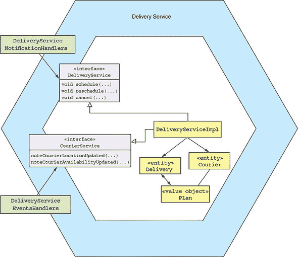

配送管理业务逻辑主要是从单体应用中复制过来的代码。例如，我们将从单体应用中复制 `Order` 实体到 `Delivery Service`，并将其重命名为 `Delivery`，删除所有除配送管理使用的字段外的所有字段。我们还将复制 `Courier` 实体并删除其大部分字段。为了开发 `Delivery Service` 的领域逻辑，我们需要将代码从单体应用中解耦。我们需要打破许多依赖关系，这可能会很耗时。再次强调，使用静态类型语言重构代码要容易得多，因为编译器将成为你的朋友。

`Delivery Service` 不是一个独立的服务。让我们看看使 `Delivery Service` 和 FTGO 单体应用协作的集成粘合剂的设计。

#### 13.5.4\. Delivery Service 集成粘合剂的设计

FTGO 单体应用需要调用 `Delivery Service` 来管理配送。单体应用还需要与 `Delivery Service` 交换数据。这种协作是通过集成粘合剂实现的。图 13.20 展示了 `Delivery Service` 集成粘合剂的设计。`Delivery Service` 有一个配送管理 API。该服务与 FTGO 单体应用通过交换领域事件同步数据。

##### 图 13.20\. `Delivery Service` 集成粘合剂的设计。`Delivery Service` 有一个配送管理 API。该服务和 FTGO 单体应用通过交换领域事件同步数据。


让我们看看集成粘合剂的每个部分的设计，从 `Delivery Service` 管理配送的 API 开始。

##### Delivery Service API 的设计

`Delivery Service` 必须提供一个 API，使单体应用能够安排、修改和取消配送。正如你在本书中看到的，首选的方法是使用异步消息传递，因为它促进了松散耦合并增加了可用性。一种方法是为 `Delivery Service` 订阅由单体应用发布的 `Order` 领域事件。根据事件类型，它创建、修改和取消一个 `Delivery`。这种方法的优点是单体应用不需要显式调用 `Delivery Service`。依赖于领域事件的缺点是它要求 `Delivery Service` 了解每个 `Order` 事件如何影响相应的 `Delivery`。

更好的方法是让`配送服务`实现一个基于通知的 API，使单体可以明确地告诉`配送服务`创建、修改和取消配送。`配送服务`的 API 由一个消息通知通道和三种消息类型组成：`ScheduleDelivery`、`ReviseDelivery`或`CancelDelivery`。通知消息包含`配送服务`所需的信息。例如，`ScheduleDelivery`通知包含取货时间和地点以及配送时间和地点。这种方法的一个重要好处是`配送服务`对`订单`生命周期没有详细的了解。它完全专注于管理配送，并且对订单一无所知。

这个 API 并不是`配送服务`和 FTGO 单体协作的唯一方式。它们还需要交换数据。

##### 配送服务如何访问 FTGO 单体数据

`配送服务`需要访问由单体拥有的`快递员`位置和可用性数据。由于这可能是一大量数据，服务反复查询单体并不实际。相反，更好的方法是由单体通过发布`快递员`领域事件，`CourierLocationUpdated`和`CourierAvailabilityUpdated`，将数据复制到`配送服务`。`配送服务`有一个`CourierEventSubscriber`，它订阅领域事件并更新其`快递员`版本。它还可能触发配送的重新安排。

##### FTGO 单体如何访问配送服务数据

FTGO 单体需要读取已移动到`配送服务`中的数据，例如`快递员`计划。理论上，单体可以查询服务，但这需要对单体进行大量更改。目前，保持单体领域模型和数据库模式不变，并从服务中复制数据回单体更容易。

实现这一点的最简单方法是让`配送服务`发布`快递员`和`配送`领域事件。当服务更新`快递员`的计划时，它会发布一个`CourierPlanUpdated`事件，当它更新`配送`时，它会发布一个`DeliveryScheduleUpdate`事件。单体消费这些领域事件并更新其数据库。

现在我们已经了解了 FTGO 单体和`配送服务`的交互方式，让我们看看如何修改单体。

#### 13.5.5\. 将 FTGO 单体改为与配送服务交互

在许多方面，实现`配送服务`是提取过程中的较简单部分。修改 FTGO 单体要困难得多。幸运的是，将服务中的数据复制回单体可以减少更改的大小。但我们需要修改单体以通过调用`配送服务`来管理配送。让我们看看如何做到这一点。

##### 定义 DeliveryService 接口

第一步是将配送管理代码封装在一个与之前定义的消息基础 API 对应的 Java 接口中。如图 13.21 所示的该接口定义了用于安排、重新安排和取消配送的方法。最终，我们将使用发送消息到配送服务的代理来实现这个接口。但最初，我们将使用一个调用配送管理代码的类来实现这个 API。

##### 图 13.21\. 第一步是定义 `DeliveryService`，它是一个粗粒度、可远程调用的 API，用于调用配送管理逻辑。

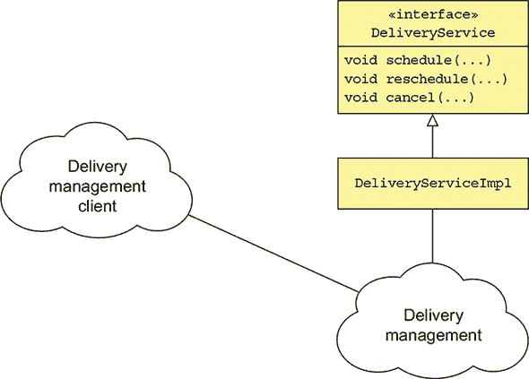

`DeliveryService` 接口是一个粗粒度接口，非常适合由 IPC 机制实现。它定义了 `schedule()`、`reschedule()` 和 `cancel()` 方法，这些方法对应于之前定义的通知消息类型。

##### 重构单块以调用 DeliveryService 接口

接下来，如图 13.22 所示，我们需要识别 FTGO 单块中所有调用配送管理的位置，并将它们更改为使用 `DeliveryService` 接口。这可能需要一些时间，并且是提取服务从单块中的一项最具挑战性的工作。

##### 图 13.22\. 第二步是将 FTGO 单块更改为通过 `DeliveryService` 接口调用配送管理。

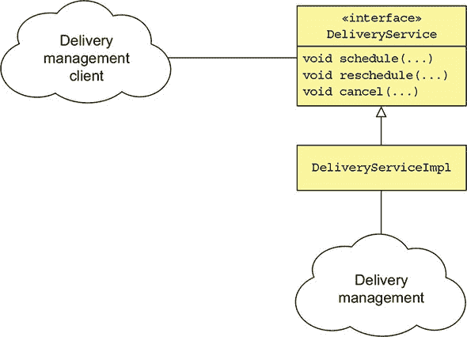

如果单块是用静态类型语言编写的，例如 Java，这肯定有帮助，因为工具在识别依赖关系方面做得更好。如果不是这样，那么希望您有一些自动化测试，足以覆盖需要更改的代码部分。

##### 实现 DeliveryService 接口

最后一步是将 `DeliveryServiceImpl` 类替换为一个代理，该代理向独立的 `Delivery Service` 发送通知消息。但与其立即丢弃现有的实现，我们将使用如图 13.23 所示的设计，该设计使单块能够动态地在现有实现和 `Delivery Service` 之间切换。我们将使用一个使用动态功能开关的类来实现 `DeliveryService` 接口，以确定是否调用现有实现或 `Delivery Service`。

##### 图 13.23\. 最后一步是实现 `DeliveryService`，使用一个发送消息到 `Delivery Service` 的代理类。一个功能开关控制 FTGO 单块是使用旧实现还是新的 `Delivery Service`。

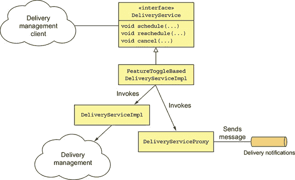

使用功能开关可以显著降低推出 `Delivery Service` 的风险。我们可以部署 `Delivery Service` 并对其进行测试。然后，一旦我们确信它工作正常，我们可以翻转开关以将流量路由到它。如果我们随后发现 `Delivery Service` 并没有按预期工作，我们可以切换回旧实现。

| |
| --- |

**关于功能开关**

*功能开关* 或 *功能标志* 允许你在不必向用户发布的情况下部署代码更改。它们还使你能够通过部署新代码来动态更改应用程序的行为。本文由马丁·福勒撰写，对这一主题提供了极好的概述：[`martinfowler.com/articles/feature-toggles.html`](https://martinfowler.com/articles/feature-toggles.html)。

|  |
| --- |

一旦我们确认 `配送服务` 正如预期那样工作，我们就可以从单体应用中移除配送管理代码。

`配送服务` 和 `延迟订单服务` 是 FTGO 团队在他们的微服务架构之旅中将要开发的服务示例。在实现这些服务后，他们下一步将走向何方取决于业务的优先级。一条可能的路径是提取 第七章 中描述的 `订单历史服务`。提取此服务部分消除了 `配送服务` 需要向单体应用复制数据的需求。

在实现 `订单历史服务` 之后，FTGO 团队可以接着提取 第 13.3.2 节 中描述的服务：`订单服务`、`消费者服务`、`厨房服务` 等等。随着 FTGO 团队提取每个服务，他们应用程序的可维护性和可测试性逐渐提高，他们的开发速度也在增加。

### 摘要

+   在迁移到微服务架构之前，确保你的软件交付问题是由于你的单体架构已经过时是很重要的。你可能会通过改进你的软件开发流程来加速交付。

+   通过增量开发一个“杀手应用”来迁移到微服务是很重要的。一个“杀手应用”是由微服务组成的新应用程序，你围绕现有的单体应用程序构建它。你应该尽早并经常展示价值，以确保业务支持迁移工作。

+   将微服务引入你的架构的一个好方法是将新功能作为服务来实现。这样做可以让你快速、轻松地使用现代技术和开发流程开发一个功能。这是快速展示迁移到微服务价值的不错方式。

+   将单体应用拆分的一种方法是将表示层与后端分离，这导致出现两个更小的单体应用。尽管这不是巨大的改进，但它确实意味着你可以独立部署每个单体应用。例如，这允许 UI 团队更容易地对 UI 设计进行迭代，而不会影响后端。

+   拆分单体应用的主要方法是通过增量地将功能从单体迁移到服务中。关注提取提供最大利益的服务是很重要的。例如，如果你提取一个实现正在积极开发的功能的服务，这将加速开发。

+   新开发的几乎总是需要与单体交互。一个服务通常需要访问单体数据并调用其功能。有时单体需要访问服务数据并调用其功能。为了实现这种协作，开发集成胶水，它由单体中的入站和出站适配器组成。

+   为了防止单体领域模型污染服务领域模型，集成胶水应使用反腐败层，这是一个在领域模型之间进行转换的软件层。

+   为了最小化提取服务对单体的影响，可以将移动到服务中的数据复制回单体数据库。因为单体架构保持不变，这消除了对单体代码库进行可能广泛更改的需要。

+   开发服务通常需要实现涉及单体的 sagas。但是，实现需要广泛更改单体的可补偿事务可能具有挑战性。因此，有时需要仔细安排服务的提取，以避免在单体中实现可补偿事务。

+   当重构到微服务架构时，你需要同时支持单体应用的现有安全机制，这通常基于内存会话，以及服务使用的基于令牌的安全机制。幸运的是，一个简单的解决方案是修改单体应用的登录处理器以生成包含安全令牌的 cookie，然后通过 API 网关转发给服务。

### 模式列表

#### 应用架构模式

单体架构（40）

微服务架构（40）

#### 分解模式

按业务能力分解（51）

按子域分解（54）

#### 消息风格模式

消息（85）

远程过程调用（72）

#### 可靠通信模式

断路器（78）

#### 服务发现模式

第三方注册（85）

客户端发现（83）

自注册（82）

服务器端发现（85）

#### 事务性消息模式

轮询发布者（98）

事务日志尾部（99）

事务性输出箱（98）

#### 数据一致性模式

Saga（114）

#### 业务逻辑设计模式

聚合（150）

领域事件（160）

领域模型（150）

事件溯源（184）

事务脚本（149）

#### 查询模式

API 组合（223）

命令查询责任分离（228）

#### 外部 API 模式

API 网关（259）

前端后端（265）

#### 测试模式

消费者驱动合约测试（302）

消费者端合约测试（303）

服务组件测试（335）

#### 安全模式

访问令牌（354）

#### 横切关注点模式

外部化配置（361）

微服务框架（379）

#### 可观察性模式

应用指标（373）

审计日志（377）

分布式跟踪（370）

异常跟踪（376）

健康检查 API（366）

日志聚合（368）

#### 部署模式

将服务作为容器部署（393）

将服务作为虚拟机部署（390）

语言特定的打包格式（387）

服务网格（380）

无服务器部署（416）

侧车（410）

#### 重构为微服务模式

防腐层（447）

Strangler 应用（432）


快速、频繁且可靠地交付大型、复杂应用程序需要结合 DevOps，包括持续交付/部署、小型、自治团队和微服务架构。

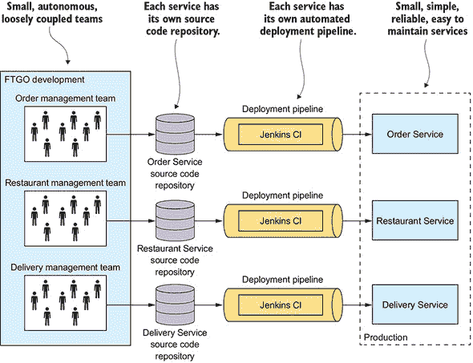

微服务架构将应用程序结构化为一组围绕业务能力组织松散耦合的服务。每个团队独立开发、测试和部署他们的服务。
